# خواننده تلگرام

<!-- TOP_NAV START -->

<a href="https://github.com/keihancpu/aio-downloader/blob/main/telegram/content/archive_1.md" style="display:inline-block; padding:6px 12px; margin:0 4px; background-color:#2ea44f; color:white; text-decoration:none; border-radius:4px; font-weight:bold;">صفحه بعد</a>

<!-- TOP_NAV END -->

<!-- MSG START -->

---
📅 بروزرسانی: 1405/02/29 22:35
---

## VahidOOnLine — post 241033

  <a href="telegram/content/VahidOOnLine_241033_1779217548.mp4" target="_blank">🎬 Download video</a>

بریتیش ایرویز از تعویق دوباره پروازهای خود به خاورمیانه خبر داد و اعلام کرد ازسرگیری پروازها به دبی، دوحه و تل‌آویو تا اول اوت به تعویق افتاده است.

رویترز گزارش داد جنگ آمریکا و اسرائیل با جمهوری اسلامی باعث شده ده‌ها شرکت هواپیمایی از زمان آغاز درگیری‌ها در اواخر فوریه، پروازهای خود به منطقه را لغو کنند.

بریتیش ایرویز در بیانیه‌ای اعلام کرد: «به دلیل ادامه وضعیت در خاورمیانه، تغییرات بیشتری در برنامه پروازی خود ایجاد کرده‌ایم تا شفافیت بیشتری برای مشتریان فراهم شود.»

این شرکت پیش‌تر نیز اعلام کرده بود پس از ازسرگیری پروازها، تعداد پروازهای خود به خاورمیانه را کاهش خواهد داد و مقصد جده را به‌طور کامل از برنامه‌هایش حذف می‌کند.

بر اساس برنامه جدید، پروازهای بریتیش ایرویز به دبی، دوحه، ریاض و تل‌آویو به یک پرواز در روز کاهش پیدا خواهد کرد.
‌🏁 🇬🇧 ManotoTV

🤖 @VahidOOnLine

## VahidOOnLine — post 241032

  

♦️ ژنرال الکسوس گرینکویچ، فرمانده ارشد ناتو در اروپا، روز سه‌شنبه ۲۹ اردیبهشت اعلام کرد که به طور جدی در حال بررسی نحوه کمک این ائتلاف در تنگه هرمز است؛ هرچند تاکید کرد که تا زمان اتخاذ تصمیم سیاسی، برنامه‌ریزی رسمی آغاز نشده است.

این اظهارات در حالی مطرح می‌شود که دونالد ترامپ پیش از این از واکنش ضعیف متحدان اروپایی ناتو به جنگ با جمهوری اسلامی و بسته شدن این آبراه حیاتی انتقاد کرده بود. در پاسخ، کشورهای اروپایی به رهبری بریتانیا و فرانسه در تلاشند تا طرحی را برای کمک به باز نگه داشتن این تنگه پس از پایان احتمالی جنگ تدوین کنند.

با وجود فشارهای واشنگتن، ناتو تاکنون از ورود مستقیم به این درگیری خودداری کرده است. با این حال، ژنـرال گرینکویچ تاکید کرد که کشورهایی مانند بریتانیا، فرانسه، آلمان، ایتالیا و بلژیک ناوهای خود را به منطقه اعزام کرده‌اند و همگی بر سر تضمین آزادی کشتیرانی توافق دارند. دیپلمات‌های اروپایی ناتو احتمال ایفای یک نقش بزرگ را به دلیل اختلافات داخلی کم‌رنگ می‌دانند، اما معتقدند ناتو می‌تواند در عملیات‌های آتی به رهبری فرانسه یا بریتانیا مشارکت داشته باشد.
‌🇸🇦 Indypersian

🤖 @VahidOOnLine

## VahidOOnLine — post 241031

  <a href="telegram/content/VahidOOnLine_241031_1779217549.mp4" target="_blank">🎬 Download video</a>

جی‌دی ونس، معاون ترامپ در نشست خبری کاخ سفید در خصوص جمهوری‌اسلامی گفت دو مسیر پیش روی آمریکا وجود دارد. مسیر اول، مذاکره است و تأکید کرد: «رئیس‌جمهور از ما خواسته به‌طور جدی با ایران مذاکره کنیم.»
ونس افزود: «در موضوع اصلی یعنی عدم دستیابی ایران به سلاح هسته‌ای، پیشرفت زیادی داشته‌ایم و فکر می‌کنیم ایران هم به دنبال توافق است.»
او گزینه دوم را از سرگیری عملیات نظامی عنوان کرد و گفت: «گزینه بی این است که عملیات نظامی دوباره آغاز شود تا اهداف آمریکا دنبال شود.»
وی در پایان تأکید کرد این گزینه مطلوب رئیس‌جمهور نیست و گفت: «فکر نمی‌کنم ایران هم چنین چیزی بخواهد. برای رقص تانگو دو نفر لازم است.»
‌🏁 🇬🇧 ManotoTV

🤖 @VahidOOnLine

## VahidOOnLine — post 241030

  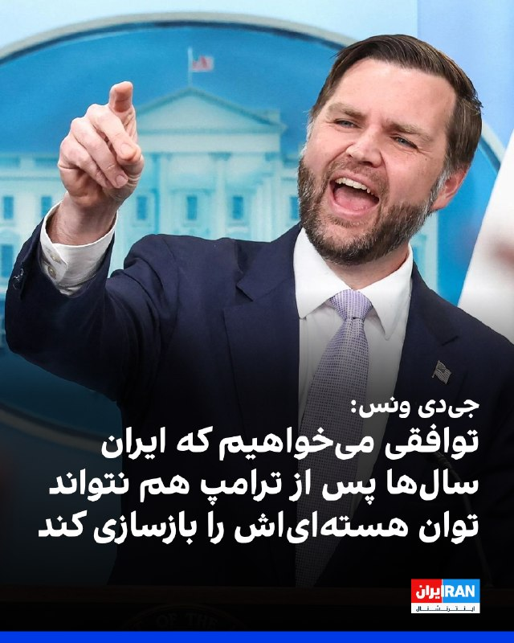

جی‌دی ونس، معاون رییس‌جمهور آمریکا، سه‌شنبه در نشست خبری خود در کاخ سفید همچنین گفت واشینگتن می‌خواهد جمهوری اسلامی فرایندی را بپذیرد که تضمین کند ایران حتی سال‌ها بعد از دوران ریاست‌جمهوری ترامپ هم نتواند توان هسته‌ای خود را بازسازی کند.

او گفت: «ما می‌خواهیم نه فقط تعهد به عدم دستیابی به سلاح هسته‌ای را ببینیم، بلکه می‌خواهیم تعهدی برای همکاری در یک فرایند ببینیم تا اطمینان حاصل شود که نه فقط اکنون، نه فقط وقتی دونالد ترامپ رئیس‌جمهور است، بلکه سال‌ها بعد هم ایرانی‌ها به دنبال بازسازی توان هسته‌ای خود نباشند.»

او افزود: «این چیزی است که ما در مذاکرات در تلاش برای رسیدن به آن هستیم.»
‌🏁 🇬🇧 IranintlTV

🤖 @VahidOOnLine

## VahidOOnLine — post 241029

  <a href="telegram/content/VahidOOnLine_241029_1779217550.mp4" target="_blank">🎬 Download video</a>

♦️جی‌دی ونس، معاون رئیس‌جمهوری آمریکا، روز سه‌شنبه ۲۹ اردیبهشت در گفتگو با خبرنگاران اعلام کرد: «فکر می‌کنم ما در حال حاضر فرصتی داریم تا رابطه‌ای را که طی ۴۷ سال گذشته بین ایران و ایالات متحده وجود داشته است، بازتنظیم کنیم.»

معاون رئیس‌جمهوری آمریکا که در نبود کارولین لویت، سخنگوی کاخ سفید، مسئولیت نشست خبری روزانه را بر عهده داشت، در ادامه افزود: «این همان چیزی است که رئیس‌جمهوری از ما خواسته و ما به تلاش در این مسیر ادامه خواهیم داد. اما برای این کار، همراهی هر دو طرف لازم است (یک دست صدا ندارد).»

ونس با تبیین خطوط قرمز واشنگتن تاکید کرد: «ما به توافقی که به ایرانی‌ها اجازه دسترسی به سلاح هسته‌ای را بدهد، تن نخواهیم داد. بنابراین، همان‌طور که رئیس‌جمهوری ترامپ به من گفت، ما در حالت آماده‌باش کامل نظامی هستیم. ما تمایلی به پیمودن این مسیر [از سرگیری جنگ] نداریم، اما اگر مجبور شویم، رئیس‌جمهوری آمادگی و توانایی پیشبرد آن را دارد.»
‌🇸🇦 Indypersian

🤖 @VahidOOnLine

## VahidOOnLine — post 241028

♦️جی‌دی ونس، معاون رئیس‌جمهوری آمریکا، روز سه‌شنبه ۲۹ اردیبهشت‌ماه گفت اعضای تیم مذاکره‌کننده جمهوری اسلامی برخی ویژگی‌های ایرانیان، از جمله «هوش و سختکوشی» را دارند، اما همزمان مواضع «بسیار تندروانه» نیز در میان آن‌ها دیده می‌شود.

ونس با توصیف ایران به‌عنوان «تمدنی بزرگ و پرافتخار» گفت مردم ایران «شگفت‌انگیز» هستند و جامعه ایرانی-آمریکایی در ایالات متحده نیز نمونه‌ای از این ویژگی‌ها را نشان می‌دهد.

او در عین حال افزود گاهی مشخص نیست تهران دقیقا چه هدفی را از مذاکرات دنبال می‌کند و ساختار تصمیم‌گیری در جمهوری اسلامی را «چندپاره» توصیف کرد.

معاون رئیس‌جمهوری آمریکا همچنین بار دیگر تاکید کرد واشنگتن اجازه نخواهد داد جمهوری اسلامی به سلاح هسته‌ای دست پیدا کند و هدف مذاکرات، جلوگیری بلندمدت از بازسازی توان هسته‌ای جمهوری اسلامی است.
‌🇸🇦 Indypersian

🤖 @VahidOOnLine

## VahidOOnLine — post 241027

  <a href="telegram/content/VahidOOnLine_241027_1779217550.mp4" target="_blank">🎬 Download video</a>

جی‌دی ونس در کنفرانس خبری خود در ارتباط با گزارش‌هایی که می‌گفتند احتمال دارد روسیه اورانیوم غنی‌شده ایران را دریافت کند؛ پاسخ داده «این در حال حاضر برنامه ما نیست. هیچ‌وقت هم برنامه ما نبوده است.»
او افزود نمی‌داند این گزارش‌ها از کجا منتشر شده‌اند و تأکید کرد که چنین موضوعی از سوی جمهوری اسلامی نیز مطرح نشده است.
ونس همچنین گفت: «برداشت من این است که این چیزی نیست که ایرانی‌ها خیلی از آن استقبال کنند و می‌دانم رئیس‌جمهور هم چندان از آن استقبال نمی‌کند.»
‌🏁 🇬🇧 ManotoTV

🤖 @VahidOOnLine

## VahidOOnLine — post 241026

  <a href="telegram/content/VahidOOnLine_241026_1779217551.mp4" target="_blank">🎬 Download video</a>

آتلانتیک گزارش داده فیفا قصد دارد در جریان جام جهانی ۲۰۲۶ باردیگر ورود پرچم شیروخورشید را به داخل ورزشگاه‌ها ممنوع کند. در جام جهانی ۲۰۲۲ قطر نیز برخی هواداران ایرانی این پرچم را به ورزشگاه‌ها بردند اما با محدودیت مواجه شدند و در برخی موارد اجازه ورود آن‌ها داده نشد. فیفا طبق قوانین خود هرگونه نماد سیاسی، تبعیض‌آمیز یا تحریک‌آمیز را در ورزشگاه‌ها ممنوع می‌داند. با این حال این موضوع همیشه محل بحث بوده، چون بسیاری از ایرانیان مهاجر استفاده از این پرچم را نه صرفا سیاسی، بلکه بخشی از هویت ملی خود می‌دانند.
در مقابل، پرچم فلسطین طبق قوانین فیفا مجاز است، چون به‌عنوان پرچم رسمی یک عضو فیفا شناخته می‌شود و تنها در صورت ایجاد خطر امنیتی ممکن است محدود شود. این تفاوت رویکرد باعث بحث و انتقاد در برخی محافل شده است.
قرار است مسابقات ایران در جام جهانی ۲۰۲۶ در شهرهایی مانند لس‌آنجلس و سیاتل برگزار شود؛ مناطقی که جمعیت زیادی از ایرانیان مهاجر در آن زندگی می‌کنند.در مقابل، پرچم فلسطین طبق قوانین فیفا مجاز است، چون به‌عنوان پرچم رسمی یک عضو فیفا شناخته می‌شود و تنها در صورت ایجاد خطر امنیتی ممکن است محدود شود. این تفاوت رویکرد باعث بحث و انتقاد در برخی محافل شده است.
قرار است مسابقات ایران در جام جهانی ۲۰۲۶ در شهرهایی مانند لس‌آنجلس و سیاتل برگزار شود؛ مناطقی که جمعیت زیادی از ایرانیان مهاجر در آن زندگی می‌کنند.
‌🏁 🇬🇧 ManotoTV

🤖 @VahidOOnLine

## VahidOOnLine — post 241025

  <a href="telegram/content/VahidOOnLine_241025_1779217552.mp4" target="_blank">🎬 Download video</a>

‌
وزارت دادگستری آمریکا الکس ساب، تاجر کلمبیایی-ونزوئلایی و متحد نزدیک نیکلاس مادورو، رئیس‌جمهوری پیشین ونزوئلا، را به پول‌شویی و فساد مالی متهم کرد.

دادستان‌های آمریکا اعلام کردند ساب، که به «صندوق‌دار مادورو» معروف است، از طریق برنامه کمک غذایی دولت ونزوئلا صدها میلیون دلار را با استفاده از شرکت‌های صوری، اسناد جعلی و حساب‌های بانکی آمریکایی جابه‌جا کرده است.

بر اساس اسناد دادگاه، ساب و همکارانش از سال ۲۰۱۵ با قراردادهای جعلی واردات مواد غذایی، صدها میلیون دلار را اختلاس کرده‌اند و از سال ۲۰۱۹ نیز با فروش نفت ونزوئلا تحت پوشش معاملات صوری، میلیاردها دلار پول جابه‌جا کرده‌اند.

الکس ساب که آخر هفته از ونزوئلا به آمریکا منتقل شد، روز دوشنبه برای نخستین بار در دادگاه فدرال میامی حاضر شد.

رویترز گزارش داد دولت دونالد ترامپ در حال آماده‌سازی پرونده قضایی علیه نیکلاس مادورو است و الکس ساب ممکن است اطلاعات مهمی برای تقویت این پرونده در اختیار مقام‌های آمریکایی قرار دهد.
‌🏁 🇬🇧 ManotoTV

🤖 @VahidOOnLine

## VahidOOnLine — post 241024

  <a href="telegram/content/VahidOOnLine_241024_1779217552.mp4" target="_blank">🎬 Download video</a>

ایرانیان بریتانیا با تشکیل تجمعی در مقابل پارلمان این کشور در لندن،‌ روز سه‌شنبه خواستار تروریستی اعلام شدن سپاه و مقابله با جمهوری اسلامی شدند. آن‌ها پرچم‌های شیروخورشید و اسرائیل را در تجمع خود حمل کردند.
‌🏁 🇬🇧 IranintlTV

🤖 @VahidOOnLine

## VahidOOnLine — post 241023

  

♦️ جی‌دی ونس، معاون رئیس‌جمهوری آمریکا، اعلام کرد که دولت ترامپ برای دستیابی به توافقی جهت پایان دادن به جنگ تلاش می‌کند، اما او همچنان شاهد وجود شکاف و گسست در میان سران ایران است و موضع مذاکراتی تهران شفاف نیست.

ونس در نشست خبری روز سه‌شنبه ۲۹ اردیبهشت، خبرنگاران در کاخ سفید گفت: «خودِ ایرانی‌ها هم دقیقا مطمئن نیستند که می‌خواهند در چه مسیری حرکت کنند؛ آن‌ها در حال حاضر کشوری چندپارچه و دارای شکاف هستند.»

او در ادامه افزود: «در ساختار حاکمیتی این کشور، رهبر وجود دارد و در رده‌های پایین‌تر از او نیز مقامات زیادی هستند که بر روند مذاکرات نفوذ دارند. به همین دلیل، گاهی اوقات اصلا مشخص نیست که موضع واقعی تیم مذاکره‌کننده چیست.»

معاون رئیس‌جمهوری آمریکا با اشاره به اینکه هنوز روشن نیست این تشتت آرا ناشی از ضعف در هماهنگی است یا سوءنیت، تاکید کرد که نتیجه این وضعیت، ایجاد فرآیندی مبهم و سردرگم‌کننده بوده است. ونس در پایان گفت: «با اطمینان می‌گویم که گاهی درک این نکته که ایرانی‌ها دقیقا می‌خواهند از این مذاکرات به چه هدفی دست یابند، بسیار دشوار است.»
‌🇸🇦 Indypersian

🤖 @VahidOOnLine

## VahidOOnLine — post 241022

  <a href="telegram/content/VahidOOnLine_241022_1779217555.mp4" target="_blank">🎬 Download video</a>

ولادیمیر پوتین، رئیس‌جمهوری روسیه، برای دیدار با شی جین‌پینگ وارد چین شد؛ سفری که کمتر از یک هفته پس از سفر دونالد ترامپ به پکن انجام می‌شود و توجه زیادی را به خود جلب کرده است.
کرملین اعلام کرده پوتین و شی در این سفر درباره همکاری‌های اقتصادی، مسائل منطقه‌ای و روابط بین‌المللی گفت‌وگو خواهند کرد. این سفر همزمان با بیست‌وپنجمین سالگرد پیمان دوستی چین و روسیه برگزار می‌شود.
چین که پس از جنگ اوکراین به مهم‌ترین شریک تجاری روسیه تبدیل شده، تلاش می‌کند هم روابط نزدیک خود با مسکو را حفظ کند و هم روابط باثباتی با آمریکا داشته باشد.
مقام‌های روسی گفته‌اند صادرات نفت روسیه به چین در سه‌ماهه نخست ۲۰۲۶ افزایش یافته و دو کشور در حوزه انرژی به توافق‌های مهمی نزدیک شده‌اند. پوتین نیز روابط مسکو و پکن را عاملی برای «ثبات و بازدارندگی» در جهان توصیف کرده است.
‌🏁 🇬🇧 ManotoTV

🤖 @VahidOOnLine

## VahidOOnLine — post 241021

  <a href="telegram/content/VahidOOnLine_241021_1779217555.mp4" target="_blank">🎬 Download video</a>

شهروندان در پیام‌هایی به ایران‌اینترنشنال نسبت به معلق بودن وضعیت جمهوری اسلامی، از ترامپ و سیاست دولتش انتقاد می‌کنند. یک شهروند خواسته که ترامپ مقابله با جمهوری اسلامی را به نتانیاهو بسپارد. پیام این شهروند با هوش مصنوعی خوانده شده است.
‌🏁 🇬🇧 IranintlTV

🤖 @VahidOOnLine

## VahidOOnLine — post 241020

نامزد آیدا عقیلی، جاویدنام انقلاب ملی، در ویدیویی مبر سر مزار او توضیح داد که پس از جان باختن همسرش به خیابان رفت و به اعتراض به ماموران سرکوب پرداخت که یکی از آن‌ها گفت حقوق ماموران ۲۰ میلیون تومان است. نامزد این جاویدنام به وضعیت معیشتی بد شهروندان و اعتراض آن‌ها نیز اشاره کرد.
‌🏁 🇬🇧 IranintlTV

🤖 @VahidOOnLine

## VahidOOnLine — post 241019

  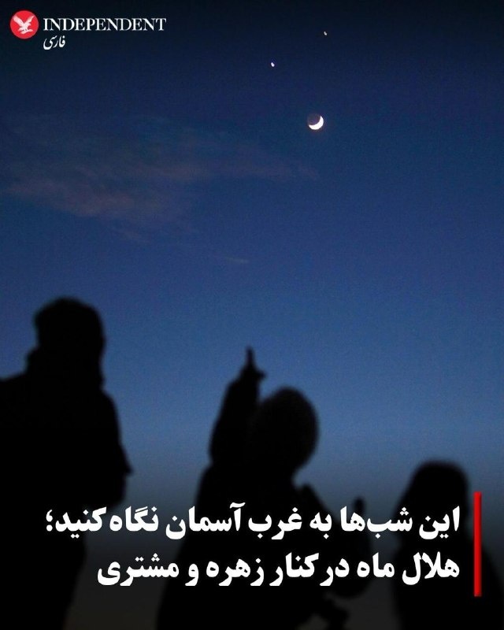

♦️ اگر این شب‌ها پس از غروب خورشید به آسمان نگاه کنید، ممکن است در کنار هلال باریک ماه دو «ستاره» بسیار درخشان ببینید؛ اما این نقاط نورانی درواقع سیاره‌های زهره و مشتری هستند که در ماه مه ۲۰۲۶ از بهترین اجرام قابل‌مشاهده در آسمان شب به شمار می‌روند.
این دو سیاره در روزهای پایانی اردیبهشت و آغاز خرداد هر شب به‌ظاهر به یکدیگر نزدیک‌تر می‌شوند و سرانجام به مقارنه یا هم‌نشینی (Conjunction) می‌رسند؛ پدیده‌ای نجومی که در آن دو جرم آسمانی از دید ناظر زمینی بسیار نزدیک به هم دیده می‌شوند.
از ۲۸ تا ۳۰ اردیبهشت، هلال باریک ماه نیز به این منظره اضافه می‌شود و ترکیب سه‌گانه‌ای از ماه، زهره و مشتری را در آسمان پس از غروب ایجاد می‌کند؛ نمایی که بدون نیاز به تلسکوپ و تنها با چشم غیرمسلح قابل‌مشاهده است.
این پدیده تقریبا از بخش بزرگی از کره زمین قابل‌مشاهده است؛ ازجمله در بیشتر کشورهای اروپا، خاورمیانه، ایران، ترکیه، شمال آفریقا، آمریکای شمالی و بخش‌هایی از آسیا. شرط اصلی برای تماشای آن، آسمان صاف، افق باز در سمت غرب و تاریک شدن کافی هوا پس از غروب خورشید است.
اخترشناسان می‌گویند این نوع هم‌نشینی‌های سیاره‌ای، علاوه بر زیبایی بصری، یکی از بهترین فرصت‌ها برای علاقه‌مندان تازه‌کار نجوم است تا بتوانند سیاره‌های منظومه شمسی را به‌راحتی در آسمان پیدا کنند.
‌🇸🇦 Indypersian

🤖 @VahidOOnLine

## VahidOOnLine — post 241018

♦️حسین مهدی‌زاد، رئیس کارگروه دام و طیور اتاق بازرگانی ایران، در گفتگو با اقتصاد۱۲۰ اعلام کرد گرانی مرغ و تخم‌مرغ «هیچ ربطی به جنگ و محاصره ندارد» و دلیل اصلی آن حذف ارز ترجیحی در دی‌ماه ۱۴۰۴ است.

او همچنین گفت «سیاست‌های غلط و حمایت نکردن وزارت جهاد کشاورزی تمام تولیدکنندگان طیور را از بین برد.»

این اظهارات در حالی مطرح می‌شود که خبرگزاری فارس، وابسته به سپاه پاسداران، پیش‌تر مدعی شده بود جنگ اخیر و محاصره دریایی جمهوری اسلامی از سوی ارتش آمریکا باعث «گرانی ثانیه‌ای» قیمت‌ها در ایران شده است.
‌🇸🇦 Indypersian

🤖 @VahidOOnLine

## VahidOOnLine — post 241017

  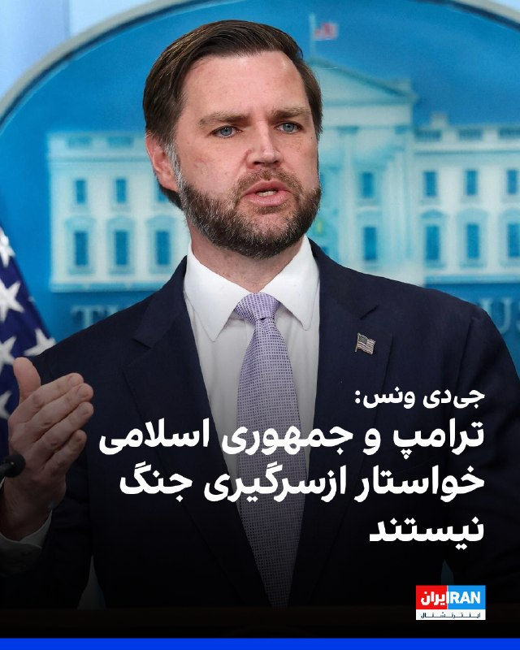

جی‌دی ونس، معاون رییس‌جمهور آمریکا، گفت واشینگتن و تهران پیشرفت زیادی در گفت‌وگوهای خود داشته‌اند و هیچ‌یک از دو طرف خواهان ازسرگیری کارزار نظامی نیستند.
ونس افزود: «ما فکر می‌کنیم پیشرفت زیادی داشته‌ایم. تصور می‌کنیم مقام‌های تهران نیز می‌خواهند به توافق برسند.»
او گفت آمریکا می‌تواند کارزار نظامی را از سر بگیرد، اما «این چیزی نیست که ترامپ یا ایران می‌خواهند.»
ونس همچنین گفت: «فکر می‌کنم جمهوری اسلامی می‌خواهد توافق کند، اما تا زمانی که توافق امضا نشود، نخواهیم دانست.»
‌🏁 🇬🇧 IranintlTV

🤖 @VahidOOnLine

## VahidOOnLine — post 241016

  

♦️ مارکو روبیو، وزیر امور خارجه ایالات متحده و آنتونیو گوترش، دبیرکل سازمان ملل متحد، روز سه‌شنبه ۲۹ اردیبهشت، درباره تلاش‌های واشنگتن برای ممانعت از مین‌گذاری و وضع تعرفه و عوارض عبور از سوی جمهوری اسلامی در تنگه هرمز گفتگو کردند؛ این رایزنی‌ها شامل بررسی پیش‌نویس قطعنامه شورای امنیت سازمان ملل در این زمینه بوده است.

تامی پیگات، سخنگوی وزارت امور خارجه آمریکا در بیانیه‌ای اعلام کرد: «وزیر خارجه در این دیدار بر حمایت قاطع و گسترده طیف وسیعی از اعضای سازمان ملل متحد از این تلاش‌ها تأکید کرد.»

به گفته او، روبیو در این گفتگو همچنین از شایستگی‌های لوک لیندبرگ، معاون وزیر کشاورزی آمریکا، برای تصدی ریاست برنامه جهانی غذای سازمان ملل (WFP) حمایت کرد.
‌🇸🇦 Indypersian

🤖 @VahidOOnLine

## VahidOOnLine — post 241015

نامزد آیدا عقیلی، جاویدنام انقلاب ملی، در ویدیویی بر سر مزار او توضیح داد که دغدغه و بحث این جوان معترض در خانه موضوع نان مردم و ظلم به آن‌ها بود؛ تا اینکه شاهزاده رضا پهلوی فراخوان داد و آیدا به خیابان رفت. او گفت که خود حکومت اماکنی را آتش می‌زد و به گردن مردم معترض می‌انداخت.
‌🏁 🇬🇧 IranintlTV

🤖 @VahidOOnLine

## VahidOOnLine — post 241014

  

کانال ۱۲ اسرائیل گزارش داد، پس از اظهارات دونالد ترامپ درباره توقف حمله نظامی برنامه‌ریزی‌شده علیه جمهوری اسلامی که قرار بود سه‌شنبه انجام شود، سطح تنش‌ها افزایش یافته است. هم‌زمان، ارتش اسرائیل سطح آماده‌باش خود را به بالاترین حد رسانده؛ اقدامی در پی احتمال اقدام نظامی آمریکا در آینده نزدیک.

بر اساس این گزارش، مقام‌های اسرائیلی از اعلام ناگهانی ترامپ غافلگیر شده و تنها دقایقی پیش از انتشار رسمی، در جریان تصمیم او قرار گرفته‌اند. با وجود آن‌که هنوز تصمیم نهایی اتخاذ نشده، نیروی هوایی اسرائیل خود را برای احتمال صدور دستور حمله از سوی ترامپ در روزهای آینده آماده می‌کند.
‌🏁 🇬🇧 IranintlTV

🤖 @VahidOOnLine

## WithYashar — post 11692

آی 24 نیوز: مقامات اسرائیلی به این باورن که ترامپ با وجود سیگنال‌های متناقض و حرفای عمومی 24 ساعت اخیر، باز هم به حمله به ایران ادامه میده.
@withyashar

## WithYashar — post 11691

فرماندهی مرکزی ایالات متحده: 88 کشتی را در جریان محاصره دریایی ایران مجبور به تغییر مسیر کردیم. @withyashar

## WithYashar — post 11690

معاون ترامپ ، جی دی ونس :

من 41 سال سن دارم و تو این سال ها همش دیدم رسانه های اروپایی مثل جیرجیرک دارن ایراد میگیرن از امریکا
اگه میخوایید از ترامپ ایراد بگیرید اول یک نگاه به خودتون و اینده داغون و خرابتون بندازید بعد راجب ما نظر بدید
@withyashar

## WithYashar — post 11689

ادعای جی‌دی ونس درباره ایران:
تحویل ذخایر اورانیوم غنی‌شده ایران به روسیه، در حال حاضر برنامه ما نیست. هیچ‌وقت برنامه ما نبوده است.

نمی‌دانم این گزارش‌ها از کجا می‌آید.
@withyashar

## WithYashar — post 11688

جی‌دی ونس: اگر ایران به سلاح هسته‌ای دست پیدا کند، کشورهای بیشتری به‌دنبال دستیابی به سلاح هسته‌ای خواهند رفت و ایران می‌تواند آغازگر یک مسابقه تسلیحات هسته‌ای جدید باشد

آمریکا به‌دنبال بازتنظیم روابط 47 سال اخیر با ایران است
واشنگتن همچنان برای رسیدن به توافق تلاش می‌کند، اما توافقی که به ایران اجازه دستیابی به سلاح هسته‌ای بدهد وجود نخواهد داشت
@withyashar

## WithYashar — post 11687

جی دی ونس در مورد ایران:
ایران یک کشور بسیار پیچیده است. این کشوری است که من وانمود نمی کنم که می فهمم...

این یک تمدن بزرگ و افتخارآمیز است.‌‌
@withyashar

## WithYashar — post 11686

  <a href="telegram/content/WithYashar_11686_1779217559.mp4" target="_blank">🎬 Download video</a>

جی‌دی ونس درباره ایران:

«فکر می‌کنم ما در اینجا یک فرصت داریم تا رابطه‌ای که به مدت ۴۷ سال بین ایران و ایالات متحده وجود داشته است، از نو تعریف کنیم.
این همان چیزی است که رئیس‌جمهور از ما خواسته است، و ما به کار روی آن ادامه خواهیم داد، اما برای یک رابطه دو طرفه، دو طرف لازم هستند (رقص تانگو دو نفر می‌خواهد). ما هیچ توافقی را که به ایرانی‌ها اجازه دهد سلاح هسته‌ای داشته باشند، نخواهیم پذیرفت.
بنابراین، همانطور که رئیس‌جمهور همین الان به من گفت، ما در حالت آماده‌باش هستیم. ما نمی‌خواهیم وارد آن مسیر شویم، اما رئیس‌جمهور اراده و توانایی آن را دارد که در صورت لزوم وارد آن مسیر شود.»
@withyashar

## WithYashar — post 11685

poshte-pardehaye-enghelab (@withyashar).pdf

## WithYashar — post 11684

درود
این کتاب ممنوعه عجب داستان واقعی و باحالی بود ، البته من فعلا تا پیج ۱۰۸ خوندم
اتفاقات پشت پرده جالبی بود ، برم بقیه ش را هم بخونم 😊

## WithYashar — post 11683

  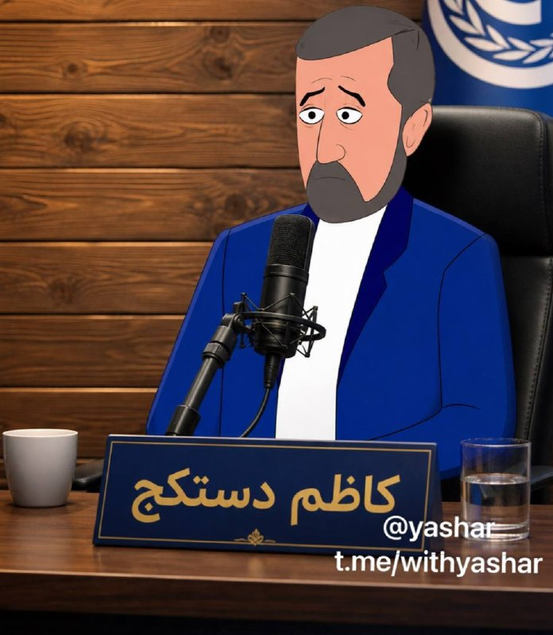

کاظم(دست کج) غریب‌آبادی، معاون وزیر خارجه:

جمهوری اسلامی «یکپارچه و قاطعانه» آماده مقابله با هرگونه تجاوز نظامی است و برای ما تسلیم شدن معنایی ندارد؛ یا پیروز می‌شویم یا کشته می‌شویم.
@withyashar

## WithYashar — post 11682

## WithYashar — post 11681

یک منبع آمریکایی به الجزیره: بحث امنیتی که برای امروز در کاخ سفید درباره ایران برنامه‌ریزی شده بود، پس از اعلام ترامپ مبنی بر تعویق حمله برنامه‌ریزی شده، به تعویق افتاد @withyashar

## WithYashar — post 11680

خوش چشم (مرشد) : تا اخر هفته میزنن

@withyashar 😂

## mwarmonitor — post 9322

🔴«به گزارش وال‌استریت ژورنال: به گفته سه مقام آمریکایی، ایالات متحده طی شب گذشته یک نفتکش مرتبط با ایران را در اقیانوس هند توقیف کرده است؛ این در حالی است که رئیس‌جمهور ترامپ تهدید می‌کند حملات نظامی علیه ایران را از سر بگیرد.

🔸این اقدام دست‌کم سومین باری است که آمریکا در چارچوب سرکوب ناوگان موسوم به «ناوگان سایه» مرتبط با ایران، یک نفتکش را توقیف می‌کند.»

@mwarmonitor

## mwarmonitor — post 9321

🔹خبرنگار: آیا در نهایت به توافقی خواهیم رسید؟ چون ما مدام این روند را می‌بینیم که بارها و بارها تکرار می‌شود و آن‌ها مدام در حال رفت‌وبرگشت هستند.
🔸جی. دی. ونس: خب، آیا من شخصاً به این موضوع باور دارم؟ پاسخ صادقانه این است که چطور ممکن است بدانم، درست است؟ شما با مردم مذاکره می‌کنید و گاهی اوقات احساس می‌کنید که در حال پیشرفت هستید و گاهی اوقات احساس می‌کنید که پیشرفتی ندارید.
چیزی که من فکر می‌کنم—چیزی که من فکر می‌کنم این است که ایرانی‌ها می‌خواهند توافق کنند. چیزی که من فکر می‌کنم این است که ایرانی‌ها تشخیص می‌دهند که سلاح هسته‌ای خط قرمز ایالات متحده آمریکاست؛ آن‌ها این موضوع را درک کرده‌اند. اما ما تا زمانی که واقعاً قلم روی کاغذ نگذاریم و توافقی را امضا نکنیم، این را نخواهیم دانست.
ما پیش‌نویس‌های زیادی داشته‌ایم، کاغذبازی‌های زیادی برای رفت‌وبرگشت انجام شده است. اما من با اطمینان نخواهم گفت که به توافقی می‌رسیم تا زمانی که واقعاً یک مصالحه مذاکره‌شده را در اینجا امضا کنیم. و فکر می‌کنم این در نهایت به ایرانی‌ها بستگی دارد که آیا مایلند با ما همسو شوند یا خیر، چون فکر می‌کنم ما مطمئناً کارمان را به خوبی انجام می‌دهیم و قطعاً با حسن نیت مذاکره می‌کنیم.
باید ببینیم در نهایت چه اتفاقی با آن‌ها می‌افتد. من نمی‌توانم با اطمینان بگویم، چون نمی‌دانم در ذهن طرف مقابل—در ذهن ایرانی‌ها چه می‌گذرد.

@mwarmonitor

## mwarmonitor — post 9320

  <a href="telegram/content/mwarmonitor_9320_1779217561.mp4" target="_blank">🎬 Download video</a>

🎬 Video

## mwarmonitor — post 9319

🇺🇸«مارکو روبیو، وزیر امور خارجه ایالات متحده، روز جمعه برای شرکت در نشست وزیران خارجه ناتو به سوئد سفر خواهد کرد و در شهر هلسینگبورگ حضور می‌یابد؛ سپس از ۲۳ تا ۲۶ مه راهی هند می‌شود.»

@mwarmonitor

## mwarmonitor — post 9318

🇺🇸 جی. دی. ونس: «ایران دو گزینه پیشِ‌رو دارد: یا توافق، یا ازسرگیری جنگ.

🔸ما معتقدیم ایرانی‌ها می‌خواهند به توافق برسند، اما تأکید می‌کنیم که همیشه یک برنامه جایگزین داریم.

🔹هیچ‌کس خواهان بازگشت جنگ نیست و فرصت در اختیار ایران قرار دارد.

🔸ایران کشوری بسیار پیچیده است و از سوی تیم مذاکره‌کننده آن مواضع سخت‌گیرانه‌ای می‌بینیم.

🔹ما خطوط قرمز خود را برای ایرانی‌ها روشن کرده‌ایم.»

@mwarmonitor

## mwarmonitor — post 9317

🔴«مقام‌های آمریکایی می‌گویند ترامپ هرگز واقعاً تصمیم به حمله به ایران نگرفته بود، با وجود آنکه ادعا می‌کرد “یک ساعت با صدور دستور فاصله داشته است”. به گفته منابع، او از تهدید حمله به‌عنوان ابزاری برای فشار بر ایران در مذاکرات استفاده می‌کند.» آکسیوس

@mwarmonitor

## mwarmonitor — post 9316

🔴 «شبکه کان اسرائیل اعلام کرد: آمادگی‌های آمریکا و اسرائیل برای ازسرگیری جنگ علیه ایران تکمیل شده است.»

@mwarmonitor

## FoxNewsTwitter — post 341956

Fox News (Twitter/X)

WATCH LIVE: Senate Judiciary Subcommittee on the Constitution hearing on racial gerrymandering https://twitter.com/i/broadcasts/1qKDzPkkaWVJV

## FoxNewsTwitter — post 341955

  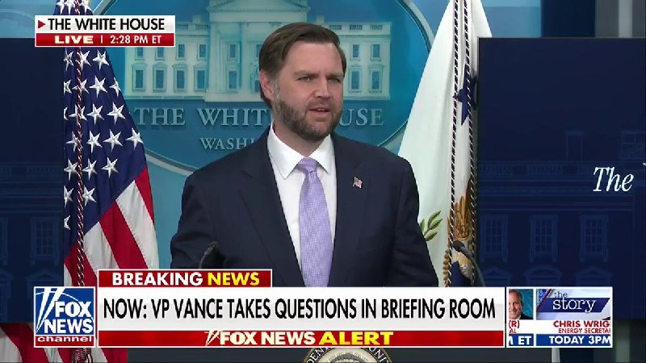

Fox News (Twitter/X)

NEW: VP Vance slams Democrats for their 'No Kings' hypocrisy:

"One of the great ironies of this job is that for the past couple of years, you see these protests break out all over the country... Everybody holds these signs saying 'No Kings,' right?"

"And how many Democratic lawmakers have I seen holding up signs that say 'No Kings?'"

"And then King Charles comes to the, the Congressional chamber and these guys break out in rapturous applause. So maybe they don't care so much about kings as they pretend that they do."

## FoxNewsTwitter — post 341954

  

Fox News (Twitter/X)

"Come on, man! Have a little bit of objectivity in the way that you ask these questions."

VP Vance slams a reporter over a long-winded question accusing President Trump of insider trading and talking up stocks he owns to turn a profit:

"There are different ways to ask a question. You can just ask a question and try to get your answer. Or you could do like a speech where you say, you know, 'Mr. Vice President, every you know, you're a you're a terrible human being and so is the president. So is the entire cabinet.'"

"Number one, the president doesn't sit at the Oval Office on his computer, on his, like, Robinhood account buying and selling stocks. That's absurd."

"I think the way to lead by example is banning that process, banning that approach and making it illegal, which is exactly what the president has proposed doing."

## FoxNewsTwitter — post 341953

  <a href="telegram/content/FoxNewsTwitter_341953_1779217564.mp4" target="_blank">🎬 Download video</a>

Fox News (Twitter/X)

NEW: Vice President Vance condemns religious violence, calling it "one of the most anti-Christian things and anti-American things that you could do."

"A fundamental principle of all the great faiths is we are all children of God. And because of that, we are endowed by certain rights that are unique to our status as human beings."

"You violate those rights, most importantly, when you commit violence against another person, you can violate them in other ways as well, but the most profound way to violate the fundamental right of human dignity is to commit violence."

## FoxNewsTwitter — post 341952

  <a href="telegram/content/FoxNewsTwitter_341952_1779217566.mp4" target="_blank">🎬 Download video</a>

Fox News (Twitter/X)

BREAKING: VP Vance asks for Americans to pray for the victims of the deadly mosque shooting in San Diego and condemns political violence in the United States:

"I don't know a single person who would say anything other than what I'm about to say, which is that that type of violence in the United States of America is reprehensible."

"I encourage every single American to pray for everybody who was involved and affected by it. We don't want that to happen in our country, and may God rest the souls of the people who lost their lives."

## FoxNewsTwitter — post 341951

  <a href="telegram/content/FoxNewsTwitter_341951_1779217567.mp4" target="_blank">🎬 Download video</a>

Fox News (Twitter/X)

JUST IN: Vice President Vance speaks on the tragic loss of his personal friend Charlie Kirk, calling his assassination an "unacceptable" tragedy that should outrage every American.

"Charlie was a very, very dear friend. But more importantly than that, Charlie was a father of two beautiful kids, and he did not deserve to have all of those moments with his kids, all of those moments with his beautiful wife taken from them in the way that that happened."

"I would expect everybody, everybody with a heart or a conscience would say whatever we agreed or disagreed with about his particular viewpoints. This is a tragedy, and it's totally unacceptable that it happens in the United States of America."

## FoxNewsTwitter — post 341950

  <a href="telegram/content/FoxNewsTwitter_341950_1779217568.mp4" target="_blank">🎬 Download video</a>

Fox News (Twitter/X)

NEW: VP Vance says "it certainly seems like something fishy is there" when asked about the DOJ's immigration fraud investigation into Squad member Ilhan Omar.

"I mean, you read the things about Ilhan Omar and about, you know, who she married and whether she didn't marry this person or that person..."

"We're going to take a look at it. If we think that there's a crime, we're going to prosecute that crime."

## FoxNewsTwitter — post 341949

  

Fox News (Twitter/X)

NEW: VP Vance reveals that dealing with Iran is highly unstable and that the administration faces a fractured regime where it's "hard to figure out exactly what it is that the Iranians want."

"It's not sometimes totally clear what the negotiating position of the team is. And I don't know if that's sometimes bad communication. If that's bad faith, I don't- I wouldn't pretend to venture a guess there.”

“But I will say with confidence, it's sometimes hard to figure out exactly what it is that the Iranians want to accomplish out of the negotiation. So what we've done is try to be as clear as possible.”

@aishahhasnie

## FoxNewsTwitter — post 341948

  <a href="telegram/content/FoxNewsTwitter_341948_1779217570.mp4" target="_blank">🎬 Download video</a>

Fox News (Twitter/X)

NEW: VP JD Vance pushes back on media criticism surrounding the new fund created for Americans who say they were unfairly targeted by federal agencies:

REPORTER: "I understand that everybody is eligible to apply for this, but I mean, you're eligible, but I assume you're not going to apply... Isn't it just as easy to say that people that attacked police officers should not get taxpayer money from this fund?"

VP VANCE: "We're not trying to give money to anybody who attacked a police officer... We're trying to compensate people where the book was thrown at them, they were mistreated by the legal system."

"I'd encourage everybody Democrat, Republican, independent, let's turn the page on this thing that we did under the last administration where we tried to throw people in prison because they had the wrong politics."

## FoxNewsTwitter — post 341947

  <a href="telegram/content/FoxNewsTwitter_341947_1779217572.mp4" target="_blank">🎬 Download video</a>

Fox News (Twitter/X)

Vice President Leavitt?

JD Vance jokes about the deal he made with Karoline Leavitt for filling in behind the podium in the the White House briefing room:

"I told Karoline I would stand in for her today for the White House press briefing on the condition that when Usha has our baby in July, that she would be vice president for a couple of weeks."

## FoxNewsTwitter — post 341946

  <a href="telegram/content/FoxNewsTwitter_341946_1779217573.mp4" target="_blank">🎬 Download video</a>

Fox News (Twitter/X)

JUST IN: VP Vance calls out fraudsters who are stealing money from innocent people relying on America's spirit of generosity:

"I think it's a great thing about our country is that we have this generosity of spirit where we take care of one another, but fraud takes that away from us because it steals money from the taxpayer when they pay their taxes.”

“And it also steals money from innocent people who are meant to benefit from these programs, but can't when the money runs dry."

## FoxNewsTwitter — post 341945

  

Fox News (Twitter/X)

NEW: VP Vance warns that allowing Iran to have a nuclear weapon opens the door for more anti-American regimes to put the world in danger for future generations:

"As the father of three young kids, I don't want them to inherit a world where 20 additional regimes, half of them very dangerous and very sympathetic to terrorists, have nuclear weapons."

"We want to keep the number of countries that have nuclear weapons small, and that's why Iran cannot have a nuclear weapon on top of all the other things that we might be worried about."

## FoxNewsTwitter — post 341944

  

Fox News (Twitter/X)

WATCH LIVE: Vice President Vance holds White House press briefing https://twitter.com/i/broadcasts/1YGNrZMnVzoGw

## FoxNewsTwitter — post 341943

  <a href="telegram/content/FoxNewsTwitter_341943_1779217576.mp4" target="_blank">🎬 Download video</a>

Fox News (Twitter/X)

"Some states like California... they see this as free money, don't they?"

Sen. John Kennedy calls out reports that California’s Medicaid program reimburses providers for tribal prayers and exorcisms:

SEN. KENNEDY: "California will actually pay a health care provider, I didn't know this was a medical expertise, to pay for exorcisms. Is that right?"

ACTING AG TODD BLANCHE: "I'll accept that, Senator."

## pm_afshaa — post 91063

  <a href="telegram/content/pm_afshaa_91063_1779217577.webm" target="_blank">🎬 Download video</a>

🔴آی 24 نیوز: مقامات اسرائیلی به این باورن که ترامپ با وجود سیگنال‌های متناقض و حرفای عمومی 24 ساعت اخیر، باز هم به حمله به ایران ادامه میده.

💧 Rainbet.com the #1 Non-KYC Crypto Casino & Sportsbook @rainbetcom

😁 @Pm_Afshaa

## pm_afshaa — post 91062

  <a href="telegram/content/pm_afshaa_91062_1779217578.webm" target="_blank">🎬 Download video</a>

🔴بلومبرگ: ناتو در حال مذاکره درباره ماموریت احتمالی برای کمک به حفاظت از کشتی‌های عبوری از تنگه هرمز در صورتی که این آبراه تا ماه ژوئیه مسدود بمونه.

💧 Rainbet.com the #1 Non-KYC Crypto Casino & Sportsbook @rainbetcom

😁 @Pm_Afshaa

## pm_afshaa — post 91061

  <a href="telegram/content/pm_afshaa_91061_1779217578.webm" target="_blank">🎬 Download video</a>

🔴وال استریت ژورنال:
نیرو دریایی آمریکا یه نفتکش مربوط به ایران رو توی اقیانوس هند توقیف کردن.

اسم نفتکش هم اسکای‌ویو هست که قبلاً آمریکا بخاطر اینکه نفت ایران حمل میکرد تحریمش کرده بود.

💧 Rainbet.com the #1 Non-KYC Crypto Casino & Sportsbook @rainbetcom

😁 @Pm_Afshaa

## pm_afshaa — post 91060

  <a href="telegram/content/pm_afshaa_91060_1779217579.webm" target="_blank">🎬 Download video</a>

🔴کانال 12 اسرائیل: پس از اظهارات ترامپ درباره توقف حمله برنامه‌ریزی‌شده علیه جمهوری اسلامی، سطح تنش‌ها افزایش یافته و ارتش اسرائیل آماده‌باش کامل اعلام کرده.

طبق این گزارش، مقام‌های اسرائیلی تنها دقایقی پیش از اعلام عمومی ترامپ در جریان تصمیم اون قرار گرفتن و نیروی هوایی اسرائیل خودش برای احتمال حمله در روزهای آینده آماده میکنه.

💧 Rainbet.com the #1 Non-KYC Crypto Casino & Sportsbook @rainbetcom

😁 @Pm_Afshaa

## pm_afshaa — post 91059

  <a href="telegram/content/pm_afshaa_91059_1779217579.webm" target="_blank">🎬 Download video</a>

🔴اکسیوس: ترامپ پس از اعلام به‌تعویق انداختن حمله به ایران، با مشاوران امنیت ملی خود جلسه‌ای برگزار کرد.

💧 Rainbet.com the #1 Non-KYC Crypto Casino & Sportsbook @rainbetcom

😁 @Pm_Afshaa

## pm_afshaa — post 91058

  <a href="telegram/content/pm_afshaa_91058_1779217580.webm" target="_blank">🎬 Download video</a>

🔴ونس: تحویل اورانیوم ایران به روسیه هیچوقت جزو برنامه‌های ما نبوده و نمیدونم این گزارشات از کجا میان.

💧 Rainbet.com the #1 Non-KYC Crypto Casino & Sportsbook @rainbetcom

😁 @Pm_Afshaa

## pm_afshaa — post 91057

  <a href="telegram/content/pm_afshaa_91057_1779217580.webm" target="_blank">🎬 Download video</a>

🔴جی‌دی ونس، معاون ترامپ:
اگر ایران به سلاح هسته‌ای دست پیدا کنه، کشورهای بیشتری به‌دنبال دستیابی به سلاح هسته‌ای خواهند رفت و ایران میتونه آغازگر یک مسابقه تسلیحات هسته‌ای جدید باشه.

💧 Rainbet.com the #1 Non-KYC Crypto Casino & Sportsbook @rainbetcom

😁 @Pm_Afshaa

## pm_afshaa — post 91056

  <a href="telegram/content/pm_afshaa_91056_1779217581.webm" target="_blank">🎬 Download video</a>

🔴جی‌دی ونس: من فکر میکنم ایرانی‌ها میخوان توافق کنن، اما با اطمینان نمیگم که ما به توافق میرسیم تا زمانی که واقعاً یک توافق از طریق مذاکره امضا کنیم.

من فکر میکنم که در نهایت به ایرانی‌ها بستگی داره که آیا مایل به دیدار با ما هستن، زیرا فکر میکنم ما مطمئناً کار خوبی انجام میدیم و مطمئناً با حسن نیت در حال مذاکره هستیم.

💧 Rainbet.com the #1 Non-KYC Crypto Casino & Sportsbook @rainbetcom

😁 @Pm_Afshaa

## pm_afshaa — post 91055

  <a href="telegram/content/pm_afshaa_91055_1779217581.webm" target="_blank">🎬 Download video</a>

🔴جی دی ونس: گاهی اوقات کاملاً مشخص نیست که موضع تیم ایران در مذاکره چیست؛ سخته که بفهمیم ایرانی‌ها دقیقاً میخوان از مذاکرات به چی چیزی برسن.

💧 Rainbet.com the #1 Non-KYC Crypto Casino & Sportsbook @rainbetcom

😁 @Pm_Afshaa

## pm_afshaa — post 91054

  <a href="telegram/content/pm_afshaa_91054_1779217582.webm" target="_blank">🎬 Download video</a>

🔴جی‌دی ونس، معاون ترامپ:
ما در اینجا فرصتی داریم، فکر میکنم، روابطی رو که 47 ساله بین ایران و ایالات متحده وجود داره، از نو تنظیم کنیم.

این چیزیه که رئیس جمهور از ما خواسته، و این چیزیه که ما به کار در آن ادامه خواهیم داد، اما برای تانگو دو نفر نیاز دارن. ما قرار نیست توافقی داشته باشیم که به ایرانی‌ها اجازه بده سلاح هسته‌ای داشته باشن.
بنابراین، همانطور که رئیس جمهور به من گفت، ما قفل شده‌ایم و بارگیری می‌کنیم. ما نمیخوایم آن مسیر رو طی کنیم، اما رئیس‌جمهور مایله و در صورت لزوم میتونه آن مسیر رو طی کنه.

💧Rainbet.com the #1 Non-KYC Crypto Casino & Sportsbook @rainbetcom

😁 @Pm_Afshaa

## pm_afshaa — post 91053

  <a href="telegram/content/pm_afshaa_91053_1779217582.webm" target="_blank">🎬 Download video</a>

🔴جی‌دی ونس، معاون ترامپ:
ایران دو گزینه داره: توافق یا از سرگیری جنگ.

ما معتقدیم که ایرانی‌ها میخوان توافقی رو منعقد کنن، اما تاکید می‌کنیم که همیشه یک برنامه جایگزین داریم.

هیچکس خواهان بازگشت جنگ نیست و این فرصت در اختیار ایران است.

💧 Rainbet.com the #1 Non-KYC Crypto Casino & Sportsbook @rainbetcom

😁 @Pm_Afshaa

## pm_afshaa — post 91052

  <a href="telegram/content/pm_afshaa_91052_1779217583.webm" target="_blank">🎬 Download video</a>

🔴جی‌دی ونس، معاون ترامپ:
ایران کشور بسیار پیچیده‌ای است. این کشوریه که من وانمود نمیکنم که آن را درک میکنم. این یک تمدن بزرگ و افتخارآفرین است.

💧 Rainbet.com the #1 Non-KYC Crypto Casino & Sportsbook @rainbetcom

😁 @Pm_Afshaa

## pm_afshaa — post 91051

  <a href="telegram/content/pm_afshaa_91051_1779217583.webm" target="_blank">🎬 Download video</a>

🔴کان نیوز: مقامات اسرائیلی میگن سطح هشدار امنیتی الان بالاترین حدش از زمان آتش‌بس ماه پیشه، چون نگرانن ایران بخاطر حرف‌های جنگی اخیر و حرفای ترامپ حمله پیشگیرانه انجام بده.

مقامات اسرائیلی فکر میکردن حملات به ایران میتونه توی چند ساعت شروع بشه، ولی وقتی گفتن تاخیر افتاده، غافلگیر شدن.

با این حال، اسرائیل هنوز برای احتمال حمله آمریکا به ایران آماده‌ست و بحث‌ها هم توی نهادهای امنیتی اسرائیل و هم توی کاخ سفید ادامه داره.

💧 Rainbet.com the #1 Non-KYC Crypto Casino & Sportsbook @rainbetcom

😁 @Pm_Afshaa

## pm_afshaa — post 91050

  <a href="telegram/content/pm_afshaa_91050_1779217584.mp4" target="_blank">🎬 Download video</a>

🔴مرتس، صدراعظم آلمان:
اقتصاد آلمان به صادرات و باز بودن مسیرهای تجاری وابسته‌ست و اقدام ایران در تنگه هرمز به اقتصاد جهانی آسیب جدی زده.

ما همراه متحدان‌مان تلاش می‌کنیم آزادی کشتیرانی رو به منطقه برگردونیم و اگر شرایط فراهم بشه، آلمان هم آماده ورود نظامی برای بازگشایی تنگه هرمزه.

اما قبل از هرچیز، ایران باید به میز مذاکره برگرده، دست از وقت‌کشی برداره و دنیا رو با بستن تنگه هرمز گروگان نگیره.

💧 Rainbet.com the #1 Non-KYC Crypto Casino & Sportsbook @rainbetcom

😁 @Pm_Afshaa

## pm_afshaa — post 91049

  <a href="telegram/content/pm_afshaa_91049_1779217585.webm" target="_blank">🎬 Download video</a>

🔴فرمانده سنتکام:
بررسی بمباران مدرسه میناب پیچیده‌ست، چون این مدرسه در محل یک پایگاه فعال موشک‌های کروز در ایران قرار داشته.

💧 Rainbet.com the #1 Non-KYC Crypto Casino & Sportsbook @rainbetcom

😁 @Pm_Afshaa

## pm_afshaa — post 91047

🔴کارشناس شبکه 14 اسرائیل :تقربیاً حوثی‌ها شش ماهه که از ایرانی‌ها پولی دریافت نکردن

💧 Rainbet.com the #1 Non-KYC Crypto Casino & Sportsbook @rainbetcom

😁 @Pm_Afshaa

## pm_afshaa — post 91046

🔴کان اسرائیل: آمادگی‌های آمریکا و اسرائیل برای ازسرگیری جنگ علیه ایران تکمیل شده

💧 Rainbet.com the #1 Non-KYC Crypto Casino & Sportsbook @rainbetcom

😁 @Pm_Afshaa

## pm_afshaa — post 91045

🔴فرمانده سنتکام، دریادار برد کوپر :
ایران از وقتی آتش‌بس شروع شده، ده‌ها نفر رو اعدام کرده

💧 Rainbet.com the #1 Non-KYC Crypto Casino & Sportsbook @rainbetcom

😁 @Pm_Afshaa

## DEJradio — post 4752

  <a href="telegram/content/DEJradio_4752_1779217585.webm" target="_blank">🎬 Download video</a>

🚨
🔸 خبر ۲۱
سه‌شنبه ۲۹ اردیبهشت ۱۴۰۵

#خبر۲۱
@DEJradio

## DEJradio — post 4751

⭕️ پشتیبانی جمهوری اسلامی از حماس، حزب‌الله و حوثی‌ها قطع شد

سنتکام اعلام کرد حمایت جمهوری اسلامی از گروه‌های نیابتی اصلی‌اش در منطقه متوقف شده است.
ستاد فرماندهی مرکزی آمریکا در پیامی در شبکۀ اکس نوشت که دست تهران از تأمین تسلیحاتی و پشتیبانی از حماس، حزب‌الله و حوثی‌ها بریده شده است.
سنتکام همچنین به نقل از دریادار برد کوپر نوشت اقدام نظامی آمریکا راهبرد ۴۷ سالۀ جمهوری اسلامی را مختل کرد.

#سنتکام
@DEJradio

## DEJradio — post 4750

⭕️ سنتکام گزارش‌ها درباره دسترسی رژیم به سایت‌های موشکی را نادرست خواند

برد کوپر، فرماندۀ سنتکام، گزارش‌های منتشرشده درمورد بازیابی دسترسی جمهوری اسلامی به سایت‌های موشکی و تاسیسات زیرزمینی را رد کرد.
او در نشست کمیتۀ نیروهای مسلح در مجلس نمایندگان آمریکا گفت این گزارش‌ها نادرست‌اند. کوپر جزئیات بیشتری را ارائه نکرد.
پیش‌تر نیویورک تایمز و شماری دیگر از رسانه‌ها گزارش داده بودند جمهوری اسلامی پس از حملات آمریکا و اسرائیل دوباره به بخشی از زیرساخت‌های موشکی خود دسترسی پیدا کرده است.

#سنتکام
@DEJradio

## DEJradio — post 4749

⭕️ فرماندۀ سنتکام: مدرسۀ میناب در سایت فعال موشکی قرار داشت

برد کوپر، فرماندۀ سنتکام، در نشست کنگرۀ آمریکا گفت مدرسۀ دخترانه میناب در یک سایت فعال موشک کروز جمهوری اسلامی قرار داشت.
او گفت تحقیقات ارتش آمریکا دربارۀ این رخداد، دچار پیچیدگی است.
مقام‌های جمهوری اسلامی اعلام کرده‌اند در این حمله که در نخستین روز جنگ اخیر رخ داد، ۱۶۸ کودک کشته شدند.

#سنتکام

@DEJradio

## kianmeli1 — post 87500

  <a href="telegram/content/kianmeli1_87500_1779217586.mp4" target="_blank">🎬 Download video</a>

🔴 ترامپ به ایران برای توافق دو یا سه روز مهلت داد

خبرنگار: ایران چند روز فرصت دارد تا پای میز مذاکره بیاید؟

ترامپ: دو یا سه روز. شاید جمعه، شنبه، یکشنبه. یک دوره زمانی محدود. چون ما نمی‌توانیم اجازه دهیم آنها سلاح هسته‌ای داشته باشند.
https://t.me/kianmeli1

## kianmeli1 — post 87499

  <a href="telegram/content/kianmeli1_87499_1779217587.mp4" target="_blank">🎬 Download video</a>

⚠️آموزش کار با اسلحه به کودکان در خیابان
https://t.me/kianmeli1

## kianmeli1 — post 87498

🔴 هویت اعضای شبکه پولشویی سپاه پاسداران در بریتانیا
 
شبکه‌ای که سالهاست میلیاردها دلار ثروت ایران را به خارج منتقل می‌کند در حالی که مردم داخل کشور زیر فشار فقر و سرکوب له شده‌اند. مزدوران همین باندهای مافیایی سپاه برای حفظ منافع و ادامه غارت حتی در 18 و 19 دی 50 هزار ایرانی را به گلوله بستند.
https://t.me/kianmeli1

## kianmeli1 — post 87497

‏🔴ترامپ: برآورد ما این است که ۸۲ درصد از موشک‌هایشان از بین رفته است. توانایی آن‌ها برای تولید دوباره هم الان بسیار کم شده است. در مورد پهپادها هم همین‌طور است؛ بخش عمده‌ای از توانشان از بین رفته، هرچند هنوز مقدار کمی ظرفیت دارند، اما خیلی ناچیز است. رییس‌جمهور چین هم به من قول داده که هیچ سلاحی به تهران ارسال نمی‌کند
https://t.me/kianmeli1

## kianmeli1 — post 87496

‏🔴وال‌استریت‌ژورنال گزارش داد ایالات متحده یک نفتکش مرتبط با ایران را در اقیانوس هند توقیف کرده است
https://t.me/kianmeli1

## IranIntlTV — post 337981

  

جی‌دی ونس، معاون رییس‌جمهور آمریکا، سه‌شنبه در نشست خبری خود در کاخ سفید همچنین گفت واشینگتن می‌خواهد جمهوری اسلامی فرایندی را بپذیرد که تضمین کند ایران حتی سال‌ها بعد از دوران ریاست‌جمهوری ترامپ هم نتواند توان هسته‌ای خود را بازسازی کند.

او گفت: «ما می‌خواهیم نه فقط تعهد به عدم دستیابی به سلاح هسته‌ای را ببینیم، بلکه می‌خواهیم تعهدی برای همکاری در یک فرایند ببینیم تا اطمینان حاصل شود که نه فقط اکنون، نه فقط وقتی دونالد ترامپ رئیس‌جمهور است، بلکه سال‌ها بعد هم ایرانی‌ها به دنبال بازسازی توان هسته‌ای خود نباشند.»

او افزود: «این چیزی است که ما در مذاکرات در تلاش برای رسیدن به آن هستیم.»
https://iranintl.com/202605193887

## IranIntlTV — post 337980

  <a href="telegram/content/IranIntlTV_337980_1779217589.mp4" target="_blank">🎬 Download video</a>

۲۴ با فرداد فرحزاد
@iranintltv

## IranIntlTV — post 337979

  <a href="telegram/content/IranIntlTV_337979_1779217590.mp4" target="_blank">🎬 Download video</a>

ایرانیان بریتانیا با تشکیل تجمعی در مقابل پارلمان این کشور در لندن،‌ روز سه‌شنبه خواستار تروریستی اعلام شدن سپاه و مقابله با جمهوری اسلامی شدند. آن‌ها پرچم‌های شیروخورشید و اسرائیل را در تجمع خود حمل کردند.

## IranIntlTV — post 337978

  <a href="https://t.me/IranintlTV/337978" target="_blank">📎 Download file</a>

🎧نسخه صوتی تیتراول با نیوشا صارمی: ترامپ: شاید همین آخر هفته به ایران حمله کنیم؛ عملیات فریب یا تعویق حمله؟
@iranintlTV

## IranIntlTV — post 337977

  

«برنامه با کامبیز حسینی» این هفته پخش نمی‌شود
«برنامه» بعدی، دوشنبه ۴ خرداد، ساعت ۱۱ شب به‌وقت تهران

@iranintltv

## IranIntlTV — post 337976

  <a href="telegram/content/IranIntlTV_337976_1779217593.mp4" target="_blank">🎬 Download video</a>

مهدی مهدوی‌آزاد در برنامه «چشم‌انداز» در واکنش به اظهارات پزشکیان درباره فروش نرفتن نفت و بحران اقتصادی گفت: «صریح‌تر شدن لحن پزشکیان نشان از عقب‌نشینی حکومت در برابر واقعیت‌های سخت یا هرج‌ومرج در قوه مجریه دارد؛ روندی که می‌تواند احتمال استعفا و فروپاشی نهاد اجرایی را افزایش دهد.»
@iranintltv

## IranIntlTV — post 337975

  <a href="telegram/content/IranIntlTV_337975_1779217594.mp4" target="_blank">🎬 Download video</a>

شهروندان در پیام‌هایی به ایران‌اینترنشنال نسبت به معلق بودن وضعیت جمهوری اسلامی، از ترامپ و سیاست دولتش انتقاد می‌کنند. یک شهروند خواسته که ترامپ مقابله با جمهوری اسلامی را به نتانیاهو بسپارد. پیام این شهروند با هوش مصنوعی خوانده شده است.

## IranIntlTV — post 337974

نامزد آیدا عقیلی، جاویدنام انقلاب ملی، در ویدیویی مبر سر مزار او توضیح داد که پس از جان باختن همسرش به خیابان رفت و به اعتراض به ماموران سرکوب پرداخت که یکی از آن‌ها گفت حقوق ماموران ۲۰ میلیون تومان است. نامزد این جاویدنام به وضعیت معیشتی بد شهروندان و اعتراض آن‌ها نیز اشاره کرد.

## IranIntlTV — post 337973

  

جی‌دی ونس، معاون رییس‌جمهور آمریکا، گفت واشینگتن و تهران پیشرفت زیادی در گفت‌وگوهای خود داشته‌اند و هیچ‌یک از دو طرف خواهان ازسرگیری کارزار نظامی نیستند.
ونس افزود: «ما فکر می‌کنیم پیشرفت زیادی داشته‌ایم. تصور می‌کنیم مقام‌های تهران نیز می‌خواهند به توافق برسند.»
او گفت آمریکا می‌تواند کارزار نظامی را از سر بگیرد، اما «این چیزی نیست که ترامپ یا ایران می‌خواهند.»
ونس همچنین گفت: «فکر می‌کنم جمهوری اسلامی می‌خواهد توافق کند، اما تا زمانی که توافق امضا نشود، نخواهیم دانست.»
https://iranintl.com/202605197021

## IranIntlTV — post 337972

نامزد آیدا عقیلی، جاویدنام انقلاب ملی، در ویدیویی بر سر مزار او توضیح داد که دغدغه و بحث این جوان معترض در خانه موضوع نان مردم و ظلم به آن‌ها بود؛ تا اینکه شاهزاده رضا پهلوی فراخوان داد و آیدا به خیابان رفت. او گفت که خود حکومت اماکنی را آتش می‌زد و به گردن مردم معترض می‌انداخت.

## IranIntlTV — post 337971

  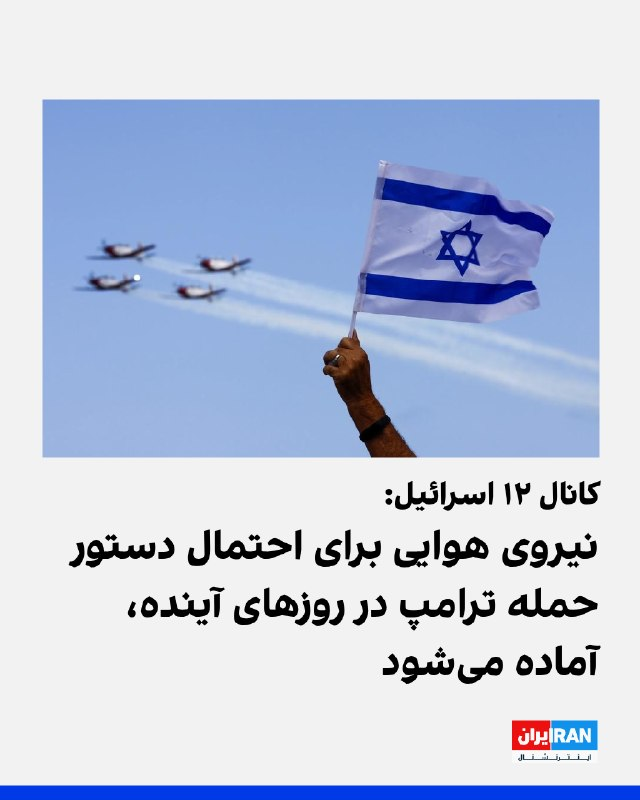

کانال ۱۲ اسرائیل گزارش داد، پس از اظهارات دونالد ترامپ درباره توقف حمله نظامی برنامه‌ریزی‌شده علیه جمهوری اسلامی که قرار بود سه‌شنبه انجام شود، سطح تنش‌ها افزایش یافته است. هم‌زمان، ارتش اسرائیل سطح آماده‌باش خود را به بالاترین حد رسانده؛ اقدامی در پی احتمال اقدام نظامی آمریکا در آینده نزدیک.

بر اساس این گزارش، مقام‌های اسرائیلی از اعلام ناگهانی ترامپ غافلگیر شده و تنها دقایقی پیش از انتشار رسمی، در جریان تصمیم او قرار گرفته‌اند. با وجود آن‌که هنوز تصمیم نهایی اتخاذ نشده، نیروی هوایی اسرائیل خود را برای احتمال صدور دستور حمله از سوی ترامپ در روزهای آینده آماده می‌کند.
https://iranintl.com/202605198315

## IranIntlTV — post 337970

  <a href="telegram/content/IranIntlTV_337970_1779217597.mp4" target="_blank">🎬 Download video</a>

مروری بر روزنامه‌های ایران، سه‌شنبه ۲۹ اردیبهشت، با مجتبی هاشمی، روزنامه‌نگار
@iranintltv

## IranIntlTV — post 337969

  <a href="telegram/content/IranIntlTV_337969_1779217598.mp4" target="_blank">🎬 Download video</a>

ایرانیان اسپانیا روز سه‌شنبه با تشکیل تجمعی مقابل سفارت جمهوری اسلامی در مادرید ضمن حمایت از شاهزاده رضا پهلوی به یاد جاویدنامان انقلاب ملی تصاویر آن‌ها را به دست گرفتند.

## IranIntlTV — post 337968

  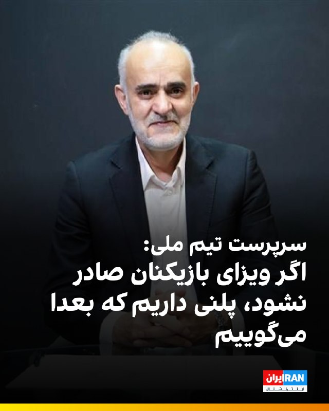

🔻مهدی محمدنبی، سرپرست تیم ملی فوتبال در حاشیه تمرین تیم در آنتالیا درباره ویزای آمریکا گفت: «به احتمال زیاد تا ۱۰ روز آینده ویزاها صادر خواهد شد. به هر دلیلی اگر ویزای کسی صادر نشود یا دیر صادر شود، پلنی داریم که به موقع اعلام می‌کنیم.» به گفته او تیم ملی پنجشنبه به آنکارا می‌رود.

🔹او گفت: «سیاسی‌کاری در فوتبال ممنوع است. فیفا به عنوان مرجع فوتبال در جهان قطعا سیاسی‌کاری نخواهد کرد و امیدواریم دنبال مسیر خودش باشد.»

🔹نایب رییس فدراسیون فوتبال درباره جلسه تاج با دبیرکل فیفا، گفت: «فیفا سرش شلوغ است ولی یکسری موارد را محکم به آنها گفتیم که یادشان نرود. مهدی تاج موارد را محکم به دبیرکل فیفا گفته‌است.»

@iranintltvsport

## IranIntlTV — post 337967

  <a href="telegram/content/IranIntlTV_337967_1779217601.mp4" target="_blank">🎬 Download video</a>

فایننشال‌تایمز در گزارشی نوشت تهران مجبور شده نفت خام را روی نفتکش‌های قدیمی ذخیره کند. این روزنامه با استناد به تصاویر ماهواره‌ای نوشت دست‌کم ۵۲ نفتکش در اطراف خارک و چابهار هستند.

گفت‌وگو با همایون فلک‌شاهی، کارشناس نفت و انرژی در موسسه کپلر
@iranintltv

## IranIntlTV — post 337966

  

سازمان اطلاعات داخلی آلمان هشدار داده جمهوری اسلامی ممکن است پس از پایان جنگ با اسرائیل و آمریکا، دامنه عملیات‌های امنیتی و تروریستی خود در اروپا را گسترش دهد.

بر اساس گزارش اختصاصی یوراکتیو، سازمان اطلاعات داخلی آلمان (BfV) اعلام کرده تهدید علیه مراکز یهودی و اسرائیلی، مخالفان جمهوری اسلامی و افرادی که حکومت ایران آن‌ها را «خائن» می‌داند، همچنان در سطح بالایی قرار دارد.

این نهاد امنیتی گفته شماری از افراد ساکن آلمان برای آموزش نظامی یا همکاری با نهادهای حکومتی به ایران سفر کرده‌اند و برخی از آن‌ها در ویدئوهای تبلیغاتی جمهوری اسلامی و بسیج ظاهر شده‌اند.

در این گزارش همچنین به نگرانی سرویس‌های امنیتی اروپا از استفاده جمهوری اسلامی از شبکه‌های نیابتی، گروه‌های وابسته به جرایم سازمان‌یافته و نیروهای کم‌هزینه محلی برای انجام حملات اشاره شده است.

به گفته منابع امنیتی، جمهوری اسلامی از مارس ۲۰۲۶ کارزاری با نام «حرکت أصحاب الیمین الإسلامیه» (HAYI) راه‌اندازی کرده که از طریق شبکه‌های اجتماعی اقدام به جذب نیرو در میان محافل طرفدار جمهوری اسلامی و جریان‌های افراطی شیعه می‌کند.
https://iranintl.com/202605191606

## IranIntlTV — post 337965

  <a href="telegram/content/IranIntlTV_337965_1779217603.mp4" target="_blank">🎬 Download video</a>

چند مقام آمریکایی به نیویورک‌تایمز گفتند تصمیم ترامپ برای به تاخیر انداختن حمله به ایران، ممکن است عملیات فریب باشد و شاید او همچنان حمله‌های برنامه‌ریزی‌ شده را اجرا کند.

ارزیابی نوید محبی، تحلیلگر سیاسی
@iranintltv

## IranIntlTV — post 337964

  <a href="telegram/content/IranIntlTV_337964_1779217604.mp4" target="_blank">🎬 Download video</a>

یک شهروند در پیامی به ایران‌اینترنشنال، وضعیت ایران و سیاست‌های حکومت را با دولت‌های کمونیستی مقایسه کرده و می‌گوید در این وضعیت میان خانواده پولدار و زیر خط فقر تفاوت چندانی نیست. پیام او با هوش مصنوعی خوانده شده است.

## IranIntlTV — post 337963

  

سازمان عملیات تجارت دریایی بریتانیا اعلام کرد در بازه زمانی ۲۸ و ۲۹ اردیبهشت، هیچ حادثه‌ای در خلیج فارس و دریای عمان گزارش نشده است.

با این حال، وضعیت امنیتی منطقه همچنان ناپایدار است و تهدید علیه کشتیرانی تجاری ادامه دارد.
https://iranintl.com/202605197145

## Shin_Persian — post 6102

📦 mhrv-rs v1.9.31 released

• Fix a Full mode pipeline regression introduced after v1.9.28 where idle sessions could generate too many empty polls and burn quota across multi-deployment setups
• Make Full mode data flow steadier
• Change the block_stun default to false, so STUN/TURN traffic is allowed by default; set `block_stun

Files (Android APKs, Windows, macOS, Linux, OpenWRT) on the files channel:

👉 v1.9.31 — all files with SHA-256

Channel:
https://t.me/mhrv_rs
or: https://t.me/+R1OyoHX2boA1ZDgx

#v1931

## Shin_Persian — post 6101

نه این وری نه اون وری، oh wait

## ManotoTV — post 105657

  <a href="telegram/content/ManotoTV_105657_1779217606.mp4" target="_blank">🎬 Download video</a>

بریتیش ایرویز از تعویق دوباره پروازهای خود به خاورمیانه خبر داد و اعلام کرد ازسرگیری پروازها به دبی، دوحه و تل‌آویو تا اول اوت به تعویق افتاده است.

رویترز گزارش داد جنگ آمریکا و اسرائیل با جمهوری اسلامی باعث شده ده‌ها شرکت هواپیمایی از زمان آغاز درگیری‌ها در اواخر فوریه، پروازهای خود به منطقه را لغو کنند.

بریتیش ایرویز در بیانیه‌ای اعلام کرد: «به دلیل ادامه وضعیت در خاورمیانه، تغییرات بیشتری در برنامه پروازی خود ایجاد کرده‌ایم تا شفافیت بیشتری برای مشتریان فراهم شود.»

این شرکت پیش‌تر نیز اعلام کرده بود پس از ازسرگیری پروازها، تعداد پروازهای خود به خاورمیانه را کاهش خواهد داد و مقصد جده را به‌طور کامل از برنامه‌هایش حذف می‌کند.

بر اساس برنامه جدید، پروازهای بریتیش ایرویز به دبی، دوحه، ریاض و تل‌آویو به یک پرواز در روز کاهش پیدا خواهد کرد.

## ManotoTV — post 105656

  <a href="telegram/content/ManotoTV_105656_1779217607.mp4" target="_blank">🎬 Download video</a>

جی‌دی ونس، معاون ترامپ در نشست خبری کاخ سفید در خصوص جمهوری‌اسلامی گفت دو مسیر پیش روی آمریکا وجود دارد. مسیر اول، مذاکره است و تأکید کرد: «رئیس‌جمهور از ما خواسته به‌طور جدی با ایران مذاکره کنیم.»
ونس افزود: «در موضوع اصلی یعنی عدم دستیابی ایران به سلاح هسته‌ای، پیشرفت زیادی داشته‌ایم و فکر می‌کنیم ایران هم به دنبال توافق است.»
او گزینه دوم را از سرگیری عملیات نظامی عنوان کرد و گفت: «گزینه بی این است که عملیات نظامی دوباره آغاز شود تا اهداف آمریکا دنبال شود.»
وی در پایان تأکید کرد این گزینه مطلوب رئیس‌جمهور نیست و گفت: «فکر نمی‌کنم ایران هم چنین چیزی بخواهد. برای رقص تانگو دو نفر لازم است.»

## ManotoTV — post 105655

  <a href="telegram/content/ManotoTV_105655_1779217607.mp4" target="_blank">🎬 Download video</a>

جی‌دی ونس در کنفرانس خبری خود در ارتباط با گزارش‌هایی که می‌گفتند احتمال دارد روسیه اورانیوم غنی‌شده ایران را دریافت کند؛ پاسخ داده «این در حال حاضر برنامه ما نیست. هیچ‌وقت هم برنامه ما نبوده است.»
او افزود نمی‌داند این گزارش‌ها از کجا منتشر شده‌اند و تأکید کرد که چنین موضوعی از سوی جمهوری اسلامی نیز مطرح نشده است.
ونس همچنین گفت: «برداشت من این است که این چیزی نیست که ایرانی‌ها خیلی از آن استقبال کنند و می‌دانم رئیس‌جمهور هم چندان از آن استقبال نمی‌کند.»

## ManotoTV — post 105654

  <a href="telegram/content/ManotoTV_105654_1779217608.mp4" target="_blank">🎬 Download video</a>

آتلانتیک گزارش داده فیفا قصد دارد در جریان جام جهانی ۲۰۲۶ باردیگر ورود پرچم شیروخورشید را به داخل ورزشگاه‌ها ممنوع کند. در جام جهانی ۲۰۲۲ قطر نیز برخی هواداران ایرانی این پرچم را به ورزشگاه‌ها بردند اما با محدودیت مواجه شدند و در برخی موارد اجازه ورود آن‌ها داده نشد. فیفا طبق قوانین خود هرگونه نماد سیاسی، تبعیض‌آمیز یا تحریک‌آمیز را در ورزشگاه‌ها ممنوع می‌داند. با این حال این موضوع همیشه محل بحث بوده، چون بسیاری از ایرانیان مهاجر استفاده از این پرچم را نه صرفا سیاسی، بلکه بخشی از هویت ملی خود می‌دانند.
در مقابل، پرچم فلسطین طبق قوانین فیفا مجاز است، چون به‌عنوان پرچم رسمی یک عضو فیفا شناخته می‌شود و تنها در صورت ایجاد خطر امنیتی ممکن است محدود شود. این تفاوت رویکرد باعث بحث و انتقاد در برخی محافل شده است.
قرار است مسابقات ایران در جام جهانی ۲۰۲۶ در شهرهایی مانند لس‌آنجلس و سیاتل برگزار شود؛ مناطقی که جمعیت زیادی از ایرانیان مهاجر در آن زندگی می‌کنند.در مقابل، پرچم فلسطین طبق قوانین فیفا مجاز است، چون به‌عنوان پرچم رسمی یک عضو فیفا شناخته می‌شود و تنها در صورت ایجاد خطر امنیتی ممکن است محدود شود. این تفاوت رویکرد باعث بحث و انتقاد در برخی محافل شده است.
قرار است مسابقات ایران در جام جهانی ۲۰۲۶ در شهرهایی مانند لس‌آنجلس و سیاتل برگزار شود؛ مناطقی که جمعیت زیادی از ایرانیان مهاجر در آن زندگی می‌کنند.

## ManotoTV — post 105653

  <a href="telegram/content/ManotoTV_105653_1779217609.mp4" target="_blank">🎬 Download video</a>

‌
وزارت دادگستری آمریکا الکس ساب، تاجر کلمبیایی-ونزوئلایی و متحد نزدیک نیکلاس مادورو، رئیس‌جمهوری پیشین ونزوئلا، را به پول‌شویی و فساد مالی متهم کرد.

دادستان‌های آمریکا اعلام کردند ساب، که به «صندوق‌دار مادورو» معروف است، از طریق برنامه کمک غذایی دولت ونزوئلا صدها میلیون دلار را با استفاده از شرکت‌های صوری، اسناد جعلی و حساب‌های بانکی آمریکایی جابه‌جا کرده است.

بر اساس اسناد دادگاه، ساب و همکارانش از سال ۲۰۱۵ با قراردادهای جعلی واردات مواد غذایی، صدها میلیون دلار را اختلاس کرده‌اند و از سال ۲۰۱۹ نیز با فروش نفت ونزوئلا تحت پوشش معاملات صوری، میلیاردها دلار پول جابه‌جا کرده‌اند.

الکس ساب که آخر هفته از ونزوئلا به آمریکا منتقل شد، روز دوشنبه برای نخستین بار در دادگاه فدرال میامی حاضر شد.

رویترز گزارش داد دولت دونالد ترامپ در حال آماده‌سازی پرونده قضایی علیه نیکلاس مادورو است و الکس ساب ممکن است اطلاعات مهمی برای تقویت این پرونده در اختیار مقام‌های آمریکایی قرار دهد.

## ManotoTV — post 105652

  <a href="telegram/content/ManotoTV_105652_1779217609.mp4" target="_blank">🎬 Download video</a>

ولادیمیر پوتین، رئیس‌جمهوری روسیه، برای دیدار با شی جین‌پینگ وارد چین شد؛ سفری که کمتر از یک هفته پس از سفر دونالد ترامپ به پکن انجام می‌شود و توجه زیادی را به خود جلب کرده است.
کرملین اعلام کرده پوتین و شی در این سفر درباره همکاری‌های اقتصادی، مسائل منطقه‌ای و روابط بین‌المللی گفت‌وگو خواهند کرد. این سفر همزمان با بیست‌وپنجمین سالگرد پیمان دوستی چین و روسیه برگزار می‌شود.
چین که پس از جنگ اوکراین به مهم‌ترین شریک تجاری روسیه تبدیل شده، تلاش می‌کند هم روابط نزدیک خود با مسکو را حفظ کند و هم روابط باثباتی با آمریکا داشته باشد.
مقام‌های روسی گفته‌اند صادرات نفت روسیه به چین در سه‌ماهه نخست ۲۰۲۶ افزایش یافته و دو کشور در حوزه انرژی به توافق‌های مهمی نزدیک شده‌اند. پوتین نیز روابط مسکو و پکن را عاملی برای «ثبات و بازدارندگی» در جهان توصیف کرده است.

## ManotoTV — post 105650

  <a href="telegram/content/ManotoTV_105650_1779217610.mp4" target="_blank">🎬 Download video</a>

رسانه‌های حکومتی با انتشار این تصویر از دیدار و تبادل نظر کاظم غریب‌آبادی، معاون وزارت خارجه با زونگ‌‌پی‌وو سفیر چین در تهران خبر داده‌اند. این دیدار پس از انتصاب قالیباف به عنوان «نماینده ویژه جمهوری‌اسلامی در امور چین» صورت گرفته است.

## ManotoTV — post 105649

  <a href="telegram/content/ManotoTV_105649_1779217610.mp4" target="_blank">🎬 Download video</a>

یک مقام وزارت دفاع آمریکا احتمال اعزام نیروی زمینی این کشور به ایران را رد نکرد.
در جلسه‌ای در واشنگتن، از دنیل زیمرمن، معاون وزیر دفاع آمریکا در امور امنیت بین‌الملل، درباره گزینه‌های پیش‌روی دونالد ترامپ پس از اظهارات اخیر او درباره وارد کردن «ضربه‌ای بزرگ دیگر به ایران» سؤال شد.
زیمرمن در پاسخ به این پرسش که آیا می‌تواند اعزام نیروهای آمریکایی به خاورمیانه را رد کند، گفت: «رئیس‌جمهور همه گزینه‌های لازم را در اختیار دارد.» او در پاسخ به تکرار این سؤال نیز بار دیگر تاکید کرد: «رئیس‌جمهور گزینه‌هایی را که نیاز دارد حفظ می‌کند.»
در ادامه جلسه، برخی حاضران از ارائه نشدن پاسخ صریح انتقاد کرده و آن را «مایه تاسف» توصیف کردند.

## FarsiVOA — post 218158

گرانی و فشار اقتصادی؛ دیدگاه کاربران شبکه‌های اجتماعی درباره معضلات روزمره مردم ایران

## FarsiVOA — post 218157

🔺فرمانده سنتکام: راهبرد ۴۷ ساله رژیم ایران را در کمتر از ۴۰ روز در هم شکستیم

◾️دریابد برد کوپر، فرمانده ستاد فرماندهی مرکزی ایالات متحده «سنتکام»، روز سه‌شنبه ۲۹ اردیبهشت در جلسه کمیته نیروهای مسلح مجلس نمایندگان آمریکا اعلام کرد عملیات نظامی آمریکا علیه رژیم ایران، ساختار راهبردی و نظامی تهران را که طی چندین دهه‌ شکل گرفته بود، به‌طور گسترده نابود کرده و توانایی جمهوری اسلامی برای تهدید منطقه را به‌شدت کاهش داده است.

⬇️ بیشتر بخوانید:

https://ir.voanews.com/a/adm-brad-cooper-second-senate-hearing-on-iran/8151712.html

## FarsiVOA — post 218156

نشست وزیران دارایی گروه هفت؛ تلاش برای مهار بحران انرژی و تورم جهانی

## FarsiVOA — post 218155

تماس حساس پرزیدنت ترامپ و علی الزیدی؛ آغاز بزرگ‌ترین چالش دولت عراق با گروه‌های مسلح وابستە بە جمهوری اسلامی

## FarsiVOA — post 218154

علی جوانمردی: جنگ یا توافق، کدامیک بە نفع مردم ایران است؟

## FarsiVOA — post 218153

در گفت‌وگو با عرفان نوربخش به تحرکات تازه دیپلماتیک و امنیتی در منطقه - از نقش میانجی‌گرانه ترکیه و قطر و پاکستان تا ائتلاف‌سازی عربستان، امارات و بحرین - پرداختیم و پرسیدیم آیا خاورمیانه در ائتلاف نوشته یا نانوشته با اسرائیل در آستانه ورود به نظمی نوین بدون جمهوری اسلامی قرار دارد؟

## FarsiVOA — post 218152

در گفت‌وگو با رضا علیجانی به تعویق کوتاه‌مدت حمله آمریکا و تکرار شروط ردشده جمهوری اسلامی برای پایان جنگ با آمریکا پرداختیم و پرسیدیم چرا حکومت ایران درست در آستانه یک رویارویی تمام‌عیار، همچنان بر پذیرش شروطی که واشنگتن بارها آنها رد کرده و غیرقابل قبول دانسته است، پافشاری می‌کند.

## FarsiVOA — post 218151

  <a href="telegram/content/FarsiVOA_218151_1779217611.mp4" target="_blank">🎬 Download video</a>

آیا به قدر کافی به موج شتابناک قتل حکومتیِ شهروندان در ایران توجه داریم؟ پاسخ مبهم و چندلایه است. به‌رغم هر پاسخی اما در میدان، ضروری دانستیم که هشدار بدهیم: توجه، توجه: جمهوری اسلامی مشغول اعدام است

## FarsiVOA — post 218149

پس از اقدام نظامی آمریکا و اسرائیل علیه جمهوری اسلامی، حکومت موج تازه‌ای از اعدام یا قتل‌های حکومتی در کشور به‌راه انداخته است. پرسش میدان: آیا به قدر کافی به این وضعیت توجه داریم؟‌

## FarsiVOA — post 218148

  <a href="telegram/content/FarsiVOA_218148_1779217612.mp4" target="_blank">🎬 Download video</a>

در تعلیق میان جنگ و صلح، جمهوری اسلامی هر روز طناب‌های دار را در داخل کشور فشرده‌تر می‌‌کند. تنها در سال جاری میلادی، بیش از ۲۰۰ اعدام در ایران ثبت شده. در میدان پرسیدیم: موج اعدام‌ها را چگونه می‌توان متوقف کرد؟

## FarsiVOA — post 218147

  <a href="telegram/content/FarsiVOA_218147_1779217612.mp4" target="_blank">🎬 Download video</a>

حسین مهدی‌زاد، رئیس کارگروه دام و طیور اتاق بازرگانی ایران، اعلام کرد گرانی مرغ و تخم‌مرغ «هیچ ربطی به جنگ و محاصره ندارد و علتش حذف ارز ترجیحی در دی ماه ۱۴۰۴ است.» او در ادامه گفت «سیاست‌های غلط و عدم حمایت وزارت جهاد کشاورزی تمام تولیدکنندگان طیور را از بین برد.»

پیشتر خبرگزاری فارس، وابسته به سپاه پاسداران مدعی شده بود که جنگ اخیر و محاصره دریایی جمهوری اسلامی از سوی ارتش آمریکا، باعث «گرانی‌ ثانیه‌ای» قیمت‌ها در ایران شده است.

## FarsiVOA — post 218146

🔺اسرائیل و امارات صندوق سرمایه‌گذاری مشترک نظامی احداث می‌کنند

▪️بنا بر گزارش‌ها دو کشور امارات و اسرائیل در حال کار روی ایجاد یک «صندوق سرمایه‌گذاری مشترک نظامی» هستند.

⬇️ بیشتر بخوانید:

https://ir.voanews.com/a/israel-emirates-iran-attack-proxy/8151620.html/?nocach=1

## FarsiVOA — post 218145

🔺گزارش | پیامدهای خفقان دیجیتال مردم ایران توسط جمهوری اسلامی: نابودی معیشت خانوارها و تحمیل فقر به زنان

▪️اقدام جمهوری اسلامی در قطع اینترنت، ضمن نابودی صدها هزار کسب‌وکار خانگی، معیشت میلیون‌ها خانوار ایرانی را با بحران مواجه کرده و با تحمیل فقر به زنان، آسیب‌های شدیدی به معیشت و استقلال مالی و اجتماعی زنان [جمهوری اسلامی] ایران وارد کرده است.

⬇️ بیشتر بخوانید:

https://ir.voanews.com/a/internet-outage-in-iran-women-poverty-instagram-jobs/8151672.html/?nocach=1

## DW_Farsi — post 124900

🔶 جنگ ایران؛ فراگیر شدن سلاح‌های لیزری ضدپهپاد در خلیج فارس

🔺یادداشتی از کاترین شائر

هفته گذشته، علاقه‌مندان و رصدکنندگان آنلاین تسلیحات، آنچه را که به نظر می‌رسید یک سامانه لیزری ساخت چین باشد، در فرودگاه دبی در امارات متحده عربی شناسایی کردند. این سامانه‌های لیزری بر روی خودروهایی نصب می‌شوند و قرار است توانایی سرنگونی پهپادها را داشته باشند.

هم‌اکنون نیز یک سامانه لیزری ساخت اسرائیل به نام "پرتو آهنین" در امارات وجود دارد؛ سامانه‌ای که ظاهراً اسرائیل آن را به اماراتی‌ها قرض داده است. گزارش‌های دیگری نیز حاکی از آن است که امارات در تلاش برای خرید یک سلاح لیزری ساخت آمریکاست. افزون بر این، امارات توافق‌هایی را با شرکت‌های اروپایی و آمریکایی برای توسعه مشترک سلاح‌های لیزری خود امضا کرده است.

در اواخر سال ۲۰۲۵ یک شرکت حمل‌ونقل، تصاویری از تجهیزات نظامی در حال انتقال منتشر کرد و ناخواسته فاش ساخت که عمان نیز یکی دیگر از خریداران سلاح‌های لیزری ساخت چین است.

همچنین قطر، پس از حمله اسرائیل به پایتختش در سپتامبر سال گذشته، ظاهراً در حال بررسی خرید عناصری از سامانه دفاع هوایی ترکیه موسوم به "گنبد فولادی" است که سلاح‌های لیزری نیز بخشی از آن را تشکیل می‌دهند.

@dw_farsi

## DW_Farsi — post 124899

  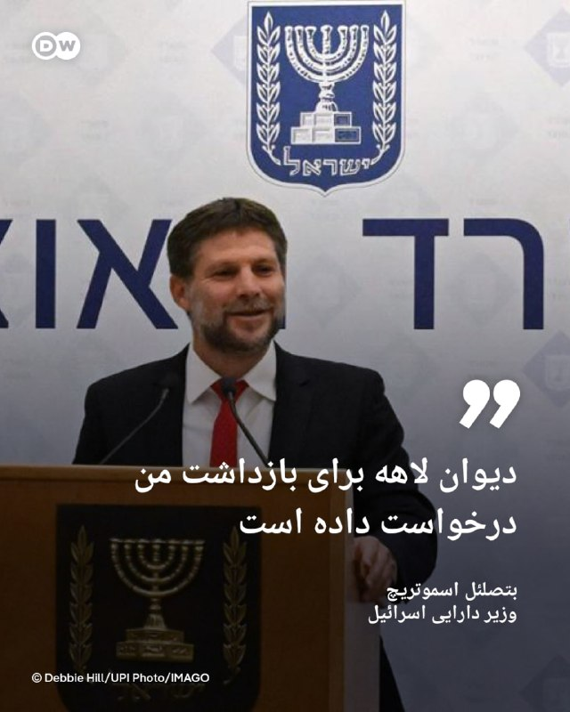

🔶 وزیر دارایی اسرائيل: دیوان لاهه برای بازداشت من درخواست داده است

بتصلئل اسموتریچ، وزیر دارایی اسرائيل می‌گوید، مطلع شده که دیوان کیفری بین‌المللی مستقر در لاهه هلند برای صدور حکم بازداشت او درخواست ارائه کرده است.

این سیاستمدار راست‌گرای افراطی اسرائيل روز سه‌شنبه ۱۹ مه در یک کنفرانس مطبوعاتی اعلام کرد که شامگاه دوشنبه از این موضوع اطلاع یافته است. او روشن نساخت، از چه کسی این خبر را شنیده و دادگاه چه دلایلی برای این اقدام مطرح کرده است.

روند رسیدگی به چنین درخواست‌هایی محرمانه است. دادستانی می‌تواند درخواست خود را به قضات ارائه دهد و آن‌ها نیز در صورت وجود شواهد کافی مبنی بر وقوع جرایمی که رسیدگی به آن‌ها در صلاحیت دادگاه است، باید با این درخواست موافقت کنند.

اسموتریچ صدور حکم بازداشت برای مقامات دولتی اسرائیل را "اعلام جنگ" از سوی تشکیلات خودگردان فلسطینی توصیف کرده است.

خبرگزاری‌ها همچنین اعلام کرده‌اند که وزیر دارایی اسرائيل روز سه‌شنبه دستور تخلیه و تخریب روستای "خان الاحمر" در کرانه باختری رود اردن را صادر و اعلام کرده که این اقدام، پاسخی است به اطلاعاتی که در مورد درخواست حکم بازداشت‌اش از سوی دیوان لاهه دریافت کرده است.

دیوان لاهه تا کنون به صورت رسمی این خبر را تأیید نکرده است.

@dw_farsi

## DW_Farsi — post 124898

  

🔶 ایران مرتس را به "ریاکاری" به علت انتقاد از حمله به امارات متهم کرد

اسماعیل بقائی، سخنگوی وزارت خارجه ایران در پیامی در شبکه ایکس فریدریش مرتس، صدراعظم آلمان را به دلیل انتقاد از حمله به تأسیسات هسته‌ای امارات متحده عربی به سخره گرفت.

امارات روز یکشنبه ۱۷ مه اعلام کرد که در حمله‌ای پهپادی، ژنراتور برق بیرون محوطه نیروگاه هسته‌ای براکه این کشور در نزدیکی ابوظبی آتش گرفته است. این کشور در بیانیه خود نامی از کشور مهاجم نبرد، ولی با گفتن این که پهپاد از "مرز غربی" وارد شده گفت که این موضوع را تحت بررسی قرار خواهد داد.

فریدریش مرتس دوشنبه "حملات هوایی دوباره ایران علیه امارات و سایر شرکا" را به‌شدت محکوم کرد و در شبکه ایکس نوشت: «حمله به تأسیسات هسته‌ای تهدیدی برای امنیت مردم سراسر منطقه است.»

بقایی این سخنان را مصداق "ریاکاری" دانست و به نوبه خود مرتس را محکوم کرد که در برابر حملات آمریکا و اسرائيل به مراکز هسته‌ای ایران سکوت اختیار کرد.

به گزارش خبرگزاری آلمان، امارات متحده عربی از اواخر فوریه سال جاری در طول جنگ ایران نزدیک به ۳هزار حمله از سوی این کشور، با انواع موشک و پهپاد را گزارش کرده است. این کشور از زمان شروع جنگ ایران بیش‌ترین آسیب را از این حملات متحمل شده است.

نیروگاه براکه مهم‌ترین منبع تأمین برق در امارات است و چهار راکتور آن حدود یک‌چهارم نیاز ملی این کشور را تأمین می‌کنند. این تأسیسات که با طراحی کره جنوبی ساخته شده، اولین ایستگاه انرژی هسته‌ای در جهان عرب به شمار می‌آید.

ایران که بارها اسرائيل را به نابودی تهدید کرده سال‌هاست که از سوی غرب به تلاش برای ساخت سلاح هسته‌ای متهم شده است. این کشور این اتهام را رد کرده و می‌گوید، دست از غنی‌سازی اورانیوم که لازمه ساخت بمب اتمی است نخواهد کشید.

@dw_farsi

## DW_Farsi — post 124897

  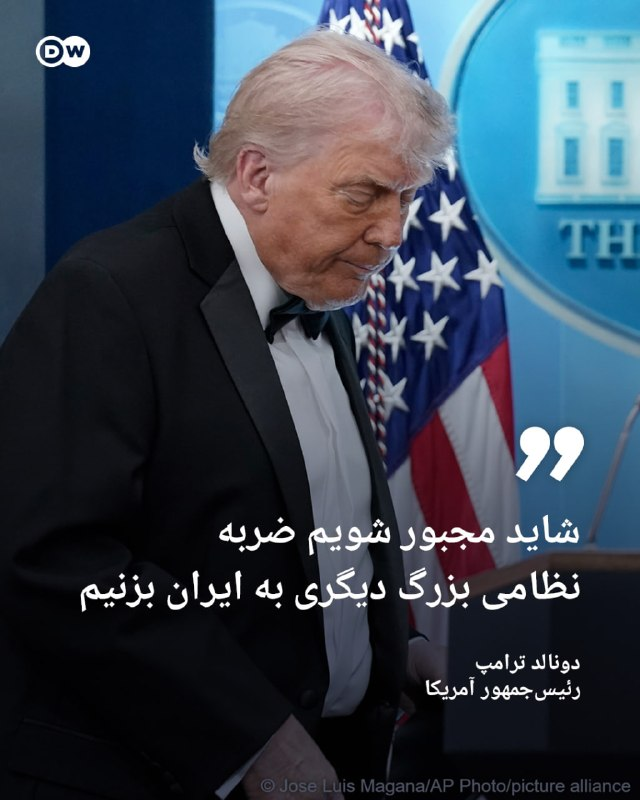

🔶 ترامپ: شاید مجبور شویم ضربه نظامی بزرگ دیگری به ایران بزنیم

دونالد ترامپ، رئیس‌جمهور آمریکا با اشاره به این که همچنان منتظر نتیجه مذاکره با ایران است گفت، شاید مجبور شود "ضربه نظامی بزرگ" دیگری به ایران بزند.

ترامپ که پیش‌‌تر گفته بود، به درخواست سه کشور قطر، عربستان و امارات متحده عربی حمله‌ به ایران که قرار بود روز سه‌شنبه ۲۹ اردیبهشت انجام شود را به تعویق انداخته از دموکرات‌ها به دلیل تلاش جهت محدود کردن اختیارات جنگی‌اش به شدت انتقاد کرد.

دموکرات‌ها و دیگر منتقدان ترامپ می‌گویند که او جنگی علیه ایران به راه انداخته که نتیجه آن افزایش قیمت‌ها برای آمریکایی‌ها بوده، چرا که جمهوری اسلامی نیز در واکنش، اقدام به بستن تنگه هرمز کرده است.

ترامپ که برخی از آخرین نظرسنجی‌ها از کاهش حمایت مردم از عملکرد او خبر می‌دهند گفت، چه اقدام نظامی او علیه ایران با حمایت مردمی روبرو باشد و چه نه، اجازه نخواهد داد تا جلوی چشمانش دنیا توسط جمهوری اسلامی "منفجر شود."

او که سه‌شنبه این سخنان را در کاخ سفید بر زبان می‌راند گفت، "دو یا سه روز فرصت محدودی" برای پیشرفت مذاکرات و دستیابی به توافق خواهد داد، چرا که نمی‌تواند اجازه دهد که ایران به سلاح هسته‌ای دست یابد.

@dw_farsi

## DW_Farsi — post 124896

  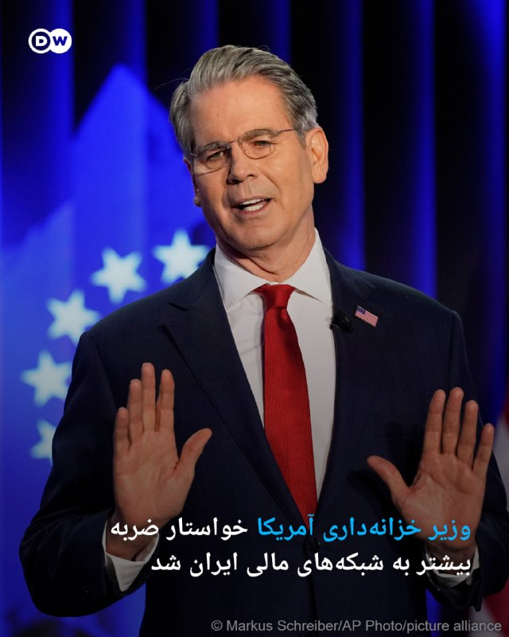

🔶 وزیر خزانه‌داری آمریکا خواستار ضربه بیشتر به شبکه‌های مالی ایران شد

اسکات بسنت، وزیر خزانه‌داری ایالات متحده، از متحدان این کشور خواست تا با قاطعیت بیشتری شبکه‌های تأمین مالی ایران را مختل کنند.

به گزارش رویترز، او در سخنرانی آماده‌شده‌ای در نشست مبارزه با تأمین مالی تروریسم که پس از نشست وزیران دارایی گروه هفت در پاریس در روز سه‌شنبه ۱۹ مه برگزار شد تأکید کرد که متحدان غربی و آسیایی ایالات متحده باید در مقابله با ایران "به‌طور کامل" در کنار این کشور بایستند.

بسنت گفت: «این امر برای مثال مستلزم آن است که شرکای اروپایی ما با تعیین تامین‌کنندگان مالی ایران، افشای شرکت‌های صوری و پوششی آن، تعطیلی شعب بانکی و برچیدن گروه‌های نیابتی‌اش، در اقدام علیه ایران به ایالات متحده بپیوندند.»

به گفته وزیر خزانه‌داری آمریکا، این کار همچنین مستلزم آن است که متحدان این کشور "در خاورمیانه و آسیا، شبکه‌های بانکداری سایه‌ای ایران را ریشه‌کن" کنند.

در شرایطی که دولت ترامپ تلاش می‌کند تا تهران را برای بازگشایی تنگه هرمز تحت فشار بگذارد وزارت خزانه‌داری آمریکا تلاش‌های تحریمی خود را از طریق برنامه‌ای تحت عنوان "خشم اقتصادی" افزایش داده است.

هدف این برنامه مختل کردن شبکه‌های بانکداری سایه‌ای ایران است و تا کنون نزدیک به نیم میلیارد دلار ارز دیجیتال مرتبط با جمهوری اسلامی را مسدود کرده است.

بسنت همچنین از بازنگری و حذف اسامی قدیمی و تاریخ‌گذشته خبر داد تا مؤسسات مالی بتوانند راحت‌تر پیچیده‌ترین طرح‌های تأمین مالی تروریسم و دورزدن تحریم‌ها را ریشه‌کن کنند.

او هدف از تحریم‌ها را "تغییر رفتار" طرف مقابل خواند و با اشاره به سوریه و ونزوئلا به عنوان دو نمونه در این زمینه گفت، وزارت خزانه‌داری آمریکا رویکردی پویا را دنبال خواهد کرد تا در صورت تغییر رفتار طرف مقابل، آماده تعدیل تحریم‌ها باشد.

@dw_farsi

## DW_Farsi — post 124895

  

🔶 طرح پیشنهادی ایران با مطالبات گسترده برای پایان جنگ

کاظم غریب‌آبادی، معاون وزارت خارجه ایران، کمیسیون امنیت ملی و سیاست خارجی مجلس شورای اسلامی را در جریان آخرین تحولات مربوط به مذاکرات ایران و آمریکا و طرح پیشنهادی جمهوری اسلامی برای پایان دادن به جنگ قرار داد.

به گزارش ایرنا، غریب‌آبادی سه‌شنبه ۲۹ اردیبهشت در جلسه این کمیسیون گفت، ایران همچنان بر حق خود برای غنی‌سازی اورانیوم پامی‌فشارد و در این طرح پیشنهادی‌ خواستار "خاتمه جنگ در تمامی جبهه‌ها، از جمله در لبنان" شده است.

این طرح همچنین پایان "محاصره دریایی آمریکا، آزادسازی اموال و دارایی‌‌های ایران و تأمین خسارت‌های واردشده به جمهوری اسلامی توسط ایالات متحده جهت بازسازی" را مطرح کرده است.

خاتمه دادن به "تمامی تحریم‌های یک‌جانبه و قطعنامه‌های شورای امنیت سازمان ملل و خروج نیروهای آمریکایی از محیط پیرامونی ایران" از دیگر محورهای این طرح پیشنهادی است.

@dw_farsi

## Persian_Trend_Official — post 14489

  <a href="telegram/content/Persian_Trend_Official_14489_1779217617.webm" target="_blank">🎬 Download video</a>

💢رئیس کمیسیون امنیت ملی مجلس:

💢تردید ترامپ برای اقدام ماجراجویانه جدید فقط به دلیل ترس از پاسخ قاطع نیروهای مسلح و اتحاد مردم ایران است

🫆:Tony

📌 @persian_trend_official
پرشین ترند | متفاوت‌ترین کانال نظامی

## Persian_Trend_Official — post 14488

💢ادعای کانال ۱۲ اسرائیل:

💢 ارزیابی‌های اسرائیل نشان
می‌دهد که ترامپ تصمیم حمله به ایران را گرفته است و اجرای آن فقط مربوط به مسئله زمان است

🫆:Tony

📌 @persian_trend_official
پرشین ترند | متفاوت‌ترین کانال نظامی

## Persian_Trend_Official — post 14487

تا دقایقی دیگه لایو امشب آغاز میشه

## Persian_Trend_Official — post 14486

تا دقایقی دیگه لایو امشب آغاز میشه

## Persian_Trend_Official — post 14485

⭕️ علی‌حسین‌ قاضی‌زاده:

فیفا قصد دارد ورود پرچم شیر و خورشید به استادیوم‌های جام‌جهانی را ممنوع کند.

ج.ا. جام جهانی را به میدان جنگ حکومت و مردم بدل کرده است.

📝 Nick

📌 @persian_trend_official
پرشین ترند | متفاوت‌ترین کانال نظامی

## RadioFarda — post 157363

🔸جی‌دی ونس، معاون رئیس‌جمهور آمریکا، روز سه‌شنبه گفت ایالات متحده و ایران در مذاکرات خود «پیشرفت زیادی» داشته‌اند و هیچ‌یک از دو طرف خواهان ازسرگیری حملات نظامی نیستند. 🔸او در یک نشست خبری در کاخ سفید به خبرنگاران گفت: «ما فکر می‌کنیم پیشرفت زیادی حاصل کرده‌ایم.…

## RadioFarda — post 157362

  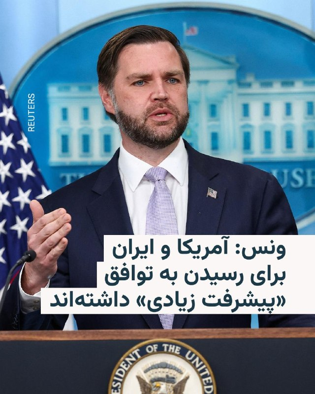

🔸جی‌دی ونس، معاون رئیس‌جمهور آمریکا، روز سه‌شنبه گفت ایالات متحده و ایران در مذاکرات خود «پیشرفت زیادی» داشته‌اند و هیچ‌یک از دو طرف خواهان ازسرگیری حملات نظامی نیستند.

🔸او در یک نشست خبری در کاخ سفید به خبرنگاران گفت: «ما فکر می‌کنیم پیشرفت زیادی حاصل کرده‌ایم. ما فکر می‌کنیم ایرانی‌ها می‌خواهند به توافق برسند.»

🔸دونالد ترامپ ساعتی پیش به خبرنگاران گفت به مقام‌های جمهوری اسلامی چند روز دیگر برای رسیدن به توافق مهلت می‌دهد و ممکن است آمریکا مجبور شود یک «ضربه بزرگ دیگر» به ایران بزند. او در عین حال افزود که تهران برای رسیدن به توافق «التماس» می‌کند.

🔸آقای ونس افزود که به‌تازگی با آقای ترامپ صحبت کرده و رئیس‌جمهور آمریکا تأکید کرده است که مسئله اصلی برای آمریکا این است که ایران هرگز نباید به سلاح هسته‌ای دست پیدا کند.

@RadioFarda

## RadioFarda — post 157361

سفر ولادیمیر پوتین به چین با هدف انعقاد توافق‌های تجاری و اعلام همبستگی

🔸ولادیمیر پوتین برای یک دیدار رسمی دو روزه از چین وارد پکن شد. قرار است رئیس‌جمهور فدراسیون روسیه در گفت‌وگو با همتای چینی‌اش مجموعه‌ای از موضوعات، از روابط متشنج دو کشور با غرب تا جنگ ایران و تأثیرش بر وضعیت جهانی انرژی را به بحث بگذارند.

🔸این سفر که بیست‌و پنجمین دیدار ولادیمیر پوتین از چین در طول بیش از دو دهه حضورش در مسند قدرت به‌شمار می‌آید، کمتر از یک‌هفته پس از دیدار رسمی دونالد ترامپ از پکن انجام می‌شود.

🔸این دیدار همزمان با بیست‌وپنجمین سالگرد امضای پیمان دوستی چین و روسیه انجام می‌شود و بر اساس اعلام کرملین، سران دو کشور دربارۀ گسترش همکاری‌های اقتصادی دوجانبه هم گفت‌وگو خواهند کرد. به گفتۀ یوری اوشاکوف دستیار کرملین، امضای تفاهم‌نامه‌ای برای ایجاد یک «جهان چندقطبی» و «شکل تازه‌ای از روابط بین‌الملل» هم از برنامه‌های این سفر است.

🔸ولادیمیر پوتین در روز سه‌شنبه ۲۹ اردیبهشت‌ماه و در آستانۀ سفر به پکن در یک سخنرانی ویدیویی گفت: «من صمیمانه قدردان تعهد شی جین‌پینگ به همکاری درازمدت با روسیه هستم. معتقدم که تماس‌های خوب و دوستانه‌مان برای شکل‌دادن به جسورانه‌ترین برنامه‌های مشترک برای آینده، و به ثمررساندن آنها مفید واقع خواهند شد».

🔸قرار است ولادیمیر پوتین و شی جین‌پینگ صبح چهارشنبه ۳۰ اردیبهشت‌ماه ملاقات کنند. یوری اوشاکوف صرفاً به طرح این موضوع که «مسائل کلیدی منطقه‌ای و بین‌المللی» به بحث گذاشته خواهند شد، بسنده کرد و به جزئیات دستور کار این نشست نپرداخت.

🔸 گزارش کامل را در وب‌سایت رادیوفردا بخوانید.

@RadioFarda

## RadioFarda — post 157360

🔸ارتش اسرائیل روز سه‌شنبه در پی صدور هشدار تخلیه برای ساکنان ۱۲ شهر لبنان، مجموعه‌ای از حملات را در سراسر این کشور، به‌ویژه در جنوب آن، به‌رغم اعلام برقراری آتش‌بس انجام داد. 🔸خبرگزاری رسمی لبنان گزارش داد که این حملات چندین منطقه در شهرستان صور و استان نبطیه…

## RadioFarda — post 157359

  

🔸ارتش اسرائیل روز سه‌شنبه در پی صدور هشدار تخلیه برای ساکنان ۱۲ شهر لبنان، مجموعه‌ای از حملات را در سراسر این کشور، به‌ویژه در جنوب آن، به‌رغم اعلام برقراری آتش‌بس انجام داد.

🔸خبرگزاری رسمی لبنان گزارش داد که این حملات چندین منطقه در شهرستان صور و استان نبطیه در جنوب لبنان را هدف قرار داده‌اند.

🔸بر اساس تصاویر خبرگزاری فرانسه، دو طبقه بالایی ساختمانی در منطقه معشوق در شهرستان صور در پی حمله هوایی فروریخت. این حمله همچنین به ساختمان‌های اطراف و خودروهای پارک‌شده آسیب رساند.

🔸وزارت بهداشت لبنان اعلام کرد حمله‌ای به همین منطقه در روز پیش از آن، یک مرکز خدمات درمانی اولیه را که تحت مدیریت «کمیته سلامت اسلامی» وابسته به حزب‌الله بود، تخریب کرده است.

🔸حمله هوایی روز سه‌شنبه به محله سرای در نبطیه که شامل مغازه‌ها، یک مسجد قدیمی و ساختمان‌های مسکونی سنتی است، بخش بزرگی از این منطقه را ویران کرد.

@RadioFarda

## RadioFarda — post 157358

  <a href="https://t.me/radiofarda/157358" target="_blank">📎 Download file</a>

📻بشنوید: ایستگاه ۱۹ با رادیوفردا، ۲۹ اردیبهشت ۱۴۰۵

@RadioFarda

## IranianMinds — post 20409

🔴 رسانه I24 NEWS: تو اسرائیل معتقدن که آمریکا درنهایت به ایران حمله خواهد کرد.

@IranianMinds

## IranianMinds — post 20408

🔴 سازمان پخش اسرائیل

نهاد نظامی اسرائیل و کاخ سفید امروز درباره احتمال حمله به ایران گفتگو کردند.

@IranianMinds

## IranianMinds — post 20407

  <a href="telegram/content/IranianMinds_20407_1779217619.webm" target="_blank">🎬 Download video</a>

💥 با هر ثبت نام 
🅰️
🅰️
🅰️  هزار تومن جایزه بگیرید

✔️ میتونید شرط‌بندی کنید و بونوس را به موجودی واقعی تبدیل کنید

⚽️  پوشش کامل مسابقات ورزشی 

💯  پیش‌بینی با بهترین ضرایب 

⭐️ تجربه سریع و حرفه‌ای

💰پرداخت مستقیم و سریع بدون واسطه، بدون دردسر، واریز و برداشت در سریع‌ترین زمان ممکن

☑️ کانال تلگرام: 

➡️ @winro_io  

🎁 هدیه خود را با ثبت نام در سایت دریافت کنید: 

➡️ Winro.io
A29
سایت اصلی در روزهای آینده بازگشایی خواهد شد A
💎

## IranianMinds — post 20406

🔴جی‌دی‌ونس:

تحویل اورانیوم ایران به روسیه هیچوقت جزو برنامه‌های ما نبوده و من اصلا نمی‌دونم این گزارشات از کجا میان.

@IranianMinds

## IranianMinds — post 20405

🔴جی‌دی‌ونس:

در مذاکرات پیشرفت چشمگیری داشتیم، ولی هر وقت که لازم باشد می‌توانیم جنگ را شروع کنیم.

@IranianMinds

## BBCPersian — post 281530

🔻توماس مسی، نماینده جمهوری‌خواه کنگره از کنتاکی، در رقابتی که عملا به تقابل مستقیم او با دونالد ترامپ، رئیس‌جمهور آمریکا، تبدیل شده، برای حفظ کرسی خود در انتخابات مقدماتی جمهوری‌خواهان تلاش می‌کند.

دونالد ترامپ از اد گالرین، کهنه‌سرباز بازنشسته نیروهای ویژه دریایی، حمایت کرده و مسی را به دلیل مخالفت با برخی سیاست‌هایش، از جمله طرح‌های مالی، تعرفه‌ها، جنگ ایران و پرونده‌های جفری اپستین، هدف حملات تند خود قرار داده است.

حامیان توماس مسی او را سیاستمداری ثابت‌قدم می‌دانند که حاضر است برای دفاع از باورهایش هزینه بدهد، اما مخالفانش می‌گویند او از مخالفت با دونالد ترامپ برای جلب توجه رسانه‌ای و ساختن چهره‌ای مستقل استفاده می‌کند.

نتیجه این انتخابات می‌تواند نشانه‌ای مهم درباره میزان نفوذ دونالد ترامپ در حزب جمهوری‌خواه باشد. در صورت شکست توماس مسی، منتقدان آقای ترامپ بار دیگر تضعیف می‌شوند اما پیروزی او می‌تواند دیگر جمهوری‌خواهان منتقد را به فاصله گرفتن از رئیس‌جمهور تشویق کند.
مطلب کامل:
https://bbc.in/4uY13SP
📷Getty Images
@BBCPersian

## BBCPersian — post 281529

🔻آمریکا یک صرافی ایرانی و شبکه مرتبط با آن و ۱۹ نفتکش را تحریم کرد

آمریکا اعلام کرد که یک صرافی ایرانی و شرکت‌های پوششی وابسته به آن را تحریم کرده است.

در بیانیه وزارت دارایی آمریکا آمده است که «این شبکه صدها میلیون دلار تراکنش را به نمایندگی از بانک‌های تحریم‌شده ایرانی مدیریت می‌کنند و به حکومت ایران و نیروهای مسلح آن امکان می‌دهند تحریم‌ها را دور بزنند.»

دفتر کنترل دارایی‌های خارجی وزارت دارایی آمریکا همچنین امروز ۱۹ نفتکش مرتبط با انتقال نفت و محصولات پتروشیمی ایران به مشتریان خارجی را هم تحریم کرد.

وزارت دارایی آمریکا اعلام کرد که این اقدامات «منابع مالی در دسترس حکومت ایران برای تولید سلاح، حمایت از نیروهای نیابتی و انتقال منابع مالی به خارج از ایران را محدودتر می‌کند.»

اسکات بسنت، وزیر دارایی آمریکا، گفت: «نظام بانکداری سایه ایران، انتقال غیرقانونی منابع مالی برای اهداف تروریستی را تسهیل می‌کند.»

او افزود: «مؤسسات مالی باید درباره به شیوه‌هایی که حکومت ایران از طریق آن‌ نظام مالی بین‌المللی را برای ایجاد بی‌ثباتی دستکاری می‌کند، هوشیاری به خرج دهند.»

https://bbc.in/4ftF0iq
@BBCPersian

## BBCPersian — post 281524

🔻مقداری از خاک مزار سه شخصیت تأثیرگذار تاریخ تاجیکستان در دهه‌های ۲۰و ۳۰ میلادی که در پایه‌گذاری این جمهوری و بقای آن نقش کلیدی داشتند از مسکو به دوشنبه پایتخت تاجیکستان منتقل شد و پس از مراسم یادبودی در آرامستان لوچاب خاکسپاری شد.

سراج‌الدین مهرالدین دیروز در جریان یک مراسم با حضور مقام‌های روس کپسول حاوی خاک این سه نفر را تحویل گرفت و به تاجیکستان منتقل کرد. رئیس‌جمهور تاجیکستان در فرودگاه شهر دوشنبه به این سه شخصیت ادای احترام کرد.

این سه نفر شیرین‌شاه شاه تیمور، نصرت‌الله مخسوم و نصار محمد هستند که در تاجیکستان «قهرمانان و جان‌نثاران و فرزندان نامدار ملت» ‌خوانده می‌شوند و در دوران حکومت استالین در سال ۱۹۳۷ به اتهام «دشمنی با خلق» محاکمه و اعدام شدند و در آرامگاه دونسکوی مسکو دفن شدند. پس از مرگ استالین، پرونده‌های بسیاری از اعدام‌شدگان از جمله این سه چهره سیاسی بازبینی و آنان تبرئه شدند.

به گفته وزارت خارجه تاجیکستان، این انتقال با دستور امامعلی رحمان انجام شد و آن را «رویدادی مهم در مسیر برقراری عدالت تاریخی و حفظ و ارج‌گذاری به خاطرهٔ ملی» خواند.
📷Tajik President Press Service
@BBCPersian

## BBCPersian — post 281518

🔻ترامپ: ایران توانایی اندکی برای انتقام دارد

دونالد ترامپ، رئیس جمهورآمریکا، در پاسخ به این سوال که تصمیمش برای حمله به ایران «کم‌طرفدار» است گفت:

«من تمام تمرکزم را روی این کار گذاشته‌ام اما معلوم نیست آنها کی این را بفهمند. فکر می‌کنم که [این اقدام من] خیلی پرطرفدار و مورد پسند بشود. راستش را بخواهید خیلی پرطرفدار و پسند می‌شود. اما چه پسند باشد یا نباشد، باید آن را انجام بدهم، چون اجازه نمی‌دهم دنیا جلوی چشمم منفجر بشود. این اتفاق نخواهد افتاد.»

رئیس‌جمهور آمریکا همچنین گفت درباره پاسخ متقابل نگرانی ندارد چون پس از حملات اخیر توانایی «اندکی» برای ایران باقی مانده است:

«ایران ۴۷ سال، واقعیتش خیلی بیشتر از این، از این تنگه [هرمز] به‌عنوان سلاح استفاده کرده است. این تنگه متعلق به آنها نیست، آبراهه بین‌المللی است. آنها در چنین جایگاهی نیستند و حق ندارند که بخواهند آن را کنترل کنند.»

او افزود: «ببینید، آنها درس گرفته‌اند. اگر ما امروز [از منطقه] برویم، ۲۵ سال طول می‌کشد تا دوباره همه چیز را بسازند. اما ما اینجا را ترک نمی‌کنیم. ما این کار را درست انجام می‌دهیم، طوری که اگر پنج سال یا ده سال دیگر، یک رئیس‌جمهور بد داشته باشیم که نخواهد کار درست را انجام دهد [دیگر مشکلی نباشد].

آقای ترامپ گفت: «این کار را باید اوباما انجام می‌داد؛ این کار را باید بایدن انجام می‌داد؛ این کار را باید روسای جمهور دیگر خیلی قبل‌تر انجام می‌دادند. آنها همه اما با این موضوع موافق هستند. آنها همه موافق هستند.»

https://bbc.in/4ftF0iq
@BBCPersian

## BBCPersian — post 281517

🔻سفیر ایران در چین: روابط ایران و چین با الگوهای سنتی اتحادهای نظامی متفاوت است

سفیر ایران در چین گفته است که این کشور «نه در قبال ایران و نه در قبال بسیاری از شرکای مهم خود، سیاست ورود مستقیم به منازعات را دنبال نمی‌کند.»

عبدالرضا رحمانی‌فضلی، به خبرگزاری ایسنا گفته است « باید واقع‌بین بود. روابط ایران و چین، هرچند راهبردی و رو به گسترش است، اما ماهیت آن با الگوهای سنتی اتحادهای نظامی متفاوت است.»

سفیر ایران در چین گفته است در صورت طولانی شدن جنگ در منطقه خلیج فارس «چین بیش از گذشته به سمت مدیریت ریسک‌های ژئوپلیتیکی حرکت خواهد کرد. این موضوع فقط درباره ایران یا منطقه نیست؛ بلکه بخشی از روند کلان در سیاست خارجی و اقتصادی چین در سال‌های اخیر است.»

آقای رحمانی فضلی گفته است: «پکن اکنون به این جمع‌بندی رسیده که جهان وارد دوره‌ای از بی‌ثباتی ساختاری شده است. در چنین فضایی، چین تلاش خواهد کرد، منابع انرژی خود را در مناطق مختلف متنوع‌ کند، وابستگی به مسیرهای پرریسک را کاهش دهد.»

https://bbc.in/4ftF0iq
@BBCPersian

## BBCPersian — post 281511

  <a href="telegram/content/BBCPersian_281511_1779217619.mp4" target="_blank">🎬 Download video</a>

مجید قهرودی، عکاس، ویدیویی از طلوع خورشید بر فراز دماوند از میان قوس برج آزادی (شهیاد) را به همراه شعری از سیاوش کسرایی منتشر کرده و در پایان آن نوشته: «طلوع خورشید بر فراز دماوند از دل آزادی»

او در ادامه بعد از شعر سیاوش کسرایی آرزو کرده: «تو یه روزی که حال این سرزمین خوبه، کنار هم بشینیم و این منظره رو تماشا کنیم…»

او می‌گوید هر سال در تاریخ‌های ۲۹ اردیبهشت و ۳ مرداد از میدان آزادی می‌توان طلوع خورشید رو از راس دماوند تماشا کرد.

@BBCPersian

## Dirty_Kids — post 389769

حالا ما اعصابمون کیریه از دست ترامپ و فحش میدیم شما عرزشیای پشگل مغز چرا ذوق می‌کنین؟ حواستون هست که همه این دعوا سر کون شماست یا نه؟؟ :)))

@Dirty_Kids 👻

## Dirty_Kids — post 389768

  <a href="telegram/content/Dirty_Kids_389768_1779217621.mp4" target="_blank">🎬 Download video</a>

گیر چه کصخلایی افتادیم
نصف طرفداراشون افغانیا هستن

@Dirty_Kids 👻

## Dirty_Kids — post 389767

  <a href="telegram/content/Dirty_Kids_389767_1779217622.mp4" target="_blank">🎬 Download video</a>

ویدیویی که تو اینستاگرام بیش از چندمیلیارد بازدید خورده :

@Dirty_Kids 👻

## Dirty_Kids — post 389766

فیفا قصد دارد ورود پرچم شیر و خورشید به استادیوم‌های جام‌جهانی را ممنوع کند.

ج.ا. جام جهانی را به میدان جنگ حکومت و مردم بدل کرده است.

پ‌ن: اولا گوه خورده باید از امروز دهن اینفانتینو رو سرویس میکنیم که جرات نکنه
با امضا و تجمع جلو فیفا

بر فرض هم اگه شد، همه تو خونه‌هاشون پرچم دور خودشون ببندن، لباس بپوشن بیارن تو استادیوم

@Dirty_Kids 👻

## Dirty_Kids — post 389765

_چه میوه‌ای رو هرروز استفاده می‌کنی؟
+اضطرابری.

@Dirty_Kids 👻

## Hranews — post 113047

مرگ و مصدومیت ۴ کارگر در سایه فقدان ایمنی کار

❗️
❗️
❗️
❗️
❗️– در سایه فقدان ایمنی محیط و شرایط نامناسب کار، چهار کارگر در شهرستان‌های ملایر و یزد دچار حادثه شدند. در این حوادث یک کارگر جان باخت و سه تن دیگر مصدوم شدند.

#کارگر

ادامه مطلب

↘️
@hranews_bot تماس ✉️ - @Hranews کانال هرانا 🆑

## Hranews — post 113046

به دلیل «کشف حجاب»؛ یک کافه در کاشان پلمب شد

❗️
❗️
❗️
❗️
❗️– معاون گردشگری اداره میراث فرهنگی، گردشگری و صنایع‌دستی کاشان اعلام کرد کافه «عامری‌ها» در این شهرستان به‌دلیل آنچه «کشف حجاب» عنوان شده، پلمب شده است.

#پلمب
#کاشان

ادامه مطلب

↘️
@hranews_bot تماس ✉️ - @Hranews کانال هرانا 🆑

## Hranews — post 113045

  

قطع اینترنت و تبعات اقتصادی آن برای زنان و اقتصاد غیررسمی/ الهه امانی

📡
📡
📡
📡
📡– این مقاله درباره‌ی عمق فاجعه‌بار جنگ، که شری مطلق است، نیست؛ درباره‌ی کودکان بی‌گناهی که جان خود را از دست دادند و هرگز به خانه بازنگشتند، نیست؛ درباره‌ی غیرنظامیانی در ایران و دیگر کشورهای منطقه که کشته شدند، نیست؛ درباره‌ی آثار تاریخیِ تخریب‌شده و زیرساخت‌های غیرنظامی که به ویرانه تبدیل شدند، نیست؛ هم‌چنین درباره‌ی میلیون‌ها انسانی که از خانه و کاشانه‌ی خود رانده شدند نیز نیست. این تراژدی‌ها انکارناپذیرند و هر یک نیازمند بررسی و پاسخ‌گویی جداگانه‌اند. این مقاله به بُعدی کم‌تر دیده‌شده، اما عمیقاً تاثیرگذار از جنگ می‌پردازد: قطع اینترنت و پیامدهای گسترده‌ی اقتصادی آن، به‌ویژه بر مشاغل خانگی که زنان اکثریت عظیم آن‌ها را تشکیل می‌دهند. روز ۲۲ اردیبهشت، که در ایران «روز مشاغل خانگی» نام‌گذاری شده است، در حالی فرا می‌رسد که بسیاری از این مشاغل، در پی قطع اینترنت، عملاً از چرخه‌ی درآمدزایی حذف شده‌اند.

به‌طور مشخص، این نوشتار بررسی می‌کند که چگونه اختلال و قطع طولانی‌مدت اینترنت به‌مثابه نوعی فلج اقتصادی و اجتماعی عمل می‌کند، نابرابری‌ها را تشدید کرده و ناامنی معیشتی را افزایش می‌دهد. پیامدهای این وضعیت برای گروه‌هایی که در حاشیه‌ی جامعه قرار دارند به‌مراتب شدیدتر است؛ از جمله کارگران اقتصاد غیررسمی، کسب‌وکارهای کوچک، و به‌ویژه زنانی که معیشتشان اغلب به دسترسی دیجیتال برای کسب درآمد، شبکه‌سازی و بقا وابسته است. با قطع ارتباط، مشاغل از بین می‌روند، بازارها فرو می‌پاشند و منابع شکننده‌ی استقلال اقتصادی از دست می‌رود؛ امری که بسیاری را به ورطه‌ی ناامنی اقتصادی و انزوای اجتماعی عمیق‌تری سوق می‌دهد.

این نخستین باری نیست که صاحبان قدرت در ایران اینترنت را برای شهروندان قطع می‌کنند. اما اکنون، در یکی از حساس‌ترین برهه‌های تاریخی ایران، محدودیت اعمال‌شده از سوی حکومت برای دسترسی به شبکه‌های جهانی از مرز ۱۰۰۰ ساعت گذشته است. قطع اینترنت برای شهروندان، که از ۲۸ فوریه ۲۰۲۶ آغاز شد، نه‌تنها از نظر گستره و مدت‌زمان، رکورد طولانی‌ترین و شدیدترین قطع سراسری اینترنت را ثبت کرده است، بلکه یکی از طولانی‌ترین محدودیت‌های اعمال‌شده برای دسترسی به اینترنت در سطح جهان نیز به‌شمار می‌رود. در خلال این مدت، حتی با وقفه‌های کوتاه آتش‌بس در این جنگ خانمان‌سوز، دسترسی به اینترنت برای اکثریت مردم ایران هم‌چنان قطع باقی مانده است؛ وضعیتی که به‌اصطلاح «اینترنت پادگانی» شناخته می‌شود.

#ماهنامه_خط_صلح
#زنان
#اینترنت

ادامه مطلب
لینک به مطلب در وبسایت خط صلح

↘️
@hranews_bot تماس ✉️ - @Hranews کانال هرانا 🆑

## manototv — post 105657

  <a href="telegram/content/manototv_105657_1779217624.mp4" target="_blank">🎬 Download video</a>

بریتیش ایرویز از تعویق دوباره پروازهای خود به خاورمیانه خبر داد و اعلام کرد ازسرگیری پروازها به دبی، دوحه و تل‌آویو تا اول اوت به تعویق افتاده است.

رویترز گزارش داد جنگ آمریکا و اسرائیل با جمهوری اسلامی باعث شده ده‌ها شرکت هواپیمایی از زمان آغاز درگیری‌ها در اواخر فوریه، پروازهای خود به منطقه را لغو کنند.

بریتیش ایرویز در بیانیه‌ای اعلام کرد: «به دلیل ادامه وضعیت در خاورمیانه، تغییرات بیشتری در برنامه پروازی خود ایجاد کرده‌ایم تا شفافیت بیشتری برای مشتریان فراهم شود.»

این شرکت پیش‌تر نیز اعلام کرده بود پس از ازسرگیری پروازها، تعداد پروازهای خود به خاورمیانه را کاهش خواهد داد و مقصد جده را به‌طور کامل از برنامه‌هایش حذف می‌کند.

بر اساس برنامه جدید، پروازهای بریتیش ایرویز به دبی، دوحه، ریاض و تل‌آویو به یک پرواز در روز کاهش پیدا خواهد کرد.

## manototv — post 105656

  <a href="telegram/content/manototv_105656_1779217625.mp4" target="_blank">🎬 Download video</a>

جی‌دی ونس، معاون ترامپ در نشست خبری کاخ سفید در خصوص جمهوری‌اسلامی گفت دو مسیر پیش روی آمریکا وجود دارد. مسیر اول، مذاکره است و تأکید کرد: «رئیس‌جمهور از ما خواسته به‌طور جدی با ایران مذاکره کنیم.»
ونس افزود: «در موضوع اصلی یعنی عدم دستیابی ایران به سلاح هسته‌ای، پیشرفت زیادی داشته‌ایم و فکر می‌کنیم ایران هم به دنبال توافق است.»
او گزینه دوم را از سرگیری عملیات نظامی عنوان کرد و گفت: «گزینه بی این است که عملیات نظامی دوباره آغاز شود تا اهداف آمریکا دنبال شود.»
وی در پایان تأکید کرد این گزینه مطلوب رئیس‌جمهور نیست و گفت: «فکر نمی‌کنم ایران هم چنین چیزی بخواهد. برای رقص تانگو دو نفر لازم است.»

## manototv — post 105655

  <a href="telegram/content/manototv_105655_1779217625.mp4" target="_blank">🎬 Download video</a>

جی‌دی ونس در کنفرانس خبری خود در ارتباط با گزارش‌هایی که می‌گفتند احتمال دارد روسیه اورانیوم غنی‌شده ایران را دریافت کند؛ پاسخ داده «این در حال حاضر برنامه ما نیست. هیچ‌وقت هم برنامه ما نبوده است.»
او افزود نمی‌داند این گزارش‌ها از کجا منتشر شده‌اند و تأکید کرد که چنین موضوعی از سوی جمهوری اسلامی نیز مطرح نشده است.
ونس همچنین گفت: «برداشت من این است که این چیزی نیست که ایرانی‌ها خیلی از آن استقبال کنند و می‌دانم رئیس‌جمهور هم چندان از آن استقبال نمی‌کند.»

## manototv — post 105654

  <a href="telegram/content/manototv_105654_1779217626.mp4" target="_blank">🎬 Download video</a>

آتلانتیک گزارش داده فیفا قصد دارد در جریان جام جهانی ۲۰۲۶ باردیگر ورود پرچم شیروخورشید را به داخل ورزشگاه‌ها ممنوع کند. در جام جهانی ۲۰۲۲ قطر نیز برخی هواداران ایرانی این پرچم را به ورزشگاه‌ها بردند اما با محدودیت مواجه شدند و در برخی موارد اجازه ورود آن‌ها داده نشد. فیفا طبق قوانین خود هرگونه نماد سیاسی، تبعیض‌آمیز یا تحریک‌آمیز را در ورزشگاه‌ها ممنوع می‌داند. با این حال این موضوع همیشه محل بحث بوده، چون بسیاری از ایرانیان مهاجر استفاده از این پرچم را نه صرفا سیاسی، بلکه بخشی از هویت ملی خود می‌دانند.
در مقابل، پرچم فلسطین طبق قوانین فیفا مجاز است، چون به‌عنوان پرچم رسمی یک عضو فیفا شناخته می‌شود و تنها در صورت ایجاد خطر امنیتی ممکن است محدود شود. این تفاوت رویکرد باعث بحث و انتقاد در برخی محافل شده است.
قرار است مسابقات ایران در جام جهانی ۲۰۲۶ در شهرهایی مانند لس‌آنجلس و سیاتل برگزار شود؛ مناطقی که جمعیت زیادی از ایرانیان مهاجر در آن زندگی می‌کنند.در مقابل، پرچم فلسطین طبق قوانین فیفا مجاز است، چون به‌عنوان پرچم رسمی یک عضو فیفا شناخته می‌شود و تنها در صورت ایجاد خطر امنیتی ممکن است محدود شود. این تفاوت رویکرد باعث بحث و انتقاد در برخی محافل شده است.
قرار است مسابقات ایران در جام جهانی ۲۰۲۶ در شهرهایی مانند لس‌آنجلس و سیاتل برگزار شود؛ مناطقی که جمعیت زیادی از ایرانیان مهاجر در آن زندگی می‌کنند.

## manototv — post 105653

  <a href="telegram/content/manototv_105653_1779217627.mp4" target="_blank">🎬 Download video</a>

‌
وزارت دادگستری آمریکا الکس ساب، تاجر کلمبیایی-ونزوئلایی و متحد نزدیک نیکلاس مادورو، رئیس‌جمهوری پیشین ونزوئلا، را به پول‌شویی و فساد مالی متهم کرد.

دادستان‌های آمریکا اعلام کردند ساب، که به «صندوق‌دار مادورو» معروف است، از طریق برنامه کمک غذایی دولت ونزوئلا صدها میلیون دلار را با استفاده از شرکت‌های صوری، اسناد جعلی و حساب‌های بانکی آمریکایی جابه‌جا کرده است.

بر اساس اسناد دادگاه، ساب و همکارانش از سال ۲۰۱۵ با قراردادهای جعلی واردات مواد غذایی، صدها میلیون دلار را اختلاس کرده‌اند و از سال ۲۰۱۹ نیز با فروش نفت ونزوئلا تحت پوشش معاملات صوری، میلیاردها دلار پول جابه‌جا کرده‌اند.

الکس ساب که آخر هفته از ونزوئلا به آمریکا منتقل شد، روز دوشنبه برای نخستین بار در دادگاه فدرال میامی حاضر شد.

رویترز گزارش داد دولت دونالد ترامپ در حال آماده‌سازی پرونده قضایی علیه نیکلاس مادورو است و الکس ساب ممکن است اطلاعات مهمی برای تقویت این پرونده در اختیار مقام‌های آمریکایی قرار دهد.

## manototv — post 105652

  <a href="telegram/content/manototv_105652_1779217627.mp4" target="_blank">🎬 Download video</a>

ولادیمیر پوتین، رئیس‌جمهوری روسیه، برای دیدار با شی جین‌پینگ وارد چین شد؛ سفری که کمتر از یک هفته پس از سفر دونالد ترامپ به پکن انجام می‌شود و توجه زیادی را به خود جلب کرده است.
کرملین اعلام کرده پوتین و شی در این سفر درباره همکاری‌های اقتصادی، مسائل منطقه‌ای و روابط بین‌المللی گفت‌وگو خواهند کرد. این سفر همزمان با بیست‌وپنجمین سالگرد پیمان دوستی چین و روسیه برگزار می‌شود.
چین که پس از جنگ اوکراین به مهم‌ترین شریک تجاری روسیه تبدیل شده، تلاش می‌کند هم روابط نزدیک خود با مسکو را حفظ کند و هم روابط باثباتی با آمریکا داشته باشد.
مقام‌های روسی گفته‌اند صادرات نفت روسیه به چین در سه‌ماهه نخست ۲۰۲۶ افزایش یافته و دو کشور در حوزه انرژی به توافق‌های مهمی نزدیک شده‌اند. پوتین نیز روابط مسکو و پکن را عاملی برای «ثبات و بازدارندگی» در جهان توصیف کرده است.

## manototv — post 105650

  <a href="telegram/content/manototv_105650_1779217628.mp4" target="_blank">🎬 Download video</a>

رسانه‌های حکومتی با انتشار این تصویر از دیدار و تبادل نظر کاظم غریب‌آبادی، معاون وزارت خارجه با زونگ‌‌پی‌وو سفیر چین در تهران خبر داده‌اند. این دیدار پس از انتصاب قالیباف به عنوان «نماینده ویژه جمهوری‌اسلامی در امور چین» صورت گرفته است.

## manototv — post 105649

  <a href="telegram/content/manototv_105649_1779217628.mp4" target="_blank">🎬 Download video</a>

یک مقام وزارت دفاع آمریکا احتمال اعزام نیروی زمینی این کشور به ایران را رد نکرد.
در جلسه‌ای در واشنگتن، از دنیل زیمرمن، معاون وزیر دفاع آمریکا در امور امنیت بین‌الملل، درباره گزینه‌های پیش‌روی دونالد ترامپ پس از اظهارات اخیر او درباره وارد کردن «ضربه‌ای بزرگ دیگر به ایران» سؤال شد.
زیمرمن در پاسخ به این پرسش که آیا می‌تواند اعزام نیروهای آمریکایی به خاورمیانه را رد کند، گفت: «رئیس‌جمهور همه گزینه‌های لازم را در اختیار دارد.» او در پاسخ به تکرار این سؤال نیز بار دیگر تاکید کرد: «رئیس‌جمهور گزینه‌هایی را که نیاز دارد حفظ می‌کند.»
در ادامه جلسه، برخی حاضران از ارائه نشدن پاسخ صریح انتقاد کرده و آن را «مایه تاسف» توصیف کردند.

## alonews — post 121171

  <a href="telegram/content/alonews_121171_1779217629.webm" target="_blank">🎬 Download video</a>

👈حکم پژمان جمشیدی صادر شد

🔴شاکی پرونده پژمان جمشیدی در گفتگو با امتداد می‌گوید حکم این پرونده صادر و به او ابلاغ شده است. طبق گفته او، پژمان جمشیدی به ۹۹ ضربه شلاق تعزیری محکوم شده است.

شاکی پرونده در ادامه با بیان اینکه تمام مدارکی که به نفع او است در پرونده وجود دارد، می‌گوید او را هرگز نمی‌بخشد:

🔴یک سال است بدون وکیل تنهایی تمام جلسات دادگاه را شرکت کردم.

او می‌گوید:

🔴خودش و وکلایش بارها به ما پیشنهاد پول دادند و ما قبول نکردیم. حتی در جلسه آخر خودش به من گفت آخرین زورت را هم بزن، آخرش فقط همین، واقعا او را نمی‌بخشم.

🔴پرونده پژمان جمشیدی از مهرماه پارسال با بازداشت او خبری شد. او بعد از چند روز با وثیقه آزاد شد. در بهمن ۱۴۰۴ و اردیبهشت ۱۴۰۵ دو جلسه دادگاه در دادگاه کیفری شعبه یک برگزار و امروز حکم این پرونده صادر شد.

✅ @AloNews خبر جنگ

## alonews — post 121170

  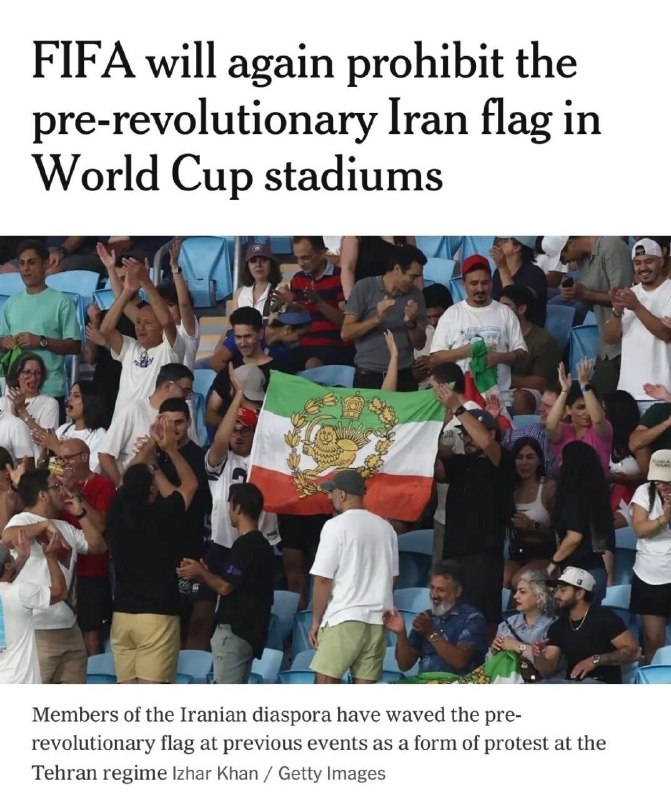

⚽️فیفا: ورود پرچم شیر و خورشید و هر پرچمی جز پرچم رسمی کشورها وارد ورزشگاه بشه باهاش برخورد میکنیم و ممنوعه.

@AloSport

## alonews — post 121169

  <a href="telegram/content/alonews_121169_1779217629.webm" target="_blank">🎬 Download video</a>

👈طبق گزارش wsj ، ایالات متحده یک نفتکش تحریم شده مرتبط با ایران را در اقیانوس هند در طول شب توقیف کرد.

🔴این کشتی احتمالا در ماه فوریه با بیش از یک میلیون بشکه نفت خام در جزیره خارگ ایران بارگیری شده است.‌‌

✅ @AloNews خبر جنگ

## alonews — post 121168

  <a href="telegram/content/alonews_121168_1779217629.mp4" target="_blank">🎬 Download video</a>

👈جی‌دی ونس : این جنگ ابدی نیست، ما کارها رو انجام می‌دیم و به خونه برمیگردیم
- این همون چیزیه که ترامپ وعده داده بود و همون چیزیه که او به اون عمل میکنه...

✅ @AloNews خبر جنگ

## alonews — post 121167

  <a href="telegram/content/alonews_121167_1779217631.webm" target="_blank">🎬 Download video</a>

👈اکسیوس: به گفته دو مقام آمریکایی، دونالد ترامپ، رئیس‌جمهور آمریکا، شامگاه دوشنبه جلسه‌ای با تیم شورای امنیت ملی خود درباره ایران برگزار کرد که شامل ارائه گزارشی درباره گزینه‌های نظامی بود. 
🔴این جلسه چندین ساعت پس از آن برگزار شد که ترامپ اعلام کرد حملاتی…

## alonews — post 121166

  <a href="telegram/content/alonews_121166_1779217631.webm" target="_blank">🎬 Download video</a>

👈اکسیوس:
به گفته دو مقام آمریکایی، دونالد ترامپ، رئیس‌جمهور آمریکا، شامگاه دوشنبه جلسه‌ای با تیم شورای امنیت ملی خود درباره ایران برگزار کرد که شامل ارائه گزارشی درباره گزینه‌های نظامی بود.

🔴این جلسه چندین ساعت پس از آن برگزار شد که ترامپ اعلام کرد حملاتی را که مدعی بود برای سه‌شنبه برنامه‌ریزی شده بود، به حالت تعلیق درآورده است.

🔴مقامات آمریکایی می‌گویند ترامپ پیش از اعلام توقف حمله، در واقع تصمیمی برای حمله به ایران نگرفته بود. روز سه‌شنبه، او گفت که «یک ساعت با دستور حمله فاصله داشته است».

🔴برخی از مقامات انتظار داشتند ترامپ در جلسه‌ای با تیم امنیت ملی خود که انتظار می‌رفت سه‌شنبه برگزار شود، درباره حملات تصمیم بگیرد، اما این جلسه در نهایت شامگاه دوشنبه برگزار شد.

🔴به گفته مقامات آمریکایی و منابع منطقه‌ای، تصمیم او برای خودداری از حمله، تا حدی به دلیل نگرانی‌هایی بود که چندین رهبر کشورهای عرب حاشیه خلیج فارس درباره تلافی‌جویی ایران علیه تأسیسات و زیرساخت‌های نفتی خود مطرح کردند.

🔴مقامات آمریکایی گفتند که رهبران خلیج فارس از ترامپ خواستند فرصت دیگری به دیپلماسی بدهد.

✅ @AloNews خبر جنگ

## alonews — post 121165

  <a href="telegram/content/alonews_121165_1779217631.mp4" target="_blank">🎬 Download video</a>

👈جی‌دی ونس : هر وقت حمله پهپادی یا موشکی به هر جایی بخوره، مخصوصاً به مناطق غیرنظامی
- اصلاً چیزی نیست که خوشمون بیاد ببینیم
- ولی خب تو آتش‌بس‌ها این چیزا بعضی وقتا پیش میاد و همیشه همه‌چی کامل و بی‌نقص نیست؛ تو غزه هم دیدیم.

✅ @AloNews خبر جنگ

## alonews — post 121163

  <a href="telegram/content/alonews_121163_1779217633.webm" target="_blank">🎬 Download video</a>

👈ونس: «چرا به اسلام‌آباد، پاکستان رفتم؟ چرا احتمالاً ۲۲ ساعت در هواپیما برای رفتن سپری کردم، ۲۴ ساعت برای برگشتن، و ۲۱ ساعت در آنجا با ایرانی‌ها مذاکره کردم؟ به این دلیل بود که ما می‌خواستیم نشانه‌ای از حسن‌نیت نشان دهیم. رئیس‌جمهور حاضر است توافق کند، تا زمانی که ایرانی‌ها حاضر باشند دوباره در آن مسئله اصلی یعنی هرگز نداشتن سلاح هسته‌ای، به سمت ما بیایند.

🔴بنابراین، ما در وضعیت بسیار خوبی هستیم، اما یک گزینه B هم وجود دارد، و آن گزینه B این است که بتوانیم کارزار نظامی را از سر بگیریم تا پرونده را ادامه دهیم.»

✅ @AloNews خبر جنگ

## alonews — post 121162

  <a href="telegram/content/alonews_121162_1779217633.webm" target="_blank">🎬 Download video</a>

👈فرمانده سنتکام:
بررسی بمباران مدرسه میناب پیچیده‌ست، چون این مدرسه در محل یک پایگاه فعال موشک‌های کروز در ایران قرار داشته.

✅ @AloNews خبر جنگ

## alonews — post 121161

  <a href="telegram/content/alonews_121161_1779217633.webm" target="_blank">🎬 Download video</a>

👈ادعای جی‌دی ونس درباره ایران: تحویل ذخایر اورانیوم غنی‌شده ایران به روسیه، در حال حاضر برنامه ما نیست. هیچ‌وقت برنامه ما نبوده است. 
🔴نمی‌دانم این گزارش‌ها از کجا می‌آید. 
✅ @AloNews خبر جنگ

## alonews — post 121160

  <a href="telegram/content/alonews_121160_1779217633.webm" target="_blank">🎬 Download video</a>

👈ادعای جی‌دی ونس درباره ایران:
تحویل ذخایر اورانیوم غنی‌شده ایران به روسیه، در حال حاضر برنامه ما نیست. هیچ‌وقت برنامه ما نبوده است.

🔴نمی‌دانم این گزارش‌ها از کجا می‌آید.

✅ @AloNews خبر جنگ

## alonews — post 121159

  <a href="telegram/content/alonews_121159_1779217634.mp4" target="_blank">🎬 Download video</a>

👈جی‌دی ونس : تو مذاکره با ایران پیشرفت زیادی داشتیم
- اما هر زمان که بخوایم میتونیم کمپین نظامی رو مجدد شروع کنیم

✅ @AloNews خبر جنگ

## alonews — post 121158

  <a href="telegram/content/alonews_121158_1779217635.mp4" target="_blank">🎬 Download video</a>

👈خبرنگار: شما شخصاً فکر می‌کنید ایران به توافق می‌رسه؟

جی‌دی ونس :
- از کجا می‌تونم با قطعیت بدونم؟ فکر می‌کنم ایران‌ها می‌خوان به توافق برسن.
- خودشون هم می‌دونن که سلاح هسته‌ای خط قرمز آمریکاست. ولی تا وقتی توافق رو امضا نکنیم، هیچ چیز قطعی نیست.
- پیش‌نویس‌های زیادی هم داشته‌ایم، اما تا وقتی رسماً توافق نهایی امضا نشه، نمی‌تونم با اطمینان بگم به نتیجه می‌رسیم.

✅ @AloNews خبر جنگ

## alonews — post 121157

  <a href="telegram/content/alonews_121157_1779217636.mp4" target="_blank">🎬 Download video</a>

👈جی دی ونس در مورد ایران:
گاهی کاملا مشخص نیست که موضع مذاکره تیم ایران چیست.

🔴گاهی اوقات سخت است که دقیقا بفهمیم ایرانی ها می خواهند از مذاکرات چه کاری انجام دهند.‌‌

✅ @AloNews خبر جنگ

## alonews — post 121156

  <a href="telegram/content/alonews_121156_1779217638.mp4" target="_blank">🎬 Download video</a>

👈جی دی ونس در مورد ایران:
ایران یک کشور بسیار پیچیده است. این کشوری است که من وانمود نمی کنم که می فهمم...

🔴این یک تمدن بزرگ و افتخارآمیز است.‌‌

✅ @AloNews خبر جنگ

## alonews — post 121155

  <a href="telegram/content/alonews_121155_1779217640.mp4" target="_blank">🎬 Download video</a>

👈جی‌دی ونس درباره ایران:
«فکر می‌کنم ما در اینجا یک فرصت داریم تا رابطه‌ای که به مدت ۴۷ سال بین ایران و ایالات متحده وجود داشته است، از نو تعریف کنیم.

🔴این همان چیزی است که رئیس‌جمهور از ما خواسته است، و ما به کار روی آن ادامه خواهیم داد، اما برای یک رابطه دو طرفه، دو طرف لازم هستند (رقص تانگو دو نفر می‌خواهد). ما هیچ توافقی را که به ایرانی‌ها اجازه دهد سلاح هسته‌ای داشته باشند، نخواهیم پذیرفت.

🔴بنابراین، همانطور که رئیس‌جمهور همین الان به من گفت، ما در حالت آماده‌باش هستیم. ما نمی‌خواهیم وارد آن مسیر شویم، اما رئیس‌جمهور اراده و توانایی آن را دارد که در صورت لزوم وارد آن مسیر شود.»

✅ @AloNews خبر جنگ

## alonews — post 121154

  <a href="telegram/content/alonews_121154_1779217642.webm" target="_blank">🎬 Download video</a>

👈شبکه کان اسرائیل:
ایران ممکنه حملات پیش دستانه کنه

✅ @AloNews خبر جنگ

## alonews — post 121153

  <a href="telegram/content/alonews_121153_1779217642.mp4" target="_blank">🎬 Download video</a>

👈کارشناس شبکه ۱۴ اسرائیل : تقربیاً حوثی‌ها شش ماهه که از ایرانی‌ها پولی دریافت نکردن

✅ @AloNews خبر جنگ

## alonews — post 121152

  

🌟 اشتراک v2ray استارلینک

🗯گیگی 150,000 تومان

🔗لینک ساب برا چک کردن مصرف و حجمتون

🔥سرعت و کیفیت بالا

✅ پشتیبانی دائم

📱جهت خرید پیام بدین : @v2safeBot

## alonews — post 121150

  <a href="telegram/content/alonews_121150_1779217644.webm" target="_blank">🎬 Download video</a>

👈یاشار سلطانی، روزنامه‌نگار:
درحالی که هرشب تو تجمعات حکومتی شعار "بی‌حجاب هم خواهر ماست" میدن و خانم‌ها با پوشش آزاد میگردن، دیشب هتل تاریخی|سنتی عامری‌ها تو کاشان رو به دلیل "حجاب" پلمپ کردن و 90 نفر پرسنل اونجا هم بیکار شدن.

🔴حالتون از این همه تناقض و دورویی به هم نمیخوره؟

✅ @AloNews خبر جنگ

<!-- MSG END -->

<!-- NAV START -->

<a href="https://github.com/keihancpu/aio-downloader/blob/main/telegram/content/archive_1.md" style="display:inline-block; padding:6px 12px; margin:0 4px; background-color:#2ea44f; color:white; text-decoration:none; border-radius:4px; font-weight:bold;">صفحه بعد</a>

<!-- NAV END -->
