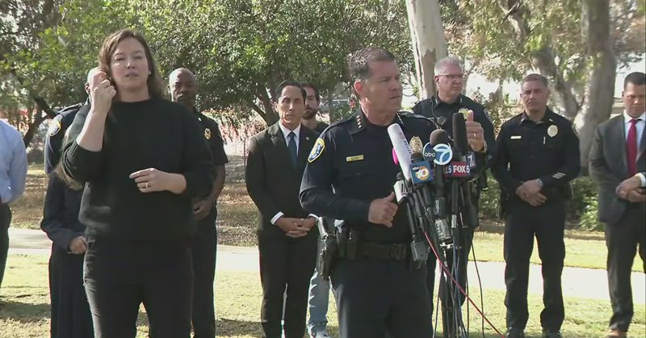
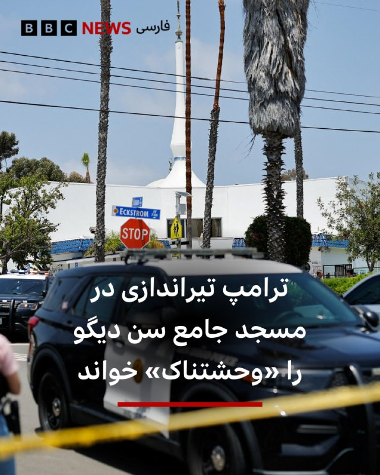
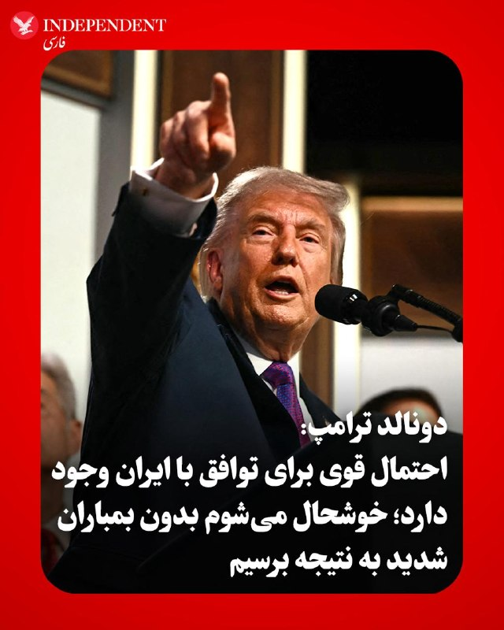
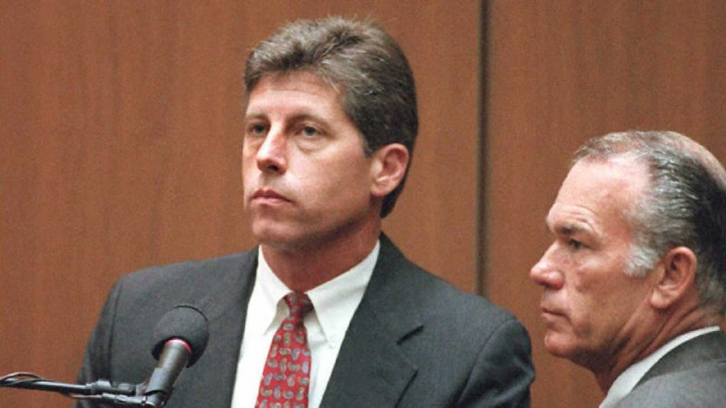
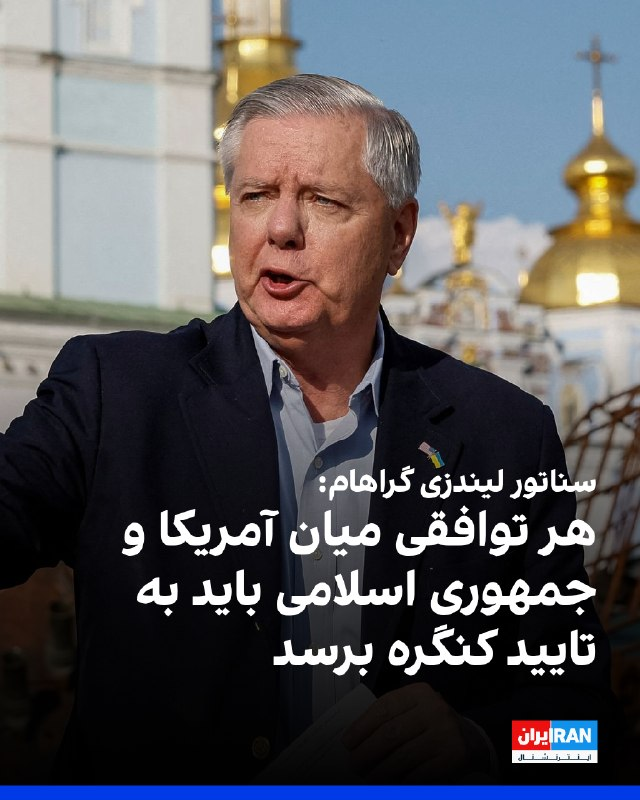
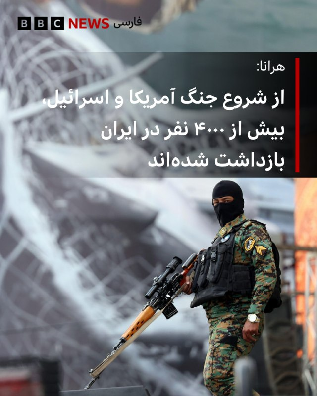

# خواننده تلگرام

<!-- TOP_NAV START -->

<a href="https://github.com/keihancpu/aio-downloader/blob/main/telegram/content/archive_1.md" style="display:inline-block; padding:6px 12px; margin:0 4px; background-color:#2ea44f; color:white; text-decoration:none; border-radius:4px; font-weight:bold;">صفحه بعد</a>

<!-- TOP_NAV END -->

<!-- MSG START -->

---
📅 بروزرسانی: 1405/02/29 03:20
---

## VahidOOnLine — post 240880

♦️پیت هگست، وزیر جنگ ایالات متحده، با تقلید لحن و ادبیات خاص دونالد ترامپ، به بازگویی اولین گفتگوی خود با رئیس جمهوری آمریکا پس از پیشنهاد این پست پرداخت. هگست با خنده در میان حاضران گفت: «رئیس‌جمهور ترامپ وقتی برای اولین بار این شغل را به من پیشنهاد داد، گفت: پیت، باید خیلی سگ‌جان و سرسخت باشی؛ ببخشید ولی واقعا همین را گفت. آماده‌ای؟ آن‌ها به سراغت خواهند آمد.»
وزیر جنگ آمریکا در ادامه با تایید پیش بینی رئیس جمهوری افزود: «پسر، چقدر هم درست می‌گفت؛ او کاملا حق داشت.»
‌🇸🇦 Indypersian

🤖 @VahidOOnLine

## VahidOOnLine — post 240879

  

ترامپ با اشاره به توقف کوتاه‌مدت حمله برنامه‌ریزی‌شده به جمهوری اسلامی درپی تقاضای عربستان‌ سعودی، امارات متحده عربی و قطر از او با هدف رسیدن به توافق، گفت این موضوع را به اسرائیل و دیگر کشورهای منطقه نیز اطلاع داده است.
او در واشینگتن‌دی‌سی به خبرنگاران گفت: «عربستان سعودی، قطر، امارات متحده عربی و چند کشور دیگر از من خواستند که آن را برای دو یا سه روز، یک بازه کوتاه، به تعویق بیندازیم، زیرا فکر می‌کنند بسیار به دستیابی به یک توافق نزدیک شده‌اند و اگر بتوانیم به گونه‌ای عمل کنیم که هیچ سلاح هسته‌ای به دست ایران نرسد، فکر می‌کنم اگر آنها راضی باشند، ما نیز احتمالا راضی خواهیم بود.»
ترامپ گفت: «ما قرار بود فردا یک حمله بسیار بزرگ انجام دهیم. من آن را برای مدتی کوتاه به تعویق انداختم، امیدوارم شاید برای همیشه، اما احتمالا برای مدت کوتاهی، زیرا گفت‌وگوهای بسیار مهمی با ایران داشته‌ایم و خواهیم دید این گفت‌وگوها به کجا می‌انجامد.»
او افزود: «ما اسرائیل را در جریان گذاشته‌ایم، دیگر افرادی را در خاورمیانه که با ما درگیر بوده‌اند مطلع کرده‌ایم و این یک تحول بسیار مثبت است.»
‌🏁 🇬🇧 IranintlTV

🤖 @VahidOOnLine

## VahidOOnLine — post 240878

  

♦️محسن رضایی، فرمانده سابق سپاه پاسداران و مشاور مجتبی خامنه‌ای، دوشنبه ۲۸ اردیبهشت ماه با انتشار پیامی در شبکه اجتماعی اکس نوشت: «ضرب‌الاجل حمله نظامی تعیین می‌کند و خودش هم آن را لغو می‌کند. با این امید واهی که ملت و مسئولان ایران را تسلیم کند. مشت آهنین نیروهای مسلح قدرتمند و ملت بزرگ ایران آن‌ها را وادار به عقب‌نشینی و تسلیم خواهد کرد.»
‌🇸🇦 Indypersian

🤖 @VahidOOnLine

## VahidOOnLine — post 240877

♦️دونالد ترامپ، رئیس‌جمهوری آمریکا، در گفتگو با خبرنگاران گفت: «من با اسکات بسنت، وزیر خزانه‌داری ایالات متحده آمریکا و هاوارد لوتنیک،  وزیر بازرگانی تماس گرفتم و همه آن‌ها را به دفترم فراخواندم. گفتم ما قصد داریم یک سفر کوتاه به خاورمیانه داشته باشیم و با ایران مواجه شویم، زیرا آن‌ها به شدت به دنبال دستیابی به سلاح هسته‌ای هستند و تنها دلیلشان برای داشتن آن، استفاده از آن است.»
رئیس‌جمهوری آمریکا در ادامه افزود: «من گفتم از اینکه مجبورم این کار را انجام دهم متنفرم، چون اوضاع ما بسیار خوب پیش می‌رود؛ اما این مهم‌ترین کاری است که می‌توانیم انجام دهیم. ما نمی‌توانیم اجازه دهیم ایران به سلاح هسته‌ای دست یابد، بنابراین این کار را انجام دادیم.»
‌🇸🇦 Indypersian

🤖 @VahidOOnLine

## WithYashar — post 11617

## FoxNewsTwitter — post 341912

  

Fox News (Twitter/X)

WATCH LIVE: Police give update on deadly San Diego mosque shooting https://twitter.com/i/broadcasts/1kKzDMRoZQDJv

## FoxNewsTwitter — post 341911

  <a href="telegram/content/FoxNewsTwitter_341911_1779148205.mp4" target="_blank">🎬 Download video</a>

Fox News (Twitter/X)

REPORTER: "Can you speak a little bit about your, post on Truth Social on Iran? And what was the decision ... why you didn't attack... ?"

PRESIDENT TRUMP: "Well, other countries have come to me and they've said... We were getting ready to do a very major attack tomorrow. I've put it off for a little while, hopefully, maybe forever, but possibly for a little while, because we've had, very big discussions with Iran and we'll see what they amount to."

"I was asked by Saudi Arabia, Qatar, UAE and some others if we could put it off for 2 or 3 days, a short period of time, because they think that they are getting very close to making a deal. And if we can do that where there's no nuclear weapon going into the hands of Iran, I think and if they're satisfied, we will be probably satisfied."

## FoxNewsTwitter — post 341910

  

Fox News (Twitter/X)

BREAKING: Former LAPD Detective Mark Fuhrman, who discovered the bloody glove in the 1995 O.J. Simpson murder case and was convicted of lying on the witness stand, has died at the age of 74.

## pm_afshaa — post 91010

  <a href="telegram/content/pm_afshaa_91010_1779148207.webm" target="_blank">🎬 Download video</a>

🔴واشنگتن پست به نقل از یک مقام پاکستانی: با توجه به مسائل متعدد در حال بررسی و نوع اجرای توافق، پیشرفت مذاکرات دشوار شده.

💧 Rainbet.com the #1 Non-KYC Crypto Casino & Sportsbook @rainbetcom

😁 @Pm_Afshaa

## pm_afshaa — post 91009

  <a href="telegram/content/pm_afshaa_91009_1779148208.webm" target="_blank">🎬 Download video</a>

🔴نیویورک تایمز:
ترامپ فعلا به خاطر نگرانی‌های پنتاگون که فکر میکنن ایران سیستم‌های پایش هوایی و دفاعیش رو ارتقا داده، از شروع دوباره جنگ برای فردا منصرف شده.

💧 Rainbet.com the #1 Non-KYC Crypto Casino & Sportsbook @rainbetcom

😁 @Pm_Afshaa

## pm_afshaa — post 91008

  <a href="telegram/content/pm_afshaa_91008_1779148208.webm" target="_blank">🎬 Download video</a>

🔴کانال 12 اسرائیل:
ترامپ به اسرائیل اطلاع داد که تاخیر در حمله به ایران تنها دو تا سه روزه.

💧 Rainbet.com the #1 Non-KYC Crypto Casino & Sportsbook @rainbetcom

😁 @Pm_Afshaa

## IranIntlTV — post 337853

  <a href="https://t.me/IranintlTV/337853" target="_blank">📎 Download file</a>

🎧نسخه صوتی چشم‌انداز: طرح مجلس برای جایزه و پاداش به قاتل ترامپ!
@iranintlTV

## IranIntlTV — post 337852

  

ترامپ با اشاره به توقف کوتاه‌مدت حمله برنامه‌ریزی‌شده به جمهوری اسلامی درپی تقاضای عربستان‌ سعودی، امارات متحده عربی و قطر از او با هدف رسیدن به توافق، گفت این موضوع را به اسرائیل و دیگر کشورهای منطقه نیز اطلاع داده است.
او در واشینگتن‌دی‌سی به خبرنگاران گفت: «عربستان سعودی، قطر، امارات متحده عربی و چند کشور دیگر از من خواستند که آن را برای دو یا سه روز، یک بازه کوتاه، به تعویق بیندازیم، زیرا فکر می‌کنند بسیار به دستیابی به یک توافق نزدیک شده‌اند و اگر بتوانیم به گونه‌ای عمل کنیم که هیچ سلاح هسته‌ای به دست ایران نرسد، فکر می‌کنم اگر آنها راضی باشند، ما نیز احتمالا راضی خواهیم بود.»
ترامپ گفت: «ما قرار بود فردا یک حمله بسیار بزرگ انجام دهیم. من آن را برای مدتی کوتاه به تعویق انداختم، امیدوارم شاید برای همیشه، اما احتمالا برای مدت کوتاهی، زیرا گفت‌وگوهای بسیار مهمی با ایران داشته‌ایم و خواهیم دید این گفت‌وگوها به کجا می‌انجامد.»
او افزود: «ما اسرائیل را در جریان گذاشته‌ایم، دیگر افرادی را در خاورمیانه که با ما درگیر بوده‌اند مطلع کرده‌ایم و این یک تحول بسیار مثبت است.»
https://iranintl.com/202605187593

## IranIntlTV — post 337851

  <a href="telegram/content/IranIntlTV_337851_1779148209.mp4" target="_blank">🎬 Download video</a>

دونالد ترامپ اعلام کرد به درخواست رهبران منطقه برنامه حمله به جمهوری اسلامی را متوقف کرده است.

او همزمان به نیویورک‌پست گفت پس از دریافت پاسخ اخیر جمهوری اسلامی درباره مذاکرات، دیگر تمایلی به دادن هیچ امتیازی به تهران ندارد.

گفت‌وگو با امیر گیتی، عضو تحریریه ایران‌اینترنشنال
@iranintltv

## FarsiVOA — post 218105

⚡️معادله چند مجهولی پهپادهای ناشناس؛ آیا آسمان عراق از کنترل دولت خارج شده است؟
@FarsiVOA

## FarsiVOA — post 218104

⚡️مواضع قانون‌گذاران آمریکایی درباره رژیم ایران و بحران در تنگه هرمز
@FarsiVOA

## FarsiVOA — post 218103

🔺پلیس: تیراندازی در «مرکز اسلامی» سن‌دیگو، ۳ بزرگسال را کشت؛ هر دو مظنون کشته شدند

▪️مقام‌های آمریکایی گفتند تیراندازی روز دوشنبه در یک «مرکز اسلامی» در شهر سن‌دیگو واقع در ایالت کالیفرنیا، سه مرد، از جمله یک نگهبان امنیتی را کشت.

⬇️ بیشتر بخوانید:
https://ir.voanews.com/a/8151375.html
@FarsiVOA

## FarsiVOA — post 218102

  <a href="telegram/content/FarsiVOA_218102_1779148211.mp4" target="_blank">🎬 Download video</a>

⚡️افزایش کودک‌همسری و خشونت علیه زنان در افغانستان؛ به حاشیه‌رفتن حقوق زنان در سایه تنش‌های ایران
@FarsiVOA

## FarsiVOA — post 218101

  <a href="telegram/content/FarsiVOA_218101_1779148212.mp4" target="_blank">🎬 Download video</a>

⚡️پزشکیان زیر تیغ گرانی؛ دولت بی‌اختیار در سایه سپاه و جنگ؟
@FarsiVOA

## Persian_Trend_Official — post 14462

  <a href="telegram/content/Persian_Trend_Official_14462_1779148212.mp4" target="_blank">🎬 Download video</a>

▪️ شبتون بخیر 🫶

🫆:Tony

📌 @persian_trend_official
پرشین ترند | متفاوت‌ترین کانال نظامی

## BBCPersian — post 281415

  

‌ ‌ ‌
دونالد ترامپ، رئیس جمهور آمریکا، در نخستین واکنش به حمله مسلحانه به مسجد جامع شهر سن دیگو آن را «حادثه وحشتناکی» خوانده و گفته به زودی با اعضای کابینه خود به طور جدی جزییات آن را زیر نظر خواهد گرفت.

پلیس سن دیگو و اداره آگاهی فدرال آمریکا - پلیس اف‌بی‌آی - گفته این تیراندازی را تحت عنوان جنایت ناشی از نفرت تحت بررسی دارد؛ اصطلاحی که مترادف تروریسم داخلی است و از احتمال وجود انگیزه‌های نژادپرستانه یا نفرت از قوم یا پیروان مذهب خاصی حکایت دارد.

https://bbc.in/4wt0sdw
📷Reuters
@BBCPersian

## BBCPersian — post 281414

🔻 این حمله در آستانه عید قربان روی داد
شیما خلیل - گزارشگر بی‌بی‌سی در کالیفرنیا

تیراندازی امروز ضربه‌ای سنگین به جامعه‌ای وارد کرده که در حال آماده شدن برای یکی از مقدس‌ترین فصل‌های مذهبی و بزرگ‌ترین اعیاد خود است.

تنها چند روز تا عید قربان باقی مانده؛ یکی از دو عید بزرگ مسلمانان که در آن خانواده‌ها جشن می‌گیرند و یاد اطاعت حضرت ابراهیم را گرامی می‌دارند.

این دوره زمانی در تقویم اسلامی بسیار مهم است. در حال حاضر ماه ذی‌الحجه قرار داریم؛ دوازدهمین و آخرین ماه تقویم قمری اسلامی.

این روزها به عنوان ۱۰ روز نخست ذی‌الحجه، از مقدس‌ترین و معنوی‌ترین روزهای سال در اسلام شناخته می‌شوند و جایگاه ویژه‌ای دارند.

این فصل همچنین هم‌زمان با موسم حج است؛ و روز عرفه به عنوان مقدس‌ترین روز سال در نظر گرفته می‌شود.

https://bbc.in/4futvHu
@BBCPersian

## BBCPersian — post 281406

ویلیام مک‌لنان، کالین کمپل و جوزی هنت، بخش تحقیقات محلی بی‌بی‌سی

تحقیقات تازه بی‌بی‌سی نشان می‌دهد قاچاقچیان انسان، از مهاجران غیرقانونی می‌خواهند که هزینه عبورشان از کانال مانش را از طریق شبکه‌ای از شرکت‌های ثبت‌شده در بریتانیا پرداخت کنند.

ما به‌طور مخفیانه از کارکنان یک مغازه در جنوب‌شرقی لندن فیلم‌برداری کردیم، در حالی که آن‌ها به پژوهشگر مخفی ما گفتند می‌تواند نزدیک به ۴۰۰۰ دلار پول نقد نزدشان بگذارد تا برای یک قاچاقچی انسان در فرانسه ارسال شود.

در این فروشگاه تلفن همراه در منطقه وولویچ به ما گفته شد: «پول خود را اینجا می‌گذاری. اگر دوستانت [به بریتانیا] رسیدند، نباید برگردی.»

تحقیق سه‌ماهه ما نشان می‌دهد قاچاقچیان چگونه از حساب‌های بانکی شرکت‌های بریتانیایی برای تسهیل عبور با قایق‌های کوچک استفاده می‌کنند؛ موضوعی که به گفته یک کارشناس برجسته جرایم مالی، پیش از این هرگز مشاهده نشده بود.

https://bbc.in/4dvXiwO
📷 BBC / Tom Nicholson/Getty Images / Kiran Ridley/Getty Images / Tom Nicholson/Getty Images / Mike Kemp/In Pictures via Getty Images / Dan Kitwood/Getty Images
@BBCPersian

---
📅 بروزرسانی: 1405/02/29 02:14
---

## VahidOOnLine — post 240876

  

لیندزی گراهام، سناتور جمهوری‌خواه، در ایکس نوشت: «همان‌طور که پیش‌تر گفته‌ام، هر توافقی که میان آمریکا و جمهوری اسلامی حاصل شود باید برای تایید به کنگره ارائه شود؛ همان‌طور که در مورد برجام نیز چنین شد.»
سناتور گراهام گفت: «اگر بتوانیم از طریق ابزارهای دیپلماتیک به درگیری پایان دهیم و به اهداف امنیت ملی خود دست یابیم، این یک دستاورد بزرگ خواهد بود.»

‌🏁 🇬🇧 IranintlTV

🤖 @VahidOOnLine

## VahidOOnLine — post 240875

  

♦️دونالد ترامپ، رئیس‌جمهوری آمریکا، دوشنبه شب ۲۸ اردیبهشت در پاسخ به سوال خبرنگاران گفت چند کشور منطقه، از جمله قطر، عربستان سعودی و امارات متحده عربی، در حال گفتگو با آمریکا و جمهوری اسلامی ایران هستند و احتمال رسیدن به توافق وجود دارد.
ترامپ گفت: «این سه کشور، به‌علاوه چند کشور دیگر، با من تماس گرفتند و آن‌ها مستقیما با مقام‌های ما و در حال حاضر با تهران در تماس هستند. به نظر می‌رسد احتمال بسیار خوبی وجود دارد که بتوانند به یک توافق برسند.»
رئیس‌جمهوری آمریکا همچنین با تاکید بر اینکه ارتش ایالات متحده بزرگترین ارتش جهان است و اجازه نخواهد داد ایران به سلاح هسته‌ای دست یابد، افزود: «اگر بتوانیم بدون اینکه آن‌ها را به‌شدت بمباران کنیم به نتیجه برسیم، بسیار خوشحال خواهم شد.»
‌🇸🇦 Indypersian

🤖 @VahidOOnLine

## VahidOOnLine — post 240874

  <a href="telegram/content/VahidOOnLine_240874_1779144264.mp4" target="_blank">🎬 Download video</a>

جیمی دایمن، مدیرعامل بانک جی‌پی مورگان چیس، در گفت‌وگو با ان‌پی‌آر هشدار داد تشدید جنگ میان آمریکا، اسرائیل و جمهوری اسلامی می‌تواند پیامدهای اقتصادی گسترده‌ای در جهان به همراه داشته باشد.

دایمن گفت جمهوری اسلامی «۴۷ سال است مردم بی‌گناه، از جمله آمریکایی‌های بی‌گناه، را می‌کشد» و تاکید کرد نباید اجازه پیدا کند به توانایی هسته‌ای دست یابد.

او افزود جمهوری اسلامی دارای موشک‌های بالستیک با برد سه هزار مایل است و «به‌وضوح» در تلاش برای توسعه توانایی هسته‌ای است.

مدیرعامل جی‌پی مورگان در عین حال هشدار داد گسترش درگیری‌ها می‌تواند خطر رکود اقتصادی یا حتی «رکود تورمی» را افزایش دهد؛ وضعیتی که همزمان با رکود اقتصادی و افزایش تورم همراه است.

او گفت هرچند هنوز مشخص نیست چنین سناریویی رخ خواهد داد یا نه، اما این بحران احتمال «پیامدهای بد اقتصادی» را افزایش می‌دهد و باید با نگاهی واقع‌بینانه به آن نگاه کرد.

جی‌پی مورگان چیس بزرگ‌ترین بانک جهان از نظر ارزش بازار به شمار می‌رود و مجموع دارایی‌های آن از چهار تریلیون دلار فراتر رفته است.

جیمی دایمن، مدیرعامل این بانک، از تاثیرگذارترین چهره‌های اقتصادی آمریکا محسوب می‌شود و سال‌ها از نظر مالی و سیاسی به حزب دموکرات گرایش داشته است.
‌🏁 🇬🇧 ManotoTV

🤖 @VahidOOnLine

## VahidOOnLine — post 240873

  <a href="telegram/content/VahidOOnLine_240873_1779144265.mp4" target="_blank">🎬 Download video</a>

مقام‌های روسیه اعلام کردند در حملات پهپادی روز گذشته اوکراین به اطراف مسکو و منطقه بلگورود، دست‌کم چهار نفر کشته شدند؛ حملاتی که به گفته رسانه‌های روسی، بزرگ‌ترین حمله پهپادی به مسکو در بیش از یک سال گذشته بوده است.

بر اساس این گزارش، سه نفر در منطقه مسکو و یک نفر در منطقه بلگورود جان باختند.

سفارت هند در روسیه اعلام کرد یکی از کشته‌شدگان یک شهروند هندی بوده و سه شهروند هندی دیگر نیز زخمی شده‌اند.

خبرگزاری دولتی تاس به نقل از سرگئی سوبیانین، شهردار مسکو، گزارش داد پدافند هوایی روسیه از نیمه‌شب شنبه تا یکشنبه ۸۱ پهپاد را که به سمت مسکو در حرکت بودند، سرنگون کرده است.

سوبیانین گفت ۱۲ نفر، عمدتا در نزدیکی ورودی پالایشگاه نفت مسکو، زخمی شده‌اند اما به گفته او «فناوری» پالایشگاه آسیب ندیده است.

سرویس امنیتی اوکراین، اس‌بی‌یو، اعلام کرد ارتش این کشور یک پالایشگاه نفت و دو ایستگاه پمپاژ نفت در منطقه مسکو را هدف قرار داده است.

ولودیمیر زلنسکی، رئیس‌جمهوری اوکراین، نیز این حملات را «کاملا موجه» توصیف کرد.

وزارت دفاع روسیه اعلام کرد در مجموع ۵۵۶ پهپاد اوکراینی در جریان حملات شبانه و صبح یکشنبه سرنگون شده‌اند.

در مقابل، نیروی هوایی اوکراین گفت روسیه شب گذشته با ۲۸۷ پهپاد به خاک اوکراین حمله کرده که ۲۷۹ فروند آن رهگیری یا مختل شده‌اند.
‌🏁 🇬🇧 ManotoTV

🤖 @VahidOOnLine

## VahidOOnLine — post 240872

♦️هاکان فیدان، وزیر امور خارجه ترکیه، در جریان نشست خبری مشترک با یوهان وادفول، وزیر امور خارجه آلمان گفت در پذیرش شرایط لازم مذاکرات هسته‌ای از طرف ایران، مشکل اصولی نمی‌بیند.
فیدان تاکید کرد اختلاف‌ها بیشتر بر سر این است که تهران در مقابل توافق احتمالی چه امتیازهایی دریافت خواهد کرد، این امتیازها با چه ترتیبی ارائه می‌شوند و چه شرایطی همراه آن خواهد بود.
‌🇸🇦 Indypersian

🤖 @VahidOOnLine

## VahidOOnLine — post 240871

  

ترامپ در یک سخنرانی گفت اگر بتواند به توافقی با جمهوری اسلامی دست یابد که مانع از دستیابی تهران به سلاح هسته‌ای شود، بسیار راضی خواهد بود. او تاکید کرد که واشینگتن به تهران اجازه نخواهد داد که به سلاح هسته‌ای دست یابد.
ترامپ گفت: «ما اجازه نخواهیم داد ایران به سلاح هسته‌ای دست پیدا کند. بنابراین این سه کشور به همراه دیگران با من تماس گرفتند و آنها به طور مستقیم با نمایندگان ما و در حال حاضر با حکومت ایران در حال گفت‌وگو هستند و به نظر می‌رسد شانس بسیار خوبی وجود دارد که بتوانند به یک توافق برسند.»
او افزود: «اگر بتوانیم بدون اینکه آنها را به شدت بمباران کنیم به این نتیجه برسیم، بسیار خوشحال خواهم شد.»

‌🏁 🇬🇧 IranintlTV

🤖 @VahidOOnLine

## WithYashar — post 11616

۲۶ روز مانده تا تولد دونالد ترامپ خردادی دوست داشتنی ۱۴ ژوئن ۲۰۲۶ (۲۴ خرداد ۱۴۰۵) تهران میگیریم ؟ 😬
@withyashar

## WithYashar — post 11614

کانال ۱۲ اسرائیل: ترامپ به اسرائیل اطلاع داد که تاخیر در حمله به ایران تنها دو تا سه روز است. @withyashar

## WithYashar — post 11613

کانال ۱۲ اسرائیل: ترامپ به اسرائیل اطلاع داد که تاخیر در حمله به ایران تنها دو تا سه روز است.
@withyashar

## WithYashar — post 11612

پدافند کیش فعال شده
@withyashar

## WithYashar — post 11611

ترامپ: «ما آماده می‌شدیم که فردا یک حمله بسیار بزرگ انجام دهیم. من فعلاً آن را برای مدتی به تعویق انداختم؛ امیدوارم شاید برای همیشه، اما ممکن است فقط برای مدت کوتاهی باشد، چون گفت‌وگوهای بسیار مهمی با ایران داشته‌ایم و باید ببینیم نتیجه آن‌ها چه خواهد شد.…

## WithYashar — post 11610

ترامپ : اگر بتوانیم بدون اینکه حسابی آن‌ها را بمباران کنیم به نتیجه برسیم، من خیلی خوشحال خواهم شد

اسرائیل را از تصمیم برای تعویق حمله به ایران مطلع کردم.
@withyashar

## WithYashar — post 11609

پرزیدنت ترامپ :

ما به جمهوری اسلامی هیچ امتیازی نخواهیم داد. فقط تسلیم کامل!
@withyashar

## WithYashar — post 11608

  <a href="telegram/content/WithYashar_11608_1779144267.mp4" target="_blank">🎬 Download video</a>

ترامپ: «ما آماده می‌شدیم که فردا یک حمله بسیار بزرگ انجام دهیم. من فعلاً آن را برای مدتی به تعویق انداختم؛ امیدوارم شاید برای همیشه، اما ممکن است فقط برای مدت کوتاهی باشد، چون گفت‌وگوهای بسیار مهمی با ایران داشته‌ایم و باید ببینیم نتیجه آن‌ها چه خواهد شد.

از سوی عربستان، قطر، امارات و چند کشور دیگر از من خواسته شد که این اقدام را دو یا سه روز به تعویق بیندازیم؛ یک بازه کوتاه، چون آن‌ها فکر می‌کنند که بسیار به دستیابی به توافق نزدیک شده‌اند.
@withyashar

## WithYashar — post 11607

ترامپ درباره «گفت‌وگوهای مهم» با ایران:
«این یک تحول بسیار مثبت است، اما خواهیم دید که آیا واقعاً به نتیجه‌ای می‌رسد یا نه.

دوره‌هایی را داشته‌ایم که فکر می‌کردیم تقریباً به توافق نزدیک شده‌ایم، اما در نهایت موفق نشدیم؛ با این حال، این بار شرایط کمی متفاوت است.»
@withyashar

## WithYashar — post 11606

ترامپ : من فعلاً عقب انداختمش، امیدوارم شاید برای همیشه، ولی شاید هم فقط برای یه مدت کوتاه
چون با ایران مذاکرات خیلی مهمی داشتیم و باید ببینیم چی ازش درمیاد
@withyashar

## mwarmonitor — post 9288

🔴وال‌استریت ژورنال: شرکت آنتروپیک اخیراً به کاربران مدل قدرتمند هوش مصنوعی خود با نام «میثوس» اجازه داده است تهدیدهای امنیت سایبری را با دیگرانی که ممکن است با آسیب‌پذیری‌های مشابه روبه‌رو باشند، به اشتراک بگذارند.

@mwarmonitor

## mwarmonitor — post 9287

  

✈️🇵🇰 هواپیمای A319 نیروی هوایی پاکستان (A-1102) که وزیر کشور پاکستان را حمل می‌کرد – وی در یک سفر رسمی دو روزه برای بررسی روابط دوجانبه و گفت‌وگوها با آمریکا به سر می‌برد – از مشهد خارج شد. @mwarmonitor

## mwarmonitor — post 9286

نصف امکانات ایران اینترنشنال داشتم الان به جای باراک راوید من شماره ترامپ داشتم

## mwarmonitor — post 9285

🔹خبرنگار: آقای رئیس‌جمهور، یک سوال در ادامه بحث ایران. کشورهای دیگه هم قبلاً این کار رو کردن؛ اون‌ها از شما خواستن که مسیرتون رو تغییر بدید تا یک توافق صلح رو جلوی پاتون بذارن و می‌گفتن که توافقی در راهه. اما هیچ‌چیز به نتیجه نرسیده. شما اشاره کردید که این بار فرق می‌کنه...
🔸دونالد ترامپ: خب، خیلی چیزها به نتیجه رسیده. ما کشوری رو که قرار بود سلاح هسته‌ای داشته باشه گرفتیم و... عملاً ارتشش رو نابود کردیم؛ اون‌ها نیروی دریایی ندارن، نیروی هوایی ندارن، اون‌ها از نظر نظامی عملاً نابود شدن. این خیلیه، این دستاورد بزرگیه. ما همین الان هم می‌تونیم اونجا رو ترک کنیم و ۲۵ سال طول می‌کشه تا خودشون رو بازسازی کنن. آخرین چیزی که بهش فکر می‌کنن، به نظر من، موضوع هسته‌ایه. حالا باید این رو به صورت مکتوب دربیارن. اما وقتی می‌گید «هیچ‌چیز»، ما... ما کاملاً ارتششون رو نابود کردیم. ببخشید، از سی‌ان‌ان (CNN)... ما کاملاً ارتششون رو نابود کردیم، رهبری‌شون رو نابود کردیم. همون‌طور که می‌دونید، رهبرانشون از بین رفتن؛ رهبرانشون در سطح اول و سطح دوم از بین رفتن، الان داریم با نصفِ سطح سوم سر و کله می‌زنیم. و فکر می‌کنم ما به پیشرفت‌های زیادی دست پیدا کردیم.

@mwarmonitor

## mwarmonitor — post 9284

  <a href="telegram/content/mwarmonitor_9284_1779144270.mp4" target="_blank">🎬 Download video</a>

🎬 Video

## mwarmonitor — post 9283

🔴سناتور لیندسی گراهام:

🔰همان‌طور که پیش‌تر گفته‌ام، هر توافقی که میان ایالات متحده آمریکا و ایران حاصل شود، باید برای تصویب به کنگره آمریکا ارائه گردد؛ همان‌گونه که در مورد برجام در دوران ریاست‌جمهوری باراک اوباما انجام شد.

🔹اگر بتوانیم از طریق راه‌های دیپلماتیک و در عین تحقق اهداف امنیت ملی‌مان به این درگیری پایان دهیم، این یک دستاورد بزرگ خواهد بود.

🔸همان‌طور که پیش‌تر نیز گفته‌ام، موضع دونالد ترامپ روشن است:

➡️ عدم غنی‌سازی
➡️ کنترل آمریکا بر حدود ۹۰۰ پوند اورانیوم با غنای بالا
➡️ بازگشایی تنگه هرمز بدون هرگونه مداخله از سوی ایران
➡️ ایران باید برنامه موشک‌های بالستیک دوربرد خود و هرگونه تلاش برای دستیابی به سلاح هسته‌ای را کنار بگذارد
➡️ ایران باید حمایت از تمامی نیروهای نیابتی تروریستی در منطقه را متوقف کند

🔸اما اینکه بگویم نسبت به این‌که ایران واقعاً با موارد لازم برای ایجاد توافقی که به‌طور اساسی با برجام متفاوت باشد موافقت خواهد کرد، یا وارد توافقی شود که در گذر زمان پایدار بماند، تردید دارم—کم‌گویی کرده‌ام.

زمان نشان خواهد داد.

@mwarmonitor

## mwarmonitor — post 9282

🔹خبرنگار: کمی در مورد پستی که در «تروث سوشال» (Truth Social) درباره ایران گذاشتید توضیح بدید و بگید چه تصمیمی باعث شد که چرا به اون‌ها حمله نکردید؟
🔸دونالد ترامپ: خب، کشورهای دیگه پیش من اومدن و گفتن که «ما داشتیم برای یک حمله بسیار بزرگ برای فردا آماده می‌شدیم.» من اون رو برای مدت کوتاهی به تعویق انداختم، امیدوارم که شاید برای همیشه باشه، اما احتمالاً برای یک مدت کوتاه.
چون ما گفتگوهای بسیار بزرگی با ایران داشتیم و خواهیم دید که نتیجه این گفتگوها چی میشه. از ما توسط عربستان سعودی، قطر، امارات متحده عربی و برخی کشورهای دیگه درخواست شد که اگر بتونیم این کار رو برای دو یا سه روز—یک مدت زمان کوتاه—به تعویق بندازیم، چون اون‌ها فکر می‌کنن که دارن به توافق خیلی نزدیک میشن.
و اگر بتونیم کاری کنیم که هیچ سلاح هسته‌ای به دست ایران نیفته، فکر می‌کنم اگر اون‌ها راضی باشن، ما هم احتمالاً راضی خواهیم بود.
ما به اسرائیل اطلاع دادیم، به افراد دیگه‌ای در خاورمیانه که با ما در ارتباط بودن هم اطلاع دادیم و می‌دونید، این یک تحول بسیار مثبت هست؛ اما باید ببینیم که آیا نتیجه‌ای خواهد داشت یا نه. ما دوره‌های زمانی دیگه‌ای هم داشتیم که فکر می‌کردیم به توافق خیلی نزدیک شدیم و... کارساز نشد، اما این یکی کمی متفاوته.
ما واقعاً فردا آماده یک اقدام بسیار بزرگ بودیم و این چیزی نبود که من مایل به انجامش باشم، اما چاره دیگه‌ای نداریم؛ چون ما نمی‌تونیم اجازه بدیم ایران به سلاح هسته‌ای دست پیدا کنه.

@mwarmonitor

## mwarmonitor — post 9281

  <a href="telegram/content/mwarmonitor_9281_1779144272.mp4" target="_blank">🎬 Download video</a>

🎬 Video

## FoxNewsTwitter — post 341909

  

Fox News (Twitter/X)

BREAKING: Former LAPD Detective Mark Fuhrman, who discovered the bloody glove in the O.J. Simpson murder case and was convicted of lying on the witness stand back in 1994, has died at the age of 74.

## FoxNewsTwitter — post 341908

Fox News (Twitter/X)

BREAKING: Former LAPD Detective Mark Fuhrman, who discovered the bloody glove in the O.J. Simpson murder case and was convicted of lying on the witness stand back in 1994, has died at the age of 74.

## FoxNewsTwitter — post 341907

  <a href="telegram/content/FoxNewsTwitter_341907_1779144274.mp4" target="_blank">🎬 Download video</a>

Fox News (Twitter/X)

FOX NEWS REPORT: Three people are dead after a shooting at the Islamic Center of San Diego in what police are investigating as a hate crime. Meanwhile, President Trump says he called off a planned strike on Iran as ‘serious negotiations’ continue. @BillMelugin_ has the latest.

## FoxNewsTwitter — post 341906

  <a href="telegram/content/FoxNewsTwitter_341906_1779144277.mp4" target="_blank">🎬 Download video</a>

Fox News (Twitter/X)

“He made a mistake. It was a big mistake.”

President Trump jokes about Mark Cuban previously backing Kamala Harris as the two appear together at a healthcare affordability event focused on lowering prescription drug costs.

Trump says Cuban joined the effort because “this is something that really works,” adding that he plans to expand access to cheaper medications through major distribution networks including Amazon.

“I have a lot of respect for Mark, frankly, and I always have.”

## FoxNewsTwitter — post 341905

Fox News (Twitter/X)

NEW: President Trump announces that more than 600 affordable generic drugs are being added to the administration’s prescription pricing website, TrumpRX.gov, expanding the catalog nearly sevenfold.

Trump said many Americans don’t realize lower-cost generic options are available, despite having “the same dosage, the same effectiveness, and the same active ingredients” as brand-name drugs.

“Today, they have something they’ve never had before.”

## pm_afshaa — post 91006

  <a href="telegram/content/pm_afshaa_91006_1779144279.webm" target="_blank">🎬 Download video</a>

🔴ترامپ: اسرائیل رو از تصمیم برای به تأخیر انداختن حمله به ایران مطلع کردم.

💧 Rainbet.com the #1 Non-KYC Crypto Casino & Sportsbook @rainbetcom

😁 @Pm_Afshaa

## pm_afshaa — post 91005

  <a href="telegram/content/pm_afshaa_91005_1779144280.webm" target="_blank">🎬 Download video</a>

🔴ترامپ: ما به جمهوری اسلامی هیچ امتیازی نخواهیم داد، فقط تسلیم کامل!

💧 Rainbet.com the #1 Non-KYC Crypto Casino & Sportsbook @rainbetcom

😁 @Pm_Afshaa

## pm_afshaa — post 91004

  <a href="telegram/content/pm_afshaa_91004_1779144280.webm" target="_blank">🎬 Download video</a>

🔴ترامپ: ایران نهایتا 3 روز زمان داره. 
💧 Rainbet.com the #1 Non-KYC Crypto Casino & Sportsbook @rainbetcom 
😁 @Pm_Afshaa

## pm_afshaa — post 91003

  <a href="telegram/content/pm_afshaa_91003_1779144281.webm" target="_blank">🎬 Download video</a>

🔴ترامپ: ایران نهایتا 3 روز زمان داره. 
💧 Rainbet.com the #1 Non-KYC Crypto Casino & Sportsbook @rainbetcom 
😁 @Pm_Afshaa

## pm_afshaa — post 91002

  <a href="telegram/content/pm_afshaa_91002_1779144281.webm" target="_blank">🎬 Download video</a>

🔴ترامپ: ما حملات رو فقط برای 2-3 روز تعویق انداختیم تا ببینیم چه میشه! 
💧 Rainbet.com the #1 Non-KYC Crypto Casino & Sportsbook @rainbetcom 
😁 @Pm_Afshaa

## pm_afshaa — post 91001

  <a href="telegram/content/pm_afshaa_91001_1779144282.webm" target="_blank">🎬 Download video</a>

🔴ترامپ: ما در حال آماده شدن برای حمله گسترده به ایران در روز سه شنبه بودیم، اما من آن را برای یک دوره کوتاه و شاید برای همیشه، اما به احتمال زیاد برای یک دوره کوتاه به تعویق انداختم.

💧 Rainbet.com the #1 Non-KYC Crypto Casino & Sportsbook @rainbetcom

😁 @Pm_Afshaa

## pm_afshaa — post 91000

  <a href="telegram/content/pm_afshaa_91000_1779144283.webm" target="_blank">🎬 Download video</a>

🔴دونالد ترامپ:
به نظر میرسه شانس بسیار خوبی برای رسیدن به توافق وجود داره؛ اگر بتونیم بدون بمباران این کار رو انجام بدیم، خوشحال میشم.

💧 Rainbet.com the #1 Non-KYC Crypto Casino & Sportsbook @rainbetcom

😁 @Pm_Afshaa

## pm_afshaa — post 90999

  <a href="telegram/content/pm_afshaa_90999_1779144283.webm" target="_blank">🎬 Download video</a>

🔴ترامپ: ما حملات رو فقط برای 2-3 روز تعویق انداختیم تا ببینیم چه میشه!

💧 Rainbet.com the #1 Non-KYC Crypto Casino & Sportsbook @rainbetcom

😁 @Pm_Afshaa

## IranIntlTV — post 337850

  <a href="https://t.me/IranintlTV/337850" target="_blank">📎 Download file</a>

🎧نسخه صوتی سیاست با مراد ویسی: لغو حمله در آخرین لحظه
@iranintlTV

## IranIntlTV — post 337849

  

لیندزی گراهام، سناتور جمهوری‌خواه، در ایکس نوشت: «همان‌طور که پیش‌تر گفته‌ام، هر توافقی که میان آمریکا و جمهوری اسلامی حاصل شود باید برای تایید به کنگره ارائه شود؛ همان‌طور که در مورد برجام نیز چنین شد.»
سناتور گراهام گفت: «اگر بتوانیم از طریق ابزارهای دیپلماتیک به درگیری پایان دهیم و به اهداف امنیت ملی خود دست یابیم، این یک دستاورد بزرگ خواهد بود.»

https://iranintl.com/202605183437

## IranIntlTV — post 337848

  <a href="telegram/content/IranIntlTV_337848_1779144285.mp4" target="_blank">🎬 Download video</a>

مسعود پزشکیان گفت در پی محاصره دریایی آمریکا، صادرات نفت ایران متوقف شده و کشور روزانه با کمبود ۵۰ میلیون لیتر بنزین روبه‌رو است، اما دلاری برای واردات آن وجود ندارد.

ساعتی پس از انتشار این اظهارات، رسانه‌های دولتی از جمله ایرنا اقدام به حذف سخنان پزشکیان کردند.

گفت‌وگو با مهدی مصلحی، کارشناس بازار نفت
@iranintltv

## IranIntlTV — post 337847

  

ترامپ در یک سخنرانی گفت اگر بتواند به توافقی با جمهوری اسلامی دست یابد که مانع از دستیابی تهران به سلاح هسته‌ای شود، بسیار راضی خواهد بود. او تاکید کرد که واشینگتن به تهران اجازه نخواهد داد که به سلاح هسته‌ای دست یابد.
ترامپ گفت: «ما اجازه نخواهیم داد ایران به سلاح هسته‌ای دست پیدا کند. بنابراین این سه کشور به همراه دیگران با من تماس گرفتند و آنها به طور مستقیم با نمایندگان ما و در حال حاضر با حکومت ایران در حال گفت‌وگو هستند و به نظر می‌رسد شانس بسیار خوبی وجود دارد که بتوانند به یک توافق برسند.»
او افزود: «اگر بتوانیم بدون اینکه آنها را به شدت بمباران کنیم به این نتیجه برسیم، بسیار خوشحال خواهم شد.»

https://iranintl.com/202605189314

## IranIntlTV — post 337846

  <a href="telegram/content/IranIntlTV_337846_1779144288.mp4" target="_blank">🎬 Download video</a>

مراد ویسی، تحلیل‌گر ارشد ایران‌اینترنشنال، گفت: «مردم ایران از ترامپ انتظار دارند به مذاکرات طولانی با جمهوری اسلامی پایان دهد. مذاکراتی که به باور آنها نه رفتار حکومت را تغییر داده و نه مانع سرکوب داخلی و تنش‌آفرینی منطقه‌ای شده است. ادامه این مذاکرات به معنای دادن فرصت و تنفس سیاسی به جمهوری اسلامی تلقی می‌شود.»
@iranintltv

## ManotoTV — post 105618

  <a href="telegram/content/ManotoTV_105618_1779144289.mp4" target="_blank">🎬 Download video</a>

جیمی دایمن، مدیرعامل بانک جی‌پی مورگان چیس، در گفت‌وگو با ان‌پی‌آر هشدار داد تشدید جنگ میان آمریکا، اسرائیل و جمهوری اسلامی می‌تواند پیامدهای اقتصادی گسترده‌ای در جهان به همراه داشته باشد.

دایمن گفت جمهوری اسلامی «۴۷ سال است مردم بی‌گناه، از جمله آمریکایی‌های بی‌گناه، را می‌کشد» و تاکید کرد نباید اجازه پیدا کند به توانایی هسته‌ای دست یابد.

او افزود جمهوری اسلامی دارای موشک‌های بالستیک با برد سه هزار مایل است و «به‌وضوح» در تلاش برای توسعه توانایی هسته‌ای است.

مدیرعامل جی‌پی مورگان در عین حال هشدار داد گسترش درگیری‌ها می‌تواند خطر رکود اقتصادی یا حتی «رکود تورمی» را افزایش دهد؛ وضعیتی که همزمان با رکود اقتصادی و افزایش تورم همراه است.

او گفت هرچند هنوز مشخص نیست چنین سناریویی رخ خواهد داد یا نه، اما این بحران احتمال «پیامدهای بد اقتصادی» را افزایش می‌دهد و باید با نگاهی واقع‌بینانه به آن نگاه کرد.

جی‌پی مورگان چیس بزرگ‌ترین بانک جهان از نظر ارزش بازار به شمار می‌رود و مجموع دارایی‌های آن از چهار تریلیون دلار فراتر رفته است.

جیمی دایمن، مدیرعامل این بانک، از تاثیرگذارترین چهره‌های اقتصادی آمریکا محسوب می‌شود و سال‌ها از نظر مالی و سیاسی به حزب دموکرات گرایش داشته است.

## ManotoTV — post 105617

  <a href="telegram/content/ManotoTV_105617_1779144290.mp4" target="_blank">🎬 Download video</a>

مقام‌های روسیه اعلام کردند در حملات پهپادی روز گذشته اوکراین به اطراف مسکو و منطقه بلگورود، دست‌کم چهار نفر کشته شدند؛ حملاتی که به گفته رسانه‌های روسی، بزرگ‌ترین حمله پهپادی به مسکو در بیش از یک سال گذشته بوده است.

بر اساس این گزارش، سه نفر در منطقه مسکو و یک نفر در منطقه بلگورود جان باختند.

سفارت هند در روسیه اعلام کرد یکی از کشته‌شدگان یک شهروند هندی بوده و سه شهروند هندی دیگر نیز زخمی شده‌اند.

خبرگزاری دولتی تاس به نقل از سرگئی سوبیانین، شهردار مسکو، گزارش داد پدافند هوایی روسیه از نیمه‌شب شنبه تا یکشنبه ۸۱ پهپاد را که به سمت مسکو در حرکت بودند، سرنگون کرده است.

سوبیانین گفت ۱۲ نفر، عمدتا در نزدیکی ورودی پالایشگاه نفت مسکو، زخمی شده‌اند اما به گفته او «فناوری» پالایشگاه آسیب ندیده است.

سرویس امنیتی اوکراین، اس‌بی‌یو، اعلام کرد ارتش این کشور یک پالایشگاه نفت و دو ایستگاه پمپاژ نفت در منطقه مسکو را هدف قرار داده است.

ولودیمیر زلنسکی، رئیس‌جمهوری اوکراین، نیز این حملات را «کاملا موجه» توصیف کرد.

وزارت دفاع روسیه اعلام کرد در مجموع ۵۵۶ پهپاد اوکراینی در جریان حملات شبانه و صبح یکشنبه سرنگون شده‌اند.

در مقابل، نیروی هوایی اوکراین گفت روسیه شب گذشته با ۲۸۷ پهپاد به خاک اوکراین حمله کرده که ۲۷۹ فروند آن رهگیری یا مختل شده‌اند.

## FarsiVOA — post 218100

⚡️ترامپ: حمله نظامی برنامه‌ریزی شده سه‌شنبه به جمهوری اسلامی را به درخواست متحدان به تعویق انداختم
@FarsiVOA

## FarsiVOA — post 218099

  <a href="telegram/content/FarsiVOA_218099_1779144291.mp4" target="_blank">🎬 Download video</a>

⚡️بحران اقتصادی در ایران دیگر فقط صدای مردم عادی را درنیاورده، حتی حامیان و مقام‌های جمهوری اسلامی نیز از گرانی، بیکاری و آشفتگی اقتصادی شکایت می‌کنند. بحرانی که بسیاری، ریشه آن را در سال‌ها سوءمدیریت و فساد ساختاری در جمهوری اسلامی می‌بینند
@FarsiVOA

## FarsiVOA — post 218098

⚡️گزارش نیویورک‌تایمز: بیابان‌های غربی عراق، اتاق جنگ پنهان اسرائیل علیه جمهوری اسلامی
@FarsiVOA

## FarsiVOA — post 218097

🔺ترامپ اعلام کرد رهبران کشورهای عربی از او خواستند برای فرصت دادن به توافق «دو یا سه روز» حمله به جمهوری اسلامی را عقب بیاندازد

▪️دونالد ترامپ، رئیس‌جمهوری آمریکا، روز دوشنبه ۲۸ اردیبهشت، ساعاتی پس از آنکه اعلام کرد حمله روز سه‌شنبه به جمهوری اسلامی را متوقف کرده‌است، در این باره به خبرنگاران توضیحاتی داد.

⬇️ بیشتر بخوانید:
https://ir.voanews.com/a/8151362.html
@FarsiVOA

## Persian_Trend_Official — post 14461

  <a href="telegram/content/Persian_Trend_Official_14461_1779144292.webm" target="_blank">🎬 Download video</a>

تیراندازی در یک مرکز اسلامی در آمریکا 🔸رسانه‌ها روز دوشنبه از حضور یک فرد مسلح و تیراندازی در مرکز اسلامی سن دیگو خبر می‌دهند. 🔹پلیس سن دیگو از مردم خواست که از حضور در این منطقه خودداری کنند. ☆Phantom☆ 📌 @persian_trend_official پرشین ترند | متفاوت‌ترین…

## IranianMinds — post 20371

  <a href="telegram/content/IranianMinds_20371_1779144293.mp4" target="_blank">🎬 Download video</a>

🔴 رئیس‌جمهور ترامپ درباره ایران:
ما کشوری را که قرار بود سلاح هسته‌ای داشته باشد، عملاً نابود کردیم.

ما می‌توانیم همین الان برویم و بازسازی آن‌ها ۲۵ سال طول می‌کشد، و آخرین چیزی که به آن فکر می‌کنند، به نظر من، هسته‌ای است. حالا آن‌ها باید این را به صورت مکتوب بیان کنند.

ما ارتش آن‌ها را کاملاً نابود کردیم. رهبری آن‌ها را نابود کردیم.

@IranianMinds

## IranianMinds — post 20370

  <a href="telegram/content/IranianMinds_20370_1779144295.webm" target="_blank">🎬 Download video</a>

💥 با هر ثبت نام 
🅰️
🅰️
🅰️ هزار تومن جایزه بگیرید

✔️ میتونید شرط‌بندی کنید و بونوس را به موجودی واقعی تبدیل کنید

⚽️  پوشش کامل مسابقات ورزشی 

💯  پیش‌بینی با بهترین ضرایب 

⭐️ تجربه سریع و حرفه‌ای

💰پرداخت مستقیم و سریع بدون واسطه، بدون دردسر، واریز و برداشت در سریع‌ترین زمان ممکن

☑️ کانال تلگرام: 

➡️ @winro_io  

🎁 هدیه خود را با ثبت نام در سایت دریافت کنید: 

➡️ Winro.io
A28
سایت اصلی در روزهای آینده بازگشایی خواهد شد A
💎

## IranianMinds — post 20369

🔴 ترامپ:

عربستان، قطر، امارات و برخی طرف‌های دیگر درخواست کردند حمله به مدت دو یا سه روز به تعویق بیفتد، چون معتقدند که رسیدن به توافق نزدیک است!

@IranianMinds

## IranianMinds — post 20368

🔴 ترامپ: ما به جمهوری اسلامی هیچ امتیازی نخواهیم داد، فقط تسلیم کامل!

@IranianMinds

## BBCPersian — post 281405

🔻 نگهبان مسجد سن دیگو یکی از قربانیان تیراندازی است

رئیس پلیس سن‌دیگو گفت مرکز اسلامی دارای خدمات امنیتی است و یکی از جان‌باختگان «نگهبان امنیتی شاغل در همین مرکز» بوده است.

او همچنین افزود یک باغبان که در نزدیکی محل حضور داشت هدف تیراندازی قرار گرفته، اما آسیبی ندیده است.

به گفته اسکات وال صحنه حادثه «بسیار آشفته و پرهرج‌ومرج» بوده و حدود ۵۰ تا ۱۰۰ نیروی پلیس در محل مرکز حضور داشته‌اند.

رهبران مذهبی شهر سن‌ دیگو این تیراندازی را محکوم و حمله به یک محل عبادت را نفرت‌انگیز توصیف کرده‌اند.

https://bbc.in/42Hnf7S
@BBCPersian

## BBCPersian — post 281404

  

‌ ‌ ‌
خبرگزاری هرانا، ارگان خبری مجموعه فعالان حقوق بشر، می‌گوید از زمان شروع جنگ اخیر تا هفته گذشته، دست‌کم ۴۰۲۳ بازداشت را در ایران ثبت کرده است.

به گفته این نهاد که مقرش در آمریکاست، اتهام‌های مطرح‌شده شامل جاسوسی، تهدید علیه امنیت ملی و ارتباط یا ارسال مطالب مربوط به جنگ به رسانه‌های خارجی است.

بنابر این گزارش، مقام‌های ایران از جنگ «برای تشدید روایت‌های امنیتی و توجیه بازداشت‌ها، محدودیت آزادی بیان و اعمال خشونت علیه غیرنظامیان استفاده کرده‌اند.»

احمدرضا رادان، فرمانده کل نیروی انتظامی، دیروز گفت از آغاز جنگ اخیر «بیش از ۶۵۰۰ نفر از وطن‌فروشان و جاسوسان دستگیر شده‌اند که ۵۶۷ نفر از آنان مرتبط با گروهک‌های ضدانقلاب و عناصر نفاق بودند.»

او درباره اعتراضات دی‌ماه گفت: «هیچ‌گونه رهاسازی انجام نشده و همچنان در حال شناسایی و دستگیری این افراد هستیم.»

هزاران نفر در اعتراضات سراسری دی بازداشت شده‌اند و رئیس قوه قضائیه خواستار رسیدگی سریع و بدون اغماض به پرونده آنها شده است.

https://bbc.in/4fzVJR8
📷 EPA/Shutterstock
@BBCPersian

## BBCPersian — post 281403

🔻 شهردار سن دیگو: به همشهریان مسلمان اطمینان می‌دهم که هیچ کمکی دریغ نخواهد شد

تاد گلوریا، شهردار سن‌دیگو، گفت از این که کودکانی که هنگام حمله در مدرسه مشغول تحصیل بودند، در امان مانده‌اند، سپاسگزار است.

او ادامه داد: «برای جامعه مسلمانان محلی، دعاهای من با شماست.»

آقای گلوریا گفت می‌خواهد به جامعه مسلمانان اطمینان دهد که «هیچ منبعی دریغ نخواهد شد» تا امنیت آن‌ها در برابر خشونت تامین شود.

او همچنین از نیروهای پلیس «عمیقا قدردانی» کرد و این حادثه را «وضعیتی غم‌انگیز» توصیف کرد.

شهردار سن‌دیگو همچنین به خانواده قربانیان تسلیت گفت و افزود بازرسان «هر اقدام لازم» را برای روشن شدن ابعاد حادثه انجام خواهند داد.

او تاکید کرد: «نفرت جایی در شهر سن‌دیگو ندارد.»

https://bbc.in/3PuRJqw
@BBCPersian

## BBCPersian — post 281402

🔻 فعال شدن پدافند هوایی در اصفهان

گزارش‌ها از ایران حاکی از شنیده شدن صدای پدافند در شهر اصفهان است.

خبرگزاری مهر هم با تایید این گزارش‌ها نوشته:‌ «هنوز مسئولان توضیحی در رابطه با چرایی فعالیت پدافند اصفهان ارائه نکرده‌اند.»

پیش از این گزارش‌هایی از فعال شدن پدافند جزیره قشم هم منتشر شده بود که خبرگزاری تسنیم گفته بود برای مقابله با «ریز پرنده‌ها» بوده است.

https://bbc.in/4wyq493
@BBCPersian

## Dirty_Kids — post 389720

  <a href="telegram/content/Dirty_Kids_389720_1779144296.webm" target="_blank">🎬 Download video</a>

☢️خفن ترین و‌ قدیمی ترین  انالیزور  ایران ینی دکتر بت 
👍 
🔴هیچ سایت بتی دوست نداره شما کانال دکتر بت رو پیدا کنین چون خیلی سود میکنید🤷‍♂ رایگان بهترین شرط هارو براتون میذاره حتی هزار تومن هم دریافت نمیکنه روزانه میتونی از پیش بینی فوتبال باهاش پول در بیاری…

## Dirty_Kids — post 389719

  <a href="telegram/content/Dirty_Kids_389719_1779144296.webm" target="_blank">🎬 Download video</a>

☢️خفن ترین و‌ قدیمی ترین  انالیزور  ایران ینی دکتر بت 
👍

🔴هیچ سایت بتی دوست نداره شما کانال دکتر بت رو پیدا کنین چون خیلی سود میکنید🤷‍♂

رایگان بهترین شرط هارو براتون میذاره
حتی هزار تومن هم دریافت نمیکنه
روزانه میتونی از پیش بینی فوتبال باهاش پول در بیاری 👌
A28
اگ اهل پیش بینی فوتبالی این کانال اصلا از دست ندین👇

✅https://t.me/+4_ADqwB9e-QwYjlk

✅https://t.me/+4_ADqwB9e-QwYjlk

## Dirty_Kids — post 389718

  

#بخوابیم

@Dirty_Kids 👻

## Dirty_Kids — post 389717

  <a href="telegram/content/Dirty_Kids_389717_1779144297.mp4" target="_blank">🎬 Download video</a>

ماشین عروس مسلح به مسلسل سنگین در شوی حکومتی موسوم به «جشن زوج‌های جانفدا» در میدان «امام حسین» تهران به نمایش درآمد.

سپاه محمد رسول‌الله تهران بزرگ ٢٨ اردیبهشت این مراسم را برگزار کرد.

@Dirty_Kids 👻

## Dirty_Kids — post 389716

  <a href="telegram/content/Dirty_Kids_389716_1779144298.mp4" target="_blank">🎬 Download video</a>

نبینم این آنلاین شاپارو اذیت کنیدا 😒
بزارید پول دربیارن تو وضعیت اقتصادی

@Dirty_Kids 👻

## Dirty_Kids — post 389715

  <a href="telegram/content/Dirty_Kids_389715_1779144300.mp4" target="_blank">🎬 Download video</a>

خب ما که همین میگیم
بخاطر پول و غذا مفتی هرشب ول میچرخید تو خیابون، گشنه‌های شیعه‌سان

پیشرفت کردن از ساندیس رسیدن به انرزی‌زا

@Dirty_Kids 👻

## Dirty_Kids — post 389714

دنیا چجوری به مدرسه نرفتن دخترای افغان واکنش نشون داد؟! همونجوری به نبود اینترنت آزاد تو ایران واکنش نشون میده...!

@Dirty_Kids 👻

## Dirty_Kids — post 389712

کاری که ترامپ داره با این جماعت کسمغز رافضی می‌کنه چیزی نیست جز تو هول و ولا نگه‌داشتن‌شون که بر پایه‌ی استراتژی «رافضی رو چه بزنی چه بترسونی» استواره،

شما به اولدورم بولدورم شیعه‌سانان رافضی نگاه نکنید، به گردن کج ممدباقر در مقابل وزیر کشور قرمساق پاکستانی و توئیت‌های تحلیلگران کسمغزشون نگاه کنید که خوب می‌دونن انتهای این جاده چه گایشی در انتظار زنده و مرده‌شونه.

@Dirty_Kids 👻

## manototv — post 105618

  <a href="telegram/content/manototv_105618_1779144302.mp4" target="_blank">🎬 Download video</a>

جیمی دایمن، مدیرعامل بانک جی‌پی مورگان چیس، در گفت‌وگو با ان‌پی‌آر هشدار داد تشدید جنگ میان آمریکا، اسرائیل و جمهوری اسلامی می‌تواند پیامدهای اقتصادی گسترده‌ای در جهان به همراه داشته باشد.

دایمن گفت جمهوری اسلامی «۴۷ سال است مردم بی‌گناه، از جمله آمریکایی‌های بی‌گناه، را می‌کشد» و تاکید کرد نباید اجازه پیدا کند به توانایی هسته‌ای دست یابد.

او افزود جمهوری اسلامی دارای موشک‌های بالستیک با برد سه هزار مایل است و «به‌وضوح» در تلاش برای توسعه توانایی هسته‌ای است.

مدیرعامل جی‌پی مورگان در عین حال هشدار داد گسترش درگیری‌ها می‌تواند خطر رکود اقتصادی یا حتی «رکود تورمی» را افزایش دهد؛ وضعیتی که همزمان با رکود اقتصادی و افزایش تورم همراه است.

او گفت هرچند هنوز مشخص نیست چنین سناریویی رخ خواهد داد یا نه، اما این بحران احتمال «پیامدهای بد اقتصادی» را افزایش می‌دهد و باید با نگاهی واقع‌بینانه به آن نگاه کرد.

جی‌پی مورگان چیس بزرگ‌ترین بانک جهان از نظر ارزش بازار به شمار می‌رود و مجموع دارایی‌های آن از چهار تریلیون دلار فراتر رفته است.

جیمی دایمن، مدیرعامل این بانک، از تاثیرگذارترین چهره‌های اقتصادی آمریکا محسوب می‌شود و سال‌ها از نظر مالی و سیاسی به حزب دموکرات گرایش داشته است.

## manototv — post 105617

  <a href="telegram/content/manototv_105617_1779144303.mp4" target="_blank">🎬 Download video</a>

مقام‌های روسیه اعلام کردند در حملات پهپادی روز گذشته اوکراین به اطراف مسکو و منطقه بلگورود، دست‌کم چهار نفر کشته شدند؛ حملاتی که به گفته رسانه‌های روسی، بزرگ‌ترین حمله پهپادی به مسکو در بیش از یک سال گذشته بوده است.

بر اساس این گزارش، سه نفر در منطقه مسکو و یک نفر در منطقه بلگورود جان باختند.

سفارت هند در روسیه اعلام کرد یکی از کشته‌شدگان یک شهروند هندی بوده و سه شهروند هندی دیگر نیز زخمی شده‌اند.

خبرگزاری دولتی تاس به نقل از سرگئی سوبیانین، شهردار مسکو، گزارش داد پدافند هوایی روسیه از نیمه‌شب شنبه تا یکشنبه ۸۱ پهپاد را که به سمت مسکو در حرکت بودند، سرنگون کرده است.

سوبیانین گفت ۱۲ نفر، عمدتا در نزدیکی ورودی پالایشگاه نفت مسکو، زخمی شده‌اند اما به گفته او «فناوری» پالایشگاه آسیب ندیده است.

سرویس امنیتی اوکراین، اس‌بی‌یو، اعلام کرد ارتش این کشور یک پالایشگاه نفت و دو ایستگاه پمپاژ نفت در منطقه مسکو را هدف قرار داده است.

ولودیمیر زلنسکی، رئیس‌جمهوری اوکراین، نیز این حملات را «کاملا موجه» توصیف کرد.

وزارت دفاع روسیه اعلام کرد در مجموع ۵۵۶ پهپاد اوکراینی در جریان حملات شبانه و صبح یکشنبه سرنگون شده‌اند.

در مقابل، نیروی هوایی اوکراین گفت روسیه شب گذشته با ۲۸۷ پهپاد به خاک اوکراین حمله کرده که ۲۷۹ فروند آن رهگیری یا مختل شده‌اند.

## alonews — post 120990

  

قیمت استثنایی گیگی
9️⃣
8️⃣
1️⃣

تحویل زیر یک دقیقه
✅
دارای لینک سابسکریشن جهت دیدن حجم و کنترل مصرف
✅
بدون قطعی 
✅
بدون محدودیت کاربر و زمان
✅
جمینایو چت جی بی تی و... کامل اوکیه با سرورامون
✅

🏪پشتیبانی کامل
✅
شروع فعالیت از سال 2022 
✅
پرداخت ریالی
✅

ضریب و این چیزا ندارن و تا آخرین مگابایت برای پشتیبانیش درختمتیم
🥂

💤این تخفیف فقط تا ۱۲ ظهر فعاله
💤

⭐️ @Napsternetiran_bot
〰️〰️〰️〰️〰️〰️〰️

🔶 @Napsternetvirani

## alonews — post 120989

  <a href="telegram/content/alonews_120989_1779144304.webm" target="_blank">🎬 Download video</a>

👈ترامپ: اسرائیل را از تصمیم برای به تأخیر انداختن حمله به ایران مطلع کردم

✅ @AloNews خبر جنگ

## alonews — post 120988

ترامپ سه روز بعد : بخاطر روی گل افغانستان یه ماه مهلت میدم [@AloTweet]

## alonews — post 120987

  <a href="telegram/content/alonews_120987_1779144305.webm" target="_blank">🎬 Download video</a>

👈ترامپ: ایران نهایتا ۳روز زمان داره

✅ @AloNews خبر جنگ

## alonews — post 120986

  <a href="telegram/content/alonews_120986_1779144305.mp4" target="_blank">🎬 Download video</a>

👈رئیس جمهور ترامپ در مورد ایران:
ما به کشوری که قرار بود سلاح هسته ای داشته باشد رفتیم و عملا ارتش آن را نابود کردیم.

🔴ما میتونیم همین الان بریم و 25 سال طول میکشه تا دوباره بسازن فکر کنم آخرین چیزی که اونا بهش فکر میکنن هسته ایه حالا بايد اينو به صورت کتبي بنويسن

🔴ما ارتش اونا رو کاملا نابود کرديم ما رهبری اونا رو نابود کردیم‌‌

✅ @AloNews خبر جنگ

## alonews — post 120985

  <a href="telegram/content/alonews_120985_1779144306.webm" target="_blank">🎬 Download video</a>

👈ترامپ:
ما با محاصره دریایی، دیوار فولادی دور ایران ساخته‌ایم

✅ @AloNews خبر جنگ

## alonews — post 120984

  <a href="telegram/content/alonews_120984_1779144307.mp4" target="_blank">🎬 Download video</a>

👈ترامپ به زن‌های داخل جمعیت :
- شما خیلی خوشگل و خوب به نظر میاید، شما دوتا، بیاید اینجا

✅ @AloNews خبر جنگ

## alonews — post 120983

  <a href="telegram/content/alonews_120983_1779144308.mp4" target="_blank">🎬 Download video</a>

👈رئیس جمهور ترامپ:
ارتش ما بزرگترین ارتش در هر نقطه از جهان است.

🔴من تازه چین رو ترک کردم و باید بگم که رئیس جمهور شی خیلی خیلی از ارتش ما تعریف کرد‌‌

✅ @AloNews خبر جنگ

## alonews — post 120982

  <a href="telegram/content/alonews_120982_1779144310.webm" target="_blank">🎬 Download video</a>

🔴فوری/پرزیدنت ترامپ :
ما به جمهوری اسلامی هیچ امتیازی نخواهیم داد. فقط تسلیم کامل!

✅ @AloNews خبر جنگ

## alonews — post 120981

  <a href="telegram/content/alonews_120981_1779144310.mp4" target="_blank">🎬 Download video</a>

👈خبرنگار: آیا آمریکایی‌ها باید نگران ابولا باشند؟

🔴پرزيدنت ترامپ: من نگران همه چیز هستم. فکر می‌کنم که در حال حاضر به آفریقا محدود شده است.

✅ @AloNews خبر جنگ

## alonews — post 120980

  <a href="telegram/content/alonews_120980_1779144311.webm" target="_blank">🎬 Download video</a>

👈ترامپ: به نظر میرسد شانس خوبی برای رسیدن به توافق با ایران وجود دارد‌‌

✅ @AloNews خبر جنگ

## alonews — post 120979

  <a href="telegram/content/alonews_120979_1779144312.webm" target="_blank">🎬 Download video</a>

👈ترامپ درباره «گفت‌وگوهای مهم» با ایران:
«این یک تحول بسیار مثبت است، اما خواهیم دید که آیا واقعاً به نتیجه‌ای می‌رسد یا نه.

🔴دوره‌هایی را داشته‌ایم که فکر می‌کردیم تقریباً به توافق نزدیک شده‌ایم، اما در نهایت موفق نشدیم؛ با این حال، این بار شرایط کمی متفاوت است.»

✅ @AloNews خبر جنگ

## alonews — post 120978

  <a href="telegram/content/alonews_120978_1779144312.webm" target="_blank">🎬 Download video</a>

👈ترامپ: اگر بتوانیم توافقی را منعقد کنیم که مانع دستیابی ایران به سلاح هست‌های شود ، از آن راضی خواهیم بود‌‌

✅ @AloNews خبر جنگ

## alonews — post 120977

  <a href="telegram/content/alonews_120977_1779144312.mp4" target="_blank">🎬 Download video</a>

👈ترامپ درباره ایران : من فعلاً عقب انداختمش، امیدوارم شاید برای همیشه، ولی شاید هم فقط برای یه مدت کوتاه
- چون با ایران مذاکرات خیلی مهمی داشتیم و باید ببینیم چی ازش درمیاد
- از من خواستن عربستان، قطر، امارات و چند کشور دیگه که اگه میشه این رو دو سه روز عقب بندازیم

✅ @AloNews خبر جنگ

## alonews — post 120976

  <a href="telegram/content/alonews_120976_1779144314.mp4" target="_blank">🎬 Download video</a>

👈ترامپ : ما داشتیم آماده می‌شدیم که فردا یه حمله خیلی بزرگ و جدی انجام بدیم

✅ @AloNews خبر جنگ

<!-- MSG END -->

<!-- NAV START -->

<a href="https://github.com/keihancpu/aio-downloader/blob/main/telegram/content/archive_1.md" style="display:inline-block; padding:6px 12px; margin:0 4px; background-color:#2ea44f; color:white; text-decoration:none; border-radius:4px; font-weight:bold;">صفحه بعد</a>

<!-- NAV END -->
