# خواننده تلگرام

<!-- TOP_NAV START -->

<a href="https://github.com/keihancpu/aio-downloader/blob/main/telegram/content/archive_1.md" style="display:inline-block; padding:6px 12px; margin:0 4px; background-color:#2ea44f; color:white; text-decoration:none; border-radius:4px; font-weight:bold;">صفحه بعد</a>

<!-- TOP_NAV END -->

<!-- MSG START -->

---
📅 بروزرسانی: 1405/02/24 11:01
---

## VahidOOnLine — post 240062

  

عباس عراقچی گفت جمهوری اسلامی هیچ مانعی در تنگه هرمز ایجاد نکرده و این آمریکا است که محاصره ایجاد کرده است.

او گفت: «ما هیچ مانعی در تنگه هرمز ایجاد نکرده‌ایم، این آمریکاست که محاصره ایجاد کرده است.»

عراقچی همچنین تاکید کرد: «تنگه هرمز برای تمامی کشتی‌های تجاری باز است، اما آنها باید با نیروهای دریایی ما همکاری کنند.»
‌🏁 🇬🇧 IranintlTV

🤖 @VahidOOnLine

## VahidOOnLine — post 240061

  

♦️عباس عراقچی، وزیر امور خارجه جمهوری اسلامی روز پنجشنبه ۲۴ اردیبهشت از «کشورهای عضو بریکس و همه اعضای مسئول جامعه بین‌المللی» خواست تا حمله آمریکا و اسرائیل به ایران را محکوم کنند.

عراقچی که برای شرکت در اجلاس وزاری امور خارجه بریکس به هند سفر کرده است، گفت جامعه جهانی باید «اقدامات عملی برای متوقف کردن جنگ» علیه جمهوری اسلامی را ایران را در دستور کار قرار دهد.

این سخنان در حالی بیان می‌شود که دونالد ترامپ، رئیس جمهوری ایالات متحده سه روز پیش گفته بود «آتش‌بس به دستگاه تنفس مصنوعی» وصل است و پیش از سفر به چین هشدار داده بود که جمهوری اسلامی ایران یا توافق با آمریکا را می‌پذیرد یا کاملا نابود خواهد شد.
‌🇸🇦 Indypersian

🤖 @VahidOOnLine

## VahidOOnLine — post 240060

  

♦️سازمان عملیات تجارت دریایی بریتانیا صبح پنجشنبه ۲۴ اردیبهشت گزارش کرد افراد «غیرمجاز» یک کشتی را در ۳۸ مایلی بندر فجیره تصرف کردند و در حال حاضر در حال انتقال آن به سوی آب‌های سرزمینی ایران هستند.
براساس این گزارش کشتی ربوده شده لنگر انداخته و متوقف بوده است.

هنوز مقام‌های جمهوری اسلامی و امارات متحده عربی واکنشی به این خبر نشان نداده‌اند.
‌🇸🇦 Indypersian

🤖 @VahidOOnLine

## VahidOOnLine — post 240059

  

مرکز عملیات تجارت دریایی بریتانیا اعلام کرد گزارشی از یک حادثه دریایی در فاصله ۳۸ مایل دریایی در شمال‌شرق فجیره، امارات متحده عربی، دریافت کرده است. این نهاد اعلام کرد این کشتی در حالی که در لنگرگاه قرار داشته، به دست افراد غیرمجاز تصرف شده و اکنون به سوی آب‌های سرزمینی ایران در حرکت است.
‌🏁 🇬🇧 IranintlTV

🤖 @VahidOOnLine

## VahidOOnLine — post 240058

  

وزارت دفاع اسرائیل اعلام کرد با یکی از شرکت‌های زیرمجموعه شرکت دفاعی البیت قراردادی برای توسعه «قابلیت برد افزوده» جنگنده اف-۳۵آی امضا کرده است. ارزش این قرارداد ۳۴ میلیون دلار اعلام شده است.

بر اساس اعلام این وزارتخانه، این قرارداد با شرکت سایکلون منعقد شده و شامل «توسعه و یکپارچه‌سازی مخازن سوخت خارجی» بر پایه طرحی است که پیش‌تر برای جنگنده اف-۱۶ طراحی شده بود.

وزارت دفاع اسرائیل اعلام کرد این قابلیت جدید قرار است برد عملیاتی هواپیما را افزایش دهد، وابستگی به سوخت‌گیری هوایی را کاهش دهد و انعطاف‌پذیری عملیاتی در ماموریت‌های برد بلند را تقویت کند.
‌🏁 🇬🇧 IranintlTV

🤖 @VahidOOnLine

## VahidOOnLine — post 240057

  <a href="telegram/content/VahidOOnLine_240057_1778743884.mp4" target="_blank">🎬 Download video</a>

همزمان با آغاز نشست وزیران خارجه کشورهای عضو بریکس در دهلی‌نو، عباس عراقچی، وزیر خارجه ایران، از اعضای این گروه و «همه کشورهای مسئول جامعه جهانی» خواست حملات آمریکا و اسرائیل علیه ایران را به‌صراحت محکوم کنند.
خبرگزاری رویترز گزارش داد جنگ ایران و اسرائیل بر نشست دو روزه بریکس در هند سایه انداخته و اختلاف‌ها میان اعضا، رسیدن به موضعی مشترک و صدور بیانیه نهایی را دشوار کرده است. ایران از هند، رئیس دوره‌ای بریکس، خواسته از این نشست برای ایجاد اجماع علیه واشینگتن و تل‌آویو استفاده کند
‌🏁 🇬🇧 ManotoTV

🤖 @VahidOOnLine

## VahidOOnLine — post 240056

  <a href="telegram/content/VahidOOnLine_240056_1778743884.mp4" target="_blank">🎬 Download video</a>

رسانه‌های وابسته به قوه قضاییه جمهوری اسلامی گزارش دادند با دستور مقام قضایی در استان همدان، اموال ۴۷ نفر که به «جاسوسی» و «همکاری با رژیم اسرائیل» متهم شده‌اند، توقیف شده است.
براساس این گزارش‌ها، این افراد در کشورهای مختلف از جمله بریتانیا، آلمان، آمریکا، ترکیه، عراق و سوئیس اقامت دارند و مقام‌های قضایی جمهوری اسلامی اعلام کرده‌اند پرونده آن‌ها در حال بررسی است. به گفته رسانه میزان، اموال توقیف‌شده قرار است برای «بازسازی اماکن آسیب‌دیده از جنگ» هزینه شود.
‌🏁 🇬🇧 ManotoTV

🤖 @VahidOOnLine

## VahidOOnLine — post 240055

  <a href="telegram/content/VahidOOnLine_240055_1778743885.mp4" target="_blank">🎬 Download video</a>

دونالد ترامپ، رئیس‌جمهوری آمریکا، در دیدار با شی جین‌پینگ در پکن، این نشست را «بسیار مهم» توصیف کرد و گفت توجه گسترده‌ای در آمریکا و جهان به این دیدار وجود دارد.
ترامپ با اشاره به اهمیت این مذاکرات گفت برخی این نشست را «بزرگ‌ترین دیدار تاریخ» می‌دانند و تاکید کرد مردم آمریکا تقریبا درباره موضوع دیگری صحبت نمی‌کنند. او همچنین حضور در کنار شی جین‌پینگ را «باعث افتخار» دانست و ابراز امیدواری کرد روابط میان آمریکا و چین «بهتر از هر زمان دیگری» شود.
‌🏁 🇬🇧 ManotoTV

🤖 @VahidOOnLine

## VahidOOnLine — post 240054

  <a href="telegram/content/VahidOOnLine_240054_1778743886.mp4" target="_blank">🎬 Download video</a>

دونالد ترامپ و شی جین‌پینگ، روسای جمهوری آمریکا و چین، در پکن دیدار کردند؛ دیداری که با مراسمی گسترده و تشریفات پرزرق‌وبرق همراه بود و صبح پنج‌شنبه با حضور هیات‌های بلندپایه دو کشور برگزار شد.
ترامپ در سخنان آغازین خود این دیدار را «باعث افتخار» توصیف کرد و گفت:
«رئیس‌جمهوری شی، بسیار سپاسگزارم. چنین استقبالی کمتر دیده‌ام. بیش از همه تحت تأثیر کودکان قرار گرفتم؛ شاد و فوق‌العاده بودند. ارتش چین قدرتمند بود، اما آن کودکان چیزهای زیادی را نمایندگی می‌کنند.»
‌🏁 🇬🇧 ManotoTV

🤖 @VahidOOnLine

## VahidOOnLine — post 240053

  <a href="telegram/content/VahidOOnLine_240053_1778743887.mp4" target="_blank">🎬 Download video</a>

دونالد ترامپ، رئیس‌جمهوری آمریکا، صبح پنج‌شنبه در جریان سفر خود به پکن همراه با شی جین‌پینگ، رئیس‌جمهوری چین، در مراسم رسمی استقبال و رژه نیروهای نظامی این کشور شرکت کرد.
این مراسم در مقابل ساختمان «تالار بزرگ خلق» برگزار شد و دو رهبر ضمن بازدید از یگان‌های نظامی، شاهد اجرای مراسم سان و رژه نیروهای ارتش چین بودند.
‌🏁 🇬🇧 ManotoTV

🤖 @VahidOOnLine

## VahidOOnLine — post 240052

  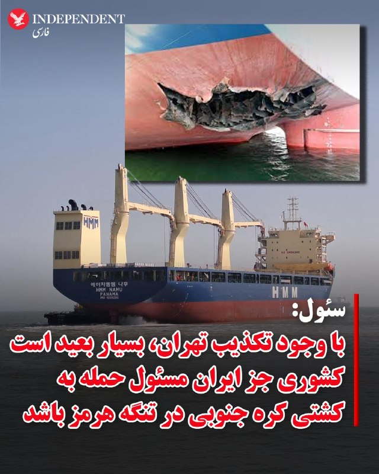

♦️یونهاپ، خبرگزاری دولتی کره جنوبی، روز چهارشنبه ۲۴ اردیبهشت به نقل از یکی از مقام‌های امنیتی این کشور گزارش کرد که بررسی‌های سئول نشان می‌دهد که به احتمال بسیار زیاد جمهوری اسلامی ایران مسئول حمله به کشتی باری این کشور در تنگه هرمز بوده است.

سفارت جمهوری اسلامی در سئول هفته گذشته هرگونه حمله جمهوری اسلامی به کشتی باری کره جنوبی در تنگه هرمز را رد کرده بود.

 وزارت خارجه کره‌جنوبی روز یکشنبه اعلام کرده بود که کشتی باری متعلق به این کشور که  روز ۱۴ اردیبهشت در تنگه هرمز دچار حادثه شده بود،  هدف حمله «هواگردهای ناشناس» قرار گرفته است.
پارک ایل، سخنگوی وزارت خارجه کره‌جنوبی، در یک نشست خبری گفت دو هواگرد ناشناس بخش بیرونی مخزن تعادل سمت چپ در قسمت عقب کشتی «اچ‌ام‌ام نامو» را با فاصله حدود یک دقیقه هدف قرار دادند که در پی آن آتش و دود ایجاد شد.
‌🇸🇦 Indypersian

🤖 @VahidOOnLine

## VahidOOnLine — post 240051

  

حسین نوری همدانی، مرجع تقلید حامی حکومت، با صدور فتوایی پرداخت وجوهات شرعی مقلدان علی خامنه‌ای به مجتبی خامنه‌ای را مجاز اعلام کرد و او را «فقیهی جامع‌الشرایط» خواند.

او در این فتوا نوشت: «با توجه به اینکه وجوهات شرعی در نهایت در مسیر اعتلای حوزه‌های علمیه و اداره امور طلاب مصرف می‌گردد، و با عنایت به شناخت موجود نسبت به او به عنوان فقیهی جامع‌الشرایط، ان‌شاء‌الله پرداخت وجوهات شرعی مقلدین رهبر شهید به معظم‌له موجب برائت ذمه خواهد بود.»
‌🏁 🇬🇧 IranintlTV

🤖 @VahidOOnLine

## VahidOOnLine — post 240050

  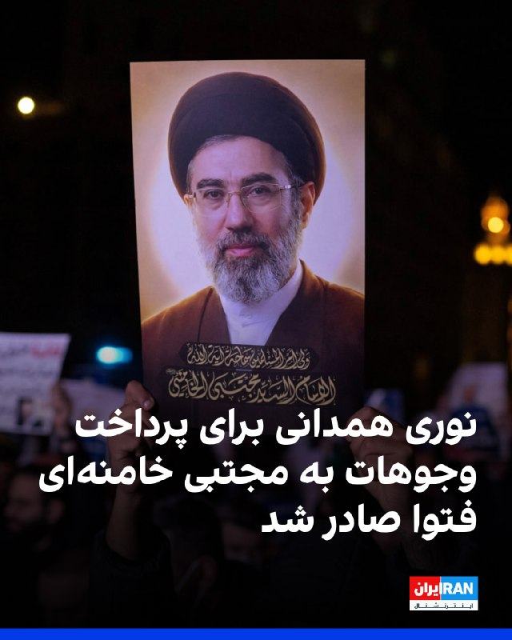

حسین نوری همدانی، مرجع تقلید حامی حکومت، با صدور فتوایی پرداخت وجوهات شرعی مقلدان علی خامنه‌ای به مجتبی خامنه‌ای را مجاز اعلام کرد و او را «فقیهی جامع‌الشرایط» خواند.

او در این فتوا نوشت: «با توجه به اینکه وجوهات شرعی در نهایت در مسیر اعتلای حوزه‌های علمیه و اداره امور طلاب مصرف می‌گردد، و با عنایت به شناخت موجود نسبت به او به عنوان فقیهی جامع‌الشرایط، ان‌شاء‌الله پرداخت وجوهات شرعی مقلدین رهبر شهید به معظم‌له موجب برائت ذمه خواهد بود.»
‌🏁 🇬🇧 IranintlTV

🤖 @VahidOOnLine

## VahidOOnLine — post 240049

  

رسانه‌های دولتی چین گزارش دادند دونالد ترامپ و شی جین‌پینگ در جریان گفت‌وگوهای خود در پکن درباره «وضعیت خاورمیانه» و جنگ اوکراین تبادل نظر کردند.

خبرگزاری دولتی شین‌هوا اعلام کرد دو رهبر درباره مسائل مهم بین‌المللی و منطقه‌ای، از جمله وضعیت خاورمیانه، دیدگاه‌های خود را مطرح کردند. موضوع جنگ اوکراین نیز در این گفت‌وگوها بررسی شد.

این دیدار در حالی برگزار شد که گمانه‌زنی‌هایی درباره تلاش احتمالی ترامپ برای جلب همکاری چین در موضوع جنگ آمریکا و اسرائیل علیه جمهوری اسلامی مطرح است.
‌🏁 🇬🇧 IranintlTV

🤖 @VahidOOnLine

## VahidOOnLine — post 240048

♦️دونالد ترامپ، رئیس جمهوری آمریکا و شی جین‌پینگ، رئیس جمهوری چین روز پنجشنبه ۲۴ اردیبهشت و پس از گفتگوهای رسمی، برای یک دیدار فرهنگی به «معبد بهشت» در پکن رفتند.

این معبد که از آن به‌عنوان «قله اوج معماری» چین یاد می‌شود، در قرن ۱۵ میلادی ساخته شده است و در فهرست میراث مشترک بشریت یونسکو قرار دارد.

ترامپ در جریان این بازدید گفت: «چین زیبا است».
‌🇸🇦 Indypersian

🤖 @VahidOOnLine

## VahidOOnLine — post 240047

  

حسین شریعتمداری، نماینده رهبر جمهوری اسلامی در روزنامه کیهان، در یادداشتی با اشاره به جدایی بحرین از ایران، خواستار اقدام جمهوری اسلامی برای بازپس‌گیری فوری این کشور شد.

او نوشت: «آیا در این واقعیت که بحرین کماکان بخشی از سرزمین ایران است، کمترین تردیدی هست؟ اگر تردیدی نیست که نیست، چرا برای بازپس‌گیری آن اقدامی نمی‌شود؟»

شریعتمداری در ادامه افزود: «انتظار آن است و انتظاری شایسته و بایسته نیز هست که جمهوری اسلامی، سازوکار قانونی بازپس‌گیری بحرین را در دستور کار فوری خود قرار دهد.»

او همچنین نوشت: «چرا باید بخشی از سرزمین ایران اسلامی نه فقط در اختیار بیگانگان باشد، بلکه به پایگاه آمریکا و اسرائیل تبدیل شود؟»
‌🏁 🇬🇧 IranintlTV

🤖 @VahidOOnLine

## VahidOOnLine — post 240046

  

دونالد ترامپ، رییس‌جمهوری آمریکا، و شی جین‌پینگ، رهبر چین، برای انجام یک بازدید فرهنگی وارد معبد بهشت شدند؛ مجموعه‌ای تاریخی که از شناخته‌شده‌ترین نمادهای فرهنگی چین به شمار می‌رود.

معبد بهشت در فهرست میراث جهانی یونسکو ثبت شده و عبادتگاهی باستانی است که امپراتوران چین در آن برای برداشت مطلوب محصولات کشاورزی دعا می‌کردند.

بر اساس توضیحات یونسکو، این مجموعه تاریخی به اوایل قرن پانزدهم میلادی بازمی‌گردد و در میان باغ‌ها و جنگل‌های کاج قرار دارد. یونسکو این مجموعه را نمادی از رابطه میان زمین و آسمان توصیف کرده است.
‌🏁 🇬🇧 IranintlTV

🤖 @VahidOOnLine

## VahidOOnLine — post 240045

  <a href="telegram/content/VahidOOnLine_240045_1778743892.mp4" target="_blank">🎬 Download video</a>

♦️عباس عراقچی، وزیر امور خارجه جمهوری اسلامی روز پنجشنبه ۲۴ اردیبهشت و در زمان ورود به نشست وزاری امور خارجه سازمان بریکس  مورد استقبال سوبرامانیام جایشانکا، وزیر خارجه هند قرار گرفت.

عراقچی در حالی در این اجلاس شرکت می‌کند که مساله ادامه بسته بودن تنگه هرمز، به یکی از چالش‌های جدی بین‌المللی تبدیل شده است. هند یکی از بزرگ‌ترین واردکنندگان نفت از کشورهای خاورمیانه، از زمان آغاز جنگ و به‌دلیل کاهش واردات سوخت، مجبور به صرفه‌جویی و اتخاذ سیاست‌های ویژه پولی و بانکی شده است.

وزرای خارجه روسیه، مصر، برزیل، هند، آفریقای جنوبی و جمهوری اسلامی در این نشست حضور دارند.
‌🇸🇦 Indypersian

🤖 @VahidOOnLine

## VahidOOnLine — post 240044

  

نتایج یک نظرسنجی ملی نشان می‌دهد مارکو روبیو، وزیر خارجه آمریکا، در رقابت برای نامزدی حزب جمهوری‌خواه در انتخابات ریاست‌جمهوری ۲۰۲۸ از جی‌دی ونس پیشی گرفته است. این نظرسنجی را موسسه اطلس‌اینتل در فاصله ۱۳ تا ۱۷ اردیبهشت انجام داده است.

بر اساس این نظرسنجی، روبیو با ۴۵.۴ درصد حمایت در صدر قرار دارد، در حالی که جی‌دی ونس ۲۹.۶ درصد آرا را به دست آورده است. ران دی‌سانتیس نیز با ۱۱.۲ درصد در جایگاه سوم قرار دارد.

این نتایج در مقایسه با پنج ماه پیش تغییر چشمگیری نشان می‌دهد. در آن زمان، ونس با ۴۶.۷ درصد پیشتاز بود و روبیو ۲۲.۶ درصد حمایت داشت. گزارش شده است که افزایش حمایت از روبیو پس از دوره‌ای از فعالیت‌های دیپلماتیک فشرده او، از اوکراین تا کوبا و ایران، رخ داده است.
‌🏁 🇬🇧 IranintlTV

🤖 @VahidOOnLine

## VahidOOnLine — post 240043

⭕️جنگ ایران بسته‌بندی چیپس در ژاپن را سیاه‌وسفید کرد

♦️شرکت ژاپنی «کالبی»، بزرگ‌ترین تولیدکننده چیپس در ژاپن، اعلام کرد به‌دلیل کمبود مواد اولیه ناشی از جنگ ایران و اختلال در بازار نفت، بسته‌بندی برخی محصولات خود را از رنگی به سیاه‌وسفید تغییر می‌دهد.

این شرکت دلیل تصمیم خود را اختلال در تامین مواد موردنیاز تولید جوهر چاپ، به‌ویژه «نفتا» عنوان کرده؛ ماده‌ای نفتی که بخش مهمی از صنایع شیمیایی و بسته‌بندی به آن وابسته‌اند.

اختلال در تنگه هرمز و افزایش بهای نفت، طی هفته‌های اخیر فشار قابل‌توجهی بر صنایع آسیایی وارد کرده و مقام‌های ژاپنی پیش‌تر نسبت به تاثیر «گسترده» بحران انرژی بر منطقه هشدار داده بودند.
‌🇸🇦 Indypersian

🤖 @VahidOOnLine

## WithYashar — post 11179

  <a href="telegram/content/WithYashar_11179_1778743894.mp4" target="_blank">🎬 Download video</a>

خبرنگار: آقای رئیس‌جمهور، مذاکرات چطور بود؟

ترامپ : عالی بود. چین زیباست.

خبرنگار: دربارهٔ تایوان هم صحبت کردید؟

ترامپ: (پاسخی نداد)
@withyashar

## mwarmonitor — post 9062

  <a href="telegram/content/mwarmonitor_9062_1778743896.mp4" target="_blank">🎬 Download video</a>

🇨🇳🇺🇸دونالد ترامپ و شی جین‌پینگ در حال بازدید از «معبد آسمان» در پکن هستند.
🔸خبرنگار: آقای رئیس‌جمهور، گفتگوها چطور بود؟
🔹دونالد ترامپ: عالی بود. جای فوق‌العاده‌ایه. چین زیباست.
مترجم (به چینی): پرزیدنت ترامپ می‌گن که گفتگوها خیلی خوب بوده.
🔸خبرنگار: آقای رئیس‌جمهور، آیا درباره تایوان صحبتی کردید؟
(ترامپ و شی جین‌پینگ بدون پاسخ به سوال، در حال ژست گرفتن برای عکس هستند)
مقام چینی: متشکرم. ممنون. خیلی ممنون.
خبرنگار (دوباره): آقای رئیس‌جمهور، آیا در مورد تایوان صحبت کردید؟
مقام چینی: ممنون از مطبوعات. متشکرم. ممنون.

@mwarmonitor

## mwarmonitor — post 9061

⚽️خبر فوتبالی از نیویورک تایمز:

🎙شکیرا، مدونا و گروه BTS اجرای نخستین نمایش بین دو نیمه را در فینال جام جهانی فوتبال بر عهده خواهند داشت.

@mwarmonitor

## mwarmonitor — post 9060

🇺🇸🇨🇳مراسم رسمی استقبال از دونالد ترامپ با حضور شی جین‌پینگ در چین برگزار شد

💠در این مراسم، رئیس‌جمهور چین با برگزاری تشریفات کامل دیپلماتیک از رئیس‌جمهور آمریکا استقبال کرد؛ رویدادی که در چارچوب سفر رسمی ترامپ به پکن و با هدف بررسی روابط دوجانبه، همکاری‌های اقتصادی و تحولات راهبردی بین دو کشور انجام خواهد گرفت.

@mwarmonitor

## FoxNewsTwitter — post 341701

  

Fox News (Twitter/X)

NEW: President Trump and President Xi Jinping tour the Temple of Heaven after their meeting at the Great Hall of the People in Beijing.

## FoxNewsTwitter — post 341700

  <a href="telegram/content/FoxNewsTwitter_341700_1778743898.mp4" target="_blank">🎬 Download video</a>

Fox News (Twitter/X)

NOW: President Trump and President Xi visit Temple of Heaven after having "great" talks.

"China is beautiful."

## FoxNewsTwitter — post 341699

Fox News (Twitter/X)

WATCH LIVE: President Trump and Chinese President Xi Jinping visit Temple of Heaven https://twitter.com/i/broadcasts/1nxnRYlNzoLxO

## pm_afshaa — post 90712

🔴رویترز: آمریکا و چین توافق کردن هیچ کشوری نباید عوارض از تنگه هرمز بگیره

💧 Rainbet.com the #1 Non-KYC Crypto Casino & Sportsbook @rainbetcom

😁 @Pm_Afshaa

## IranIntlTV — post 337125

  

طبق اطلاعات رسیده به ایران‌اینترنشنال، پرهام محرابی، نوجوان ۱۸ ساله اهل مشهد، شامگاه ۱۸ دی‌ماه ۱۴۰۴ در جریان اعتراضات بلوار هفت‌تیر، کنار پل هفت‌تیر ، در حالی‌که در کنار پدرش حضور داشت، با شلیک مستقیم ماموران سرکوبگر کشته شد. پدر او که لحظه اصابت گلوله را از نزدیک دیده بود، پیکر بی‌جان فرزندش را در آغوش گرفت و صدها متر حمل کرد تا به خودرویشان برسد و سپس او را به خانه منتقل کرد.

بر اساس اطلاعات رسیده به ایران‌اینترنشنال، پدر پرهام آن شب همراه فرزندش در محل اعتراضات حضور داشت و از فاصله‌ای نزدیک شاهد تیر خوردن او بود. او پس از اصابت گلوله، پیکر فرزندش را در آغوش گرفت و مسافتی طولانی حمل کرد تا به خودرو برسد و سپس مستقیما او را به خانه منتقل کرد. خانواده روز بعد برای دفن پیکر اقدام کردند اما به گفته منابع آگاه، ماموران امنیتی از پدر او تعهد کتبی گرفتند که اعلام کند فرزندش توسط «اغتشاشگران» کشته شده است و تهدید کردند در غیر این صورت اجازه دفن صادر نخواهد شد.

به گفته خانواده و اطرافیان، پرهام نوجوانی آرام، مهربان و محبوب بود و رابطه نزدیکی با پدر و مادرش داشت. خانواده‌اش می‌گویند.
https://iranintl.com/202605140

## IranIntlTV — post 337124

  

عباس عراقچی گفت جمهوری اسلامی هیچ مانعی در تنگه هرمز ایجاد نکرده و این آمریکا است که محاصره ایجاد کرده است.

او گفت: «ما هیچ مانعی در تنگه هرمز ایجاد نکرده‌ایم، این آمریکاست که محاصره ایجاد کرده است.»

عراقچی همچنین تاکید کرد: «تنگه هرمز برای تمامی کشتی‌های تجاری باز است، اما آنها باید با نیروهای دریایی ما همکاری کنند.»
https://iranintl.com/202605149350

## IranIntlTV — post 337123

  

مرکز عملیات تجارت دریایی بریتانیا اعلام کرد گزارشی از یک حادثه دریایی در فاصله ۳۸ مایل دریایی در شمال‌شرق فجیره، امارات متحده عربی، دریافت کرده است. این نهاد اعلام کرد این کشتی در حالی که در لنگرگاه قرار داشته، به دست افراد غیرمجاز تصرف شده و اکنون به سوی آب‌های سرزمینی ایران در حرکت است.
https://iranintl.com/202605141129

## IranIntlTV — post 337122

  

وزارت دفاع اسرائیل اعلام کرد با یکی از شرکت‌های زیرمجموعه شرکت دفاعی البیت قراردادی برای توسعه «قابلیت برد افزوده» جنگنده اف-۳۵آی امضا کرده است. ارزش این قرارداد ۳۴ میلیون دلار اعلام شده است.

بر اساس اعلام این وزارتخانه، این قرارداد با شرکت سایکلون منعقد شده و شامل «توسعه و یکپارچه‌سازی مخازن سوخت خارجی» بر پایه طرحی است که پیش‌تر برای جنگنده اف-۱۶ طراحی شده بود.

وزارت دفاع اسرائیل اعلام کرد این قابلیت جدید قرار است برد عملیاتی هواپیما را افزایش دهد، وابستگی به سوخت‌گیری هوایی را کاهش دهد و انعطاف‌پذیری عملیاتی در ماموریت‌های برد بلند را تقویت کند.
https://iranintl.com/202605141756

## IranIntlTV — post 337121

  

🔻معین، خواننده سرشناس موسیقی پاپ، با انتشار پستی در صفحه رسمی خود در اینستاگرام، اظهارات مهدی تاج، رییس فدراسیون فوتبال، درباره خواندن ترانه برای تیم ملی را تکذیب کرد.

🔹معین در این رابطه نوشت: «اخیرا خبرهایی درباره اجرای من برای تیم فوتبال در جام جهانی منتشر شده که صحت ندارد.»

🔹او همچنین با تاکید بر همبستگی با مردم اضافه کرد: «عشق من به مردم و سرزمینم همیشه واقعی بوده، اما صدای من زمانی معنا دارد که دل مردم آرام باشد و حال ایران خوب باشد.»

🔹این واکنش در حالی مطرح شد که در مراسم بدرقه تیم ملی در شامگاه چهارشنبه ۲۳ اردیبهشت، مهدی تاج تایید کرد که معین در حال آماده‌سازی قطعه‌ای برای تیم ملی است. او در این مراسم گفت: «ما دخالتی در ترانه معین نکرده‌ایم، اما در جریان آن هستیم.»
@iranintltvsport

## IranIntlTV — post 337120

  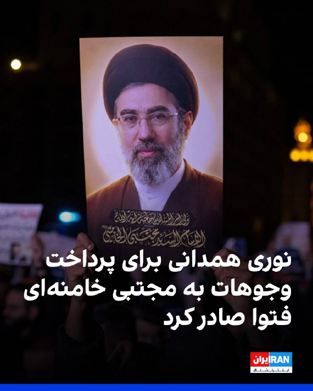

حسین نوری همدانی، مرجع تقلید حامی حکومت، با صدور فتوایی پرداخت وجوهات شرعی مقلدان علی خامنه‌ای به مجتبی خامنه‌ای را مجاز اعلام کرد و او را «فقیهی جامع‌الشرایط» خواند.

او در این فتوا نوشت: «با توجه به اینکه وجوهات شرعی در نهایت در مسیر اعتلای حوزه‌های علمیه و اداره امور طلاب مصرف می‌گردد، و با عنایت به شناخت موجود نسبت به او به عنوان فقیهی جامع‌الشرایط، ان‌شاء‌الله پرداخت وجوهات شرعی مقلدین رهبر شهید به معظم‌له موجب برائت ذمه خواهد بود.»
https://iranintl.com/202605149707

## IranIntlTV — post 337118

  <a href="telegram/content/IranIntlTV_337118_1778743902.mp4" target="_blank">🎬 Download video</a>

وزارت خارجه امارات گزارش‌ها درباره سفر بنیامین نتانیاهو به این کشور را تکذیب کرد. چهارشنبه دفتر نخست‌وزیری اسرائیل اعلام کرده بود نتانیاهو در جریان عملیات «غرش شیران» به‌صورت محرمانه به امارات سفر کرده و با محمد بن زاید آل نهیان، رییس امارات، دیدار داشته است.

گفت‌وگو با منشه امیر، کارشناس امور خاورمیانه
@iranintltv

## IranIntlTV — post 337117

  <a href="telegram/content/IranIntlTV_337117_1778743903.mp4" target="_blank">🎬 Download video</a>

امید معماریان، تحلیل‌گر سیاسی، درباره دیدار دونالد ترامپ و شی جین‌پینگ گفت: «ممکن است چین برای کمک به حل مساله جنگ ایران، بخواهد در حوزه‌های دیگر از آمریکا امتیاز بگیرد.»
@iranintltv

## IranIntlTV — post 337116

  <a href="telegram/content/IranIntlTV_337116_1778743905.mp4" target="_blank">🎬 Download video</a>

جاویدنامان انقلاب ملی ایرانیان
«سینا کاظمی» جوان ۲۲ ساله، ۱۸ دی‌ماه در منطقه تهرانپارس تهران با شلیک مستقیم نیروهای سرکوب خامنه‌ای کشته شد. نامش در حافظه‌ این سرزمین می‌ماند و یادش چراغ راه آزادی‌خواهان است.
@iranintltv

## IranIntlTV — post 337115

  

رسانه‌های دولتی چین گزارش دادند دونالد ترامپ و شی جین‌پینگ در جریان گفت‌وگوهای خود در پکن درباره «وضعیت خاورمیانه» و جنگ اوکراین تبادل نظر کردند.

خبرگزاری دولتی شین‌هوا اعلام کرد دو رهبر درباره مسائل مهم بین‌المللی و منطقه‌ای، از جمله وضعیت خاورمیانه، دیدگاه‌های خود را مطرح کردند. موضوع جنگ اوکراین نیز در این گفت‌وگوها بررسی شد.

این دیدار در حالی برگزار شد که گمانه‌زنی‌هایی درباره تلاش احتمالی ترامپ برای جلب همکاری چین در موضوع جنگ آمریکا و اسرائیل علیه جمهوری اسلامی مطرح است.
https://iranintl.com/202605147700

## IranIntlTV — post 337114

  <a href="telegram/content/IranIntlTV_337114_1778743907.mp4" target="_blank">🎬 Download video</a>

یک شرکت بریتانیایی اعلام کرد با کمک هوش مصنوعی، برای ربات‌ها یک «مغز» طراحی کرده که به آن‌ها امکان می‌دهد مانند انسان حرکت کنند و وظایف صنعتی انجام دهند.

گزارش فرزیا ثابتی، خبرنگار ایران‌اینترنشنال
@iranintltv

## IranIntlTV — post 337113

  <a href="telegram/content/IranIntlTV_337113_1778743908.mp4" target="_blank">🎬 Download video</a>

وزارت ارتباطات جمهوری اسلامی اعلام کرد برنامه‌ریزی برای اجرای طرحی موسوم به «ساماندهی دستفروشان آنلاین» را آغاز کرده است. به گفته این وزارتخانه، در صورت فراهم شدن زیرساخت‌ها این طرح می‌تواند «موانع حضور کسب‌وکارهای خانگی در اقتصاد دیجیتال را کاهش دهد».

گفت‌وگو با مهدی صارمی‌فر، روزنامه‌نگار علم و تکنولوژی
@iranintltv

## IranIntlTV — post 337112

  

حسین شریعتمداری، نماینده رهبر جمهوری اسلامی در روزنامه کیهان، در یادداشتی با اشاره به جدایی بحرین از ایران، خواستار اقدام جمهوری اسلامی برای بازپس‌گیری فوری این کشور شد.

او نوشت: «آیا در این واقعیت که بحرین کماکان بخشی از سرزمین ایران است، کمترین تردیدی هست؟ اگر تردیدی نیست که نیست، چرا برای بازپس‌گیری آن اقدامی نمی‌شود؟»

شریعتمداری در ادامه افزود: «انتظار آن است و انتظاری شایسته و بایسته نیز هست که جمهوری اسلامی، سازوکار قانونی بازپس‌گیری بحرین را در دستور کار فوری خود قرار دهد.»

او همچنین نوشت: «چرا باید بخشی از سرزمین ایران اسلامی نه فقط در اختیار بیگانگان باشد، بلکه به پایگاه آمریکا و اسرائیل تبدیل شود؟»
https://iranintl.com/202605149606

## IranIntlTV — post 337111

  <a href="telegram/content/IranIntlTV_337111_1778743910.mp4" target="_blank">🎬 Download video</a>

شهرام خلدی، پژوهش‌گر تاریخ خاورمیانه و روابط بین‌الملل، گفت سفر ترامپ به پکن فرصت مناسبی است تا رییس‌جمهوری چین از بحران ایران به‌عنوان یک کارت برنده برای دستیابی به اهداف اقتصادی بزرگ‌تر و اعمال فشار بر ایالات متحده استفاده کند.
@iranintltv

## IranIntlTV — post 337110

  <a href="telegram/content/IranIntlTV_337110_1778743911.mp4" target="_blank">🎬 Download video</a>

میزان، رسانه قوه قضاییه جمهوری اسلامی، گزارش داد حکم اعدام محمد عباسی، شهروند ۵۵ ساله و از بازداشت‌شدگان اعتراضات دی‌ماه ۱۴۰۴، چهارشنبه به اتهام «محاربه» اجرا شد. بر اساس گزارش نهادهای حقوق بشری، اعترافات مربوط به اتهام «قتل یکی از سرهنگ‌های نیروی انتظامی» در اعتراضات ملارد، تحت شکنجه و با تهدید به تعرض به دختر او گرفته شده بود.

گفت‌وگو با پگاه بنی‌هاشمی، پژوهش‌گر ارشد حقوق
@iranintltv

## IranIntlTV — post 337109

  <a href="telegram/content/IranIntlTV_337109_1778743913.mp4" target="_blank">🎬 Download video</a>

دونالد ترامپ، رییس‌جمهوری ایالات متحده، با ابراز خرسندی از سفر به چین و ادای احترام به اقدامات شی جین‌پینگ گفت واشینگتن و پکن همواره چالش‌ها و اختلافات خود را در سریع‌ترین زمان و با حسن نیت حل کرده‌اند.
@iranintltv

## IranIntlTV — post 337108

  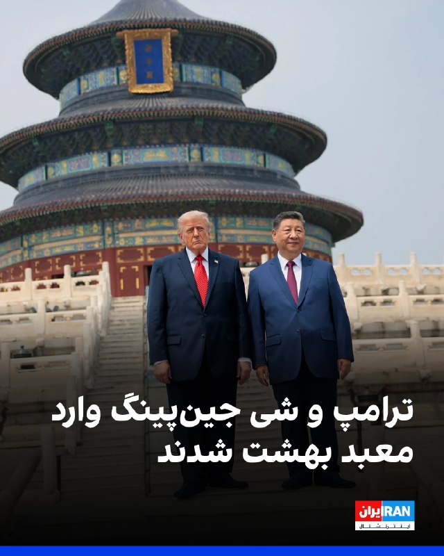

دونالد ترامپ، رییس‌جمهوری آمریکا، و شی جین‌پینگ، رهبر چین، برای انجام یک بازدید فرهنگی وارد معبد بهشت شدند؛ مجموعه‌ای تاریخی که از شناخته‌شده‌ترین نمادهای فرهنگی چین به شمار می‌رود.

معبد بهشت در فهرست میراث جهانی یونسکو ثبت شده و عبادتگاهی باستانی است که امپراتوران چین در آن برای برداشت مطلوب محصولات کشاورزی دعا می‌کردند.

بر اساس توضیحات یونسکو، این مجموعه تاریخی به اوایل قرن پانزدهم میلادی بازمی‌گردد و در میان باغ‌ها و جنگل‌های کاج قرار دارد. یونسکو این مجموعه را نمادی از رابطه میان زمین و آسمان توصیف کرده است.
https://iranintl.com/202605148251

## IranIntlTV — post 337107

  <a href="telegram/content/IranIntlTV_337107_1778743914.mp4" target="_blank">🎬 Download video</a>

روزنامه استرالین با شماری از شهروندان داخل ایران درباره تشدید بحران اقتصادی، کمبود دارو، تبعیض دیجیتال، گسترش بیکاری و افزایش فشارهای امنیتی در شهرهای مختلف گفت‌وگو کرده است.
علیرضا محبی، خبرنگار ایران‌اینترنشنال،‌ از جزییات این گزارش می‌گوید
@iranintltv

## IranIntlTV — post 337106

  <a href="https://t.me/IranintlTV/337106" target="_blank">📎 Download file</a>

🎧نسخه صوتی اخبار بامدادی | پنجشنبه ۲۴ اردیبهشت
@iranintlTV

## IranIntlTV — post 337105

  <a href="telegram/content/IranIntlTV_337105_1778743916.mp4" target="_blank">🎬 Download video</a>

مسعود پزشکیان، رییس دولت جمهوری اسلامی، در واکنش به تورم و گرانی بی‌سابقه، از وزارت جهاد کشاورزی خواست همه توان خود را برای کنترل قیمت‌ها به‌کار بگیرد. پزشکیان پیش‌تر گفته بود کشور به‌شدت به «صرفه‌جویی» نیاز دارد.

فرهاد ثابتان، استاد اقتصاد در دانشگاه کالیفرنیا، گفت نه قیمت‌گذاری دستوری و نه دعوت مردم به صرفه‌جویی، هیچ‌کدام قادر به حل مشکلات چندلایه اقتصاد ایران نیستند.
@iranintltv

## ManotoTV — post 105430

  <a href="telegram/content/ManotoTV_105430_1778743918.mp4" target="_blank">🎬 Download video</a>

همزمان با آغاز نشست وزیران خارجه کشورهای عضو بریکس در دهلی‌نو، عباس عراقچی، وزیر خارجه ایران، از اعضای این گروه و «همه کشورهای مسئول جامعه جهانی» خواست حملات آمریکا و اسرائیل علیه ایران را به‌صراحت محکوم کنند.
خبرگزاری رویترز گزارش داد جنگ ایران و اسرائیل بر نشست دو روزه بریکس در هند سایه انداخته و اختلاف‌ها میان اعضا، رسیدن به موضعی مشترک و صدور بیانیه نهایی را دشوار کرده است. ایران از هند، رئیس دوره‌ای بریکس، خواسته از این نشست برای ایجاد اجماع علیه واشینگتن و تل‌آویو استفاده کند

## ManotoTV — post 105428

  <a href="telegram/content/ManotoTV_105428_1778743918.mp4" target="_blank">🎬 Download video</a>

رسانه‌های وابسته به قوه قضاییه جمهوری اسلامی گزارش دادند با دستور مقام قضایی در استان همدان، اموال ۴۷ نفر که به «جاسوسی» و «همکاری با رژیم اسرائیل» متهم شده‌اند، توقیف شده است.
براساس این گزارش‌ها، این افراد در کشورهای مختلف از جمله بریتانیا، آلمان، آمریکا، ترکیه، عراق و سوئیس اقامت دارند و مقام‌های قضایی جمهوری اسلامی اعلام کرده‌اند پرونده آن‌ها در حال بررسی است. به گفته رسانه میزان، اموال توقیف‌شده قرار است برای «بازسازی اماکن آسیب‌دیده از جنگ» هزینه شود.

## ManotoTV — post 105427

  <a href="telegram/content/ManotoTV_105427_1778743919.mp4" target="_blank">🎬 Download video</a>

دونالد ترامپ، رئیس‌جمهوری آمریکا، در دیدار با شی جین‌پینگ در پکن، این نشست را «بسیار مهم» توصیف کرد و گفت توجه گسترده‌ای در آمریکا و جهان به این دیدار وجود دارد.
ترامپ با اشاره به اهمیت این مذاکرات گفت برخی این نشست را «بزرگ‌ترین دیدار تاریخ» می‌دانند و تاکید کرد مردم آمریکا تقریبا درباره موضوع دیگری صحبت نمی‌کنند. او همچنین حضور در کنار شی جین‌پینگ را «باعث افتخار» دانست و ابراز امیدواری کرد روابط میان آمریکا و چین «بهتر از هر زمان دیگری» شود.

## ManotoTV — post 105426

  <a href="telegram/content/ManotoTV_105426_1778743920.mp4" target="_blank">🎬 Download video</a>

دونالد ترامپ و شی جین‌پینگ، روسای جمهوری آمریکا و چین، در پکن دیدار کردند؛ دیداری که با مراسمی گسترده و تشریفات پرزرق‌وبرق همراه بود و صبح پنج‌شنبه با حضور هیات‌های بلندپایه دو کشور برگزار شد.
ترامپ در سخنان آغازین خود این دیدار را «باعث افتخار» توصیف کرد و گفت:
«رئیس‌جمهوری شی، بسیار سپاسگزارم. چنین استقبالی کمتر دیده‌ام. بیش از همه تحت تأثیر کودکان قرار گرفتم؛ شاد و فوق‌العاده بودند. ارتش چین قدرتمند بود، اما آن کودکان چیزهای زیادی را نمایندگی می‌کنند.»

## ManotoTV — post 105425

  <a href="telegram/content/ManotoTV_105425_1778743921.mp4" target="_blank">🎬 Download video</a>

دونالد ترامپ، رئیس‌جمهوری آمریکا، صبح پنج‌شنبه در جریان سفر خود به پکن همراه با شی جین‌پینگ، رئیس‌جمهوری چین، در مراسم رسمی استقبال و رژه نیروهای نظامی این کشور شرکت کرد.
این مراسم در مقابل ساختمان «تالار بزرگ خلق» برگزار شد و دو رهبر ضمن بازدید از یگان‌های نظامی، شاهد اجرای مراسم سان و رژه نیروهای ارتش چین بودند.

## FarsiVOA — post 217699

  

شی جین‌پینگ، رئیس‌جمهور چین، در جریان گفت‌وگو با دونالد ترامپ، رئیس‌جمهور آمریکا گفت که روابط اقتصادی بین دو کشور «ماهیتی دوجانبه، سودمند و برد-برد» دارد.

به گزارش خبرگزاری دولتی چین، شینهوا، شی پنجشنبه گفت: «دیروز، تیم‌های اقتصادی و تجاری ما نتایجی به‌طور کلی متوازن و مثبت تولید کردند. این خبر خوبی برای مردم دو کشور و جهان است.»

رئیس‌جمهور چین افزود که واقعیت‌ها بارها نشان داده‌اند در جنگ‌های تجاری هیچ برنده‌ای وجود ندارد و از هر دو طرف خواست تا به‌طور مشترک شتاب مثبتی را که با تلاش فراوان ایجاد کرده‌اند حفظ کنند.

او گفت: «در مواردی که اختلافات و اصطکاک‌ها وجود دارد، مشورت برابر تنها انتخاب درست است.»

همچنین بر اساس ویدیویی که از ابتدای مذاکرات منتشر شد، شی گفت: «همواره بر این باور بوده‌ام که منافع مشترک میان چین و ایالات متحده بر اختلافات ما می‌چربد؛ موفقیت هر کشور فرصتی برای کشور دیگر است و یک رابطه پایدار چین و آمریکا برای جهان یک موهبت است. همکاری به سود هر دو طرف است، در حالی که تقابل به هر دو طرف آسیب می‌زند.»
@FarsiVOA

## FarsiVOA — post 217698

  

🔺اوپک از افت تولید نفت ایران برای دومین ماه متوالی خبر داد

▪️سازمان کشورهای صادرکننده نفت، اوپک، از افت تولید نفت ایران برای دومین ماه متوالی خبر داد.

▪️تولید روزانه نفت ایران در ماه آوریل نسبت به ماه مارس حدود ۲۱۲ هزار بشکه و نسبت به ماه فوریه، قبل از جنگ، حدود ۳۸۷ هزار بشکه کاهش داشته است. ایران در ماه گذشته روزانه ۲ میلیون و ۸۵۴ هزار بشکه تولید نفت داشته است.

▪️با توجه به پر شدن مخازن ذخیره نفت ایران به خاطر محاصره دریایی آمریکا، انتظار می‌رود شتاب افت تولید نفت ایران در ماه جاری افزایش یابد.

▪️مصرف داخلی نفت خام ایران حدود ۱.۷ میلیون بشکه است و در صورت ناتوانی جمهوری اسلامی در صادرات نفت، تولید نفت خام به همین سطح کاهش خواهد یافت.

⬇️ بیشتر بخوانید:
https://ir.voanews.com/a/8149916.html

## FarsiVOA — post 217697

🔺ترامپ به شی: روابط آمریکا با چین «بهتر از همیشه» خواهد بود

▪️دونالد ترامپ، رئیس‌جمهور ایالات متحده، روز پنج‌شنبه ۲۴ اردیبهشت در پکن و پشت میز گفت‌وگو با همتای چینی خود، شی جین‌پینگ، اعلام کرد که روابط کشورش با چین «بهتر از همیشه» خواهد بود.

▪️ترامپ روز چهارشنبه برای سفری سه‌روزه وارد پایتخت چین شد. این نخستین سفر او به چین از سال ۲۰۱۷ تاکنون است.

▪️این سفر در ابتدا برای اواخر ماه مارس برنامه‌ریزی شده بود، اما به دلیل جنگ آمریکا و اسرائیل علیه جمهوری اسلامی به تعویق افتاد.

▪️هدف نشست شی و ترامپ دستیابی به توافق‌هایی درباره محصولات کشاورزی و هواپیماها، و همچنین حفظ آتش‌بس شکننده در جنگ تجاری میان دو اقتصاد بزرگ جهان است.

⬇️ بیشتر بخوانید:
https://ir.voanews.com/a/8149914.html

## DW_Farsi — post 124673

  

🔶 امارات متحده خبر سفر نتانیاهو به این کشور را تکذیب کرد

وزارت امور خارجه امارات متحده عربی اخبار و گزارش‌های مربوط به سفر بنیامین نتانیاهو به این کشور در حین جنگ آمریکا و اسرائیل با جمهوری اسلامی را تکذیب کرد.

در بیانیه این وزارتخانه در این رابطه منتشر شد، آماده است: «امارات متحده عربی گزارش‌های منتشرشده درباره سفر نخست‌وزير اسرائيل يا استقبال از يک هيات نظامی اسرائيلی را تکذيب می‌کند.»

این وزارتخانه تأکید کرده که روابط امارات و اسرائیل "علنی و بر پایه پیمان ابراهیم" است و از این رو تمامی سفرها و دیدارهای رسمی به شکل شفاف اعلام شده و انجام می‌گیرند".

دفتر بنیامین نتانیاهو چهارشنبه ۱۳ مه (۲۳ اردیبهشت) اعلام کرده بود، نخست وزیر اسرائیل در جریان جنگ ایران به‌طور محرمانه به امارات سفر کرده و با محمد بن زاید، رئیس امارات، دیدار داشته است. به گفته دفتر نتانیاهو این سفر به "یک دستاورد تاریخی" در روابط دو طرف منجر شده است.

پیش از آن وال استریت ژورنال در گزارشی نوشته بود دیوید بارنیا، رئیس موساد، نیز دست‌کم دو بار در ماه‌های مارس و آوریل به امارات سفر کرد تا درباره روند جنگ با ایران و هماهنگی‌های امنیتی با مقام‌های این کشور گفت‌وگو کند.

@dw_farsi

## DW_Farsi — post 124672

  

🔶 ابراز امیدواری روبیو به فشار بیشتر پکن بر تهران

مارکو روبیو اعلام کرد ایالات متحده به پشتیبانی بیشتر چین در راه یافتن راه‌حلی برای تنگه هرمز امیدوار است. وزیر خارجه آمریکا تصریح کرد: «ما امیدواریم چین را متقاعد کنیم که نقشی فعالانه‌تر برای متقاعد کردن ایران بازی کند تا تهران از آنچه در حال حاضر در خلیج فارس انجام می‌دهد و در تلاش برای انجام آن است، فاصله بگیرد.»

روبیو که دونالد ترامپ را در سفر به چین همراهی می‌کند، این اظهارات را در گفت‌وگو با شبکه فاکس نیوز که در هواپیمای "ایرفورس وان" انجام شد، ابراز کرد.

وزیر خارجه ایالات متحده در این گفت‌وگو تأکید کرد که رفع وضعیت کنونی حاکم در تنگه هرمز به دلایل مختلف به نفع چین است. با این حال از آنجایی که کشتی‌های چینی نیز در آب‌های خلیج فارس گرفتار شده‌اند. او افزود، اقتصاد چین بر محور صادرات فعالیت می‌کند و از فشارهای اقتصادی ناشی از بحران تنگه هرمز رنج می‌برد، زیرا کشورهای دیگر بر اثر این بحران کالاهای کمتری از چین خریداری می‌کنند.

اظهارات روبیو در تضاد با سخنان ترامپ قرار دارد. رئیس جمهور آمریکا در آغاز سفرش به پکن در پاسخ به این پرسش که آیا همتای چینی او، شی می‌تواند در جنگ ایران یاری‌دهنده باشد، گفت بود: «گمان می‌کنم، ما در مورد ایران به هیچ کمکی نیاز نداریم.»

@dw_farsi

## Persian_Trend_Official — post 14099

⭕️ وضعیت از 57 تا امروز... 🗿

(نسخه کم حجم توی کامنت ها)
📝 Nick

📌 @persian_trend_official
پرشین ترند | متفاوت‌ترین کانال نظامی

## Persian_Trend_Official — post 14098

  <a href="telegram/content/Persian_Trend_Official_14098_1778743924.webm" target="_blank">🎬 Download video</a>

⭕️ وزیر انرژی و معادن کوبا اعلام کرد که کشور به طور کامل از دیزل و نفت کوره خالی شده و تولید برق به صورت کامل متوقف شده است، در حالی که ایالات متحده جزیره را محاصره کرده است.

بسیاری از محله‌ها در پایتخت کوبا در حال حاضر با خاموشی‌هایی مواجه هستند که ۲۰ تا ۲۲ ساعت در روز طول می‌کشد.

📝 Nick

📌 @persian_trend_official
پرشین ترند | متفاوت‌ترین کانال نظامی

## Persian_Trend_Official — post 14093

  <a href="telegram/content/Persian_Trend_Official_14093_1778743924.webm" target="_blank">🎬 Download video</a>

باز مانده از رزمایش ضد هلی برن «قائد شهید» سپاه حضرت محمد رسول اللّه (ص) تهران بزرگ !!!

درسته جنگ زمینی تخصص شماست، فقط متخصصین عزیز پوتین نداشتید ؟

📌 @persian_trend_official
پرشین ترند | متفاوت‌ترین کانال نظامی

## Persian_Trend_Official — post 14092

کانال رسمی پرشین ترند pinned a voice message

## Persian_Trend_Official — post 14091

هر شب خواب رفیقای شهیدمو می‌بینم ! 📌 @persian_trend_official پرشین ترند | متفاوت‌ترین کانال نظامی

## Persian_Trend_Official — post 14090

  <a href="telegram/content/Persian_Trend_Official_14090_1778743925.mp4" target="_blank">🎬 Download video</a>

هر شب خواب رفیقای شهیدمو می‌بینم !

📌 @persian_trend_official
پرشین ترند | متفاوت‌ترین کانال نظامی

## Persian_Trend_Official — post 14087

📍بولتن خبری ۲۴ ساعت اخیر پرشین ترند
🗓 ۲۴ اردیبهشت ۱۴۰۵

گرد آوری = آرشیو تحریریه پرشین ترند

◾️ نیویورک تایمز: ایران ۷۰ درصد از ذخایر موشکی خود را حفظ کرده و به ۳۰ سایت از ۳۳ سایت موشکی در تنگه هرمز دسترسی مجدد یافته است

◾️ رویترز: ایران رویکرد خود را از مسدودسازی هرمز به «کنترل دسترسی» تغییر داده؛ عراق و پاکستان به توافق جداگانه برای عبور نفتکش‌هایشان دست یافته‌اند

◾️خبرگزاری Wsj: عبور و مرور «خاموش» کشتی‌ها در تنگه هرمز ۶۰۰ درصد افزایش یافته

◾️ مجلس سنای آمریکا برای هفتمین بار قطعنامه پایان جنگ با ایران را رد کرد

◾️ پنتاگون: هزینه جنگ با ایران به ۲۹ میلیارد دلار رسید؛ تحلیلگران هشدار می‌دهند رقم نهایی به یک تریلیون دلار خواهد رسید

◾️ وزارت بهداشت ایران: تعداد مجروحان بستری جنگ به زیر ۴۰ نفر رسیده است

◾️سخنگوی وزارت خارجه ایران: آمریکا اهمیت فرصت مذاکره را درک نمی‌کند؛ ارزیابی دقیق‌تری از موضع آمریکا از طریق میانجیان پاکستانی دریافت خواهد شد

◾️سخنگوی کمیسیون امنیت ملی: غنی‌سازی ۹۰ درصدی یکی از گزینه‌های مطرح ایران است

◾️وزیر انرژی آمریکا: ایران به طرز نگران‌کننده‌ به غنی‌سازی درجه تسلیحاتی نزدیک شده و ممکن است چند هفته با آستانه ۹۰ درصد فاصله داشته باشد

◾️نروژ با سفر معاون وزیر خارجه به تهران، عمان و پاکستان در حال آزمودن نقش میانجیگری اروپایی است

◾️روسیه آمادگی خود را برای حمایت از تلاش‌های دیپلماتیک پاکستان در حل تنش خاورمیانه اعلام کرد

◾️ایتالیا اعلام کرد در صورت برقراری آتش‌بس پایدار، دو فروند مین‌روب به تنگه هرمز اعزام خواهد کرد

◾️ترامپ وارد پکن شد؛ ایران محور اصلی مذاکرات با شی جین‌پینگ عنوان شده است

◾️ترامپ: آمریکا برای پایان جنگ با ایران به کمک چین نیاز ندارد؛ «به هر شکل پیروز خواهیم شد»

◾️روبیو: واشنگتن امیدوار است پکن ایران را به عقب‌نشینی از رفتارهایش در منطقه متقاعد کند

◾️روبیو و وانگ یی توافق کردند هیچ کشوری حق دریافت عوارض حمل‌ونقل در تنگه هرمز را ندارد

◾️واشنگتن‌پست: گزارش محرمانه اطلاعاتی آمریکا نشان می‌دهد چین از جنگ ایران بهره راهبردی می‌برد؛ پکن در حین حملات ایران به کشورهای خلیج فارس تسلیحات فروخته است

◾️نیویورک تایمز: شرکت‌های چینی درباره فروش مخفیانه سلاح به ایران از طریق کشورهای ثالث مذاکره کرده‌اند

◾️گزارش‌ها حاکی است ایلان ماسک، تیم کوک، جنسن هوانگ و لری فینک در هیئت همراه ترامپ در سفر به پکن حضور دارند

◾️شهباز شریف از ۳ تا ۶ خرداد به پکن سفر می‌کند؛ میانجیگری میان ایران و آمریکا با مشارکت چین از دستور کار اصلی است

◾️وال استریت ژورنال: رئیس موساد دیوید بارنیا در جریان جنگ حداقل دو بار به‌صورت مخفیانه به امارات سفر کرده است

◾️دفتر نخست‌وزیری اسرائیل: نتانیاهو در میانه جنگ سفری محرمانه به امارات داشته؛ امارات این ادعا را تکذیب کرد

◾️داده‌های پروازی منتشرشده نشان می‌دهد دو هواپیمای شخصی در ۲۶ مارس از تل‌آویو به شهر العین امارات پرواز کرده‌اند

◾️وال استریت ژورنال: امارات فراتر از میانجیگری دیپلماتیک عمل کرده؛ حمله به جزیره لاوان و میزبانی سامانه‌های دفاع هوایی اسرائیل به این کشور نسبت داده شده است

◾️رویترز: جنگنده‌های عربستان سعودی اهداف شبه‌نظامیان وابسته به ایران را در نزدیکی مرز عراق بمباران کردند

◾️رویترز: کویت در دو نوبت حملات موشکی تلافی‌جویانه به مواضع شبه‌نظامیان در جنوب عراق انجام داده است

◾️عراقچی: کویت به‌صورت غیرقانونی به شناور ایرانی حمله و ۴ تبعه ایران را در خلیج فارس بازداشت کرده ؛ایران خواستار آزادی فوری آن‌هاست

◾️ احسان افرشته ۳۳ ساله بامداد چهارشنبه به اتهام همکاری با موساد اعدام شد؛ او پیش از بازگشت به ایران داوطلبانه خود را معرفی کرده بود

◾️ عضو کمیسیون بودجه مجلس: ۳۰ درصد از گرانی‌ها ناشی از جنگ و ۳۵ درصد ناشی از ناکارآمدی دستگاه‌هاست

◾️ شبکهNDTV تصاویر ماهواره‌ای منتشر کرد که حضور هواپیمای ترابری C-130H ایران در پایگاه هوایی نورخان پاکستان را تأیید می‌کند

◾️ وزیر دفاع پاکستان: ترکیه و قطر ممکن است به توافق دفاعی متقابل پاکستان و عربستان سعودی بپیوندند

◾️ رایمتال آلمان تولید انبوه پهپاد FV-014 با برد ۱۰۰ کیلومتر و استقامت ۷۰ دقیقه‌ای را آغاز کرد

◾️پنتاگون به‌طور غیرمنتظره اعزام تیپ رزمی زرهی «بلک‌جک» به لهستان را لغو کرد؛ برخی نیروها در مسیر بودند که دستور توقف صادر شد

◾️بلومبرگ: نزدیک به ۴۰ درصد از تأمین‌کنندگان سازندگان موشک دولتی چین در ۲۰۲۵ به درآمد رکوردی رسیدند

◾️ پوتین به تسلط کامل بر دونباس تا پاییز متمرکز شده و قصد دارد از آن برای درخواست قلمرو بیشتر در مذاکرات آتی بهره ببرد

◾️ ترکیه و ارمنستان آماده‌سازی‌های لازم برای راه‌اندازی تجارت مستقیم را تا ۱۱ مه ۲۰۲۶ تکمیل کردند

📌 @persian_trend_official
پرشین ترند | متفاوت‌ترین کانال نظامی

## RadioFarda — post 157160

  

🔸 نخست‌وزیر ژاپن از عبور موفقیت‌آمیز یک نفتکش این کشور حامل نفت خام روز پنجشنبه ۲۴ اردیبهشت از تنگه هرمز عبور کرده و در راه ژاپن است.

🔸 سانائه تاکایچی با اعلام این خبر در شبکه ایکس نوشت پس از عبور یک کشتی متعلق به ژاپن در نهم اردیبهشت از تنگه هرمز، عبور کشتی دوم به‌عنوان یک تحول مثبت ارزیابی می‌شود.

🔸 میاتا توموهیده، مدیرعامل شرکت انیوس، بزرگ‌ترین گروه پالایشی ژاپن که این نفتکش هم زیرمجموعهٔ آن است، گفت این نفتکش با موفقیت از تنگه هرمز عبور کرده و انتظار می‌رود اواخر ماه مه یا اوایل ژوئن به ژاپن برسد.

🔸 بر اساس داده‌های شرکت «کلپر»، این کشتی حامل ۱.۲ میلیون بشکه نفت خام کویت و ۷۰۰ هزار بشکه نفت امارات است.

🔸 ژاپن پیش از آغاز جنگ حدود ۹۵ درصد نفت خود را از کشورهای حوزه خلیج فارس وارد می‌کرد.

🔸 وزارت خارجهٔ ژاپن اعلام کرده دولت این کشور برای عبور ایمن کشتی‌ها مستقیماً با حکومت ایران در تماس بوده است. به‌گفتهٔ این وزارتخانه، هنوز ۳۹ کشتی مرتبط با ژاپن در خلیج فارس باقی مانده‌اند.

@RadioFarda

## RadioFarda — post 157159

🔸 رئیس‌جمهور آمریکا با همتای چینی خود شی ژین‌پینگ صبح روز پنج‌شنبه ۲۳ اردیبهشت در پایتخت چین دیدار رسمی کرد.

🔸 دونالد ترامپ به‌عنوان نخستین رئیس‌جمهور ایالات متحده که در نزدیک به یک دهۀ اخیر به پکن سفر کرده، امیدوار است در این سفر به موفقیت‌های تجاری رسیده و «آتش‌بس شکنندۀ تجاری» میان دو ابرقدرت را، حفظ کند.

🔸 مدیران ارشد تجاری و فناوری که رئیس‌جمهور آمریکا را در این سفر همراهی می‌کنند، امیدوارند بتوانند برخی موانع تجاری میان دو کشور را برطرف کنند؛ از جمله مدیر عامل شرکت انویدیا که برای دریافت مجوز فروش تراشه‌های قدرتمند هوش مصنوعی خود موسوم به اچ ۲۰۰، دردسر زیادی کشیده است.

@RadioFarda

## RadioFarda — post 157158

  

🔸مارکو روبیو، وزیر خارجه آمریکا، می‌گوید به نفع چین است که حکومت ایران را برای باز کردن تنگه هرمز تحت فشار بگذارد.

🔸براساس گزارشی که فاکس‌نیوز از اظهارات روبیو در راه سفر به چین پخش کرد، او گفت: «ما این استدلال را با چینی‌ها مطرح کرده‌ایم و امیدوارم قانع‌کننده باشد. آن‌ها اواخر این هفته در سازمان ملل فرصت خواهند داشت دربارهٔ این موضوع اقدامی انجام دهند؛ زمانی که قطعنامه‌ای برای محکوم کردن اقدامات ایران در ارتباط با تنگه‌ها مطرح می‌شود.»

🔸روبیو گفت حکومت ایران در حال ایجاد ظرفیتی بوده که بتواند با «انبوهی از موشک‌ها و پهپادها» سامانه‌های دفاعی کشورهای منطقه را از کار بیندازد و هرگونه حملهٔ احتمالی به برنامه هسته‌ای خود را با تهدید به وارد کردن خسارت گسترده به کشورهای خلیج فارس پاسخ دهد.

🔸مارکو روبیو همچنین با اشاره به بحران تنگه هرمز، گفت این وضعیت بیش از هر کشور دیگری به زیان چین است و پکن باید ایران را برای عقب‌نشینی از اقداماتش تحت فشار بگذارد.

@RadioFarda

## RadioFarda — post 157156

  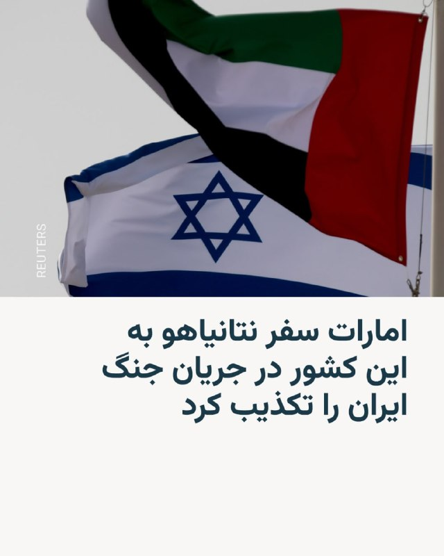

🔸وزارت خارجه امارات متحده عربی در بیانیه‌ای ادعای دفتر بنیامین نتانیاهو، نخست‌وزیر اسرائیل، مبنی بر سفر او به امارات در جریان جنگ ایران را تکذیب کرد.

🔸دفتر نخست‌وزیر اسرائیل پیش‌تر اعلام کرده بود که نتانیاهو در جریان جنگ با ایران به امارات سفر کرده و با شیخ محمد بن زاید، رئیس این کشور و حاکم ابوظبی دیدار داشته است.

🔸در بیانیه وزارت خارجه امارات که چهارشنبه ۲۴ اردیبهشت منتشر شده، آمده که روابط این کشور با اسرائیل «علنی» است و «بر پایه توافقات غیرشفاف یا غیررسمی بنا نشده است.»

🔸در این بیانیه تأکید شده: «هرگونه ادعا درباره سفرهای اعلام‌نشده یا توافقات پنهانی، مگر آنکه به‌طور رسمی توسط مقام‌های ذی‌ربط امارات اعلام شود، کاملاً بی‌اساس است.»

🔸دفتر نتانیاهو گفته بود که این دیدار به یک «پیشرفت تاریخی» در روابط میان دو کشور منجر شده است.

🔸با این حال یک منبع آگاه از این دیدار به رویترز گفت که نتانیاهو و شیخ محمد، ششم فروردین در شهر العین، واحه‌ای در نزدیکی مرز عمان، «دیدار کرده‌اند و ملاقات آنها چندین ساعت به طول انجامیده است».

@RadioFarda

## RadioFarda — post 157155

  <a href="https://t.me/radiofarda/157155" target="_blank">📎 Download file</a>

📻بشنوید: سرخط خبرها با رادیوفردا، ۲۴ اردیبهشت ۱۴۰۵‌

@RadioFarda

## IranianMinds — post 20106

تحلیلگرا بیان حرف بزنیم

@FardadIs

## IranianMinds — post 20105

  

🔴 مراد ویسی :

قصد دارم لیستی از قاتلان مردم ایران در دی ماه تهیه کنم و هر شب اسم هاشون رو‌ در لایو بخونم.

@IranianMinds

## IranianMinds — post 20104

🔴 الجزیره :

مذاکرات و صحبتای ترامپ و رئیس جمهور چین در تالار پکن پایان یافت

@IranianMinds

## IranianMinds — post 20103

  <a href="telegram/content/IranianMinds_20103_1778743929.mp4" target="_blank">🎬 Download video</a>

🔴 ترامپ به رئیس‌ جمهور چین:

افتخار دارم که در کنار شما هستم. افتخار دارم که دوست شما هستم و روابط بین چین و ایالات متحده بهتر از همیشه خواهد شد.

@IranianMinds

## IranianMinds — post 20102

  <a href="telegram/content/IranianMinds_20102_1778743930.mp4" target="_blank">🎬 Download video</a>

🔴 ترامپ به رئیس‌ جمهور چین:

شما یک رهبر بزرگ هستید. به همه می‌گویم که شما یک رهبر بزرگ هستید. گاهی مردم از گفتن این حرف توسط من خوششان نمی‌آید، اما با این حال می‌گویم چون حقیقت است.

من فقط حقیقت را می‌گویم.

@IranianMinds

## IranianMinds — post 20101

  <a href="telegram/content/IranianMinds_20101_1778743931.mp4" target="_blank">🎬 Download video</a>

🔴 رئیس ‌جمهور چین به ترامپ:

همیشه معتقد بودم که دو کشور ما منافع مشترک بیشتری نسبت به اختلافات داریم.

موفقیت یکی، فرصتی برای دیگری است و یک رابطه دوجانبه باثبات برای جهان مفید است.

چین و ایالات متحده هر دو از همکاری بهره می‌برند و از مواجهه ضرر می‌کنند. ما باید شریک باشیم، نه رقیب.

باید به یکدیگر کمک کنیم تا موفق شویم، با هم رونق پیدا کنیم و راه درست برای تعامل کشورهای بزرگ در عصر جدید را بیابیم.

@IranianMinds

## IranianMinds — post 20100

  <a href="telegram/content/IranianMinds_20100_1778743932.mp4" target="_blank">🎬 Download video</a>

🔴 رئیس ‌جمهور چین به ترامپ:

در حال حاضر، تحولی که در یک قرن گذشته دیده نشده در سراسر جهان شتاب گرفته و وضعیت بین‌المللی سیال و پرآشوب است.

جهان به یک چهارراه جدید رسیده است.

@IranianMinds

## IranianMinds — post 20099

  <a href="telegram/content/IranianMinds_20099_1778743934.mp4" target="_blank">🎬 Download video</a>

🔴 رئیس ‌جمهور چین به ترامپ:

آیا می‌توانیم، به نفع رفاه مردم هر دو کشور و آینده بشریت، آینده‌ای روشن‌تر برای روابط دوجانبه‌مان بسازیم؟

@IranianMinds

## IranianMinds — post 20098

  <a href="telegram/content/IranianMinds_20098_1778743935.mp4" target="_blank">🎬 Download video</a>

🔴 رئیس ‌جمهور چین به ترامپ:

تمام جهان در حال تماشای دیدار ماست

@IranianMindsi

## BBCPersian — post 281007

‌ یونهاپ،‌ خبرگزاری رسمی کره‌جنوبی، روز پنج‌شنبه به نقل از یک مقام ارشد در سئول گزارش داد احتمال این که طرفی غیر از ایران مسئول حمله به یک کشتی باری کره‌جنوبی در نزدیکی تنگه هرمز باشد، کم است. در این گزارش به نقل از یک مقام ارشد کره‌جنوبی آمده است که این…

## BBCPersian — post 281006

  

‌
یونهاپ،‌ خبرگزاری رسمی کره‌جنوبی، روز پنج‌شنبه به نقل از یک مقام ارشد در سئول گزارش داد احتمال این که طرفی غیر از ایران مسئول حمله به یک کشتی باری کره‌جنوبی در نزدیکی تنگه هرمز باشد، کم است.

در این گزارش به نقل از یک مقام ارشد کره‌جنوبی آمده است که این کشور در حال بررسی اطلاعاتی است که آمریکا درباره حمله چهارم مه (۱۴ اردیبهشت) به کشتی «نامو» متعلق به شرکت کشتیرانی «اچ‌ام‌ام» کره‌جنوبی در اختیارش گذاشته است. این حمله باعث آتش‌سوزی و آسیب به بخشی از بدنه کشتی شد.

این مقام ارشد وزارت خارجه کره‌جنوبی به خبرنگاران گفت:«وقتی تحقیقات را کامل کنیم و شواهد را ارائه دهیم، اطمینان دارم طرف ایرانی واکنشی مناسب نشان خواهد داد.»

وزارت خارجه کره‌جنوبی تاکنون اظهارات این مقام را تأیید نکرده است.

📷South Korean Foreign Ministry/Reuters
@BBCPersian
⬇️

## BBCPersian — post 281005

🔻یک کمیسیون تحقیق اسرائیلی: حماس در حملات هفت اکتبر از خشونت جنسی به عنوان «سلاح» استفاده کرد

یک کمیسیون مستقل اسرائیلی جزئیات تکان‌دهنده‌ای از خشونت جنسی «سیستماتیک و گسترده» توسط حماس و سایر گروه‌های مسلح فلسطینی در جریان حملات ۷ اکتبر ۲۰۲۳ و علیه گروگان‌ها منتشر کرده است.

گزارش ۳۰۰ صفحه‌ای این کمیسیون نتیجه‌گیری می‌کند که تجاوز و شکنجه جنسی «با هدف به حداکثر رساندن درد و رنج» انجام شده است.

در حالی که سازمان ملل متحد و دیگران گزارش‌هایی در مورد خشونت جنسی در جریان این حملات منتشر کرده‌اند گفته می‌شود که گزارش این کمیسیون مستقل جامع‌ترین گزارش است.

حماس در حمله هفتم اکتبر ۲۰۲۳، حدود ۱۲۰۰ نفر را کشت و ۲۵۱ نفر را گروگان گرفت.

این گزارش بر اساس ۴۳۰ مصاحبه فیلمبرداری شده با بازماندگان و شاهدان آن حمله، بیش از ۱۰ هزار عکس و فیلم گرفته شده توسط مهاجمان و سوابق و مدارک رسمی از محل‌های حمله تهیه شده است.

بیشتر بخوانید:

https://bbc.in/4divTP2
@BBCPersian

## BBCPersian — post 280997

‌‌
رسانه‌ها و محافل سیاسی تندرو در ایران، به شکل روزافزونی تنگه هرمز را نه‌تنها به عنوان یک گلوگاه انرژی، بلکه به عنوان مسیری استراتژیک برای ترافیک جهانی اینترنت معرفی می‌کنند.

آنها معتقدند اهرم فشار جدید ایران در زیر آب‌های تنگه و در قالب کابل‌های بین‌المللی انتقال داده پنهان شده است. این بحث در شرایطی مطرح می‌شود که پس از درگیری‌های نظامی اخیر در اطراف تنگه هرمز، تنش‌ها میان ایران، آمریکا و کشورهای خلیج فارس افزایش یافته است. بر اساس این دیدگاه، ایران می‌تواند بر کابل‌های زیردریایی عبوری از تنگه، نظارت امنیتی و مقرراتی اعمال کند یا حتی برای عبور آنها عوارض تعیین کند.

هرچند چنین اقدامی با موانع حقوقی و فنی بسیار زیادی روبه‌رو است، اما این بحث نشان‌دهنده تلاش جدی ایران برای گسترش ابزارهای بازدارندگی نامتقارن به حوزه حساس زیرساخت‌های دیجیتال و فراتر از نفتکش‌ها است.

آیا کابل‌های زیردریایی اینترنت به سلاح تازه ایران در خلیج فارس تبدیل می‌شود؟

از لینک ⬇️ این مطلب را در سایت بی‌بی‌سی فارسی بخوانید.
https://bbc.in/4dGOl58

📸GettyImages/ AFP via Getty Images/ FARS
@BBCPersian

## BBCPersian — post 280995

🔻حضور شماری از رهبران ارشد تجاری در هیئت همراه ترامپ

شماری از مقامات تجاری برجسته از جمله ایلان ماسک،‌ مدیرعامل شرکت تسلا، تیم کوک، مدیرعامل اپل و جنسن هوانگ، مدیر اجرایی انویدیا، در سفر به چین دونالد ترامپ را همراهی می‌کنند.

نلویزیون دولتی چین ویدئویی منتشر کرده است که آن ها را در حال ورود به اتاقی نشان می‌دهد که دیدار دو رئیس‌جمهور در آن برگزار شده بود.

این افراد بعداً هنگام خروج از محل نشست دیده شدند و خبرنگاران از آن‌ها درباره این رویداد درخواست اظهارنظر کردند.
https://bbc.in/4fkRCIA
@BBCPersian

## BBCPersian — post 280994

🔻شی از مذاکرات مثبت میان وزرا و مدیران دو کشور سخن گفت

به گزارش رسانه‌های دولتی چين، شی جين‌پينگ گفته است تيم‌های تجاری امريکا و چين در نشست روز گذشته - سه شنبه - به «نتایجی متوازن و مثبت» دست يافتند.

اسکات بسنت، وزیر داراییآمریکا، روز گذشته در کره‌جنوبی با هه لی‌فنگ، معاون نخست‌وزیر چین دیدار کرد؛ نشستی که پیش از دیدار مورد انتظار روسای جمهور دو کشور انجام شد.

آقای شی همچنين گفت: «واقعيت بارها ثابت کرده است که در جنگ تجاری هيچ برنده‌ای وجود ندارد و ماهيت روابط اقتصادی و تجاری چين و امريکا بر پايه منافع متقابل و همکاری برد-برد است.»

او افزود: «دو طرف بايد برای حفظ روند مثبت و ارزشمندی که با دشواری به دست آمده، با يکديگر همکاری کنند.»

https://bbc.in/4doK2tY
@BBCPersian
@BBCPersian

## BBCPersian — post 280993

🔻گفتگوهای ترامپ و شی بر سر چیست؟

به گفته کلی گريکو از برنامه «بازانديشی راهبرد کلان امريکا» در مرکز استيمسون، سخنان دوستانه دونالد ترامپ خطاب به شی جين‌پينگ، در آستانه مذاکرات، چين را در جايگاهی برابر با امريکا قرار می‌دهد.

کلی گريکو به بی‌بی‌سی گفت ترامپ مشتاق خواهد بود توافق‌هايی به دست آورد که بر اساس آنها چين محصولات کشاورزی، هواپيما و ساير کالاهای امريکايی را خريداری کند تا «بتواند بگويد توافق‌های خوبی را به کشور بازگردانده است.»

اما موقعيت چانه‌زنی ايالات متحده امريکا تضعيف شده، زيرا تعرفه‌های ترامپ در يک سال گذشته عليه چين نتيجه مطلوبی نداشته‌اند.

پکن نيز در مقابل، اهرم فشار خود را در زمينه عناصر خاکی کمياب — فلزاتی حياتی برای توليد تجهيزات الکترونيک و نيمه‌رساناها — نشان داده است.

آقای ترامپ همچنين تلاش خواهد کرد چين را متقاعد کند تا برای پايان دادن به جنگ، بر ايران فشار وارد کند.

کلی گريکو معتقد است اگر چين بخواهد در اين زمينه کمک کند، «قطعا در مقابل چيزی خواهد خواست.»

https://bbc.in/4f4kBAD
@BBCPersian
@BBCPersian

## BBCPersian — post 280992

🔻دونالد ترامپ و شی جین پینگ، روسای جمهور دو اقتصاد بزرگ جهان در پکن دیدار کردند.

این دیدار که با مراسم‌های متعدد و پر زرق و برق همراه بود، صبح پنجشنبه در پکن و در حالی که هر دو رهبر را هیات‌های بلندپایه‌ای همراهی می‌کردند روی داد.

تصویر دست دادن این دو خیلی زود به صدر اخبار جهان راه یافت و احتمالا خیلی زود بر بازارهای جهانی که صبح پنجشنبه از شرق آسیا گشوده شدند، تاثیر خواهد گذاشت.

در سخنان آغازين دیدار با دونالد ترامپ، شی جين پينگ گفت: «تمام جهان نشست ما را زير نظر دارد. در حال حاضر، تحولاتی که در يک قرن گذشته بی‌سابقه بوده‌اند، با شتاب در سراسر جهان در حال وقوع است و وضعيت بين‌المللی سيال و پرتلاطم شده است.»

دونالد ترامپ، در سخنان آغازين خود گفت که ديدار امروز با شی جين پينگ «باعث افتخار» او است.

آقای ترامپ گفت: «ما روابط خوبی داشته‌ايم و هر زمان مشکلی پيش آمده، آن را حل کرده‌ايم. من به شما زنگ می‌زدم و شما هم به من زنگ می‌زديد.»

او افزود: «مردم نمی‌دانند، اما هر وقت مشکلی داشتيم، خيلی سريع آن را حل می‌کرديم.»

🎥APTN/ REUTERS
https://bbc.in/4wsi891
@BBCPersian

## Dirty_Kids — post 389420

  

مانوک خدابخشیان: "فعالیتی که برای براندازی پهلوی سوم وجود داره، برای براندازی رژیم وجود نداره. همه تلاش می‌کنند که این شاهزاده پهلوی به ایران برنگرده‌."
روحت شاد عمومانوک

@Dirty_Kids 👻

## Dirty_Kids — post 389416

  <a href="telegram/content/Dirty_Kids_389416_1778743937.mp4" target="_blank">🎬 Download video</a>

#تکمیلی
یه پسره حدود 2 میلیون دلار هزینه کرده تا آلیس رزنبلوم | Alice Rosenblum دختر 19 ساله آمریکایی که مدل اونلی‌فنزه رو از نزدیک ببینه؛

پسره تا رسید بهش گفت چاق‌تر از عکساتی و من روزی 3 بار باهات خودارضایی می‌کنم...

تهشم فقط به دختره دست داد که آلیس چندشش شد و گفت اگه میشه بندازینش بیرون چون داره من رو می‌ترسونه!

@Dirty_Kids 👻

## Hranews — post 112938

اموال ۴۸ شهروند در استان همدان مصادره شد

❗️
❗️
❗️
❗️
❗️– دارایی‌ها و اموال ۴۸ شهروند در استان همدان توقیف شد. دستگاه قضایی این افراد را متهم به «همکاری با دشمن» دانسته است. ۴۲ تن از این شهروندان ساکن کشور‌های خارجی و مابقی در ایران سکونت دارند.

ادامه مطلب

↘️
@hranews_bot تماس ✉️ - @Hranews کانال هرانا 🆑

## manototv — post 105430

  <a href="telegram/content/manototv_105430_1778743938.mp4" target="_blank">🎬 Download video</a>

همزمان با آغاز نشست وزیران خارجه کشورهای عضو بریکس در دهلی‌نو، عباس عراقچی، وزیر خارجه ایران، از اعضای این گروه و «همه کشورهای مسئول جامعه جهانی» خواست حملات آمریکا و اسرائیل علیه ایران را به‌صراحت محکوم کنند.
خبرگزاری رویترز گزارش داد جنگ ایران و اسرائیل بر نشست دو روزه بریکس در هند سایه انداخته و اختلاف‌ها میان اعضا، رسیدن به موضعی مشترک و صدور بیانیه نهایی را دشوار کرده است. ایران از هند، رئیس دوره‌ای بریکس، خواسته از این نشست برای ایجاد اجماع علیه واشینگتن و تل‌آویو استفاده کند

## manototv — post 105428

  <a href="telegram/content/manototv_105428_1778743939.mp4" target="_blank">🎬 Download video</a>

رسانه‌های وابسته به قوه قضاییه جمهوری اسلامی گزارش دادند با دستور مقام قضایی در استان همدان، اموال ۴۷ نفر که به «جاسوسی» و «همکاری با رژیم اسرائیل» متهم شده‌اند، توقیف شده است.
براساس این گزارش‌ها، این افراد در کشورهای مختلف از جمله بریتانیا، آلمان، آمریکا، ترکیه، عراق و سوئیس اقامت دارند و مقام‌های قضایی جمهوری اسلامی اعلام کرده‌اند پرونده آن‌ها در حال بررسی است. به گفته رسانه میزان، اموال توقیف‌شده قرار است برای «بازسازی اماکن آسیب‌دیده از جنگ» هزینه شود.

## manototv — post 105427

  <a href="telegram/content/manototv_105427_1778743939.mp4" target="_blank">🎬 Download video</a>

دونالد ترامپ، رئیس‌جمهوری آمریکا، در دیدار با شی جین‌پینگ در پکن، این نشست را «بسیار مهم» توصیف کرد و گفت توجه گسترده‌ای در آمریکا و جهان به این دیدار وجود دارد.
ترامپ با اشاره به اهمیت این مذاکرات گفت برخی این نشست را «بزرگ‌ترین دیدار تاریخ» می‌دانند و تاکید کرد مردم آمریکا تقریبا درباره موضوع دیگری صحبت نمی‌کنند. او همچنین حضور در کنار شی جین‌پینگ را «باعث افتخار» دانست و ابراز امیدواری کرد روابط میان آمریکا و چین «بهتر از هر زمان دیگری» شود.

## manototv — post 105426

  <a href="telegram/content/manototv_105426_1778743940.mp4" target="_blank">🎬 Download video</a>

دونالد ترامپ و شی جین‌پینگ، روسای جمهوری آمریکا و چین، در پکن دیدار کردند؛ دیداری که با مراسمی گسترده و تشریفات پرزرق‌وبرق همراه بود و صبح پنج‌شنبه با حضور هیات‌های بلندپایه دو کشور برگزار شد.
ترامپ در سخنان آغازین خود این دیدار را «باعث افتخار» توصیف کرد و گفت:
«رئیس‌جمهوری شی، بسیار سپاسگزارم. چنین استقبالی کمتر دیده‌ام. بیش از همه تحت تأثیر کودکان قرار گرفتم؛ شاد و فوق‌العاده بودند. ارتش چین قدرتمند بود، اما آن کودکان چیزهای زیادی را نمایندگی می‌کنند.»

## manototv — post 105425

  <a href="telegram/content/manototv_105425_1778743941.mp4" target="_blank">🎬 Download video</a>

دونالد ترامپ، رئیس‌جمهوری آمریکا، صبح پنج‌شنبه در جریان سفر خود به پکن همراه با شی جین‌پینگ، رئیس‌جمهوری چین، در مراسم رسمی استقبال و رژه نیروهای نظامی این کشور شرکت کرد.
این مراسم در مقابل ساختمان «تالار بزرگ خلق» برگزار شد و دو رهبر ضمن بازدید از یگان‌های نظامی، شاهد اجرای مراسم سان و رژه نیروهای ارتش چین بودند.

## alonews — post 119864

  <a href="telegram/content/alonews_119864_1778743943.webm" target="_blank">🎬 Download video</a>

👈تایوان: واشنگتن حمایت آشکار و قاطع خود را از این جزیره تجدید کرد.

🔴تایوان اعلام کرد که ایالات متحده «حمایت آشکار و قاطع» خود را از این جزیره تجدید می‌کند.

✅ @AloNews خبر جنگ

## alonews — post 119863

  <a href="telegram/content/alonews_119863_1778743943.webm" target="_blank">🎬 Download video</a>

👈عدد جدید از خسارت قطعی ۷۴ روزه اینترنت ایران؛ ۳۰۰ تا ۷۰۰ هزار میلیارد تومان

✅ @AloNews خبر جنگ

## alonews — post 119862

  <a href="telegram/content/alonews_119862_1778743943.webm" target="_blank">🎬 Download video</a>

👈ارتش اسرائیل دستور تخلیه 8 شهرک و روستا در دره بقاع و جنوب لبنان را صادر کرد

✅ @AloNews خبر جنگ

## alonews — post 119861

  <a href="telegram/content/alonews_119861_1778743943.webm" target="_blank">🎬 Download video</a>

👈عملیات تجارت دریایی بریتانیا از وقوع حادثه‌ای در ۳۸ مایل دریایی شمال شرقی فجیره خبر داد

🔴برخی رسانه‌ها گزارش دادند، انفجارهایی در سواحل فجیره امارات در پی حمله پهپادی به یک کشتی رخ داده است

✅ @AloNews خبر جنگ

## alonews — post 119860

  <a href="telegram/content/alonews_119860_1778743943.webm" target="_blank">🎬 Download video</a>

👈ارتش آمریکا با استفاده از تاسیسات گارد ساحلی و تاسیسات نظارتی و لجستیکی کویت در جزیره بوبیان اقدام به استقرار سامانه‌های متحرک پرتاب موشک‌های هیمارس در جزیره بوبیان و تعرض به خاک جمهوری اسلامی ایران کرده بود.

🔴این عملیات تجاوزکارانه از خاک کویت در روز ۴ فروردین سال جاری انجام شده بود

✅ @AloNews خبر جنگ

## alonews — post 119859

  <a href="telegram/content/alonews_119859_1778743943.webm" target="_blank">🎬 Download video</a>

👈وزیر انرژی و معادن کوبا اعلام کرد که کشور به طور کامل از دیزل و نفت کوره خالی شده است و تولید برق به صورت کامل متوقف شده، در حالی که ایالات متحده جزیره را محاصره کرده است،

🔴بسیاری از محله‌ها در پایتخت کوبا در حال حاضر با خاموشی‌هایی مواجه هستند که 20 تا 22 ساعت در روز طول می‌کشد.

✅ @AloNews خبر جنگ

## alonews — post 119858

  <a href="telegram/content/alonews_119858_1778743943.webm" target="_blank">🎬 Download video</a>

👈وزارت دفاع اسرائیل و شرکت البیت قابلیتی را برای افزایش برد پرواز جنگنده ادیر (F35) ایجاد خواهند کرد. این قرارداد که ارزش آن ۱۰۰ میلیون تخمین زده می‌شود، شامل توسعه و تطبیق مخازن سوخت خارجی، بر اساس طرح موجود برای هواپیماهای F16، می‌شود.

🔴تصویر اف۱۶ اسرائیلی با مخازن سوخت تطبیقی کنار بدنه

✅ @AloNews خبر جنگ

## alonews — post 119857

  <a href="telegram/content/alonews_119857_1778743944.webm" target="_blank">🎬 Download video</a>

👈عراقچی در نشست وزرای امور خارجه کشورهای عضو بریکس گفت که همان‌گونه که همگی شاهد بوده‌اید، کشور من طی کمتر از یک سال، دو بار هدف تجاوزی وحشیانه و غیرقانونی از سوی ایالات متحده و اسرائیل قرار گرفته است. 
🔴حقیقت آن است که ایران، همانند بسیاری از کشورهای مستقل،…

## alonews — post 119856

  <a href="telegram/content/alonews_119856_1778743944.webm" target="_blank">🎬 Download video</a>

👈طبق گزارش رویترز، ایالات متحده و چین توافق کردند که هیچ کشوری نباید اجازه داشته باشد عوارض حمل و نقل در تنگه هرمز را دریافت کند.

🔴وزیر امور خارجه چین، وانگ یی، و وزیر امور خارجه ایالات متحده، مارکو روبیو، این موضوع را در تماس تلفنی آوریل مورد بحث قرار دادند.

✅ @AloNews خبر جنگ

## alonews — post 119855

  <a href="telegram/content/alonews_119855_1778743944.webm" target="_blank">🎬 Download video</a>

👈روبیو: چین باید برای مهار بحران ایران نقش فعال‌تری بگیرد

✅ @AloNews خبر جنگ

## alonews — post 119854

  <a href="telegram/content/alonews_119854_1778743944.mp4" target="_blank">🎬 Download video</a>

👈تحت تأثیر قرار گرفتن مارکو روبیو از سقف و چراغ‌های داخل تالار بزرگ محل دیدار ترامپ و شی

🔴حرکات او مورد توجه رسانه‌ها قرار گرفته است.

✅ @AloNews خبر جنگ

## alonews — post 119853

  <a href="telegram/content/alonews_119853_1778743945.mp4" target="_blank">🎬 Download video</a>

👈گزارش خبرنگار فاکس‌نیوز از ربات فروشنده در چین و درخواست خرید سوسیس از این ربات

✅ @AloNews خبر جنگ

## alonews — post 119852

  <a href="telegram/content/alonews_119852_1778743946.webm" target="_blank">🎬 Download video</a>

👈عراقچی در نشست وزرای امور خارجه کشورهای عضو بریکس گفت که همان‌گونه که همگی شاهد بوده‌اید، کشور من طی کمتر از یک سال، دو بار هدف تجاوزی وحشیانه و غیرقانونی از سوی ایالات متحده و اسرائیل قرار گرفته است.

🔴حقیقت آن است که ایران، همانند بسیاری از کشورهای مستقل، قربانی توسعه‌طلبی غیرقانونی و جنگ‌افروزی شده است. این‌ها پدیده‌هایی زشت هستند که هیچ جایگاهی در جهان امروز ندارند.

🔴همان‌طور که بارها تأکید کرده‌ام، هیچ‌گونه راه‌حل نظامی برای هر موضوعی که به ایران مربوط باشد وجود ندارد. ما ایرانیان هرگز در برابر هیچ فشار یا تهدیدی سر خم نمی‌کنیم، اما به زبان احترام پاسخ متقابل می‌دهیم.

🔴هرچند نیروهای مسلح قدرتمند ما آماده‌اند پاسخی کوبنده و ویرانگر به متجاوزان خارجی بدهند، اما مردم ما صلح‌طلب هستند و خواهان جنگ نیستند. در این وضعیت شرم‌آور، ما متجاوز نیستیم؛ بلکه طرفی هستیم که مورد ظلم و تجاوز قرار گرفته است.

✅ @AloNews خبر جنگ

## alonews — post 119851

  <a href="telegram/content/alonews_119851_1778743946.mp4" target="_blank">🎬 Download video</a>

👈 مارکو روبیو درباره ناتو: من از ناتو حمایت کردم زیرا به ما اجازه داد تا پایگاه‌هایی در اروپا داشته باشیم که می‌توانیم در شرایط اضطراری، مانند اتفاقی در خاورمیانه، از آن‌ها استفاده کنیم.
وقتی شرکای ناتو اجازه استفاده از آن پایگاه‌ها را به ما نمی‌دهند، پس هدف این اتحادیه چیست؟

✅ @AloNews خبر جنگ

## alonews — post 119850

  <a href="telegram/content/alonews_119850_1778743948.mp4" target="_blank">🎬 Download video</a>

👈مارکو روبیو درباره ترامپ: او مایل است کاری را انجام دهد که دیگران درباره آن صحبت می‌کنند اما انجام نمی‌دهند.

🔴وقتی می‌گویید: «خب، نمی‌توانیم آن کار را انجام دهیم»، او می‌پرسد: «چرا؟» او مایل است کارهای ناتمام را حل کند و آن‌ها را برای نفر بعدی، مرد یا زن، باقی نگذارد.

🔴بخشی از آن بودن بسیار لذت‌بخش است

✅ @AloNews خبر جنگ

## alonews — post 119849

  <a href="telegram/content/alonews_119849_1778743950.mp4" target="_blank">🎬 Download video</a>

👈مارکو روبیو، درباره ایران : مردم در برقراری این ارتباط مشکل دارند، اما این ارتباط بسیار واقعی است.

🔴آن‌ها قصد داشتند آن‌قدر پهپاد و موشک داشته باشند که هیچ‌کس نتواند به ایران حمله کند، زیرا نتیجه آن برای منطقه فاجعه‌بار خواهد بود.

🔴به محض اینکه آن‌ها به این مصونیت رسیدند، به سمت دستیابی به سلاح هسته‌ای می‌شتافتند. دونالد ترامپ اجازه نخواهد داد که این اتفاق در دوران ریاست‌جمهوری او رخ دهد.

✅ @AloNews خبر جنگ

## alonews — post 119848

  <a href="telegram/content/alonews_119848_1778743951.webm" target="_blank">🎬 Download video</a>

👈مارکو روبیو درباره کوبا: این کشوری است که مردم در آن به طور واقعی زباله‌ها را از خیابان‌ها می‌خورند.

🔴کوبا نباید کشوری فقیر باشد.

🔴کوبایی‌ها از کوبا می‌روند و به کشورهای دیگر می‌روند و موفق می‌شوند.

🔴تنها جایی که کوبایی‌ها به نظر نمی‌رسد بتوانند شکوفا و موفق شوند، خود کوبا است.

✅ @AloNews خبر جنگ

## alonews — post 119847

  <a href="telegram/content/alonews_119847_1778743951.mp4" target="_blank">🎬 Download video</a>

👈ترامپ به سوال خبرنگار درباره تایوان پاسخ نداد

🔴خبرنگار از ترامپ می‌پرسد: مذاکرات چطور پیش رفت؟

🔴ترامپ: عالی، چین زیباست.

🔴خبرنگار: درباره تایوان صحبت کردی؟

🔴ترامپ جواب نمی‌دهد.

🔴خبرنگار تکرار می‌کند: درباره تایوان صحبت کردی؟

🔴ترامپ جواب نمی‌دهد

✅ @AloNews خبر جنگ

## alonews — post 119846

  <a href="telegram/content/alonews_119846_1778743953.webm" target="_blank">🎬 Download video</a>

👈نخست‌وزیر ژاپن از عبور یک کشتی ژاپنی دیگر از تنگه هرمز خبر داد

✅ @AloNews خبر جنگ

## alonews — post 119845

  <a href="telegram/content/alonews_119845_1778743953.webm" target="_blank">🎬 Download video</a>

👈کیفرخواست زیباکلام و مدیرمسئول خبرگزاری آنا صادر شد/ ممنوعیت زیباکلام از انجام هرگونه فعالیت رسانه‌ای به مدت سه ماه

 

🔴هفته گذشته و در پی مصاحبه صادق زیبا کلام با خبرگزاری آنا (برنامه پل حافظ)، دادستانی تهران علیه نامبرده و رسانه منتشرکننده اظهارات وی اعلام جرم کرد.
 

🔴پس از تشکیل پرونده قضایی برای نامبردگان، متهمان به مرجع قضایی مراجعه کردند و پس از اخذ دفاعیات، تفهیم اتهام شدند.
  

🔴در نهایت با توجه به مستندات و تحقیقات صورت‌گرفته قرار جلب به دادرسی و کیفرخواست پرونده صادر شد.

 
🔴همچنین قرار نظارت قضایی ممنوعیت هرگونه فعالیت رسانه‌ای و تولید محتوا در شبکه‌های اجتماعی به مدت سه‌ماه به صادق زیباکلام تفهیم و ابلاغ شد.

✅ @AloNews خبر جنگ

---
📅 بروزرسانی: 1405/02/24 07:48
---

## VahidOOnLine — post 240036

  

ترامپ در دیدار با شی‌جین پینگ در پکن این رویداد را «یکی بزرگ‌ترین نشست‌های تاریخ» خواند و گفت در این سفر هیئتی ۳۰ نفره از بزرگ‌ترین و بهترین بازرگانان جهان را به همراه خود آورده است.
او گفت: «ما از ۳۰ نفر برتر جهان دعوت کردیم. تک‌تک آنها پاسخ مثبت دادند. من نفر دوم یا سوم هیچ شرکتی را نمی‌خواستم؛ فقط برترین‌ها را می‌خواستم. آنها امروز اینجا هستند تا به شما و به چین ادای احترام کنند و مشتاق تجارت و انجام کسب‌وکار هستند و این روند از طرف ما کاملا متقابل خواهد بود.»
ترامپ گفت: «بسیار مشتاق گفت‌وگوی خود هستم. این گفت‌وگویی بزرگ است. برخی می‌گویند شاید این بزرگ‌ترین نشست تاریخ باشد. آنها هرگز چیزی شبیه به آن را به یاد نمی‌آورند.»

‌🏁 🇬🇧 IranintlTV

🤖 @VahidOOnLine

## VahidOOnLine — post 240035

  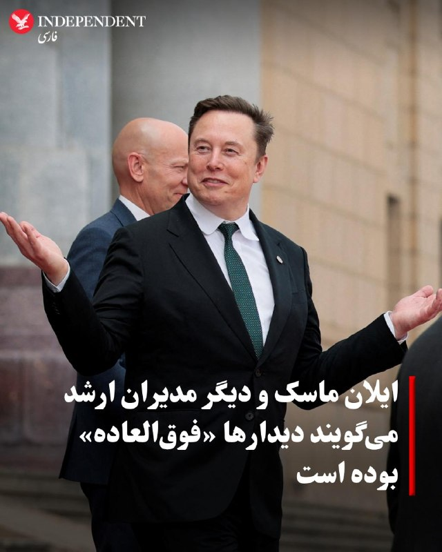

♦️برخی از مشهورترین مدیران ارشد آمریکایی که همراه دونالد ترامپ سفر کرده‌اند، هنگام خروج از ورودی اصلی تالار بزرگ خلق و هم‌زمان با آغاز نشست دو رهبر، فضای صبح را مثبت و سازنده توصیف کردند.
وقتی خبرنگاران از ایلان ماسک ــ میلیاردر و بنیان‌گذار تسلا و اسپیس‌ایکس ــ پرسیدند دیدارها چگونه بوده، او پاسخ داد: «فوق‌العاده.»
او در پاسخ به این سوال که چه دستاوردی حاصل شده است، گفت: «اتفاقات خوب زیادی.»
تیم کوک، مدیرعامل اپل که قرار است اواخر امسال از سمت خود کناره‌گیری کند، ابتدا علامت صلح نشان داد و سپس انگشت شست خود را بالا برد.
جنسن هوانگ، مدیر شرکت فناوری انویدیا، نیز هنگام پایین آمدن مدیران از پله‌ها به سمت اتوبوس منتظرشان گفت: «دیدارها خوب پیش رفت. شی و رئیس‌جمهور ترامپ فوق‌العاده بودند.»
اوایل روز پنج‌شنبه، این مدیران در کنار مقام‌های دولت ترامپ روی پله‌های تالار بزرگ خلق در انتظار ورود ترامپ دیده شدند و هیات چینی نیز در نزدیکی آن‌ها حضور داشت؛ اما هنگام آغاز گفت‌وگوهای ترامپ و شی، آن‌ها داخل اتاق مذاکرات دیده نشدند.
پیش از این سفر، سخنگوی کاخ سفید گفته بود انتظار می‌رود گفت‌وگوها شامل ادامه کار روی «شورای تجارت آمریکا و چین» و «شورای سرمایه‌گذاری آمریکا و چین» باشد.
‌🇸🇦 Indypersian

🤖 @VahidOOnLine

## VahidOOnLine — post 240034

♦️دونالد ترامپ، رئیس‌جمهوری آمریکا، صبح پنجشنبه در آغاز گفتگوهای دوجانبه با شی جین‌پینگ در تالار بزرگ خلق پکن گفت روابط شخصی خوبی با رئیس‌جمهوری چین داشته و دو طرف در زمان بروز اختلاف‌ها، مشکلات را «خیلی سریع» حل کرده‌اند.
ترامپ خطاب به شی جین‌پینگ گفت: «رابطه فوق‌العاده‌ای داشتیم. هر وقت مشکلی پیش می‌آمد، من با شما تماس می‌گرفتم و شما هم با من تماس می‌گرفتید. مردم این را نمی‌دانند، اما هر وقت مشکلی داشتیم، خیلی سریع آن را حل می‌کردیم.»
او همچنین تاکید کرد آمریکا و چین «آینده فوق‌العاده‌ای» در روابط دوجانبه خواهند داشت.
‌🇸🇦 Indypersian

🤖 @VahidOOnLine

## VahidOOnLine — post 240033

  <a href="telegram/content/VahidOOnLine_240033_1778732300.mp4" target="_blank">🎬 Download video</a>

♦️رسانه‌های بین‌المللی با اشاره به استقبال گرم چین از ترامپ گزارش داده‌اند که این خوشامدگویی پرشور با صحنه‌هایی که کودکان چینی پرچم آمریکا را دار دست دارند و سرود ملی آمریکا پخش می‌شود، برای رئیس‌جمهوری آمریکا خوشایند بوده است. گاردین می‌نویسد: رئیس‌جمهور آمریکا احتمالا از تشریفات سرد و حساب‌شده‌ای که در تالار بزرگ خلق در پکن از او استقبال کرد، لذت برده است: فرش قرمز، شلیک توپ، موسیقی نظامی و نیروهایی با یونیفورم‌های تشریفاتی که با تفنگ‌های سرنیزه‌دار در صفوف منظم رژه می‌رفتند.
ترامپ برای تشویق کودکانی که با شور و حال، پرچم‌ها و گل‌ها را با نوعی ستایش نمایشی تکان می‌دادند، توقف کرد. او همچنین مشاهده کرد که شی جین‌پینگ با صمیمیت با پسرش اریک و نیز با نظریه‌پرداز راست‌گرای مورد علاقه‌اش، استیون میلر، دست داد. به گزارش این روزنامه بریتانیایی، زمانی که دو طرف در یک اتاق بزرگ و رسمی برای مذاکرات نشستند، ترامپ گفت: «این افتخاری بود که کمتر کسی در تاریخ دیده است»
‌🇸🇦 Indypersian

🤖 @VahidOOnLine

## VahidOOnLine — post 240032

  

♦️ داده‌های رهگیری کشتی ال‌اس‌ای‌جی LSEG نشان می‌دهد یک نفتکش حامل نفت خام با پرچم پاناما که توسط گروه پالایشی ژاپنی «انیوس» (Eneos) مدیریت می‌شود، از تنگه هرمز عبور کرده است؛ این دومین مورد از عبور یک کشتی مرتبط با ژاپن از این مسیر است. پیش از آنکه جنگ آمریکا و اسرائیل علیه ایران تا حد زیادی عرضه نفت از طریق تنگه هرمز را مختل کند، ژاپن حدود ۹۵ درصد واردات نفت خود را از خلیج فارس تامین می‌کرد. این نفتکش که توسط انیوس مدیریت می‌شود، حامل ۱.۲ میلیون بشکه نفت خام کویت و ۷۰۰ هزار بشکه نفت «داس بلِند» امارات است که در اواخر فوریه بارگیری شده بود. طبق داده‌های کپلر، این کشتی قرار است در ۳ ژوئن به ژاپن برسد. هنوز مشخص نیست این عبور تحت چه ترتیباتی انجام شده است. شرکت انیوس، بزرگ‌ترین گروه پالایشی ژاپن، از اظهارنظر خودداری کرده است. این عبور جدید از تنگه هرمز پس از عبور نفتکش «ایدمیتسو مارو» در اواخر آوریل رخ داده است؛ نفتکشی که نفت عربستان سعودی را حمل می‌کرد و توسط یکی از زیرمجموعه‌های شرکت ایدمیتسو کوسان Idemitsu Kosan مدیریت می‌شد. ایدمیتسو، دومین گروه بزرگ پالایش نفت ژاپن، این هفته اعلام کرد انتظار دارد تنگه هرمز بین ژوئیه تا سپتامبر دوباره بازگشایی شود و قیمت نفت شاخص دبی تا پایان سال مالی مارس ۲۰۲۷ به سطح پیش از جنگ بازگردد. به گزارش رویترز، در حالی که پالایشگاه‌های ژاپن از ذخایر استراتژیک استفاده می‌کنند و تامین جایگزین از مناطقی مانند ایالات متحده و منطقه خزر را افزایش داده‌اند، فعالیت پالایشگاه‌ها در این ماه دوباره به حالت عادی نزدیک شده و برای نخستین بار از اواخر مارس از ۷۰ درصد فراتر رفته است. یک نفتکش بسیار بزرگ چین که نفت عراق را حمل می‌کرد نیز روز چهارشنبه از تنگه عبور کرد و پیش از نشست پکن میان رهبران آمریکا و چین از خلیج فارس خارج شد.
‌🇸🇦 Indypersian

🤖 @VahidOOnLine

## VahidOOnLine — post 240031

♦️مارکو روبیو، وزیر خارجه آمریکا هنگام ورود به «تالار بزرگ خلق» در پکن به همراه ترامپ و دیگر مقامات دولت، به سقف این سالن نگاه می‌کند و سعی می‌کند توجه پیت هگست، وزیر جنگ را نیز جلب کند. این تالار در سال ۱۹۵۹ میلادی در ضلع غربی میدان تیان‌آن‌من افتتاح شد و محل برگزاری جلسات کنگره ملی خلق چین و نشست‌های رسمی دیپلماتیک (مثل دیدارهای سران کشورها) است.این ساختمان یکی از پروژه‌های بزرگ «ده ساختمان مهم» در دوره مائو تسه‌تونگ بود که با هدف نمایش قدرت و مدرن‌سازی سریع چین ساخته شد. طراحی آن ترکیبی از معماری رسمی سوسیالیستی و عناصر سنتی چینی است و روی سقف آن نقوش سنتی کلاسیک چین دیده می‌شود.
‌🇸🇦 Indypersian

🤖 @VahidOOnLine

## VahidOOnLine — post 240030

  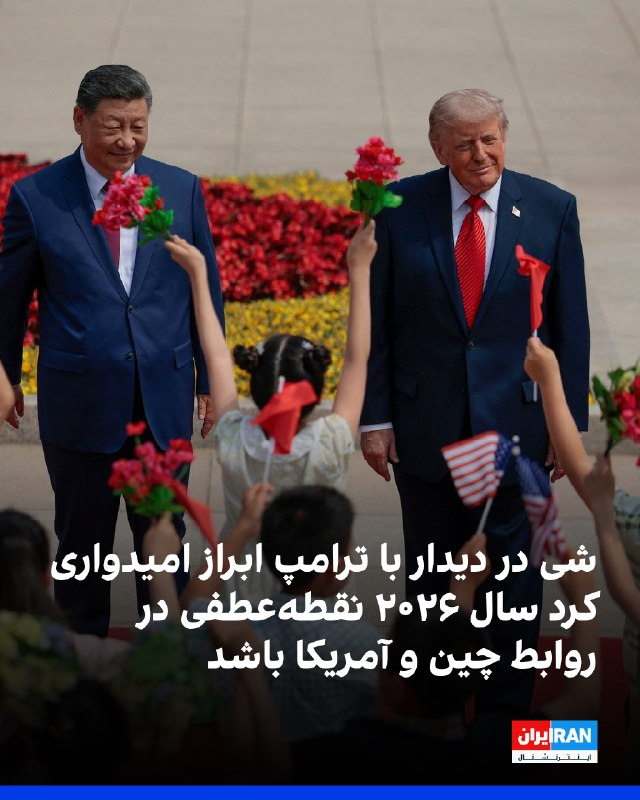

شی جین‌پینگ در دیدار با ترامپ در پکن ابراز امیدواری کرد سال ۲۰۲۶ سالی تاریخی و نقطه‌عطفی برای روابط چین و آمریکا باشد «تا گذشته را ادامه دهد و درها را به روی آینده بگشاید.»
شی گفت همواره معتقد بوده است منافع مشترک میان چین و آمریکا بر اختلافات دو کشور ارجحیت دارد و موفقیت پکن و واشینگتن فرصتی برای یکدیگر است.
شی ثبات روابط چین و آمریکا را برای جهان امر مثبتی دانست و گفت مشتاق است درباره مسائل مهم با ترامپ تبادل نظر کند.

‌🏁 🇬🇧 IranintlTV

🤖 @VahidOOnLine

## VahidOOnLine — post 240029

  

♦️دونالد ترامپ در دیدار با رهبر چین گفت گروهی از مدیران ارشد کسب‌وکار که همراه او به چین آمده‌اند ــ از جمله ایلان ماسک (مدیرعامل تسلا)، جنسن هوانگ (مدیرعامل انویدیا) و تیم کوک (مدیرعامل اپل)  برای «ادای احترام» و گسترش تجارت در این کشور حضور دارند.
ترامپ در سخنان آغازین خود گفت: «ما افراد فوق‌العاده‌ای داریم و همه‌شان همراه من هستند.»
او افزود: «ما از ۳۰ نفر برتر جهان دعوت کردیم. تک‌تک‌شان گفتند بله، و من نفر دوم یا سوم شرکت را نمی‌خواستم؛ فقط نفر اول را می‌خواستم. و امروز اینجا هستند تا به شما و چین ادای احترام کنند و مشتاق تجارت و انجام کسب‌وکار هستند، و این از طرف ما کاملا متقابل خواهد بود.»
ترامپ با ابراز خوش‌بینی در آغاز نشست به شی گفت: «افتخار بزرگی است که با شما هستم. افتخار بزرگی است که دوست شما باشم، و رابطه میان چین و آمریکا از همیشه بهتر خواهد شد.»
پس از مراسم استقبال رسمی، ترامپ گفت از کودکانی که در بیرون با شور و انرژی از او استقبال کردند «به‌طور ویژه تحت تاثیر قرار گرفته است».
او گفت: «آن‌ها خوشحال بودند. زیبا بودند. آن کودکان فوق‌العاده بودند و نماینده چیزهای زیادی هستند.»
‌🇸🇦 Indypersian

🤖 @VahidOOnLine

## VahidOOnLine — post 240028

  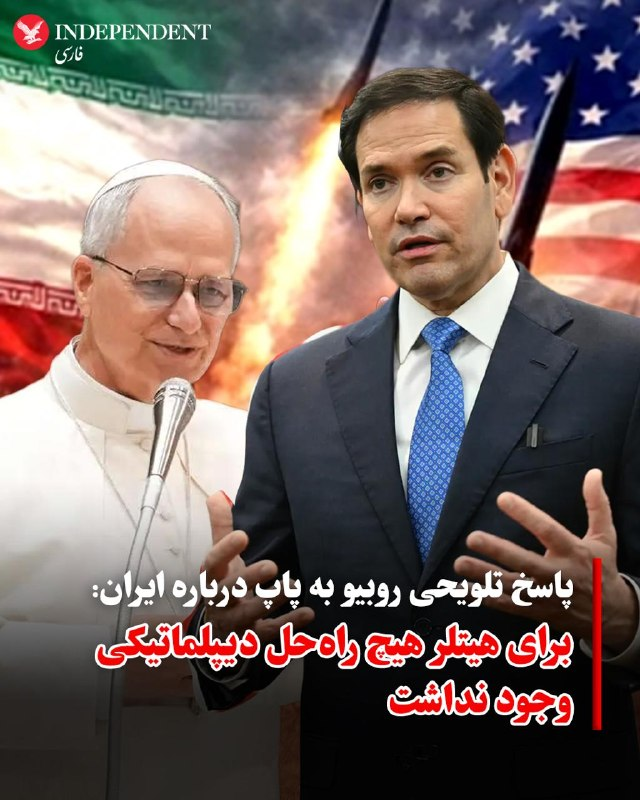

♦️مارکو روبیو، وزیر خارجه آمریکا در گفتگو با مجری فاکس‌نیوز که در «ایرفورس وان» هنگام عزیمت او به چین انجام شد، درباره اظهارات پاپ درمورد ایران که بر دیپلماسی تاکید کرده است گفت: «چه راه‌حل دیپلماتیکی درباره آدولف هیتلر وجود داشت؟ هیچ.» او افزود و متاسفانه به جنگ منجر شد. روبیو گفت که کلیسا بر صلح و دوستی و پرهیز از جنگ تاکید دارد و من هم موافق هستم و ما خواستار جنگ نیستیم اما نسبت به امنیت ملی کشورمان وظیفه داریم و این باید در نظر گرفته شود. روبیو تاکید کرد، این وظیفه ما است که آمریکایی‌ها را در امنیت نگهداریم و به همین دلیل است که در ایران درگیر هستیم، به همین دلیل در هر کاری که در سراسر جهان انجام می‌دهیم درگیر هستیم.
‌🇸🇦 Indypersian

🤖 @VahidOOnLine

## VahidOOnLine — post 240027

  

دونالد ترامپ در دیدار با رییس‌جمهوری چین گفت روابط او و شی جین‌پینگ طولانی‌ترین رابطه میان روسای جمهور دو کشور بوده است و این موضوع را «مایه افتخار» دانست. او تاکید کرد روابط دو کشور «بهتر از هر زمان دیگری خواهد شد.»
ترامپ گفت هر زمان مشکلی پیش آمده، دو طرف مستقیما آن را حل کرده‌اند و آینده روابط واشینگتن و پکن «فوق‌العاده» خواهد بود.
ترامپ با تمجید از شی جین‌پینگ او را «رهبر بزرگی» خواند و گفت برای چین و دستاوردهایش احترام زیادی قائل است.
ترامپ این دیدار را «نشستی بزرگ» توصیف کرد و گفت در آمریکا همه درباره آن صحبت می‌کنند.

‌🏁 🇬🇧 IranintlTV

🤖 @VahidOOnLine

## VahidOOnLine — post 240026

♦️دونالد ترامپ، رئیس‌جمهوری آمریکا، در جریان سفر رسمی به پکن، مورد استقبال پرشور کودکان قرار گرفت.
در مراسم رسمی که پنجشنبه ۲۵ اردیبهشت در تالار بزرگ خلق برگزار شد، کودکان با تکان دادن پرچم‌های دو کشور و اجرای برنامه‌های ویژه از رئیس‌جمهوری آمریکا استقبال کردند.
این استقبال گرم در حالی صورت می‌گیرد که سران دو قدرت بزرگ اقتصادی جهان گفتگوهای فشرده‌ای را درباره مسائل راهبردی، از جمله امنیت آبراه‌های بین‌المللی و توازن تجاری، در دستور کار دارند.
‌🇸🇦 Indypersian

🤖 @VahidOOnLine

## VahidOOnLine — post 240025

  

♦️دونالد ترامپ و شی جین‌پینگ صبح پنجشنبه گفت‌وگوهای دوجانبه خود را در تالار بزرگ خلق، ساختمان مجلس ملی چین، آغاز کردند.
شی در سخنان آغازین خود گفت سال ۲۰۲۶ مصادف با دویست‌وپنجاهمین سال استقلال آمریکا است و افزود ثبات در روابط آمریکا و چین برای ثبات جهانی ضروری است.
ترامپ نیز گفت او و شی «مدت‌هاست یکدیگر را می‌شناسند» و شی را «رهبر بزرگی» توصیف کرد.
ترامپ خطاب به شی گفت: «من به همه می‌گویم شما رهبر بزرگی هستید. گاهی مردم دوست ندارند من این را بگویم، اما باز هم می‌گویم، چون حقیقت دارد.»ترامپ به شی گفت روابط دو کشور «بهتر از همیشه خواهد شد»
شی جین‌پینگ در سخنان افتتاحیه خود گفت همواره معتقد بوده که منافع مشترک چین و آمریکا بر اختلافات میان دو کشور غلبه دارد.
او همچنین گفت موفقیت چین و آمریکا برای یکدیگر یک فرصت است.
ترامپ نیز در پاسخ به او گفت روابط دو کشور «بهتر از همیشه خواهد شد.»شی جین‌پینگ در آغاز سخنان خود با توصیف وضعیت پرتنش جهانی گفت جهان «به یک نقطه عطف جدید رسیده است».
او گفت اکنون این پرسش مطرح است که «آیا چین و ایالات متحده می‌توانند از به‌اصطلاح «دام توسیدید»عبور کنند و الگوی جدیدی از روابط میان قدرت‌های بزرگ را پایه‌گذاری کنند»؛ اصطلاحی که به گرایش به درگیری زمانی اشاره دارد که یک قدرت نوظهور، قدرتی مسلط را به چالش می‌کشد.
شی افزود: «ما باید به‌جای رقیب بودن، شریک باشیم؛ برای موفقیت یکدیگر تلاش کنیم، با هم شکوفا شویم و شیوه‌ای درست برای همزیستی قدرت‌های بزرگ در عصر جدید ایجاد کنیم.»
ترامپ نیز از «روابط فوق‌العاده» خود با شی تمجید کرد.
او افزود هیات آمریکایی مشتاق گفت‌وگو درباره تجارت متقابل است و حضور در این نشست را «افتخار» دانست.
‌🇸🇦 Indypersian

🤖 @VahidOOnLine

## VahidOOnLine — post 240024

شی جین‌پینگ، رئیس‌جمهوری چین، پنجشنبه ۲۵ اردیبهشت در تالار بزرگ خلق در پکن از دونالد ترامپ، رئیس‌جمهوری آمریکا، و هیات همراه او استقبال کرد.

همزمان با ورود ترامپ به این مجموعه حکومتی، سرود ملی آمریکا نواخته شد و گارد احترام ارتش چین مراسم رژه برگزار کرد. گروه موزیک نظامی نیز مارش رسمی اجرا کرد.
ترامپ و شی جین‌پینگ در ادامه در کنار یکدیگر روی فرش قرمز قدم زدند و از نیروهای نظامی بازدید کردند.

در بخش دیگری از مراسم، گروهی از کودکان و دانش‌آموزان با در دست داشتن گل و پرچم‌های کوچک چین و آمریکا از دو رهبر استقبال کردند.

انتظار می‌رود دو طرف درباره روابط دوجانبه، تحولات خاورمیانه، جنگ و مسائل اقتصادی گفتگو کنند.
‌🇸🇦 Indypersian

🤖 @VahidOOnLine

## VahidOOnLine — post 240023

  

ترامپ و شی‌جین‌ پینگ صبح پنج‌شنبه به وقت محلی در مراسم استقبال و رژه نظامیان چین در مقابل «تالار بزرگ خلق» در پکن حضور یافتند. در این مراسم روسای جمهوری آمریکا و چین از نیروهای نظامی سان دیدند.
‌🏁 🇬🇧 IranintlTV

🤖 @VahidOOnLine

## VahidOOnLine — post 240022

  

مارکو روبیو، وزیر خارجه آمریکا، به فاکس‌نیوز گفت تهدید جمهوری اسلامی قابل مصالحه نیست، زیرا حکومت روحانیون در پی دستیابی به سلاح هسته‌ای است. روبیو تاکید کرد جهان به رهبری ترامپ اجازه نخواهد داد جمهوری اسلامی به چنین سلاحی دست پیدا کند.
او افزود تهران قصد داشت با انباشت گسترده پهپاد و موشک، نوعی «مصونیت» برای خود ایجاد کند تا هیچ کشوری نتواند به آن حمله کند و سپس به سمت ساخت سلاح هسته‌ای حرکت کند.
روبیو تاکید کرد رئیس‌جمهور ترامپ اجازه نخواهد داد چنین سناریویی محقق شود.

‌🏁 🇬🇧 IranintlTV

🤖 @VahidOOnLine

## VahidOOnLine — post 240021

دونالد ترامپ، رئیس‌جمهوری آمریکا، پنجشنبه ۲۵ اردیبهشت در تالار بزرگ خلق در پکن، در مراسمی رسمی مورد استقبال شی جین‌پینگ، رئیس‌جمهوری چین، قرار گرفت.
رسانه‌های دولتی چین اعلام کردند دیدار رهبران دو کشور در پکن آغاز شده است. انتظار می‌رود دو طرف درباره روابط دوجانبه، تحولات خاورمیانه، جنگ و مسائل اقتصادی گفتگو کنند.
‌🇸🇦 Indypersian

🤖 @VahidOOnLine

## VahidOOnLine — post 240020

  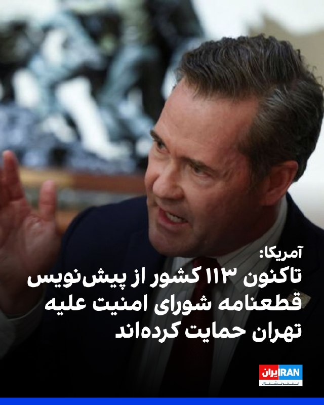

مایک والتز، سفیر آمریکا در سازمان ملل، با اشاره به حمایت ۱۱۳ کشور از پیش‌نویس قطعنامه شورای امنیت در محکومیت اقدامات جمهوری اسلامی، گفت تهران به دلیل اقدامات غیرقانونی خود، از جمله مین‌گذاری و اعمال عوارض بر کشتیرانی در تنگه هرمز، «منزوی» شده است.
والتز در ایکس نوشت کشورهایی از جمله هند، ژاپن و کره جنوبی از این ابتکار حمایت کرده‌اند.

‌🏁 🇬🇧 IranintlTV

🤖 @VahidOOnLine

## VahidOOnLine — post 240018

  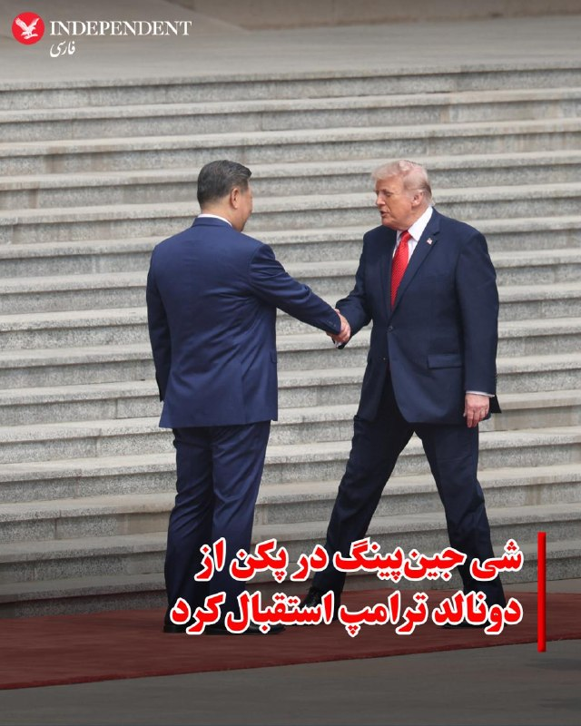

♦️شی جین‌پینگ، رئیس‌جمهوری چین، بامداد پنجشنبه ۲۵ اردیبهشت در مراسمی رسمی در تالار بزرگ خلق در پکن از دونالد ترامپ، رئیس‌جمهوری آمریکا، استقبال کرد.
‌🇸🇦 Indypersian

🤖 @VahidOOnLine

## VahidOOnLine — post 240017

  

♦️همزمان با ادامه محاصره بنادر ایران از سوی آمریکا، خبرگزاری بلومبرگ با استناد به تصاویر ماهواره‌ای گزارش داد مخازن نفت در جزیره خارگ به حداکثر ظرفیت ذخیره‌سازی نزدیک شده است.

بر اساس این تصاویر، طی روزهای ۱۸، ۱۹ و ۲۱ اردیبهشت‌ماه هیچ نفتکش فعالی در نزدیکی جزیره خارگ برای صادرات نفت شناسایی نشده و تمام اسکله‌های این جزیره خالی از کشتی بوده است.
ایران پیش از این برای دور زدن محدودیت‌های ایجادشده از سوی نیروی دریایی آمریکا، بارگیری نفتکش‌ها در خارگ را ادامه داده و از آنها به‌عنوان مخازن شناور استفاده می‌کرد.

تصاویر ماهواره‌ای همچنین نشان می‌دهد سطح نفت در مخازن ذخیره‌سازی جزیره به‌شدت افزایش یافته و ظرفیت باقی‌مانده ذخیره‌سازی تقریبا به صفر نزدیک شده است. به گزارش بلومبرگ، در صورت پر شدن کامل مخازن، ایران ممکن است ناچار شود تولید نفت در برخی میدان‌ها را کاهش دهد.

همزمان شمار نفتکش‌های مستقر در شرق جزیره خارگ نیز افزایش یافته و تعداد آنها از سه نفتکش در شنبه ۲۲ فروردین‌ماه، به دست‌کم ۱۸ نفتکش با اندازه‌های مختلف تا دوشنبه ۲۱ اردیبهشت‌ماه رسیده است.
‌🇸🇦 Indypersian

🤖 @VahidOOnLine

## VahidOOnLine — post 240016

  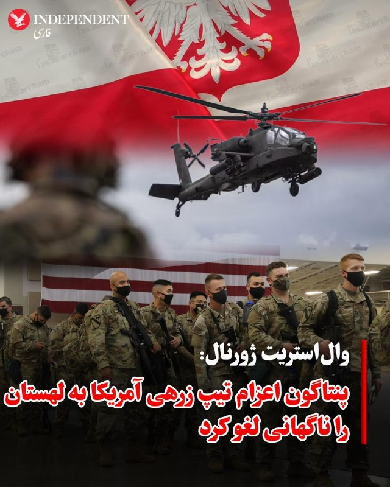

♦️به گزارش وال‌استریت ژورنال، پنتاگون به‌طور ناگهانی اعزام یک تیپ زرهی ارتش آمریکا به لهستان را لغو کرد؛ تصمیمی که بخشی از برنامه دولت دونالد ترامپ برای کاهش حضور نظامی آمریکا در اروپا توصیف شده است. این اقدام در حالی انجام شد که بخشی از تجهیزات و نیروهای این تیپ زرهی موسوم به «بلک جک» پیش‌تر در مسیر استقرار قرار داشتند.
بر اساس این گزارش، وزارت دفاع آمریکا پیش‌تر نیز از کاهش ۵ هزار نیروی آمریکایی در آلمان خبر داده بود؛ تصمیمی که پس از انتقادهای تند فریدریش مرتس، صدراعظم آلمان، از کاخ سفید علنی شد.
وال‌استریت ژورنال نوشت برخی فرماندهان ارتش آمریکا انتظار داشتند روند کاهش نیروها به‌صورت تدریجی و برنامه‌ریزی‌شده انجام شود، اما پیت هگست، وزیر دفاع آمریکا، روند این کاهش را تسریع کرده و تصمیم به توقف اعزام تیپ زرهی را در میانه مسیر گرفته است؛ اقدامی که شماری از مقام‌های نظامی را غافلگیر کرد.
این گزارش می‌افزاید دولت ترامپ قصد دارد سطح نیروهای آمریکایی در اروپا را به میزان پیش از حمله روسیه به اوکراین در سال ۲۰۲۲ بازگرداند. همزمان، پنتاگون تاکید کرده کشورهای اروپایی باید مسئولیت بیشتری در دفاع متعارف از قاره اروپا برعهده بگیرند و آمریکا تمرکز خود را بر دفاع داخلی و منطقه هند و اقیانوس آرام معطوف خواهد کرد.
‌🇸🇦 Indypersian

🤖 @VahidOOnLine

## FoxNewsTwitter — post 341698

  <a href="telegram/content/FoxNewsTwitter_341698_1778732307.mp4" target="_blank">🎬 Download video</a>

Fox News (Twitter/X)

NOW: President Trump calls Chinese President Xi Jinping a "great leader."

"Sometimes people don't like me saying it, but I say it anyway, because it's true — I always say the truth."

## FoxNewsTwitter — post 341697

  

Fox News (Twitter/X)

NOW: President Trump expressed high hopes for U.S.-China relations at the Great Hall of the People, telling President Xi Jinping it is an honor to be his friend and predicting the partnership will be stronger than ever before.

## FoxNewsTwitter — post 341696

  <a href="telegram/content/FoxNewsTwitter_341696_1778732308.mp4" target="_blank">🎬 Download video</a>

Fox News (Twitter/X)

NOW: President Trump says "it's an honor" after meeting Chinese President Xi Jinping.

"It's an honor to be with you, it's an honor to be your friend, and the relationship between China and the USA is going to be better than ever before."

## FoxNewsTwitter — post 341695

  <a href="telegram/content/FoxNewsTwitter_341695_1778732309.mp4" target="_blank">🎬 Download video</a>

Fox News (Twitter/X)

NOW: President Trump thanks Chinese President Xi Jinping for welcoming him to Beijing, saying he was particularly impressed with the crowd of cheering children during the welcome ceremony.

## FoxNewsTwitter — post 341694

  <a href="telegram/content/FoxNewsTwitter_341694_1778732311.mp4" target="_blank">🎬 Download video</a>

Fox News (Twitter/X)

NOW: President Trump watches a ceremony with Chinese President Xi Jinping after arriving at the Great Hall of People in Beijing.

## FoxNewsTwitter — post 341693

  <a href="telegram/content/FoxNewsTwitter_341693_1778732313.mp4" target="_blank">🎬 Download video</a>

Fox News (Twitter/X)

BREAKING: President Trump receives a warm welcome at the Great Hall of People in Beijing for his meeting with President Xi Jinping.

## FoxNewsTwitter — post 341692

  <a href="telegram/content/FoxNewsTwitter_341692_1778732314.mp4" target="_blank">🎬 Download video</a>

Fox News (Twitter/X)

BREAKING: Chinese President Xi Jinping shakes hands with Secretary Rubio, Secretary Bessent and more in China as he walks with President Trump.

## FoxNewsTwitter — post 341691

  <a href="telegram/content/FoxNewsTwitter_341691_1778732317.mp4" target="_blank">🎬 Download video</a>

Fox News (Twitter/X)

BREAKING: President Trump meets Chinese President Xi Jinping at the Great Hall of People in Beijing.

## FoxNewsTwitter — post 341690

  <a href="telegram/content/FoxNewsTwitter_341690_1778732318.mp4" target="_blank">🎬 Download video</a>

Fox News (Twitter/X)

BREAKING: Chinese President Xi Jinping walks out for his meeting with President Trump.

## FoxNewsTwitter — post 341689

  <a href="telegram/content/FoxNewsTwitter_341689_1778732320.mp4" target="_blank">🎬 Download video</a>

Fox News (Twitter/X)

"There is no economy in Cuba."

Secretary Rubio says he doesn't believe the economic trajectory of Cuba can change under the current government.

## FoxNewsTwitter — post 341688

  <a href="telegram/content/FoxNewsTwitter_341688_1778732322.mp4" target="_blank">🎬 Download video</a>

Fox News (Twitter/X)

NEW: Secretary Rubio says stepping behind the White House press secretary podium wasn't "too bad," but he's not sure if he'd have fun if he had to do it every week.

"Karoline is irreplaceable....We can't wait until Karoline gets back." |@seanhannity

## FoxNewsTwitter — post 341687

  

Fox News (Twitter/X)

WATCH LIVE: President Trump and President Xi Jinping meet for bilateral talks https://twitter.com/i/broadcasts/1nJOLEBAamlxR

## FoxNewsTwitter — post 341686

  <a href="telegram/content/FoxNewsTwitter_341686_1778732324.mp4" target="_blank">🎬 Download video</a>

Fox News (Twitter/X)

.@seanhannity: "What is your read on President Xi?"

SECRETARY RUBIO: "China has a plan...they believe they will be the world's most powerful country."

"We're not trying to constrain China, but their rise cannot come at our expense."

## FoxNewsTwitter — post 341685

  <a href="telegram/content/FoxNewsTwitter_341685_1778732325.mp4" target="_blank">🎬 Download video</a>

Fox News (Twitter/X)

SENATOR MURRAY: "Do you seriously believe there's abortion in the water, like some of the far-right activists are suggesting?"

EPA ADMIN ZELDIN: "You just said abortion in the water?"

MURRAY: "That's what some far-right activists are saying. That they have an audience, in the EPA, on that absurd issue."

ZELDIN: "I have not had a conversation with anyone at the agency as far as abortions in water."

"I don't even know what you're talking about."

## pm_afshaa — post 90711

🔴روبیو: واشنگتن به پکن روشن کرد که هرگونه حمایت از ایران به روابط دوجانبه آسیب می رساند

💧 Rainbet.com the #1 Non-KYC Crypto Casino & Sportsbook @rainbetcom

😁 @Pm_Afshaa

## DEJradio — post 4622

  <a href="telegram/content/DEJradio_4622_1778732326.mp4" target="_blank">🎬 Download video</a>

🚨
🔸 خبر ۲۱
چهارشنبه ۲۳ اردیبهشت ۱۴۰۵

#خبر۲۱
@DEJradio

## mamlekate — post 103524

📝 جی‌دی‌ ونس در مورد در مذاکرات با جمهوری اسلامی: فکر می‌کنم پیشرفت‌هایی حاصل شده است

جی‌دی ونس، معاون رئیس‌جمهوری آمریکا، روز چهارشنبه در گفت‌وگو با خبرنگاران گفت که در مذاکرات با جمهوری اسلامی پیشرفت‌هایی حاصل شده است.

@mamlekate

## mamlekate — post 103523

📝 دولت اسرائیل: نتانیاهو در جریان عملیات «غرش شیران» در سفری محرمانه با رئیس امارات دیدار کرد

دفتر نخست‌وزیر اسرائیل روز چهارشنبه ۲۳ اردیبهشت با انتشار پیامی در ایکس اعلام کرد: «بنیامین نتانیاهو، نخست‌وزیر اسرائیل، در بحبوحه عملیات شیر غران، مخفیانه از امارات متحده عربی بازدید کرد و در آن‌جا با شیخ محمد بن زاید، رئیس امارات، دیدار کرد.»

📝 امارات «گزارش‌ها درباره سفر نخست‌وزیر اسرائیل» را تکذیب کرد

وزارت امور خارجه امارات در بیانیه‌ای «گزارش‌های منتشرشده درباره سفر ادعایی بنیامین نتانیاهو، نخست‌وزیر اسرائیل، به امارات یا پذیرش هرگونه هیئت نظامی اسرائیلی در این کشور را» تکذیب کرد.

📝 نماینده آمریکا استقرار «گنبد آهنین» در امارات را تأیید کرد

@mamlekate

## VahidOnline — post 75455

  <a href="telegram/content/VahidOnline_75455_1778732328.mp4" target="_blank">🎬 Download video</a>

خبرگزاری مهر پرچم حزب‌الله را در ویدیوی مربوط به بدرقه فوتبالیست‌ها سانسور کرد.
FattahiFarzad
اعضای تیم فوتبال چهارشنبه‌شب ۲۳ اردیبهشت‌ماه در میدان انقلاب تهران برای حضور در جام جهانی ۲۰۲۶ بدرقه شدند؛ رقابت‌هایی که خرداد و تیر ۱۴۰۵ به میزبانی مشترک آمریکا، مکزیک و کانادا برگزار خواهد شد.
@VahidOOnLine

📡 @VahidOnline

## IranIntlTV — post 337099

  

ترامپ در دیدار با شی‌جین پینگ در پکن این رویداد را «یکی بزرگ‌ترین نشست‌های تاریخ» خواند و گفت در این سفر هیئتی ۳۰ نفره از بزرگ‌ترین و بهترین بازرگانان جهان را به همراه خود آورده است.
او گفت: «ما از ۳۰ نفر برتر جهان دعوت کردیم. تک‌تک آنها پاسخ مثبت دادند. من نفر دوم یا سوم هیچ شرکتی را نمی‌خواستم؛ فقط برترین‌ها را می‌خواستم. آنها امروز اینجا هستند تا به شما و به چین ادای احترام کنند و مشتاق تجارت و انجام کسب‌وکار هستند و این روند از طرف ما کاملا متقابل خواهد بود.»
ترامپ گفت: «بسیار مشتاق گفت‌وگوی خود هستم. این گفت‌وگویی بزرگ است. برخی می‌گویند شاید این بزرگ‌ترین نشست تاریخ باشد. آنها هرگز چیزی شبیه به آن را به یاد نمی‌آورند.»

https://iranintl.com/202605149590

## IranIntlTV — post 337098

  

شی جین‌پینگ در دیدار با ترامپ در پکن ابراز امیدواری کرد سال ۲۰۲۶ سالی تاریخی و نقطه‌عطفی برای روابط چین و آمریکا باشد «تا گذشته را ادامه دهد و درها را به روی آینده بگشاید.»
شی گفت همواره معتقد بوده است منافع مشترک میان چین و آمریکا بر اختلافات دو کشور ارجحیت دارد و موفقیت پکن و واشینگتن فرصتی برای یکدیگر است.
شی ثبات روابط چین و آمریکا را برای جهان امر مثبتی دانست و گفت مشتاق است درباره مسائل مهم با ترامپ تبادل نظر کند.

https://iranintl.com/202605141916

## IranIntlTV — post 337097

  

دونالد ترامپ در دیدار با رییس‌جمهوری چین گفت روابط او و شی جین‌پینگ طولانی‌ترین رابطه میان روسای جمهور دو کشور بوده است و این موضوع را «مایه افتخار» دانست. او تاکید کرد روابط دو کشور «بهتر از هر زمان دیگری خواهد شد.»
ترامپ گفت هر زمان مشکلی پیش آمده، دو طرف مستقیما آن را حل کرده‌اند و آینده روابط واشینگتن و پکن «فوق‌العاده» خواهد بود.
ترامپ با تمجید از شی جین‌پینگ او را «رهبر بزرگی» خواند و گفت برای چین و دستاوردهایش احترام زیادی قائل است.
ترامپ این دیدار را «نشستی بزرگ» توصیف کرد و گفت در آمریکا همه درباره آن صحبت می‌کنند.

https://iranintl.com/202605147699

## IranIntlTV — post 337096

  

ترامپ و شی‌جین‌ پینگ صبح پنج‌شنبه به وقت محلی در مراسم استقبال و رژه نظامیان چین در مقابل «تالار بزرگ خلق» در پکن حضور یافتند. در این مراسم روسای جمهوری آمریکا و چین از نیروهای نظامی سان دیدند.
https://iranintl.com/202605146912

## IranIntlTV — post 337095

  

مارکو روبیو، وزیر خارجه آمریکا، به فاکس‌نیوز گفت تهدید جمهوری اسلامی قابل مصالحه نیست، زیرا حکومت روحانیون در پی دستیابی به سلاح هسته‌ای است. روبیو تاکید کرد جهان به رهبری ترامپ اجازه نخواهد داد جمهوری اسلامی به چنین سلاحی دست پیدا کند.
او افزود تهران قصد داشت با انباشت گسترده پهپاد و موشک، نوعی «مصونیت» برای خود ایجاد کند تا هیچ کشوری نتواند به آن حمله کند و سپس به سمت ساخت سلاح هسته‌ای حرکت کند.
روبیو تاکید کرد رئیس‌جمهور ترامپ اجازه نخواهد داد چنین سناریویی محقق شود.

https://iranintl.com/202605146709

## IranIntlTV — post 337094

  

مایک والتز، سفیر آمریکا در سازمان ملل، با اشاره به حمایت ۱۱۳ کشور از پیش‌نویس قطعنامه شورای امنیت در محکومیت اقدامات جمهوری اسلامی، گفت تهران به دلیل اقدامات غیرقانونی خود، از جمله مین‌گذاری و اعمال عوارض بر کشتیرانی در تنگه هرمز، «منزوی» شده است.
والتز در ایکس نوشت کشورهایی از جمله هند، ژاپن و کره جنوبی از این ابتکار حمایت کرده‌اند.

https://iranintl.com/202605145787

## IranIntlTV — post 337093

  

مایک والتز، سفیر آمریکا در سازمان ملل، با اشاره به حمایت ۱۱۳ کشور از پیش‌نویس قطعنامه شورای امنیت در محکومیت اقدامات جمهوری اسلامی، گفت تهران به دلیل اقدامات غیرقانونی خود، از جمله مین‌گذاری و اعمال عوارض بر کشتیرانی در تنگه هرمز، «منزوی» شده است.
والتز در ایکس نوشت کشورهایی از جمله هند، ژاپن و کره جنوبی از این ابتکار حمایت کرده‌اند.

https://iranintl.com/202605145787

## IranIntlTV — post 337092

  

نمایندگی جمهوری اسلامی در سازمان ملل در بیانیه‌ای گفت حمایت بسیاری از کشورها از پیش‌نویس قطعنامه مورد حمایت واشینگتن علیه جمهوری اسلامی تحت «فشار سیاسی، اجبار و حتی تهدید» بوده است و این قطعنامه را «پوشش سیاسی برای اقدامات غیرقانونی» دانست.
این بیانیه افزود: «هیچ میزان از همراهی‌های مشترک تحمیلی، از جمله محاصره دریایی، حمله به کشتی‌های تجاری ایران و توقیف غیرقانونی آنها، و گروگان‌گیری خدمه این کشتی‌ها به شیوه‌ای شبیه به دزدی دریایی، نمی‌تواند اقدامات مداوم و ناقض حقوق بین‌الملل واشینگتن علیه جمهوری اسلامی را مشروعیت ببخشد.»

https://iranintl.com/202605145471

## IranIntlTV — post 337091

  <a href="telegram/content/IranIntlTV_337091_1778732333.mp4" target="_blank">🎬 Download video</a>

ویدیوهای منتشرشده در رسانه‌های حکومتی نشان می‌دهد ماموران جمهوری اسلامی، شامگاه چهارشنبه ۲۳ اردیبهشت، پهپاد شاهد ۱۳۶ را در دو مدل رنگی صورتی و آبی به شهر پیشوا برده‌اند تا مردم برای دیدن پهپادهای رنگی جمع شوند.

## FarsiVOA — post 217696

  <a href="telegram/content/FarsiVOA_217696_1778732334.mp4" target="_blank">🎬 Download video</a>

⚡️گزارش فرهاد فلاحی از چین؛ واشنگتن از پکن در ارتباط با جمهوری اسلامی چه می‌خواهد؟
@FarsiVOA

## FarsiVOA — post 217695

⚡️مردم درباره سفر پرزيدنت ترامپ به چین چه می‌گویند؟
@FarsiVOA

## FarsiVOA — post 217694

⚡️گفت‌وگو با مسعود کاظم‌زاده و ابراهیم روشندل درباره انتظارات از سفر رئيس جمهوری آمریکا به چین
@FarsiVOA

## FarsiVOA — post 217693

⚡️راهبرد چین در خلیج فارس؛ انرژی حرف اول را می‌زند
@FarsiVOA

## FarsiVOA — post 217692

  <a href="telegram/content/FarsiVOA_217692_1778732335.mp4" target="_blank">🎬 Download video</a>

⚡️چه توقعات اقتصادی می‌توان از سفر دونالد ترامپ به چین داشت؟ گفت‌وگو با نادر حبیبی
@FarsiVOA

## FarsiVOA — post 217691

  <a href="telegram/content/FarsiVOA_217691_1778732336.mp4" target="_blank">🎬 Download video</a>

⚡️گزارش خبرنگار اعزامی صدای آمریکا از سفر رئیس جمهوری آمریکا به چین
@FarsiVOA

## FarsiVOA — post 217690

  <a href="telegram/content/FarsiVOA_217690_1778732337.mp4" target="_blank">🎬 Download video</a>

⚡️سخنان آغازین دونالد ترامپ، رئیس جمهوری آمریکا در دیدار با رئیس جمهوری چین پس از مراسم استقبال رسمی
@FarsiVOA

## FarsiVOA — post 217689

⚡️آیا چین اراده و قدرت این را دارد که جمهوری اسلامی را وادار کند از ناامن‌سازی تنگه هرمز دست بر دارد؟
@FarsiVOA

## FarsiVOA — post 217688

⚡️چه انتظاری از سفر پرزیدنت ترامپ به چین می‌‌توان داشت؟ گفت‌وگو با شهیر شهیدثالث و شکریا برادوست
@FarsiVOA

## FarsiVOA — post 217687

  <a href="telegram/content/FarsiVOA_217687_1778732337.mp4" target="_blank">🎬 Download video</a>

⚡️ادامه خاموشی اینترنت و اعدام‌ها درایران؛ واکنش کاربران
@FarsiVOA

## FarsiVOA — post 217686

⚡️مراسم استقبال رسمی از دونالد ترامپ رئیس جمهوری آمریکا، در چین
@FarsiVOA

## FarsiVOA — post 217685

  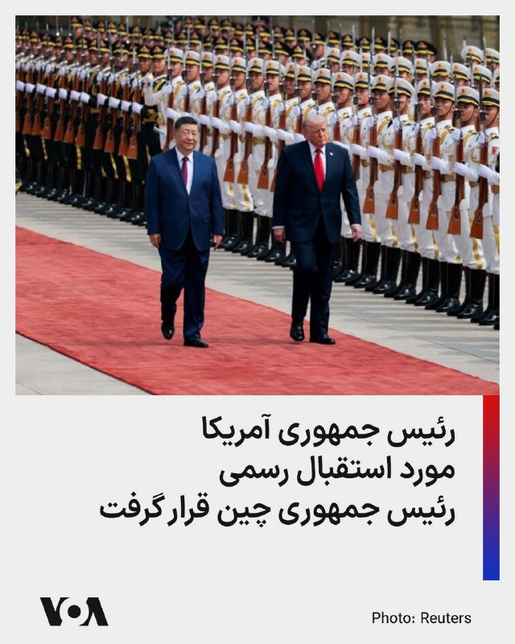

⚡️دونالد ترامپ، رئیس جمهوری آمریکا روز پنج‌شنبه به وقت پکن مورد استقبال رسمی شی جین‌پینگ، رئیس جمهوری چین قرار گرفت. آقای ترامپ در راس یک هئیت عالی‌رتبه سیاسی و اقتصادی وارد چین شده است. انتظار می‌رود که مسئله تنگه هرمز یکی از مسائل مورد گفت‌وگو در این سفر باشد.
@FarsiVOA

## FarsiVOA — post 217684

⚡️تحریم‌های مرتبط با جمهوری اسلامی علیه نهادهای چینی چه اثری دارد؟
@FarsiVOA

## FarsiVOA — post 217683

⚡️نویسندگان زندانی، تصویر ترسناک جهان امروز
@FarsiVOA

## FarsiVOA — post 217682

  <a href="telegram/content/FarsiVOA_217682_1778732338.mp4" target="_blank">🎬 Download video</a>

⚡️ايران، كشورى كه آفلاين است
@FarsiVOA

## FarsiVOA — post 217681

⚡️نشست «عراق در خاورمیانه جدید» در اندیشکده آتلانتیک
@FarsiVOA

## FarsiVOA — post 217680

⚡️جی دی ونس، معاون رئیس جمهوری آمریکا: در مذاکرات با جمهوری اسلامی پیشرفت‌هایی حاصل شده است
@FarsiVOA

## FarsiVOA — post 217679

⚡️شروط آمریکا برای عادی‌سازی روابط با طالبان
@FarsiVOA

## FarsiVOA — post 217678

⚡️تازه‌ترین مواضع قانون‌گذاران آمریکایی در کنگره
@FarsiVOA

## FarsiVOA — post 217677

⚡️آنچه دولت علی الزیدی برای عراق به ارمغان نمی‌آورد؟
@FarsiVOA

## Persian_Trend_Official — post 14086

  <a href="telegram/content/Persian_Trend_Official_14086_1778732339.mp4" target="_blank">🎬 Download video</a>

صبحتون بخیر ☕️

📝 Nick
📌 @persian_trend_official
پرشین ترند | متفاوت‌ترین کانال نظامی

## Persian_Trend_Official — post 14085

🔴 روبیو: امیدواریم چین ایران را به عقب‌نشینی از رفتارهایش متقاعد کند

💢مارکو روبیو، وزیر خارجه آمریکا، اعلام کرد واشینگتن امیدوار است چین نقش فعال‌تری برای متقاعد کردن ایران به عقب‌نشینی از رفتارهایش در منطقه ایفا کند.

▪️روبیو همچنین گفت:

▪️ آمریکا به‌دنبال مدیریت راهبردی روابط پیچیده خود با چین است
▪️ چین بزرگ‌ترین چالش ژئوپلیتیکی و سیاسی پیش‌روی آمریکا محسوب می‌شود
▪️ واشینگتن خواهان جلوگیری از تشدید تنش‌ها در منطقه است

🫆:Tony

📌 @persian_trend_official
پرشین ترند | متفاوت‌ترین کانال نظامی

## Persian_Trend_Official — post 14084

🔴 واشینگتن‌پست: چین از جنگ ایران سود راهبردی می‌برد

💢روزنامه «واشینگتن‌پست» به‌نقل از یک گزارش محرمانه اطلاعاتی آمریکا مدعی شد چین در حال کسب مزایای راهبردی از جنگ ایران است؛ در حالی که آمریکا منابع نظامی و اقتصادی خود را در این درگیری مصرف می‌کند.

▪️بر اساس این ارزیابی:

▪️ چین در جریان حملات ایران، به کشورهای خلیج فارس تسلیحات فروخته است
▪️ پکن به برخی کشورها برای مدیریت بحران انرژی پس از بسته‌شدن تنگه هرمز کمک کرده است
▪️ جنگ باعث کاهش ذخایر موشکی و سامانه‌های دفاعی آمریکا شده و نگرانی‌هایی درباره آمادگی واشینگتن برای درگیری احتمالی بر سر تایوان ایجاد کرده است
▪️ چین عملیات‌های نظامی آمریکا را زیر نظر دارد و از پیام‌های ضدجنگ برای نمایش آمریکا به‌عنوان عامل بی‌ثباتی استفاده می‌کند

💢تحلیلگران معتقدند ادامه این درگیری می‌تواند نفوذ جهانی چین را افزایش داده و جایگاه آمریکا نزد متحدانش را تضعیف کند.

🫆:Tony

📌 @persian_trend_official
پرشین ترند | متفاوت‌ترین کانال نظامی

## Persian_Trend_Official — post 14083

  

🔴 ترامپ: آمریکا برای پایان جنگ با ایران به کمک چین نیاز ندارد

💢دونالد ترامپ اعلام کرد آمریکا برای پایان دادن به جنگ با ایران و کاهش تنش‌ها در تنگه هرمز، نیازی به کمک چین ندارد.

▪️ «فکر نمی‌کنم برای موضوع ایران به کمکی نیاز داشته باشیم»
▪️ «به هر شکلی پیروز خواهیم شد؛ چه از راه صلح و چه غیر از آن»

💢گزارش‌ها حاکی است موضوع جنگ ایران در دیدار ترامپ و شی جین‌پینگ طی دو روز آینده مطرح خواهد شد، اما ترامپ نقش پکن در پایان درگیری را کم‌اهمیت توصیف کرده است.

در همین حال، رسانه‌ها گزارش می‌دهند در ایران نیز دیدار ترامپ و رئیس‌جمهور چین تهدیدی برای روابط تهران و پکن تلقی نمی‌شود.

بر اساس این گزارش:

▪️ مقام‌ها و تحلیلگران ایرانی روابط دو کشور را «راهبردی و مستقل» توصیف می‌کنند
▪️ به توافق ۲۵ ساله ایران و چین که در سال ۲۰۲۰ امضا شد اشاره شده است
▪️ این توافق حوزه‌های سیاسی، اقتصادی و فرهنگی را شامل می‌شود

🫆:Tony

📌 @persian_trend_official
پرشین ترند | متفاوت‌ترین کانال نظامی

## Persian_Trend_Official — post 14082

  <a href="telegram/content/Persian_Trend_Official_14082_1778732340.webm" target="_blank">🎬 Download video</a>

🔴دیوار نوشته‌ای در تهران؛

💢ورود سگ‌ها و آمریکایی‌ها به تنگهٔ هرمز ممنوع...🚫

🫆:Tony

📌 @persian_trend_official
پرشین ترند | متفاوت‌ترین کانال نظامی

## IranianMinds — post 20097

🔴 مارکو روبیو:

واشنگتن به پکن روشن کرد که هرگونه حمایت از ایران به روابط دوجانبه آسیب می رساند

@IranianMinds

## IranianMinds — post 20096

  <a href="telegram/content/IranianMinds_20096_1778732340.mp4" target="_blank">🎬 Download video</a>

🔴 لحظه ی دیدار ترامپ و رئیس جمهور‌ چین

@IranianMinds

## BBCPersian — post 280991

🔻ترامپ به شی: از دوستی با شما افتخار می‌کنم

دونالد ترامپ، در سخنان آغازين خود گفت که ديدار امروز با شی جين پينگ «باعث افتخار» او است.

آقای ترامپ گفت: «ما روابط خوبی داشته‌ايم و هر زمان مشکلی پيش آمده، آن را حل کرده‌ايم. من به شما زنگ می‌زدم و شما هم به من زنگ می‌زديد.»

او افزود: «مردم نمی‌دانند، اما هر وقت مشکلی داشتيم، خيلی سريع آن را حل می‌کرديم.»

رئیس جمهور آمریکا همچنين خطاب به همتای چینی خود گفت: «هميشه به همه می‌گويم که شما يک رهبر بزرگ هستيد.»

وی گفت که در اين سفر «بهترين [رهبران تجاری] جهان» را همراه خود آورده است. او افزود: «امروز فقط برترين افراد اينجا حضور دارند تا به شما ادای احترام کنند.»

آقای ترامپ ادامه داد که برخی اين نشست را «بزرگ‌ترين اجلاس تاريخ» توصيف کرده‌اند و گفت که «بسيار مشتاق» گفت‌وگوهای پيش رو است.

او در پايان گفت: «بودن در کنار شما افتخار است و افتخار می‌کنم که دوست شما هستم»، و افزود روابط ايالات متحده امريکا و چين «بهتر از هر زمان ديگری خواهد شد.»

مارکو روبیو، وزیر خارجه؛ پیت هگست، وزیر دفاع (جنگ)؛ اسکات بسنت، وزیر دارایی آمریکا به همراه مدیران اقتصادی چون ایلان ماسک، تیم کوک و کلی اورتبرگ (بوئینگ) همراه آقای ترامپ در سفر هستند.

https://bbc.in/4tvc7Wr
@BBCPersian

## BBCPersian — post 280990

🔻شی جین پینگ: جهان دیدار ما را زیر نظر دارد

در سخنان آغازين دیدار با دونالد ترامپ، شی جين پينگ گفت: «تمام جهان نشست ما را زير نظر دارد. در حال حاضر، تحولاتی که در يک قرن گذشته بی‌سابقه بوده‌اند، با شتاب در سراسر جهان در حال وقوع است و وضعيت بين‌المللی سيال و پرتلاطم شده است.»

او افزود: «جهان به يک دوراهی تازه رسيده است. آيا چين و امريکا می‌توانند از «دام توسيديد» عبور کنند و الگويی جديد برای روابط دوجانبه ايجاد کنند؟ آيا می‌توانيم با چالش‌های جهانی مشترکا مقابله کرده و ثبات بيشتری برای جهان فراهم آوريم؟ آيا می‌توانيم به خاطر جهان، مردم دو کشور و آينده بشريت، آينده‌ای روشن‌تر برای روابط دوجانبه خود بسازيم؟»

(اصطلاح «دام توسیدید» که رئیس جمهور چین به کار برده، اشاره به مثال تاریخی یونان باستان و جنگ میان اسپارت و آتن دارد که اشاره‌ای به تنش میان یک قدرت نوظهور با قدرت فعلی است که اوضاع را به سوی جنگ و رویارویی می‌کشاند.)

آقای شی ادامه داد: «اينها پرسش‌هايی حياتی برای تاريخ، جهان و مردم هستند. اينها پرسش‌های زمانه ما هستند که من و شما به عنوان رهبران قدرت‌های بزرگ بايد به آنها پاسخ دهيم.»

او همچنين دويست و پنجاهمين سالگرد استقلال ايالات متحده امريکا را به دونالد ترامپ و مردم امريکا تبريک گفت.

آقای شی گفت: «من همواره باور داشته‌ام که دو کشور ما منافع مشترک بيشتری نسبت به اختلافات دارند. موفقيت يک طرف، فرصتی برای طرف ديگر است و روابط باثبات دوجانبه به سود جهان خواهد بود.»

او افزود: «چين و امريکا هر دو از همکاری سود می‌برند و از تقابل زيان خواهند ديد.»

رييس‌جمهور چين همچنين تاکيد کرد: «ما بايد شريک باشيم، نه رقيب. بايد به يکديگر برای موفقيت و شکوفايی کمک کنيم و راه درست تعامل قدرت‌های بزرگ در عصر جديد را پيدا کنيم.»

او در پايان گفت که مشتاق گفت‌وگو با ترامپ و «همکاری با شما برای تعيين مسير و هدايت کشتی عظيم روابط چين و امريکا» است تا «سال ۲۰۲۶ به سالی تاريخی تبديل شود که فصل تازه‌ای را می‌گشايد.»

https://bbc.in/4ffpG96
@BBCPersian

## BBCPersian — post 280989

🔻ترامپ و شی طی مراسمی پر زرق و برق دیدار کردند

دونالد ترامپ و شی جین پینگ، روسای جمهور دو اقتصاد بزرگ جهان در پکن دیدار کردند.

این دیدار که با مراسم‌های متعدد و پر زرق و برق همراه بود، صبح پنجشنبه در پکن و در حالی که هر دو رهبر را هیات‌های بلندپایه‌ای همراهی می‌کردند روی داد.

تصویر دست دادن این دو خیلی زود به صدر اخبار جهان راه یافت و احتمالا خیلی زود بر بازارهای جهانی که صبح پنجشنبه از شرق آسیا گشوده شدند، تاثیر خواهد گذاشت.

https://bbc.in/4npvAq6
@BBCPersian

## BBCPersian — post 280988

💢ترامپ در پکن به دنبال چه اهدافی است؟
🖌سورانجانا تیواری - بی‌بی‌سی آسیا - گزارشگر اقتصادی

در صدر دستور کار چين، آتش‌بس تجاری ميان دو کشور قرار خواهد داشت؛ توافقی که اکتبر گذشته حاصل شد. اين توافق از تشديد بيشتر تعرفه‌ها ميان دو طرف جلوگيری کرد، اما قرار است در ماه نوامبر منقضی شود.

همچنين انتظار می‌رود پکن افزايش خريد کالاهای آمريکايی را مطرح کند؛ موضوعی که برخی تحليلگران آن را «پنج ب» نامیده‌اند: هواپيماهای بوئينگ، گوشت گاو، دانه‌های سويا، و همچنين پيشنهاد تشکيل شورای تجارت و شورای سرمايه‌گذاری برای افزايش مبادلات آينده.

در مقابل، پکن مذاکرات را حول «سه ت» تنظيم کرده است: تعرفه‌ها، فناوری و تايوان؛ منطقه‌ای که چين همچنان آن را بخشی از قلمرو خود می‌داند.

فناوری و زنجيره‌های تامين همچنان يکی از اصلی‌ترين نقاط اختلاف باقی مانده‌اند. چين خواهان کاهش محدوديت‌های امريکا بر تراشه‌های پيشرفته و تجهيزات ساخت تراشه است، در حالی که واشنگتن به دنبال جريان باثبات مواد معدنی کمياب مورد نياز صنايع خودرو و هوافضا است.

دونالد ترامپ در اين مذاکرات همراه با رهبران تجاری از جمله ايلان ماسک (تسلا)* تيم کوک (اپل) و کلی اورتبرگ (بوئینگ) حضور خواهد داشت؛ موضوعی که نشان می‌دهد زنجيره‌های تامين شرکت‌ها تا چه اندازه به روابط دو کشور وابسته‌اند.

انتظار می‌رود مذاکرات همچنين جنگ ايران و امنيت دريايی، از جمله تنگه هرمز - مسيری حياتی برای انتقال نفت و گاز طبيعی مايع به آسيا - را دربر بگيرد.

حتی تغييرات جزئی در لحن يا واژگان به‌کاررفته در اين گفت‌وگوها می‌تواند پيامدهای گسترده‌ای برای بازارها و امنيت منطقه‌ای داشته باشد.
https://bbc.in/4dipXFK
@BBCPersian

## BBCPersian — post 280978

🖋دانیل رازنی

چند لحظه پس از آن ‌که اتریش در ماه مه گذشته از اسرائیل پیشی گرفت و برنده مسابقه آواز یوروویژن شد و در نتیجه حق میزبانی مسابقه امسال را به دست آورد، بینندگان بریتانیایی شنیدند که گراهام نورتون، گزارشگر برنامه، گفت برگزارکنندگان «احتمالا بزرگ‌ترین نفس راحت عمرشان را کشیده‌اند که مجبور نیستند سال آینده با فینالی در تل‌آویو روبه‌رو شوند».

پیش از برگزاری مسابقه، اعتراض‌های ضداسرائیلی شدت گرفته بود. در تجمعی با حضور چند صد نفر در شهر بازل سوئیس، جایی که فینال سال گذشته برگزار شد، معترضان پرچم فلسطین در دست داشتند و بدن خود را با خون مصنوعی پوشانده بودند تا نمادی از کشتارها در غزه باشد.

در جریان فینال، اجرای یووال رافائل خواننده اسرائیلی نیز با اعتراض همراه شد و دو نفر تلاش کردند وارد صحنه شوند. این معترضان به سوی اجراکنندگان رنگ پرتاب کردند که به یکی از اعضای گروه اجرایی یوروویژن برخورد کرد.
ادامه مطلب⬇️

📸GettyImages/ Reuters/ Anadolu via Getty Images/ WireImage/ AFP via Getty Images/ Gamma-Rapho via Getty Images
https://bbc.in/4npdrZz
@BBCPersian

## BBCPersian — post 280973

🔹دیوید کاماچو خودش شاید عنوان این مطلب را دوست نداشته باشد.

اول به این دلیل که او خود را مصداق عنوان «کودک نابغه» نمی‌داند. هر چند ضریب هوشی (آی‌کیو) ۱۶۲ او بالاتر از ضریب هوشی ۱۳۰ است که سازمان بهداشت جهانی برای حداقل میزان توانایی‌های بیشتر و موهبت هوش برتر در افراد تعیین کرده است.

او فروتنانه به بی‌بی‌سی موندو می‌گوید: «نابغه‌ها دیگر در میان ما نیستند و اگر نابغه هستند به دلیل آن است که کارهای بزرگی انجام داده‌اند».

دومین دلیل هم این است که او دلش نمی‌خواهد با ذهن‌های درخشان فیزیکدانانی مانند استیون هاوکینگ و آلبرت اینشتین که ضریب هوشی ۱۶۰ داشته‌اند هم‌تراز شود.

او با لبخندی بر لب اصرار دارد: «من ده سالم است و تازه شروع کرده‌ام. شاید وقتی هفتاد ساله شدم نابغه شدم اما فقط در صورتی که کارهای بزرگی در طول زندگی‌ام انجام دهم».

ادامه مطلب⬇️

📸Marcos González Díaz/ Courtesy/ POT
https://bbc.in/3PdBOgl
@BBCPersian

## BBCPersian — post 280972

🔸مهدی تاج، رئیس فدراسیون فوتبال ایران، که روز چهارشنبه به همراه بازیکنان تیم ملی در میدان انقلاب تهران حضور داشت، به خبرنگاران گفت از تهیه سرودی برای تیم ملی ایران توسط معین،‌ خواننده برجسته ایرانی مقیم خارج از این کشور، مطلع است و از آن استقبال می‌کند.

روز چهارشنبه بازیکنان تیم ملی فوتبال ایران در میان جمع بزرگی که در میدان انقلاب تهران حضور داشتند، با خواندن میثاق نامه خود و رد شدن از زیر قرآن - کتاب مقدس مسلمانان - رسما برای حضور در مسابقات جام جهانی ۲۰۲۶ بدرقه شدند.

در این مراسم سرود رسمی تیم ملی ایران که پرواز همای، خواننده ایرانی، تهیه کرده بود با حضور خود او خوانده شد.

پرواز همای گفته است برای تهیه این سرود از سه ماه پیش به سفارش فدراسیون فوتبال ایران مشغول به کار شده است اما امیدوار است که تولید سرود توسط معین هم به واقعیت تبدیل شود.

تیم ملی به زودی راهی اردوی تدارکاتی در ترکیه خواهد شد و کمتر از یک ماه دیگر در کرانه غربی آمریکا به میدان خواهد رفت.
🎥IRNA/ BORNA
@BBCPersian

---
📅 بروزرسانی: 1405/02/24 03:47
---

## VahidOOnLine — post 240009

  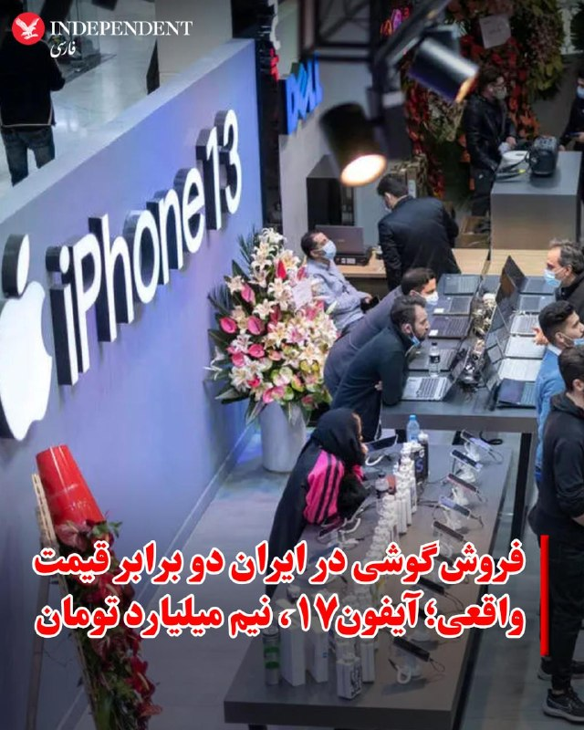

♦️پایگاه خبری «فرارو» چهارشنبه ۲۴ اردیبهشت‌ماه گزارش داد قیمت برخی مدل‌های تلفن همراه در بازار ایران به بیش از دو برابر نرخ جهانی رسیده و هم‌زمان توقف ورود گوشی به کشور از ابتدای سال، باعث جهش تازه قیمت‌ها شده است.

براساس این گزارش، گلکسی اس۲۵ اولترا نسخه ۲۵۶ گیگابایت با رم ۱۲ گیگ در بازار جهانی هزار و ۲۹۹ دلار قیمت دارد، اما همین مدل در بازار ایران تا ۴۸۷ میلیون تومان، معادل حدود دو هزار و ۷۰۰ دلار، فروخته می‌شود.

فرارو همچنین نوشت آیفون ۱۷ پرو مکس نسخه ۵۱۲ گیگ با قیمت جهانی هزار و ۳۹۹ دلار، در بازار موبایل ایران حدود ۵۱۴ میلیون تومان، معادل نزدیک دو هزار و ۸۵۰ دلار، قیمت‌گذاری شده است. آیفون ۱۷ نسخه معمولی نیز که حدود ۸۰۰ دلار ارزش دارد، در ایران تا حدود هزار و ۸۰۰ دلار فروخته می‌شود.

فعالان بازار موبایل به فرارو گفته‌اند روند ورود گوشی به کشور از ابتدای سال متوقف شده و کاهش عرضه، عامل اصلی افزایش قیمت‌ها بوده است. براساس این گزارش، گلکسی ای۰۷ که پیش از نوروز بین ۱۳ تا ۱۴ میلیون تومان فروخته می‌شد، اکنون به حدود ۲۲ میلیون تومان رسیده است. همچنین قیمت گلکسی ای۳۶ بین ۶۸ تا ۷۲ میلیون تومان و گلکسی ای۵۶ بین ۸۵ تا ۹۸ میلیون تومان اعلام شده است.
‌🇸🇦 Indypersian

🤖 @VahidOOnLine

## VahidOOnLine — post 240000

این‌ها فقط چند روایت کوتاه از دی‌ماه‌اند؛
از روزهایی که خیابان‌های ایران، شاهد خاموش شدن زندگی جوان‌هایی شد که هر کدام در حال ساختن آینده خود بودند.<
یکی ورزشکار بود،
یکی تازه زندگی مشترکش را شروع کرده بود،
یکی کار می‌کرد تا روی پای خودش بایستد،
و یکی پدر کودکی بود که حالا باید بدون او بزرگ شود.<
مهدی جعفری، سروش (حسین) دانشمندی، جواد زارعی، حامد بیابانی، حسین رضایی، امیرحسین میرزایی، محمدمهدی سیف‌الله‌پور و فاطمه اعزازی کله‌سر
جاویدنامان انقلاب ملی ایرانیان؛
نام‌هایی که در حافظه این سرزمین مانده‌اند، چون زندگی‌شان پیش از آن‌که فرصت کامل شدن پیدا کند، با گلوله متوقف شد.<
#جاویدنامان_انقلاب_ملی_ایرانیان
‌🏁 🇬🇧 IranintlTV

🤖 @VahidOOnLine

## VahidOOnLine — post 239999

  

♦️درحالی که مایک والتز، سفیر آمریکا در سازمان ملل با انتشار فهرستی از ۱۱۲ کشور حامی پیش‌نویس قطعنامه سازمان ملل در محکومیت اقدامات تهران در تنگه هرمز، این فهرست طولانی شامل هند، کره جنوبی و ژاپن را نشانه انزوای رژیم ایران توصیف کرده است، نمایندگی جمهوری اسلامی در سازمان ملل مدعی شد که آمریکا به کشورها برای حمایت از این قطعنامه فشار آورده است. والتز در پیامی در اکس نوشت: «ایران در اقدامات غیرقانونی خود برای مین‌گذاری در آب‌های بین‌المللی و دریافت عوارض، منزوی شده است. فهرست ۱۱۳ کشور هم‌حامی قطعنامه شورای امنیت سازمان ملل از جمله هند، ژاپن و کره جنوبی را ببینید که از ایران می‌خواهند به رفتار غیرقانونی و غیرقابل قبول خود پایان دهد.» در واکنش نمایندگی جمهوری اسلامی در سازمان ملل نیز آمده که نمایش تعداد کشورهای حمایت کننده از این قطعنامه «فریبکارانه و مضحک» است. نمایندگی جمهوری اسلامی مدعی شده که آمریکا به کشورها برای پیوستن به این قطعنامه فشار آورده است.
‌🇸🇦 Indypersian

🤖 @VahidOOnLine

## VahidOOnLine — post 239998

  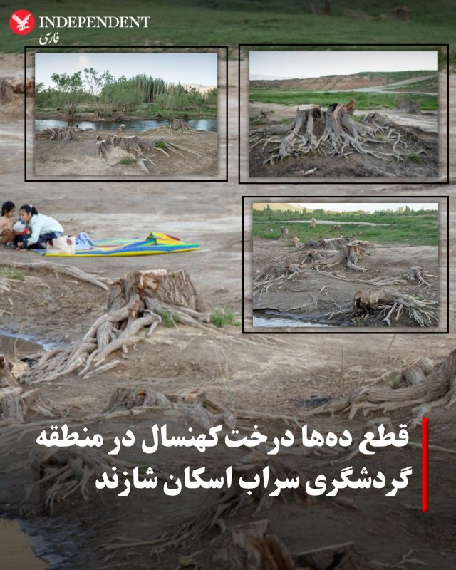

♦️طی روزهای اخیر ده‌ها اصله درخت تنومند و قدیمی در منطقه گردشگری سراب اسکان شازند که برخی از آن‌ها بین ۳۰ تا ۵۰ سال قدمت داشتند، بدون اعلام دلیل مشخصی قطع شده‌اند؛ اقدامی که واکنش شهروندان و فعالان محیط زیست را در پی داشته و نگرانی‌ها درباره آینده طبیعت این منطقه را افزایش داده است.

خبرگزاری ایسنا یکشنبه ۲۰ اردیبهشت‌ماه گزارش داد در روستای گردشگری اسکان در شهرستان شازند استان مرکزی، بیش از ۵۰ اصله درخت زنده قطع شده و بخش‌هایی از سیمای طبیعی منطقه دستخوش تغییر شده است.

این خبرگزاری نوشت پیگیری‌ها نشان می‌دهد این اقدام احتمالا بدون اطلاع‌رسانی شفاف و اخذ مجوزهای لازم انجام شده است.

گردشگران و اهالی منطقه با ابراز نگرانی از قطع درختان و نبود اطلاع‌رسانی، خواستار پیگیری موضوع و اعلام دلایل قطع ناگهانی درختان شده‌اند.

روستای اسکان در مسیر اراک ـ بروجرد و در مجاورت رودخانه قره‌چای قرار دارد و به‌دلیل طبیعت سرسبز و درختان کهنسال خود شناخته می‌شود.

به گزارش ایسنا، قطع این درختان علاوه بر تغییر سیمای طبیعی منطقه، نگرانی‌هایی درباره افزایش فرسایش خاک، تهدید منابع آبی و پیامدهای محیط زیستی ایجاد کرده است.
‌🇸🇦 Indypersian

🤖 @VahidOOnLine

## WithYashar — post 11178

مارکو روبیو تایید کرد چین و آمریکا به توافق رسیدن که ایران نباید تو تنگه عوارض بگیره از کشوری

این «توافق» فعلاً در حد موضع مشترک سیاسی و دیپلماتیک گزارش شده، نه یک پیمان رسمی یا قطعنامه بین‌المللی.
چین هنوز در بسیاری از موضوعات از ایران فاصله نگرفته و حتی در شورای امنیت بعضی قطعنامه‌های ضد ایران را وتو کرده است.
دلیل حساسیت موضوع این است که حدود یک‌پنجم نفت جهان از تنگه هرمز عبور می‌کند و هرگونه عوارض یا محدودیت می‌تواند قیمت جهانی انرژی را به شدت تحت تأثیر قرار دهد
@withyashar

## FoxNewsTwitter — post 341684

  

Fox News (Twitter/X)

WATCH LIVE: 38th annual candlelight vigil for fallen officers in Washington, DC https://twitter.com/i/broadcasts/1NGaraWVDYVJj

## pm_afshaa — post 90710

  <a href="telegram/content/pm_afshaa_90710_1778717851.webm" target="_blank">🎬 Download video</a>

🔴روبیو، وزیر خارجه آمریکا:

چین کلی کشتی تو خلیج فارس داره که گیر افتادن و آخر هفته هم یه کشتی باری چینی آسیب دید، فکر نمیکنم ایران عمدی زده باشه، ولی خب به هر حال اتفاق افتاده و الان همین باعث شده کشتی‌های چینی نتونن راحت رفت‌وآمد کنن؛ این وضعیت داره حسابی منطقه رو بی‌ثبات میکنه، مخصوصاً آسیا که بخش زیادی از انرژی‌شون از همین مسیر رد میشه. به نفع خود چینه که این قضیه جمع بشه.

ما هم امیدواریم پکن بیشتر وارد ماجرا بشه و ایران رو قانع کنه از کارهایی که الان داره تو خلیج فارس انجام میده عقب‌نشینی کنه.

💧 Rainbet.com the #1 Non-KYC Crypto Casino & Sportsbook @rainbetcom

😁 @Pm_Afshaa

## IranIntlTV — post 337082

این‌ها فقط چند روایت کوتاه از دی‌ماه‌اند؛
از روزهایی که خیابان‌های ایران، شاهد خاموش شدن زندگی جوان‌هایی شد که هر کدام در حال ساختن آینده خود بودند.
یکی ورزشکار بود،
یکی تازه زندگی مشترکش را شروع کرده بود،
یکی کار می‌کرد تا روی پای خودش بایستد،
و یکی پدر کودکی بود که حالا باید بدون او بزرگ شود.
مهدی جعفری، سروش (حسین) دانشمندی، جواد زارعی، حامد بیابانی، حسین رضایی، امیرحسین میرزایی، محمدمهدی سیف‌الله‌پور و فاطمه اعزازی کله‌سر
جاویدنامان انقلاب ملی ایرانیان؛
نام‌هایی که در حافظه این سرزمین مانده‌اند، چون زندگی‌شان پیش از آن‌که فرصت کامل شدن پیدا کند، با گلوله متوقف شد.
#جاویدنامان_انقلاب_ملی_ایرانیان

## IranIntlTV — post 337081

  <a href="telegram/content/IranIntlTV_337081_1778717851.mp4" target="_blank">🎬 Download video</a>

رسانه‌های جمهوری اسلامی از برگزاری رزمایش پنج‌روزه سپاه تهران بزرگ با محوریت مقابله با عملیات «هلی‌برن» نیروهای متخاصم خبر دادند.
در تصاویر منتشرشده، نیروهای پیاده با سلاح‌های سبک، نیمه‌سنگین و پهپاد به اهداف فرضی، همچون تصویر پارچه‌ای یک بالگرد، شلیک می‌کنند.
این رزمایش پس از ورود بالگردهای بلک‌هاوک و هواپیمای سوخت‌رسان آمریکا به خاک ایران، در جریان عملیات جست‌وجوی خلبان اف-۱۵، برگزار شده است.
@iranintltv

## IranIntlTV — post 337080

  <a href="telegram/content/IranIntlTV_337080_1778717852.mp4" target="_blank">🎬 Download video</a>

موج تازهٔ اعدام جوانان نخبه؛
احسان افرشته با اتهام «جاسوسی» اعدام شد

جمهوری اسلامی بامداد چهارشنبه حکم اعدام احسان افرشته، زندانی سیاسی متهم به «جاسوسی برای اسرائیل»، را اجرا کرد؛ پرونده‌ای که مانند بسیاری از پرونده‌های امنیتی مشابه، بدون انتشار سند و مدرک مستقل به پایان رسید.

نهادهای حقوق بشری پیش‌تر هشدار داده بودند که اتهامات مطرح‌شده علیه او بر پایهٔ اعترافات اجباری و تحت فشار مطرح شده است.

کامبیز حسینی در «برنامه» به این موضوع می‌پردازد.

«یک ایران صدای شما را می‌شنود»
دوشنبه تا پنجشنبه ۱۱ شب تهران
از تلویزیون ایران اینترنشنال

تماشای نسخه کامل این قسمت از «برنامه» در یوتیوب:
https://youtu.be/HsShW7razys
@iranintltv

## IranIntlTV — post 337079

  <a href="telegram/content/IranIntlTV_337079_1778717854.mp4" target="_blank">🎬 Download video</a>

محمد از آلمان: کسی که پول دارو ندارد، آب ندارد، برق ندارد، او هم اعدامی جمهوری اسلامی است

«یک ایران صدای شما را می‌شنود»
دوشنبه تا پنجشنبه ۱۱ شب تهران
از تلویزیون ایران اینترنشنال

تماشای نسخه کامل این قسمت از «برنامه» در یوتیوب:
https://youtu.be/HsShW7razys
@iranintltv

## IranIntlTV — post 337078

  <a href="telegram/content/IranIntlTV_337078_1778717856.mp4" target="_blank">🎬 Download video</a>

حمید از بندرعباس: می‌روم خرید، ولی فقط می‌توانم به اندازهٔ جیبم خرید کنم، نه نیازم

«یک ایران صدای شما را می‌شنود»
دوشنبه تا پنجشنبه ۱۱ شب تهران
از تلویزیون ایران اینترنشنال

تماشای نسخه کامل این قسمت از «برنامه» در یوتیوب:
https://youtu.be/HsShW7razys
@iranintltv

## IranIntlTV — post 337077

  <a href="telegram/content/IranIntlTV_337077_1778717858.mp4" target="_blank">🎬 Download video</a>

فریبرز از خوزستان: مردمی که اینترنت ندارند، چه کار کنند؟ ایرانی‌های خارج از کشور کمک کنند

«یک ایران صدای شما را می‌شنود»
دوشنبه تا پنجشنبه ۱۱ شب تهران
از تلویزیون ایران اینترنشنال

تماشای نسخه کامل این قسمت از «برنامه» در یوتیوب:
https://youtu.be/HsShW7razys
@iranintltv

## IranIntlTV — post 337076

  <a href="https://t.me/IranintlTV/337076" target="_blank">📎 Download file</a>

🎧نسخه صوتی سیاست با مراد ویسی: ایران کارت بازی دیگران
@iranintlTV

## IranIntlTV — post 337075

  <a href="telegram/content/IranIntlTV_337075_1778717860.mp4" target="_blank">🎬 Download video</a>

فرامرز از استکهلم: به ترامپ توجه نکنید؛ او در حال جنگ سرد است؛ما باید مسیر خودمان را برویم

«یک ایران صدای شما را می‌شنود»
دوشنبه تا پنجشنبه ۱۱ شب تهران
از تلویزیون ایران اینترنشنال

تماشای نسخه کامل این قسمت از «برنامه» در یوتیوب:
https://youtu.be/HsShW7razys
@iranintltv

## FarsiVOA — post 217676

🔺مارکو روبیو: امیدواریم چین در واداشتن جمهوری اسلامی به اتمام بی‌ثبات‌سازی خلیج فارس نقش فعال‌تری ایفا کند

▪️مارکو روبیو، وزیر امور خارجه آمریکا، در یک گفت‌وگوی اختصاصی با شان هنیتی از شبکه فاکس‌نیوز درباره تلاش‌ها برای وادار کردن چین به برخورد با جمهوری اسلامی ایران در ارتباط با اقداماتش در خلیج فارس توضیح داد.

⬇️ بیشتر بخوانید:
https://ir.voanews.com/a/8149668.html
@FarsiVOA

## BBCPersian — post 280971

🔻در اوج دور جدید جنگ میان حزب‌الله و ارتش اسرائیل ساختمانی مسکونی در بیروت در مقابل دوربینها و پخش زنده تلویزیونی توسط جنگنده‌ های اسرائیلی بمباران و ویران شد. صحنه‌ای که از زوایای مختلف به تصویر کشیده شد و ذهنها ماند.

اسرائیل گفت یکی از زیرساختهای مالی مربوط به حزب‌الله را هدف گرفته. در این حمله که بعد از هشدار تخلیه بود، کسی کشته نشد اما دهها خانواده بی‌خانمان شدند. ساکنان محله و صاحبخانه‌ها در گفتگو با بی‌بی‌سی ادعای اسرائیل را رد کردند. پیگیریهای بی‌بی‌سی از این ارتش درباره جزییات این منابع مالی ادعایی بی‌جواب ماند.

این درحالیست که گروه‌های حقوق بشری می‌گویند این نوع حملات خلاف قوانین بین‌المللی هستند و می‌توانند جنایت جنگی محسوب شوند.

گزارش تحقیقی نفیسه کوهنورد از بیروت را ببینیم

@BBCPersian

## alonews — post 119836

  <a href="telegram/content/alonews_119836_1778717862.webm" target="_blank">🎬 Download video</a>

👈معین: مهدی تاج الکی میگه، من قرار نیست هیچ آهنگی واسه تیم فوتبال تو جام جهانی بخونم.

✅ @AloNews خبر جنگ

---
📅 بروزرسانی: 1405/02/24 02:38
---

## VahidOOnLine — post 239997

  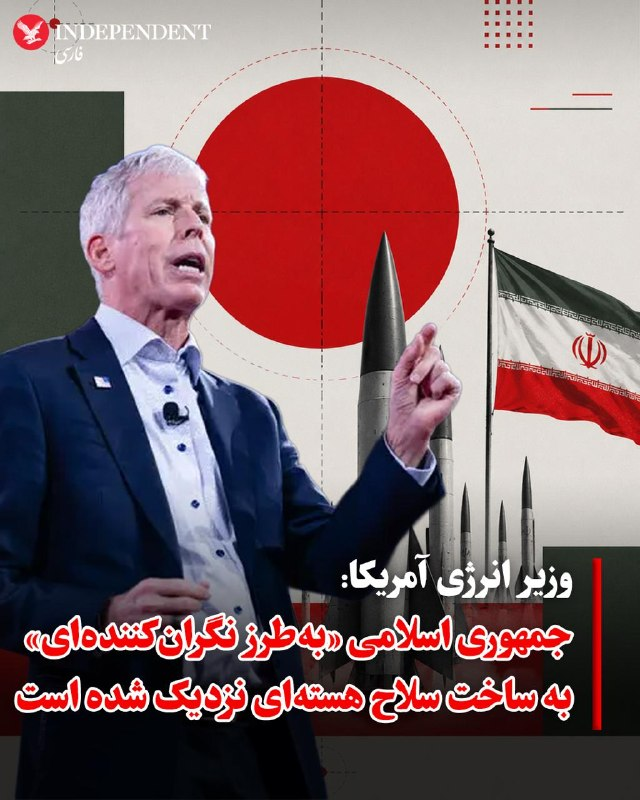

♦️کریس رایت، وزیر انرژی آمریکا، روز چهارشنبه هشدار داد که رژیم ایران «به‌طرز نگران‌کننده‌ای» به تولید اورانیوم غنی‌شده در سطح مورد نیاز برای ساخت سلاح هسته‌ای نزدیک شده است.
رایت گفت اورانیوم غنی‌شده ایران ـ که دونالد ترامپ، رئیس‌جمهوری آمریکا، مصرانه به‌دنبال توقیف آن است ـ رژیم جمهوری اسلامی را تنها چند هفته با رسیدن به آستانه لازم برای دستیابی به بمب هسته‌ای فاصله داده است.
او در جلسه کمیته نیروهای مسلح سنای آمریکا گفت: «آن‌ها فقط چند هفته با غنی‌سازی این مواد تا سطح تسلیحاتی فاصله دارند. البته پس از آن هنوز فرایند ساخت و تسلیحاتی‌کردن بمب باقی می‌ماند، اما آن‌ها بسیار نزدیک شده‌اند.»
استیو ویتکاف، فرستاده ویژه آمریکا، پیش‌تر به‌طور علنی گفته بود ایران مدعی است آن‌قدر اورانیوم با غنای ۶۰ درصد در اختیار دارد که در صورت غنی‌سازی بیشتر تا سطح ۹۰ درصد، برای ساخت ۱۱ بمب هسته‌ای کافی خواهد بود.
به گفته کارشناسان هسته‌ای، رسیدن به سطح غنی‌سازی ۶۰ درصد، از نظر فنی جهشی بسیار دشوارتر از حرکت از ۶۰ درصد به ۹۰ درصد است؛ سطحی که غنی‌سازی در حد تسلیحاتی محسوب می‌شود.
گفته می‌شود ایران حدود ۴۰۰ کیلوگرم اورانیوم با غنای ۶۰ درصد در اختیار دارد.
به گزارش نیویورک پست، رایت و سناتور ریچارد بلومنتال، دموکرات ایالت کنتیکت، در این جلسه توافق داشتند که جمهوری اسلامی «تنها چند هفته» با تبدیل این مواد به اورانیوم در سطح تسلیحاتی فاصله دارد.
ایران همچنین ۱۱ تن اورانیوم دیگر با سطح پایین‌تر غنی‌سازی در اختیار دارد.
رایت افزود: «آن‌ها مقداری اورانیوم ۲۰ درصدی هم دارند و [رسیدن آن] به سطح ۶۰ درصد، چند هفته بیشتر زمان می‌برد.»
او ادامه داد: «[در مورد] اورانیوم غنی‌نشده، رساندن آن به سطح تسلیحاتی فرایندی طولانی است. اما وقتی به ۶۰ درصد می‌رسید، هرچند اعداد شاید این را نشان ندهند، در واقع بیش از ۹۰ درصد مسیر لازم برای غنی‌سازی در سطح تسلیحاتی را طی کرده‌اید.»
او تاکید کرد: «این موضوع بسیار نگران‌کننده است.»
بلومنتال گفت اگر ترامپ بخواهد این تهدید را به‌طور کامل از بین ببرد، احتمالا باید علاوه بر حدود یک تن اورانیوم ۶۰ درصدی، ۱۱ تن اورانیوم ۲۰ درصدی ایران را نیز در اختیار بگیرد.
رایت در پاسخ گفت: «فکر می‌کنم این راهبرد عاقلانه‌ای است. در نهایت، هدف این است که از غنی‌سازی اورانیوم در آینده نیز جلوگیری شود. بله، برای داشتن جهانی امن، باید به برنامه هسته‌ای آن‌ها پایان دهیم.
‌🇸🇦 Indypersian

🤖 @VahidOOnLine

## VahidOOnLine — post 239996

  

نیویورک‌تایمز به نقل از مقام‌های آمریکایی گزارش داد شرکت‌های چینی با جمهوری اسلامی درباره فروش سلاح در حال گفت‌وگو بوده‌اند و قصد داشته‌اند این تسلیحات را از طریق کشورهای دیگر ارسال کنند تا منشا کمک نظامی پنهان بماند.
مقام‌های آمریکایی گفتند دست‌کم یکی از کشورهای ثالث در آفریقا قرار دارد، اما مشخص نیست آیا محموله‌ای به آن کشور رسیده است یا نه.
مقام‌هایی که در جریان این اطلاعات قرار گرفته‌اند، درباره اینکه آیا سلاح‌ها پیش‌تر به کشورهای ثالث ارسال شده‌اند یا نه، به جمع‌بندی‌های متفاوتی رسیده‌اند. با این حال، از زمان آغاز جنگ کنونی علیه جمهوری اسلامی، به نظر نمی‌رسد هیچ سلاح چینی در میدان نبرد علیه نیروهای آمریکایی یا اسرائیلی استفاده شده باشد.
هنوز مشخص نیست چه تعداد سلاح منتقل شده یا مقام‌های چینی تا چه اندازه این فروش‌ها را تایید کرده‌اند.

‌🏁 🇬🇧 IranintlTV

🤖 @VahidOOnLine

## VahidOOnLine — post 239995

  

♦️ایمان خلیف، بوکسور الجزایری و قهرمان جنجالی المپیک، در نخستین حضور خود در جشنواره فیلم کن، با کت‌وشلوار رسمی مشکی مردانه روی فرش قرمز ظاهر شد.
حضور خلیف در شرایطی خبرساز شده که جنجال‌ها درباره نتایج آزمایش‌های پزشکی او همچنان ادامه دارد. نشریه تلگراف پیش‌تر گزارش داده بود اسناد آزمایش تعیین جنسیت این ورزشکار نشان می‌دهد او دارای ساختار کروموزومی XY (مردانه) است. فدراسیون جهانی بوکس نیز اعلام کرده ایمان خلیف بدون انجام آزمایش‌های جدید و تایید صلاحیت، نمی‌تواند در رقابت‌های آینده زنان شرکت کند.
دونالد ترامپ، رئیس‌جمهوری آمریکا، نیز پیش‌تر گفته بود ورزشکارانی که از نظر بیولوژیکی مرد هستند، نباید در رقابت‌های زنان المپیک شرکت کنند. با ادامه این جنجال‌ها، هنوز مشخص نیست ایمان خلیف امکان حضور در المپیک آینده را خواهد داشت یا خیر.
‌🇸🇦 Indypersian

🤖 @VahidOOnLine

## VahidOOnLine — post 239994

  

♦️مارکو روبیو، وزیر خارجه آمریکا، در گفتگو با فاکس‌نیوز گفت واشینگتن امیدوار است چین نقش فعال‌تری برای ترغیب جمهوری اسلامی به کنار گذاشتن اقداماتش در خلیج فارس ایفا کند.

روبیو در گفتگویی با شان هنیتی در هواپیمای ریاست‌جمهوری آمریکا گفت: «کشتی‌های چینی در خلیج فارس گیر افتاده‌اند.» او افزود یک کشتی حامل بار چینی آخر هفته هدف قرار گرفته است.

وزیر خارجه آمریکا همچنین گفت واشینگتن این موضوع را با مقام‌های چینی مطرح کرده و امیدوار است پکن از قطعنامه شورای امنیت سازمان ملل درباره محکومیت اقدامات جمهوری اسلامی در تنگه‌ها حمایت کند.

او تاکید کرد بحران در تنگه هرمز منبع بزرگی از بی‌ثباتی است و بیش از هر منطقه دیگری، آسیا را تهدید می‌کند، زیرا کشورهای آسیایی به‌شدت به مسیرهای انرژی در این منطقه وابسته‌اند.

روبیو افزود اقتصاد چین بر پایه صادرات بنا شده و ادامه بحران در تنگه هرمز می‌تواند باعث کاهش خرید کالاهای چینی و افت شدید صادرات این کشور شود.

وزیر خارجه آمریکا در پایان گفت: «حل این بحران به نفع چین است و امیدواریم آن‌ها نقش فعال‌تری برای وادار کردن ایران به عقب‌نشینی از اقداماتی که اکنون در خلیج فارس انجام می‌دهد، ایفا کنند.»
‌🇸🇦 Indypersian

🤖 @VahidOOnLine

## VahidOOnLine — post 239993

  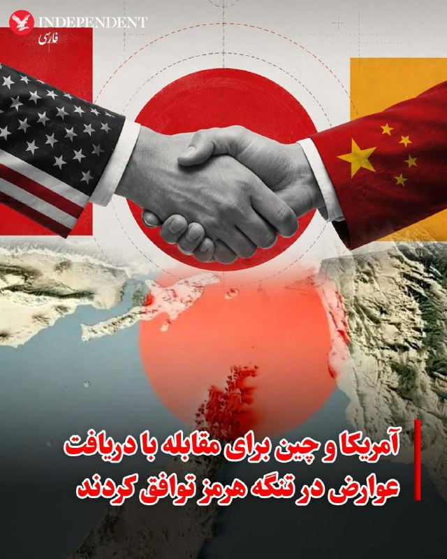

♦️به گزارش رویترز، وزارت امور خارجه ایالات متحده اعلام کرد که واشنگتن و پکن برای جلوگیری از دریافت هرگونه «عوارض کشتیرانی» در تنگه هرمز به توافق رسیده‌اند.
این توافق در جریان رایزنی‌های مارکو رابیو، وزیر امور خارجه آمریکا و وانگ یی، وزیر امور خارجه چین، پیش از دیدار سران دو کشور در پکن حاصل شده است. طبق بیانیه وزارت خارجه آمریکا، دو طرف تاکید کرده‌اند که به هیچ کشوری اجازه داده نخواهد شد برای تردد در آبراه‌های بین‌المللی مانند تنگه هرمز عوارض وضع کند.
این موضع مشترک در آستانه سفر دونالد ترامپ به چین و دیدار با شی جین‌پینگ منتشر می‌شود؛ نشستی که انتظار می‌رود فشار بر تهران برای پایان دادن به انسداد این آبراه حیاتی در صدر دستور کار آن باشد. در حالی که ایران دریافت عوارض را پیش‌شرطی برای بازگشایی مسیر اعلام کرده، این هماهنگی میان واشنگتن و پکن نشان‌دهنده تلاش برای تضمین «تردد آزاد و امن» در منطقه‌ای است که نقش کلیدی در تأمین انرژی جهان دارد.
‌🇸🇦 Indypersian

🤖 @VahidOOnLine

## VahidOOnLine — post 239992

  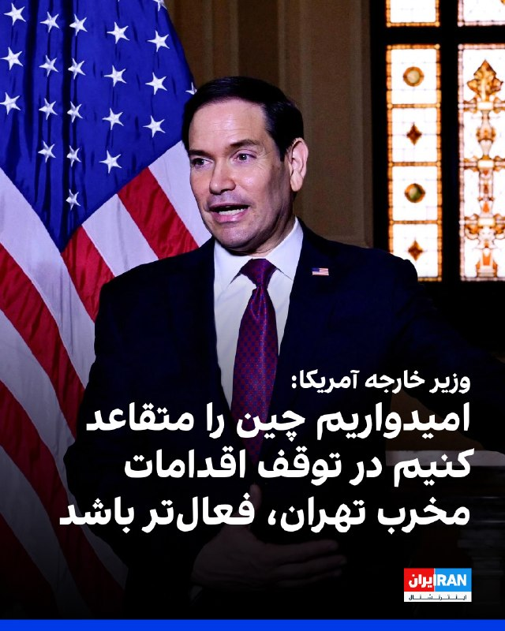

مارکو روبیو، وزیر خارجه آمریکا، در گفت‌وگو با فاکس‌نیوز با تاکید بر اینکه حل بحران خاورمیانه به نفع چین است، ابراز امیدواری کرد واشینگتن بتواند پکن را متقاعد کند نقش فعال‌تری در ترغیب جمهوری اسلامی برای کنار گذاشتن اقداماتش در خلیج فارس ایفا کند.
او گفت: «چینی‌ها کشتی‌هایی دارند که در خلیج فارس گیر افتاده‌اند. یک محموله باری چینی آخر هفته هدف قرار گرفت. مطمئنم جمهوری اسلامی عمدا این کار را نکرد، اما این اتفاق افتاد. به همین دلیل این کشتی‌های چینی آنجا گیر افتاده‌اند.»
روبیو افزود: «این وضعیت منبع بزرگی از بی‌ثباتی است. بیش از هر نقطه دیگر جهان، آسیا را تهدید به بی‌ثباتی می‌کند، زیرا به شدت به این تنگه‌ها برای انرژی وابسته است.»

‌🏁 🇬🇧 IranintlTV

🤖 @VahidOOnLine

## VahidOOnLine — post 239991

  <a href="telegram/content/VahidOOnLine_239991_1778713722.mp4" target="_blank">🎬 Download video</a>

‌
مهدی تاج، رئیس فدراسیون فوتبال ایران، درباره انتشار آهنگی از سوی معین، برای تیم فوتبال در جام‌جهانی گفت فدراسیون فوتبال در تولید این کار دخیل نبوده، اما «در جریان» این موضوع است.
تاج افزود: «هر کسی از ایران حمایت کند، مورد تایید ماست.»
‌🏁 🇬🇧 ManotoTV

🤖 @VahidOOnLine

## VahidOOnLine — post 239990

  <a href="telegram/content/VahidOOnLine_239990_1778713724.mp4" target="_blank">🎬 Download video</a>

تماسی از ایران:
«می‌گفت تفاوت سیستم آموزش مدارس ایران با خارج از کشور زمین تا آسمونه…
می‌گفت به‌جای رشد و یادگیری،
بچه‌ها درگیر ظواهر و حاشیه‌ها شدن
و انگیزه برای پیشرفت کم‌رنگ شده.»
‌🏁 🇬🇧 ManotoTV

🤖 @VahidOOnLine

## VahidOOnLine — post 239989

  <a href="telegram/content/VahidOOnLine_239989_1778713727.mp4" target="_blank">🎬 Download video</a>

مارکو روبیو، وزیر خارجه آمریکا، در گفت‌وگویی اختصاصی با شان هنیتی، خبرنگار و مجری فاکس‌نیوز در هواپیمای ریاست جمهوری آمریکا، از تلاش‌های فشرده واشینگتن برای وادار کردن چین به مقابله با اقدامات جمهوری اسلامی در خلیج فارس سخن گفت.

روبیو گفت: «کشتی‌های چینی در خلیج فارس گیر افتاده‌اند... آخر هفته یک محموله باری چین هدف قرار گرفت. مطمئنم ایران عمداً این کار را نکرده، اما این اتفاق افتاده و به همین دلیل کشتی‌های چینی آنجا گرفتار شده‌اند.»

او افزود: «این وضعیت منبع بزرگی از بی‌ثباتی است. بیش از هر نقطه دیگری در جهان، آسیا را تهدید به بی‌ثباتی می‌کند، چون به‌شدت به این تنگه برای تامین انرژی وابسته است.»

وزیر خارجه آمریکا همچنین گفت: «حل این مسئله به نفع چین است. امیدواریم بتوانیم آن‌ها را قانع کنیم نقش فعال‌تری برای وادار کردن ایران به عقب‌نشینی از اقداماتی که اکنون در خلیج فارس انجام می‌دهد و در پی انجام آن است، ایفا کنند.»
‌🏁 🇬🇧 ManotoTV

🤖 @VahidOOnLine

## VahidOOnLine — post 239988

  <a href="telegram/content/VahidOOnLine_239988_1778713729.mp4" target="_blank">🎬 Download video</a>

‌
خبرگزاری رویترز به نقل از منابع آگاه گزارش داد جنگنده‌های عربستان سعودی در جریان جنگ میان آمریکا، اسرائیل و جمهوری اسلامی، مواضع شبه‌نظامیان شیعه مورد حمایت تهران در عراق را هدف قرار داده‌اند.

بر اساس این گزارش، حملات تلافی‌جویانه‌ای نیز از خاک کویت به داخل عراق انجام شده است. منابع مطلع گفته‌اند این عملیات‌ها بخشی از پاسخ‌های نظامی گسترده‌تر کشورهای خلیج فارس به درگیری‌های منطقه‌ای بوده که تاکنون به‌طور علنی فاش نشده بود.

رویترز به نقل از مقام‌های امنیتی و نظامی عراق، یک مقام غربی و منابع آگاه گزارش داده حملات عربستان توسط جنگنده‌های نیروی هوایی این کشور علیه مواضع گروه‌های نزدیک به جمهوری اسلامی در نزدیکی مرز شمالی عربستان با عراق انجام شده است.

به گفته منابع، این حملات مواضعی را هدف قرار داده که از آن‌ها پهپادها و موشک‌هایی به سمت عربستان و دیگر کشورهای خلیج فارس شلیک می‌شد.

منابع عراقی همچنین گفتند حملاتی نیز از خاک کویت علیه مواضع شبه‌نظامیان در جنوب عراق انجام شده که در جریان آن چندین عضو گروه کتائب حزب‌الله کشته و یک مرکز ارتباطات و عملیات پهپادی این گروه نابود شده است.
‌🏁 🇬🇧 ManotoTV

🤖 @VahidOOnLine

## WithYashar — post 11177

@withyashar سفر قاهره

## WithYashar — post 11176

قصه بگم ؟ شایدم بهترین شرحی ‌باشه که لازم دارید بشنوید …

## WithYashar — post 11175

## WithYashar — post 11174

  <a href="telegram/content/WithYashar_11174_1778713730.mp4" target="_blank">🎬 Download video</a>

🎬 Video

## FoxNewsTwitter — post 341683

  <a href="telegram/content/FoxNewsTwitter_341683_1778713732.mp4" target="_blank">🎬 Download video</a>

Fox News (Twitter/X)

FOX NEWS REPORT: President Trump is in China and expected to talk trade and the Iran war with Chinese President Xi Jinping. @BillMelugin_ has the latest.

## IranIntlTV — post 337074

  <a href="telegram/content/IranIntlTV_337074_1778713735.mp4" target="_blank">🎬 Download video</a>

احمد از انگلستان: مردم ایران صبرشان استراتژیک و تاریخی است و می‌دانند کی باید به آب بزنند

«یک ایران صدای شما را می‌شنود»
دوشنبه تا پنجشنبه ۱۱ شب تهران
از تلویزیون ایران اینترنشنال

تماشای نسخه کامل این قسمت از «برنامه» در یوتیوب:
https://youtu.be/HsShW7razys
@iranintltv

## IranIntlTV — post 337073

  

نیویورک‌تایمز به نقل از مقام‌های آمریکایی گزارش داد شرکت‌های چینی با جمهوری اسلامی درباره فروش سلاح در حال گفت‌وگو بوده‌اند و قصد داشته‌اند این تسلیحات را از طریق کشورهای دیگر ارسال کنند تا منشا کمک نظامی پنهان بماند.
مقام‌های آمریکایی گفتند دست‌کم یکی از کشورهای ثالث در آفریقا قرار دارد، اما مشخص نیست آیا محموله‌ای به آن کشور رسیده است یا نه.
مقام‌هایی که در جریان این اطلاعات قرار گرفته‌اند، درباره اینکه آیا سلاح‌ها پیش‌تر به کشورهای ثالث ارسال شده‌اند یا نه، به جمع‌بندی‌های متفاوتی رسیده‌اند. با این حال، از زمان آغاز جنگ کنونی علیه جمهوری اسلامی، به نظر نمی‌رسد هیچ سلاح چینی در میدان نبرد علیه نیروهای آمریکایی یا اسرائیلی استفاده شده باشد.
هنوز مشخص نیست چه تعداد سلاح منتقل شده یا مقام‌های چینی تا چه اندازه این فروش‌ها را تایید کرده‌اند.

https://iranintl.com/202605134264

## IranIntlTV — post 337072

  <a href="telegram/content/IranIntlTV_337072_1778713739.mp4" target="_blank">🎬 Download video</a>

دفتر نخست‌وزیری اسرائیل اعلام کرد بنیامین نتانیاهو در جریان جنگ علیه جمهوری اسلامی به‌صورت محرمانه به امارات سفر و با محمد بن زاید دیدار کرده است. رادیو ملی اسرائیل نیز گزارش داد این نخستین بار نیست که نتانیاهو به امارات رفته، اما برای نخستین‌بار است که این موضوع به‌صورت رسمی تایید می‌شود.

گفت‌وگو با بن سبطی، پژوهشگر ایران و اسرائیل
@iranintltv

## IranIntlTV — post 337071

  <a href="telegram/content/IranIntlTV_337071_1778713742.mp4" target="_blank">🎬 Download video</a>

در پی موج جدید بیکاری در ایران در سایه جنگ، سرکوب و قطعی اینترنت، آمار رسمی از بیش از ۲۰۰ هزار متقاضی دریافت بیمه بیکاری خبر می‌دهد. مسعود پزشکیان پیش‌تر در واکنش به تورم و گرانی گفته بود کشور به‌شدت به صرفه‌جویی نیاز دارد.

گفت‌وگو با جمشید اسدی، اقتصاددان
@iranintltv

## IranIntlTV — post 337070

  <a href="telegram/content/IranIntlTV_337070_1778713745.mp4" target="_blank">🎬 Download video</a>

گزارش‌ها حاکی است در کمتر از یک ماه، دست‌کم ۱۲ هسته مرتبط با تهران در کویت، بحرین، امارات و قطر شناسایی و متلاشی شده‌اند.
مقام‌های امنیتی این کشورها می‌گویند ده‌ها نفر به اتهام جاسوسی، پول‌شویی، طراحی ترور و همکاری با سپاه و حزب‌الله بازداشت شده‌اند.

گزارش نیلوفر منصوری، خبرنگار ایران‌اینترنشنال
@iranintltv

## IranIntlTV — post 337069

  

مارکو روبیو، وزیر خارجه آمریکا، در گفت‌وگو با فاکس‌نیوز با تاکید بر اینکه حل بحران خاورمیانه به نفع چین است، ابراز امیدواری کرد واشینگتن بتواند پکن را متقاعد کند نقش فعال‌تری در ترغیب جمهوری اسلامی برای کنار گذاشتن اقداماتش در خلیج فارس ایفا کند.
او گفت: «چینی‌ها کشتی‌هایی دارند که در خلیج فارس گیر افتاده‌اند. یک محموله باری چینی آخر هفته هدف قرار گرفت. مطمئنم جمهوری اسلامی عمدا این کار را نکرد، اما این اتفاق افتاد. به همین دلیل این کشتی‌های چینی آنجا گیر افتاده‌اند.»
روبیو افزود: «این وضعیت منبع بزرگی از بی‌ثباتی است. بیش از هر نقطه دیگر جهان، آسیا را تهدید به بی‌ثباتی می‌کند، زیرا به شدت به این تنگه‌ها برای انرژی وابسته است.»

https://iranintl.com/202605139871

## IranIntlTV — post 337068

  <a href="telegram/content/IranIntlTV_337068_1778713749.mp4" target="_blank">🎬 Download video</a>

مراد ویسی، تحلیل‌گر ارشد ایران‌اینترنشنال، گفت: «تشکیل ستاد ساماندهی فضای مجازی در عمل یعنی برنامه‌ریزی برای قطع سازمان یافته اینترنت و محدود کردن دسترسی ۹۰ میلیون ایرانی، در حالی که اینترنت ویژه فقط در اختیار حامیان حکومت قرار می‌گیرد. اصطلاحاتی مثل اینترنت پرو، اینترنت طبقاتی، سیم‌کارت سفید یا ناپایداری ارتباط، همگی نام‌های متفاوتی برای همان قطع و کنترل اینترنت هستند.»
@iranintltv

## ManotoTV — post 105424

  <a href="telegram/content/ManotoTV_105424_1778713751.mp4" target="_blank">🎬 Download video</a>

‌
مهدی تاج، رئیس فدراسیون فوتبال ایران، درباره انتشار آهنگی از سوی معین، برای تیم فوتبال در جام‌جهانی گفت فدراسیون فوتبال در تولید این کار دخیل نبوده، اما «در جریان» این موضوع است.
تاج افزود: «هر کسی از ایران حمایت کند، مورد تایید ماست.»

## ManotoTV — post 105423

  <a href="telegram/content/ManotoTV_105423_1778713753.mp4" target="_blank">🎬 Download video</a>

تماسی از ایران:
«می‌گفت تفاوت سیستم آموزش مدارس ایران با خارج از کشور زمین تا آسمونه…
می‌گفت به‌جای رشد و یادگیری،
بچه‌ها درگیر ظواهر و حاشیه‌ها شدن
و انگیزه برای پیشرفت کم‌رنگ شده.»

## ManotoTV — post 105422

  <a href="telegram/content/ManotoTV_105422_1778713756.mp4" target="_blank">🎬 Download video</a>

مارکو روبیو، وزیر خارجه آمریکا، در گفت‌وگویی اختصاصی با شان هنیتی، خبرنگار و مجری فاکس‌نیوز در هواپیمای ریاست جمهوری آمریکا، از تلاش‌های فشرده واشینگتن برای وادار کردن چین به مقابله با اقدامات جمهوری اسلامی در خلیج فارس سخن گفت.

روبیو گفت: «کشتی‌های چینی در خلیج فارس گیر افتاده‌اند... آخر هفته یک محموله باری چین هدف قرار گرفت. مطمئنم ایران عمداً این کار را نکرده، اما این اتفاق افتاده و به همین دلیل کشتی‌های چینی آنجا گرفتار شده‌اند.»

او افزود: «این وضعیت منبع بزرگی از بی‌ثباتی است. بیش از هر نقطه دیگری در جهان، آسیا را تهدید به بی‌ثباتی می‌کند، چون به‌شدت به این تنگه برای تامین انرژی وابسته است.»

وزیر خارجه آمریکا همچنین گفت: «حل این مسئله به نفع چین است. امیدواریم بتوانیم آن‌ها را قانع کنیم نقش فعال‌تری برای وادار کردن ایران به عقب‌نشینی از اقداماتی که اکنون در خلیج فارس انجام می‌دهد و در پی انجام آن است، ایفا کنند.»

## ManotoTV — post 105421

  <a href="telegram/content/ManotoTV_105421_1778713758.mp4" target="_blank">🎬 Download video</a>

‌
خبرگزاری رویترز به نقل از منابع آگاه گزارش داد جنگنده‌های عربستان سعودی در جریان جنگ میان آمریکا، اسرائیل و جمهوری اسلامی، مواضع شبه‌نظامیان شیعه مورد حمایت تهران در عراق را هدف قرار داده‌اند.

بر اساس این گزارش، حملات تلافی‌جویانه‌ای نیز از خاک کویت به داخل عراق انجام شده است. منابع مطلع گفته‌اند این عملیات‌ها بخشی از پاسخ‌های نظامی گسترده‌تر کشورهای خلیج فارس به درگیری‌های منطقه‌ای بوده که تاکنون به‌طور علنی فاش نشده بود.

رویترز به نقل از مقام‌های امنیتی و نظامی عراق، یک مقام غربی و منابع آگاه گزارش داده حملات عربستان توسط جنگنده‌های نیروی هوایی این کشور علیه مواضع گروه‌های نزدیک به جمهوری اسلامی در نزدیکی مرز شمالی عربستان با عراق انجام شده است.

به گفته منابع، این حملات مواضعی را هدف قرار داده که از آن‌ها پهپادها و موشک‌هایی به سمت عربستان و دیگر کشورهای خلیج فارس شلیک می‌شد.

منابع عراقی همچنین گفتند حملاتی نیز از خاک کویت علیه مواضع شبه‌نظامیان در جنوب عراق انجام شده که در جریان آن چندین عضو گروه کتائب حزب‌الله کشته و یک مرکز ارتباطات و عملیات پهپادی این گروه نابود شده است.

## FarsiVOA — post 217675

🔺آمریکا سپرده ضمانت ویزا برای اعضای واجد شرایط تیم‌های شرکت‌کننده در «جام جهانی» و برخی هواداران را لغو کرد

▪️ایالات متحده می‌گوید سپرده ضمانت ویزا برای اعضای واجد شرایط تیم‌ها و برخی هواداران تیم‌ها لغو کرده است.

⬇️ بیشتر بخوانید:
https://ir.voanews.com/a/8149664.html
@FarsiVOA

## FarsiVOA — post 217674

🔺مایک والتز: جمهوری اسلامی در انجام اقدامات غیرقانونی خود منزوی است

▪️مایک والتز، سفیر آمریکا در سازمان ملل متحد، فهرستی از ۱۱۳ کشور را بازنشر کرد که پیش‌نویس قطعنامه شورای امنیت سازمان ملل که جمهوری اسلامی را به دلیل بستن تنگه هرمز محکوم می‌کند،‌ امضا کرده‌اند.

⬇️ بیشتر بخوانید:
https://ir.voanews.com/a/8149663.html
@FarsiVOA

## FarsiVOA — post 217673

🔺امارات «گزارش‌ها درباره سفر نخست‌وزیر اسرائیل» را تکذیب کرد

▪️وزارت امور خارجه امارات در بیانیه‌ای «گزارش‌های منتشرشده درباره سفر ادعایی بنیامین نتانیاهو، نخست‌وزیر اسرائیل، به امارات یا پذیرش هرگونه هیئت نظامی اسرائیلی در این کشور را» تکذیب کرد.

⬇️ بیشتر بخوانید:
https://ir.voanews.com/a/8149657.html
@FarsiVOA

## FarsiVOA — post 217672

🔺وزارت خارجه آمریکا: واشنگتن آماده «کمک مستقیم» ۱۰۰میلیون دلاری به مردم کوبا است

▪️وزارت خارجه آمریکا روز چهارشنبه در بیانیه‌ای گفت که واشنگتن آماده است ۱۰۰ میلیون دلار به‌طور مستقیم به مردم کوبا کمک کند.

⬇️ بیشتر بخوانید:
https://ir.voanews.com/a/8149655.html
@FarsiVOA

## Persian_Trend_Official — post 14081

  <a href="telegram/content/Persian_Trend_Official_14081_1778713759.mp4" target="_blank">🎬 Download video</a>

شبتون بخیر ❤️🔥

📝 Nick
📌 @persian_trend_official
پرشین ترند | متفاوت‌ترین کانال نظامی

## IranianMinds — post 20095

  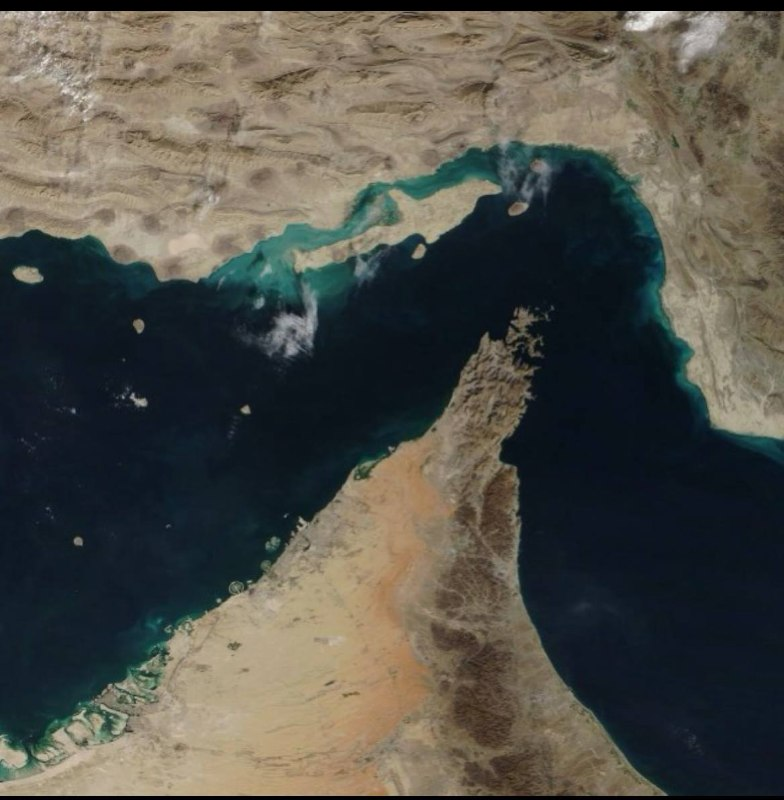

🔴 رویترز :

طبق گزارش وزارت خارجه، آمریکا و چین توافق کردند که هیچ کشوری نباید در تنگه هرمز عوارض حمل و نقل دریایی دریافت کند.

این موضوع پیش از نشست ترامپ و شی در پکن، توسط مارکو روبیو، وزیر خارجه آمریکا، و وانگ یی، وزیر خارجه چین، مورد بحث قرار گرفت!

@IranianMinds

## IranianMinds — post 20094

  <a href="telegram/content/IranianMinds_20094_1778713763.mp4" target="_blank">🎬 Download video</a>

بچه ها اسم این بازی عبور مرغ از خیابون  هست ویدئو نگاه کنید خیلی راحت 8 میلیون ازش سود گرفتیم😍

😤اگ توم دوس داری خیلی راحت از بازی های انلاین پول در بیاری حتما عضو کازینو شبانه شو
✅

توی کازینو شبانه بهت اموزش میدیم از بازی های انلاین پول دربیاری👌

کازینو شبانه راهی برای چند برابر کردن سرمایت 🤷‍♂

کسب درامد انلاین با یه ادم حرفه ای یاد بگیر و‌ پول دربیار 
💵
ae23
🎯همین حالا عضو شو و شروع کن👇
https://t.me/+OS-QBvyDO4M2ZGY0
https://t.me/+OS-QBvyDO4M2ZGY0

## BBCPersian — post 280970

  

🔻فرماندهی مرکزی ارتش آمریکا، سنتکام، در منطقه در اطلاعیه‌ای گفته است از زمان آغاز محاصره بنادر ایران به ۱۵ کشتی حامل کمک‌های بشردوستانه اجازه عبور داده است.

این نهاد در اطلاعیه‌ای اعلام کرده است: «چهار هفته پیش، سنتکام اجرای محاصره کشتی‌هایی را که به بنادر ایران وارد و از آنها خارج می‌شدند، آغاز کرد. تا امروز، نیروهای آمریکایی ۶۷ کشتی تجاری را مجبور به تغییر مسیر کردند، به ۱۵ کشتی حامل کمک‌های بشردوستانه اجازه عبور دادند و ۴ کشتی را برای اطمینان از رعایت محاصره، غیرفعال کردند.»

در ادامه این اطلاعیه آمده است: «اوایل این هفته، نیروهای سنتکام پس از برقراری ارتباط رادیویی و شلیک گلوله‌های هشدار دهنده با سلاح‌های سبک، از بازگشت دو کشتی تجاری برای رعایت محاصره مطمئن شدند و به وضوح نشان دادند که اجرای قوانین ایالات متحده همچنان به طور کامل ادامه دارد.»

📸U.S. Navy via Getty Images
https://bbc.in/3RDx18x
@BBCPersian

## BBCPersian — post 280969

  <a href="https://t.me/bbcpersian/280969" target="_blank">📎 Download file</a>

🔻پادکست برنامه شصت دقیقه 
چهارشنبه ۲۳ اردیبهشت ۱۴۰۵ 

این نسخه رادیویی برنامه شصت دقیقه تلویزیون فارسی بی‌بی‌سی است که هرشب بعد از پخش، با حجم کم از اپلیکیشن‌های پادگیر و صفحه تلگرام بی‌بی‌سی فارسی در دسترس است. 
با هشتگ BBCPersianRadio# با ما در ارتباط باشید.
@BBCPersian

## Dirty_Kids — post 389415

  <a href="telegram/content/Dirty_Kids_389415_1778713767.webm" target="_blank">🎬 Download video</a>

☢️خفن ترین و‌ قدیمی ترین  انالیزور  ایران ینی دکتر بت 
👍 
🔴هیچ سایت بتی دوست نداره شما کانال دکتر بت رو پیدا کنین چون خیلی سود میکنید🤷‍♂ رایگان بهترین شرط هارو براتون میذاره حتی هزار تومن هم دریافت نمیکنه روزانه میتونی از پیش بینی فوتبال باهاش پول در بیاری…

## Dirty_Kids — post 389414

  <a href="telegram/content/Dirty_Kids_389414_1778713768.webm" target="_blank">🎬 Download video</a>

☢️خفن ترین و‌ قدیمی ترین  انالیزور  ایران ینی دکتر بت 
👍

🔴هیچ سایت بتی دوست نداره شما کانال دکتر بت رو پیدا کنین چون خیلی سود میکنید🤷‍♂

رایگان بهترین شرط هارو براتون میذاره
حتی هزار تومن هم دریافت نمیکنه
روزانه میتونی از پیش بینی فوتبال باهاش پول در بیاری 👌
A23
اگ اهل پیش بینی فوتبالی این کانال اصلا از دست ندین👇

✅https://t.me/+4_ADqwB9e-QwYjlk

✅https://t.me/+4_ADqwB9e-QwYjlk

## Dirty_Kids — post 389413

  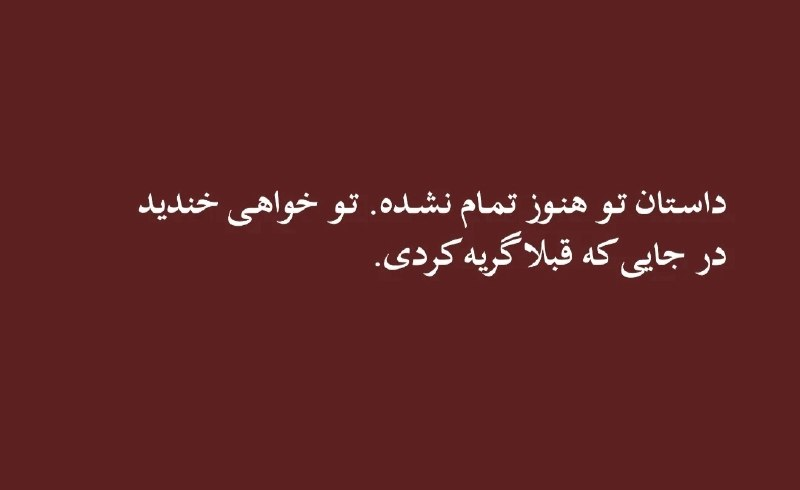

#بخوابیم

@Dirty_Kids 👻

## Dirty_Kids — post 389412

  <a href="telegram/content/Dirty_Kids_389412_1778713769.mp4" target="_blank">🎬 Download video</a>

زینب موشک دوست🤣🤣🤣

@Dirty_Kids 👻

## Dirty_Kids — post 389411

  <a href="telegram/content/Dirty_Kids_389411_1778713771.mp4" target="_blank">🎬 Download video</a>

جنگ انیمیشن‌های لگویی وارد فاز جدیدی شد!

لگوی شاه عالیه فقط! 👏🤩

@Dirty_Kids 👻

## Dirty_Kids — post 389410

  

درسته مکرون جلوی چشم دنیا چک خورد،
ولی مدال طلای واکنش به لو رفتن چت عاشقانه،
میرسه به زن ایرانی‌ای که وسط پرواز از خوابِ شوهرش استفاده کرد، با انگشتش گوشی رو باز کرد،
با دیدن پیامای عاشقانه،
چنان قشقرقی بپاکرد که هواپیما فرود اضطراری کرد تو هند 😭✈️
بدون چمدون پیاده‌شون کردن🤣

@Dirty_Kids 👻

## Dirty_Kids — post 389409

  

ایرانی بودن یعنی traumatized شدن با هر چیز ساده.

@Dirty_Kids 👻

## manototv — post 105424

  <a href="telegram/content/manototv_105424_1778713775.mp4" target="_blank">🎬 Download video</a>

‌
مهدی تاج، رئیس فدراسیون فوتبال ایران، درباره انتشار آهنگی از سوی معین، برای تیم فوتبال در جام‌جهانی گفت فدراسیون فوتبال در تولید این کار دخیل نبوده، اما «در جریان» این موضوع است.
تاج افزود: «هر کسی از ایران حمایت کند، مورد تایید ماست.»

## manototv — post 105423

  <a href="telegram/content/manototv_105423_1778713777.mp4" target="_blank">🎬 Download video</a>

تماسی از ایران:
«می‌گفت تفاوت سیستم آموزش مدارس ایران با خارج از کشور زمین تا آسمونه…
می‌گفت به‌جای رشد و یادگیری،
بچه‌ها درگیر ظواهر و حاشیه‌ها شدن
و انگیزه برای پیشرفت کم‌رنگ شده.»

## manototv — post 105422

  <a href="telegram/content/manototv_105422_1778713780.mp4" target="_blank">🎬 Download video</a>

مارکو روبیو، وزیر خارجه آمریکا، در گفت‌وگویی اختصاصی با شان هنیتی، خبرنگار و مجری فاکس‌نیوز در هواپیمای ریاست جمهوری آمریکا، از تلاش‌های فشرده واشینگتن برای وادار کردن چین به مقابله با اقدامات جمهوری اسلامی در خلیج فارس سخن گفت.

روبیو گفت: «کشتی‌های چینی در خلیج فارس گیر افتاده‌اند... آخر هفته یک محموله باری چین هدف قرار گرفت. مطمئنم ایران عمداً این کار را نکرده، اما این اتفاق افتاده و به همین دلیل کشتی‌های چینی آنجا گرفتار شده‌اند.»

او افزود: «این وضعیت منبع بزرگی از بی‌ثباتی است. بیش از هر نقطه دیگری در جهان، آسیا را تهدید به بی‌ثباتی می‌کند، چون به‌شدت به این تنگه برای تامین انرژی وابسته است.»

وزیر خارجه آمریکا همچنین گفت: «حل این مسئله به نفع چین است. امیدواریم بتوانیم آن‌ها را قانع کنیم نقش فعال‌تری برای وادار کردن ایران به عقب‌نشینی از اقداماتی که اکنون در خلیج فارس انجام می‌دهد و در پی انجام آن است، ایفا کنند.»

## manototv — post 105421

  <a href="telegram/content/manototv_105421_1778713782.mp4" target="_blank">🎬 Download video</a>

‌
خبرگزاری رویترز به نقل از منابع آگاه گزارش داد جنگنده‌های عربستان سعودی در جریان جنگ میان آمریکا، اسرائیل و جمهوری اسلامی، مواضع شبه‌نظامیان شیعه مورد حمایت تهران در عراق را هدف قرار داده‌اند.

بر اساس این گزارش، حملات تلافی‌جویانه‌ای نیز از خاک کویت به داخل عراق انجام شده است. منابع مطلع گفته‌اند این عملیات‌ها بخشی از پاسخ‌های نظامی گسترده‌تر کشورهای خلیج فارس به درگیری‌های منطقه‌ای بوده که تاکنون به‌طور علنی فاش نشده بود.

رویترز به نقل از مقام‌های امنیتی و نظامی عراق، یک مقام غربی و منابع آگاه گزارش داده حملات عربستان توسط جنگنده‌های نیروی هوایی این کشور علیه مواضع گروه‌های نزدیک به جمهوری اسلامی در نزدیکی مرز شمالی عربستان با عراق انجام شده است.

به گفته منابع، این حملات مواضعی را هدف قرار داده که از آن‌ها پهپادها و موشک‌هایی به سمت عربستان و دیگر کشورهای خلیج فارس شلیک می‌شد.

منابع عراقی همچنین گفتند حملاتی نیز از خاک کویت علیه مواضع شبه‌نظامیان در جنوب عراق انجام شده که در جریان آن چندین عضو گروه کتائب حزب‌الله کشته و یک مرکز ارتباطات و عملیات پهپادی این گروه نابود شده است.

## alonews — post 119835

  <a href="telegram/content/alonews_119835_1778713782.webm" target="_blank">🎬 Download video</a>

👈طبق گزارش رویترز، ایالات متحده و چین توافق کردند که هیچ کشوری نباید اجازه داشته باشد عوارض حمل و نقل در تنگه هرمز را دریافت کند.

🔴وزیر امور خارجه چین، وانگ یی، و وزیر امور خارجه ایالات متحده، مارکو روبیو، این موضوع را در تماس تلفنی آوریل مورد بحث قرار دادند.

✅ @AloNews خبر جنگ

## alonews — post 119834

  <a href="telegram/content/alonews_119834_1778713783.webm" target="_blank">🎬 Download video</a>

👈ارتش اسرائیل: مدتی پیش حزب‌الله لبنان از جنوب این کشور با پهپاد و چندین موشک ضدتانک بهمون حمله کرد که هیچکس آسیبی ندید.

✅ @AloNews خبر جنگ

---
📅 بروزرسانی: 1405/02/24 01:26
---

## VahidOOnLine — post 239987

  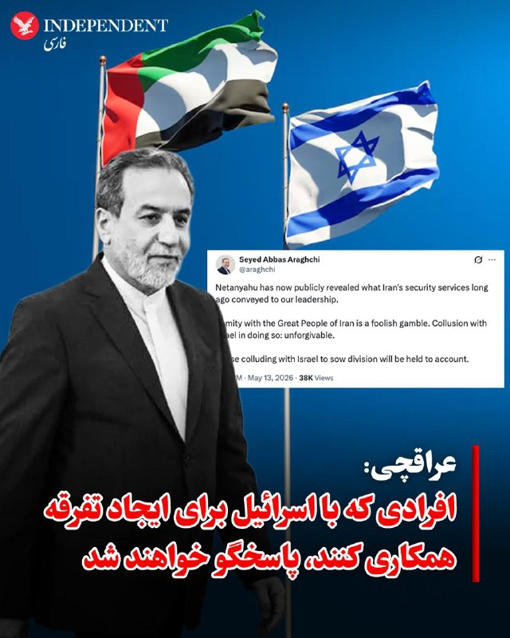

♦️عباس عراقچی، وزیر امور خارجه جمهوری اسلامی، چهارشنبه ۲۳ اردیبهشت با انتشار پیامی در اکس نوشت بنیامین نتانیاهو «آنچه را که نهادهای امنیتی ایران پیش‌تر به رهبری ما منتقل کرده بودند» به‌صورت علنی بیان کرده است.
عراقچی در ادامه نوشت «دشمنی با مردم ایران یک قمار احمقانه است» و همکاری با اسرائیل برای ایجاد تفرقه را «بخشودنی نیست» توصیف کرد. او همچنین هشدار داد افرادی که با اسرائیل برای ایجاد اختلاف همکاری کنند، «پاسخگو خواهند شد».
پیش‌تر حساب رسمی وزارت خارجه اسرائیل روز چهارشنبه ۲۳ اردیبهشت‌ماه به نقل از دفتر نخست‌وزیری این کشور، سفر محرمانه بنیامین نتانیاهو به امارات متحده عربی هم‌زمان با حملات به جمهوری اسلامی را تایید کرده بود. دفتر نتانیاهو اعلام کرد او در این سفر با شیخ محمد بن زاید، رئیس امارات متحده عربی، دیدار کرده و این دیدار به «پیشرفتی تاریخی» در روابط دو کشور منجر شده است.
در مقابل، وزارت خارجه امارات اعلام کرد هرگونه گزارش درباره سفرها یا توافق‌های اعلام‌نشده، تا زمانی که از سوی نهادهای رسمی منتشر نشود، فاقد اعتبار است.
‌🇸🇦 Indypersian

🤖 @VahidOOnLine

## VahidOOnLine — post 239986

  <a href="telegram/content/VahidOOnLine_239986_1778709363.mp4" target="_blank">🎬 Download video</a>

وزارت خارجه امارات متحده عربی گزارش‌ها درباره سفر بنیامین نتانیاهو، نخست‌وزیر اسرائیل، یا استقبال از یک هیات نظامی اسرائیلی را رد کرد.

سخنگوی وزارت خارجه امارات گفت روابط این کشور با اسرائیل، روابطی علنی است که در چارچوب توافق ابراهیم و به‌صورت رسمی و عمومی شکل گرفته و مبتنی بر روابط پنهانی یا توافق‌های مخفی نیست.

او تاکید کرد هرگونه ادعا درباره سفرها یا توافق‌های اعلام‌نشده، تا زمانی که از سوی نهادهای رسمی امارات تایید نشود، بی‌اساس است.

سخنگوی وزارت خارجه امارات همچنین از رسانه‌ها خواست در انتشار اخبار دقت کنند و از بازنشر اطلاعات تاییدنشده خودداری کنند.
‌🏁 🇬🇧 ManotoTV

🤖 @VahidOOnLine

## VahidOOnLine — post 239984

  

وزارت خارجه امارات متحده عربی اعلام کرد گزارش‌های منتشرشده درباره سفر بنیامین نتانیاهو، نخست‌وزیر اسرائیل، به این کشور صحت ندارد.
پیش‌تر دفتر نخست‌وزیری اسرائیل اعلام کرد بنیامین نتانیاهو در جریان جنگ آمریکا و اسرائیل با جمهوری اسلامی، به‌طور مخفیانه به امارات متحده عربی سفر کرده و در این سفر با محمد بن زاید آل نهیان، رییس امارات متحده عربی، دیدار کرد.
وزارت خارجه امارات متحده عربی اعلام کرد روابط این کشور با اسرائیل علنی است و در چارچوب توافق‌نامه‌های ابراهیم که به‌طور عمومی اعلام شده‌اند، برقرار شده است.
وزارت خارجه امارات متحده عربی افزود این روابط مبتنی بر محرمانگی نیست و هرگونه ادعا درباره سفرها یا ترتیبات اعلام‌نشده «بی‌اساس» است، مگر آن‌که به‌صورت رسمی از سوی امارات متحده عربی اعلام شود.
عباس عراقچی در واکنش به سفر نتانیاهو به امارات متحده عربی در زمان جنگ، نوشت: همکاری با اسرائیل در این مسیر غیرقابل بخشش است. افرادی که برای ایجاد اختلاف با اسرائیل همکاری می‌کنند، پاسخگو خواهند شد.
‌🏁 🇬🇧 IranintlTV

🤖 @VahidOOnLine

## VahidOOnLine — post 239983

  

♦️وزارت خارجه امارات متحده عربی با انتشار بیانیه‌ای، گزارش‌ها درباره سفر بنیامین نتانیاهو، نخست‌وزیر اسرائیل، به این کشور و همچنین پذیرش هرگونه هیات نظامی اسرائیلی در خاک امارات را تکذیب کرد.

در این بیانیه آمده است روابط امارات و اسرائیل در چارچوب توافق ابراهیم، علنی و رسمی است و بر پایه دیدارها یا ترتیبات محرمانه شکل نگرفته است.

وزارت خارجه امارات همچنین اعلام کرد هرگونه گزارش درباره سفرها یا توافق‌های اعلام‌نشده، تا زمانی که از سوی نهادهای رسمی منتشر نشود، فاقد اعتبار است.

امارات در پایان از رسانه‌ها خواست از انتشار اطلاعات تاییدنشده و ایجاد برداشت‌های سیاسی خودداری کنند.

حساب رسمی وزارت خارجه اسرائیل چهارشنبه ۲۳ اردیبهشت‌ماه در شبکه اجتماعی اکس، به نقل از دفتر نخست‌وزیری اسرائیل، سفر محرمانه بنیامین نتانیاهو به امارات متحده عربی هم‌زمان با حملات به جمهوری اسلامی را تایید کرده بود. دفتر نتانیاهو اعلام کرده بود او در این سفر با شیخ محمد بن زاید، رئیس امارات متحده عربی، دیدار کرده و این دیدار به «پیشرفتی تاریخی» در روابط دو کشور منجر شده است.

پیش‌تر نیز گزارش‌هایی درباره انتقال سامانه دفاعی «گنبد آهنین» اسرائیل به امارات منتشر شده بود که مایک هاکبی، سفیر آمریکا در اسرائیل، آن را تایید کرده بود. همچنین گزارش‌هایی درباره مشارکت امارات در حملات علیه جمهوری اسلامی منتشر شده است.
‌🇸🇦 Indypersian

🤖 @VahidOOnLine

## VahidOOnLine — post 239982

  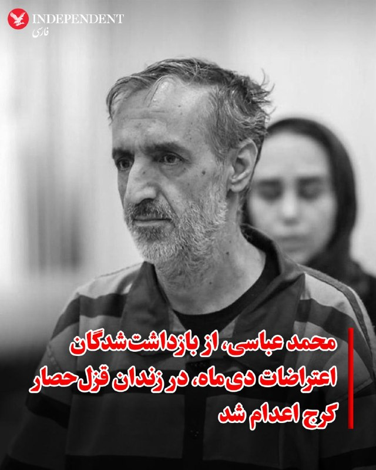

♦️محمد عباسی، از بازداشت‌شدگان اعتراضات سراسری دی‌ماه ۱۴۰۴، چهارشنبه ۲۳ اردیبهشت در زندان قزل‌حصار اعدام شد. خبرگزاری میزان، وابسته به قوه قضاییه جمهوری اسلامی، خبر اجرای حکم اعدام او را منتشر کرد.
بر اساس گزارش‌ها، مسئولان زندان قزل‌حصار خانواده محمد عباسی را برای ملاقات دعوت کرده بودند، اما پس از حضور در زندان، اجازه ملاقات آخر به آن‌ها داده نشد و خانواده پس از ترک زندان، تلفنی از اجرای حکم مطلع شدند.
محمد عباسی در جریان انقلاب ملی ایران در ملارد بازداشت و سپس از سوی شعبه ۱۵ دادگاه انقلاب تهران به ریاست ابوالقاسم صلواتی، با اتهام «محاربه» به اعدام محکوم شده بود. در همین پرونده، حکم ۲۵ سال زندان فاطمه عباسی، دختر او، نیز تایید شده و او اکنون در زندان اوین نگهداری می‌شود.
‌🇸🇦 Indypersian

🤖 @VahidOOnLine

## VahidOOnLine — post 239981

  

♦️شبکه العربیه چهارشنبه ۲۳ اردیبهشت‌ماه گزارش داد دولت لبنان با طرح شکایتی در شورای امنیت سازمان ملل، جمهوری اسلامی و سپاه پاسداران را به مداخله در امور داخلی این کشور و کشاندن لبنان به درگیری با اسرائیل متهم کرده است.

احمد عرفه، نماینده دائم لبنان در سازمان ملل، اعلام کرد بیروت در این شکایت از شورای امنیت خواسته است جمهوری اسلامی را به‌دلیل اقداماتی که «خلاف منافع لبنان» بوده و این کشور را وارد «جنگی ویرانگر با پیامدهای فاجعه‌بار» با اسرائیل کرده، پاسخگو کند.

او گفت در جریان این درگیری‌ها هزاران نفر کشته و زخمی شده‌اند و بیش از یک میلیون شهروند لبنانی آواره شده‌اند. به گفته عرفه، در این شکوائیه نهادهای وابسته به جمهوری اسلامی، به‌ویژه سپاه پاسداران، به اقدامات غیرقانونی و نادیده گرفتن تصمیمات دولت لبنان متهم شده‌اند.

یوسف رجی، وزیر خارجه لبنان، چهارم فروردین‌ماه اعلام کرده بود سفیر تازه منصوب جمهوری اسلامی را به‌عنوان «عنصر نامطلوب» شناخته و از او خواسته است تا نهم فروردین خاک لبنان را ترک کند. سخنگوی وزارت خارجه جمهوری اسلامی در واکنش گفته بود سفیر جمهوری اسلامی لبنان را ترک نخواهد کرد و به ماموریت خود ادامه می‌دهد.
‌🇸🇦 Indypersian

🤖 @VahidOOnLine

## WithYashar — post 11173

درودی دوباره یاشار جان
میشه سوال منو ج بدین چرا ترامپ وقتی وارد چین شد نیومد ریس جمهور استقبالش در صورتی که باید بیاد ؟

## WithYashar — post 11172

کانال N12: ترامپ داره به صدور دستور برای از سرگیری درگیری با ایران فکر می‌کنه
@withyashar

## WithYashar — post 11171

ائتلاف حاکم در اسرائیل پیشنهاد انحلال کنست در تدارک برای برگزاری انتخابات زودهنگام را ارائه کرد.
@withyashar

## WithYashar — post 11170

  

دارن تحلیل میکنن چیکار کنن 😂😅
@withyashar

## WithYashar — post 11169

خوش‌چشم: ترامپ رفته چین التماس کنه تا میانجی بشه که ایران جنگ رو تموم کنه
@withyashar

## mwarmonitor — post 9059

  

🔴 فوری: بنیامین نتانیاهو به‌طور محرمانه به امارات متحده عربی سفر کرده و در جریان عملیات «شیر غران» علیه ایران با محمد بن زاید دیدار کرده است. i24 news @mwarmonitor

## mwarmonitor — post 9058

✈️بمب‌افکن B-2 با شناسه «WENCH11» در یک پرواز رفت‌وبرگشت از پایگاه هوایی وایتمن (Whiteman AFB) به‌عنوان بخشی از یک تمرین فرماندهی راهبردی آمریکا (STRATCOM) در حال انجام عملیات است و از فرکانس HF سانتا ماریا 11309 استفاده می‌کند. @mwarmonitor

## mwarmonitor — post 9057

  <a href="telegram/content/mwarmonitor_9057_1778709368.mp4" target="_blank">🎬 Download video</a>

🔸خبرنگار: سناتور، آیا بازه ۹۰ روزه در ۳۱ می (۱۰ خرداد) در مورد ایران، در این مقطع اهمیتی دارد؟
🔹لیندسی گراهام: نه.
🔸خبرنگار: چرا نه؟
🔹لیندسی گراهام: چرا باید اهمیت داشته باشه؟ طبق «قانون اختیارات جنگی»؟ به نظرم این قانون کاملاً غیرقانونی و برخلاف قانون اساسی است. هر رئیس‌جمهوری این رو گفته و من هم باهاشون موافقم.
فکر نمی‌کنم قانون اساسی اجازه بده که فرمانده کل قوا، فقط برای ۹۰ روز فرمانده کل باشه. اگه شما به عنوان عضو کنگره از عملکرد فرمانده کل قوا راضی نیستید، بودجه عملیات نظامی رو قطع کنید.
هر راه دیگه‌ای غیر از این، باعث می‌شه ۵۳۵ نفر فرمانده کل قوا داشته باشیم! کل مفهوم «قانون اختیارات جنگی» خطرناک، پوچ و مضحکه و فقط منجر به هرج‌ومرج می‌شه.
کنگره نمی‌تونه جنگ‌ها رو مدیریت کنه. اگه می‌خواید جنگ رو متوقف کنید، بودجه‌اش رو قطع کنید. این تنها قدرتیه که ما در کنگره داریم؛ نه بیشتر و نه کمتر.

@mwarmonitor

## FoxNewsTwitter — post 341682

  <a href="telegram/content/FoxNewsTwitter_341682_1778709371.mp4" target="_blank">🎬 Download video</a>

Fox News (Twitter/X)

EXCLUSIVE: Secretary of State Marco Rubio outlines the high-stakes push for China to confront Iran over its actions in the Persian Gulf in an exclusive sit-down with @seanhannity aboard Air Force One:

“The Chinese have ships stuck in the Persian Gulf... A Chinese cargo got hit over the weekend. I'm sure Iran didn't do it deliberately but they did it, it happened. And so that's why these Chinese ships are stuck in there.”

“It's a huge source of instability. It threatens to destabilize Asia more than any other part of the world because it's heavily reliant on the straits for energy.”

“It’s in [China’s] interest to resolve this. We hope to convince them to play a more active role in getting Iran to walk away from what they're doing now and trying to do now in the Persian Gulf."

## FoxNewsTwitter — post 341681

  <a href="telegram/content/FoxNewsTwitter_341681_1778709374.mp4" target="_blank">🎬 Download video</a>

Fox News (Twitter/X)

BREAKING: Secretary of State Marco Rubio outlines the high-stakes push for China to confront Iran over its actions in the Persian Gulf in an exclusive sit-down with @seanhannity aboard Air Force One:

“The Chinese have ships stuck in the Persian Gulf... A Chinese cargo got hit over the weekend. I'm sure Iran didn't do it deliberately but they did it, it happened. And so that's why these Chinese ships are stuck in there.”

“It's a huge source of instability. It threatens to destabilize Asia more than any other part of the world because it's heavily reliant on the straits for energy.”

“It’s in [China’s] interest to resolve this. We hope to convince them to play a more active role in getting Iran to walk away from what they're doing now and trying to do now in the Persian Gulf."

## FoxNewsTwitter — post 341680

  <a href="telegram/content/FoxNewsTwitter_341680_1778709377.mp4" target="_blank">🎬 Download video</a>

Fox News (Twitter/X)

BREAKING: Secretary of State Marco Rubio stresses the critical need for America to strategically navigate its complex relationship with China:

@seanhannity : “You view China as our top geopolitical foe.”

RUBIO: “Yeah, it’s both our top political challenge geopolitically and it’s also the most important relationship for us to manage.”

“We're going to have interests of ours that are going to be in conflict with interests of theirs; to avoid wars and maintain peace and stability in the world, we're gonna have to manage those.”

## FoxNewsTwitter — post 341676

Fox News (Twitter/X)

NEW: The White House shares brand new photos of President Trump's arrival in China for his landmark state visit, where he will meet with President Xi to discuss major foreign policy and trade issues.

## pm_afshaa — post 90709

  <a href="telegram/content/pm_afshaa_90709_1778709380.webm" target="_blank">🎬 Download video</a>

🔴عباس عراقچی:
نتانیاهو اکنون به‌صورت علنی آنچه را که نهادهای امنیتی ایران مدت‌ها قبل به رهبری ما منتقل کرده بودند، افشا کرده. دشمنی با ملت بزرگ ایران، قماری احمقانه‌ است؛ و همکاری و همدستی با اسرائیل در این مسیر، غیرقابل بخشش است. کسانی که در همدستی با اسرائیل برای ایجاد تفرقه نقش دارند، باید پاسخگو باشند.

💧 Rainbet.com the #1 Non-KYC Crypto Casino & Sportsbook @rainbetcom

😁 @Pm_Afshaa

## VahidOnline — post 75454

  

وزارت خارجه امارات متحده عربی اعلام کرد گزارش‌های منتشرشده درباره سفر بنیامین نتانیاهو، نخست‌وزیر اسرائیل، به این کشور صحت ندارد.
پیش‌تر دفتر نخست‌وزیری اسرائیل اعلام کرد بنیامین نتانیاهو در جریان جنگ آمریکا و اسرائیل با جمهوری اسلامی، به‌طور مخفیانه به امارات متحده عربی سفر کرده و در این سفر با محمد بن زاید آل نهیان، رییس امارات متحده عربی، دیدار کرد.
وزارت خارجه امارات متحده عربی اعلام کرد روابط این کشور با اسرائیل علنی است و در چارچوب توافق‌نامه‌های ابراهیم که به‌طور عمومی اعلام شده‌اند، برقرار شده است.
وزارت خارجه امارات متحده عربی افزود این روابط مبتنی بر محرمانگی نیست و هرگونه ادعا درباره سفرها یا ترتیبات اعلام‌نشده «بی‌اساس» است، مگر آن‌که به‌صورت رسمی از سوی امارات متحده عربی اعلام شود.
عباس عراقچی در واکنش به سفر نتانیاهو به امارات متحده عربی در زمان جنگ، نوشت: همکاری با اسرائیل در این مسیر غیرقابل بخشش است. افرادی که برای ایجاد اختلاف با اسرائیل همکاری می‌کنند، پاسخگو خواهند شد.
@VahidOOnLine

📡 @VahidOnline

## kianmeli1 — post 87392

  <a href="telegram/content/kianmeli1_87392_1778709382.mp4" target="_blank">🎬 Download video</a>

🔴ویدئویی پربازخورد در فضای مجازی از تشبیه فروشندگان vpn به خوک

سپاه و ستاد اجرايي فروشندگان اصلي اينترنت پرو و وي پي ان هستند
https://t.me/kianmeli1

## IranIntlTV — post 337067

  <a href="telegram/content/IranIntlTV_337067_1778709384.mp4" target="_blank">🎬 Download video</a>

مراد ویسی، تحلیل‌گر ارشد ایران‌اینترنشنال، گفت: «مجموع تحولات اخیر نشان می‌دهد جمهوری اسلامی به رغم برخی تحرکات تاکتیکی در خلیج فارس با یک شکست راهبردی و امنیتی روبه‌رو شده؛ چون حملاتش باعث شده بسیاری از همسایگان جنوبی به دشمنان فعالش تبدیل شوند. نتیجه این سیاست‌ها، نزدیک‌تر شدن کشورهایی مثل امارات به اسرائیل و باز شدن پای اسرائیل و ناتو به معادلات امنیتی منطقه بوده است.»
@iranintltv

## IranIntlTV — post 337066

  <a href="https://t.me/IranintlTV/337066" target="_blank">📎 Download file</a>

🎧نسخه صوتی برنامه با کامبیز حسینی؛ خشم انباشتهٔ مردم کی فوران خواهد کرد؟
@iranintlTV

## IranIntlTV — post 337065

  <a href="telegram/content/IranIntlTV_337065_1778709386.mp4" target="_blank">🎬 Download video</a>

گمان می‌رود پرونده جنگ با ایران، یکی از محوری‌ترین موضوعات گفتگو میان دونالد ترامپ و شی جین‌پینگ باشد. بنا بر بعضی گزارش‌ها، احتمال می‌رود واشینگتن و پکن، تلاش تازه و مشترکی برای وادار کردن تهران به عقب‌نشینی و پذیرش شروط جدید کنند.
@iranintltv

## IranIntlTV — post 337064

  <a href="telegram/content/IranIntlTV_337064_1778709389.mp4" target="_blank">🎬 Download video</a>

مراد ویسی، تحلیل‌گر ارشد ایران‌اینترنشنال، گفت: « جمهوری اسلامی، ایران را به کارت بازی دیگران تبدیل کرده است. خیلی از تحلیل‌گران در انتظار تعیین سرنوشت ایران در دیدار ترامپ و رهبر چین هستند. سرنوشت ایران به غزه و لبنان و به جنگ اوکراین و به روابط روسیه و آمریکا و حالا روابط آمریکا و چین گره خورده است. این بلایی است که جمهوری اسلامی بر سر ایران آورده است.»
@iranintltv

## IranIntlTV — post 337063

  <a href="telegram/content/IranIntlTV_337063_1778709392.mp4" target="_blank">🎬 Download video</a>

کی‌یر استارمر، نخست‌وزیر بریتانیا، در مراسم بازگشایی رسمی پارلمان گفت سخنرانی پادشاه رویکردی امیدوارکننده‌تر به تحولات ایران و جنگ در دو جبهه ارائه می‌دهد و آن را فرصتی برای تغییر وضع موجود و ساختن بریتانیایی قوی‌تر و عادلانه‌تر دانست؛ مسیری که به گفته او باید مبنای آینده کشور قرار گیرد.

چارلز سوم، پادشاه بریتانیا، روز چهارشنبه ۲۳ اردیبهشت در این مراسم سخنرانی کرد. این مراسم به‌منزله آغاز رسمی فعالیت‌های دوره جدید پارلمان بریتانیا است.
@iranintltv

## IranIntlTV — post 337062

  <a href="telegram/content/IranIntlTV_337062_1778709393.mp4" target="_blank">🎬 Download video</a>

بلومبرگ گزارش داد بارگیری نفت از پایانه اصلی صادرات نفت ایران در جزیره خارک متوقف شده است.

بر اساس این گزارش، ظرفیت مخازن ذخیره نفت نیز در حال پر شدن است و در صورت تکمیل ظرفیت، ایران ممکن است ناچار به کاهش تولید نفت شود.

گفت‌وگو با ایمان ناصری، مشاور بازار نفت
@iranintltv

## IranIntlTV — post 337061

  <a href="telegram/content/IranIntlTV_337061_1778709396.mp4" target="_blank">🎬 Download video</a>

تجمعات حکومتی شبانه، بلای جان نظام و مجتبی

چشم‌انداز با مهدی مهدوی‌آزاد

نسخه کامل این برنامه در یوتیوب:
https://youtu.be/SepDBES4ITI
@iranintltv

## IranIntlTV — post 337060

  <a href="telegram/content/IranIntlTV_337060_1778709399.mp4" target="_blank">🎬 Download video</a>

تجمعات حکومتی شبانه، بلای جان نظام و مجتبی

چشم‌انداز با مهدی مهدوی‌آزاد

نسخه کامل این برنامه در یوتیوب:
https://youtu.be/SepDBES4ITI
@iranintltv

## IranIntlTV — post 337059

  <a href="https://t.me/IranintlTV/337059" target="_blank">📎 Download file</a>

🎧نسخه صوتی چشم‌انداز: تجمعات حکومتی شبانه، بلای جان نظام و مجتبی
@iranintlTV

## IranIntlTV — post 337058

  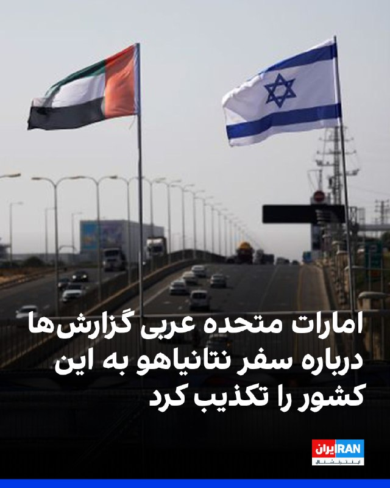

وزارت خارجه امارات متحده عربی اعلام کرد گزارش‌های منتشرشده درباره سفر بنیامین نتانیاهو، نخست‌وزیر اسرائیل، به این کشور صحت ندارد.
پیش‌تر دفتر نخست‌وزیری اسرائیل اعلام کرد بنیامین نتانیاهو در جریان جنگ آمریکا و اسرائیل با جمهوری اسلامی، به‌طور مخفیانه به امارات متحده عربی سفر کرده و در این سفر با محمد بن زاید آل نهیان، رییس امارات متحده عربی، دیدار کرد.
وزارت خارجه امارات متحده عربی اعلام کرد روابط این کشور با اسرائیل علنی است و در چارچوب توافق‌نامه‌های ابراهیم که به‌طور عمومی اعلام شده‌اند، برقرار شده است.
وزارت خارجه امارات متحده عربی افزود این روابط مبتنی بر محرمانگی نیست و هرگونه ادعا درباره سفرها یا ترتیبات اعلام‌نشده «بی‌اساس» است، مگر آن‌که به‌صورت رسمی از سوی امارات متحده عربی اعلام شود.
عباس عراقچی در واکنش به سفر نتانیاهو به امارات متحده عربی در زمان جنگ، نوشت: همکاری با اسرائیل در این مسیر غیرقابل بخشش است. افرادی که برای ایجاد اختلاف با اسرائیل همکاری می‌کنند، پاسخگو خواهند شد.
https://iranintl.com/202605138383

## IranIntlTV — post 337057

🔻فدراسیون فوتبال ایران در بحران مالی؛ گوگل جمینای حامی تیم‌های ملی فوتبال عراق و مراکش شد

همزمان با تحریم‌های بانکی و مشکلات مالی فدراسیون فوتبال ایران، جمینای (هوش مصنوعی شرکت گوگل) اعلام کرد حامی مالی و فناوری تیم‌های ملی عراق و مراکش در جام جهانی ٢٠٢۶ شده است. گوگل گفته قصد دارد با این قرارداد اسپانسری، «فاصله میان تیم‌ها و هواداران جهانی آنها را کاهش دهد.»

در این بیانیه آمده است: «ما با هیجان اعلام می‌کنیم که گوگل جمینای به عنوان حامی رسمی فناوری تیم‌های ملی فوتبال عراق و مراکش انتخاب شده است. این حمایت با بهره‌گیری از فناوری پیشرفته هوش مصنوعی ما، فرهنگ غنی ورزشی منطقه را گرامی می‌دارد و تجربه هواداران را متحول خواهد کرد.»
این همکاری بر استفاده از هوش مصنوعی برای تولید محتوای فراگیر و فراهم کردن شیوه‌های نوآورانه تعامل هواداران با بازیکنان و تیم‌های محبوبشان متمرکز است.

گوگل جمینای گفته در همکاری با فدراسیون‌های فوتبال، طی سه ماه آینده مجموعه‌ای از برنامه‌های هوادارمحور اجرا خواهد شد: «هواداران می‌توانند با استفاده از مدل تبدیل متن به تصویر جمینی موسوم به «نانو بنانا» تصاویر تشویقی اختصاصی خلق کنند یا با مدل تبدیل متن به موسیقی «لایریا» سرودهای تیمی بسازند و حمایت خود را به شکلی زنده تجربه کنند؛ گویی در زمین حضور دارند.»

همچنین هواداران می‌توانند از گوگل جمینی برای توضیح قوانین پیچیده فوتبال، تحلیل عملکرد مسابقات و پیش‌بینی تیم‌های پیروز استفاده کنند.
همکاری مالی و فناوری جمینای با فدراسیون‌های فوتبال عراق و مراکش درحالی است که روز گذشته فارس، رسانه وابسته به سپاه پاسداران، گزارش داد تیم ملی فوتبال برای اجرای برنامه آماده‌سازی خود در ترکیه، به تزریق فوری منابع مالی نیاز دارد؛ منابعی که پیش‌تر وعده پرداخت آن داده شده بود.
🔗وب‌سایت ایران‌اینترنشنال
@iranintltv

## Shin_Persian — post 5995

  

↩️ Quoted tweet: DefenceGeek 🇬🇧 ✓ @DefenceGeek Wed, 13 May 2026 19:49:28 UTC B-2 Spirit on a training flight from CONUS as part of a suspected STRATCOM exercise involving the E-6B flying out of Stuttgart ↩️ توییت نقل‌قول شده — برای پاسخ، پست زیر را ببینید.…

## Shin_Persian — post 5994

↩️ Quoted tweet:
DefenceGeek 🇬🇧 ✓ @DefenceGeek
Wed, 13 May 2026 19:49:28 UTC

B-2 Spirit on a training flight from CONUS as part of a suspected STRATCOM exercise involving the E-6B flying out of Stuttgart

↩️ توییت نقل‌قول شده — برای پاسخ، پست زیر را ببینید.

فارسی

بمب‌افکن بی‌-۲ اسپیریت (B-2 Spirit) در یک پرواز آموزشی از خاک اصلی ایالات متحده (CONUS) به عنوان بخشی از یک رزمایش احتمالی فرماندهی راهبردی ایالات متحده (STRATCOM) که شامل هواپیمای ای-۶بی (E-6B) در حال پرواز از اشتوتگارت است.

𝕏 · @shin_persian

## Shin_Persian — post 5993

📦 mhrv-rs v1.9.25 released

• Install MITM CA into LibreWolf NSS stores (#1145, PR #1159)
• **Fix Full mode "Google + most websites broken while Telegram works"

Files (Android APKs, Windows, macOS, Linux, OpenWRT) on the files channel:

👉 v1.9.25 — all files with SHA-256

Channel:
https://t.me/mhrv_rs
or: https://t.me/+R1OyoHX2boA1ZDgx

#v1925

## ManotoTV — post 105420

  <a href="telegram/content/ManotoTV_105420_1778709404.mp4" target="_blank">🎬 Download video</a>

وزارت خارجه امارات متحده عربی گزارش‌ها درباره سفر بنیامین نتانیاهو، نخست‌وزیر اسرائیل، یا استقبال از یک هیات نظامی اسرائیلی را رد کرد.

سخنگوی وزارت خارجه امارات گفت روابط این کشور با اسرائیل، روابطی علنی است که در چارچوب توافق ابراهیم و به‌صورت رسمی و عمومی شکل گرفته و مبتنی بر روابط پنهانی یا توافق‌های مخفی نیست.

او تاکید کرد هرگونه ادعا درباره سفرها یا توافق‌های اعلام‌نشده، تا زمانی که از سوی نهادهای رسمی امارات تایید نشود، بی‌اساس است.

سخنگوی وزارت خارجه امارات همچنین از رسانه‌ها خواست در انتشار اخبار دقت کنند و از بازنشر اطلاعات تاییدنشده خودداری کنند.

## ManotoTV — post 105419

  <a href="telegram/content/ManotoTV_105419_1778709405.mp4" target="_blank">🎬 Download video</a>

تماسی از ایران:
«می‌گفت وضعیت آموزش فاجعه شده…
بچه‌هایی که حتی پایه‌ترین چیزها رو بلد نیستن.»

## FarsiVOA — post 217671

🔺نگاهی به دیدار‌های گذشته دونالد ترامپ با شی جین‌پینگ

▪️سفر دونالد ترامپ، رئیس‌جمهوری آمریکا، به پکن و دیدارهای پیش‌روی او با شی جین‌پینگ، رئیس‌جمهوری چین، یکی از تیترهای مهم خبری روزهای اخیر در رسانه‌ها و جراید معتبر جهان در چند روز اخیر بوده است.

⬇️ بیشتر بخوانید:
https://ir.voanews.com/a/8149652.html
@FarsiVOA

## FarsiVOA — post 217670

⚡️بررسی پوشش اخبار درگیری نظامی با جمهوری اسلامی در رسانه‌های غربی
@FarsiVOA

## FarsiVOA — post 217669

⚡️حملە امارات و عربستان بە جمهوری اسلامی و سفر مخفیانە نخست وزیر اسرائیل بە امارات
@FarsiVOA

## FarsiVOA — post 217668

🔺رویترز: عربستان و کویت در جریان عملیات «خشم حماسی» نیابتی‌های جمهوری اسلامی در عراق را هدف قرار دادند

▪️خبرگزاری رویترز به نقل از منابع امنیتی و نظامی گزارش داده است که عربستان سعودی در جریان عملیات «خشم حماسی» مواضع شبه‌نظامیان شیعه مورد حمایت رژیم ایران در عراق را هدف حملات هوایی قرار داد. علاوه بر این، حملات تلافی‌جویانه‌ای نیز از خاک کویت علیه اهدافی در عراق انجام شده است.

⬇️ بیشتر بخوانید:
https://ir.voanews.com/a/reuters-saudi-arabia-kuwait-attacked-iraq-iranian-militias/8149641.html
@FarsiVOA

## FarsiVOA — post 217667

⚡️وام «ارزان» و کلان شرکت خودروسازی سایپا از مردم
@FarsiVOA

## Persian_Trend_Official — post 14080

  

به این وضعیت اقتصادی می‌گویید امنیت؟ امنیت کجاست وقتی یک پدر شرمنده زن و بچه‌اش است چون سفره‌اش خالی مانده و حقوقش حتی کفاف اجاره خانه را نمی‌دهد؟

امنیت کجاست وقتی جوانی نمی‌تواند یک متر زمین بخرد و رؤیاهایش زیر بار تورم و فساد دفن شده است؟ امنیت کجاست وقتی جوانی عمر و آرزوهایش را در صف مهاجرت یا بیکاری از دست می‌دهد؟

امنیت اجتماعی بدون رفاه پایدار وجود ندارد. جامعه‌ای که نرخ بیکاری جوانانش بالاست تورم افسارگسیخته دارد و سرمایه انسانی‌اش مهاجرت می‌کند در واقع در وضعیت ناامنی ساختاری است. شما نام این فروپاشی را امنیت گذاشته‌اید. این تحریف واژه‌هاست واژه‌ها را از معنا تهی کرده‌اید تا واقعیت تلخ را بپوشانید.

امنیت واقعی همان چیزی است که مردم در همه‌پرسی انتخاب خواهند کرد آزادی، اینترنت، اقتصاد سالم، و زندگی انسانی. امنیت یعنی امید به آینده نه ترس از فردا.

امنیتی که شما از آن دم می‌زنید، در واقع پوششی است برای فقر، سرکوب، و بی‌عدالتی. امنیت یعنی آرامش روانی، یعنی آینده‌ای قابل پیش‌بینی یعنی فرصت رشد و شکوفایی. اما آنچه امروز مردم ایران تجربه می‌کنند چیزی جز اضطراب فروپاشی اقتصادی و نابودی امید نیست.

📝 Nick

📌 @persian_trend_official
پرشین ترند | متفاوت‌ترین کانال نظامی

## Persian_Trend_Official — post 14079

⭕️ بنیامین نتانیاهو: من می‌خواهم دانش‌آموزان اسرائیلی در استفاده از ChatGPT، Claude و پیشرفته‌ترین ابزارهای هوش مصنوعی جهان - و حتی قبل از فارغ‌التحصیلی از دبیرستان - بهترین باشند. 📝 Nick 📌 @persian_trend_official پرشین ترند | متفاوت‌ترین کانال نظامی

## Persian_Trend_Official — post 14078

  <a href="telegram/content/Persian_Trend_Official_14078_1778709408.mp4" target="_blank">🎬 Download video</a>

⭕️ بنیامین نتانیاهو:

من می‌خواهم دانش‌آموزان اسرائیلی در استفاده از ChatGPT، Claude و پیشرفته‌ترین ابزارهای هوش مصنوعی جهان - و حتی قبل از فارغ‌التحصیلی از دبیرستان - بهترین باشند.

📝 Nick

📌 @persian_trend_official
پرشین ترند | متفاوت‌ترین کانال نظامی

## Persian_Trend_Official — post 14077

  <a href="telegram/content/Persian_Trend_Official_14077_1778709411.webm" target="_blank">🎬 Download video</a>

💢امارات متحده عربی دیدار مخفیانه نتانیاهو از ابوظبی در طول جنگ با ایران را تکذیب کرد

🫆:Tony

📌 @persian_trend_official
پرشین ترند | متفاوت‌ترین کانال نظامی

## Persian_Trend_Official — post 14076

  <a href="telegram/content/Persian_Trend_Official_14076_1778709411.mp4" target="_blank">🎬 Download video</a>

🔴 انهدام پهپاد انتحاری روسی توسط سرباز اوکراینی در لحظات آخر

ویدئویی منتشر شده که نشان می‌دهد یک سرباز اوکراینی با استفاده از سلاح «آکا-۷۴» موفق می‌شود یک پهپاد انتحاری کواد را تنها لحظاتی پیش از برخورد منهدم کند.

🫆:Tony

📌 @persian_trend_official
پرشین ترند | متفاوت‌ترین کانال نظامی

## Persian_Trend_Official — post 14075

  <a href="https://t.me/persian_trend_official/14075" target="_blank">📎 Download file</a>

فایل صوتی لایو اول
نسخه کم حجم - 6.71 مگابایت

اتاق جنگ چهارشنبه 23 اردیبهشت | جمهوری اسلامی ناو امریکایی را تهدید به حمله کرد.

فورمت mp3 همیشگی

📝 Nick

📌 @persian_trend_official
پرشین ترند | متفاوت‌ترین کانال نظامی

## RadioFarda — post 157154

  

🔸منابع امنیتی از دو حملۀ پهپادی به کمپ شبه‌نظامیان کرد مخالف جمهوری اسلامی، در شمال شهر اربیل واقع در اقلیم کردستان عراق خبر می‌دهند.

🔸به گفتۀ این منابع، یک زاغه تجهیزات و مهمات در داخل این اردوگاه هدف قرار گرفته است. گزارشی از تلفات احتمالی این حملات منتشر نشده است.

🔸سه روز پیش هم حمله مشابهی به اردوگاهی دیگر در شرق اربیل رخ داده بود.

🔸طی ماه‌های اخیر سپاه پاسداران بارها مواضع شبه‌نظامیان کرد مخالف جمهوری اسلامی در اقلیم کردستان را با پهپاد و موشک هدف قرار داده است.

@RadioFarda

## IranianMinds — post 20093

🔴 وزیر خارجه سوریه :

میخوایم روابطمون با داداشیمون اسرائیل رو قوی تر کنیم و به حاکمیت هم احترام بزاریم

@IranianMinds

## IranianMinds — post 20092

🔴 گوگل رسما اعلام کرد در جام جهانی اسپانسری تیم های ملی عراق و مراکش رو گرفته و تمامی هزینه های این تیم هارو‌ میده.

@IranianMinds

## IranianMinds — post 20091

🔴 عراقچی :

هرکسی بخواد با ما دشمنی کنه و با اسرائیل تبانی کنه بد پشیمون میشه

@IranianMinds

## IranianMinds — post 20090

  

املت هم‌ تو‌ این مملکت قسطی شد

@IranianMinds

## IranianMinds — post 20089

  <a href="telegram/content/IranianMinds_20089_1778709416.mp4" target="_blank">🎬 Download video</a>

🔴 مهدی تاج رئیس فدراسیون فوتبال :

معین قراره برای تیم ملی یه آهنگ بخونه !

@IranianMinds

## BBCPersian — post 280968

  

🔻وزارت خارجه امارات متحده عربی با انتشار بیانیه‌ای سفر بنیامین نتانیاهو به این کشور در خلال جنگ آمریکا و اسرائیل با ایران را تکذیب کرده است.

در بیانیه وزارت خارجه امارات آماده است: «امارات متحده عربی گزارش‌های منتشرشده درباره سفر نخست‌وزير اسرائيل يا استقبال از يک هيات نظامی اسرائيلی را تکذيب می‌کند.»

اين تکذيب در حالی مطرح می‌شود که رسانه‌های بين‌المللی از جمله رويترز و سی‌بی‌اس نيوز روز چهارشنبه به نقل از دفتر نخست‌وزير اسرائيل گزارش داده بودند که بنیامین نتانياهو در جريان جنگ ايران، سفری محرمانه به امارات داشته و با محمد بن زايد آل نهيان ديدار کرده است.

📸GettyImages
https://bbc.in/4tEOL0N
@BBCPersian

## BBCPersian — post 280967

  

🔻عباس عراقچی، وزیر امورخارجه ایران، به علنی شدن خبر سفر بنیامین نتانیاهو به امارات متحده عربی واکنش نشان داده و گفته است: «نتانیاهو اکنون به‌صورت علنی آنچه را که نهادهای امنیتی ایران مدت‌ها قبل به رهبری ما منتقل کرده بودند، افشا کرده است.»

آقای عراقچی همچنین در اظهاراتی تند که می‌تواند مخاطب آن امارات و کشورهای حاشیه خلیج فارس باشد گفته است: «دشمنی با ملت بزرگ ایران، قماری احمقانه‌ است؛ و همکاری و همدستی با اسرائیل در این مسیر، غیرقابل بخشش است. کسانی که در همدستی با اسرائیل برای ایجاد تفرقه نقش دارند، باید پاسخگو باشند.»

علاوه بر علنی شدن خبر سفر نخست وزیر اسرائیل به امارات در خلال جنگ، در چند روز گذشته اخبار رسانه‌های امریکایی درباره حملات نظامی مخفیانه امارات و عربستان به ایران هم بسیار بازتاب داشته است.

📸AFP via Getty Images
https://bbc.in/3R9GXqf
@BBCPersian

## BBCPersian — post 280965

🔻بعد از خبر حملات امارات به ایران، رویترز می‌گوید عربستان هم در خلال جنگ حملات متعددی علیه ایران انجام داده است

گزیده‌هایی از مصاحبه موسی شریفی، تحلیلگر جهان عرب از ریاض عربستان را با پریزاد نوبخت ببیند که می‌گوید که عربستان برخلاف امارات به‌دنبال شکست ایران نیست و نمی‌‌خواهد توازن قدرت در منطقه دچار خلاء شود.

@BBCPersian

## Dirty_Kids — post 389407

🔴دوست دختر جدید پوبون (رپر) از روی یه پُل تو مکزیک افتاده پایین و گویا کمر و گردنش شکسته؛

پوبون هم استوریش کرده و از مردم خواسته که پول دونیت کنن تا هزینه عملش دربیاد...

@Dirty_Kids 👻

## Dirty_Kids — post 389406

من دیگه اگه بگن قراره یه ابر بزرگ بیاد رو آسمون ایران ازش کیر بباره تعجب نمیکنم.

@Dirty_Kids 👻

## manototv — post 105420

  <a href="telegram/content/manototv_105420_1778709419.mp4" target="_blank">🎬 Download video</a>

وزارت خارجه امارات متحده عربی گزارش‌ها درباره سفر بنیامین نتانیاهو، نخست‌وزیر اسرائیل، یا استقبال از یک هیات نظامی اسرائیلی را رد کرد.

سخنگوی وزارت خارجه امارات گفت روابط این کشور با اسرائیل، روابطی علنی است که در چارچوب توافق ابراهیم و به‌صورت رسمی و عمومی شکل گرفته و مبتنی بر روابط پنهانی یا توافق‌های مخفی نیست.

او تاکید کرد هرگونه ادعا درباره سفرها یا توافق‌های اعلام‌نشده، تا زمانی که از سوی نهادهای رسمی امارات تایید نشود، بی‌اساس است.

سخنگوی وزارت خارجه امارات همچنین از رسانه‌ها خواست در انتشار اخبار دقت کنند و از بازنشر اطلاعات تاییدنشده خودداری کنند.

## manototv — post 105419

  <a href="telegram/content/manototv_105419_1778709420.mp4" target="_blank">🎬 Download video</a>

تماسی از ایران:
«می‌گفت وضعیت آموزش فاجعه شده…
بچه‌هایی که حتی پایه‌ترین چیزها رو بلد نیستن.»

## alonews — post 119833

  <a href="telegram/content/alonews_119833_1778709422.mp4" target="_blank">🎬 Download video</a>

تاج: احتمالا معین موزیک رسمی تیم‌ملی رو بخونه!

@AloSport

## alonews — post 119832

  <a href="telegram/content/alonews_119832_1778709425.webm" target="_blank">🎬 Download video</a>

👈گویا "نصرالله معین" قراره واسه تیم ملی فوتبال به مناسبت حضور تو جام جهانی 2026، آهنگ بخونه!

✅ @AloNews خبر جنگ

## alonews — post 119831

  <a href="telegram/content/alonews_119831_1778709426.mp4" target="_blank">🎬 Download video</a>

👈مارکو روبیو : کشتی‌های چین توی خلیج فارس گیر افتادن یه کشتی باری چینی هم آخر هفته آسیب دیده
- مطمئنم ایران عمداً این کار رو نکرده، ولی به هر حال اتفاق افتاده،واسه همین این کشتی‌های چینی اونجا گیر کردن
- این وضعیت خیلی بی‌ثبات‌کننده‌ست،حتی بیشتر از هر جای دیگه دنیا می‌تونه آسیا رو به هم بریزه، چون انرژی‌شون خیلی به این تنگه‌ها وابسته‌ست
- این به نفع خود چینه که این مسئله رو حل کنه
- ما امیدواریم بتونیم قانع‌شون کنیم نقش فعال‌تری بازی کنن تا ایران رو وادار کنن از کاری که الان تو خلیج فارس داره انجام می‌ده عقب‌نشینی کنه

✅ @AloNews خبر جنگ

## alonews — post 119830

  <a href="telegram/content/alonews_119830_1778709428.webm" target="_blank">🎬 Download video</a>

👈کانال N12: ترامپ داره به صدور دستور برای از سرگیری درگیری با ایران فکر می‌کنه

✅ @AloNews خبر جنگ

## alonews — post 119829

  <a href="telegram/content/alonews_119829_1778709429.webm" target="_blank">🎬 Download video</a>

👈خیلی شیک و‌ مجلسی روی شیشه دفاتر پیشخوان آگهی فروش اینترنت پرو میزنن که تلگرام هم روش بدون فیلتره.

✅ @AloNews خبر جنگ

## alonews — post 119828

  <a href="telegram/content/alonews_119828_1778709429.webm" target="_blank">🎬 Download video</a>

👈مدیرعامل شهر فرودگاهی امام : روزانه بین ۳۵ تا ۴۰ پرواز از فرودگاه انجام می‌شود.

✅ @AloNews خبر جنگ

## alonews — post 119827

  <a href="telegram/content/alonews_119827_1778709429.webm" target="_blank">🎬 Download video</a>

👈خوش‌چشم: ترامپ رفته چین التماس کنه تا میانجی بشه که ایران جنگ رو تموم کنه

✅ @AloNews خبر جنگ

## alonews — post 119826

  <a href="telegram/content/alonews_119826_1778709430.mp4" target="_blank">🎬 Download video</a>

👈تمرینه بمب‌افکنِ " B-52 " و فرود به پایگاه فِرفورد بریتانیا

✅ @AloNews خبر جنگ

## alonews — post 119825

  <a href="telegram/content/alonews_119825_1778709432.webm" target="_blank">🎬 Download video</a>

👈بابک زنجانی: در تاریخ ۲۸ خرداد، شبکه اجتماعی مای دات به‌صورت فراگیر برای عموم بازگشایی و طی مراسمی در برج میلاد رونمایی خواهد شد.

✅ @AloNews خبر جنگ

## alonews — post 119824

  <a href="telegram/content/alonews_119824_1778709433.webm" target="_blank">🎬 Download video</a>

👈روزنامه South China Morning Post: شرکت تصاویر ماهواره‌ای چینی MizarVision که با تحلیل‌های خود از استقرارهای نظامی آمریکا در جنگ آمریکا و اسرائیل علیه ایران به شهرت رسید، افزوده شدن خود به فهرست تحریم‌های آمریکا را به عنوان نشان افتخاری در کمپین استخدامی خود به کار می‌برد.

🔴این استارت‌آپ اطلاعاتی با منابع باز (OSINT) که با نام رسمی Meentropy Technology Hangzhou Co Ltd شناخته می‌شود، در تحلیل داده‌های ماهواره‌های تجاری تخصص دارد و در ماه‌های اخیر چندین بار تحرکات نظامی آمریکا را رصد کرده است.

🔴این شرکت روز جمعه به فهرست تحریم وزارت خزانه‌داری آمریکا اضافه شد که در  پی انتشار «تصاویر با منبع باز که جزئیات فعالیت نظامی آمریکا را در جریان عملیات خشم حماسی (Epic Fury) نشان می‌داد»، صورت گرفته است



✅ @AloNews خبر جنگ

## alonews — post 119822

  <a href="telegram/content/alonews_119822_1778709433.webm" target="_blank">🎬 Download video</a>

👈هزینه نجومی رجیستری گوشی آیفون ۱۷ و گلکسی سامسونگ!

🔴رجیستری پایین ترین گیگ آیفون ۱۷ پرومکس: ۶۰۰ دلار!

✅ @AloNews خبر جنگ

## alonews — post 119821

  <a href="telegram/content/alonews_119821_1778709433.webm" target="_blank">🎬 Download video</a>

👈امارات : خبرهایی که درباره سفر نتانیاهو به امارات پخش شده، صحت نداره

✅ @AloNews خبر جنگ

## alonews — post 119820

  <a href="telegram/content/alonews_119820_1778709434.webm" target="_blank">🎬 Download video</a>

👈عراقچی: نتانیاهو اکنون به‌صورت علنی آنچه را که نهادهای امنیتی ایران مدت‌ها قبل به رهبری ما منتقل کرده بودند، افشا کرده است.

🔴دشمنی با ملت بزرگ ایران، قماری احمقانه‌ است؛ و همکاری و همدستی با اسرائیل در این مسیر، غیرقابل بخشش است.

🔴کسانی که در همدستی با اسرائیل برای ایجاد تفرقه نقش دارند، باید پاسخگو باشند

✅ @AloNews خبر جنگ

---
📅 بروزرسانی: 1405/02/23 23:52
---

## VahidOOnLine — post 239980

  <a href="telegram/content/VahidOOnLine_239980_1778703757.mp4" target="_blank">🎬 Download video</a>

‌
سنای آمریکا طرح پیشنهادی برای پایان دادن به مشارکت نظامی این کشور در جنگ با جمهوری اسلامی را رد کرد.

این طرح که با هدف الزام دولت آمریکا به خروج نیروهای درگیر در جنگ ارائه شده بود، با ۵۰ رای مخالف در برابر ۴۹ رای موافق تصویب نشد؛ جمهوری‌خواهان سنای آمریکا عمدتاً با محدود شدن اختیارات نظامی دونالد ترامپ مخالفت کردند.

سه سناتور جمهوری‌خواه به این طرح رای مثبت دادند و لیزا مورکوفسکی، سناتور جمهوری‌خواه، برای نخستین بار از زمان آغاز جنگ، به درخواست خروج نیروهای آمریکایی از درگیری با جمهوری اسلامی رای داد.

دموکرات‌ها در هفته‌های اخیر چندین طرح مشابه ارائه کرده‌اند و می‌گویند طبق قانون اساسی آمریکا، اختیار اعلام جنگ در دست کنگره است و باید اختیارات قوه مقننه در برابر دولت حفظ شود.

بر اساس قوانین آمریکا، رئیس‌جمهوری می‌تواند در صورت وجود تهدید فوری، اقدام نظامی را آغاز کند، اما برای ادامه درگیری بیش از ۶۰ روز، نیاز به مجوز کنگره دارد.
‌🏁 🇬🇧 ManotoTV

🤖 @VahidOOnLine

## VahidOOnLine — post 239979

  

به گزارش الحدث، دو پهپاد انتحاری مقر حزب دموکرات کردستان ایران در شمال اربیل عراق را هدف قرار دادند.

همزمان رویترز به نقل از منابع امنیتی گزارش داد در این حمله پهپادی یک انبار سلاح و مهمات در داخل این اردوگاه هدف قرار گرفته است.
‌🏁 🇬🇧 IranintlTV

🤖 @VahidOOnLine

## VahidOOnLine — post 239978

  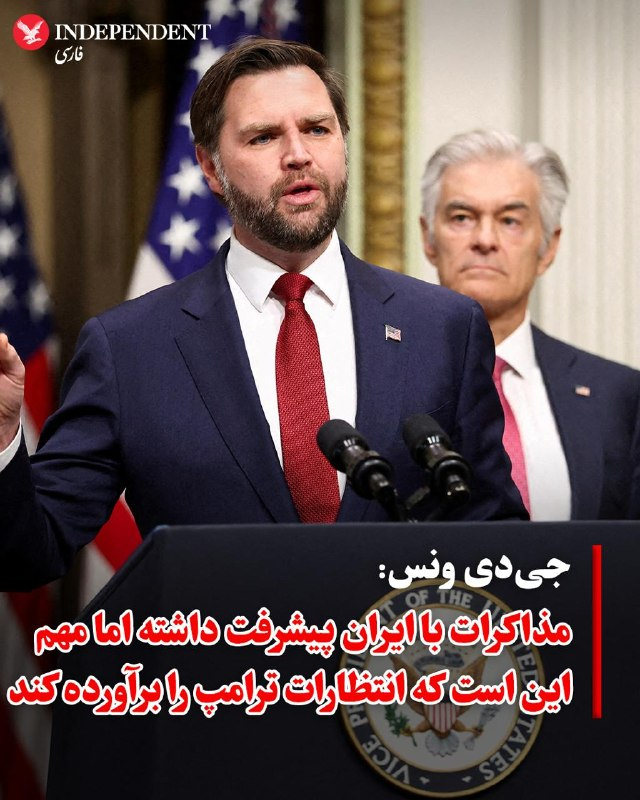

♦️جی‌دی ونس، معاون رئیس‌جمهوری آمریکا، روز چهارشنبه ۲۳ اردیبهشت، اعلام کرد که مذاکره‌کنندگان ارشد ایالات متحده همچنان در حال «پیشرفت» در گفتگوهای صلح با جمهوری اسلامی هستند. این اظهارات در حالی مطرح می‌شود که تهران در هفته‌های اخیر مجموعه‌ای از پاسخ‌ها را ارائه کرده که مورد قبول ترامپ نبوده‌اند.

ونس در گفتگو با خبرنگاران با اشاره به رایزنی‌های صبح امروز خود با جرد کوشنر و استیو ویتکاف و همچنین تعدادی از متحدان عرب، گفت: «فکر می‌کنم در حال پیشرفت هستیم؛ اما پرسش اساسی این است که آیا این پیشرفت برای عبور از خط قرمز رئیس‌جمهور کافی خواهد بود یا خیر».

معاون رئیس‌جمهوری آمریکا تاکید کرد که دولت همچنان بر جلوگیری همیشگی از دستیابی جمهوری اسلامی به سلاح هسته‌ای متمرکز است و این موضوع را معیار اصلی هرگونه توافقی دانست. او افزود: «خط قرمز بسیار ساده است؛ رئیس‌جمهور باید اطمینان حاصل کند که مجموعه‌ای از حفاظ‌های امنیتی ایجاد شده است تا ایران هرگز نتواند به سلاح هسته‌ای دست یابد».
‌🇸🇦 Indypersian

🤖 @VahidOOnLine

## VahidOOnLine — post 239977

♦️ جی‌دی ونس، معاون رئیس‌جمهوری آمریکا با تاکید بر موضع مشترک خود با دونالد ترامپ مبنی بر ضرورت جلوگیری از هسته‌ای شدن ایران، هشدار داد که دستیابی تهران به سلاح اتمی می‌تواند به یک رقابت تسلیحاتی گسترده در منطقه منجر شود. او تصریح کرد که در صورت وقوع این اتفاق، چندین کشور عرب حوزه خلیج فارس و به دنبال آن‌ها کشورهای متعدد دیگری برای دستیابی به سلاح هسته‌ای اقدام خواهند کرد.

ونس اشاعه هسته‌ای را بزرگترین تهدید برای امنیت ملی آمریکا دانست و اعلام کرد که واشنگتن در حال پیشبرد یک فرآیند دیپلماتیک تهاجمی برای مقابله با این موضوع است. او با اشاره به اینکه تمامی گزینه‌های دیپلماتیک و نظامی روی میز است، تاکید کرد که هدف نهایی، حفظ امنیت جهان و به‌ویژه مردم آمریکا در برابر تهدید اتمی جمهوری اسلامی است. به گفته او، جلوگیری از اشاعه هسته‌ای مهم‌ترین اقدام برای تضمین امنیت بلندمدت است.
‌🇸🇦 Indypersian

🤖 @VahidOOnLine

## VahidOOnLine — post 239976

  <a href="telegram/content/VahidOOnLine_239976_1778703758.mp4" target="_blank">🎬 Download video</a>

⭕️ واکنش رئیس فدراسیون به ترانه معین برای تیم ملی فوتبال:
هر کسی برای ایران بخواند، روی چشم ما جا دارد

♦️مهدی تاج، رئیس فدراسیون فوتبال، در حاشیه مراسم رونمایی از پیراهن تیم ملی برای جام جهانی ۲۰۲۶، گفت که این فدراسیون در جریان ترانه‌ای قرار دارد که قرار است نصرالله معین نجف‌آبادی با نام هنری معین برای تیم ملی ایران بخواند. او گفت:
«هر کسی برای ایران بخواند، روی چشم ما جا دارد.»
شامگاه چهارشنبه ٢٣ اردیبهشت، رونمایی از پیراهن جدید تیم ملی با حضور امیر قلعه‌نویی و احسان حاج‌صفی برگزار شد.
جام جهانی ۲۰۲۶ از ۲۱ خرداد تا ۲۸ تیر ۱۴۰۵ به میزبانی مشترک آمریکا، کانادا و مکزیک برگزار خواهد شد.
‌🇸🇦 Indypersian

🤖 @VahidOOnLine

## VahidOOnLine — post 239975

  

جی‌دی ونس، معاون رییس‌جمهور آمریکا، در کاخ سفید درباره مذاکرات واشینگتن و تهران گفت این گفت‌وگوها بسیار حساس است. او افزود صبح چهارشنبه مدت قابل‌توجهی با جرد کوشنر و استیو ویتکاف و همچنین با شماری از متحدان آمریکا در جهان عرب صحبت کرده و «فکر می‌کنم روند مذاکرات در حال پیشرفت است.»
ونس تاکید کرد پرسش اصلی این است که آیا این پیشرفت خط قرمز رییس‌جمهور را تامین می‌کند یا نه، این خط قرمز بسیار ساده است؛ ایجاد تضمین‌ها و سازوکارهایی که مانع دستیابی تهران به سلاح هسته‌ای شود.
او افزود از زمان ترک پاکستان پیشرفت قابل‌توجهی حاصل شده و هدف نهایی این است که دولت بتواند با اطمینان به مردم آمریکا بگوید دیگر نیازی نیست نگران دسترسی این رژیم بسیار خطرناک به خطرناک‌ترین سلاح‌های جهان باشند.
ونس اضافه کرد: رییس‌جمهور فعلا ما را در مسیر دیپلماسی قرار داده و تمرکز من نیز بر همین مسیر است.
‌🏁 🇬🇧 IranintlTV

🤖 @VahidOOnLine

## VahidOOnLine — post 239974

  <a href="telegram/content/VahidOOnLine_239974_1778703761.mp4" target="_blank">🎬 Download video</a>

‌
میزان، خبرگزاری وابسته به قوه قضاییه جمهوری اسلامی از اعدام محمد عباسی، از بازداشت‌شدگان اعتراضات سراسری دی‌ماه ۱۴۰۴ خبر داد.

میزان نوشت محمد عباسی سحرگاه روز چهارشنبه ۲۳ اردیبهشت در زندان قزلحصار اعدام شده است.

بر اساس گزارش‌های منتشر شده مسئولان زندان قزلحصار از خانواده او برای ملاقات دعوت کرده بودند، اما پس از حضور آن‌ها، اجازه ملاقات داده نشد و خانواده پس از ترک زندان، تلفنی از اجرای حکم اعدام مطلع شدند.

محمد عباسی در جریان اعتراضات دی‌ماه ۱۴۰۴ در ملارد بازداشت و سپس از سوی شعبه ۱۵ دادگاه انقلاب تهران به ریاست ابوالقاسم صلواتی، به اتهام «محاربه» به اعدام محکوم شده بود.

شعبه ۳۹ دیوان عالی کشور با رد فرجام‌خواهی، حکم اعدام محمد عباسی را تایید کرد. در همین پرونده، حکم ۲۵ سال زندان فاطمه عباسی، دختر او، نیز عینا تایید شده و او اکنون در بند زنان زندان اوین نگهداری می‌شود.

بر اساس گزارش امتداد، ابهامات و پرسش‌های متعددی درباره روند رسیدگی و محتوای پرونده این دو متهم وجود داشته، اما وکلای مستقل به دلیل محرومیت از دسترسی به پرونده، امکان بررسی و پیگیری موثر آن را نداشته‌اند.
‌🏁 🇬🇧 ManotoTV

🤖 @VahidOOnLine

## VahidOOnLine — post 239972

  <a href="telegram/content/VahidOOnLine_239972_1778703761.mp4" target="_blank">🎬 Download video</a>

‌
جی‌دی ونس، معاون رئیس‌جمهوری آمریکا، در اظهاراتی درباره برنامه هسته‌ای جمهوری اسلامی گفت با موضع دونالد ترامپ موافق است که جمهوری اسلامی نباید به سلاح هسته‌ای دست پیدا کند.

ونس گفت دولت آمریکا در حال حاضر درگیر یک روند «فعال دیپلماتیک» برای اطمینان از عدم دستیابی جمهوری اسلامی به سلاح هسته‌ای است، اما در عین حال تاکید کرد ترامپ گزینه‌های مختلفی، از جمله گزینه‌های دیپلماتیک و نظامی، در اختیار دارد.

معاون رئیس‌جمهوری آمریکا افزود اولویت اصلی ترامپ، حفاظت از مردم آمریکا و همچنین امنیت جهان در برابر تهدید ناشی از دستیابی جمهوری اسلامی به سلاح هسته‌ای است.
‌🏁 🇬🇧 ManotoTV

🤖 @VahidOOnLine

## VahidOOnLine — post 239971

  

♦️ اصغر فرهادی، برای نمایش فیلم جدیدش با عنوان «داستان‌های موازی» در هفتاد و نهمین دوره جشنواره فیلم کن، به فرانسه سفر کرد. این ششمین حضور او در بخش مسابقه اصلی جشنواره فیلم کن است. این اثر که دهمین فیلم بلند فرهادی و دومین تجربه فیلم‌سازی او به زبان فرانسوی است، قرار است روز پنج‌شنبه ۲۴ اردیبهشت، ساعت ۲۰:۳۰ به وقت محلی در سالن لومیر کاخ جشنواره به نمایش درآید.

در این درام پیچیده که مرز میان خیال و واقعیت را روایت می‌کند، ستارگان مطرح سینمای فرانسه از جمله ایزابل هوپر، کاترین دونو و ونسان کَسِل به ایفای نقش پرداخته‌اند. «داستان‌های موازی» همزمان با اکران در کن، در سینماهای سراسر فرانسه نیز روی پرده می‌رود. فرهادی که پیش از این جوایزی همچون بهترین فیلمنامه و جایزه بزرگ کن را در کارنامه دارد، امسال برای کسب نخل طلا با کارگردانان بزرگی چون پدرو آلمودوار و هیروکازو کورئیدا رقابت می‌کند.
‌🇸🇦 Indypersian

🤖 @VahidOOnLine

## VahidOOnLine — post 239970

  

انور قرقاش، مشاور رییس امارات متحده عربی، در شبکه ایکس نوشت جهان با دقت سفر مهم رییس‌جمهور ایالات متحده به چین و پیامدهای احتمالی آن بر تحولات منطقه را دنبال می‌کند. او تأکید کرد امارات متحده عربی بار دیگر بر اهمیت راه‌حل سیاسی و مسیر مذاکره پافشاری می‌کند؛ مسیری که همواره در مواضع و ارتباطات خود به آن پایبند بوده است.

قرقاش افزود امارات متحده عربی خواهان این جنگ نبوده و صادقانه برای جلوگیری از وقوع آن تلاش کرده است. او گفت روابط عربی ـ ایرانی در خلیج فارس نمی‌تواند بر پایه رویارویی و درگیری بنا شود.

مشاور رییس امارات متحده عربی همچنین تأکید کرد این کشور از حاکمیت خود دفاع خواهد کرد، اما همچنان اولویت و باور راسخ آن ترجیح راه‌حل‌های سیاسی است؛ زیرا این مسیر را راه دستیابی به صلح، ثبات و شکوفایی می‌داند.
‌🏁 🇬🇧 IranintlTV

🤖 @VahidOOnLine

## VahidOOnLine — post 239969

  

♦️ سخنگوی ارتش جمهوری اسلامی روز چهارشنبه ۲۳ اردیبهشت اعلام کرد که تسلط تهران بر تنگه هرمز می‌تواند درآمد اقتصادی «چشمگیری» ایجاد کرده و جایگاه بین‌المللی کشور را تقویت کند. محمد اکرمی‌نیا به خبرگزاری ایسنا گفت: «نظارت ما بر تنگه هرمز درآمدهای اقتصادی قابل‌توجهی برای کشور به همراه خواهد داشت که پتانسیل آن را دارد که حتی دو برابر درآمد نفتی ما باشد؛ این اقدام همچنین نفوذ ما را در عرصه بین‌المللی افزایش می‌دهد».

هم‌زمان، ابراهیم عزیزی، رئیس کمیسیون امنیت ملی مجلس شورای اسلامی، از نهایی شدن طرحی برای مدیریت این آبراه خبر داد. او در گفتگو با صدا و سیما تایید کرد: «جمهوری اسلامی در نظر دارد با مدیریت راهبردی تنگه هرمز، از این موقعیت استراتژیک به عنوان یک اهرم قدرت استفاده کند».
‌🇸🇦 Indypersian

🤖 @VahidOOnLine

## VahidOOnLine — post 239968

  <a href="telegram/content/VahidOOnLine_239968_1778703764.mp4" target="_blank">🎬 Download video</a>

♦️رونمایی از پیراهن جدید تیم ملی فوتبال ایران برای جام جهانی ۲۰۲۶ با حضور مهدی تاج، امیر قلعه‌نویی و احسان حاج‌صفی در میدان انقلاب تهران برگزار شد؛ پیراهنی که با طرح «یوز ایرانی» و شماره ۱۲ معرفی شد و قرار است تیم ملی با آن در جام جهانی به میدان برود.
این رونمایی در شرایطی انجام می‌شود که طی هفته‌های اخیر، بحث حضور تیم ملی ایران در جام جهانی ۲۰۲۶ و مسائل مرتبط با ویزا، امنیت و تنش‌های سیاسی منطقه‌ای بار دیگر خبرساز شده است.
پیش‌تر مهدی تاج اعلام کرده بود فدراسیون فوتبال جمهوری اسلامی «قطعا» در جام جهانی ۲۰۲۶ شرکت خواهد کرد و در عین حال گفته بود ایران برای حضور در این رقابت‌ها ۱۰ شرط را مطرح کرده است. به گفته او، جلوگیری از مصاحبه‌های تنش‌زا، تضمین امنیت کاروان تیم ملی، رعایت پروتکل‌های امنیتی فیفا در فرودگاه و ورزشگاه‌ها، تعیین تکلیف ویزای خبرنگاران و هواداران و همچنین جلوگیری از ورود پرچم‌هایی غیر از پرچم رسمی جمهوری اسلامی به ورزشگاه‌ها، از جمله این شروط هستند.
مسابقات جام جهانی فوتبال ۲۰۲۶ از ۲۱ خرداد تا ۲۸ تیر ۱۴۰۵ برگزار خواهد شد.
‌🇸🇦 Indypersian

🤖 @VahidOOnLine

## VahidOOnLine — post 239967

  

♦️ خبرگزاری رویترز روز چهارشنبه ۲۳ اردیبهشت به نقل از منابع آگاه گزارش داد که در جریان جنگ ایران، جنگنده‌های نیروی هوایی عربستان سعودی، اهداف متعلق به شبه‌نظامیان تحت حمایت تهران را در نزدیکی مرزهای شمالی خود با عراق بمباران کرده‌اند. این حملات که بخشی از آن در نزدیکی زمان شروع آتش‌بس رخ داده، مراکزی را هدف قرار داده است که از آن‌ها برای حملات پهپادی و موشکی به خاک عربستان سعودی و دیگر کشورهای خلیج فارس استفاده می‌شد.

هم‌زمان، منابع نظامی و امنیتی عراق از شلیک راکت از خاک کویت به سمت مواضع شبه‌نظامیان در جنوب عراق در حداقل دو نوبت خبر داده‌اند. در یکی از این حملات که در ماه آوریل انجام شد، چندین شبه‌نظامی کشته شده و یک مرکز ارتباطاتی و عملیات پهپادی متعلق به «کتائب حزب‌الله» منهدم شده است. رویترز اشاره کرد که هنوز مشخص نیست این پرتاب‌ها توسط ارتش کویت انجام شده یا نیروهای آمریکایی مستقر در این کشور؛ چرا که ارتش آمریکا از اظهارنظر در این باره خودداری کرده و دولت‌های کویت و عراق نیز به درخواست‌ها برای شفاف‌سازی پاسخ نداده‌اند.
‌🇸🇦 Indypersian

🤖 @VahidOOnLine

## VahidOOnLine — post 239966

  

خبرگزاری رویترز اعلام کرد که عربستان سعودی در جریان جنگ ایران، به مواضع شبه‌نظامیان مورد حمایت جمهوری اسلامی در عراق حمله کرده است.
بر اساس این گزارش، حملات عربستان سعودی توسط جنگنده‌های نیروی هوایی این کشور و علیه مواضع شبه‌نظامی وابسته به جمهوری اسلامی در نزدیکی مرز شمالی عربستان سعودی با عراق انجام شده است. بخشی از این حملات نیز هم‌زمان با آتش‌بس ۱۸ فروردین میان تهران و واشینگتن صورت گرفته است.
همچنین بر اساس ارزیابی‌های نظامی، منابع عراقی گفته‌اند در دست‌کم دو مورد، از خاک کویت حملات راکتی به عراق انجام شده است. رویترز نتوانسته مشخص کند این راکت‌ها توسط نیروهای مسلح کویت یا نیروهای آمریکایی مستقر در این کشور شلیک شده‌اند.
‌🏁 🇬🇧 IranintlTV

🤖 @VahidOOnLine

## VahidOOnLine — post 239965

  <a href="telegram/content/VahidOOnLine_239965_1778703767.mp4" target="_blank">🎬 Download video</a>

واتس‌اپ قابلیت جدیدی به نام «حالت ناشناس» برای چت با هوش مصنوعی متا معرفی کرده که در آن، گفتگوها ذخیره یا قابل مشاهده نخواهند بود؛ حتی برای خود شرکت متا.
واتس‌اپ می‌گوید این قابلیت برای گفتگو درباره موضوعات حساسی مثل سلامت، روابط و مسائل مالی طراحی شده است.
با این حال، کارشناسان هشدار داده‌اند حذف کامل تاریخچه چت‌ها می‌تواند در صورت بروز آسیب یا سوءاستفاده، پیگیری مسئولیت را دشوار کند.
‌🏁 🇬🇧 ManotoTV

🤖 @VahidOOnLine

## VahidOOnLine — post 239964

  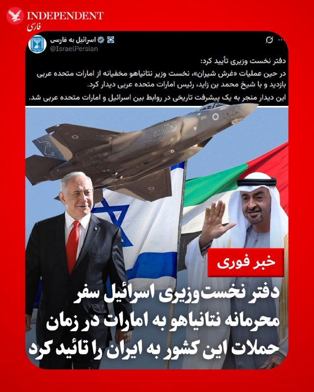

♦️ حساب رسمی وزارت امور خارجه اسرائیل، روز چهارشنبه ۲۳ اردیبهشت، در شبکه اجتماعی ایکس با انتشار پیامی به نقل از دفتر نخست‌وزیری این کشور، سفر محرمانه بنیامین نتانیاهو به امارات متحده در زمان حملات به ایران را تایید کرد. دفتر نتانیاهو اعلام کرد که نخست‌وزیر اسرائیل در این سفر با شیخ محمد بن زاید، رئیس امارات متحده عربی دیدار کرده و این دیدار منجر به «یک پیشرفت تاریخی» در روابط دو کشور شده است.

پیش از این گزارش‌هایی از انتقال سامانه دفاعی گنبد آهنین اسرائیل به امارات متحده نیز مطرح شده بود که از سوی مایک هاکبی، سفیر آمریکا در اسرائیل نیز تایید شد. همچنین گزارش‌هایی نیز از انجام حملاتی علیه جمهوری اسلامی از سوی امارات متحده منتشر شده است.
‌🇸🇦 Indypersian

🤖 @VahidOOnLine

## WithYashar — post 11168

کامنتم زیر پست ترامپ

https://www.instagram.com/reel/DYSl8QEMZja/?igsh=MTNieGh0eTQyOWtnYQ==
بترکونینننن 💥🙌🏾حملههههه

## WithYashar — post 11167

  <a href="telegram/content/WithYashar_11167_1778703768.mp4" target="_blank">🎬 Download video</a>

لحظه استقبال از دونالد ترامپ در پکن، چین
@withyashar

## WithYashar — post 11166

## WithYashar — post 11165

## WithYashar — post 11164

پیام سد مجید موسی ، فرمانده نیروی هوافضای ۳پا تیم ملی رو هم بردن وسط میدون مثل میمونای سیرک @withyashar

## WithYashar — post 11163

  <a href="telegram/content/WithYashar_11163_1778703769.mp4" target="_blank">🎬 Download video</a>

پیام سد مجید موسی ، فرمانده نیروی هوافضای ۳پا
تیم ملی رو هم بردن وسط میدون مثل میمونای سیرک
@withyashar

## mwarmonitor — post 9056

  

📝 واقعاً باید به حال این مملکت خون گریه کرد که فرماندهانش یک مشت جلبک‌مغزِ فاقد شعورند که بدیهی‌ترین مسائل عالم را به عنوان وحی مُنزل و استراتژی جنگی به خورد ملت می‌دهند. آخه مرتیکه‌ی مغزفندقی، فوتبال اگر تیمی نبود که یازده نفر آدم را با شورت ورزشی نمی‌فرستادند توی زمین!
🔸آن سردار گوربه‌گور شده‌تان هم که وقتی زنده بود، هنرِ اول و آخرش گه خوردن اضافی و ورّاجی بود، حالا وصیت‌نامه‌ی فوتبالی‌اش شده مشقِ راهِ شما؟ «تیمی بازی کنید تا جام ببرید»؟ این سطح از بلاهت و نفهمی حتی برای گوسفند هم قفل است! ولی به حال آن جماعتی که استراتژیست‌هایش شمایید؛ الدنگ‌هایی که هنوز فرق ورزش تیمی و انفرادی را نمی‌فهمند اما برای سرنوشت یک کشور نسخه می‌پیچند. شما که کل افتخار تیمی‌تان، تیمی غارت کردن و تیمی ریدن به هیکل نظام است، بهتر است دهان چاک‌خورده‌تان را ببندید و با آن جملاتِ صدمن‌یه غازِ آن مِیِتِ ملعون، بیش از این نبوغِ جلبکی‌تان را به رخ نکشید. حماقت شما مرزهای بیولوژی را جابه‌جا کرده است!

@mwarmonitor

## mwarmonitor — post 9055

  <a href="telegram/content/mwarmonitor_9055_1778703771.mp4" target="_blank">🎬 Download video</a>

✈️مأموریت WENCH11 (بمب‌افکن رادارگریز B-2A Spirit) 🔸پس از سوخت‌گیری هوایی با پرواز DEED41 (تانکر KC-135 Stratotanker) بر فراز نوا اسکوشیا شرق کانادا، روی مسیر سوخت‌رسانی AR20NE، در باند VHF با Gander Radio در ارتباط بوده است. @mwarmonitor

## mwarmonitor — post 9054

🇺🇸کوین وارش با رأی ۵۴ موافق در برابر ۴۵ مخالف توسط سنای آمریکا به عنوان رئیس فدرال رزرو تأیید شد. سناتور جان فترمن تنها دموکراتی بود که به این تأیید رأی مثبت داد.

🔸کوین وارش یک اقتصاددان آمریکایی است که قبلاً عضو هیئت‌مدیره فدرال رزرو هم بوده و بیشتر به دیدگاه‌های نسبتاً محافظه‌کارانه در سیاست پولی مثل سخت‌گیری در کنترل تورم و تمایل به نرخ بهره بالاتر در بعضی شرایط شناخته می‌شود.

🔹 او از چهره‌هایی است که معمولاً به جریان‌های اقتصادی نزدیک به جمهوری‌خواهان یا اقتصاد بازار آزاد نسبت داده می‌شود، هرچند نقش رسمی حزبی ندارد.

@mwarmonitor

## mwarmonitor — post 9053

  

🇺🇸کشتی USNS Henry J. Kaiser (T-AO-187) متعلق به نیروی دریایی آمریکا و یک ناوشکن آمریکایی امروز در دریای عرب در مختصات زیر مشاهده شده‌اند:

📍22.7488, 61.2222 و 22.0751, 61.5995

🚢نفتکش گروه ضربتی ناو هواپیمابر ۳ (CSG-3) در حال انجام عملیات سوخت‌رسانی در دریا (Replenishment-at-sea) بوده و ناوشکن نیز در حال انجام عملیات دفاع چندبُعدی و مأموریت‌های امنیت دریایی است.

@mwarmonitor

## FoxNewsTwitter — post 341675

  <a href="telegram/content/FoxNewsTwitter_341675_1778703773.mp4" target="_blank">🎬 Download video</a>

Fox News (Twitter/X)

RT @TheStoryFNC: “We have time to try him again...”

EXCLUSIVE: South Carolina Attorney General @AGAlanWilson says state will seek speedy trial after Alex Murdaugh’s murder convictions are overturned

## FoxNewsTwitter — post 341674

  <a href="telegram/content/FoxNewsTwitter_341674_1778703775.mp4" target="_blank">🎬 Download video</a>

Fox News (Twitter/X)

JUST IN: Vice President JD Vance defends the fraud task force for its efforts to prioritize American citizens:

"We're a generous country. We're a generous people. I love that about this country.”

“But part of that generosity is that it extends to our fellow Americans. We cannot give Medicare and Medicaid benefits to everybody all over the world.”

“It's going to bankrupt those programs. They ought to belong to Americans first."

## FoxNewsTwitter — post 341673

  <a href="telegram/content/FoxNewsTwitter_341673_1778703776.mp4" target="_blank">🎬 Download video</a>

Fox News (Twitter/X)

"I can do all things through Christ who strengthens me.”

DHS Secretary Markwayne Mullin leans on his Christian faith as he sends a message of support to his ICE agents, defending them against media scrutiny:

“If any agency needs to hear that, it's ICE. No matter what the media wants to say, I know you're doing your job every day, and I want you to know I am proud to be part of it.”

“I take it with tremendous pride, and I'm willing to stand beside you and stand in front of you and defend you every single day."

## FoxNewsTwitter — post 341672

  <a href="telegram/content/FoxNewsTwitter_341672_1778703777.mp4" target="_blank">🎬 Download video</a>

Fox News (Twitter/X)

JUST NOW: VP Vance makes an 'Apprentice' joke when asked about President Trump doing a crowd poll of himself and Secretary Rubio earlier this week.

"I just don't think it sounds like the president of the United States to have a televised competition for who would succeed him as his apprentice."

"I just think that's not at all what you would expect the president to do."

"I think it's natural for him to joke around with us a little bit to play around with the idea. But I can tell you the president is as focused as any of us on making sure we do as good of a job now for the American people."

## FoxNewsTwitter — post 341671

  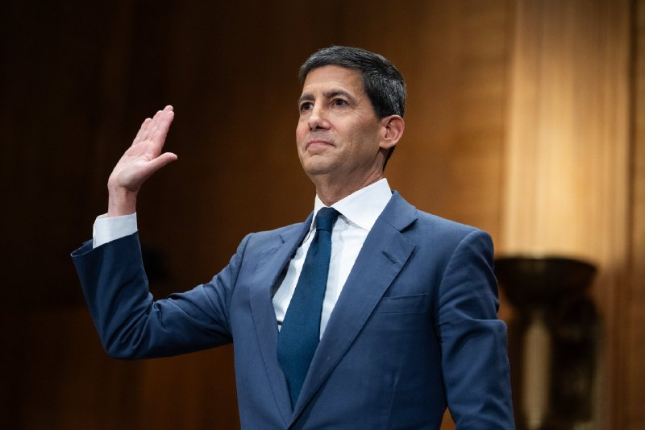

Fox News (Twitter/X)

BREAKING: Senate confirms Kevin Warsh as Federal Reserve Chair in a 54–45 vote.

Warsh replaces Jerome Powell, who will stay on the board as a Fed governor, despite repeated criticism from President Trump, who has been pushing the Fed to cut rates and accused Powell of making decisions "too late."

Democrat John Fetterman was the only member of his party to join Republicans as the lone vote from his party to back Trump’s pick.

## FoxNewsTwitter — post 341670

  <a href="telegram/content/FoxNewsTwitter_341670_1778703780.mp4" target="_blank">🎬 Download video</a>

Fox News (Twitter/X)

BREAKING: Vice President JD Vance shuts down talk of a "joint ticket" with Secretary of State Marco Rubio, insisting he is focused solely on the job the American people already elected him to do:

"There are a few topics that I want to talk about less than what office I'm going to run for years down the road when I'm having a good time and trying to do good work in the job that the American people already elected me to do.”

“I've answered this question, probably in any number of ways, I love Marco. I think he's a great secretary of state. He's become a very, very dear friend. But I think both of us are very much focused on accomplishing the American people's business right now.”

## FoxNewsTwitter — post 341669

  <a href="telegram/content/FoxNewsTwitter_341669_1778703781.mp4" target="_blank">🎬 Download video</a>

Fox News (Twitter/X)

BREAKING: "We believe that at least half of the hospices in the entire area around Los Angeles are fraudulent."

"Today we announce 800 of those hospices have been suspended. 800 hospices that last year charged the federal taxpayer $1.4 billion will no longer be paid." - CMS Administrator Dr. Mehmet Oz

## FoxNewsTwitter — post 341668

  <a href="telegram/content/FoxNewsTwitter_341668_1778703783.mp4" target="_blank">🎬 Download video</a>

Fox News (Twitter/X)

VP VANCE: "So you're saying that we kicked off 800 fraudulent healthcare providers off of the Medicare system, and not a single one of them called the government and said, 'hey, you made a mistake?'"

DR. OZ: "We've had a handful of calls. We're not sure they're legitimate yet, but it's less than 20 out of 800 and we're auditing them."

VP VANCE:" Unbelievable... At least 780 are not even trying to claim that they're not fraudulent?"

"Those are businesses that we were giving hundreds of millions, in some cases billions of dollars to, not to provide services, but to make a fraudster rich. It's just completely insane."

## FoxNewsTwitter — post 341667

  <a href="telegram/content/FoxNewsTwitter_341667_1778703784.mp4" target="_blank">🎬 Download video</a>

Fox News (Twitter/X)

JUST IN: Vice President JD Vance rips the Biden administration’s failure to prevent medical identity theft after a California psychotherapist was stripped of her benefits.

Vance highlights the doctor's case — 40 years in the medical field only to have her Medicare "turned off" because a fraudster exploited the system.

"A fraudster had stolen her identity and signed her up for healthcare services that she didn't need, and so she had been turned off of the healthcare services that she did need."

“This happens way too much in the United States of America. And it happens because until recently, we did not have a government or an administration that actually took the fraud program and took anti-fraud prevention seriously."

## FoxNewsTwitter — post 341666

  <a href="telegram/content/FoxNewsTwitter_341666_1778703786.mp4" target="_blank">🎬 Download video</a>

Fox News (Twitter/X)

NEW: VP Vance calls out officials in Hawaii for refusing to crack down on Medicaid fraud in the state:

"Guess how many convictions or indictments has Hawaii had over the last few years in its Medicaid fraud program? The answer is zero."

"Not a single indictment, not a single conviction, because the administrators of the Hawaii program just don't take it seriously. They don't think that fraud is a big enough problem."

## FoxNewsTwitter — post 341665

  <a href="telegram/content/FoxNewsTwitter_341665_1778703787.mp4" target="_blank">🎬 Download video</a>

Fox News (Twitter/X)

JUST IN: Vice President JD Vance reveals how fraudulent healthcare providers are taking advantage of patients and exploiting the American taxpayer:

"You have people who've been prescribed medications that they don't even need.

“Sometimes they've had drugs put into their bodies that they don't need because fraudsters have actually encouraged false prescriptions and false administration to medications.”

“It's a defrauding of the American taxpayer, but it's a violation of the trust that should exist between every American and the people who prescribe the medications."

## pm_afshaa — post 90708

  <a href="telegram/content/pm_afshaa_90708_1778703789.webm" target="_blank">🎬 Download video</a>

🔴علی‌آبادی، وزیر نیرو: با همکاری مردم و افزایش ظرفیت تولید، وضعیت امسال از سال گذشته به مراتب بهتر خواهد بود و امیدواریم تابستان بدون خاموشی سپری بشه.

💧 Rainbet.com the #1 Non-KYC Crypto Casino & Sportsbook @rainbetcom

😁 @Pm_Afshaa

## pm_afshaa — post 90707

  <a href="telegram/content/pm_afshaa_90707_1778703789.webm" target="_blank">🎬 Download video</a>

🔴بلومبرگ: صادرات نفت ایران از جزیره خارک برای اولین بار از زمان شروع جنگ متوقف شده و تصاویر ماهواره‌ای نشان میده که مخازن ذخیره‌سازی نفت تقریباً به ظرفیت کامل خود رسیدن.

💧 Rainbet.com the #1 Non-KYC Crypto Casino & Sportsbook @rainbetcom

😁 @Pm_Afshaa

## iaghapour — post 2607

✍🏻 دوستان عزیز، همون‌طور که احتمالاً متوجه شدید، در یک هفته گذشته به دلایل مختلفی فعالیت ما کمتر شده.

🔹در این مدت پیام‌های زیادی داشتیم که درخواست آموزش «روش جدید سنایی» رو داشتن. وقتی بررسی کردیم، متوجه شدیم خود ایشون زحمت تهیه ویدیوی آموزشی رو کشیدن؛ بنابراین نیازی به آموزش مجدد نبود.

🔸برای اطمینان بیشتر، این آموزش رو به چند نفر از دوستان دادیم تا تست کنن. بیشتر افراد موفق به اجرا نشدن، اما یکی از کاربران تونست متصل بشه. طبق بررسی‌های ایشون، این روش به‌شدت به رنج آی‌پی‌ها (هم سرور ایران و هم خارج) وابسته است. مشکل اصلی اینجاست که بعد از اتصال و مصرف حجم کمی از اینترنت، ارتباط قطع می‌شه و باید آی‌پی رو عوض کرد؛ هرچند آی‌پی قبلی بعد از ۱ تا ۲ ساعت دوباره قابل استفاده می‌شه.

🔻متأسفانه در این بین، عده‌ای بدون این‌که تست درستی از پایداری تانل بگیرن، شروع به آموزش کردن که نتیجه‌اش فقط ضرر مالی برای کاربران بوده. چون کاربرا رفتن سرورهای گرون قیمت رو خریداری کردن که البته تعداد این افراد اصلا کم نبوده. (نمونه‌اش رو در عکس ضمیمه می‌بینید).

🟢 در مجموع، به نظر می‌رسه این روش هنوز پایدار نیست، اما از بچه‌های تیم خواستیم تست‌های بیشتری روش انجام بدن. اگر خودتون هم مایلید آموزش رو ببینید، می‌تونید مستقیماً به کانال یا گروه سنایی مراجعه کنید.

🆔 @iaghapour

## VahidOnline — post 75453

  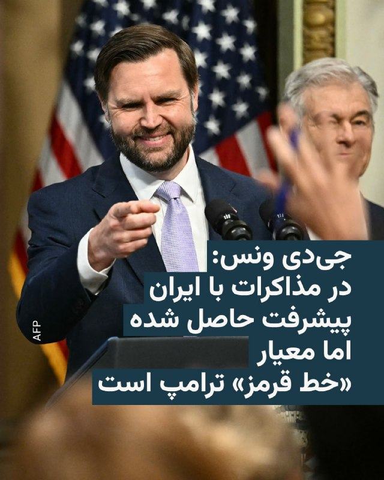

جی‌دی ونس، معاون رئیس‌جمهور آمریکا، اعلام کرد که واشینگتن معتقد است در مذاکرات با ایران «پیشرفت» حاصل شده، اما هنوز مشخص نیست این پیشرفت برای عبور از خط قرمز دونالد ترامپ کافی باشد یا نه.

آقای ونس روز چهارشنبه در کاخ سفید به خبرنگاران گفت صبح همان روز با جرد کوشنر و استیو ویتکاف درباره ایران گفت‌وگو کرده و همچنین با مقام‌های عرب در تماس بوده است. او افزود: «سوال اصلی این است که آیا این پیشرفت به اندازه‌ای هست که خط قرمز رئیس‌جمهور را تأمین کند یا نه.»

به گفته معاون رئیس‌جمهور آمریکا، خط قرمز ترامپ این است که ایالات متحده مطمئن شود «سازوکارهای کافی» ایجاد شده تا ایران هرگز به سلاح هسته‌ای دست پیدا نکند.
اظهارات ونس در حالی مطرح می‌شود که ترامپ پیش‌تر پیشنهاد تازه ایران در مذاکرات را «غیرقابل قبول» توصیف کرده بود.
@VahidHeadline

📡 @VahidOnline

## VahidOnline — post 75452

  

قوه قضائیه جمهوری اسلامی شامگاه چهارشنبه ۲۳ اردیبهشت اعلام کرد که محمد عباسی، یکی از بازداشت‌شدگان اعتراضات دی‌ماه سال گذشته به اتهام قتل یک مأمور امنیتی اعدام شده است.

خبرگزاری میزان، وابسته به این قوه، گفته است که او بعد از تأیید حکم توسط دیوان‌عالی کشور و با توجه به «تقاضای اولیا‌ء دم»، «قصاص» شد.

ساعتی پیش‌تر، پایگاه خبری هرانا به نقل از یک منبع نزدیک به خانواده این زندانی نوشت که مسئولان زندان قزلحصار از خانواده محمد عباسی خواستند که برای ملاقات با او به زندان مراجعه کنند، «اما پس از حضور خانواده در زندان، این امکان از نزدیکان او سلب شد. پس از خروج خانواده عباسی از زندان، آنها در تماسی تلفنی از اجرای حکم اعدام محمد عباسی مطلع شدند.»
@VahidHeadline

📡 @VahidOnline

## kianmeli1 — post 87391

🔴اینترنشنال: احسان افرشته «امان نامه» داشت اما اعدام شد قوه قضاییه جمهوری اسلامی خبر داد احسان افرشته، جوان ۳۳ ساله‌، را به اتهام همکاری با اسرائیل، اعدام کرده اما دو منبع گفتند او، پیش از بازگشت به ایران از ترکیه، به‌طور داوطلبانه خود را به وزارت اطلاعات…

## kianmeli1 — post 87390

🔴اینترنشنال: احسان افرشته «امان نامه» داشت اما اعدام شد

قوه قضاییه جمهوری اسلامی خبر داد احسان افرشته، جوان ۳۳ ساله‌، را به اتهام همکاری با اسرائیل، اعدام کرده اما دو منبع گفتند او، پیش از بازگشت به ایران از ترکیه، به‌طور داوطلبانه خود را به وزارت اطلاعات معرفی کرده بود اما بلافاصله در فرودگاه بازداشت شد.
https://t.me/kianmeli1

## kianmeli1 — post 87389

  

🔴عراقچی

کویت در تلاشی آشکار برای ایجاد اختلاف، به طور غیرقانونی به یک قایق ایرانی حمله کرده و ۴ نفر از شهروندان ما را در خلیج فارس بازداشت کرده است. این اقدام غیرقانونی در نزدیکی جزیره‌ای که ایالات متحده از آن برای حمله به ایران استفاده کرده است، رخ داده است.

ما خواستار آزادی فوری اتباع خود هستیم و حق پاسخگویی را برای خود محفوظ می‌داریم.
https://t.me/kianmeli1

## kianmeli1 — post 87388

  

🔴عباس عراقچی، امروز برای شرکت در نشست وزیران امور خارجه کشورهای عضو بریکس (برزیل، روسیه، هند، چین و آفریقای جنوبی+) وارد دهلی، هند شد. این در حالی است که مذاکرات آمریکا و ایران همچنان ادامه دارد اما متوقف شده است. طبق گزارش‌ها و ارزیابی‌های تعدادی از کارشناسان، انتظار می‌رود ایران برای صدور بیانیه مشترک از سوی بلوک اقتصادی به رهبری چین در حمایت از منافع ایران تلاش کند.
https://t.me/kianmeli1

## kianmeli1 — post 87387

  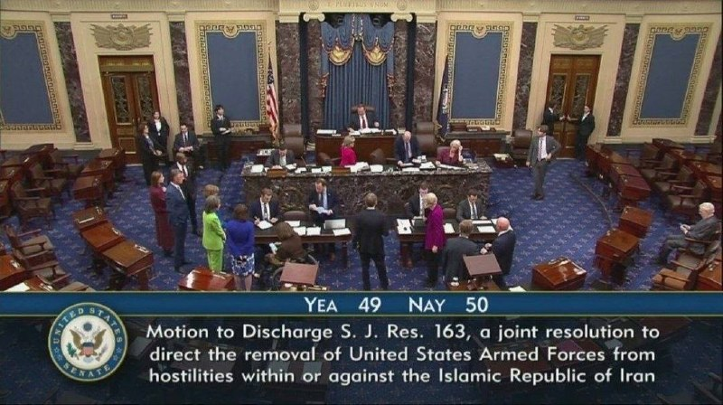

🔴هفتمین رأی‌گیری سنای آمریکا برای پایان جنگ با ایران شکست خورد

مجلس سنا برای هفتمین‌بار قطعنامهٔ پیشنهادی برای توقف جنگ با ایران را رد کرد.

جمهوری‌خواهان تقریباً متحد عمل کردند تا اولین تلاش از زمان عبور ترامپ از ضرب‌الاجل ۶۰ روزه برای دریافت مجوز جنگ از کنگره را ناکام بگذارند
https://t.me/kianmeli1

## kianmeli1 — post 87386

  

🔴رویترز؛

منابع متعددی که از جزئیات ماجرا آگاه هستند، اعلام کردند که در جریان جنگ با ایران، جنگنده‌های عربستان سعودی اهدافی مرتبط با شبه‌نظامیان تحت حمایت تهران را در عراق بمباران کردند. بعلاوه، حملات تلافی‌جویانه‌ای نیز از کویت به داخل خاک عراق انجام شد.
https://t.me/kianmeli1

## kianmeli1 — post 87385

  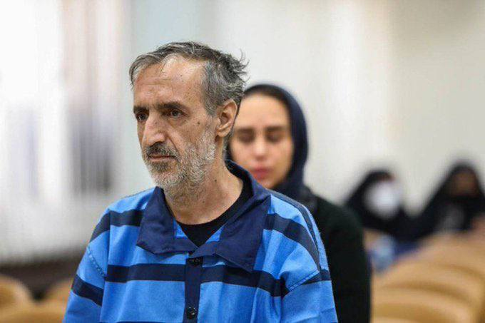

‏🔴خبرگزاری میزان، رسانه قوه قضاییه جمهوری اسلامی، از اعدام محمد عباسی از بازداشت‌شدگان اعتراضات سراسری دی‌ماه ۱۴۰۴ خبر داد
https://t.me/kianmeli1

## IranIntlTV — post 337056

  

به گزارش الحدث، دو پهپاد انتحاری مقر حزب دموکرات کردستان ایران در شمال اربیل عراق را هدف قرار دادند.

همزمان رویترز به نقل از منابع امنیتی گزارش داد در این حمله پهپادی یک انبار سلاح و مهمات در داخل این اردوگاه هدف قرار گرفته است.
https://iranintl.com/202605131072

## IranIntlTV — post 337055

  <a href="https://t.me/IranintlTV/337055" target="_blank">📎 Download file</a>

🎧نسخه صوتی ۲۴ با فرداد فرحزاد: سرنوشت جمهوری‌اسلامی، موضوع گفتگوهای ترامپ در چین
@iranintlTV

## IranIntlTV — post 337054

  <a href="telegram/content/IranIntlTV_337054_1778703794.mp4" target="_blank">🎬 Download video</a>

مسعود پزشکیان در واکنش به تورم و گرانی‌های بی‌سابقه، از وزارت جهاد کشاورزی خواست برای کنترل قیمت‌ها همه توانش را به کار گیرد. او پیشتر گفته بود، کشور به شدت به صرفه‌جویی نیاز دارد.

گفت‌وگو با سیامک جوادی ، مدرس و پژوهشگر اقتصاد مالی در دانشگاه تگزاس

@iranintltv

## IranIntlTV — post 337053

  

جی‌دی ونس، معاون رییس‌جمهور آمریکا، در کاخ سفید درباره مذاکرات واشینگتن و تهران گفت این گفت‌وگوها بسیار حساس است. او افزود صبح چهارشنبه مدت قابل‌توجهی با جرد کوشنر و استیو ویتکاف و همچنین با شماری از متحدان آمریکا در جهان عرب صحبت کرده و «فکر می‌کنم روند مذاکرات در حال پیشرفت است.»
ونس تاکید کرد پرسش اصلی این است که آیا این پیشرفت خط قرمز رییس‌جمهور را تامین می‌کند یا نه، این خط قرمز بسیار ساده است؛ ایجاد تضمین‌ها و سازوکارهایی که مانع دستیابی تهران به سلاح هسته‌ای شود.
او افزود از زمان ترک پاکستان پیشرفت قابل‌توجهی حاصل شده و هدف نهایی این است که دولت بتواند با اطمینان به مردم آمریکا بگوید دیگر نیازی نیست نگران دسترسی این رژیم بسیار خطرناک به خطرناک‌ترین سلاح‌های جهان باشند.
ونس اضافه کرد: رییس‌جمهور فعلا ما را در مسیر دیپلماسی قرار داده و تمرکز من نیز بر همین مسیر است.
https://iranintl.com/202605130999

## IranIntlTV — post 337052

  <a href="telegram/content/IranIntlTV_337052_1778703795.mp4" target="_blank">🎬 Download video</a>

بلومبرگ گزارش داد بحرین، کویت، قطر و امارات متحده عربی برای حضور در جلسه بعدی ناتو در ترکیه دعوت شده‌اند. بلومبرگ نوشته دعوت‌ها در ادامه تلاش‌های ناتو برای مقابله با تهدیدهای جمهوری اسلامی انجام شده است.

گفت‌وگو با فرزین ندیمی، پژوهشگر ارشد امور دفاعی و امنیتی در موسسه واشینگتن
@iranintltv

## IranIntlTV — post 337051

  

🔻همزمان با تحریم‌های بانکی و مشکلات مالی فدراسیون فوتبال ایران، جمینای (هوش مصنوعی شرکت گوگل) اعلام کرد حامی مالی و فناوری تیم‌های ملی عراق و مراکش در جام جهانی ٢٠٢۶ شده است. گوگل گفته قصد دارد با این قرارداد اسپانسری، «فاصله میان تیم‌ها و هواداران جهانی آنها را کاهش دهد.»

🔹در این بیانیه آمده است: «ما با هیجان اعلام می‌کنیم که گوگل جمینای به عنوان حامی رسمی فناوری تیم‌های ملی فوتبال عراق و مراکش انتخاب شده است. این حمایت با بهره‌گیری از فناوری پیشرفته هوش مصنوعی ما، فرهنگ غنی ورزشی منطقه را گرامی می‌دارد و تجربه هواداران را متحول خواهد کرد.»

🔹گوگل جمینای گفته در همکاری با فدراسیون‌های فوتبال، طی سه ماه آینده مجموعه‌ای از برنامه‌های هوادارمحور اجرا خواهد شد: «هواداران می‌توانند با استفاده از مدل تبدیل متن به تصویر جمینی موسوم به «نانو بنانا» تصاویر تشویقی اختصاصی خلق کنند یا با مدل تبدیل متن به موسیقی «لایریا» سرودهای تیمی بسازند و حمایت خود را به شکلی زنده تجربه کنند؛ گویی در زمین حضور دارند.»

جزییات بیشتر را اینجا بخوانید.

@iranintltvsport

## IranIntlTV — post 337050

  

انور قرقاش، مشاور رییس امارات متحده عربی، در شبکه ایکس نوشت جهان با دقت سفر مهم رییس‌جمهور ایالات متحده به چین و پیامدهای احتمالی آن بر تحولات منطقه را دنبال می‌کند. او تأکید کرد امارات متحده عربی بار دیگر بر اهمیت راه‌حل سیاسی و مسیر مذاکره پافشاری می‌کند؛ مسیری که همواره در مواضع و ارتباطات خود به آن پایبند بوده است.

قرقاش افزود امارات متحده عربی خواهان این جنگ نبوده و صادقانه برای جلوگیری از وقوع آن تلاش کرده است. او گفت روابط عربی ـ ایرانی در خلیج فارس نمی‌تواند بر پایه رویارویی و درگیری بنا شود.

مشاور رییس امارات متحده عربی همچنین تأکید کرد این کشور از حاکمیت خود دفاع خواهد کرد، اما همچنان اولویت و باور راسخ آن ترجیح راه‌حل‌های سیاسی است؛ زیرا این مسیر را راه دستیابی به صلح، ثبات و شکوفایی می‌داند.
https://iranintl.com/202605131401

## IranIntlTV — post 337049

🔻بحران رهبری استارمر بر سخنرانی سالانه پادشاه بریتانیا سایه انداخت

هم‌زمان با ارائه برنامه دولت بریتانیا از سوی پادشاه بریتانیا در مجلس اعیان این کشور، کی‌یر استارمر با جدی‌ترین تهدید علیه رهبری خود روبه‌روست. رسانه‌ها گزارش دادند وزیر بهداشت او آماده استعفاست تا وارد رقابت حزبی برای جایگزینی نخست‌وزیر شود.

روزنامه تایمز چهارشنبه ۲۳ اردیبهشت گزارش داد که احتمال‌ استعفای وِسلی اِستریتینگ، وزیر بهداشت کابینه استارمر، قوت گرفته است. دور از انتظار نیست که او پنج‌شنبه کنار برود و با ورود به رقابت‌های حزب کارگر برای تغییر رهبر حزب، رویدادها به سمتی برود که برنامه دولت استارمر که چارلز آن را با شکوه و تشریفات فراوان تشریح کرد، هرگز به مرحله اجرا نرسد.

تایمز نوشت که دفتر استریتینگ به درخواست برای اظهارنظر درباره این گزارش پاسخ نداد. سخنگوی استارمر هم گفت نخست‌وزیر به وزیر بهداشت خود اعتماد کامل دارد، اما از اظهارنظر درباره دیدار پیشین میان این دو نفر خودداری کرد.

تیم وزیر بهداشت گفت او نیز درباره آن دیدار، که در دفتر استارمر در داونینگ‌استریت برگزار شد، اظهارنظر نخواهد کرد تا توجه‌ها را از سخنرانی پادشاه منحرف نکند.

استریتینگ بعدتر در شبکه ایکس به تمجید از دستاوردهای خود در کاهش زمان انتظار در نظام درمانی دولتی بریتانیا پرداخت. او نوشت: «کارهای زیادی انجام شده، کارهای زیادی هم مانده است»؛ اما به این گزارش اشاره‌ای نکرد.
چالش در دولت بر سر چیست؟

مساله با شکست سنگین حزب کارگر در انتخابات شوراهای محلی انگلستان شروع شد. این حزب در انتخابات ۱۸ اردیبهشت بخش قابل توجهی از رای‌ها را به‌ویژه در مناطقی از مرکز و شمال انگلستان و همچنین در بخش‌هایی از لندن که پایگاه سنتی این حزب به شمار می‌آید، از دست داد.

در مقابل، حزب راستگرای «اصلاح بریتانیا» به رهبری نایجل فاراژ، بیش از ۳۵۰ کرسی در شوراهای محلی انگلستان به دست آورد و حالا اگر همین مسیر را در انتخابات ملی ادامه دهد، به اپوزیسیون اصلی در اسکاتلند و ولز تبدیل می‌شود.

خبرگزاری رویترز پس از اعلام رسمی این شکست حزب کارگر، نتایج انتخابات محلی را نشان‌دهنده عمق نارضایتی از نخست‌وزیر بریتانیا خواند و نوشت که تنها دو سال پس از پیروزی قاطع او در انتخابات سراسری، تردیدها را درباره آینده سیاسی‌اش افزایش داد.

برخی نمایندگان حزب کارگر پس از نتایج انتخابات هشدار دادند که اگر این حزب در اسکاتلند عملکرد ضعیفی داشته باشد، قدرت را در ولز از دست بدهد و نتواند بخش زیادی از حدود ۲۵۰۰ کرسی تحت دفاع خود در انگلستان را حفظ کند، فشارها بر استارمر برای کناره‌گیری یا دست‌کم تعیین جدول زمانی خروجش از قدرت افزایش خواهد یافت.
با این حال، هم‌زمان گزارش‌هایی از تلاش برخی از اعضای حزب برای ایجاد تغییرات بنیادین در دفتر نخست‌وزیری و جایگزینی استارمر با فردی دیگر منتشر شد.

در این میان استارمر کوشیده است چالش‌ها علیه اقتدار خود را کم‌اهمیت جلوه دهد و سخنرانی پادشاه بریتانیا که از سوی دولت نوشته و از سوی پادشاه قرائت می‌شود، برنامه‌هایی را برای تقویت رشد اقتصادی، امنیت انرژی و دفاع اعلام کرد.

سخنرانی پادشاه در بریتانیا در واقع ابزار رسمی دولت برای اعلام برنامه‌های سال آینده است، اما سخنرانی ۲۳ اردیبهشت چارلز، به جای نمایش دادنِ اقتدار و برنامه‌ریزی دولت استارمر، زیر سایه بحران رهبری او و گزارش‌ها درباره احتمال استعفای وزیر بهداشت و آغاز رقابت برای جانشینی نخست‌وزیر قرار گرفت.

این موضوع، در کنار اخبار مرتبط با تلاش‌های استریتینگ احتمال ورود رقبای دیگر به رقابت‌های درون‌حزبی علیه نخست‌وزیر کنونی را افزایش داده است. علاوه بر وزیر بهداشت، نام اندی برنهم، شهردار منچستر، و آنجلا رینر، معاون پیشین نخست‌وزیر، نیز مطرح شده است، هرچند هر دو آنها پیش از آنکه بتوانند نامزد شوند، باید موانعی را از پیش رو بردارند.
🔗وب‌سایت ایران‌اینترنشنال
@iranintltv

## IranIntlTV — post 337048

  

خبرگزاری رویترز اعلام کرد که عربستان سعودی در جریان جنگ ایران، به مواضع شبه‌نظامیان مورد حمایت جمهوری اسلامی در عراق حمله کرده است.
بر اساس این گزارش، حملات عربستان سعودی توسط جنگنده‌های نیروی هوایی این کشور و علیه مواضع شبه‌نظامی وابسته به جمهوری اسلامی در نزدیکی مرز شمالی عربستان سعودی با عراق انجام شده است. بخشی از این حملات نیز هم‌زمان با آتش‌بس ۱۸ فروردین میان تهران و واشینگتن صورت گرفته است.
همچنین بر اساس ارزیابی‌های نظامی، منابع عراقی گفته‌اند در دست‌کم دو مورد، از خاک کویت حملات راکتی به عراق انجام شده است. رویترز نتوانسته مشخص کند این راکت‌ها توسط نیروهای مسلح کویت یا نیروهای آمریکایی مستقر در این کشور شلیک شده‌اند.
https://iranintl.com/202605137468

## IranIntlTV — post 337047

  <a href="telegram/content/IranIntlTV_337047_1778703798.mp4" target="_blank">🎬 Download video</a>

۲۴ با فرداد فرحزاد

@iranintltv

## Shin_Persian — post 5992

Shin ✓ @hey_itsmyturn
Wed, 13 May 2026 19:31:31 UTC

"Saudi warplanes struck militias in Iraq during war"
- Reuters

https://www.reuters.com/world/middle-east/saudi-warplanes-struck-militias-iraq-during-war-sources-say-2026-05-13/

فارسی

"جنگنده‌های سعودی طی جنگ شبه‌نظامیان را در عراق هدف قرار دادند"
- رویترز

https://www.reuters.com/world/middle-east/saudi-warplanes-struck-militias-iraq-during-war-sources-say-2026-05-13/

𝕏 · @shin_persian

## ManotoTV — post 105418

  <a href="telegram/content/ManotoTV_105418_1778703799.mp4" target="_blank">🎬 Download video</a>

‌
سنای آمریکا طرح پیشنهادی برای پایان دادن به مشارکت نظامی این کشور در جنگ با جمهوری اسلامی را رد کرد.

این طرح که با هدف الزام دولت آمریکا به خروج نیروهای درگیر در جنگ ارائه شده بود، با ۵۰ رای مخالف در برابر ۴۹ رای موافق تصویب نشد؛ جمهوری‌خواهان سنای آمریکا عمدتاً با محدود شدن اختیارات نظامی دونالد ترامپ مخالفت کردند.

سه سناتور جمهوری‌خواه به این طرح رای مثبت دادند و لیزا مورکوفسکی، سناتور جمهوری‌خواه، برای نخستین بار از زمان آغاز جنگ، به درخواست خروج نیروهای آمریکایی از درگیری با جمهوری اسلامی رای داد.

دموکرات‌ها در هفته‌های اخیر چندین طرح مشابه ارائه کرده‌اند و می‌گویند طبق قانون اساسی آمریکا، اختیار اعلام جنگ در دست کنگره است و باید اختیارات قوه مقننه در برابر دولت حفظ شود.

بر اساس قوانین آمریکا، رئیس‌جمهوری می‌تواند در صورت وجود تهدید فوری، اقدام نظامی را آغاز کند، اما برای ادامه درگیری بیش از ۶۰ روز، نیاز به مجوز کنگره دارد.

## ManotoTV — post 105417

  <a href="telegram/content/ManotoTV_105417_1778703800.mp4" target="_blank">🎬 Download video</a>

‌
میزان، خبرگزاری وابسته به قوه قضاییه جمهوری اسلامی از اعدام محمد عباسی، از بازداشت‌شدگان اعتراضات سراسری دی‌ماه ۱۴۰۴ خبر داد.

میزان نوشت محمد عباسی سحرگاه روز چهارشنبه ۲۳ اردیبهشت در زندان قزلحصار اعدام شده است.

بر اساس گزارش‌های منتشر شده مسئولان زندان قزلحصار از خانواده او برای ملاقات دعوت کرده بودند، اما پس از حضور آن‌ها، اجازه ملاقات داده نشد و خانواده پس از ترک زندان، تلفنی از اجرای حکم اعدام مطلع شدند.

محمد عباسی در جریان اعتراضات دی‌ماه ۱۴۰۴ در ملارد بازداشت و سپس از سوی شعبه ۱۵ دادگاه انقلاب تهران به ریاست ابوالقاسم صلواتی، به اتهام «محاربه» به اعدام محکوم شده بود.

شعبه ۳۹ دیوان عالی کشور با رد فرجام‌خواهی، حکم اعدام محمد عباسی را تایید کرد. در همین پرونده، حکم ۲۵ سال زندان فاطمه عباسی، دختر او، نیز عینا تایید شده و او اکنون در بند زنان زندان اوین نگهداری می‌شود.

بر اساس گزارش امتداد، ابهامات و پرسش‌های متعددی درباره روند رسیدگی و محتوای پرونده این دو متهم وجود داشته، اما وکلای مستقل به دلیل محرومیت از دسترسی به پرونده، امکان بررسی و پیگیری موثر آن را نداشته‌اند.

## ManotoTV — post 105416

  <a href="telegram/content/ManotoTV_105416_1778703800.mp4" target="_blank">🎬 Download video</a>

تماسی از ایران:
درد دلی با چاشنی کمی شوخی
از واقعیتی تلخ از زندگی روزمره مردم

## ManotoTV — post 105415

  <a href="telegram/content/ManotoTV_105415_1778703802.mp4" target="_blank">🎬 Download video</a>

‌
جی‌دی ونس، معاون رئیس‌جمهوری آمریکا، در اظهاراتی درباره برنامه هسته‌ای جمهوری اسلامی گفت با موضع دونالد ترامپ موافق است که جمهوری اسلامی نباید به سلاح هسته‌ای دست پیدا کند.

ونس گفت دولت آمریکا در حال حاضر درگیر یک روند «فعال دیپلماتیک» برای اطمینان از عدم دستیابی جمهوری اسلامی به سلاح هسته‌ای است، اما در عین حال تاکید کرد ترامپ گزینه‌های مختلفی، از جمله گزینه‌های دیپلماتیک و نظامی، در اختیار دارد.

معاون رئیس‌جمهوری آمریکا افزود اولویت اصلی ترامپ، حفاظت از مردم آمریکا و همچنین امنیت جهان در برابر تهدید ناشی از دستیابی جمهوری اسلامی به سلاح هسته‌ای است.

## ManotoTV — post 105414

  <a href="telegram/content/ManotoTV_105414_1778703803.mp4" target="_blank">🎬 Download video</a>

واتس‌اپ قابلیت جدیدی به نام «حالت ناشناس» برای چت با هوش مصنوعی متا معرفی کرده که در آن، گفتگوها ذخیره یا قابل مشاهده نخواهند بود؛ حتی برای خود شرکت متا.
واتس‌اپ می‌گوید این قابلیت برای گفتگو درباره موضوعات حساسی مثل سلامت، روابط و مسائل مالی طراحی شده است.
با این حال، کارشناسان هشدار داده‌اند حذف کامل تاریخچه چت‌ها می‌تواند در صورت بروز آسیب یا سوءاستفاده، پیگیری مسئولیت را دشوار کند.

## FarsiVOA — post 217666

🔺جی‌دی‌ ونس در مورد در مذاکرات با جمهوری اسلامی: فکر می‌کنم پیشرفت‌هایی حاصل شده است

▪️جی‌دی ونس، معاون رئیس‌جمهوری آمریکا، روز چهارشنبه در گفت‌وگو با خبرنگاران گفت که در مذاکرات با جمهوری اسلامی پیشرفت‌هایی حاصل شده است.

⬇️ بیشتر بخوانید:
https://ir.voanews.com/a/8149643.html
@FarsiVOA

## FarsiVOA — post 217665

⚡️در برنامه تفسیر خبر امروز، مهدی آقازمانی با کارشناسان مهمان، درباره سفر تاریخی پرزیدنت ترامپ به چین و موضوع ایران به عنوان یکی از محورهای گفتگوی رهبران دو کشور ، گفتگو می‌کند
@FarsiVOA

## FarsiVOA — post 217664

⚡️ویدئوی گفت‌وگو با دو ملی‌پوش فوتبال ایران در تلویزیون حکومتی جمهوری اسلامی درباره وضعیت تحصیل و دانشگاه محل تحصیل‌شان، در شبکه‌های اجتماعی خبرساز شده و بار دیگر حاشیه‌های مربوط به ادعاهای تحصیلی برخی بازیکنان تیم ملی را به یاد کاربران آورده است.
@FarsiVOA

## FarsiVOA — post 217663

⚡️علی جوانمردی: جایگاە چین در بحران ایران و احتمال توافق
@FarsiVOA

## FarsiVOA — post 217662

  <a href="telegram/content/FarsiVOA_217662_1778703804.mp4" target="_blank">🎬 Download video</a>

⚡️دونالد ترامپ، رئیس جمهوری آمریکا، روز چهارشنبه ۲۳ اردیبهشت وارد پکن شد. او در بدو ورود، از سوی معاون رئیس‌جمهوری چین، همراه با گارد احترام نظامی و شعار «خوش آمدید» حدود ۳۰۰ نوجوان و جوان چینی که پرچم‌های آمریکا و چین را در دست داشتند مورد استقبال قرار گرفت.
@FarsiVOA

## FarsiVOA — post 217661

  <a href="telegram/content/FarsiVOA_217661_1778703804.mp4" target="_blank">🎬 Download video</a>

⚡️گزارش فرهاد فلاحی، خبرنگار صدای آمریکا، از پکن؛ پوشش ویژه سفر پرزیدنت ترامپ به چین
@FarsiVOA

## FarsiVOA — post 217660

⚡️وقوع زلزله‌های متعدد در استان تهران نشانه چیست و شهروندان باید چه کنند؟ گفت‌وگو با عطارد عزیزی نمینی
@FarsiVOA

## FarsiVOA — post 217659

🔺وزیر انرژی آمریکا: رژیم ایران «به‌طرزی نگران‌کننده‌» به سلاح هسته‌ای نزدیک شده است

▪️کریس رایت، وزیر انرژی ایالات متحده، روز چهارشنبه ۲۳ اردیبهشت هشدار داد که رژیم ایران به مرحله‌ای «بسیار نگران‌کننده» در برنامه هسته‌ای خود رسیده است و تنها چند هفته با تولید اورانیوم در سطح تسلیحاتی فاصله دارد.

⬇️ بیشتر بخوانید:
https://ir.voanews.com/a/nypost-chris-wright-iran-close-to-nuclear-weapon/8149630.html
@FarsiVOA

## FarsiVOA — post 217658

🔺نتیجه منفی آزمایش‌ها در ایتالیا و اسپانیا برای یافتن رد پای جهانی ویروس هانتا

▪️وزارت‌ بهداشت دو کشور ایتالیا و اسپانیا، روز چهارشنبه ۲۳ اردیبهشت، اعلام کردند نتیجه آزمایش‌های هفده نفری که مشکوک به ابتلا به ویروس هانتا بودند، منفی بوده‌ است. این در حالی است که دولت‌های جهان همچنان به هدف جلوگیری از گسترش این ویروس در تلاش ردیابی موارد احتمالی ابتلا به بیماری هستند.

⬇️ بیشتر بخوانید:
https://ir.voanews.com/a/hantavirus-cruise-spain-france-health-test/8149628.html
@FarsiVOA

## FarsiVOA — post 217657

🔺هشدار بنیاد نرگس: جسم نرگس محمدی توان تحمل هیچ «فشار مضاعفی» را ندارد

◾️بنیاد نرگس، روز چهارشنبه ۲۳ اردیبهشت، در بیانیه‌ای ضمن تشریح روند درمانی نرگس محمدی در زنجان و تهران، اعلام کرد: «این زندانی سیاسی، نیازمند درمان دست‌کم ۸ ماهه است و بدنش در وضعیت فعلی توان تحمل هیچ‌گونه فشار مضاعف و بازگشت به شرایط حبس را ندارد.»

⬇️ بیشتر بخوانید:

https://ir.voanews.com/a/narges-mohammadi-prison-pressure-endurance-/8149626.html?withmediaplayer=1

## FarsiVOA — post 217656

اروپا در دو مسیر؛ از اعزام ناوهای ایتالیا و بریتانیا به تنگه هرمز تا ابتکار دیپلماتیک فرانسه

## FarsiVOA — post 217655

  <a href="telegram/content/FarsiVOA_217655_1778703805.mp4" target="_blank">🎬 Download video</a>

علم صالح در برنامه تفسیر خبر: جنگ باعث شد جمهوری اسلامی نفت خود را با قیمت ۱۰۳ دلار بفروشد

## FarsiVOA — post 217654

  <a href="telegram/content/FarsiVOA_217654_1778703805.mp4" target="_blank">🎬 Download video</a>

مهدی عربشاهی در برنامه تفسیر خبر: علی خامنه‌ای با کلمه توسعه مشکل داشت

## FarsiVOA — post 217653

اعدام احسان افراشته، زندانی سیاسی، توسط جمهوری اسلامی؛ گفت‌وگو با حسین احمدی‌نیاز

## FarsiVOA — post 217652

🔺تشدید فضای امنیتی در بند زنان زندان اوین؛ محرومیت شماری از زندانیان سیاسی از حق تماس و ملاقات

◾️ در‌پی تشدید فضای امنیتی در بند زنان زندان اوین، هشت زندانی سیاسی زن، به بهانه حضور در «برنامه‌های اعتراضی»، از حق تماس و ملاقات با خانواده و وکلای خود محروم شدند.

⬇️ بیشتر بخوانید:

https://ir.voanews.com/a/evin-prison-women-prisoners-political-prisoners-iran-deprivation/8149620.html

## FarsiVOA — post 217651

امیر سلطانی در برنامه تفسیر خبر: ما دوباره نیاز به ملی کردن نفت ایران داریم

## FarsiVOA — post 217650

اشکان خسروپور، پژوهشگر سیاست‌گذاری اینترنت، می‌گوید بر اساس سند راهبردی جمهوری اسلامی، مدیریت اینترنت اساساً خارج از کنترل دولت‌ها است و ایجاد «ستاد ویژه» به ریاست محمدرضا عارف، معاون مسعود پزشکیان، صرفا جنبه نمایشی دارد.

## FarsiVOA — post 217649

  <a href="telegram/content/FarsiVOA_217649_1778703806.mp4" target="_blank">🎬 Download video</a>

ارتش اسرائیل تصاویری از هدف‌گیری نیروها و مواضع حزب‌الله در جنوب لبنان منتشر کرده است.

این ارتش اعلام کرد از ابتدای درگیری‌ها، «بیش از ۴۰۰ تروریست از جمله اعضای یگان «رضوان» را به هلاکت رسانده و بیش از ۱۰۰۰ سلاح» متعلق به حزب‌الله را شناسایی کرده‌اند.

بنابر بیانیه ارتش اسرائیل نیروهای واحد جمع‌آوری اطلاعات «شَحَف» (۸۶۹) بیش از ۱۲۰ تروریست را شناسایی و حذف کرده و ده‌ها زیرساخت تروریستی، از جمله مقرهای سازمان تروریستی حزب‌الله را نابود کرده‌اند.

این ویدیو بی‌صدا است.

## DW_Farsi — post 124671

  

🔸 نتانیاهو در جریان جنگ ایران به‌طور محرمانه به امارات سفر کرده بود

دفتر نخست‌وزیر اسرائیل اعلام کرد بنیامین نتانیاهو در جریان جنگ ایران به‌طور محرمانه به امارات سفر کرده و با محمد بن زاید، رئیس امارات، دیدار داشته است.

دفتر نتانیاهو گفت این سفر به "یک دستاورد تاریخی" در روابط دو طرف منجر شده است. این نخستین تأیید رسمی از سفر محرمانه نتانیاهو به امارات در طول جنگ اخیر است.

این اعلام پس از گزارش‌هایی منتشر شد که می‌گفتند دیوید بارنیا، رئیس موساد، نیز دست‌کم دو بار در ماه‌های مارس و آوریل به امارات سفر کرده تا درباره جنگ با ایران هماهنگی کند. این رفت‌وآمدها به‌عنوان نشانه‌ای از تعمیق همکاری اطلاعاتی و امنیتی میان ابوظبی و تل‌آویو ارزیابی شده است.

هم‌زمان، مایک هاکبی، سفیر آمریکا در اسرائیل، تأیید کرد اسرائیل در جریان جنگ، سامانه "گنبد آهنین" و نیروهایی برای راه‌اندازی آن به امارات فرستاده است. او این اقدام را یکی از نمونه‌های ملموس سود امارات از توافق ابراهیم توصیف کرد. گزارش‌های جداگانه نیز می‌گویند این همکاری بخشی از پاسخ مشترک به حملات موشکی و پهپادی ایران بوده است.
@dw_farsi

## DW_Farsi — post 124670

  

🔸 ایران مدعی "حمله غیرقانونی" کویت به قایق ایرانی شد

وزیر خارجه جمهوری اسلامی اعلام کرد کویت به‌طور "غیرقانونی" یک قایق ایرانی را در خلیج فارس هدف قرار داده و چهار ایرانی را بازداشت کرده است. عباس عراقچی گفت که جمهوری اسلامی خواهان آزادی فوری این افراد است و "حق پاسخ" را برای خود محفوظ می‌داند.

در مقابل، مقام‌های کویتی گفته‌اند چهار فرد بازداشت‌شده به سپاه پاسداران وابسته بوده‌اند و تلاش داشته‌اند از راه دریا وارد کویت شوند.

روایت حکومت ایران این است که این افراد "در یک گشت دریایی عادی حضور داشتند و به‌دلیل اختلال در سامانه ناوبری، ناخواسته وارد آب‌های کویت شده‌اند". مقام‌های جمهوری اسلامی اتهام طراحی اقدام خصمانه را رد کرده‌اند و می‌گویند کویت در حال سیاسی کردن ماجراست.

در مقابل، خبرگزاری رسمی کویت و وزارت کشور این کشور گفته‌اند این چهار نفر در بازجویی، وابستگی خود به سپاه پاسداران را پذیرفته‌اند و مأموریت داشته‌اند به جزیره بوبیان نفوذ کنند. مقام‌های کویتی می‌گویند در درگیری با این افراد، یک نیروی امنیتی کویت زخمی شده است.
@dw_farsi

## DW_Farsi — post 124669

  <a href="telegram/content/DW_Farsi_124669_1778703809.mp4" target="_blank">🎬 Download video</a>

🎥 اینستاگرام رمزگذاری پیام‌های خصوصی را متوقف کرد

پیام‌های خصوصی اینستاگرام دیگر به‌صورت سرتاسری رمزگذاری نمی‌شوند. این یعنی شرکت "متا" از نظر فنی می‌تواند به محتوای پیام‌های کاربران دسترسی داشته باشد. اما این تغییر چه پیامدهایی برای میلیون‌ها کاربر خواهد داشت؟
#dwdigital
@dw_farsi

## DW_Farsi — post 124668

  

🔸 لبنان از ایران به سازمان ملل شکایت کرد

العربیه گزارش داد لبنان در نامه‌ای رسمی که میان اعضای شورای امنیت و مجمع عمومی سازمان ملل توزیع شده، حکومت ایران را به "نقض عرف دیپلماتیک، دخالت در امور داخلی لبنان و کشاندن این کشور به جنگ" متهم کرده است.

در این نامه، تهران همچنین به فعالیت‌های بدون مجوز در خاک لبنان از طریق سپاه پاسداران متهم شده است. هم‌زمان، رسانه‌های نزدیک به جمهوری اسلامی پیام نعیم قاسم را منتشر کرده‌اند که در آن، دبیرکل حزب‌الله از حمایت مستمر جمهوری اسلامی، به‌ویژه از مسیر سپاه پاسداران و نیروی قدس، قدردانی کرده است.

بر اساس این گزارش، شکایت لبنان در شرایطی مطرح شده که تنش میان دولت لبنان و حزب‌الله پس از ماه‌ها درگیری با اسرائیل افزایش یافته است.

در نقطه مقابل، به گزارش تسنیم وابسته به سپاه پاسداران، نعیم قاسم در پیامی از "حمایت خالصانه و مستمر" جمهوری اسلامی از حزب‌الله قدردانی کرده است. انتشار این پیام در همین مقطع، شکاف میان موضع رسمی دولت لبنان و موضع حزب‌الله را برجسته‌تر کرده است.
@dw_farsi

## DW_Farsi — post 124667

  <a href="telegram/content/DW_Farsi_124667_1778703811.mp4" target="_blank">🎬 Download video</a>

🎥 صد روز در انزوا؛ آزمایش انسان برای سفر به مریخ

شش داوطلب در پروژه "سولیس ۱۰۰" صد روز را در انزوای کامل سپری می‌کنند تا دانشمندان تاثیرات روانی و جسمی سفرهای طولانی فضایی را بررسی کنند؛ آزمایشی که می‌تواند به آمادگی بشر برای ماموریت‌های آینده به مریخ کمک کند.
#dwscience #dwhealth
@dw_farsi

## Persian_Trend_Official — post 14074

https://youtube.com/live/xKXwDy6wYig?feature=share

## Persian_Trend_Official — post 14073

  <a href="https://t.me/persian_trend_official/14073" target="_blank">📎 Download file</a>

فایل صوتی لایو اول
نسخه کم حجم - 5.1 مگابایت

اتاق جنگ چهارشنبه ۲۳ اردیبهشت | جمهوری اسلامی ناو آمریکایی را تهدید به حمله کرد

🫆:Tony

📌 @persian_trend_official
پرشین ترند | متفاوت‌ترین کانال نظامی

## Persian_Trend_Official — post 14072

  <a href="telegram/content/Persian_Trend_Official_14072_1778703813.webm" target="_blank">🎬 Download video</a>

🔴چت جی پی تی وارد پرونده قتل شد!

💢رسانه‌های کره جنوبی گزارش دادن زنی متهم شده قبل از مسموم کردن چند نفر، از ChatGPT درباره ترکیب الکل و قرص خواب‌آور سؤال کرده

💢طبق گزارش‌ها، این زن پرسیده بوده:
اگه الکل و داروی خواب‌آور باهم مصرف بشن چی میشه؟
چه دوزی خطرناکه؟
و آیا ممکنه باعث مرگ بشه؟
پلیس میگه بعد از همین جستجوها، به سه مرد نوشیدنی آلوده داده شده که دو نفرشون جونشونو از دست دادن 💀

💢حالا نکته عجیب‌تر:
دادگاه از گفتگوهای ChatGPT به‌عنوان مدرک برای اثبات «نیت قتل» استفاده کرده!

💢وکیل پرونده گفته این شاید یکی از اولین پرونده‌هاییه که چت‌های AI به‌عنوان شاهد مستقیم تو پرونده قتل پذیرفته میشن..

🫆:Tony

📌 @persian_trend_official
پرشین ترند | متفاوت‌ترین کانال نظامی

## RadioFarda — post 157153

  

🔸جی‌دی ونس، معاون رئیس‌جمهور آمریکا، اعلام کرد که واشینگتن معتقد است در مذاکرات با ایران «پیشرفت» حاصل شده، اما هنوز مشخص نیست این پیشرفت برای عبور از خط قرمز دونالد ترامپ کافی باشد یا نه.

🔸آقای ونس روز چهارشنبه در کاخ سفید به خبرنگاران گفت صبح همان روز با جرد کوشنر و استیو ویتکاف درباره ایران گفت‌وگو کرده و همچنین با مقام‌های عرب در تماس بوده است. او افزود: «سوال اصلی این است که آیا این پیشرفت به اندازه‌ای هست که خط قرمز رئیس‌جمهور را تأمین کند یا نه.»

🔸به گفته معاون رئیس‌جمهور آمریکا، خط قرمز ترامپ این است که ایالات متحده مطمئن شود «سازوکارهای کافی» ایجاد شده تا ایران هرگز به سلاح هسته‌ای دست پیدا نکند.

🔸اظهارات ونس در حالی مطرح می‌شود که ترامپ پیش‌تر پیشنهاد تازه ایران در مذاکرات را «غیرقابل قبول» توصیف کرده بود.

@RadioFarda

## RadioFarda — post 157152

🔸قوه قضائیه جمهوری اسلامی شامگاه چهارشنبه ۲۳ اردیبهشت اعلام کرد که محمد عباسی، یکی از بازداشت‌شدگان اعتراضات دی‌ماه سال گذشته به اتهام قتل یک مأمور امنیتی اعدام شده است. 🔸خبرگزاری میزان، وابسته به این قوه، گفته است که او بعد از تأیید حکم توسط دیوان‌عالی کشور…

## RadioFarda — post 157151

  

🔸قوه قضائیه جمهوری اسلامی شامگاه چهارشنبه ۲۳ اردیبهشت اعلام کرد که محمد عباسی، یکی از بازداشت‌شدگان اعتراضات دی‌ماه سال گذشته به اتهام قتل یک مأمور امنیتی اعدام شده است.

🔸خبرگزاری میزان، وابسته به این قوه، گفته است که او بعد از تأیید حکم توسط دیوان‌عالی کشور و با توجه به «تقاضای اولیا‌ء دم»، «قصاص» شد.

🔸ساعتی پیش‌تر، پایگاه خبری هرانا که اخبار حقوق بشر در ایران را از آمریکا پوشش می‌دهد، خبر داد که آقای عباسی بامداد چهارشنبه در زندان قزلحصار اعدام شده است.

🔸هرانا به نقل از یک منبع نزدیک به خانواده این زندانی نوشت که مسئولان زندان قزلحصار از خانواده محمد عباسی خواستند که برای ملاقات با او به زندان مراجعه کنند، «اما پس از حضور خانواده در زندان، این امکان از نزدیکان او سلب شد. پس از خروج خانواده عباسی از زندان، آنها در تماسی تلفنی از اجرای حکم اعدام محمد عباسی مطلع شدند.»

@RadioFarda

## RadioFarda — post 157150

🔸«جنگنده‌های عربستان سعودی در طول جنگ ایران، اهداف مرتبط با شبه‌نظامیان شیعه تحت حمایت تهران در عراق را بمباران کردند». این موضوع را چند منبع آگاه به رویترز گفته‌اند. 🔸به گفتۀ‌ این منابع، این حملات بخشی از «یک الگوی گسترده‌تر واکنش‌های نظامی در گوشه‌وکنار…

## RadioFarda — post 157149

  

🔸«جنگنده‌های عربستان سعودی در طول جنگ ایران، اهداف مرتبط با شبه‌نظامیان شیعه تحت حمایت تهران در عراق را بمباران کردند». این موضوع را چند منبع آگاه به رویترز گفته‌اند.

🔸به گفتۀ‌ این منابع، این حملات بخشی از «یک الگوی گسترده‌تر واکنش‌های نظامی در گوشه‌وکنار حوزۀ خلیج فارس است که در طول جنگ آمریکا و اسرائیل با ایران آغاز شد، اما تا حد زیادی پنهان ماند».

🔸یک مقام غربی که خواسته هویتش محفوظ بماند، به رویترز گفته که حملات عربستان توسط جت‌های جنگنده به اهداف شبه‌نظامی مرتبط با ایران در نزدیکی مرز شمالی این کشور با عراق انجام شد. به گفتۀ این مقام غربی برخی از حملات، تقریباً همزمان با شروع آتش‌بس بین ایالات متحده و ایران انجام شده است.

🔸این مقام غربی و یک منبع عراقی گفته‌اند که جنگنده‌های عربستان مکان‌هایی را هدف قرار داده اند که مبداء حملات پهپادی و موشکی به عربستان سعودی و سایر کشورهای خلیج فارس بوده‌اند.

@RadioFarda

## IranianMinds — post 20088

  

🔴رئیس جمهور ترامپ آماده است عملیات پتک را علیه رژیم تروریستی ایران آغاز نماید.
دولت او می‌گوید این اقدام، ساعت قانونی اختیارات جنگی را دوباره تنظیم می‌کند و ۶۰ روز فرصت عملیات رزمی پیش از دخالت کنگره می‌دهد.
رژیم ایران دستپاچه در حال آماده‌سازی است، اما عملیات به احتمال زیاد بلا‌فاصله پس از سفر رسمی چین آغاز خواهد شد.

@IranianMinds

## IranianMinds — post 20087

  

🔴 اکانت اسرائیل به فارسی:

محمد عباسی و دخترش فاطمه در دی‌ماه دستگیر شدند.
محمد را بدون ملاقات آخر، امروز صبح اعدام کردند.
جمهوری اسلامی روی خون مردمش حکومت می‌کند.

@IranianMinds

## BBCPersian — post 280958

🖊روناک فرجی، روزنامه‌نگار

جشنواره فیلم جشنواره فیلم کن امسال در حالی کار خود را در ساحل «کروآزت» آغاز کرده که برخلاف برخی دوره‌های اخیر، تمرکز اصلی آن دوباره به سینمای مؤلف و فیلم‌سازان شناخته‌شده اروپایی و آسیایی بازگشته است.

هفتاد و نهمین دوره جشنواره بین‌المللی فیلم کن با حضور ستارگان سینما، فیلمسازان و اعضای هیئت داوران در جنوب فرانسه آغاز شد و فرش قرمز این رویداد میزبان چهره‌های سرشناس صنعت سینما بود.

جشنواره این دوره شمار بی‌سابقه‌ای از شرکت‌کنندگان را جذب کرده است؛ افرادی که برای خرید آثار اغلب مستقل و کم‌هزینه رقابت می‌کنند، در حالی که استودیوهای بزرگ محتاط‌‌تر شده‌اند و کمتر ریسک می‌کنند.

حدود ۱۶ هزار نفر از فعالان صنعت سینما برای حضور در بزرگ‌ترین بازار فیلم جهان ثبت‌نام کرده‌اند که از ۱۲ تا ۲۰ مه همزمان با جشنواره فیلم کن برگزار می‌شود.

در مراسم افتتاحیه جشنواره، نخل طلای افتخاری برای یک عمر فعالیت هنری به پیتر جکسون، کارگردان فیلم‌های «ارباب حلقه‌ها» و «کینگ کونگ»، اهدا شد.

برای خواندن ادامه مطلب به لینک زیر مراجعه کنید:

https://bbc.in/4dhST0w
📷Getty Images
@BBCPersian

## BBCPersian — post 280957

  <a href="telegram/content/BBCPersian_280957_1778703816.mp4" target="_blank">🎬 Download video</a>

🔻آخرین خبرهای مهم روز چهارشنبه۲۳ اردیبهشت ۱۴۰۵

@BBCPersian

## BBCPersian — post 280956

  

🔻خبرگزاری میزان، وابسته قوه قضائیه می‌گوید محمد عباسی از بازداشت شدگان اعتراضات دی ماه امروز(چهارشنبه ۲۳ اردیبهشت) اعدام شده است.

قوه قضائیه جمهوری اسلامی او را به «کشتن» یک نظامی در جریان اعتراضات زمستان پارسال متهم کرد و می‌گوید خانواده فرد نظامی او را «قصاص کرده‌اند.»

قوه قضائیه همچنین گفته است اجرای حکم اعدام با تایید و ابرام دیوان عالی ایران و به تقاضای اولیا انجام شده است.

دیوان عالی ایران همچنین حکم ۲۵ سال حبس فاطمه عباسی، دختر آقای عباسی که در بند زنان زندان اوین زندانیست را تایید کرده است.

این دومین مورد اعدامی است که قوه قضائیه امروز گزارش کرده است؛ احسان افرشته هم صبح امروز به اتهام «جاسوسی و همکاری اطلاعاتی به نفع اسرائیل» اعدام شد.

با احتساب محمد عباسی، تاکنون ۳۲ زندانی پس از آغاز جنگ آمریکا و اسرائیل با ایران در این کشور اعدام شده‌اند.

غلامحسین محسنی اژه‌ای، رئیس قوه قضائیه، بارها از دادستان‌ها خواسته است بدون اغماض و به‌ سرعت به پرونده کسانی که بعد از شروع جنگ و یا در اعتراضات دی ماه بازداشت شده‌اند رسیدگی کنند و احکامشان صادر و اجرا شود.

📷Mizan
@bbcpersian

## BBCPersian — post 280955

🔻سنتکام: از آغاز محاصره بنادر ایران به ۱۵ کشتی حامل کمک‌های بشردوستانه اجازه عبور دادیم

فرماندهی مرکزی ارتش آمریکا، سنتکام، در منطقه در اطلاعیه‌ای گفته است از زمان آغاز محاصره بنادر ایران به ۱۵ کشتی حامل کمک‌های بشردوستانه اجازه عبور داده است.

این نهاد در اطلاعیه‌ای اعلام کرده است: «چهار هفته پیش، سنتکام اجرای محاصره کشتی‌هایی را که به بنادر ایران وارد و از آنها خارج می‌شدند، آغاز کرد. تا امروز، نیروهای آمریکایی ۶۷ کشتی تجاری را مجبور به تغییر مسیر کردند، به ۱۵ کشتی حامل کمک‌های بشردوستانه اجازه عبور دادند و ۴ کشتی را برای اطمینان از رعایت محاصره، غیرفعال کردند.»

در ادامه این اطلاعیه آمده است: «اوایل این هفته، نیروهای سنتکام پس از برقراری ارتباط رادیویی و شلیک گلوله‌های هشدار دهنده با سلاح‌های سبک، از بازگشت دو کشتی تجاری برای رعایت محاصره مطمئن شدند و به وضوح نشان دادند که اجرای قوانین ایالات متحده همچنان به طور کامل ادامه دارد.»

@bbcpersian

## BBCPersian — post 280954

🔻اسرائیل: انبارهای تسلیحاتی و پرتابگرهای آماده شلیک حزب‌الله را هدف قرار دادیم

ارتش اسرائیل در بیانیه‌ای گفته است «انبارهای تسلیحاتی، پرتابگرهای بارگذاری‌شده و آماده شلیک» و سایر زیرساخت‌های حزب‌الله لبنان را در چندین منطقه در جنوب لبنان هدف قرار داده است.

این بیانیه می‌گوید: «در محل‌های شلیک که هدف قرار گرفتند، پرتابگرهای راکتی که به سمت منطقه فعالیت نیروهای ارتش اسرائیل و به سمت خاک اسرائیل هدف‌گیری شده بودند، منهدم شدند.»

پیشتر وزارت بهداشت لبنان اعلام کرده بود که در حملات امروز اسرائیل ۱۲ نفر کشته شده‌اند، که اغلب آنها در جنوب بیروت بوده‌اند.

این حملات با وجود آتش‌بس میان اسراییل و حزب‌الله انجام شده است.

حملات جدید که مناطق مختلف جنوب لبنان را هدف قرار داد، در آستانه دور تازه‌ای از مذاکرات مستقیم میان لبنان و اسرائیل در واشنگتن با میانجیگری ایالات متحده انجام شد.

حزب‌الله به‌شدت با این مذاکرات مخالف است.

@bbcpersian

## Dirty_Kids — post 389405

  <a href="telegram/content/Dirty_Kids_389405_1778703818.mp4" target="_blank">🎬 Download video</a>

مهدی تاج:
معین قراره برای تیم ملی آهنگ بخونه

@Dirty_Kids 👻

## Dirty_Kids — post 389404

دموکرات‌های سنای آمریکا برای هفتمین‌بار کیر خوردن،

طرح محدود کردن اختیارات جنگی شیر خدا برای پایان دادن به جنگ با روافض هزار پدر رو برای بار هفتم به رأی گذاشتن و به تعداد هفت روز هفته کیر خوردن،

اما خب جای نگرانی داشت اندکی چون در عین حال خیلی ناپلئونی رأی نیاورد،

رأی ۴۹ موافق در مقابل ۵۰ مخالف.

موافقان محدود کردن اختیارات شیر جنگجوی خدا تقریباً همه‌ی دموکرات‌ها به علاوه‌ی سه سناتور قرمدنگ جمهوری‌خواه به نام‌های: Rand Paul ، Susan Collins ، Lisa Murkowski ،
که این اولین باری بود که سناتور قرمساق جمهوری‌خواه Murkowski به نفع طرح رأی داد.

تنها سناتور شریف دموکرات John Fetterman از پنسیلوانیا بود که دوباره با جمهوری‌خواهان همراه شد.

@Dirty_Kids 👻

## Dirty_Kids — post 389403

کاش به کارکنان شعب لمیز ونک به پایین یاد بدین که وقتی یه آقای مسن میاد تو ازتون میپرسه «هویج بستنی» دارین نگین نه چیچیاتو میچیاتو و فولان داریم، عین آدم به بنده‌ خدای گرما زده توضیح بدید که چه محصول عادی و خنکی میتونه سفارش بده، چون این کار وظیفه منِ مشتری نیست.

@Dirty_Kids 👻

## Dirty_Kids — post 389401

عمه جنده ام، گلشیفته

@Dirty_Kids 👻

## Dirty_Kids — post 389400

وقتی به “بله” می گید سوپر اپلیکیشن، حس بقالی رو دارم که رو تابلوش زده هایپر مارکت!

@Dirty_Kids 👻

## Dirty_Kids — post 389399

  

امانوئل تو زن داری؟

@Dirty_Kids 👻

## Dirty_Kids — post 389398

رفته بودیم ماسال. به صاحب‌ ویلا گفتم اینجا محلیا چه‌جوری‌ند؟ به حجاب گیرن یا زنا راحت بتابن؟
گفت: زنا هر جور دوست دارن بپوشن، اما مردا شلوارک نپوشن، اهالی حساسن به شلوارک:))))))

@Dirty_Kids 👻

## Dirty_Kids — post 389396

  

صلواتی خونخوار حکم اعدام ‎#محمد_عباسی رو داد و جمهوری اسلامی امروز مخفیانه طناب دار رو دور گردنش انداخت.

@Dirty_Kids 👻

## Dirty_Kids — post 389395

  

علی قمصری در کاخ الیزه در واکنش به رابطه «گلشیفته و مکرون»

@Dirty_Kids 👻

## Dirty_Kids — post 389394

  

شما غلط کردی با صاحابت.
از طرف مردم گه نخور.

@Dirty_Kids 👻

## Hranews — post 112937

دو شهروند توسط نیروهای امنیتی در بوکان بازداشت شدند

❗️
❗️
❗️
❗️
❗️– استی محمدی، ۶۷ ساله و امیر یوسفی، شهروندان ساکن بوکان، توسط نیروهای امنیتی #بازداشت شدند.

ادامه مطلب

#استی_محمدی
#امیر_یوسفی

↘️
@hranews_bot تماس ✉️ -  @Hranews  کانال هرانا 🆑

## Hranews — post 112936

اجرای حکم اعدام ۵ زندانی در زندان‌های مختلف کشور

❗️
❗️
❗️
❗️
❗️– طی روزهای اخیر، حکم پنج زندانی که پیشتر در پرونده‌های جداگانه از بابت اتهامات مرتبط با جرائم مواد مخدر و قتل به #اعدام محکوم شده بودند، در زندان‌های کرمان، تبریز، بیرجند و گرگان به اجرا درآمد.

ادامه مطلب

#یونس_براهویی
#ناصر_لنگرانی
#امید_صادقی_سوری
#حیدر_بامری
#مهدی_بامری

↘️
@hranews_bot تماس ✉️ -  @Hranews  کانال هرانا 🆑

## manototv — post 105418

  <a href="telegram/content/manototv_105418_1778703819.mp4" target="_blank">🎬 Download video</a>

‌
سنای آمریکا طرح پیشنهادی برای پایان دادن به مشارکت نظامی این کشور در جنگ با جمهوری اسلامی را رد کرد.

این طرح که با هدف الزام دولت آمریکا به خروج نیروهای درگیر در جنگ ارائه شده بود، با ۵۰ رای مخالف در برابر ۴۹ رای موافق تصویب نشد؛ جمهوری‌خواهان سنای آمریکا عمدتاً با محدود شدن اختیارات نظامی دونالد ترامپ مخالفت کردند.

سه سناتور جمهوری‌خواه به این طرح رای مثبت دادند و لیزا مورکوفسکی، سناتور جمهوری‌خواه، برای نخستین بار از زمان آغاز جنگ، به درخواست خروج نیروهای آمریکایی از درگیری با جمهوری اسلامی رای داد.

دموکرات‌ها در هفته‌های اخیر چندین طرح مشابه ارائه کرده‌اند و می‌گویند طبق قانون اساسی آمریکا، اختیار اعلام جنگ در دست کنگره است و باید اختیارات قوه مقننه در برابر دولت حفظ شود.

بر اساس قوانین آمریکا، رئیس‌جمهوری می‌تواند در صورت وجود تهدید فوری، اقدام نظامی را آغاز کند، اما برای ادامه درگیری بیش از ۶۰ روز، نیاز به مجوز کنگره دارد.

## manototv — post 105417

  <a href="telegram/content/manototv_105417_1778703820.mp4" target="_blank">🎬 Download video</a>

‌
میزان، خبرگزاری وابسته به قوه قضاییه جمهوری اسلامی از اعدام محمد عباسی، از بازداشت‌شدگان اعتراضات سراسری دی‌ماه ۱۴۰۴ خبر داد.

میزان نوشت محمد عباسی سحرگاه روز چهارشنبه ۲۳ اردیبهشت در زندان قزلحصار اعدام شده است.

بر اساس گزارش‌های منتشر شده مسئولان زندان قزلحصار از خانواده او برای ملاقات دعوت کرده بودند، اما پس از حضور آن‌ها، اجازه ملاقات داده نشد و خانواده پس از ترک زندان، تلفنی از اجرای حکم اعدام مطلع شدند.

محمد عباسی در جریان اعتراضات دی‌ماه ۱۴۰۴ در ملارد بازداشت و سپس از سوی شعبه ۱۵ دادگاه انقلاب تهران به ریاست ابوالقاسم صلواتی، به اتهام «محاربه» به اعدام محکوم شده بود.

شعبه ۳۹ دیوان عالی کشور با رد فرجام‌خواهی، حکم اعدام محمد عباسی را تایید کرد. در همین پرونده، حکم ۲۵ سال زندان فاطمه عباسی، دختر او، نیز عینا تایید شده و او اکنون در بند زنان زندان اوین نگهداری می‌شود.

بر اساس گزارش امتداد، ابهامات و پرسش‌های متعددی درباره روند رسیدگی و محتوای پرونده این دو متهم وجود داشته، اما وکلای مستقل به دلیل محرومیت از دسترسی به پرونده، امکان بررسی و پیگیری موثر آن را نداشته‌اند.

## manototv — post 105416

  <a href="telegram/content/manototv_105416_1778703820.mp4" target="_blank">🎬 Download video</a>

تماسی از ایران:
درد دلی با چاشنی کمی شوخی
از واقعیتی تلخ از زندگی روزمره مردم

## manototv — post 105415

  <a href="telegram/content/manototv_105415_1778703822.mp4" target="_blank">🎬 Download video</a>

‌
جی‌دی ونس، معاون رئیس‌جمهوری آمریکا، در اظهاراتی درباره برنامه هسته‌ای جمهوری اسلامی گفت با موضع دونالد ترامپ موافق است که جمهوری اسلامی نباید به سلاح هسته‌ای دست پیدا کند.

ونس گفت دولت آمریکا در حال حاضر درگیر یک روند «فعال دیپلماتیک» برای اطمینان از عدم دستیابی جمهوری اسلامی به سلاح هسته‌ای است، اما در عین حال تاکید کرد ترامپ گزینه‌های مختلفی، از جمله گزینه‌های دیپلماتیک و نظامی، در اختیار دارد.

معاون رئیس‌جمهوری آمریکا افزود اولویت اصلی ترامپ، حفاظت از مردم آمریکا و همچنین امنیت جهان در برابر تهدید ناشی از دستیابی جمهوری اسلامی به سلاح هسته‌ای است.

## manototv — post 105414

  <a href="telegram/content/manototv_105414_1778703823.mp4" target="_blank">🎬 Download video</a>

واتس‌اپ قابلیت جدیدی به نام «حالت ناشناس» برای چت با هوش مصنوعی متا معرفی کرده که در آن، گفتگوها ذخیره یا قابل مشاهده نخواهند بود؛ حتی برای خود شرکت متا.
واتس‌اپ می‌گوید این قابلیت برای گفتگو درباره موضوعات حساسی مثل سلامت، روابط و مسائل مالی طراحی شده است.
با این حال، کارشناسان هشدار داده‌اند حذف کامل تاریخچه چت‌ها می‌تواند در صورت بروز آسیب یا سوءاستفاده، پیگیری مسئولیت را دشوار کند.

## alonews — post 119819

  <a href="telegram/content/alonews_119819_1778703823.webm" target="_blank">🎬 Download video</a>

👈وال‌استریت ژورنال: در حالی‌که نگرانی‌هایی درباره کاهش ذخیره مهمات ایالات متحده وجود دارد، پنتاگون در حال تلاش برای خرید ۱۰٬۰۰۰ موشک کروز کم‌هزینه در طول سه سال است.

✅ @AloNews خبر جنگ

## alonews — post 119818

  <a href="telegram/content/alonews_119818_1778703823.webm" target="_blank">🎬 Download video</a>

👈وزارت خارجه ایالات متحده: امروز، وزارت خارجه به‌طور عمومی پیشنهاد سخاوتمندانه ایالات متحده برای ارائه ۱۰۰ میلیون دلار کمک بشردوستانه مستقیم اضافی به مردم کوبا را که با هماهنگی کلیسای کاتولیک و سایر سازمان‌های بشردوستانه مستقل و قابل اعتماد توزیع خواهد شد، مجدداً اعلام می‌کند.

🔴تصمیم با رژیم کوبا است که پیشنهاد کمک ما را بپذیرد یا از کمک‌های حیاتی نجات‌بخش زندگی خودداری کند و در نهایت در برابر مردم کوبا به دلیل ایستادگی در برابر کمک‌های حیاتی پاسخگو باشد.

✅ @AloNews خبر جنگ

## alonews — post 119817

  <a href="telegram/content/alonews_119817_1778703824.mp4" target="_blank">🎬 Download video</a>

👈کوین وارش با رأی ۵۴ به ۴۵ سنا ایالات متحده به عنوان رئیس فدرال رزرو تأیید شد.

🔴 جان فترمن تنها دموکراتی بود که از این تأیید حمایت کرد

✅ @AloNews خبر جنگ

## alonews — post 119816

  <a href="telegram/content/alonews_119816_1778703825.webm" target="_blank">🎬 Download video</a>

👈وزیر امور خارجه سوریه: دمشق خواهان دستیابی به توافقی امنیتی با اسرائیل است که بر پایه احترام متقابل به حاکمیت دو طرف و حفظ ثبات منطقه شکل بگیرد

✅ @AloNews خبر جنگ

## alonews — post 119815

  <a href="telegram/content/alonews_119815_1778703825.webm" target="_blank">🎬 Download video</a>

👈خبرنگار سی‌بی‌اس مدعی شد: پیشرفت‌هایی در مذاکرات با ایران دیده می‌شود

✅ @AloNews خبر جنگ

## alonews — post 119814

  <a href="telegram/content/alonews_119814_1778703825.webm" target="_blank">🎬 Download video</a>

👈کانال ۱۲ اسرائیل: امارات و اسرائیل به دنبال علنی‌تر کردن روابط خود هستند

✅ @AloNews خبر جنگ

## alonews — post 119813

  <a href="telegram/content/alonews_119813_1778703825.webm" target="_blank">🎬 Download video</a>

👈منابع عراقی از شنیده‌شدن صدای چندین انفجار در اربیل عراق خبر می‌دهند.

✅ @AloNews خبر جنگ

## alonews — post 119812

  <a href="telegram/content/alonews_119812_1778703825.webm" target="_blank">🎬 Download video</a>

👈شبکه العربی: حزب لیکود درخواست انحلال کنست (پارلمان) اسرائیل و برگزاری انتخابات زودهنگام را ارائه داده است.

✅ @AloNews خبر جنگ

## alonews — post 119811

  <a href="telegram/content/alonews_119811_1778703826.webm" target="_blank">🎬 Download video</a>

👈کیر استارمر ، نخست‌وزیر انگلیس در نخستین جلسه مجلس عوام پس از بازگشایی پارلمان، بار دیگر ورود شتاب‌زده به جنگ علیه ایران را خلاف منافع کشورش دانست

✅ @AloNews خبر جنگ

## alonews — post 119810

  <a href="telegram/content/alonews_119810_1778703826.webm" target="_blank">🎬 Download video</a>

👈 چین رئیس‌جمهور ترامپ را با حضور معاون رئیس‌جمهور رده‌بالا اما عمدتاً تشریفاتی، هان ژنگ، در پکن به گرمی پذیرایی کرد؛ انتخابی که طبق گزارش نیویورک تایمز، نشان‌دهنده مبادله نمادگرایی به جای ماهیت توسط پکن است.

🔴 ترامپ سه‌شنبه شب با استقبال یک ارکستر نظامی، گارد افتخاری و صدها جوان در حال پرچم‌زنی وارد شد — نمایشی که برای تحت تأثیر قرار دادن رئیس‌جمهوری که به جایگاه حساس است طراحی شده، در حالی که چین زمان می‌خرد تا از بازگشت به تشدید اقتصادی اجتناب کند.

✅ @AloNews خبر جنگ

## alonews — post 119809

  <a href="telegram/content/alonews_119809_1778703826.webm" target="_blank">🎬 Download video</a>

👈کاخ سفید در نظر دارد که رئیس‌جمهور ترامپ به مناسبت ۲۵۰امین سالگرد آمریکا، ۲۵۰ عفو صادر کند، احتمالاً در ۱۴ ژوئن یا ۴ ژوئیه، طبق گزارش WSJ

✅ @AloNews خبر جنگ

## alonews — post 119808

  <a href="telegram/content/alonews_119808_1778703826.webm" target="_blank">🎬 Download video</a>

👈جنیفر جیکوبز خبرنگار سی‌بی‌اس:
جی‌دی ونس معاون رئیس‌جمهور امریکا به من گفت که امروز صبح با جرد کوشنر و استیو ویتکاف درباره ایران گفتگو کرده، همچنین با مقامات عرب.

🔴او مدعی شد که پیشرفت‌ در حال حصول است

✅ @AloNews خبر جنگ

## alonews — post 119807

  <a href="telegram/content/alonews_119807_1778703826.webm" target="_blank">🎬 Download video</a>

👈وزیر خارجه کوبا: حمله آمریکا منجر به حمام خون خواهد شد

✅ @AloNews خبر جنگ

## alonews — post 119806

  <a href="telegram/content/alonews_119806_1778703826.webm" target="_blank">🎬 Download video</a>

👈سوپراپلیکیشن ایتا اعلام کرد امکان ارسال فایل تا حجم ۲۰ مگابایت مجدداً برای همه کاربران فراهم شده است

✅ @AloNews خبر جنگ

## alonews — post 119805

  <a href="telegram/content/alonews_119805_1778703826.webm" target="_blank">🎬 Download video</a>

👈ادعای ونس، معاون رئیس‌جمهور آمریکا: ما درگیر یک فرایند دیپلماتیک فعال برای اطمینان از نداشتن سلاح هسته‌ای توسط ایران هستیم

🔴رئیس‌جمهور گزینه‌های متعددی دیپلماتیک و نظامی پیش رو دارد.

✅ @AloNews خبر جنگ

## alonews — post 119804

  <a href="telegram/content/alonews_119804_1778703827.webm" target="_blank">🎬 Download video</a>

👈خبرنگار: آیا شما با موضع ترامپ موافقید که وضعیت مالی آمریکایی‌ها نباید در فرآیند تصمیم‌گیری درباره [ایران] مد نظر قرار گیرد؟

🔴جی‌دی ونس: خب، فکر نمی‌کنم رئیس‌جمهور چنین چیزی گفته باشد. به نظرم این تحریف سخنان رئیس‌جمهور است.

🔴اما ببینید، من با رئیس‌جمهور موافقم که ایران نباید سلاح هسته‌ای داشته باشد.

🔴هدف اساسی این است که رئیس‌جمهور می‌خواهد جهان را ایمن کند، اما به طور خاص، مردم آمریکا را از داشتن سلاح هسته‌ای توسط ایران ایمن نگه دارد.

🔴ما به وضعیت اقتصادی مردم آمریکا اهمیت می‌دهیم. ما همچنین چالش‌های متعدد دیگری هم داریم. طبیعتاً رئیس‌جمهور باید به طور همزمان با همه این چالش‌ها مواجه شود.

✅ @AloNews خبر جنگ

## alonews — post 119803

  <a href="telegram/content/alonews_119803_1778703827.webm" target="_blank">🎬 Download video</a>

👈ادعای نیویورک تایمز: شرکت‌‌های چینی به دنبال فروش سلاح به ایران هستند و قصد دارند آنها را از طریق کشورهای دیگر ارسال کنند تا منبع خود را پنهان کنند

✅ @AloNews خبر جنگ

## alonews — post 119802

  <a href="telegram/content/alonews_119802_1778703827.webm" target="_blank">🎬 Download video</a>

👈کانال ۱۲ اسرائیل به نقل از یک منبع نظامی گزارش داد: حزب‌الله از ابتدای جنگ ۴۵۰ پهپاد پرتاب کرده است که شامل ۱۲۰ پهپادی است که با استفاده از فیبر نوری عمل می‌کنند

✅ @AloNews خبر جنگ

<!-- MSG END -->

<!-- NAV START -->

<a href="https://github.com/keihancpu/aio-downloader/blob/main/telegram/content/archive_1.md" style="display:inline-block; padding:6px 12px; margin:0 4px; background-color:#2ea44f; color:white; text-decoration:none; border-radius:4px; font-weight:bold;">صفحه بعد</a>

<!-- NAV END -->
