# خواننده تلگرام

<!-- TOP_NAV START -->

<a href="https://github.com/keihancpu/aio-downloader/blob/main/telegram/content/archive_1.md" style="display:inline-block; padding:6px 12px; margin:0 4px; background-color:#2ea44f; color:white; text-decoration:none; border-radius:4px; font-weight:bold;">صفحه بعد</a>

<!-- TOP_NAV END -->

<!-- MSG START -->

---
📅 بروزرسانی: 1405/02/29 10:36
---

## VahidOOnLine — post 240918

  

♦️ بازار بورس تهران روز سه‌شنبه ۲۹ اردیبهشت ماه و پس از ۸۰ روز تعطیلی بازگشایی شد.
بورس تهران پس از حمله نظامی آمریکا و اسرائیل و آغاز جنگ تعطیل شد و با وجود نزدیک به ۴۰ روز پس از آتش‌بس، همچنان بسته مانده بود.

بازار بورس تهران در هفته‌های منتهی به آغاز جنگ و همزمان با سقوط ارزش ریال، تشدید تحریم‌ها و افزایش نگرانی‌ از احتمال حمله نظامی، عمدتا با ریزش شاخص‌ها مواجه بود و بسیاری از دارندگان سهام، تلاش می‌کردند تا پول خود را از این بازار پرخطر خارج کنند.
‌🇸🇦 Indypersian

🤖 @VahidOOnLine

## VahidOOnLine — post 240917

  

♦️وزارت دفاع روسیه اعلام کرد ارتش این کشور از روز سه‌شنبه رزمایش سه‌روزه نیروهای هسته‌ای را با مشارکت هزاران نظامی در مناطق مختلف آغاز کرده است.
به گفته این وزارتخانه، این مانور از ۱۹ تا ۲۱ مه با هدف تمرین «آماده‌سازی و استفاده از نیروهای هسته‌ای در صورت تهدید به تجاوز» برگزار می‌شود.

آغاز این رزمایش هم‌زمان با تشدید حملات پهپادی اوکراین به خاک روسیه و در آستانه سفر ولادیمیر پوتین به چین صورت گرفته است. روسیه از زمان آغاز جنگ اوکراین بارها بر آمادگی نیروهای بازدارندگی هسته‌ای خود تأکید کرده است.

روسیه و بلاروس، روز گذشته رزمایش هسته‌ای مشترک برگزار کرده بودند.
به گفته وزارت دفاع بلاروس، در این رزمایش نیروهای دو کشور برای
تحویل مهمات هسته‌ای و آماده‌سازی برای استفاده از آن تمرین کردند.
‌🇸🇦 Indypersian

🤖 @VahidOOnLine

## VahidOOnLine — post 240916

  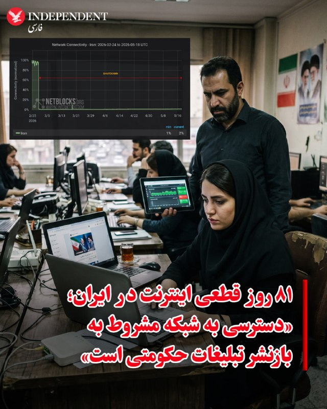

♦️ موسسه نت‌بلاکس اعلام کرد قطعی سراسری اینترنت در ایران وارد هشتادمین روز خود شده و از مرز ۱۸۹۶ ساعت عبور کرده است.

 به گفته این نهاد ناظر بر شبکه جهانی در حالی که شبکه‌های اجتماعی مملو از محتوای هم‌سو با جمهوری اسلامی شده است، کاربران ایرانی می‌گویند برای دریافت دسترسی به اینترنت «پرو»، مجبور به قبول بازنشر حداقلی از محتوای تبلیغات حکومتی هستند. نت‌بلاکس می‌گوید جمهوری اسلامی از طریق هوش مصنوعی بر این روند نظارت می‌کند.
‌🇸🇦 Indypersian

🤖 @VahidOOnLine

## VahidOOnLine — post 240915

  <a href="telegram/content/VahidOOnLine_240915_1779174373.mp4" target="_blank">🎬 Download video</a>

علی عبداللهی، فرمانده قرارگاه مرکزی حضرت خاتم‌الانبیا، در اظهاراتی خطاب به آمریکا و هم‌پیمانانش هشدار داد که «دوباره مرتکب خطای محاسباتی نشوند».

او گفت اگر «خطای دیگری» از سوی دشمنان جمهوری اسلامی رخ دهد، نیروهای مسلح ایران با «قدرت و توانایی به مراتب بالاتر از جنگ تحمیلی رمضان» با آن برخورد خواهند کرد.

این اظهارات در حالی مطرح می‌شود که در روزهای گذشته احتمال حمله نظامی به ایران افزایش یافته و دونالد ترامپ نیز دیشب گفت چند کشور عربی از او خواسته‌اند حمله‌ای «بسیار بزرگ» را برای چند روز به تعویق بیندازد.
‌🏁 🇬🇧 ManotoTV

🤖 @VahidOOnLine

## VahidOOnLine — post 240914

⭕️کیم جونگ اون دستور تقویت خطوط مرزی با کره جنوبی را صادر کرد

♦️رسانه‌های دولتی کره شمالی گزارش دادند کیم جونگ اون به فرماندهان ارشد نظامی دستور داده است یگان‌های خط مقدم را تقویت کرده و مرز جنوبی با کره جنوبی را به «دژی نفوذناپذیر» تبدیل کنند.
او در نشست فرماندهان نظامی تاکید کرد باید «نگاه به دشمن اصلی» تقویت شود؛ عبارتی که به‌طور ضمنی به کره جنوبی اشاره دارد.

به گزارش خبرگزاری رسمی کره شمالی، پیونگ‌یانگ همچنین در حال بازنگری در مفاهیم عملیاتی ارتش و توسعه توانمندی‌ها در حوزه‌های پهپادی، جنگ الکترونیک، سایبری و فضایی است؛ تحولاتی که تحلیلگران آن را متاثر از جنگ اوکراین و درگیری‌های خاورمیانه می‌دانند.

این اظهارات در شرایطی مطرح می‌شود که روابط دو کره در یکی از پرتنش‌ترین دوره‌های سال‌های اخیر قرار دارد.
‌🇸🇦 Indypersian

🤖 @VahidOOnLine

## VahidOOnLine — post 240913

  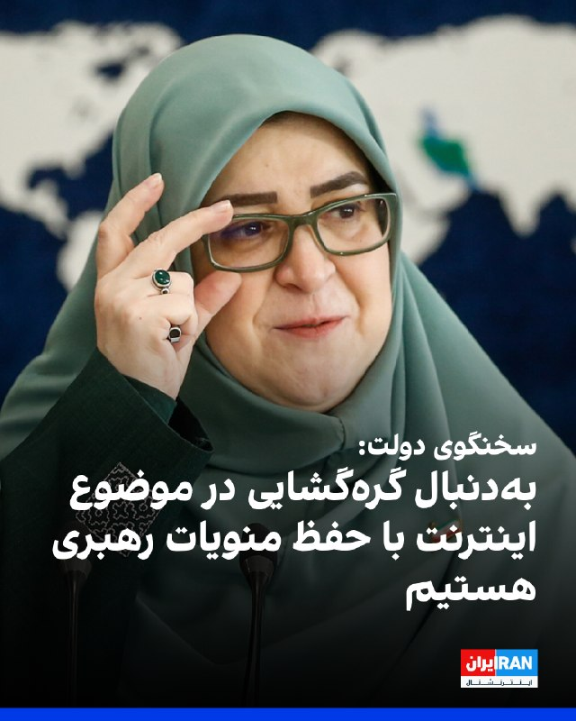

فاطمه مهاجرانی، سخنگوی دولت جمهوری اسلامی، گفت: «دولت طرفدار محدودیت در دسترسی به اینترنت نیست. نگاه دولت نگاه عادلانه است، فلذا از هرگونه تبعیضی در دسترسی به هر منبعی از جمله اینترنت دفاع نمی‌کند.»

او اضافه کرد: «به دنبال این هستیم که با حفظ همه موضوعاتی که وجود دارد، منویات مقام معظم رهبری و ملاحظاتی که وجود دارد، بتوانیم از موضوع اینترنت گره‌گشایی‌هایی کنیم تا شاهد وضعیت عادلانه‌ای باشیم.»

مهاجرانی ادامه داد: «البته این نکته را هم باید بگوییم که در شرایط جنگی قرار داریم و بدیهی است که برخی از تصمیمات ناشی از تبعات شرایط جنگی است.»
‌🏁 🇬🇧 IranintlTV

🤖 @VahidOOnLine

## VahidOOnLine — post 240912

  

♦️روزنامه نیویورک‌تایمز روز سه‌شنبه گزارش داد، جمهوری اسلامی در حال انتقال و استقرار موشک‌ها در تاسیسات زیرزمینی و بازنگری در تاکتیک‌های نظامی خود برای احتمال آغاز دور تازه‌ای از درگیری‌هاست.

بر اساس این گزارش، و به نقل از یک مقام نظامی آمریکایی، تهران در دوره آتش‌بس، ده‌ها پایگاه موشکی که پیش‌تر هدف حملات قرار گرفته بودند را دوباره فعال کرده است.
نیروهای مسلح جمهوری اسلامی همچنین شمار زیادی موشک بالستیک را در «غارها» و «مراکز نظامی» ذخیره کرده و تغییراتی در راهبرد نظامی خود برای مواجهه با هرگونه درگیری احتمالی جدید اعمال کرده است.

این تحولات در ادامه تنش‌های فزاینده میان ایران، آمریکا و اسرائیل رخ می‌دهد.
‌🇸🇦 Indypersian

🤖 @VahidOOnLine

## VahidOOnLine — post 240911

  <a href="telegram/content/VahidOOnLine_240911_1779174375.mp4" target="_blank">🎬 Download video</a>

آنا کلی، سخنگوی کاخ سفید، گفت موضع دونالد ترامپ درباره جمهوری اسلامی تغییری نکرده و رئیس‌جمهوری آمریکا همچنان برای جلوگیری از دستیابی تهران به سلاح هسته‌ای «بسیار جدی» است.

او گفت جمهوری اسلامی ۴۷ سال شعار «مرگ بر آمریکا» سر داده و نیروهای آمریکایی در خارج از کشور را تهدید کرده، هرگز نباید به سلاح هسته‌ای دست پیدا کند.

کلی افزود پیام ترامپ در شبکه تروث سوشال نشان می‌دهد او تا چه اندازه در این موضوع جدی است. به گفته او، جمهوری اسلامی اکنون با مشکلات متعددی روبه‌رو است، زیرا «ترامپ همه برگ‌ها را در دست دارد».
‌🏁 🇬🇧 ManotoTV

🤖 @VahidOOnLine

## VahidOOnLine — post 240910

♦️ مادر جاویدنام ایلیا اجاقلو، از کشته‌شدگان انقلاب ملی در زنجان، پس از مدت‌ها قطعی اینترنت در ایران، ویدیویی از مراسم زادروز ۱۸ سالگی فرزندش منتشر کرد و نوشت که آرزو داشته «۱۸ سالگی، دیپلم گرفتن و دانشگاه رفتن پسرش را ببیند، اما گلوله نامردان جان او را گرفت» تا این تولد در غیاب فرزندش برگزار شود.

جاویدنام ایلیا اجاقلو، شامگاه پنجشنبه ۱۸ دی‌ماه در جریان انقلاب ملی ایرانیان با شلیک مستقیم گلوله جنگی نیروهای سرکوبگر به قفسه سینه در مقابل کلانتری سبزه‌میدان زنجان کشته شد.
با وجود فشارهای شدید امنیتی برای معرفی این نوجوان به‌عنوان نیروی بسیج، خانواده او در برابر این خواسته‌ حکومت ایستادگی کردند.

پیش از این نیز تصاویری از مراسم خاکسپاری و چهلم ایلیا منتشر شده بود که در آن مادرش با فریاد «دامادیت مبارک» و اجرای «رقص سوگ» با فرزندش وداع کرد؛ نمادی از دادخواهی و ایستادگی خانواده‌های داغدار که رقصیدن بر مزار عزیزانشان را به پیامی قدرتمند علیه جمهوری اسلامی تبدیل کردند.
‌🇸🇦 Indypersian

🤖 @VahidOOnLine

## VahidOOnLine — post 240909

  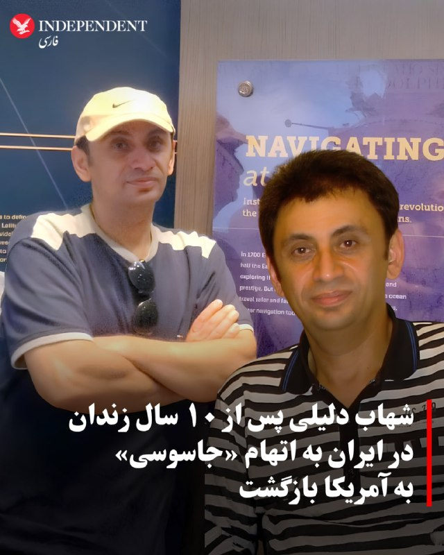

♦️سازمان «کمک به گروگان‌ها در سراسر جهان» دوشنبه شب اعلام کرد شهاب دلیلی، زندانی سیاسی و کاپیتان پیشین شرکت کشتی‌رانی ایران، پس از آزادی از زندان اوین از طریق ایروان به واشینگتن منتقل شده و به خانواده‌اش پیوسته است.
این سازمان اعلام کرد دلیلی پس از گذراندن بیش از یک دهه «بازداشت غیرقانونی» در ایران، اکنون در سلامت کامل قرار دارد.

شهاب دلیلی که ساکن آمریکا بود، سال ۱۳۹۵ خورشیدی برای مراسم خاکسپاری پدرش به تهران سفر کرده بود اما هنگام بازگشت توسط نیروهای امنیتی بازداشت شد.
خانواده او گفته بودند جمهوری اسلامی او را با اتهام‌هایی از جمله «جاسوسی» و «همکاری با دولت متخاصم» به ۱۰ سال حبس محکوم کرده است.
‌🇸🇦 Indypersian

🤖 @VahidOOnLine

## VahidOOnLine — post 240908

  

نیویورک‌تایمز به نقل از یک مقام نظامی آمریکا گزارش داد جمهوری اسلامی از آتش‌بس یک‌ماهه برای باز کردن ده‌ها محل استقرار موشک‌های بالستیکِ هدف‌قرارگرفته، جابه‌جایی پرتابگرهای متحرک موشکی و تطبیق دادن تاکتیک‌های خود برای هرگونه ازسرگیری حملات استفاده کرده است.
به گفته این مقام نظامی آمریکا، بسیاری از موشک‌های بالستیک جمهوری اسلامی در کوه‌ها و تأسیسات زیرزمینی عمیق در دل کوه‌های گرانیتی مستقر بودند.
به نوشته این گزارش، آمریکا در حملات خود عمدتاً ورودی این سایت‌ها را هدف قرار داد و با فروریختن دهانه‌ها، آنها را مدفون کرد، اما نتوانست خود تأسیسات را از بین ببرد، اما اکنون ایران بخش قابل توجهی از این سایت‌ها را دوباره باز کرده است.
یک مقام نظامی آمریکا گفت: «مقام‌های ایران بسیاری از تسلیحات باقی‌مانده خود را جابه‌جا کرده‌اند و این باور را در خود تقویت کرده‌اند که جمهوری اسلامی می‌تواند با موفقیت در برابر ایالات متحده مقاومت کند؛ چه با بستن موثر تنگه هرمز، چه با حمله به زیرساخت‌های انرژی در کشورهای همسایه خلیج فارس و چه با تهدید هواپیماهای آمریکایی.»

‌🏁 🇬🇧 IranintlTV

🤖 @VahidOOnLine

## VahidOOnLine — post 240907

  <a href="telegram/content/VahidOOnLine_240907_1779174378.mp4" target="_blank">🎬 Download video</a>

دونالد ترامپ شب گذشته گفت چند کشور به او گفته‌اند که برای «حمله‌ای بسیار بزرگ» آماده می‌شدند، اما او این حمله را برای مدتی کوتاه، و شاید برای همیشه، به تعویق انداخته است.

ترامپ گفت عربستان سعودی، قطر، امارات متحده عربی و چند کشور دیگر از او خواستند این اقدام را دو یا سه روز عقب بیندازد، زیرا به گفته او، این کشورها معتقدند مذاکرات با جمهوری اسلامی به دستیابی به توافق نزدیک شده است.

ترامپ گفت اسرائیل و دیگر طرف‌های درگیر در خاورمیانه از این تصمیم مطلع شده‌اند. او این تحول را «بسیار مثبت» خواند، اما تاکید کرد هنوز روشن نیست به نتیجه برسد یا نه.
‌🏁 🇬🇧 ManotoTV

🤖 @VahidOOnLine

## VahidOOnLine — post 240906

  <a href="telegram/content/VahidOOnLine_240906_1779174380.mp4" target="_blank">🎬 Download video</a>

پلیس سن‌دیگو اعلام کرد دو نوجوان مسلح روز دوشنبه ۲۸ اردیبهشت به سوی مرکز اسلامی سن‌دیگو تیراندازی کردند و سه مرد را کشتند. به گفته پلیس، این دو مهاجم که ۱۷ و ۱۸ ساله بودند، پس از حمله چند خیابان دورتر اقدام به خودکشی کردند. این حمله به عنوان «جرم نفرت‌محور» در دست بررسی است.

پلیس پیش از تیراندازی در جست‌وجوی یکی از این دو نوجوان بود، زیرا مادر او با پلیس تماس گرفته و گفته بود پسرش با نشانه‌های ضربه به خود از خانه خارج شده است. به گفته پلیس، هم‌زمان چند سلاح و خودروی مادر این نوجوان نیز از خانه ناپدید شده بود.
‌🏁 🇬🇧 ManotoTV

🤖 @VahidOOnLine

## VahidOOnLine — post 240905

  <a href="telegram/content/VahidOOnLine_240905_1779174380.mp4" target="_blank">🎬 Download video</a>

«رشید مظاهری صدای مردم ایران شده بود»
‌🏁 🇬🇧 ManotoTV

🤖 @VahidOOnLine

## VahidOOnLine — post 240904

  <a href="telegram/content/VahidOOnLine_240904_1779174382.mp4" target="_blank">🎬 Download video</a>

دونالد ترامپ، رئیس‌جمهوری آمریکا، در پاسخ به سوال خبرنگاران گفت چند کشور منطقه، از جمله قطر، عربستان سعودی و امارات متحده عربی، در حال گفت‌وگو با آمریکا و جمهوری اسلامی هستند و احتمال رسیدن به توافق وجود دارد.

ترامپ گفت: «این سه کشور، به‌علاوه چند کشور دیگر، با من تماس گرفتند و آن‌ها مستقیماً با مقام‌های ما و در حال حاضر با ایران در تماس هستند.»

او افزود: «به نظر می‌رسد احتمال بسیار خوبی وجود دارد که بتوانند به یک توافق برسند.»

رئیس‌جمهوری آمریکا همچنین گفت ترجیح می‌دهد بحران بدون اقدام نظامی حل شود و افزود: «اگر بتوانیم بدون اینکه آن‌ها را به‌شدت بمباران کنیم به نتیجه برسیم، بسیار خوشحال خواهم شد.
‌🏁 🇬🇧 ManotoTV

🤖 @VahidOOnLine

## VahidOOnLine — post 240903

  

سازمان «کمک به گروگان‌ها در سراسر جهان» خبر داد که شهاب دلیلی، زندانی سیاسی که از سال ۱۳۹۵ در ایران زندانی بود، پس از آزادی از زندان اوین به ایروان و سپس به واشینگتن رفته و «در سلامت کامل به خانه و کنار خانواده‌اش بازگشته است.»
این سازمان اشاره کرد که دلیلی پس از بیش از یک دهه بازداشت غیرقانونی در ایران آزاد شده است و از همه خواست که «به شهاب کمک کنند تا به راحتی به زندگی عادی بازگردد.»
شهاب دلیلی، کاپیتان پیشین شرکت کشتی‌رانی ایران و ساکن آمریکا، سال ۱۳۹۵ برای خاک‌سپاری پدرش به تهران رفت، اما هنگام بازگشت و پیش از رسیدن به فرودگاه به دست نیروهای امنیتی بازداشت و زندانی شد.
خانواده دلیلی گفته بودند جمهوری اسلامی او را به اتهام «جاسوسی» و «همکاری با دولت متخاصم» یعنی آمریکا، به ۱۰ سال حبس محکوم کرده است.

‌🏁 🇬🇧 IranintlTV

🤖 @VahidOOnLine

## VahidOOnLine — post 240902

  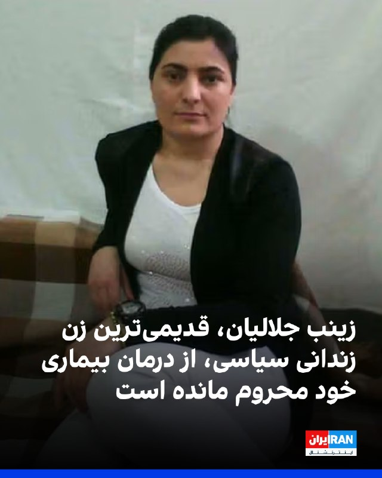

شبکه حقوق بشر کردستان در گزارشی نوشت زینب جلالیان، قدیمی‌ترین و تنها زن زندانی سیاسی محکوم به حبس ابد در ایران، در بیستمین سال حبس خود از درمان بیماری محروم مانده است.
این سازمان حقوق بشری اشاره کرد که جلالیان از «فیبروم رحمی» رنج می‌برد و با وجود توصیه پزشکان برای اعزام به مراکز درمانی و پیگیری نتایج عمل آمبولیزاسیون، همچنان به بهانه توقف اعزام زندانیان به مراکز درمانی خارج از زندان در پی جنگ، در شرایط سخت جسمی نگهداری می‌شود.
یک منبع مطلع به شبکه حقوق بشر کردستان گفت: «این زندانی سیاسی در اوایل مهر سال گذشته، پس از درخواست‌ مکرر‌ نهادهای حقوق بشری و افزایش فشارهای بین‌المللی، در حالی که ماه‌ها از فیبروم رحمی رنج می‌برد، در یکی از مراکز درمانی خارج از زندان یزد تحت عمل آمبولیزاسیون فیبروم قرار گرفت. با این حال، تنها ۲۴ ساعت پس از عمل و پیش از تکمیل دوره درمان، به زندان بازگردانده شد.»
به گفته این منبع آگاه، در ماه‌های گذشته با وجود انجام عمل جراحی، خونریزی و دردهای شکمی زینب جلالیان به‌طور نگران‌کننده‌ای ادامه داشته و این زندانی سیاسی هم‌زمان دچار کم‌خونی شدید نیز شده است.

‌🏁 🇬🇧 IranintlTV

🤖 @VahidOOnLine

## VahidOOnLine — post 240901

  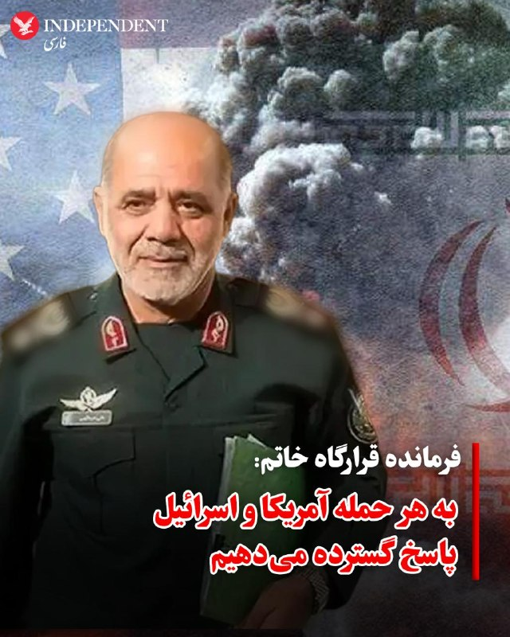

♦️علی عبداللهی، فرمانده قرارگاه مرکزی خاتم‌الانبیا، در واکنش به اظهارات دونالد ترامپ، رئیس‌جمهوری آمریکا، درباره تعویق حملات به ایران، به آمریکا و اسرائیل هشدار داد که مرتکب اشتباه راهبردی و خطای محاسباتی نشوند.
عبداللهی گفت نیروهای مسلح ما نسبت به گذشته «آماده‌تر و قوی‌تر» هستند و هرگونه تعرض یا تجاوز مجدد را «سریع، قاطع، پرقدرت و گسترده» پاسخ خواهند داد.
اوگفت: «چنانچه خطای دیگری از سوی دشمنانمان سر بزند با قدرت و توانایی به مراتب بالاتر از جنگ تحمیلی رمضان با آن برخورد خواهیم نمود و دست هر متجاوزی را قطع می‌کنیم.»
‌🇸🇦 Indypersian

🤖 @VahidOOnLine

## WithYashar — post 11621

## WithYashar — post 11620

  <a href="telegram/content/WithYashar_11620_1779174385.webm" target="_blank">🎬 Download video</a>

🎬 Video

## WithYashar — post 11619

نیویورک تایمز: در صورت ازسرگیری جنگ، ایران ممکنه تاکتیک‌های جدیدی به کار بگیره.
@withyashar

## WithYashar — post 11618

گزارش فایننشال تایمز: شی جین‌پینگ، رئیس جمهور چین، به ترامپ گفته است که پوتین از تصمیم خود برای حمله به اوکراین پشیمان است. از سوی دیگر، اشاره شد که ترامپ به شی گفته است که ایالات متحده، چین و روسیه باید علیه دادگاه بین‌المللی کیفری در لاهه با هم همکاری کنند زیرا این دادگاه «سیاسی عمل می‌کند»
@withyashar

## mwarmonitor — post 9290

🔸باراک راوید خبرنگار آکسیوس:

🚨 پشت‌پرده: به گفته دو منبع آگاه، ترامپ در ۲۴ ساعت پیش از اعلام موضعش، با رهبران عربستان سعودی، قطر و امارات متحده عربی به‌صورت تلفنی گفت‌وگو کرده است.

🚨 یک مقام آمریکایی گفت: «پیام واحدی از دوحه، ابوظبی و ریاض منتقل شد؛ در این مضمون که به مذاکرات فرصت بدهید، چون اگر به ایران حمله کنید، همه ما بهای آن را خواهیم پرداخت.»

🚨 یک منبع آگاه دیگر گفت ترامپ به برخی از متحدان سیاسی تندروِ خود گفته است که این سه رهبر عرب به او گفته‌اند: «آن‌ها نمی‌خواهند تأسیسات نفت و انرژی‌شان در نتیجه تلافی‌جویی ایران هدف قرار بگیرد.»

@mwarmonitor

## mwarmonitor — post 9289

🔴«به گزارش منابع، ترامپ بخشی از حملات بیشتر علیه ایران را متوقف کرد؛ اقدامی که تا حدی به‌دلیل نگرانی‌های پنتاگون بود مبنی بر اینکه تهران در حال مؤثرتر شدن در ردیابی عملیات‌های هوایی آمریکا و بهبود پدافند هوایی خود است.»

🔸«نیویورک‌تایمز گزارش می‌دهد که پنتاگون معتقد بود ایران در جریان درگیری به‌سرعت در حال تطبیق است؛ الگوهای پروازی آمریکا را بررسی می‌کند، پدافند هوایی خود را بهبود می‌بخشد و عنصر غافلگیری در حملات آمریکا را کاهش می‌دهد.»

@mwarmonitor

## pm_afshaa — post 91014

🔴ترامپ: ما با محاصره دریایی، دیوار فولادی دور ایران ساخته‌ایم

💧 Rainbet.com the #1 Non-KYC Crypto Casino & Sportsbook @rainbetcom

😁 @Pm_Afshaa

## pm_afshaa — post 91013

🔴طبق گزارش رسانه های آمریکایی،
نیروی هوایی آمریکا در حال حاضر در حالت آماده‌باش کامل از اروپا تا خاورمیانه است،زیرا گزارش‌هایی منتشر شده که ارتش اسرائیل در حال آماده‌سازی برای
جنگ یکجانبه علیه ایران است

💧 Rainbet.com the #1 Non-KYC Crypto Casino & Sportsbook @rainbetcom

😁 @Pm_Afshaa

## mamlekate — post 103556

  

📝 کاخ سفید: تحویل اورانیوم غنی‌شده خط قرمز ترامپ است

📝 ترامپ به درخواست عربستان سعودی، امارات متحده عربی و قطر حمله برنامه‌ریزی شده در روز سه‌شنبه را تعلیق کرد

دونالد ترامپ، رئیس‌جمهوری آمریکا روز دوشنبه گفت قصد داشته است «سه‌شنبه» به ایران حمله کند، اما برای دادن فرصت دوباره به مذاکرات، اجرای آن را متوقف کرده است. او گفت این تصمیم را به درخواست چندین رهبر عربی گرفته است.

📝 ترامپ: خوشحال می‌شوم بدون بمباران وحشتناک ایران به نتیجه برسیم

دونالد ترامپ، رییس‌‌جمهوری آمریکا، دوشنبه ۲۸ اردیبهشت اعلام کرد که حمله برنامه‌ریزی‌شده سه‌شنبه به جمهوری اسلامی را متوقف کرده تا فرصتی برای انجام مذاکرات برای پایان دادن به جنگ فراهم شود؛ اقدامی که پس از ارسال یک پیشنهاد جدید صلح از سوی تهران به واشینگتن صورت گرفته است.

@mamlekate

## IranIntlTV — post 337881

  

فاطمه مهاجرانی، سخنگوی دولت جمهوری اسلامی، گفت: «دولت طرفدار محدودیت در دسترسی به اینترنت نیست. نگاه دولت نگاه عادلانه است، فلذا از هرگونه تبعیضی در دسترسی به هر منبعی از جمله اینترنت دفاع نمی‌کند.»

او اضافه کرد: «به دنبال این هستیم که با حفظ همه موضوعاتی که وجود دارد، منویات مقام معظم رهبری و ملاحظاتی که وجود دارد، بتوانیم از موضوع اینترنت گره‌گشایی‌هایی کنیم تا شاهد وضعیت عادلانه‌ای باشیم.»

مهاجرانی ادامه داد: «البته این نکته را هم باید بگوییم که در شرایط جنگی قرار داریم و بدیهی است که برخی از تصمیمات ناشی از تبعات شرایط جنگی است.»
https://iranintl.com/202605195275

## IranIntlTV — post 337880

  <a href="telegram/content/IranIntlTV_337880_1779174387.mp4" target="_blank">🎬 Download video</a>

تام کاتن، سناتور جمهوری‌خواه آمریکا، گفت: «جمهوری اسلامی هیچ‌گاه در مذاکرات هسته‌ای جدی نبوده و از گفت‌وگوها به عنوان ابزاری برای وقت‌کشی استفاده کرده است.»
@iranintltv

## IranIntlTV — post 337879

  <a href="telegram/content/IranIntlTV_337879_1779174388.mp4" target="_blank">🎬 Download video</a>

خبرگزاری رویترز به نقل از منابع آگاه گزارش داد پاکستان در چارچوب پیمان دفاعی خود با عربستان سعودی، ۸ هزار نیروی نظامی به این کشور اعزام کرده است.

گزارش جواد همدانی، خبرنگار ایران‌اینترنشنال
@iranintltv

## IranIntlTV — post 337878

  <a href="https://t.me/IranintlTV/337878" target="_blank">📎 Download file</a>

🎧نسخه صوتی اخبار بامدادی | سه‌شنبه ۲۹ اردیبهشت
@iranintlTV

## IranIntlTV — post 337877

  <a href="telegram/content/IranIntlTV_337877_1779174390.mp4" target="_blank">🎬 Download video</a>

لیندزی گراهام، سناتور جمهوری‌خواه، تاکید کرد: «خط پایانی برای مذاکرات با جمهوری اسلامی و رسیدن به توافق وجود ندارد، زیرا حکومت ایران هر روز این خط پایان را تغییر می‌دهد.»

جزییات بیشتر با مرضیه حسینی، خبرنگار ایران‌اینترنشنال
@iranintltv

## IranIntlTV — post 337876

  <a href="telegram/content/IranIntlTV_337876_1779174391.mp4" target="_blank">🎬 Download video</a>

آکسیوس به نقل از یک مقام ارشد آمریکایی گزارش داد پیشنهاد تازه جمهوری اسلامی در مقایسه با نسخه‌های قبلی تنها شامل تغییرات جزئی است و در آن، تعهد مشخصی درباره توقف غنی‌سازی اورانیوم یا واگذاری ذخایر اورانیوم با غنای بالا دیده نمی‌شود.

گزارش مریم رحمتی، خبرنگار ایران‌اینترنشنال
@iranintltv

## IranIntlTV — post 337875

  <a href="telegram/content/IranIntlTV_337875_1779174393.mp4" target="_blank">🎬 Download video</a>

سازمان عفو بین‌الملل اعلام کرد شمار اعدام‌ها در جهان در سال ۲۰۲۵ به بالاترین سطح ثبت‌شده در ۴۴ سال گذشته رسیده و اعدام‌های انجام شده به‌دست جمهوری اسلامی، اصلی‌ترین عامل این افزایش بوده است.

گفت‌وگو با محمد اولیایی‌فرد، وکیل دادگستری و عضو اتحادیه بین‌المللی وکلا
@iranintltv

## IranIntlTV — post 337874

  <a href="telegram/content/IranIntlTV_337874_1779174394.mp4" target="_blank">🎬 Download video</a>

رییس پلیس سن‌‌دیگو اعلام کرد شمار کشته‌شدگان در یک تیراندازی در بزرگ‌ترین مسجد این شهر در ایالت کالیفرنیا، به ۵ نفر رسیده است.

گزارش نیلوفر منصوری، خبرنگار ایران‌اینترنشنال
@iranintltv

## IranIntlTV — post 337873

  

نیویورک‌تایمز به نقل از یک مقام نظامی آمریکا گزارش داد جمهوری اسلامی از آتش‌بس یک‌ماهه برای باز کردن ده‌ها محل استقرار موشک‌های بالستیکِ هدف‌قرارگرفته، جابه‌جایی پرتابگرهای متحرک موشکی و تطبیق دادن تاکتیک‌های خود برای هرگونه ازسرگیری حملات استفاده کرده است.
به گفته این مقام نظامی آمریکا، بسیاری از موشک‌های بالستیک جمهوری اسلامی در کوه‌ها و تأسیسات زیرزمینی عمیق در دل کوه‌های گرانیتی مستقر بودند.
به نوشته این گزارش، آمریکا در حملات خود عمدتاً ورودی این سایت‌ها را هدف قرار داد و با فروریختن دهانه‌ها، آنها را مدفون کرد، اما نتوانست خود تأسیسات را از بین ببرد، اما اکنون ایران بخش قابل توجهی از این سایت‌ها را دوباره باز کرده است.
یک مقام نظامی آمریکا گفت: «مقام‌های ایران بسیاری از تسلیحات باقی‌مانده خود را جابه‌جا کرده‌اند و این باور را در خود تقویت کرده‌اند که جمهوری اسلامی می‌تواند با موفقیت در برابر ایالات متحده مقاومت کند؛ چه با بستن موثر تنگه هرمز، چه با حمله به زیرساخت‌های انرژی در کشورهای همسایه خلیج فارس و چه با تهدید هواپیماهای آمریکایی.»

https://iranintl.com/202605194899

## IranIntlTV — post 337872

  <a href="telegram/content/IranIntlTV_337872_1779174396.mp4" target="_blank">🎬 Download video</a>

جاویدنامان انقلاب ملی ایرانیان
«منصوره حیدری و همسرش بهروز منصوری»، در ۱۸ دی‌ماه در جریان اعتراضات در خیابان عاشوری شهر بوشهر، با شلیک گلوله‌های جنگی نیروهای سرکوب جمهوری اسلامی کشته شدند. نامشان در حافظه‌ی این سرزمین می‌ماند و یادشان چراغ راه آزادی‌خواهان است.

@iranintltv

## IranIntlTV — post 337871

  <a href="telegram/content/IranIntlTV_337871_1779174398.mp4" target="_blank">🎬 Download video</a>

سرخط خبرهای سه‌شنبه ۲۹ اردیبهشت
@iranintltv

## IranIntlTV — post 337870

  

سازمان «کمک به گروگان‌ها در سراسر جهان» خبر داد که شهاب دلیلی، زندانی سیاسی که از سال ۱۳۹۵ در ایران زندانی بود، پس از آزادی از زندان اوین به ایروان و سپس به واشینگتن رفته و «در سلامت کامل به خانه و کنار خانواده‌اش بازگشته است.»
این سازمان اشاره کرد که دلیلی پس از بیش از یک دهه بازداشت غیرقانونی در ایران آزاد شده است و از همه خواست که «به شهاب کمک کنند تا به راحتی به زندگی عادی بازگردد.»
شهاب دلیلی، کاپیتان پیشین شرکت کشتی‌رانی ایران و ساکن آمریکا، سال ۱۳۹۵ برای خاک‌سپاری پدرش به تهران رفت، اما هنگام بازگشت و پیش از رسیدن به فرودگاه به دست نیروهای امنیتی بازداشت و زندانی شد.
خانواده دلیلی گفته بودند جمهوری اسلامی او را به اتهام «جاسوسی» و «همکاری با دولت متخاصم» یعنی آمریکا، به ۱۰ سال حبس محکوم کرده است.

https://iranintl.com/202605195182

## IranIntlTV — post 337869

  

شبکه حقوق بشر کردستان در گزارشی نوشت زینب جلالیان، قدیمی‌ترین و تنها زن زندانی سیاسی محکوم به حبس ابد در ایران، در بیستمین سال حبس خود از درمان بیماری محروم مانده است.
این سازمان حقوق بشری اشاره کرد که جلالیان از «فیبروم رحمی» رنج می‌برد و با وجود توصیه پزشکان برای اعزام به مراکز درمانی و پیگیری نتایج عمل آمبولیزاسیون، همچنان به بهانه توقف اعزام زندانیان به مراکز درمانی خارج از زندان در پی جنگ، در شرایط سخت جسمی نگهداری می‌شود.
یک منبع مطلع به شبکه حقوق بشر کردستان گفت: «این زندانی سیاسی در اوایل مهر سال گذشته، پس از درخواست‌ مکرر‌ نهادهای حقوق بشری و افزایش فشارهای بین‌المللی، در حالی که ماه‌ها از فیبروم رحمی رنج می‌برد، در یکی از مراکز درمانی خارج از زندان یزد تحت عمل آمبولیزاسیون فیبروم قرار گرفت. با این حال، تنها ۲۴ ساعت پس از عمل و پیش از تکمیل دوره درمان، به زندان بازگردانده شد.»
به گفته این منبع آگاه، در ماه‌های گذشته با وجود انجام عمل جراحی، خونریزی و دردهای شکمی زینب جلالیان به‌طور نگران‌کننده‌ای ادامه داشته و این زندانی سیاسی هم‌زمان دچار کم‌خونی شدید نیز شده است.

https://iranintl.com/202605192761

## ManotoTV — post 105624

  <a href="telegram/content/ManotoTV_105624_1779174400.mp4" target="_blank">🎬 Download video</a>

علی عبداللهی، فرمانده قرارگاه مرکزی حضرت خاتم‌الانبیا، در اظهاراتی خطاب به آمریکا و هم‌پیمانانش هشدار داد که «دوباره مرتکب خطای محاسباتی نشوند».

او گفت اگر «خطای دیگری» از سوی دشمنان جمهوری اسلامی رخ دهد، نیروهای مسلح ایران با «قدرت و توانایی به مراتب بالاتر از جنگ تحمیلی رمضان» با آن برخورد خواهند کرد.

این اظهارات در حالی مطرح می‌شود که در روزهای گذشته احتمال حمله نظامی به ایران افزایش یافته و دونالد ترامپ نیز دیشب گفت چند کشور عربی از او خواسته‌اند حمله‌ای «بسیار بزرگ» را برای چند روز به تعویق بیندازد.

## ManotoTV — post 105623

  <a href="telegram/content/ManotoTV_105623_1779174401.mp4" target="_blank">🎬 Download video</a>

آنا کلی، سخنگوی کاخ سفید، گفت موضع دونالد ترامپ درباره جمهوری اسلامی تغییری نکرده و رئیس‌جمهوری آمریکا همچنان برای جلوگیری از دستیابی تهران به سلاح هسته‌ای «بسیار جدی» است.

او گفت جمهوری اسلامی ۴۷ سال شعار «مرگ بر آمریکا» سر داده و نیروهای آمریکایی در خارج از کشور را تهدید کرده، هرگز نباید به سلاح هسته‌ای دست پیدا کند.

کلی افزود پیام ترامپ در شبکه تروث سوشال نشان می‌دهد او تا چه اندازه در این موضوع جدی است. به گفته او، جمهوری اسلامی اکنون با مشکلات متعددی روبه‌رو است، زیرا «ترامپ همه برگ‌ها را در دست دارد».

## ManotoTV — post 105622

  <a href="telegram/content/ManotoTV_105622_1779174402.mp4" target="_blank">🎬 Download video</a>

دونالد ترامپ شب گذشته گفت چند کشور به او گفته‌اند که برای «حمله‌ای بسیار بزرگ» آماده می‌شدند، اما او این حمله را برای مدتی کوتاه، و شاید برای همیشه، به تعویق انداخته است.

ترامپ گفت عربستان سعودی، قطر، امارات متحده عربی و چند کشور دیگر از او خواستند این اقدام را دو یا سه روز عقب بیندازد، زیرا به گفته او، این کشورها معتقدند مذاکرات با جمهوری اسلامی به دستیابی به توافق نزدیک شده است.

ترامپ گفت اسرائیل و دیگر طرف‌های درگیر در خاورمیانه از این تصمیم مطلع شده‌اند. او این تحول را «بسیار مثبت» خواند، اما تاکید کرد هنوز روشن نیست به نتیجه برسد یا نه.

## ManotoTV — post 105621

  <a href="telegram/content/ManotoTV_105621_1779174404.mp4" target="_blank">🎬 Download video</a>

پلیس سن‌دیگو اعلام کرد دو نوجوان مسلح روز دوشنبه ۲۸ اردیبهشت به سوی مرکز اسلامی سن‌دیگو تیراندازی کردند و سه مرد را کشتند. به گفته پلیس، این دو مهاجم که ۱۷ و ۱۸ ساله بودند، پس از حمله چند خیابان دورتر اقدام به خودکشی کردند. این حمله به عنوان «جرم نفرت‌محور» در دست بررسی است.

پلیس پیش از تیراندازی در جست‌وجوی یکی از این دو نوجوان بود، زیرا مادر او با پلیس تماس گرفته و گفته بود پسرش با نشانه‌های ضربه به خود از خانه خارج شده است. به گفته پلیس، هم‌زمان چند سلاح و خودروی مادر این نوجوان نیز از خانه ناپدید شده بود.

## ManotoTV — post 105620

  <a href="telegram/content/ManotoTV_105620_1779174404.mp4" target="_blank">🎬 Download video</a>

«رشید مظاهری صدای مردم ایران شده بود»

## ManotoTV — post 105619

  <a href="telegram/content/ManotoTV_105619_1779174405.mp4" target="_blank">🎬 Download video</a>

دونالد ترامپ، رئیس‌جمهوری آمریکا، در پاسخ به سوال خبرنگاران گفت چند کشور منطقه، از جمله قطر، عربستان سعودی و امارات متحده عربی، در حال گفت‌وگو با آمریکا و جمهوری اسلامی هستند و احتمال رسیدن به توافق وجود دارد.

ترامپ گفت: «این سه کشور، به‌علاوه چند کشور دیگر، با من تماس گرفتند و آن‌ها مستقیماً با مقام‌های ما و در حال حاضر با ایران در تماس هستند.»

او افزود: «به نظر می‌رسد احتمال بسیار خوبی وجود دارد که بتوانند به یک توافق برسند.»

رئیس‌جمهوری آمریکا همچنین گفت ترجیح می‌دهد بحران بدون اقدام نظامی حل شود و افزود: «اگر بتوانیم بدون اینکه آن‌ها را به‌شدت بمباران کنیم به نتیجه برسیم، بسیار خوشحال خواهم شد.

## FarsiVOA — post 218114

🔺بازگشایی قرمز بورس تهران پس از ۸۰ روز توقف؛ صف فروش سنگین در نخستین روز معاملات

▪️بورس تهران پس از ۸۰ روز توقف معاملات سهام، روز سه‌شنبه ۲۹ اردیبهشت ۱۴۰۵ بازگشایی شد؛ اما نخستین روز معاملات بیشتر از آن‌که نشانه بازگشت عادی بازار باشد، تصویری از فشار فروش، احتیاط سهامداران و تداوم ابهام پس از جنگ ارائه داد.

▪️با وجود بازگشایی بازار، معاملات کامل از سر گرفته نشد و ۴۲ نماد بزرگ، که حدود ۳۵ درصد ارزش بازار را تشکیل می‌دهند، متأثر از آسیب‌های ناشی از جنگ همچنان بسته ماندند.

▪️توقف معاملات سهام از ۹ اسفندآغاز شد، اما در این مدت همه بخش‌های بازار سرمایه تعطیل نبودند. معاملات صندوق‌های درآمد ثابت، صندوق‌های طلا، صندوق‌های املاک و مستغلات و گواهی سپرده ادامه داشت.

⬇️ بیشتر بخوانید:
https://ir.voanews.com/a/8151588.html

## FarsiVOA — post 218113

🔺بلومبرگ: اتحادیه اروپا به‌دنبال نهایی‌کردن توافق تجاری با آمریکا است

▪️بلومبرگ گزارش داد مقام‌های اتحادیه اروپا تلاش می‌کنند قانون لازم برای اجرای توافق تجاری با آمریکا را نهایی کنند؛ توافقی که بروکسل امیدوار است با آن از موج تازه تعرفه‌های ترامپ علیه کالاهای اروپایی جلوگیری کند.

▪️ترامپ پیش‌تر هشدار داده بود اگر اتحادیه اروپا تعهدات توافق تجاری سال گذشته را اجرا نکند، تعرفه خودروهای اروپایی از ۱۵ درصد به ۲۵ درصد افزایش می‌یابد.

▪️رویترز گزارش داده است مذاکره‌کنندگان اروپایی برای جلوگیری از افزایش تعرفه‌ها، در تلاش‌اند متن مشترکی درباره حذف تعرفه کالاهای آمریکایی نهایی کنند.

▪️افزایش تعرفه خودرو به ۲۵ درصد، بیش از همه صنعت خودروسازی اروپا، به‌ویژه آلمان، را تهدید می‌کند.

⬇️ بیشتر بخوانید:
https://ir.voanews.com/a/8151587.html

## FarsiVOA — post 218112

  

استرالیا از خرید سه محموله سوخت جت از چین و مقدار بیشتری اوره کشاورزی از برونئی خبر داد

دولت استرالیا روز سه‌شنبه اعلام کرد که پس از گفت‌وگوهای میان نخست‌وزیر آنتونی آلبانیزی و نخست‌وزیر چین لی چیانگ، بیش از ۶۰۰ هزار بشکه، معادل حدود ۱۰۰ میلیون لیتر، سوخت جت از اوایل ماه ژوئن وارد خواهد شد.

پکن پس از بسته شدن تنگه هرمز که جریان نفت خام و سوخت را مختل کرده، برای حفاظت از ذخایر داخلی خود، صادرات سوخت را محدود کرده بود.

دولت استرالیا همچنین اعلام کرد که ۳۸ هزار و ۵۰۰ تُن اوره از برونئی برای حمایت از کشاورزان و بخش کشاورزی تأمین کرده است.

هر دو محموله سوخت و کود به ارزش ۷.۵ میلیارد دلار استرالیا (۵.۳۶ میلیارد دلار آمریکا) تأمین شده‌اند.

استرالیا در مقابله با فشارهای تأمین ایجاد شده ناشی از انسداد تنگه هرمز، سازوکاری برای کمک به صنایع کشاورزی و حمل‌ونقل و از طریق ارائه وام، بیمه و کمک مالی ایجاد کرده است.
@FarsiVOA

## FarsiVOA — post 218111

  

وزارت خزانه‌داری آمریکا اعلام کرد شرکت آدانی اینترپرایزس، مستقر در احمدآباد هند، با پرداخت ۲۷۵ میلیون دلار برای حل‌وفصل مسئولیت احتمالی مدنی خود در ارتباط با نقض تحریم‌های ایران موافقت کرده است.

دفتر کنترل دارایی‌های خارجی وزارت خزانه‌داری آمریکا، اوفک، اعلام کرد این توافق مربوط به ۳۲ مورد نقض احتمالی تحریم‌های ایران است. به گفته اوفک، آدانی اینترپرایزس از نوامبر ۲۰۲۳ تا ژوئن ۲۰۲۵ محموله‌های گاز مایع، ال‌پی‌جی، را از یک تاجر مستقر در دبی خریداری کرده بود که مدعی بود این محموله‌ها از عمان و عراق تأمین شده‌اند، اما نشانه‌هایی وجود داشت که منشأ واقعی آنها ایران بوده است.

بر اساس اعلام وزارت خزانه‌داری آمریکا، این شرکت در این دوره باعث شد مؤسسات مالی آمریکایی ۳۲ پرداخت دلاری به ارزش حدود ۱۹۲ میلیون دلار را برای این محموله‌ها پردازش کنند.

رویترز نیز گزارش داد این پرونده در ادامه بررسی‌های آمریکا درباره خرید گاز مایع با منشأ ایرانی از طریق مسیرهای واسطه‌ای مطرح شده بود. آدانی پیش‌تر هرگونه دور زدن عمدی تحریم‌ها را رد کرده بود.
@FarsiVOA

## FarsiVOA — post 218110

  

ارتش اسرائیل اعلام کرد که صبح سه‌شنبه یک موشک رهگیر به‌سوی یک پهپاد متعلق به حزب‌الله، بر فراز منطقه‌ای در جنوب لبنان شلیک کرده است.

بر اساس گزارش ارتش اسرائیل، این پهپاد در مدت کوتاهی بر فراز محل استقرار نیروهای نظامی اسرائیل شناسایی شد.

در این حادثه هیچ گزارشی از زخمی شدن افراد منتشر نشده است.
@FarsiVOA

## DW_Farsi — post 124858

🔶 حمله مرگبار به مرکز اسلامی سن دیگو چند کشته به جای گذاشت
 
در پی حمله و تیراندازی به یک مرکز اسلامی در سن دیگو در ایالت کالیفرنیا که روز دوشنبه ۱۸ مه (۲۸ اردیبهشت) روی داد، سه نفر کشته شدند. طبق اعلام پلیس یکی از قربانیان، نگهبان این مرکز بوده است. رسانه‌ها گزارش داده‌اند که دو فرد دیگر از کارکنان این مرکز اسلامی بوده‌اند که افزون بر بزرگ‌ترین مسجد سن دیگو، یک مدرسه را نیز در برمی‌گرفته است.
 
به گفته اسکات وال، رئیس پلیس سن دیگو، فرد نگهبان "نقشی تعیین‌کننده" داشته که این حمله "پیامدهای به مراتب بدتری" به همراه نداشته است. مأموران پلیس جسد کشته‌شدگان را جلوی ساختمان این مرکز پیدا کردند.
 
همچنین اعلام شد که جسد دو فرد مظنون در یک خودروی پارک‌شده پیدا شده است؛ دو جوان ۱۷ و ۱۹ ساله که پس از انجام حمله دست به خودکشی زده‌اند.
 
پلیس سن دیگو اعلام کرد، از آنجایی که حمله، به یک مؤسسه مذهبی صورت گرفته، این حادثه به عنوان "جنایت ناشی از نفرت" در دست بررسی است و از این رو کارآگاهان پلیس فدرال ایالات متحده (اف بی‌آی) نیز در بررسی‌ها و تحقیقات مشارکت دارند.
 
رئیس پلیس سن دیگو افزود، مادر یکی از دو جوان مظنون حدود دو ساعت پیش از وقوع این حمله مرگبار با پلیس تماس گرفته تا مفقود شدن پسرش را به مأموران اطلاع دهد. به گفته پلیس، او نگران بوده که فرزندش دست به خودکشی بزند و سپس متوجه شده که چندین سلاح موجود در خانه و همچنین خودروی او ناپدید شده است.
 
@dw_farsi

## DW_Farsi — post 124857

  

🔶 تعویق حمله به ایران؛ تشکیل جلسه ترامپ با تیم ارشد در روز سه‌شنبه
 
سایت خبری اکسیوس شامگاه دوشنبه ۱۸ مه (۲۸ اردیبهشت) در گزارشی به اعلام به تعویق افتادن حمله ایالات متحده به ایران از سوی دونالد ترامپ پرداخت و به نقل از دو مقام آگاه آمریکایی نوشت، انتظار می‌رود که رئیس‌جمهور آمریکا روز سه‌شنبه ۱۹ مه با تیم ارشد امنیت ملی خود در اتاق وضعیت تشکیل جلسه دهد تا گزینه‌های نظامی [علیه جمهوری اسلامی] را مورد بحث و بررسی قرار دهد.
 
به نوشته اکسیوس ترامپ از زمان آغاز جنگ در ماه فوریه تا کنون "دست کم شش بار ضرب‌الاجل‌های اعلام‌شده را تمدید کرده و حمله‌های برنامه‌ریزی شده علیه جمهوری اسلامی را به تعویق انداخته است".
 
ترامپ عصر دوشنبه با انتشار پستی در شبکه اجتماعی خود، تروث سوشال اعلام کرد، ایالات متحده حمله نظامی "برنامه‌ریزی‌شده" علیه ایران را که قرار بود روز سه‌شنبه انجام شود، "اجرا نخواهد کرد".
 
@dw_farsi

## Persian_Trend_Official — post 14466

لینک اسپاتیفای لایو دیشب :

https://open.spotify.com/episode/6bpS3p3rcr8qKiJrfEaSaM?si=JvUGVU-RQ7WWFDKd7fnxMA

## Persian_Trend_Official — post 14465

🔴هشدار آژانس انرژی درباره ذخایر نفت

💢فاتح بیرول، رئیس آژانس بین‌المللی انرژی، اعلام کرد آزادسازی ذخایر راهبردی نفت روزانه حدود ۲.۵ میلیون بشکه به بازار اضافه کرده است، اما این ذخایر نامحدود نیستند.

▪️او همچنین گفت میان وضعیت بازار فیزیکی نفت و معاملات آتی شکاف ادراکی وجود دارد؛ به این معنا که قیمت‌گذاری در بازارهای مالی الزاماً فشار واقعی موجود در عرضه فیزیکی را به‌طور کامل منعکس نمی‌کند.

💢بیرول در ادامه هشدار داد که ذخایر تجاری نفت با سرعت زیادی در حال کاهش است و تنها چند هفته تا افت بیشتر این ذخایر باقی مانده است.

🫆:Tony

📌 @persian_trend_official
پرشین ترند | متفاوت‌ترین کانال نظامی

## Persian_Trend_Official — post 14464

🔴 سنای آمریکا فردا برای هشتمین بار درباره پایان جنگ ایران رأی‌گیری می‌کند

💢بر اساس گزارش‌ها، سنای آمریکا قرار است فردا برای هشتمین بار درباره طرح «اختیارات جنگی» با هدف پایان‌دادن به جنگ با ایران رأی‌گیری کند.

▪️ این رأی‌گیری‌ها از زمان آغاز جنگ تقریباً به‌صورت هفتگی در جریان بوده است

💢طرح اختیارات جنگی با هدف محدودکردن ادامه عملیات نظامی بدون مجوز رسمی کنگره مطرح شده، اما تاکنون تمام تلاش‌ها برای تصویب آن ناکام مانده است.

🫆:Tony

📌 @persian_trend_official
پرشین ترند | متفاوت‌ترین کانال نظامی

## RadioFarda — post 157330

  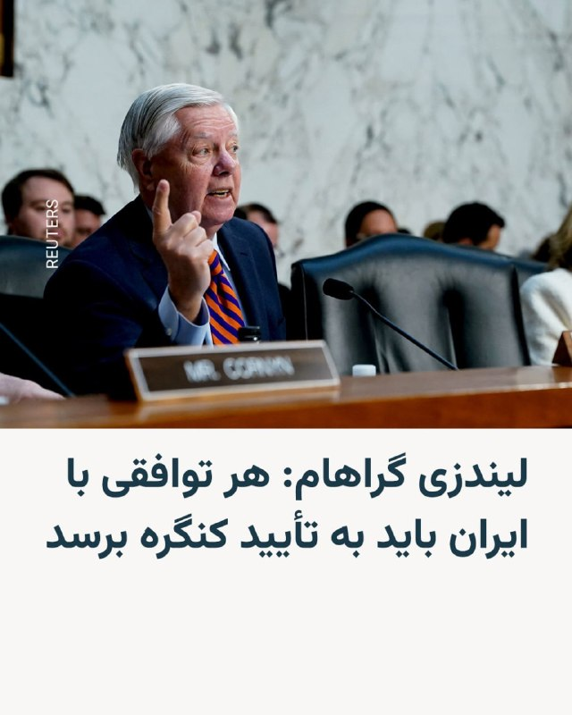

🔸لیندزی گراهام، سناتور جمهوری‌خواه نزدیک به دونالد ترامپ، برای چندمین‌بار گفت که هرگونه توافق میان ایالات متحده و ایران باید به تأیید کنگره برسد.

🔸تأکید دوباره او در این زمینه پس از آن صورت گرفت که دونالد ترامپ اعلام کرد به درخواست رهبران چند کشور عربی حاشیه خلیج فارس، حملهٔ برنامه‌ریزی شده روز ‌سه‌شنبه به ایران را به تعویق انداخته ‌است.

🔸گراهام در واکنش در شبکهٔ ایکس نوشت که هر توافقی میان تهران و واشینگتن «باید، همانند برجام در دوران ریاست‌جمهوری باراک اوباما، برای تأیید به کنگره ارائه شود».

🔸او با ابراز تردید نسبت به احتمال دستیابی توافق با جمهوری اسلامی، با این حال اضافه کرد: «اگر بتوانیم از طریق راهکارهای دیپلماتیک و در چارچوب تحقق اهداف امنیت ملی‌مان به این درگیری پایان دهیم، این یک دستاورد بزرگ خواهد بود».

@RadioFarda

## RadioFarda — post 157329

ترامپ می‌گوید به درخواست رهبران عرب خلیج فارس حمله سه‌شنبه به ایران را عقب انداخت

🔸دونالد ترامپ، رئیس جمهور آمریکا، روز دوشنبه ۲۸ اردیبهشت خبر داد حملهٔ تازه‌ به ایران را که برای روز سه‌شنبه ۲۹ اردیبهشت برنامه‌ریزی شده بود، فعلاً به عقب می‌اندازد.

🔸پیش‌تر چنین حمله‌ای به‌طور رسمی اعلام نشده بود و خبرگزاری رویترز نوشته که نتوانسته است مشخص کند آیا واقعاً مقدمات حملاتی فراهم شده بود که می‌توانست به معنای از سرگیری جنگی باشد که ترامپ در ۹ اسفند پارسال آغاز کرد یا نه.

🔸آقای ترامپ در شبکه اجتماعی خود، تروث‌ سوشال، توضیح داده است که این حمله را به درخواست «امیر قطر، ولیعهد عربستان سعودی و رئیس امارات متحده عربی» به تعویق انداخته است.

🔸او نوشته که این سه رهبر جهان عرب، «از من خواسته‌اند حملهٔ نظامی برنامه‌ریزی‌شده‌مان علیه ایران را که قرار بود فردا انجام شود، متوقف کنم؛ زیرا اکنون مذاکرات جدی در جریان است و به نظر آن‌ها، به‌عنوان رهبران بزرگ و متحدان ما، توافقی حاصل خواهد شد که برای ایالات متحده آمریکا، همچنین همه کشورهای خاورمیانه و فراتر از آن، بسیار قابل قبول خواهد بود».

🔸او جزئیاتی درباره توافق مورد بحث ارائه نکرد،‌ اما تأکید کرد که «این توافق، مهم‌تر از همه، شامل این خواهد بود که ایران هیچ سلاح هسته‌ای نداشته باشد».

🔸رئیس‌جمهور آمریکا ساعاتی پیشتر در واکنش به پاسخ تازهٔ تهران به پیشنهادات آمریکا گفته بود که قرار نیست امتیازی به ایران بدهد. او در ادامه تهدید کرده بود که ایران می‌داند «خیلی زود چه اتفاقی خواهد افتاد».

🔸ایران روز دوشنبه اعلام کرد که به پیشنهاد جدید آمریکا با هدف پایان دادن به جنگ پاسخ داده است و افزود که تبادل نظر میان طرفین همچنان ادامه دارد.

🔸نسخه کامل این گزارش را در وب‌سایت رادیوفردا بخوانید.

@RadioFarda

## RadioFarda — post 157328

پنج نفر در حمله به مرکز اسلامی سن‌ دیه‌گو از جمله دو مهاجم کشته شدند

🔸پلیس آمریکا اعلام کرد که دو نوجوان مسلح روز دوشنبه ۲۸ اردیبهشت به مرکز اسلامی سن‌ دیه‌گو در ایالت کالیفرنیا تیراندازی کردند و یک نگهبان امنیتی و دو مرد دیگر را در بیرون مسجد کشتند. اجساد مظنونان بعد پیدا شد که ظاهراً بر اثر شلیک گلوله به خود جان باخته بودند.

🔸اسکات وال، رئیس پلیس سن‌ دیه‌گو، گفت نیروهای محلی و اف‌بی‌آی در حال بررسی این حمله به‌عنوان «جنایت ناشی از نفرت» هستند. با این حال، مقامات هنوز انگیزه یا عامل مشخصی برای این خشونت اعلام نکرده‌اند.

🔸مقامات گفتند تمامی کودکانی که در مدرسه روزانه داخل مجموعه مسجد حضور داشتند، پس از تیراندازی که حدود ساعت ۱۱:۴۰ پیش از ظهر به وقت محلی رخ داد، سالم هستند.

🔸وال در یک کنفرانس خبری عصرگاهی گفت که مادر یکی از مظنونان حدود دو ساعت پیش از حادثه با پلیس تماس گرفته و گزارش داده بود که پسرش، که او را دارای «افکار خودکشی» توصیف کرده، با سه اسلحه متعلق به او و خودرویش از خانه فرار کرده است.

🔸به گفته رئیس پلیس، مادر گفته بود که پسرش همراه یک فرد دیگر است و هر دو لباس مبدل به تن دارند. پلیس برای یافتن آن‌ها اقدام کرده و به‌عنوان اقدام احتیاطی نیروهایی را به یک مرکز خرید نزدیک و دبیرستان پسر اعزام کرده بود، که در همین حین تماس‌هایی درباره تیراندازی در مسجد دریافت شد.

🔸وال از افشای محتوای یادداشتی که به گفته او توسط مادر این نوجوان پیدا شده بود، خودداری کرد.

🔸نسخه کامل این گزارش را در وب‌سایت رادیوفردا بخوانید.

@RadioFarda

## RadioFarda — post 157327

  

🔸حامد تیزرویان، عکاس حیات‌وحش و فعال محیط زیست، در ساری بازداشت شده است.

🔸به گفته زینب رحیمی، روزنامه‌نگار حوزه محیط زیست، آقای تیزرویان روز ۱۴ اردیبهشت ۱۴۰۵، بازداشت شده و موبایل و دیگر وسایل الکترونیکی او ضبط شده است.

🔸اتهام مطرح‌شده علیه آقای تیزرویان «اجتماع و تبانی با هدف اقدام علیه امنیت ملی» عنوان شده است.

🔸بازداشت او در پی انتشار مطالبی انتقادی درباره کشتار معترضان در دی‌ماه و همچنین اعتراض به اعدام‌ها در شبکه‌های اجتماعی صورت گرفته است.

🔸آقای تیزرویان از عکاسان برجسته و سرشناس حیات وحش است و ثبت عکس‌های کمیاب از حیات وحش ایران از جمله خرس قهوه‌ای و مرال به عنوان گونه‌های‌ در معرض خطر انقراض، بخشی از کارنامه کاری این عکاس حیات وحش است.

🔸بازداشت فعالان محیط زیست در ایران سابقه دارد.ایمان معماریان، دامپزشک حیات‌وحش و فعال محیط زیست، اول اردیبهشت در تهران بازداشت شده است. فریبرز حیدری، عکاس حیات‌وحش، دوم بهمن‌ماه سال گذشته در منزل خود بازداشت شد و پس از بیش از دو ماه، در ۱۷ فروردین آزاد شد. همچنین آرش نیکخو، فعال محیط زیست در یاسوج، در بهمن ۱۴۰۴ بازداشت و مدتی بعد آزاد شد.

@RadioFarda

## RadioFarda — post 157325

  

🔸پایگاه خبری حقوق بشری «هرانا» می‌گوید از زمان شروع حملات آمریکا و اسرائیل به ایران، تا هفته گذشته، دست‌کم چهار هزار و ۲۳ بازداشت و ۵۰ مورد اعدام را در ایران ثبت کرده است.

🔸بر اساس اعلام این گروه حقوق بشری مستقر در آمریکا، این افراد با اتهاماتی چون «جاسوسی»، «تهدید علیه امنیت ملی» و ارتباط یا ارسال مطالب مربوط به جنگ به رسانه‌های خارجی بازداشت یا اعدام شده‌اند.

🔸بنابر این گزارش که «میان موشک و سرکوب» نام دارد، مقام‌های ایران از جنگ «برای تشدید روایت‌های امنیتی و توجیه بازداشت‌ها، محدودیت آزادی بیان و اعمال خشونت علیه غیرنظامیان استفاده کرده‌اند.»

🔸هرانا افزوده که «شرایط در مراکز بازداشت به‌شدت وخیم‌تر شده، در حالی که مقام‌ها ایست‌های بازرسی را گسترش داده، محدودیت‌های رفت‌وآمد را تشدید کرده و یک خاموشی طولانی‌مدت اینترنت را اعمال کرده‌اند که سطح اتصال کشور را به حدود یک درصد میزان عادی کاهش داده است.»

🔸هرانا همچنین نوشته که در فاصله ۹ اسفند ۱۴۰۴ تا ۲۳ اردیبهشت ۱۴۰۵، ۵۰ مورد اعدام را مستند کرده است که ۳۲ مورد از آن‌ها با اتهامات سیاسی و امنیتی مرتبط بوده‌اند.

@RadioFarda

## RadioFarda — post 157324

  <a href="https://t.me/radiofarda/157324" target="_blank">📎 Download file</a>

📻بشنوید: سرخط خبرها با رادیوفردا، ۲۹ اردیبهشت ۱۴۰۵‌

@RadioFarda

## IranianMinds — post 20375

  <a href="telegram/content/IranianMinds_20375_1779174411.mp4" target="_blank">🎬 Download video</a>

🔴 ترامپ تو سخنرانی دیشبش :

شما دوتا خانوم چقدر خوشگلید , بیاید اینجا پیش من ببینم

@IranianMinds

## IranianMinds — post 20374

🔴 بعد از ۸۰ روز بورس ایران هم باز شد.

@IranianMinds

## IranianMinds — post 20372

قدرت پدافندی خاورمیانه

@IranianMinds

## BBCPersian — post 281450

  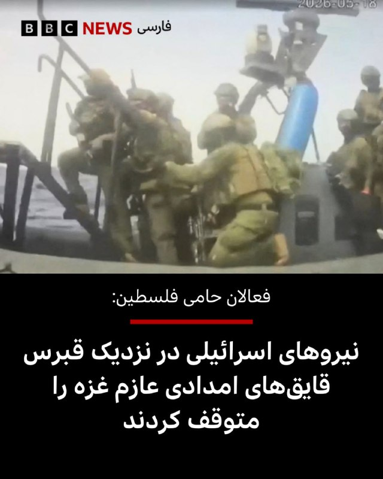

🔻فعالان حامی فلسطین می‌گویند که نیروهای اسرائیلی یک کاروان دریایی متشکل از بیش از ۵۰ قایق حامل کمک‌های بشردوستانه برای غزه را در آب‌های بین‌المللی در غرب قبرس متوقف کرده‌اند.

ائتلاف «ناوگان جهانی صمود» اعلام کرد که نیروهای اسرائیلی حدود ۴۶۰ کیلومتر دورتر از غزه که تحت محاصره دریایی اسرائیل قرار دارد، سوار بر قایق‌های این کاروان شده‌اند.

این گروه اقدام اسرائیل را «تجاوزی غیرقانونی در آب‌های آزاد» توصیف کرد. تصاویر پخش زنده این ناوگان نیز کماندوهایی را نشان می‌داد که وارد چند قایق می‌شوند.

بنیامین نتانیاهو، نخست‌وزیر اسرائیل، گفت این عملیات «عملاً طرحی مخرب برای شکستن انزوایی را که بر تروریست‌های حماس در غزه تحمیل کرده‌ایم، خنثی کرده است.»

ماه گذشته نیز نیروهای اسرائیلی ۲۲ قایق متعلق به همین ناوگان را در نزدیکی جزیره کرت یونان توقیف کرده بودند.

در آن حادثه، ۱۸۱ فعال حاضر در قایق‌ها بازداشت شدند که پس از موج گسترده محکومیت‌های بین‌المللی، به جز دو نفر، همگی روز بعد در یکی از جزایر یونان آزاد شدند.

📸Reuters

https://bbc.in/4dwXsEp
@BBCPersian

## BBCPersian — post 281449

🔻فرمانده قرارگاه خاتم الانبیاء: آماده‌تر و قوی‌تر شده‌ایم

بنابر گزارش خبرگزاری‌های رسمی در ایران، سرلشکر علی عبدالهی، فرمانده قرارگاه مرکزی خاتم‌الانبیاء که مدیریت جنگ را در ایران بر عهده دارد، عصر دوشنبه در اظهاراتی که می‌تواند واکنش به سخنان دونالد ترامپ مبنی بر لغو دستور حمله جدید نظامی به ایران تلقی شود، گفته است نیروهای نظامی ایران «نسبت به قبل آماده‌تر و قوی‌تر» شده‌اند.

آقای عبدالهی گفته است که نیروهای نظامی ایران «دست بر ماشه هستند و هرگونه تعرض و تجاوز مجددی از سوی دشمنان سرزمین و ملت سربلند را سریع، قاطع، پرقدرت و گسترده پاسخ خواهند داد.»

دونالد ترامپ، رئیس جمهور آمریکا روز دوشنبه گفت که به درخواست رهبران منطقه حمله نظامی بزرگی را که قرار بوده روز سه‌شنبه علیه ایران آغاز شود، لغو کرده است.

https://bbc.in/4uppEQM
@BBCPersian

## BBCPersian — post 281448

🔻درباره حمله مسلحانه به مسجد جامع سن دیگو چه می‌دانیم؟

سه نفر در تیراندازی به یک مسجد در سن‌دیگو در ایالت کالیفرنیا کشته شدند؛ حادثه‌ای که مقام‌ها معتقدند توسط دو مهاجم نوجوان انجام شده است. آنچه تاکنون می‌دانیم:

▪️اسکات وال، رئیس پلیس سن‌دیگو، گفت که ماموران ابتدا ساعت ۹:۴۲ صبح به وقت محلی تماسی از سوی مادری درباره «فرار یک نوجوان» دریافت کردند.

▪️مادر یکی از مظنونان تصور می‌کرد پسرش قصد خودکشی دارد و گزارش داد که «چند قبضه از سلاح‌هایش» و همچنین خودرو خانواده ناپدید شده است.

▪️او به پلیس گفت پسرش همراه فرد دیگری بوده و هر دو لباس استتار نظامی به تن داشتند؛ موضوعی که باعث شد پلیس سطح تهدید را افزایش دهد و ماموران را برای جست‌وجوی این دو نوجوان اعزام کند.

▪️پلیس در حالی تنها چند خیابان با مرکز اسلامی سن‌دیگو فاصله داشت و با مادر در تماس بود که حدود ساعت ۱۱:۴۳ صبح گزارش تیراندازی فعال در مسجد دریافت شد.

▪️ماموران پس از رسیدن به محل، با سه قربانی جان‌باخته روبه‌رو شدند. یکی از کشته‌شدگان نگهبان امنیتی مرکز بوده است.

▪️ساعاتی بعد، دو مظنون نوجوان داخل خودرویی در نزدیکی محل حادثه پیدا شدند که بر اثر جراحات ناشی از شلیک به خود جان باخته بودند.

▪️آقای وال گفت که پلیس این تیراندازی را به عنوان «جنایت ناشی از نفرت» بررسی می‌کند و «ادبیات نفرت‌آمیز» در این پرونده نقش داشته است.

▪️مادر یکی از مظنونان یادداشتی پیدا کرده بود، اما پلیس جز این که گفت حاوی «نفرت‌پراکنی عمومی» بوده، جزئیات بیشتری از محتوای آن منتشر نکرد.

▪️پلیس می‌گوید که هیچ تهدید مشخصی علیه این مرکز اسلامی مطرح نشده بود.

https://bbc.in/4ujnWQR
@BBCPersian

## BBCPersian — post 281447

  

🔺رسانه‌های محلی ترکیه گزارش دادند که یک فرد مسلح در جنوب این کشور تیراندازی کرده و ۶ نفر را کشته است.

بر اساس گزارش روزنامه حریت و شبکه سی‌ان‌ان ترک، ۸ نفر دیگر نیز در منطقه طرسوس در استان مرسین زخمی شده‌اند.

گزارش‌ها حاکی است که تیراندازی روز دوشنبه از یک رستوران آغاز شد و مظنون سپس با خودرو از محل گریخت.

پلیس عملیات گسترده‌ای را با پشتیبانی بالگرد برای بازداشت فرد مسلح مظنون آغاز کرده است.

بنا به گزارش‌ها مظنون ابتدا همسر سابق خود را به ضرب گلوله کشته است و سپس دو نفر را در رستوران کشته است که گفته می‌شود مالک رستوران و یکی از کارکنان آن بوده‌اند.

فرد مهاجم سپس به تیراندازی ادامه داده و یک چوپان را که در نزدیکی محل مشغول چرای گوسفندانش بوده و همچنین یک راننده کامیون را کشته است.

هویت و انگیزه‌های مظنون هنوز مشخص نشده است.

📸Tarsusakdeniz

https://bbc.in/49WLlPP
@BBCPersian

## BBCPersian — post 281437

‌ ‌ ‌
یک مادربزرگ اهل کالیفرنیا از زمان کودکی در انتظار پاسخ بوده است؛ از زمانی که مادرش هنگام آویزان کردن لباس‌ها برای خشک شدن، یک بشقاب پرنده را دید که در هوا معلق بود. یک روان‌درمانگر در تگزاس نیز از دوران کودکی، از کسانی بود که دیدن موجودات فرازمینی را «تجربه‌» کرده است. و یکی دیگر از ساکنان تگزاس که موسیقی‌دانی ۳۶ ساله است، از زمانی که درباره حادثه‌ای در نزدیکی زادگاهش شنید، درباره دنیای موجودات فرازمینی کند و کاو می‌کند.

بسیاری از «جامعه علاقه‌مندان به بشقاب پرنده»، نفسشان را در سینه حبس کرده بودند و منتظر چیزی بودند که دولت آمریکا آن را لحظه‌ای تاریخی توصیف کرده بود: نخستین انتشار پرونده‌هایی که پیش‌تر هرگز دیده نشده بودند درباره پدیده‌های ناشناس غیرعادی؛ مجموعه‌ای شامل ۱۶۲ سند، همراه با تصاویر و جزئیات که علاقه‌مندان امیدوارند گامی به سوی شفافیت بیشتر و یافتن پاسخ درباره آنچه «در آن بیرون» وجود دارد، باشد.

https://bbc.in/43ioOt4
📷 Getty/ COURTESY OF JOHN ERIK EGE/ US DEPARTMENT OF DEFENSE
@BBCPersian

## BBCPersian — post 281436

  <a href="https://t.me/bbcpersian/281436" target="_blank">📎 Download file</a>

🔻پادکست برنامه شصت دقیقه 
دوشنبه ۲۸ اردیبهشت ۱۴۰۵ 

این نسخه رادیویی برنامه شصت دقیقه تلویزیون فارسی بی‌بی‌سی است که هرشب بعد از پخش، با حجم کم از اپلیکیشن‌های پادگیر و صفحه تلگرام بی‌بی‌سی فارسی در دسترس است. 

با هشتگ BBCPersianRadio# با ما در ارتباط باشید.

@BBCPersian

## BBCPersian — post 281426

‌ ‌ ‌ ‌
ساختمان اداری با پنجره‌های شیشه‌ای که بالای یک فروشگاه رامن در قلب محله چینی‌های منهتن قرار داشت، در میان خیابانی شلوغ از رستوران‌های چینی، فروشگاه‌های مواد غذایی و آپارتمان‌ها، ظاهری عادی و بدون ‌جلب ‌توجه داشت.

در سال ۲۰۲۲، لو جیان‌وانگ، رئیس ۶۴ ساله یک گروه اجتماعی چینی، در یکی از طبقات آنجا دفتر گرفت و فضایی ایجاد کرد که به گفته وکلایش قرار بود به مهاجران برای تمدید گواهینامه رانندگی کمک کند و همچنین محلی برای بازی پینگ‌پنگ روی میزی در اتاق کنفرانس باشد.

اما مدت زیادی نگذشت که اف‌بی‌آی، پلیس فدرال آمریکا، به این محل یورش برد و آقای لو را متهم کرد که به دستور دولت چین نخستین ایستگاه پلیس برون‌مرزی شناخته‌شده در آمریکا را ایجاد کرده است.

او تنها چند روز پس از آنکه یک سیاستمدار کالیفرنیا نیز به جرایم مشابه اعتراف کرد، به جرم فعالیت به‌عنوان مامور خارجی ثبت‌نشده برای چین مجرم شناخته شد.

https://bbc.in/4nHTRrW
📸GettyImages/ Reuters
@BBCPersian

## manototv — post 105624

  <a href="telegram/content/manototv_105624_1779174414.mp4" target="_blank">🎬 Download video</a>

علی عبداللهی، فرمانده قرارگاه مرکزی حضرت خاتم‌الانبیا، در اظهاراتی خطاب به آمریکا و هم‌پیمانانش هشدار داد که «دوباره مرتکب خطای محاسباتی نشوند».

او گفت اگر «خطای دیگری» از سوی دشمنان جمهوری اسلامی رخ دهد، نیروهای مسلح ایران با «قدرت و توانایی به مراتب بالاتر از جنگ تحمیلی رمضان» با آن برخورد خواهند کرد.

این اظهارات در حالی مطرح می‌شود که در روزهای گذشته احتمال حمله نظامی به ایران افزایش یافته و دونالد ترامپ نیز دیشب گفت چند کشور عربی از او خواسته‌اند حمله‌ای «بسیار بزرگ» را برای چند روز به تعویق بیندازد.

## manototv — post 105623

  <a href="telegram/content/manototv_105623_1779174415.mp4" target="_blank">🎬 Download video</a>

آنا کلی، سخنگوی کاخ سفید، گفت موضع دونالد ترامپ درباره جمهوری اسلامی تغییری نکرده و رئیس‌جمهوری آمریکا همچنان برای جلوگیری از دستیابی تهران به سلاح هسته‌ای «بسیار جدی» است.

او گفت جمهوری اسلامی ۴۷ سال شعار «مرگ بر آمریکا» سر داده و نیروهای آمریکایی در خارج از کشور را تهدید کرده، هرگز نباید به سلاح هسته‌ای دست پیدا کند.

کلی افزود پیام ترامپ در شبکه تروث سوشال نشان می‌دهد او تا چه اندازه در این موضوع جدی است. به گفته او، جمهوری اسلامی اکنون با مشکلات متعددی روبه‌رو است، زیرا «ترامپ همه برگ‌ها را در دست دارد».

## manototv — post 105622

  <a href="telegram/content/manototv_105622_1779174416.mp4" target="_blank">🎬 Download video</a>

دونالد ترامپ شب گذشته گفت چند کشور به او گفته‌اند که برای «حمله‌ای بسیار بزرگ» آماده می‌شدند، اما او این حمله را برای مدتی کوتاه، و شاید برای همیشه، به تعویق انداخته است.

ترامپ گفت عربستان سعودی، قطر، امارات متحده عربی و چند کشور دیگر از او خواستند این اقدام را دو یا سه روز عقب بیندازد، زیرا به گفته او، این کشورها معتقدند مذاکرات با جمهوری اسلامی به دستیابی به توافق نزدیک شده است.

ترامپ گفت اسرائیل و دیگر طرف‌های درگیر در خاورمیانه از این تصمیم مطلع شده‌اند. او این تحول را «بسیار مثبت» خواند، اما تاکید کرد هنوز روشن نیست به نتیجه برسد یا نه.

## manototv — post 105621

  <a href="telegram/content/manototv_105621_1779174418.mp4" target="_blank">🎬 Download video</a>

پلیس سن‌دیگو اعلام کرد دو نوجوان مسلح روز دوشنبه ۲۸ اردیبهشت به سوی مرکز اسلامی سن‌دیگو تیراندازی کردند و سه مرد را کشتند. به گفته پلیس، این دو مهاجم که ۱۷ و ۱۸ ساله بودند، پس از حمله چند خیابان دورتر اقدام به خودکشی کردند. این حمله به عنوان «جرم نفرت‌محور» در دست بررسی است.

پلیس پیش از تیراندازی در جست‌وجوی یکی از این دو نوجوان بود، زیرا مادر او با پلیس تماس گرفته و گفته بود پسرش با نشانه‌های ضربه به خود از خانه خارج شده است. به گفته پلیس، هم‌زمان چند سلاح و خودروی مادر این نوجوان نیز از خانه ناپدید شده بود.

## manototv — post 105620

  <a href="telegram/content/manototv_105620_1779174418.mp4" target="_blank">🎬 Download video</a>

«رشید مظاهری صدای مردم ایران شده بود»

## manototv — post 105619

  <a href="telegram/content/manototv_105619_1779174419.mp4" target="_blank">🎬 Download video</a>

دونالد ترامپ، رئیس‌جمهوری آمریکا، در پاسخ به سوال خبرنگاران گفت چند کشور منطقه، از جمله قطر، عربستان سعودی و امارات متحده عربی، در حال گفت‌وگو با آمریکا و جمهوری اسلامی هستند و احتمال رسیدن به توافق وجود دارد.

ترامپ گفت: «این سه کشور، به‌علاوه چند کشور دیگر، با من تماس گرفتند و آن‌ها مستقیماً با مقام‌های ما و در حال حاضر با ایران در تماس هستند.»

او افزود: «به نظر می‌رسد احتمال بسیار خوبی وجود دارد که بتوانند به یک توافق برسند.»

رئیس‌جمهوری آمریکا همچنین گفت ترجیح می‌دهد بحران بدون اقدام نظامی حل شود و افزود: «اگر بتوانیم بدون اینکه آن‌ها را به‌شدت بمباران کنیم به نتیجه برسیم، بسیار خوشحال خواهم شد.

## alonews — post 121011

  <a href="telegram/content/alonews_121011_1779174420.webm" target="_blank">🎬 Download video</a>

👈توئیت سفارت ایران در سیرالئون: آمادگی ترامپ برای حمله به ایران

✅ @AloNews خبر جنگ

## alonews — post 121010

  <a href="telegram/content/alonews_121010_1779174421.webm" target="_blank">🎬 Download video</a>

👈پدافند جزیره کیش فعال می‌شود؛ مردم نگران نباشند

✅ @AloNews خبر جنگ

## alonews — post 121009

  <a href="telegram/content/alonews_121009_1779174421.webm" target="_blank">🎬 Download video</a>

👈ایالات متحده بیش از ۸۵ میلیارد دلار در طول ۷۹ روز برای عملیات نظامی خود در ایران هزینه کرده است

✅ @AloNews خبر جنگ

## alonews — post 121008

  <a href="telegram/content/alonews_121008_1779174421.webm" target="_blank">🎬 Download video</a>

👈شبکه عبری کان: پهپادهای حزب‌الله ۸۰ درصد عملیات ارتش اسرائیل را محدود می‌کنند

✅ @AloNews خبر جنگ

## alonews — post 121007

  <a href="telegram/content/alonews_121007_1779174421.webm" target="_blank">🎬 Download video</a>

👈ایالات متحده بیش از ۸۵ میلیارد دلار در طول ۷۹ روز برای عملیات نظامی خود در ایران هزینه کرده است، طبق وب‌سایت ردیاب هزینه جنگ ایران

✅ @AloNews خبر جنگ

## alonews — post 121006

  <a href="telegram/content/alonews_121006_1779174421.webm" target="_blank">🎬 Download video</a>

👈 نیروی دریایی ارتش آزادی‌بخش خلق چین اعلام کرد که گروه ضربت ناو هواپیمابر لیائونینگ برای یک مأموریت آموزشی معمول در دریاهای دور به اقیانوس آرام غربی اعزام شده است.

🔴 این تمرینات شامل عملیات‌های تاکتیکی پروازی، تمرینات شلیک زنده، مأموریت‌های پشتیبانی و پوشش، و فعالیت‌های جستجو و نجات مشترک برای بهبود «توانمندی‌های آموزش رزمی واقعی» خواهد بود.

✅ @AloNews خبر جنگ

## alonews — post 121005

  <a href="telegram/content/alonews_121005_1779174422.webm" target="_blank">🎬 Download video</a>

👈گزارش فایننشال تایمز: شی جین‌پینگ، رئیس جمهور چین، به ترامپ گفته است که پوتین از تصمیم خود برای حمله به اوکراین پشیمان است. از سوی دیگر، اشاره شد که ترامپ به شی گفته است که ایالات متحده، چین و روسیه باید علیه دادگاه بین‌المللی کیفری در لاهه با هم همکاری کنند زیرا این دادگاه «سیاسی عمل می‌کند»

✅ @AloNews خبر جنگ

## alonews — post 121004

  <a href="telegram/content/alonews_121004_1779174422.webm" target="_blank">🎬 Download video</a>

👈نیویورک تایمز: ایران از آتش‌بس یک‌ماهه با آمریکا استفاده کرده تا ده‌ها سایت موشکی خود را بازسازی کند، پرتابگرهای متحرک موشکی را جابه‌جا کند و تاکتیک‌های خود را برای هرگونه ازسرگیری حملات تطبیق دهد.

✅ @AloNews خبر جنگ

## alonews — post 121003

  <a href="telegram/content/alonews_121003_1779174422.webm" target="_blank">🎬 Download video</a>

👈نقشه بورس ایران بعد از ۸۰ روز

✅ @AloNews خبر جنگ

## alonews — post 121002

  <a href="telegram/content/alonews_121002_1779174422.mp4" target="_blank">🎬 Download video</a>

👈مشاور ترامپ در امور تجارت و تولید، پیتر ناوارو: نیروی نظامی آمریکا در حال حاضر کنترل تنگه هرمز را در دست دارد، که به این معنی است که کنترل عرضه نفت نه تنها برای چین بلکه برای کل شرق دور را در اختیار دارد.

✅ @AloNews خبر جنگ

## alonews — post 121001

  <a href="telegram/content/alonews_121001_1779174424.webm" target="_blank">🎬 Download video</a>

👈فاکس نیوز به نقل از معاون سخنگوی کاخ سفید گفت که رئیس‌جمهور خط قرمز ما رو تو این مذاکرات واضح بیان کرد: ایران باید یه بار برای همیشه از جاه‌طلبی‌های هسته‌ایش دست بکشه

✅ @AloNews خبر جنگ

## alonews — post 120998

  <a href="telegram/content/alonews_120998_1779174424.mp4" target="_blank">🎬 Download video</a>

👈 جنگنده های ارتش اسرائیل (IDF) به ساختمان تخلیه شده در مشوق در منطقه صور در جنوب لبنان حمله کردند.

✅ @AloNews خبر جنگ

## alonews — post 120997

  <a href="telegram/content/alonews_120997_1779174427.webm" target="_blank">🎬 Download video</a>

👈اکسیوس به نقل از یک مقامات آمریکایی:
پیامی واحد از دوحه، ابوظبی و ریاض به ترامپ ارسال شده بود. مضمون آن چیزی شبیه این بود: به مذاکرات فرصت بده، چون اگر به ایران حمله کنی، همه ما بهای آن را خواهیم پرداخت

✅ @AloNews خبر جنگ

## alonews — post 120996

  <a href="telegram/content/alonews_120996_1779174427.webm" target="_blank">🎬 Download video</a>

👈سخنگوی کمیسیون امنیت ملی مجلس: هرگونه تجاوز جدید علیه ایران با پاسخ قوی‌تر مواجه خواهد شد و ترامپ را شرمسارتر خواهد کرد

✅ @AloNews خبر جنگ

## alonews — post 120995

  <a href="telegram/content/alonews_120995_1779174427.webm" target="_blank">🎬 Download video</a>

👈الجزیره: نفت پس از به تعویق افتادن حمله ترامپ به ایران سقوط کرد

🔴قیمت نفت در معاملات اولیه آسیایی امروز سه‌شنبه، پس از آن‌که رئیس‌جمهور آمریکا، دونالد ترامپ، اعلام کرد حمله‌ای که قرار بود علیه ایران انجام شود را به تعویق انداخته تا فرصتی برای مذاکرات جهت پایان دادن به جنگ فراهم شود، بیش از دو درصد کاهش یافت.

🔴قراردادهای آتی نفت برنت برای تحویل در ماه ژوئیه/تیر، ۳٫۰۱ دلار یا ۲٫۷ درصد کاهش یافت و به ۱۰۹٫۰۹ دلار در هر بشکه رسید.

🔴 همچنین نفت خام وست تگزاس اینترمدیت آمریکا برای تحویل در ماه ژوئن/خرداد، ۱٫۳۸ دلار یا ۱٫۳ درصد افت کرد و به ۱۰۷٫۲۸ دلار رسید.

🔴همچنین قرارداد فعال‌تر ماه ژوئیه نیز ۲٫۰۶ دلار یا ۲ درصد کاهش یافت و به ۱۰۲٫۳۲ دلار در هر بشکه رسید

✅ @AloNews خبر جنگ

## alonews — post 120994

  <a href="telegram/content/alonews_120994_1779174427.mp4" target="_blank">🎬 Download video</a>

👈تقلید صدای ترامپ توسط هگزت؛ وزیر جنگ آمریکا: هگزت با صدای ترامپ، او به من گفت: «پیت، باید مثل شت سخت باشی.»

✅ @AloNews خبر جنگ

## alonews — post 120993

  <a href="telegram/content/alonews_120993_1779174429.webm" target="_blank">🎬 Download video</a>

👈نیویورک تایمز: بسیاری از موشک‌های بالستیک ایران در غارهای عمیق زیرزمینی و تأسیسات کنده‌شده در کوه‌های گرانیتی مستقر بودند که نابودی آن‌ها برای هواپیماهای آمریکایی دشوار است.

🔴آمریکا عمدتاً ورودی این سایت‌ها را بمباران کرد اما خود تأسیسات را نابود نکرد. اکنون ایران بخش قابل‌توجهی از این سایت‌ها را دوباره بازگشایی کرده است.

✅ @AloNews خبر جنگ

## alonews — post 120992

  <a href="telegram/content/alonews_120992_1779174429.webm" target="_blank">🎬 Download video</a>

👈نیویورک‌تایمز به نقل از یک مقام نظامی آمریکا:
فرماندهان ایرانی، احتمالاً با کمک روسیه، الگوهای پروازی جنگنده‌ها و بمب‌افکن‌های آمریکایی را بررسی کرده‌اند.

🔴این مقام هشدار داد که سرنگونی جنگنده اف-۱۵ئی در ماه گذشته و ضدهوایی زمین‌پایه که به یک اف-۳۵ اصابت کرد، نشان می‌دهد که تاکتیک‌های پروازی آمریکا بیش از حد قابل پیش‌بینی شده است، به گونه‌ای که به ایران امکان داده با توانایی بیشتری در برابر آنها دفاع کند.

✅ @AloNews خبر جنگ

---
📅 بروزرسانی: 1405/02/29 07:09
---

## VahidOOnLine — post 240900

  

♦️ولادیمیر پوتین، رئیس جمهوری روسیه، در آستانه سفر رسمی به پکن، در پیامی خطاب به مردم چین از دست‌یابی روابط دو کشور به سطحی بی‌سابقه و مبتنی بر اعتماد متقابل خبر داد. پوتین با تمجید از عزم راسخ شی جین‌پینگ برای همکاری‌های بلندمدت تاکید کرد که مشارکت راهبردی مسکو و پکن در تقابل با هیچ کشوری نیست، بلکه نقشی ثبات‌آفرین در عرصه جهانی ایفا می‌کند. رئیس جمهوری روسیه با اشاره به جهش اقتصادی دوجانبه افزود که حجم مبادلات تجاری از مرز ۲۰۰ میلیارد دلار عبور کرده و تصفیه‌حساب‌ها اکنون تقریبا به طور کامل با روبل و یوآن انجام می‌شود. او همچنین بر هماهنگی دو کشور در سازمان ملل، بریکس و سازمان همکاری شانگهای برای دفاع از قوانین بین‌المللی تاکید کرد و پیام خود را با عبارت «به امید دیدار به زودی در پکن» به پایان رساند.
‌🇸🇦 Indypersian

🤖 @VahidOOnLine

## VahidOOnLine — post 240899

  

روزنامه گاردین در گزارشی با طرح این پرسش که آیا جمهوری اسلامی می‌تواند برای کابل‌های زیردریایی در تنگه هرمز عوارض دریافت کند، نوشت تحقق این موضوع بسیار بعید است. یک مقام پیشین آمریکایی گفت این کابل‌ها از ساحل بسیار دور هستند و ایران فناوری لازم برای قطع کردن آنها را ندارد.
این گزارش به نقل از یک مقام سابق وزارت خارجه آمریکا که متخصص اینترنت جهانی است، همچنین نوشت: ‌«دریافت هزینه از شرکت‌های خاص غیرممکن خواهد بود، زیرا هیچ راهی برای تفکیک ترافیک اینترنت آنها وجود ندارد.»
این مقام آمریکایی همچنین گفت: «بسیار بعید است که ایران بتواند کابل‌های زیر تنگه هرمز را بدون جلب توجه قطع کند؛ این کشور فناوری لازم را ندارد و باید این کار را آشکارا و تحت نظارت مداوم گشت‌های هوایی ایالات متحده انجام دهد.»
طبق این گزارش، دست‌کم هفت کابل در زیر آب‌های این تنگه قرار دارند که بسیاری از آنها برای توسعه هوش مصنوعی در کشورهای خلیج فارس حیاتی هستند.

‌🏁 🇬🇧 IranintlTV

🤖 @VahidOOnLine

## VahidOOnLine — post 240898

♦️جی‌دی ونس، معاون رئیس جمهوری ایالات متحده، با بازگو کردن خاطره ای طنزآمیز گفت که دونالد ترامپ در یک کنفرانس خبری زنده و در حضور نخست وزیر ایرلند، جوراب‌های او را مایه شوخی قرار داده است. ونس با تاکید بر اینکه ترامپ به پوشش رسمی و سنتی اهمیت زیادی می‌دهد، گفت: «من سال گذشته این درس را از راه سخت یاد گرفتم. طبق سنت، معاون رئیس جمهوری در روز سنت پاتریک به نخست وزیر ایرلند خوش‌آمد می‌گوید. من تصمیم گرفتم برای این مناسبت جوراب‌هایی با طرح شبدر بپوشم. در جریان کنفرانس خبری زنده، در حضور همه و مقابل احتمالا ۱۰۰ دوربین تلویزیونی نشستیم؛ رئیس جمهوری صحبت‌هایش را شروع کرد، ناگهان نگاهی به من انداخت و گفت: «داستان این جوراب‌ها چیست؟» معاون ترامپ در پایان افزود از آن زمان از راه سخت یاد گرفته است در حضور رئیس جمهوری کاملا محافظه کارانه لباس بپوشد.
رسم دیرینه استقبال از نخست وزیر ایرلند در کاخ سفید، هر ساله در اواسط ماه مارس به مناسبت روز سنت پاتریک برگزار می‌شود؛ در فرهنگ ایرلند، شبدر سه پر نماد ملی و مذهبی مقدسی است که سنت پاتریک از آن برای تبیین مفهوم تثلیث استفاده می‌کرد.
‌🇸🇦 Indypersian

🤖 @VahidOOnLine

## VahidOOnLine — post 240897

  

اسماعیل کوثری، عضو کمیسیون امنیت ملی مجلس، به خبرنگاران گفت: «قطعا و یقینا از طریق مذاکره به نتیجه نمی‌رسیم.» او با تاکید بر اینکه «ترامپ جنگ را باخته» است، افزود که رییس‌جمهوری آمیکا «می‌خواهد یک جوری خودش را برنده نشان بدهد و این هم شدنی نیست.»
‌🏁 🇬🇧 IranintlTV

🤖 @VahidOOnLine

## VahidOOnLine — post 240896

  

روزنامه نیویورک تایمز به نقل از یک مقام نظامی آمریکایی نوشت فرماندهان نیروهای نظامی جمهوری اسلامی الگوهای پرواز جت‌های جنگنده و بمب‌افکن‌های آمریکایی را بررسی کرده‌اند.
او گفت که ارزیابی‌های اطلاعاتی به کمک احتمالی روسیه در جنبه‌هایی از برنامه‌ریزی نظامی ایران اشاره دارد.

‌🏁 🇬🇧 IranintlTV

🤖 @VahidOOnLine

## VahidOOnLine — post 240895

  

پس از آنکه ترامپ اعلام کرد حمله برنامه‌ریزی‌شده به جمهوری اسلامی را متوقف کرده است، قیمت نفت در معاملات اولیه روز سه‌شنبه در بازار آسیا حدود ۲ درصد کاهش یافت و قیمت نفت برنت با کاهش ۳ دلار و یک سنت، معادل ۲.۷ درصد، به ۱۰۹ دلار و ۹ سنت در هر بشکه رسید.
نفت وست تگزاس اینترمدیت نیز با افت یک دلار و ۷۲ سنت، معادل ۱.۷ درصد، به ۱۰۷ دلار و ۴۰ سنت کاهش یافت.
رویترز به نقل از تحلیلگران نوشت بازارها در حال بررسی این موضوع هستند که آیا این اقدام نشانه‌ای از کاهش تنش است یا تنها یک وقفه موقت در تنش‌ها.

‌🏁 🇬🇧 IranintlTV

🤖 @VahidOOnLine

## VahidOOnLine — post 240894

♦️اسماعیل کوثری، نماینده مجلس شورای اسلامی و از فرماندهان پیشین سپاه پاسداران، در گفتگو با خبرنگاران تاکید کرد: «قطعا و یقینا از طریق مذاکره به نتیجه نمی رسیم.» کوثری با اشاره به وضعیت رئیس جمهوری آمریکا مدعی شد که ترامپ جنگ را باخته است و «می‌خواهد یک جوری خودش را برنده نشان بدهد و این هم شدنی نیست.»
‌🇸🇦 Indypersian

🤖 @VahidOOnLine

## VahidOOnLine — post 240893

  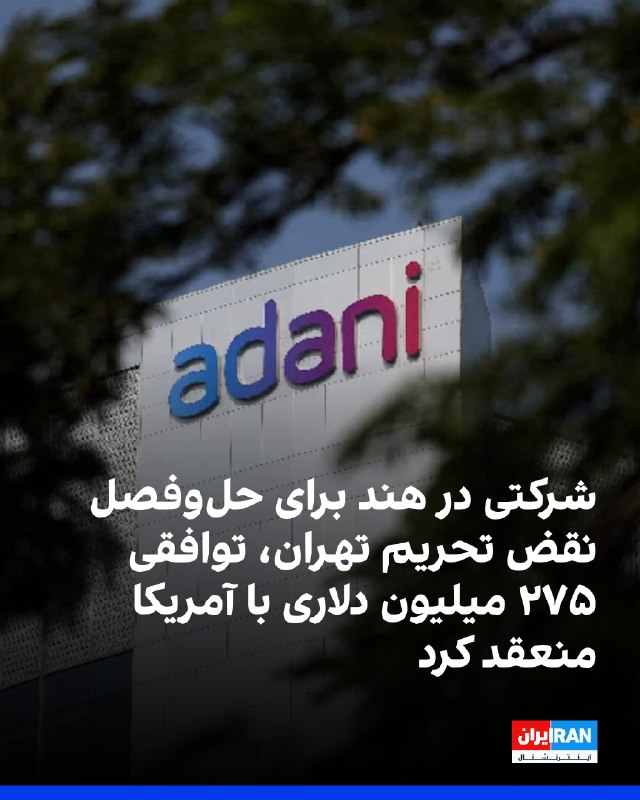

شرکت آدانی اینترپرایزس، مستقر در احمدآباد هند، در توافقی ۲۷۵ میلیون دلاری با وزارت خزانه‌داری آمریکا پذیرفت که مسئولیت خود را در ۳۲ مورد تخلف از تحریم‌های جمهوری اسلامی در ارتباط با خرید گاز مایع با منشاء ایرانی حل‌وفصل کند.
دفتر کنترل دارایی‌های خارجی وزارت خزانه‌داری آمریکا در بیانیه‌ای اعلام کرد شرکت آدانی از نوامبر ۲۰۲۳ تا ژوئن ۲۰۲۵، محموله‌های گاز مایع نفتی را از یک معامله‌گر مستقر در دبی خریداری کرد که مدعی بود گاز عمان و عراق را تامین می‌کند، اما این شرکت به موارد هشداردهنده‌ای که نشان می‌داد این گاز مایع نفتی در واقع منشا ایرانی داشته است، بی‌توجهی کرده بود.
طبق این بیانیه، در دوره زمانی نوامبر ۲۰۲۳ تا ژوئن ۲۰۲۵، اقدامات شرکت آدانی موجب شد ۳۲ پرداخت دلاری از طریق موسسات مالی آمریکایی برای این محموله‌ها پردازش شود که مجموع آنها حدود ۱۹۲ میلیون و ۱۰۴ هزار دلار بود.
این بیانیه افزود تخلفات شرکت آدانی فاحش بوده و به طور داوطلبانه افشا نشده است.

‌🏁 🇬🇧 IranintlTV

🤖 @VahidOOnLine

## VahidOOnLine — post 240892

  

شرکت آدانی اینترپرایزس، مستقر در احمدآباد هند، در توافقی ۲۷۵ میلیون دلاری با وزارت خزانه‌داری آمریکا پذیرفت که مسئولیت خود را در ۳۲ مورد تخلف از تحریم‌های جمهوری اسلامی در ارتباط با خرید گاز مایع با منشاء ایرانی حل‌وفصل کند.
دفتر کنترل دارایی‌های خارجی وزارت خزانه‌داری آمریکا در بیانیه‌ای اعلام کرد شرکت آدانی از نوامبر ۲۰۲۳ تا ژوئن ۲۰۲۵، محموله‌های گاز مایع نفتی را از یک معامله‌گر مستقر در دبی خریداری کرد که مدعی بود گاز عمان و عراق را تامین می‌کند، اما این شرکت به موارد هشداردهنده‌ای که نشان می‌داد این گاز مایع نفتی در واقع منشا ایرانی داشته است، بی‌توجهی کرده بود.
طبق این بیانیه، در دوره زمانی نوامبر ۲۰۲۳ تا ژوئن ۲۰۲۵، اقدامات شرکت آدانی موجب شد ۳۲ پرداخت دلاری از طریق موسسات مالی آمریکایی برای این محموله‌ها پردازش شود که مجموع آنها حدود ۱۹۲ میلیون و ۱۰۴ هزار دلار بود.
این بیانیه افزود تخلفات شرکت آدانی فاحش بوده و به طور داوطلبانه افشا نشده است.

‌🏁 🇬🇧 IranintlTV

🤖 @VahidOOnLine

## VahidOOnLine — post 240891

  

♦️به گزارش العربیه، دولت عراق روز دوشنبه اعلام کرد سامانه‌های پدافند هوایی این کشور هیچ پهپادی را که از خاک عراق به سمت عربستان سعودی پرتاب شده باشد، شناسایی نکرده‌اند.
عربستان سعودی اواخر روز یکشنبه اعلام کرده بود که سه پهپاد را که از حریم هوایی عراق وارد این کشور شده بودند رهگیری و منهدم کرده است و افزود که «حق پاسخ در زمان و مکان مناسب را برای خود محفوظ می‌دارد».
اما وزارت خارجه عراق گفت مقام‌های این کشور تحقیقاتی را «برای مشخص کردن شرایط و جزئیات این حادثه» آغاز کرده‌اند.
این وزارتخانه افزود سامانه‌های پدافند هوایی و نظارتی عراق هیچ پرتابی را ثبت نکرده‌اند.
این وزارتخانه از ریاض خواست «همکاری کرده و اطلاعات مرتبط را به اشتراک بگذارد تا به دستیابی به اطلاعات دقیق کمک شود و امنیت و ثبات دو کشور برادر تقویت شود».
تا کنون هیچ گروه عراقی مسئولیت این پهپادها را بر عهده نگرفته است.
به گزارش العربیه، پس از حملات آمریکا و اسرائیل به مواضع رژیم ایران و پیش از اعلام آتش‌بس، گروه‌های عراقی مورد حمایت تهران وارد عمل شدند و به اهداف آمریکایی در عراق و منطقه، از جمله در کشورهای خلیج فارس، حمله کردند.
‌🇸🇦 Indypersian

🤖 @VahidOOnLine

## VahidOOnLine — post 240882

این روایت‌ها فقط خبر چند کشته‌شده نیستند؛ سند روزهایی‌اند که جوانان ایران، یکی‌یکی از خیابان‌ها به سردخانه‌ها رسیدند. پشت هر نام، خانه‌ای مانده که ناگهان خاموش شد، خانواده‌ای که میان بی‌خبری و ترس دنبال عزیزش گشت و آینده‌ای که پیش از آغاز، با گلوله متوقف شد.<
جاویدنامان انقلاب ملی ایرانیان:
عارف گل‌محمدی، مهدی جمشیدی، محمدحسین علیخانی، پردیس محمدی، آرمین قاسمی مبین، احمد صالحی، احمدرضا نائیجی و محمد معصومی باقرآبادی.<
نام‌هایی که فراموش نمی‌شوند؛ چون هرکدام بخشی از حافظه زخمی این سرزمین‌اند.<
#جاویدنامان_انقلاب_ملی_ایرانیان
‌🏁 🇬🇧 IranintlTV

🤖 @VahidOOnLine

## VahidOOnLine — post 240881

  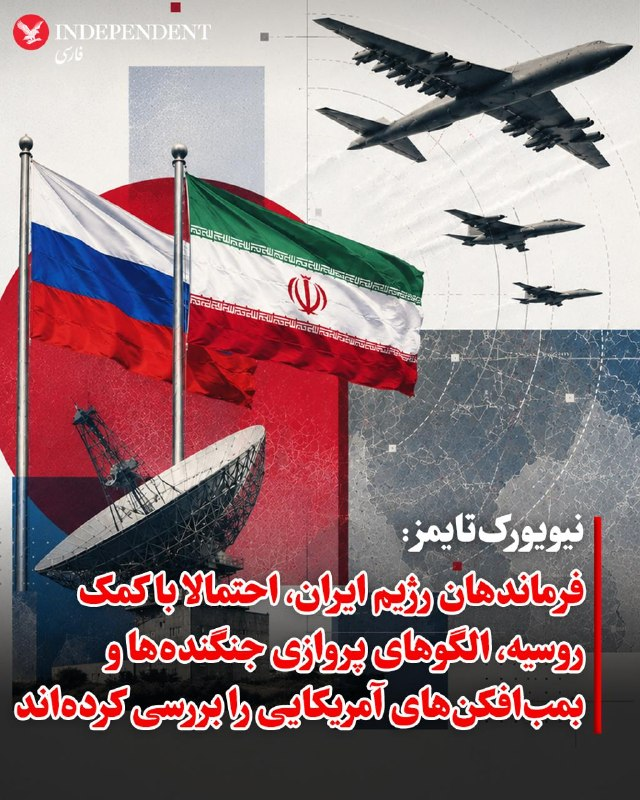

♦️نیویورک‌تایمز با اشاره به چند مورد تهدید آمریکا به اقدام نظامی جدید علیه رژیم ایران و سپس اعلام به تعویق انداختن آن به نقل از مقاماتی که نام آنها را اعلام نکرده مدعی شده که فرماندهان جمهوری اسلامی، احتمالا با کمک روسیه، الگوهای پروازی جنگنده‌ها و بمب‌افکن‌های آمریکایی را بررسی کرده‌اند. به گفته این منابع، سرنگونی جنگنده اف-۱۵ئی در ماه گذشته و اصابت آتش زمینی به یک جنگنده اف-۳۵ نشان داد تاکتیک‌های پروازی آمریکا قابل پیش‌بینی شده است. به نوشته این روزنامه آمریکایی که دونالد ترامپ پیش‌تر بسیاری از گزارش‌های آن را نادرست توصیف کرده، جمهوری اسلامی بخش زیادی از تسلیحات باقی‌مانده خود را جابه‌جا کرده و این باور را در میان نیروهایش ایجاد کرده که می‌تواند در برابر آمریکا مقاومت کند؛ چه از طریق بستن تنگه هرمز، چه با حمله به زیرساخت‌های انرژی کشورهای همسایه خلیج فارس.یک مقام نظامی آمریکا که به شرط ناشناس ماندن درباره مسائل عملیاتی صحبت می‌کرد گفت ایران در طول آتش‌بس یک‌ماهه با آمریکا، ده‌ها پایگاه بمباران‌شده موشک‌های بالستیک را از زیر آوار خارج کرده،
‌🇸🇦 Indypersian

🤖 @VahidOOnLine

## FoxNewsTwitter — post 341914

  <a href="telegram/content/FoxNewsTwitter_341914_1779161980.mp4" target="_blank">🎬 Download video</a>

Fox News (Twitter/X)

NFL legend Bill Belichick reflects on his partnership with Tom Brady and the football dynasty they built on "Hang Out with Sean Hannity."

"I learned so much from Tom. I never played quarterback. Tom saw the game through a quarterback's eyes. I saw the game through a coach's eyes. Together, I think we both learned a lot from each other — Tom on how defensive coaches looked at him or looked at offense, and me on what a quarterback can do and what he can't do, what's hard, what's easy, what I can see, what I can't see, and how you see the game."

Catch the full podcast episode starting Tuesday at 10 AM ET. | @seanhannity

## FoxNewsTwitter — post 341913

  <a href="telegram/content/FoxNewsTwitter_341913_1779161982.mp4" target="_blank">🎬 Download video</a>

Fox News (Twitter/X)

NEW: San Diego Police Chief Scott Wahl revealed that the mother of one of the suspects called authorities before the mosque attack, warning that her son was missing and may have been suicidal.

Wahl said the mother reported multiple weapons missing, her vehicle gone and that her son was traveling with a companion while dressed in camouflage, which "began to trigger a larger threat-assessment picture."

## pm_afshaa — post 91012

  <a href="telegram/content/pm_afshaa_91012_1779161983.webm" target="_blank">🎬 Download video</a>

🔴معاون سخنگوی کاخ سفید:
ترامپ خط قرمز ما رو تو این مذاکرات واضح بیان کرد؛ ایران باید یک بار برای همیشه از جاه‌طلبی‌های هسته‌ایش دست بکشه.

💧 Rainbet.com the #1 Non-KYC Crypto Casino & Sportsbook @rainbetcom

😁 @Pm_Afshaa

## pm_afshaa — post 91011

  <a href="telegram/content/pm_afshaa_91011_1779161984.webm" target="_blank">🎬 Download video</a>

🔴فاکس نیوز به نقل از ترامپ:
ایران میخواد جنگ زود تموم بشه و اصلا نمیتونه سلاح هسته‌ای به دست بیاره.

💧 Rainbet.com the #1 Non-KYC Crypto Casino & Sportsbook @rainbetcom

😁 @Pm_Afshaa

## IranIntlTV — post 337868

  

روزنامه گاردین در گزارشی با طرح این پرسش که آیا جمهوری اسلامی می‌تواند برای کابل‌های زیردریایی در تنگه هرمز عوارض دریافت کند، نوشت تحقق این موضوع بسیار بعید است. یک مقام پیشین آمریکایی گفت این کابل‌ها از ساحل بسیار دور هستند و ایران فناوری لازم برای قطع کردن آنها را ندارد.
این گزارش به نقل از یک مقام سابق وزارت خارجه آمریکا که متخصص اینترنت جهانی است، همچنین نوشت: ‌«دریافت هزینه از شرکت‌های خاص غیرممکن خواهد بود، زیرا هیچ راهی برای تفکیک ترافیک اینترنت آنها وجود ندارد.»
این مقام آمریکایی همچنین گفت: «بسیار بعید است که ایران بتواند کابل‌های زیر تنگه هرمز را بدون جلب توجه قطع کند؛ این کشور فناوری لازم را ندارد و باید این کار را آشکارا و تحت نظارت مداوم گشت‌های هوایی ایالات متحده انجام دهد.»
طبق این گزارش، دست‌کم هفت کابل در زیر آب‌های این تنگه قرار دارند که بسیاری از آنها برای توسعه هوش مصنوعی در کشورهای خلیج فارس حیاتی هستند.

https://iranintl.com/202605198606

## IranIntlTV — post 337867

  

اسماعیل کوثری، عضو کمیسیون امنیت ملی مجلس، به خبرنگاران گفت: «قطعا و یقینا از طریق مذاکره به نتیجه نمی‌رسیم.» او با تاکید بر اینکه «ترامپ جنگ را باخته» است، افزود که رییس‌جمهوری آمیکا «می‌خواهد یک جوری خودش را برنده نشان بدهد و این هم شدنی نیست.»
https://iranintl.com/202605197706

## IranIntlTV — post 337866

  

روزنامه نیویورک تایمز به نقل از یک مقام نظامی آمریکایی نوشت فرماندهان نیروهای نظامی جمهوری اسلامی الگوهای پرواز جت‌های جنگنده و بمب‌افکن‌های آمریکایی را بررسی کرده‌اند.
او گفت که ارزیابی‌های اطلاعاتی به کمک احتمالی روسیه در جنبه‌هایی از برنامه‌ریزی نظامی ایران اشاره دارد.

https://iranintl.com/202605199920

## IranIntlTV — post 337865

  

پس از آنکه ترامپ اعلام کرد حمله برنامه‌ریزی‌شده به جمهوری اسلامی را متوقف کرده است، قیمت نفت در معاملات اولیه روز سه‌شنبه در بازار آسیا حدود ۲ درصد کاهش یافت و قیمت نفت برنت با کاهش ۳ دلار و یک سنت، معادل ۲.۷ درصد، به ۱۰۹ دلار و ۹ سنت در هر بشکه رسید.
نفت وست تگزاس اینترمدیت نیز با افت یک دلار و ۷۲ سنت، معادل ۱.۷ درصد، به ۱۰۷ دلار و ۴۰ سنت کاهش یافت.
رویترز به نقل از تحلیلگران نوشت بازارها در حال بررسی این موضوع هستند که آیا این اقدام نشانه‌ای از کاهش تنش است یا تنها یک وقفه موقت در تنش‌ها.

https://iranintl.com/202605198020

## IranIntlTV — post 337864

  

شرکت آدانی اینترپرایزس، مستقر در احمدآباد هند، در توافقی ۲۷۵ میلیون دلاری با وزارت خزانه‌داری آمریکا پذیرفت که مسئولیت خود را در ۳۲ مورد تخلف از تحریم‌های جمهوری اسلامی در ارتباط با خرید گاز مایع با منشاء ایرانی حل‌وفصل کند.
دفتر کنترل دارایی‌های خارجی وزارت خزانه‌داری آمریکا در بیانیه‌ای اعلام کرد شرکت آدانی از نوامبر ۲۰۲۳ تا ژوئن ۲۰۲۵، محموله‌های گاز مایع نفتی را از یک معامله‌گر مستقر در دبی خریداری کرد که مدعی بود گاز عمان و عراق را تامین می‌کند، اما این شرکت به موارد هشداردهنده‌ای که نشان می‌داد این گاز مایع نفتی در واقع منشا ایرانی داشته است، بی‌توجهی کرده بود.
طبق این بیانیه، در دوره زمانی نوامبر ۲۰۲۳ تا ژوئن ۲۰۲۵، اقدامات شرکت آدانی موجب شد ۳۲ پرداخت دلاری از طریق موسسات مالی آمریکایی برای این محموله‌ها پردازش شود که مجموع آنها حدود ۱۹۲ میلیون و ۱۰۴ هزار دلار بود.
این بیانیه افزود تخلفات شرکت آدانی فاحش بوده و به طور داوطلبانه افشا نشده است.

https://iranintl.com/202605198829

## IranIntlTV — post 337863

  

شرکت آدانی اینترپرایزس، مستقر در احمدآباد هند، در توافقی ۲۷۵ میلیون دلاری با وزارت خزانه‌داری آمریکا پذیرفت که مسئولیت خود را در ۳۲ مورد تخلف از تحریم‌های جمهوری اسلامی در ارتباط با خرید گاز مایع با منشاء ایرانی حل‌وفصل کند.
دفتر کنترل دارایی‌های خارجی وزارت خزانه‌داری آمریکا در بیانیه‌ای اعلام کرد شرکت آدانی از نوامبر ۲۰۲۳ تا ژوئن ۲۰۲۵، محموله‌های گاز مایع نفتی را از یک معامله‌گر مستقر در دبی خریداری کرد که مدعی بود گاز عمان و عراق را تامین می‌کند، اما این شرکت به موارد هشداردهنده‌ای که نشان می‌داد این گاز مایع نفتی در واقع منشا ایرانی داشته است، بی‌توجهی کرده بود.
طبق این بیانیه، در دوره زمانی نوامبر ۲۰۲۳ تا ژوئن ۲۰۲۵، اقدامات شرکت آدانی موجب شد ۳۲ پرداخت دلاری از طریق موسسات مالی آمریکایی برای این محموله‌ها پردازش شود که مجموع آنها حدود ۱۹۲ میلیون و ۱۰۴ هزار دلار بود.
این بیانیه افزود تخلفات شرکت آدانی فاحش بوده و به طور داوطلبانه افشا نشده است.

https://iranintl.com/202605198829

## IranIntlTV — post 337854

این روایت‌ها فقط خبر چند کشته‌شده نیستند؛ سند روزهایی‌اند که جوانان ایران، یکی‌یکی از خیابان‌ها به سردخانه‌ها رسیدند. پشت هر نام، خانه‌ای مانده که ناگهان خاموش شد، خانواده‌ای که میان بی‌خبری و ترس دنبال عزیزش گشت و آینده‌ای که پیش از آغاز، با گلوله متوقف شد.
جاویدنامان انقلاب ملی ایرانیان:
عارف گل‌محمدی، مهدی جمشیدی، محمدحسین علیخانی، پردیس محمدی، آرمین قاسمی مبین، احمد صالحی، احمدرضا نائیجی و محمد معصومی باقرآبادی.
نام‌هایی که فراموش نمی‌شوند؛ چون هرکدام بخشی از حافظه زخمی این سرزمین‌اند.
#جاویدنامان_انقلاب_ملی_ایرانیان

## FarsiVOA — post 218109

🔺لیندزی گراهام: هر توافقی با جمهوری اسلامی باید به تائید کنگره برسد؛ تاکید سناتور آمریکایی بر پایان غنی‌سازی و قطع حمایت از نیابتی‌ها

▪️سناتور جمهوری‌خواه، لیندزی گراهام، روز دوشنبه و پس از آنکه دونالد ترامپ، رئیس جمهوری آمریکا گفت به درخواست رهبران چند کشور عربی حمله برنامه‌ریزی شده روز ‌سه‌شنبه به جمهوری اسلامی را به تعویق انداخته‌است، بار دیگر تاکید کرد که هر توافقی که میان ایالات متحده و جمهوری اسلامی ایران امضا شود «باید، همانند برجام در دوران ریاست‌جمهوری باراک اوباما، برای تأیید به کنگره ارائه شود.»

⬇️ بیشتر بخوانید:
https://ir.voanews.com/a/8151586.html
@FarsiVOA

## FarsiVOA — post 218108

⚡️ایران روزگاری کشوری بود که صدای بازی کودکان در کوچه‌ها بخشی از هویت روزمره‌اش بود. اما اکنون آمارهای رسمی از کاهش شدید نرخ باروری، پیرشدن جمعیت و بسته‌شدن پنجره جمعیتی خبر می‌دهند. روندی که روایتی از فشار اقتصادی، ناامیدی اجتماعی و تغییر عمیق سبک زندگی در ایران امروز است
@FarsiVOA

## FarsiVOA — post 218107

⚡️عفو بین‌الملل: هشتاد درصد اعدام‌های ثبت‌شده جهان در سال ۲۰۲۵ را جمهوری اسلامی انجام داد؛ گفت‌وگو با رها بحرینی، پژوهشگر امور ایران در عفو بین‌الملل

@FarsiVOA

## FarsiVOA — post 218106

⚡️خرید مواد غذایی دغدغه بخش بزرگی از مردم ایران؛ گفت‌وگو با رضا غیبی روزنامه‌نگار

@FDarsiVOA

## Persian_Trend_Official — post 14463

  <a href="telegram/content/Persian_Trend_Official_14463_1779161987.mp4" target="_blank">🎬 Download video</a>

صبحتون‌ بخیر 🔥❤️

📝 Nick
📌 @persian_trend_official
پرشین ترند | متفاوت‌ترین کانال نظامی

## BBCPersian — post 281423

  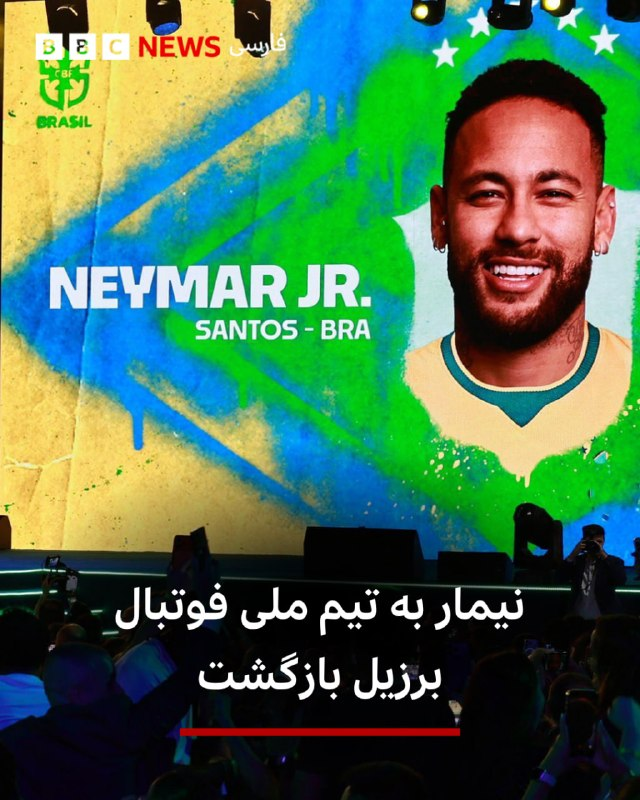

‌ ‌ ‌ ‌
در لیست بازیکنان دعوت شده به تیم ملی برزیل برای جام‌جهانی ماه آینده که در سه کشور آمریکای شمالی برگزار خواهد شد، نیمار، فوق ستاره کهنه‌کار این کشور، پس از تقریبا سه سال غیبت، به تیم ملی بازگشته است.

این بازیکن ۳۴ ساله که بهترین گلزن تاریخ تیم ملی فوتبال مردان برزیل است، به علت مصدومیت‌های پی در پی - که در تاریخچه فوتبالی او کم سابقه هم نیست - در بیشتر مسابقات مقدماتی جان جهانی دور از میادین بود.

برزیل، که به دنبال کسب ششمین عنوان قهرمانی جام جهانی است، در سیزدهم ژوئن اولین بازی خود را مقابل مراکش انجام خواهد داد.

این تیم توسط کارلو آنچلوتی، سرمربی پرافتخار ایتالیایی، در مراسمی باشکوه در ریودوژانیرو معرفی شد و بازگشت نیمار به این تیم باعث تشویق شدید هواداران شد.

📷EPA/Shutterstock
@BBCPersian

## BBCPersian — post 281422

🔻 آمار کشته‌شدگان حملات اسرائیل به لبنان از سه هزار نفر گذشت

مقام‌های رسمی می‌گویند تعداد قربانیان حملات اسرائیل به لبنان از ۳ هزار نفر فراتر رفته است.

وزارت بهداشت لبنان اعلام کرده شمار کشته‌شدگان در این کشور در جریان حملات اسرائیل طی درگیری با حزب‌الله که از ابتدای مارس تشدید شد، از ۳ هزار نفر عبور کرده است.

این وزارتخانه روز دوشنبه رقم تلفات را ۳۰۲۰ نفر اعلام کرد؛ نقطه عطفی تلخ در درگیری‌هایی که با وجود آتش‌بس شکننده، نشانه‌ای از کاهش تنش در آن دیده نمی‌شود.

لبنان در ۲ مارس وارد این جنگ شد؛ زمانی که گروه مسلح شیعه حزب‌الله مورد حمایت ایران پس از حمله‌ای اسرائیلی که به کشته شدن رهبر عالی ایران منجر شد، موشک‌هایی به سمت اسرائیل شلیک کرد.

با وجود توافق آتش‌بس، شمار قربانیان همچنان رو به افزایش بوده است. لبنان و اسرائیل روز جمعه توافق کردند آتش‌بس خود را ۴۵ روز دیگر تمدید کنند و قرار است مذاکرات در اوایل ژوئن از سر گرفته شود.

وزارت بهداشت لبنان می‌گوید بیش از ۴۰۰ نفر از این کشته‌ها پس از آغاز آتش‌بس در ۱۷ آوریل رخ داده‌اند؛ دوره‌ای که با نقض‌های مکرر از سوی هر دو طرف همراه بوده است.

بر اساس این توافق که با میانجی‌گری ایالات متحده آمریکا انجام شده، به اسرائیل اجازه داده می‌شود حملاتی را که هدف آن‌ها مقابله با فعالیت‌های نظامی حزب‌الله عنوان می‌شود، انجام دهد.

لبنان این حملات را محکوم کرده و می‌گوید این اقدامات تلاش‌های این کشور برای بازگرداندن کنترل انحصاری دولت بر سلاح گروه‌های مسلح را تضعیف می‌کند.

از زمان اعلام تمدید آتش‌بس در روز جمعه، حملات اسرائیل به شهرها و روستاهای جنوب لبنان و دره بقاع ادامه یافته و ده‌ها نفر دیگر را نیز به کام مرگ کشانده است.

https://bbc.in/4nCTe2I
@BBCPersian

## BBCPersian — post 281421

  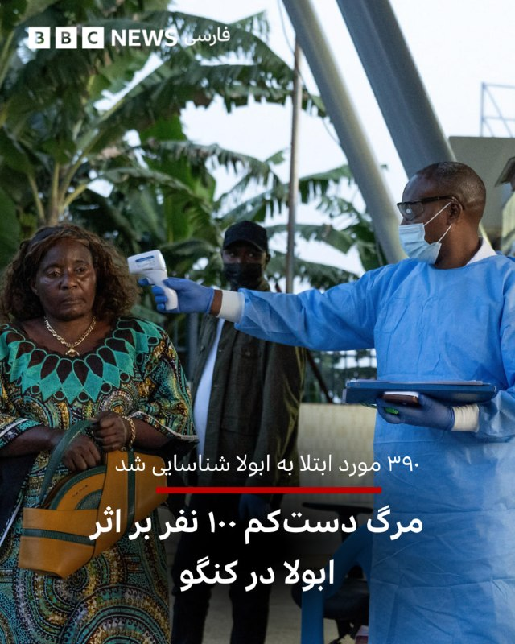

‌ ‌ ‌
رئیس مرکز کنترل و پیشگیری از بیماری‌های آفریقا به بی‌بی‌سی گفته است که در پی شیوع ابولا در جمهوری دموکراتیک کنگو، حداقل ۱۰۰ مورد مرگ گزارش شده و بیش از ۳۹۰ مورد مشکوک به ابتلا وجود دارد.

جین کاسیا هشدار داد که با توجه به عدم وجود دارو یا واکسن تأیید شده، مردم باید اقدامات بهداشت عمومی را رعایت کنند. یکی از مواردی که او برای رعایت موارد بهداشتی به مردم هشدار داده شرکت در مراسم تشییع جنازه قربانیان ابولا است.

مرکز کنترل و پیشگیری از بیماری‌های ایالات متحده هم می‌گوید که در اوگاندا دو مورد تایید شده ابتلا و یک مورد مرگ وجود دارد.

سازمان بهداشت جهانی شیوع گونه فعلی ابولا، که توسط ویروس بوندیبوگیو ایجاد می‌شود، را یک وضعیت اضطراری بین‌المللی اعلام کرده است.

به گفته یک گروه مبلغان پزشکی در جمهوری دموکراتیک کنگو و مرکز کنترل و پیشگیری از بیماری‌ها آمریکا، یک پزشک آمریکایی هم در میان افرادی است که ابتلای او تایید شده‌ است.

https://bbc.in/49Qfn7N
📷Reuters
@BBCPersian

## BBCPersian — post 281420

🔻 تیراندازی مرگبار در مسجد سن دیگو؛ آخرین اطلاعات درباره مظنونان چیست؟

همان طور که ساعتی پیش برایتان به صورت لحظه به لحظه گزارش کردیم، عصر دوشنبه به وقت غرب آمریکا، تیراندازی در بزرگترین مسجد شهر سن دیگو - جنوب کالیفرنیا - سه کشته برجای گذاشت.

پلیس کمی بعد تایید کرد که جسد دو نوجوان را در خودرویی در نزدیکی محل تیراندازی پیدا کرده که به نظر مظنونان اصلی هستند. پلیس می‌گوید علت مرگ هر دو نوجوان شلیک به خود به نظر می‌رسد.

این آخرین اطلاعاتی است که اسکات وال، رئیس پلیس سن دیگو درباره مظنونان به رسانه‌ها گفته است:

اسکات وال، رئیس پلیس سن‌دیگو، گفت مادر مظنون یک یادداشت از او پیدا کرده است. آقای وال از ارائه جزئیات بیشتر درباره محتوای این یادداشت خودداری کرد. او افزود که زمانی که مادر آن روز صبح با پلیس در تماس بود، کم‌کم در حال کنار هم گذاشتن تصویر بزرگ‌تری از ماجرا بود و متوجه شده بود که برخی سلاح‌ها و همچنین خودرو خانواده مفقود شده است.
رئیس پلیس گفت می‌خواهد تاکید کند که «هیچ تهدید مشخصی، به‌ویژه هیچ تهدید مشخصی علیه مرکز اسلامی وجود نداشته است». او افزود محتوای یادداشتی که مادر یکی از مظنونان پیدا کرده، شامل «گستره‌ای وسیع از نفرت‌پراکنی عمومی» بوده است. به گفته او، هیچ تهدید مشخصی علیه هیچ مرکز مذهبی یا مکان خاص دیگری مطرح نشده بود و این نامه تنها شامل «سخنان کلی و گسترده نفرت‌آمیز» بوده است.
اسکات وال، رئیس پلیس سن‌دیگو، گفت یک فرد که قصد خودکشی دارد معمولاً سه سلاح با خود برنمی‌دارد. او به گفت‌وگوهای پلیس با مادر یکی از مظنونان اشاره کرد؛ مادری که پس از خروج پسرش همراه فردی دیگر با لباس استتار، متوجه شده بود سلاح‌ها و خودرو خانواده ناپدید شده‌اند. این مادر ابتدا نگران بوده که پسرش قصد خودکشی داشته باشد.
https://bbc.in/49bEq5b
@BBCPersian

## BBCPersian — post 281419

  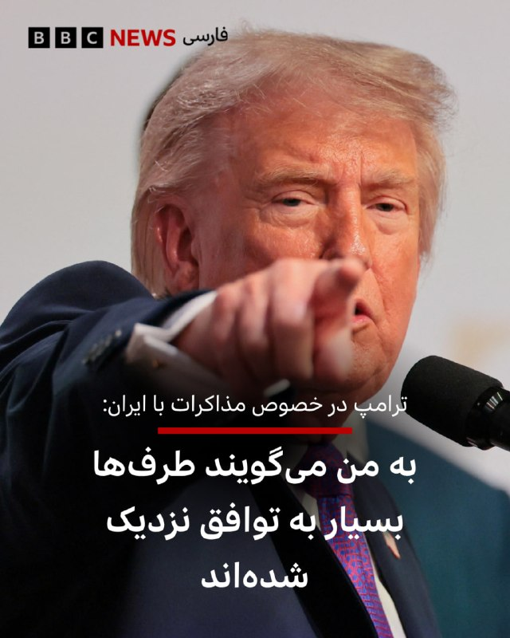

‌ ‌ ‌ ‌
دونالد ترامپ عصر دوشنبه گفت از سوی عربستان سعودی، قطر، امارات متحده عربی و برخی کشورهای دیگر از او خواسته شده است که حمله نظامی جدید به ایران را برای ۲ تا ۳ روز به تعویق بیندازد، زیرا به گفته آن‌ها طرف‌ها «به توافق بسیار نزدیک» شده‌اند.

او افزود اگر این توقف کوتاه بتواند به جلوگیری از دستیابی سلاح هسته‌ای به ایران کمک کند: «من فکر می‌کنم اگر آن‌ها راضی باشند، ما هم احتمالا راضی خواهیم بود».

آقای ترامپ همچنین گفت با اسرائیل و دیگر کشورهای خاورمیانه که در این روند درگیر بوده‌اند نیز هماهنگی و اطلاع‌رسانی صورت گرفته است.

او این وضعیت را «تحولی بسیار مثبت» توصیف کرد، اما تاکید کرد که هنوز مشخص نیست به نتیجه‌ای برسد یا نه.

وی ادامه داد: «دوره‌هایی بوده که فکر می‌کردیم خیلی به توافق نزدیک شده‌ایم، اما نتیجه نداد.»

آقای ترامپ گفت شرایط کنونی «کمی متفاوت» است و افزود: «ما فردا می‌رویم؛ بسیار مهم است. این چیزی نیست که من می‌خواستم انجام دهم، اما چاره‌ای نداریم چون نمی‌توانیم اجازه دهیم ایران به سلاح هسته‌ای دست پیدا کند.»

https://bbc.in/4djvL39
📷Reuters
@BBCPersian

## BBCPersian — post 281418

🔻 مراسم عروسی ۱۱۰ زوج حامی حکومت در تهران همزمان با نگرانی‌ها از شروع دوباره جنگ

در ادامه برنامه های تبلیغاتی حکومت ایران و حضور هواداران حکومت در خیابان‌ها، امروز در میدان امام حسین در جنوب تهران مراسم عروسی ۱۱۰ زوج مرتبط با کمپین جانفدا برگزار شد.

دو روز پیش رسانه‌های دولتی ایران گفتند که ۳۱ میلیون نفر در این کمپین ثبت نام کردند. حکومت ایران دوره‌های آموزشی اسلحه را برای داوطلبان طرفدار حکومت به راه انداخته است.

پویش «جانفدا» که این عروسی جمعی در راستای آن انجام شده است،‌ در شرایطی به راه افتاده که جمهوری اسلامی ایران در چند سال اخیر با بحران‌های سیاسی و اقتصادی، اعتراض‌های گسترده داخلی و دو جنگ اخیر روبرو بوده است و بیش از هر زمانی با مساله‌ای به نام مشروعیت و «همراهی ملت با نظام» دست و پنجه نرم می‌کند.

برخی از شهروندان نگران از جنگ و آینده، این اقدامات را تبلیغاتی و آن را آزاردهنده توصیف کردند.

https://bbc.in/4uY6f9v
@BBCPersian

## BBCPersian — post 281417

🔻 آلمان در راستای برنامه‌های ناتو، یک سامانه دفاع هوایی پاتریوت در ترکیه مستقر می‌کند

وزارت دفاع آلمان روز دوشنبه اعلام کرد که این کشور به عنوان بخشی از برنامه چرخشی ناتو، ۱۵۰ نیرو و یک سامانه دفاع هوایی پاتریوت در ترکیه مستقر خواهد کرد.

آلمان می‌گوید که حدود ۱۵۰ سرباز که در حال حاضر در شهر هوسوم در شمال آلمان مستقر هستند ماه آینده به همراه یک سامانه ضد موشکی پاتریوت به ترکیه منتقل خواهند شد.

به گفته وزارت دفاع آلمان این گروه جایگزین یک واحد نیروهای آمریکایی مستقر در ترکیه خواهند شد و این بخشی از برنامه چرخشی ناتو است.

وزیر دفاع آلمان روز دوشنبه با اعلام این خبر گفت که این نشانه همکاری نزدیک سربازان آلمانی با شرکای ترک و آمریکایی خود است و نشان می‌دهد که چقدر آلمان با متحدانش همکاری می‌کند.

پاتریوت یک سیستم دفاع هوایی متحرک ساخت آمریکا از پیشرفته ترین سلاح‌های ساخت این کشور برای رهگیری و انهدام موشک‌های بالستیک و موشک‌های کروز و هواپیماهاست.

واحد آمریکایی که در حال حاضر در ترکیه مستقر است، با آغاز جنگ آمریکا و اسرائیل با ایران در نهم اسفند ماه برای تقویت دفاع از ترکیه به این کشور منتقل شده بود.

به گزارش خبرگزاری فرانسه، نیروهای ناتو از زمان شروع جنگ دستکم سه بار موشک‌های بالستیک ایران را بر فراز ترکیه سرنگون کردند.

آلمان پیشتر از سال ۲۰۱۳ تا ۲۰۱۵ سامانههای پاتریوت را برای کمک به حفاظت از حریم هوایی ترکیه در مرز این کشور با سوریه مستقر کرده بود.

وزارت دفاع آلمان می‌گوید که یک سامانه پاتریوت متحرک شامل حداکثر هشت پرتابگر و همچنین یک واحد رادار و یک پست کنترل آتش است.

https://bbc.in/4tHtvHA
@BBCPersian

## BBCPersian — post 281416

  

‌ ‌ ‌ ‌
در اثر تیراندازی در بزرگترین مسجد شهر سن دیگو - در جنوب کالیفرنیا - دست‌کم سه نفر کشته شدند و پلیس گفته دو عامل احتمالی این تیراندازی نیز «بر اثر شلیک به خود» کشته شده‌اند. به گفته پلیس حادثه رخ‌داده در مرکز اسلامی در حال حاضر به عنوان «جنایت ناشی از نفرت (تروریسم داخلی)» بررسی می‌شود و پلیس همکاری نزدیکی با کارآگاهان اف‌بی‌آی دارد.

سخنگوی شبکه درمانی «شارپ هلث‌کر» سن‌دیگو به بی‌بی‌سی گفت بیمارستان «شارپ مموریال» در حال پذیرش مجروحان مرتبط با تیراندازی و آلیشیا کوک، سخنگوی این مرکز درمانی، گفته است: «گزارش‌ها حاکی از آن است که چندین نفر زخمی شده‌اند.»

براساس گزارش‌ها این تیراندازی اندکی پیش از ظهر به وقت محلی در این مرکز اسلامی رخ داده است.

یک شاهد عینی در گفت‌وگو با شبکه سی‌بی‌اس نیوز، شریک خبری بی‌بی‌سی در آمریکا، گفت صدای شلیک حدود ۳۰ گلوله را شنیده که به گفته او، به نظر می‌رسید از یک «سلاح نیمه‌خودکار» شلیک شده باشد.

او گفت ابتدا حدود ۱۲ گلوله شنیده، سپس وقفه‌ای کوتاه ایجاد شده و بعد دوباره احتمالا حدود ۱۲ گلوله دیگر شلیک شده است.

https://bbc.in/4djuBEP
📷 Reuters
@BBCPersian

## Hranews — post 113026

  

میان موشک و سرکوب؛ گزارش مجموعه فعالان حقوق بشر درباره مخاصمه نظامی ایالات متحده-اسرائیل و ایران منتشر شد

💥
💥
💥
💥
💥 – امروز، مجموعه فعالان حقوق بشر در ایران گزارش جدیدی را در ۲۴۰ صفحه و دو زبان منتشر کرد که به بررسی کارزار نظامی ایالات متحده و اسرائیل در ایران در فاصله ۹ اسفند ۱۴۰۴ تا ۱۹ فروردین ۱۴۰۵ (۲۸ فوریه تا ۸ آوریل ۲۰۲۶) می‌پردازد.

این گزارش بر پایه ۱۷۷ منبع تأییدشده ــ شامل گزارش‌های منابع آزاد و شبکه میدانی مجموعه فعالان حقوق بشر در داخل کشور ــ ۶٬۳۲۴ رویداد منحصربه‌فرد شامل ۱۲٬۷۹۸ حمله مجزا را مستندسازی کرده است.
مجموعه فعالان تاکید کرد این گزارش با هدف ارائه روایت جامع از کل درگیری تهیه نشده است. یافته‌های آن صرفاً به رویدادهایی محدود می‌شود که در داده‌های این نهاد مستندسازی و راستی‌آزمایی شده‌اند.

📊 یافته‌های کلیدی گزارش
◾️ ثبت ۶٬۳۲۴ رویداد منحصربه‌فرد و ۱۲٬۷۹۸ حمله مجزا
◾️ ۷۷ درصد رویدادها شامل آسیب به غیرنظامیان یا اماکن غیرنظامی
◾️ ثبت دست‌کم ۳٬۶۳۶ مورد مرگ، از جمله ۱٬۷۰۱ غیرنظامی
◾️ کشته شدن ۳۰۷ کودک و زخمی شدن ۲٬۲۱۳ کودک
◾️ تمرکز ۴۴٫۸۵ درصدی رویدادها در استان تهران
◾️ هدف قرار گرفتن یا آسیب دیدن مدارس، مراکز درمانی، مراکز فرهنگی و زیرساخت‌های حیاتی

⚠️ الگوهای نگران‌کننده
این گزارش چندین الگوی نگران‌کننده را برجسته می‌کند، از جمله:
◾️ ضعف در راستی‌آزمایی اهداف
◾️ استفاده محدود از نظارت انسانی در برخی فناوری‌های هدف‌گیری
◾️ هشدارهای ناکافی پیش از حملات
◾️ استفاده از تسلیحات انفجاری سنگین در مناطق پرجمعیت
◾️ حملات تکراری به برخی مناطق غیرنظامی
◾️ آسیب گسترده به زیرساخت‌های غیرنظامی

🚨 این گزارش همچنین به بازداشت گسترده شهروندان در ایران اشاره دارد؛ دست‌کم ۴٬۰۲۳ نفر با اتهامات مرتبط با امنیت ملی یا جنگ بازداشت شده‌اند.

از سوی دیگر تشدید محدودیت‌های امنیتی، گسترش ایست‌های بازرسی و محدودیت‌های گسترده اینترنت از دیگر پیامدهای مستندسازی‌شده عنوان شده است.

در همین بازه زمانی، ۵۰ مورد اعدام ثبت شده که ۳۲ مورد آن با اتهامات سیاسی و امنیتی مرتبط بوده است.

📎 ادامه گزارش به زبان فارسی

📎 دانلود مستقیم فایل پی دی اف گزارش از تلگرام

📎 دانلود مستقیم فایل پی دی اف گزارش از سایت

📎 Complete report in English

📎Direct download of the English PDF

↘️
@hranews_bot تماس ✉️ - @Hranews کانال هرانا 🆑

## Hranews — post 113025

  <a href="https://t.me/hranews/113025" target="_blank">📎 Download file</a>

میان موشک و سرکوب؛ گزارش مجموعه فعالان حقوق بشر درباره مخاصمه نظامی ایالات متحده-اسرائیل و ایران منتشر شد 
💥
💥
💥
💥
💥 – امروز، مجموعه فعالان حقوق بشر در ایران گزارش جدیدی را در ۲۴۰ صفحه و دو زبان منتشر کرد که به بررسی کارزار نظامی ایالات متحده و اسرائیل در ایران…

## alonews — post 120991

  <a href="telegram/content/alonews_120991_1779161991.webm" target="_blank">🎬 Download video</a>

👈واشنگتن پست: ارزیابی کلی این است که هیچ یک از گزینه‌های نظامی موجود چه حمله گسترده، چه هدف‌گیری رهبران و چه عملیات زمینی یا دریایی، راه‌حل قابل‌ اعتماد و کم‌ هزینه‌ای ارائه نمی‌دهد و مسیر منطقی‌تر، حرکت به سمت توافق و کاهش تنش است

✅ @AloNews خبر جنگ

---
📅 بروزرسانی: 1405/02/29 03:20
---

## VahidOOnLine — post 240880

♦️پیت هگست، وزیر جنگ ایالات متحده، با تقلید لحن و ادبیات خاص دونالد ترامپ، به بازگویی اولین گفتگوی خود با رئیس جمهوری آمریکا پس از پیشنهاد این پست پرداخت. هگست با خنده در میان حاضران گفت: «رئیس‌جمهور ترامپ وقتی برای اولین بار این شغل را به من پیشنهاد داد، گفت: پیت، باید خیلی سگ‌جان و سرسخت باشی؛ ببخشید ولی واقعا همین را گفت. آماده‌ای؟ آن‌ها به سراغت خواهند آمد.»
وزیر جنگ آمریکا در ادامه با تایید پیش بینی رئیس جمهوری افزود: «پسر، چقدر هم درست می‌گفت؛ او کاملا حق داشت.»
‌🇸🇦 Indypersian

🤖 @VahidOOnLine

## VahidOOnLine — post 240879

  

ترامپ با اشاره به توقف کوتاه‌مدت حمله برنامه‌ریزی‌شده به جمهوری اسلامی درپی تقاضای عربستان‌ سعودی، امارات متحده عربی و قطر از او با هدف رسیدن به توافق، گفت این موضوع را به اسرائیل و دیگر کشورهای منطقه نیز اطلاع داده است.
او در واشینگتن‌دی‌سی به خبرنگاران گفت: «عربستان سعودی، قطر، امارات متحده عربی و چند کشور دیگر از من خواستند که آن را برای دو یا سه روز، یک بازه کوتاه، به تعویق بیندازیم، زیرا فکر می‌کنند بسیار به دستیابی به یک توافق نزدیک شده‌اند و اگر بتوانیم به گونه‌ای عمل کنیم که هیچ سلاح هسته‌ای به دست ایران نرسد، فکر می‌کنم اگر آنها راضی باشند، ما نیز احتمالا راضی خواهیم بود.»
ترامپ گفت: «ما قرار بود فردا یک حمله بسیار بزرگ انجام دهیم. من آن را برای مدتی کوتاه به تعویق انداختم، امیدوارم شاید برای همیشه، اما احتمالا برای مدت کوتاهی، زیرا گفت‌وگوهای بسیار مهمی با ایران داشته‌ایم و خواهیم دید این گفت‌وگوها به کجا می‌انجامد.»
او افزود: «ما اسرائیل را در جریان گذاشته‌ایم، دیگر افرادی را در خاورمیانه که با ما درگیر بوده‌اند مطلع کرده‌ایم و این یک تحول بسیار مثبت است.»
‌🏁 🇬🇧 IranintlTV

🤖 @VahidOOnLine

## VahidOOnLine — post 240878

  

♦️محسن رضایی، فرمانده سابق سپاه پاسداران و مشاور مجتبی خامنه‌ای، دوشنبه ۲۸ اردیبهشت ماه با انتشار پیامی در شبکه اجتماعی اکس نوشت: «ضرب‌الاجل حمله نظامی تعیین می‌کند و خودش هم آن را لغو می‌کند. با این امید واهی که ملت و مسئولان ایران را تسلیم کند. مشت آهنین نیروهای مسلح قدرتمند و ملت بزرگ ایران آن‌ها را وادار به عقب‌نشینی و تسلیم خواهد کرد.»
‌🇸🇦 Indypersian

🤖 @VahidOOnLine

## VahidOOnLine — post 240877

♦️دونالد ترامپ، رئیس‌جمهوری آمریکا، در گفتگو با خبرنگاران گفت: «من با اسکات بسنت، وزیر خزانه‌داری ایالات متحده آمریکا و هاوارد لوتنیک،  وزیر بازرگانی تماس گرفتم و همه آن‌ها را به دفترم فراخواندم. گفتم ما قصد داریم یک سفر کوتاه به خاورمیانه داشته باشیم و با ایران مواجه شویم، زیرا آن‌ها به شدت به دنبال دستیابی به سلاح هسته‌ای هستند و تنها دلیلشان برای داشتن آن، استفاده از آن است.»
رئیس‌جمهوری آمریکا در ادامه افزود: «من گفتم از اینکه مجبورم این کار را انجام دهم متنفرم، چون اوضاع ما بسیار خوب پیش می‌رود؛ اما این مهم‌ترین کاری است که می‌توانیم انجام دهیم. ما نمی‌توانیم اجازه دهیم ایران به سلاح هسته‌ای دست یابد، بنابراین این کار را انجام دادیم.»
‌🇸🇦 Indypersian

🤖 @VahidOOnLine

## WithYashar — post 11617

## FoxNewsTwitter — post 341912

  

Fox News (Twitter/X)

WATCH LIVE: Police give update on deadly San Diego mosque shooting https://twitter.com/i/broadcasts/1kKzDMRoZQDJv

## FoxNewsTwitter — post 341911

  <a href="telegram/content/FoxNewsTwitter_341911_1779148205.mp4" target="_blank">🎬 Download video</a>

Fox News (Twitter/X)

REPORTER: "Can you speak a little bit about your, post on Truth Social on Iran? And what was the decision ... why you didn't attack... ?"

PRESIDENT TRUMP: "Well, other countries have come to me and they've said... We were getting ready to do a very major attack tomorrow. I've put it off for a little while, hopefully, maybe forever, but possibly for a little while, because we've had, very big discussions with Iran and we'll see what they amount to."

"I was asked by Saudi Arabia, Qatar, UAE and some others if we could put it off for 2 or 3 days, a short period of time, because they think that they are getting very close to making a deal. And if we can do that where there's no nuclear weapon going into the hands of Iran, I think and if they're satisfied, we will be probably satisfied."

## FoxNewsTwitter — post 341910

  

Fox News (Twitter/X)

BREAKING: Former LAPD Detective Mark Fuhrman, who discovered the bloody glove in the 1995 O.J. Simpson murder case and was convicted of lying on the witness stand, has died at the age of 74.

## pm_afshaa — post 91010

  <a href="telegram/content/pm_afshaa_91010_1779148207.webm" target="_blank">🎬 Download video</a>

🔴واشنگتن پست به نقل از یک مقام پاکستانی: با توجه به مسائل متعدد در حال بررسی و نوع اجرای توافق، پیشرفت مذاکرات دشوار شده.

💧 Rainbet.com the #1 Non-KYC Crypto Casino & Sportsbook @rainbetcom

😁 @Pm_Afshaa

## pm_afshaa — post 91009

  <a href="telegram/content/pm_afshaa_91009_1779148208.webm" target="_blank">🎬 Download video</a>

🔴نیویورک تایمز:
ترامپ فعلا به خاطر نگرانی‌های پنتاگون که فکر میکنن ایران سیستم‌های پایش هوایی و دفاعیش رو ارتقا داده، از شروع دوباره جنگ برای فردا منصرف شده.

💧 Rainbet.com the #1 Non-KYC Crypto Casino & Sportsbook @rainbetcom

😁 @Pm_Afshaa

## pm_afshaa — post 91008

  <a href="telegram/content/pm_afshaa_91008_1779148208.webm" target="_blank">🎬 Download video</a>

🔴کانال 12 اسرائیل:
ترامپ به اسرائیل اطلاع داد که تاخیر در حمله به ایران تنها دو تا سه روزه.

💧 Rainbet.com the #1 Non-KYC Crypto Casino & Sportsbook @rainbetcom

😁 @Pm_Afshaa

## IranIntlTV — post 337853

  <a href="https://t.me/IranintlTV/337853" target="_blank">📎 Download file</a>

🎧نسخه صوتی چشم‌انداز: طرح مجلس برای جایزه و پاداش به قاتل ترامپ!
@iranintlTV

## IranIntlTV — post 337852

  

ترامپ با اشاره به توقف کوتاه‌مدت حمله برنامه‌ریزی‌شده به جمهوری اسلامی درپی تقاضای عربستان‌ سعودی، امارات متحده عربی و قطر از او با هدف رسیدن به توافق، گفت این موضوع را به اسرائیل و دیگر کشورهای منطقه نیز اطلاع داده است.
او در واشینگتن‌دی‌سی به خبرنگاران گفت: «عربستان سعودی، قطر، امارات متحده عربی و چند کشور دیگر از من خواستند که آن را برای دو یا سه روز، یک بازه کوتاه، به تعویق بیندازیم، زیرا فکر می‌کنند بسیار به دستیابی به یک توافق نزدیک شده‌اند و اگر بتوانیم به گونه‌ای عمل کنیم که هیچ سلاح هسته‌ای به دست ایران نرسد، فکر می‌کنم اگر آنها راضی باشند، ما نیز احتمالا راضی خواهیم بود.»
ترامپ گفت: «ما قرار بود فردا یک حمله بسیار بزرگ انجام دهیم. من آن را برای مدتی کوتاه به تعویق انداختم، امیدوارم شاید برای همیشه، اما احتمالا برای مدت کوتاهی، زیرا گفت‌وگوهای بسیار مهمی با ایران داشته‌ایم و خواهیم دید این گفت‌وگوها به کجا می‌انجامد.»
او افزود: «ما اسرائیل را در جریان گذاشته‌ایم، دیگر افرادی را در خاورمیانه که با ما درگیر بوده‌اند مطلع کرده‌ایم و این یک تحول بسیار مثبت است.»
https://iranintl.com/202605187593

## IranIntlTV — post 337851

  <a href="telegram/content/IranIntlTV_337851_1779148209.mp4" target="_blank">🎬 Download video</a>

دونالد ترامپ اعلام کرد به درخواست رهبران منطقه برنامه حمله به جمهوری اسلامی را متوقف کرده است.

او همزمان به نیویورک‌پست گفت پس از دریافت پاسخ اخیر جمهوری اسلامی درباره مذاکرات، دیگر تمایلی به دادن هیچ امتیازی به تهران ندارد.

گفت‌وگو با امیر گیتی، عضو تحریریه ایران‌اینترنشنال
@iranintltv

## FarsiVOA — post 218105

⚡️معادله چند مجهولی پهپادهای ناشناس؛ آیا آسمان عراق از کنترل دولت خارج شده است؟
@FarsiVOA

## FarsiVOA — post 218104

⚡️مواضع قانون‌گذاران آمریکایی درباره رژیم ایران و بحران در تنگه هرمز
@FarsiVOA

## FarsiVOA — post 218103

🔺پلیس: تیراندازی در «مرکز اسلامی» سن‌دیگو، ۳ بزرگسال را کشت؛ هر دو مظنون کشته شدند

▪️مقام‌های آمریکایی گفتند تیراندازی روز دوشنبه در یک «مرکز اسلامی» در شهر سن‌دیگو واقع در ایالت کالیفرنیا، سه مرد، از جمله یک نگهبان امنیتی را کشت.

⬇️ بیشتر بخوانید:
https://ir.voanews.com/a/8151375.html
@FarsiVOA

## FarsiVOA — post 218102

  <a href="telegram/content/FarsiVOA_218102_1779148211.mp4" target="_blank">🎬 Download video</a>

⚡️افزایش کودک‌همسری و خشونت علیه زنان در افغانستان؛ به حاشیه‌رفتن حقوق زنان در سایه تنش‌های ایران
@FarsiVOA

## FarsiVOA — post 218101

  <a href="telegram/content/FarsiVOA_218101_1779148212.mp4" target="_blank">🎬 Download video</a>

⚡️پزشکیان زیر تیغ گرانی؛ دولت بی‌اختیار در سایه سپاه و جنگ؟
@FarsiVOA

## Persian_Trend_Official — post 14462

  <a href="telegram/content/Persian_Trend_Official_14462_1779148212.mp4" target="_blank">🎬 Download video</a>

▪️ شبتون بخیر 🫶

🫆:Tony

📌 @persian_trend_official
پرشین ترند | متفاوت‌ترین کانال نظامی

## BBCPersian — post 281415

  

‌ ‌ ‌
دونالد ترامپ، رئیس جمهور آمریکا، در نخستین واکنش به حمله مسلحانه به مسجد جامع شهر سن دیگو آن را «حادثه وحشتناکی» خوانده و گفته به زودی با اعضای کابینه خود به طور جدی جزییات آن را زیر نظر خواهد گرفت.

پلیس سن دیگو و اداره آگاهی فدرال آمریکا - پلیس اف‌بی‌آی - گفته این تیراندازی را تحت عنوان جنایت ناشی از نفرت تحت بررسی دارد؛ اصطلاحی که مترادف تروریسم داخلی است و از احتمال وجود انگیزه‌های نژادپرستانه یا نفرت از قوم یا پیروان مذهب خاصی حکایت دارد.

https://bbc.in/4wt0sdw
📷Reuters
@BBCPersian

## BBCPersian — post 281414

🔻 این حمله در آستانه عید قربان روی داد
شیما خلیل - گزارشگر بی‌بی‌سی در کالیفرنیا

تیراندازی امروز ضربه‌ای سنگین به جامعه‌ای وارد کرده که در حال آماده شدن برای یکی از مقدس‌ترین فصل‌های مذهبی و بزرگ‌ترین اعیاد خود است.

تنها چند روز تا عید قربان باقی مانده؛ یکی از دو عید بزرگ مسلمانان که در آن خانواده‌ها جشن می‌گیرند و یاد اطاعت حضرت ابراهیم را گرامی می‌دارند.

این دوره زمانی در تقویم اسلامی بسیار مهم است. در حال حاضر ماه ذی‌الحجه قرار داریم؛ دوازدهمین و آخرین ماه تقویم قمری اسلامی.

این روزها به عنوان ۱۰ روز نخست ذی‌الحجه، از مقدس‌ترین و معنوی‌ترین روزهای سال در اسلام شناخته می‌شوند و جایگاه ویژه‌ای دارند.

این فصل همچنین هم‌زمان با موسم حج است؛ و روز عرفه به عنوان مقدس‌ترین روز سال در نظر گرفته می‌شود.

https://bbc.in/4futvHu
@BBCPersian

## BBCPersian — post 281406

ویلیام مک‌لنان، کالین کمپل و جوزی هنت، بخش تحقیقات محلی بی‌بی‌سی

تحقیقات تازه بی‌بی‌سی نشان می‌دهد قاچاقچیان انسان، از مهاجران غیرقانونی می‌خواهند که هزینه عبورشان از کانال مانش را از طریق شبکه‌ای از شرکت‌های ثبت‌شده در بریتانیا پرداخت کنند.

ما به‌طور مخفیانه از کارکنان یک مغازه در جنوب‌شرقی لندن فیلم‌برداری کردیم، در حالی که آن‌ها به پژوهشگر مخفی ما گفتند می‌تواند نزدیک به ۴۰۰۰ دلار پول نقد نزدشان بگذارد تا برای یک قاچاقچی انسان در فرانسه ارسال شود.

در این فروشگاه تلفن همراه در منطقه وولویچ به ما گفته شد: «پول خود را اینجا می‌گذاری. اگر دوستانت [به بریتانیا] رسیدند، نباید برگردی.»

تحقیق سه‌ماهه ما نشان می‌دهد قاچاقچیان چگونه از حساب‌های بانکی شرکت‌های بریتانیایی برای تسهیل عبور با قایق‌های کوچک استفاده می‌کنند؛ موضوعی که به گفته یک کارشناس برجسته جرایم مالی، پیش از این هرگز مشاهده نشده بود.

https://bbc.in/4dvXiwO
📷 BBC / Tom Nicholson/Getty Images / Kiran Ridley/Getty Images / Tom Nicholson/Getty Images / Mike Kemp/In Pictures via Getty Images / Dan Kitwood/Getty Images
@BBCPersian

---
📅 بروزرسانی: 1405/02/29 02:14
---

## VahidOOnLine — post 240876

  

لیندزی گراهام، سناتور جمهوری‌خواه، در ایکس نوشت: «همان‌طور که پیش‌تر گفته‌ام، هر توافقی که میان آمریکا و جمهوری اسلامی حاصل شود باید برای تایید به کنگره ارائه شود؛ همان‌طور که در مورد برجام نیز چنین شد.»
سناتور گراهام گفت: «اگر بتوانیم از طریق ابزارهای دیپلماتیک به درگیری پایان دهیم و به اهداف امنیت ملی خود دست یابیم، این یک دستاورد بزرگ خواهد بود.»

‌🏁 🇬🇧 IranintlTV

🤖 @VahidOOnLine

## VahidOOnLine — post 240875

  

♦️دونالد ترامپ، رئیس‌جمهوری آمریکا، دوشنبه شب ۲۸ اردیبهشت در پاسخ به سوال خبرنگاران گفت چند کشور منطقه، از جمله قطر، عربستان سعودی و امارات متحده عربی، در حال گفتگو با آمریکا و جمهوری اسلامی ایران هستند و احتمال رسیدن به توافق وجود دارد.
ترامپ گفت: «این سه کشور، به‌علاوه چند کشور دیگر، با من تماس گرفتند و آن‌ها مستقیما با مقام‌های ما و در حال حاضر با تهران در تماس هستند. به نظر می‌رسد احتمال بسیار خوبی وجود دارد که بتوانند به یک توافق برسند.»
رئیس‌جمهوری آمریکا همچنین با تاکید بر اینکه ارتش ایالات متحده بزرگترین ارتش جهان است و اجازه نخواهد داد ایران به سلاح هسته‌ای دست یابد، افزود: «اگر بتوانیم بدون اینکه آن‌ها را به‌شدت بمباران کنیم به نتیجه برسیم، بسیار خوشحال خواهم شد.»
‌🇸🇦 Indypersian

🤖 @VahidOOnLine

## VahidOOnLine — post 240874

  <a href="telegram/content/VahidOOnLine_240874_1779144264.mp4" target="_blank">🎬 Download video</a>

جیمی دایمن، مدیرعامل بانک جی‌پی مورگان چیس، در گفت‌وگو با ان‌پی‌آر هشدار داد تشدید جنگ میان آمریکا، اسرائیل و جمهوری اسلامی می‌تواند پیامدهای اقتصادی گسترده‌ای در جهان به همراه داشته باشد.

دایمن گفت جمهوری اسلامی «۴۷ سال است مردم بی‌گناه، از جمله آمریکایی‌های بی‌گناه، را می‌کشد» و تاکید کرد نباید اجازه پیدا کند به توانایی هسته‌ای دست یابد.

او افزود جمهوری اسلامی دارای موشک‌های بالستیک با برد سه هزار مایل است و «به‌وضوح» در تلاش برای توسعه توانایی هسته‌ای است.

مدیرعامل جی‌پی مورگان در عین حال هشدار داد گسترش درگیری‌ها می‌تواند خطر رکود اقتصادی یا حتی «رکود تورمی» را افزایش دهد؛ وضعیتی که همزمان با رکود اقتصادی و افزایش تورم همراه است.

او گفت هرچند هنوز مشخص نیست چنین سناریویی رخ خواهد داد یا نه، اما این بحران احتمال «پیامدهای بد اقتصادی» را افزایش می‌دهد و باید با نگاهی واقع‌بینانه به آن نگاه کرد.

جی‌پی مورگان چیس بزرگ‌ترین بانک جهان از نظر ارزش بازار به شمار می‌رود و مجموع دارایی‌های آن از چهار تریلیون دلار فراتر رفته است.

جیمی دایمن، مدیرعامل این بانک، از تاثیرگذارترین چهره‌های اقتصادی آمریکا محسوب می‌شود و سال‌ها از نظر مالی و سیاسی به حزب دموکرات گرایش داشته است.
‌🏁 🇬🇧 ManotoTV

🤖 @VahidOOnLine

## VahidOOnLine — post 240873

  <a href="telegram/content/VahidOOnLine_240873_1779144265.mp4" target="_blank">🎬 Download video</a>

مقام‌های روسیه اعلام کردند در حملات پهپادی روز گذشته اوکراین به اطراف مسکو و منطقه بلگورود، دست‌کم چهار نفر کشته شدند؛ حملاتی که به گفته رسانه‌های روسی، بزرگ‌ترین حمله پهپادی به مسکو در بیش از یک سال گذشته بوده است.

بر اساس این گزارش، سه نفر در منطقه مسکو و یک نفر در منطقه بلگورود جان باختند.

سفارت هند در روسیه اعلام کرد یکی از کشته‌شدگان یک شهروند هندی بوده و سه شهروند هندی دیگر نیز زخمی شده‌اند.

خبرگزاری دولتی تاس به نقل از سرگئی سوبیانین، شهردار مسکو، گزارش داد پدافند هوایی روسیه از نیمه‌شب شنبه تا یکشنبه ۸۱ پهپاد را که به سمت مسکو در حرکت بودند، سرنگون کرده است.

سوبیانین گفت ۱۲ نفر، عمدتا در نزدیکی ورودی پالایشگاه نفت مسکو، زخمی شده‌اند اما به گفته او «فناوری» پالایشگاه آسیب ندیده است.

سرویس امنیتی اوکراین، اس‌بی‌یو، اعلام کرد ارتش این کشور یک پالایشگاه نفت و دو ایستگاه پمپاژ نفت در منطقه مسکو را هدف قرار داده است.

ولودیمیر زلنسکی، رئیس‌جمهوری اوکراین، نیز این حملات را «کاملا موجه» توصیف کرد.

وزارت دفاع روسیه اعلام کرد در مجموع ۵۵۶ پهپاد اوکراینی در جریان حملات شبانه و صبح یکشنبه سرنگون شده‌اند.

در مقابل، نیروی هوایی اوکراین گفت روسیه شب گذشته با ۲۸۷ پهپاد به خاک اوکراین حمله کرده که ۲۷۹ فروند آن رهگیری یا مختل شده‌اند.
‌🏁 🇬🇧 ManotoTV

🤖 @VahidOOnLine

## VahidOOnLine — post 240872

♦️هاکان فیدان، وزیر امور خارجه ترکیه، در جریان نشست خبری مشترک با یوهان وادفول، وزیر امور خارجه آلمان گفت در پذیرش شرایط لازم مذاکرات هسته‌ای از طرف ایران، مشکل اصولی نمی‌بیند.
فیدان تاکید کرد اختلاف‌ها بیشتر بر سر این است که تهران در مقابل توافق احتمالی چه امتیازهایی دریافت خواهد کرد، این امتیازها با چه ترتیبی ارائه می‌شوند و چه شرایطی همراه آن خواهد بود.
‌🇸🇦 Indypersian

🤖 @VahidOOnLine

## VahidOOnLine — post 240871

  

ترامپ در یک سخنرانی گفت اگر بتواند به توافقی با جمهوری اسلامی دست یابد که مانع از دستیابی تهران به سلاح هسته‌ای شود، بسیار راضی خواهد بود. او تاکید کرد که واشینگتن به تهران اجازه نخواهد داد که به سلاح هسته‌ای دست یابد.
ترامپ گفت: «ما اجازه نخواهیم داد ایران به سلاح هسته‌ای دست پیدا کند. بنابراین این سه کشور به همراه دیگران با من تماس گرفتند و آنها به طور مستقیم با نمایندگان ما و در حال حاضر با حکومت ایران در حال گفت‌وگو هستند و به نظر می‌رسد شانس بسیار خوبی وجود دارد که بتوانند به یک توافق برسند.»
او افزود: «اگر بتوانیم بدون اینکه آنها را به شدت بمباران کنیم به این نتیجه برسیم، بسیار خوشحال خواهم شد.»

‌🏁 🇬🇧 IranintlTV

🤖 @VahidOOnLine

## WithYashar — post 11616

۲۶ روز مانده تا تولد دونالد ترامپ خردادی دوست داشتنی ۱۴ ژوئن ۲۰۲۶ (۲۴ خرداد ۱۴۰۵) تهران میگیریم ؟ 😬
@withyashar

## WithYashar — post 11614

کانال ۱۲ اسرائیل: ترامپ به اسرائیل اطلاع داد که تاخیر در حمله به ایران تنها دو تا سه روز است. @withyashar

## WithYashar — post 11613

کانال ۱۲ اسرائیل: ترامپ به اسرائیل اطلاع داد که تاخیر در حمله به ایران تنها دو تا سه روز است.
@withyashar

## WithYashar — post 11612

پدافند کیش فعال شده
@withyashar

## WithYashar — post 11611

ترامپ: «ما آماده می‌شدیم که فردا یک حمله بسیار بزرگ انجام دهیم. من فعلاً آن را برای مدتی به تعویق انداختم؛ امیدوارم شاید برای همیشه، اما ممکن است فقط برای مدت کوتاهی باشد، چون گفت‌وگوهای بسیار مهمی با ایران داشته‌ایم و باید ببینیم نتیجه آن‌ها چه خواهد شد.…

## WithYashar — post 11610

ترامپ : اگر بتوانیم بدون اینکه حسابی آن‌ها را بمباران کنیم به نتیجه برسیم، من خیلی خوشحال خواهم شد

اسرائیل را از تصمیم برای تعویق حمله به ایران مطلع کردم.
@withyashar

## WithYashar — post 11609

پرزیدنت ترامپ :

ما به جمهوری اسلامی هیچ امتیازی نخواهیم داد. فقط تسلیم کامل!
@withyashar

## WithYashar — post 11608

  <a href="telegram/content/WithYashar_11608_1779144267.mp4" target="_blank">🎬 Download video</a>

ترامپ: «ما آماده می‌شدیم که فردا یک حمله بسیار بزرگ انجام دهیم. من فعلاً آن را برای مدتی به تعویق انداختم؛ امیدوارم شاید برای همیشه، اما ممکن است فقط برای مدت کوتاهی باشد، چون گفت‌وگوهای بسیار مهمی با ایران داشته‌ایم و باید ببینیم نتیجه آن‌ها چه خواهد شد.

از سوی عربستان، قطر، امارات و چند کشور دیگر از من خواسته شد که این اقدام را دو یا سه روز به تعویق بیندازیم؛ یک بازه کوتاه، چون آن‌ها فکر می‌کنند که بسیار به دستیابی به توافق نزدیک شده‌اند.
@withyashar

## WithYashar — post 11607

ترامپ درباره «گفت‌وگوهای مهم» با ایران:
«این یک تحول بسیار مثبت است، اما خواهیم دید که آیا واقعاً به نتیجه‌ای می‌رسد یا نه.

دوره‌هایی را داشته‌ایم که فکر می‌کردیم تقریباً به توافق نزدیک شده‌ایم، اما در نهایت موفق نشدیم؛ با این حال، این بار شرایط کمی متفاوت است.»
@withyashar

## WithYashar — post 11606

ترامپ : من فعلاً عقب انداختمش، امیدوارم شاید برای همیشه، ولی شاید هم فقط برای یه مدت کوتاه
چون با ایران مذاکرات خیلی مهمی داشتیم و باید ببینیم چی ازش درمیاد
@withyashar

## mwarmonitor — post 9288

🔴وال‌استریت ژورنال: شرکت آنتروپیک اخیراً به کاربران مدل قدرتمند هوش مصنوعی خود با نام «میثوس» اجازه داده است تهدیدهای امنیت سایبری را با دیگرانی که ممکن است با آسیب‌پذیری‌های مشابه روبه‌رو باشند، به اشتراک بگذارند.

@mwarmonitor

## mwarmonitor — post 9287

  

✈️🇵🇰 هواپیمای A319 نیروی هوایی پاکستان (A-1102) که وزیر کشور پاکستان را حمل می‌کرد – وی در یک سفر رسمی دو روزه برای بررسی روابط دوجانبه و گفت‌وگوها با آمریکا به سر می‌برد – از مشهد خارج شد. @mwarmonitor

## mwarmonitor — post 9286

نصف امکانات ایران اینترنشنال داشتم الان به جای باراک راوید من شماره ترامپ داشتم

## mwarmonitor — post 9285

🔹خبرنگار: آقای رئیس‌جمهور، یک سوال در ادامه بحث ایران. کشورهای دیگه هم قبلاً این کار رو کردن؛ اون‌ها از شما خواستن که مسیرتون رو تغییر بدید تا یک توافق صلح رو جلوی پاتون بذارن و می‌گفتن که توافقی در راهه. اما هیچ‌چیز به نتیجه نرسیده. شما اشاره کردید که این بار فرق می‌کنه...
🔸دونالد ترامپ: خب، خیلی چیزها به نتیجه رسیده. ما کشوری رو که قرار بود سلاح هسته‌ای داشته باشه گرفتیم و... عملاً ارتشش رو نابود کردیم؛ اون‌ها نیروی دریایی ندارن، نیروی هوایی ندارن، اون‌ها از نظر نظامی عملاً نابود شدن. این خیلیه، این دستاورد بزرگیه. ما همین الان هم می‌تونیم اونجا رو ترک کنیم و ۲۵ سال طول می‌کشه تا خودشون رو بازسازی کنن. آخرین چیزی که بهش فکر می‌کنن، به نظر من، موضوع هسته‌ایه. حالا باید این رو به صورت مکتوب دربیارن. اما وقتی می‌گید «هیچ‌چیز»، ما... ما کاملاً ارتششون رو نابود کردیم. ببخشید، از سی‌ان‌ان (CNN)... ما کاملاً ارتششون رو نابود کردیم، رهبری‌شون رو نابود کردیم. همون‌طور که می‌دونید، رهبرانشون از بین رفتن؛ رهبرانشون در سطح اول و سطح دوم از بین رفتن، الان داریم با نصفِ سطح سوم سر و کله می‌زنیم. و فکر می‌کنم ما به پیشرفت‌های زیادی دست پیدا کردیم.

@mwarmonitor

## mwarmonitor — post 9284

  <a href="telegram/content/mwarmonitor_9284_1779144270.mp4" target="_blank">🎬 Download video</a>

🎬 Video

## mwarmonitor — post 9283

🔴سناتور لیندسی گراهام:

🔰همان‌طور که پیش‌تر گفته‌ام، هر توافقی که میان ایالات متحده آمریکا و ایران حاصل شود، باید برای تصویب به کنگره آمریکا ارائه گردد؛ همان‌گونه که در مورد برجام در دوران ریاست‌جمهوری باراک اوباما انجام شد.

🔹اگر بتوانیم از طریق راه‌های دیپلماتیک و در عین تحقق اهداف امنیت ملی‌مان به این درگیری پایان دهیم، این یک دستاورد بزرگ خواهد بود.

🔸همان‌طور که پیش‌تر نیز گفته‌ام، موضع دونالد ترامپ روشن است:

➡️ عدم غنی‌سازی
➡️ کنترل آمریکا بر حدود ۹۰۰ پوند اورانیوم با غنای بالا
➡️ بازگشایی تنگه هرمز بدون هرگونه مداخله از سوی ایران
➡️ ایران باید برنامه موشک‌های بالستیک دوربرد خود و هرگونه تلاش برای دستیابی به سلاح هسته‌ای را کنار بگذارد
➡️ ایران باید حمایت از تمامی نیروهای نیابتی تروریستی در منطقه را متوقف کند

🔸اما اینکه بگویم نسبت به این‌که ایران واقعاً با موارد لازم برای ایجاد توافقی که به‌طور اساسی با برجام متفاوت باشد موافقت خواهد کرد، یا وارد توافقی شود که در گذر زمان پایدار بماند، تردید دارم—کم‌گویی کرده‌ام.

زمان نشان خواهد داد.

@mwarmonitor

## mwarmonitor — post 9282

🔹خبرنگار: کمی در مورد پستی که در «تروث سوشال» (Truth Social) درباره ایران گذاشتید توضیح بدید و بگید چه تصمیمی باعث شد که چرا به اون‌ها حمله نکردید؟
🔸دونالد ترامپ: خب، کشورهای دیگه پیش من اومدن و گفتن که «ما داشتیم برای یک حمله بسیار بزرگ برای فردا آماده می‌شدیم.» من اون رو برای مدت کوتاهی به تعویق انداختم، امیدوارم که شاید برای همیشه باشه، اما احتمالاً برای یک مدت کوتاه.
چون ما گفتگوهای بسیار بزرگی با ایران داشتیم و خواهیم دید که نتیجه این گفتگوها چی میشه. از ما توسط عربستان سعودی، قطر، امارات متحده عربی و برخی کشورهای دیگه درخواست شد که اگر بتونیم این کار رو برای دو یا سه روز—یک مدت زمان کوتاه—به تعویق بندازیم، چون اون‌ها فکر می‌کنن که دارن به توافق خیلی نزدیک میشن.
و اگر بتونیم کاری کنیم که هیچ سلاح هسته‌ای به دست ایران نیفته، فکر می‌کنم اگر اون‌ها راضی باشن، ما هم احتمالاً راضی خواهیم بود.
ما به اسرائیل اطلاع دادیم، به افراد دیگه‌ای در خاورمیانه که با ما در ارتباط بودن هم اطلاع دادیم و می‌دونید، این یک تحول بسیار مثبت هست؛ اما باید ببینیم که آیا نتیجه‌ای خواهد داشت یا نه. ما دوره‌های زمانی دیگه‌ای هم داشتیم که فکر می‌کردیم به توافق خیلی نزدیک شدیم و... کارساز نشد، اما این یکی کمی متفاوته.
ما واقعاً فردا آماده یک اقدام بسیار بزرگ بودیم و این چیزی نبود که من مایل به انجامش باشم، اما چاره دیگه‌ای نداریم؛ چون ما نمی‌تونیم اجازه بدیم ایران به سلاح هسته‌ای دست پیدا کنه.

@mwarmonitor

## mwarmonitor — post 9281

  <a href="telegram/content/mwarmonitor_9281_1779144272.mp4" target="_blank">🎬 Download video</a>

🎬 Video

## FoxNewsTwitter — post 341909

  

Fox News (Twitter/X)

BREAKING: Former LAPD Detective Mark Fuhrman, who discovered the bloody glove in the O.J. Simpson murder case and was convicted of lying on the witness stand back in 1994, has died at the age of 74.

## FoxNewsTwitter — post 341908

Fox News (Twitter/X)

BREAKING: Former LAPD Detective Mark Fuhrman, who discovered the bloody glove in the O.J. Simpson murder case and was convicted of lying on the witness stand back in 1994, has died at the age of 74.

## FoxNewsTwitter — post 341907

  <a href="telegram/content/FoxNewsTwitter_341907_1779144274.mp4" target="_blank">🎬 Download video</a>

Fox News (Twitter/X)

FOX NEWS REPORT: Three people are dead after a shooting at the Islamic Center of San Diego in what police are investigating as a hate crime. Meanwhile, President Trump says he called off a planned strike on Iran as ‘serious negotiations’ continue. @BillMelugin_ has the latest.

## FoxNewsTwitter — post 341906

  <a href="telegram/content/FoxNewsTwitter_341906_1779144277.mp4" target="_blank">🎬 Download video</a>

Fox News (Twitter/X)

“He made a mistake. It was a big mistake.”

President Trump jokes about Mark Cuban previously backing Kamala Harris as the two appear together at a healthcare affordability event focused on lowering prescription drug costs.

Trump says Cuban joined the effort because “this is something that really works,” adding that he plans to expand access to cheaper medications through major distribution networks including Amazon.

“I have a lot of respect for Mark, frankly, and I always have.”

## FoxNewsTwitter — post 341905

Fox News (Twitter/X)

NEW: President Trump announces that more than 600 affordable generic drugs are being added to the administration’s prescription pricing website, TrumpRX.gov, expanding the catalog nearly sevenfold.

Trump said many Americans don’t realize lower-cost generic options are available, despite having “the same dosage, the same effectiveness, and the same active ingredients” as brand-name drugs.

“Today, they have something they’ve never had before.”

## pm_afshaa — post 91006

  <a href="telegram/content/pm_afshaa_91006_1779144279.webm" target="_blank">🎬 Download video</a>

🔴ترامپ: اسرائیل رو از تصمیم برای به تأخیر انداختن حمله به ایران مطلع کردم.

💧 Rainbet.com the #1 Non-KYC Crypto Casino & Sportsbook @rainbetcom

😁 @Pm_Afshaa

## pm_afshaa — post 91005

  <a href="telegram/content/pm_afshaa_91005_1779144280.webm" target="_blank">🎬 Download video</a>

🔴ترامپ: ما به جمهوری اسلامی هیچ امتیازی نخواهیم داد، فقط تسلیم کامل!

💧 Rainbet.com the #1 Non-KYC Crypto Casino & Sportsbook @rainbetcom

😁 @Pm_Afshaa

## pm_afshaa — post 91004

  <a href="telegram/content/pm_afshaa_91004_1779144280.webm" target="_blank">🎬 Download video</a>

🔴ترامپ: ایران نهایتا 3 روز زمان داره. 
💧 Rainbet.com the #1 Non-KYC Crypto Casino & Sportsbook @rainbetcom 
😁 @Pm_Afshaa

## pm_afshaa — post 91003

  <a href="telegram/content/pm_afshaa_91003_1779144281.webm" target="_blank">🎬 Download video</a>

🔴ترامپ: ایران نهایتا 3 روز زمان داره. 
💧 Rainbet.com the #1 Non-KYC Crypto Casino & Sportsbook @rainbetcom 
😁 @Pm_Afshaa

## pm_afshaa — post 91002

  <a href="telegram/content/pm_afshaa_91002_1779144281.webm" target="_blank">🎬 Download video</a>

🔴ترامپ: ما حملات رو فقط برای 2-3 روز تعویق انداختیم تا ببینیم چه میشه! 
💧 Rainbet.com the #1 Non-KYC Crypto Casino & Sportsbook @rainbetcom 
😁 @Pm_Afshaa

## pm_afshaa — post 91001

  <a href="telegram/content/pm_afshaa_91001_1779144282.webm" target="_blank">🎬 Download video</a>

🔴ترامپ: ما در حال آماده شدن برای حمله گسترده به ایران در روز سه شنبه بودیم، اما من آن را برای یک دوره کوتاه و شاید برای همیشه، اما به احتمال زیاد برای یک دوره کوتاه به تعویق انداختم.

💧 Rainbet.com the #1 Non-KYC Crypto Casino & Sportsbook @rainbetcom

😁 @Pm_Afshaa

## pm_afshaa — post 91000

  <a href="telegram/content/pm_afshaa_91000_1779144283.webm" target="_blank">🎬 Download video</a>

🔴دونالد ترامپ:
به نظر میرسه شانس بسیار خوبی برای رسیدن به توافق وجود داره؛ اگر بتونیم بدون بمباران این کار رو انجام بدیم، خوشحال میشم.

💧 Rainbet.com the #1 Non-KYC Crypto Casino & Sportsbook @rainbetcom

😁 @Pm_Afshaa

## pm_afshaa — post 90999

  <a href="telegram/content/pm_afshaa_90999_1779144283.webm" target="_blank">🎬 Download video</a>

🔴ترامپ: ما حملات رو فقط برای 2-3 روز تعویق انداختیم تا ببینیم چه میشه!

💧 Rainbet.com the #1 Non-KYC Crypto Casino & Sportsbook @rainbetcom

😁 @Pm_Afshaa

## IranIntlTV — post 337850

  <a href="https://t.me/IranintlTV/337850" target="_blank">📎 Download file</a>

🎧نسخه صوتی سیاست با مراد ویسی: لغو حمله در آخرین لحظه
@iranintlTV

## IranIntlTV — post 337849

  

لیندزی گراهام، سناتور جمهوری‌خواه، در ایکس نوشت: «همان‌طور که پیش‌تر گفته‌ام، هر توافقی که میان آمریکا و جمهوری اسلامی حاصل شود باید برای تایید به کنگره ارائه شود؛ همان‌طور که در مورد برجام نیز چنین شد.»
سناتور گراهام گفت: «اگر بتوانیم از طریق ابزارهای دیپلماتیک به درگیری پایان دهیم و به اهداف امنیت ملی خود دست یابیم، این یک دستاورد بزرگ خواهد بود.»

https://iranintl.com/202605183437

## IranIntlTV — post 337848

  <a href="telegram/content/IranIntlTV_337848_1779144285.mp4" target="_blank">🎬 Download video</a>

مسعود پزشکیان گفت در پی محاصره دریایی آمریکا، صادرات نفت ایران متوقف شده و کشور روزانه با کمبود ۵۰ میلیون لیتر بنزین روبه‌رو است، اما دلاری برای واردات آن وجود ندارد.

ساعتی پس از انتشار این اظهارات، رسانه‌های دولتی از جمله ایرنا اقدام به حذف سخنان پزشکیان کردند.

گفت‌وگو با مهدی مصلحی، کارشناس بازار نفت
@iranintltv

## IranIntlTV — post 337847

  

ترامپ در یک سخنرانی گفت اگر بتواند به توافقی با جمهوری اسلامی دست یابد که مانع از دستیابی تهران به سلاح هسته‌ای شود، بسیار راضی خواهد بود. او تاکید کرد که واشینگتن به تهران اجازه نخواهد داد که به سلاح هسته‌ای دست یابد.
ترامپ گفت: «ما اجازه نخواهیم داد ایران به سلاح هسته‌ای دست پیدا کند. بنابراین این سه کشور به همراه دیگران با من تماس گرفتند و آنها به طور مستقیم با نمایندگان ما و در حال حاضر با حکومت ایران در حال گفت‌وگو هستند و به نظر می‌رسد شانس بسیار خوبی وجود دارد که بتوانند به یک توافق برسند.»
او افزود: «اگر بتوانیم بدون اینکه آنها را به شدت بمباران کنیم به این نتیجه برسیم، بسیار خوشحال خواهم شد.»

https://iranintl.com/202605189314

## IranIntlTV — post 337846

  <a href="telegram/content/IranIntlTV_337846_1779144288.mp4" target="_blank">🎬 Download video</a>

مراد ویسی، تحلیل‌گر ارشد ایران‌اینترنشنال، گفت: «مردم ایران از ترامپ انتظار دارند به مذاکرات طولانی با جمهوری اسلامی پایان دهد. مذاکراتی که به باور آنها نه رفتار حکومت را تغییر داده و نه مانع سرکوب داخلی و تنش‌آفرینی منطقه‌ای شده است. ادامه این مذاکرات به معنای دادن فرصت و تنفس سیاسی به جمهوری اسلامی تلقی می‌شود.»
@iranintltv

## ManotoTV — post 105618

  <a href="telegram/content/ManotoTV_105618_1779144289.mp4" target="_blank">🎬 Download video</a>

جیمی دایمن، مدیرعامل بانک جی‌پی مورگان چیس، در گفت‌وگو با ان‌پی‌آر هشدار داد تشدید جنگ میان آمریکا، اسرائیل و جمهوری اسلامی می‌تواند پیامدهای اقتصادی گسترده‌ای در جهان به همراه داشته باشد.

دایمن گفت جمهوری اسلامی «۴۷ سال است مردم بی‌گناه، از جمله آمریکایی‌های بی‌گناه، را می‌کشد» و تاکید کرد نباید اجازه پیدا کند به توانایی هسته‌ای دست یابد.

او افزود جمهوری اسلامی دارای موشک‌های بالستیک با برد سه هزار مایل است و «به‌وضوح» در تلاش برای توسعه توانایی هسته‌ای است.

مدیرعامل جی‌پی مورگان در عین حال هشدار داد گسترش درگیری‌ها می‌تواند خطر رکود اقتصادی یا حتی «رکود تورمی» را افزایش دهد؛ وضعیتی که همزمان با رکود اقتصادی و افزایش تورم همراه است.

او گفت هرچند هنوز مشخص نیست چنین سناریویی رخ خواهد داد یا نه، اما این بحران احتمال «پیامدهای بد اقتصادی» را افزایش می‌دهد و باید با نگاهی واقع‌بینانه به آن نگاه کرد.

جی‌پی مورگان چیس بزرگ‌ترین بانک جهان از نظر ارزش بازار به شمار می‌رود و مجموع دارایی‌های آن از چهار تریلیون دلار فراتر رفته است.

جیمی دایمن، مدیرعامل این بانک، از تاثیرگذارترین چهره‌های اقتصادی آمریکا محسوب می‌شود و سال‌ها از نظر مالی و سیاسی به حزب دموکرات گرایش داشته است.

## ManotoTV — post 105617

  <a href="telegram/content/ManotoTV_105617_1779144290.mp4" target="_blank">🎬 Download video</a>

مقام‌های روسیه اعلام کردند در حملات پهپادی روز گذشته اوکراین به اطراف مسکو و منطقه بلگورود، دست‌کم چهار نفر کشته شدند؛ حملاتی که به گفته رسانه‌های روسی، بزرگ‌ترین حمله پهپادی به مسکو در بیش از یک سال گذشته بوده است.

بر اساس این گزارش، سه نفر در منطقه مسکو و یک نفر در منطقه بلگورود جان باختند.

سفارت هند در روسیه اعلام کرد یکی از کشته‌شدگان یک شهروند هندی بوده و سه شهروند هندی دیگر نیز زخمی شده‌اند.

خبرگزاری دولتی تاس به نقل از سرگئی سوبیانین، شهردار مسکو، گزارش داد پدافند هوایی روسیه از نیمه‌شب شنبه تا یکشنبه ۸۱ پهپاد را که به سمت مسکو در حرکت بودند، سرنگون کرده است.

سوبیانین گفت ۱۲ نفر، عمدتا در نزدیکی ورودی پالایشگاه نفت مسکو، زخمی شده‌اند اما به گفته او «فناوری» پالایشگاه آسیب ندیده است.

سرویس امنیتی اوکراین، اس‌بی‌یو، اعلام کرد ارتش این کشور یک پالایشگاه نفت و دو ایستگاه پمپاژ نفت در منطقه مسکو را هدف قرار داده است.

ولودیمیر زلنسکی، رئیس‌جمهوری اوکراین، نیز این حملات را «کاملا موجه» توصیف کرد.

وزارت دفاع روسیه اعلام کرد در مجموع ۵۵۶ پهپاد اوکراینی در جریان حملات شبانه و صبح یکشنبه سرنگون شده‌اند.

در مقابل، نیروی هوایی اوکراین گفت روسیه شب گذشته با ۲۸۷ پهپاد به خاک اوکراین حمله کرده که ۲۷۹ فروند آن رهگیری یا مختل شده‌اند.

## FarsiVOA — post 218100

⚡️ترامپ: حمله نظامی برنامه‌ریزی شده سه‌شنبه به جمهوری اسلامی را به درخواست متحدان به تعویق انداختم
@FarsiVOA

## FarsiVOA — post 218099

  <a href="telegram/content/FarsiVOA_218099_1779144291.mp4" target="_blank">🎬 Download video</a>

⚡️بحران اقتصادی در ایران دیگر فقط صدای مردم عادی را درنیاورده، حتی حامیان و مقام‌های جمهوری اسلامی نیز از گرانی، بیکاری و آشفتگی اقتصادی شکایت می‌کنند. بحرانی که بسیاری، ریشه آن را در سال‌ها سوءمدیریت و فساد ساختاری در جمهوری اسلامی می‌بینند
@FarsiVOA

## FarsiVOA — post 218098

⚡️گزارش نیویورک‌تایمز: بیابان‌های غربی عراق، اتاق جنگ پنهان اسرائیل علیه جمهوری اسلامی
@FarsiVOA

## FarsiVOA — post 218097

🔺ترامپ اعلام کرد رهبران کشورهای عربی از او خواستند برای فرصت دادن به توافق «دو یا سه روز» حمله به جمهوری اسلامی را عقب بیاندازد

▪️دونالد ترامپ، رئیس‌جمهوری آمریکا، روز دوشنبه ۲۸ اردیبهشت، ساعاتی پس از آنکه اعلام کرد حمله روز سه‌شنبه به جمهوری اسلامی را متوقف کرده‌است، در این باره به خبرنگاران توضیحاتی داد.

⬇️ بیشتر بخوانید:
https://ir.voanews.com/a/8151362.html
@FarsiVOA

## Persian_Trend_Official — post 14461

  <a href="telegram/content/Persian_Trend_Official_14461_1779144292.webm" target="_blank">🎬 Download video</a>

تیراندازی در یک مرکز اسلامی در آمریکا 🔸رسانه‌ها روز دوشنبه از حضور یک فرد مسلح و تیراندازی در مرکز اسلامی سن دیگو خبر می‌دهند. 🔹پلیس سن دیگو از مردم خواست که از حضور در این منطقه خودداری کنند. ☆Phantom☆ 📌 @persian_trend_official پرشین ترند | متفاوت‌ترین…

## IranianMinds — post 20371

  <a href="telegram/content/IranianMinds_20371_1779144293.mp4" target="_blank">🎬 Download video</a>

🔴 رئیس‌جمهور ترامپ درباره ایران:
ما کشوری را که قرار بود سلاح هسته‌ای داشته باشد، عملاً نابود کردیم.

ما می‌توانیم همین الان برویم و بازسازی آن‌ها ۲۵ سال طول می‌کشد، و آخرین چیزی که به آن فکر می‌کنند، به نظر من، هسته‌ای است. حالا آن‌ها باید این را به صورت مکتوب بیان کنند.

ما ارتش آن‌ها را کاملاً نابود کردیم. رهبری آن‌ها را نابود کردیم.

@IranianMinds

## IranianMinds — post 20370

  <a href="telegram/content/IranianMinds_20370_1779144295.webm" target="_blank">🎬 Download video</a>

💥 با هر ثبت نام 
🅰️
🅰️
🅰️ هزار تومن جایزه بگیرید

✔️ میتونید شرط‌بندی کنید و بونوس را به موجودی واقعی تبدیل کنید

⚽️  پوشش کامل مسابقات ورزشی 

💯  پیش‌بینی با بهترین ضرایب 

⭐️ تجربه سریع و حرفه‌ای

💰پرداخت مستقیم و سریع بدون واسطه، بدون دردسر، واریز و برداشت در سریع‌ترین زمان ممکن

☑️ کانال تلگرام: 

➡️ @winro_io  

🎁 هدیه خود را با ثبت نام در سایت دریافت کنید: 

➡️ Winro.io
A28
سایت اصلی در روزهای آینده بازگشایی خواهد شد A
💎

## IranianMinds — post 20369

🔴 ترامپ:

عربستان، قطر، امارات و برخی طرف‌های دیگر درخواست کردند حمله به مدت دو یا سه روز به تعویق بیفتد، چون معتقدند که رسیدن به توافق نزدیک است!

@IranianMinds

## IranianMinds — post 20368

🔴 ترامپ: ما به جمهوری اسلامی هیچ امتیازی نخواهیم داد، فقط تسلیم کامل!

@IranianMinds

## BBCPersian — post 281405

🔻 نگهبان مسجد سن دیگو یکی از قربانیان تیراندازی است

رئیس پلیس سن‌دیگو گفت مرکز اسلامی دارای خدمات امنیتی است و یکی از جان‌باختگان «نگهبان امنیتی شاغل در همین مرکز» بوده است.

او همچنین افزود یک باغبان که در نزدیکی محل حضور داشت هدف تیراندازی قرار گرفته، اما آسیبی ندیده است.

به گفته اسکات وال صحنه حادثه «بسیار آشفته و پرهرج‌ومرج» بوده و حدود ۵۰ تا ۱۰۰ نیروی پلیس در محل مرکز حضور داشته‌اند.

رهبران مذهبی شهر سن‌ دیگو این تیراندازی را محکوم و حمله به یک محل عبادت را نفرت‌انگیز توصیف کرده‌اند.

https://bbc.in/42Hnf7S
@BBCPersian

## BBCPersian — post 281404

  

‌ ‌ ‌
خبرگزاری هرانا، ارگان خبری مجموعه فعالان حقوق بشر، می‌گوید از زمان شروع جنگ اخیر تا هفته گذشته، دست‌کم ۴۰۲۳ بازداشت را در ایران ثبت کرده است.

به گفته این نهاد که مقرش در آمریکاست، اتهام‌های مطرح‌شده شامل جاسوسی، تهدید علیه امنیت ملی و ارتباط یا ارسال مطالب مربوط به جنگ به رسانه‌های خارجی است.

بنابر این گزارش، مقام‌های ایران از جنگ «برای تشدید روایت‌های امنیتی و توجیه بازداشت‌ها، محدودیت آزادی بیان و اعمال خشونت علیه غیرنظامیان استفاده کرده‌اند.»

احمدرضا رادان، فرمانده کل نیروی انتظامی، دیروز گفت از آغاز جنگ اخیر «بیش از ۶۵۰۰ نفر از وطن‌فروشان و جاسوسان دستگیر شده‌اند که ۵۶۷ نفر از آنان مرتبط با گروهک‌های ضدانقلاب و عناصر نفاق بودند.»

او درباره اعتراضات دی‌ماه گفت: «هیچ‌گونه رهاسازی انجام نشده و همچنان در حال شناسایی و دستگیری این افراد هستیم.»

هزاران نفر در اعتراضات سراسری دی بازداشت شده‌اند و رئیس قوه قضائیه خواستار رسیدگی سریع و بدون اغماض به پرونده آنها شده است.

https://bbc.in/4fzVJR8
📷 EPA/Shutterstock
@BBCPersian

## BBCPersian — post 281403

🔻 شهردار سن دیگو: به همشهریان مسلمان اطمینان می‌دهم که هیچ کمکی دریغ نخواهد شد

تاد گلوریا، شهردار سن‌دیگو، گفت از این که کودکانی که هنگام حمله در مدرسه مشغول تحصیل بودند، در امان مانده‌اند، سپاسگزار است.

او ادامه داد: «برای جامعه مسلمانان محلی، دعاهای من با شماست.»

آقای گلوریا گفت می‌خواهد به جامعه مسلمانان اطمینان دهد که «هیچ منبعی دریغ نخواهد شد» تا امنیت آن‌ها در برابر خشونت تامین شود.

او همچنین از نیروهای پلیس «عمیقا قدردانی» کرد و این حادثه را «وضعیتی غم‌انگیز» توصیف کرد.

شهردار سن‌دیگو همچنین به خانواده قربانیان تسلیت گفت و افزود بازرسان «هر اقدام لازم» را برای روشن شدن ابعاد حادثه انجام خواهند داد.

او تاکید کرد: «نفرت جایی در شهر سن‌دیگو ندارد.»

https://bbc.in/3PuRJqw
@BBCPersian

## BBCPersian — post 281402

🔻 فعال شدن پدافند هوایی در اصفهان

گزارش‌ها از ایران حاکی از شنیده شدن صدای پدافند در شهر اصفهان است.

خبرگزاری مهر هم با تایید این گزارش‌ها نوشته:‌ «هنوز مسئولان توضیحی در رابطه با چرایی فعالیت پدافند اصفهان ارائه نکرده‌اند.»

پیش از این گزارش‌هایی از فعال شدن پدافند جزیره قشم هم منتشر شده بود که خبرگزاری تسنیم گفته بود برای مقابله با «ریز پرنده‌ها» بوده است.

https://bbc.in/4wyq493
@BBCPersian

## Dirty_Kids — post 389720

  <a href="telegram/content/Dirty_Kids_389720_1779144296.webm" target="_blank">🎬 Download video</a>

☢️خفن ترین و‌ قدیمی ترین  انالیزور  ایران ینی دکتر بت 
👍 
🔴هیچ سایت بتی دوست نداره شما کانال دکتر بت رو پیدا کنین چون خیلی سود میکنید🤷‍♂ رایگان بهترین شرط هارو براتون میذاره حتی هزار تومن هم دریافت نمیکنه روزانه میتونی از پیش بینی فوتبال باهاش پول در بیاری…

## Dirty_Kids — post 389719

  <a href="telegram/content/Dirty_Kids_389719_1779144296.webm" target="_blank">🎬 Download video</a>

☢️خفن ترین و‌ قدیمی ترین  انالیزور  ایران ینی دکتر بت 
👍

🔴هیچ سایت بتی دوست نداره شما کانال دکتر بت رو پیدا کنین چون خیلی سود میکنید🤷‍♂

رایگان بهترین شرط هارو براتون میذاره
حتی هزار تومن هم دریافت نمیکنه
روزانه میتونی از پیش بینی فوتبال باهاش پول در بیاری 👌
A28
اگ اهل پیش بینی فوتبالی این کانال اصلا از دست ندین👇

✅https://t.me/+4_ADqwB9e-QwYjlk

✅https://t.me/+4_ADqwB9e-QwYjlk

## Dirty_Kids — post 389718

  

#بخوابیم

@Dirty_Kids 👻

## Dirty_Kids — post 389717

  <a href="telegram/content/Dirty_Kids_389717_1779144297.mp4" target="_blank">🎬 Download video</a>

ماشین عروس مسلح به مسلسل سنگین در شوی حکومتی موسوم به «جشن زوج‌های جانفدا» در میدان «امام حسین» تهران به نمایش درآمد.

سپاه محمد رسول‌الله تهران بزرگ ٢٨ اردیبهشت این مراسم را برگزار کرد.

@Dirty_Kids 👻

## Dirty_Kids — post 389716

  <a href="telegram/content/Dirty_Kids_389716_1779144298.mp4" target="_blank">🎬 Download video</a>

نبینم این آنلاین شاپارو اذیت کنیدا 😒
بزارید پول دربیارن تو وضعیت اقتصادی

@Dirty_Kids 👻

## Dirty_Kids — post 389715

  <a href="telegram/content/Dirty_Kids_389715_1779144300.mp4" target="_blank">🎬 Download video</a>

خب ما که همین میگیم
بخاطر پول و غذا مفتی هرشب ول میچرخید تو خیابون، گشنه‌های شیعه‌سان

پیشرفت کردن از ساندیس رسیدن به انرزی‌زا

@Dirty_Kids 👻

## Dirty_Kids — post 389714

دنیا چجوری به مدرسه نرفتن دخترای افغان واکنش نشون داد؟! همونجوری به نبود اینترنت آزاد تو ایران واکنش نشون میده...!

@Dirty_Kids 👻

## Dirty_Kids — post 389712

کاری که ترامپ داره با این جماعت کسمغز رافضی می‌کنه چیزی نیست جز تو هول و ولا نگه‌داشتن‌شون که بر پایه‌ی استراتژی «رافضی رو چه بزنی چه بترسونی» استواره،

شما به اولدورم بولدورم شیعه‌سانان رافضی نگاه نکنید، به گردن کج ممدباقر در مقابل وزیر کشور قرمساق پاکستانی و توئیت‌های تحلیلگران کسمغزشون نگاه کنید که خوب می‌دونن انتهای این جاده چه گایشی در انتظار زنده و مرده‌شونه.

@Dirty_Kids 👻

## manototv — post 105618

  <a href="telegram/content/manototv_105618_1779144302.mp4" target="_blank">🎬 Download video</a>

جیمی دایمن، مدیرعامل بانک جی‌پی مورگان چیس، در گفت‌وگو با ان‌پی‌آر هشدار داد تشدید جنگ میان آمریکا، اسرائیل و جمهوری اسلامی می‌تواند پیامدهای اقتصادی گسترده‌ای در جهان به همراه داشته باشد.

دایمن گفت جمهوری اسلامی «۴۷ سال است مردم بی‌گناه، از جمله آمریکایی‌های بی‌گناه، را می‌کشد» و تاکید کرد نباید اجازه پیدا کند به توانایی هسته‌ای دست یابد.

او افزود جمهوری اسلامی دارای موشک‌های بالستیک با برد سه هزار مایل است و «به‌وضوح» در تلاش برای توسعه توانایی هسته‌ای است.

مدیرعامل جی‌پی مورگان در عین حال هشدار داد گسترش درگیری‌ها می‌تواند خطر رکود اقتصادی یا حتی «رکود تورمی» را افزایش دهد؛ وضعیتی که همزمان با رکود اقتصادی و افزایش تورم همراه است.

او گفت هرچند هنوز مشخص نیست چنین سناریویی رخ خواهد داد یا نه، اما این بحران احتمال «پیامدهای بد اقتصادی» را افزایش می‌دهد و باید با نگاهی واقع‌بینانه به آن نگاه کرد.

جی‌پی مورگان چیس بزرگ‌ترین بانک جهان از نظر ارزش بازار به شمار می‌رود و مجموع دارایی‌های آن از چهار تریلیون دلار فراتر رفته است.

جیمی دایمن، مدیرعامل این بانک، از تاثیرگذارترین چهره‌های اقتصادی آمریکا محسوب می‌شود و سال‌ها از نظر مالی و سیاسی به حزب دموکرات گرایش داشته است.

## manototv — post 105617

  <a href="telegram/content/manototv_105617_1779144303.mp4" target="_blank">🎬 Download video</a>

مقام‌های روسیه اعلام کردند در حملات پهپادی روز گذشته اوکراین به اطراف مسکو و منطقه بلگورود، دست‌کم چهار نفر کشته شدند؛ حملاتی که به گفته رسانه‌های روسی، بزرگ‌ترین حمله پهپادی به مسکو در بیش از یک سال گذشته بوده است.

بر اساس این گزارش، سه نفر در منطقه مسکو و یک نفر در منطقه بلگورود جان باختند.

سفارت هند در روسیه اعلام کرد یکی از کشته‌شدگان یک شهروند هندی بوده و سه شهروند هندی دیگر نیز زخمی شده‌اند.

خبرگزاری دولتی تاس به نقل از سرگئی سوبیانین، شهردار مسکو، گزارش داد پدافند هوایی روسیه از نیمه‌شب شنبه تا یکشنبه ۸۱ پهپاد را که به سمت مسکو در حرکت بودند، سرنگون کرده است.

سوبیانین گفت ۱۲ نفر، عمدتا در نزدیکی ورودی پالایشگاه نفت مسکو، زخمی شده‌اند اما به گفته او «فناوری» پالایشگاه آسیب ندیده است.

سرویس امنیتی اوکراین، اس‌بی‌یو، اعلام کرد ارتش این کشور یک پالایشگاه نفت و دو ایستگاه پمپاژ نفت در منطقه مسکو را هدف قرار داده است.

ولودیمیر زلنسکی، رئیس‌جمهوری اوکراین، نیز این حملات را «کاملا موجه» توصیف کرد.

وزارت دفاع روسیه اعلام کرد در مجموع ۵۵۶ پهپاد اوکراینی در جریان حملات شبانه و صبح یکشنبه سرنگون شده‌اند.

در مقابل، نیروی هوایی اوکراین گفت روسیه شب گذشته با ۲۸۷ پهپاد به خاک اوکراین حمله کرده که ۲۷۹ فروند آن رهگیری یا مختل شده‌اند.

## alonews — post 120990

  

قیمت استثنایی گیگی
9️⃣
8️⃣
1️⃣

تحویل زیر یک دقیقه
✅
دارای لینک سابسکریشن جهت دیدن حجم و کنترل مصرف
✅
بدون قطعی 
✅
بدون محدودیت کاربر و زمان
✅
جمینایو چت جی بی تی و... کامل اوکیه با سرورامون
✅

🏪پشتیبانی کامل
✅
شروع فعالیت از سال 2022 
✅
پرداخت ریالی
✅

ضریب و این چیزا ندارن و تا آخرین مگابایت برای پشتیبانیش درختمتیم
🥂

💤این تخفیف فقط تا ۱۲ ظهر فعاله
💤

⭐️ @Napsternetiran_bot
〰️〰️〰️〰️〰️〰️〰️

🔶 @Napsternetvirani

## alonews — post 120989

  <a href="telegram/content/alonews_120989_1779144304.webm" target="_blank">🎬 Download video</a>

👈ترامپ: اسرائیل را از تصمیم برای به تأخیر انداختن حمله به ایران مطلع کردم

✅ @AloNews خبر جنگ

## alonews — post 120988

ترامپ سه روز بعد : بخاطر روی گل افغانستان یه ماه مهلت میدم [@AloTweet]

## alonews — post 120987

  <a href="telegram/content/alonews_120987_1779144305.webm" target="_blank">🎬 Download video</a>

👈ترامپ: ایران نهایتا ۳روز زمان داره

✅ @AloNews خبر جنگ

## alonews — post 120986

  <a href="telegram/content/alonews_120986_1779144305.mp4" target="_blank">🎬 Download video</a>

👈رئیس جمهور ترامپ در مورد ایران:
ما به کشوری که قرار بود سلاح هسته ای داشته باشد رفتیم و عملا ارتش آن را نابود کردیم.

🔴ما میتونیم همین الان بریم و 25 سال طول میکشه تا دوباره بسازن فکر کنم آخرین چیزی که اونا بهش فکر میکنن هسته ایه حالا بايد اينو به صورت کتبي بنويسن

🔴ما ارتش اونا رو کاملا نابود کرديم ما رهبری اونا رو نابود کردیم‌‌

✅ @AloNews خبر جنگ

## alonews — post 120985

  <a href="telegram/content/alonews_120985_1779144306.webm" target="_blank">🎬 Download video</a>

👈ترامپ:
ما با محاصره دریایی، دیوار فولادی دور ایران ساخته‌ایم

✅ @AloNews خبر جنگ

## alonews — post 120984

  <a href="telegram/content/alonews_120984_1779144307.mp4" target="_blank">🎬 Download video</a>

👈ترامپ به زن‌های داخل جمعیت :
- شما خیلی خوشگل و خوب به نظر میاید، شما دوتا، بیاید اینجا

✅ @AloNews خبر جنگ

## alonews — post 120983

  <a href="telegram/content/alonews_120983_1779144308.mp4" target="_blank">🎬 Download video</a>

👈رئیس جمهور ترامپ:
ارتش ما بزرگترین ارتش در هر نقطه از جهان است.

🔴من تازه چین رو ترک کردم و باید بگم که رئیس جمهور شی خیلی خیلی از ارتش ما تعریف کرد‌‌

✅ @AloNews خبر جنگ

## alonews — post 120982

  <a href="telegram/content/alonews_120982_1779144310.webm" target="_blank">🎬 Download video</a>

🔴فوری/پرزیدنت ترامپ :
ما به جمهوری اسلامی هیچ امتیازی نخواهیم داد. فقط تسلیم کامل!

✅ @AloNews خبر جنگ

## alonews — post 120981

  <a href="telegram/content/alonews_120981_1779144310.mp4" target="_blank">🎬 Download video</a>

👈خبرنگار: آیا آمریکایی‌ها باید نگران ابولا باشند؟

🔴پرزيدنت ترامپ: من نگران همه چیز هستم. فکر می‌کنم که در حال حاضر به آفریقا محدود شده است.

✅ @AloNews خبر جنگ

## alonews — post 120980

  <a href="telegram/content/alonews_120980_1779144311.webm" target="_blank">🎬 Download video</a>

👈ترامپ: به نظر میرسد شانس خوبی برای رسیدن به توافق با ایران وجود دارد‌‌

✅ @AloNews خبر جنگ

## alonews — post 120979

  <a href="telegram/content/alonews_120979_1779144312.webm" target="_blank">🎬 Download video</a>

👈ترامپ درباره «گفت‌وگوهای مهم» با ایران:
«این یک تحول بسیار مثبت است، اما خواهیم دید که آیا واقعاً به نتیجه‌ای می‌رسد یا نه.

🔴دوره‌هایی را داشته‌ایم که فکر می‌کردیم تقریباً به توافق نزدیک شده‌ایم، اما در نهایت موفق نشدیم؛ با این حال، این بار شرایط کمی متفاوت است.»

✅ @AloNews خبر جنگ

## alonews — post 120978

  <a href="telegram/content/alonews_120978_1779144312.webm" target="_blank">🎬 Download video</a>

👈ترامپ: اگر بتوانیم توافقی را منعقد کنیم که مانع دستیابی ایران به سلاح هست‌های شود ، از آن راضی خواهیم بود‌‌

✅ @AloNews خبر جنگ

## alonews — post 120977

  <a href="telegram/content/alonews_120977_1779144312.mp4" target="_blank">🎬 Download video</a>

👈ترامپ درباره ایران : من فعلاً عقب انداختمش، امیدوارم شاید برای همیشه، ولی شاید هم فقط برای یه مدت کوتاه
- چون با ایران مذاکرات خیلی مهمی داشتیم و باید ببینیم چی ازش درمیاد
- از من خواستن عربستان، قطر، امارات و چند کشور دیگه که اگه میشه این رو دو سه روز عقب بندازیم

✅ @AloNews خبر جنگ

## alonews — post 120976

  <a href="telegram/content/alonews_120976_1779144314.mp4" target="_blank">🎬 Download video</a>

👈ترامپ : ما داشتیم آماده می‌شدیم که فردا یه حمله خیلی بزرگ و جدی انجام بدیم

✅ @AloNews خبر جنگ

<!-- MSG END -->

<!-- NAV START -->

<a href="https://github.com/keihancpu/aio-downloader/blob/main/telegram/content/archive_1.md" style="display:inline-block; padding:6px 12px; margin:0 4px; background-color:#2ea44f; color:white; text-decoration:none; border-radius:4px; font-weight:bold;">صفحه بعد</a>

<!-- NAV END -->
