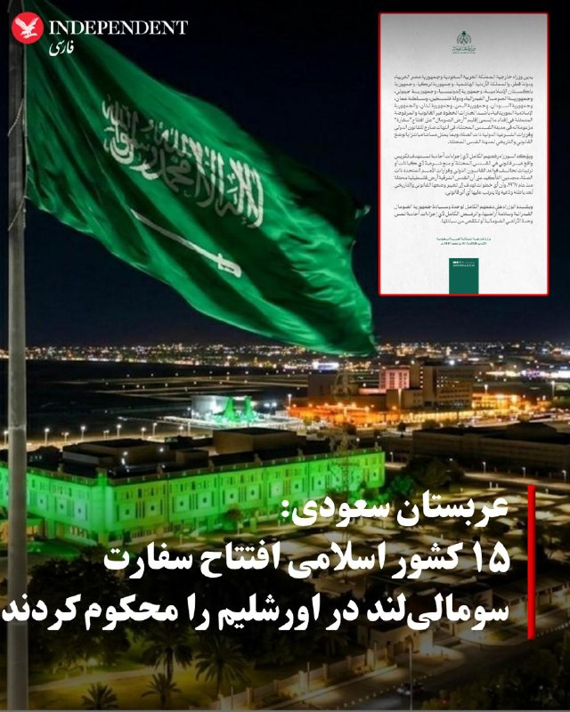
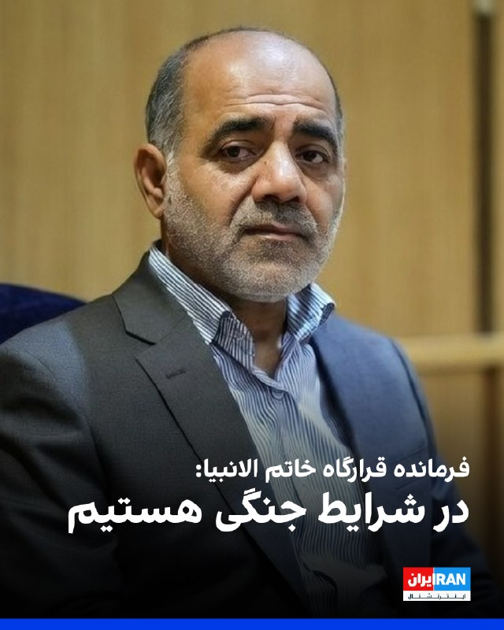
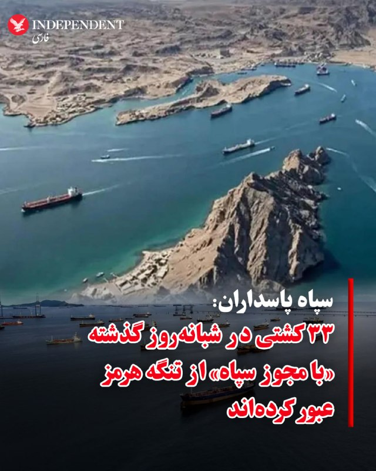
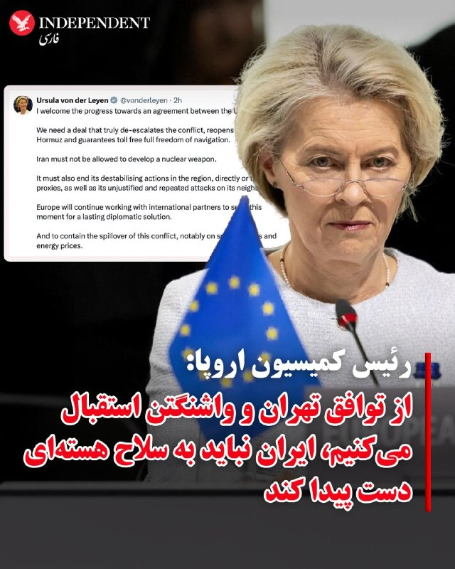
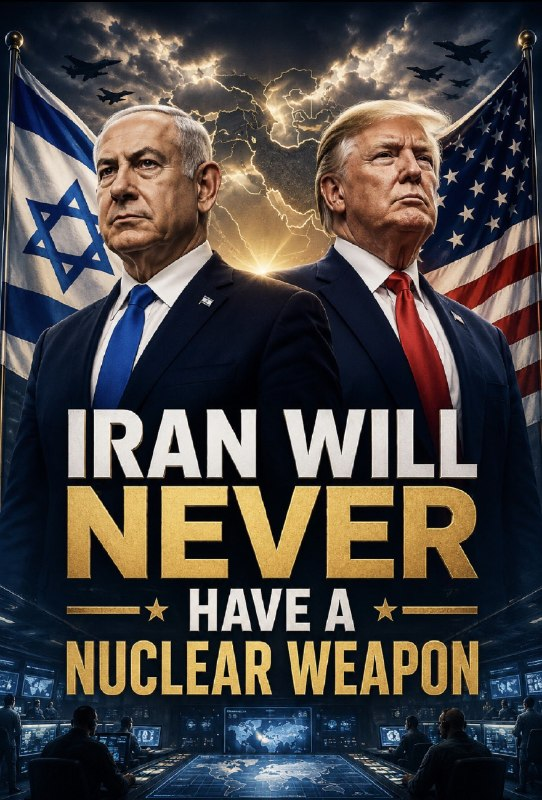
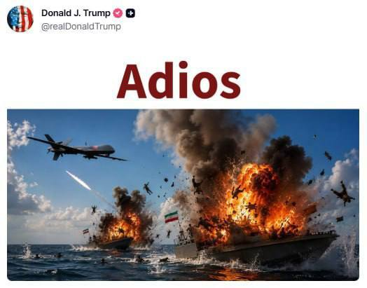
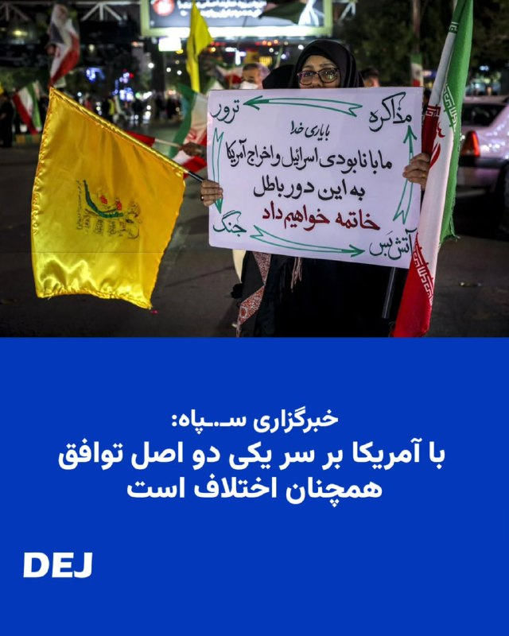
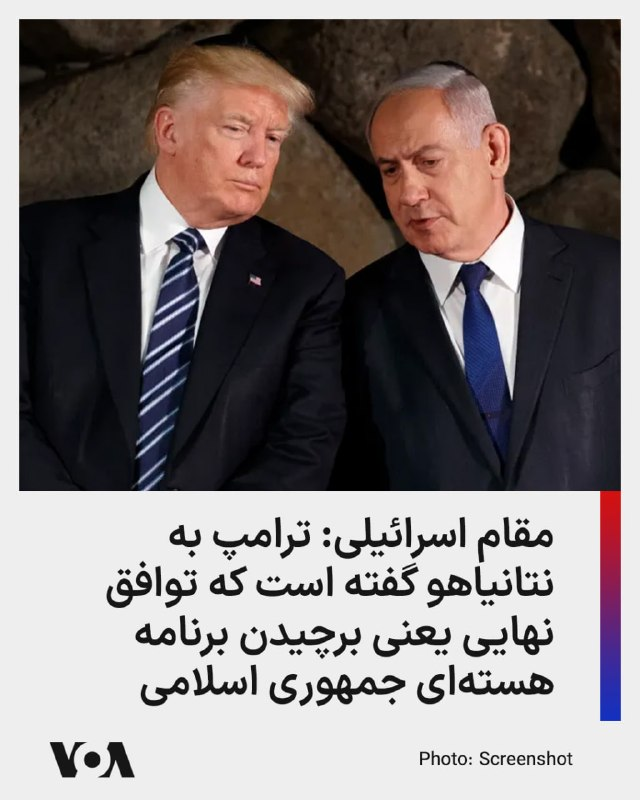
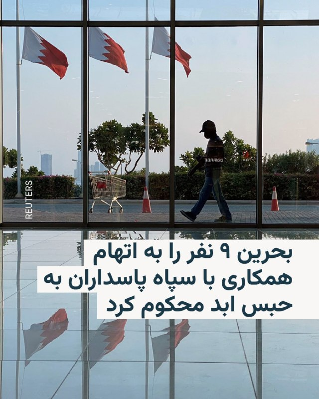
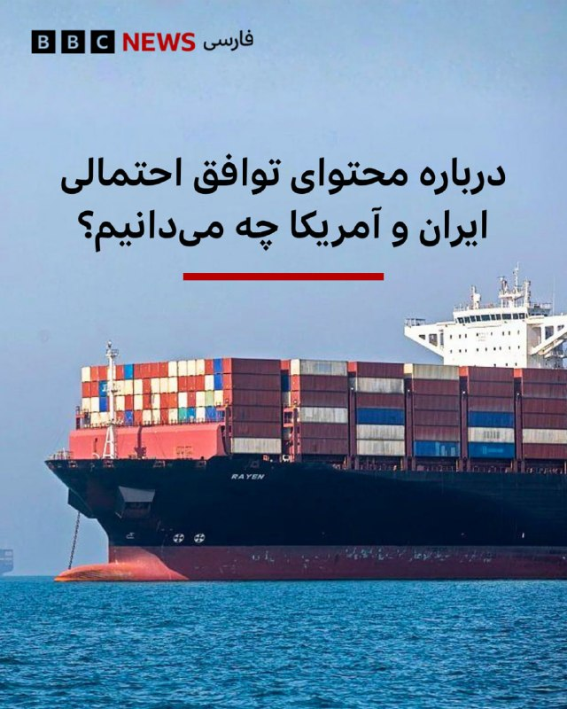

# خواننده تلگرام

<!-- TOP_NAV START -->

<a href="https://github.com/keihancpu/aio-downloader/blob/main/telegram/content/archive_1.md" style="display:inline-block; padding:6px 12px; margin:0 4px; background-color:#2ea44f; color:white; text-decoration:none; border-radius:4px; font-weight:bold;">صفحه بعد</a>

<!-- TOP_NAV END -->

<!-- MSG START -->

---
📅 بروزرسانی: 1405/03/03 17:37
---

## VahidOOnLine — post 241943

  

♦️وزارت امور خارجه عربستان سعودی، روز یکشنبه سوم خرداد ماه با انتشار بیانیه‌ای اعلام کرد وزیران امور خارجه عربستان، مصر، قطر، اردن، ترکیه، پاکستان، اندونزی، جیبوتی، سومالی، فلسطین، عمان، سودان، یمن، لبنان و موریتانی، اقدام «سومالی‌لند» برای افتتاح «سفارتخانه» در اسرائیل را به‌شدت محکوم کردند.

در بیانیه وزارت خارجه عربستان آمده است این اقدام «غیرقانونی و مردود» نقض آشکار قوانین بین‌المللی و قطعنامه‌های مرتبط سازمان ملل متحد به شمار می‌رود و تعرضی مستقیم به وضعیت حقوقی و تاریخی شهر قدس اشغالی محسوب می‌شود.

این بیانیه همچنین تاکید کرد وزیران خارجه کشورهای یادشده با هرگونه اقدام یک‌جانبه با هدف تثبیت «واقعیتی غیرقانونی» در قدس اشغالی یا مشروعیت‌بخشی به نهادها و ترتیبات ناقض حقوق بین‌الملل مخالفت کامل دارند.

وزارت خارجه عربستان در پایان اعلام کرد وزیران خارجه این کشورها بر حمایت کامل خود از حاکمیت، وحدت و تمامیت ارضی جمهوری فدرال سومالی و مخالفت قاطع با هر اقدامی که به وحدت سرزمینی سومالی آسیب بزند، تاکید کردند.
‌🇸🇦 Indypersian

🤖 @VahidOOnLine

## VahidOOnLine — post 241942

  <a href="telegram/content/VahidOOnLine_241942_1779631651.mp4" target="_blank">🎬 Download video</a>

♦️مارکو روبیو، وزیر خارجه آمریکا، روز یکشنبه در جریان نشست خبری مشترک با سابرامانیام جایشانکار، وزیر خارجه هند، در دهلی‌نو اعلام کرد هدف نهایی آمریکا این است که ایران «هرگز» نتواند به سلاح هسته‌ای دست پیدا کند.
روبیو گفت: «هدف نهایی این است که ایران هرگز نتواند به سلاح هسته‌ای دست یابد. ایران هرگز نباید مالک سلاح هسته‌ای شود.»
او تاکید کرد دونالد ترامپ، رئیس‌جمهوری آمریکا، در این زمینه موضعی «کاملا روشن» داشته و گفته است ایران هرگز به سلاح هسته‌ای دست نخواهد یافت.
وزیر خارجه آمریکا افزود: «قطعا تا زمانی که دونالد ترامپ رئیس‌جمهور است، این اتفاق نخواهد افتاد.»
‌🇸🇦 Indypersian

🤖 @VahidOOnLine

## VahidOOnLine — post 241941

  

مارکو روبیو، وزیر خارجه آمریکا، اظهارنظرها درباره ضعیف‌ بودن توافق احتمالی دونالد ترامپ با جمهوری اسلامی را «مضحک» توصیف کرد. روبیو که در سفر به هند به‌سر می‌برد، به خبرنگاران گفت تعهد ترامپ به جلوگیری از دستیابی ایران به سلاح هسته‌ای «نباید از سوی هیچ‌کس زیر سؤال برود»

او افزود: این که ترامپ ممکن است با توافقی موافقت کند که در نهایت موقعیت ایران را در برنامه هسته‌ای تقویت کند، با توجه به مواضع و اقداماتی که تاکنون از او دیده‌ایم، کاملا مضحک است.
‌🏁 🇬🇧 IranintlTV

🤖 @VahidOOnLine

## VahidOOnLine — post 241940

  <a href="telegram/content/VahidOOnLine_241940_1779631653.mp4" target="_blank">🎬 Download video</a>

فائزه حسین‌نژاد، دانشجوی ۲۳ ساله مامایی و والیبالیست، شامگاه ۱۹ دی ۱۴۰۴ در خیابان امامت مشهد به دست نیروهای سرکوبگر کشته شد. ابتدا گلوله‌ای به زیر قلبش زدند و سپس زیر ضربات باتون او را کشتند.
‌🏁 🇬🇧 IranintlTV

🤖 @VahidOOnLine

## VahidOOnLine — post 241939

تجمع مقابل ساختمان بی‌بی‌سی فارسی در لندن، یکشنبه سوم خرداد ۱۴۰۵
‌🏁 🇬🇧 ManotoTV

🤖 @VahidOOnLine

## VahidOOnLine — post 241938

  <a href="telegram/content/VahidOOnLine_241938_1779631655.mp4" target="_blank">🎬 Download video</a>

بر اساس ویدیوهای ارسال‌شده به ایران‌اینترنشنال گروهی از ایرانیان مقیم استرالیا در حمایت از مردم ایران و علیه جمهوری اسلامی در شهر آدلاید کاروان خودرویی به راه انداختند.
‌🏁 🇬🇧 IranintlTV

🤖 @VahidOOnLine

## VahidOOnLine — post 241937

  

علی عبداللهی، فرمانده قرارگاه مرکزی خاتم الانبیا، گفت: «در شرایط جنگی هستیم و تمامی نیروهای مسلح در آمادگی کامل به سر می‌برند که با هر دشمنی و در هر سطحی مقابله کنند.»

او افزود: «پیروزی ما بر دشمنان، معجزه الهی بود، در چند جنگ اخیر متکی به ابزار خودمان بودیم و با ساخته‌های بومی خودمان با دشمنان جنگیدیم، اکنون نیز باید در تمام عرصه‌ها آماده باشیم و به موفقیت برسیم.»
‌🏁 🇬🇧 IranintlTV

🤖 @VahidOOnLine

## VahidOOnLine — post 241936

♦️صدها نیروی پلیس ضدشورش ترکیه روز یکشنبه سوم خرداد ماه با استفاده از گاز اشک‌آور وارد مقر حزب جمهوری‌خواه خلق (CHP)، بزرگ‌ترین حزب مخالف دولت، در آنکارا شدند و کنترل ساختمان را در دست گرفتند.
این اقدام پس از آن انجام شد که دادگاهی رهبری حزب را برکنار و حکم به تغییر مدیریت آن صادر کرد. اعضای حزب جمهوری‌خواه خلق ورودی‌های ساختمان را مسدود کرده و از اجرای حکم دادگاه سر باز زده بودند.
دادگاه ترکیه روز پنجشنبه پیروزی اوزگور اوزل در انتخابات داخلی سال ۲۰۲۳ حزب را لغو و کمال قلیچداراوغلو، رهبر پیشین حزب، را به عنوان رئیس موقت منصوب کرد.
اوزل پیش‌تر در شبکه‌های اجتماعی نوشته بود: «ما اینجا را ترک نخواهیم کرد.»
در ادامه، حامیان قلیچداراوغلو تلاش کردند وارد ساختمان شوند و سپس پلیس با دریافت دستور وارد عمل شد و ساختمان را تصرف کرد.
به گزارش خبرگزاری فرانسه، سازمان دیده‌بان حقوق بشر نیز روز شنبه دولت رجب طیب اردوغان را متهم کرد که با «تاکتیک‌های سوءاستفاده‌گرانه» در حال تضعیف دموکراسی در ترکیه است.
‌🇸🇦 Indypersian

🤖 @VahidOOnLine

## VahidOOnLine — post 241935

  <a href="telegram/content/VahidOOnLine_241935_1779631657.mp4" target="_blank">🎬 Download video</a>

فایننشال تایمز در گزارشی نوشت سپاه از یک شبکه تدارکاتی مستقر در امارات برای خرید تجهیزات پیشرفته ماهواره‌ای چینی مرتبط با برنامه پهپادی و موشکی خود استفاده کرده است.

بر اساس این گزارش، شرکتی به نام «تله‌سان» در راس‌الخیمه، انتقال حدود یک و هشت دهم تن تجهیزات ارتباطی ماهواره‌ای ساخت چین را از شانگهای به ایران، از مسیر دبی، تسهیل کرده است.

فایننشال تایمز نوشت مقصد نهایی این تجهیزات شرکت «ارتباطات فراگستر کیش» بوده که بنا بر این گزارش، با «گروه صنعتی سامان» مرتبط با نیروی هوافضای سپاه و تحریم‌شده از سوی آمریکا همکاری داشته است.

این روزنامه همچنین گزارش داد بخش پایانی انتقال محموله با یک کشتی ایرانی انجام شده که برای پنهان کردن مسیر خود، داده‌های موقعیت‌یابی نادرست مخابره کرده است.
‌🏁 🇬🇧 ManotoTV

🤖 @VahidOOnLine

## VahidOOnLine — post 241933

  

♦️همزمان با بالاگرفتن گمانه‌زنی‌ها در خصوص توافق احتمالی میان تهران و واشنگتن، روابط عمومی نیروی دریایی سپاه روز یکشنبه سوم خرداد ماه در بیانیه‌ای اعلام کرد در شبانه‌روز گذشته ۳۳ کشتی اعم از نفتکش، باربر و کشتی‌های تجاری «پس از کسب مجوز با هماهنگی و تامین امنیت نیروی دریایی سپاه» از تنگه هرمز عبور کردند.
سپاه پاسداران روز شنبه نیز از عبور ۲۵ کشتی از تنگه هرمز خبر داده بود.
‌🇸🇦 Indypersian

🤖 @VahidOOnLine

## VahidOOnLine — post 241932

  

نیروی دریایی سپاه پاسداران اعلام کرد در شبانه‌روز گذشته، ۳۳ کشتی اعم از نفتکش، کانتینربر و سایر کشتی‌های تجاری «پس از کسب مجوز و با هماهنگی و تامین امنیت این نیرو« از تنگه هرمز عبور کردند.
روز شنبه نیز سپاه پاسداران از عبور ۲۵ کشتی از تنگه هرمز خبر داده بود.
‌🏁 🇬🇧 IranintlTV

🤖 @VahidOOnLine

## VahidOOnLine — post 241931

  <a href="telegram/content/VahidOOnLine_241931_1779631658.mp4" target="_blank">🎬 Download video</a>

♦️مسعود پزشکیان، رئیس‌جمهوری اسلامی، روز یکشنبه سوم خردادماه اعلام کرد ایران آماده است در چارچوب گفتگوها به جهان اطمینان دهد که به‌دنبال سلاح هسته‌ای و ایجاد ناآرامی در منطقه نیست.
او با اشاره به مواضع پیشین جمهوری اسلامی تأکید کرد که ایران همواره بر عدم دستیابی به سلاح هسته‌ای تاکید داشته و هدف آن حفظ ثبات منطقه است. پزشکیان در ادامه اسرائیل را عامل بی‌ثباتی در منطقه دانست و مدعی شد این کشور به‌دنبال ایجاد تنش و اختلاف است.
رئیس‌جمهوری ایران همچنین تأکید کرد تیم مذاکره‌کننده در هیچ شرایطی از «عزت و سربلندی» کشور عقب‌نشینی نخواهد کرد و این اصول در روند مذاکرات حفظ خواهد شد.
‌🇸🇦 Indypersian

🤖 @VahidOOnLine

## VahidOOnLine — post 241930

  

♦️اورسولا فون در لاین، رئیس کمیسیون اروپا، روز یکشنبه سوم خرداد ماه اعلام کرد اتحادیه اروپا از پیشرفت در مسیر دستیابی به توافق میان آمریکا و ایران استقبال می‌کند.
رئیس کمیسیون اروپا تاکید کرد که ایران نباید اجازه دستیابی به سلاح هسته‌ای را داشته باشد و اقدامات بی‌ثبات‌کننده تهران در منطقه باید متوقف شود.
فون در لاین همچنین گفت اتحادیه اروپا به تلاش برای دستیابی به یک راه‌حل دیپلماتیک دائمی درباره ایران ادامه خواهد داد.
رئیس کمیسیون اروپا بار دیگر بر اهمیت بازگشایی تنگه هرمز و تضمین آزادی کشتیرانی در این آبراه راهبردی تاکید کرد.
فون در لاین در پیامی نوشت: «ما به توافقی نیاز داریم که واقعا به کاهش تنش منجر شود، تنگه هرمز را بازگشایی کند و آزادی کامل کشتیرانی بدون عوارض را تضمین کند. ایران نباید اجازه پیدا کند سلاح هسته‌ای تولید کند.»
‌🇸🇦 Indypersian

🤖 @VahidOOnLine

## WithYashar — post 12337

https://www.instagram.com/p/DYuUYVWMTTa/?igsh=eXI0enRnYjU0aTlq

کامنتم رک و مستقیمم برای بی بی
کارای ادایشو انجام بدید
ترجمه :
بی بی‌ جون، کار را یکسره کن.
اگر این توافق امضا شود، مردم ایران بازنده خواهند بود و اسرائیل هم به‌سمت افول می‌رود.
خیلی صریح و روشن می‌گویم: ما دوست نداریم دوران سیاسی شما هم زود به پایان برسد.
شما باید روزی در ایران میهمان ما باشید تا با هم جشن بگیریم❤️‍🩹

## WithYashar — post 12336

دونالد ترامپ در گفت‌وگو با ABC News:

من نمی‌توانم دربارهٔ توافق صحبت کنم؛ این کاملاً به خودم بستگی دارد، و اگر خبری وجود داشته باشد، فقط خبر خوب خواهد بود.

من توافق بد انجام نمی‌دهم.
@withyashar

## WithYashar — post 12335

یدیعوت آحارانوت به نقل از یک منبع ارشد امنیتی: اگر این توافق به شکل فعلی امضا شود، برای اسرائیل فاجعه بار خواهد بود.
@withyashar

## WithYashar — post 12334

رادیو ارتش اسرائیل: نتانیاهو امشب ساعت 18:00 جلسه‌ای برگزار میکنه.

@withyashar

## WithYashar — post 12333

آکسیوس : کاخ سفید امیدوار است که اختلافات نهایی در ساعات آینده حل شود و توافقی روز یکشنبه اعلام شود
ممکن است این توافق حتی 60 روز کامل هم دوام نیاورد اگر آمریکا معتقد باشد ایران در مذاکرات هسته‌ ای جدی نیست
@withyashar

## WithYashar — post 12332

رشیدی کوچی، نماینده مجلس: اینترنت بین‌المللی تا هفته آینده به روال عادی برمیگرده.
@withyashar

## WithYashar — post 12331

کانال 14 اسرائیل:
اسرائیل رهبر 86 ساله که از سرطان مرحله 4 در حال مرگ بود رو از بین نبرد تا آمریکا با پسر 56 ساله سالم‌تر و تندروتر او صلح کنه.
با آمریکا یا بدون آمریکا، اسرائیل این رژیم رو به پایان خواهد رسوند.
@withyashar

## WithYashar — post 12330

  <a href="telegram/content/WithYashar_12330_1779631660.mp4" target="_blank">🎬 Download video</a>

مارکو روبیو: ما توانستیم وارد ونزوئلا شویم و اورانیوم بسیار غنی‌شده را خارج کنیم.
نظام ایران حتی از بحث درباره آن خودداری کرده است. این باید تغییر کند.
@withyashar

## WithYashar — post 12329

روزنامه پاکستانی«داون»: فضای مذاکرات همچنان محتاطانه است؛ تهران حاضر به مصالحه بر حقوق خود نیست
@withyashar

## mwarmonitor — post 9639

  

🔸پست بنیامین نتانیاهو در شبکه اجتماعی ایکس

@mwarmonitor

## mwarmonitor — post 9638

🔴اتحادیه اروپا: گسترش دامنه تحریم‌ها علیه ایران به دلیل بستن تنگه هرمز.

@mwarmonitor

## mwarmonitor — post 9637

  <a href="telegram/content/mwarmonitor_9637_1779631662.mp4" target="_blank">🎬 Download video</a>

📝 امام ۵۳ ساله‌ای که مستقیم از کاخ‌های مجلل لیسبون پرتغال با هلیکوپتر لوکس سوئیسی بر فراز کوه‌های پاکستان نازل می‌شود تا به اصطلاح «کیفیت زندگی» گوسفندچرانی را ارتقا دهد که سهم‌شان از جهان، زندگی در میان پشکل و کثافت و فقر مطلق است. تماشای این جماعتِ مسخ‌شده که زیر پای این امام فرنگ‌نشین فرش قرمز پهن می‌کنند و برای ابراز وفاداری ۱۳۰ هزار درخت می‌کارند، اوج بلاهت و حماقت بشری است؛ کپی برابر اصلی از شعبات دیگر شیعه تفسیرشده به نفع حاکمان، درست مثل جمهوری اسلامی که در آن سران و آقازاده‌هایش در کانادا و ویلاهای لوکس غرق در ثروتند و سهم مردمش فقر، فلاکت و ذوب شدن در ولایت است. مردمی بدبخت که در اوج فلاکت برای تکان دادن دست یک میلیونرِ کت‌وشلواری هلهله می‌کنند، در حالی که او با کلاهی مضحک بر سر و لبخندی تحقیرآمیز، چند دقیقه‌ای روی صندلی پادشاهی می‌نشیند، عکس‌های تبلیغاتی‌اش را می‌گیرد و دوباره به زندگی اشرافی‌اش در اروپا برمی‌گردد تا کثافت این تناقض مذهبی، استثمارِ شیکِ توده‌های جاهل، و این دکان‌های دین‌فروشیِ مشترک، بیشتر از همیشه به ریش انسانیت دهن‌کجی کند.

@mwarmonitor

## mwarmonitor — post 9636

🔴جیسون برودسکی مدیر سیاست‌گذاری در سازمان «اتحاد علیه ایران هسته‌ای »

من چند نظر اولیه درباره پیش‌نویس یادداشت تفاهم (MOU) میان ایران و آمریکا، آن‌گونه که در گزارش‌های رسانه‌ای آمده، دارم:

۱) تا زمانی که همه‌چیز نهایی نشود، هیچ‌چیز نهایی نیست. با توجه به رویدادهای پس از سال ۲۰۲۵، همیشه امکان غافلگیری وجود دارد. باید برای اتفاقات غیرمنتظره آماده بود. مطمئنم رئیس‌جمهور ترامپ با دقت واکنش‌ها تا این لحظه را زیر نظر دارد.

۲) درباره توصیف این پیش‌نویس MOU به‌عنوان «توافق صلح» هشدار می‌دهم. از نظر من، این صرفاً ترتیبی برای خریدن زمان جهت مذاکرات بیشتر است. کل سیاست خارجی رژیم ایران بر دشمنی با آمریکا و اسرائیل بنا شده و این موضوع—چه MOU باشد چه نباشد—تغییری نخواهد کرد. این یک اقدام فوق‌العاده شکننده است. توهم کاهش تنش نباید با صلح واقعی اشتباه گرفته شود، چرا که تهران ممکن است از طریق معافیت‌های تحریمی، فروش آزادانه نفت و رفع محاصره، منابع بیشتری برای تسلیح مجدد و بازسازی شبکه تروریستی و توانمندی‌های نظامی خود به‌دست آورد. صلح واقعی زمانی محقق می‌شود که این رژیم از میان برود.

۳) من نگران گزارش‌های رسانه‌ای درباره «تعهدات شفاهی» در موضوعات محوری مانند غنی‌سازی و ذخایر اورانیوم بسیار غنی‌شده (HEU) هستم. درک می‌کنم که آزادسازی بخش عمده دارایی‌های ایران و رفع کامل تحریم‌ها تا زمان دستیابی به توافق نهایی انجام نخواهد شد و مفهومی به نام «کاهش تحریم در برابر اقدام» وجود دارد؛ اما این خطر هست که حتی برخی معافیت‌های تحریمی و رفع محاصره—که اهرم‌های فشار قدرتمندی هستند—انگیزه تهران را برای دادن امتیازاتی که آمریکا بعداً می‌خواهد کاهش دهد و ایران ترجیح دهد با وقت‌کشی، منتظر پایان دولت ترامپ بماند.

۴) همچنین این پرسش مطرح است که آیا با چنین MOUای، تنگه هرمز واقعاً حتی «باز» خواهد بود یا نه؛ چرا که شرکت‌ها ممکن است با توجه به ریسک‌ها همچنان احساس امنیت نکنند. برداشت از ریسک اهمیت دارد. به همین دلیل است که این اقدام را فوق‌العاده شکننده می‌دانم. پرچالش و محل مناقشه خواهد بود.

۵) این یک واقعیت است که تنها دلیل وجود یک تعهد—حتی در حد شفاهی—برای مذاکره درباره تعلیق چندساله غنی‌سازی، این است که رئیس‌جمهور ترامپ با اقدام نظامی، واقعیت‌های میدانی را ایجاد کرد. تعلیق چندساله غنی‌سازی حتی در دولت بایدن هم روی میز نبود و تهران آن را در نظر نمی‌گرفت، مگر تحت فشار نظامی دولت ترامپ.

۶) همچنین این یک واقعیت است که عملیات «Epic Fury» دستاوردهای متعددی داشت—تضعیف برنامه موشکی و پهپادی ایران، فرسایش پایگاه صنعتی دفاعی، تضعیف شبکه تروریستی، حذف مقامات کلیدی جمهوری اسلامی که دستانشان به خون آمریکایی‌ها آلوده بود، و ضربه به صنایع کلیدی تأمین‌کننده منابع مالی سپاه پاسداران—دستاوردهایی که با دیپلماسی ممکن نبود. جمهوری اسلامی حتی حاضر نیست درباره آن‌ها مذاکره کند. و برخلاف اسلافش، رئیس‌جمهور ترامپ به‌درستی به صدور بیانیه‌های تند و نمادین و تحریم‌های سمبلیک بسنده نکرد، در حالی که رژیم به اقدامات مرگبار خود ادامه می‌دهد.

۷) در نهایت، همان‌طور که پیش‌تر تأکید کرده‌ام، با حضور این رژیم در قدرت، پایان خوشی وجود ندارد؛ تنها می‌توان مناقشه را مدیریت کرد و با ابزارهای اقتصادی، نظامی و گاهی دیپلماتیک با رژیم مقابله نمود. این مسیر اغلب آشفته، ناقص و همراه با ریسک است—و همه ابزارها، از جمله توافق‌های دیپلماتیک، در مواجهه با تهدیدهای این رژیم ریسک دارند.

@mwarmonitor

## mwarmonitor — post 9635

🔸محمد مرندی عضو تیم مذاکره کننده ایران:

🔹رژیم صهیونیستی «آزادی عمل» نخواهد داشت.

🔹مدیریت تنگه هرمز موضوعی است که میان ایران و عمان، به‌عنوان کشورهای ساحلی، هماهنگ می‌شود.

🔹ایران تحت این یادداشت تفاهم هیچ تعهد هسته‌ای جدیدی نمی‌پذیرد، جز در خصوص سلاح هسته‌ای که موضوع تازه‌ای نیست.

🔹ایران به دارایی‌های مسدودشده خود دسترسی خواهد داشت.

🔹تحریم‌های مرتبط با بخش انرژی لغو خواهند شد.

@mwarmonitor

## mwarmonitor — post 9634

  

ترامپ در سوشال تروث

@mwarmonitor

## FoxNewsTwitter — post 342184

  

Fox News (Twitter/X)

“You don't have much experience with Latin American hookers, do you?”

More deleted Reddit comments tied to Maine Democratic Senate candidate Graham Platner are surfacing as scrutiny over his online history intensifies.

In newly uncovered posts from 2012, Platner discussed prostitution overseas and defended men who cheated on their wives while abroad, writing that infidelity and loyalty to fellow soldiers were “not mutually exclusive.”

The comments add to a growing archive linked to Platner that also includes posts insulting the U.S. Army, mocking a Purple Heart recipient, using slurs, and expressing support for political violence — creating new headaches for Democrats in his bid to unseat incumbent Republican Sen. Susan Collins.

## pm_afshaa — post 91390

  <a href="telegram/content/pm_afshaa_91390_1779631664.webm" target="_blank">🎬 Download video</a>

🔴ترامپ به ABC: کل توافق فقط به من بستگی داره. فقط خبرهای خوب میاد. من هیچ معامله بدی نمیبندم.

💧 Rainbet.com the #1 Non-KYC Crypto Casino & Sportsbook @rainbetcom

😁 @Pm_Afshaa

## pm_afshaa — post 91389

  <a href="telegram/content/pm_afshaa_91389_1779631665.webm" target="_blank">🎬 Download video</a>

🔴مقامات آمریکایی به آکسیوس:
کاخ سفید امیدواره که اختلافات نهایی در ساعات آینده حل بشه و توافقی روز یکشنبه اعلام بشه، ممکنه این توافق حتی تا 60 روز کامل هم دوام نیاره، اگه آمریکا معتقد باشه ایران در مذاکرات هسته‌ای جدی نیست.

💧 Rainbet.com the #1 Non-KYC Crypto Casino & Sportsbook @rainbetcom

😁 @Pm_Afshaa

## pm_afshaa — post 91388

  <a href="telegram/content/pm_afshaa_91388_1779631665.webm" target="_blank">🎬 Download video</a>

🔴رادیو ارتش اسرائیل: نتانیاهو امشب ساعت 18:00 جلسه‌ای برگزار میکنه.

💧 Rainbet.com the #1 Non-KYC Crypto Casino & Sportsbook @rainbetcom

😁 @Pm_Afshaa

## pm_afshaa — post 91387

  <a href="telegram/content/pm_afshaa_91387_1779631666.webm" target="_blank">🎬 Download video</a>

🔴مدیر دفتر المیادین در اسلام‌آباد:
خبرهایی درباره اعلامیه‌ای در روز دوشنبه از سمت وزیر خارجه و فرمانده ارتش پاکستان منتشر شده.

ممکنه پاکستان فردا چهار بندی رو که بر سر اونا توافق حاصل شده، اعلام کنه.

💧 Rainbet.com the #1 Non-KYC Crypto Casino & Sportsbook @rainbetcom

😁 @Pm_Afshaa

## pm_afshaa — post 91386

🔴رشیدی کوچی: اینترنت این هفته به حالت قبل بر می‌گردد، یا 48 ساعت آینده یا تا پایان هفته

💧 Rainbet.com the #1 Non-KYC Crypto Casino & Sportsbook @rainbetcom

😁 @Pm_Afshaa

## pm_afshaa — post 91385

  <a href="telegram/content/pm_afshaa_91385_1779631666.webm" target="_blank">🎬 Download video</a>

🔴یک منبع اسرائیلی به فاکس‌نیوز:
ترامپ صراحتا به نتانیاهو اعلام کرده بدون برچیده شدن کامل برنامه هسته‌ای جمهوری اسلامی و خروج تمام اورانیوم غنی‌شده از ایران، هیچ توافق نهایی‌ای امضا نخواهد شد.

💧 Rainbet.com the #1 Non-KYC Crypto Casino & Sportsbook @rainbetcom

😁 @Pm_Afshaa

## pm_afshaa — post 91384

  <a href="telegram/content/pm_afshaa_91384_1779631667.webm" target="_blank">🎬 Download video</a>

🔴پست جدید ترامپ که به اسپانیایی واژه خداحافظ رو نوشته که بسیار طعنه آمیز است و معنیه «بری دیگه برنگردی» رو میده.

💧 Rainbet.com the #1 Non-KYC Crypto Casino & Sportsbook @rainbetcom

😁 @Pm_Afshaa

## DEJradio — post 4919

  <a href="telegram/content/DEJradio_4919_1779631667.mp4" target="_blank">🎬 Download video</a>

🎤
🛑 بازداشت محمدباقر الساعدی، فرمانده نزدیک به کتائب حزب‌الله عراق، در ترکیه و انتقال او به آمریکا، بار دیگر توجه‌ها را به شبکه‌های نیابتی و فعالیت‌های برون‌مرزی گروه‌های همسو با جمهوری اسلامی جلب کرده است. پرونده‌ای که واشنگتن آن را مرتبط با طراحی و پشتیبانی از حملات در چند کشور می‌داند و می‌تواند در ادامه، ابعاد سیاسی و امنیتی گسترده‌تری پیدا کند.
هانا نامداری گزارش می‌دهد.

#نیروهای_نیابتی #جمهوری_اسلامی
@DEJradio

## DEJradio — post 4918

👑🎥 ایرانیان مقیم استکهلم روز شنبه با برگزاری تجمعی در این شهر، حمایت خود را از «انقلاب شیر و خورشید» اعلام کردند و خواستار تعطیلی سفارتخانه‌های جمهوری اسلامی در سوئد شدند. بهنام روغنی گزارش می‌دهد.

#استکهلم #همبستگی
@DEJradio

## DEJradio — post 4917

  

🔸
🛩️ منابع غیررسمی یکشنبه سوم خرداد ۱۴۰۵ از پرواز چند پهپاد بر فراز ایران خبر دادند. شهروندان در استان‌های غربی و جنوبی پرواز این پهپادها را گزارش دادند. نوع این پهپادها هنوز مشخص نیست اما شنیده شد یکی از آنها «اوربیتر» است.
خبرگزاری مهر، وابسته به سازمان تبلیغات اسلامی، اعلام کرد یک پهپاد اسرائیلی که کاربری جاسوسی و شناسایی داشت، با شلیک پدافند ارتش جمهوری اسلامی سرنگون شد. این گزارش افزود: «لاشه پهپاد متلاشی شده اربیتر با همکاری ناوگروه دریابانی فراجای هرمزگان کشف شد.»

#پهپاد
@DEJradio

## DEJradio — post 4916

🎤
⭕️ برنامه چالش
گفتگو با ناصر کرمی اقلیم شناس و عضو جبهه هفت آبان؛
غیبت مجتبی خامنه‌ای؛ چه کسانی تصمیم‌گیر هستند؟

#چالش #موشتبا
@DEJradio

## kianmeli1 — post 87634

  <a href="telegram/content/kianmeli1_87634_1779631669.mp4" target="_blank">🎬 Download video</a>

🔴هواپیماهای سوخت‌رسان هوایی KC-135R و KC-46A نیروی هوایی ایالات متحده از پایگاه هوایی الظفره در امارات متحده عربی اوایل هفته گذشته پس از استقرار از اوایل آوریل تخلیه شدند.

ممکن است به اسرائیل یا عربستان سعودی منتقل شده باشند.
https://t.me/kianmeli1

## kianmeli1 — post 87632

🔴تصاویر ماهواره‌ای با وضوح بالا نمای واضحی از دارایی‌های نیروی هوایی ایالات متحده مستقر در فرودگاه خانیا در کرت یونان ارائه می‌دهد، از جمله:

3× هواپیمای شناسایی سیگنال RC-135W Rivet Joint

6× هواپیمای سوخت‌رسان هوایی KC-135R

2× هواپیمای جنگ الکترونیک EA-37B Compass Call
https://t.me/kianmeli1

## kianmeli1 — post 87631

  

🔴توییت جدید نتانیاهو با تصویری از خودش و رئیس‌جمهور آمریکا ترامپ و عبارت «ایران هرگز سلاح هسته‌ای نخواهد داشت»
https://t.me/kianmeli1

## kianmeli1 — post 87630

🔴ایران بار دیگر این موضوع را که موضوع هسته‌ای بخشی از مذاکرات نیست، رد کرده است، چرا که رویترز به نقل از یک مقام ارشد ایرانی گزارش می‌دهد که آنها با تحویل مواد غنی‌سازی موافقت نکرده‌اند. اوایل این هفته، ایران قاطعانه گزارش‌هایی مبنی بر تمایل به پذیرش این اقدام را رد کرد و تکرار این درخواست از سوی آنها، موضع عمومی آنها را در تقابل با موضع دولت ترامپ قرار می‌دهد.
https://t.me/kianmeli1

## kianmeli1 — post 87629

  

🔴پست جدید ترامپ درحالی که خبرها از احتمال اعلام تفاهم پایان جنگ در آینده نزدیک است
https://t.me/kianmeli1

## IranIntlTV — post 338771

فایننشال‌تایمز: سپاه از طریق شرکت مستقر در امارات تجهیزات ماهواره‌ای چینی تهیه کرده است

فایننشال‌تایمز گزارش داد سپاه پاسداران برای تامین تجهیزات پیشرفته ارتباطات ماهواره‌ای ساخت چین مورد استفاده در برنامه پهپادی خود، از شرکت «تل‌سان» مستقر در راس‌الخیمه امارات متحده عربی استفاده کرده است.
 
این روزنامه یک‌شنبه سوم خرداد نوشت این تجهیزات برای «گروه صنعتی سامان» که در فهرست تحریم‌های آمریکا قرار دارد، تهیه شده‌اند.
 
بر اساس این گزارش، شرکت تل‌سان در اواخر سال ۲۰۲۵ انتقال حدود دو تن تجهیزات آنتن ماهواره‌ای، از جمله یک آنتن موتوردار ۴.۵ متری ساخت شرکت چینی «استاروین»، را از شانگهای به ایران از طریق بندر جبل‌علی هماهنگ کرده است.
 
این معامله از آن جهت توجه‌ها را جلب کرده که نشان می‌دهد یک شرکت مستقر در امارات در تامین تجهیزات ارتباطی مورد نیاز سپاه پاسداران نقش داشته است؛ نهادی که در واکنش به کارزار نظامی اخیر آمریکا و اسرائیل، امارات را هدف حملات موشکی و پهپادی خود قرار داد.
 
امارات بیشترین آسیب را از حملات تلافی‌جویانه تهران در جریان جنگ اخیر متحمل شد و جمهوری اسلامی بیش از ۲۸۰۰ پهپاد و موشک به سوی این کشور شلیک کرد، از جمله به اهداف غیرنظامی.

فعالیت‌ شرکت‌های ایرانی در امارات
با وجود موضع سخت‌گیرانه ابوظبی در قبال جمهوری اسلامی، امارات متحده عربی پیش از جنگ به‌طور سنتی مرکز فعالیت شرکت‌های ایرانی در خارج از کشور بود.

به گفته تحلیلگران، امارات که طی دو دهه اخیر به قطب تجارت در منطقه تبدیل شده، در امارت‌های مختلف خود مناطق آزاد تجاری ایجاد کرده است؛ مناطقی که نظارت بر مبادلات مالی و تجاری در آنها با محدودیت‌هایی همراه است.

همین موضوع نگرانی‌هایی را درباره احتمال سوءاستفاده از این مناطق برای تجارت غیرقانونی و دور زدن تحریم‌ها افزایش داده است.

نقش شرکت مستقر در راس‌الخیمه
فایننشال‌تایمز در ادامه گزارش داد تجهیزات مورد نیاز سپاه از طریق شرکت تل‌سان که در راس‌الخیمه مستقر است، منتقل شد.

این شرکت انتقال حدود ۱.۸ تن تجهیزات آنتن ماهواره‌ای ساخت چین را از شانگهای به ایران، از طریق بندر کانتینری جبل‌علی در دبی، هماهنگ کرد.

فایننشال‌تایمز با استناد به تصاویر ماهواره‌ای و داده‌های موقعیت‌یابی کشتی‌ها نوشت یک شناور ایرانی که در مرحله پایانی این انتقال در ماه نوامبر مورد استفاده قرار گرفت، با ارسال اطلاعات ناوبری جعلی برای سایر شناورها تلاش کرد سفر خود به ایران را پنهان کند.

این اسناد و تحلیل‌های حمل‌ونقل نشان می‌دهد سپاه پاسداران حتی پس از اعمال تحریم‌های غرب علیه شبکه تامین نظامی‌اش، همچنان از مسیر شرکت‌ها و شبکه‌های تجاری مستقر در امارات برای دستیابی به فناوری‌های حساس ارتباطی بهره می‌گرفت.

سپاه پاسداران در جریان جنگ اخیر از این توانمندی‌ها در حملات خود علیه پایگاه‌های نظامی آمریکا در منطقه استفاده کرد؛ حملاتی که خساراتی بر جای گذاشت و به کشته شدن ۱۳ نظامی آمریکایی منجر شد.

پیش‌تر شبکه سی‌ان‌ان به نقل از منابع آگاه گزارش داد جمهوری اسلامی در جریان آتش‌بس شش‌هفته‌ای بخشی از روند تولید پهپادهای خود را از سر گرفته است.

بر اساس این گزارش، حکومت ایران بسیار سریع‌تر از برآوردهای اولیه در حال بازسازی و احیای توان نظامی خود است.

جمهوری اسلامی با وجود تحریم‌های بین‌المللی، همچنان برای دور زدن محدودیت‌ها تلاش می‌کند.

پیش‌تر وال‌استریت ژورنال گزارش داد شبکه‌ای محرمانه تحت مدیریت بابک زنجانی، طی دو سال از طریق صرافی رمزارز بایننس ۸۵۰ میلیون دلار تراکنش برای تامین مالی نیروهای نظامی جمهوری اسلامی انجام داد.

به نوشته این روزنامه، این تراکنش‌ها دست‌کم تا بهمن ۱۴۰۴ ادامه داشت.
 
🔗وب‌سایت ایران‌اینترنشنال
@iranintltv

## IranIntlTV — post 338770

  

مارکو روبیو، وزیر خارجه آمریکا، اظهارنظرها درباره ضعیف‌ بودن توافق احتمالی دونالد ترامپ با جمهوری اسلامی را «مضحک» توصیف کرد. روبیو که در سفر به هند به‌سر می‌برد، به خبرنگاران گفت تعهد ترامپ به جلوگیری از دستیابی ایران به سلاح هسته‌ای «نباید از سوی هیچ‌کس زیر سؤال برود»

او افزود: این که ترامپ ممکن است با توافقی موافقت کند که در نهایت موقعیت ایران را در برنامه هسته‌ای تقویت کند، با توجه به مواضع و اقداماتی که تاکنون از او دیده‌ایم، کاملا مضحک است.
https://iranintl.com/202605242555

## IranIntlTV — post 338769

  <a href="telegram/content/IranIntlTV_338769_1779631672.mp4" target="_blank">🎬 Download video</a>

فائزه حسین‌نژاد، دانشجوی ۲۳ ساله مامایی و والیبالیست، شامگاه ۱۹ دی ۱۴۰۴ در خیابان امامت مشهد به دست نیروهای سرکوبگر کشته شد. ابتدا گلوله‌ای به زیر قلبش زدند و سپس زیر ضربات باتون او را کشتند.

## IranIntlTV — post 338768

  <a href="telegram/content/IranIntlTV_338768_1779631674.mp4" target="_blank">🎬 Download video</a>

در ادامه تجمع‌های ایرانیان خارج از کشور، گروهی از ایرانیان مقیم سوئد یکشنبه مقابل سفارت جمهوری اسلامی در استکهلم تجمع کردند. شرکت‌کنندگان اعلام کردند این تجمع در اعتراض به اجرای کمپین «جان فدا» در این سفارت برگزار شد.

گزارش مهران عباسیان، خبرنگار ایران‌اینترنشنال
@iranintltv

## IranIntlTV — post 338767

  <a href="telegram/content/IranIntlTV_338767_1779631675.mp4" target="_blank">🎬 Download video</a>

بر اساس ویدیوهای ارسال‌شده به ایران‌اینترنشنال گروهی از ایرانیان مقیم استرالیا در حمایت از مردم ایران و علیه جمهوری اسلامی در شهر آدلاید کاروان خودرویی به راه انداختند.

## IranIntlTV — post 338766

  

علی عبداللهی، فرمانده قرارگاه مرکزی خاتم الانبیا، گفت: «در شرایط جنگی هستیم و تمامی نیروهای مسلح در آمادگی کامل به سر می‌برند که با هر دشمنی و در هر سطحی مقابله کنند.»

او افزود: «پیروزی ما بر دشمنان، معجزه الهی بود، در چند جنگ اخیر متکی به ابزار خودمان بودیم و با ساخته‌های بومی خودمان با دشمنان جنگیدیم، اکنون نیز باید در تمام عرصه‌ها آماده باشیم و به موفقیت برسیم.»
https://iranintl.com/202605242129

## IranIntlTV — post 338765

  <a href="telegram/content/IranIntlTV_338765_1779631677.mp4" target="_blank">🎬 Download video</a>

وب‌سایت اتلتیک در گزارشی درباره انتقال کمپ تیم فوتبال ایران از آمریکا به مکزیک نوشت که احتمالا همه بازیکنان و اعضای کادر فنی همچنان برای ورود به آمریکا به ویزا نیاز دارند.

گفت‌وگو با کوشا دلشاد، مربی فوتبال
@iranintltv

## IranIntlTV — post 338764

  <a href="telegram/content/IranIntlTV_338764_1779631679.mp4" target="_blank">🎬 Download video</a>

در ادامه تجمع‌های جهانی ایرانیان علیه جمهوری اسلامی، یکشنبه گروهی از ایرانیان مقیم سوئد مقابل سفارت جمهوری اسلامی در استکهلم تجمع کردند. شرکت‌کنندگان اعلام کردند این تجمع در اعتراض به اجرای کمپین «جان فدا» در این سفارت برگزار شد.

گزارش مهران عباسیان، خبرنگار ایران‌اینترنشنال
@iranintltv

## IranIntlTV — post 338763

  <a href="telegram/content/IranIntlTV_338763_1779631680.mp4" target="_blank">🎬 Download video</a>

فائزه حسین‌نژاد، دانشجوی ۲۳ ساله مامایی و والیبالیست، در تجمع ۱۹ دی در خیابان امامت مشهد با شلیک مستقیم نیروهای سرکوبگر کشته شد.

فرنوش فرجی، عضو تحریریه ایران‌اینترنشنال، گزارش می‌دهد
@iranintltv

## IranIntlTV — post 338762

  <a href="https://t.me/IranintlTV/338762" target="_blank">📎 Download file</a>

🎧نسخه صوتی اخبار نیمروزی | یکشنبه ۳ خرداد
@iranintlTV

## IranIntlTV — post 338761

  <a href="telegram/content/IranIntlTV_338761_1779631682.mp4" target="_blank">🎬 Download video</a>

گزارش‌ها درباره توافق احتمالی میان جمهوری اسلامی و آمریکا به یکی از محورهای اصلی بحث در رسانه‌های اجتماعی تبدیل شده است. در حالی که کاربران مخالف جمهوری اسلامی خواهان توقف مذاکرات هستند، برخی حامیان حکومت نیز هرگونه مذاکره پیش از «انتقام» را خیانت توصیف می‌کنند.

عادله بورنگ، عضو تحریریه ایران‌اینترنشنال، به واکنش کاربران می‌پردازد
@iranintltv

## IranIntlTV — post 338760

  

نیروی دریایی سپاه پاسداران اعلام کرد در شبانه‌روز گذشته، ۳۳ کشتی اعم از نفتکش، کانتینربر و سایر کشتی‌های تجاری «پس از کسب مجوز و با هماهنگی و تامین امنیت این نیرو« از تنگه هرمز عبور کردند.
روز شنبه نیز سپاه پاسداران از عبور ۲۵ کشتی از تنگه هرمز خبر داده بود.
https://iranintl.com/202605246781

## IranIntlTV — post 338759

  <a href="telegram/content/IranIntlTV_338759_1779631684.mp4" target="_blank">🎬 Download video</a>

یکی از بستگان جاویدنام علی مشهدی در تجمع استکهلم، در گفت‌وگو با مهران عباسیان، خبرنگار ایران‌اینترنشنال، درباره نحوه کشته شدن او توضیح داد و پیام پدر این جاویدنام را به اشتراک گذاشت.
@iranintltv

## IranIntlTV — post 338758

فایننشال‌تایمز: جنگ ایران، شکاف میان مصر و امارات متحده عربی را آشکار کرد

فایننشال‌تایمز گزارش داد مصر در اقدامی کم‌سابقه جنگنده‌هایی را به امارات متحده عربی اعزام کرده؛ حرکتی که به نوشته این روزنامه، نشانه تلاش قاهره برای کاهش تنش با ابوظبی و پاسخ به نارضایتی امارات از حمایت ناکافی متحدان عرب در برابر حملات جمهوری اسلامی است.

بر اساس این گزارش، افشای این استقرار نظامی زمانی رخ داد که عبدالفتاح السیسی، رییس‌جمهوری مصر، در سفر اخیر خود به امارات در کنار محمد بن زاید آل نهیان از جنگنده‌های «رافال» مصری مستقر در این کشور بازدید کرد. سیسی در این دیدار گفت: «هر آنچه به امارات آسیب بزند، به مصر آسیب زده است.»

فایننشال‌تایمز نوشت قاهره جزئیاتی از این ماموریت نظامی منتشر نکرده، اما اعزام نیرو ظاهرا با هدف کاهش تنش‌ها با امارات متحده عربی صورت گرفته؛ کشوری که پیش‌تر از دولت‌های عربی به دلیل کمک نکردن کافی در دفاع مقابل حملات حکومت ایران انتقاد کرده بود.

امارات متحده عربی که هدف اصلی حملات تلافی‌جویانه جمهوری اسلامی در جریان جنگ بوده، طی سال‌های اخیر نقش حیاتی در حمایت اقتصادی از مصر ایفا کرده است. این کشور در سال ۲۰۲۳ با یک سرمایه‌گذاری ۳۵ میلیارد دلاری، به تثبیت اقتصاد بحران‌زده مصر کمک کرد و همچنین حواله‌های مالی صدها هزار مصری شاغل در امارات متحده عربی، منبع مهم ارز خارجی برای قاهره محسوب می‌شود.

به نوشته فایننشال‌تایمز، در ابوظبی این برداشت شکل گرفته که جنگ اخیر نشان داد کدام متحدان در شرایط بحرانی قابل اتکا هستند. انور قرقاش، مشاور دیپلماتیک رییس امارات متحده عربی، در ماه مارس از کشورهایی که در برابر «تجاوز ایران» واکنش کافی نشان ندادند انتقاد کرده بود.

این روزنامه همچنین نوشت جنگ اخیر، شکاف‌های تازه‌ای در میان کشورهای منطقه ایجاد کرده و ائتلاف‌های خاورمیانه را در حال بازتعریف قرار داده است. به باور برخی تحلیلگران، محور جدیدی میان عربستان سعودی، مصر، ترکیه و پاکستان در حال شکل‌گیری است؛ کشورهایی که نسبت به نقش اسرائیل در بی‌ثباتی منطقه نگرانی دارند و برای پایان دادن به جنگ آمریکا و اسرائیل علیه حکومت ایران تلاش‌های دیپلماتیک انجام داده‌اند.

اما امارات متحده عربی نسبت به این روند بدبین بوده و نگران است هرگونه توافق، جمهوری اسلامی را در موقعیتی قوی‌تر حفظ کند. مایکل وحید حنا، تحلیلگر گروه بین‌المللی بحران، به فایننشال‌تایمز گفت از نگاه ابوظبی، مشارکت مصر در میانجی‌گری ممکن است به معنای ایجاد نوعی هم‌ترازی سیاسی میان جمهوری اسلامی ایران و امارات متحده عربی تلقی شده باشد؛ موضوعی که برای امارات قابل پذیرش نیست. به گفته او، امارات احساس کرده میانجی‌ها حمایت کافی از مواضع این کشور نشان نداده‌اند.

فایننشال‌تایمز همچنین گزارش داد مصر به دقت رفتار امارات متحده عربی با پاکستان را دنبال کرده است. ابوظبی در ماه آوریل از اسلام‌آباد خواست بازپرداخت فوری وام ۳.۵ میلیارد دلاری را انجام دهد؛ اقدامی که برخی آن را ناشی از نارضایتی امارات از نقش پاکستان در میانجی‌گری میان حکومت ایران و آمریکا دانستند.

به نوشته این روزنامه، اعزام جنگنده‌های مصری تا حدی تنش‌ها میان قاهره و ابوظبی را کاهش داده است. عبدالخالق عبدالله، پژوهشگر اماراتی، این اقدام را «غافلگیری خوشایند» توصیف کرد و گفت: «ما تصور می‌کردیم مصر مردد است و کمک چندانی نمی‌کند. اکنون با ایرانی بسیار تهاجمی روبه‌رو هستیم و این اقدام می‌تواند پیام مهمی برای تهران داشته باشد.»

در عین حال، نزدیکی بیشتر امارات متحده عربی به اسرائیل پس از حملات جمهوری اسلامی ایران، واکنش منفی بخشی از افکار عمومی مصر را برانگیخته است. کاربران مصری شبکه‌های اجتماعی بارها از روابط امارات و اسرائیل انتقاد کرده‌اند؛ موضوعی که به نوشته فایننشال تایمز، در ابوظبی با نارضایتی دنبال شده است.

این گزارش همچنین به اختلاف‌های دیرینه دو کشور درباره مسائل منطقه‌ای اشاره می‌کند؛ از جمله جنگ داخلی سودان، که مصر از ارتش سودان و امارات متحده عربی متهم به حمایت از نیروهای رقیب است، و نیز روابط نزدیک ابوظبی با اتیوپی بر سر پروژه سد بزرگ نیل؛ موضوعی که قاهره آن را تهدیدی برای امنیت آبی خود می‌داند.

فایننشال‌تایمز نوشت اگرچه مصر و امارات همچنان متحد باقی مانده‌اند، اما جنگ ایران شکاف‌های پنهان میان دو کشور را آشکار کرده و نشان داده است که فشارهای امنیتی منطقه‌ای می‌تواند اتحادهای سنتی جهان عرب را بازتعریف کند.

🔗وب‌سایت ایران‌اینترنشنال
@iranintltv

## IranIntlTV — post 338757

  <a href="telegram/content/IranIntlTV_338757_1779631685.mp4" target="_blank">🎬 Download video</a>

یک شهروند با ارسال پیامی به ایران‌اینترنشنال می‌گوید: «ترامپ اشتباه کردی. اشتباه می‌کنی. اشتباه پشت اشتباه. با این‌ها به توافق نمی‌رسی. نه تنها به آنها وقت می‌دهی بلکه قویترشان می‌کنی، ظالم‌ترشان می‌کنی.»

## Shin_Persian — post 6204

↩️ Quoted tweet: Faytuks Network ✓ @FaytuksNetwork Sun, 24 May 2026 12:17:06 UTC Fars News, an IRGC-linked Iranian outlet, reported that U.S. officials and mediators privately told Tehran during indirect exchanges to ignore Donald Trump’s Truth Social posts…

## Shin_Persian — post 6203

↩️ Quoted tweet:
Faytuks Network ✓ @FaytuksNetwork
Sun, 24 May 2026 12:17:06 UTC

Fars News, an IRGC-linked Iranian outlet, reported that U.S. officials and mediators privately told Tehran during indirect exchanges to ignore Donald Trump’s Truth Social posts, saying they were aimed mainly at U.S. domestic audiences and did not reflect Washington’s negotiating

↩️ توییت نقل‌قول شده — برای پاسخ، پست زیر را ببینید.

فارسی

خبرگزاری فارس، رسانه وابسته به سپاه پاسداران انقلاب اسلامی (IRGC)، گزارش داد که مقامات و میانجی‌گران آمریکایی در خلال تبادلات غیرمستقیم، به‌طور خصوصی به تهران گفته‌اند که پست‌های دونالد ترامپ در شبکه اجتماعی «تروث سوشال» را نادیده بگیرد؛ آن‌ها اعلام کردند که این پیام‌ها عمدتاً با هدف جذب مخاطبان داخلی ایالات متحده منتشر شده و بازتاب‌دهنده مواضع مذاکراتی واشینگتن نیست.

𝕏 · @shin_persian

## Shin_Persian — post 6202

  <a href="telegram/content/Shin_Persian_6202_1779631687.mp4" target="_blank">🎬 Download video</a>

↩️ Quoted tweet: Shin ✓ @hey_itsmyturn Sun, 24 May 2026 10:52:04 UTC Islamic Regime claims downing Israeli Orbiter drone over Hormozgan Province with air defense system. Drone reportedly conducting reconnaissance mission. #Iran ↩️ توییت نقل‌قول شده — برای…

## Shin_Persian — post 6201

↩️ Quoted tweet:
Shin ✓ @hey_itsmyturn
Sun, 24 May 2026 10:52:04 UTC

Islamic Regime claims downing Israeli Orbiter drone over Hormozgan Province with air defense system. Drone reportedly conducting reconnaissance mission.

#Iran

↩️ توییت نقل‌قول شده — برای پاسخ، پست زیر را ببینید.

فارسی

رژیم اسلامی مدعی سرنگونی یک پهپاد اوربیتر (Orbiter) اسرائیلی بر فراز استان هرمزگان توسط سامانه پدافند هوایی شد. گزارش شده است که این پهپاد در حال انجام ماموریت شناسایی بوده است.

#Iran

𝕏 · @shin_persian

## ManotoTV — post 105804

  <a href="telegram/content/ManotoTV_105804_1779631688.mp4" target="_blank">🎬 Download video</a>

تجمع مقابل ساختمان بی‌بی‌سی فارسی در لندن، یکشنبه سوم خرداد ۱۴۰۵

## ManotoTV — post 105803

  <a href="telegram/content/ManotoTV_105803_1779631689.mp4" target="_blank">🎬 Download video</a>

فایننشال تایمز در گزارشی نوشت سپاه از یک شبکه تدارکاتی مستقر در امارات برای خرید تجهیزات پیشرفته ماهواره‌ای چینی مرتبط با برنامه پهپادی و موشکی خود استفاده کرده است.

بر اساس این گزارش، شرکتی به نام «تله‌سان» در راس‌الخیمه، انتقال حدود یک و هشت دهم تن تجهیزات ارتباطی ماهواره‌ای ساخت چین را از شانگهای به ایران، از مسیر دبی، تسهیل کرده است.

فایننشال تایمز نوشت مقصد نهایی این تجهیزات شرکت «ارتباطات فراگستر کیش» بوده که بنا بر این گزارش، با «گروه صنعتی سامان» مرتبط با نیروی هوافضای سپاه و تحریم‌شده از سوی آمریکا همکاری داشته است.

این روزنامه همچنین گزارش داد بخش پایانی انتقال محموله با یک کشتی ایرانی انجام شده که برای پنهان کردن مسیر خود، داده‌های موقعیت‌یابی نادرست مخابره کرده است.

## ManotoTV — post 105802

  <a href="telegram/content/ManotoTV_105802_1779631689.mp4" target="_blank">🎬 Download video</a>

دانیال مقدم، خواننده و رپر اعتراضی ایرانی، تتوی جدید صورتش با الهام از «God of War» را فقط به‌عنوان یک طرح انتخاب نکرده؛ این تتو برای او یادآور زخم‌ها، ترس‌ها، امیدها و روزهایی‌ست که نسلش از میان جنگ، درد و ناامیدی عبور کرده است.
رنگ سبز این طرح، نماد عشق، صلح، امید و زندگی‌ست؛ پیامی برای فراموش نکردن روزهایی که مردم با تمام زخم‌هایشان هنوز ایستاده‌اند و ایران را دوست دارند

## FarsiVOA — post 218526

  <a href="telegram/content/FarsiVOA_218526_1779631691.mp4" target="_blank">🎬 Download video</a>

گروهی از بازنشستگان تامین اجتماعی در شوش، در ادامه اعتراضات هفتگی، روز یکشنبه، ۳ خرداد ۱۴۰۵، با شعار «معیشت، منزلت، حق مسلم ماست» در اعتراض به شرایط دشوار معیشتی و خدمات درمانی تجمع کردند.

## FarsiVOA — post 218525

🔺اسرائیل: دروغ حزب‌الله ناخواسته لو رفت

◾️اسرائیل می‌گوید گروه تروریستی حزب‌الله، بدون برنامه‌ریزی قبلی دروغ روایت خود را برای رسانه‌های جهانی آشکار کرد.

⬇️ بیشتر بخوانید:

https://ir.voanews.com/a/hezbollah-s-lie-social-media-delete-news/8153285.html

## FarsiVOA — post 218524

  <a href="telegram/content/FarsiVOA_218524_1779631693.mp4" target="_blank">🎬 Download video</a>

نیروهای ارتش اسرائیل یک مسیر زیرزمینی به طول حدود ۱۰۰ متر متعلق به حزب‌الله را منهدم کردند.

ارتش اسرائیل اعلام کرد نیروهای تیپ «کوهستان‌ها» که در منطقه کوه دوو در لبنان در حال فعالیت هستند با همکاری یگان مهندسی ویژه این مسیر زیرزمینی را شناسایی و منهدم کردند. این مسیر شامل چهار اتاق اقامت بود و توسط نیروهای سازمان تروریستی حزب‌الله استفاده می‌شد.

این ویدیو بی‌صدا است.

## FarsiVOA — post 218523

🔺واکنش نتانیاهو به تیراندازی در نزدیکی کاخ سفید: تلاش‌های مکرر برای ترور پرزیدنت ترامپ با قاطعیت باید محکوم شود

◾️بنیامین نتانیاهو، نخست وزیر اسرائیل به تیراندازی رخ داده در عصر روز شنبه در مجاورت کاخ سفید واکنش نشان داد.

⬇️ بیشتر بخوانید:

https://ir.voanews.com/a/benjamin-netanyahu-white-house-shooting/8153286.html

## FarsiVOA — post 218520

فرماندهی مرکزی ایالات متحده، سنتکام، تصاویری از عملیات هوایی نیروهای نیروی دریایی و تفنگداران دریایی آمریکا در ناو «یواس‌اس تریپولی» منتشر کرد.

سنتکام می‌گوید این ناو تهاجمی آبی‌خاکی در حال عبور از دریای عرب است.

@FarsiVOA

## FarsiVOA — post 218519

مارکو روبیو، وزیر خارجه آمریکا، اعلام کرد که «احتمال خبرهای خوب در چند ساعت آینده درباره تنگه [هرمز] وجود دارد.»

آقای روبیو روز یکشنبه در جریان سفر به دهلی‌نو در یک کنفرانس مشترک با وزیر خارجه هند، درباره پرونده مذاکرات با تهران گفت: «در ۴۸ ساعت گذشته پیشرفت‌هایی در چارچوبی که می‌تواند وضعیت تنگه هرمز را حل‌وفصل کند حاصل شده است.»

در حالی که پیشتر کشتی‌هایی در منطقه خلیج فارس هدف حملات قرار گرفتند، وزیر خارجه آمریکا تاکید کرد که حملات به کشتی‌های تجاری «کاملا غیرقانونی» است و همچنین جمهوری اسلامی هرگز «نباید به سلاح هسته‌ای» دست پیدا کند.

او افزود که اخبار بیشتری درباره وضعیت ایران ممکن است در طول روز یکشنبه منتشر شود.

گزارش کامل را در وب‌سایت صدای آمریکا بخوانید.

@FarsiVOA

## DW_Farsi — post 125096

  <a href="telegram/content/DW_Farsi_125096_1779631695.mp4" target="_blank">🎬 Download video</a>

🎥 رویای دبی، واقعیت پاکستان؛ وقتی همه چیز با شلیک جمهوری اسلامی فروریخت

یک مهاجر پاکستانی در گفت‌وگو با دویچه وله از زندگی خود در دبی گفت و این‌که چگونه در پی حملات جمهوری اسلامی به امارات همه چیز خود را از دست داد.

او حالا در اقتصاد نحیف پاکستان، بدون شغل و پشتوانه مالی، به سختی امرار معاش می‌کند.
@dw_farsi

## DW_Farsi — post 125095

🔶 اقدام ترکیه برای تخلیه دفتر مرکزی بزرگ‌ترین حزب مخالف

مقا‌م‌های ترکیه پس از برکناری اوزگور اوزل، رهبر حزب جمهوری‌خواه خلق (CHP)، بزرگ‌ترین حزب اپوزیسیون ترکیه دستور تخلیه دفتر مرکزی این حزب در آنکارا را صادر کرده‌اند.

فرمانداری آنکارا اعلام کرد که این اقدام را در راستای اجرای حکم دادگاهی انجام می‌دهد که کمال قلیچداراوغلو، رهبر پیشین حزب، را به‌طور موقت دوباره به سمت رهبری حزب منصوب کرده است.

این دادگاه در آنکارا چند روز پیش در جریان دادرسی تجدیدنظر، انتخابات هیأت‌رئيسه‌ حزب جمهوری‌خواه خلق در سال ۲۰۲۳ را به دلیل "تخلفات احتمالی" باطل اعلام کرد و رأی به برکناری اوزگور اوزل از سمت رهبری این حزب داد.

به حکم دادگاه، به صورت موقت کمال قلیچدار اوغلو، رهبر قبلی و جنجالی این حزب به تصدی این سمت منصوب شد.

اوزل پس از برکناری قضایی خود در روز پنج‌شنبه ۱۹ مه، ساختمان حزب را ترک نکرده و همراه با نمایندگان حزب در آنجا مستقر شده است.

تصاویر نشان می‌دهند که نیروهای ویژه پلیس در اطراف ساختمان دفتر این حزب در آنکارا تجمع کرده و موانع امنیتی ایجاد کرده‌اند.

کمال قلیچداراوغلو ۷۷ ساله بیش از ۱۰ سال رهبری حزب جمهوری‌خواه خلق  را بر عهده داشت. او در انتخابات سه سال پیش، از رجب طیب اردوغان، رهبر حزب حاکم عدالت و توسعه (AKP) و رئیس‌جمهور ترکیه شکست خورد و پس از آن نیز در رقابت داخلی حزب، رهبری را به اوزل واگذار کرد.

اینک حکم دادگاه برای برکناری اوزگور اوزل ضربه‌ای سنگین به مخالفان سیاسی رجب طیب اردوغان تلقی می‌شود. ناظران معتقدند که این تصمیم انگیزه‌های سیاسی دارد. در مقابل، دولت ترکیه تأکید می‌کند که قوه قضاییه مستقل است.

این حکم هنوز به‌صورت نهایی و قطعی صادر نشده است.

دستگاه قضایی اوزل را متهم کرده که پیروزی خود در انتخابات کنگره سال ۲۰۲۳ برای رهبری حزب جمهوری‌خواه خلق را مدیون روش‌هایی مانند فشار بر اعضا، وعده‌هاش شغلی و حتی خرید مستقیم رأی بوده است. او این اتهامات را رد کرده است.

این حزب که در انتخابات شهرداری‌ها در سال ۲۰۲۴ شکست سنگینی را بر حزب عدالت و توسعه به رهبری اردوغان وارد آورد، از آن پس با شدتی روز‌افزون در کانون توجه و فشارهای قوه قضائیه ترکیه قرار گرفت.

اکرم امام‌اوغلو، شهردار سابق استانبول و سیاستمدار محبوب حزب جمهوری‌خواه خلق که از او به عنوان مهم‌ترین رقیب رجب طیب اردوغان در انتخابات ریاست جمهوری یاد می‌شد نیز بیش از یک سال است که در زندان به سر می‌برد.

علیه او اتهامات فساد مالی مطرح شده که او آن‌ها را کاملا رد کرده است.
@dw_farsi

## DW_Farsi — post 125094

🔶 انفجار در قطار مسافربری پاکستان با ده‌ها کشته و زخمی

در جریان یک انفجار مهیب در یک قطار مسافربری در غرب پاکستان، دست‌کم ۳۰ نفر کشته شدند.

سخنگوی پلیس به خبرگزاری آلمان گفته است که طی این حادثه در شهر کویته، پایتخت ایالت ناآرام بلوچستان بیش از ۱۰۰ نفر نیز زخمی شده‌اند.

یک گروه جدایی‌طلب به نام بریگاد یا "تیپ مجید"، وابسته به ارتش آزادیبخش بلوچستان (BLA) مسئولیت این حمله را بر عهده گرفته است.

این گروه می‌گوید، هدفش از این حمله نظامیانی بوده‌اند که قصد داشته‌اند برای تعطیلات عید با این قطار به زادگاه‌های خود سفر کنند. مقام‌های دولتی تا کنون در این باره اظهار نظری نکرده‌اند.

این انفجار که در زمان عبور قطار رخ داد شدتش به حدی بود که قطار از ریل خارج و به مناطق مسکونی اطراف و خودروها خسارت وارد شد.

حمیدالله‌شاه، یک مقام پلیس محلی در گفت‌وگو با خبرگزاری آلمان شمار زخمی‌‌ها را ۱۰۳ تن نامید و ابراز نگرانی کرد که تعداد قربانیان افزایش یابد.
در پی این حادثه، در تمامی بیمارستان‌های دولتی و خصوصی شهر وضعیت فوق‌العاده اعلام شده است.

به گفته سخنگوی دولت محلی، بر اثر انفجار حداقل سه واگن به همراه لوکوموتیو از ریل خارج شدند.
در حال حاضر نیروهای امنیتی منطقه را محاصره کرده‌اند و عملیات امداد و نجات همچنان ادامه دارد.

تا به‌حال مشخص نشده که مواد منفجره دقیقا در کجا کار گذاشته شده بود. همچنین مقام‌های مسئول هنوز تأیید نکرده‌اند که آیا واقعا نیروهای نظامی (همان‌طور که گروه جدایی‌طلب یادشده ادعا کرده) در میان کشته‌شدگان بوده‌اند یا نه.

در ماه‌های اخیر، میزان خشونت در پاکستان به‌طور قابل توجهی افزایش یافته است. سال گذشته نیز یک قطار که صدها نیروی امنیتی و خانواده‌های آن‌ها را حمل می‌کرد، توسط گروه شبه‌نظامی ممنوعه ارتش آزادی‌بخش بلوچستان ربوده شد و مسافرانش به گروگان گرفته شدند.

در جریان درگیری چندروزه برای آزادسازی گروگان‌ها، حداقل ۲۴ نفر از مسافران و سربازان کشته شدند.

ارتش آزادی‌بخش بلوچستان بزرگ‌ترین گروه از چندین گروه مسلحی است که برای استقلال بلوچستان از پاکستان مبارزه می‌کنند. این گروه پشت بسیاری از حملات خشونت‌آمیز قرار دارد، به‌ویژه حملاتی که پروژه‌های میلیاردی زیرساختی چین را هدف قرار می‌دهند.
@dw_farsi

## DW_Farsi — post 125093

🔶 حمله گسترده روسیه به کی‌یف با چندین کشته و ده‌ها زخمی

طبق اعلام مقام‌های اوکراینی در روز یکشنبه ۲۴ مه (سوم خرداد)، در پی حملات گسترده جدید روسیه با پهپادهای رزمی و موشک‌های بالستیک و کروز به کی‌یف، پایتخت اوکراین، و مناطق اطراف آن، دست‌کم چهار نفر کشته شده‌اند.

همچنین بیم آن می‌رود که شمار قربانیان افزایش یابد. تصاویر ویدئویی منتشرشده از شهر، ویرانی‌های گسترده‌ای را نشان می‌دهند.
ویتالی کلیچکو، شهردار کی‌یف، در تلگرام اعلام کرد که در جریان حملات شامگاه گذشته، دست‌کم دو نفر در خود پایتخت کشته شده‌اند. دست‌کم ۵۶ نفر نیز زخمی شده‌اند.

به گفته کلیچکو، ۳۰ نفر، از جمله دو کودک، در بیمارستان بستری شده‌اند. نیروهای امدادی مشغول آواربرداری از ساختمان‌های مسکونی‌ای هستند که در جریان حمله هدف قرار گرفته‌اند.

میکولا کالاشنیک، رئیس اداره منطقه‌ای کی‌یف، نیز اعلام کرده است که در مناطق اطراف پایتخت دست‌کم دو نفر کشته و ۹ نفر زخمی شده‌اند.

بر اساس اعلام نیروی هوایی اوکراین، روسیه در این حمله از ۹۰ موشک بالستیک و کروز و نیز ۶۰۰ پهپاد از انواع مختلف استفاده کرده است.

سامانه پدافند هوایی اوکراین اعلام کرد که در مجموع ۶۰۴ هدف، از جمله ۵۵ موشک بالستیک و کروز و ۵۴۹ پهپاد، ردیابی و منهدم شده‌اند. با این حال، اصابت ده‌ها پرتابه روسی به اهدافی در این منطقه ثبت شده است.

ولودیمیر زلنسکی، رئیس جمهور اوکراین، اعلام کرد که مسکو بار دیگر از موشک میان‌بُرد اورشنیک استفاده کرده، اما این نخستین بار بوده که چنین موشکی در نزدیکی منطقه کی‌یف به کار گرفته شده است.

زلنسکی در پیام ویدئویی منتشرشده‌اش در بامداد امروز یکشنبه در کی‌یف گفت ولادیمیر پوتین، رئیس کرملین، این موشک را به سمت شهر "بیلا تسرکوا"، واقع در استان کی‌یف، شلیک کرده است. او درباره میزان خسارت‌ها در این منطقه توضیحی نداد.

خبرگزاری دولتی "اینترفکس" روسیه، با استناد به اطلاعات وزارت دفاع این کشور، استفاده از موشک اورشنیک را تأیید کرده است.

بر این اساس، اوکراین با چهار نوع موشک مختلف اورشنیک، اسکندر، کینژال و زیرکُن هدف قرار گرفته است. این موشک‌ها در دسته موشک‌های موسوم به فراصوت قرار می‌گیرند که سرعتی بسیار بالا دارند.

به گفته روسیه، این حمله پاسخی تلافی‌جویانه به حملات اوکراین به منطقه لوهانسک بوده است. طبق اعلام روسیه، در جریان حمله به منطقه تحت اشغال این کشور در لوهانسک، یک مرکز آموزش عالی فنی و خوابگاه دانشجویی‌اش در شهر استاروبیلسک هدف قرار گرفته و ۲۱ نفر کشته شده‌اند.

کی‌یف هدف قرار دادن عمدی غیرنظامیان را رد کرده و اعلام کرده است که هدف، یک واحد پهپادی ارتش روسیه در آن منطقه بوده است.
موشک اورشنیک (به معنی "درختچه فندق") با قدرت تخریبی شدیدش شناخته می‌شود. این موشک که مسکو آن را در بلاروس نیز مستقر کرده است، هم توان حمل کلاهک‌های متعارف و هم هسته‌ای را دارد.

سرعت بسیار بالای اورشنیک که تا ۱۲ هزار کیلومتر در ساعت با بردی تا پنج هزار کیلومتر تخمین زده می‌شود، آن را به تهدیدی بالقوه برای سراسر قاره اروپا تبدیل می‌کند.

زلنسکی گفت: «این واقعاً اقدامی غیرمسئولانه است. مهم است که این اقدام برای روسیه بی‌پیامد نماند.» طبق گزارش‌ها، این سومین بار است که این سلاح در جنگ روسیه علیه اوکراین به کار گرفته می‌شود.

مناطق اطراف کی‌یف و دیگر بخش‌های کشور نیز هدف این حملات قرار گرفته‌اند. با این حال، زلنسکی گفت: «بیشترین اصابت‌ها در کی‌یف رخ داد و دقیقاً کی‌یف هدف اصلی این حمله روسیه بود. سه موشک روسی به یک تأسیسات آب‌رسانی اصابت کرد، یک بازار در آتش سوخت و ده‌ها ساختمان مسکونی و چندین مدرسه عادی آسیب دیدند.»

سازمان دفاع غیرنظامی اوکراین تصاویر و ویدیوهایی از تخریب‌های گسترده زیرساخت‌های غیرنظامی و آتش‌سوزی‌های بزرگ منتشر کرده که نیروهای امدادی را در حال مهار آنها نشان می‌دهد.

در تمام طول شب گذشته و صبح امروز یکشنبه، در منطقه کی‌یف هشدارهای حمله هوایی داده شده و گزارش‌هایی از انفجار در نقاط مختلف پایتخت منتشر شده است.

دفتر مرکزی کانال اول تلویزیون آلمان (ARD) نیز که در مرکز کی‌یف قرار دارد به‌شدت آسیب دیده و بخشی از آن تخریب شده است.
این تخریب احتمالاً بر اثر موج انفجار رخ داده و باعث شکسته شدن پنجره‌ها، ویرانی اتاق‌ها و فروریختن دیوارها شده است. هنگام وقوع این حادثه هیچ‌یک از کارکنان این شبکه در دفتر حضور نداشته‌اند.

با وجود خسارت‌های سنگین، پوشش خبری این شبکه از اوکراین ادامه خواهد یافت و تولید برنامه‌ها و گزارش‌های زنده با استفاده از راهکارهای فنی سیار و امکانات جایگزین ادامه خواهد داشت.
@dw_farsi

## Persian_Trend_Official — post 14864

  <a href="telegram/content/Persian_Trend_Official_14864_1779631696.webm" target="_blank">🎬 Download video</a>

🔴پست جدید نتانیاهو

💢ایران هیجوقت سلاح هسته ای نخواهد داشت.

🫆:Tony

📌 @persian_trend_official
پرشین ترند | متفاوت‌ترین کانال نظامی

## Persian_Trend_Official — post 14863

  

🔴ترامپ:

«نمی‌توانم درباره توافق صحبت کنم؛ این توافق کاملاً به من بستگی دارد، و اگر خبری باشد، فقط خبر خوب خواهد بود.من معامله بد انجام نمی‌دهم.»

🫆:Tony

📌 @persian_trend_official
پرشین ترند | متفاوت‌ترین کانال نظامی

## Persian_Trend_Official — post 14862

  

♦️سرلشکر عبداللهی: پیروزی ملت ایران بر دشمنان عزت و افتخار ایران را بالاتر برد

♦️با سلاح‌های بومی، دشمن را شکست دادیم

▪️فرمانده قرارگاه مرکزی خاتم الانبیا در گفتگو با تسنیم:

در شرایط جنگی هستیم و تمامی نیروهای مسلح در آمادگی کامل به سر می‌برند که با هر دشمنی و در هر سطحی مقابله کنند.

🫆:Tony

📌 @persian_trend_official
پرشین ترند | متفاوت‌ترین کانال نظامی

## Persian_Trend_Official — post 14861

  <a href="telegram/content/Persian_Trend_Official_14861_1779631697.webm" target="_blank">🎬 Download video</a>

⭕️ ارتش اسرائیل خواستار تخلیه 10 شهرک در جنوب لبنان شد.

📝 Nick

📌 @persian_trend_official
پرشین ترند | متفاوت‌ترین کانال نظامی

## Persian_Trend_Official — post 14860

🔴 جزئیات تفاهم ۶۰ روزه ایران و آمریکا به روایت آکسیوس

▪️آکسیوس مدعی شده متن یادداشت تفاهم میان ایران و آمریکا شامل بندهای زیر است:

▪️ تمدید ۶۰ روزه آتش‌بس

▪️ عدم دریافت هرگونه عوارض یا هزینه از کشتی‌ها در تنگه هرمز توسط ایران

▪️ ایران ابتدا مین‌های دریایی را پاکسازی کرده و محاصره خود را رفع می‌کند؛ سپس آمریکا محاصره دریایی و محدودیت‌های خود را کاهش خواهد داد

▪️ آمریکا بخشی از معافیت‌های تحریمی مرتبط با صنعت نفت ایران را صادر می‌کند

▪️در بخش هسته‌ای:

▪️ ایران متعهد می‌شود هرگز به‌دنبال سلاح هسته‌ای نرود

▪️ تهران وارد مذاکرات درباره توقف کامل غنی‌سازی و انتقال ذخایر اورانیوم غنی‌شده خواهد شد

▪️ آمریکا نیز متعهد می‌شود درباره کاهش تدریجی تحریم‌ها و آزادسازی دارایی‌های بلوکه‌شده ایران مذاکره کند

▪️اما بر خلاف برخی گزارش‌های قبلی:

▪️ آمریکا هیچ نیرویی را فعلاً از اطراف ایران خارج نخواهد کرد
▪️ خروج نیروهای آمریکایی تنها در صورت دستیابی به توافق نهایی پس از پایان دوره ۶۰ روزه بررسی می‌شود

▪️درباره لبنان نیز:

▪️ جنگ میان حزب‌الله و اسرائیل پایان خواهد یافت

▪️ اما اسرائیل اجازه خواهد داشت برای جلوگیری از مسلح‌شدن مجدد حزب‌الله، حملات پیش‌دستانه از جمله حملات هوایی و پهپادی در لبنان انجام دهد
▪️ به گفته منابع: «اگر حزب‌الله رفتار کند، اسرائیل هم رفتار خواهد کرد»

💢اگر این جزئیات درست باشند، ایران در برخی از مهم‌ترین پرونده‌های منطقه‌ای و هسته‌ای عقب‌نشینی‌های قابل‌توجهی انجام داده؛ مخصوصاً در موضوع هرمز، غنی‌سازی و آزادی عمل اسرائیل در لبنان !

🫆:Tony

📌 @persian_trend_official
پرشین ترند | متفاوت‌ترین کانال نظامی

## Persian_Trend_Official — post 14859

  <a href="telegram/content/Persian_Trend_Official_14859_1779631698.mp4" target="_blank">🎬 Download video</a>

🔴تظاهرات گسترده ضد دولتی در صربستان

💢پایتخت صربستان شاهد برگزاری تجمعات و تظاهرات گسترده مردمی بود؛ اعتراضاتی که با حضور هزاران نفر در بلگراد برگزار شد.

💢معترضان نسبت به عملکرد دولت و وضعیت سیاسی و اقتصادی کشور ابراز نارضایتی کردند.

🫆:Tony

📌 @persian_trend_official
پرشین ترند | متفاوت‌ترین کانال نظامی

## Persian_Trend_Official — post 14858

  <a href="telegram/content/Persian_Trend_Official_14858_1779631699.webm" target="_blank">🎬 Download video</a>

▪️رئیس‌جمهور ترامپ جوان‌تر می‌شود

منظور ترامپ از این کنایه جوان تر به نظر رسیدن خودش نسبت شی جی پینگ است

🫆:Tony

📌 @persian_trend_official
پرشین ترند | متفاوت‌ترین کانال نظامی

## Persian_Trend_Official — post 14857

‍‌‌‌
🔴عبور ۳۳ کشتی در شبانه‌روز گذشته با مجوز سپاه

💢نیروی دریایی سپاه: طی شبانه روز گذشته ۳۳ فروند کشتی اعم از نفتکش، کانتینربر و سایر کشتی های تجاری پس از کسب مجوز با هماهنگی و تامین امنیت نیروی دریایی سپاه از تنگه هرمز عبور کردند.

🫆:Tony

📌 @persian_trend_official
پرشین ترند | متفاوت‌ترین کانال نظامی

## Persian_Trend_Official — post 14856

  <a href="telegram/content/Persian_Trend_Official_14856_1779631699.webm" target="_blank">🎬 Download video</a>

🔴ترامپ

▪️خدانگهدار

🫆:Tony

📌 @persian_trend_official
پرشین ترند | متفاوت‌ترین کانال نظامی

## Persian_Trend_Official — post 14855

♦️حسام‌الدین آشنا:

💢فیلترینگ سراسری امنیت نمی‌آورد، هزینه می‌آورد

💢برخی از مسئولان و غیرمسئولان گویا به هدف بلند‌مدت خود که بستن اینترنت در ایران بوده به واسطه جنگ رسیده اند و حاضر نیستند دست بردارند / انتخاب

🫆:Tony

📌 @persian_trend_official
پرشین ترند | متفاوت‌ترین کانال نظامی

## RadioFarda — post 157519

🔸گزارش‌ها حاکی از آن است که پلیس ضدشورش ترکیه روز یکشنبه سوم خرداد با شلیک گاز اشک‌آور و ورود اجباری به ساختمان مرکزی حزب اصلی اپوزیسیون، برای بیرون کردن رهبری برکنارشده این حزب اقدام کرد.

🔸خبرگزاری رویترز به نقل از شاهدان عینی و خبرنگاران خبرگزاری فرانسه یورش به مقر «حزب جمهوری‌خواه خلق» در آنکارا، پایتخت ترکیه، را گزارش کرده‌اند؛ اتفاقی که بحران سیاسی این کشور را بیش از پیش تشدید کرده است.

🔸در حالی که پلیس از سد موانع موقتی عبور می‌کرد، ابرهای گاز اشک‌آور در داخل ساختمان حزب جمهوری‌خواه خلق پراکنده شد و افراد حاضر در داخل، فریاد می‌زدند و اشیایی به سمت ورودی پرتاب می‌کردند.

🔸دادگاهی در ترکیه روز پنج‌شنبه اوزگور اوزل، رهبر این حزب را برکنار و نتایج کنگره حزبی سال ۲۰۲۳ که او در آن انتخاب شده بود را به دلیل «تخلفات» باطل اعلام کرد.

🔸روز یکشنبه، استاندار آنکارا دستور تخلیه افرادی را که در ساختمان مرکزی حزب حضور داشتند صادر کرد.

@RadioFarda

## RadioFarda — post 157518

تسنیم می‌گوید تمدید ۶۰ روزه آتش‌بس در تفاهم‌نامه احتمالی ایران و آمریکا نیست

🔸خبرگزاری تسنیم، نزدیک به سپاه پاسداران، روز یکشنبه سوم خرداد اعلام کرد که در «متن تفاهم احتمالی» میان ایران و آمریکا موضوع تمدید ۶۰ روزه آتش‌بس «وجود ندارد».

🔸این خبرگزاری مدعی شد در این متن «تعبیری که به کار گرفته شده است، اعلام پایان جنگ در همه جبهه‌ها از جمله لبنان است.»

🔸پیش‌تر وب‌سایت اکسیوس در گزارشی به نقل از منابع خود نوشت که حکومت ایران و ایالات متحده به امضای یک «یادداشت تفاهم ۶۰ روزه» نزدیک شده‌اند.

🔸تسنیم با تأکید بر این که متن تفاهم «هنوز نهایی نشده»، گفته است: «در بازه ۳۰ روزه موضوع تنگه هرمز و محاصره دریایی پیش برده می‌شود و زمان ۶۰روزه‌ای برای مذاکرات در مسئله هسته‌ای در نظر گرفته شده است.»

🔸از سوی دیگر روزنامه نیویورک تایمز هم روز یکشنبه به نقل از دو مقام آمریکایی که نامشان فاش نشده، گزارش داد که یکی از عناصر کلیدی توافق پیشنهادی، تعهد ظاهری تهران به واگذاری ذخایر اورانیوم با غنای بالای خود بوده است.

🔸به نوشته این روزنامه، چگونگی انجام این کار از سوی ایران قرار است در «دورهای بعدی مذاکرات درباره برنامه هسته‌ای ایران» مورد بحث قرار گیرد.

🔸اکسیوس نیز گفته بود که مسائل اتمی میان ایران و آمریکا در ۶۰ روز حل نخواهد شد، بلکه تفاهم‌نامه به یک دوره از مذاکره درباره مسائل اتمی ختم خواهد شد.

🔸اما خبرگزاری‌های فارس و تسنیم، هر دو نزدیک به سپاه پاسداران، گزارش دادند که ایران هیچ تعهدی درباره برنامه هسته‌ای خود نداده است.

🔸دونالد ترامپ،‌ رئیس‌جمهور آمریکا، شامگاه شنبه اعلام کرد توافق با ایران تا حد زیادی نهایی شده است. مارکو روبیو، وزیر خارجه آمریکا، نیز ساعتی پیش گفت ممکن است تا شامگاه یک‌شنبه خبری دربارهٔ توافقی با ایران اعلام شود که می‌تواند به‌طور رسمی به جنگ خاورمیانه پایان دهد.

@RadioFarda

## IranianMinds — post 20674

  

🔴 پست جدید نخست‌ وزیر نتانیاهو :

ایران هرگز سلاح هسته‌ای نخواهد داشت.

@IranianMinds

## IranianMinds — post 20673

  

🔴پست نیکلاس لیساک، فعال رسانه‌ای آمریکایی و طرفدار ترامپ:

من از اولین روز کارزار انتخاباتی ترامپ در سال ۲۰۱۶ از او حمایت کردم. هرگونه توافق با رژیم تروریستی ایران، به این حمایت( ما از ترامپ) برای همیشه پایان می‌دهد و بزرگ‌ترین خیانت به آمریکا خواهد بود.
به وعده‌های خود عمل کن، وگرنه سقوطی بدتر از کارتر و اوباما با هم خواهی داشت.

@IranianMinds

## IranianMinds — post 20672

🔴 ترامپ به شبکه ای بی سی :

نمی‌توانم درباره توافق صحبت کنم؛ همه‌چیز کاملا به من بستگی دارد و اگر خبری باشد، فقط خبر خوب خواهد بود. من توافق بد انجام نمی‌دهم.

@IranianMinds

## IranianMinds — post 20671

🔴 ترامپ :

مذاکرات عالی پیش میره و فقط خبرای خوب داره میاد امروز.

@IranianMinds

## IranianMinds — post 20670

  

🔴 پست جدید ترامپ که یه لیست گذاشته و گفته اینا آدمای بد و مریضین که اوباما هم توشه

@IranianMinds

## IranianMinds — post 20669

🔴 خبرگزاری فارس :

بمولا این آمریکاییا تسلیم شدن و مقاماتشون‌ به ما گفتن به پست های ترامپ هم اصلا اهمیت ندید اینا همش‌ برای مردم آمریکاس و اینه که نشون بده شکست نخوردن.

@IranianMinds

## IranianMinds — post 20668

🔴 رشیدی کوچی ، نماینده مجلس :

تا هفته آینده اینترنت بین الملل برمیگرده.

@IranianMinds

## IranianMinds — post 20666

آقای علی کریمی ، آقای امید دانا ، شماها خودتون خارج از کشور‌ دارید زندگی‌ میکنید و‌ راحتید و مفت میخورید براتون هیچ اهمیتی نداره این دعواهای احمقانه ولی نمیدونید با این کاراتون چه ضربه ای میزنید به ایران‌‌ و این ملت حداقل یاد بگیرید تو‌ این شرایط مشکل دارید با هم خصوصی حلش کنید نه اینکه بیاید با این‌ کاراتون کل اتحاد مردم رو بهم‌ بزنید

خود شما احمقا که خارج از کشور زندگیتونو‌ میکنید راحتید این ملت ایرانن که تا آخر عمرمشون باید زجر بکشن از دست جمهوری اسلامی !

@IranianMinds

## IranianMinds — post 20665

🔴کانال ۱۴ اسرائیل:

اسرائیل رهبری ۸۶ ساله که از سرطان مرحله ۴ در حال مرگ بود را از بین نبرد تا ایالات متحده آمریکا با پسر ۵۶ ساله تندروتر او صلح کند.
با و یا بدون ایالات متحده، اسرائیل این رژیم تروریستی را به پایان خواهد رساند.

@IranianMinds

## IranianMinds — post 20664

🔴روزنامه اطلاعات:

غیبت مجتبی خامنه‌ای یک سلاح راهبردی است. دشمن خواهان حضور زودهنگام یک رهبر مجروح است.

@IranianMinds

## IranianMinds — post 20663

  

🔴پست جدید ترامپ.

@IranianMinds

## BBCPersian — post 281956

🔻خبرگزاری فرانسه: ترامپ گفته است که فقط در صورت برچیدن برنامه هسته‌ای ایران حاضر به امضای توافق است

یک مقام اسرائیلی که نامش ذکر نشد به خبرگزاری فرانسه گفت دونالد ترامپ به بنیامین نتانیاهو گفته است که اصرار خواهد داشت که توافق نهایی به پایان برنامه هسته‌ای ایران ختم شود.

بنابر این گزارش، این مقام به خبرگزاری فرانسه گفت رئیس‌جمهور آمریکا این را روشن کرده که در مذاکرات با ایران از خواسته خود برای برچیدن برنامه هسته‌ای ایران و خارج کردن تمام اورانیوم غنی‌شده از خاک ایران به هیچ‌وجه کوتاه نخواهد آمد و «هیچ توافقی را بدون این شرایط امضا نخواهد کرد.»

ایران گفته است که خروج اورانیوم غنی‌شده از ایران برای خط قرمز است.

دونالد ترامپ و بنیامین نتانیاهو شنبه تلفنی صحبت کردند و رئیس‌جمهور آمریکا گفت این مکالمه خوب پیش رفته است.

گزارش شده که نخست‌وزیر اسرائیل نگرانی‌های خود از توافق احتمالی با ایران «محترمانه» با اقای ترامپ در میان گذاشته است.

https://bbc.in/4nOuCnR
@BBCPersian

## BBCPersian — post 281955

🔻 ارتش اسرائیل دستور تخلیه ۱۰ شهر و روستا را در لبنان صادر کرد

آویخای ادرعی، سخنگوی عرب زبان ارتش اسرائیل، از ساکنان ۱۰ شهر و روستا در جنوب و شرق لبنان خواست خانه‌هایشان را پیش از عملیات نظامی علیه «اهداف حزب‌الله» ترک کنند.

او در شبکه اجتماعی ایکس نوشت: «برای حفظ امنیت خود، باید فورا خانه‌های خود را ترک کنید و از روستاها و شهرها حداقل ۱۰۰۰ متر در مناطق باز فاصله بگیرید.»

او نوشت این حملات «با توجه به نقض توافق آتش‌بس» توسط حزب‌الله انجام می‌شود.

سخنگوی ارتش اسرائیل گفته «هر کسی که در نزدیکی عناصر حزب‌الله، تاسیسات و وسایل جنگی آنها حضور داشته باشد، جان خود را به خطر می‌اندازد.»

اسرائیل از دیشب به حمله به جنوب لبنان ادامه داده که براساس گزارش‌ها چندین کشته و زخمی داشته است.

در یکی از این حملات یک تیم دفاع مدنی لبنان را در روستای عربصالیم هدف قرار گرفتند و جنگنده‌های اسرائیل یک ساختمان مسکونی را در شهر دویر بمباران کردند.

خبرگزاری رسمی لبنان هم گزارش کرده که در حمله صبح امروز اسرائیل به منطقه بازوریه، در شهرستان صور در جنوبی، یک نفر کشته و دو نفر زخمی شده‌اند.

به گفته این رسانه در حمله هوایی شب گذشته نیز، خانه‌ایدر شهر تورا، در همان شهرستان هدف قرار گرفت که یک کشته و دو زخمی داشت.

https://bbc.in/4nOuCnR
@BBCPersian

## BBCPersian — post 281954

🔻 دادگاهی در بحرین برای ۱۱ فرد متهم به همکاری با سپاه پاسداران حکم زندان صادر کرد

به گزارش خبرگزاری دولتی بحرین، این افراد به همکاری با سپاه برای انجام «اقدامات خصمانه و تروریستی» علیه بحرین متهم بودند و ۹ نفرشان به حبس ابد و سه نفرشان به سه سال حبس محکوم شدند.

براساس بیانیه‌ای که این خبرگزاری منتشر کرده است، متهمان در جمع‌آوری اطلاعات درباره مکان‌های حساس و تسهیل انتقال‌های مالی مرتبط با این فعالیت‌ها نقش داشته‌اند.

وزارت کشور بحرین در ۹ مه (۱۹ اردیبهشت) از بازداشت ۴۱ فرد «مرتبط با سپاه پاسداران» خبر داده بود.

وزارت کشور بحرین در آن زمان گفت که نیروهای امنیتی یک گروه وابسته به سپاه پاسداران را شناسایی کرده‌اند؛ همچنین گفته شد که تحقیقات دادستانی شامل مواردی هم است که به «همدلی» با حملات ایران مربوط می‌شود.

ایران پس از حملات آمریکا و اسرائیل و آغاز جنگ در ۲۸ فوریه (۹ اسفند)، حملاتی را علیه اهدافی در بحرین و دیگر کشورهای عربی حوزه خلیج فارس که میزبان پایگاه‌های نظامی آمریکا هستند، انجام داد.

https://bbc.in/4nOuCnR
@BBCPersian

## BBCPersian — post 281953

🔻استقبال رئیس کمیسیون اروپا از «پیشرفت» ایران و آمریکا در رسیدن به توافق

رئيس کميسيون اروپا از «پیشرفت‌ در مذاکرات ایران و آمریکا برای رسیدن به توافق» استقبال کرد.

اورزولا فون درلاین گفت: «ما به توافقی نیاز داریم که واقعا از شدت درگیری بکاهد، تنگه هرمز را بازگشایی کند و آزادی کامل ناوبری را تضمین کند.»

خانم فون درلاین در حسابش در شبکه اجتماعی ایکس نوشت که ایران «همچنین باید به اقدامات بی‌ثبات‌کننده خود در منطقه، چه مستقیم و چه از طریق نیروهای نیابتی، و همچنین حملات ناموجه و مکرر خود به همسایگانش پایان دهد.»

او تاکید کرد که اروپا به همکاری با شرکای بین‌المللی خود ادامه می‌دهد تا «از این فرصت برای یک راه‌‌حل دیپلماتیک پایدار استفاده کند.»
https://bbc.in/4nOuCnR
@BBCPersian

## idfinfarsi — post 11638

  <a href="telegram/content/idfinfarsi_11638_1779631702.mp4" target="_blank">🎬 Download video</a>

تصاویر از دوربین موشک: نیروهای یگان چندبعدی به هلاکت رساندن تروریست‌های حزب‌الله در جنوب لبنان ادامه می‌دهند

نیروهای یگان چندبعدی به فعالیت خود برای رفع تهدیدات علیه غیرنظامیان و نیروهای ارتش اسرائیل در جنوب لبنان ادامه می‌دهند.

دیروز (شنبه)، نیروهای این یگان چهار تروریست از سازمان تروریستی حزب‌الله را که وارد یک زیرساخت تروریستی شده بودند شناسایی کردند. بلافاصله پس از آن، نیروها این زیرساخت را هدف قرار داده و تروریست‌هایی را که از داخل آن فعالیت می‌کردند به هلاکت رساندند.

ارتش اسرائیل اکنون تصاویر بیشتری از دوربین موشک منتشر کرده است که در آن نیروهای یگان چندبعدی یک تروریست حزب‌الله را که سوار بر موتورسیکلت و در نزدیکی نیروها در حال فعالیت بود، به هلاکت رساندند.
همچنین، نیروها چندین تجهیزات دیده‌بانی را که توسط سازمان تروریستی حزب‌الله برای رصد و هدایت فعالیت‌ها علیه نیروهای ارتش اسرائیل استفاده می‌شد، شناسایی و مورد حمله قرار دادند.

## Dirty_Kids — post 390080

ترامپ گفته تا سال آقا نرسه عروسی اینا نمیرم.

@Dirty_Kids 👻

## Dirty_Kids — post 390079

  

ترامپ AI به کون باز شروع کرد،
با AI همه رو زده، همه رو گاییده، نیرو دریایی رو نابود کرده

ما هم‌ می‌گیم باشه با AI گاییدی، اما ما رو.

@Dirty_Kids 👻

## Dirty_Kids — post 390078

  <a href="telegram/content/Dirty_Kids_390078_1779631704.mp4" target="_blank">🎬 Download video</a>

ویس لو رفته ترامپ تو پیوی مجتبی:

@Dirty_Kids 👻

## Dirty_Kids — post 390077

  <a href="telegram/content/Dirty_Kids_390077_1779631704.mp4" target="_blank">🎬 Download video</a>

لحظه‌ای که معاون رئیس جمهور آرژانتین نزدیک بود ترور شود، اما اسلحه در چند سانتی متر جلوی صورتش گیر کرد و زنده ماند...

@Dirty_Kids 👻

## Dirty_Kids — post 390076

🔴 کانال ۱۴ اسرائیل:

اسرائیل رهبری ۸۶ ساله که از سرطان مرحله ۴ در حال مرگ بود را از بین نبرد تا ایالات متحده آمریکا با پسر ۵۶ ساله تندروتر او صلح کند.
با و یا بدون ایالات متحده، اسرائیل این رژیم تروریستی را به پایان خواهد رساند.

@Dirty_Kids 👻

## Dirty_Kids — post 390074

  <a href="telegram/content/Dirty_Kids_390074_1779631705.mp4" target="_blank">🎬 Download video</a>

این ویدیو از جواد ظریف که مربوط به انتخاباته جدیدا وایرال شده

@Dirty_Kids 👻

## Dirty_Kids — post 390073

  <a href="telegram/content/Dirty_Kids_390073_1779631706.mp4" target="_blank">🎬 Download video</a>

ویدیو وایرال شده از دعوای دوتا دختر ایرانه که اختلاف قدی زیادی دارن و قد کوتاهه میزنه دهن قد بلنده رو سرویس میکنه :))))

@Dirty_Kids 👻

## Hranews — post 113135

  

فعالان حوزه اقتصاد دیجیتال ایران اعلام کردند که خسارت ناشی از قطع اینترنت و نبود زیرساخت‌های جایگزین، روزانه بین ۳ تا ۸ هزار میلیارد تومان برآورد شده و مجموع این خسارت‌ها در طی دو ماه اخیر به ۳۰۰ تا ۷۰۰ هزار میلیارد تومان می‌رسد.

گزارش‌های صنفی حاکی از آن است که اختلال در ارتباطات موجب افت فروش بیش از ۷۰ درصدی برخی کسب‌وکارهای دیجیتال شده است. تداوم این وضعیت پیامدهای منفی گسترده‌ای همچون، تعطیلی کسب‌وکارها و تعدیل نیرو، از دست رفتن سرمایه انسانی و افزایش مهاجرت نیروهای متخصص، افت شفافیت اقتصادی و گسترش فعالیت‌های غیررسمی در اقتصاد کشور را به دنبال خواهد داشت./ دنیای اقتصاد

↘️
@hranews_bot تماس ✉️ -  @Hranews  کانال هرانا 🆑

## manototv — post 105804

  <a href="telegram/content/manototv_105804_1779631708.mp4" target="_blank">🎬 Download video</a>

تجمع مقابل ساختمان بی‌بی‌سی فارسی در لندن، یکشنبه سوم خرداد ۱۴۰۵

## manototv — post 105803

  <a href="telegram/content/manototv_105803_1779631709.mp4" target="_blank">🎬 Download video</a>

فایننشال تایمز در گزارشی نوشت سپاه از یک شبکه تدارکاتی مستقر در امارات برای خرید تجهیزات پیشرفته ماهواره‌ای چینی مرتبط با برنامه پهپادی و موشکی خود استفاده کرده است.

بر اساس این گزارش، شرکتی به نام «تله‌سان» در راس‌الخیمه، انتقال حدود یک و هشت دهم تن تجهیزات ارتباطی ماهواره‌ای ساخت چین را از شانگهای به ایران، از مسیر دبی، تسهیل کرده است.

فایننشال تایمز نوشت مقصد نهایی این تجهیزات شرکت «ارتباطات فراگستر کیش» بوده که بنا بر این گزارش، با «گروه صنعتی سامان» مرتبط با نیروی هوافضای سپاه و تحریم‌شده از سوی آمریکا همکاری داشته است.

این روزنامه همچنین گزارش داد بخش پایانی انتقال محموله با یک کشتی ایرانی انجام شده که برای پنهان کردن مسیر خود، داده‌های موقعیت‌یابی نادرست مخابره کرده است.

## manototv — post 105802

  <a href="telegram/content/manototv_105802_1779631709.mp4" target="_blank">🎬 Download video</a>

دانیال مقدم، خواننده و رپر اعتراضی ایرانی، تتوی جدید صورتش با الهام از «God of War» را فقط به‌عنوان یک طرح انتخاب نکرده؛ این تتو برای او یادآور زخم‌ها، ترس‌ها، امیدها و روزهایی‌ست که نسلش از میان جنگ، درد و ناامیدی عبور کرده است.
رنگ سبز این طرح، نماد عشق، صلح، امید و زندگی‌ست؛ پیامی برای فراموش نکردن روزهایی که مردم با تمام زخم‌هایشان هنوز ایستاده‌اند و ایران را دوست دارند

## alonews — post 122355

  <a href="telegram/content/alonews_122355_1779631711.webm" target="_blank">🎬 Download video</a>

👈فیلد مارشال رضایی: اگر دشمن به تنگۀ هرمز حمله کند، ما محاصرۀ دریایی را می‌شکنیم و ممکن است از NPT خارج شویم.

✅ @AloNews خبر جنگ

## alonews — post 122354

  <a href="telegram/content/alonews_122354_1779631711.webm" target="_blank">🎬 Download video</a>

👈یک تحقیق از Financial Times نشان داد که سپاه پاسداران ایران از شبکه تأمین مستقر در امارات متحده عربی برای به دست آوردن تجهیزات پیشرفته ارتباطات ماهواره‌ای چینی مرتبط با برنامه‌های پهپادی ایران استفاده کرده است

✅ @AloNews خبر جنگ

## alonews — post 122353

  <a href="telegram/content/alonews_122353_1779631711.webm" target="_blank">🎬 Download video</a>

👈اتحادیه اروپا: به دلیل بسته شدن تنگه هرمز، تحریم‌های ایران را گسترش می‌دهیم

✅ @AloNews خبر جنگ

## alonews — post 122352

  <a href="telegram/content/alonews_122352_1779631711.webm" target="_blank">🎬 Download video</a>

👈پست جدید نتانیاهو با عکس ترامپ : ایران هرگز به سلاح هسته‌ای نخواهد داشت

✅ @AloNews خبر جنگ

## alonews — post 122351

  <a href="telegram/content/alonews_122351_1779631711.webm" target="_blank">🎬 Download video</a>

👈یک منبع نظامی اسرائیلی به نقل از یک شبکه تلویزیونی اسرائیل: اگر مجبور شویم برای مقابله با حزب‌الله از خط زرد عبور کنیم، این اتفاق خواهد افتاد.

✅ @AloNews خبر جنگ

## alonews — post 122350

  <a href="telegram/content/alonews_122350_1779631712.webm" target="_blank">🎬 Download video</a>

👈یک مقام اسرائیلی: ترامپ به نتانیاهو اطمینان داد که هرگونه توافقی با ایران شامل مسئله هسته ای نیز خواهد بود

✅ @AloNews خبر جنگ

## alonews — post 122349

  <a href="telegram/content/alonews_122349_1779631712.webm" target="_blank">🎬 Download video</a>

👈احتمال شنیده شدن صدای انفجار در جاسک

✅ @AloNews خبر جنگ

## alonews — post 122348

  <a href="telegram/content/alonews_122348_1779631712.webm" target="_blank">🎬 Download video</a>

👈 ترامپ به ABC: کل توافق فقط به من بستگی داره. فقط خبرهای خوب میاد. من هیچ معامله بدی نمیبندم

✅ @AloNews خبر جنگ

## alonews — post 122347

  <a href="telegram/content/alonews_122347_1779631712.webm" target="_blank">🎬 Download video</a>

👈رئیس دفتر المیادین در اسلام آباد: گزارش‌ها حاکی از آن است که قرار است فردا وزیر امور خارجه و فرمانده ارتش پاکستان اعلامیه‌ای صادر کنند..

✅ @AloNews خبر جنگ

## alonews — post 122346

  <a href="telegram/content/alonews_122346_1779631712.webm" target="_blank">🎬 Download video</a>

👈خبرگزاری معتبر فارس: مقامات آمریکایی به صورت خصوصی به تهران توصیه کردند که به خشم‌های پرزیدنت ترامپ و پست‌های شبکه تروث‌سوشال توجه نکنند، زیرا این موارد عمدتاً برای مخاطب داخلی آمریکایی طراحی شده‌اند و بازتاب‌دهنده موضع واشنگتن در مذاکرات جاری نیستند

✅ @AloNews خبر جنگ

## alonews — post 122345

  <a href="telegram/content/alonews_122345_1779631712.webm" target="_blank">🎬 Download video</a>

👈سه حمله هوایی اسرائیلی، شهر یومر الشافیق هدف قرار داد

✅ @AloNews خبر جنگ

## alonews — post 122344

  <a href="telegram/content/alonews_122344_1779631713.webm" target="_blank">🎬 Download video</a>

👈رادیو ارتش اسرائیل (IDF): نخست‌وزیر امشب ساعت 18:00 جلسه‌ای برگزار میکنه

✅ @AloNews خبر جنگ

## alonews — post 122343

  <a href="telegram/content/alonews_122343_1779631713.webm" target="_blank">🎬 Download video</a>

👈 «کاخ سفید امیدوار است که اختلافات نهایی در ساعات آینده حل شود و توافقی روز یکشنبه اعلام شود.

🔴ممکن است این توافق حتی ۶۰ روز کامل هم دوام نیاورد اگر آمریکا معتقد باشد ایران در مذاکرات هسته‌ای جدی نیست» - آکسیوس، به نقل از یک مقام آمریکایی.

✅ @AloNews خبر جنگ

## alonews — post 122342

  <a href="telegram/content/alonews_122342_1779631713.webm" target="_blank">🎬 Download video</a>

🔴فوری / مدیر دفتر شبکه المیادین در اسلام آباد: پاکستان ممکن است فردا چهار بند توافق را اعلام کند.

✅ @AloNews خبر جنگ

## alonews — post 122341

  <a href="telegram/content/alonews_122341_1779631713.webm" target="_blank">🎬 Download video</a>

👈گزارش اولیه: در چند منطقه در شمال اسرائیل، آژیرها‌ در مورد نفوذ پهپاد به صدا درآمد. جزئیات در حال بررسی است.

✅ @AloNews خبر جنگ

## alonews — post 122340

  <a href="telegram/content/alonews_122340_1779631713.webm" target="_blank">🎬 Download video</a>

👈شبکه ۱۲ عبری به نقل از منابع: اسرائیل کاملاً از پیشرفت مذاکرات آمریکا و ایران غافلگیر شده درحالیکه همه نهادهای امنیتی بازگشت جنگ را پیش‌بینی می‌کردند.

✅ @AloNews خبر جنگ

## alonews — post 122339

  <a href="telegram/content/alonews_122339_1779631713.webm" target="_blank">🎬 Download video</a>

👈احتمال شنیده شدن صدای انفجارهای کنترل شده در شهر بندرعباس

✅ @AloNews خبر جنگ

## alonews — post 122338

  <a href="telegram/content/alonews_122338_1779631714.webm" target="_blank">🎬 Download video</a>

👈نیرو دریایی سپاه پاسداران در بیانیه‌ای اعلام کرد طی 24 ساعت گذشته 33 کشتی تجاری با کسب اجازه این سازمان از تنگه هرمز عبور کردند.

✅ @AloNews خبر جنگ

## alonews — post 122337

  <a href="telegram/content/alonews_122337_1779631714.webm" target="_blank">🎬 Download video</a>

👈نورالدین الدغیر خبرنگار الجزیره در تهران: اطلاعات حاکی از آن است که یادداشت تفاهم شامل توقف جنگ در لبنان می‌شود، اما اسرائیل از این توافق رضایت ندارد و واشنگتن را تحت فشار قرار داده تا بندی به متن یادداشت تفاهم اضافه شود که به اسرائیل اجازه دهد تحت عنوان «اقدام نظامی در صورت وجود هرگونه تهدید» در لبنان عملیات انجام دهد.

🔴ایران با این موضوع مخالفت کرده و خواهان توقفی پایدار و دائمی برای جنگ است.

✅ @AloNews خبر جنگ

## alonews — post 122335

  <a href="telegram/content/alonews_122335_1779631714.mp4" target="_blank">🎬 Download video</a>

👈 جنگنده های ارتش اسرائیل(IDF) طی یک ساعت گذشته چندین حمله هوایی به نبطیه در جنوب لبنان انجام دادند.

✅ @AloNews خبر جنگ

---
📅 بروزرسانی: 1405/03/03 15:47
---

## VahidOOnLine — post 241929

  

مهدی کوهیان، مدیر حقوقی خانه سینما، تایید کرد شماری از سینماگران به دادسرای فرهنگ و رسانه احضار شده‌اند و در برخی احضاریه‌ها، اتهام «همکاری با دولت متخاصم» مطرح شده است.

کوهیان در گفت‌وگو با ایسنا گفت این احضارها به هومن سیدی و سعید روستایی محدود نیست و تعدادی دیگر از هنرمندان نیز با چنین پرونده‌هایی مواجه شده‌اند.

او به سنگینی این اتهام اشاره کرد و گفت طرح عنوان «همکاری با دولت متخاصم» علیه هنرمندان می‌تواند به «تعمیق شکاف اجتماعی» و آسیب به «انسجام داخلی» منجر شود.

کوهیان همچنین گفت استفاده از چنین اتهام سنگینی برای «کوچک‌ترین فعالیت حرفه‌ای»، مصاحبه، نقدهای درون‌گفتمانی یا حتی «لغزشی نابخردانه»، ارزش و اعتبار آن را در سطح ملی و بین‌المللی کاهش می‌دهد و به ضرر «امنیت واقعی کشور» است.
‌🏁 🇬🇧 IranintlTV

🤖 @VahidOOnLine

## VahidOOnLine — post 241928

  <a href="telegram/content/VahidOOnLine_241928_1779625051.mp4" target="_blank">🎬 Download video</a>

بر اساس ویدیوهای رسیده به ایران‌اینترنشنال، گروهی از بازنشستگان در شوش یکشنبه سوم خرداد تجمع کرده و شعار دادند: «تا حق خود نگیریم، از پا نمی‌نشینیم»
‌🏁 🇬🇧 IranintlTV

🤖 @VahidOOnLine

## VahidOOnLine — post 241927

  

♦️خبرگزاری رویترز روز یکشنبه سوم خرداد به نقل از خبرگزاری دولتی بحرین گزارش داد که دادگاهی در این کشور ۹ متهم را به جرم «همکاری با سپاه پاسداران ایران» برای انجام آنچه «اقدامات خصمانه و تروریستی» علیه بحرین توصیف شده است، به حبس ابد و دو نفر دیگر را به سه سال زندان محکوم کرد.

در این بیانیه آمده است که متهمان در جمع‌آوری اطلاعات در مورد سایت‌های حساس و تسهیل نقل و انتقالات مالی مرتبط با آن دست داشته‌اند.

دادستانی بحرین اعلام کرده است برخی متهمان مامور رصد، تصویربرداری و جمع‌آوری اطلاعات از تاسیسات حیاتی بحرین بوده‌اند و اطلاعات را در اختیار سپاه پاسداران قرار می‌دادند.

در این بیانیه همچنین به استفاده از شبکه‌های مالی، صرافی و ارزهای دیجیتال برای تامین مالی این فعالیت‌ها اشاره شده است.

دادگاه دستور مصادره اقلام ضبط‌شده این افراد را صادر کرده است.
‌🇸🇦 Indypersian

🤖 @VahidOOnLine

## VahidOOnLine — post 241926

  

محمدرضا عارف، معاون اول پزشکیان گفت: «مدیران دولت تا زمانی که مباحث کارشناسی درباره مدیریت مصرف بنزین نهایی نشده است، حق اظهارنظر شخصی ندارند.»

او افزود: «اگر کسی از این دستور تخطی کند با او برخورد می‌شود، زیرا ابتدا باید نظرات کارشناسی بررسی و سپس جمع‌بندی نهایی حاصل شود.»

او ادامه داد: «مسئولان تا پیش از آن حق ندارند اظهارنظر شخصی کنند، چرا که نباید در جامعه التهاب یا نگرانی ایجاد شود.»
iranintl
‌🏁 🇬🇧 IranintlTV

🤖 @VahidOOnLine

## VahidOOnLine — post 241925

  

فایننشال تایمز گزارش داد سپاه پاسداران برای تامین تجهیزات پیشرفته ارتباطات ماهواره‌ای ساخت چین مورد استفاده در برنامه پهپادی خود، از شرکت «تل‌سان» مستقر در راس‌الخیمه امارات متحده عربی استفاده کرده است.

بر اساس این گزارش، تجهیزات یادشده برای «گروه صنعتی سامان» که تحت تحریم قرار دارد، تهیه شده‌اند.

فایننشال تایمز افزود شرکت تل‌سان در اواخر سال ۲۰۲۵ انتقال حدود دو تن تجهیزات آنتن ماهواره‌ای، از جمله یک آنتن موتوردار ۴.۵ متری ساخت شرکت چینی «استاروین»، را از شانگهای به ایران از طریق بندر جبل‌علی دبی هماهنگ کرده است.
iranintl
‌🏁 🇬🇧 IranintlTV

🤖 @VahidOOnLine

## VahidOOnLine — post 241924

🗣روایت شما از احتمال توافق میان آمریکا و جمهوری اسلامی- یکشنبه ۳ خرداد

🔹اگه بعد از توافق، ارزونی هم بشه یه آرامش گذراست. هرگز آرامش لحظه‌ای رو به نجات همیشگی ترجیح ندین.

🔹این چه وضعیه، همش منتظر ترامپ نشستین؟ مردم حتی حاضر نیستن اعتصاب کنن یا قبض پرداخت نکنن. خودمون باید یه کاری کنیم؛ مبارزه مدنی، اقتصادی و اعتصاب کنید.

🔹ترامپ با این جنگ و توافق، جمهوری اسلامی را «پررو» کرد و بدتر از آن ابهت آمریکا در دنیا رو از بین خواهد برد. ای کاش بدون توافق از جنگ خارج می‌شد.

🔹همه ناراحت و نگرانیم، ولی امیدتون رو از دست ندین. در آخر، این ما مردم هستیم که ایرانمون رو پس می‌گیریم.

🔹ترامپ، نتانیاهو به همه ما نوید آزادی دادن. گفتن کمکتون می‌کنیم. مردم و ۴۰ هزار کشته ابزاری شدن برای اینکه ترامپ و نتانیاهو به خواسته‌هاشون برسن. الان شرایط اقتصادی و اجتماعی مردم از آنچه که پیش از جنگ بود هم بدتر شده.

🔹نمی‌دانم چرا مردم ایران فکر می‌کنن کسی باید بیاد نجات‌شون بده. هرکسی دنبال منفعت خودشه. هیچ‌کس برای ما کاری نمی‌کند. خودمون باید خودمون رو نجات بدیم.

🔹واقعا ما مردم ساده هستیم که فکر می‌کنیم کشورهای دیگر دل‌شان برای ما می‌سوزه. این توافق ظلم به مردمه.

🔹انگار به حرف‌های ترامپ باید برعکس نگاه کرد. وقتی گفت توافق قطعی هست، جنگ شد. وقتی گفت زیرساخت می‌زنیم و ضرب‌الاجل داد، آتش‌بس شد. یا باید صبر کرد تا ببینیم چی میشه، یا باید دوباره متحد بشیم و بریم کف خیابون.

🔹چه توافقی؟ مگر ترامپ فراموش کرده که در همین آتش‌بس شرط این بود که جمهوری اسلامی ابتدا تنگه را باز کند، اما نکرد و در نهایت منجر به محاصره دریایی شد. حتی بار اول به قول‌شان عمل نکردند. پس چرا ترامپ دارد برای بار دوم گول‌شان را می‌خورد؟

🔹ما هنوز فراموش نکردیم. نمی‌توانیم در خیابون پا بگذاریم که پای‌مان بره رو خون عزیزان‌مان. ما انتقام همه این خون‌ها رو می‌گیریم. جمهوری اسلامی باید از این خشم ما مردم ایران بترسه.

🔹ما با جمهوری اسلامی اختلاف نداریم، پدرکشتگی داریم. چه توافق بشه و چه نشه ما ادامه داریم و تا سرنگونی ادامه می‌دهیم.
‌🏁 🇬🇧 IranintlTV

🤖 @VahidOOnLine

## VahidOOnLine — post 241923

  

♦️خبرگزاری مهر، وابسته به سازمان تبلیغات اسلامی روز یکشنبه اعلام کرد که «یک پهپاد اسرائیلی که کاربری جاسوسی و شناسایی داشت، با شلیک پدافند ارتش جمهوری اسلامی بر فراز استان هرمزگان سرنگون شد.»

به گزارش مهر، پهپاد هدف گرفته شده از نوع «اربیتر رادار گریز» بوده و «لاشه پهپاد متلاشی شده با همکاری ناوگروه دریابانی فراجای هرمزگان کشف شد.»

خبرگزاری مهر به تاریخ این اتفاق هیچ اشاره‌ای نکرده است.
‌🇸🇦 Indypersian

🤖 @VahidOOnLine

## VahidOOnLine — post 241922

  

مسعود پزشکیان در مصاحبه با خبرنگار صداوسیما گفت: «قطعا ما و تیم مذاکره‌کننده به هیچ‌وجه از عزت و سربلندی کشور کوتاه نخواهیم آمد اما آماده‌ایم به دنیا این اطمینان را بدهیم که ما به دنبال سلاح هسته‌ای نیستیم.»

او افزود: «ما به دنبال ناآرامی در منطقه نیستیم، ناآرام‌کننده منطقه اسرائیل است که به دنبال نقشه اسرائیل بزرگ است.»
iranintl
‌🏁 🇬🇧 IranintlTV

🤖 @VahidOOnLine

## VahidOOnLine — post 241921

  

دادستانی بحرین اعلام کرد دادگاه عالی کیفری این کشور در دو پرونده جداگانه، ۱۱ متهم را به اتهام «جاسوسی و همکاری اطلاعاتی» با سپاه پاسداران انقلاب اسلامی با هدف انجام «اقدامات تروریستی و خصمانه» علیه بحرین محاکمه کرده که ۹ متهم به حبس ابد محکوم شده‌اند.

همچنین دو متهم دیگر به سه سال زندان محکوم شدند و دادگاه دستور مصادره اقلام ضبط‌شده را صادر کرد. دادستانی بحرین اعلام کرد برخی متهمان مامور رصد، تصویربرداری و جمع‌آوری اطلاعات از تاسیسات حیاتی بحرین بوده‌اند و اطلاعات را در اختیار سپاه پاسداران قرار می‌دادند.

در این بیانیه همچنین به استفاده از شبکه‌های مالی، صرافی و ارزهای دیجیتال برای تامین مالی این فعالیت‌ها اشاره شده است.
iranintl
‌🏁 🇬🇧 IranintlTV

🤖 @VahidOOnLine

## VahidOOnLine — post 241920

  

♦️تسنیم، خبرگزاری وابسته به سپاه پاسداران، روز یکشنبه سوم خرداد در واکنش به «توافق احتمالی» ایران و آمریکا به نقل از یک منبع مطلع مدعی شد: «بدون آزادسازی اموال بلوکه شده ایران تفاهمی در کار نخواهد بود.»

تسنیم به نقل از یک منبع که نامی از او برده نشده است، نوشت: «اگرچه آمریکایی‌ها همواره در مسیر مذاکرات کارشکنی‌ کرده و تغییر موضع می‌دهند، اما ایران تاکید کرده است که بدون آزادسازی بخش مشخصی از اموال بلوکه شده ایران در همین گام اول و مشخص بودن سازوکار روشن برای ادامه‌ی تضمین‌شده آزادسازی همه اموال بلوکه شده، تفاهمی در کار نخواهد بود.»

به نوشته تسنیم اختلاف بر سر این مورد یکی از مسائلی است که موجب شده است فعلاً تفاهمی نهایی نشود.

این خبر درحالی منتشر شده است که مارکو روبیو، وزیر خارجه آمریکا روز یکشنبه اعلام کرد که طی ۴۸ ساعت گذشته «پیشرفت قابل‌توجهی» در مذاکرات و رایزنی‌های مرتبط با بحران تنگه هرمز و پرونده ایران حاصل شده و احتمال دارد تا ساعاتی دیگر اخبار مهم‌تری در این زمینه منتشر شود.
‌🇸🇦 Indypersian

🤖 @VahidOOnLine

## WithYashar — post 12328

  

پست جدید ترامپ که به اسپانیایی واژه خداحافظ را نوشته که بسیار طعنه آمیز است و معنیه «بری دیگه برنگردی» را میدهد.
@withyashar

## WithYashar — post 12327

تسنیم : بر اساس شنیده‌ها از متن تفاهم احتمالی، برخلاف گزارش یک رسانه آمریکایی که می‌گوید طبق تفاهم نامه «آتش بس میان ایران و آمریکا به مدت 60 روز تمدید می‌شود»، این عبارت در متن وجود ندارد و تعبیری که به کار گرفته شده است، اعلام پایان جنگ در همه جبهه‌ها از جمله لبنان است.
بر اساس متنی که هنوز نهایی نشده، در بازه 30 روزه موضوع تنگه هرمز و محاصره دریایی پیش برده می‌شود و زمان 60 روزه‌ای برای مذاکرات در مسئله هسته‌ای در نظر گرفته شده است.
@withyashar

## WithYashar — post 12326

روبیو: اهداف تعیین شده عملیات نظامی بدست آمده
@withyashar 😈

## WithYashar — post 12325

  <a href="telegram/content/WithYashar_12325_1779625060.mp4" target="_blank">🎬 Download video</a>

امیرحسین ثابتی نماینده تهران در تجمعات شبانه :

ممکنه جنگ یک ساعت دیگه باشه، ممکنه یک روز یا یک سال دیگه، اما قطعاً قطعی جنگ.
حتی اگه آمریکا تمام شرایط ما رو بپذیره و امضا کنه و تسلیم بشه، باز هم جنگ خواهیم داشت.
حتی اگر تیتر همه رسانه‌های غربی درباره نزدیک بودن مذاکره و توافق درست باشه ، من بازگشت جنگ رو تضمین می‌کنم.
@withyashar

## mwarmonitor — post 9633

🔸به گفته تایوان، یک کشتی گارد ساحلی چین پس از یک رویارویی پرتنش و تبادل هشدارهای لفظی میان دو گارد ساحلی، آب‌های اطراف جزایر پراتاسِ تایوان را ترک کرده است — رویترز.

@mwarmonitor

## mwarmonitor — post 9632

🔴پلیس ضدشورش ترکیه با شلیک گاز اشک‌آور وارد مقر اصلی حزب اپوزیسیون جمهوری‌خواه خلق (CHP) در آنکارا شد و پس از آنکه دادگاه کنگره حزبی سال ۲۰۲۳ را که در آن اوزگور اوزل انتخاب شده بود باطل کرد و کمال قلیچداراوغلو، رئیس پیشین حزب، را به سمت خود بازگرداند، رهبری برکنار‌شده حزب را از ساختمان بیرون کرد — رویترز

@mwarmonitor

## mwarmonitor — post 9631

🔴یک توافق احتمالی میان آمریکا و ایران شامل این خواهد بود که ایران تعهد دهد به دنبال ساخت سلاح هسته‌ای نرود، هرگونه غنی‌سازی جدید را متوقف کند و وارد مذاکراتی درباره کنار گذاشتن ذخایر اورانیوم بسیار غنی‌شده خود شود، به گزارش CNN به نقل از یک فرد مطلع از موضوع.

🔸جزئیات مربوط به نحوه خارج کردن این ذخایر و مدت زمان توقف موقت غنی‌سازی در مذاکرات آینده تعیین خواهد شد.

@mwarmonitor

## mwarmonitor — post 9630

🔸«بحرین ۹ نفر را به حبس ابد محکوم کرد به اتهام جاسوسی برای سپاه پاسداران انقلاب اسلامی ایران و طراحی اقدامات تروریستی»

@mwarmonitor

## mwarmonitor — post 9629

🔴 فاکس‌نیوز: توافق مورد انتظار شامل این است که نیروهای آمریکایی تا ۳۰ روز در نزدیکی ایران باقی بمانند.

@mwarmonitor

## FoxNewsTwitter — post 342183

  

Fox News (Twitter/X)

Anti-Israel agitators. Climate activists. Communist groups.

Experts warn a growing activist network united by anti-American sentiment — and in some cases China-linked funding networks — is now targeting America’s AI infrastructure and industrial power.

Fox News Digital found many of the same movements protesting side-by-side across the country, including groups opposing new AI data centers over energy and environmental concerns.

“What all of these protests have in common ... is that anti-American trend within them,” Hudson Institute fellow Zineb Riboua told Fox News Digital.

## pm_afshaa — post 91382

  <a href="telegram/content/pm_afshaa_91382_1779625063.webm" target="_blank">🎬 Download video</a>

🔴کانال 14 اسرائیل:
اسرائیل رهبر 86 ساله که از سرطان مرحله 4 در حال مرگ بود رو از بین نبرد تا آمریکا با پسر 56 ساله سالم‌تر و تندروتر او صلح کنه.
با آمریکا یا بدون آمریکا، اسرائیل این رژیم رو به پایان خواهد رسوند.

💧 Rainbet.com the #1 Non-KYC Crypto Casino & Sportsbook @rainbetcom

😁 @Pm_Afshaa

## pm_afshaa — post 91381

  <a href="telegram/content/pm_afshaa_91381_1779625063.webm" target="_blank">🎬 Download video</a>

🔴تسنیم به نقل از منبع آگاه:
آمریکایی‌ها درحال کارشکنی هستن و مسئله پول‌های بلوکه شده باعث شده فعلا توافقی نهایی نشه.

💧 Rainbet.com the #1 Non-KYC Crypto Casino & Sportsbook @rainbetcom

😁 @Pm_Afshaa

## pm_afshaa — post 91380

#مهم عزیزای دلم همگی الان چنل زاپاس‌مون رو جوین بشید کانال تحت ریپورت شدیده اگه چیزی شد زاپاس رو داشته باشید فعالیت میاد اونور
👇 https://t.me/Pm_Zapas https://t.me/Pm_Zapas

## pm_afshaa — post 91379

  <a href="telegram/content/pm_afshaa_91379_1779625064.webm" target="_blank">🎬 Download video</a>

🔴خبرگزاری مهر: پدافند هوایی ارتش یک پهپاد اسرائیلی رو بر فراز هرمزگان سرنگون کرد.

💧 Rainbet.com the #1 Non-KYC Crypto Casino & Sportsbook @rainbetcom

😁 @Pm_Afshaa

## pm_afshaa — post 91378

🔴فاکس نیوز: توافق با ایران مقرر می‌کند که نیروهای آمریکایی به مدت 30 روز پس از اجرای توافق در نزدیکی ایران باقی بمانن

💧 Rainbet.com the #1 Non-KYC Crypto Casino & Sportsbook @rainbetcom

😁 @Pm_Afshaa

## pm_afshaa — post 91377

🔴بحرین: 9 نفر به جرم جاسوسی برای سپاه پاسداران ایران به حبس ابد محکوم شدن

💧 Rainbet.com the #1 Non-KYC Crypto Casino & Sportsbook @rainbetcom

😁 @Pm_Afshaa

## DEJradio — post 4915

👑🎥 روز شنبه ۲۳ می در برلین، بار دیگر خیابان‌ها شاهد حضور ایرانیان آزادی‌خواه بود؛ تجمعی در مسیر کاخ صدراعظمی آلمان که با هدف رساندن صدای مردم ایران به گوش جهان برگزار شد. ایمان صفتی گزارش می‌دهد

#گزارش #همبستگی
@DEJradio

## DEJradio — post 4914

  

🔸
⭕️ خبرگزاری تسنیم، وابسته به سـ.ـپاه پاسداران گزارش داد اختلاف میان جمهوری اسلامی و آمریکا بر سر یکی دو بند از تفاهم‌نامه احتمالی همچنان ادامه دارد و به دلیل «مانع‌تراشی‌های آمریکا» هنوز موضوع نهایی نشده است.
همچنین رویترز به نقل از یک «منبع ارشد ایرانی» نوشت که تهران با تحویل ذخیره اورانیوم بسیار غنی شده خود موافقت نکرده و مسئله هسته‌ای بخشی از توافق اولیه نیست.

#مذاکرات #برنامه_اتمی
@DEJradio

## DEJradio — post 4913

  <a href="telegram/content/DEJradio_4913_1779625066.mp4" target="_blank">🎬 Download video</a>

🔸🎥 پاکستان؛ بیش از ۱۲۰ کشته و زخمی در حمله انتحاری به یک قطار

کشوری که در تامین امنیت داخلی خود سر تا پا مشکل دارد و با انواع بحران روبروست، میانجی مذاکره آمریکا و جمهوری اسلامی شده است.

#پاکستان
@DEJradio

## DEJradio — post 4912

⭕️ رئیس کمیسیون اروپا گفت جمهوری اسلامی باید اقدامات بی‌ثبات‌کننده را در منطقه متوقف کند

اورسولا فون‌ در لاین، رئیس کمیسیون اروپا تأکید کرد جمهوری اسلامی باید اقدامات بی‌ثبات‌کننده را در منطقه، چه مستقیما و چه از طریق نیروهای نیابتی متوقف کند.
اورسولا فون‌ در لاین همچنین از پیشرفت مذاکرات میان آمریکا و جمهوری اسلامی استقبال کرد. او گفت بازگشایی تنگۀ هرمز اهمیت دارد.
فون در لاین ادعا کرد اروپا با شرکای بین‌المللی برای دستیابی به راه‌حلی دیپلماتیک و پایدار در مورد جمهوری اسلامی همکاری می‌کند.
رئیس کمیسیون اروپا، گفت به توافقی نیاز است که واقعا به کاهش تنش‌ها منجر شود، تنگۀ هرمز را بازگشایی کند و آزادی کامل کشتیرانی را بدون دریافت عوارض و محدودیت تضمین کند.
او افزود حملات مکرر تهران به همسایگان باید پایان یابد.

#اتحادیه_اروپا #مذاکرات
@DEJradio

## IranIntlTV — post 338756

  

مهدی کوهیان، مدیر حقوقی خانه سینما، تایید کرد شماری از سینماگران به دادسرای فرهنگ و رسانه احضار شده‌اند و در برخی احضاریه‌ها، اتهام «همکاری با دولت متخاصم» مطرح شده است.

کوهیان در گفت‌وگو با ایسنا گفت این احضارها به هومن سیدی و سعید روستایی محدود نیست و تعدادی دیگر از هنرمندان نیز با چنین پرونده‌هایی مواجه شده‌اند.

او به سنگینی این اتهام اشاره کرد و گفت طرح عنوان «همکاری با دولت متخاصم» علیه هنرمندان می‌تواند به «تعمیق شکاف اجتماعی» و آسیب به «انسجام داخلی» منجر شود.

کوهیان همچنین گفت استفاده از چنین اتهام سنگینی برای «کوچک‌ترین فعالیت حرفه‌ای»، مصاحبه، نقدهای درون‌گفتمانی یا حتی «لغزشی نابخردانه»، ارزش و اعتبار آن را در سطح ملی و بین‌المللی کاهش می‌دهد و به ضرر «امنیت واقعی کشور» است.
https://iranintl.com/202605244549

## IranIntlTV — post 338755

  <a href="telegram/content/IranIntlTV_338755_1779625069.mp4" target="_blank">🎬 Download video</a>

بر اساس ویدیوهای رسیده به ایران‌اینترنشنال، گروهی از بازنشستگان در شوش یکشنبه سوم خرداد تجمع کرده و شعار دادند: «تا حق خود نگیریم، از پا نمی‌نشینیم»

## IranIntlTV — post 338754

  

محمدرضا عارف، معاون اول پزشکیان گفت: «مدیران دولت تا زمانی که مباحث کارشناسی درباره مدیریت مصرف بنزین نهایی نشده است، حق اظهارنظر شخصی ندارند.»

او افزود: «اگر کسی از این دستور تخطی کند با او برخورد می‌شود، زیرا ابتدا باید نظرات کارشناسی بررسی و سپس جمع‌بندی نهایی حاصل شود.»

او ادامه داد: «مسئولان تا پیش از آن حق ندارند اظهارنظر شخصی کنند، چرا که نباید در جامعه التهاب یا نگرانی ایجاد شود.»
iranintl.com/202605243568

## IranIntlTV — post 338753

  

فایننشال تایمز گزارش داد سپاه پاسداران برای تامین تجهیزات پیشرفته ارتباطات ماهواره‌ای ساخت چین مورد استفاده در برنامه پهپادی خود، از شرکت «تل‌سان» مستقر در راس‌الخیمه امارات متحده عربی استفاده کرده است.

بر اساس این گزارش، تجهیزات یادشده برای «گروه صنعتی سامان» که تحت تحریم قرار دارد، تهیه شده‌اند.

فایننشال تایمز افزود شرکت تل‌سان در اواخر سال ۲۰۲۵ انتقال حدود دو تن تجهیزات آنتن ماهواره‌ای، از جمله یک آنتن موتوردار ۴.۵ متری ساخت شرکت چینی «استاروین»، را از شانگهای به ایران از طریق بندر جبل‌علی دبی هماهنگ کرده است.
iranintl.com/202605248444

## IranIntlTV — post 338752

  <a href="telegram/content/IranIntlTV_338752_1779625072.mp4" target="_blank">🎬 Download video</a>

🔻مهدی تاج، رییس فدراسیون فوتبال، خبر داد کمپ تیم ملی فوتبال از آریزونای آمریکا به کمپی در شهر تیخوانا مکزیک منتقل شده است.

🔹مهدی رستم‌پور، خبرنگار ورزشی معتقد است که این ترفندی از جمهوری اسلامی برای فرار از ایرانیان آمریکا بوده است.

@iranintltvsport

## IranIntlTV — post 338751

  <a href="telegram/content/IranIntlTV_338751_1779625074.mp4" target="_blank">🎬 Download video</a>

یک شهروند با ارسال پیامی به ایران‌اینترنشنال می‌گوید: «اگر ترامپ توافق کد بزرگ‌ترین خیانت را در حق مردم ایران کرده است. امیدواریم پایان این شب سیه، سپید باشد.»

## IranIntlTV — post 338750

  <a href="telegram/content/IranIntlTV_338750_1779625076.mp4" target="_blank">🎬 Download video</a>

مروری بر روزنامه‌های ایران، یکشنبه ۳ خرداد، با مجتبی هاشمی، روزنامه‌نگار
@iranintltv

## IranIntlTV — post 338749

🗣روایت شما از احتمال توافق میان آمریکا و جمهوری اسلامی- یکشنبه ۳ خرداد

🔹اگه بعد از توافق، ارزونی هم بشه یه آرامش گذراست. هرگز آرامش لحظه‌ای رو به نجات همیشگی ترجیح ندین.

🔹این چه وضعیه، همش منتظر ترامپ نشستین؟ مردم حتی حاضر نیستن اعتصاب کنن یا قبض پرداخت نکنن. خودمون باید یه کاری کنیم؛ مبارزه مدنی، اقتصادی و اعتصاب کنید.

🔹ترامپ با این جنگ و توافق، جمهوری اسلامی را «پررو» کرد و بدتر از آن ابهت آمریکا در دنیا رو از بین خواهد برد. ای کاش بدون توافق از جنگ خارج می‌شد.

🔹همه ناراحت و نگرانیم، ولی امیدتون رو از دست ندین. در آخر، این ما مردم هستیم که ایرانمون رو پس می‌گیریم.

🔹ترامپ، نتانیاهو به همه ما نوید آزادی دادن. گفتن کمکتون می‌کنیم. مردم و ۴۰ هزار کشته ابزاری شدن برای اینکه ترامپ و نتانیاهو به خواسته‌هاشون برسن. الان شرایط اقتصادی و اجتماعی مردم از آنچه که پیش از جنگ بود هم بدتر شده.

🔹نمی‌دانم چرا مردم ایران فکر می‌کنن کسی باید بیاد نجات‌شون بده. هرکسی دنبال منفعت خودشه. هیچ‌کس برای ما کاری نمی‌کند. خودمون باید خودمون رو نجات بدیم.

🔹واقعا ما مردم ساده هستیم که فکر می‌کنیم کشورهای دیگر دل‌شان برای ما می‌سوزه. این توافق ظلم به مردمه.

🔹انگار به حرف‌های ترامپ باید برعکس نگاه کرد. وقتی گفت توافق قطعی هست، جنگ شد. وقتی گفت زیرساخت می‌زنیم و ضرب‌الاجل داد، آتش‌بس شد. یا باید صبر کرد تا ببینیم چی میشه، یا باید دوباره متحد بشیم و بریم کف خیابون.

🔹چه توافقی؟ مگر ترامپ فراموش کرده که در همین آتش‌بس شرط این بود که جمهوری اسلامی ابتدا تنگه را باز کند، اما نکرد و در نهایت منجر به محاصره دریایی شد. حتی بار اول به قول‌شان عمل نکردند. پس چرا ترامپ دارد برای بار دوم گول‌شان را می‌خورد؟

🔹ما هنوز فراموش نکردیم. نمی‌توانیم در خیابون پا بگذاریم که پای‌مان بره رو خون عزیزان‌مان. ما انتقام همه این خون‌ها رو می‌گیریم. جمهوری اسلامی باید از این خشم ما مردم ایران بترسه.

🔹ما با جمهوری اسلامی اختلاف نداریم، پدرکشتگی داریم. چه توافق بشه و چه نشه ما ادامه داریم و تا سرنگونی ادامه می‌دهیم.

## IranIntlTV — post 338748

  

مسعود پزشکیان در مصاحبه با خبرنگار صداوسیما گفت: «قطعا ما و تیم مذاکره‌کننده به هیچ‌وجه از عزت و سربلندی کشور کوتاه نخواهیم آمد اما آماده‌ایم به دنیا این اطمینان را بدهیم که ما به دنبال سلاح هسته‌ای نیستیم.»

او افزود: «ما به دنبال ناآرامی در منطقه نیستیم، ناآرام‌کننده منطقه اسرائیل است که به دنبال نقشه اسرائیل بزرگ است.»
iranintl.com/202605248136

## IranIntlTV — post 338747

  <a href="telegram/content/IranIntlTV_338747_1779625079.mp4" target="_blank">🎬 Download video</a>

بر اساس گزارش رسانه‌ها، تفاهم احتمالی جمهوری اسلامی و آمریکا شامل بازگشایی تنگه هرمز در ازای لغو محاصره دریایی، امکان فروش نفت و آزادسازی بخشی از منابع ارزی مسدودشده ایران است.

ارزیابی آرش آزرمی، دبیر بخش اقتصادی ایران‌اینترنشنال

@iranintltv

## IranIntlTV — post 338746

  

دادستانی بحرین اعلام کرد دادگاه عالی کیفری این کشور در دو پرونده جداگانه، ۱۱ متهم را به اتهام «جاسوسی و همکاری اطلاعاتی» با سپاه پاسداران انقلاب اسلامی با هدف انجام «اقدامات تروریستی و خصمانه» علیه بحرین محاکمه کرده که ۹ متهم به حبس ابد محکوم شده‌اند.

همچنین دو متهم دیگر به سه سال زندان محکوم شدند و دادگاه دستور مصادره اقلام ضبط‌شده را صادر کرد. دادستانی بحرین اعلام کرد برخی متهمان مامور رصد، تصویربرداری و جمع‌آوری اطلاعات از تاسیسات حیاتی بحرین بوده‌اند و اطلاعات را در اختیار سپاه پاسداران قرار می‌دادند.

در این بیانیه همچنین به استفاده از شبکه‌های مالی، صرافی و ارزهای دیجیتال برای تامین مالی این فعالیت‌ها اشاره شده است.
iranintl.com/202605242725

## IranIntlTV — post 338745

  <a href="telegram/content/IranIntlTV_338745_1779625081.mp4" target="_blank">🎬 Download video</a>

بسته شدن مسیرهای اصلی تجاری در تنگه هرمز، پای قایق‌های تندرو و شناورهای باری ایرانی را به بندر خصب عمان باز کرده است. این بندر کوچک، در فاصله حدود ۳۵ کیلومتری ایران، حالا به یکی از راه‌های تهران برای دور زدن محاصره دریایی آمریکا تبدیل شده است.

انتقال کالا از امارات به بندر خصب و سپس به ایران، هزینه واردات را تا شش برابر افزایش داده است.
@iranintltv

## Shin_Persian — post 6198

  

Shin ✓ @hey_itsmyturn Sun, 24 May 2026 11:33:47 UTC IRGC-owned Tasnim News: """ The term "ceasefire extension" is not included in the agreement. According to reports obtained by Tasnim regarding the potential agreement, and contrary to a claim by an American…

## Shin_Persian — post 6197

Shin ✓ @hey_itsmyturn
Sun, 24 May 2026 11:33:47 UTC

IRGC-owned Tasnim News:
"""
The term "ceasefire extension" is not included in the agreement.

According to reports obtained by Tasnim regarding the potential agreement, and contrary to a claim by an American media outlet suggesting a 60-day extension of the "ceasefire between Iran and the U.S." within the document, this phrase is absent. The language used instead signifies a declaration of the cessation of hostilities on all fronts, including Lebanon.

The draft text, which is not yet finalized, allocates a 30-day period for discussions concerning the Strait of Hormuz and naval blockade, and a 60-day period has been designated for nuclear negotiations.
"""

#Iran

فارسی

خبرگزاری تسنیم متعلق به سپاه پاسداران انقلاب اسلامی (IRGC):
"""
عبارت «تمدید آتش‌بس» در متن توافق گنجانده نشده است.

طبق گزارش‌های دریافتی تسنیم در خصوص توافق احتمالی، و برخلاف ادعای یک رسانه آمریکایی مبنی بر پیشنهاد تمدید ۶۰ روزه «آتش‌بس میان ایران و آمریکا» در این سند، چنین عبارتی وجود ندارد. در مقابل، ادبیات به‌کار رفته به معنای اعلام توقف تخاصمات در تمامی جبهه‌ها، از جمله لبنان، است.

در پیش‌نویس این متن که هنوز نهایی نشده است، یک بازه زمانی ۳۰ روزه برای گفتگوها پیرامون تنگه هرمز و محاصره دریایی در نظر گرفته شده و همچنین یک بازه ۶۰ روزه برای مذاکرات هسته‌ای تعیین شده است.
"""

#Iran

𝕏 · @shin_persian

## FarsiVOA — post 218518

  

محمدرضا عارف، معاون اول رئیس‌جمهور به مدیران دولتی دستور داد تا پیش از نهایی شدن بررسی‌های کارشناسی درباره مدیریت مصرف بنزین، هیچ مسئولی حق اظهارنظر شخصی در این زمینه ندارد.

او هشدار داد در صورت تخطی از این دستور، با فرد خاطی برخورد خواهد شد؛ زیرا به گفته او، اظهارنظرهای زودهنگام می‌تواند در جامعه التهاب و نگرانی ایجاد کند.

این دستور در شرایطی صادر شده که شایعات درباره افزایش قیمت بنزین، تغییر سهمیه‌ها و تشدید سیاست‌های مدیریت مصرف بالا گرفته است.

همزمان، ناترازی بنزین و فاصله میان مصرف داخلی و توان تأمین سوخت، نگرانی‌ها درباره کمبود احتمالی یا فشار بیشتر بر شبکه توزیع را افزایش داده است.

عارف گفت دولت تلاش می‌کند تصمیم‌ها به‌گونه‌ای اتخاذ شود که معیشت مردم آسیب نبیند، اما واقعیات اقتصادی کشور و تحولات اخیر نیز باید در نظر گرفته شود.
@FarsiVOA

## FarsiVOA — post 218517

  

خبرگزاری رسمی بحرین گزارش داد که یک دادگاه این کشور، ۹ متهم را به حبس ابد و دو نفر دیگر را به سه سال زندان محکوم کرده است. بر اساس این گزارش، این افراد به همکاری با سپاه پاسداران برای انجام «اقدامات خصمانه و تروریستی» علیه بحرین متهم بودند.

در بیانیه‌ای که روز یکشنبه منتشر شد، آمده است که متهمان در جمع‌آوری اطلاعات درباره مکان‌های حساس و تسهیل انتقال‌های مالی مرتبط نقش داشته‌اند.

پیشتر وزارت کشور بحرین اعلام کرد که ۴۱ نفر را که با سپاه پاسداران مرتبط بوده‌اند، بازداشت کرده است.

این وزارتخانه ۱۹ اردیبهشت در بیانیه‌ای که در شبکه‌های اجتماعی منتشر شد، نوشت که این افراد اعضای هسته اصلی «یک سازمان مرتبط با سپاه پاسداران» و مدافع تئوری «ولایت فقیه» بوده‌اند.
@FarsiVOA

## FarsiVOA — post 218516

  

مقام‌های ترکیه به پلیس این کشور دستور دادند اوزگور اوزل، رهبر حزب جمهوری‌خواه خلق، حزب اصلی اپوزیسیون را از مقر این حزب اخراج کند.

به گزارش رویترز، فرمانداری آنکارا روز یکشنبه این دستور را برای برکناری اعضای حزب جمهوری‌خواه خلق که با اوزگور اوزل، رهبر برکنار‌شده، همسو هستند صادر کرد و پلیس ضد شورش و گروهی از افراد در برابر درهای مقر حزب جمهوری‌خواه خلق در پایتخت ترکیه تجمع کردند.

یک دادگاه تجدیدنظر ترکیه روز پنج‌شنبه نتایج کنگره حزب جمهوری‌خواه خلق در سال ۲۰۲۳ را که اوزل در آن به عنوان رهبر انتخاب شده بود، به دلیل «تخلفات نامشخص» باطل کرد.

این دادگاه به جای اوزل، کمال قلیچداراوغلو، رئیس پیشین حزب جمهوری‌خواه خلق را که در انتخابات همان سال از رئیس‌جمهور طیب اردوغان شکست خورد، دوباره به این سمت بازگرداند.

اوزل روز شنبه خواست هرچه سریع‌تر کنگره جدیدی برای حزب برگزار شود، اما قلیچداراوغلو گفت کنگره در «زمانی مناسب» برگزار خواهد شد.
@FarsiVOA

## FarsiVOA — post 218515

  

تایمز اسرائیل به نقل از یک مقام ارشد اسرائیلی گزارش داد دونالد ترامپ، رئیس‌جمهور ایالات متحده آمریکا، در تماس تلفنی با بنیامین نتانیاهو به او اطمینان داده که توافق نهایی با جمهوری اسلامی، برنامه هسته‌ای تهران را به‌طور کامل برمی‌چیند و همه اورانیوم غنی‌شده از قلمرو جمهوری اسلامی خارج خواهد شد.

بر اساس این گزارش، ترامپ تأکید کرده در مذاکرات بر خواسته دیرینه خود برای برچیدن برنامه هسته‌ای جمهوری اسلامی و خارج شدن تمام ذخایر اورانیوم غنی‌شده پافشاری خواهد کرد و بدون تحقق این شروط، توافق نهایی را امضا نمی‌کند.

این مقام اسرائیلی همچنین گفته واشنگتن، اسرائیل را در جریان مذاکرات بر سر تفاهم‌نامه‌ای برای بازگشایی تنگه هرمز و ورود به گفت‌وگوهای نهایی درباره موارد اختلافی قرار داده است.

نتانیاهو نیز در این تماس گفته اسرائیل آزادی عمل خود را در برابر تهدیدها در همه جبهه‌ها حفظ خواهد کرد؛ موضعی که به گفته این مقام، با حمایت دوباره ترامپ همراه شده است.
@FarsiVOA

## FarsiVOA — post 218514

  

اورزولا فون‌درلاین، رئیس کمیسیون اروپا، از بروز نشانه‌های پیشرفت در مذاکرات بر سر توافق احتمالی میان ایالات متحده و جمهوری اسلامی استقبال کرد.

فون‌درلاین یکشنبه در شبکه ایکس نوشت: «من از پیشرفت به سوی توافقی میان آمریکا و [حکومت] ایران استقبال می‌کنم. ما به توافقی نیاز داریم که واقعاً به کاهش تنش‌ها منجر شود، تنگه هرمز را دوباره باز کند و آزادی کامل کشتیرانی بدون پرداخت عوارض را تضمین کند.»

او همچنین تأکید کرد: «نباید به ایران اجازه داده شود که سلاح هسته‌ای توسعه دهد.»

دونالد ترامپ، رئیس‌جمهوری آمریکا، پیش‌تر گفته است که واشنگتن و جمهوری اسلامی «تا حد زیادی» بر سر یک یادداشت تفاهم مذاکره کرده‌اند.
@FarsiVOA

## FarsiVOA — post 218513

  

خبرگزاری رویترز به نقل از یک مقام ارشد جمهوری اسلامی گزارش داد که اگر شورای عالی امنیت ملی این کشور یادداشت تفاهم با آمریکا را تأیید کند، این متن سپس برای تأیید نهایی به مجتبی خامنه‌ای، رهبر جمهوری اسلامی، ارسال خواهد شد.

مجتبی خامنه‌ای از زمان اعلام نامش به عنوان رهبر جدید جمهوری اسلامی در انظار عمومی ظاهر نشده و فیلم یا فایل صوتی از او نیز نیز پخش نشده است.

پیشتر رسانه‌های داخل ایران ادعا کرده بودند که مجتبی خامنه‌ای، رهبر جمهوری اسلامی، دستور داده که اورانیوم نزدیک به درجه تسلیحاتی نباید به خارج از کشور ارسال شود.

اما دو مقام آمریکایی به نیویورک تایمز گفته‌اند که جمهوری اسلامی به عنوان بخشی از توافقی با ایالات متحده برای پایان دادن به جنگ، پذیرفته است ذخیره اورانیوم با غنای بالای خود را واگذار کند.

پرزیدنت ترامپ که بارها بر اراده آمریکا برای جلوگیری از دستیابی جمهوری اسلامی به سلاح اتمی تأکید کرده، اعلام کرد که توافق احتمالی، چنین هدفی را در نظر گرفته، در غیر این صورت «حتی در مورد آن صحبت نمی‌کرد.»
@FarsiVOA

## FarsiVOA — post 218512

🔺سرافراز: تجهیزات قطع دائمی اینترنت از چین خریداری شده است

▪️رئیس پیشین سازمان صداوسیما و عضو شورای عالی فضای مجازی، گفته است که تجهیزات لازم برای قطع دائمی اینترنت جهانی و ارائه دسترسی محدود به گروهی خاص، از چین خریداری و وارد ایران شده است.

▪️به گفته او، همان تجهیزاتی که برای قطع اینترنت و ارائه دسترسی محدود خریداری شده، اکنون به فرصتی برای فروش اینترنت گران‌قیمت به گروه‌های خاص تبدیل شده است.

▪️سرافراز پیشتر در گفت‌وگویی مسئول نهایی قطع اینترنت، سیم‌کارت سفید و اینترنت طبقاتی را «کسانی در بالاترین رده‌های حکمرانی» دانسته بود که به گفته او تصمیم‌سازی و تصمیم‌گیری می‌کنند، اما پاسخگو نیستند.

⬇️ بیشتر بخوانید:
https://ir.voanews.com/a/8153274.html

## FarsiVOA — post 218511

🔺کاهش ۵۰ درصدی تقاضای گوشت قرمز؛ سفره ایرانی از پروتئین تا لبنیات و برنج کوچک‌تر شد

▪️یک مسئول صنعت گوشت ایران گفته است که امسال «نیاز به واردات گوشت قرمز نداریم» چون تولید داخل می‌تواند نیاز بازار را پوشش دهد؛ اما دلیل اصلی این وضعیت، نه افزایش تولید، بلکه کاهش شدید تقاضاست.

▪️او گفته است که بازار تقاضای گوشت قرمز نسبت به سال گذشته حدود ۵۰ درصد کاهش یافته و به همین دلیل جمعیت دام داخل برای تأمین نیاز فعلی بازار کافی است.

▪️این کاهش فقط در گوشت قرمز دیده نمی‌شود. به گفته این مقام مسئول آمار جوجه‌ریزی فروردین ۱۴۰۴ حدود ۱۶۰ میلیون قطعه بوده، اما در فروردین ۱۴۰۵ به حدود ۱۰۰ میلیون قطعه رسیده؛ یعنی تولید گوشت مرغ هم بین ۳۰ تا ۴۰ درصد کاهش یافته است.

⬇️ بیشتر بخوانید:
https://ir.voanews.com/a/8153272.html

## FarsiVOA — post 218510

🔺وزیر نیرو: ۳۰۰ دشت کشور درگیر فرونشست است

▪️وزیر نیرو در دولت جمهوری اسلامی می‌گوید ۳۰۰ دشت کشور با پدیده فرونشست زمین مواجه‌ است و بیش از ۴۰۰ دشت نیز در وضعیت ممنوعه یا ممنوعه بحرانی قرار دارد.

▪️کارشناسان محیط زیست برداشت بی‌رویه از ذخایر زیزمینی آب را عامل فرونشست دشت‌ها و شهرهای ایران اعلام کرده‌اند.

▪️آمارهای سازمان ملل متحد نشان می‌دهد ایران در خاورمیانه بیشترین میزان برداشت از منابع آب زیرزمینی را دارد و حتی در رتبه بندی جهانی، مقام پنجم را دارد.

▪️داده‌های شرکت مدیریت منابع آب ایران نشان می‌دهد استان‌های اصفهان، کرمان، فارس، خراسان رضوی و تهران که بیشترین آسیب را از فرونشست تجربه کرده‌اند، در صدر برداشت آب از منابع زیرزمینی قرار دارند.

⬇️ بیشتر بخوانید:
https://ir.voanews.com/a/8153271.html

## FarsiVOA — post 218509

  <a href="telegram/content/FarsiVOA_218509_1779625088.mp4" target="_blank">🎬 Download video</a>

لحظه اصابت موشک‌های کروز به مرکز شهر کی‌یف و انهدام چندین موشک در آسمان در پی حملات شبانه روسیه؛

تصاویر منتشر شده، لحظه اصابت موشک‌های کروز به مرکز شهر کی‌یف را در جریان حملات گسترده پهپادی و موشکی شبانه توسط ارتش روسیه نشان می‌دهند.

این تصاویر جدید، اصابت بارانی از موشک‌های کروز پیشرفته ارتش روسیه به اهداف غیرنظامی در کی‌یف و انهدام چندین موشک دیگر توسط پدافند هوایی اوکراین در آسمان پایتخت را ثبت کرده‌اند.
@FarsiVOA

## DW_Farsi — post 125092

📸 تحریم‌ها، محرومیت‌ها و غیاب‌ها در جام‌های جهانی فوتبال در گذر زمان

🔺 گزارشی از شهرام احدی

اگر چه تیم ملی فوتبال ایران بلیط حضور در جام جهانی ۲۰۲۶ را گرفته، اما گمانه‌زنی‌ها در مورد غیاب یا حضور ایران پایان نیافته است. در تاریخ جام جهانی فوتبال کشورهای مختلفی به علت تحریم، محرومیت یا علل دیگر غایب بوده‌اند.

@dw_farsi

## DW_Farsi — post 125091

  

🔶 "ترامپ به نتانیاهو گفته توافق نهایی با ایران شامل لغو برنامه هسته‌ای و خروج اورانیوم می‌شود"

برخی رسانه‌های اسرائیل به نقل از یک مقام ارشد این کشور گزارش داده‌اند که دونالد ترامپ، رئیس جمهور آمریکا در تماس تلفنی شامگاه شنبه با بنیامین نتانیاهو، به او اطمینان داده که توافق نهایی با ایران منجر به برچیده‌ شدن کامل برنامه هسته‌ای ایران خواهد شد.

روزنامه "تایمز اسرائیل" نوشت این مقام که نامش فاش نشده در بیانیه‌ای اظهار داشت، ترامپ در این گفت‌وگو "واضح ساخت که در مذاکرات [با تهران] بر خواسته دیرینه خود مبنی بر برچیده‌شدن برنامه هسته‌ای ایران و خروج تمام اورانیوم غنی‌شده از این خاک این کشور قاطعانه پافشاری خواهد کرد و بدون تحقق این شروط، هیچ توافق نهایی را امضا نخواهد کرد".

در این بیانیه آمده است که آمریکا، اسرائیل را در جریان مذاکرات "درباره یک یادداشت تفاهم برای بازگشایی تنگه هرمز و ورود به مذاکرات برای دستیابی به توافق نهایی درباره موارد باقی‌مانده مورد اختلاف" قرار داده است.

به گفته این مقام اسرائیلی نتانیاهو به ترامپ گفته است که اسرائیل "آزادی عمل خود در برابر همه تهدیدها در تمامی جبهه‌ها از جمله لبنان" را حفظ خواهد کرد و رئیس جمهور آمریکا نیز "حمایت خود را از این رویکرد اعلام کرده است".

وبسایت خبری "اکسیوس" پیش‌تر گزارش داده بود که توافق در حال شکل‌گیری میان تهران و واشنگتن تصریح می‌کند که درگیری میان اسرائیل و حزب‌الله لبنان پایان خواهد یافت اما اسرائیل اجازه خواهد داشت تا در صورتی که حزب‌الله آغازگر اقداماتی تحریک‌آمیز یا حملاتی علیه این کشور باشد، این گروه را هدف قرار دهد.

از سوی دیگر خبرگزاری رویترز به نقل از یک مقام ارشد ایرانی گزارش کرده است که تهران در توافق اولیه، با واگذاری اورانیوم غنی‌شده با درصد بالا، مخالفت کرده است.

@dw_farsi

## DW_Farsi — post 125090

  

🔶 روبیو: احتمال دارد در چند ساعت آینده خبرهای خوبی درباره توافق با ایران اعلام شود

مارکو روبیو، وزیر خارجه آمریکا، که برای دیدار با مقامات هند به این کشور سفر کرده، به خبرنگاران گفت که ممکن است اواخر روز یکشنبه ۲۴ مه (سوم خرداد) درباره توافقی با ایران که می‌تواند به طور رسمی به جنگ در خاورمیانه پایان دهد، اعلامیه‌ای منتشر شود. او گفت: «فکر می‌کنم این احتمال وجود دارد که در چند ساعت آینده، جهان خبرهای خوبی دریافت کند.»

به گفته وزیر خارجه آمریکا توافق در حال شکل‌گیری میان تهران و واشنگتن، نگرانی‌های واشنگتن در مورد تنگه هرمز را برطرف خواهد کرد. روبیو افزود این توافق "همچنین آغازگر فرآیندی خواهد بود که در نهایت ما را به جایی می‌رساند که رئیس جمهور می‌خواهد و این یعنی جهانی که دیگر مجبور نباشد از سلاح هسته‌ای ایران بترسد یا نگران آن باشد".

اظهارات روبیو پس از آن مطرح شد که دونالد ترامپ با انتشار پستی در شبکه تروث سوشال نوشت پیشنهادی که شامل بازگشایی تنگه هرمز است، "تا حد زیادی مذاکره شده است".

@dw_farsi

## DW_Farsi — post 125080

🔶 تغذیه ضد اضطراب؛ چطور با غذا به آرامش ذهنی برسیم؟

اضطراب یک وضعیت شایع است که میلیون‌ها نفر را در سراسر جهان تحت تأثیر قرار می‌دهد. علائم آن متفاوت است و برخی افراد تنها هر از گاهی آن را تجربه می‌کنند. با این حال، اگر فردی علائم را به مدت ۶ ماه یا بیشتر تجربه کند، ممکن است دچار اختلال اضطراب فراگیر (GAD) باشد.

پزشکان اغلب GAD را با ترکیبی از روش‌های درمانی، از جمله روان‌درمانی و تجویز دارو مدیریت می‌کنند. گاهی اوقات این درمان‌های متداول در درازمدت پاسخگو نیستند. 

با این حال تحقیقات نشان می‌دهد که تغییر به یک الگوی غذایی سالم‌تر و غنی از مواد مغذی می‌تواند ابزاری مفید در کنار درمان و دارو باشد:

@dw_farsi

## Persian_Trend_Official — post 14854

⭕️ تسنیم: ایران تاکید کرده است که بدون آزادسازی بخش مشخصی از اموال بلوکه شده ایران در همین گام اول و مشخص بودن سازوکار روشن برای ادامه‌ی تضمین‌شده آزادسازی همه اموال بلوکه شده، تفاهمی در کار نخواهد بود. 📝 Nick 📌 @persian_trend_official پرشین ترند | متفاوت‌ترین…

## RadioFarda — post 157517

  

🔸 خبرگزاری رسمی بحرین روز یک‌شنبه گزارش داد که دادگاهی در این کشور ۹ متهم را به حبس ابد و دو متهم دیگر را به سه سال زندان محکوم کرده است.

🔸 بر اساس این گزارش، این افراد به همکاری با سپاه پاسداران برای انجام آنچه «اقدامات خصمانه و تروریستی» علیه بحرین توصیف شده، متهم شده‌اند.

🔸 در بیانیهٔ منتشرشده آمده است که متهمان در «گردآوری اطلاعات دربارهٔ مراکز حساس و تسهیل انتقال‌های مالی مرتبط با آن» دست داشته‌اند.

🔸 بحرین که از کشورهای دارای اکثریت شیعه‌مذهب است، روابط پرتنشی با جمهوری اسلامی ایران داشته و پایتخت آن در جریان جنگ آمریکا و اسرائیل با ایران هدف حملات موشکی و پهپادی سپاه پاسداران قرار گرفت.

🔸 مقامات دولت بحرین در سال‌های اخیر بارها اعلام کرده‌اند که نیروهای امنیتی آن کشور توانسته‌اند «نقشه‌های شبه‌نظامیان مورد حمایت ایران» را خنثی بکنند.

@RadioFarda

## RadioFarda — post 157516

  <a href="https://t.me/radiofarda/157516" target="_blank">📎 Download file</a>

📻بشنوید: ساعت ۱۴ با رادیوفردا، سوم خرداد ۱۴۰۵‌

@Radiofarda

## BBCPersian — post 281952

  

🔻 مارکو روبیو، وزیر خارجه آمریکا، می‌گوید که احتمال دارد در ساعات آینده بیانیه‌ای اعلام شود که رسما به جنگ در خاورمیانه پایان می‌دهد. دونالد ترامپ گفته بود که مذاکرات با ایران به مراحل پایانی رسیده است.

وزیر خارجه آمریکا در کنفرانس خبری در هند بدون اشاره به جزئیات گفت که توافق احتمالی نگرانی‌های ایالات متحده در مورد تنگه هرمز را «تا حد زیادی» برطرف خواهد کرد و اجازه نمی‌دهد که ایران به سلاح هسته‌ای دست پیدا کند.

مقام‌های ایران هنوز در مورد محتوای توافق احتمالی صحبتی نکرده‌اند؛ هرچند مسعود پزشکیان، رئیس‌جمهور ایران، امروز گفت: «هیچ تصمیمی خارج از چارچوب شورای‌عالی امنیت ملی و بدون هماهنگی و اذن مقام معظم رهبری اتخاذ نخواهد شد.»

در همین حال، گزارش‌های غیر‌رسمی‌ و تاییدنشده‌ای از جزئیات توافق احتمالی تهران و واشنگتن منتشر شده است.

بیشتر بخوانید:
https://bbc.in/3PA6wR2
📸Getty Images
@BBCPersian

## BBCPersian — post 281951

🔻 فرمانده قرارگاه خاتم‌الانبیا: آماده پاسخگویی سخت و جهنمی هستیم

علی عبداللهی، فرمانده قرارگاه مرکزی خاتم‌الانبیا، گفته است نیروهای مسلح ایران «اجازه نخواهند داد تجربه دردناک تاریخی تکرار شود» و «آماده پاسخگویی سخت و جهنمی به هرگونه تجاوز هستیم.»

آقای عبداللهی در پیامی به مناسبت مراسمی برای کشته‌شدگان جنگ اخیر آمریکا و اسرائیل با ایران که خبرگزاری ایرنا منتشر کرد این جنگ «یکی از شگفت‌انگیزترین رخدادهای تاریخی» توصیف کرد.

او همچنین گفته جمهوری اسلامی پس از جنگ براساس «راهبردهای رهبر» برای «مدیریت خلیج فارس و تنگه هرمز» برنامه خواهد داشت.

https://bbc.in/3RiH6rE
@BBCPersian

## BBCPersian — post 281950

  <a href="telegram/content/BBCPersian_281950_1779625094.mp4" target="_blank">🎬 Download video</a>

🔻انفجار شدید در نزدیکی یک قطار در پاکستان چندین کشته و ده‌ها زخمی برجای گذاشت
انفجاری بزرگ در نزدیکی یک قطار که از گذرگاه چمن در شهر کویته در ایالت بلوچستان پاکستان عبور می‌کرد، تعداد زیادی کشته و ده‌ها نفر زخمی برجا گذاشت.

یک مقام ارشد پلیس بلوچستان و یکی از مسئولان این ایالت به محمد کاظم، خبرنگار بی‌بی‌سی اردو، گفت تاکنون کشته شدن ۲۰ نفر در این انفجار تأیید شده و دست‌کم ۷۰ نفر زخمی شده‌اند.

در پی این حادثه، در بیمارستان‌های شهر کویته وضعیت اضطراری اعلام شده است.

تصاویر منتشرشده پس از حادثه نشان می‌دهد که چندین خودرو در نزدیکی خط آهن آتش‌ گرفته‌اند و واگن‌های قطار نیز روی ریل واژگون شده‌اند.

گروه جدایی‌طلب «ارتش آزادیبخش بلوچ» مسئولیت این حمله را به عهده گرفته‌ است.
https://bbc.in/3RHt56N
🎥 Reuters
@BBCPersian

## BBCPersian — post 281949

🔻فدراسیون فوتبال ایران اعلام کرد که با موافقت فیفا، کمپ و محل استقرار تیم ملی فوتبال در جریان جام جهانی ۲۰۲۶ به شهر مرزی تیخوانا در مکزیک منتقل شده است.

مهدی تاج، رئیس فدراسیون فوتبال ایران، گفته با انتقال کمپ تیم ملی از آریزونا در آمریکا به تیخوانا در مکزیک، «مشکل ویزا نداریم و تیم ملی با پرواز ایران‌ایر می تواند عازم مکزیک شود.»

تمرینات تیم فوتبال ایران در این شهر قرار است در مجموعه ورزشی «کلوب تیخوانا» برگزار شود.

آقای تاج گفته فاصله پروازی تیخوانا تا لس‌آنجلس که محل انجام دو بازی اول تیم ملی فوتبال ایران است، ۵۵ دقیقه است و از کمپ قبلی در آریزونا نزدیک‌تر است.

در پی وقوع جنگ آمریکا و اسرائیل با ایران، شرکت تیم ملی فوتبال ایران در جام جهانی که با میزبانی سه کشور آمریکا، کانادا و مکزیک برگزار می‌شود با دست‌اندازهایی مواجه شد.

رسانه‌های ایران می‌گویند تیم فوتبال این کشور با انتقال کمپ خود به مکزیک، کشور آمریکا و مشکلات ناشی از تاخیر در صدور ویزا و بلاتکلیفی تا لحظات آخر را «دور زده است.»

https://bbc.in/49lrycN
@BBCPersian

## Dirty_Kids — post 390072

  <a href="telegram/content/Dirty_Kids_390072_1779625096.mp4" target="_blank">🎬 Download video</a>

عروس و داماد قبل از مراسم عروسیشون،
در تجمع امروز ونکوور 🥹

@Dirty_Kids 👻

## Dirty_Kids — post 390071

  <a href="telegram/content/Dirty_Kids_390071_1779625098.mp4" target="_blank">🎬 Download video</a>

او می‌خواست مانند #موسی دریا را بشکافد، اما موفق نشد زیرا دوربین اختراع شده بود.😅

@Dirty_Kids 👻

## Dirty_Kids — post 390070

  <a href="https://t.me/Dirty_Kids/390070" target="_blank">📎 Download file</a>

📱 اپلیکیشن اندروید بدون فیلتر ریتزوبت

➖➖➖➖➖

🔹 ثبت نام آسان 
✅
🔹 رابط کاربری بسیار راحت و سریع 
✅
🔹 درگاه پرداخت کارت به کارت 
✅
🔹 درگاه پرداخت دلاری سریع 
✅
🔹 بونوس ۱۰۰ درصدی اولین واریز 
✅
🔹 بونوس ۱۰۰ درصدی واریز یکشنبه ها 
✅

➖➖➖➖➖
🌐 https://RitzoBet.com

⚡️ @RitzoBet_ir

## Dirty_Kids — post 390069

  <a href="telegram/content/Dirty_Kids_390069_1779625100.webm" target="_blank">🎬 Download video</a>

⚠️ برای #شرطبندی های فوتبال از سایت معتبر و بین المللی استفاده کنید ✅

🏴󠁧󠁢󠁥󠁮󠁧󠁿 برایتون
🔢
🔢 
🏴󠁧󠁢󠁥󠁮󠁧󠁿 منچستریونایتد

سایت #ریتزوبت ، چهار سال هستش داخل ایران فعالیت میکنه 
✅

لایسنس بین المللی داره ، روش های شارژ و برداشت متنوع داره و بونوس 100% ورزشی و کش بک های جذاب
💎

⏪ اپلیکیشن بدون فیلتر ریتزوبت 
📱
⏩
R3

✅ لینک بدون‌ فیلتر ریتزوبت
🤣

🆔 @RitzoBet_ir 
🇮🇷

## Dirty_Kids — post 390068

  <a href="telegram/content/Dirty_Kids_390068_1779625100.mp4" target="_blank">🎬 Download video</a>

وقتی میگیم حتا اگه یه نفر از ما ایرانیا مونده باشه، روی گور نحس و کثیف شما حرومیا میرقصه منظورمون اینه

تورنتو

@Dirty_Kids 👻

## Hranews — post 113134

شماری از هنرمندان از جمله هومن سیدی و سعید روستایی به دادسرای فرهنگ و رسانه احضار شدند

❗️
❗️
❗️
❗️
❗️ – مدیر حقوقی خانه سینما از #احضار شماری از هنرمندان از جمله هومن سیدی، بازیگر و فیلم‌ساز و سعید روستایی، کارگردان به دادسرای فرهنگ و رسانه خبر داد. به گفته وی برخی از احضار شدگان با اتهام «همکاری با دولت متخاصم» مواجه هستند.

ادامه مطلب

#هومن_سیدی
#سعید_روستایی

↘️
@hranews_bot تماس ✉️ -  @Hranews  کانال هرانا 🆑

## alonews — post 122318

  <a href="telegram/content/alonews_122318_1779625102.webm" target="_blank">🎬 Download video</a>

👈رند پاول از سناتور های برجسته جمهوری خواه: جنگ همیشه با مذاکره به پایان می‌رسد

🔴منتقدان مذاکرات صلح ترامپ باید به ترامپ فضایی برای پیدا کردن راه حل (اول آمریکا) بدهند

✅ @AloNews خبر جنگ

## alonews — post 122317

  <a href="telegram/content/alonews_122317_1779625102.webm" target="_blank">🎬 Download video</a>

👈 ارتش اسرائیل(IDF): کمی پیش، پهپادی انفجاری که توسط حزب‌الله به سمت سربازان IDF پرتاب شده بود، در خاک اسرائیل و در مجاورت مرز اسرائیل-لبنان منفجر شد. هیچ آسیبی گزارش نشده است.

✅ @AloNews خبر جنگ

## alonews — post 122316

  <a href="telegram/content/alonews_122316_1779625102.webm" target="_blank">🎬 Download video</a>

👈وزیر نیرو: برق مشترکانی که با دولت برای مصرف بهینه همکاری نکنند، قطع خواهد شد!

✅ @AloNews خبر جنگ

## alonews — post 122315

  <a href="telegram/content/alonews_122315_1779625103.webm" target="_blank">🎬 Download video</a>

👈کلش ریپورت به نقل از سی‌ان‌ان: شروط توافق احتمالی ایران و آمریکا

🔴یک توافق احتمالی بین ایران و آمریکا مستلزم آن است که ایران از سلاح‌های هسته‌ای دست بکشد، غنی‌سازی جدید را متوقف کند و مذاکراتی را برای کنار گذاشتن ذخایر اورانیوم با غنای بالای خود آغاز کند. جزئیات مربوط به حذف این ذخایر و مدت زمان توقف غنی‌سازی، بعداً مورد مذاکره قرار خواهد گرفت.

✅ @AloNews خبر جنگ

## alonews — post 122314

  <a href="telegram/content/alonews_122314_1779625103.webm" target="_blank">🎬 Download video</a>

👈ارتش اسرائیل خواستار تخلیه 10 شهرک در جنوب لبنان شد و گفت بزودی هدف قرار میگیرن

✅ @AloNews خبر جنگ

## alonews — post 122313

  <a href="telegram/content/alonews_122313_1779625103.webm" target="_blank">🎬 Download video</a>

👈سیتنا، پایگاه تخصصی اخبار اینترنت: احتمالا تا هفته آینده اینترنت بین الملل متصل خواهد شد

✅ @AloNews خبر جنگ

## alonews — post 122311

  <a href="telegram/content/alonews_122311_1779625104.webm" target="_blank">🎬 Download video</a>

👈تصویری جدید از حمله سنگین ارتش اسرائیل به جنوب لبنان

✅ @AloNews خبر جنگ

## alonews — post 122310

  <a href="telegram/content/alonews_122310_1779625104.mp4" target="_blank">🎬 Download video</a>

👈 فیلم خارج از پارلمان لبنان در بیروت چکمه‌های نظامی سربازان ارتش لبنان را نشان می‌دهد که در نبردهای سال 2015 علیه شبه‌نظامیان اسلام‌گرا کشته شده‌اند که در اعتراض به طرح پیشنهادی قانون عفو ​​عمومی به نمایش درآمده است.

✅ @AloNews خبر جنگ

## alonews — post 122309

  <a href="telegram/content/alonews_122309_1779625106.webm" target="_blank">🎬 Download video</a>

👈وزارت امور خارجه قطر: نخست وزیر بر اهمیت حمایت از تلاش‌های میانجیگری مداوم برای دستیابی به توافق صلح پایدار تأکید کرد.

✅ @AloNews خبر جنگ

## alonews — post 122308

  <a href="telegram/content/alonews_122308_1779625106.webm" target="_blank">🎬 Download video</a>

👈روزنامه بریتانیایی فایننشال تایمز ادعا کرد که سپاه ایران از یک شرکت ثبت شده در امارات برای خرید تجهیزات ماهواره‌ای نظامی از چین استفاده کرده است

✅ @AloNews خبر جنگ

## alonews — post 122307

  <a href="telegram/content/alonews_122307_1779625106.webm" target="_blank">🎬 Download video</a>

👈توافق احتمالی بین ایالات متحده و ایران شامل تعهدات ایران برای دنبال نکردن سلاح هسته‌ای و ورود به مذاکرات درباره تحویل ذخیره اورانیوم غنی‌شده بسیار خود و تعلیق هرگونه فعالیت جدید غنی‌سازی اورانیوم است، گزارش می‌دهد CNN.

🔴جزئیات مربوط به حذف ذخیره اورانیوم و مدت زمان تعلیق غنی‌سازی در مذاکرات بعدی مورد بحث قرار خواهد گرفت

✅ @AloNews خبر جنگ

## alonews — post 122306

  <a href="telegram/content/alonews_122306_1779625106.webm" target="_blank">🎬 Download video</a>

👈طبق گزارش صدا و سیمای ایران، تقریباً ۲۴۰ کشتی در انتظار دریافت مجوز از ایران برای عبور از تنگه هرمز هستند

✅ @AloNews خبر جنگ

## alonews — post 122305

  <a href="telegram/content/alonews_122305_1779625107.mp4" target="_blank">🎬 Download video</a>

👈پزشکیان: قطعاً ما و تیم مذاکره‌کننده هرگز کرامت و غرور کشور را به خطر نخواهیم انداخت.

🔴ما آماده‌ایم به جهان اطمینان دهیم که به دنبال سلاح هسته‌ای نیستیم

🔴ما به دنبال بی‌ثباتی در منطقه نیستیم؛ آشفته‌کننده در منطقه اسرائیل است که طرح اسرائیل بزرگ را دنبال می‌کند و به طرق مختلف توطئه می‌کند تا جنگ، بی‌ثباتی و اختلاف را در منطقه زنده نگه دارد

✅ @AloNews خبر جنگ

## alonews — post 122304

  <a href="telegram/content/alonews_122304_1779625108.webm" target="_blank">🎬 Download video</a>

👈نشریه اکونومیست گزارش داده که شرکت موشک‌سازی اسپیس‌ایکس بعد از فتح فضا، حالا پروژه بزرگ‌تری رو شروع کرده. طبق این آمار، اسپیس‌ایکس بزرگ‌ترین عرضه اولیه (IPO) تاریخ رو کلید زده تا ایلان ماسک، ثروتمندترین مرد جهان، بتونه روی یک بازار حتی بزرگ‌تر از فضا مسلط بشه.

✅ @AloNews خبر جنگ

## alonews — post 122303

  <a href="telegram/content/alonews_122303_1779625109.webm" target="_blank">🎬 Download video</a>

👈فاکس نیوز: توافق مورد انتظار تصریح می‌کند که نیروهای آمریکایی به مدت ۳۰ روز در نزدیکی ایران باقی خواهند ماند

✅ @AloNews خبر جنگ

<!-- MSG END -->

<!-- NAV START -->

<a href="https://github.com/keihancpu/aio-downloader/blob/main/telegram/content/archive_1.md" style="display:inline-block; padding:6px 12px; margin:0 4px; background-color:#2ea44f; color:white; text-decoration:none; border-radius:4px; font-weight:bold;">صفحه بعد</a>

<!-- NAV END -->
