# خواننده تلگرام

<!-- TOP_NAV START -->

<a href="https://github.com/keihancpu/aio-downloader/blob/main/telegram/content/archive_1.md" style="display:inline-block; padding:6px 12px; margin:0 4px; background-color:#2ea44f; color:white; text-decoration:none; border-radius:4px; font-weight:bold;">صفحه بعد</a>

<!-- TOP_NAV END -->

<!-- MSG START -->

---
📅 بروزرسانی: 1405/03/02 13:03
---

## VahidOOnLine — post 241673

روایت شما از زندگی در آتش‌بس- شنبه ۲ خرداد ۱۴۰۵

🔹 مردم ایران، با مذاکره ناامید نشوید. ما عهدی داریم با جاویدنام‌های این چند سال اخیر که همه جوان بودند و امیدوار. پس پرچم مبارزه آن‌ها را زمین نخواهیم گذاشت. در تاریخ، همه حکومت‌های قاتل محکوم به نابودی هستند. نه می‌بخشیم و نه فراموش می‌کنیم.
🔹 تهران، وضعیت اقتصادی وحشتناک است. همه دارن از جیب می‌خورن، اغلب تعدیل نیرو شدیم، مشاغل هنری کلاً کنسل شده، همه‌چیز ده‌ها برابر گران شده و هیچ کاری نمی‌شود کرد. خسته شدیم به خدا از این همه سگ‌دو زدن.
🔹 این یک گیگ اینترنتی که ما می‌خریم در واقع یک گیگ نیست. سه‌سوته تموم میشه. الکی اسم یک گیگ روش گذاشتن که با قیمت بالاتری بفروشنش.
🔹 شنبه ۲ خرداد ساعت ۹:۵۵ سمت کهریزک یه صدای انفجار با موجش اومد، عین زمان جنگ بود.
🔹 دو ماه از سال جدید گذشته است. چرا همچنان حقوق بازنشسته‌های تأمین اجتماعی مطابق مبلغ سال قبل واریز می‌شود؟
🔹 از تهران: من نقاشم و عمده درآمدم از پیجم بوده. از آغاز جنگ و قطع اینترنت درآمدی نداشتم و موجودی حسابم الآن ۴ هزار تومنه. آموزشگاه‌ها به خاطر شرایط جنگ بلاتکلیف هستند و مدرس استخدام نمی‌کنن. به خدا خسته شدیم دیگه.
🔹 این روزها داریم وسط کتاب تاریخ زندگی می‌کنیم؛ هر صفحه‌اش جلوی چشم‌مون نوشته می‌شود. اگر می‌خواهیم این تاریخ فردا با افتخار خوانده شود، باید کنار هم باشیم و ناامید نشویم.
🔹 امروز دوم خرداد است و هنوز نتونستن حقوق نصف بیشتر بازنشستگان تأمین اجتماعی را پرداخت کنند.
‌🏁 🇬🇧 IranintlTV

🤖 @VahidOOnLine

## VahidOOnLine — post 241672

  

سخنگوی سازمان هواپیمایی ایران اعلام کرد این سازمان هیچ اطلاعیه رسمی هوانوردی جدیدی درباره اعمال محدودیت در آسمان کشور صادر نکرده است و شرایط پروازی عادی است.

او با تاکید بر تداوم وضعیت عادی پروازها گفت: «شرایط آسمان کشور همچنان مانند روال گذشته است و پروازها طبق برنامه انجام می‌شود.»

سخنگوی سازمان هواپیمایی بدون اشاره به جزئیات اطلاعیه هوانوردی (نوتام)، افزود: «نوتامی که اخیرا در فضای مجازی منتشر شده، تکذیب می‌شود.»

سازمان هواپیمایی کشوری ایران روز جمعه یکم خرداد در اطلاعیه‌ای اعلام کرده بود فعالیت فرودگاه‌های واقع در بخش غربی محدوده پروازی ایران، موسوم به «FIR تهران»، تا دوشنبه متوقف شده و تنها شمار محدودی از فرودگاه‌ها مجاز به فعالیت هستند.

بر اساس آن اطلاعیه، فرودگاه‌های ارومیه، کرمان، آبادان، شیراز، یزد، کرمانشاه، رشت و اهواز از این محدودیت مستثنی شده‌اند و فعالیت آنها نیز فقط از طلوع تا غروب آفتاب مجاز اعلام شده بود.
‌🏁 🇬🇧 IranintlTV

🤖 @VahidOOnLine

## VahidOOnLine — post 241671

  

♦️روابط عمومی نیروی دریایی سپاه پاسداران انقلاب اسلامی، روز شنبه دوم خرداد ماه با انتشار بیانیه‌ای ادعا کرد، طی شبانه روز گذشته ۲۵ کشتی نفتکش، باربر و تجاری پس از «کسب مجوز با هماهنگی و تامین امنیت نیروی دریایی سپاه» از تنگه هرمز عبور کردند.
به سپاه پاسداران با اعلام این خبر افزود «کنترل هوشمند تنگه هرمز» توسط نیروی دریایی سپاه «با قوت» در حال انجام است.
در این بیانیه که در رسانه‌های حکومتی ایران منتشر شده، از کشورهای منبع و مقصد این کشتی‌ها و همچنین مواردی چون دریافت عوارض کشتی‌رانی اطلاعاتی ارائه نشده است.
‌🇸🇦 Indypersian

🤖 @VahidOOnLine

## VahidOOnLine — post 241670

  

⭕️ توقیف اموال ۹۶ مخالف جمهوری اسلامی به اتهام به همکاری با «دشمن» در قزوین

♦️دادستان عمومی و انقلاب قزوین از توقیف اموال ۹۶ مخالف جمهوری اسلامی به همکاری با «دشمن» خبر داد و اعلام کرد این افراد شامل «مزدوران خارج‌نشین» و برخی عناصر داخلی هستند.
به گفته مقام قضایی قزوین، همچنین برای ۳ نفر با اتهام «جاسوسی» و برای ۶ نفر به اتهام «انجام اقدامات اطلاعاتی» کیفرخواست صادر شده است.
این اقدام در ادامه موج برخوردهای امنیتی و قضایی پس از جنگ ۴۰ روزه میان جمهوری اسلامی با آمریکا و اسرائیل انجام می‌شود؛ دوره‌ای که طی آن، مقام‌های جمهوری اسلامی از توقیف اموال، مسدودسازی دارایی‌ها و تشکیل پرونده قضایی برای ده‌ها هنرمند، فعال سیاسی، رسانه‌ای و چهره‌های شناخته‌شده و تاثیرگذار خبر داده بودند.
‌🇸🇦 Indypersian

🤖 @VahidOOnLine

## VahidOOnLine — post 241669

ویدیوی رسیده به ایران اینترنشنال نشان می‌دهد روز شنبه دوم خرداد تعدادی از دانش‌آموزان مدارس در خرم‌آباد برای اعتراض به بلاتکلیفی و ابهام درباره شیوه امتحانات خود و اظهارات مسئولان برای حضوری کردن امتحانات تجمع کردند. هفته گذشته نیز در شهرکرد دانش‌آموزان تجمع اعتراضی برگزار کردند.
‌🏁 🇬🇧 IranintlTV

🤖 @VahidOOnLine

## VahidOOnLine — post 241668

  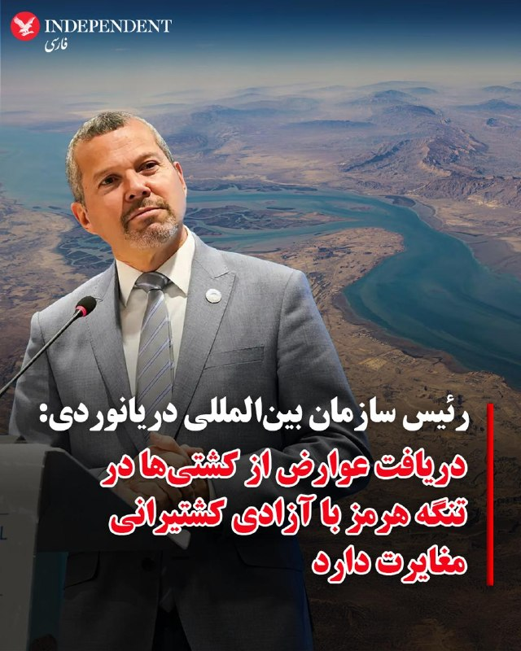

♦️رئیس سازمان بین‌المللی دریانوردی (IMO) اعلام کرد هرگونه طرح برای دریافت عوارض اجباری از کشتی‌های عبوری در تنگه هرمز با اصول آزادی ناوبری بین‌المللی سازگار نیست.
آرسنیو دومینگز، رئیس این نهاد وابسته به سازمان ملل، روز شنبه دوم خرداد ماه در گفتگو با نیویورک‌تایمز گفت وارد بحث‌هایی درباره دریافت عوارضی که فراتر از حق عبور آزاد و «عبور بی‌ضرر» باشد، نخواهد شد.
این اظهارات پس از آن مطرح شد که گزارش‌هایی درباره گفتگوهای ایران و عمان برای ایجاد سازوکاری جهت دریافت هزینه عبور از کشتی‌ها در تنگه هرمز منتشر شد. ایران این طرح را در قالب هزینه خدمات، عوارض عبور یا هزینه‌های زیست‌محیطی مطرح کرده است.
‌🇸🇦 Indypersian

🤖 @VahidOOnLine

## VahidOOnLine — post 241667

  <a href="telegram/content/VahidOOnLine_241667_1779528809.mp4" target="_blank">🎬 Download video</a>

یک شهروند در پیامی به ایران اینترنشنال با اشاره به کشتار دی‌ماه از مذاکره با جمهوری اسلامی انتقاد کرده و می‌گوید مطالبه مردم در خیابان شاهزاده رضا پهلوی بوده است. پیام او با هوش مصنوعی خوانده شده است.
‌🏁 🇬🇧 IranintlTV

🤖 @VahidOOnLine

## VahidOOnLine — post 241666

  

علاالدین بروجردی، عضو کمیسیون امنیت ملی و سیاست خارجی مجلس، وضعیت فعلی کشور را «شکننده» خواند و گفت در شرایط «نه جنگ و نه صلح»، همه سناریوها محتمل است و باید برای بدترین گزینه‌ها آمادگی داشت.

او تاکید کرد: «ما باید همواره برای بدترین گزینه‌ها آمادگی لازم را داشته باشیم تا دشمنان اشتباهات گذشته خود را تکرار نکنند.»

بروجردی همچنین هشدار داد جمهوری اسلامی در برابر هرگونه اقدام «ماجراجویانه» پاسخ «قاطع و بدون ملاحظه» خواهد داد.

این عضو کمیسیون امنیت ملی و سیاست خارجی مجلس با اشاره به روند مذاکرات گفت: «مذاکرات صحنه کارزار سیاسی است. در آن صحنه نیز قالیباف در حال جنگ است و به همراه وزیر امور خارجه کشور با پشتوانه مردم و نیروهای مسلح از موضوع قدرت صحبت می‌کند.»
‌🏁 🇬🇧 IranintlTV

🤖 @VahidOOnLine

## VahidOOnLine — post 241665

  <a href="telegram/content/VahidOOnLine_241665_1779528812.mp4" target="_blank">🎬 Download video</a>

یک شهروند با ارسال پیامی درباره گرانی و کمبود دارو می‌گوید مایفورتیک که از داروهای مورد نیاز در پیوند کلیه است به حدود ۱۲۰ میلیون تومان رسیده است. پیام او با هوش مصنوعی خوانده شده است.
‌🏁 🇬🇧 IranintlTV

🤖 @VahidOOnLine

## VahidOOnLine — post 241664

♦️در پی نشت یک مخزن بزرگ مواد شیمیایی در ایالت کالیفرنیا، مقام‌های محلی روز جمعه دستور تخلیه گسترده مناطق اطراف را صادر کردند. به گزارش خبرگزاری فرانسه، نشست مواد این مخزن باعث انتشار بخارهای سمی بر فراز منطقه‌ای پرجمعیت شده و خطر انفجار را به همراه دارد.
این مخزن حاوی حدود ۷ هزار گالن، معادل ۲۶ هزار لیتر، ماده «متیل متاکریلات» بود. مایعی فرار و قابل اشتعال که در تولید پلاستیک استفاده می‌شود. آتش‌نشانان وضعیت را «بسیار جدی» توصیف کردند.
کریگ کاوی، فرمانده عملیات، گفت: «عملا فقط دو سناریو باقی مانده است؛ یا مخزن دچار شکستگی می‌شود و حدود ۶ تا ۷ هزار گالن مواد شیمیایی خطرناک وارد محوطه می‌شود، یا وارد مرحله انفجار حرارتی شده و منفجر می‌شود و مخازن اطراف را نیز درگیر می‌کند.»
این حادثه در منطقه گاردن گروو در اورنج کانتی، در جنوب‌شرقی لس‌آنجلس، رخ داده است. رئیس پلیس گاردن گروو گفت حدود ۴۰ هزار نفر تحت تأثیر دستور تخلیه قرار گرفته‌اند، هرچند چند هزار نفر همچنان از ترک خانه‌های خود خودداری کرده‌اند.
تصاویر هوایی منتشرشده از تلویزیون‌های محلی نشان می‌دهد نیروهای امدادی برای خنک نگه داشتن مخزن، حجم زیادی آب روی آن می‌ریزند. مقام‌های امدادی بعدا اعلام کردند عملیات خنک‌سازی موفق بوده و دمای مخزن کاهش یافته است.
تا شامگاه جمعه گزارشی از مصدومیت منتشر نشده و علت نشت نیز هنوز مشخص نیست. مقام‌های بهداشتی هشدار داده‌اند استنشاق بخار این ماده می‌تواند موجب آسیب‌های تنفسی و علائم عصبی شود.
‌🇸🇦 Indypersian

🤖 @VahidOOnLine

## VahidOOnLine — post 241663

⭕️ شکوه طبیعت بهاری؛
باران، جان تازه‌ای به دشت‌های گلستان بخشید

♦️بارش‌های مستمر و فراتر از حد نرمال در دو ماه گذشته، جلوه‌ای تازه به طبیعت سرسبز استان گلستان بخشیده و جان دوباره‌ای به زمین‌های کشاورزی این استان داده است. دشت‌های وسیع، مراتع سبز و مزارع چشم‌نواز گلستان این روزها در اوج طراوت بهاری قرار دارند، استانی که به‌دلیل تنوع اقلیمی کم‌نظیر، از کوهستان و جنگل تا دشت و ساحل را در خود جای داده و یکی از قطب‌های مهم کشاورزی ایران به شمار می‌رود.
رونق دوباره کشت‌های دیم پس از بارندگی‌های اخیر، امید تازه‌ای در میان کشاورزان گلستان ایجاد کرده است. این استان با حدود ۶۵۰ هزار هکتار زمین کشاورزی، در تولید ۱۵ محصول راهبردی کشور جزو استان‌های پیشتاز محسوب می‌شود و طبیعت زنده و حاصلخیز آن، هر ساله نقش مهمی در تامین امنیت غذایی ایران ایفا می‌کند.
تصاویر منتشرشده، گوشه‌ای از زیبایی طبیعت بهاری گلستان و زندگی جاری در دل مزارع و دشت‌های این استان را به تصویر می‌کشد.
این مجموعه عکس را محمد عطایی ثبت کرده و در خبرگزاری ایرنا منتشر کرده است.
‌🇸🇦 Indypersian

🤖 @VahidOOnLine

## WithYashar — post 12119

شهباز شریف نخست وزیر پاکستان امروز شنبه وارد شهر هانگ‌جو واقع در شرق چین شد و دیدار رسمی چهار روزه خود از چین را آغاز کرد.
@withyashar

## WithYashar — post 12118

منابعی به اسکای نیوز عربی گفتن که میانجی پاکستانی موفق شده بر مانع پرونده هسته‌ای ایران غلبه کنه
@withyashar

## WithYashar — post 12117

علی کریمی : ببینیم کی قبلا چیکاره بوده و الان چیکارتست و دنبال چی هست؟!
ببینیم که چند چندیم؟!
بببینیم کی برای پول و صندلی مبارزه کرده، کی برای آزادی ایران؟!
این گوی و این میدان
@withyashar

## WithYashar — post 12116

  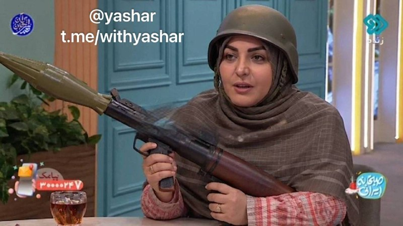

المیرا شریفی مقدم: آماده رفتن به جنگ هستم
@withyashar

## WithYashar — post 12115

گزارشهای تایید نشده : ویزای شجاع خلیل زاده احسان حاج‌صفی و مهدی طارمی به دلیل حمایت از سپاه تروریستی پاسداران رد شدن @withyashar

## WithYashar — post 12113

حمله ارتش اسرائیل به یک مجتمع بزرگ زیرزمینی حزب‌الله در اعماق لبنان و جنوب این کشور
@withyashar

## WithYashar — post 12112

  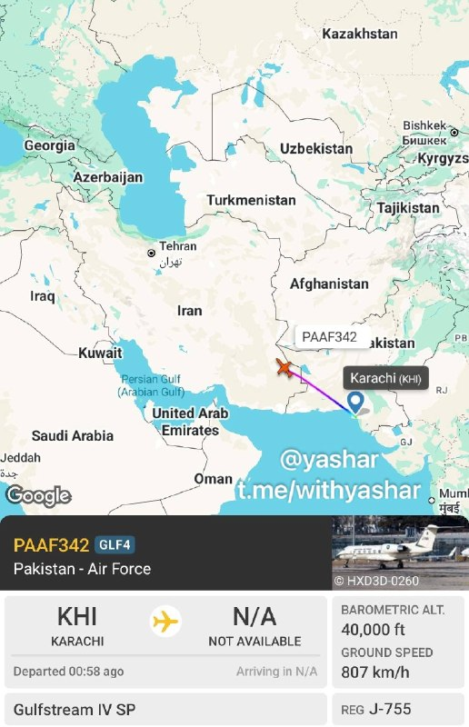

یک مقام دیگر پاکستانی به تهران می‌رود.😒
یا دیشب اگه رفتن دارن بر میگردن
جت نیروی هوایی پاکستان GLF IV SP reg J-755
@withyashar

## WithYashar — post 12111

ادعای کانال ۱۳ عبری به نقل از نیویورک‌تایمز: ترامپ اسرائیل را از مذاکرات با ایران کنار گذاشته است.
@withyashar

## WithYashar — post 12110

سناتور راجر ویکر: «الان تو مقطعی هستیم که می‌تونه میراث سیاسی ترامپ رو مشخص کنه. غریزه ترامپ این بوده که کاری رو که تو ایران شروع کرده، کامل تموم کنه؛ اما بهش توصیه‌های اشتباه می‌شه تا دنبال توافقی بره که حتی ارزش کاغذی که روش نوشته شده رو هم نداره. فرمانده کل نیروهای آمریکا باید اجازه بده ارتش حرفه‌ای آمریکا نابودی توان نظامی متعارف ایران رو کامل کنه و تنگه رو دوباره باز کنه. ادامه تلاش برای توافق با حکومت ایران ممکنه نشونه ضعف تلقی بشه. باید کاری رو که شروع کردیم، تموم کنیم. وقت اقدام گذشته.» @withyashar

## WithYashar — post 12109

گزارشهای تایید نشده : ویزای شجاع خلیل زاده احسان حاج‌صفی و مهدی طارمی به دلیل حمایت از سپاه تروریستی پاسداران رد شدن
@withyashar

## mwarmonitor — post 9521

📝از اخبار موثق تا سناریوی هالیوودی؛ سقوط آزاد نیویورک‌تایمز در باتلاق اراجیف 🔰این سناریوی نیویورک‌تایمز واقعاً بیشتر شبیه به یکی از قسمت‌های تخیلی و آخرالزمانی ترمیناتور جیمز کامرون است تا یک گزارش خبری موثق، و نشان می‌دهد که کار این رسانه رسماً از نوشتن…

## mwarmonitor — post 9520

🔸یک مقام دیگر پاکستانی در حال سفر به تهران است. 🛩 هواپیمای Gulfstream IV-SP نیروی هوایی پاکستان با رجیستر J-755 @mwarmonitor

## mwarmonitor — post 9519

  

🔸یک مقام دیگر پاکستانی در حال سفر به تهران است.

🛩 هواپیمای Gulfstream IV-SP نیروی هوایی پاکستان با رجیستر J-755

@mwarmonitor

## mwarmonitor — post 9518

🔴مذاکرات آمریکا و ایران برای پایان دادن به جنگ شدت گرفته است، اما گزارش شده که دونالد ترامپ، رئیس‌جمهور آمریکا، در صورت عدم دستیابی به توافق، به‌طور جدی در حال بررسی حملات جدید علیه ایران است — رویترز

@mwarmonitor

## pm_afshaa — post 91248

👩‍💻کانفیگ اضطراری موجود شد!

🛍 series Basic

• 1G 140 
💵
• 2G 280
💵
• 3G 420
💵
• 4G 560
💵
• 5G 700
💵
• 10G 1400
💵
• 20G 2800 
💵
• 30G 4200
💵

📌مناسب استفاده روزمره و اقتصادی

📌سرعت مناسب برای استفاده عادی

📌پینگ 140تا350

📌مناسب تلگرام.وب گردی . اینستاگرام

✔️ بدونه محدودیت زمان و کاربر هستن

✔️ساب لینک جهت دیدن حجم

✔️بدونه حتی ۱ درصد ضریب تمامی سرور ها

⚠️همه سرویس ضمانت بازگشت وجه دارند

@n9neebot

## pm_afshaa — post 91247

🔴منابعی به اسکای نیوز عربی گفتن که میانجی پاکستانی موفق شده بر مانع پرونده هسته‌ای ایران غلبه کنه

💧 Rainbet.com the #1 Non-KYC Crypto Casino & Sportsbook @rainbetcom

😁 @Pm_Afshaa

## pm_afshaa — post 91246

🔴لارا لومر از معتمد ترین افراد نزدیک ترامپ خبر آماده شدن آمریکا برای حملات دوباره به ایران رو توییت کرده

💧 Rainbet.com the #1 Non-KYC Crypto Casino & Sportsbook @rainbetcom

😁 @Pm_Afshaa

## pm_afshaa — post 91245

🔴حملات آخرالزمانی اسرائیل به تأسیسات زیرزمینی حزب الله در منطقه البقاع در شرق لبنان

💧 Rainbet.com the #1 Non-KYC Crypto Casino & Sportsbook @rainbetcom

😁 @Pm_Afshaa

## pm_afshaa — post 91244

🔴کانال 13 اسراییل: ترامپ اسرائیل را از مذاکرات با ایران کنار گذاشته

💧 Rainbet.com the #1 Non-KYC Crypto Casino & Sportsbook @rainbetcom

😁 @Pm_Afshaa

## pm_afshaa — post 91243

نماینده ج.ا در سازمان ملل: دولت‌های خلیج فارس موظف به جبران کامل خسارات علیه ایران هستن

💧 Rainbet.com the #1 Non-KYC Crypto Casino & Sportsbook @rainbetcom

😁 @Pm_Afshaa

## pm_afshaa — post 91242

مهاجری، عضو شورای اطلاع‌رسانی دولت، خطاب به حمید رسایی: تصمیم‌ جنگ یا صلح ربطی به نمایندگان کم سواد نداره

💧 Rainbet.com the #1 Non-KYC Crypto Casino & Sportsbook @rainbetcom

😁 @Pm_Afshaa

## pm_afshaa — post 91241

🔴ویزای شجاع خلیل زاده احسان حاج‌صفی و مهدی طارمی به دلیل حمایت از سپاه تروریستی پاسداران رد شدن

💧 Rainbet.com the #1 Non-KYC Crypto Casino & Sportsbook @rainbetcom

😁 @Pm_Afshaa

## DEJradio — post 4862

  <a href="telegram/content/DEJradio_4862_1779528818.mp4" target="_blank">🎬 Download video</a>

🤡
🔺 «شب ازدواجشون چه شود»؛ تَق!

#تجمعات_حکومتی #شب_زفاف
@DEJradio

## DEJradio — post 4861

  <a href="telegram/content/DEJradio_4861_1779528820.webm" target="_blank">🎬 Download video</a>

🚨📢 سازمان هواپیمایی کشوری با صدور نوتام تازه، برای پروازها و فعالیت فرودگاه‌های غرب ایران تا صبح دوشنبه محدودیت اعلام کرد.

بر اساس این نوتام، تمامی فرودگاه‌های غرب ایران بسته اعلام شده‌اند و تنها هشت فرودگاه شامل تبریز، کرمان، آبادان، کرمانشاه، یزد، رشت و اهواز اجازه فعالیت دارند. فعالیت این فرودگاه‌ها نیز صرفاً از طلوع تا غروب آفتاب مجاز است.

در متن اطلاعیه همچنین تأکید شده که تمامی مجوزهای پیشین پرواز برای اپراتورها و شرکت‌های هواپیمایی تعلیق شده و انجام هر پرواز مسافری منوط به دریافت مجوز تازه از سازمان هواپیمایی کشوری خواهد بود.

این محدودیت‌ها بر اساس زمان درج‌شده در نوتام تا ساعت ۸:۳۰ صبح روز دوشنبه ادامه دارد؛ هرچند امکان تمدید یا اصلاح آن با توجه به شرایط عملیاتی و امنیتی وجود خواهد داشت.

سازمان هواپیمایی کشوری از مسافران خواسته است آخرین وضعیت پروازها را اتنها از مسیر شرکت‌های هواپیمایی، فرودگاه‌ها و اطلاعیه‌های رسمی پیگیری کنند.

#سازمان_هواپیمایی_کشوری
@DEJradio

## DEJradio — post 4860

  <a href="telegram/content/DEJradio_4860_1779528821.webm" target="_blank">🎬 Download video</a>

🚨
⭕️ همزمان با آخرین تلاش‌های دیپلماتیک برای وادار کردن جمهوری اسلامی به توافق با آمریکا، سی‌بی‌اس‌نیوز به نقل از منابع آگاه گزارش داد دولت ترامپ برای دور تازه‌ای از حملات نظامی علیه جمهوری اسلامی ایران آماده می‌شود.

به گفته منابع مطلع، برخی اعضای ارتش و نهادهای اطلاعاتی آمریکا برنامه‌های تعطیلات خود را لغو کرده‌اند و مقام‌های دفاعی و اطلاعاتی در حال به‌روزرسانی فهرست‌های فراخوان نیروها در پایگاه‌های آمریکا در خارج از کشور هستند.

ترامپ اعلام کرد به دلیل «شرایط مربوط به امور دولت» در مراسم ازدواج پسرش شرکت نخواهد کرد و به‌جای گذراندن تعطیلات روز یادبود در نیوجرسی، به کاخ سفید بازمی‌گردد.

همچنین «آکسیوس» گزارش داد ترامپ به طور جدی در حال بررسی انجام حملات جدید علیه ایران است تا در صورت عدم حصول پیشرفت لحظه آخری در مذاکرات آن را عملی کند.

#توافق #مذاکرات #جنگ
@DEJradio

## mamlekate — post 103570

📝 گزارش سی‌بی‌اس از تحرکات تازه جامعه نظامی و اطلاعاتی آمریکا با محوریت ایران؛ برخی اعضای ارتش مرخصی‌های خود را لغو کردند

شبکه آمریکایی سی‌بی‌اس به نقل از منابع مطلع گزارش داد که دولت دونالد ترامپ، رئیس‌جمهوری آمریکا، روز جمعه ۱ خرداد و هم‌زمان با ادامه تلاش‌های دیپلماتیک، خود را برای دور تازه‌ای از حملات نظامی به جمهوری اسلامی ایران آماده می‌کرد.

@mamlekate

## mamlekate — post 103569

📝 قفل دبی بر بازار دیجیتال ایران؛ هشدار درباره موج تازه گرانی موبایل و لپ‌تاپ

بازار دیجیتال ایران پس از جنگ به وضعیت عادی بازنگشته و فعالان بازار از کمبود کالا، قیمت‌های شناور و مسیرهای نامطمئن واردات می‌گویند. وابستگی طولانی‌مدت بازار موبایل، لپ‌تاپ و قطعات کامپیوتری به مسیر امارات، اکنون به نقطه آسیب‌پذیری تبدیل شده و در کوتاه‌مدت جایگزین روشنی برای آن دیده نمی‌شود.

@mamlekate

## kianmeli1 — post 87571

🔴برخی افراد با نفوذ در کاخ سفید گفتند بمب ها در راه ایران است

باید صبر کرد و دید چقدر واقعیت است
https://t.me/kianmeli1

## IranIntlTV — post 338549

روایت شما از زندگی در آتش‌بس- شنبه ۲ خرداد ۱۴۰۵

🔹 مردم ایران، با مذاکره ناامید نشوید. ما عهدی داریم با جاویدنام‌های این چند سال اخیر که همه جوان بودند و امیدوار. پس پرچم مبارزه آن‌ها را زمین نخواهیم گذاشت. در تاریخ، همه حکومت‌های قاتل محکوم به نابودی هستند. نه می‌بخشیم و نه فراموش می‌کنیم.
🔹 تهران، وضعیت اقتصادی وحشتناک است. همه دارن از جیب می‌خورن، اغلب تعدیل نیرو شدیم، مشاغل هنری کلاً کنسل شده، همه‌چیز ده‌ها برابر گران شده و هیچ کاری نمی‌شود کرد. خسته شدیم به خدا از این همه سگ‌دو زدن.
🔹 این یک گیگ اینترنتی که ما می‌خریم در واقع یک گیگ نیست. سه‌سوته تموم میشه. الکی اسم یک گیگ روش گذاشتن که با قیمت بالاتری بفروشنش.
🔹 شنبه ۲ خرداد ساعت ۹:۵۵ سمت کهریزک یه صدای انفجار با موجش اومد، عین زمان جنگ بود.
🔹 دو ماه از سال جدید گذشته است. چرا همچنان حقوق بازنشسته‌های تأمین اجتماعی مطابق مبلغ سال قبل واریز می‌شود؟
🔹 از تهران: من نقاشم و عمده درآمدم از پیجم بوده. از آغاز جنگ و قطع اینترنت درآمدی نداشتم و موجودی حسابم الآن ۴ هزار تومنه. آموزشگاه‌ها به خاطر شرایط جنگ بلاتکلیف هستند و مدرس استخدام نمی‌کنن. به خدا خسته شدیم دیگه.
🔹 این روزها داریم وسط کتاب تاریخ زندگی می‌کنیم؛ هر صفحه‌اش جلوی چشم‌مون نوشته می‌شود. اگر می‌خواهیم این تاریخ فردا با افتخار خوانده شود، باید کنار هم باشیم و ناامید نشویم.
🔹 امروز دوم خرداد است و هنوز نتونستن حقوق نصف بیشتر بازنشستگان تأمین اجتماعی را پرداخت کنند.

## IranIntlTV — post 338548

  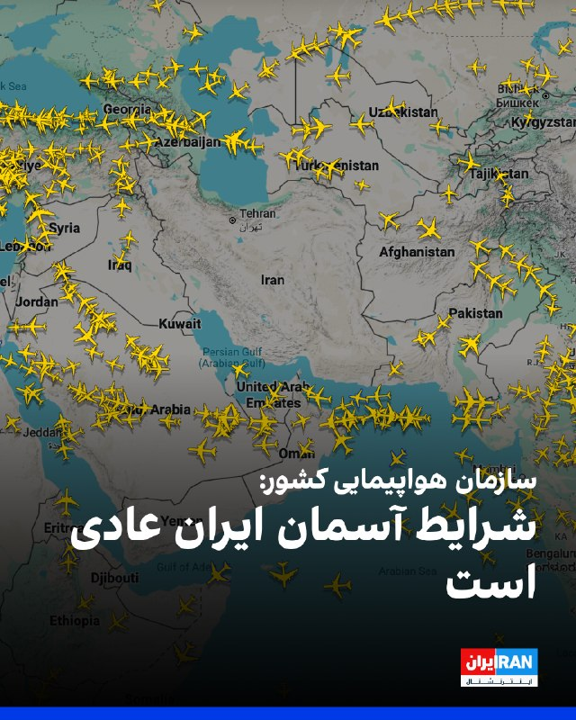

سخنگوی سازمان هواپیمایی ایران اعلام کرد این سازمان هیچ اطلاعیه رسمی هوانوردی جدیدی درباره اعمال محدودیت در آسمان کشور صادر نکرده است و شرایط پروازی عادی است.

او با تاکید بر تداوم وضعیت عادی پروازها گفت: «شرایط آسمان کشور همچنان مانند روال گذشته است و پروازها طبق برنامه انجام می‌شود.»

سخنگوی سازمان هواپیمایی بدون اشاره به جزئیات اطلاعیه هوانوردی (نوتام)، افزود: «نوتامی که اخیرا در فضای مجازی منتشر شده، تکذیب می‌شود.»

سازمان هواپیمایی کشوری ایران روز جمعه یکم خرداد در اطلاعیه‌ای اعلام کرده بود فعالیت فرودگاه‌های واقع در بخش غربی محدوده پروازی ایران، موسوم به «FIR تهران»، تا دوشنبه متوقف شده و تنها شمار محدودی از فرودگاه‌ها مجاز به فعالیت هستند.

بر اساس آن اطلاعیه، فرودگاه‌های ارومیه، کرمان، آبادان، شیراز، یزد، کرمانشاه، رشت و اهواز از این محدودیت مستثنی شده‌اند و فعالیت آنها نیز فقط از طلوع تا غروب آفتاب مجاز اعلام شده بود.
https://iranintl.com/202605236955

## IranIntlTV — post 338547

ویدیوی رسیده به ایران اینترنشنال نشان می‌دهد روز شنبه دوم خرداد تعدادی از دانش‌آموزان مدارس در خرم‌آباد برای اعتراض به بلاتکلیفی و ابهام درباره شیوه امتحانات خود و اظهارات مسئولان برای حضوری کردن امتحانات تجمع کردند. هفته گذشته نیز در شهرکرد دانش‌آموزان تجمع اعتراضی برگزار کردند.

## IranIntlTV — post 338546

  <a href="telegram/content/IranIntlTV_338546_1779528822.mp4" target="_blank">🎬 Download video</a>

همزمان با لغو امتحانات مقطع ابتدایی و غیرحضوری شدن آزمون‌های بسیاری از پایه‌های متوسطه، نگرانی‌ها درباره پیامدهای آموزش مجازی در ایران افزایش یافته است.

گفت‌وگو با منصوره حسینی‌یگانه، عضو تحریریه ایران‌اینترنشنال
@iranintltv

## IranIntlTV — post 338545

  <a href="telegram/content/IranIntlTV_338545_1779528825.mp4" target="_blank">🎬 Download video</a>

یک شهروند در پیامی به ایران اینترنشنال با اشاره به کشتار دی‌ماه از مذاکره با جمهوری اسلامی انتقاد کرده و می‌گوید مطالبه مردم در خیابان شاهزاده رضا پهلوی بوده است. پیام او با هوش مصنوعی خوانده شده است.

## IranIntlTV — post 338544

  <a href="telegram/content/IranIntlTV_338544_1779528827.mp4" target="_blank">🎬 Download video</a>

دونالد ترامپ، رییس‌جمهوری آمریکا، در شبکه اجتماعی تروث سوشال نوشت در شرایط کنونی، ترجیح می‌دهد در کاخ سفید بماند و در مراسم ازدواج پسرش حضور نخواهد داشت.

سمیرا قرایی، خبرنگار ایران‌اینترنشنال، گزارش می‌دهد
@iranintltv

## IranIntlTV — post 338543

  

علاالدین بروجردی، عضو کمیسیون امنیت ملی و سیاست خارجی مجلس، وضعیت فعلی کشور را «شکننده» خواند و گفت در شرایط «نه جنگ و نه صلح»، همه سناریوها محتمل است و باید برای بدترین گزینه‌ها آمادگی داشت.

او تاکید کرد: «ما باید همواره برای بدترین گزینه‌ها آمادگی لازم را داشته باشیم تا دشمنان اشتباهات گذشته خود را تکرار نکنند.»

بروجردی همچنین هشدار داد جمهوری اسلامی در برابر هرگونه اقدام «ماجراجویانه» پاسخ «قاطع و بدون ملاحظه» خواهد داد.

این عضو کمیسیون امنیت ملی و سیاست خارجی مجلس با اشاره به روند مذاکرات گفت: «مذاکرات صحنه کارزار سیاسی است. در آن صحنه نیز قالیباف در حال جنگ است و به همراه وزیر امور خارجه کشور با پشتوانه مردم و نیروهای مسلح از موضوع قدرت صحبت می‌کند.»
https://iranintl.com/202605231626

## IranIntlTV — post 338542

  <a href="telegram/content/IranIntlTV_338542_1779528830.mp4" target="_blank">🎬 Download video</a>

کانال ۱۱ گزارش داد اسرائیل هرگونه توافق با جمهوری اسلامی را به خروج اورانیوم غنی‌شده از ایران و نظارت دقیق بر برنامه هسته‌ای تهران مشروط می‌داند. بر اساس این گزارش اسرائیل از احتمال تعویق مذاکرات اتمی، حتی برای چند روز، نگران است.

گزارش اشکان صفایی، خبرنگار ایران‌اینترنشنال
@iranintltv

## IranIntlTV — post 338541

  <a href="telegram/content/IranIntlTV_338541_1779528833.mp4" target="_blank">🎬 Download video</a>

یک شهروند با ارسال پیامی درباره گرانی و کمبود دارو می‌گوید مایفورتیک که از داروهای مورد نیاز در پیوند کلیه است به حدود ۱۲۰ میلیون تومان رسیده است. پیام او با هوش مصنوعی خوانده شده است.

## IranIntlTV — post 338540

  <a href="telegram/content/IranIntlTV_338540_1779528836.mp4" target="_blank">🎬 Download video</a>

حسین آقایی، عضو تحریریه ایران‌اینترنشنال، گفت: «حتی اگر دولت ترامپ ده‌ها دور دیگر مذاکره با جمهوری اسلامی برگزار کند، تهران همچنان با همان اهرم‌های محدود فشار پای میز خواهد آمد و آن‌گونه که دولت ترامپ می‌خواهد تسلیم نخواهد شد.» او افزود: «اگر آمریکا بخواهد جمهوری اسلامی را وادار به تسلیم کند، باید کارت‌های بازی‌اش را بگیرد.» آقایی تاکید کرد: «گرفتن این اهرم‌ها از طریق حملات نظامی ممکن است، نه دادن زمان بیشتر به جمهوری اسلامی.»
@iranintltv

## IranIntlTV — post 338539

  <a href="telegram/content/IranIntlTV_338539_1779528838.mp4" target="_blank">🎬 Download video</a>

جاویدنامان انقلاب ملی ایرانیان
«پریماه نیک‌پرور» ۱۸ ساله، در اعتراضات ۱۸ دی‌ماه در بندرعباس مورد اصابت گلوله نیروهای سرکوب جمهوری اسلامی قرار گرفت و بعد از سوار شدن به آمبولانس به دلیل عدم رسیدگی به موقع و خون‌ریزی شدید کشته شد. نامش در حافظه‌ این سرزمین می‌ماند و یادش چراغ راه آزادی‌خواهان است.
@iranintltv

## FarsiVOA — post 218418

ورود اولین جنگنده‌های اِف-۳۵ به لهستان؛ تقویت بی‌سابقه ارتش در مرزهای شرقی ناتو؛

ووادیسواف کوشینیاک-کامیش، معاون نخست‌وزیر لهستان، روز جمعه با انتشار ویدیویی از پرواز همزمان سه فروند جنگنده نسل پنجم اِف-۳۵ در کنار اِف-۱۶های این کشور خبر داد و اعلام کرد این هواپیماها پس از برخاستن از پایگاهی در مجمع‌الجزایر آزور، در مسیر نهایی ورود به خدمت در لهستان هستند.

این جنگنده‌ها، اولین هواپیماهای نسل پنجم در جناح شرقی ناتو هستند که به دلیل فناوری رادارگریزی پیشرفته، توانایی شناسایی تهدیدات را پیش از دیده‌ شدن خود دارا می‌باشند.

معاون نخست‌وزیر لهستان تأکید کرد که الحاق اِف-۳۵ها صرفاً خرید تجهیزات جدید نیست، بلکه ورود رسمی نیروی هوایی لهستان به سطح اول و برتر ارتش‌های مدرن جهان است.

پیشتر رئیس‌جمهور آمریکا اعلام کرده بود که پنج هزار نظامی دیگر آمریکایی را به لهستان اعزام می‌کند.

رئیس‌جمهور لهستان با تشکر از دونالد ترامپ برای این تصمیم، در ایکس نوشت: «ائتلاف‌های خوب آن‌هایی هستند که بر پایه همکاری، احترام متقابل و تعهد به امنیت مشترک ما بنا شده‌اند.»
@FarsiVOA

## FarsiVOA — post 218417

  

سخنگوی سازمان هواپیمایی صدور نوتام تازه درباره محدودیت پروازی را تکذیب کرد و گفت پروازها طبق برنامه انجام می‌شود.

این تکذیب در حالی منتشر شده که پس از خبر قبلی درباره نوتام و تصاویر منتشر شده از رصد پروازها در آسمان ایران، عراق و سوریه، ابهام درباره وضعیت واقعی ترافیک هوایی منطقه همچنان باقی است.
@FarsiVOA

## FarsiVOA — post 218416

🔺ثبت رکورد دو هزار ساعت قطع اینترنت در هشتادوپنجمین روز حصر دیجیتال

◾️در حالی که محدودیت گسترده اینترنت بین‌الملل در ایران وارد هشتاد و پنجمین روز شده، داده‌های نت‌بلاکس نشان می‌دهد میزان «انزوای دیجیتال» ایران از جهان از مرز ۲۰۱۶ ساعت گذشته است.

◾️بر اساس اعلام این نهاد ناظر بر اینترنت، قطع یا محدودیت شدید دسترسی به اینترنت جهانی اکنون وارد هفته سیزدهم شده و زندگی روزمره، کار، آموزش، ارتباطات و دسترسی به اطلاعات را برای میلیون‌ها شهروند ایرانی مختل کرده است.

◾️مقام‌های جمهوری اسلامی همچنان زمان روشنی برای بازگشایی اینترنت اعلام نکرده‌اند.

⬇️ بیشتر بخوانید:
https://ir.voanews.com/a/8153017.html

## FarsiVOA — post 218415

  <a href="telegram/content/FarsiVOA_218415_1779528843.mp4" target="_blank">🎬 Download video</a>

ارتش اسرائیل از حمله به تأسیسات زیرزمینی تولید سلاح حزب‌الله خبر داد؛

ارتش اسرائیل اعلام کرد در حملات شبانه به لبنان، یک تأسیسات زیرزمینی تولید سلاح متعلق به حزب‌الله در دره بقاع هدف قرار گرفته است.

به گزارش تایمز اسرائیل، ارتش اسرائیل همچنین گفته است زیرساخت‌های دیگری از حزب‌الله در منطقه صور در جنوب لبنان نیز در این حملات هدف حمله قرار گرفتند. ارتش اسرائیل مدعی شده پیش از انجام حملات، هشدارهای تخلیه صادر شده بود تا خطر آسیب به غیرنظامیان کاهش یابد و در عملیات از مهمات دقیق و ابزارهای نظارتی استفاده شده است.

این حملات در ادامه افزایش تنش‌ها در مرز اسرائیل و لبنان انجام می‌شود؛ جایی که از آغاز جنگ، تبادل آتش میان اسرائیل و حزب‌الله بارها به حملات گسترده‌تر در خاک لبنان منجر شده است.

با وجود اعلام آتش‌بس در جبهه لبنان، حملات اسرائیل و حزب‌الله در هفته‌های اخیر ادامه یافته است. اسرائیل می‌گوید مواضع حزب‌الله را برای جلوگیری از بازسازی توان نظامی این گروه هدف می‌گیرد، اما حزب‌الله و دولت لبنان این حملات را نقض آتش‌بس می‌دانند.
@FarsiVOA

## FarsiVOA — post 218414

  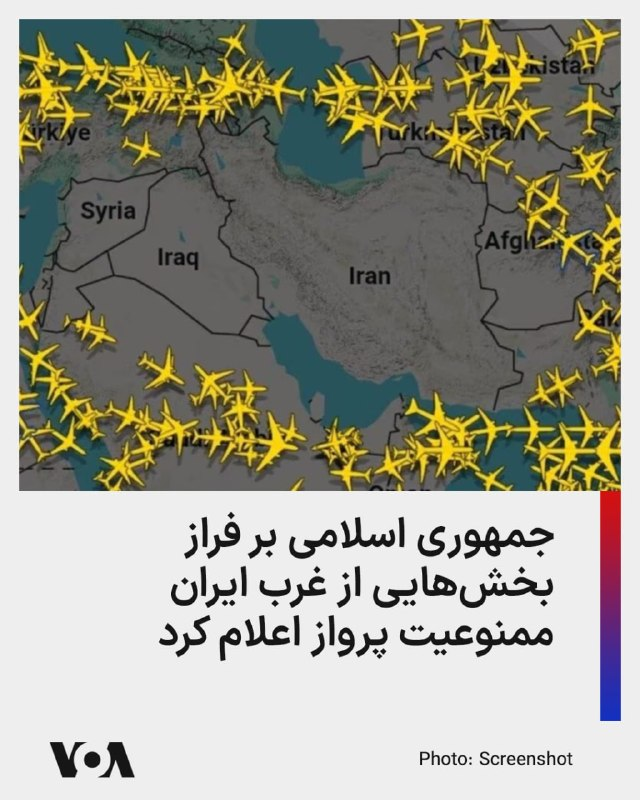

بر اساس داده‌های منتشرشده از مسیرهای هوایی، یک اطلاعیه هوانوردی برای ممنوعیت یا محدودیت پرواز بر فراز بخش‌هایی از غرب کشور صادر شده است.

این محدودیت پروازی تا روز دوشنبه چهارم خرداد ادامه خواهد داشت.

این نوع اطلاعیه که در هوانوردی با عنوان «نوتام» شناخته می‌شود، برای آگاه‌کردن خلبانان و شرکت‌های هواپیمایی از خطرات احتمالی، محدودیت‌های مسیر، بسته‌شدن آسمان یا شرایطی صادر می‌شود که می‌تواند ایمنی پرواز را تحت تأثیر قرار دهد.

در تصاویر منتشرشده، حجم بالای پروازها در اطراف آسمان ایران و عبور مسیرها از مناطق پیرامونی دیده می‌شود؛ موضوعی که می‌تواند نشانه تغییر مسیر پروازها و احتیاط شرکت‌های هواپیمایی در منطقه باشد.
@FarsiVOA

## DW_Farsi — post 125035

📸 جام ۱۹۷۴؛ یوهان کرویف، سلطانی که در حسرت قهرمانی جهان ماند

🔻 گزارشی از شهرام احدی

یوهان کرویف در روز ۲۵ آوریل ۱۹۴۷ در آمسترادام به دنیا آمد. خانه‌ی پدری او در نزدیکى ورزشگاه اختصاصی تیم "آژاکس"، باشگاه پرآوازه‌ی آمستردام قرار داشت. یوهان در کودکی پدرش را از دست داد و مادرش مجبور شد براى گذران زندگی به‌عنوان نظافتچى، از جمله در باشگاه آژاکس کار کند. همین رخدادها بودند که سرنوشت یوهان کرویف را رقم زدند.

به عقیده کارل هاینس هوبا، یکى از روزنامه‌نگاران معروف ورزشى در آلمان، "کرویف از معدود بازیکنان اىست که با فوتبال بزرگ شده؛ همان طور که فرزند یک کشاورز از کودکی کشاورزى را می‌آموزد یا فرزند یک ماهیگیر که تمام روز با پدرش مشغول ماهیگیرى است".

کرویف در ۱۳ سالگى ترک تحصیل کرد تا تمام وقت و توانش را صرف فوتبال کند. رینوس میشل، مربى معروف هلندى که در آن زمان سرمربی آژاکس بود، به نبوغ و استعداد وی پى برد و در ۱۵ نوامبر ۱۹۶۴ کرویف ۱۷ ساله را برای نخستین بار در ترکیب تیمش قرار داد. کرویف در همان بازی اولین گل خود در لیگ دسته‌ی برتر هلند را به ثمر رساند.

@dw_farsi

## DW_Farsi — post 125034

  

🔶 عراقچی در تماس با گوترش: آمریکا زیاده‌روی‌های مکرر مطرح می‌کند

عباس عراقچی، وزیر امور خارجه ایران شامگاه جمعه ۱ خرداد (۲۲ مه) در تماسی تلفنی با آنتونیو گوترش، دبیرکل سازمان ملل درباره آخرین تحولات منطقه‌ و روند دیپلماسی میان ایران و آمریکا با میانجی‌گری پاکستان گفت‌وگو کرد.

عراقچی همچنین اعلام کرد که جمهوری اسلامی با وجود "بدعهدی‌های مکرر" طرف مقابل در دیپلماسی و اقدامات نظامی علیه ایران همچنان در روند دیپلماتیک مشارکت دارد، اما به گفته او، آمریکا "زیاده‌خواهی‌های مکرر" مطرح می‌کند.

هم‌زمان با تشدید تنش میان آمریکا و ایران عاصم منیر، فرمانده ارتش پاکستان هم با هدف میانجی‌گری به تهران سفر کرد.

دونالد ترامپ، رئیس‌جمهور آمریکا مذاکرات با جمهوری اسلامی را در "مرز میان توافق و تشدید درگیری" توصیف کرده است؛ درگیری‌ای که با حملات مشترک آمریکا و اسرائیل به ایران در ۲۸ فوریه آغاز شد و به تنش‌های گسترده در تنگه هرمز انجامید.

در همین حال، رسانه‌های آمریکایی از جمله "آکسیوس" و "سی‌بی‌اس" به نقل از منابعی گزارش داده‌اند که کاخ سفید احتمال حملات جدید به ایران را بررسی می‌کند، اما تصمیم نهایی و قطعی هنوز گرفته نشده است.

@dw_farsi

## DW_Farsi — post 125032

  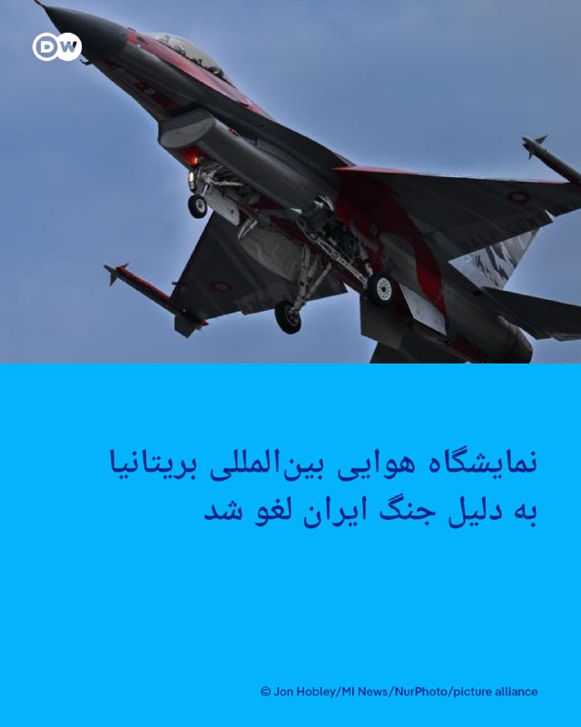

🔶 نمایشگاه هوایی بین‌المللی بریتانیا به دلیل جنگ ایران لغو شد

نمایشگاه هوایی "رویال اینترنشنال ایر تاتو" (RIAT) که از بزرگ‌ترین نمایشگاه‌های دفاعی جهان است روز جمعه ۲۲ مه اعلام کرد که به دلیل تنش‌های نظامی مرتبط با جنگ ایران برنامه خود را لغو کرده است.

این نمایشگاه هوایی که در پایگاه نیروی هوایی سلطنتی فیرفورد بریتانیا در گلاسترشر، واقع در جنوب‌غربی انگلستان برگزار می‌شود بیش از ۵۰ سال قدمت دارد و می‌تواند سالانه بیش از ۱۷۰ هزار بازدیدکننده را جذب کند؛ پایگاهی که توسط نیروی هوایی سلطنتی بریتانیا و نیروی هوایی ایالات متحده به صورت مشترک استفاده می‌شود.

برگزارکنندگان اعلام کره‌اند که لغو این رویداد "تصمیمی آسان نبوده" و این تصمیم پس از گفت‌وگو با نیروی هوایی ایالات متحده، به دلیل عدم اطمینان از دسترسی به این پایگاه در رابطه با وضعیت جاری در ایران اتخاذ شده است. 

این نمایشگاه توسط یک موسسه خیریه وابسته به نیروی هوایی سلطنتی سازمان‌دهی می‌شود و آماده‌سازی آن معمولا برای هفته‌ها بخشی از فعالیت‌های پایگاه فیرفورد را که توسط نیروی هوایی آمریکا اجاره شده، تحت تاثیر قرار می‌دهد.

فرانسیس توسـا، تحلیلگر دفاعی مستقر در بریتانیا می‌گوید، این وضعیت نشان می‌دهد که هیچ تضمینی وجود ندارد که خطر تشدید درگیری با ایران تا ماه ژوئیه کاهش یابد.

استفاده از پایگاه‌های نظامی بریتانیا توسط نیروهای آمریکایی در چارچوب جنگ ایران، به موضوع اختلاف‌برانگیز میان کی‌یر استارمر، نخست‌وزیر بریتانیا و دونالد ترامپ، رئیس‌جمهور آمریکا تبدیل شده است.

کی‌یر استارمر پیش‌تر اعلام کرده بود که بریتانیا اجازه استفاده محدود از پایگاه‌های خود را خواهد داد، اما در حملات تهاجمی علیه ایران مشارکت نخواهد کرد.

@dw_farsi

## RadioFarda — post 157474

  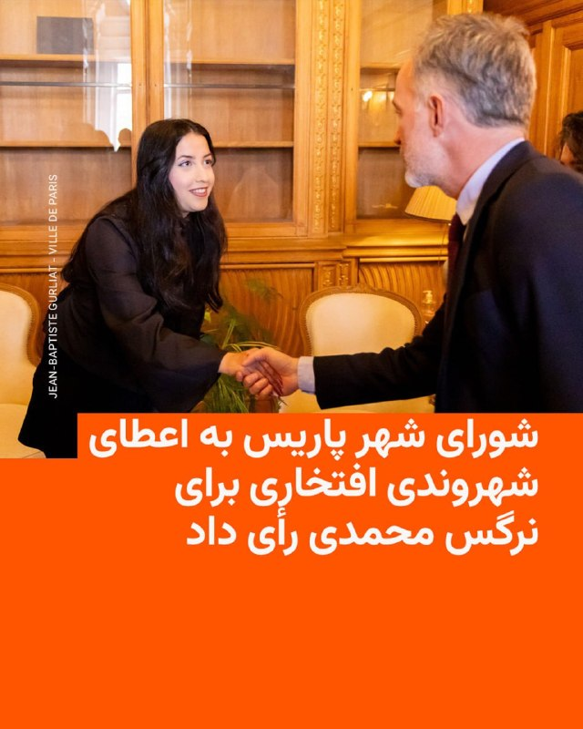

🔸شرح عکس: کیانا، دختر نرگس محمدی در دیدار با شهردار پاریس

🔸اعضای شورای شهر پاریس،‌ پایتخت فرانسه، به اعطای شهروندی افتخاری به نرگس محمدی، برنده ایرانی جایزه نوبل صلح، رأی دادند.

🔸خبر این تصمیم تازه را شهردار پاریس روز چهارشنبه، ۳۰ اردیبهشت، در شبکه ایکس اعلام کرد.

🔸امانوئل گرگوآر،‌ شهردار پاریس، در پیام خود در این باره نوشت: «پاریس باید گوش شنوا داشته باشد. داستان ما داستان شهری است که هر کس که تحت رنج و ظلم قرار می‌گیرد به آن پناه می‌آورد.»

🔸پیام گرگوآر همراه است با عکس‌هایی از حضور همسر و دختر خانم محمدی در جلسه رأی‌گیری شورای شهر پاریس.

🔸بنیاد نرگس محمدی هفته گذشته خبر داد که این برنده جایزه صلح نوبل از بیمارستان مرخص شده است.

🔸خانم محمدی از یازدهم تا بیستم اردیبهشت در بخش مراقبت‌های ویژه بیمارستان موسوی زنجان و از بیستم تا ۲۷ اردیبهشت در همین بخش در بیمارستان پارس تهران بستری بود.

@RadioFarda

## RadioFarda — post 157473

دولت ترامپ روند درخواست گرین‌کارت از داخل آمریکا را محدود کرد

🔸دولت دونالد ترامپ اعلام کرد که از این پس، بیشتر خارجی‌هایی که خواهان دریافت گرین کارت، مجوز اقامت دائم در آمریکا، هستند باید درخواست خود را از کشور زادگاه یا کشور مبدأ خود ثبت کنند.

🔸زَک کالر، سخنگوی اداره خدمات شهروندی و مهاجرت ایالات متحده، روز جمعه یکم خرداد در بیانیه‌ای گفت: «از این پس، فرد خارجی که به‌طور موقت در آمریکا حضور دارد و خواهان گرین کارت است، جز در شرایط فوق‌العاده، باید برای ارائه درخواست به کشور خود بازگردد.»

🔸او افزود که دارندگان روادیدهای غیرمهاجرتی، از جمله دانشجویان، کارگران موقت یا گردشگران، برای مدت کوتاه و با هدفی مشخص وارد آمریکا می‌شوند و «حضور آن‌ها نباید به نخستین گام در روند دریافت گرین کارت تبدیل شود.»

🔸به گزارش واشینگتن‌پست، آمریکا هر سال بیش از یک میلیون گرین کارت صادر می‌کند و تاکنون بیش از نیمی از متقاضیان هنگام ارائه درخواست در داخل خاک آمریکا حضور داشته‌اند.

🔸بر اساس آمار موجود، در حال حاضر هم بیش از یک میلیون نفر در خاک آمریکا در انتظار دریافت گرین کارت خود هستند. مشخص نیست که تأثیر سیاست تازه بر پرونده‌های این افراد چه خواهد بود.

🔸در بیش از ۶۰ سال گذشته این نخستین بار است که تغییری چنین عمده در روند درخواست گرین کارت آمریکا اعمال می‌شود.

🔸به گفته سخنگوی اداره خدمات شهروندی و مهاجرت آمریکا، بررسی درخواست‌ها از طریق وزارت خارجه و در نمایندگی‌های کنسولی آمریکا در خارج انجام خواهد شد.

🔸نسخه کامل این گزارش را در وب‌سایت رادیوفردا بخوانید.

@RadioFarda

## IranianMinds — post 20597

  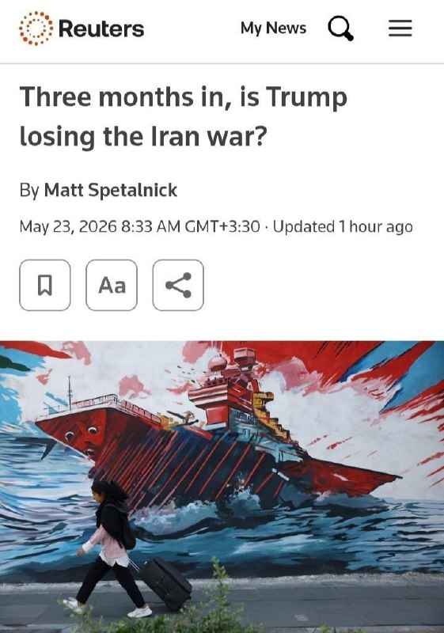

🔴 رویترز :

سه ماه پس از جنگی که قرار بود ظرف شش هفته با یک پیروزی قاطع تمام شود، ترامپ در «باتلاق ایران» گیر افتاده و نه راه آبرومندانه‌ای برای خروج دارد و نه می‌تواند حملات را گسترش دهد.

با وجود حملات آمریکا، ایران سقوط نکرده است

کنترل تنگه هرمز همچنان مهم‌ترین اهرم فشار تهران باقی مانده

تحلیلگران می‌گویند این بحران می‌تواند بیش از هر درگیری چند دهه اخیر، به جایگاه جهانی آمریکا آسیب بزند.

@IranianMinds

## IranianMinds — post 20596

  <a href="telegram/content/IranianMinds_20596_1779528849.mp4" target="_blank">🎬 Download video</a>

🔴 ترامپ تفریحات آخر هفته ی خودشو لغو کرد و به کاخ سفید برگشت.

@IranianMinds

## IranianMinds — post 20591

  <a href="telegram/content/IranianMinds_20591_1779528852.mp4" target="_blank">🎬 Download video</a>

حملات اسرائیل به لبنان

@IranianMinds

## IranianMinds — post 20590

اگر هنوز ۵۰۰ هزارتومان رو نگرفتی همین الان عضو شو‌ و جایزتو بگیر
نیازی هم به واریز نیست
تنها سایت مورد #تایید ما با بونوس های واقعی

🌐 Winro.io

## IranianMinds — post 20589

  <a href="telegram/content/IranianMinds_20589_1779528854.webm" target="_blank">🎬 Download video</a>

⚠️ امشب #شانست رو امتحان کن:

⚠️ همین الان عضو شو و 500 هزارتومان جایزه بگیر و بازی های l اروپایی رو #رایگان پیشبینی کن(بدون نیاز به واریز
🤩)

😮 تنها سایتی که با عضویت بدون واریز 500,000 تومان شارژ بی قیدو شرط میده #وینرو هست
💰

👑 #معتبرترین سایت ایرانی 
⬇️

🌐 Winro.io

🌐 Winro.io

📱کانال اخبار و هدایا a2 
🎁

📱 @winro_io

## IranianMinds — post 20588

🔴 غضنفری نماینده مجلس خطاب به پزشکیان:

جناب پزشکیان! چرا بدون اجازه رهبری آتش بس را پذیرفتید؟

برخلاف ادعای شما اکثریت مردم با مذاکره با شیطان مخالفند.
‌
چرا جلوی دستور حمله به اسرائیل را گرفتید؟ شما اسرائیل را از نابودی نجات دادید
‌
چرا حتی یک بار ترامپ و سایر مقامات آمریکا را تهدید به ترور نکردید؟
‌
آیا جز این است که در پشت پرده از حسن روحانی و جواد ظریف مشورت می‌گیرید؟

@IranianMinds

## IranianMinds — post 20587

  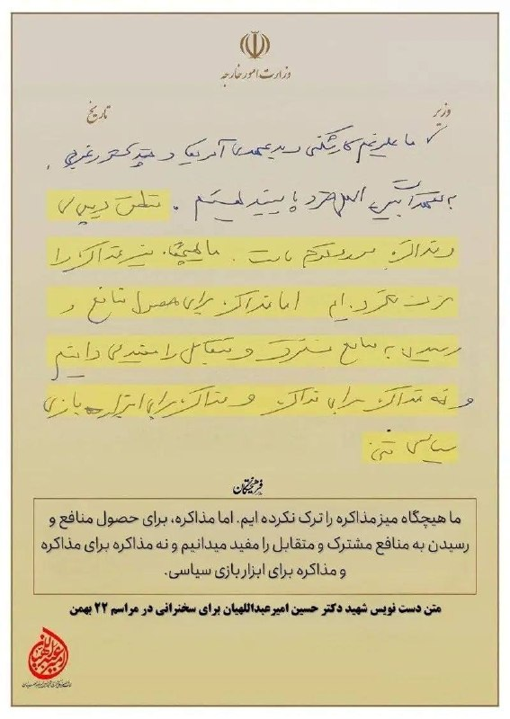

این دست خط پسر دایی ۶ ساله من نیست ، دست خط امیر عبداللهیان وزیر امور خارجه سابق جمهوری اسلامیه !

@IranianMinds

## BBCPersian — post 281864

  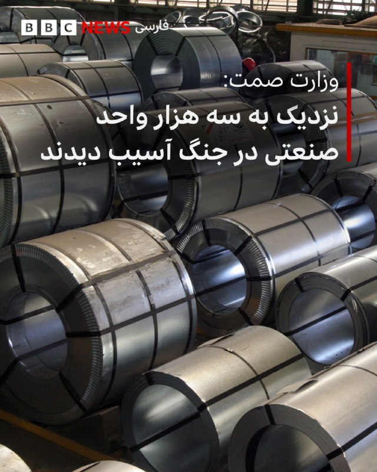

🔻سخنگوی وزارت صنعت، معدن و تجارت (صمت) گفت نزدیک به «سه هزار واحد صنعتی» در جنگ آسیب دیده‌اند.

عزت‌الله زارعی گفت هنوز آمار نهایی خسارت به دلیل تکمیل نشدن روند ارزیابی در برخی استان‌ها مشخص نیست اما بر اساس بررسی‌های اولیه، نزدیک به «سه هزار واحد صنعتی در مقیاس‌های بزرگ، متوسط و کوچک دچار آسیب شده‌اند.»

به گفته او صنایعی نظیر فولاد مبارکه و فولاد خوزستان به دلیل اهمیت در اولویت بازسازی قرار گرفته‌اند تا هرچه سریع‌تر به مدار تولید بازگردند.

سخنگوی وزارت صمت اضافه کرد که جنگ آثار منفی بر زنجیره تأمین گذاشته و واردات مواد اولیه دیگر به سهولت گذشته نیست.

📸Corbis via Getty Images
https://bbc.in/3RpdMQk
@BBCPersian

## BBCPersian — post 281857

🖋زویا متین
در دهلی

فضای سیاسی هند نماد عجیب و غریبی پیدا کرده است: سوسک.

این نماد نه نیلوفر حزب حاکم هند (بی‌جی‌پی) است و نه علامت دست حزب مخالف کنگره، بلکه «سوسک» است، موجودی سمج، منفور و به‌باور بسیاری نابودنشدنی که به‌تازگی به نمادی سیاسی، غیرمنتظره اما قابل‌همذات‌پنداری برای جوانان هندی در فضای آنلاین تبدیل شده است.

این حشره هفته گذشته پس از اظهارات بحث‌برانگیز سوریا کانت، رئیس دیوان عالی هند ناگهان مورد توجه همگانی قرار گرفت. گفته می‌شود در یک جلسه، او جوانان بیکاری را که جذب خبرنگاری و کنشگری می‌شوند، به سوسک‌ و انگل تشبیه کرده بود.

او بعدا توضیح داد که منظور او به طور مشخص افرادی با «مدرک‌های جعلی و بی‌اعتبار» بوده است و اشاره کلی به همه جوانان هند نکرده است.
ادامه مطلب⬇️

📸GettyImages/ Hindustan Times via Getty Images/ NurPhoto via Getty Images/ AFP via Getty Images/ AI-generated image/Cockroach Janta Party/ Screengrab from Cockroach Janta Party's website/ Abhijeet Dipke/X/ Bloomberg via Getty Images
https://bbc.in/43u1g4s
@BBCPersian

## idfinfarsi — post 11627

  <a href="telegram/content/idfinfarsi_11627_1779528856.mp4" target="_blank">🎬 Download video</a>

‼️در دو رویداد جداگانه در روز گذشته (جمعه)، نیروهای تیم رزمی تیپ چتربازان که در جنوب نوار غزه فعالیت می‌کنند، تعدادی تروریست را شناسایی کردند که از خط زرد عبور کرده و به‌گونه‌ای به سمت نیروها نزدیک شدند که تهدیدی فوری محسوب می‌شدند.

❌همچنین، نیروهای تیم رزمی تیپ «همخنص» (۱۴) که در شمال نوار غزه فعالیت می‌کنند، روز گذشته (جمعه) یک تروریست را شناسایی کردند که از خط زرد عبور کرده و به سمت نیروها نزدیک شد به‌گونه‌ای که تهدیدی فوری به‌شمار می‌رفت.

⭕️بلافاصله پس از شناسایی‌ها، نیروها تروریست‌ها را مورد حمله قرار داده و به هلاکت رساندند تا تهدید برطرف شود.

⭕️نیروهای ارتش اسرائیل تحت فرماندهی جنوب، مطابق با توافق در منطقه مستقر هستند و به فعالیت خود برای رفع هرگونه تهدید فوری ادامه خواهند داد.

## Dirty_Kids — post 389999

  <a href="telegram/content/Dirty_Kids_389999_1779528858.mp4" target="_blank">🎬 Download video</a>

یه ساعت دارم به این میخندم 😂😂

حمایت آیسان اسلامی از گی‌ها 🏳‍🌈

@Dirty_Kids 👻

## Dirty_Kids — post 389998

  <a href="telegram/content/Dirty_Kids_389998_1779528861.mp4" target="_blank">🎬 Download video</a>

سر کار هم به فکر آقاییشه
چقدر این دختر مسئولیت پذیره

@Dirty_Kids 👻

## Dirty_Kids — post 389997

بچها جدی جدی ذاتِ بد رو چهره تاثیر میذاره.

@Dirty_Kids 👻ه‍

## Hranews — post 113106

تداوم بازداشت و بلاتکلیفی میثاق رحمت‌زاده در زندان زاهدان ادامه دارد

❗️
❗️
❗️
❗️
❗️– میثاق رحمت‌زاده (خارکوهی)، شهروند اهل زاهدان بیش از شش ماه است که به صورت بلاتکلیف در زندان زاهدان نگهداری می‌شود. اخیرا جلسه دادگاه رسیدگی به اتهام این شهروند در دادگاه انقلاب زاهدان برگزار شده است.

#میثاق_رحمت‌_زاده
#میثاق_خارکوهی

ادامه مطلب

↘️
@hranews_bot تماس ✉️ - @Hranews کانال هرانا 🆑

## Hranews — post 113105

  

علیرضا مرادپور به ۷ سال و ۶ ماه حبس محکوم شد

❗️
❗️
❗️
❗️
❗️– علیرضا مرادپور، هنرمند و زندانی سیاسی که در زندان تهران بزرگ محبوس است، توسط دادگاه انقلاب تهران به هفت سال و شش ماه حبس محکوم شد.

به گزارش خبرگزاری هرانا، ارگان خبری مجموعه فعالان حقوق بشر در ایران، علیرضا مرادپور به حبس محکوم شد.

بر اساس حکمی که توسط دادگاه انقلاب تهران صادر و به این شهروند ابلاغ شده، آقای مرادپور از بابت اتهام توهین به مقدسات به چهار سال حبس و از بابت اتهام اجتماع و تبانی برای ارتکاب جرم علیه امنیت کشور به سه سال و شش ماه زندان محکوم شده است.

#علیرضا_مرادپور

ادامه مطلب

↘️
@hranews_bot تماس ✉️ - @Hranews کانال هرانا 🆑

## Hranews — post 113104

  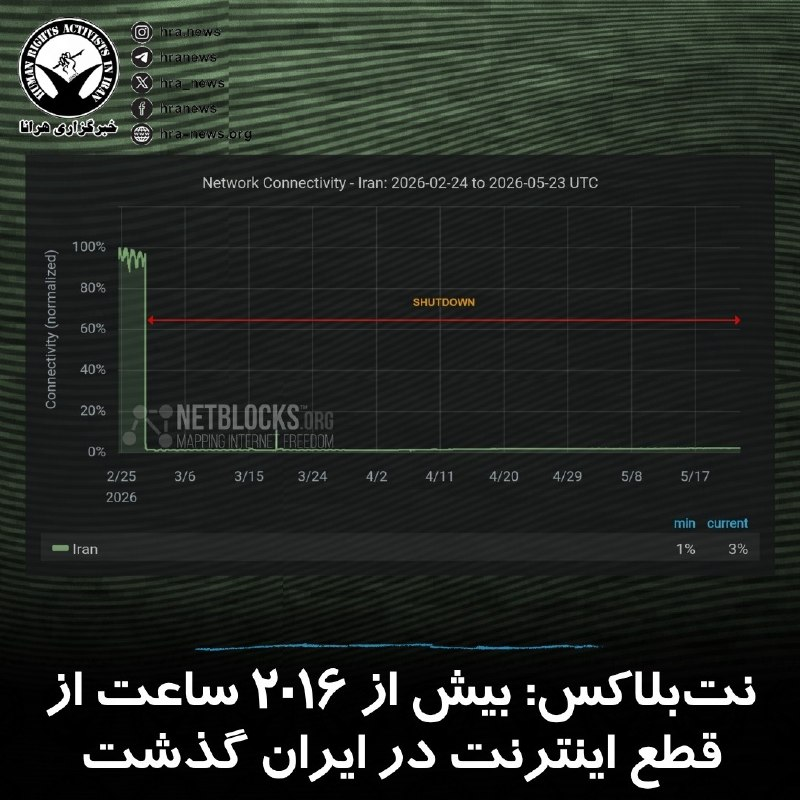

بر اساس آخرین داده‌های نت‌بلاکس، معیارهای پایش نشان می‌دهد که قطع اینترنت در ایران اکنون وارد سیزدهمین هفته خود شده و دسترسی به شبکه‌های بین‌المللی برای بیش از ۲۰۱۶ ساعت به‌طور گسترده محدود یا مسدود مانده است. این نهاد ناظر بر وضعیت اینترنت در جهان تاکید می‌کند که تداوم این وضعیت، زندگی روزمره شهروندان را تحت تاثیر قرار داده و آنان را از دسترسی به فرصت‌ها و اطلاعاتی که در سایر نقاط جهان به‌سرعت در دسترس است، محروم کرده است.

#اینترنت
#قطع_اینترنت

↘️
@hranews_bot تماس ✉️ - @Hranews کانال هرانا 🆑

## Hranews — post 113103

  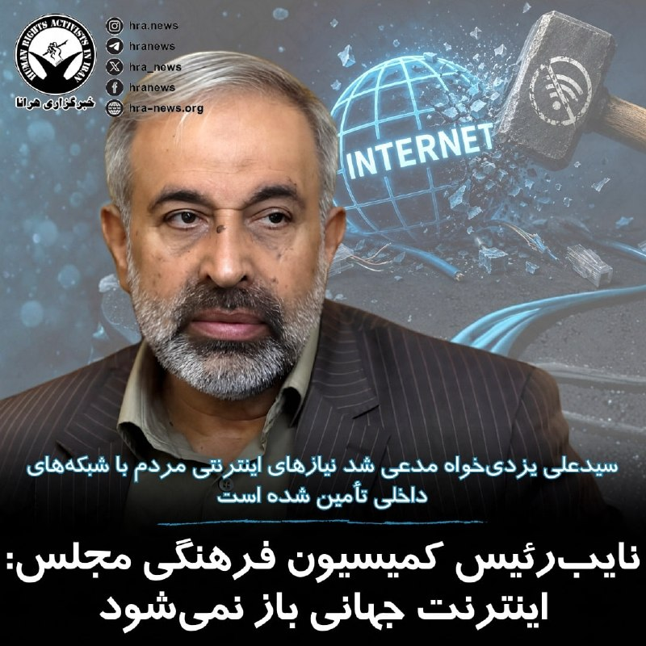

نایب‌رئیس کمیسیون فرهنگی مجلس با تاکید بر تداوم محدودیت اینترنت جهانی، اعلام کرد که در شرایط فعلی برنامه‌ای برای بازگشایی عمومی وجود ندارد و این تصمیم با «ملاحظات امنیتی» اتخاذ شده است. سیدعلی یزدی‌خواه در عین حال مدعی شد که «بخش عمده نیازهای مردم از طریق شبکه‌های داخلی تامین می‌شود و اختلال جدی در زندگی و کسب‌وکارها ایجاد نشده است.»

وی همچنین از برقراری دسترسی محدود به اینترنت بین‌الملل برای برخی گروه‌های «دارای نیاز» خبر داد؛ موضوعی که عملا به ایجاد نوعی دسترسی گزینشی و طبقاتی منجر شده است. به گفته او، افراد و نهادهایی که نیاز خود را اثبات کنند می‌توانند از این دسترسی برخوردار شوند، در حالی که همچنان امکان استفاده آزاد و برابر از اینترنت جهانی برای عموم شهروندان فراهم نیست.

#اینترنت

↘️
@hranews_bot تماس ✉️ - @Hranews کانال هرانا 🆑

## alonews — post 121980

  <a href="telegram/content/alonews_121980_1779528866.mp4" target="_blank">🎬 Download video</a>

👈رضا تقی‌پور، نماینده مجلس: شبکه حیاتی کابل‌های فیبر نوری جهان از تنگه هرمز و باب‌المندب عبور می‌کند و ایران می‌تواند این کابل‌ها را قطع کند

✅ @AloNews خبر جنگ

## alonews — post 121979

  <a href="telegram/content/alonews_121979_1779528869.webm" target="_blank">🎬 Download video</a>

👈شهباز شریف نخست وزیر پاکستان امروز شنبه وارد شهر هانگ‌جو واقع در شرق چین شد و دیدار رسمی چهار روزه خود از چین را آغاز کرد

✅ @AloNews خبر جنگ

## alonews — post 121978

  <a href="telegram/content/alonews_121978_1779528869.webm" target="_blank">🎬 Download video</a>

👈آخرین قیمت نفت ۱۰۳.۵۴ دلار

✅ @AloNews خبر جنگ

## alonews — post 121977

  <a href="telegram/content/alonews_121977_1779528870.webm" target="_blank">🎬 Download video</a>

👈نیروی دریایی سپاه اعلام کرد در شبانه‌روز گذشته ۲۵ کشتی اعم از نفتکش، کانتینربر و سایر کشتی‌های تجاری پس از کسب مجوز با هماهنگی و تامین امنیت نیروی دریایی سپاه از تنگهٔ هرمز عبور کردند

✅ @AloNews خبر جنگ

## alonews — post 121976

  <a href="telegram/content/alonews_121976_1779528870.webm" target="_blank">🎬 Download video</a>

👈تایوان : چین بیش از ۱۰۰ کشتی جنگی رو تو آب‌های سرزمینی مستقر کرده

✅ @AloNews خبر جنگ

## alonews — post 121975

  <a href="telegram/content/alonews_121975_1779528870.mp4" target="_blank">🎬 Download video</a>

👈واکنش تند وزیر ارتباطات به مخالفین اتصال مجدد اینترنت: این نگاه قیم معابانه به مردم چیست؟ کی گفته اینترنت را باید خلاصه در دو پیام‌رسان بدانیم؟

🔴ستار هاشمی وزیر ارتباطات: صحبت هایی که در رابطه با نقد دسترسی مردم به اینترنت آزاد می شود، نگاه قوه عاقله کشور نیست.

🔴ان‌شالله اینترنت برای آحاد مردم و به صورت عادلانه برقرار می شود.

✅ @AloNews خبر جنگ

## alonews — post 121973

  <a href="telegram/content/alonews_121973_1779528873.mp4" target="_blank">🎬 Download video</a>

👈امروز جنوب لبنانِ تحت حمله‌ شدید اسرائیل بود

✅ @AloNews خبر جنگ

## alonews — post 121972

  <a href="telegram/content/alonews_121972_1779528875.webm" target="_blank">🎬 Download video</a>

👈بلومبرگ: هند برای سومین بار در هشت روز، قیمت گازوئیل و بنزین را افزایش داد

✅ @AloNews خبر جنگ

## alonews — post 121971

  <a href="telegram/content/alonews_121971_1779528875.webm" target="_blank">🎬 Download video</a>

👈بلومبرگ: وقتی کانال سوئز در سال ۱۹۶۷، پس از آغاز جنگ میان مصر و اسرائیل، بسته شد، ۱۵ کشتی در داخل این آبراه گرفتار شدند. آن‌ها لنگر انداختند تا منتظر پایان درگیری‌ها بمانند. جنگ خیلی زود تمام شد. نام آن، به‌درستی، «جنگ شش‌روزه» بود؛ اما کانال به مدت هشت سال بسته ماند. زمانی که سرانجام در سال ۱۹۷۵ اجازه خروج به کشتی‌ها داده شد، فقط دو فروند هنوز قابلیت دریانوردی داشتند. بقیه آن‌قدر زنگ زده بودند که به «ناوگان زرد» معروف شدند.

✅ @AloNews خبر جنگ

## alonews — post 121970

  <a href="telegram/content/alonews_121970_1779528875.webm" target="_blank">🎬 Download video</a>

👈هزینه دریافت گواهینامه رانندگی با ۵۶ درصد افزایش به ۱۵ میلیون تومان رسید ...

✅ @AloNews خبر جنگ

## alonews — post 121969

  <a href="telegram/content/alonews_121969_1779528876.mp4" target="_blank">🎬 Download video</a>

👈حزب‌الله ویدیو منتشر کرده که توش یه نفربر زرهی نامر اسرائیل رو تو جنوب لبنان با پهپاد FPV زده

✅ @AloNews خبر جنگ

## alonews — post 121968

  <a href="telegram/content/alonews_121968_1779528879.webm" target="_blank">🎬 Download video</a>

👈وزیر خارجه قطر در تماس با عراقچی:
ما از تلاش‌ها برای رسیدن به توافقی جامع که بحران را پایان دهد حمایت می‌کنیم

✅ @AloNews خبر جنگ

## alonews — post 121967

  <a href="telegram/content/alonews_121967_1779528879.webm" target="_blank">🎬 Download video</a>

🔴فوری/منابع به اسکای نیوز عربی گفتند که میانجی پاکستانی موفق شد بر مانع پرونده هسته‌ای ایران غلبه کند.

✅ @AloNews خبر جنگ

## alonews — post 121966

  <a href="telegram/content/alonews_121966_1779528879.webm" target="_blank">🎬 Download video</a>

👈سخنگوی سازمان هواپیمایی: سازمان هواپیمایی نوتام جدیدی صادر نکرده است.

🔴نوتامی که اخیرا در فضای مجازی منتشر شده، تکذیب می‌شود.

🔴شرایط آسمان کشور همچنان مانند روال گذشته است و پروازها طبق برنامه انجام می‌شود

✅ @AloNews خبر جنگ

## alonews — post 121965

  <a href="telegram/content/alonews_121965_1779528879.webm" target="_blank">🎬 Download video</a>

👈نیویورک تایمز: ترامپ اسرائیل را آن‌چنان از روند‌ها کنار گذاشته که رهبران این کشور تقریباً به‌طور کامل از مذاکرات آتش‌بس میان ایالات متحده و ایران بی‌اطلاع ماندند

🔴اسرائیلی‌ها که از دریافت اطلاعات از نزدیک‌ترین متحد خود محروم شده‌اند، مجبور شدند اطلاعات رفت‌وآمدهای دیپلماتیک میان واشنگتن و تهران را از طریق ارتباطاتشان با رهبران و دیپلمات‌های منطقه به دست آورند

✅ @AloNews خبر جنگ

## alonews — post 121964

  <a href="telegram/content/alonews_121964_1779528880.mp4" target="_blank">🎬 Download video</a>

👈تیراندازی عروس جان فدا با کلاشینکف در تجمعات شبانه

✅ @AloNews خبر جنگ

## alonews — post 121963

  <a href="telegram/content/alonews_121963_1779528881.mp4" target="_blank">🎬 Download video</a>

👈پست جدید ترامپ توی توییتر که با هوش مصنوعی یه مجری که مخالفش هستو میندازه توی سطل آشغال :))

🔴تو ۸ ساعت بیش از ۵۰ میلیون ویو خورده

✅ @AloNews خبر جنگ

## alonews — post 121962

  <a href="telegram/content/alonews_121962_1779528883.webm" target="_blank">🎬 Download video</a>

👈نیویورک تایمز: تنزل جایگاه نتانیاهو، از حضور در کابین خلبان، به نشستن به عنوان مسافر، می‌تواند پیامدهای مهمی برای اسرائیل و به‌ویژه برای نخست‌وزیر آن داشته باشد؛ کسی که امسال با نبردی دشوار برای انتخاب مجدد روبه‌رو است.

✅ @AloNews خبر جنگ

## alonews — post 121961

  <a href="telegram/content/alonews_121961_1779528884.webm" target="_blank">🎬 Download video</a>

👈رویترز: سه ماه پس از جنگی که قرار بود در شش هفته با پیروزی قاطع به پایان برسد، ترامپ در باتلاق ایران گیر کرده است و قادر به یافتن راه خروجی برای حفظ آبرو یا گسترش حملات نیست.

✅ @AloNews خبر جنگ

---
📅 بروزرسانی: 1405/03/02 11:18
---

## VahidOOnLine — post 241662

  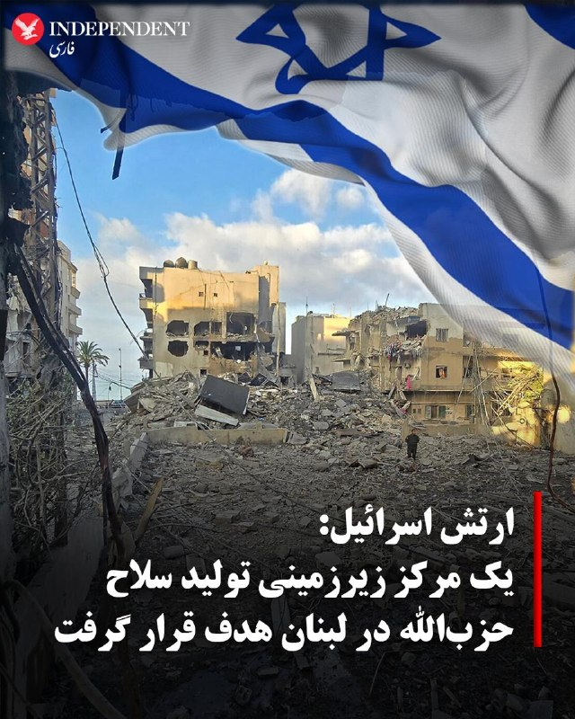

♦️ارتش اسرائیل، روز شنبه دوم خرداد ماه اعلام کرد حملات شبانه این کشور در منطقه بقاع لبنان یک مرکز زیرزمینی تولید سلاح متعلق به حزب‌الله را هدف قرار داده است.
نیروهای دفاعی اسرائیل (IDF) همچنین گفتند زیرساخت‌های دیگری وابسته به حزب‌الله در منطقه صور نیز در این حملات هدف قرار گرفته‌اند.
ارتش اسرائیل پیش از آغاز حملات، برای ساکنان دره بقاع لبنان هشدارهای تخلیه صادر کرده بود. به گفته ارتش، در این عملیات از مهمات دقیق و همچنین تجهیزات نظارتی استفاده شده است.
‌🇸🇦 Indypersian

🤖 @VahidOOnLine

## VahidOOnLine — post 241661

  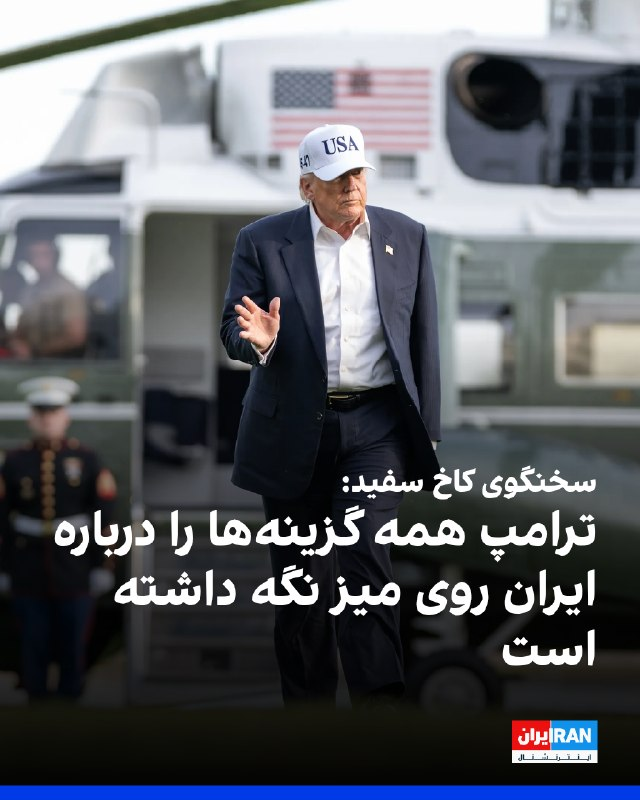

اولیویا والز، سخنگوی کاخ سفید، با اشاره به حملات آمریکا و اسرائیل علیه جمهوری اسلامی گفت ایالات متحده «به تمام اهداف نظامی خود در «عملیات خشم حماسی» دست یافته یا از آنها پیشی گرفته است.»

او افزود: «ترامپ همه کارت‌ها را در دست دارد و عاقلانه همه گزینه‌ها را روی میز نگه می‌دارد.»
‌🏁 🇬🇧 IranintlTV

🤖 @VahidOOnLine

## VahidOOnLine — post 241660

  

مشاهدات و تجربه شما از مشکلات حوزه نان، گرانی، کمبود یا شلوغی صفوف نانوایی چیست؟

روی لینک زیر کلیک کنید و پیام‌های خود را از طریق مدیا‌بات برای ما بفرستید.

t.me

پیام‌های شما به صورت زیر‌نویس در تلویزیون و همچنین در بخش‌های مختلف‌ خبری منتشر خواهد شد
‌🏁 🇬🇧 IranintlTV

🤖 @VahidOOnLine

## VahidOOnLine — post 241659

  <a href="telegram/content/VahidOOnLine_241659_1779522533.mp4" target="_blank">🎬 Download video</a>

ایرانیان ساکن استرالیا روز شنبه دوم خرداد در بریزبن تجمع کرده و در حمایت از انقلاب ملی و جاویدنامان آن شعار دادند. یکی از سخنرانان این تجمع مبارزه ایرانیان با جمهوری اسلامی را نجات تمدن انسانی خواند.
‌🏁 🇬🇧 IranintlTV

🤖 @VahidOOnLine

## VahidOOnLine — post 241658

  <a href="telegram/content/VahidOOnLine_241658_1779522535.mp4" target="_blank">🎬 Download video</a>

فرانسه اعلام کرد پیش‌نویس قطعنامه‌ای را برای ارائه به شورای امنیت سازمان ملل تهیه کرده که هدف آن تشکیل یک مأموریت بین‌المللی به‌منظور بازگرداندن آزادی تردد در تنگه هرمز است. وزارت خارجه فرانسه گفته این طرح در صورت فراهم شدن شرایط می‌تواند مطرح شود.
هم‌زمان، پیش‌نویس قطعنامه مشترک آمریکا و بحرین درباره تنگه هرمز همچنان در شورای امنیت در حال بررسی است. این قطعنامه از ایران می‌خواهد حملات و مین‌گذاری در این آبراه را متوقف کند، اما رأی‌گیری درباره آن به دلیل احتمال وتوی روسیه و چین چندین بار به تعویق افتاده است.
مقام‌های فرانسوی اعلام کردند پاریس در هماهنگی با بریتانیا در حال بررسی ایجاد یک مأموریت بین‌المللی برای تضمین آزادی ناوبری در تنگه هرمز است. در همین حال، گزارش‌ها حاکی از آن است که آمریکا تلاش کرده حمایت ده‌ها کشور را برای پیشبرد قطعنا خود جلب کند
‌🏁 🇬🇧 ManotoTV

🤖 @VahidOOnLine

## VahidOOnLine — post 241657

  <a href="telegram/content/VahidOOnLine_241657_1779522535.mp4" target="_blank">🎬 Download video</a>

سازمان عملیات تجارت دریایی بریتانیا اعلام کرد یک قایق کوچک به یک نفتکش حامل فرآورده‌های نفتی در نزدیکی سواحل یمن نزدیک شده است.
بر اساس این گزارش، نفتکش در فاصله حدود ۲۰۰ مایل دریایی در غرب جزیره سقطری یمن قرار داشت و قایق نزدیک‌شونده پنج سرنشین داشته است.
این سازمان افزود پس از استقرار تیم امنیتی مسلح نفتکش، قایق مسیر خود را تغییر داد و از کشتی فاصله گرفت.
‌🏁 🇬🇧 ManotoTV

🤖 @VahidOOnLine

## VahidOOnLine — post 241656

  

رسانه دولتی سی‌سی‌تی‌وی گزارش داد شمار جان‌باختگان انفجار گاز در یک معدن زغال‌سنگ در استان شانشی در شمال چین به ۹۰ نفر رسیده است. عملیات جست‌وجو و نجات همچنان ادامه دارد و علت حادثه در دست بررسی است. به گفته مقام‌های محلی، تلاش‌ها برای یافتن احتمالی مفقودان ادامه دارد.

چین از اوایل دهه ۲۰۰۰ با اجرای مقررات سخت‌گیرانه‌تر و ارتقای استانداردهای ایمنی، تلفات معادن زغال‌سنگ را که اغلب بر اثر انفجار گاز یا سیلاب رخ می‌داد، کاهش داده است. با این حال، حادثه لیوشنیو از مرگبارترین حوادث معدنی گزارش‌شده در این کشور در دهه گذشته به شمار می‌رود.

خبرگزاری شینهوا اعلام کرد مدیران شرکت مسئول این معدن بازداشت شده‌اند.
‌🏁 🇬🇧 IranintlTV

🤖 @VahidOOnLine

## VahidOOnLine — post 241655

  

رضا طلایی‌نیک، سخنگوی وزارت دفاع جمهوری اسلامی، گفت دونالد ترامپ، رییس‌جمهوری آمریکا «هیچ چاره‌ای» جز پذیرفتن مطالبات تهران و به رسمیت شناختن «حقوق» جمهوری اسلامی ندارد.

طلایی‌نیک گفت «تمکین نکردن» آمریکا به مطالبات جمهوری اسلامی، به «تحمیل» هزینه‌های بیشتر و «شکست‌های پیاپی» بعدی برای دونالد ترامپ و اسرائیل منجر خواهد شد.

او افزود ترامپ باید ضمن پذیرش پیشنهادهای جمهوری اسلامی، به فکر جلوگیری از «خسارت‌ها و هزینه‌های بیشتر» ادامه جنگ برای مردم آمریکا و جامعه جهانی باشد.

سخنگوی وزارت دفاع جمهوری اسلامی همچنین گفت «بی‌توجهی» ترامپ به منافع ملی آمریکا، «تبعیت از اسرائیل» و رفتارهای «مغرورانه» او، باعث فرو رفتن بیشتر آمریکا در «باتلاق» جنگ خواهد شد.
‌🏁 🇬🇧 IranintlTV

🤖 @VahidOOnLine

## VahidOOnLine — post 241654

  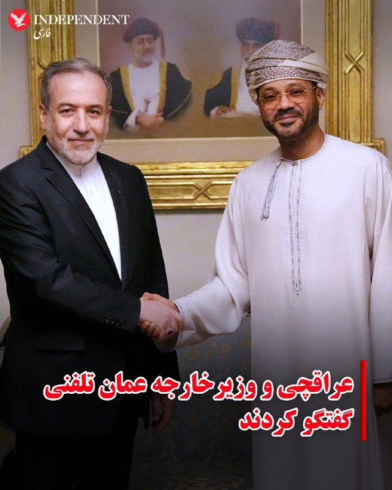

♦️عباس عراقچی، وزیر امور خارجه جمهوری اسلامی ایران، صبح شنبه دوم خرداد ماه با بدر البوسعیدی، وزیر امور خارجه عمان تلفنی گفتگو کرد.
رسانه‌های داخلی ایران در بحبوحه تحرکات دیپلماتیک منطقه‌ای برای پایان دادن به بحران خاورمیانه، موضوع این گفتگو را «تبادل نظر درباره تلاش‌های دیپلماتیک برای جلوگیری از تشدید تنش و خاتمه جنگ» توصیف کردند.
عراقچی شامگاه جمعه نیز با عاصم منیر، فرمانده ارتش پاکستان که به تهران سفر کرده است، دیداری داشت که «تا پاسی از شب» طول کشید.
‌🇸🇦 Indypersian

🤖 @VahidOOnLine

## VahidOOnLine — post 241653

♦️رسانه‌های دولتی چین روز شنبه گزارش دادند در پی انفجار گاز در یک معدن زغال‌سنگ در استان شانشی در شمال این کشور، دست‌کم ۸۲ نفر کشته شده‌اند و ۹ نفر دیگر همچنان مفقود هستند. بر اساس این گزارش‌ها، تاکنون ۲۳ کارگر از معدن نجات یافته‌اند.
این انفجار شامگاه جمعه در معدن زغال‌سنگ «لیوشنیو» در شهرستان چین‌یوان رخ داد. در زمان حادثه ۲۴۷ کارگر در زیر زمین حضور داشتند که تا صبح شنبه ۲۰۱ نفر از آن‌ها به سطح زمین منتقل شدند.
مقام‌های محلی مدیریت بحران اعلام کردند علت حادثه همچنان در دست بررسی است.
به گزارش رویترز، چین از اوایل دهه ۲۰۰۰ با اجرای مقررات سختگیرانه‌تر و بهبود استانداردهای ایمنی، میزان تلفات در معادن زغال‌سنگ را به‌طور قابل توجهی کاهش داده است، اما انفجار معدن «لیوشنیو» یکی از مرگبارترین حوادث معدنی گزارش‌شده در این کشور طی یک دهه گذشته به شمار می‌رود.
‌🇸🇦 Indypersian

🤖 @VahidOOnLine

## VahidOOnLine — post 241652

  <a href="telegram/content/VahidOOnLine_241652_1779522537.mp4" target="_blank">🎬 Download video</a>

روزنامه نیویورک پست گزارش داد محمد باقر سعد داوود السعدی، تبعه ۳۲ ساله عراقی که گفته می‌شود آموزش‌های مرتبط با سپاه پاسداران دیده است، متهم به طراحی طرحی برای ترور ایوانکا ترامپ، دختر دونالد ترامپ، رئیس‌جمهوری آمریکا، شده است. طبق این گزارش، انگیزه این اقدام انتقام‌گیری از کشته شدن قاسم سلیمانی عنوان شده است.
بر اساس این گزارش، السعدی متهم است که پس از کشته‌شدن قاسم سلیمانی، فرمانده پیشین نیروی قدس سپاه، خانواده ترامپ را هدف قرار داده و حتی نقشه محل اقامت ایوانکا ترامپ در فلوریدا را در اختیار داشته است. منابع می‌گویند او پیش‌تر نیز تهدیدهایی در این رابطه مطرح کرده بود.
نیویورک پست به نقل از انتفاض قنبر، معاون پیشین وابسته نظامی سفارت عراق در واشینگتن، نوشت السعدی به اطرافیانش گفته بود: «باید ایوانکا را بکشیم تا خانه ترامپ را همان‌طور به آتش بکشیم که او خانه ما را به آتش کشید.» همچنین گفته می‌شود او در شبکه اجتماعی ایکس پیام‌هایی با محتوای تهدیدآمیز منتشر کرده بود.
السعدی روز ۱۵ مه در ترکیه بازداشت و به آمریکا منتقل شد. وزارت دادگستری آمریکا او را از چهره‌های مرتبط با شبکه‌های تروریستی عراق و جمهوری اسلامی معرفی کرده و اعلام کرده است که او با اتهام دست داشتن در ۱۸ حمله و اقدام به حمله در اروپا و آمریکا روبه‌رو است.
‌🏁 🇬🇧 ManotoTV

🤖 @VahidOOnLine

## VahidOOnLine — post 241651

  <a href="telegram/content/VahidOOnLine_241651_1779522538.mp4" target="_blank">🎬 Download video</a>

روزنامه وال‌استریت ژورنال به نقل از مقام‌های آمریکایی گزارش داد دونالد ترامپ، رئیس‌جمهوری آمریکا، در حال حاضر گزینه اقدام نظامی علیه جمهوری اسلامی را به‌طور کامل کنار نگذاشته و در صورت شکست مذاکرات، احتمال صدور دستور حملات نظامی علیه جمهوری اسلامی همچنان وجود دارد.
بر اساس این گزارش، ترامپ روز جمعه در دیداری با کارکنان خود گفته است که با ادامه مذاکرات با ایران، ترجیح می‌دهد به مسیر دیپلماسی زمان بیشتری داده شود. به گفته مقام‌های آمریکایی، او با وجود ادامه تنش‌ها همچنان به دستیابی به راه‌حلی از مسیر مذاکره علاقه‌مند است.
این گزارش می‌افزاید رئیس‌جمهوری آمریکا هنوز تصمیم نهایی خود را نگرفته، اما در حال حاضر بیشتر به ادامه تلاش‌های دیپلماتیک تمایل دارد، در حالی که گزینه‌های نظامی همچنان روی میز باقی مانده‌اند.
‌🏁 🇬🇧 ManotoTV

🤖 @VahidOOnLine

## VahidOOnLine — post 241650

  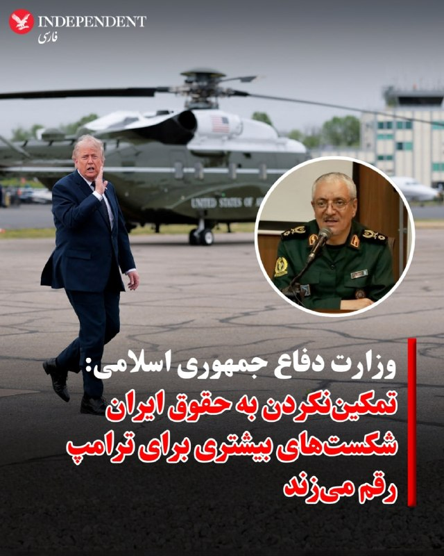

⭕️ وزارت دفاع جمهوری اسلامی:
تمکین‌نکردن به حقوق ایران شکست‌های بیشتری برای ترامپ رقم می‌زند

♦️رضا طلایی‌نیک، سخنگوی وزارت دفاع جمهوری اسلامی با تاکید بر اینکه واشنگتن راهی جز پذیرش حقوق و مطالبات ملت ایران ندارد، اعلام کرد ادامه بی‌توجهی آمریکا به خواسته‌های تهران، شکست‌های بیشتری برای دونالد ترامپ به همراه خواهد داشت.
سخنگوی وزارت دفاع جمهوری اسلامی گفت: «ترامپ هیچ چاره‌ای جز پذیرفتن مطالبات ملت ایران و به‌رسمیت‌شناختن حقوق کشورمان ندارد.»
او همچنین تاکید کرد در هر دو عرصه «رزم و دیپلماسی»، تحقق مطالبات به‌حق ملت ایران تنها راه خروج آمریکا و اسرائیل از «جنگ تحمیلی سوم» است و رئیس‌جمهوری آمریکا باید با پذیرش پیشنهاد ایران، مانع افزایش خسارت‌ها و هزینه‌های جنگ برای مردم آمریکا و جامعه جهانی شود.
‌🇸🇦 Indypersian

🤖 @VahidOOnLine

## VahidOOnLine — post 241649

  

⭕️ فرانسه: هرگونه اقدام نظامی برای بازگشایی تنگه هرمز تنش‌ها را تشدید می‌کند

♦️فرانسه با هشدار نسبت به هرگونه اقدام نظامی برای بازگشایی تنگه هرمز اعلام کرد استفاده از زور تنها به تشدید تنش‌ها در منطقه منجر خواهد شد. وزارت خارجه فرانسه در گفتگو با «العربیه» بستن تنگه هرمز را «سابقه‌ای خطرناک» توصیف کرد، اقدامی که می‌تواند امنیت آبراه‌های راهبردی جهان، تجارت بین‌المللی و بازار انرژی را با تهدیدی جدی روبه‌رو کند.
پاریس همزمان از آماده‌سازی یک ابتکار دیپلماتیک در شورای امنیت سازمان ملل خبر داده، طرحی که هدف آن تشکیل چارچوبی بین‌المللی برای تضمین آزادی دریانوردی و بازگشایی مسالمت‌آمیز تنگه هرمز است.
در همین حال، عبور ناو هواپیمابر فرانسوی «شارل دوگل» از کانال سوئز، از سوی وزارت خارجه فرانسه «پیامی سیاسی بسیار قوی» توصیف شده است، اقدامی که در اوج تنش‌های منطقه‌ای، حامل هشدار و نمایش آمادگی نظامی پاریس و متحدان غربی ارزیابی می‌شود. این ناو قرار است در دریای سرخ و خلیج عدن مستقر شود تا در چارچوب ابتکار مشترک فرانسه و بریتانیا برای حفاظت از آزادی کشتیرانی در منطقه ایفای نقش کند.
‌🇸🇦 Indypersian

🤖 @VahidOOnLine

## WithYashar — post 12108

روبیو وارد هند شد
وزیر امور خارجه آمریکا امروز با هدف تقویت همکاری‌ها با هند وارد این کشور آسیایی شد.
@withyashar

## WithYashar — post 12107

کانال ۱۲ اسرائیل: درنهایت برآورد اسرائیل اینه که هیچ توافقی انجام نخواهد شد و ارتش دفاعی اسرائیل برای شروع موج جدیدی از حملات به ایران طی روزای آینده آماده می‌شه
@withyashar

## WithYashar — post 12106

شبکه CBS به نقل از چند منبع آگاه از برنامه‌ریزی‌های نظامی اعلام کرد که دولت ترامپ در حال آماده شدن برای دور جدیدی از حملات علیه ایران است، هرچند هنوز به تصمیم نهایی نرسیده‌اند
@withyashar

## WithYashar — post 12105

سخنگوی وزارت دفاع ایران: ترامپ چاره‌ای جز پذیرش خواسته‌های ایران ندارد، در غیر این صورت متحمل شکست‌های بیشتری خواهد شد.
@withyashar

## mwarmonitor — post 9517

  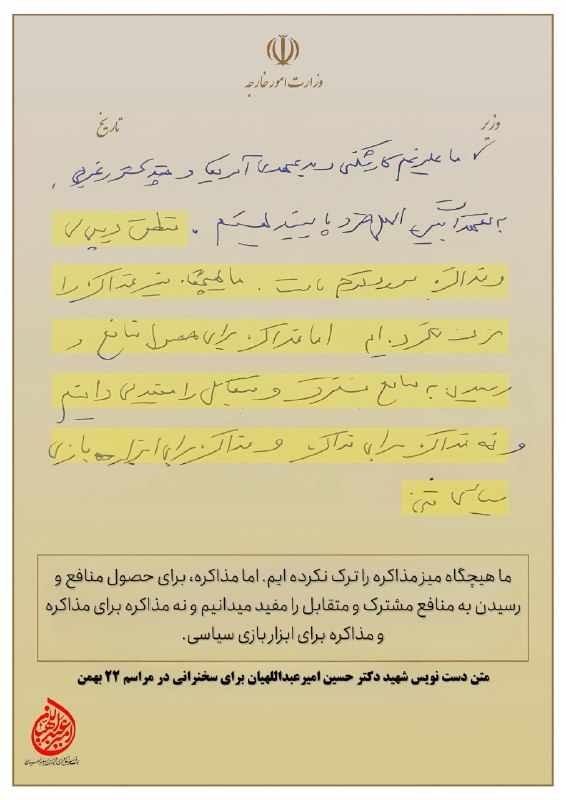

📝 وقتی یک دلقک بی‌سواد و مایه سرافکندگی دیپلماسی، نه تنها در مجامع بین‌المللی با آن انگلیسیِ الکن و فضاحت‌بارش اسباب خنده و تفریح دنیا را فراهم می‌کرد، بلکه در نگارش زبان مادری‌اش هم این‌طور درمانده و عاجز بود، عمق طویله‌ی مدیریت در جمهوری اسلامی آشکار می‌شود. در هیچ کجای دنیا سابقه ندارد یادداشتِ ابلهانه‌ی یک مقام ارشد را به زبان رسمی کشورش منتشر کنند و بعد مجبور شوند مثل خطوط میخی عهد بوق یا نسخه‌های خرچنگ‌قورباغه‌ی داروفروشان، زیرش مترجم و رمزگشای چاپی بگذارند تا مردم بفهمند این بیشعورِ گوساله اصلاً چه غلطی روی کاغذ واژگون کرده است! این دست‌خطِ فاجعه‌بار و شبیه به جای پای مرغ، سندی زنده است که نشان می‌دهد این جماعتِ احمق و اراذل، یکی از یکی نفهم‌تر و بی‌کفایت‌تر هستند. امیرعبداللهیانِ گوربه‌گور شده رفت، اما این اثر مضحک و مایه شرمساری به عنوان نمادِ مجسمِ حماقت و شایسته‌سالاری در این رژیم نکبت‌بار باقی ماند تا بعد از مرگش هم مایه تف و لعنت و سوژه‌ی خنده‌ی دائمی ملت باشد.

@mwarmonitor

## mwarmonitor — post 9516

  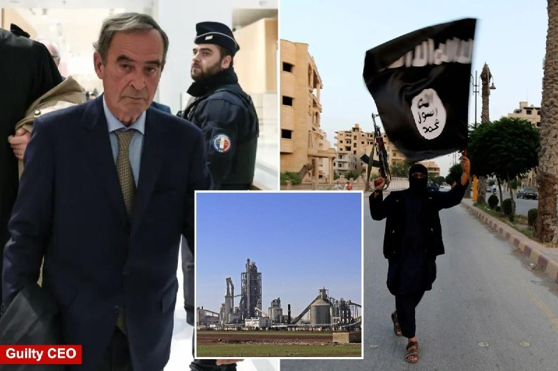

🔸خانواده‌های نظامیان خواستار آن هستند که وزارت دادگستری ایالات متحده نزدیک به ۸۰۰ میلیون دلار از وجوه یک شرکت سیمان فرانسوی را—که به رشوه‌دهی به داعش محکوم شده—میان آن‌ها توزیع کند. نیویورک پست

@mwarmonitor

## mwarmonitor — post 9515

🔴ارتش دفاعی اسرائیل (IDF) از سطح سیاسی می‌خواهد هرچه سریع‌تر تصمیم نهایی بگیرد:

🔸یا دستیابی به توافق در لبنان،
یا دادن اختیار کامل برای اقدام نظامی؛
زیرا وضعیت فعلی که در آن دست‌های ارتش بسته است نمی‌تواند ادامه پیدا کند.— کانال ۱۲ (N12)

@mwarmonitor

## mwarmonitor — post 9514

📝 سوال، انتقاد ، پیشنهاد ، دایرکت به گوشم

## mwarmonitor — post 9513

  

🚨نیویورک پست: ادعا می‌شود محمدباقر السعدی، مظنون عراقیِ مرتبط با سپاه پاسداران انقلاب اسلامی، در تلافی کشته‌شدن قاسم سلیمانی در سال ۲۰۲۰، قصد ترور ایوانکا ترامپ را داشته است.
مقام‌ها می‌گویند او نقشه‌هایی از محل سکونت او در فلوریدا در اختیار داشته و خانواده ترامپ را به‌صورت آنلاین تهدید کرده است.

@mwarmonitor

## mwarmonitor — post 9512

🔴اسرائیل برآورد می‌کند که در نهایت هیچ توافقی با ایران حاصل نخواهد شد و بر همین اساس، ارتش دفاعی اسرائیل (IDF) اکنون خود را طوری آماده می‌کند که گویی حمله‌ای قرار است در روزهای آینده انجام شود.— کانال ۱۲ اسرائیل

@mwarmonitor

## pm_afshaa — post 91240

  <a href="telegram/content/pm_afshaa_91240_1779522541.mp4" target="_blank">🎬 Download video</a>

ترامپ در تازه‌ترین پست خود فیلمی ساخته شده توسط هوش مصنوعی رو منتشر کرده که در آن استفان کولبرت، مجری و کمدین مشهور آمریکایی را به دلیل انتقادهایش به ترامپ به سطل زباله می‌اندازه

💧 Rainbet.com the #1 Non-KYC Crypto Casino & Sportsbook @rainbetcom

😁 @Pm_Afshaa

## pm_afshaa — post 91239

  

نیویورک پست:محمد باقر السعدی، از فرماندهان کتائب حزب‌الله عراق که اخیراً در آمریکا دستگیر و متهم شده، طرح ترور ایوانکا ترامپ، دختر رئیس‌جمهور آمریکا، را داشته ، هدف او انتقام از قتل قاسم سلیمانی بوده و مدارکی‌ وجود دارد که احتمال داده میشه سپاه پاسداران هم در این موضوع نقش داشته

💧 Rainbet.com the #1 Non-KYC Crypto Casino & Sportsbook @rainbetcom

😁 @Pm_Afshaa

## pm_afshaa — post 91238

وضعیت این روزای کیش: اصلا انگار یه کشور دیگه رفتین 
💧 Rainbet.com the #1 Non-KYC Crypto Casino & Sportsbook @rainbetcom 
😁 @Pm_Afshaa

## pm_afshaa — post 91237

🟠جمهوری اسلامی:با صدور اطلاعیه‌ای، پرواز در بخش غربی حریم هوایی خود را تا صبح دوشنبه ممنوع اعلام کرد

💧 Rainbet.com the #1 Non-KYC Crypto Casino & Sportsbook @rainbetcom

😁 @Pm_Afshaa

## pm_afshaa — post 91236

🔴ترامپ:مقدار زیادی نفت از ونزوئلا استخراج کرده‌ایم، و هزینه جنگ را بیش از 25 بار پرداخت کرده‌ایم

💧 Rainbet.com the #1 Non-KYC Crypto Casino & Sportsbook @rainbetcom

😁 @Pm_Afshaa

## pm_afshaa — post 91235

🔴کانال 12 اسرائیل: درنهایت برآورد اسرائیل اینه که هیچ توافقی انجام نخواهد شد و ارتش دفاعی اسرائیل برای شروع موج جدیدی از حملات به ایران طی روزای آینده آماده میشه

💧 Rainbet.com the #1 Non-KYC Crypto Casino & Sportsbook @rainbetcom

😁 @Pm_Afshaa

## pm_afshaa — post 91233

  <a href="telegram/content/pm_afshaa_91233_1779522543.mp4" target="_blank">🎬 Download video</a>

دن اسکاوینو، رئیس دفتر کاخ سفید و دستیار ارشد ترامپ، ویدیو سمت راست رو از بمب‌افکن‌های B-2 منتشر کرده؛ آخرین باری که اینکار رو کرده بود یک روز قبل از حمله‌ی 9 اسفند بود (ویدیو سمت چپ)

💧 Rainbet.com the #1 Non-KYC Crypto Casino & Sportsbook @rainbetcom

😁 @Pm_Afshaa

## VahidOnline — post 75633

  

رسانه‌ها در ایران از دیدار فیلد مارشال عاصم منیر، فرمانده ارتش پاکستان با عباس عراقچی، وزیر امور خارجه ایران در شامگاه جمعه یکم خرداد خبر دادند.

بر اساس این خبر، دیدار این دو مقام تا پاسی از شب ادامه یافته و محور گفت‌وگوها «تلاش‌ها برای جلوگیری از تشدید تنش و خاتمه جنگ» و «راهکارهای تقویت صلح، ثبات و امنیت در منطقه غرب آسیا» بوده است.

جزئیات بیشتری از این دیدار منتشر نشده است.
@VahidHeadline

📡 @VahidOnline

## IranIntlTV — post 338538

  

اولیویا والز، سخنگوی کاخ سفید، با اشاره به حملات آمریکا و اسرائیل علیه جمهوری اسلامی گفت ایالات متحده «به تمام اهداف نظامی خود در «عملیات خشم حماسی» دست یافته یا از آنها پیشی گرفته است.»

او افزود: «ترامپ همه کارت‌ها را در دست دارد و عاقلانه همه گزینه‌ها را روی میز نگه می‌دارد.»
https://iranintl.com/202605235460

## IranIntlTV — post 338537

  

مشاهدات و تجربه شما از مشکلات حوزه نان، گرانی، کمبود یا شلوغی صفوف نانوایی چیست؟

روی لینک زیر کلیک کنید و پیام‌های خود را از طریق مدیا‌بات برای ما بفرستید.

https://t.me/intlmedia_bot

پیام‌های شما به صورت زیر‌نویس در تلویزیون و همچنین در بخش‌های مختلف‌ خبری منتشر خواهد شد

## IranIntlTV — post 338536

  <a href="telegram/content/IranIntlTV_338536_1779522545.mp4" target="_blank">🎬 Download video</a>

ایرانیان ساکن استرالیا روز شنبه دوم خرداد در بریزبن تجمع کرده و در حمایت از انقلاب ملی و جاویدنامان آن شعار دادند. یکی از سخنرانان این تجمع مبارزه ایرانیان با جمهوری اسلامی را نجات تمدن انسانی خواند.

## IranIntlTV — post 338535

  <a href="https://t.me/IranintlTV/338535" target="_blank">📎 Download file</a>

🎧نسخه صوتی اخبار بامدادی | شنبه ۲ خرداد
@iranintlTV

## IranIntlTV — post 338534

  

رسانه دولتی سی‌سی‌تی‌وی گزارش داد شمار جان‌باختگان انفجار گاز در یک معدن زغال‌سنگ در استان شانشی در شمال چین به ۹۰ نفر رسیده است. عملیات جست‌وجو و نجات همچنان ادامه دارد و علت حادثه در دست بررسی است. به گفته مقام‌های محلی، تلاش‌ها برای یافتن احتمالی مفقودان ادامه دارد.

چین از اوایل دهه ۲۰۰۰ با اجرای مقررات سخت‌گیرانه‌تر و ارتقای استانداردهای ایمنی، تلفات معادن زغال‌سنگ را که اغلب بر اثر انفجار گاز یا سیلاب رخ می‌داد، کاهش داده است. با این حال، حادثه لیوشنیو از مرگبارترین حوادث معدنی گزارش‌شده در این کشور در دهه گذشته به شمار می‌رود.

خبرگزاری شینهوا اعلام کرد مدیران شرکت مسئول این معدن بازداشت شده‌اند.
https://iranintl.com/202605238441

## IranIntlTV — post 338533

  <a href="telegram/content/IranIntlTV_338533_1779522548.mp4" target="_blank">🎬 Download video</a>

علی شیرازی، عضو تحریریه ایران‌اینترنشنال، گفت جمهوری اسلامی در حال حاضر دو ابزار برای مقابله در اختیار دارد؛ تنگه هرمز و اورانیوم غنی‌شده‌ای که در اختیارش است. او افزود: «اگر جمهوری اسلامی این دو اهرم را از دست بدهد، عملا همان تسلیم بی‌قید و شرطی رخ خواهد داد که دونالد ترامپ از آن سخن گفته بود.»
@iranintltv

## IranIntlTV — post 338532

  <a href="telegram/content/IranIntlTV_338532_1779522549.mp4" target="_blank">🎬 Download video</a>

یک شهروند با ارسال پیامی به ایران اینترنشنال از افزایش قیمت‌ها و لغو شدن مشاغل هنری خبر می‌دهد. پیام او با هوش مصنوعی خوانده شده است.

## IranIntlTV — post 338531

  <a href="telegram/content/IranIntlTV_338531_1779522551.mp4" target="_blank">🎬 Download video</a>

یک شهروند با ارسال پیامی به ایران‌اینترنشنال می‌گوید در این شرایط سخت معیشتی، پیامک زده‌اند و فرزندآوری را تشویق می‌کنند.
پیام این شهروند با هوش مصنوعی بازخوانی شده است.

## IranIntlTV — post 338530

  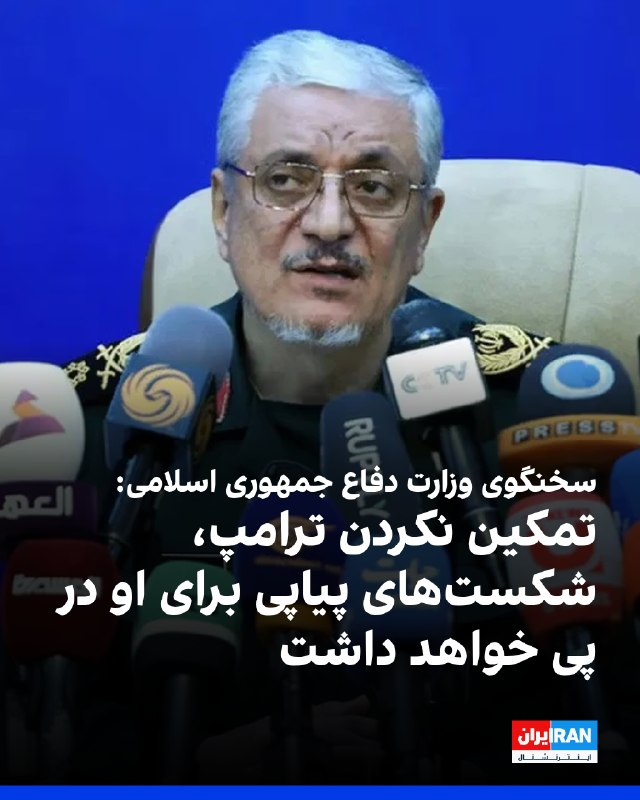

رضا طلایی‌نیک، سخنگوی وزارت دفاع جمهوری اسلامی، گفت دونالد ترامپ، رییس‌جمهوری آمریکا «هیچ چاره‌ای» جز پذیرفتن مطالبات تهران و به رسمیت شناختن «حقوق» جمهوری اسلامی ندارد.

طلایی‌نیک گفت «تمکین نکردن» آمریکا به مطالبات جمهوری اسلامی، به «تحمیل» هزینه‌های بیشتر و «شکست‌های پیاپی» بعدی برای دونالد ترامپ و اسرائیل منجر خواهد شد.

او افزود ترامپ باید ضمن پذیرش پیشنهادهای جمهوری اسلامی، به فکر جلوگیری از «خسارت‌ها و هزینه‌های بیشتر» ادامه جنگ برای مردم آمریکا و جامعه جهانی باشد.

سخنگوی وزارت دفاع جمهوری اسلامی همچنین گفت «بی‌توجهی» ترامپ به منافع ملی آمریکا، «تبعیت از اسرائیل» و رفتارهای «مغرورانه» او، باعث فرو رفتن بیشتر آمریکا در «باتلاق» جنگ خواهد شد.
https://iranintl.com/202605234414

## IranIntlTV — post 338529

  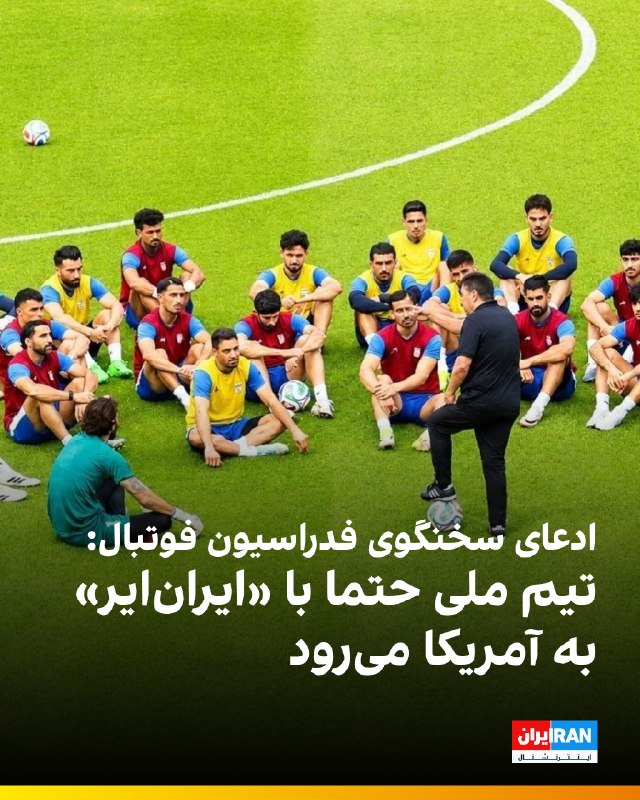

🔻امیرمهدی علوی، سخنگوی فدراسیون فوتبال، امشب در یک برنامه تلویزیونی مدعی شد که با هماهنگی فیفا سفر تیم ملی فوتبال به آمریکا با پرواز اختصاصی «ایران‌ایر» نهایی شده است: «نشستن هواپیمای اختصاصی ایران‌ایر در محل برگزاری جام جهانی نهایی شده است.»

🔹این در حالی است که ایران‌ایر سال‌هاست از سوی ایالات متحده تحریم شده و هیچ هواپیما یا پروازی متعلق به این شرکت امکان پرواز به آمریکا را ندارد.

🔹ایران‌ایر همچنین از سوی بسیاری از کشورهای اروپایی محروم شده و فدراسیون فوتبال برای سفرهای اروپایی نیز ناچار به استفاده از پروازهای خارجی است.

🔹با این حال، به نظر می‌رسد تلاش مهدی تاج و فدراسیون فوتبال برای استفاده از پرواز ایرانی بیشتر در سفر به آمریکا به مشکلات مالی فدراسیون مرتبط باشد؛ طبق برخی برآوردها، تنها پرواز کاروان تیم ملی به آمریکا بیش از نیم‌میلیون دلار هزینه خواهد داشت.

@iranintltvsport

## IranIntlTV — post 338528

  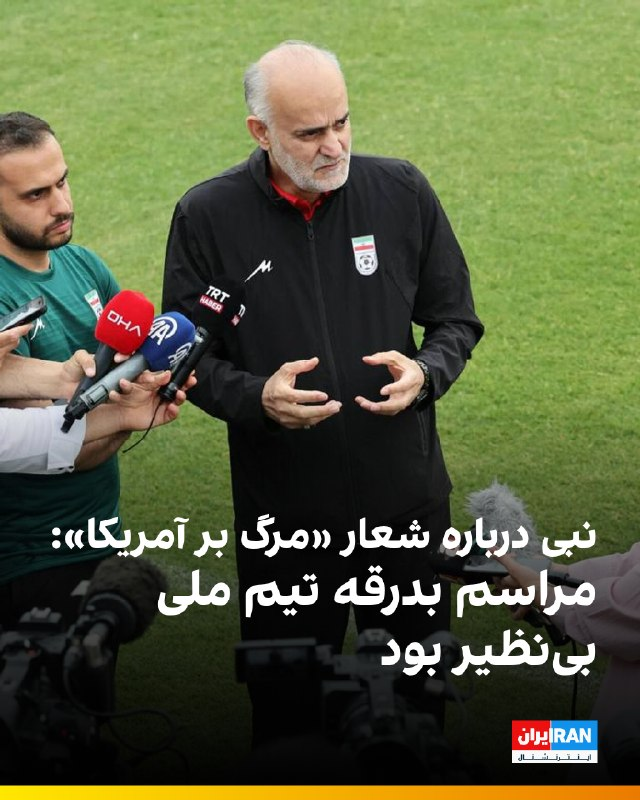

🔻مهدی محمدنبی، سرپرست تیم ملی فوتبال، در حاشیه تمرین تیم ملی در پاسخ به یک رسانه بریتانیایی درباره شعار «مرگ بر آمریکا» هواداران حکومت در تجمعات شبانه و همزمان با حضور تیم در این تجمع گفت: «بدرقه بی‌نظیری بود؛ سابقه ندارد برای هیچ تیم ملی مردم جمع شوند و این بدرقه را انجام دهند.»

🔹اعضای تیم ملی فوتبال هفته گذشته، در حالی که هیچ‌کدام ویزای آمریکا را برای شرکت در جام جهانی ۲۰۲۶ نداشتند، در یک مراسم شبانه حکومتی حاضر شدند و پس از آن به ترکیه رفتند تا اردوی آماده‌سازی پیش از مسابقات را برگزار کنند.

🔹سرپرست تیم ملی روز جمعه در گفت‌وگو با آی‌تی‌وی درباره ویزای اعضای تیم ملی گفت: «مطمئنیم که ویزاها صادر می‌شود. در جلساتی که با فیفا داشتیم، این اطمینان را به ما دادند که با توجه به تضمین‌هایی که کشور میزبان برای این مسابقات داده، قطعا ویزای تیم را پس از طی شدن فرایند اداری صادر خواهد کرد.»

🔹تیم ملی روز پنجشنبه برای دریافت ویزا به سفارت‌های آمریکا و کانادا در آنکارا مراجعه کرد.

@iranintltvsport

## IranIntlTV — post 338527

  <a href="telegram/content/IranIntlTV_338527_1779522554.mp4" target="_blank">🎬 Download video</a>

نیویورک‌پست گزارش داد یک شهروند عراقی، از فرماندهان کتائب حزب‌الله عراق، گروه‌ تحت حمایت جمهوری اسلامی، قصد داشت ایوانکا ترامپ، دختر رییس‌جمهوری ایالات متحده، را ترور کند.

گفت‌وگو با امید معماریان، تحلیل‌گر سیاسی در موسسه دان
@iranintltv

## IranIntlTV — post 338526

  <a href="telegram/content/IranIntlTV_338526_1779522555.mp4" target="_blank">🎬 Download video</a>

یک شهروند با ارسال پیام به ایران‌اینترنشنال می‌گوید: «من تمام کار و زندگی‌ام موسیقی است، اما از شروع جنگ تا الان بیشتر کنسرت‌ها و فعالیت‌های مرتبط با آن تعطیل شده. برای آموزش هم کسی مراجعه نمی‌کند و در این چند ماه هیچ درآمدی نداشتم.»

## IranIntlTV — post 338525

  <a href="telegram/content/IranIntlTV_338525_1779522557.mp4" target="_blank">🎬 Download video</a>

جو ویلسون، عضو جمهوری‌خواه مجلس نمایندگان آمریکا، گفت حزب حاکم گرجستان با در اختیار گذاشتن حریم هوایی خود برای پروازهای ترابری راهبردی روسیه، مسیر انتقال تجهیزات نظامی به ایران را هموار کرده است. او افزود این اقدام به معنای «کمک مستقیم به تهران» در جنگ است.

گفت‌وگو با روح‌الله رحیم‌پور، روزنامه‌نگار و تحلیل‌گر سیاسی
@iranintltv

## IranIntlTV — post 338524

  <a href="telegram/content/IranIntlTV_338524_1779522558.mp4" target="_blank">🎬 Download video</a>

یک دریاچه نمکی در عربستان سعودی پس از بارش‌های بهاری بار دیگر پرآب شده و اکنون به یکی از پربازدیدترین مناظر طبیعی این کشور تبدیل شده است.

گزارش فرزیا ثابتی، خبرنگار ایران‌اینترنشنال
@iranintltv

## IranIntlTV — post 338523

  <a href="telegram/content/IranIntlTV_338523_1779522559.mp4" target="_blank">🎬 Download video</a>

دیوان بین‌المللی دادگستری در یک رای مشورتی تایید کرد حق اعتصاب کارگران تحت پوشش و حمایت مقاوله‌نامه شماره ۸۷ سازمان بین‌المللی کار درباره آزادی انجمن و حمایت از حق تشکل‌یابی قرار دارد.
روزبه بوالهری، عضو تحریریه ایران‌اینترنشنال، گفت این رای می‌تواند شرایطی فراهم کند تا تشکل‌های کارگری حامی کارگران ایران، از طریق نهادهای بین‌المللی، جمهوری اسلامی را درباره حق تشکل‌یابی کارگران تحت فشار قرار دهند و علیه آن شکایت کنند.
@iranintltv

## IranIntlTV — post 338522

  <a href="telegram/content/IranIntlTV_338522_1779522561.mp4" target="_blank">🎬 Download video</a>

محمد قائدی، مدرس روابط بین‌الملل، گفت در صورت ازسرگیری حملات آمریکا، این بار بسیار گسترده‌تر و جدی‌تر خواهد بود و نقاطی در تنگه هرمز نیز هدف قرار خواهند گرفت. او درباره اهداف احتمالی اسرائیل در ایران نیز گفت زیرساخت‌هایی مانند صنایع پتروشیمی و چاه‌های نفتی می‌توانند در فهرست اهداف این کشور باشند.
@iranintltv

## IranIntlTV — post 338521

  <a href="telegram/content/IranIntlTV_338521_1779522563.mp4" target="_blank">🎬 Download video</a>

حکم دادگاه تجدیدنظر، کنگره سال ۲۰۲۳ حزب جمهوری‌خواه خلق، بزرگ‌ترین حزب مخالف دولت در ترکیه را باطل و اوزگور اوزل، رهبر این حزب را از سمتش برکنار کرد.
@iranintltv

## IranIntlTV — post 338520

  <a href="telegram/content/IranIntlTV_338520_1779522564.mp4" target="_blank">🎬 Download video</a>

سرخط خبرهای شنبه ۲ خرداد
@iranintltv

## ManotoTV — post 105752

فرانسه اعلام کرد پیش‌نویس قطعنامه‌ای را برای ارائه به شورای امنیت سازمان ملل تهیه کرده که هدف آن تشکیل یک مأموریت بین‌المللی به‌منظور بازگرداندن آزادی تردد در تنگه هرمز است. وزارت خارجه فرانسه گفته این طرح در صورت فراهم شدن شرایط می‌تواند مطرح شود.
هم‌زمان، پیش‌نویس قطعنامه مشترک آمریکا و بحرین درباره تنگه هرمز همچنان در شورای امنیت در حال بررسی است. این قطعنامه از ایران می‌خواهد حملات و مین‌گذاری در این آبراه را متوقف کند، اما رأی‌گیری درباره آن به دلیل احتمال وتوی روسیه و چین چندین بار به تعویق افتاده است.
مقام‌های فرانسوی اعلام کردند پاریس در هماهنگی با بریتانیا در حال بررسی ایجاد یک مأموریت بین‌المللی برای تضمین آزادی ناوبری در تنگه هرمز است. در همین حال، گزارش‌ها حاکی از آن است که آمریکا تلاش کرده حمایت ده‌ها کشور را برای پیشبرد قطعنا خود جلب کند

## ManotoTV — post 105751

  <a href="telegram/content/ManotoTV_105751_1779522565.mp4" target="_blank">🎬 Download video</a>

سازمان عملیات تجارت دریایی بریتانیا اعلام کرد یک قایق کوچک به یک نفتکش حامل فرآورده‌های نفتی در نزدیکی سواحل یمن نزدیک شده است.
بر اساس این گزارش، نفتکش در فاصله حدود ۲۰۰ مایل دریایی در غرب جزیره سقطری یمن قرار داشت و قایق نزدیک‌شونده پنج سرنشین داشته است.
این سازمان افزود پس از استقرار تیم امنیتی مسلح نفتکش، قایق مسیر خود را تغییر داد و از کشتی فاصله گرفت.

## ManotoTV — post 105750

  <a href="telegram/content/ManotoTV_105750_1779522566.mp4" target="_blank">🎬 Download video</a>

روزنامه نیویورک پست گزارش داد محمد باقر سعد داوود السعدی، تبعه ۳۲ ساله عراقی که گفته می‌شود آموزش‌های مرتبط با سپاه پاسداران دیده است، متهم به طراحی طرحی برای ترور ایوانکا ترامپ، دختر دونالد ترامپ، رئیس‌جمهوری آمریکا، شده است. طبق این گزارش، انگیزه این اقدام انتقام‌گیری از کشته شدن قاسم سلیمانی عنوان شده است.
بر اساس این گزارش، السعدی متهم است که پس از کشته‌شدن قاسم سلیمانی، فرمانده پیشین نیروی قدس سپاه، خانواده ترامپ را هدف قرار داده و حتی نقشه محل اقامت ایوانکا ترامپ در فلوریدا را در اختیار داشته است. منابع می‌گویند او پیش‌تر نیز تهدیدهایی در این رابطه مطرح کرده بود.
نیویورک پست به نقل از انتفاض قنبر، معاون پیشین وابسته نظامی سفارت عراق در واشینگتن، نوشت السعدی به اطرافیانش گفته بود: «باید ایوانکا را بکشیم تا خانه ترامپ را همان‌طور به آتش بکشیم که او خانه ما را به آتش کشید.» همچنین گفته می‌شود او در شبکه اجتماعی ایکس پیام‌هایی با محتوای تهدیدآمیز منتشر کرده بود.
السعدی روز ۱۵ مه در ترکیه بازداشت و به آمریکا منتقل شد. وزارت دادگستری آمریکا او را از چهره‌های مرتبط با شبکه‌های تروریستی عراق و جمهوری اسلامی معرفی کرده و اعلام کرده است که او با اتهام دست داشتن در ۱۸ حمله و اقدام به حمله در اروپا و آمریکا روبه‌رو است.

## ManotoTV — post 105749

  <a href="telegram/content/ManotoTV_105749_1779522567.mp4" target="_blank">🎬 Download video</a>

روزنامه وال‌استریت ژورنال به نقل از مقام‌های آمریکایی گزارش داد دونالد ترامپ، رئیس‌جمهوری آمریکا، در حال حاضر گزینه اقدام نظامی علیه جمهوری اسلامی را به‌طور کامل کنار نگذاشته و در صورت شکست مذاکرات، احتمال صدور دستور حملات نظامی علیه جمهوری اسلامی همچنان وجود دارد.
بر اساس این گزارش، ترامپ روز جمعه در دیداری با کارکنان خود گفته است که با ادامه مذاکرات با ایران، ترجیح می‌دهد به مسیر دیپلماسی زمان بیشتری داده شود. به گفته مقام‌های آمریکایی، او با وجود ادامه تنش‌ها همچنان به دستیابی به راه‌حلی از مسیر مذاکره علاقه‌مند است.
این گزارش می‌افزاید رئیس‌جمهوری آمریکا هنوز تصمیم نهایی خود را نگرفته، اما در حال حاضر بیشتر به ادامه تلاش‌های دیپلماتیک تمایل دارد، در حالی که گزینه‌های نظامی همچنان روی میز باقی مانده‌اند.

## FarsiVOA — post 218413

🔺قفل دبی بر بازار دیجیتال ایران؛ هشدار درباره موج تازه گرانی موبایل و لپ‌تاپ

◾️اقتصادنیوز گزارش داد بازار دیجیتال ایران پس از جنگ به وضعیت عادی بازنگشته و فعالان بازار از کمبود کالا، قیمت‌های شناور و مسیرهای نامطمئن واردات می‌گویند.

◾️بر اساس این گزارش، وابستگی طولانی‌مدت بازار موبایل، لپ‌تاپ و قطعات کامپیوتری به مسیر امارات، اکنون به نقطه آسیب‌پذیری تبدیل شده و در کوتاه‌مدت جایگزین روشنی برای آن دیده نمی‌شود.

◾️نزدیک به ۹۰ درصد واردات فناوری اطلاعات ایران در سال‌های اخیر از مسیر امارات انجام شده و سهم این کشور در بازار موبایل به حدود ۹۹ درصد رسیده است.

◾️امارت سال‌ها شریان اصلی خرید واسطه‌ای، پرداخت، حمل و انتقال موبایل، لپ‌تاپ و قطعات کامپیوتری به ایران بوده است.

⬇️ بیشتر بخوانید:
https://ir.voanews.com/a/8153016.html

## FarsiVOA — post 218412

  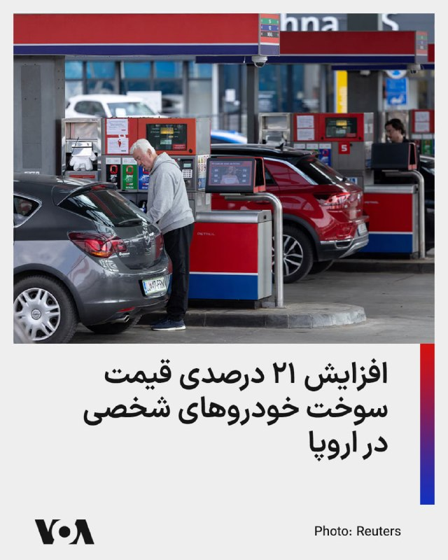

در پی اوج‌گیری قیمت نفت به خاطر انسداد تنگه هرمز توسط جمهوری اسلامی، قیمت سوخت و روان‌کننده‌های نفتی مورد استفاده در خودروهای شخصی در اتحادیه اروپا در ماه گذشته نزدیک ۲۱ درصد نسبت به آوریل پارسال جهش کرده است.

طبق داده‌های مرکز آمار اتحادیه اروپا، یوروستت، برخی از کشورها مانند لوکزامبورگ، فرانسه و سوئد شاهد رشد ۲۹ درصدی تا ۳۴ درصدی سوخت خودرو نیز بوده‌اند.

رشد قیمت گازوئیل - سوخت غالب حوزه حمل و نقل اتحادیه اروپا - بسیار بالاتر از بنزین بوده است؛ به طوری که ۳۳.۷ درصد جهش کرده، اما قیمت بنزین کمتر از ۱۴ درصد نسبت به آوریل پارسال رشد داشته است.
@FarsiVOA

## FarsiVOA — post 218411

  

شبکه سی‌بی‌اس گزارش داد سرپرست وزارت نیروی دریایی آمریکا گفته فروش ۱۴ میلیارد دلاری تسلیحات به تایوان، به دلیل نیاز ارتش آمریکا به مهمات برای عملیات مرتبط با جنگ علیه جمهوری اسلامی، موقتاً متوقف شده است.

هانگ کائو در جلسه‌ای در کنگره گفت این توقف برای اطمینان از کافی بودن ذخایر مهمات آمریکا انجام شده و فروش‌های نظامی خارجی پس از تصمیم دولت ادامه خواهد یافت.

این موضوع در حالی مطرح می‌شود که فروش تسلیحات به تایوان برای سال‌ها یکی از محورهای تنش میان واشنگتن و پکن بوده است. آمریکا تنها دولت پکن را به رسمیت می‌شناسد، اما بر اساس قوانین داخلی خود باید تجهیزات دفاعی لازم را در اختیار تایوان بگذارد. چین تایوان را بخشی از خاک خود می‌داند و استفاده از زور را رد نکرده است.

سی‌بی‌اس همچنین نوشت ترامپ در ۱۵ مه، پس از ترک پکن، تأیید کرد که شی جین‌پینگ موضوع فروش تسلیحات آمریکایی به تایوان را با او مطرح کرده است.
@FarsiVOA

## FarsiVOA — post 218410

  

عباس عراقچی، وزیر امور خارجه جمهوری اسلامی، در ادامه رایزنی‌های فشرده دیپلماتیک درباره جنگ و گفت‌وگوهای تهران و واشنگتن، با عاصم منیر، فرمانده ارتش پاکستان، در تهران دیدار کرد.

رسانه‌های ایران گزارش دادند گفت‌وگوهای دو طرف تا پاسی از شب ادامه یافت و محور آن تلاش برای جلوگیری از تشدید تنش، پایان جنگ و تقویت ثبات منطقه‌ای بود.

این دیدار پس از آن انجام شد که محسن نقوی، وزیر کشور پاکستان، نیز بار دیگر با عراقچی درباره پیشنهادهای مطرح‌شده برای کاهش اختلافات تهران و واشنگتن گفت‌وگو کرد. برخی گزارش‌های غربی می‌گویند اسلام‌آباد، در کنار قطر، نقش میانجی فعال‌تری در تماس‌های اخیر گرفته و نقوی حامل تازه‌ترین پیام‌های واشنگتن بوده است.

عراقچی همچنین در تماس‌هایی جداگانه با آنتونیو گوترش، دبیرکل سازمان ملل، و وزیران خارجه ترکیه، قطر و عراق، آخرین وضعیت تلاش‌های دیپلماتیک و تحولات منطقه‌ای را بررسی کرد.
@FarsiVOA

## FarsiVOA — post 218409

🔺درخواست ۲۷ کشور برای دسترسی به منابع مالی اضطراری بانک جهانی

◾️یک سند بانک جهانی که به رویت رویترز رسیده، نشان می‌دهد ۲۷ کشور در حال اقدام برای دسترسی سریع به منابع مالی اضطراری این نهاد بین‌المللی هستند تا تبعات بحران انرژی ناشی از اخلال جمهوری اسلامی در تنگه هرمز را کاهش دهند.

◾️رویترز از قول منابعی گزارش داده که کنیا و عراق در میان درخواست‌کنندگان هستند؛ اولی به خاطر جهش قیمت سوخت و دیگری به خاطر افت چشمگیر صادرات نفت.

◾️آمارهای اوپک نشان می‌دهد تولید روزانه نفت عراق از بالای ۴.۱ میلیون بشکه در ماه قبل از انسداد تنگه هرمز به زیر ۱.۵ میلیون بشکه در ماه گذشته رسیده است.

◾️کنیا نیز طی روزهای گذشته به خاطر افزایش ۲۴ درصدی قیمت سوخت شاهد اعتراضات گسترده مردمی بود.

⬇️ بیشتر بخوانید:
https://ir.voanews.com/a/world-bank-document-shows-27-countries-seeking-to-ensure-access-to-crisis-funds/8153015.html

## FarsiVOA — post 218407

  

سازمان عملیات تجارت دریایی بریتانیا اعلام کرد گزارشی تازه درباره «فعالیت مشکوک» علیه یک تانکر حامل فرآورده‌های نفتی در کریدور بین‌المللی کشتیرانی در مسیر خلیج عدن دریافت کرده است.

بر اساس این گزارش کاپیتان کشتی اعلام کرده یک قایق کوچک با پنج سرنشین به این تانکر نزدیک شده و فاصله آن در نزدیک‌ترین نقطه به حدود ۱۰۰ متر رسیده است.

به گفته این نهاد، تیم امنیتی مسلح کشتی مستقر شد و قایق پس از آن مسیر خود را تغییر داد و از شناور فاصله گرفت.

این دومین گزارش مشابه در دو روز اخیر در آب‌های نزدیک یمن است و در شرایطی منتشر می‌شود که ناامنی مسیرهای کشتیرانی اطراف خلیج عدن و دریای سرخ همچنان نگرانی شرکت‌های حمل‌ونقل را افزایش داده است.
@FarsiVOA

## DW_Farsi — post 125031

  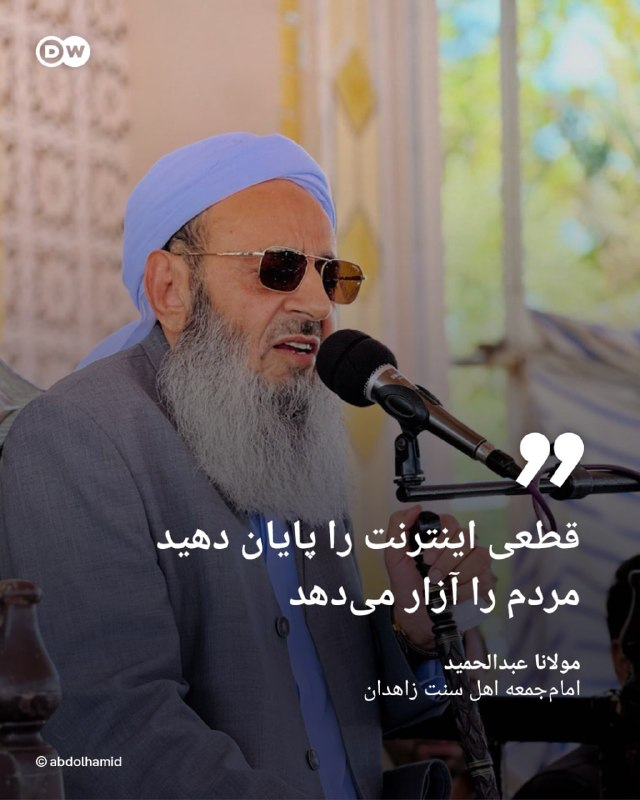

🔶 عبدالحمید: قطعی اینترنت را پایان دهید مردم را آزار می‌دهد

مولانا عبدالحمید، امام‌‌جمعه اهل سنت زاهدان در خطبه‌ نماز جمعه ۱ خرداد (۲۲ مه) در این شهر با انتقاد از وضعیت معیشتی و گرانی‌ها گفت، مردم ایران در شرایط سختی قرار دارند و حتی با گرسنگی دست‌وپنجه نرم می‌کنند.

عبدالحمید با اشاره به قطعی اینترنت در کشور تاکید کرد که اینترنت امروز بخش جدایی‌ناپذیر زندگی مردم است و قطع آن باعث آزار عمومی شده است و باید به این روند پایان داده شود.

این روحانی برجسته سنی کشور همچنین از مسئولان خواست، مشکلات اقتصادی و معیشتی مردم را جدی بگیرند و نسبت به رنج‌های جامعه پاسخگو باشند.

امام‌جمعه زاهدان از "محدود بودن اختیارات دولت" انتقاد کرد و افزود، به گفته مردم، دولتی انتخاب شده که اختیارات لازم را ندارد.

عبدالحمید تاکید کرد، در حالی که در بسیاری از کشورها تصمیم‌گیری‌های سیاست داخلی و خارجی بر عهده دولت است، در ایران دولت عملا تنها نقش اجرایی دارد و در این حوزه‌ها تاثیرگذاری موثری ندارد.

@dw_farsi

## DW_Farsi — post 125030

  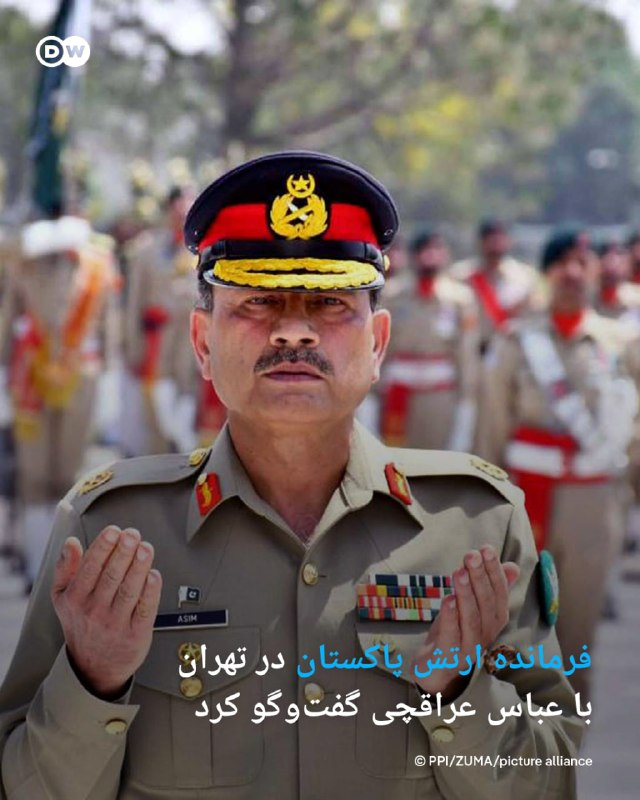

🔶 فرمانده ارتش پاکستان در تهران با عباس عراقچی گفت‌وگو کرد

رسانه‌های دولتی ایران روز شنبه ۲ خرداد (۲۳ مه) گزارش دادند که عاصم منیر، فرمانده ارتش پاکستان در تهران با عباس عراقچی، وزیر امور خارجه ایران، دیدار و گفت‌وگو کرده است.

دو طرف در این دیدار که تا پاسی از شامگاه جمعه ادامه داشت، درباره آخرین ابتکارات دیپلماتیک با هدف جلوگیری از تشدید تنش‌ها و پایان دادن به جنگ ایران تبادل نظر کرده‌اند. این دیدار به بررسی راه‌های کاهش تنش‌ها اختصاص داشته است.

پاکستان در روزهای اخیر تلاش‌های دیپلماتیک خود را برای میانجی‌گری میان ایران و ایالات متحده افزایش داده است.

طبق گزارش رسانه‌های ایران، محسن نقوی، وزیر کشور پاکستان، نیز هم‌زمان با این سفر در تهران حضور دارد و برای سومین روز متوالی در ایران به‌سر می‌برد.

عاصم منیر پیش‌تر نیز در اواخر فروردین‌ماه در قالب یک دیدار سه‌روزه به تهران رفته بود.

پاکستان نقش میانجی‌گرانه مهمی میان آمریکا و ایران ایفا می‌کند و با هر دو کشور روابط دوستانه دارد. اما با وجود تلاش‌های این کشور، دور نخست مذاکرات ایران و آمریکا بدون نتیجه پایان یافت.

مارکو روبیو، وزیر خارجه آمریکا، در نشست وزرای کشورهای عضو ناتو در سوئد اعلام کرده است که واشنگتن در انتظار پاسخ تهران به آخرین شروط دولت ترامپ، رئیس‌جمهور ایالات متحده برای یک توافق احتمالی است.

روبیو همچنین گفته است که تا کنون پیشرفت اندکی در مذاکرات با جمهوری اسلامی حاصل شده است.

@dw_farsi

## DW_Farsi — post 125029

  

🔶 رسانه‌ها: آمریکا برای حملات جدید به ایران آماده می‌شود

پایگاه‌ خبری "آکسیوس" و شبکه "سی‌بی‌اس" گزارش داده‌اند که دونالد ترامپ، رئیس‌جمهور آمریکا، روز جمعه ۱ خرداد (۲۲ مه) نشستی با نزدیک‌ترین مشاوران خود در دفتر بیضی کاخ سفید برگزار کرده است.

آکسیوس به نقل از منابعی که به‌طور مستقیم" با ترامپ در ارتباط بوده‌اند، نوشته است که او "به‌طور جدی در حال بررسی حملات جدید علیه ایران است، مگر اینکه در لحظات آخر پیشرفتی در مذاکرات حاصل شود."

بر اساس این گزارش، ترامپ در این جلسه در جریان وضعیت مذاکرات و سناریوهای احتمالی در صورت شکست گفت‌وگوها قرار گرفته است.

سی‌بی‌اس هم به نقل از چند منبع گزارش داده است که برخی از اعضای ارتش و جامعه اطلاعاتی آمریکا برنامه‌های تعطیلات خود را لغو کرده‌اند؛ اقدامی که احتمالا با حملات جدید مرتبط بوده است.

به گفته این منابع، مقام‌های دفاعی و اطلاعاتی آمریکا در حال به‌روزرسانی فهرست نیروهای آماده‌‌باش در پایگاه‌های خارج از کشور هستند.

ترامپ در شبکه اجتماعی تروث سوشال اعلام کرده بود که به دلیل "شرایطی" احتمالا نمی‌تواند در مراسم ازدواج پسرش، دونالد ترامپ جونیور، شرکت کند.

ترامپ گفت، تلاش خواهد کرد در این مراسم خصوصی حضور یابد، اما زمان‌بندی برایش دشوار است و درگیر مسائل متعدد از جمله "پرونده ایران" است.

ترامپ در دفتر بیضی کاخ سفید درباره مراسم ازدواج پسرش به خبرنگاران گفت: «پسرم دوست دارد که من در مراسم باشم، این یک مراسم کوچک و خصوصی است و من سعی می‌کنم خودم را برسانم.»

آکسیوس همچنین به نقل از یک منبع امنیتی پاکستان گزارش داده است که سفر عاصم منیر به تهران در چارچوب تلاش‌ها برای دستیابی به توافقی میان ایران و آمریکا و توقف درگیری‌ها و آغاز مذاکرات گسترده‌تر انجام شده است.

@dw_farsi

## Persian_Trend_Official — post 14721

  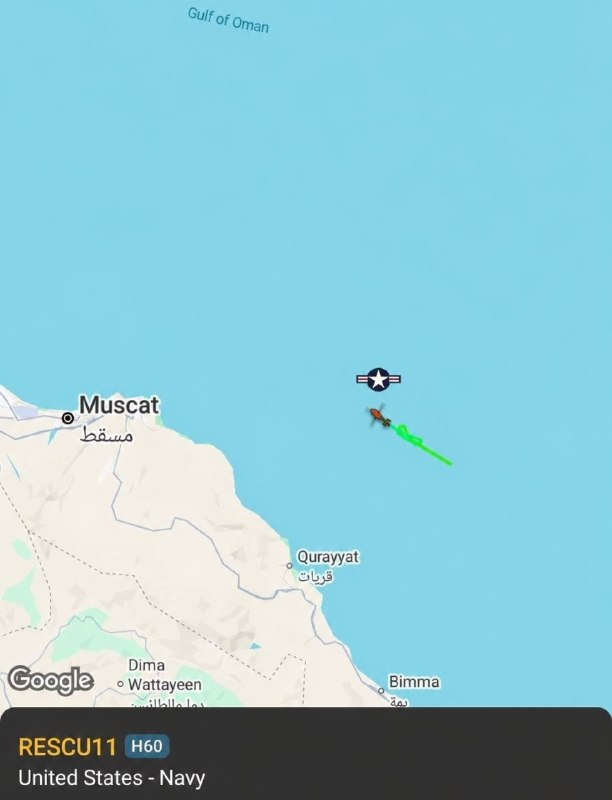

❗️ یک فروند بالگرد MH-60S متعلق به نیروی دریایی آمریکا با کال‌ساین «RESCU11» در آسمان خلیج عمان رصد شد.
برخی منابع احتمال می‌دهند این پرواز در ارتباط با یک مأموریت جستجو و نجات انجام شده باشد.
گفته می‌شود این بالگرد از یکی از ناوهای جنگی مستقر در دریای عمان به پرواز درآمده است.

👩‍💻@PhantomDirective

🆔@persian_trend_official
پرشین ترند | متفاوت‌ترین کانال نظامی

## Persian_Trend_Official — post 14720

  <a href="telegram/content/Persian_Trend_Official_14720_1779522571.webm" target="_blank">🎬 Download video</a>

🔸 دولت سنگال منحل شد.

🔹رئیس جمهور سنگال در شرایط پرتنش این کشور و در پی بالا گرفتن اختلافات با دولت، نخست وزیر متحد و حامی سابق خود را برکنار و دولت را منحل کرد.

👩‍💻@PhantomDirective

🆔@persian_trend_official
پرشین ترند | متفاوت‌ترین کانال نظامی

## Persian_Trend_Official — post 14719

  <a href="telegram/content/Persian_Trend_Official_14719_1779522571.mp4" target="_blank">🎬 Download video</a>

سرتیپ نامی: ناتوی اسلامی باید به محوریت ایران تشکیل شود.

از حدود ۵۷ کشور اسلامی، بیشترین ظرفیت اقتصادی و جغرافیایی جهان به‌دست می‌آید که قدرت‌آفرین است.

🔹در صورت تحقق این اتحاد، هیچ قدرتی نمی‌تواند به جهان اسلام زور بگوید؛ نمونۀ آن فلسطین است که تاکنون ۷۳ هزار شهید تقدیم کرده است.

👩‍💻@PhantomDirective

🆔@persian_trend_official
پرشین ترند | متفاوت‌ترین کانال نظامی

## Persian_Trend_Official — post 14718

  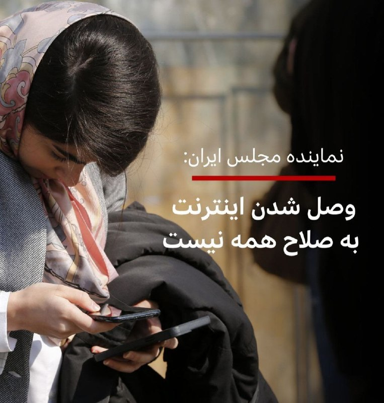

🔻نایب رئیس کمیسیون فرهنگی مجلس ایران می‌گوید که «مسئولان به این نتیجه رسیده‌اند که وصل کردن اینترنت به صلاح همه نیست و اینترنت بین‌المللی در حال حاضر بازگشایی نخواهد شد.»

علی یزدی‌خواه با اشاره به این که قطع اینترنت از دستورات و اختیارات شورای عالی امنیت ملی است، گفت که «به لحاظ مسائل امنیتی، امنیت کشور»، اینترنت جهانی قطع شده است.

او گفت که با وجود قطع اینترنت، «کسب‌وکارها از طریق ارتباطات بانکی، خرید و فروش و سایر خدمات آنلاین همچنان فعال هستند و مردم با مشکل عمده‌ای مواجه نیستند.»

به گفته این نماینده مجلس برخی افرادی که از نظر مسئولان نیاز به دسترسی به اینترنت بین‌الملل داشتند، این امکان به‌صورت محدود برای آن‌ها فراهم شده است.

آقای یزدی خواه افزوده «تقریبا بیش از ۹۰ درصد نیازها و احتیاجات مردم در فضای فعلی برآورده می‌شود و اگر اقشاری هستند که دچار مشکل‌ هستند، قابلیت پیگیری وجود دارد.»

این در حالی است که کارشناسان اقتصادی نسبت به خسارات وارد شده به کسب و کارها در نتیجه قطع اینترنت هشدار داده‌اند.

👩‍💻@PhantomDirective

🆔@persian_trend_official
پرشین ترند | متفاوت‌ترین کانال نظامی

## Persian_Trend_Official — post 14716

  <a href="telegram/content/Persian_Trend_Official_14716_1779522573.mp4" target="_blank">🎬 Download video</a>

دن اسکاوینو معاون رئیس دفتر کاخ سفید و دستیار ترامپ،ویدیویی از بمب‌افکن‌های مخفی‌کار B-2 را بدون هیچ زمینه‌ای منتشر کرد،

فکت مهم:
آخرین باری که او این پست را منتشر کرد،
چند ساعت بعد آمریکا و اسرائیل به ایران حمله کردند.

👩‍💻@PhantomDirective

🆔@persian_trend_official
پرشین ترند | متفاوت‌ترین کانال نظامی

## Persian_Trend_Official — post 14715

  <a href="telegram/content/Persian_Trend_Official_14715_1779522574.webm" target="_blank">🎬 Download video</a>

بولتن خبری۲۴ ساعت گذشته
آرشیو تحریریه پرشین ترند.

۲ خرداد ۱۴۰۵

🇮🇷ایران

◾️ فرمانده ارتش پاکستان، ژنرال عاصم منیر، وارد تهران شد و با عراقچی وزیر خارجه ایران تا پاسی از شب دیدار و گفتگو کرد

◾️ وزیر کشور پاکستان نیز برای سومین روز متوالی در تهران حضور داشت و پیش از ورود فرمانده ارتش، پایتخت را ترک کرد

◾️ سخنگوی وزارت خارجه: تمرکز مذاکرات بر خاتمه جنگ در همه جبهه‌هاست؛ مباحث هسته‌ای در این مرحله مورد بحث نیست

◾️ سخنگوی وزارت خارجه: اختلاف‌نظرها بین ایران و آمریکا آن‌قدر عمیق است که نمی‌توان گفت ظرف چند هفته باید به نتیجه رسید

◾️ سخنگوی هیئت مذاکره‌کننده: میانجی اصلی مذاکرات پاکستان است؛ هیئت قطری نیز برای رایزنی به تهران آمد و سپس پایتخت را ترک کرد

◾️ منبع نزدیک به تیم مذاکره‌کننده: پیشرفت‌هایی در برخی موضوعات حاصل شده اما تا جمع‌بندی همه موضوعات توافقی رخ نخواهد داد

◾️ ایران پیشنهاد جدید آمریکا را دریافت کرده و در حال بررسی آن است؛ ایران تأکید کرد چندین دور ارتباط بر اساس چارچوب ۱۴ ماده‌ای ایران انجام شده

◾️ ایران بخشی از حریم هوایی غرب کشور را برای پروازهای شبانه تا روز دوشنبه بست

◾️ نیروی دریایی سپاه: ۳۵ فروند کشتی تجاری در شبانه‌روز گذشته با هماهنگی و مجوز سپاه از تنگه هرمز عبور کردند

◾️ اختلالات گسترده GPS در تنگه هرمز، سواحل جنوبی ایران، امارات، قطر و کویت گزارش شده است

◾️ نیروهای مسلح جمهوری اسلامی در بالاترین سطح آماده‌باش قرار گرفته‌اند؛ فعالیت بالای جنگنده‌ها بر فراز کردستان عراق و غرب ایران ثبت شده

◾️ حمید رسایی مدعی شد مجلس توسط دبیر شورای امنیت ملی عملاً پلمب شده و جلسات صحن علنی برگزار نمی‌شود

🇮🇱 اسرائیل و خاورمیانه

◾️ العربیه: توافق احتمالی ایران و آمریکا «بیانیه اسلام‌آباد» نامگذاری خواهد شد و شامل آغاز مذاکرات درباره مسائل حل‌نشده ظرف ۷ روز و لغو تدریجی تحریم‌ها خواهد بود

◾️ بلومبرگ: امارات، عربستان و قطر از ترامپ خواسته‌اند به جای اقدام نظامی، به دیپلماسی با ایران فرصت دهد

◾️ امارات ظرفیت خط لوله انتقال نفت به بندر فجیره برای دور زدن تنگه هرمز را تا ۲۰۲۷ دو برابر می‌کند

◾️ مدیر اجرایی آژانس بین‌المللی انرژی هشدار داد بازار نفت تا تابستان با کاهش ذخایر وارد «منطقه قرمز» می‌شود؛ قیمت نفت برنت در حال حاضر حدود ۱۰۷ دلار در هر بشکه معامله می‌شود

◾️ FBI رهبر حزب‌الله عراق، محمدباقر السعدی، را به اتهام هماهنگی حداقل ۲۰ حمله تروریستی در اروپا و کانادا بازداشت کرد

◾️ اسرائیل از تلاش‌های ترامپ برای امضای توافق با ایران خشمگین است؛ تماس تلفنی «دراماتیک» میان ترامپ و نتانیاهو گزارش شده

◾️ تحلیلگران از احتمال بستن تنگه باب‌المندب توسط انصارالله و حملات به زیرساخت‌های انرژی عربستان در صورت بازگشت جنگ هشدار دادند

◾️ گزارش‌هایی از وقوع انفجار در ابوظبی منتشر شد؛ جزئیات تأیید نشده است

🇺🇸
🗺آمریکا و جهان

◾️ ترامپ: مذاکرات در «مراحل نهایی» است اما اگر توافق نشود «اوضاع می‌تواند کمی ناخوشایند شود»؛ آمریکا حاضر است چند روز بیشتر منتظر «پاسخ‌های درست» از تهران بماند

◾️ روبیو: پیشرفت‌هایی در مذاکرات با ایران حاصل شده؛ موضوع غنی‌سازی اورانیوم و تنگه هرمز همچنان محل اختلاف است

◾️ آکسیوس: ترامپ با مشاوران ارشد امنیت ملی برای بررسی احتمال حملات نظامی جدید علیه ایران دیدار کرده؛ تصمیم نهایی اتخاذ نشده؛ ترامپ اواخر هفته گذشته یک حمله برنامه‌ریزی‌شده را پس از درخواست قطر، عربستان و امارات متوقف کرد

◾️ سی بی اس: چندین عضو ارتش و جامعه اطلاعاتی آمریکا تعطیلات Memorial Da. را لغو کرده‌اند

◾️ وال‌استریت ژورنال: واسطه‌ها در تلاش برای یک توافق موقت هستند؛ هدف تمدید آتش‌بس و ادامه مذاکرات گسترده‌تر است؛ در صورت شکست مذاکرات آمریکا و اسرائیل احتمالاً زیرساخت‌های انرژی ایران را هدف قرار می‌دهند

◾️ سی‌ان‌ان: آمریکا پیشنهاد اقتصادی بزرگی شامل لغو تمام تحریم‌ها و طرح بازسازی اقتصادی به ایران ارائه داده؛ مسائل دشوار به مذاکرات بعدی موکول می‌شود

◾️ گاردین: پاکستان در تلاش است چین را به عنوان ضامن هرگونه توافق وارد کند؛ نخست‌وزیر شریف راهی پکن می‌شود

◾️ تولسی گابارد، مدیر اطلاعات ملی آمریکا که از مخالفان جنگ با ایران بود، استعفای خود را از ۳۰ ژوئن اعلام کرد

◾️ بلومبرگ: ایران بیش از ۲۴ پهپاد MQ-9 آمریکا به ارزش نزدیک به یک میلیارد دلار را از ابتدای جنگ منهدم کرده؛ این رقم حدود ۲۰ درصد از موجودی پیش از جنگ پنتاگون است

◾️ ناتو: دبیرکل مارک روته اعلام کرد ناتو می‌تواند به آمریکا در بازگشایی تنگه هرمز کمک کند.

👩‍💻@PhantomDirective

🆔 @persian_trend_official
پرشین ترند | متفاوت‌ترین کانال نظامی

## Persian_Trend_Official — post 14714

🔴مدیرکل فرودگاه‌های خوزستان: پروازهای فرودگاه‌های اهواز و ماهشهر از سر گرفته شد

🔹اولین پرواز مسیر تهران به اهواز، امروز در فرودگاه اهواز به زمین نشست. برنامۀ پروازی به‌تدریج افزایش خواهد یافت.

🫆:Tony

📌 @persian_trend_official
پرشین ترند | متفاوت‌ترین کانال نظامی

## Persian_Trend_Official — post 14713

  

🔴دیدار و گفتگوی فرمانده ارتش پاکستان با عراقچی در تهران

💢فیلد مارشال عاصم منیر که به‌منظور رایزنی و تبادل نظر با مقام‌های جمهوری اسلامی به تهران سفر کرده است، روز گذشته با عراقچی دیدار و گفتگو کرد.

💢در این دیدار که تا پاسی از شب ادامه داشت، طرفین درباره آخرین تلاش‌ها و ابتکارات دیپلماتیک برای جلوگیری از تشدید تنش و خاتمه جنگ آمریکا و اسرائیل علیه جمهوری اسلامی و همچنین راهکارهای تقویت صلح، ثبات و امنیت در منطقه غرب آسیا تبادل نظر کردند.
🫆:Tony

📌 @persian_trend_official
پرشین ترند | متفاوت‌ترین کانال نظامی

## RadioFarda — post 157472

🔸مولوی عبدالحمید اسماعیل‌زهی، امام جمعه اهل سنت زاهدان، در نماز جمعه روز یکم خرداد بار دیگر از فشارهای اقتصادی بر مردم انتقاد کرد.

🔸او در بخشی از سخنان خود با اشاره به «گرانی‌های بی‌حدومرز» در کشورگفت: «ملت ایران صاحبان اصلی این کشور و ثروت‌های کلان آن هستند، اما در شرایط بسیار سختی قرار دارند و گرسنگی تحمل می‌کنند.»

🔸آقای عبدالحمید هم‌چنین گفت که «مردم ایران حرف‌ها و گلایه‌های زیادی دارند که سرمایه‌های مادی‌شان را از دست داده‌اند و بسیاری نیز دیانت‌شان در این کشمکش‌های سیاسی ضربه خورده و نسبت به دین بدبین شده‌اند.»

🔸امام جمعه زاهدان در بخش دیگری از سخنرانی خود قطع اینترنت در کشور را «آزاردهنده» خواند و از مسئولان کشور خواست تا به این روند پایان دهند.

🔸او هم‌چنین با انتقاد از عملکرد دولت گفت: «مردم می‌گویند دولتی انتخاب کرده‌ایم که اختیارات ندارد. در جاهای دیگر تصمیم‌گیری در رابطه با سیاست‌های داخلی و خارجی در دست دولت است، اما متأسفانه در کشور ما دولت به‌جز اجرا، نقش مؤثری در سیاست‌های داخلی و خارجی ندارد.»

@RadioFarda

## RadioFarda — post 157470

🔸روزنامه نیویورک پست روز جمعه در گزارشی نوشت که یک تبعهٔ عراق که به‌تازگی برای محاکمه به آمریکا تحویل داده شده قصد ترور ایوانکا ترامپ، دختر رئیس جمهور آمریکا، را داشته است.

🔸این روزنامه به نقل از منابعی نوشته است که محمدباقر سعد داوود السعدی، ۳۲ ساله، قصد داشته این اقدام را برای انتقام ترور قاسم سلیمانی، فرمانده پیشین نیروی قدس سپاه، توسط ارتش آمریکا انجام دهد.

🔸اف‌بی‌آی، اداره پلیس فدرال آمریکا، هفته گذشته خبر داد که یک عضو ارشد گروه عراقی کتائب حزب‌الله، از گروه‌های نیابتی اصلی جمهوری اسلامی، به نام محمدباقر سعد داوود السعدی، بازداشت و برای محاکمه به ایالات متحده منتقل شده است.

🔸دادستانی ایالت نیویورک در حساب شبکه ایکس خود عکسی از این عضو کتائب در کنار قاسم سلیمانی، فرمانده سابق سپاه قدس، منتشر کرده است که در حمله آمریکا در دوره اول ریاست جمهوری دونالد ترامپ کشته شد. در گزارش‌ها آمده است که او خود را محمدباقر سلیمانی معرفی می‌کرده است.

🔸گفته می‌شود که او در پی سفر به خارج از عراق، در ترکیه دستگیر شده است.

@RadioFarda

## RadioFarda — post 157469

  

🔸جامعه جهانی بهائی می‌گوید بشری مصطفوی، شهروند بهائی اهل رفسنجان که باردار است، در میان ده‌ها بهائی قرار دارد که در ماه‌های اخیر و همزمان با تشدید فشارهای جمهوری اسلامی بر این اقلیت دینی، بازداشت یا زندانی شده‌اند. بر اساس اعلام این نهاد، از زمان آغاز درگیری‌های اخیر در اواخر بهمن، حدود ۸۰ شهروند بهائی بازداشت، دستگیر یا زندانی شده‌اند و بیش از ۴۰۰ مورد نقض حقوق بشر علیه بهائیان در نقاط مختلف ایران گزارش شده است.

🔸بشری مصطفوی پیشتر در پرونده‌ای تبرئه شده بود، اما با اعتراض دادستانی، دادگاه تجدیدنظر در پنجم اردیبهشت حکم تبرئه او را نقض کرد و اکنون او باید چهار ماه حبس خود را در زندان کرمان بگذراند. در متن منتشرشده از سوی جامعه جهانی بهائی آمده است که درخواست‌های او برای مرخصی، از جمله برای رسیدگی پزشکی و انجام آزمایش ضروری دوران بارداری، رد شده است.

🔸این نهاد همچنین از وضعیت شماری دیگر از بازداشت‌شدگان بهائی، از جمله شکیلا قاسمی، پیوند نعیمی و برنا نعیمی ابراز نگرانی کرده است. د

@RadioFarda

## RadioFarda — post 157468

🔸ویدئویی در رسانه‌های اجتماعی به اشتراک گذاشته شده که لحظه‌ حمله هوایی اسرائیل به امدادگران و یک آمبولانس را در دیر قانون‌ النهر در جنوب لبنان در روز جمعه یکم خرداد نشان می‌دهد.

🔸این حمله زمانی واقع شده که این امدادگران در حال بررسی اجساد قربانیان حمله هوایی قبل اسرائیل در منطقه بودند.

🔸خبرگزاری ملی لبنان اعلام کرد که شش نفر ازجمله دو امدادگر که در حال انتقال مجروحان بودند، در حمله هوایی اسرائیل به دیر قانون کشته شده‌اند.

@RadioFarda

## RadioFarda — post 157467

  

🔸شبکه سی‌بی‌اس در آمریکا بامداد شنبه دوم خرداد خبر داد که دولت دونالد ترامپ برای انجام دور تازه‌ای از حملات علیه ایران آماده می‌شود.

🔸این شبکه خبری به نقل از منابعی که به نام‌شان اشاره نکرد نوشت که تدارکات و آمادگی برای انجام حملات تازه روز جمعه انجام شده است.

🔸با این حال در این خبر آمده است که تا بعدازظهر روز جمعه به وقت آمریکا برای انجام قطعی حمله دوباره به خاک ایران تصمیمی گرفته نشده است.

🔸همزمان یک خبرنگار روزنامه آمریکایی وال استریت جورنال در گزارشی نوشت که رئیس جمهور آمریکا به همراه مشاورانش در زمینه امنیت ملی در ساعات پایانی روز جمعه جلسه‌ای داشته، اما تصمیمی قطعی در این جلسه گرفته نشده است.

🔸به نوشته این خبرنگار از کاخ سفید، ترامپ در جلسه موافق بوده است که دیپلماسی نیاز به زمان بیشتری دارد، و در عین حال مسئله بازگشت به جنگ نیز هم‌چنان روی میز است.

🔸پیشتر اسماعیل بقایی همین نکته را گفته بود: «اختلاف‌نظرها بین ایران و آمریکا آن‌قدر عمیق و زیاد است که نمی‌شود گفت با چندبار رفت‌وآمد یا مذاکرات ظرف چند هفته ما باید حتماً به نتیجه برسیم.»

@RadioFarda

## IranianMinds — post 20586

  

🔴 به گزارش نیویورک پست محمد باقر السعدی، از فرماندهان کتائب حزب‌الله عراق که اخیراً در آمریکا دستگیر و متهم شده، طرح ترور ایوانکا ترامپ، دختر رئیس‌ جمهور آمریکا، را داشته است.

هدف او انتقام از قتل قاسم سلیمانی در سال ۲۰۲۰ بود ، و مدارکی‌ وجود دارد که احتمال میدهد سپاه پاسداران هم در این موضوع نقش داشته !

السعدی نقشه خانه فلوریدای ایوانکا و همسرش، جرد کوشنر، را داشت.

@IranianMinds

## IranianMinds — post 20585

  <a href="telegram/content/IranianMinds_20585_1779522577.mp4" target="_blank">🎬 Download video</a>

🔴 وضعیت این روزای ترامپ:

@IranianMinds

## IranianMinds — post 20584

  <a href="telegram/content/IranianMinds_20584_1779522578.mp4" target="_blank">🎬 Download video</a>

🔴 ترامپ: اخراج استیون کولبرت از CBS «آغاز پایان» مجریان تلویزیون شبانه بی‌استعداد، بدجنس، پول‌پرست، خنده‌دار نبودن و با رتبه پایین است. بقیه کم‌استعدادها هم به زودی دنبال می‌شوند. روح همه‌شان شاد! @IranianMinds

## IranianMinds — post 20583

  

🔴 پست جدید ترامپ :

سلام گرینلند!

@IranianMinds

## BBCPersian — post 281856

  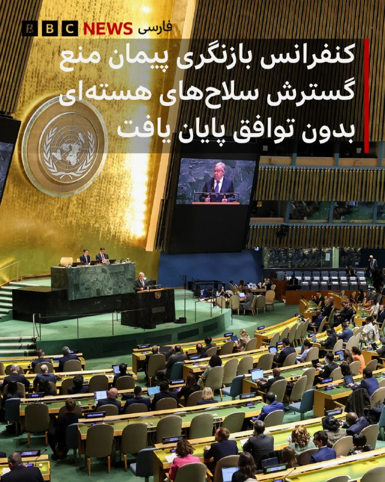

🔻رئیس کنفرانس بازبینی معاهده منع معاهده منع گسترش سلاح‌های هسته‌ای (ان‌پی‌تی)، گفته است که گفت‌وگوهای مربوط به تأکید دوباره بر اهداف منع گسترش سلاح‌های هسته‌ای، پس از چهار هفته به نتیجه‌ای نرسید. این در حالی است که از ابتدا هم امید کمی به موفقیت این مذاکرات وجود داشت.

دو هونگ ویت از ویتنام که ریاست این کنفرانس را برعهده داشت، گفت: «با وجود تمام تلاش‌های ما، برداشت من این است که این کنفرانس در موقعیتی نیست که بتواند درباره موضوعات اصلی به توافق برسد.»

او افزود: «قصد ندارم این سند را برای تصویب ارائه کنم.»

مذاکره‌کنندگان در بحبوحه نگرانی‌ها از آغاز دوباره رقابت تسلیحاتی، در حال بازبینی پیمان منع گسترش سلاح‌های هسته‌ای (ان‌پی‌تی)، سنگ‌بنای کنترل تسلیحات هسته‌ای، بودند.

این کنفرانس دیروز در مقر سازمان ملل در نیویورک به پایان رسید.

بازبینی‌های پیشین این پیمان در سال‌های ۲۰۱۵ و ۲۰۲۲ هم بی‌نتیجه مانده بود.
ادامه مطلب⬇️

📸AFP via Getty Images
https://bbc.in/3Pxbfmv
@BBCPersian

## BBCPersian — post 281846

🖋تیم ویول و یاکوب پوهل
بی‌بی‌سی

در جریان نخستین دوره بازداشت جفری اپستین، که شامل محکومیت ۱۳ ماهه به اتهام درخواست رابطه جنسی از یک دختر زیر سن قانونی بود، اسناد زندان نشان می‌دهد که دست‌کم یک زن ۶۷ بار به ملاقات او رفته است.

آن زن نادیا مارچینکو بود. او به‌مدت هفت سال شریک اصلی زندگی اپستین به‌شمار می‌رفت، مهم‌ترین فرد در زندگی او پس از گیلین مکسول و در سال‌های بعد به‌عنوان کمک‌خلبان در هواپیمای شخصی او نیز فعالیت می‌کرد.

نادیا مارچینکو در مقایسه با دیگر افراد مرتبط با این پرونده، برای افکار عمومی نسبتا ناشناخته است، اما ممکن است او به‌ زودی در کانون توجه قرار گیرد.
ادامه مطلب⬇️

📸GettyImages/ Reuters/ NurPhoto via Getty Images/ AFP via Getty Images/ Patrick McMullan via Getty Images
https://bbc.in/4umVuO0
@BBCPersian

## BBCPersian — post 281845

  

🔻به گزارش رسانه ‌دولتی چین، در پی انفجار در یک معدن زغال‌سنگ در شمال آن کشور دست‌کم ۸۲ نفر جان خود را از دست داده‌اند.

خبرگزاری دولتی شینهوا گفته است: «خبرنگاران از محل انفجار گاز در معدن زغال‌سنگ لیوشنیو متعلق به گروه تونگژو در استان شانشی مطلع شدند که این حادثه تاکنون ۸۲ کشته برجای گذاشته است.»

۹ معدنچی هنوز مفقود هستند. گفته می شود که احتمالا آن‌ها در شرایط وخیمی قرار دارند.

این انفجار دیروز در این معدن رخ داد.

گزارش‌ها حاکی است در زمان وقوع حادثه ۲۴۷ کارگر در محل مشغول به کار بودند.
عملیات امداد و نجات در محل همچنان ادامه دارد.

مقامات هماهنگ‌کننده عملیات می‌گویند که مدیران معدن توسط پلیس بازداشت شده‌اند.

شی جین‌پینگ، رئیس جمهور چین، خواستار تحقیقات کامل برای تعیین علت حادثه شد.

📸AFP via Getty Images عکس تزیینی
@BBCPersian

## BBCPersian — post 281844

🔻سازمان هواپیمایی ایران: فرودگاه‌های اهواز و ماهشهر از امروز بازگشایی می‌شود

سازمان هواپیمایی ایران اعلام‌کرد که فرودگاه‌های اهواز و ماهشهر از امروز شنبه، ۲ خرداد بازگشایی می‌شوند.

روابط عمومی این سازمان می‌گوید که با «تکمیل موفقیت‌آمیز فرآیند ارزیابی‌ها، این دو فرودگاه به چرخه عملیاتی کشور بازخواهند گشت و تمامی شرکت‌های هواپیمایی می‌توانند پروازهای عادی خود را در این مسیرها از سر بگیرند.»

دو روز پیش حمدرضا موالی‌زاده استاندار خوزستان گفته بود که مجوز نهایی برای عملیاتی شدن مجدد فرودگاه بین‌المللی اهواز، صادر شده است.

آقای موالی‌زاده همچنین گفت که با تلاش مدیریت فرودگاه‌های استان و تیم‌های فنی، تمامی آسیب‌های ناشی از حملات هوایی آمریکا و اسرائیل «به سرعت بازسازی، تعمیر و ایمن‌سازی شده است.»

این سازمان ابراز امیدواری کرده است که «پس از ارزیابی امنیتی و ایمنی به تدریج سایر فرودگاه‌های ایران نیز به چرخه عملیاتی» اضافه شوند.

https://bbc.in/4tP59vG
@BBCPersian

## BBCPersian — post 281843

  

🔻فیلد مارشال عاصم منیر، فرمانده ارتش پاکستان که به تهران سفر کرده با عباس عراقچی، وزیر خارجه ایران دیدار و گفتگو کرده است.

به گزارش منابع خبری در ایران در این گفت‌‌گوها که تا پاسی از شب گذشته ادامه داشت، دو طرف درباره آخرین تلاش‌های دیپلماتیک برای خاتمه جنگ و همچنین درباره راه‌های تقویت صلح و امنیت در منطقه غرب آسیا گفت‌و‌گو کردند.

این دومین سفر آقای منیر در چند هفته گذشته به ایران است.

وزیر کشور پاکستان هم برای دومین بار در چند روز گذشته به تهران رفته و در حال گفت‌وگو با مقامات ایرانی است.

📸TASNIM
https://bbc.in/4fCcg7e
@BBCPersian

## idfinfarsi — post 11626

  <a href="telegram/content/idfinfarsi_11626_1779522582.mp4" target="_blank">🎬 Download video</a>

‏‼️سایت زیرزمینی تولید تسلیحات در بقاع و زیرساخت‌های تروریستی در صور: حملات ارتش اسرائیل طی شب

‏⭕️شب گذشته (شنبه)، ارتش اسرائیل در منطقه بقاع یک سایت زیرزمینی متعلق به سازمان تروریستی حزب‌الله را هدف قرار داد که مورد استفاده تروریست های این سازمان برای تولید تسلیحاتی بود که برای هدف قرار دادن غیرنظامیان اسرائیلی و نیروهای ارتش اسرائیل در جنوب لبنان در نظر گرفته شده بود.

‏⭕️همچنین، زیرساخت‌های سازمان تروریستی حزب‌الله در منطقه شهر صور هدف حمله قرار گرفتند؛ مکان‌هایی که تروریست های این سازمان از آن‌ها برای برنامه‌ریزی و اجرای طرح‌های تروریستی علیه نیروهای ارتش اسرائیل استفاده می‌کردند.

‏⭕️پیش از حمله، اقداماتی برای کاهش آسیب به غیرنظامیان انجام شد، از جمله ارائه هشدارهای پیشگیرانه به ساکنان، استفاده از مهمات دقیق و رصد هوایی.

‏🔻ارتش اسرائیل به فعالیت خود برای مقابله با تهدیدها علیه شهروندان اسرائیل و نیروهایش، طبق دستورالعمل‌های سطح سیاسی، ادامه خواهد داد

## Dirty_Kids — post 389996

  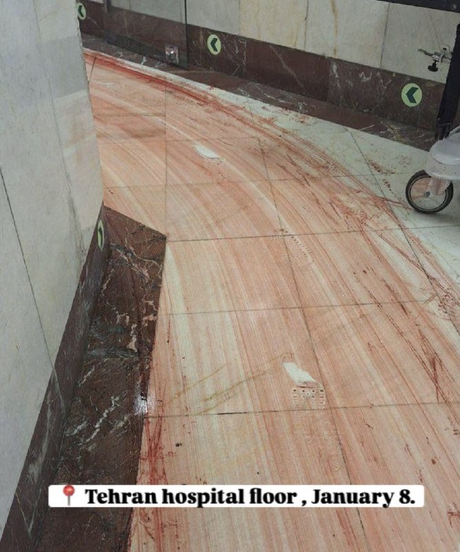

نمیذارم یادتون بره

رو تخت بیمارستان تیر خلاص میزدن.

@Dirty_Kids 👻

## Dirty_Kids — post 389995

  

چقدر کارنامه‌ی یک انسان میتونه پاک باشه که تنها انتقاد جدی‌ ازش این باشه:
چرا با تانک از رو مخالفات رد نشدی؟

@Dirty_Kids 👻

## Dirty_Kids — post 389994

لطفا تو پیام کتبی بعدی بگو از روی وویس چجوری لوکیشن لو میره.

@Dirty_Kids 👻

## Dirty_Kids — post 389993

  <a href="telegram/content/Dirty_Kids_389993_1779522583.mp4" target="_blank">🎬 Download video</a>

"رقصیدن ماده بوفالوی ولائی"

@Dirty_Kids 👻

## Dirty_Kids — post 389992

  

المیرا کصو

@Dirty_Kids 👻

## Dirty_Kids — post 389988

  <a href="telegram/content/Dirty_Kids_389988_1779522585.mp4" target="_blank">🎬 Download video</a>

یه چالش دیگه‌ای که جدیدا مد شده ولی در راستای همون چالش قبلی روسی یعنی «Booty transition» قرار داره؛

اینطوریه که مردم با آهنگ «Set me free» میان از خودشون فیلم میگیرن و یهو دوربین رو میبرن سمت باسن🍑 مبارکشون و ادامه ماجرا…

@Dirty_Kids 👻

## Hranews — post 113102

گزارشی از بازداشت علی اسکندری در ایلام

❗️
❗️
❗️
❗️
❗️– علی اسکندری، شهروند اهل ایلام روز پنجشنبه ۳۱ اردیبهشت ماه، توسط نیروهای امنیتی بازداشت و به مکان نامعلومی منتقل شد.

#علی_اسکندری

ادامه مطلب

↘️
@hranews_bot تماس ✉️ - @Hranews کانال هرانا 🆑

## Hranews — post 113101

  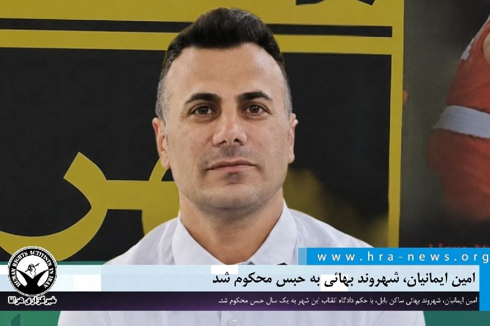

امین ایمانیان، شهروند بهائی به حبس محکوم شد

❗️
❗️
❗️
❗️
❗️– امین ایمانیان، شهروند بهائی ساکن بابل، با حکم دادگاه انقلاب این شهر به یک سال حبس محکوم شد.

به گزارش خبرگزاری هرانا، ارگان خبری مجموعه فعالان حقوق بشر در ایران، دادگاه انقلاب بابل یک شهروند بهائی را به حبس محکوم کرد.

بر اساس این حکم، امین ایمانیان توسط دادگاه مذکور از بابت اتهام تبلیغ علیه نظام به یک سال حبس محکوم شده است.

#امین_ایمانیان

ادامه مطلب

↘️
@hranews_bot تماس ✉️ - @Hranews کانال هرانا 🆑

## manototv — post 105752

  <a href="telegram/content/manototv_105752_1779522586.mp4" target="_blank">🎬 Download video</a>

فرانسه اعلام کرد پیش‌نویس قطعنامه‌ای را برای ارائه به شورای امنیت سازمان ملل تهیه کرده که هدف آن تشکیل یک مأموریت بین‌المللی به‌منظور بازگرداندن آزادی تردد در تنگه هرمز است. وزارت خارجه فرانسه گفته این طرح در صورت فراهم شدن شرایط می‌تواند مطرح شود.
هم‌زمان، پیش‌نویس قطعنامه مشترک آمریکا و بحرین درباره تنگه هرمز همچنان در شورای امنیت در حال بررسی است. این قطعنامه از ایران می‌خواهد حملات و مین‌گذاری در این آبراه را متوقف کند، اما رأی‌گیری درباره آن به دلیل احتمال وتوی روسیه و چین چندین بار به تعویق افتاده است.
مقام‌های فرانسوی اعلام کردند پاریس در هماهنگی با بریتانیا در حال بررسی ایجاد یک مأموریت بین‌المللی برای تضمین آزادی ناوبری در تنگه هرمز است. در همین حال، گزارش‌ها حاکی از آن است که آمریکا تلاش کرده حمایت ده‌ها کشور را برای پیشبرد قطعنا خود جلب کند

## manototv — post 105751

  <a href="telegram/content/manototv_105751_1779522587.mp4" target="_blank">🎬 Download video</a>

سازمان عملیات تجارت دریایی بریتانیا اعلام کرد یک قایق کوچک به یک نفتکش حامل فرآورده‌های نفتی در نزدیکی سواحل یمن نزدیک شده است.
بر اساس این گزارش، نفتکش در فاصله حدود ۲۰۰ مایل دریایی در غرب جزیره سقطری یمن قرار داشت و قایق نزدیک‌شونده پنج سرنشین داشته است.
این سازمان افزود پس از استقرار تیم امنیتی مسلح نفتکش، قایق مسیر خود را تغییر داد و از کشتی فاصله گرفت.

## manototv — post 105750

  <a href="telegram/content/manototv_105750_1779522587.mp4" target="_blank">🎬 Download video</a>

روزنامه نیویورک پست گزارش داد محمد باقر سعد داوود السعدی، تبعه ۳۲ ساله عراقی که گفته می‌شود آموزش‌های مرتبط با سپاه پاسداران دیده است، متهم به طراحی طرحی برای ترور ایوانکا ترامپ، دختر دونالد ترامپ، رئیس‌جمهوری آمریکا، شده است. طبق این گزارش، انگیزه این اقدام انتقام‌گیری از کشته شدن قاسم سلیمانی عنوان شده است.
بر اساس این گزارش، السعدی متهم است که پس از کشته‌شدن قاسم سلیمانی، فرمانده پیشین نیروی قدس سپاه، خانواده ترامپ را هدف قرار داده و حتی نقشه محل اقامت ایوانکا ترامپ در فلوریدا را در اختیار داشته است. منابع می‌گویند او پیش‌تر نیز تهدیدهایی در این رابطه مطرح کرده بود.
نیویورک پست به نقل از انتفاض قنبر، معاون پیشین وابسته نظامی سفارت عراق در واشینگتن، نوشت السعدی به اطرافیانش گفته بود: «باید ایوانکا را بکشیم تا خانه ترامپ را همان‌طور به آتش بکشیم که او خانه ما را به آتش کشید.» همچنین گفته می‌شود او در شبکه اجتماعی ایکس پیام‌هایی با محتوای تهدیدآمیز منتشر کرده بود.
السعدی روز ۱۵ مه در ترکیه بازداشت و به آمریکا منتقل شد. وزارت دادگستری آمریکا او را از چهره‌های مرتبط با شبکه‌های تروریستی عراق و جمهوری اسلامی معرفی کرده و اعلام کرده است که او با اتهام دست داشتن در ۱۸ حمله و اقدام به حمله در اروپا و آمریکا روبه‌رو است.

## manototv — post 105749

  <a href="telegram/content/manototv_105749_1779522588.mp4" target="_blank">🎬 Download video</a>

روزنامه وال‌استریت ژورنال به نقل از مقام‌های آمریکایی گزارش داد دونالد ترامپ، رئیس‌جمهوری آمریکا، در حال حاضر گزینه اقدام نظامی علیه جمهوری اسلامی را به‌طور کامل کنار نگذاشته و در صورت شکست مذاکرات، احتمال صدور دستور حملات نظامی علیه جمهوری اسلامی همچنان وجود دارد.
بر اساس این گزارش، ترامپ روز جمعه در دیداری با کارکنان خود گفته است که با ادامه مذاکرات با ایران، ترجیح می‌دهد به مسیر دیپلماسی زمان بیشتری داده شود. به گفته مقام‌های آمریکایی، او با وجود ادامه تنش‌ها همچنان به دستیابی به راه‌حلی از مسیر مذاکره علاقه‌مند است.
این گزارش می‌افزاید رئیس‌جمهوری آمریکا هنوز تصمیم نهایی خود را نگرفته، اما در حال حاضر بیشتر به ادامه تلاش‌های دیپلماتیک تمایل دارد، در حالی که گزینه‌های نظامی همچنان روی میز باقی مانده‌اند.

## alonews — post 121946

  <a href="telegram/content/alonews_121946_1779522589.webm" target="_blank">🎬 Download video</a>

👈ورود هر خبرنگاری امشب به کاخ سفید لغو شده!

✅ @AloNews خبر جنگ

## alonews — post 121945

  <a href="telegram/content/alonews_121945_1779522589.webm" target="_blank">🎬 Download video</a>

👈رسانه‌های کره جنوبی از سقوط یک فروند هواپیمای سبک در منطقه مسکونی «هاینم» خبر دادند

🔴تاکنون جزئیات بیشتری از علت سقوط هواپیما یا آسیب احتمالی به مناطق مسکونی منتشر نشده است.

✅ @AloNews خبر جنگ

## alonews — post 121944

  <a href="telegram/content/alonews_121944_1779522589.webm" target="_blank">🎬 Download video</a>

👈مقام آمریکایی به رویترز: ترامپ به‌زودی درباره فروش تسلیحات به تایوان تصمیم خواهد گرفت

✅ @AloNews خبر جنگ

## alonews — post 121943

  <a href="telegram/content/alonews_121943_1779522589.webm" target="_blank">🎬 Download video</a>

👈مهاجری خطاب به رسایی نماینده مجلس: تصمیم‌ جنگ یا صلح ربطی به نمایندگان کم سواد ندارد!

🔴محمد مهاجری: تصمیم گیری درباره جنگ و صلح و نیاز سیاست های کلی کشور در حوزه دیپلماسی و مذاکره، از اختیارات رهبری است و هیچ ربطی به مجلس و بخصوص نمایندگان کم سواد و تندرو آن ندارد.

🔴به همین دلیل، اظهارنظرهای شتابزده و متوهمانه آنها در این زمینه به اندازه یک پول سیاه هم نمی‌ارزد.

🔴رسایی پیشتر گفته بود: مذاکره زمانی معنا دارد که در چارچوب مشخص و با حفظ منافع ملت انجام شود، نه خارج از آن.

✅ @AloNews خبر جنگ

## alonews — post 121942

  <a href="telegram/content/alonews_121942_1779522589.webm" target="_blank">🎬 Download video</a>

👈نماینده ایران در سازمان ملل: چندین دولت واقع در سواحل جنوبی خلیج فارس در جریان جنگ علیه ایران، «عملاً شانه‌ به شانه آمریکا» عمل کرده‌اند

🔴 آن‌ها موظف به جبران کامل خسارات علیه ایران هستند

✅ @AloNews خبر جنگ

## alonews — post 121941

  <a href="telegram/content/alonews_121941_1779522589.webm" target="_blank">🎬 Download video</a>

👈آکسیوس: هیچ نشانه‌ای از تصمیم ترامپ برای از سرگیری جنگ با ایران وجود ندارد

✅ @AloNews خبر جنگ

## alonews — post 121940

برخی شایعات حاکی از آن است که سفارت آمریکا درخواست ویزای شجاع خلیل‌زاده، مهدی طارمی و احسان حاج‌صفی را رد کرده است

@AloSport

## alonews — post 121939

  <a href="telegram/content/alonews_121939_1779522589.webm" target="_blank">🎬 Download video</a>

👈چهار عضو کابینه ترامپ که در سه ماه گذشته از سمت خود کناره‌گیری کرده‌اند، همگی زن هستند:

🔴تولسی گابارد، مدیر اطلاعات ملی آمریکا

🔴کریستی نوم، وزیر امنیت داخلی

🔴پم باندی، وزیر دادگستری

🔴لوری چاوز-درمر، وزیر کار

✅ @AloNews خبر جنگ

## alonews — post 121938

  <a href="telegram/content/alonews_121938_1779522590.webm" target="_blank">🎬 Download video</a>

👈پست جدید ترامپ در تروث سوشال

✅ @AloNews خبر جنگ

## alonews — post 121937

  <a href="telegram/content/alonews_121937_1779522590.webm" target="_blank">🎬 Download video</a>

👈سردار طلایی‌نیک: تنها راه خروج از جنگ، تأمین مطالبات ایران است و تمکین نکردن، شکست‌های بیشتری برای آمریکا رقم می‌زند

✅ @AloNews خبر جنگ

## alonews — post 121936

  <a href="telegram/content/alonews_121936_1779522590.webm" target="_blank">🎬 Download video</a>

👈دولت سنگال منحل شد

🔴رئیس جمهور سنگال در شرایط پرتنش این کشور و در پی بالا گرفتن اختلافات با دولت، نخست وزیر متحد و حامی سابق خود را برکنار و دولت را منحل کرد.

✅ @AloNews خبر جنگ

## alonews — post 121935

  <a href="telegram/content/alonews_121935_1779522590.webm" target="_blank">🎬 Download video</a>

👈کانال ۱۲ اسرائیل: درنهایت برآورد اسرائیل اینه که هیچ توافقی انجام نخواهد شد و ارتش دفاعی اسرائیل برای شروع موج جدیدی از حملات به ایران طی روزای آینده آماده می‌شه

✅ @AloNews خبر جنگ

## alonews — post 121934

  <a href="telegram/content/alonews_121934_1779522590.webm" target="_blank">🎬 Download video</a>

👈الجزیره: اولین نفتکش تحت مدیریت ژاپن که از تنگه هرمز عبور کرده، به‌ زودی در این کشور پهلو می‌گیرد

🔴 این نفتکش با پرچم پاناما به نام «ایدهمیتسو مارو» قرار است روز دوشنبه به یک پالایشگاه در استان آیچی ژاپن برسد. به گزارش اناچکی، این کشتی حامل حدود دو میلیون بشکه نفت خام عربستان سعودی است.

✅ @AloNews خبر جنگ

## alonews — post 121933

  <a href="telegram/content/alonews_121933_1779522590.webm" target="_blank">🎬 Download video</a>

👈گزارش الجزیره از معادله جدید در تنگه هرمز

🔴عبور کشتی‌ها منوط به هماهنگی با تهران؛ بهای خدمات به بیت‌کوین!

✅ @AloNews خبر جنگ

## alonews — post 121932

  <a href="telegram/content/alonews_121932_1779522590.webm" target="_blank">🎬 Download video</a>

👈 معاریو:‌ حزب‌الله در حال تکرار تاکتیک‌های قدیمی است؛ نیرویی از دو واحد ویژه این هفته در نزدیکی رودخانه لیتانی عملیات انجام داد.

🔴آنها با نیروهای ما جنگیدند، آنها را زیر نظر داشتند، مسیر حرکت آنها را به درستی تحلیل کردند و یک وسیله انفجاری را جاسازی و هنگام مشاهده نیروها آن را منفجر کردند. چهار سرباز زخمی شدند.

🔴کپی برابر اصل از جنگ چریکی که حزب‌الله علیه ارتش اسرائیل در جنوب لبنان در دوره منطقه امنیتی ۱۹۸۵ - ۲۰۰۰، انجام داد.

✅ @AloNews خبر جنگ

## alonews — post 121929

  <a href="telegram/content/alonews_121929_1779522591.webm" target="_blank">🎬 Download video</a>

👈یک هلیکوپتر مدل MH-60S نیروی دریایی آمریکا با فراخوان RESCU11 بر فراز خلیج عمان مشاهده شد. ‏ممکن است ماموریت نجات باشد. (این هلیکوپتر متعلق به یکی از کشتی‌های جنگی مستقر در دریای عمان است)

✅ @AloNews خبر جنگ

## alonews — post 121928

  <a href="telegram/content/alonews_121928_1779522591.webm" target="_blank">🎬 Download video</a>

👈تماس تلفنی وزرای خارجه ایران و عمان

✅ @AloNews خبر جنگ

## alonews — post 121927

  <a href="telegram/content/alonews_121927_1779522591.mp4" target="_blank">🎬 Download video</a>

👈شبکه CBS به نقل از چند منبع آگاه از برنامه‌ریزی‌های نظامی اعلام کرد که دولت ترامپ در حال آماده شدن برای دور جدیدی از حملات علیه ایران است، هرچند هنوز به تصمیم نهایی نرسیده‌اند

✅ @AloNews خبر جنگ

---
📅 بروزرسانی: 1405/03/02 08:37
---

## VahidOOnLine — post 241648

  

♦️سازمان عملیات تجارت دریایی بریتانیا (UKMTO) اعلام کرد یک قایق کوچک حامل پنج سرنشین به یک نفتکش حامل فرآورده‌های نفتی در غرب جزیره سقطری یمن نزدیک شده است.
بر اساس اعلام این نهاد، این نفتکش در فاصله حدود ۳۷۰ کیلومتری در غرب جزیره سقطری در حال حرکت بود که قایق مذکور به آن نزدیک شد.
سازمان عملیات تجارت دریایی بریتانیا افزود تیم امنیتی مسلح مستقر روی نفتکش وارد عمل شد و در پی آن، قایق مسیر خود را تغییر داد و از نفتکش دور شد.
جزئیات بیشتری درباره هویت افراد حاضر در قایق یا انگیزه نزدیک شدن آن‌ها منتشر نشده است.
‌🇸🇦 Indypersian

🤖 @VahidOOnLine

## VahidOOnLine — post 241647

  

♦️فیلد مارشال عاصم منیر، فرمانده ارتش پاکستان که برای رایزنی با مقام‌های جمهوری اسلامی ایران به تهران سفر کرده است، روز جمعه یکم خرداد ماه با عباس عراقچی دیدار کرد.

به گزارش کانال اطلاع‌رسانی وزارت امور خارجه در تلگرام، در این دیدار که «تا پاسی از شب ادامه داشت، طرفین درباره آخرین تلاشها و ابتکارات دیپلماتیک برای جلوگیری از تشدید تنش و خاتمه جنگ و همچنین راهکارهای تقویت صلح، ثبات و امنیت در منطقه غرب آسیا تبادل نظر کردند.»
فرمانده ارتش پاکستان، روز جمعه در جریان تلاش‌های اسلام‌آباد برای جلوگیری از جنگ و برقراری توافق میان تهران و واشگتن، وارد ایران شده است.
‌🇸🇦 Indypersian

🤖 @VahidOOnLine

## VahidOOnLine — post 241646

  

عراقچی و عاصم منیر، فرمانده ارتش پاکستان، در دیداری در تهران درباره آخرین تلاش‌های دیپلماتیک برای پایان جنگ ایران و مسائل امنیتی غرب آسیا گفت‌وگو کردند. منیر جمعه در چارچوب تلاش‌ها برای دستیابی به توافقی میان جمهوری اسلامی و آمریکا وارد تهران شد.
‌🏁 🇬🇧 IranintlTV

🤖 @VahidOOnLine

## VahidOOnLine — post 241645

  

شاهزاده رضا پهلوی در پیامی در ایکس با اشاره به دیدارش با دریک ون اوردن، عضو جمهوری‌خواه مجلس نمایندگان آمریکا، در کنگره، بر عزم خود برای ادامه رایزنی‌هایش در کنگره آمریکا درباره «طرح ایران آزاد» تاکید کرد.
شاهزاده پهلوی تاکید کرد «طرح ایران آزاد» می‌تواند پیامدهای مثبتی برای آمریکا و جهان داشته باشد.
او با انتشار تصاویری از دیدار خود با دریک ون اوردن گفت این قانون‌گذار آمریکایی از نزدیک با «رفتارهای جمهوری اسلامی علیه ایرانیان و آمریکایی‌ها» آشناست.

‌🏁 🇬🇧 IranintlTV

🤖 @VahidOOnLine

## VahidOOnLine — post 241644

♦️به گزارش رویترز، جمعه‌شب، اول خردادماه، بیست‌وسومین دوره جشنواره سالانه «ویوید سیدنی» آغاز شد و به‌رغم بارش شدید باران، سالن اپرای سیدنی و دیگر بناهای نمادین این شهر را غرق در رنگ و نور کرد. در شب افتتاحیه این رویداد، بادبان‌های اپرای سیدنی میزبان اثر گرافیکی هنرمند فرانسوی با الهام از حیات وحش بودند و هم‌زمان، نمای موزه هنرهای معاصر و ساختمان گمرک نیز با طرح‌های هندسی و الگوهای برگرفته از طبیعت سراسر جهان نورباران شدند. این جشنواره بزرگ هنر و فناوری که پایتخت ساحلی استرالیا را دگرگون کرده است، به مدت ۲۳ روز ادامه دارد و در ۲۳ خرداد (۱۳ ژوئن) به کار خود پایان می‌دهد.
‌🇸🇦 Indypersian

🤖 @VahidOOnLine

## VahidOOnLine — post 241643

  

♦️فیلم «تمرین‌هایی برای یک انقلاب» به کارگردانی پگاه آهنگرانی، بازیگر و فیلم‌ساز ایرانی، جایزه معتبر «چشم طلایی» (L'Oeil d'or) را به عنوان بهترین مستند هفتادونهمین دوره جشنواره فیلم کن از آن خود کرد. این مستند که به بررسی چندین دهه سرکوب سیاسی در ایران در قالب شش فصل از زندگی کارگردان می‌پردازد، توسط هیئت داورانی به ریاست مستیسلاف چرنوف، کارگردان برنده اسکار، از میان ۲۱ اثر انتخاب شد؛ هیئت داوران در بیانیه خود ساختار شاعرانه، فیلم‌نامه استادانه و روایت زنده و فوری فیلم از امواج خروشان تاریخ را ستودند. پگاه آهنگرانی هنگام دریافت این جایزه پنج هزار یورویی در حضور تیری فرمو، دبیر جشنواره، جایزه خود را به مردم ایران تقدیم کرد و در گفتگو با رسانه‌ها ابراز امیدواری کرد که این دستاورد بزرگ بتواند به دیده شدن هرچه بیشتر مبارزات مردم ایران برای آزادی و دموکراسی کمک کند.
‌🇸🇦 Indypersian

🤖 @VahidOOnLine

## VahidOOnLine — post 241642

♦️وزیر امور خارجه ایالات متحده روز شنبه، دوم خردادماه، در آغاز سفری رسمی وارد هند شد. مارکو روبیو که به همراه همسرش، جنت دوسدبس روبیو، مستقیم از سوئد و پس از شرکت در نشست وزرای ناتو در هلسینگبوری عازم هند شد، در فرودگاه مورد استقبال سرجیو گور، سفیر ایالات متحده در دهلی‌نو، قرار گرفت. به گزارش رویترز، بر اساس برنامه اعلام‌شده از سوی وزارت امور خارجه آمریکا، روبیو در ادامه این سفر چهار روزه عازم دهلی‌نو خواهد شد تا با نارندرا مودی، نخست‌وزیر هند، دیدار و گفتگو کند؛ ماموریتی کلیدی که هدف اصلی آن ترمیم روابط دوجانبه‌ای است که به دلیل سیاست‌های تعرفه‌ای دولت ترامپ و نزدیکی مجدد واشنگتن به رقبای دهلی‌نو یعنی پاکستان و چین، با چالشی جدی روبه‌رو شده است.
‌🇸🇦 Indypersian

🤖 @VahidOOnLine

## VahidOOnLine — post 241641

  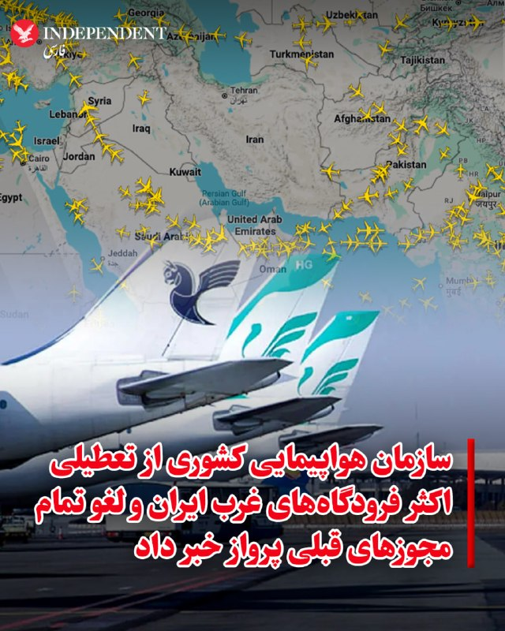

♦️سازمان هواپیمایی کشوری روز جمعه، با صدور اطلاعیه هوانوردی برای حریم هوایی ایران، اعلام کرد تمامی مجوزهای قبلی پروازهای مسافری در فرودگاه‌های بخش غربی منطقه اطلاعات پروازی تهران، از اول خرداد تا دوشنبه، چهارم خرداد‌، لغو شده و تنها هشت فرودگاه از جمله مهرآباد، خمینی، اصفهان و یزد مجاز به فعالیت هستند. براساس این تصمیم، این فرودگاه‌ها فقط از طلوع تا غروب آفتاب پذیرای پروازهای تجاری هستند و شرکت‌های هواپیمایی برای هرگونه پرواز باید مجوز جدید دریافت کنند.
‌🇸🇦 Indypersian

🤖 @VahidOOnLine

## VahidOOnLine — post 241640

♦️یک گاومیش «آلبینو» در بنگلادش به دلیل فرم خاص موهای طلایی، مورد توجه عمومی قرار گرفته و تصاویر آن در شبکه‌های اجتماعی بازتاب گسترده‌ای داشته است. به گزارش خبرگزاری فرانسه، مردم برای مشاهده این حیوان ۴ ساله به مزرعه‌ای در شهر «نارایان‌گانج» مراجعه می‌کنند. ضیاءالدین مریدا، مالک این گاومیش ۷۰۰ کیلویی، می‌گوید به دلیل شباهت مدل موی این گاومیش با رئیس‌جمهوری آمریکا، نام «دونالد ترامپ» برایش انتخاب شده است.
بر اساس این گزارش مالک این گاومیش اعلام کرد که هجوم بازدیدکنندگان و ازدحام جمعیت باعث شده است این حیوان دچار استرس شده و وزن کم کند؛ از این رو محدودیت‌هایی برای بازدید عمومی اعمال شده است. این گاومیش در روزهای آتی و همزمان با عید قربان ذبح خواهد شد.
‌🇸🇦 Indypersian

🤖 @VahidOOnLine

## VahidOOnLine — post 241639

  

حسن حسن‌زاده، فرمانده سپاه «محمد رسول‌الله» تهران بزرگ، از نهادهای اصلی مسئول سرکوب اعتراضات در پایتخت، در یک مصاحبه تلویزیونی گفت: «اگر احیانا دشمن اشتباه کند، نیروهای مسلح سخت‌تر از گذشته، دردناک‌تر از گذشته و سهمگین‌تر از گذشته پاسخ سخت و پشیمان‌کننده و تمام‌کننده می‌دهند.»
‌🏁 🇬🇧 IranintlTV

🤖 @VahidOOnLine

## VahidOOnLine — post 241638

  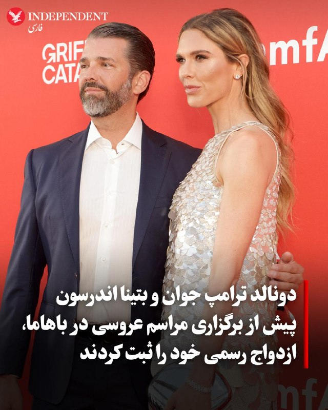

♦️به گزارش نیویورک پست، دونالد ترامپ جوان و بتینا اندرسون پیش از برگزاری مراسم عروسی در باهاما، ازدواج رسمی خود را ثبت کردند.
این زوج ۴۸ و ۳۹ ساله با ثبت سند رسمی ازدواج خود در «پالم بیچ» فلوریدا، پیوندشان را قانونی کردند. طبق گزارش‌ها، آن‌ها قصد دارند در تعطیلات آخر هفته، مراسمی خصوصی را در جزیره‌ای اختصاصی در باهاما برگزار کنند.
دونالد ترامپ، رئیس‌جمهور آمریکا، درباره احتمال حضورش در این مراسم کوچک گفته است که به دلیل جنگ در ایران، زمان مناسبی نیست، اما تلاش می‌کند در آن شرکت کند. او به شوخی گفته است: «اگر شرکت کنم کشته می‌شوم، اگر شرکت نکنم هم کشته می‌شوم.»
‌🇸🇦 Indypersian

🤖 @VahidOOnLine

## WithYashar — post 12104

بزرگترین نمایشگاه هوایی نظامی بریتانیا لغو شد، زیرا گزارش شده است که از این فرودگاه برای ماموریت‌های مرتبط(احتمالا حمله) با ایران استفاده می‌شود.
@withyashar

## WithYashar — post 12103

از دیشب تا الان نخوابیدم سربازم الانم دارم میرم سر شیفتم جنگ قبلی ام توی شیفتم شروع شد اموزشیمم جنگ 12 روزه بود دعا کنین زنده برگردم 🥲💔😂

## WithYashar — post 12102

از دیشب تا الان نخوابیدم سربازم الانم دارم میرم سر شیفتم جنگ قبلی ام توی شیفتم شروع شد اموزشیمم جنگ 12 روزه بود دعا کنین زنده برگردم 🥲💔😂

## WithYashar — post 12101

  <a href="telegram/content/WithYashar_12101_1779512872.mp4" target="_blank">🎬 Download video</a>

ویدیو مربوطه … 😬
@withyashar

## WithYashar — post 12100

لارا لومر از معتمد ترین افراد نزد ترامپ ، خبر آماده شدن آمریکا برای حملات دوباره رو ریتوییت کرده.
@withyashar

## WithYashar — post 12099

پست دن اسکاوینو از مشاوران ترامپ در شبکه اجتماعی X @withyashar

## WithYashar — post 12098

  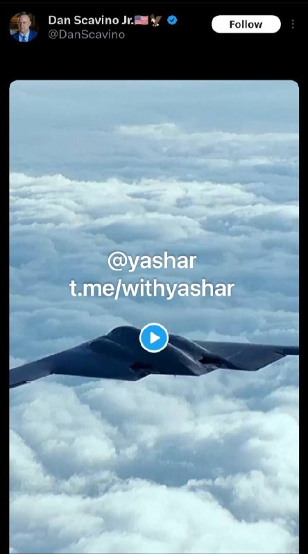

پست دن اسکاوینو از مشاوران ترامپ در شبکه اجتماعی X
@withyashar

## WithYashar — post 12097

تمام کنفرانس های خبری کاخ سفید لغو شد
@withyashar

## WithYashar — post 12096

خوب تا ۵ ایران نزد میریم برای ۹ صبح به بعد ، حالا خوابمم نمیبره 🥴🤣

## FoxNewsTwitter — post 342153

  <a href="telegram/content/FoxNewsTwitter_342153_1779512874.mp4" target="_blank">🎬 Download video</a>

Fox News (Twitter/X)

NEW VIDEO: Surveillance footage shows the moment a school bus carrying children crashes into a car at a busy Massachusetts intersection.

Officials say 11 children were on board the bus when the collision happened.

Nine children were taken to nearby hospitals for observation, but authorities say none of the injuries were serious.

The cause of the crash is under investigation.

## VahidOnline — post 75632

  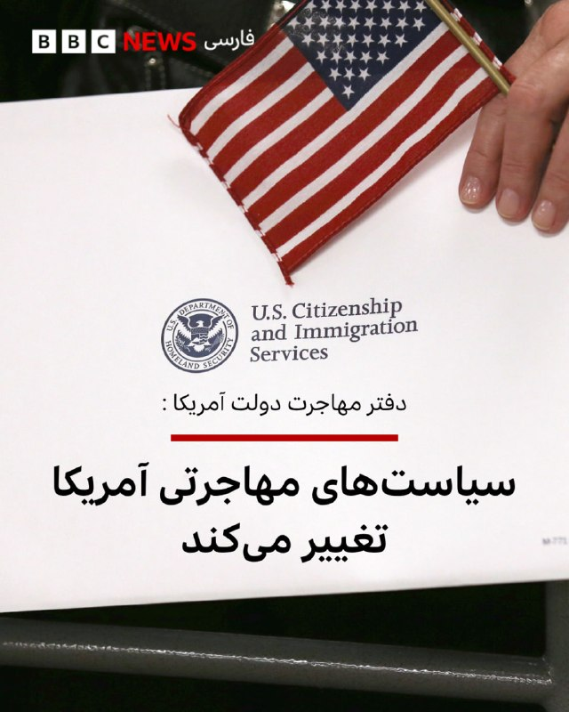

دولت دونالد ترامپ اعلام کرد که سیاست‌های مهاجرت به آمریکا تغییر می‌کند.

در یک تغییر اساسی در سیاست‌های مهاجرتی آمریکا، دولت این کشور اعلام کرد خارجی‌هایی که قصد دریافت اقامت دائم یا همان گرین کارت را دارند، باید خاک ایالات متحده را ترک و از طریق کنسولگری یا سفارت آمریکا اقدام نمایند.

زک کالر، سخنگوی دفتر مهاجرت دولت آمریکا، گفت که این سیاست «نیاز به یافتن و اخراج» کسانی را کاهش می‌دهد که درخواست اقامتشان رد شده است.

از سوی دیگر وکلای مهاجرت و گروه‌های امدادی می‌گویند که این تغییر احتمالا به «جدایی بیش‌ازپیش خانواده‌ها» منجر خواهد شد و قربانیان قاچاق انسان هم مجبور خواهند شد «به کشورهای خطرناکی بازگردند که از آن گریخته‌اند.»

این تغییر سیاست تازه‌ترین اقدام آقای ترامپ در محدود کرد مهاجرت به آمریکا است.
@VahidHeadline

📡 @VahidOnline

## IranIntlTV — post 338519

  

عراقچی و عاصم منیر، فرمانده ارتش پاکستان، در دیداری در تهران درباره آخرین تلاش‌های دیپلماتیک برای پایان جنگ ایران و مسائل امنیتی غرب آسیا گفت‌وگو کردند. منیر جمعه در چارچوب تلاش‌ها برای دستیابی به توافقی میان جمهوری اسلامی و آمریکا وارد تهران شد.
https://iranintl.com/202605235118

## IranIntlTV — post 338518

  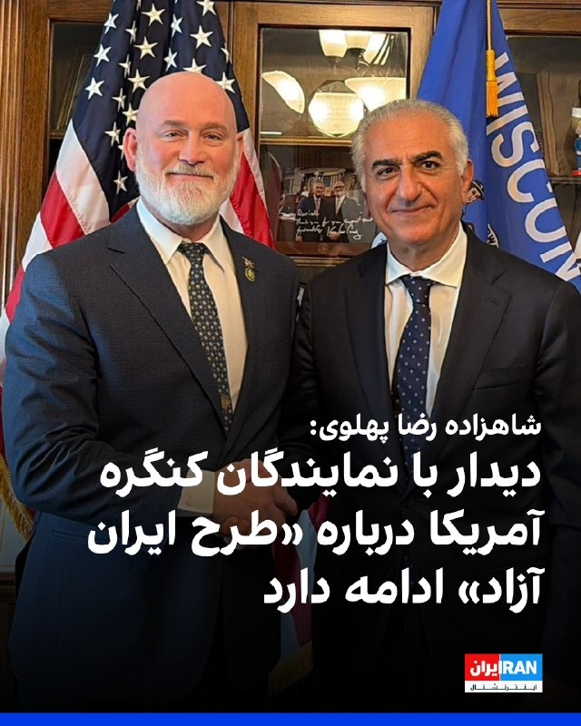

شاهزاده رضا پهلوی در پیامی در ایکس با اشاره به دیدارش با دریک ون اوردن، عضو جمهوری‌خواه مجلس نمایندگان آمریکا، در کنگره، بر عزم خود برای ادامه رایزنی‌هایش در کنگره آمریکا درباره «طرح ایران آزاد» تاکید کرد.
شاهزاده پهلوی تاکید کرد «طرح ایران آزاد» می‌تواند پیامدهای مثبتی برای آمریکا و جهان داشته باشد.
او با انتشار تصاویری از دیدار خود با دریک ون اوردن گفت این قانون‌گذار آمریکایی از نزدیک با «رفتارهای جمهوری اسلامی علیه ایرانیان و آمریکایی‌ها» آشناست.

https://iranintl.com/202605235387

## IranIntlTV — post 338517

  

حسن حسن‌زاده، فرمانده سپاه «محمد رسول‌الله» تهران بزرگ، از نهادهای اصلی مسئول سرکوب اعتراضات در پایتخت، در یک مصاحبه تلویزیونی گفت: «اگر احیانا دشمن اشتباه کند، نیروهای مسلح سخت‌تر از گذشته، دردناک‌تر از گذشته و سهمگین‌تر از گذشته پاسخ سخت و پشیمان‌کننده و تمام‌کننده می‌دهند.»
https://iranintl.com/202605235001

## FarsiVOA — post 218406

  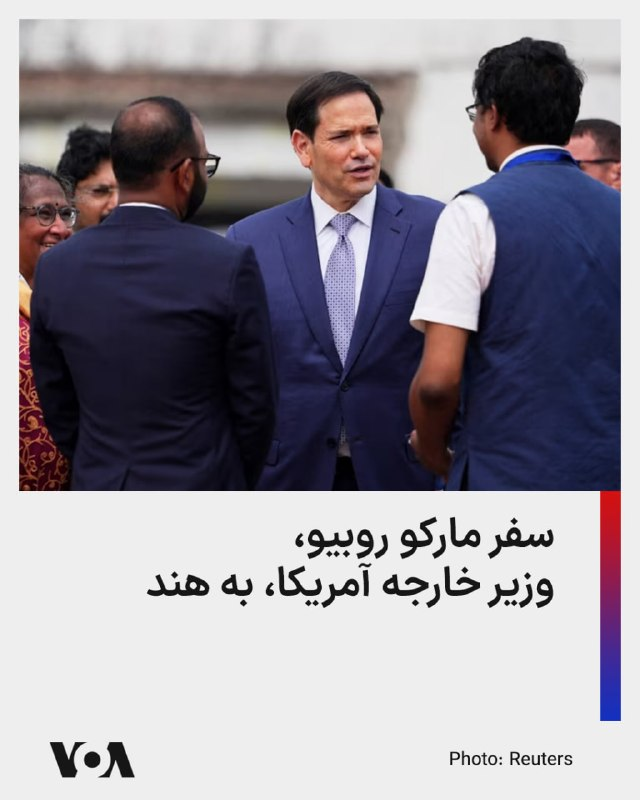

مارکو روبیو، وزیر خارجه آمریکا، روز شنبه در آغاز سفری چهارروزه وارد هند شد؛ سفری که به گزارش رویترز، نشانه تلاش واشنگتن برای ترمیم روابط با دهلی‌نو پس از ماه‌ها تنش تجاری و دیپلماتیک است.

بر اساس این گزارش، تعرفه‌های دولت دونالد ترامپ، نبود توافق تجاری جامع و هم‌زمانی تلاش آمریکا برای نزدیکی به پاکستان و چین، روابط واشنگتن و دهلی‌نو را تحت فشار قرار داده است.

روبیو قرار است در جریان این سفر به کلکته، آگرا، جیپور و دهلی‌نو برود و درباره تجارت، انرژی و همکاری‌های دفاعی گفت‌وگو کند.

رویترز می‌نویسد آمریکا سال‌هاست هند را وزنه‌ای مهم در برابر نفوذ چین و روسیه در منطقه هند-اقیانوس آرام می‌داند، اما اختلاف‌های اخیر این مسیر را پیچیده‌تر کرده است.

دهلی نو خواستار سفر ترامپ به هند همزمان با اجلاس گروه چهار شامل ایالات متحده، هند، ژاپن و استرالیا شده است، اما تحلیلگران می‌گویند این سفر به دلیل تنش‌های تجاری و عوامل دیگر از جمله جنگ ایالات متحده و اسرائیل با جمهوری اسلامی، به تعویق افتاده است.
@FarsiVOA

## FarsiVOA — post 218405

🔺گزارش نیویورک تایمز از اهداف احتمالی در صورت آغاز دوباره کارزار نظامی آمریکا علیه جمهوری اسلامی

◾️نیویورک تایمز جمعه شب در گزارشی نوشت که دونالد ترامپ، رئیس‌جمهوری آمریکا، صبح این روز (۱ خرداد) به همراه وزیر جنگ خود، پیت هگست، در دفتر بیضی کاخ سفید حضور داشت.

⬇️ بیشتر بخوانید:
https://ir.voanews.com/a/8153014.html
@FarsiVOA

## Persian_Trend_Official — post 14712

  

💢وقوع حادثه برای یک نفتکش نزدیک یمن

💢سازمان عملیات دریایی انگلیس امروز از دریافت گزارش‌هایی درباره حادثه امنیتی برای یک فروند نفتکش در آب‌های نزدیک جزیره «سقطری» خبر داد.

💢ناخدا یک نفتکش گزارش داده که کشتی توسط یک قایق کوچک حامل ۵ نفر در فاصله ۲۰۰ مایل دریایی غرب سوکوترا مورد قرار گرفته است. نزدیک‌ترین فاصله ۱۰۰ متر بوده.

💢تیم امنیت مسلح کشتی مستقر شد و قایق کوچک مسیر خود را تغییر داد و دور شد.

🫆:Tony

📌 @persian_trend_official
پرشین ترند | متفاوت‌ترین کانال نظامی

## Persian_Trend_Official — post 14711

  <a href="telegram/content/Persian_Trend_Official_14711_1779512878.webm" target="_blank">🎬 Download video</a>

تولسی گابارد رئیس اطلاعات ملی ايالات متحده آمریکا که دیروز استعفا داد. 📌 @persian_trend_official پرشین ترند | متفاوت‌ترین کانال نظامی

## Persian_Trend_Official — post 14710

  

تولسی گابارد رئیس اطلاعات ملی ايالات متحده آمریکا که دیروز استعفا داد.

📌 @persian_trend_official
پرشین ترند | متفاوت‌ترین کانال نظامی

## Persian_Trend_Official — post 14709

  

نسخه اسپاتیفای لایو دیشب :
https://open.spotify.com/episode/70QUNKnopM1uSLbBaXBi39?si=HwP7TUp5R22jaAYdynjUtw

## Persian_Trend_Official — post 14707

  <a href="telegram/content/Persian_Trend_Official_14707_1779512880.mp4" target="_blank">🎬 Download video</a>

🤑
🚀 انفجار مگاروکت اسپیس‌ایکس هنگام فرود
❌

دلیل اینکه این انفجارها زیاد دیده می‌شوند این است که اسپیس‌ایکس برخلاف روش سنتی ناسا، موشک‌ها را سریع آزمایش می‌کند، حتی اگر احتمال شکست بالا باشد؛ چون هدفش این است که با هر انفجار، داده جمع کند و طراحی را بهتر کند.

👩‍💻:@PhantomDirective

🆔:@persian_trend_official
پرشین ترند | متفاوت‌ترین کانال نظامی

## Persian_Trend_Official — post 14706

  

🔴نیویورک پست

♦️تبعه عراقی آموزش‌دیده سپاه می‌خواست ایوانکا ترامپ را به تلافی کشته‌شدن قاسم سلیمانی ترور کند

💢روزنامه «نیویورک‌پست» به نقل از منابع آگاه افشا کرد که ایوانکا ترامپ، دختر ۴۴ ساله دونالد ترامپ، هدف یک طرح ترور پیچیده از سوی یک تروریست تحت آموزش سپاه پاسداران انقلاب اسلامی قرار گرفته که با انگیزه انتقام‌جویی از کشته شدن قاسم سلیمانی طراحی شده بود.

💢بر اساس این گزارش، متهم که یک تبعه عراقی ۳۲ ساله به نام «محمد باقر سعد داوود الساعدی» است و به تازگی دستگیر شده، عهد کرده بود برای «به آتش کشیدن خانه ترامپ»، دختر رئیس‌جمهوری آمریکا را به قتل برساند.

🫆:Tony

📌 @persian_trend_official
پرشین ترند | متفاوت‌ترین کانال نظامی

## Persian_Trend_Official — post 14705

  <a href="telegram/content/Persian_Trend_Official_14705_1779512884.mp4" target="_blank">🎬 Download video</a>

صبحتون‌ بخیر ☕️🔥

📝 Nick
📌 @persian_trend_official
پرشین ترند | متفاوت‌ترین کانال نظامی

## Persian_Trend_Official — post 14704

  

🔴ترامپ تصویری از خود با گرینلند منتشر کرد

💢 رئیس جمهوری آمریکا در اقدامی جنجالی دیگر تصویری از خود را در فضای مجازی منتشر کرده که  دست وی را روی گرینلند نشان می دهد.

🫆:Tony

📌 @persian_trend_official
پرشین ترند | متفاوت‌ترین کانال نظامی

## Persian_Trend_Official — post 14703

💢نیروهای مسلح جمهوری اسلامی در بالاترین سطح آماده‌باش قرار گرفته‌اند.

▪️همزمان، فعالیت بالای جنگنده‌ها بر فراز کردستان عراق و همچنین فعالیت جنگنده‌های ایرانی در غرب ایران ثبت شده است. همچنین سطح بالایی از اختلال در سیستم GPS در امارات، قطر، کویت و ایران گزارش شده است.

🫆:Tony

📌 @persian_trend_official
پرشین ترند | متفاوت‌ترین کانال نظامی

## RadioFarda — post 157466

  

🔸رسانه‌ها در ایران از دیدار فیلد مارشال عاصم منیر، فرمانده ارتش پاکستان با عباس عراقچی، وزیر امور خارجه ایران در شامگاه شنبه یکم خرداد خبر دادند.

🔸بر اساس این خبر، دیدار این دو مقام تا پاسی از شب ادامه یافته و محور گفت‌وگوها «تلاش‌ها برای جلوگیری از تشدید تنش و خاتمه جنگ» و «راهکارهای تقویت صلح، ثبات و امنیت در منطقه غرب آسیا» بوده است.

🔸جزئیات بیشتری از این دیدار منتشر نشده است.

🔸برخی رسانه‌ها پیش از این، سفر عاصم منیر به تهران را نشانه «پیشرفت» مذاکرات دانسته بودند. در همین حال وزیر خارجه آمریکا نیز از برخی پیشرفت‌ها در گفت‌وگوهای آمریکا و ایران خبر داده و در عین حال افزوده بود که هنوز توافق نهایی نشده است.

🔸پاکستان از زمان برقراری آتش‌بس بعد از ۴۰ روز جنگ آمریکا و اسرائیل با ایران، در نقش میانجی ظاهر شده است.

@RadioFarda

## RadioFarda — post 157465

  <a href="https://t.me/radiofarda/157465" target="_blank">📎 Download file</a>

📻بشنوید: سرخط خبرها با رادیوفردا، دوم خرداد ۱۴۰۵‌

@RadioFarda

## IranianMinds — post 20582

  

وضعیت رسانه ها :

@IranianMinds

## BBCPersian — post 281842

🔻بر اساس سندی داخلی که رویترز مشاهده کرده، از زمان آغاز جنگ ایران، ۲۷ کشور اقدام‌هایی را برای دسترسی سریع به منابع مالی موجود در برنامه‌های بانک جهانی آغاز کرده‌اند تا بتوانند با پیامدهای بحران مقابله کنند.

این سند نام کشورها یا میزان دقیق منابع مالی درخواستی را ذکر نکرده و بانک جهانی نیز از اظهارنظر در این باره خودداری کرده است.

بر اساس این گزارش، سه کشور از زمان آغاز درگیری‌ها در ۲۸ فوریه ابزارهای جدید مالی را تصویب کرده‌اند و بقیه کشورها همچنان در حال تکمیل روند اداری هستند.

جنگ و اختلال ناشی از آن در بازار جهانی انرژی، زنجیره‌های تامین را تحت فشار قرار داده و مانع ارسال محموله‌های حیاتی کود شیمیایی به کشورهای در حال توسعه شده است.

مقام‌های کنیا و عراق تایید کرده‌اند که برای مقابله با پیامدهای جنگ، از جمله افزایش شدید قیمت سوخت در کنیا و کاهش گسترده درآمدهای نفتی عراق، به دنبال دریافت حمایت مالی فوری از بانک جهانی هستند.

این ۲۷ کشور بخشی از ۱۰۱ کشوری هستند که به نوعی از سازوکارهای تامین مالی اضطراری بانک جهانی دسترسی دارند؛ از جمله ۵۴ کشوری که به برنامه «واکنش سریع» پیوسته‌اند و می‌توانند تا ۱۰ درصد منابع مالی تخصیص‌نیافته خود را در شرایط بحران استفاده کنند.

آجی بانگا، رئیس بانک جهانی، ماه گذشته گفته بود ابزارهای بحران این نهاد امکان دسترسی کشورها به حدود ۲۰ تا ۲۵ میلیارد دلار منابع مالی را فراهم می‌کند.

او افزود که بانک جهانی می‌تواند با تغییر اولویت بخشی از پروژه‌های خود، این رقم را طی شش ماه به ۶۰ میلیارد دلار و در بلندمدت به حدود ۱۰۰ میلیارد دلار برساند.

در همان زمان، کریستالینا جورجیوا، رئیس صندوق بین‌المللی پول، گفته بود که انتظار دارد تا حدود ۱۲ کشور برای دریافت ۲۰ تا ۵۰ میلیارد دلار کمک فوری درخواست بدهند، اما به گفته سه منبع آگاه، تاکنون درخواست‌های اندکی ثبت شده است.

https://bbc.in/4dAln5O
@BBCPersian

## BBCPersian — post 281841

🔻مارکو روبیو، وزیر خارجه آمریکا، امروز برای سفری چهارروزه وارد هند می‌شود؛ سفری که در بحبوحه بحران جهانی انرژی ناشی از جنگ ایران انجام می‌شود.

انتقال انرژی از طریق تنگه هرمز تقریبا متوقف شده است، آبراه باریکی که پس از حملات اسرائیل و آمریکا به ایران به کانون تنش تبدیل شده است.

ایران از بسته شدن این تنگه به‌عنوان اهرم فشار در مذاکرات شکننده صلح با آمریکا استفاده کرده است.

هند که بیش از ۸۰ درصد نیاز انرژی خود را وارد می‌کند، از جمله کشورهایی است که بیشترین آسیب را دیده‌اند؛ زیرا زندگی روزمره جمعیت بیش از یک میلیارد و ۴۰۰ میلیون نفری آن به واردات سوخت، از جمله گاز مایع و فرآورده‌های نفتی، وابسته است.

پیشتر آقای روبیو به چالش‌های پیش‌روی سومین اقتصاد بزرگ آسیا اشاره کرد و گفت: «ما می‌خواهیم هر میزان انرژی که هند مایل به خرید آن باشد، به آن کشور بفروشیم. همان‌طور که می‌بینید، تولید و صادرات انرژی آمریکا در سطوح تاریخی قرار دارد.»

در دهلی‌نو نیز تمایل برای افزایش واردات انرژی از آمریکا وجود دارد چراکه این موضوع می‌تواند به کاهش مازاد تجاری هند با آمریکا کمک کند، مسئله‌ای که همواره موجب نارضایتی دونالد ترامپ بوده است.

کسری تجاری آمریکا با هند در سال ۲۰۲۵ به ۵۸ میلیارد و ۲۰۰ میلیون دلار رسید که نسبت به سال قبل ۲۷/۱ درصد افزایش نشان می‌دهد.

با این حال، کارشناسان می‌گویند که جایگزینی کمبود فعلی انرژی هند با واردات از آمریکا راه‌حل ساده‌ای نیست چون که انتقال انرژی از آمریکا به هند طولانی‌تر و پرهزینه‌تر است و از نظر اقتصادی نیز چندان منطقی به نظر نمی‌رسد.

https://bbc.in/4dAln5O
@BBCPersian

## BBCPersian — post 281839

  

🔻دولت دونالد ترامپ اعلام کرد که سیاست‌های مهاجرت به آمریکا تغییر می‌کند.

در یک تغییر اساسی در سیاست‌های مهاجرتی آمریکا، دولت این کشور اعلام کرد خارجی‌هایی که قصد دریافت اقامت دائم یا همان گرین کارت را دارند، باید خاک ایالات متحده را ترک و از طریق کنسولگری یا سفارت آمریکا اقدام نمایند.

زک کالر، سخنگوی دفتر مهاجرت دولت آمریکا، گفت که این سیاست «نیاز به یافتن و اخراج» کسانی را کاهش می‌دهد که درخواست اقامتشان رد شده است.

از سوی دیگر وکلای مهاجرت و گروه‌های امدادی می‌گویند که این تغییر احتمالا به «جدایی بیش‌ازپیش خانواده‌ها» منجر خواهد شد و قربانیان قاچاق انسان هم مجبور خواهند شد «به کشورهای خطرناکی بازگردند که از آن گریخته‌اند.»

این تغییر سیاست تازه‌ترین اقدام آقای ترامپ در محدود کرد مهاجرت به آمریکا است.

📷Getty Images
@BBCPersian

## BBCPersian — post 281838

  

🔻جامعه جهانی بهائی در اطلاعیه‌ای از وضعیت سلامت بشری مصطفوی، زن باردار بهائی از شهر رفسنجان که «از زمان آغاز اعتراضات دی‌‎ماه» دستگیر و زندانی شد، ابراز نگرانی کرده است.

گفته می‌شود که مقام‌های قضایی ایران با درخواست‌های او برای دسترسی به مراقبت‌های پزشکی ضروری، از جمله آزمایش‌های حیاتی دوران بارداری، مخالفت کرده‌اند.

در اطلاعیه جامعه جهانی بهائی از جمله آمده است که خانم مصطفوی «یکی از حدود ۸۰ بهائی است که طی ماه‌های اخیر، همزمان با تشدید کارزار بی‌رحمانه جمهوری اسلامی برای آزار و سرکوب این اقلیت دینی، بازداشت و زندانی شده‌اند.»

جامعه جهانی بهائی می‌گوید که تاکنون بیش از ۴۰۰ مورد نقض حقوق بشر با حمایت حکومت ایران علیه بهائیان در سراسر آن کشور را گزارش کرده است؛ «مواردی از قبیل دستگیری‌ها و بازداشت‌ها، یورش‌های خشونت‌آمیز به منازل، مصادره غیرقانونی اموال و ممانعت از اجرای عدالت از سوی مقامات قضائی ایران.»

📷 BahaiDE
https://bbc.in/4dsL61e
@BBCPersian

## BBCPersian — post 281828

🖋برند دبوسمن جونیور
خبرنگار کاخ سفید

آمریکا، رائول کاسترو، رئیس‌جمهور سابق ۹۴ ساله کوبا را به قتل متهم کرده است؛ اقدامی که گمانه‌زنی‌ها را درباره این ‌که آیا هاوانا مقصد بعدی فهرست تغییر رژیم واشنگتن خواهد بود یا نه، افزایش داده است.

در بحبوحه کارزار «فشار حداکثری» که شدیدترین کمبودهای سوخت و انرژی کوبا در چند دهه اخیر را رقم زده است، شماری از مقام‌های آمریکایی به شکل مداوم خواستار پایان دادن به حکومت کمونیستی ۶۶ ساله این جزیره شده‌اند.

در حالی که دونالد ترامپ، رئیس‌جمهور آمریکا، گفته است معتقد است نیازی به «تشدید تنش» نخواهد بود، کاخ سفید نیز تاکید کرده که وجود یک «دولت سرکش» در نزدیکی سواحل آمریکا را تحمل نخواهد کرد.

این ‌که در ادامه چه رخ خواهد داد، برای هیچ ‌کس روشن نیست؛ فروپاشی اقتصادی، آشوب داخلی یا مداخله نظامی آمریکا. در ادامه سه سناریوی احتمالی بررسی می‌شود.

آلبوم را ورق بزنید و ادامه مطلب را از لینک زیر در وبسایت بی‌بی‌سی فارسی بخوانید.

📸GettyImages/ Reuters/ Anadolu via Getty Images/ EPA/Shutterstock/ AFP via Getty Images/ Bloomberg via Getty Images
https://bbc.in/43oAVVv
@BBCPersian

## BBCPersian — post 281827

🔻ولادیمیر پوتین، رئیس‌جمهور روسیه، از ارتش خواست تا برای «گزینه‌های تلافی‌جویانه» علیه اوکراین آماده شود. او این دستور را پس از حمله پهپادی کی‌یف به یک خوابگاه دانشجویی در منطقه شرقی تحت اشغال روسیه در اوکراین، صادر کرد. روسیه می‌گوید که در این حمله شش…

## BBCPersian — post 281826

  

🔻ولادیمیر پوتین، رئیس‌جمهور روسیه، از ارتش خواست تا برای «گزینه‌های تلافی‌جویانه» علیه اوکراین آماده شود.

او این دستور را پس از حمله پهپادی کی‌یف به یک خوابگاه دانشجویی در منطقه شرقی تحت اشغال روسیه در اوکراین، صادر کرد.

روسیه می‌گوید که در این حمله شش دانشجو کشته شدند.

رئیس‌جمهور روسیه ضمن متهم کردن اوکراین به «تروریسم» گفت که بیانیه وزارت خارجه مسکو کافی نبوده و به ارتش دستور داده تا «طرح‌ حملات» متقابل را ارائه کنند.

از سوی دیگر اوکراین می‌گوید که ساختمان هدف حمله، «مقر فرماندهی پهپادی ارتش روسیه» بود.

خبرگزاری رویترز هم از قول مقام‌های محلی تحت امر روسیه نوشت که این ساختمان، «دانشکده تربیت معلم دانشگاه لوهانسک» بود.

با وجود انتشار تصاویر عملیات امداد گروه‌های نجات روسی از رسانه‌ دولتی روسیه، هنوز مشخص نیست چه کسانی در این حمله کشته شده‌اند.

📷 Reuters
@BBCPersian

<!-- MSG END -->

<!-- NAV START -->

<a href="https://github.com/keihancpu/aio-downloader/blob/main/telegram/content/archive_1.md" style="display:inline-block; padding:6px 12px; margin:0 4px; background-color:#2ea44f; color:white; text-decoration:none; border-radius:4px; font-weight:bold;">صفحه بعد</a>

<!-- NAV END -->
