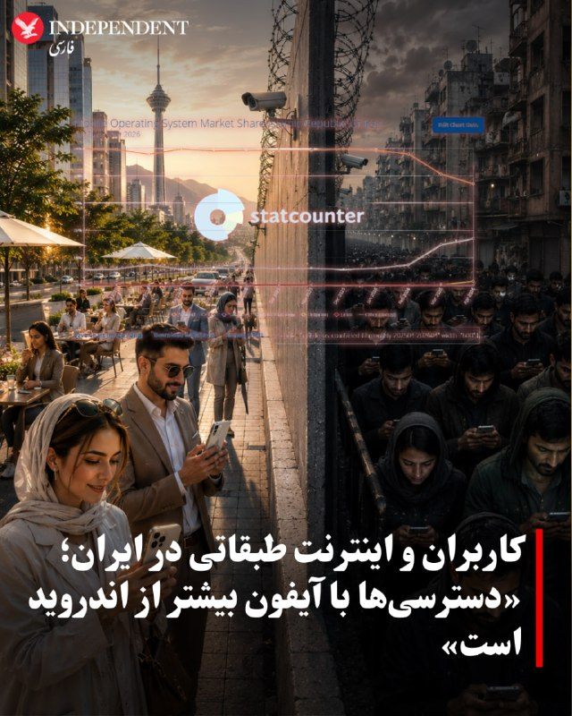
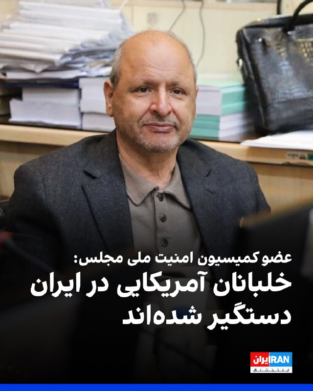
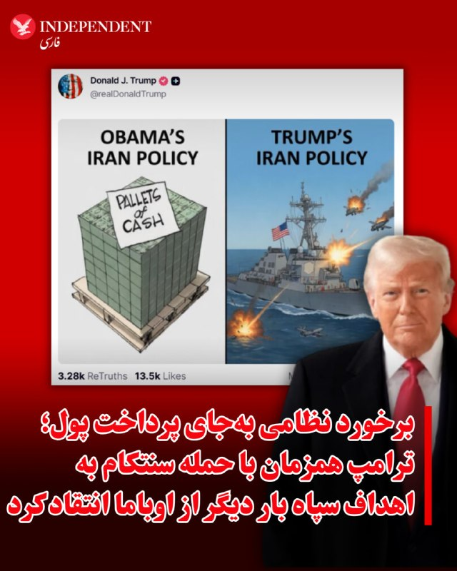
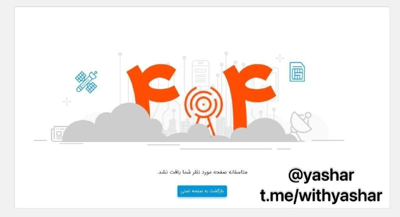
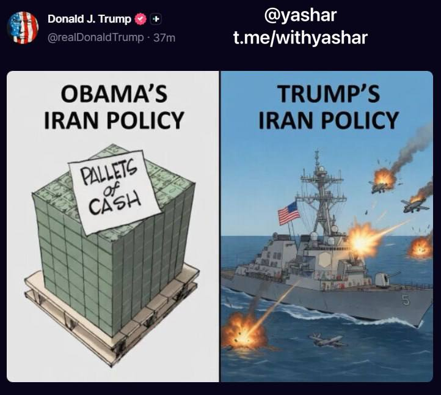
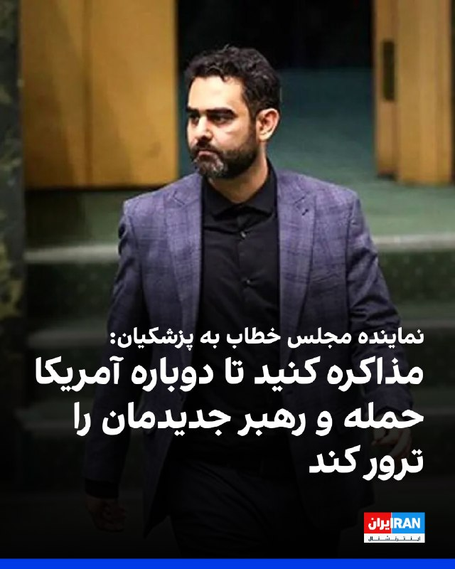
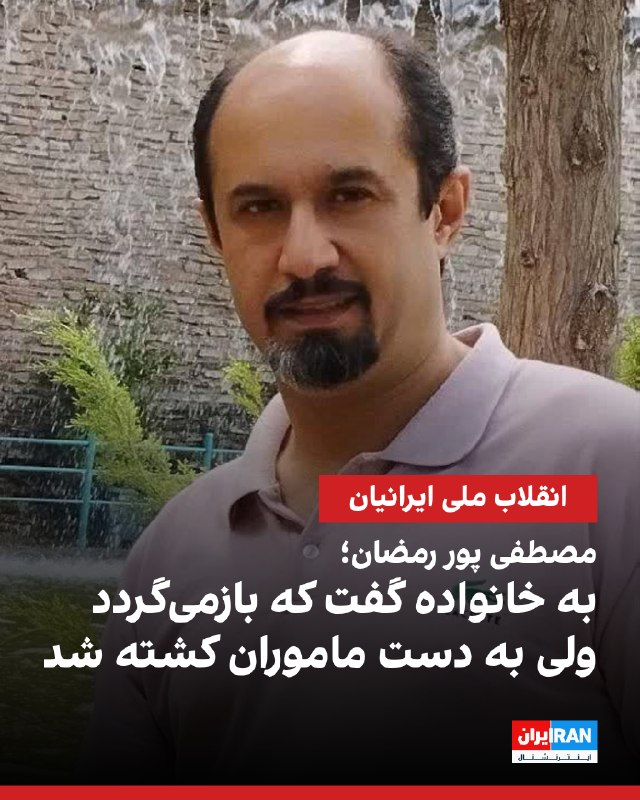
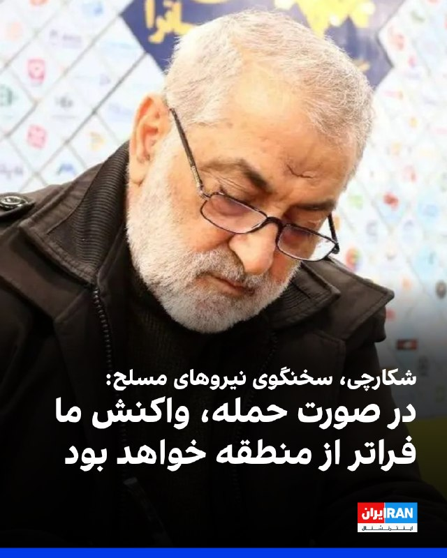

# خواننده تلگرام

<!-- TOP_NAV START -->

<a href="https://github.com/keihancpu/aio-downloader/blob/main/telegram/content/archive_1.md" style="display:inline-block; padding:6px 12px; margin:0 4px; background-color:#2ea44f; color:white; text-decoration:none; border-radius:4px; font-weight:bold;">صفحه بعد</a>

<!-- TOP_NAV END -->

<!-- MSG START -->

---
📅 بروزرسانی: 1405/03/05 10:39
---

## VahidOOnLine — post 242231

  

امیرحسین ثابتی، نماینده تهران در مجلس، با انتقاد از سخنان مسعود پزشکیان که گفته بود «اگر مذاکره نکنیم، چه کنیم»، گفت: مگر دفعات قبل وسط میز مذاکره جنگ نشد؟ پس بازهم دوست دارید مذاکره کنید تا جنگ شود و رهبر جدیدمان هم ترور شود؟ »

او افزود: «اگر امروز اکثر ملت ایران با مذاکره با آمریکا مخالفند، علتش این است که عقل دارند و از تاریخ عبرت گرفته‌اند.»

ثابتی ادامه داد: «از این مسیر تکراری اتفاقی به نفع ایران در نمی‌آید و راه اداره کشور نیز مبارزه با فساد و ریخت و پاش‌هاست نه رها کردن ۱۹۹ کشور دیگر و دخیل بستن به آمریکا.»
‌🏁 🇬🇧 IranintlTV

🤖 @VahidOOnLine

## VahidOOnLine — post 242230

  

♦️همزمان با ادامه قطعی اینترنت در ایران، داده‌های منتشر شده در پایگاه‌های بررسی وضعیت اینترنت نشان می‌دهد که بیشتر کاربرانی که به اینترنت معروف به «پرو» دسترسی دارند، از آیفون استفاده می‌کنند.

به گزارش خبرآنلاین، آمارهای تازه پایگاه بین‌المللی «Statcounter» از بازار سیستم‌عامل‌های موبایل در ایران، وجود شکاف طبقاتی دیجیتال و حذف تدریجی کاربران کم‌درآمد از فضای آنلاین را تقویت کرده است؛ آماری که نشانگر جهش ناگهانی ترافیک آیفون و همزمان سقوط قابل‌ توجه اندروید است.

بر اساس داده‌های این سایت، در فاصله بهمن ۱۴۰۴ تا فروردین ۱۴۰۵ ، سهم ترافیک گوشی‌های آیفون (iOS) در ایران به‌صورت بی‌سابقه‌ای از حدود ۱۳ درصد به نزدیک ۳۰ درصد افزایش یافته است. همزمان، سهم اندروید ۲۵ درصد کاهش یافته است.

براساس این تحلیل داده‌ها، کاهش سهم اندروید در سه ماه گذشته می‌تواند نشانه خروج میلیون‌ها کاربر طبقه متوسط و کم‌درآمد از اینترنت باشد؛ کاربرانی که به‌دلیل هزینه‌های فزاینده دسترسی آزاد به اینترنت، دیگر توان حضور در فضای آنلاین را ندارند.
‌🇸🇦 Indypersian

🤖 @VahidOOnLine

## VahidOOnLine — post 242229

  

اسماعیل سقاب اصفهانی، معاون مسعود پزشکیان گفت: «این تفکری که حسن نیت با آمریکا حسن نیت می‌آورد را باید کنار بگذاریم، آمریکا فقط زبان زور و قدرت را می‌فهمد.»
او با اشاره به حملات به کشورهای منطقه در طول جنگ ۴۰ روزه، گفت: «آمریکا ترسید، چنان پاسخ کوبنده‌ای دادیم که عقب نشست.»
‌🏁 🇬🇧 IranintlTV

🤖 @VahidOOnLine

## VahidOOnLine — post 242228

  

مصطفی پور رمضان، ۴۴ ساله، شامگاه جمعه ۱۹ دی در شهرک جهان‌نما کرج با شلیک گلوله کشته شد. او که  پدر سه فرزند بود، بر اثر اصابت تیر جنگی از پشت به ناحیه سر و گردن جان باخت.

بر اساس اطلاعات رسیده به ایران‌اینترنشنال، او حدود ساعت ۷:۳۰ شب و پس از شنیدن صدای اعتراضات از خانه خارج شد و به خانواده گفت که بازمی‌گردد، اما به دست ماموران کشته شد.

به گفته شاهدان، مصطفی پور رمضان با تیر جنگی از پشت سر هدف قرار گرفت و بر زمین افتاد. شدت تیراندازی اجازه کمک‌رسانی به او را نداد و به مدت یک‌ساعت و نیم در محل حادثه رها شد. مصطفی در نهایت به درمانگاه منتقل شد اما به دلیل خون‌ریزی شدید جان خود را از دست داد.

 بنا به گزارش‌ها، پیکر او ابتدا در سردخانه بیمارستان امام علی نگهداری شد و خانواده پس از دو تا سه روز پیگیری توانستند آن را تحویل بگیرند. محل دفن مصطفی پوررمضان در گلزار شهدای کلاک بالای کرج تعیین و در همان محل به خاک سپرده شد.

حاضران در محل خبر دادند فضای آرامستان امنیتی بود و ماموران مسلح و لباس شخصی در محل حضور داشتند. این ماموران با ایجاد فضای رعب تلاش می‌کردند مانع سر دادن شعارهای اعتراضی از سوی خانواده‌ها شوند.
h
‌🏁 🇬🇧 IranintlTV

🤖 @VahidOOnLine

## VahidOOnLine — post 242227

  

♦️ابوالفضل شکارچی، سخنگوی ارشد نیروهای مسلح جمهوری اسلامی روز سه‌شنبه پنجم خرداد و در گفتگو با الجزیره تهدید کرد که در صورت شروع دوباره جنگ و جلوگیری از صادرات نفت ایران، نیروهای مسلح جلوی صادرات نفت منطقه را می‌گیرند.

در حالیکه با وجود تائید خبر حمله نیروهای سنتکام به اهداف نظامی جمهوری اسلامی در منطقه خلیج فارس، هنوز از واکنش مقام‌های سیاسی یا نیروهای مسلح خبری نیست، شکارچی بار دیگر هشدار داد که در صورت «تجاوز جدید و از سرگرفته شدن جنگ، پاسخ ایران فرامنطقه‌ای خواهد بود.»

این مقام ارشد سپاه پاسداران گفت: «جمهوری اسلامی ایران برای جنگ آماده است و در صورت حمله جدید آمریکا و رژیم صهیونی [اسرائیل]، بانک اهدافش را شناسایی کرده است. پاسخ به هرگونه تجاوز جدید با آنچه قبلا بوده متفاوت خواهد بود، دشمنان قطعا با غافلگیری‌ها و تاکتیک‌های جدید روبرو خواهند شد و حملات ایران، در صورت ورود منطقه به دور دیگری از جنگ فراتر از مرزهای منطقه خواهد رفت و بسیار شدیدتر، سنگین‌تر، خشونت‌آمیزتر و قوی‌تر از دو جنگ قبلی خواهد بود.»
‌🇸🇦 Indypersian

🤖 @VahidOOnLine

## VahidOOnLine — post 242226

  

احمد بخشایش اردستانی، عضو کمیسیون امنیت ملی مجلس با اشاره به عملیات نجات خلبان‌های آمریکایی در ایران در جریان جنگ ۴۰ روزه، به خبرگزاری ایلنا گفت: «دو خلبان آمده بودند که گفته شده جمهوری اسلامی آن‌ها را دستگیر کرده است.»

او در پاسخ به این‌که آیا جمهوری اسلامی خلبانان آمریکایی را دستگیر کرده، گفت: «بله، مثل این که دستگیر شده‌اند.»

اردستانی با اشاره سخنان ترامپ درباره نجات خلبانان، گفت که او می‌خواست شکست خودش را پنهان کند.
‌🏁 🇬🇧 IranintlTV

🤖 @VahidOOnLine

## VahidOOnLine — post 242225

  

ابوالفضل شکارچی، سخنگوی ارشد نیروهای مسلح جمهوری اسلامی در گفت‌وگو با شبکه الجزیره گفت: «در صورت هرگونه حمله، واکنش تهران شدیدتر از گذشته خواهد بود و دامنه درگیری می‌تواند از منطقه فراتر برود.»

او افزود: «جمهوری اسلامی برای جنگ آماده است و در صورت حمله دوباره آمریکا یا اسرائیل، اهداف مورد نظر را از پیش شناسایی کرده است.»

شکارچی ادامه داد: «حملات احتمالی تهران با حملات قبلی تفاوت خواهد داشت و شامل غافلگیری و تاکتیک‌های جدید می‌شود و اگر در جریان جنگ مانع صادرات نفت شوند، جمهوری اسلامی از خروج نفت از منطقه جلوگیری خواهد کرد.»
‌🏁 🇬🇧 IranintlTV

🤖 @VahidOOnLine

## VahidOOnLine — post 242224

  

♦️دونالد ترامپ، رئیس جمهوری آمریکا بامداد سه‌شنبه پنجم خرداد و ساعاتی پس از انتشار خبر حمله سنتکام به قایق‌های تندروی  سپاه و پایگاه‌های نظامی در نزدیکی تنگه هرمز، با انتشار کاریکاتوری در تروث سوشال، از پرداخت میلیون‌ها دلار پول در جریان برجام، انتقاد کرد.

ترامپ در این پیام تصویری یک پالت دلار و دیگری از مقابله ناوشکن آمریکایی با پرتابه‌های جمهوری اسلامی را منتشر و بر تفاوت سیاست خودش و اوباما تاکید کرد.
‌🇸🇦 Indypersian

🤖 @VahidOOnLine

## VahidOOnLine — post 242223

  

ابراهیم عزیزی، رییس کمیسیون امنیت ملی مجلس، با اشاره به مذاکرات با آمریکا، گفت: «تا زمانی که منافع کامل جمهوری اسلامی تامین نشود، هیچ اقدامی انجام نخواهد شد و مجلس مسائل را با حساسیت دنبال می‌کند.»

او افزود: «مردم نگران نباشند، مسئولان با دقت در حال رصد و بررسی همه موضوعات هستند.»

این نماینده مجلس ادامه داد: «روند فعلی ادامه دارد و اگر اقدامات اعتمادساز آمریکا نتایج ملموس داشته باشد، ممکن است زمینه برای گام‌های بعدی فراهم شود.»
‌🏁 🇬🇧 IranintlTV

🤖 @VahidOOnLine

## VahidOOnLine — post 242222

  

روزنامه کیهان در مطلبی با اشاره به‌عدم صدور ویزا برای عباس عراقچی جهت سفر به نیویورک، نوشت: «برای پایان‌دادن به نمایش مضحک ترامپ، تنبیه و تادیب آمریکا و در پاسخ به‌عدم صدور ویزا، باید توقف مذاکرات اعلام شود تا ضمن حفظ عزت و احترام، شاهد اقدام مشابه در آینده نباشیم.»

این روزنامه اضافه کرد: «تناقض رفتاری و گفتاری میان ترامپ و مقامات دولت او یک امر رایج است و این موضوع از عدم صدور ویزا برای عراقچی و ادعای اشتیاق برای توافق با جمهوری اسلامی قابل استناد است.»
‌🏁 🇬🇧 IranintlTV

🤖 @VahidOOnLine

## VahidOOnLine — post 242221

  

به گزارش رسانه‌های ایران، «تلما» که از یوزپلنگ‌های شناخته‌شده و موفق در زادآوری در زیستگاه‌های کشور به شمار می‌رود، دوباره در زیستگاه‌های طبیعی استان خراسان شمالی مشاهده شد. این یوزپلنگ هفت‌ساله در سال ۱۴۰۱ با ثبت چهار توله، نقش مهمی در پویایی جمعیت یوزپلنگ آسیایی ایفا کرده بود.
‌🏁 🇬🇧 IranintlTV

🤖 @VahidOOnLine

## VahidOOnLine — post 242220

  

♦️به گزارش گلف‌نیوز، عربستان سعودی به‌طور فزاینده‌ای از هوش مصنوعی و فناوری پهپاد در مراسم حج استفاده می‌کند.
براساس این گزارش، سازمان هواپیمایی کشوری عربستان سعودی نخستین مجوز عملیاتی این کشور را برای تحویل دارو و تجهیزات پزشکی با استفاده از پهپاد در نقاط مختلف مکه در موسم حج ۲۰۲۶ صادر کرد.
این سازمان اعلام کرد این اقدام بخشی از تلاش‌های گسترده‌تر برای گسترش استفاده از فناوری‌های پیشرفته و راهکارهای نوآورانه هوانوردی است؛ راهکارهایی که با هدف افزایش کارایی عملیاتی و تسریع خدمات پزشکی و لجستیکی در جریان حج به کار گرفته می‌شوند.
بر اساس این مجوز، پهپادها اجازه خواهند داشت در چارچوب ضوابط نظارتی و عملیاتی مشخص‌شده و مطابق با استانداردهای ایمنی، کیفیت و بهره‌وری، در محدوده اماکن مقدس فعالیت کنند.
مقام‌های سعودی گفتند این طرح بر پایه عملیات آزمایشی سال گذشته بنا شده است؛ زمانی که پهپادها برای انتقال تجهیزات پزشکی و خدمات لجستیکی در مناطق حج آزمایش شدند.
‌🇸🇦 Indypersian

🤖 @VahidOOnLine

## VahidOOnLine — post 242219

  

در پی یک هفته اعتراضات کارگری در بندر امام و ماهشهر، فرمانداری و مسئولان اداره کار دستور بازگشت به کار بیش از ۶۰ نفر از کارگران اخراجی دو واحد صنعتی در این شهرها را صادر کردند.
ایلنا به نقل از «منابع کارگری» نوشت پس از یک هفته تجمع کارگران در مقابل دفتر شرکت و فرمانداری بندرامام، در جلسه یکشنبه فرماندار و سایر مسئولان شهرستان با حضور مدیرعامل شرکت پتروناد و مدیرکل کار بندر امام «دستوری تنظیم و ابلاغ شد» مبنی بر اینکه کارگران اخراجی «باید ظرف ۲۴ ساعت به کار برگردند.»
همچنین در پی جلسه بررسی مشکلات کارگران قراردادی شرکت پایانه‌ها و مخازن ماهشهر از سوی شورای تامین شهرستان ماهشهر، دستور بازگشت به کار هشت کارگر اخراجی در سریع‌ترین زمان ممکن صادر شد.
این جلسه پس از سه روز اعتراضات صنفی کارگران قراردادی این شرکت برگزار شد.

‌🏁 🇬🇧 IranintlTV

🤖 @VahidOOnLine

## WithYashar — post 12517

  <a href="telegram/content/WithYashar_12517_1779779355.mp4" target="_blank">🎬 Download video</a>

«تجمعات بابل» اخطار ! دیدن این ویدیو ممکن است باعث بی اختیاری‌ادرار شود ⚠️😂
@withyashar

## WithYashar — post 12516

فاکس نیوز گزارش می‌دهد بعید است حادثه دیشب تاثیر بالای بر روی روند مذاکرات داشته باشد و در صورت نزدیک بودن توافقی هر دو طرف بر سر یک برخورد معامله را بر هم نمی‌زنند
@withyashar

## WithYashar — post 12515

شبکه «سی‌ان‌ان»: برای نخستین باز از زمان آغاز جنگ ایران و آمریکا، یک نفت‌کش ژاپنی از تنگه هرمز عبور کرد.
@withyashar

## WithYashar — post 12514

کانال 12 اسراییل: مجتبی خامنه‌ای هنوز توافقات شکل‌گرفته را تایید نکرده
@withyashar

## WithYashar — post 12513

  

صفحه اینترنت پرو از سایت همراه اول حذف کردن
گویا این پروژه شکست خورده
@withyashar

## WithYashar — post 12512

  

بامداد امروز، یک هواپیما دولت حامل مقامات عالی‌رتبه به مسکو رفت!
@withyashar

## WithYashar — post 12511

یک منبع آگاه اسرائیلی روز سه‌شنبه اعلام کرد که ارتش اسرائیل در روزهای آینده خود را برای گسترش عملیات‌ها و حملات هوایی در لبنان آماده می‌کند.
سی‌ان‌ان : این منبع تأکید کرد تحرکات نظامی اسرائیلی قریب‌الوقوع «با هماهنگی ایالات متحده» انجام می‌شود.
@withyashar

## WithYashar — post 12510

  

پست ترامپ در تروث سوشال:
سیاست اوباما: بسته های پول میده
سیاست ترامپ : موشک میزنه
@withyashar

## WithYashar — post 12509

رویترز : پاکستان بلافاصله پیشنهاد ترامپ مبنی بر اینکه توافق با ایران باید به عادی‌سازی روابط با اسرائیل گره بخورد را رد کرد و گفت که این دو موضوع «به هم مرتبط نیستند و نمی‌توان آن‌ها را به هم گره زد».
@withyashar

## pm_afshaa — post 91517

کانال 13 اسرائیل: جلسه کابینه داخلی امروز در پی تشدید تنش‌ها در لبنان و توافق احتمالی با ایران برگزار می‌شود

💧 Rainbet.com the #1 Non-KYC Crypto Casino & Sportsbook @rainbetcom

😁 @Pm_Afshaa

## pm_afshaa — post 91516

سیتنا: آزاد سازی اینترنت به تعویق افتاد

💧 Rainbet.com the #1 Non-KYC Crypto Casino & Sportsbook @rainbetcom

😁 @Pm_Afshaa

## pm_afshaa — post 91515

کانال 12 اسراییل: مجتبی خامنه‌ای هنوز توافقات شکل‌گرفته را تایید نکرده

💧 Rainbet.com the #1 Non-KYC Crypto Casino & Sportsbook @rainbetcom

😁 @Pm_Afshaa

## pm_afshaa — post 91514

از سپاه فقط یه پا مونده که اونم رو هواست هر کی میاد میکنه توش میره😂

## pm_afshaa — post 91513

شاهزاده رضا پهلوی : یکی از اعضای پارلمان حتی به من گفت فکر نمی‌کنه ایرانی‌ها آماده دموکراسی باشن

- ایرانی‌ها فقط آماده دموکراسی نیستن 40 هزار نفر جونشونو برای اون دادن و نمی‌ذارم این فداکاری بی‌نتیجه بمونه
- چه اروپا کنار ما باشه چه رسانه‌هاتون کارشون رو درست انجام بدن چه سیاستمداراتون شجاعت نشون بدن من برای مردم و کشورم می‌جنگم
- حتی اگه مجبور باشیم تنها باشیم تا وقتی ایران آزاد بشه می‌جنگیم

💧Rainbet.com the #1 Non-KYC Crypto Casino & Sportsbook @rainbetcom

😁 @Pm_Afshaa

## iaghapour — post 2631

اینترنت بین‌الملل وصل بشه یجوری از اینترنت استفاده میکنم اختلال بخوره دوباره قطع بشه.🫠

گوشی باید آپدیت بشه.
ویندوز باید آپدیت بشه.
لینوکس باید آپدیت بشه.
برنامه ها باید آپدیت بشه.
و...

حس میکنم شما هم با من هم نظر هستید 🫣😁

## mamlekate — post 103585

📝 مارکو روبیو درباره مذاکرات با جمهوری اسلامی: امروز گفت‌وگوهایی در قطر جریان داشت

مارکو روبیو، وزیر امورخارجه آمریکا، روز سه‌شنبه در جریان سفر رسمی خود به هند به خبرنگاران گفت: «امروز گفت‌وگوهایی در قطر در جریان بود، بنابراین خواهیم دید که آیا می‌توانیم پیشرفتی داشته باشیم یا خیر.»

📝 واشنگتن در پی فرمولی برای حذف ذخایر اورانیوم ایران بدون انتقال به آمریکا

به گزارش نیویورک پست، مقام‌های آمریکایی در حال بررسی روش‌هایی هستند که ایران بتواند ذخایر اورانیوم با غنای بالا را بدون تحویل مستقیم به واشنگتن از بین ببرد.

📝 چارچوب سه‌مرحله‌ای توافق: بازگشایی هرمز، نابودی اورانیوم، کاهش محاصره و سپس مذاکره بر سر شرایط مذاکره صلح

@mamlekate

## mamlekate — post 103584

📝 سنتکام: به چند سایت پرتاب موشک و قایق در جنوب ایران حمله کردیم

ارتش آمريکا اعلام کرد حملات تازه‌ای را به جنوب ايران انجام داده و سايت‌های موشکی ايران و قايق‌هايی را که «در تلاش برای مين‌گذاری» بودند، هدف قرار داده است.

@mamlekate

## VahidOnline — post 75721

با وجود حملات اخیر آمریکا به سامانه‌های موشکی و قایق‌های ایران در خلیج فارس که وضعیت آتش‌بس شکننده را متزلزل‌تر کرده است،‌ مارکو روبیو، وزیر خارجه آمریکا روز سه‌شنبه گفت که توافق با ایران «همچنان امکان‌پذیر است.»

او در هند به خبرنگاران گفت: «امروز مذاکراتی در قطر در جریان بود،‌ و باید دید آیا می‌توانیم شاهد پیشرفتی باشیم یا خیر. فکر می‌کنم بخش زیادی از زمان صرف دقت در کلمات و واژه‌های به کار گرفته در متن اسناد می‌شود، بنابراین چند روز طول خواهد کشید.»

آقای روبیو افزود: «رئیس‌جمهور تمایل خود را برای انجام این کار ابراز کرده است. او یا به یک توافق خوب دست خواهد یافت یا هیچ توافقی نخواهد کرد.»

آقای روبیو به خبرنگاران گفت که تنگه هرمز باید باز باشد.

او گفت که آنها به هر حال این مسیر را باز خواهند کرد و افزود: «آنچه در آنجا اتفاق میافتد،‌ غیرقانونی است و باعث بی‌ثباتی برای جهان و غیرقابل قبول است.»
@VahidHeadline

📡 @VahidOnline

## IranIntlTV — post 339040

  

امیرحسین ثابتی، نماینده تهران در مجلس، با انتقاد از سخنان مسعود پزشکیان که گفته بود «اگر مذاکره نکنیم، چه کنیم»، گفت: مگر دفعات قبل وسط میز مذاکره جنگ نشد؟ پس بازهم دوست دارید مذاکره کنید تا جنگ شود و رهبر جدیدمان هم ترور شود؟ »

او افزود: «اگر امروز اکثر ملت ایران با مذاکره با آمریکا مخالفند، علتش این است که عقل دارند و از تاریخ عبرت گرفته‌اند.»

ثابتی ادامه داد: «از این مسیر تکراری اتفاقی به نفع ایران در نمی‌آید و راه اداره کشور نیز مبارزه با فساد و ریخت و پاش‌هاست نه رها کردن ۱۹۹ کشور دیگر و دخیل بستن به آمریکا.»
https://iranintl.com/202605269775

## IranIntlTV — post 339039

  

اسماعیل سقاب اصفهانی، معاون مسعود پزشکیان گفت: «این تفکری که حسن نیت با آمریکا حسن نیت می‌آورد را باید کنار بگذاریم، آمریکا فقط زبان زور و قدرت را می‌فهمد.»
او با اشاره به حملات به کشورهای منطقه در طول جنگ ۴۰ روزه، گفت: «آمریکا ترسید، چنان پاسخ کوبنده‌ای دادیم که عقب نشست.»
https://iranintl.com/202605265798

## IranIntlTV — post 339038

  

مصطفی پور رمضان، ۴۴ ساله، شامگاه جمعه ۱۹ دی در شهرک جهان‌نما کرج با شلیک گلوله کشته شد. او که  پدر سه فرزند بود، بر اثر اصابت تیر جنگی از پشت به ناحیه سر و گردن جان باخت.

بر اساس اطلاعات رسیده به ایران‌اینترنشنال، او حدود ساعت ۷:۳۰ شب و پس از شنیدن صدای اعتراضات از خانه خارج شد و به خانواده گفت که بازمی‌گردد، اما به دست ماموران کشته شد.

به گفته شاهدان، مصطفی پور رمضان با تیر جنگی از پشت سر هدف قرار گرفت و بر زمین افتاد. شدت تیراندازی اجازه کمک‌رسانی به او را نداد و به مدت یک‌ساعت و نیم در محل حادثه رها شد. مصطفی در نهایت به درمانگاه منتقل شد اما به دلیل خون‌ریزی شدید جان خود را از دست داد.

 بنا به گزارش‌ها، پیکر او ابتدا در سردخانه بیمارستان امام علی نگهداری شد و خانواده پس از دو تا سه روز پیگیری توانستند آن را تحویل بگیرند. محل دفن مصطفی پوررمضان در گلزار شهدای کلاک بالای کرج تعیین و در همان محل به خاک سپرده شد.

حاضران در محل خبر دادند فضای آرامستان امنیتی بود و ماموران مسلح و لباس شخصی در محل حضور داشتند. این ماموران با ایجاد فضای رعب تلاش می‌کردند مانع سر دادن شعارهای اعتراضی از سوی خانواده‌ها شوند.
h

## IranIntlTV — post 339037

  

احمد بخشایش اردستانی، عضو کمیسیون امنیت ملی مجلس با اشاره به عملیات نجات خلبان‌های آمریکایی در ایران در جریان جنگ ۴۰ روزه، به خبرگزاری ایلنا گفت: «دو خلبان آمده بودند که گفته شده جمهوری اسلامی آن‌ها را دستگیر کرده است.»

او در پاسخ به این‌که آیا جمهوری اسلامی خلبانان آمریکایی را دستگیر کرده، گفت: «بله، مثل این که دستگیر شده‌اند.»

اردستانی با اشاره سخنان ترامپ درباره نجات خلبانان، گفت که او می‌خواست شکست خودش را پنهان کند.
https://iranintl.com/202605260798

## IranIntlTV — post 339036

  <a href="telegram/content/IranIntlTV_339036_1779779364.mp4" target="_blank">🎬 Download video</a>

شهباز شریف، نخست‌وزیر پاکستان، با شی جین‌پینگ، رییس‌جمهوری چین، دیدار و درباره راه‌های پایان دادن به جنگ ایران گفت‌وگو کرد.

توماج طاهباز، خبرنگار ایران‌اینترنشنال، گزارش می‌دهد
@iranintltv

## IranIntlTV — post 339035

  

ابوالفضل شکارچی، سخنگوی ارشد نیروهای مسلح جمهوری اسلامی در گفت‌وگو با شبکه الجزیره گفت: «در صورت هرگونه حمله، واکنش تهران شدیدتر از گذشته خواهد بود و دامنه درگیری می‌تواند از منطقه فراتر برود.»

او افزود: «جمهوری اسلامی برای جنگ آماده است و در صورت حمله دوباره آمریکا یا اسرائیل، اهداف مورد نظر را از پیش شناسایی کرده است.»

شکارچی ادامه داد: «حملات احتمالی تهران با حملات قبلی تفاوت خواهد داشت و شامل غافلگیری و تاکتیک‌های جدید می‌شود و اگر در جریان جنگ مانع صادرات نفت شوند، جمهوری اسلامی از خروج نفت از منطقه جلوگیری خواهد کرد.»
https://iranintl.com/202605261837

## IranIntlTV — post 339034

  <a href="telegram/content/IranIntlTV_339034_1779779367.mp4" target="_blank">🎬 Download video</a>

در پی حملات گسترده ارتش روسیه به کی‌یف، پایتخت اوکراین، و مناطق اطراف آن، دست‌کم چهار نفر کشته و ده‌ها نفر زخمی شدند.

علی حسن‌پور، خبرنگار ایران‌اینترنشنال، گزارش می‌دهد
@iranintltv

## IranIntlTV — post 339033

  

ابراهیم عزیزی، رییس کمیسیون امنیت ملی مجلس، با اشاره به مذاکرات با آمریکا، گفت: «تا زمانی که منافع کامل جمهوری اسلامی تامین نشود، هیچ اقدامی انجام نخواهد شد و مجلس مسائل را با حساسیت دنبال می‌کند.»

او افزود: «مردم نگران نباشند، مسئولان با دقت در حال رصد و بررسی همه موضوعات هستند.»

این نماینده مجلس ادامه داد: «روند فعلی ادامه دارد و اگر اقدامات اعتمادساز آمریکا نتایج ملموس داشته باشد، ممکن است زمینه برای گام‌های بعدی فراهم شود.»
https://iranintl.com/202605264082

## IranIntlTV — post 339032

  <a href="https://t.me/IranintlTV/339032" target="_blank">📎 Download file</a>

🎧نسخه صوتی اخبار بامدادی | سه‌شنبه ۵ خرداد
@iranintlTV

## IranIntlTV — post 339028

  <a href="https://t.me/IranintlTV/339028" target="_blank">📎 Download file</a>

🎧نسخه صوتی سیاست با مرد ویسی: امان‌نامه موقت ترامپ به فرماندهان سپاه
@iranintlTV

## IranIntlTV — post 339027

  <a href="telegram/content/IranIntlTV_339027_1779779371.mp4" target="_blank">🎬 Download video</a>

جمعی از دانشجویان ایرانی ساکن میلان در تجمعی اعتراضی خواستار توجه و حمایت دولت ایتالیا از شهروندان و دانشجویان ایرانی شدند. شرکت‌کنندگان در این تجمع نسبت به نقض حقوق بشر و سرکوب معترضان در ایران ابراز نگرانی کردند.

گزارش صدف باغبانی، روزنامه‌نگار
@iranintltv

## IranIntlTV — post 339026

  

روزنامه کیهان در مطلبی با اشاره به‌عدم صدور ویزا برای عباس عراقچی جهت سفر به نیویورک، نوشت: «برای پایان‌دادن به نمایش مضحک ترامپ، تنبیه و تادیب آمریکا و در پاسخ به‌عدم صدور ویزا، باید توقف مذاکرات اعلام شود تا ضمن حفظ عزت و احترام، شاهد اقدام مشابه در آینده نباشیم.»

این روزنامه اضافه کرد: «تناقض رفتاری و گفتاری میان ترامپ و مقامات دولت او یک امر رایج است و این موضوع از عدم صدور ویزا برای عراقچی و ادعای اشتیاق برای توافق با جمهوری اسلامی قابل استناد است.»
https://iranintl.com/202605265646

## IranIntlTV — post 339025

  <a href="telegram/content/IranIntlTV_339025_1779779375.mp4" target="_blank">🎬 Download video</a>

سازمان حقوق بشر ایران اعلام کرد قوه قضاییه جمهوری اسلامی از ۲۷ اسفند تاکنون دست‌کم ۳۸ معترض و زندانی سیاسی را اعدام کرده است.

گفت‌وگو با نیلوفر رستمی، خبرنگار ایران‌اینترنشنال
@iranintltv

## IranIntlTV — post 339024

  <a href="telegram/content/IranIntlTV_339024_1779779378.mp4" target="_blank">🎬 Download video</a>

توافق احتمالی میان جمهوری اسلامی و آمریکا در روزهای اخیر با واکنش‌های گسترده‌ای در کنگره آمریکا همراه شده است.

مرضیه حسینی، خبرنگار ایران‌اینترنشنال، گزارش می‌دهد

.
@iranintltv

## IranIntlTV — post 339023

  

به گزارش رسانه‌های ایران، «تلما» که از یوزپلنگ‌های شناخته‌شده و موفق در زادآوری در زیستگاه‌های کشور به شمار می‌رود، دوباره در زیستگاه‌های طبیعی استان خراسان شمالی مشاهده شد. این یوزپلنگ هفت‌ساله در سال ۱۴۰۱ با ثبت چهار توله، نقش مهمی در پویایی جمعیت یوزپلنگ آسیایی ایفا کرده بود.
https://iranintl.com/202605264991

## IranIntlTV — post 339022

  <a href="telegram/content/IranIntlTV_339022_1779779381.mp4" target="_blank">🎬 Download video</a>

کنفدراسیون کار ایران، خارج از کشور، در نامه‌ای به اتحادیه‌های کارگری، فدراسیون‌های جهانی و نهادهای مرتبط، خواستار آغاز روند رسمی شکایت علیه جمهوری اسلامی شد.

گفت‌وگو با ​روزبه بوالهری، عضو تحریریه ایران‌اینترنشنال
@iranintltv

## IranIntlTV — post 339021

  

در پی یک هفته اعتراضات کارگری در بندر امام و ماهشهر، فرمانداری و مسئولان اداره کار دستور بازگشت به کار بیش از ۶۰ نفر از کارگران اخراجی دو واحد صنعتی در این شهرها را صادر کردند.
ایلنا به نقل از «منابع کارگری» نوشت پس از یک هفته تجمع کارگران در مقابل دفتر شرکت و فرمانداری بندرامام، در جلسه یکشنبه فرماندار و سایر مسئولان شهرستان با حضور مدیرعامل شرکت پتروناد و مدیرکل کار بندر امام «دستوری تنظیم و ابلاغ شد» مبنی بر اینکه کارگران اخراجی «باید ظرف ۲۴ ساعت به کار برگردند.»
همچنین در پی جلسه بررسی مشکلات کارگران قراردادی شرکت پایانه‌ها و مخازن ماهشهر از سوی شورای تامین شهرستان ماهشهر، دستور بازگشت به کار هشت کارگر اخراجی در سریع‌ترین زمان ممکن صادر شد.
این جلسه پس از سه روز اعتراضات صنفی کارگران قراردادی این شرکت برگزار شد.

https://iranintl.com/202605266338

## IranIntlTV — post 339020

  <a href="telegram/content/IranIntlTV_339020_1779779384.mp4" target="_blank">🎬 Download video</a>

سرخط خبرهای سه‌شنبه ۵ خرداد
@iranintltv

## FarsiVOA — post 218676

🔺افزایش نرخ بهره اروپا حتی با توافق صلح؛ جنگ از بازار انرژی به تورم و وام‌های اضطراری رسید

▪️عضو هیئت اجرایی بانک مرکزی اروپا، می‌گوید این بانک باید در نشست ژوئن نرخ بهره را افزایش دهد؛ حتی اگر مذاکرات صلح با تهران به توافق برسد.

▪️بانک مرکزی اروپا در یک سال گذشته نرخ‌ها را ثابت نگه داشته بود، اما ماه گذشته، پس از بالا رفتن شدید هزینه انرژی و عبور تورم از هدف دو درصدی، درباره افزایش نرخ بهره بحث کرده بود.

▪️پیش از آغاز جنگ در ۲۸ فوریه، چشم‌انداز اروپا آرام‌تر بود؛ رشد متوسط، تورم رو به کاهش و انتظار بازگشت تدریجی ثبات. اما کمیسیون اروپا حالا پیش‌بینی رشد منطقه یورو در سال ۲۰۲۶ را به ۰.۹ درصد کاهش داده، در حالی که تورم بالاتر از هدف بانک مرکزی مانده است.

⬇️ بیشتر بخوانید:
https://ir.voanews.com/a/8153987.html

## FarsiVOA — post 218675

  

رسانه‌های اسرائیلی گزارش دادند داوید زینی، رئیس شاباک سازمان امنیت داخلی اسرائیل، در سفری اخیر به امارات متحده عربی با محمد دحلان، رئیس پیشین امنیتی تشکیلات خودگردان فلسطینی در غزه، دیدار کرده است.

تایمز اسرائیل به نقل از شبکه کان نوشت این دیدار بر اساس گفته منابع اسرائیلی و منطقه‌ای انجام شده، اما شین‌بت در پاسخ به پرسش این شبکه گفته درباره برنامه سفر زینی اظهار نظر نمی‌کند.

دحلان از سال ۲۰۱۱، پس از اختلاف شدید با محمود عباس، از کرانه باختری رانده شد و به ابوظبی رفت؛ جایی که به یکی از چهره‌های نزدیک به محمد بن زاید، رئیس امارات، تبدیل شد.

رویترز پیش‌تر گزارش داده بود امارات با آمریکا و اسرائیل درباره نقش احتمالی در اداره موقت، امنیت و بازسازی غزه پس از جنگ گفت‌وگو کرده است؛ طرحی که از نگاه ابوظبی باید با اصلاح تشکیلات خودگردان و مسیر معتبر به سوی دولت فلسطینی همراه باشد.

این دیدار نشانه‌ای مهم از تلاش اسرائیل و امارات برای بررسی گزینه‌های «روز بعد از جنگ» در غزه است؛ گزینه‌ای که در آن دحلان می‌تواند به‌عنوان چهره‌ای ضدحماس، اما جدا از ساختار فعلی محمود عباس، دوباره به معادلات فلسطینی بازگردد.
@FarsiVOA

## FarsiVOA — post 218674

🔺تأکید روبیو بر مقابله جمعی با مشکلات جهانی در «مجمع چهارجانبه امنیتی»

▪️وزیر خارجه آمریکا، در ابتدای مجمع چهارجانبه امنیتی در دهلی‌نو با حضور ایالات متحده، هند، استرالیا و ژاپن گفت: «این مجمع به‌طور فزاینده‌ای در حال تبدیل به بستری است که در آن باید اقدام کنیم.»

▪️مارکو روبیو افزود: این اقدامات می‌تواند «پاسخ بشردوستانه، امنیت انرژی، آزادی ناوبری، نیاز به متنوع‌سازی منابع تأمین‌مان، نه فقط در حوزه انرژی، بلکه در مواد معدنی حیاتی و زنجیره‌های تأمین باشد.»

▪️نشست اخیر وزرای خارجه کشورهای عضو مجمع چهارجانبه امنیتی، سومین نشست مشابه از سپتامبر ۲۰۲۴ تاکنون است.

⬇️ بیشتر بخوانید:
https://ir.voanews.com/a/8153986.html

## FarsiVOA — post 218673

  

شامگاه دوشنبه مواضع حزب آزادی کردستان (پاک)، در نزدیکی اربیل هدف حملات موشکی و پهپادی جمهوری اسلامی قرار گرفت.

این حمله حوالی ساعت ۲۱:۵۵ به وقت اقلیم کردستان عراق در اربیل انجام شده و تصاویر منتشرشده، بقایای موشک‌های استفاده‌شده در این حملات را نشان می‌دهد.

بر اساس گزارش‌ها، در این حمله ۹ پیشمرگه پارت آزادی کردستان زخمی شده‌اند و حال چهار نفر از آنان وخیم اعلام شده است.
@FarsiVOA

## FarsiVOA — post 218672

🔺قطر پرداخت ۱۲ میلیارد دلار به تهران برای تضمین توافق را تکذیب کرد

▪️سخنگوی وزارت خارجه قطر اعلام کرد که گزارش‌ها مبنی بر این که این کشور «برای تضمین دستیابی به یک توافق، ۱۲ میلیارد دلار به ایران پیشنهاد کرده»، حقیقت ندارد.

▪️همزمان خبرگزاری تسنیم، وابسته به سپاه پاسداران، نوشت که سفر محمدباقر قالیباف به همراه وزیر خارجه و رئیس بانک مرکزی جمهوری اسلامی به قطر «در جهت آزادسازی بخشی از پول‌های بلوکه شده در مرحله اول اجرایی شدن یادداشت تفاهم احتمالی است.»

▪️دونالد ترامپ اعلام کرده که اگر با رژیم ایران توافقی انجام دهد، توافقی خوب و مناسب خواهد بود، «نه مانند توافقی که اوباما انجام داد و به [رژیم] ایران مقادیر زیادی پول نقد و مسیری روشن و باز به سوی سلاح هسته‌ای داد.»

⬇️ بیشتر بخوانید:
https://ir.voanews.com/a/8153985.html

## FarsiVOA — post 218671

  

رویترز گزارش داد هم‌زمان با ادامه گفت‌وگوهای ایران و آمریکا در دوحه، حملات تازه نیروهای آمریکا در جنوب ایران امید بازارها به توافق سریع را کاهش داد و باعث نوسان در بازارهای جهانی شد.

بر اساس این گزارش، بهای نفت برنت در معاملات آسیایی بیش از یک درصد افزایش یافت و به ۹۷ دلار و ۳۲ سنت برای هر بشکه رسید. نفت وست‌تگزاس اینترمدیت آمریکا نسبت به آخرین معامله دوشنبه اندکی بالا بود، اما همچنان نسبت به پایان معاملات جمعه ۵.۵ درصد پایین‌تر قرار داشت.

در بازار سهام، شاخص گسترده سهام آسیا-اقیانوسیه خارج از ژاپن ۰.۸ درصد رشد کرد، اما نیکی ژاپن ۰.۲ درصد افت داشت. معاملات آتی نزدک ۰.۹ درصد و اس‌اندپی ۵۰۰ ۰.۶۸ درصد بالا رفتند. در اروپا، یورواستاکس ۰.۳۶ درصد و دکس آلمان ۰.۴۳ درصد افت کردند، اما فوتسی بریتانیا ۰.۴ درصد رشد داشت.

طلای نقدی نیز ۰.۵ درصد کاهش یافت و به ۴۵۴۵ دلار و ۹۰ سنت در هر اونس رسید.
@FarsiVOA

## DW_Farsi — post 125149

  

🔶 نفتکش ژاپنی که از تنگه هرمز عبور کرده بود، به ژاپن رسید

بیش از ۱۲ هفته پس از آغاز جنگ ایران، اولین نفتکش ژاپنی که پس از بسته شدن تنگه هرمز از آن عبور کرده بود، به ژاپن رسید. این نفتکش با نام "ایدمیتسو مارو" با پرچم پاناما روز دوشنبه در اسکله‌ای در نزدیکی شهر چیتا، در جزیره هونشو، پهلو گرفت.

مینورو کیهارا، دبیر ارشد کابینه ژاپن در یک نشست خبری گفت که ورود این کشتی به کشور‌، "از نظر تضمین تأمین پایدار انرژی، خبر خوشایندی است".

ژاپن وابستگی زیادی به نفت خلیج فارس دارد و در ماه‌های اخیر برای کاهش فشار ناشی از افزایش قیمت نفت، میزان بی‌سابقه‌ای از ذخایر راهبردی اضطراری نفت خود را آزاد کرده است.

کیهارا افزود که همچنان ۳۹ کشتی مرتبط با ژاپن در خلیج فارس گرفتار هستند که یکی از آن‌ها خدمه ژاپنی دارد. او تأکید کرد توکیو فعالانه تمام تلاش‌های دیپلماتیک لازم را انجام می‌دهد تا این کشتی‌ها بتوانند از تنگه هرمز عبور کنند.

به گزارش شبکه دولتی ژاپنی "ان‌اچ‌کی" سه خدمه ژاپنی کشتی ایدمیتسو مارو در وضعیت جسمانی خوبی بسر می‌برند.

این نفتکش که توسط یکی از زیرمجموعه‌های شرکت بزرگ پالایش نفت "ایدمیتسو کوسان" اداره می‌شود، حامل حدود دو میلیون بشکه نفت خام عربستان سعودی است که به استان آیچی، قطب صنعتی ژاپن، منتقل می‌شوند تا به فراورده‌های نفتی تبدیل شوند.

اوایل ماه مه یک نفتکش ژاپنی دیگر نیز از تنگه هرمز عبور کرد که احتمالا اوایل ژوئن به ژاپن می‌رسد.

@dw_farsi

## DW_Farsi — post 125148

  

🔶 قطر گزارش‌ها در مورد "پیشنهاد ۱۲ میلیارد دلاری" به ایران برای توافق را تکذیب کرد

ماجد محمد الانصاری، سخنگوی وزارت خارجه قطر، با انتشاری پستی در شبکه ایکس گزارش‌ها در مورد "پیشنهاد ۱۲ میلیارد دلاری" قطر به ایران برای تضمین یک توافق را رد کرد.

او نوشت: «گزارش‌هایی که ادعا می‌کنند قطر برای تضمین یک توافق، ۱۲ میلیارد دلار به ایران "پیشنهاد" داده است، کاملاً نادرست هستند و توسط طرف‌هایی منتشر می‌شوند که تلاش دارند این توافق را تخریب کرده و تلاش‌های دیپلماتیک جاری برای کاهش تنش و ثبات منطقه‌ای را تضعیف کنند.»

سخنگوی وزارت خارجه قطر با اشاره به "نقش دیپلماتیک" این کشور افزود این موضوع "در هماهنگی با شرکای منطقه‌ای کاملا شناخته‌شده و به طور عمومی مستند شده است و چنین روایت‌هایی چیزی جز تلاش‌های ناامیدانه برای خدشه‌دار کردن اعتبار قطر به عنوان یک میانجی قابل اعتماد بین‌المللی برای صلح نیست".

یک هیئت نمایندگی از ایران روز دوشنبه چهارم خرداد به سرپرستی محمدباقر قالیباف، رئیس مجلس شورای اسلامی، در سفری غیرمنتظره به قطر رفت. پیش‌تر یک هیئت قطری در روز جمعه در هماهنگی با آمریکا به تهران سفر کرده بود. یک منبع مطلع به رویترز گفته بود که هدف از سفر این هیئت، تلاش برای دستیابی به توافقی برای پایان دادن جنگ و حل مسائل باقی‌مانده است.

دوحه که پیش‌تر در جریان جنگ غزه و دیگر بحران‌های بین‌المللی نقش میانجی را ایفا کرده بود، پس از حملات موشکی و پهپادی ایران به این کشور در جریان جنگ ۴۰ روزه، تا کنون از ورود مستقیم به میانجی‌گری در جنگ ایران خودداری کرده است.

در حالی که پاکستان از آغاز جنگ رسما نقش میانجی را بر عهده داشته و میزبان تنها دور مذاکره مستقیم ایران و آمریکا بوده است، بازگشت قطر به روند تعاملات نشان‌دهنده نقش دیرینه این کشور به‌عنوان متحد آمریکا در منطقه و کانال ارتباطی قابل اعتماد میان واشنگتن و تهران است.

قطر یکی از متحدان اصلی ایالات متحده در منطقه و میزبان پایگاه هوایی العدید، بزرگترین تأسیسات نظامی ایالات متحده در خاورمیانه، است.

@dw_farsi

## DW_Farsi — post 125147

  

🔶 روبیو: توافق با ایران هنوز امکان‌پذیر است

مارکو روبیو، وزیر خارجه آمریکا، روز سه‌شنبه پنجم خرداد (۲۶ مه) گفت که مذاکرات برای دستیابی به توافق با ایران به دلیل اختلاف‌ها بر سر متن و نحوه نگارش توافق‌نامه با تأخیر مواجه شده است. روبیو در جریان سفرش به هند در گفت‌وگو با خبرنگاران اظهار داشت: «چند روزی طول می‌کشد تا این اختلاف‌ها حل‌وفصل شود… فقط بر سر یک کلمه یا یک جمله.»

او در تأیید اظهارات پیشین مقام‌های آمریکایی افزود: «باید این مسائل را مرحله‌به‌مرحله برطرف کنیم.»

او گفت به رغم حملات جدید آمریکا به جنوب ایران که تردیدهایی را درباره شکننده بودن آتش‌بس ایجاد کرده، همچنان امکان دستیابی به توافق با ایران وجود دارد. روبیو با اشاره به ادامه مذاکرات در قطر در روز دوشنبه گفت: «امروز گفت‌وگوهایی در قطر در جریان بود، بنابراین خواهیم دید که آیا می‌توانیم پیشرفتی حاصل کنیم یا نه. فکر می‌‌کنم چانه‌زنی‌های زیادی درباره عبارات مشخص در متن اولیه سند وجود دارد، بنابراین چند روز زمان خواهد برد.»

او افزود که دونالد ترامپ تمایل خود را برای امضای یک توافق ابراز کرده و رئیس‌ جمهور آمریکا "یا یک توافق خوب بدست می‌آورد یا اصلا توافقی در کار نخواهد بود".

@dw_farsi

## DW_Farsi — post 125146

  

🔶 سنتکام از حمله به سایت‌های موشکی و شناورهای مین‌گذار در جنوب ایران خبر داد

فرماندهی مرکزی ایالات متحده آمریکا، سنتکام، در بیانیه‌ای اعلام کرد ارتش آمریکا در جنوب ایران عملیاتی را "برای دفاع از خود" انجام داده و مواضع پرتاب موشک و شناورهای ایرانی را که "در حال تلاش برای کارگذاری مین بودند" هدف قرار داده است.

تیم هاوکینز، سخنگوی سنتکام در این بیانیه گفته است: «نیروهای آمریکایی امروز [سه‌شنبه ۲۶ مه] در جنوب ایران حملات دفاع از خود انجام دادند تا از نیروهای ما در برابر تهدیدهای ناشی از نیروهای ایرانی محافظت شود.»

به گفته سخنگوی سنتکام اهداف این حملات "شامل سایت‌های پرتاب موشک و قایق‌های ایرانی بودند که در تلاش برای مین‌گذاری بودند".

هاوکینز افزوده است که ارتش آمریکا در طول آتش‌بس جاری ضمن اعمال خویشتنداری، همچنان به دفاع از نیروهای خود ادامه خواهد داد.

در همین حال یک مقام ارشد آمریکایی به شبکه خبری "فاکس نیوز" گفته است که دو قایق ایرانی در تنگه هرمز در حال مین‌گذاری مشاهده شدند و همچنین نیروهای آمریکایی پس از آنکه یک پایگاه موشکی [ایران]، هواپیماهای جنگی آمریکا را هدف قرار داد، واکنش نشان دادند. به گفته این مقام آمریکایی ارتش ایالات متحده هر دو شناور سپاه پاسداران را منهدم کرد و همچنین به سایت‌های پرتاب موشک‌های زمین به هوا در بندرعباس حمله کرد. او به فاکس نیوز گفت این حملات "دفاعی" بوده‌اند.

@dw_farsi

## Persian_Trend_Official — post 15032

بولتن خبری۲۴ ساعت گذشته
آرشیو تحریریه پرشین ترند.

۵ خرداد ۱۴۰۵

🇮🇷ایران

😂مصوبه بازگشت اینترنت به وضعیت پیش از دی‌ماه ۱۴۰۴ توسط رئیس‌جمهور پزشکیان ابلاغ شد.

😂محمدباقر قالیباف مجدداً به ریاست مجلس شورای اسلامی ابقا شد.

🇮🇷محمدباقر ذوالقدر (دبیر شورای عالی امنیت ملی) تأکید کرد: «عقب‌نشینی در کار نخواهد بود» و بر وحدت ملی تأکید داشت.

وزیر نفت اعلام کرد قیمت بنزین افزایش نمی‌یابد و تلاش برای تعمیر تأسیسات ادامه دارد.

محمدرضا عارف سیاست قطع اینترنت را انتقاد کرد و آن را با بستن کل اتوبان به دلیل تخلف یک راننده مقایسه کرد.

🇮🇷
🇺🇸-گزارش‌های متعدد از پیشرفت در تهیه یادداشت تفاهم ۶۰ روزه بین ایران و آمریکا حکایت دارد. محورهای کلیدی شامل بازگشایی تنگه هرمز (با پاکسازی مین‌ها توسط ایران)، رفع محاصره دریایی، معافیت‌های موقت تحریمی برای صادرات نفت، آزادسازی مرحله‌ای دارایی‌های بلوکه‌شده (شامل حدود ۱۲ میلیارد دلار اولیه) و آغاز مذاکرات هسته‌ای در دوره ۶۰ روزه است
.
دونالد ترامپ صراحتاً مذاکرات با ایران را به گسترش توافق‌های ابراهیم گره زده و از عربستان سعودی، قطر، پاکستان، ترکیه، مصر و اردن خواسته است که همزمان با هر توافق احتمالی با ایران، روابط خود با اسرائیل را عادی‌سازی کنند. این موضع پیچیدگی دیپلماتیک قابل توجهی ایجاد کرده است.

گره زدن مذاکرات ایران به گسترش توافق‌های ابراهیم توسط ترامپ و تأکید ایران بر عدم وجود توافق نهایی هسته‌ای، نشان‌دهنده پیچیدگی‌های عمیق دیپلماتیک است. گزارش‌ها حاکی از وجود اختلافات باقی‌مانده بر سر مسائل هسته‌ای، مدیریت تنگه هرمز و تضمین‌های امنیتی است.

🇺🇸 ترامپ اعلام کرده اورانیوم غنی‌شده ایران باید یا به آمریکا منتقل و نابود شود یا با نظارت در مکانی مورد توافق نابود گردد.

- مقامات ایرانی رسماً اعلام کرده‌اند که توافق هسته‌ای قریب‌الوقوع نیست و هنوز بر سر جزئیات مهم اختلاف وجود دارد. تهران تأکید کرده که هنوز به هیچ توافق نهایی نرسیده‌اند و سند فعلی فقط چارچوبی برای مذاکرات آینده است.

😂
😂هیئت ایرانی به ریاست محمدباقر قالیباف و حضور عباس عراقچی به دوحه سفر کرده است.
- عاصم منیر (فرمانده ارتش پاکستان) توافق را نزدیک به نهایی شدن دانست.

- گزارش‌هایی از شنیده شدن انفجار در مناطق بندرعباس، جاسک، سیرک و جزیره خارگ منتشر شده است.

فرماندهی مرکزی آمریکا (سنتکام) اعلام کرد حملات «دفاعی» به سایت‌های پرتاب موشک و قایق‌های ایرانی انجام داده است.

🇮🇷ایران از فعال‌سازی پدافند هوایی و سرنگونی یک پهپاد متخاصم با سامانه «کمان آرش» خبر داده است.

- دو مورد آتش‌سوزی در جزیره خارگ (پایانه اصلی صادرات نفت) گزارش شده است.

🇮🇷۳۲ کشتی با مجوز نیروی دریایی سپاه از تنگه هرمز عبور کرده‌اند.

🇮🇱اسرائیل و خاورمیانه

🇱🇧
🇮🇱 آتش‌بس عملاً پایان یافته و ارتش اسرائیل عملیات «پیکان‌های آتش» را آغاز کرده است.
- بیش از ۷۰ هدف مرتبط با حزب‌الله در جنوب لبنان، بقاع شرقی و مناطق دیگر مورد حمله قرار گرفته است.

🇮🇱
🇮🇱 نتانیاهو بر تشدید عملیات تأکید کرده است. گزارش‌هایی از تخلیه گسترده ضاحیه جنوبی بیروت و تعطیلی مدارس شمال اسرائیل وجود دارد.

🇱🇧 گزارش‌هایی از تلاش ناموفق برای ترور نعیم قاسم وجود دارد.
- درگیری‌ها از مارس ۲۰۲۶ شدت گرفته و تا کنون هزاران کشته و زخمی داشته است.

🇺🇸
🇺🇸 فرد مسلح به نام نصیر بست (Nasire Best)، ۲۱ ساله اهل مریلند (Dundalk)، مقابل کاخ سفید تیراندازی کرد. مأموران سرویس مخفی او را کشتند. در این حادثه یک شهروند غیرنظامی نیز مجروح شد.
- مقامات رسمی تأیید کرده‌اند که مظنون سابقه اختلال روانی شدید، برخوردهای قبلی با سرویس مخفی و نقض حکم قضایی منع接近 به کاخ سفید داشته است. او قبلاً ادعا کرده بود که «عیسی مسیح» است.

سناتور لیندزی گراهام نسبت به هر توافقی که موقعیت ایران را تقویت کند، هشدار داد.

📰- نظرسنجی وال‌استریت ژورنال از کاهش حمایت قاطع جمهوری‌خواهان از ترامپ (از ۷۲٪ به ۵۷٪) خبر داد.

🇸🇦 عربستان سعودی عادی‌سازی روابط با اسرائیل را مشروط به «مسیر غیرقابل بازگشت» تشکیل کشور فلسطین دانست.

🇷🇺🇺🇦روسیه با موشک اورشنیک به کی‌یف حمله کرد و از اتباع خارجی خواست فوراً کی‌یف را ترک کنند.

👩‍💻@PhantomDirective

🆔@persian_trend_official
پرشین ترند | متفاوت‌ترین کانال نظامی

## Persian_Trend_Official — post 15031

  <a href="telegram/content/Persian_Trend_Official_15031_1779779392.mp4" target="_blank">🎬 Download video</a>

پاسخ معاون رئیس جمهور به میزان خسارت به بخش انرژِی و زیرساخت در عملیات خشم حماسی

## Persian_Trend_Official — post 15030

عصبانیت رسانه شهرداری تهران از مصوبه‌ای که اینترنت را برای همه مردم می‌خواهد

روزنامه همشهری نوشت:
🔹اولاً اصل تشکیل این ستاد ویژه فضای مجازی محل اشکال جدی است؛ چراکه با احکام صریح امام شهید و دیگر قوانین بالادستی، ازجمله قانون اساسی، مصوبات مجلس، شورای‌عالی امنیت ملی و شورای‌عالی فضای مجازی مغایرت دارد.
🔹رهبر شهید انقلاب صراحتاً در سال۱۳۹۰ فرمودند مرجع «سیاستگذاری، تصمیم‌گیری، مدیریت و هماهنگی» در فضای مجازی، شورای‌عالی فضای مجازی است. در سال ۱۳۹۴ نیز مجدداً تأکید کردند شوراها و ساختارهای موازی با شورای‌عالی فضای مجازی باید منحل شوند، نه اینکه ساختار موازی جدید ایجاد شود.
🔹تصمیم دیروز درباره تعیین زمان برای بازشدن اینترنت، بدعتی دیگر بر همان بدعت است. این تصمیم، خلاف صریح مصوبه شورای‌عالی امنیت ملی است و از جهت محتوایی نیز بسیار نادرست است؛ موجب اخلال در فرماندهی واحد در شرایط جنگی می‌شود، مردم را دچار تشویش و سردرگمی می‌کند و به دشمن پیام اختلاف و چندصدایی در مدیریت بحران می‌دهد.
🔹فراموش نکنیم محدودیت اینترنت، تصمیمی امنیتی در شرایط جنگی برای صیانت از مردم است. مردم به اندازه کافی در تنگنای شرایط جنگی هستند. نباید با تصمیم‌های نادرست، فشار روانی و سردرگمی را بیشتر کرد. امروز زمان همدلی با مردم، وحدت فرماندهی و اقدام هماهنگ در سطح حکمرانی است؛ نه چندصدایی و تصمیمات موازی.

🌐 @IT_Fouri

پ.ن : زاکانی حرومزاده میخواد از مردم‌صیانت کنه !

## Persian_Trend_Official — post 15029

  

⭕️ترامپ: «اورانیوم غنی‌شده (غبار هسته‌ای!) فوراً به ایالات متحده تحویل داده خواهد شد تا به کشور بازگردانده شده و نابود شود، یا بهتر از آن، با همکاری و هماهنگی با جمهوری اسلامی ایران، در همان محل یا در مکانی قابل قبول دیگر نابود گردد؛ آن هم با حضور و نظارت…

## RadioFarda — post 157559

🔸توماج صالحی، خواننده معترض، در واکنش به صدور حکم اعدام برای چهار معترض پرونده «اکباتان»، این حکم را «ناعادلانه» و «ضدبشری» نامید.

🔸آقای صالحی که خود چندبار بازداشت شده و به زندان افتاده، این پست را بعد از ماه‌ها سکوت، در شبکه اجتماعی ایکس منتشر کرده است.

🔸او تأکید کرده که این متن را در حالی می‌نویسد که «ماه‌هاست آزادی ‌بیان و آزادی رسانه «گرچه هرگز نداشته‌ایم» به بهانه‌ جنگ، به شدید‌ترین شکلِ ممکن سرکوب شده، و فقر نیز از زمین و آسمان بر سر مردم می‌بارد.»

🔸این خواننده معترض با بیان اینکه «بعد از شرافت، هیچ چیز با ارزش‌تر از جان انسان‌ها نیست»، اضافه کرده که هنوز بازماندگانی از «جنبش باشکوه و سربلند زن زندگی آزادی» در زندان‌ها به سر می‌برند.

🔸صالحی به صدور احکام اعدام برای میلاد آرمون، نوید نجاران، مهدی ایمانی و محمدمهدی حسینی، از بازداشت‌شدگان این پرونده اشاره کرده و نوشته: «شرافتِ ما حکم می‌کند در مقابل این بی‌عدالتی بایستیم.»

🔸ابوالقاسم صلواتی، رئیس شعبهٔ ۱۵ دادگاه انقلاب به این چهار متهم پرونده موسوم به «شهرک اکباتان» مربوط به اعتراضات «زن، زندگی، آزادی» در تهران حکم اعدام داده است.

@RadioFarda

## RadioFarda — post 157558

  

🔸ستاد فرماندهی مرکزی آمریکا، سنتکام، اعلام کرد که ارتش ایالات متحده روز دوشنبه در جنوب ایران حملاتی را علیه اهدافی «از جمله قایق‌هایی که در تلاش برای کارگذاری مین بودند و همچنین سایت‌های پرتاب موشک» انجام داده است.

🔸در بیانیه این ستاد، این حملات، « اقدامی دفاعی» توصیف شده است.

🔸سنتکام اعلام کرده که این حملات با هدف حفاظت از نیروهای آمریکا «در برابر تهدیدهای ناشی از نیروهای ایرانی» انجام شده است.

🔸به‌نوشته رویترز، کاپیتان تیم هاوکینز، سخنگوی سنتکام، گفت: «فرماندهی مرکزی ایالات متحده همزمان با حفظ خویشتنداری در جریان آتش‌بس، همچنان از نیروهای خود دفاع می‌کند.»

🔸بامداد دوشنبه چهارم خرداد برخی شهروندان سواحل خلیج فارس، به‌ویژه در شهرهای بندرعباس، سیریک و جاسک، از شنیده‌شدن چند انفجار و فعالیت پدافند ضدهوایی خبر داده بودند.

🔸رسانه‌های ایران بامداد سه‌شنبه گزارش دادند که «جنگنده‌های آمریکایی چند شناور ایرانی را در جنوب جزیره لارک هدف قرار دادند.

🔸پایگاه خبری تابناک در تهران نیز خبر داد «دو قایق تندرو سپاه هدف حمله هوایی قرار گرفته و بر اثر آن چهار نفر کشته شدند».

@RadioFarda

## RadioFarda — post 157557

  

🔸دونالد ترامپ، رئیس‌جمهور آمریکا، می‌گوید اورانيوم غنی‌شده ایران «يا فوری به ايالات متحده تحويل داده خواهد شد تا به آمريکا منتقل و نابود شود، يا ترجيحاً با همکاری و هماهنگی جمهوری اسلامی ايران، در همان محل يا در مکانی ديگر که مورد توافق باشد، نابود خواهد شد».

🔸ترامپ در شبکه اجتماعی خود، تروث‌سوشال، نوشت که این اقدام «با نظارت آژانس انرژی اتمی يا نهاد معادل آن به‌عنوان ناظر بر اين روند و اين رويداد انجام می‌شود.»

🔸باراک راوید، گزارشگر نشریه اکسیوس، این پست رئیس‌جمهور آمریکا را «عقب‌نشینی» آمریکا از تقاضای قبلی خود و نزدیک ‌شدن به آن چیزی عنوان کرده که جمهوری اسلامی دنبال آن بوده است.

🔸بنیامین نتانیاهو، نخست‌وزیر اسرائیل، در روزهای اخیر گفته بود بدون خروج ذخایر اورانیوم غنی‌شده از ایران، جنگ پایان نمی‌یابد.

@RadioFarda

## RadioFarda — post 157556

  

🔸ستاد فرماندهی مرکزی آمریکا، سنتکام روز سه‌شنبه پنجم خرداد اعلام کرد که نیروهای آمریکایی در جنوب ایران در پاسخ به آنچه تهدید نیروهای جمهوری اسلامی خوانده شده، عملیات دفاعی انجام داد.

🔸بنا بر اعلام سنتکام اهداف این عملیات شامل سایتهای پرتاب موشک و قایق‌هایی بوده که در تلاش برای مین گذاری دریایی بودند.

🔸 یک مقام ارشد آمریکایی به فاکس نیوز گفت دو شناور سپاه پاسداران که در حال مین گذاری در تنگه هرمز شناسایی شده بودند توسط ارتش آمریکا منهدم شدند.

🔸به گفته مقام‌های آمریکایی همچنین یک سامانه موشکی زمین به هوادر بندرعباس که جنگنده ههای آمریکایی را هدف قرار داده بود مورد حمله قرار گرفت.

🔸واشینگتن تاکید کرده است که این حملات ماهیت دفاعی داشته و به معنای پایان آتش بس جاری نیست.

🔸پیشتر رسانه‌ها در ایران از شنیده شدن صدای انفجار در بندرعباس و چند شهر دیگر خبر داده بودند.

@RadioFarda

## RadioFarda — post 157555

  

🔸ساعتی پس از خبر خبرگزاری سپاه پاسداران درباره حمله پهپادی به نقطه‌ای در نزدیکی اربیل، خبرگزاری رویترز تأیید کرد که «مقر یک گروه اپوزیسیون» جمهوری اسلامی در شمال اربیل در کردستان عراق هدف قرار گرفته است.

🔸به نوشته رویترز به نقل از «منابع امنیتی»، این حمله راکتی بوده و دو عضو این گروه را زخمی کرده است.

🔸خبرگزاری تسنیم وابسته به سپاه پاسداران نوشته است که این حمله به «مراکز تسلیحاتی گروهک تجزیه‌طلب» در اربیل انجام شده است.

🔸در ادبیات مقامات جمهوری اسلامی، «گروهک تجزیه‌طلب» اشاره به گروه‌های کرد مخالف حکومت ایران دارد.

@RadioFarda

## RadioFarda — post 157554

  <a href="https://t.me/radiofarda/157554" target="_blank">📎 Download file</a>

📻بشنوید: سرخط خبرها با رادیوفردا، پنجم خرداد ۱۴۰۵‌

@RadioFarda

## IranianMinds — post 20774

🔴 هاشمی، وزیر ارتباطات:

بازگشایی اینترنت به وضعیت قبل دی ماه در حال اجرا هست

@IranianMinds

## BBCPersian — post 282082

🔻آغاز خنثی‌سازی مهمات منفجرنشده در محدوده نیروگاه اتمی بوشهر

محمد مظفری، فرماندار بوشهر گفته است که پنجمین دور عملیات خنثی‌سازی مهمات عمل‌نکرده در این استان آغاز شده است و امروز (سه‌شنبه) انفجارهای کنترل‌شده‌ای انجام خواهد شد.

آقای مظفری در گفت‌وگو با ایرنا درباره خنثی‌سازی مهمات عمل‌نکرده مربوط حملات آمریکا و اسرائیل در محدوده نیروگاه اتمی بوشهر گفت که این عملیات از ساعت ۹ صبح تا ساعت ۳ بعد از ظهر به وقت محلی انجام می‌شود و انفجارها در این بازه زمانی کنترل‌شده بوده و جای نگرانی ندارد.

او اضافه کرد: «با توجه به ضرورت پاک‌سازی و تأمین ایمنی اطراف نیروگاه اتمی، عملیات تخصصی خنثی‌سازی و انهدام تعدادی از مهمات عمل‌نکرده در دستور کار تیم‌های خنثی‌سازی قرار گرفته است.»

https://bbc.in/4u071Sq
@BBCPersian

## BBCPersian — post 282080

🔻شرکت خودروسازی ایتالیایی «فراری» از نخستین خودرو تمام‌برقی خود با نام «لوچه» رونمایی کرد.
قیمت این خودرو لوکس ۶۴۰ هزار دلار است.

این مدل جدید، برخلاف طراحی همیشگی فراری، نخستین خودروی پنج‌نفره تاریخ این شرکت ایتالیایی است و با همکاری شرکت طراحی «لاوفرام» متعلق به جانی آیو، طراح پیشین شرکت اپل، ساخته شده است.

واکنش‌ها در شبکه‌های اجتماعی به این خودرو متفاوت بوده است. برخی گفته که «باید مستقیم راهی اوراقی شود» و برخی دیگر از آن به‌عنوان «شاهکار مطلق طراحی» یاد کرده‌اند.

رقبای فراری مانند «لامبورگینی» و «پورشه» به‌دلیل کاهش تقاضا و رقابت شدید با برندهای چینی، برنامه‌های توسعه خودروهای برقی خود را محدود کرده‌اند.

بندتو وینیا، مدیرعامل فراری، در رم گفت توسعه «لوچه» که در زبان ایتالیایی به‌معنای «نور» است، پنج سال زمان برده است.

فراری پیش‌تر تولید خودروی تمام‌برقی را رد کرده بود و گفت ترجیح می‌دهد خودروهای «دوگانه‌سوز برقی ـ بنزینی» تولید کند.

«لوچه» به یک موتور برقی ساخت فراری روی هر چرخ مجهز شده و می‌تواند ظرف حدود ۲/۵ ثانیه از حالت سکون به سرعت ۹۶ کیلومتر در ساعت برسد.

📸 Ferrari

@BBCPersian

## BBCPersian — post 282079

🔻زلنسکی: به دلیل جنگ ایران، سامانه دفاع هوایی در سطح جهانی کمیاب شده است

ولودیمیر زلنسکی، رئیس‌جمهور اوکراین با انتشار ویدیویی گفت: « به‌دلیل جنگ ایران، سامانه‌های رهگیری موشک‌های بالستیک اکنون در جهان با کمبود روبه‌رو است، اما باید راه‌حلی پیدا کنیم.»

او افزود: «ما با همه شرکای خود برای تقویت پدافند هوایی اوکراین همکاری می‌کنیم و این اولویت اصلی ماست.»

رئیس‌جمهور اوکراین با تاکید بر این که گفت‌وگو با آمریکا درباره امکان حمایت بیشتر از اوکراین ادامه خواهد داشت، اضافه کرد که اوکراین تلاش می‌کند روند تولید سامانه‌های رهگیری موشک‌های بالستیک را سرعت دهد تا اروپا بتواند به اندازه کافی از توان دفاعی خود برخوردار شود..

آقای زلنسکی در ادامه تصریح کرد: «اروپا از نظر مالی به ما کمک می‌کند، اما رهبری قوی آمریکا برای افزایش تولید سامانه‌های رهگیری موشک‌های بالستیک نیز فوری و ضروری است.»

https://bbc.in/4u071Sq
@BBCPersian

## BBCPersian — post 282078

  

🔻ماجد محمد انصاری، سخنگوی وزارت خارجه قطر در شبکه ایکس نوشته است: «گزارش‌هايی که ادعا می‌کنند قطر برای تضمين دستيابی به توافق، ۱۲ ميليارد دلار به ايران پيشنهاد کرده، به هيچ وجه صحت ندارد.»او اضافه کرده است که این گزارش‌ها «از سوی طرف‌هايی منتشر می شود که تلاش دارند اين توافق را تخريب کرده و روند جاری ديپلماتيک برای کاهش تنش و ثبات منطقه‌ای را تضعيف کنند.»

آقای انصاری در شبکه ایکس نوشت: «نقش ديپلماتيک قطر، در هماهنگی با شرکای منطقه‌ای، کاملا شناخته شده و به صورت عمومی مستند شده است و چنين روايت هايی چيزی جز تلاش های نااميدانه برای خدشه‌دار کردن اعتبار قطر به عنوان يک ميانجی قابل اعتماد صلح در عرصه بين المللی نيست.»

روز گذشته (دوشنبه) هیئت نمایندگی ایران به ریاست محمدباقر قالیباف، رئیس مجلس، در سفری غیرمنتظره وارد قطر شد. عباس عراقچی، وزیر خارجه، هم او را همراهی می‌کند.

📸 Getty

https://bbc.in/4u071Sq
@BBCPersian

## BBCPersian — post 282076

🔻شهرداری تهران: ۹۷ درصد از خانه‌هایی که از جنگ آسیب جزئی دیده بودند، بازسازی شدند

عبدالمطهر محمدخانی، سخنگوی شهرداری تهران گفته است ۹۷ درصد از ۳۹ هزار و ۶۵۰ واحد مسکونی که در جریان حملات آمریکا و اسرائیل به تهران آسیب‌های جزئی دیده بودند تعمیر شده‌اند.

این مقام شهرداری تهران آسیب جزیی را شامل «شیشه‌های شکسته و در و پنجره‌های آسیب دیده» تعریف کرده و همچنین از آمار ۷۵ درصدی بازسازی خانه‌هایی که سطح آسیب آنها «متوسط» ارزیابی شده خبر داده است.

https://bbc.in/4u071Sq
@BBCPersian

## BBCPersian — post 282075

🔻زمان و مکان مراسم تشییع علی خامنه‌ای «هنوز مشخص نشده است»

محسن محمودی، رئیس شورای هماهنگی تبلیغات اسلامی استان تهران، به خبرنگاران گفته است این نهاد به دنبال ترتیب دادن تشریفات مراسم تشییع علی خامنه‌ای، رهبر پیشین جمهوری اسلامی است و از نظر او این «یک مراسم جهانی خواهد بود که در تاریخ جهان اسلام و ایران ثبت می‌شود.»او اضافه کرده است: «هم‌اکنون شاهد ثبت‌نام و اعلام آمادگی از کشورهای دیگر مانند عراق برای حضور در این مراسم هستیم. قطعاً سران کشورهای اسلامی و غیراسلامی و رهبران جبهه مقاومت برای حضور در این تشییع تاریخی ابراز تمایل خواهند کرد.»

آقای محمودی گفته است که سازمان‌ها و نهادهای مختلف در حال هماهنگی و برنامه‌ریزی برای برگزاری این رویدادند با این حال: «تا این لحظه هیچ زمان مشخصی برای این موضوع تعیین نشده است.»

علی خامنه‌ای در نخستین ساعات آغاز حملات آمریکا و اسرائیل، حدود سه ماه پیش و در جریان بمباران سنگین مجموعه کاری و اقامتی‌اش (بیت رهبری) کشته شد.

https://bbc.in/4u071Sq
@BBCPersian

## BBCPersian — post 282065

🖌سباستین آشر, خبرنگار امور بین‌الملل، بی‌بی‌سی:

🔻پادشاهان مستبد، روزگاری بازتاب شکوه و جلال خود را در ویرانه‌های پروژه‌های عظیمی به یادگار می‌گذاشتند که در اوج قدرت بلامنازع خود دستور ساختشان را داده بودند. ردپای آن بناهای عظیم هنوز در دشت‌های حاصلخیز، دامنه کوه‌ها و بیابان‌های خاورمیانه دیده می‌شود. اما یکی از برجسته‌ترین نمونه‌های امروزی این فرمانروایان، شاید در نهایت تنها ردپایی دیجیتال از جاه‌طلبانه‌ترین طرح‌هایش به جا بگذارد.

حدود یک دهه پیش، محمد بن سلمان، ولیعهد عربستان سعودی، طرحی برای بازآفرینی کشورش ارائه کرد که بیشتر به داستان‌های علمی‌تخیلی شباهت داشت. این طرح، «چشم‌انداز ۲۰۳۰» نام گرفت. قرار بود سازه‌های عظیم و خارق‌العاده، زمینه‌ساز فناوری‌هایی نوین شوند؛ آن هم نه فقط برای عربستان، بلکه برای جهان.

📸GettyImages/ Reuters/ Bloomberg via Getty Images/ AFP via Getty Images

https://bbc.in/4nLRVhP
@BBCPersian

## BBCPersian — post 282064

  

‌
با وجود حملات اخیر آمریکا به سامانه‌های موشکی و قایق‌های ایران در خلیج فارس که وضعیت آتش‌بس شکننده را متزلزل‌تر کرده است،‌ مارکو روبیو، وزیر خارجه آمریکا روز سه‌شنبه گفت که توافق با ایران «همچنان امکان‌پذیر است.»

او در هند به
خبرنگاران گفت: «امروز مذاکراتی در قطر در جریان بود،‌ و باید دید آیا می‌توانیم شاهد پیشرفتی باشیم یا خیر. فکر می‌کنم بخش زیادی از زمان صرف دقت در کلمات و واژه‌های به کار گرفته در متن اسناد می‌شود، بنابراین چند روز طول خواهد کشید.»

آقای روبیو افزود: «رئیس‌جمهور تمایل خود را برای انجام این کار ابراز کرده است. او یا به یک توافق خوب دست خواهد یافت یا هیچ توافقی نخواهد کرد.»

آقای روبیو به خبرنگاران گفت که تنگه هرمز باید باز باشد.

او گفت که آنها به هر حال این مسیر را باز خواهند کرد و افزود: «آنچه در آنجا اتفاق میافتد،‌ غیرقانونی است و باعث بی‌ثباتی برای جهان و غیرقابل قبول است.»

از سوی دیگر، دونالد ترامپ هم در شبکه اجتماعی خود، با انتشار دو تصویر گرافیکی کنار هم، بار دیگر تلاش کرد از توافق دولت اوباما با ایران انتقاد کند.

📷 AFP via Getty Images
https://bbc.in/4wQu3Oj
@BBCPersian

## Dirty_Kids — post 390211

  <a href="telegram/content/Dirty_Kids_390211_1779779400.mp4" target="_blank">🎬 Download video</a>

رسما کاباره‌ باز کردن

@Dirty_Kids 👻

## Dirty_Kids — post 390210

  <a href="telegram/content/Dirty_Kids_390210_1779779402.mp4" target="_blank">🎬 Download video</a>

این ویدیو واسه سال ۲۰۱۰عه
خیلی دوست دارم بدونم این دخترا الان کجان چیکار میکنن...

@Dirty_Kids 👻

## Hranews — post 113166

  

پرونده سازی در زندان؛ حشمت‌الله طبرزدی به ۳ سال حبس محکوم شد

❗️
❗️
❗️
❗️
❗️– حشمت‌الله طبرزدی، زندانی سیاسی محبوس در زندان دستگرد اصفهان، در خصوص پرونده ای که در طول دوران حبس علیه وی گشوده شده است، توسط شعبه پنج دادگاه انقلاب اصفهان به سه سال حبس محکوم شد.

به گزارش خبرگزاری هرانا، ارگان خبری مجموعه فعالان حقوق بشر در ایران، حشمت‌الله طبرزدی به حبس محکوم شد.

بر اساس حکمی که توسط شعبه پنج دادگاه انقلاب اصفهان به ریاست قاضی شاهینی صادر و روز شنبه ۲ خردادماه به آقای طبرزدی ابلاغ شده، وی از بابت اتهامات تبلیغ علیه نظام و توهین به رهبری مجموعا به سه سال حبس محکوم شده است. این شعبه او را از اتهام تشویش و تحریک به خشونت و کشتار تبرئه کرده است.

ادامه مطلب

#حشمت‌الله_طبرزدی

↘️
@hranews_bot تماس ✉️ -  @Hranews  کانال هرانا 🆑

## alonews — post 122728

  <a href="telegram/content/alonews_122728_1779779406.webm" target="_blank">🎬 Download video</a>

👈مقامات آمریکا به الجزیره : ایرانی‌ها تو ۲۴ ساعت گذشته چندین بار تلاش کردن به نیروهای آمریکایی حمله کنن

✅ @AloNews خبر جنگ

## alonews — post 122727

  <a href="telegram/content/alonews_122727_1779779406.webm" target="_blank">🎬 Download video</a>

👈هاشمی؛وزیر قطع ارتباطات: بازگشایی اینترنت به وضعیت قبل دی ماه در حال اجرا هست

✅ @AloNews خبر جنگ

## alonews — post 122726

  <a href="telegram/content/alonews_122726_1779779407.webm" target="_blank">🎬 Download video</a>

👈گویا ساعاتی است جیمیل در دسترس کاربران ایران قرار گرفته

✅ @AloNews خبر جنگ

## alonews — post 122725

  <a href="telegram/content/alonews_122725_1779779407.webm" target="_blank">🎬 Download video</a>

👈سیتنا: آزاد سازی اینترنت به تعویق افتاد

✅ @AloNews خبر جنگ

## alonews — post 122724

  <a href="telegram/content/alonews_122724_1779779407.webm" target="_blank">🎬 Download video</a>

👈 سردار شکارچی: اگر از صادرات ایران جلوگیری شود، جمهوری اسلامی ایران از خروج نفت از منطقه جلوگیری خواهد کرد

✅ @AloNews خبر جنگ

## alonews — post 122723

  <a href="telegram/content/alonews_122723_1779779407.webm" target="_blank">🎬 Download video</a>

👈وزارت خارجه پاکستان: چین از تلاش‌های پاکستان در تسهیل آتش‌بس بین واشنگتن و تهران قدردانی می‌کند.

🔴چین و پاکستان بر اجرای ابتکار پنج ماده‌ای برای بازگرداندن ثبات در خاورمیانه تأکید کردند.

🔴چین و پاکستان آمادگی خود را برای مشارکت مثبت مشترک به منظور بازگرداندن صلح در منطقه اعلام نمودند.

✅ @AloNews خبر جنگ

## alonews — post 122722

  <a href="telegram/content/alonews_122722_1779779408.webm" target="_blank">🎬 Download video</a>

👈کانال ۱۳ اسرائیل: جلسه کابینه داخلی امروز در پی تشدید تنش‌ها در لبنان و توافق احتمالی با ایران برگزار می‌شود.

✅ @AloNews خبر جنگ

## alonews — post 122721

  <a href="telegram/content/alonews_122721_1779779408.webm" target="_blank">🎬 Download video</a>

👈العربی الجديد به نقل از منبع نزدیک به حزب‌الله لبنان: تهدیدات اسرائیل ما را به عقب‌نشینی وادار نخواهد کرد و موقعیت ما دفاعی باقی خواهد ماند

🔴 هرگونه تشدید نظامی با پاسخ مناسب مواجه خواهد شد

🔴 تشدید اسرائیل و نادیده گرفتن همه توافقات، دولت لبنان را ملزم به عقب‌نشینی از مذاکره مستقیم می‌کند

🔴 ما تحت هیچ شرایط آمریکایی یا اسرائیلی تسلیم نخواهیم شد

✅ @AloNews خبر جنگ

## alonews — post 122720

  <a href="telegram/content/alonews_122720_1779779408.webm" target="_blank">🎬 Download video</a>

👈شاخص کل بورس تهران پس از ۱۰۲ روز به کانال ۴ میلیون واحد بازگشت

✅ @AloNews خبر جنگ

## alonews — post 122719

  <a href="telegram/content/alonews_122719_1779779409.webm" target="_blank">🎬 Download video</a>

👈شبکه CNN: یک نفتکش ژاپنی از تنگه هرمز عبور کرد

✅ @AloNews خبر جنگ

## alonews — post 122718

  <a href="telegram/content/alonews_122718_1779779409.webm" target="_blank">🎬 Download video</a>

👈تیراندازی مقابل بیمارستانی در تهران / دستگیری متهم با یک قبضه سلاح کلت کمری

🔴در پی وقوع یک درگیری و تیراندازی مقابل بیمارستانی در محدوده اقدسیه تهران، فضای این مرکز درمانی برای دقایقی دچار رعب و وحشت شد. ماجرا از خصومت شخصی و اختلاف مالی آغاز شد؛ فردی با مراجعه به بیمارستان و به بهانه عیادت از بیمار، وارد مشاجره‌ای شدید با او شد که با دخالت اطرافیان، تنش از داخل بیمارستان به بیرون از درِ ورودی کشیده شد.

🔴متهم با استفاده از سلاح گرم اقدام به تیراندازی در مقابل بیمارستان کرد. با اعلام فوری موضوع به تیم عملیات پایگاه یکم پلیس اطلاعات تهران بزرگ، مخفیگاه متهم به سرعت شناسایی شد و مأموران در یک عملیات ضربتی او را در شمال تهران دستگیر کردند.

🔴در بازرسی از مخفیگاه متهم، یک قبضه سلاح کلت کمری، یک رشته دستبند و تعدادی تیر جنگی کشف و ضبط شد. متهم برای ادامه روند رسیدگی قانونی به دادسرا اعزام شد.

✅ @AloNews خبر جنگ

## alonews — post 122717

  <a href="telegram/content/alonews_122717_1779779409.webm" target="_blank">🎬 Download video</a>

👈گویا بامداد امروز، یک هواپیما دولت حامل مقامات عالی‌رتبه به مسکو رفت

✅ @AloNews خبر جنگ

## alonews — post 122716

  <a href="telegram/content/alonews_122716_1779779410.webm" target="_blank">🎬 Download video</a>

👈صفحه اینترنت پرو از سایت همراه اول حذف شد‌

✅ @AloNews خبر جنگ

## alonews — post 122715

  <a href="telegram/content/alonews_122715_1779779410.webm" target="_blank">🎬 Download video</a>

👈سردار شکارچی:اگر مورد حمله قرار بگیریم، حملات ما شدیدتر، سنگین‌تر و قوی‌تر خواهد بود 
✅ @AloNews خبر جنگ

## alonews — post 122714

  <a href="telegram/content/alonews_122714_1779779410.webm" target="_blank">🎬 Download video</a>

👈ادعای گاردین: در دورهای قبلی مذاکره با آمریکا، ایران گفته بود که حاضر است ذخایر اورانیوم غنی‌شده را رقیق کند، اما اجازه انتقال این ذخایر به آمریکا یا روسیه را نخواهد داد.

🔴کارشناسان می‌گویند توییت امشب ترامپ می‌تواند امتیاز بزرگی از سوی رئیس‌جمهور آمریکا محسوب شود، زیرا او به دنبال نهایی کردن توافق با ایران است.

✅ @AloNews خبر جنگ

## alonews — post 122713

  <a href="telegram/content/alonews_122713_1779779410.webm" target="_blank">🎬 Download video</a>

👈 گفت‌وگوی تلفنی روبیو و لاوروف درباره ایران

✅ @AloNews خبر جنگ

## alonews — post 122712

  <a href="telegram/content/alonews_122712_1779779411.webm" target="_blank">🎬 Download video</a>

👈سردار شکارچی:اگر مورد حمله قرار بگیریم، حملات ما شدیدتر، سنگین‌تر و قوی‌تر خواهد بود 
✅ @AloNews خبر جنگ

## alonews — post 122711

  <a href="telegram/content/alonews_122711_1779779411.webm" target="_blank">🎬 Download video</a>

👈سردار شکارچی:اگر مورد حمله قرار بگیریم، حملات ما شدیدتر، سنگین‌تر و قوی‌تر خواهد بود

✅ @AloNews خبر جنگ

## alonews — post 122710

  <a href="telegram/content/alonews_122710_1779779411.webm" target="_blank">🎬 Download video</a>

👈العربیه نوشت: منابع می‌گویند: ایران پیش از اقدام برای انجام توافق با آمریکا برای پایان دادن به جنگ، به دنبال تضمین‌هایی از چین است.

✅ @AloNews خبر جنگ

## alonews — post 122709

  <a href="telegram/content/alonews_122709_1779779412.webm" target="_blank">🎬 Download video</a>

👈رویترز: قیمت طلا امروز سه‌شنبه کاهش یافت، پس از آنکه حملات جدید آمریکا در ایران قیمت نفت را افزایش داد و این امر نگرانی‌ها را درباره تورم و احتمال تداوم نرخ‌های بهره بالا برای مدت طولانی‌تری تشدید کرد.

🔴طلا در معاملات نقدی تا ساعت ۲:۱۸ به وقت گرینویچ با ۰.۷ درصد کاهش به ۴۵۳۷.۵۴ دلار در هر اونس رسید، در حالی که قیمت قراردادهای آتی طلای آمریکا (تحویل ژوئن/حزیران) ۰.۳ درصد افزایش یافت و به ۴۵۳۸.۵۰ دلار رسید.

✅ @AloNews خبر جنگ

<!-- MSG END -->

<!-- NAV START -->

<a href="https://github.com/keihancpu/aio-downloader/blob/main/telegram/content/archive_1.md" style="display:inline-block; padding:6px 12px; margin:0 4px; background-color:#2ea44f; color:white; text-decoration:none; border-radius:4px; font-weight:bold;">صفحه بعد</a>

<!-- NAV END -->
