# خواننده تلگرام

<!-- TOP_NAV START -->

<a href="https://github.com/keihancpu/aio-downloader/blob/main/telegram/content/archive_1.md" style="display:inline-block; padding:6px 12px; margin:0 4px; background-color:#2ea44f; color:white; text-decoration:none; border-radius:4px; font-weight:bold;">صفحه بعد</a>

<!-- TOP_NAV END -->

<!-- MSG START -->

---
📅 بروزرسانی: 1405/03/11 13:14
---

## VahidOOnLine — post 243188

  

اسماعیل بقائی، سخنگوی وزارت خارجه جمهوری اسلامی، درباره موضوع موشکی و مذاکره درباره آن، گفت که بارها اعلام کرده‌ایم حتی در سطح رسانه هم حاضر نیستیم درباره موضوعاتی که به دفاع از «کیان ایران» مربوط می‌شود، صحبت کنیم.

بقائی همچنین افزود: «هرگونه اقدام ناتو در خلیج فارس، منجر به پیچیده‌تر شدن اوضاع خواهد شد.»
iranintl
‌🏁 🇬🇧 IranintlTV

🤖 @VahidOOnLine

## VahidOOnLine — post 243187

  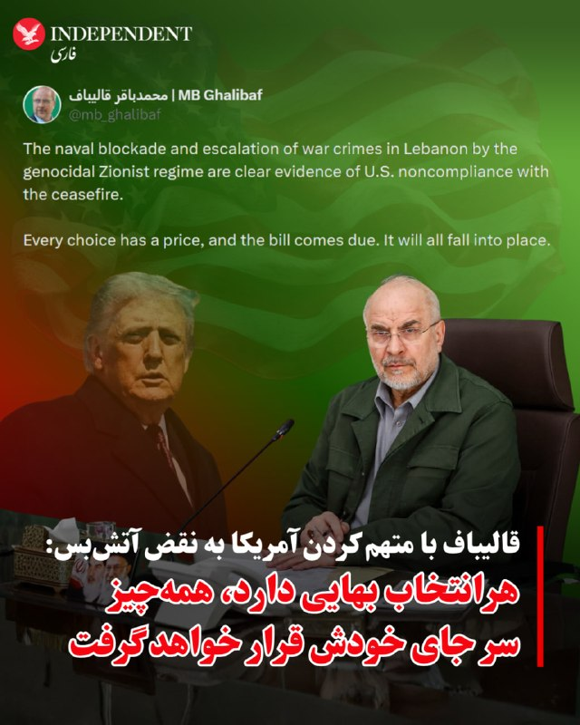

♦️محمدباقر قالیباف، رئیس مجلس شورای اسلامی و مذاکره‌کننده ارشد جمهوری اسلامی با آمریکا، روز دوشنبه ۱۱ خردادماه با انتشار پیامی در اکس، ایالات متحده را به‌دلیل ادامه محاصره تنگه هرمز و تداوم حملات اسرائیل به لبنان به «پایبند نبودن به آتش‌بس» متهم کرد و نوشت: «هر انتخاب، بهایی دارد. همه‌چیز سر جای خودش قرار خواهد گرفت.»

دونالد ترامپ ساعاتی پیش با انتشار پیامی در تروث سوشال نوشته بود: «همه‌چیز به خوبی پیش‌ خواهد رفت.»

قالیباف در این پیام نوشت: «محاصره دریایی و تشدید جنایات جنگی در لبنان توسط رژیم صهیونیستی نسل‌کش، گواه روشنی بر عدم پایبندی ایالات متحده به آتش‌بس است.
هر انتخابی بهایی دارد و صورتحساب آن از را می‌رسد. همه چیز سر جای خودش قرار خواهد گرفت.»
‌🇸🇦 Indypersian

🤖 @VahidOOnLine

## VahidOOnLine — post 243186

  

حساب محمدباقر قالیباف، رییس مجلس در شبکه ایکس، حملات اسرائیل به لبنان و ادامه محاصره دریایی ایران را نشانه‌ عدم پایبندی آمریکا به آتش‌بس خواند و افزود: «هر انتخابی بهایی دارد و زمان پرداخت آن فرا می‌رسد، در نهایت همه چیز در جای خود قرار خواهد گرفت.»

پیش از این نیز، اسماعیل بقائی، سخنگوی وزارت خارجه جمهوری اسلامی نیز گفته بود تغییر مواضع طرف آمریکایی و ادامه حملات اسرائیل به لبنان، از بزرگترین موانع رسیدن به توافق میان دو طرف است.
‌🏁 🇬🇧 IranintlTV

🤖 @VahidOOnLine

## VahidOOnLine — post 243185

  <a href="telegram/content/VahidOOnLine_243185_1780307055.mp4" target="_blank">🎬 Download video</a>

جاویدنام امین پیرو کَسبَخی، ۱۸ دی ۱۴۰۴ در بیستون رشت ناپدید شد و خبر کشته شدنش را ۱۹ دی به خانواده اعلام کردند. او با اصابت گلوله‌ای جنگی به سینه و قلبش کشته است.
ویدیوهای ارسال‌شده به ایران‌اینترنشنال در پی راه‌اندازی کارزار مردمی رشت، مراسم چهلم این جاویدنام را نشان می‌دهد.
‌🏁 🇬🇧 IranintlTV

🤖 @VahidOOnLine

## VahidOOnLine — post 243184

  <a href="telegram/content/VahidOOnLine_243184_1780307057.mp4" target="_blank">🎬 Download video</a>

♦️امانوئل مکرون، رئیس‌جمهوری فرانسه، صبح دوشنبه ۱۱ خردادماه با انتشار ویدیویی از توقیف نفتکش «تاگور» از مبداء روسیه در آب‌های اقیانوس اطلس خبر داد.

مکرون در این پیام نوشت که این عملیات با مشارکت همپیمانان بین‌المللی و از جمله بریتانیا انجام شده است.

رئیس جمهوری فرانسه تردد این نفتکش در آب‌های بین‌المللی را نقض تحریم‌های بین‌المللی در چهارمین سال جنگ اوکراین توصیف کرد و نوشت: «این کشتی حداقل موازین ناوبری را هم رعایت نمی‌کرد و تهدید برای محیط زیست و امنیت همه ما بود.»

توقیف این نفتکش در حالی انجام می‌شود که آمریکا برای بار دیگر معافیت نفت روی آب روسیه را تمدید کرده است. کشورهای اروپایی با این رویه واشنگتن به‌شدت مخالفند و می‌گویند فروش نفت روسیه در دوره گرانی این کالا به مسکو اجازه می‌دهد تا هزینه‌های جنگ اوکراین را تامین کند.
‌🇸🇦 Indypersian

🤖 @VahidOOnLine

## VahidOOnLine — post 243183

  

امانوئل مکرون، رییس‌جمهوری فرانسه، اعلام کرد نیروی دریایی این کشور یک نفتکش تحریمی مرتبط با روسیه را در آب‌های بین‌المللی متوقف و بازرسی کرده است.

مکرون دوشنبه در شبکه اجتماعی ایکس نوشت نیروهای فرانسوی صبح یک‌شنبه ۱۰ خرداد با ورود به نفتکش «تاگو» که از روسیه به حرکت درآمده بود، عملیات بازرسی این شناور را در اقیانوس اطلس انجام دادند.
به گفته رییس‌جمهوری فرانسه، این عملیات با حمایت چند کشور شریک از جمله بریتانیا و با رعایت کامل قوانین بین‌المللی دریانوردی صورت گرفته است.

مکرون تاکید کرد فعالیت کشتی‌هایی که با دور زدن تحریم‌های بین‌المللی به تامین مالی جنگ روسیه علیه اوکراین کمک می‌کنند، غیرقابل قبول است.

او هشدار داد این شناورها با نادیده گرفتن مقررات پایه‌ای ناوبری دریایی، علاوه بر نقض قوانین، «تهدیدی برای محیط زیست و امنیت همگان» به شمار می‌روند.
iranintl
‌🏁 🇬🇧 IranintlTV

🤖 @VahidOOnLine

## VahidOOnLine — post 243182

  <a href="telegram/content/VahidOOnLine_243182_1780307060.mp4" target="_blank">🎬 Download video</a>

⭕️آب در زاینده‌رود جاری شد

♦️کاربران شبکه‌های اجتماعی روز دوشنبه یازدهم خرداد با انتشار ویدیوهایی از جاری شدن آب در زاینده‌رود پس از ماه‌ها خشکی این رودخانه خبر دادند.

امسال و به‌لطف بارندگی‌های بیشتر در بسیاری از حوزه‌های آبگیر و بارش برف در مناطق کوهستانی، بسیاری از مناطق ایران پس از یک دوره طولانی تنش آبی، با خشکسالی دست و پنچه نرم نمی‌کنند. در روزهای گذشته، ویدیوهایی از جاری شدن آب از سد کوهرنگ به سوی دشت‌های مرکزی ایران در رسانه‌های داخلی منتشر شده بود.

با وجود بارندگی‌های گسترده در غرب، مرکز و حتی شرق ایران، مقام‌های سازمان آب می‌گویند استان‌های جنوبی رشته‌کوه البرزو همچنین هرمزگان، همچنان با مساله کمبود آب مواجهند.
‌🇸🇦 Indypersian

🤖 @VahidOOnLine

## VahidOOnLine — post 243181

  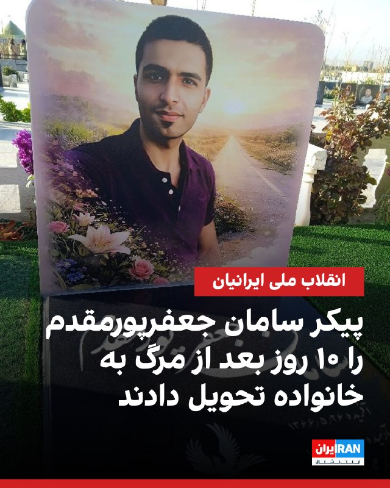

سامان جعفرپورمقدم، ۳۸ ساله و اهل فولادشهر اصفهان در جریان اعتراضات ۱۸ دی‌ماه کشته شد. او طی نخستین ساعات تجمعات اعتراضی در مقابل دادگستری فولادشهر، از پشت سر هدف گلوله جنگی قرار گرفت و پیکرش ۱۰ روز بعد به خانواده تحویل داده شد.

بنا بر روایت نزدیکانش، یکی از دوستان سامان با خانواده تماس گرفت و خبر مجروح شدن او را به پدرش داد.

پدر سامان بلافاصله خود را به بیمارستان رساند و با صحنه انتقال مجروحی غرق در خون به اورژانس مواجه شد که بعدتر مشخص شد فرزندش است.

شدت خونریزی سامان به حدی بود که تلاش‌ کادر درمان برای نجاتش نتیجه نداد و او در بیمارستان جان باخت.

به گفته شاهدان عینی، پس از جان‌باختن سامان، خانواده او را از بیمارستان بیرون کردند.

صبح روز بعد، زمانی که پدر سامان برای پیگیری وضعیت فرزندش به بیمارستان مراجعه کرد، به او گفته شد که حدود ساعت چهار صبح تمامی پیکرها از بیمارستان منتقل شده‌اند.

براساس این گزارش‌ها، خانواده پس از آن نزدیک به ۱۰ روز جست‌وجو، سرانجام در ۲۶ دی‌ماه پیکر سامان جعفرپورمقدم را از باغ رضوان اصفهان تحویل گرفتند و ۲۷ دی‌ماه، او را در آرامستان فولادشهر به خاک سپردند.
‌🏁 🇬🇧 IranintlTV

🤖 @VahidOOnLine

## VahidOOnLine — post 243180

  

تصاویر و اطلاعاتی درباره یکی از مجروحان اعتراض‌های دی‌ماه رشت به ایران اینترنشنال ارسال شده که نشان می‌دهد یک جوان ۱۹ ساله با گلوله‌های ساچمه‌ا‌ی در بدن به مدت چند ماه در بیمارستان بستری بوده و جراحت جدی به ریه‌اش وارد شده است.
‌🏁 🇬🇧 IranintlTV

🤖 @VahidOOnLine

## VahidOOnLine — post 243179

  

اسماعیل بقائی، سخنگوی وزارت خارجه جمهوری اسلامی، خطاب به کشورهای حاشیه خلیج فارس گفت: «از گذشته درس بگیرید و اجازه ندهید که آمریکا و اسرائیل از امکانات شما علیه جمهوری اسلامی استفاده کنند.»

او ادامه داد: «در اینکه برخی کشورهای منطقه با وجود هشدارهای ما، به تعهدات خود عمل نکردند، تردیدی نداریم.»

بقائی اضافه کرد: «ما با مردم کویت و سایر مردمان منطقه که خاک، حاکمیت، قلمرو و امکاناتشان از سوی اسرائیل و آمریکا برای حمله به یک کشور مسلمان مورد سوءاستفاده قرار می‌گیرد، ابراز همبستگی می‌کنیم.»
‌🏁 🇬🇧 IranintlTV

🤖 @VahidOOnLine

## VahidOOnLine — post 243178

  <a href="telegram/content/VahidOOnLine_243178_1780307064.mp4" target="_blank">🎬 Download video</a>

ویدیویی که به تازگی از اعتراضات دی‌ماه ۱۴۰۴ به دست ایران‌اینترنشنال رسیده، پیکر رهاشده یک جاویدنام را در یکی از خیابان‌های شهرک ولیعصر تهران نشان می‌دهد.
‌🏁 🇬🇧 IranintlTV

🤖 @VahidOOnLine

## VahidOOnLine — post 243177

  <a href="telegram/content/VahidOOnLine_243177_1780307065.mp4" target="_blank">🎬 Download video</a>

♦️اسماعیل بقایی، سخنگوی وزارت امور خارجه جمهوری اسلامی روز دوشنبه ۱۱ خردادماه و در پاسخ به پرسش خبرنگاران درباره گفته‌های دونالد ترامپ ناظر به خروج اورانیوم غنی‌شده از خاک ایران گفت درباره جزئیات موضوع هسته‌ای هیچ مذاکر‌ه‌ای نکرده‌ایم.

این سخنان در حالی مطرح می‌شود که دونالد ترامپ در آخرین پیام‌های خود علاوه بر خروج ذخایر اورانیوم از ایران، گفته بود شاید اورنیوم در خاک ایران و با هماهنگی جمهوری اسلامی و آمریکا نابود شود. ترامپ همچنین مخالفت خود را با انتقال ذخایر اورانیوم به‌شدت غنی‌شده به چین و روسیه اعلام کرده بود.
‌🇸🇦 Indypersian

🤖 @VahidOOnLine

## VahidOOnLine — post 243176

  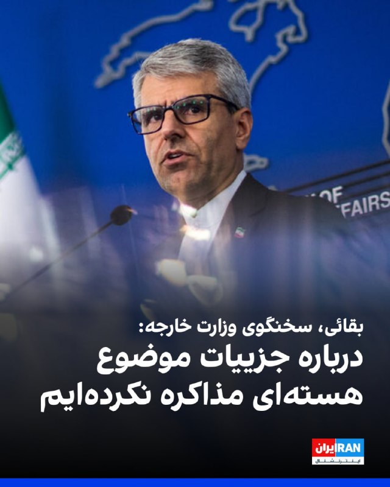

اسماعیل بقائی، سخنگوی وزارت خارجه جمهوری اسلامی در واکنش به سخنان ترامپ درباره خارج‌کردن ذخایر اورانیوم غنی‌شده از ایران، گفت که ما درباره جزییات موضوع هسته‌ای هیچ مذاکره‌ای نکرده‌ایم و اگر روزی لازم باشد در خصوص موضوعات هسته‌ای کاری انجام دهیم، می‌دانیم چکار کنیم.

او ادامه داد: مذاکره در دل «سوءظن شدید و بدگمانی» شروع شد و تبادل پیام در این فضا ادامه دارد.

بقائی افزود: «مقامات آمریکایی مکرر مواضع‌شان را تغییر می‌دهند، آنها باید هرچه زودتر به تصمیم مشخصی برسند.»
iranintl
‌🏁 🇬🇧 IranintlTV

🤖 @VahidOOnLine

## VahidOOnLine — post 243175

  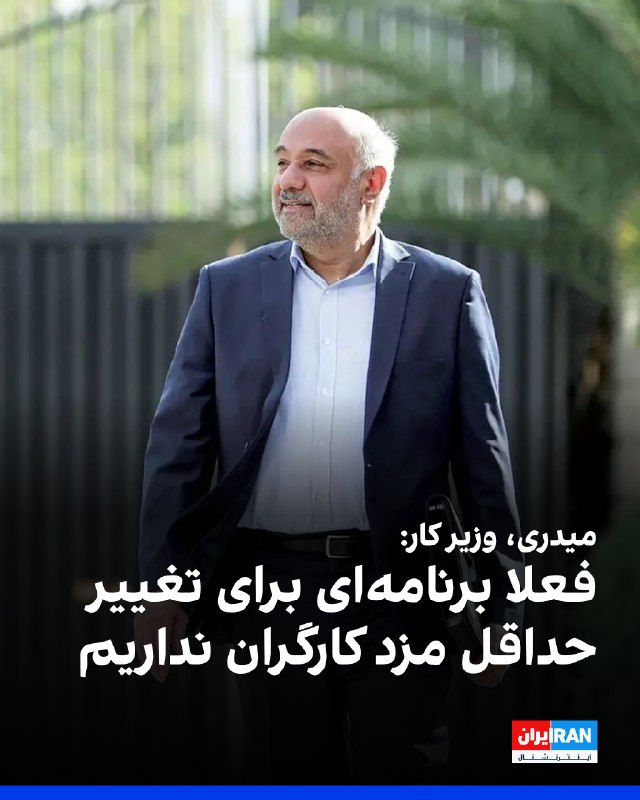

احمد میدری، وزیر کار و رفاه اجتماعی، گفت که «کالابرگ خرداد به روال ماه‌های قبل پرداخت می‌شود»، افزود: «بخش‌های مختلف دولت مانند سازمان برنامه به‌دنبال منابع جدید برای کالابرگ هستند، اما هنوز منابع جدیدی نداریم.»

او اضافه کرد: «فعلا برنامه‌ای برای تغییر حداقل مزد کارگران نداریم.»
‌🏁 🇬🇧 IranintlTV

🤖 @VahidOOnLine

## VahidOOnLine — post 243174

  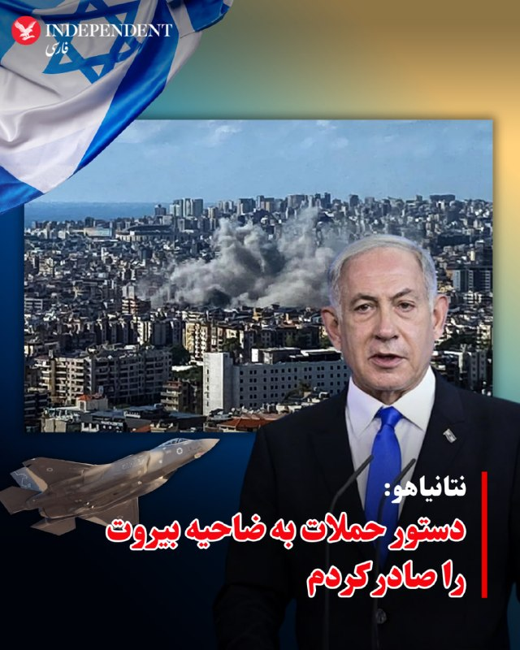

♦️بنیامین نتانیاهو، نخست وزیر اسرائیل روز دوشنبه ۱۱ خردادماه اعلام کرد دستور حمله دوباره به منطقه ضاحیه در جنوب بیروت، پایتخت لبنان را صادر کرده است.

این خبر درحالی منتشر می‌شود که براساس گزارش‌ها، مذاکرات میان لبنان و اسرائیل با میانجیگری آمریکا شکست خورده است.

با وجود برقراری «رسمی» آتش‌بس میان لبنان و اسرائیل و تمدید آن، درگیری‌ها میان دو طرف حتی یک روز هم متوقف نشده است. حزب‌الله مواضع ارتش اسرائیل در جنوب لبنان را روزانه و به‌ویژه با استفاده از پهپادهای هدایت شونده با فیبر نوری هدف قرار می‌دهد و اسرائیل «زیرساخت‌های حزب‌الله» در جنوب و شرق لبنان را عملا هر روز بمباران می‌کند.

ارتش اسرائیل صبح دوشنبه اعلام کرد یک سرباز دیگر این کشور در جریان درگیری‌ها در جنوب لبنان کشته شده است و به این ترتیب شمار کشته‌های نظامی این کشور از اسفندماه گذشته در جنگ با حزب‌الله، به ۲۶ نفر رسید.
وزارت بهداشت لبنان هفته گذشته اعلام کرد شمار قربانیان این کشور از اسفندماه گذشته، بیش از سه هزار نفر کشته شدند.
‌🇸🇦 Indypersian

🤖 @VahidOOnLine

## VahidOOnLine — post 243173

  

اسماعیل بقائی، سخنگوی وزارت خارجه جمهوری اسلامی، در نشست خبری خود گفت: «اسرائیل طی ۸۰ سال گذشته جنگ دائمی علیه کشورهای منطقه و با حمایت آمریکا به راه انداخته است.»

بقائی اضافه کرد: «آتش‌بس در لبنان بخش جدایی‌ناپذیر هرگونه توافق نهایی برای خاتمه جنگ است.»
‌🏁 🇬🇧 IranintlTV

🤖 @VahidOOnLine

## VahidOOnLine — post 243172

  

کاظم غریب‌آبادی، معاون حقوقی وزارت خارجه گفت که جمهوری اسلامی در شرایط جنگ، ترتیبات جدیدی برای کنترل عبور و مرور تعریف کرده و به هیچ کشوری اجازه دخالت نمی‌دهد.

غریب‌آبادی افزود: «آمریکا و رییس‌جمهورش با نقض حقوق بین‌الملل عمان را تهدید کرده‌اند، اما ما از عمان خواسته‌ایم تسلیم تهدیدها نشود و حاکمیت خود را در زمان صلح اعمال کند.»

او با بیان اینکه «تنگه هرمز دو دولت ساحلی بیشتر ندارد، جمهوری اسلامی و سلطنت عمان»، گفت: «هر ترتیبات حقوقی در زمان صلح باید با همکاری و مشورت با عمان باشد.»
‌🏁 🇬🇧 IranintlTV

🤖 @VahidOOnLine

## VahidOOnLine — post 243171

  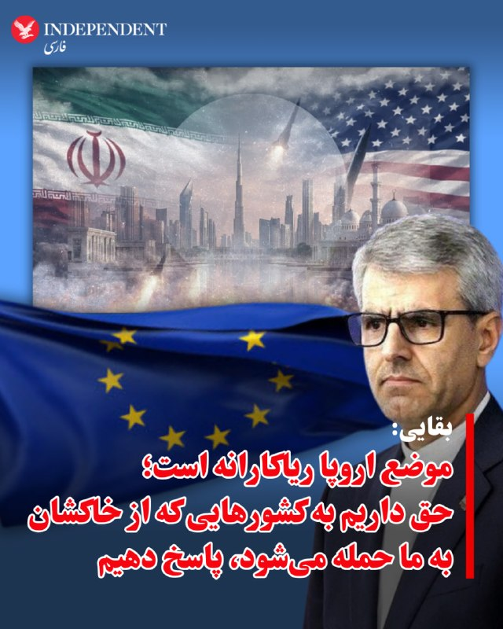

⭕️بقایی: موضع اروپا ریاکارانه است؛ حق داریم به کشورهایی که از خاکشان به ما حمله می‌شود، پاسخ دهیم

♦️اسماعیل بقایی، سخنگوی وزارت امور خارجه جمهوری اسلامی روز دوشنبه ۱۱ خردادماه با انتشار پیامی، از موضع اتحادیه اروپا در محکومیت حملات ایران به کشورهای حاشیه خلیج فارس به‌شدت انتقاد کرد.

روز گذشته اتحادیه اروپا حملات جمهوری اسلامی به کشورهای حوزه خلیج فارس را محکوم کرده بود. سپاه پاسداران هفته گذشته و امروز دوشنبه و پس از حمله به مواضع نظامی در بندرعباس و سیریک، به پایگاه‌های نظامی آمریکا در کویت حمله کرد.

بقایی در پیامی که در اکس منتشر شد، نوشت: «بیانیه اتحادیه اروپا در محکومیت ایران به خاطر اعمال حق مشروع دفاع از خود در برابر حملات غیرقانونی آمریکا با مبدا یک کشور همسایه جنوبی خلیج فارس، مثال آشکار نفاق و رویکرد دوگانه است؛ این بیانیه، ریاکارانه و غیرمسئولانه است.»

سخنگوی وزارت امور خارجه جمهوری اسلامی حملات ایران به اهداف نظامی آمریکا را«اقدام قانونی در چارچوب حق دفاع مشروع» توصیف کرد و نوشت: «دولت‌ها تعهد قانونی دارند که مانع از استفاده طرف‌های متجاوز از قلمرو و امکانات آنها برای تعرض به یک کشور دیگر شوند.»
‌🇸🇦 Indypersian

🤖 @VahidOOnLine

## VahidOOnLine — post 243170

  

بنیامین نتانیاهو، نخست‌وزیر اسرائیل خبر داد که به ارتش این کشور دستور داده، به اهدافی در حومه جنوبی بیروت حمله کنند.

همزمان یسرائیل کاتز، وزیر دفاع اسرائیل تاکید کرد که نتانیاهو و او، به ارتش دستور دادند، اهدافی را در منطقه ضاحیه بیروت هدف قرار دهد.

پیش‌تر یک مقام آمریکایی گفته بود که مارکو روبیو، وزیر خارجه ایالات متحده، با جوزف عون، رییس‌جمهوری لبنان، و بنیامین نتانیاهو، نخست‌وزیر اسرائیل، در مورد مذاکرات دیپلماتیک بین این دو کشور کفت‌وگو کرده و طرحی را برای «کاهش تدریجی تنش» پیشنهاد داده است.
‌🏁 🇬🇧 IranintlTV

🤖 @VahidOOnLine

## VahidOOnLine — post 243169

  <a href="telegram/content/VahidOOnLine_243169_1780307070.mp4" target="_blank">🎬 Download video</a>

ویدیوی ارسال‌شده به ایران‌اینترنشنال، استفاده ابزاری از کودکان را در ایست و بازرسی خیابان بنی‌هاشمی شیراز در شامگاه یکشنبه ۱۰ خرداد نشان می‌دهد.
‌🏁 🇬🇧 IranintlTV

🤖 @VahidOOnLine

## WithYashar — post 13136

گالانت : نتانیاهو اعلام کرده خاورمیانه دیگر جای حزب الله نیست و تا نابودی کامل جلو خواهیم رفت
@withyashar

## WithYashar — post 13135

قالیباف در توییتر(X):
«اعمال محاصرۀ دریایی و تشدید جنایات جنگی در لبنان توسط اسرائیل عدم پایبندی آمریکا به آتش‌بس است.

هر انتخابی، هزینه‌ای دارد و صورت‌حساب آن هم از راه می‌رسد؛ همه چیز سر جای خودش قرار خواهد گرفت.»
@withyashar

## WithYashar — post 13134

بنیامین نتانیاهو به همراه وزیر دفاع دستور حمله به ضاحیه بیروت را اعلام کردند
@withyashar

## WithYashar — post 13133

سخنگوی وزارت خارجه: ما حق دفاع مشروع در برابر نقض آتش‌بس توسط آمریکا را داریم و امروز هم مبدأ تجاوز به خاک کشور را هدف قرار دادیم.
@withyashar

## WithYashar — post 13132

ترامپ به نیوزویک : مردم ایران از من تشکر میکنند چون بجای یکبار، دوبار رژیم رو عوض کردم
@withyashar

## WithYashar — post 13131

داش جان جدت ری اکشن 🤣 رو باز کن

## WithYashar — post 13130

## WithYashar — post 13129

  

🥴🤣 @withyashar

## WithYashar — post 13128

اطلاعات تایید نشده بهم رسیده که اندیشه ترور هدفمند بوده شخص‌ مورد نظر مسئول قراردادهای بین صدا و سیما و قرارگاه خاتم‌الانبیا بود @withyashar

## WithYashar — post 13127

گزارش های از مشاهده خط شلیک موشک از همدان
@withyashar

## WithYashar — post 13126

صدای انفجار مهمات عمل نکرده اصفهان پادگان پانزده خرداد
@withyashar

## WithYashar — post 13125

البته توجه کنید که گفته بودند از قبل که خنثی سازی مهمات عمل نکرده دارن @withyashar ولی با توجه به اینکه سنتکام ساعتی پیش گفته حمله کرده و رادار زده هشیار باشید

## WithYashar — post 13124

گروه تروریستس ۳پا امروز در بیانیه‌ای اعلام کرد در واکنش به حمله ارتش آمریکا به یک دکل مخابراتی در جزیره سیریک، «مبدأ حمله» رو هدف قرار داده و هشدار داد در صورت تکرار این اقدامات، پاسخ متفاوتی خواهد داد.

کویت حوالی ۶ صبح از فعال شدن سامانه‌های پدافندی خود برای مقابله با حملات موشکی و پهپادی خبر داد ولی مبدأ حمله را اعلام نکرد
@withyashar

## WithYashar — post 13123

اتاق جنگ با شما : یاشار تتر داره کندل سبز میخوره همینجوری
این صداهای امروز مثل اینکه جدی تره
@withyashar
اتاق جنگ با شما :نهم اسفند هم همین ساعت ها بود داشتن حمله میکردند خدا به خیر کنه😂😂💔

## WithYashar — post 13122

## WithYashar — post 13121

صدای انفجار در اصفهان
@withyashar

## WithYashar — post 13120

دوباره صدای انفجار‌ در بندر
@withyashar

## WithYashar — post 13119

## WithYashar — post 13118

## WithYashar — post 13117

یعنی جنگ رو پنهان میکنن ؟؟

## mwarmonitor — post 9970

  

🔴پس از یک توقف ۱۲روزه در بندر سنگاپور، ناو USS Boxer در تاریخ ۳۰ مه دوباره وارد دریای چین جنوبی شد.

@mwarmonitor

## mwarmonitor — post 9969

🔴بر اساس بیانیه‌ای مشترک، بنیامین نتانیاهو نخست‌وزیر و یسرائیل کاتس وزیر دفاع اعلام کردند که به ارتش اسرائیل دستور داده‌اند مواضع حزب‌الله را در منطقه الضاحیه در بیروت هدف قرار دهد.

🔸به گفته آن‌ها، این تصمیم در واکنش به «نقض‌های مکرر آتش‌بس در لبنان و حملات به شهرها و غیرنظامیان اسرائیل» اتخاذ شده است.

@mwarmonitor

## mwarmonitor — post 9968

🔴«ایران واقعاً می‌خواهد توافق کند، و این توافق خوبی برای ایالات متحده و کسانی که با ما هستند خواهد بود. اما آیا دموکرات‌های نادان (دموکرات‌نماها)* و برخی جمهوری‌خواهانِ به‌ظاهر غیروطن‌پرست درک نمی‌کنند که وقتی شبه‌سیاسیونِ جیره‌خوار (بوقچی‌های سیاسی) مدام در سطوحی بی‌سابقه و بارها و بارها با لحنی منفی "جیک‌جیک" می‌کنند [نق می‌زنند] که من باید سریع‌تر حرکت کنم، یا کندتر حرکت کنم، یا به جنگ بروم، یا به جنگ نروم، یا هر چیز دیگری، انجام درست وظیفه‌ام و مذاکره کردن برای من بسیار سخت‌تر می‌شود؟ فقط بنشینید و آرام باشید، در نهایت همه چیز به خوبی پیش خواهد رفت؛ همیشه همین‌طور می‌شود!

رئیس‌جمهور دونالد جی ترامپ»

@mwarmonitor

## pm_afshaa — post 92000

#مهم عزیزای دلم همگی الان چنل زاپاس‌مون رو جوین بشید کانال تحت ریپورت شدیده اگه چیزی شد زاپاس رو داشته باشید فعالیت میاد اونور
👇 https://t.me/pmtvzapas https://t.me/pmtvzapas

## pm_afshaa — post 91999

🔴گالانت : نتانیاهو اعلام کرده خاورمیانه دیگر جای حزب الله نیست و تا نابودی کامل جلو خواهیم رفت

💧 Rainbet.com the #1 Non-KYC Crypto Casino & Sportsbook @rainbetcom

😁 @Pm_Afshaa

## pm_afshaa — post 91998

سپاه:اگر حمله‌ای در بیروت انجام شود، قصد دخالت خواهیم کرد

💧 Rainbet.com the #1 Non-KYC Crypto Casino & Sportsbook @rainbetcom

😁 @Pm_Afshaa

## pm_afshaa — post 91997

#مهم
عزیزای دلم همگی الان چنل زاپاس‌مون رو جوین بشید کانال تحت ریپورت شدیده اگه چیزی شد زاپاس رو داشته باشید فعالیت میاد اونور
👇

https://t.me/pmtvzapas
https://t.me/pmtvzapas

## pm_afshaa — post 91996

🔴پدافند هوایی کویت برای مقابله با پرتابه های جمهوری اسلامی فعال شد

💧 Rainbet.com the #1 Non-KYC Crypto Casino & Sportsbook @rainbetcom

😁 @Pm_Afshaa

## pm_afshaa — post 91995

  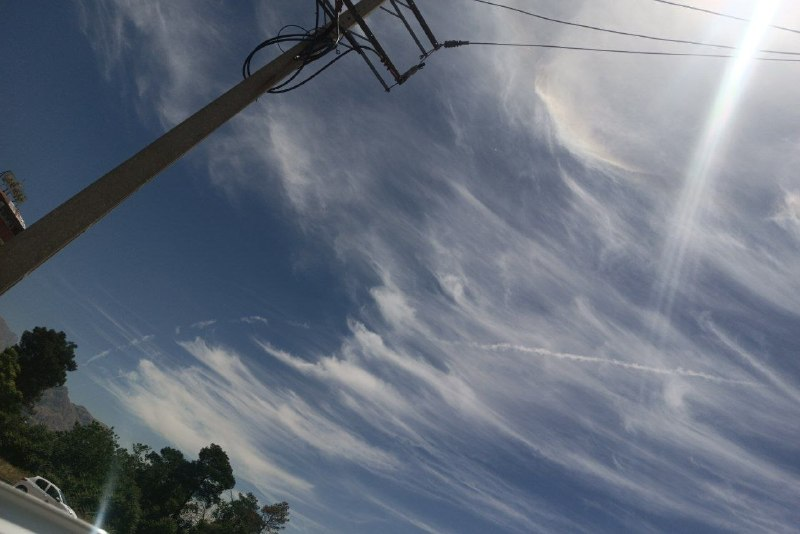

کرمانشاه هم اکنون

💧 Rainbet.com the #1 Non-KYC Crypto Casino & Sportsbook @rainbetcom

😁 @Pm_Afshaa

## pm_afshaa — post 91994

ترامپ به نیوزویک: مردم ایران از من تشکر میکنند چون بجای یکبار، دوبار رژیم رو عوض کردم

💧 Rainbet.com the #1 Non-KYC Crypto Casino & Sportsbook @rainbetcom

😁 @Pm_Afshaa

## pm_afshaa — post 91993

🔴حملات سنگین اسراییل به جنوب لبنان

💧 Rainbet.com the #1 Non-KYC Crypto Casino & Sportsbook @rainbetcom

😁 @Pm_Afshaa

## pm_afshaa — post 91992

  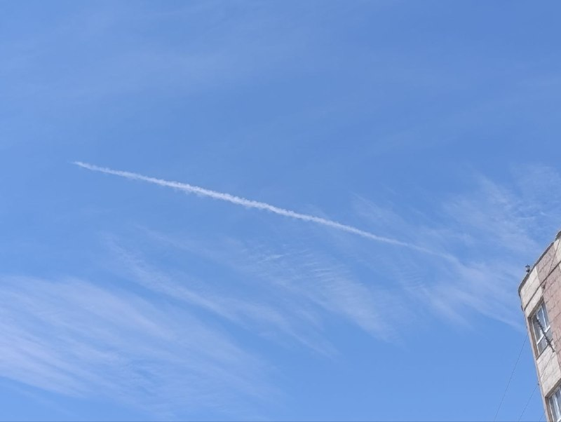

پرتاب موشک از ایلام

💧 Rainbet.com the #1 Non-KYC Crypto Casino & Sportsbook @rainbetcom

😁 @Pm_Afshaa

## pm_afshaa — post 91991

  

شلیک موشک از کرمانشاه

💧 Rainbet.com the #1 Non-KYC Crypto Casino & Sportsbook @rainbetcom

😁 @Pm_Afshaa

## pm_afshaa — post 91990

🔴ارتش اسرائیل طبق دستور ‌نتانیاهو و وزیر دفاع، در بیروت حمله شدیدی انجام خواهند داد

💧 Rainbet.com the #1 Non-KYC Crypto Casino & Sportsbook @rainbetcom

😁 @Pm_Afshaa

## pm_afshaa — post 91989

  

از همدان موشک شلیک شد

💧 Rainbet.com the #1 Non-KYC Crypto Casino & Sportsbook @rainbetcom

😁 @Pm_Afshaa

## pm_afshaa — post 91988

🔴منابع عبری:دستورات نتانیاهو برای هدف قرار دادن حومه جنوبی با هماهنگی آمریکا انجام شده

💧 Rainbet.com the #1 Non-KYC Crypto Casino & Sportsbook @rainbetcom

😁 @Pm_Afshaa

## pm_afshaa — post 91987

  <a href="telegram/content/pm_afshaa_91987_1780307075.webm" target="_blank">🎬 Download video</a>

📢 بازم می‌رسیم به حرف‌های ⁧نوید افکاری⁩؛
‏ملت شریف ایران!
سکوت شما یعنی حمایت از ظلم و ظالم...

🔺 @Pm_Afshaa

## pm_afshaa — post 91986

پرتاب موشک از خوزستان به سمت کویت 
💧 Rainbet.com the #1 Non-KYC Crypto Casino & Sportsbook @rainbetcom 
😁 @Pm_Afshaa

## pm_afshaa — post 91985

🔴سنتکام:حملات هوایی دقیق به سایت‌های راداری و فرماندهی و کنترل پهپادی ایران طی روزهای شنبه و یکشنبه در جزیره قشم و دیگر مناطق ایران انجام شد

💧 Rainbet.com the #1 Non-KYC Crypto Casino & Sportsbook @rainbetcom

😁 @Pm_Afshaa

## pm_afshaa — post 91984

  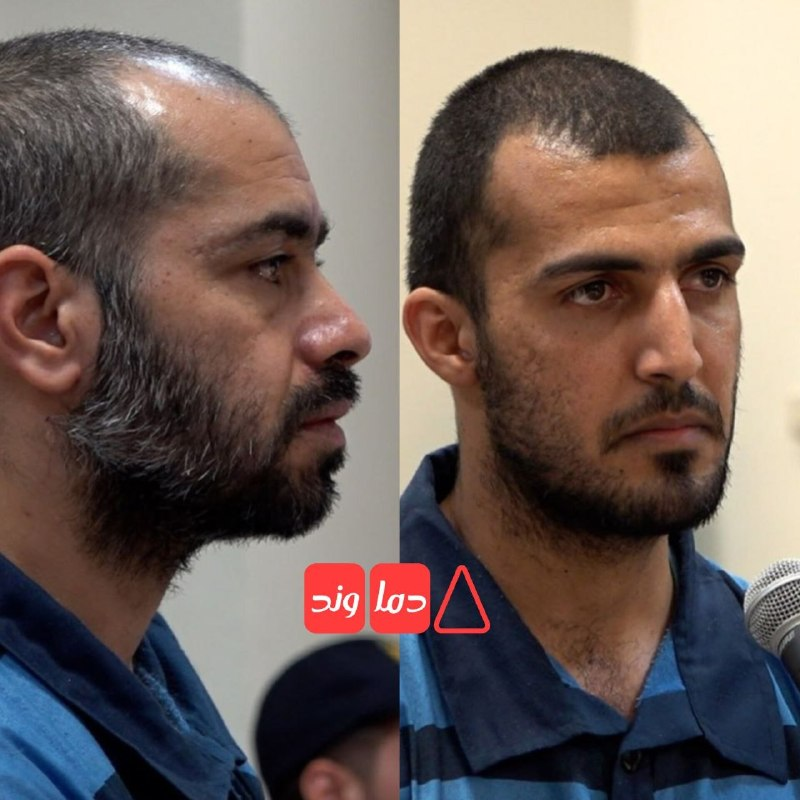

قوه قضائیه جمهوری جنایتکار اسلامی، صبح امروز و همزمان با اذان صبح، مهرداد محمدی‌نیا و اشکان مالکی را به اتهام «آتش زدن مسجد جعفری در محله گیشا تهران» و «انسداد خیابان‌ها» اعدام کرد...

💧 Rainbet.com the #1 Non-KYC Crypto Casino & Sportsbook @rainbetcom

😁 @Pm_Afshaa

## pm_afshaa — post 91983

پرتاب موشک از خوزستان به سمت کویت

💧 Rainbet.com the #1 Non-KYC Crypto Casino & Sportsbook @rainbetcom

😁 @Pm_Afshaa

## pm_afshaa — post 91982

🔴انفجار های شنیده شده در بندر عباس ناشی از مهمات باقی مانده زمان جنگه

💧 Rainbet.com the #1 Non-KYC Crypto Casino & Sportsbook @rainbetcom

😁 @Pm_Afshaa

## pm_afshaa — post 91981

توییت اکانت جمهوری اسلامی:مردم جرعت دارن بیان خیابون، یه جوری قتل عام میکنیم که مراد ویسی تا چند سال طول بکشه اسم همه جاوید نام هارو بخونه 
💧 Rainbet.com the #1 Non-KYC Crypto Casino & Sportsbook @rainbetcom 
😁 @Pm_Afshaa

## DEJradio — post 5202

  <a href="telegram/content/DEJradio_5202_1780307076.webm" target="_blank">🎬 Download video</a>

🔺📢 کالبدشکافی سیاست قطع اینترنت

*آیسان قاسم‌پور، روانشناس بالینی

#قطع_اینترنت
@DEJradio

## DEJradio — post 5201

  <a href="telegram/content/DEJradio_5201_1780307076.webm" target="_blank">🎬 Download video</a>

🔺🎤 «بدون هنر، هیچ جنبش اجتماعی ماندگار نمی‌شود»

شاهین نجفی، خواننده، ترانه‌سرا و آهنگساز ایرانی در گفت‌وگو با دژ بر جایگاه هنر در جنبش‌های اجتماعی تأکید کرد.

#جنبش #هنر
@DEJradio

## DEJradio — post 5198

  <a href="telegram/content/DEJradio_5198_1780307077.webm" target="_blank">🎬 Download video</a>

🚨📷 سـ.ـپاه پاسداران هفتم خرداد ۱۴۰۵ یک نفتکش را حوالی تنگه هرمز هدف قرار داد. اکنون تصاویر ماهواره‌ای تأیید می‌کند چهار قایف تندرو به این کشتی نزدیک شدند. این نفتکش حدود ۲۵۲ متر طول توسط قایق‌های سـ.ـپاه محاصره شده بود. منابع حکومتی مدعی شدند نفتکش متعلق به آمریکاست.

#تنگه_هرمز #IRGCterrorists
@DEJradio

## DEJradio — post 5197

  <a href="telegram/content/DEJradio_5197_1780307077.mp4" target="_blank">🎬 Download video</a>

🔺🎥 پیامدهای جنگ ۴۰ روزه؛
ویرانه‌های کلانتری ۱۶۹ مشیریه تهران

یکی از مخاطبان دژ با ارسال ویدیویی از تخریب این کلانتری نوشت، ادعای پیروزی هم می‌کنند اما حتی توان ندارند ویرانه‌ها را جمع کنند.

#جنگ۴۰روزه #تهران #جنگ
@DEJradio

## DEJradio — post 5196

  

🛩️
🔥 فرماندهی مرکزی ایالات متحده (سنتکام) اعلام کرد روزهای شنبه و یکشنبه نهم و دهم خردادماه اهدافی در جنوب ایران را هدف قرار داده است.

در بیانیه سنتکام تأکید شد این حملات علیه سایت‌های راداری و فرماندهی و کنترل پهپادهای حکومت ایران در منطقه روستایی گورک و جزیره قشم انجام شد.

فرماندهی مرکزی ایالات متحده افزود: «این حملات سنجیده و حساب‌شده در پاسخ به اقدامات تهاجمی ایران از جمله سرنگونی یک پهپاد ام‌کیو یک آمریکایی که بر فراز آب‌های بین‌المللی در حال پرواز بود.»

سنتکام نوشت: «جنگنده‌های آمریکایی به سرعت با از بین بردن پدافند هوایی ایران، یک ایستگاه کنترل زمینی و دو پهپاد انتحاری که تهدید آشکاری برای کشتی‌های عبوری از آب‌های منطقه‌ای ایجاد می‌کردند، واکنش نشان دادند» و «هیچ یک از نیروهای نظامی آمریکایی آسیب ندیدند.»
سـ.ـپاه پاسداران در اطلاعیه‌ای از «هدف قرار گرفتن مبدا» ‌حمله ارتش آمریکا به «یک دکل مخابراتی در جزیره سیریک در استان هرمزگان» خبر داد.

#قشم #هرمزگان #جنگ
@DEJradio

## DEJradio — post 5195

  <a href="telegram/content/DEJradio_5195_1780307079.webm" target="_blank">🎬 Download video</a>

🔺📢 در پی حملات گسترده ارتش اسرائیل به مواضع گروه تروریستی حـ.ـزب‌الله لبنان در منطقه دسرالزهرانی، دست‌کم ۱۰ نفر کشته و ۱۸ نفر مجروح شدند. حال برخی مجروحان وخیم است.

بنیامین نتانیاهو، نخست‌وزیر اسرائیل گفته بود که ارتش این کشور با قدرت به حملات علیه حزب‌الله ادامه خواهد داد.

#لبنان #جنگ
@DEJradio

## VahidOnline — post 75841

پیام‌های دریافتی از تهران درباره صدای پرواز یک جنگنده یا هواپیمایی دیگر مربوط به جمهوری اسلامی:

سلام تهران صدای جنگنده اومد همین الان

غرب تهران وحشتناک صدا جنگنده میاد ۹:۱۵

صدای جنگنده داره میاد غرب تهرانم ساعت ۹.۱۴

سلام وحید همین الان تهران صدای جنگنده میومد نزدیک ۲ دقیقه

شمال شرق تهران صدای جنگنده

سلام تهران صدا جنگنده شدید

الان از بالا سر ما صدای جنگنده اومد
رد شد رفت

همین الان منطقه گیشا صدای جنگنده میاد

همین الان ساعت ۹:۱۵ دقیقه صدای جنگنده سمت غرب تهران اومد(فکر میکنم جنگنده ارتش بوده باشه)

سلام وحید از سمت لویزان تهران موشک بلند شد

وحید الان ساعت ۹:۱۵ صدا جت منطقه ۲ تهران

تهران-فرمانيه
ساعت 9;16 صداي جنگنده مياد

وحید تهران ساعت ۹:۱۷ صدا جت میاد زیاد
هروی

الو سلام تهران سمت شهرک غرب صدای نمیدونم هواپیما بود جنگنده بود چی بود خیلی نزدیک بود

الان ساعت ۹:۱۷ دقیقه در قیطریه صدای جنگنده اومد

شرق تهران صدای جنگنده شنیده شد الان

سلام تهران صدا جنگنده شدید
احتمالا جنگنده های خودشونه
ساعت۹:۱۷

سلام دوشنبه تهران ساعت ۹:۱۵ صدا جنگنده من شنیدم سمت هروی

صدای جنگنده تهران ۹:۱۷

صدای جنگنده منطقه ۳
خیلی پایین بود

تهران صدای جنگنده اومد

سلام ساعت ۹:۱۵ سمت دروس تهران صدای جنگنده اومد

صدای جنگنده شمال تهران ساعت ۹:۱۵ رقیقه

سلام ساعت ۰۹۱۵ دوشنبه صدای پرواز چند جنگنده شمال تهران

منطقه ۳ صدای جنگنده انقدر زیاد و وحشتناک بود که از خواب بیدار شدم

سلام پاسدارانیم صدای جنگنده اومد چند دقیقه پیش

صدای جنگده نارمک

سلام وحید. صدایی که ۹:۱۵ اومد شبیه جنگنده بود ولی از پنجره نگاه کردم شبیه هواپیمای مسافربری بود فقط نمیدونم چرا از ارتفاع کم حرکت میکرد

سلام آقا وحید من خونم گیشاسصدای جنگنده نبود هواپیما بود من بالای خونه رفتم دیدم ولی هواپیما بزرگ بود ی مقدار دیگه باری بود یا سواری نمیدونم ولی از بالای گیشا رد شد

من از روستای اطراف شهریارهستم یه هواپیمای مسافربری بزرگ تو ارتفاع پایین از بالا سرمون رد شد به وضوح دیدمش صداش زیاد بود

سلام وقت بخیر نیاورانم صدای جنگنده اومد وحشتناک بود

وحید من شهرک محلاتیم
بین ۹:۱۵ تا ۹:۲۰ صدای جنگنده میومد
(با ارتفاع پایین)

سلام وحید جان صدای وحشتناک جنگنده ۳ ۴ دقیقه پیش خونرو لرزوند

-هواپیمای کارگو سپاه از تهران بلند شد.
-صدای جنگنده برای این بود؟
-ممکنه برای اسکورتش بوده باشه
J74wabx

📡 @VahidOnline

## VahidOnline — post 75840

پیام‌های دریافتی از #بندرعباس درباره شنیده شدن صدای سه انفجار:

بندرعباس ساعت ۹:۰۷ سه تا انفجار

الان بندرعباس ساعت 9:7 دقیقه 3انفجار قوی

یک صداهایی شبیه برخورد جسم سنگین (بمب یا هرچی) به زمین داره میاد از دوردست.
بندرعباس ساعت ۹:۰۹ صبح دوشنبه

سه تا صدای انفجار اومد بندرعباس
ساعت ۹ و هشت دقیقه

دوشنبه، ۱۱ خرداد ۹:۰۷ صبح. بندرعباس.
صدای ۳ تا انفجار از نزدیکی پایگاه هوایی شنیده شد.

آپدیت:
خبرگزاری تسنیم وابسته به سپاه مدعی شده که مربوط به مهمات خنثی نشده بوده. البته دو روز پیش‌تر از این هم اعلام کرده بودند که طی ۷۲ ساعت آینده قراره از این صداها شنیده بشه در بندرعباس.

پیام‌های دریافتی از #اصفهان درباره شنیده شدن دو صدای انفجار از دور:

پیام ساعت ۹:۱۷: اصفهان صدای انفجار میاد، دو بار پشت سر هم

اصفهان همین الان صدای انفجار اومد سمت ناحیه ۶

الان اصفهان یه صدایی مثل صدای انفجار اومد

سلام وحید، اصفهان ساعت ۹:۱۸ ۲تا صدا مثل انفجار و کمی لرزش حس کردم فاصلش خیلی دور بود، بین ساعت ۸ تا ۹ هم یک صدای مشابه اومد فکر کردم توهم زدم

اصفهان صدا انفجار نزدیکای جی شیر(مطمئن نیستم)

سلام. اصفهان حدود ساعت ۹:۱۵ صدای ۲ تا انفجار به فاصله چند ثانیه.
نمی دونم چیزی زدن یا دارند مهمات خنثی می کنند. البته تقریبا هر روز صبح یه صدا میاد که به خنثی سازی میخوره.
امروز ۲ تا پشت سر هم بود.

📡 @VahidOnline

## VahidOnline — post 75839

  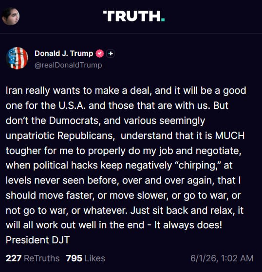

پست ترامپ، ترجمه ماشین:
ایران واقعاً می‌خواهد به توافق برسد، و این توافق برای ایالات متحده آمریکا و کسانی که با ما هستند، توافق خوبی خواهد بود.
اما آیا دموکرات‌های کودن و بعضی جمهوری‌خواهانِ ظاهراً غیرمیهن‌دوست نمی‌فهمند وقتی سیاسی‌کارها مدام و با شدتی بی‌سابقه غر می‌زنند که باید سریع‌تر حرکت کنم، یا کندتر، یا جنگ کنم، یا جنگ نکنم، یا هر چیز دیگری، کار درست و مذاکره برای من خیلی سخت‌تر می‌شود؟

فقط بنشینید و آرام باشید؛ در پایان همه‌چیز خوب پیش خواهد رفت — همیشه همین‌طور است!

رئیس‌جمهور، دی‌جی‌تی
realDonaldTrump

📡 @VahidOnline

## VahidOnline — post 75838

پیام‌های دریافتی:
امیدیه خوزستان صدای انفجار شنیده میشه

از امیدیه خوزستان پیام میدم
طرفای ساعت ۸:۱۳ دقیقه صدای ترکیدن اومد
ساعت ۸:۳۱ دوباره زدن

همین چند دقیقه پیش صدای انفجار واضح ای اومد

امیدیه هستم و صدای دوتا انفجار شدید ساعت 8:33 اومدش.

📡 @VahidOnline

## VahidOnline — post 75836

قوه قضائیه جمهوری اسلامی اعلام کرد که دو نفر دیگر از معترضان دی‌ماه ۱۴۰۴ را به اتهام «آتش‌زدن مسجد [گیشا]»، «لیدری کودتا»، «تخریب اموال عمومی» و «مسدودسازی خیابان‌ها» اعدام کرده است.

نام این دو معترض که بامداد دوشنبه یازدهم خرداد اعدام شدند، مهرداد محمدی‌نیا و اشکان مالکی اعلام شده است.

میزان نوشته این دو «از عوامل اصلی آتش‌زدن مسجد جعفری در محله کوی نصر تهران [بودند] که اقدام به تخریب و آتش‌زدن مسجد، تخریب اموال عمومی، درگیری با مأموران حافظان امنیت، انسداد خیابان‌ها و ممانعت از عبور و مرور مردم کرده بودند.»

دستگاه قضایی جمهوری اسلامی در ماه‌های اخیر به شکل تقریباً روزانه اقدام به اجرای احکام اعدام معترضان و یا افرادی می‌کند که آن‌ها را به همکاری با آمریکا و اسرائیل متهم می‌کند. برخی نهادهای حقوق‌بشری می‌گویند جمهوری اسلامی از اعدام برای ایجاد فضای ترس و به‌عنوان عامل سرکوب استفاده می‌کند.
@VahidHeadline

📡 @VahidOnline

## IranIntlTV — post 340008

  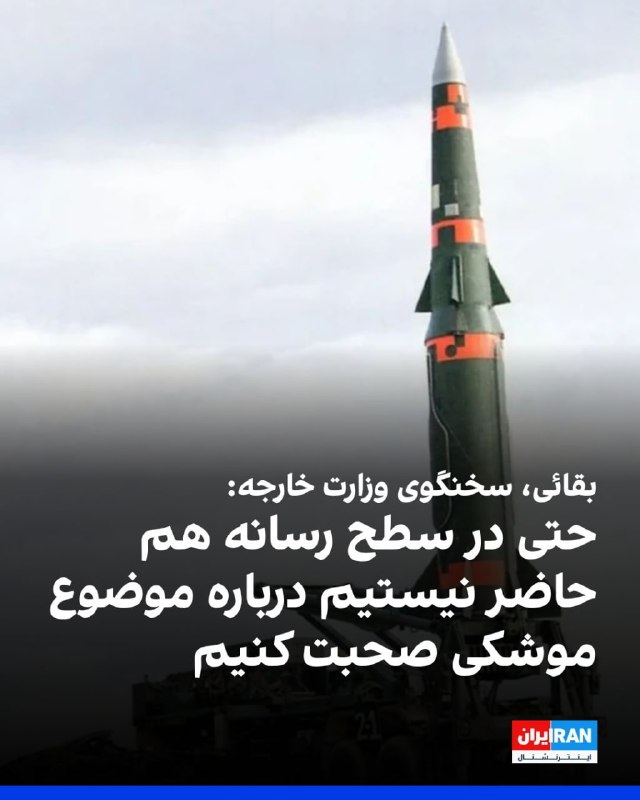

اسماعیل بقائی، سخنگوی وزارت خارجه جمهوری اسلامی، درباره موضوع موشکی و مذاکره درباره آن، گفت که بارها اعلام کرده‌ایم حتی در سطح رسانه هم حاضر نیستیم درباره موضوعاتی که به دفاع از «کیان ایران» مربوط می‌شود، صحبت کنیم.

بقائی همچنین افزود: «هرگونه اقدام ناتو در خلیج فارس، منجر به پیچیده‌تر شدن اوضاع خواهد شد.»
iranintl.com/202606019227

## IranIntlTV — post 340007

  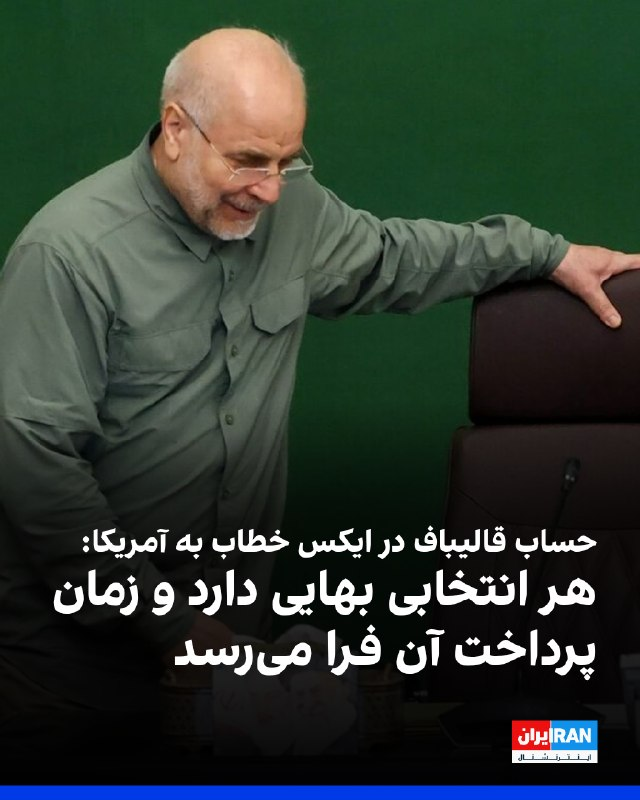

حساب محمدباقر قالیباف، رییس مجلس در شبکه ایکس، حملات اسرائیل به لبنان و ادامه محاصره دریایی ایران را نشانه‌ عدم پایبندی آمریکا به آتش‌بس خواند و افزود: «هر انتخابی بهایی دارد و زمان پرداخت آن فرا می‌رسد، در نهایت همه چیز در جای خود قرار خواهد گرفت.»

پیش از این نیز، اسماعیل بقائی، سخنگوی وزارت خارجه جمهوری اسلامی نیز گفته بود تغییر مواضع طرف آمریکایی و ادامه حملات اسرائیل به لبنان، از بزرگترین موانع رسیدن به توافق میان دو طرف است.
https://iranintl.com/202606015506

## IranIntlTV — post 340006

  <a href="telegram/content/IranIntlTV_340006_1780307080.mp4" target="_blank">🎬 Download video</a>

جاویدنام امین پیرو کَسبَخی، ۱۸ دی ۱۴۰۴ در بیستون رشت ناپدید شد و خبر کشته شدنش را ۱۹ دی به خانواده اعلام کردند. او با اصابت گلوله‌ای جنگی به سینه و قلبش کشته است.
ویدیوهای ارسال‌شده به ایران‌اینترنشنال در پی راه‌اندازی کارزار مردمی رشت، مراسم چهلم این جاویدنام را نشان می‌دهد.

## IranIntlTV — post 340005

  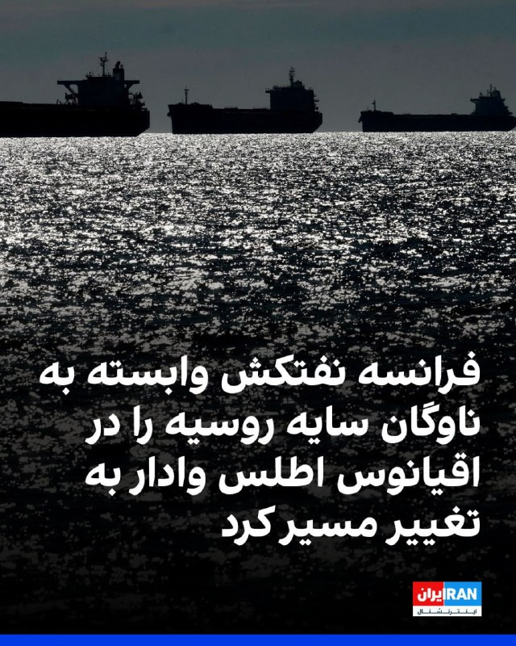

امانوئل مکرون، رییس‌جمهوری فرانسه، اعلام کرد نیروی دریایی این کشور یک نفتکش تحریمی مرتبط با روسیه را در آب‌های بین‌المللی متوقف و بازرسی کرده است.

مکرون دوشنبه در شبکه اجتماعی ایکس نوشت نیروهای فرانسوی صبح یک‌شنبه ۱۰ خرداد با ورود به نفتکش «تاگو» که از روسیه به حرکت درآمده بود، عملیات بازرسی این شناور را در اقیانوس اطلس انجام دادند.
به گفته رییس‌جمهوری فرانسه، این عملیات با حمایت چند کشور شریک از جمله بریتانیا و با رعایت کامل قوانین بین‌المللی دریانوردی صورت گرفته است.

مکرون تاکید کرد فعالیت کشتی‌هایی که با دور زدن تحریم‌های بین‌المللی به تامین مالی جنگ روسیه علیه اوکراین کمک می‌کنند، غیرقابل قبول است.

او هشدار داد این شناورها با نادیده گرفتن مقررات پایه‌ای ناوبری دریایی، علاوه بر نقض قوانین، «تهدیدی برای محیط زیست و امنیت همگان» به شمار می‌روند.
iranintl.com/202606016970

## IranIntlTV — post 340004

  

🔻از میان سه بازیکن گران‌قیمت فوتبال ایران در سایت ترانسفرمارکت، تنها مهدی قایدی در فهرست تیم ملی برای جام جهانی ۲۰۲۶ حضور دارد. سردار آزمون با ارزش ۶ میلیون یورو و اللهیار صیادمنش با ارزش ۳ میلیون یورو، با وجود فصل موفق در سطح باشگاهی، از سوی امیر قلعه‌نویی دعوت نشدند.

🔹سردار آزمون، مهاجم شباب الاهلی در حالی از تیم ملی کنار گذاشته شده که فصل موفقی را در امارات متحده عربی پشت سر گذاشت و ستاره‌ تیمش بود. حذف او در شرایطی رخ داده که طی ماه‌های اخیر به دلیل مواضعش علیه جمهوری اسلامی و همچنین انتشار تصویری در کنار حاکم دبی، با حواشی فراوانی روبه‌رو شد.

🔹اللهیار صیادمنش نیز دیگر غایب بزرگ فهرست تیم ملی است. مهاجم وسترلو بلژیک فصل خوبی را پشت سر گذاشت و از بازیکنان تاثیرگذار تیمش بود، اما جایی در فهرست نهایی پیدا نکرد.

🔹این در حالی است که علیرضا جهانبخش با وجود سقوط تیمش در لیگ بلژیک و ثبت تنها حدود ۹۰۰ دقیقه بازی در طول فصل، همچنان در فهرست تیم ملی حضور دارد؛ موضوعی که انتقادها نسبت به تصمیمات کادر فنی را افزایش داده و پرسش‌هایی درباره نقش عوامل غیرفنی در انتخاب نفرات تیم ملی به وجود آورده است.

@iranintltvsport

## IranIntlTV — post 340003

  

سامان جعفرپورمقدم، ۳۸ ساله و اهل فولادشهر اصفهان در جریان اعتراضات ۱۸ دی‌ماه کشته شد. او طی نخستین ساعات تجمعات اعتراضی در مقابل دادگستری فولادشهر، از پشت سر هدف گلوله جنگی قرار گرفت و پیکرش ۱۰ روز بعد به خانواده تحویل داده شد.

بنا بر روایت نزدیکانش، یکی از دوستان سامان با خانواده تماس گرفت و خبر مجروح شدن او را به پدرش داد.

پدر سامان بلافاصله خود را به بیمارستان رساند و با صحنه انتقال مجروحی غرق در خون به اورژانس مواجه شد که بعدتر مشخص شد فرزندش است.

شدت خونریزی سامان به حدی بود که تلاش‌ کادر درمان برای نجاتش نتیجه نداد و او در بیمارستان جان باخت.

به گفته شاهدان عینی، پس از جان‌باختن سامان، خانواده او را از بیمارستان بیرون کردند.

صبح روز بعد، زمانی که پدر سامان برای پیگیری وضعیت فرزندش به بیمارستان مراجعه کرد، به او گفته شد که حدود ساعت چهار صبح تمامی پیکرها از بیمارستان منتقل شده‌اند.

براساس این گزارش‌ها، خانواده پس از آن نزدیک به ۱۰ روز جست‌وجو، سرانجام در ۲۶ دی‌ماه پیکر سامان جعفرپورمقدم را از باغ رضوان اصفهان تحویل گرفتند و ۲۷ دی‌ماه، او را در آرامستان فولادشهر به خاک سپردند.
https://iranintl.com/

## IranIntlTV — post 340002

  

تصاویر و اطلاعاتی درباره یکی از مجروحان اعتراض‌های دی‌ماه رشت به ایران اینترنشنال ارسال شده که نشان می‌دهد یک جوان ۱۹ ساله با گلوله‌های ساچمه‌ا‌ی در بدن به مدت چند ماه در بیمارستان بستری بوده و جراحت جدی به ریه‌اش وارد شده است.
https://iranintl.com/202606014018

## IranIntlTV — post 340001

  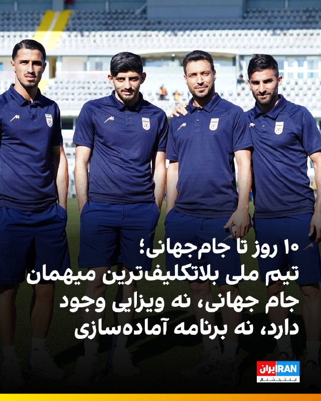

🔻در فاصله ۱۰ روز مانده به آغاز مسابقات جام جهانی ۲۰۲۶، تیم ملی فوتبال ایران در بحرانی بی‌سابقه گرفتار شده است؛ به‌طوری که به گفته امیر قلعه‌نویی، سرمربی تیم ملی، تمام برنامه‌های آماده‌سازی با بن‌بست روبه‌رو شده است.

🔹فدراسیون فوتبال که پیش از این برای پرهیز از مواجهه با ایرانیان مخالف جمهوری اسلامی، با انتقال کمپ خود از آریزونای آمریکا به تیخوانای مکزیک موافقت کرده بود، اکنون در وضعیتی عجیب نه‌تنها روادید آمریکا را دریافت نکرده، بلکه هنوز موفق به دریافت ویزای مکزیک نیز نشده است. با این حال، به نظر می‌رسد مشکل ویزای مکزیک در حال حل شدن باشد. عباس عراقچی، وزیر خارجه جمهوری اسلامی، گفت: «سفارت مکزیک در آنکارا از انجام انگشت‌نگاری صرف‌نظر کرده و روادید اعضای تیم ملی تا یک یا دو روز آینده صادر خواهد شد.»

🔹در این میان، مهدی تاج، رییس فدراسیون فوتبال، به‌جای حل این بحران، مسئولیت را متوجه فدراسیون جهانی فوتبال، فیفا، می‌داند و می‌گوید: «فیفا مسئول برگزاری مسابقات است و از نظر ما مسئول صدور ویزا نیز فیفا است، نه دولت آمریکا.»

🔹جزییات بیشتر را در سایت بخوانید

@iranintltvsport

## IranIntlTV — post 340000

  

اسماعیل بقائی، سخنگوی وزارت خارجه جمهوری اسلامی، خطاب به کشورهای حاشیه خلیج فارس گفت: «از گذشته درس بگیرید و اجازه ندهید که آمریکا و اسرائیل از امکانات شما علیه جمهوری اسلامی استفاده کنند.»

او ادامه داد: «در اینکه برخی کشورهای منطقه با وجود هشدارهای ما، به تعهدات خود عمل نکردند، تردیدی نداریم.»

بقائی اضافه کرد: «ما با مردم کویت و سایر مردمان منطقه که خاک، حاکمیت، قلمرو و امکاناتشان از سوی اسرائیل و آمریکا برای حمله به یک کشور مسلمان مورد سوءاستفاده قرار می‌گیرد، ابراز همبستگی می‌کنیم.»
https://iranintl.com/202606017291

## IranIntlTV — post 339999

  <a href="telegram/content/IranIntlTV_339999_1780307086.mp4" target="_blank">🎬 Download video</a>

ویدیویی که به تازگی از اعتراضات دی‌ماه ۱۴۰۴ به دست ایران‌اینترنشنال رسیده، پیکر رهاشده یک جاویدنام را در یکی از خیابان‌های شهرک ولیعصر تهران نشان می‌دهد.

## IranIntlTV — post 339998

  <a href="telegram/content/IranIntlTV_339998_1780307087.mp4" target="_blank">🎬 Download video</a>

بنا بر گزارش خبرگزاری میزان، وابسته به قوه قضاییه جمهوری اسلامی، حکم اعدام مهرداد محمدی‌نیا و اشکان مالکی پس از تایید در دیوان عالی کشور اجرا شد.

گفت‌وگو با رضا حاجی‌حسینی، روزنامه‌نگار

.
@iranintltv

## IranIntlTV — post 339997

  

اسماعیل بقائی، سخنگوی وزارت خارجه جمهوری اسلامی در واکنش به سخنان ترامپ درباره خارج‌کردن ذخایر اورانیوم غنی‌شده از ایران، گفت که ما درباره جزییات موضوع هسته‌ای هیچ مذاکره‌ای نکرده‌ایم و اگر روزی لازم باشد در خصوص موضوعات هسته‌ای کاری انجام دهیم، می‌دانیم چکار کنیم.

او ادامه داد: مذاکره در دل «سوءظن شدید و بدگمانی» شروع شد و تبادل پیام در این فضا ادامه دارد.

بقائی افزود: «مقامات آمریکایی مکرر مواضع‌شان را تغییر می‌دهند، آنها باید هرچه زودتر به تصمیم مشخصی برسند.»
iranintl.com/202606013663

## IranIntlTV — post 339996

  

احمد میدری، وزیر کار و رفاه اجتماعی، گفت که «کالابرگ خرداد به روال ماه‌های قبل پرداخت می‌شود»، افزود: «بخش‌های مختلف دولت مانند سازمان برنامه به‌دنبال منابع جدید برای کالابرگ هستند، اما هنوز منابع جدیدی نداریم.»

او اضافه کرد: «فعلا برنامه‌ای برای تغییر حداقل مزد کارگران نداریم.»
https://iranintl.com/202606015094

## IranIntlTV — post 339995

  <a href="telegram/content/IranIntlTV_339995_1780307089.mp4" target="_blank">🎬 Download video</a>

بر اساس گزارش اختصاصی ایران‌اینترنشنال و به نقل از یک منبع آگاه، مسعود پزشکیان در نامه‌ای رسمی خطاب به دفتر مجتبی خامنه‌ای، درخواست کناره‌گیری فوری از سمت خود را مطرح کرده است.

گفت‌وگو با مرتضی کاظمیان، عضو تحریریه ایران‌اینترنشنال

@iranintltv

## IranIntlTV — post 339994

  <a href="telegram/content/IranIntlTV_339994_1780307091.mp4" target="_blank">🎬 Download video</a>

دونالد ترامپ، رییس‌جمهوری آمریکا، در شبکه اجتماعی تروث‌سوشال نوشت: «جمهوری اسلامی واقعا می‌خواهد به یک توافق برسد و این معامله برای آمریکا و متحدانش مفید خواهد بود.»

گفت‌وگو با محمد جواد اکبرین، عضو تحریریه ایران‌اینترنشنال

@iranintltv

## IranIntlTV — post 339993

  

اسماعیل بقائی، سخنگوی وزارت خارجه جمهوری اسلامی، در نشست خبری خود گفت: «اسرائیل طی ۸۰ سال گذشته جنگ دائمی علیه کشورهای منطقه و با حمایت آمریکا به راه انداخته است.»

بقائی اضافه کرد: «آتش‌بس در لبنان بخش جدایی‌ناپذیر هرگونه توافق نهایی برای خاتمه جنگ است.»
https://iranintl.com/202606012979

## IranIntlTV — post 339992

  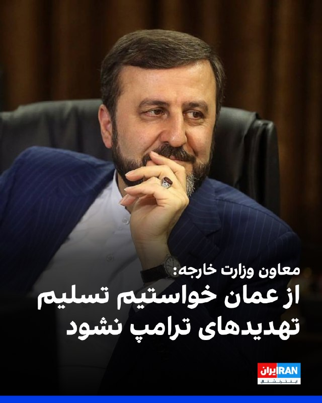

کاظم غریب‌آبادی، معاون حقوقی وزارت خارجه گفت که جمهوری اسلامی در شرایط جنگ، ترتیبات جدیدی برای کنترل عبور و مرور تعریف کرده و به هیچ کشوری اجازه دخالت نمی‌دهد.

غریب‌آبادی افزود: «آمریکا و رییس‌جمهورش با نقض حقوق بین‌الملل عمان را تهدید کرده‌اند، اما ما از عمان خواسته‌ایم تسلیم تهدیدها نشود و حاکمیت خود را در زمان صلح اعمال کند.»

او با بیان اینکه «تنگه هرمز دو دولت ساحلی بیشتر ندارد، جمهوری اسلامی و سلطنت عمان»، گفت: «هر ترتیبات حقوقی در زمان صلح باید با همکاری و مشورت با عمان باشد.»
https://iranintl.com/202606016035

## IranIntlTV — post 339991

  

بنیامین نتانیاهو، نخست‌وزیر اسرائیل خبر داد که به ارتش این کشور دستور داده، به اهدافی در حومه جنوبی بیروت حمله کنند.

همزمان یسرائیل کاتز، وزیر دفاع اسرائیل تاکید کرد که نتانیاهو و او، به ارتش دستور دادند، اهدافی را در منطقه ضاحیه بیروت هدف قرار دهد.

پیش‌تر یک مقام آمریکایی گفته بود که مارکو روبیو، وزیر خارجه ایالات متحده، با جوزف عون، رییس‌جمهوری لبنان، و بنیامین نتانیاهو، نخست‌وزیر اسرائیل، در مورد مذاکرات دیپلماتیک بین این دو کشور کفت‌وگو کرده و طرحی را برای «کاهش تدریجی تنش» پیشنهاد داده است.
https://iranintl.com/202606017699

## IranIntlTV — post 339990

  <a href="telegram/content/IranIntlTV_339990_1780307094.mp4" target="_blank">🎬 Download video</a>

ویدیوی ارسال‌شده به ایران‌اینترنشنال، استفاده ابزاری از کودکان را در ایست و بازرسی خیابان بنی‌هاشمی شیراز در شامگاه یکشنبه ۱۰ خرداد نشان می‌دهد.

## IranIntlTV — post 339989

  <a href="telegram/content/IranIntlTV_339989_1780307095.mp4" target="_blank">🎬 Download video</a>

بر اساس گزارش تازه روزنامه گاردین، چین با صدور فناوری‌های سانسور و نظارت اینترنتی، به یکی از الگوهای اصلی حکومت‌های اقتدارگرا از جمله جمهوری اسلامی در کنترل فضای مجازی تبدیل شده است.

گفت‌وگو با مهدی صارمی‌فر، روزنامه‌نگار علم و تکنولوژی
@iranintltv

## Shin_Persian — post 6349

  

Shin ✓ @hey_itsmyturn
Mon, 01 Jun 2026 07:56:10 UTC

Kuwait Ministry of Foreign Affairs strongly condemns repeated Iranian attacks against Kuwait.

Official statement warns of serious escalation and direct threat to national security and civilian safety. Kuwait reserves …

Source: https://x.com/i/web/status/2061356049962058127

فارسی

وزارت امور خارجه کویت حملات مکرر ایران علیه کویت را به شدت محکوم می‌کند.

بیانیه رسمی نسبت به تشدید جدی تنش‌ها و تهدید مستقیم علیه امنیت ملی و ایمنی غیرنظامیان هشدار می‌دهد. کویت حق ... را برای خود محفوظ می‌دارد.

منبع: https://x.com/i/web/status/2061356049962058127

𝕏 · @shin_persian

## Shin_Persian — post 6348

  <a href="telegram/content/Shin_Persian_6348_1780307097.mp4" target="_blank">🎬 Download video</a>

Vahid Online ✓ @Vahid
Mon, 01 Jun 2026 03:14:16 UTC

'شلیک موشک از #امیدیه در خوزستان'
ویدیوی دریافتی، دوشنبه ۱۱ خرداد ساعت ۶:۳۰ به وقت #ایران
#Iran

English

'Missile launch from #Omidiyeh in Khuzestan'
Received video, Monday, June 1, at 6:30 AM #Iran time
#Iran

𝕏 · @shin_persian

## Shin_Persian — post 6347

  

Shin ✓ @hey_itsmyturn Mon, 01 Jun 2026 05:05:45 UTC President Trump @POTUS: "Iran really wants to make a deal, and it will be a good one for the U.S.A. and those that are with us. But don’t the Dumocrats, and various seemingly unpatriotic Republicans, understand…

## Shin_Persian — post 6346

Shin ✓ @hey_itsmyturn
Mon, 01 Jun 2026 05:05:45 UTC

President Trump @POTUS:
"Iran really wants to make a deal, and it will be a good one for the U.S.A. and those that are with us. But don’t the Dumocrats, and various seemingly unpatriotic Republicans, understand that it is MUCH tougher for me to properly do my job and negotiate, when political hacks keep negatively “chirping,” at levels never seen before, over and over again, that I should move faster, or move slower, or go to war, or not go to war, or whatever. Just sit back and relax, it will all work out well in the end - It always does! President DJT"

فارسی

رئیس‌جمهور ترامپ @POTUS:
"ایران واقعاً خواهان توافق است و این توافقی خوب برای ایالات متحده و کسانی که با ما هستند خواهد بود. اما آیا دمکرات‌های احمق (Dumocrats) و جمهوری‌خواهان مختلف که ظاهراً غیروطن‌پرست هستند، درک نمی کنند که برای من بسیار سخت‌تر است که کارم را به درستی انجام دهم و مذاکره کنم، وقتی که مزدوران سیاسی مدام با سطحی بی‌سابقه به شکلی منفی «ووزووز» می‌کنند و بارها و بارها می‌گویند که باید سریع‌تر حرکت کنم، یا کندتر حرکت کنم، یا وارد جنگ شوم، یا وارد جنگ نشوم، یا هر چیز دیگر. فقط بنشینید و آرام باشید، در نهایت همه چیز به خوبی پیش خواهد رفت - همیشه همین‌طور می‌شود! رئیس‌جمهور دی‌جی‌تی"

𝕏 · @shin_persian

## FarsiVOA — post 219246

  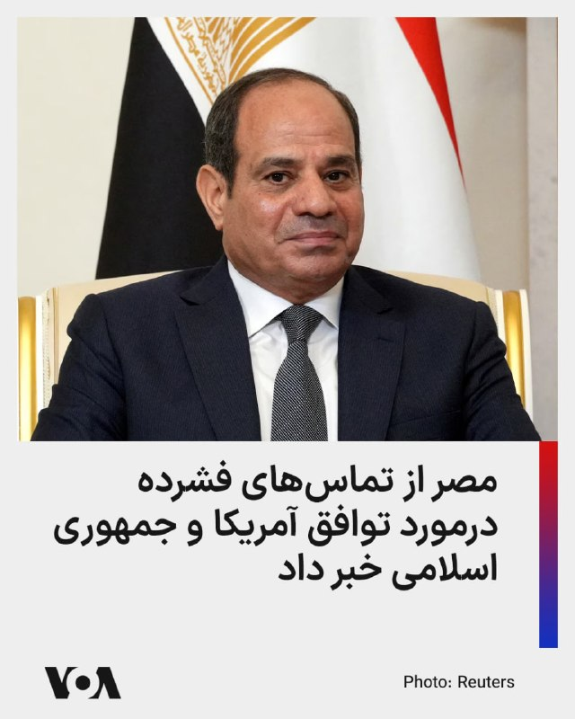

ریاست‌جمهوری مصر اعلام کرد عبدالفتاح السیسی، رئیس‌جمهور این کشور، در تماس تلفنی با امانوئل مکرون، رئیس‌جمهور فرانسه، از تلاش‌های فشرده قاهره برای کمک به دستیابی به توافقی جامع میان آمریکا و جمهوری اسلامی خبر داده است.

مصر اعلام کرده هدف از اقدامات و تلاش‌‌ها برای رسیدن به این توافق، جلوگیری از بازگشت تنش و بازگرداندن امنیت و ثبات به منطقه و کشورهای خلیج فارس است.

این موضع در شرایطی اعلام شده که جنگ آمریکا و جمهوری اسلامی، امنیت خلیج فارس، عبور و مرور در تنگه هرمز و ثبات انرژی جهانی را به یکی از محورهای اصلی رایزنی‌های منطقه‌ای و بین‌المللی تبدیل کرده است.

در همین تماس، مکرون نیز بر ضرورت باز بودن تنگه هرمز و رفع هرگونه محدودیت در عبور و مرور از این مسیر راهبردی تأکید کرد. دو طرف همچنین توافق کردند هماهنگی و رایزنی‌های فشرده میان مصر و فرانسه برای بازگرداندن ثبات منطقه‌ای ادامه یابد.
@FarsiVOA

## FarsiVOA — post 219245

🔺امیدواری نسبی مصرف‌کنندگان منطقه یورو به کنترل تورم بلندمدت

▪️نظرسنجی تازه بانک مرکزی اروپا نشان می‌دهد مصرف‌کنندگان منطقه یورو، با وجود جهش تورم و افزایش فشار قیمت انرژی، انتظارات تورمی بلندمدت خود را نزدیک به هدف نگه داشته‌اند.

▪️بر اساس گزارش رویترز، تورم منطقه یورو در آوریل تحت تأثیر افزایش قیمت نفت به ۳ درصد رسید؛ بالاتر از هدف ۲ درصدی بانک مرکزی اروپا.

▪️داده‌های روزهای اخیر در اقتصادهای بزرگ منطقه یورو از باقی ماندن تورم بالاتر از هدف بانک مرکزی حکایت دارد. در فرانسه، نرخ تورم ماه مه به ۲.۸ درصد افزایش یافت. در ایتالیا، تورم به ۳.۲ درصد رسید. در اسپانیا، نرخ تورم در سطح ۳.۲ درصد ثابت ماند، و در آلمان، تورم به ۲.۶ درصد کاهش یافت.

⬇️ بیشتر بخوانید:
https://ir.voanews.com/a/euro-zone-consumers-take-benign-view-on-inflation-surge/8156051.html

## FarsiVOA — post 219244

  

سخنگوی وزارت خارجه جمهوری اسلامی ادعا کرد که موضوع آتش‌بس در لبنان «بخش جدایی‌ناپذیر هرگونه آتش‌بس و توافق نهایی» با آمریکا برای خاتمه جنگ است.

اسماعیل بقایی دوشنبه در یک نشست خبری گفت: «تاکید داریم که آتش‌بس در لبنان بخش لاینفک هرگونه آتش‌بس و توافق نهایی برای جنگ است.»

این اظهارات همزمان با دستور نخست‌وزیر و وزیر دفاع اسرائیل برای آغاز حملات به مواضع حزب‌الله لبنان در حومه بیروت مطرح شده است. این دستور به دلیل نقض‌های مکرر آتش‌بس از سوی حزب‌الله صادر شد. همچنین اسرائیل به پیشروی نیروی زمینی خود در جنوب لبنان ادامه می‌دهد.

بقایی علاوه بر اسرائیل، ادعا کرده که آمریکا نیز به «نقض آتش‌بس» می‌پردازد؛ این در حالی است که سنتکام از «اقدامات تهاجمی» رژیم ایران خبر داده و اعلام کرده که این حملات «شامل سرنگونی یک پهپاد ام‌کیو-۱ آمریکا در حال انجام عملیات بر فراز آب‌های بین‌المللی بود.»
@FarsiVOA

## FarsiVOA — post 219243

  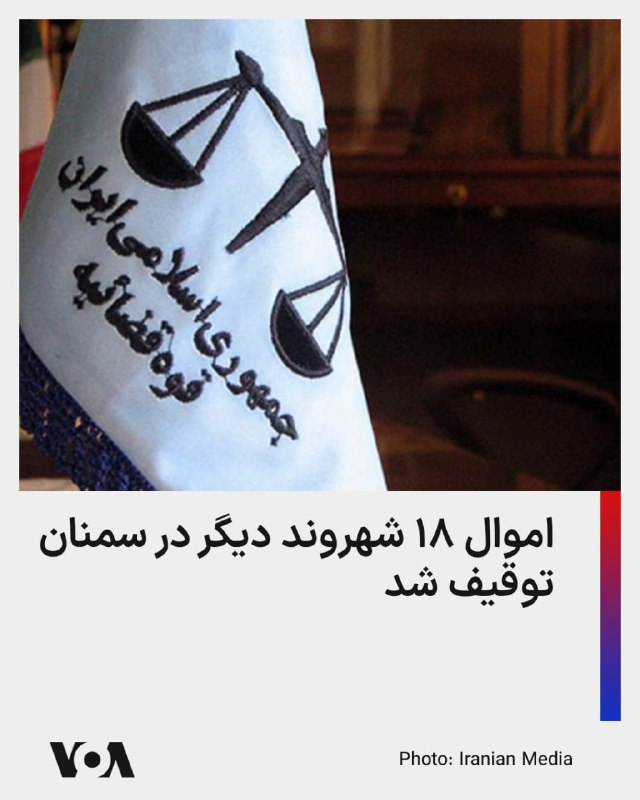

دادگستری استان سمنان دارایی‌های ۱۸ نفر از شهروندان را به اتهام همکاری با آنچه «سرویس‌های جاسوسی آمریکا و اسرائیل» خوانده، توقیف کرد. رئیس کل دادگستری استان سمنان گفت: با اجرای این احکام، شمار افرادی که دارایی‌هایشان در این استان توقیف شده به ۴۰ نفر رسیده است.

به گفته محمدصادق اکبری، برای شماری از افراد در داخل و خارج از ایران پرونده قضایی تشکیل شده و آنها به همکاری با اسرائیل و نهادهای اطلاعاتی خارجی متهم شده‌اند. مقام‌های قضایی مدعی هستند که این افراد با اقدام‌ها یا حمایت‌های خود در جهت تقویت یا مشروعیت‌بخشی به اسرائیل علیه امنیت و منافع ملی ایران فعالیت کرده‌اند.

در این گزارش جزئیاتی درباره هویت افراد، ارزش دارایی‌های توقیف‌شده یا اسناد و مدارک مربوط به این اتهامات منتشر نشده است.

این اقدام در حالی صورت می‌گیرد که رسانه‌های حکومتی پیش‌تر از توقیف اموال ده‌ها ایرانی خارج از کشور در استان‌های گلستان و خراسان جنوبی خبر داده بودند. مقام‌های قضایی این افراد را به همکاری با نهادهای خارجی متهم کرده‌اند، اما جزئیات پرونده‌ها، مستندات اتهام‌ها و امکان دفاع متهمان به‌طور مستقل قابل راستی‌آزمایی نیست.
@FarsiVOA

## FarsiVOA — post 219242

  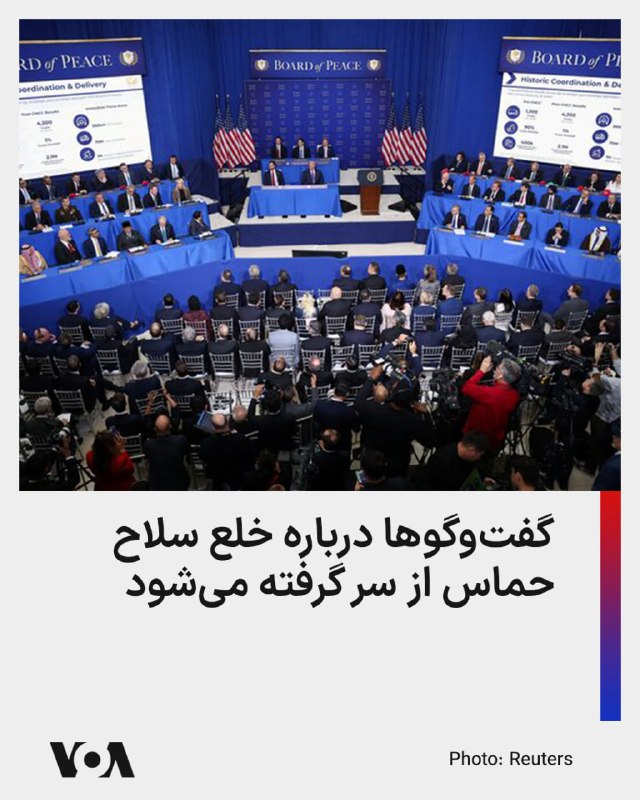

اسرائیل تایمز در گزارشی به نقل از دو دیپلمات اعلام کرد که مذاکره‌‌کنندگان پرونده غزه قرار است روز پنج‌شنبه ۱۴ خرداد، به میزبانی کشور مصر، گفت‌وگوهای مربوط به خلع سلاح حماس را از سر بگیرند.

این دو دیپلمات عرب گفته‌اند که «هیئت صلح» تحت هدایت آمریکا، هنوز به طور کامل امید خود را به امکان پیشرفت مذاکرات از دست نداده و این در حالی است که حماس از پذیرش پیشنهاد «هیئت صلح» برای خلع سلاح خودداری می‌کند.

حماس ادعا می‌کند تا زمانی که رهبر جدید انتخاب نشود، نمی‌توان هیچ تصمیم نهایی درباره خلع سلاح اتخاذ کند. ایالات متحده، اتحادیه اروپا، اسرائیل و برخی از کشورها از جمله مصر، حماس و یا دست‌کم شاخه نظامی این گروه را در فهرست گروه‌های تروریستی قرار داده‌اند.

دیپلمات‌های عرب به اسرائيل تایمز گفته‌اند که اگر طرح رئیس‌جمهور آمریکا، جهت پایان دادن به جنگ غزه به نتیجه نرسد،‌ احتمال بررسی طرح‌های جایگزین وجود دارد.

یکی از گزینه‌های جایگزین، اجازه به دولت بنیامین نتانیاهو برای بازسازی برخی از مناطق غزه که تحت کنترل اسرائیل قرار دارد، است که پیش‌تر از سوی دونالد ترامپ به دلیل احتمال مخالفت منطقه کنار گذاشته شده بود.
@FarsiVOA

## FarsiVOA — post 219241

  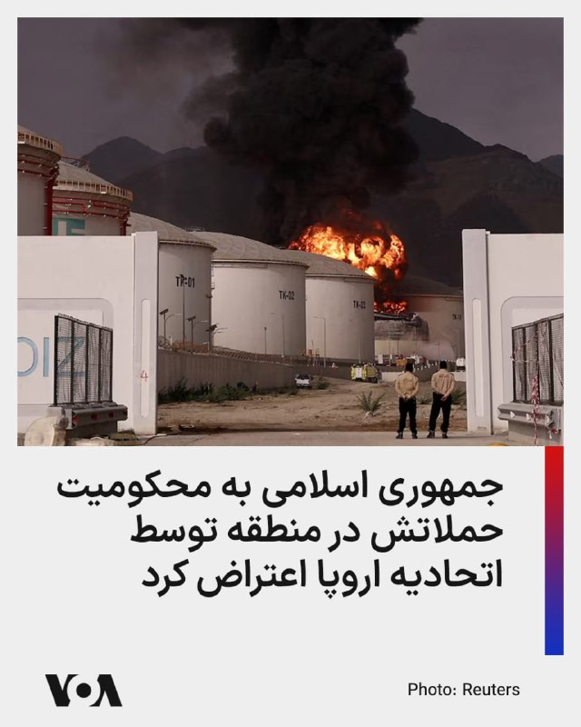

جمهوری اسلامی با اعتراض به انتقادهای اتحادیه اروپا از حملاتش در منطقه، این حملات را در چارچوب «حق دفاع مشروع» توصیف کرد.

اتحادیه‌ ارو‍پا طی روزهای اخیر با صدور بیانیه‌های جداگانه، تداوم حملات جمهوری اسلامی به کشورهای همسایه را محکوم کرده بود.

در یک بیانیه در محکومیت حملات جمهوری اسلامی به خاک کویت، اتحادیه اروپا چنین حملاتی «تهدیدی جدی برای امنیت و ثبات منطقه‌ای» خوانده است. این اتحادیه از جمهوری اسلامی خواسته است تا قطعنامه ۲۸۱۷ شورای امنیت سازمان ملل مبنی بر توقف حملات به کشورهای خلیج فارس را به طور کامل اجرا کند.

اتحادیه اروپا همچنین هفتم خرداد نیز در بیانیه پایانی بیست‌وپنجمین نشست سالانه خود به موضوع ایران اشاره و یادآور شد که به شدت «حملات غیرقابل توجیه و بی رویه موشک‌های بالستیک و پهپاد ایران» علیه کشورهای منطقه را محکوم می‌کند.

اسماعیل بقایی، سخنگوی وزارت خارجه جمهوری اسلامی اما به بیانیه‌‌ها اتحادیه اروپا واکنش نشان داده و مدعی شد که «هدف قرار دادن مبادی و امکاناتی که برای تجاوز نظامی» مورد استفاده قرار می‌گیرد، در چارچوب «حق دفاع مشروع» است.
@FarsiVOA

## FarsiVOA — post 219240

  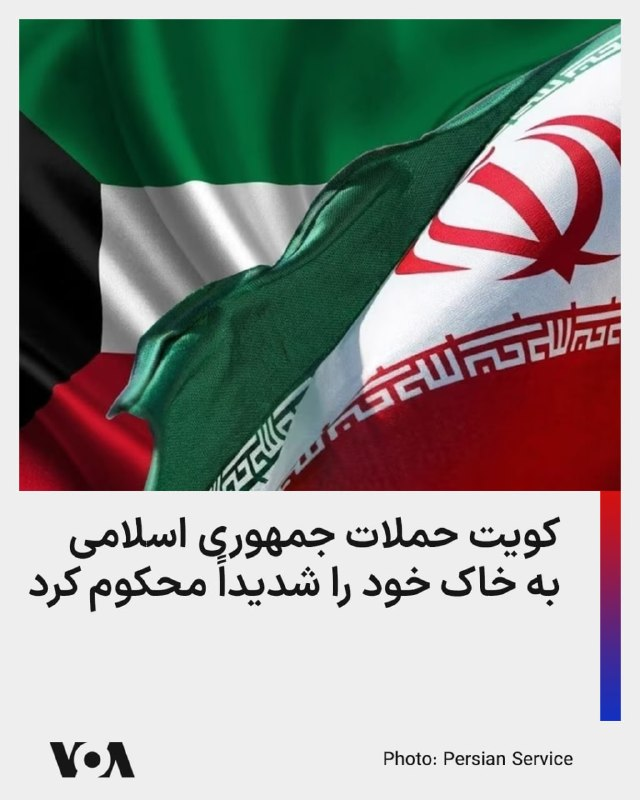

وزارت خارجه کویت با انتشار بیانیه‌ای، «حملات نادرست و مکرر» جمهوری اسلامی به خاک خود را شدیداً محکوم و نسبت به آن ابراز انزجار کرد.

در این بیانیه که دوشنبه منتشر شد، آمده است که این حملات «تشدید تنشی خطرناک، تعرضی مستقیم به امنیت دولت کویت و ثبات آن، نقض آشکار قواعد حقوق بین‌الملل، منشور سازمان ملل متحد و قطعنامه شماره ۲۸۱۷ شورای امنیت برای سال ۲۰۲۶، و تهدیدی جدی برای سلامت غیرنظامیان و تأسیسات حیاتی کشور» محسوب می‌شود.

این وزارتخانه تأکید کرد که ادامه و تکرار این حملات، تلاش‌های صورت‌گرفته برای کاهش تنش را تضعیف کرده و امنیت و ثبات منطقه را به خطر می‌اندازد.

همچنین کویت ضمن مسئول دانستن جمهوری اسلامی در این «حملات تجاوزکارانه»، افزود که «حق کامل خود را برای اتخاذ هر اقدام لازم جهت حفظ امنیت و دفاع از سرزمین خود محفوظ می‌دارد.»
@FarsiVOA

## FarsiVOA — post 219239

  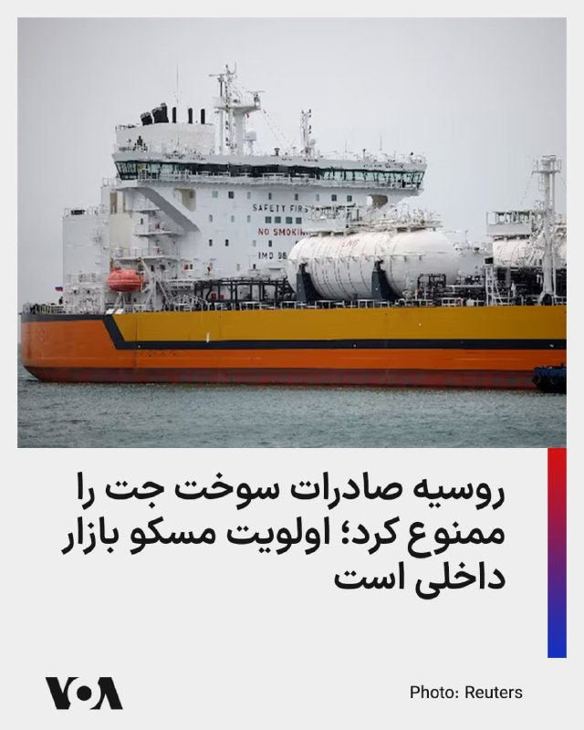

روسیه صادرات سوخت جت را تا ۳۰ نوامبر ممنوع کرد؛ تصمیمی که هم‌زمان با افزایش حملات اوکراین به پالایشگاه‌ها و فشار بر زیرساخت انرژی این کشور گرفته شده است.

دولت روسیه هدف از این محدودیت را حفظ ثبات بازار داخلی و تأمین نیاز مصرف‌کنندگان اعلام کرده است.

اهمیت این تصمیم بیش از آنکه به سهم روسیه در بازار جهانی سوخت جت مربوط باشد، به نشانه‌ای از فشار داخلی بر تولید سوخت در روسیه بازمی‌گردد.

طبق داده‌های جمع‌آوری‌شده بلومبرگ از شرکت تحلیلی ورتکسا، روسیه در سال گذشته به‌طور متوسط روزانه حدود ۳۰ هزار بشکه سوخت جت صادر کرده است. این رقم کمتر از دو درصد عرضه جهانی است.

میانگین صادرات روزانه این کشور در چهار ماه نخست سال ۲۰۲۶ نیز به ۲۸ هزار بشکه کاهش یافته و ترکیه خریدار اصلی آن بوده است.

پیش از این نیز وزارت انرژی روسیه از اول آوریل ممنوعیت صادرات بنزین را دوباره اعمال کرده بود تا سوخت بیشتری در بازار داخلی باقی بماند.
@FarsiVOA

## FarsiVOA — post 219238

🔺دولت مبلغ کالابرگ را افزایش نداد

▪️در حالی که طی هفته‌های گذشته بارها از بررسی افزایش اعتبار کالابرگ، پیشنهاد رشد ۳۰ تا ۱۰۰ درصدی آن و ضرورت جبران فشار گرانی بر سفره مردم سخن گفته شده بود، وزیر تعاون، کار و رفاه اجتماعی، اعلام کرد کالابرگ خردادماه «به روال ماه‌های قبل» پرداخت می‌شود.

▪️این اظهارنظر به معنای آن است که دولت، دست‌کم در خرداد، مبلغ کالابرگ را افزایش نداده است؛ آن هم در شرایطی که انتظار عمومی پس از چندین وعده و اظهارنظر رسمی، به سمت افزایش اعتبار این طرح رفته بود.

▪️کالابرگ قرار بود بخشی از فشار تورم بر معیشت خانوار را جبران کند، اما با ثابت ماندن مبلغ آن و رشد قیمت کالاهای اساسی، ارزش واقعی این حمایت کاهش یافته است.

⬇️ بیشتر بخوانید:
https://ir.voanews.com/a/8156050.html

## FarsiVOA — post 219237

🔺دانشگاه زیر فشار امنیتی؛ شرق از موج تازه اخراج، تعلیق و پرونده‌سازی برای صدها دانشجو خبر داد

▪️روزنامه شرق در گزارشی از موج تازه احضار، تشکیل پرونده، تعلیق و صدور احکام انضباطی برای دانشجویان چند دانشگاه بزرگ ایران خبر داده است.

▪️بر اساس این گزارش، چهار روز پس از بازگشایی دانشگاه‌ها در اسفند ۱۴۰۴، پس از دو ماه تعطیلی، دانشجویان با تماس‌ها و پیامک‌هایی درباره تشکیل پرونده انضباطی روبه‌رو شدند.

▪️اکنون در خرداد ۱۴۰۵ و در حالی که تعطیلی دانشگاه‌ها به دلیل جنگ به سه ماه نزدیک شده، دانشگاه‌ها پیگیری همان پرونده‌ها و تشکیل پرونده‌های تازه را آغاز کرده‌اند.

▪️در دانشگاه صنعتی شریف، حدود ۲۵ تا ۳۰ پرونده مشخص وجود دارد و با احتساب موارد علنی‌نشده، شمار پرونده‌ها می‌تواند به ۳۰ تا ۴۰ مورد برسد.

⬇️ بیشتر بخوانید:
https://ir.voanews.com/a/a-new-wave-of-expulsions-suspensions-and-filing-of-cases-against-hundreds-of-students/8156048.html

## FarsiVOA — post 219236

  

در پی نقض‌های مکرر آتش‌بس در لبنان از سوی حزب‌الله و حملات این گروه به شهرها و شهروندان اسرائیل، بنیامین نتانیاهو، نخست‌وزیر اسرائیل، و اسرائیل کاتز، وزیر دفاع، دستور دادند ارتش اسرائیل اهداف وابسته به حزب‌الله در منطقه ضاحیه بیروت را هدف قرار دهد.

در بیانیه مشترک نتانیاهو و کاتز آمده است که این تصمیم در پاسخ به حملات اخیر حزب‌الله و ادامه تهدید علیه شهروندان اسرائیل گرفته شده است.

ضاحیه بیروت از مهم‌ترین پایگاه‌های حزب‌الله در پایتخت لبنان به شمار می‌رود و در ماه‌های گذشته نیز بارها هدف حملات ارتش اسرائیل قرار گرفته است.

⬇️ بیشتر بخوانید:
https://ir.voanews.com/a/netanyahu-and-katz-order-attack-on-hezbollah-positions-in-beirut/8156049.html

## FarsiVOA — post 219235

  <a href="telegram/content/FarsiVOA_219235_1780307102.mp4" target="_blank">🎬 Download video</a>

تصاویر منتسب به شلیک موشک از امیدیه در خوزستان؛

تصاویر ارسالی به کانال تلگرامی «وحید آنلاین» شلیک موشک از امیدیه در خوزستان را حوالی ۶:۳۰ صبح دوشنبه ۱۱ خرداد نشان می‌دهد.

هم‌زمان سپاه پاسداران از حمله به یک پایگاه هوایی در منطقه خبر داد و ادعا کرد که این پایگاه مبدأ حمله به یک دکل مخابراتی در سیریک واقع در استان هرمزگان بوده است. روابط عمومی سپاه پاسداران دوشنبه از اعلام جزئیات بیشتر خودداری کرد و مشخص نکرد که این پایگاه در کدام کشور قرار داشت.

در این زمینه خبرگزاری رسمی کویت گزارش داد که پدافند هوایی این کشور، جایی که یک پایگاه آمریکا در آن قرار دارد، روز دوشنبه در حال رهگیری حملات موشکی و پهپادی بوده است. آژیرهای هشدار نیز در سراسر کویت به صدا درآمده‌اند، اما جزئیات بیشتری ارائه نشده است.
@FarsiVOA

## FarsiVOA — post 219234

🔺مکرون از توقیف یک نفتکش «ناوگان سایه» روسیه در اقیانوس اطلس خبر داد

▪️رئیس‌جمهوری فرانسه اعلام کرد که نیروی دریایی این کشور نفتکش «تاگور» را که مشمول تحریم‌های بین‌المللی بود و از مبدأ روسیه حرکت کرده بود، توقیف و بازرسی کرده است.

▪️او گفت: «این عملیات در اقیانوس اطلس، در آب‌های آزاد، با حمایت چندین شریک از جمله بریتانیا و با رعایت کامل حقوق دریاها انجام شد.»

▪️او افزود: «غیرقابل قبول است که کشتی‌ها تحریم‌های بین‌المللی را دور بزنند، حقوق دریاها را نقض کنند و جنگی را که روسیه بیش از چهار سال است علیه اوکراین به راه انداخته، تأمین مالی کنند.»

▪️فرانسه و بریتانیا متعهد شده‌اند مانع فعالیت کشتی‌های مرتبط با «ناوگان سایه» روسیه شوند که از آب‌های تحت نظارت آن‌ها عبور می‌کنند.

⬇️ بیشتر بخوانید:
https://ir.voanews.com/a/macron-says-french-navy-boarded-russia-linked-oil-tanker/8156047.html

## FarsiVOA — post 219233

🔺هزینه وصل‌ماندن اینترنت ۸ برابر شد؛ تبدیل فیلترشکن به خرج ثابت خانوار

▪️هزینه دسترسی به اینترنت آزاد در ایران، پس از سه ماه قطع مستمر و هم‌زمان با ادامه فیلترینگ و اختلال‌های گسترده، به یکی از هزینه‌های ثابت خانوارها تبدیل شده است.

▪️گزارش اقتصادنیوز نشان می‌دهد بازار فیلترشکن مانند بسیاری از کالاها و خدمات دیگر با جهش شدید قیمت روبه‌رو شده و هزینه «وصل ماندن» برای کاربران ایرانی چند برابر شده است.

▪️بر اساس این گزارش، پیش از قطعی‌های گسترده دی‌ماه ۱۴۰۴، بسته ۳۰ روزه ۳۰ گیگابایتی فیلترشکن با قیمت ۵۹ هزار و ۹۰۰ تومان فروخته می‌شد؛ یعنی هر گیگابایت حدود یک هزار و ۹۹۶ تومان. اما اکنون همین بسته به ۴۳۹ هزار تومان رسیده و قیمت هر گیگابایت آن حدود ۱۴ هزار و ۶۳۳ تومان شده است.

⬇️ بیشتر بخوانید:
https://ir.voanews.com/a/cost-of-staying-connected-to-internet-increased-8-times/8156045.html

## FarsiVOA — post 219232

  

فرماندهی مرکزی ایالات متحده آمریکا (سنتکام) اعلام کرد که در دفاع از خود در مقابل تجاوزهای رژیم ایران، حملاتی به سایت‌های راداری و مراکز فرماندهی و کنترل پهپادهای جمهوری اسلامی در گروک و جزیره قشم در جنوب ایران انجام داد.

سنتکام با انتشار بیانیه‌ای نوشت که این حملات «سنجیده و هدفمند» در طول آخر هفته (شنبه و یکشنبه) صورت گرفت و «در پاسخ به اقدامات تهاجمی ایران انجام شد که شامل سرنگونی یک پهپاد ام‌کیو-۱ آمریکا بود که در حال انجام عملیات بر فراز آب‌های بین‌المللی بود.»

بر اساس گزارش ارتش آمریکا، جنگنده‌های آمریکایی به سرعت واکنش نشان دادند و سامانه‌های پدافند هوایی رژیم ایران، یک ایستگاه کنترل زمینی و دو پهپاد انتحاری یک‌طرفه را که «تهدیدی آشکار برای کشتی‌های در حال عبور از آب‌های منطقه بودند»، منهدم کردند.

سنتکام افزود که هیچ‌یک از نیروهای نظامی آمریکا آسیب ندیدند. این نهاد تأکید کرد که در طول آتش‌بس جاری، در واکنش به «تجاوز بی‌دلیل ایران» به حفاظت از دارایی‌ها و منافع ایالات متحده ادامه خواهد داد.
@FarsiVOA

## FarsiVOA — post 219231

🔺ترامپ توافق احتمالی با رژیم ایران را «توافقی خوب» برای آمریکا توصیف کرد

▪️دونالد ترامپ، رئیس‌جمهوری آمریکا، اعلام کرد که جمهوری اسلامی «واقعاً می‌خواهد به یک توافق برسد و این توافق برای آمریکا و کسانی که با ما هستند، توافق خوبی خواهد بود.»

▪️پیشتر اکسیوس و نیویورک‌تایمز گزارش دادند پرزیدنت ترامپ خواستار سخت‌گیرانه‌تر شدن شروط چارچوب توافق احتمالی با جمهوری اسلامی شده و نسخه اصلاح‌شده را برای بررسی به تهران فرستاده است.

▪️اکسیوس نوشت ترامپ از تیم خود خواسته چند بند، به‌ویژه بندهای مربوط به برنامه هسته‌ای و مواد هسته‌ای را اصلاح کنند.

▪️نیویورک‌تایمز نیز گزارش داد ترامپ از کندی پاسخ جمهوری اسلامی به پیشنهادهای آمریکا ناراضی است.

⬇️ بیشتر بخوانید:
https://ir.voanews.com/a/trump-described-possible-agreement-with-iran-as-a-good-deal-for-us/8156044.html

## FarsiVOA — post 219230

  

خبرگزاری میزان وابسته به دستگاه قضایی جمهوری اسلامی، از اجرای حکم اعدام مهرداد محمدی‌نیا و اشکان مالکی، دو نفر از معترضان دی ماه ۱۴۰۴ خبر داد.

این دو معترض صبح روز ۱۱ خرداد و کمتر از پنج ماه پس از دستگیری اعدام شدند و از روند برگزاری دادگاه و نحوه دفاعیات گزارشی منتشر نشده است.

مهرداد محمدی‌نیا و اشکان مالکی در پرونده موسوم به «مسجد جعفری»، متهم به مسدودسازی خیابان و آتش‌زدن مسجد شده بودند. این پرونده یک متهم دیگر به نام «آرمان معرفتی» نیز دارد و منابع حقوق بشری نگران اعدام این معترض نیز هستند.

«اقدام به تخریب و آتش‌زدن عمدی مسجد»، «تخریب اموال عمومی»، «درگیری با مأموران انتظامی»، و «انسداد خیابان‌ها و ممانعت از عبور و مرور مردم»، از جمله اتهام‌های منتسب به این دو معترض بوده است.

در خبر اولیه، جزئیاتی در مورد زمان و شرایط بازداشت، و روند دادرسی این دو اعلام نشده و تنها آمده است که حکم اعدام آنها پس از تأیید حکم در دیوان عالی کشور اجرا شده است.

⬇️ بیشتر بخوانید:
https://ir.voanews.com/a/iran-judiciary-executed-two-more-january-protesters/8156046.html

## FarsiVOA — post 219229

🔺قیمت نفت با پیشروی اسرائیل در لبنان بیش از دو درصد افزایش یافت

▪️قیمت نفت در معاملات اولیه روز دوشنبه، پس از پیشروی تازه ارتش اسرائیل در جنوب لبنان و افزایش نگرانی‌ها درباره امنیت تنگه هرمز، بیش از دو درصد بالا رفت. روندی که از نگاه بازار می‌تواند بر بازگشایی تنگه هرمز و بازگشت عرضه نفت اثر بگذارد.

▪️نفت خام آمریکا با دو دلار و ۳۷ سنت افزایش، به ۸۹ دلار و ۷۳ سنت در هر بشکه رسید. نفت برنت نیز با دو دلار و ۱۶ سنت افزایش، ۹۳ دلار و ۲۸ سنت معامله شد.

▪️این جهش پس از آن رخ داد که قیمت‌ها در معاملات جمعه، به امید توافق تهران و واشنگتن، کاهش یافته بود.

▪️افزایش بهای نفت نشان می‌دهد ریسک ژئوپلیتیک در خاورمیانه بار دیگر بر نگرانی‌های مربوط به تقاضای جهانی غلبه کرده است.

⬇️ بیشتر بخوانید:
https://ir.voanews.com/a/oil-prices-rise-more-than-2-percent-as-israel-advances-in-lebanon/8156043.html

## FarsiVOA — post 219228

Farsi VOA pinned an audio file

## FarsiVOA — post 219227

  <a href="https://t.me/farsivoa/219227" target="_blank">📎 Download file</a>

🔴📢‌ پادکست خبری یکشنبه ۱۰ خرداد ۱۴۰۵

🛜در صورتی که با مشکل اینترنت مواجه هستید میتوانید اخبار صدای آمریکا را از نسخه‌های پادکست خبری ما روزانه دنبال کنید و یا اخبار را از نسخه سبک وب‌سایت ما پیگیر باشید:
https://ir.voanews.com/lite

📡بروزترین فرکانسهای ماهواره‌ای را نیز میتوانید از صفحه زیر پیگیری کنید:
https://ir.voanews.com/satellite

🔔دیگر شبکه‌های اجتماعی ما هم دنبال کنید:
https://linktr.ee/voafarsi

ما را به اشتراک بگذارید
@farsivoa

## DW_Farsi — post 125367

  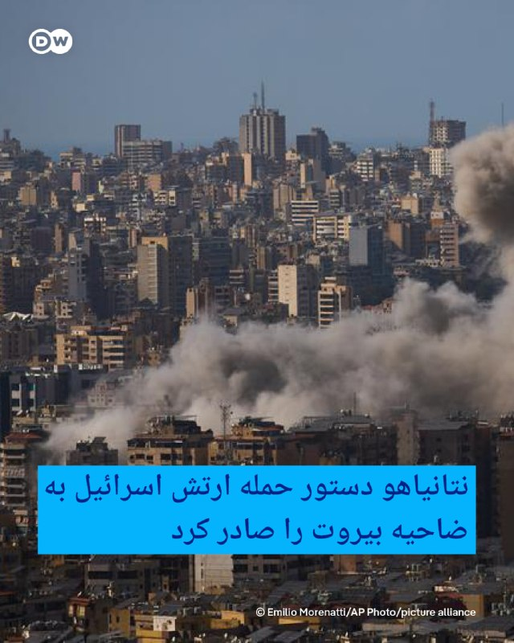

🔶 نتانیاهو دستور حمله ارتش اسرائیل به ضاحیه بیروت را صادر کرد
 
نخست‌وزیر اسرائیل روز دوشنبه اول ژوئن به ارتش این کشور دستور داد تا مواضعی را در حومه جنوبی بیروت، منطقه‌ای معروف به ضاحیه که به عنوان پایگاه حزب‌الله به شمار می‌رود، هدف قرار دهد.
 
در بیانیه‌ای که دفتر بنیامین نتانیاهو منتشر کرده، آمده است در پی "نقض مکرر آتش‌بس" توسط حزب‌الله و ادامه حملات این گروه به شهرها و شهروندان اسرائیلی، نخست‌وزیر و وزیر دفاع اسرائیل به ارتش این کشور دستور دادند تا "اهداف تروریستی" را در منطقه ضاحیه بیروت هدف حمله قرار دهند.
 
اسرائیل در طول دوره آتش‌بس به درخواست دولت آمریکا عمدتا از حمله به بیروت خودداری کرده بود.
 
ارتش اسرائیل و نیروهای حزب‌الله از زمان برقراری آتش‌بس در لبنان که اواسط ماه آوریل رخ داد، همچنان به تبادل آتش ادامه‌ داده‌اند.
 
در همین حال ده‌ها هزار نفر از ساکنان شمال اسرائیل به دلیل حملات موشکی و پهپادی حزب‌الله مجبور به ترک خانه‌های خود شده‌اند.
 
مقامات لبنان می‌گویند حملات اخیر اسرائیل به این کشور موجب کشته‌شدن بیش از سه هزار شهروند لبنانی و آواره شدن چند صد هزار تن شده است.
@dw_farsi

## DW_Farsi — post 125366

  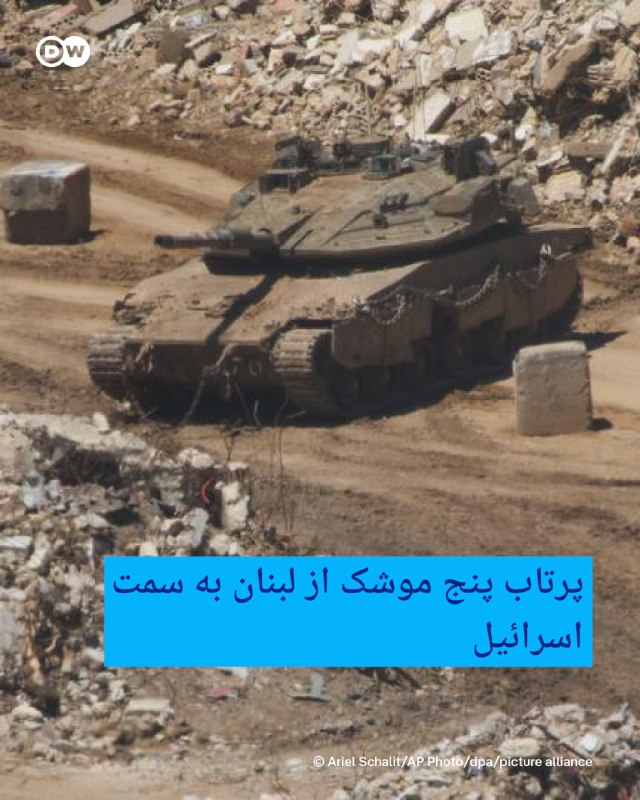

🔶 پرتاب پنج موشک از لبنان به سمت اسرائیل
 
ارتش اسرائیل از رهگیری دو موشک پرتاب‌شده از لبنان به سمت کریات شمونا، شهری در شمال این کشور در دوشنبه ۱۱ خرداد (اول ژوئن) خبر داد و اعلام کرد نتیجه رهگیری موشک سوم در دست بررسی است. به گفته ارتش دو موشک دیگر نیز به سمت شهر طبریه شلیک شد که یکی از آنها در منطقه‌ای باز فرود آمد و موشک دوم داخل خاک لبنان و نزدیک محل استقرار نیروهای اسرائیلی سقوط کرده است.
 
ارتش اسرائیل همچنین اعلام کرد که حمله پهپادی حزب‌الله در جنوب لبنان منجر به کشته شدن یک سرباز اسرائیلی و زخمی شدن سه سرباز دیگر شد.
 
به گزارش تایمز اسرائیل پهپاد انتحاری دید اول شخص (FPV) حزب‌الله حدود ساعت یک بامداد دوشنبه به هدفی در منطقه مسکونی یحمر در شهرستان نبطیه، نزدیک قلعه بوفور جایی که نیروهای اسرائیل مشغول انجام عملیات بودند، اصابت کرد.
 
ارتش اسرائیل یکشنبه اعلام کرد قلعه تاریخی و راهبردی بوفور (شقیف) را که در جنوب لبنان واقع شده، تصرف کرده است. آویخای ادرعی، سخنگوی عرب‌زبان ارتش اسرائیل، نیز در شبکه ایکس عکس‌هایی را منتشر کرده که نیروهای اسرائیلی را در حال حرکت در مقابل این قلعه نشان می‌‌داد.
@dw_farsi

## DW_Farsi — post 125365

🔶 انتخابات ریاست جمهوری کلمبیا؛ مصاف چپ و راست به دور دوم کشید
 
انتخابات ریاست جمهوری کلمبیا به دور دوم، میان آبلاردو د لا اسپریا، حقوقدان راست‌گرا، و ایوان سپدا، سناتور چپ‌گرا، کشیده شد.
 
بر اساس اعلام کمیسیون انتخابات، پس از شمارش حدود ۹۹.۵ درصد آرا، د لا اسپریا ۴۳.۷ درصد و سپدا نزدیک به ۴۱ درصد آرا را به دست آورده‌اند.
 
از آنجا که هیچ‌یک از نامزدها موفق به کسب اکثریت مطلق نشده‌اند، سرنوشت ریاست جمهوری در دور دوم انتخابات در روز ۲۱ ژوئن تعیین خواهد شد.
 
حدود ۴۱ میلیون شهروند کلمبیا برای انتخاب جانشین گوستاوو پترو، رئیس جمهور چپ‌گرای این کشور، به پای صندوق‌های رأی فراخوانده شده بودند. پترو بر اساس قانون اساسی اجازه نامزدی مجدد نداشت.
 
این انتخابات همچنین به عنوان رأی‌گیری درباره ادامه یا توقف سیاست‌های پترو، از جمله افزایش هزینه‌های اجتماعی و مذاکره با گروه‌های مسلح، یا حرکت به سوی رویکردی محافظه‌کارانه‌تر تلقی می‌شد.
 
پالوما والنسیا، سناتور محافظه‌کار که پیش از انتخابات نیز از بخت‌های اصلی پیروزی به شمار می‌رفت، با نزدیک به هفت درصد آرا، فاصله زیادی با دو نامزد پیشتاز داشت.
@dw_farsi

## DW_Farsi — post 125364

  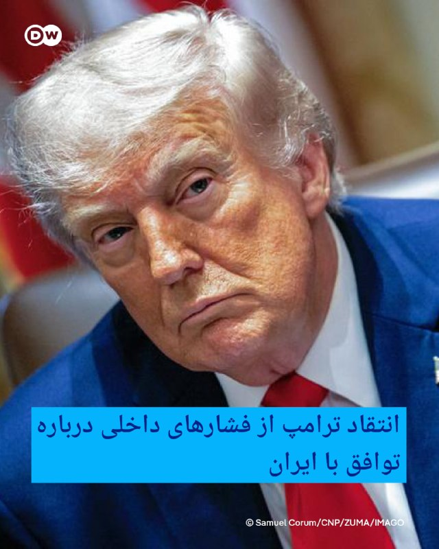

🔶 انتقاد ترامپ از فشارهای داخلی درباره توافق با ایران
 
دونالد ترامپ، رئیس جمهور آمریکا، با انتشار پیامی در شبکه تروث سوشال از دموکرات‌ها و برخی جمهوری‌خواهان به دلیل اظهاراتشان درباره رویکرد دولت او با جمهوری اسلامی بر سر توافق انتقاد کرد.
 
او نوشت: «ایران واقعا می‌خواهد به یک توافق برسد و این توافق برای ایالات متحده آمریکا و متحدان‌مان توافق خوبی خواهد بود.»
 
ترامپ سپس با تغییر عمدی کلمه "دموکرات‌ها" (Democrat) به صورت "داموکرات‌ها" (Dumocrats) در لحنی طعنه‌آمیز آن‌ها را "نادان" خوانده و به آنها و برخی "جمهوری‌خواهان که ظاهرا میهن‌پرست نیستند" تاخته و نوشت: «آیا [آنها] درک نمی‌کنند که وقتی افراد سیاسی فرصت‌طلب به طور مداوم و با شدت بی‌سابقه‌ای مدام منفی‌بافی می‌کنند و می‌گویند باید سریع‌تر عمل کنم یا کندتر، یا وارد جنگ شوم یا نشوم، یا هر چیز دیگری، کار من و انجام مذاکره بسیار دشوارتر می‌شود؟»
 
همزمان با انتشار گزارش‌های مختلف در مورد مذاکرات واشنگتن و تهران در مورد توافق برای پایان جنگ، انتقادها از سوی برخی گروه‌ها از ترامپ و دولت او افزایش یافته است.
@dw_farsi

## DW_Farsi — post 125363

🔶 ۱۰ سال زندان به اتهام ضبط ویدئویی از "معترض نشسته" مقابل یگان ویژه در اعتراضات دی‌ماه

مسعود پیاهو، شخصی که در جریان اعتراضات دی‌ماه ۱۴۰۴ ویدئویی را از یک مرد معترض نشسته مقابل نیروی پلیس یگان ویژه در مقابل پاساژ علاءالدین در خیابان جمهوری تهران، ضبط کرده بود به ۱۰ سال حبس محکوم شد.

حسن‌ آقاخانی، وکیل او، روز یکشنبه ۱۰ خرداد در گفت‌وگو با سایت خبری امتداد اظهار داشت که بازداشت موکلش به پیش از روزهای ۱۸ و ۱۹ دی باز می‌گردد. آقاخانی گفت: «موکل من در حال کار در بازاری بودند که به خیابان جمهوری مشرف بوده است. شخصی در مقابل مامورین نیروی انتظامی، می‌نشیند و مسعود یک فیلم کوتاه به صورت ناخودآگاه از آن صحنه ضبط می‌کند.»

او افزود مسعود پیاهو "به هیچ عنوان قصد انتشار ویدئو در بیرون از کشور را نداشته و صرفا برای یک تعداد مختصری از دوستانش در استوری خصوصی اینستاگرامش منتشر کرده است" اما سپس شخص دیگری این ویدئو را به شکل عمومی منتشر کرد.

به گفته این وکیل دادگستری وزارت اطلاعات مسعود پیاهو را احضار و سپس بازداشت کرد و دادگاه با استناد به قانون "تشدید مجازات جاسوسی و همکاری" با اسرائیل او را به ۱۰ سال زندان محکوم کرد. آقاخانی افزود شعبه ۹ دیوان عالی کشور نیز این حکم را "بدون هیچ کم‌ و کاستی" مورد تأیید قرار داد.

به گفته این وکیل دادگستری، دادگاه بدون توجه به دفاعیات ارائه‌شده، مسعود پیاهو را به "انتشار عمدی" این ویدئو و داشتن "قصد مشترک با آن فردی که مقابل مأموران نشسته" متهم کرده است.

انتشار این ویدئو در جریان اعتراضات بازار در روز هشتم دی‌ماه به شکل گسترده‌ای بازتاب یافت و به یکی از نمادهای اعتراضات سراسری دی‌ماه تبدیل شد.

در همین‌حال مسعود پیاهو در ویدئویی که پیش از رفتن به زندان در شبکه‌های اجتماعی منتشر کرده است، از معرفی خود برای اجرای حکم ۱۰ سال زندان خبر داده و گفته این صحنه را فیلمبرداری کرده، اما هیچ نقش و دخل و تصرفی در بازپخش این ویدئو نداشته است.

اعتراضات دی‌ماه یکشنبه ۷ دی‌ سال گذشته در پی اعتصاب شماری از کسبه و بازاریان تهران در اعتراض به افزایش افسارگسیخته بهای دلار آغاز شد و به سرعت به سراسر کشور گسترش یافت. حکومت جمهوری اسلامی این اعتراضات را به شدت سرکوب کرد.

مجموعه فعالان حقوق بشر هرانا کشته شدن بیش از هفت هزار معترض در روزهای ۱۸ و ۱۹ دی‌ماه به ضرب گلوله نیروهای امنیتی را تایید کرده است. برخی گزارش‌ها شمار کشته‌شدگان را بیش از ۴۰ هزار نفر تخمین زده‌اند.
@dw_farsi

## DW_Farsi — post 125362

  

📸 عکس روز: تا شقایق هست زندگی باید کرد
 
طبیعت منتظر نمی‌ماند تا همه چیز درست شود. جهان ممکن است درگیر جنگ، آوارگی، فقر و گرسنگی باشد، اما طبیعت از حرکت بازنمی‌ایستد؛ شقایق‌ها در بهار می‌شکفند و زنبورها نیز از آنها کام می‌گیرند.
@dw_farsi

## DW_Farsi — post 125361

🔶 مهرداد محمدی‌نیا و اشکان مالی، دو معترض بازداشتی اعتراضات دی‌ماه، اعدام شدند

قوه قضائیه اعلام کرد مهرداد محمدی‌نیا و اشکان مالی، دو تن از بازداشت‌شدگان اعتراضات دی‌ماه ۱۴۰۴ به اتهام "آتش زدن مسجد جعفری و حوزه علمیه امام هادی، لیدری کودتا، تخریب اموال عمومی، درگیری با مأموران انتظامی و حافظان امنیت و انسداد خیابان‌ها" صبح دوشنبه ۱۱ خرداد اعدام شدند.

در این پرونده یک متهم دیگر به نام آرمان معرفتی نیز از سوی شعبه ۱۵ دادگاه انقلاب تهران به ریاست قاضی صلواتی به اعدام محکوم شده است که به گفته سازمان حقوق بشری هه‌نگاو اینک در زندان فشافویه بسر می‌برد.

در حال حاضر اطلاعات دقیقی درباره وضعیت نهایی پرونده و حکم صادرشده برای آرمان معرفتی در دست نیست.

به گزارش هه‌نگاو آرمان معرفتی ابتدا با اتهام "اجتماع و تبانی" مواجه بود، اما در جریان دادرسی، قاضی صلواتی اتهام او را به "مشارکت در اقدامات عملیاتی علیه امنیت کشور، ورود به اماکن مذهبی به قصد تخریب و مشارکت در آتش‌زدن مسجد و حوزه علمیه" تغییر داد و بر همین مبنا برای او حکم اعدام صادر کرد.

به گفته نهادهای حقوق بشری روند رسیدگی به این پرونده فاقد معیارهای دادرسی عادلانه بوده است و متهمان از داشتن وکیل انتخابی محروم بودند و پرونده و اتهامات نسبت داده شده به این سه زندانی مبتنی بر اعترافات اجباری بوده است.

فعالان حقوق بشر طی سال‌های گذشته بارها نسبت به پخش و استناد به اعترافات اجباری در پرونده‌های امنیتی در ایران ابراز نگرانی کرده و از احتمال اخذ اعتراف تحت فشار یا شکنجه سخن گفته‌اند.

با آغاز جنگ آمریکا و اسرائیل علیه ایران، اعدام‌های سیاسی به شدت افزایش یافته است. سازمان عفو بین‌الملل در آخرین گزارش خود اعلام کرده که از ۹ اسفند ۱۴۰۴ تا ۶ خرداد ۱۴۰۵ دست‌کم ۳۹ اعدام سیاسی اجرا شده است.
@dw_farsi

## DW_Farsi — post 125360

  

🔶 ارتش کویت از مقابله با حملات موشکی و پهپادی خبر داد
 
ارتش کویت صبح دوشنبه اول ژوئن (۱۱ خرداد) از وقوع "حملات موشکی و پهپادی خصمانه" به خاک این کشور خبر داد. ستاد کل ارتش کویت با انتشار پیامی در شبکه ایکس اعلام کرد که پدافند هوایی این کشور در حال حاضر در حال مقابله با این حملات است و "هرگونه صدای انفجار، ناشی از عملکرد سامانه‌های پدافند هوایی در رهگیری این حملات خصمانه است".
 
ارتش کویت از شهروندان خواسته است تا به دستور‌العمل‌های ایمنی و امنیتی صادرشده توسط مقامات توجه کنند.
 
در همین حال خبرگزاری دولتی کویت نیز گزارش داد آژیرهای هشدار حمله هوایی در سراسر این کشور به صدا درآمده‌‌اند.
 
برخی رسانه‌های داخلی ایران ویدئوهایی را با عنوان "شلیک موشک‌های سپاه از خوزستان به پایگاه نظامی آمریکا در کویت" منتشر کرده‌اند.
 
همزمان سپاه پاسداران با انتشار بیانیه‌ای اعلام کرده است که یک پایگاه هوایی را که آمریکا از آن برای حمله به یک "دکل مخابراتی در شهرستان سیریک استان هرمزگان" استفاده کرده بود، هدف قرار داده است.
 
@dw_farsi

## DW_Farsi — post 125359

🔶 جام ۲۰۰۶؛ فابیو کاناوارو، دیوار مستحکم لاجوردی‌پوشان ایتالیا

🔻 گزارشی از شهرام احدی
 
"فابیو کاناوارو" با ۱۷۶ سانتی‌متر قد، از آن قامت بلند و گاه تنومندی که بسیاری از مدافعان میانی برجسته جهان دارند، برخوردار نبود. او اما به یکی از بهترین مدافعان میانی عالم فوتبال بدل شد و افتخارات گوناگونی به همراه‌ باشگاه‌های خود و نیز تیم ملی فوتبال ایتالیا کسب کرد.
 
کاناوارو که زاده‌ شهر ناپل است، فعالیت حرفه‌ای خود را در باشگاه ناپولی آغاز کرد. او پنج سال در تیم جوانان این باشگاه بازی می‌کرد و در بین سال‌های ۱۹۹۲ تا ۱۹۹۵ نیز در خدمت تیم بزرگسالان این باشگاه در لیگ دسته اول ایتالیا، سری آ بود.
 
این مدافع پرتوان تا سال ۲۰۰۶ در سه باشگاه دیگر لیگ ایتالیا (پارما، اینترمیلان و یوونتوس تورین) توپ زد.
 
او سپس به باشگاه پرآوازه رئال مادرید پیوست و به همراه این تیم دو بار قهرمان لیگ اسپانیا شد.
 
کاناوارو سرانجام در سال ۲۰۱۱ در باشگاه "الاهلی" به فعالیت حرفه‌ای خود پایان داد.
 
اوج موفقیت‌های کاناوارو در سال ۲۰۰۶ بود. او در آن سال نه تنها به همراه لاجوردی‌پوشان ایتالیا به قهرمانی فوتبال جهان دست یافت، بلکه خود نیز به عنوان بهترین فوتبالیست اروپا و جهان برگزیده شد.
 
این نخستین بار بود که یک مدافع، عنوان بهترین بازیکن فوتبال جهان را از آن خود می‌کرد.
 
ایتالیایی‌ها در فینال جام جهانی ۲۰۰۶ آلمان در پیکار با تیم ملی فرانسه موفق شدند "زیدان" و یارانش را در ضربات پنالتی شکست دهند و برای چهارمین بار قهرمان جهان شوند.
@dw_farsi

## DW_Farsi — post 125358

  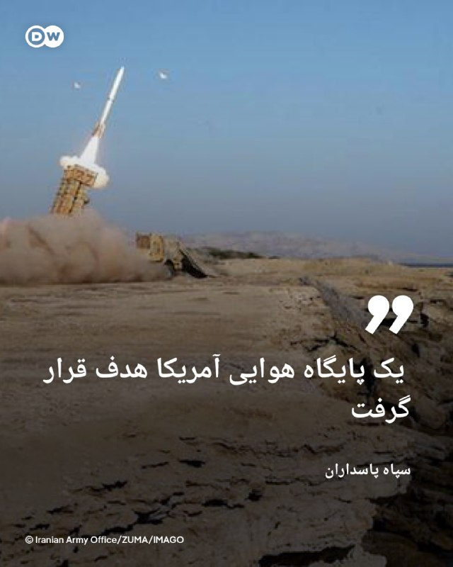

🔶 سپاه پاسداران: یک پایگاه هوایی آمریکا هدف قرار گرفت
 
سپاه پاسداران دوشنبه ۱۱ خرداد (اول ژوئن) در اطلاعیه‌ای اعلام کرد که یک "پایگاه هوایی مبدأ تجاوز" را که به گفته سپاه، آمریکا از آن در حمله به یک "دکل مخابراتی در شهرستان سیریک استان هرمزگان" استفاده کرده بود، هدف قرار داده است.
 
به گزارش سپاه نیوز نیروهای هوافضای سپاه این پایگاه را "مورد هدف قرار دادند و اهداف پیش‌بینی شده منهدم گردید".
 
در اطلاعیه سپاه به کشوری که این پایگاه هوایی در آن مستقر بوده، اشاره‌ای نشده است، با این حال به گزارش خبرگزاری فرانسه همزمان کویت در همین روز از حملات موشکی و پهپادی به خاک خود خبر داد.
 
سپاه در بیانیه‌ خود هشدار داده است که "در صورت تکرار تجاوز، پاسخ کاملاً متفاوت خواهد بود" و مسئولیت بر عهده آمریکاست.
 
همزمان فرماندهی ایالات متحده آمریکا نیز اعلام کرد که "حملات دفاعی را در روزهای شنبه و یکشنبه علیه مراکز راداری و مراکز فرماندهی و کنترل پهپادهای ایران در شهر گروک و جزیره قشم" انجام داده است. در اطلاعیه سنتکام گفته شده که این حملات در واکنش به اقدامات تهاجمی ایران در زمان آتش‌بس صورت گرفت.
@dw_farsi

## DW_Farsi — post 125357

  

🔶 ترامپ: بخش عمده توافق با ایران درباره فعالیت‌های هسته‌ای است
 
دونالد ترامپ، رئیس جمهور آمریکا، تأکید کرد بخش عمده‌ای از توافق مدنظر این کشور با ایران، درباره فعالیت‌ هسته‌ای جمهوری اسلامی است.
 
او روز دوشنبه اول ژوئن با انتشار پستی در شبکه اجتماعی متعلق به خودش، تروث سوشال، با رد گزارش شبکه خبری "سی‌ان‌ان"‌ درباره جزئیات توافق احتمالی آمریکا با ایران نوشت: «در این توافق به‌روشنی و کاملاً صریح آمده است که ایران نباید به سلاح هسته‌ای دست پیدا کند. سپس در ادامه، با جزئیات فراوان و بسیار قاطع، به جنبه‌های مختلف دیگر موضوع هسته‌ای پرداخته می‌شود. در واقع بخش عمده این توافق دقیقا درباره همین موضوع است.»
 
این گفته ترامپ در حالی است که پیش‌تر شبکه خبری "سی‌بی‌اس" گزارش داده بود که رئیس جمهور آمریکا اصلاحاتی را در متن تفاهم‌نامه میان تهران و واشنگتن اعمال کرده و نسخه جدید از طریق میانجی‌ها برای تأیید به تهران ارسال شده است.
 
در این گزارش گفته شده بود که این سومین باری است که ترامپ در پیشنهاد آمریکا تغییر وارد کرده است.
@dw_farsi

## DW_Farsi — post 125356

  

🔶 سنتکام از حملات جدید نیروهای آمریکایی به گورک و قشم خبر داد
 
فرماندهی مرکزی ایالات متحده آمریکا، سنتکام، دوشنبه اول ژوئن (۱۱ خرداد) با انتشار بیانیه‌ای در شبکه ایکس اعلام کرد، ارتش آمریکا در دو روز گذشته "حملاتی را در دفاع از خود" علیه سایت‌های راداری و مراکز فرماندهی و کنترل پهپاد ایران در منطقه روستایی گورک و جزیره قشم انجام داده است.
 
در بیانیه گفته شده این "حملات سنجیده و حساب‌شده در روزهای شنبه و یکشنبه (۳۰ و ۳۱ مه) در پاسخ به اقدامات تهاجمی ایران از جمله سرنگون کردن یک پهپاد MQ-1 صورت گرفت که بر فراز آب‌های بین‌المللی در حال مأموریت بود".
 
سنتکام افزود: «جنگنده‌های آمریکایی به سرعت واکنش نشان دادند و سامانه‌های پدافند هوایی ایران، یک ایستگاه کنترل زمینی و دو پهپاد تهاجمی انتحاری را که تهدیدی آشکار برای کشتی‌های در حال عبور از منطقه محسوب می‌شدند، منهدم کردند.»
 
در بیانیه سنتکام گفته شده است که هیچ‌یک از نیروهای نظامی آمریکا در این عملیات آسیب ندیدند.
 
سنتکام تأکید کرده است که "در برابر اقدامات خصمانه و غیرموجه ایران به حفاظت از تجهیزات، نیروها و منافع ایالات متحده ادامه خواهد داد".
@dw_farsi

## Persian_Trend_Official — post 15428

  

محمد باقر قالیباف، رئیس مجلس شورای اسلامی: محاصره دریایی و تشدید جنایات جنگی در لبنان، گواه عدم پایبندی واشنگتن به آتش بس است و هر گزینه ای بهایی دارد که پرداخت خواهد شد.

📝 Amir

📌 @persian_trend_official
پرشین ترند | متفاوت‌ترین کانال نظامی

## Persian_Trend_Official — post 15427

  <a href="telegram/content/Persian_Trend_Official_15427_1780307110.mp4" target="_blank">🎬 Download video</a>

گشت زنی پهپاد شناسایی رزمی کمان-12 نیروی هوایی ارتش برفراز کردستان عراق!

احتمال دارد که نیروی هوایی قصد داشته باشد حملاتی را علیه گروه های تروریستی و تجزیه طلب انجام دهند.

📝 Amir

📌 @persian_trend_official
پرشین ترند | متفاوت‌ترین کانال نظامی

## Persian_Trend_Official — post 15426

  <a href="telegram/content/Persian_Trend_Official_15426_1780307111.mp4" target="_blank">🎬 Download video</a>

ویدیویی از تخلیه ضاحیه بیروت توسط شهروندان لبنانی

📝 Amir

📌 @persian_trend_official
پرشین ترند | متفاوت‌ترین کانال نظامی

## Persian_Trend_Official — post 15425

  

نخست وزیر اسرائیل اعلام کرد که به ارتش اسرائیل دستور داده است تا به اهداف حزب الله در منطقه ضاحیه بیروت حمله کند!

📝 Amir

📌 @persian_trend_official
پرشین ترند | متفاوت‌ترین کانال نظامی

## Persian_Trend_Official — post 15424

  

سپاه پاسداران در حمله امروز صبح خود به پایگاه هوایی امریکا در کویت از یک فروند موشک بالستیک سوخت جامد ذوالفقار/دزفول استفاده کرده است.

موشک بالستیک سوخت جامد دزفول با برد 1000 کیلومتر بخاطر بهرگیری از یک کلاهک جداشونده، ماکسیسم سرعت 9 ماخ و مانور های که برای اصلاح مسیر انجام می‌دهد یکی از محلک ترین موشک های ساخت ایران برای هدف قرار دادن پایگاه های امریکا در سطح منطقه محسوب میشود، موشک سوخت جامد ذوالفقار نیز نمونه اولیه دزفول محسوب می‌شود که بردی 700 کیلومتری دارد.

ولی نکته جالبتر ماجرا این است که امریکا به طور رسمی سرنگونی MQ-1 خود را گردن گرفت! پهپاد MQ-1 سال هاست که از ارتش امریکا بازنشسته شده، شاید دلیل مجدد عملیاتی شدن این پهپاد در سازمان رزم نیروی هوایی امریکا جایگزینی سریع آن با ناوگان MQ-9 های منهدم شده در جنگ اخیر باشد.

📝 Amir

📌 @persian_trend_official
پرشین ترند | متفاوت‌ترین کانال نظامی

## Persian_Trend_Official — post 15423

  <a href="telegram/content/Persian_Trend_Official_15423_1780307113.mp4" target="_blank">🎬 Download video</a>

سپاه پاسداران نیز در پاسخ به حمله بامداد امریکا، باری دیگر به کویت حمله موشکی کرد.

اطلاعیه روابط عمومی سپاه: به‌دنبال تجاوز ساعتی پیش ارتش متجاوز امریکا به یک دکل مخابراتی در سیریک واقع در استان هرمزگان، رزمندگان نیروی هوافضای سپاه، پایگاه هوایی مبدأ تجاوز را مورد هدف قرار دادند و اهداف پیش‌بینی‌شده منهدم گردید.

نیروی هوافضای سپاه اخطار داد در صورت تکرار تجاوز، پاسخ کاملاً متفاوت خواهد بود و مسئولیت آن به‌عهده رژیم متجاوز و کودک‌کش امریکا است.

📝 Amir

📌 @persian_trend_official
پرشین ترند | متفاوت‌ترین کانال نظامی

## Persian_Trend_Official — post 15422

  <a href="telegram/content/Persian_Trend_Official_15422_1780307114.webm" target="_blank">🎬 Download video</a>

فرماندهی مرکزی ایالات متحده (CENTCOM) دیشب حملات دفاع از خود را علیه سایت‌های راداری ایران و مراکز فرماندهی و کنترل پهپادها در گورکِ ایران و جزیره قشم انجام داد.

این حملات سنجیده و برنامه‌ریزی‌شده در روزهای شنبه و یکشنبه، در پاسخ به اقدامات تهاجمی ایران صورت گرفت؛ اقداماتی که شامل سرنگونی یک پهپاد آمریکایی ام‌کیو-1 بود که بر فراز آب‌های بین‌المللی در حال فعالیت بود. هواپیماهای جنگنده آمریکا به سرعت واکنش نشان دادند و سامانه‌های پدافند هوایی ایران، یک ایستگاه کنترل زمینی و دو پهپاد انتحاری را که تهدیدی آشکار برای کشتی‌های عبوری در آب‌های منطقه محسوب می‌شدند، منهدم کردند.

هیچ‌یک از نیروهای نظامی آمریکایی آسیب ندیدند. سنتکام اعلام کرد که در طول آتش‌بس جاری، در پاسخ به آنچه تجاوزات غیرموجه ایران خوانده است، به حفاظت از دارایی‌ها و منافع ایالات متحده ادامه خواهد داد.

📝 Amir

📌 @persian_trend_official
پرشین ترند | متفاوت‌ترین کانال نظامی

## Persian_Trend_Official — post 15421

  

https://castbox.fm/vi/951612861

نسخه صوتی لایو در کست باکس

## Persian_Trend_Official — post 15420

  

https://open.spotify.com/episode/0CF20BnA3gtwwgJR9EIr5S?si=3mfbbnZZT1GX37e_rQmdwA

نسخه صوتی لایو در اسپاتیفای

## RadioFarda — post 157764

  

🔸اسماعیل بقائی، سخنگوی وزارت خارجه ایران می‌گوید اقدام جمهوری اسلامی در هدف قرار دادن مبادی و امکاناتی که برای اقدامات نظامی علیه کشور مورد استفاده قرار می‌گیرد، «قانونی» و در چارچوب «حق دفاع مشروع» است.

🔸بقائی این اظهارات را پس از آنکه سپاه اعلام کرد یک پایگاه هوایی مورد استفاده آمریکا برای حمله به جنوب ایران را هدف قرار داده است، بیان کرد.

🔸با آنکه سپاه نام این پایگاه را مشخص نکرده، اما ارتش کویت روز دوشنبه اعلام کرد پدافند هوایی این کشور «حملات خصمانه موشکی و پهپادی» را رهگیری کرده است. آمریکا در کویت دارای پایگاه نظامی است.

🔸این حمله اندکی پس از آن انجام شد که سنتکام، فرماندهی مرکزی آمریکا، اعلام کرد طی دو روز اخیر در پاسخ به «اقدامات تهاجمی ایران، از جمله سرنگونی یک پهپاد ام‌کیو-۱ آمریکا که بر فراز آب‌های بین‌المللی فعالیت می‌کرد»، به مواضع نظامی ایران در سواحل خلیج فارس حمله کرده است.

🔸بقائی نیز بدون اشاره به پایگاهی که سپاه مدعی است به آنجا حمله کرده، افزود: «دولت‌ها تعهد قانونی دارند که مانع از استفاده طرف‌های متجاوز از قلمرو و امکانات آنها برای تعرض به یک کشور دیگر شوند.»

@RadioFarda

## RadioFarda — post 157763

«موج تازه» تشکیل پرونده‌های انضباطی و صدور احکام سنگین برای دانشجویان در ایران

🔸روزنامه شرق در گزارشی از «موج تازه» تشکیل پرونده‌های انضباطی و صدور احکام سنگین برای دانشجویان در چند دانشگاه ایران خبر داده است؛ موجی که به نوشته این روزنامه، از اسفند ۱۴۰۴ و تنها چند روز پس از بازگشایی دانشگاه‌ها آغاز شد و اکنون در خرداد ۱۴۰۵، همزمان با ادامه تعطیلی دانشگاه‌ها به‌دلیل جنگ، دوباره شدت گرفته است.

🔸همزمان، کانال تلگرامی «خبرنامه امیرکبیر» روز دوشنبه ۱۱ خرداد خبر داد که ۵۳ تشکل، نشریه و نهاد دانشجویی دانشگاه صنعتی شریف، در نامه‌ای مشترک به رئیس این دانشگاه، به احکام اخیر کمیته‌های انضباطی اعتراض کردند و خواستار لغو فوری احکام صادرشده و توقف روند جاری رسیدگی‌ها شدند.

🔸امضاکنندگان این نامه گفته‌اند در هفته‌های اخیر شماری از دانشجویان، از جمله به‌دلیل فعالیت در فضای مجازی، به کمیته‌های انضباطی احضار شده و برای برخی از آنان احکام بدوی و تجدیدنظر صادر شده است. آن‌ها روند رسیدگی را همراه با نقض ضوابط شکلی و اصول مندرج در شیوه‌نامه انضباطی دانسته‌اند.

🔸این نامه پس از آن منتشر می‌شود که شورای صنفی دانشجویان شریف پیشتر از احضار دست‌کم ۳۰ دانشجو و صدور حداقل شش حکم اخراج خبر داده بود؛ پرونده‌هایی که بنا بر گزارش‌ها، بخشی از آن‌ها به محتوای صفحات شخصی، پیام در گروه‌های خصوصی و بازنشر مطالب در شبکه‌های اجتماعی مربوط است.

🔸بر اساس گزارش روزنامه شرق، در دانشگاه صنعتی شریف پنج تا هفت دانشجو حکم اخراج گرفته‌اند و بیش از ۲۰ دانشجو نیز با احکام تعلیق یک تا سه ترم از تحصیل روبه‌رو شده‌اند. دانشجویان این دانشگاه گفته‌اند احضارها گاه بدون ارائه توضیح درباره اتهام انجام شده و در برخی موارد، جلسه تفهیم اتهام و صدور رأی در یک روز برگزار شده است.

🔸به نوشته شرق، بخشی از اتهامات در دانشگاه شریف به فعالیت دانشجویان در فضای مجازی مربوط است. یک دانشجو گفته است سه نفر تنها به‌دلیل فعالیت در تلگرام و شبکه ایکس حکم اخراج گرفته‌اند و در یک مورد، مصداق حکم، عکس پروفایل دانشجو بوده است. دانشجویان همچنین می‌گویند در جلسات کمیته انضباطی، به‌جای ارائه سند روشن، به گزارش افراد موسوم به «مطلع» استناد شده است.

🔸نسخه کامل این گزارش را در وب‌سایت رادیوفردا بخوانید.

@RadioFarda

## RadioFarda — post 157762

  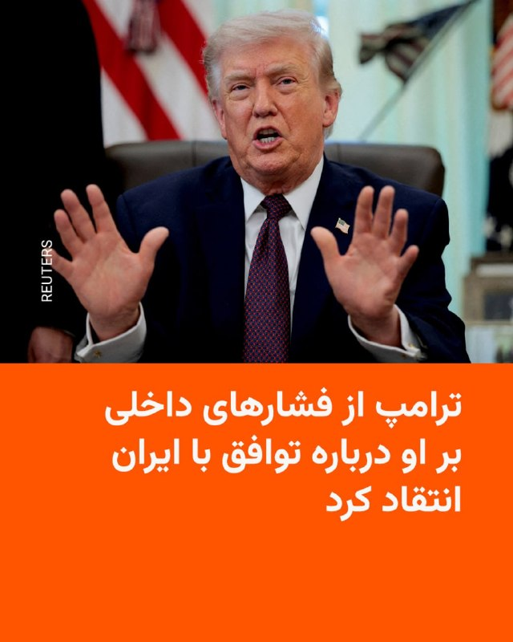

🔸دونالد ترامپ در پستی تازه در تروث‌سوشال از واکنش‌های چهره‌های سیاسی به نحوه برخورد دولت او با حکومت ایران برای دستیابی به توافق انتقاد کرد و نوشت که این فشارها کار را برای او «سخت‌تر» می‌کند.

🔸او در این پست در شبکه اجتماعی خود تأکید کرد که «ایران واقعاً می‌خواهد به توافق برسد، و این توافق برای آمریکا و کسانی که با ما هستند، توافق خوبی خواهد بود.»

🔸ترامپ با بازی با واژهای «دمو» و «دام» به معنی احمق، به طعنه دموکرات را «داموکرات‌ها» [نادان‌ها] نامید و به آنها و «برخی جمهوری‌خواهانِ ظاهراً غیرمیهن‌پرست» نوشت که آنها «نمی‌فهمند که وقتی آدم‌های سیاسیِ فرصت‌طلب مدام و به شکلی بی‌سابقه منفی‌بافی می‌کنند و پشت سر هم می‌گویند که باید سریع‌تر عمل کنم، یا کندتر پیش بروم، یا وارد جنگ شوم، یا نشوم، یا هر چیز دیگری، انجام درست وظیفه و مذاکره برای من خیلی سخت‌تر می‌شود؟»

🔸رئیس‌جمهور آمریکا خطاب به منتقدان خود در ارتباط با توافق با جمهوری اسلامی، نوشت: «فقط آرام باشید و استراحت کنید؛ در نهایت همه‌چیز خوب پیش خواهد رفت — همیشه همین‌طور بوده است!»

@RadioFarda

## RadioFarda — post 157761

  

🔸روزنامه دنیای اقتصاد در گزارشی نوشته که نرخ بهای خدمات مرتبط با کفن و دفن در «بهشت ‌زهرا» در تهران، به‌طور میانگین حدود ۴۰ درصد و در برخی موارد حتی تا ۵۰ درصد افزایش یافته است.

🔸در این گزارش آمده که بر اساس مصوبه جدید شورای شهر تهران، تعرفه خدمات مختلف از جمله هزینه انتقال هر متوفی از سطح شهر تهران تا شعاع ۱۰ کیلومتری به ۹ میلیون و ۷۵۰ هزار ریال رسیده و افزایشی ۵۰ درصدی داشته است.

🔸این گزارش می‌افزاید که هزینه‌های مربوط به تغسیل، تکفین، نگهداری در سردخانه، نصب سنگ مزار، قاب بتنی و آماده‌سازی متوفی برای انتقال نیز با افزایش محسوسی همراه شده است.

🔸این افزایش تعرفه‌ها در شرایطی اعمال می‌شود که فشارهای اقتصادی بر شهروندان ایران بعد از حملات آمریکا و اسرائیل و نیز محاصره بنادر ایران، به شدت افزایش یافته است.

🔸گزارش‌های شهروندی و حتی اقتصاددانان حاکی از شرایط بحرانی اقتصاد ایران است و حتی نهادهای رسمی و امنیتی همچون وزارت اطلاعات جمهوری اسلامی نیز نسبت به احتمال وقوع اعتراضات خیابانی ناشی از فشارهای اقتصادی هشدار داده‌اند.

@RadioFarda

## RadioFarda — post 157760

🔸وب‌سایت آکسیوس به نقل از منابع خود گزارش داده که تلاش جدید آمریکا برای آتش‌بس میان اسرائیل و لبنان «شکست» خورده است.

🔸منابع اکسیوس به این رسانه گفته‌اند که اسرائیل به دنبال چراغ سبز آمریکا برای انجام حملات گسترده به اهداف حزب‌الله در بیروت است و همزمان عملیات زمینی خود در لبنان را گسترش داده است.

🔸به گفته یک مقام آمریکایی در گفتگو با آکسیوس، «ایالات متحده انتظار ندارد که اسرائیل حملات مداوم علیه غیرنظامیانش از سوی یک سازمان تروریستی [حزب‌الله لبنان] را تحمل کند.»

🔸حزب‌الله که هم یک گروه شبه‌نظامی و هم یک حزب سیاسی است، بخش بزرگی از جنوب لبنان را کنترل می‌کند. ایالات متحده آن را یک سازمان تروریستی می‌داند، اما اتحادیهٔ اروپا فقط شاخهٔ نظامی آن را در فهرست سیاه قرار داده است.

🔸خبرگزاری فرانسه نیز به نقل از یک مقام آمریکایی نوشته که حزب‌الله باید نخستین طرفی باشد که حملات خود را در جریان درگیری با اسرائیل متوقف می‌کند.

🔸این خبر پس از دیدار و مذاکره مارکو روبیو، وزیر خارجه آمریکا، در روز یکشنبه با جوزف عون، رئیس‌جمهور لبنان، و بنیامین نتانیاهو، نخست‌وزیر اسرائیل، منتشر می‌شود.

@RadioFarda

## RadioFarda — post 157759

  

🔸ایالات متحده اعلام کرد طی دو روز اخیر به مواضع نظامی ایران حمله کرده و سپاه پاسداران نیز روز دوشنبه ۱۱ خرداد گفت «در پاسخ»، یکی از پایگاه‌های مورد استفاده آمریکا را هدف قرار داده است.

🔸سنتکام، فرماندهی مرکزی آمریکا، در پیامی در شبکه اجتماعی ایکس اعلام کرد حملات به سواحل ایران در خلیج فارس در پاسخ به «اقدامات تهاجمی ایران، از جمله سرنگونی یک پهپاد ام‌کیو-۱ آمریکا که بر فراز آب‌های بین‌المللی فعالیت می‌کرد» انجام شد.

🔸سنتکام افزود: «جنگنده‌های آمریکایی به‌سرعت واکنش نشان دادند و پدافند هوایی ایران، یک ایستگاه کنترل زمینی و دو پهپاد تهاجمی یک‌طرفه را که تهدیدی آشکار برای کشتی‌های عبوری از آب‌های منطقه بودند، از میان بردند.»

🔸این فرماندهی محل این حملات را منطقه گُروک در سیریک هرمزگان و جزیره قشم اعلام کرده و همچنین افزوده است که به حفاظت از دارایی‌ها و منافع آمریکا در جریان آتش‌بس جاری ادامه خواهد داد.

🔸سپاه پاسداران انقلاب اسلامی روز دوشنبه اعلام کرد یک پایگاه هوایی مورد استفاده آمریکا برای حمله به جنوب ایران را هدف قرار داده است، اما نام این پایگاه را مشخص نکرد.

@RadioFarda

## RadioFarda — post 157758

  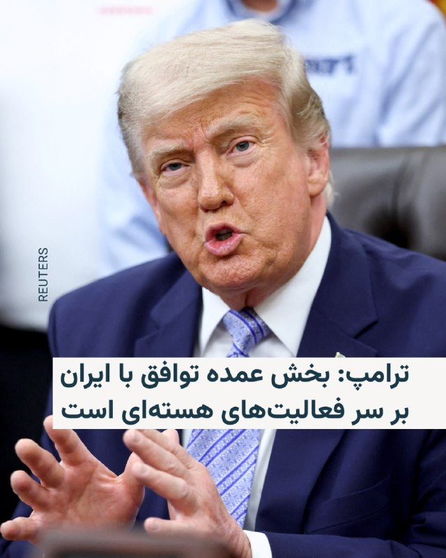

🔸دونالد ترامپ، رئیس‌جمهور آمریکا، می‌گوید بخش عمده توافق هسته‌ای مدنظر واشینگتن با تهران، درباره فعالیت‌های هسته‌ای جمهوری اسلامی است.

🔸او در پستی که در شبکه اجتماعی خود تروث‌سوشال منتشر کرده، گزارش شبکه خبری سی‌ان‌ان مبنی بر اینکه توافق احتمالی ترامپ با ایران، شامل پرونده هسته‌ای این کشور نمی‌شود را رد کرد.

🔸ترامپ نوشت که این توافق «خیلی روشن بیان می‌کند که ایران به سلاح هسته‌ای دست نخواهد یافت. سپس با جزئیات فراوان و بسیار قاطع، به جنبه‌های مختلف دیگر موضوع هسته‌ای می‌پردازد. در حقیقت، بیشتر این توافق دقیقاً درباره همین موضوع است.»

🔸به جز سی‌ان‌ان، شماری از خبرگزاری‌های نزدیک به سپاه پاسداران، از جمله تسنیم و فارس، به‌طور مکرر به نقل از منابع آگاه می‌نویسند که این توافق پیشنهادی آمریکا، دست‌کم در مرحله اول شامل فعالیت هسته‌ای جمهوری اسلامی نیست.

@RadioFarda

## RadioFarda — post 157757

  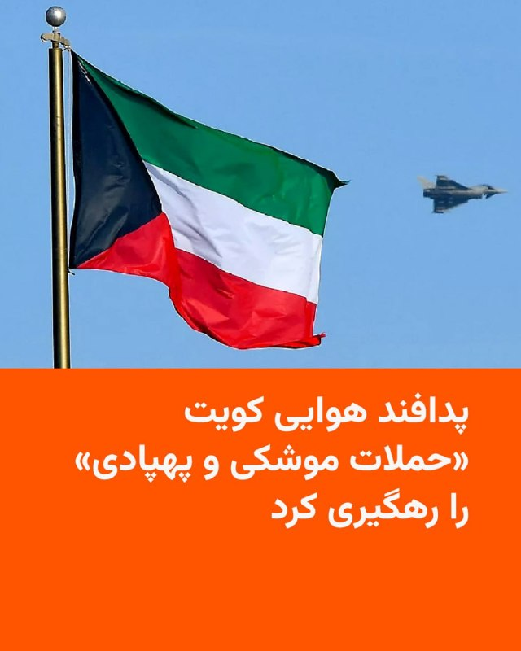

🔸ارتش کویت روز دوشنبه ۱۱ خرداد اعلام کرد پدافند هوایی این کشور «حملات خصمانه موشکی و پهپادی» را رهگیری کرده است.

🔸ستاد کل ارتش کویت در پیامی در حساب رسمی خود در شبکه اجتماعی ایکس نوشت: «هرگونه صدای انفجار شنیده‌شده، ناشی از رهگیری این حملات خصمانه توسط سامانه‌های پدافند هوایی است.»

🔸خبرگزاری دولتی کویت، کونا، نیز گزارش داد که آژیرهای هشدار در سراسر این کشور به صدا درآمده است.

🔸کویت میزبان یکی از پایگاه‌های مهم نظامی آمریکا در منطقه است. جزئیات بیشتری درباره منشأ حملات، محل اصابت احتمالی یا خسارات ناشی از آن‌ها منتشر نشده است.

🔸این رخداد در حالی گزارش شده که آتش‌بس میان آمریکا و ایران برقرار است، اما دو طرف از زمان آغاز این آتش‌بس در اوایل آوریل، به‌طور پراکنده دست به تبادل حملات زده‌اند.

@RadioFarda

## RadioFarda — post 157756

  

🔸قوه قضائیه ایران اعلام کرد که دو نفر دیگر از معترضان دی‌ماه ۱۴۰۴ را به اتهام «آتش‌زدن مسجد»، «لیدری کودتا»، «تخریب اموال عمومی» و «مسدودسازی خیابان‌ها» اعدام کرده است.

🔸نام این دو معترض که بامداد دوشنبه یازدهم خرداد اعدام شدند، مهرداد محمدی‌نیا و اشکان مالکی اعلام شده است.

🔸ارگان رسمی دستگاه قضایی ایران، میزان، نوشته این دو «از عوامل اصلی آتش‌زدن مسجد جعفری در محله کوی نصر تهران [بودند] که اقدام به تخریب و آتش‌زدن مسجد، تخریب اموال عمومی، درگیری با مأموران حافظان امنیت، انسداد خیابان‌ها و ممانعت از عبور و مرور مردم کرده بودند.»

🔸دستگاه قضایی جمهوری اسلامی در ماه‌های اخیر به شکل تقریباً روزانه اقدام به اجرای احکام اعدام معترضان و یا افرادی می‌کند که آن‌ها را به همکاری با آمریکا و اسرائیل متهم می‌کند. برخی نهادهای حقوق‌بشری می‌گویند جمهوری اسلامی از اعدام برای ایجاد فضای ترس و به‌عنوان عامل سرکوب استفاده می‌کند.

@RadioFarda

## RadioFarda — post 157755

  <a href="telegram/content/RadioFarda_157755_1780307119.mp4" target="_blank">🎬 Download video</a>

🔸سپاه پاسداران روز دوشنبه ۱۱ خرداد از هدف قرار دادن یک پایگاه هوایی ارتش آمریکا به دلیل آنچه «تجاوز به یک دکل مخابراتی در جزیره سیریک» خوانده،‌ خبر داد.

🔸همزمان حساب کاربری وحید آنلاین ساعت ۶:۳۰ صبح دوشنبه به وقت ایران ویدئویی از 'شلیک یک موشک از امیدیه در خوزستان را منتشر کرد.

🔸در اطلاعیه سپاه آمده: «به دنبال تجاوز ساعتی پیش ارتش متجاوز آمریکا به یک دکل مخابراتی در جزیره سیریک واقع در استان هرمزگان، رزمندگان نیروی هوافضای سپاه پایگاه هوایی مبدأ تجاوز را مورد هدف قرار دادند و اهداف پیش‌بینی شده منهدم گردید.»

🔸نیروی هوافضای سپاه همچنین هشدار داده است که در صورت تکرار حملات، پاسخ «کاملا متفاوت» خواهد بود و مسئولیت آن به عهده «رژیم متجاوز و کودک‌کش آمریکا» است.

🔸از سوی دیگر ارتش کویت صبح دوشنبه اعلام کرد که پدافند هوایی این کشور در حال مقابله با حملات موشکی و پهپادی «خصمانه» است.

🔸ستاد کل ارتش کویت در بیانیه‌ای که در شبکه اجتماعی ایکس منتشر شده اعلام کرد که اگر صداهای انفجاری شنیده شود، «ناشی از رهگیری حملات خصمانه توسط سیستم‌های پدافند هوایی است.»

@RadioFarda

## IranianMinds — post 21181

  

بیانیه سنتکام درباره حملات شنبه و یکشنبه
(از جمله حمله ساعاتی پیش به سیریک هرمزگان که گویا ساعت ۴ صبح دوشنبه به وقت ایران انجام شده. در آمریکا هنوز یکشنبه اس

ادعای سنتکام:
"آمریکا در واکنش به حمله ایران، از خود دفاع کرد و تهدیدها را از کار انداخت

تامپا، فلوریدا — فرماندهی مرکزی ایالات متحده آمریکا، سنتکام، این آخر هفته حملات دفاعی علیه سایت‌های راداری ایران و مراکز فرماندهی و کنترل پهپادها در گروک ایران و جزیره قشم انجام داد.

این حملات حساب‌شده و عامدانه، روزهای شنبه و یکشنبه و در پاسخ به اقدامات تهاجمی ایران انجام شد؛ اقداماتی که شامل سرنگونی یک پهپاد MQ-1 آمریکا بود که بر فراز آب‌های بین‌المللی فعالیت می‌کرد. جنگنده‌های آمریکایی به‌سرعت واکنش نشان دادند و پدافند هوایی ایران، یک ایستگاه کنترل زمینی، و دو پهپاد تهاجمی یک‌طرفه را که تهدیدی آشکار برای کشتی‌های در حال عبور از آب‌های منطقه‌ای محسوب می‌شدند، منهدم کردند.

هیچ‌یک از نیروهای نظامی آمریکا آسیب ندیدند. سنتکام در جریان آتش‌بس جاری، در واکنش به تجاوز بی‌دلیل ایران، به حفاظت از دارایی‌ها و منافع ایالات متحده ادامه خواهد داد."

@IranianMinds

## IranianMinds — post 21180

🔴 ترافیک شدید در ضاحیه بیروت مردم در حال تخلیه این منطقه هستند @IranianMinds

## IranianMinds — post 21179

  

🔴 ترافیک شدید در ضاحیه بیروت
مردم در حال تخلیه این منطقه هستند

@IranianMinds

## IranianMinds — post 21178

🔴 گالانت : نتانیاهو اعلام کرده خاورمیانه دیگر جای حزب الله نیست و تا نابودی کامل جلو خواهیم رفت

@IranianMinds

## IranianMinds — post 21177

🔴 بقایی: ما هر وقت لازم باشد که در رابطه با موضوعات هسته‌ای کاری انجام دهیم، به خوبی می‌دانیم چگونه عمل کنیم

در مورد جزئیات مباحث مرتبط با موضوع هسته‌ای، هیچ مذاکره‌ای در این مرحله صورت نگرفته است. بار دیگر تأکید می‌کنم که تمرکز ما در این مرحله بر خاتمه جنگ است.

@IranianMinds

## IranianMinds — post 21176

چرا این روزها همه سایت جهانی MelBet رو انتخاب میکنن 
⁉️

🎁 شارژ هدیه 130 دلاری اولین واریز

🎁 شارژ هدیه 100 دلاری در روز های یکشنبه و چهارشنبه

🎁 و ده ها بانس ارزنده دیگر...

🥇 متنوع ترین آپشن های ورزشی

🖥 پخش زنده مسابقات

🎮 بیش از 80 نوع ورزش مجازی با پخش زنده

⭐ کاملترین کازینو آنلاین

🛡 امنیت فوق العاده بالا

💵 واریز آنی جوایز با بیش از 30 روش شارژ و برداشت، از جمله کارت بکارت

🌐 اسپانسر رسمی لالیگای اسپانیا

😀 مورد تایید سازمان Gambling Judge

✅ معرفی سایت و اپلیکیشن مل‌بت

💯 ورود به سایت مل‌بت (فیلترشکن خاموش)

## IranianMinds — post 21174

🔴 نتانیاهو: ما دستور بمباران ضاحیه بیروت را صادر کردیم

@IranianMinds

## IranianMinds — post 21173

گزارشاتی از انفجار در بندرعباس

## IranianMinds — post 21172

  <a href="telegram/content/IranianMinds_21172_1780307122.mp4" target="_blank">🎬 Download video</a>

🔴 این روزا خود عرزشیام ضد جمهوری اسلامی شدن!

میخوان عید غدیر جشن پیروزی بگیرن، آخه چه جشنی؟ ما حتی هنوز رهبرمون هم دفن نکردیم.

تا کی میخواین مارو گول بزنین، مگه رهبر شهیدمون نمی گفت با آمریکا مذاکره نکنین؟ دیگه حالم ازتون بهم میخوره.

@IranianMinds

## IranianMinds — post 21171

  

🔴 ترامپ کراش زده رو رئیس جمهور چین

ترامپ این عکس از خودش و رئیس‌جمهور چین رو منتشر کرده.

@IranianMinds

## IranianMinds — post 21170

🔴 سپاه:
به پایگاه مبدأ حملات، حمله کردیم.

+ نقض آتش بس چی هست اصن؟

@IranianMinds

## IranianMinds — post 21169

🔴 سنتکام:

در پایان این هفته، در عملیاتی کاملاً دفاعی، به چندین مواضع جمهوری‌اسلامی تو قشم حمله کردیم.

@IranianMinds

## BBCPersian — post 282548

🔻مراسم سالگرد خمینی امسال بدون مهمان خارجی و بدون سخنرانی نوه او برگزار می‌شود

مسئولان برگزاری مراسم سالگرد درگذشت روح‌الله خمینی، می‌گویند در مراسم امسال مهمان خارجی حضور نخواهد داشت و حسن خمینی، نوه بنیان‌گذار جمهوری اسلامی، هم سخنرانی نخواهد کرد.

این مراسم هر سال در ۱۴ خرداد در آرامگاه آیت‌الله خمینی با حضور مقام‌های ارشد سیاسی و نظامی ایران و برخی از سفرای خارجی برگزار می‌شد و طی آن علی خامنه‌ای و حسن خمینی سخنرانی می‌کردند.

محمدعلی انصاری، از برگزارکنندگان این مراسم، گفت که در مراسم امسال پیامی از مجتبی خامنه‌ای قرائت خواهد شد.

او همچنین گفت که امسال «امکان حضور گسترده زائران مانند سال‌های گذشته فراهم نیست» ولی «کاروان‌های استانی... عمدتا از استان‌های همجوار و با برنامه‌ریزی مشخص اعزام خواهند شد.»

@BBCPersian

## BBCPersian — post 282547

🔻هیئت رئیسه: جلسات رسمی مجلس «به‌زودی» برگزار می‌شود

علیرضاسلیمی، عضو هیئت رئیسه مجلس گفت: «فرآیند هماهنگی‌ها و مقدمات لازم طبق نظر شورای عالی امنیت ملی برای برگزاری جلسات علنی مجلس آغاز شده تا جلسات به زودی برگزار شود.»

عباس گودرزی، سخنگوی هیئت رئیسه مجلس، هم امروز گفته بود که «هیئت رئیسه مجلس مخالفتی با برگزاری جلسات ندارد اما این امر مستلزم تایید مراجع امنیتی است.»

آخرین جلسه علنی مجلس شورای اسلامی در محل دائمی، بهمن سال گذشته بود. پس از حمله آمریکا و اسرائیل به ایران در نهم اسفند، جلسات مجلس دیگر در محلش تشکیل نشده است.

به گفته آقای گودرزی در این مدت «چهار جلسه مجازی صحن» و «نزدیک به ۱۵۰ جلسه کمیسیون‌ها» برگزار شده است.

مطابق قوانین ایران جلسات مجلس فقط باید در محل دائمی آن برگزار شود.

@BBCPersian

## BBCPersian — post 282546

  

🔻بقایی: تبادل پیام با آمریکا با سوءظن و بدگمانی ادامه دارد

سخنگوی وزارت خارجه جمهوری اسلامی می‌گوید که مذاکره ایران با آمریکا «در دل سوءظن و بدگمانی شدید» شروع شد و اکنون هم تبادل پیام در همین فضا ادامه دارد.

اسماعیل بقایی در کنفرانس خبری تاکید کرد که «مذاکره یا دیپلماسی خود نشانه یا محصول اعتماد بین طرف‌های مذاکره‌کننده نیست.»

آقای بقایی همچنین آمریکا را متهم کرد که با «تغییر مداوم دیدگاه‌های خود» و «پیام‌های رسانه‌ای متفاوت و ضد و نقیض» باعث طولانی شدن روند مذاکره شده است.

آقای بقایی در حالی از ادامه تبادل پیام با واشنگتن سخن گفته است که باوجود آتش‌بس، تبادل آتش پراکنده میان ایران و آمریکا ادامه داشته و در هفته اخیر افزایش هم یافته است.

در تازه‌ترین مورد، سپاه پاسداران اعلام کرد که در پاسخ به حمله آمریکا به «یک دکل مخابراتی در جزیره سیریک» نیروهایش «پایگاه هوایی مبدا» را هدف قرار داده‌اند.

آقای بقایی تاکید کرد که آمریکا و اسرائیل را نمی‌توان «به‌عنوان دو فاعل مجزا» در نظر گرفت.

او یک بار دگیر موضع ایران را تکرار کرد که آتش‌بس در لبنان «بخش لاینفک هرگونه توافق و خاتمه جنگ است.»

@BBCPersian

## BBCPersian — post 282545

🔻صدور دستور قضایی برای توقیف اموال ۷۵ نفر در اراک

خبرگزاری قوه قضاییه ایران، میزان، از صدور حکم قضایی برای توقیف اموال ۷۵ نفر در اراک به اتهام آنچه «عناصر حامی دشمن» خوانده شده، خبر داده است.

میزان، روز یکشنبه به نقل از حجت‌اله درودگر، دادستان عمومی و انقلاب مرکز استان مرکزی، نوشت: «تاکنون ۷۵ پرونده قضایی برای تعدادی از همکاران و مرتبطین مستقیم با شبکه‌های معاند خارج از کشور در دادسرای اراک تشکیل شده است؛ این افراد با اقدامات ضدامنیتی خود، تلاش داشتند تا ضمن همکاری با دشمنان قسم‌خورده ملت، فضای آرام جامعه را ملتهب کنند.»

از زمان آغاز جنگ آمریکا و اسرائیل با ایران، قوه قضاییه این کشور دهها پرونده علیه مخالفان حکومت در داخل و خارج از کشور تشکیل داده و از صدور حکم توقیف و مصادره اموال بسیاری از آنها از جمله چندین چهره سرشناس خبر داده است.

@BBCPersian

## BBCPersian — post 282544

🔻نتانیاهو دستور حمله به اهدافی در جنوب بیروت را صادر کرد

نخست‌وزیر اسرائیل در بیانیه‌ای دستور داد ارتش این کشور اهدافی را در حومه جنوبی پایتخت لبنان، هدف قرار دهد.

منطقه ای که بنیامین نتانیاهو دستور حمله به آن را داده به عنوان پایگاه اصلی حزب‌الله و با نام ضاحیه شناخته می‌شود.

پیشتر گزارش دادیم که رئیس جمهور لبنان حملات اسرائیل به کشورش را محکوم کرده و شورای امنیت سازمان ملل متحد هم امروز جلسه‌ای درباره وضعیت لبنان برگزار خواهد کرد.

@BBCPersian

## BBCPersian — post 282543

🔻ترامپ: ایران می‌خواهد به توافق برسد، همه چیز به خوبی پایان خواهد یافت

دونالد ترامپ، رئیس‌جمهور آمریکا در تازه‌ترین پیامی که در تروث سوشال، شبکه اجتماعی خود، منتشر کرده از تمایل ایران برای رسیدن به توافق خبر داده است.

او نوشته است: «ایران واقعا می‌خواهد به توافق برسد، و این توافق، برای ایالات متحده و کسانی که با ما هستند، خوب خواهد بود.»

او در ادامه این پیام آورده است: «اما آیا دموکرات‌ها، و جمهوری‌خواهان مختلف به ظاهر غیرمیهن‌پرست، نمی‌فهمند که وقتی مهره‌های سیاسی مدام و به شکلی بی‌سابقه در حال اظهار نظرهای منفی هستند و بارها و بارها می‌گویند که باید سریع‌تر عمل کنم، یا کندتر عمل کنم، یا به جنگ بروم، یا به جنگ نروم، یا هر چیز دیگری، انجام درست وظایفم و مذاکره کردن برای من بسیار دشوارتر می‌شود؟ »

او نوشته است: «فقط بشینید و استراحت کنید، آخرش همه چیز به خوبی پایان خواهد یافت.»

@BBCPersian

## BBCPersian — post 282542

🔻هواپیمای نیروی هوایی سلطنتی بریتانیا که هفته گذشته جان هیلی، وزیر دفاع بریتانیا، را حمل می‌کرد، در حال پرواز بر فراز استونی و در نزدیکی مرز روسیه بود که اتفاق عجیبی رخ داد.

بر اساس داده‌های پروازی که سرویس جهانی بی‌بی‌سی بررسی کرده، فرستنده خودکار هواپیما ناگهان موقعیت پرواز آن را در عمق خاک روسیه و حدود ۳۰۰ کیلومتر دورتر از جایی که تنها چند ثانیه پیش قرار داشت نشان داد.

بر اساس این داده‌ها، هواپیما با سرعتی حدود ۱۱ کیلومتر بر ساعت بر فراز دریاچه‌ای در نزدیکی سن‌پترزبورگ در حال حرکت بود.

اما هیچ‌یک از این اطلاعات واقعی نبود. سامانه ناوبری هواپیما بر اثر «جعل سیگنال جی‌پی‌اس» دچار اختلال شده بود.

این پدیده زمانی رخ می‌دهد که یک منطقه با سیگنال‌های کاذب اشباع می‌شود؛ سیگنال‌هایی که دقیقا مشابه فرکانس ماهواره‌های جی‌پی‌اس طراحی شده‌اند تا سیستم‌های پروازی را گمراه کنند.
https://bbc.in/4nZO00U

@BBCPersian

## BBCPersian — post 282541

🔻رئیس جمهور لبنان «تجاوزی وحشیانه و غیرقابل‌قبول از سوی اسرائیل» را محکوم کرد

رئیس‌جمهور لبنان گفت که کشورش با «تجاوزی وحشیانه و غیرقابل‌قبول از سوی اسرائیل» روبه‌روست.

جوزف عون در پیامی در ایکس این عملیات اسرائیل را محکوم کرد و متعهد شد که «برای پایان دادن به رنج مردم لبنان، به‌ویژه ساکنان جنوب، تلاش خواهد کرد.»

شورای امنیت سازمان ملل متحد قرار است امروز در نیویورک نشستی اضطراری درباره لبنان برگزار کند.

این نشست پس از آن برنامه‌ریزی شده که بنیامین نتانیاهو، نخست‌وزیر اسرائیل، اعلام کرد تصرف این قلعه نشان‌دهنده «تغییری مهم و اساسی» در روند درگیری‌هاست.

@BBCPersian

## BBCPersian — post 282540

🔻قوه قضائیه ایران از اعدام دو نفر از معترضان دی خبر داد

خبرگزاری میزان، وابسته به قوه قضائیه ایران گزارش داده است که دو نفر از معترضان دی ماه که به گفته این خبرگزاری به دلیل نقششان در ناآرامی‌های تهران در دادگاه محکوم شده بودند، اعدام شدند.

خبرگزاری میزان این دو نفر را مهرداد محمدی‌نیا و اشکان مالکی معرفی کرده است.

بر اساس این گزارش، این دو نفر در دادگاه به اتهام «آتش زدن یک مسجد، تخریب اموال عمومی و درگیری با نیروهای امنیتی» محاکمه و به اعدام محکوم شده بودند.

قوه قضائیه ایران گفته است که احکام اعدام این دو نفر پیش از اجرا، در دیوان عالی کشور تأیید شده بود.

نهادهای حقوق بشری از جمله گزارشگر ویژه شورای حقوق بشر سازمان ملل متحد در امور ایران از افزایش موارد اعدام در ایران ابراز نگرانی می کنند.

مای ساتو، گزارشگر ویژه سازمان ملل متحد گفته است که ایران از مجازات اعدام «به‌عنوان ابزاری برای سرکوب اعتراضات، ایجاد رعب و وحشت در جامعه و خاموش کردن صدای مخالفان» استفاده می‌کند.

@BBCPersian

## BBCPersian — post 282539

  

🔻سپاه پاسداران اعلام کرده است که نیروی هوافضای آن یک پایگاه هوایی را که به گفته آن در حمله آمریکا به یک دکل مخابراتی در جزیره سیریک مورد استفاده قرار گرفته بود، هدف قرار داده است.

همزمان فرماندهی مرکزی ایالات متحده (سنتکام) اعلام کرد که «حملات دفاعی علیه مراکز راداری و مراکز فرماندهی و کنترل پهپادهای ایران در شهر گروگ و جزیره قشم» انجام داده است.

آمریکا گفته است که این حملات «روزهای شنبه و یکشنبه و در واکنش به اقدامات تهاجمی ایران صورت گرفت که شامل سرنگونی یک پهپاد ام‌کیو۱ آمریکا بود که بر فراز آب‌های بین‌المللی در حال فعالیت بود.»

همزمان اطلاعیه سپاه پاسداران می‌گوید حمله امروز «به دنبال تجاوز ساعتی پیش ارتش متجاوز آمریکا» صورت گرفت اما محل پایگاهی را که هدف حمله سپاه قرار گرفته، مشخص نکرده است.

خبرگزاری فرانسه پیشتر به نقل از ارتش کویت گزارش داده بود که سامانه‌های پدافند هوایی این کشور در حال مقابله با حمله‌ای پهپادی و موشکی هستند.

@BBCPersian
📷REUTERS

## BBCPersian — post 282538

  

‌ ‌ ‌ ‌
خط اتوبوس‌ معروف لهستانی به شماره ۶۶۶ به مقصد شهر هِل - جهنم - که سه سال پیش و به دنبال اعتراضات گروه‌های مذهبی تعطیل شده بود، مجددا فعال خواهد شد.

مسیحیان محافظه‌کار ادعا کرده بودند که شماره این خط اتوبوس که پیوندهایی با شیطان در کتاب مقدس دارد، همراه با نام مقصد، شیطان‌پرستی را ترویج می‌دهد.

مسیر این تفریحگاه ساحلی دریای بالتیک به یک شوخی در بین گردشگران انگلیسی‌زبان تبدیل شده بود.

این سرویس توسط فلیکس‌باس، که مزایای بازاریابی ارائه سرویس شش-شش-شش به هل که فقط با یک حرف ال نوشته می‌شود، احیا می‌شود.

📷PKS GDYNIA/Reuters
@BBCPersian

## BBCPersian — post 282537

  

‌ ‌ ‌ ‌
مطالعه‌ای که توسط دانشمندان آمریکایی انجام شده است، نشان داده است که مصرف روزانه یک قرص می‌تواند طول عمر بیماران مبتلا به سرطان پیشرفته پانکراس را تقریبا دو برابر کند.

کارشناسان این دارو که داراکسونراسیب نام دارد، را به عنوان یک عامل تغییر دهنده در خصوص این سرطان توصیف کرده‌اند.

این آزمایش شامل ۵۰۰ نفر بود که سرطان آنها به سایر اندام‌هایشان گسترش یافته بود.

این مطالعه نشان داد که میانگین زمان بقا برای کسانی که قرص را مصرف کرده‌اند کمی بیش از یک سال بود، در حالی که این زمان برای کسانی که شیمی درمانی دریافت کرده بودند، حدود شش ماه و نیم بود.

این داروی جدید همچنین عوارض جانبی کمتری ایجاد می‌کند.

سرطان پانکراس به دلیل اینکه اغلب دیر تشخیص داده می‌شود و درمان آن دشوار است، میزان مرگ و میر بالایی دارد.

📷Reuters
@BBCPersian

## Dirty_Kids — post 390716

‏پدسگا قیمت رو تو کپشن بنویسید بابام مجبور نشه «کیوت» رو کامنت کنه.🤬

@Dirty_Kids 👻

## Dirty_Kids — post 390715

  <a href="telegram/content/Dirty_Kids_390715_1780307125.mp4" target="_blank">🎬 Download video</a>

عمو مانوک خدابخشیان:

ترامپ آرزو داشت تیم فوتبال داشته باشه ولی روش کارش بیسبالی هست

@Dirty_Kids 👻

## Dirty_Kids — post 390714

سپاه هر روز میگه اسراییل لبنان رو زد و آتش‌بس رو نقض کرده. خب اوکی میخوای چه گوهی بخوری الان مثلا؟

@Dirty_Kids 👻

## Dirty_Kids — post 390713

  <a href="telegram/content/Dirty_Kids_390713_1780307126.mp4" target="_blank">🎬 Download video</a>

این الان باید من و تو میبودیم:)))

وسط کنسرت دیشب کانیه وست از دوست دخترش خواستگاری میکنه

@Dirty_Kids 👻

## Dirty_Kids — post 390712

  <a href="telegram/content/Dirty_Kids_390712_1780307128.mp4" target="_blank">🎬 Download video</a>

نقش خايمالى بهتر بهت مياد شکیب جان✋🏼

@Dirty_Kids 👻

## Dirty_Kids — post 390711

کارگردان روش نشده اسم فیلمشو بذاره جنده خانوم گذاشته بدنام.

@Dirty_Kids 👻

## Dirty_Kids — post 390710

مملکت نه رهبر داره، نه رئیس جمهور نه مجلس، بعد سر کوچه دارن آمریکا رو تهدید میکنن به نابودی!!!

@Dirty_Kids 👻

## Dirty_Kids — post 390707

چی بگم والا اینم با چادر رفت کافه
هممونم بعدشو یادمونه

@Dirty_Kids 👻

## Dirty_Kids — post 390706

  

خایه رو‌ ویدا موحد داشت که تو روزایی که هیشکی جرات نداشت شال از سرش بیفته خیابون انقلاب رو به آتیش کشید نه شما حجاب استایلای کوله به کون

@Dirty_Kids 👻

## Hranews — post 113298

سمنان؛ اموال ۱۸ شهروند دیگر ساکن خارج از کشور توقیف شد

❗️
❗️
❗️
❗️
❗️– اموال و دارایی‌های ۱۸ شهروند ساکن خارج از کشور در استان سمنان توقیف شد. دستگاه قضایی این افراد را به «همکاری با دشمن» متهم کرده است.

ادامه مطلب

↘️
@hranews_bot تماس ✉️ -  @Hranews  کانال هرانا 🆑

## Hranews — post 113297

  

روز یکشنبه ۱۰ خرداد‌ماه، شماری از اساتید اخراجی دانشگاه فرهنگیان در مقابل ساختمان وزارت آموزش و پرورش در تهران، دست به #تجمع_اعتراضی زدند.

لغو احکام بازنشستگی اجباری اعضای هیئت علمی دانشگاه فرهنگیان براساس مصوبه سال ۱۳۹۶ هیات امنای دانشگاه از جمله دلایل اعتراض این اساتید است.

↘️
@hranews_bot تماس ✉️ - @Hranews کانال هرانا 🆑

## Hranews — post 113296

  

اعتراضات دی‌ماه ۱۴۰۴؛ مهرداد محمدی‌نیا و اشکان مالکی اعدام شدند

❗️
❗️
❗️
❗️
❗️– مرکز رسانه قوه قضاییه اعلام کرد مهرداد محمدی‌نیا و اشکان مالکی، از بازداشت‌شدگان اعتراضات دی‌ماه ۱۴۰۴ تهران، سحرگاه امروز #اعدام شدند. دستگاه قضایی این دو نفر را از بابت اتهاماتی از جمله «مشارکت در اقدامات عملیاتی برخلاف امنیت کشور» و «همکاری با دولت‌های متخاصم» به مجازات مرگ محکوم کرده بود.

ادامه مطلب

#مهرداد_محمدی‌نیا
#اشکان_مالکی

↘️
@hranews_bot تماس ✉️ -  @Hranews  کانال هرانا 🆑

## alonews — post 124120

  <a href="telegram/content/alonews_124120_1780307130.webm" target="_blank">🎬 Download video</a>

👈 نحوه برگزاری امتحانات پایان ترم دانشجویان تعیین تکلیف شد

🔴قائم مقام وزیر علوم در گفت‌و‌گو با ایسنا:
امتحانات پایان ترم دانشجویان دوره های کارشناسی ارشد و دکتری دانشگاه های کشور بجز چند دانشگاه فوق در نیمسال جاری به صورت کاملا حضوری برگزار می شود.

🔴دانشجویان کارشناسی برای سال جاری آموزش باقی مانده خود را به صورت مجازی ادامه خواهند داد و آموزش حضوری نخواهند داشت

✅ @AloNews خبر جنگ

## alonews — post 124118

  <a href="telegram/content/alonews_124118_1780307130.mp4" target="_blank">🎬 Download video</a>

👈الحدث: صحنه های آوارگی به سمت منطقه شرق بیروت پس از تهدید نخست وزیر نتانیاهو به حمله در ضاحیه جنوبی بیروت

✅ @AloNews خبر جنگ

## alonews — post 124117

  <a href="telegram/content/alonews_124117_1780307132.webm" target="_blank">🎬 Download video</a>

👈محمدباقر قالیباف:
محاصره دریایی و تشدید جنایات جنگی در لبنان، گواه عدم پایبندی واشنگتن به آتش بس است و هر گزینه ای بهایی دارد که پرداخت خواهد شد.

✅ @AloNews خبر جنگ

## alonews — post 124116

  <a href="telegram/content/alonews_124116_1780307132.webm" target="_blank">🎬 Download video</a>

👈رسانه‌های عربی از قبل دوربین‌های واید رو توی ضاحیه کار گذاشتن

🔴 منتظرن حملات شروع بشه تا همه‌چیز رو ضبط کنن

✅ @AloNews خبر جنگ

## alonews — post 124115

  <a href="telegram/content/alonews_124115_1780307132.webm" target="_blank">🎬 Download video</a>

👈 قیمت دلار آزاد امروز دوشنبه ۱۱ خرداد ۱۴۰۵ با افزایش به ۱۷۳,۰۳۰ تومان رسید؛ دلار حواله‌ای نیز ۱۴۷,۰۸۸ تومان شد.

✅ @AloNews خبر جنگ

## alonews — post 124114

  <a href="telegram/content/alonews_124114_1780307132.webm" target="_blank">🎬 Download video</a>

👈قیمت سکه امامی امروز دوشنبه ۱۱ خرداد ۱۴۰۵ با افزایش به ۱۸۳ میلیون و ۵۰۰ هزار تومان، نیم‌سکه ۹۳ میلیون تومان، ربع‌سکه ۵۳ میلیون تومان و سکه گرمی ۲۷ میلیون تومان رسید.

✅ @AloNews خبر جنگ

## alonews — post 124113

  <a href="telegram/content/alonews_124113_1780307133.webm" target="_blank">🎬 Download video</a>

👈سخنگوی وزارت خارجه: انتخاب آقای قالیباف به‌عنوان نماینده ویژه، در پیشبرد همه جانبه رابطه ایران و چین مهم و مثبت است

🔴هرگونه اقدام ناتو در خلیج فارس، منجر به پیچیده تر شدن اوضاع خواهد شد

🔴آخرین وضعیت تفاهم پایان جنگ این است که تبادل پیام ادامه دارد و به جمع‌بندی نرسیده‌ایم

✅ @AloNews خبر جنگ

## alonews — post 124112

  <a href="telegram/content/alonews_124112_1780307133.mp4" target="_blank">🎬 Download video</a>

👈سپاه صبح امروز با این موشک به یک پایگاه آمریکایی در کویت حمله کرد

✅ @AloNews خبر جنگ

## alonews — post 124111

  <a href="telegram/content/alonews_124111_1780307134.webm" target="_blank">🎬 Download video</a>

👈موجودی نفت خام ژاپن از مارس تاکنون حدود ۷۰ تا ۱۰۰ میلیون بشکه کاهش یافته است که بزرگ‌ترین کاهش در تاریخ این کشور محسوب می‌شود

✅ @AloNews خبر جنگ

## alonews — post 124110

  <a href="telegram/content/alonews_124110_1780307134.webm" target="_blank">🎬 Download video</a>

👈طبق گزارش کانال ۱۴ اسرائیل، انتظار می‌رود ارتش اسرائیل به زودی دستور تخلیه در حومه‌های جنوبی بیروت صادر کند.

✅ @AloNews خبر جنگ

## alonews — post 124109

  <a href="telegram/content/alonews_124109_1780307135.webm" target="_blank">🎬 Download video</a>

👈وزیر جنگ ایالات متحده، پیت هگزت: آنچه در بودجه سال ۲۰۲۷ رئیس‌جمهور ترامپ خواهید دید، سرمایه‌گذاری ۵۶ میلیارد دلاری در تسلط بر پهپادها است

🔴ما همچنان از آنچه اوکراین در میدان نبرد انجام داده است، می‌آموزیم. ما چیزهای زیادی از اوکراین و نحوه عملکرد آنها یاد گرفته‌ایم

✅ @AloNews خبر جنگ

## alonews — post 124108

  <a href="telegram/content/alonews_124108_1780307135.webm" target="_blank">🎬 Download video</a>

👈سخنگوی وزارت خارجه: مواضع متناقض آمریکایی‌ها دلیل طولانی‌شدن روند دستیابی به تفاهم است

🔴کویت هنوز امکان دسترسی کنسولی سفارت به ۴ شهروند دستگیرشدهٔ ایرانی را ایجاد نکرده است

🔴اجازه‌دادن به طرف‌های متجاوز برای اقدام علیه ایران از سوی دولت‌های منطقه، آن‌ها را کنار طرف‌های متجاوز خواهد نشاند

✅ @AloNews خبر جنگ

## alonews — post 124106

  <a href="telegram/content/alonews_124106_1780307135.webm" target="_blank">🎬 Download video</a>

👈ترامپ به نیوزویک: مردم ایران از من تشکر میکنند چون بجای یکبار، دوبار رژیم رو عوض کردم

✅ @AloNews خبر جنگ

## alonews — post 124105

  <a href="telegram/content/alonews_124105_1780307135.webm" target="_blank">🎬 Download video</a>

👈بی‌سی: تصاویر ماهواره‌ای نشان می‌دهد حملات ایران از آغاز جنگ به ۲۰ سایت نظامی آمریکا آسیب زده

✅ @AloNews خبر جنگ

## alonews — post 124104

  <a href="telegram/content/alonews_124104_1780307135.webm" target="_blank">🎬 Download video</a>

👈حسین طاهری مداح: اگه دارید مذاکره میکنید بیایید بگید تا تکلیفمون رو بدونیم که ۹۰روزه تو خیابونیم

✅ @AloNews خبر جنگ

## alonews — post 124103

  <a href="telegram/content/alonews_124103_1780307135.mp4" target="_blank">🎬 Download video</a>

👈مکرون:نیروی دریایی فرانسه صبح دیروز یک نفتکش جدید تحت تحریم‌های بین‌المللی را که از روسیه آمده بود، متوقف کرد

✅ @AloNews خبر جنگ

## alonews — post 124102

  <a href="telegram/content/alonews_124102_1780307136.webm" target="_blank">🎬 Download video</a>

👈بقایی: آتش بس در لبنان بخش لاینفک هرگونه توافق و خاتمه جنگ است

✅ @AloNews خبر جنگ

## alonews — post 124101

  <a href="telegram/content/alonews_124101_1780307136.webm" target="_blank">🎬 Download video</a>

👈سپاه استان اصفهان: ‌انفجارهای کنترل‌شده مرتبط با مهمات عمل‌نکرده در جنگ توسط تیم‌های فنی در محدوده جنوب شهر اصفهان در محدوده بهارستان تا ساعت ۱۳ روز جاری انجام می‌شود، لذا صداهای شنیده‌شده جای نگرانی ندارد.

✅ @AloNews خبر جنگ

## alonews — post 124100

  <a href="telegram/content/alonews_124100_1780307136.webm" target="_blank">🎬 Download video</a>

👈بی‌بی‌سی: در حالی که کاخ سفید بارها ادعا کرده که توان نظامی ایران تقریباً به‌طور کامل از بین رفته است، تحلیلگران می‌گویند خسارت‌های مشاهده‌شده در تأسیسات آمریکا نشان می‌دهد حملات متقابل تهران دقیق‌تر و گسترده‌تر از آن چیزی بوده که مقام‌های آمریکایی پیش‌تر اذعان کرده‌اند.

✅ @AloNews خبر جنگ

<!-- MSG END -->

<!-- NAV START -->

<a href="https://github.com/keihancpu/aio-downloader/blob/main/telegram/content/archive_1.md" style="display:inline-block; padding:6px 12px; margin:0 4px; background-color:#2ea44f; color:white; text-decoration:none; border-radius:4px; font-weight:bold;">صفحه بعد</a>

<!-- NAV END -->
