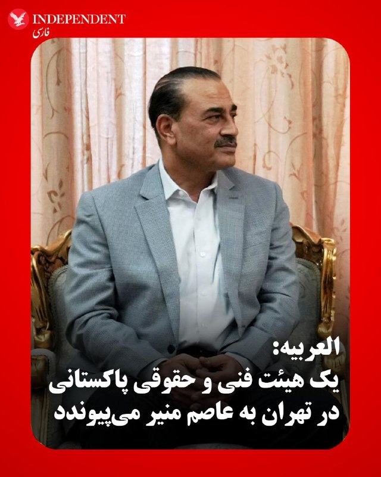
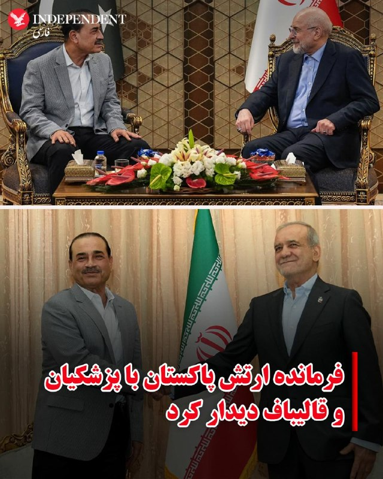
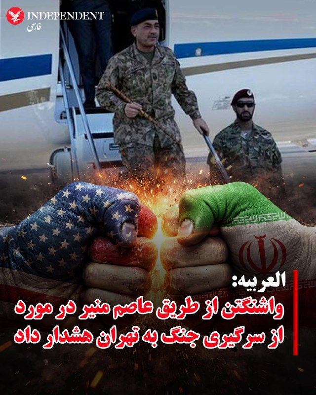
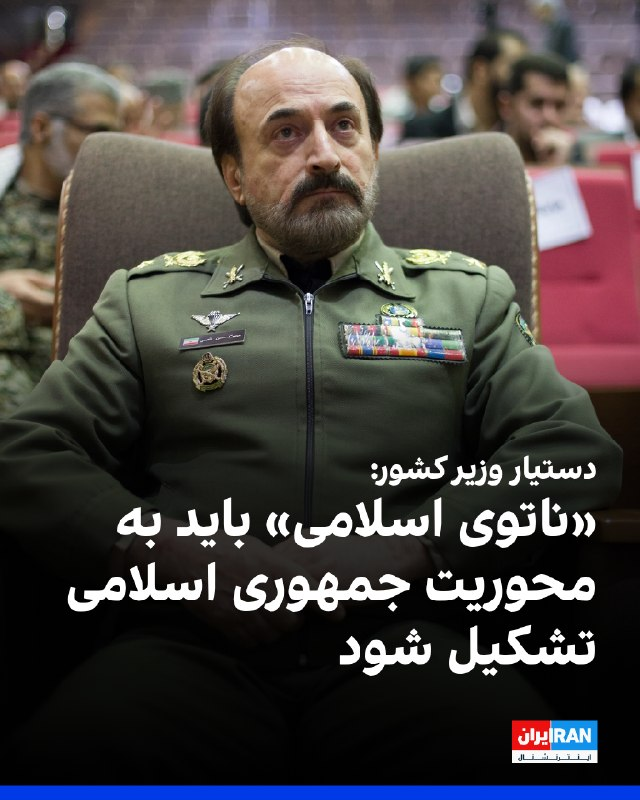
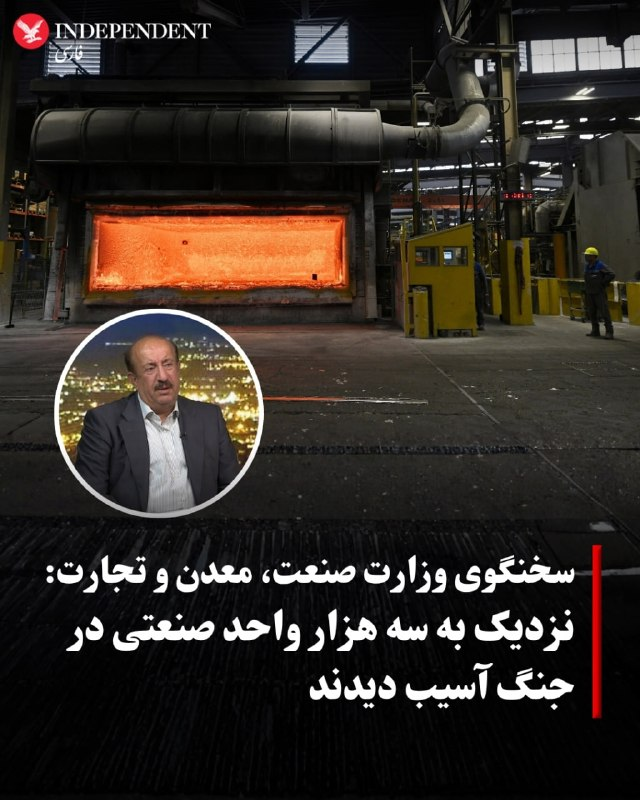
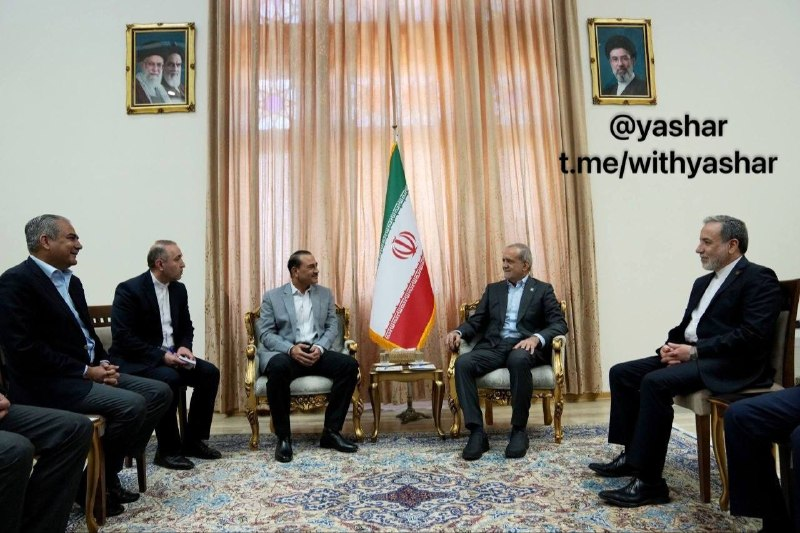
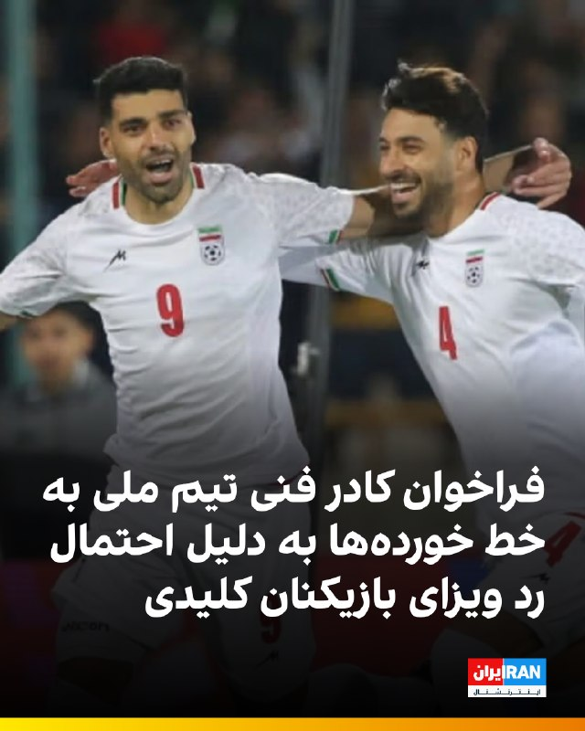
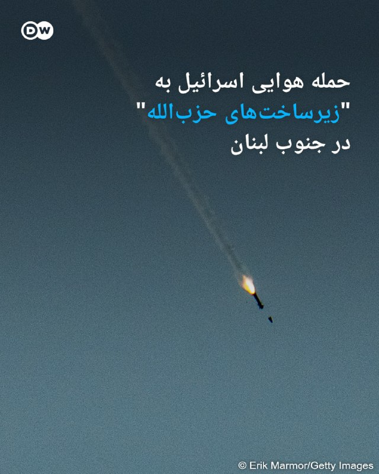
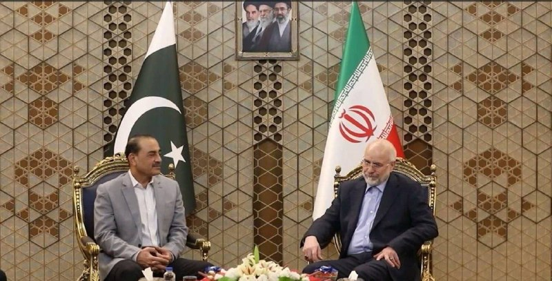

# خواننده تلگرام

<!-- TOP_NAV START -->

<a href="https://github.com/keihancpu/aio-downloader/blob/main/telegram/content/archive_1.md" style="display:inline-block; padding:6px 12px; margin:0 4px; background-color:#2ea44f; color:white; text-decoration:none; border-radius:4px; font-weight:bold;">صفحه بعد</a>

<!-- TOP_NAV END -->

<!-- MSG START -->

---
📅 بروزرسانی: 1405/03/02 15:37
---

## VahidOOnLine — post 241704

  <a href="telegram/content/VahidOOnLine_241704_1779538032.mp4" target="_blank">🎬 Download video</a>

همزمان با اعتراضات دانش‌آموزان شهرهای بروجرد و خرم‌آباد در لرستان، ویدیوی رسیده به ایران اینترنشنال نشان می‌دهد محصلان در کهگیلویه و بویراحمد نیز با تشکیل تجمع اعتراضی به موج اعتراض پیوستند. این اعتراضات نسبت به حضوری شدن امتحانات پس از ماه‌ها اختلال در فعالیت مدارس و تعطیلی صورت می‌گیرد.
‌🏁 🇬🇧 IranintlTV

🤖 @VahidOOnLine

## VahidOOnLine — post 241703

  

♦️شیخ تمیم بن حمد آل ثانی، امیر قطر، روز شنبه دوم خرداد ماه در تماس تلفنی با دونالد ترامپ، رئیس‌جمهوری آمریکا، آخرین تحولات و رویدادهای فوری منطقه را بررسی کرد.
بر اساس بیانیه رسمی دیوان امیری قطر، این گفتگو بر «تلاش‌های منطقه‌ای و بین‌المللی برای حفظ آرامش کنونی و کاهش تنش‌ها» متمرکز بوده است.
«امنیت دریانوردی، حفظ ایمنی آبراه‌های راهبردی و تضمین تداوم روان زنجیره‌های تامین جهانی و انتقال انرژی» از دیگر محورهای این گفتگو توصیف شده است.
به گزارش رسانه‌های قطری، امیر قطر در این تماس بر موضع ثابت دوحه در اولویت دادن به راه‌حل‌های مسالمت‌آمیز برای بحران‌ها تاکید و اعلام کرد قطر از همه ابتکارهایی که با هدف مهار بحران‌ها از طریق گفتگو و دیپلماسی انجام می‌شود، حمایت می‌کند.
این خبر در حالی منتشر می‌شود که رسانه‌ها از گفتگوی تلفنی وزیرامورخارجه قطر با عباس عراقچی خبر داده‌اند.
همزمان گزارش‌ها از رایزنی‌های گسترده کشورهای منطقه برای جلوگیری از حملات احتمالی آمریکا به ایران خبر می‌دهد.
این در حالیست که شبکه خبری العربیه پیشتر از هشدار واشنگتن به تهران مبنی بر از سرگیری حملات به ایران خبر داده بود.
‌🇸🇦 Indypersian

🤖 @VahidOOnLine

## VahidOOnLine — post 241702

  <a href="telegram/content/VahidOOnLine_241702_1779538035.mp4" target="_blank">🎬 Download video</a>

بر پایه گزارش رسانه‌های حکومتی، محمدباقر قالیباف، رئیس مجلس شورای اسلامی و رئیس هیئت مذاکره کننده نظام در مذاکرات با آمریکا به میزبانی اسلام‌آباد در دیدار با فیلد مارشال عاصم منیر، فرمانده ارتش پاکستان تهدید کرده: «در صورت حماقت ترامپ و آغاز مجدد جنگ، پاسخ ما کوبنده‌تر خواهد بود» قالیباف همچنین گفته در آتش‌بس بودیم که آمریکا «با نقض عهد، محاصره دریایی کرد و حالا به دنبال برداشتن آن است»
‌🏁 🇬🇧 ManotoTV

🤖 @VahidOOnLine

## VahidOOnLine — post 241701

  <a href="telegram/content/VahidOOnLine_241701_1779538036.mp4" target="_blank">🎬 Download video</a>

مجتبی خامنه‌ای، رهبر مشاهده نشده جمهوری‌اسلامی، در ادامه سنت مورد علاقه پدرش، علی خامنه‌ای، با انتشار پیامی نوشتاری درگذشت «والده» رئیس‌جمعیت هلال‌احمر جمهوری‌اسلامی، پیرحسین کولیوند را تسلیت گفت. علی‌ خامنه‌ای به انتشار پیام‌های تسلیت برای شخصیت‌های گوناگون و بستگان و اعضای خانواده آن‌ها علاقه بسیار داشت.
‌🏁 🇬🇧 ManotoTV

🤖 @VahidOOnLine

## VahidOOnLine — post 241700

  

♦️بر اساس گزارش‌های منتشر شده در رسانه‌های رسمی ایران، فیلد مارشال عاصم منیر، فرمانده ارتش پاکستان، در تهران با محمدباقر قالیباف دیدار کرده است.
خبرگزاری تسنیم نوشت قالیباف در این دیدار با قدردانی از «حمایت‌ها و اقدامات ملت و دولت پاکستان در ادوار مختلف از جمله در جریان جنگ تحمیلی اخیر و مذاکرات پس از آن»، این تعاملات را «نمونه‌ای از همکاری خوب بین ملل و دول اسلامی» عنوان کرد که «می‌تواند برای سایر کشورهای اسلامی الگو باشد.»
قالیباف گفت: «ما از حقوق ملت و کشورمان عدول نمی‌کنیم، مخصوصا با طرفی که اصلا صداقت نداشته و اعتمادی به او وجود ندارد. جمهوری اسلامی ایران همانطور که با شجاعت و اقتدار در میدان نبرد از کیان ایران دفاع کرد در عرصه دیپلماسی نیز با هوشمندی و قدرت برای احقاق حقوق حقه ایران و تامین منافع ملی کشور کوشش خواهد کرد.»
او افزود: «نظامی‌ها بیش از دیگران و بهتر از همه ارزش صلح را می‌دانند اما همان نظامیان هیچگاه اجازه نمی دهند، عزت و حقوق کشورشان لگدمال شود.»
رئیس مجلس شورای اسلامی همچنین گفت: «ما در حال مذاکره بودیم که آمریکا جنگ به راه انداخت و حالا می‌گوید برای پایانش مذاکره کنیم.»
‌🇸🇦 Indypersian

🤖 @VahidOOnLine

## VahidOOnLine — post 241699

  

♦️شبکه خبری العربیه، روز شنبه دوم خرداد ماه، به نقل از منابع خود گزارش داد یک هیئت فنی و حقوقی از پاکستان عازم تهران شده است.
بر اساس این گزارش، این هیئت قرار است در تهران به عاصم منیر، فرمانده ارتش پاکستان، ملحق شود.
العربیه، پیشتر گزارش داده بود فرمانده ارتش پاکستان پیام‌هایی از سوی آمریکا را به تهران منتقل کرده که در آن نسبت به ازسرگیری جنگ هشدار داده شده است.
فیلد مارشال عاصم منیر، فرمانده ارتش پاکستان روز جمعه وارد تهران شد تا در مورد مذاکرات میان آمریکا و ایران با مسئولان جمهوری اسلامی رایزنی کند.
عاصم منیر روز شنبه با مقام‌های ارشد جمهوری اسلامی از جمله مسعود پزشکیان، محمدباقر قالیباف و عباس عراقچی دیدار و گفتگو کرد.
‌🇸🇦 Indypersian

🤖 @VahidOOnLine

## VahidOOnLine — post 241698

  

محمدباقر قالیباف، رییس مجلس جمهوری اسلامی، در دیدار با عاصم منیر، رییس ستاد کل ارتش پاکستان، گفت نیروهای مسلح جمهوری اسلامی در دوران آتش‌بس بازسازی شده‌اند و در صورت آغاز دوباره جنگ، واکنش ایران شدیدتر خواهد بود.

او گفت: «نیروهای مسلح ما در دوران آتش‌بس به نحوی خود را بازسازی کرده‌اند که در صورت حماقت ترامپ و آغاز مجدد جنگ، حتما برای آمریکا کوبنده‌تر و تلخ‌تر از روز اول جنگ خواهند بود.»

قالیباف با اشاره به نقش پاکستان در میانجی‌گری افزود: «در آتش‌بسی بودیم که شما واسطه‌اش بودید و آمریکا با نقص عهد، محاصره دریایی کرد و حالا به‌دنبال برداشتن آن است.»
‌🏁 🇬🇧 IranintlTV

🤖 @VahidOOnLine

## VahidOOnLine — post 241697

  

♦️رسانه‌های رسمی ایران، روز شنبه دوم خرداد ماه از دومین دیدار میان فرمانده ارتش پاکستان و عباس عراقچی، وزیر امور خارجه ایران طی ۲۴ ساعت گذشته خبر داده‌اند.
پیشتر شبکه خبری العربیه گزارش کرده بود، واشنگتن از طریق عاصم منیر به تهران هشدار داده است، در صورت شکست مذاکرات جنگ از سرگرفته خواهد شد.
فیلد مارشال عاصم منیر، فرمانده ارتش پاکستان روز جمعه وارد تهران شد تا در مورد مذاکرات میان آمریکا و ایران با مسئولان جمهوری اسلامی رایزنی کند.
‌🇸🇦 Indypersian

🤖 @VahidOOnLine

## VahidOOnLine — post 241696

  <a href="telegram/content/VahidOOnLine_241696_1779538041.mp4" target="_blank">🎬 Download video</a>

♦️ویدیوهای منتشرشده در شبکه‌های اجتماعی نشان می‌دهد روز شنبه دوم خرداد، گروهی از دانش‌آموزان در خرم‌آباد در اعتراض به نحوه برگزاری امتحانات و اصرار مسئولان بر حضوری بودن آزمون‌ها، مقابل ساختمان آموزش و پرورش تجمع کردند.
معترضان با سر دادن شعارهایی چون «مجازی، مجازی» و «مرگ بر مسئول بی‌لیاقت» خواستار لغو امتحانات حضوری و برگزاری غیرحضوری آزمون‌ها شدند. در برخی ویدیوها، فضای اعتراضی دانش‌آموزان و حضور گسترده آنان مقابل اداره آموزش و پرورش دیده می‌شود.
همزمان گزارش‌ها و ویدیوهای دیگری از بروجرد نیز منتشر شده که نشان می‌دهد شماری از دانش‌آموزان این شهر به تجمعات اعتراضی پیوسته‌اند. معترضان در بروجرد نیز خواستار مجازی شدن امتحانات شده و شعار «لرستان می‌میرد، ذلت نمی‌پذیرد» سر داده‌اند.
این اعتراضات در حالی ادامه دارد که پیش از این نیز دانش‌آموزانی در شهرکرد نسبت به نحوه برگزاری امتحانات و تصمیم مسئولان آموزشی اعتراض کرده بودند. طی روزهای اخیر، نگرانی‌ها درباره شرایط آموزشی، فشار روانی امتحانات و اصرار بر برگزاری حضوری آزمون‌ها در فضای مجازی و میان خانواده‌ها افزایش یافته است.
‌🇸🇦 Indypersian

🤖 @VahidOOnLine

## VahidOOnLine — post 241695

  

♦️در حالیکه رسانه‌های ورزشی ایران از شایعاتی مبنی بر رد ویزای شجاع خلیل‌زاده، مهدی طارمی و احسان حاج‌صفی خبر داده‌اند.

فدراسیون فوتبال ایران، روز شنبه با انتشار بیانیه‌ای با تکذیب این خبر ادعا کرد: «فرایند اداری مربوط به اخذ ویزا از سوی فدراسیون فوتبال و تیم ملی طبق روال انجام گرفته و ادعای مطرح شده کذب است.»

در همین حال، روزنامه خبرورزشی گزارش کرده است، امیر قلعه‌نویی، سرمربی تیم ملی فوتبال مردان ایران با بازیکنان جایگزین این سه عضو تیم ملی تماس گرفته تا تمرینات آمادگی برای جام جهانی را ادامه دهند.

شجاع خلیل‌زاده، مهدی طارمی و احسان حاج‌صفی سه ملی‌پوش ایرانی‌هستند که خدمت سربازی را در سپاه پاسداران انجام داده‌اند.
‌🇸🇦 Indypersian

🤖 @VahidOOnLine

## WithYashar — post 12144

@withyashar تحلیل پوزیشن الان

## WithYashar — post 12143

  <a href="telegram/content/WithYashar_12143_1779538045.mp4" target="_blank">🎬 Download video</a>

🎬 Video

## WithYashar — post 12142

ادعای خبرنگار الجزیره: یک شخصیت بسیار بلندپایه منطقه‌ای از ایران دیدار کرده است
علی هاشم در پیامی در شبکه اجتماعی ایکس مدعی شد که ـیک چهره بسیار برجسته منطقه‌ای، بی‌سروصدا از تهران بازدید کرد تا آنچه را که بسیاری اکنون «شکاف‌های غیرقابل عبور» می‌نامند، پر کند.
@withyashar

## WithYashar — post 12141

تماس تلفنی امیر قطر با ترامپ درباره کاهش تنش‌ها در منطقه

دیوان امیری قطر از تماس تلفنی امیر این کشور با ترامپ ،رئیس جمهور آمریکا خبر داد.
دیوان امیری قطر افزود که امیر این کشور درباره تلاش‌ها برای تحکیم آتش‌بس و کاهش تنش‌ها در منطقه صحبت کرد.
@withyashar

## WithYashar — post 12140

قالیباف در دیدار امروز با عاصم منیر، فرمانده ارتش پاکستان:

جمهوری اسلامی از حقوق خود عقب‌نشینی نمیکنه و به طرفی که صداقت نداره اعتمادی نیست.

جمهوری اسلامی در حالی پای میز مذاکره بود که آمریکا جنگ رو آغاز کرد؛ در صورت شروع دوباره درگیری، پاسخ نیروهای مسلح کوبنده‌تر و تلخ‌تر از گذشته خواهد بود.
@withyashar

## WithYashar — post 12139

العربیه: عاصم منیر پیام تهدیدآمیز آمریکا رو به تهران برد.
@withyashar

## WithYashar — post 12138

احتمال وقوع طوفان گرد و خاک در تهران

اداره‌کل هواشناسی استان تهران:
از یکشنبه تا چهارشنبه (۳ تا ۶ خردادماه) در مناطق شمالی استان تهران در بعضی ساعت‌ها وزش باد نسبتا شدید تا شدید همچنین در نیمه جنوبی، مناطق غربی، مرکزی و ارتفاعات در بعضی ساعت‌ها وزش باد شدید تا خیلی شدید پیش‌بینی می‌شود.
@withyashar

## WithYashar — post 12137

moamelegari-trump(@withyashar).pdf

## mwarmonitor — post 9526

🔰دیپلماسیِ ساعت بیست‌وچهارم.
نخست‌وزیر پاکستان راهی چین شده است. فرمانده ارتش این کشور در تهران است. قطر بار دیگر به دیپلماسی رفت‌وبرگشتی بازگشته. پایتخت‌های منطقه هم‌زمان در همه جهت‌ها در حرکت‌اند و به‌دنبال فرمولی می‌گردند که هنوز وجود ندارد.

🔹تا جایی که می‌دانم، اوضاع آن‌قدر پیچیده شده که یک چهره بسیار بلندپایه منطقه‌ای به‌طور بی‌سروصدا به تهران رفته تا شکاف‌هایی را که بسیاری اکنون «غیرقابل پل‌زدن» می‌خوانند، ترمیم کند.

🔹آنچه نامعلوم است، زمان رسیدن به نقطه شکست است.
و آنچه معلوم است این‌که آن لحظه در راه است. علی هاشم خبرنگار الجزیره

@mwarmonitor

## mwarmonitor — post 9525

🔴روبیو به نخست‌وزیر هند:
«ایالات متحده اجازه نخواهد داد ایران بر بازار جهانی انرژی مسلط شود.»

@mwarmonitor

## mwarmonitor — post 9524

🔴امیر قطر با رئیس‌جمهور آمریکا، دونالد ترامپ، تماس تلفنی برقرار کرد — دیوان امیری قطر

@mwarmonitor

## mwarmonitor — post 9523

  <a href="telegram/content/mwarmonitor_9523_1779538046.mp4" target="_blank">🎬 Download video</a>

📝 جمهوری اسلامی به لجن‌زاری بدل شده که در آن یک فرقه تبهکار و جانی برای بقای خود، مجموعه‌ای از فاسدترین اراذل، کلاهبرداران، پورن‌استارها و حرامی‌ها را به خط کرده است. نمونه بارز این کثافت‌خانه، حسام نواب صفوی است؛ وکیل‌نمای کلاه‌بردار و هرزه‌ای که با سوءاستفاده از موقعیتش به اخاذی، توهین، افترا و اغفال کثیف زنان با وعده دروغین ازدواج روی آورد تا اینکه سرانجام گندِ پرونده‌هایش درآمدم و پروانه وکالتش تعلیق شد. وقتی ویترین یک حکومت را چنین موجودات رذل و بی‌شرفی پر می‌کنند، یعنی کفگیر فرقه جانی کاملاً به ته دیگ خورده و این نمایش مضحک و مشمئزکننده به پرده آخر خود رسیده است؛ فروپاشی حتمی برای سیستمی سراپا فساد که ماسک بازیگران کثیفش یکی‌یکی در حال افتادن است.

@mwarmonitor

## mwarmonitor — post 9522

🔸 قالیباف در دیدار با فرمانده ارتش پاکستان:
«نیروهای مسلح ما در دوران آتش‌بس توانمندی‌های خود را بازسازی کرده‌اند و اگر ترامپ مرتکب حماقتی شود و جنگ را از سر بگیرد، پاسخ ما بسیار قوی‌تر و ویرانگرتر خواهد بود.»

@mwarmonitor

## FoxNewsTwitter — post 342157

  <a href="telegram/content/FoxNewsTwitter_342157_1779538049.mp4" target="_blank">🎬 Download video</a>

Fox News (Twitter/X)

What started out as a chemical leak has now escalated into an emergency officials say could end in a massive explosion.

Fire crews in Orange County, California, spent hours trying to stabilize a 34,000-gallon tank containing volatile chemicals before announcing that the tank “cannot be secured or mitigated.”

Officials say the situation has narrowed to two possibilities: a catastrophic spill of toxic chemicals or a thermal runaway event capable of igniting neighboring tanks.

Police are urging residents to leave evacuation zones immediately as emergency shelters open for displaced families.

## pm_afshaa — post 91261

  <a href="telegram/content/pm_afshaa_91261_1779538051.webm" target="_blank">🎬 Download video</a>

🔴نیویورک تایمز: ترامپ اسرائیل رو آن‌چنان از روند‌ها کنار گذاشته که رهبران این کشور تقریباً از مذاکرات آمریکا و ایران بی‌اطلاع موندن.

💧 Rainbet.com the #1 Non-KYC Crypto Casino & Sportsbook @rainbetcom

😁 @Pm_Afshaa

## pm_afshaa — post 91260

  <a href="telegram/content/pm_afshaa_91260_1779538052.webm" target="_blank">🎬 Download video</a>

🔴العربیه: عاصم منیر پیام تهدیدآمیز آمریکا رو به تهران برد. 
💧 Rainbet.com the #1 Non-KYC Crypto Casino & Sportsbook @rainbetcom 
😁 @Pm_Afshaa

## pm_afshaa — post 91259

  <a href="telegram/content/pm_afshaa_91259_1779538053.webm" target="_blank">🎬 Download video</a>

👩‍💻کانفیگ اضطراری موجود شد! 
🛍 series Basic • 1G 140 
💵 • 2G 280
💵 • 3G 420
💵 • 4G 560
💵 • 5G 700
💵 • 10G 1400
💵 • 20G 2800 
💵 • 30G 4200
💵 
📌مناسب استفاده روزمره و اقتصادی 
📌سرعت مناسب برای استفاده عادی 
📌پینگ 140تا350 
📌مناسب تلگرام.وب گردی . اینستاگرام …

## pm_afshaa — post 91257

  <a href="telegram/content/pm_afshaa_91257_1779538053.webm" target="_blank">🎬 Download video</a>

🔴العربیه: عاصم منیر پیام تهدیدآمیز آمریکا رو به تهران برد.

💧 Rainbet.com the #1 Non-KYC Crypto Casino & Sportsbook @rainbetcom

😁 @Pm_Afshaa

## pm_afshaa — post 91256

  <a href="telegram/content/pm_afshaa_91256_1779538054.webm" target="_blank">🎬 Download video</a>

🔴رویترز: مذاکرات ایران و آمریکا برای پایان دادن به جنگ شدت گرفته، اما گزارش شده که ترامپ در صورت عدم توافق، به‌طور جدی در حال بررسی حملات جدید علیه ایران است.

💧 Rainbet.com the #1 Non-KYC Crypto Casino & Sportsbook @rainbetcom

😁 @Pm_Afshaa

## DEJradio — post 4879

  <a href="telegram/content/DEJradio_4879_1779538055.webm" target="_blank">🎬 Download video</a>

🔺📌 آقا داماد، جمهوری اسلامی را نشناخته بود

با وجود شکست مذاکرات اتمی با جمهوری اسلامی، در کاخ سفید سه تن اصرار به ادامه دیپلماسی دارند: جی‌.دی ونس، استیو ویتکاف و جرد کوشنر داماد ترامپ (فرستاده ویژه او در مذاکرات).

چند منبع موثق ۳۰ اردیبهشت گزارش دادند که در کاخ سفید ارزیابی مارکو روبیو وزیر خارجه و پیت هگست وزیر جنگ آمریکا، این بود که باید تحریم‌های اقتصادی علیه جمهوری اسلامی تشدید شود و گزینه نظامی روی میز باشد، اما در مقابل، ونس باور دارد رژیم ایران انعطاف نشان داده است. در همان جلسه‌ای که درباره وضعیت اختلاف میان مقامات آمریکا بالا گرفت کوشنر و ویتکاف از ونس حمایت کردند!

دو روز بعد از آن ماجرا دستگاه‌های امنیتی آمریکا دو عامل جمهوری اسلامی را در یک عملیات پیچیده بازداشت کردند.
یکی از آنها محمدباقر سعد داوود سعدی، شهروند ۳۲ ساله عراقی است که به اتهام مشارکت در دست‌کم ۲۰ اقدام تروریستی علیه منافع آمریکا و اسرائیل در اروپا و کانادا،‌ در ترکیه بازداشت و به آمریکا مسترد شد. این فرد، برای انتقام خون قاسم سلیمانی نقشه قتل ایوانکا ترامپ [همسر کوشنر] را کشیده بود.
منابع آگاه می‌گویند، ایوانکا ترامپ دختر بزرگ دونالد ترامپ رئیس‌جمهوری آمریکا هدف طرح تروری پیچیده قرار گرفته بود سعدی حتی نقشه خانه ایوانکا ترامپ در فلوریدا را نیز در اختیار داشت.

انتفاض قنبر معاون پیشین وابسته نظامی سفارت عراق در واشنگتن توضیح داده، «پس از کشته شدن قاسم سلیمانی، محمدباقر سعدی به مردم می‌گفت که باید ایوانکا را بکشیم تا همان‌طور که ترامپ خانه ما را سوزاند، خانه ترامپ را به آتش بکشیم.»

#مذاکرات #ترور
@DEJradio

## DEJradio — post 4878

⭕️
⭕️ اکسیوس از احتمال حملۀ بزرگ و پایانی آمریکا خبر داد

وبسایت خبری اکسیوس گزارش داد دونالد ترامپ، رئیس‌ جمهوری آمریکا، شامگاه آدینه نشستی ویژه را با اعضای ارشد تیم امنیت ملی دربارۀ جنگ با جمهوری اسلامی برگزار کرد.
همزمان میانجی‌ها در تلاش‌اند با تدوین چارچوبی برای ادامه مذاکرات، مانع ازسرگیری حملات آمریکا و اسرائیل شوند.
به گزارش اکسیوس و به نقل از دو منبع آگاه، ترامپ به نزدیکان خود گفت به‌طور جدی در حال بررسی حملات تازه علیه جمهوری اسلامی است تا در صورت شکست مذاکرات، اقدام کند.
وال‌استریت ژورنال نیز به نقل از مقام‌هایی در خاورمیانه‌ نوشت که در صورت پیش نرفتن مذاکرات، حملات تازۀ آمریکا و اسرائیل علیه جمهوری اسلامی طی روزهای آینده محتمل است.
از سویی عاصم منیر، فرماندۀ ارتش پاکستان برای ادامۀ مذاکرات به تهران سفر کرد. همچنین یک هیئت قطری نیز در راستای میانجی‌گری وارد ایران شده است.
اکسیوس نوشت انتظار می‌رود عاصم منیر روز شنبه با احمد وحیدی، فرماندۀ سپاه پاسداران، دیدار کند. بنا بر گزارش‌ها وحیدی اکنون از نفرات اصلی در تصمیم‌گیری‌های کلان جمهوری اسلامی به شمار می‌رود.
یک مقام آمریکایی گفته است پیش‌نویس‌ها هر روز میان واشینگتن و تهران ردوبدل می‌شود، اما پیشرفت چندانی رخ نداده است.
به گزارش وال‌استریت ژورنال، دستیابی به توافق نهایی، هدف فوری میانجی‌ها نیست.
بنا بر این گزارش، میانجی‌گران می‌خواهند یک پیش‌نویس یا «تفاهم‌نامه» برای تمدید آتش‌بس و تعیین چارچوب مذاکرات آینده تنظیم بشود.
بر اساس این گزارش، اختلاف اصلی این است که چه موضوعاتی باید در این چارچوب اولیه گنجانده شود و چه مواردی به مراحل بعدی موکول شود.
به گفتۀ منابع آگاه، شکست در دستیابی به همین توافق محدود نیز می‌تواند زمینه‌ساز دور تازه‌ای از حملات آمریکا و اسرائیل بشود.
در حملات پیش رو، احتمالا زیرساخت‌های اقتصادی نیز هدف گرفته می‌شود. از سویی منابعی در اسرائیل و امریکا پیش‌تر از یک بانک تازۀ اهداف در ایران خبر داده‌اند.
جمهوری اسلامی نیز تهدید کرده که در صورت آغاز حملات تازه، واکنشی گسترده‌ نشان می‌دهد.
به گفتۀ منابع آمریکایی، در نشست امنیتی روز آدینه، دونالد ترامپ، جی‌دی ونس، معاون رئیس‌ جمهوری، پیت هگست، وزیر جنگ، جان رتکلیف، رئیس سازمان سیا، سوزی وایلز، رئیس دفتر کاخ سفید و دیگر مقام‌های ارشد حضور داشتند.
مارکو روبیو، وزیر امور خارجۀ آمریکا به‌دلیل سفر به اروپا و دن کین، رئیس ستاد مشترک ارتش آمریکا، به‌دلیل حضور در مراسم فارغ‌التحصیلی آکادمی نیروی دریایی، در این نشست حضور نداشتند.
بر اساس گزارش‌ها، ترامپ در این نشست در جریان وضعیت مذاکرات و گزینه‌های احتمالی در صورت شکست گفت‌وگوها قرار گرفت.
وال‌استریت ژورنال نوشت ترامپ در پایان نشست، تصمیم پایانی خود را اعلام نکرد.
ساعاتی بعد از نشست آدینه، کاخ سفید اعلام کرد ترامپ به‌خلاف روال همیشگی، آخر هفته را در باشگاه گلف خود در بدمینستر نمی‌گذارند و به واشینگتن بازمی‌گردد.
ترامپ همچنین در شبکۀ اجتماعی تروث‌ نوشت که در مراسم ازدواج پسرش، شرکت نمی‌کند و به دلیل موضوع ایران، در کاخ سفید می‌ماند.

#ترامپ #جنگ #توافق #جمهوری_اسلامی
@DEJradio

## DEJradio — post 4877

  <a href="telegram/content/DEJradio_4877_1779538056.mp4" target="_blank">🎬 Download video</a>

🔺🎥 اعتراضات دانش‌آموزان به نحوه برگزاری امتحانات در چندین شهر ایران

دانش‌آموزان در چند شهر ایران به دلیل حضوری شدن امتحانات دست به اعتراض زدند دانش‌آموزان معترض می‌گویند در شهرهای محل سکونت آنها اینترنت ملی بسیار ضعیف، و سامانه «شاد» که برای آموزش آنلاین دانش‌آموزان استفاده می‌شود با اختلال روبرو بوده و در چنین شرایطی نباید در آزمونی کشوری با دانش‌آموزانی رقابت کنند از شرایط پایدارتر برای آموزش آنلاین برخوردار بوده‌اند.

#کهگلویه_و_بویراحمد #اعتراضات_سراسری
@DEJradio

## DEJradio — post 4873

⭕️
👑 شاهزاده رضا پهلوی در پیامی در حساب کاربری خود در شبکهٔ ایکس اعلام کردند در ادامهٔ دیدارهایشان در کنگره آمریکا، با دریک ون اوردن، نمایندهٔ کنگره، دیدار کرده‌اند. ایشان با اشاره به مواضع این نمایندهٔ آمریکایی تأکید کردند او از نزدیک دیده است که جمهوری اسلامی چه پیامدهایی برای مردم آمریکا و مردم ایران به‌همراه داشته است.
شاهزاده رضا پهلوی همچنین اعلام کردند گفت‌وگوها دربارهٔ طرح مربوط به ایران آزاد و تأثیرات آن بر آمریکا و جهان ادامه خواهد یافت.

#شاهزاده_رضا_پهلوی #کنگره_آمریکا
@DEJradio

## DEJradio — post 4872

  

👑
📱 شاهزاده رضا پهلوی در پیامی در حساب کاربری خود در شبکهٔ ایکس، از دیدار با نمایندهٔ کنگره آمریکا، دن میوزر، در جریان سفرش به ساختمان کنگره خبر داد. ایشان با قدردانی از حمایت این عضو کنگره از مردم ایران، تأکید کردند مبارزۀ ملت ایران برای بازپس‌گیری کشور از حاکمیت جمهوری اسلامی و بازگرداندن ایران به صلح، شکوفایی و جایگاه طبیعی خود در جامعۀ جهانی ادامه دارد.

#شاهزاده_رضا_پهلوی #کنگره_آمریکا
@DEJradio

## DEJradio — post 4871

  <a href="telegram/content/DEJradio_4871_1779538059.mp4" target="_blank">🎬 Download video</a>

🔺📢 مسعود پزشکیان در دیدار با فرمانده ارتش و فرمانده نیروی هوایی به آنها قول داده با تمام ظرفیت برای تقویت و بازسازی یگان‌ها کمک کند، اما واقعیت آن است که نه دولت آه در بساط دارد و نه امکان جایگزینی ادوات وجود دارد.

#ارتش #نیروی_هوایی
@DEJradio

## DEJradio — post 4870

⭕️ فرماندۀ ارتش پاکستان با پزشکیان و قالیباف دیدار کرد

عاصم منیر، فرماندۀ ستاد کل ارتش پاکستان، که برای رایزنی درباره توافق آمریکا و جمهوری اسلامی به تهران سفر کرده است، روز شنبه با مسعود پزشکیان و محمدباقر قالیباف دیدارهایی جداگانه‌ را برگزار کرد.
فیلد مارشال عاصم منیر، در شامگاه شنبه با عباس عراقچی، وزیر امور خارجۀ جمهوری اسلامی، نیز دیدار کرده بود.
بنا بر گزارش‌ها عاصم منیر پیام‌هایی را از سوی واشینگتن به تهران منتقل کرده که شامل هشدار درمورد احتمال ازسرگیری جنگ بوده است.

#مذاکرات #پاکستان
@DEJradio

## DEJradio — post 4869

⭕️ عراقچی با وزرای خارجۀ ترکیه، قطر و عراق گفت‌وگو کرد

عباس عراقچی، وزیر امور خارجۀ جمهوری اسلامی، در تماس‌های تلفنی جداگانه با همتایان خود در ترکیه، قطر و عراق درمورد تحولات منطقه گفت‌وگو کرد.
مقامات این کشورها برای برقراری صلح میان واشینگتن و تهران در تلاش‌اند.
قطر و ترکیه پیش از آغاز جنگ چهل روزه نیز تلاش بسیاری کردند تا مانع حملۀ آمریکا به مواضع جمهوری اسلامی بشوند.

#مذاکرات #میانجی
@DEJradio

## mamlekate — post 103571

📞 الو امروز صبح شرکت‌ها، خونه‌ها و مغازه‌های نزدیک وزارت اطلاعات تقاطع همت و پاسداران رو اومدن حضوری گفتن فوری محل رو ترک کنید و تا شب هم نگذارید طول بکشه.

📞 الو دوستم که توی پالایشگاه تهران (جنوب) هست میگه مخازن آسیب دیده در اثر موشک رو نان استاپ به صورت سه شیفت دارن بازسازی میکنن تا نفت توشون ذخیره کنن. به هر کارگری که برای بازسازی کار میکنه روزی ۵ میلیون و هر جرثقیل روزی ۲۰ میلیون هزینه میدن.

@mamlekate

## IranIntlTV — post 338573

  <a href="telegram/content/IranIntlTV_338573_1779538063.mp4" target="_blank">🎬 Download video</a>

سازمان عملیات تجارت دریایی بریتانیا درباره فعالیت‌های مشکوک دریایی در خلیج عدن هشدار داد. بر اساس این هشدار، چندین مورد نزدیک شدن قایق‌های کوچک به شناورها گزارش شده و در یکی از موارد نیز یک قایق بزرگ با دو موتور بیرونی مشاهده شده که حامل نردبان و سلاح بوده است.

گفت‌وگو با تاج‌الدین سروش، عضو تحریریه ایران‌اینترنشنال
@iranintltv

## IranIntlTV — post 338572

  <a href="telegram/content/IranIntlTV_338572_1779538065.mp4" target="_blank">🎬 Download video</a>

گفت‌وگوی ویژه با لرد موریس گلسمن، عضو مجلس اعیان بریتانیا

امروز ساعت ۱۶:۴۵ و ۲۱:۴۵ به وقت تهران

@iranintltv

## IranIntlTV — post 338571

  <a href="telegram/content/IranIntlTV_338571_1779538068.mp4" target="_blank">🎬 Download video</a>

همزمان با اعتراضات دانش‌آموزان شهرهای بروجرد و خرم‌آباد در لرستان، ویدیوی رسیده به ایران اینترنشنال نشان می‌دهد محصلان در کهگیلویه و بویراحمد نیز با تشکیل تجمع اعتراضی به موج اعتراض پیوستند. این اعتراضات نسبت به حضوری شدن امتحانات پس از ماه‌ها اختلال در فعالیت مدارس و تعطیلی صورت می‌گیرد.

## IranIntlTV — post 338570

  

محمدباقر قالیباف، رییس مجلس جمهوری اسلامی، در دیدار با عاصم منیر، رییس ستاد کل ارتش پاکستان، گفت نیروهای مسلح جمهوری اسلامی در دوران آتش‌بس بازسازی شده‌اند و در صورت آغاز دوباره جنگ، واکنش ایران شدیدتر خواهد بود.

او گفت: «نیروهای مسلح ما در دوران آتش‌بس به نحوی خود را بازسازی کرده‌اند که در صورت حماقت ترامپ و آغاز مجدد جنگ، حتما برای آمریکا کوبنده‌تر و تلخ‌تر از روز اول جنگ خواهند بود.»

قالیباف با اشاره به نقش پاکستان در میانجی‌گری افزود: «در آتش‌بسی بودیم که شما واسطه‌اش بودید و آمریکا با نقص عهد، محاصره دریایی کرد و حالا به‌دنبال برداشتن آن است.»
https://iranintl.com/202605235817

## IranIntlTV — post 338569

  <a href="telegram/content/IranIntlTV_338569_1779538071.mp4" target="_blank">🎬 Download video</a>

مروری بر روزنامه‌های ایران، شنبه ۲ خرداد، با مجتبی هاشمی، روزنامه‌نگار
@iranintltv

## IranIntlTV — post 338568

  

🔻آمریکا اعلام کرد تیم ملی کنگو پیش از ورود به جام جهانی باید به دلیل ابولا، قرنطینه شود. اندرو جولیانی، مدیر اجرایی کارگروه کاخ سفید برای جام جهانی، روز گذشته تایید کرد تیم ملی کنگو باید در اردوی خود در بلژیک یک «حباب» بهداشتی را حفظ کند وگرنه ممکن است از ورود به آمریکا منع شود.

🔹جمهوری دموکراتیک کنگو نخستین بازی خود در جام جهانی ۲۰۲۶ را ۲۷ خرداد در هیوستون برابر پرتغال برگزار می‌کند، اما به دلیل شیوع ابولا در کنگو، اعضای تیم ملی فوتبال این کشور باید پیش از ورود به ایالات متحده برای حضور در جام جهانی، در قرنطینه بمانند.

🔹جولیانی به ای‌اس‌پی‌ان گفت: «به‌طور کاملا روشن به کنگو گفته‌ایم باید یکپارچگی حباب خود را به مدت ۲۱ روز حفظ کند تا سپس بتواند ۱۱ ژوئن (۲۱ خرداد) به هیوستون بیاید. همچنین به دولت کنگو به‌وضوح اعلام کرده‌ایم که باید این حباب را حفظ کند، در غیر این صورت ممکن است نتواند به آمریکا سفر کند. روشن‌تر از این نمی‌توانیم بگوییم.»

🔹تمام اعضای تیم کنگو، به همراه سباستین دزابره، سرمربی فرانسوی تیم، اکنون خارج از این کشور مستقر هستند.

🔹جزییات بیشتر را در سایت بخوانید.

@iranintltvsport

## ManotoTV — post 105758

  <a href="telegram/content/ManotoTV_105758_1779538075.mp4" target="_blank">🎬 Download video</a>

بر پایه گزارش رسانه‌های حکومتی، محمدباقر قالیباف، رئیس مجلس شورای اسلامی و رئیس هیئت مذاکره کننده نظام در مذاکرات با آمریکا به میزبانی اسلام‌آباد در دیدار با فیلد مارشال عاصم منیر، فرمانده ارتش پاکستان تهدید کرده: «در صورت حماقت ترامپ و آغاز مجدد جنگ، پاسخ ما کوبنده‌تر خواهد بود» قالیباف همچنین گفته در آتش‌بس بودیم که آمریکا «با نقض عهد، محاصره دریایی کرد و حالا به دنبال برداشتن آن است»

## ManotoTV — post 105757

  <a href="telegram/content/ManotoTV_105757_1779538076.mp4" target="_blank">🎬 Download video</a>

مجتبی خامنه‌ای، رهبر مشاهده نشده جمهوری‌اسلامی، در ادامه سنت مورد علاقه پدرش، علی خامنه‌ای، با انتشار پیامی نوشتاری درگذشت «والده» رئیس‌جمعیت هلال‌احمر جمهوری‌اسلامی، پیرحسین کولیوند را تسلیت گفت. علی‌ خامنه‌ای به انتشار پیام‌های تسلیت برای شخصیت‌های گوناگون و بستگان و اعضای خانواده آن‌ها علاقه بسیار داشت.

## FarsiVOA — post 218427

  

شرکت اطلاعات کالا، کپلر، می‌گوید کماکان ۲۱۶ نفتکش به خاطر ادامه انسداد تنگه هرمز توسط جمهوری اسلامی در خلیج فارس گرفتار هستند.

طبق ارزیابی کپلر، این نفتکش‌ها معادل تقریباً ۴ درصد از کل ظرفیت ناوگان نفتکش‌های جهان است و تردد کشتی‌‌ها در تنگه هرمز کماکان ۹۵ درصد نسبت به دوران قبل از انسداد تنگه هرمز افت داشته است.

پیشتر سازمان بین‌المللی دریانوردی از گرفتاری ۲۰ هزار خدمه در آبهای جنوب ایران خبر داده و گفته بود در حملات گسترده جمهوری اسلامی به کشتی‌ها، ۱۱ خدمه جان باخته‌اند. بر اساس این گزارش بیش از یک‌هزار و ۵۰۰ شناور، از جمله ۶۰۰ کشتی باری و نفتکش بزرگ در خلیج فارس گرفتار شده‌اند.
@FarsiVOA

## FarsiVOA — post 218426

🔺انتقاد وزیر خارجه قطر از عراقچی: بستن تنگه هرمز بحران را عمیق‌تر می‌کند

◾️وزیر خارجه قطر در تماس با عباس عراقچی، ضمن حمایت از تلاش‌ها برای دستیابی به توافقی جامع برای پایان بحران، هشدار داده است که بستن تنگه هرمز یا استفاده از آن به‌عنوان ابزار فشار، بحران را عمیق‌تر کرده و منافع حیاتی کشورهای منطقه را تهدید می‌کند.

◾️این موضع در حالی مطرح می‌شود که قطر، همزمان با گفت‌وگو با تهران، در سطح منطقه‌ای نیز فعال است.

◾️وزیر خارجه قطر در تماس جداگانه با وزیر خارجه عربستان درباره میانجی‌گری پاکستان میان آمریکا و جمهوری اسلامی و هماهنگی برای کاهش تنش گفت‌وگو کرده است.

◾️دوحه همچنین با اردن و ترکیه درباره حمایت از تلاش‌های میانجی‌گرانه و جلوگیری از تشدید دوباره بحران رایزنی کرده است.

⬇️ بیشتر بخوانید:
https://ir.voanews.com/a/8153020.html

## FarsiVOA — post 218425

🔺مولوی عبدالحمید: مردم دولتی انتخاب کرده‌اند که اختیار ندارد

◾️مولوی عبدالحمید، با انتقاد از ساختار تصمیم‌گیری در جمهوری اسلامی گفت مردم می‌گویند دولتی انتخاب کرده‌اند که اختیار ندارد و در ایران، برخلاف بسیاری از کشورها، دولت نقشی مؤثر در سیاست‌های داخلی و خارجی ندارد.

◾️او افزود که تا زمانی که در قانون اساسی تغییر ایجاد نشود، هیچ‌کس نمی‌تواند اوضاع کشور را سامان بدهد.

◾️عبدالحمید از قطع اینترنت بین‌المللی نیز انتقاد کرد و آن را برای عموم مردم «آزاردهنده» خواند. او گفت اینترنت در عصر حاضر جزو نیازهای بشر است و بخش‌های مختلف زندگی ملت‌ها با آن گره خورده است.

⬇️ بیشتر بخوانید:
https://ir.voanews.com/a/8153019.html

## FarsiVOA — post 218424

  <a href="telegram/content/FarsiVOA_218424_1779538077.mp4" target="_blank">🎬 Download video</a>

انتشار سری جدید اسناد محرمانه «یوفو» توسط وزارت جنگ آمریکا؛

وزارت جنگ ایالات متحده در قالب برنامه‌ای تحت عنوان «پِرسو»، دومین بخش از اسناد محرمانه مربوط به پدیده‌های ناشناخته هوایی، یوفو، را برای دسترسی عموم منتشر کرد.

این برنامه وظیفه دارد سوابق مرتبط با حوادث هوایی توجیه‌نشده‌ای را که در طول مأموریت‌های نظامی مشاهده شده‌اند، از حالت طبقه‌بندی‌شده خارج کند.

جنجالی‌ترین بخش این اسناد، گزارش و تصاویر مربوط به شلیک و سرنگون کردن یک شیء پرنده ناشناس توسط جت جنگنده نیروی هوایی ارتش آمریکا است.

بخش دیگری از این اسناد فاش‌شده به حادثه‌ای در دسامبر ۲۰۱۹ در سواحل شرقی آمریکا اشاره دارد. این سند حاوی داده‌هایی است که به احتمال زیاد توسط سنسور مادون قرمزِ مستقر روی یکی از یگان‌های نظامی ایالات متحده ثبت شده است؛ یگانی که در آن زمان در محدوده تحت مسئولیت «فرماندهی شمالی ایالات متحده» فعالیت می‌کرده است.

این بسته اطلاعاتی شامل ده‌ها گزارش عملیاتی، مشاهدات خلبانان و مستنداتی است که ارتش آمریکا هنوز توضیح علمی یا مشخصی برای ماهیت آن‌ها ارائه نداده است.
@FarsiVOA

## DW_Farsi — post 125048

🔶 خبرهای ضد و نقیض درباره بسته‌شدن آسمان غرب ایران

سازمان هواپیمایی کشوری ایران با صدور "نوتام" یا اطلاعیه هشدار اعلام کرد که فرودگاه‌های بخش غربی کشور تا ساعت ۱۲ روز دوشنبه (۵ خرداد ۱۴۰۵) با محدودیت‌های عملیاتی و تعطیلی مواجه هستند.

نوتام به منظور اطلاع‌رسانی به خلبانان و شرکت‌های هواپیمایی درباره خطرات احتمالی، محدودیت‌های مسیر، بسته‌شدن حریم هوایی یا هر شرایطی صادر می‌شود که می‌تواند بر ایمنی پرواز تاثیر بگذارد.

بر اساس این اطلاعیه که در رسانه‌های ایران منتشر شده، این محدودیت‌ها از شامگاه جمعه ۱ خرداد (۲۲ مه) آغاز شده و تا ساعت هشت و ۳۰ دقیقه به وقت جهانی یا ساعت ۱۲ دوشنبه به وقت تهران ادامه خواهد داشت. در این مدت، تمامی فرودگاه‌های غرب کشور به‌طور کامل بسته هستند.

در اطلاعیه همچنین آمده است که فرودگاه‌های تبریز، کرمانشاه، اهواز، آبادان، شیراز، یزد، رشت و رامسر به‌صورت "مشروط و فقط در بازه زمانی طلوع تا غروب آفتاب" مجاز به فعالیت هستند.

طبق این دستورالعمل، تمامی مجوزهای پروازی قبلی در این مناطق لغو شده و شرکت‌های هواپیمایی موظف‌ هستند برای هرگونه پرواز غیرنظامی مجددا از سازمان هواپیمایی کشوری مجوز دریافت کنند.

@dw_farsi

## DW_Farsi — post 125047

🔶 پوتین حمله به خوابگاه را "تروریستی" خواند؛ اوکراین رد کرد

ولادیمیر پوتین، رئیس جمهور روسیه، روز جمعه ۲۲ مه (اول خرداد) پس از حمله احتمالی به یک خوابگاه دانشجویی در منطقه لوهانسک تحت اشغال روسیه، این حمله را "اقدامی تروریستی" توصیف کرد. به گفته او، دست‌کم شش نفر کشته، ۳۹ نفر زخمی و ۱۵ نفر مفقود شده‌اند.

طبق اعلام روسیه، ساختمان یک مدرسه فنی و حرفه‌ای در شهر استاروبیلسک، شامگاه پنجشنبه گذشته هدف حمله یک پهپاد اوکراینی قرار گرفته است.

امکان راستی‌آزمایی مستقل این اطلاعات وجود ندارد. همچنین درباره شمار قربانیان و مفقودان در این خوابگاه نیز اطلاعات تأییدشده‌ای در دست نیست. پوتین، ضمن وعده کمک به آسیب‌دیدگان، از وزارت دفاع روسیه خواسته است تا پیشنهادهایی را برای واکنش به این حادثه آماده کند.

@dw_farsi

## Persian_Trend_Official — post 14723

  

🇺🇸 
🌟نیروی فضایی ایالات متحده بامداد ۲۰ مه یک موشک بالستیک قاره‌پیمای بدون کلاهک مینوت‌من III را در قالب آزمایش «Glory Trip 256» از پایگاه فضایی وندنبرگ در کالیفرنیا با موفقیت پرتاب کرد.

🚀این پرتاب ساعت ۱۲:۰۱ به وقت اقیانوس آرام و تحت نظارت اسکادران آزمایش پرواز ۵۷۶ انجام شد. به گفته مقام‌های آمریکایی، آزمایش شبانه عملکرد سامانه‌های پیشرانش، هدایت و بازگشت موشک را ارزیابی کرده و آمادگی عملیاتی نیروهای مسئول را نیز به نمایش گذاشته است.
نیروی فضایی آمریکا تأکید کرد این مأموریت از سال‌ها قبل برنامه‌ریزی شده و ارتباطی با تنش‌های ژئوپولیتیکی اخیر ندارد. داده‌های به‌دست‌آمده از این آزمایش قرار است در روند نوسازی زرادخانه موشکی آمریکا و توسعه موشک نسل جدید LGM-35A Sentinel مورد استفاده قرار گیرد.

👩‍💻@PhantomDirective

🆔@persian_trend_official
پرشین ترند | متفاوت‌ترین کانال نظامی

## RadioFarda — post 157480

تایوان: چین پس از دیدار ترامپ و شی بیش از صد شناور در منطقه مستقر کرد

🔸 رئیس دستگاه امنیتی تایوان روز شنبه گفت چین بیش از صد شناور نیروی دریایی، گارد ساحلی و دیگر شناورها را در آب‌های منطقه‌ای از دریای زرد تا دریای جنوبی چین و غرب اقیانوس آرام مستقر کرده است.

🔸 جوزف وو، دبیرکل شورای امنیت ملی تایوان، در شبکه اجتماعی ایکس نوشت این استقرار در چند روز گذشته، پس از دیدار دونالد ترامپ، رئیس‌جمهور آمریکا، با همتای چینی‌اش شی جین‌پینگ در پکن انجام شده است.

🔸 او روز شنبه دوم خرداد در این پیام نوشت که چین در روزهای اخیر بیش از صد کشتی در امتداد «زنجیرهٔ نخست جزایر»، از ژاپن تا تایوان و فیلیپین، مستقر کرده و پکن را به برهم زدن وضع موجود و تهدید صلح و ثبات منطقه‌ای متهم کرد.

🔸 چین جزیره تایوان را بخشی از قلمرو خود می‌داند و تهدید کرده است که برای تصرف آن از زور استفاده خواهد کرد.

🔸 یک مقام امنیتی تایوان به شرط فاش نشدن نام خود به خبرگزاری فرانسه گفت شناورهای چینی پیش از نشست پکن شناسایی شده بودند، اما شمار آن‌ها در روزهای اخیر از صد فروند فراتر رفته است.

🔸گزارش کامل را در وب‌سایت رادیو فردا می‌توانید بخوانید.

@RadioFarda

## RadioFarda — post 157479

  <a href="https://t.me/radiofarda/157479" target="_blank">📎 Download file</a>

📻بشنوید: ساعت ۱۴ با رادیوفردا، دوم خرداد ۱۴۰۵‌

@Radiofarda

## RadioFarda — post 157478

  

🔸رئیس کل دادگستری استان سمنان از صدور حکم حبس طولانی‌مدت برای دو متهمی خبر داد که به گفته او «در راستای اهداف سرویس‌های جاسوسی آمریکایی-صهیونیستی فعالیت می‌کردند».

🔸لیلا رمضانی و فاطمه ملک‌احمدی به ترتیب به حبس‌های ۲۶ و ۲۷ سال و همین طور «انفصال از کلیه خدمات دولتی و ممنوعیت مطلق خروج از مرزهای کشور» محکوم شده‌اند.

🔸به گزارش خبرگزاری ایسنا به نقل از مقام قضایی، این دو که اطلاعات دیگری از جمله سن و شغل درباره‌شان منتشر نشده به «برقراری ارتباط با شبکه‌های معاند و ارسال محتوای تصویری و اطلاعاتِ مورد نیازِ دشمن» متهم شده‌اند.

🔸رئیس کل دادگستری استان سمنان از این دو نفر به عنوان «مزدور» یاد کرده است.

🔸در بحبوحه حملات سنگین آمریکا و اسرائیل به ایران، تلویزیون جمهوری اسلامی بارها گزارش‌هایی از یورش مأموران حکومتی به خانه افرادی پخش کرد که گفته می‌شد از محل اصابت بمب‌ها ویدئو گرفته و برای رسانه‌های خارج از کشور ارسال کرده‌اند.

@RadioFarda

## IranianMinds — post 20601

  

🔴اتاق جنگ اسرائیل این پست اخیر دن اسکاوینو را ریپست کرده.

@IranianMinds

## IranianMinds — post 20600

  

🔴نت‌بلاکس:

قطعی اینترنت در ایران وارد سیزدهمین هفته خود شده و بیش از ۲۰۱۶ ساعت است که کشور در انزوای دیجیتال از دنیای خارج قرار دارد.

@IranianMinds

## BBCPersian — post 281872

  

🔸برونو فرناندز، کاپیتان منچستریونایتد، به‌عنوان بهترین بازیکن فصل لیگ برتر انگلیس انتخاب شد.
این هافبک پرتغالی چند روز پیش جایزه انجمن نویسندگان فوتبال برای بهترین بازیکن مرد سال این لیگ را گرفته بود.
برونو فرناندز در دیدار هفته گذشته مقابل ناتینگهام فارست، با ثبت بیستمین پاس گل، با رکورد بیشترین پاس گل در یک فصل لیگ برتر مساوی کرد.
او این فصل در ۳۷ بازی، هشت گل به ثمر رسانده و نقش مهمی در رسیدن منچستریونایتد به جایگاه سوم لیگ و کسب سهمیه لیگ قهرمانان اروپا داشته است.
فرناندز در این فصل لیگ برتر با خلق ۱۳۲ موقعیت گل، بیش از هر بازیکن دیگری فرصت‌ ساخت، ۴۳ موقعیت بیشتر از نفر دوم، دومینیک سوبوسلای از لیورپول.

او نخستین بازیکن منچستریونایتد است که از سال ۲۰۱۱ این جایزه را به دست می‌آورد. در آن سال نمانیا ویدیچ این جایزه را برد.
برنده این جایزه از ترکیب آرای عمومی و هیئتی از کارشناسان فوتبال انتخاب می‌شود.
دیوید رایا، گابریل و دکلان رایس از آرسنال، ارلینگ هالند و آنتوان سمنیو از منچسترسیتی، ایگور تیاگو از برنتفورد و مورگان گیبز-وایت از ناتینگهام فارست نیز در فهرست نامزدهای نهایی بودند.
📸GettyImages
@BBCPersian

## BBCPersian — post 281871

🔻قالیباف: از حقوق ملت و کشورمان عدول نمی‌کنیم

پیشتر گزارش دادیم که فیلد مارشال عاصم منیر، فرمانده ارتش پاکستان، در تهران با محمدباقر قالیباف دیدار کرده است.
رسانه‌های ایران جزئیاتی از این دیدار را منتشر کردند.
رئیس مجلس ایران در این دیدار گفته استک «ما از حقوق ملت و کشورمان عدول نمی‌کنیم، مخصوصا با طرفی که اصلا صداقت نداشته و اعتمادی به او وجود ندارد.»

آقای قالیباف هچنین گفته است که «نیروهای مسلح ما در دوران آتش‌بس به نحوی خود را بازسازی کرده‌اند که در صورت حماقت ترامپ و آغاز مجدد جنگ، حتما برای آمریکا کوبنده‌تر و تلخ‌تر از روز اول جنگ خواهند بود.»
آتش‌بس کنونی بین ایران و آمریکا با میانجی‌گری پاکستان به دست آمد.

https://bbc.in/4v5Oh4Y
@BBCPersian

## BBCPersian — post 281870

🔻دادستان استان قزوین: اموال ۹۶ نفر توقیف شد

اموال ۹۶ نفر در استان قزوین توقیف شده است.

علی اصغر عسگری، دادستان عمومی و انقلاب استان قزوین این افراد را «مزدوران خارج‌نشین و داخل کشور» خواند و گفت که «برای سه نفر از این افراد به اتهام جاسوسی و برای شش نفر به اتهام انجام اقدام اطلاعاتی» کیفرخواست صادر شده است.

مقام‌های قضائی و امنیتی ایران در استان‌های مختلف در هفته‌های اخیر پی‌درپی از توقیف اموال افراد به اتهام‌های امنیتی خبر می‌دهند.

https://bbc.in/4tShXkW
@BBCPersian

## BBCPersian — post 281869

🔻سفر نخست‌وزیر پاکستان به چین

شهباز شریف برای سفری چهار روزه عازم چین شده است.

به گفته وزارت خارجه پاکستان، آقای شریف با شی جین‌پینگ و لی چانگ، رئیس‌جمهور و نخست‌وزیر چین، دیدار و کنفرانس سرمایه‌گذاری مشترک دو کشور را ریاست خواهد کرد.

جنگ آمریکا و اسرائیل با ایران یکی از محورهای گفت‌وگوی نخست‌وزیر پاکستان و رهبران چین است.

سخنگوی وزارت امور خارجه پاکستان دیروز گفت هدف اصلی این سفر تقویت روابط دوجانبه است اما بن‌بست فعلی خاورمیانه هم مطرح است.

طاهر اندرابی گفت که در بن‌بست فعلی خاورمیانه چین و پاکستان برای صلح از نزدیک همکاری کرده‌اند: ««ما بر سر پنج‌ اصل توافق کردیم و بیانیه مشترک منتشر شد. بنابراین بله، این موضوع در جریان سفر نخست‌وزیر بحث خواهد شد.»

اسماعیل بقایی، سخنگوی وزارت خارجه ایران، دیروز درباره سفر هیئت قطری به تهران گفت: «هیئتی از قطر مذاکراتی را با وزیر خارجه داشتند. امروز خیلی کشورها می‌خواهند به پایان جنگ کمک کنند اما میانجی رسمی مذاکرات همچنان پاکستان است.»

عاصم منیر، فرمانده کل ارتش و نیروهای مسلح پاکستان، دیروز وارد تهران شد و تا پاسی از شب با عباس عراقچی و اسکندر مومنی وزاری خارجه و کشور، دیدار کرد.

پیش از او محسن نقوی، وزیر کشور پاکستان، در تهران بود.

https://bbc.in/42R5yms
@BBCPersian

## BBCPersian — post 281868

  

🔻فیلد مارشال عاصم منیر، فرمانده ارتش پاکستان، با محمدباقر قالیباف، رئیس مجلس و مسعود پزشکیان، رئیس‌جمهورایران دیدار و گفت‌و‌گو کرد.

این دومین سفر آقای منیر در چند هفته گذشته به ایران است.

آقای منیر شب گذشته با عباس عراقچی، وزیر خارجه هم دیدار و گفتگو کرد. به گفته منابع خبری ایران دیدار آنها تا پاسی از شب گذشته ادامه داشت.

پیش از عاصم منیر، محسن نقوی، وزیر کشور پاکستان هم برای دومین بار در چند روز گذشته به تهران رفته و با مقامات ایران گفت‌گو کرده بود.

پاکستان میانجی مذاکرات ایران و آمریکا است.

📸FARS
https://bbc.in/4uvWLm2
@BBCPersian

## BBCPersian — post 281867

  <a href="telegram/content/BBCPersian_281867_1779538087.mp4" target="_blank">🎬 Download video</a>

🔻‌دو کیف لوکس مصادره‌ شده از ترونگ مای‌ لان، سرمایه‌دار زندانی ویتنامی، در یک حراج دولتی با مجموع قیمتی بیش از ۵۳۵ هزار دلار فروخته شد.
هر دو کیف که از چرم کروکوریل بودند، طی تنها ۳۰ دقیقه مزایده فروخته شدند. یکی از کیف‌های سفید بیرکین از برند به تنهایی ۴۴۰ هزار دلار و دیگری حدود ۹۵ هزار دلار به فروش رفت.
این دو کیف بخشی از حدود ۱۲۰۰ دارایی توقیف‌ شده از خانم لان بودند. او در سال ۲۰۲۴ به اتهام کلاهبرداری چهل میلیارد دلاری از بانک تجاری سایگون در یک دوره ده ساله به اعدام محکوم شد. این حکم در ژوئن سال گذشته، پس از لغو مجازات اعدام برای برخی جرایم در ویتنام، به حبس ابد کاهش یافت.
در جریان دادگاه، او تلاش کرده بود که دو کیف هرمس خود را به‌عنوان یادگاری برای فرزندان و نوه‌هایش نگه دارد. او به دادگاه گفته بود یکی از کیف‌ها را در ایتالیا خریده و دیگری را به‌عنوان هدیه از یک تاجر مالزیایی دریافت کرده است. دادگاه درخواست او را رد کرد.
کیف‌های بیرکین، یکی از لوکس‌ترین محصولات هرمس، گاهی ارزشی در حد صدها هزار دلار دارند.

https://bbc.in/3RhF239
@BBCPersian

## Dirty_Kids — post 390011

  <a href="telegram/content/Dirty_Kids_390011_1779538089.mp4" target="_blank">🎬 Download video</a>

رسانه‌های ایران نوشتند سفارت آمریکا به درخواست ویزای شجاع خلیل‌زاده جواب منفی داده و او نمی‌تواند به جام جهانی برود. خلیل‌زاده هرشب در تجمعات سپاهی‌ها حضور داشت و مثلا گفته بود «رهبر شهید افتخار ایران هستند.» حالا می‌تواند برگردد کنار رهبر شهیدش استراحت کند، البته در یخچال.

@Dirty_Kids 👻

## Hranews — post 113108

  

پس از نقض حکم در دیوان عالی کشور؛ صدور مجدد حکم اعدام برای منوچهر فلاح

❗️
❗️
❗️
❗️
❗️– منوچهر فلاح، زندانی سیاسی محبوس در زندان لاکان رشت، توسط شعبه یک دادگاه انقلاب این شهر مجددا به اعدام محکوم شد. حکم اعدام آقای فلاح پیشتر در دیوان عالی کشور نقض و پرونده وی به شعبه هم عرض ارجاع داده شده بود.

به گزارش خبرگزاری هرانا، ارگان خبری مجموعه فعالان حقوق بشر در ایران، منوچهر فلاح، زندانی سیاسی مجددا به اعدام محکوم شد.

حکم #اعدام منوچهر فلاح، پس از رسیدگی مجدد در شعبه یک دادگاه انقلاب رشت صادر و امروز به وکلای او ابلاغ شد. جلسه رسیدگی در این شعبه در تاریخ ۱۹ اردیبهشت‌ماه برگزار شده بود.

او پیش‌تر در دی‌ماه ۱۴۰۳ در شعبه دو دادگاه انقلاب رشت از بابت اتهام «محاربه» به اعدام محکوم شده بود. این حکم در آبان‌ماه همان سال در دیوان عالی کشور تأیید شد، اما با پذیرش اعاده دادرسی، دیوان عالی کشور آن را نقض کرد و پرونده برای رسیدگی دوباره به شعبه یک دادگاه انقلاب رشت ارجاع شد.

ادامه مطلب

#منوچهر_فلاح

↘️
@hranews_bot تماس ✉️ - @Hranews کانال هرانا 🆑

## manototv — post 105758

  <a href="telegram/content/manototv_105758_1779538092.mp4" target="_blank">🎬 Download video</a>

بر پایه گزارش رسانه‌های حکومتی، محمدباقر قالیباف، رئیس مجلس شورای اسلامی و رئیس هیئت مذاکره کننده نظام در مذاکرات با آمریکا به میزبانی اسلام‌آباد در دیدار با فیلد مارشال عاصم منیر، فرمانده ارتش پاکستان تهدید کرده: «در صورت حماقت ترامپ و آغاز مجدد جنگ، پاسخ ما کوبنده‌تر خواهد بود» قالیباف همچنین گفته در آتش‌بس بودیم که آمریکا «با نقض عهد، محاصره دریایی کرد و حالا به دنبال برداشتن آن است»

## manototv — post 105757

  <a href="telegram/content/manototv_105757_1779538093.mp4" target="_blank">🎬 Download video</a>

مجتبی خامنه‌ای، رهبر مشاهده نشده جمهوری‌اسلامی، در ادامه سنت مورد علاقه پدرش، علی خامنه‌ای، با انتشار پیامی نوشتاری درگذشت «والده» رئیس‌جمعیت هلال‌احمر جمهوری‌اسلامی، پیرحسین کولیوند را تسلیت گفت. علی‌ خامنه‌ای به انتشار پیام‌های تسلیت برای شخصیت‌های گوناگون و بستگان و اعضای خانواده آن‌ها علاقه بسیار داشت.

## alonews — post 122014

  <a href="telegram/content/alonews_122014_1779538094.mp4" target="_blank">🎬 Download video</a>

👈یه کاربر با هوش مصنوعی رفته "جزیرهِ اپستین" و همه رو مثل سگ‌ کتک زده

✅ @AloNews خبر جنگ

## alonews — post 122013

  <a href="telegram/content/alonews_122013_1779538097.webm" target="_blank">🎬 Download video</a>

👈روزنامه اعتماد: به احتمال بسیار زیاد در این هفته رفع انسداد اینترنت مصوب می‌شود

✅ @AloNews خبر جنگ

## alonews — post 122012

  <a href="telegram/content/alonews_122012_1779538097.webm" target="_blank">🎬 Download video</a>

👈خبرگزاری فرانسه: تایوان می‌گوید چین بیش از 100 کشتی در آب‌های سرزمینی آن مستقر کرده است

✅ @AloNews خبر جنگ

## alonews — post 122011

  <a href="telegram/content/alonews_122011_1779538097.webm" target="_blank">🎬 Download video</a>

👈خبرنگار الجزیره ، علی هاشم در پیامی در شبکه اجتماعی ایکس مدعی شد که یک چهره بسیار برجسته منطقه‌ای، بی‌سروصدا از تهران بازدید کرد تا آنچه را که بسیاری اکنون «شکاف‌های غیرقابل عبور» می‌نامند، پر کند.

✅ @AloNews خبر جنگ

## alonews — post 122010

  <a href="telegram/content/alonews_122010_1779538098.webm" target="_blank">🎬 Download video</a>

👈 روبیو در گفتگو با نخست وزیر هند: آمریکا اجازه نخواهد داد ایران بازار جهانی انرژی را کنترل کند

✅ @AloNews خبر جنگ

## alonews — post 122009

  <a href="telegram/content/alonews_122009_1779538098.webm" target="_blank">🎬 Download video</a>

👈عاصم منیر: خوشحالم که ایران توسط افراد هوشمند اداره میشود

✅ @AloNews خبر جنگ

## alonews — post 122008

  <a href="telegram/content/alonews_122008_1779538098.webm" target="_blank">🎬 Download video</a>

👈کلاس های آموزشی تحصیلات تکمیلی دانشگاه علامه حضوری شد

✅ @AloNews خبر جنگ

## alonews — post 122007

  <a href="telegram/content/alonews_122007_1779538099.webm" target="_blank">🎬 Download video</a>

👈 وزارت خارجه قطر: امیر قطر با رئیس‌جمهور ترامپ تماس تلفنی برقرار کرد و طی آن آخرین تحولات منطقه را بررسی کردند.

🔴تماس تلفنی بین امیر قطر و رئیس جمهور ترامپ به تلاش‌ها برای تحکیم آرامش و کاهش تنش در منطقه پرداخت.

✅ @AloNews خبر جنگ

## alonews — post 122006

  <a href="telegram/content/alonews_122006_1779538099.webm" target="_blank">🎬 Download video</a>

👈قالیباف: در صورت حماقت ترامپ پاسخ ما کوبنده‌تر خواهد بود

✅ @AloNews خبر جنگ

## alonews — post 122005

  <a href="telegram/content/alonews_122005_1779538099.webm" target="_blank">🎬 Download video</a>

👈 دراپ‌ سایت به نقل از مقام ایرانی: ایران پیشنهاد جدیدی برای پایان جنگ ارائه و مذاکرات را به دو مسیر تقسیم کرده

🔴 در مسیر اول، ابتدا جنگ پایان می‌یابد و با آزادسازی منابع و لغو محاصره بنادر، تنگه موقتاً باز می‌شود تا «نظام حاکمیتی» جدید نهایی شود

🔴 در مسیر دوم ایران متعهد می‌شود که به سلاح هسته‌ای دست پیدا نکند و اورانیوم بالای ۲۰٪ را تحت نظارت رقیق کند

🔴 این طرح توسط همه طرف‌های میانجی و بازیگران منطقه‌ای، مورد توافق قرار گرفته

✅ @AloNews خبر جنگ

## alonews — post 122004

  <a href="telegram/content/alonews_122004_1779538100.webm" target="_blank">🎬 Download video</a>

👈قالیباف در دیدار با عاصم منیر: ایران همانطور که با شجاعت و اقتدار در میدان نبرد از کیان ایران دفاع کرد در عرصه دیپلماسی نیز با هوشمندی و قدرت برای احقاق حقوق حقه ایران و تامین منافع ملی کشور کوشش خواهد کرد

🔴نظامی‌ها بیش از دیگران و بهتر از همه ارزش صلح را می‌دانند، اما همان نظامیان هیچگاه اجازه نمی‌دهند، عزت و حقوق کشورشان لگدمال شود.

🔴ما در حال مذاکره بودیم که آمریکا جنگ براه انداخت و حالا می گوید برای پایانش مذاکره کنیم.

🔴در آتش بسی بودیم که شما واسطه اش بودید و آمریکا با نقص عهد، محاصره دریایی کرد و حالا بدنبال برداشتن آن است!

🔴نیروهای مسلح ما در دوران آتش بس به نحوی خود را بازسازی کرده اند که در صورت حماقت ترامپ و آغاز مجدد جنگ، حتما برای آمریکا کوبنده تر و تلخ تر از روز اول جنگ خواهند بود

✅ @AloNews خبر جنگ

## alonews — post 122003

  <a href="telegram/content/alonews_122003_1779538100.webm" target="_blank">🎬 Download video</a>

👈احتمال شنیدن صدای انفجار کنترل‌شده در شرق اصفهان

✅ @AloNews خبر جنگ

## alonews — post 122002

  <a href="telegram/content/alonews_122002_1779538100.webm" target="_blank">🎬 Download video</a>

👈صداوسیما: دیدار وزیر امور خارجه با عاصم منیر آغاز شده است، طرفین در تلاش هستند تا نگاه ها را به یکدیگر نزدیک کنند

✅ @AloNews خبر جنگ

---
📅 بروزرسانی: 1405/03/02 14:31
---

## VahidOOnLine — post 241694

  <a href="telegram/content/VahidOOnLine_241694_1779534065.mp4" target="_blank">🎬 Download video</a>

دولت آمریکا اعلام کرد بیشتر مهاجرانی که قصد دریافت گرین‌کارت دارند، باید خاک این کشور را ترک کرده و درخواست خود را از طریق سفارت‌خانه‌ها یا کنسولگری‌های آمریکا در خارج ثبت کنند.
اداره خدمات شهروندی و مهاجرت آمریکا اعلام کرد از این پس دارندگان ویزای موقت، دانشجویی یا توریستی تنها در «شرایط استثنایی» می‌توانند داخل آمریکا وضعیت اقامت خود را تغییر دهند.
این تصمیم بخشی از سیاست‌های مهاجرتی دولت ترامپ برای محدود کردن مهاجرت غیرقانونی عنوان شده و راهی را می‌بندد که پیش‌تر به برخی مهاجران اجازه می‌داد هنگام حضور در آمریکا برای گرین‌کارت اقدام کنند.
منتقدان می‌گویند این تغییر می‌تواند باعث جدایی خانواده‌ها و ایجاد بلاتکلیفی برای صدها هزار مهاجر قانونی شود. همچنین برخی متقاضیان ممکن است پس از خروج از آمریکا دیگر اجازه بازگشت دریافت نکنند.
دولت آمریکا می‌گوید این سیاست باعث «عادلانه‌تر و کارآمدتر» شدن سیستم مهاجرتی خواهد شد.
‌🏁 🇬🇧 ManotoTV

🤖 @VahidOOnLine

## VahidOOnLine — post 241693

  

♦️بر اساس تصاویر منتشر شده در رسانه‌های رسمی ایران، فیلد مارشال عاصم منیر، روز شنبه دوم خرداد ماه در تهران با مسعود پزشکیان و محمدباقر قالیباف دیدار کرده است.
در حالی که از جزئیات این دیدارها اطلاعاتی منتشر نشده، رسانه‌ها در از دومین دیدار میان فرمانده ارتش پاکستان و عباس عراقچی، وزیر امور خارجه ایران طی ۲۴ ساعت گذشته خبر داده‌اند.
پیشتر شبکه خبری العربیه گزارش کرده بود، واشنگتن از طریق عاصم منیر به تهران هشدار داده است، در صورت شکست مذاکرات جنگ از سرگرفته خواهد شد.
‌🇸🇦 Indypersian

🤖 @VahidOOnLine

## VahidOOnLine — post 241692

🔻اسرائیل‌هیوم: واشینگتن و تل‌آویو درباره حذف مجتبی خامنه‌ای اختلاف دارند

به گزارش اسرائیل‌هیوم، آمریکا و اسرائیل در حال بررسی این پرسش هستند که حذف مجتبی خامنه‌ای می‌تواند حکومت ایران را بی‌ثبات کند یا برعکس، به شکل‌گیری ساختاری رادیکال‌تر و توافقی شکننده مشابه برجام منجر شود.

به نوشته روزنامه اسرائیل‌هیوم در حالی که آمریکا و اسرائیل پس از ترور علی خامنه‌ای درباره آینده ایران ارزیابی‌های متفاوتی دارند، اکنون بحثی تازه در محافل سیاسی و امنیتی دو کشور شکل گرفته است: آیا حذف مجتبی خامنه‌ای می‌تواند به بی‌ثباتی بیشتر حکومت ایران و دستیابی به توافقی مطلوب‌تر منجر شود یا برعکس، خطر تکرار توافق‌های گذشته و ظهور ساختاری رادیکال‌تر را افزایش خواهد داد.

به گزارش این روزنامه اسرائیلی، واشینگتن و اورشلیم بار دیگر با پرسشی راهبردی روبه‌رو شده‌اند که پیش‌تر درباره علی خامنه‌ای مطرح بود، اما اکنون به مجتبی خامنه‌ای، جانشین جدید رهبری حکومت ایران، مربوط می‌شود: آیا حذف او به سود اهداف غرب و اسرائیل خواهد بود یا باقی ماندن او - هرچند ضعیف و آسیب‌پذیر - ثباتی نسبی ایجاد می‌کند که برای مدیریت بحران مفیدتر است؟

این گزارش می‌گوید ترور علی خامنه‌ای، که با هماهنگی آمریکا و اسرائیل انجام شد، اقدامی بی‌سابقه بود؛ زیرا برای نخستین بار اسرائیل رهبر یک کشور دشمن را هدف قرار داد. هدف از این اقدام، به نوشته اسرائیل‌هیوم، تضعیف بنیادهای حکومت ایران بود.

به باور نویسنده، این هدف تنها تا حدی محقق شد. از یک سو، ساختار قدرت متمرکز در ایران آسیب دید و نشانه‌هایی از اختلافات داخلی و تنش در روند تصمیم‌گیری آشکار شد. حملات جمهوری اسلامی به کشورهای خلیج فارس نیز، به ادعای این گزارش، در برخی موارد با مواضع رسمی سیاسی تهران همخوانی نداشته است. همچنین مجتبی خامنه‌ای به عنوان رهبری «ضعیف، آسیب‌دیده و فاقد اقتدار کامل» توصیف می‌شود. فردی که مشخص نیست کنترل واقعی اوضاع را در دست دارد یا صرفاً در جریان تحولات قرار گرفته است.

اما از سوی دیگر، اسرائیل‌هیوم می‌نویسد حکومت ایران همچنان دارای ساختار فرماندهی و مرکز تصمیم‌گیری است و تا زمانی که فردی از خاندان خامنه‌ای در راس قدرت قرار دارد، جمهوری اسلامی می‌تواند تصویر یک حکومت باثبات را حفظ کند.

به نوشته این روزنامه، مسعود پزشکیان و عباس عراقچی اکنون در برخی موضوعات، از جمله پرونده هسته‌ای، انعطاف بیشتری نسبت به دوران علی خامنه‌ای نشان می‌دهند؛ موضوعی که پیش‌تر امکان‌پذیر نبود، هرچند فاصله گرفتن آن‌ها از خطوط اصلی سیاست نظام همچنان محدود است.

معضل راهبردی: حذف مجتبی خامنه‌ای یا حفظ ساختار موجود؟
اسرائیل‌هیوم می‌نویسد موافقان حذف مجتبی خامنه‌ای معتقدند ترور او می‌تواند حکومت ایران را وارد بحران جانشینی و آشفتگی سیاسی کند؛ وضعیتی که شاید به جناح‌های عملگراتر فرصت دهد توافقی با غرب شکل دهند.

این گزارش برای توضیح این رویکرد به حمله اسرائیل به دوحه در سپتامبر گذشته اشاره می‌کند؛ حمله‌ای که هدف آن، به ادعای نویسنده، تضعیف جناحی از حماس بود که مانع توافق درباره گروگان‌ها شده بود.

اما مخالفان این دیدگاه هشدار می‌دهند در ایران «میانه‌روهای واقعی» آماده جانشینی وجود ندارند و حذف خامنه‌ای ممکن است صرفاً به توافقی مشابه توافق هسته‌ای دوران اوباما منجر شود؛ توافقی که از نگاه اسرائیل، محدودیت‌های زمانی داشته و تهدیدهای بلندمدت را برطرف نکرده بود.

اسرائیل‌هیوم با اشاره به هشدارهای پیشین دادی بارنئا، رییس موساد، می‌نویسد مقام‌های اسرائیلی سال‌ها نسبت به محدودیت زمانی توافق‌های هسته‌ای هشدار داده‌اند. به گفته نویسنده، حتی اگر حکومت ایران با توقف ۱۵ ساله برنامه هسته‌ای موافقت کند، در نهایت محدودیت‌ها پایان می‌یابد و مساله دوباره بازمی‌گردد.

🔗ادامه گزارش را اینجا بخوانید
‌🏁 🇬🇧 IranintlTV

🤖 @VahidOOnLine

## VahidOOnLine — post 241691

  <a href="telegram/content/VahidOOnLine_241691_1779534066.mp4" target="_blank">🎬 Download video</a>

ویدیوی رسیده به ایران اینترنشنال نشان می‌دهد روز شنبه دوم خرداد تعدادی از دانش‌آموزان مدارس در خرم‌آباد برای اعتراض به شیوه امتحانات خود و اظهارات مسئولان برای حضوری کردن امتحانات مقابل ساختمان آموزش و پرورش تجمع کردند. هفته گذشته نیز در شهرکرد دانش‌آموزان تجمع اعتراضی برگزار کردند.
‌🏁 🇬🇧 IranintlTV

🤖 @VahidOOnLine

## VahidOOnLine — post 241690

  

شبکه العربیه به نقل از منابع آگاه گزارش داد عاصم منیر، رییس ستاد کل ارتش پاکستان، پیام‌های آمریکا را به تهران منتقل کرده است و بخشی از این پیام حاوی تهدید به ازسرگیری جنگ بوده است.

در این پیام‌ها همچنین تاکید شده در صورت موافقت جمهوری اسلامی با توافق، حل مسائل اختلافی در مرحله بعدی انجام خواهد شد.

به گفته این منابع، آمریکا در پیام‌های خود تصریح کرده است تهران باید اکنون با توافق موافقت کند یا با پیامدهای منفی روبه‌رو شود.
‌🏁 🇬🇧 IranintlTV

🤖 @VahidOOnLine

## VahidOOnLine — post 241689

  <a href="telegram/content/VahidOOnLine_241689_1779534068.mp4" target="_blank">🎬 Download video</a>

ویدیوی رسیده به ایران اینترنشنال نشان می‌دهد روز شنبه دوم خرداد تعدادی از دانش‌آموزان مدارس در خرم‌آباد برای اعتراض به شیوه امتحانات خود و اظهارات مسئولان برای حضوری کردن امتحانات مقابل ساختمان آموزش و پرورش تجمع کردند. آن‌ها شعار «مجازی مجازی»‌ سر داده و خواستار غیرحضوری شدن امتحانات شدند.
‌🏁 🇬🇧 IranintlTV

🤖 @VahidOOnLine

## VahidOOnLine — post 241688

  <a href="telegram/content/VahidOOnLine_241688_1779534069.mp4" target="_blank">🎬 Download video</a>

وزیر خارجه قطر در تماس تلفنی با عباس عراقچی، وزیر خارجه جمهوری اسلامی، خواستار کاهش تنش‌ها و حمایت از تلاش‌های دیپلماتیک برای پایان دادن به بحران شد. وزارت خارجه قطر اعلام کرد دوحه از مذاکرات برای رسیدن به توافقی جامع و برقراری ثبات پایدار در منطقه حمایت کامل می‌کند.
وزیر خارجه قطر همچنین هشدار داد بستن تنگه هرمز یا استفاده از آن به‌عنوان ابزار فشار، بحران را تشدید کرده و منافع کشورهای منطقه را به خطر می‌اندازد. او تأکید کرد آزادی کشتیرانی یک اصل اساسی و غیرقابل مذاکره است و همه طرف‌ها باید به قوانین بین‌المللی و اصول حسن همجواری پایبند باشند.
هم‌زمان، وزرای خارجه اردن و قطر نیز درباره تلاش‌های میانجی‌گرانه پاکستان میان تهران و واشنگتن گفت‌وگو کردند و بر ضرورت همکاری برای رسیدن به راه‌حلی پایدار و جلوگیری از تشدید دوباره تنش‌ها تأکید کردند.
‌🏁 🇬🇧 ManotoTV

🤖 @VahidOOnLine

## VahidOOnLine — post 241687

  <a href="telegram/content/VahidOOnLine_241687_1779534069.mp4" target="_blank">🎬 Download video</a>

«منوتو بخشی از زندگی ما بود»
‌🏁 🇬🇧 ManotoTV

🤖 @VahidOOnLine

## VahidOOnLine — post 241686

  <a href="telegram/content/VahidOOnLine_241686_1779534071.mp4" target="_blank">🎬 Download video</a>

سازمان هواپیمایی کشوری صدور هرگونه نوتام جدید برای ممنوعیت پرواز در غرب حریم هوایی ایران را تکذیب کرد. حمیدرضا صانعی، معاون هوانوردی و امور بین‌الملل این سازمان، شایعات منتشرشده در فضای مجازی درباره بسته شدن حریم هوایی تا صبح دوشنبه را «شیطنت رسانه‌ای» خواند و گفت هیچ اطلاعیه جدیدی صادر نشده است.
او همچنین اعلام کرد برنامه‌ریزی‌ها برای انجام پروازهای اربعین در حال انجام است.
‌🏁 🇬🇧 ManotoTV

🤖 @VahidOOnLine

## VahidOOnLine — post 241685

  <a href="telegram/content/VahidOOnLine_241685_1779534071.mp4" target="_blank">🎬 Download video</a>

ویدیوی رسیده به ایران اینترنشنال نشان می‌دهد روز شنبه دوم خرداد تعدادی از دانش‌آموزان مدارس در خرم‌آباد برای اعتراض به شیوه امتحانات خود و اظهارات مسئولان برای حضوری کردن امتحانات مقابل ساختمان آموزش و پرورش تجمع کردند. آن‌ها شعار «لرستان می‌میرد، ذلت نمی‌پذیرد» سر دادند..
‌🏁 🇬🇧 IranintlTV

🤖 @VahidOOnLine

## VahidOOnLine — post 241684

  <a href="telegram/content/VahidOOnLine_241684_1779534072.mp4" target="_blank">🎬 Download video</a>

ویدیوی رسیده به ایران اینترنشنال نشان می‌دهد روز شنبه دوم خرداد تعدادی از دانش‌آموزان مدارس در خرم‌آباد برای اعتراض به شیوه امتحانات خود و اظهارات مسئولان برای حضوری کردن امتحانات مقابل ساختمان آموزش و پرورش تجمع کردند. آن‌ها شعار «مرگ بر مسئول بی‌لیافت»‌ سر دادند.
‌🏁 🇬🇧 IranintlTV

🤖 @VahidOOnLine

## VahidOOnLine — post 241683

  

♦️شبکه خبری العربیه، روز شنبه به نقل از منابع خود گزارش داد فرمانده ارتش پاکستان پیام‌هایی از سوی آمریکا را به تهران منتقل کرده که در آن نسبت به ازسرگیری جنگ هشدار داده شده است.
بر اساس این گزارش، پیام‌های آمریکا به ایران حاوی تهدید به ازسرگیری درگیری‌ها در صورت شکست مذاکرات بوده است.
منابع العربیه همچنین گفتند واشنگتن در این پیام‌ها تاکید کرده در صورت موافقت تهران با توافق در شرایط کنونی، موضوعات اختلافی می‌تواند در مراحل بعدی حل‌وفصل شود.
به گفته این منابع، آمریکا در پیام‌های خود به ایران اعلام کرده است: «اکنون با توافق موافقت کنید یا با پیامدهای منفی روبه‌رو شوید.»
فیلد مارشال عاصم منیر، فرمانده ارتش پاکستان روز جمعه وارد تهران شد در مورد مذاکرات میان آمریکا و ایران با مسئولان جمهوری اسلامی رایزنی کند.
‌🇸🇦 Indypersian

🤖 @VahidOOnLine

## VahidOOnLine — post 241682

  

محمدحسن نامی، دستیار ویژه وزیر کشور، خواستار تشکیل «ناتوی اسلامی» در منطقه و جهان اسلام با محوریت جمهوری اسلامی شد. او گفت کشورهای اسلامی از ظرفیت‌های گسترده اقتصادی و موقعیت جغرافیایی، از جمله تنگه هرمز و باب‌المندب، برخوردارند که این دو مورد قدرت‌آفرین هستند.

او گفت: «چرا نباید یک ناتوی اسلامی در همین منطقه خودمان و در جهان اسلام داشته باشیم؟ از حدود ۵۷ کشور اسلامی، بیشترین ظرفیت اقتصادی و جغرافیایی جهان به‌دست می‌آید که قدرت‌آفرین است.»

نامی افزود: «در صورت تحقق این اتحاد، هیچ قدرتی نمی‌تواند به جهان اسلام زور بگوید؛ نمونه آن فلسطین است که تاکنون ۷۳ هزار شهید تقدیم کرده است.»
‌🏁 🇬🇧 IranintlTV

🤖 @VahidOOnLine

## VahidOOnLine — post 241681

  

محمدحسن نامی، دستیار ویژه وزیر کشور، خواستار تشکیل «ناتوی اسلامی» در منطقه و جهان اسلام با محوریت جمهوری اسلامی شد. او گفت کشورهای اسلامی از ظرفیت‌های گسترده اقتصادی و موقعیت جغرافیایی، از جمله تنگه هرمز و باب‌المندب، برخوردارند که این دو مورد قدرت‌آفرین هستند.

او گفت: «چرا نباید یک ناتوی اسلامی در همین منطقه خودمان و در جهان اسلام داشته باشیم؟ از حدود ۵۷ کشور اسلامی، بیشترین ظرفیت اقتصادی و جغرافیایی جهان به‌دست می‌آید که قدرت‌آفرین است.»

نامی افزود: «در صورت تحقق این اتحاد، هیچ قدرتی نمی‌تواند به جهان اسلام زور بگوید؛ نمونه آن فلسطین است که تاکنون ۷۳ هزار شهید تقدیم کرده است.»
‌🏁 🇬🇧 IranintlTV

🤖 @VahidOOnLine

## VahidOOnLine — post 241680

ایرانیان ساکن بریزبن استرالیا روز شنبه دوم خرداد با اشاره به کارزار ایران اینترنشنال برای شناسایی جاویدنامان بیمارستان الغدیر تهران پرفورمنس هنری اجرا کردند. سخنران این تجمع به انبود پیکر معترضان در این بیمارستان اشاره کرد.
‌🏁 🇬🇧 IranintlTV

🤖 @VahidOOnLine

## VahidOOnLine — post 241679

  

♦️سازمان عملیات تجارت دریایی بریتانیا (UKMTO) روز شنبه دوم خرداد ماه اعلام کرد گزارش‌هایی از منابع مختلف درباره فعالیت‌های مشکوک در خلیج عدن دریافت کرده است.
به گزارش این نهاد دریایی، چند گزارش درباره نزدیک شدن قایق‌های کوچک تندرو به کشتی‌ها دریافت شده است.
بر اساس اعلام سازمان عملیات تجارت دریایی بریتانیا، یک قایق بزرگ تندرو با دو موتور بیرونی نیز مشاهده شده که نردبان و سلاح حمل می‌کرده است.
جزئیات بیشتری درباره هویت افراد حاضر در این قایق‌ها یا ارتباط احتمالی آن‌ها با گروه‌های مسلح منتشر نشده است.
سازمان عملیات نجات دریایی بریتانیا، صبح شنبه نیز از نزدیک شدن یک قایق تندرو به نفت‌کشی در نزدیکی یمن خبر داده بود.
‌🇸🇦 Indypersian

🤖 @VahidOOnLine

## VahidOOnLine — post 241678

  

⭕️ سخنگوی وزارت صنعت، معدن و تجارت:
نزدیک به سه هزار واحد صنعتی در جنگ آسیب دیدند

♦️سخنگوی وزارت صنعت، معدن و تجارت (صمت) اعلام کرد نزدیک به سه هزار واحد صنعتی در جریان جنگ اخیر آسیب دیده‌اند.
عزت‌الله زارعی گفت آمار نهایی خسارت‌ها هنوز به‌طور کامل مشخص نشده، زیرا روند ارزیابی در برخی استان‌ها ادامه دارد، اما بر اساس برآوردهای اولیه، حدود سه هزار واحد صنعتی در مقیاس‌های کوچک، متوسط و بزرگ دچار خسارت شده‌اند.
او با اشاره به اولویت بازسازی صنایع راهبردی افزود کارخانه‌هایی مانند فولاد مبارکه و فولاد خوزستان به دلیل اهمیت در زنجیره تولید کشور، در اولویت بازگشت به مدار تولید قرار گرفته‌اند.
سخنگوی وزارت صمت همچنین تاکید کرد جنگ، زنجیره تامین صنایع را با اختلال جدی مواجه کرده و واردات مواد اولیه دیگر به سهولت گذشته انجام نمی‌شود، موضوعی که می‌تواند روند بازسازی و تولید را با چالش‌های بیشتری روبه‌رو کند.
‌🇸🇦 Indypersian

🤖 @VahidOOnLine

## VahidOOnLine — post 241677

  <a href="telegram/content/VahidOOnLine_241677_1779534076.mp4" target="_blank">🎬 Download video</a>

با ادامه محاصره دریایی آمریکا بر تنگه هرمز علیه جمهوری اسلامی، یک شهروند تصویری از سواحل اسکله رجایی بندرعباس ارسال کرده و می‌گوید که کشتی‌ها در این منطقه به دلیل توقف تردد متوقف شده‌اند. بنا بر اعلام سنتکام از زمان آغاز محاصره بیش از ۱۰۰ کشتی مجبور به تغییر مسیر شده‌اند و چندین کشتی نیز از کار انداخته شده‌اند.
‌🏁 🇬🇧 IranintlTV

🤖 @VahidOOnLine

## VahidOOnLine — post 241676

  

♦️شبکه العربیه، روز شنبه دوم خرداد ماه، به نقل از «یک منبع بلندپایه ایرانی» گزارش داد پیشنهاد ارائه‌شده از سوی تهران تاکنون نتوانسته رضایت آمریکا را جلب کند و همچنان از دید واشنگتن «غیرقابل قبول» تلقی می‌شود.
این منبع ایرانی جزئیات بیشتری درباره موارد اختلاف یا بخش‌های مورد اعتراض آمریکا به العربیه ارائه نکرد، اما تاکید کرد مذاکرات همچنان ادامه دارد و رایزنی‌ها برای کاهش اختلافات متوقف نشده است.
این گزارش در شرایطی منتشر می‌شود که طی روزهای اخیر پیام‌های متناقضی درباره روند مذاکرات، سرنوشت ذخایر اورانیوم غنی‌شده ایران و احتمال دستیابی به توافق میان تهران و واشنگتن منتشر شده است.
‌🇸🇦 Indypersian

🤖 @VahidOOnLine

## VahidOOnLine — post 241675

  <a href="telegram/content/VahidOOnLine_241675_1779534078.mp4" target="_blank">🎬 Download video</a>

⭕️ شلیک هوایی عروس حامی جمهوری اسلامی در میان تشویق حاضران

♦️در ادامه تجمعات شبانه حامیان جمهوری اسلامی در میادین شهری و اشغال فضای عمومی، ویدیوهای متعددی از مراسم‌ها و برنامه‌های خیابانی منتشر شده است.
در یکی از ویدیوهای منتشرشده، همزمان با برگزاری مراسم عروسی یک زوج در فضایی که تصاویر روح‌الله، بنیانگذار جمهوری اسلامی و مجتبی خامنه‌ای، رهبر فعلی جمهوری اسلامی در آن دیده می‌شود، یک فرد نظامی سلاحی را به دست عروس می‌دهد و از او می‌خواهد به نشانه آغاز زندگی مشترک و عزم او برای حمایت از جمهوری اسلامی، گلوله‌ای به سمت هوا شلیک کند.
عروس که به نظر می‌رسد تجربه‌ای در استفاده از اسلحه ندارد، در میان تشویق و کف‌زدن حاضران، تیر هوایی شلیک می‌کند و مراسم ادامه پیدا می‌کند.
‌🇸🇦 Indypersian

🤖 @VahidOOnLine

## WithYashar — post 12136

  <a href="telegram/content/WithYashar_12136_1779534080.mp4" target="_blank">🎬 Download video</a>

کامیون براش بوق میزنه اتو بزنه 🤣🥴
@withyashar

## WithYashar — post 12135

الحدث : آمریکا به تهران پیام داده اگه توافقو رد کنه، عواقب بدی در انتظارشه
@withyashar

## WithYashar — post 12134

  <a href="telegram/content/WithYashar_12134_1779534081.mp4" target="_blank">🎬 Download video</a>

پنتاگون اسناد جدیدی از ufoها منتشر کرده که مانند یک انسان پرنده است و بسیار شبیه شخصیت “مشعل” در چهار شگفت‌انگیز در کمیک معروف هست.
@withyashar

## WithYashar — post 12133

  

عاصم منیر، فرمانده ارتش پاکستان با زرشکیان دیدار کرد
@withyashar

## WithYashar — post 12132

  <a href="telegram/content/WithYashar_12132_1779534083.mp4" target="_blank">🎬 Download video</a>

جمهوری اسلامی و پاکستان در نهایت… 😂🙌🏾
@withyashar

## WithYashar — post 12131

یک مقام دیگر پاکستانی به تهران می‌رود.😒 یا دیشب اگه رفتن دارن بر میگردن جت نیروی هوایی پاکستان GLF IV SP reg J-755 @withyashar

## WithYashar — post 12130

  

عاصم منیر، رییس ستاد کل ارتش پاکستان با محمدباقر قالیباف در تهران دیدار کرد
@withyashar

## WithYashar — post 12129

نورالدین الدغیر خبرنگار الجزیره در تهران: وساطت‌ها بین تهران و واشنگتن به مرحله‌ای رسیده که یکی از سران منطقه‌ای به طور مستقیم برای پر کردن شکاف‌ها وارد عمل شده.

ظهور قطر در این لحظه حساس به طور مستقیم و بر اساس اطلاعات و منابع موجود، نه صرفاً به عنوان نقش کمکی برای پاکستان، بلکه به عنوان نقش محوری است.
منبعی می‌گوید که احتمال دارد یکی از میانجی‌ها به واشنگتن سفر کند.
@withyashar

## WithYashar — post 12128

@withyashar

## WithYashar — post 12127

@withyashar به در میگم دیوار بشنوه

## WithYashar — post 12126

یاشار جان درود و خسته نباشید.
به این رفیقمون بگو جمله ی سر سفره ی پدر و مادر بزرگ شدن یک استعاره از تربیت و پرورش درست و اخلاقیه ، ربطی به حضور یا عدم حضور خانواده نداره
انقد همه چیز رو فلسفی نکنن
این عادت چپ ها و گلوبالیست ها هستش

## WithYashar — post 12125

  <a href="https://t.me/withyashar/12125" target="_blank">📎 Download file</a>

🌐 instagram.com/yashar

🌐 t.me/withyashar

## WithYashar — post 12124

## WithYashar — post 12122

## WithYashar — post 12121

درود و وقت بخیر
سر سفره پدر و مادر بزرگ شدن یکی از جملاتیه که باید از بین ببریمش اگه ممکنه کم کم دیگه تکرار نکنید چون الان الگوی خیلیامون قرار گرفتین🌹
شخصی که بچه طلاقه یا بی سرپرست می‌تونه خیلی بهتر از اونی باشه که کنار پدر و مادرش بزرگ شده🤍

## WithYashar — post 12120

منبع ارشد ایرانی به الحدث: آنچه تاکنون مطرح کرده‌ایم برای ایالات متحده قابل قبول نیست
@withyashar

## FoxNewsTwitter — post 342154

Fox News (Twitter/X)

Secretary of State Marco Rubio has begun a multi-day visit to India ahead of next week’s meetings with key Indo-Pacific allies.

Rubio is expected to meet with Prime Minister Narendra Modi to discuss trade, defense, and regional security cooperation.

## pm_afshaa — post 91255

🔴الحدث : آمریکا به تهران پیام داده اگه توافقو رد کنه، عواقب بدی در انتظارشه

💧 Rainbet.com the #1 Non-KYC Crypto Casino & Sportsbook @rainbetcom

😁 @Pm_Afshaa

## pm_afshaa — post 91254

🔴عاصم منیر، رییس ستاد کل ارتش پاکستان با محمدباقر قالیباف در تهران دیدار کرد

💧 Rainbet.com the #1 Non-KYC Crypto Casino & Sportsbook @rainbetcom

😁 @Pm_Afshaa

## pm_afshaa — post 91253

🔴نورالدین الدغیر خبرنگار الجزیره: وساطت‌ها بین تهران و واشنگتن به مرحله‌ای رسیده که یکی از سران منطقه‌ای به طور مستقیم برای پر کردن شکاف‌ها وارد عمل شده

💧 Rainbet.com the #1 Non-KYC Crypto Casino & Sportsbook @rainbetcom

😁 @Pm_Afshaa

## pm_afshaa — post 91252

🔴یک منبع ارشد ایرانی به الحدث: آنچه تاکنون مطرح کرده‌ایم برای ایالات متحده قابل قبول نیست

💧 Rainbet.com the #1 Non-KYC Crypto Casino & Sportsbook @rainbetcom

😁 @Pm_Afshaa

## pm_afshaa — post 91250

شاهزاده رضا پهلوی در ادامه دیدارهای خود با چند تن از نمایندگان کنگره آمریکا دیدار و درباره حمایت از مردم ایران و آینده «ایران آزاد» گفت‌وگو کرد.

نمایندگان کنگره ضمن محکوم کردن عملکرد جمهوری اسلامی، بر حمایت از مبارزه مردم ایران برای آزادی، صلح و پایان دادن به تهدیدهای رژیم علیه ایران، آمریکا و جهان تأکید کردن

💧 Rainbet.com the #1 Non-KYC Crypto Casino & Sportsbook @rainbetcom

😁 @Pm_Afshaa

## DEJradio — post 4868

⭕️ کاخ سفید گفت ترامپ همۀ گزینه‌ها علیه جمهوری اسلامی را روی میز دارد

اولیویا والز، سخنگوی کاخ سفید، با اشاره به حملات آمریکا و اسرائیل علیه جمهوری اسلامی گفت ترامپ همۀ کارت‌ها را در دست دارد و عاقلانه همۀ گزینه‌ها را روی میز نگه می‌دارد.
اولیویا والز افزود ایالات متحده به همۀ اهداف نظامی خود در عملیات خشم حماسی دست یافت و یا حتی از آن فراتر رفت.

#ترامپ #کاخ_سفید
@DEJradio

## DEJradio — post 4867

⭕️ ادعای سخنگوی وزارت دفاع: ترامپ چاره‌ای جز پذیرش مطالبات جمهوری اسلامی ندارد

رضا طلایی‌نیک، سخنگوی وزارت دفاع دولت پزشکیان، ادعا کرد دونالد ترامپ «هیچ چاره‌ای» جز پذیرش مطالبات تهران و به رسمیت شناختن «حقوق» جمهوری اسلامی ندارد.
طلایی نیک مدعی شد «تمکین نکردن» آمریکا به خواسته‌های جمهوری اسلامی، به «تحمیل هزینه‌های بیشتر» و «شکست‌های پیاپی» برای ترامپ و اسرائیل منجر می‌شود.
سخنگوی وزارت دفاع همچنین گفت ترامپ باید ضمن پذیرش پیشنهادهای جمهوری اسلامی، به فکر جلوگیری از «خسارت‌ها و هزینه‌های بیشتر» ادامۀ جنگ برای مردم آمریکا و جامعۀ جهانی باشد.
رجزخوانی این مقام وزارت دفاع در حالی است که در جریان جنگ‌ با آمریکا و اسرائیل وزیر دفاع جمهوری اسلامی کشته شده بود.

#مذاکرات

@DEJradio

## DEJradio — post 4866

⭕️ عضو ارشد کتائب حزب‌الله قصد داشت ایوانکا ترامپ را ترور کند

نیویورک پست گزارش داد یک تبعۀ عراق که به‌تازگی برای محاکمه به آمریکا تحویل داده شد، قصد داشت ایوانکا ترامپ، دختر رئیس‌ جمهوری آمریکا را ترور کند.
این روزنامۀ آمریکایی به نقل از منابعی نوشت محمدباقر سعد داوود السعدی، ۳۲ ساله، قصد داشت با ترور ایوانکا، از کشته شدن قاسم سلیمانی، فرمانده پیشین نیروی قدس سپاه توسط آمریکا، انتقام بگیرد.
اف‌بی‌آی هفته گذشته اعلام کرده بود یک عضو ارشد گروه کتائب حزب‌الله عراق در ترکیه بازداشت و برای محاکمه به آمریکا منتقل شده است.
دادستانی ایالت نیویورک با انتشار تصویری از محمدباقر سعد داوود السعدی در کنار قاسم سلیمانی، اعلام کرد که او خود را «محمدباقر سلیمانی» معرفی می‌کرد.
بر اساس گزارش‌ها، این عضو کتائب حزب‌الله قصد داشت از ترکیه به مقصد روسیه پرواز کند.

#ترور #سپاه_قدس
@DEJradio

## DEJradio — post 4865

⭕️ دولت ترامپ برای حملات تازه علیه جمهوری اسلامی آماده می‌شود

شبکۀ سی‌بی‌اس بامداد شنبه گزارش داد دولت دونالد ترامپ برای انجام دوری تازه‌ از حملات علیه جمهوری اسلامی آماده می‌شود.
سی‌بی‌اس به نقل از منابع آگاه نوشت تدارکات و آمادگی‌های لازم برای حملات تازه، انجام شده است.
این شبکه گزارش داد تا بامداد شنبه به وقت ایران، هنوز تصمیم پایانی برای حمله گرفته نشده بود.
از سویی یک خبرنگار وال‌استریت ژورنال گزارش داد دونالد ترامپ شامگاه آدینه با مشاوران امنیت ملی خود نشستی برگزار کرد، اما تصمیم قطعی در این جلسه گرفته نشد.
بنا بر این گزارش، ترامپ در این نشست گفت دیپلماسی به زمان بیشتری نیاز دارد، اما گزینۀ بازگشت به جنگ همچنان روی میز است.
پیش‌تر اسماعیل بقائی، سخنگوی هیئت مذاکره‌کنندۀ جمهوری اسلامی، گفته بود اختلاف‌ها میان تهران و واشینگتن آن‌قدر «عمیق و گسترده است که نمی‌توان انتظار داشت مذاکرات در مدتی کوتاه به نتیجه برسد.

#مذاکرات
@DEJradio

## DEJradio — post 4863

  <a href="telegram/content/DEJradio_4863_1779534084.webm" target="_blank">🎬 Download video</a>

🔺📷 جمهوری اسلامی ایران خود را پیروز جنگ ۴۰ روزه می‌داند، از آن جهت که با وجود بمباران گسترده و کشته‌شدن علی خامنه‌ای و لشکری از فرماندهان و نیروهای نظامی و سرکوبگر هنوز بقا می‌کند، اما واقعیت آن است که بخش عمده زیرساخت‌های امنیتی و نظامی ارتش، سـ.ـپاه پاسداران و انتظامی از بین رفته است و زیرساخت‌های اطلاعات سپاه و وزارت اطلاعات به شدت آسیب دیده است.

منابع غیررسمی تصویری از لاشه یک سامانه شنود الکترونیکی Avtobaza-M را منتشر کرده‌اند. این سامانه در جنگ الکترونیک محلی به کار می‌رود.
این سامانه شناسایی روسی است که برای کشف و رهگیری امواج راداری هواپیماها، پهپادها و سامانه‌های راداری استفاده می‌شود در جنگ ۴۰ روزه هدف راحتی برای جنگنده‌ها و پهپادهای آمریکایی و اسرائیلی بود.
قبلا رسانه‌های حکومتی تبلیغ می‌کردند که با این سیستم می‌توانند هواپیماهای پنهانکار را شناسایی و رهگیری کنند.

#جنگ۴۰روزه #جنگ
@DEJradio

## kianmeli1 — post 87577

  

‏🔴عاصم منیر، رییس ستاد کل ارتش پاکستان با محمدباقر قالیباف در تهران دیدار کرد
https://t.me/kianmeli1

## kianmeli1 — post 87576

🔴بر اساس مشاهدات میدانی، شدت آتش و میزان فلرینگ در پتروپالایش کنگان و فازهای ۱۲ و ۱۴ نسبت به روزهای گذشته به‌طور محسوسی افزایش یافته است. همچنین فرآیند تخلیه مخازن با سرعت و شدت بیشتری در حال انجام است.

با توجه به برخی تحرکات و پیام‌های منتقل‌شده از سوی پاکستان و قطر، این شرایط می‌تواند نشانه‌ای از احتمال وقوع یک حمله در آینده نزدیک تلقی شود
https://t.me/kianmeli1

## kianmeli1 — post 87575

  <a href="telegram/content/kianmeli1_87575_1779534085.mp4" target="_blank">🎬 Download video</a>

🔴کیومرث يزدان‌پناه، استاد ژئوپلیتیک دانشگاه تهران:

دست از سر ایران بر نمی‌دارند تا متعهد شویم که قصد نابودی اسرائیل را نداریم
ممکن است دوباره حمله کنند و بخواهند باقی اهداف نظامی را بزنند.
https://t.me/kianmeli1

## kianmeli1 — post 87574

‏🔴فرماندهی کل ارتش بحرین تاکید کرد که یگان‌ها در بالاترین سطح آماده‌باش دفاعی قرار دارند
https://t.me/kianmeli1

## kianmeli1 — post 87573

‏🔴سازمان دریانوردی تجاری بریتانیا خبر داد که گزارش‌های متعددی درباره نزدیک شدن قایق‌های کوچک به کشتی‌ها در خلیج عدن دریافت کرده است
https://t.me/kianmeli1

## kianmeli1 — post 87572

  <a href="telegram/content/kianmeli1_87572_1779534087.mp4" target="_blank">🎬 Download video</a>

🔴رضا تقی‌پور، نماینده مجلس: شبکه حیاتی کابل‌های فیبر نوری جهان از تنگه هرمز و باب‌المندب عبور می‌کند و ایران می‌تواند این کابل‌ها را قطع کند
https://t.me/kianmeli1

## IranIntlTV — post 338567

  <a href="telegram/content/IranIntlTV_338567_1779534088.mp4" target="_blank">🎬 Download video</a>

بر اساس گزارش شرکت کپلر، با توجه به مختل شدن امکان صادرات، میزان بارگیری نفت خام ایران نسبت به پیش از محاصره دریایی آمریکا، حدود یک‌ونیم میلیون بشکه در روز کاهش یافته است.

گفت‌وگو با عطا حسینیان، روزنامه‌نگار اقتصادی و حوزه انرژی
@iranintltv

## IranIntlTV — post 338566

  <a href="telegram/content/IranIntlTV_338566_1779534090.mp4" target="_blank">🎬 Download video</a>

یک شهروند روز شنبه دوم خردادماه با ارسال ویدیوی به ایران اینترنشنال گسترش و پخش دود آلاینده پتروشیمی شازند به طبیعت اطراف را نشان می‌دهد.

## IranIntlTV — post 338565

  <a href="telegram/content/IranIntlTV_338565_1779534091.mp4" target="_blank">🎬 Download video</a>

سرخط خبرهای شنبه ۲ خرداد
@iranintltv

## IranIntlTV — post 338564

🔻اسرائیل‌هیوم: واشینگتن و تل‌آویو درباره حذف مجتبی خامنه‌ای اختلاف دارند

به گزارش اسرائیل‌هیوم، آمریکا و اسرائیل در حال بررسی این پرسش هستند که حذف مجتبی خامنه‌ای می‌تواند حکومت ایران را بی‌ثبات کند یا برعکس، به شکل‌گیری ساختاری رادیکال‌تر و توافقی شکننده مشابه برجام منجر شود.

به نوشته روزنامه اسرائیل‌هیوم در حالی که آمریکا و اسرائیل پس از ترور علی خامنه‌ای درباره آینده ایران ارزیابی‌های متفاوتی دارند، اکنون بحثی تازه در محافل سیاسی و امنیتی دو کشور شکل گرفته است: آیا حذف مجتبی خامنه‌ای می‌تواند به بی‌ثباتی بیشتر حکومت ایران و دستیابی به توافقی مطلوب‌تر منجر شود یا برعکس، خطر تکرار توافق‌های گذشته و ظهور ساختاری رادیکال‌تر را افزایش خواهد داد.

به گزارش این روزنامه اسرائیلی، واشینگتن و اورشلیم بار دیگر با پرسشی راهبردی روبه‌رو شده‌اند که پیش‌تر درباره علی خامنه‌ای مطرح بود، اما اکنون به مجتبی خامنه‌ای، جانشین جدید رهبری حکومت ایران، مربوط می‌شود: آیا حذف او به سود اهداف غرب و اسرائیل خواهد بود یا باقی ماندن او - هرچند ضعیف و آسیب‌پذیر - ثباتی نسبی ایجاد می‌کند که برای مدیریت بحران مفیدتر است؟

این گزارش می‌گوید ترور علی خامنه‌ای، که با هماهنگی آمریکا و اسرائیل انجام شد، اقدامی بی‌سابقه بود؛ زیرا برای نخستین بار اسرائیل رهبر یک کشور دشمن را هدف قرار داد. هدف از این اقدام، به نوشته اسرائیل‌هیوم، تضعیف بنیادهای حکومت ایران بود.

به باور نویسنده، این هدف تنها تا حدی محقق شد. از یک سو، ساختار قدرت متمرکز در ایران آسیب دید و نشانه‌هایی از اختلافات داخلی و تنش در روند تصمیم‌گیری آشکار شد. حملات جمهوری اسلامی به کشورهای خلیج فارس نیز، به ادعای این گزارش، در برخی موارد با مواضع رسمی سیاسی تهران همخوانی نداشته است. همچنین مجتبی خامنه‌ای به عنوان رهبری «ضعیف، آسیب‌دیده و فاقد اقتدار کامل» توصیف می‌شود. فردی که مشخص نیست کنترل واقعی اوضاع را در دست دارد یا صرفاً در جریان تحولات قرار گرفته است.

اما از سوی دیگر، اسرائیل‌هیوم می‌نویسد حکومت ایران همچنان دارای ساختار فرماندهی و مرکز تصمیم‌گیری است و تا زمانی که فردی از خاندان خامنه‌ای در راس قدرت قرار دارد، جمهوری اسلامی می‌تواند تصویر یک حکومت باثبات را حفظ کند.

به نوشته این روزنامه، مسعود پزشکیان و عباس عراقچی اکنون در برخی موضوعات، از جمله پرونده هسته‌ای، انعطاف بیشتری نسبت به دوران علی خامنه‌ای نشان می‌دهند؛ موضوعی که پیش‌تر امکان‌پذیر نبود، هرچند فاصله گرفتن آن‌ها از خطوط اصلی سیاست نظام همچنان محدود است.

معضل راهبردی: حذف مجتبی خامنه‌ای یا حفظ ساختار موجود؟
اسرائیل‌هیوم می‌نویسد موافقان حذف مجتبی خامنه‌ای معتقدند ترور او می‌تواند حکومت ایران را وارد بحران جانشینی و آشفتگی سیاسی کند؛ وضعیتی که شاید به جناح‌های عملگراتر فرصت دهد توافقی با غرب شکل دهند.

این گزارش برای توضیح این رویکرد به حمله اسرائیل به دوحه در سپتامبر گذشته اشاره می‌کند؛ حمله‌ای که هدف آن، به ادعای نویسنده، تضعیف جناحی از حماس بود که مانع توافق درباره گروگان‌ها شده بود.

اما مخالفان این دیدگاه هشدار می‌دهند در ایران «میانه‌روهای واقعی» آماده جانشینی وجود ندارند و حذف خامنه‌ای ممکن است صرفاً به توافقی مشابه توافق هسته‌ای دوران اوباما منجر شود؛ توافقی که از نگاه اسرائیل، محدودیت‌های زمانی داشته و تهدیدهای بلندمدت را برطرف نکرده بود.

اسرائیل‌هیوم با اشاره به هشدارهای پیشین دادی بارنئا، رییس موساد، می‌نویسد مقام‌های اسرائیلی سال‌ها نسبت به محدودیت زمانی توافق‌های هسته‌ای هشدار داده‌اند. به گفته نویسنده، حتی اگر حکومت ایران با توقف ۱۵ ساله برنامه هسته‌ای موافقت کند، در نهایت محدودیت‌ها پایان می‌یابد و مساله دوباره بازمی‌گردد.

🔗ادامه گزارش را اینجا بخوانید

## IranIntlTV — post 338563

  <a href="telegram/content/IranIntlTV_338563_1779534092.mp4" target="_blank">🎬 Download video</a>

ویدیوی رسیده به ایران اینترنشنال نشان می‌دهد روز شنبه دوم خرداد تعدادی از دانش‌آموزان مدارس در خرم‌آباد برای اعتراض به شیوه امتحانات خود و اظهارات مسئولان برای حضوری کردن امتحانات مقابل ساختمان آموزش و پرورش تجمع کردند. هفته گذشته نیز در شهرکرد دانش‌آموزان تجمع اعتراضی برگزار کردند.

## IranIntlTV — post 338562

  

شبکه العربیه به نقل از منابع آگاه گزارش داد عاصم منیر، رییس ستاد کل ارتش پاکستان، پیام‌های آمریکا را به تهران منتقل کرده است و بخشی از این پیام حاوی تهدید به ازسرگیری جنگ بوده است.

در این پیام‌ها همچنین تاکید شده در صورت موافقت جمهوری اسلامی با توافق، حل مسائل اختلافی در مرحله بعدی انجام خواهد شد.

به گفته این منابع، آمریکا در پیام‌های خود تصریح کرده است تهران باید اکنون با توافق موافقت کند یا با پیامدهای منفی روبه‌رو شود.
https://iranintl.com/202605236089

## IranIntlTV — post 338561

  <a href="telegram/content/IranIntlTV_338561_1779534094.mp4" target="_blank">🎬 Download video</a>

ویدیوی رسیده به ایران اینترنشنال نشان می‌دهد روز شنبه دوم خرداد تعدادی از دانش‌آموزان مدارس در خرم‌آباد برای اعتراض به شیوه امتحانات خود و اظهارات مسئولان برای حضوری کردن امتحانات مقابل ساختمان آموزش و پرورش تجمع کردند. آن‌ها شعار «مجازی مجازی»‌ سر داده و خواستار غیرحضوری شدن امتحانات شدند.

## IranIntlTV — post 338560

  <a href="telegram/content/IranIntlTV_338560_1779534095.mp4" target="_blank">🎬 Download video</a>

فدراسیون فوتبال ایران اخبار مربوط به رد ویزای آمریکا برای شماری از ملی‌پوشان جهت حضور در جام جهانی ۲۰۲۶ را تکذیب کرد و اعلام کرد روند اخذ ویزا طبق روال در حال انجام است.

جزییات بیشتر در گفت‌وگو با علیرضا مدیری، عضو تحریریه ایران‌اینترنشنال
@iranintltv

## IranIntlTV — post 338559

  <a href="telegram/content/IranIntlTV_338559_1779534096.mp4" target="_blank">🎬 Download video</a>

رییس مرکز ملی اقلیم و مدیریت بحران خشکسالی سازمان هواشناسی اعلام کرد با وجود بارندگی‌های اخیر، تهران ششمین سال کم‌بارشی را تجربه می‌کند. سخنگوی شرکت آب و فاضلاب تهران هم هشدار داد عبور از بحران آب بدون صرفه‌جویی ممکن نیست.

گفت‌وگو با احسان دانشور، پژوهشگر ارشد محیط زیست و انرژی
@iranintltv

## IranIntlTV — post 338558

  <a href="telegram/content/IranIntlTV_338558_1779534097.mp4" target="_blank">🎬 Download video</a>

ویدیوی رسیده به ایران اینترنشنال نشان می‌دهد روز شنبه دوم خرداد تعدادی از دانش‌آموزان مدارس در خرم‌آباد برای اعتراض به شیوه امتحانات خود و اظهارات مسئولان برای حضوری کردن امتحانات مقابل ساختمان آموزش و پرورش تجمع کردند. آن‌ها شعار «لرستان می‌میرد، ذلت نمی‌پذیرد» سر دادند..

## IranIntlTV — post 338557

  <a href="telegram/content/IranIntlTV_338557_1779534099.mp4" target="_blank">🎬 Download video</a>

پگاه آهنگرانی، بازیگر و فیلمساز ایرانی، شنبه ۲۶ اردیبهشت برای نمایش فیلم تازه خود «تمرین‌هایی برای یک انقلاب» در جشنواره کن حاضر شد. او این فیلم را به مادرانی تقدیم کرد که فرزندانشان را در مسیر مبارزه برای آزادی از دست داده‌اند. آهنگرانی که همراه عوامل فیلم روی صحنه رفت، گفت خوشحال است که این اثر توانسته بخشی از مبارزه مردم برای آزادی و دموکراسی را به تصویر بکشد و افزود مردم این روزها با قطعی اینترنت، خبرهای روزانه اعدام‌ها توسط جمهوری اسلامی و سایه جنگ روبه‌رو هستند.
@iranintltv

## IranIntlTV — post 338556

  <a href="telegram/content/IranIntlTV_338556_1779534100.mp4" target="_blank">🎬 Download video</a>

ویدیوی رسیده به ایران اینترنشنال نشان می‌دهد روز شنبه دوم خرداد تعدادی از دانش‌آموزان مدارس در خرم‌آباد برای اعتراض به شیوه امتحانات خود و اظهارات مسئولان برای حضوری کردن امتحانات مقابل ساختمان آموزش و پرورش تجمع کردند. آن‌ها شعار «مرگ بر مسئول بی‌لیافت»‌ سر دادند.

## IranIntlTV — post 338555

  

🔻روزنامه ایران ورزشی مدعی شده بازیکنان خط‌ خورده از اردوی تیم ملی در آماده‌باش قرار گرفته‌اند تا در صورت بروز مشکل ویزا برای برخی نفرات، جایگزین شوند. عصر ایران هم، با بازنشر این گزارش، اضافه کرده شایعاتی درباره رد ویزای شجاع خلیل‌زاده، مهدی طارمی و احسان حاج‌صفی مطرح شده است.

🔹مسعود محبی، دانیال اسماعیلی‌فر، حسین ابرقویی، عارف آقاسی، مهدی هاشم‌نژاد، محمدمهدی محبی، عارف حاجی‌عیدی، پوریا شهرآبادی و احسان محروقی در آخرین اردوی تیم ملی در تهران حضور داشتند، اما امیر قلعه‌نویی آن‌ها را از فهرست ۳۰ نفره نهایی کنار گذاشت.

🔹ایران ورزشی نوشته است که کادر فنی به آن‌ها پیام داده: «تمریناتتان را ادامه دهید.»

🔹به نوشته این رسانه، «آن‌ها باید خود را برای جایگزینی احتمالی بازیکنانی که با مشکل ویزا مواجه شده‌اند آماده کنند.»

🔹اما ساعتی پیش فدراسیون فوتبال، بدون اشاره به پاسخی از سفارت آمریکا در آنکارا و با استناد به انجام شدن روند اداری از سوی فدراسیون، رد شدن ویزا برای طارمی، خلیل‌زاده و حاج‌صفی را تکذیب کرد.

🔹جزییات بیشتر را در سایت بخوانید.

@iranintltvsport

## IranIntlTV — post 338554

  

محمدحسن نامی، دستیار ویژه وزیر کشور، خواستار تشکیل «ناتوی اسلامی» در منطقه و جهان اسلام با محوریت جمهوری اسلامی شد. او گفت کشورهای اسلامی از ظرفیت‌های گسترده اقتصادی و موقعیت جغرافیایی، از جمله تنگه هرمز و باب‌المندب، برخوردارند که این دو مورد قدرت‌آفرین هستند.

او گفت: «چرا نباید یک ناتوی اسلامی در همین منطقه خودمان و در جهان اسلام داشته باشیم؟ از حدود ۵۷ کشور اسلامی، بیشترین ظرفیت اقتصادی و جغرافیایی جهان به‌دست می‌آید که قدرت‌آفرین است.»

نامی افزود: «در صورت تحقق این اتحاد، هیچ قدرتی نمی‌تواند به جهان اسلام زور بگوید؛ نمونه آن فلسطین است که تاکنون ۷۳ هزار شهید تقدیم کرده است.»
https://iranintl.com/202605238332

## IranIntlTV — post 338553

  

محمدحسن نامی، دستیار ویژه وزیر کشور، خواستار تشکیل «ناتوی اسلامی» در منطقه و جهان اسلام با محوریت جمهوری اسلامی شد. او گفت کشورهای اسلامی از ظرفیت‌های گسترده اقتصادی و موقعیت جغرافیایی، از جمله تنگه هرمز و باب‌المندب، برخوردارند که این دو مورد قدرت‌آفرین هستند.

او گفت: «چرا نباید یک ناتوی اسلامی در همین منطقه خودمان و در جهان اسلام داشته باشیم؟ از حدود ۵۷ کشور اسلامی، بیشترین ظرفیت اقتصادی و جغرافیایی جهان به‌دست می‌آید که قدرت‌آفرین است.»

نامی افزود: «در صورت تحقق این اتحاد، هیچ قدرتی نمی‌تواند به جهان اسلام زور بگوید؛ نمونه آن فلسطین است که تاکنون ۷۳ هزار شهید تقدیم کرده است.»
https://iranintl.com/202605238332

## IranIntlTV — post 338552

ایرانیان ساکن بریزبن استرالیا روز شنبه دوم خرداد با اشاره به کارزار ایران اینترنشنال برای شناسایی جاویدنامان بیمارستان الغدیر تهران پرفورمنس هنری اجرا کردند. سخنران این تجمع به انبود پیکر معترضان در این بیمارستان اشاره کرد.

## IranIntlTV — post 338551

  <a href="telegram/content/IranIntlTV_338551_1779534102.mp4" target="_blank">🎬 Download video</a>

ویدیوی رسیده به ایران‌اینترنشنال نشان می‌دهد دانش‌آموزان شنبه در خرم‌آباد در اعتراض به بلاتکلیفی و ابهام درباره نحوه برگزاری امتحانات و اظهارات مسئولان درباره حضوری کردن امتحانات تجمع کردند.

گفت‌وگو با محسن مهیمنی، عضو تحریریه ایران‌اینترنشنال
@iranintltv

## IranIntlTV — post 338550

  <a href="telegram/content/IranIntlTV_338550_1779534104.mp4" target="_blank">🎬 Download video</a>

با ادامه محاصره دریایی آمریکا بر تنگه هرمز علیه جمهوری اسلامی، یک شهروند تصویری از سواحل اسکله رجایی بندرعباس ارسال کرده و می‌گوید که کشتی‌ها در این منطقه به دلیل توقف تردد متوقف شده‌اند. بنا بر اعلام سنتکام از زمان آغاز محاصره بیش از ۱۰۰ کشتی مجبور به تغییر مسیر شده‌اند و چندین کشتی نیز از کار انداخته شده‌اند.

## ManotoTV — post 105756

  <a href="telegram/content/ManotoTV_105756_1779534106.mp4" target="_blank">🎬 Download video</a>

دولت آمریکا اعلام کرد بیشتر مهاجرانی که قصد دریافت گرین‌کارت دارند، باید خاک این کشور را ترک کرده و درخواست خود را از طریق سفارت‌خانه‌ها یا کنسولگری‌های آمریکا در خارج ثبت کنند.
اداره خدمات شهروندی و مهاجرت آمریکا اعلام کرد از این پس دارندگان ویزای موقت، دانشجویی یا توریستی تنها در «شرایط استثنایی» می‌توانند داخل آمریکا وضعیت اقامت خود را تغییر دهند.
این تصمیم بخشی از سیاست‌های مهاجرتی دولت ترامپ برای محدود کردن مهاجرت غیرقانونی عنوان شده و راهی را می‌بندد که پیش‌تر به برخی مهاجران اجازه می‌داد هنگام حضور در آمریکا برای گرین‌کارت اقدام کنند.
منتقدان می‌گویند این تغییر می‌تواند باعث جدایی خانواده‌ها و ایجاد بلاتکلیفی برای صدها هزار مهاجر قانونی شود. همچنین برخی متقاضیان ممکن است پس از خروج از آمریکا دیگر اجازه بازگشت دریافت نکنند.
دولت آمریکا می‌گوید این سیاست باعث «عادلانه‌تر و کارآمدتر» شدن سیستم مهاجرتی خواهد شد.

## ManotoTV — post 105755

  <a href="telegram/content/ManotoTV_105755_1779534106.mp4" target="_blank">🎬 Download video</a>

وزیر خارجه قطر در تماس تلفنی با عباس عراقچی، وزیر خارجه جمهوری اسلامی، خواستار کاهش تنش‌ها و حمایت از تلاش‌های دیپلماتیک برای پایان دادن به بحران شد. وزارت خارجه قطر اعلام کرد دوحه از مذاکرات برای رسیدن به توافقی جامع و برقراری ثبات پایدار در منطقه حمایت کامل می‌کند.
وزیر خارجه قطر همچنین هشدار داد بستن تنگه هرمز یا استفاده از آن به‌عنوان ابزار فشار، بحران را تشدید کرده و منافع کشورهای منطقه را به خطر می‌اندازد. او تأکید کرد آزادی کشتیرانی یک اصل اساسی و غیرقابل مذاکره است و همه طرف‌ها باید به قوانین بین‌المللی و اصول حسن همجواری پایبند باشند.
هم‌زمان، وزرای خارجه اردن و قطر نیز درباره تلاش‌های میانجی‌گرانه پاکستان میان تهران و واشنگتن گفت‌وگو کردند و بر ضرورت همکاری برای رسیدن به راه‌حلی پایدار و جلوگیری از تشدید دوباره تنش‌ها تأکید کردند.

## ManotoTV — post 105754

  <a href="telegram/content/ManotoTV_105754_1779534107.mp4" target="_blank">🎬 Download video</a>

«منوتو بخشی از زندگی ما بود»

## ManotoTV — post 105753

  <a href="telegram/content/ManotoTV_105753_1779534108.mp4" target="_blank">🎬 Download video</a>

سازمان هواپیمایی کشوری صدور هرگونه نوتام جدید برای ممنوعیت پرواز در غرب حریم هوایی ایران را تکذیب کرد. حمیدرضا صانعی، معاون هوانوردی و امور بین‌الملل این سازمان، شایعات منتشرشده در فضای مجازی درباره بسته شدن حریم هوایی تا صبح دوشنبه را «شیطنت رسانه‌ای» خواند و گفت هیچ اطلاعیه جدیدی صادر نشده است.
او همچنین اعلام کرد برنامه‌ریزی‌ها برای انجام پروازهای اربعین در حال انجام است.

## FarsiVOA — post 218423

  

در میانه بحران جهانی نفت و گاز، شرکت‌های بوتاش ترکیه و ادیسون ایتالیا توفقنامه‌ای برای بررسی ساخت یک خط لوله با قابلیت انتقال گاز طبیعی و سوخت هیدروژن امضا کردند.

شرکت انتقال و بازاریابی نفت و گاز ترکیه‌، بوتاش، این توافق را «همکاری راهبردی» توصیف کرده است.

ساخت چنین خط لوله‌ای نه تنها صادرات گاز دریای خزر و خاورمیانه به اروپا را افزایش خواهد داد، بلکه زیرساخت‌های صادرات سوخت پاک هیدروژن به بازارهای اروپایی را نیز توسعه خواهد داد و به تنوع سبد انرژی اروپا کمک خواهد کرد.

هم‌اکنون سالانه حدود ۱۳ میلیارد متر مکعب گاز جمهوری آذربایجانی از طریق ترکیه به اروپا صادر می‌شود که بخش اعظم آن راهی ایتالیا می‌شود.

تولید سوخت هیدروژن در جهان پارسال از مرز ۱۰۰ میلیون تن عبور کرد و در میان کشورهای منطقه، خود ترکیه، آذربایجان، یونان، قبرس، مصر و اسرائیل پروژه‌هایی برای تولید این سوخت پاک در دست بررسی یا توسعه دارند.
@FarsiVOA

## FarsiVOA — post 218422

  

پلیس ترکیه ۱۳ نفر را در چارچوب تحقیق درباره کنگره سال ۲۰۲۳ حزب جمهوری‌خواه خلق، اصلی‌ترین حزب مخالف دولت، بازداشت کرد؛ کنگره‌ای که در آن اوغور اوزل به رهبری حزب رسید.

این بازداشت‌ها چند روز پس از آن انجام شد که دادگاهی در ترکیه نتیجه آن کنگره را به دلیل آنچه «بی‌نظمی» خوانده، باطل کرد و کمال قلیچداراوغلو، رهبر پیشین حزب، را به جای اوزل بازگرداند.

به گزارش رویترز، بازداشت‌شدگان با اتهام‌هایی از جمله نقض قانون احزاب سیاسی، دریافت رشوه و پول‌شویی روبه‌رو هستند. حزب جمهوری‌خواه خلق این تصمیم قضایی را «کودتای قضایی» خوانده است.

این پرونده در ادامه فشارهای قضایی سال‌های اخیر بر مخالفان رجب طیب اردوغان مطرح می‌شود. از اواخر ۲۰۲۴، صدها عضو و مقام محلی این حزب بازداشت شده‌اند و اکرم امام‌اوغلو، شهردار استانبول و رقیب مهم اردوغان، نیز در ۲۰۲۵ زندانی شد؛ اتهام‌هایی که مخالفان سیاسی می‌دانند و دولت آن را رد می‌کند.
@FarsiVOA

## FarsiVOA — post 218421

  <a href="telegram/content/FarsiVOA_218421_1779534109.mp4" target="_blank">🎬 Download video</a>

حمله گسترده پهپادی اوکراین به بندر راهبردی نووروسیسک روسیه؛

بر اساس گزارش منابع رسمی و خبرگزاری‌های بین‌المللی، اوکراین یک حمله پهپادی گسترده و هماهنگ را علیه شهر بندری نووروسیسک روسیه، در ساحل دریای سیاه انجام داده است.

در این حمله که بامداد شنبه دوم خرداد انجام شد، ترمینال نفتی بندر و تأسیسات این شهر که از شریان‌های اقتصادی و نظامی حیاتی روسیه در دریای سیاه محسوب می‌شوند، هدف قرار گرفتند.

مقامات محلی روسیه با تایید این حمله گسترده، از فعال شدن سیستم‌های پدافند هوایی خبر داده‌اند. بر اساس گزارش‌ها، انفجارهای متعددی در منطقه رخ داده و محدودیت‌های ترافیکی موقت در نزدیکی تاسیسات نفتی اعمال شده است.

بندر نووروسیسک یکی از بزرگ‌ترین بنادر تجاری و نظامی روسیه در دریای سیاه است و این حمله نشان‌دهنده تداوم استراتژی اوکراین برای فلج کردن زیرساخت‌های صادرات نفت و تدارکات ارتش روسیه است.
@FarsiVOA

## FarsiVOA — post 218420

  

مقام‌های قضایی جمهوری اسلامی از توقیف اموال ده‌ها نفر به برچسب اتهامی جاسوسی، همکاری اطلاعاتی و آنچه «همکاری با رژیم صهیونیستی» خوانده‌اند خبر دادند.

دادستان عمومی قزوین اعلام کرد اموال ۹۶ نفر از «مزدوران خارج‌نشین و داخل کشور» توقیف شده است. به گفته او برای سه نفر به اتهام جاسوسی و برای شش نفر دیگر به اتهام انجام اقدام اطلاعاتی کیفرخواست صادر شده است.

همزمان، رئیس‌کل دادگستری استان ایلام نیز از رصد، شناسایی و توقیف اموال هفت نفر در یکی از شهرستان‌های این استان خبر داد. او گفت این اقدام در چارچوب قانون تشدید مجازات جاسوسی و قانون اجرای اصل ۴۹ قانون اساسی انجام شده است.

به گفته مقام‌های قضایی اموال توقیف‌شده شامل مسکن، خودرو، دارایی‌های بانکی و سایر اموال بوده است.

در ماه‌های اخیر قوه قضاییه اجرای گسترده‌تری از توقیف اموال شهروندان با اتهام ادعایی همکاری اطلاعاتی، جاسوسی یا ارتباط با اسرائیل را آغاز کرده است.

توقیف معمولاً اقدامی موقت در جریان رسیدگی قضایی است، اما مصادره نیازمند حکم نهایی دادگاه است. اصل ۴۹ قانون اساسی نیز بازپس‌گیری اموال نامشروع را منوط به رسیدگی، تحقیق و اثبات قضایی می‌داند.
@FarsiVOA

## FarsiVOA — post 218419

🔺هشدار اقتصاددانان درباره فقر ۴۰ میلیونی؛ بدون جنگ هم تورم کاهش نمی‌یابد

◾️اقتصاددانان ایرانی تصویری نگران‌کننده از اقتصاد ایران پس از جنگ ترسیم می‌کنند.

◾️مسعود نیلی، با اشاره به تورم ۱۰۰ درصدی کالاها به روایت مرکز آمار، هشدار داده حتی اگر جنگ هم پایان یابد، شرایط تورمی ایران به‌سادگی به وضعیت نرمال بازنخواهد گشت.

◾️حجت میرزایی هم پیش‌بینی کرده رشد اقتصادی ایران در سال ۱۴۰۵ بین منفی ۸.۸ تا منفی ۱۰ درصد باشد و گفته است که حتی رشد منفی ۱۰ درصدی نیز، با توجه به کاهش صادرات نفت، ممکن است خوش‌بینانه باشد.

◾️او هشدار داده که در صورت ادامه آثار جنگ، بین ۳.۵ تا ۴.۵ میلیون نفر دیگر به جمعیت فقیر ایران افزوده می‌شوند و شمار افراد زیر خط فقر به بیش از ۴۰ میلیون نفر خواهد رسید.

⬇️ بیشتر بخوانید:
https://ir.voanews.com/a/8153018.html

## DW_Farsi — post 125046

  

📸 عکس روز: ساگرادا فامیلیا در بارسلونا آماده دیدار پاپ می‌شود

کلیسای ساگرادا فامیلیا (خانواده مقدس) در بارسلونا که شاهکار ناتمام آنتونی گائودی، معمار برجسته کاتالان است می‌رود تا پذیرای پاپ لئو، رهبر کاتولیک‌های جهان شود که قرار است در ۱۰ ژوئن در سردابه این بنا بر مزار گائودی دعا بخواند. این تصویر برج اصلی کلیساست که اکنون تقریبا به شکل نهایی خود رسیده است.

@dw_farsi

## DW_Farsi — post 125039

🔶 پگاه آهنگرانی جایزه بهترین مستند جشنواره کن را از آن خود کرد

مستند "تمرین‌هایی برای یک انقلاب" ساخته پگاه آهنگرانی، فیلمساز ایرانی موفق شد جایزه "چشم طلایی" (L’Œil d’or)، مهم‌ترین جایزه بخش مستند جشنواره فیلم کن ۲۰۲۶ را دریافت کند.

این مستند در بخش "نمایش‌های ویژه" هفتادونهمین دوره جشنواره فیلم کن به نمایش درآمد و از میان ۲۱ مستند حاضر در بخش‌های رسمی و جنبی جشنواره، به عنوان اثر برگزیده انتخاب شد.

"تمرین‌هایی برای یک انقلاب" نخستین فیلم بلند مستند پگاه آهنگرانی است و به روایت مقاطع مهمی از تاریخ معاصر ایران می‌پردازد؛ دوره‌هایی که به گفته سازندگان فیلم، جامعه ایران در آن‌ها به تغییر اجتماعی امیدوار شده، اما این امیدها بارها سرکوب شده‌اند.

فیلم با استفاده از آرشیوهای خانوادگی، ویدئوهای خانگی، تصاویر اعتراضات، روزنامه‌ها، ویدیوهای یوتیوب، انیمیشن و صداهای آرشیوی، بیش از چهار دهه از تاریخ معاصر ایران را مرور می‌کند.
@dw_farsi

## DW_Farsi — post 125038

  

🔶 پروازها به فرودگاه‌های اهواز و ماهشهر ازسر گرفته می‌شود

سازمان هواپیمایی کشوری ایران در اطلاعیه‌ای اعلام کرد، با تکمیل موفقیت‌آمیز فرآیند ارزیابی‌های امنیتی و ایمنی، دو فرودگاه اهواز و ماهشهر از روز شنبه ۲ خرداد (۲۳ مه) به چرخه عملیاتی کشور بازگشته‌اند.

سازمان هواپیمایی کشوری گفته است که فرودگاه‌های اهواز و ماهشهر با بهبود وضعیت زیرساخت‌ها، دوباره بازگشایی شده‌اند و تمامی شرکت‌های هواپیمایی می‌توانند پروازهای عادی خود را در این مسیرها از سر بگیرند.

سازمان هواپیمایی کشوری در اطلاعیه خود خبر داده است که سایر فرودگاه‌ها نیز پس از ارزیابی‌های امنیتی و ایمنی به‌تدریج بازگشایی خواهند شد.

پس از حملە ائتلاف آمریکا و اسرائیل بە جمهوری اسلامی به دلیل شرایط خاص امنیتی و ایمنی فعالیت بسیاری از فرودگاه‌ها متوقف شد. برخی از فرودگاه‌ها نیز هدف حمله قرار گرفتند.

@dw_farsi

## DW_Farsi — post 125036

  

🔶 حمله هوایی اسرائیل به "زیرساخت‌های حزب‌الله" در جنوب لبنان

وزارت بهداشت لبنان روز شنبه ۲ خرداد (۲۳ مه) اعلام کرد، در حملات اسرائیل به جنوب لبنان طی ۲۴ ساعت گذشته شش امدادگر کشته شده‌اند. وزارت بهداشت لبنان این حملات را نقض قوانین بین‌المللی دانسته است.

ارتش اسرائیل اعلام کرد، در یکی از این موارد، زیرساخت‌های مرتبط با حزب‌الله، گروه مورد حمایت ایران، هدف قرار گرفته و آسیب‌دیدن غیرنظامیان در این حمله بررسی خواهد شد.

هم‌زمان خبرگزاری فرانسه گزارش داده است که دو ساختمان در منطقه صور در جنوب لبنان پس از هشدار تخلیه هدف قرار گرفته‌اند. شاهدان از وقوع دو انفجار و بلندشدن دود از محل خبر داده‌اند.

در حادثه‌ای دیگر نیز پنج حمله هوایی اسرائیل در شرق لبنان و در نزدیکی مرز سوریه انجام شده است. بر اساس گزارش خبرگزاری رسمی لبنان، این حملات مناطق اطراف شهر بریتال لبنان را هدف قرار داده‌اند؛ منطقه‌ای که از آتش‌بس ۱۷ آوریل تاکنون کمتر مورد حمله قرار گرفته بود.

@dw_farsi

## Persian_Trend_Official — post 14722

  

♦️ ادعای اسکای‌نیوز عربی: میانجی پاکستانی موفق شده بر مانع اصلی پرونده هسته‌ای ایران در مذاکرات دشوار بین تهران و واشنگتن غلبه کند.

👩‍💻@PhantomDirective

🆔 @persian_trend_official
پرشین ترند | متفاوت‌ترین کانال نظامی

## RadioFarda — post 157477

  

🔸نت‌بلاکس، نهاد پایش وضعیت اینترنت در جهان، در تازه‌ترین پیام خود در روز جمعه خبر داد که قطع اینترنت در ایران اکنون از ۲۰۰۰ ساعت گذشته است.

🔸در همین حال، روزنامهٔ اعتماد روز شنبه نوشت که مسعود پزشکیان، رئیس‌جمهور، «از مسیرهای قانونی»، پیگیر فراهم کردن دسترسی عمومی‌تر به اینترنت است. بر اساس این گزارش، تشکیل «ستاد راهبری و ساماندهی فضای مجازی» و قرار گرفتن محمدرضا عارف در رأس آن، نشانهٔ جدی بودن دولت در این زمینه دانسته شده است.

🔸روزنامهٔ اعتماد در گزارش خود این‌طور ابراز امیدواری کرده است که «به احتمال زیاد در هفتهٔ جاری موضوع رفع انسداد اینترنت به تصویب می‌رسد.»

🔸مسعود پزشکیان در حالی ستاد تازه‌ای برای «ساماندهی» فضای مجازی تشکیل داده که روزنامهٔ شرق آن را ساختاری مبهم و امنیتی با حضور نهادهایی چون وزارت اطلاعات، اطلاعات سپاه، شورای عالی امنیت ملی و قوهٔ قضائیه توصیف کرده و منتقدان می‌گویند دولت به‌جای رفع مستقیم محدودیت‌های اینترنت، بر مسیرهای پرابهام و امنیتی تکیه کرده است.

@RadioFarda

## RadioFarda — post 157476

  

🔸هم‌زمان با انتشار گزارش‌هایی مبنی بر تدارک آمریکا برای دور تازه حمله به ایران، وزیر امور خارجه ایران «زیاده‌خواهی و بدعهدی آمریکا» را «عامل اخلال» در مذاکرات جاری با پاکستان عنوان کرد.

🔸شبکه سی‌بی‌اس در آمریکا بامداد شنبه، دوم خردادماه، خبر داد که دولت دونالد ترامپ برای انجام دور تازه‌ای از حملات علیه ایران آماده می‌شود.

🔸به نوشته این خبرنگار از کاخ سفید، ترامپ در جلسه موافق بوده است که دیپلماسی نیاز به زمان بیشتری دارد، و در عین حال مسئله بازگشت به جنگ نیز هم‌چنان روی میز است.

🔸همزمان رسانه‌های حکومتی در ایران روز جمعه خبر تماس تلفنی وزیر خارجه جمهوری اسلامی با دبیرکل سازمان ملل را منتشر کردند که در آن آمریکا را مسئول نرسیدن به توافق معرفی کرده است.

🔸به نوشته خبرگزاری تسنیم به نقل از عباس عراقچی، او «بدعهدی آمریکا خصوصاً خیانت‌های مکرر به دیپلماسی و تجاوز نظامی علیه ایران به‌ همراه موضع‌گیری‌های ضدونقیض و زیاده‌خواهی‌های مکرر» را «عامل اخلال» در مذاکراتی دانسته است که با میانجی‌گری پاکستان در حال انجام است.

@RadioFarda

## RadioFarda — post 157475

  

🔸یک سند داخلی بانک جهانی که رویترز آن را دیده، نشان می‌دهد از زمان آغاز جنگ ایران در اسفندماه پارسال، ۲۷ کشور برای فعال کردن ابزارهای مالی اضطراری اقدام کرده‌اند تا در صورت نیاز بتوانند به‌سرعت از منابع موجود در برنامه‌های بانک جهانی استفاده کنند.

🔸این سند نام کشورها و میزان کل منابع مالی احتمالی را مشخص نکرده و بانک جهانی نیز از اظهارنظر در این باره خودداری کرده است. بر پایه این سند، سه کشور از زمان آغاز درگیری در خاورمیانه، ابزارهای جدید مالی را تصویب کرده‌اند و سایر کشورها هنوز در حال تکمیل روند آن هستند.

🔸جنگ ایران و اختلال در بازار جهانی انرژی باعث افزایش قیمت سوخت، فشار بر زنجیره‌های تأمین و مشکل در ارسال کودهای شیمیایی به کشورهای در حال توسعه شده است.

🔸مقام‌های عراق و کنیا تأیید کرده‌اند که برای مقابله با پیامدهای جنگ، از جمله افت درآمد نفتی عراق و افزایش بهای سوخت در کنیا، به دنبال دریافت کمک سریع از بانک جهانی هستند.

@RadioFarda

## IranianMinds — post 20599

  

🔴منابع الحدث:

آمریکا به تهران پیام داده است که اگر توافق را رد کند، عواقب بدی در انتظارش می‌باشد.

@IranianMinds

## IranianMinds — post 20598

  

🔴عاصم منیر با قالیباف دیدار کرد.

@IranianMinds

## BBCPersian — post 281866

🔻سپاه پاسداران: ۲۵ کشتی در شبانه‌روز گذشته با هماهنگی از تنگه هرمز عبور کردند

سپاه پاسداران می‌گوید «طی شبانه روز گذشته ۲۵ فروند کشتی اعم از نفتکش، کانتینربر و سایر کشتی‌های تجاری» از تنگه هرمز عبور کرده‌اند.

روابط عمومی سپاه پاسداران گفت که عبور این کشتی‌ها از تنگه هرمز پس از هماهنگی و گرفتن مجوز صورت گرفته است.

دو روز پیش نهاد مدیریت آبراه خلیج‌فارس که به‌تازگی ایجاد شده با انتشار نقشه‌ای «محدوده نظارتی مدیریت تنگه هرمز» را اعلام کرد.

طبق این نقشه، از «خط اتصال کوه مبارک در ایران و جنوب فجیره در امارات در شرق تنگه» تا «خط اتصال انتهای جزیره قشم در ایران و ام‌القیوین در امارات در غرب تنگه» محدوده نظارت نیروی دریایی سپاه تعریف شده است.

https://bbc.in/4uvRtqK
@BBCPersian

## BBCPersian — post 281865

🔻«۲۶ و ۲۷ سال زندان» برای دو زن در ایران به‌عنوان همکاری با رسانه‌های مخالف

رئیس کل دادگستری استان سمنان از بازداشت «لیلا رمضانی» و «فاطمه ملک‌احمدی» خبر داد و گفت این دو در «جریان اقدامات امنیتی مربوط به مقابله با عوامل داخلیِ مرتبط با دشمن» دستگیر شده‌اند.

محمدصادق اکبری گفت: «آنها با برقراری ارتباط با رسانه‌ها و شبکه‌های مخالف جمهوری اسلامی، در انتقال اطلاعات برای هدایت اقدامات خرابکارانه علیه ایران نقش داشته‌اند.»

به گفته رئیس دادگستری سمنان، برای این دو نفر علاوه بر صدور «احکام سنگین قضایی ۲۶ و ۲۷ سال»، مجازات‌های تکمیلی از جمله «محرومیت از خدمات دولتی، ممنوعیت خروج از کشور و منع فعالیت در احزاب و گروه‌های سیاسی و اجتماعی» در نظر گرفته شده است.

پس از جنگ اخیر، قوه قضائیه ایران شمار زیادی را با عنوان «همکاری» یا «همراهی» یا ارتباط با رسانه‌های «معاند» بازداشت و با روندهای دادرسی نامشخص، آنها را به زندان اندخته است یا از حقوق محروم و اموالشان را توقیف و مصادره کرده است.

https://bbc.in/42RIvrz
@BBCPersian

## Dirty_Kids — post 390010

  <a href="telegram/content/Dirty_Kids_390010_1779534116.mp4" target="_blank">🎬 Download video</a>

پست جدید اینستاگرام ترامپ😂
مجری cbs رو میندازه تو سطل زباله

@Dirty_Kids 👻

## Dirty_Kids — post 390009

  <a href="telegram/content/Dirty_Kids_390009_1779534117.mp4" target="_blank">🎬 Download video</a>

رژیم تروریست شیعیان رافضی می‌خواد بزنه خوار کابل‌های فیبر نوری جهان که از تنگه‌ی هرمز و باب‌المندب عبور می‌کنن رو بگاد،

و با این اقدامات کسمغزان رافضی، کشورهای قرمساق منطقه طعم قطع شدن اینترنت مردم ایران رو با کون و جون‌شون خواهند چشید.

@Dirty_Kids 👻

## Dirty_Kids — post 390008

  <a href="telegram/content/Dirty_Kids_390008_1779534118.mp4" target="_blank">🎬 Download video</a>

خوار رژیمی که قصد ترور شیر خدا و دختر شیر خدا و یحتمل سایر اعضای خونواده‌ی شیر خدا رو داشته، یقیناً گاییده‌ست.

اورانیوم مورانیوم بهونه‌ست،
بحث گاییدن رژیم شیعه‌سانان رافضی یه بحث شخصیه.

یه تروریست می‌خواست ایوانکا ترامپ رو ترور کنه، اونم با نقشه خونه‌ش!
محمد الساعدی که آموزش‌دیده سپاه جمهوری اسلامی بوده، ظاهراً برای انتقام قاسم سلیمانی نقشه قتل ایوانکا ترامپ رو کشیده بود، حتی نقشه خونه‌ش تو فلوریدا رو هم داشته.

@Dirty_Kids 👻

## Dirty_Kids — post 390007

  <a href="https://t.me/Dirty_Kids/390007" target="_blank">📎 Download file</a>

📱 اپلیکیشن اندروید بدون فیلتر ریتزوبت

➖➖➖➖➖

🔹 ثبت نام آسان 
✅
🔹 رابط کاربری بسیار راحت و سریع 
✅
🔹 درگاه پرداخت کارت به کارت 
✅
🔹 درگاه پرداخت دلاری سریع 
✅
🔹 بونوس ۱۰۰ درصدی اولین واریز 
✅
🔹 بونوس ۱۰۰ درصدی واریز یکشنبه ها 
✅

➖➖➖➖➖
🌐 https://RitzoBet.com

⚡️ @RitzoBet_ir

## Dirty_Kids — post 390006

  <a href="telegram/content/Dirty_Kids_390006_1779534120.webm" target="_blank">🎬 Download video</a>

⚠️ برای #شرطبندی های فوتبال از سایت معتبر و بین المللی استفاده کنید ✅

🇪🇸 رئال مادرید 
🔢
🔢 
🇪🇸 اتلتیک بیلبائو

سایت #ریتزوبت ، چهار سال هستش داخل ایران فعالیت میکنه 
✅

لایسنس بین المللی داره ، روش های شارژ و برداشت متنوع داره و بونوس 100% ورزشی و کش بک های جذاب
💎

⏪ اپلیکیشن بدون فیلتر ریتزوبت 
📱
⏩
R2

✅ لینک بدون‌ فیلتر ریتزوبت
🤣

🆔 @RitzoBet_ir 
🇮🇷

## Dirty_Kids — post 390004

عروس با اسلحه تیر هوایی میزنه میخندن.

بخدا انقدر که شما بسیجیا ریدین به مرگ خامنه‌ای و خندیدین ما نریدیم.

@Dirty_Kids 👻

## Dirty_Kids — post 390002

استوری‌های علی کریمی

هرجور نگاه میکنم، حس خوبی نمیگیرم

@Dirty_Kids 👻

## Dirty_Kids — post 390001

  <a href="telegram/content/Dirty_Kids_390001_1779534120.mp4" target="_blank">🎬 Download video</a>

کامران غضنفری، نماینده مجلس خطاب به پزشکیان:

چرا بدون اجازه رهبر آتش‌بس را پذیرفتید!
چرا ۲۹ فروردین تهدید به استعفا کردید
چرا مانع از اجرای دستور حمله نظامی رهبر به اسرائیل شدید!
چرا گفتید اگه ناو‌های آمریکایی هدف قرار بگیرد، استعفا می‌دهید
عباس عراقچی سینگال ترور رهبر شهید را داد

@Dirty_Kids 👻

## Dirty_Kids — post 390000

  

🌪وقتی اینترنت طوفانیه فقط کافیه بادبان ها رو بکشی

⚫️100 هزار تومان تخفیف خرید اول 
🎁

⚫️پایین ترین قیمت گیگی 180 هزار تومان
🌐 

⚫️پورسانت %10 دائمی برای هر معرفی
💼

با بادبان، میتونی یه اتصال سریع، پایدار و امن
همراه با پشتیبانی ۲۴ ساعته داشته باشی
🚀

🛒کد تخفیف: badban4k

بادبان راهتو باز می‌کنه
⛵️
R2

🛡@BadBan_VPN | کانال 

🤖@BadBan_VPNBot | ربات 

📞@BadBan_VPNSupport | پشتیبانی

## Hranews — post 113107

اموال ۹۶ نفر در استان قزوین توقیف شد

❗️
❗️
❗️
❗️
❗️– دادستان عمومی و انقلاب مرکز استان قزوین از توقیف اموال ۹۶ نفر در این استان خبر داد. به گفته وی، برای ۹ نفر از این افراد نیز کیفرخواست با اتهامات “جاسوسی و انجام اقدام اطلاعاتی” صادر شده است.

ادامه مطلب

#توقیف_اموال

↘️
@hranews_bot تماس ✉️ - @Hranews کانال هرانا 🆑

## manototv — post 105756

  <a href="telegram/content/manototv_105756_1779534122.mp4" target="_blank">🎬 Download video</a>

دولت آمریکا اعلام کرد بیشتر مهاجرانی که قصد دریافت گرین‌کارت دارند، باید خاک این کشور را ترک کرده و درخواست خود را از طریق سفارت‌خانه‌ها یا کنسولگری‌های آمریکا در خارج ثبت کنند.
اداره خدمات شهروندی و مهاجرت آمریکا اعلام کرد از این پس دارندگان ویزای موقت، دانشجویی یا توریستی تنها در «شرایط استثنایی» می‌توانند داخل آمریکا وضعیت اقامت خود را تغییر دهند.
این تصمیم بخشی از سیاست‌های مهاجرتی دولت ترامپ برای محدود کردن مهاجرت غیرقانونی عنوان شده و راهی را می‌بندد که پیش‌تر به برخی مهاجران اجازه می‌داد هنگام حضور در آمریکا برای گرین‌کارت اقدام کنند.
منتقدان می‌گویند این تغییر می‌تواند باعث جدایی خانواده‌ها و ایجاد بلاتکلیفی برای صدها هزار مهاجر قانونی شود. همچنین برخی متقاضیان ممکن است پس از خروج از آمریکا دیگر اجازه بازگشت دریافت نکنند.
دولت آمریکا می‌گوید این سیاست باعث «عادلانه‌تر و کارآمدتر» شدن سیستم مهاجرتی خواهد شد.

## manototv — post 105755

  <a href="telegram/content/manototv_105755_1779534123.mp4" target="_blank">🎬 Download video</a>

وزیر خارجه قطر در تماس تلفنی با عباس عراقچی، وزیر خارجه جمهوری اسلامی، خواستار کاهش تنش‌ها و حمایت از تلاش‌های دیپلماتیک برای پایان دادن به بحران شد. وزارت خارجه قطر اعلام کرد دوحه از مذاکرات برای رسیدن به توافقی جامع و برقراری ثبات پایدار در منطقه حمایت کامل می‌کند.
وزیر خارجه قطر همچنین هشدار داد بستن تنگه هرمز یا استفاده از آن به‌عنوان ابزار فشار، بحران را تشدید کرده و منافع کشورهای منطقه را به خطر می‌اندازد. او تأکید کرد آزادی کشتیرانی یک اصل اساسی و غیرقابل مذاکره است و همه طرف‌ها باید به قوانین بین‌المللی و اصول حسن همجواری پایبند باشند.
هم‌زمان، وزرای خارجه اردن و قطر نیز درباره تلاش‌های میانجی‌گرانه پاکستان میان تهران و واشنگتن گفت‌وگو کردند و بر ضرورت همکاری برای رسیدن به راه‌حلی پایدار و جلوگیری از تشدید دوباره تنش‌ها تأکید کردند.

## manototv — post 105754

  <a href="telegram/content/manototv_105754_1779534123.mp4" target="_blank">🎬 Download video</a>

«منوتو بخشی از زندگی ما بود»

## manototv — post 105753

  <a href="telegram/content/manototv_105753_1779534125.mp4" target="_blank">🎬 Download video</a>

سازمان هواپیمایی کشوری صدور هرگونه نوتام جدید برای ممنوعیت پرواز در غرب حریم هوایی ایران را تکذیب کرد. حمیدرضا صانعی، معاون هوانوردی و امور بین‌الملل این سازمان، شایعات منتشرشده در فضای مجازی درباره بسته شدن حریم هوایی تا صبح دوشنبه را «شیطنت رسانه‌ای» خواند و گفت هیچ اطلاعیه جدیدی صادر نشده است.
او همچنین اعلام کرد برنامه‌ریزی‌ها برای انجام پروازهای اربعین در حال انجام است.

## alonews — post 122001

  <a href="telegram/content/alonews_122001_1779534125.webm" target="_blank">🎬 Download video</a>

👈قالیباف در دیدار فرمانده ارتش پاکستان: از حقوق ملت و کشورمان عدول نمی‌کنیم

✅ @AloNews خبر جنگ

## alonews — post 122000

  <a href="telegram/content/alonews_122000_1779534125.webm" target="_blank">🎬 Download video</a>

👈امتحانات دانش‌آموزان کهگیلویه و بویراحمدی غیرحضوری شد

✅ @AloNews خبر جنگ

## alonews — post 121999

  <a href="telegram/content/alonews_121999_1779534126.webm" target="_blank">🎬 Download video</a>

👈 ‏روزنامه نیویورک تایمز به نقل از دو مقام نظامی اسرائیلی : تل‌آویو در جریان گفت‌وگوهای اخیر میان واشنگتن و تهران عمدتا از مسیرهای غیرمستقیم از روند تحولات مطلع می‌شود

✅ @AloNews خبر جنگ

## alonews — post 121998

  <a href="telegram/content/alonews_121998_1779534126.webm" target="_blank">🎬 Download video</a>

👈قطر: بستن تنگه هرمز تنها منجر به عمیق‌تر شدن بحران می‌شود

✅ @AloNews خبر جنگ

## alonews — post 121997

  <a href="telegram/content/alonews_121997_1779534126.webm" target="_blank">🎬 Download video</a>

👈منابع الحدث : آمریکا به تهران پیام داده اگه توافقو رد کنه، عواقب بدی در انتظارشه

✅ @AloNews خبر جنگ

## alonews — post 121996

  <a href="telegram/content/alonews_121996_1779534126.webm" target="_blank">🎬 Download video</a>

👈سازمان ملل خواستار توقف اخراج افغان‌ها از کشورهای میزبان آنها شد

✅ @AloNews خبر جنگ

## alonews — post 121995

  <a href="telegram/content/alonews_121995_1779534126.webm" target="_blank">🎬 Download video</a>

👈دیدار مجدد عاصم منیر با عراقچی

✅ @AloNews خبر جنگ

## alonews — post 121994

  <a href="telegram/content/alonews_121994_1779534126.webm" target="_blank">🎬 Download video</a>

👈عاصم منیر، فرمانده ارتش پاکستان با پزشکیان دیدار کرد

✅ @AloNews خبر جنگ

## alonews — post 121993

  <a href="telegram/content/alonews_121993_1779534126.webm" target="_blank">🎬 Download video</a>

👈عاصم منیر، فرمانده ارتش پاکستان با قالیباف، رئیس مجلس دیدار کرد

✅ @AloNews خبر جنگ

## alonews — post 121992

  <a href="telegram/content/alonews_121992_1779534126.webm" target="_blank">🎬 Download video</a>

👈منابع خبری از حمله هوایی اسرائیل به شهرک «مجدل سلم» در شهرستان «بنت جبیل» در جنوب لبنان خبر دادند.

✅ @AloNews خبر جنگ

## alonews — post 121991

  <a href="telegram/content/alonews_121991_1779534127.webm" target="_blank">🎬 Download video</a>

👈نورالدین الدغیر خبرنگار الجزیره در تهران: وساطت‌ها بین تهران و واشنگتن به مرحله‌ای رسیده که یکی از سران منطقه‌ای به طور مستقیم برای پر کردن شکاف‌ها وارد عمل شده.

🔴ظهور قطر در این لحظه حساس به طور مستقیم و بر اساس اطلاعات و منابع موجود، نه صرفاً به عنوان نقش کمکی برای پاکستان، بلکه به عنوان نقش محوری است.

🔴منبعی می‌گوید که احتمال دارد یکی از میانجی‌ها به واشنگتن سفر کند.

✅ @AloNews خبر جنگ

## alonews — post 121990

  <a href="telegram/content/alonews_121990_1779534127.webm" target="_blank">🎬 Download video</a>

👈فروش متری خانه در تهران آغاز شد

🔴مدیرعامل سازمان سرمایه‌گذاری شهر تهران: عرضهٔ آزمایشی خانه‌ریز در تهران آغاز شده و از این ماه کار به‌صورت گسترده از طریق سامانۀ شهرزاد شروع می‌شود.

🔴قیمت خانه‌ریز معادل میانگین کل آن ملک است و افراد می‌توانند از چند متر تا کل واحد را خریداری کنند.

🔴قیمت‌گذاری برای این املاک توسط کارشناس رسمی و در روز تحویل ملک انجام شده و به مزایده گذاشته می‌شود.

✅ @AloNews خبر جنگ

## alonews — post 121989

🚀 فروش کانفیگ استارلینک و VIP با سرعت بالا و اتصال پایدار 💎 پلن‌های VIP 📍 1 گیگ — 200 هزار تومان 📍 3 گیگ — 600 هزار تومان ⭐️ پلن‌های Starlink 🔸 5 گیگ — 1.500 میلیون تومان 🔸 10 گیگ — 2.900 میلیون تومان ✅️ آی‌پی ثابت ✅️ پشتیبانی ۲۴ ساعته ✅️ کیفیت تضمینی…

## alonews — post 121988

  

🚀 فروش کانفیگ استارلینک و VIP با سرعت بالا و اتصال پایدار

💎 پلن‌های VIP
📍 1 گیگ — 200 هزار تومان
📍 3 گیگ — 600 هزار تومان

⭐️ پلن‌های Starlink
🔸 5 گیگ — 1.500 میلیون تومان
🔸 10 گیگ — 2.900 میلیون تومان

✅️ آی‌پی ثابت
✅️ پشتیبانی ۲۴ ساعته
✅️ کیفیت تضمینی
✅️ دارای ساب باقیمانده لحظه ای
✅️ متصل در تمامی دستگاه ها و اپراتور ها
🛫 خرید و پشتیبانی:

🏠 @expressuport
🤖 ربات خرید:

💻 @vpn_express_sup_bot

## alonews — post 121987

  <a href="telegram/content/alonews_121987_1779534127.webm" target="_blank">🎬 Download video</a>

👈ادعای العربیه: یک هیئت فنی و حقوقی پاکستانی عازم تهران است.

✅ @AloNews خبر جنگ

## alonews — post 121986

  <a href="telegram/content/alonews_121986_1779534128.webm" target="_blank">🎬 Download video</a>

👈ادعای الحدث: پیام‌های آمریکا که به تهران منتقل شده، حاکی از آن است که اگر ایران با توافق موافقت کند، حل باقی مسائل به زمان بعد موکول خواهد شد.

✅ @AloNews خبر جنگ

## alonews — post 121985

  <a href="telegram/content/alonews_121985_1779534128.webm" target="_blank">🎬 Download video</a>

👈وزارت بهداشت: مورد مثبتی از ویروس‌های جدید در ایران گزارش نشده است

✅ @AloNews خبر جنگ

## alonews — post 121984

  <a href="telegram/content/alonews_121984_1779534128.webm" target="_blank">🎬 Download video</a>

👈خنثی‌سازی مهمات اسرائیلی ـ آمریکایی در خرم‌آباد

✅ @AloNews خبر جنگ

## alonews — post 121983

  

جنگ ترامپ با دموکرات‌ها در تروث سوشال

اگر ایران تسلیم شود و بپذیرد که نیروی دریایی‌اش رفته و در قعر دریا آرمیده است و نیروی هوایی‌اش دیگر با ما نیست و اگر تمام ارتشش از تهران خارج شود و سلاح‌هایش را زمین بگذارد و دست‌هایش را بالا بگیرد و هر کدام فریاد بزند «تسلیم می‌شویم» در حالی که پرچم سفید نماینده‌اش را تکان می‌دهد، و اگر تمام رهبران باقی‌مانده‌اش تمام «اسناد تسلیم» لازم را امضا کنند و شکست خود را در برابر قدرت و نیروی عظیم ایالات متحده باشکوه بپذیرند،
نیویورک تایمزِ شکست‌خورده، چاینا استریت ژورنال (کنایه از وال استریت ژورنال)، سی‌ان‌انِ فاسد و تمام اعضای دیگر رسانه‌های خبریِ جعلی، تیتر خواهند زد که ایران پیروزی استادانه و درخشانی بر ایالات متحده آمریکا داشته است.
دموکرات‌ها و رسانه‌هایشان کاملاً راه خود را گم کرده‌اند. آنها کاملاً دیوانه شده‌اند!!!

@AloNews خبر جنگ

## alonews — post 121982

  <a href="telegram/content/alonews_121982_1779534128.webm" target="_blank">🎬 Download video</a>

👈الحدث به نقل از منبع ایرانی: آنچه تهران می‌خواهد، توافق بر سر چارچوب است که مشخص کند جنگ چگونه پایان خواهد یافت. 
✅ @AloNews خبر جنگ

---
📅 بروزرسانی: 1405/03/02 13:03
---

## VahidOOnLine — post 241673

روایت شما از زندگی در آتش‌بس- شنبه ۲ خرداد ۱۴۰۵

🔹 مردم ایران، با مذاکره ناامید نشوید. ما عهدی داریم با جاویدنام‌های این چند سال اخیر که همه جوان بودند و امیدوار. پس پرچم مبارزه آن‌ها را زمین نخواهیم گذاشت. در تاریخ، همه حکومت‌های قاتل محکوم به نابودی هستند. نه می‌بخشیم و نه فراموش می‌کنیم.
🔹 تهران، وضعیت اقتصادی وحشتناک است. همه دارن از جیب می‌خورن، اغلب تعدیل نیرو شدیم، مشاغل هنری کلاً کنسل شده، همه‌چیز ده‌ها برابر گران شده و هیچ کاری نمی‌شود کرد. خسته شدیم به خدا از این همه سگ‌دو زدن.
🔹 این یک گیگ اینترنتی که ما می‌خریم در واقع یک گیگ نیست. سه‌سوته تموم میشه. الکی اسم یک گیگ روش گذاشتن که با قیمت بالاتری بفروشنش.
🔹 شنبه ۲ خرداد ساعت ۹:۵۵ سمت کهریزک یه صدای انفجار با موجش اومد، عین زمان جنگ بود.
🔹 دو ماه از سال جدید گذشته است. چرا همچنان حقوق بازنشسته‌های تأمین اجتماعی مطابق مبلغ سال قبل واریز می‌شود؟
🔹 از تهران: من نقاشم و عمده درآمدم از پیجم بوده. از آغاز جنگ و قطع اینترنت درآمدی نداشتم و موجودی حسابم الآن ۴ هزار تومنه. آموزشگاه‌ها به خاطر شرایط جنگ بلاتکلیف هستند و مدرس استخدام نمی‌کنن. به خدا خسته شدیم دیگه.
🔹 این روزها داریم وسط کتاب تاریخ زندگی می‌کنیم؛ هر صفحه‌اش جلوی چشم‌مون نوشته می‌شود. اگر می‌خواهیم این تاریخ فردا با افتخار خوانده شود، باید کنار هم باشیم و ناامید نشویم.
🔹 امروز دوم خرداد است و هنوز نتونستن حقوق نصف بیشتر بازنشستگان تأمین اجتماعی را پرداخت کنند.
‌🏁 🇬🇧 IranintlTV

🤖 @VahidOOnLine

## VahidOOnLine — post 241672

  

سخنگوی سازمان هواپیمایی ایران اعلام کرد این سازمان هیچ اطلاعیه رسمی هوانوردی جدیدی درباره اعمال محدودیت در آسمان کشور صادر نکرده است و شرایط پروازی عادی است.

او با تاکید بر تداوم وضعیت عادی پروازها گفت: «شرایط آسمان کشور همچنان مانند روال گذشته است و پروازها طبق برنامه انجام می‌شود.»

سخنگوی سازمان هواپیمایی بدون اشاره به جزئیات اطلاعیه هوانوردی (نوتام)، افزود: «نوتامی که اخیرا در فضای مجازی منتشر شده، تکذیب می‌شود.»

سازمان هواپیمایی کشوری ایران روز جمعه یکم خرداد در اطلاعیه‌ای اعلام کرده بود فعالیت فرودگاه‌های واقع در بخش غربی محدوده پروازی ایران، موسوم به «FIR تهران»، تا دوشنبه متوقف شده و تنها شمار محدودی از فرودگاه‌ها مجاز به فعالیت هستند.

بر اساس آن اطلاعیه، فرودگاه‌های ارومیه، کرمان، آبادان، شیراز، یزد، کرمانشاه، رشت و اهواز از این محدودیت مستثنی شده‌اند و فعالیت آنها نیز فقط از طلوع تا غروب آفتاب مجاز اعلام شده بود.
‌🏁 🇬🇧 IranintlTV

🤖 @VahidOOnLine

## VahidOOnLine — post 241671

  

♦️روابط عمومی نیروی دریایی سپاه پاسداران انقلاب اسلامی، روز شنبه دوم خرداد ماه با انتشار بیانیه‌ای ادعا کرد، طی شبانه روز گذشته ۲۵ کشتی نفتکش، باربر و تجاری پس از «کسب مجوز با هماهنگی و تامین امنیت نیروی دریایی سپاه» از تنگه هرمز عبور کردند.
به سپاه پاسداران با اعلام این خبر افزود «کنترل هوشمند تنگه هرمز» توسط نیروی دریایی سپاه «با قوت» در حال انجام است.
در این بیانیه که در رسانه‌های حکومتی ایران منتشر شده، از کشورهای منبع و مقصد این کشتی‌ها و همچنین مواردی چون دریافت عوارض کشتی‌رانی اطلاعاتی ارائه نشده است.
‌🇸🇦 Indypersian

🤖 @VahidOOnLine

## VahidOOnLine — post 241670

  

⭕️ توقیف اموال ۹۶ مخالف جمهوری اسلامی به اتهام به همکاری با «دشمن» در قزوین

♦️دادستان عمومی و انقلاب قزوین از توقیف اموال ۹۶ مخالف جمهوری اسلامی به همکاری با «دشمن» خبر داد و اعلام کرد این افراد شامل «مزدوران خارج‌نشین» و برخی عناصر داخلی هستند.
به گفته مقام قضایی قزوین، همچنین برای ۳ نفر با اتهام «جاسوسی» و برای ۶ نفر به اتهام «انجام اقدامات اطلاعاتی» کیفرخواست صادر شده است.
این اقدام در ادامه موج برخوردهای امنیتی و قضایی پس از جنگ ۴۰ روزه میان جمهوری اسلامی با آمریکا و اسرائیل انجام می‌شود؛ دوره‌ای که طی آن، مقام‌های جمهوری اسلامی از توقیف اموال، مسدودسازی دارایی‌ها و تشکیل پرونده قضایی برای ده‌ها هنرمند، فعال سیاسی، رسانه‌ای و چهره‌های شناخته‌شده و تاثیرگذار خبر داده بودند.
‌🇸🇦 Indypersian

🤖 @VahidOOnLine

## VahidOOnLine — post 241669

ویدیوی رسیده به ایران اینترنشنال نشان می‌دهد روز شنبه دوم خرداد تعدادی از دانش‌آموزان مدارس در خرم‌آباد برای اعتراض به بلاتکلیفی و ابهام درباره شیوه امتحانات خود و اظهارات مسئولان برای حضوری کردن امتحانات تجمع کردند. هفته گذشته نیز در شهرکرد دانش‌آموزان تجمع اعتراضی برگزار کردند.
‌🏁 🇬🇧 IranintlTV

🤖 @VahidOOnLine

## VahidOOnLine — post 241668

  

♦️رئیس سازمان بین‌المللی دریانوردی (IMO) اعلام کرد هرگونه طرح برای دریافت عوارض اجباری از کشتی‌های عبوری در تنگه هرمز با اصول آزادی ناوبری بین‌المللی سازگار نیست.
آرسنیو دومینگز، رئیس این نهاد وابسته به سازمان ملل، روز شنبه دوم خرداد ماه در گفتگو با نیویورک‌تایمز گفت وارد بحث‌هایی درباره دریافت عوارضی که فراتر از حق عبور آزاد و «عبور بی‌ضرر» باشد، نخواهد شد.
این اظهارات پس از آن مطرح شد که گزارش‌هایی درباره گفتگوهای ایران و عمان برای ایجاد سازوکاری جهت دریافت هزینه عبور از کشتی‌ها در تنگه هرمز منتشر شد. ایران این طرح را در قالب هزینه خدمات، عوارض عبور یا هزینه‌های زیست‌محیطی مطرح کرده است.
‌🇸🇦 Indypersian

🤖 @VahidOOnLine

## VahidOOnLine — post 241667

  <a href="telegram/content/VahidOOnLine_241667_1779528809.mp4" target="_blank">🎬 Download video</a>

یک شهروند در پیامی به ایران اینترنشنال با اشاره به کشتار دی‌ماه از مذاکره با جمهوری اسلامی انتقاد کرده و می‌گوید مطالبه مردم در خیابان شاهزاده رضا پهلوی بوده است. پیام او با هوش مصنوعی خوانده شده است.
‌🏁 🇬🇧 IranintlTV

🤖 @VahidOOnLine

## VahidOOnLine — post 241666

  

علاالدین بروجردی، عضو کمیسیون امنیت ملی و سیاست خارجی مجلس، وضعیت فعلی کشور را «شکننده» خواند و گفت در شرایط «نه جنگ و نه صلح»، همه سناریوها محتمل است و باید برای بدترین گزینه‌ها آمادگی داشت.

او تاکید کرد: «ما باید همواره برای بدترین گزینه‌ها آمادگی لازم را داشته باشیم تا دشمنان اشتباهات گذشته خود را تکرار نکنند.»

بروجردی همچنین هشدار داد جمهوری اسلامی در برابر هرگونه اقدام «ماجراجویانه» پاسخ «قاطع و بدون ملاحظه» خواهد داد.

این عضو کمیسیون امنیت ملی و سیاست خارجی مجلس با اشاره به روند مذاکرات گفت: «مذاکرات صحنه کارزار سیاسی است. در آن صحنه نیز قالیباف در حال جنگ است و به همراه وزیر امور خارجه کشور با پشتوانه مردم و نیروهای مسلح از موضوع قدرت صحبت می‌کند.»
‌🏁 🇬🇧 IranintlTV

🤖 @VahidOOnLine

## VahidOOnLine — post 241665

  <a href="telegram/content/VahidOOnLine_241665_1779528812.mp4" target="_blank">🎬 Download video</a>

یک شهروند با ارسال پیامی درباره گرانی و کمبود دارو می‌گوید مایفورتیک که از داروهای مورد نیاز در پیوند کلیه است به حدود ۱۲۰ میلیون تومان رسیده است. پیام او با هوش مصنوعی خوانده شده است.
‌🏁 🇬🇧 IranintlTV

🤖 @VahidOOnLine

## VahidOOnLine — post 241664

♦️در پی نشت یک مخزن بزرگ مواد شیمیایی در ایالت کالیفرنیا، مقام‌های محلی روز جمعه دستور تخلیه گسترده مناطق اطراف را صادر کردند. به گزارش خبرگزاری فرانسه، نشست مواد این مخزن باعث انتشار بخارهای سمی بر فراز منطقه‌ای پرجمعیت شده و خطر انفجار را به همراه دارد.
این مخزن حاوی حدود ۷ هزار گالن، معادل ۲۶ هزار لیتر، ماده «متیل متاکریلات» بود. مایعی فرار و قابل اشتعال که در تولید پلاستیک استفاده می‌شود. آتش‌نشانان وضعیت را «بسیار جدی» توصیف کردند.
کریگ کاوی، فرمانده عملیات، گفت: «عملا فقط دو سناریو باقی مانده است؛ یا مخزن دچار شکستگی می‌شود و حدود ۶ تا ۷ هزار گالن مواد شیمیایی خطرناک وارد محوطه می‌شود، یا وارد مرحله انفجار حرارتی شده و منفجر می‌شود و مخازن اطراف را نیز درگیر می‌کند.»
این حادثه در منطقه گاردن گروو در اورنج کانتی، در جنوب‌شرقی لس‌آنجلس، رخ داده است. رئیس پلیس گاردن گروو گفت حدود ۴۰ هزار نفر تحت تأثیر دستور تخلیه قرار گرفته‌اند، هرچند چند هزار نفر همچنان از ترک خانه‌های خود خودداری کرده‌اند.
تصاویر هوایی منتشرشده از تلویزیون‌های محلی نشان می‌دهد نیروهای امدادی برای خنک نگه داشتن مخزن، حجم زیادی آب روی آن می‌ریزند. مقام‌های امدادی بعدا اعلام کردند عملیات خنک‌سازی موفق بوده و دمای مخزن کاهش یافته است.
تا شامگاه جمعه گزارشی از مصدومیت منتشر نشده و علت نشت نیز هنوز مشخص نیست. مقام‌های بهداشتی هشدار داده‌اند استنشاق بخار این ماده می‌تواند موجب آسیب‌های تنفسی و علائم عصبی شود.
‌🇸🇦 Indypersian

🤖 @VahidOOnLine

## VahidOOnLine — post 241663

⭕️ شکوه طبیعت بهاری؛
باران، جان تازه‌ای به دشت‌های گلستان بخشید

♦️بارش‌های مستمر و فراتر از حد نرمال در دو ماه گذشته، جلوه‌ای تازه به طبیعت سرسبز استان گلستان بخشیده و جان دوباره‌ای به زمین‌های کشاورزی این استان داده است. دشت‌های وسیع، مراتع سبز و مزارع چشم‌نواز گلستان این روزها در اوج طراوت بهاری قرار دارند، استانی که به‌دلیل تنوع اقلیمی کم‌نظیر، از کوهستان و جنگل تا دشت و ساحل را در خود جای داده و یکی از قطب‌های مهم کشاورزی ایران به شمار می‌رود.
رونق دوباره کشت‌های دیم پس از بارندگی‌های اخیر، امید تازه‌ای در میان کشاورزان گلستان ایجاد کرده است. این استان با حدود ۶۵۰ هزار هکتار زمین کشاورزی، در تولید ۱۵ محصول راهبردی کشور جزو استان‌های پیشتاز محسوب می‌شود و طبیعت زنده و حاصلخیز آن، هر ساله نقش مهمی در تامین امنیت غذایی ایران ایفا می‌کند.
تصاویر منتشرشده، گوشه‌ای از زیبایی طبیعت بهاری گلستان و زندگی جاری در دل مزارع و دشت‌های این استان را به تصویر می‌کشد.
این مجموعه عکس را محمد عطایی ثبت کرده و در خبرگزاری ایرنا منتشر کرده است.
‌🇸🇦 Indypersian

🤖 @VahidOOnLine

## WithYashar — post 12119

شهباز شریف نخست وزیر پاکستان امروز شنبه وارد شهر هانگ‌جو واقع در شرق چین شد و دیدار رسمی چهار روزه خود از چین را آغاز کرد.
@withyashar

## WithYashar — post 12118

منابعی به اسکای نیوز عربی گفتن که میانجی پاکستانی موفق شده بر مانع پرونده هسته‌ای ایران غلبه کنه
@withyashar

## WithYashar — post 12117

علی کریمی : ببینیم کی قبلا چیکاره بوده و الان چیکارتست و دنبال چی هست؟!
ببینیم که چند چندیم؟!
بببینیم کی برای پول و صندلی مبارزه کرده، کی برای آزادی ایران؟!
این گوی و این میدان
@withyashar

## WithYashar — post 12116

  

المیرا شریفی مقدم: آماده رفتن به جنگ هستم
@withyashar

## WithYashar — post 12115

گزارشهای تایید نشده : ویزای شجاع خلیل زاده احسان حاج‌صفی و مهدی طارمی به دلیل حمایت از سپاه تروریستی پاسداران رد شدن @withyashar

## WithYashar — post 12113

حمله ارتش اسرائیل به یک مجتمع بزرگ زیرزمینی حزب‌الله در اعماق لبنان و جنوب این کشور
@withyashar

## WithYashar — post 12112

  

یک مقام دیگر پاکستانی به تهران می‌رود.😒
یا دیشب اگه رفتن دارن بر میگردن
جت نیروی هوایی پاکستان GLF IV SP reg J-755
@withyashar

## WithYashar — post 12111

ادعای کانال ۱۳ عبری به نقل از نیویورک‌تایمز: ترامپ اسرائیل را از مذاکرات با ایران کنار گذاشته است.
@withyashar

## WithYashar — post 12110

سناتور راجر ویکر: «الان تو مقطعی هستیم که می‌تونه میراث سیاسی ترامپ رو مشخص کنه. غریزه ترامپ این بوده که کاری رو که تو ایران شروع کرده، کامل تموم کنه؛ اما بهش توصیه‌های اشتباه می‌شه تا دنبال توافقی بره که حتی ارزش کاغذی که روش نوشته شده رو هم نداره. فرمانده کل نیروهای آمریکا باید اجازه بده ارتش حرفه‌ای آمریکا نابودی توان نظامی متعارف ایران رو کامل کنه و تنگه رو دوباره باز کنه. ادامه تلاش برای توافق با حکومت ایران ممکنه نشونه ضعف تلقی بشه. باید کاری رو که شروع کردیم، تموم کنیم. وقت اقدام گذشته.» @withyashar

## WithYashar — post 12109

گزارشهای تایید نشده : ویزای شجاع خلیل زاده احسان حاج‌صفی و مهدی طارمی به دلیل حمایت از سپاه تروریستی پاسداران رد شدن
@withyashar

## mwarmonitor — post 9521

📝از اخبار موثق تا سناریوی هالیوودی؛ سقوط آزاد نیویورک‌تایمز در باتلاق اراجیف 🔰این سناریوی نیویورک‌تایمز واقعاً بیشتر شبیه به یکی از قسمت‌های تخیلی و آخرالزمانی ترمیناتور جیمز کامرون است تا یک گزارش خبری موثق، و نشان می‌دهد که کار این رسانه رسماً از نوشتن…

## mwarmonitor — post 9520

🔸یک مقام دیگر پاکستانی در حال سفر به تهران است. 🛩 هواپیمای Gulfstream IV-SP نیروی هوایی پاکستان با رجیستر J-755 @mwarmonitor

## mwarmonitor — post 9519

  

🔸یک مقام دیگر پاکستانی در حال سفر به تهران است.

🛩 هواپیمای Gulfstream IV-SP نیروی هوایی پاکستان با رجیستر J-755

@mwarmonitor

## mwarmonitor — post 9518

🔴مذاکرات آمریکا و ایران برای پایان دادن به جنگ شدت گرفته است، اما گزارش شده که دونالد ترامپ، رئیس‌جمهور آمریکا، در صورت عدم دستیابی به توافق، به‌طور جدی در حال بررسی حملات جدید علیه ایران است — رویترز

@mwarmonitor

## pm_afshaa — post 91248

👩‍💻کانفیگ اضطراری موجود شد!

🛍 series Basic

• 1G 140 
💵
• 2G 280
💵
• 3G 420
💵
• 4G 560
💵
• 5G 700
💵
• 10G 1400
💵
• 20G 2800 
💵
• 30G 4200
💵

📌مناسب استفاده روزمره و اقتصادی

📌سرعت مناسب برای استفاده عادی

📌پینگ 140تا350

📌مناسب تلگرام.وب گردی . اینستاگرام

✔️ بدونه محدودیت زمان و کاربر هستن

✔️ساب لینک جهت دیدن حجم

✔️بدونه حتی ۱ درصد ضریب تمامی سرور ها

⚠️همه سرویس ضمانت بازگشت وجه دارند

@n9neebot

## pm_afshaa — post 91247

🔴منابعی به اسکای نیوز عربی گفتن که میانجی پاکستانی موفق شده بر مانع پرونده هسته‌ای ایران غلبه کنه

💧 Rainbet.com the #1 Non-KYC Crypto Casino & Sportsbook @rainbetcom

😁 @Pm_Afshaa

## pm_afshaa — post 91246

🔴لارا لومر از معتمد ترین افراد نزدیک ترامپ خبر آماده شدن آمریکا برای حملات دوباره به ایران رو توییت کرده

💧 Rainbet.com the #1 Non-KYC Crypto Casino & Sportsbook @rainbetcom

😁 @Pm_Afshaa

## pm_afshaa — post 91245

🔴حملات آخرالزمانی اسرائیل به تأسیسات زیرزمینی حزب الله در منطقه البقاع در شرق لبنان

💧 Rainbet.com the #1 Non-KYC Crypto Casino & Sportsbook @rainbetcom

😁 @Pm_Afshaa

## pm_afshaa — post 91244

🔴کانال 13 اسراییل: ترامپ اسرائیل را از مذاکرات با ایران کنار گذاشته

💧 Rainbet.com the #1 Non-KYC Crypto Casino & Sportsbook @rainbetcom

😁 @Pm_Afshaa

## pm_afshaa — post 91243

نماینده ج.ا در سازمان ملل: دولت‌های خلیج فارس موظف به جبران کامل خسارات علیه ایران هستن

💧 Rainbet.com the #1 Non-KYC Crypto Casino & Sportsbook @rainbetcom

😁 @Pm_Afshaa

## pm_afshaa — post 91242

مهاجری، عضو شورای اطلاع‌رسانی دولت، خطاب به حمید رسایی: تصمیم‌ جنگ یا صلح ربطی به نمایندگان کم سواد نداره

💧 Rainbet.com the #1 Non-KYC Crypto Casino & Sportsbook @rainbetcom

😁 @Pm_Afshaa

## pm_afshaa — post 91241

🔴ویزای شجاع خلیل زاده احسان حاج‌صفی و مهدی طارمی به دلیل حمایت از سپاه تروریستی پاسداران رد شدن

💧 Rainbet.com the #1 Non-KYC Crypto Casino & Sportsbook @rainbetcom

😁 @Pm_Afshaa

## DEJradio — post 4862

  <a href="telegram/content/DEJradio_4862_1779528818.mp4" target="_blank">🎬 Download video</a>

🤡
🔺 «شب ازدواجشون چه شود»؛ تَق!

#تجمعات_حکومتی #شب_زفاف
@DEJradio

## DEJradio — post 4861

  <a href="telegram/content/DEJradio_4861_1779528820.webm" target="_blank">🎬 Download video</a>

🚨📢 سازمان هواپیمایی کشوری با صدور نوتام تازه، برای پروازها و فعالیت فرودگاه‌های غرب ایران تا صبح دوشنبه محدودیت اعلام کرد.

بر اساس این نوتام، تمامی فرودگاه‌های غرب ایران بسته اعلام شده‌اند و تنها هشت فرودگاه شامل تبریز، کرمان، آبادان، کرمانشاه، یزد، رشت و اهواز اجازه فعالیت دارند. فعالیت این فرودگاه‌ها نیز صرفاً از طلوع تا غروب آفتاب مجاز است.

در متن اطلاعیه همچنین تأکید شده که تمامی مجوزهای پیشین پرواز برای اپراتورها و شرکت‌های هواپیمایی تعلیق شده و انجام هر پرواز مسافری منوط به دریافت مجوز تازه از سازمان هواپیمایی کشوری خواهد بود.

این محدودیت‌ها بر اساس زمان درج‌شده در نوتام تا ساعت ۸:۳۰ صبح روز دوشنبه ادامه دارد؛ هرچند امکان تمدید یا اصلاح آن با توجه به شرایط عملیاتی و امنیتی وجود خواهد داشت.

سازمان هواپیمایی کشوری از مسافران خواسته است آخرین وضعیت پروازها را اتنها از مسیر شرکت‌های هواپیمایی، فرودگاه‌ها و اطلاعیه‌های رسمی پیگیری کنند.

#سازمان_هواپیمایی_کشوری
@DEJradio

## DEJradio — post 4860

  <a href="telegram/content/DEJradio_4860_1779528821.webm" target="_blank">🎬 Download video</a>

🚨
⭕️ همزمان با آخرین تلاش‌های دیپلماتیک برای وادار کردن جمهوری اسلامی به توافق با آمریکا، سی‌بی‌اس‌نیوز به نقل از منابع آگاه گزارش داد دولت ترامپ برای دور تازه‌ای از حملات نظامی علیه جمهوری اسلامی ایران آماده می‌شود.

به گفته منابع مطلع، برخی اعضای ارتش و نهادهای اطلاعاتی آمریکا برنامه‌های تعطیلات خود را لغو کرده‌اند و مقام‌های دفاعی و اطلاعاتی در حال به‌روزرسانی فهرست‌های فراخوان نیروها در پایگاه‌های آمریکا در خارج از کشور هستند.

ترامپ اعلام کرد به دلیل «شرایط مربوط به امور دولت» در مراسم ازدواج پسرش شرکت نخواهد کرد و به‌جای گذراندن تعطیلات روز یادبود در نیوجرسی، به کاخ سفید بازمی‌گردد.

همچنین «آکسیوس» گزارش داد ترامپ به طور جدی در حال بررسی انجام حملات جدید علیه ایران است تا در صورت عدم حصول پیشرفت لحظه آخری در مذاکرات آن را عملی کند.

#توافق #مذاکرات #جنگ
@DEJradio

## mamlekate — post 103570

📝 گزارش سی‌بی‌اس از تحرکات تازه جامعه نظامی و اطلاعاتی آمریکا با محوریت ایران؛ برخی اعضای ارتش مرخصی‌های خود را لغو کردند

شبکه آمریکایی سی‌بی‌اس به نقل از منابع مطلع گزارش داد که دولت دونالد ترامپ، رئیس‌جمهوری آمریکا، روز جمعه ۱ خرداد و هم‌زمان با ادامه تلاش‌های دیپلماتیک، خود را برای دور تازه‌ای از حملات نظامی به جمهوری اسلامی ایران آماده می‌کرد.

@mamlekate

## mamlekate — post 103569

📝 قفل دبی بر بازار دیجیتال ایران؛ هشدار درباره موج تازه گرانی موبایل و لپ‌تاپ

بازار دیجیتال ایران پس از جنگ به وضعیت عادی بازنگشته و فعالان بازار از کمبود کالا، قیمت‌های شناور و مسیرهای نامطمئن واردات می‌گویند. وابستگی طولانی‌مدت بازار موبایل، لپ‌تاپ و قطعات کامپیوتری به مسیر امارات، اکنون به نقطه آسیب‌پذیری تبدیل شده و در کوتاه‌مدت جایگزین روشنی برای آن دیده نمی‌شود.

@mamlekate

## kianmeli1 — post 87571

🔴برخی افراد با نفوذ در کاخ سفید گفتند بمب ها در راه ایران است

باید صبر کرد و دید چقدر واقعیت است
https://t.me/kianmeli1

## IranIntlTV — post 338549

روایت شما از زندگی در آتش‌بس- شنبه ۲ خرداد ۱۴۰۵

🔹 مردم ایران، با مذاکره ناامید نشوید. ما عهدی داریم با جاویدنام‌های این چند سال اخیر که همه جوان بودند و امیدوار. پس پرچم مبارزه آن‌ها را زمین نخواهیم گذاشت. در تاریخ، همه حکومت‌های قاتل محکوم به نابودی هستند. نه می‌بخشیم و نه فراموش می‌کنیم.
🔹 تهران، وضعیت اقتصادی وحشتناک است. همه دارن از جیب می‌خورن، اغلب تعدیل نیرو شدیم، مشاغل هنری کلاً کنسل شده، همه‌چیز ده‌ها برابر گران شده و هیچ کاری نمی‌شود کرد. خسته شدیم به خدا از این همه سگ‌دو زدن.
🔹 این یک گیگ اینترنتی که ما می‌خریم در واقع یک گیگ نیست. سه‌سوته تموم میشه. الکی اسم یک گیگ روش گذاشتن که با قیمت بالاتری بفروشنش.
🔹 شنبه ۲ خرداد ساعت ۹:۵۵ سمت کهریزک یه صدای انفجار با موجش اومد، عین زمان جنگ بود.
🔹 دو ماه از سال جدید گذشته است. چرا همچنان حقوق بازنشسته‌های تأمین اجتماعی مطابق مبلغ سال قبل واریز می‌شود؟
🔹 از تهران: من نقاشم و عمده درآمدم از پیجم بوده. از آغاز جنگ و قطع اینترنت درآمدی نداشتم و موجودی حسابم الآن ۴ هزار تومنه. آموزشگاه‌ها به خاطر شرایط جنگ بلاتکلیف هستند و مدرس استخدام نمی‌کنن. به خدا خسته شدیم دیگه.
🔹 این روزها داریم وسط کتاب تاریخ زندگی می‌کنیم؛ هر صفحه‌اش جلوی چشم‌مون نوشته می‌شود. اگر می‌خواهیم این تاریخ فردا با افتخار خوانده شود، باید کنار هم باشیم و ناامید نشویم.
🔹 امروز دوم خرداد است و هنوز نتونستن حقوق نصف بیشتر بازنشستگان تأمین اجتماعی را پرداخت کنند.

## IranIntlTV — post 338548

  

سخنگوی سازمان هواپیمایی ایران اعلام کرد این سازمان هیچ اطلاعیه رسمی هوانوردی جدیدی درباره اعمال محدودیت در آسمان کشور صادر نکرده است و شرایط پروازی عادی است.

او با تاکید بر تداوم وضعیت عادی پروازها گفت: «شرایط آسمان کشور همچنان مانند روال گذشته است و پروازها طبق برنامه انجام می‌شود.»

سخنگوی سازمان هواپیمایی بدون اشاره به جزئیات اطلاعیه هوانوردی (نوتام)، افزود: «نوتامی که اخیرا در فضای مجازی منتشر شده، تکذیب می‌شود.»

سازمان هواپیمایی کشوری ایران روز جمعه یکم خرداد در اطلاعیه‌ای اعلام کرده بود فعالیت فرودگاه‌های واقع در بخش غربی محدوده پروازی ایران، موسوم به «FIR تهران»، تا دوشنبه متوقف شده و تنها شمار محدودی از فرودگاه‌ها مجاز به فعالیت هستند.

بر اساس آن اطلاعیه، فرودگاه‌های ارومیه، کرمان، آبادان، شیراز، یزد، کرمانشاه، رشت و اهواز از این محدودیت مستثنی شده‌اند و فعالیت آنها نیز فقط از طلوع تا غروب آفتاب مجاز اعلام شده بود.
https://iranintl.com/202605236955

## IranIntlTV — post 338547

ویدیوی رسیده به ایران اینترنشنال نشان می‌دهد روز شنبه دوم خرداد تعدادی از دانش‌آموزان مدارس در خرم‌آباد برای اعتراض به بلاتکلیفی و ابهام درباره شیوه امتحانات خود و اظهارات مسئولان برای حضوری کردن امتحانات تجمع کردند. هفته گذشته نیز در شهرکرد دانش‌آموزان تجمع اعتراضی برگزار کردند.

## IranIntlTV — post 338546

  <a href="telegram/content/IranIntlTV_338546_1779528822.mp4" target="_blank">🎬 Download video</a>

همزمان با لغو امتحانات مقطع ابتدایی و غیرحضوری شدن آزمون‌های بسیاری از پایه‌های متوسطه، نگرانی‌ها درباره پیامدهای آموزش مجازی در ایران افزایش یافته است.

گفت‌وگو با منصوره حسینی‌یگانه، عضو تحریریه ایران‌اینترنشنال
@iranintltv

## IranIntlTV — post 338545

  <a href="telegram/content/IranIntlTV_338545_1779528825.mp4" target="_blank">🎬 Download video</a>

یک شهروند در پیامی به ایران اینترنشنال با اشاره به کشتار دی‌ماه از مذاکره با جمهوری اسلامی انتقاد کرده و می‌گوید مطالبه مردم در خیابان شاهزاده رضا پهلوی بوده است. پیام او با هوش مصنوعی خوانده شده است.

## IranIntlTV — post 338544

  <a href="telegram/content/IranIntlTV_338544_1779528827.mp4" target="_blank">🎬 Download video</a>

دونالد ترامپ، رییس‌جمهوری آمریکا، در شبکه اجتماعی تروث سوشال نوشت در شرایط کنونی، ترجیح می‌دهد در کاخ سفید بماند و در مراسم ازدواج پسرش حضور نخواهد داشت.

سمیرا قرایی، خبرنگار ایران‌اینترنشنال، گزارش می‌دهد
@iranintltv

## IranIntlTV — post 338543

  

علاالدین بروجردی، عضو کمیسیون امنیت ملی و سیاست خارجی مجلس، وضعیت فعلی کشور را «شکننده» خواند و گفت در شرایط «نه جنگ و نه صلح»، همه سناریوها محتمل است و باید برای بدترین گزینه‌ها آمادگی داشت.

او تاکید کرد: «ما باید همواره برای بدترین گزینه‌ها آمادگی لازم را داشته باشیم تا دشمنان اشتباهات گذشته خود را تکرار نکنند.»

بروجردی همچنین هشدار داد جمهوری اسلامی در برابر هرگونه اقدام «ماجراجویانه» پاسخ «قاطع و بدون ملاحظه» خواهد داد.

این عضو کمیسیون امنیت ملی و سیاست خارجی مجلس با اشاره به روند مذاکرات گفت: «مذاکرات صحنه کارزار سیاسی است. در آن صحنه نیز قالیباف در حال جنگ است و به همراه وزیر امور خارجه کشور با پشتوانه مردم و نیروهای مسلح از موضوع قدرت صحبت می‌کند.»
https://iranintl.com/202605231626

## IranIntlTV — post 338542

  <a href="telegram/content/IranIntlTV_338542_1779528830.mp4" target="_blank">🎬 Download video</a>

کانال ۱۱ گزارش داد اسرائیل هرگونه توافق با جمهوری اسلامی را به خروج اورانیوم غنی‌شده از ایران و نظارت دقیق بر برنامه هسته‌ای تهران مشروط می‌داند. بر اساس این گزارش اسرائیل از احتمال تعویق مذاکرات اتمی، حتی برای چند روز، نگران است.

گزارش اشکان صفایی، خبرنگار ایران‌اینترنشنال
@iranintltv

## IranIntlTV — post 338541

  <a href="telegram/content/IranIntlTV_338541_1779528833.mp4" target="_blank">🎬 Download video</a>

یک شهروند با ارسال پیامی درباره گرانی و کمبود دارو می‌گوید مایفورتیک که از داروهای مورد نیاز در پیوند کلیه است به حدود ۱۲۰ میلیون تومان رسیده است. پیام او با هوش مصنوعی خوانده شده است.

## IranIntlTV — post 338540

  <a href="telegram/content/IranIntlTV_338540_1779528836.mp4" target="_blank">🎬 Download video</a>

حسین آقایی، عضو تحریریه ایران‌اینترنشنال، گفت: «حتی اگر دولت ترامپ ده‌ها دور دیگر مذاکره با جمهوری اسلامی برگزار کند، تهران همچنان با همان اهرم‌های محدود فشار پای میز خواهد آمد و آن‌گونه که دولت ترامپ می‌خواهد تسلیم نخواهد شد.» او افزود: «اگر آمریکا بخواهد جمهوری اسلامی را وادار به تسلیم کند، باید کارت‌های بازی‌اش را بگیرد.» آقایی تاکید کرد: «گرفتن این اهرم‌ها از طریق حملات نظامی ممکن است، نه دادن زمان بیشتر به جمهوری اسلامی.»
@iranintltv

## IranIntlTV — post 338539

  <a href="telegram/content/IranIntlTV_338539_1779528838.mp4" target="_blank">🎬 Download video</a>

جاویدنامان انقلاب ملی ایرانیان
«پریماه نیک‌پرور» ۱۸ ساله، در اعتراضات ۱۸ دی‌ماه در بندرعباس مورد اصابت گلوله نیروهای سرکوب جمهوری اسلامی قرار گرفت و بعد از سوار شدن به آمبولانس به دلیل عدم رسیدگی به موقع و خون‌ریزی شدید کشته شد. نامش در حافظه‌ این سرزمین می‌ماند و یادش چراغ راه آزادی‌خواهان است.
@iranintltv

## FarsiVOA — post 218418

ورود اولین جنگنده‌های اِف-۳۵ به لهستان؛ تقویت بی‌سابقه ارتش در مرزهای شرقی ناتو؛

ووادیسواف کوشینیاک-کامیش، معاون نخست‌وزیر لهستان، روز جمعه با انتشار ویدیویی از پرواز همزمان سه فروند جنگنده نسل پنجم اِف-۳۵ در کنار اِف-۱۶های این کشور خبر داد و اعلام کرد این هواپیماها پس از برخاستن از پایگاهی در مجمع‌الجزایر آزور، در مسیر نهایی ورود به خدمت در لهستان هستند.

این جنگنده‌ها، اولین هواپیماهای نسل پنجم در جناح شرقی ناتو هستند که به دلیل فناوری رادارگریزی پیشرفته، توانایی شناسایی تهدیدات را پیش از دیده‌ شدن خود دارا می‌باشند.

معاون نخست‌وزیر لهستان تأکید کرد که الحاق اِف-۳۵ها صرفاً خرید تجهیزات جدید نیست، بلکه ورود رسمی نیروی هوایی لهستان به سطح اول و برتر ارتش‌های مدرن جهان است.

پیشتر رئیس‌جمهور آمریکا اعلام کرده بود که پنج هزار نظامی دیگر آمریکایی را به لهستان اعزام می‌کند.

رئیس‌جمهور لهستان با تشکر از دونالد ترامپ برای این تصمیم، در ایکس نوشت: «ائتلاف‌های خوب آن‌هایی هستند که بر پایه همکاری، احترام متقابل و تعهد به امنیت مشترک ما بنا شده‌اند.»
@FarsiVOA

## FarsiVOA — post 218417

  

سخنگوی سازمان هواپیمایی صدور نوتام تازه درباره محدودیت پروازی را تکذیب کرد و گفت پروازها طبق برنامه انجام می‌شود.

این تکذیب در حالی منتشر شده که پس از خبر قبلی درباره نوتام و تصاویر منتشر شده از رصد پروازها در آسمان ایران، عراق و سوریه، ابهام درباره وضعیت واقعی ترافیک هوایی منطقه همچنان باقی است.
@FarsiVOA

## FarsiVOA — post 218416

🔺ثبت رکورد دو هزار ساعت قطع اینترنت در هشتادوپنجمین روز حصر دیجیتال

◾️در حالی که محدودیت گسترده اینترنت بین‌الملل در ایران وارد هشتاد و پنجمین روز شده، داده‌های نت‌بلاکس نشان می‌دهد میزان «انزوای دیجیتال» ایران از جهان از مرز ۲۰۱۶ ساعت گذشته است.

◾️بر اساس اعلام این نهاد ناظر بر اینترنت، قطع یا محدودیت شدید دسترسی به اینترنت جهانی اکنون وارد هفته سیزدهم شده و زندگی روزمره، کار، آموزش، ارتباطات و دسترسی به اطلاعات را برای میلیون‌ها شهروند ایرانی مختل کرده است.

◾️مقام‌های جمهوری اسلامی همچنان زمان روشنی برای بازگشایی اینترنت اعلام نکرده‌اند.

⬇️ بیشتر بخوانید:
https://ir.voanews.com/a/8153017.html

## FarsiVOA — post 218415

  <a href="telegram/content/FarsiVOA_218415_1779528843.mp4" target="_blank">🎬 Download video</a>

ارتش اسرائیل از حمله به تأسیسات زیرزمینی تولید سلاح حزب‌الله خبر داد؛

ارتش اسرائیل اعلام کرد در حملات شبانه به لبنان، یک تأسیسات زیرزمینی تولید سلاح متعلق به حزب‌الله در دره بقاع هدف قرار گرفته است.

به گزارش تایمز اسرائیل، ارتش اسرائیل همچنین گفته است زیرساخت‌های دیگری از حزب‌الله در منطقه صور در جنوب لبنان نیز در این حملات هدف حمله قرار گرفتند. ارتش اسرائیل مدعی شده پیش از انجام حملات، هشدارهای تخلیه صادر شده بود تا خطر آسیب به غیرنظامیان کاهش یابد و در عملیات از مهمات دقیق و ابزارهای نظارتی استفاده شده است.

این حملات در ادامه افزایش تنش‌ها در مرز اسرائیل و لبنان انجام می‌شود؛ جایی که از آغاز جنگ، تبادل آتش میان اسرائیل و حزب‌الله بارها به حملات گسترده‌تر در خاک لبنان منجر شده است.

با وجود اعلام آتش‌بس در جبهه لبنان، حملات اسرائیل و حزب‌الله در هفته‌های اخیر ادامه یافته است. اسرائیل می‌گوید مواضع حزب‌الله را برای جلوگیری از بازسازی توان نظامی این گروه هدف می‌گیرد، اما حزب‌الله و دولت لبنان این حملات را نقض آتش‌بس می‌دانند.
@FarsiVOA

## FarsiVOA — post 218414

  

بر اساس داده‌های منتشرشده از مسیرهای هوایی، یک اطلاعیه هوانوردی برای ممنوعیت یا محدودیت پرواز بر فراز بخش‌هایی از غرب کشور صادر شده است.

این محدودیت پروازی تا روز دوشنبه چهارم خرداد ادامه خواهد داشت.

این نوع اطلاعیه که در هوانوردی با عنوان «نوتام» شناخته می‌شود، برای آگاه‌کردن خلبانان و شرکت‌های هواپیمایی از خطرات احتمالی، محدودیت‌های مسیر، بسته‌شدن آسمان یا شرایطی صادر می‌شود که می‌تواند ایمنی پرواز را تحت تأثیر قرار دهد.

در تصاویر منتشرشده، حجم بالای پروازها در اطراف آسمان ایران و عبور مسیرها از مناطق پیرامونی دیده می‌شود؛ موضوعی که می‌تواند نشانه تغییر مسیر پروازها و احتیاط شرکت‌های هواپیمایی در منطقه باشد.
@FarsiVOA

## DW_Farsi — post 125035

📸 جام ۱۹۷۴؛ یوهان کرویف، سلطانی که در حسرت قهرمانی جهان ماند

🔻 گزارشی از شهرام احدی

یوهان کرویف در روز ۲۵ آوریل ۱۹۴۷ در آمسترادام به دنیا آمد. خانه‌ی پدری او در نزدیکى ورزشگاه اختصاصی تیم "آژاکس"، باشگاه پرآوازه‌ی آمستردام قرار داشت. یوهان در کودکی پدرش را از دست داد و مادرش مجبور شد براى گذران زندگی به‌عنوان نظافتچى، از جمله در باشگاه آژاکس کار کند. همین رخدادها بودند که سرنوشت یوهان کرویف را رقم زدند.

به عقیده کارل هاینس هوبا، یکى از روزنامه‌نگاران معروف ورزشى در آلمان، "کرویف از معدود بازیکنان اىست که با فوتبال بزرگ شده؛ همان طور که فرزند یک کشاورز از کودکی کشاورزى را می‌آموزد یا فرزند یک ماهیگیر که تمام روز با پدرش مشغول ماهیگیرى است".

کرویف در ۱۳ سالگى ترک تحصیل کرد تا تمام وقت و توانش را صرف فوتبال کند. رینوس میشل، مربى معروف هلندى که در آن زمان سرمربی آژاکس بود، به نبوغ و استعداد وی پى برد و در ۱۵ نوامبر ۱۹۶۴ کرویف ۱۷ ساله را برای نخستین بار در ترکیب تیمش قرار داد. کرویف در همان بازی اولین گل خود در لیگ دسته‌ی برتر هلند را به ثمر رساند.

@dw_farsi

## DW_Farsi — post 125034

  

🔶 عراقچی در تماس با گوترش: آمریکا زیاده‌روی‌های مکرر مطرح می‌کند

عباس عراقچی، وزیر امور خارجه ایران شامگاه جمعه ۱ خرداد (۲۲ مه) در تماسی تلفنی با آنتونیو گوترش، دبیرکل سازمان ملل درباره آخرین تحولات منطقه‌ و روند دیپلماسی میان ایران و آمریکا با میانجی‌گری پاکستان گفت‌وگو کرد.

عراقچی همچنین اعلام کرد که جمهوری اسلامی با وجود "بدعهدی‌های مکرر" طرف مقابل در دیپلماسی و اقدامات نظامی علیه ایران همچنان در روند دیپلماتیک مشارکت دارد، اما به گفته او، آمریکا "زیاده‌خواهی‌های مکرر" مطرح می‌کند.

هم‌زمان با تشدید تنش میان آمریکا و ایران عاصم منیر، فرمانده ارتش پاکستان هم با هدف میانجی‌گری به تهران سفر کرد.

دونالد ترامپ، رئیس‌جمهور آمریکا مذاکرات با جمهوری اسلامی را در "مرز میان توافق و تشدید درگیری" توصیف کرده است؛ درگیری‌ای که با حملات مشترک آمریکا و اسرائیل به ایران در ۲۸ فوریه آغاز شد و به تنش‌های گسترده در تنگه هرمز انجامید.

در همین حال، رسانه‌های آمریکایی از جمله "آکسیوس" و "سی‌بی‌اس" به نقل از منابعی گزارش داده‌اند که کاخ سفید احتمال حملات جدید به ایران را بررسی می‌کند، اما تصمیم نهایی و قطعی هنوز گرفته نشده است.

@dw_farsi

## DW_Farsi — post 125032

  

🔶 نمایشگاه هوایی بین‌المللی بریتانیا به دلیل جنگ ایران لغو شد

نمایشگاه هوایی "رویال اینترنشنال ایر تاتو" (RIAT) که از بزرگ‌ترین نمایشگاه‌های دفاعی جهان است روز جمعه ۲۲ مه اعلام کرد که به دلیل تنش‌های نظامی مرتبط با جنگ ایران برنامه خود را لغو کرده است.

این نمایشگاه هوایی که در پایگاه نیروی هوایی سلطنتی فیرفورد بریتانیا در گلاسترشر، واقع در جنوب‌غربی انگلستان برگزار می‌شود بیش از ۵۰ سال قدمت دارد و می‌تواند سالانه بیش از ۱۷۰ هزار بازدیدکننده را جذب کند؛ پایگاهی که توسط نیروی هوایی سلطنتی بریتانیا و نیروی هوایی ایالات متحده به صورت مشترک استفاده می‌شود.

برگزارکنندگان اعلام کره‌اند که لغو این رویداد "تصمیمی آسان نبوده" و این تصمیم پس از گفت‌وگو با نیروی هوایی ایالات متحده، به دلیل عدم اطمینان از دسترسی به این پایگاه در رابطه با وضعیت جاری در ایران اتخاذ شده است. 

این نمایشگاه توسط یک موسسه خیریه وابسته به نیروی هوایی سلطنتی سازمان‌دهی می‌شود و آماده‌سازی آن معمولا برای هفته‌ها بخشی از فعالیت‌های پایگاه فیرفورد را که توسط نیروی هوایی آمریکا اجاره شده، تحت تاثیر قرار می‌دهد.

فرانسیس توسـا، تحلیلگر دفاعی مستقر در بریتانیا می‌گوید، این وضعیت نشان می‌دهد که هیچ تضمینی وجود ندارد که خطر تشدید درگیری با ایران تا ماه ژوئیه کاهش یابد.

استفاده از پایگاه‌های نظامی بریتانیا توسط نیروهای آمریکایی در چارچوب جنگ ایران، به موضوع اختلاف‌برانگیز میان کی‌یر استارمر، نخست‌وزیر بریتانیا و دونالد ترامپ، رئیس‌جمهور آمریکا تبدیل شده است.

کی‌یر استارمر پیش‌تر اعلام کرده بود که بریتانیا اجازه استفاده محدود از پایگاه‌های خود را خواهد داد، اما در حملات تهاجمی علیه ایران مشارکت نخواهد کرد.

@dw_farsi

## RadioFarda — post 157474

  

🔸شرح عکس: کیانا، دختر نرگس محمدی در دیدار با شهردار پاریس

🔸اعضای شورای شهر پاریس،‌ پایتخت فرانسه، به اعطای شهروندی افتخاری به نرگس محمدی، برنده ایرانی جایزه نوبل صلح، رأی دادند.

🔸خبر این تصمیم تازه را شهردار پاریس روز چهارشنبه، ۳۰ اردیبهشت، در شبکه ایکس اعلام کرد.

🔸امانوئل گرگوآر،‌ شهردار پاریس، در پیام خود در این باره نوشت: «پاریس باید گوش شنوا داشته باشد. داستان ما داستان شهری است که هر کس که تحت رنج و ظلم قرار می‌گیرد به آن پناه می‌آورد.»

🔸پیام گرگوآر همراه است با عکس‌هایی از حضور همسر و دختر خانم محمدی در جلسه رأی‌گیری شورای شهر پاریس.

🔸بنیاد نرگس محمدی هفته گذشته خبر داد که این برنده جایزه صلح نوبل از بیمارستان مرخص شده است.

🔸خانم محمدی از یازدهم تا بیستم اردیبهشت در بخش مراقبت‌های ویژه بیمارستان موسوی زنجان و از بیستم تا ۲۷ اردیبهشت در همین بخش در بیمارستان پارس تهران بستری بود.

@RadioFarda

## RadioFarda — post 157473

دولت ترامپ روند درخواست گرین‌کارت از داخل آمریکا را محدود کرد

🔸دولت دونالد ترامپ اعلام کرد که از این پس، بیشتر خارجی‌هایی که خواهان دریافت گرین کارت، مجوز اقامت دائم در آمریکا، هستند باید درخواست خود را از کشور زادگاه یا کشور مبدأ خود ثبت کنند.

🔸زَک کالر، سخنگوی اداره خدمات شهروندی و مهاجرت ایالات متحده، روز جمعه یکم خرداد در بیانیه‌ای گفت: «از این پس، فرد خارجی که به‌طور موقت در آمریکا حضور دارد و خواهان گرین کارت است، جز در شرایط فوق‌العاده، باید برای ارائه درخواست به کشور خود بازگردد.»

🔸او افزود که دارندگان روادیدهای غیرمهاجرتی، از جمله دانشجویان، کارگران موقت یا گردشگران، برای مدت کوتاه و با هدفی مشخص وارد آمریکا می‌شوند و «حضور آن‌ها نباید به نخستین گام در روند دریافت گرین کارت تبدیل شود.»

🔸به گزارش واشینگتن‌پست، آمریکا هر سال بیش از یک میلیون گرین کارت صادر می‌کند و تاکنون بیش از نیمی از متقاضیان هنگام ارائه درخواست در داخل خاک آمریکا حضور داشته‌اند.

🔸بر اساس آمار موجود، در حال حاضر هم بیش از یک میلیون نفر در خاک آمریکا در انتظار دریافت گرین کارت خود هستند. مشخص نیست که تأثیر سیاست تازه بر پرونده‌های این افراد چه خواهد بود.

🔸در بیش از ۶۰ سال گذشته این نخستین بار است که تغییری چنین عمده در روند درخواست گرین کارت آمریکا اعمال می‌شود.

🔸به گفته سخنگوی اداره خدمات شهروندی و مهاجرت آمریکا، بررسی درخواست‌ها از طریق وزارت خارجه و در نمایندگی‌های کنسولی آمریکا در خارج انجام خواهد شد.

🔸نسخه کامل این گزارش را در وب‌سایت رادیوفردا بخوانید.

@RadioFarda

## IranianMinds — post 20597

  

🔴 رویترز :

سه ماه پس از جنگی که قرار بود ظرف شش هفته با یک پیروزی قاطع تمام شود، ترامپ در «باتلاق ایران» گیر افتاده و نه راه آبرومندانه‌ای برای خروج دارد و نه می‌تواند حملات را گسترش دهد.

با وجود حملات آمریکا، ایران سقوط نکرده است

کنترل تنگه هرمز همچنان مهم‌ترین اهرم فشار تهران باقی مانده

تحلیلگران می‌گویند این بحران می‌تواند بیش از هر درگیری چند دهه اخیر، به جایگاه جهانی آمریکا آسیب بزند.

@IranianMinds

## IranianMinds — post 20596

  <a href="telegram/content/IranianMinds_20596_1779528849.mp4" target="_blank">🎬 Download video</a>

🔴 ترامپ تفریحات آخر هفته ی خودشو لغو کرد و به کاخ سفید برگشت.

@IranianMinds

## IranianMinds — post 20591

  <a href="telegram/content/IranianMinds_20591_1779528852.mp4" target="_blank">🎬 Download video</a>

حملات اسرائیل به لبنان

@IranianMinds

## IranianMinds — post 20590

اگر هنوز ۵۰۰ هزارتومان رو نگرفتی همین الان عضو شو‌ و جایزتو بگیر
نیازی هم به واریز نیست
تنها سایت مورد #تایید ما با بونوس های واقعی

🌐 Winro.io

## IranianMinds — post 20589

  <a href="telegram/content/IranianMinds_20589_1779528854.webm" target="_blank">🎬 Download video</a>

⚠️ امشب #شانست رو امتحان کن:

⚠️ همین الان عضو شو و 500 هزارتومان جایزه بگیر و بازی های l اروپایی رو #رایگان پیشبینی کن(بدون نیاز به واریز
🤩)

😮 تنها سایتی که با عضویت بدون واریز 500,000 تومان شارژ بی قیدو شرط میده #وینرو هست
💰

👑 #معتبرترین سایت ایرانی 
⬇️

🌐 Winro.io

🌐 Winro.io

📱کانال اخبار و هدایا a2 
🎁

📱 @winro_io

## IranianMinds — post 20588

🔴 غضنفری نماینده مجلس خطاب به پزشکیان:

جناب پزشکیان! چرا بدون اجازه رهبری آتش بس را پذیرفتید؟

برخلاف ادعای شما اکثریت مردم با مذاکره با شیطان مخالفند.
‌
چرا جلوی دستور حمله به اسرائیل را گرفتید؟ شما اسرائیل را از نابودی نجات دادید
‌
چرا حتی یک بار ترامپ و سایر مقامات آمریکا را تهدید به ترور نکردید؟
‌
آیا جز این است که در پشت پرده از حسن روحانی و جواد ظریف مشورت می‌گیرید؟

@IranianMinds

## IranianMinds — post 20587

  

این دست خط پسر دایی ۶ ساله من نیست ، دست خط امیر عبداللهیان وزیر امور خارجه سابق جمهوری اسلامیه !

@IranianMinds

## BBCPersian — post 281864

  

🔻سخنگوی وزارت صنعت، معدن و تجارت (صمت) گفت نزدیک به «سه هزار واحد صنعتی» در جنگ آسیب دیده‌اند.

عزت‌الله زارعی گفت هنوز آمار نهایی خسارت به دلیل تکمیل نشدن روند ارزیابی در برخی استان‌ها مشخص نیست اما بر اساس بررسی‌های اولیه، نزدیک به «سه هزار واحد صنعتی در مقیاس‌های بزرگ، متوسط و کوچک دچار آسیب شده‌اند.»

به گفته او صنایعی نظیر فولاد مبارکه و فولاد خوزستان به دلیل اهمیت در اولویت بازسازی قرار گرفته‌اند تا هرچه سریع‌تر به مدار تولید بازگردند.

سخنگوی وزارت صمت اضافه کرد که جنگ آثار منفی بر زنجیره تأمین گذاشته و واردات مواد اولیه دیگر به سهولت گذشته نیست.

📸Corbis via Getty Images
https://bbc.in/3RpdMQk
@BBCPersian

## BBCPersian — post 281857

🖋زویا متین
در دهلی

فضای سیاسی هند نماد عجیب و غریبی پیدا کرده است: سوسک.

این نماد نه نیلوفر حزب حاکم هند (بی‌جی‌پی) است و نه علامت دست حزب مخالف کنگره، بلکه «سوسک» است، موجودی سمج، منفور و به‌باور بسیاری نابودنشدنی که به‌تازگی به نمادی سیاسی، غیرمنتظره اما قابل‌همذات‌پنداری برای جوانان هندی در فضای آنلاین تبدیل شده است.

این حشره هفته گذشته پس از اظهارات بحث‌برانگیز سوریا کانت، رئیس دیوان عالی هند ناگهان مورد توجه همگانی قرار گرفت. گفته می‌شود در یک جلسه، او جوانان بیکاری را که جذب خبرنگاری و کنشگری می‌شوند، به سوسک‌ و انگل تشبیه کرده بود.

او بعدا توضیح داد که منظور او به طور مشخص افرادی با «مدرک‌های جعلی و بی‌اعتبار» بوده است و اشاره کلی به همه جوانان هند نکرده است.
ادامه مطلب⬇️

📸GettyImages/ Hindustan Times via Getty Images/ NurPhoto via Getty Images/ AFP via Getty Images/ AI-generated image/Cockroach Janta Party/ Screengrab from Cockroach Janta Party's website/ Abhijeet Dipke/X/ Bloomberg via Getty Images
https://bbc.in/43u1g4s
@BBCPersian

## idfinfarsi — post 11627

  <a href="telegram/content/idfinfarsi_11627_1779528856.mp4" target="_blank">🎬 Download video</a>

‼️در دو رویداد جداگانه در روز گذشته (جمعه)، نیروهای تیم رزمی تیپ چتربازان که در جنوب نوار غزه فعالیت می‌کنند، تعدادی تروریست را شناسایی کردند که از خط زرد عبور کرده و به‌گونه‌ای به سمت نیروها نزدیک شدند که تهدیدی فوری محسوب می‌شدند.

❌همچنین، نیروهای تیم رزمی تیپ «همخنص» (۱۴) که در شمال نوار غزه فعالیت می‌کنند، روز گذشته (جمعه) یک تروریست را شناسایی کردند که از خط زرد عبور کرده و به سمت نیروها نزدیک شد به‌گونه‌ای که تهدیدی فوری به‌شمار می‌رفت.

⭕️بلافاصله پس از شناسایی‌ها، نیروها تروریست‌ها را مورد حمله قرار داده و به هلاکت رساندند تا تهدید برطرف شود.

⭕️نیروهای ارتش اسرائیل تحت فرماندهی جنوب، مطابق با توافق در منطقه مستقر هستند و به فعالیت خود برای رفع هرگونه تهدید فوری ادامه خواهند داد.

## Dirty_Kids — post 389999

  <a href="telegram/content/Dirty_Kids_389999_1779528858.mp4" target="_blank">🎬 Download video</a>

یه ساعت دارم به این میخندم 😂😂

حمایت آیسان اسلامی از گی‌ها 🏳‍🌈

@Dirty_Kids 👻

## Dirty_Kids — post 389998

  <a href="telegram/content/Dirty_Kids_389998_1779528861.mp4" target="_blank">🎬 Download video</a>

سر کار هم به فکر آقاییشه
چقدر این دختر مسئولیت پذیره

@Dirty_Kids 👻

## Dirty_Kids — post 389997

بچها جدی جدی ذاتِ بد رو چهره تاثیر میذاره.

@Dirty_Kids 👻ه‍

## Hranews — post 113106

تداوم بازداشت و بلاتکلیفی میثاق رحمت‌زاده در زندان زاهدان ادامه دارد

❗️
❗️
❗️
❗️
❗️– میثاق رحمت‌زاده (خارکوهی)، شهروند اهل زاهدان بیش از شش ماه است که به صورت بلاتکلیف در زندان زاهدان نگهداری می‌شود. اخیرا جلسه دادگاه رسیدگی به اتهام این شهروند در دادگاه انقلاب زاهدان برگزار شده است.

#میثاق_رحمت‌_زاده
#میثاق_خارکوهی

ادامه مطلب

↘️
@hranews_bot تماس ✉️ - @Hranews کانال هرانا 🆑

## Hranews — post 113105

  

علیرضا مرادپور به ۷ سال و ۶ ماه حبس محکوم شد

❗️
❗️
❗️
❗️
❗️– علیرضا مرادپور، هنرمند و زندانی سیاسی که در زندان تهران بزرگ محبوس است، توسط دادگاه انقلاب تهران به هفت سال و شش ماه حبس محکوم شد.

به گزارش خبرگزاری هرانا، ارگان خبری مجموعه فعالان حقوق بشر در ایران، علیرضا مرادپور به حبس محکوم شد.

بر اساس حکمی که توسط دادگاه انقلاب تهران صادر و به این شهروند ابلاغ شده، آقای مرادپور از بابت اتهام توهین به مقدسات به چهار سال حبس و از بابت اتهام اجتماع و تبانی برای ارتکاب جرم علیه امنیت کشور به سه سال و شش ماه زندان محکوم شده است.

#علیرضا_مرادپور

ادامه مطلب

↘️
@hranews_bot تماس ✉️ - @Hranews کانال هرانا 🆑

## Hranews — post 113104

  

بر اساس آخرین داده‌های نت‌بلاکس، معیارهای پایش نشان می‌دهد که قطع اینترنت در ایران اکنون وارد سیزدهمین هفته خود شده و دسترسی به شبکه‌های بین‌المللی برای بیش از ۲۰۱۶ ساعت به‌طور گسترده محدود یا مسدود مانده است. این نهاد ناظر بر وضعیت اینترنت در جهان تاکید می‌کند که تداوم این وضعیت، زندگی روزمره شهروندان را تحت تاثیر قرار داده و آنان را از دسترسی به فرصت‌ها و اطلاعاتی که در سایر نقاط جهان به‌سرعت در دسترس است، محروم کرده است.

#اینترنت
#قطع_اینترنت

↘️
@hranews_bot تماس ✉️ - @Hranews کانال هرانا 🆑

## Hranews — post 113103

  

نایب‌رئیس کمیسیون فرهنگی مجلس با تاکید بر تداوم محدودیت اینترنت جهانی، اعلام کرد که در شرایط فعلی برنامه‌ای برای بازگشایی عمومی وجود ندارد و این تصمیم با «ملاحظات امنیتی» اتخاذ شده است. سیدعلی یزدی‌خواه در عین حال مدعی شد که «بخش عمده نیازهای مردم از طریق شبکه‌های داخلی تامین می‌شود و اختلال جدی در زندگی و کسب‌وکارها ایجاد نشده است.»

وی همچنین از برقراری دسترسی محدود به اینترنت بین‌الملل برای برخی گروه‌های «دارای نیاز» خبر داد؛ موضوعی که عملا به ایجاد نوعی دسترسی گزینشی و طبقاتی منجر شده است. به گفته او، افراد و نهادهایی که نیاز خود را اثبات کنند می‌توانند از این دسترسی برخوردار شوند، در حالی که همچنان امکان استفاده آزاد و برابر از اینترنت جهانی برای عموم شهروندان فراهم نیست.

#اینترنت

↘️
@hranews_bot تماس ✉️ - @Hranews کانال هرانا 🆑

## alonews — post 121980

  <a href="telegram/content/alonews_121980_1779528866.mp4" target="_blank">🎬 Download video</a>

👈رضا تقی‌پور، نماینده مجلس: شبکه حیاتی کابل‌های فیبر نوری جهان از تنگه هرمز و باب‌المندب عبور می‌کند و ایران می‌تواند این کابل‌ها را قطع کند

✅ @AloNews خبر جنگ

## alonews — post 121979

  <a href="telegram/content/alonews_121979_1779528869.webm" target="_blank">🎬 Download video</a>

👈شهباز شریف نخست وزیر پاکستان امروز شنبه وارد شهر هانگ‌جو واقع در شرق چین شد و دیدار رسمی چهار روزه خود از چین را آغاز کرد

✅ @AloNews خبر جنگ

## alonews — post 121978

  <a href="telegram/content/alonews_121978_1779528869.webm" target="_blank">🎬 Download video</a>

👈آخرین قیمت نفت ۱۰۳.۵۴ دلار

✅ @AloNews خبر جنگ

## alonews — post 121977

  <a href="telegram/content/alonews_121977_1779528870.webm" target="_blank">🎬 Download video</a>

👈نیروی دریایی سپاه اعلام کرد در شبانه‌روز گذشته ۲۵ کشتی اعم از نفتکش، کانتینربر و سایر کشتی‌های تجاری پس از کسب مجوز با هماهنگی و تامین امنیت نیروی دریایی سپاه از تنگهٔ هرمز عبور کردند

✅ @AloNews خبر جنگ

## alonews — post 121976

  <a href="telegram/content/alonews_121976_1779528870.webm" target="_blank">🎬 Download video</a>

👈تایوان : چین بیش از ۱۰۰ کشتی جنگی رو تو آب‌های سرزمینی مستقر کرده

✅ @AloNews خبر جنگ

## alonews — post 121975

  <a href="telegram/content/alonews_121975_1779528870.mp4" target="_blank">🎬 Download video</a>

👈واکنش تند وزیر ارتباطات به مخالفین اتصال مجدد اینترنت: این نگاه قیم معابانه به مردم چیست؟ کی گفته اینترنت را باید خلاصه در دو پیام‌رسان بدانیم؟

🔴ستار هاشمی وزیر ارتباطات: صحبت هایی که در رابطه با نقد دسترسی مردم به اینترنت آزاد می شود، نگاه قوه عاقله کشور نیست.

🔴ان‌شالله اینترنت برای آحاد مردم و به صورت عادلانه برقرار می شود.

✅ @AloNews خبر جنگ

## alonews — post 121973

  <a href="telegram/content/alonews_121973_1779528873.mp4" target="_blank">🎬 Download video</a>

👈امروز جنوب لبنانِ تحت حمله‌ شدید اسرائیل بود

✅ @AloNews خبر جنگ

## alonews — post 121972

  <a href="telegram/content/alonews_121972_1779528875.webm" target="_blank">🎬 Download video</a>

👈بلومبرگ: هند برای سومین بار در هشت روز، قیمت گازوئیل و بنزین را افزایش داد

✅ @AloNews خبر جنگ

## alonews — post 121971

  <a href="telegram/content/alonews_121971_1779528875.webm" target="_blank">🎬 Download video</a>

👈بلومبرگ: وقتی کانال سوئز در سال ۱۹۶۷، پس از آغاز جنگ میان مصر و اسرائیل، بسته شد، ۱۵ کشتی در داخل این آبراه گرفتار شدند. آن‌ها لنگر انداختند تا منتظر پایان درگیری‌ها بمانند. جنگ خیلی زود تمام شد. نام آن، به‌درستی، «جنگ شش‌روزه» بود؛ اما کانال به مدت هشت سال بسته ماند. زمانی که سرانجام در سال ۱۹۷۵ اجازه خروج به کشتی‌ها داده شد، فقط دو فروند هنوز قابلیت دریانوردی داشتند. بقیه آن‌قدر زنگ زده بودند که به «ناوگان زرد» معروف شدند.

✅ @AloNews خبر جنگ

## alonews — post 121970

  <a href="telegram/content/alonews_121970_1779528875.webm" target="_blank">🎬 Download video</a>

👈هزینه دریافت گواهینامه رانندگی با ۵۶ درصد افزایش به ۱۵ میلیون تومان رسید ...

✅ @AloNews خبر جنگ

## alonews — post 121969

  <a href="telegram/content/alonews_121969_1779528876.mp4" target="_blank">🎬 Download video</a>

👈حزب‌الله ویدیو منتشر کرده که توش یه نفربر زرهی نامر اسرائیل رو تو جنوب لبنان با پهپاد FPV زده

✅ @AloNews خبر جنگ

## alonews — post 121968

  <a href="telegram/content/alonews_121968_1779528879.webm" target="_blank">🎬 Download video</a>

👈وزیر خارجه قطر در تماس با عراقچی:
ما از تلاش‌ها برای رسیدن به توافقی جامع که بحران را پایان دهد حمایت می‌کنیم

✅ @AloNews خبر جنگ

## alonews — post 121967

  <a href="telegram/content/alonews_121967_1779528879.webm" target="_blank">🎬 Download video</a>

🔴فوری/منابع به اسکای نیوز عربی گفتند که میانجی پاکستانی موفق شد بر مانع پرونده هسته‌ای ایران غلبه کند.

✅ @AloNews خبر جنگ

## alonews — post 121966

  <a href="telegram/content/alonews_121966_1779528879.webm" target="_blank">🎬 Download video</a>

👈سخنگوی سازمان هواپیمایی: سازمان هواپیمایی نوتام جدیدی صادر نکرده است.

🔴نوتامی که اخیرا در فضای مجازی منتشر شده، تکذیب می‌شود.

🔴شرایط آسمان کشور همچنان مانند روال گذشته است و پروازها طبق برنامه انجام می‌شود

✅ @AloNews خبر جنگ

## alonews — post 121965

  <a href="telegram/content/alonews_121965_1779528879.webm" target="_blank">🎬 Download video</a>

👈نیویورک تایمز: ترامپ اسرائیل را آن‌چنان از روند‌ها کنار گذاشته که رهبران این کشور تقریباً به‌طور کامل از مذاکرات آتش‌بس میان ایالات متحده و ایران بی‌اطلاع ماندند

🔴اسرائیلی‌ها که از دریافت اطلاعات از نزدیک‌ترین متحد خود محروم شده‌اند، مجبور شدند اطلاعات رفت‌وآمدهای دیپلماتیک میان واشنگتن و تهران را از طریق ارتباطاتشان با رهبران و دیپلمات‌های منطقه به دست آورند

✅ @AloNews خبر جنگ

## alonews — post 121964

  <a href="telegram/content/alonews_121964_1779528880.mp4" target="_blank">🎬 Download video</a>

👈تیراندازی عروس جان فدا با کلاشینکف در تجمعات شبانه

✅ @AloNews خبر جنگ

## alonews — post 121963

  <a href="telegram/content/alonews_121963_1779528881.mp4" target="_blank">🎬 Download video</a>

👈پست جدید ترامپ توی توییتر که با هوش مصنوعی یه مجری که مخالفش هستو میندازه توی سطل آشغال :))

🔴تو ۸ ساعت بیش از ۵۰ میلیون ویو خورده

✅ @AloNews خبر جنگ

## alonews — post 121962

  <a href="telegram/content/alonews_121962_1779528883.webm" target="_blank">🎬 Download video</a>

👈نیویورک تایمز: تنزل جایگاه نتانیاهو، از حضور در کابین خلبان، به نشستن به عنوان مسافر، می‌تواند پیامدهای مهمی برای اسرائیل و به‌ویژه برای نخست‌وزیر آن داشته باشد؛ کسی که امسال با نبردی دشوار برای انتخاب مجدد روبه‌رو است.

✅ @AloNews خبر جنگ

## alonews — post 121961

  <a href="telegram/content/alonews_121961_1779528884.webm" target="_blank">🎬 Download video</a>

👈رویترز: سه ماه پس از جنگی که قرار بود در شش هفته با پیروزی قاطع به پایان برسد، ترامپ در باتلاق ایران گیر کرده است و قادر به یافتن راه خروجی برای حفظ آبرو یا گسترش حملات نیست.

✅ @AloNews خبر جنگ

---
📅 بروزرسانی: 1405/03/02 11:18
---

## VahidOOnLine — post 241662

  

♦️ارتش اسرائیل، روز شنبه دوم خرداد ماه اعلام کرد حملات شبانه این کشور در منطقه بقاع لبنان یک مرکز زیرزمینی تولید سلاح متعلق به حزب‌الله را هدف قرار داده است.
نیروهای دفاعی اسرائیل (IDF) همچنین گفتند زیرساخت‌های دیگری وابسته به حزب‌الله در منطقه صور نیز در این حملات هدف قرار گرفته‌اند.
ارتش اسرائیل پیش از آغاز حملات، برای ساکنان دره بقاع لبنان هشدارهای تخلیه صادر کرده بود. به گفته ارتش، در این عملیات از مهمات دقیق و همچنین تجهیزات نظارتی استفاده شده است.
‌🇸🇦 Indypersian

🤖 @VahidOOnLine

## VahidOOnLine — post 241661

  

اولیویا والز، سخنگوی کاخ سفید، با اشاره به حملات آمریکا و اسرائیل علیه جمهوری اسلامی گفت ایالات متحده «به تمام اهداف نظامی خود در «عملیات خشم حماسی» دست یافته یا از آنها پیشی گرفته است.»

او افزود: «ترامپ همه کارت‌ها را در دست دارد و عاقلانه همه گزینه‌ها را روی میز نگه می‌دارد.»
‌🏁 🇬🇧 IranintlTV

🤖 @VahidOOnLine

## VahidOOnLine — post 241660

  

مشاهدات و تجربه شما از مشکلات حوزه نان، گرانی، کمبود یا شلوغی صفوف نانوایی چیست؟

روی لینک زیر کلیک کنید و پیام‌های خود را از طریق مدیا‌بات برای ما بفرستید.

t.me

پیام‌های شما به صورت زیر‌نویس در تلویزیون و همچنین در بخش‌های مختلف‌ خبری منتشر خواهد شد
‌🏁 🇬🇧 IranintlTV

🤖 @VahidOOnLine

## VahidOOnLine — post 241659

  <a href="telegram/content/VahidOOnLine_241659_1779522533.mp4" target="_blank">🎬 Download video</a>

ایرانیان ساکن استرالیا روز شنبه دوم خرداد در بریزبن تجمع کرده و در حمایت از انقلاب ملی و جاویدنامان آن شعار دادند. یکی از سخنرانان این تجمع مبارزه ایرانیان با جمهوری اسلامی را نجات تمدن انسانی خواند.
‌🏁 🇬🇧 IranintlTV

🤖 @VahidOOnLine

## VahidOOnLine — post 241658

  <a href="telegram/content/VahidOOnLine_241658_1779522535.mp4" target="_blank">🎬 Download video</a>

فرانسه اعلام کرد پیش‌نویس قطعنامه‌ای را برای ارائه به شورای امنیت سازمان ملل تهیه کرده که هدف آن تشکیل یک مأموریت بین‌المللی به‌منظور بازگرداندن آزادی تردد در تنگه هرمز است. وزارت خارجه فرانسه گفته این طرح در صورت فراهم شدن شرایط می‌تواند مطرح شود.
هم‌زمان، پیش‌نویس قطعنامه مشترک آمریکا و بحرین درباره تنگه هرمز همچنان در شورای امنیت در حال بررسی است. این قطعنامه از ایران می‌خواهد حملات و مین‌گذاری در این آبراه را متوقف کند، اما رأی‌گیری درباره آن به دلیل احتمال وتوی روسیه و چین چندین بار به تعویق افتاده است.
مقام‌های فرانسوی اعلام کردند پاریس در هماهنگی با بریتانیا در حال بررسی ایجاد یک مأموریت بین‌المللی برای تضمین آزادی ناوبری در تنگه هرمز است. در همین حال، گزارش‌ها حاکی از آن است که آمریکا تلاش کرده حمایت ده‌ها کشور را برای پیشبرد قطعنا خود جلب کند
‌🏁 🇬🇧 ManotoTV

🤖 @VahidOOnLine

## VahidOOnLine — post 241657

  <a href="telegram/content/VahidOOnLine_241657_1779522535.mp4" target="_blank">🎬 Download video</a>

سازمان عملیات تجارت دریایی بریتانیا اعلام کرد یک قایق کوچک به یک نفتکش حامل فرآورده‌های نفتی در نزدیکی سواحل یمن نزدیک شده است.
بر اساس این گزارش، نفتکش در فاصله حدود ۲۰۰ مایل دریایی در غرب جزیره سقطری یمن قرار داشت و قایق نزدیک‌شونده پنج سرنشین داشته است.
این سازمان افزود پس از استقرار تیم امنیتی مسلح نفتکش، قایق مسیر خود را تغییر داد و از کشتی فاصله گرفت.
‌🏁 🇬🇧 ManotoTV

🤖 @VahidOOnLine

## VahidOOnLine — post 241656

  

رسانه دولتی سی‌سی‌تی‌وی گزارش داد شمار جان‌باختگان انفجار گاز در یک معدن زغال‌سنگ در استان شانشی در شمال چین به ۹۰ نفر رسیده است. عملیات جست‌وجو و نجات همچنان ادامه دارد و علت حادثه در دست بررسی است. به گفته مقام‌های محلی، تلاش‌ها برای یافتن احتمالی مفقودان ادامه دارد.

چین از اوایل دهه ۲۰۰۰ با اجرای مقررات سخت‌گیرانه‌تر و ارتقای استانداردهای ایمنی، تلفات معادن زغال‌سنگ را که اغلب بر اثر انفجار گاز یا سیلاب رخ می‌داد، کاهش داده است. با این حال، حادثه لیوشنیو از مرگبارترین حوادث معدنی گزارش‌شده در این کشور در دهه گذشته به شمار می‌رود.

خبرگزاری شینهوا اعلام کرد مدیران شرکت مسئول این معدن بازداشت شده‌اند.
‌🏁 🇬🇧 IranintlTV

🤖 @VahidOOnLine

## VahidOOnLine — post 241655

  

رضا طلایی‌نیک، سخنگوی وزارت دفاع جمهوری اسلامی، گفت دونالد ترامپ، رییس‌جمهوری آمریکا «هیچ چاره‌ای» جز پذیرفتن مطالبات تهران و به رسمیت شناختن «حقوق» جمهوری اسلامی ندارد.

طلایی‌نیک گفت «تمکین نکردن» آمریکا به مطالبات جمهوری اسلامی، به «تحمیل» هزینه‌های بیشتر و «شکست‌های پیاپی» بعدی برای دونالد ترامپ و اسرائیل منجر خواهد شد.

او افزود ترامپ باید ضمن پذیرش پیشنهادهای جمهوری اسلامی، به فکر جلوگیری از «خسارت‌ها و هزینه‌های بیشتر» ادامه جنگ برای مردم آمریکا و جامعه جهانی باشد.

سخنگوی وزارت دفاع جمهوری اسلامی همچنین گفت «بی‌توجهی» ترامپ به منافع ملی آمریکا، «تبعیت از اسرائیل» و رفتارهای «مغرورانه» او، باعث فرو رفتن بیشتر آمریکا در «باتلاق» جنگ خواهد شد.
‌🏁 🇬🇧 IranintlTV

🤖 @VahidOOnLine

## VahidOOnLine — post 241654

  

♦️عباس عراقچی، وزیر امور خارجه جمهوری اسلامی ایران، صبح شنبه دوم خرداد ماه با بدر البوسعیدی، وزیر امور خارجه عمان تلفنی گفتگو کرد.
رسانه‌های داخلی ایران در بحبوحه تحرکات دیپلماتیک منطقه‌ای برای پایان دادن به بحران خاورمیانه، موضوع این گفتگو را «تبادل نظر درباره تلاش‌های دیپلماتیک برای جلوگیری از تشدید تنش و خاتمه جنگ» توصیف کردند.
عراقچی شامگاه جمعه نیز با عاصم منیر، فرمانده ارتش پاکستان که به تهران سفر کرده است، دیداری داشت که «تا پاسی از شب» طول کشید.
‌🇸🇦 Indypersian

🤖 @VahidOOnLine

## VahidOOnLine — post 241653

♦️رسانه‌های دولتی چین روز شنبه گزارش دادند در پی انفجار گاز در یک معدن زغال‌سنگ در استان شانشی در شمال این کشور، دست‌کم ۸۲ نفر کشته شده‌اند و ۹ نفر دیگر همچنان مفقود هستند. بر اساس این گزارش‌ها، تاکنون ۲۳ کارگر از معدن نجات یافته‌اند.
این انفجار شامگاه جمعه در معدن زغال‌سنگ «لیوشنیو» در شهرستان چین‌یوان رخ داد. در زمان حادثه ۲۴۷ کارگر در زیر زمین حضور داشتند که تا صبح شنبه ۲۰۱ نفر از آن‌ها به سطح زمین منتقل شدند.
مقام‌های محلی مدیریت بحران اعلام کردند علت حادثه همچنان در دست بررسی است.
به گزارش رویترز، چین از اوایل دهه ۲۰۰۰ با اجرای مقررات سختگیرانه‌تر و بهبود استانداردهای ایمنی، میزان تلفات در معادن زغال‌سنگ را به‌طور قابل توجهی کاهش داده است، اما انفجار معدن «لیوشنیو» یکی از مرگبارترین حوادث معدنی گزارش‌شده در این کشور طی یک دهه گذشته به شمار می‌رود.
‌🇸🇦 Indypersian

🤖 @VahidOOnLine

## VahidOOnLine — post 241652

  <a href="telegram/content/VahidOOnLine_241652_1779522537.mp4" target="_blank">🎬 Download video</a>

روزنامه نیویورک پست گزارش داد محمد باقر سعد داوود السعدی، تبعه ۳۲ ساله عراقی که گفته می‌شود آموزش‌های مرتبط با سپاه پاسداران دیده است، متهم به طراحی طرحی برای ترور ایوانکا ترامپ، دختر دونالد ترامپ، رئیس‌جمهوری آمریکا، شده است. طبق این گزارش، انگیزه این اقدام انتقام‌گیری از کشته شدن قاسم سلیمانی عنوان شده است.
بر اساس این گزارش، السعدی متهم است که پس از کشته‌شدن قاسم سلیمانی، فرمانده پیشین نیروی قدس سپاه، خانواده ترامپ را هدف قرار داده و حتی نقشه محل اقامت ایوانکا ترامپ در فلوریدا را در اختیار داشته است. منابع می‌گویند او پیش‌تر نیز تهدیدهایی در این رابطه مطرح کرده بود.
نیویورک پست به نقل از انتفاض قنبر، معاون پیشین وابسته نظامی سفارت عراق در واشینگتن، نوشت السعدی به اطرافیانش گفته بود: «باید ایوانکا را بکشیم تا خانه ترامپ را همان‌طور به آتش بکشیم که او خانه ما را به آتش کشید.» همچنین گفته می‌شود او در شبکه اجتماعی ایکس پیام‌هایی با محتوای تهدیدآمیز منتشر کرده بود.
السعدی روز ۱۵ مه در ترکیه بازداشت و به آمریکا منتقل شد. وزارت دادگستری آمریکا او را از چهره‌های مرتبط با شبکه‌های تروریستی عراق و جمهوری اسلامی معرفی کرده و اعلام کرده است که او با اتهام دست داشتن در ۱۸ حمله و اقدام به حمله در اروپا و آمریکا روبه‌رو است.
‌🏁 🇬🇧 ManotoTV

🤖 @VahidOOnLine

## VahidOOnLine — post 241651

  <a href="telegram/content/VahidOOnLine_241651_1779522538.mp4" target="_blank">🎬 Download video</a>

روزنامه وال‌استریت ژورنال به نقل از مقام‌های آمریکایی گزارش داد دونالد ترامپ، رئیس‌جمهوری آمریکا، در حال حاضر گزینه اقدام نظامی علیه جمهوری اسلامی را به‌طور کامل کنار نگذاشته و در صورت شکست مذاکرات، احتمال صدور دستور حملات نظامی علیه جمهوری اسلامی همچنان وجود دارد.
بر اساس این گزارش، ترامپ روز جمعه در دیداری با کارکنان خود گفته است که با ادامه مذاکرات با ایران، ترجیح می‌دهد به مسیر دیپلماسی زمان بیشتری داده شود. به گفته مقام‌های آمریکایی، او با وجود ادامه تنش‌ها همچنان به دستیابی به راه‌حلی از مسیر مذاکره علاقه‌مند است.
این گزارش می‌افزاید رئیس‌جمهوری آمریکا هنوز تصمیم نهایی خود را نگرفته، اما در حال حاضر بیشتر به ادامه تلاش‌های دیپلماتیک تمایل دارد، در حالی که گزینه‌های نظامی همچنان روی میز باقی مانده‌اند.
‌🏁 🇬🇧 ManotoTV

🤖 @VahidOOnLine

## VahidOOnLine — post 241650

  

⭕️ وزارت دفاع جمهوری اسلامی:
تمکین‌نکردن به حقوق ایران شکست‌های بیشتری برای ترامپ رقم می‌زند

♦️رضا طلایی‌نیک، سخنگوی وزارت دفاع جمهوری اسلامی با تاکید بر اینکه واشنگتن راهی جز پذیرش حقوق و مطالبات ملت ایران ندارد، اعلام کرد ادامه بی‌توجهی آمریکا به خواسته‌های تهران، شکست‌های بیشتری برای دونالد ترامپ به همراه خواهد داشت.
سخنگوی وزارت دفاع جمهوری اسلامی گفت: «ترامپ هیچ چاره‌ای جز پذیرفتن مطالبات ملت ایران و به‌رسمیت‌شناختن حقوق کشورمان ندارد.»
او همچنین تاکید کرد در هر دو عرصه «رزم و دیپلماسی»، تحقق مطالبات به‌حق ملت ایران تنها راه خروج آمریکا و اسرائیل از «جنگ تحمیلی سوم» است و رئیس‌جمهوری آمریکا باید با پذیرش پیشنهاد ایران، مانع افزایش خسارت‌ها و هزینه‌های جنگ برای مردم آمریکا و جامعه جهانی شود.
‌🇸🇦 Indypersian

🤖 @VahidOOnLine

## VahidOOnLine — post 241649

  

⭕️ فرانسه: هرگونه اقدام نظامی برای بازگشایی تنگه هرمز تنش‌ها را تشدید می‌کند

♦️فرانسه با هشدار نسبت به هرگونه اقدام نظامی برای بازگشایی تنگه هرمز اعلام کرد استفاده از زور تنها به تشدید تنش‌ها در منطقه منجر خواهد شد. وزارت خارجه فرانسه در گفتگو با «العربیه» بستن تنگه هرمز را «سابقه‌ای خطرناک» توصیف کرد، اقدامی که می‌تواند امنیت آبراه‌های راهبردی جهان، تجارت بین‌المللی و بازار انرژی را با تهدیدی جدی روبه‌رو کند.
پاریس همزمان از آماده‌سازی یک ابتکار دیپلماتیک در شورای امنیت سازمان ملل خبر داده، طرحی که هدف آن تشکیل چارچوبی بین‌المللی برای تضمین آزادی دریانوردی و بازگشایی مسالمت‌آمیز تنگه هرمز است.
در همین حال، عبور ناو هواپیمابر فرانسوی «شارل دوگل» از کانال سوئز، از سوی وزارت خارجه فرانسه «پیامی سیاسی بسیار قوی» توصیف شده است، اقدامی که در اوج تنش‌های منطقه‌ای، حامل هشدار و نمایش آمادگی نظامی پاریس و متحدان غربی ارزیابی می‌شود. این ناو قرار است در دریای سرخ و خلیج عدن مستقر شود تا در چارچوب ابتکار مشترک فرانسه و بریتانیا برای حفاظت از آزادی کشتیرانی در منطقه ایفای نقش کند.
‌🇸🇦 Indypersian

🤖 @VahidOOnLine

## WithYashar — post 12108

روبیو وارد هند شد
وزیر امور خارجه آمریکا امروز با هدف تقویت همکاری‌ها با هند وارد این کشور آسیایی شد.
@withyashar

## WithYashar — post 12107

کانال ۱۲ اسرائیل: درنهایت برآورد اسرائیل اینه که هیچ توافقی انجام نخواهد شد و ارتش دفاعی اسرائیل برای شروع موج جدیدی از حملات به ایران طی روزای آینده آماده می‌شه
@withyashar

## WithYashar — post 12106

شبکه CBS به نقل از چند منبع آگاه از برنامه‌ریزی‌های نظامی اعلام کرد که دولت ترامپ در حال آماده شدن برای دور جدیدی از حملات علیه ایران است، هرچند هنوز به تصمیم نهایی نرسیده‌اند
@withyashar

## WithYashar — post 12105

سخنگوی وزارت دفاع ایران: ترامپ چاره‌ای جز پذیرش خواسته‌های ایران ندارد، در غیر این صورت متحمل شکست‌های بیشتری خواهد شد.
@withyashar

## mwarmonitor — post 9517

  

📝 وقتی یک دلقک بی‌سواد و مایه سرافکندگی دیپلماسی، نه تنها در مجامع بین‌المللی با آن انگلیسیِ الکن و فضاحت‌بارش اسباب خنده و تفریح دنیا را فراهم می‌کرد، بلکه در نگارش زبان مادری‌اش هم این‌طور درمانده و عاجز بود، عمق طویله‌ی مدیریت در جمهوری اسلامی آشکار می‌شود. در هیچ کجای دنیا سابقه ندارد یادداشتِ ابلهانه‌ی یک مقام ارشد را به زبان رسمی کشورش منتشر کنند و بعد مجبور شوند مثل خطوط میخی عهد بوق یا نسخه‌های خرچنگ‌قورباغه‌ی داروفروشان، زیرش مترجم و رمزگشای چاپی بگذارند تا مردم بفهمند این بیشعورِ گوساله اصلاً چه غلطی روی کاغذ واژگون کرده است! این دست‌خطِ فاجعه‌بار و شبیه به جای پای مرغ، سندی زنده است که نشان می‌دهد این جماعتِ احمق و اراذل، یکی از یکی نفهم‌تر و بی‌کفایت‌تر هستند. امیرعبداللهیانِ گوربه‌گور شده رفت، اما این اثر مضحک و مایه شرمساری به عنوان نمادِ مجسمِ حماقت و شایسته‌سالاری در این رژیم نکبت‌بار باقی ماند تا بعد از مرگش هم مایه تف و لعنت و سوژه‌ی خنده‌ی دائمی ملت باشد.

@mwarmonitor

## mwarmonitor — post 9516

  

🔸خانواده‌های نظامیان خواستار آن هستند که وزارت دادگستری ایالات متحده نزدیک به ۸۰۰ میلیون دلار از وجوه یک شرکت سیمان فرانسوی را—که به رشوه‌دهی به داعش محکوم شده—میان آن‌ها توزیع کند. نیویورک پست

@mwarmonitor

## mwarmonitor — post 9515

🔴ارتش دفاعی اسرائیل (IDF) از سطح سیاسی می‌خواهد هرچه سریع‌تر تصمیم نهایی بگیرد:

🔸یا دستیابی به توافق در لبنان،
یا دادن اختیار کامل برای اقدام نظامی؛
زیرا وضعیت فعلی که در آن دست‌های ارتش بسته است نمی‌تواند ادامه پیدا کند.— کانال ۱۲ (N12)

@mwarmonitor

## mwarmonitor — post 9514

📝 سوال، انتقاد ، پیشنهاد ، دایرکت به گوشم

## mwarmonitor — post 9513

  

🚨نیویورک پست: ادعا می‌شود محمدباقر السعدی، مظنون عراقیِ مرتبط با سپاه پاسداران انقلاب اسلامی، در تلافی کشته‌شدن قاسم سلیمانی در سال ۲۰۲۰، قصد ترور ایوانکا ترامپ را داشته است.
مقام‌ها می‌گویند او نقشه‌هایی از محل سکونت او در فلوریدا در اختیار داشته و خانواده ترامپ را به‌صورت آنلاین تهدید کرده است.

@mwarmonitor

## mwarmonitor — post 9512

🔴اسرائیل برآورد می‌کند که در نهایت هیچ توافقی با ایران حاصل نخواهد شد و بر همین اساس، ارتش دفاعی اسرائیل (IDF) اکنون خود را طوری آماده می‌کند که گویی حمله‌ای قرار است در روزهای آینده انجام شود.— کانال ۱۲ اسرائیل

@mwarmonitor

## pm_afshaa — post 91240

  <a href="telegram/content/pm_afshaa_91240_1779522541.mp4" target="_blank">🎬 Download video</a>

ترامپ در تازه‌ترین پست خود فیلمی ساخته شده توسط هوش مصنوعی رو منتشر کرده که در آن استفان کولبرت، مجری و کمدین مشهور آمریکایی را به دلیل انتقادهایش به ترامپ به سطل زباله می‌اندازه

💧 Rainbet.com the #1 Non-KYC Crypto Casino & Sportsbook @rainbetcom

😁 @Pm_Afshaa

## pm_afshaa — post 91239

  

نیویورک پست:محمد باقر السعدی، از فرماندهان کتائب حزب‌الله عراق که اخیراً در آمریکا دستگیر و متهم شده، طرح ترور ایوانکا ترامپ، دختر رئیس‌جمهور آمریکا، را داشته ، هدف او انتقام از قتل قاسم سلیمانی بوده و مدارکی‌ وجود دارد که احتمال داده میشه سپاه پاسداران هم در این موضوع نقش داشته

💧 Rainbet.com the #1 Non-KYC Crypto Casino & Sportsbook @rainbetcom

😁 @Pm_Afshaa

## pm_afshaa — post 91238

وضعیت این روزای کیش: اصلا انگار یه کشور دیگه رفتین 
💧 Rainbet.com the #1 Non-KYC Crypto Casino & Sportsbook @rainbetcom 
😁 @Pm_Afshaa

## pm_afshaa — post 91237

🟠جمهوری اسلامی:با صدور اطلاعیه‌ای، پرواز در بخش غربی حریم هوایی خود را تا صبح دوشنبه ممنوع اعلام کرد

💧 Rainbet.com the #1 Non-KYC Crypto Casino & Sportsbook @rainbetcom

😁 @Pm_Afshaa

## pm_afshaa — post 91236

🔴ترامپ:مقدار زیادی نفت از ونزوئلا استخراج کرده‌ایم، و هزینه جنگ را بیش از 25 بار پرداخت کرده‌ایم

💧 Rainbet.com the #1 Non-KYC Crypto Casino & Sportsbook @rainbetcom

😁 @Pm_Afshaa

## pm_afshaa — post 91235

🔴کانال 12 اسرائیل: درنهایت برآورد اسرائیل اینه که هیچ توافقی انجام نخواهد شد و ارتش دفاعی اسرائیل برای شروع موج جدیدی از حملات به ایران طی روزای آینده آماده میشه

💧 Rainbet.com the #1 Non-KYC Crypto Casino & Sportsbook @rainbetcom

😁 @Pm_Afshaa

## pm_afshaa — post 91233

  <a href="telegram/content/pm_afshaa_91233_1779522543.mp4" target="_blank">🎬 Download video</a>

دن اسکاوینو، رئیس دفتر کاخ سفید و دستیار ارشد ترامپ، ویدیو سمت راست رو از بمب‌افکن‌های B-2 منتشر کرده؛ آخرین باری که اینکار رو کرده بود یک روز قبل از حمله‌ی 9 اسفند بود (ویدیو سمت چپ)

💧 Rainbet.com the #1 Non-KYC Crypto Casino & Sportsbook @rainbetcom

😁 @Pm_Afshaa

## VahidOnline — post 75633

  

رسانه‌ها در ایران از دیدار فیلد مارشال عاصم منیر، فرمانده ارتش پاکستان با عباس عراقچی، وزیر امور خارجه ایران در شامگاه جمعه یکم خرداد خبر دادند.

بر اساس این خبر، دیدار این دو مقام تا پاسی از شب ادامه یافته و محور گفت‌وگوها «تلاش‌ها برای جلوگیری از تشدید تنش و خاتمه جنگ» و «راهکارهای تقویت صلح، ثبات و امنیت در منطقه غرب آسیا» بوده است.

جزئیات بیشتری از این دیدار منتشر نشده است.
@VahidHeadline

📡 @VahidOnline

## IranIntlTV — post 338538

  

اولیویا والز، سخنگوی کاخ سفید، با اشاره به حملات آمریکا و اسرائیل علیه جمهوری اسلامی گفت ایالات متحده «به تمام اهداف نظامی خود در «عملیات خشم حماسی» دست یافته یا از آنها پیشی گرفته است.»

او افزود: «ترامپ همه کارت‌ها را در دست دارد و عاقلانه همه گزینه‌ها را روی میز نگه می‌دارد.»
https://iranintl.com/202605235460

## IranIntlTV — post 338537

  

مشاهدات و تجربه شما از مشکلات حوزه نان، گرانی، کمبود یا شلوغی صفوف نانوایی چیست؟

روی لینک زیر کلیک کنید و پیام‌های خود را از طریق مدیا‌بات برای ما بفرستید.

https://t.me/intlmedia_bot

پیام‌های شما به صورت زیر‌نویس در تلویزیون و همچنین در بخش‌های مختلف‌ خبری منتشر خواهد شد

## IranIntlTV — post 338536

  <a href="telegram/content/IranIntlTV_338536_1779522545.mp4" target="_blank">🎬 Download video</a>

ایرانیان ساکن استرالیا روز شنبه دوم خرداد در بریزبن تجمع کرده و در حمایت از انقلاب ملی و جاویدنامان آن شعار دادند. یکی از سخنرانان این تجمع مبارزه ایرانیان با جمهوری اسلامی را نجات تمدن انسانی خواند.

## IranIntlTV — post 338535

  <a href="https://t.me/IranintlTV/338535" target="_blank">📎 Download file</a>

🎧نسخه صوتی اخبار بامدادی | شنبه ۲ خرداد
@iranintlTV

## IranIntlTV — post 338534

  

رسانه دولتی سی‌سی‌تی‌وی گزارش داد شمار جان‌باختگان انفجار گاز در یک معدن زغال‌سنگ در استان شانشی در شمال چین به ۹۰ نفر رسیده است. عملیات جست‌وجو و نجات همچنان ادامه دارد و علت حادثه در دست بررسی است. به گفته مقام‌های محلی، تلاش‌ها برای یافتن احتمالی مفقودان ادامه دارد.

چین از اوایل دهه ۲۰۰۰ با اجرای مقررات سخت‌گیرانه‌تر و ارتقای استانداردهای ایمنی، تلفات معادن زغال‌سنگ را که اغلب بر اثر انفجار گاز یا سیلاب رخ می‌داد، کاهش داده است. با این حال، حادثه لیوشنیو از مرگبارترین حوادث معدنی گزارش‌شده در این کشور در دهه گذشته به شمار می‌رود.

خبرگزاری شینهوا اعلام کرد مدیران شرکت مسئول این معدن بازداشت شده‌اند.
https://iranintl.com/202605238441

## IranIntlTV — post 338533

  <a href="telegram/content/IranIntlTV_338533_1779522548.mp4" target="_blank">🎬 Download video</a>

علی شیرازی، عضو تحریریه ایران‌اینترنشنال، گفت جمهوری اسلامی در حال حاضر دو ابزار برای مقابله در اختیار دارد؛ تنگه هرمز و اورانیوم غنی‌شده‌ای که در اختیارش است. او افزود: «اگر جمهوری اسلامی این دو اهرم را از دست بدهد، عملا همان تسلیم بی‌قید و شرطی رخ خواهد داد که دونالد ترامپ از آن سخن گفته بود.»
@iranintltv

## IranIntlTV — post 338532

  <a href="telegram/content/IranIntlTV_338532_1779522549.mp4" target="_blank">🎬 Download video</a>

یک شهروند با ارسال پیامی به ایران اینترنشنال از افزایش قیمت‌ها و لغو شدن مشاغل هنری خبر می‌دهد. پیام او با هوش مصنوعی خوانده شده است.

## IranIntlTV — post 338531

  <a href="telegram/content/IranIntlTV_338531_1779522551.mp4" target="_blank">🎬 Download video</a>

یک شهروند با ارسال پیامی به ایران‌اینترنشنال می‌گوید در این شرایط سخت معیشتی، پیامک زده‌اند و فرزندآوری را تشویق می‌کنند.
پیام این شهروند با هوش مصنوعی بازخوانی شده است.

## IranIntlTV — post 338530

  

رضا طلایی‌نیک، سخنگوی وزارت دفاع جمهوری اسلامی، گفت دونالد ترامپ، رییس‌جمهوری آمریکا «هیچ چاره‌ای» جز پذیرفتن مطالبات تهران و به رسمیت شناختن «حقوق» جمهوری اسلامی ندارد.

طلایی‌نیک گفت «تمکین نکردن» آمریکا به مطالبات جمهوری اسلامی، به «تحمیل» هزینه‌های بیشتر و «شکست‌های پیاپی» بعدی برای دونالد ترامپ و اسرائیل منجر خواهد شد.

او افزود ترامپ باید ضمن پذیرش پیشنهادهای جمهوری اسلامی، به فکر جلوگیری از «خسارت‌ها و هزینه‌های بیشتر» ادامه جنگ برای مردم آمریکا و جامعه جهانی باشد.

سخنگوی وزارت دفاع جمهوری اسلامی همچنین گفت «بی‌توجهی» ترامپ به منافع ملی آمریکا، «تبعیت از اسرائیل» و رفتارهای «مغرورانه» او، باعث فرو رفتن بیشتر آمریکا در «باتلاق» جنگ خواهد شد.
https://iranintl.com/202605234414

## IranIntlTV — post 338529

  

🔻امیرمهدی علوی، سخنگوی فدراسیون فوتبال، امشب در یک برنامه تلویزیونی مدعی شد که با هماهنگی فیفا سفر تیم ملی فوتبال به آمریکا با پرواز اختصاصی «ایران‌ایر» نهایی شده است: «نشستن هواپیمای اختصاصی ایران‌ایر در محل برگزاری جام جهانی نهایی شده است.»

🔹این در حالی است که ایران‌ایر سال‌هاست از سوی ایالات متحده تحریم شده و هیچ هواپیما یا پروازی متعلق به این شرکت امکان پرواز به آمریکا را ندارد.

🔹ایران‌ایر همچنین از سوی بسیاری از کشورهای اروپایی محروم شده و فدراسیون فوتبال برای سفرهای اروپایی نیز ناچار به استفاده از پروازهای خارجی است.

🔹با این حال، به نظر می‌رسد تلاش مهدی تاج و فدراسیون فوتبال برای استفاده از پرواز ایرانی بیشتر در سفر به آمریکا به مشکلات مالی فدراسیون مرتبط باشد؛ طبق برخی برآوردها، تنها پرواز کاروان تیم ملی به آمریکا بیش از نیم‌میلیون دلار هزینه خواهد داشت.

@iranintltvsport

## IranIntlTV — post 338528

  

🔻مهدی محمدنبی، سرپرست تیم ملی فوتبال، در حاشیه تمرین تیم ملی در پاسخ به یک رسانه بریتانیایی درباره شعار «مرگ بر آمریکا» هواداران حکومت در تجمعات شبانه و همزمان با حضور تیم در این تجمع گفت: «بدرقه بی‌نظیری بود؛ سابقه ندارد برای هیچ تیم ملی مردم جمع شوند و این بدرقه را انجام دهند.»

🔹اعضای تیم ملی فوتبال هفته گذشته، در حالی که هیچ‌کدام ویزای آمریکا را برای شرکت در جام جهانی ۲۰۲۶ نداشتند، در یک مراسم شبانه حکومتی حاضر شدند و پس از آن به ترکیه رفتند تا اردوی آماده‌سازی پیش از مسابقات را برگزار کنند.

🔹سرپرست تیم ملی روز جمعه در گفت‌وگو با آی‌تی‌وی درباره ویزای اعضای تیم ملی گفت: «مطمئنیم که ویزاها صادر می‌شود. در جلساتی که با فیفا داشتیم، این اطمینان را به ما دادند که با توجه به تضمین‌هایی که کشور میزبان برای این مسابقات داده، قطعا ویزای تیم را پس از طی شدن فرایند اداری صادر خواهد کرد.»

🔹تیم ملی روز پنجشنبه برای دریافت ویزا به سفارت‌های آمریکا و کانادا در آنکارا مراجعه کرد.

@iranintltvsport

## IranIntlTV — post 338527

  <a href="telegram/content/IranIntlTV_338527_1779522554.mp4" target="_blank">🎬 Download video</a>

نیویورک‌پست گزارش داد یک شهروند عراقی، از فرماندهان کتائب حزب‌الله عراق، گروه‌ تحت حمایت جمهوری اسلامی، قصد داشت ایوانکا ترامپ، دختر رییس‌جمهوری ایالات متحده، را ترور کند.

گفت‌وگو با امید معماریان، تحلیل‌گر سیاسی در موسسه دان
@iranintltv

## IranIntlTV — post 338526

  <a href="telegram/content/IranIntlTV_338526_1779522555.mp4" target="_blank">🎬 Download video</a>

یک شهروند با ارسال پیام به ایران‌اینترنشنال می‌گوید: «من تمام کار و زندگی‌ام موسیقی است، اما از شروع جنگ تا الان بیشتر کنسرت‌ها و فعالیت‌های مرتبط با آن تعطیل شده. برای آموزش هم کسی مراجعه نمی‌کند و در این چند ماه هیچ درآمدی نداشتم.»

## IranIntlTV — post 338525

  <a href="telegram/content/IranIntlTV_338525_1779522557.mp4" target="_blank">🎬 Download video</a>

جو ویلسون، عضو جمهوری‌خواه مجلس نمایندگان آمریکا، گفت حزب حاکم گرجستان با در اختیار گذاشتن حریم هوایی خود برای پروازهای ترابری راهبردی روسیه، مسیر انتقال تجهیزات نظامی به ایران را هموار کرده است. او افزود این اقدام به معنای «کمک مستقیم به تهران» در جنگ است.

گفت‌وگو با روح‌الله رحیم‌پور، روزنامه‌نگار و تحلیل‌گر سیاسی
@iranintltv

## IranIntlTV — post 338524

  <a href="telegram/content/IranIntlTV_338524_1779522558.mp4" target="_blank">🎬 Download video</a>

یک دریاچه نمکی در عربستان سعودی پس از بارش‌های بهاری بار دیگر پرآب شده و اکنون به یکی از پربازدیدترین مناظر طبیعی این کشور تبدیل شده است.

گزارش فرزیا ثابتی، خبرنگار ایران‌اینترنشنال
@iranintltv

## IranIntlTV — post 338523

  <a href="telegram/content/IranIntlTV_338523_1779522559.mp4" target="_blank">🎬 Download video</a>

دیوان بین‌المللی دادگستری در یک رای مشورتی تایید کرد حق اعتصاب کارگران تحت پوشش و حمایت مقاوله‌نامه شماره ۸۷ سازمان بین‌المللی کار درباره آزادی انجمن و حمایت از حق تشکل‌یابی قرار دارد.
روزبه بوالهری، عضو تحریریه ایران‌اینترنشنال، گفت این رای می‌تواند شرایطی فراهم کند تا تشکل‌های کارگری حامی کارگران ایران، از طریق نهادهای بین‌المللی، جمهوری اسلامی را درباره حق تشکل‌یابی کارگران تحت فشار قرار دهند و علیه آن شکایت کنند.
@iranintltv

## IranIntlTV — post 338522

  <a href="telegram/content/IranIntlTV_338522_1779522561.mp4" target="_blank">🎬 Download video</a>

محمد قائدی، مدرس روابط بین‌الملل، گفت در صورت ازسرگیری حملات آمریکا، این بار بسیار گسترده‌تر و جدی‌تر خواهد بود و نقاطی در تنگه هرمز نیز هدف قرار خواهند گرفت. او درباره اهداف احتمالی اسرائیل در ایران نیز گفت زیرساخت‌هایی مانند صنایع پتروشیمی و چاه‌های نفتی می‌توانند در فهرست اهداف این کشور باشند.
@iranintltv

## IranIntlTV — post 338521

  <a href="telegram/content/IranIntlTV_338521_1779522563.mp4" target="_blank">🎬 Download video</a>

حکم دادگاه تجدیدنظر، کنگره سال ۲۰۲۳ حزب جمهوری‌خواه خلق، بزرگ‌ترین حزب مخالف دولت در ترکیه را باطل و اوزگور اوزل، رهبر این حزب را از سمتش برکنار کرد.
@iranintltv

## IranIntlTV — post 338520

  <a href="telegram/content/IranIntlTV_338520_1779522564.mp4" target="_blank">🎬 Download video</a>

سرخط خبرهای شنبه ۲ خرداد
@iranintltv

## ManotoTV — post 105752

فرانسه اعلام کرد پیش‌نویس قطعنامه‌ای را برای ارائه به شورای امنیت سازمان ملل تهیه کرده که هدف آن تشکیل یک مأموریت بین‌المللی به‌منظور بازگرداندن آزادی تردد در تنگه هرمز است. وزارت خارجه فرانسه گفته این طرح در صورت فراهم شدن شرایط می‌تواند مطرح شود.
هم‌زمان، پیش‌نویس قطعنامه مشترک آمریکا و بحرین درباره تنگه هرمز همچنان در شورای امنیت در حال بررسی است. این قطعنامه از ایران می‌خواهد حملات و مین‌گذاری در این آبراه را متوقف کند، اما رأی‌گیری درباره آن به دلیل احتمال وتوی روسیه و چین چندین بار به تعویق افتاده است.
مقام‌های فرانسوی اعلام کردند پاریس در هماهنگی با بریتانیا در حال بررسی ایجاد یک مأموریت بین‌المللی برای تضمین آزادی ناوبری در تنگه هرمز است. در همین حال، گزارش‌ها حاکی از آن است که آمریکا تلاش کرده حمایت ده‌ها کشور را برای پیشبرد قطعنا خود جلب کند

## ManotoTV — post 105751

  <a href="telegram/content/ManotoTV_105751_1779522565.mp4" target="_blank">🎬 Download video</a>

سازمان عملیات تجارت دریایی بریتانیا اعلام کرد یک قایق کوچک به یک نفتکش حامل فرآورده‌های نفتی در نزدیکی سواحل یمن نزدیک شده است.
بر اساس این گزارش، نفتکش در فاصله حدود ۲۰۰ مایل دریایی در غرب جزیره سقطری یمن قرار داشت و قایق نزدیک‌شونده پنج سرنشین داشته است.
این سازمان افزود پس از استقرار تیم امنیتی مسلح نفتکش، قایق مسیر خود را تغییر داد و از کشتی فاصله گرفت.

## ManotoTV — post 105750

  <a href="telegram/content/ManotoTV_105750_1779522566.mp4" target="_blank">🎬 Download video</a>

روزنامه نیویورک پست گزارش داد محمد باقر سعد داوود السعدی، تبعه ۳۲ ساله عراقی که گفته می‌شود آموزش‌های مرتبط با سپاه پاسداران دیده است، متهم به طراحی طرحی برای ترور ایوانکا ترامپ، دختر دونالد ترامپ، رئیس‌جمهوری آمریکا، شده است. طبق این گزارش، انگیزه این اقدام انتقام‌گیری از کشته شدن قاسم سلیمانی عنوان شده است.
بر اساس این گزارش، السعدی متهم است که پس از کشته‌شدن قاسم سلیمانی، فرمانده پیشین نیروی قدس سپاه، خانواده ترامپ را هدف قرار داده و حتی نقشه محل اقامت ایوانکا ترامپ در فلوریدا را در اختیار داشته است. منابع می‌گویند او پیش‌تر نیز تهدیدهایی در این رابطه مطرح کرده بود.
نیویورک پست به نقل از انتفاض قنبر، معاون پیشین وابسته نظامی سفارت عراق در واشینگتن، نوشت السعدی به اطرافیانش گفته بود: «باید ایوانکا را بکشیم تا خانه ترامپ را همان‌طور به آتش بکشیم که او خانه ما را به آتش کشید.» همچنین گفته می‌شود او در شبکه اجتماعی ایکس پیام‌هایی با محتوای تهدیدآمیز منتشر کرده بود.
السعدی روز ۱۵ مه در ترکیه بازداشت و به آمریکا منتقل شد. وزارت دادگستری آمریکا او را از چهره‌های مرتبط با شبکه‌های تروریستی عراق و جمهوری اسلامی معرفی کرده و اعلام کرده است که او با اتهام دست داشتن در ۱۸ حمله و اقدام به حمله در اروپا و آمریکا روبه‌رو است.

## ManotoTV — post 105749

  <a href="telegram/content/ManotoTV_105749_1779522567.mp4" target="_blank">🎬 Download video</a>

روزنامه وال‌استریت ژورنال به نقل از مقام‌های آمریکایی گزارش داد دونالد ترامپ، رئیس‌جمهوری آمریکا، در حال حاضر گزینه اقدام نظامی علیه جمهوری اسلامی را به‌طور کامل کنار نگذاشته و در صورت شکست مذاکرات، احتمال صدور دستور حملات نظامی علیه جمهوری اسلامی همچنان وجود دارد.
بر اساس این گزارش، ترامپ روز جمعه در دیداری با کارکنان خود گفته است که با ادامه مذاکرات با ایران، ترجیح می‌دهد به مسیر دیپلماسی زمان بیشتری داده شود. به گفته مقام‌های آمریکایی، او با وجود ادامه تنش‌ها همچنان به دستیابی به راه‌حلی از مسیر مذاکره علاقه‌مند است.
این گزارش می‌افزاید رئیس‌جمهوری آمریکا هنوز تصمیم نهایی خود را نگرفته، اما در حال حاضر بیشتر به ادامه تلاش‌های دیپلماتیک تمایل دارد، در حالی که گزینه‌های نظامی همچنان روی میز باقی مانده‌اند.

## FarsiVOA — post 218413

🔺قفل دبی بر بازار دیجیتال ایران؛ هشدار درباره موج تازه گرانی موبایل و لپ‌تاپ

◾️اقتصادنیوز گزارش داد بازار دیجیتال ایران پس از جنگ به وضعیت عادی بازنگشته و فعالان بازار از کمبود کالا، قیمت‌های شناور و مسیرهای نامطمئن واردات می‌گویند.

◾️بر اساس این گزارش، وابستگی طولانی‌مدت بازار موبایل، لپ‌تاپ و قطعات کامپیوتری به مسیر امارات، اکنون به نقطه آسیب‌پذیری تبدیل شده و در کوتاه‌مدت جایگزین روشنی برای آن دیده نمی‌شود.

◾️نزدیک به ۹۰ درصد واردات فناوری اطلاعات ایران در سال‌های اخیر از مسیر امارات انجام شده و سهم این کشور در بازار موبایل به حدود ۹۹ درصد رسیده است.

◾️امارت سال‌ها شریان اصلی خرید واسطه‌ای، پرداخت، حمل و انتقال موبایل، لپ‌تاپ و قطعات کامپیوتری به ایران بوده است.

⬇️ بیشتر بخوانید:
https://ir.voanews.com/a/8153016.html

## FarsiVOA — post 218412

  

در پی اوج‌گیری قیمت نفت به خاطر انسداد تنگه هرمز توسط جمهوری اسلامی، قیمت سوخت و روان‌کننده‌های نفتی مورد استفاده در خودروهای شخصی در اتحادیه اروپا در ماه گذشته نزدیک ۲۱ درصد نسبت به آوریل پارسال جهش کرده است.

طبق داده‌های مرکز آمار اتحادیه اروپا، یوروستت، برخی از کشورها مانند لوکزامبورگ، فرانسه و سوئد شاهد رشد ۲۹ درصدی تا ۳۴ درصدی سوخت خودرو نیز بوده‌اند.

رشد قیمت گازوئیل - سوخت غالب حوزه حمل و نقل اتحادیه اروپا - بسیار بالاتر از بنزین بوده است؛ به طوری که ۳۳.۷ درصد جهش کرده، اما قیمت بنزین کمتر از ۱۴ درصد نسبت به آوریل پارسال رشد داشته است.
@FarsiVOA

## FarsiVOA — post 218411

  

شبکه سی‌بی‌اس گزارش داد سرپرست وزارت نیروی دریایی آمریکا گفته فروش ۱۴ میلیارد دلاری تسلیحات به تایوان، به دلیل نیاز ارتش آمریکا به مهمات برای عملیات مرتبط با جنگ علیه جمهوری اسلامی، موقتاً متوقف شده است.

هانگ کائو در جلسه‌ای در کنگره گفت این توقف برای اطمینان از کافی بودن ذخایر مهمات آمریکا انجام شده و فروش‌های نظامی خارجی پس از تصمیم دولت ادامه خواهد یافت.

این موضوع در حالی مطرح می‌شود که فروش تسلیحات به تایوان برای سال‌ها یکی از محورهای تنش میان واشنگتن و پکن بوده است. آمریکا تنها دولت پکن را به رسمیت می‌شناسد، اما بر اساس قوانین داخلی خود باید تجهیزات دفاعی لازم را در اختیار تایوان بگذارد. چین تایوان را بخشی از خاک خود می‌داند و استفاده از زور را رد نکرده است.

سی‌بی‌اس همچنین نوشت ترامپ در ۱۵ مه، پس از ترک پکن، تأیید کرد که شی جین‌پینگ موضوع فروش تسلیحات آمریکایی به تایوان را با او مطرح کرده است.
@FarsiVOA

## FarsiVOA — post 218410

  

عباس عراقچی، وزیر امور خارجه جمهوری اسلامی، در ادامه رایزنی‌های فشرده دیپلماتیک درباره جنگ و گفت‌وگوهای تهران و واشنگتن، با عاصم منیر، فرمانده ارتش پاکستان، در تهران دیدار کرد.

رسانه‌های ایران گزارش دادند گفت‌وگوهای دو طرف تا پاسی از شب ادامه یافت و محور آن تلاش برای جلوگیری از تشدید تنش، پایان جنگ و تقویت ثبات منطقه‌ای بود.

این دیدار پس از آن انجام شد که محسن نقوی، وزیر کشور پاکستان، نیز بار دیگر با عراقچی درباره پیشنهادهای مطرح‌شده برای کاهش اختلافات تهران و واشنگتن گفت‌وگو کرد. برخی گزارش‌های غربی می‌گویند اسلام‌آباد، در کنار قطر، نقش میانجی فعال‌تری در تماس‌های اخیر گرفته و نقوی حامل تازه‌ترین پیام‌های واشنگتن بوده است.

عراقچی همچنین در تماس‌هایی جداگانه با آنتونیو گوترش، دبیرکل سازمان ملل، و وزیران خارجه ترکیه، قطر و عراق، آخرین وضعیت تلاش‌های دیپلماتیک و تحولات منطقه‌ای را بررسی کرد.
@FarsiVOA

## FarsiVOA — post 218409

🔺درخواست ۲۷ کشور برای دسترسی به منابع مالی اضطراری بانک جهانی

◾️یک سند بانک جهانی که به رویت رویترز رسیده، نشان می‌دهد ۲۷ کشور در حال اقدام برای دسترسی سریع به منابع مالی اضطراری این نهاد بین‌المللی هستند تا تبعات بحران انرژی ناشی از اخلال جمهوری اسلامی در تنگه هرمز را کاهش دهند.

◾️رویترز از قول منابعی گزارش داده که کنیا و عراق در میان درخواست‌کنندگان هستند؛ اولی به خاطر جهش قیمت سوخت و دیگری به خاطر افت چشمگیر صادرات نفت.

◾️آمارهای اوپک نشان می‌دهد تولید روزانه نفت عراق از بالای ۴.۱ میلیون بشکه در ماه قبل از انسداد تنگه هرمز به زیر ۱.۵ میلیون بشکه در ماه گذشته رسیده است.

◾️کنیا نیز طی روزهای گذشته به خاطر افزایش ۲۴ درصدی قیمت سوخت شاهد اعتراضات گسترده مردمی بود.

⬇️ بیشتر بخوانید:
https://ir.voanews.com/a/world-bank-document-shows-27-countries-seeking-to-ensure-access-to-crisis-funds/8153015.html

## FarsiVOA — post 218407

  

سازمان عملیات تجارت دریایی بریتانیا اعلام کرد گزارشی تازه درباره «فعالیت مشکوک» علیه یک تانکر حامل فرآورده‌های نفتی در کریدور بین‌المللی کشتیرانی در مسیر خلیج عدن دریافت کرده است.

بر اساس این گزارش کاپیتان کشتی اعلام کرده یک قایق کوچک با پنج سرنشین به این تانکر نزدیک شده و فاصله آن در نزدیک‌ترین نقطه به حدود ۱۰۰ متر رسیده است.

به گفته این نهاد، تیم امنیتی مسلح کشتی مستقر شد و قایق پس از آن مسیر خود را تغییر داد و از شناور فاصله گرفت.

این دومین گزارش مشابه در دو روز اخیر در آب‌های نزدیک یمن است و در شرایطی منتشر می‌شود که ناامنی مسیرهای کشتیرانی اطراف خلیج عدن و دریای سرخ همچنان نگرانی شرکت‌های حمل‌ونقل را افزایش داده است.
@FarsiVOA

## DW_Farsi — post 125031

  

🔶 عبدالحمید: قطعی اینترنت را پایان دهید مردم را آزار می‌دهد

مولانا عبدالحمید، امام‌‌جمعه اهل سنت زاهدان در خطبه‌ نماز جمعه ۱ خرداد (۲۲ مه) در این شهر با انتقاد از وضعیت معیشتی و گرانی‌ها گفت، مردم ایران در شرایط سختی قرار دارند و حتی با گرسنگی دست‌وپنجه نرم می‌کنند.

عبدالحمید با اشاره به قطعی اینترنت در کشور تاکید کرد که اینترنت امروز بخش جدایی‌ناپذیر زندگی مردم است و قطع آن باعث آزار عمومی شده است و باید به این روند پایان داده شود.

این روحانی برجسته سنی کشور همچنین از مسئولان خواست، مشکلات اقتصادی و معیشتی مردم را جدی بگیرند و نسبت به رنج‌های جامعه پاسخگو باشند.

امام‌جمعه زاهدان از "محدود بودن اختیارات دولت" انتقاد کرد و افزود، به گفته مردم، دولتی انتخاب شده که اختیارات لازم را ندارد.

عبدالحمید تاکید کرد، در حالی که در بسیاری از کشورها تصمیم‌گیری‌های سیاست داخلی و خارجی بر عهده دولت است، در ایران دولت عملا تنها نقش اجرایی دارد و در این حوزه‌ها تاثیرگذاری موثری ندارد.

@dw_farsi

## DW_Farsi — post 125030

  

🔶 فرمانده ارتش پاکستان در تهران با عباس عراقچی گفت‌وگو کرد

رسانه‌های دولتی ایران روز شنبه ۲ خرداد (۲۳ مه) گزارش دادند که عاصم منیر، فرمانده ارتش پاکستان در تهران با عباس عراقچی، وزیر امور خارجه ایران، دیدار و گفت‌وگو کرده است.

دو طرف در این دیدار که تا پاسی از شامگاه جمعه ادامه داشت، درباره آخرین ابتکارات دیپلماتیک با هدف جلوگیری از تشدید تنش‌ها و پایان دادن به جنگ ایران تبادل نظر کرده‌اند. این دیدار به بررسی راه‌های کاهش تنش‌ها اختصاص داشته است.

پاکستان در روزهای اخیر تلاش‌های دیپلماتیک خود را برای میانجی‌گری میان ایران و ایالات متحده افزایش داده است.

طبق گزارش رسانه‌های ایران، محسن نقوی، وزیر کشور پاکستان، نیز هم‌زمان با این سفر در تهران حضور دارد و برای سومین روز متوالی در ایران به‌سر می‌برد.

عاصم منیر پیش‌تر نیز در اواخر فروردین‌ماه در قالب یک دیدار سه‌روزه به تهران رفته بود.

پاکستان نقش میانجی‌گرانه مهمی میان آمریکا و ایران ایفا می‌کند و با هر دو کشور روابط دوستانه دارد. اما با وجود تلاش‌های این کشور، دور نخست مذاکرات ایران و آمریکا بدون نتیجه پایان یافت.

مارکو روبیو، وزیر خارجه آمریکا، در نشست وزرای کشورهای عضو ناتو در سوئد اعلام کرده است که واشنگتن در انتظار پاسخ تهران به آخرین شروط دولت ترامپ، رئیس‌جمهور ایالات متحده برای یک توافق احتمالی است.

روبیو همچنین گفته است که تا کنون پیشرفت اندکی در مذاکرات با جمهوری اسلامی حاصل شده است.

@dw_farsi

## DW_Farsi — post 125029

  

🔶 رسانه‌ها: آمریکا برای حملات جدید به ایران آماده می‌شود

پایگاه‌ خبری "آکسیوس" و شبکه "سی‌بی‌اس" گزارش داده‌اند که دونالد ترامپ، رئیس‌جمهور آمریکا، روز جمعه ۱ خرداد (۲۲ مه) نشستی با نزدیک‌ترین مشاوران خود در دفتر بیضی کاخ سفید برگزار کرده است.

آکسیوس به نقل از منابعی که به‌طور مستقیم" با ترامپ در ارتباط بوده‌اند، نوشته است که او "به‌طور جدی در حال بررسی حملات جدید علیه ایران است، مگر اینکه در لحظات آخر پیشرفتی در مذاکرات حاصل شود."

بر اساس این گزارش، ترامپ در این جلسه در جریان وضعیت مذاکرات و سناریوهای احتمالی در صورت شکست گفت‌وگوها قرار گرفته است.

سی‌بی‌اس هم به نقل از چند منبع گزارش داده است که برخی از اعضای ارتش و جامعه اطلاعاتی آمریکا برنامه‌های تعطیلات خود را لغو کرده‌اند؛ اقدامی که احتمالا با حملات جدید مرتبط بوده است.

به گفته این منابع، مقام‌های دفاعی و اطلاعاتی آمریکا در حال به‌روزرسانی فهرست نیروهای آماده‌‌باش در پایگاه‌های خارج از کشور هستند.

ترامپ در شبکه اجتماعی تروث سوشال اعلام کرده بود که به دلیل "شرایطی" احتمالا نمی‌تواند در مراسم ازدواج پسرش، دونالد ترامپ جونیور، شرکت کند.

ترامپ گفت، تلاش خواهد کرد در این مراسم خصوصی حضور یابد، اما زمان‌بندی برایش دشوار است و درگیر مسائل متعدد از جمله "پرونده ایران" است.

ترامپ در دفتر بیضی کاخ سفید درباره مراسم ازدواج پسرش به خبرنگاران گفت: «پسرم دوست دارد که من در مراسم باشم، این یک مراسم کوچک و خصوصی است و من سعی می‌کنم خودم را برسانم.»

آکسیوس همچنین به نقل از یک منبع امنیتی پاکستان گزارش داده است که سفر عاصم منیر به تهران در چارچوب تلاش‌ها برای دستیابی به توافقی میان ایران و آمریکا و توقف درگیری‌ها و آغاز مذاکرات گسترده‌تر انجام شده است.

@dw_farsi

## Persian_Trend_Official — post 14721

  

❗️ یک فروند بالگرد MH-60S متعلق به نیروی دریایی آمریکا با کال‌ساین «RESCU11» در آسمان خلیج عمان رصد شد.
برخی منابع احتمال می‌دهند این پرواز در ارتباط با یک مأموریت جستجو و نجات انجام شده باشد.
گفته می‌شود این بالگرد از یکی از ناوهای جنگی مستقر در دریای عمان به پرواز درآمده است.

👩‍💻@PhantomDirective

🆔@persian_trend_official
پرشین ترند | متفاوت‌ترین کانال نظامی

## Persian_Trend_Official — post 14720

  <a href="telegram/content/Persian_Trend_Official_14720_1779522571.webm" target="_blank">🎬 Download video</a>

🔸 دولت سنگال منحل شد.

🔹رئیس جمهور سنگال در شرایط پرتنش این کشور و در پی بالا گرفتن اختلافات با دولت، نخست وزیر متحد و حامی سابق خود را برکنار و دولت را منحل کرد.

👩‍💻@PhantomDirective

🆔@persian_trend_official
پرشین ترند | متفاوت‌ترین کانال نظامی

## Persian_Trend_Official — post 14719

  <a href="telegram/content/Persian_Trend_Official_14719_1779522571.mp4" target="_blank">🎬 Download video</a>

سرتیپ نامی: ناتوی اسلامی باید به محوریت ایران تشکیل شود.

از حدود ۵۷ کشور اسلامی، بیشترین ظرفیت اقتصادی و جغرافیایی جهان به‌دست می‌آید که قدرت‌آفرین است.

🔹در صورت تحقق این اتحاد، هیچ قدرتی نمی‌تواند به جهان اسلام زور بگوید؛ نمونۀ آن فلسطین است که تاکنون ۷۳ هزار شهید تقدیم کرده است.

👩‍💻@PhantomDirective

🆔@persian_trend_official
پرشین ترند | متفاوت‌ترین کانال نظامی

## Persian_Trend_Official — post 14718

  

🔻نایب رئیس کمیسیون فرهنگی مجلس ایران می‌گوید که «مسئولان به این نتیجه رسیده‌اند که وصل کردن اینترنت به صلاح همه نیست و اینترنت بین‌المللی در حال حاضر بازگشایی نخواهد شد.»

علی یزدی‌خواه با اشاره به این که قطع اینترنت از دستورات و اختیارات شورای عالی امنیت ملی است، گفت که «به لحاظ مسائل امنیتی، امنیت کشور»، اینترنت جهانی قطع شده است.

او گفت که با وجود قطع اینترنت، «کسب‌وکارها از طریق ارتباطات بانکی، خرید و فروش و سایر خدمات آنلاین همچنان فعال هستند و مردم با مشکل عمده‌ای مواجه نیستند.»

به گفته این نماینده مجلس برخی افرادی که از نظر مسئولان نیاز به دسترسی به اینترنت بین‌الملل داشتند، این امکان به‌صورت محدود برای آن‌ها فراهم شده است.

آقای یزدی خواه افزوده «تقریبا بیش از ۹۰ درصد نیازها و احتیاجات مردم در فضای فعلی برآورده می‌شود و اگر اقشاری هستند که دچار مشکل‌ هستند، قابلیت پیگیری وجود دارد.»

این در حالی است که کارشناسان اقتصادی نسبت به خسارات وارد شده به کسب و کارها در نتیجه قطع اینترنت هشدار داده‌اند.

👩‍💻@PhantomDirective

🆔@persian_trend_official
پرشین ترند | متفاوت‌ترین کانال نظامی

## Persian_Trend_Official — post 14716

  <a href="telegram/content/Persian_Trend_Official_14716_1779522573.mp4" target="_blank">🎬 Download video</a>

دن اسکاوینو معاون رئیس دفتر کاخ سفید و دستیار ترامپ،ویدیویی از بمب‌افکن‌های مخفی‌کار B-2 را بدون هیچ زمینه‌ای منتشر کرد،

فکت مهم:
آخرین باری که او این پست را منتشر کرد،
چند ساعت بعد آمریکا و اسرائیل به ایران حمله کردند.

👩‍💻@PhantomDirective

🆔@persian_trend_official
پرشین ترند | متفاوت‌ترین کانال نظامی

## Persian_Trend_Official — post 14715

  <a href="telegram/content/Persian_Trend_Official_14715_1779522574.webm" target="_blank">🎬 Download video</a>

بولتن خبری۲۴ ساعت گذشته
آرشیو تحریریه پرشین ترند.

۲ خرداد ۱۴۰۵

🇮🇷ایران

◾️ فرمانده ارتش پاکستان، ژنرال عاصم منیر، وارد تهران شد و با عراقچی وزیر خارجه ایران تا پاسی از شب دیدار و گفتگو کرد

◾️ وزیر کشور پاکستان نیز برای سومین روز متوالی در تهران حضور داشت و پیش از ورود فرمانده ارتش، پایتخت را ترک کرد

◾️ سخنگوی وزارت خارجه: تمرکز مذاکرات بر خاتمه جنگ در همه جبهه‌هاست؛ مباحث هسته‌ای در این مرحله مورد بحث نیست

◾️ سخنگوی وزارت خارجه: اختلاف‌نظرها بین ایران و آمریکا آن‌قدر عمیق است که نمی‌توان گفت ظرف چند هفته باید به نتیجه رسید

◾️ سخنگوی هیئت مذاکره‌کننده: میانجی اصلی مذاکرات پاکستان است؛ هیئت قطری نیز برای رایزنی به تهران آمد و سپس پایتخت را ترک کرد

◾️ منبع نزدیک به تیم مذاکره‌کننده: پیشرفت‌هایی در برخی موضوعات حاصل شده اما تا جمع‌بندی همه موضوعات توافقی رخ نخواهد داد

◾️ ایران پیشنهاد جدید آمریکا را دریافت کرده و در حال بررسی آن است؛ ایران تأکید کرد چندین دور ارتباط بر اساس چارچوب ۱۴ ماده‌ای ایران انجام شده

◾️ ایران بخشی از حریم هوایی غرب کشور را برای پروازهای شبانه تا روز دوشنبه بست

◾️ نیروی دریایی سپاه: ۳۵ فروند کشتی تجاری در شبانه‌روز گذشته با هماهنگی و مجوز سپاه از تنگه هرمز عبور کردند

◾️ اختلالات گسترده GPS در تنگه هرمز، سواحل جنوبی ایران، امارات، قطر و کویت گزارش شده است

◾️ نیروهای مسلح جمهوری اسلامی در بالاترین سطح آماده‌باش قرار گرفته‌اند؛ فعالیت بالای جنگنده‌ها بر فراز کردستان عراق و غرب ایران ثبت شده

◾️ حمید رسایی مدعی شد مجلس توسط دبیر شورای امنیت ملی عملاً پلمب شده و جلسات صحن علنی برگزار نمی‌شود

🇮🇱 اسرائیل و خاورمیانه

◾️ العربیه: توافق احتمالی ایران و آمریکا «بیانیه اسلام‌آباد» نامگذاری خواهد شد و شامل آغاز مذاکرات درباره مسائل حل‌نشده ظرف ۷ روز و لغو تدریجی تحریم‌ها خواهد بود

◾️ بلومبرگ: امارات، عربستان و قطر از ترامپ خواسته‌اند به جای اقدام نظامی، به دیپلماسی با ایران فرصت دهد

◾️ امارات ظرفیت خط لوله انتقال نفت به بندر فجیره برای دور زدن تنگه هرمز را تا ۲۰۲۷ دو برابر می‌کند

◾️ مدیر اجرایی آژانس بین‌المللی انرژی هشدار داد بازار نفت تا تابستان با کاهش ذخایر وارد «منطقه قرمز» می‌شود؛ قیمت نفت برنت در حال حاضر حدود ۱۰۷ دلار در هر بشکه معامله می‌شود

◾️ FBI رهبر حزب‌الله عراق، محمدباقر السعدی، را به اتهام هماهنگی حداقل ۲۰ حمله تروریستی در اروپا و کانادا بازداشت کرد

◾️ اسرائیل از تلاش‌های ترامپ برای امضای توافق با ایران خشمگین است؛ تماس تلفنی «دراماتیک» میان ترامپ و نتانیاهو گزارش شده

◾️ تحلیلگران از احتمال بستن تنگه باب‌المندب توسط انصارالله و حملات به زیرساخت‌های انرژی عربستان در صورت بازگشت جنگ هشدار دادند

◾️ گزارش‌هایی از وقوع انفجار در ابوظبی منتشر شد؛ جزئیات تأیید نشده است

🇺🇸
🗺آمریکا و جهان

◾️ ترامپ: مذاکرات در «مراحل نهایی» است اما اگر توافق نشود «اوضاع می‌تواند کمی ناخوشایند شود»؛ آمریکا حاضر است چند روز بیشتر منتظر «پاسخ‌های درست» از تهران بماند

◾️ روبیو: پیشرفت‌هایی در مذاکرات با ایران حاصل شده؛ موضوع غنی‌سازی اورانیوم و تنگه هرمز همچنان محل اختلاف است

◾️ آکسیوس: ترامپ با مشاوران ارشد امنیت ملی برای بررسی احتمال حملات نظامی جدید علیه ایران دیدار کرده؛ تصمیم نهایی اتخاذ نشده؛ ترامپ اواخر هفته گذشته یک حمله برنامه‌ریزی‌شده را پس از درخواست قطر، عربستان و امارات متوقف کرد

◾️ سی بی اس: چندین عضو ارتش و جامعه اطلاعاتی آمریکا تعطیلات Memorial Da. را لغو کرده‌اند

◾️ وال‌استریت ژورنال: واسطه‌ها در تلاش برای یک توافق موقت هستند؛ هدف تمدید آتش‌بس و ادامه مذاکرات گسترده‌تر است؛ در صورت شکست مذاکرات آمریکا و اسرائیل احتمالاً زیرساخت‌های انرژی ایران را هدف قرار می‌دهند

◾️ سی‌ان‌ان: آمریکا پیشنهاد اقتصادی بزرگی شامل لغو تمام تحریم‌ها و طرح بازسازی اقتصادی به ایران ارائه داده؛ مسائل دشوار به مذاکرات بعدی موکول می‌شود

◾️ گاردین: پاکستان در تلاش است چین را به عنوان ضامن هرگونه توافق وارد کند؛ نخست‌وزیر شریف راهی پکن می‌شود

◾️ تولسی گابارد، مدیر اطلاعات ملی آمریکا که از مخالفان جنگ با ایران بود، استعفای خود را از ۳۰ ژوئن اعلام کرد

◾️ بلومبرگ: ایران بیش از ۲۴ پهپاد MQ-9 آمریکا به ارزش نزدیک به یک میلیارد دلار را از ابتدای جنگ منهدم کرده؛ این رقم حدود ۲۰ درصد از موجودی پیش از جنگ پنتاگون است

◾️ ناتو: دبیرکل مارک روته اعلام کرد ناتو می‌تواند به آمریکا در بازگشایی تنگه هرمز کمک کند.

👩‍💻@PhantomDirective

🆔 @persian_trend_official
پرشین ترند | متفاوت‌ترین کانال نظامی

## Persian_Trend_Official — post 14714

🔴مدیرکل فرودگاه‌های خوزستان: پروازهای فرودگاه‌های اهواز و ماهشهر از سر گرفته شد

🔹اولین پرواز مسیر تهران به اهواز، امروز در فرودگاه اهواز به زمین نشست. برنامۀ پروازی به‌تدریج افزایش خواهد یافت.

🫆:Tony

📌 @persian_trend_official
پرشین ترند | متفاوت‌ترین کانال نظامی

## Persian_Trend_Official — post 14713

  

🔴دیدار و گفتگوی فرمانده ارتش پاکستان با عراقچی در تهران

💢فیلد مارشال عاصم منیر که به‌منظور رایزنی و تبادل نظر با مقام‌های جمهوری اسلامی به تهران سفر کرده است، روز گذشته با عراقچی دیدار و گفتگو کرد.

💢در این دیدار که تا پاسی از شب ادامه داشت، طرفین درباره آخرین تلاش‌ها و ابتکارات دیپلماتیک برای جلوگیری از تشدید تنش و خاتمه جنگ آمریکا و اسرائیل علیه جمهوری اسلامی و همچنین راهکارهای تقویت صلح، ثبات و امنیت در منطقه غرب آسیا تبادل نظر کردند.
🫆:Tony

📌 @persian_trend_official
پرشین ترند | متفاوت‌ترین کانال نظامی

## RadioFarda — post 157472

🔸مولوی عبدالحمید اسماعیل‌زهی، امام جمعه اهل سنت زاهدان، در نماز جمعه روز یکم خرداد بار دیگر از فشارهای اقتصادی بر مردم انتقاد کرد.

🔸او در بخشی از سخنان خود با اشاره به «گرانی‌های بی‌حدومرز» در کشورگفت: «ملت ایران صاحبان اصلی این کشور و ثروت‌های کلان آن هستند، اما در شرایط بسیار سختی قرار دارند و گرسنگی تحمل می‌کنند.»

🔸آقای عبدالحمید هم‌چنین گفت که «مردم ایران حرف‌ها و گلایه‌های زیادی دارند که سرمایه‌های مادی‌شان را از دست داده‌اند و بسیاری نیز دیانت‌شان در این کشمکش‌های سیاسی ضربه خورده و نسبت به دین بدبین شده‌اند.»

🔸امام جمعه زاهدان در بخش دیگری از سخنرانی خود قطع اینترنت در کشور را «آزاردهنده» خواند و از مسئولان کشور خواست تا به این روند پایان دهند.

🔸او هم‌چنین با انتقاد از عملکرد دولت گفت: «مردم می‌گویند دولتی انتخاب کرده‌ایم که اختیارات ندارد. در جاهای دیگر تصمیم‌گیری در رابطه با سیاست‌های داخلی و خارجی در دست دولت است، اما متأسفانه در کشور ما دولت به‌جز اجرا، نقش مؤثری در سیاست‌های داخلی و خارجی ندارد.»

@RadioFarda

## RadioFarda — post 157470

🔸روزنامه نیویورک پست روز جمعه در گزارشی نوشت که یک تبعهٔ عراق که به‌تازگی برای محاکمه به آمریکا تحویل داده شده قصد ترور ایوانکا ترامپ، دختر رئیس جمهور آمریکا، را داشته است.

🔸این روزنامه به نقل از منابعی نوشته است که محمدباقر سعد داوود السعدی، ۳۲ ساله، قصد داشته این اقدام را برای انتقام ترور قاسم سلیمانی، فرمانده پیشین نیروی قدس سپاه، توسط ارتش آمریکا انجام دهد.

🔸اف‌بی‌آی، اداره پلیس فدرال آمریکا، هفته گذشته خبر داد که یک عضو ارشد گروه عراقی کتائب حزب‌الله، از گروه‌های نیابتی اصلی جمهوری اسلامی، به نام محمدباقر سعد داوود السعدی، بازداشت و برای محاکمه به ایالات متحده منتقل شده است.

🔸دادستانی ایالت نیویورک در حساب شبکه ایکس خود عکسی از این عضو کتائب در کنار قاسم سلیمانی، فرمانده سابق سپاه قدس، منتشر کرده است که در حمله آمریکا در دوره اول ریاست جمهوری دونالد ترامپ کشته شد. در گزارش‌ها آمده است که او خود را محمدباقر سلیمانی معرفی می‌کرده است.

🔸گفته می‌شود که او در پی سفر به خارج از عراق، در ترکیه دستگیر شده است.

@RadioFarda

## RadioFarda — post 157469

  

🔸جامعه جهانی بهائی می‌گوید بشری مصطفوی، شهروند بهائی اهل رفسنجان که باردار است، در میان ده‌ها بهائی قرار دارد که در ماه‌های اخیر و همزمان با تشدید فشارهای جمهوری اسلامی بر این اقلیت دینی، بازداشت یا زندانی شده‌اند. بر اساس اعلام این نهاد، از زمان آغاز درگیری‌های اخیر در اواخر بهمن، حدود ۸۰ شهروند بهائی بازداشت، دستگیر یا زندانی شده‌اند و بیش از ۴۰۰ مورد نقض حقوق بشر علیه بهائیان در نقاط مختلف ایران گزارش شده است.

🔸بشری مصطفوی پیشتر در پرونده‌ای تبرئه شده بود، اما با اعتراض دادستانی، دادگاه تجدیدنظر در پنجم اردیبهشت حکم تبرئه او را نقض کرد و اکنون او باید چهار ماه حبس خود را در زندان کرمان بگذراند. در متن منتشرشده از سوی جامعه جهانی بهائی آمده است که درخواست‌های او برای مرخصی، از جمله برای رسیدگی پزشکی و انجام آزمایش ضروری دوران بارداری، رد شده است.

🔸این نهاد همچنین از وضعیت شماری دیگر از بازداشت‌شدگان بهائی، از جمله شکیلا قاسمی، پیوند نعیمی و برنا نعیمی ابراز نگرانی کرده است. د

@RadioFarda

## RadioFarda — post 157468

🔸ویدئویی در رسانه‌های اجتماعی به اشتراک گذاشته شده که لحظه‌ حمله هوایی اسرائیل به امدادگران و یک آمبولانس را در دیر قانون‌ النهر در جنوب لبنان در روز جمعه یکم خرداد نشان می‌دهد.

🔸این حمله زمانی واقع شده که این امدادگران در حال بررسی اجساد قربانیان حمله هوایی قبل اسرائیل در منطقه بودند.

🔸خبرگزاری ملی لبنان اعلام کرد که شش نفر ازجمله دو امدادگر که در حال انتقال مجروحان بودند، در حمله هوایی اسرائیل به دیر قانون کشته شده‌اند.

@RadioFarda

## RadioFarda — post 157467

  

🔸شبکه سی‌بی‌اس در آمریکا بامداد شنبه دوم خرداد خبر داد که دولت دونالد ترامپ برای انجام دور تازه‌ای از حملات علیه ایران آماده می‌شود.

🔸این شبکه خبری به نقل از منابعی که به نام‌شان اشاره نکرد نوشت که تدارکات و آمادگی برای انجام حملات تازه روز جمعه انجام شده است.

🔸با این حال در این خبر آمده است که تا بعدازظهر روز جمعه به وقت آمریکا برای انجام قطعی حمله دوباره به خاک ایران تصمیمی گرفته نشده است.

🔸همزمان یک خبرنگار روزنامه آمریکایی وال استریت جورنال در گزارشی نوشت که رئیس جمهور آمریکا به همراه مشاورانش در زمینه امنیت ملی در ساعات پایانی روز جمعه جلسه‌ای داشته، اما تصمیمی قطعی در این جلسه گرفته نشده است.

🔸به نوشته این خبرنگار از کاخ سفید، ترامپ در جلسه موافق بوده است که دیپلماسی نیاز به زمان بیشتری دارد، و در عین حال مسئله بازگشت به جنگ نیز هم‌چنان روی میز است.

🔸پیشتر اسماعیل بقایی همین نکته را گفته بود: «اختلاف‌نظرها بین ایران و آمریکا آن‌قدر عمیق و زیاد است که نمی‌شود گفت با چندبار رفت‌وآمد یا مذاکرات ظرف چند هفته ما باید حتماً به نتیجه برسیم.»

@RadioFarda

## IranianMinds — post 20586

  

🔴 به گزارش نیویورک پست محمد باقر السعدی، از فرماندهان کتائب حزب‌الله عراق که اخیراً در آمریکا دستگیر و متهم شده، طرح ترور ایوانکا ترامپ، دختر رئیس‌ جمهور آمریکا، را داشته است.

هدف او انتقام از قتل قاسم سلیمانی در سال ۲۰۲۰ بود ، و مدارکی‌ وجود دارد که احتمال میدهد سپاه پاسداران هم در این موضوع نقش داشته !

السعدی نقشه خانه فلوریدای ایوانکا و همسرش، جرد کوشنر، را داشت.

@IranianMinds

## IranianMinds — post 20585

  <a href="telegram/content/IranianMinds_20585_1779522577.mp4" target="_blank">🎬 Download video</a>

🔴 وضعیت این روزای ترامپ:

@IranianMinds

## IranianMinds — post 20584

  <a href="telegram/content/IranianMinds_20584_1779522578.mp4" target="_blank">🎬 Download video</a>

🔴 ترامپ: اخراج استیون کولبرت از CBS «آغاز پایان» مجریان تلویزیون شبانه بی‌استعداد، بدجنس، پول‌پرست، خنده‌دار نبودن و با رتبه پایین است. بقیه کم‌استعدادها هم به زودی دنبال می‌شوند. روح همه‌شان شاد! @IranianMinds

## IranianMinds — post 20583

  

🔴 پست جدید ترامپ :

سلام گرینلند!

@IranianMinds

## BBCPersian — post 281856

  

🔻رئیس کنفرانس بازبینی معاهده منع معاهده منع گسترش سلاح‌های هسته‌ای (ان‌پی‌تی)، گفته است که گفت‌وگوهای مربوط به تأکید دوباره بر اهداف منع گسترش سلاح‌های هسته‌ای، پس از چهار هفته به نتیجه‌ای نرسید. این در حالی است که از ابتدا هم امید کمی به موفقیت این مذاکرات وجود داشت.

دو هونگ ویت از ویتنام که ریاست این کنفرانس را برعهده داشت، گفت: «با وجود تمام تلاش‌های ما، برداشت من این است که این کنفرانس در موقعیتی نیست که بتواند درباره موضوعات اصلی به توافق برسد.»

او افزود: «قصد ندارم این سند را برای تصویب ارائه کنم.»

مذاکره‌کنندگان در بحبوحه نگرانی‌ها از آغاز دوباره رقابت تسلیحاتی، در حال بازبینی پیمان منع گسترش سلاح‌های هسته‌ای (ان‌پی‌تی)، سنگ‌بنای کنترل تسلیحات هسته‌ای، بودند.

این کنفرانس دیروز در مقر سازمان ملل در نیویورک به پایان رسید.

بازبینی‌های پیشین این پیمان در سال‌های ۲۰۱۵ و ۲۰۲۲ هم بی‌نتیجه مانده بود.
ادامه مطلب⬇️

📸AFP via Getty Images
https://bbc.in/3Pxbfmv
@BBCPersian

## BBCPersian — post 281846

🖋تیم ویول و یاکوب پوهل
بی‌بی‌سی

در جریان نخستین دوره بازداشت جفری اپستین، که شامل محکومیت ۱۳ ماهه به اتهام درخواست رابطه جنسی از یک دختر زیر سن قانونی بود، اسناد زندان نشان می‌دهد که دست‌کم یک زن ۶۷ بار به ملاقات او رفته است.

آن زن نادیا مارچینکو بود. او به‌مدت هفت سال شریک اصلی زندگی اپستین به‌شمار می‌رفت، مهم‌ترین فرد در زندگی او پس از گیلین مکسول و در سال‌های بعد به‌عنوان کمک‌خلبان در هواپیمای شخصی او نیز فعالیت می‌کرد.

نادیا مارچینکو در مقایسه با دیگر افراد مرتبط با این پرونده، برای افکار عمومی نسبتا ناشناخته است، اما ممکن است او به‌ زودی در کانون توجه قرار گیرد.
ادامه مطلب⬇️

📸GettyImages/ Reuters/ NurPhoto via Getty Images/ AFP via Getty Images/ Patrick McMullan via Getty Images
https://bbc.in/4umVuO0
@BBCPersian

## BBCPersian — post 281845

  

🔻به گزارش رسانه ‌دولتی چین، در پی انفجار در یک معدن زغال‌سنگ در شمال آن کشور دست‌کم ۸۲ نفر جان خود را از دست داده‌اند.

خبرگزاری دولتی شینهوا گفته است: «خبرنگاران از محل انفجار گاز در معدن زغال‌سنگ لیوشنیو متعلق به گروه تونگژو در استان شانشی مطلع شدند که این حادثه تاکنون ۸۲ کشته برجای گذاشته است.»

۹ معدنچی هنوز مفقود هستند. گفته می شود که احتمالا آن‌ها در شرایط وخیمی قرار دارند.

این انفجار دیروز در این معدن رخ داد.

گزارش‌ها حاکی است در زمان وقوع حادثه ۲۴۷ کارگر در محل مشغول به کار بودند.
عملیات امداد و نجات در محل همچنان ادامه دارد.

مقامات هماهنگ‌کننده عملیات می‌گویند که مدیران معدن توسط پلیس بازداشت شده‌اند.

شی جین‌پینگ، رئیس جمهور چین، خواستار تحقیقات کامل برای تعیین علت حادثه شد.

📸AFP via Getty Images عکس تزیینی
@BBCPersian

## BBCPersian — post 281844

🔻سازمان هواپیمایی ایران: فرودگاه‌های اهواز و ماهشهر از امروز بازگشایی می‌شود

سازمان هواپیمایی ایران اعلام‌کرد که فرودگاه‌های اهواز و ماهشهر از امروز شنبه، ۲ خرداد بازگشایی می‌شوند.

روابط عمومی این سازمان می‌گوید که با «تکمیل موفقیت‌آمیز فرآیند ارزیابی‌ها، این دو فرودگاه به چرخه عملیاتی کشور بازخواهند گشت و تمامی شرکت‌های هواپیمایی می‌توانند پروازهای عادی خود را در این مسیرها از سر بگیرند.»

دو روز پیش حمدرضا موالی‌زاده استاندار خوزستان گفته بود که مجوز نهایی برای عملیاتی شدن مجدد فرودگاه بین‌المللی اهواز، صادر شده است.

آقای موالی‌زاده همچنین گفت که با تلاش مدیریت فرودگاه‌های استان و تیم‌های فنی، تمامی آسیب‌های ناشی از حملات هوایی آمریکا و اسرائیل «به سرعت بازسازی، تعمیر و ایمن‌سازی شده است.»

این سازمان ابراز امیدواری کرده است که «پس از ارزیابی امنیتی و ایمنی به تدریج سایر فرودگاه‌های ایران نیز به چرخه عملیاتی» اضافه شوند.

https://bbc.in/4tP59vG
@BBCPersian

## BBCPersian — post 281843

  

🔻فیلد مارشال عاصم منیر، فرمانده ارتش پاکستان که به تهران سفر کرده با عباس عراقچی، وزیر خارجه ایران دیدار و گفتگو کرده است.

به گزارش منابع خبری در ایران در این گفت‌‌گوها که تا پاسی از شب گذشته ادامه داشت، دو طرف درباره آخرین تلاش‌های دیپلماتیک برای خاتمه جنگ و همچنین درباره راه‌های تقویت صلح و امنیت در منطقه غرب آسیا گفت‌و‌گو کردند.

این دومین سفر آقای منیر در چند هفته گذشته به ایران است.

وزیر کشور پاکستان هم برای دومین بار در چند روز گذشته به تهران رفته و در حال گفت‌وگو با مقامات ایرانی است.

📸TASNIM
https://bbc.in/4fCcg7e
@BBCPersian

## idfinfarsi — post 11626

  <a href="telegram/content/idfinfarsi_11626_1779522582.mp4" target="_blank">🎬 Download video</a>

‏‼️سایت زیرزمینی تولید تسلیحات در بقاع و زیرساخت‌های تروریستی در صور: حملات ارتش اسرائیل طی شب

‏⭕️شب گذشته (شنبه)، ارتش اسرائیل در منطقه بقاع یک سایت زیرزمینی متعلق به سازمان تروریستی حزب‌الله را هدف قرار داد که مورد استفاده تروریست های این سازمان برای تولید تسلیحاتی بود که برای هدف قرار دادن غیرنظامیان اسرائیلی و نیروهای ارتش اسرائیل در جنوب لبنان در نظر گرفته شده بود.

‏⭕️همچنین، زیرساخت‌های سازمان تروریستی حزب‌الله در منطقه شهر صور هدف حمله قرار گرفتند؛ مکان‌هایی که تروریست های این سازمان از آن‌ها برای برنامه‌ریزی و اجرای طرح‌های تروریستی علیه نیروهای ارتش اسرائیل استفاده می‌کردند.

‏⭕️پیش از حمله، اقداماتی برای کاهش آسیب به غیرنظامیان انجام شد، از جمله ارائه هشدارهای پیشگیرانه به ساکنان، استفاده از مهمات دقیق و رصد هوایی.

‏🔻ارتش اسرائیل به فعالیت خود برای مقابله با تهدیدها علیه شهروندان اسرائیل و نیروهایش، طبق دستورالعمل‌های سطح سیاسی، ادامه خواهد داد

## Dirty_Kids — post 389996

  

نمیذارم یادتون بره

رو تخت بیمارستان تیر خلاص میزدن.

@Dirty_Kids 👻

## Dirty_Kids — post 389995

  

چقدر کارنامه‌ی یک انسان میتونه پاک باشه که تنها انتقاد جدی‌ ازش این باشه:
چرا با تانک از رو مخالفات رد نشدی؟

@Dirty_Kids 👻

## Dirty_Kids — post 389994

لطفا تو پیام کتبی بعدی بگو از روی وویس چجوری لوکیشن لو میره.

@Dirty_Kids 👻

## Dirty_Kids — post 389993

  <a href="telegram/content/Dirty_Kids_389993_1779522583.mp4" target="_blank">🎬 Download video</a>

"رقصیدن ماده بوفالوی ولائی"

@Dirty_Kids 👻

## Dirty_Kids — post 389992

  

المیرا کصو

@Dirty_Kids 👻

## Dirty_Kids — post 389988

  <a href="telegram/content/Dirty_Kids_389988_1779522585.mp4" target="_blank">🎬 Download video</a>

یه چالش دیگه‌ای که جدیدا مد شده ولی در راستای همون چالش قبلی روسی یعنی «Booty transition» قرار داره؛

اینطوریه که مردم با آهنگ «Set me free» میان از خودشون فیلم میگیرن و یهو دوربین رو میبرن سمت باسن🍑 مبارکشون و ادامه ماجرا…

@Dirty_Kids 👻

## Hranews — post 113102

گزارشی از بازداشت علی اسکندری در ایلام

❗️
❗️
❗️
❗️
❗️– علی اسکندری، شهروند اهل ایلام روز پنجشنبه ۳۱ اردیبهشت ماه، توسط نیروهای امنیتی بازداشت و به مکان نامعلومی منتقل شد.

#علی_اسکندری

ادامه مطلب

↘️
@hranews_bot تماس ✉️ - @Hranews کانال هرانا 🆑

## Hranews — post 113101

  

امین ایمانیان، شهروند بهائی به حبس محکوم شد

❗️
❗️
❗️
❗️
❗️– امین ایمانیان، شهروند بهائی ساکن بابل، با حکم دادگاه انقلاب این شهر به یک سال حبس محکوم شد.

به گزارش خبرگزاری هرانا، ارگان خبری مجموعه فعالان حقوق بشر در ایران، دادگاه انقلاب بابل یک شهروند بهائی را به حبس محکوم کرد.

بر اساس این حکم، امین ایمانیان توسط دادگاه مذکور از بابت اتهام تبلیغ علیه نظام به یک سال حبس محکوم شده است.

#امین_ایمانیان

ادامه مطلب

↘️
@hranews_bot تماس ✉️ - @Hranews کانال هرانا 🆑

## manototv — post 105752

  <a href="telegram/content/manototv_105752_1779522586.mp4" target="_blank">🎬 Download video</a>

فرانسه اعلام کرد پیش‌نویس قطعنامه‌ای را برای ارائه به شورای امنیت سازمان ملل تهیه کرده که هدف آن تشکیل یک مأموریت بین‌المللی به‌منظور بازگرداندن آزادی تردد در تنگه هرمز است. وزارت خارجه فرانسه گفته این طرح در صورت فراهم شدن شرایط می‌تواند مطرح شود.
هم‌زمان، پیش‌نویس قطعنامه مشترک آمریکا و بحرین درباره تنگه هرمز همچنان در شورای امنیت در حال بررسی است. این قطعنامه از ایران می‌خواهد حملات و مین‌گذاری در این آبراه را متوقف کند، اما رأی‌گیری درباره آن به دلیل احتمال وتوی روسیه و چین چندین بار به تعویق افتاده است.
مقام‌های فرانسوی اعلام کردند پاریس در هماهنگی با بریتانیا در حال بررسی ایجاد یک مأموریت بین‌المللی برای تضمین آزادی ناوبری در تنگه هرمز است. در همین حال، گزارش‌ها حاکی از آن است که آمریکا تلاش کرده حمایت ده‌ها کشور را برای پیشبرد قطعنا خود جلب کند

## manototv — post 105751

  <a href="telegram/content/manototv_105751_1779522587.mp4" target="_blank">🎬 Download video</a>

سازمان عملیات تجارت دریایی بریتانیا اعلام کرد یک قایق کوچک به یک نفتکش حامل فرآورده‌های نفتی در نزدیکی سواحل یمن نزدیک شده است.
بر اساس این گزارش، نفتکش در فاصله حدود ۲۰۰ مایل دریایی در غرب جزیره سقطری یمن قرار داشت و قایق نزدیک‌شونده پنج سرنشین داشته است.
این سازمان افزود پس از استقرار تیم امنیتی مسلح نفتکش، قایق مسیر خود را تغییر داد و از کشتی فاصله گرفت.

## manototv — post 105750

  <a href="telegram/content/manototv_105750_1779522587.mp4" target="_blank">🎬 Download video</a>

روزنامه نیویورک پست گزارش داد محمد باقر سعد داوود السعدی، تبعه ۳۲ ساله عراقی که گفته می‌شود آموزش‌های مرتبط با سپاه پاسداران دیده است، متهم به طراحی طرحی برای ترور ایوانکا ترامپ، دختر دونالد ترامپ، رئیس‌جمهوری آمریکا، شده است. طبق این گزارش، انگیزه این اقدام انتقام‌گیری از کشته شدن قاسم سلیمانی عنوان شده است.
بر اساس این گزارش، السعدی متهم است که پس از کشته‌شدن قاسم سلیمانی، فرمانده پیشین نیروی قدس سپاه، خانواده ترامپ را هدف قرار داده و حتی نقشه محل اقامت ایوانکا ترامپ در فلوریدا را در اختیار داشته است. منابع می‌گویند او پیش‌تر نیز تهدیدهایی در این رابطه مطرح کرده بود.
نیویورک پست به نقل از انتفاض قنبر، معاون پیشین وابسته نظامی سفارت عراق در واشینگتن، نوشت السعدی به اطرافیانش گفته بود: «باید ایوانکا را بکشیم تا خانه ترامپ را همان‌طور به آتش بکشیم که او خانه ما را به آتش کشید.» همچنین گفته می‌شود او در شبکه اجتماعی ایکس پیام‌هایی با محتوای تهدیدآمیز منتشر کرده بود.
السعدی روز ۱۵ مه در ترکیه بازداشت و به آمریکا منتقل شد. وزارت دادگستری آمریکا او را از چهره‌های مرتبط با شبکه‌های تروریستی عراق و جمهوری اسلامی معرفی کرده و اعلام کرده است که او با اتهام دست داشتن در ۱۸ حمله و اقدام به حمله در اروپا و آمریکا روبه‌رو است.

## manototv — post 105749

  <a href="telegram/content/manototv_105749_1779522588.mp4" target="_blank">🎬 Download video</a>

روزنامه وال‌استریت ژورنال به نقل از مقام‌های آمریکایی گزارش داد دونالد ترامپ، رئیس‌جمهوری آمریکا، در حال حاضر گزینه اقدام نظامی علیه جمهوری اسلامی را به‌طور کامل کنار نگذاشته و در صورت شکست مذاکرات، احتمال صدور دستور حملات نظامی علیه جمهوری اسلامی همچنان وجود دارد.
بر اساس این گزارش، ترامپ روز جمعه در دیداری با کارکنان خود گفته است که با ادامه مذاکرات با ایران، ترجیح می‌دهد به مسیر دیپلماسی زمان بیشتری داده شود. به گفته مقام‌های آمریکایی، او با وجود ادامه تنش‌ها همچنان به دستیابی به راه‌حلی از مسیر مذاکره علاقه‌مند است.
این گزارش می‌افزاید رئیس‌جمهوری آمریکا هنوز تصمیم نهایی خود را نگرفته، اما در حال حاضر بیشتر به ادامه تلاش‌های دیپلماتیک تمایل دارد، در حالی که گزینه‌های نظامی همچنان روی میز باقی مانده‌اند.

## alonews — post 121946

  <a href="telegram/content/alonews_121946_1779522589.webm" target="_blank">🎬 Download video</a>

👈ورود هر خبرنگاری امشب به کاخ سفید لغو شده!

✅ @AloNews خبر جنگ

## alonews — post 121945

  <a href="telegram/content/alonews_121945_1779522589.webm" target="_blank">🎬 Download video</a>

👈رسانه‌های کره جنوبی از سقوط یک فروند هواپیمای سبک در منطقه مسکونی «هاینم» خبر دادند

🔴تاکنون جزئیات بیشتری از علت سقوط هواپیما یا آسیب احتمالی به مناطق مسکونی منتشر نشده است.

✅ @AloNews خبر جنگ

## alonews — post 121944

  <a href="telegram/content/alonews_121944_1779522589.webm" target="_blank">🎬 Download video</a>

👈مقام آمریکایی به رویترز: ترامپ به‌زودی درباره فروش تسلیحات به تایوان تصمیم خواهد گرفت

✅ @AloNews خبر جنگ

## alonews — post 121943

  <a href="telegram/content/alonews_121943_1779522589.webm" target="_blank">🎬 Download video</a>

👈مهاجری خطاب به رسایی نماینده مجلس: تصمیم‌ جنگ یا صلح ربطی به نمایندگان کم سواد ندارد!

🔴محمد مهاجری: تصمیم گیری درباره جنگ و صلح و نیاز سیاست های کلی کشور در حوزه دیپلماسی و مذاکره، از اختیارات رهبری است و هیچ ربطی به مجلس و بخصوص نمایندگان کم سواد و تندرو آن ندارد.

🔴به همین دلیل، اظهارنظرهای شتابزده و متوهمانه آنها در این زمینه به اندازه یک پول سیاه هم نمی‌ارزد.

🔴رسایی پیشتر گفته بود: مذاکره زمانی معنا دارد که در چارچوب مشخص و با حفظ منافع ملت انجام شود، نه خارج از آن.

✅ @AloNews خبر جنگ

## alonews — post 121942

  <a href="telegram/content/alonews_121942_1779522589.webm" target="_blank">🎬 Download video</a>

👈نماینده ایران در سازمان ملل: چندین دولت واقع در سواحل جنوبی خلیج فارس در جریان جنگ علیه ایران، «عملاً شانه‌ به شانه آمریکا» عمل کرده‌اند

🔴 آن‌ها موظف به جبران کامل خسارات علیه ایران هستند

✅ @AloNews خبر جنگ

## alonews — post 121941

  <a href="telegram/content/alonews_121941_1779522589.webm" target="_blank">🎬 Download video</a>

👈آکسیوس: هیچ نشانه‌ای از تصمیم ترامپ برای از سرگیری جنگ با ایران وجود ندارد

✅ @AloNews خبر جنگ

## alonews — post 121940

برخی شایعات حاکی از آن است که سفارت آمریکا درخواست ویزای شجاع خلیل‌زاده، مهدی طارمی و احسان حاج‌صفی را رد کرده است

@AloSport

## alonews — post 121939

  <a href="telegram/content/alonews_121939_1779522589.webm" target="_blank">🎬 Download video</a>

👈چهار عضو کابینه ترامپ که در سه ماه گذشته از سمت خود کناره‌گیری کرده‌اند، همگی زن هستند:

🔴تولسی گابارد، مدیر اطلاعات ملی آمریکا

🔴کریستی نوم، وزیر امنیت داخلی

🔴پم باندی، وزیر دادگستری

🔴لوری چاوز-درمر، وزیر کار

✅ @AloNews خبر جنگ

## alonews — post 121938

  <a href="telegram/content/alonews_121938_1779522590.webm" target="_blank">🎬 Download video</a>

👈پست جدید ترامپ در تروث سوشال

✅ @AloNews خبر جنگ

## alonews — post 121937

  <a href="telegram/content/alonews_121937_1779522590.webm" target="_blank">🎬 Download video</a>

👈سردار طلایی‌نیک: تنها راه خروج از جنگ، تأمین مطالبات ایران است و تمکین نکردن، شکست‌های بیشتری برای آمریکا رقم می‌زند

✅ @AloNews خبر جنگ

## alonews — post 121936

  <a href="telegram/content/alonews_121936_1779522590.webm" target="_blank">🎬 Download video</a>

👈دولت سنگال منحل شد

🔴رئیس جمهور سنگال در شرایط پرتنش این کشور و در پی بالا گرفتن اختلافات با دولت، نخست وزیر متحد و حامی سابق خود را برکنار و دولت را منحل کرد.

✅ @AloNews خبر جنگ

## alonews — post 121935

  <a href="telegram/content/alonews_121935_1779522590.webm" target="_blank">🎬 Download video</a>

👈کانال ۱۲ اسرائیل: درنهایت برآورد اسرائیل اینه که هیچ توافقی انجام نخواهد شد و ارتش دفاعی اسرائیل برای شروع موج جدیدی از حملات به ایران طی روزای آینده آماده می‌شه

✅ @AloNews خبر جنگ

## alonews — post 121934

  <a href="telegram/content/alonews_121934_1779522590.webm" target="_blank">🎬 Download video</a>

👈الجزیره: اولین نفتکش تحت مدیریت ژاپن که از تنگه هرمز عبور کرده، به‌ زودی در این کشور پهلو می‌گیرد

🔴 این نفتکش با پرچم پاناما به نام «ایدهمیتسو مارو» قرار است روز دوشنبه به یک پالایشگاه در استان آیچی ژاپن برسد. به گزارش اناچکی، این کشتی حامل حدود دو میلیون بشکه نفت خام عربستان سعودی است.

✅ @AloNews خبر جنگ

## alonews — post 121933

  <a href="telegram/content/alonews_121933_1779522590.webm" target="_blank">🎬 Download video</a>

👈گزارش الجزیره از معادله جدید در تنگه هرمز

🔴عبور کشتی‌ها منوط به هماهنگی با تهران؛ بهای خدمات به بیت‌کوین!

✅ @AloNews خبر جنگ

## alonews — post 121932

  <a href="telegram/content/alonews_121932_1779522590.webm" target="_blank">🎬 Download video</a>

👈 معاریو:‌ حزب‌الله در حال تکرار تاکتیک‌های قدیمی است؛ نیرویی از دو واحد ویژه این هفته در نزدیکی رودخانه لیتانی عملیات انجام داد.

🔴آنها با نیروهای ما جنگیدند، آنها را زیر نظر داشتند، مسیر حرکت آنها را به درستی تحلیل کردند و یک وسیله انفجاری را جاسازی و هنگام مشاهده نیروها آن را منفجر کردند. چهار سرباز زخمی شدند.

🔴کپی برابر اصل از جنگ چریکی که حزب‌الله علیه ارتش اسرائیل در جنوب لبنان در دوره منطقه امنیتی ۱۹۸۵ - ۲۰۰۰، انجام داد.

✅ @AloNews خبر جنگ

## alonews — post 121929

  <a href="telegram/content/alonews_121929_1779522591.webm" target="_blank">🎬 Download video</a>

👈یک هلیکوپتر مدل MH-60S نیروی دریایی آمریکا با فراخوان RESCU11 بر فراز خلیج عمان مشاهده شد. ‏ممکن است ماموریت نجات باشد. (این هلیکوپتر متعلق به یکی از کشتی‌های جنگی مستقر در دریای عمان است)

✅ @AloNews خبر جنگ

## alonews — post 121928

  <a href="telegram/content/alonews_121928_1779522591.webm" target="_blank">🎬 Download video</a>

👈تماس تلفنی وزرای خارجه ایران و عمان

✅ @AloNews خبر جنگ

## alonews — post 121927

  <a href="telegram/content/alonews_121927_1779522591.mp4" target="_blank">🎬 Download video</a>

👈شبکه CBS به نقل از چند منبع آگاه از برنامه‌ریزی‌های نظامی اعلام کرد که دولت ترامپ در حال آماده شدن برای دور جدیدی از حملات علیه ایران است، هرچند هنوز به تصمیم نهایی نرسیده‌اند

✅ @AloNews خبر جنگ

---
📅 بروزرسانی: 1405/03/02 08:37
---

## VahidOOnLine — post 241648

  

♦️سازمان عملیات تجارت دریایی بریتانیا (UKMTO) اعلام کرد یک قایق کوچک حامل پنج سرنشین به یک نفتکش حامل فرآورده‌های نفتی در غرب جزیره سقطری یمن نزدیک شده است.
بر اساس اعلام این نهاد، این نفتکش در فاصله حدود ۳۷۰ کیلومتری در غرب جزیره سقطری در حال حرکت بود که قایق مذکور به آن نزدیک شد.
سازمان عملیات تجارت دریایی بریتانیا افزود تیم امنیتی مسلح مستقر روی نفتکش وارد عمل شد و در پی آن، قایق مسیر خود را تغییر داد و از نفتکش دور شد.
جزئیات بیشتری درباره هویت افراد حاضر در قایق یا انگیزه نزدیک شدن آن‌ها منتشر نشده است.
‌🇸🇦 Indypersian

🤖 @VahidOOnLine

## VahidOOnLine — post 241647

  

♦️فیلد مارشال عاصم منیر، فرمانده ارتش پاکستان که برای رایزنی با مقام‌های جمهوری اسلامی ایران به تهران سفر کرده است، روز جمعه یکم خرداد ماه با عباس عراقچی دیدار کرد.

به گزارش کانال اطلاع‌رسانی وزارت امور خارجه در تلگرام، در این دیدار که «تا پاسی از شب ادامه داشت، طرفین درباره آخرین تلاشها و ابتکارات دیپلماتیک برای جلوگیری از تشدید تنش و خاتمه جنگ و همچنین راهکارهای تقویت صلح، ثبات و امنیت در منطقه غرب آسیا تبادل نظر کردند.»
فرمانده ارتش پاکستان، روز جمعه در جریان تلاش‌های اسلام‌آباد برای جلوگیری از جنگ و برقراری توافق میان تهران و واشگتن، وارد ایران شده است.
‌🇸🇦 Indypersian

🤖 @VahidOOnLine

## VahidOOnLine — post 241646

  

عراقچی و عاصم منیر، فرمانده ارتش پاکستان، در دیداری در تهران درباره آخرین تلاش‌های دیپلماتیک برای پایان جنگ ایران و مسائل امنیتی غرب آسیا گفت‌وگو کردند. منیر جمعه در چارچوب تلاش‌ها برای دستیابی به توافقی میان جمهوری اسلامی و آمریکا وارد تهران شد.
‌🏁 🇬🇧 IranintlTV

🤖 @VahidOOnLine

## VahidOOnLine — post 241645

  

شاهزاده رضا پهلوی در پیامی در ایکس با اشاره به دیدارش با دریک ون اوردن، عضو جمهوری‌خواه مجلس نمایندگان آمریکا، در کنگره، بر عزم خود برای ادامه رایزنی‌هایش در کنگره آمریکا درباره «طرح ایران آزاد» تاکید کرد.
شاهزاده پهلوی تاکید کرد «طرح ایران آزاد» می‌تواند پیامدهای مثبتی برای آمریکا و جهان داشته باشد.
او با انتشار تصاویری از دیدار خود با دریک ون اوردن گفت این قانون‌گذار آمریکایی از نزدیک با «رفتارهای جمهوری اسلامی علیه ایرانیان و آمریکایی‌ها» آشناست.

‌🏁 🇬🇧 IranintlTV

🤖 @VahidOOnLine

## VahidOOnLine — post 241644

♦️به گزارش رویترز، جمعه‌شب، اول خردادماه، بیست‌وسومین دوره جشنواره سالانه «ویوید سیدنی» آغاز شد و به‌رغم بارش شدید باران، سالن اپرای سیدنی و دیگر بناهای نمادین این شهر را غرق در رنگ و نور کرد. در شب افتتاحیه این رویداد، بادبان‌های اپرای سیدنی میزبان اثر گرافیکی هنرمند فرانسوی با الهام از حیات وحش بودند و هم‌زمان، نمای موزه هنرهای معاصر و ساختمان گمرک نیز با طرح‌های هندسی و الگوهای برگرفته از طبیعت سراسر جهان نورباران شدند. این جشنواره بزرگ هنر و فناوری که پایتخت ساحلی استرالیا را دگرگون کرده است، به مدت ۲۳ روز ادامه دارد و در ۲۳ خرداد (۱۳ ژوئن) به کار خود پایان می‌دهد.
‌🇸🇦 Indypersian

🤖 @VahidOOnLine

## VahidOOnLine — post 241643

  

♦️فیلم «تمرین‌هایی برای یک انقلاب» به کارگردانی پگاه آهنگرانی، بازیگر و فیلم‌ساز ایرانی، جایزه معتبر «چشم طلایی» (L'Oeil d'or) را به عنوان بهترین مستند هفتادونهمین دوره جشنواره فیلم کن از آن خود کرد. این مستند که به بررسی چندین دهه سرکوب سیاسی در ایران در قالب شش فصل از زندگی کارگردان می‌پردازد، توسط هیئت داورانی به ریاست مستیسلاف چرنوف، کارگردان برنده اسکار، از میان ۲۱ اثر انتخاب شد؛ هیئت داوران در بیانیه خود ساختار شاعرانه، فیلم‌نامه استادانه و روایت زنده و فوری فیلم از امواج خروشان تاریخ را ستودند. پگاه آهنگرانی هنگام دریافت این جایزه پنج هزار یورویی در حضور تیری فرمو، دبیر جشنواره، جایزه خود را به مردم ایران تقدیم کرد و در گفتگو با رسانه‌ها ابراز امیدواری کرد که این دستاورد بزرگ بتواند به دیده شدن هرچه بیشتر مبارزات مردم ایران برای آزادی و دموکراسی کمک کند.
‌🇸🇦 Indypersian

🤖 @VahidOOnLine

## VahidOOnLine — post 241642

♦️وزیر امور خارجه ایالات متحده روز شنبه، دوم خردادماه، در آغاز سفری رسمی وارد هند شد. مارکو روبیو که به همراه همسرش، جنت دوسدبس روبیو، مستقیم از سوئد و پس از شرکت در نشست وزرای ناتو در هلسینگبوری عازم هند شد، در فرودگاه مورد استقبال سرجیو گور، سفیر ایالات متحده در دهلی‌نو، قرار گرفت. به گزارش رویترز، بر اساس برنامه اعلام‌شده از سوی وزارت امور خارجه آمریکا، روبیو در ادامه این سفر چهار روزه عازم دهلی‌نو خواهد شد تا با نارندرا مودی، نخست‌وزیر هند، دیدار و گفتگو کند؛ ماموریتی کلیدی که هدف اصلی آن ترمیم روابط دوجانبه‌ای است که به دلیل سیاست‌های تعرفه‌ای دولت ترامپ و نزدیکی مجدد واشنگتن به رقبای دهلی‌نو یعنی پاکستان و چین، با چالشی جدی روبه‌رو شده است.
‌🇸🇦 Indypersian

🤖 @VahidOOnLine

## VahidOOnLine — post 241641

  

♦️سازمان هواپیمایی کشوری روز جمعه، با صدور اطلاعیه هوانوردی برای حریم هوایی ایران، اعلام کرد تمامی مجوزهای قبلی پروازهای مسافری در فرودگاه‌های بخش غربی منطقه اطلاعات پروازی تهران، از اول خرداد تا دوشنبه، چهارم خرداد‌، لغو شده و تنها هشت فرودگاه از جمله مهرآباد، خمینی، اصفهان و یزد مجاز به فعالیت هستند. براساس این تصمیم، این فرودگاه‌ها فقط از طلوع تا غروب آفتاب پذیرای پروازهای تجاری هستند و شرکت‌های هواپیمایی برای هرگونه پرواز باید مجوز جدید دریافت کنند.
‌🇸🇦 Indypersian

🤖 @VahidOOnLine

## VahidOOnLine — post 241640

♦️یک گاومیش «آلبینو» در بنگلادش به دلیل فرم خاص موهای طلایی، مورد توجه عمومی قرار گرفته و تصاویر آن در شبکه‌های اجتماعی بازتاب گسترده‌ای داشته است. به گزارش خبرگزاری فرانسه، مردم برای مشاهده این حیوان ۴ ساله به مزرعه‌ای در شهر «نارایان‌گانج» مراجعه می‌کنند. ضیاءالدین مریدا، مالک این گاومیش ۷۰۰ کیلویی، می‌گوید به دلیل شباهت مدل موی این گاومیش با رئیس‌جمهوری آمریکا، نام «دونالد ترامپ» برایش انتخاب شده است.
بر اساس این گزارش مالک این گاومیش اعلام کرد که هجوم بازدیدکنندگان و ازدحام جمعیت باعث شده است این حیوان دچار استرس شده و وزن کم کند؛ از این رو محدودیت‌هایی برای بازدید عمومی اعمال شده است. این گاومیش در روزهای آتی و همزمان با عید قربان ذبح خواهد شد.
‌🇸🇦 Indypersian

🤖 @VahidOOnLine

## VahidOOnLine — post 241639

  

حسن حسن‌زاده، فرمانده سپاه «محمد رسول‌الله» تهران بزرگ، از نهادهای اصلی مسئول سرکوب اعتراضات در پایتخت، در یک مصاحبه تلویزیونی گفت: «اگر احیانا دشمن اشتباه کند، نیروهای مسلح سخت‌تر از گذشته، دردناک‌تر از گذشته و سهمگین‌تر از گذشته پاسخ سخت و پشیمان‌کننده و تمام‌کننده می‌دهند.»
‌🏁 🇬🇧 IranintlTV

🤖 @VahidOOnLine

## VahidOOnLine — post 241638

  

♦️به گزارش نیویورک پست، دونالد ترامپ جوان و بتینا اندرسون پیش از برگزاری مراسم عروسی در باهاما، ازدواج رسمی خود را ثبت کردند.
این زوج ۴۸ و ۳۹ ساله با ثبت سند رسمی ازدواج خود در «پالم بیچ» فلوریدا، پیوندشان را قانونی کردند. طبق گزارش‌ها، آن‌ها قصد دارند در تعطیلات آخر هفته، مراسمی خصوصی را در جزیره‌ای اختصاصی در باهاما برگزار کنند.
دونالد ترامپ، رئیس‌جمهور آمریکا، درباره احتمال حضورش در این مراسم کوچک گفته است که به دلیل جنگ در ایران، زمان مناسبی نیست، اما تلاش می‌کند در آن شرکت کند. او به شوخی گفته است: «اگر شرکت کنم کشته می‌شوم، اگر شرکت نکنم هم کشته می‌شوم.»
‌🇸🇦 Indypersian

🤖 @VahidOOnLine

## WithYashar — post 12104

بزرگترین نمایشگاه هوایی نظامی بریتانیا لغو شد، زیرا گزارش شده است که از این فرودگاه برای ماموریت‌های مرتبط(احتمالا حمله) با ایران استفاده می‌شود.
@withyashar

## WithYashar — post 12103

از دیشب تا الان نخوابیدم سربازم الانم دارم میرم سر شیفتم جنگ قبلی ام توی شیفتم شروع شد اموزشیمم جنگ 12 روزه بود دعا کنین زنده برگردم 🥲💔😂

## WithYashar — post 12102

از دیشب تا الان نخوابیدم سربازم الانم دارم میرم سر شیفتم جنگ قبلی ام توی شیفتم شروع شد اموزشیمم جنگ 12 روزه بود دعا کنین زنده برگردم 🥲💔😂

## WithYashar — post 12101

  <a href="telegram/content/WithYashar_12101_1779512872.mp4" target="_blank">🎬 Download video</a>

ویدیو مربوطه … 😬
@withyashar

## WithYashar — post 12100

لارا لومر از معتمد ترین افراد نزد ترامپ ، خبر آماده شدن آمریکا برای حملات دوباره رو ریتوییت کرده.
@withyashar

## WithYashar — post 12099

پست دن اسکاوینو از مشاوران ترامپ در شبکه اجتماعی X @withyashar

## WithYashar — post 12098

  

پست دن اسکاوینو از مشاوران ترامپ در شبکه اجتماعی X
@withyashar

## WithYashar — post 12097

تمام کنفرانس های خبری کاخ سفید لغو شد
@withyashar

## WithYashar — post 12096

خوب تا ۵ ایران نزد میریم برای ۹ صبح به بعد ، حالا خوابمم نمیبره 🥴🤣

## FoxNewsTwitter — post 342153

  <a href="telegram/content/FoxNewsTwitter_342153_1779512874.mp4" target="_blank">🎬 Download video</a>

Fox News (Twitter/X)

NEW VIDEO: Surveillance footage shows the moment a school bus carrying children crashes into a car at a busy Massachusetts intersection.

Officials say 11 children were on board the bus when the collision happened.

Nine children were taken to nearby hospitals for observation, but authorities say none of the injuries were serious.

The cause of the crash is under investigation.

## VahidOnline — post 75632

  

دولت دونالد ترامپ اعلام کرد که سیاست‌های مهاجرت به آمریکا تغییر می‌کند.

در یک تغییر اساسی در سیاست‌های مهاجرتی آمریکا، دولت این کشور اعلام کرد خارجی‌هایی که قصد دریافت اقامت دائم یا همان گرین کارت را دارند، باید خاک ایالات متحده را ترک و از طریق کنسولگری یا سفارت آمریکا اقدام نمایند.

زک کالر، سخنگوی دفتر مهاجرت دولت آمریکا، گفت که این سیاست «نیاز به یافتن و اخراج» کسانی را کاهش می‌دهد که درخواست اقامتشان رد شده است.

از سوی دیگر وکلای مهاجرت و گروه‌های امدادی می‌گویند که این تغییر احتمالا به «جدایی بیش‌ازپیش خانواده‌ها» منجر خواهد شد و قربانیان قاچاق انسان هم مجبور خواهند شد «به کشورهای خطرناکی بازگردند که از آن گریخته‌اند.»

این تغییر سیاست تازه‌ترین اقدام آقای ترامپ در محدود کرد مهاجرت به آمریکا است.
@VahidHeadline

📡 @VahidOnline

## IranIntlTV — post 338519

  

عراقچی و عاصم منیر، فرمانده ارتش پاکستان، در دیداری در تهران درباره آخرین تلاش‌های دیپلماتیک برای پایان جنگ ایران و مسائل امنیتی غرب آسیا گفت‌وگو کردند. منیر جمعه در چارچوب تلاش‌ها برای دستیابی به توافقی میان جمهوری اسلامی و آمریکا وارد تهران شد.
https://iranintl.com/202605235118

## IranIntlTV — post 338518

  

شاهزاده رضا پهلوی در پیامی در ایکس با اشاره به دیدارش با دریک ون اوردن، عضو جمهوری‌خواه مجلس نمایندگان آمریکا، در کنگره، بر عزم خود برای ادامه رایزنی‌هایش در کنگره آمریکا درباره «طرح ایران آزاد» تاکید کرد.
شاهزاده پهلوی تاکید کرد «طرح ایران آزاد» می‌تواند پیامدهای مثبتی برای آمریکا و جهان داشته باشد.
او با انتشار تصاویری از دیدار خود با دریک ون اوردن گفت این قانون‌گذار آمریکایی از نزدیک با «رفتارهای جمهوری اسلامی علیه ایرانیان و آمریکایی‌ها» آشناست.

https://iranintl.com/202605235387

## IranIntlTV — post 338517

  

حسن حسن‌زاده، فرمانده سپاه «محمد رسول‌الله» تهران بزرگ، از نهادهای اصلی مسئول سرکوب اعتراضات در پایتخت، در یک مصاحبه تلویزیونی گفت: «اگر احیانا دشمن اشتباه کند، نیروهای مسلح سخت‌تر از گذشته، دردناک‌تر از گذشته و سهمگین‌تر از گذشته پاسخ سخت و پشیمان‌کننده و تمام‌کننده می‌دهند.»
https://iranintl.com/202605235001

## FarsiVOA — post 218406

  

مارکو روبیو، وزیر خارجه آمریکا، روز شنبه در آغاز سفری چهارروزه وارد هند شد؛ سفری که به گزارش رویترز، نشانه تلاش واشنگتن برای ترمیم روابط با دهلی‌نو پس از ماه‌ها تنش تجاری و دیپلماتیک است.

بر اساس این گزارش، تعرفه‌های دولت دونالد ترامپ، نبود توافق تجاری جامع و هم‌زمانی تلاش آمریکا برای نزدیکی به پاکستان و چین، روابط واشنگتن و دهلی‌نو را تحت فشار قرار داده است.

روبیو قرار است در جریان این سفر به کلکته، آگرا، جیپور و دهلی‌نو برود و درباره تجارت، انرژی و همکاری‌های دفاعی گفت‌وگو کند.

رویترز می‌نویسد آمریکا سال‌هاست هند را وزنه‌ای مهم در برابر نفوذ چین و روسیه در منطقه هند-اقیانوس آرام می‌داند، اما اختلاف‌های اخیر این مسیر را پیچیده‌تر کرده است.

دهلی نو خواستار سفر ترامپ به هند همزمان با اجلاس گروه چهار شامل ایالات متحده، هند، ژاپن و استرالیا شده است، اما تحلیلگران می‌گویند این سفر به دلیل تنش‌های تجاری و عوامل دیگر از جمله جنگ ایالات متحده و اسرائیل با جمهوری اسلامی، به تعویق افتاده است.
@FarsiVOA

## FarsiVOA — post 218405

🔺گزارش نیویورک تایمز از اهداف احتمالی در صورت آغاز دوباره کارزار نظامی آمریکا علیه جمهوری اسلامی

◾️نیویورک تایمز جمعه شب در گزارشی نوشت که دونالد ترامپ، رئیس‌جمهوری آمریکا، صبح این روز (۱ خرداد) به همراه وزیر جنگ خود، پیت هگست، در دفتر بیضی کاخ سفید حضور داشت.

⬇️ بیشتر بخوانید:
https://ir.voanews.com/a/8153014.html
@FarsiVOA

## Persian_Trend_Official — post 14712

  

💢وقوع حادثه برای یک نفتکش نزدیک یمن

💢سازمان عملیات دریایی انگلیس امروز از دریافت گزارش‌هایی درباره حادثه امنیتی برای یک فروند نفتکش در آب‌های نزدیک جزیره «سقطری» خبر داد.

💢ناخدا یک نفتکش گزارش داده که کشتی توسط یک قایق کوچک حامل ۵ نفر در فاصله ۲۰۰ مایل دریایی غرب سوکوترا مورد قرار گرفته است. نزدیک‌ترین فاصله ۱۰۰ متر بوده.

💢تیم امنیت مسلح کشتی مستقر شد و قایق کوچک مسیر خود را تغییر داد و دور شد.

🫆:Tony

📌 @persian_trend_official
پرشین ترند | متفاوت‌ترین کانال نظامی

## Persian_Trend_Official — post 14711

  <a href="telegram/content/Persian_Trend_Official_14711_1779512878.webm" target="_blank">🎬 Download video</a>

تولسی گابارد رئیس اطلاعات ملی ايالات متحده آمریکا که دیروز استعفا داد. 📌 @persian_trend_official پرشین ترند | متفاوت‌ترین کانال نظامی

## Persian_Trend_Official — post 14710

  

تولسی گابارد رئیس اطلاعات ملی ايالات متحده آمریکا که دیروز استعفا داد.

📌 @persian_trend_official
پرشین ترند | متفاوت‌ترین کانال نظامی

## Persian_Trend_Official — post 14709

  

نسخه اسپاتیفای لایو دیشب :
https://open.spotify.com/episode/70QUNKnopM1uSLbBaXBi39?si=HwP7TUp5R22jaAYdynjUtw

## Persian_Trend_Official — post 14707

  <a href="telegram/content/Persian_Trend_Official_14707_1779512880.mp4" target="_blank">🎬 Download video</a>

🤑
🚀 انفجار مگاروکت اسپیس‌ایکس هنگام فرود
❌

دلیل اینکه این انفجارها زیاد دیده می‌شوند این است که اسپیس‌ایکس برخلاف روش سنتی ناسا، موشک‌ها را سریع آزمایش می‌کند، حتی اگر احتمال شکست بالا باشد؛ چون هدفش این است که با هر انفجار، داده جمع کند و طراحی را بهتر کند.

👩‍💻:@PhantomDirective

🆔:@persian_trend_official
پرشین ترند | متفاوت‌ترین کانال نظامی

## Persian_Trend_Official — post 14706

  

🔴نیویورک پست

♦️تبعه عراقی آموزش‌دیده سپاه می‌خواست ایوانکا ترامپ را به تلافی کشته‌شدن قاسم سلیمانی ترور کند

💢روزنامه «نیویورک‌پست» به نقل از منابع آگاه افشا کرد که ایوانکا ترامپ، دختر ۴۴ ساله دونالد ترامپ، هدف یک طرح ترور پیچیده از سوی یک تروریست تحت آموزش سپاه پاسداران انقلاب اسلامی قرار گرفته که با انگیزه انتقام‌جویی از کشته شدن قاسم سلیمانی طراحی شده بود.

💢بر اساس این گزارش، متهم که یک تبعه عراقی ۳۲ ساله به نام «محمد باقر سعد داوود الساعدی» است و به تازگی دستگیر شده، عهد کرده بود برای «به آتش کشیدن خانه ترامپ»، دختر رئیس‌جمهوری آمریکا را به قتل برساند.

🫆:Tony

📌 @persian_trend_official
پرشین ترند | متفاوت‌ترین کانال نظامی

## Persian_Trend_Official — post 14705

  <a href="telegram/content/Persian_Trend_Official_14705_1779512884.mp4" target="_blank">🎬 Download video</a>

صبحتون‌ بخیر ☕️🔥

📝 Nick
📌 @persian_trend_official
پرشین ترند | متفاوت‌ترین کانال نظامی

## Persian_Trend_Official — post 14704

  

🔴ترامپ تصویری از خود با گرینلند منتشر کرد

💢 رئیس جمهوری آمریکا در اقدامی جنجالی دیگر تصویری از خود را در فضای مجازی منتشر کرده که  دست وی را روی گرینلند نشان می دهد.

🫆:Tony

📌 @persian_trend_official
پرشین ترند | متفاوت‌ترین کانال نظامی

## Persian_Trend_Official — post 14703

💢نیروهای مسلح جمهوری اسلامی در بالاترین سطح آماده‌باش قرار گرفته‌اند.

▪️همزمان، فعالیت بالای جنگنده‌ها بر فراز کردستان عراق و همچنین فعالیت جنگنده‌های ایرانی در غرب ایران ثبت شده است. همچنین سطح بالایی از اختلال در سیستم GPS در امارات، قطر، کویت و ایران گزارش شده است.

🫆:Tony

📌 @persian_trend_official
پرشین ترند | متفاوت‌ترین کانال نظامی

## RadioFarda — post 157466

  

🔸رسانه‌ها در ایران از دیدار فیلد مارشال عاصم منیر، فرمانده ارتش پاکستان با عباس عراقچی، وزیر امور خارجه ایران در شامگاه شنبه یکم خرداد خبر دادند.

🔸بر اساس این خبر، دیدار این دو مقام تا پاسی از شب ادامه یافته و محور گفت‌وگوها «تلاش‌ها برای جلوگیری از تشدید تنش و خاتمه جنگ» و «راهکارهای تقویت صلح، ثبات و امنیت در منطقه غرب آسیا» بوده است.

🔸جزئیات بیشتری از این دیدار منتشر نشده است.

🔸برخی رسانه‌ها پیش از این، سفر عاصم منیر به تهران را نشانه «پیشرفت» مذاکرات دانسته بودند. در همین حال وزیر خارجه آمریکا نیز از برخی پیشرفت‌ها در گفت‌وگوهای آمریکا و ایران خبر داده و در عین حال افزوده بود که هنوز توافق نهایی نشده است.

🔸پاکستان از زمان برقراری آتش‌بس بعد از ۴۰ روز جنگ آمریکا و اسرائیل با ایران، در نقش میانجی ظاهر شده است.

@RadioFarda

## RadioFarda — post 157465

  <a href="https://t.me/radiofarda/157465" target="_blank">📎 Download file</a>

📻بشنوید: سرخط خبرها با رادیوفردا، دوم خرداد ۱۴۰۵‌

@RadioFarda

## IranianMinds — post 20582

  

وضعیت رسانه ها :

@IranianMinds

## BBCPersian — post 281842

🔻بر اساس سندی داخلی که رویترز مشاهده کرده، از زمان آغاز جنگ ایران، ۲۷ کشور اقدام‌هایی را برای دسترسی سریع به منابع مالی موجود در برنامه‌های بانک جهانی آغاز کرده‌اند تا بتوانند با پیامدهای بحران مقابله کنند.

این سند نام کشورها یا میزان دقیق منابع مالی درخواستی را ذکر نکرده و بانک جهانی نیز از اظهارنظر در این باره خودداری کرده است.

بر اساس این گزارش، سه کشور از زمان آغاز درگیری‌ها در ۲۸ فوریه ابزارهای جدید مالی را تصویب کرده‌اند و بقیه کشورها همچنان در حال تکمیل روند اداری هستند.

جنگ و اختلال ناشی از آن در بازار جهانی انرژی، زنجیره‌های تامین را تحت فشار قرار داده و مانع ارسال محموله‌های حیاتی کود شیمیایی به کشورهای در حال توسعه شده است.

مقام‌های کنیا و عراق تایید کرده‌اند که برای مقابله با پیامدهای جنگ، از جمله افزایش شدید قیمت سوخت در کنیا و کاهش گسترده درآمدهای نفتی عراق، به دنبال دریافت حمایت مالی فوری از بانک جهانی هستند.

این ۲۷ کشور بخشی از ۱۰۱ کشوری هستند که به نوعی از سازوکارهای تامین مالی اضطراری بانک جهانی دسترسی دارند؛ از جمله ۵۴ کشوری که به برنامه «واکنش سریع» پیوسته‌اند و می‌توانند تا ۱۰ درصد منابع مالی تخصیص‌نیافته خود را در شرایط بحران استفاده کنند.

آجی بانگا، رئیس بانک جهانی، ماه گذشته گفته بود ابزارهای بحران این نهاد امکان دسترسی کشورها به حدود ۲۰ تا ۲۵ میلیارد دلار منابع مالی را فراهم می‌کند.

او افزود که بانک جهانی می‌تواند با تغییر اولویت بخشی از پروژه‌های خود، این رقم را طی شش ماه به ۶۰ میلیارد دلار و در بلندمدت به حدود ۱۰۰ میلیارد دلار برساند.

در همان زمان، کریستالینا جورجیوا، رئیس صندوق بین‌المللی پول، گفته بود که انتظار دارد تا حدود ۱۲ کشور برای دریافت ۲۰ تا ۵۰ میلیارد دلار کمک فوری درخواست بدهند، اما به گفته سه منبع آگاه، تاکنون درخواست‌های اندکی ثبت شده است.

https://bbc.in/4dAln5O
@BBCPersian

## BBCPersian — post 281841

🔻مارکو روبیو، وزیر خارجه آمریکا، امروز برای سفری چهارروزه وارد هند می‌شود؛ سفری که در بحبوحه بحران جهانی انرژی ناشی از جنگ ایران انجام می‌شود.

انتقال انرژی از طریق تنگه هرمز تقریبا متوقف شده است، آبراه باریکی که پس از حملات اسرائیل و آمریکا به ایران به کانون تنش تبدیل شده است.

ایران از بسته شدن این تنگه به‌عنوان اهرم فشار در مذاکرات شکننده صلح با آمریکا استفاده کرده است.

هند که بیش از ۸۰ درصد نیاز انرژی خود را وارد می‌کند، از جمله کشورهایی است که بیشترین آسیب را دیده‌اند؛ زیرا زندگی روزمره جمعیت بیش از یک میلیارد و ۴۰۰ میلیون نفری آن به واردات سوخت، از جمله گاز مایع و فرآورده‌های نفتی، وابسته است.

پیشتر آقای روبیو به چالش‌های پیش‌روی سومین اقتصاد بزرگ آسیا اشاره کرد و گفت: «ما می‌خواهیم هر میزان انرژی که هند مایل به خرید آن باشد، به آن کشور بفروشیم. همان‌طور که می‌بینید، تولید و صادرات انرژی آمریکا در سطوح تاریخی قرار دارد.»

در دهلی‌نو نیز تمایل برای افزایش واردات انرژی از آمریکا وجود دارد چراکه این موضوع می‌تواند به کاهش مازاد تجاری هند با آمریکا کمک کند، مسئله‌ای که همواره موجب نارضایتی دونالد ترامپ بوده است.

کسری تجاری آمریکا با هند در سال ۲۰۲۵ به ۵۸ میلیارد و ۲۰۰ میلیون دلار رسید که نسبت به سال قبل ۲۷/۱ درصد افزایش نشان می‌دهد.

با این حال، کارشناسان می‌گویند که جایگزینی کمبود فعلی انرژی هند با واردات از آمریکا راه‌حل ساده‌ای نیست چون که انتقال انرژی از آمریکا به هند طولانی‌تر و پرهزینه‌تر است و از نظر اقتصادی نیز چندان منطقی به نظر نمی‌رسد.

https://bbc.in/4dAln5O
@BBCPersian

## BBCPersian — post 281839

  

🔻دولت دونالد ترامپ اعلام کرد که سیاست‌های مهاجرت به آمریکا تغییر می‌کند.

در یک تغییر اساسی در سیاست‌های مهاجرتی آمریکا، دولت این کشور اعلام کرد خارجی‌هایی که قصد دریافت اقامت دائم یا همان گرین کارت را دارند، باید خاک ایالات متحده را ترک و از طریق کنسولگری یا سفارت آمریکا اقدام نمایند.

زک کالر، سخنگوی دفتر مهاجرت دولت آمریکا، گفت که این سیاست «نیاز به یافتن و اخراج» کسانی را کاهش می‌دهد که درخواست اقامتشان رد شده است.

از سوی دیگر وکلای مهاجرت و گروه‌های امدادی می‌گویند که این تغییر احتمالا به «جدایی بیش‌ازپیش خانواده‌ها» منجر خواهد شد و قربانیان قاچاق انسان هم مجبور خواهند شد «به کشورهای خطرناکی بازگردند که از آن گریخته‌اند.»

این تغییر سیاست تازه‌ترین اقدام آقای ترامپ در محدود کرد مهاجرت به آمریکا است.

📷Getty Images
@BBCPersian

## BBCPersian — post 281838

  

🔻جامعه جهانی بهائی در اطلاعیه‌ای از وضعیت سلامت بشری مصطفوی، زن باردار بهائی از شهر رفسنجان که «از زمان آغاز اعتراضات دی‌‎ماه» دستگیر و زندانی شد، ابراز نگرانی کرده است.

گفته می‌شود که مقام‌های قضایی ایران با درخواست‌های او برای دسترسی به مراقبت‌های پزشکی ضروری، از جمله آزمایش‌های حیاتی دوران بارداری، مخالفت کرده‌اند.

در اطلاعیه جامعه جهانی بهائی از جمله آمده است که خانم مصطفوی «یکی از حدود ۸۰ بهائی است که طی ماه‌های اخیر، همزمان با تشدید کارزار بی‌رحمانه جمهوری اسلامی برای آزار و سرکوب این اقلیت دینی، بازداشت و زندانی شده‌اند.»

جامعه جهانی بهائی می‌گوید که تاکنون بیش از ۴۰۰ مورد نقض حقوق بشر با حمایت حکومت ایران علیه بهائیان در سراسر آن کشور را گزارش کرده است؛ «مواردی از قبیل دستگیری‌ها و بازداشت‌ها، یورش‌های خشونت‌آمیز به منازل، مصادره غیرقانونی اموال و ممانعت از اجرای عدالت از سوی مقامات قضائی ایران.»

📷 BahaiDE
https://bbc.in/4dsL61e
@BBCPersian

## BBCPersian — post 281828

🖋برند دبوسمن جونیور
خبرنگار کاخ سفید

آمریکا، رائول کاسترو، رئیس‌جمهور سابق ۹۴ ساله کوبا را به قتل متهم کرده است؛ اقدامی که گمانه‌زنی‌ها را درباره این ‌که آیا هاوانا مقصد بعدی فهرست تغییر رژیم واشنگتن خواهد بود یا نه، افزایش داده است.

در بحبوحه کارزار «فشار حداکثری» که شدیدترین کمبودهای سوخت و انرژی کوبا در چند دهه اخیر را رقم زده است، شماری از مقام‌های آمریکایی به شکل مداوم خواستار پایان دادن به حکومت کمونیستی ۶۶ ساله این جزیره شده‌اند.

در حالی که دونالد ترامپ، رئیس‌جمهور آمریکا، گفته است معتقد است نیازی به «تشدید تنش» نخواهد بود، کاخ سفید نیز تاکید کرده که وجود یک «دولت سرکش» در نزدیکی سواحل آمریکا را تحمل نخواهد کرد.

این ‌که در ادامه چه رخ خواهد داد، برای هیچ ‌کس روشن نیست؛ فروپاشی اقتصادی، آشوب داخلی یا مداخله نظامی آمریکا. در ادامه سه سناریوی احتمالی بررسی می‌شود.

آلبوم را ورق بزنید و ادامه مطلب را از لینک زیر در وبسایت بی‌بی‌سی فارسی بخوانید.

📸GettyImages/ Reuters/ Anadolu via Getty Images/ EPA/Shutterstock/ AFP via Getty Images/ Bloomberg via Getty Images
https://bbc.in/43oAVVv
@BBCPersian

## BBCPersian — post 281827

🔻ولادیمیر پوتین، رئیس‌جمهور روسیه، از ارتش خواست تا برای «گزینه‌های تلافی‌جویانه» علیه اوکراین آماده شود. او این دستور را پس از حمله پهپادی کی‌یف به یک خوابگاه دانشجویی در منطقه شرقی تحت اشغال روسیه در اوکراین، صادر کرد. روسیه می‌گوید که در این حمله شش…

## BBCPersian — post 281826

  

🔻ولادیمیر پوتین، رئیس‌جمهور روسیه، از ارتش خواست تا برای «گزینه‌های تلافی‌جویانه» علیه اوکراین آماده شود.

او این دستور را پس از حمله پهپادی کی‌یف به یک خوابگاه دانشجویی در منطقه شرقی تحت اشغال روسیه در اوکراین، صادر کرد.

روسیه می‌گوید که در این حمله شش دانشجو کشته شدند.

رئیس‌جمهور روسیه ضمن متهم کردن اوکراین به «تروریسم» گفت که بیانیه وزارت خارجه مسکو کافی نبوده و به ارتش دستور داده تا «طرح‌ حملات» متقابل را ارائه کنند.

از سوی دیگر اوکراین می‌گوید که ساختمان هدف حمله، «مقر فرماندهی پهپادی ارتش روسیه» بود.

خبرگزاری رویترز هم از قول مقام‌های محلی تحت امر روسیه نوشت که این ساختمان، «دانشکده تربیت معلم دانشگاه لوهانسک» بود.

با وجود انتشار تصاویر عملیات امداد گروه‌های نجات روسی از رسانه‌ دولتی روسیه، هنوز مشخص نیست چه کسانی در این حمله کشته شده‌اند.

📷 Reuters
@BBCPersian

<!-- MSG END -->

<!-- NAV START -->

<a href="https://github.com/keihancpu/aio-downloader/blob/main/telegram/content/archive_1.md" style="display:inline-block; padding:6px 12px; margin:0 4px; background-color:#2ea44f; color:white; text-decoration:none; border-radius:4px; font-weight:bold;">صفحه بعد</a>

<!-- NAV END -->
