# خواننده تلگرام

<!-- TOP_NAV START -->

<a href="https://github.com/keihancpu/aio-downloader/blob/main/telegram/content/archive_1.md" style="display:inline-block; padding:6px 12px; margin:0 4px; background-color:#2ea44f; color:white; text-decoration:none; border-radius:4px; font-weight:bold;">صفحه بعد</a>

<!-- TOP_NAV END -->

<!-- MSG START -->

---
📅 بروزرسانی: 1405/02/31 14:32
---

## VahidOOnLine — post 241313

  

♦️بر اساس گزارشی از رویترز دولت آمریکا قصد دارد به تشکیلات فلسطینی هشدار دهد که در صورت نامزدی ریاض منصور، نماینده فلسطین در سازمان ملل، برای سمت نایب‌رئیسی مجمع عمومی، ممکن است ویزای اعضای هیئت فلسطینی لغو شود.
این موضوع در یک تلگرام داخلی وزارت خارجه آمریکا مطرح شده که به رسانه‌ها درز کرده است. بر اساس این سند که روز چهارشنبه تنظیم شده به دیپلمات‌های آمریکایی در سفارت این کشور در اورشلیم دستور داده شده پیام واشنگتن را به مقام‌های فلسطینی منتقل کنند. در این پیام آمده است که نامزدی منصور برای این سمت «تنش‌ها را افزایش می‌دهد» و می‌تواند طرح صلح غزه دولت دونالد ترامپ را تضعیف کند.
در بخشی از این تلگرام آمده است: «برای روشن شدن موضوع، اگر هیئت فلسطینی نامزدی خود برای نایب‌رئیسی مجمع عمومی را پس نگیرد، ما تشکیلات خودگردان فلسطین را مسئول خواهیم دانست.»
دولت ترامپ سال گذشته نیز از صدور ویزا برای محمود عباس، رئیس تشکیلات خودگردان فلسطین، و هیئت همراه او برای شرکت در نشست مجمع عمومی سازمان ملل خودداری کرده بود. این تصمیم در اعتراض به برنامه فلسطینی‌ها برای شرکت در نشستی با محوریت راه‌حل دو کشوری و به رسمیت شناختن یک‌جانبه کشور فلسطین اتخاذ شد؛ اقدامی که معمولا در سیاست خارجی آمریکا برای دشمنان سرسخت واشنگتن به کار گرفته می‌شود.
در سند جدید وزارت خارجه آمریکا همچنین آمده است: «مایه تاسف خواهد بود اگر ناچار شویم بار دیگر گزینه‌های موجود را بررسی کنیم.»
بر اساس این تلگرام، ریاض منصور پیش‌تر در ماه فوریه و در پی فشارهای آمریکا، از نامزدی برای ریاست مجمع عمومی سازمان ملل انصراف داده بود. با این حال، مقام‌های آمریکایی نگران‌اند که در صورت انتخاب او به‌عنوان نایب‌رئیس مجمع عمومی، امکان ریاست بر برخی جلسات این نهاد برای او فراهم شود.

در سند وزارت خارجه آمریکا آمده است: «همچنان این خطر وجود دارد که فلسطینی‌ها در جریان هشتاد و یکمین نشست مجمع عمومی سازمان ملل ریاست برخی جلسات را بر عهده بگیرند، مگر آنکه از رقابت کنار بکشند.»

انتخابات رئیس مجمع عمومی سازمان ملل و ۱۶ نایب‌رئیس آن قرار است روز دوم ژوئن برگزار شود.

تشکیلات خودگردان فلسطین که در سازمان ملل با عنوان رسمی «دولت فلسطین» نمایندگی دارد، عضو کامل سازمان ملل نیست و در مجمع عمومی ۱۹۳ عضوی این سازمان حق رای ندارد. فلسطین در سازمان ملل جایگاه «کشور ناظر» دارد؛ جایگاهی مشابه واتیکان.
‌🇸🇦 Indypersian

🤖 @VahidOOnLine

## VahidOOnLine — post 241312

  

♦️زمین‌لرزه‌ای به بزرگی ۴.۶ عصر پنجشنبه ۳۱ اردیبهشت بندرعباس و مناطقی از استان هرمزگان را لرزاند.

خبرگزاررکنا گزارش کرد این زلزله ساعت ۱۳:۲۶ در عمق ۲۰ کیلومتری زمین حوالی درگهان قشم را هم لرزانده است و تیم عملیاتی هلال‌احمر جهت ارزیابی خسارات احتمالی به منطقه اعزام شد.
‌🇸🇦 Indypersian

🤖 @VahidOOnLine

## VahidOOnLine — post 241311

  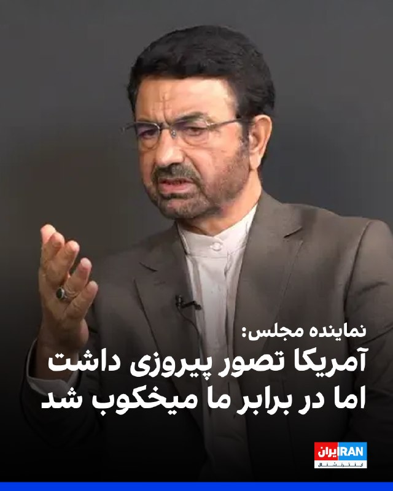

فداحسین مالکی، عضو کمیسیون امنیت ملی مجلس، با تمجید از اقدامات نیروهای مسلح جمهوری اسلامی در جریان جنگ گفت سران واشینگتن تصور می‌کردند در ایران نیز پیروز خواهند شد، اما «در این میدان به معنای واقعی کلمه میخکوب شدند».

او گفت: «سران واشینگتن که پس از وقایع ونزوئلا دچار غرور و سرمستی سیاسی شده بودند، تصور می‌کردند در حمله به ایران نیز پیروز خواهند بود؛ اما در این میدان به معنای واقعی کلمه میخکوب شدند.»

مالکی همچنین درباره احتمال توافق با آمریکا با میانجی‌گری پاکستان گفت پاکستانی‌ها «حسن نیت» دارند و برای انجام این میانجی‌گری تلاش می‌کنند.

او افزود: «احتمال می‌دهم رفاقتی که عاصم منیر با ترامپ دارد، او را وادار کند شروط را بپذیرد؛ از جمله این‌که وارد تنگه هرمز نشود، وارد غنی‌سازی نشود، خسارت ما را بدهد و پول‌های بلوکه‌شده را آزاد کند.»
‌🏁 🇬🇧 IranintlTV

🤖 @VahidOOnLine

## VahidOOnLine — post 241310

  <a href="telegram/content/VahidOOnLine_241310_1779361347.mp4" target="_blank">🎬 Download video</a>

ویدیوی ارسالی به ایران اینترنشنال نشان‌ می‌دهد که ۳۱ اردیبهشت در حوالی روستای سَلَخ شهرستان قشم استان هرمزگان، صف بنزین در کنار جاده ادامه پیدا کرده است. به گفته ساکنان منطقه، مردم این روستا با کمبود سوخت روبرو شده‌اند.
‌🏁 🇬🇧 IranintlTV

🤖 @VahidOOnLine

## VahidOOnLine — post 241309

  <a href="telegram/content/VahidOOnLine_241309_1779361349.mp4" target="_blank">🎬 Download video</a>

بر اساس ویدیو و گزارش‌های رسیده به ایران اینترنشنال شماری از دانش‌آموزان و خانواده‌های آنان در شهرکرد، صبح پنجشنبه ٢١ اردیبهشت برای اعتراض به حضوری شدن امتحانات جلوی ساختمان استانداری چهارمحال و بختیاری تجمع کرده و شعار سردادند.
‌🏁 🇬🇧 IranintlTV

🤖 @VahidOOnLine

## VahidOOnLine — post 241308

  

♦️خبرگزاری ایسنا روز پنجشنبه ۳۱ اردیبهشت ماه با انتشار خبری در تلگرام نوشت جمهوری اسلامی ایران «در حال پاسخ به متن ارسالی آمریکا است.»

ایسنا منبع این خبر را ذکر نکرده است. با این حال خبرگزاری رویترز پس از دقایقی همین خبر را منتشر کرد و بسیاری از رسانه‌ها هم آن را گزارش کردند.

براساس خبر ایسنا، ایران در پاسخ به متن آمریکا در حال تدوین چارچوب کلان، برخی جزییات و اقدامات اعتمادساز به عنوان تضمین است.

ایسنا نوشته است «متن ارسالی به میزانی شکاف‌ها را کم کرده است اما کمتر شدن شکاف‌ها نیازمند پایان یافتن وسوسه جنگ در سمت واشنگتن است.»

 ایسنا درباره سفر رئیس ستاد کل ارتش پاکستان به ایران نوشته است: «ورود ژنرال عاصم منیر به تهران، به منظور کم کردن این شکاف‌ها و رسیدن به لحظه اعلام رسمی پذیرش یادداشت تفاهم است.»

الجزیره دقایقی پس از انتشار این خبر به نقل از یک منبع دولت پاکستان گزارش کرد که سفر ژنرال عاصم منیر به تهران مشروط به نتایج مذاکرات وزیر کشور پاکستان با مقام‌های جمهوری اسلامی است.
‌🇸🇦 Indypersian

🤖 @VahidOOnLine

## VahidOOnLine — post 241307

  <a href="telegram/content/VahidOOnLine_241307_1779361353.mp4" target="_blank">🎬 Download video</a>

بر پایه گزارش رسانه‌های حکومتی، ۲۰ ملوان ایرانی که کشتی‌شان در آب‌های سنگاپور توقیف شده بود و در «وضعیت نامناسبی» قرار داشتند، ساعتی پیش به ایران بازگشتند.
سفیر جمهوری‌اسلامی در پاکستان با قدردانی از دولت پاکستان اعلام کرد این ملوانان پس از پیگیری‌های دیپلماتیک و با همکاری مقام‌های پاکستانی، از سنگاپور به اسلام‌آباد منتقل شدند و سپس به کشور بازگشتند.
او از نقش نخست‌وزیر پاکستان، وزارت خارجه و دیگر نهادهای این کشور در آزادی و انتقال ملوانان ایرانی تشکر کرد.
‌🏁 🇬🇧 ManotoTV

🤖 @VahidOOnLine

## VahidOOnLine — post 241306

  <a href="telegram/content/VahidOOnLine_241306_1779361353.mp4" target="_blank">🎬 Download video</a>

بریتانیا از توافق تجاری ۵ میلیارد دلاری با کشورهای خلیج فارس رونمایی کرد؛ توافقی که در بحبوحه تنش‌های منطقه‌ای پس از جنگ ایران، به گفته لندن «پیامی از ثبات و اعتماد» به بازارها می‌دهد.
این توافق با شورای همکاری خلیج فارس شامل عربستان، امارات، قطر، کویت، عمان و بحرین است و قرار است سالانه حدود ۳.۷ میلیارد پوند به اقتصاد بریتانیا اضافه کند.
لندن می‌گوید ۹۳ درصد تعرفه‌های کشورهای خلیج فارس برای کالاهای بریتانیایی حذف می‌شود؛ از جمله محصولات غذایی، خودرو، صنایع هوافضا و الکترونیک.
در مقابل، بریتانیا نیز برخی تعرفه‌ها را کاهش می‌دهد، هرچند نفت و گاز کشورهای عربی پیش‌تر هم بدون تعرفه وارد بریتانیا می‌شد.
فعالان حقوق بشر از نبود بندهای الزام‌آور درباره حقوق بشر در این توافق انتقاد کرده‌اند و آن را «عقب‌گرد اخلاقی» توصیف کردند.
‌🏁 🇬🇧 ManotoTV

🤖 @VahidOOnLine

## VahidOOnLine — post 241305

  <a href="telegram/content/VahidOOnLine_241305_1779361354.mp4" target="_blank">🎬 Download video</a>

♦️خبرگزاری اسپوتنیک روسیه، روز پنجشنبه ۳۱ اردیبهشت ماه، تصویری از ورود اعضای تیم ملی فوتبال مردان ایران به سفارت آمریکا در آنکارا منتشر کرد.
تیم ملی فوتبال ایران که برای اردوای آمادگی پیش از جام‌جهانی فوتبال ۲۰۲۶ در ترکیه به سر می‌برد، سرانجام برای دریافت ویزا به سفارت آمریکا مراجعه کرد.
پیش‌تر مهدی تاج با اعلام آنکه تیم ملی فوتبال مردان ایران «قطعا» در جام‌جهانی شرکت می‌کند، گفته بود هنوز هیچ ویزایی برای حضور تیم ملی در رقابت‌های جام جهانی در ایالات متحده صادر نشده است.
مقام‌های ورزشی ایران در روزهای گذشته برای برگزاری مسابقات در کشور آمریکا، جلساتی را با مقام‌های فیفا برگزار کرده‌اند.
‌🇸🇦 Indypersian

🤖 @VahidOOnLine

## VahidOOnLine — post 241304

  <a href="telegram/content/VahidOOnLine_241304_1779361357.mp4" target="_blank">🎬 Download video</a>

♦️تصاویری که صفحه «اسرائیل به فارسی» روز پنجشنبه ۳۱ اردیبهشت در شبکه‌های اجتماعی منتشر کرده نشان می‌دهد، پرچم ملی شیروخورشید نشان ایران در کنار پرچم سایر کشورها در یکی از خیابان‌های شهر اشدود اسرائیل به اهتزاز درآمده است.
‌🇸🇦 Indypersian

🤖 @VahidOOnLine

## VahidOOnLine — post 241303

  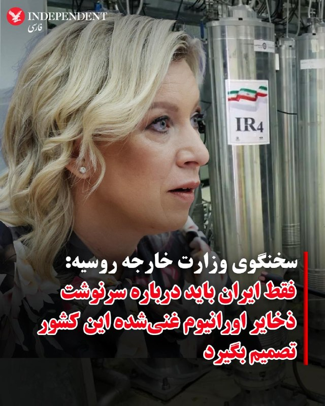

♦️ماریا زاخاروا، سخنگوی وزارت امور خارجه روسیه روز پنجشنبه ۳۱ اردیبهشت‌ماه گفت که تنها ایران باید درباره سرنوشت ذخایر اورانیوم این کشور تصمیم بگیرد.
سخنگوی وزارت امور خارجه روسیه بار دیگر بر موضع رسمی مسکو گفت: «پرونده هسته‌ای ایران تنها با در نظر گرفتن منافع ایران و و از راه دیپلماتیک قابل حل و فصل است.»
‌🇸🇦 Indypersian

🤖 @VahidOOnLine

## VahidOOnLine — post 241302

  

غلامرضا تاجگردون، رییس کمیسیون برنامه و بودجه مجلس، گفت دولت امروز به نقطه‌ای رسیده که باید «قرارگاه‌های مردمی تامین منابع مالی پایدار» را شکل دهد.

او اضافه کرد: «این یعنی بانک مرکزی باید یک پشتوانه مردمی دیگر برای تامین منابع داشته باشد؛ چه از جانب افرادی که در داخل کشور منابع دارند و چه ایرانیان خارج از کشور که امروز می‌توانند به اقتصاد کشورشان کمک کنند.»
‌🏁 🇬🇧 IranintlTV

🤖 @VahidOOnLine

## VahidOOnLine — post 241301

  <a href="telegram/content/VahidOOnLine_241301_1779361362.mp4" target="_blank">🎬 Download video</a>

♦️سازمان محیط زیست چهارمحل‌و‌بختیاری، روز پنجشنبه ۳۱ اردیبهشت تصاویری را از پرواز پرنده همای سعادت در آسمان منطقه حفاظت شده سبزکوه این استان منتشر کرد.
هما، پرنده اساطیری و اسرارآمیز در فرهنگ ایرانیان است که در ارتفاعات سنگی و صخره‌ای کشور زندگی می‌کند. این پرنده در رشته‌کوه‌های البرز، زاگرس، طالقان، سمنان و منطقه حفاظت‌شده گنو مشاهده شده است.
‌🇸🇦 Indypersian

🤖 @VahidOOnLine

## VahidOOnLine — post 241300

  

انور قرقاش، مشاور دیپلماتیک رییس امارات متحده عربی، با انتقاد از رفتار جمهوری اسلامی در منطقه گفت کشورهای خلیج فارس طی دهه‌های طولانی به «زورگویی ایران» عادت کرده‌اند و این رفتار به بخشی از صحنه سیاسی در خلیج فارس تبدیل شده است.

او گفت اعتبار جمهوری اسلامی میان «سخنان تهاجمی» و «بیانیه‌های توخالی دوستی» از بین رفته است.

قرقاش افزود: «امروز، پس از تجاوز آشکار ایران، این حکومت می‌کوشد واقعیتی تازه را تثبیت کند؛ واقعیتی که از یک شکست نظامی روشن زاده شده است. اما تلاش‌ها برای کنترل تنگه هرمز یا تعرض به حاکمیت دریایی امارات، چیزی جز خیال‌پردازی نیست.»

مشاور دیپلماتیک رییس امارات همچنین تاکید کرد هر کشوری که خواهان همزیستی با محیط عربی پیرامون خود است، باید بداند که اعتماد از بین رفته است.

او افزود بازسازی این اعتماد با شعار ممکن نیست، بلکه تنها با «زبان مسئولانه، پاسداشت حاکمیت و پایبندی واقعی به اصول حسن همجواری» امکان‌پذیر است.
‌🏁 🇬🇧 IranintlTV

🤖 @VahidOOnLine

## VahidOOnLine — post 241299

  <a href="telegram/content/VahidOOnLine_241299_1779361366.mp4" target="_blank">🎬 Download video</a>

انور قرقاش، مشاور سیاست خارجی رئیس امارات متحده عربی، در حساب ایکس خود نوشت جمهوری اسلامی پس از تجاوز و شکست نظامی آشکار، در تلاش است واقعیتی جدید را بر منطقه تحمیل کند، اما تلاش برای کنترل تنگه هرمز یا تعرض به حاکمیت دریایی امارات «چیزی جز رویاپردازی نیست.»
قرقاش افزود کشورهای عربی خلیج فارس دهه‌ها به «زورگویی‌های ایران» عادت کرده‌اند؛ تا جایی که این رفتار به بخشی از فضای سیاسی منطقه تبدیل شده و شکاف عمیقی میان شعارهای تهاجمی تهران و ادعاهای دوستی ایجاد کرده است.
او همچنین تأکید کرد هر کشوری که خواهان همزیستی با جهان عرب است باید بداند اعتماد از دست رفته و بازسازی آن نه با شعار، بلکه با احترام به حاکمیت کشورها، زبان مسئولانه و پایبندی واقعی به اصول حسن همجواری ممکن خواهد بود.
‌🏁 🇬🇧 ManotoTV

🤖 @VahidOOnLine

## VahidOOnLine — post 241298

  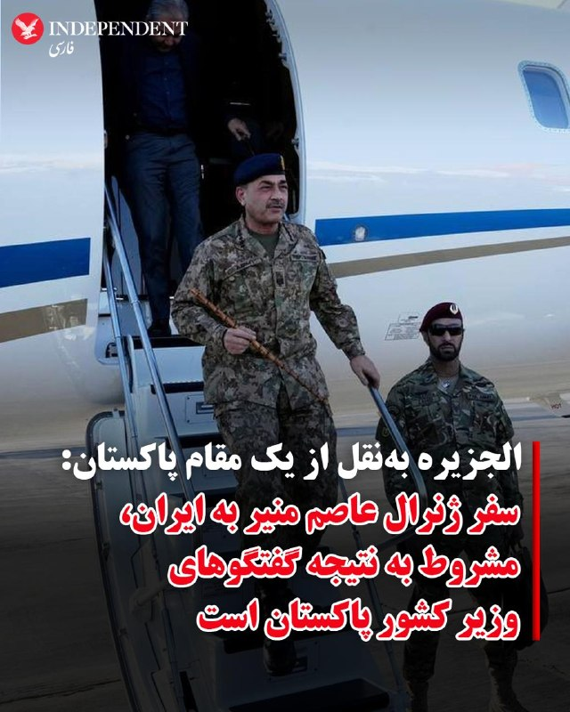

♦️شبکه الجزیره قطر روز پنجشنبه ۳۱ اردیبهشت به نقل از یک مقام دولت پاکستان اعلام کرد سفر فیلد مارشال عاصم منیر به تهران، مشروط به نتیجه گفتگوهای وزیر کشور پاکستان با مقام‌های جمهوری اسلامی است.

این مقام دولتی به الجزیره گفت جمهوری اسلامی ایران از پاکستان خواسته است تا مهلتی را برای ارزیابی و بررسی معیارهای آمریکایی برای مذاکره دریافت کند.

به گفته همین منبع اورانیوم غنی‌شده، چالش اصلی در مذاکرات میان تهران و واشنگتن است.

فداحسین مالکی، عضو کمیسیون امنیت ملی و سیاست خارجی مجلس، چهارشنبه ۳۰ اردیبهشت‌ماه گفته بود که عاصم منیر، فرمانده ارتش پاکستان، فردا به ایران سفر خواهد کرد. این عضو کمیسیون امنیت ملی ادعا کرده بود که فرمانده ارتش پاکستان در این دیدار، حامل پیام جدیدی از سوی ایالات متحده آمریکا به مقام‌های جمهوری اسلامی است.
‌🇸🇦 Indypersian

🤖 @VahidOOnLine

## VahidOOnLine — post 241297

  <a href="telegram/content/VahidOOnLine_241297_1779361367.mp4" target="_blank">🎬 Download video</a>

بر اساس داده‌های مرکز پایش اینترنت نت‌بلاکس، خاموشی اینترنت در ایران اکنون وارد هشتادوسومین روز خود شده است.
نت‌بلاکس اعلام کرد دسترسی به شبکه‌های بین‌المللی برای بیش از ۱۹۶۸ ساعت به‌طور گسترده مسدود بوده است. این نهاد تأکید کرد اینترنت آزاد و باز نقشی اساسی در حفاظت از جان، آزادی و پاسخگویی عمومی دارد.
‌🏁 🇬🇧 ManotoTV

🤖 @VahidOOnLine

## VahidOOnLine — post 241296

  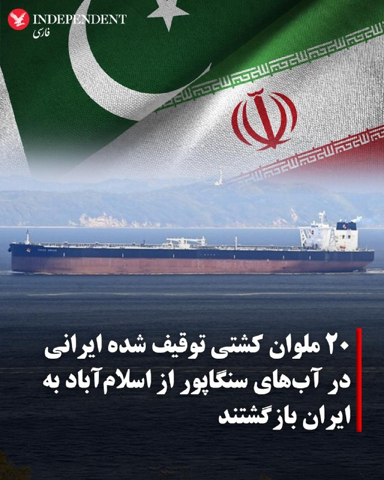

♦️رضا امیری مقدم، سفیر جمهوری اسلامی در پاکستان روز پنجشنبه ۳۱ اردیبهشت از بازگشت ۲۰ ملوان یک کشتی توقیف شده ایرانی در آب‌های سنگاپور به ایران خبر داد.

این کشتی چند هفته پیش و در عملیات نیروهای آمریکایی توقیف شده بود.

به گزارش خبرگزاری صداوسیما، امیری مقدم با اعلام این خبر گفت: «از اقدام انسان‌دوستانه و خیرخواهانه دولت محترم پاکستان برای پیگیری آزادی ۲۰ ملوان ایرانی که به دلیل توقیف کشتی‌شان در آب‌های سنگاپور در وضعیت نامناسبی قرار داشتند، صمیمانه قدردانی می‌کنم.»

به گفته سفیر جمهوری اسلامی در پاکستان «این ملوانان پس از تلاش‌های دیپلماتیک از سنگاپور به اسلام‌آباد منتقل شدند» و پس از آن به ایران بازگشتند.
‌🇸🇦 Indypersian

🤖 @VahidOOnLine

## VahidOOnLine — post 241295

  <a href="telegram/content/VahidOOnLine_241295_1779361369.mp4" target="_blank">🎬 Download video</a>

وزیران خارجه استرالیا و بلژیک در واکنش به ویدیوی منتشرشده از نحوه برخورد نیروهای اسرائیلی با فعالان «ناوگان آزادی» حامیان غزه، از احضار سفیران اسرائیل خبر دادند. در این ویدیو ده‌ها فعال حامی غزه با دستان بسته روی زمین زانو زده‌اند و ایتامار بن‌گویر، وزیر امنیت ملی اسرائیل، در حالی که پرچم این کشور را در دست دارد، به آن‌ها می‌گوید: «به اسرائیل خوش آمدید.»
ینی وانگ، وزیر خارجه استرالیا، این تصاویر را «غیرقابل قبول» توصیف کرد و گفت «رفتار تحقیرآمیز با بازداشت‌شدگان را محکوم می‌کند». وزیر خارجه بلژیک نیز تصاویر منتشرشده را «عمیقاً نگران‌کننده» خواند و اعلام کرد شماری از شهروندان بلژیک در میان بازداشت‌شدگان هستند.
همزمان جورجا ملونی، نخست‌وزیر ایتالیا، و پدرو سانچز، نخست‌وزیر اسپانیا، نیز این اقدام را محکوم کرده‌اند
‌🏁 🇬🇧 ManotoTV

🤖 @VahidOOnLine

## VahidOOnLine — post 241294

  <a href="telegram/content/VahidOOnLine_241294_1779361371.mp4" target="_blank">🎬 Download video</a>

ویدیوی رسیده به ایران‌اینترنشنال نشان می‌دهد که شامگاه ۲۹ اردیبهشت در بندر کُنگ، یکی از شهرهای تابعه شهرستان بندر لنگه در استان هرمزگان، صف طولانی بنزین تشکیل شده است.

مسعود پزشکیان، رییس دولت جمهوری اسلامی، اعلام کرد در پی محاصره دریایی آمریکا، صادرات نفت ایران متوقف شده و کشور روزانه با کمبود ۵۰ میلیون لیتر بنزین روبه‌رو است، اما دلاری برای واردات آن وجود ندارد. ساعتی پس از انتشار سخنان پزشکیان، رسانه‌های دولتی از جمله ایرنا اقدام به حذف این اظهارات کردند.
‌🏁 🇬🇧 IranintlTV

🤖 @VahidOOnLine

## WithYashar — post 11834

یزدی خواه: اینترنت جهانی فعلاً بازگشایی نمی‌شود/ دسترسی ویژه برای گروه‌های موردنیاز برقرار است
@withyashar

## WithYashar — post 11833

@withyashar

## WithYashar — post 11832

رویترز: رهبر ایران دستور داده است که اورانیوم با درجه نزدیک به تولید سلاح باید در ایران باقی بماند
@withyashar

## WithYashar — post 11831

ادعای اندیشکده آمریکایی: طبق ارزیابی کارشناسان، وحیدی و اعضای حلقه نزدیک او کنترل نه‌تنها پاسخ نظامی ایران در این درگیری، بلکه سیاست‌های مذاکراتی تهران را نیز در دست گرفته‌اند.
@withyashar
من دو هفته پیش در این ویدیو به این مسئله اشاره کردم
https://www.instagram.com/reel/DYIY6lnxd_R/?igsh=bjlqYWRvcDZ5NHIz

## WithYashar — post 11830

وزیر کشور پاکستان با احمد وحیدی، فرمانده سپاه پاسداران در تهران دیدار کرد. @withyashar یکی اینو آخرش از سولاخ کشید بیرون دیگه مابقی با موساده 😅

## WithYashar — post 11829

تایمز اسرائیل: ایران در جریان آتش‌بس از فرصت برای جابه‌جایی لانچرهای موشکی و آماده‌سازی برای دور جدید درگیری استفاده کرده
@withyashar

## WithYashar — post 11828

روسیه: ایران به تنهایی باید در مورد سرنوشت ذخایر اورانیوم خود تصمیم بگیرد.
@withyashar

## WithYashar — post 11827

گزارش های تایید نشده از ۳ انفجار در بندر عباس و قشم
@withyashar

## WithYashar — post 11826

همکنون زلزله در بندر عباس
@withyashar
مرحله بعدی زامبی و گودزیلا است

## WithYashar — post 11825

‏علی قلهکی : آمریکایی‌ها پس از دریافت نظراتِ ایران، پیشنهاد کرده‌اند که «پایانِ جنگ در تمامیِ جبهه‌ها»، «رفع محاصره تنگه هرمز توسط آمریکا»، «بازشدن تنگه هرمز توسط ایران با تعرفه و مسیر دریایی مدنظر ایران»، «آزادسازی ۲۵٪ از اموال بلوکه شده ایران _حدود ۲۵ میلیارد دلار»، «معافیتِ فروشِ نفت ایران به مدت ۳۰روز» و فازِ اصلیِ مذاکره یعنی «خروجِ ۴۰۰ کیلو اورانیوم از ایران _در بهترین حالت ارسال به کشور ثالث_» و «قبولِ حقِ غنی‌سازی ۳.۶۷ ٪ برای ایران (بعید است در فاز نهایی آمریکا آن را بپذیرد)» و «تعطیلی مراکز هسته‌ای _منهای راکتورِ تهران صرفا با کاربرد پزشکی) به طور یکجا توسط ایران امضا شود!
‏ایران می‌گوید تمام فازهای پیشنهادی آمریکا برای راستی‌آزمایی به مدت ۳۰ روز انجام شود تا هم ایران نفت خود را بفروشد و هم‌مُجاب شود در بحث هسته‌ای مذاکره را انجام دهد!
‏پی‌نوشت: ۱. اختلاف جدی بَر سَرِ مباحث هسته‌ای است؛ «۴۰۰ کیلو اورانیوم» خط قرمزِ دیکته‌ای اسرائیل برای آمریکاست! ایران ۴۰۰کیلو اورانیوم را نمی‌دهد، غنی‌سازی را هم حتما می‌خواهد و ۲۰ سال آن را تعلیق نمی‌کند. ایران با ارسال ۴۰۰ کیلو اورانیوم به کشور ثالث _چین و روسیه_ موافقت نکرده، آمریکا هم همینطور و خودش آن را می‌خواهد. نقطه‌ی جدی شکستِ توافق اینجاست. ایران مذاکره بر سر «پرونده‌ی هسته‌ای» را جُدای از «پرونده بازگشایی تنگه هرمز» و «اتمامِ جنگ» می‌داند!
‏۲. ایران و آمریکا سر فاز بندی توافق اختلاف دارند؛ ایران یکجا توافق نمی‌کند و آمریکا دنبالِ توافق یکجاست!
‏۳. آمریکا متعهد به متون و محورهای ارسالی نیست؛ محورهای ذکر شده با اینکه فاصله جدی با شروط ایران دارد ولی همین‌ها هم توسط آمریکا به مرحله اجرا در نمی‌آید!
‏۴. آمریکا تحریمی را لغو نمی‌کند؛ شاید تعلیقِ مدت‌دار در بهترین حالت، قسمتِ ایران در توافق شود.
‏۵. بر فرض توافق با آمریکا، هیچ تضمینی برای جلوگیری از ترور سطح بالا توسط اسرائیل نیست!
@withyashar

## WithYashar — post 11824

  <a href="telegram/content/WithYashar_11824_1779361374.mp4" target="_blank">🎬 Download video</a>

اعضای تیم ملی فوتبال ایران برای درخواست ویزا به سفارت آمریکا در آنکارا مراجعه کردند
@withyashar

## WithYashar — post 11823

الجزیره به نقل از یک منبع پاکستانی:

مقامات ایرانی از پاکستان خواسته‌اند تا مهلتی برای ارزیابی و بررسی معیارهای آمریکایی برای مذاکره دریافت کند.
اورانیوم غنی‌شده، گره اصلی در مذاکرات آمریکا و ایران است.
ژنرال منیر هنوز در پاکستان است و سفر او به ایران بستگی به نتایج سفر وزیر کشور دارد.
@withyashar

## WithYashar — post 11822

  

صدا و سیما : تا عید غدیر مجسمه‌ای ۱۵ متری از مشت علی خامنه‌ای در میدان انقلاب تهران نصب میشه‌.
@withyashar

## WithYashar — post 11821

فاکس نیوز در گزارشی به نقل از عمر محمد، کارشناس مبارزه با تروریسم، نوشت سبک زندگی مجتبی خامنه‌ای به سطحی از ناپدید شدن رسیده که اسامه بن لادن سال‌ها در ایبت‌آباد تجربه می‌کرد؛ زندگی بدون ارتباط مخابراتی و با اتکا به پیک‌های مورد اعتماد.
@withyashar

## WithYashar — post 11820

۲۰ ملوان ایرانی به کشور بازگشتند
سفیر ایران در پاکستان از بازگشت ۲۰ ملوان ایرانی که به‌دلیل توقیف کشتی‌شان در آب‌های سنگاپور گرفتار شده بودند، به ایران خبر داد.

این ملوانان پس از تلاش‌های دیپلماتیک از سنگاپور به اسلام‌آباد منتقل و ساعاتی پیش به میهن بازگشتند.
@withyashar

## WithYashar — post 11819

ایران در حال پاسخ به متن ارسال شده از سوی آمریکا است

ایران در حال گفت و گو‌ بر سر چارچوب کلان، برخی جزییات و اقدامات اعتمادساز به عنوان تضمین است.
متن ارسالی به میزانی شکاف‌ها را کم کرده است اما کمتر شدن شکاف‌ها نیازمند پایان یافتن وسوسه جنگ در سمت واشنگتن است.

ورود ژنرال عاصم منیر به تهران، به منظور کم کردن این شکاف‌ها و رسیدن به لحظه اعلام رسمی پذیرش یادداشت تفاهم است./ ایسنا
@withyashar

## WithYashar — post 11817

گزارش CNN: حکومت ایران در طول آتش‌بس بخشی از تولید پهپادهای خود را از سر گرفته است، که نشان می‌دهد در حال سریعاً بازسازی برخی توانایی‌های نظامی است که در حملات آسیب دیده‌اند.
@withyashar

## WithYashar — post 11816

امروز ۲۱ می روز جهانی چای است
و یادی میکنیم از پدر چای ایران ، حاج محمد میرزا (کاشف السلطنه)
او معتقد بود مردم ایران نباید برای چای و قند و نفت سفید به کشورهای دیگر وابسته باشند. از این رو به عنوان سفیر ایران راهی هند شد و در پوشش تاجر فرانسوی بصورت مخفی در مزارع چای مشغول یاد گیری کشت چای شد. دلیل این کار این بود که فن چای کاری را سری و انحصاری میدانستند و حاضر نمی شدند کسی آن را یاد گرفته و در سطح وسیع عمل کند. وی قبل از مراجعت به ایران تخم چای و چهار هزار گلدان نهال چای به ایران فرستاد و با سختی و مشقت فراوان موفق به کشت و توسعه چای در ایران شد و از طرف مظفرالدین شاه کاشف السلطنه لقب گرفت.
برای آموزش چای کاری به کشاورزان چهار چای کار چینی توسط وی به ایران آورده شدند که منجر به اسلام آوردن آنها و تشکیل خانواده در ایران شد.
انگلستان که منافعش در انحصار چای در ایران به خطر افتاده بود طی توطئه ای وی را به قتل رساند در برخی نوشته‌ها هم عنوان شده که او در سال ۱۳۰۸ خورشیدی در یک سانحهٔ اتومبیل مشکوک در مسیر بوشهر–شیراز درگذشت
@withyashar

## WithYashar — post 11815

رسانه عبری والا: منابع اسرائیلی می‌گویند آمریکایی‌ها در مذاکرات با ایران یک قدم به جلو برداشته‌اند، بنابراین برآوردها این است که حمله‌ای به ایران در ۲۴ ساعت آینده تکرار نخواهد شد
@withyashar

## mwarmonitor — post 9400

🚨«بر اساس گفته‌های دو منبع آگاه از ارزیابی‌های اطلاعاتی ایالات متحده، ایران در طول آتش‌بس شش هفته‌ای که از اوایل آوریل آغاز شد، تولید برخی از پهپادهای خود را از سر گرفته است؛ نشانه‌ای از اینکه این کشور به سرعت در حال بازسازی برخی از توانمندی‌های نظامی خود است که در جریان حملات مشترک آمریکا و اسرائیل آسیب دیده بودند. چهار منبع به سی‌ان‌ان (CNN) گفتند که داده‌های اطلاعاتی آمریکا نشان می‌دهد ارتش ایران بسیار سریع‌تر از آنچه در ابتدا برآورد می‌شد، در حال بازسازی و احیای قوا است.

🔴به گفته این چهار منبع آگاه از گزارش‌های اطلاعاتی، بازسازی توانمندی‌های نظامی—شامل جایگزینی پایگاه‌های موشکی، پرتابگرها و ظرفیت تولید سیستم‌های تسلیحاتی کلیدی که در طول درگیری‌های اخیر منهدم شده بودند—به این معنی است که در صورت از سرگیری کمپین بمباران توسط پرزیدنت دونالد ترامپ، ایران همچنان تهدیدی جدی برای متحدان منطقه‌ای خواهد بود.

@mwarmonitor

## mwarmonitor — post 9399

🔴به گفته دو منبع ارشد ایرانی که با Reuters گفت‌وگو کرده‌اند، رهبر جمهوری اسلامی ایران دستور داده است که ذخایر اورانیوم با غنای نزدیک به سطح تسلیحاتی ایران باید در داخل کشور باقی بماند.

🔸به گفته این منابع، این دستور بازتاب‌دهنده یک اجماع گسترده در میان ساختار حاکمیتی ایران است.

@mwarmonitor

## mwarmonitor — post 9398

🚨علی هاشم خبرنگار الجزیره: بر اساس منابع من در تهران، پاسخ ایران هنوز به میانجی پاکستانی تحویل داده نشده است. رایزنی‌ها همچنان ادامه دارد و تلاش‌های جدی برای رسیدن به پیش‌نویس نهایی در جریان است.

@mwarmonitor

## mwarmonitor — post 9397

🔴انور قرقاش: ما طی دهه‌های طولانی به زورگویی و قلدری ایران عادت کرده‌ایم، تا جایی که به بخشی از صحنه سیاسی خلیج فارس تبدیل شده است؛ و میان گفتمان تهاجمی و بیانیه‌های دوستیِ توخالی، اعتبار از میان رفته است.

🔸امروز نیز، پس از تجاوز خشن ایران، این نظام می‌کوشد واقعیتی جدید را که از یک شکست نظامی آشکار زاده شده، تثبیت کند؛ اما تلاش برای کنترل تنگه هرمز یا تعرض به حاکمیت دریایی امارات چیزی جز رؤیاهای پریشان نیست.

🔸هر کس بخواهد با محیط عربی پیرامون خود همزیستی داشته باشد، باید بداند که اعتماد از دست رفته است؛ و بازگرداندن آن نه با شعار، بلکه با زبانی مسئولانه، حفظ حاکمیت‌ها و پایبندی واقعی به اصول حسن همجواری ممکن است.

@mwarmonitor

## mwarmonitor — post 9396

  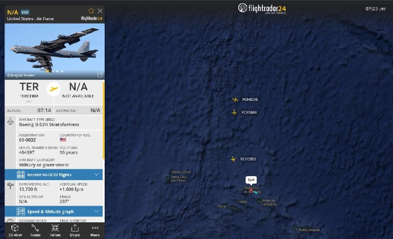

✈️⛽️ یک دسته از تانکرهای سوخت‌رسان نیروی هوایی آمریکا از پایگاه هوایی Lajes Field به پرواز درآمده‌اند؛ این هواپیماها در حال سوخت‌رسانی به جنگنده‌ها هستند و احتمالاً به سمت پایگاه‌های آمریکا در خاورمیانه حرکت می‌کنند. 🔸پایگاه هوایی Lajes Field در جزایر آزور…

## pm_afshaa — post 91155

🔴علی هاشم خبرنگار الجزیره: بر اساس منابع من در تهران، پاسخ ایران هنوز به میانجی پاکستانی تحویل داده نشده است. رایزنی‌ها همچنان ادامه دارد و تلاش‌های جدی برای رسیدن به پیش‌نویس نهایی در جریان است

💧 Rainbet.com the #1 Non-KYC Crypto Casino & Sportsbook @rainbetcom

😁 @Pm_Afshaa

## pm_afshaa — post 91154

  <a href="telegram/content/pm_afshaa_91154_1779361378.webm" target="_blank">🎬 Download video</a>

🔴رویترز به نقل از منابع ارشد ایرانی:
مجتبی خامنه‌ای دستور داده که اورانیوم غنی شده در ایران باقی بماند.

💧 Rainbet.com the #1 Non-KYC Crypto Casino & Sportsbook @rainbetcom

😁 @Pm_Afshaa

## pm_afshaa — post 91152

  <a href="telegram/content/pm_afshaa_91152_1779361379.webm" target="_blank">🎬 Download video</a>

🔴سی‌ان‌ان: ایران در طول آتش‌بس بخشی از تولید پهپادهای خودش رو از سر گرفته، که نشان میده سریعاً در حال بازسازی برخی توانایی‌های نظامیه که در حملات آسیب دیدن.

💧 Rainbet.com the #1 Non-KYC Crypto Casino & Sportsbook @rainbetcom

😁 @Pm_Afshaa

## pm_afshaa — post 91151

  <a href="telegram/content/pm_afshaa_91151_1779361380.webm" target="_blank">🎬 Download video</a>

🔴کانال 13 اسرائیل به نقل از یک مقام ارشد اسرائیلی:

در حلقه اطراف ترامپ، بر او فشار میارن تا با ایران به توافق برسه، اما گزینه حمله همچنان روی میز است.

💧 Rainbet.com the #1 Non-KYC Crypto Casino & Sportsbook @rainbetcom

😁 @Pm_Afshaa

## pm_afshaa — post 91150

  <a href="telegram/content/pm_afshaa_91150_1779361381.webm" target="_blank">🎬 Download video</a>

🔴ایسنا: ایران در حال پاسخ به متن ارسال شده از سوی آمریکاست.

متن ایران در حال گفت‌وگو‌ در تهران بر سر چارچوب کلان، برخی جزییات و اقدامات اعتمادساز به عنوان تضمین است.
متن ارسالی به میزانی شکاف‌ها رو کم کرده اما کمتر شدن شکاف‌ها نیازمند پایان یافتن وسوسه جنگ در سمت واشنگتن است.

💧Rainbet.com the #1 Non-KYC Crypto Casino & Sportsbook @rainbetcom

😁 @Pm_Afshaa

## pm_afshaa — post 91149

  <a href="telegram/content/pm_afshaa_91149_1779361382.mp4" target="_blank">🎬 Download video</a>

اکانت اسرائیل به فارسی:درخشش پرچم شیر‌ و خورشید در کنار پرچم کشورهای دیگر در شهر اشدود در اسرائیل.

💧 Rainbet.com the #1 Non-KYC Crypto Casino & Sportsbook @rainbetcom

😁 @Pm_Afshaa

## pm_afshaa — post 91148

🔴3 انفجار پیاپی در بندر عباس

💧 Rainbet.com the #1 Non-KYC Crypto Casino & Sportsbook @rainbetcom

😁 @Pm_Afshaa

## pm_afshaa — post 91147

  

🚨اشتراک استارز ⭐️ فیلترشکن ایران وی پی ان
تخفیف ها تا ساعت ۱۲ امشب هستن و هیچ وقت دیگر بر نمیگردن❌

تعرفه های باور نکردنی🔮

سرورا بدون ضریب هستن و ساب دارن😎🔋

1 gig= 230t🚀

3 gig= 670t 🚀

5 gig= 1050t🚀

7 gig = 1550t 🚀

10 gig= 2100t 🚀

قبل خرید میتونید تست بگیرید 🛜
بهترین و ارزون ترین سرور ایران دست ماست

🚨تمامی سرور ها کاربر نامحدود هستن و تاریخ انقضا ندارن✅

جهت خرید به ایدی زیر پیام بدین 👇

@IRAN_VPNADMIN

کانال. و رضایت مشتری ها👇

https://t.me/IRAN_VPNON

## pm_afshaa — post 91146

🔴تایمز اسرائیل: ایران در جریان آتش‌بس از فرصت برای جابه‌جایی لانچرهای موشکی و آماده‌سازی برای دور جدید درگیری استفاده کرده

💧 Rainbet.com the #1 Non-KYC Crypto Casino & Sportsbook @rainbetcom

😁 @Pm_Afshaa

## pm_afshaa — post 91145

🔴والا نیوز:منابع اسرائیلی می‌گویند آمریکایی‌ها در مذاکرات با ایران یک قدم به جلو برداشته‌اند، بنابراین برآوردها این است که حمله‌ای به ایران در 24 ساعت آینده تکرار نخواهد شد

💧 Rainbet.com the #1 Non-KYC Crypto Casino & Sportsbook @rainbetcom

😁 @Pm_Afshaa

## DEJradio — post 4803

⭕️ قالیباف گفت آمریکا در پی دور تازۀ جنگ علیه رژیم است

محمدباقر قالیباف، رئیس مجلس شورای اسلامی گفت آمریکا همچنان در جست‌وجوی آغاز دور تازۀ جنگ علیه جمهوری اسلامی است.
او مدعی شد جمهوری اسلامی در دورۀ آتش‌بس توان نظامی خود را بازسازی کرده است.
قالیباف همچنین ادعا کرد در صورت آغاز دوبارۀ جنگ، نیروهای جمهوری اسلامی «دشمن» را «شگفت‌زده» می‌کنند.
رئیس مجلس شورای اسلامی همچنین خبر افزایش بهای کالاهای اساسی و کاهش قدرت خرید مردم را تأیید کرد.

#قالیباف #جنگ
@DEJradio

## DEJradio — post 4802

  <a href="telegram/content/DEJradio_4802_1779361385.mp4" target="_blank">🎬 Download video</a>

👑
🔺برافراشته شدن پرچم شیر و خورشید در بندر اشدود اسرائیل.

#اسرائیل #پرچم_شیروخورشید
@DEJradio

## DEJradio — post 4801

  <a href="telegram/content/DEJradio_4801_1779361387.mp4" target="_blank">🎬 Download video</a>

🤡
🔺 سیاهی‌لشکر آفریقایی‌‌ها در حمایت از حکومت.

#آفریقایی #تجمعات_حکومتی
@DEJradio

## DEJradio — post 4800

  <a href="telegram/content/DEJradio_4800_1779361390.mp4" target="_blank">🎬 Download video</a>

🔺🎥 بناب؛ قدردانی از سردار آزمون به دلیل حمایت از مردم

یک شهروند با ارسال ویدیویی که شعارنویسی در حمایت از سردار آزمون بازیکن مردم‌دوست تیم فوتبال نوشت: «مردم بناب و اصلا کل آذربایجان غربی و شرقی خیلی سردار آزمون رو دوست دارن، و خیلی عصبانی هستن از این که آزمون رو از تیم حذف کردن، خاک تو سرشون. آزمون ما دوست داریم و تو باعث افتخار مایی. لطفا صدای اعتراض و افتخار ما به آزمون رو اگر چه که حذفش کردن رو به همه، و بخصوص به اون تصمیم گیرنده‌های نالایق هر کی که هستند برسونید.»

#بناب #سردار_آزمون
@DEJradio

## DEJradio — post 4799

  <a href="telegram/content/DEJradio_4799_1779361393.mp4" target="_blank">🎬 Download video</a>

⭕️ سنتکام: تفنگداران آمریکایی وارد یک نفتکش جمهوری اسلامی شدند

سنتکام اعلام کرد نیروهای آمریکایی روز چهارشنبه در دریای عمان وارد نفتکش «ام‌تی سلستیال سی» شدند.
ستاد فرماندهی مرکزی آمریکا گفت این نفتکش که پرچم جمهوری اسلامی را برافراشته بود، برای نقض محاصرۀ دریایی و حرکت به سمت بنادر ایران در تلاش بود.
سنتکام اعلام کرد پس از بازرسی و صدور دستور تغییر مسیر، این شناور را آزاد کرده است.
به گزارش سنتکام، تاکنون ۹۱ کشتی تجاری مرتبط با جمهوری اسلامی، در جریان محاصرۀ دریایی ناگزیر به تغییر مسیر شده‌اند.
#محاصره_دریایی #سنتکام
@DEJradio

## DEJradio — post 4798

⭕️ ترامپ: چند روز منتظر می‌مانیم اما پاسخ تهران باید ۱۰۰ درصد درست باشد

دونالد ترامپ گفت آمریکا حاضر است چند روز دیگر برای پاسخ جمهوری اسلامی به پیشنهاد توافق منتظر بماند.
رئیس جمهوری آمریکا هشدار داد پاسخ تهران باید «۱۰۰ درصد درست» باشد، در غیر این صورت تنش‌ها به‌سرعت افزایش می‌یابد.
ترامپ همچنین مدعی شد واشینگتن اکنون با افرادی «باهوش و قدرتمند» از طرف تهران روبه‌رو است که جایگزین رهبران پیشین شده‌اند.
او پیش‌تر نیز گفته بود در صورت شکست مذاکرات، حمله‌ای شدیدتر از حملات پیشین، علیه جمهوری اسلامی آغاز می‌شود.

#ترامپ #توافق #مذاکرات
@DEJradio

## DEJradio — post 4797

⭕️ جمهوری اسلامی دو زندانی مخالف حکومت را اعدام کرد

قوۀ قضائیه جمهوری اسلامی روز پنج‌شنبه اعلام کرد رامین زله و کریم معروف‌پور، را به اتهام عضویت در «گروه‌های تروریستی» اعدام کرده است.
دستگاه قضایی ایران این دو شهروند اهل نقده را به عضویت در «گروه‌های تروریستی تجزیه‌طلب» و «قیام مسلحانه» متهم کرده است.
بر پایۀ گزارش منابع حقوق بشری، اتهامات مخالفان حکومت، بر پایۀ اعترافات اجباری آنها تنظیم می‌شود.
بنا برگزارش‌ها، دستگاه‌های امنیتی و قضائی جمهوری اسلامی برای گرفتن اعترافات اجباری، از ابزار شکنجۀ روحی و جسمی متهمان استفاده می‌کنند.

#اعدام #زندانیان_سیاسی
@DEJradio

## DEJradio — post 4796

⭕️ میانجی‌گری اسلام‌آباد بخشی از توافق مالی پنهان با تهران است

به گزارش کانال ۱۴ اسرائیل، تلاش‌ پاکستان برای میانجی‌گری میان تهران و واشینگتن، بخشی از یک توافق مالی محرمانه با جمهوری اسلامی است.
براساس این گزارش، اسلام‌آباد به ازای پشتیبانی از مواضع تهران در مذاکرات، امیدوار است پس از کاهش تحریم‌ها از کمک مالی جمهوری اسلامی برای مدیریت بدهی‌های خارجی خود بهره‌مند شود.
این رسانۀ اسرائیلی اعلام کرد پاکستان با بیش از یک‌صد میلیارد دلار بدهی خارجی روبه‌رو شده است.

#مذاکرات #پاکستان
@DEJradio

## DEJradio — post 4795

  <a href="telegram/content/DEJradio_4795_1779361397.webm" target="_blank">🎬 Download video</a>

🔺📢 اعدام دو شهروند عراقی به اتهام جاسوسی

سازمان حقوق بشر ایران گزارش داد جمهوری اسلامی دو شهروند عراقی به نام‌های علی نادر العبیدی، ۲۷ ساله و فاضل شیخ کریم، ۲۹ ساله، به اتهام «جاسوسی» به‌صورت مخفیانه در زندان مرکزی کرج اعدام شدند.

اتهام عبیدی و شیخ کریم «جاسوسی برای نهادهای اطلاعاتی و امنیتی یکی از کشورهای عربی» است.

این منبع مطلع گفت: «آنان پیش از صدور حکم، به مدت ۱۱ ماه در بازداشتگاه وزارت اطلاعات تحت بازجویی قرار داشتند و سپس به بند اطلاعات سپاه در زندان رجایی‌شهر کرج منتقل شدند. این دو زندانی در نهایت برای اجرای حکم اعدام به ندامتگاه مرکزی کرج منتقل شده بودند.»

جمهوری اسلامی ایران پس از جنگ ۱۲ روزه، اعدام‌های زنجیره‌ای شهروندان به اتهام «جاسوسی» و «همکاری» با اسرائیل را آغاز کرد. این روند بعد از جنگ ۴۰ روزه، سرعت بیشتری گرفت.

حکم اعدام احسان افرشته در ۲۳ اردیبهشت عرفان شکورزاده در ۲۱ اردیبهشت یعقوب کریم‌پور و ناصر بکرزاده در ۱۲ اردیبهشت، مهدی فرید در دوم اردیبهشت محمد معصوم شاهی و حامد ولیدی در ۳۱ فروردین و کوروش کیوانی در ۲۷ اسفند سال گذشته به اتهام «جاسوسی» اجرا شد.

#جنگ۱۲روزه #جنگ۴۰روزه #اعدام
@DEJradio

## DEJradio — post 4794

  <a href="telegram/content/DEJradio_4794_1779361398.webm" target="_blank">🎬 Download video</a>

🚨
🔸 خبر ۲۱
چهارشنبه ۳۰ اردیبهشت ۱۴۰۵

#خبر۲۱
@DEJradio

## DEJradio — post 4793

  <a href="telegram/content/DEJradio_4793_1779361398.webm" target="_blank">🎬 Download video</a>

🔺📢 روزنامه «اسرائیل هیوم» گزارش داد دونالد ترامپ درباره وضعیت ایران با رهبران منطقه گفت‌وگو کرده است. به گفته دو منبع، بنیامین نتانیاهو نخست‌وزیر اسرائیل و محمد بن زاید رئیس امارات متحده عربی، از اتخاذ موضعی سخت‌گیرانه علیه جمهوری اسلامی حمایت کردند و در عین حال بر ضرورت حفاظت از تأسیسات حساس در کشورهایشان تأکید داشتند.

در مقابل، محمد بن سلمان ولیعهد عربستان و شیخ تمیم بن حمد آل ثانی امیر قطر، ترجیح می‌دهند درگیری‌ها دوباره آغاز نشود.
منابع دیپلماتیک منطقه می‌گویند عربستان و قطر تماس‌های مستمری با ایران دارند؛ از جمله برای کاهش خطرات امنیتی، زیرا معتقدند حکومت تهران همچنان پابرجا خواهد ماند. در مقابل، امارات و بحرین بر این باورند که دیگر نمی‌توان به ایران اعتماد کرد، به‌ویژه پس از بسته شدن تنگه هرمز، و آمریکا باید شروط خود را به تهران تحمیل کند.

در تماس شبانه میان نتانیاهو و ترامپ، گزینه‌های مختلف از حمله نظامی گرفته تا ادامه مذاکرات بررسی شد. اطلاعات به‌دست‌آمده توسط اسرائیل هیوم نشان می‌دهد ترامپ تصمیم گرفته اجازه ادامه مذاکرات را بدهد و اکنون منتظر پاسخ ایران پس از دیدارهای وزیر کشور پاکستان با مقام‌های ارشد سـ.ـپاه پاسداران است.

یک مقام آمریکایی گفت نتانیاهو از رفتار ایران و احتمال وقت‌کشی تهران ابراز ناامیدی کرده، در حالی که ترامپ بر دشواری تصمیمات پیش روی خود تأکید داشته است.

عربستان سعودی و قطر با وجود اینکه با تهدید مداوم از سوی جمهوری اسلامی ایران روبه‌رو هستند اما همچنان ترجیح می‌دهند رژیم اسلامی در تهران حکومت کند.

#تنگه_هرمز #ترامپ #کشورهای_عربی
@DEJradio

## DEJradio — post 4792

  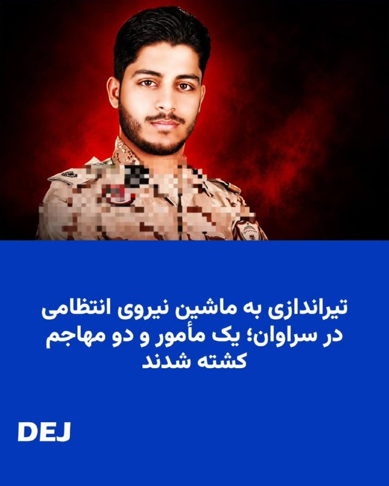

💀
🚨 بر اساس گزارش منابع محلی یک مامور نیروی انتظامی در سراوان روز چهارشنبه ۳۰ اردیبهشت در اثر تیراندازی افراد مسلح ناشناس کشته شد.

رسانه‌های حکومتی از جمله خبرگزاری تسنیم وابسته به سـ.ـپاه پاسداران، هویت نیروی کشته‌شده را «امیرحسین شهرکی» با درجه ستوان‌سومی اعلام کرده و مدعی شده‌اند که وی بر اثر اصابت گلوله جان خود را از دست داده است.

مهاجمان از داخل یک ماشین به سمت خودرو پلیس شلیک کردند. خبرگزاری ایلنا گزارش داد دو فرد مسلح نیز در تبادل آتش کشته شدند.

#حذف_هدفمند #سراوان
@DEJradio

## DEJradio — post 4791

  <a href="telegram/content/DEJradio_4791_1779361400.mp4" target="_blank">🎬 Download video</a>

🚨
🔸 رشید مظاهری، دروازه‌بانی که شرافت را انتخاب کرد

#رشید_مظاهری #ورزشکار_مردمی
@DEJradio

## mamlekate — post 103563

خلاصه رویداد مهم Google IO 2026 ، یکی از مهمترین رویدادهای تکنولوژی دنیا در سال ۲۰۲۶ ، با زیرنویس فارسی [۶۰ مگابابت برای ۳۵ دقیقه]

shah_riyar_
@mamlekate

## mamlekate — post 103562

📝 ادعای نیویورک‌تایمز: محمود احمدی‌نژاد بخشی از طرح تغییر رژیم ایران بود

روزنامه نیویورک تایمز در گزارشی مدعی شد اسرائیل و آمریکا محمود احمدی‌نژاد را یکی از گزینه‌های احتمالی برای ادارهٔ ایران پس از حمله نظامی در نظر گرفته بودند.

@mamlekate ⚠️ خطر فرناز فصیحی

## mamlekate — post 103561

📝 هلی‌کوپتر، جنگ و پاستور؛ روایتی از دو سال پرحادثه جمهوری اسلامی

روز سی‌ام اردیبهشت‌ماه سال ۱۴۰۳، هلی‌کوپتر حامل ابراهیم رئیسی، رئیس‌جمهوری منصوب علی خامنه‌ای، و همراهانش در جنگل‌های ارسباران سقوط کرد. این حادثه از همان ساعات نخست، به یکی از پرابهام‌ترین رخدادهای تاریخ جمهوری اسلامی تبدیل شد و در حالی که دو هلی‌کوپتر همراه دیگر بدون مشکل به مقصد رسیدند، سقوط هلی‌کوپتر حامل رئیس دولت سیزدهم موجی از پرسش‌ها و گمانه‌زنی‌ها را برانگیخت.

دو سال پیش:
t.me/mamlekate/87456

## mamlekate — post 103560

  

📝 پس از نقض حکم اعدام؛ ۳ متهم پرونده شهرک اکباتان به حبس و دیه محکوم و ۳ تن تبرئه شدند

رسانه های حقوق بشری گزارش دادند دادگاه کیفری تهران پس از رسیدگی دوباره به پرونده شهرک اکباتان، سه معترض بازداشت شده در این پرونده را به دیه و پنج سال حبس محکوم و سه معترض دیگر را از اتهام مشارکت در «قتل عمد» تبرئه کرد. حکم اعدام این شش تن پیش تر در دیوان عالی کشور نقض شده بود.

سایت هرانا چهارشنبه ۳۰ اردیبهشت گزارش داد شعبه ۱۳ دادگاه کیفری یک استان تهران، میلاد آرمون، علیرضا کفایی و امیرمحمد خوش اقبال را بابت اتهام «مشارکت در قتل عمد» آرمان علی وردی، از نیروهای بسیج، محکوم کرد.

هر یک از آن ها به پرداخت سهم مساوی از دیه کامل یک انسان و پنج سال حبس محکوم شده اند.

طبق گزارش هرانا، نوید نجاران، حسین نعمتی و علیرضا برمرزپورناک، سه متهم دیگر این پرونده، به دلیل «فقدان مدارک دال بر وارد کردن ضربه به ناحیه مشخصی از بدن علی وردی» از اتهام مشارکت در قتل عمد تبرئه شدند.

@mamlekate

## kianmeli1 — post 87527

  <a href="telegram/content/kianmeli1_87527_1779361404.mp4" target="_blank">🎬 Download video</a>

🔴پالایشگاه سیزران، استان سامارا، در روسیه توسط پهپادهای اوکراینی مورد حمله قرار گرفته و اکنون در حال سوختن است.
https://t.me/kianmeli1

## IranIntlTV — post 338228

  <a href="telegram/content/IranIntlTV_338228_1779361405.mp4" target="_blank">🎬 Download video</a>

ایال زمیر، رییس ستاد کل ارتش اسرائیل، گفت نیروهای این کشور در بالاترین سطح آماده‌باش قرار دارند و برای هر تحول احتمالی آماده‌اند.

بابک اسحاقی، خبرنگار ایران‌اینترنشنال، گزارش می‌دهد
@iranintltv

## IranIntlTV — post 338227

  <a href="telegram/content/IranIntlTV_338227_1779361408.mp4" target="_blank">🎬 Download video</a>

افزایش شدید قیمت دارو، در کنار کمیاب و نایاب شدن بسیاری از اقلام دارویی، باعث شده بسیاری از مردم توان پرداخت هزینه‌های درمان را نداشته باشند. شماری از شهروندان در پیام‌های ارسالی به ایران‌اینترنشنال گفته‌اند به دلیل ناتوانی مالی، از ادامه درمان صرف‌نظر می‌کنند.

لیلا سعادتی، عضو تحریریه ایران‌اینترنشنال، گزارش می‌دهد
@iranintltv

## IranIntlTV — post 338226

  

فداحسین مالکی، عضو کمیسیون امنیت ملی مجلس، با تمجید از اقدامات نیروهای مسلح جمهوری اسلامی در جریان جنگ گفت سران واشینگتن تصور می‌کردند در ایران نیز پیروز خواهند شد، اما «در این میدان به معنای واقعی کلمه میخکوب شدند».

او گفت: «سران واشینگتن که پس از وقایع ونزوئلا دچار غرور و سرمستی سیاسی شده بودند، تصور می‌کردند در حمله به ایران نیز پیروز خواهند بود؛ اما در این میدان به معنای واقعی کلمه میخکوب شدند.»

مالکی همچنین درباره احتمال توافق با آمریکا با میانجی‌گری پاکستان گفت پاکستانی‌ها «حسن نیت» دارند و برای انجام این میانجی‌گری تلاش می‌کنند.

او افزود: «احتمال می‌دهم رفاقتی که عاصم منیر با ترامپ دارد، او را وادار کند شروط را بپذیرد؛ از جمله این‌که وارد تنگه هرمز نشود، وارد غنی‌سازی نشود، خسارت ما را بدهد و پول‌های بلوکه‌شده را آزاد کند.»
https://iranintl.com/202605216184

## IranIntlTV — post 338225

  <a href="telegram/content/IranIntlTV_338225_1779361411.mp4" target="_blank">🎬 Download video</a>

سرخط خبرهای پنجشنبه ۳۱ اردیبهشت
@iranintltv

## IranIntlTV — post 338224

  <a href="telegram/content/IranIntlTV_338224_1779361413.mp4" target="_blank">🎬 Download video</a>

ویدیوی ارسالی به ایران اینترنشنال نشان‌ می‌دهد که ۳۱ اردیبهشت در حوالی روستای سَلَخ شهرستان قشم استان هرمزگان، صف بنزین در کنار جاده ادامه پیدا کرده است. به گفته ساکنان منطقه، مردم این روستا با کمبود سوخت روبرو شده‌اند.

## IranIntlTV — post 338223

  <a href="telegram/content/IranIntlTV_338223_1779361415.mp4" target="_blank">🎬 Download video</a>

بر اساس ویدیو و گزارش‌های رسیده به ایران اینترنشنال شماری از دانش‌آموزان و خانواده‌های آنان در شهرکرد، صبح پنجشنبه ٢١ اردیبهشت برای اعتراض به حضوری شدن امتحانات جلوی ساختمان استانداری چهارمحال و بختیاری تجمع کرده و شعار سردادند.

## IranIntlTV — post 338222

  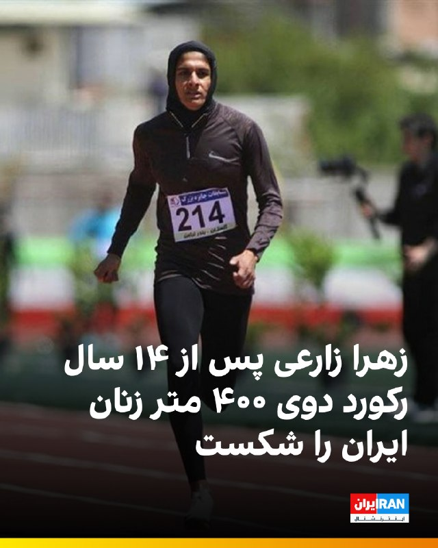

🔻زهرا زارعی، دونده استان کرمان، در مسابقات دوومیدانی جایزه بزرگ بندر ترکمن، رکورد ملی ماده ۴۰۰ متر زنان ایران را پس از ۱۴ سال شکست. او با ثبت زمان ۵۱.۹۷ ثانیه، رکورد این ماده را حدود یک ثانیه بهبود داد.

🔹رکورد ملی ۴۰۰ متر زنان ایران پیش از این با زمان ۵۲.۹۵ ثانیه در اختیار مریم طوسی بود که اردیبهشت ۱۳۹۱ در مسابقات جایزه بزرگ آسیا در تایلند ثبت شده بود.
@iranintltvsport

## IranIntlTV — post 338221

  <a href="telegram/content/IranIntlTV_338221_1779361419.mp4" target="_blank">🎬 Download video</a>

نگرانی‌ها درباره تداوم موج اعدام‌ها در ایران افزایش یافته است. هم‌زمان با اعلام قوه قضاییه درباره اعدام دو زندانی سیاسی، سازمان حقوق بشر ایران نیز از اعدام مخفیانه دو تبعه عراقی در زندان مرکزی کرج خبر داد و نسبت به روند رو به افزایش اجرای احکام اعدام هشدار داد.
گفت‌وگو با شراره عزیزی، عضو تحریریه ایران‌اینترنشنال
@iranintltv

## IranIntlTV — post 338220

  <a href="telegram/content/IranIntlTV_338220_1779361421.mp4" target="_blank">🎬 Download video</a>

روزنامه اسرائیل هیوم گزارش داد نشست کاخ سفید درباره پرونده جمهوری اسلامی با اختلاف‌نظر میان مقام‌های ارشد آمریکا همراه بوده است. به‌گفته این روزنامه، دونالد ترامپ بر ادامه مذاکرات تاکید کرده است. در مقابل، مارکو روبیو، وزیر امور خارجه، و پیت هگست، وزیر جنگ، معتقدند بدون تهدید به حمله و افزایش فشار اقتصادی، از تهران نمی‌شود امتیاز گرفت.
جزییات بیشتر با حسین آقایی، عضو تحریریه ایران‌اینترنشنال
@iranintltv

## IranIntlTV — post 338219

  

غلامرضا تاجگردون، رییس کمیسیون برنامه و بودجه مجلس، گفت دولت امروز به نقطه‌ای رسیده که باید «قرارگاه‌های مردمی تامین منابع مالی پایدار» را شکل دهد.

او اضافه کرد: «این یعنی بانک مرکزی باید یک پشتوانه مردمی دیگر برای تامین منابع داشته باشد؛ چه از جانب افرادی که در داخل کشور منابع دارند و چه ایرانیان خارج از کشور که امروز می‌توانند به اقتصاد کشورشان کمک کنند.»
https://iranintl.com/202605219231

## IranIntlTV — post 338218

  

انور قرقاش، مشاور دیپلماتیک رییس امارات متحده عربی، با انتقاد از رفتار جمهوری اسلامی در منطقه گفت کشورهای خلیج فارس طی دهه‌های طولانی به «زورگویی ایران» عادت کرده‌اند و این رفتار به بخشی از صحنه سیاسی در خلیج فارس تبدیل شده است.

او گفت اعتبار جمهوری اسلامی میان «سخنان تهاجمی» و «بیانیه‌های توخالی دوستی» از بین رفته است.

قرقاش افزود: «امروز، پس از تجاوز آشکار ایران، این حکومت می‌کوشد واقعیتی تازه را تثبیت کند؛ واقعیتی که از یک شکست نظامی روشن زاده شده است. اما تلاش‌ها برای کنترل تنگه هرمز یا تعرض به حاکمیت دریایی امارات، چیزی جز خیال‌پردازی نیست.»

مشاور دیپلماتیک رییس امارات همچنین تاکید کرد هر کشوری که خواهان همزیستی با محیط عربی پیرامون خود است، باید بداند که اعتماد از بین رفته است.

او افزود بازسازی این اعتماد با شعار ممکن نیست، بلکه تنها با «زبان مسئولانه، پاسداشت حاکمیت و پایبندی واقعی به اصول حسن همجواری» امکان‌پذیر است.
https://iranintl.com/202605217797

## IranIntlTV — post 338217

  <a href="telegram/content/IranIntlTV_338217_1779361425.mp4" target="_blank">🎬 Download video</a>

یک مخاطب با ارسال ویدیویی به ایران اینترنشنال گفت که قیمت یک بسته چیپس ساده محصول یکی از برندهای شناخته‌شده تولید مواد خوراکی به بیش از نیم میلیون تومان افزایش یافته است. صدای این شهروند با هوش مصنوعی تغییر داده شده است.

## IranIntlTV — post 338216

  <a href="telegram/content/IranIntlTV_338216_1779361428.mp4" target="_blank">🎬 Download video</a>

ژنرال کنت ویلزباخ، رییس ستاد نیروی هوایی ایالات متحده، گفت پهپادهای ام‌کیو-۹ ریپر ابزار عملیاتی کلیدی این نیرو در جنگ علیه جمهوری اسلامی بوده‌اند. او تاکید کرد ام‌کیو-۹ «ارزشمندترین بازیگر» این جنگ بود.
جزییات بیشتر با احمد صمدی، خبرنگار ایران‌اینترنشنال
@iranintltv

## IranIntlTV — post 338215

  <a href="telegram/content/IranIntlTV_338215_1779361430.mp4" target="_blank">🎬 Download video</a>

فاکس نیوز در گزارشی به نقل از عمر محمد، کارشناس مبارزه با تروریسم، نوشت سبک زندگی مجتبی خامنه‌ای به سطحی از ناپدید شدن رسیده که اسامه بن لادن سال‌ها در ایبت‌آباد تجربه می‌کرد؛ زندگی بدون ارتباط مخابراتی و با اتکا به پیک‌های مورد اعتماد.

گفت‌وگو با محمد جواد اکبرین، عضو تحریریه ایران‌اینترنشنال
@iranintltv

## IranIntlTV — post 338214

  <a href="telegram/content/IranIntlTV_338214_1779361433.mp4" target="_blank">🎬 Download video</a>

در حالی که تنها ۲۱ روز تا آغاز جام جهانی باقی مانده، نایب رییس فدراسیون فوتبال ایران اعلام کرد اعضای تیم برای دریافت ویزای آمریکا به سفارت این کشور در ترکیه مراجعه می‌کنند.
گفت‌وگو با رها پوربخش، عضو تحریریه ایران‌اینترنشنال
@iranintltv

## IranIntlTV — post 338213

  

🔻تیم ملی فوتبال، صبح پنج‌شنبه ۳۱ اردیبهشت، برای طی مراحل اداری دریافت ویزای آمریکا به سفارت این کشور در آنکارا رفت.

🔹فدراسیون فوتبال در فاصله حدود ۲۰ روز تا آغاز جام جهانی، با بحران ویزا دست‌به‌گریبان است. امیر قلعه‌نویی هنوز نمی‌داند کدام بازیکنان ویزا دریافت خواهند کرد و چه نفراتی را در آمریکا در اختیار خواهد داشت.

🔹احتمال دارد برای برخی اعضای کاروان ایران، به دلیل سوابق فعالیت یا ارتباط با سپاه پاسداران، ویزا صادر نشود.

@iranintltvsport

## IranIntlTV — post 338212

  <a href="telegram/content/IranIntlTV_338212_1779361436.mp4" target="_blank">🎬 Download video</a>

ویدیوی رسیده به ایران‌اینترنشنال نشان می‌دهد که شامگاه ۲۹ اردیبهشت در بندر کُنگ، یکی از شهرهای تابعه شهرستان بندر لنگه در استان هرمزگان، صف طولانی بنزین تشکیل شده است.

مسعود پزشکیان، رییس دولت جمهوری اسلامی، اعلام کرد در پی محاصره دریایی آمریکا، صادرات نفت ایران متوقف شده و کشور روزانه با کمبود ۵۰ میلیون لیتر بنزین روبه‌رو است، اما دلاری برای واردات آن وجود ندارد. ساعتی پس از انتشار سخنان پزشکیان، رسانه‌های دولتی از جمله ایرنا اقدام به حذف این اظهارات کردند.

## IranIntlTV — post 338211

  <a href="telegram/content/IranIntlTV_338211_1779361439.mp4" target="_blank">🎬 Download video</a>

خبرگزاری میزان، رسانه قوه قضاییه جمهوری اسلامی، از اعدام رامین زله و کریم معروف‌پور به اتهام «عضویت در گروه‌های تروریستی»، «تشکیل گروه با هدف بر هم زدن امنیت کشور» و «قیام مسلحانه» خبر داد.
هم‌زمان، سازمان حقوق بشر ایران از اعدام مخفیانه دو شهروند عراقی به نام‌های علی نادر العبیدی و فاضل شیخ کریم در ۱۷ فروردین، در زندان مرکزی کرج خبر داد.

گفت‌وگو با رضا اکوانیان، روزنامه‌نگار و فعال حقوق بشر
@iranintltv

## IranIntlTV — post 338210

  <a href="telegram/content/IranIntlTV_338210_1779361442.mp4" target="_blank">🎬 Download video</a>

مرتضی کاظمیان، عضو تحریریه ایران‌اینترنشنال، گفت: «وضعیت موجود میان جمهوری اسلامی و ایالات متحده تا وقتی که تکلیف منافع آمریکا، به‌صورت استراتژیک، مشخص نشود ادامه خواهد داشت.» او افزود در چنین وضعیتی، «سایه جنگ نه‌تنها بر جمهوری اسلامی، بلکه بر سر ایران باقی خواهد ماند».
@iranintltv

## IranIntlTV — post 338209

  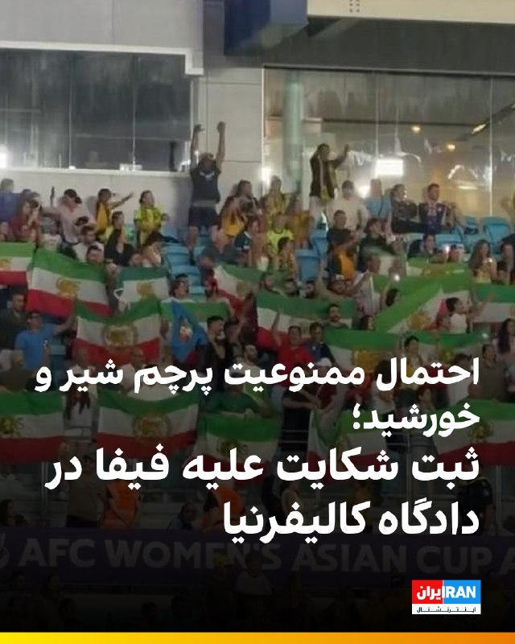

🔻انتشار گزارش‌هایی درباره احتمال ممنوعیت ورود پرچم شیر و خورشید به ورزشگاه‌های میزبان جام جهانی، موجی از واکنش‌ها را میان ایرانیان و فعالان سیاسی ایجاد کرده است. در تازه‌ترین اقدام، یک نهاد مدنی برای مقابله با این تصمیم احتمالی، در مراجع قضایی آمریکا شکایت ثبت کرده است.

🔹اندیشکده «آوای آزادی» شکایتی را علیه فدراسیون بین‌المللی فوتبال، فیفا، در دادگاه فدرال حوزه مرکزی ایالت کالیفرنیا ثبت کرده است. هدف از این اقدام حقوقی این است که از ممانعت فیفا برای ورود پرچم شیر و خورشید به ورزشگاه‌های جام جهانی جلوگیری کند.

🔹این اقدام پس از آن صورت گرفت که نشریه اتلتیک در گزارشی نوشت فیفا تحت فشار و به درخواست فدراسیون فوتبال جمهوری اسلامی، قصد دارد مانع ورود پرچم شیر و خورشید به استادیوم‌های محل برگزاری مسابقات شود.

🔹یکی از دغدغه‌های اصلی مقام‌های جمهوری اسلامی، احتمال شکل‌گیری فضای اعتراضی و سر دادن شعارهای ضدحکومتی در جریان این مسابقات است.

🔹جزییات بیشتر را در سایت بخوانید.

@iranintltvsport

## Shin_Persian — post 6120

Shin ✓ @hey_itsmyturn
Thu, 21 May 2026 10:02:55 UTC

3 blasts were just heard in Qeshm island.
(Highly likely EOD)
Hormozgan Province, #Iran

فارسی

۳ انفجار دقایقی پیش در جزیره قشم شنیده شد.
(احتمال زیاد خنثی‌سازی مهمات - EOD)
استان هرمزگان، #Iran_

𝕏 · @shin_persian

## ManotoTV — post 105716

  <a href="telegram/content/ManotoTV_105716_1779361445.mp4" target="_blank">🎬 Download video</a>

بر پایه گزارش رسانه‌های حکومتی، ۲۰ ملوان ایرانی که کشتی‌شان در آب‌های سنگاپور توقیف شده بود و در «وضعیت نامناسبی» قرار داشتند، ساعتی پیش به ایران بازگشتند.
سفیر جمهوری‌اسلامی در پاکستان با قدردانی از دولت پاکستان اعلام کرد این ملوانان پس از پیگیری‌های دیپلماتیک و با همکاری مقام‌های پاکستانی، از سنگاپور به اسلام‌آباد منتقل شدند و سپس به کشور بازگشتند.
او از نقش نخست‌وزیر پاکستان، وزارت خارجه و دیگر نهادهای این کشور در آزادی و انتقال ملوانان ایرانی تشکر کرد.

## ManotoTV — post 105715

  <a href="telegram/content/ManotoTV_105715_1779361446.mp4" target="_blank">🎬 Download video</a>

بریتانیا از توافق تجاری ۵ میلیارد دلاری با کشورهای خلیج فارس رونمایی کرد؛ توافقی که در بحبوحه تنش‌های منطقه‌ای پس از جنگ ایران، به گفته لندن «پیامی از ثبات و اعتماد» به بازارها می‌دهد.
این توافق با شورای همکاری خلیج فارس شامل عربستان، امارات، قطر، کویت، عمان و بحرین است و قرار است سالانه حدود ۳.۷ میلیارد پوند به اقتصاد بریتانیا اضافه کند.
لندن می‌گوید ۹۳ درصد تعرفه‌های کشورهای خلیج فارس برای کالاهای بریتانیایی حذف می‌شود؛ از جمله محصولات غذایی، خودرو، صنایع هوافضا و الکترونیک.
در مقابل، بریتانیا نیز برخی تعرفه‌ها را کاهش می‌دهد، هرچند نفت و گاز کشورهای عربی پیش‌تر هم بدون تعرفه وارد بریتانیا می‌شد.
فعالان حقوق بشر از نبود بندهای الزام‌آور درباره حقوق بشر در این توافق انتقاد کرده‌اند و آن را «عقب‌گرد اخلاقی» توصیف کردند.

## ManotoTV — post 105714

  <a href="telegram/content/ManotoTV_105714_1779361447.mp4" target="_blank">🎬 Download video</a>

انور قرقاش، مشاور سیاست خارجی رئیس امارات متحده عربی، در حساب ایکس خود نوشت جمهوری اسلامی پس از تجاوز و شکست نظامی آشکار، در تلاش است واقعیتی جدید را بر منطقه تحمیل کند، اما تلاش برای کنترل تنگه هرمز یا تعرض به حاکمیت دریایی امارات «چیزی جز رویاپردازی نیست.»
قرقاش افزود کشورهای عربی خلیج فارس دهه‌ها به «زورگویی‌های ایران» عادت کرده‌اند؛ تا جایی که این رفتار به بخشی از فضای سیاسی منطقه تبدیل شده و شکاف عمیقی میان شعارهای تهاجمی تهران و ادعاهای دوستی ایجاد کرده است.
او همچنین تأکید کرد هر کشوری که خواهان همزیستی با جهان عرب است باید بداند اعتماد از دست رفته و بازسازی آن نه با شعار، بلکه با احترام به حاکمیت کشورها، زبان مسئولانه و پایبندی واقعی به اصول حسن همجواری ممکن خواهد بود.

## ManotoTV — post 105713

  <a href="telegram/content/ManotoTV_105713_1779361448.mp4" target="_blank">🎬 Download video</a>

بر اساس داده‌های مرکز پایش اینترنت نت‌بلاکس، خاموشی اینترنت در ایران اکنون وارد هشتادوسومین روز خود شده است.
نت‌بلاکس اعلام کرد دسترسی به شبکه‌های بین‌المللی برای بیش از ۱۹۶۸ ساعت به‌طور گسترده مسدود بوده است. این نهاد تأکید کرد اینترنت آزاد و باز نقشی اساسی در حفاظت از جان، آزادی و پاسخگویی عمومی دارد.

## ManotoTV — post 105712

  <a href="telegram/content/ManotoTV_105712_1779361448.mp4" target="_blank">🎬 Download video</a>

وزیران خارجه استرالیا و بلژیک در واکنش به ویدیوی منتشرشده از نحوه برخورد نیروهای اسرائیلی با فعالان «ناوگان آزادی» حامیان غزه، از احضار سفیران اسرائیل خبر دادند. در این ویدیو ده‌ها فعال حامی غزه با دستان بسته روی زمین زانو زده‌اند و ایتامار بن‌گویر، وزیر امنیت ملی اسرائیل، در حالی که پرچم این کشور را در دست دارد، به آن‌ها می‌گوید: «به اسرائیل خوش آمدید.»
ینی وانگ، وزیر خارجه استرالیا، این تصاویر را «غیرقابل قبول» توصیف کرد و گفت «رفتار تحقیرآمیز با بازداشت‌شدگان را محکوم می‌کند». وزیر خارجه بلژیک نیز تصاویر منتشرشده را «عمیقاً نگران‌کننده» خواند و اعلام کرد شماری از شهروندان بلژیک در میان بازداشت‌شدگان هستند.
همزمان جورجا ملونی، نخست‌وزیر ایتالیا، و پدرو سانچز، نخست‌وزیر اسپانیا، نیز این اقدام را محکوم کرده‌اند

## ManotoTV — post 105711

  <a href="telegram/content/ManotoTV_105711_1779361450.mp4" target="_blank">🎬 Download video</a>

سی‌ان‌ان به نقل از منابع اطلاعاتی آمریکا گزارش داد جمهوری اسلامی بازسازی زیرساخت‌های نظامی و تولید پهپاد را سریع‌تر از برآوردهای اولیه از سر گرفته است.
بر اساس این گزارش، ایران در جریان آتش‌بس شش‌هفته‌ای که از اوایل آوریل آغاز شد، بخشی از تولید پهپادهای خود را دوباره راه‌اندازی کرده است. منابع آگاه گفته‌اند این موضوع نشان می‌دهد تهران در حال بازسازی سریع توان نظامی آسیب‌دیده خود در حملات آمریکا و اسرائیل است.
چهار منبع مطلع نیز به سی‌ان‌ان گفته‌اند ارزیابی نهادهای اطلاعاتی آمریکا نشان می‌دهد روند بازسازی ارتش ایران بسیار سریع‌تر از آن چیزی است که پیش‌تر تخمین زده می‌شد
به گفته این منابع، بازسازی پایگاه‌های موشکی، سکوهای پرتاب و ظرفیت تولید سامانه‌های تسلیحاتی نشان می‌دهد ایران همچنان در صورت ازسرگیری حملات، تهدیدی جدی برای متحدان منطقه‌ای آمریکا خواهد بود.
یکی از مقام‌های آمریکایی نیز گفته است برخی برآوردهای اطلاعاتی نشان می‌دهد ایران ممکن است ظرف شش ماه توان کامل حملات پهپادی خود را بازیابی کند.

## FarsiVOA — post 218283

  <a href="telegram/content/FarsiVOA_218283_1779361451.mp4" target="_blank">🎬 Download video</a>

رهگیری خطرناک هواپیمای گشت‌زنی بریتانیا توسط جنگنده‌های روسیه در دریای سیاه؛

وزارت دفاع بریتانیا با انتشار این ویدیو از رهگیری «شدیدا خطرناک» یک فروند هواپیمای راهبردی «ریوت جوینت» متعلق به نیروی هوایی سلطنتی، توسط جنگنده‌های ارتش روسیه در حریم هوایی بین‌المللی بر فراز دریای سیاه خبر داد.

جنگنده‌های روسی در اقدامی بی‌مهابا تا فاصله ۶ متری هواپیمای بریتانیایی نزدیک شدند که این مانور خطرناک باعث فعال شدن سیستم‌های هشدار اضطراری خودکار این هواپیما شد.

این هواپیمای پیشرفته جاسوسی و الکترونیکی بریتانیا، در حال انجام یک پرواز گشت‌زنی روتین برای پشتیبانی از عملیات ناتو و تقویت امنیت جناح شرقی این ائتلاف بود که علی‌رغم این مزاحمت، ماموریت خود را با موفقیت و به سلامت به پایان رساند.

مقامات بریتانیا این حادثه را نشانه‌ای از تداوم رفتارهای تهاجمی روسیه در شرق اروپا ارزیابی و تأکید کردند که لندن و متحدانش در ناتو در برابر این تهدیدات یکپارچه خواهند ماند.
@FarsiVOA

## FarsiVOA — post 218282

  

رسانه‌های حکومتی جمهوری اسلامی از بازگشت ۲۰ ملوان ایرانی در پی توقیف کشتی آنان توسط نیروهای آمریکایی در سواحل سنگاپور خبر دادند.

دقیقاً مشخص نیست نام کشتی توقیف شده چه بوده، اما دو هفته پیش نیز یک گروه از ملوانان کشتی توقیف شده «توسکا» با وساطت پاکستان آزاد و به ایران بازگشتند. اوایل اردیبهشت نیز وزارت جنگ آمریکا از ورود نیروهای نظامی ایالات متحده به عرشه نفتکش «تیفانی» مرتبط با جمهوری اسلامی در منطقه هند-آرام و توقیف کشتی و خدمه آن خبر داده بود.

دولت پاکستان اوایل هفته جاری خبر داده بود که طبق توافقاتی که با آمریکا انجام داده، ۲۰ ملوان ایرانی یک کشتی توقیف شده جمهوری در سنگاپور را به خاک پاکستان منتقل کرده است.

اکنون رسانه‌های ایران می‌گویند خدمه‌های یاد شده پنجشنبه با پرواز ماهان ایر به تهران بازگشتند.
@FarsiVOA

## FarsiVOA — post 218281

🔺پاکستان همزمان با احتمال سفر عاصم منیر به تهران تلاش‌های دیپلماتیک را افزایش داد

▪️پاکستان با طرح احتمال سفر از پیش برنامه‌ریزی‌نشده رئیس ستاد ارتش این کشور به تهران، تلاش‌ها برای تسریع روند مذاکرات آمریکا و جمهوری اسلامی را افزایش داد.

▪️رویترز پنجشنبه از قول سه منبع آگاه از مذاکرات نوشت که عاصم منیر در این روز تصمیم می‌گیرد در چارچوب تلاش‌های میانجی‌گری به تهران سفر کند یا نه.

▪️این سفر در ادامه سفرهای مکرر مقامات پاکستانی به تهران با هدف میانجیگری برای پایان جنگ علیه جمهوری اسلامی است.

▪️پرزیدنت ترامپ که روز دوشنبه از توقف موقت یک حمله برنامه‌ریزی‌شده به منظور به نتیجه رسیدن مذاکرات جاری خبر داد، بارها بر عزم خود برای جلوگیری از دستیابی ایران به سلاح هسته‌ای تأکید کرده است.

⬇️ بیشتر بخوانید:
https://ir.voanews.com/a/pakistan-steps-up-diplomatic-bid-to-get-iran-us-peace-talks-on-track/8152360.html

## FarsiVOA — post 218279

🔺رکورد جمهوری اسلامی در ایجاد محدودیت ارتباطی برای شهروندان به مرز ۲۰۰۰ ساعت رسید

▪️جمهوری اسلامی باز هم رکورد خود در ایجاد محدودیت در دسترسی به اینترنت را بالاتر برد و اکنون شهروندان ایرانی هشتادوسومین روز از خاموشی دیجیتال را تجربه می‌کنند.

▪️براساس گزارش نت‌بلاکس، نهاد ناظر بر اختلالات اینترنت، خاموشی اینترنت از مرز هزار و ۹۸۶ ساعت گذشته است.

▪️به گفته نت‌بلاکس، اینترنت آزاد و باز، نقشی اساسی در حفاظت از جان انسان‌ها، آزادی، و پاسخ‌گویی عمومی دارد.

▪️این سطح بی‌سابقه از محدودیت نشان می‌دهد که قطع اینترنت دیگر یک ابزار موقت و اضطراری برای مهار کوتاه‌مدت اعتراضات یا مواجه با شرایط بحرانی نیست، بلکه به عنوان یک زیرساخت یکپارچه برای کنترل مطلق جریان اطلاعات به کار گرفته شده است.

⬇️ بیشتر بخوانید:
https://ir.voanews.com/a/8152359.html

## FarsiVOA — post 218278

  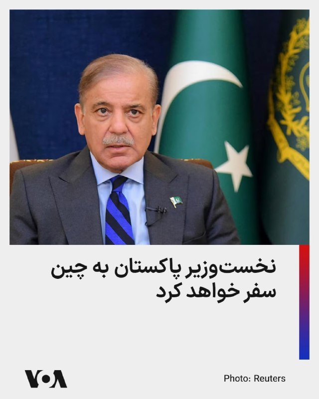

وزارت خارجه چین اعلام کرد که شهباز شریف، نخست‌وزیر پاکستان، از ۲۳ تا ۲۶ مه (دوم تا پنجم خرداد) به چین سفر خواهد کرد. این سفر سه روز پس از سفرهای اخیر رهبران آمریکا و روسیه به چین صورت می‌گیرد.

همچنین محمد اسحاق دار، وزیر خارجه پاکستان در اواخر ماه مارس و در بحبوحه تلاش‌های فشرده برای کاهش تنش‌ها در خاورمیانه به پکن سفر کرده بود.

پاکستان در روزهای اخیر تلاش‌های دیپلماتیک خود را برای تسریع مذاکرات صلح میان آمریکا و ایران افزایش داده است.

در حالی که تهران اعلام کرد در حال بررسی پاسخ‌های جدید واشنگتن است، دونالد ترامپ، رئیس‌جمهور آمریکا، گفته ممکن است چند روز برای «پاسخ‌های درست» از تهران صبر کند، اما او هشدار داده که آماده ازسرگیری حملات به جمهوری اسلامی است.
@FarsiVOA

## FarsiVOA — post 218277

🔺جهش ۴۰ درصدی فروش خودروهای برقی در خاورمیانه

▪️آژانس بین‌المللی انرژی از جهش ۴۰ درصدی فروش خودروهای برقی در خاورمیانه طی سال ۲۰۲۵ خبر داد.

▪️سال گذشته ۷۵ هزار دستگاه خودرو برقی در خاورمیانه به فروش رفته که نیمی از آنها در امارات و ۴۵ درصد در عربستان و قطر ثبت شده است.

▪️فروش خودروهای برقی در آسیای مرکزی نیز به شدت اوج گرفته و به ۶۰ هزار دستگاه در سال گذشته رسیده است.

▪️بازار ترکیه کماکان صدرنشین فروش خودروهای برقی منطقه است و پارسال ۲۴۰ هزار دستگاه خودرو برقی در این کشور به فروش رسیده که دو برابر سال ۲۰۲۴ است.

⬇️ بیشتر بخوانید:
https://ir.voanews.com/a/8152358.html

## DW_Farsi — post 124955

  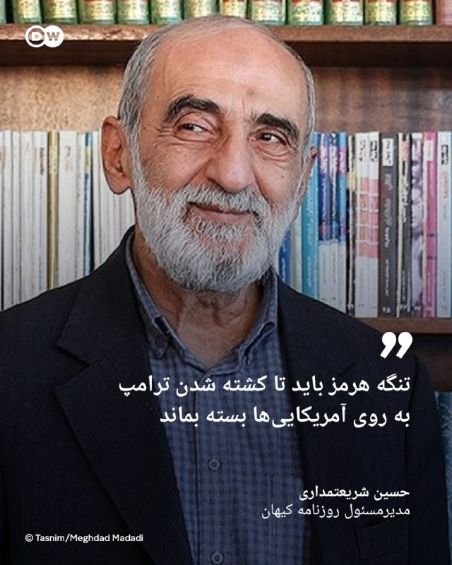

🔶 شریعتمداری: تنگه هرمز باید تا کشته شدن ترامپ به روی آمریکایی‌ها بسته بماند

حسین شریعتمداری، مدیرمسئول روزنامه کیهان، خواستار آن شد تا تمام کشتی‌ها و شناور‌هایی که متعلق به اسرائیل هستند یا برای این کشور نفت حمل می‌کنند، مصادره شوند. او در یادداشتی با انتقاد از مجلس شورای اسلامی به دلیل "به تعویق انداختن تعیین و تصویب نظام قانونی" برای اعمال حاکمیت ایران بر تنگه هرمز نوشت، جمهوری اسلامی باید از "تمامی شناورها بدون استثناء" عوارض دریافت کند و این تنگه را به روی شناورهای آمریکایی و متحدان این کشور ببندد.

شریعتمداری همچنین اضافه کرد تنگه هرمز باید تا زمان "دریافت خسارت‌‌های وارده از آمریکا و متحدان غربی و عربی آن" و نیز "برچیده‌ شدن پایگاه‌های آمریکایی از منطقه و در صدر آن کشتن ترامپ و دار و دسته‌" او بسته بماند.

ابراهیم عزیزی، رئیس کمیسیون امنیت ملی و سیاست خارجی مجلس، اخیرا گفته بود طرحی برای ارائه به صحن مجلس تدوین شده که در آن مقرر شده است دولت به هر فرد حقیقی یا حقوقی که دونالد ترامپ، رئیس جمهور آمریکا، را بکشد "۵۰ میلیون یورو" پاداش دهد.

@dw_farsi

## DW_Farsi — post 124954

  

🔶 سی‌ان‌ان‌: ایران سریع‌تر از حد انتظار در حال بازیابی توانمندی‌های نظامی خود است

دو منبع آگاه به شبکه خبری "سی‌ان‌ان" گفته‌اند که ارزیابی‌های اطلاعاتی ایالات متحده نشان می‌دهد ایران در طول آتش‌بس که از حدود شش هفته پیش آغاز شده، بخشی از تولید پهپادی خود را از سر گرفته‌ است و این امر نشان می‌دهد که این کشور به سرعت در حال بازسازی برخی از قابلیت‌های نظامی تضعیف‌شده خود در پی جنگ با آمریکا و اسرائیل است.

سی‌ان‌ان روز پنج‌شنبه به نقل از چهار منبع مطلع دیگر گزارش داد که بر اساس ارزیابی اطلاعاتی آمریکا، ارتش ایران "بسیار سریع‌تر از برآوردهای اولیه" در حال بازسازی توان نظامی خود است.

این منابع گفته‌اند بازسازی‌ توانمندی‌های نظامی نظیر جایگزینی سایت‌های موشکی، پرتابگر‌ها و ظرفیت تولید سامانه‌های تسلیحاتی کلیدی که در جنگ نابود شده‌اند، به این معناست که در صورت از سرگیری حملات آمریکا و اسرائیل، ایران همچنان تهدیدی جدی برای متحدان منطقه‌ای آمریکا خواهد بود. به نوشته سی‌ان‌ان‌ این موضوع همچنین ادعاها در مورد میزان واقعی تأثیر حملات آمریکا و اسرائیل بر تضعیف بلندمدت توان نظامی ایران تردید ایجاد کرده است.

@dw_farsi

## DW_Farsi — post 124953

  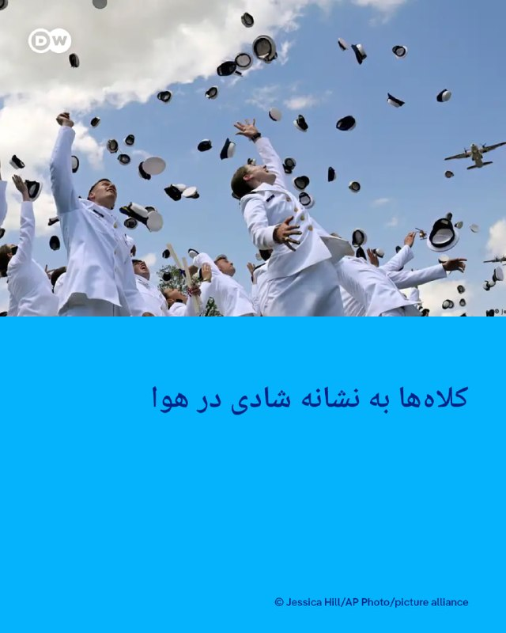

📸 کلاه‌ها به نشانه شادی در هوا

مراسم پایانی دوره افسری گارد ساحلی ایالات متحده در نیولندن با شادی فارغ‌التحصیلان برگزار شد. آکادمی گارد ساحلی آمریکا پیشینه‌ای طولانی دارد. در جشن امسال دونالد ترامپ، رئیس جمهور آمریکا حضور داشت و سخنانی خطاب به فارغ‌التحصیلان ایراد کرد. پرسنل گارد ساحلی آمریکا بیش از ۴۳ هزار نفر است.

## DW_Farsi — post 124952

  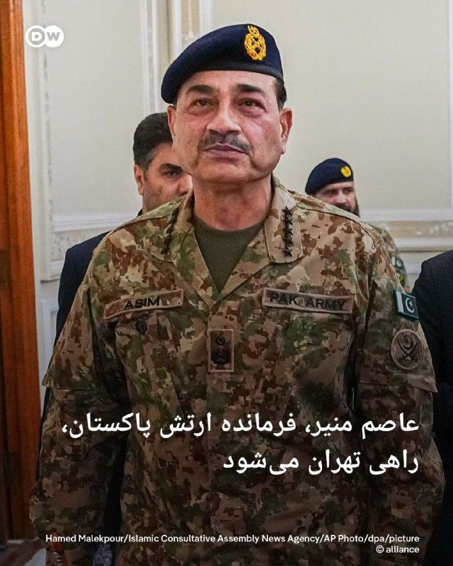

🔶 عاصم منیر، فرمانده ارتش پاکستان، راهی تهران می‌شود

رسانه‌های داخلی ایران گزارش داده‌اند فیلد مارشال عاصم منیر، فرمانده ارتش پاکستان، روز پنج‌‌شنبه ۳۱ اردیبهشت به تهران سفر می‌کند. این سفر در حالی صورت می‌گیرد که روز چهارشنبه نیز وزیر کشور پاکستان برای دومین بار در هفته جاری به تهران رفته و با مسعود پزشکیان، رئیس جمهور و اسکندر مؤمنی وزیر کشور ایران دیدار و گفت‌وگو کرده بود.

در این گزارش‌ها بدون اشاره به جزئیات بیشتر گفته شده که عاصم منیر برای "ادامه گفت‌وگو‌ها و رایزنی با مقامات" ایرانی در چارچوب تلاش‌های میانجی‌گرانه پاکستان میان ایران و آمریکا راهی تهران می‌شود.

@dw_farsi

## DW_Farsi — post 124951

  

🔶 رئیس جمهور آلمان: جنگ ایران یک جنگ غیرضروری است

فرانک والتر اشتاین‌مایر، رئیس جمهور آلمان، در گفت‌وگویی با پادکست "Vorangedacht" حمله نظامی آمریکا و اسرائیل به ایران را "قابل اجتناب" خوانده و گفت: «این جنگ غیرضروری است.»

اشتاین مایر با اشاره به توافق هسته‌ای سال ۲۰۱۵ موسوم به "برجام" که میان ایران و غرب امضا شد و آمریکا در نخستین دوره ریاست‌جمهوری دونالد ترامپ در سال ۲۰۱۸ از آن خارج شد، گفت: «خوب می‌بود که ما این توافق را حفظ می‌کردیم. عواقبی که اکنون شاهد آن هستیم، نباید اتفاق می‌افتادند.»

رئیس جمهور آلمان اوایل فروردین نیز در یک سخنرانی شدیدالحن، جنگ ایران را "یک خطای سیاسی فاجعه‌بار" خوانده و گفته بود اگر هدف آن متوقف کردن ایران در مسیر دستیابی به سمت بمب اتمی بوده باشد، "یک جنگ واقعا قابل اجتناب و غیرضروری" است.

@dw_farsi

## DW_Farsi — post 124950

  

🔶 سازمان حقوق بشر ایران: دو شهروند عراقی در ایران به اتهام جاسوسی اعدام شدند

"سازمان حقوق بشر ایران" روز چهارشنبه ۳۰ اردیبهشت از اعدام دو شهروند عراقی در زندان مرکزی کرج خبر داد.

این سازمان هویت این دو نفر را علی نادر العبیدی ۲۷ ساله و فاضل شیخ کریم ۲۹ ساله معرفی کرده و گفته است که آنها در یک پرونده مشترک به اتهام "جاسوسی"، سحرگاه روز دوشنبه ۱۷ فروردین در سکوت خبری اعدام شدند.

طبق این گزارش این دو زندانی از شهروندان عرب و اهل شهر عماره در عراق بوده‌اند که پیش‌تر در کرج بازداشت و به "جاسوسی برای نهادهای اطلاعاتی و امنیتی یکی از کشورهای عربی" متهم شده بودند.

یک منبع مطلع به سازمان حقوق بشر ایران گفته است علی نادر العبیدی و فاضل شیخ کریم پیش از صدور حکم، "به مدت ۱۱ ماه در بازداشتگاه وزارت اطلاعات تحت بازجویی قرار داشتند و سپس به بند اطلاعات سپاه در زندان رجایی‌شهر کرج منتقل شدند".

طبق این گزارش،‌ این دو زندانی در نهایت برای اجرای حکم اعدام به ندامتگاه مرکزی کرج منتقل شده بودند.

@dw_farsi

## DW_Farsi — post 124949

  

🔶 دو تن به اتهام "عضویت در گروه‌های تروریستی" در ایران اعدام شدند

خبرگزاری میزان، ارگان رسمی قوه قضائیه ایران، از اعدام دو تن به اتهام "عضویت در گروه‌های تروریستی تجزیه‌طلب" و "قیام مسلحانه از طریق تشکیل گروه‌های مجرمانه" در صبح پنج‌شنبه ۳۱ اردیبهشت خبر داد.

در این گزارش هویت این دو نفر، رامین زله و کریم معروف‌پور معرفی شده، اما به نام گروهی که آنها متهم به عضویت در آن بوده‌اند، اشاره‌ای نشده است.

میزان ادعا کرده است که رامین زله و کریم معروف‌پور برای "ترور فرمانده پایگاه سپاه" یکی از شهرستان‌های غرب کشور "همکاری" داشته‌اند. به ادعای میزان، رامین زله پس از "طی دوره‌های آموزشی از طرف یک گروهک ماموریت پیدا کرده بود تا در ناآرامی‌های کشور به عنوان لیدر شرکت کند".

در این گزارش ادعا شده است که او در اعترافات خود گفته است که به سمت یک خودرو حامل نیروهای نظامی "شلیک و از این عملیات فیلمبرداری کرده‌اند". به ادعای میزان کریم معروف‌‌پور در اعترافات خود اقرار کرده است که از "اقدامات مسلحانه" این گروه "آگاهی داشته" و یکی از مسئولیت‌هایش "نگهداری سلاح برای انجام عملیات‌های تروریستی" بوده است.

@dw_farsi

## Persian_Trend_Official — post 14577

🔴 رهبر جمهوری اسلامی دستور داده ذخایر اورانیوم از کشور خارج نشود

💢خبرگزاری رویترز به نقل از منابع ایرانی گزارش داد رهبر جمهوری اسلامی دستور داده ذخایر اورانیوم غنی‌شده نزدیک به سطح تسلیحاتی، از کشور خارج نشود.

🫆:Tony

📌 @persian_trend_official
پرشین ترند | متفاوت‌ترین کانال نظامی

## Persian_Trend_Official — post 14576

  <a href="telegram/content/Persian_Trend_Official_14576_1779361462.webm" target="_blank">🎬 Download video</a>

💢انور قرقاش، مشاور محمد بن زاید

💢ما طی دهه‌های طولانی به قلدری و زورگویی ایران عادت کرده‌ایم، تا جایی که بخشی از صحنه سیاسی خلیج فارس شده است. اعتبارشان بین گفتارهای تهاجمی و بیانیه‌های دوستی توخالی از بین رفته است.

💢امروز، پس از تجاوز وحشیانه ایران، رژیم تلاش می‌کند واقعیت جدیدی را تحکیم کند که از یک شکست نظامی آشکار متولد شده. اما تلاش برای کنترل تنگه هرمز یا تعدی به حاکمیت دریایی امارات، چیزی جز رویاهای پریشان و واهی نیست.

💢هر کس که بخواهد با محیط عربی خود همزیستی کند، باید بداند که اعتماد از بین رفته و بازگرداندن آن با شعارها ممکن نیست، بلکه با زبان مسئولانه، احترام به حاکمیت و تعهد واقعی به اصول همسایگی خوب انجام می‌شود.

🫆:Tony

📌 @persian_trend_official
پرشین ترند | متفاوت‌ترین کانال نظامی

## Persian_Trend_Official — post 14575

  <a href="telegram/content/Persian_Trend_Official_14575_1779361462.webm" target="_blank">🎬 Download video</a>

⭕️بندرعباس لرزید

💢دقایقی پیش زمین لرزه ای به قدرت ۴.۶ ریشتر بندرعباس را لرزاند

🫆:Tony

📌 @persian_trend_official
پرشین ترند | متفاوت‌ترین کانال نظامی

## Persian_Trend_Official — post 14574

🔴 سخنگوی وزارت خارجه ایران: در حال بررسی پاسخ جدید آمریکا هستیم

💢اسماعیل بقایی، سخنگوی وزارت خارجه ایران، اعلام کرد تهران در حال بررسی آخرین پاسخ واشینگتن به چارچوب پیشنهادی آتش‌بس است؛ چارچوبی که پس از چند دور تبادل پیام با میانجیگری پاکستان ارائه شده است.

بر اساس گزارش‌ها:

▪️ پیام‌ها میان تهران و واشینگتن از طریق پاکستان ادامه دارد
▪️ ایران هنوز تصمیم نهایی درباره پیشنهاد آمریکا نگرفته است
▪️ مذاکرات بر محور پایان جنگ، کاهش تنش و مسائل مربوط به تنگه هرمز متمرکز است

💢بقایی همچنین گفته تصمیم نهایی پس از تکمیل بررسی‌های داخلی ایران اتخاذ خواهد شد.

🫆:Tony

📌 @persian_trend_official
پرشین ترند | متفاوت‌ترین کانال نظامی

## Persian_Trend_Official — post 14573

  

⭕️ ژاپن به ساخت هواپیمای مافوق صوت خود نزدیک شده است. آژانس فضایی ژاپن (JAXA) به همراه دانشگاه‌های واسدا، توکیو و کیئو آزمایش‌های زمینی موتور رمجت (Ramjet) برای وسیله پروازی مافوق صوتی که قادر به پرواز با سرعتی پنج برابر سرعت صوت است را انجام دادند.

آزمایش‌ها در مرکز فضایی کاکودا انجام شد. در تونل باد، دانشمندان پرواز مافوق صوت را شبیه‌سازی کردند و عملکرد موتور رمجت، سیستم‌های کنترل و محافظ حرارتی هواپیما را بررسی کردند. در سرعت ۵ ماخ (تقریباً حدود ۶۱۰۰ کیلومتر بر ساعت) دمای هوای اطراف وسیله می‌تواند به حدود ۱۰۰۰ درجه سانتی‌گراد برسد، اما سیستم محافظ حرارتی توانست شرایط تقریباً نرمالی را برای عملکرد الکترونیک داخل سازه حفظ کند.

این پروژه به منظور ساخت یک سکوی آزمایشی مافوق صوت طراحی شده است. مرحله بعدی باید آزمایش‌های پروازی کامل با نصب وسیله آزمایشی روی یک راکت ژئوفیزیکی باشد. هدف اصلی برنامه ایجاد فناوری‌هایی برای هواپیماها و فضاپیماهای مافوق صوت آینده است.

در JAXA معتقدند که در آینده این فناوری‌ها امکان کاهش زمان پرواز بین ژاپن و آمریکا از طریق اقیانوس آرام را به حدود دو ساعت فراهم می‌کنند. علاوه بر این، تحقیقات می‌توانند پایه‌ای برای ساخت وسایلی باشند که قادر به صعود تا ارتفاع حدود ۱۰۰ کیلومتر هستند.

📝 Nick

📌 @persian_trend_official
پرشین ترند | متفاوت‌ترین کانال نظامی

## Persian_Trend_Official — post 14572

  

💢سخنگوی وزارت خارجه روسیه: مسکو آماده کمک به اجرای توافقات احتمالی میان ایران و آمریکا است

💢ماریا زاخارووا، سخنگوی وزارت امور خارجه روسیه گفت، روسیه کاملاً آماده است کمک‌های لازم را به تهران و واشنگتن برای اجرای تصمیماتی که ممکن است در جریان مذاکرات میان آن‌ها حاصل شود، ارائه دهد.

🫆:Tony

📌 @persian_trend_official
پرشین ترند | متفاوت‌ترین کانال نظامی

## Persian_Trend_Official — post 14571

  <a href="telegram/content/Persian_Trend_Official_14571_1779361465.mp4" target="_blank">🎬 Download video</a>

💢 لو رفتن موقعیت توسط نیروهای خودی و گیر افتادن ۴۸ ساعته و خفه شدن نیروهای سپاه پاسداران داخل تونل موشکی

🫆:Tony

📌 @persian_trend_official
پرشین ترند | متفاوت‌ترین کانال نظامی

## Persian_Trend_Official — post 14570

  

به بهانه امنیت اینترنت 80 میلیون ایرانی رو قطع میکنن !
اونوقت با پاکستانی ها دیدار میکنن !
بعد مه ترورش کردن میگن وحیدی رو از طریق اینترنت رد زنی کردن !!!

📌 @persian_trend_official
پرشین ترند | متفاوت‌ترین کانال نظامی

## Persian_Trend_Official — post 14569

بازارهای خلیج فارس با امید به توافق جمهوری اسلامی و آمریکا رشد کردند

خبرگزاری رویترز گزارش داد بازارهای سهام خلیج فارس در آغاز معاملات پنج‌شنبه ۳۱ اردیبهشت، تحت تاثیر امیدها به نزدیک شدن آمریکا و جمهوری اسلامی به توافقی برای پایان جنگ خاورمیانه و همچنین افزایش قیمت نفت، رشد کردند.

بر اساس این گزارش، سرمایه‌گذاران پس از سخنان دونالد ترامپ درباره قرار داشتن مذاکرات با جمهوری اسلامی در مراحل پایانی، نشانه‌های پیشرفت در گفت‌وگوها را دنبال می‌کنند.

ترامپ هم‌زمان هشدار داده اگر جمهوری اسلامی با توافق موافقت نکند، حملات بیشتری انجام خواهد شد.

شاخص بورس دبی یک درصد، شاخص ابوظبی ۰/۲ درصد و شاخص قطر ۰/۶ درصد افزایش یافتند. در مقابل، شاخص بورس عربستان سعودی اندکی کاهش یافت. قیمت نفت برنت نیز با رشد بیش از یک درصدی به ۱۰۶ دلار و ۲۹ سنت در هر بشکه رسید.

📌 @persian_trend_official
پرشین ترند | متفاوت‌ترین کانال نظامی

## RadioFarda — post 157416

  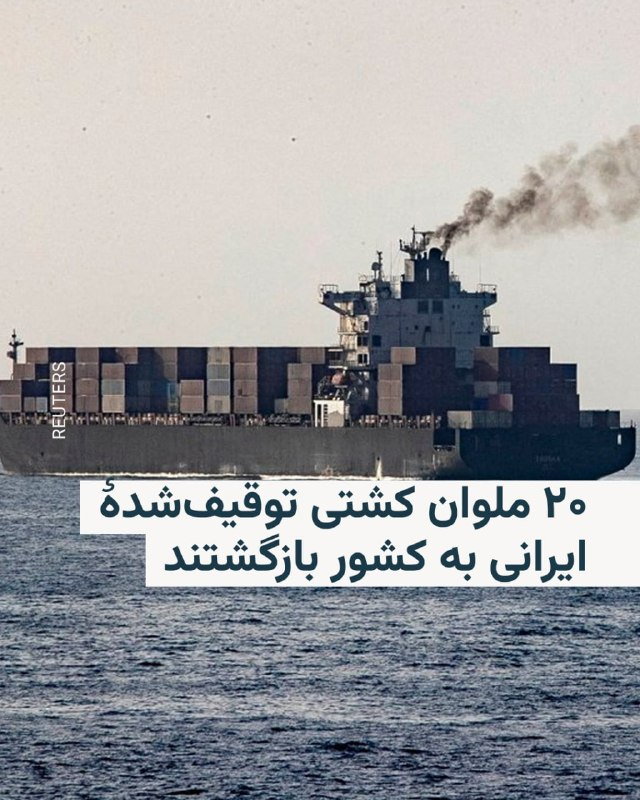

🔸سفیر تهران در پاکستان از آزادی و بازگشت ۲۰ ملوان ایرانی یک کشتی توقیف‌شده توسط آمریکا در آب‌های سنگاپور به ایران خبر داد.

🔸سفیر ایران در پاکستان امروز پنجشنبه ۳۱ اردیبهشت اعلام کرد این ۲۰ ملوان ایرانی که به‌دلیل توقیف کشتی در وضعیت نامناسبی قرار داشتند، با وساطت و پیگیری پاکستان آزاد و امروز به کشور بازگشتند.

🔸بر اساس اعلام قبلی وزیر خارجه پاکستان، ۱۱ ملوان این کشتی که اکنون در آب‌های سنگاپور در حالت توقیف قرار دارد، تبعهٔ پاکستان هستند.

🔸ارتش ایالات متحده پس از توقف جنگ با ایران با آتش‌بسی که از ۱۹ فروردین اعلام شد، همزمان با مسدود نگه داشته شدن تنگه هرمز توسط سپاه پاسداران، اقدام به محاصره دریایی بنادر جنوبی ایران کرده است.

@RadioFarda

## RadioFarda — post 157415

  

سپاه پاسداران محدوده نظارتی خود بر تنگه هرمز را تعیین کرد

🔸نهاد مدیریت آبراه خلیج فارس که اخیرا از طرف سپاه پاسداران تشکیل شده محدوده نظارتی خود بر تنگه هرمز را مشخص کرد.

🔸در اطلاعیه این نهاد گفته شده که این محدوده خط اتصال کوه مبارک در ایران و جنوب فجیره در امارات متحده عربی در شرق تنگه هرمز تا خط اتصال انتهای جزیره قشم در ایران و ام‌القُوین در غرب تنگه هرمز را شامل می‌شود.

🔸به گفته نیروی دریایی سپاه عبور و مرور از تنگه هرمز باید با هماهنگی با مدیریت آبراه خلیج فارس و مجوز این نهاد صورت بگیرد.

🔸هفته گذشته امارات اعلام کرد ظرفیت خط لوله‌ای که نفت آن کشور را از طریق بندر فجیره به بازارهای جهانی منتقل می‌کند، افزایش خواهد یافت.

🔸انتقال نفت از بندر فجیره بدون عبور از تنگه هرمز صورت می گیرد و ایران کنترلی بر آبهای ساحلی آن ندارد.

🔸روز گذشته ایران اعلام کرد ۲۶ کشتی در هماهنگی با نیروی دریایی سپاه از تنگه هرمز عبور کرده‌اند.

🔸هنوز معلوم نیست که صاحبان این کشتی‌ها پولی به ایران پرداخت کرده‌اند یا تنها با مجوز تهران از تنگه هرمز عبور کرده‌اند.

@RadioFarda

## RadioFarda — post 157414

  

🔸شبکه تلویزیونی سی‌ان‌ان ۳۱ اردیبهشت به نقل از چند مقام اطلاعاتی آمریکا نوشت که سپاه پاسداران انقلاب اسلامی «بسیار سریع‌تر از آن چه تصور می‌شد» در حال بازسازی قابلیت‌ها و شاخه‌هایی از صنایع نظامی است که در اثر حملات آمریکا و اسرائیل آسیب شدید دیده بود.

🔸این شبکه به نقل از دو مقام آشنا به ارزیابی اطلاعاتی آمریکا نوشته است که در شش هفته‌ای که از آتش‌بس می‌گذرد، سپاه بازسازی صنایع خود را آغاز کرده و از جمله بخشی از چرخه تولید پهپاد را بار دیگر از سر گرفته است.

🔸چهار منبع به سی‌ان‌ان گفته‌اند که بازیابی قابلیت‌های نظامی در ایران بلافاصله پس از قطع حملات آمریکا و اسرائیل،‌ از جمله جایگزینی سایت‌های موشکی و پرتابگرها، به معنای آن است که ایران «هم‌چنان تهدیدی چشمگیر برای متحدان منطقه‌ای» آمریکا به شمار می‌رود.

🔸در دو تا سه هفته اول جنگی که با حملات مشترک آمریکا و اسرائیل در روز ۹ اسفند ۱۴۰۴ آغاز شد، دو کشور اعلام می‌کردند، سایت‌های موشکی و سایت‌های تولید پهپاد از جمله مهم‌ترین اهداف حملات بی‌امان آنها بود و گزارش‌های متعددی از خسارت‌های عمده این زمینه که به ایران وارد آمد، منتشر کردند.

@RadioFarda

## RadioFarda — post 157413

  

🔸با افزایش امیدهای بازار جهانی به دستیابی به توافق صلح در خاورمیانه و همچنین عبور چندین کشتی از تنگه هرمز، سهام بازارهای آسیایی در روز پنج‌شنبه ۳۱ اردیبهشت جهش کرد.

🔸علاوه بر موضوع مذاکرات ایران و آمریکا، سود مالی فراتر از انتظار شرکت انویدیا و مذاکرات برای جلوگیری از اعتصاب برنامه‌ریزی‌شده کارگران شرکت سامسونگ نیز در جهش سهام در توکیو، سئول و دیگر بازارهای آسیایی تأثیرگذار بوده است.

🔸اتحادیه کارگری بزرگ‌ترین تولیدکننده تراشه حافظه جهان، پس از آن‌که مذاکرات بر سر پاداش‌ها شکست خورد و نگرانی‌هایی درباره اختلال احتمالی در تولید نیمه‌هادی‌ها ایجاد شد، قصد داشت از روز پنج‌شنبه اعتصاب را آغاز کند.

🔸با این حال این اتحادیه اواخر روز چهارشنبه اعلام کرد که اعتصاب به‌دلیل از سر گرفته شدن مذاکرات با مدیریت با حضور وزیر کار کره جنوبی، به حالت تعلیق درآمده است.

🔸دونالد ترامپ، رئیس‌جمهور آمریکا، روز چهارشنبه مذاکرات را در «مرز میان توافق و حملات دوباره» توصیف کرد.

🔸با اظهارات تازهٔ او امیدهای محتاطانه به‌سرعت در بازارهای مالی گسترش یافت، قیمت نفت بیش از پنج درصد کمتر شد و سهام آمریکا رشد کرد.

@RadioFarda

## RadioFarda — post 157412

  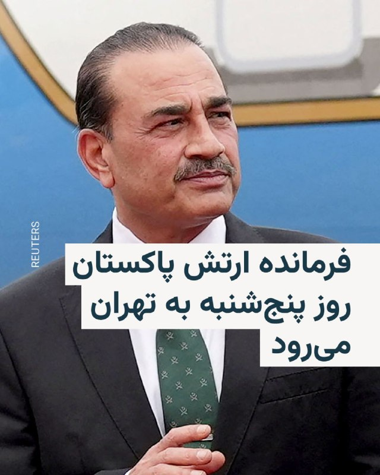

🔸 فیلد مارشال عاصم منیر، رئیس ستاد ارتش پاکستان، در ادامه رایزنی‌ها در جریان مذاکرات ایران و آمریکا، امروز پنج‌شنبه، ۳۱ اردیبهشت، به تهران سفر می‌کند.

🔸 این دومین‌ بار است که عاصم منیر در جریان میانجی‌گری اسلام‌آباد میان ایران و آمریکا پس از جنگ اخیر به تهران سفر می‌کند.

🔸 خبرگزاری‌های رسمی ایران این خبر را یک روز پس از آن منتشر کردند که وزیر کشور پاکستان، برای دومین‌ بار طی هفته جاری وارد تهران شد.

🔸 محسن نقوی، وزیر کشور پاکستان، که روز ۲۶ اردیبهشت به ایران رفته و با مقام‌های ارشد جمهوری اسلامی دیدار کرده بود، بعد از چهار روز بار دیگر وارد تهران شد.

🔸 این سفرها در شرایطی انجام می‌شود که رئیس‌جمهور آمریکا ساعتی پیش اعلام کرد مذاکره با ایران در «مراحل پایانی» قرار دارد و افزود اگر ایران سند توافق را امضا نکند، ایالات متحده حملات نظامی را از سر خواهد گرفت.

🔸 اسماعیل بقائی، سخنگوی وزارت خارجه ایران روز چهارشنبه گفت که سفر دوباره وزیر کشور پاکستان در ایران برای «تسهیل مبادله پیام‌ها» بین تهران و واشینگتن انجام شده است.

@RadioFarda

## RadioFarda — post 157411

انتشار جزئیاتی از اختلاف ترامپ و نتانیاهو بر سر ایران؛ ترامپ: چند روز صبر می‌کنیم

🔸 رئیس‌جمهور آمریکا شامگاه چهارشنبه، ۳۰ اردیبهشت، گفت حاضر است «چند روز» برای پاسخ تازه ایران به پیشنهاد واشینگتن دربارهٔ توافق پایان جنگ صبر کند، اما هشدار داد که این پاسخ باید «صد درصد درست» باشد.

🔸 همزمان جزئیات بیشتری از آخرین مکالمهٔ تلفنی دونالد ترامپ با بنیامین نتانیاهو، نخست‌وزیر اسرائیل، در رسانه‌های آمریکا منتشر شده است که حاکی از اختلاف نظر این دو شریک جنگ با ایران است.

🔸 پس از آن که وب‌سایت خبری اکسیوس برای اولین بار از مکالمه «پرتنش» نتانیاهو با ترامپ در روز سه‌شنبه نوشت، حال شبکه تلویزیونی سی‌ان‌ان هم گزارش کرده است که «تنش» از اختلاف نظر این دو دربارهٔ شیوهٔ برخورد با ایران در روزها و هفته‌های آینده سرچشمه گرفته است.

🔸گزارش کامل را در وب‌سایت رادیو فردا می‌توانید بخوانید.

@RadioFarda

## IranianMinds — post 20487

🔴 دو منبع ایرانی به رویترز:

مجتبی خامنه‌ای دستور داده است که اورانیوم غنی شده نباید از ایران خارج بشود.

@IranianMinds

## IranianMinds — post 20486

  

🔴 طبق قوانین جدید طالبان سن ازدواج برای دختر به ۹ سال کاهش یافت ، و اگر دختر در هنگام خواندن خطبه ی عقد سکوت کند هم به منزله ی رضایت به ازدواج تلقی میشود.

@IranianMinds

## IranianMinds — post 20485

  <a href="telegram/content/IranianMinds_20485_1779361473.mp4" target="_blank">🎬 Download video</a>

حدود نیم‌ قرن پیش، عده‌ای بی‌ تدبیر انقلاب کردند و از همان روز، خورشید این سرزمین غروب کرد.

دیگر نور و روشنایی و زیبایی را ندیدیم. نه کودکی ‌مان را زندگی کردیم، نه نوجوانی و نه جوانی. کل عمرمان گذشت بین مذاکرات و جنگ، گرانی و هزار سختی دیگر، و انگار همه چیز از دست رفت. مگه تا کی زنده‌ایم که فقط منتظر بمانیم…

@IranianMinds

## IranianMinds — post 20484

  <a href="telegram/content/IranianMinds_20484_1779361475.mp4" target="_blank">🎬 Download video</a>

اکانت اسرائیل به فارسی:

درخشش پرچم شیر‌ و خورشید در کنار پرچم کشورهای دیگر در شهر اشدود در اسرائیل.

@IranianMinds

## IranianMinds — post 20483

🔴 تایمز اسرائیل:

ایران در جریان آتش‌بس از فرصت برای جابه‌جایی لانچرهای موشکی و آماده‌سازی برای دور جدید درگیری استفاده کرده

@IranianMinds

## IranianMinds — post 20482

  <a href="telegram/content/IranianMinds_20482_1779361477.mp4" target="_blank">🎬 Download video</a>

ویدیویی از عروسی یک‌ زوج‌ جانفدا ، فقط اگه تونستید حدس بزنید عروس‌ کدومه جایزه دارید.

@IranianMinds

## IranianMinds — post 20481

🔴 والا نیوز

منابع اسرائیلی می‌گویند آمریکایی‌ها در مذاکرات با ایران یک قدم به جلو برداشته‌اند، بنابراین برآوردها این است که حمله‌ای به ایران در ۲۴ ساعت آینده تکرار نخواهد شد

@IranianMinds

## IranianMinds — post 20480

ثبت نام کن ۵۰۰ هزارتومان جایزه بگیر
نیازی هم به واریز نیست
تنها سایت مورد #تایید ما با بونوس های واقعی:

🌐
🌐 Winro.io

## IranianMinds — post 20479

  <a href="telegram/content/IranianMinds_20479_1779361479.webm" target="_blank">🎬 Download video</a>

🎯شانستو #رایگان امتحان کن 
⚠️

🤔 میدونستی توی #وینرو میتونی رایگان شرط ببندی؟

👍تنها کاری که باید بکنی اینه که عضو سایتش بشید و 
🤩
🤩
🤩 هزارتومان جایزه بگیرید بدون نیاز به واریز

💖تنها سایت مورد اعتماد ما با بونوس های کاملا واقعی و رویایی:

🌐 Winro.io

🌐 Winro.io
کانال بونوس های رایگان r31

📱 @winro_io

## IranianMinds — post 20478

  

🔴 توییت پوریا زراعتی خبرنگار ایران اینترنشنال

@IranianMinds

## IranianMinds — post 20477

  

زندگی در ایران عزیزمون اینطوری شده که اگه «یه خرید» بری و برگردی؛ «یه دهک» جابجا میشی!

@IranianMinds

## BBCPersian — post 281692

🔻بریتانیا با شش کشور حوزه خلیج فارس قرارداد تجاری ۳/۷ میلیارد پوندی امضا کرد

بریتانیا با شش کشور حاشیه خلیج فارس یک توافق تجاری امضا کرده است که دولت می‌گوید ارزش آن برای اقتصاد به ۳/۷ میلیارد پوند خواهد رسید.

دولت بریتانیا گفته است این توافق با کشورهای بحرین، کویت، عمان، قطر، عربستان سعودی و امارات متحده عربی، پس از اجرای کامل، باعث می‌شود هر سال حدود ۵۸۰ میلیون پوند از هزینه‌های تعرفه‌ای که بر صادرات بریتانیا به این کشورها اعمال می‌شود، حذف شود.

همچنین گفته شده این توافق باعث می‌شود شرکت‌های بریتانیایی راحت‌تر بتوانند در بازارهای خلیج فارس فعالیت و همکاری کنند و در نتیجه به ایجاد و حفظ شغل‌ها کمک خواهد کرد.

با این حال، گروه‌های فعال حقوق بشری از نبود جزئیات درباره حقوق بشر و حمایت از حقوق کارگران در این توافق انتقاد کرده‌اند.

حزب محافظه‌کار، حزب مخالف دولت که مذاکرات این توافق را در زمان دولت خود آغاز کرده بود، گفته است این توافق «یکی دیگر از فرصت‌های مهم برگزیت» است که حزب کارگر ممکن است به دلیل مواضع نزدیک‌تر به اتحادیه اروپا آن را «از دست بدهد.»

بر اساس این توافق، تعرفه واردات برخی محصولات بریتانیایی از جمله پنیر چدار، کره و شکلات حذف خواهد شد.

توافق تجاری بین بریتانیا و شورای همکاری خلیج فارس سومین توافقی است که توسط دولت سر کی‌یر استارمر، نخست وزیر پس از توافق با هند و کره جنوبی، منعقد شده است.

https://bbc.in/4fwMLUO
@BBCPersian

## BBCPersian — post 281691

🔻کانادا سفیر اسرائیل را احضار کرد

کانادا سفیر اسرائیل را به خاطر بازداشت فعالان ناوگان کمک به غزه احضار کرد.

مارک کارنی، نخست وزیر کانادا، در شبکه‌ اجتماعی ایکس نوشت: «وزیر امور خارجه کانادا به مقامات دستور داده است تا سفیر اسرائیل را احضار کنند و از او در مورد امنیت و سلامت کانادایی‌های درگیر در این ماجرا تضمین بگیرند.»

آقای کارنی همچنین ویدئویی را به اشتراک گذاشته که وزیر امنیت داخلی اسرائیل را نشان می‌دهد و نیروهای اسرائیلی با فعالان بازداشت شده بدرفتاری می‌کنند. او نوشته: «کانادا پیش از این تحریم‌های شدیدی را علیه آقای بن گویر، از جمله مسدود کردن دارایی‌ها و ممنوعیت سفر، در پاسخ به تحریک مکرر خشونت توسط او، اعمال کرده است.»

براساس گزارش‌ها ۱۱ شهروند کانادایی در ناوگان کمک‌رسانی به غزه حضور داشته‌اند.

https://bbc.in/4fwMLUO
@BBCPersian

## BBCPersian — post 281690

📽وقتی که رفت روزنامه‌ها نوشتند: عقاب از شهر کلاغ‌ها گریخت.

🔹او تنها به خاطر فوتبالیست خوب بودن شهرت نیافت. ناصر حجازی به خاطرنه گفتن به شرایط حاکم بود که محبوب شد.
🔹در پانزدهمین سال‌مرگش یادی می‌کنیم از او در برنامه این هفته آپارات.

📺برنامه این هفته آپارات
افسانه یک عقاب

🎬ساخته امیر رفیعی

🔹ساعات پخش
جمعه ۹:۰۰ شب
شنبه ۶:۳۰ صبح
شنبه ۱۱:۳۰ صبح
دو‌شنبه ۲:۰۰ بامداد
دوشنبه ۸:۳۰ شب
سه‌شنبه ۱۱:۳۰ صبح
تکرار جمعه ۱۱:۳۰ صبح

🔹از برنامه آپارات همیشه فیلم متفاوت ببینید.

@BBCPersian

## BBCPersian — post 281689

  <a href="telegram/content/BBCPersian_281689_1779361481.mp4" target="_blank">🎬 Download video</a>

⁨ دانشمندان موسسه «اوشن سنسس» (سرشماری اقیانوس) در سال گذشته بيش از یک هزار و ۱۰۰ گونه تازه دريايی كشف كرده‌اند؛ از يک اسفنج گوشتخوار گرفته تا يک «كوسه روح» و كرم پرزدار ساكن «قصر شيشه‌ای». اما شايد شگفت‌زده شويد اگر بدانيد اين يافته‌ها تنها قطره‌ای در اقيانوس‌اند؛ زيرا برآوردها نشان می‌دهد حدود ۹۰ درصد از گونه‌های دريايی هنوز كشف نشده‌اند.
این ویدیو را ببینید.⁩

@BBCPersian
https://bbc.in/4uoww0D

## BBCPersian — post 281688

  

شبکه خبری سی‌ان‌ان به نقل از دو منبع آگاه از ارزیابی‌های اطلاعاتی آمریکا گزارش داد که ایران در جریان آتش‌بس شش‌هفته‌ای که از اوایل آوریل آغاز شده، بخشی از تولید پهپادهای خود را از سر گرفته است.

این گزارش همچنین به نقل از چهار منبع و ارزیابی‌های اطلاعاتی آمریکا حاکیست که ایران با سرعتی بیش از برآوردهای اولیه در حال بازسازی توان نظامی خود است.

دیروز محمدباقر قالیباف، رئیس مجلس ایران در سومین پیام صوتی هفته‌های اخیر خود تایید کرد که در جریان آتش‌بس توان نظامی آن کشور با «قدرت بیشتری بازسازی شده است.»

در همین حال، دونالد ترامپ، رئیس‌جمهور آمریکا، روز چهارشنبه گفت که اگر ایران با طرح صلح موافقت نکند، ایالات متحده آماده انجام حملات بیشتر علیه آن کشور است.

با این حال او اشاره کرد که واشنگتن ممکن است چند روزی صبر کند تا «پاسخ‌های مناسب» را دریافت کند.

📸 Reuters

https://bbc.in/4fwMLUO
@BBCPersian

## BBCPersian — post 281687

🔻دیدار وزیر کشور پاکستان با عباس عراقچی

محسن نقوی، وزیر کشور پاکستان با عباس عراقچی، وزیر خارجه ایران در تهران دیدار و گفت‌وگو کرده است.

هنوز جزییاتی از این گفت‌وگوها رسانه‌ای نشده است.

آقای نقوی که روز گذشته به تهران آمد با مقامات ارشد جمهوری اسلامی دیدار کرد.

ایران اعلام کرده که در حال بررسی تازه‌ترین پیشنهادهای آمریکا برای پایان دادن به جنگ است.

رسانه‌های مختلف هم گفته‌اند که قرار است فیلد مارشال عاصم منیر،‌ فرمانده ارتش پاکستان، برای کمک به میانجی‌گری میان ایران و آمریکا به تهران سفر کند.

دونالد ترامپ گفته است که چند روز دیگر به ایران برای توافق فرصت خواهد داد.

https://bbc.in/4fwMLUO
@BBCPersian

## BBCPersian — post 281686

🔻جنجال ناوگان کمک به غزه؛ لهستان کاردار اسرائیل را احضار کرد

وزیر امور خارجه لهستان روز پنج‌شنبه اعلام کرد که کاردار اسرائیل را به‌دلیل بازداشت فعالان، از جمله شهروندان لهستانی، احضار کرده و خواستار آزادی فوری آن‌ها و عذرخواهی شده است.

رادوسلاو سیکورسکی در شبکه‌های اجتماعی نوشت: «لهستان رفتار نمایندگان مقامات اسرائیلی با فعالان ناوگان صمود را که توسط ارتش اسرائیل بازداشت شده‌اند، از جمله شهروندان لهستانی را به‌شدت محکوم می‌کند.»

انتشار ویدیویی از رفتار ایتار بن‌گویر، وزیر امنیت ملی اسرائیل با بازداشت شدگان ناوگان کمک‌رسانی به غزه واکنش‌های بین‌المللی را به همراه داشته است.

https://bbc.in/4fwMLUO

@BBCPErsian

## BBCPersian — post 281685

  <a href="telegram/content/BBCPersian_281685_1779361484.mp4" target="_blank">🎬 Download video</a>

🎶 آرین کشیشی موزیسینی چندوجهی و بین‌المللی است؛ نوازنده برجسته گیتار بیس، آهنگساز و تهیه‌کننده‌ای که از دل تهران به صحنه‌های حرفه‌ای اروپا رسیده و امروز در آمستردام فعالیت می‌کند.

او در سبک‌های متنوعی از جمله جز، فیوژن، پاپ، راک، کلاسیک، فلامنکو و موسیقی فولکلور ایرانی و ارمنی تجربیات متنوعی دارد و با هنرمندانی چون همایون شجریان، علیرضا قربانی، سهراب پورناظری، ظافر یوسف (نوازنده عود اهل تونس) و آنتونیو ری (گیتاریست اسپانیایی) همکاری کرده است.

مجموعه این همکاری‌ها و تجربه‌ها به شکل‌گیری صدای منحصربه‌فرد او انجامیده است.

آرین در سال ۲۰۱۵ پروژه شخصی خود را راه‌اندازی کرد که بر تولید موسیقی جز و فیوژن با حضور موسیقیدانان بین‌المللی متمرکز است.

نخستین آلبوم شخصی او با نام Self-Reflection در سال ۲۰۲۳ منتشر شد؛ اثری که نوعی تأمل درونی و خودبازاندیشی موسیقایی است و از خلال آن تجربه‌ها و هویت چندفرهنگی‌اش را واکاوی می‌کند.

اجرای چند قطعه از این آلبوم در جشنواره جز لندن را در «رنگ‌آهنگ» این هفته ببینید.

@BBCPersian

## BBCPersian — post 281684

🔻وزیر امور خارجه لهستان روز پنج‌شنبه اعلام کرد که کاردار اسرائیل را به‌دلیل بازداشت فعالان، از جمله شهروندان لهستانی، احضار کرده و خواستار آزادی فوری آن‌ها و عذرخواهی شده است.

رادوسلاو سیکورسکی در شبکه‌های اجتماعی نوشت: «لهستان رفتار نمایندگان مقامات اسرائیلی با فعالان ناوگان صمود را که توسط ارتش اسرائیل بازداشت شده‌اند، از جمله شهروندان لهستانی را به‌شدت محکوم می‌کند.»

انتشار ویدیویی از رفتار ایتار بن‌گویر، وزیر امنیت ملی اسرائیل با بازداشت شدگان ناوگان کمک‌رسانی به غزه واکنش‌های بین‌المللی را به همراه داشته است.
https://bbc.in/4ur2Joh
@BBCPersian

## BBCPersian — post 281683

🔻 ارزش روپیه هند به دلیل جنگ ایران به پایین‌ترین سطح تاریخی خود رسید

وزیر بازرگانی هند اعلام کرد که این کشور در حال بررسی مجموعه‌ای از اقدامات برای مقابله با کاهش ارزش روپیه، پول ملی هند است و وضعیت بازار را به‌دقت زیر نظر دارد.

پیوش گویال روز پنج‌شنبه گفت: «ما شرایط را رصد می‌کنیم و چندین اقدام در دست بررسی است. وضعیت در سطح جهانی بسیار چالش‌برانگیز است.»

اظهارات او در حالی مطرح می‌شود که ارزش روپیه هند در روزهای اخیر بارها به پایین‌ترین سطح تاریخی خود رسیده و از زمان آغاز جنگ آمریکا و اسرائیل علیه ایران که باعث افزایش قیمت نفت خام شده، بیش از ۶ درصد تضعیف شده است.

https://bbc.in/4nOXA72
@BBCPersian

## BBCPersian — post 281673

سارا گرین و سایمون تولت
شغل,بخش پادکست سرویس جهانی بی‌بی‌سی
🔻وقتی در بالاترین سطح برخی از بزرگ‌ترین شرکت‌های دنیا جابه‌جایی قدرت اتفاق می‌افتد، بیشتر مردم اصلا متوجه نمی‌شوند.
اگر محصولات خوب عمل کنند، خدمات به‌درستی ارائه شود و قفسه‌های فروشگاه‌ها پر باشند، اینکه چه کسی در اتاق هیئت‌مدیره می‌نشیند خبرساز نمی‌شود. اما وقتی پای سامسونگ در میان باشد، دودمان خانوادگی پشت آن آنقدر پیچیده است و شرکت آنقدر برای اقتصاد کره جنوبی حیاتی است که خبرساز می‌شود.
در سال ۲۰۱۷، لی جه یونگ، وارث سامسونگ که با نام جی‌وای لی نیز شناخته می‌شود، به دلیل نقشش در یک رسوایی فساد که رئیس‌جمهور کشور را نیز ساقط کرد، زندانی شد.
ادامه مطلب را در لینک زیر بخوانید:
https://bbc.in/4fz83RN

📸GettyImages/ Bloomberg via
Getty Images/ AFP via Getty Images/ LightRocket via Getty Images

@BBCPersian

## Dirty_Kids — post 389871

  <a href="telegram/content/Dirty_Kids_389871_1779361488.mp4" target="_blank">🎬 Download video</a>

چون بحث مموتی داغه
این موزیک‌ویدیو رو یادتونه ؟🤣🤦‍♂️

@Dirty_Kids 👻

## Dirty_Kids — post 389870

‏توی یک رابطه سالم دعوا و اختلاف نظر هست اگه فقط دنبال آرامشی دمنوش بابونه بخور

@Dirty_Kids 👻

## Dirty_Kids — post 389869

  <a href="https://t.me/Dirty_Kids/389869" target="_blank">📎 Download file</a>

📱 اپلیکیشن اندروید بدون فیلتر ریتزوبت

➖➖➖➖➖

🔹 ثبت نام آسان 
✅
🔹 رابط کاربری بسیار راحت و سریع 
✅
🔹 درگاه پرداخت کارت به کارت 
✅
🔹 درگاه پرداخت دلاری سریع 
✅
🔹 بونوس ۱۰۰ درصدی اولین واریز 
✅
🔹 بونوس ۱۰۰ درصدی واریز یکشنبه ها 
✅

➖➖➖➖➖
🌐 https://RitzoBet.com

⚡️ @RitzoBet_ir

## Dirty_Kids — post 389868

  

⚠️ برای #شرطبندی های فوتبال از سایت معتبر و بین المللی استفاده کنید ✅

سایت #ریتزوبت ، چهار سال هستش داخل ایران فعالیت میکنه 
✅

لایسنس بین المللی داره ، روش های شارژ و برداشت متنوع داره و بونوس 100% ورزشی و کش بک های جذاب
💎

⏪ اپلیکیشن بدون فیلتر ریتزوبت 
📱
⏩
R31

✅ لینک بدون‌ فیلتر ریتزوبت
🤣

🆔 @RitzoBet_ir 
🇮🇷

## Dirty_Kids — post 389867

  <a href="telegram/content/Dirty_Kids_389867_1779361502.mp4" target="_blank">🎬 Download video</a>

درخشش پرچم شیر و خورشید در کنار پرچم کشورهای دیگر در شهر اشدود در اسرائیل. 
🇮🇱
🇮🇷

@Dirty_Kids 👻

## Dirty_Kids — post 389866

‏در تایید مادرجنده بودنتون همین بس که حتی از خبر فیک گزینه اسراییل بودن احمدی‌نژاد ذوق‌زده میشید ولی اسم پهلوی که میاد کهیر میزنید. حقیقتا دشمنان باشکوهی هم نیستید :)))

@Dirty_Kids 👻

## Dirty_Kids — post 389865

‏این دوس‌دختر سابقم هردفعه به یه بهانه‌ای سعی میکنه با من ارتباط برقرار کنه؛ یه بار زنگ میزنه میگه وسایلمو بفرست، یه بار میگه انقد ریلزای کسشر نفرس، یه بار میگه اون صد میلیون که ازم قرض گرفتی رو کی پس میدی؟ نمیدونم کی میخواد ازم مووآن کنه.

@Dirty_Kids 👻

## Dirty_Kids — post 389864

  <a href="telegram/content/Dirty_Kids_389864_1779361504.mp4" target="_blank">🎬 Download video</a>

نه رشیدپور بی‌شرف، بازار اعتصاب كرد، پهلوى رو صدا زد، پهلوى براى اولين بار فراخوان داد، رژيم،ايرانی كش جمهوری اسلامی، مردم رو قتل عام كرد.
اصن بر فرض مردم گول خوردن، شما چرا ۵۰٫۰۰۰ نفر رو کشتید بیشرفا؟؟؟

@Dirty_Kids 👻

## Dirty_Kids — post 389863

  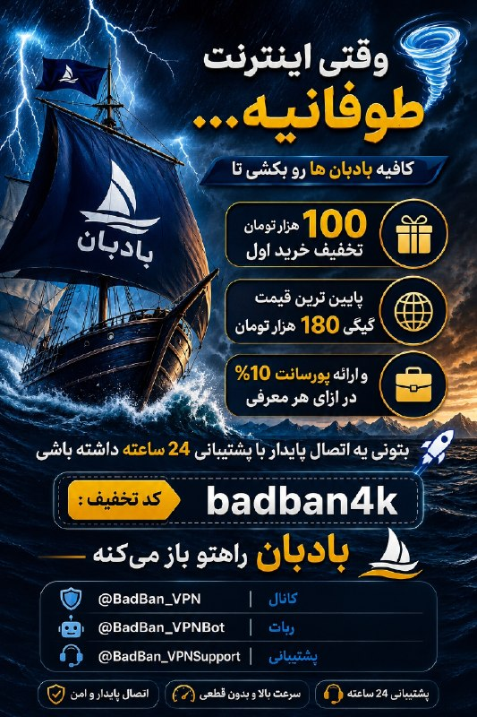

🌪وقتی اینترنت طوفانیه فقط کافیه بادبان ها رو بکشی

⚫️100 هزار تومان تخفیف خرید اول 
🎁

⚫️پایین ترین قیمت گیگی 180 هزار تومان
🌐 

⚫️پورسانت %10 دائمی برای هر معرفی
💼

با بادبان، میتونی یه اتصال سریع، پایدار و امن
همراه با پشتیبانی ۲۴ ساعته داشته باشی
🚀

🛒کد تخفیف: badban4k

بادبان راهتو باز می‌کنه
⛵️
R31

🛡@BadBan_VPN | کانال 

🤖@BadBan_VPNBot | ربات 

📞@BadBan_VPNSupport | پشتیبانی

## Dirty_Kids — post 389862

  <a href="telegram/content/Dirty_Kids_389862_1779361507.mp4" target="_blank">🎬 Download video</a>

🔴 شما ببین محمدرضا شاه کی بود که بعد از ۵۰ سال حتی طرفدارای جمهوری اسلامی ازش تعریف و شاه خطابش میکنن.

@Dirty_Kids 👻

## Dirty_Kids — post 389861

  

شما بای دیفالت توی هر عروسی بری یکی با قیافه علی شادمان هست که از پادگان مرخصی گرفته خودشو برسونه عروسی، معمولا هم بدمست بازی در میارن.

@Dirty_Kids 👻

## Hranews — post 113074

  

رئیس انجمن پزشکان عمومی ایران از دریافت گزارش‌هایی درباره کمبود یا دسترسی دشوار به برخی داروها در ماه‌های اخیر خبر داد. به گفته وی، این وضعیت پیش از شرایط جنگی نیز وجود داشته و با تشدید محدودیت‌های اقتصادی و لجستیکی ادامه یافته است. احمد ولی‌پور اعلام کرد این کمبودها عمدتا در حوزه برخی آنتی‌بیوتیک‌ها، داروهای بیماران مزمن، سرم‌ها و اقلام مصرفی درمانی مشاهده شده است. وی با اشاره به فشار بر زنجیره تامین دارو ناشی از مشکلات اقتصادی، محدودیت واردات مواد اولیه و نقدینگی صنعت دارو، بر ضرورت اقدام عملی تاکید کرد.

ولی‌پور همچنین به وضعیت #پزشکان_عمومی اشاره کرد و گفت برخلاف تصور عمومی، بسیاری از آنان به‌ویژه در بخش دولتی و مناطق محروم با وجود مسئولیت‌های سنگین، کشیک‌های مداوم و حجم بالای مراجعه بیماران، با چالش‌های معیشتی و نبود امنیت شغلی پایدار مواجه هستند. وی با تاکید بر نقش پزشکان عمومی به‌عنوان خط اول نظام سلامت، نسبت به تضعیف جایگاه این گروه و پیامدهای آن بر دسترسی مردم به خدمات درمانی هشدار داد.
#کمبود_دارو

↘️
@hranews_bot تماس ✉️ - @Hranews کانال هرانا 🆑

## Hranews — post 113073

یک زن در تهران توسط مرد مورد علاقه‌اش به قتل رسید

❗️
❗️
❗️
❗️
❗️– مردی در تهران، زن مورد علاقه‌اش را با خوراندن قرص برنج به #قتل رساند. متهم بازداشت و پس از حدود دو ماه به این اقدام اعتراف کرد.

ادامه مطلب

↘️
@hranews_bot تماس ✉️ - @Hranews کانال هرانا 🆑

## Hranews — post 113072

  

بر اساس آخرین داده‌های نت‌ بلاکس، معیارهای پایش نشان می‌دهد که #قطع_اینترنت در ایران اکنون وارد هشتادوسومین روز خود شده و دسترسی به شبکه‌های بین‌المللی برای بیش از ۱۹۶۸ ساعت به‌طور گسترده مسدود مانده است. این نهاد ناظر بر وضعیت دسترسی به اینترنت در جهان تاکید می‌کند که اینترنت آزاد و باز، عنصری بنیادین برای حفاظت از حق حیات، آزادی و پاسخگویی عمومی به‌شمار می‌رود.

↘️
@hranews_bot تماس ✉️ - @Hranews کانال هرانا 🆑

## Hranews — post 113071

زن و مردی در تهران به شلاق و تبعید محکوم شدند

❗️
❗️
❗️
❗️
❗️– یک زن جوان و مردی که به عنوان ماساژور فعالیت داشت، در پی رسیدگی قضایی به اتهامات مرتبط با رابطه خارج از چارچوب زناشویی، توسط دادگاه کیفری استان تهران به مجازات #شلاق و #تبعید محکوم شدند.

ادامه مطلب

↘️
@hranews_bot تماس ✉️ - @Hranews کانال هرانا 🆑

## Hranews — post 113070

  

دستکم ۱۲ شهروند توسط نیروهای امنیتی بازداشت شدند

❗️
❗️
❗️
❗️
❗️– طی روزهای اخیر، محمد گودرزی، فرزاد فرداد، ستار بابایی، محسن دغاغله، سبحان اسپروینی، علی رجائی، امیرمهدی جلالی، احمد قائدی رحمتی، رجبعلی چیلان، ابوالفضل مجردی، رضا روشنی و عرفان عباسی‌فر، توسط نیروهای امنیتی در شهرهای مختلف بازداشت شده‌اند. همچنان اطلاعی از وضعیت و سرنوشت این افراد در دست نیست.

به گزارش خبرگزاری هرانا، ارگان خبری مجموعه فعالان حقوق بشر در ایران، دستکم ۱۲ شهروند در شهرهای مختلف توسط نیروهای امنیتی بازداشت شدند.

هویت این افراد، محمد گودرزی، فرزاد فرداد، ستار بابایی، محسن دغاغله، سبحان اسپروینی، علی رجائی، امیرمهدی جلالی، احمد قائدی رحمتی، رجبعلی چیلان، ابوالفضل مجردی، رضا روشنی و عرفان عباسی‌فر، توسط هرانا احراز شده است.

ادامه مطلب

#محمد_گودرزی #فرزاد_فرداد #ستار_بابایی
#محسن_دغاغله #سبحان_اسپروینی #علی_رجائی
#امیرمهدی_جلالی #احمد_قائدی_رحمتی #رجبعلی_چیلان
#ابوالفضل_مجردی #رضا_روشنی #عرفان_عباسی‌فر

↘️
@hranews_bot تماس ✉️ - @Hranews کانال هرانا 🆑

## manototv — post 105716

  <a href="telegram/content/manototv_105716_1779361511.mp4" target="_blank">🎬 Download video</a>

بر پایه گزارش رسانه‌های حکومتی، ۲۰ ملوان ایرانی که کشتی‌شان در آب‌های سنگاپور توقیف شده بود و در «وضعیت نامناسبی» قرار داشتند، ساعتی پیش به ایران بازگشتند.
سفیر جمهوری‌اسلامی در پاکستان با قدردانی از دولت پاکستان اعلام کرد این ملوانان پس از پیگیری‌های دیپلماتیک و با همکاری مقام‌های پاکستانی، از سنگاپور به اسلام‌آباد منتقل شدند و سپس به کشور بازگشتند.
او از نقش نخست‌وزیر پاکستان، وزارت خارجه و دیگر نهادهای این کشور در آزادی و انتقال ملوانان ایرانی تشکر کرد.

## manototv — post 105715

  <a href="telegram/content/manototv_105715_1779361512.mp4" target="_blank">🎬 Download video</a>

بریتانیا از توافق تجاری ۵ میلیارد دلاری با کشورهای خلیج فارس رونمایی کرد؛ توافقی که در بحبوحه تنش‌های منطقه‌ای پس از جنگ ایران، به گفته لندن «پیامی از ثبات و اعتماد» به بازارها می‌دهد.
این توافق با شورای همکاری خلیج فارس شامل عربستان، امارات، قطر، کویت، عمان و بحرین است و قرار است سالانه حدود ۳.۷ میلیارد پوند به اقتصاد بریتانیا اضافه کند.
لندن می‌گوید ۹۳ درصد تعرفه‌های کشورهای خلیج فارس برای کالاهای بریتانیایی حذف می‌شود؛ از جمله محصولات غذایی، خودرو، صنایع هوافضا و الکترونیک.
در مقابل، بریتانیا نیز برخی تعرفه‌ها را کاهش می‌دهد، هرچند نفت و گاز کشورهای عربی پیش‌تر هم بدون تعرفه وارد بریتانیا می‌شد.
فعالان حقوق بشر از نبود بندهای الزام‌آور درباره حقوق بشر در این توافق انتقاد کرده‌اند و آن را «عقب‌گرد اخلاقی» توصیف کردند.

## manototv — post 105714

  <a href="telegram/content/manototv_105714_1779361512.mp4" target="_blank">🎬 Download video</a>

انور قرقاش، مشاور سیاست خارجی رئیس امارات متحده عربی، در حساب ایکس خود نوشت جمهوری اسلامی پس از تجاوز و شکست نظامی آشکار، در تلاش است واقعیتی جدید را بر منطقه تحمیل کند، اما تلاش برای کنترل تنگه هرمز یا تعرض به حاکمیت دریایی امارات «چیزی جز رویاپردازی نیست.»
قرقاش افزود کشورهای عربی خلیج فارس دهه‌ها به «زورگویی‌های ایران» عادت کرده‌اند؛ تا جایی که این رفتار به بخشی از فضای سیاسی منطقه تبدیل شده و شکاف عمیقی میان شعارهای تهاجمی تهران و ادعاهای دوستی ایجاد کرده است.
او همچنین تأکید کرد هر کشوری که خواهان همزیستی با جهان عرب است باید بداند اعتماد از دست رفته و بازسازی آن نه با شعار، بلکه با احترام به حاکمیت کشورها، زبان مسئولانه و پایبندی واقعی به اصول حسن همجواری ممکن خواهد بود.

## manototv — post 105713

  <a href="telegram/content/manototv_105713_1779361513.mp4" target="_blank">🎬 Download video</a>

بر اساس داده‌های مرکز پایش اینترنت نت‌بلاکس، خاموشی اینترنت در ایران اکنون وارد هشتادوسومین روز خود شده است.
نت‌بلاکس اعلام کرد دسترسی به شبکه‌های بین‌المللی برای بیش از ۱۹۶۸ ساعت به‌طور گسترده مسدود بوده است. این نهاد تأکید کرد اینترنت آزاد و باز نقشی اساسی در حفاظت از جان، آزادی و پاسخگویی عمومی دارد.

## manototv — post 105712

  <a href="telegram/content/manototv_105712_1779361514.mp4" target="_blank">🎬 Download video</a>

وزیران خارجه استرالیا و بلژیک در واکنش به ویدیوی منتشرشده از نحوه برخورد نیروهای اسرائیلی با فعالان «ناوگان آزادی» حامیان غزه، از احضار سفیران اسرائیل خبر دادند. در این ویدیو ده‌ها فعال حامی غزه با دستان بسته روی زمین زانو زده‌اند و ایتامار بن‌گویر، وزیر امنیت ملی اسرائیل، در حالی که پرچم این کشور را در دست دارد، به آن‌ها می‌گوید: «به اسرائیل خوش آمدید.»
ینی وانگ، وزیر خارجه استرالیا، این تصاویر را «غیرقابل قبول» توصیف کرد و گفت «رفتار تحقیرآمیز با بازداشت‌شدگان را محکوم می‌کند». وزیر خارجه بلژیک نیز تصاویر منتشرشده را «عمیقاً نگران‌کننده» خواند و اعلام کرد شماری از شهروندان بلژیک در میان بازداشت‌شدگان هستند.
همزمان جورجا ملونی، نخست‌وزیر ایتالیا، و پدرو سانچز، نخست‌وزیر اسپانیا، نیز این اقدام را محکوم کرده‌اند

## manototv — post 105711

  <a href="telegram/content/manototv_105711_1779361516.mp4" target="_blank">🎬 Download video</a>

سی‌ان‌ان به نقل از منابع اطلاعاتی آمریکا گزارش داد جمهوری اسلامی بازسازی زیرساخت‌های نظامی و تولید پهپاد را سریع‌تر از برآوردهای اولیه از سر گرفته است.
بر اساس این گزارش، ایران در جریان آتش‌بس شش‌هفته‌ای که از اوایل آوریل آغاز شد، بخشی از تولید پهپادهای خود را دوباره راه‌اندازی کرده است. منابع آگاه گفته‌اند این موضوع نشان می‌دهد تهران در حال بازسازی سریع توان نظامی آسیب‌دیده خود در حملات آمریکا و اسرائیل است.
چهار منبع مطلع نیز به سی‌ان‌ان گفته‌اند ارزیابی نهادهای اطلاعاتی آمریکا نشان می‌دهد روند بازسازی ارتش ایران بسیار سریع‌تر از آن چیزی است که پیش‌تر تخمین زده می‌شد
به گفته این منابع، بازسازی پایگاه‌های موشکی، سکوهای پرتاب و ظرفیت تولید سامانه‌های تسلیحاتی نشان می‌دهد ایران همچنان در صورت ازسرگیری حملات، تهدیدی جدی برای متحدان منطقه‌ای آمریکا خواهد بود.
یکی از مقام‌های آمریکایی نیز گفته است برخی برآوردهای اطلاعاتی نشان می‌دهد ایران ممکن است ظرف شش ماه توان کامل حملات پهپادی خود را بازیابی کند.

## alonews — post 121525

  <a href="telegram/content/alonews_121525_1779361517.webm" target="_blank">🎬 Download video</a>

👈نایب‌رئیس کمیسیون فرهنگی مجلس اعلام کرد اینترنت جهانی بازگشایی نمی‌شود و تنها گروه‌های دارای نیاز تخصصی به اینترنت بین‌الملل دسترسی خواهند داشت.

✅ @AloNews خبر جنگ

## alonews — post 121524

  <a href="telegram/content/alonews_121524_1779361517.webm" target="_blank">🎬 Download video</a>

👈احتمال شنیده شدن صدای انفجارهای کنترل‌شده در بندرعباس

✅ @AloNews خبر جنگ

## alonews — post 121523

  <a href="telegram/content/alonews_121523_1779361517.webm" target="_blank">🎬 Download video</a>

👈ادعای رویترز به نقل از سه منبع: فرمانده ارتش پاکستان، عاصم منیر، روز پنج‌شنبه تصمیم خواهد گرفت که آیا به عنوان بخشی از تلاش‌های میانجی‌گری به تهران سفر کند یا خیر

✅ @AloNews خبر جنگ

## alonews — post 121522

  <a href="telegram/content/alonews_121522_1779361518.webm" target="_blank">🎬 Download video</a>

👈نماینده دولت هند : ۱۴ کشتی هندی تو منطقه تنگه هرمز گیر کردن

✅ @AloNews خبر جنگ

## alonews — post 121521

  <a href="telegram/content/alonews_121521_1779361518.webm" target="_blank">🎬 Download video</a>

👈علی هاشم خبرنگار الجزیره: بر اساس منابع من در تهران، پاسخ ایران هنوز به میانجی پاکستانی تحویل داده نشده است. رایزنی‌ها همچنان ادامه دارد و تلاش‌های جدی برای رسیدن به پیش‌نویس نهایی در جریان است

✅ @AloNews خبر جنگ

## alonews — post 121520

  <a href="telegram/content/alonews_121520_1779361518.webm" target="_blank">🎬 Download video</a>

👈رویترز: رهبر ایران دستور داده است که اورانیوم با درجه نزدیک به تولید سلاح باید در ایران باقی بماند

✅ @AloNews خبر جنگ

## alonews — post 121519

  <a href="telegram/content/alonews_121519_1779361519.mp4" target="_blank">🎬 Download video</a>

👈اردوغان، رئیس جمهور ترکیه : ما همیشه از صلح و ثبات دفاع می‌کنیم و جلوی کسایی که روی جنگ و هرج‌ومرج سرمایه‌گذاری می‌کنن می‌ایستیم

🔴 تو غزه لبنان و جاهای دیگه منطقه کسایی که زن و بچه و پیر و جوون رو بدون رحم می‌کشن ما مقابلشون می‌ایستیم

🔴 از ارزش‌های مشترک انسانی دفاع می‌کنیم تاریخ هم پر از اینه که دوستی با ملت ترکیه سود داشته و دشمنی باهاش ضررهای زیادی داشته

✅ @AloNews خبر جنگ

## alonews — post 121518

  <a href="telegram/content/alonews_121518_1779361521.webm" target="_blank">🎬 Download video</a>

👈معاون وزیر نیرو: به ادارات پرمصرف برق، اول اخطار داده می‌شود و در صورت تکرار و رعایت نکردن، فهرست اسامی مشترکان پرمصرف برق به صورت عمومی اعلام می‌شود

✅ @AloNews خبر جنگ

## alonews — post 121517

  <a href="telegram/content/alonews_121517_1779361521.webm" target="_blank">🎬 Download video</a>

👈بندرعباس لرزید

🔴دقایقی پیش زمین لرزه ای به قدرت ۴.۶ ریشتر بندرعباس را لرزاند.

✅ @AloNews خبر جنگ

## alonews — post 121516

  <a href="telegram/content/alonews_121516_1779361522.webm" target="_blank">🎬 Download video</a>

👈کامران یوسف خبرنگار اکسپرس تریبون پاکستان: پاکستان در تلاش است اختلافات بین ایران و آمریکا را کاهش دهد. با توجه به اینکه دستیابی به یک توافق نهایی ممکن است بلافاصله میسر نباشد، اکنون در حال بحث بر سر یک راه‌حل موقت هستند.

🔴این توافق، در صورت نهایی شدن، به هر دو طرف اجازه می‌دهد به طور رسمی به جنگ پایان دهند، در حالی که مذاکرات درباره مسائل اختلاف‌انگیز ادامه پیدا می‌کند.

🔴نقطه اصلی اختلاف برای توافق موقت، وضعیت تنگه هرمز است. آمریکا و سایر ذی‌نفعان خواهان بازگرداندن تنگه هرمز به وضعیت اولیه (پیش از جنگ) هستند.

🔴ایران معتقد است در صورت بازگرداندن وضعیت این آبراه کلیدی، ممکن است اهرم فشار مهمی را از دست بدهد.

🔴در همین حال، فرمانده ارتش پاکستان قرار است روز پنج‌شنبه به تهران سفر کند.

🔴هدف سفر او یافتن یک راه‌حل عملی خواهد بود.

✅ @AloNews خبر جنگ

## alonews — post 121515

  <a href="telegram/content/alonews_121515_1779361522.webm" target="_blank">🎬 Download video</a>

👈نتانیاهو: اقدام اسرائیل در توقف ناوگان غزه درست بود اما رفتار بن‌گویر قابل قبول نیست

✅ @AloNews خبر جنگ

## alonews — post 121514

  <a href="telegram/content/alonews_121514_1779361522.webm" target="_blank">🎬 Download video</a>

👈دولت پاکستان توقیف کشتی‌های ناوگان جهانی «صمود» توسط نیروهای اسرائیلی در آب‌های بین‌المللی و بازداشت خودسرانه فعالان (از جمله یک فعال پاکستانی) را محکوم کرد.

✅ @AloNews خبر جنگ

## alonews — post 121513

  <a href="telegram/content/alonews_121513_1779361523.webm" target="_blank">🎬 Download video</a>

👈خبرگزاری آلمان: کمیسیون اروپا به دلیل جنگ علیه ایران، پیش‌بینی خود از رشد اقتصادی اتحادیه اروپا در سال ۲۰۲۶ را کاهش داد.

✅ @AloNews خبر جنگ

## alonews — post 121512

  

🔴غیرفعال شدن تراست ولت و فریز تتر برای ایرانیان !

بعداجرایی شدن تحریم ها جدید امریکا و بستن حسابای بانکی حال نوبت شناسایی و غیرفعال کردن ولت های ایرانی هست و طبق اعلام مقامات امریکایی ، این کار برای جلوگیری از پولشویی دولت ایران انجام میشود و بیش از ۱ میلیون ولت شناسایی شده است که به زودی مسدود خواهند شد
نکات مهم برای ایمن نگه داشتن دارای های شما تو کانال قرار دادیم حتما رعایت کنید

آموزش رفع مشکل

https://t.me/arrad_group/2450

## alonews — post 121511

  <a href="telegram/content/alonews_121511_1779361524.webm" target="_blank">🎬 Download video</a>

👈داده‌های کشتیرانی LSEG و مؤسسه کپلر نشان می‌دهد سه ابرنفتکش حامل ۶ میلیون بشکه نفت‌خام قطر، کویت و عراق، پس از بیش از دو ماه انتظار، از مسیر ترانزیتی مورد تأیید ایران عبور کرده و راهی بازارهای آسیایی شده‌اند.

✅ @AloNews خبر جنگ

## alonews — post 121510

  <a href="telegram/content/alonews_121510_1779361524.mp4" target="_blank">🎬 Download video</a>

👈 وزارت دفاع بریتانیا اعلام کرد که جنگنده‌ سوخو۳۵ روسیه چندین بار و به طور خطرناک دو هواپیمای شناسایی بریتانیایی را بر فراز دریای سیاه رهگیری کردند

✅ @AloNews خبر جنگ

## alonews — post 121509

  <a href="telegram/content/alonews_121509_1779361525.webm" target="_blank">🎬 Download video</a>

👈وزارت خارجه روسیه: بحران ایران تنها از طریق کانال‌های دیپلماتیک که منافع ایران را در نظر بگیرد، قابل حل است.

✅ @AloNews خبر جنگ

## alonews — post 121508

  <a href="telegram/content/alonews_121508_1779361526.webm" target="_blank">🎬 Download video</a>

👈 عضو شورای عالی فضای مجازی: رئیس جمهور نتوانست مشکل قطع اینترنت را حل کند، معاونش هم نمی‌تواند!

🔴«محمد سرافراز»، عضو شورای عالی فضای مجازی، تشکیل ستاد راهبری فضای مجازی برای حل مشکل اینترنت برای حل مشکل قطع اینترنت را بی‌فایده دانست و گفت:
وقتی رئیس جمهور نتوانست مشکل قطع اینترنت را حل کند، معاون ایشان هم نمی‌تواند.

🔴رئیس‌جمهور هم نخواسته و هم نتوانسته از اختیاراتی که در قانون اساسی پیش‌بینی شده، به طور کامل استفاده کند و به سوگندی که برای اجرای قانون اساسی خورده، به نظر من پایبند نبوده.

🔴مسئول نهایی قطع اینترنت و سیم‌کارت سفید و اینترنت طبقاتی کسانی هستند که در بالاترین رده‌های حکمرانی تصمیم‌سازی و تصمیم‌گیری می‌کنند ولی پاسخگو نیستند.

✅ @AloNews خبر جنگ

## alonews — post 121507

  <a href="telegram/content/alonews_121507_1779361526.webm" target="_blank">🎬 Download video</a>

👈وزیر دفاع روسیه: ایران تنها کسی است که سرنوشت ذخایر اورانیوم خود را تعیین می‌کند و روسیه آماده کمک به تهران و واشنگتن در اجرای راه‌حل‌های احتمالی است.

✅ @AloNews خبر جنگ

## alonews — post 121506

  <a href="telegram/content/alonews_121506_1779361526.webm" target="_blank">🎬 Download video</a>

👈علی قلهکی تا حدودی متن توافق احتمالی را منتشر کرد ...

✅ @AloNews خبر جنگ

<!-- MSG END -->

<!-- NAV START -->

<a href="https://github.com/keihancpu/aio-downloader/blob/main/telegram/content/archive_1.md" style="display:inline-block; padding:6px 12px; margin:0 4px; background-color:#2ea44f; color:white; text-decoration:none; border-radius:4px; font-weight:bold;">صفحه بعد</a>

<!-- NAV END -->
