# خواننده تلگرام

<!-- TOP_NAV START -->

<a href="https://github.com/keihancpu/aio-downloader/blob/main/telegram/content/archive_1.md" style="display:inline-block; padding:6px 12px; margin:0 4px; background-color:#2ea44f; color:white; text-decoration:none; border-radius:4px; font-weight:bold;">صفحه بعد</a>

<!-- TOP_NAV END -->

<!-- MSG START -->

---
📅 بروزرسانی: 1405/03/02 02:56
---

## VahidOOnLine — post 241615

♦️فیلم سینمایی «طهران ۵۷» به کارگردانی ایمان یزدی، سال ۱۴۰۴ پس از اکران در سینماها، طی روزهای گذشته با اعمال «حذفیات» وارد شبکه نمایش خانگی شده و مورد توجه کاربران شبکه‌های اجتماعی قرار گرفته است. این فیلم طنز با بازی احمد مهران‌فر، حامد آهنگی و پژمان جمشیدی، داستان خیالیِ ورود دونالد ترامپ در دوران جوانی‌اش به همراه دو ستاره هالیوود یعنی جک نیکلسون و وارن بیتی به ایران در اوایل سال ۱۳۵۷ را روایت می‌کند که قصد تاسیس یک کازینو در شمال کشور را دارند. یکی از سکانس‌های این فیلم که در فضای مجازی دست‌به‌دست می‌شود، رقص معروف «وای‌ام‌سی‌ای» (YMCA) ترامپ با ترانه قدیمی «بعد از تو» از حسن شماعی‌زاده است؛ سوژه‌ای که ریشه در یک شایعه قدیمی و جنجالی در فضای مجازی ایران دارد.
پایه و اساس داستان این فیلم، یک ادعای نادرست است که سال‌هاست هم‌زمان با مناسبت‌های سیاسی آمریکا در شبکه‌های اجتماعی فارسی، انگلیسی و عربی مورد توجه قرار می‌گیرد. در این شایعه، با انتشار یک عکس، ادعا می‌شود ترامپ در ۳۷ سالگی برای خرید «هتل قدیم رامسر» و راه‌اندازی کازینو به تهران آمده بود؛ ادعایی که حتی یک‌بار توسط یک توریست آلمانی در بازدید از رامسر نیز تکرار شد. با این حال، بررسی‌های دقیق نشان می‌دهد این عکس دستکاری‌شده نیست، بلکه ده سال بعد از انقلاب ایران (۲۷ ژوئن ۱۹۸۸) توسط «ران گاللا» در جریان مسابقه بوکس مایک تایسون در هتل برج ترامپ در آتلانتیک سیتی ثبت شده و هیچ سند، گزارش یا فکتی مبنی بر سفر دونالد ترامپ به ایران در قبل یا بعد از انقلاب وجود ندارد.
‌🇸🇦 Indypersian

🤖 @VahidOOnLine

## VahidOOnLine — post 241614

  

سفارت جمهوری اسلامی در ارمنستان با بازنشر نامه کناره‌گیری تولسی گبرد از مدیریت اطلاعات ملی آمریکا به دلیل ابتلای همسرش به سرطان، برای همسر گبرد سلامتی و برای این مقام آمریکایی «بهترین‌ها» را آرزو کرد و مواضع او را درباره مواردی همچون اسرائیل و جمهوری اسلامی مورد تحسین قرار داد.
این سفارت‌خانه خطاب به گبرد در ایکس نوشت: «تو پیش‌تر در مقاطعی نشان دادی که برای آمریکا کار می‌کنی نه اسرائیل، و گاهی درباره ایران واقعیت‌هایی را بیان کردی که ترامپ از آن‌ها خوشش نمی‌آمد. تاسف‌آور بود که فردی مانند تو با این دولت همکاری کرد؛ دولتی که آمریکا را به حاشیه رانده و به نیابت از اسرائیل عمل می‌کند.»

‌🏁 🇬🇧 IranintlTV

🤖 @VahidOOnLine

## VahidOOnLine — post 241613

  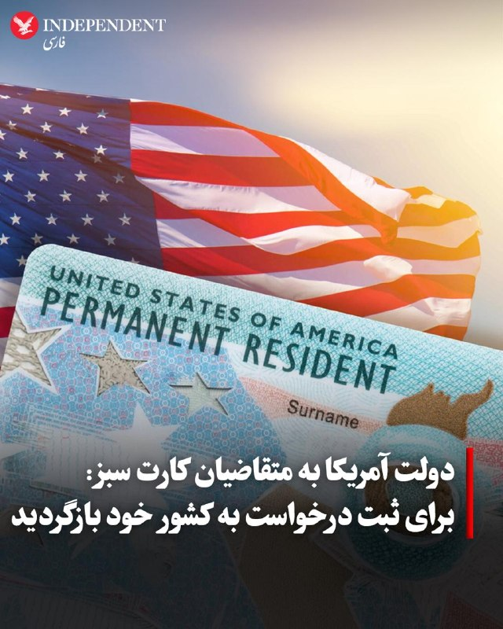

♦️به گزارش رویترز، سازمان خدمات شهروندی و مهاجرت ایالات متحده در دستورالعملی جدید اعلام کرد متقاضیانی که در خاک آمریکا حضور دارند و به دنبال تغییر وضعیت مهاجرتی خود برای دریافت «کارت سبز» (گرین‌کارت) هستند، دیگر نمی‌توانند این فرایند را از داخل آمریکا پیگیری کنند. طبق این سیاست، متقاضیان ملزم هستند برای تکمیل مراحل قانونی، به کشور مبدا بازگشته و از طریق وزارت امور خارجه اقدام کنند.
وزارت امنیت داخلی آمریکا هدف از این تصمیم را جلوگیری از سوءاستفاده از خلأهای قانونی و اصلاح عملکرد سیستم مهاجرتی طبق قانون اعلام کرده است. بر اساس این گزارش سازمان‌های حقوق بشری و حامیان پناهجویان به شدت به این تصمیم اعتراض کرده‌اند.  به گزارش رویترز، این سیاست، قربانیان قاچاق انسان و کودکان آسیب‌دیده‌ای را که از شرایط خطرناک کشورهای خود گریخته‌اند، مجبور می‌کند برای دریافت اقامت دائم، دوباره به همان محیط‌های ناامن بازگردند.
‌🇸🇦 Indypersian

🤖 @VahidOOnLine

## VahidOOnLine — post 241612

  

♦️دونالد ترامپ، رئیس‌جمهوری آمریکا، با انتشار تصویری گرافیکی با عبارت «گنبد طلایی برای کاخ سفید» در شبکه اجتماعی «تروث سوشال»، بار دیگر بر ایده خود مبنی بر ایجاد یک سپر دفاع موشکی همه‌جانبه تاکید کرد. ترامپ که از زمان مبارزات انتخاباتی خود بارها بر لزوم ساخت یک چتر پدافندی بزرگ برای کل خاک آمریکا (مشابه گنبد آهنین اسرائیل اما بسیار پیشرفته‌تر) تاکید کرده، در این تصویر مفهومی، کاخ سفید را زیر یک پوشش حفاظتی درخشان مجهز به سیستم‌های راداری و ماهواره‌های مداری به تصویر کشیده است. به گزارش منابع آگاه، پروژه ۱۸۵ میلیارد دلاری «گنبد طلایی» به عنوان یک سپر فضامحور با تکیه بر هوش‌مصنوعی برای رهگیری موشک‌های بالستیک، کروز و هایپرسونیک طراحی شده و صدها شرکت برای مشارکت در آن رقابت می‌کنند. بر اساس گزارش‌ها، غول‌های فناوری نظامی مانند «اندوریل» و «پالانتیر» در حال همکاری برای ارتقای نرم‌افزاری این سامانه هستند و پیش از این نیز در بخش‌هایی از پروژه با شرکت «اسپیس‌اکس» متعلق به ایلان ماسک مشارکت داشته‌اند.
‌🇸🇦 Indypersian

🤖 @VahidOOnLine

## VahidOOnLine — post 241611

  

♦️تام کاتن، سناتور جمهوری‌خواه، در نامه‌ای رسمی به اسکات بسنت، وزیر خزانه‌داری ایالات متحده، ضمن هشدار درباره راه‌اندازی «عوارضی تهران» توسط سپاه پاسداران خواستار اعمال تحریم‌های تنبیهی فوری علیه حامیان این طرح شد. کاتن با مواضع تند خود علیه اقدام غیرقانونی ایران در ایجاد «سازمان تنگه خلیج فارس» (PGSA) نوشت: «این سازمان که مستقیما زیر نظر سپاه پاسداران (به عنوان یک سازمان تروریستی) فعالیت می‌کند، حق حاکمیت برای تنظیم تردد و دریافت عوارض تا سقف ۲ میلیون دلار برای هر کشتی را ادعا کرده است؛ بنابراین هر دلار جمع‌آوری‌شده، مستقیما برای تأمین مالی تروریسم هزینه می‌شود.» این سناتور آمریکایی با تأکید بر اینکه این اقدام آزادی کشتیرانی بین‌المللی را به خطر می‌اندازد، صراحتا اعلام کرد: «این سازمان بدون رضایت سایر کشورها نمی‌تواند فعالیت کند و ایالات متحده باید اطمینان حاصل کند که هر بازیگری که به رژیم تروریستی ایران کمک می‌کند، پاسخگو خواهد شد؛ به همین دلیل من از به کارگیری اختیارات موجود برای اعمال تحریم بر این سازمان، مقامات آن و هر نهاد خارجی که این باج‌ها را به ایران پرداخت، پردازش یا تسهیل می‌کند، کاملا حمایت می‌کنم.»
‌🇸🇦 Indypersian

🤖 @VahidOOnLine

## WithYashar — post 12072

تعطیلی مراسم یادبود آخر هفته(دوشنبه) برای برخی از نیروهای نظامی آمریکایی لغو شد.
@withyashar

## WithYashar — post 12071

  <a href="telegram/content/WithYashar_12071_1779492368.mp4" target="_blank">🎬 Download video</a>

🎬 Video

## WithYashar — post 12070

مهدی طارمی نمیدونم کیه ولی میگن به اردوی آنتالیا تیم‌ملی اضافه شد
@withyashar

## WithYashar — post 12069

## WithYashar — post 12068

جت های جنگی اسرائیلی به صورت گسترده در حال پرواز به سمت آسمان عراق و عربستان مشاهده شدند.
@withyashar

## WithYashar — post 12067

توجه کنید این خبر فعلا فقط توسط رسانه های اسرائیل گفته شده هنوز تایید نشده

## WithYashar — post 12066

گزارشها حاکی از این است که هیئت پاکستانی با عجله تهران را ترک کردند. @withyashar

## WithYashar — post 12065

کلاً یه دونه تانکر سوخت رسان تو آسمون اسرائیله. من نمیدونم چرا یه خبر فیک میزنن همه هم همونو کپی میکنن همه جا پخش میکنن.

## WithYashar — post 12064

کلاً یه دونه تانکر سوخت رسان تو آسمون اسرائیله. من نمیدونم چرا یه خبر فیک میزنن همه هم همونو کپی میکنن همه جا پخش میکنن.

## WithYashar — post 12063

یه هم زبون افغان نیست اینجا ؟😃

## WithYashar — post 12062

گزارشها حاکی از این است که هیئت پاکستانی با عجله تهران را ترک کردند.
@withyashar

## WithYashar — post 12061

خبر‌ فورررریییییییی 🚨🚨🚨🚨🚨

## WithYashar — post 12060

## WithYashar — post 12059

یاشار حاجی استیکر حامله رو چیکار کنیم آزاد کنی؟😂

## WithYashar — post 12058

## WithYashar — post 12057

## WithYashar — post 12056

## WithYashar — post 12055

## WithYashar — post 12054

کسایی که بلاک میشن بیان محترمانه عذرخواهی کنند بدون حرف اضافی آنبلاک میکنم
قوربان شوما دیکتاتور مهربون یاشار 🤣❤️‍🩹🙌🏾

## WithYashar — post 12053

بیتکوین شلوار خودشو خیس کرد داره میریزه🥴
@withyashar

## mwarmonitor — post 9511

  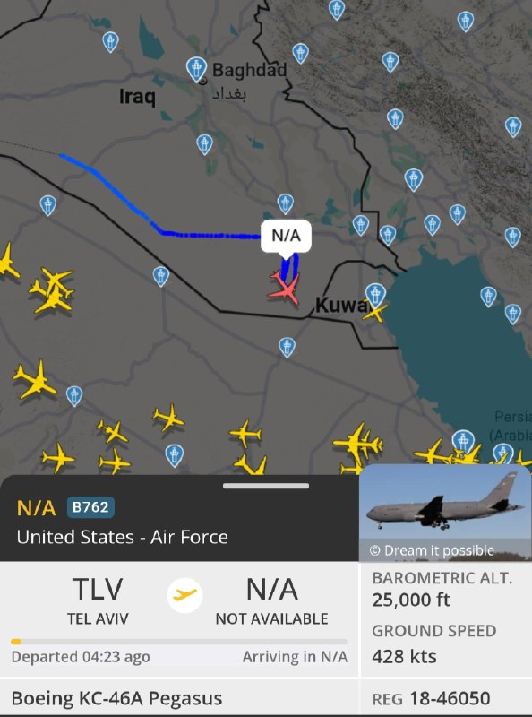

✈️نیروهای آمریکایی در آسمان بیابان سماوه در جنوب عراق فعال شده‌اند و با استقرار هواپیماهای سوخت‌رسان هوایی فعالیت می‌کنند؛ موضوعی که نشان می‌دهد پروازهای جنگی دیگری نیز در آسمان عراق حضور دارند.

@mwarmonitor

## mwarmonitor — post 9510

  

🔴در میان گزارش‌هایی مبنی بر اینکه ایران با صدور اطلاعیه هوانوردان (NOTAM) حریم هوایی خود را تا روز دوشنبه بسته است، یک هواپیمای قطری که به‌عنوان هواپیمای تشریفاتی (VIP) دولت قطر شناخته می‌شود، در حال ترک تهران مشاهده شده است.

🔸این پرواز پس از سفر هیأت قطری به تهران برای تسهیل دستیابی به توافقی میان آمریکا و ایران انجام می‌شود.

🔹در حالی که Asim Munir، تصمیم‌گیرنده اصلی پاکستان، قرار است فردا با همتایان ایرانی خود دیدار کند.

@mwarmonitor

## mwarmonitor — post 9509

🔴 یک منبع آمریکایی به Al Jazeera گفت:

🔸رئیس ستاد مشترک ارتش آمریکا در نشست شورای امنیت ملی شرکت کرده و گزینه‌هایی را در صورت شکست مذاکرات با ایران به رئیس‌جمهور ارائه داده است.

@mwarmonitor

## mwarmonitor — post 9508

🔴بر اساس گزارش CBS News به نقل از چند منبع، برخی از مقامات نظامی و اطلاعاتی آمریکا برنامه‌های آخر هفته تعطیلات روز یادبود (Memorial Day) را لغو کرده‌اند؛ این اقدام در پی انتظار برای احتمال حملات علیه ایران صورت گرفته است.

🔸دولت ترامپ در حال آماده‌سازی برای دور تازه‌ای از حملات نظامی است، هرچند تا بعدازظهر جمعه هیچ تصمیم نهایی در این‌باره اتخاذ نشده بود.

@mwarmonitor

## kianmeli1 — post 87570

  <a href="telegram/content/kianmeli1_87570_1779492371.mp4" target="_blank">🎬 Download video</a>

🔴ترامپ سوار هواپیمای نیروی هوایی در نیویورک شد، اقامت آخر هفته خود در نیوجرسی را لغو کرد و به کاخ سفید بازگشت.
https://t.me/kianmeli1

## IranIntlTV — post 338503

  

سفارت جمهوری اسلامی در ارمنستان با بازنشر نامه کناره‌گیری تولسی گبرد از مدیریت اطلاعات ملی آمریکا به دلیل ابتلای همسرش به سرطان، برای همسر گبرد سلامتی و برای این مقام آمریکایی «بهترین‌ها» را آرزو کرد و مواضع او را درباره مواردی همچون اسرائیل و جمهوری اسلامی مورد تحسین قرار داد.
این سفارت‌خانه خطاب به گبرد در ایکس نوشت: «تو پیش‌تر در مقاطعی نشان دادی که برای آمریکا کار می‌کنی نه اسرائیل، و گاهی درباره ایران واقعیت‌هایی را بیان کردی که ترامپ از آن‌ها خوشش نمی‌آمد. تاسف‌آور بود که فردی مانند تو با این دولت همکاری کرد؛ دولتی که آمریکا را به حاشیه رانده و به نیابت از اسرائیل عمل می‌کند.»

https://iranintl.com/202605227176

## IranIntlTV — post 338502

  <a href="telegram/content/IranIntlTV_338502_1779492375.mp4" target="_blank">🎬 Download video</a>

وال‌استریت ژورنال گزارش داد پر شدن مخازن نفت و فشارهای آمریکا، جمهوری اسلامی را با بحران نفتی روبه‌رو کرده است. کارشناسان هشدار داده‌اند تهران ممکن است ناچار به تعطیلی برخی چاه‌های نفت شود؛ اقدامی که می‌تواند به صنعت نفت ایران آسیب بزند.

گفت‌وگو با مهدی مصلحی، کارشناس بازار نفت
@iranintltv

## FarsiVOA — post 218401

  <a href="telegram/content/FarsiVOA_218401_1779492377.mp4" target="_blank">🎬 Download video</a>

⚡️مخالفت جمهوری‌خواهان با تلاش دموکرات‌ها برای محدود کردن اختیارات جنگی رئیس جمهوری آمریکا
@FarsiVOA

## FarsiVOA — post 218400

⚡️اعزام ۵ هزار نیروی آمریکا به لهستان؛ تقویت حضور نظامی در جناح شرقی ناتو
@FarsiVOA

## FarsiVOA — post 218399

  

⚡️به گزارش‌ سایت نوتیافی، سازمان هواپیمایی کشوری جمهوری اسلامی با صدور اطلاعیه هوانوردی برای حریم هوایی ایران، اعلام کرد که همه فرودگاه‌های بخش غربی منطقه اطلاعات پروازی تهران به‌جز چند فرودگاه، از (جمعه) ۲۲ مه تا ۲۵ مه بسته خواهند بود و فرودگاه‌های باز در آن محدوده نیز فقط از طلوع تا غروب آفتاب پذیرای پروازهای تجاری هستند.
@FarsiVOA

## FarsiVOA — post 218398

🔺هواپیماهای ای-۱۰ آمریکا در خاورمیانه مجهز به سامانه جدید سوخت‌گیری شدند

◾️بر اساس تصاویر تازه‌منتشرشده، نیروی هوایی آمریکا هواپیماهای تهاجمی «ای-۱۰ تاندر بولت ۲» را با یک سامانه جدید سوخت‌گیری هوایی که پیشتر آزمایش‌شده است به خاورمیانه اعزام کرده است.

⬇️ بیشتر بخوانید:
https://ir.voanews.com/a/8152863.html
@FarsiVOA

## Persian_Trend_Official — post 14699

⭕️ ساعتی پیش، تولسی گابارد، از سمت خود به‌عنوان مدیر اطلاعات ملی کابینه دونالد ترامپ، استعفا داد.
در نامه استعفای خود، گابارد گفته است که همسرش، آبراهام، اخیراً به «نوعی بسیار نادر از سرطان استخوان» مبتلا شده و او برای حمایت از همسرش در این مبارزه، تصمیم گرفته از خدمت عمومی کناره‌گیری کند. استعفای او از ۳۰ ژوئن اجرایی می‌شود.

گابارد از جمله کسانی بود که مانند معاونش، جو، با جنگ با ایران مخالف بود.

📝 Nick

📌 @persian_trend_official
پرشین ترند | متفاوت‌ترین کانال نظامی

## Persian_Trend_Official — post 14698

  <a href="telegram/content/Persian_Trend_Official_14698_1779492379.mp4" target="_blank">🎬 Download video</a>

💢متبرک کردن سربند با پهپاد شاهد ۱۳۶ ...

🫆:Tony

📌 @persian_trend_official
پرشین ترند | متفاوت‌ترین کانال نظامی

## Persian_Trend_Official — post 14696

  <a href="telegram/content/Persian_Trend_Official_14696_1779492381.webm" target="_blank">🎬 Download video</a>

🔴 سی‌بی‌اس: دولت ترامپ در حال آماده‌سازی برای حملات جدید به ایران است

💢شبکه CBS News گزارش داد دولت ترامپ امروز در حال آماده‌سازی برای دور جدیدی از حملات نظامی علیه ایران بوده است، هرچند تاکنون تصمیم نهایی اتخاذ نشده است.

بر اساس این گزارش‌ها:

▪️ چندین عضو ارتش و جامعه اطلاعاتی آمریکا برنامه‌های تعطیلات Memorial Day خود را لغو کرده‌اند

▪️ این اقدام در پی احتمال انجام حملات جدید علیه ایران صورت گرفته است

▪️ ترامپ همزمان جلسات فشرده‌ای با مشاوران امنیت ملی و فرماندهان نظامی برگزار کرده است

همچنین گزارش شده:

▪️ کاخ سفید همچنان در حال بررسی گزینه‌های نظامی و پیامدهای احتمالی تشدید درگیری است
▪️ مذاکرات غیرمستقیم با ایران هنوز ادامه دارد اما پیشرفت قابل‌توجهی حاصل نشده
▪️ برخی منابع آمریکایی می‌گویند در صورت شکست دیپلماسی، گزینه نظامی دوباره فعال خواهد شد

🫆:Tony

📌 @persian_trend_official
پرشین ترند | متفاوت‌ترین کانال نظامی

## IranianMinds — post 20576

🔴با تعطیلی ۹۰ ساعت آینده بورس آمریکا ، وارد حساس‌ترین فاز زمانی شدیم.

@IranianMinds

## IranianMinds — post 20575

🔴سی‌بی‌اس نیوز:

دولت ترامپ برای دور جدیدی از حملات علیه ایران آماده شده است.
چندین عضو ارتش و جامعه اطلاعاتی ایالات متحده، برنامه‌های روز یادبود خود را به دلیل پیش‌بینی حملات احتمالی لغو کرده‌اند.

@IranianMinds

## IranianMinds — post 20574

  

🔴هیئت ارسالی قطر که برای ارسال پیام و میانجی به تهران آمده بودند، تهران را ترک کردند.

@IranianMinds

## BBCPersian — post 281815

🖋سوچیرا مگوایر و رها کانسارا
واحد جهانی مقابله با اطلاعات نادرست، بی‌بی‌سی

داخل یک دکه کوچک بامبویی در میانمار، مین مشغول آماده کردن مغازه‌اش برای آغاز روز است.

کابل‌های درهم‌پیچیده، سامانه برق خورشیدی و مستقل از شبکه برق را به چند پریز متصل کرده‌اند. چند صندلی پلاستیکی برای مشتریان چیده شده و روی منوی دست‌نویس، نام خوراکی‌هایی نوشته شده است.

مین، که به دلایل نگرانی‌های امنیتی نامش را تغییر داده‌ایم، می‌داند مشتری‌ها قرار است مدت زیادی اینجا بمانند. آن‌ها فقط برای یک چیز به این کافه می‌آیند: اینترنت.

او می‌گوید هر روز حدود ۳۰ نفر به کافه‌اش مراجعه می‌کنند. زمانی که بیش از دو سال پیش کارش را آغاز کرد، چنین کافه‌هایی کمیاب بودند و روزانه بین ۳۰۰ تا ۴۰۰ نفر به آنجا می‌آمدند. او می‌گوید: «تقاضا سرسام‌آور بود.»

آلبوم را ورق بزنید و ادامه مطلب را از لینک زیر در وبسایت بی‌بی‌سی فارسی بخوانید.

📸BBC/ GettyImages/ LightRocket via Getty Images/ AFP via Getty Images/ Future Publishing via Getty Images/ NurPhoto via Getty Images
https://bbc.in/4ulh4m2
@BBCPersian

## BBCPersian — post 281814

  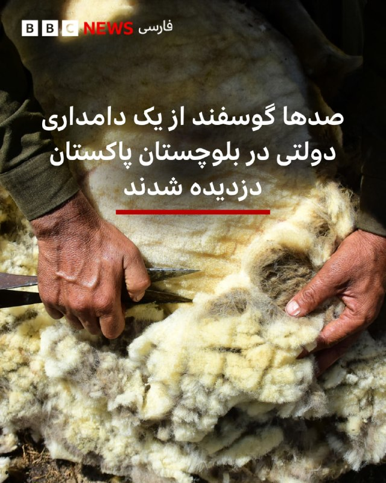

🔻مقامات ایالت بلوچستان پاکستان در حال تحقیق درباره دزدیده شدن بیش از ۴۰۰ گوسفند ممتاز از یک دامداری تحت نظارت دولت هستند.

کارکنان این دامداری می‌گویند که گروهی از مردان مسلح سوار بر موتورسیکلت این گوسفندها را که از نژاد قره‌قل هستند، دزدیدند.

پشم گوسفند قره‌قل که به گوسفند پرشین یا ایرانی هم معروف است، ضخیم، چین‌دار، مخملی، درخشنده و بسیار قیمتی است.

این گونه از پشم لوکس محسوب می‌شود و تجارت آن سودآور است. پشم قره‌قل در صنایع مختلفی از جمله منسوجات و فرشبافی استفاده دارد. نخ حاصل از این پشم در لباس‌های ضخیم زمستانی با دوام بالا استفاده می‌شود و به‌علت تاب‌آوری بالا، پشم قره‌قل از مواد با دوام بافت قالی در پاکستان، افغانسان و ایران است.

مقامات محلی بلوچستان پاکستان می‌گویند که گوسفندها برای تحقیقات و بره‌کشی در آن مرکز نگهداری می‌شدند. آن‌ها می‌گویند که سرقتی در این ابعاد از یک مرکز دولتی کم‌سابقه است.

📷 NurPhoto via Getty Images
@BBCPersian

## Dirty_Kids — post 389987

  <a href="telegram/content/Dirty_Kids_389987_1779492384.webm" target="_blank">🎬 Download video</a>

☢️خفن ترین و‌ قدیمی ترین  انالیزور  ایران ینی دکتر بت 
👍 
🔴هیچ سایت بتی دوست نداره شما کانال دکتر بت رو پیدا کنین چون خیلی سود میکنید🤷‍♂ رایگان بهترین شرط هارو براتون میذاره حتی هزار تومن هم دریافت نمیکنه روزانه میتونی از پیش بینی فوتبال باهاش پول در بیاری…

## Dirty_Kids — post 389986

  <a href="telegram/content/Dirty_Kids_389986_1779492384.webm" target="_blank">🎬 Download video</a>

☢️خفن ترین و‌ قدیمی ترین  انالیزور  ایران ینی دکتر بت 
👍

🔴هیچ سایت بتی دوست نداره شما کانال دکتر بت رو پیدا کنین چون خیلی سود میکنید🤷‍♂

رایگان بهترین شرط هارو براتون میذاره
حتی هزار تومن هم دریافت نمیکنه
روزانه میتونی از پیش بینی فوتبال باهاش پول در بیاری 👌
A1
اگ اهل پیش بینی فوتبالی این کانال اصلا از دست ندین👇

✅https://t.me/+4_ADqwB9e-QwYjlk

✅https://t.me/+4_ADqwB9e-QwYjlk

## Dirty_Kids — post 389985

  

#بخوابیم

@Dirty_Kids 👻

## Dirty_Kids — post 389984

  

سریال (Rooster) با میانگین بیننده ۶.۵ میلیون نفر برای هر قسمت، موفق ترین سریال شبکه HBO در ۱۵ سال اخیر شده! یعنی خییییلی خفنه

این سریال در فصل اولش به یکی از ۳ سریال کمدی پربیننده تاریخ این شبکه تبدیل شده. موفقیتی خارق‌العاده به لطف استیو کارل عزیز.

@Dirty_Kids 👻

---
📅 بروزرسانی: 1405/03/02 01:44
---

## VahidOOnLine — post 241610

  

♦️به گزارش فارس، خبرگزاری وابسته به سپاه پاسداران، عباس عراقچی، وزیر امور خارجه جمهوری اسلامی روز جمعه در تماس تلفنی با نیچروان بارزانی، رئیس اقلیم کردستان عراق، درباره روابط دوجانبه ایران و عراق و آخرین تحولات منطقه گفتگو کرد. براساس این گزارش، محورهای اصلی و مهم این تبادل نظر بر مناسباتی از جمله توسعه مراودات اقتصادی-تجاری، تقویت هماهنگی‌ها برای حفظ امنیت مرزهای مشترک و مقابله با تروریسم متمرکز بود. فارس نوشت، دو طرف همچنین در خصوص تحولات منطقه‌ای رایزنی کرده و بر اهمیت اهتمام و هم‌گرایی کشورهای منطقه جهت تقویت امنیت درون‌زا تأکید کردند.
‌🇸🇦 Indypersian

🤖 @VahidOOnLine

## VahidOOnLine — post 241609

  <a href="telegram/content/VahidOOnLine_241609_1779488087.mp4" target="_blank">🎬 Download video</a>

⭕️«صبحانه زنان»؛ بنیاد زنان نیویورک ۱۵۰۰ زن تاثیرگذار را در نیویورک گرد هم آورد

📌یکی از نمادهای مشهور این مراسم اهدای جایزه «عصای راه‌پیمایی» است؛ تندیسی نمادین که مفاهیمی چون قدرت، خرد و حرکت روبه‌جلو را نمایندگی می‌کند

♦️برگزارکنندگان این مراسم تاکید کردند این بنیاد طی سال‌ها توانسته است زنان آمریکایی را، فارغ از وابستگی‌های حزبی و تفاوت‌های سیاسی، کنار یکدیگر گرد آورد و از طریق فعالیت‌های مدنی، آموزشی و اقتصادی، بر جامعه آمریکا تاثیر بگذارد.

یکی از نمادهای این مراسم «عصای راه‌پیمایی» (Walking Stick Award) است؛ هدیه‌ای نمادین و دست‌ساز که با الهام از هنرهای بومی، مختص به هر فرد ساخته و تزیین و به زنان تاثیرگذار، فعالان اجتماعی و رهبران مدنی اهدا می‌شود و مفاهیمی چون قدرت، خرد و حرکت روبه‌جلو را نمایندگی می‌کند.
ایده ساخت و اهدای این عصای تزیین‌شده که گوناگونی و جمعیت رنگارنگ آمریکا را به تصویر می‌کشد، یکی از سازمان‌های تحت‌حمایت بنیاد که در حوزه توانمند سازی زنان فعالیت می‌کند، مطرح و اجرا کرد.

بیشتر بخوانید...
‌🇸🇦 Indypersian

🤖 @VahidOOnLine

## VahidOOnLine — post 241608

  

♦️بر اساس گزارش‌های تحلیلی آژانس رتبه‌بندی مودیز (Moody's)، رتبه اعتباری بلندمدت عربستان سعودی با وجود انسداد تنگه هرمز، همچنان «پایدار» است. مودیز در گزارش روز جمعه خود اعلام کرد که این تصمیم بازتاب‌دهنده اقتصاد بزرگ، ثروتمند و جایگاه رقابتی بالا و هزینه پایین تولید هیدروکربن در این کشور، در کنار بهبود اثربخشی سیاست‌ها و پیشرفت در چارچوب چشم‌انداز ۲۰۳۰ است. این آژانس تایید کرد که رشد بخش خصوصی غیرنفتی عربستان سعودی با نرخ پیش‌بینی‌شده ۴ تا ۵ درصد پس از فروکش کردن تنش‌ها، از قوی‌ترین‌ها در میان کشورهای شورای همکاری خلیج فارس خواهد بود. اگرچه اقتصاد پادشاهی سعودی به دلیل درگیری‌های جاری در خاورمیانه و انسداد عملی تنگه هرمز از اوایل ماه مارس، با کاهش ۱۰ درصدی تولید هیدروکربن و انقباض ۱.۷ درصدی کلِ جی‌دی‌پی (GDP) در سال ۲۰۲۶ مواجه است، اما مودیز پیش‌بینی می‌کند که در سال ۲۰۲۷ و با عادی‌سازی جریان تجارت، رشد اقتصادی عربستان سعودی جهش چشمگیر ۸ درصدی را تجربه کند.
طبق تحلیل سناریوی مرکزی این آژانس رتبه‌بندی، ساختار اعتباری عربستان سعودی در برابر اختلالات طولانی‌مدت و انسداد تنگه هرمز تا پایان سال ۲۰۲۶ تاب‌آور خواهد بود. این ثبات و انعطاف‌پذیری به دلیل توانایی ریاض در تغییر مسیر بخش عمده‌ای از صادرات نفت خود از طریق خط لوله شرق به غرب به سمت پایانه‌های دریای سرخ است؛ به‌طوری‌که این بنادر اکنون قادر به بارگیری تا ۵ میلیون بشکه در روز معادل نفت (دو‌سوم سطوح پیش از نزاع منطقه) هستند. علاوه بر این، جهش قیمت نفت به محدوده ۹۰ تا ۱۱۰ دلار در هر بشکه در سال ۲۰۲۶ و وجود دارایی‌های مالی قدرتمند دولت (معادل ۱۸ درصد جی‌دی‌پی در سال ۲۰۲۵)، ظرفیت بالایی را برای جذب نوسانات ایجاد کرده و درآمدها را فراتر از پیش‌بینی‌های قبل از جنگ برده است.
‌🇸🇦 Indypersian

🤖 @VahidOOnLine

## VahidOOnLine — post 241607

  

ترامپ در یک سخنرانی در سوفرن نیویورک گفت: «با عملیات خشم حماسی، رزمندگان ما اطمینان حاصل خواهند کرد که جمهوری اسلامی به عنوان بزرگ‌ترین حامی «تروریسم» دولتی در جهان، هرگز به سلاح هسته‌ای دست نخواهد یافت و خودشان هم این را می‌دانند.»
ترامپ گفت: حکومت ایران به عنوان بزرگ‌ترین حامی تروریسم دولتی، به سراسر جهان پول می‌فرستد تا مشکل ایجاد کند.

‌🏁 🇬🇧 IranintlTV

🤖 @VahidOOnLine

## VahidOOnLine — post 241606

  

خبرگزاری تسنیم، وابسته به سپاه پاسداران، به نقل از یک منبع نظامی گزارش داد نیروهای مسلح جمهوری اسلامی «به‌طور کامل» تحولات را زیر نظر دارند و در صورت آنچه «حماقت دشمن» و هرگونه بهانه‌جویی از سوی آمریکا و متحدانش خوانده شده، سناریوهای تازه‌ای آماده کرده‌اند.

به گفته این منبع، در صورت اقدام نظامی احتمالی آمریکا، «نسخه سوم مبارزه جمهوری اسلامی» اجرا خواهد شد؛ نسخه‌ای که به ادعای او در حوزه تجهیزات جدید، اهداف نوین، تاکتیک‌ها و راهبردهای جنگی نمود خواهد داشت و حتی می‌تواند جبهه‌های جدیدی در سطح فرامنطقه‌ای ایجاد کند.

این منبع نظامی همچنین مدعی شد آمریکا در صورت «زیاده‌خواهی و اقدام نظامی»، «تنبیه بزرگ سوم» را در کمتر از یک سال تجربه خواهد کرد؛ تنبیهی که به گفته او «به شکلی خاص‌تر و جدیدتر» خواهد بود.
‌🏁 🇬🇧 IranintlTV

🤖 @VahidOOnLine

## VahidOOnLine — post 241605

  

♦️تسنیم، خبرگزاری وابسته به سپاه پاسداران، روز جمعه به نقل از «یک منبع نظامی» نوشت: «نیروهای مسلح جمهوری اسلامی کاملا اوضاع را زیر نظر دارند و در صورت حماقت دشمن با هرگونه بهانه جویی، سناریوهای تازه‌ای برای آمریکا و متحدانش آماده کرده‌اند. این منبع نظامی در گفتگو با تسنیم ضمن اشاره به اینکه اگر دشمن حماقت کند، «نسخه سوم مبارزه ایران» را مشاهده خواهد کرد مدعی شد: «این نسخه سوم هم در حوزه تجهیزات جدید و هم در حوزه اهداف نوین و نیز در حوزه تاکتیک‌ها و استراتژی جنگ نمایان خواهد شد. به نحوی که جبهه‌های جدید فرامنطقه‌ای نیز آنها را پشیمان‌تر خواهد کرد. آمریکا در صورت زیاده‌خواهی و بهانه‌جویی و اقدام نظامی احتمالی، تنبیه بزرگ سوم خود را در کمتر از یکسال تجربه خواهد کرد؛ این بار به شکل خاص‌تر و جدیدتر».
‌🇸🇦 Indypersian

🤖 @VahidOOnLine

## VahidOOnLine — post 241604

  

♦️فرماندهی مرکزی آمریکا، سنتکام، با انتشار تصاویری از یک  هلیکوپتر «یو‌اچ-۱‌وای ونوم» (UH-1Y Venom) متعلق به نیروی دریایی آمریکا، جزئیاتی از عملیات‌های اخیر در چارچوب محاصره بنادر جمهوری اسلامی را به نمایش گذاشت.
سنتکام اعلام کرد این هلیکوپتر در جریان عملیات محاصره دریایی علیه بنادر جمهوری اسلامی به کار گرفته شده و توانایی اجرای ماموریت‌های مختلف از جمله رهگیری دریایی، شناسایی و پشتیبانی نزدیک رزمی را دارد.
‌🇸🇦 Indypersian

🤖 @VahidOOnLine

## VahidOOnLine — post 241603

  <a href="telegram/content/VahidOOnLine_241603_1779488094.mp4" target="_blank">🎬 Download video</a>

یک شهروند در پیامی صوتی به ایران اینترنشنال از فشار شدید در ایران و بلاتکلیفی و استرس به دلیل اظهارات دونالد ترامپ درباره امکان پایان جنگ و آتش‌بس می‌گوید. صدای او برای حفظ امنیتش با هوش مصنوعی بازخوانی شده است.
‌🏁 🇬🇧 IranintlTV

🤖 @VahidOOnLine

## VahidOOnLine — post 241602

  

♦️به گزارش اکسیوس، دونالد ترامپ، رئیس‌جمهوری آمریکا، روز جمعه با تیم ارشد امنیت ملی خود در کاخ سفید دیدار کرد تا سناریوهای مختلف در صورت شکست مذاکرات و احتمال آغاز حملات جدید علیه ایران را بررسی کند. در این نشست حساس که با حضور مقامات کلیدی از جمله جِی‌دی ونس، معاون رئیس‌جمهوری، پیت هگست، وزیر جنگ و جان راتکلیف، رئیس سی‌آی‌ای، برگزار شد، ترامپ در جریان آخرین وضعیت دیپلماسی قرار گرفت. نشانه‌های جدی از تغییر برنامه آخر هفته رئیس‌جمهوری، از جمله لغو سفر به باشگاه گلف بدمینستر، بازگشت به واشنگتن و حتی عدم شرکت در مراسم عروسی پسرش، دونالد ترامپ جوان، نشان‌دهنده وضعیت اضطراری در کاخ سفید است. منابع نزدیک به ترامپ می‌گویند او از روند کند مذاکرات ناامید شده و به سمت گزینه نظامی متمایل شده است، هرچند هنوز تصمیم قطعی برای از سرگیری جنگ اتخاذ نشده است.
در همین حال، تهران به کانون تلاش‌های دیپلماتیک «لحظه آخری» برای جلوگیری از شعله‌ور شدن دوباره جنگ تبدیل شده است. عاصم منیر، فرمانده کل ارتش پاکستان، به عنوان میانجی اصلی، در سفری حساس وارد تهران شده و قرار است با احمد وحیدی، از فرماندهان کلیدی سپاه پاسداران دیدار کند. هم‌زمان، یک هیئت قطری نیز برای پشتیبانی از این میانجی‌گری وارد پایتخت ایران شده است. با این حال، یک مقام آمریکایی روند تبادل پیش‌نویس‌ها میان طرفین را «زجرآور» و بدون پیشرفت ملموس توصیف کرده است؛ امری که نشان می‌دهد شکاف‌های موجود میان دو طرف چقدر عمیق است.
در طرف مقابل، وزارت امور خارجه ایران و رسانه‌های نزدیک به سپاه پاسداران تایید کرده‌اند که گفتگوها در جریان است اما هنوز هیچ نتیجه نهایی حاصل نشده و توافق نزدیکی در کار نیست. مقامات ایرانی تاکید دارند که تمرکز فعلی مذاکرات صرفا بر «پایان دادن به جنگ» است و تا زمانی که این هدف محقق نشود، درباره هیچ موضوع دیگری گفتگو نخواهد شد. ناظران معتقدند با وجود اینکه ترامپ در هفته‌های گذشته چندین بار تا آستانه از سرگیری جنگ پیش رفته و عقب‌نشینی کرده، اما ساعات پیش رو و احتمال رخ دادن یک گشایش ناگهانی در ۲۴ ساعت آینده، تعیین‌کننده مسیر نهایی (جنگ یا دیپلماسی) خواهد بود.
‌🇸🇦 Indypersian

🤖 @VahidOOnLine

## VahidOOnLine — post 241601

  

دونالد ترامپ، رییس جمهوری ایالات متحده، در سخنرانی خود در نیویورک درباره جنگ ایران اعلام کرد: «این ماجرا به‌زودی پایان خواهد یافت.»

او همچنین گفت که ما جمهوری اسلامی را متوقف کرده‌ایم؛ آن‌ها هرگز به سلاح هسته‌ای دست نخواهند یافت.
‌🏁 🇬🇧 IranintlTV

🤖 @VahidOOnLine

## WithYashar — post 12050

  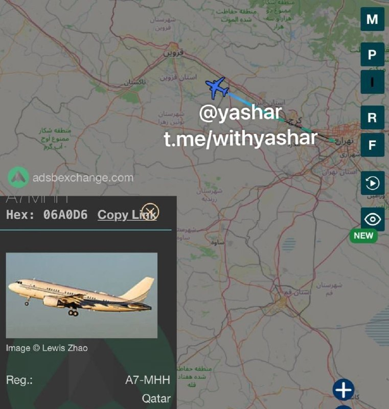

جنگندههای ایرانی که از مهرآباد بلند شدند برای اسکورت هواپیمای مقامات قطری بودند.
@withyashar

## WithYashar — post 12049

  

همکنون هواپیمای گشت دریایی چندمنظوره (بویینگ P-8 پوزایدن) و یک پهپاد ناشناس بدون شک آمریکایی بر فراز خلیج فارس !
@withyashar

## WithYashar — post 12048

هیئت قطری تهران را ترک کرد

گزارش‌ها حاکی است هیئت قطری پس از رایزنی‌های دیپلماتیک، تهران را ترک کرده است.

این سفر در حالی انجام شد که قطر در کنار پاکستان و چند کشور منطقه، در تلاش برای میانجیگری میان ایران و آمریکا جهت دستیابی به توافقی برای پایان جنگ و ادامه مذاکرات هسته‌ای بود.
@withyashar

## WithYashar — post 12047

گزارش‌های متعددی درباره برخاستن اضطراری (اسکرامبل) جنگنده‌ها از فرودگاه مهرآباد، تهران دریافت شده است.
@withyashar
جنگنده های خود رژیمن از ترسه …. شانه کسکم

## WithYashar — post 12046

کردان سمت هشتگرد صدای جنگنده میاد

## WithYashar — post 12045

یاشار جان کرج صدای جنگنده میاد
ساعت 01:06

## WithYashar — post 12044

  

فضای هوایی غرب ایران طبق یک NOTAM جدید تا صبح روز دوشنبه بسته شده است، به‌جز پروازهای روزانه (در ساعات روشنایی روز)
@withyashar

## WithYashar — post 12043

۸۹ ساعت و ۳۰ دقیقه دقیقا الان خوبه ؟
چون ویس و حتی تکست ها رو که بالا هست نمیری ‌نگاه کنی …🤬۵۰ بار گفتم

## WithYashar — post 12042

چرا ۹۰ساعت؟

## WithYashar — post 12041

دقایقی پیش بازار بورس آمریکا برای حدود ۹۰ ساعت آینده بسته شد.
@withyashar
رفتیم تو وضعیت قرمز 💥

## WithYashar — post 12040

  <a href="telegram/content/WithYashar_12040_1779488101.mp4" target="_blank">🎬 Download video</a>

یاد این سکانس افتادم 😔
@withyashar

## WithYashar — post 12039

این دوتا غذا آخری که گفتی چی هست اصن🥲🙁

## WithYashar — post 12038

## WithYashar — post 12037

ترامپ: «مسئله‌ی ایران خیلی زود تمام می‌شود و همه‌چیز به‌‌ سرعت به حالت عادی بازمی‌گردد.»
@withyashar

## WithYashar — post 12036

اتاق جنگ با شما : تهران/ولنجک صدای رد شدن پهباد میاد سمت ۰۰:۳۰
@withyashar

## WithYashar — post 12035

اتاق جنگ با شما : پدافند مشهد جای فرودگاه فعال شده
@withyashar

## WithYashar — post 12034

اکسیوس: منابع نزدیک به مذاکرات میگن توی ۲۴ ساعت آینده امکان پیشرفت وجود داره ترامپ ساعاتی پیش جلسه‌ای با تیم ارشد امنیت ملی درباره‌ی جنگ با ایران تشکیل داده بود
@withyashar

## WithYashar — post 12033

اتاق جنگ با شما : سلام داداشم پدافند اصفهان چند دقیقس فعاله
@withyashar

## WithYashar — post 12032

## WithYashar — post 12031

سلام داداش یاشار
بنظرت الان ک مقامات پاکستان تو ایرانن
بازم ممکنه امشب بزنه یا اصلا فردا؟
امکانش هست؟

## mwarmonitor — post 9507

ترامپ حرکت جدید به رقص معروف خودش اضافه کرد 🏌 @mwarmonitor

## mwarmonitor — post 9506

  <a href="telegram/content/mwarmonitor_9506_1779488104.mp4" target="_blank">🎬 Download video</a>

ترامپ حرکت جدید به رقص معروف خودش اضافه کرد 🏌

@mwarmonitor

## mwarmonitor — post 9505

  

🔴فضای هوایی غرب ایران طبق یک NOTAM جدید تا صبح روز دوشنبه بسته شده است، به‌جز پروازهای روزانه (در ساعات روشنایی روز).

@mwarmonitor

## FoxNewsTwitter — post 342149

  

Fox News (Twitter/X)

BREAKING: President Trump announces that 9/11 hero Welles Crowther will posthumously receive the Presidential Medal of Freedom.

Known as “The Man in the Red Bandana,” Crowther repeatedly ran back into the South Tower on 9/11 to help others escape, saving as many as 18 lives before losing his own.

Allison Crowther said her son’s legacy continues to endure nearly 25 years later: “Welles’ light still shines brightly.”

## FoxNewsTwitter — post 342148

  <a href="telegram/content/FoxNewsTwitter_342148_1779488109.mp4" target="_blank">🎬 Download video</a>

Fox News (Twitter/X)

WATCH: President Trump breaks out his staple 'YMCA' dance moves — with a bonus golf swing — as he wraps up a midterm campaign event in upstate New York.

## FoxNewsTwitter — post 342147

  <a href="telegram/content/FoxNewsTwitter_342147_1779488112.mp4" target="_blank">🎬 Download video</a>

Fox News (Twitter/X)

NEW: Tom Gorman, father of slain Sheridan Gorman, shared the devastating reality his family faces following his daughter’s murder at the hands of an illegal immigrant.

Gorman addressed the agonizing grief he and his wife endure, describing a heartbreaking moment on Mother’s Day that underscores the human cost of the border crisis.

“I am a husband who had to hold his wife on Mother’s Day when she asked the question no mother should ever have to ask. Through tears, Jess looked at Maddy and me and asked, ‘Am I still the mother of two?’ There’s no answer big enough for that pain.”

“All I could do was hold her and tell her the truth: ‘Yes, Jess. You’re still the mother of two because Sheridan will always be our daughter.’”

## FoxNewsTwitter — post 342146

  <a href="telegram/content/FoxNewsTwitter_342146_1779488114.mp4" target="_blank">🎬 Download video</a>

Fox News (Twitter/X)

BREAKING: President Trump blasts Democrats as “bulls**** artists” for trying to blame his admin for rising costs just days after he took office:

“The Democrats are the ones that caused all the costs.”

“They would constantly come out with the word ‘affordability.’ I said they’re the ones that caused the problem.”

“I’m in office two days, and the costs have gone through the roof under four years of Sleepy Joe or Crooked Joe — or both — Biden.”

“They’re the greatest ‘bulls**** artists.’”

## FoxNewsTwitter — post 342145

Fox News (Twitter/X)

BREAKING: Jessica Gorman, the mother of slain Sheridan Gorman, delivers a powerful rebuke of far-left sanctuary policies, saying that her daughter’s life was stolen by an illegal migrant who should have never been released into the community:

“No mother should ever have to wonder if her child called out for her in her final moments.”

“No mother should ever have to imagine her baby lying alone and bleeding on the cold pavement.”

“No family should ever have to bury a child because public officials failed to put innocent American lives first.”

“Please, please support leaders and policies that protect your child and mine. Because a city, a state, or a country that does not protect its children has lost its way. And together, we must be brave enough to demand that it find its way back.”

## FoxNewsTwitter — post 342144

Fox News (Twitter/X)

BREAKING: The mother of Welles Crowther — the 9/11 hero known for the red bandana he wore as he repeatedly ran back into the South Tower to save as many as 18 lives — joins President Trump on stage as he announces that Welles will posthumously receive the Presidential Medal of Freedom.

TRUMP: “I just want to congratulate his great mother on doing a phenomenal job raising that young man. Boy, what bravery. He saved those people and became a legend, in a sense. Nobody else would have done what he did.”

ALLISON CROWTHER: “It’s such a beautiful thing that even 25 years later, Welles’ light still shines brightly.”

## VahidOnline — post 75629

  

به گزارش اکسیوس، دونالد ترامپ، رئیس‌جمهوری آمریکا، روز جمعه با تیم ارشد امنیت ملی خود در کاخ سفید دیدار کرد تا سناریوهای مختلف در صورت شکست مذاکرات و احتمال آغاز حملات جدید علیه ایران را بررسی کند.

در این نشست حساس که با حضور مقامات کلیدی از جمله جِی‌دی ونس، معاون رئیس‌جمهوری، پیت هگست، وزیر جنگ و جان راتکلیف، رئیس سی‌آی‌ای، برگزار شد، ترامپ در جریان آخرین وضعیت دیپلماسی قرار گرفت.

نشانه‌های جدی از تغییر برنامه آخر هفته رئیس‌جمهوری، از جمله لغو سفر به باشگاه گلف بدمینستر، بازگشت به واشنگتن و حتی عدم شرکت در مراسم عروسی پسرش، دونالد ترامپ جوان، نشان‌دهنده وضعیت اضطراری در کاخ سفید است.
منابع نزدیک به ترامپ می‌گویند او از روند کند مذاکرات ناامید شده و به سمت گزینه نظامی متمایل شده است، هرچند هنوز تصمیم قطعی برای از سرگیری جنگ اتخاذ نشده است.

در همین حال، تهران به کانون تلاش‌های دیپلماتیک «لحظه آخری» برای جلوگیری از شعله‌ور شدن دوباره جنگ تبدیل شده است.
عاصم منیر، فرمانده کل ارتش پاکستان، به عنوان میانجی اصلی، در سفری حساس وارد تهران شده و قرار است با احمد وحیدی، از فرماندهان کلیدی سپاه پاسداران دیدار کند.
@VahidOOnLine

📡 @VahidOnline

## kianmeli1 — post 87569

  

🔴هیئت قطر تهران را ترک کرد.
https://t.me/kianmeli1

## kianmeli1 — post 87568

🔴جمهوری اسلامی تهدیدات حمله را کاملا جدی گرفته است و تمام پایگاه ها آماده باش کامل است

باید دید آیا برنامه ترامپ حمله است یا خیر
https://t.me/kianmeli1

## kianmeli1 — post 87567

  

🔴امشب ایران آماده جنگ احتمالی شد

فضای هوایی غرب ایران طبق یک NOTAM جدید تا صبح روز دوشنبه بسته شده است، به‌جز پروازهای روزانه (در ساعات روشنایی روز).
https://t.me/kianmeli1

## kianmeli1 — post 87566

🔴دقایقی پیش بازار بورس آمریکا برای حدود ۹۰ ساعت آینده بسته شد.

اگر قرار است ترامپ فرمان حمله صادر کند امشب یا فرداشب صادر میشود
https://t.me/kianmeli1

## kianmeli1 — post 87565

🔴خبرگزاری تسنیم، وابسته به سپاه پاسداران، به نقل از یک منبع نظامی می‌گوید نیروهای مسلح ایران در حال آماده شدن برای از سرگیری احتمالی جنگ با آمریکا هستند و طرح جدیدی برای «مبارزه سوم» آماده کرده‌اند که آمریکا و متحدان آمریکا را به شیوه‌ای «جدید و خاص» هدف قرار خواهد داد.
https://t.me/kianmeli1

## kianmeli1 — post 87564

🔴طرفداران نظام در میدان انقلاب خطاب به ترامپ

حمله امشب چی شد منتظریم
https://t.me/kianmeli1

## IranIntlTV — post 338501

  <a href="telegram/content/IranIntlTV_338501_1779488119.mp4" target="_blank">🎬 Download video</a>

مشاور رییس دولت امارات متحده عربی گفت حملات جمهوری اسلامی باعث تغییر نگاه امنیتی کشورهای منطقه شده و برخی دولت‌های عربی اکنون تهران را تهدیدی بزرگ‌تر از اسرائیل می‌دانند.

گفت‌وگو با امیرحسین میراسماعیلی، روزنامه‌نگار
@iranintltv

## IranIntlTV — post 338500

  <a href="telegram/content/IranIntlTV_338500_1779488122.mp4" target="_blank">🎬 Download video</a>

همزمان با سفر فرمانده ارتش پاکستان به ایران، رویترز از اعزام تیم مذاکره‌کننده قطری به تهران با هماهنگی آمریکا خبر داد. رسانه‌های عربی نیز گزارش دادند پیش‌نویس توافق اولیه شامل آتش‌بس، توقف حملات و آغاز مذاکرات در هفت روز آینده است.

گفت‌وگو با جمشید برزگر، روزنامه‌نگار
@iranintltv

## IranIntlTV — post 338499

  <a href="telegram/content/IranIntlTV_338499_1779488124.mp4" target="_blank">🎬 Download video</a>

همزمان با تشدید تنش‌ها میان تهران و واشینگتن و گمانه‌زنی‌ها درباره احتمال توافق، ترامپ گفت آمریکا رفتاری مشابه آنچه در ونزوئلا رخ داد، با جمهوری اسلامی انجام می‌دهد. او گفت ایران بی‌صبرانه به‌دنبال رسیدن به توافق با آمریکا است.

گفت‌وگو با امیر گیتی، عضو تحریریه ایران‌اینترنشنال
@iranintltv

## IranIntlTV — post 338498

  

ترامپ در یک سخنرانی در سوفرن نیویورک گفت: «با عملیات خشم حماسی، رزمندگان ما اطمینان حاصل خواهند کرد که جمهوری اسلامی به عنوان بزرگ‌ترین حامی «تروریسم» دولتی در جهان، هرگز به سلاح هسته‌ای دست نخواهد یافت و خودشان هم این را می‌دانند.»
ترامپ گفت: حکومت ایران به عنوان بزرگ‌ترین حامی تروریسم دولتی، به سراسر جهان پول می‌فرستد تا مشکل ایجاد کند.

https://iranintl.com/202605221757

## IranIntlTV — post 338497

  

خبرگزاری تسنیم، وابسته به سپاه پاسداران، به نقل از یک منبع نظامی گزارش داد نیروهای مسلح جمهوری اسلامی «به‌طور کامل» تحولات را زیر نظر دارند و در صورت آنچه «حماقت دشمن» و هرگونه بهانه‌جویی از سوی آمریکا و متحدانش خوانده شده، سناریوهای تازه‌ای آماده کرده‌اند.

به گفته این منبع، در صورت اقدام نظامی احتمالی آمریکا، «نسخه سوم مبارزه جمهوری اسلامی» اجرا خواهد شد؛ نسخه‌ای که به ادعای او در حوزه تجهیزات جدید، اهداف نوین، تاکتیک‌ها و راهبردهای جنگی نمود خواهد داشت و حتی می‌تواند جبهه‌های جدیدی در سطح فرامنطقه‌ای ایجاد کند.

این منبع نظامی همچنین مدعی شد آمریکا در صورت «زیاده‌خواهی و اقدام نظامی»، «تنبیه بزرگ سوم» را در کمتر از یک سال تجربه خواهد کرد؛ تنبیهی که به گفته او «به شکلی خاص‌تر و جدیدتر» خواهد بود.
https://iranintl.com/202605226156

## IranIntlTV — post 338496

  <a href="telegram/content/IranIntlTV_338496_1779488128.mp4" target="_blank">🎬 Download video</a>

یک شهروند در پیامی صوتی به ایران اینترنشنال از فشار شدید در ایران و بلاتکلیفی و استرس به دلیل اظهارات دونالد ترامپ درباره امکان پایان جنگ و آتش‌بس می‌گوید. صدای او برای حفظ امنیتش با هوش مصنوعی بازخوانی شده است.

## IranIntlTV — post 338495

  

دونالد ترامپ، رییس جمهوری ایالات متحده، در سخنرانی خود در نیویورک درباره جنگ ایران اعلام کرد: «این ماجرا به‌زودی پایان خواهد یافت.»

او همچنین گفت که ما جمهوری اسلامی را متوقف کرده‌ایم؛ آن‌ها هرگز به سلاح هسته‌ای دست نخواهند یافت.
https://iranintl.com/202605220706

## Shin_Persian — post 6162

  

Faytuks Network ✓ @FaytuksNetwork
Fri, 22 May 2026 21:32:12 UTC

Details of the NOTAM

فارسی

جزئیات نوتام (NOTAM):

𝕏 · @shin_persian

## Shin_Persian — post 6161

  

Shin ✓ @hey_itsmyturn
Fri, 22 May 2026 21:37:46 UTC

Jet activity over Karaj, Alborz Province, #Iran

فارسی

فعالیت جنگنده‌ها بر فراز کرج، استان البرز، #Iran

𝕏 · @shin_persian

## Shin_Persian — post 6160

  

Shin ✓ @hey_itsmyturn
Fri, 22 May 2026 21:33:16 UTC

Received multiple reports regarding jet scramble from Mehrabad airport, Tehran
Tehran Province, #Iran

فارسی

گزارش‌های متعددی درباره برخاستن اضطراری (اسکرامبل) جنگنده‌ها از فرودگاه مهرآباد، تهران دریافت شده است.
استان تهران، #Iran

𝕏 · @shin_persian

## FarsiVOA — post 218397

🔺سناتور آمریکایی به‌دنبال تحریم کشورهای همکار با طرح عوارض‌گیری جمهوری اسلامی در تنگه هرمز

◾️به گزارش «واشنگتن فری‌بیکن»، تام کاتن، سناتور جمهوری‌خواه آمریکا، در حال تهیه طرحی قانونی است که بر اساس آن هر کشوری که به جمهوری اسلامی برای اجرای طرح دریافت عوارض در تنگه هرمز کمک کند، به‌سرعت تحریم خواهد شد.

⬇️ بیشتر بخوانید:
https://ir.voanews.com/a/8152861.html
@FarsiVOA

## FarsiVOA — post 218396

⚡️قتل شهروند مازندرانی با شلیک مستقیم مامور نیروی انتظامی؛ دو هزار ساعت خاموشی دیجیتال در ایران
@FarsiVOA

## FarsiVOA — post 218395

⚡️جزئیات ناپدید شدن مشکوک ٣ خدمه عراقی کشتی «بریج ۱ و ۲» در حوالی جزیره کیش
@FarsiVOA

## FarsiVOA — post 218394

  

⚡️دونالد ترامپ، رئیس‌جمهوری آمریکا، روز جمعه ۱ خرداد در یک سخنرانی در شهر سافرن ایالت نیویورک، با اشاره به اینکه آمریکا «بهترین و قدرتمندترین ارتش جهان» را دارد گفت «با عملیات خشم حماسی، نیروهای ما دارند اطمینان حاصل می‌کنند که [جمهوری اسلامی] ایران، بزرگ‌ترین حامی حکومتی تروریسم در جهان» و حکومت حامی تروریسم «شماره یک» در جهان دیگر هرگز موفق نشود.

او گفت جمهوری اسلامی «پولش را به سراسر دنیا می‌فرستد تا مشکل‌تراشی کند.»

آقای ترامپ گفت: «آن‌ها هرگز به سلاح هسته‌ای دست پیدا نخواهند کرد، و خودشان هم این را می‌دانند. می‌دانند. و آمریکا دوباره در حال پیروزی است.»
@FarsiVOA

## Persian_Trend_Official — post 14694

🔴 آکسیوس: ترامپ در حال بررسی حملات نظامی جدید علیه ایران است

💢آکسیوس به نقل از مقام‌های آمریکایی گزارش داد دونالد ترامپ روز جمعه با مشاوران ارشد امنیت ملی خود دیدار کرده تا درباره احتمال انجام حملات نظامی جدید علیه ایران گفت‌وگو کند.

💢بر اساس این گزارش:

▪️ ترامپ به‌شدت در حال بررسی ازسرگیری حملات در صورت شکست مذاکرات است

▪️ جلسه با حضور مقام‌های ارشد امنیتی و اطلاعاتی آمریکا برگزار شده

▪️ همزمان تلاش‌های میانجیگرانه پاکستان و قطر برای جلوگیری از بازگشت جنگ ادامه دارد

💢آکسیوس همچنین نوشته:

▪️ ترامپ طی روزهای اخیر از روند مذاکرات با ایران ناراضی‌تر شده است

▪️ هنوز تصمیم نهایی برای حمله اتخاذ نشده

▪️ برخی منابع معتقدند در صورت عدم پیشرفت ناگهانی در مذاکرات، گزینه نظامی دوباره فعال خواهد شد

🫆:Tony

📌 @persian_trend_official
پرشین ترند | متفاوت‌ترین کانال نظامی

## Persian_Trend_Official — post 14693

  <a href="telegram/content/Persian_Trend_Official_14693_1779488135.webm" target="_blank">🎬 Download video</a>

🔴 هیئت قطری تهران را ترک کرد

💢گزارش‌ها حاکی است هیئت قطری پس از رایزنی‌های دیپلماتیک، تهران را ترک کرده است.

💢این سفر در حالی انجام شد که قطر در کنار پاکستان و چند کشور منطقه، در تلاش برای میانجیگری میان ایران و آمریکا جهت دستیابی به توافقی برای پایان جنگ و ادامه مذاکرات هسته‌ای بود.

🫆:Tony

📌 @persian_trend_official
پرشین ترند | متفاوت‌ترین کانال نظامی

## Persian_Trend_Official — post 14692

  <a href="telegram/content/Persian_Trend_Official_14692_1779488136.mp4" target="_blank">🎬 Download video</a>

💢 ترامپ

💢باور کنید من توانستم این معادله را حل‌ کنم
!
‌‌(203 × 9 ÷2+ 1324 − 1292) × 19

🫆:Tony

📌 @persian_trend_official
پرشین ترند | متفاوت‌ترین کانال نظامی

## Persian_Trend_Official — post 14691

  <a href="telegram/content/Persian_Trend_Official_14691_1779488138.webm" target="_blank">🎬 Download video</a>

🔴 ایران بخشی از حریم هوایی غرب کشور را تا دوشنبه بست

💢گزارش‌ها حاکی است ایران بخشی از حریم هوایی غرب کشور را برای پروازهای شبانه از غروب تا طلوع خورشید تا روز دوشنبه بسته است.

🫆:Tony

📌 @persian_trend_official
پرشین ترند | متفاوت‌ترین کانال نظامی

## Persian_Trend_Official — post 14689

  <a href="telegram/content/Persian_Trend_Official_14689_1779488138.mp4" target="_blank">🎬 Download video</a>

🔥هم اکنون بندر نووروسییسک، روسیه مورد حمله موشکی پهپادی اوکراینی ها قرارگرفت،

👩‍💻☆Phantom☆

🆔 @persian_trend_official
پرشین ترند | متفاوت‌ترین کانال نظامی

## IranianMinds — post 20573

  

🔴فضای هوایی غرب ایران طبق یک NOTAMجدید تا صبح روز دوشنبه بسته شده است.

@IranianMinds

## BBCPersian — post 281813

  

🔻تولسی گابارد اعلام کرد که از سمت خود به‌عنوان مدیر اطلاعات ملی ایالات متحده آمریکا در دولت دونالد ترامپ کناره‌گیری خواهد کرد. او دلیل این تصمیم را تشخیص سرطان استخوان همسرش عنوان کرده است.

خانم گابارد در نامه استعفای خود که به دست شبکه سی‌بی‌اس نیوز رسیده، نوشته است: «قدرت و عشق او در همه چالش‌ها پشتیبان من بوده است. نمی‌توانم با وجدان آسوده از او بخواهم این مبارزه را به تنهایی پشت سر بگذارد، در حالی که من همچنان در این مسئولیت دشوار و پرمشغله باقی بمانم.»

دونالد ترامپ، رئیس جمهور آمریکا نیز در پیامی در شبکه‌های اجتماعی نوشت که گابارد «کار فوق‌العاده‌ای انجام داده و دلتنگش خواهیم شد.»

استعفای او از ۳۰ ژوئن، ۹ تیر ۱۴۰۵، اجرایی می‌شود و به گفته آقای ترامپ، آرون لوکاس، معاون اصلی مدیر اطلاعات ملی، به‌طور موقت این سمت را برعهده خواهد گرفت.

ادامه خبر را از لینک زیر در وبسایت بی‌بی‌سی فارسی بخوانید.

📷 Bloomberg via Getty Images
https://bbc.in/4dqxAv9
‌@BBCPersian

## BBCPersian — post 281812

🔻مارکو روبیو، وزیر خارجه آمریکا درحاشیه نشست وزرای خارجه کشورهای عضو ناتو با هاکان فیدان، وزیر خارجه ترکیه گفت‌وگو کرد.

آقای روبیو با اشاره به این دیدار در شبکه ایکس نوشت: «در دیدار با هاکان فیدان درباره ضرورت پایبندی همه متحدان به تعهدات دفاعی و همچنین برنامه‌های مربوط به نشست آینده ناتو در ترکیه گفت‌و‌گو کردیم.»

او همچنین گفت که در این دیدار درباره بازگشایی تنگه هرمز و تلاش برای دستیابی به ثبات در منطقه با آقای فیدان مذاکره کرده است.

نشست وزرای خارجه عضو ناتو امروز در سوئد برگزار شده است.

https://bbc.in/4nNPWtx
@BBCPersian

## Dirty_Kids — post 389983

  

ببخشین این سایز بزرگتر نداره؟
مثلا اندازه یه دختر ۲۳ ساله؟؟؟؟؟

@Dirty_Kids 👻

## Dirty_Kids — post 389982

به فرزندان خود راهنما زدن، دنگ دادن، حرمت نون و نمک نگه داشتن، با دهن بسته غذا خوردن و متعهد بودن رو بیاموزید.

@Dirty_Kids 👻

## Dirty_Kids — post 389981

‏جمهوری اسلامی هم مملکتمو ازم گرفت، هم زندگیمو، هم آینده‌مو، هم سلامت روانمو و هم عفّت کلاممو.

@Dirty_Kids 👻

## Dirty_Kids — post 389980

  <a href="telegram/content/Dirty_Kids_389980_1779488144.mp4" target="_blank">🎬 Download video</a>

🔴 پشماتون بریزه؛ این صحبتای مراد ویسی مربوط به ۴ سال پیشه که مو به مو اتفاقات فعلی رو پیش بینی کرده بود!

به محض اینکه ایران بره سمت بمب اتم، اسرائیل بهش حمله می‌کنه. آمریکا چه بخواد چه نخواد مجبور میشه پشت دست اسرائیل بازی کنه.
اگه جنگ بشه، آسیبی که ایران می‌بینه خیلی بیشتر از جنگ ایران و عراقه. زیرساخت های کشور نابود و ایران تقریبا ویران میشه!
متاسفانه توی جنگ چه بخواین چه نخواین، مردم عادی و غیر نظامیام کشته میشن...

@Dirty_Kids 👻

## Dirty_Kids — post 389979

🔴 همه منتظرن ترامپ در مورد حمله به ایران صحبت کنه، ترامپ تو سخنرانی امشبش:

باور کنین من یه نابغه‌م، من تونستم این معادله رو حل کنم.
(203 × 9 ÷ 2 + 1324 − 1292) × 19‌‌

@Dirty_Kids 👻

## Dirty_Kids — post 389978

  <a href="telegram/content/Dirty_Kids_389978_1779488146.mp4" target="_blank">🎬 Download video</a>

پرزیدنت ترامپ خطاب به شخصی که داشت در سخنرانیش شلوغ میکرد گفت “برو خونه پیش مامانت!”

@Dirty_Kids 👻

## Dirty_Kids — post 389977

  <a href="telegram/content/Dirty_Kids_389977_1779488147.mp4" target="_blank">🎬 Download video</a>

این شما و این دلقک بازی جدید ترامپ، رئیس جمهور ایالات متحده:

@Dirty_Kids 👻

## alonews — post 121911

  <a href="telegram/content/alonews_121911_1779488150.webm" target="_blank">🎬 Download video</a>

👈حمله هوایی اسرائیل به ساختمانی در صور در جنوب لبنان

✅ @AloNews خبر جنگ

## alonews — post 121910

  <a href="telegram/content/alonews_121910_1779488150.webm" target="_blank">🎬 Download video</a>

👈عراقچی هم اکنون:
زیاده‌خواهی آمریکا مانع اصلی در روند گفتگوها است

✅ @AloNews خبر جنگ

## alonews — post 121909

  <a href="telegram/content/alonews_121909_1779488150.mp4" target="_blank">🎬 Download video</a>

👈ترامپ به سمت کاخ سفید رفت

✅ @AloNews خبر جنگ

## alonews — post 121908

  <a href="telegram/content/alonews_121908_1779488152.webm" target="_blank">🎬 Download video</a>

👈فضای هوایی غرب ایران طبق یک NOTAM جدید تا صبح روز دوشنبه بسته شده است، به‌جز پروازهای روزانه (در ساعات روشنایی روز).

✅ @AloNews خبر جنگ

## alonews — post 121907

  <a href="telegram/content/alonews_121907_1779488152.webm" target="_blank">🎬 Download video</a>

👈دقایقی پیش بازار بورس آمریکا برای حدود ۹۰ ساعت آینده بسته شد.

اگر قرار است ترامپ فرمانی صادر کند امشب یا فرداشب صادر میشود

✅ @AloNews خبر جنگ

## alonews — post 121906

  <a href="telegram/content/alonews_121906_1779488153.webm" target="_blank">🎬 Download video</a>

👈منبعی عالی‌رتبه به العربیه: فضای مذاکرات مثبت است، اما تاکنون به توافق نهایی نرسیده‌اند.

🔴«پیش‌نویس توافق آماده است که نیاز به موافقت تهران و واشنگتن دارد.»

🔴«تهران خواستار تضمین‌های روشن در مورد آزادی دارایی‌های مسدودشده و تحریم‌های نفتی است.»

🔴کار برای کاهش فاصله بین خواسته‌های مشروع ما و خواسته‌های واشنگتن در جریان است

✅ @AloNews خبر جنگ

## alonews — post 121905

  <a href="telegram/content/alonews_121905_1779488153.mp4" target="_blank">🎬 Download video</a>

👈کسشرهای ترامپ تموم؛ آخرش هم یه رقص معروفشو زد قمار باز

‎
✅ @AloNews خبر جنگ

## alonews — post 121904

  <a href="telegram/content/alonews_121904_1779488156.webm" target="_blank">🎬 Download video</a>

👈 ترامپ: «مسئله‌ی ایران خیلی زود تمام می‌شود و همه‌چیز به‌‌ سرعت به حالت عادی بازمی‌گردد.»

✅ @AloNews خبر جنگ

## alonews — post 121903

  <a href="telegram/content/alonews_121903_1779488156.webm" target="_blank">🎬 Download video</a>

👈یک مقام ایرانی به المانیتور گفت که «برخی ایده‌ها و متون جدید بین دو طرف مبادله شده است.»

🔴این مقام افزود: «این فقط می‌تواند مبنایی برای گفتگو بین ایران و ایالات متحده باشد. به معنای توافقی نیست که بتوان آن را اعلام کرد.»

✅ @AloNews خبر جنگ

---
📅 بروزرسانی: 1405/03/02 00:24
---

## VahidOOnLine — post 241600

  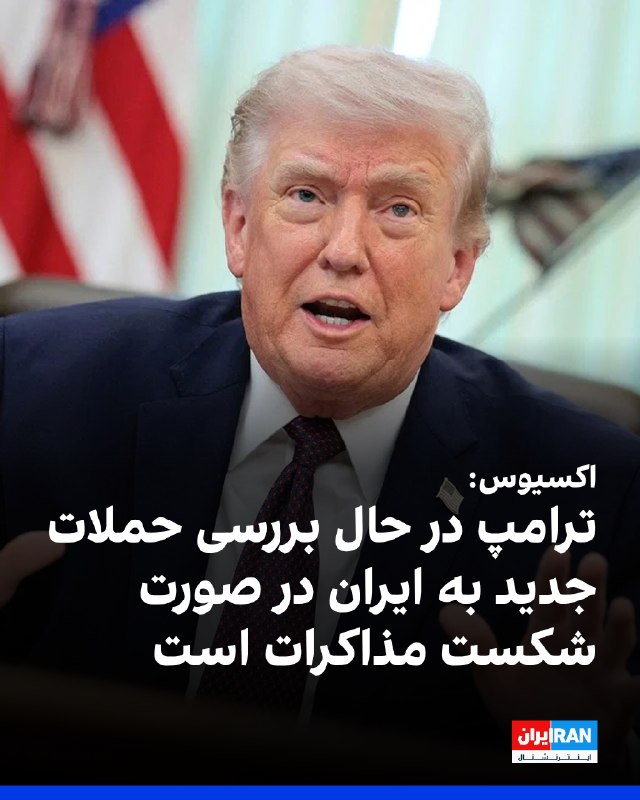

اکسیوس به نقل از دو مقام آمریکایی اعلام کرد که ترامپ صبح جمعه نشستی با اعضای ارشد تیم امنیت ملی خود درباره جنگ ایران برگزار کرد.
اکسیوس نوشت به گفته منابعی که مستقیما با ترامپ گفت‌وگو کردند، او در حال بررسی حملات جدید است، مگر اینکه پیشرفتی در مذاکرات در آخرین لحظه حاصل شود.
‌🏁 🇬🇧 IranintlTV

🤖 @VahidOOnLine

## VahidOOnLine — post 241599

  

♦️دونالد ترامپ روز جمعه، اول خردادماه، طی سخنرانی در نیویورک درباره جنگ با ایران گفت که «این ماجرا به‌زودی تمام خواهد شد». رئیس‌جمهوری آمریکا گفت: «اگر جلوی ایران را نگیریم، آنها به سلاح هسته‌ای دست پیدا می‌کنند. مجبوریم این کار را بکنیم، و ما جلوی آنها را گرفتیم. آنها هرگز به سلاح هسته‌ای دست پیدا نخواهند کرد».
‌🇸🇦 Indypersian

🤖 @VahidOOnLine

## VahidOOnLine — post 241598

  

آسوشیتدپرس به نقل از یک مقام آمریکایی اعلام کرد ارتش آمریکا تاکنون هیچ مین انفجاری در تنگه هرمز کشف یا خنثی نکرده است.
این مقام آمریکایی افزود عملیات جست‌وجو در این گذرگاه حیاتی نفتی همچنان ادامه دارد، اما تاکنون هیچ مین دریایی پیدا نشده است.

این در حالی است که محاصره دریایی بنادر جنوب ایران همچنان ادامه دارد.
‌🏁 🇬🇧 IranintlTV

🤖 @VahidOOnLine

## VahidOOnLine — post 241597

♦️ویدیوی منتشرشده در شبکه‌های اجتماعی، جشن تولد خانواده امیرمحمد خیاط بر سر مزار او را نشان می‌دهد؛ جایی که پدر این قهرمان تکواندو با چهره‌ای اندوهگین و بغض‌آلود، بر مزار فرزندش رقصی سوگوارانه انجام می‌دهد.
امیرمحمد خیاط ۱۸ دی‌ماه ۱۴۰۴ در اطراف میدان خیام نیشابور با شلیک نیروهای سرکوب جمهوری اسلامی کشته شد.
او متولد ۲۶ اردیبهشت ۱۳۸۲ بود و از نوجوانی در رشته تکواندو فعالیت می‌کرد. امیرمحمد طی سال‌های اخیر بیش از ۲۰ عنوان قهرمانی، نایب‌قهرمانی و مقام سوم رقابت‌های استانی و باشگاهی را به دست آورده بود.
‌🇸🇦 Indypersian

🤖 @VahidOOnLine

## VahidOOnLine — post 241596

  

♦️عباس عراقچی، وزیر خارجه جمهوری اسلامی روز جمعه با آنتونیو گوترش، دبیرکل سازمان ملل متحد، تلفنی گفتگو کرد. به گزارش ایرنا، در این گفتگو، علاوه بر بررسی آخرین وضعیت منطقه‌، دو طرف روند تحولات مرتبط با دیپلماسی میان تهران و واشنگتن با میانجی‌گری اسلام‌آباد را بررسی کردند.
هم‌زمان با این گفتگو، عاصم منیر، فرمانده کل ارتش پاکستان و محسن نقوی، وزیر کشور این کشور در سفری از پیش اعلام‌نشده وارد تهران شدند؛ سفری که هدف اصلی آن، حل اختلافات میان تهران و واشنگتن برای امضای تفاهم‌نامه اولیه شروع مذاکرات عنوان شده است. همچنین سخنگوی وزارت خارجه ایران از حضور یک هیئت قطری در تهران در چارچوب «مساعی جمیله» برای کاهش تنش‌ها خبر داد، هرچند تاکید کرد که پاکستان همچنان میانجی رسمی این گفتگوهاست. با وجود این تحرکات، اسماعیل بقایی با «عمیق و جدی» خواندن شکاف‌های میان ایران و آمریکا اعلام کرد که تمرکز فعلی مذاکرات بر پایان دادن به جنگ است، مسئله هسته‌ای هنوز در دستور کار نیست و نمی‌توان گفت که توافق در هفته‌ها یا ماه‌های آینده نزدیک خواهد بود.
‌🇸🇦 Indypersian

🤖 @VahidOOnLine

## VahidOOnLine — post 241595

  

خبرگزاری تسنیم، رسانه‌ها وابسته به سپاه، به نقل از یک منبع نزدیک به هیات مذاکره‌کننده، نوشت: «گفت‌وگوها و رایزنی‌ها بر سر موارد اختلافی همچنان ادامه دارد و هنوز نتیجه نهایی حاصل نشده است.»

این رسانه وابسته به سپاه افزود: «میانجی پاکستانی همچنان در حال رد و بدل موضوعات است.»

تسنیم ادامه داد تمرکز در حال حاضر بر سر مسئله «پایان جنگ» است و تا وقتی این موضوع نهایی نشود، هیچ مساله دیگری مذاکره نخواهد شد.
‌🏁 🇬🇧 IranintlTV

🤖 @VahidOOnLine

## VahidOOnLine — post 241594

  <a href="telegram/content/VahidOOnLine_241594_1779483302.mp4" target="_blank">🎬 Download video</a>

یک شهروند در پیامی به ایران اینترنشنال از اوضاع اقتصادی در کشور روایت می‌کند و می‌گوید به دلیل کمبود آرد نانوایی‌ها با اختلال در فعالیت و صف‌های طولانی مواجه‌اند. پیام او با هوش مصنوعی خوانده شده است.
‌🏁 🇬🇧 IranintlTV

🤖 @VahidOOnLine

## VahidOOnLine — post 241593

  

♦️ راجر ویکر از ایالت می‌سی‌سی‌پی، سناتور جمهوری‌خواه، روز جمعه اول خرداد پیشنهاد کرد که ایالات متحده نباید به دنبال توافق با جمهوری اسلامی باشد، بلکه باید اقدامات نظامی خود را از سر بگیرد. او افزود: «ما باید کاری را که شروع کرده‌ایم تمام کنیم.»

ویکر که ریاست کمیته نیروهای مسلح سنای آمریکا را بر عهده دارد، در شبکه اجتماعی ایکس نوشت که به دونالد ترامپ «مشاوره‌های غلطی داده می‌شود تا به دنبال توافقی برود که ارزش کاغذی که روی آن نوشته می‌شود را هم نخواهد داشت.»

او در ادامه نوشت: «فرمانده کل قوای ما باید به نیروهای مسلح ماهر آمریکا اجازه دهد تا نابودی توانمندی‌های نظامی متعارف ایران را کامل کرده و تنگه [هرمز] را بازگشایی کنند.»

ویکر همچنین هشدار داد: «تلاش بیشتر برای دستیابی به توافق با رژیم اسلام‌گرای ایران، خطر برداشتِ ضعف [از سوی آمریکا] را به همراه دارد. ما باید کاری را که آغاز کرده‌ایم به پایان برسانیم. زمان عمل فرارسیده است.»
‌🇸🇦 Indypersian

🤖 @VahidOOnLine

## VahidOOnLine — post 241592

  <a href="telegram/content/VahidOOnLine_241592_1779483306.mp4" target="_blank">🎬 Download video</a>

♦️دونالد ترامپ، رئیس‌جمهوری ایالات متحده، روز جمعه اول خردادماه با ورود به نیویورک برای حضور در یک رویداد اقتصادی در کالج راکلند راهی نیوجرسی دراین ایالت شد.
در ویدیوی منتشرشده، ترامپ از داخل خودرو رئیس جمهوری به خبرنگاران دت تکان می دهد.
بر اساس برنامه اعلام‌شده، ترامپ قرار است به‌زودی در این مرکز آموزشی درباره وضعیت اقتصاد آمریکا سخنرانی کند.
‌🇸🇦 Indypersian

🤖 @VahidOOnLine

## VahidOOnLine — post 241591

  

قاسم رضایی، جانشین فرمانده کل انتظامی جمهوری اسلامی گفت: «دیگر تمرکز صرف بر فعالیت‌های پلیسی نیست و نظام دفاعی و آمادگی برای مواجهه با جنگ نامتقارن در اولویت قرار گرفته است.»

او افزود: «نیروها باید آموزش عملی ببینند و تمرینات میدانی داشته باشند. پلیس راه و راهور علاوه بر وظایف ترافیکی، آموزش دفاعی و آمادگی عملی می‌بیند.»

او افزود: «تمرین در خیابان و شرایط واقعی باعث افزایش توانمندی نیروها می‌شود.»
‌🏁 🇬🇧 IranintlTV

🤖 @VahidOOnLine

## VahidOOnLine — post 241590

  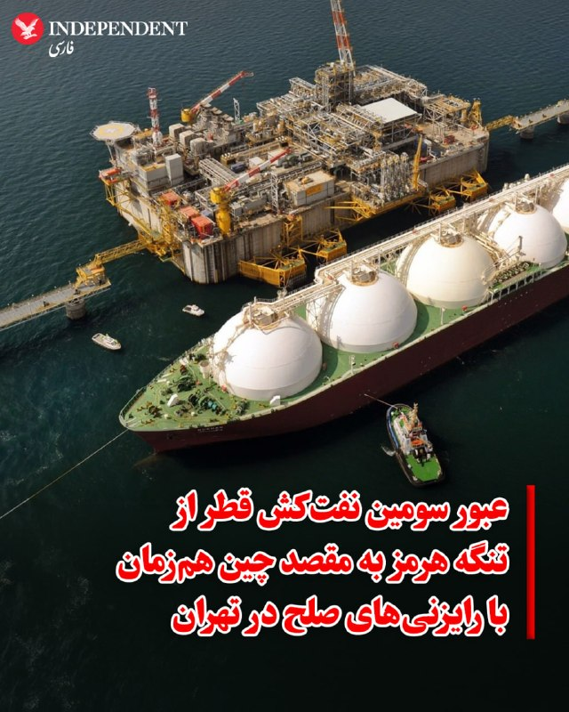

♦️ الجزیره با استناد به داده‌های ردیابی کشتی‌ها روز جمعه اول خرداد، گزارش داد که سومین نفتکش حامل گاز طبیعی مایع (LNG) قطر در حال عبور از تنگه هرمز به مقصد چین است. این رویداد در حالی رخ می‌دهد که یک تیم مذاکره‌کننده قطری برای کمک به دستیابی به توافقی جهت پایان دادن به جنگ با جمهوری اسلامی، در تهران به سر می‌برد.

این کشتی به نام «السهله» با ظرفیت بیش از ۲۱۱ هزار مترمکعب، بندر رأس لفان قطر را ترک کرده و انتظار می‌رود در ۱۴ ژوئن (۲۴ خرداد) به پایانه ال‌ان‌جی تیانجین در چین برسد. عبور این کشتی نزدیک به دو هفته پس از آن صورت می‌گیرد که محموله‌های قبلی تحت یک توافق میان جمهوری اسلامی و پاکستان از این شاهراه حیاتی عبور کردند.

به گزارش خبرگزاری رویترز، دو نفتکش قطری قبلی که از زمان آغاز حملات هوایی آمریکا و اسرائیل در اواخر فوریه موفق به عبور از تنگه هرمز شدند، توسط قطر به پاکستان فروخته شده بودند. منابع آگاه اعلام کردند که جمهوری اسلامی عبور این نفتکش را با هدف اعتمادسازی میان قطر و پاکستان (که نقش میانجی را در گفتگوهای صلح ایفا می‌کند) تایید کرده است.
‌🇸🇦 Indypersian

🤖 @VahidOOnLine

## WithYashar — post 12029

## WithYashar — post 12028

## WithYashar — post 12027

  <a href="https://t.me/withyashar/12027" target="_blank">📎 Download file</a>

کتابی از دونالد ترامپ یکی از بحث برانگیز ترین شخصیت های سیاسی جهان.
رئیس جمهور آمریکا دونالد جی ترامپ ، جهان بینی حرفه ای و شخصی خود را در این کتاب جذاب و خواندنی بیان می کند، روایتی دست اول از ظهور مهمترین معامله گر آمریکا.

دونالد ترامپ : هنر معامله گری

🌐 @withyashar

🌐 instagram.com/yashar

## WithYashar — post 12026

  <a href="telegram/content/WithYashar_12026_1779483309.mp4" target="_blank">🎬 Download video</a>

من باهوش‌ترین آدمی هستم که تا حالا باهاش روبه‌رو می‌شید✌🏾
@withyashar
یاشار : چقدر بجا و به موقع این حرف رو زد !!!

## WithYashar — post 12025

@withyashar حسود هرگز نیاسود

## WithYashar — post 12024

  <a href="telegram/content/WithYashar_12024_1779483310.mp4" target="_blank">🎬 Download video</a>

ترامپ : اعتراض کردن تو تجمع‌های من خطرناکه من چیزای خطرناک دوست ندارم دوست ندارم ببینم کسی کتک می‌خوره پس این کارو نکنید
@withyashar

## WithYashar — post 12023

  <a href="telegram/content/WithYashar_12023_1779483312.mp4" target="_blank">🎬 Download video</a>

ترامپ شاکی شد 😬 از اونی که اومد فحش داد
@withyashar

## WithYashar — post 12022

  <a href="telegram/content/WithYashar_12022_1779483314.mp4" target="_blank">🎬 Download video</a>

ترامپ به یک معترض:

برو خونه، پیش ننت
@withyashar

## WithYashar — post 12021

  <a href="telegram/content/WithYashar_12021_1779483316.mp4" target="_blank">🎬 Download video</a>

دونالد ترامپ در‌ نیویورک:

من ۹۹٪ رأی نیروهای اجرای قانون را گرفتم می‌توانید باور کنید؟
هنوز داریم تلاش می‌کنیم بفهمیم آن ۱٪ چه کسی بوده است.
@withyashar

## WithYashar — post 12020

داداشی میشه جریان علی کریمی رو یکم باز کنی الا از شاهزاده حمایت نمیکنه ؟

## WithYashar — post 12019

داداشی میشه جریان علی کریمی رو یکم باز کنی
الا از شاهزاده حمایت نمیکنه ؟

## WithYashar — post 12018

@withyashar

## WithYashar — post 12017

پنتاگون ویدئویی از بشقاب پرنده انتشار داده که چند سال پیش با فاصله ای بسیار نزدیک از کنار قایقهای تندروی سپاه عبور میکند … @withyashar یاشار : این سپاهی ها آدم فضایی هم دیدند ولی اون دوستمون این جمعه هم نیامد😬

## WithYashar — post 12016

آدم فضایی دیدیم ولی موشتبی رو ندیدیم

## WithYashar — post 12015

بذار تریاکامو بفروشم ۱۰۰دلار برات میزنم

## WithYashar — post 12014

بذار تریاکامو بفروشم ۱۰۰دلار برات میزنم

## WithYashar — post 12013

## WithYashar — post 12012

## WithYashar — post 12011

آکسیوس، به نقل از یک منبع نزدیک به ترامپ: رئیس جمهور احتمال آغاز یک عملیات نظامی بزرگ دیگر، اعلام پیروزی و پایان دادن به جنگ را مطرح کرد
@withyashar

## WithYashar — post 12010

  <a href="telegram/content/WithYashar_12010_1779483318.mp4" target="_blank">🎬 Download video</a>

پنتاگون ویدئویی از بشقاب پرنده انتشار داده که چند سال پیش با فاصله ای بسیار نزدیک از کنار قایقهای تندروی سپاه عبور میکند …
@withyashar
یاشار : این سپاهی ها آدم فضایی هم دیدند ولی اون دوستمون این جمعه هم نیامد😬

## mwarmonitor — post 9504

🔴اکسیوس: ترامپ در بحبوحه بررسی احتمال بازگشت به جنگ، با مشاوران ارشد خود درباره ایران تشکیل جلسه داد

📝نویسنده: باراک راوید

🔰به گفته دو مقام آمریکایی به «اکسیوس»، پرزیدنت ترامپ صبح روز جمعه جلسه‌ای را با تیم امنیت ملی ارشد خود درباره جنگ با ایران برگزار کرد.

📌چرا این موضوع اهمیت دارد؟
منابعی که مستقیماً با رئیس‌جمهور گفتگو کرده‌اند می‌گویند ترامپ در صورت عدم دستیابی به یک گشایش ناگهانی و دقیقه‌نودی در مذاکرات، به‌طور جدی در حال بررسی آغاز حملات جدید علیه ایران است.

نمای دوقاب (تحولات هم‌زمان):
نشست ترامپ درباره ایران در حالی برگزار شد که رئیس ارتش پاکستان، فیلد مارشال عاصم منیر، در تلاشی آشکار و دقیقه‌نودی برای پر کردن شکاف‌ها و جلوگیری از سرگیری جنگ، به تهران سفر کرده است.
یک هیئت قطری نیز روز جمعه برای حمایت از تلاش‌های میانجی‌گرانه وارد تهران شد.
انتظار می‌رود عاصم منیر روز شنبه با سردار احمد وحیدی، از فرماندهان سپاه پاسداران و مهره‌ای کلیدی در فرآیند تصمیم‌گیری ایران، دیدار کند.
یک مقام آمریکایی که در جریان تلاش‌های دیپلماتیک قرار گرفته است، روند مذاکرات را «طاقت‌فرسا» توصیف کرد. این مقام آمریکایی گفت که پیش‌نویس‌ها «هر روز بین طرفین رد و بدل می‌شوند» اما پیشرفت چندانی حاصل نشده است.
حاضران در اتاق جلسه:
به گفته منابع آگاه، در این نشست علاوه بر ترامپ، جی‌دی ونس (معاون رئیس‌جمهور)، پیت هگست (وزیر دفاع)، جان راتکلیف (رئیس سی‌آی‌ای)، سوزی وایلز (رئیس کارکنان کاخ سفید) و دیگر مقامات حضور داشتند.
مارکو روبیو (وزیر امور خارجه) و ژنرال دن کین (رئیس ستاد مشترک ارتش) در این جلسه حضور نداشتند؛ چرا که روبیو در اروپا بود و ژنرال کین در مراسم فارغ‌التحصیلی آکادمی نیروی دریایی حضور داشت.
در طول این جلسه، گزارشی از آخرین وضعیت مذاکرات و سناریوهای مختلف در صورت فروپاشی گفتگوها به ترامپ ارائه شد.
نکات جالب و پشت‌پرده:
چند ساعت پس از این دیدار، کاخ سفید از تغییر در برنامه آخر هفته ترامپ خبر داد.
او پس از سخنرانی برنامه‌ریزی‌شده خود در غروب جمعه در نیویورک، به جای اقامت در باشگاه گلف خود در بد مینستر، به واشنگتن بازخواهد گشت.
ترامپ همچنین در حساب کاربری خود در شبکه اجتماعی «تروث سوشال» نوشت که به دلیل «مسائل مربوط به دولت و عشق به ایالات متحده آمریکا» در مراسم عروسی پسرش، دان جونیور، در این آخر هفته شرکت نخواهد کرد.
او نوشت: «احساس می‌کنم برای من مهم است که در این بازه زمانی حساس، در واشنگتن دی‌سی و در کاخ سفید بمانم.»
در پشت صحنه چه می‌گذرد؟
یک منبع نزدیک به ترامپ و منبع دوم دیگری که از شرایط آگاهی دارد به اکسیوس گفتند که ترامپ طی چند روز گذشته به شدت از روند مذاکرات با ایران ناامید و کلافه شده است.
به گفته این دو منبع، او روز سه‌شنبه به بنیامین نتانیاهو، نخست‌وزیر اسرائیل گفت که می‌خواهد شانس دیگری به دیپلماسی بدهد، اما تا پنجشنبه‌شب، نظرش بیشتر به سمت صدور فرمان حمله متمایل شده بود.
یک منبع نزدیک به ترامپ گفت رئیس‌جمهور احتمال یک عملیات نظامی بزرگ و «تعیین‌کننده» نهایی را مطرح کرده است تا پس از آن بتواند اعلام پیروزی کند و به جنگ پایان دهد.
با این حال، هنوز هیچ نشانه‌ای مبنی بر اینکه ترامپ تصمیم قطعی برای سرگیری جنگ گرفته باشد، وجود ندارد.
موضع طرف مقابل:
وزارت امور خارجه ایران روز جمعه اعلام کرد که گفتگوها در جریان است اما توافق نزدیکی در کار نیست.
خبرگزاری نیمه‌رسمی تسنیم، وابسته به سپاه پاسداران، روز جمعه به نقل از یک منبع نزدیک به تیم مذاکره‌کننده ایران نوشت: «گفتگوها پیرامون موضوعات مورد اختلاف همچنان ادامه دارد و هنوز نتیجه نهایی حاصل نشده است.»
🔹این منبع مدعی شد که تمرکز فعلی بر «پایان دادن به جنگ» است و تا زمانی که این هدف محقق نشود، در مورد هیچ موضوع دیگری مذاکره نخواهد شد.

🔸تحلیل واقعیتِ میان خطوط:
ترامپ طی شش هفته گذشته چندین بار تا آستانه سرگیری جنگ پیش رفته اما در نهایت از آن صرف‌نظر کرده است.
برخی منابع نزدیک به مذاکرات همچنان بر این باورند که در ۲۴ ساعت آینده فرصتی برای نوعی گشایش وجود دارد.
با این حال، دو منبع آگاه از طرز تفکر ترامپ می‌گویند او تمایل دارد اقدام نظامی را پیش ببرد، مگر اینکه اتفاق غیرمنتظره‌ای در گفتگوها رخ دهد.

@mwarmonitor

## mwarmonitor — post 9503

🔴وال‌استریت ژورنال:

🔸میانجی‌ها به‌شدت در تلاش هستند تا به یک توافق موقت میان ایران و ایالات متحده دست پیدا کنند تا از انجام حملات جدید آمریکا–اسرائیل جلوگیری شود؛ حملاتی که مقام‌ها هشدار داده‌اند ممکن است ظرف چند روز آینده رخ دهند.

🔹پاکستان، قطر و دیگر بازیگران منطقه‌ای در حال تلاش برای پر کردن شکاف‌ها درباره برنامه هسته‌ای ایران، کاهش تحریم‌ها و امنیت منطقه‌ای هستند.

🔸هدف، رسیدن به یک توافق کامل نیست، بلکه ایجاد یک چارچوب موقت است که آتش‌بس را تمدید کند و اجازه دهد مذاکرات گسترده‌تر ادامه پیدا کند.

@mwarmonitor

## FoxNewsTwitter — post 342143

  <a href="telegram/content/FoxNewsTwitter_342143_1779483320.mp4" target="_blank">🎬 Download video</a>

Fox News (Twitter/X)

JUST IN: President Trump rips the Biden admin’s electric vehicle mandate, warning that the power grid cannot support a forced transition to EVs:

“We ended Joe Biden’s insane electric vehicle mandate. That’s where they wanted everybody to buy an electric car.”

“If we would build the charging booths, right? It would cost the country $4 trillion. No country can afford that.”

“We love electric cars. I have to say that because of Elon.”

“Not everybody wants to have an electric car. And I ended that whole nonsense. By 2030, you’re all going to have electric cars? I don’t think so.”

## FoxNewsTwitter — post 342142

  <a href="telegram/content/FoxNewsTwitter_342142_1779483322.mp4" target="_blank">🎬 Download video</a>

Fox News (Twitter/X)

NEW: President Trump praises his admin's move to bring automotive manufacturing jobs back to the U.S. from overseas.

“They were all made in Germany and other countries. Now they're making them here because if they don't, they have to pay a big penalty."

"They're stamping them at my instruction 'Made in the USA.'"

## FoxNewsTwitter — post 342141

  <a href="telegram/content/FoxNewsTwitter_342141_1779483325.mp4" target="_blank">🎬 Download video</a>

Fox News (Twitter/X)

NEW: President Trump slams Democrats for spending millions on a political “autopsy” before asking a roaring crowd which nickname for Joe Biden they like best:

“They spent $10 million for the autopsy. It was called an autopsy. And they had typos. They had typos in every other sentence. They had misspelled words. They had commas in the wrong locations.”

“I could have given them the autopsy without any charge at all.”

“I said you had one candidate named Sleepy Joe Biden.”

## FoxNewsTwitter — post 342140

  

Fox News (Twitter/X)

WATCH LIVE: President Trump lands in New York to deliver remarks https://twitter.com/i/broadcasts/1wGWjjaaqyZKQ

## FoxNewsTwitter — post 342139

  <a href="telegram/content/FoxNewsTwitter_342139_1779483327.mp4" target="_blank">🎬 Download video</a>

Fox News (Twitter/X)

NOW: Crowd erupts with “USA” chants as a protester is kicked out for interrupting President Trump’s midterm campaign event in upstate New York.

“Take him home to mommy.”

## FoxNewsTwitter — post 342138

  <a href="telegram/content/FoxNewsTwitter_342138_1779483330.mp4" target="_blank">🎬 Download video</a>

Fox News (Twitter/X)

NEW: President Trump torches Democrats’ progressive agenda, slamming open borders, sanctuary cities, and gender policies targeting minors:

“We don’t want open borders where prisoners pour in from other countries all over the world.”

“We don’t want sanctuary cities where you have sanctuary for criminals. We don’t want it.”

“We don’t want transgender mutilation of your children, if that’s okay. We don’t want it.”

## FoxNewsTwitter — post 342137

  <a href="telegram/content/FoxNewsTwitter_342137_1779483331.mp4" target="_blank">🎬 Download video</a>

Fox News (Twitter/X)

NOW: New York crowd chants "4 more years" for President Trump.

"We have a hat. The hat says '4 more years.' It drives the radical left lunatics crazy."

## FoxNewsTwitter — post 342136

  <a href="telegram/content/FoxNewsTwitter_342136_1779483333.mp4" target="_blank">🎬 Download video</a>

Fox News (Twitter/X)

BREAKING: President Trump tells a New York crowd that he's working to bring his home state back to greatness:

“I was born and raised in New York State. My heart has always been here. I love this place, and we’ve got to straighten it out.”

“From the beginning, this was a symbol of American excellence and American grit — and really, the American Dream.”

“Unfortunately, in recent years, the state’s been held back by bad policies, bad politicians, and foolish radical left idiocy."

## FoxNewsTwitter — post 342135

  <a href="telegram/content/FoxNewsTwitter_342135_1779483338.mp4" target="_blank">🎬 Download video</a>

Fox News (Twitter/X)

NOW: New York Giants quarterback Jaxson Dart introduces President Trump before his speech in New York.

## FoxNewsTwitter — post 342134

  

Fox News (Twitter/X)

WATCH LIVE: President Trump lands in New York to deliver remarks https://twitter.com/i/broadcasts/1aJbdbjjmbqKX

## FoxNewsTwitter — post 342133

  <a href="telegram/content/FoxNewsTwitter_342133_1779483341.mp4" target="_blank">🎬 Download video</a>

Fox News (Twitter/X)

Combat vet and Purple Heart recipient Ted Daniels ripping Democrat Maine Senate candidate Graham Platner over a resurfaced post in which Platner said Daniels should have died after nearly being killed by the Taliban.

"Graham, you're a coward... I think you’re a scumbag... People like this don't say stuff like this to my face."

## FoxNewsTwitter — post 342132

  

Fox News (Twitter/X)

NEW: Indy 500 drivers are already getting banged up in practice after a series of ugly crashes ahead of race day.

Romain Grosjean, Pato O’Ward, and Alexander Rossi were among the drivers caught up in a major multi-car wreck during Practice 7 for the 2026 Indianapolis 500.

The 110th Running of the Indianapolis 500 takes place on Sunday, May 24, and you can catch all the action live on FOX.

## pm_afshaa — post 91231

  

🚀 آبان‌نت؛ سرعت بی‌مرز، بدون تاریخ انقضا!

⚡دنبال کیفیتی می‌گردی که حجمت رو بی‌دلیل تموم نکنه؟

💎 ویژگی‌های طلایی:
• 
✅ بدون محدودیت زمان و کاربر: تا آخرین کیلوبایت حجمت معتبره!
• 
✅ مصرف واقعی (۱ به ۱): بدون ضریب مصرف و دزدی حجم.
• 
✅ پینگ عالی: مخصوص گیمرهای حرفه‌ای و یوتیوب.
• 
☄️ تنوع سرویس: V2ray، OpenVPN،L2tp و Wireguard.

💳 پرداخت راحت بصورت ریالی و ارزی

💰 قیمت‌های ما را مقایسه کنید!
برای استعلام قیمت استثنایی و مشاوره به آیدی زیر پیام دهید:

🆔 @itsmammad10
🔗 کانال اصلی ما:

🆔 @AbanVpn10

## pm_afshaa — post 91230

  <a href="telegram/content/pm_afshaa_91230_1779483345.webm" target="_blank">🎬 Download video</a>

🔴تمام امتحانات سال جاری دانشگاه پیام نور در سراسر کشور مجازی شد.

💧 Rainbet.com the #1 Non-KYC Crypto Casino & Sportsbook @rainbetcom

😁 @Pm_Afshaa

## pm_afshaa — post 91229

  <a href="telegram/content/pm_afshaa_91229_1779483346.mp4" target="_blank">🎬 Download video</a>

🔴ترامپ: من ۹۹٪ رأی نیروهای اجرای قانون رو گرفتم میتونید باور کنید؟ هنوز داریم تلاش می‌کنیم بفهمیم آن ۱٪ چه کسی بوده.

💧 Rainbet.com the #1 Non-KYC Crypto Casino & Sportsbook @rainbetcom

😁 @Pm_Afshaa

## pm_afshaa — post 91228

  <a href="telegram/content/pm_afshaa_91228_1779483348.webm" target="_blank">🎬 Download video</a>

🔴منابع نزدیک به کاخ سفید:
با داغ‌تر شدن درگیری‌های نظامی تو ایران، ترامپ برنامه‌هاشو عوض کرده و قراره آخر هفته رو تو کاخ سفید بمونه.

💧 Rainbet.com the #1 Non-KYC Crypto Casino & Sportsbook @rainbetcom

😁 @Pm_Afshaa

## pm_afshaa — post 91227

  <a href="telegram/content/pm_afshaa_91227_1779483349.webm" target="_blank">🎬 Download video</a>

🔴اکسیوس به نقل از یک منبع نزدیک به ترامپ: ترامپ احتمال اجرای یک عملیات نهایی و گسترده رو مطرح کرده؛ عملیاتی که بعدش بتونه اعلام پیروزی کنه و بگه جنگ تموم شده. 
💧 Rainbet.com the #1 Non-KYC Crypto Casino & Sportsbook @rainbetcom 
😁 @Pm_Afshaa

## pm_afshaa — post 91226

  <a href="telegram/content/pm_afshaa_91226_1779483349.webm" target="_blank">🎬 Download video</a>

🔴اکسیوس به نقل از یک منبع نزدیک به ترامپ: ترامپ احتمال اجرای یک عملیات نهایی و گسترده رو مطرح کرده؛ عملیاتی که بعدش بتونه اعلام پیروزی کنه و بگه جنگ تموم شده.

💧 Rainbet.com the #1 Non-KYC Crypto Casino & Sportsbook @rainbetcom

😁 @Pm_Afshaa

## pm_afshaa — post 91225

  <a href="telegram/content/pm_afshaa_91225_1779483350.webm" target="_blank">🎬 Download video</a>

ترامپ: با اینکه خیلی میخواهم در کنار پسرم برای مراسم عروسی باشم اما حس میکنم که مهم است در واشنگتن و کاخ سفید در طی زمان مهم پیش رو در روز شنبه و یکشنبه بمانم 
💧 Rainbet.com the #1 Non-KYC Crypto Casino & Sportsbook @rainbetcom 
😁 @Pm_Afshaa

## kianmeli1 — post 87563

‏🔴اکسیوس به نقل از دو مقام آمریکایی اعلام کرد که دونالد ترامپ صبح جمعه نشستی با اعضای ارشد تیم امنیت ملی خود درباره جنگ ایران برگزار کرد
https://t.me/kianmeli1

## kianmeli1 — post 87562

  

🔴سایت انصاف‌نیوز از دسترس خارج شد.

این سایت روز گذشته نوشته بود:
« شنیده‌ی انصاف نیوز حاکی است که سعید جلیلی مدتی است در جلسات شعام شرکت نمی‌کند.»
https://t.me/kianmeli1

## kianmeli1 — post 87561

🔴ترامپ درباره تست شناختی : بایدن حتی سوال اول رو هم نمی‌تونست جواب بده

فکر نمی‌کنم بتونه بگیره اینا رو
کدوم خرسه کدوم اسبه
https://t.me/kianmeli1

## kianmeli1 — post 87560

  <a href="telegram/content/kianmeli1_87560_1779483351.mp4" target="_blank">🎬 Download video</a>

🔴ترامپ:من باهوش‌ترین آدمی هستم که شما ممکن است ببینید
https://t.me/kianmeli1

## kianmeli1 — post 87559

  <a href="telegram/content/kianmeli1_87559_1779483353.mp4" target="_blank">🎬 Download video</a>

🔴ترامپ: ما اینقدر نفت از ونزوئلا استخراج کرده‌ایم(چاپیدیم) که هزینه جنگ را حدود ۲۵ برابر پرداخت کرده‌ایم.
https://t.me/kianmeli1

## kianmeli1 — post 87558

  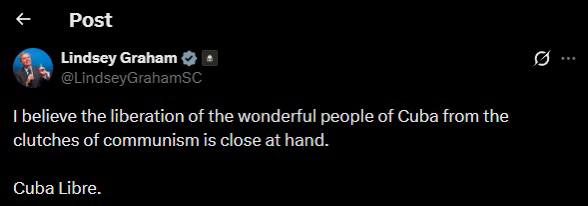

🔴سناتور گراهام:

من معتقدم آزادی مردم شگفت‌انگیز کوبا از چنگال کمونیسم نزدیک است.

(ایران رو آباد کردن رفتن سراغ کوبا)
https://t.me/kianmeli1

## kianmeli1 — post 87557

  

🔴منبع نزدیک به کاخ سفید :
با داغ‌تر شدن درگیری‌های نظامی با رژیم ملاها، پرزیدنت ترامپ برنامه‌هایش را عوض کرده و قرار است آخر هفته را در کاخ سفید بماند
https://t.me/kianmeli1

## IranIntlTV — post 338494

  

اکسیوس به نقل از دو مقام آمریکایی اعلام کرد که ترامپ صبح جمعه نشستی با اعضای ارشد تیم امنیت ملی خود درباره جنگ ایران برگزار کرد.
اکسیوس نوشت به گفته منابعی که مستقیما با ترامپ گفت‌وگو کردند، او در حال بررسی حملات جدید است، مگر اینکه پیشرفتی در مذاکرات در آخرین لحظه حاصل شود.
https://iranintl.com/202605229907

## IranIntlTV — post 338493

  

آسوشیتدپرس به نقل از یک مقام آمریکایی اعلام کرد ارتش آمریکا تاکنون هیچ مین انفجاری در تنگه هرمز کشف یا خنثی نکرده است.
این مقام آمریکایی افزود عملیات جست‌وجو در این گذرگاه حیاتی نفتی همچنان ادامه دارد، اما تاکنون هیچ مین دریایی پیدا نشده است.

این در حالی است که محاصره دریایی بنادر جنوب ایران همچنان ادامه دارد.
https://iranintl.com/202605224264

## IranIntlTV — post 338492

  <a href="telegram/content/IranIntlTV_338492_1779483358.mp4" target="_blank">🎬 Download video</a>

مشاور رییس دولت امارات متحده عربی گفت برخی کشورهای عربی اکنون جمهوری اسلامی را تهدیدی بزرگ‌تر از اسرائیل می‌بینند.

به گفته او، حملات جمهوری اسلامی نگاه امنیتی منطقه را تغییر داده و باعث شده همکاری برخی دولت‌های عربی با اسرائیل اهمیت بیشتری پیدا کند.
@iranintltv

## IranIntlTV — post 338491

  <a href="telegram/content/IranIntlTV_338491_1779483360.mp4" target="_blank">🎬 Download video</a>

پیام‌های رسیده به ایران‌اینترنشنال نشان می‌دهد مشکلات در تامین برخی کالاهای ضروری و اساسی در ایران همچنان ادامه دارد.

شهروندان در شهرهای مختلف همچنین از کمبود بنزین خبر می‌دهند.

گفت‌وگو با معصومه طاهرخانی، تحلیل‌گر اقتصادی
@iranintltv

## IranIntlTV — post 338490

  <a href="telegram/content/IranIntlTV_338490_1779483362.mp4" target="_blank">🎬 Download video</a>

همزمان با سفر هیاتی از پاکستان به ریاست فرمانده ارتش و رییس اطلاعات این کشور به تهران برای پیشبرد مذاکرات، قطر نیز در هماهنگی با آمریکا تیمی مذاکره‌کننده به تهران اعزام کرد.

رییس‌جمهوری آمریکا در تروث سوشال نوشت به‌دلیل شرایط حساس فعلی، ترجیح داده در کاخ سفید و واشینگتن بماند. ترامپ همچنین گفت ایران بی‌صبرانه به‌دنبال دستیابی به توافق با آمریکا است.
@iranintltv

## IranIntlTV — post 338489

  <a href="telegram/content/IranIntlTV_338489_1779483364.mp4" target="_blank">🎬 Download video</a>

سخنگوی وزارت خارجه جمهوری اسلامی گفت با درخواست آمریکا برای تحویل اورانیوم با غنای بالا، مذاکرات به نتیجه نمی‌رسد.

همزمان، گزارش‌ها از اعزام تیم مذاکره‌کننده قطر به تهران و سفر فرمانده ارتش و رییس اطلاعات پاکستان به ایران خبر می‌دهند.

دونالد ترامپ نیز گفت به‌دلیل شرایط حساس کنونی در واشینگتن مانده است.

گفت‌وگو با امید معماریان، تحلیل‌گر سیاسی در موسسه دان، و حسین علیزاده، دیپلمات پیشین
@iranintltv

## IranIntlTV — post 338488

  <a href="telegram/content/IranIntlTV_338488_1779483366.mp4" target="_blank">🎬 Download video</a>

سخنگوی وزارت خارجه جمهوری اسلامی گفت با درخواست آمریکا برای تحویل اورانیوم با غنای بالا، مذاکرات به نتیجه نمی‌رسد.

همزمان، گزارش‌ها از اعزام تیم مذاکره‌کننده قطر به تهران و سفر فرمانده ارتش و رییس اطلاعات پاکستان به ایران خبر می‌دهند.

دونالد ترامپ نیز گفت به‌دلیل شرایط حساس کنونی در واشینگتن مانده است.

گفت‌وگو با امید معماریان، تحلیل‌گر سیاسی در موسسه دان، و حسین علیزاده، دیپلمات پیشین
@iranintltv

## IranIntlTV — post 338487

سخنگوی وزارت خارجه جمهوری اسلامی: نمی‌توانیم بگوییم توافق نزدیک است

اسماعیل بقایی، سخنگوی وزارت امور خارجه جمهوری اسلامی، اختلافات میان تهران و واشینگتن را «عمیق» خواند و تاکید کرد نمی‌توان انتظار داشت روند مذاکرات تنها با «چند بار رفت‌وآمد» به نتیجه نهایی و حل‌وفصل چالش‌ها منجر شود.

بقایی شامگاه جمعه اول خرداد در مصاحبه با صداوسیمای جمهوری اسلامی، با اشاره به سفر مقام‌های ارشد پاکستان به ایران گفت: «نمی‌توانیم بگوییم که به جایی رسیدیم که توافق نزدیک است. ضرورتا خیر، این‌طور نیست. روند ادامه‌دار است.»

او اضافه کرد: «اختلاف‌نظرها بین ایران و آمریکا آن‌قدر عمیق و زیاد است، به‌ویژه بعد از جنایاتی که در دو سه ماه اخیر مرتکب شده‌اند، که نمی‌توان گفت با چند بار رفت‌و‌آمد یا مذاکرات ظرف چند هفته یا چند ماه حتما به نتیجه خواهیم رسید. دیپلماسی زمان‌بر است.»

اظهارات بقایی در حالی مطرح می‌شوند که عاصم منیر، فرمانده ارتش پاکستان، برای گفت‌وگو با مقام‌های جمهوری اسلامی به تهران سفر کرده است.

پیش‌تر نیز شبکه العربیه از سفر عاصم مالک، رییس سازمان اطلاعات پاکستان، به ایران خبر داده بود.

تایید سفر هیات قطری به تهران
سخنگوی وزارت امور خارجه جمهوری اسلامی گزارش خبرگزاری رویترز درباره سفر هیات قطری به تهران را تایید کرد و گفت نمایندگان دوحه اول خرداد با عباس عراقچی دیدار و گفت‌وگو کردند.

بقایی ادامه داد: «بسیاری از کشورها، چه کشورهای منطقه و چه کشورهای خارج از منطقه، تلاش می‌کنند تا به پایان جنگ و جلوگیری از تشدید تنش‌ها کمک کنند. این تلاش‌ها از نظر ما ارزشمند است.»

او در عین حال خاطرنشان کرد اسلام‌آباد همچنان «میانجی رسمی» مذاکرات میان تهران و واشینگتن محسوب می‌شود.

رویترز پیش‌تر از سفر یک هیات مذاکره‌کننده قطری به تهران خبر داد و نوشت هدف از این سفر که با هماهنگی واشینگتن انجام گرفت، کمک به تلاش‌ها برای دستیابی به توافقی جهت خاتمه جنگ ایران است.

بقایی: در این مرحله وارد «جزییات» پرونده هسته‌ای نخواهیم شد
سخنگوی وزارت خارجه جمهوری اسلامی اعلام کرد مذاکرات جاری با واشینگتن بر پایان جنگ متمرکز است و «جزییات» پرونده هسته‌ای در این مرحله وارد دستور کار گفت‌وگوها نخواهد شد.

بقایی گفت خاتمه جنگ در همه جبهه‌ها، از جمله لبنان، وضعیت تنگه هرمز و محاصره دریایی آمریکا، از محورهای اصلی گفت‌وگوهای حکومت ایران و ایالات متحده به شمار می‌روند.

او ادامه داد: «دلیل اینکه در مورد جزییات مباحث مرتبط با موضوع [هسته‌ای] صحبت نمی‌کنیم، مشخص است. ما دو بار این کار را کردیم و زیاده‌خواهی طرف مقابل باعث شد وارد جنگ شویم.»

بقایی افزود ورود به «سایر موضوعات» در مذاکرات با آمریکا تنها پس از پایان جنگ و رفع «نگرانی‌های» تهران امکان‌‎پذیر خواهد بود.

خبرگزاری رویترز ۳۱ اردیبهشت به نقل از مقام‌های اسرائیلی نوشت دونالد ترامپ، رییس‌جمهوری آمریکا، به اورشلیم اطمینان داده که ذخایر اورانیوم با غنای بالا از ایران خارج خواهد شد و این موضوع بخشی از هرگونه توافق احتمالی صلح خواهد بود.

بنیامین نتانیاهو، نخست‌وزیر اسرائیل، بارها تاکید کرده که پایان جنگ منوط به خروج اورانیوم غنی‌شده از ایران، توقف حمایت تهران از گروه‌های نیابتی و برچیده شدن توان موشکی جمهوری اسلامی است.

کانال ۱۱ اسرائیل ۳۱ اردیبهشت گزارش داد در پی ارزیابی‌های اطلاعاتی جدید، ارتش و نهادهای امنیتی این کشور مجموعه‌ای از اقدامات مهم را برای احتمال جدی ازسرگیری نبرد با جمهوری اسلامی آغاز کرده‌‌اند و آمادگی خود را به بالاترین سطح افزایش داده‌اند.
 
🔗وب‌سایت ایران‌اینترنشنال
@iranintltv

## IranIntlTV — post 338486

بنزین در زاهدان، کرمان و بندرعباس تا لیتری ۲۰۰ هزار تومان فروخته می‌شود

🖋سبا حیدرخانی

گزارش‌های رسیده به ایران‌اینترنشنال از شهرهای مختلف ایران، از تشدید بحران تامین بنزین، محدودیت‌ در عرضه سوخت، صف‌های طولانی در جایگاه‌ها و افزایش شدید قیمت بنزین حتی تا لیتری ۲۰۰ هزار تومان در بازار غیررسمی حکایت دارد.

بیشترین روایت‌ها مربوط به استان‌های هرمزگان، سیستان و بلوچستان، کرمان، بوشهر، خراسان جنوبی، اصفهان و خراسان رضوی است.

بر اساس پیام‌های مردمی، وضعیت عرضه سوخت در جیرفت، عنبرآباد و شهرهای جنوبی استان کرمان بحرانی شده است.

به گفته یک شهروند، در این مناطق قیمت بنزین در بازار آزاد به لیتری ۱۰۰ هزار تومان رسیده است.

او افزود: «اکنون دغدغه ما بنزین شده است. پمپ‌بنزین‌ها بیشتر از ۱۵ لیتر نمی‌دهند و شب‌ها باید در صف‌های کیلومتری بایستیم تا صبح نوبتمان شود. واقعا کلافه شده‌ایم.»

در بیرجند نیز سوخت جیره‌بندی و سهمیه کارت‌ها نصف شده و بنزین آزاد تنها در دو جایگاه، از ساعت شش صبح تا شش عصر و فقط به مقدار ۱۰ لیتر عرضه می‌شود.

در بوشهر هم به گفته یک مخاطب، ‌بنزین تقریبا «نایاب» شده است؛ دکه‌های کنار جاده، سوخت را در دبه‌های ۵ لیتری و با قیمت هر لیتر ۱۰ هزار تومان می‌‌فروشند.

شهروند دیگری از کرمان با اشاره به شکل‌گیری بازار سیاه سوخت گفت بنزین را لیتری ۸۰ هزار تومان خریده است.

او افزود مردم شب‌ها تا صبح در صف می‌ایستند و نوبت می‌گیرند تا صبح که جایگاه باز شد، اگر خوش‌شانس بودند، بتوانند سوخت گیر بیاورند.

جیره‌بندی عرضه رسمی سوخت و گسترش بازار غیررسمی
پیام‌های رسیده از بندرعباس حاکی از شرایط «فاجعه‌بار» جایگاه‌های سوخت در این شهر است.

یکی از مخاطبان ایران‌اینترنشنال گفت: «صف‌های چندکیلومتری بنزین مردم را کلافه کرده است، آن‌هم در گرمایی که کولر خودرو ضرورت است نه انتخاب. شهری که بخش بزرگی از بنزین کشور را تولید می‌کند، سهمش شده آلودگی، بیماری و ساعت‌ها تحقیر در صف سوخت، بدون کوچک‌ترین پاسخ‌گویی مسئولان.»

شهروند دیگری از بندرعباس گفت از ساعت ۸:۵۵ شب در صف پمپ‌بنزین ترنج منتظر بوده‌، اما ساعت ۱۰:۱۰ به خودروها اعلام شده که سوخت تمام شده است.

رمضان‌علی سنگدوینی، عضو کمیسیون انرژی مجلس، پیش‌تر گفته بود بحث تغییر سهمیه‌بندی بنزین «صرفا در حد طرح شخصی» بوده و هیچ تصمیم رسمی درباره آن اتخاذ نشده است.

این موضوع اما با روایت‌های گسترده شهروندان از محدودیت‌های عملی در عرضه سوخت، تناقض دارد.

شهروندان در مشهد از طولانی‌تر شدن صف‌ها و افزایش مداوم قیمت‌ها خبر دادند.

مخاطبی در همین زمینه گفت برای پر کردن یک باک باید ساعت‌ها در صف جایگاه سوخت منتظر ماند: «قبلا هر چند ماه یک‌بار افزایش قیمت داشتیم، اما اکنون هر روز گران‌تر می‌شود.»

شهروند دیگری نیز در پیامی کوتاه نوشت: «امروز سه لیتر بنزین زدم شد ۲۰۰ هزار تومان.»

این گزارش‌ها در حالی منتشر می‌شود که مسعود پزشکیان، رییس دولت جمهوری اسلامی، ۳۰ اردیبهشت با تایید آسیب دیدن بخشی از زیرساخت‌های انرژی در جنگ اخیر، از ناتوانی دولت در تامین و واردات بنزین خبر داد.

او گفت در پی «محاصره دریایی آمریکا»، صادرات نفت ایران متوقف شده و کشور روزانه با کمبود ۵۰ میلیون لیتر بنزین روبه‌رو است، اما «دلاری برای واردات آن وجود ندارد».
ساعاتی پس از انتشار این سخنان، رسانه‌های دولتی از جمله ایرنا بخش‌هایی از اظهارات پزشکیان را حذف کردند.

فساد و رانت در جایگاه‌ها
در کنار بحران کمبود سوخت و توزیع نامناسب آن، برخی مخاطبان از افزایش فساد و رانت در برخی جایگاه‌ها و ناکارآمدی کارت‌های سوخت خبر دادند.

شهروندی از اصفهان با اشاره به ناکارآمدی حکومت در مدیریت بحران سوخت گفت کارت‌ها بدون دلیل خطا می‌دهند و باید سه هفته در انتظار کارت جدید ماند.

مخاطب دیگری از اصفهان از تشدید بی‌نظمی در جایگاه‌ها خبر داد و گفت: «علاوه بر اینکه صف‌های جایگاه سوخت کیلومتری شده و سهمیه بنزین بعضی‌ها را سوزانده‌اند، تعدادی از نیروهای بسیجی هم با اسلحه می‌آیند و بدون نوبت بنزین می‌زنند؛ آن هم نه یک یا دو لیتر، بلکه ۱۵ لیتر بنزین داخل موتورهایشان می‌زنند و می‌روند.»

یک شهروند از استان هرمزگان با انتقاد از «رانت و تبعیض در توزیع سوخت» گفت مردم ساعت‌ها در صف می‌مانند اما ماشین‌های سپاه با گالن‌های ۷۰ لیتری، شبانه از ساعت ۱۸ تا ۴ صبح نزدیک به ۱۰ بار سوخت‌گیری می‌کنند و آن را برای فروش به کاروان‌ها یا قاچاقچیان سوخت می‌برند.

به گفته او، هر گالن ۷۰ لیتری تا پنج میلیون تومان فروخته می‌شود.
 
🔗متن کامل گزارش را اینجا بخوانید
@iranintltv

## IranIntlTV — post 338485

  <a href="https://t.me/IranintlTV/338485" target="_blank">📎 Download file</a>

🎧نسخه صوتی ۲۴ با فرداد فرحزاد:ترامپ: تهران بی‌صبرانه به‌دنبال توافق است
@iranintlTV

## IranIntlTV — post 338483

  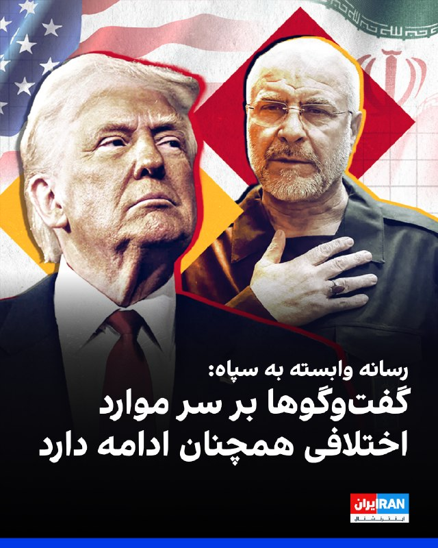

خبرگزاری تسنیم، رسانه‌ها وابسته به سپاه، به نقل از یک منبع نزدیک به هیات مذاکره‌کننده، نوشت: «گفت‌وگوها و رایزنی‌ها بر سر موارد اختلافی همچنان ادامه دارد و هنوز نتیجه نهایی حاصل نشده است.»

این رسانه وابسته به سپاه افزود: «میانجی پاکستانی همچنان در حال رد و بدل موضوعات است.»

تسنیم ادامه داد تمرکز در حال حاضر بر سر مسئله «پایان جنگ» است و تا وقتی این موضوع نهایی نشود، هیچ مساله دیگری مذاکره نخواهد شد.
https://iranintl.com/202605227080

## IranIntlTV — post 338482

  <a href="telegram/content/IranIntlTV_338482_1779483371.mp4" target="_blank">🎬 Download video</a>

یک شهروند در پیامی به ایران اینترنشنال از اوضاع اقتصادی در کشور روایت می‌کند و می‌گوید به دلیل کمبود آرد نانوایی‌ها با اختلال در فعالیت و صف‌های طولانی مواجه‌اند. پیام او با هوش مصنوعی خوانده شده است.

## IranIntlTV — post 338481

  <a href="telegram/content/IranIntlTV_338481_1779483373.mp4" target="_blank">🎬 Download video</a>

فداحسین مالکی، عضو کمیسیون امنیت ملی مجلس، در صداوسیما گفت جمهوری اسلامی در صورت لزوم می‌تواند آتش‌بس را نقض کند. هم‌زمان برخی امامان جمعه نیز هشدار دادند اگر «تعرض‌ها» ادامه پیدا کند، تهران جنگ را بین‌المللی خواهد کرد.

ارزیابی نجات بهرامی، تحلیل‌گر سیاسی
@iranintltv

## IranIntlTV — post 338480

  <a href="telegram/content/IranIntlTV_338480_1779483375.mp4" target="_blank">🎬 Download video</a>

وال‌استریت ژورنال گزارش داد جمهوری اسلامی با پر شدن مخازن نفت و افزایش فشارهای آمریکا، با بحرانی جدی در صنعت نفت روبه‌رو شده است. بر اساس این گزارش، تهران برای جلوگیری از توقف کامل صنعت نفت، ناچار شده از نفتکش‌های شناور و حتی مخازن فرسوده استفاده کند.

گفت‌وگو با همایون فلک‌شاهی، کارشناس نفت و انرژی در موسسه کپلر
@iranintltv

## IranIntlTV — post 338479

  

قاسم رضایی، جانشین فرمانده کل انتظامی جمهوری اسلامی گفت: «دیگر تمرکز صرف بر فعالیت‌های پلیسی نیست و نظام دفاعی و آمادگی برای مواجهه با جنگ نامتقارن در اولویت قرار گرفته است.»

او افزود: «نیروها باید آموزش عملی ببینند و تمرینات میدانی داشته باشند. پلیس راه و راهور علاوه بر وظایف ترافیکی، آموزش دفاعی و آمادگی عملی می‌بیند.»

او افزود: «تمرین در خیابان و شرایط واقعی باعث افزایش توانمندی نیروها می‌شود.»
https://iranintl.com/202605222099

## Shin_Persian — post 6158

افيخاي ادرعي ✓ @AvichayAdraee Fri, 22 May 2026 19:40:50 UTC #عاجل ‼️ إنذار عاجل إلى سكان لبنان وتحديدًا سكان منطقتيْ صور وزقوق المفدي 🔸في ضوء قيام حزب الله الارهابي بخرق اتفاق وقف اطلاق النار يضطر جيش الدفاع للعمل ضده بقوة. جيش الدفاع لا ينوي المساس بكم.…

## Shin_Persian — post 6157

افيخاي ادرعي ✓ @AvichayAdraee
Fri, 22 May 2026 19:40:50 UTC

#عاجل ‼️ إنذار عاجل إلى سكان لبنان وتحديدًا سكان منطقتيْ صور وزقوق المفدي

🔸في ضوء قيام حزب الله الارهابي بخرق اتفاق وقف اطلاق النار يضطر جيش الدفاع للعمل ضده بقوة. جيش الدفاع لا ينوي المساس بكم.

🔸نحث سكان المبنييْن المحدديْن بالأحمر في الخريطتيْن المرفقتيْن والمباني المجاورة لهما: أنتم تتواجدون بالقرب من مبنييْن يستخدمهما حزب الله الإرهابي فحرصًا على سلامتكم عليكم اخلائها فورًا والابتعاد عنها لمسافة لا تقل عن 500 متر

🔸البقاء في منطقة المباني المحددة يعرضكم للخطر

English

#Urgent ‼️ Urgent warning to the residents of Lebanon, specifically the residents of the Tyre (Sour) and Zghoq al-Mafdi areas.

🔸In light of the terrorist Hezbollah's violation of the ceasefire agreement, the IDF (Israel Defense Forces) is compelled to act against it forcefully. The IDF does not intend to harm you.

🔸We urge the residents of the two buildings marked in red on the attached maps and the buildings adjacent to them: You are located near two buildings used by the terrorist Hezbollah. For your safety, you must evacuate them immediately and move at least 500 meters away from them.

🔸Remaining in the vicinity of the designated buildings puts you in danger.

𝕏 · @shin_persian

## Shin_Persian — post 6156

🔁 Quoting above tweet:
Shin ✓ @hey_itsmyturn
Fri, 22 May 2026 20:14:51 UTC

#UAE 🇦🇪 was smart enough to learn it quickly: UAVs matter! UCAVs even more!

فارسی

#امارات 🇦🇪 به اندازه کافی هوشمند بود که این را به سرعت بیاموزد: پهپادها (UAV) مهم هستند! پهپادهای رزمی (UCAV) حتی بیشتر!

𝕏 · @shin_persian

## Shin_Persian — post 6155

  

↩️ Quoted tweet: De Faakto MENA ✓ @DeFaakto Wed, 20 May 2026 19:30:01 UTC 🧵 من يملك المسيرات يتحكم في حرب المستقبل تحليل OSINT 🔴 سؤال بسيط يعيد تعريف الحرب.. 🔴تخيل أنك تدفع مليون دولار لتُسقط طائرة كلفت صانعها عشرين ألفا فقط..؟ 🔴تخسر 50 ضعفا في كل اشتباك…

## Shin_Persian — post 6154

↩️ Quoted tweet:
De Faakto MENA ✓ @DeFaakto
Wed, 20 May 2026 19:30:01 UTC

🧵 من يملك المسيرات يتحكم في حرب المستقبل
تحليل OSINT

🔴 سؤال بسيط يعيد تعريف الحرب..

🔴تخيل أنك تدفع مليون دولار لتُسقط طائرة كلفت صانعها عشرين ألفا فقط..؟

🔴تخسر 50 ضعفا في كل اشتباك - وتسمي ذلك "نجاحاً دفاعيا"..
هذه ليست مفارقة نظرية، هذه هي حرب اليوم.

🟥في أبريل 2024،

↩️ Quoted tweet — see the post below for the reply.

English

🧵 Whoever owns the drones controls the war of the future
OSINT (Open-Source Intelligence) Analysis

🔴 A simple question that redefines warfare..

🔴 Imagine paying a million dollars to shoot down an aircraft that cost its maker only twenty thousand..?

🔴 You lose 50 times the cost in every engagement — and you call that a "defensive success"..
This is not a theoretical paradox; this is the war of today.

🟥 In April 2024,

𝕏 · @shin_persian

## Shin_Persian — post 6153

  

Shin ✓ @hey_itsmyturn
Fri, 22 May 2026 19:46:10 UTC

Intense jet activity over Eastern Iraq, near Iranian western borders.
#Iraq 🇮🇶

فارسی

فعالیت شدید جت‌های جنگنده برفراز شرق عراق، در نزدیکی مرزهای غربی ایران.
#Iraq 🇮🇶

𝕏 · @shin_persian

## FarsiVOA — post 218393

🔺دونالد ترامپ: جمهوری اسلامی به‌شدت خواهان توافق است؛رهبرانشان از بین رفته‌اند

◾️دونالد ترامپ، رئیس‌جمهوری آمریکا، روز جمعه ۱ خرداد در یک سخنرانی در شهر سافرن ایالت نیویورک، با اشاره به جنبش حامیانش گفت «این جنبش بر پایه عقل سلیم شکل گرفته؛ ما مرزهای قدرتمند می‌خواهیم، آموزش خوب می‌خواهیم، مالیات پایین می‌خواهیم، و یک ارتش قدرتمند می‌خواهیم.»

⬇️ بیشتر بخوانید:
https://ir.voanews.com/a/8152854.html
@FarsiVOA

## FarsiVOA — post 218392

⚡️تشدید سرکوب شهروندان ایران و نگرانی از اعدام‌های بیشتر؛ گفت‌وگو با شیوا محبوبی
@FarsiVOA

## FarsiVOA — post 218391

  <a href="telegram/content/FarsiVOA_218391_1779483380.mp4" target="_blank">🎬 Download video</a>

⚡️محمد قائدی در برنامه تفسیر خبر: روسیه جرئت نمی‌کند به کشورهای عضو ناتو حمله کند
@FarsiVOA

## FarsiVOA — post 218390

⚡️جایزه انجمن جهانی جمهوری خواهان به مردم ایران؛ گفتگو با سردار پاشایی قهرمان و مربی پیشین کشتی ایران
@FarsiVOA

## FarsiVOA — post 218389

⚡️آیا جمهوری اسلامی شروط آمریکا را خواهد پذیرفت؟ گفت‌وگو با درویش رنجبر

@FarsiVOA

## FarsiVOA — post 218388

⚡️گفت‌و‌گو با محمود فرهمند، عضو پارلمان نروژ از حزب محافظه‌کار، درباره قطع‌نامه پارلمان اروپا در محکومیت جمهوری اسلامی به دلیل نقض حقوق بشر
@FarsiVOA

## FarsiVOA — post 218387

  <a href="telegram/content/FarsiVOA_218387_1779483381.mp4" target="_blank">🎬 Download video</a>

⚡️نیک‌آهنگ کوثر در برنامه تفسیر خبر: جمهوری اسلامی از ابتدا یک ساختار گروگانگیر بوده
@FarsiVOA

## FarsiVOA — post 218386

⚡️فیلم «دادگاه تاریخ»؛ روایت محکمه‌ای برای رسیدگی به جنایات جمهوری اسلامی گفت‌وگو با سعید دهقان
@FarsiVOA

## FarsiVOA — post 218385

  <a href="telegram/content/FarsiVOA_218385_1779483382.mp4" target="_blank">🎬 Download video</a>

⚡️پرونده ترور رهبران یهودی در آلمان؛ رد پای شبکه‌های برون‌مرزی جمهوری اسلامی
@FarsiVOA

## DW_Farsi — post 125028

  

🔶 مارکو روبیو: شاید به "طرح B" برای گشودن تنگه هرمز نیاز باشد

تنگه هرمز همچنان یکی از کانون‌های اصلی تنش در منازعه با ایران است. اکنون مارکو روبیو، وزیر امور خارجه ایالات متحده، به صراحت از یک "طرح B" (نقشه دوم) سخن می‌گوید؛ این طرح دوم برای زمانی است که این آبراه حیاتی همچنان مسدود بماند یا بار دیگر هدف حمله قرار گیرد.

مارکو روبیو در جریان نشست وزرای امور خارجه ناتو در سوئد، خواستار بررسی یک "طرح B" برای بازگشایی تنگه هرمز شد. روبیو در شهر هلسینگبوری اظهار داشت که همگان از توافقی با ایران که شامل بازگشایی این تنگه، به عنوان شاهراهی حیاتی برای بازار جهانی نفت و گاز، باشد، استقبال می‌کنند. اما اگر ایران از بازگشایی این آبراه امتناع کند و تصمیم بگیرد کنترل آن را حفظ کرده و برای عبور و مرور عوارض دریافت کند، به یک "طرح B" نیاز خواهد بود.

روبیو در ادامه افزود: «من امروز این موضوع را مطرح کردم و با موافقت‌های زیادی روبه‌رو شدم، (...) اما امروز خبر یا بیانیه رسمی برای اعلام به شما (خبرنگاران) ندارم.»
@edw_farsi

## DW_Farsi — post 125027

  

🔶 ورود عاصم منیر به تهران؛ بقایی: اختلافات با آمریکا زیاد است

محمدباقر قالیباف، رئیس هیات مذاکره‌کننده جمهوری اسلامی با آمریکا، اسماعیل بقایی سخنگوی وزارت امور خارجه را به عنوان سخنگوی این هیات منصوب کرد.

در حکم انتصاب بقایی آمده است: «بدین وسیله جنابعالی را که یکی از نیروهای انقلابی و متخصص در حقوق بین الملل هستید و تجربیات مناسب در حوزه دیپلماسی داشته و مسئولیت سخنگویی وزارت امور خارجه را هم برعهده دارید، به عنوان سخنگوی هیات مذاکراتی میناب ۱۶۸ منصوب می‌کنم.»

همزمان با اعلام بقایی به عنوان سخنگوی هیات مذاکره‌کننده ایران، او در مصاحبه‌ای از آخرین جزئیات مربوط به تلاش‌های پاکستان برای نزدیک‌کردن دیدگاه‌های تهران و واشنگتن خبر داد.

در حالی که در تداوم حضور وزیر کشور پاکستان در تهران برای پیشبرد هر چه فشرده مذاکرات عصر پنجشنبه ۱ خرداد، عاصم منیر، فرمانده ارتش این کشور نیز وارد تهران شد، اما به گفته بقایی "اختلاف‌نظرها بین ایران و آمریکا آن‌قدر عمیق و زیاد است که نمی‌شود گفت با چندبار رفت‌وآمد یا مذاکرات ظرف چند هفته ما باید حتماً به نتیجه برسیم".
@dw_farsi

## Persian_Trend_Official — post 14687

  

شبتون بخیر 🔥❤️

توضیح عکس:
یک مرد آمریکایی موقع طوفان فلوریدا از داخلش خونه‌ش این عکس رو گرفته، چند تن فشار رو این درب و شیشه‌ها تحمل کردن!!!

این یعنی کارخانه شیشه، قاب، گسکت، نصاب، استراکچر، ریل و... همه کارشون رو به نحو احسن انجام دادند.

📝 Nick
📌 @persian_trend_official
پرشین ترند | متفاوت‌ترین کانال نظامی

## Persian_Trend_Official — post 14686

https://youtube.com/live/D0LvFYIUbgw?feature=share

## Persian_Trend_Official — post 14685

  <a href="https://t.me/persian_trend_official/14685" target="_blank">📎 Download file</a>

فایل صوتی لایو اول
نسخه کم حجم - 5.94 مگابایت

اتاق جنگ جمعه 1 خرداد | عاصم منیر در تهران برای التیماتوم یا توافق؟

📝 Nick

📌 @persian_trend_official
پرشین ترند | متفاوت‌ترین کانال نظامی

## RadioFarda — post 157464

  <a href="https://t.me/radiofarda/157464" target="_blank">📎 Download file</a>

📻بشنوید: خبرهای ساعت ۲۱ با رادیوفردا، اول خرداد ۱۴۰۵‌

@RadioFarda

## RadioFarda — post 157463

  

🔸مدیر اطلاعات ملی ایالات متحده روز جمعه اول خردادماه از تصمیمش برای کناره‌گیری خبر داد.

🔸تولسی گابارد این موضوع را با انتشار مطلبی در شبکۀ ایکس اعلام کرد. خانم گابارد در نامه‌اش خطاب به دونالد ترامپ، دلیل تصمیمش را، مراقبت از همسرش که اخیراً مبتلا به «نوعی بسیار نادر از سرطان استخوان» تشخیص داده شده، عنوان کرده است.

🔸از سوی دیگر رویترز به نقل از یک منبع آگاه از موضوع، نوشته که او ادعا کرده کاخ سفید خانم گابارد را برای کناره‌گیری «تحت فشار» قرار داده بود.

🔸پیشتر اختلاف دیدگاه‌هایی بین رئیس‌جمهور ایالات متحده و مدیر امنیت ملی‌اش، بخصوص در قبال ایران بروز کرده بود. دونالد ترامپ در فروردین‌ماه هم اشاره کرده بود که از نظر او، تولسی گابارد در قبال برچیده‌شدن بلندپروازی‌های هسته‌ای ایران، «موضع نرم‌تری» دارد.

🔸خانم گابارد بیش از یک سال پیش، پنجم فروردین‌ماه ۱۴۰۴ به کنگره گفته بود که ایران در حال ساخت سلاح هسته‌ای نیست.

@RadioFarda

## IranianMinds — post 20572

🔴 ترامپ :

من این محاسبه را درست انجام دادم

(203 × 9 ÷ 2 + 1324 − 1292) × 19

@IranianMinds

## IranianMinds — post 20571

🔴اکسیوس به نقل از یک منبع نزدیک به ترامپ نوشت:

رئیس جمهوری آمریکا در روزهای اخیر بسیار خسته شده و احتمال انجام یک عملیات نظامی نهایی و گسترده را اعلام کرده است.
عملیاتی که پس از آن بتواند اعلام پیروزی کرده و به جنگ پایان بدهد.

@IranianMinds

## IranianMinds — post 20570

🔴الجزیره به نقل از یک مقام ایرانی:
آزاد‌سازی دارایی‌های بلوکه شده و لغو تحریم‌های صادرات نفت برای ایران موضوع حاشیه‌ای نیست.

@IranianMinds

## IranianMinds — post 20569

🔴 ادعای اکسیوس: یک مقام آمریکایی، مذاکرات را «طاقت‌فرسا» توصیف کرد

این مقام آمریکایی گفت که پیش‌نویس‌ها «هر روز در حال رفت و برگشت هستند» بدون آنکه پیشرفت چشمگیری حاصل شود

@IranianMinds

## BBCPersian — post 281811

  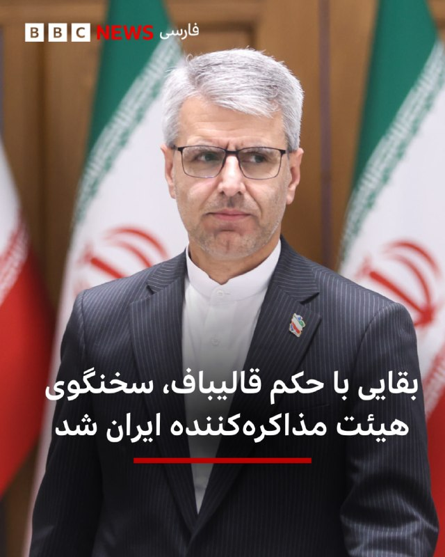

🔻ایرنا، خبرگزاری رسمی ایران می‌گوید که محمدباقر قالیباف،‌ رئیس هیئت مذاکره کننده ایرانی،‌ اسماعیل بقایی،‌ سخنگوی وزارت خارجه را به عنوان سخنگوی «هیئت میناب ۱۶۸» منصوب کرده است.

پیشتر در سفرهیئت ایرانی به پاکستان گفته شده بود که نام هیئت مذاکره کننده ایران به یادبود کشته شدگان مدرسه میناب «هیئت میناب ۱۶۸» نام دارد.

آقای قالیباف در حکمی که ایرنا آن را منتشر کرد نوشت: «امیدوارم با دقت و مسئولیت‌پذیری که از شما سراغ دارم، در این سنگر مبارزه بتوانید در روشنگری و تبین مواضع جمهوری اسلامی ایران در جهان» موفق باشید.

جزئیاتی از مذاکرات منتشر نشده است اما در حال حاضر وزیر کشور و فرمانده ارتش پاکستان و یک هیئت قطری در تهران به سر می‌برند.

پیشتر مقامات آمریکایی گفته بودند که مذاکرات در جریان است.

همچنین اقای بقایی عصر امروز گفت که این مرحله از مذاکرات بر خاتمه جنگ تمرکز دارد و جزئیات مباحث مرتبط با موضوع هسته‌ای قرار نیست مورد بحث قرار گیرد.

این در حالی است که آقای ترامپ بارها تاکید کرده است که اولویتش پرونده هسته‌ای ایران است.

📷 AFP via Getty Images
https://bbc.in/4tKarbL
@BBCPersian

## BBCPersian — post 281810

  <a href="telegram/content/BBCPersian_281810_1779483387.mp4" target="_blank">🎬 Download video</a>

🔻آخرین خبرهای مهم جمعه ۱ خرداد ۱۴۰۵
@BBCPersian

## Dirty_Kids — post 389976

  <a href="telegram/content/Dirty_Kids_389976_1779483389.mp4" target="_blank">🎬 Download video</a>

ترامپ از حضار خواستن با تشویق هاشون نشون بدن لقب “اسلیپی جو بایدن” رو بیشتر دوس دارن یا “کروکد جو بایدن”…

@Dirty_Kids 👻

## Dirty_Kids — post 389975

  

همه‌ی امتحانات نیم‌سال جاری دانشگاه پیام‌نور، غیرحضوری و مجازی شد.

@Dirty_Kids 👻

## Dirty_Kids — post 389974

  <a href="telegram/content/Dirty_Kids_389974_1779483391.mp4" target="_blank">🎬 Download video</a>

توی انگلیس دو تا مسلمون جلوى چشم عموم، داخل اتوبوس دو طبقه شهرى رابطه جنسی برقرار میکنن!

@Dirty_Kids 👻

## Dirty_Kids — post 389973

  <a href="telegram/content/Dirty_Kids_389973_1779483391.mp4" target="_blank">🎬 Download video</a>

سوشا مکانی میگه تو جام‌جهانی نرید استادیوم پول بیلط‌ها میره تو جیب جمهوری اسلامی!!!!!!!!!!!!! 😐

این نظر منه فقط، نسخه برا کسی نیست 👇

آقای مکانی اجازه بده قانع نشیم، چص مثقال پول بلیط تخم ج.ا نیست، ضمن اینکه درآمد از حضور تو بازی‌هاس و تیم‌ها هرچی برن بالاتر پول بیشتری میگیرن، پر بودن و خالی بودن استادیوم هیچ تاثیری نداره تو پولی که بهش میرسه، بلیط فروشی برای فیفاس
و فیفا پول‌های ج.ا رو بلوکه میکنه

جمهوری اسلامی میلیارد دلاری داره خرج پرپاگانداش میکنه تا چهره خوبی بسازه برای رسانه‌ها لَنگِ چص‌تومن پول بلیطه!

از ترس کونش ۲سال استادیوم آزادی بسته مردم نرن شعار بدن
۱ساله بازی‌هاشو بدون تماشاچی کرده بعد الان تو قلب امریکا فرصت استثنایی پیدا شده تا خارشو گایید جلوی دوربین‌های تمام کشورها میایی میگی نرید!!

نرن مردم تمام پرستوها و مزدوراش از سراسر دنیا جمع میشن میرن امریکا با پاسپورت اروپایی پرچم خرچنگ نشون میدن عشق میکنن

البته من نظرمو گفتم اگه تصمیم به نرفتن باشه خود شاهزاده میگه بایکوت کنید وقتی نگفته تیپیکال باید برن مردم شما هم با این حرفا فقط دو دسته میکنید و کمتر میرن مردم، مثل فراخوان‌های ۴۰۱ یکی میگفت برید یکی میگفت نرید

@Dirty_Kids 👻

## alonews — post 121902

  <a href="telegram/content/alonews_121902_1779483392.webm" target="_blank">🎬 Download video</a>

🔴فوری / اکسیوس: ترامپ امروز با افسران ارشد جلسه داشت به شدت درحال بررسی بازگشت به جنگه! 
✅ @AloNews خبر جنگ

## alonews — post 121901

  <a href="telegram/content/alonews_121901_1779483392.webm" target="_blank">🎬 Download video</a>

👈اکسیوس:برخی منابع نزدیک به مذاکرات همچنان بر این باورند که طی ۲۴ ساعت آینده فرصتی برای نوعی پیشرفت وجود دارد

✅ @AloNews خبر جنگ

## alonews — post 121900

  <a href="telegram/content/alonews_121900_1779483393.webm" target="_blank">🎬 Download video</a>

🔴فوری / اکسیوس: ترامپ امروز با افسران ارشد جلسه داشت به شدت درحال بررسی بازگشت به جنگه!

✅ @AloNews خبر جنگ

## alonews — post 121899

  <a href="telegram/content/alonews_121899_1779483393.mp4" target="_blank">🎬 Download video</a>

👈ترامپ : ما جلوی ایران رو گرفتیم اونها هرگز نباید سلاح هسته ای داشته باشن

✅ @AloNews خبر جنگ

## alonews — post 121898

  <a href="telegram/content/alonews_121898_1779483395.mp4" target="_blank">🎬 Download video</a>

👈 ترامپ می‌گوید این محاسبه را درست انجام داده است:(203 × 9 ÷ 2 + 1324 − 1292) × 19

✅ @AloNews خبر جنگ

## alonews — post 121897

  <a href="telegram/content/alonews_121897_1779483397.mp4" target="_blank">🎬 Download video</a>

👈ترامپ درباره تست شناختی : بایدن حتی سوال اول رو هم نمی‌تونست جواب بده

🔴 فکر نمی‌کنم بتونه بگیره اینا رو کدوم خرسه کدوم اسبه

✅ @AloNews خبر جنگ

## alonews — post 121896

  <a href="telegram/content/alonews_121896_1779483399.webm" target="_blank">🎬 Download video</a>

👈ترامپ: «از ناهار خوردن با کسی که واقعاً، واقعاً موفق است متنفرم، چون او مدام درباره‌ی عالی بودن خودش لاف میزند و این مانع از این می‌شود که من درباره‌ی این حرف بزنم که رئیس‌جمهور شدم.»

✅ @AloNews خبر جنگ

## alonews — post 121895

  <a href="telegram/content/alonews_121895_1779483399.mp4" target="_blank">🎬 Download video</a>

👈 ترامپ: من مشکلی ندارم که به من بگویند یک دیکتاتور درخشان و تمام عیار، اما نمی‌خواهم احمق خطاب شوم.

✅ @AloNews خبر جنگ

## alonews — post 121894

  <a href="telegram/content/alonews_121894_1779483401.mp4" target="_blank">🎬 Download video</a>

👈ترامپ : ما عاشق ماشین‌های برقی هستیم باید اینو بگم به خاطر "ایلان ماسکه"

✅ @AloNews خبر جنگ

## alonews — post 121893

  

قیمت استثنایی گیگی
9️⃣
8️⃣
1️⃣

تحویل زیر یک دقیقه
✅
دارای لینک سابسکریشن جهت دیدن حجم و کنترل مصرف
✅
بدون قطعی 
✅
بدون محدودیت کاربر و زمان
✅
جمینایو چت جی بی تی و... کامل اوکیه با سرورامون
✅

🏪پشتیبانی کامل
✅
شروع فعالیت از سال 2022 
✅
پرداخت ریالی
✅

ضریب و این چیزا ندارن و تا آخرین مگابایت برای پشتیبانیش درختمتیم
🥂

💤این تخفیف فقط تا ۱۲ شب فعاله
💤

⭐️ @Napsternetiran_bot
〰️〰️〰️〰️〰️〰️〰️

🔶 @Napsternetvirani

## alonews — post 121892

  <a href="telegram/content/alonews_121892_1779483404.mp4" target="_blank">🎬 Download video</a>

👈 ترامپ: ما اینقدر نفت از ونزوئلا استخراج کرده‌ایم که هزینه جنگ را حدود ۲۵ برابر پرداخت کرده‌ایم.

✅ @AloNews خبر جنگ

## alonews — post 121891

  <a href="telegram/content/alonews_121891_1779483406.mp4" target="_blank">🎬 Download video</a>

👈 پرزیدنت ترامپ: من باهوش‌ترین فردی هستم که تا به حال ملاقات کردید.

✅ @AloNews خبر جنگ

## alonews — post 121889

  <a href="telegram/content/alonews_121889_1779483408.webm" target="_blank">🎬 Download video</a>

👈 سناتور گراهام: من معتقدم که آزادی مردم شگفت‌انگیز کوبا از چنگال کمونیسم نزدیک است.

✅ @AloNews خبر جنگ

## alonews — post 121888

  <a href="telegram/content/alonews_121888_1779483408.webm" target="_blank">🎬 Download video</a>

👈منبع نزدیک به تیم مذاکره کننده به تسنیم گفت: گفتگوها و رایزنی‌ها بر سر موارد اختلافی همچنان ادامه دارد و هنوز نتیجه نهایی حاصل نشده است.

🔴وی تاکید کرد: پیشرفتهایی نسبت به قبل در برخی موضوعات حاصل شده

✅ @AloNews خبر جنگ

## alonews — post 121887

  <a href="telegram/content/alonews_121887_1779483408.mp4" target="_blank">🎬 Download video</a>

👈حرکات عجیب ترامپ در سخنرانی امشب

✅ @AloNews خبر جنگ

## alonews — post 121886

  <a href="telegram/content/alonews_121886_1779483410.mp4" target="_blank">🎬 Download video</a>

👈ترامپ : اعتراض کردن تو تجمع‌های من خطرناکه من چیزای خطرناک دوست ندارم دوست ندارم ببینم کسی کتک می‌خوره پس این کارو نکنید

✅ @AloNews خبر جنگ

## alonews — post 121885

  <a href="telegram/content/alonews_121885_1779483412.mp4" target="_blank">🎬 Download video</a>

👈یه معترض که علیه ترامپ شعار داد، تو تجمع انداختنش بیرون

✅ @AloNews خبر جنگ

## alonews — post 121884

  <a href="telegram/content/alonews_121884_1779483414.mp4" target="_blank">🎬 Download video</a>

👈ترامپ : ۲۵ تا از بدترین شهرها دست دموکرات‌هاست آبی یعنی داموکرات احمق

✅ @AloNews خبر جنگ

## alonews — post 121883

  <a href="telegram/content/alonews_121883_1779483416.mp4" target="_blank">🎬 Download video</a>

👈ترامپ : دارم به جکسون نگاه میکنم به اون پاهاش نگاه کن این پسر خوشتیپه پاهاش مثل تنه درخته این اصلا برای زنا چیز خوبی نیست

✅ @AloNews خبر جنگ

## alonews — post 121882

  <a href="telegram/content/alonews_121882_1779483419.mp4" target="_blank">🎬 Download video</a>

👈ترامپ : «من رای ۹۹ درصد نیروهای پلیس را به دست آوردم. باورتان می‌شود؟ هنوز داریم تلاش کنیم بفهمیم آن یک درصد چه کسانی هستند؟

✅ @AloNews خبر جنگ

---
📅 بروزرسانی: 1405/03/01 22:49
---

## VahidOOnLine — post 241589

  

♦️ دونالد ترامپ، رئیس‌جمهور آمریکا، با انتشار پیامی در شبکه اجتماعی «تروث سوشال»، خبر استعفای تولسی گابارد از سمت مدیریت اطلاعات ملی (DNI) را تایید و اعلام کرد که او در تاریخ ۳۰ ژوئن (نهم تیر) دولت را ترک می‌کند.

ترامپ دلیل این تصمیم را ابتلای همسر گابارد به نوع نادری از سرطان استخوان عنوان کرد و گفت که او تمایل دارد برای همراهی و نبرد با بیماری همسرش در کنار او باشد. رئیس‌جمهور آمریکا ضمن آرزوی سلامتی برای همسر گابارد، از عملکرد او قدردانی کرد.

ترامپ همچنین اعلام کرد که آرون لوکاس، معاون اول گابارد، تا زمان تعیین مدیر جدید، به عنوان سرپرست مدیریت اطلاعات ملی آمریکا خدمت خواهد کرد.

در ماه‌های اخیر گزارش‌های تاییدنشده‌ای مبنی بر تمایل ترامپ به اخراج گابارد مطرح شده بود. گابارد در یکی از جلسات استماع کنگره، خطر دستیابی جمهوری اسلامی به سلاح هسته‌ای را «قریب‌الوقوع» ندانسته بود.
‌🇸🇦 Indypersian

🤖 @VahidOOnLine

## VahidOOnLine — post 241588

  

الجزیره به نقل از یک مقام جمهوری اسلامی گزارش داد که نقش قطر در حمایت از میانجی‌گری پاکستان بسیار کلیدی است.

این مقام حکومت ایران افزود: «آزادسازی دارایی‌های بلوکه‌شده و لغو تحریم‌های صادرات نفت برای جمهوری اسلامی موضوعی حاشیه‌ای نیست.»
‌🏁 🇬🇧 IranintlTV

🤖 @VahidOOnLine

## VahidOOnLine — post 241587

  <a href="telegram/content/VahidOOnLine_241587_1779477587.mp4" target="_blank">🎬 Download video</a>

یک شهروند در پیامی به ایران اینترنشنال از اوضاع وخیم اقامتگاه‌ها و هتل‌های مشهد در پی بحران اقتصادی روایت می‌کند. پیام او با هوش مصنوعی خوانده شده است.
‌🏁 🇬🇧 IranintlTV

🤖 @VahidOOnLine

## VahidOOnLine — post 241586

  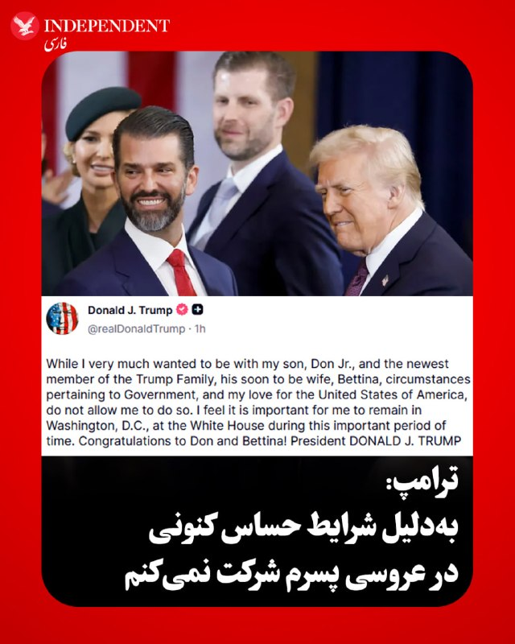

♦️ دونالد ترامپ، رئیس‌جمهوری ایالات متحده آمریکا روز جمعه اول خرداد اعلام کرد که «در این بازه زمانی مهم» ضروری است که در کاخ سفید باقی بماند و به‌همین دلیل امکان شرکت در مراسم عروسی پسرش، دونالد ترامپ جوان، با بتینا اندرسون را ندارد.

ترامپ ضمن آرزوی خوشبختی برای پسر ارشدش در شبکه اجتماعی تروث‌سوشال نوشت: «در حالی که بسیار مشتاق بودم در کنار پسرم، دان جونیور (دونالد ترامپ جونیور) و جدیدترین عضو خانواده ترامپ، یعنی همسر آینده‌اش، بتینا باشم، اما شرایط مربوط به دولت و عشق من به ایالات متحده آمریکا این اجازه را به من نمی‌دهد. احساس می‌کنم در این برهه زمانی مهم، حضور من در واشنگتن دی‌سی و در کاخ سفید اهمیت بالایی دارد.»

عروسی پسر ترامپ که قرار است این آخر هفته برگزار شود، با شدت گرفتن تلاش‌ها برای امضای تفاهم‌نامه میان تهران و واشنگتن همزمان شده است. در همین راستا، روز جمعه، عاصم منیر، فرمانده کل ارتش پاکستان که نقش میانجی میان تهران و واشنگتن را بازی می‌کند به ایران سفر کرد و محسن نقوی، وزیر کشور پاکستان نیز در تهران حضور دارد.
‌🇸🇦 Indypersian

🤖 @VahidOOnLine

## VahidOOnLine — post 241585

  

♦️اتحادیه جهانی کشتی اعلام کرد به‌دلیل «وضعیت ژئوپلیتیک کنونی» و ادامه ابهام‌ها به‌ویژه در حوزه سفرهای بین‌المللی، میزبانی مسابقات جهانی ۲۰۲۶ از منامه بحرین به شهر آستانه قزاقستان منتقل شده است.
میزبانی این رقابت‌ها پیش‌تر در نشست سال گذشته در زاگرب به بحرین واگذار شده بود، اما تحولات اخیر منطقه باعث تغییر این تصمیم شد. بر اساس برنامه جدید، مسابقات جهانی کشتی از ۲ تا ۱۰ آبان ۱۴۰۵ در آستانه برگزار خواهد شد؛ شهری که پیش‌تر در سال ۲۰۱۹ نیز میزبان این رقابت‌ها بوده است.
در ماه‌های اخیر، جنگ ایران که از نهم اسفند ۱۴۰۴ آغاز شده، موجب لغو یا جابه‌جایی بسیاری از رویدادهای بین‌المللی ورزشی در منطقه شده است.
‌🇸🇦 Indypersian

🤖 @VahidOOnLine

## VahidOOnLine — post 241584

  

اکسیوس به نقل از یک منبع نزدیک به ترامپ نوشت که رییس‌جمهوری آمریکا در روزهای اخیر به‌طور فزاینده‌ای کلافه شده و احتمال انجام یک عملیات نظامی نهایی و گسترده را مطرح کرده است؛ عملیاتی که پس از آن بتواند اعلام پیروزی کرده و به جنگ پایان دهد.

اکسیوس همچنین به نقل از یک منبع امنیتی پاکستان اعلام کرد که عاصم منیر، فرمانده ارتش پاکستان، جمعه در چارچوب تلاش‌ها برای دستیابی به توافقی میان جمهوری اسلامی و آمریکا وارد تهران شد؛ توافقی که بر اساس آن دو طرف جنگ را متوقف کرده و مذاکراتی گسترده‌تر را آغاز کنند.
‌🏁 🇬🇧 IranintlTV

🤖 @VahidOOnLine

## VahidOOnLine — post 241583

  

♦️ اسماعیل بقایی، سخنگوی وزارت خارجه جمهوری اسلامی، روز جمعه اول خرداد در گفتگو با صداوسیما، خواسته آمریکا برای خروج اورانیوم با غنای بالا از خاک ایران را «خواسته نامعقول» خواند و گفت: «موضع ما در قبال مباحث مرتبط با اورانیوم غنی‌شده مشخص است. اگر در این مرحله به جزئیات این موضوع بپردازیم، به نتیجه نخواهیم رسید.»

جمهوری اسلامی همچنین بر حاکمیت کامل بر تنگه هرمز و نظارت بر تردد شناورها پافشاری می‌کند.

این اظهارات در حالی مطرح می‌شود که دونالد ترامپ، رئیس‌جمهوری آمریکا تاکید کرده است که باقی ماندن اورانیوم با غنای بالا در خاک ایران، برای او یک خط قرمز است و به‌هیچ وجه آن را نخواهد پذیرفت. همچنین مارکو روبیو، وزیر امور خارجه آمریکا در گفتگو با خبرنگاران با تاکید بر موضع آمریکا در قبال تنگه هرمز، گفت در صورت تعیین هرگونه سازوکار عوارض‌گیری از سوی جمهوری اسلامی، امکان دستیابی به توافق از بین می‌رود.
‌🇸🇦 Indypersian

🤖 @VahidOOnLine

## VahidOOnLine — post 241582

هم‌زمان با ادامه کارزار جاویدنامان بیمارستان الغدیر، جزییات تازه‌ای از هویت و چگونگی کشته‌ شدن شماری از جان‌باختگان اعتراضات ۱۸ و ۱۹ دی‌ماه به دست ایران‌اینترنشنال رسیده است.
در این ویدیو نحوه قتل حکومتی ستاره رفیعی و حمیدرضا حق‌پرست و انتقال پیکر آن‌ها به بیمارستان را می‌‌‌شنوید.
فرنوش فرجی، عضو تحریریه ایران‌اینترنشنال گزارش می‌دهد.
‌🏁 🇬🇧 IranintlTV

🤖 @VahidOOnLine

## VahidOOnLine — post 241581

  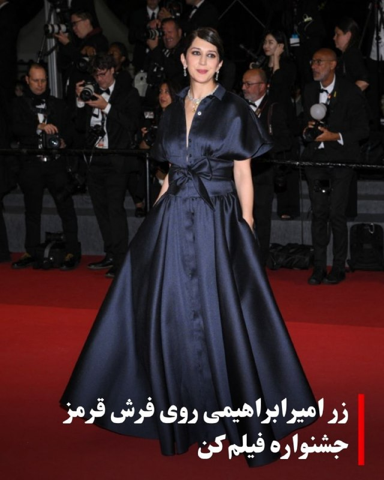

♦️زر امیرابراهیمی، شامگاه ۳۱ اردیبهشت در فرش قرمز نمایش فیلم «بزدل» در هفتادونهمین دوره جشنواره فیلم کن در جنوب فرانسه حاضر شد؛ جشنواره‌ای که نام او از سال ۲۰۲۲ جایگاه ویژه‌ای در تاریخ آن پیدا کرده است.
امیرابراهیمی در جشنواره کن ۲۰۲۲ با بازی در فیلم «عنکبوت مقدس» موفق شد جایزه بهترین بازیگر زن را دریافت کند و به یکی از معدود بازیگران ایرانی تبدیل شود که این جایزه مهم را از کن به دست آورده‌اند.
فیلم بزدل ساخته لوکاس دونت، کارگردان بلژیکی فیلمی درباره سربازان جوان در میدان نبرد جنگ جهانی اول است.
‌🇸🇦 Indypersian

🤖 @VahidOOnLine

## VahidOOnLine — post 241580

  

راجر ویکر، رییس کمیته نیروهای مسلح سنای آمریکا در شبکه ایکس نوشت: «باید کاری را که آغاز کرده‌ایم، به پایان برسانیم. آمریکا نباید به‌دنبال توافق با جمهوری اسلامی باشد و در عوض باید عملیات نظامی را از سر بگیرد.»
او افزود: «به دونالد ترامپ توصیه اشتباهی می‌شود تا توافقی را دنبال کند که ارزش نوشته شدن روی کاغذ را هم ندارد.»

ویکر ادامه داد: «فرمانده کل قوا باید به نیروهای مسلح حرفه‌ای آمریکا اجازه دهد نابودی توان نظامی متعارف تهران را تکمیل کرده و تنگه هرمز را بازگشایی کنند.»
‌🏁 🇬🇧 IranintlTV

🤖 @VahidOOnLine

## VahidOOnLine — post 241579

  <a href="telegram/content/VahidOOnLine_241579_1779477591.mp4" target="_blank">🎬 Download video</a>

♦️اسماعیل بقایی، سخنگوی وزارت امور خارجه جمهوری اسلامی، روز جمعه اول خردادماه اعلام کرد هیئتی از قطر در تهران حضور داشته و با عباس عراقچی، وزیر امور خارجه، درباره تحولات اخیر و کاهش تنش‌ها گفتگو کرده است.
او با اشاره به تلاش کشورهای مختلف برای ایفای نقش در روند دیپلماتیک گفت در روزهای اخیر، برخی کشورهای منطقه و خارج از منطقه در قالب «مساعی جمیله» به‌دنبال کمک به پایان درگیری‌ها هستند و این تلاش‌ها از نظر ایران قابل توجه است.
بقایی در عین حال تاکید کرد که با وجود این رایزنی‌ها، میانجی رسمی مذاکرات همچنان پاکستان است و مسیر اصلی گفتگوها از این کانال دنبال می‌شود.
‌🇸🇦 Indypersian

🤖 @VahidOOnLine

## VahidOOnLine — post 241578

  

علی خضریان، نماینده تهران در مجلس گفت: «ترامپ بارها می‌گوید جمهوری اسلامی برای رسیدن به توافق زمان ندارد. در این اظهارات رییس جمهور آمریکا فرامتن و اعترافی وجود دارد که اتفاقا زمان علیه آمریکاست. برای همین این لات کوچه خلوت فضای مجازی داد می‌زند که بگوید ایران است که زمان ندارد.»

او ادامه داد: «در سه حوزه کلیدی مدیریت تنگه هرمز، حمایت از جبهه مقاومت وعدم خروج مواد هسته‌ای از خاک کشور به هیچ عنوان مصالحه نخواهد کرد.»

او افزود: «فکر نمی‌کنم درباره متنی بتوانیم صحبت کنیم که روی آن به توافق نزدیک شده باشیم.»
‌🏁 🇬🇧 IranintlTV

🤖 @VahidOOnLine

## VahidOOnLine — post 241577

  

عبدالله حاجی‌صادقی، نماینده مجتبی خامنه‌ای در سپاه پاسداران گفت: «استکبار باید بداند که خلیج فارس و تنگه هرمز تحت کنترل کامل و هوشیارانه نیروی دریایی ماست. اگر دشمن نخواهد این واقعیت را بپذیرد و دست به ماجراجویی بزند، ما نه فقط در منطقه، بلکه فرای منطقه را هم برای آن‌ها ناامن و تنگ خواهیم کرد.»

او افزود: «اگر دشمن مرتکب کوچک‌ترین خطای محاسباتی شود، روزهایی به مراتب سخت‌تر از گذشته را تجربه خواهد کرد. سپاه پاسداران و نیروی دریایی مقتدر، پاسخی به آن‌ها خواهند داد که از نظر وسعت و شدت، فراتر از عملیات‌های ظفرمند وعده صادق خواهد بود.»
‌🏁 🇬🇧 IranintlTV

🤖 @VahidOOnLine

## VahidOOnLine — post 241576

  

♦️ سخنگوی وزارت امور خارجه جمهوری اسلامی، جمعه‌شب، اول خرداد، اعلام کرد که مذاکرات صلح با ایالات متحده به مرحله «توافق نزدیک» نرسیده و دشوار است که بگوییم آیا توافقی «طی چند هفته یا چند ماه آینده» حاصل خواهد شد یا خیر.

بقایی در گفتگو با صداوسیما تاکید کرد که شکاف‌های موجود میان تهران و واشنگتن «عمیق و جدی» است.

او در این باره گفت: «لزوما نمی‌توانیم بگوییم به نقطه‌ای رسیده‌ایم که توافق نزدیک باشد. تمرکز اصلی این مذاکرات بر پایان دادن به جنگ است و در این مرحله، جزئیات مربوط به مسئله هسته‌ای مورد بحث قرار نمی‌گیرد.»
‌🇸🇦 Indypersian

🤖 @VahidOOnLine

## VahidOOnLine — post 241575

  <a href="telegram/content/VahidOOnLine_241575_1779477594.mp4" target="_blank">🎬 Download video</a>

دو شهروند در پیام‌هایی که با هوش مصنوعی خوانده شده، به ایران اینترنشنال گفتند که قیمت یک پرس قرمه‌سبزی در رستوران‌ها به حدود ۸۰۰ هزار تومان و یک عدد پیتزای دو نفره به بالای دو میلیون تومان رسیده است.
‌🏁 🇬🇧 IranintlTV

🤖 @VahidOOnLine

## VahidOOnLine — post 241574

  <a href="telegram/content/VahidOOnLine_241574_1779477596.mp4" target="_blank">🎬 Download video</a>

دو شهروند در پیام‌هایی که با هوش مصنوعی خوانده شده، به ایران اینترنشنال گفتند که قیمت یک پرس قرمه‌سبزی در رستوران‌ها به حدود ۸۰۰ هزار تومان و یک عدد پیتزای دو نفره به بالای دو میلیون تومان رسیده است.
‌🏁 🇬🇧 IranintlTV

🤖 @VahidOOnLine

## VahidOOnLine — post 241573

  

اسماعیل بقائی، سخنگوی وزارت خارجه جمهوری اسلامی گفت: «در مورد اورانیوم غنی‌شده با درجه بالا، مواضع‌مان را خیلی روشن بیان کرده‌ایم؛ در این مرحله اگر بخواهیم در این مباحث گفت‌وگو کنیم، قاعدتا به نتیجه نمی‌رسیم.»

او افزود: «ما قبلا این مسیر را رفتیم و اختلاف‌نظرها آن‌قدر زیاد بود که نتوانستیم به نتیجه برسیم و طرف مقابل به‌خاطر خواسته‌های نامعقولش میز مذاکرات را از بین برد و حمله کرد.»
‌🏁 🇬🇧 IranintlTV

🤖 @VahidOOnLine

## VahidOOnLine — post 241572

♦️علی خضریان، عضو کمیسیون امنیت ملی و سیاست خارجی مجلس، روز جمعه اول خردادماه در صداوسیما تأکید کرد جمهوری اسلامی ایران در موضوعاتی مانند تنگه هرمز، جبهه مقاومت و خروج مواد هسته‌ای «کوتاه نخواهد آمد» و هیچ مصالحه‌ای را نمی‌پذیرد.
او با انتقاد از سیاست‌های آمریکا گفت واشینگتن با «زیاده‌خواهی» و استفاده از جنگ روانی در فضای رسانه‌ای، به‌دنبال تحمیل شروط خود به ایران است.
خضریان در ادامه با اشاره به فاصله جدی میان مواضع دو طرف، تاکید کرد شرایط فعلی نشان می‌دهد امکان دستیابی به توافق در کوتاه‌مدت وجود ندارد و دو کشور در مسیرهای متفاوتی حرکت می‌کنند.
‌🇸🇦 Indypersian

🤖 @VahidOOnLine

## VahidOOnLine — post 241571

  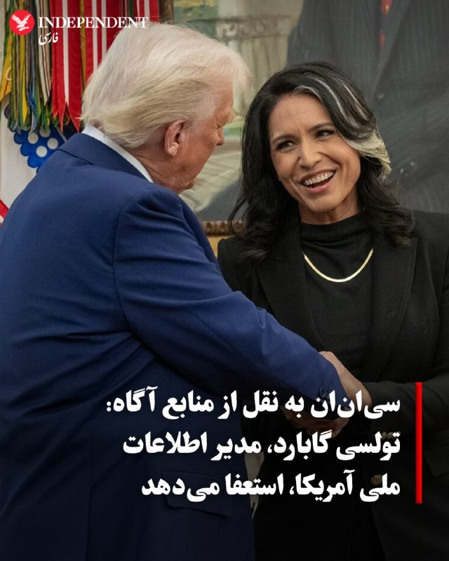

♦️ خبرگزاری سی‌ان‌ان به نقل از سه منبع آگاه گزارش داد که تولسی گابارد، مدیر اطلاعات ملی ایالات متحده (DNI)، از سمت خود استعفا می‌دهد.

این منابع اعلام کردند که گابارد به همکارانش اطلاع داده است که علت این تصمیم، مبارزه همسرش با بیماری سرطان است.

به گفته یکی از این منابع، گابارد تصمیم خود را به اطلاع رئیس‌جمهوری دونالد ترامپ رسانده است. با این حال، کاخ سفید و دفتر گابارد هنوز به درخواست‌ها برای اظهار نظر در این باره پاسخی نداده‌اند.
‌🇸🇦 Indypersian

🤖 @VahidOOnLine

## VahidOOnLine — post 241570

  

اسماعیل بقائی، سخنگوی وزارت خارجه جمهوری اسلامی گفت: «اختلاف‌نظر ما با آمریکا آن‌قدر عمیق و زیاد است که نمی‌شود گفت با چندبار رفت‌وآمد یا مذاکرات ظرف چند هفته ما باید حتما به نتیجه برسیم.»

او افزود: «نمی‌توانیم بگوییم ضرورتا به جایی رسیده‌ایم که توافق نزدیک است. تمرکز مذاکرات بر خاتمه جنگ است.»

او در واکنش به سفر عاصم منیر به تهران گفت: «این رفت‌وآمدها باوجود اینکه پرترافیک‌تر شده، تداوم همان روند دیپلماتیک است.»

بقائی ادامه داد: «یک هیئتی از قطر درحال مذاکره با وزیر خارجه کشورمان هستند اما میانجی مذاکرات همچنان طرف پاکستانی است.»
‌🏁 🇬🇧 IranintlTV

🤖 @VahidOOnLine

## WithYashar — post 12009

حریت ترکیه : صاحب مجموعه تفریحی معروف «کلاب روبی» در منطقه اورتاکوی استانبول، پس از تذکر دادن به گروهی از افراد مزاحم، در محل کسب خود با شلیک گلوله مجروح شد.

بنا بر گزارش‌های دریافتی، حدود ساعت ۳:۴۵ بامداد شب گذشته، گروهی از افراد با پوشش نامناسب و ایجاد مزاحمت قصد ورود به این کلاب معروف را داشتند که با ممانعت و هشدار علی اونال، صاحب این مجموعه، مواجه شدند. در پی بالا گرفتن مشاجره لفظی، فردی با هویت اختصاری «اِس.کی» با سلاح گرم به سمت اونال شلیک کرد. مالک این مجموعه تفریحی بلافاصله جهت مداوا به بیمارستان منتقل شد.

پس از وقوع این حادثه، نیروهای پلیس استانبول تحقیقات گسترده‌ای را آغاز کردند و ضارب را که با اسلحه از صحنه متواری شده و در مخفیگاهی در منطقه سنجاق‌تپه پنهان شده بود، شناسایی و دستگیر کردند
@withyashar

## WithYashar — post 12008

خبر ویژه رسانه های اسرائیل : در یک ساعت گذشته چندین شرکت تحویل کالا و شرکت‌های حمل‌ونقل بار شروع به لغو پروازهای باری به اسرائیل کرده‌اند. یکی از این شرکت‌ها آی‌هرب است
@withyashar

## WithYashar — post 12007

اکسیوس : ترامپ عصر امروز (به تایم امریکا)پس از یک سخنرانی برنامه‌ریزی شده در نیویورک به کاخ سفید باز خواهد گشت و آخره هفته در کاخ سفید میماند
@withyashar

## WithYashar — post 12006

مقام آمریکایی به اکسیوس:
مذاکرات بسیار دست و پا گیر است و پیش نویس‌ها هر روز بدون پیشرفت زیادی به این سو و آن سو می‌روند.
@withyashar

## WithYashar — post 12005

## WithYashar — post 12004

## WithYashar — post 12003

  

2300ton یا ۴۵۰۰$ 🥲😭

## WithYashar — post 12002

https://t.me/boost/withyashar ۵۰۰ بوست لازم داریم 😭🥲

## WithYashar — post 12001

https://t.me/boost/withyashar

۵۰۰ بوست لازم داریم 😭🥲

## WithYashar — post 12000

  

«دونالد ترامپ» اعلام کرد «آرون لوکاس» به عنوان مدیر موقت اطلاعات ملی منصوب شد.
@withyashar

## WithYashar — post 11999

سخنگوی وزارت خارجه اسمائیل باقری : یک هیئتی از قطر درحال مذاکره با وزیر خارجه کشورمان هستند اما میانجی مذاکرات همچنان طرف پاکستانی است
نمی‌توانیم بگوییم که به نقطه‌ای رسیده‌ایم که توافق نزدیک است؛ خیر، اینطور نیست.
تفاوت‌ها بین ایران و آمریکا آنقدر عمیق و متعدد است که نمی‌توان گفت با چند دور رفت و برگشت یا مذاکرات در چند هفته حتماً باید به نتیجه برسیم.
تمرکز این مذاکرات بر پایان جنگ است و در این مرحله، بحثی درباره مسائل مرتبط با موضوعات هسته‌ای نخواهد بود. مسائلی مانند «پایان جنگ در همه جبهه‌ها، وضعیت تنگه هرمز و پایان دزدی دریایی آمریکا» هنوز در حال بحث است.
موضوع مذاکرات هسته‌ای بسیار روشن است؛ ما عضو معاهده ان‌پی‌تی هستیم و حق استفاده از انرژی هسته‌ای برای اهداف صلح‌آمیز را داریم.
@withyashar

## WithYashar — post 11998

پرزیدنت ترامپ سفر خود به باشگاه ملی گلف ترامپ را هم لغو کرد و در آخر هفته در کاخ سفید خواهد ماند.
@withyashar

## WithYashar — post 11997

رویترز: کاخ سفید گابارد را مجبور به استعفا کرد

درحالی‌که ترامپ استعفای تولسی گابارد از سمت مدیر اطلاعات ملی آمریکا را به بیماری همسرش مرتبط کرده، خبرگزاری رویترز به نقل از منابعی نوشته کاخ سفید او را مجبور به استعفا کرده است.

گابارد در سمت مدیر اطلاعات ملی نظارت بر ۱۷ دستگاه اطلاعاتی آمریکا را برعهده داشت.
او چندی پیش هنگام ارائهٔ گزارش ارزیابی سالانهٔ تهدیدها علیه آمریکا نظراتی دربارهٔ ایران داشت که به مذاق ترامپ خوش نیامده بود.
محورهای اصلی اختلاف‌نظر گابارد با ترامپ دربارهٔ ایران چه بود
گابارد در کنگره صراحتاً اعلام کرد که ایران پس از حملات پیشین، تلاشی برای بازسازی برنامهٔ هسته‌ای خود نکرده است.
او همچنین از تایید اینکه ایران یک تهدید نظامی فوری علیه خاک آمریکاست خودداری کرد.
@withyashar

## WithYashar — post 11996

## WithYashar — post 11995

## WithYashar — post 11994

تحلیلت دست مریزاد داره واقعا❤️🔥 حتی اگه در آخر اینطوری نشه باتوجه به داده های موجود تحلیل واقعا عالی بوده

## WithYashar — post 11993

تحلیلت دست مریزاد داره واقعا❤️🔥
حتی اگه در آخر اینطوری نشه
باتوجه به داده های موجود
تحلیل واقعا عالی بوده

## WithYashar — post 11992

ولی اگه بخواهیم عقلانی بررسی کنیم این هفته احتمال حمله ۲۰٪ هست در صورتی که هفته دیگه ۸۰٪ ولی ترامپ هم اهل این حرف ها نیست و همیشه وسط مذاکره لحظه ای که همه فکر میکنن توافق شکل گرفته میزنه !
@withyashar

## WithYashar — post 11991

ترامپ دیدن رسما دقایقی پیش گفت که عروسی پسر ارشدش هم نمیره و برای‌ مسئله ایران کاخ سفید میمونه دست به ماشه ! دوشنبه امریکا تعطیل رسمی هست و این آخر هفته مارکت ۱ روز‌ بیشتر تعطیله و خیلی خاصش کرده !
@withyashar

## WithYashar — post 11990

پس رو کاغذ نشانه ها این رو نشون میدن حمله هفته دیگه انجام میشه و اینا یه پیش نویسی از مذاکره حتی شاید بنویسن ! ولی این چیزی‌ از عرزش های امشب ‌کم نمیکنه ! امشب بسیار روز مناسبی هست برای ترامپ ! و قانونی هم آتش بس تمام شده !
@withyashar

## mwarmonitor — post 9502

  

🔴پس از یک حادثه شیمیایی در گاردن گروو، کالیفرنیا، اداره آتش‌نشانی اورنج کانتی (OCFA) اعلام کرده است که تنها دو سناریوی باقی‌مانده برای یک مخزن ۶۰۰۰ تا ۷۰۰۰ گالنی حاوی «متیل متاکریلات» این است که «یا از کار می‌افتد یا منفجر می‌شود».

🔸نقشه زیر محدوده فعلی دستور تخلیه را نشان می‌دهد.

@mwarmonitor

## mwarmonitor — post 9501

🔴« یک منبع ایرانی مسئول به الجزیره: توقف جنگ در تمامی جبهه‌ها پیش‌شرط و راه ورود اصلی برای صحبت درباره هرگونه مذاکره آینده است.»

🔸«هنوز هیچ توافق نهایی‌ای وجود ندارد و تلاش‌ها برای کاهش اختلافات میان تهران و واشنگتن ادامه دارد.»

🔹« فضای مثبت همراه با تحرکات دیپلماتیک مهم است، اما برای رسیدن به یک توافق واقعی کافی نیست.»

@mwarmonitor

## mwarmonitor — post 9500

🔴«مقام آمریکایی به آکسیوس: مذاکرات بسیار فرسایشی و خسته‌کننده است و پیش‌نویس‌ها به‌طور روزانه رفت و برگشت می‌شوند، بدون اینکه پیشرفت قابل توجهی حاصل شود.

🔸رئیس‌جمهور آمریکا طی چند روز گذشته احساس نارضایتی و ناامیدی فزاینده‌ای داشته است.

🔹رئیس‌جمهور احتمال اجرای یک عملیات نظامی بزرگ و نهایی را مطرح کرده و سپس اعلام پیروزی و پایان دادن به جنگ را در نظر دارد.»

@mwarmonitor

## mwarmonitor — post 9498

🔸«ایران ایده اینکه توافق “نزدیک” است را رد می‌کند و تهدیدهای آمریکا برای حمله در صورت عدم دستیابی به توافق در این آخر هفته را نادیده می‌گیرد.

🔹“ما نمی‌توانیم بگوییم که حتماً طی چند هفته یا چند ماه و با چند سفر یا مذاکره به نتیجه خواهیم رسید.” – رسانه دولتی ایران IRNA»

@mwarmonitor

## mwarmonitor — post 9497

🔴«آلکس مارکوارت، خبرنگار ارشد امنیت ملی سابق CNN می‌گوید جزئیاتی از پیشنهاد آمریکا به ایران را به دست آورده است:

🔸یک یادداشت تفاهم که شامل حجم زیادی از کمک‌های مالی و تسهیلات اقتصادی برای ایران است، در ازای توافق برای آغاز مذاکرات.»

@mwarmonitor

## mwarmonitor — post 9496

🔴سناتور راجر ویکر (جمهوری‌خواه از می‌سی‌سی‌پی)، رئیس کمیته نیروهای مسلح سنا، روز جمعه از رئیس‌جمهور دونالد ترامپ خواست حملات علیه ایران را از سر بگیرد تا «کاری را که شروع کرده‌ایم تمام کنیم» — و مدعی شد که به رئیس‌جمهور «مشاوره نادرست» داده شده است تا به دنبال…

## mwarmonitor — post 9495

🚨« یک حادثه امنیتی در پایگاه هوایی-دریایی پنساکولا در ایالت فلوریدای آمریکا رخ داده است.»

@mwarmonitor

## mwarmonitor — post 9494

  

🗒بر اساس برنامه به‌روزشده، دونالد ترامپ سفر خود به باشگاه گلف «ترامپ نشنال گلف کلاب بدمینستر» را لغو کرده و در عوض آخر هفته را در کاخ سفید سپری خواهد کرد.

@mwarmonitor

## FoxNewsTwitter — post 342131

  

Fox News (Twitter/X)

NEW: Democrats are turning on their own congressional candidate in Texas.

The DCCC is now running ads against Maureen Galindo after backlash exploded over comments she made suggesting “American Zionists” should be sent to detention facilities.

Party leaders are increasingly distancing themselves from Galindo and condemning her comments despite her finishing first in the Democratic primary earlier this year.

Now national Democrats are spending money to stop her before the upcoming runoff election.

## FoxNewsTwitter — post 342130

  <a href="telegram/content/FoxNewsTwitter_342130_1779477601.mp4" target="_blank">🎬 Download video</a>

Fox News (Twitter/X)

BREAKING: 911 audio reveals Kyle Busch was overheating and coughing up blood before his death.

According to the audio, Busch was lying on a bathroom floor struggling to breathe and telling others he felt like he was going to pass out.

“I’ve got an individual that’s shortness of breath, very hot, thinks he’s going to pass out and is producing a little bit of blood — coughing up some blood,” the caller told dispatchers. | @SandraSmithFox @AmericaRpts

## FoxNewsTwitter — post 342129

  <a href="telegram/content/FoxNewsTwitter_342129_1779477603.mp4" target="_blank">🎬 Download video</a>

Fox News (Twitter/X)

A Georgia handyman swapped his car for a pink Barbie toy car to beat rising gas prices.

Mali Hightower pulled a broken Power Wheels Dream Camper out of the trash and installed a small gas engine from a power washer to give him an alternative to speed around town in instead of his usual mode of transportation.

His 1996 Mercedes-Benz convertible typically costs about $90 to fill.

The tiny pink vehicle tops out around 35 mph and is now turning heads everywhere he goes as Americans search for cheaper ways to get around.

## FoxNewsTwitter — post 342128

  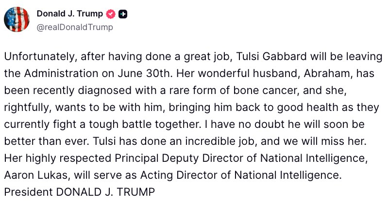

Fox News (Twitter/X)

BREAKING: President Trump says Principal Deputy Director of National Intelligence, Aaron Lukas, will serve as Acting Director of National Intelligence after Tulsi Gabbard's resignation.

## FoxNewsTwitter — post 342127

  

Fox News (Twitter/X)

READ IT: Director of National Intelligence Tulsi Gabbard submits her formal letter of resignation to President Trump, announcing she will be stepping down from her post after a year and a half leading the nation's intelligence community.

Gabbard informed the President of her decision during an Oval Office meeting on Friday, revealing that her husband has been diagnosed with an aggressive health battle.

Her final day leading the Office of the DNI will be June 30, 2026.

## FoxNewsTwitter — post 342126

  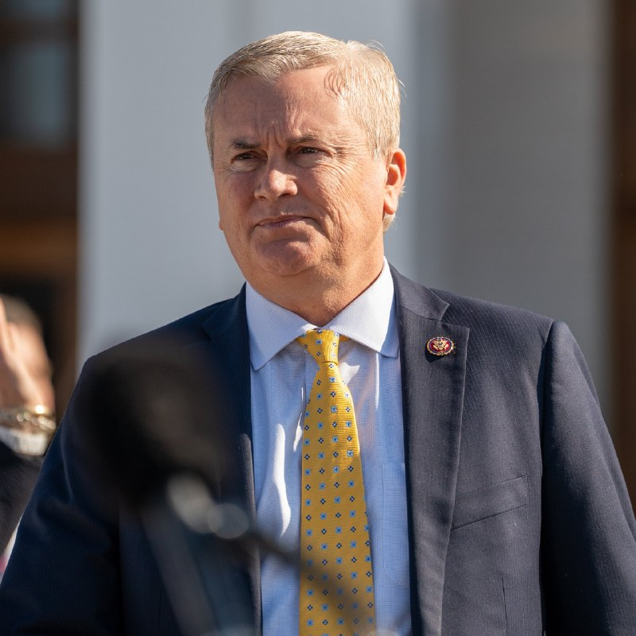

Fox News (Twitter/X)

NEW: House Oversight Chairman James Comer is opening an investigation into whether users on Polymarket and Kalshi used nonpublic information to profit from prediction markets.

In letters sent to Polymarket CEO Shayne Coplan and Kalshi CEO Tarek Mansour, Comer says the Committee is examining potential insider trading tied to online betting platforms and whether users may have bypassed U.S. regulations through offshore access.

“Internal records held by prediction market platforms are the only means by which bad actors can be identified,” Comer wrote while demanding documents on user verification, geographic restrictions, and suspicious trading activity.

## pm_afshaa — post 91224

  <a href="telegram/content/pm_afshaa_91224_1779477606.webm" target="_blank">🎬 Download video</a>

🔴الجزیره نقل از مقام ایرانی:
میانجی‌ها در تلاشند فاصله بین ایران و امریکا رو کم کنند ولی فقط فضای مثبت و اقدامات میانجی ها کافی نیست!

💧 Rainbet.com the #1 Non-KYC Crypto Casino & Sportsbook @rainbetcom

😁 @Pm_Afshaa

## pm_afshaa — post 91223

  <a href="telegram/content/pm_afshaa_91223_1779477607.webm" target="_blank">🎬 Download video</a>

🔴مقام آمریکایی به اکسیوس:
مذاکرات بسیار دست و پا گیر است و پیش نویس‌ها هر روز بدون پیشرفت زیادی به این سو و آن سو می‌روند.

💧 Rainbet.com the #1 Non-KYC Crypto Casino & Sportsbook @rainbetcom

😁 @Pm_Afshaa

## pm_afshaa — post 91222

  <a href="telegram/content/pm_afshaa_91222_1779477607.webm" target="_blank">🎬 Download video</a>

🔴سخنگوی وزارت خارجه جمهوری اسلامی:
اختلاف نظر جمهوری اسلامی و آمریکا با چند بار رفت‌وآمد حل نمیشه.

💧 Rainbet.com the #1 Non-KYC Crypto Casino & Sportsbook @rainbetcom

😁 @Pm_Afshaa

## pm_afshaa — post 91221

  

ترامپ: با اینکه خیلی میخواهم در کنار پسرم برای مراسم عروسی باشم اما حس میکنم که مهم است در واشنگتن و کاخ سفید در طی زمان مهم پیش رو در روز شنبه و یکشنبه بمانم

💧 Rainbet.com the #1 Non-KYC Crypto Casino & Sportsbook @rainbetcom

😁 @Pm_Afshaa

## pm_afshaa — post 91220

من که میدونم همه اینا برا کشیدن وحیدی بیرونه😁

## pm_afshaa — post 91219

من که میدونم همه اینا برا کشیدن وحیدی بیرونه😁

## pm_afshaa — post 91218

🔴تولسی گبرد، مدیر اطلاعات ملی ایالات متحده آمریکا، استعفا داد

💧 Rainbet.com the #1 Non-KYC Crypto Casino & Sportsbook @rainbetcom

😁 @Pm_Afshaa

## pm_afshaa — post 91217

🔴رئیس کمیته نیروهای مسلح سنای آمریکا: ترامپ باید به ارتش اجازه دهد تا انهدام توانمندی‌های نظامی ایران را تکمیل کند

💧 Rainbet.com the #1 Non-KYC Crypto Casino & Sportsbook @rainbetcom

😁 @Pm_Afshaa

## DEJradio — post 4857

  <a href="telegram/content/DEJradio_4857_1779477608.webm" target="_blank">🎬 Download video</a>

🚨
🔸 خبر ۲۱
آدینه ۱ اردیبهشت ۱۴۰۵

#خبر۲۱
@DEJradio

## DEJradio — post 4856

  <a href="telegram/content/DEJradio_4856_1779477608.webm" target="_blank">🎬 Download video</a>

🔺📢 منابع داخلی گزارش دادند از نیمه دوم اردیبهشت ۱۴۰۵ خروج اموال و اسناد با ارزش از صندوق امانات چند بانک از جمله ملی، تجارت و مسکن افزایش یافته است.

کاربران این صندوق‌ها نگران‌اند با توجه به احتمال جنگ مجدد و وضعیت بحرانی نظام، سرمایه آنها از بین برود یا دیگر صاحب آن نباشند.

در جریان جنگ ۴۰ روزه یکی از شعب بانک سپه در تهران که گفته شد «دیتا سنتر» آنجا قرار داشت هدف قرار گفت.
صندوق امانات، محفظه‌ای امن در خزانه‌ بانک‌هاست که برای نگهداری اسناد، طلا و اشیای ارزشمند اجاره داده می‌شود.

بانک‌ها تضمین نکرده‌اند که در صورت وقوع جنگ یا انقلاب اموال و دارایی مشتریان کامل به آنها پرداخت می‌شود.

#جنگ #جنگ۴۰روزه
@DEJradio

## DEJradio — post 4855

  <a href="telegram/content/DEJradio_4855_1779477609.webm" target="_blank">🎬 Download video</a>

🚨📢 مارک روته دبیرکل ناتو اعلام کرد که آمریکا می‌تواند در عملیات‌های نظامی خود علیه جمهوری اسلامی از پایگاه‌های این سازمان در اروپا استفاده کند.

روته روز آدینه ابتدای خرداد در جریان نشست اعضای این سازمان که در سوئد برگزار شد گفت، به عنوان یک اتحاد غربی-اروپایی، ما می‌توانیم به ایالات متحده آمریکا در تلاش‌هایش برای بازگرداندن آزادی دریانوردی در تنگه هرمز کمک کنیم.

روته افزود، چندین کشور اروپایی تمایل خود را برای مشارکت در تلاش‌ها برای بازگشایی تنگه هرمز و تضمین آزادی دریانوردی ابراز کرده‌اند.

او ادامه داد: «این نه تنها برای متوازن کردن هزینه‌هایی است که با ایالات متحده انجام می‌دهیم، بلکه برای اطمینان یافتن آنچه برای دفاع قاطعانه در برابر دشمنانمان نیاز داریم، لازم است.»

#جنگ
@DEJradio

## VahidOnline — post 75628

  

اکسیوس به نقل از یک منبع نزدیک به ترامپ نوشت که رییس‌جمهوری آمریکا در روزهای اخیر به‌طور فزاینده‌ای کلافه شده و احتمال انجام یک عملیات نظامی نهایی و گسترده را مطرح کرده است؛ عملیاتی که پس از آن بتواند اعلام پیروزی کرده و به جنگ پایان دهد.
@VahidOOnLine

📡 @VahidOnline

## VahidOnline — post 75627

  

سخنگوی هیئت مذاکره‌کننده ایران با آمریکا روز جمعه گفت که موضوع پرونده هسته‌ای ایران در این مرحله مورد مذاکره نیست و از اختلاف نظر عمیق با آمریکا خبر داد.

اسماعیل بقائی گفت: «اختلاف‌نظرها بین ایران و آمریکا آن‌قدر عمیق و زیاد است که نمی‌شود گفت با چندبار رفت‌وآمد یا مذاکرات ظرف چند هفته ما باید حتماً به نتیجه برسیم.»

او گزارش‌ها درباره قریب‌الوقوع بودن توافق با آمریکا را رد کرد و اعلام کرد: «نمی‌توانیم بگوییم ضرورتاً به جایی رسیده‌ایم که توافق نزدیک است.»

بقائی بار دیگر موضع جمهوری اسلامی درباره برنامه هسته‌ای و اورانیوم غنی‌شده را تکرار کرد و گفت مواضع ایران قبلاً اعلام شده است.
@VahidHeadline
سخنگوی وزارت خارجه ایران حضور هیئتی از قطر را در تهران تایید کرد
اسماعیل بقایی،‌ سخنگوی وزارت خارجه ایران تایید کرد که یک هیئت از قطر روز جمعه در تهران بودند و با عباس عراقچی وزیر خارجه ایران گفت‌وگو کردند.
او بدون ارائه جزئیات گفت که کشورهای مختلفی طی روزهای اخیر با وزیر خارجه گفتوگو کردند اما تاکید کرد که میانجی اصلی میان ایران و آمریکا همان کشور پاکستان است.
پیشتر رویترز به نقل از یک منبع آگاه گزارش داد که هیئتی از قطر در هماهنگی با آمریکا وارد تهران شده است.
قطر و امارات و عربستان سعودی سه کشوری بودند که آقای ترامپ روز دوشنبه گفت که به درخواست آنها فعلا حمله مجدد به ایران را متوقف کرده است.
@VahidHeadline

📡 @VahidOnline

## VahidOnline — post 75626

  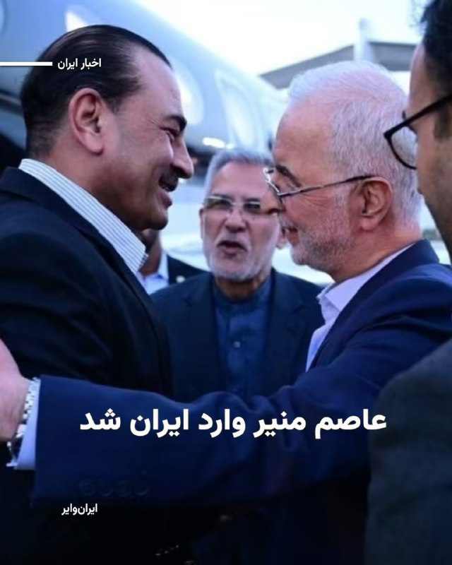

تصویری از عاصم منیر، فرمانده ارتش پاکستان که امروز جمعه یکم خرداد۱۴۰۵ وارد تهران شد و مورد استقبال اسکندر مومنی وزیر کشور قرار گرفت. خبرگزاری آسوشیتدپرس پاکستان نیز به نقل از منابع امنیتی اعلام کرده‌اند که عاصم منیر در طول این سفر رسمی، درباره «مذاکرات جاری ایران و آمریکا و صلح و ثبات منطقه‌ و منافع دوجانبه دیگر» با مقام‌های ایران گفت‌و‌گو خواهد کرد.
@VahidHeadline

📡 @VahidOnline

## VahidOnline — post 75625

  

«فاکس نیوز»: تولسی گابارد از پست خود به عنوان مدیر اطلاعات ملی آمریکا استعفا کرد.
AlArabiya_Fa
پست ترامپ، ترجمه ماشین:
متأسفانه تولسی گبرد، پس از آنکه عملکردی بسیار خوب داشت، روز ۳۰ ژوئن دولت را ترک خواهد کرد. همسر فوق‌العاده او، آبراهام، به‌تازگی به نوعی نادر از سرطان استخوان مبتلا شده و او، به‌درستی، می‌خواهد در کنار همسرش باشد و در حالی که این نبرد دشوار را با هم پشت سر می‌گذارند، به بازگشت او به سلامتی کمک کند. تردیدی ندارم که او به‌زودی بهتر از همیشه خواهد شد.

تولسی کار فوق‌العاده‌ای انجام داده و دلمان برای او تنگ خواهد شد. معاون اصلی و بسیار محترم او در دفتر مدیر اطلاعات ملی، آرون لوکاس، به‌عنوان سرپرست مدیر اطلاعات ملی خدمت خواهد کرد.

رئیس‌جمهور دونالد جی. ترامپ
realDonaldTrump
متن استعفانامه، ترجمه ماشین:

آقای رئیس‌جمهور عزیز،

از اعتمادی که به من کردید و از فرصتی که برای رهبری دفتر مدیر اطلاعات ملی در یک سال و نیم گذشته در اختیارم گذاشتید، عمیقاً سپاسگزارم.

متأسفانه باید استعفای خود را، با اثرگذاری از ۳۰ ژوئن ۲۰۲۶، تقدیم کنم. همسرم، آبراهام، به‌تازگی به نوعی بسیار نادر از سرطان استخوان مبتلا شده است. او در هفته‌ها و ماه‌های پیش رو با چالش‌های بزرگی روبه‌رو خواهد بود. در این مقطع، باید از خدمت عمومی کناره‌گیری کنم تا در کنارش باشم و در این نبرد به‌طور کامل از او حمایت کنم.

آبراهام در تمام یازده سال زندگی مشترکمان تکیه‌گاه من بوده است؛ از مأموریتم در شرق آفریقا در یک عملیات مشترک نیروهای ویژه، تا چندین کارزار سیاسی، و اکنون نیز در دوران خدمتم در این جایگاه، استوار کنارم ایستاده است. قدرت و عشق او مرا در هر چالشی سرپا نگه داشته است. وجدانم اجازه نمی‌دهد از او بخواهم در حالی که من همچنان در این سمت دشوار و وقت‌گیر هستم، این مبارزه را به‌تنهایی پشت سر بگذارد.

هرچند ما در دفتر مدیر اطلاعات ملی پیشرفت‌های چشمگیری داشته‌ایم — از جمله پیشبرد شفافیتی بی‌سابقه و بازگرداندن یکپارچگی و درستکاری به جامعه اطلاعاتی — اما اذعان دارم که هنوز کارهای مهمی برای انجام دادن باقی مانده است. من کاملاً متعهد هستم که در هفته‌های پیش رو انتقالی روان و کامل را تضمین کنم تا شما و تیم‌تان هیچ اختلالی در رهبری یا روند کار تجربه نکنید.

از درک شما در این مقطع عمیقاً شخصی و دشوار برای خانواده‌مان سپاسگزارم. تا همیشه از شما و مردم آمریکا به‌خاطر افتخار بزرگی که خدمت به کشورمان در مقام مدیر اطلاعات ملی برایم داشت، سپاسگزار خواهم بود.

خبر یک ماه و نیم پیش:
ترامپ قصد داشت گابارد را اخراج کند

به گزارش وب‌سایت آکسیوس، دونالد ترامپ تا آستانه اخراج تولسی گابارد، مدیر اطلاعات ملی آمریکا، پیش رفته بود، اما مداخله لحظه آخری راجر استون، مشاور قدیمی و نزدیک او، مانع از این اتفاق شد.
دلیل خشم ترامپ به شهادت اخیر گابارد در کنگره بازمی‌گردد؛ جایی که او برخلاف انتظار، از جنگ با ایران حمایت تمام‌عیار نکرد.
طبق گفته منابع آگاه، ترامپ از اینکه گابارد در اظهاراتش اعلام کرده بود برنامه هسته‌ای ایران پیش از آغاز جنگ «منهدم» شده بود (موضعی که توجیهات ترامپ برای حمله را تضعیف می‌کرد)، به شدت ناراضی بود.
همچنین استعفای اعتراضی جو کنت، دستیار گابارد که جنگ را غیرضروری خوانده بود، بر آتش خشم ترامپ افزود.
در حالی که ترامپ در حال نظرسنجی از مشاورانش برای جایگزینی گابارد بود و وفاداری او را زیر سؤال می‌برد، راجر استون در تماسی تلفنی از او دفاع کرد. یک منبع نزدیک به آکسیوس گفت: «راجر معامله را جوش داد و تولسی را نجات داد.»
استون نیز بعدا در شبکه اجتماعی ایکس تایید کرد: «خوشبختانه به موقع اقدام کردم.» با این میانجی‌گری، گبرد فعلا در سمت خود ابقا شده است.
@VahidOOnLine

📡 @VahidOnline

## kianmeli1 — post 87556

🔴تولسی گابارد مدیرکا اطلاعات ملی آمریکا استعفا داد.

ترامپ: دلیل استعفای گابارد بیماری همسرش به سرطان استخوان بوده است.

-رویترز: بر خلاف گفته ترامپ، کاخ سفید برای استعفا به گابارد فشار آورد و مجبور به اینکار کرد.
https://t.me/kianmeli1

## IranIntlTV — post 338478

  

الجزیره به نقل از یک مقام جمهوری اسلامی گزارش داد که نقش قطر در حمایت از میانجی‌گری پاکستان بسیار کلیدی است.

این مقام حکومت ایران افزود: «آزادسازی دارایی‌های بلوکه‌شده و لغو تحریم‌های صادرات نفت برای جمهوری اسلامی موضوعی حاشیه‌ای نیست.»
https://iranintl.com/202605224072

## IranIntlTV — post 338477

  <a href="telegram/content/IranIntlTV_338477_1779477612.mp4" target="_blank">🎬 Download video</a>

یک شهروند در پیامی به ایران اینترنشنال از اوضاع وخیم اقامتگاه‌ها و هتل‌های مشهد در پی بحران اقتصادی روایت می‌کند. پیام او با هوش مصنوعی خوانده شده است.

## IranIntlTV — post 338476

  <a href="https://t.me/IranintlTV/338476" target="_blank">📎 Download file</a>

🎧نسخه صوتی حرف آخر با پوریا زراعتی - عملیات موساد برای حذف فیزیکی مجتبی
@iranintlTV

## IranIntlTV — post 338475

  

اکسیوس به نقل از یک منبع نزدیک به ترامپ نوشت که رییس‌جمهوری آمریکا در روزهای اخیر به‌طور فزاینده‌ای کلافه شده و احتمال انجام یک عملیات نظامی نهایی و گسترده را مطرح کرده است؛ عملیاتی که پس از آن بتواند اعلام پیروزی کرده و به جنگ پایان دهد.

اکسیوس همچنین به نقل از یک منبع امنیتی پاکستان اعلام کرد که عاصم منیر، فرمانده ارتش پاکستان، جمعه در چارچوب تلاش‌ها برای دستیابی به توافقی میان جمهوری اسلامی و آمریکا وارد تهران شد؛ توافقی که بر اساس آن دو طرف جنگ را متوقف کرده و مذاکراتی گسترده‌تر را آغاز کنند.
https://iranintl.com/202605221158

## IranIntlTV — post 338474

  <a href="telegram/content/IranIntlTV_338474_1779477614.mp4" target="_blank">🎬 Download video</a>

۲۴ با فرداد فرحزاد، جمعه یک خرداد
@iranintltv

## IranIntlTV — post 338473

  

🔻اتحادیه جهانی کشتی اعلام کرد به دلیل «وضعیت ژئوپلیتیک کنونی، به‌ویژه تداوم ابهام‌ها و تاثیر آن بر سفرهای بین‌المللی» تصمیم گرفته است میزبانی مسابقات جهانی ۲۰۲۶ را از منامه بحرین به شهر آستانه قزاقستان منتقل کند.

🔹میزبانی مسابقات جهانی ۲۰۲۶، سال گذشته در نشست زاگرب به بحرین واگذار شده بود.

🔹مسابقات جهانی کشتی امسال از ۲ تا ۱۰ آبان ۱۴۰۵ برگزار می‌شود. آستانه در سال ۲۰۱۹ هم میزبان این رقابت‌ها بود.

🔹جنگ ایران از نهم اسفند ۱۴۰۴ تاکنون، باعث لغو بسیاری از مسابقات بین‌المللی ورزشی در منطقه شده است.

@iranintltvsport

## IranIntlTV — post 338471

هم‌زمان با ادامه کارزار جاویدنامان بیمارستان الغدیر، جزییات تازه‌ای از هویت و چگونگی کشته‌ شدن شماری از جان‌باختگان اعتراضات ۱۸ و ۱۹ دی‌ماه به دست ایران‌اینترنشنال رسیده است.
در این ویدیو نحوه قتل حکومتی ستاره رفیعی و حمیدرضا حق‌پرست و انتقال پیکر آن‌ها به بیمارستان را می‌‌‌شنوید.
فرنوش فرجی، عضو تحریریه ایران‌اینترنشنال گزارش می‌دهد.

## IranIntlTV — post 338470

  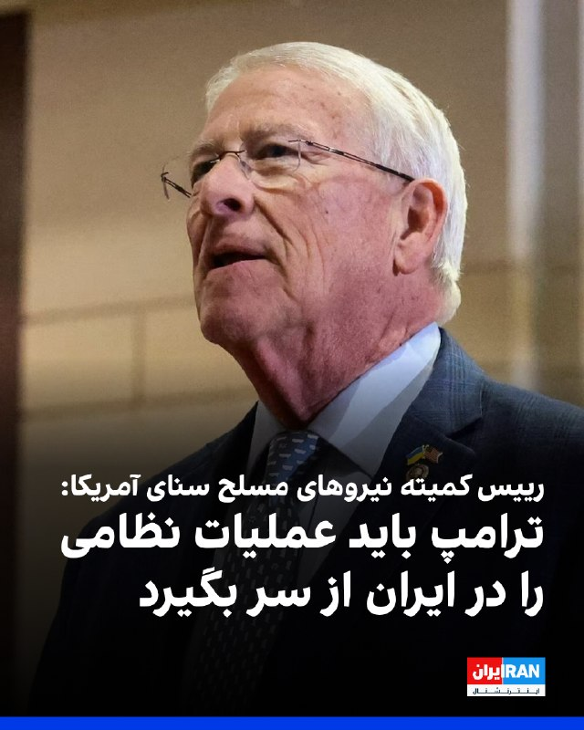

راجر ویکر، رییس کمیته نیروهای مسلح سنای آمریکا در شبکه ایکس نوشت: «باید کاری را که آغاز کرده‌ایم، به پایان برسانیم. آمریکا نباید به‌دنبال توافق با جمهوری اسلامی باشد و در عوض باید عملیات نظامی را از سر بگیرد.»
او افزود: «به دونالد ترامپ توصیه اشتباهی می‌شود تا توافقی را دنبال کند که ارزش نوشته شدن روی کاغذ را هم ندارد.»

ویکر ادامه داد: «فرمانده کل قوا باید به نیروهای مسلح حرفه‌ای آمریکا اجازه دهد نابودی توان نظامی متعارف تهران را تکمیل کرده و تنگه هرمز را بازگشایی کنند.»
https://iranintl.com/202605226738

## IranIntlTV — post 338469

  <a href="telegram/content/IranIntlTV_338469_1779477616.mp4" target="_blank">🎬 Download video</a>

آیا توافق بین تهران و واشینگتن با شرایط فعلی امکان‌پذیر است؟
@iranintltv

## IranIntlTV — post 338467

  

علی خضریان، نماینده تهران در مجلس گفت: «ترامپ بارها می‌گوید جمهوری اسلامی برای رسیدن به توافق زمان ندارد. در این اظهارات رییس جمهور آمریکا فرامتن و اعترافی وجود دارد که اتفاقا زمان علیه آمریکاست. برای همین این لات کوچه خلوت فضای مجازی داد می‌زند که بگوید ایران است که زمان ندارد.»

او ادامه داد: «در سه حوزه کلیدی مدیریت تنگه هرمز، حمایت از جبهه مقاومت وعدم خروج مواد هسته‌ای از خاک کشور به هیچ عنوان مصالحه نخواهد کرد.»

او افزود: «فکر نمی‌کنم درباره متنی بتوانیم صحبت کنیم که روی آن به توافق نزدیک شده باشیم.»
https://iranintl.com/202605220298

## IranIntlTV — post 338466

  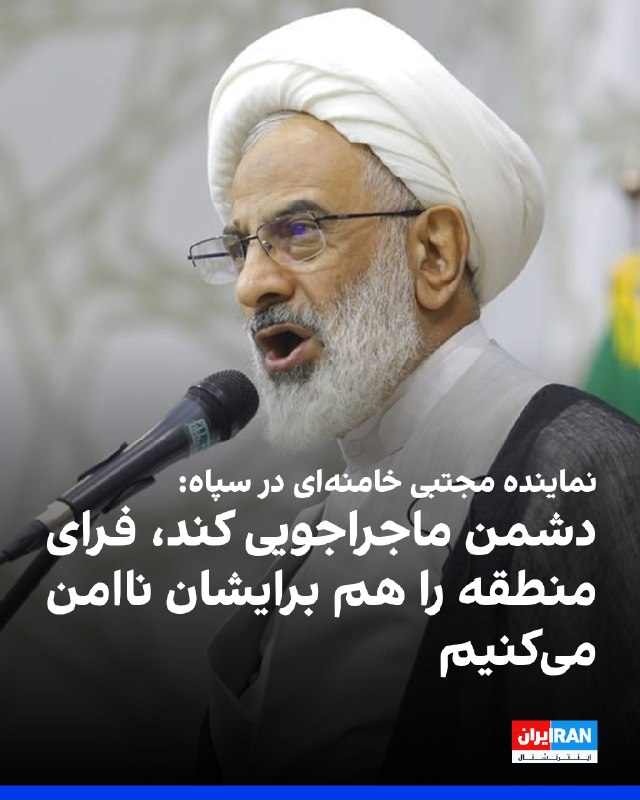

عبدالله حاجی‌صادقی، نماینده مجتبی خامنه‌ای در سپاه پاسداران گفت: «استکبار باید بداند که خلیج فارس و تنگه هرمز تحت کنترل کامل و هوشیارانه نیروی دریایی ماست. اگر دشمن نخواهد این واقعیت را بپذیرد و دست به ماجراجویی بزند، ما نه فقط در منطقه، بلکه فرای منطقه را هم برای آن‌ها ناامن و تنگ خواهیم کرد.»

او افزود: «اگر دشمن مرتکب کوچک‌ترین خطای محاسباتی شود، روزهایی به مراتب سخت‌تر از گذشته را تجربه خواهد کرد. سپاه پاسداران و نیروی دریایی مقتدر، پاسخی به آن‌ها خواهند داد که از نظر وسعت و شدت، فراتر از عملیات‌های ظفرمند وعده صادق خواهد بود.»
https://iranintl.com/202605223982

## IranIntlTV — post 338465

بحران انسانی در تنگه هرمز؛ هزاران دریانورد میان جنگ و بلاتکلیفی گرفتار شده‌اند

ادامه اقدامات تنش‌آفرین جمهوری اسلامی در تنگه هرمز، به نگرانی‌ها درباره تشدید بحران انسانی برای هزاران دریانورد گرفتار در خلیج فارس دامن زده است.

خبرگزاری رویترز جمعه اول خرداد گزارش داد بیش از ۲۰ هزار ملوان در حدود دو هزار کشتی در آب‌های خلیج فارس سرگردان مانده‌اند؛ بسیاری از آن‌ها امکان ترک شناورهای خود را ندارند و با کمبود غذا، آب آشامیدنی و عدم اطمینان نسبت به آینده دست و پنجه نرم می‌کنند.

دریانوردانی که در هفته‌های اخیر با رویترز مصاحبه کرده‌اند، از چالش‌ها و اضطراب مداوم خود در اوضاع جنگی منطقه سخن گفته‌اند.

سلمان صدیقی، ملوان هندی که در یکی از کشتی‌های گرفتار حضور دارد، در تماسی تلفنی به رویترز گفت: «تنها کاری که اینجا انجام می‌دهیم، این است که برای گذراندن شب برنامه‌ریزی کنیم و دعا کنیم در جریان حملات هدف قرار نگیریم.»

تنگه هرمز گذرگاه باریکی میان ایران و عمان است که حدود یک‌پنجم نفت خام و گاز طبیعی مایع جهان از آن عبور می‌کند.

از زمان آغاز مناقشه کنونی در ۹ اسفند ۱۴۰۴، اختلال در تردد شناورها در این آبراه موجب برهم خوردن جریان انرژی جهانی و افزایش قیمت نفت شده است.

انزوای دریانوردان در منطقه جنگی
در حالی که بحران در خلیج فارس ادامه دارد، خبرنگاران رویترز به‌تازگی با یک قایق امدادرسانی به سوی کشتی‌های پهلوگرفته در سواحل عربستان سعودی رفتند.

در این زمان، ملوانان یک نفتکش با تجمع کنار نرده‌های شناور، برای خبرنگاران دست تکان دادند. رویترز این رویداد را «لحظه‌ای نادر از تماس آن‌ها با جهان خارج» توصیف کرد.

بر اساس این گزارش، دریانوردان گرفتار در خلیج فارس نزدیک به سه ماه است در شرایطی منزوی و پراضطراب به سر می‌برند. آن‌ها در فضایی محدود، میان کابین‌های کوچک، سالن‌های غذاخوری مشترک و عرشه‌های داغ کشتی‌ها روزگار می‌گذرانند و تنها با شمار اندکی از همکاران خود در تماس هستند.

محمد اراشدی، هماهنگ‌کننده شبکه جهان عرب و ایران در فدراسیون بین‌المللی کارکنان حمل‌ونقل (ITF)، هشدار داد وضعیت جنگی منطقه آسیب‌پذیری دریانوردان را به‌طور چشمگیری افزایش داده است.

به گفته او، بسیاری از ملوانان با مشکلاتی همچون تاخیر در پرداخت دستمزد، مخالفت با بازگرداندن آن‌ها به کشورهایشان، کمبود آذوقه و نگرانی از حملات موشکی و پهپادی مواجه‌اند.

اراشدی افزود برخی از دریانوردان در تماس‌های تلفنی با او گریه کرده‌اند.

گرفتار میان حقوق‌های معوقه و هراس جنگ
موهیت کوهلی، کاپیتان یک کشتی باری که پس از آغاز جنگ در خلیج فارس گرفتار شده بود، گفت در ابتدا حتی تصور بسته ‌شدن تنگه هرمز هم برای او امکان‌پذیر نبود.

کشتی تحت فرمان او که متعلق به شرکتی آلمانی بود، توانست در منطقه‌ای امن در نزدیکی بندر دمام عربستان سعودی لنگر بیندازد، اما تنها چند روز پس از آغاز درگیری‌ها، خدمه کشتی شاهد عبور موشک‌ها و پهپادهایی بودند که حکومت ایران به سوی کشورهای حاشیه خلیج فارس شلیک می‌کرد.

کوهلی در گفت‌وگو با رویترز پس از بازگشت به هند، با اشاره به فضای حاکم بر کشتی گفت: «خدمه‌ای که همیشه پرجنب‌وجوش و پرسر‌وصدا بودند، ناگهان ساکت شدند. زمان غذا خوردن کوتاه‌تر شد و همه با احتیاط بیشتری صحبت می‌کردند.»

او افزود مالکان کشتی برای اعزام نیروهای جایگزین با خدمه همکاری کردند.

با این حال، مقام فدراسیون بین‌المللی کارکنان حمل‌ونقل خاطرنشان کرد تمامی دریانوردان گرفتار در تنگه هرمز وضعیت مشابهی ندارند و بسیاری از آن‌ها با چالش‌ها و فشارهای به‌مراتب شدیدتری روبه‌رو هستند.

اراشدی گفت در برخی پرونده‌های در دست بررسی، حقوق ناچیز ۱۰۰ تا ۲۰۰ دلاری ملوانان از سال گذشته پرداخت نشده و برخی مالکان کشتی نیز از فراهم کردن امکان بازگشت آن‌ها به کشورشان خودداری می‌کنند یا این کار را مشروط به صرف‌نظر کردن ملوانان از مطالبات معوقه‌شان دانسته‌اند.

تلاش برای تسهیل خروج ملوانان از برزخ
رویترز در ادامه نوشت کشورهای حاشیه خلیج فارس اقداماتی را برای کمک‌رسانی به خدمه کشتی‌های گرفتار آغاز کرده‌اند؛ از جمله تسهیل روند تامین تدارکات و جابه‌جایی نیروها.

سلیمان المزروعی، رییس سازمان بنادر عربستان سعودی، گفت مهم‌ترین مساله برای دریانوردان گرفتار این است که بدانند ساحلی امن «به روی آن‌ها باز است».

به گفته او، سازمان بنادر عربستان سعودی تاکنون به صدها کشتی در تامین مواد غذایی، آب آشامیدنی، سوخت و دارو کمک کرده و امکان انتقال بیش از ۵۰۰ ملوان را فراهم آورده است.
 
🔗متن کامل گزارش را اینجا بخوانید
@iranintltv

## IranIntlTV — post 338464

  <a href="telegram/content/IranIntlTV_338464_1779477618.mp4" target="_blank">🎬 Download video</a>

دو شهروند در پیام‌هایی که با هوش مصنوعی خوانده شده، به ایران اینترنشنال گفتند که قیمت یک پرس قرمه‌سبزی در رستوران‌ها به حدود ۸۰۰ هزار تومان و یک عدد پیتزای دو نفره به بالای دو میلیون تومان رسیده است.

## IranIntlTV — post 338463

  <a href="telegram/content/IranIntlTV_338463_1779477620.mp4" target="_blank">🎬 Download video</a>

دو شهروند در پیام‌هایی که با هوش مصنوعی خوانده شده، به ایران اینترنشنال گفتند که قیمت یک پرس قرمه‌سبزی در رستوران‌ها به حدود ۸۰۰ هزار تومان و یک عدد پیتزای دو نفره به بالای دو میلیون تومان رسیده است.

## IranIntlTV — post 338462

  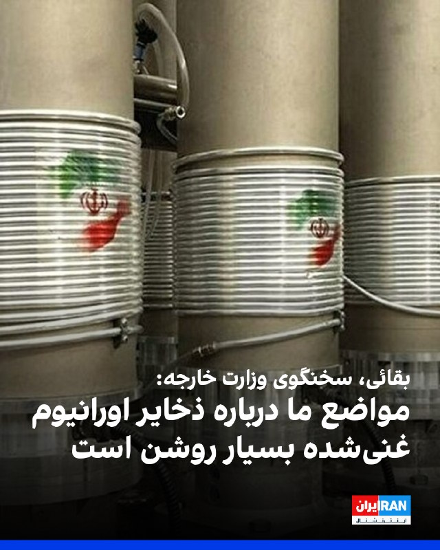

اسماعیل بقائی، سخنگوی وزارت خارجه جمهوری اسلامی گفت: «در مورد اورانیوم غنی‌شده با درجه بالا، مواضع‌مان را خیلی روشن بیان کرده‌ایم؛ در این مرحله اگر بخواهیم در این مباحث گفت‌وگو کنیم، قاعدتا به نتیجه نمی‌رسیم.»

او افزود: «ما قبلا این مسیر را رفتیم و اختلاف‌نظرها آن‌قدر زیاد بود که نتوانستیم به نتیجه برسیم و طرف مقابل به‌خاطر خواسته‌های نامعقولش میز مذاکرات را از بین برد و حمله کرد.»
https://iranintl.com/202605226137

## IranIntlTV — post 338461

  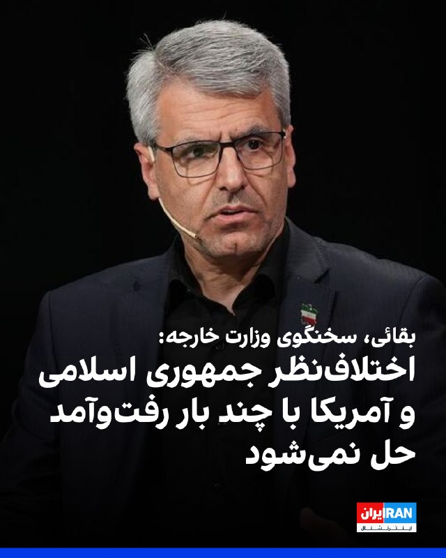

اسماعیل بقائی، سخنگوی وزارت خارجه جمهوری اسلامی گفت: «اختلاف‌نظر ما با آمریکا آن‌قدر عمیق و زیاد است که نمی‌شود گفت با چندبار رفت‌وآمد یا مذاکرات ظرف چند هفته ما باید حتما به نتیجه برسیم.»

او افزود: «نمی‌توانیم بگوییم ضرورتا به جایی رسیده‌ایم که توافق نزدیک است. تمرکز مذاکرات بر خاتمه جنگ است.»

او در واکنش به سفر عاصم منیر به تهران گفت: «این رفت‌وآمدها باوجود اینکه پرترافیک‌تر شده، تداوم همان روند دیپلماتیک است.»

بقائی ادامه داد: «یک هیئتی از قطر درحال مذاکره با وزیر خارجه کشورمان هستند اما میانجی مذاکرات همچنان طرف پاکستانی است.»
https://iranintl.com/202605224547

## FarsiVOA — post 218384

  <a href="telegram/content/FarsiVOA_218384_1779477623.mp4" target="_blank">🎬 Download video</a>

⚡️لیلا مروتی در برنامه تفسیر خبر: جمهوری اسلامی مجبور به تسلیم خواهد شد
@FarsiVOA

## FarsiVOA — post 218383

⚡️گفت‌وگو با جمشید اسدی، اقتصاددان، پیرامون موضوع فرافکنی رژیم جمهوری اسلامی درباره علل و ریشه‌های مصائب اقتصادی ایران
@FarsiVOA

## FarsiVOA — post 218382

⚡️کمبود و گرانی سرسام‌آور داروهای اعصاب و روان در ایران؛ عواقب فردی و اجتماعی این بحران
@FarsiVOA

## FarsiVOA — post 218381

⚡️گفت‌و‌گو با یاسین اهوازی، کارشناس مسائل خاورمیانه، درباره گزارش‌ها درباره تلاش جمهوری اسلامی برای بازسازی توان موشکی و پهپادی‌ خود در دوران آتش‌بس
@FarsiVOA

## FarsiVOA — post 218380

🔺کناره‌‌گیری مدیر اطلاعات ملی آمریکا؛ تقدیر پرزیدنت ترامپ از عملکرد تولسی گابارد

◾️دونالد ترامپ، رئیس جمهوری آمریکا، روز جمعه ۱ خرداد با انتشار پیامی در شبکه اجتماعی تروت سوشال اعلام کرد که تولسی گابارد به دلیل بیماری همسرش و به منظور کمک به او در روند بهبودی، از سمت خود کناره‌گیری می‌کند.

⬇️ بیشتر بخوانید:

https://ir.voanews.com/a/president-trump-white-house-meeting-iran/8152838.html

## FarsiVOA — post 218379

واکنش‌ها به مصائب کسب‌و‌کارها در ایران در سایه خفقان دیجیتال؛ سرکوب اقلیت‌ها ادامه دارد

## FarsiVOA — post 218378

🔺تداوم بلاتکلیفی یک شهروند بهائی در زندان مشهد؛ سرکوب اقلیت‌های مذهبی توسط رژیم در ایران ادامه دارد

◾️گزارش‌های رسیده به صدای آمریکا حاکی از آن است که وفا کاشفی، شهروند بهائی ساکن مشهد، با گذشت یک‌ ماه از بازداشتش، کماکان در زندان وکیل‌آباد این شهر در وضعیت بلاتکلیف به‌سر می‌برد.

⬇️ بیشتر بخوانید:

https://ir.voanews.com/a/vafa-kashefi-iran-bahaaie-religious-repression-prison/8152834.html

## FarsiVOA — post 218377

علی جوانمردی: گزینەهای آمریکا در مقابل ایران، دیپلماسی توام با فشار روزافزون

## FarsiVOA — post 218376

تحریم‌های تازه اتحادیه اروپا علیه جمهوری اسلامی همزمان با افزایش نگرانی‌ها از شوک نفتی

## DW_Farsi — post 125026

  

🔶 هشدار کشورهای غربی به اسرائیل در مورد توسعه غیرقانونی شهرک‌سازی‌ها و خشونت‌ها

۹ کشور غربی در بیانیه‌ای مشترک، ضمن محکوم کردن خشونت‌های شهرک‌نشینان و هشدار به شرکت‌های ساخت‌وساز در خصوص عدم شرکت در مناقصه‌ها، از اسرائیل خواستند تا توسعه شهرک‌های خود را در کرانه باختری اشغالی متوقف کند.

در این بیانیه مشترک که روز جمعه ۲۲ مه، منتشر شد، رهبران کشورهای بریتانیا، فرانسه، آلمان، ایتالیا، کانادا، استرالیا، نیوزیلند، نروژ و هلند تأکید کردند که این شهرک‌سازی‌ها ناقض قوانین بین‌المللی است.

در بخش از این بیانیه آمده است: «طی چند ماه گذشته، وضعیت در کرانه باختری به شکل چشمگیری وخیم‌تر شده است. خشونت شهرک‌نشینان به سطحی بی‌سابقه رسیده است. سیاست‌ها و اقدامات دولت اسرائیل، از جمله تحکیم هرچه بیشتر کنترل خود بر این مناطق، در حال تضعیف ثبات و چشم‌اندازهای دستیابی به راه‌حل دو کشوری است.»

گروه‌های حقوق بشری می‌گویند مقامات اسرائیلی به شهرک‌نشینان اجازه داده‌اند تا در حملات خود علیه فلسطینیان، از مصونیت کامل از مجازات برخوردار باشند.
@dw_farsi

## DW_Farsi — post 125025

  

🔶 تعویق مسابقات قهرمانی کشتی جهان ۲۰۲۶ در بحرین

اتحادیه جهانی کشتی (UWW) با صدور بیانیه‌ای اعلام کرد که در هماهنگی نزدیک با کمیته المپیک بحرین و فدراسیون کشتی این کشور، مسابقات قهرمانی جهان ۲۰۲۶ را که در ابتدا قرار بود از ۲۴ اکتبر تا ۱ نوامبر در بحرین برگزار شود به زمانی دیگر موکول می‌شود.

بنا بر این بیانیه، تصمیم تعویط جام جهانی کشتی "پس از بررسی دقیق و مسئولانه شرایط ژئوپلیتیک کنونی منطقه، به ویژه بلاتکلیفی‌های جاری پیرامون مناقشات در حال وقوع در حوزه خلیج [فارس] و تأثیرات گسترده‌تر آن بر ثبات منطقه و سفرهای بین‌المللی اتخاذ شده است".

در ادامه بیانیه آمده است: «ورزش کشتی همواره فراتر از یک رقابت صرف بوده است؛ کشتی پلی میان ملت‌ها، فرهنگ‌ها و مردم است. در روزگاری که جهان با بلاتکلیفی و تفرقه روبروست، به ما یادآوری می‌شود که ورزش همچنان زبان مشترک صلح، احترام و اتحاد است. با همین رویکرد و روحیه است که اتحادیه جهانی کشتی، کمیته المپیک بحرین و فدراسیون کشتی بحرین این بیانیه مشترک را صادر می‌کنند.»
@dw_farsi

## DW_Farsi — post 125024

🎥 ۲۷ خواهر و برادر ناتنی؛ جست‌وجو برای پدر بیولوژیکی

در اروپا، همزمان با افزایش اهدای اسپرم، بحث بر سر حق فرزندان برای شناخت هویت بیولوژیکی‌شان جدی‌تر شده؛ آیا کودکانی که از طریق اهدای اسپرم متولد می‌شوند، باید حق شناخت پدر بیولوژیکی‌شان را داشته باشند؟ لئونتین از سوئد، ۲۷ خواهر و برادر ناتنی پیدا کرد، اما هنوز یک سؤال بی‌پاسخ مانده؛ پدر واقعی‌اش کیست؟
@dw_farsi

## DW_Farsi — post 125023

🔶 اختلاف ترامپ و نتانیاهو درباره ایران؛ جنگ یا دیپلماسی؟

🔻 گزارشی از مراد رحمتی

مقام‌های اسرائیلی می‌گویند دونالد ترامپ، رئیس جمهور آمریکا به نتانیاهو اطمینان داده هرگونه توافق احتمالی با تهران شامل خروج ذخایر اورانیوم غنی‌شده ایران خواهد بود؛ موضوعی که اسرائیل آن را خط قرمز امنیتی خود می‌داند.

در مقابل، نتانیاهو بارها تاکید کرده است که پایان جنگ تنها زمانی معنا خواهد داشت که علاوه بر توقف برنامه هسته‌ای، حمایت جمهوری اسلامی از نیروهای نیابتی منطقه‌ای و توان موشک‌های بالستیک ایران نیز از میان برود.

اکنون این پرسش مطرح است که در نهایت آیا دیپلماسی دست بالا را خواهد داشت یا تقابل نظامی ادامه پیدا می‌کند؟ و اگر آمریکا بدون توجه به اولویت‌های اسرائیل با جمهوری اسلامی به توافق برسد، آیا اسرائیل آن را می‌پذیرد یا دوباره به اقدام نظامی مستقیم روی خواهد آورد؟ این‌ها محور گفت‌وگوی دویچه وله با دو کارشناس است.
@dw_farsi

## DW_Farsi — post 125022

  

🔶 تعلیق فروش ۱۴ میلیارد دلاری سلاح آمریکا به تایوان به دلیل جنگ ایران

سرپرست نیروی دریایی ایالات متحده روز پنجشنبه، ۲۲ مه، اعلام کرد که فروش تسلیحات به تایوان به حالت "تعلیق" درآمده است تا اطمینان حاصل شود ارتش آمریکا مهمات کافی برای عملیات‌های خود در قبال ایران را در اختیار دارد.

هنگ کائو، سرپرست نیروی دریایی آمریکا، در یک جلسه استماع در کنگره و در پاسخ به سؤالی درباره خرید تسلیحاتی معطل‌مانده و ۱۴ میلیارد دلاری تایوان گفت: «در حال حاضر ما یک وقفه (تعلیق) ایجاد کرده‌ایم تا مطمئن شویم مهمات مورد نیاز برای عملیات "خشم حماسی" (Epic Fury) را در اختیار داریم، که البته مقدار زیادی هم داریم.»

او افزود: «اما ما فقط می‌خواهیم اطمینان حاصل کنیم که همه‌چیز را در اختیار داریم؛ پس از آن، هر زمان که دولت صلاح بداند، فروش نظامی به کشورهای خارجی از سر گرفته خواهد شد.»

وزارت امور خارجه و پنتاگون (وزارت دفاع آمریکا) بلافاصله به درخواست‌ها برای اظهار نظر درباره سخنان کائو پاسخ ندادند.
@-dw_farsi

## DW_Farsi — post 125021

  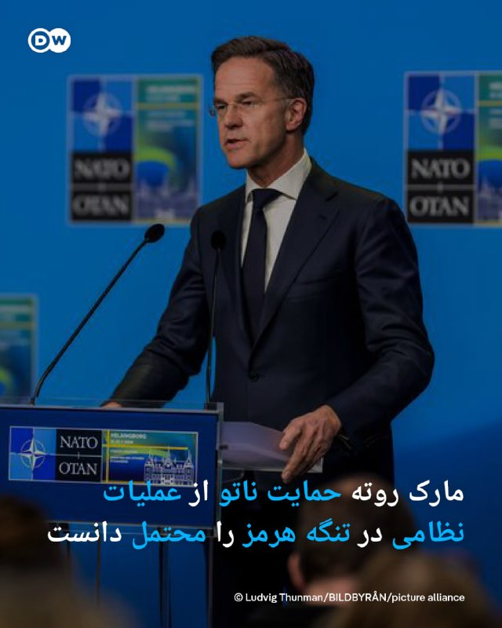

🔶 مارک روته حمایت ناتو از عملیات نظامی در تنگه هرمز را محتمل دانست

یوهان واده‌فول، وزیر امور خارجه آلمان، در تازه‌ترین اظهارنظر خود، محتاطانه در مورد مأموریت احتمالی ناتو در آزادسازی تنگه هرمز سخن گفت.

او اعلام کرد که آلمان همیشه آماده است تا امنیت تردد آزاد در آنجا را تضمین کند و تحت رهبری بریتانیا و فرانسه در حال آماده‌سازی برای این عملیات‌ است.

این سیاستمدار حزب دموکرات مسیحی که در جریان نشست وزرای امور خارجه ناتو در شهر بندری هلسینگبوری سوئد سخن می‌گفت، در عین حال افزود: «اما من هیچ مأموریت فوری ناتو به معنای کلاسیک آن را در تنگه هرمز پیش‌بینی نمی‌کنم.»

روته نیز در ادامه سخنان خود گفت که تلاش‌هایی در جریان است تا متحدان اروپایی بتوانند در مرحله بعدی، بیشترین کمک ممکن را ارائه دهند.

به گفته دیپلمات‌ها، در این مسیر مشارکت دادن ناتو نیز می‌تواند منطقی باشد؛ به‌ویژه از این جهت که دونالد ترامپ، رئیس‌جمهور آمریکا، اخیراً چندین بار ارزش افزوده و فایده ناتو را برای کشورش زیر سؤال برده است.
@dw_farsi

## Persian_Trend_Official — post 14684

  <a href="telegram/content/Persian_Trend_Official_14684_1779477625.webm" target="_blank">🎬 Download video</a>

https://youtube.com/live/D0LvFYIUbgw?feature=share

## Persian_Trend_Official — post 14683

تا دقایقی دیگه لایو امشب آغاز میشه

## RadioFarda — post 157462

🔸قوه قضائیه جمهوری اسلامی از تشکیل پرونده برای دست‌اندرکاران فیلم «تهران کنارت» خبر داده است.

🔸این اقدام پس از اعتراض خبرگزاری فارس و راه‌اندازی کارزاری برای توقف اکران فیلم انجام شد.

🔸خبرگزاری فارس، صحنه‌هایی از تیزر این فیلم را منافی با عفت عمومی دانست.

🔸موضوعی که با واکنش تند حسین فرح بخش کارگردان مواجه شد.

🔸«تهران کنارت»، دومین فیلم علی بهراد، تصویری لوکس و فانتزی از پایتخت ایران نشان می‌دهد. تصویری با شخصیت‌هایی که با همه ناملایمات اجتماعی، اقتصادی و سیاسی، با سبک زندگی خاصی برای خود ساخته‌اند تا دوام بیاورند.

🔸در ادامه اعلام شده این فیلم پس از «اصلاح» برخی سکانس‌ها و تیزر تبلیغاتی، دوباره اکران خواهد شد.

@RadioFarda

## RadioFarda — post 157461

  

🔸سخنگوی هیئت مذاکره‌کننده ایران با آمریکا روز جمعه گفت که موضوع پرونده هسته‌ای ایران در این مرحله مورد مذاکره نیست و از اختلاف نظر عمیق با آمریکا خبر داد.

🔸اسماعیل بقائی گفت: «اختلاف‌نظرها بین ایران و آمریکا آن‌قدر عمیق و زیاد است که نمی‌شود گفت با چندبار رفت‌وآمد یا مذاکرات ظرف چند هفته ما باید حتماً به نتیجه برسیم.»

🔸او گزارش‌ها درباره قریب‌الوقوع بودن توافق با آمریکا را رد کرد و اعلام کرد: «نمی‌توانیم بگوییم ضرورتاً به جایی رسیده‌ایم که توافق نزدیک است.»

🔸بقائی بار دیگر موضع جمهوری اسلامی درباره برنامه هسته‌ای و اورانیوم غنی‌شده را تکرار کرد و گفت مواضع ایران قبلاً اعلام شده است.

🔸این در حالی است که ساعتی قبل، مارکو روبیو، وزیر خارجه آمریکا اعلام کرد که موضوع آینده غنی‌سازی اورانیوم در ایران باید در دستور کار مذاکرات باشد.

🔸دونالد ترامپ، رئیس‌جمهور ایالات متحده، نیز بارها تأکید کرده که ایران نباید به سلاح هسته‌ای دست یابد.

@RadioFarda

## RadioFarda — post 157460

🔸چهارمین برنامه «موزیک تک» با محوریت «صداهای جنوب» در موزه هنرهای معاصر تهران برگزار شد.

🔸در بخشی از این برنامه، گروهی از زنان نیز قطعه‌ای را اجرا کردند که با استقبال حاضران روبه‌رو شد.

🔸زنان در جمهوری اسلامی طی چهار دهه گذشته اجازه تک‌خوانی در برابر مخاطبان مرد را نداشته‌اند و فعالیت خوانندگان زن همواره با محدودیت‌های گسترده روبه‌رو بوده است.

@RadioFarda

## IranianMinds — post 20568

🔴 الجزیره نقل از مقام ایرانی:
میانجی‌ها در تلاشند فاصله بین ایران و امریکا رو کم کنند ولی فقط فضای مثبت و اقدامات میانجی ها کافی نیست!

@IranianMinds

## IranianMinds — post 20567

🔴 اکسیوس نقل از مقام آمریکایی: مذاکرات بسیار دست و پا گیر است و پیش نویس ها هر روز بدون پیشرفت زیادی به این سو و آن سو می روند.

@IranianMinds

## IranianMinds — post 20566

  

@Daeijoonbot
@Daeijoonbot
@Daeijoonbot
کانفیگ رایگان میده به کل ایران👆

## IranianMinds — post 20565

🔴 کانال ۱۲ اسرائیل:

تفاهمات بین اسرائیل و آمریکا بر این اساس است که اورانیوم غنی‌شده یا امکان غنی‌سازی در اختیار ایران باقی نماند!

@IranianMinds

## IranianMinds — post 20564

  

پست ترامپ:

با اینکه بسیار دوست داشتم کنار پسرم دان جونیور و جدید‌ترین عضو خانواده ترامپ، همسر آینده‌اش بتینا باشم، شرایط مربوط به دولت و عشق من به ایالات متحده آمریکا، اجازه چنین کاری را به من نمی‌دهد.
احساس می‌کنم مهم است که در این دوره مهم زمانی، در واشینگتن دی‌سی و در کاخ سفید بمانم. به دان و بتینا تبریک می‌گویم!
رئیس‌جمهور دونالد جی، ترامپ

@IranianMinds

## IranianMinds — post 20563

عزیزان اخبار رو از چنل مردمی و‌ خوب فایتر رادار هم میتونید دنبال کنید سریع براتون پوشش میدن و موضوعش کاملا شبیه چنل خودمونه جوین باشید حتما:

https://t.me/+9C1ENi5qn6hhZjk0

https://t.me/+9C1ENi5qn6hhZjk0

## BBCPersian — post 281809

🔻وزیر کشور ایران از فرمانده ارتش پاکستان در تهران استقبال کرد

فیلد مارشال عاصم منیر، فرمانده ارتش پاکستان و هیات همراهش شامگاه جمعه وارد تهران شدند.

به گزارش ایرنا اسکندر مؤمنی وزیر کشور جمهوری اسلامی از او استقبال کرد.

بر اساس گزارش ایرنا محسن نقوی وزیر کشور پاکستان هم که از چهارشنبه در تهران به سر می‌برد در مراسم استقبال حضور داشت.

ارتش پاکستان در یک بیانیه کوتاه هدف سفر عاصم منیر را «بخشی از تلاش‌های میانجیگری میان ایران و آمریکا» توصیف کرد.

https://bbc.in/4v3pH4G
@BBCPersian

## BBCPersian — post 281808

🔻سخنگوی وزارت خارجه ایران حضور هیئتی از قطر را در تهران تایید کرد

اسماعیل بقایی،‌ سخنگوی وزارت خارجه ایران تایید کرد که یک هیئت از قطر روز جمعه در تهران بودند و با عباس عراقچی وزیر خارجه ایران گفت‌وگو کردند.

او بدون ارائه جزئیات گفت که کشورهای مختلفی طی روزهای اخیر با وزیر خارجه گفتوگو کردند اما تاکید کرد که میانجی اصلی میان ایران و آمریکا همان کشور پاکستان است.

پیشتر رویترز به نقل از یک منبع آگاه گزارش داد که هیئتی از قطر در هماهنگی با آمریکا وارد تهران شده است.

قطر و امارات و عربستان سعودی سه کشوری بودند که آقای ترامپ روز دوشنبه گفت که به درخواست آنها فعلا حمله مجدد به ایران را متوقف کرده است.

https://bbc.in/4v3pH4G
@BBCPersian

## BBCPersian — post 281807

  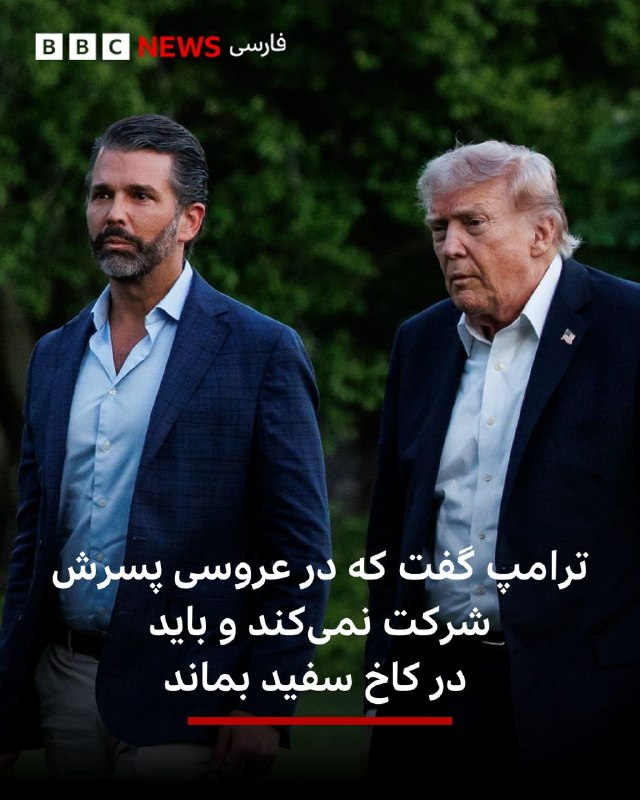

🔻دونالد ترامپ،‌ رئیس جمهور آمریکا می‌گوید که برخلاف میلش،‌ در مراسم عروسی دونالد ترامپ جونیور، پسر بزرگش شرکت نمی‌کند، چون باید در واشنگتن و کاخ سفید بماند.

رسانه‌های آمریکایی پیشتر گزارش داده بودند که قرار است در تعطیلات آخر هفته، مراسم عروسی پسر بزرگ آقای ترامپ با بتینا اندرسون در جزیره‌ای در باهاما برگزار شود.

آقای ترامپ در پستی در تروث سوشال،‌ شبکه اجتماعی خودش نوشت: «در حالیکه خیلی دوست داشتم با پسرم دان جونیور و بتینا،‌ جدیدترین عضو خانواده ترامپ و همسر آینده‌اش باشم،‌ شرایط کارهای مربوط به دولت و عشق من به ایالات متحده به من اجازه این‌کار را نمی‌دهد.»

او در ادامه افزود: «حس می‌کنم مهم است که در این برهه زمانی مهم در واشنگتن دی‌سی،‌ در کاخ سفید بمانم.»

آقای ترامپ،‌ دیروز پنجشنبه هم در یک مصاحبه گفته بود که سعی دارد در مراسم عروسی پسرش شرکت کند اما زمان این مراسم برای او مناسبت نیست چون درگیر مسائلی از جمله ایران است.

📸 EPA

https://bbc.in/4v3pH4G
@BBCPersian

## BBCPersian — post 281806

🔻همزمان با تشدید تلاش‌های دیپلماتیک؛ ترامپ باردیگر گفت که ایران مشتاق رسیدن به توافق است

دونالد ترامپ، رئیس‌جمهور آمریکا روز جمعه در کاخ سفید باردیگر گفت که کاری کرده است که «ایران مشتاق رسیدن به توافق است.»

آقای ترامپ گفت: «می‌بینید ما با ایران چه کرده‌ایم؟ ایران مشتاق رسیدن به توافق است. خواهیم دید چه می‌شود. اما ما به آنها ضربه سختی زدیم و چاره دیگری هم نداشتیم چون ایران نباید سلاح هسته‌ای داشته باشد. آنها نمی‌توانند آن را داشته باشند.»

این اظهارات آقای ترامپ در حالی مطرح شده است که به نظر می‌رسد تحرکات دیپلماتیک برای کمک به رفع اختلافات ایران و آمریکا و حصول نوعی توافق صلح شتاب بیشتری گرفته است. فیلد مارشال عاصم منیر،‌ فرمانده ارتش پاکستان، شامگاه جمعه وارد تهران شد.

محسن نقوی، وزیر کشور پاکستان هم در تهران با عباس عراقچی، وزیر خارجه ایران برای دومین بار طی دو روز گذشته دیدار کرد.

رویترز هم می‌گوید که هیئتی از قطر به تهران سفر کردند.

https://bbc.in/4v3pH4G
@BBCPersian

## BBCPersian — post 281805

  <a href="https://t.me/bbcpersian/281805" target="_blank">📎 Download file</a>

پادکست برنامه جام جهان‌نما جمعه ۱ خرداد ۱۴۰۵
این برنامه رادیویی را می‌توانید هر شب ساعت ۲۰ به وقت ایران، روی موج متوسط ۷۰۲ کیلوهرتز و موج کوتاه ۹۴۶۵ کیلوهرتز بشنوید.

تکرار برنامه را هم می‌توانید ساعت ۲۱:۳۰ روی موج متوسط ۷۰۲ کیلوهرتز و موج کوتاه ۵۳۹۵ کیلوهرتز گوش کنید.
@BBCPersian

## Dirty_Kids — post 389972

  

‏دیوانه خانه‌ست رسما

@Dirty_Kids 👻

## Dirty_Kids — post 389971

  

شیر مبهم و میهن‌پرست خدا در پستی عجیب در تروث‌سوشال گفته عروسی پسرش نمی‌ره. این در حالیه که دو روز پیش گفته بود می‌رم:

«خیلی دلم می‌خواست در کنار پسرم دان جونیور و جدیدترین عضو خونواده‌ی مشنگ شیر خدا یعنی همسر آینده‌اش بتینا باشم،

اما مسائل مربوط به دولت آمریکا و عشقم به ایالات متحده آمریکا این اجازه رو به من نمی‌ده. [با روافض گلاویزز ملاویز می‌خوای بشی شیر خدا؟]

احساس می‌کنم در این برهه‌ی زمانی حساس حضورم در واشنگتن دی‌سی و در خاک‌سفید ضروریه. [ای شیر کلک خدا، دعوا می‌خوای بگیری؟]

پیوند دان و بتینا را تبریک می‌گم [آره بابا کار خوبی کردی نرفتی، ما هم تبریک می‌گیم].

رئیس‌جمهور، دونالد جی. ترامپ، یل نامعلوم خاک‌سفید»

@Dirty_Kids 👻

## Dirty_Kids — post 389969

عقل نداری که مردک عرزشی، دفعه بعد تمیزتر دربیار هوش مصنوعی‌رو
پیرسینگو خوب نساخته نصفه‌س. مرسی که کوله‌قرمز میذارین کنار اسمتون از دور چراغ میدین

@Dirty_Kids 👻

## Dirty_Kids — post 389968

  <a href="telegram/content/Dirty_Kids_389968_1779477628.mp4" target="_blank">🎬 Download video</a>

کاری به تحریک آمیز بودن رقص این فلسطین‌به‌کون‌های سپاهی ندارم

اینا میان به وطن‌پرستا میگن شما دنبال رقصیدنید

@Dirty_Kids 👻

## Dirty_Kids — post 389967

‏برو کیرم دهن another life شد.
این زندگی چی‌ بود که باز بخواد بعدیش باشه

@Dirty_Kids 👻

## Dirty_Kids — post 389966

  

طرفو با یه 206 عهد بوق، عرق یکو نیمی و چیپس بردن باغ ویلا بعد ب بقیه داره میگه ارزون 😂😂

@Dirty_Kids 👻

## Hranews — post 113100

  

گزارشی از آخرین وضعیت بهار صحرائیان، وکیل دادگستری در زندان عادل آباد شیراز

❗️
❗️
❗️
❗️
❗️ – بهار صحرائیان، وکیل دادگستری محبوس در زندان عادل آباد شیراز، کماکان به‌صورت بلاتکلیف در این زندان در بازداشت موقت به‌سر می‌برد و از ملاقات با خانواده محروم است.

به گزارش خبرگزاری هرانا، ارگان خبری مجموعه فعالان حقوق بشر در ایران، بهار صحرائیان همچنان به‌صورت بلاتکلیف قضایی در زندان عادل آباد شیراز نگهداری می‌شود.

یک منبع مطلع و نزدیک به خانواده این وکیل دادگستری ضمن تایید این خبر به هرانا گفت: با وجود پیگیری خانواده وی برای تعیین قرار وثیقه و آزادی موقت، مسئولین قضایی با این امر مخالفت کرده‌اند. همچنین خانم صحرائیان از زمان بازداشت تاکنون از ملاقات با خانواده محروم مانده است.

ادامه مطلب

#بهار_صحرائیان

↘️
@hranews_bot تماس ✉️ -  @Hranews  کانال هرانا 🆑

## Hranews — post 113099

  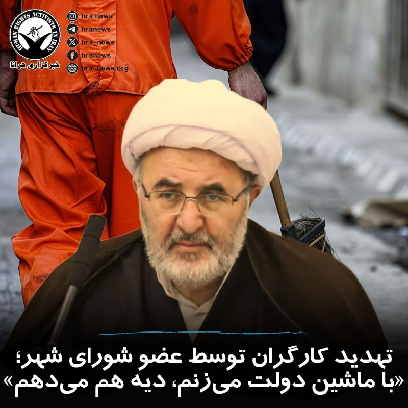

طی روزهای اخیر اعتراض صنفی شماری از کارگران شهرداری زنجان نسبت به وضعیت معیشتی و مطالبات شغلی، منجر به بروز تنش میان کارگران معترض و محمدکاظم مجتهدی عضو شورای شهر زنجان و نایب رئیس شورا این شهر شده است. رویداد ۲۴ با انتشار گزارشی و بر اساس روایت کارگران اعلام کرد، در پی وقوع این تجمع اعتراضی محمدکاظم مجتهدی هنگام خروج از محل تجمع در پاسخ به مطالبات کارگران گفته است: «می‌روید کنار یا نه؟ با ماشین دولت می‌زنم، دیه هم می‌دهم.»

مهدی محمدیان، #کارگر آسیب دیده در خصوص جزئیات این حادثه گفت: آقای مجتهدی "ماشین را روشن کرد و همان‌طور که حرکت کرد به من زد. من زمین خوردم و تا نصف بدن ماشین روی من آمد. او میگفت می‌زنم، خون‌بهایت را می‌دهم." در مقابل، محمدکاظم مجتهدی این روایت را رد کرده و مدعی شده کارگر معترض «خود را به زمین انداخته» و ماجرا با فضاسازی مخالفان شورا همراه شده است.

چندی پیش در این راستا خبرگزاری ایلنا با انتشار خبری اعلام کرد، ده‌ها نفر از کارگران شهرداری زنجان که به تصمیم شورای شهر و شهرداری مبنی بر حذف اضافه کارها و عدم افزایش حقوق کارکنان شهرداری طبق وعده‌های قبلی شکایت داشتند، در مقابل دفتر شهرداری این شهر تجمع مسالمت‌آمیزی داشتند. این تجمع با برخورد نادرست یکی از اعضای شورای شهر مواجه شده بود. همچنین علی اصغر نجاری، دبیر اجرایی خانه کارگر استان زنجان نیز در این خصوص اظهار کرده که در پی وقوع این رویداد «پای کارگر مذکور به شدت آسیب دیده است».

↘️
@hranews_bot تماس ✉️ - @Hranews کانال هرانا 🆑

## alonews — post 121868

  <a href="telegram/content/alonews_121868_1779477630.webm" target="_blank">🎬 Download video</a>

👈 خضریان، نماینده مجلس: ترامپ لات کوچه خلوته

✅ @AloNews خبر جنگ

## alonews — post 121867

  <a href="telegram/content/alonews_121867_1779477630.webm" target="_blank">🎬 Download video</a>

👈منبع نزدیک به کاخ سفید : با داغ‌تر شدن درگیری‌های نظامی تو ایران، ترامپ برنامه‌هاشو عوض کرده و قراره آخر هفته رو تو کاخ سفید بمونه

✅ @AloNews خبر جنگ

## alonews — post 121866

  <a href="telegram/content/alonews_121866_1779477630.webm" target="_blank">🎬 Download video</a>

👈‏پنتاگون با انتشار این ویدیو گفته : یوفو
🛸 تو آب‌های ایران 
✅ @AloNews خبر جنگ

## alonews — post 121865

  <a href="telegram/content/alonews_121865_1779477630.mp4" target="_blank">🎬 Download video</a>

👈‏پنتاگون با انتشار این ویدیو گفته : یوفو
🛸 تو آب‌های ایران

✅ @AloNews خبر جنگ

## alonews — post 121864

  <a href="telegram/content/alonews_121864_1779477631.webm" target="_blank">🎬 Download video</a>

👈دو منبع ناشناس به رویترز گفتند که ایران این محموله را برای کمک به ایجاد اعتماد بین قطر و پاکستان که میانجیگری در مذاکرات صلح را بر عهده دارد، تأیید کرده است.

✅ @AloNews خبر جنگ

## alonews — post 121863

  <a href="telegram/content/alonews_121863_1779477631.webm" target="_blank">🎬 Download video</a>

👈خبرگزاری رویترز گزارش داد که دو نفتکش قبلی قطر که از زمان آغاز حملات هوایی آمریکا و اسرائیل در ۲۸ فوریه، موفق به عبور از تنگه هرمز شده بودند، توسط قطر به پاکستان فروخته شدند.

✅ @AloNews خبر جنگ

## alonews — post 121862

  <a href="telegram/content/alonews_121862_1779477631.webm" target="_blank">🎬 Download video</a>

👈سومین نفتکش گاز طبیعی مایع قطر از طریق هرمز به سمت چین حرکت می‌کند

✅ @AloNews خبر جنگ

## alonews — post 121861

  <a href="telegram/content/alonews_121861_1779477631.webm" target="_blank">🎬 Download video</a>

🔴پرفورمنس هنرمند ایرانی در خیابان

🔴پیاز می‌فروشد و رنده می‌کند…

🔴تا مردم، بر وضعیتی که در آن زندگی می‌کنیم، اشک بریزند.

🤔امید به زندگی با جمهوری اسلامی برابر با 0 مطلق

✅@AloNews

## alonews — post 121860

  <a href="telegram/content/alonews_121860_1779477631.webm" target="_blank">🎬 Download video</a>

👈یک منبع رسمی ایرانی به الجزیره: توقف جنگ در تمام جبهه‌ها، پیش‌شرط اساسی برای هرگونه مذاکره آتی است.

🔴هنوز توافق نهایی حاصل نشده و تلاش‌ها برای کاهش فاصله بین تهران و واشنگتن ادامه دارد.

🔴فضای مثبت همراه با تلاش‌های دیپلماتیک مهم است، اما برای یک توافق واقعی کافی نیست.

✅ @AloNews خبر جنگ

## alonews — post 121859

  <a href="telegram/content/alonews_121859_1779477632.webm" target="_blank">🎬 Download video</a>

👈نورالدین الدغیر خبرنگار الجزیره در تهران: به نظر می‌رسد فضای مذاکرات ایران و آمریکا تا این لحظه مثبت است و پیشرفت ملموسی در حل برخی اختلافات از طریق میانجیگر پاکستانی حاصل شده است.

🔴آمدن فرمانده ارتش پاکستان به تهران ممکن است دو هدف داشته باشد:

🔴۱. حل اختلافات باقی‌مانده

🔴۲. احتمال اعلام چیزی پس از نهایی شدن آن وجود دارد

✅ @AloNews خبر جنگ

## alonews — post 121858

  <a href="telegram/content/alonews_121858_1779477632.webm" target="_blank">🎬 Download video</a>

🔴فوری / آکسیوس به نقل از یک منبع نزدیک به ترامپ: رئیس جمهور آمریکا طی چند روز گذشته به طور فزاینده‌ای احساس ناامیدی کرده است.

🔴رئیس جمهور احتمال آغاز یک عملیات نظامی بزرگ دیگر، اعلام پیروزی و پایان دادن به جنگ را مطرح کرد.

✅ @AloNews خبر جنگ

## alonews — post 121857

  <a href="telegram/content/alonews_121857_1779477632.webm" target="_blank">🎬 Download video</a>

👈ایسنا: تلاش میانجی‌ها برای نزدیک‌ کردن متون دو طرف کماکان ادامه دارد

✅ @AloNews خبر جنگ

## alonews — post 121856

  <a href="telegram/content/alonews_121856_1779477632.webm" target="_blank">🎬 Download video</a>

👈 اکسیوس: یک مقام آمریکایی، مذاکرات را «طاقت‌فرسا» توصیف کرد. 
🔴این مقام آمریکایی گفت که پیش‌نویس‌ها «هر روز در حال رفت و برگشت هستند» بدون آنکه پیشرفت چشمگیری حاصل شود. 
✅ @AloNews خبر جنگ

## alonews — post 121855

  <a href="telegram/content/alonews_121855_1779477632.webm" target="_blank">🎬 Download video</a>

👈 هاآرتص: یک واحد مخفی در وزارت آموزش اسرائیل وجود داشته که معلمان منتقد دولت را زیر نظر می‌گرفته است.

🔴 این واحد: پست‌های شبکه‌های اجتماعی معلمان را بررسی می‌کرده

🔴فعالیتشان در اعتراضات را ثبت می‌کرده

🔴برایشان پرونده محرمانه می‌ساخته

✅ @AloNews خبر جنگ

## alonews — post 121854

  <a href="telegram/content/alonews_121854_1779477632.webm" target="_blank">🎬 Download video</a>

👈 اکسیوس: یک مقام آمریکایی، مذاکرات را «طاقت‌فرسا» توصیف کرد.

🔴این مقام آمریکایی گفت که پیش‌نویس‌ها «هر روز در حال رفت و برگشت هستند» بدون آنکه پیشرفت چشمگیری حاصل شود.

✅ @AloNews خبر جنگ

## alonews — post 121853

  <a href="telegram/content/alonews_121853_1779477632.webm" target="_blank">🎬 Download video</a>

👈دونالد ترامپ» اعلام کرد «آرون لوکاس» به عنوان مدیر موقت اطلاعات ملی منصوب خواهد شد.

✅ @AloNews خبر جنگ

## alonews — post 121852

  <a href="telegram/content/alonews_121852_1779477633.webm" target="_blank">🎬 Download video</a>

👈یک حادثه امنیتی در پایگاه نیروی هوایی پنساکولا در ایالت فلوریدای آمریکا رخ داد.

✅ @AloNews خبر جنگ

## alonews — post 121851

  <a href="telegram/content/alonews_121851_1779477633.webm" target="_blank">🎬 Download video</a>

👈آخرین قیمت نفت ۱۰۲.۳۰ دلار

✅ @AloNews خبر جنگ

## alonews — post 121850

  <a href="telegram/content/alonews_121850_1779477633.webm" target="_blank">🎬 Download video</a>

👈گفته رویترز، تولسی گابارد توسط کاخ سفید مجبور به کناره‌گیری شد

✅ @AloNews خبر جنگ

## alonews — post 121849

  <a href="telegram/content/alonews_121849_1779477633.webm" target="_blank">🎬 Download video</a>

👈ترامپ سفر خود به باشگاه گلف ملی ترامپ بدمینستر را لغو کرده و در عوض در طول آخر هفته در کاخ سفید خواهد ماند

✅ @AloNews خبر جنگ

---
📅 بروزرسانی: 1405/03/01 21:04
---

## VahidOOnLine — post 241569

  

♦️ محققان امنیت سایبری روز جمعه اول خرداد به سی‌ان‌ان گفتند که هکرهای ایرانی در جریان جنگ با آمریکا و اسرائیل، در قالب کارشناسان جذب نیرو (اصطلاحا هد هانتر)، مهندسان نرم‌افزار بخش هوانوردی را در یک طرح جاسوسی پیچیده هدف قرار داده‌اند.

بر اساس گزارش واحد ۴۲ شرکت امنیت سایبری «پالو آلتو نتورکس»، این ماموران سایبری علاوه بر بخش هوانوردی، یک شرکت نفت و گاز آمریکایی و سازمان‌هایی را در اسرائیل و امارات هدف قرار داده‌اند. مقامات اطلاعاتی آمریکا پیش از این درباره این دست تهدیدات نامتقارن پس از حملات اواخر فوریه هشدار داده بودند؛ چرا که نفوذ به این بخش‌ها می‌تواند به جمهوری اسلامی امکان ردیابی فهرست پروازها به خاورمیانه یا درک بهتر وضعیت بازار متلاطم نفت را بدهد.

این شبکه جاسوسی با استفاده از آگهی‌های شغلی جعلی و نرم‌افزارهای جلسات ویدیویی آلوده به کدهای مخرب اجرا شده و در یک مورد، هکرها خود را به جای یک شرکت هواپیمایی آمریکایی جا زده‌اند. با این حال، محققان تاکید کردند که بر اساس داده‌های موجود، هکرها در نفوذ به شرکت‌های نفتی، گازی و هوانوردی آمریکایی مورد هدف موفق نبوده‌اند.
‌🇸🇦 Indypersian

🤖 @VahidOOnLine

## VahidOOnLine — post 241568

  <a href="telegram/content/VahidOOnLine_241568_1779471300.mp4" target="_blank">🎬 Download video</a>

«دلم براتون تنگ میشه اما امید دارم برگردید»
‌🏁 🇬🇧 ManotoTV

🤖 @VahidOOnLine

## VahidOOnLine — post 241567

  

فاکس‌نیوز گزارش داد که تولسی گبرد، مدیر اطلاعات ملی آمریکا از سمت خود استعفا داده است.
او پیش‌تر گفته بود گفت که اهداف تعیین‌شده از سوی ترامپ درباره جنگ با جمهوری اسلامی، با اهداف اسرائیل متفاوت است.

گبرد همچنین گفته بود که حکومت ایران برقرار به نظر می‌رسد، اما در نتیجه عملیات نظامی آمریکا به‌طور گسترده تضعیف شده است.
‌🏁 🇬🇧 IranintlTV

🤖 @VahidOOnLine

## VahidOOnLine — post 241566

  

♦️ عاصم منیر، فرمانده کل ارتش پاکستان، عصر جمعه اول خرداد، به تهران وارد شد و از سوی اسکندر مومنی، وزیر کشور، مورد استقبال قرار گرفت. این سفر از پیش از سوی منابع دیپلماتیک اعلام شده بود اما پاکستان تا پیش از رسیدن منیر به تهران، حرکت او را تایید نکرده بود.

همزمان با منیر، محسن نقوی، وزیر کشور پاکستان نیز در تهران حضور دارد و انتظار می‌رود اختلافات میان تهران و واشنگتن برای امضای تفاهم‌نامه اولیه برای شروع مذاکرات، موضوع اصلی گفتگوهای منیر با مقام‌های جمهوری اسلامی باشد.
‌🇸🇦 Indypersian

🤖 @VahidOOnLine

## VahidOOnLine — post 241565

  <a href="telegram/content/VahidOOnLine_241565_1779471303.mp4" target="_blank">🎬 Download video</a>

رییس اورژانس پیش‌بیمارستانی و مدیریت حوادث دانشگاه علوم پزشکی البرز اعلام کرد بر اثر تصادف زنجیره‌ای در آزادراه کرج قزوین، سه نفر جان باختند و چهار نفر دیگر مجروح شدند.
به گزارش رسانه‌های داخلی، در این سانحه دو مرد و یک زن کشته شدند و سه مرد و یک زن دیگر نیز مجروح شدند.
مصدومان توسط نیروهای اورژانس به بیمارستان امام جعفر صادق نظرآباد منتقل شدند.
‌🏁 🇬🇧 ManotoTV

🤖 @VahidOOnLine

## VahidOOnLine — post 241564

  <a href="telegram/content/VahidOOnLine_241564_1779471304.mp4" target="_blank">🎬 Download video</a>

در پی کارزار مردمی ایران‌اینترنشنال برای شناسایی جاویدنامان بیمارستان الغدیر تهران، شاهدان با ارسال پیام‌هایی می‌گویند کادر درمان این بیمارستان در ۱۸ و ۱۹ دی ۱۴۰۴، با وجود فشار شدید ماموران و ممانعت آنها، معترضان را رها نکردند و برای بهبود آنها تلاش کردند.
فرنوش فرجی، عضو تحریریه ایران‌اینترنشنال گزارش می‌دهد.
‌🏁 🇬🇧 IranintlTV

🤖 @VahidOOnLine

## VahidOOnLine — post 241563

  

♦️ وزارت امور خارجه آمریکا اعلام کرد مارکو روبیو، وزیر امور خارجه این کشور، روز شنبه دوم خرداد، برای سفری سه‌روزه عازم هند خواهد شد. تامی پیگات، سخنگوی وزارت خارجه آمریکا، در بیانیه‌ای تایید کرد که روبیو در این سفر از شهرهای کلکته، آگرا، جیپور و دهلی‌نو بازدید خواهد کرد.

هدف اصلی این سفر، گفتگو با مقامات ارشد هندی درباره موضوعات حیاتی نظیر امنیت انرژی، تجارت و همکاری‌های دفاعی اعلام شده است.

همچنین، رایزنی‌های روبیو در هند درست پیش از نشست ۶ خرداد وزرای خارجه گروه «کوآد» (منطقه گفتگوهای امنیتی چهارجانبه) در دهلی‌نو انجام می‌شود. این ائتلاف غیررسمی که از کشورهای آمریکا، ژاپن، استرالیا و هند تشکیل شده و به عنوان «نسخه آسیایی ناتو» نیز شناخته می‌شود، در پاسخ به افزایش قدرت چین شکل گرفته و تاکنون رزمایش‌های نظامی و دریایی مشترکی را در منطقه هند-آرام برگزار کرده است.
‌🇸🇦 Indypersian

🤖 @VahidOOnLine

## VahidOOnLine — post 241562

  

علیرضا سلیمی، عضو هیات رییسه مجلس گفت: «یکی از دستاوردهای جنگ اخیر، مدیریت جمهوری اسلامی بر تنگه هرمز است که هرگز قابل مذاکره و معامله نیست و رژیم حقوقی جدیدی بر این تنگه حاکم خواهد شد که قواعد آن را تنها ما تعریف و اعمال می‌کنیم.»

او افزود: «شرایط عبور و مرور همچنین نرخ عوارض بر تنگه هرمز را جمهوری اسلامی مشخص می‌کند و با توییت نمی‌توانند اوضاع تنگه را تغییر دهند.»
‌🏁 🇬🇧 IranintlTV

🤖 @VahidOOnLine

## VahidOOnLine — post 241561

♦️دونالد ترامپ، رئیس‌جمهوری ایالات متحده، روز جمعه اول خردادماه در مراسم سوگند رئیس جدید بانک مرکزی آمریکا در کاخ سفید گفت اقدام علیه ایران اجتناب‌ناپذیر بوده است.
او با تأکید بر اینکه ایران نباید به سلاح هسته‌ای دست پیدا کند، گفت آمریکا «چاره‌ای جز اقدام» نداشته و این سیاست همچنان ادامه خواهد داشت. ترامپ همچنین با اشاره به توان نظامی ایالات متحده، بار دیگر از در اختیار داشتن «بزرگ‌ترین ارتش جهان» سخن گفت.
رئیس‌جمهوری آمریکا در ادامه گفت که ایران اکنون به‌شدت به‌دنبال توافق است و این موضوع را نتیجه فشارهای واردشده از سوی واشنگتن دانست.
‌🇸🇦 Indypersian

🤖 @VahidOOnLine

## VahidOOnLine — post 241560

  

بر اساس گزارش‌های رسیده به ایران‌اینترنشنال، محمدرضا منصوری، جوان ۲۴ ساله و پدر یک نوزاد ۲۰ روزه بود که با تیراندازی نیروهای حکومتی در جریان اعتراضات شهر رشت جان خود را از دست داد. او به دلیل جراحات ناشی از شلیک گلوله، حدود یک ماه بستری و تحت درمان بود.

بر اساس گزارش‌ها، محمدرضا ۱۸ دی‌ماه در منطقه یخسازی رشت هدف شلیک نیروهای حکومتی قرار گرفت و بر اثر اصابت گلوله به نخاع و کتف به شدت زخمی شد.

او ۱۳ بهمن‌ماه بر اثر شدت جراحات وارده در جریان اعتراضات جان باخت.

به گفته منابع محلی، محمدرضا تنها فرزند خانواده بود و پیش از حضور در فراخوان، گفته بود: «برای آینده دخترم در اعتراض شرکت می‌کنم.»
‌🏁 🇬🇧 IranintlTV

🤖 @VahidOOnLine

## VahidOOnLine — post 241559

  

خبرگزاری ایسنا اعلام کرد که عاصم منیر، رییس ستاد کل ارتش پاکستان، عصر جمعه وارد تهران شده است.
پیش‌تر برخی رسانه‌ها از سفر او به تهران، برای تلاش در خصوص نزدیک کردن خواسته‌ها و انتظارات مقام‌های جمهوری اسلامی و ایالات متحده، برای رسیدن به توافق خبر داده بودند.
‌🏁 🇬🇧 IranintlTV

🤖 @VahidOOnLine

## VahidOOnLine — post 241558

  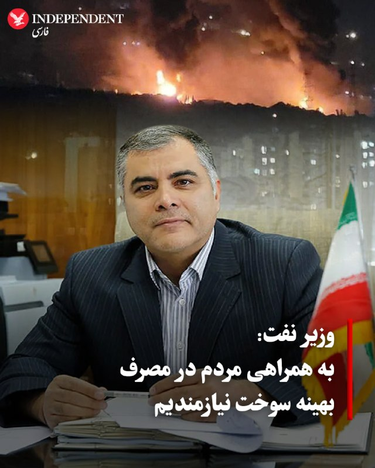

♦️ محسن پاک‌نژاد، وزیر نفت جمهوری اسلامی، روز جمعه اول خرداد هشدار داد که با توجه به آسیب‌های وارد شده به مخازن سوخت و زیرساخت‌های انرژی در دوران جنگ، لازم است که مردم در مصرف بهینه سوخت همراهی کنند.

پاک‌نژاد گفت: «بخش عمده‌ای از آنچه در جنگ روزه از دست داده بودیم را به‌سرعت به مدار بازگرداندیم اما با این وجود به همراهی مردم در مصرف بهینه سوخت نیاز داریم.»

پاک‌نژاد تاکید کرد که تلاش‌ها برای بازسازی سایر واحدهای آسیب‌دیده ادامه دارد.
‌🇸🇦 Indypersian

🤖 @VahidOOnLine

## VahidOOnLine — post 241557

بندر خَصَب، راه فرار جمهوری اسلامی از محاصره دریایی؟
فرناز داوری- در میانه آتش‌بس شکننده و محاصره دریایی در تنگه هرمز، بندر خَصَب در عمان به یکی از مسیرهای حیاتی برای رساندن کالا به ایران تبدیل شده است. بندری که با قایق‌های «شوتی»، ماهیگیران و گردشگران شناخته می‌شد، حالا گذرگاهی پرهزینه اما مهم برای دور زدن محاصره بنادر جنوبی ایران شده است.
تا پیش از آغاز جنگ آمریکا و اسرائیل علیه جمهوری اسلامی، بخشی از رفت‌وآمدهای دریایی میان خصب و سواحل جنوبی ایران، به قایق‌های تندرو اختصاص داشت. قایق‌هایی که در ادبیات محلی به «شوتی» معروف‌ هستند و سال‌ها در مسیرهای غیررسمی میان عمان و جنوب ایران، رفت‌وآمد کرده‌اند.
این قایق‌ها معمولا به صورت گروهی حرکت می‌کردند و در زمانی کوتاه خود را از آب‌های عمان به قشم یا دیگر نقاط ساحلی ایران می‌رساندند.
این مسیر پیش از این بیشتر برای دادوستدهای غیررسمی و قاچاق خرد شناخته می‌شد. سیگار ایرانی، مشروبات الکلی و حشیش، از ایران به عمان منتقل می‌شد و در مسیر بازگشت، کالاهای مصرفی، لوازم خانگی و اجناس لوکس، از عمان به ایران می‌رسید.
حضور قایق‌های ماهیگیری ایرانی نیز در اطراف خصب همیشه بخشی از تصویر معمول این منطقه بود.

ادامه گزارش را در اینجا بخوانید:
iranintl
‌🏁 🇬🇧 IranintlTV

🤖 @VahidOOnLine

## VahidOOnLine — post 241556

  

دونالد ترامپ در کاخ سفید درباره مذاکرات با جمهوری اسلامی گفت: «خواهیم دید چه خواهد شد. ما ضربه سختی به ‌آنها زدیم. چاره‌ای نداشتیم. ایران نمی‌تواند سلاح هسته‌ای داشته باشد.»

ترامپ ادامه داد: «آمریکا با جمهوری اسلامی همان رفتاری را انجام می‌دهد که با ونزوئلا انجام داده است.»

ترامپ تاکید کرد جمهوری اسلامی بی‌صبرانه به دنبال رسیدن به توافق است.
‌🏁 🇬🇧 IranintlTV

🤖 @VahidOOnLine

## VahidOOnLine — post 241555

رجزخوانی نظام؛ مغازه کوچک وحشت‌فروشی
حسین ذوقی-جمهوری اسلامی در حالی که تقریبا در آستانه شکست در همه زمینه‌های داخلی و خارجی قرار دارد، تاکتیکش را بر یک سنت فقهی استوار کرده است: رجزخوانی.
سخنان تند مداحان در تجمعات شبانه، سخنان تلویزیونی مسئولان میان‌رده تا گفته‌های رسمی مسئولین بلندپایه در مذاکرات، رسانه‌های اجتماعی و در نهایت، پیام‌های مکتوب رهبر نادیده نظام، بر همین سنت استوار شده است.
ماجرای «آتیش زدم به مالم» را حتما شنیده‌اید: بزازی در بازار، در کسادی وضعیتش و وقتی که اجناسش روی دستش مانده بود و راهی برای فروش نداشت، شاگردش را با یک حلب نفت به میانه بازار می‌فرستد تا فریاد بزند که: «اوستایم عقلش را از دست داده، می‌خواهد همه جا را به آتش بکشد!»
مردم هم که ترسیده‌اند به طمع جنس مفت، سمت دکان بزاز هجوم می‌برند. اوستای بزاز پارچه‌هایش را میان دکان می‌اندازد و رجز می‌خواند که «آتش می‌زنم ...»
خلاصه که انبار بزاز خالی می‌شود و جنس‌هایش را با قیمت بالاتر می‌فروشد!
حالا جمهوری اسلامی هم انگار می‌خواهد با تهدید و رجزخوانی به آتش زدن دنیا، ایده‌هایش را به منطقه و جهان بفروشد.
مداحان از منبر، منتقدان داخلی را به مرگ تهدید می‌کنند. محمود نبویان، نایب‌رییس کمیسیون امنیت ملی مجلس شورای اسلامی، پادشاهان کشورهای عربی را تهدید می‌کند که «هیچ یک از کاخ‌هایشان سالم نخواهد ماند».
عباس عراقچی، وزیر امور خارجه جمهوری اسلامی، در شبکه‌های اجتماعی از «پاسخ طولانی و دردناک» سخن می‌گوید.
اسماعیل بقایی، سخنگوی وزارت امور خارجه، حتی در نشست‌های دیپلماتیک، با لحنی رجزآلود حرف می‌زند.
غلامحسین محسنی اژه‌ای، رییس قوه قضاییه، از «تحمیل ناپذیری» می‌گوید؛ و حسین کنعانی‌مقدم، فرمانده پیشین سپاه پاسداران، اعتراف می‌کند که «رجزخوانی یکی از روش‌های مقابله با دشمن است».
لایه‌ها‌ی متفاوت نظام به یک زبان مشترک رسیده‌اند. این روش تصادفی نیست، شیوه جدید حکمرانی در جمهوری اسلامی است.

ادامه این تحلیل را اینجا بخوانید:
‌🏁 🇬🇧 IranintlTV

🤖 @VahidOOnLine

## VahidOOnLine — post 241554

  <a href="telegram/content/VahidOOnLine_241554_1779471311.mp4" target="_blank">🎬 Download video</a>

⭕️«بنما آفتاب را بی‌ابر»؛ روایتی از عشق و تحصیل ممنوعه بهائیان در ایران

📌گزارش ایندیپندنت فارسی از نخستین نمایش خصوصی فیلم در نیویورک

♦️فیلم «بنما آفتاب را بی‌ابر» (Cast Aside the Clouds)، ساخته مری دارلینگ، کارگردان و تهیه‌کننده کانادایی، در ظاهر بر رابطه عاطفی دو جوان تمرکز دارد، اما در لایه‌های زیرین به موضوعاتی مانند هویت دینی، محرومیت از تحصیل، فشارهای اجتماعی و حق زیستن بر اساس باور شخصی می‌پردازد؛ یک داستان عاشقانه در خیابان‌های تهران که آرام‌آرام به روایتی درباره تبعیض، ایمان، حق آموزش و آزادی انتخاب تبدیل می‌شود.

ایندیپندنت فارسی در نخستین نمایش خصوصی این فیلم در نیویورک حضور داشت و پس از آن، در گفتگوی خبری با حضور عوامل فیلم شرکت کرد. فضای این گفتگو به‌ویژه به‌دلیل حضور بازیگر نقش پدر لیلا، (آنتونی عزیزی) که بهائی هستند، و بیان تجربه های شخصی از حال‌ و روز خانواده ایشان در اوائل انقلاب تجاربی ملموس را به واقعیت دشواری زندگی بهائیان در ایران پیوند می‌زد.

بیشتر بخوانید...
‌🇸🇦 Indypersian

🤖 @VahidOOnLine

## VahidOOnLine — post 241553

  <a href="telegram/content/VahidOOnLine_241553_1779471312.mp4" target="_blank">🎬 Download video</a>

یک شهروند در پیامی به ایران اینترنشنال با اشاره به پوشش چادر خود می‌گوید که نه در تجمعات حکومتی شرکت می‌کند و نه از نظام جمهوری اسلامی حمایت می‌کند. پیام او با هوش مصنوعی خوانده شده است.
‌🏁 🇬🇧 IranintlTV

🤖 @VahidOOnLine

## VahidOOnLine — post 241552

  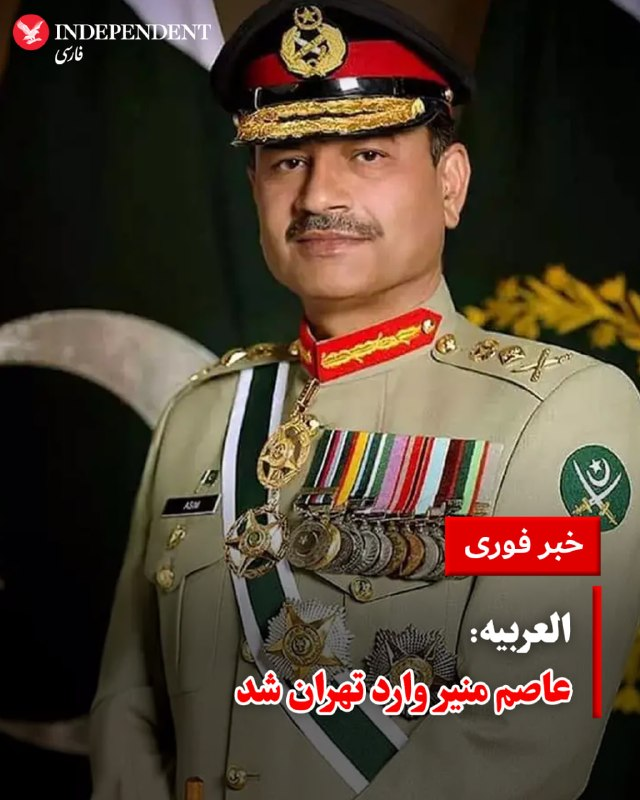

♦️ خبرگزاری العربیه به نقل از منابع خود اعلام کرد که عاصم منیر، فرمانده کل ارتش پاکستان عصر جمعه، اول خرداد وارد تهران شده است. پیش از این خبرگزاری فرانسه و العربیه از حرکت منیر به سمت تهران خبر داده بودند.

بر اساس گزارش‌ها، این سفر که همزمان با حضور وزیر کشور پاکستان در ایران انجام شده، در راستای کاهش شکاف‌ها میان تهران و واشنگتن است. مارکو روبیو، وزیر امور خارجه ایالات متحده نیز با اشاره به این سفر، اعلام کرد که گام‌های مثبتی در راستای دستیابی به توافق انجام شده با این‌وجود تاکید کرد که نمی‌خواهد «بیش از حد» مثبت‌اندیش باشد و باید دید که تلاش‌ها به چه شکل پیش می‌رود.
‌🇸🇦 Indypersian

🤖 @VahidOOnLine

## VahidOOnLine — post 241551

♦️روز پنجشنبه ۳۱ اردیبهشت در مراسمی در موزه هنرهای معاصر تهران، محسن شریفیان به همراه گروهی از نوازندگان، با اجرای ساز شوفار، بخشی از روایت موسیقی معاصر جنوب ایران را به نمایش گذاشتند؛ اجرایی متفاوت که با تلفیق عناصر آیینی و موسیقایی، توجه مخاطبان را به خود جلب کرد.

 در روایتی از موسیقی معاصر جنوب ایران، صدای ساز «شوفار» به‌عنوان یکی از کهن‌ترین ابزارهای صوتی، در موزه هنرهای معاصر تهران طنین‌انداز شد؛ سازی ساخته‌شده از شاخ قوچ که ریشه‌ای آیینی و مذهبی دارد.
شوفار در سنت یهودیان نواخته می‌شود و بیش از همه در مراسم‌های مهمی مانند «روش هشانا» (سال نو یهودی) و «یوم کیپور» (روز آمرزش) کاربرد دارد؛ صدایی نمادین که برای بیداری، تأمل و بازگشت به درون نواخته می‌شود.
‌🇸🇦 Indypersian

🤖 @VahidOOnLine

## VahidOOnLine — post 241550

  

♦️وزارت امور خارجه فرانسه روز جمعه اول خرداد، اعلام کرد که این کشور پیش‌نویس قطعنامه‌ای را در شورای امنیت سازمان ملل برای تشکیل یک هیئت بین‌المللی با هدف احیای کشتیرانی آزاد در تنگه هرمز آماده کرده است. این اقدام در حالی صورت می‌گیرد که واشنگتن برای به رای گذاشتن متن پیشنهادی خود با دشواری روبرو است.

کنترل این آبراه حیاتی، مانع اصلی در مذاکرات پایان دادن به جنگ سه‌ماهه میان تهران و واشنگتن است. در حال حاضر، قطعنامه پیشنهادی آمریکا و بحرین که خواستار توقف حملات و مین‌گذاری جمهوری اسلامی در تنگه است، به دلیل احتمال وتوی چین و روسیه بیش از دو هفته به تعویق افتاده است. پکن و مسکو پیش از این در ماه آوریل، متن مشابهی را به دلیل موضع‌گیری علیه تهران وتو کرده بودند.
‌🇸🇦 Indypersian

🤖 @VahidOOnLine

## WithYashar — post 11981

مسج هاتون رو میبینم ! حتی اگه بخونه باز هم باید بیاد ، اره در باسن هست ، جلو بره پاره میشه عقب هم بره پاره میشه … آخرش چی ؟ مقامات پاکستان برای‌ همین اومدن ! قطر اومده ! همه فقط توافق با اون رو قبول دارن ! قشنگی‌ این بازی کثیف‌ همین جاست 😂
@withyashar

## WithYashar — post 11980

وحیدی الان فرد شماره یک و زننده حرف آخر در تمامی تصمیمات هست برای‌ همین مذاکرات به نظر خیلی به توافق نزدیک نشون داده میشه ! تا اون بیاد بیرون و حرف آخر رو بزنه ! آخرش باید این کار رو بکنه و همون جاست که دم به تله میده !
@withyashar

## WithYashar — post 11979

همه در انتظار بیرون اومدن یا نشانه ای از موقعیت وحیدی هستند … شک نکنید

## WithYashar — post 11978

من میرم میخوابم میدونم امشب من بخوابم میزنه 😂♥️شب بخیر

## WithYashar — post 11977

من میرم میخوابم میدونم امشب من بخوابم میزنه 😂♥️شب بخیر

## WithYashar — post 11976

رئیس کمیته نیروهای مسلح سنای آمریکا: ترامپ باید به ارتش اجازه دهد تا انهدام توانمندی‌های نظامی ایران را تکمیل کند.

@withyashar

## WithYashar — post 11975

ترامپ در تروث : در حالی که خیلی دلم می‌خواست با پسرم، دان جونیور، و جدیدترین عضو خانواده ترامپ، همسر آینده‌اش، بتینا، باشم، شرایط مربوط به دولت و عشق من به ایالات متحده آمریکا اجازه این کار را به من نمی‌دهد. احساس می‌کنم مهم است که در این دوره مهم در واشنگتن دی سی، در کاخ سفید بمانم. به دان و بتینا تبریک می‌گویم! رئیس جمهور دونالد جی. ترامپ
@withyashar
دمت گرم عمو ترامپ بمون بزن یه عروسی هم بعد براش هتل رامسر میگیریم 😂🙌🏾

## WithYashar — post 11974

اتاق جنگ با یاشار : خواهیم دید چه خواهد شد

## WithYashar — post 11973

یک منبع بلندپایه به «العربیه»: دیدار فردا میان عاصم منیر، فرمانده ارتش پاکستان و احمد وحیدی، فرمانده سپاه پاسداران ایران در تهران برگزار خواهد شد. @withyashar

## WithYashar — post 11972

یک منبع بلندپایه به «العربیه»: دیدار فردا میان عاصم منیر، فرمانده ارتش پاکستان و احمد وحیدی، فرمانده سپاه پاسداران ایران در تهران برگزار خواهد شد.
@withyashar

## WithYashar — post 11971

  <a href="telegram/content/WithYashar_11971_1779471316.mp4" target="_blank">🎬 Download video</a>

دیده بان اتاق جنگ : الان شکار ۳ پهپاد شناسایی بالا سر منطقه ویژه ماهشهر
@withyashar

## WithYashar — post 11970

وزیر کشور پاکستان که هم اکنون در تهران بسر می برد با همتای عربستانی خود گفت وگوی تلفنی انجام داد.‌.
@withyashar

## WithYashar — post 11969

علیرضا سلیمی، عضو هیات رئیسه مجلس : «یکی از دستاوردهای جنگ اخیر، مدیریت جمهوری اسلامی بر تنگه هرمز است که هرگز قابل مذاکره و معامله نیست و رژیم حقوقی جدیدی بر این تنگه حاکم خواهد شد که قواعد آن را تنها ما تعریف و اعمال می‌کنیم.»

وی‌ اشاره کرد : «شرایط عبور و مرور همچنین نرخ عوارض بر تنگه هرمز را جمهوری اسلامی مشخص می‌کند و با توییت نمی‌توانند اوضاع تنگه را تغییر دهند.»
@withyashar

## WithYashar — post 11968

ترامپ: همان کاری رو که در ونزوئلا انجام دادیم، در ایران انجام میدیم.
@withyashar

## WithYashar — post 11967

سپهبد عاصم منیر، فرمانده ارتش پاکستان، وارد تهران شد و مورد استقبال اسکندر مومنی، وزیر کشور ایران، قرار گرفت.

پاکستان می‌گوید این سفر بخشی از تلاش‌های میانجیگری مداوم است.
@withyashar

## WithYashar — post 11966

نورمن، خبرنگار وال استریت ژورنال : یه منبع میگه هر چیزی درباره پیش‌نویس توافقی که داره می‌چرخه، دروغه و صحت نداره
@withyashar

## WithYashar — post 11965

آکسیوس:نتانیاهو بزرگ ترین عامل برای عدم توافق بین دو کشور است

@withyashar

## WithYashar — post 11964

ایسنا: برخی مقامات تاکید کردند که حضور عاصم منیر فرمانده ارتش پاکستان لزوما به معنای قطعی بودن تفاهم بر سر چارچوب اولیه نیست.
@withyashar

## WithYashar — post 11963

العربی الجدید به نقل از منبعی در وزارت خارجه پاکستان: واشنگتن و تهران انعطاف کافی در پرونده‌های اصلی از خود نشان نمی‌دهند
@withyashar

## WithYashar — post 11962

ایسنا: عاصم منیر وارد تهران شد
@withyashar

## mwarmonitor — post 9493

🔴سناتور راجر ویکر (جمهوری‌خواه از می‌سی‌سی‌پی)، رئیس کمیته نیروهای مسلح سنا، روز جمعه از رئیس‌جمهور دونالد ترامپ خواست حملات علیه ایران را از سر بگیرد تا «کاری را که شروع کرده‌ایم تمام کنیم» — و مدعی شد که به رئیس‌جمهور «مشاوره نادرست» داده شده است تا به دنبال توافقی برای پایان دادن به جنگ برود. نیویورک پست

@mwarmonitor

## mwarmonitor — post 9492

🔸بقایی: تمرکز مذاکرات بر خاتمه جنگ است

سخنگوی وزارت خارجه:
🔹نمی‌توانیم بگوییم ضرورتا به جایی رسیده‌ایم که توافق نزدیک است.

🔹تمرکز مذاکرات بر خاتمه جنگ است.

@mwarmonitor

## mwarmonitor — post 9491

  

در حالی که بسیار مشتاق بودم در کنار پسرم، دان جونیور، و جدیدترین عضو خانواده ترامپ، یعنی همسر آینده‌اش، بتینا باشم، اما شرایط مربوط به دولت و عشق من به ایالات متحده آمریکا، این اجازه را به من نمی‌دهد. احساس می‌کنم لازم است در این بازه زمانی مهم، در واشنگتن دی.سی. و در کاخ سفید بمانم.
تبریک به دان و بتینا!

رئیس‌جمهور دونالد جی. ترامپ

@mwarmonitor

## mwarmonitor — post 9490

🔴 یک گزارش پاکستانی به نقل از منبعی در وزارت امور خارجه این کشور مدعی است که آمریکا و ایران در مسائل کلیدی انعطاف نشان نمی‌دهند و سفر فرمانده ارتش پاکستان به ایران، تلاشی «در آخرین لحظه» برای جلوگیری از آغاز دوباره جنگ است.» i24

@mwarmonitor

## mwarmonitor — post 9489

🚨«فوری | [Fox News] تولسی گبرد، مدیر اطلاعات ملی ایالات متحده آمریکا، استعفا داد.»

@mwarmonitor

## mwarmonitor — post 9488

🔴«فرمانده کل ارتش پاکستان، عاصم منیر، در چارچوب تلاش‌های میانجی‌گری برای دستیابی به توافقی جهت پایان دادن به جنگ میان ایالات متحده آمریکا و ایران، وارد تهران شد.» @mwarmonitor

## mwarmonitor — post 9487

  

✈️بله تایید میشود @mwarmonitor

## mwarmonitor — post 9486

  

✈️بله تایید میشود @mwarmonitor

## mwarmonitor — post 9485

  

✈️یک جت شخصی اسرائیلی از نوع Hawker 800 که توسط شرکت Arrow Aviation اداره می‌شود (شماره ثبت: 4X-CNZ)، دیروز از فرودگاه بن گوریون در تل‌آویو به سمت دبی پرواز کرد، حدود ۴۰ دقیقه روی زمین ماند و سپس دوباره به سمت اسرائیل پرواز کرد.

@mwarmonitor

## mwarmonitor — post 9484

  

🔰یک ملوان نیروی دریایی آمریکا در ناو USS Comstock (LSD 45) یک کشتی تجاری را در حالی مشاهده می‌کند که در حال اجرای محاصره آمریکا علیه ایران است، ۲۱ مه. نیروهای آمریکایی از زمان آغاز این محاصره، ۹۷ کشتی تجاری را تغییر مسیر داده و ۴ کشتی را از کار انداخته‌اند.

@mwarmonitor

## mwarmonitor — post 9483

  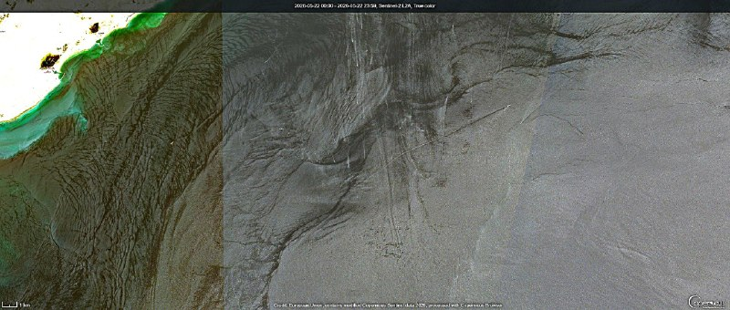

🔹تنگه هرمز خالی است، به‌جز قایق‌های تندرو سپاه پاسداران که از ایران به سمت تنگه در حال عبور هستند.

🔸این نشان می‌دهد ایران درباره تعداد کشتی‌هایی که امروز عبور کرده‌اند آمارسازی می‌کند. ۴ شناور بزرگ در حال عبور از مسیر «عوارض ایران» قابل مشاهده هستند. این عدد بسیار کمتر از ۳۰+ مورد اعلام‌شده است.

@mwarmonitor

## mwarmonitor — post 9482

🔴مارشال ارتش پاکستان برای نهایی کردن توافق میان آمریکا و ایران راهی تهران می‌شود

📝نویسنده: باراک راوید AXIOS

🔰یک منبع امنیتی پاکستانی به اکسیوس (Axios) گفت که ژنرال عاصم منیر، عالی‌رتبه‌ترین فرمانده نظامی پاکستان، روز جمعه در تلاش برای دستیابی به توافقی که بر اساس آن آمریکا و ایران با پایان دادن به جنگ و آغاز مذاکرات برای یک توافق گسترده‌تر موافقت کنند، به تهران سفر می‌کند.

🔸چرا این موضوع اهمیت دارد؟
ژنرال منیر از زمان آغاز جنگ، میانجی اصلی میان آمریکا و ایران بوده است. این واقعیت که او پس از چند روز گفت‌وگو در سطوح پایین‌تر راهی تهران می‌شود، می‌تواند نشان‌دهنده تلاش نهایی پاکستان برای دستیابی به یک توافق باشد.

🔹پشت صحنه خبر
میانجی‌ها در تلاش هستند تا یک «نامه‌ اعلام آمادگی» (Letter of Intent) را نهایی کنند؛ این سند شامل توافقی برای پایان دادن به جنگ و اصول پایه‌ای برای ۳۰ روز مذاکرات بیشتر درباره یک توافق گسترده‌تر است که برنامه هسته‌ای ایران را نیز در بر می‌گیرد.
کشورهای میانجی: کشورهای پاکستان، قطر، عربستان سعودی، مصر و ترکیه همگی در این میانجی‌گری مشارکت داشته‌اند.

🔸ابهام در موضع ایران: هنوز مشخص نیست که آیا ایران تمایلی به امضای چنین سندی دارد یا خیر، به‌ویژه در شرایطی که به نظر می‌رسد برخی در تهران بر این باورند که برگ برنده و اهرم فشار در دست آن‌هاست.

🔹اظهار نظر مقامات
«پیشرفت‌های اندکی حاصل شده است. نمی‌خواهم بزرگ‌نمایی کنم، اما تحرکات کوچکی صورت گرفته که این خوب است.»
— مارکو روبیو، وزیر امور خارجه آمریکا (روز جمعه)
وی در ادامه افزود که خواسته بنیادین این است که «ایران هرگز نباید به سلاح هسته‌ای دست یابد. این امر مطلقاً ممکن نیست.»
روبیو همچنین اشاره کرد که هرگونه توافقی باید به موضوع ذخایر اورانیوم با غنای بالای ایران و سیاست غنی‌سازی این کشور در آینده بپردازد. وی در پایان به این نکته اشاره کرد که پس از تاکید مجدد ایران در روز پنج‌شنبه بر قصد خود برای ایجاد سیستمی جهت دریافت عوارض در تنگه هرمز، به ایران اجازه داده نخواهد شد تا در این آبراه «ایستگاه‌های دریافت عوارض» ایجاد کند.

@mwarmonitor

## mwarmonitor — post 9481

📰 وال‌استریت ژورنال بر اساس داده‌ها: صادرات نفت ایران که از طریق دریا حمل می‌شود، به‌دلیل محاصره به سطحی نزدیک به صفر کاهش یافته است.

@mwarmonitor

## mwarmonitor — post 9480

  

🔸امروز با وزیر خارجه ترکیه، Hakan Fidan، دیدار کردم تا درباره ضرورت راهبردی ادامه‌دارِ پایبندی همه متحدان به تعهدات دفاعی خود و همچنین برنامه‌های مربوط به نشست آینده ناتو در ترکیه گفتگو کنیم. همچنین درباره بازگشایی تنگه هرمز و تلاش برای دستیابی به ثبات بیشتر منطقه‌ای صحبت کردیم.

@mwarmonitor

## mwarmonitor — post 9479

📰 رویترز: بر اساس منابع مطلع، قطر یک هیئت مذاکره‌کننده به تهران اعزام کرده است که با هماهنگی ایالات متحده فعالیت می‌کند تا به دستیابی به توافقی برای پایان دادن به جنگ با ایران کمک کند.

@mwarmonitor

## mwarmonitor — post 9478

🔹نخست‌وزیر هلند، Rob Jetten، می‌گوید دولت هلند با اعمال ممنوعیت واردات کالاهایی که در شهرک‌های یهودی در سرزمین‌های فلسطینی تحت اشغال اسرائیل تولید می‌شوند موافقت کرده است.

@mwarmonitor

## mwarmonitor — post 9477

🔸وزیر خارجه اوکراین، Andrii Sybiha، می‌گوید مذاکرات میان روسیه که با میانجی‌گری آمریکا انجام می‌شود به‌تدریج به نقطه فرسودگی و بن‌بست نزدیک می‌شود.

@mwarmonitor

## mwarmonitor — post 9476

🔴رئیس سازمان جهانی بهداشت (WHO) می‌گوید هلند یک مورد جدید ابتلا به ویروس هانتا را در یکی از خدمه یک کشتی تأیید کرده است.

@mwarmonitor

## mwarmonitor — post 9475

  

🔴رسانه‌های ایرانی به نقل از یک منبع دیپلماتیک در اسلام‌آباد: فرمانده ارتش پاکستان به ایران سفر کرده است. @mwarmonitor

## mwarmonitor — post 9474

🛸مرحله دوم از افشای پدیده‌های ناشناخته هوایی (UAP) توسط وزارت دفاع آمریکا منتشر شده است که شامل ۵.۶ گیگابایت ویدئو و بیش از ۷۰ مگابایت اسناد طبقه‌بندی‌زدایی‌شده می‌شود.

@mwarmonitor

## FoxNewsTwitter — post 342125

  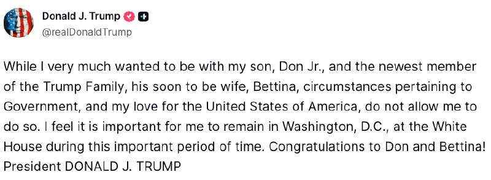

Fox News (Twitter/X)

BREAKING: President Trump announces he will NOT attend his son Don Jr.'s wedding, saying government matters and his "love for the United States of America" are too important for him to leave the White House during this "important period of time."

"While I very much wanted to be with my son, Don Jr., and the newest member of the Trump Family, his soon to be wife, Bettina, circumstances pertaining to Government, and my love for the United States of America, do not allow me to do so."

## FoxNewsTwitter — post 342124

Fox News (Twitter/X)

Gabbard is resigning to support her husband through his battle with "an extremely rare form of bone cancer," Fox News Digital learned. She notified President Donald Trump during a meeting in the Oval Office Friday.

## FoxNewsTwitter — post 342123

  <a href="telegram/content/FoxNewsTwitter_342123_1779471325.mp4" target="_blank">🎬 Download video</a>

Fox News (Twitter/X)

BREAKING: Tulsi Gabbard has notified President Trump that she is resigning from her post as Director of National Intelligence.

Gabbard says she is leaving the administration to support her husband through his battle with “an extremely rare form of bone cancer,” Fox News Digital has exclusively learned.

Her final day in the post will be June 30, 2026. | @davidspunt

## FoxNewsTwitter — post 342122

‌Fox News (Twitter/X)

Read more about her departure from Trump's Cabinet:

## FoxNewsTwitter — post 342121

  

Fox News (Twitter/X)

BREAKING NEWS: Tulsi Gabbard is resigning as director of national intelligence

## FoxNewsTwitter — post 342117

Fox News (Twitter/X)

BREAKING: Kevin Warsh has officially been sworn in as the new Chairman of the Federal Reserve by Supreme Court Justice Clarence Thomas.

Warsh marked the moment by signaling the pressure and expectations now facing the central bank.

“After we leave this stage, the real work begins. So let’s begin that work."

## FoxNewsTwitter — post 342116

  <a href="telegram/content/FoxNewsTwitter_342116_1779471328.mp4" target="_blank">🎬 Download video</a>

Fox News (Twitter/X)

BREAKING: "Our mandate at the Fed is to promote price stability and maximum employment."

"When we pursue those aims with wisdom and clarity, independence and resolve, inflation can be lower, growth stronger, real-take home pay higher, and America, can be more prosperous. And no less important, America's place in the world more secure."

"These duties are now mine, Mr. President, because of the trust you have placed in me."

## FoxNewsTwitter — post 342115

  <a href="telegram/content/FoxNewsTwitter_342115_1779471330.mp4" target="_blank">🎬 Download video</a>

Fox News (Twitter/X)

JUST IN: President Trump shares a lighthearted moment during the swearing-in ceremony of Fed Chairman Kevin Warsh, joking that he would rather be a Supreme Court justice than lead the Fed.

“I'm not sure. I think I'd rather be a justice between you and I. It might be easier. You're going to find out. You'll be saying, well, that's a very easy job."

## FoxNewsTwitter — post 342114

  <a href="telegram/content/FoxNewsTwitter_342114_1779471332.mp4" target="_blank">🎬 Download video</a>

Fox News (Twitter/X)

BREAKING: Kevin Warsh is sworn in by Supreme Court Justice Clarence Thomas as the new chairman of the Federal Reserve.

## FoxNewsTwitter — post 342113

  <a href="telegram/content/FoxNewsTwitter_342113_1779471335.mp4" target="_blank">🎬 Download video</a>

Fox News (Twitter/X)

NEW: President Trump jokes “they must like you!” after the stock market jumped 600 points on the day Kevin Warsh was sworn in as Fed chair.

“Stock market’s up 600 points. That means they like you. If they didn’t like you...” Trump said while making a downward hand motion.

“I think it can only go up. I think with you, it’s only going to go up.”

## FoxNewsTwitter — post 342112

  <a href="telegram/content/FoxNewsTwitter_342112_1779471337.mp4" target="_blank">🎬 Download video</a>

Fox News (Twitter/X)

BREAKING: President Trump tears into the Federal Reserve for "losing its way" over the last few years as he prepares to swear in Kevin Warsh as the new chair.

"Unfortunately, in the eyes of many, the Fed lost its way in recent years. It became distracted by concerns far removed from its core mission and mandate, drifting into matters such as climate policy and DEI initiatives."

"With the Fed straying from its mandate, while the last administration blew out the deficit. Americans suffered the worst inflation that we had in history."

## FoxNewsTwitter — post 342111

  <a href="telegram/content/FoxNewsTwitter_342111_1779471339.mp4" target="_blank">🎬 Download video</a>

Fox News (Twitter/X)

HAPPENING NOW: President Trump says "no one in America" is better prepared to lead the Federal Reserve than new chair Kevin Warsh.

"The Federal Reserve is a pillar of the world financial system, and the most important central bank anywhere in the world."

"Honestly, I really mean this... I want Kevin to be totally independent. I want him to be independent and just do a great job."

## FoxNewsTwitter — post 342110

  <a href="telegram/content/FoxNewsTwitter_342110_1779471342.mp4" target="_blank">🎬 Download video</a>

Fox News (Twitter/X)

BREAKING: New Federal Reserve Chair Kevin Warsh gets a roaring applause from the White House crowd as President Trump introduces him at his swearing in ceremony:

"I expect he will go down as one of the truly great chairmen of the Federal Reserve that we've ever had. I really believe that."

## FoxNewsTwitter — post 342109

  <a href="telegram/content/FoxNewsTwitter_342109_1779471344.mp4" target="_blank">🎬 Download video</a>

Fox News (Twitter/X)

NOW: The White House crowd bursts out laughing after President Trump cracks a joke during Kevin Warsh's swearing-in ceremony as the new Federal Reserve Chairman.

"Oh, I thought that was for me. I was very unhappy. I looked around and I saw they were all looking at you. I was not happy about that."

## FoxNewsTwitter — post 342108

  

Fox News (Twitter/X)

WATCH LIVE: President Trump swears in Kevin Warsh as new Fed chair https://twitter.com/i/broadcasts/1rxmqoBMWAnxy

## FoxNewsTwitter — post 342107

Fox News (Twitter/X)

A growing number of politicians are being accused of antisemitism.

Democrat Graham Platner faced backlash over his Nazi-linked tattoo and is now coming under fire for resurfaced Reddit posts, while fellow Democrat Maureen Galindo said that she wants to lock up “American Zionists” in an ICE detention facility.

@BillMelugin_ reports on the hatred creeping into politics as examples of it grow more and more egregious. | @HARRISFAULKNER @FaulknerFocus

## FoxNewsTwitter — post 342106

Fox News (Twitter/X)

RT @TreyYingst: UPDATE: A Qatari negotiation team is in Tehran on Friday and Saturday to support the U.S. to reach a final deal that would end the war and address outstanding issues with Iran, an official with knowledge of the visit told Fox News.

## pm_afshaa — post 91216

  <a href="telegram/content/pm_afshaa_91216_1779471346.webm" target="_blank">🎬 Download video</a>

🔴العربیه الجدید به نقل از منبعی در وزارت خارجه پاکستان: واشنگتن و تهران انعطاف کافی در پرونده‌های اصلی از خود نشان نمیده.

سفر فرمانده ارتش پاکستان به تهران ممکنه آخرین تلاش برای جلوگیری از بازگشت منطقه به جنگ باشه.

💧 Rainbet.com the #1 Non-KYC Crypto Casino & Sportsbook @rainbetcom

😁 @Pm_Afshaa

## pm_afshaa — post 91215

🔴ترامپ: ما به ایران ضربات شدیدی وارد کردیم و گزینه دیگری نداشتیم

💧 Rainbet.com the #1 Non-KYC Crypto Casino & Sportsbook @rainbetcom

😁 @Pm_Afshaa

## pm_afshaa — post 91214

🔴ترامپ: ایران به شدت خواهان توافقه
همان کاری را که در ونزوئلا انجام دادیم، در ایران انجام می دهیم

💧 Rainbet.com the #1 Non-KYC Crypto Casino & Sportsbook @rainbetcom

😁 @Pm_Afshaa

## pm_afshaa — post 91213

🔴ترامپ : ما یه مقدار بدهی داریم که باید حلش کنیم و راهش رشد اقتصادیه قراره با رشد خیلی سریع از این بدهی خارج بشیم

💧 Rainbet.com the #1 Non-KYC Crypto Casino & Sportsbook @rainbetcom

😁 @Pm_Afshaa

## pm_afshaa — post 91212

وال استریت ژورنال: صادرات نفت ایران از طریق دریا به دلیل محاصره به سطح صفر کاهش یافته

💧 Rainbet.com the #1 Non-KYC Crypto Casino & Sportsbook @rainbetcom

😁 @Pm_Afshaa

## pm_afshaa — post 91211

🔴2000 ساعت از قطع اینترنت مردم ایران توسط جمهوری اسلامی گذشت

💧 Rainbet.com the #1 Non-KYC Crypto Casino & Sportsbook @rainbetcom

😁 @Pm_Afshaa

## pm_afshaa — post 91210

  <a href="telegram/content/pm_afshaa_91210_1779471347.webm" target="_blank">🎬 Download video</a>

🔴حسینی همدانی، امام جمعه کرج:
هرکسی که در تجمعات شبانه شرکت نمیکنه، باید در محضر خدا پاسخگو باشه.

💧 Rainbet.com the #1 Non-KYC Crypto Casino & Sportsbook @rainbetcom

😁 @Pm_Afshaa

## pm_afshaa — post 91209

🔴نورمن، خبرنگار وال استریت ژورنال : یه منبع میگه هر چیزی درباره پیش‌نویس توافقی که داره می‌چرخه، دروغه و صحت نداره

💧 Rainbet.com the #1 Non-KYC Crypto Casino & Sportsbook @rainbetcom

😁 @Pm_Afshaa

## pm_afshaa — post 91208

  <a href="telegram/content/pm_afshaa_91208_1779471348.webm" target="_blank">🎬 Download video</a>

🔴العربیه: عاصم ملک، رئیس سازمان اطلاعات پاکستان هم عازم تهران شد.

💧 Rainbet.com the #1 Non-KYC Crypto Casino & Sportsbook @rainbetcom

😁 @Pm_Afshaa

## pm_afshaa — post 91207

🔴پوتین: اوکراین یک خوابگاه دانشجویی را هدف قرار داد و 15 نفر مفقود شده‌اند، شش نفر کشته و 39 نفر دیگر زخمی شدن

💧 Rainbet.com the #1 Non-KYC Crypto Casino & Sportsbook @rainbetcom

😁 @Pm_Afshaa

## pm_afshaa — post 91206

🔴اختلال گسترده Gps در تنگه هرمز ، عربستان ، اسرائیل ، اردن ، سوریه ، عراق ، ایران

💧 Rainbet.com the #1 Non-KYC Crypto Casino & Sportsbook @rainbetcom

😁 @Pm_Afshaa

## pm_afshaa — post 91204

🔴مارک لوین:زمان نابودی رژیم ایران فرا رسیده است. بیایید کار را تمام کنیم، بگذارید کار را به انجام برسانیم

💧 Rainbet.com the #1 Non-KYC Crypto Casino & Sportsbook @rainbetcom

😁 @Pm_Afshaa

## pm_afshaa — post 91203

🔴آکسیوس:نتانیاهو بزرگ ترین عامل برای عدم توافق بین دو کشور است

💧 Rainbet.com the #1 Non-KYC Crypto Casino & Sportsbook @rainbetcom

😁 @Pm_Afshaa

## pm_afshaa — post 91202

  <a href="telegram/content/pm_afshaa_91202_1779471348.webm" target="_blank">🎬 Download video</a>

🔴اکسیوس: واسطه‌ها در تلاش برای نهایی‌سازی یک تفاهم‌نامه هستن که شامل توافق برای پایان جنگ و اصولی برای 30 روز مذاکره بر سر یک توافق گسترده‌تره که به برنامه هسته‌ای ایران نیز بپردازه.

پاکستان، قطر، عربستان، مصر و ترکیه همگی در میانجیگری مشارکت داشتن.

💧 Rainbet.com the #1 Non-KYC Crypto Casino & Sportsbook @rainbetcom

😁 @Pm_Afshaa

## pm_afshaa — post 91201

  <a href="telegram/content/pm_afshaa_91201_1779471349.webm" target="_blank">🎬 Download video</a>

🔴روبیو، وزیر خارجه آمریکا: عاصم‌ منیر برای میانجی گری راهی تهرانه و ما در بالاترین رده‌های سیاسی با او در ارتباط هستیم.

💧 Rainbet.com the #1 Non-KYC Crypto Casino & Sportsbook @rainbetcom

😁 @Pm_Afshaa

## pm_afshaa — post 91200

🔴بلومبرگ:حمله به نیروگاه هسته‌ای امارات متحده عربی، نگرانی‌ها در مورد انتقام‌جویی ایران و افزایش نقش گروه‌های نیابتی آن در عراق را افزایش داد

💧 Rainbet.com the #1 Non-KYC Crypto Casino & Sportsbook @rainbetcom

😁 @Pm_Afshaa

## pm_afshaa — post 91198

  <a href="telegram/content/pm_afshaa_91198_1779471350.webm" target="_blank">🎬 Download video</a>

🔴مارکو روبیو، وزیر خارجه آمریکا:
باید تنگه هرمز کامل باز و آزاد باشه و ایران به طور کامل قید برنامه هسته‌ای رو بزنه!

💧 Rainbet.com the #1 Non-KYC Crypto Casino & Sportsbook @rainbetcom

😁 @Pm_Afshaa

## pm_afshaa — post 91197

یه هیئت قطری و ‌پاکستانی دارن میان تهران بله رو از عروس خانوم بگیرن

## pm_afshaa — post 91196

  <a href="telegram/content/pm_afshaa_91196_1779471350.webm" target="_blank">🎬 Download video</a>

🔴وال استریت ژورنال: ترامپ درحال بررسی امکان تکیه بر گروه‌های مخالف مسلح ایرانی، از جمله جناح‌های کرد، در صورت اقدام مسلحانه اونا برعلیه دولت تهرانه.

💧 Rainbet.com the #1 Non-KYC Crypto Casino & Sportsbook @rainbetcom

😁 @Pm_Afshaa

## pm_afshaa — post 91195

  <a href="telegram/content/pm_afshaa_91195_1779471351.webm" target="_blank">🎬 Download video</a>

🔴رویترز به نقل از منابع آگاه:
قطر با هماهنگی آمریکا تیم مذاکره کننده‌ای رو برای کمک به دستیابی به توافق برای پایان جنگ با ایران به تهران اعزام کرده.

💧 Rainbet.com the #1 Non-KYC Crypto Casino & Sportsbook @rainbetcom

😁 @Pm_Afshaa

## iaghapour — post 2626

اکانت‌های هوش مصنوعی رو با یک‌دهم قیمت بخر 
🛍

🏳️‍🌈 Gemini Pro:
(گزینه‌ی اقتصادی)

- پلن مشابه GPT Plus از شرکت گوگل
- پشتیبانی از Antigravity
- ساخت عکس و ویدیوی فارسی
- تجزیه‌ و تحلیل و تحقیق عمیق
- فعال‌سازی روی ایمیل شما (اتوماتیک)
- کاملا اختصاصی (فمیلی نیست)

🌐 Kiro.dev Pro
(جایگزین اقتصادی Claude)

- ایجنت برنامه‌نویسی شرکت آمازون
- پشتیبانی از تمامی مدل‌های Claude
- ارزان، اقتصادی و باکیفیت
- مناسب فقط برنامه‌نویسان

خرید و توضیحات بیشتر از ربات:

🤖 @ChatGPT_StoreBOT

* اکانت هتزنر هم داخل ربات موجوده

## iaghapour — post 2625

  

⭕️ معرفی پروژه XPlex؛ راه‌حل هوشمندانه برای جلوگیری از قطعی و پکت‌لاس کانفیگ

اگر از کانفیگ‌های v2ray استفاده می‌کنید و پایداری اینترنت در کارهای حساسی مثل آزمون‌های آنلاین، جلسات ویدیویی یا ریموت‌ورک برای شما حیاتی است، پروژه جدید XPlex یک راه‌حل فنی و کاربردی برای شما دارد.

منطق این اسکریپت ساده اما بسیار کارآمد است و به شما کمک می‌کند تا یک اتصال بدون قطعی را تجربه کنید:

🔹 استفاده هم‌زمان از چند کانفیگ: منطق کلیدی این پروژه این است که اگر چند کانفیگ v2ray داشته باشید، اسکریپت به صورت هم‌زمان از آن‌ها استفاده می‌کند و ترافیک شما را روی کانفیگی می‌اندازد که کمترین پینگ ممکن را دارد.

🔸 خداحافظی با پکت‌لاس و تایم‌اوت: این ابزار برای افرادی که کارهای حساسی دارند و ثانیه‌ها برایشان مهم است طراحی شده؛ مثل شرکت‌کنندگان در آزمون‌های آیلتس آنلاین، جلسات کاری با خارج از کشور و...

🔹 هزینه مصرف حجم: باید توجه داشته باشید که به دلیل ماهیت کارکرد این ابزار، مصرف ترافیک و حجم v2ray شما تقریباً دو برابر خواهد شد که بهای به دست آوردن یک اینترنت کاملاً پایدار است.

🔗 اطلاعات بیشتر در گیت‌هاب پروژه

🆔 @iaghapour

## DEJradio — post 4854

⭕️ روبیو گفت اولویت ترامپ دیپلماسی است، اما باید برای گزینه‌های دیگر هم آماده بود

مارکو روبیو، وزیر امور خارجۀ ایالات متحده روز آدینه گفت دونالد ترامپ همچنان مسیر دیپلماسی را ترجیح می‌دهد، اما آمریکا باید برای گزینه‌های دیگر نیز آماده باشد.
به گفتۀ روبیو، جلوگیری از دستیابی جمهوری اسلامی به سلاح هسته‌ای، تحویل همۀ ذخایر اورانیوم غنی‌شده و بازگشایی تنگۀ هرمز، از اصول خلل‌ناپذیر واشینگتن در مذاکره با تهران است.

#مارکو_روبیو
@DEJradio

## DEJradio — post 4853

⭕️ موضوع ایران نمی‌گذارد ترامپ به مراسم ازدواج پسرش برود

دونالد ترامپ گفت درگیری با موضوع جمهوری اسلامی برنامه‌هایش را پیچیده کرده و نمی‌گذارد در مراسم ازدواج پسرش شرکت کند.
رئیس‌ جمهوری آمریکا در دفتر بیضی کاخ سفید به خبرنگاران گفت: پسرم دوست دارد من در مراسم باشم… اما الان درگیر ایران و مسائل دیگر هستم.
مراسم ازدواج ترامپ جونیور قرار است در پایان این هفته در باهاما برگزار شود.

#ترامپ
@DEJradio

## DEJradio — post 4852

⭕️ رویترز: یک هیئت قطری با هماهنگی آمریکا وارد تهران شد

خبرگزاری رویترز به نقل از یک منبع آگاه گزارش داد یک تیم مذاکره‌کنندۀ قطری روز آدینه با هماهنگی ایالات متحده وارد تهران شد.
بر اساس این گزارش، هدف از این سفر کمک به دستیابی به توافقی برای پایان جنگ و حل مسائل باقی‌مانده میان جمهوری اسلامی و آمریکا عنوان شده است.
قطر پیش از نیز در کنار ترکیه و مصر، برای دستیابی به توافق و ممانعت از حملۀ آمریکا به جمهوری اسلامی، تلاش کرده بود.

#قطر #مذاکرات
@DEJradio

## DEJradio — post 4851

⭕️ اسماعیل بقائی سخنگوی هیئت مذاکره‌کنندۀ تهران با واشینگتن شد

محمدباقر قالیباف، رئیس هیئت مذاکره‌کنندۀ جمهوری اسلامی با آمریکا، اسماعیل بقائی، سخنگوی وزارت خارجه را به عنوان سخنگوی این هیئت منصوب کرد.
این انتصاب در حالی انجام شده که طی روزهای اخیر با میانجی‌گری پاکستان، گفت‌وگوهایی فشرده‌ میان تهران و واشینگتن در جریان بود.

#مذاکرات
@DEJradio

## DEJradio — post 4850

⭕️ اتحادیۀ اروپا روند تحریم جمهوری اسلامی با موضوع تنگۀ هرمز را سرگرفت

اتحادیه اروپا اعلام کرد کشورهای عضو این نهاد روز آدینه روند اعمال تحریم علیه مقام‌های جمهوری اسلامی و دیگر افراد مرتبط با بستن تنگۀ هرمز را سرگرفته‌اند.
شورای اتحادیۀ اروپا افزود از این پس، این اتحادیه می‌تواند در واکنش به اقداماتی که آزادی کشتیرانی در تنگۀ هرمز را مختل می‌کند، تحریم‌ و محدودیت‌ بیشتری را علیه جمهوری اسلامی اعمال کند.

#تنگه_هرمز #اتحادیه_اروپا #تحریم
@DEJradio

## DEJradio — post 4849

  <a href="telegram/content/DEJradio_4849_1779471353.mp4" target="_blank">🎬 Download video</a>

🚨
🔸 پرتوی دیگر، به میزبانی کیهان لندن؛
آدینه ساعت ۱۹:۳۰ به‌وقت ایران

#پرتوی_دیگر
@DEJradio

## DEJradio — post 4848

⭕️ آمریکا سفیر اخراجی جمهوری اسلامی در لبنان و ۸ فرد مرتبط با حزب‌الله را تحریم کرد

وزارت خزانه‌داری آمریکا ۹ تن از جمله محمدرضا شیبانی رئوف، سفیر معرفی‌شدۀ جمهوری اسلامی در لبنان را تحریم کرد.
واشینگتن می‌گوید این افراد در روند صلح لبنان مانع‌تراشی کرده و از خلع سلاح حزب‌الله جلوگیری کرده‌اند.
آمریکا همچنین اعلام کرد برخی افراد تحریم‌شده، از مقام‌های لبنانی همسو با حزب‌الله در پارلمان، ارتش و نهادهای امنیتی‌اند.
اسکات بسنت، وزیر خزانه‌داری آمریکا، گفت حزب‌الله یک سازمان تروریستی است و باید کاملاً خلع سلاح شود.
اعتبارنامۀ سفیر معرفی‌شدۀ جمهوری اسلامی، پیش‌تر در لبنان رد شده بود و او ناچار به بازگشت به تهران شد.

#تحریم
@DEJradio

## DEJradio — post 4847

⭕️ آمریکا فروش تسلیحات به تایوان را به دلیل جنگ با جمهوری اسلامی کاهش داد

رویترز به نقل از یک مقام ارشد آمریکایی گزارش داد واشینگتن برای تأمین مهمات مورد نیاز جنگ علیه جمهوری اسلامی، به‌طور موقت در روند فروش تسلیحات به تایوان وقفه ایجاد کرده است.
هانگ کائو، سرپرست وزارت نیروی دریایی آمریکا گفت ایالات متحده می‌خواهد مطمئن شود مهمات کافی برای عملیات علیه جمهوری اسلامی، در اختیار دارد.
او تأکید کرد فروش‌ تجهیزات نظامی به کشورهای خارجی، تا هر زمان که دولت آمریکا لازم بداند ادامه می‌یابد.

#جنگ
@DEJradio

## DEJradio — post 4846

🌐 
🚨 قطعی سراسری اینترنت در ایران وارد هشتادوچهارمین روز شد

نت‌بلاکس اعلام کرد قطعی گستردۀ اینترنت در ایران وارد هشتادوچهارمین روز شده و شبکه‌های بین‌المللی عملا بیش از ۱۹۹۲ ساعت از دسترس عموم مردم خارج شده‌اند.
این نهاد جهانی پایش اینترنت هشدار داد که با ادامۀ خاموشی دیجیتال، شکاف‌های اقتصادی و اجتماعی در ایران عمیق‌تر شده و ارتباط با جهان خارج به دسترسی‌های محدود و گزینشی وابسته است.
بنا بر گزارش‌ها فروشگاه‌های آنلاین داخلی با سقوط درحدود هشتاد درصدی در فروش مواجه‌اند.
ناظران می‌گویند این مسئله بیشترین فشار را بر کسب‌وکارهای کوچک وارد کرده است.
جمهوری اسلامی دسترسی محدود به اینترنت جهانی را تنها برای برخی نهادها، سازمان‌ها و هواداران حکومت فراهم کرده است.

#اینترنت
@DEJradio

## DEJradio — post 4845

⭕️ یک مقام دولتی گفت دوازده درصد از آب کشور در شبکۀ فرسوده هدر می‌رود

هاشم امینی، مدیرعامل شرکت مهندسی آب و فاضلاب ایران، اعلام کرد ۱۲ درصد از آب ایران به علت فرسودگی شبکۀ انتقال و توزیع در کشور هدر می‌رود. به گفتۀ این مقام دولتی، بودجۀ کافی برای کاهش این تلفات وجود ندارد.
هاشم امینی به خبرگزاری ایرنا گفت کاهش تنها یک درصد از هدررفت آب، سالانه حدود ۲۱ همت اعتبار نیاز دارد. به گفتۀ او این رقم با افزایش تورم همچنان بالاتر می‌رود.
امینی افزود در هر شهر و روستا باید سالانه حدود ۱۰ درصد از شبکه‌های فرسوده بازسازی شود، اما محدودیت منابع مالی مانع تحقق این هدف است.
بر اساس آمار رسمی، مصرف آب شرب ایران درحدود ۹ میلیارد متر مکعب در سال است.
این در حالی است که تنها نیمی از خانوارهای شهری به شبکۀ فاضلاب متصل‌اند. از سویی تنها یک‌پنجم از فاضلاب تولیدی تصفیه و بازیافت می‌شود.
طبق ارزیابی‌های بین‌المللی، ایران از نظر تنش آبی در رتبۀ سیزدهم دنیا قرار دارد.

#آب #ایران
@DEJradio

## DEJradio — post 4844

⭕️ ارتش اسرائیل: پنج عضو حزب‌الله در جنوب لبنان کشته شدند

ارتش اسرائیل اعلام کرد پنج عضو حزب‌الله لبنان را پس از ورود به یک مرکز فرماندهی متعلق به این گروه در جنوب لبنان هدف گرفته است.
شبه‌نظامیان حزب‌الله در سیاهۀ تروریستی اتحادیۀ اروپا و ایالات متحده قرار دارند.
بر پایۀ بیانیۀ ارتش اسرائیل، این افراد روز پنج‌شنبه در مناطق جنوبی لبنان شناسایی و در پی حملۀ هوایی کشته شدند. این مناطق تحت کنترل شبه‌نظامیان حزب‌الله قرار دارد.
ارتش اسرائیل همچنین اعلام کرد در ساعت گذشته، انبارهای تسلیحاتی حزب‌الله و دیگر زیرساخت‌های تروریستی را هدف گرفته است. در پی این حملات و چندین عضو دیگر حزب‌الله حذف شدند.
صبح آدینه اول خرداد نیز ارتش اسرائیل خبر داد دو فرد مسلح مشکوک را پیش از نزدیک شدن به مرز این کشور با لبنان هدف قرار داده است.

#اسرائیل #حزب‌الله
@DEJradio

## DEJradio — post 4843

⭕️ مشاور رئیس امارات گفت تهران ممکن است از هر سلاحی که در دست داشته باشد استفاده کند

انور قرقاش، مشاور دیپلماتیک رئیس امارات متحدۀ عربی گفت رژیم حاکم بر ایران نشان داد قادر است از هر سلاحی که در اختیار دارد، استفاده کند.
او از کشورهای اروپایی خواست بحران تنگۀ هرمز را نه یک مشکل دوردست، بلکه مسئله‌ای مرتبط با انرژی و تجارت خود بدانند.
قرقاش روز آدینه در نشست امنیتی گلوبسک در پراگ، گفت هرگونه کنترل بر تنگۀ هرمز سابقه‌ای خطرناک ایجاد می‌کند. به گفتۀ او این موضوع در دست جمهوری اسلامی به یک ابزار سیاسی تبدیل می‌شود.
مشاور ارشد حاکم امارات افزود شانس دستیابی تهران و واشینگتن برای دستیابی به توافقی که به باز شدن تنگۀ هرمز منجر شود «پنجاه به پنجاه» است.
او گفت مقام‌های جمهوری اسلامی در سال‌های پیشین بارها توان و اهرم‌های قدرت خود را بیش از اندازۀ واقعی برآورد کردند.
مشاور رئیس امارات از سویی هشدار داد که برنامۀ هسته‌ای جمهوری اسلامی، اکنون به نخستین نگرانی ابوظبی تبدیل شده است.
او تأکید کرد امارات خواهان راه‌حل سیاسی است، اما نگران است که هر توافقی بدون حل ریشه‌ای بحران، به پیچیدگی‌های تازه در منطقه منجر شود.
قرقاش خطاب به مقامات غربی گفت اروپا باید بحران تنگۀ هرمز را مسئله خود بداند.

#امارات #جمهوری_اسلامی
@DEJradio

## DEJradio — post 4842

⭕️ روبیو: باجگیری جمهوری اسلامی در تنگۀ هرمز غیرقابل قبول است

مارکو روبیو، وزیر امور خارجۀ آمریکا، روز آدینه هشدار داد که اجرای هرگونه سیستم عوارض‌گیری از سوی جمهوری اسلامی در تنگۀ هرمز، غیرقابل پذیرش است.
روبیو پیش از نشست ناتو در هلسینگبورگ سوئد گفت این پیمان باید برای همۀ اعضای آن مفید باشد.
وزیر امور خارجۀ آمریکا تأکید کرد ناتو به‌سان هر ائتلافی، باید برای همۀ کسانی که در آن حضور دارند، خوب باشد.
روبیو پیش‌تر گفته بود دونالد ترامپ از برخی اعضای ناتو که اجازۀ استفاده از پایگاه‌هایشان برای جنگ علیه جمهوری اسلامی را نداده‌اند، «بسیار ناامید» است. او به‌طور مشخص از اسپانیا نام برده بود.

#مارکو_روبیو #تنگه_هرمز
@DEJradio

## DEJradio — post 4841

⭕️ مارک لوین: وقت نابودی جمهوری اسلامی است

مارک لوین، مفسر محافظه‌کار آمریکایی در شبکۀ اکس نوشت: وقت نابودی رژیم حاکم بر ایران است. بیایید کار را تمام کنیم.
این مجری و مفسر برجسته افزود: زمان دارد از دست می‌رود.
مارک لوین از چهره‌های نزدیک به جریان جمهوری‌خواه آمریکا است. لوین از حامیان سرسخت دونالد ترامپ و سیاست فشار حداکثری او علیه جمهوری اسلامی، به شمار می‌رود.

#جمهوری_اسلامی
@DEJradio

## DEJradio — post 4840

⭕️ خط قرمز آمریکا توقف غنی‌سازی و مهار جمهوری اسلامی است

لیندزی گراهام، سناتور جمهوری‌خواه آمریکا گفت دونالد ترامپ همچنان تأکید دارد که جمهوری اسلامی نباید اورانیوم‌ با غنای بالا را درون کشور نگه دارد.
او گفت این مواد می‌تواند برای ساخت «بمب کثیف» یا در آینده برای تولید سلاح هسته‌ای استفاده شود.
لیندزی گراهام افزود ترامپ همچنان بر جلوگیری کامل از دستیابی جمهوری اسلامی به سلاح هسته‌ای پافشاری می‌کند.
این سیاستمدار نزدیک به رئیس جمهوری آمریکا تأکید کرد بدون قابلیت غنی‌سازی، هیچ راهی برای دستیابی به سلاح هسته‌ای وجود ندارد.

#ترامپ #اورانیوم
@DEJradio

## DEJradio — post 4839

  <a href="telegram/content/DEJradio_4839_1779471355.webm" target="_blank">🎬 Download video</a>

🔺📢 رودرویی سـ.ـپاه و ارتش بعد از جنگ

*شهاب عنایتی، پرسنل پیشین نیروی هوایی

#جنگ #IRGCterrorists
@DEJradio

## DEJradio — post 4838

⭕️جمهوری اسلامی امکان جایگزینی سریع موشک‌های پیشرفته را ندارد

کامرون چل، مدیرعامل شرکت دراگان‌فلای، گزارش‌ها دربارۀ بازسازی سریع توان موشکی جمهوری اسلامی را زیر سؤال برد. او گفت توان تولید موشک در ایران در پی حملات اخیر آمریکا و اسرائیل به‌شدت آسیب دیده است.
این کارشناس دفاعی به فاکس‌نیوز گفت بسیار بعید است که جمهوری اسلامی بتواند انبار موشک‌های ماورای صوت یا کروز را در کوتاه‌مدت دوباره پر کند.
کامرون چل افزود ساخت این سلاح‌ها بسیار دشوار است و به تأسیساتی پیشرفته‌ نیاز دارد که بیشتر آن‌ها هدف حملات آمریکا قرار گرفته‌ است.
او همچنین گفت دسترسی جمهوری اسلامی به قطعات و تجهیزات مورد نیاز این سامانه‌ها اکنون بسیار سخت‌تر از پیش است.

#جمهوری_اسلامی #موشک
@DEJradio

## DEJradio — post 4837

  <a href="telegram/content/DEJradio_4837_1779471355.webm" target="_blank">🎬 Download video</a>

🔺🎤 تهدیدات سپاه پاسداران در سایه جنگ؛

گفت‌وگو با شایان سمیعی، کارشناس امنیت ملی

#جنگ #IRGCterrorists
@DEJradio

## mamlekate — post 103568

  <a href="telegram/content/mamlekate_103568_1779471356.mp4" target="_blank">🎬 Download video</a>

رسماً جاکش خونه باز کردن

norbayuv
@mamlekate

## mamlekate — post 103567

📞 الو کاشان همه ورودی اماکن دیدنی از این سگ‌های حجاب بان بستن. گیر و گیربازاریه.
اعصاب همه رو خورد کردن.

@mamlekate

## mamlekate — post 103566

📝 نماینده مجلس: با تصمیم نهادهای بالادستی، فعلاً نیاز به باز کردن اینترنت وجود ندارد

نایب‌رئیس کمیسیون فرهنگی مجلس شورای اسلامی می‌گوید بر اساس تصمیم «نهادهای بالادستی، فعلاً نیازی به باز کردن اینترنت وجود ندارد» و مدعی شد دلیل آن «خطرات امنیتی و تهدید شخصیت‌ها و کشور» است.

@mamlekate

## mamlekate — post 103565

📝 گزارش وال‌استریت جورنال از «کمک» بابک زنجانی به انتقال میلیون‌ها دلار پول برای ایران

وال‌استریت جورنال از استفاده گسترده حکومت ایران از صرافی دیجیتال بایننس و با کمک شبکۀ مالی بابک زنجانی خبر داد. این روزنامه می‌گوید این تراکنش‌ها تا همین اواخر ادامه داشته است.

@mamlekate

## VahidOnline — post 75624

  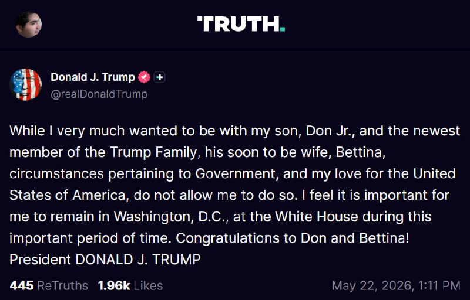

پست ترامپ درباره شرکت نکردن در مراسم ازدواج پسرش

ترجمه ماشین:
با اینکه بسیار دوست داشتم کنار پسرم، دان جونیور، و جدیدترین عضو خانواده ترامپ، همسر آینده‌اش بتینا باشم، شرایط مربوط به دولت و عشق من به ایالات متحده آمریکا اجازه چنین کاری را به من نمی‌دهد.

احساس می‌کنم مهم است که در این دوره مهم زمانی، در واشینگتن دی‌سی و در کاخ سفید بمانم.
به دان و بتینا تبریک می‌گویم!

رئیس‌جمهور دونالد جی. ترامپ
realDonaldTrump
دیروز:
ترامپ با اشاره به مشغله‌های شدید خود گفت: «به پسرم گفتم الآن زمان‌بندی خوبی برای من نیست؛ موضوعی به نام ایران و مسائل دیگر را در دست دارم. این از آن مواردی است که اگر در عروسی شرکت کنم، توسط رسانه‌های اخبار جعلی سلاخی می‌شوم و اگر شرکت نکنم هم باز من را می‌کشند!»
@VahidOOnLine
رسانه‌های امریکایی نوشته‌اند که دونالد ترامپ جونیور، ۴۸ ساله، قرار است در پایان هفته جاری با بتینا اندرسون، مدل و چهره اجتماعی ۳۹ ساله در یک جزیره خصوصی در باهاما ازدواج کند.
بر اساس گزارش‌ها، این زوج در ابتدا به برگزاری مراسم عروسی در کاخ سفید فکر کرده بودند، اما بعداً تصمیم گرفتند مراسم کوچک‌تری برگزار کنند. دلیل این تغییر، نگرانی از واکنش عمومی به برگزاری یک مراسم پرزرق‌وبرق در زمانی خوانده شده که امریکا با تنش‌های مربوط به ایران روبه‌رو است.
afintl

📡 @VahidOnline

## VahidOnline — post 75621

🔴بنیاد عبدالرحمن برومند تا کنون ۶۵۵ مورد اعدام را در سال ۲۰۲۶ ثبت کرده است، که ۳۴ مورد که از آغاز ماه می تاکنون اجرا شده است.. آمار واقعی احتمالاً بسیار بیشتر از این رقم است. جمهوری اسلامی در حالی این اعدام‌ها را پشت درهای بسته اجرا می‌کند که ۸۳ روزه است که اینترنت کشور قطع شده است. حاکمیت با قطع ارتباط جامعه از ۹ اسفند ۱۴۰۴ صدای زندانیان، خانواده‌ها و شاهدان عینی را به شدت سرکوب کرده و نظارت مستقل بر وضعیت حقوق بشر را به‌طور خاص دشوار ساخته است.

🔸از آنجا که دستگاه قضایی همواره تنها بخش کوچکی از احکام مرگ خود را به‌طور رسمی اعلام می‌کند، قطع اینترنت داده‌های فعلی را به شدت محدود به منابع دولتی ایران کرده است. بنابراین کاهش در آمارهای ثبت‌شده، تنها نشان‌دهنده خفقان اطلاعاتی است، نه کاهش کشتار.
#نه_به_اعدام
@IranRights

## VahidOnline — post 75620

  

دختر حسین ناصری: MNaseri23595

📡 @VahidOnline

## VahidOnline — post 75619

  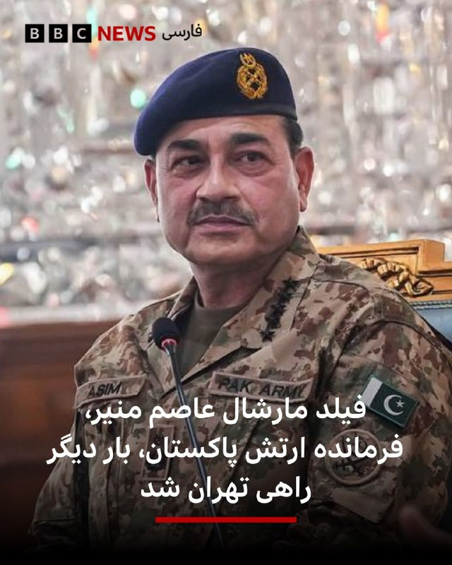

به گزارش رسانه‌های دولتی پاکستان، فیلد مارشال عاصم منیر،‌ فرمانده ارتش این کشور راهی تهران شده است.

خبرگزاری اسوشیتد پرس پاکستان به نقل از منابع امنیتی گزارش داده است که فیلد مارشال عاصم منیر در طول این سفر رسمی، درباره «مذاکرات جاری ایران و آمریکا و صلح و ثبات منطقه‌ و منافع دوجانبه دیگر» با مقام‌های ایران گفت‌و‌گو خواهد کرد.

فرمانده ارتش پاکستان چهل روز پیش هم در تهران بود و با محمدباقر قالیباف و اعضای تیم مذاکره‌ ایران و آمریکا دیدار و گفت‌وگو کرده بود.

این در حالی است که وزیر کشور پاکستان هم برای دومین بار طی هفته اخیر به تهران رفته و در حال گفت‌وگو با مقامات ایرانی است.
@VahidHeadline

📡 @VahidOnline

## VahidOnline — post 75614

  <a href="telegram/content/VahidOnline_75614_1779471360.mp4" target="_blank">🎬 Download video</a>

مارکو روبیو، وزیر خارجه آمریکا، در حاشیه نشست ناتو درباره مذاکرات جاری با جمهوری اسلامی گفت که واشینگتن در انتظار نتایج گفت‌وگوهای در حال انجام است؛ گفت‌وگوهایی که به گفته او نشانه‌هایی از پیشرفت داشته‌اند.
او افزود: «ما در انتظار نتایج این گفت‌وگوها هستیم که نشانه‌هایی از پیشرفت دارد. نمی‌خواهم در این باره اغراق کنم؛ تحرک محدودی صورت گرفته و این مثبت است، اما اصول اساسی تغییری نکرده است.»
وزیر خارجه آمریکا تاکید کرد که حکومت ایران هرگز نباید به سلاح هسته‌ای دست یابد و گفت: «برای تحقق این هدف، باید به مسئله غنی‌سازی و نیز موضوع اورانیوم با غنای بالا رسیدگی کنیم و افزون بر آن، موضوع تنگه هرمز را نیز مد نظر قرار دهیم.»
@VahidOOnLine
مارکو روبیو، وزیر خارجه آمریکا، جمعه یکم خرداد در حاشیه نشست ناتو گفت جمهوری اسلامی در پی ایجاد نظامی اختصاصی برای اخذ عوارض در یک آبراه بین‌المللی است و تلاش می‌کند عمان را نیز به پیوستن به این سازوکار متقاعد کند. روبیو تاکید کرد که این اقدام «غیرقابل قبول» است.
او افزود: «هیچ کشوری در جهان نباید چنین چیزی را بپذیرد. من کشوری را نمی‌شناسم که جز ایران از آن حمایت کند.»
روبیو با اشاره به تحرکات دیپلماتیک در سازمان ملل متحد گفت قطعنامه‌ای با پیشنهاد بحرین در شورای امنیت مطرح شده که آمریکا در آن نقش فعالی داشته و به گفته او، بیشترین تعداد هم‌پیشنهاددهنده را در تاریخ شورای امنیت دارد. او هشدار داد چند کشور در حال بررسی وتوی این قطعنامه هستند و افزود: «این مایه تاسف خواهد بود.»
وزیر خارجه آمریکا تاکید کرد واشینگتن برای دستیابی به اجماع جهانی جهت جلوگیری از اجرای چنین طرحی تلاش می‌کند و گفت: «باید دید آیا سازمان ملل همچنان کارآمد است یا نه. ما می‌کوشیم از این مسیر به نتیجه برسیم.»
او تصریح کرد اگر اخذ عوارض در تنگه هرمز اجرایی شود، ممکن است در دیگر آبراه‌های مهم جهان نیز تکرار شود و افزود: «این قابل قبول نیست و نمی‌تواند رخ دهد.»
روبیو با اشاره به اهمیت تنگه هرمز گفت این آبراه برای کشورهای حاضر در نشست و نیز برای دیگر کشورها، به‌ویژه در منطقه هند-آرام، حیاتی است.
او در پایان با ابراز امیدواری نسبت به نتایج نشست ناتو گفت این دیدار زمینه را برای نشست رهبران در حدود شش هفته آینده فراهم خواهد کرد و افزود که تا آن زمان کارهای زیادی پیش رو است.
@VahidOOnLine
مارکو روبیو، وزیر خارجه آمریکا، پس از نشست ناتو در سوئد درباره مذاکرات با تهران گفت: «همه ما دوست داریم توافقی با ایران شکل بگیرد که در آن تنگه‌ها باز باشند و ایران از جاه‌طلبی‌های هسته‌ای خود دست بردارد.»
او افزود: «این چیزی است که همه ما امیدواریم و همچنان برایش تلاش خواهیم کرد و همین حالا هم که با شما صحبت می‌کنم، کار و مذاکرات در این زمینه ادامه دارد.»
وزیر خارجه آمریکا با اشاره به این که باید یک «برنامه جایگزین» هم وجود داشته باشد، گفت که برنامه جایگزین در صورتی باید عملی شود که حکومت ایران از باز کردن تنگه‌ هرمز خودداری کند.
او گفت: «پس باید از الان درباره‌اش فکر کنیم. من امروز این موضوع را مطرح کردم. واکنش‌های تاییدآمیز زیادی دیدم. اما هنوز چیزی برای اعلام رسمی درباره اقدام مشخصی که در حال انجام باشد نداریم.»
وزیر خارجه آمریکا درباره برنامه جایگزین در صورت امتناع جمهوری اسلامی از بازگشایی تنگه هرمز افزود: «نمی‌دانم لزوما این می‌تواند ماموریت ناتو باشد یا نه، اما قطعا کشور‌های عضو ناتو می‌توانند در آن مشارکت کنند.»
@VahidOOnLine

📡 @VahidOnline

## VahidOnline — post 75611

اطلاعیه منوتو درباره پایان پخش برنامه‌ها
@VahidOOnLine

📡 @VahidOnline

## VahidOnline — post 75607

  <a href="telegram/content/VahidOnline_75607_1779471360.mp4" target="_blank">🎬 Download video</a>

فیلم مستند «تمرین‌هایی برای یک انقلاب»، ساخته پگاه آهنگرانی جایزه «چشم طلایی» هفتاد و نهمین جشنواره فیلم کن را از آن خود کرد.

 «لوئی دور» یا چشم طلایی، مهم‌ترین جایزه بخش مستند جشنواره فیلم کن است.
 پگاه آهنگرانی جایزه‌اش را به مردم ایران تقدیم کرد و گفت: «(مردم ایران) با وجود تمام سرکوب‌هایی که در طول این سال‌ها تحمل کرده‌اند، هرگز از تلاش برای حقوقشان، آزادی‌شان و آرزوهایشان دست نکشیده‌‌اند و مطمئنم که آنها هرگز تسلیم نخواهند شد. مطمئنم و یک آرزو دارم که می‌خواهم اینجا بگویم: این‌که روزی دختر کوچکم لی‌لی و همه بچه‌های ایران در آینده‌ای نزدیک در ایرانی آزاد و دموکراتیک زندگی کنند.»

به گفته خانم آهنگرانی او با استفاده از آرشیوهای شخصی، ویدئوهای خانگی، تصاویر اعتراضات خیابانی، روزنامه‌ها و صداهای ضبط‌ شده، بیش از ۴۰ سال از تاریخ ایران را بازخوانی ‌کرده است.
@VahidHeadline

📡 @VahidOnline

## VahidOnline — post 75606

  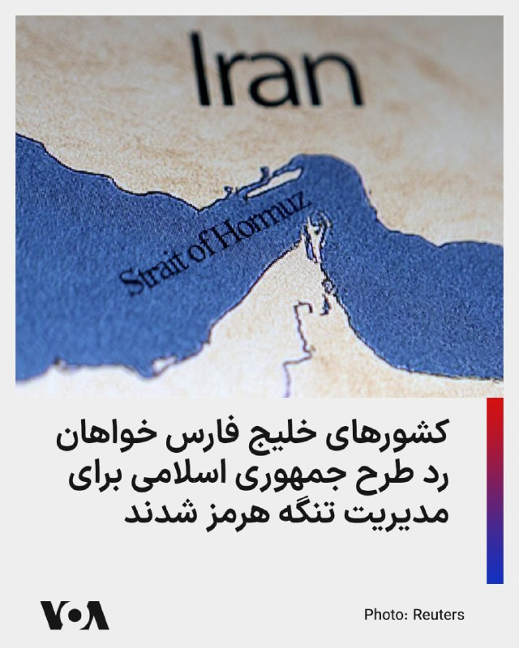

کشورهای عرب حوزه خلیج فارس از جامعه جهانی خواستند که طرح جمهوری اسلامی برای مدیریت تنگه هرمز را رد کنند.

به گزارش بلومبرگ، در میانه مذاکرات دیپلماتیک سازمان بین‌المللی دریانوردی با ایران و عمان پیرامون بازگرداندن آزادی تردد و امنیت کامل کشتیرانی در این آبراه راهبردی، کشورهای عرب حوزه خلیج فارس طی نامه‌های به اعضای این نهاد زیرمجموعه سازمان ملل، نسبت به طرح جمهوری اسلامی موسوم به «نهاد مدیریت آبراه خلیج فارس» هشدار دادند.

پنج کشور عربستان، امارات، بحرین، کویت و قطر در نامه خود گفته‌اند که به رسمیت شناختن مسیر پیشنهادی جمهوری اسلامی می‌تواند یک «سابقه خطرناک» ایجاد کند.

سفیر ایران در فرانسه روز گذشته تأیید کرد که تهران با عمان درباره اعمال دائمی عوارض عبور در حال مذاکره است.
@VahidHeadline

📡 @VahidOnline

## VahidOnline — post 75605

  

نهاد بین‌المللی ناظر بر وضعیت اینترنت، نت‌بلاکس، صبح جمعه اول خرداد اعلام کرد قطع گسترده اینترنت در ایران وارد هشتاد‌وچهارمین روز خود شده و بیش از هزار و ۹۹۲ ساعت است که دسترسی کاربران در ایران به شبکه‌های بین‌المللی همچنان قطع است.

این نهاد ناظر بر اینترنت نوشت با ادامه این وضعیت، شکاف‌های اجتماعی و اقتصادی عمیق‌تر می‌شود و هر ساعت از قطع اینترنت، ارتباط با جهان خارج را بیش از پیش به جایگاه، همراهی با حکومت و برخورداری از امتیاز وابسته می‌کند.
@VahidOOnLine

📡 @VahidOnline

## kianmeli1 — post 87555

  

🔴ترامپ در مراسم ازدواج پسرش شرکت نکرد ٫ آیا امشب حمله میکنند؟

پست ترامپ:
با اینکه بسیار دوست داشتم کنار پسرم، دان جونیور، و جدیدترین عضو خانواده ترامپ، همسر آینده‌اش بتینا باشم، شرایط مربوط به دولت و عشق من به ایالات متحده آمریکا اجازه چنین کاری را به من نمی‌دهد.
احساس می‌کنم مهم است که در این دوره مهم زمانی، در واشینگتن دی‌سی و در کاخ سفید بمانم.
به دان و بتینا تبریک می‌گویم!
رئیس‌جمهور دونالد جی. ترامپ
https://t.me/kianmeli1

## kianmeli1 — post 87554

  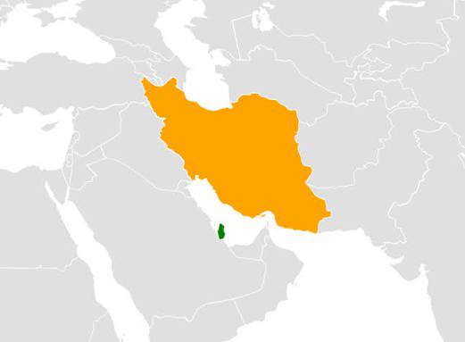

🔴به گزارش رویترز، به نقل از افراد آگاه، با هماهنگی ایالات متحده، یک هیئت قطری امروز صبح وارد تهران شد تا به تلاش‌ها برای دستیابی به توافق بین ایالات متحده و ایران کمک کند.

در گذشته، قطر نقش میانجی بین ایران و ایالات متحده را ایفا کرده است و تصور می‌شود که ارتباط آنها با تصمیم‌گیرندگان اصلی ایران ممکن است تلاش‌های مذاکرات را تسهیل کند.
این در حالی است که فیلد مارشال عاصم منیر، تصمیم‌گیرنده اصلی پاکستان، نیز برای تسهیل توافق به تهران سفر کرده است.
https://t.me/kianmeli1

## kianmeli1 — post 87553

🔴عاصم منیر، فرمانده ارتش پاکستان هم اکنون راهی تهران است.

انعقاد توافق؟ یا رساندن اولتیماتوم نهائی ترامپ؟
https://t.me/kianmeli1

## IranIntlTV — post 338460

  

فاکس‌نیوز گزارش داد که تولسی گبرد، مدیر اطلاعات ملی آمریکا از سمت خود استعفا داده است.
او پیش‌تر گفته بود گفت که اهداف تعیین‌شده از سوی ترامپ درباره جنگ با جمهوری اسلامی، با اهداف اسرائیل متفاوت است.

گبرد همچنین گفته بود که حکومت ایران برقرار به نظر می‌رسد، اما در نتیجه عملیات نظامی آمریکا به‌طور گسترده تضعیف شده است.
https://iranintl.com/202605228014

## IranIntlTV — post 338459

  <a href="telegram/content/IranIntlTV_338459_1779471365.mp4" target="_blank">🎬 Download video</a>

در پی کارزار مردمی ایران‌اینترنشنال برای شناسایی جاویدنامان بیمارستان الغدیر تهران، شاهدان با ارسال پیام‌هایی می‌گویند کادر درمان این بیمارستان در ۱۸ و ۱۹ دی ۱۴۰۴، با وجود فشار شدید ماموران و ممانعت آنها، معترضان را رها نکردند و برای بهبود آنها تلاش کردند.
فرنوش فرجی، عضو تحریریه ایران‌اینترنشنال گزارش می‌دهد.

## IranIntlTV — post 338458

  

علیرضا سلیمی، عضو هیات رییسه مجلس گفت: «یکی از دستاوردهای جنگ اخیر، مدیریت جمهوری اسلامی بر تنگه هرمز است که هرگز قابل مذاکره و معامله نیست و رژیم حقوقی جدیدی بر این تنگه حاکم خواهد شد که قواعد آن را تنها ما تعریف و اعمال می‌کنیم.»

او افزود: «شرایط عبور و مرور همچنین نرخ عوارض بر تنگه هرمز را جمهوری اسلامی مشخص می‌کند و با توییت نمی‌توانند اوضاع تنگه را تغییر دهند.»
https://iranintl.com/202605225037

## IranIntlTV — post 338457

  <a href="https://t.me/IranintlTV/338457" target="_blank">📎 Download file</a>

🎧نسخه صوتی اخبار شبانگاهی | جمعه یک خرداد
@iranintlTV

## IranIntlTV — post 338456

  

بر اساس گزارش‌های رسیده به ایران‌اینترنشنال، محمدرضا منصوری، جوان ۲۴ ساله و پدر یک نوزاد ۲۰ روزه بود که با تیراندازی نیروهای حکومتی در جریان اعتراضات شهر رشت جان خود را از دست داد. او به دلیل جراحات ناشی از شلیک گلوله، حدود یک ماه بستری و تحت درمان بود.

بر اساس گزارش‌ها، محمدرضا ۱۸ دی‌ماه در منطقه یخسازی رشت هدف شلیک نیروهای حکومتی قرار گرفت و بر اثر اصابت گلوله به نخاع و کتف به شدت زخمی شد.

او ۱۳ بهمن‌ماه بر اثر شدت جراحات وارده در جریان اعتراضات جان باخت.

به گفته منابع محلی، محمدرضا تنها فرزند خانواده بود و پیش از حضور در فراخوان، گفته بود: «برای آینده دخترم در اعتراض شرکت می‌کنم.»
https://iranintl.com/202605222447

## IranIntlTV — post 338455

  

خبرگزاری ایسنا اعلام کرد که عاصم منیر، رییس ستاد کل ارتش پاکستان، عصر جمعه وارد تهران شده است.
پیش‌تر برخی رسانه‌ها از سفر او به تهران، برای تلاش در خصوص نزدیک کردن خواسته‌ها و انتظارات مقام‌های جمهوری اسلامی و ایالات متحده، برای رسیدن به توافق خبر داده بودند.
https://iranintl.com/202605220892

## IranIntlTV — post 338454

بندر خَصَب، راه فرار جمهوری اسلامی از محاصره دریایی؟
فرناز داوری- در میانه آتش‌بس شکننده و محاصره دریایی در تنگه هرمز، بندر خَصَب در عمان به یکی از مسیرهای حیاتی برای رساندن کالا به ایران تبدیل شده است. بندری که با قایق‌های «شوتی»، ماهیگیران و گردشگران شناخته می‌شد، حالا گذرگاهی پرهزینه اما مهم برای دور زدن محاصره بنادر جنوبی ایران شده است.
تا پیش از آغاز جنگ آمریکا و اسرائیل علیه جمهوری اسلامی، بخشی از رفت‌وآمدهای دریایی میان خصب و سواحل جنوبی ایران، به قایق‌های تندرو اختصاص داشت. قایق‌هایی که در ادبیات محلی به «شوتی» معروف‌ هستند و سال‌ها در مسیرهای غیررسمی میان عمان و جنوب ایران، رفت‌وآمد کرده‌اند.
این قایق‌ها معمولا به صورت گروهی حرکت می‌کردند و در زمانی کوتاه خود را از آب‌های عمان به قشم یا دیگر نقاط ساحلی ایران می‌رساندند.
این مسیر پیش از این بیشتر برای دادوستدهای غیررسمی و قاچاق خرد شناخته می‌شد. سیگار ایرانی، مشروبات الکلی و حشیش، از ایران به عمان منتقل می‌شد و در مسیر بازگشت، کالاهای مصرفی، لوازم خانگی و اجناس لوکس، از عمان به ایران می‌رسید.
حضور قایق‌های ماهیگیری ایرانی نیز در اطراف خصب همیشه بخشی از تصویر معمول این منطقه بود.

ادامه گزارش را در اینجا بخوانید:
https://www.iranintl.com/202605220630

## IranIntlTV — post 338453

  <a href="telegram/content/IranIntlTV_338453_1779471370.mp4" target="_blank">🎬 Download video</a>

همه‌پرسی درباره جدایی آلبرتا از کانادا ۱۹ اکتبر برگزار می‌شود.

نخست‌وزیر کانادا هشدار داد هرگونه اقدام برای استقلال باید بر اساس قوانین فدرال انجام شود.

گزارش مهسا مرتضوی، خبرنگار ایران‌اینترنشنال
@iranintltv

## IranIntlTV — post 338452

  

دونالد ترامپ در کاخ سفید درباره مذاکرات با جمهوری اسلامی گفت: «خواهیم دید چه خواهد شد. ما ضربه سختی به ‌آنها زدیم. چاره‌ای نداشتیم. ایران نمی‌تواند سلاح هسته‌ای داشته باشد.»

ترامپ ادامه داد: «آمریکا با جمهوری اسلامی همان رفتاری را انجام می‌دهد که با ونزوئلا انجام داده است.»

ترامپ تاکید کرد جمهوری اسلامی بی‌صبرانه به دنبال رسیدن به توافق است.
https://iranintl.com/202605224243

## IranIntlTV — post 338451

رجزخوانی نظام؛ مغازه کوچک وحشت‌فروشی
حسین ذوقی-جمهوری اسلامی در حالی که تقریبا در آستانه شکست در همه زمینه‌های داخلی و خارجی قرار دارد، تاکتیکش را بر یک سنت فقهی استوار کرده است: رجزخوانی.
سخنان تند مداحان در تجمعات شبانه، سخنان تلویزیونی مسئولان میان‌رده تا گفته‌های رسمی مسئولین بلندپایه در مذاکرات، رسانه‌های اجتماعی و در نهایت، پیام‌های مکتوب رهبر نادیده نظام، بر همین سنت استوار شده است.
ماجرای «آتیش زدم به مالم» را حتما شنیده‌اید: بزازی در بازار، در کسادی وضعیتش و وقتی که اجناسش روی دستش مانده بود و راهی برای فروش نداشت، شاگردش را با یک حلب نفت به میانه بازار می‌فرستد تا فریاد بزند که: «اوستایم عقلش را از دست داده، می‌خواهد همه جا را به آتش بکشد!»
مردم هم که ترسیده‌اند به طمع جنس مفت، سمت دکان بزاز هجوم می‌برند. اوستای بزاز پارچه‌هایش را میان دکان می‌اندازد و رجز می‌خواند که «آتش می‌زنم ...»
خلاصه که انبار بزاز خالی می‌شود و جنس‌هایش را با قیمت بالاتر می‌فروشد!
حالا جمهوری اسلامی هم انگار می‌خواهد با تهدید و رجزخوانی به آتش زدن دنیا، ایده‌هایش را به منطقه و جهان بفروشد.
مداحان از منبر، منتقدان داخلی را به مرگ تهدید می‌کنند. محمود نبویان، نایب‌رییس کمیسیون امنیت ملی مجلس شورای اسلامی، پادشاهان کشورهای عربی را تهدید می‌کند که «هیچ یک از کاخ‌هایشان سالم نخواهد ماند».
عباس عراقچی، وزیر امور خارجه جمهوری اسلامی، در شبکه‌های اجتماعی از «پاسخ طولانی و دردناک» سخن می‌گوید.
اسماعیل بقایی، سخنگوی وزارت امور خارجه، حتی در نشست‌های دیپلماتیک، با لحنی رجزآلود حرف می‌زند.
غلامحسین محسنی اژه‌ای، رییس قوه قضاییه، از «تحمیل ناپذیری» می‌گوید؛ و حسین کنعانی‌مقدم، فرمانده پیشین سپاه پاسداران، اعتراف می‌کند که «رجزخوانی یکی از روش‌های مقابله با دشمن است».
لایه‌ها‌ی متفاوت نظام به یک زبان مشترک رسیده‌اند. این روش تصادفی نیست، شیوه جدید حکمرانی در جمهوری اسلامی است.

ادامه این تحلیل را اینجا بخوانید:
https://www.iranintl.com/202605219159

## IranIntlTV — post 338450

  <a href="telegram/content/IranIntlTV_338450_1779471373.mp4" target="_blank">🎬 Download video</a>

فیلم مستند «تمرین‌هایی برای یک انقلاب»، ساخته پگاه آهنگرانی، برنده جایزه «چشم طلایی» جشنواره کن شد. این فیلم با استفاده از آرشیوهای شخصی و تصاویر اعتراض‌ها، ۴ دهه از تحولات سیاسی و اجتماعی ایران را روایت می‌کند.

لی‌لی نیکفر، خبرنگار ایران‌اینترنشنال، گزارش می‌دهد
@iranintltv

## IranIntlTV — post 338449

  <a href="telegram/content/IranIntlTV_338449_1779471374.mp4" target="_blank">🎬 Download video</a>

جاویدنام عرفان بزرگی، جوان ۲۲ ساله اهل مرودشت، قهرمان مچ‌اندازی استان فارس بود. او ۱۲ دی‌ماه از ناحیه سر هدف گلوله نیروهای سرکوب جمهوری اسلامی قرار گرفت و به‌دلیل شدت جراحات، دو روز بعد در بیمارستان جان باخت.

گزارش فربد سروندی، عضو تحریریه ایران‌اینترنشنال
@iranintltv

## IranIntlTV — post 338448

  <a href="telegram/content/IranIntlTV_338448_1779471376.mp4" target="_blank">🎬 Download video</a>

همزمان با رایزنی‌های غیرمستقیم میان تهران و واشینگتن، فرمانده ارتش پاکستان وارد تهران شد.

به گفته جمهوری اسلامی، این سفر بخشی از تبادل پیام‌ها میان ایران و آمریکا با میانجی‌گری پاکستان است.

گزارش اردوان روزبه، خبرنگار ایران‌اینترنشنال
@iranintltv

## IranIntlTV — post 338447

  <a href="telegram/content/IranIntlTV_338447_1779471378.mp4" target="_blank">🎬 Download video</a>

🔻نهادهای حقوق بشری نسبت به وضعیت غلامرضا خانی‌ شکرآب، ورزشکار و زندانی سیاسی، که با اتهام «جاسوسی» بازداشت شده، هشدار داده‌اند.

🔹او به‌طور ناگهانی از بند امنیتی زندان اوین به سلول انفرادی در زندان قزل‌حصار منتقل شده است.

🔹تصاویری از این ورزشکار را سردار پاشایی، قهرمان پیشین کشتی جوانان جهان، در فضای مجازی منتشر کرده است.

@iranintltvsport

## IranIntlTV — post 338446

  <a href="telegram/content/IranIntlTV_338446_1779471380.mp4" target="_blank">🎬 Download video</a>

یک شهروند در پیامی به ایران اینترنشنال با اشاره به پوشش چادر خود می‌گوید که نه در تجمعات حکومتی شرکت می‌کند و نه از نظام جمهوری اسلامی حمایت می‌کند. پیام او با هوش مصنوعی خوانده شده است.

## IranIntlTV — post 338445

تحرکات تازه در مذاکرات تهران و واشینگتن با سفر فرمانده ارتش پاکستان و هیات قطری به ایران

هم‌زمان با ادامه رایزنی‌های دیپلماتیک در خصوص مذاکرات تهران و واشینگتن، گزارش‌ها از سفر عاصم منیر، فرمانده ارتش پاکستان، به ایران حکایت دارند. یک منبع آگاه نیز به رویترز گفت قطر در هماهنگی با ایالات متحده، یک تیم مذاکره‌کننده را به تهران اعزام کرده است.

ایرنا، خبرگزاری دولت جمهوری اسلامی، جمعه اول خرداد به نقل از یک منبع دیپلماتیک نوشت منیر قرار است در سفر به ایران با مقام‌های بلندپایه جمهوری اسلامی دیدار و گفت‌وگو کند.

شبکه سی‌بی‌اس نیوز نیز به نقل از منابع آگاه امنیتی، سفر فرمانده ارتش پاکستان به ایران را تایید کرد و نوشت بررسی مسائل مهم منطقه‌ای و بین‌المللی، از جمله مذاکرات تهران و واشینگتن، محور اصلی دیدارهای او با مقام‌های جمهوری اسلامی خواهد بود.

یک مقام ارشد پاکستانی به سی‌بی‌اس نیوز گفت دیدارهای اخیر محسن نقوی، وزیر کشور پاکستان، در تهران باعث شده مذاکرات «در مسیری مهم» پیش برود و در همین چارچوب، منیر برای ادامه این رایزنی‌ها راهی ایران شده است.

خبرگزاری رویترز نیز از سفر یک هیات مذاکره‌کننده قطری به تهران خبر داد و نوشت هدف از این سفر که با هماهنگی واشینگتن انجام گرفت، «کمک به تلاش‌ها برای دستیابی به توافقی برای خاتمه جنگ ایران» است.

بر اساس این گزارش، هیات قطری اول خرداد وارد شد.

قطر که پیش‌تر نقش پررنگی در میانجی‌گری‌های بین‌المللی از جمله در جنگ غزه داشت، در پی حملات موشکی و پهپادی اخیر جمهوری اسلامی به این کشور، از ایفای نقش واسطه در مذاکرات مربوط به جنگ ایران فاصله گرفته بود.

العربیه از سفر رییس سازمان اطلاعات پاکستان به تهران خبر داد
شبکه العربیه به نقل از منابع آگاه گزارش داد عاصم مالک، رییس سازمان اطلاعات پاکستان، هم راهی تهران شده است.

از زمان برقراری آتش‌بس موقت در ۱۹ فروردین، پاکستان کوشیده است زمینه دستیابی به توافقی را برای پایان جنگ آمریکا و اسرائیل با جمهوری اسلامی فراهم کند.

رویترز اول خرداد نوشت عباس عراقچی، وزیر امور خارجه جمهوری اسلامی، با وزیر کشور پاکستان در تهران دیدار کرد تا درباره پیشنهادهای مربوط به پایان جنگ گفت‌وگو کند.
این دومین دور گفت‌وگوهای نقوی با مقام‌های ایرانی در دو روز گذشته بود.

رویترز افزود اسلام‌آباد در تلاش است ارتباط میان تهران و واشینگتن را تسهیل کند تا چارچوبی برای پایان جنگ و حل اختلاف‌ها شکل بگیرد.

«نشانه‌های مثبت»
مارکو روبیو، وزیر خارجه آمریکا، ۳۱ اردیبهشت گفت در مذاکرات «نشانه‌های مثبتی» دیده می‌شود، اما هشدار داد اگر جمهوری اسلامی طرح دریافت عوارض از کشتی‌های عبوری از تنگه هرمز را اجرا کند، دستیابی به توافق ممکن نخواهد بود.

او گفت: «ما می‌خواهیم این مسیر باز و آزاد باشد. تنگه هرمز یک آبراه بین‌المللی است.»

یک منبع ارشد ایرانی نیز به رویترز گفت اختلاف‌ها میان دو طرف کاهش یافته، اما موضوع غنی‌سازی اورانیوم و تنگه هرمز همچنان از اصلی‌ترین موانع توافق هستند.

جنگ جاری شوک بزرگی به اقتصاد جهانی وارد کرده و افزایش قیمت نفت، نگرانی‌ها را درباره تورم تشدید کرده است.

پیش از آغاز جنگ، حدود یک‌پنجم صادرات جهانی نفت و گاز طبیعی مایع از تنگه هرمز عبور می‌کرد.

هم‌زمان ارزش دلار آمریکا به بالاترین سطح شش هفته گذشته نزدیک شده و قیمت نفت نیز در پی تردید بازارها نسبت به موفقیت مذاکرات، افزایش یافته است.

اورانیوم و تنگه هرمز
دونالد ترامپ، رییس‌جمهوری آمریکا، ۳۱ اردیبهشت گفت واشینگتن در نهایت ذخایر اورانیوم غنی‌شده ایران را در اختیار خواهد گرفت.

او اضافه کرد: «آن را به دست خواهیم آورد. به آن نیاز نداریم و احتمالا بعد از به دست آوردنش نابودش خواهیم کرد، اما اجازه نمی‌دهیم ایران آن را داشته باشد.»

دو منبع ارشد ایرانی پیش‌تر به رویترز گفته بودند مجتبی خامنه‌ای، رهبر سوم جمهوری اسلامی، دستور داده ذخایر اورانیوم غنی‌شده از ایران خارج نشود.

پیشنهاد تازه جمهوری اسلامی که این هفته به آمریکا ارائه شده، شامل درخواست‌هایی مانند کنترل تنگه هرمز، دریافت غرامت جنگ، لغو تحریم‌ها، آزادسازی دارایی‌های بلوکه‌شده و خروج نیروهای آمریکایی از منطقه است؛ درخواست‌هایی که ترامپ پیش‌تر آن‌ها را رد کرده بود.

هم‌زمان آژانس بین‌المللی انرژی اعلام کرد جنگ جاری «بدترین شوک انرژی جهان» را ایجاد کرده است.

این نهاد هشدار داد هم‌زمانی اوج تقاضای تابستانی و کمبود عرضه جدید از خاورمیانه، ممکن است بازار انرژی را در ماه‌های ژوییه و اوت وارد «منطقه قرمز» کند.
 
🔗وب‌سایت ایران‌اینترنشنال
@iranintltv

## IranIntlTV — post 338444

  <a href="telegram/content/IranIntlTV_338444_1779471382.mp4" target="_blank">🎬 Download video</a>

مارکو روبیو، وزیر خارجه آمریکا، در دومین روز نشست وزیران خارجه ناتو هشدار داد هرگونه اقدام جمهوری اسلامی برای ایجاد محدودیت یا دریافت عوارض در تنگه هرمز می‌تواند مسیر توافق را تخریب کند. او همچنین افزود: «هنوز برای خوش‌بینی نسبت به پیشرفت مذاکرات زود است.»
مهران عباسیان، خبرنگار ایران‌اینترنشنال، گزارش می‌دهد
@iranintltv

## IranIntlTV — post 338443

  

مقام‌های اتحادیه اروپا جمعه اعلام کردند اروپایی‌ها باید انتظار داشته باشند قیمت نفت و گاز دست‌کم تا پایان سال ۲۰۲۷ بالاتر از سطح پیش از جنگ باقی بماند و قیمت سایر کالاها نیز روندی افزایشی داشته باشد.

کمیسر اقتصادی اتحادیه اروپا، گفت افزایش قیمت انرژی عامل اصلی رشد تورم است؛ به‌طوری‌که نرخ تورم برای امسال ۳.۱ درصد و برای سال ۲۰۲۷ حدود ۲.۴ درصد پیش‌بینی می‌شود. این رقم به‌مراتب بالاتر از پیش‌بینی قبلی ۱.۹ درصدی برای سالجاری میلادی است.
https://iranintl.com/202605222906

## IranIntlTV — post 338442

  <a href="telegram/content/IranIntlTV_338442_1779471385.mp4" target="_blank">🎬 Download video</a>

بر اساس گزارش‌های شهروندان به ایران‌اینترنشنال، با تشدید بحران اقتصادی و مشکلات تامین منابع در ایران، نه‌تنها برای خرید بنزین، بلکه برای تهیه مایحتاج اساسی نیز در برخی شهرها صف‌های طولانی شکل گرفته است.

گفت‌وگو با محسن مهیمنی، عضو تحریریه ایران‌اینترنشنال
@iranintltv

## IranIntlTV — post 338441

  <a href="telegram/content/IranIntlTV_338441_1779471387.mp4" target="_blank">🎬 Download video</a>

انور قرقاش، مشاور دیپلماتیک رییس‌ امارات، گفت روابط رسمی این کشور با اسرائیل قوی‌تر نیز خواهد شد، زیرا «همه جمهوری اسلامی را یک تهدید استراتژیک می‌بینند».

گفت‌وگو با علی صدرزاده، تحلیل‌گر مسائل خاورمیانه
@iranintltv

## Shin_Persian — post 6152

  

Rapid Response 47 ✓ @RapidResponse47
Fri, 22 May 2026 17:13:05 UTC

𝕏 · @shin_persian

## Shin_Persian — post 6151

  <a href="telegram/content/Shin_Persian_6151_1779471390.mp4" target="_blank">🎬 Download video</a>

Iran International English ✓ @IranIntl_En Fri, 22 May 2026 15:37:34 UTC The Pentagon on Friday released a video allegedly showing unidentified anomalous phenomena (UAP) near Iran, saying the footage was likely captured by an infrared sensor aboard a US military…

## Shin_Persian — post 6150

Iran International English ✓ @IranIntl_En
Fri, 22 May 2026 15:37:34 UTC

The Pentagon on Friday released a video allegedly showing unidentified anomalous phenomena (UAP) near Iran, saying the footage was likely captured by an infrared sensor aboard a US military platform operating in the CENTCOM area in 2022, while cautioning that the material lacks a substantiated chain of custody.

The All-domain Anomaly Resolution Office (AARO) said the 20-second clip, titled “4 UAP Formation Iran 26 Aug 2022 over water [CALLSIGN],” was uploaded to a classified network in June 2024 and surfaced as part of a review of potentially UAP-related records requested by eight members of the US House of Representatives.

فارسی

پنتاگون روز جمعه ویدئویی را منتشر کرد که مدعی است «پدیده‌های ناهنجار ناشناخته» (UAP) را در نزدیکی ایران نشان می‌دهد. پنتاگون اعلام کرد این فیلم احتمالاً توسط یک حسگر فروسرخ در یک پلتفرم نظامی ایالات متحده که در سال ۲۰۲۲ در منطقه سنتکام (فرماندهی مرکزی ایالات متحده) فعالیت می‌کرده، ضبط شده است؛ در عین حال هشدار داد که این محتوا فاقد سلسله‌مراتب نظارتی و استنادی تأیید شده است.

دفتر حل‌وفصل ناهنجاری‌های تمام‌محیطی (AARO) اعلام کرد این کلیپ ۲۰ ثانیه‌ای با عنوان «تشکیل ۴ UAP ایران ۲۶ اوت ۲۰۲۲ بر فراز آب [شناسه رادیویی]»، در ژوئن ۲۰۲۴ در یک شبکه طبقه‌بندی شده بارگذاری شده و در جریان بازبینی پرونده‌های احتمالی مرتبط با UAP که توسط هشت عضو مجلس نمایندگان ایالات متحده درخواست شده بود، ظاهر شده است.

𝕏 · @shin_persian

## Shin_Persian — post 6148

  

↩️ Quoted tweet: Shin ✓ @hey_itsmyturn Fri, 22 May 2026 15:38:46 UTC It's A7-MHH and it landed in Mehrabad a few hours ago, witness on the ground tells me. ↩️ توییت نقل‌قول شده — برای پاسخ، پست زیر را ببینید. فارسی هواپیما A7-MHH است و طبق گفته‌های یک…

## Shin_Persian — post 6147

↩️ Quoted tweet:
Shin ✓ @hey_itsmyturn
Fri, 22 May 2026 15:38:46 UTC

It's A7-MHH and it landed in Mehrabad a few hours ago, witness on the ground tells me.

↩️ توییت نقل‌قول شده — برای پاسخ، پست زیر را ببینید.

فارسی

هواپیما A7-MHH است و طبق گفته‌های یک شاهد عینی در محل، چند ساعت پیش در مهرآباد به زمین نشست.

𝕏 · @shin_persian

## Shin_Persian — post 6146

↩️ Quoted tweet: Shin ✓ @hey_itsmyturn Fri, 22 May 2026 15:24:02 UTC A Qatari delegation landed in Tehran as per some rumors (which I believe they’re true) ↩️ توییت نقل‌قول شده — برای پاسخ، پست زیر را ببینید. فارسی بر اساس برخی شایعات (که معتقدم صحت دارند)،…

## Shin_Persian — post 6145

↩️ Quoted tweet:
Shin ✓ @hey_itsmyturn
Fri, 22 May 2026 15:24:02 UTC

A Qatari delegation landed in Tehran as per some rumors (which I believe they’re true)

↩️ توییت نقل‌قول شده — برای پاسخ، پست زیر را ببینید.

فارسی

بر اساس برخی شایعات (که معتقدم صحت دارند)، یک هیئت قطری در تهران به زمین نشست.

𝕏 · @shin_persian

## Shin_Persian — post 6141

  

↩️ Quoted tweet:
NetBlocks ✓ @netblocks
Fri, 22 May 2026 15:21:07 UTC

2000 hours.

↩️ توییت نقل‌قول شده — برای پاسخ، پست زیر را ببینید.

فارسی

۲۰۰۰ زولو (۲۳:۳۰ به وقت تهران)

𝕏 · @shin_persian

## Shin_Persian — post 6140

Shin ✓ @hey_itsmyturn
Fri, 22 May 2026 15:24:02 UTC

A Qatari delegation landed in Tehran as per some rumors (which I believe they’re true)

فارسی

بر اساس برخی شایعات (که معتقدم حقیقت دارند)، یک هیئت قطری در تهران به زمین نشست.

𝕏 · @shin_persian

## Shin_Persian — post 6139

laurence norman @laurnorman
Fri, 22 May 2026 13:19:03 UTC

Source tells me the draft “deals” circulating are inaccurate.

فارسی

منبع به من می‌گوید پیش‌نویس «توافق‌هایی» که در حال انتشار است، دقیق نیستند.

𝕏 · @shin_persian

## Shin_Persian — post 6138

📦 mhrv-rs v1.9.34 released

• Migrate config from JSON to TOML with automatic upgrade support (PR #1317)

Files (Android APKs, Windows, macOS, Linux, OpenWRT) on the files channel:

👉 v1.9.34 — all files with SHA-256

Channel:
https://t.me/mhrv_rs
or: https://t.me/+R1OyoHX2boA1ZDgx

#v1934

## Shin_Persian — post 6137

  

Shin ✓ @hey_itsmyturn
Fri, 22 May 2026 13:05:00 UTC

Munir might actually be on board one of these birds en route to Tehran.

فارسی

منیر ممکن است واقعاً در هواپیمای در حال پرواز به مقصد تهران باشد.

𝕏 · @shin_persian

## Shin_Persian — post 6136

  

↩️ Quoted tweet: Al Arabiya English @AlArabiya_Eng Fri, 22 May 2026 12:19:07 UTC 🔴 BREAKING: Pakistan’s army chief Asim Munir is en route to Iran’s Tehran, Al Arabiya sources say. ↩️ توییت نقل‌قول شده — برای پاسخ، پست زیر را ببینید. فارسی 🔴 فوری: منابع…

## Shin_Persian — post 6135

  

↩️ Quoted tweet:
Al Arabiya English @AlArabiya_Eng
Fri, 22 May 2026 12:19:07 UTC

🔴 BREAKING: Pakistan’s army chief Asim Munir is en route to Iran’s Tehran, Al Arabiya sources say.

↩️ توییت نقل‌قول شده — برای پاسخ، پست زیر را ببینید.

فارسی

🔴 فوری: منابع العربیه می‌گویند عاصم منیر، فرمانده ارتش پاکستان، در راه تهران، ایران است.

𝕏 · @shin_persian

## Shin_Persian — post 6134

Shin ✓ @hey_itsmyturn
Fri, 22 May 2026 11:37:26 UTC

Jet activity over Baghdad
#Iraq 🇮🇶

فارسی

فعالیت جنگنده‌ها بر فراز بغداد
#Iraq 🇮🇶

𝕏 · @shin_persian

## Shin_Persian — post 6133

Shin ✓ @hey_itsmyturn
Fri, 22 May 2026 10:53:22 UTC

Middle East: [European] Council extends EU legal framework to target those involved in Iran’s actions impeding lawful transit passage and freedom of navigation

The Council decided today to extend the scope of EU’s restrictive measures originally established to address Tehran’s military support for Russia’s war of aggression against Ukraine and various armed groups in the Middle East and the Red Sea region. The amended sanctions framework will now also target individuals and entities involved in Iran’s actions and policies threatening the freedom of navigation in the Middle East.The decision delivers on the political agreement reached by EU ministers at the Foreign Affairs Council on 21 April 2026.Iran’s actions against vessels transiting through the Strait of Hormuz are contrary to international law. Such actions infringe upon established rights of both transit and innocent passage through international straits.Thanks to the amended legal framework, the EU will now be able to introduce further restrictive measures in response to Iran’s actions undermining the freedom of navigation in the Strait of Hormuz. Such restrictive measures consist of travel restrictions that prohibit listed individual and entities from entering or transiting through EU territories, and an asset freeze. In addition, EU citizens and companies are forbidden from making funds, financial assets or economic resources available to listed individual and entities.

#Iran #EU
(Source: https://www.consilium.europa.eu/en/press/press-releases/2026/05/22/middle-east-council-extends-eu-legal-framework-to-target-those-involved-in-iran-s-actions-impeding-lawful-transit-passage-and-freedom-of-navigation/)

ترجمه فارسی در بخش نظرات

𝕏 · @shin_persian

## ManotoTV — post 105748

  <a href="telegram/content/ManotoTV_105748_1779471396.mp4" target="_blank">🎬 Download video</a>

«دلم براتون تنگ میشه اما امید دارم برگردید»

## ManotoTV — post 105747

  <a href="telegram/content/ManotoTV_105747_1779471398.mp4" target="_blank">🎬 Download video</a>

رییس اورژانس پیش‌بیمارستانی و مدیریت حوادث دانشگاه علوم پزشکی البرز اعلام کرد بر اثر تصادف زنجیره‌ای در آزادراه کرج قزوین، سه نفر جان باختند و چهار نفر دیگر مجروح شدند.
به گزارش رسانه‌های داخلی، در این سانحه دو مرد و یک زن کشته شدند و سه مرد و یک زن دیگر نیز مجروح شدند.
مصدومان توسط نیروهای اورژانس به بیمارستان امام جعفر صادق نظرآباد منتقل شدند.

## ManotoTV — post 105746

  <a href="telegram/content/ManotoTV_105746_1779471399.mp4" target="_blank">🎬 Download video</a>

پیام یک مخاطب منوتو درباره پایان پخش برنامه‌های این شبکه

## ManotoTV — post 105745

  <a href="telegram/content/ManotoTV_105745_1779471400.mp4" target="_blank">🎬 Download video</a>

پیام یک مخاطب منوتو درباره پایان پخش برنامه‌های این شبکه

## ManotoTV — post 105744

  <a href="telegram/content/ManotoTV_105744_1779471402.mp4" target="_blank">🎬 Download video</a>

هامبورگ؛ به‌مناسبت سالگرد ریزش ساختمان متروپل، جمعه اول خرداد ۱۴۰۵

## ManotoTV — post 105741

اطلاعیه منوتو درباره پایان پخش برنامه‌ها

## ManotoTV — post 105740

  <a href="telegram/content/ManotoTV_105740_1779471404.mp4" target="_blank">🎬 Download video</a>

مارکو روبیو، وزیر خارجه آمریکا، در نشست خبری مشترک با مارک روته، دبیرکل ناتو، گفت تلاش جمهوری اسلامی برای ایجاد نظام عوارض‌گیری در یک آبراه بین‌المللی قابل قبول نیست و نباید اجازه داده شود چنین اقدامی در تنگه هرمز رخ دهد.

روبیو در این نشست که در حاشیه نشست وزیران خارجه ناتو در سوئد برگزار شد، گفت آمریکا می‌کوشد این موضوع را از مسیر سازمان ملل پیگیری کند و به نتیجه برساند. او افزود تقریبا همه کشورهایی که در این نشست حضور داشتند، از قطعنامه مربوط به این موضوع حمایت کرده‌اند یا به احتمال زیاد به آن خواهند پیوست.

## ManotoTV — post 105739

  <a href="telegram/content/ManotoTV_105739_1779471405.mp4" target="_blank">🎬 Download video</a>

پریتی پتل، وزیر خارجه سایه بریتانیا، در سخنانی در مجلس عوام این کشور گفت هرچه از برنامه هسته‌ای جمهوری اسلامی باقی مانده، باید برچیده شود و اورانیوم غنی‌شده موجود نیز باید از ایران خارج شود.

به گزارش متن رسمی نشست مجلس عوام بریتانیا، این سخنان روز پنجشنبه ۳۱ اردیبهشت در جریان جلسه‌ای درباره خاورمیانه مطرح شد. او گفت اورانیوم غنی‌شده‌ای که جمهوری اسلامی اکنون در اختیار دارد باید خارج شود و باید از چگونگی سوءاستفاده جمهوری اسلامی از توافق سال ۱۳۹۴ درس گرفت.

پتل از دولت بریتانیا خواست روشن کند آیا این موضع، موضع رسمی دولت نیز هست یا نه. او گفت شفافیت دولت درباره این موضوع «بسیار مهم» است و سپس پرسید موضع دولت در قبال توان موشکی و نظامی ایران چیست.

## FarsiVOA — post 218375

🔺تشدید کارزار جمهوری اسلامی برای آزار و سرکوب اقلیت‌های دینی در ایران

▪️جمهوری اسلامی در تشدید کارزار آزار و سرکوب اقلیت‌های دینی ایران، با درخواست‌های مکرر یک زن باردار بهائی برای آزادی از زندان و مراجعه به پزشک و انجام آزمایش‌های ضروری بارداری، مخالفت کرده است. همزمان رسانه‌های حقوق بشری از بلاتکلیفی یک زوج بهائی در زندان شیراز و محکومیت یک زن نوکیش مسیحی به بیش از ۹ سال زندان خبر داده‌اند.

⬇️ بیشتر بخوانید:

https://ir.voanews.com/a/iran-bahaaie-prison-minority-religous-execution/8152804.html/?nocach=1

## FarsiVOA — post 218374

ویدویی از پرفورمنس یک هنرمند ایرانی در خیابان در شبکه‌های اجتماعی مورد توجه قرار گرفته است.

او در این اجرا، هم‌زمان با فروش و رنده کردن پیاز، از رهگذران می‌خواهد «بر وضعیتی که در آن زندگی می‌کنیم، اشک بریزند.»

@FarsiVOA

## FarsiVOA — post 218373

قطعی اینترنت در ایران وارد هشتاد و چهارمین روز خود شد و دسترسی شهروندان به شبکه‌های بین‌المللی عملاً برای بیش از ۲۰۰۰ ساعت قطع شده است.

نت‌بلاکس، نهاد مستقل پایش دسترسی به اینترنت، در تازه‌ترین گزارش خود در این باره یادآور شده که با گذشت هر ساعت از خاموشی دیجیتال در ایران، شکاف‌های اقتصادی و اجتماعی عمیق‌تر می‌شوند؛ چرا که هرگونه ارتباط با جهان خارج، تحت کنترل درآمده و مشروط به جایگاه، همسویی (هم‌صدایی با حکومت) و داشتن امتیاز ویژه شده است.

گزارش کامل را در وب‌سایت صدای آمریکا بخوانید.

@FarsiVOA

## FarsiVOA — post 218372

حکم اعدام بیتا همتی و همسرش محمدرضا مجیدی اصل، دو معترض دی، در دیوان عالی کشور نقض شده است. با این حال غلامرضا خانی شکرآب در معرض اجرای قریب‌الوقوع اعدام است.

## FarsiVOA — post 218371

  <a href="telegram/content/FarsiVOA_218371_1779471407.mp4" target="_blank">🎬 Download video</a>

کاخ سفید ویدیویی با عنوان «شی ناشناس پرنده؛ دسامبر ۲۰۱۹، ساحل شرقی» منتشر کرد و اعلام کرد این تصاویر احتمالا توسط حسگر مادون قرمز یک پلتفرم نظامی آمریکا در محدوده مسئولیت فرماندهی شمالی ایالات متحده در سال ۲۰۱۹ ثبت شده‌اند.

@FarsiVOA

## FarsiVOA — post 218369

🔺روبیو درباره مذاکرات: ترجیح پرزیدنت ترامپ دیپلماسی است، اما باید برای گزینه‌های دیگر هم آماده باشیم

▪️وزیر امور خارجه ایالات متحده روز جمعه اول خردادماه، پس از شرکت در اجلاس وزیران امور خارجه عضو ناتو در سوئد به خبرنگاران گفت عدم دستیابی جمهوری اسلامی به سلاح هسته‌ای، تحویل همه اورانیوم‌های غنی‌شده، و بازگشایی تنگه هرمز، ارکان اصلی و خلل‌ناپذیر آمریکا در مذاکرات با رژیم ایران هستند.

⬇️ بیشتر بخوانید:

https://ir.voanews.com/a/nato-marco-rubio-us-euorpe-iran/8152766.html/?nocach=1

## FarsiVOA — post 218367

فرماندهی مرکزی ایالات متحده، سنتکام، اعلام کرد نیروهای تفنگدار دریایی آمریکا سامانه موشکی «هایمارس» را به یک ایستگاه سوخت‌گیری در خاورمیانه منتقل کرده‌اند. سنتکام می‌گوید این سامانه‌های متحرک که توسط ارتش و تفنگداران دریایی آمریکا استفاده می‌شوند، از قابلیت جابه‌جایی سریع برخوردارند.

@FarsiVOA

## FarsiVOA — post 218366

مارکو روبیو، وزیر امور خارجه آمریکا، روز جمعه ۲ خرداد در پایان نشست وزیران امور خارجه کشورهای عضو ناتو در سوئد و پیش از ترک آن کشور به مقصد هند، به پرسش‌های خبرنگاران پاسخ داد. صدای آمریکا این کنفرانس خبری را به طور زنده و با ترجمه همزمان پژواک کیومرثی پخش کرد.

## FarsiVOA — post 218365

مارکو روبیو، وزیر امور خارجه آمریکا، روز جمعه ۲ خرداد در پایان نشست وزیران امور خارجه کشورهای عضو ناتو در سوئد و پیش از ترک آن کشور به مقصد هند، به پرسش‌های خبرنگاران پاسخ داد. صدای آمریکا این کنفرانس خبری را به طور زنده و با ترجمه همزمان پژواک کیومرثی پخش کرد.

## FarsiVOA — post 218364

مارکو روبیو، وزیر امور خارجه آمریکا، روز جمعه ۲ خرداد در پایان نشست وزیران امور خارجه کشورهای عضو ناتو در سوئد و پیش از ترک آن کشور به مقصد هند، به پرسش‌های خبرنگاران پاسخ داد. صدای آمریکا این کنفرانس خبری را به طور زنده و با ترجمه همزمان پژواک کیومرثی پخش کرد.

## FarsiVOA — post 218363

  <a href="telegram/content/FarsiVOA_218363_1779471408.mp4" target="_blank">🎬 Download video</a>

کاخ سفید ویدیویی با عنوان «چهار شی ناشناس پرنده بر فراز آب‌های ایران» منتشر کرد و اعلام کرد این تصاویر احتمالا توسط حسگر مادون قرمز یک پلتفرم نظامی آمریکا در محدوده مسئولیت فرماندهی مرکزی ایالات متحده، سنتکام، در چهارم شهریور ۱۴۰۱ ثبت شده‌اند.

@FarsiVOA

## FarsiVOA — post 218362

  

فرماندهی مرکزی ایالات متحده، سنتکام، اعلام کرد یک ملوان آمریکایی از ناو «یواس‌اس کامستاک» در جریان اجرای محاصره دریایی علیه جمهوری اسلامی، یک کشتی تجاری را زیر نظر دارد.

سنتکام گفت از آغاز این محاصره، نیروهای آمریکایی مسیر ۹۷ کشتی تجاری را تغییر داده و ۴ کشتی را نیز از کار انداخته‌اند.

@FarsiVOA

## FarsiVOA — post 218360

مارکو روبیو، وزیر امور خارجه آمریکا، پس از دیدار با دبیرکل ناتو اعلام کرد اعضای این ائتلاف باید در نشست آینده آنکارا به‌طور جدی متعهد شوند که به‌سرعت تولیدات و صنایع دفاعی خود را گسترش دهند و تعهدات مالی خود را به «قابلیت‌های واقعی جنگی» تبدیل کنند. او گفت: «اروپای قوی‌تر به معنای ناتوی قوی‌تر است.»

@FarsiVOA

## FarsiVOA — post 218359

تعطیلی بی‌سابقه مجلس جمهوری اسلامی؛ جنگ قالیباف و جلیلی وارد فاز علنی شد

## FarsiVOA — post 218357

فرماندهی مرکزی ایالات متحده، سنتکام، اعلام کرد جنگنده‌های نیروی دریایی آمریکا از ناو هواپیمابر «یواس‌اس آبراهام لینکلن» در دریای عرب به پرواز درآمده‌اند.

سنتکام می‌گوید گروه رزمی آبراهام لینکلن در جریان اجرای محاصره دریایی آمریکا علیه جمهوری اسلامی، در بالاترین سطح آمادگی عملیاتی قرار دارد.

@FarsiVOA

## FarsiVOA — post 218356

  <a href="telegram/content/FarsiVOA_218356_1779471409.mp4" target="_blank">🎬 Download video</a>

ارتش اسرائیل اعلام کرد که روز پنجشنبه ۳۱ اردیبهشت، پنج عضو حزب‌الله را پس از آنکه وارد یک مرکز فرماندهی متعلق به این گروه شدند، هدف حمله قرار داده است.

بر اساس اعلام ارتش، این افراد در شمال منطقه تحت کنترل در جنوب لبنان شناسایی شده و پس از یک حمله هوایی کشته شده‌اند.

ارتش اسرائیل همچنین اعلام کرد که طی ۲۴ ساعت گذشته، انبارهای تسلیحاتی حزب‌الله و دیگر «زیرساخت‌های تروریستی» در لبنان را هدف قرار داده‌ و چندین عضو دیگر که تهدید محسوب می‌شدند را از پای درآورده است.

صبح روز جمعه اول خرداد نیز ارتش اسرائیل از هدف قرار دادن دو فرد مسلح مشکوک پیش از نزدیک شدن به مرز این کشور با لبنان، خبر داده بود.

ایالات متحده، اسرائیل و شماری دیگر از کشورها حزب‌الله لبنان را در فهرست گروه‌های تروریستی قرار داده‌اند.

@FarsiVOA

## FarsiVOA — post 218355

  

ارتش اسرائیل اعلام کرد که روز پنجشنبه ۳۱ اردیبهشت، پنج عضو حزب‌الله را پس از آنکه وارد یک مرکز فرماندهی متعلق به این گروه شدند، هدف حمله قرار داده است.

بر اساس اعلام ارتش، این افراد در شمال منطقه تحت کنترل در جنوب لبنان شناسایی شده و پس از یک حمله هوایی کشته شده‌اند.

ارتش اسرائیل همچنین اعلام کرد که طی ۲۴ ساعت گذشته، انبارهای تسلیحاتی حزب‌الله و دیگر «زیرساخت‌های تروریستی» در لبنان را هدف قرار داده‌ و چندین عضو دیگر که تهدید محسوب می‌شدند را از پای درآورده است.

صبح روز جمعه اول خرداد نیز ارتش اسرائیل از هدف قرار دادن دو فرد مسلح مشکوک پیش از نزدیک شدن به مرز این کشور با لبنان، خبر داده بود.

ایالات متحده، اسرائیل و شماری دیگر از کشورها حزب‌الله لبنان را در فهرست گروه‌های تروریستی قرار داده‌اند.
@FarsiVOA

## DW_Farsi — post 125020

  

🔶 " کشته‌شدن ۱۰ نفر در حملات اسرائیل به جنوب لبنان، از جمله ۶ امدادگر وابسته به حزب‌الله و امل"

حملات متقابل میان اسرائیل و حزب‌الله در لبنان با وجود برقراری آتش‌بس همچنان ادامه دارد.

بنا بر اعلام مقامات رسمی، در پی حملات هوایی اسرائیل به جنوب لبنان از شب گذشته تاکنون، دست‌کم ده نفر کشته شده‌اند.

وزارت بهداشت در بیروت گزارش داد که در میان کشته‌شدگان، شش امدادگر (پزشکیار) و یک کودک وجود دارند. همچنین تعداد دیگری از شهروندان و امدادگران در این حملات زخمی شده‌اند. ارتش اسرائیل هنوز واکنشی به این حملات نشان نداده است.

مراکز درمانی و امدادی هدف‌قرارگرفته،متعلق به حزب‌الله و جنبش متحد آن، "امل" هستند. اسرائیل بارها مراکز بهداشتی و تیم‌های پزشکی را در لبنان هدف قرار داده و حزب‌اللهِ تحت حمایت ایران را متهم می‌کند که از این مراکز به عنوان پوششی برای پنهان کردن سلاح‌ها و جنگجویان خود استفاده می‌کند.

از آنجا که حزب‌الله به‌ویژه در جنوب لبنان مانند "دولتی در دولت" عمل می‌کند، شاخه غیرنظامی آن مسئولیت تأمین خدمات پزشکی و درمانی را در این مناطق بر عهده دارد.
@dw_farsi

## DW_Farsi — post 125019

  

🔶 هشتاد و چهارمین روز قطع اینترنت در ایران

نت‌بلاکس اعلام کرده است که بلک‌اوت (قطع کامل) اینترنت در ایران وارد هشتاد و چهارمین روز خود شده و شبکه‌های بین‌المللی برای بیش از ۱۹۹۲ ساعت به طور گسترده قطع شده‌اند.

این سازمان غیردولتی و بین‌المللی که بر امنیت سایبری و حکمرانی اینترنت نظارت می‌کند، افزوده است که با گذشت هر ساعت، شکاف‌های اجتماعی و اقتصادی عمیق‌تر می‌شوند؛ چرا که هرگونه ارتباط با جهان خارج، اکنون در انحصار موقعیت اجتماعی، میزان همسویی با مواضع رسمی حکومت و برخورداری از امتیازات ویژه قرار گرفته است.

قطعی کنونی اینترنت در ایران بی‌سابقه‌ترین خاموشی ارتباطات دیجیتال یک کشور با جهان خارج است.
@dw_farsi

## DW_Farsi — post 125018

🔶 بخشی از پلکان برج ایفل در حراجی ۴۵۰ هزار یورو فروخته شد

خبرگزاری رویترز گزارش داد یک کلکسیونر فرانسوی روز پنج‌شنبه ۲۱ مه بخش ۱۴ پله‌ای از پلکان مارپیچ اصلی برج ایفل را در حراجی "آرکیوریال" در پاریس به قیمت ۴۵۰ هزار و ۱۶۰ یورو خریدهاست.

این قطعه نزدیک به ۳ متر ارتفاع و حدود ۱/۴ تن وزن دارد و بسیار بالاتر از برآورد اولیه ۱۲۰ تا ۱۵۰ هزار یورویی فروخته شده است.
@dw_farsi

## DW_Farsi — post 125017

🎥 جنگ ایران، کابوس تازه صنعت الماس هند

جنگ ایران، بحران صنعت الماس هند را تشدید کرده؛ اختلال در زنجیره تأمین، کاهش صادرات و موج بیکاری، فعالان این صنعت را با چالش جدی روبه‌رو کرده است.
@dw_farsi

## DW_Farsi — post 125016

  

🔶 ایران: ۳۵ کشتی از تنگه هرمز عبور کردند

بنا بر اعلام مقام‌های ایران، در ۲۴ ساعت گذشته ۳۵ فروند کشتی از تنگه هرمز که شاهراهی حیاتی برای تجارت انرژی به شمار می‌رود عبور کرده‌اند. رادیو و تلویزیون دولتی ایران به نقل از بیانیه نیروهای مسلح اعلام کرد که این ترددها با هماهنگی نیروی دریایی سپاه پاسداران انقلاب اسلامی انجام شده است. بر اساس این گزارش، کشتی‌های مذکور شامل نفتکش‌ها، کشتی‌های باربری و سایر کشتی‌های تجاری بوده‌اند.

نیروهای مسلح ایران مدت کوتاهی پس از آغاز جنگ، کنترل تنگه هرمز را که نقشی کلیدی در تجارت جهانی انرژی دارد، به دست گرفتند. در پی تهدیدها، بازرسی‌ها و حمله به کشتی‌ها، رفت‌وآمد در این آبراه استراتژیک تا حد زیادی متوقف شد؛ امری که افزایش چشمگیر قیمت انرژی و سوخت در سراسر جهان را به همراه داشت. علاوه بر این، به گفته ایران، این تنگه در حال حاضر مین‌گذاری شده است.

نیروی دریایی سپاه پاسداران در بیانیه خود اما مدعی است که این نیرو در تنگه هرمز یک آبراه ایمن برای کشتیرانی و استمرار تجارت جهانی ایجاد کرده است.
@dw_farsi

## DW_Farsi — post 125015

  

🔶روایت شبکه العربیه از مفاد توافق احتمالی میان ایران و آمریکا

شبکه عربستانی العربیه متنی را منتشر کرده است که ادعا می‌کند "پیش‌نویس نهایی" یک توافق "احتمالی" میان آمریکا و ایران با میانجیگری پاکستان برای پایان دادن به جنگ است.

بنا بر این گزارش، انتظار می‌رود توافق مذکور، که ظاهراَ یک توافق موقت با "مسائل حل‌نشده‌ای" است که باید پس از اجرایی شدن مورد مذاکره قرار گیرند، ظرف چند ساعت آینده اعلام شود.

العربیه ولی تاکید دارد که این توافق "در انتظار تایید" هر دو طرف است.

این گزارش به نقل از منابع ناشناس می‌گوید توافق به محض اعلام رسمی از سوی هر دو طرف، بلافاصله اجرایی خواهد شد.

پیش‌نویس توافق گزارش‌شده، به صراحت به خواست‌های کلیدی ایالات متحده اشاره‌ای نکرده است؛ خواسته‌هایی از جمله برچیدن برنامه هسته‌ای ایران و صادرات ذخیره اورانیوم ۶۰ درصد غنی‌شده آن، محدود کردن موشک‌های بالستیک و پایان دادن به حمایت از گروه‌های نیابتی.

بنا بر این گزارش، مذاکرات درباره "مسائل حل‌نشده" نامشخص، قرار است ظرف هفت روز پس از اجرایی شدن توافق آغاز شود.
@dw_farsi

## DW_Farsi — post 125014

🔶 چرا پرونده تجاوز پژمان جمشیدی به حکم شلاق ختم شد؟

🔻گزارشی از میترا خلعتبری

فضای رسانه‌ای و هنری ایران از پاییز سال گذشته تا کنون با یکی از جنجالی‌ترین پرونده‌ها دست‌وپنجه نرم می‌کند.

نام پژمان جمشیدی ستاره سال‌های نه چندان دور فوتبال و بازیگر پرکار سینما و تلویزیون، ماه‌هاست که نه برای هنرنمایی روی پرده، بلکه به خاطر یک پرونده جنجالی قضایی در صدر اخبار قرار گرفته است. اتهام اولیه "تجاوز به عنف" و "آدم‌ربایی" که با شکایت یک هنرجوی جوان بازیگری مطرح شد، جامعه را در بهت و حیرت فرو برد.

چندین ماه پس از مطرح شدن این شکایت جنجالی، حالا حکم پرونده صادر و مجازات "۹۹ ضربه شلاق تعزیری" اعلام شده است.

اما پرونده این چهره سرشناس با صدور این رای، نه تنها به نقطه‌ای روشن و مشخص نرسیده، بلکه موج جدیدی از ابهامات، سوالات و تناقض‌ها را در افکار عمومی ایجاد کرده است.
@dw_farsi

## DW_Farsi — post 125013

  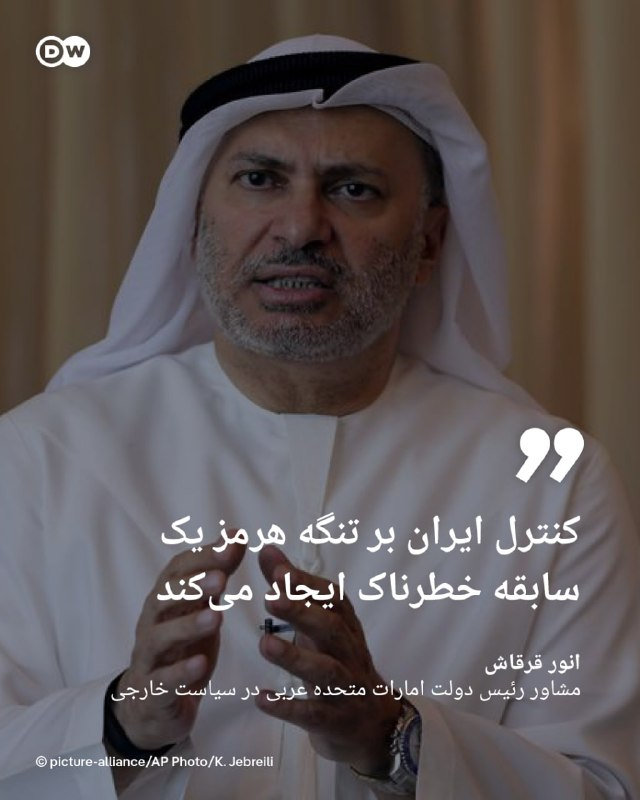

🔶 قرقاش: کنترل ایران بر تنگه هرمز یک سابقه خطرناک ایجاد می‌کند

انور قرقاش، مشاور رئیس دولت امارات متحده عربی در سیاست خارجی، روز جمعه ۲۲ مه، اعلام کرد که شانس دستیابی به توافق صلح میان آمریکا و ایران "۵۰-۵۰" است، اما تاکید کرد که هرگونه حل‌وفصل سیاسی برای جلوگیری از درگیری‌های آینده، باید به ریشه‌های اصلی بی‌ثباتی در منطقه بپردازد.

پاکستان در حال میانجیگری برای برقراری یک آتش‌بس میان ایالات متحده و ایران است تا به جنگی که اقتصاد جهانی را تکان داده و تجارت را در تنگه هرمز ، شاهراه حیاتی برای انتقال حدود یک‌پنجم محموله‌های نفت و گاز طبیعی مایع (LNG) جهان، مختل کرده است، پایان دهد.

انور قرقاش، مشاور دیپلماتیک رئیس دولت امارات، در کنفرانس «گلوبسک» (Globsec) در پراگ گفت: «شانس دستیابی به توافق ۵۰-۵۰ است. نگرانی من این است که ایرانی‌ها همیشه در مذاکرات زیاده‌خواهی کرده‌اند.»

قرقاش افزود: «این موضوع جدیدی نیست. آن‌ها در طول سال‌ها به دلیل تمایل به دست‌بالا گرفتن برگ‌های بازی خود، فرصت‌های زیادی را از دست داده‌اند. امیدوارم این بار این کار را نکنند.»
@dw_farsi

## DW_Farsi — post 125012

🔶 "استفاده وسیع آمریکا از موشک‌های رهگیر برای دفاع از اسرائیل"

واشنگتن‌پست گزارش داد آمریکا در جریان جنگ اخیر با ایران، بیش از ۳۰۰ موشک رهگیر برای دفاع از اسرائیل شلیک کرده، در حالی که اسرائیل حدود ۱۹۰ رهگیر به کار برده است.

بر اساس این گزارش، واشنگتن بیش از ۲۰۰ سامانه پدافندی "تاد" و بیش از ۱۰۰ موشک "اس‌ام-۳" و "اس‌ام-۶" شلیک کرده، در حالی که اسرائیل کمتر از ۱۰۰ موشک رهگیر "پیکان" و حدود ۹۰ موشک از سامانه "فلاخن داوود" استفاده کرده است.
@dw_farsi

## DW_Farsi — post 125011

  

🔶 انتقاد شدید مارکو روبیو از ناتو به دلیل عدم همکاری در جنگ با ایران

مارکو روبیو، وزیر امور خارجه ایالات متحده، کمی پیش از پرواز به مقصد سوئد برای شرکت در نشست ناتو، انتقادها از این پیمان نظامی را مجددا تکرار کرد.

این سیاستمدار آمریکایی گفت: «فکر نمی‌کنم کسی از اینکه ایالات متحده و به ویژه شخص رئیس‌جمهور در حال حاضر تا این حد از ناتو و عملکرد آن ناامید شده‌اند، غافلگیر شده باشد.»

روبیو به عنوان دلیل مشخص این نارضایتی، به مخالفت و امتناع کشورهایی مانند اسپانیا از اجازه دادن به آمریکا برای استفاده از پایگاه‌های نظامی‌شان در جنگ علیه ایران اشاره کرد.

او در ادامه توضیحات خود افزود که عضویت ایالات متحده در یک ائتلاف باید برای این کشور ارزش و منفعتی داشته باشد و یکی از ارزش‌های محوری ناتو، پایگاه‌های نظامی موجود در اروپا هستند.

به گفته او، این پایگاه‌ها به ایالات متحده امکان می‌دهند تا در صورت بروز بحران در خاورمیانه یا هر جای دیگر، قدرت نظامی خود را اعمال کند.
@dw_farsi

## DW_Farsi — post 125010

  

🔶 دیوان عالی جمهوری اسلامی احکام اعدام محمدرضا مجیدی‌اصل و بیتا همتی را نقض کرد

بنا بر داده‌های منابع حقوق بشری دیوان عالی جمهوری اسلامی احکام اعدام محمدرضا مجیدی‌اصل و بیتا همتی را نقض کرده و آن را برای بررسی مجدد به شعبه هم‌عرض ارجاع داده است.

این زوج جوان ساکن تهران و از بازداشت‌شدگان اعتراضات دی‌ماه پیش‌تر در یک پرونده مشترک به همراه دو شهروند دیگر به اعدام محکوم شده بودند.

مجیدی‌‌اصل و همتی اواخر فروردین‌ماه سال جاری به همراه دو هم‌پرونده‌ای خود به‌نام‌های بهروز زمانی‌نژاد و کوروش زمانی‌نژاد توسط شعبه ۲۶ دادگاه انقلاب تهران به ریاست قاضی ایمان افشاری به اعدام، حبس و مصادره اموال محکوم شدند. یک متهم دیگر این پرونده نیز به نام امیر همتی به حبس محکوم شد.

"اقدام عملیاتی برای دولت متخاصم آمریکا و گروه‌های متخاصم" اتهاماتی بود که بر اساس آن برای محمدرضا مجیدی‌اصل، بیتا همتی، بهروز زمانی‌نژاد و کورش زمانی‌نژاد حکم اعدام صادر شد.

این چهار شهروند همچنین مشمول ۵ سال حبس تعزیزی به اتهام "اجتماع و تبانی علیه امنیت کشور" شده و به عنوان مجازات تکمیلی حکم مصادره کلیه اموال آنها نیز صادر شده است.
@dw_farsi

## DW_Farsi — post 125009

  

🔶 واکنش محتاطانه وزیر امور خارجه به ماموریت احتمالی ناتو در تنگه هرمز

یوهان واده‌فول، وزیر امور خارجه آلمان، در اظهارنظری محتاطانه در مورد مأموریت احتمالی ناتو در آزادسازی تنگه هرمز گفت که آلمان همیشه اعلام کرده که آماده است تا امنیت تردد آزاد در آنجا را تضمین کند و تحت رهبری بریتانیا و فرانسه در حال آماده‌سازی برای این عملیات‌ است.

این سیاستمدار حزب دموکرات مسیحی که در جریان نشست وزرای امور خارجه ناتو در شهر بندری هلسینگبوری سوئد سخن می‌گفت، در عین حال افزود: «اما من هیچ مأموریت فوری ناتو به معنای کلاسیک آن را در تنگه هرمز پیش‌بینی نمی‌کنم.»

دولت آلمان پیشنهاد داده است که پس از پایان جنگ ایران، در زمینه‌هایی مانند پاکسازی مین‌ها در این آبراه حیاتی که برای تأمین انرژی (نفت و گاز) بین‌المللی بسیار مهم است، کمک کند. آماده‌سازی‌ها برای این منظور در حال انجام است.

واده‌فول با وجود اظهارات محتاطانه‌اش درباره مأموریت ناتو در تنگه هرمز، تأکید کرد: «با این حال یک چیز روشن است، ما به ائتلاف فراآتلانتیک (ناتو) پایبندیم و ایالات متحده آمریکا می‌تواند مطمئن باشد که در هر زمانی می‌تواند روی ما حساب کند.»
@dw_farsi

## DW_Farsi — post 125008

🔶 کاهش مالیات بلیط پروازها در آلمان تحت تاثیر بحران خاورمیانه

پارلمان آلمان طرح کاهش مالیات بلیط در سفرهای هوایی را تصویب کرد. با این حال، قیمت بلیط هواپیما در بسیاری از مسیرها اخیراً به دلیل جنگ خاورمیانه به شدت افزایش یافته است، به طوری که مشتریان خطوط هوایی ممکن است در نهایت ارزانی چندانی را احساس نکنند.

به طور دقیق‌تر، قرار است عوارض پروازهای کوتاه دست‌کم ۲.۵۰ یورو، پروازهای میان‌برد ۶.۳۳ یورو و پروازهای بلندمدت (قاره‌ای) ۱۱.۴۰ یورو کاهش یابد.
@dw_farsi

## DW_Farsi — post 125007

🔶 وال‌استریت ژورنال از کمک بابک زنجانی به نقض تحریم‌ها خبر داد

وال‌استریت ژورنال گزارش داده بابک زنجانی، فعال اقتصادی تحریم‌شده ایرانی، با استفاده از شبکه‌ای از حساب‌ها در بایننس، دست‌کم ۸۵۰ میلیون دلار تراکنش را طی دو سال انجام داده است؛ تراکنش‌هایی که در گزارش‌های داخلی بایننس بارها مشکوک تشخیص داده شدند، اما حساب اصلی او ماه‌ها پس از هشدارهای داخلی همچنان فعال ماند.

این نشریه می‌نویسد این پول‌ها بخشی از میلیاردها دلار جریان مالی رمزارزی بوده‌اند که در سال‌های منتهی به جنگ اخیر، به شبکه‌های تامین مالی سپاه پاسداران متصل بوده‌اند.

بر اساس این گزارش، بخش عمده این تراکنش‌ها از طریق یک حساب اصلی و چند حساب دیگر که به خواهر، شریک عاطفی و مدیر شرکت زنجانی مرتبط بوده‌اند انجام شده است.

بررسی‌های داخلی بایننس نشان داده که این حساب‌ها از یک مجموعه دستگاه مشترک استفاده می‌کرده‌اند؛ الگویی که از نگاه تیم‌های تطبیق این صرافی، نشانه‌ای از تلاش برای دور زدن تحریم‌های آمریکا علیه جمهوری اسلامی بوده است.
@dw_farsi

## DW_Farsi — post 125006

🔶 وزارت خارجه جمهوری اسلامی تحریم سفیر خود در لبنان را محکوم کرد

وزارت امور خارجه جمهوری اسلامی، تحریم‌های اعلام‌شده از سوی ایالات متحده علیه محمدرضا رئوف شیبانی، سفیر خود در لبنان را محکوم کرد.

وزارت خارجه در بیانیه خود مدعی شده است که این اقدام وزارت خزانه‌داری آمریکا "غیرقانونی و غیرموجه" است. در این بیانیه همچنین گفته شده که این اقدام، "نمونه دیگری از رفتار قانون‌گریزانه و بی‌اعتنایی حاکمیت آمریکا به اصول بنیادین حقوق بین‌الملل و منشور سازمان ملل متحد است".

وزارت خارجه جمهوری اسلامی همچنین تحریم نمایندگان حزب‌الله را نشان‌دهنده "همدستی" آمریکا با اسرائیل توصیف کرد.

لبنان پیش از این در ماه مارس، سفیر معرفی‌شده جمهوری اسلامی در آن کشور را "عنصر نامطلوب" خوانده بود.

پیش از این یک منبع دیپلماتیک جمهوری اسلامی به خبرگزاری فرانسه گفته بود، سفیر جمهوری اسلامی علی‌رغم دستور ترک خاک لبنان، این کشور را ترک نخواهد کرد. این منبع که خواست ناشناس بماند به این خبرگزاری گفته بود: «سفیر، طبق خواست نبیه بری، رئیس پارلمان و حزب‌الله، لبنان را ترک نخواهد کرد.»

تنش بین جمهوری اسلامی و لبنان زمانی بالا گرفت که وزارت خارجه لبنان، از سفیر ایران در این کشور خواسته بود ظرف چند روز آینده لبنان را ترک کند.

در ادامه این تنش‌ها وزارت خارجه لبنان اعتبارنامه محمدرضا رئوف شیبانی، سفیر ایران را باطل کرد و توفیق صمدی خوشخو، کاردار ایران در بیروت نیز احضار شد.

یوسف رجی، وزیر امور خارجه لبنان در این رابطه در شبکه اجتماعی ایکس نوشته بود: «به دبیر کل وزارت امور خارجه دستور دادم، کاردار ایران در لبنان را احضار کند تا او را از تصمیمِ لغو رسمی سفیر تعیین‌شده ایران مطلع سازد.» رجی در پیام خود محمدرضا رئوف شیبانی را "عنصر نامطلوب" اعلام کرده و گفته بود، او باید حداکثر تا ۲۹ مارس (۹ فروردین) خاک لبنان را ترک کند.»
@dw_farsi

## DW_Farsi — post 124996

📸 چرا موهای فضانوردان نمی‌ریزد؟
هر یکشنبه صبح سوفی آدنو، فضانورد فرانسوی آژانس فضایی اروپا، ویدیوهای کوتاهی از ایستگاه فضایی بین‌المللی منتشر می‌کند. این خلبان آزمایشی هلیکوپتر که ۴۳ سال دارد، در این ویدیوها برای دنبال‌کنندگانش در شبکه‌های اجتماعی، پدیده‌های فیزیکی در شرایط بی‌وزنی را توضیح می‌دهد. گاهی موضوع دربارهٔ قطره‌های شناور آب است، گاهی رفتار فرفره‌ها در بی‌وزنی، و گاهی هم این پرسش که در فضا چگونه می‌توان اجسام را وزن کرد.

اما یک پدیدهٔ فیزیکی را می‌توان مستقیماً در ظاهر خود او هم مشاهده کرد: موهای بلند و بور او معمولاً آزادانه اطراف سرش در اهتزاز هستند. آدنو دومین زن فرانسوی است که به فضا رفته و نخستین فضانورد زنی نیست که موهایش را باز می‌گذارد؛ اما او عمداً این مدل مو را به نمایش می‌گذارد.

او در یک ارتباط زندهٔ ویدیویی با خبرنگاران اروپایی در روز چهارشنبه ۲۰ مه (۳۰ اردیبهشت) ، دربارهٔ اثری شگفت‌انگیز توضیح داد که مرتباً تجربه می‌کند: "موها نمی‌ریزند". اما چرا موهای فضانوردان نمی‌ریزند؟
@dw_farsi

## Persian_Trend_Official — post 14682

سخنگوی وزارت خارجه: 💢مباحث هسته‌ای در این مرحله قرار نیست صحبت شود. 💢خاتمه جنگ در همه جبهه به شمول لبنان خودش ظرایف خاصی دارد. همین طور محاصره دریایی ایران موضوع مهمی است که مورد بحث است. 💢درباره هسته‌ای تکلیف روشن است. ما عضو ان پی تی هستیم و حق داریم…

## Persian_Trend_Official — post 14681

🔴سخنگوی وزارت خارجه: 💢نمی‌توانیم بگوییم ضرورتا به جایی رسیده‌ایم که توافق نزدیک است. تمرکز مذاکرات بر خاتمه جنگ است. 🫆:Tony 📌 @persian_trend_official پرشین ترند | متفاوت‌ترین کانال نظامی

## Persian_Trend_Official — post 14680

🔴سخنگوی وزارت خارجه: 💢نمی‌توانیم بگوییم ضرورتا به جایی رسیده‌ایم که توافق نزدیک است. تمرکز مذاکرات بر خاتمه جنگ است. 🫆:Tony 📌 @persian_trend_official پرشین ترند | متفاوت‌ترین کانال نظامی

## Persian_Trend_Official — post 14679

🔴سخنگوی وزارت خارجه:

💢نمی‌توانیم بگوییم ضرورتا به جایی رسیده‌ایم که توافق نزدیک است.

تمرکز مذاکرات بر خاتمه جنگ است.

🫆:Tony

📌 @persian_trend_official
پرشین ترند | متفاوت‌ترین کانال نظامی

## Persian_Trend_Official — post 14678

  

استقبال رسمی سردار اسکندر مؤمنی وزیرکشور از فرمانده ارتش پاکستان فیلد مارشال عاصم منیر.

👩‍💻:PhantomDirective

🆔@persian_trend_official
پرشین ترند | متفاوت‌ترین کانال نظامی

## Persian_Trend_Official — post 14677

  <a href="telegram/content/Persian_Trend_Official_14677_1779471417.mp4" target="_blank">🎬 Download video</a>

کلیپ «UAP نزدیک فرودگاه کاراگاندا» در پرونده‌های جدید یوفو ظاهر شد

ویدئو نشان می‌دهد «یک پدیده نورانی با ردپاهایی از روشنایی کاهنده که از مرکز گسترش می‌یابد»

«آن هواپیما نیست» — شاهد در ویدئو

👩‍💻:PhantomDirective

🆔 @persian_trend_official
پرشین ترند | متفاوت‌ترین کانال نظامی

## Persian_Trend_Official — post 14676

UAP از ساحل شرقی

فیلم گرفته شده توسط حسگر مادون قرمز روی سکوی نظامی آمریکا در سال ۲۰۱۹

👩‍💻:PhantomDirective

🆔 @persian_trend_official
پرشین ترند | متفاوت‌ترین کانال نظامی

## Persian_Trend_Official — post 14675

  <a href="telegram/content/Persian_Trend_Official_14675_1779471419.mp4" target="_blank">🎬 Download video</a>

کلیپ «تشکیل UAP بر فراز ایران» در دومین دسته از پرونده‌های یوفو پیدا شد

فیلم سال ۲۰۲۲ احتمالاً از حسگر مادون قرمز نصب شده روی یک سکوی نظامی آمریکا گرفته شده و در سال ۲۰۲۴ به شبکه‌ای محرمانه آپلود شده است.

👩‍💻:PhantomDirective

🆔 @persian_trend_official
پرشین ترند | متفاوت‌ترین کانال نظامی

## Persian_Trend_Official — post 14674

  <a href="telegram/content/Persian_Trend_Official_14674_1779471422.mp4" target="_blank">🎬 Download video</a>

یک شیء ناشناس پرنده (UFO) توسط جنگنده اف-۱۶ نیروی هوایی آمریکا سرنگون شد

ویدئویی با عنوان «نیروی هوایی ملی گارد اف-۱۶ سی آمریکا یک شیء پرنده ناشناس را بر فراز دریاچه هورون در ۱۲ فوریه ۲۰۲۳ سرنگون می‌کند» احتمالاً با استفاده از حسگر مادون قرمز نصب شده روی یک سکوی نظامی آمریکا ضبط شده است

## Persian_Trend_Official — post 14673

کلیپ «شیء پرنده ناشناس کروی در ابرها» در دومین دسته از پرونده‌های یوفو منتشر شد

تصویری از سال ۲۰۲۳ احتمالاً از حسگر مادون قرمز نظامی آمریکا بالای دریای زرد گرفته شده است — AARO

از نظر بصری، با اندازه یک هواپیمای معمولی مطابقت ندارد و حرکت آن با موشک عادی همخوانی ندارد

👩‍💻:PhantomDirective

🆔 @persian_trend_official
پرشین ترند | متفاوت‌ترین کانال نظامی

## Persian_Trend_Official — post 14672

💢هواپیما گلف استریم ارتش پاکستان به سمت تهران در حرکت است. 🫆:Tony 📌 @persian_trend_official پرشین ترند | متفاوت‌ترین کانال نظامی

## Persian_Trend_Official — post 14671

  <a href="telegram/content/Persian_Trend_Official_14671_1779471423.mp4" target="_blank">🎬 Download video</a>

💢فیلم منتشر شده در دومین دسته از پرونده‌های مرتبط با یوفو ها

💢پنتاگون، یک جسم پرنده را بر فراز سوریه نشان می‌دهد که با شتاب لحظه ای زیاد نا‌پدید میشود.

🫆:Tony

📌 @persian_trend_official
پرشین ترند | متفاوت‌ترین کانال نظامی

## Persian_Trend_Official — post 14670

  <a href="telegram/content/Persian_Trend_Official_14670_1779471425.webm" target="_blank">🎬 Download video</a>

‼️همزمان با ورود فرمانده ارتش پاکستان.
وزیر کشور پاکستان اندکی قبل تهران را ترک کرد،

👩‍💻:PhantomDirective

🆔 @persian_trend_official
پرشین ترند | متفاوت‌ترین کانال نظامی

## Persian_Trend_Official — post 14669

  <a href="telegram/content/Persian_Trend_Official_14669_1779471426.mp4" target="_blank">🎬 Download video</a>

💢 روبیو، وزیرخارجه آمریکا: ما در ارتباط مداوم با فیلد مارشال عاصم منیر در بالاترین سطوح دولت خود هستیم.

👩‍💻:PhantomDirective

📣 @persian_trend_official
پرشین ترند | متفاوت‌ترین کانال نظامی

## Persian_Trend_Official — post 14668

  

🔴فرمانده ارتش پاکستان راهی تهران شد؟؟؟ 💢به گزارش الحدث به نقل از منابع خود گزارش داد که عاصم منیر فرمانده ارتش پاکستان عازم تهران شد. 🫆:Tony 📌 @persian_trend_official پرشین ترند | متفاوت‌ترین کانال نظامی

## Persian_Trend_Official — post 14667

🔴 آکسیوس: چند کشور منطقه در تلاش برای نهایی‌کردن توافق اولیه میان ایران و آمریکا هستند

💢وب‌سایت آکسیوس گزارش داد پاکستان، قطر، عربستان سعودی، مصر و ترکیه در تلاش‌های میانجیگرانه میان تهران و واشینگتن مشارکت دارند.

بر اساس این گزارش:
▪️ هدف این مذاکرات، نهایی‌کردن «نامه اعلام نیت» میان ایران و آمریکا است
▪️ این توافق شامل پایان جنگ و آغاز ۳۰ روز مذاکره درباره توافقی گسترده‌تر بر سر برنامه هسته‌ای ایران خواهد بود
▪️ مذاکرات بر روی اصول اولیه کاهش تنش و چارچوب ادامه گفت‌وگوها متمرکز است
آکسیوس همچنین نوشت:
▪️ هنوز مشخص نیست تهران حاضر به امضای چنین توافقی خواهد شد یا نه
▪️ برخی جریان‌ها در ایران معتقدند در شرایط فعلی، اهرم فشار به نفع تهران است
🫆:Tony

📌 @persian_trend_official
پرشین ترند | متفاوت‌ترین کانال نظامی

## Persian_Trend_Official — post 14666

  <a href="telegram/content/Persian_Trend_Official_14666_1779471429.webm" target="_blank">🎬 Download video</a>

🔴 روبیو: پاکستان همچنان مذاکره‌کننده اصلی پرونده ایران است

💢مارکو روبیو، وزیر خارجه آمریکا، اعلام کرد پاکستان نقش اصلی در مذاکرات مرتبط با ایران را بر عهده داشته و همچنان این نقش را حفظ کرده است.

او گفت:
▪️ «مذاکره‌کننده اصلی درباره ایران، پاکستان بوده و همچنان هست»
▪️ فیلد مارشال «عاصم منیر» به‌زودی به ایران سفر خواهد کرد
▪️ واشینگتن به‌صورت مداوم و در بالاترین سطوح با او در ارتباط است
🫆:Tony

📌 @persian_trend_official
پرشین ترند | متفاوت‌ترین کانال نظامی

## Persian_Trend_Official — post 14665

  <a href="telegram/content/Persian_Trend_Official_14665_1779471429.mp4" target="_blank">🎬 Download video</a>

التماس تفکر 🤲

📝 Nick

📌 @persian_trend_official
پرشین ترند | متفاوت‌ترین کانال نظامی

## Persian_Trend_Official — post 14664

  

🔴فرمانده ارتش پاکستان راهی تهران شد؟؟؟

💢به گزارش الحدث به نقل از منابع خود گزارش داد که عاصم منیر فرمانده ارتش پاکستان عازم تهران شد.

🫆:Tony

📌 @persian_trend_official
پرشین ترند | متفاوت‌ترین کانال نظامی

## Persian_Trend_Official — post 14663

  <a href="telegram/content/Persian_Trend_Official_14663_1779471432.mp4" target="_blank">🎬 Download video</a>

⭕️ پست اینستاگرامی‌ بنیامین نتانیاهو:

ما اسرائیل کوچک را به قدرتمندترین کشور خاورمیانه تبدیل کردیم 🇮🇱💪

هنوز کارمان تمام نشده است.

📝 Nick

📌 @persian_trend_official
پرشین ترند | متفاوت‌ترین کانال نظامی

## RadioFarda — post 157459

  <a href="https://t.me/radiofarda/157459" target="_blank">📎 Download file</a>

📻بشنوید: ایستگاه ۱۹ با رادیوفردا، اول خرداد ۱۴۰۵

@RadioFarda

## RadioFarda — post 157458

  <a href="https://t.me/radiofarda/157458" target="_blank">📎 Download file</a>

🔸 در این کافه فردا به انتخاب علی خامنه‌ای به عنوان «شهید شاخص سال» توسط نظام، عدم دسترسی حداد عادل به دامادش مجتبی خامنه‌ای، زندگی و آثار مهدی سپهر خواننده تازه درگذشته، رکورد شکنی در حراج کریستی، دادگاه صادق ساعدی‌نیا و کاهش نرخ ازدواج در ایران به نصف در سال‌ها اخیر می‌پردازیم.

🔸 برای تماس با ما می‌توانید به شناسه کافه فردا در تلگرام صوت و متن بفرستید.

📻 کافه فردا

## RadioFarda — post 157457

🔸فیلم «تمرین‌هایی برای یک انقلاب» ساخته پگاه آهنگرانی، بازیگر و فیلمساز ایرانی، که درباره دهه‌ها سرکوب سیاسی در ایران است، روز جمعه جایزه «چشم طلایی»، مهم‌ترین جایزه مستند جشنواره کن، را به دست آورد.

🔸خانم آهنگرانی هنگام دریافت جایزه در حضور تی‌یری فرمو، مدیر این جشنواره، جایزه خود را به مردم ایران تقدیم کرد.

🔸هیئت داوران این جایزه به ریاست مستیلاو چرنوف، فیلمساز برنده جایزه اسکار، فیلم «تمرین‌هایی برای یک انقلاب» را از میان ۲۱ فیلم حاضر در جشنواره و بخش‌های جنبی آن انتخاب کرد.

🔸اعضای هیئت داوران در بیانیه‌ای درباره اهدای جایزه به «تمرین‌هایی برای یک انقلاب» گفتند: «این فیلم از طریق درهم‌تنیدگی سینمای شخصی، تاریخی و شاعرانه، به ما اجازه می‌دهد وارد واقعیت پیچیده و چندلایه ایران معاصر شویم. این فیلم در تلاش برای یافتن زبانی جهت بیان حقیقت‌های این لحظه، از زیر سؤال بردن شیوه‌های خودش، تردید کردن به خود و آسیب‌پذیر بودن هراسی ندارد.»

🔸پگاه آهنگرانی هنگام اکران این فیلم مستند بلند در جشنواره کن، آن را به مادرانی تقدیم کرد که فرزندان خود را در راه آزادی دست‌ داده‌اند.

@RadioFarda

## RadioFarda — post 157456

  

🔸خبرگزاری رویترز به نقل از یک منبع آگاه نوشت که یک تیم مذاکره‌کننده قطری روز جمعه با «هماهنگی» ایالات متحده وارد تهران شد.

🔸این گزارش، هدف از این سفر را «کمک» به دستیابی به توافقی برای پایان دادن به جنگ با ایران و حل مسائل باقی‌مانده عنوان کرده است.

🔸دوحه که پیش‌تر در جنگ غزه و دیگر تنش‌های بین‌المللی نقش میانجی را ایفا کرده بود، تا کنون از ایفای نقش میانجی‌گری در جنگ ایران فاصله گرفته بود.

🔸این کشور در جریان درگیری‌های اخیر بارها هدف حملات موشکی و پهپادی ایران قرار گرفته بود.

@RadioFarda

## RadioFarda — post 157455

گزارش وال‌استریت جورنال از «کمک» بابک زنجانی به انتقال میلیون‌ها دلار پول برای ایران

🔸روزنامۀ وال‌استریت جورنال در گزارشی مفصل که پنجشنبه ۳۱ اردیبهشت‌ماه منتشر کرده، از نقش بابک زنجانی و شبکه‌اش در «تأمین منابع هنگفت مالی» برای سپاه پاسداران، آن‌هم با استفاده از بزرگترین صرافی رمزارز جهان خبر داده است.

🔸بر اساس این گزارش، اقدامات بابک زنجانی، دست‌کم تا همین چند ماه پیش هم ادامه داشته است.

🔸وال‌استریت جورنال با استناد به گزارش‌های داخلی صرافی «بایننس» در مورد انطباق تراکنش‌ها با قوانین ضد پولشویی و تأمین مالی تروریسم، می‌گوید شبکۀ مالی مخفی بابک زنجانی ظرف دو سال تا پایان سال میلادی گذشته، ۸۵۰ میلیون دلار تراکنش در این صرافی ارز دیجیتال داشته است؛ تراکنش‌هایی که عمدتاً هم از یک حساب کاربری انجام می‌شده‌اند.

🔸کارشناسان بایننس متوجه شده بودند که خواهر، یکی از دوستان نزدیک، و مدیر شرکت بابک زنجانی، همگی حساب‌هایی را در این صرافی «اداره» می‌کرده‌اند که در واقع از سخت‌افزارهای واحدی مدیریت می‌شده‌اند؛ الگویی که از نظر کارشناسان این صرافی، به‌عنوان مدرکی دال بر تلاش برای دور زدن تحریم‌های ایالات متحده شناخته شد.

🔸با وجود این حساب اصلی این شبکه، دست‌کم تا آغاز سال جاری میلادی، اواسط دی‌ماه گذشته همچنان باز و فعال بوده است.

🔸بر اساس یافته‌های بازرسان بایننس و گزارش‌های داخلی این صرافی، تحقیقات اف‌بی‌آی و نهادهای امنیتی‌ بین‌المللی که رد پول‌های مرتبط با تروریسم را دنبال می‌کنند، پژوهشگران رمزارز و داده‌های بلاک‌چِین، جابجایی این ۸۵۰ میلیون دلار، در قالب میلیاردها تراکنش ارز دیجیتال انجام شده که تا پیش از آغاز جنگ جاری آمریکا و اسرائیل با ایران، از طریق بایننس و با هدف تأمین مالی شبکه‌های مرتبط با سپاه پاسداران انجام می‌شده‌اند.

🔸جزئیات بیشتر را در وب سایت رادیوفردا بخوانید.

@RadioFarda

## RadioFarda — post 157454

فرمانده ارتش پاکستان «عازم ایران شده است»

🔸خبرگزاری جمهوری اسلامی، ایرنا، به نقل از منابع دیپلماتیک در اسلام‌آباد اعلام کرد که فیلد مارشال عاصم منیر، فرمانده ارتش پاکستان، روز جمعه «عازم ایران شده است».

🔸رسانه‌های ایران روز پنجشنبه گفته بودند که منیر قرار است به تهران برود اما این سفر با ۲۴ ساعت تأخیر انجام شده است.

🔸مارکو روبیو، وزیر خارجه آمریکا، که برای شرکت در اجلاس وزاری ناتو به سوئد سفر کرده است، نیز گفت که واشینگتن با فرمانده ارتش پاکستان در تماس است و انتظار می‌رود او خیلی زود وارد تهران شود.

🔸برخی رسانه‌ها می‌گویند سفر عاصم منیر به تهران نشانه «پیشرفت» مذاکرات است. روبیو نیز از برخی پیشرفت‌ها در گفت‌وگوهای آمریکا و ایران خبر داده و در عین حال افزوده که هنوز توافق نهایی نشده است.

🔸پاکستان از زمان برقراری آتش‌بس بعد از ۴۰ روز جنگ آمریکا و اسرائیل با ایران، در نقش میانجی ظاهر شده است و یک دور گفت‌وگو میان نمایندگان بلندپایه واشینگتن و تهران در پایتخت این کشور برگزار شد.

@RadioFarda

## RadioFarda — post 157453

مصاحبه اختصاصی با قرقاش: ایران در موقعیت ضعیفی است، دور دوم جنگ فاجعه‌بار خواهد بود

🔸انور قرقاش، مشاور رئیس امارات متحده عربی در امور خارجی، می‌گوید دور دیگر درگیری میان ایران، آمریکا و اسرائیل «فاجعه‌بار» خواهد بود.

🔸آقای قرقاش که در نشست امنیتی گلوبسک در پراگ حضور دارد، در گفتگویی اختصاصی با گلناز اسفندیاری از رادیو فردا، گفت که کشورش از یک راه‌حل سیاسی حمایت می‌کند، اما در صورت بروز یک دور دیگر از درگیری‌ها از خود دفاع خواهد کرد. او همچنین گفت جنگ کنونی نفوذ آمریکا در خلیج فارس را پررنگ‌تر خواهد کرد.

🔸رادیو فردا: آیا امارات از مذاکرات با ایران برای پایان دادن به جنگ حمایت می‌کند یا ترجیح می‌دهد آمریکا و اسرائیل فشار نظامی بیشتری بر ایران وارد کنند و همان‌طور که برخی می‌گویند «کار را تمام کنند»؟

🔸انور قرقاش: نه، ما به‌وضوح تلاش زیادی کردیم تا از وقوع جنگ جلوگیری کنیم، زیرا روابط ما با ایران در حدود ۴۰ سال گذشته همواره رابطه‌ای پیچیده بوده است. ما همسایه هستیم؛ تجارت، سرمایه‌گذاری و پیوندهای زیادی با یکدیگر داریم. موضع ما این است که حل این مسئله باید از طریق سیاسی باشد.
راه‌حل‌های نظامی، همان‌طور که امروز دیده‌ایم، پیچیدگی‌های بسیاری به همراه دارند. ما همچنان از یک راه‌حل سیاسی حمایت می‌کنیم، اما این نباید بهانه‌ای برای درگیری‌های آینده باشد. مسئله تنگه هرمز روابط را پیچیده‌تر می‌کند، به‌ویژه در مورد دسترسی آزاد برای تجارت و انرژی جهانی.

🔸رادیو فردا: پس در واقع، همه‌چیز به جزئیات بستگی دارد.

🔸انور قرقاش: بله، جزئیات بسیار مهم هستند، اما ما همچنان نمی‌خواهیم شاهد تشدید نظامی باشیم، چراکه می‌دانیم تشدید درگیری‌ها در منطقه همیشه به بن‌بست منجر می‌شود و آن بن‌بست مشکلات بیشتری ایجاد می‌کند. همچنین باید در نظر داشته باشیم که منطقه نیازمند ترمیم فراوان است. به‌طور مشخص، امارات هدف ۳۳۰۰ موشک قرار گرفته است.

🔸رادیو فردا: که حتی بیشتر از حملات ایران به اسرائیل بود.

🔸انور قرقاش: بله بیشتر از اسرائیل و ما همچنان در حال پیدا کردن پهپادهای زیادی هستیم، بنابراین شمار نهایی از ۳۰۰۰ فراتر خواهد رفت. کار زیادی برای ترمیم روابط باقی مانده و پل‌هایی که سوزانده شده‌اند باید دوباره بازسازی شوند.

🔸کامل این گفت‌وگو را در وب‌سایت رادیوفردا بخوانید.

@RadioFarda

## RadioFarda — post 157452

  <a href="https://t.me/radiofarda/157452" target="_blank">📎 Download file</a>

📻بشنوید: ساعت ۱۴ با رادیوفردا، اول خرداد ۱۴۰۵‌

@Radiofarda

## RadioFarda — post 157451

ریزپرنده‌های «ضد ردیابی»؛ از اولین استفاده در جنگ اوکراین تا به‌کارگیری توسط حزب‌الله

🔸۲۹ اردیبهشت، یک پهپاد چارگرد مسلح که از مرز جنوبی لبنان وارد اسرائیل شد، یک سرباز اسرائیلی به‌سرعت از تپه‌ای نزدیک بالا رفت و تلاش کرد با یک تکه فلز قراضه کابل فیبر نوری کنترل این کوادکوپتر را قطع کند.

🔸این صحنه که عکاسان خبری آن را در مرز به‌شدت نظامی‌شده ثبت کردند، تا امروز روشن‌ترین نمونه از استفادهٔ نیروهای حزب‌الله مورد حمایت ایران از پهپادهای فیبر نوری به شمار می‌رود؛ ریزپرنده‌هایی که نخستین‌بار روسیه از آن‌ها استفاده کرد و حالا در جنگ اوکراین به‌طور گسترده به کار گرفته می‌شود.

🔸این ماجرا همچنین نشان داد که حتی پیشرفته‌ترین ارتش‌های جهان هم در برابر نوآوری‌های ساده و کم‌هزینه در فناوری پهپادها آسیب‌پذیرند.
در یک ماه گذشته، شبه‌نظامیان حزب‌الله با استفاده از پهپادهای انتحاری که با کابل‌های فیبر نوری چند کیلومتری هدایت می‌شوند، سه سرباز ارتش اسرائیل و یک غیرنظامی اسرائیلی را کشته‌اند.

🔸در واکنش، بنیامین نتانیاهو، نخست‌وزیر اسرائیل، از تشکیل تیمی برای مقابله با تهدید پهپادهای کابلی خبر داد. اسرائیل در حالی بودجه‌ای «نامحدود» در اختیار این گروه قرار داده که در داخل کشور، به‌دلیل نبود آمادگی در برابر سلاحی که نخستین‌بار در سال ۲۰۲۴ ظاهر شد، انتقادها رو به افزایش است.

🔸گزارش‌ها حاکی است که ارتش اسرائیل پیش‌تر پیشنهادهای کی‌یف برای آموزش نیروهای اسرائیلی در زمینهٔ مقابله با پهپادها را رد کرده بود، اما نتانیاهو هفته گذشته ادعا کرد سال‌ها پیش از بحران کنونی دربارهٔ تهدید چارگردهای مسلح هشدار داده بود.

🔸 گزارش کامل را در وب‌سایت رادیوفردا بخوانید.

@RadioFarda

## RadioFarda — post 157450

  

📷 Photo

## RadioFarda — post 157449

🔸انور قرقاش، مشاور رئیس امارات متحده عربی در امور خارجی، می‌گوید هرگونه تغییر در وضعیت تنگه هرمز پیامدهای جدی برای منطقه و حتی اروپا خواهد داشت و هرگونه کنترل بر تنگه هرمز «سابقه‌ای خطرناک» ایجاد خواهد کرد. 🔸انور قرقاش که روز جمعه یکم خرداد در نشست امنیتی…

## RadioFarda — post 157448

  

🔸انور قرقاش، مشاور رئیس امارات متحده عربی در امور خارجی، می‌گوید هرگونه تغییر در وضعیت تنگه هرمز پیامدهای جدی برای منطقه و حتی اروپا خواهد داشت و هرگونه کنترل بر تنگه هرمز «سابقه‌ای خطرناک» ایجاد خواهد کرد.

🔸انور قرقاش که روز جمعه یکم خرداد در نشست امنیتی گلوبسک در پراگ سخن می‌گفت، همچنین به‌نمایندگی از ابوظبی از اروپایی‌ها خواست این موضوع را نه مشکلی دوردست، بلکه مسئله‌ای مرتبط با انرژی و تجارت خود بدانند.

🔸او همچنین گفت شانس دستیابی آمریکا و ایران به توافقی که به باز شدن مسیر تنگه هرمز منجر شود «پنجاه پنجاه» است و افزود مقامات جمهوری اسلامی طی سال‌های گذشته فرصت‌های زیادی را از دست داده‌اند، «زیرا معمولاً توان و اهرم‌های خود را بیش از اندازه واقعی برآورد می‌کنند». او ابراز امیدواری کرد که «این بار چنین اشتباهی تکرار نشود».

🔸قرقاش در عین حال تأکید کرد که هرگونه کنترل بر تنگه هرمز «سابقه‌ای خطرناک» ایجاد می‌کند و مدعی شد این موضوع در دست ایران «سیاسی خواهد شد».

@RadioFarda

## IranianMinds — post 20562

🔴 الحدث: فرمانده ارتش پاکستان، عاصم منیر، به سمت تهران حرکت کرد. @IranianMinds

## IranianMinds — post 20561

🔴 ترامپ :

خلاصه بهتون بگم ، خواهیم دید چه خواهد شد.

@IranianMinds

## IranianMinds — post 20560

🔴 ترامپ:

ما بزرگ‌ترین ارتش جهان را داریم و می‌خواهیم بودجه دفاعی ۱.۵ تریلیون دلاری داشته باشیم.

@IranianMinds

## IranianMinds — post 20559

🔴 ترامپ:

ما به ایران ضربات شدیدی وارد کردیم و گزینه دیگری نداشتیم.

@IranianMinds

## IranianMinds — post 20558

🔴 ترامپ:

ایران شدیدا مشتاق رسیدن به توافق است

خواهیم دید چه خواهد شد.

@IranianMinds

## IranianMinds — post 20557

🔴 ترامپ:

ما در ایران همان کاری را انجام می‌دهیم که در ونزوئلا کردیم.

@IranianMinds

## IranianMinds — post 20556

  <a href="telegram/content/IranianMinds_20556_1779471439.mp4" target="_blank">🎬 Download video</a>

🔴 ترامپ :

ایران داره میمیره برای اینکه توافق کنیم

@IranianMinds

## IranianMinds — post 20555

مهریه دخترانشان «پهپاد»
اسباب بازی کودکانشان «کلاشینکف»
لق‌لق‌ی زبانشان مرگ بر «این و ان»
اما هسته ای رو واسه تولید برق می‌خواهند!

بچه زرنگ‌های تروريست از در عقب :)
نه ببین داش اورانیوم ۶۰ درصد غنی کردیم برای کارای پزشکی🤡

@IranianMinds

## IranianMinds — post 20554

  

🔴 نت بلاکس: ۲ هزار ساعت ، ۸۴ روز از قطعی اینترنت ایران گذشت …

@IranianMinds

## IranianMinds — post 20553

  <a href="telegram/content/IranianMinds_20553_1779471441.mp4" target="_blank">🎬 Download video</a>

🔴 زمین گرده ، ایشون شهردار جدید بیرمنگام انگلیس هستند !

@IranianMinds

## IranianMinds — post 20552

  

🔴 طبق گزارش وال استریت ژورنال، بایننس میلیاردها دلار تراکنش رمزارز مرتبط با شبکه‌های ایرانی تأمین‌کننده سپاه و گروه‌های نیابتی مثل حماس، حزب‌الله و انصارالله داشته است.

حساب‌های مرتبط با بابک زنجانی و خانواده‌اش به‌عنوان دور زدن تحریم و پول‌شویی برای جمهوری اسلامی شناسایی شدند، اما ماه‌ ها در این صرافی باز ماندند.

@IranianMinds

## IranianMinds — post 20551

❌دیگه فریب بونوس سایت های متفرقه رو نخورید!

💖توی این سایت که مورد #تایید ماست، با عضویت 500 هزارتومان بگیر!

🌐 Winro.io

🌐 Winro.io

## IranianMinds — post 20550

  <a href="telegram/content/IranianMinds_20550_1779471444.webm" target="_blank">🎬 Download video</a>

👍 
👍 #اختصاصی #وینرو :

✅ ثبت نام کن 
🤩 
🤩 
🤩 هزارتومان شارژ بی قیدوشرط بگیر!

💵 
💬 به مدت محدود 
📣

😮 تنها سایتی که با عضویت بدون واریز 500,000 تومان شارژ بی قیدو شرط میده #وینرو هست
💰

👑 #معتبرترین سایت ایرانی 
⬇️

🌐 Winro.io

🌐 Winro.io

📱کانال اخبار و هدایا g1 
🎁

📱 @winro_io

## IranianMinds — post 20548

  

🔴نورمن، خبرنگار وال‌استریت‌ژورنال:

یک منبع میگه هر چیزی درباره پیش‌نویس توافق که داره می‌چرخه، دروغه و صحت نداره.

@IranianMinds

## IranianMinds — post 20547

  

🔴 ترامپ:

اخراج استیون کولبرت از CBS «آغاز پایان» مجریان تلویزیون شبانه بی‌استعداد، بدجنس، پول‌پرست، خنده‌دار نبودن و با رتبه پایین است. بقیه کم‌استعدادها هم به زودی دنبال می‌شوند. روح همه‌شان شاد!

@IranianMinds

## IranianMinds — post 20546

🔴 آکسیوس :

میانجی‌ ها در حال آماده کردن نامه‌ای برای پایان جنگ ایران و آغاز ۳۰ روز مذاکرات درباره توافق جامع هسته‌ای هستند.

@IranianMinds

## IranianMinds — post 20545

🔴 مارکو روبیو وزیر خارجه آمریکا:

می‌خواهیم با ایران به توافقی برسیم که شامل باز کردن تنگه هرمز و کنار گذاشتن برنامه هسته‌ای آن باشد.

@IranianMinds

## IranianMinds — post 20544

🔴 مارکو روبیو وزیر امور خارجه آمریکا:

فکر میکنم پیشرفت‌هایی در مورد ایران وجود دارد، اما هنوز به پایان نزدیک نشده‌ایم.

@IranianMinds

## IranianMinds — post 20543

  

🔴 الحدث: فرمانده ارتش پاکستان، عاصم منیر، به سمت تهران حرکت کرد. @IranianMinds

## IranianMinds — post 20542

  

🔴مارک لوین:

زمان نابودی رژیم ایران فرا رسیده است. بیایید کار را تمام کنیم، بگذارید کار را به انجام برسانیم.

@IranianMinds

## BBCPersian — post 281804

🔻حزب اصلی مخالف ترکیه می‌گوید حکم دادگاه برکناری رهبرانش را به چالش می‌کشد

🖌پل کربی, سردبیر بخش دیجیتال اروپا. بی‌بی‌سی

اوزگور اوزال،‌ رهبر حزب اصلی مخالف در ترکیه قول داد که با حکم دادگاهی که او و دیگر رهبران حزب جمهوری‌خواه خلق را برکنار کرده است،‌ مبارزه کند. حکمی که دیروز صادر شد،‌ تازه‌ترین اقدام حقوقی است که می‌تواند به تحکیم پایه‌های قدرت رجب طیب اردوغان،‌ رئیس‌جمهور کمک کند.

https://bbc.in/3PCHRLq
@BBCPersian

## BBCPersian — post 281803

🔻اتحادیه اروپا اعلام کرد زمینه تحریم ایران بر سر انسداد تنگه هرمز را فراهم کرد

اتحادیه اروپا می‌گوید چارچوب مقررات اعمال تحریم‌های خود را به‌گونه‌ای اصلاح کرده است که افرادی را هدف قرار دهد که به گفته این اتحادیه، به ایران در «تهدید آزادی کشتیرانی در خاورمیانه» کمک کرده‌اند.

این محدودیت‌ها در ابتدا برای مقابله با حمایت تهران از تهاجم گسترده روسیه به اوکراین وضع شده بود اما با تغییراتی که شورای اتحادیه اروپا اعمال کرده، قابل تسری به موضوع تنگه هرمز است.

شورای اروپا اعلام کرد: «اتحادیه اروپا اکنون قادر خواهد بود در واکنش به اقدامات ایران در تضعیف آزادی کشتیرانی در تنگه هرمز، تدابیر محدودکننده بیشتری اعمال کند.» این تدابیر شامل ممنوعیت سفر و توقیف دارایی افراد خواهد بود.

تنگه هرمز عملاً از زمان آغاز جنگ آمریکا و اسرائیل علیه ایران بسته شده است.

https://bbc.in/4v3pH4G
@BBCPersian

## BBCPersian — post 281802

  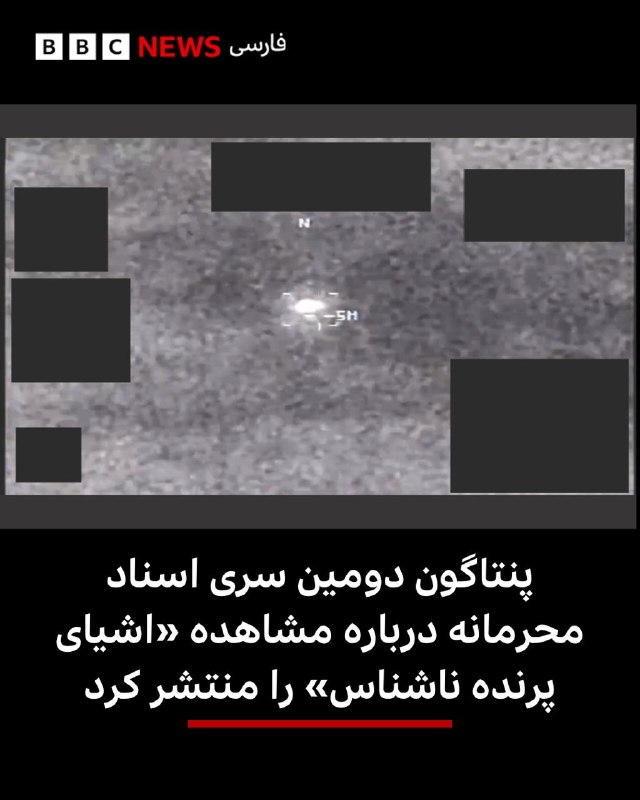

🔻وزارت دفاع آمریکا روز جمعه دومین مجموعه از اسناد محرمانه سابق درباره مشاهده اشیای ناشناس پرنده را منتشر کرد؛ اسنادی که شامل گزارش‌هایی درباره مشاهده «گوی‌های سبز، بشقاپ پرنده‌ها و گوی‌های آتشین ناشناخته» می‌شود.

اولین مجموعه از این اسناد به دستور دونالد ترامپ در ۸ مه (۱۹ فروردین) منتشر شده بود. او جدیدترین رئیس‌جمهور آمریکاست که گزارش‌های دولتی مربوط به اشیای پرنده ناشناس را علنی می‌کند؛ روندی که از اواخر دهه ۱۹۷۰ آغاز شده است.

پیت هگست، وزیر دفاع آمریکا، گفت که این اسناد، تصاویر و ویدئوها که عنوان رسمی‌شان «پدیده‌های ناشناس غیرعادی» است، سال‌ها موضوع گمانه‌زنی و بحث بوده است.

او در بیانیه‌ای گفت: «وقت آن رسیده که مردم آمریکا خودشان این موارد را ببینند.»
یکی از ۲۲۲ پرونده‌ای که روز جمعه منتشر شد، شامل ۱۱۶ صفحه سند درباره مجموعه‌ای از گزارش‌های مشاهدات و تحقیقات انجام‌شده در یک مرکز فوق‌محرمانه در «ساندیا» واقع در ایالت نیومکزیکو بین سال‌های ۱۹۴۸ تا ۱۹۵۰ است.

📸 U.S. Department

@BBCPersian

## BBCPersian — post 281801

  

🔻یکی از قدیمی‌ترین دانشگاه‌های خصوصی ترکیه با حکم رجب طیب اردوغان، رئیس‌جمهور این کشور، تعطیل شد.

دانشگاه «استانبول بیلگی» که به داشتن گرایش‌های سیاسی لیبرال شناخته می‌شود، در هشت ماه گذشته در اداره دولت بوده است.

شرکت «جان هولدینگ»، مالک دانشگاه، به اتهام پول‌شویی و فرار مالیاتی تحت تحقیق قرار داشت.

این شرکت همچنین مالک شبکه‌های عمده تلویزیونی و چندین مدرسه در ترکیه است.

حالا سرنوشت بیش از ۲۰ هزار دانشجوی دانشگاه بیلگی همچنان نامشخص است.
دانشجویان می‌گویند که محوطه دانشگاه همچنان باز است و امروز (جمعه) تجمع اعتراضی برگزار می‌کنند.

شرح عکس: یک نیروگاه قدیمی استانبول که به یک مرکز فرهنگی تبدیل شده و اکنون بخشی از محوطه دانشگاه بیلگی است.

📸 Getty

@BBCPersian

## BBCPersian — post 281800

🔻ایران خطاب به آلمان: منشور ملل متحد مفهومی با عنوان جنگ ضروری نمی‌شناسد

سخنگوی وزارت خارجه ایران گفته است حمله آمریکا و اسرائیل به ایران و جنگی که در پی آن رخ داد، «نقض آشکار» منشور سازمان ملل متحد بوده است.

اسماعیل بقایی در پیامی در ایکس خطاب به فرانک‌والتر اشتاین‌مایر، رئیس‌جمهور آلمان، نوشت: «منشور سازمان ملل هیچ مفهومی تحت عنوان “جنگ ضروری” را به رسمیت نمی‌شناسد که به [آمریکا] حق دهد بر اساس تصمیمات خودسرانه و دلبخواهی متجاوزان، علیه یک کشور مستقل از زور استفاده کند.»

رئیس جمهور آلمان اخیرا درباره جنگ آمریکا و اسرائیل درباره ایران اظهارنظر کرده بود. او در مصاحبه با یک پادکست آلمانی گفته بود که جنگ اخیر با ایران غیر ضروری و قابل اجتناب بود.

سخنگوی وزارت خارجه ایران امروز در واکنش به این اظهارات گفته است «حمله آمریکا و اسرائیل به ایران را نمی‌توان کم‌اهمیت جلوه داد یا صرفا به‌عنوان یک "جنگ غیرضروری" بازتعریف کرد.»

آقای اشتاین‌مایر، در زمان توافق اتمی برجام، وزیر خارجه آلمان و یکی از حامیان به دست آمدن این توافق با جمهوری اسلامی ایران بود.

https://bbc.in/4v3pH4G
@BBCPersian

## BBCPersian — post 281799

ویدیوی خوانندگی و نوازندگی گروهی از زنان در موزه هنرهای معاصر مورد توجه قرار گرفت.

در جریان برنامه چهارم «موزیک تک» که روز پنجشنبه ۳۱ اردیبهشت در فضای باز و داخلی موزه هنرهای معاصر تهران برگزار شد، گروه‌های مختلف موسیقی جنوب ایران را اجرا کردند.

در این میان تک‌خوانی یک خواننده زن به همراه گروه نوازندگان که همه زن بودند با استقبال حاضران روبرو شد و انتشار ویدیوی آن هم مورد استقبال قرار گرفت.

برای ممنوعیت تک‌خوانی زنان در قوانین جمهوری اسلامی هیچ بند و ماده صریحی وجود ندارد. اما همیشه با ممنوعیت‌ها و محدودیت‌های اجرایی روبرو بوده است. بارها از نوازندگی زنان روی صحنه‌ کنسرت‌ها جلوگیری شده است.

این محدودیت‌ها برخلاف اصول حقوق بشر و حقوق زنان است. بسیاری از زنان خواننده در ایران بدون توجه به این ممنوعیت، صدایشان را منتشر کرده‌اند.
@BBCPersian

## BBCPersian — post 281798

🔻دادگستری ایلام می‌گوید اموال هفت نفر را توقیف کرده است

رئیس دادگستری استان ایلام اعلام کرده است که «اموال و دارایی‌های» هفت نفر از شهروندان یکی از شهرستان‌های این استان را به دلیل آنچه که او «خائنین به وطن» خوانده «به نفع حقوق عامه» توقیف کرده است.

عمران علی‌محمدی به خبرگزاری قوه قضائیه گفت این توقیف «در راستای اعمال مجازات مصادره اموال موضوع قانون تشدید مجازات جاسوسی و نیز قانون نحوه اجرای اصل ۴۹ قانون اساسی» و پس از «تشکیل پرونده قضایی برای متهمین» انجام شده است.

به گفته رئیس دادگستری ایلام این اموال توقیف شده «شامل مسکن، خودرو، دارایی های بانکی و سایر اموال بوده است.»

در روزها و هفته‌های اخیر دادگستری‌ها در استان‌های مختلف ایران اعلام کرده‌اند که اموال شهروندان را با چنین اتهاماتی توقیف کرده‌اند.

در برخی موارد نام افراد نیز منتشر شده است.

https://bbc.in/4v3pH4G
@BBCPersian

## BBCPersian — post 281797

🔻رویترز: یک هیئت قطری در هماهنگی با آمریکا در تهران است

رویترز به نقل از یک منابع آگاه گزارش داده است که هیئتی از قطر در هماهنگی با آمریکا، وارد تهران شده است.

بر اساس گزارش این خبرگزاری، هدف این هیئت از سفر به تهران، کمک به حصول توافقی برای پایان دادن به جنگ با ایران و حل اختلافات باقی‌مانده است.

قطر که پیشتر در جنگ غزه و دیگر تنش‌های بین‌المللی نقش میانجی را ایفا می‌کرد، از زمان آغاز جنگ اخیر آمریکا و اسرائیل با ایران، از میانجیگری فاصله گرفته بود.

این کشور در جریان حملات اخیر آمریکا و اسرائیل به ایران، هدف حملات موشکی و پهپادی جمهوری اسلامی قرار گرفت.

https://bbc.in/4v3pH4G
@BBCPersian

## BBCPersian — post 281796

  

🔻به گزارش رسانه‌های دولتی پاکستان، فیلد مارشال عاصم منیر،‌ فرمانده ارتش این کشور راهی تهران شده است.

خبرگزاری اسوشیتد پرس پاکستان به نقل از منابع امنیتی گزارش داده است که فیلد مارشال عاصم منیر در طول این سفر رسمی، درباره «مذاکرات جاری ایران و آمریکا و صلح و ثبات منطقه‌ و منافع دوجانبه دیگر» با مقام‌های ایران گفت‌و‌گو خواهد کرد.

فرمانده ارتش پاکستان چهل روز پیش هم در تهران بود و با محمدباقر قالیباف و اعضای تیم مذاکره‌ ایران و آمریکا دیدار و گفت‌وگو کرده بود.

این در حالی است که وزیر کشور پاکستان هم برای دومین بار طی هفته اخیر به تهران رفته و در حال گفت‌وگو با مقامات ایرانی است.

مارکو روبیو، وزیر خارجه آمریکا، امروز گفت که واشنگتن در انتظار شنیدن نتیجه این گفت‌وگوهاست.

📸 Getty

https://bbc.in/4v3pH4G
@BBCPersian

## BBCPersian — post 281794

فیلم مستند «تمرین‌هایی برای یک انقلاب»، ساخته پگاه آهنگرانی جایزه «چشم طلایی» هفتاد و نهمین جشنواره فیلم کن را از آن خود کرد.

 «لوئی دور» یا چشم طلایی، مهم‌ترین جایزه بخش مستند جشنواره فیلم کن است.
 پگاه آهنگرانی جایزه‌اش را به مردم ایران تقدیم کرد و گفت: «(مردم ایران) با وجود تمام سرکوب‌هایی که در طول این سال‌ها تحمل کرده‌اند، هرگز از تلاش برای حقوقشان، آزادی‌شان و آرزوهایشان دست نکشیده‌‌اند و مطمئنم که آنها هرگز تسلیم نخواهند شد. مطمئنم و یک آرزو دارم که می‌خواهم اینجا بگویم: این‌که روزی دختر کوچکم لی‌لی و همه بچه‌های ایران در آینده‌ای نزدیک در ایرانی آزاد و دموکراتیک زندگی کنند.»

به گفته خانم آهنگرانی او با استفاده از آرشیوهای شخصی، ویدئوهای خانگی، تصاویر اعتراضات خیابانی، روزنامه‌ها و صداهای ضبط‌ شده، بیش از ۴۰ سال از تاریخ ایران را بازخوانی ‌کرده است.
@BBCPersian

## BBCPersian — post 281793

🔻روبیو: جابه‌جایی نیروهای آمریکایی در اروپا برای تنبیه متحدان مخالف جنگ با ایران نیست

وزیر خارجه آمریکا می‌گوید که جابه‌جایی نیروهای آمریکایی در اروپا با هدف «تنبیه» متحدان به‌دلیل حمایت نکردن از جنگ با ایران نیست.

مارکو روبیو روز جمعه در آستانه نشست ناتو در سوئد به خبرنگاران گفت: «آمریکا تعهداتی جهانی دارد که باید در زمینه استقرار نیروهایش به آنها عمل کند و همین موضوع به‌طور مداوم ما را وادار می‌کند که محل استقرار نیروها را دوباره بررسی کنیم. این اقدام تنبیهی نیست، بلکه یک روند جاری و معمول است.»

وزرای خارجه کشورهای عضو ناتو امروز در نشستی در سوئد در تلاش هستند تا درباره میزان تعهدات نظامی آمریکا در اروپا شفافیت بیشتری به دست آورند. آقای ترامپ پیشتر اعلام کرد که ۵ هزار نیروی نظامی به لهستان اعزام می‌کند.

آمریکا قبل از آن یک رزمایش بزرگ در لهستان را لغو کرده و گفته بود که قصد دارد هزاران سرباز خود را از آلمان خارج کند.

دونالد ترامپ بارها از موضع کشورهای عضو ناتو در قبال جنگ ایران و عدم حمایتشان از آمریکا در این جنگ علنا انتقاد کرده بود.

https://bbc.in/4v3pH4G
@BBCPersian

## BBCPersian — post 281792

  <a href="telegram/content/BBCPersian_281792_1779471450.mp4" target="_blank">🎬 Download video</a>

🔻سرخط خبرها، جمعه ۱ خرداد ۱۴۰۵

@BBCPersian

## BBCPersian — post 281790

🔻عراق، ازبکستان و قزاقستان کمک‌های بشردوستانه به ایران فرستادند

معاون جمعیت هلال احمر ایران می‌گوید که عراق، ازبکستان و قزاقستان کمک‌های بشردوستانه به ایران فرستادند و محموله‌های اهدایی آنها وارد کشور شده است.

راضیه عالیشوندی گفت: «این کمک‌ها شامل اقلام غذایی، دارویی و تجهیزات پزشکی است که در راستای حمایت از عملیات امدادی و تامین نیازهای اقشار آسیب‌پذیر در اختیار جمعیت هلال‌احمر قرار گرفته است.»

بر اساس اعلام جمعیت هلال احمر ایران، عراق ۹ تریلی حامل حدود ۱۸۰ تن اقلام غذایی، دارویی و تجهیزات پزشکی، ازبکستان ۱۵ تریلی به وزن ۳۰۰ تن و قزاقستان محموله‌هایی در ۳۰ واگن قطار با وزن هزار و ۷۰۰ تن به ایران فرستادند.

معاون جمعیت هلال احمر ایران گفت که «حجم قابل‌توجهی» از کمک های قزاقستان آرد و شکر است.

https://bbc.in/4v3pH4G
@BBCPersian

## BBCPersian — post 281789

🔻اسماعیل بقایی سخنگوی هیئت مذاکره کننده ایران با آمریکا شد

محمدباقر قالیباف، رئیس هیئت مذاکره کننده ایران با آمریکا، در حکمی اسماعیل بقایی، را به عنوان سخنگوی این هیئت منصوب کرد.

آقای بقایی در حال حاضر سخنگوی وزارت خارجه ایران نیز هست.

در اولین دور مذاکرات ایران و آمریکا پس از جنگ که در اسلام‌آباد انجام شد، آقای بقایی یکی از اعضای هیئت ایرانی بود که به پاکستان رفت.

در دو روز گذشته و با سفر وزیر کشور پاکستان به ایران، گفت‌و‌گوهای فشرده‌ای در جریان بوده است که به گزارش خبرگزاری فارس «برای بررسی پیشنهادهایی جهت حل اختلافات» میان ایران و آمریکا بوده است.

مارکو روبیو، وزیر خارجه آمریکا، امروز گفت که واشنگتن در انتظار شنیدن نتیجه این گفت‌وگوهاست.

https://bbc.in/4v3pH4G
@BBCPersian

## BBCPersian — post 281788

  <a href="telegram/content/BBCPersian_281788_1779471452.mp4" target="_blank">🎬 Download video</a>

🔻جمعیتی خشمگین بخشی از یک بیمارستان مخصوص بیماران ابولا را در شرق جمهوری دموکراتیک کنگو، در آفریقا به آتش کشیدند.

این اقدام پس از آن صورت گرفت که بیمارستان پیکر یک مرد جوان را که گمان می‌‌رفت بر اثر ویروس ابولا جان باخته است، به خانواده و دوستان او تحویل نداد.

یک سیاستمدار محلی به بی‌بی‌سی گفت برخی از بستگان قربانی، وجود این ویروس را که تاکنون بیش از ۱۳۰ نفر را در شرق کنگو به کام مرگ کشانده، باور ندارند.

در جریان ناآرامی‌ها، پلیس برای متفرق کردن جمعیت تیرهای هوایی شلیک کرد.

کارشناسان می‌گویند پیکر افرادی که بر اثر ابولا جان می‌بازند به‌شدت عفونی است و مقام‌های مسئول برای جلوگیری از گسترش این ویروس ناگزیرند اجساد را خود دفن ایمن کنند.

سازمان جهانی بهداشت نیز توصیه می‌کند قربانیان ابولا با رعایت اصول «تدفین ایمن و همراه با حفظ کرامت» به خاک سپرده شوند؛ به‌گونه‌ای که تیم‌های آموزش‌دیده با استفاده از تجهیزات حفاظتی، مسئولیت جابه‌جایی اجساد را بر عهده بگیرند.
@BBCPersian

## BBCPersian — post 281787

  <a href="telegram/content/BBCPersian_281787_1779471454.mp4" target="_blank">🎬 Download video</a>

🔻عباس علی‌آبادی، وزیر نیروی ایران، جمعه، اول خرداد ۱۴۰۵، در سفرش به استان مرکزی و در مراسم افتتاح فاز نخست نیروگاه خورشیدی ۱۳۰ مگاواتی متانول کاوه در ساوه گفت: «علیرغم بارش‌های بسیار خوب، وضعیت آب در استان‌های مرکزی و تهران همچنان وضعیت ضعیف است.»

وزیر نیرو همچنین با اشاره به سیاست‌های جدید مدیریت انرژی اعلام کرد در تامین برق و توسعه ظرفیت‌های جدید، استان‌هایی در اولویت خواهند بود که الگوی مصرف بهینه‌تری داشته باشند. او در ادامه گفت که مدیریت مصرف و سازگاری با شرایط اقلیمی، نقش مهمی در پایداری خدمات آب و انرژی و هدایت سرمایه‌گذاری‌های آینده خواهد داشت.

https://bbc.in/4uXXyMd
@BBCPersian

## BBCPersian — post 281786

🔻خطبه‌های نماز جمعه در شهرهای مختلف ایران با هشدار به آمریکا و اسرائیل اقامه شد

امامان جمعه در شهرهای مختلف ایران در خطبه‌های امروز نماز جمعه به آمریکا و اسرائیل درباره احتمال حمله مجدد هشدار دادند.

در تهران، محمد جواد حاج علی اکبری، امام جمعه موقت پایتخت، خطاب به آمریکا و اسرائیل گفت: «اگر دست به کار احمقانه‌ای بزنید، این بار ایران دیگری خواهید دید و موشک‌های جدیدی را تجربه خواهیم کرد که فکرش را نکردید.»

احمد علم‌الهدی، امام جمعه مشهد، هم با هشدارهای پی‌ در‌ پی به آمریکا و اسرائیل گفت: «یکی از آثار جنگ اخیر این بود که تکنولوژی ارزان قیمت پهپادی و موشکی ایران توانست با تکنولوژی پرهزینه و گران قیمت آمریکا رقابت و مقابله کند و اکنون همه مشتری صنایع دفاعی ایران شده‌اند. امروز ایران به عنوان ابرقدرت چهارم به دنیا معرفی شده است.»

عبدالحسین غبیشاوی، امام جمعه آبادان‌، از مهمترین شهرهای نفتی ایران هشدار داد: «نیروهای مسلح در صورت بروز جنگی دیگر علیه کشور، هیچ خط قرمزی را رعایت نخواهند کرد.»

محمدنبی موسوی فرد، امام جمعه اهواز، مرکز استان خوزستان تهدید کرد که در جنگ احتمالی بعدی «عربستان، امارات، کویت و بحرین را با خاک یکسان خواهیم کرد.»

مجتبی میردامادی، امام جمعه اصفهان هم گفت: «آینده درخشان منطقه خلیج فارس بدون آمریکاست و آن‌ها هیچ جایی در خلیج فارس جز در قعر آب هایش ندارند».

او در ادامه با اشاره به وضعیت اقتصادی ایران گفت که «برای این وضعیت اقتصادی و گران شدن ساعتی و دقیقه‌ای اجناس، شرمنده مردم هستیم.»

https://bbc.in/4v3pH4G
@BBCPersian

## BBCPersian — post 281785

  

🔻جعبه‌ای حاوی دو گرمک «نادر و فوق‌العاده» در یک حراجی در ژاپن با قیمت رکوردشکن ۳۶ هزار و ۵۰۰ دلار فروخته شد.

خریدار، یک عمده‌فروش میوه است؛ قرار است این گرمک‌های گران‌قیمت پیش از آغاز مراسم‌ چشیدن گرمک‌ها در هفته آینده، در فروشگاهی در توکیو به نمایش گذاشته شود.

این گرمک‌ها که در یوباری، واقع در جزیره شمالی هوکایدو، کشت می‌شوند، به‌دلیل گوشت نارنجی آبدارشان شناخته می‌شوند و در ژاپن اغلب به‌عنوان هدیه‌ای گران‌بها اهدا می‌شوند.

📸EPA
@BBCPersian

## BBCPersian — post 281784

🔻دبیرکل ناتو: در مسیر تقویت این ائتلاف و کاهش وابستگی به آمریکا هستیم

مارک روته، دبیرکل ناتو، به خبرنگاران گفت که این ائتلاف در مسیر تقویت قرار دارد و همزمان به‌تدریج وابستگی خود به ایالات متحده را کاهش می‌دهد.

آقای روته این اظهارات را همزمان با گردهمایی وزیران خارجه ناتو در سوئد مطرح کرد و گفت این تغییر به آمریکا امکان خواهد داد تمرکز بیشتری بر اولویت‌های دیگر خود (در خارج از نانو) داشته باشد و همزمان اعضای اروپایی ناتو هم بودجه‌های دفاعی خود را افزایش دهند.

او افزود که این اقدام برای متعادل کردن میزان هزینه‌هایی که ایالات متحده در ناتو می کند «ضروری است.»

اظهارات او در حالی مطرح شد که آمریکا اخیرا از برخی از اعضای ناتو به دلیل اجازه ندادن به استفاده از پایگاه‌های نظامی‌شان در جریان جنگ آمریکا و اسرائیل با ایران انتقاد کرده بود.

آقای روته گفت متحدان اروپایی در چارچوب تعهدات دوجانبه، انتظارات آمریکا درباره دسترسی به پایگاه‌های نظامی را برآورده می‌کنند.

او همچنین به تلاش‌های متحدان اروپایی در تنگه هرمز اشاره کرد و گفت: «ما به‌عنوان متحدان اروپایی می‌توانیم حداکثر کمک ممکن را به ایالات متحده ارائه کنیم.»

https://bbc.in/4v3pH4G
@BBCPersian

## idfinfarsi — post 11625

‼️نیروهای تیم رزمی تیپ شمالی که در شمال نوار غزه فعالیت می‌کنند، روز گذشته (پنج‌شنبه) یک تروریست را شناسایی کردند که از خط زرد عبور کرده و به‌گونه‌ای به سمت نیروها نزدیک شد که تهدیدی فوری محسوب می‌شد.

🔻در رویدادی دیگر طی شب (جمعه)، نیروهای تیم رزمی تیپ ۱۸۸ که در جنوب نوار غزه فعالیت می‌کنند، یک تروریست را شناسایی کردند که از خط زرد عبور کرده و به سمت نیروها نزدیک شد به‌گونه‌ای که تهدیدی فوری به‌شمار می‌رفت.

🔻بلافاصله پس از شناسایی‌ها، نیروها این تروریست‌ها را به هلاکت رساندند تا تهدید برطرف شود.

🔻علاوه بر این، نیروهای تیپ آتش ۴۵۴ که در شمال نوار غزه فعالیت می‌کنند، طی شب (جمعه) یک تروریست را که به‌صورت مشکوک در محدوده خط زرد فعالیت می‌کرد و تهدیدی فوری برای نیروها به‌شمار می‌رفت، شناسایی کردند. بلافاصله پس از شناسایی، نیروها این تروریست را از هوا مورد حمله قرار داده و به هلاکت رساندند.

⭕️نیروهای ارتش اسرائیل تحت فرماندهی جنوب، مطابق با توافق در منطقه مستقر هستند و به فعالیت خود برای رفع هرگونه تهدید فوری ادامه خواهند داد.

## idfinfarsi — post 11623

  <a href="telegram/content/idfinfarsi_11623_1779471457.mp4" target="_blank">🎬 Download video</a>

‼️ویدئو را تماشا کنید: نیروهای تیپ ۵۵۱ تروریست‌های حزب‌الله را در حال ورود به مقر این سازمان شناسایی کرده و آن‌ها را به هلاکت رساندند

⭕️نیروهای تیم رزمی تیپ ۵۵۱ تحت فرماندهی لشکر ۱۴۶، روز گذشته (پنج‌شنبه) پنج تروریست از سازمان تروریستی حزب‌الله را شناسایی کردند که وارد مقر این سازمان در شمال خط دفاعی مقدم در جنوب لبنان شده بودند. در یک واکنش سریع، این نیروها نیروی هوایی را هدایت کردند که ساختمان را مورد حمله قرار داده و تروریست‌ها را به هلاکت رساند.

⭕️در طول ۲۴ ساعت گذشته، انبارهای تسلیحات و زیرساخت‌های تروریستی مورد استفاده سازمان تروریستی حزب‌الله هدف قرار گرفتند و تروریست‌های دیگری که تهدیدی برای نیروهای ما بودند نیز به هلاکت رسیدند.

🔻ارتش اسرائیل به فعالیت خود برای رفع تهدیدها علیه نیروهای ارتش اسرائیل و غیرنظامیان کشور ادامه خواهد داد.

## Dirty_Kids — post 389965

  

تنها فیلدمارشال کهکشان راه شیری با استقبال اسکندر مومنی وزیر کشور ایران وارد تهران شد.

@Dirty_Kids 👻

## Dirty_Kids — post 389964

  <a href="telegram/content/Dirty_Kids_389964_1779471460.mp4" target="_blank">🎬 Download video</a>

این روزا در کافه‌های مملکت چه میگذرد:

@Dirty_Kids 👻

## Dirty_Kids — post 389963

  <a href="telegram/content/Dirty_Kids_389963_1779471462.mp4" target="_blank">🎬 Download video</a>

آنلاین‌شاپا دارن برای جام‌جهانی آماده میشن

یکی بهشون بگه رئال تو جام‌جهانی نیست

@Dirty_Kids 👻

## Dirty_Kids — post 389962

خیلی رفتار‌هایی که در جامعه می‌بینید عادی سازی نیست فرار از واقعیته دوستان

@Dirty_Kids 👻

## Dirty_Kids — post 389960

اگه مادرجندگی یک سکه باشه، یه سمتش واشقانیه سمت دیگه‌ش شهبازی.

@Dirty_Kids 👻

## Dirty_Kids — post 389959

  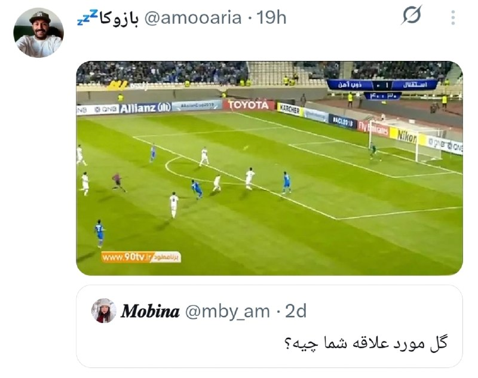

+ چرا اشک تو چشمات جمع شد این که فقط یه گل تو فوتبال

#رشید_مظاهری

@Dirty_Kids 👻

## Dirty_Kids — post 389958

  <a href="https://t.me/Dirty_Kids/389958" target="_blank">📎 Download file</a>

✅ اپلیکیشن اندروید سایت جهانی دربی بت

💰اولین سایت جهانی با امکان شارژ و برداشت ریالی(کارت به کارت)

🔗 برای ورود فیلترشکن روی کشور مناسب قرار دهید مانند فنلاند و المان و....

😀Telegram Channel
👇
https://t.me/+bcynkEgSW2dlYTc0

## Dirty_Kids — post 389957

  

😤دنبال یه سایت شرط بندی بین المللی بودی که به ایرانیا خدمات بده؟!
⛔

👍دربی بت همون انتخاب  100%

💎ویژگی های سایت جهانی Derby Bet:

⬅️امکان شارژ امن با کارت بانکی

⬅️واریز اول دوبل شارژ می شوید(بونوس۱۰۰٪)

⬅️پر اپشن ترین سایت فعال در ایران

⬅️تسویه حساب کمتر از 5 دقیقه

⬅️برگشت بخشی از باخت به صورت هفتگی

🚨کد هدیه ثبت نام:GG007

⚠️برای دانلود اپلکیشن کلیک کنید
👉

🔔کانال دربی بت :

🪙https://t.me/+bcynkEgSW2dlYTc0

## Dirty_Kids — post 389956

تمام ساید های زندگیم رو هواست؛ عاطفی، تحصیلی، کاری، کیرخری.

@Dirty_Kids 👻

## Dirty_Kids — post 389955

  

🔴 جدیدا دخترا دائم دارن پست میزنن که از پسرای نسل جدید و پسرایی که حداقل ۱۰ سال از خودشون کوچیک ترن خیلی خوششون میاد.

به این صورت که دخترای دهه ۶۰-۷۰ عاشق پسرای دهه ۸۰-۹۰ شدن!

@Dirty_Kids 👻

## Dirty_Kids — post 389954

  <a href="telegram/content/Dirty_Kids_389954_1779471465.mp4" target="_blank">🎬 Download video</a>

ترامپ:

ایران داره از شدت نیاز، برای توافق له‌له می‌زنه؛

ما ضربه سنگینی بهشون زدیم، چاره‌ای هم نداشتیم، چون ایران نباید به سلاح هسته‌ای دست پیدا کنه.

@Dirty_Kids 👻

## Dirty_Kids — post 389953

  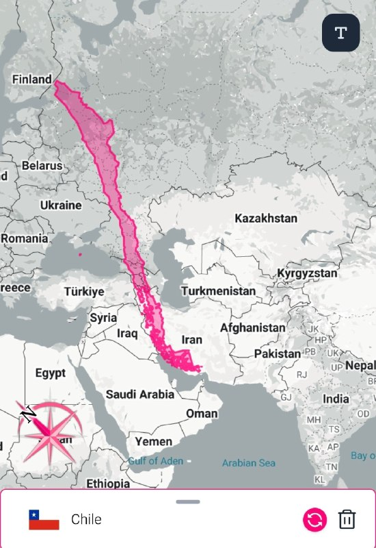

‏شیلی با یه همچین جغرافیای عجیبی چجور میتونه کشور باشه؟

مردم شیلی دور هم جمع نمیشن، همیشه کنار همن

@Dirty_Kids 👻

## Dirty_Kids — post 389952

  <a href="telegram/content/Dirty_Kids_389952_1779471467.mp4" target="_blank">🎬 Download video</a>

لباس بدن نما ، سوتین به سمت کعبه! آرایش غلیظ و بی حجاب و پروژه خفن!😂
لوازم کار جنده های نظام در نزدیکیهای سقوط
چقدر شما مادرقحبه اید؟! انتها نداره.

@Dirty_Kids 👻

## Dirty_Kids — post 389951

  

🌪وقتی اینترنت طوفانیه فقط کافیه بادبان ها رو بکشی

⚫️100 هزار تومان تخفیف خرید اول 
🎁

⚫️پایین ترین قیمت گیگی 180 هزار تومان
🌐 

⚫️پورسانت %10 دائمی برای هر معرفی
💼

با بادبان، میتونی یه اتصال سریع، پایدار و امن
همراه با پشتیبانی ۲۴ ساعته داشته باشی
🚀

🛒کد تخفیف: badban4k

بادبان راهتو باز می‌کنه
⛵️
G1

🛡@BadBan_VPN | کانال 

🤖@BadBan_VPNBot | ربات 

📞@BadBan_VPNSupport | پشتیبانی

## Dirty_Kids — post 389950

  <a href="telegram/content/Dirty_Kids_389950_1779471470.mp4" target="_blank">🎬 Download video</a>

چرا رژیم چنج برای ترامپ حیاتی هست

@Dirty_Kids 👻

## Dirty_Kids — post 389949

  <a href="telegram/content/Dirty_Kids_389949_1779471472.mp4" target="_blank">🎬 Download video</a>

آخر شب در خیابونای مملکت چه میگذرد:

@Dirty_Kids 👻

## Dirty_Kids — post 389947

دختر آیت‌الله vs طرفداران آیت‌الله

@Dirty_Kids 👻

## Dirty_Kids — post 389946

  <a href="telegram/content/Dirty_Kids_389946_1779471472.mp4" target="_blank">🎬 Download video</a>

مردم ایران برای چکش کردند هوا باید به وی پی ان وصل شوند
لعنت بر ج ا

@Dirty_Kids 👻

## Hranews — post 113098

  

صدوهشتادویکمین شماره‌ از ماهنامه‌ی خط صلح منتشر شد 
📡
📡
📡
📡
📡– صدوهشتادویکمین شماره از #ماهنامه_خط_صلح به کوشش مدافعان حقوق بشر و جمعی از کنشگران مدنی منتشر شد. قانون «تشدید مجازات #جاسوسی و همکاری با رژیم صهیونیستی و کشورهای متخاصم علیه امنیت و منافع ملی» در…

## Hranews — post 113097

  <a href="https://t.me/hranews/113097" target="_blank">📎 Download file</a>

صدوهشتادویکمین شماره‌ از ماهنامه‌ی خط صلح منتشر شد 
📡
📡
📡
📡
📡– صدوهشتادویکمین شماره از #ماهنامه_خط_صلح به کوشش مدافعان حقوق بشر و جمعی از کنشگران مدنی منتشر شد. قانون «تشدید مجازات #جاسوسی و همکاری با رژیم صهیونیستی و کشورهای متخاصم علیه امنیت و منافع ملی» در…

## Hranews — post 113096

صدوهشتادویکمین شماره‌ از ماهنامه‌ی خط صلح منتشر شد

📡
📡
📡
📡
📡– صدوهشتادویکمین شماره از #ماهنامه_خط_صلح به کوشش مدافعان حقوق بشر و جمعی از کنشگران مدنی منتشر شد.

قانون «تشدید مجازات #جاسوسی و همکاری با رژیم صهیونیستی و کشورهای متخاصم علیه امنیت و منافع ملی» در مهرماه ۱۴۰۴ نهایی و ابلاغ شد. قانونی که پس از جنگ ۱۲روزه در سال ۱۴۰۴ و در پی تشدید تنش‌های منطقه‌ای، منازعات امنیتی و افزایش #اعتراضات_مردمی تدوین شد. این تصویب، مفهوم جاسوسی در ایران را از درک و تعریف پیشین، به مفهومی سیال و موسّع در حوزه‌ی سیاسی و امنیتی بدل کرد. قانونی که با استناد به آن، شهروندان بسیاری در خطر مجازات‌های سنگین از جمله #مجازات_غیرانسانی اعدام قرار گرفته‌اند و تعدادی نیز اعدام شده‌اند.

بر مبنای این قانون، نه‌فقط انتقال #اطلاعات_محرمانه، بلکه برخی همکاری‌های رسانه‌ای، فعالیت‌ها در شبکه‌های اجتماعی، استفاده از ابزارهای ارتباطی و اینترنت ماهواره‌ای مانند #استارلینک، و تعامل با نهادها و دولت‌هایی که شعام (شورای عالی امنیت ملی) آن‌ها را متخاصم تشخیص می‌دهد نیز می‌توانند ذیل #جرائم_امنیتی و جاسوسی تفسیر شوند.

ماهنامه‌ی خط صلح در این شماره، در پرونده‌ی ویژه‌ای با عنوان «تحت عنوان جاسوسی»، به بحث و بررسی ابعاد مختلف این قانون می‌پردازد.

خط صلح در این راستا به سراغ «#طناز_کلاهچیان»، وکیل دادگستری، رفت تا درباره‌ی ابعاد حقوقی و سیاسی این قانون با او به گفتگو بنشیند. خانم کلاهچیان نیز ضمن پاسخ به پرسش‌های این ماهنامه، به خط صلح گفت: «مسئله این‌جاست که جمهوری اسلامی می‌گوید که من می‌دانم تعریف جرم جاسوسی چیست. می‌دانم هیچ‌کدام‌تان جاسوس نیستید. می‌دانم که این جرم محقق نشده است. ولی برای بقای خودم و ایجاد ترس، وحشت و جلوگیری از اختلال در نظمی که برای خودم چیده‌ام، از این قانون استفاده می‌کنم. دلیل تصویب این قانون با این سرعت همین بود».

ماهنامه‌ی خط صلح هم‌چنین در گفتگویی دیگر به سراغ «#سعید_پیوندی»، جامعه‌شناس، رفت تا به بررسی ابعاد جامعه‌شناختی این قانون، تأثیر آن بر آزادی‌های مدنی، اعتماد اجتماعی، خودسانسوری و امنیتی‌سازی جامعه بپردازد. این استاد دانشگاه نیز با ذکر این نکته که «ما با دستگاه معیوبی سروکار داریم که در دوران جنگ، تبدیل به هیولایی می‌شود و به ابزاری در دست دولت برای سرکوب و محدود کردن جامعه بدل می‌شود»، گفت: «حکومتی هم که در برقراری امنیت ملی شکست خورده، می‌خواهد شکست خود را با انتقام گرفتن از شهروندان، محدود کردن آنان و اعمال نظارت فراگیر امنیتی بر آن‌ها جبران کند».

این شماره هم‌چنین همراه است با مطالب و اظهارنظراتی از: مجید شیعه‌علی، موسی برزین، سینا یوسفی، مینا جوانی، اِلدار خیاوی، مصطفی داننده، جمشید عزیزی، سارا قریشی، مریم عابدی، ایمان سلیمانی، علی کلائی، امیر آقایی، شبنم معینی‌پور، نفیسه مطلق، مرتضی هامونیان، پردیس پارسا، هرمینه هورداد و جمعی دیگر از فعالان حقوق بشر.

لینک دانلود مستقیم فایل پی.دی.اف ماهنامه‌ی خط صلح

وبسایت خط صلح

در این شماره می‌خوانید:
🔸طناز کلاهچیان: در قانون جدید تشدید جاسوسی، هر شهروندی می‌تواند متهم به جاسوسی شود/ علی کلائی
🔸سعید پیوندی: قانون تشدید مجازات جاسوسی، دشمنی میان جامعه و حکومت را بیش‌تر می‌کند/ نفیسه شرف‌الدینی
🔸مقایسه‌ی قانون جدید تشدید مجازات جاسوسی با قوانین قبلی/ سینا یوسفی
🔸بررسی ابهام و گسترش جرم جاسوسی در حقوق کیفری ایران/ موسی برزین
🔸از جرم «جاسوسی» تا جرم‌انگاری «قصد همکاری»/ مریم عابدی
🔸بررسی تطبیقی تعارضات قانون جدید تشدید مجازات جاسوسی با حقوق اساسی مردم/ ایمان سلیمانی
🔸توسعه امنیتی‌سازی کنشگری در قانون جدید تشدید مجازات جاسوسی/ سارا قریشی
🔸مقایسه‌ی تطبیقی جاسوس و جاسوسی در حقوق ایران و سایر کشورها/ اِلدار خیاوی
🔸همکاری رسانه‌ای با خارج؛ مرز اطلاع‌رسانی و جاسوسی کجاست؟/ مصطفی داننده
🔸امنیتی‌سازی جامعه با اتهام جاسوسی/ هرمینه هورداد
🔸قانون جدید تشدید مجازات جاسوسی و مرز مبهم
تراکنش‌های مالی/ شبنم معینی‌پور
🔸سرکوب و اعدام با اتهام نابخشودنیِِ جاسوسی/ مرتضی هامونیان
🔸اعدام به نام امنیت؛ تشدید برخورد با اتهام جاسوسی در ایران/ نفیسه مطلق
🔸امنیت ملی با اعدام و سرکوب؟/ مجید شیعه‌علی
🔸نمایشِ جنگ و تولید ملت: مطالعه‌ای بر مدیریت دیداری قدرت در خیابان/ مینا جوانی
🔸تجربه‌ی زیسته‌ی ایرانیان در دوران جنگ/ پردیس پارسا
🔸از فیلتر تلگرام تا «اینترنت پرو»/ امیر آقایی
🔸«کبوتر صلح»، «جنگ» و «بازمانده»؛ سه شعر کوتاه از جمشید عزیزی

↘️
@hranews_bot تماس ✉️ - @Hranews کانال هرانا 🆑

## Hranews — post 113095

  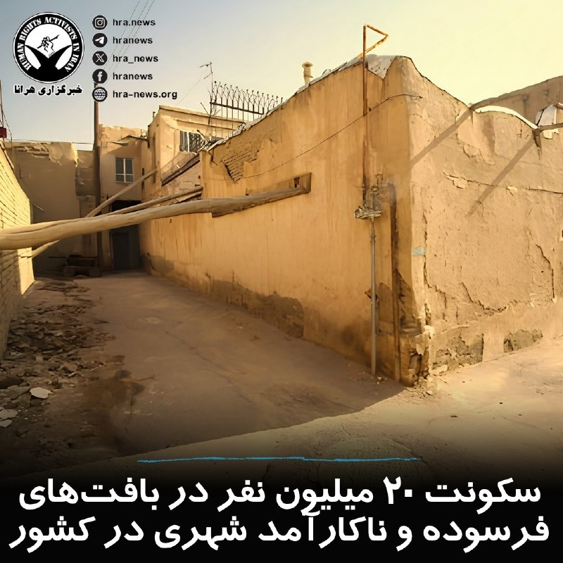

معاون وزیر راه‌وشهرسازی و مدیرعامل شرکت بازآفرینی شهری کشور نسبت به وضعیت بافت‌های فرسوده و ناپایدار در ایران هشدار داد. به گفته علیرضا گلپایگانی، نزدیک به ۵ میلیون نفر در واحدهای مسکونی به‌شدت ناپایدار سکونت دارند و حدود ۲۰ میلیون شهروند نیز در بافت‌های فرسوده و ناکارآمد شهری زندگی می‌کنند. این در حالی است که این شهروندان از نظر تاب‌آوری، سرانه‌های خدماتی و کیفیت فضای زندگی با مشکلات زیادی مواجه هستند.

وی با تأکید بر ضرورت توجه به بازآفرینی شهری اعلام کرد که بی‌توجهی به وضعیت این مناطق می‌تواند هزینه‌های سنگینی را برای کشور به همراه داشته باشد.

↘️
@hranews_bot تماس ✉️ - @Hranews کانال هرانا 🆑

## Hranews — post 113094

  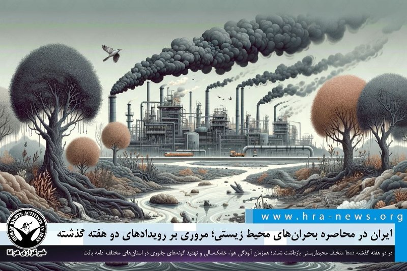

ایران در محاصره بحران‌های محیط‌ زیستی؛ مروری بر رویدادهای دو هفته گذشته

❗️
❗️
❗️
❗️
❗️– حق بر #محیط_زیست و برخورداری از منابع طبیعی سالم، از بنیادی‌ترین حقوق انسانی به شمار می‌رود. با این حال، تداوم بهره‌برداری بی‌رویه از منابع طبیعی، کاهش نظارت مؤثر، گسترش آلاینده‌ها، خشکسالی‌های پی‌درپی و تخریب زیستگاه‌های طبیعی، محیط زیست ایران را با بحران‌های گسترده‌ای روبه‌رو کرده است. گزارش پیش‌رو حاصل ثبت ۸۴ گزارش و رویداد محیط زیستی منتشرشده در دو هفته اخیر است که با هدف آگاه‌سازی افکار عمومی گردآوری شده است.

به گزارش خبرگزاری هرانا، ارگان خبری مجموعه فعالان حقوق بشر در ایران، در دو هفته‌ای که گذشت، دست‌کم ۷۸ شکارچی، صیاد، متخلف محیط زیستی و قاچاقچی چوب بازداشت و شناسایی شدند. همچنین، بیش از ۴۳ تن چوب قاچاق و مقادیر قابل توجهی گیاهان کوهی و محصولات طبیعی کشف و ضبط شد. افزون بر این، شاخص کیفیت هوا در دست‌کم ۴۲ شهر در وضعیت ناسالم، بسیار ناسالم و خطرناک قرار گرفت. از سوی دیگر، گزارش‌های متعددی درباره تشدید تنش آبی، خشکسالی، تهدید گونه‌های جانوری، تخریب زیستگاه‌ها، بحران پسماند و اثرات جنگ و آلاینده‌های صنعتی بر محیط زیست منتشر شد که در ادامه به بخشی از آنها پرداخته می‌شود.

آسیب رسانی به جنبه‌های مختلف محیط زیست در ایران کماکان ادامه دارد. از یک سو، فقر، نبود آموزش‌های محیط زیستی و سودجویی موجب تخریب منابع طبیعی و حیات وحش شده و از سوی دیگر، نهادهای متولی با محدودیت امکانات و کمبود نیرو در تلاش برای کاهش ابعاد این بحران‌ها هستند؛ هرچند به نظر نمی‌رسد حجم اقدامات انجام‌شده متناسب با شدت بحران‌های محیط زیستی کشور باشد.

ادامه مطلب

↘️
@hranews_bot تماس ✉️ - @Hranews کانال هرانا 🆑

## Hranews — post 113093

  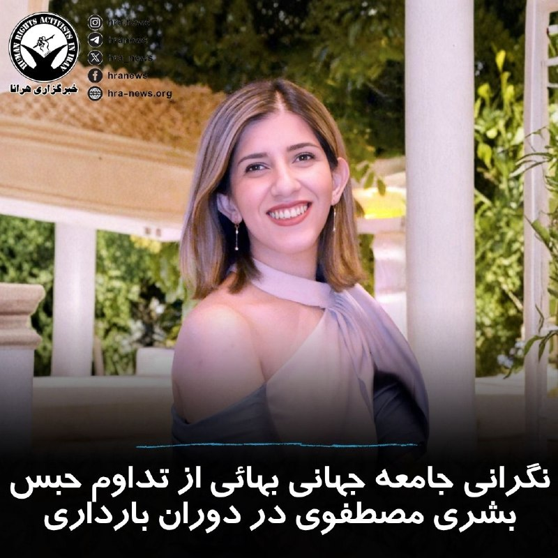

جامعه جهانی بهائی با نگارش بیانیه‌ای اعلام کرد که درخواست‌های بشری مصطفوی، زن باردار محبوس در زندان کرمان، در خصوص ارائه مرخصی برای مراجعه‌های پزشکی و انجام آزمایشات ضروری مربوط به بارداری او رد شده است. این در شرایطی است که وی می‌بایست چهار ماه از دوران بارداری خود را در زندان کرمان سپری کند. وضعیتی که باعث تشدید نگرانی این جامعه شده است.

همچنین در ادامه این بیانیه، جامعه #بهائی نسبت به تشدید سرکوب بهائیان طی جنگ اخیر در سراسر کشور ابراز نگرانی کرد. سیمین فهندژ، نماینده جامعۀ جهانی بهائی در سازمان ملل متحد در ژنو ضمن بیان اینکه زمامداری نباید ابزاری برای سرکوب انسان‌ها به خاطر باورها، قومیت یا جنسیت آن‌ها باشد، اظهار داشت که باور کردنی نیست که حکومت ایران، در شرایطی که در همه عرصه‌ها با بحران‌های فزاینده روبه‌روست، به‌جای آن‌که توجه خود را به نیازهای شهروندانش معطوف کند، آزار و سرکوب بیشتر جامعه‌ای بی‌گناه را در پیش گرفته است.

#بشری_مصطفوی

↘️
@hranews_bot تماس ✉️ - @Hranews کانال هرانا 🆑

## Hranews — post 113092

اموال ۷ شهروند در استان ایلام توقیف شد

❗️
❗️
❗️
❗️
❗️– رئیس کل دادگستری استان ایلام از #توقیف_اموال هفت شهروند در این استان خبر داد. وی این افراد را به “جاسوسی و همکاری با رژیم صهیونیستی” متهم کرده است.

ادامه مطلب

↘️
@hranews_bot تماس ✉️ - @Hranews کانال هرانا 🆑

## Hranews — post 113091

  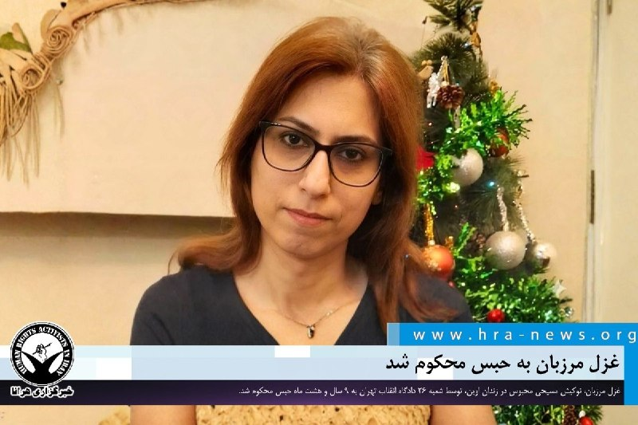

غزل مرزبان به بیش از ۹ سال حبس محکوم شد

❗️
❗️
❗️
❗️
❗️– غزل مرزبان، نوکیش مسیحی محبوس در زندان اوین، با حکم قاضی ایمان افشاری به ۹ سال و هشت ماه حبس محکوم شد.

به گزارش خبرگزاری هرانا، ارگان خبری مجموعه فعالان حقوق بشر در ایران، غزل مرزبان به حبس محکوم شد.

بر اساس حکمی که توسط شعبه ۲۶ دادگاه انقلاب تهران، به ریاست قاضی ایمان افشاری صادر و به خانم مرزبان ابلاغ شده، وی به ۹ سال و هشت ماه حبس محکوم شده است.

#غزل_مرزبان

ادامه مطلب

↘️
@hranews_bot تماس ✉️ - @Hranews کانال هرانا 🆑

## Hranews — post 113090

  

گزارش ماهانه؛ نگاهی اجمالی به وضعیت حقوق بشر – اردیبهشت ماه ۱۴۰۵

❗️
❗️
❗️
❗️
❗️– آنچه در پی می‌آید گزارش ماهانه و اجمالی از وضعیت حقوق بشر در ایران در دوره زمانی اردیبهشت ماه ۱۴۰۵ است که به همت نهاد آمار، نشر و آثار مجموعه فعالان حقوق بشر در ایران تهیه شده است، این گزارش، تصویری گسترده و تکان‌دهنده از نقض حقوق بشر در ابعاد مختلف ارائه می‌دهد. از اجرای حکم اعدام تا نقض آزادی‌های فردی و اجتماعی، از خشونت نظامی و قضایی تا مشکلات کارگری و اعتراضات، همگی نشان‌دهنده چالش‌های جدی در زمینه رعایت حقوق بشر در ایران هستند. این گزارش همچنین بر میزان بالای اعدام‌ها، بازداشت‌ها، و محکومیت‌های سنگین بر اساس اتهامات مختلف تاکید دارد و نشان می‌دهد که این رویدادها در سراسر کشور گسترده‌اند.

خلاصه اجرایی

در طول اردیبهشت ماه ۱۴۰۵، شاهد گستره‌ای از نقض‌های #حقوق_بشر در سراسر ایران بودیم. با ارزیابی‌های دقیق و گزارش‌های دریافتی، مجموعاً صدها مورد نقض حقوق بشر شناسایی و ثبت شده است که شامل نقض حقوق زندانیان، آزادی بیان، حقوق کودک، خشونت‌های خانگی، خشونت مبتنی بر جنسیت، بهداشت و محیط زیست، حقوق کار، و خشونت نظامی و قضایی می‌شود.

یافته‌های کلیدی این گزارش عبارت‌اند از:
⚫️ اجرای حکم اعدام در مواردی که فرآیندهای عدالتی منصفانه رعایت نشده است.

⚫️ سرکوب گسترده آزادی بیان و بازداشت‌های خودسرانه.

⚫️ افزایش نگران‌کننده خشونت علیه زنان.

⚫️ تداوم نقض حقوق کار و شرایط کاری ناعادلانه.

⚫️ استفاده بی‌رویه از زور توسط نیروهای انتظامی و امنیتی

دوره گزارش‌دهی این گزارش اردیبهشت ۱۴۰۵ است و تعداد کل موارد نقض گزارش شده بیانگر یک وضعیت نگران‌کننده و فوریت برای توجه جامعه بین‌المللی و دولت ایران به این مسائل است.

ادامه مطلب

↘️
@hranews_bot تماس ✉️ - @Hranews کانال هرانا 🆑

## manototv — post 105748

  <a href="telegram/content/manototv_105748_1779471479.mp4" target="_blank">🎬 Download video</a>

«دلم براتون تنگ میشه اما امید دارم برگردید»

## manototv — post 105747

  <a href="telegram/content/manototv_105747_1779471481.mp4" target="_blank">🎬 Download video</a>

رییس اورژانس پیش‌بیمارستانی و مدیریت حوادث دانشگاه علوم پزشکی البرز اعلام کرد بر اثر تصادف زنجیره‌ای در آزادراه کرج قزوین، سه نفر جان باختند و چهار نفر دیگر مجروح شدند.
به گزارش رسانه‌های داخلی، در این سانحه دو مرد و یک زن کشته شدند و سه مرد و یک زن دیگر نیز مجروح شدند.
مصدومان توسط نیروهای اورژانس به بیمارستان امام جعفر صادق نظرآباد منتقل شدند.

## manototv — post 105746

  <a href="telegram/content/manototv_105746_1779471482.mp4" target="_blank">🎬 Download video</a>

پیام یک مخاطب منوتو درباره پایان پخش برنامه‌های این شبکه

## manototv — post 105745

  <a href="telegram/content/manototv_105745_1779471484.mp4" target="_blank">🎬 Download video</a>

پیام یک مخاطب منوتو درباره پایان پخش برنامه‌های این شبکه

## manototv — post 105744

  <a href="telegram/content/manototv_105744_1779471485.mp4" target="_blank">🎬 Download video</a>

هامبورگ؛ به‌مناسبت سالگرد ریزش ساختمان متروپل، جمعه اول خرداد ۱۴۰۵

## manototv — post 105741

اطلاعیه منوتو درباره پایان پخش برنامه‌ها

## manototv — post 105740

  <a href="telegram/content/manototv_105740_1779471487.mp4" target="_blank">🎬 Download video</a>

مارکو روبیو، وزیر خارجه آمریکا، در نشست خبری مشترک با مارک روته، دبیرکل ناتو، گفت تلاش جمهوری اسلامی برای ایجاد نظام عوارض‌گیری در یک آبراه بین‌المللی قابل قبول نیست و نباید اجازه داده شود چنین اقدامی در تنگه هرمز رخ دهد.

روبیو در این نشست که در حاشیه نشست وزیران خارجه ناتو در سوئد برگزار شد، گفت آمریکا می‌کوشد این موضوع را از مسیر سازمان ملل پیگیری کند و به نتیجه برساند. او افزود تقریبا همه کشورهایی که در این نشست حضور داشتند، از قطعنامه مربوط به این موضوع حمایت کرده‌اند یا به احتمال زیاد به آن خواهند پیوست.

## manototv — post 105739

  <a href="telegram/content/manototv_105739_1779471488.mp4" target="_blank">🎬 Download video</a>

پریتی پتل، وزیر خارجه سایه بریتانیا، در سخنانی در مجلس عوام این کشور گفت هرچه از برنامه هسته‌ای جمهوری اسلامی باقی مانده، باید برچیده شود و اورانیوم غنی‌شده موجود نیز باید از ایران خارج شود.

به گزارش متن رسمی نشست مجلس عوام بریتانیا، این سخنان روز پنجشنبه ۳۱ اردیبهشت در جریان جلسه‌ای درباره خاورمیانه مطرح شد. او گفت اورانیوم غنی‌شده‌ای که جمهوری اسلامی اکنون در اختیار دارد باید خارج شود و باید از چگونگی سوءاستفاده جمهوری اسلامی از توافق سال ۱۳۹۴ درس گرفت.

پتل از دولت بریتانیا خواست روشن کند آیا این موضع، موضع رسمی دولت نیز هست یا نه. او گفت شفافیت دولت درباره این موضوع «بسیار مهم» است و سپس پرسید موضع دولت در قبال توان موشکی و نظامی ایران چیست.

## alonews — post 121844

  <a href="telegram/content/alonews_121844_1779471490.webm" target="_blank">🎬 Download video</a>

👈سخنگوی وزارت خارجه: مباحث هسته‌ای در این مرحله قرار نیست صحبت شود

✅ @AloNews خبر جنگ

## alonews — post 121843

  <a href="telegram/content/alonews_121843_1779471490.webm" target="_blank">🎬 Download video</a>

👈 سخنگوی وزارت خارجه: نمی‌توانیم بگوییم ضرورتا به جایی رسیده‌ایم که توافق نزدیک است.

🔴 تمرکز مذاکرات بر خاتمه جنگ است.

🔴یک هیئتی از قطر درحال مذاکره وزیر خارجه کشورمان هستند اما میانجی مذاکرات همچنان طرف پاکستانی است

🔴رفت و آمدها به تهران تداوم همان روند دیپلماتیک است

✅ @AloNews خبر جنگ

## alonews — post 121842

  <a href="telegram/content/alonews_121842_1779471490.webm" target="_blank">🎬 Download video</a>

👈ترامپ: با اینکه خیلی میخواهم در کنار پسرم برای مراسم عروسی باشم اما حس میکنم که مهم است در واشنگتن و کاخ سفید در طی زمان مهم پیش رو در روز شنبه و یکشنبه بمانم.

✅ @AloNews خبر جنگ

## alonews — post 121841

  <a href="telegram/content/alonews_121841_1779471491.webm" target="_blank">🎬 Download video</a>

👈سخنگوی وزارت خارجه : هنوز به توافق نزدیک نشدیم و اختلاف‌ها باقیه

✅ @AloNews خبر جنگ

## alonews — post 121840

  <a href="telegram/content/alonews_121840_1779471491.webm" target="_blank">🎬 Download video</a>

👈فاکس نیوز: تولسی گبرد، مدیر اطلاعات ملی ایالات متحده آمریکا، استعفا داد

✅ @AloNews خبر جنگ

## alonews — post 121839

  <a href="telegram/content/alonews_121839_1779471491.webm" target="_blank">🎬 Download video</a>

👈آسوشیتدپرس: اسرائیل از تلاش‌های ترامپ برای امضای توافق با ایران خشمگین است

🔴یک مقام که نخواست نامش فاش شود، به خبرگزاری آسوشیتدپرس گفت که دونالد ترامپ، رئیس‌جمهور آمریکا، و بنیامین نتانیاهو، نخست‌وزیر اسرائیل، روز سه‌شنبه گذشته درباره وضعیت مذاکرات با ایران، یک تماس تلفنی «دراماتیک» داشته‌اند و اسرائیل از تلاش‌های ترامپ برای امضای توافق با ایران خشمگین است.

🔴به گفته این خبرگزاری، کاخ سفید از اظهار نظر درباره محتوا یا لحن این تماس خودداری کرده است. ترامپ پس از این مکالمه به خبرنگاران گفت که نتانیاهو «هر کاری را که من از او بخواهم، انجام خواهد داد».

🔴این اظهارات یکی از اولین نشانه‌های علنیِ وجود فاصله میان مواضع ترامپ و نتانیاهو از زمانی است که آنها تصمیم به جنگ با ایران گرفتند

✅ @AloNews خبر جنگ

## alonews — post 121838

  <a href="telegram/content/alonews_121838_1779471491.webm" target="_blank">🎬 Download video</a>

👈رئیس کمیته نیروهای مسلح سنای آمریکا: ترامپ باید به ارتش اجازه دهد تا انهدام توانمندی‌های نظامی ایران را تکمیل کند.

✅ @AloNews خبر جنگ

## alonews — post 121837

  <a href="telegram/content/alonews_121837_1779471492.webm" target="_blank">🎬 Download video</a>

👈فرانسه هرگونه مداخله ناتو در تنگه هرمز را رد کرد

✅ @AloNews خبر جنگ

## alonews — post 121836

  <a href="telegram/content/alonews_121836_1779471492.mp4" target="_blank">🎬 Download video</a>

وضعیت

[@AloTweet]

## alonews — post 121834

  <a href="telegram/content/alonews_121834_1779471494.mp4" target="_blank">🎬 Download video</a>

👈لهستان اعلام کرد که سه فروند نخست هواپیماهای جنگنده لاکهید مارتین F-35 لایتنینگ II ساخت آمریکا در پایگاه هوایی لاسک وارد شده‌اند و تحویل‌های بعدی تا سال ۲۰۲۹ برنامه‌ریزی شده است.

🔴ورشو در سال ۲۰۲۰ و در دوره اول ریاست جمهوری ترامپ، ۳۲ فروند جنگنده F-35A را از لاکهید مارتین سفارش داد که ارزش این قرارداد ۴.۶ میلیارد دلار بود و خلبانان لهستانی هم‌اکنون در آمریکا در حال آموزش هستند.

✅ @AloNews خبر جنگ

## alonews — post 121833

  <a href="telegram/content/alonews_121833_1779471496.webm" target="_blank">🎬 Download video</a>

👈وزیرکشور پاکستان که هم اکنون در تهران بسر می برد با همتای عربستانی خود گفت وگوی تلفنی انجام داد

✅ @AloNews خبر جنگ

## alonews — post 121832

  

قیمت استثنایی گیگی
9️⃣
8️⃣
1️⃣

تحویل زیر یک دقیقه
✅
دارای لینک سابسکریشن جهت دیدن حجم و کنترل مصرف
✅
بدون قطعی 
✅
بدون محدودیت کاربر و زمان
✅
جمینایو چت جی بی تی و... کامل اوکیه با سرورامون
✅

🏪پشتیبانی کامل
✅
شروع فعالیت از سال 2022 
✅
پرداخت ریالی
✅

ضریب و این چیزا ندارن و تا آخرین مگابایت برای پشتیبانیش درختمتیم
🥂

💤این تخفیف فقط تا ۱۲ شب فعاله
💤

⭐️ @Napsternetiran_bot
〰️〰️〰️〰️〰️〰️〰️

🔶 @Napsternetvirani

## alonews — post 121831

  <a href="telegram/content/alonews_121831_1779471497.webm" target="_blank">🎬 Download video</a>

👈هشدار آژانس بین‌المللی انرژی: بازارهای نفت به «منطقه قرمز» نزدیک می‌شوند

✅ @AloNews خبر جنگ

## alonews — post 121830

  <a href="telegram/content/alonews_121830_1779471497.webm" target="_blank">🎬 Download video</a>

👈وزیر کشور ایران، اسکندر مومنی، هنگام ورود رئیس ارتش پاکستان، عاصم منیر، در تهران از او استقبال کرد

✅ @AloNews خبر جنگ

## alonews — post 121829

  <a href="telegram/content/alonews_121829_1779471498.webm" target="_blank">🎬 Download video</a>

👈العربی الجدید به نقل از منبعی در وزارت خارجه پاکستان: واشنگتن و تهران انعطاف کافی در پرونده‌های اصلی از خود نشان نمی‌دهند

✅ @AloNews خبر جنگ

## alonews — post 121828

  <a href="telegram/content/alonews_121828_1779471498.webm" target="_blank">🎬 Download video</a>

👈ایسنا: عاصم منیر وارد تهران شد

✅ @AloNews خبر جنگ

## alonews — post 121827

  <a href="telegram/content/alonews_121827_1779471498.mp4" target="_blank">🎬 Download video</a>

👈کوین وارش رسماً به عنوان هفدهمین رئیس فدرال رزرو سوگند یاد کرد

✅ @AloNews خبر جنگ

## alonews — post 121826

  <a href="telegram/content/alonews_121826_1779471501.webm" target="_blank">🎬 Download video</a>

👈العربی الجدید به نقل از منبعی در وزارت خارجه پاکستان: واشنگتن و تهران انعطاف کافی در پرونده‌های اصلی از خود نشان نمی‌دهند.

🔴سفر فرمانده ارتش (پاکستان) به تهران ممکن است آخرین تلاش برای جلوگیری از بازگشت منطقه به جنگ باشد

✅ @AloNews خبر جنگ

## alonews — post 121825

  <a href="telegram/content/alonews_121825_1779471501.mp4" target="_blank">🎬 Download video</a>

👈ترامپ : من اینو زیاد میگم پادشاه عربستان به من گفت ما داغ ترین کشور دنیا هستیم

✅ @AloNews خبر جنگ

---
📅 بروزرسانی: 1405/03/01 13:25
---

## VahidOOnLine — post 241497

  <a href="telegram/content/VahidOOnLine_241497_1779443752.mp4" target="_blank">🎬 Download video</a>

⭕️روبیو: ناامیدی ترامپ از واکنش ناتو در جنگ ایران باید بررسی شود

♦️مارک روبیو، وزیر خارجه آمریکا، اعلام کرد «ناامیدی» دونالد ترامپ از برخی متحدان ناتو به‌دلیل حمایت‌نکردن از عملیات آمریکا در جنگ با ایران، موضوعی است که «باید مورد رسیدگی قرار گیرد».
او پیش از نشست وزیران خارجه ناتو در سوئد گفت، دیدگاه‌های ترامپ درباره واکنش متحدان اروپایی «کاملا مستند» است.

روبیو در عین حال تاکید کرد جابه‌جایی نیروهای آمریکایی در اروپا با هدف «تنبیه» متحدان انجام نمی‌شود و گفت واشنگتن به‌طور مداوم آرایش نظامی خود را بر اساس تعهدات جهانی بازبینی می‌کند.
این اظهارات در حالی مطرح می‌شود که اختلاف‌نظرها میان آمریکا و برخی اعضای ناتو بر سر جنگ ایران و نقش اروپا در امنیت منطقه‌ای افزایش یافته است.
‌🇸🇦 Indypersian

🤖 @VahidOOnLine

## VahidOOnLine — post 241496

  

♦️روابط عمومی نیروی دریایی سپاه، روز جمعه یکم خرداد اعلام کرد که در ۲۴ ساعت گذشته، ۳۵ کشتی از تنگه هرمز عبور کرده‌اند.
سپاه بدون اعلام آمار دقیق انواع شناورهای عبوری گفت که این کشتی‌ها شامل نفتکش، کانتینربر و سایر کشتی‌های تجاری بوده است.
نیروی دریایی سپاه، روز پنجشنبه هم از عبور ۳۱ کشتی از تنگه هرمز خبر داده بود.

این خبر درحالی اعلام شده است که  بلومبرگ روز پنجشنبه ۳۱ اردیبهشت گزارش داد، جمهوری اسلامی در حال رایزنی با عمان است تا یک سازوکار دایمی وضع عوارض را برای رسمی کردن کنترل خود بر تردد دریایی در تنگه هرمز ایجاد کند.
‌🇸🇦 Indypersian

🤖 @VahidOOnLine

## VahidOOnLine — post 241495

  

حسنعلی اخلاقی‌امیری، عضو کمیسیون فرهنگی مجلس، به دیده‌بان ایران گفت جمهوری اسلامی بنا ندارد در حوزه خلیج فارس و تنگه هرمز از «حقوق» خود کوتاه بیاید و افزود: «قانون دریافت عوارض از تنگه هرمز را تصویب می‌کنیم.»

او اضافه کرد: «تمام مسئولان اتفاق نظر دارند که تنگه هرمز از منافع جمهوری اسلامی است. هر مذاکره‌ای هم صورت بگیرد، کشتی‌های دشمن و کشورهای همکار دشمن حق عبور نداشته و بقیه کشتی‌ها باید عوارض بپردازند.»

اخلاقی‌امیری همچنین با اشاره به تهدید دونالد ترامپ درباره بازگشایی تنگه هرمز گفت آمریکا می‌خواهد با باز کردن این تنگه «خود را از این معرکه خلاص کند»، اما پس از «تحمیل جنگ اخیر» و وارد شدن هزینه‌های سنگین به جمهوری اسلامی، «دیگر قرار نیست از حق خود بگذریم.»
‌🏁 🇬🇧 IranintlTV

🤖 @VahidOOnLine

## VahidOOnLine — post 241494

  

انور قرقاش، مشاور دیپلماتیک رییس امارات متحده عربی، روز جمعه هشدار داد دور دوم درگیری میان آمریکا و جمهوری اسلامی می‌تواند وضعیت منطقه را پیچیده‌تر کند اما تاکید کرد که هر راه‌حل سیاسی باید به «ریشه‌های» بحران بپردازد تا از ایجاد پیچیدگی‌های جدید در آینده جلوگیری شود.

قرقاش همچنین هشدار داد هرگونه تغییر در وضعیت کنترل تنگه هرمز پیامدهای جدی خواهد داشت.

او از کشورهای اروپایی خواست تنگه هرمز را نه مسئله‌ای دوردست، بلکه موضوعی مرتبط با امنیت انرژی و تجارت خود بدانند.
‌🏁 🇬🇧 IranintlTV

🤖 @VahidOOnLine

## VahidOOnLine — post 241493

  

♦️مارکو روبیو، وزیر امور خارجه آمریکا روز جمعه اول خردادماه گفت پیشرفت‌های اندکی در مذاکرات با جمهوری اسلامی ایران حاصل شده است.
روبیو که برای شرکت در اجلاس وزاری خارجه ناتو به هلسینبورگ سوئد رفته است،‌ یک روز پیش از این هم گفته بود که «نشانه‌هایی از پیشرفت در مذاکرات با تهران دیده می‌شود.»

این سخنان در حالی عنوان می‌شود که تلویزیون الجزیره قطر روز جمعه به نقل از یک مقام آگاه پاکستان گزارش داد که کوتاه نیامدن تهران و واشنگتن درباره ذخایر اورانیوم و تنگه هرمز، باعث بن‌بست در مذاکرات شده است.
‌🇸🇦 Indypersian

🤖 @VahidOOnLine

## VahidOOnLine — post 241492

بحران جمعیت برای جمهوری اسلامی؛ چرا ایرانی‌ها دیگر فرزند نمی‌آورند؟
نعیمه دوستدار- کاهش تعداد تولدها در ایران و سقوط آمار موالید به زیر یک میلیون، بحران جمعیتی را به مرکز سیاست‌گذاری جمهوری اسلامی بازگردانده است. مساله جمعیت دیگر فقط یک نگرانی آماری نیست، بلکه موضوعی سیاسی، امنیتی و ایدئولوژیک برای حکومت است.
در روزهای اخیر، بحث جمعیت بار دیگر به یکی از موضوعات مهم در فضای سیاسی و رسانه‌ای ایران تبدیل شده است. این موج تازه پس از انتشار پیامی منتسب به مجتبی خامنه‌ای، رهبر غایب جمهوری اسلامی، درباره ضرورت افزایش جمعیت آغاز شد. پیامی که در آن، رشد جمعیت به‌عنوان مساله‌ای راهبردی برای آینده ایران توصیف شده است.
تقریبا هم‌زمان با این پیام، علیرضا رئیسی، معاون بهداشت وزارت بهداشت، درمان و آموزش پزشکی، در اظهاراتی هشدار داد تعداد موالید در سال ۱۴۰۳ نسبت به سال قبل حدود هفت درصد کاهش یافته و برای نخستین بار به زیر یک میلیون رسیده است.
بر اساس آمار ارائه‌شده از سوی مقام‌های وزارت بهداشت، تعداد تولدهای ثبت‌شده در سال ۱۴۰۳ حدود ۹۷۹ هزار مورد بوده است. رقمی که نسبت به دهه‌های گذشته کاهش چشمگیری نشان می‌دهد.
رئیسی همچنین گفت که اگر روند فعلی ادامه پیدا کند، رشد جمعیت ایران در دو دهه آینده به نزدیکی صفر خواهد رسید.
این هم‌زمانی معنادار است. از یک سو رهبر دیده نشده جمهوری اسلامی بر ضرورت افزایش جمعیت تاکید می‌کند و از سوی دیگر، مقام‌های رسمی دولت درباره کاهش موالید هشدار می‌دهند.
همین مساله نشان می‌دهد موضوع جمعیت برای جمهوری اسلامی تا چه اندازه جدی است.

‌🏁 🇬🇧 IranintlTV

🤖 @VahidOOnLine

## VahidOOnLine — post 241491

  

مارک روته، دبیرکل ناتو، در نشست وزیران خارجه این ائتلاف در سوئد گفت هرگونه تهدید علیه گذرگاه‌های راهبردی دریایی، از جمله تنگه هرمز، می‌تواند پیامدهای گسترده‌ای برای امنیت بین‌المللی و اقتصاد جهانی داشته باشد.

روته جمعه اول خرداد در دومین روز نشست وزیران خارجه سازمان پیمان نظامی آتلانتیک شمالی (ناتو) در هلسینبورگ سوئد، گفت که این سازمان تحولات مربوط به تنگه هرمز را با دقت دنبال می‌کند و بر حفظ آزادی کشتیرانی و امنیت خطوط انتقال انرژی تاکید دارد.

او همچنین گفت آزادی کشتیرانی در تنگه هرمز موضوعی مهم برای همه اعضای ناتو است، اما ممکن است مستقیما در چارچوب ماموریت رسمی این ائتلاف قرار نگیرد.

روته در عین حال بر ادامه نقش کلیدی آمریکا در امنیت اروپا تاکید کرد و گفت ارسال تجهیزات حیاتی آمریکایی به اوکراین، از جمله سامانه‌های پاتریوت، همچنان برای ناتو اهمیت اساسی دارد.
‌🏁 🇬🇧 IranintlTV

🤖 @VahidOOnLine

## VahidOOnLine — post 241490

  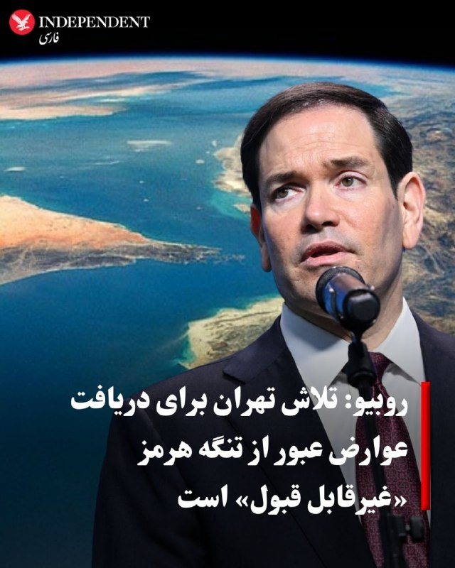

♦️مارکو روبیو، وزیر خارجه ایالات متحده، روز جمعه یکم خرداد در حاشیه نشست ناتو اظهارات روز پنجشنبه خود در خصوص تلاش تهران برای دریافت عوارض عبور از تنگه هرمز را تکرار کرد و گفت: ایران در پی ایجاد نظامی اختصاصی برای اخذ عوارض در یک آبراه بین‌المللی است و این اقدام «غیرقابل قبول» است.

روبیو با اشاره به اینکه جمهوری اسلامی تلاش می‌کند عمان را نیز برای پیوستن به این سازوکار متقاعد کند، افزود: «من کشوری را نمی‌شناسم که جز ایران از آن حمایت کند و هیچ کشوری در جهان نباید چنین چیزی را بپذیرد.»

وزیر خارجه آمریکا با اشاره به قطعنامه‌ پیشنهادی بحرین در شورای امنیت درباره تنگه هرمز تاکید کرد که واشنگتن برای دستیابی به اجماع جهانی جهت جلوگیری از اجرای چنین طرحی تلاش می‌کند و گفت: «باید دید آیا سازمان ملل همچنان کارآمد است یا نه. ما می‌کوشیم از این مسیر به نتیجه برسیم.»

او همچنین ابراز نگرانی کرد که اگر اخذ عوارض در تنگه هرمز اجرایی شود، ممکن است این رویه در دیگر آبراه‌های مهم جهان نیز تکرار شود.
‌🇸🇦 Indypersian

🤖 @VahidOOnLine

## VahidOOnLine — post 241489

  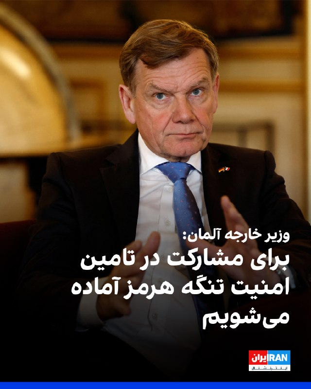

یوهان واده‌فول، وزیر خارجه آلمان، اعلام کرد برلین در حال آماده‌سازی برای مشارکت در تلاش‌هایی به رهبری بریتانیا برای تامین امنیت تنگه هرمز است، اما ماموریتی از سوی ناتو به این شکل وجود ندارد.

او گفت گفت‌وگوهای انجام‌شده با آمریکا نشان می‌دهد واشینگتن هرگونه انتقال مسئولیت را با متحدان اروپایی هماهنگ خواهد کرد.

واده‌فول همچنین از تصمیم دونالد ترامپ، رییس‌جمهوری آمریکا، برای اعزام ۵ هزار نیروی اضافی آمریکایی به لهستان استقبال کرد و آن را نشانه‌ای از تداوم تعهدات امنیتی آمریکا دانست.

وزیر خارجه آلمان افزود برلین از آمریکا دعوت کرده است به برنامه اولیه خود برای استقرار موشک‌های دوربرد در آلمان پایبند بماند.
‌🏁 🇬🇧 IranintlTV

🤖 @VahidOOnLine

## VahidOOnLine — post 241488

  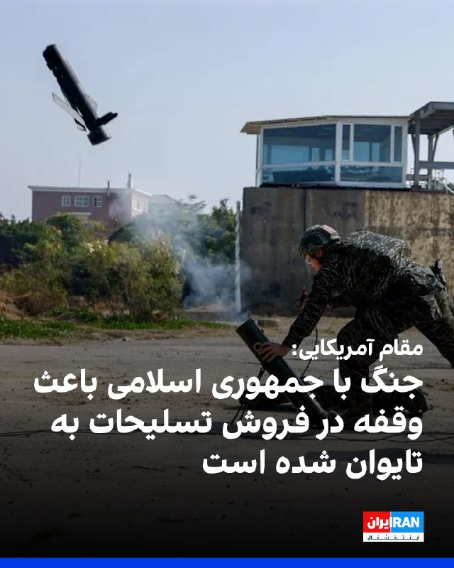

خبرگزاری رویترز گزارش داد یک مقام ارشد آمریکایی اعلام کرد واشینگتن برای اطمینان از تامین مهمات مورد نیاز در جنگ علیه جمهوری اسلامی، به‌طور موقت در روند فروش تسلیحات به تایوان وقفه ایجاد کرده است.

هانگ کائو، سرپرست وزارت نیروی دریایی آمریکا، در جلسه‌ای در سنای آمریکا گفت ایالات متحده می‌خواهد مطمئن شود مهمات کافی برای عملیات «خشم حماسی» علیه جمهوری اسلامی در اختیار دارد، اما فروش‌های نظامی خارجی، هر زمان دولت آمریکا لازم بداند، ادامه خواهد یافت.

دفتر ریاست‌جمهوری تایوان اعلام کرد تاکنون هیچ اطلاعاتی درباره تغییر در روند فروش تسلیحات آمریکا دریافت نکرده است.

رویترز نوشت تایوان در انتظار تایید بسته جدید فروش تسلیحات آمریکاست که ممکن است ارزش آن تا ۱۴ میلیارد دلار باشد.
‌🏁 🇬🇧 IranintlTV

🤖 @VahidOOnLine

## VahidOOnLine — post 241487

  

سعید جلالی‌قدیری، دبیر اتحادیه تولید و صادرات نساجی و پوشاک ایران، گفت کوچک شدن جیب مردم به افت فروش در صنعت پوشاک و نساجی منجر شده است.

او «شرایط نه جنگ نه صلح، نوسانات نرخ ارز و اختلال در تامین مواد اولیه» را از دیگر دلایل افت فروش در این صنعت عنوان کرد.

جلالی‌قدیری افزود صنعت نساجی و پوشاک ایران در آغاز سال جاری با مواردی از جمله انباشت بحران‌های اقتصادی، کاهش قدرت خرید مردم، دشواری در فروش و اختلال در تامین مواد اولیه مواجه است.
‌🏁 🇬🇧 IranintlTV

🤖 @VahidOOnLine

## VahidOOnLine — post 241486

  

مارکو روبیو، وزیر خارجه آمریکا، جمعه یکم خرداد در حاشیه نشست ناتو گفت جمهوری اسلامی در پی ایجاد نظامی اختصاصی برای اخذ عوارض در یک آبراه بین‌المللی است و تلاش می‌کند عمان را نیز به پیوستن به این سازوکار متقاعد کند. روبیو تاکید کرد که این اقدام «غیرقابل قبول» است.

او افزود: «هیچ کشوری در جهان نباید چنین چیزی را بپذیرد. من کشوری را نمی‌شناسم که جز ایران از آن حمایت کند.»

روبیو با اشاره به تحرکات دیپلماتیک در سازمان ملل متحد گفت قطعنامه‌ای با پیشنهاد بحرین در شورای امنیت مطرح شده که آمریکا در آن نقش فعالی داشته و به گفته او، بیشترین تعداد هم‌پیشنهاددهنده را در تاریخ شورای امنیت دارد. او هشدار داد چند کشور در حال بررسی وتوی این قطعنامه هستند و افزود: «این مایه تاسف خواهد بود.»

وزیر خارجه آمریکا تاکید کرد واشینگتن برای دستیابی به اجماع جهانی جهت جلوگیری از اجرای چنین طرحی تلاش می‌کند و گفت: «باید دید آیا سازمان ملل همچنان کارآمد است یا نه. ما می‌کوشیم از این مسیر به نتیجه برسیم.»

او تصریح کرد اگر اخذ عوارض در تنگه هرمز اجرایی شود، ممکن است در دیگر آبراه‌های مهم جهان نیز تکرار شود.
‌🏁 🇬🇧 IranintlTV

🤖 @VahidOOnLine

## VahidOOnLine — post 241485

  

♦️ابراهیم رضایی، سخنگوی کمیسیون امنیت ملی مجلس شورای اسلامی روز جمعه اول خرداد در واکنش به تحریم سفیر جمهوری اسلامی در لبنان از سوی ایالات متحده با «شیطان» خواندن آمریکا گفت: «به جای دیپلمات‌ها، موشک‌ها را برای مذاکره با شیطان بفرستید تا حساب کار دستش بیاید.»
رضایی در پیامی در شبکه اجتماعی ایکس نوشت: «تحریم کردن دیپلمات وزارت امور خارجه یعنی تحریم کردن دیپلماسی، این مذاکره هم احتمالا فریب است و آمریکایی‌ها تمایلی به دیپلماسی ندارند. حالا که دیپلمات ایرانی را هم تحریم کرده‌اند به جای دیپلمات‌ها، موشک‌ها را برای مذاکره با شیطان بفرستید تا حساب کار دستش بیاید.»
پیشتر وزارت خارجه جمهوری اسلامی نیز تحریم محمدرضا رئوف شیبانی، سفیر اخراجی این کشور در لبنان از سوی آمریکا را «غیرقانونی» و «ناموجه» خواند و آن را «بی‌اعتنایی هیئت حاکمه آمریکا به اصول مسلم حقوق بین الملل و منشور سازمان ملل متحد» دانست.
وزارت خزانه‌داری آمریکا روز پنجشنبه اعلام کرد که سفیر جمهوری اسلامی در لبنان را همراه با ۹ نفر مرتبط با حزب‌الله که حاکمیت لبنان را تضعیف می‌کنند تحریم کرده است.
‌🇸🇦 Indypersian

🤖 @VahidOOnLine

## VahidOOnLine — post 241484

روایت شما از زندگی در آتش‌بس- جمعه ۱ خرداد ۱۴۰۵

🔹 کارگر شرکت کروز هستم از تهران. اینجا ماهی چند میلیون بابت غذا از حقوقمون کم می‌کنن، اما فقط برنج خالی می‌دن بخوریم و گاهی وقت‌ها تخم‌مرغ آب‌پز. آب معدنی، نوشابه و تنقلات کنار غذا رو کلاً حذف کردن.
🔹 امروز (۱ خرداد) یک دونه مرغ بسته‌ای خریدم؛ چهار تا سینه مرغ شد یک میلیون و ۳۶۰ هزار تومان. آخه چجوری دیگه میشه زندگی کرد؟
🔹 از کمال‌شهر کرج پیام می‌دم، خواستم بگم زندگی تو ایران اون‌قدری به ما بدهکاره که با پولش می‌شه سه‌تا زندگی دیگه خرید.
🔹 حقوق‌ها کفاف برطرف کردن نیازهای اولیه رو به زور می‌ده. هر روز داره سفره مردم کوچیک‌تر می‌شه، هر روز از دلخوشی‌های کوچیک و از خریدهای روزمره مردم کم می‌شه.
🔹 خدایا ما چه گناهی کردیم که باید تاوان نسل ۵۷ رو بدیم؟ ما جوونایی که اول راه زندگی بودیم، حالا زیر سایه جنگ، خفقان، فقر و ترس له می‌شیم. چرا ظالم‌ها آسوده حکومت می‌کنن و مردمی که فقط زندگی می‌خواستن، هر روز بیشتر تو تاریکی و ناامیدی فرو می‌رن؟
🔹 کارخانه لاستیک بارز کرمان به‌خاطر نداشتن مواد اولیه داره تعدیل نیرو می‌کنه و شیفت‌هاش رو یک‌سوم کرده.
🔹 از کرمان، من یک دانش‌آموز کلاس هشتم هستم. الان معلوم نیست امتحانات حضوریه یا نه؛ از یک طرف می‌گن حضوریه، از یک طرف می‌گن نیست. بعد از ۳ ماه درس نخوندن چطوری امتحان بدم؟
🔹 علی هستم از شاندیز مشهد. اینجا هم مثل بقیه کشور همه‌چی گرون شده و نمیشه خرید کرد. اینا فقط سر و صدا می‌کنن، آب هم جیره‌بندی شده.
🔹 از اهواز پیام می‌دم. اینجا یعنی کل ایران اوضاع اصلاً خوب نیست. مردم به معیشت و زندگی روزمره خودشون نمی‌رسن. عمو ترامپ لطفاً کارو تموم کن، مذاکره نمی‌خوایم دیگه، ما طاقت نداریم.
🔹 از گله‌دار استان فارس پیام می‌دم. می‌خوان مجسمه خمینی رو که مردم قبلاً آتیشش زده بودن بازسازی کنن. ما دوباره خرابش می‌کنیم.
‌🏁 🇬🇧 IranintlTV

🤖 @VahidOOnLine

## VahidOOnLine — post 241483

  

مارکو روبیو، وزیر خارجه آمریکا، در حاشیه نشست ناتو درباره مذاکرات جاری با جمهوری اسلامی گفت که واشینگتن در انتظار نتایج گفت‌وگوهای در حال انجام است؛ گفت‌وگوهایی که به گفته او نشانه‌هایی از پیشرفت داشته‌اند.

او افزود: «ما در انتظار نتایج این گفت‌وگوها هستیم که نشانه‌هایی از پیشرفت دارد. نمی‌خواهم در این باره اغراق کنم؛ تحرک محدودی صورت گرفته و این مثبت است، اما اصول اساسی تغییری نکرده است.»

وزیر خارجه آمریکا تاکید کرد که حکومت ایران هرگز نباید به سلاح هسته‌ای دست یابد و گفت: «برای تحقق این هدف، باید به مسئله غنی‌سازی و نیز موضوع اورانیوم با غنای بالا رسیدگی کنیم و افزون بر آن، موضوع تنگه هرمز را نیز مد نظر قرار دهیم.»
‌🏁 🇬🇧 IranintlTV

🤖 @VahidOOnLine

## VahidOOnLine — post 241482

  <a href="telegram/content/VahidOOnLine_241482_1779443766.mp4" target="_blank">🎬 Download video</a>

سازمان نظارت بر اینترنت نت‌بلاکس اعلام کرد خاموشی گسترده اینترنت در ایران وارد هشتاد و چهارمین روز شده و دسترسی به شبکه جهانی اینترنت برای بیش از ۱۹۹۲ ساعت همچنان به‌طور گسترده مختل است.
نت‌بلاکس در گزارشی نوشت ادامه این محدودیت‌ها شکاف‌های اجتماعی و اقتصادی را عمیق‌تر کرده و ارتباط با جهان خارج بیش از پیش به «امتیاز، تبعیت و دسترسی ویژه» وابسته شده است.
‌🏁 🇬🇧 ManotoTV

🤖 @VahidOOnLine

## VahidOOnLine — post 241481

  <a href="telegram/content/VahidOOnLine_241481_1779443767.mp4" target="_blank">🎬 Download video</a>

روزنامه وال‌استریت ژورنال گزارش داد هم‌زمان با آماده شدن ایران برای احتمال درگیری با آمریکا، بابک زنجانی، بازرگان ایرانی که خود را «ضدتحریم» معرفی می‌کند، یک شبکه مخفی پرداخت برای تأمین مالی نیروهای نظامی جمهوری اسلامی ایجاد کرده بود که محور اصلی آن صرافی ارز دیجیتال بایننس بوده است.
بر اساس این گزارش، این شبکه تا ماه دسامبر گذشته طی دو سال حدود ۸۵۰ میلیون دلار تراکنش را عمدتاً از طریق یک حساب معاملاتی در بزرگ‌ترین صرافی رمزارز جهان انجام داده است. گزارش‌های داخلی بایننس نشان می‌دهد نزدیکان زنجانی، از جمله خواهرش، شریک عاطفی او و یکی از مدیران شرکتش، حساب‌های دیگری را نیز اداره می‌کردند که همگی از دستگاه‌های مشترک استفاده می‌کردند؛ موضوعی که بازرسان بایننس آن را نشانه‌ای از تلاش برای دور زدن تحریم‌های آمریکا علیه ایران دانسته‌اند.
وال‌استریت ژورنال نوشت با وجود هشدارهای داخلی متعدد، حساب اصلی این شبکه دست‌کم ۱۵ ماه همچنان فعال مانده و تا ژانویه امسال نیز باز بوده است. این گزارش همچنین می‌گوید میلیاردها دلار تراکنش رمزارزی طی دو سال گذشته از طریق بایننس به شبکه‌های مالی مرتبط با سپاه پاسداران منتقل شده است.
مقام‌های خارجی مسئول پیگیری تأمین مالی تروریسم گفته‌اند امسال نیز انتقال پول از طریق حساب‌های بایننس به نهادهای وابسته به جمهوری اسلامی ادامه داشته و تراکنش‌هایی حتی در همین ماه شناسایی شده است.
‌🏁 🇬🇧 ManotoTV

🤖 @VahidOOnLine

## VahidOOnLine — post 241480

  <a href="telegram/content/VahidOOnLine_241480_1779443769.mp4" target="_blank">🎬 Download video</a>

رییس اورژانس پیش‌بیمارستانی و مدیریت حوادث دانشگاه علوم پزشکی البرز اعلام کرد بر اثر تصادف زنجیره‌ای در آزادراه کرج قزوین، سه نفر جان باختند و چهار نفر دیگر مجروح شدند.
به گزارش رسانه‌های داخلی، در این سانحه دو مرد و یک زن کشته شدند و سه مرد و یک زن دیگر نیز مجروح شدند.
مصدومان توسط نیروهای اورژانس به بیمارستان امام جعفر صادق نظرآباد منتقل شدند.
‌🏁 🇬🇧 ManotoTV

🤖 @VahidOOnLine

## VahidOOnLine — post 241479

  <a href="telegram/content/VahidOOnLine_241479_1779443770.mp4" target="_blank">🎬 Download video</a>

وزارت خارجه جمهوری اسلامی تحریم محمدرضا رئوف شیبانی، سفیر ایران در لبنان، از سوی آمریکا را «غیرقانونی» و «ناموجه» توصیف کرد و آن را نشانه «بی‌اعتنایی هیئت حاکمه آمریکا به اصول حقوق بین‌الملل و منشور سازمان ملل» دانست.
این وزارتخانه همچنین تحریم تعدادی از نمایندگان حزب‌الله و مسئولان لبنانی را محکوم کرد و اقدامات آمریکا را «سخیف» و در راستای تضعیف حاکمیت ملی لبنان و «فتنه‌انگیزی در جامعه لبنان» خواند.
‌🏁 🇬🇧 ManotoTV

🤖 @VahidOOnLine

## VahidOOnLine — post 241478

  <a href="telegram/content/VahidOOnLine_241478_1779443770.mp4" target="_blank">🎬 Download video</a>

روزنامه نیویورک‌تایمز گزارش داد ایران و عمان درباره ایجاد یک نظام پرداخت برای عبور کشتی‌ها از تنگه هرمز مذاکره کرده‌اند؛ اقدامی که می‌تواند به معنای دریافت هزینه از کشتی‌های عبوری در یکی از حیاتی‌ترین آبراه‌های جهان باشد.
بر اساس این گزارش، تهران و مسقط تأکید دارند موضوع مطرح‌شده «کارمزد خدمات» است، نه «عوارض عبور»؛ زیرا دریافت عوارض صرف برای عبور از تنگه‌های بین‌المللی طبق حقوق دریاها غیرقانونی تلقی می‌شود. با این حال، کارشناسان حقوقی می‌گویند اگر این کارمزد در عمل همان عوارض باشد، مشروعیت نخواهد داشت.
مقام‌های آمریکایی، از جمله دونالد ترامپ و مارکو روبیو، هرگونه دریافت پول برای عبور از تنگه هرمز را «غیرقابل قبول» توصیف کرده‌اند. کارشناسان نیز هشدار داده‌اند تغییر نام عوارض به «کارمزد» مانع چالش‌های حقوقی بین‌المللی نخواهد شد.
‌🏁 🇬🇧 ManotoTV

🤖 @VahidOOnLine

## WithYashar — post 11933

کانال ۱۲ اسرائیل : بر اساس گزارش، پیش‌نویس توافق‌نامه در مجموع شامل ۹ ماده است
از جمله توقف عملیات نظامی و جنگ رسانه‌ای بین کشورها، احترام به حاکمیت و خودداری از دخالت در امور داخلی و همچنین رعایت قوانین بین‌المللی و منشور سازمان ملل.
@withyashar

## WithYashar — post 11932

امروز ۲۲ می (۱ خرداد) روز جهانی پیتزای بیت‌کوین است . این روز به یادبود اولین تراکنش واقعی برای خرید یک کالای فیزیکی با بیت‌کوین در سال ۲۰۱۰ نام‌گذاری شده است که در آن کاربری به نام لازلو هانیچ (Laszlo Hanyecz) دو پیتزا را در ازای ۱۰,۰۰۰ بیت‌کوین خریداری کرد.
@withyashar

## WithYashar — post 11931

وزیر امور خارجه آلمان: ما در حال آماده شدن برای مشارکت در تأمین امنیت تنگه هرمز تحت رهبری بریتانیا هستیم، اما انتظار ماموریتی مشابه ناتو را ندارم
@withyashar

## WithYashar — post 11930

وال استریت ژورنال: میلیاردها دلار از طریق پلتفرم بایننس به شبکه‌هایی که نظام ایران را تامین مالی می‌کنند، جریان یافته است بابک زنجانی شخص مسئول ایرانی در معاملات از طریق پلتفرم بایننس است @withyashar

## WithYashar — post 11929

رسانه‌های داخلی ایران تصاویری منتشر کرده‌اند که نشان می‌دهد نیروهای سپاه به غیرنظامیان و کودکان آموزش باز و بسته کردن سلاح می‌دهند. خبرگزاری «آسوشیتدپرس» نیز گزارش داده نیروهای سپاه به‌طور منظم نحوه استفاده از تفنگ‌های تهاجمی مانند کلاشینکف به غیرنظامیان آموزش می‌دهند. پایتخت ایران همچنین شاهد رژه خودروهای نظامی مجهز به مسلسل‌های قدیمی ساخت شوروی است.
@withyashar

## WithYashar — post 11928

بلومبرگ : پوتین می‌خواهد جنگ اوکراین را تا پایان امسال به پایان برساند، اما فقط با شرایطی که روسیه بتواند آن‌ها را به عنوان پیروزی معرفی کند.

این شرایط شامل کنترل کامل منطقه دونباس و تضمین‌های امنیتی گسترده‌تر از اروپا است که به طور موثر کسب‌های ارضی روسیه در اوکراین را به رسمیت می‌شناسد.
@withyashar

## WithYashar — post 11927

سنتکام: ناو هواپیمابر آبراهام لینکلن در بالاترین سطح آمادگی عملیاتی قرار دارد
@withyashar

## WithYashar — post 11926

سخنگوی کمیسیون امنیت ملی: موشک‌ها را برای مذاکره با شیطان بفرستید.
@withyashar

## WithYashar — post 11925

ترامپ فروش ۱۴ میلیارد دلار سلاح به تایوان را متوقف کرده تا مهمات آمریکا برای جنگ با ایران حفظ شود؛ به‌گفتهِ هانگ کائو، سرپرست وزارت نیروی دریایی آمریکا.

او به سناتورها گفت: “در حال حاضر ما این فروش را متوقف کرده‌ایم تا مطمئن شویم مهماتی که برای عملیات اِپیک فیوری لازم داریم در اختیارمان باشد.” کائو اضافه کرد که آمریکا همچنان “به‌قدرِ کافی” سلاح در اختیار دارد.
@withyashar

## WithYashar — post 11924

وال استریت ژورنال:
میلیاردها دلار از طریق پلتفرم بایننس به شبکه‌هایی که نظام ایران را تامین مالی می‌کنند، جریان یافته است
بابک زنجانی شخص مسئول ایرانی در معاملات از طریق پلتفرم بایننس است
@withyashar

## WithYashar — post 11923

رویترز به نقل از یک منبع پاکستانی:

نگرانی‌هایی وجود دارد که صبر ترامپ رو به پایان باشد، اما ما در حال تلاش برای تسریع روند انتقال پیام‌ها میان دو طرف هستیم
@withyashar

## WithYashar — post 11922

جروزالم پست: مقامات اطلاعاتی اسرائیل هشدار دادند که ایران ممکن است در حال برنامه‌ریزی برای حمله موشکی و پهپادی غافلگیرکننده علیه اسرائیل و کشورهای خلیج فارس باشد
@withyashar

## WithYashar — post 11921

سفارت پاکستان در تهران اعلام کرد، وزیر کشور پاکستان بار دیگر با عباس عراقچی وزیر خارجه ایران دیدار کرد تا پیشنهادات برای حل اختلافات در مذاکرات با آمریکا را بررسی کنند.
@withyashar

## WithYashar — post 11920

رأی‌گیری درباره اختیارات جنگی ترامپ، به دست جمهوری‌خواهان به تعویق افتاد.
@withyashar

## mwarmonitor — post 9466

🔴 فوری | پیش‌نویس نهایی یک توافق احتمالی میان ایالات متحده و ایران با میانجی‌گری پاکستان، طبق منابع العربیه، انتظار می‌رود ظرف چند ساعت آینده اعلام شود. مفاد اصلی آن به شرح زیر است: 🔴 پیش‌نویس نهایی توافق احتمالی آمریکا–ایران با میانجی‌گری پاکستان ممکن است…

## mwarmonitor — post 9465

  

✈️🛰 تداخل GPS بر فراز امارات/خلیج عمان باعث می‌شود هواپیما در Flightradar24 در موقعیت‌های اشتباه نمایش داده شود.

✈️هواپیمای KC-46A نیروی هوایی آمریکا در واقع بر فراز خلیج عمان است، نه بر فراز ایران.

✈️هواپیمای Il-76TD اماراتی در واقع در امارات فرود آمده و در خلیج فارس نیست.

@mwarmonitor

## mwarmonitor — post 9464

🔴خبر اختصاصی: ترامپ سرکوب شهروندی را تشدید می‌کند

📝نویسنده: بریتانی گیبسون AXIOS

🔰دولت ترامپ به منظور سرعت بخشیدن به تلاش‌ها برای سلب شهروندی از آمریکایی‌های هیسپانیک‌تبار و سایر مهاجرانی که تابعیت گرفته‌اند (Naturalized Americans)، وکلای مهاجرت را به طور موقت به وزارت دادگستری منتقل می‌کند؛ موضوعی که اکسیوس به آن پی برده است.

چرا این موضوع اهمیت دارد؟
پرونده‌های «سلب تابعیت» (Denaturalization) نیاز به بار اثبات (مدارک و شواهد) بسیار سنگینی دارند، اما این موضوع به یکی از اولویت‌های اصلی مقامات دولت ترامپ تبدیل شده است که به دنبال کشف و ردیابی کلاهبرداری در سیستم مهاجرت قانونی هستند.
نگاهی دقیق‌تر (بزرگ‌نمایی)
چهار مقام سابق آژانس مهاجرت به اکسیوس اعلام کردند که وکلای اداره شهروندی و مهاجرت ایالات متحده (USCIS) — که دفتر اصلی خدمات مهاجرت قانونی است — به طور موقت به دفاتر دادستانی ایالات متحده منتقل می‌شوند تا روی پرونده‌های سلب تابعیت کار کنند.
یکی از منابع گفت که به کارمندان گفته شده به این دفاتر منتقل شوند (انتقال‌های اجباری در قالب داوطلبانه). منبع دوم این جابه‌جایی‌ها را مجبور کردن وکلا به «داوطلب شدن اجباری» توصیف کرد.
منبع سوم اشاره کرد که نیازی نیست این وکلا سابقه قبلی در دادگاه یا پرونده‌های سلب تابعیت داشته باشند؛ بلکه تنها داشتن پروانه وکالت فعال کافی است.
زک کالر، سخنگوی اداره شهروندی و مهاجرت آمریکا (USCIS) در این باره گفت: «ما مفتخریم که با اعزام تیمی از ماهرترین وکلای مهاجرتی خود به وزارت دادگستری، از این تلاش حیاتی حمایت می‌کنیم.»
پشت پرده ماجرا
دولت ترامپ در دوره اول ریاست‌جمهوری خود نیز تلاش کرد تا آمار پرونده‌های سلب تابعیت را افزایش دهد و تیمی اختصاصی متشکل از ۱۰ تا ۱۵ وکیل تشکیل داد. جو ادلو، رئیس سابق USCIS، سپتامبر گذشته گفت پرونده‌هایی که توسط آن تیم شناسایی شده‌اند «هنوز در دست بررسی و جریان هستند.»
یکی از منابع گفت: «دلیلی وجود دارد که چرا پرونده‌های سلب تابعیت هیچ‌وقت واقعاً اوج نگرفته‌اند. اثبات این موارد بسیار سخت است... معیارها بسیار سخت‌گیرانه هستند و شما به مدارک محکمی نیاز دارید. در بسیاری از پرونده‌ها، چنین مدارکی اصلاً وجود ندارد.»
بار حقوقی اثبات جرم: در پرونده‌های حقوقی (مدنی) که فرد به طور عمدی در درخواست خود دروغ گفته است، قانون نیاز به اثبات از طریق «شواهد واضح، متقاعدکننده و بدون ابهام دارد که هیچ شک و شبهه‌ای باقی نگذارد.»
در مواردی که فرد به طور غیرقانونی شهروندی کشوری را گرفته که واجد شرایط آن نبوده است، ممکن است اتهامات کیفری نیز علیه او مطرح شود.
تصویر کلی
بر اساس گزارش ماه آوریل روزنامه نیویورک تایمز، مقامات وزارت دادگستری نام ۳۸۵ نفر را در فهرست نهایی برای اتهامات سلب تابعیت قرار داده‌اند. در دوره اول ترامپ، اداره USCIS ادعا کرد که ۲۵۰۰ پرونده بالقوه را شناسایی کرده، اما تنها بخش کوچکی از آن‌ها را به وزارت دادگستری ارجاع داد.
به گفته سخنگوی وزارت دادگستری (DOJ)، دولت ترامپ از زمان آغاز دوره دوم خود ۳۵ پرونده سلب تابعیت تشکیل داده است که ۱۲ مورد آن همین ماه گذشته انجام شده است.
همچنین یادداشت وزارت دادگستری در ژوئن ۲۰۲۵، سلب تابعیت را به عنوان یکی از اولویت‌های اصلی دولت ترامپ فهرست کرده بود. در این یادداشت با اشاره به مزایای پیگیری این پرونده‌ها آمده است که این اقدام «از یکپارچگی و سلامت کل برنامه اعطای تابعیت حمایت می‌کند.»
سخنگوی وزارت دادگستری در بیانیه‌ای به اکسیوس گفت که این وزارتخانه از کمک وکلای USCIS «برای پیشبرد مأموریت رئیس‌جمهور جهت ارتقای امنیت عمومی و ریشه‌کن کردن کلاهبرداری» استقبال می‌کند.

📌افزایش پرونده‌های سلب تابعیت، مدت‌هاست که هدف اصلی جو ادلو در مبارزه او علیه درخواست‌های مهاجرتی مشکوک به کلاهبرداری بوده است.
ادلو سپتامبر گذشته در رویدادی که توسط «مرکز مطالعات مهاجرت» برگزار شد، در پاسخ به سؤالی درباره واحد سلب تابعیت در دوره اول ترامپ گفت: «فکر می‌کنم غیرمتمرکز کردن فرآیند سلب تابعیت نیز به همان اندازه مفید است.»
او افزود: «اگر موردی پیش بیاید که نیاز به سلب تابعیت داشته باشد، ما اقدام خواهیم کرد. نیازی ندارم که پرونده حتماً به یک دفتر خاص فرستاده شود؛ من می‌خواهم هر دفتری از این موضوع به عنوان یک معیار استاندارد استفاده کند.»

@mwarmonitor

## mwarmonitor — post 9463

مغزهای متفکر این یک پیش نویس نه توافق

## mwarmonitor — post 9462

استادان رسانه‌ ای این خبر الان نه دیشب

## mwarmonitor — post 9461

🔴 فوری | پیش‌نویس نهایی یک توافق احتمالی میان ایالات متحده و ایران با میانجی‌گری پاکستان، طبق منابع العربیه، انتظار می‌رود ظرف چند ساعت آینده اعلام شود. مفاد اصلی آن به شرح زیر است:

🔴 پیش‌نویس نهایی توافق احتمالی آمریکا–ایران با میانجی‌گری پاکستان ممکن است ظرف چند ساعت اعلام شود

🔴 آتش‌بس فوری، جامع و بدون قید و شرط در تمام جبهه‌ها شامل زمین، دریا و هوا

🔴 تعهد متقابل به عدم هدف قرار دادن زیرساخت‌های نظامی، غیرنظامی یا اقتصادی

🔴 پایان عملیات نظامی و توقف جنگ رسانه‌ای

🔴 تعهد به احترام به حاکمیت، تمامیت ارضی و عدم مداخله در امور داخلی

🔴 تضمین آزادی کشتیرانی در خلیج فارس، تنگه هرمز و خلیج عمان

🔴 ایجاد سازوکار مشترک برای نظارت بر اجرای توافق و حل اختلافات

🔴 آغاز مذاکرات درباره مسائل باقی‌مانده ظرف هفت روز

🔴 لغو تدریجی تحریم‌های آمریکا در ازای پایبندی ایران به مفاد توافق

🔴 پیش‌نویس توافق بر پایبندی به قوانین بین‌المللی و منشور سازمان ملل تأکید می‌کند

🔴 این توافق بلافاصله پس از اعلام رسمی از سوی هر دو طرف اجرایی خواهد شد

@mwarmonitor

## mwarmonitor — post 9460

🔴وزیر خارجه بریتانیا:
«این شرم‌آور است که ایران تلاش می‌کند با جلوگیری از حرکت کشتیرانی بین‌المللی، کل اقتصاد جهانی را به گروگان بگیرد.»

@mwarmonitor

## mwarmonitor — post 9459

🔴منبع پاکستانی به الجزیره:
«اسلام‌آباد همچنان نسبت به امکان رسیدن به یک تفاهم مرحله‌ای میان واشنگتن و تهران خوش‌بین است.»

@mwarmonitor

## mwarmonitor — post 9458

  <a href="telegram/content/mwarmonitor_9458_1779443772.mp4" target="_blank">🎬 Download video</a>

📝 خفه شو نطفه حرامیِ دوزاری، تو رو چه به این گنده‌گوزی‌ها؟ نهایتاً تخصص و سقف پروازت این بوده که سهمیه بگیری و برای خرید باتوم تا حسن‌آباد بدوی، حالا واسه ما تزِ دو سال زندگی و خونه خریدن تو آلمان می‌دی؟ هرچی بیشتر اون دهنِ نجست رو باز می‌کنی، گندِ دروغات بیشتر بالا می‌زنه و بوی تعفنِ جیره‌خوری و اون پایگاه بسیجِ صاحاب‌مرده‌ات از پشت این گوشی بیشتر دنیا رو برمی‌داره. آخه انگلِ ساندیس‌خور، تو رو چه به فرنگ و عکاسی؟ تو نهایتاً بتونی جفت پا بری رو اعصابِ خلق‌الله و لای کفتارها سهمیه گشتِ شبانه‌ات رو بگیری. اینقدر به این آمار و ارقامِ تخیلی و مغزِ شستشو داده‌ات نناز، نطفهٔ ناپاک! تهِ حماسه و تخصص تو همون پرچم گردانی شبانه، پس بتمرگ سر جات و اون دهنِ کثیفت رو ببند!

@mwarmonitor

## mwarmonitor — post 9457

🔸 سخنگوی وزارت امور خارجه پاکستان اعلام کرد: چین از تلاش‌های ما برای میانجی‌گری حمایت می‌کند و به‌همراه ما یک ابتکار پنج‌بندی ارائه داده است.

@mwarmonitor

## mwarmonitor — post 9456

🔴 به نقل از رویترز و به گفته یک منبع پاکستانی:
🔸نگرانی‌هایی وجود دارد که صبر ترامپ رو به پایان باشد، اما ما در حال تلاش برای تسریع روند انتقال پیام‌ها میان دو طرف هستیم.

📝 یعنی هر لحظه امکانش هست دستور حمله بده
@mwarmonitor

## mwarmonitor — post 9455

انفجار در ابوظبی

## mwarmonitor — post 9454

🔴جمهوری‌خواهان مجلس نمایندگان رای‌گیری برای محدود کردن جنگ ترامپ در ایران را لغو کردند

🔰رهبری جمهوری‌خواه مجلس نمایندگان روز پنجشنبه رای‌گیری برنامه‌ریزی‌شده برای محدود کردن مبارزات نظامی پرزیدنت ترامپ در ایران را پس از آنکه مشخص شد آرای کافی برای شکست دادن آن را ندارند، لغو کرد (از دستور کار خارج کرد).

چرا این موضوع اهمیت دارد: این اقدام می‌توانست اولین توبیخ و سرزنش موفقیت‌آمیز تلاش‌های جنگی ترامپ علیه ایران از سوی کنگره باشد؛ آن هم پس از آنکه چندین تلاش دموکرات‌ها برای تصویب قطعنامه اختیارات جنگی شکست خورده بود.
جرد گلدن (نماینده دموکرات از ایالت مین)، تنها دموکراتی که به طور مداوم علیه قطعنامه‌های اختیارات جنگی ایران رای داده بود، قصد داشت این بار رای خود را به «بله» تغییر دهد.
چهار نماینده جمهوری‌خواه به نام‌های برایان فیتزپاتریک (از پنسیلوانیا)، توماس مسی (از کنتاکی)، وارن دیویدسون و تام بارت (از میشیگان) پیش از این از این طرح حمایت کرده بودند.
البته این رای‌گیری تا حد زیادی نمادین است، چرا که ترامپ می‌تواند این مصوبه را وتو کند.
عامل اصلی خبر: رهبران حزب جمهوری‌خواه در نظر دارند پس از بازگشت نمایندگان از تعطیلات یک‌هفته‌ای «روز یادبود» (Memorial Day)، این طرح را دوباره در صحن مجلس مطرح کنند.
رهبران حزب، رای‌گیری مربوط به تاسیس یک موزه زنان را ۴۵ دقیقه باز نگه داشتند تا در این فاصله بتوانند نمایندگان را برای رای دادن علیه قطعنامه اختیارات جنگی متقاعد و بسیج کنند (اصطلاحاً شلاق حزبی بزنند).
این اقدام خشم دموکرات‌ها را برانگیخت؛ تا جایی که وقتی جیم مک‌گاورن (نماینده دموکرات از ماساچوست و عضو ارشد کمیته قوانین مجلس) تلاش کرد این اقدام را زیر سوال ببرد، توسط رئیس جلسه با فریاد ساکت شد.
جرد هافمن (نماینده دموکرات از کالیفرنیا) در این رابطه به اکسیوس (Axios) گفت: «ما هفته گذشته از باخت با اختلاف یک رای به نتیجه مساوی رسیدیم و حالا به این عقب‌نشینی بزدلانه آن‌ها در امشب رسیده‌ایم.»
پشت پرده: غیبت برخی از نمایندگان جمهوری‌خواه باعث می‌شد که این طرح در روز پنجشنبه به تصویب برسد.
وقتی همه اعضای مجلس نمایندگان حضور کامل داشته باشند، مایک جانسون (رئیس مجلس نمایندگان از حزب جمهوری‌خواه) در رای‌گیری‌های کاملاً حزبی، تنها می‌تواند نافرمانی و ریزش تعداد انگشت‌شماری از هم‌حزبی‌هایش را تحمل کند.
مرور سریع: تلاش‌های قبلی برای محدود کردن اختیارات جنگی ترامپ در قبال ایران بارها شکست خورده بود.
انتظار می‌رفت مجلس نمایندگان روز چهارشنبه در مورد این قطعنامه رای‌گیری کند، اما رهبران جمهوری‌خواه به دلیل نگرانی از وضعیت حضور نمایندگان خود، این اقدام را به تاخیر انداختند.
آخرین تلاش دموکرات‌ها هفته گذشته در یک رای‌گیری بی‌سابقه با نتیجه مساوی ۲۱۲–۲۱۲ شکست خورد.
در آن رای‌گیری قبلی، گلدن رای منفی داده بود، در حالی که مسی، فیتزپاتریک و بارت از آن حمایت کردند و چندین قانون‌گذار نیز غایب بودند.
نگاه نزدیک‌تر: ترامپ روز چهارشنبه حملات خود را متوجه برایان فیتزپاتریک (نماینده جمهوری‌خواه) کرد و به خبرنگاران گفت: «او دوست دارد علیه ترامپ رای دهد. می‌دانید نتیجه این کار چیست؟ عاقبت خوبی ندارد.»
با این حال، فیتزپاتریک روز چهارشنبه به اکسیوس گفت که با وجود تهدیدهای رئیس‌جمهور، همچنان قصد دارد به این طرح رای مثبت دهد. او گفت: «ما در واشنگتن به هیچ حزب یا شخص خاصی گزارش نمی‌دهیم و بله‌قربان‌گو نیستیم.»
تصویر بزرگ‌تر: اگرچه جمهوری‌خواهان تا حد زیادی از کارزار نظامی ترامپ حمایت کرده‌اند، اما با طولانی شدن این درگیری بدون مجوز کنگره، نارضایتی و بی‌اعتمادی در میان آن‌ها افزایش یافته است.
برخی از جمهوری‌خواهان به ضرب‌الاجل ۶۰ روزه قانون اختیارات جنگی اشاره می‌کنند که اکنون منقضی شده است؛ قانونی که بر اساس آن در صورت عدم تایید کنگره، نیروهای آمریکایی ملزم به عقب‌نشینی هستند و این موضوع اکنون به یک نقطه عطف تبدیل شده است.

📌در مقابل، کاخ سفید استدلال می‌کند که این الزام به دلیل برقراری آتش‌بس با ایران، دیگر نافذ و قابل اجرا نیست.

@mwarmonitor

## mwarmonitor — post 9453

🔸دو فرد مطلع از گفتگوها درباره مدیریت این آبراه گفتند که ایران برنامه‌ای برای ایجاد یک سیستم عوارض که صرفاً برای عبور و مرور هزینه دریافت کند، ندارد. در عوض، در گفتگوها با عمان، پیشنهاد دریافت هزینه از کشتی‌ها در قبال ارائه «خدمات» مورد بررسی قرار گرفته است.

🔹به گفته دو مقام ایرانی مطلع از این گفتگوها که مجاز به مصاحبه علنی نبودند، عمان در ابتدا مشارکت مشترک با ایران در این تنگه را رد کرده بود، اما اکنون در حال گفتگو درباره سهمی از درآمدها است. این مقامات گفتند که عمان به ایرانی‌ها اعلام کرده است با درک منافع اقتصادی بالقوه یک سیستم کارمزد، حاضر است از نفوذ خود بر همسایگانش در خلیج [فارس] از جمله بحرین، کویت، قطر، عربستان سعودی و امارات متحده عربی و همچنین ایالات متحده برای پیشبرد این طرح استفاده کند. «نیویورک تایمز »

@mwarmonitor

## mwarmonitor — post 9452

  

🔴نیروی دریایی ایالات متحده نیروی دریایی ایالات متحده با موفقیت شماری از ناقضان تحریم‌ها را در سواحل شرقی عمان متوقف کرد. در یک نمونه قابل مشاهده، نفتکش آفراماکس LEVIN (شماره IMO: 9293155) که معمولاً مقادیر زیادی نفت ایران را حمل می‌کند، پس از هدایت مجدد به دریای عرب، توسط یک شناور نیروی دریایی آمریکا تعقیب شد؛ این کشتی در زمان تعقیب بدون محموله بود.

🔸با این حال، مشاهده شد که چندین نفتکشِ بدون تحریم اما مرتبط با ایران وارد محدوده محاصره شده‌اند، زیرا دفتر کنترل دارایی‌های خارجی وزارت خزانه‌داری آمریکا (OFAC) هنوز آن‌ها را تحریم نکرده است. در حال حاضر، ۴۹ نفتکش از این دست در داخل این محدوده حضور دارند.

@mwarmonitor

## mwarmonitor — post 9451

  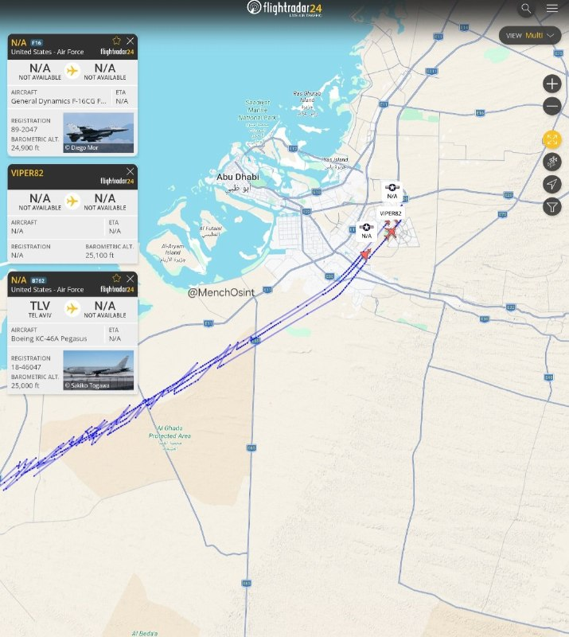

🔴پدافند هوایی در امارات متحده عربی در حالت آماده‌باش بالا قرار دارد. شب گذشته، جنگنده‌های آمریکایی بر فراز ابوظبی ترانسپوندرهای خود را روشن کردند تا از هدف قرار گرفتن اشتباهی (آتشِ خودی) جلوگیری شود:

✈️یک فروند• F-16CG Fighting Falcon (شماره ثبت 89-2047، هگز AE26CC)
✈️• یک جنگنده نامشخص با کال‌ساین VIPER82 (هگز 15C4DA)

🔸این پروازها با پشتیبانی یک هواپیمای سوخت‌رسان KC-46A از تل‌آویو انجام شده‌اند.

@mwarmonitor

## pm_afshaa — post 91183

🔴جروزالم پست: مقامات اطلاعاتی اسرائیل هشدار دادند که ایران ممکن است در حال برنامه‌ریزی برای حمله موشکی و پهپادی غافلگیرکننده علیه اسرائیل و کشورهای خلیج فارس باشد

💧 Rainbet.com the #1 Non-KYC Crypto Casino & Sportsbook @rainbetcom

😁 @Pm_Afshaa

## pm_afshaa — post 91182

🔴وال استریت ژورنال: وزارت دادگستری آمریکا تحقیقات خود را درباره استفاده ایران از پلتفرم بایننس برای احتمالا دور زدن تحریم‌ها آغاز کرده

💧 Rainbet.com the #1 Non-KYC Crypto Casino & Sportsbook @rainbetcom

😁 @Pm_Afshaa

## pm_afshaa — post 91181

🔴سخنگوی کاخ کرملین: پوتین طرح انتقال اورانیوم ایران به روسیه رو با شی‌جی پینگ در میون گذاشته

💧 Rainbet.com the #1 Non-KYC Crypto Casino & Sportsbook @rainbetcom

😁 @Pm_Afshaa

## DEJradio — post 4836

  <a href="telegram/content/DEJradio_4836_1779443777.webm" target="_blank">🎬 Download video</a>

🚨📢 محاصره دریایی ایران؛
ذخیره‎سازی نفت در نفتکش‌های قدیمی و کوچک

روزنامه فایننشال‌تایمز گزارش داد جمهوری اسلامی در پی محاصره دریایی توسط آمریکا و کاهش شدید امکان صادرات نفت، به ذخیره‌سازی نفت روی نفتکش‌های فرسوده در خلیج فارس روی آورده است. این اقدام نشان‌دهنده فشار فزاینده بر صادرات نفت ایران در هفته‌های اخیر است.

براساس آخرین داده‌ها مخازن نفتکش‌های قدیمی هم پر شده و برای ذخیره نفت تولیدی از شناورهای کوچک‌تر استفاده می‌شود.
بر اساس تحلیل تصاویر ماهواره‌ای آژانس فضایی اروپا، تعداد نفتکش‌های متوقف‌شده در اطراف جزیره خارک، مهم‌ترین پایانه صادرات نفت ایران، از شش کشتی در یک ماه پیش به ۲۰ کشتی رسیده است. بسیاری از این کشتی‌ها سامانه‌های موقعیت‌یاب خود را خاموش کرده‌اند و در داده‌های معمول کشتیرانی قابل مشاهده نیستند.

نیما منصفی تحلیلگر «اطلاعات ژئوفضایی» با استناد به تصاویر ماهواره‌ای از ترمینال نفتی خارگ در «ایکس» نوشت، «دو نفتکش کوچک که سابقا مصرف داخلی داشتند در حال بارگیری در جزیره خارگ هستند. ظرفیت آنها حداکثر ۱۵۰ هزار بشکه است».

#محاصره_دریایی #خلیج_فارس #تنگه_هرمز
@DEJradio

## DEJradio — post 4835

  <a href="telegram/content/DEJradio_4835_1779443778.mp4" target="_blank">🎬 Download video</a>

🤡
🔺 چادری‌ها بی‌حجاب‌های حکومتی را تحمل نمی‌کنند.

#حجاب #چادری #تجمعات_حکومتی
@DEJradio

## DEJradio — post 4834

  <a href="telegram/content/DEJradio_4834_1779443781.webm" target="_blank">🎬 Download video</a>

🚨
⭕️ منابع مطلع به دژ می‌گویند، بامداد آدینه ابتدای خرداد، حوالی ساعت ۰۲:۰۰ در بهشهر استان مازندران محله «سارو»، فردی به‌نام حسین محمدی توسط ماموران نیروی انتظامی کشته شده است.

ایست بازرسی و گشت محله‌محور که توسط ماموران نیروی انتظامی [یگان امداد] برقرار شده بود یک ماشین پژو پارس را متوقف می‌کند و با بدرفتاری و توهین دو سرنشین را بازرسی بدنی می‌شوند.

شاهدان می‌گویند پلیس به دو جوان حرف‌های تحقیرآمیز زده‌اند.

حسین محمدی (پدر یکی از سرنشینان) برای آرام کردن قضیه وارد می‌شود اما ماموران به او نیز توهین می‌کنند و درگیر می‌شوند که یکی از ماموران او را با تیر مستقیم کلت به قتل می‌رساند. در پی این اقدام مردم و نیروی انتظامی درگیر شدند.

#مازندران #قتل #حسین_محمدی
@DEJradio

## DEJradio — post 4833

  <a href="telegram/content/DEJradio_4833_1779443781.webm" target="_blank">🎬 Download video</a>

🔺📢 اعتصاب مرغ‌داران بهبهان در استان خوزستان موجب کمبود مرغ در شهر شده است.
مرغ‌داران که ۸ روز است در اعتصاب به سر می‌برند، علت اعتصاب خود را بالا بودن هزینه‌ها عنوان کرده‌اند.
در مرغ‌فروشی‌ها تنها ران یخ زده مرغ که از شهرهای دیگر آورده می‌شود موجود است و هر کیلو نزدیک به ۴۰۰ هزار تومان به فروش می‌رسد که توان خرید آن برای اقشار ضعیف اصلا ممکن نیست.
مرغ‌داران می‌گویند توان تامین ذرت و سویا را ندارند و بدهکارند.

#مرغ #تورم
@DEJradio

## DEJradio — post 4832

  <a href="telegram/content/DEJradio_4832_1779443782.webm" target="_blank">🎬 Download video</a>

🚨📢 منابع غیررسمی می‌گویند احتمال دارد آمریکا برای آن‌دسته بازیکنان و اعضای کادر فنی تیم فوتبال جمهوری اسلامی که پیشینه حضور در تیم‌های سـ.ـپاه و بـ.ـسیج را دارند ویزا صادر نکند.

سوشا مکانی دروازه‌بان سابق تیم پرسپولیس و تیم ملی فوتبال، با اشاره به حضور بازیکنان تیم فوتبال در سفارت آمریکا در آنکارا برای دریافت ویزا، در استوری اینستاگرامش نوشت: «اگر فشار جیانی اینفانتینو [رئیس فیفا] به آمریکا نتیجه نده، مهدی طارمی، شجاع خلیل‌زاده، احسان حاج‌صفی و... به دلیل سربازی در سـ.ـپاه جام جهانی رو از دست میدن. روزبه چشمی هم سربازیش تو باشگاه مقاومت بـ.ـسیج بوده... سعید الهویی و آندرو تیموریان هم سرباز ســ.ـپاه بودند. اگر آمریکا تهدیدات کلامی چند بازیکن در تجمعات شبانه رو مبنا قرار بده چند بازیکن دیگه هم جا می‌مونند.»

بر اساس آخرین گزارش‌ها ادعا شد روزبه چشمی در اردوی آنتالیا مصدوم شده و احتمالا از فهرست تیم خط می‌خورد.
اعضای تیم فوتبال پنجشنبه ۳۱ اردیبهشت برای دریافت ویزا به سفارت آمریکا در آنکارا رفتند.

#تیم_ملی #تحریم
@DEJradio

## DEJradio — post 4831

  <a href="telegram/content/DEJradio_4831_1779443783.webm" target="_blank">🎬 Download video</a>

🔺📢 بر اساس اطلاعات دریافتی از ایران، حقوق اردیبهشت بازنشستگان صندوق بازنشستگی نیرو‌های مسلح واریز شده است اما برخلاف اعلام قبلی، مبلغ «فوق‌العاده خاص» افزایش نیافته است.
این مبلغ اضافه فقط ۶۰۰ هزار تومان (برابر با ۵ دلار) بود!

منابع نظامی می‌گویند سازمان برنامه و بودجه به علت ناکافی بودن منابع، با تامین اعتبار برای افزایش این مولفه مزدی موافقت نکرده است.

گفتنی است حقوق اردیبهشت پرسنل نیروهای مسلح بازنشسته‌های لشکری با تأخیر طولانی واریز شده است. همچنین پرسنل ارتش می‌گویند «بسیاری از داروها حتی آنهایی که در داخل تولید می‌شود از فهرست بیمه خدمات درمانی خارج شده‌ است و حتی آنتی‌بیوتیک‌ها و مُسکن‌ها آزاد حساب می‌شوند.»

دو ماه بعد از جنگ ۴۰ روزه باوجود اینکه نیروهای مسلح با تلفات سنگینی روبه‌رو شدند اما حکومت کمترین توجه را به آنها ندارد و نارضایتی بین آنها تشدید شده است.

#نیرو‌های_مسلح #ارتش
@DEJradio

## kianmeli1 — post 87552

  <a href="telegram/content/kianmeli1_87552_1779443784.mp4" target="_blank">🎬 Download video</a>

🔴میلیاردها دلار از طریق بابک زنجانی و صرافی بایننس برای تامین مالی سپاه پاسداران جابجا کرده است

ایران طی سال‌های اخیر میلیاردها دلار را از طریق صرافی رمزارزی «بایننس» جابه‌جا کرده تا شبکه‌های مالی مرتبط با سپاه پاسداران را تامین کند؛ تراکنش‌هایی که به گفته این رسانه، حتی تا همین ماه نیز ادامه داشته‌اند.

بر اساس گزارش وال استریست ژورنال، این انتقال‌ها شامل حدود ۸۵۰ میلیون دلار تنها از طریق یک حساب کاربری در بایننس بوده که طی دو سال توسط بابک زنجانی، تاجر ایرانی و آنچه در اسناد داخلی «اپراتور ضدتحریم» خوانده شده، اداره می‌شد.

گزارش می‌گوید سیستم‌های نظارتی داخلی بایننس دست‌کم ۱۲ بار این حساب را به‌عنوان حساب مشکوک علامت‌گذاری کرده بودند، اما این حساب بیش از ۱۵ ماه پس از نخستین هشدار همچنان فعال باقی ماند.

این گزارش همچنین از انتقال ۲۱۸ میلیون دلار به شبکه مالی وابسته به حکومت ایران از طریق یک کیف‌پول مرتبط با بایننس خبر می‌دهد. وال‌استریت ژورنال پیش‌تر گزارش داده بود که حدود ۱.۷ میلیارد دلار از طریق بایننس به همین شبکه مالی ایرانی منتقل شده است.
https://t.me/kianmeli1

## kianmeli1 — post 87551

  <a href="telegram/content/kianmeli1_87551_1779443787.mp4" target="_blank">🎬 Download video</a>

🔴صدای #بنیامین_نقدی و #منوچهر_فلاح باشیم

بنیامین نقدی، از معترضان بازداشت شده در ۱۳ دی‌ماه خونین در شهر شیراز است. وضعیت پرونده‌سازی، اخذ اعتراف اجباری و کینه‌ی قضات شیراز در تسریع اجرای حکم اعدام، جان او را در خطر جدی قرار داده است. همچنین منوچهر فلاح توسط قاضی مرگ گیلان «احمد درویش گفتار» پس از رد اعاده‌ی دادرسی دوباره به اعدام محکوم شده.

در روزها و ساعاتی که ماشین سرکوب جمهوری اسلامی، هر جان و نام بازداشتی محکوم به اعدام را تنها به عددی در کارنامه‌ی خونین خود بدل میکند، نام‌شان را فریاد بزنیم، آنها جز ما فریادرسی ندارند
https://t.me/kianmeli1

## kianmeli1 — post 87550

  <a href="telegram/content/kianmeli1_87550_1779443789.mp4" target="_blank">🎬 Download video</a>

🔴حزب‌الله با پهپاد انتحاری، یکی از باتری‌های گنبد آهنین اسرائیل را هدف قرار داده است

دقیقا مشخص نیست این نوع پهپادهای سبک از کجا تامین میشوند
https://t.me/kianmeli1

## kianmeli1 — post 87549

  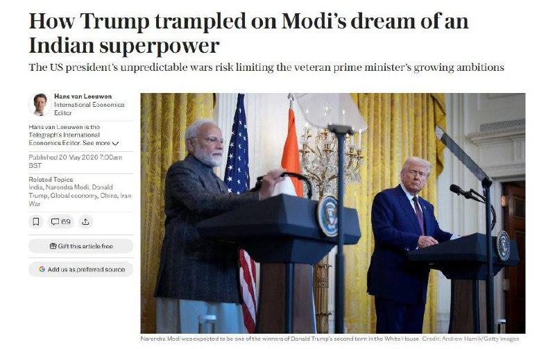

🔴درگیری در ایران به هند ضربه سختی وارد کرده است. این کشور به نفت وارداتی متکی است که بخش عمده آن از طریق تنگه هرمز وارد می‌شود، بنابراین افزایش قیمت انرژی باعث تضعیف رشد، افزایش تورم و ترساندن سرمایه‌گذاران می‌شود.

مودیز در حال حاضر پیش‌بینی رشد هند را به ۶ درصد کاهش داده است - بسیار کمتر از ۸ درصدی که مودی می‌گوید برای تبدیل هند به یک کشور توسعه‌یافته تا سال ۲۰۴۷ لازم است.

در عین حال، ترامپ به چین و پاکستان، دو رقیب اصلی هند، نزدیک‌تر شده است و سال‌ها تلاش مودی برای ایجاد روابط قوی‌تر با واشنگتن را تضعیف می‌کند.
https://t.me/kianmeli1

## IranIntlTV — post 338388

  

حسنعلی اخلاقی‌امیری، عضو کمیسیون فرهنگی مجلس، به دیده‌بان ایران گفت جمهوری اسلامی بنا ندارد در حوزه خلیج فارس و تنگه هرمز از «حقوق» خود کوتاه بیاید و افزود: «قانون دریافت عوارض از تنگه هرمز را تصویب می‌کنیم.»

او اضافه کرد: «تمام مسئولان اتفاق نظر دارند که تنگه هرمز از منافع جمهوری اسلامی است. هر مذاکره‌ای هم صورت بگیرد، کشتی‌های دشمن و کشورهای همکار دشمن حق عبور نداشته و بقیه کشتی‌ها باید عوارض بپردازند.»

اخلاقی‌امیری همچنین با اشاره به تهدید دونالد ترامپ درباره بازگشایی تنگه هرمز گفت آمریکا می‌خواهد با باز کردن این تنگه «خود را از این معرکه خلاص کند»، اما پس از «تحمیل جنگ اخیر» و وارد شدن هزینه‌های سنگین به جمهوری اسلامی، «دیگر قرار نیست از حق خود بگذریم.»
https://iranintl.com/202605223337

## IranIntlTV — post 338387

  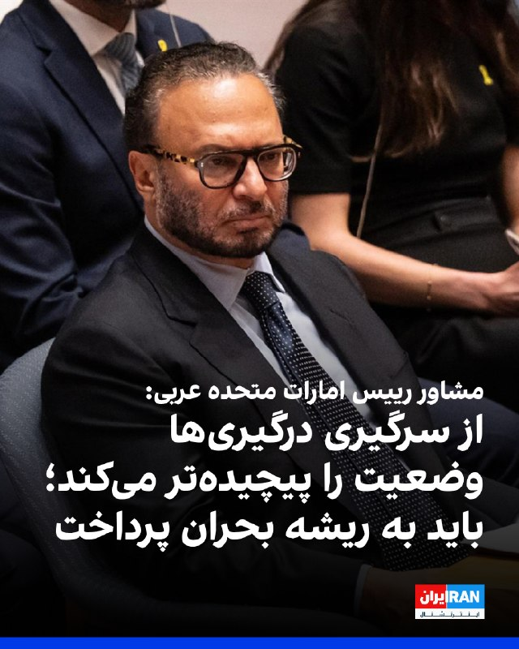

انور قرقاش، مشاور دیپلماتیک رییس امارات متحده عربی، روز جمعه هشدار داد دور دوم درگیری میان آمریکا و جمهوری اسلامی می‌تواند وضعیت منطقه را پیچیده‌تر کند اما تاکید کرد که هر راه‌حل سیاسی باید به «ریشه‌های» بحران بپردازد تا از ایجاد پیچیدگی‌های جدید در آینده جلوگیری شود.

قرقاش همچنین هشدار داد هرگونه تغییر در وضعیت کنترل تنگه هرمز پیامدهای جدی خواهد داشت.

او از کشورهای اروپایی خواست تنگه هرمز را نه مسئله‌ای دوردست، بلکه موضوعی مرتبط با امنیت انرژی و تجارت خود بدانند.
https://iranintl.com/202605227157

## IranIntlTV — post 338386

  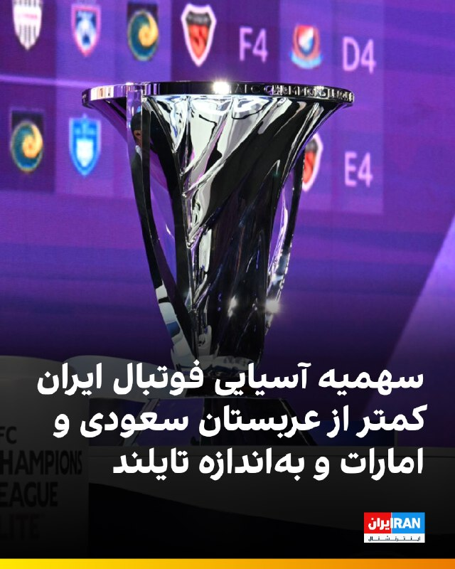

🔻کنفدراسیون فوتبال آسیا سهمیه کشورهای حاضر در رقابت‌های آسیایی فصل ۲۰۲۸-۲۰۲۷ را اعلام کرد که بر اساس آن، ایران سه سهمیه مستقیم در لیگ نخبگان آسیا و یک سهمیه در لیگ قهرمانان آسیا خواهد داشت.

🔹این در حالی است که عربستان سعودی ۲+۳ و امارات متحده عربی ۱+۳ سهمیه برای لیگ نخبگان آسیا و هر کدام یک سهمیه برای لیگ قهرمانان آسیا توانستند کسب کنند.

🔹در شرق آسیا نیز ژاپن و کره جنوبی به ترتیب سهمیه‌هایی مشابه عربستان سعودی و امارات متحده عربی به دست آوردند و تایلند هم مانند ایران سه سهمیه لیگ نخبگان و یک سهمیه لیگ قهرمانان آسیا کسب کرد.

🔹فوتبال ایران در سال‌های اخیر، به دلیل نتایج ضعیف نمایندگانش و ناکامی در صعود به مراحل پایانی رقابت‌های آسیایی، نتوانسته سهمیه بیشتری به دست آورد. همچنین بیش از ۳۰ سال از آخرین قهرمانی یک تیم ایرانی در رقابت‌های باشگاهی آسیا می‌گذرد.

@iranintltvsport

## IranIntlTV — post 338385

بحران جمعیت برای جمهوری اسلامی؛ چرا ایرانی‌ها دیگر فرزند نمی‌آورند؟
نعیمه دوستدار- کاهش تعداد تولدها در ایران و سقوط آمار موالید به زیر یک میلیون، بحران جمعیتی را به مرکز سیاست‌گذاری جمهوری اسلامی بازگردانده است. مساله جمعیت دیگر فقط یک نگرانی آماری نیست، بلکه موضوعی سیاسی، امنیتی و ایدئولوژیک برای حکومت است.
در روزهای اخیر، بحث جمعیت بار دیگر به یکی از موضوعات مهم در فضای سیاسی و رسانه‌ای ایران تبدیل شده است. این موج تازه پس از انتشار پیامی منتسب به مجتبی خامنه‌ای، رهبر غایب جمهوری اسلامی، درباره ضرورت افزایش جمعیت آغاز شد. پیامی که در آن، رشد جمعیت به‌عنوان مساله‌ای راهبردی برای آینده ایران توصیف شده است.
تقریبا هم‌زمان با این پیام، علیرضا رئیسی، معاون بهداشت وزارت بهداشت، درمان و آموزش پزشکی، در اظهاراتی هشدار داد تعداد موالید در سال ۱۴۰۳ نسبت به سال قبل حدود هفت درصد کاهش یافته و برای نخستین بار به زیر یک میلیون رسیده است.
بر اساس آمار ارائه‌شده از سوی مقام‌های وزارت بهداشت، تعداد تولدهای ثبت‌شده در سال ۱۴۰۳ حدود ۹۷۹ هزار مورد بوده است. رقمی که نسبت به دهه‌های گذشته کاهش چشمگیری نشان می‌دهد.
رئیسی همچنین گفت که اگر روند فعلی ادامه پیدا کند، رشد جمعیت ایران در دو دهه آینده به نزدیکی صفر خواهد رسید.
این هم‌زمانی معنادار است. از یک سو رهبر دیده نشده جمهوری اسلامی بر ضرورت افزایش جمعیت تاکید می‌کند و از سوی دیگر، مقام‌های رسمی دولت درباره کاهش موالید هشدار می‌دهند.
همین مساله نشان می‌دهد موضوع جمعیت برای جمهوری اسلامی تا چه اندازه جدی است.

https://www.iranintl.com/fa/202605206473

## IranIntlTV — post 338384

  

مارک روته، دبیرکل ناتو، در نشست وزیران خارجه این ائتلاف در سوئد گفت هرگونه تهدید علیه گذرگاه‌های راهبردی دریایی، از جمله تنگه هرمز، می‌تواند پیامدهای گسترده‌ای برای امنیت بین‌المللی و اقتصاد جهانی داشته باشد.

روته جمعه اول خرداد در دومین روز نشست وزیران خارجه سازمان پیمان نظامی آتلانتیک شمالی (ناتو) در هلسینبورگ سوئد، گفت که این سازمان تحولات مربوط به تنگه هرمز را با دقت دنبال می‌کند و بر حفظ آزادی کشتیرانی و امنیت خطوط انتقال انرژی تاکید دارد.

او همچنین گفت آزادی کشتیرانی در تنگه هرمز موضوعی مهم برای همه اعضای ناتو است، اما ممکن است مستقیما در چارچوب ماموریت رسمی این ائتلاف قرار نگیرد.

روته در عین حال بر ادامه نقش کلیدی آمریکا در امنیت اروپا تاکید کرد و گفت ارسال تجهیزات حیاتی آمریکایی به اوکراین، از جمله سامانه‌های پاتریوت، همچنان برای ناتو اهمیت اساسی دارد.
https://iranintl.com/202605229748

## IranIntlTV — post 338383

  <a href="telegram/content/IranIntlTV_338383_1779443796.mp4" target="_blank">🎬 Download video</a>

بر اساس تصاویر رسیده به ایران‌اینترنشنال، تجمع دانش‌آموزان و خانواده‌هایشان در اعتراض به حضوری شدن امتحانات در شهرکرد که تا ساعات پایانی شب ادامه داشت، با دخالت نیروهای حکومتی مواجه شد. ماموران در تاریکی شب با استفاده از شوکر به دانش‌آموزان و خانواده‌های معترض حمله کردند.
جزییات بیشتر با لیلا سعادتی، عضو تحریریه ایران‌اینترنشنال
@iranintltv

## IranIntlTV — post 338382

  

یوهان واده‌فول، وزیر خارجه آلمان، اعلام کرد برلین در حال آماده‌سازی برای مشارکت در تلاش‌هایی به رهبری بریتانیا برای تامین امنیت تنگه هرمز است، اما ماموریتی از سوی ناتو به این شکل وجود ندارد.

او گفت گفت‌وگوهای انجام‌شده با آمریکا نشان می‌دهد واشینگتن هرگونه انتقال مسئولیت را با متحدان اروپایی هماهنگ خواهد کرد.

واده‌فول همچنین از تصمیم دونالد ترامپ، رییس‌جمهوری آمریکا، برای اعزام ۵ هزار نیروی اضافی آمریکایی به لهستان استقبال کرد و آن را نشانه‌ای از تداوم تعهدات امنیتی آمریکا دانست.

وزیر خارجه آلمان افزود برلین از آمریکا دعوت کرده است به برنامه اولیه خود برای استقرار موشک‌های دوربرد در آلمان پایبند بماند.
https://iranintl.com/202605225671

## IranIntlTV — post 338381

  <a href="telegram/content/IranIntlTV_338381_1779443800.mp4" target="_blank">🎬 Download video</a>

یک شهروند با ارسال پیامی به ایران اینترنشنال گفت که ماموران ایست بازرسی از اموال مردم هنگام توقف سرقت می‌کنند. پیام او با هوش مصنوعی خوانده شده است.

## IranIntlTV — post 338380

🔻پاکستان در تلاش برای دستیابی به پیشرفت در مذاکرات واشینگتن و تهران

هم‌زمان با ادامه اختلاف‌ها میان تهران و واشینگتن بر سر ذخایر اورانیوم غنی‌شده در ایران و کنترل تنگه هرمز، پاکستان در تلاش است زمینه دستیابی به توافقی برای پایان جنگ آمریکا و اسرائیل با جمهوری اسلامی را فراهم کند.

خبرگزاری رویترز جمعه اول خرداد در گزارشی نوشت عباس عراقچی، وزیر امور خارجه جمهوری اسلامی، با محسن نقوی، وزیر کشور پاکستان، در تهران دیدار کرد تا درباره پیشنهادهای مربوط به پایان جنگ آمریکا و اسرائیل علیه حکومت ایران گفت‌وگو کند.

بر اساس گزارش رسانه‌ها در ایران، این دومین دور گفت‌وگوهای نقوی با مقام‌های ایرانی در دو روز گذشته بوده است.

رویترز نوشت اسلام‌آباد در تلاش است ارتباط میان تهران و واشینگتن را تسهیل کند تا چارچوبی برای پایان جنگ و حل اختلاف‌ها شکل بگیرد.
نشانه‌های مثبت

مارکو روبیو، وزیر خارجه آمریکا، ۳۱ اردیبهشت گفت در مذاکرات «نشانه‌های مثبتی» دیده می‌شود، اما هشدار داد اگر جمهوری اسلامی طرح دریافت عوارض از کشتی‌های عبوری از تنگه هرمز را اجرا کند، دستیابی به توافق ممکن نخواهد بود.

او گفت: «ما می‌خواهیم این مسیر باز و آزاد باشد. تنگه هرمز یک آبراه بین‌المللی است.»

یک منبع ارشد ایرانی نیز به رویترز گفت اختلاف‌ها میان دو طرف کاهش یافته، اما موضوع غنی‌سازی اورانیوم و تنگه هرمز همچنان از اصلی‌ترین موانع توافق هستند.

جنگ جاری شوک بزرگی به اقتصاد جهانی وارد کرده و افزایش قیمت نفت، نگرانی‌ها را درباره تورم تشدید کرده است.

پیش از آغاز جنگ، حدود یک‌پنجم صادرات جهانی نفت و گاز طبیعی مایع از تنگه هرمز عبور می‌کرد.

هم‌زمان ارزش دلار آمریکا به بالاترین سطح شش هفته گذشته نزدیک شده و قیمت نفت نیز در پی تردید بازارها نسبت به موفقیت مذاکرات، افزایش یافته است.
اورانیوم و تنگه هرمز

دونالد ترامپ، رییس‌جمهوری آمریکا، ۳۱ اردیبهشت گفت واشینگتن در نهایت ذخایر اورانیوم غنی‌شده ایران را در اختیار خواهد گرفت.

او گفت: «آن را به دست خواهیم آورد. به آن نیاز نداریم و احتمالا بعد از به دست آوردنش نابودش خواهیم کرد، اما اجازه نمی‌دهیم ایران آن را داشته باشد.»

دو منبع ارشد ایرانی پیش‌تر به رویترز گفته بودند مجتبی خامنه‌ای، رهبر سوم جمهوری اسلامی، دستور داده ذخایر اورانیوم غنی‌شده از ایران خارج نشود.
پیشنهاد تازه جمهوری اسلامی که این هفته به آمریکا ارائه شده، شامل درخواست‌هایی مانند کنترل تنگه هرمز، دریافت غرامت جنگ، لغو تحریم‌ها، آزادسازی دارایی‌های بلوکه‌شده و خروج نیروهای آمریکایی از منطقه است. درخواست‌هایی که ترامپ پیش‌تر آن‌ها را رد کرده بود.

هم‌زمان آژانس بین‌المللی انرژی اعلام کرد جنگ جاری «بدترین شوک انرژی جهان» را ایجاد کرده است.

این نهاد هشدار داد هم‌زمانی اوج تقاضای تابستانی و کمبود عرضه جدید از خاورمیانه، ممکن است بازار انرژی را در ماه‌های ژوییه و اوت وارد «منطقه قرمز» کند.
🔗وب‌سایت ایران‌اینترنشنال
@iranintltv

## IranIntlTV — post 338379

  <a href="telegram/content/IranIntlTV_338379_1779443802.mp4" target="_blank">🎬 Download video</a>

دادستانی فدرال آلمان اعلام کرد علیه یک شهروند دانمارکی با اصالت افغانستانی به اتهام جاسوسی برای جمهوری اسلامی اعلام جرم کرده‌ است. این فرد متهم است که به دستور نهادهای اطلاعاتی جمهوری اسلامی، اقدام به جمع‌آوری اطلاعات درباره یهودیان ساکن آلمان با هدف آماده‌سازی برای عملیات ترور و آتش‌سوزی کرده‌ است.
جزییات بیشتر با احمد صمدی، خبرنگار ایران‌اینترنشنال
@iranintltv

## IranIntlTV — post 338378

  

خبرگزاری رویترز گزارش داد یک مقام ارشد آمریکایی اعلام کرد واشینگتن برای اطمینان از تامین مهمات مورد نیاز در جنگ علیه جمهوری اسلامی، به‌طور موقت در روند فروش تسلیحات به تایوان وقفه ایجاد کرده است.

هانگ کائو، سرپرست وزارت نیروی دریایی آمریکا، در جلسه‌ای در سنای آمریکا گفت ایالات متحده می‌خواهد مطمئن شود مهمات کافی برای عملیات «خشم حماسی» علیه جمهوری اسلامی در اختیار دارد، اما فروش‌های نظامی خارجی، هر زمان دولت آمریکا لازم بداند، ادامه خواهد یافت.

دفتر ریاست‌جمهوری تایوان اعلام کرد تاکنون هیچ اطلاعاتی درباره تغییر در روند فروش تسلیحات آمریکا دریافت نکرده است.

رویترز نوشت تایوان در انتظار تایید بسته جدید فروش تسلیحات آمریکاست که ممکن است ارزش آن تا ۱۴ میلیارد دلار باشد.
https://iranintl.com/202605228754

## IranIntlTV — post 338377

  <a href="telegram/content/IranIntlTV_338377_1779443806.mp4" target="_blank">🎬 Download video</a>

اسماعیل بقایی، سخنگوی وزارت خارجه جمهوری اسلامی، گمانه‌زنی‌های مطرح‌شده درباره ابعاد مذاکرات با آمریکا و خروج اورانیوم غنی‌شده از ایران را فاقد اعتبار توصیف کرد. رویترز به نقل از یک مقام ارشد جمهوری اسلامی گزارش داده بود اختلافات تهران و واشینگتن کاهش یافته، اما هنوز توافقی حاصل نشده است.
گفت‌وگو با حسین آقایی، عضو تحریریه ایران‌اینترنشنال
@iranintltv

## IranIntlTV — post 338376

  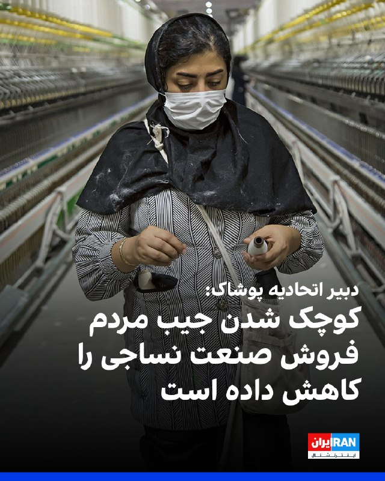

سعید جلالی‌قدیری، دبیر اتحادیه تولید و صادرات نساجی و پوشاک ایران، گفت کوچک شدن جیب مردم به افت فروش در صنعت پوشاک و نساجی منجر شده است.

او «شرایط نه جنگ نه صلح، نوسانات نرخ ارز و اختلال در تامین مواد اولیه» را از دیگر دلایل افت فروش در این صنعت عنوان کرد.

جلالی‌قدیری افزود صنعت نساجی و پوشاک ایران در آغاز سال جاری با مواردی از جمله انباشت بحران‌های اقتصادی، کاهش قدرت خرید مردم، دشواری در فروش و اختلال در تامین مواد اولیه مواجه است.
https://iranintl.com/202605222663

## IranIntlTV — post 338375

  

مارکو روبیو، وزیر خارجه آمریکا، جمعه یکم خرداد در حاشیه نشست ناتو گفت جمهوری اسلامی در پی ایجاد نظامی اختصاصی برای اخذ عوارض در یک آبراه بین‌المللی است و تلاش می‌کند عمان را نیز به پیوستن به این سازوکار متقاعد کند. روبیو تاکید کرد که این اقدام «غیرقابل قبول» است.

او افزود: «هیچ کشوری در جهان نباید چنین چیزی را بپذیرد. من کشوری را نمی‌شناسم که جز ایران از آن حمایت کند.»

روبیو با اشاره به تحرکات دیپلماتیک در سازمان ملل متحد گفت قطعنامه‌ای با پیشنهاد بحرین در شورای امنیت مطرح شده که آمریکا در آن نقش فعالی داشته و به گفته او، بیشترین تعداد هم‌پیشنهاددهنده را در تاریخ شورای امنیت دارد. او هشدار داد چند کشور در حال بررسی وتوی این قطعنامه هستند و افزود: «این مایه تاسف خواهد بود.»

وزیر خارجه آمریکا تاکید کرد واشینگتن برای دستیابی به اجماع جهانی جهت جلوگیری از اجرای چنین طرحی تلاش می‌کند و گفت: «باید دید آیا سازمان ملل همچنان کارآمد است یا نه. ما می‌کوشیم از این مسیر به نتیجه برسیم.»

او تصریح کرد اگر اخذ عوارض در تنگه هرمز اجرایی شود، ممکن است در دیگر آبراه‌های مهم جهان نیز تکرار شود.
https://iranintl.com/2026052

## IranIntlTV — post 338374

روایت شما از زندگی در آتش‌بس- جمعه ۱ خرداد ۱۴۰۵

🔹 کارگر شرکت کروز هستم از تهران. اینجا ماهی چند میلیون بابت غذا از حقوقمون کم می‌کنن، اما فقط برنج خالی می‌دن بخوریم و گاهی وقت‌ها تخم‌مرغ آب‌پز. آب معدنی، نوشابه و تنقلات کنار غذا رو کلاً حذف کردن.
🔹 امروز (۱ خرداد) یک دونه مرغ بسته‌ای خریدم؛ چهار تا سینه مرغ شد یک میلیون و ۳۶۰ هزار تومان. آخه چجوری دیگه میشه زندگی کرد؟
🔹 از کمال‌شهر کرج پیام می‌دم، خواستم بگم زندگی تو ایران اون‌قدری به ما بدهکاره که با پولش می‌شه سه‌تا زندگی دیگه خرید.
🔹 حقوق‌ها کفاف برطرف کردن نیازهای اولیه رو به زور می‌ده. هر روز داره سفره مردم کوچیک‌تر می‌شه، هر روز از دلخوشی‌های کوچیک و از خریدهای روزمره مردم کم می‌شه.
🔹 خدایا ما چه گناهی کردیم که باید تاوان نسل ۵۷ رو بدیم؟ ما جوونایی که اول راه زندگی بودیم، حالا زیر سایه جنگ، خفقان، فقر و ترس له می‌شیم. چرا ظالم‌ها آسوده حکومت می‌کنن و مردمی که فقط زندگی می‌خواستن، هر روز بیشتر تو تاریکی و ناامیدی فرو می‌رن؟
🔹 کارخانه لاستیک بارز کرمان به‌خاطر نداشتن مواد اولیه داره تعدیل نیرو می‌کنه و شیفت‌هاش رو یک‌سوم کرده.
🔹 از کرمان، من یک دانش‌آموز کلاس هشتم هستم. الان معلوم نیست امتحانات حضوریه یا نه؛ از یک طرف می‌گن حضوریه، از یک طرف می‌گن نیست. بعد از ۳ ماه درس نخوندن چطوری امتحان بدم؟
🔹 علی هستم از شاندیز مشهد. اینجا هم مثل بقیه کشور همه‌چی گرون شده و نمیشه خرید کرد. اینا فقط سر و صدا می‌کنن، آب هم جیره‌بندی شده.
🔹 از اهواز پیام می‌دم. اینجا یعنی کل ایران اوضاع اصلاً خوب نیست. مردم به معیشت و زندگی روزمره خودشون نمی‌رسن. عمو ترامپ لطفاً کارو تموم کن، مذاکره نمی‌خوایم دیگه، ما طاقت نداریم.
🔹 از گله‌دار استان فارس پیام می‌دم. می‌خوان مجسمه خمینی رو که مردم قبلاً آتیشش زده بودن بازسازی کنن. ما دوباره خرابش می‌کنیم.

## IranIntlTV — post 338373

  

مارکو روبیو، وزیر خارجه آمریکا، در حاشیه نشست ناتو درباره مذاکرات جاری با جمهوری اسلامی گفت که واشینگتن در انتظار نتایج گفت‌وگوهای در حال انجام است؛ گفت‌وگوهایی که به گفته او نشانه‌هایی از پیشرفت داشته‌اند.

او افزود: «ما در انتظار نتایج این گفت‌وگوها هستیم که نشانه‌هایی از پیشرفت دارد. نمی‌خواهم در این باره اغراق کنم؛ تحرک محدودی صورت گرفته و این مثبت است، اما اصول اساسی تغییری نکرده است.»

وزیر خارجه آمریکا تاکید کرد که حکومت ایران هرگز نباید به سلاح هسته‌ای دست یابد و گفت: «برای تحقق این هدف، باید به مسئله غنی‌سازی و نیز موضوع اورانیوم با غنای بالا رسیدگی کنیم و افزون بر آن، موضوع تنگه هرمز را نیز مد نظر قرار دهیم.»
https://iranintl.com/202605229378

## IranIntlTV — post 338372

  <a href="telegram/content/IranIntlTV_338372_1779443811.mp4" target="_blank">🎬 Download video</a>

بر اساس اطلاعات رسیده به ایران‌اینترنشنال، فدراسیون فوتبال جمهوری اسلامی برای دریافت ویزای آمریکا، خبرنگاران و عکاسانی را انتخاب کرده که در سوابق حرفه‌ای خود هیچ انتقادی از این فدراسیون نداشته‌اند. همچنین گفته می‌شود برای هر یک از این ۱۵ نفر، روزانه ۵۰ دلار کمک‌هزینه در نظر گرفته شده است.
جزییات بیشتر با رها پوربخش، عضو تحریریه ایران‌اینترنشنال
@iranintltv

## IranIntlTV — post 338371

  

سایت اقتصادنیوز گزارش داد تورم و کاهش قدرت خرید خانوارها در سال ۱۴۰۵، الگوی خرید مردم را تغییر داده و خرید قسطی را از کالاهای گران‌قیمت به مواد غذایی، اقلام ضروری، لبنیات، شوینده‌ها و اقلام بهداشتی کشانده است.

اقتصادنیوز نوشت خرید قسطی دیگر محدود به کالاهای لوکس یا بزرگ نیست و حتی مواد غذایی و بسته‌های سوپرمارکتی نیز در قالب پرداخت چندمرحله‌ای عرضه می‌شوند؛ تغییری که نشانه کاهش قدرت نقدینگی خانوارهاست.

بر اساس این گزارش، فشار تورمی باعث شده بسیاری از خانوارها به‌جای خرید نقدی کالاهای نو، به خرید قسطی یا کالاهای دست‌دوم روی بیاورند. فروشندگان کالاهای دست‌دوم نیز از افزایش ۴۰ تا ۶۰ درصدی تقاضا در این بازار خبر داده‌اند.
https://iranintl.com/202605229077

## IranIntlTV — post 338370

  

وب‌سایت نت‌بلاکس، نهاد ناظر بر اختلال‌های اینترنتی در جهان، صبح جمعه اول خرداد اعلام کرد قطع گسترده اینترنت در ایران وارد هشتاد‌وچهارمین روز خود شده و دسترسی به شبکه‌های بین‌المللی برای بیش از هزار و ۹۹۲ ساعت همچنان به‌طور گسترده قطع است.

این نهاد ناظر بر اینترنت نوشت با ادامه این وضعیت، شکاف‌های اجتماعی و اقتصادی عمیق‌تر می‌شود و هر ساعت از قطع اینترنت، ارتباط با جهان خارج را بیش از پیش به جایگاه، همراهی با حاکمیت و برخورداری از امتیاز وابسته می‌کند.
https://iranintl.com/202605222187

## IranIntlTV — post 338369

  <a href="telegram/content/IranIntlTV_338369_1779443815.mp4" target="_blank">🎬 Download video</a>

یکی از مخاطبان ایران‌اینترنشنال می‌گوید با وجود ادعای بازگشایی بازار بورس، معاملات برخی صنایع پس از جنگ اخیر همچنان متوقف مانده است. او می‌گوید دو سال پیش تمام پس‌انداز خود را در صنعت فولاد سرمایه‌گذاری کرده، اما اکنون به سرمایه و سهامش دسترسی ندارد و ارزش دارایی‌هایش عملاً از بین رفته است. پیام او با هوش مصنوعی خوانده شده است.

## Shin_Persian — post 6132

  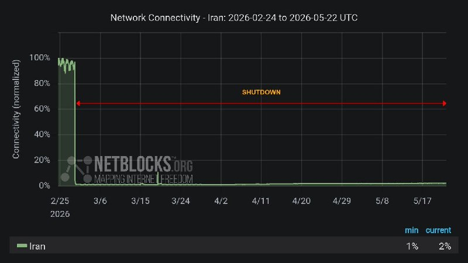

NetBlocks ✓ @netblocks
Fri, 22 May 2026 07:34:28 UTC

⌚️ #Iran's internet blackout has just entered its 84th day with international networks largely cut off for over 1992 hours.

Each passing hour widens social and economic divides as any contact with the outside world is gated by status, compliance and privilege.

فارسی

⌚️ قطعی اینترنت #ایران وارد هشتاد و چهارمین روز خود شد و شبکه‌های بین‌المللی برای بیش از ۱۹۹۲ ساعت به طور گسترده قطع شده‌اند.

با گذشت هر ساعت، شکاف‌های اجتماعی و اقتصادی عمیق‌تر می‌شوند، چرا که هرگونه تماس با دنیای خارج بر اساس وضعیت، پیروی [از قوانین] و امتیازات، محدود و فیلتر شده است.

𝕏 · @shin_persian

## Shin_Persian — post 6131

  

UKMTO Operations Centre @UK_MTO
Fri, 22 May 2026 07:34:45 UTC

UKMTO WARNING 059-26

Click here to view the full warning.⤵️
http://ukmto.org/-/media/ukmto/products/20260522-ukmto-warning_059.pdf?rev=dabf455285254d228052e96c4558d649

#MaritimeSecurity #MarSec

فارسی

هشدار UKMTO (عملیات تجارت دریایی بریتانیا) ۰۵۹-۲۶

برای مشاهده متن کامل هشدار اینجا کلیک کنید.⤵️
http://ukmto.org/-/media/ukmto/products/20260522-ukmto-warning_059.pdf?rev=dabf455285254d228052e96c4558d649

#MaritimeSecurity #MarSec

𝕏 · @shin_persian

## ManotoTV — post 105738

  <a href="telegram/content/ManotoTV_105738_1779443820.mp4" target="_blank">🎬 Download video</a>

سازمان نظارت بر اینترنت نت‌بلاکس اعلام کرد خاموشی گسترده اینترنت در ایران وارد هشتاد و چهارمین روز شده و دسترسی به شبکه جهانی اینترنت برای بیش از ۱۹۹۲ ساعت همچنان به‌طور گسترده مختل است.
نت‌بلاکس در گزارشی نوشت ادامه این محدودیت‌ها شکاف‌های اجتماعی و اقتصادی را عمیق‌تر کرده و ارتباط با جهان خارج بیش از پیش به «امتیاز، تبعیت و دسترسی ویژه» وابسته شده است.

## ManotoTV — post 105737

  <a href="telegram/content/ManotoTV_105737_1779443820.mp4" target="_blank">🎬 Download video</a>

روزنامه وال‌استریت ژورنال گزارش داد هم‌زمان با آماده شدن ایران برای احتمال درگیری با آمریکا، بابک زنجانی، بازرگان ایرانی که خود را «ضدتحریم» معرفی می‌کند، یک شبکه مخفی پرداخت برای تأمین مالی نیروهای نظامی جمهوری اسلامی ایجاد کرده بود که محور اصلی آن صرافی ارز دیجیتال بایننس بوده است.
بر اساس این گزارش، این شبکه تا ماه دسامبر گذشته طی دو سال حدود ۸۵۰ میلیون دلار تراکنش را عمدتاً از طریق یک حساب معاملاتی در بزرگ‌ترین صرافی رمزارز جهان انجام داده است. گزارش‌های داخلی بایننس نشان می‌دهد نزدیکان زنجانی، از جمله خواهرش، شریک عاطفی او و یکی از مدیران شرکتش، حساب‌های دیگری را نیز اداره می‌کردند که همگی از دستگاه‌های مشترک استفاده می‌کردند؛ موضوعی که بازرسان بایننس آن را نشانه‌ای از تلاش برای دور زدن تحریم‌های آمریکا علیه ایران دانسته‌اند.
وال‌استریت ژورنال نوشت با وجود هشدارهای داخلی متعدد، حساب اصلی این شبکه دست‌کم ۱۵ ماه همچنان فعال مانده و تا ژانویه امسال نیز باز بوده است. این گزارش همچنین می‌گوید میلیاردها دلار تراکنش رمزارزی طی دو سال گذشته از طریق بایننس به شبکه‌های مالی مرتبط با سپاه پاسداران منتقل شده است.
مقام‌های خارجی مسئول پیگیری تأمین مالی تروریسم گفته‌اند امسال نیز انتقال پول از طریق حساب‌های بایننس به نهادهای وابسته به جمهوری اسلامی ادامه داشته و تراکنش‌هایی حتی در همین ماه شناسایی شده است.

## ManotoTV — post 105736

  <a href="telegram/content/ManotoTV_105736_1779443822.mp4" target="_blank">🎬 Download video</a>

رییس اورژانس پیش‌بیمارستانی و مدیریت حوادث دانشگاه علوم پزشکی البرز اعلام کرد بر اثر تصادف زنجیره‌ای در آزادراه کرج قزوین، سه نفر جان باختند و چهار نفر دیگر مجروح شدند.
به گزارش رسانه‌های داخلی، در این سانحه دو مرد و یک زن کشته شدند و سه مرد و یک زن دیگر نیز مجروح شدند.
مصدومان توسط نیروهای اورژانس به بیمارستان امام جعفر صادق نظرآباد منتقل شدند.

## ManotoTV — post 105735

  <a href="telegram/content/ManotoTV_105735_1779443823.mp4" target="_blank">🎬 Download video</a>

وزارت خارجه جمهوری اسلامی تحریم محمدرضا رئوف شیبانی، سفیر ایران در لبنان، از سوی آمریکا را «غیرقانونی» و «ناموجه» توصیف کرد و آن را نشانه «بی‌اعتنایی هیئت حاکمه آمریکا به اصول حقوق بین‌الملل و منشور سازمان ملل» دانست.
این وزارتخانه همچنین تحریم تعدادی از نمایندگان حزب‌الله و مسئولان لبنانی را محکوم کرد و اقدامات آمریکا را «سخیف» و در راستای تضعیف حاکمیت ملی لبنان و «فتنه‌انگیزی در جامعه لبنان» خواند.

## ManotoTV — post 105734

  <a href="telegram/content/ManotoTV_105734_1779443824.mp4" target="_blank">🎬 Download video</a>

روزنامه نیویورک‌تایمز گزارش داد ایران و عمان درباره ایجاد یک نظام پرداخت برای عبور کشتی‌ها از تنگه هرمز مذاکره کرده‌اند؛ اقدامی که می‌تواند به معنای دریافت هزینه از کشتی‌های عبوری در یکی از حیاتی‌ترین آبراه‌های جهان باشد.
بر اساس این گزارش، تهران و مسقط تأکید دارند موضوع مطرح‌شده «کارمزد خدمات» است، نه «عوارض عبور»؛ زیرا دریافت عوارض صرف برای عبور از تنگه‌های بین‌المللی طبق حقوق دریاها غیرقانونی تلقی می‌شود. با این حال، کارشناسان حقوقی می‌گویند اگر این کارمزد در عمل همان عوارض باشد، مشروعیت نخواهد داشت.
مقام‌های آمریکایی، از جمله دونالد ترامپ و مارکو روبیو، هرگونه دریافت پول برای عبور از تنگه هرمز را «غیرقابل قبول» توصیف کرده‌اند. کارشناسان نیز هشدار داده‌اند تغییر نام عوارض به «کارمزد» مانع چالش‌های حقوقی بین‌المللی نخواهد شد.

## ManotoTV — post 105733

  <a href="telegram/content/ManotoTV_105733_1779443824.mp4" target="_blank">🎬 Download video</a>

فرماندهی مرکزی آمریکا، سنتکام، در حساب کاربری خود در شبکه ایکس اعلام کرد جنگنده‌های نیروی دریایی آمریکا از ناو هواپیمابر «آبراهام لینکلن» در دریای عرب به پرواز درآمده‌اند.
سنتکام افزود گروه ضربتی ناو «آبراهام لینکلن» در بالاترین سطح آمادگی عملیاتی قرار دارد و در چارچوب اجرای محاصره دریایی آمریکا علیه بنادر ایران فعالیت می‌کند.

## FarsiVOA — post 218349

🔺سفیر جنجالی جمهوری اسلامی در بیروت که آمریکا او را تحریم کرد، کیست؟

▪️محمدرضا رئوف ‌شیبانی، سفیر جمهوری اسلامی در بیروت، که به تازگی از سوی وزارت خزانه‌داری آمریکا تحریم شده است، نقش کلیدی در پیشبرد سیاست‌های مداخله‌جویانه حکومت ایران در لبنان داشته است.

▪️آمریکا روز چهارشنبه ۳۱ اردیبهشت اعلام کرد واشنگتن ۹ نفر از جمله رئوف شیبانی را به دلیل حمایت از «حزب‌الله» و کمک به تضعیف حاکمیت دولت لبنان تحریم کرده است.

▪️رئوف‌شیبانی، پس از پایان مأموریت مجتبی امانی، سفیر پیشین جمهوری اسلامی در بیروت، جایگزین او شد.

▪️رئوف شیبانی پیش از اعزام به بیروت، سوابقی سفارتخانه‌های جمهوری اسلامی در سوریه، تونس و لیبی داشت و از مهر ۱۴۰۳، نماینده ویژه وزیر خارجه جمهوری اسلامی در خاورمیانه شد.

⬇️ بیشتر بخوانید:
https://ir.voanews.com/a/who-is-raouf-sheibani-iranian-controversial-ambassador-to-lebanon/8152732.html

## FarsiVOA — post 218348

  

مرکز آمار اتحادیه اروپا گزارش داده که تراز مثبت تجاری این اتحادیه از ۳۴ میلیارد یورو در مارس پارسال به زیر شش میلیارد یورو در ماه مشابه امسال سقوط کرده است.

اتحادیه اروپا در اولین ماه آغاز عملیات مشترک آمریکا و اسرائیل علیه جمهوری اسلامی و انسداد تنگه هرمز توسط سپاه پاسداران، ۲۳۴ میلیارد یورو صادرات داشته که تقریباً ۹ درصد کمتر از مارس پارسال بوده و وارداتش با افزایشی نزدیک ۳ درصدی به ۲۲۸ میلیارد یورو رسیده است.

بیشترین افت صادرات اتحادیه اروپا به ایالات متحده آمریکا بوده که سقوطی ۳۷ درصدی را تجربه کرده و به ۴۵ میلیارد یورو رسیده، اما کماکان تراز اقتصادی به میزان ۱۳.۵ میلیارد یورو به نفع اتحادیه اروپا است. بیشترین شکاف تراز تجاری اتحادیه نیز با چین بوده و به منفی ۳۲.۶ میلیارد یورو اوج گرفته است.
@FarsiVOA

## FarsiVOA — post 218347

  

دبیرکل ناتو در آستانه نشست وزرای خارجه کشورهای عضو این ائتلاف اعلام کرد که بحران کنونی تنگه هرمز برای ناتو موضوعیتی ندارد.

مارک روته، جمعه گفت که آزادی ناوبری در تنگه هرمز به هر یک از کشورهای عضو ائتلاف ناتو مربوط می‌شود، اما به‌ خود ناتو به‌طور خاص به عنوان یک ائتلاف، مربوط نمی‌شود.

این اظهارات در حالی است که دونالد ترامپ، رئیس‌جمهور آمریکا پیشتر به‌شدت از اعضای ناتو به دلیل این‌که برای کمک به عملیات نظامی آمریکا و اسرائیل تلاش بیشتری نکرده‌اند، انتقاد کرده است.

مارکو روبیو، وزیر خارجه ایالات متحده، نیز اعلام کرد که آقای ترامپ از اعضای ناتو که به آمریکا اجازه نداده‌اند از پایگاه‌هایشان برای جنگ علیه جمهوری اسلامی استفاده کند، «بسیار ناامید» است و به‌طور مشخص از اسپانیا نام برد.

خبرگزاری رویترز نوشت که انتظار می‌رود وزیران خارجه اعضای اروپایی ناتو در نشست سوئد تأکید کنند که در صورت فراهم بودن شرایط، آماده‌اند برای حفظ آزادی کشتیرانی در تنگه هرمز کمک کنند و مسئولیت بیشتری در قبال امنیت اروپا بر عهده بگیرند.
@FarsiVOA

## FarsiVOA — post 218346

  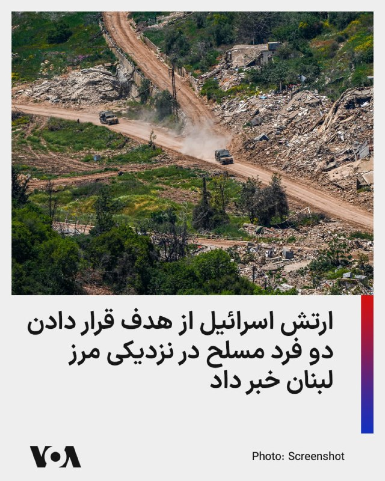

ارتش اسرائیل اعلام کرد که دو مظنون مسلح را پیش از نزدیک شدن به مرز این کشور با لبنان، هدف قرار داده و کشته است.

تایمز اسرائیل وقوع این حادثه را صبح روز جمعه اول خرداد ماه اعلام کرد، اما جزئیاتی بیشتری از هویت این مظنونان ارائه نداد.

ارتش اسرائیل اعلام کرده است که حرکات مشکوک این دو فرد مسلح را از چند صد متر دورتر از مرز اسرائیل رصد کرده است. این دو مظنون مسلح پس از نزدیک شدن به مرز از سمت جنوب لبنان‌، هدف حملات هوایی قرار گرفته‌اند.

ارتش اسرائیل همچنین اعلام کرد که مظنون دیگری در این منطقه وجود ندارد و این حادثه پایان یافته است.
@FarsiVOA

## DW_Farsi — post 124992

🔶 ۱.۲ میلیارد نفر از مردم جهان به بیماری‌های روحی مبتلا هستند

یک مطالعه جدید که در نشریه تخصصی لنست منتشر شده حاکی از آن است که در سراسر جهان تقریبا ۱.۲ میلیارد نفر با مشکلات و نارحتی‌های روحی و روانی زندگی می‌کنند. به گفته دانشمندان، این رقم تقریبا دو برابر تعداد سال ۱۹۹۰ است.

در این مطالعه همچنین آمده است که به دلیل این افزایش شدید، بیماری‌های روانی اکنون شایع‌ترین علت اختلالات سلامتی هستند و از بیماری‌های قلبی‌عروقی، سرطان و بیماری‌های دستگاه حرکتی پیشی گرفته‌اند.

دانشمندان موسسه سنجش و ارزیابی سلامت و پژوهشگران دانشگاه کوئینزلند برای انجام این مطالعه، این موضوع را بررسی کردند که بیماری‌های روانی تا چه اندازه شایع‌اند و بار ناشی از آن‌ها تا چه اندازه شدید است. آن‌ها داده‌های به‌دست‌آمده را بر اساس جنسیت، در ۲۵ گروه سنی، ۲۱ منطقه و ۲۰۴ کشور و قلمرو در بازه زمانی ۱۹۹۰ تا ۲۰۲۳ ارزیابی کردند.

پژوهشگران می‌گویند این بررسی که گسترده‌ترین ارزیابی از نوع خود تا کنون به شمار می‌رود، حاکی از آن است که زنان و همچنین افراد ۱۵ تا ۱۹ ساله به صورتی محسوس بیشتر تحت تاثیر این روند قرار گرفته‌اند.
@dw_farsi

## DW_Farsi — post 124991

🔶 ترامپ از اعزام ۵ هزار نیروی بیشتر به لهستان خبر داد

دونالد ترامپ، رئیس‌ جمهور آمریکا، اعلام کرد ۵ هزار نیروی دیگر این کشور به لهستان اعزام خواهند شد. او جزئیات بیشتری درباره زمان اعزام یا محل استقرار این نیروها ارائه نکرد، اما این تصمیم را با مناسبات خوب خود با کارول ناوروتسکی، همتای لهستانی خود مرتبط دانست.

به گزارش خبرگزاری آلمان، ترامپ در حالی از اعزام نیروهای بیشتر به لهستان خبر داده که در روزهای گذشته گزارش‌هایی درباره توقف اعزام یک تیپ رزمی آمریکایی به اروپا و احتمال تاثیر آن بر لهستان منتشر شده بود. این گزارش‌ها در ورشو نگرانی ایجاد کرد، اما مقام‌های لهستانی آن را رد کردند.

ولادیسلاو کوشینیاک کامیش، وزیر دفاع لهستان، تصریح کرده بود که شمار نیروهای آمریکایی در لهستان کاهش نخواهد یافت و کشورش همچنان برای افزایش این حضور تلاش می‌کند. او همچنین گفته بود خروج حدود ۵ هزار نیروی آمریکایی از آلمان می‌تواند به بازآرایی نیروهای ایالات متحده در اروپا منجر شود.
@dw_farsi

## DW_Farsi — post 124990

  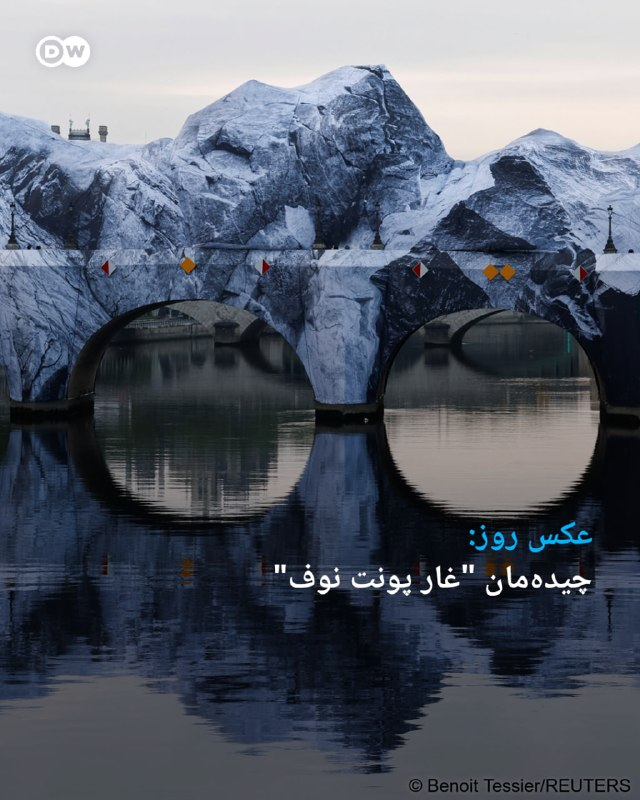

📸 عکس روز: چیده‌مان "غار پونت نوف"

پل پونت نوف قدیمی‌ترین پل بر روی رودخانه سن در پاریس محسوب می‌شود. غار پونت-نوفِ چیدمان هنری چالش‌برانگیز جی‌آر (JR) هنرمند خیابانی و عکاس مشهور فرانسوی روز پنجشنبه ۲۱ مه (۳۱ اردیبهشت) رونمایی شد. ساختار این غار که ۱۲۰ متر امتداد دارد و در بالاترین نقطه به ۱۸ متر ارتفاع می‌رسد، در طول شب بر روی قدیمی‌ترین پل پاریس شکل گرفت.
@dw_farsi

## DW_Farsi — post 124989

  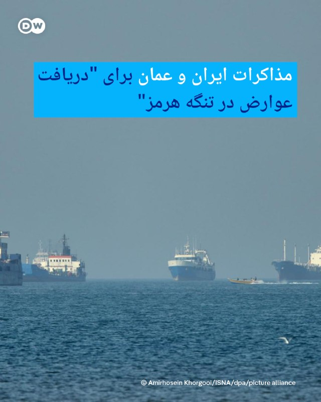

🔶 مذاکرات ایران و عمان برای "دریافت عوارض در تنگه هرمز"

روزنامه آمریکایی نیویورک‌تایمز گزارش داده که جمهوری اسلامی، با عمان در خصوص همکاری برای دریافت عوارض در تنگه هرمز گفت‌وگو کرده است.

طبق این گزارش، "صرف مطرح شدن چنین مذاکراتی می‌تواند نشانه‌ای باشد از این که ایالات متحده و جمهوری اسلامی هنوز تا پایان دادن به درگیری، فاصله زیادی دارند".

همچنین دو منبع دخیل در این مذاکرات گفته‌اند که حکومت ایران "قصد ندارد برای عبور از تنگه مستقیما پول دریافت کند، بلکه به دنبال اخذ پرداخت‌ها و هزینه‌هایی در ازای خدمات است".

دو منبع مرتبط با جمهوری اسلامی نیز به این روزنامه گفته‌اند که "عمان مایل است از نفوذ خود بر همسایگانش در منطقه، از جمله بحرین، کویت، قطر، عربستان سعودی، امارات متحده عربی و همچنین ایالات متحده، برای پیشبرد این طرح استفاده کند؛ زیرا این طرح از نظر اقتصادی سودآور است".
@dw_farsi

## DW_Farsi — post 124988

🔶 آلمان: بخشی از پرونده‌های ویزای ایرانیان به ایروان منتقل شد

🔻 گزارشی از دانیال بابایانی

تعطیلی طولانی سفارت آلمان در ایران، به‌ویژه پس از جنگ و تشدید شرایط امنیتی، باعث شده روند مصاحبه‌های ویزا برای بسیاری از متقاضیان عملا متوقف شود. برخی از آن‌ها از دی‌ماه ۱۴۰۴ در صف انتظار هستند و هنوز نمی‌دانند آیا باید منتظر بمانند، به کشور ثالث بروند یا از ابتدا مسیر تازه‌ای را شروع کنند؟

در این میان، دانشجویان، متقاضیان دوره‌های آموزشی و نیروهای متخصص ایرانی می‌گویند، ماه‌هاست میان پاسخ‌های مبهم، ایمیل‌های خودکار و نبود اطلاع‌رسانی روشن گرفتار شده‌اند؛ وضعیتی که برای بسیاری از آن‌ها فقط یک تاخیر اداری نیست، بلکه می‌تواند به معنای از دست رفتن پذیرش دانشگاهی، قرارداد کاری، اعتبار مدرک زبان و پس‌انداز چند ساله باشد.

دویچه‌ وله برای روشن شدن وضعیت متقاضیان، در تماس با وزارت خارجه آلمان درباره احتمال ازسرگیری روند صدور ویزا، معرفی کشور ثالث و ارائه راه‌حل موقت برای متقاضیان ایرانی پرسش‌هایی را مطرح کرد.
 
این وزارتخانه اکنون در پاسخ به دویچه‌ وله اعلام کرده است که "در مواردی" امکان بررسی درخواست ویزای شهروندان ایرانی در نمایندگی‌های آلمان در کشور همسایه فراهم شده است.

بر اساس این پاسخ، روند بررسی پرونده برخی متقاضیان، به‌ویژه دانشجویان و نیروهای متخصصی که پیش از آغاز درگیری‌های نظامی درخواست خود را در تهران ثبت کرده بودند، در هفته‌های اخیر از سر گرفته شده است.
@dw_farsi

## Persian_Trend_Official — post 14653

https://youtube.com/live/zMW0RhvWank?feature=share

## Persian_Trend_Official — post 14652

  <a href="telegram/content/Persian_Trend_Official_14652_1779443830.webm" target="_blank">🎬 Download video</a>

UKMTO
گزارش داد که یک تانکر توسط یک قایق کوچک حامل پنج نفر در ۹۸ مایل دریایی شمال سوکوترا نزدیک یمن در حال نزدیک شدن به تانکر مورد نظر بود که با شلیک هشدار تیم امنیتی کشتی مواجه شدکه قایق را مجبور به تغییر مسیر کردند.

🚢PhantomDirective
🚢

📌 @persian_trend_official
پرشین ترند | متفاوت‌ترین کانال نظامی

## Persian_Trend_Official — post 14651

  <a href="telegram/content/Persian_Trend_Official_14651_1779443830.webm" target="_blank">🎬 Download video</a>

توئیت ابراهیم رضایی سخنگوی کمیسیون امنیت ملی:

موشک‌ها را برای مذاکره با شیطان بفرستید .

👑PhantomDirective
👑

📍 @persian_trend_official
پرشین ترند | متفاوت‌ترین کانال نظامی

## Persian_Trend_Official — post 14650

  <a href="telegram/content/Persian_Trend_Official_14650_1779443831.mp4" target="_blank">🎬 Download video</a>

📰گزارش‌های تایید نشده از وقوع انفجار در امارات

🔺برخی منابع عربی مدعی وقوع انفجار در ابوظبی، پایتخت امارات متحده عربی شدند.

🔺هنوز جزئیاتی از این انفجارها منتشر نشده است.

خبر گزاری مهر

👑PhantomDirective
👑

📌 @persian_trend_official
پرشین ترند | متفاوت‌ترین کانال نظامی

## Persian_Trend_Official — post 14649

  <a href="telegram/content/Persian_Trend_Official_14649_1779443832.mp4" target="_blank">🎬 Download video</a>

اندر احوالات مذاکرات ایران-آمریکا

📌 @persian_trend_official
پرشین ترند | متفاوت‌ترین کانال نظامی

## RadioFarda — post 157447

  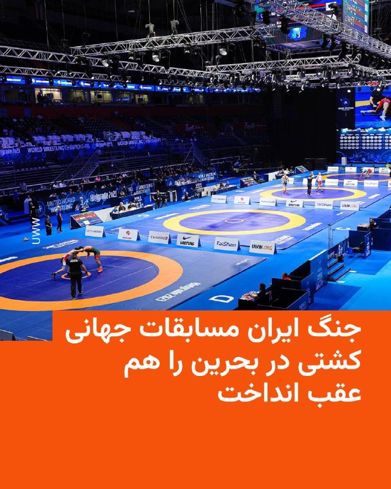

🔸سازمان جهانی کشتی که مقر آن در سوئیس است روز جمعه، اول خرداد، در بیانیه‌ای مشترک با کمیته المپیک بحرین و فدراسیون کشتی این کشور اعلام کرد که مسابقات جهانی این ورزش که قرار بود در سال جاری میلادی در بحرین برگزار شود فعلا به تعویق می‌افتد.

🔸بر اساس این بیانیه، مسابقات جهانی کشتی در سال ۲۰۲۶ که برای روزهای دوم تا دهم آبان‌ماه ۱۴۰۵ برنامه‌ریزی شده بود به دلیل جنگ ایران که مستقیما بر کشورهای حاشیه خلیج فارس نیز اثر گذاشته عقب می‌افتد.

🔸این بیانیه آشکارا به «وضعیت ژئوپولیتیکی منطقه» و «عدم قطعیت» پیرامون آینده درگیری و آثار آن بر ثبات در منطقه و دشواری سفر اشاره می‌کند.

🔸در این بیانیه تأکید شده است که هدف از اعلام زودهنگام این تصمیم آن بوده است که شاید به این ترتیب فرصت کافی برای انتخاب میزبانی دیگر برای مسابقات جهانی کشتی در سال جاری میلادی فراهم شود.

🔸بحرین یکی از کشورهایی است که از آغاز جنگ مشترک آمریکا و اسرائیل علیه جمهوری اسلامی مستقیما هدف حملات سپاه پاسداران قرار گرفته است. این کشور میزبان یکی از بزرگ‌ترین پایگاه‌های نظامی آمریکا در منطقه است.

@RadioFarda

## RadioFarda — post 157446

🔸تنکرترکرز، شرکت ردیابی نفتکش‌ها، روز جمعه اول خرداد اعلام کرد نیروی دریایی آمریکا شمار بسیاری از نفتکش‌های تحت تحریم آمریکا را در سواحل شرقی عمان متوقف کرده و در تازه‌ترین مورد، نفتکش لوین را که معمولاً برای حمل نفت ایران استفاده می‌شود، پس از تغییر مسیر…

## RadioFarda — post 157445

  

🔸تنکرترکرز، شرکت ردیابی نفتکش‌ها، روز جمعه اول خرداد اعلام کرد نیروی دریایی آمریکا شمار بسیاری از نفتکش‌های تحت تحریم آمریکا را در سواحل شرقی عمان متوقف کرده و در تازه‌ترین مورد، نفتکش لوین را که معمولاً برای حمل نفت ایران استفاده می‌شود، پس از تغییر مسیر به‌سمت دریای عرب، تحت تعقیب قرار داده است.

🔸این شرکت در پیامی همراه با تصاویر ماهواره‌ای و دریایی نوشت که نفتکش آفراماکس «لوین» با شناسهٔ ۹۲۹۳۱۵۵، که در زمان تعقیب فاقد محموله بود و معمولاً برای حمل نفت ایران استفاده می‌شود، پس از تغییر مسیر به‌سمت دریای عرب، از سوی یک شناور نیروی دریایی آمریکا تعقیب شده است.

🔸این نفتکش پیش‌تر، بهمن ۱۴۰۴، به‌عنوان یکی از شناورهای «ناوگان سایه» ایران برای دور زدن تحریم‌ها در فهرست تحریم‌های ایالات متحده قرار گرفته بود.

@RadioFarda

## RadioFarda — post 157444

اعلام خبر افزایش نیروهای آمریکا در لهستان در آستانه اجلاس وزرای خارجه ناتو در سوئد

🔸دونالد ترامپ، رئیس‌جمهور آمریکا، با اعلام خبر افزایش پنج هزار نفری نیروهای نظامی ایالات متحده در لهستان در قلب اروپا به شک و تردید در این باره پایان داد؛ خبری که با استقبال رئیس‌جمهور لهستان روبه‌رو شد.

🔸هفته گذشته مقام‌های آمریکایی از لغو اعزام چهار هزار نیروی آمریکایی به لهستان خبر داده بودند؛ خبری که بعداً توسط معاون ترامپ تکذیب شد. جی‌دی‌ ونس اعلام کرد که این اعزام نیرو لغو نشده، به تعویق افتاده است.

🔸حال دونالد ترامپ در روز پنج‌شنبه، ۳۱ اردیبهشت، اعلام کرده است که پنج هزار نیرو به این کشور اروپایی خواهد فرستاد.

🔸او در پیامی در شبکه اجتماعی خود نوشت که بر اساس رابطهٔ خوبش با کارول ناوروکی، همتای لهستانی‌اش، به این تصمیم رسیده است.

🔸ناوروکی هم پنج‌شنبه شب در پیامی در شبکه ایکس چنین به ترامپ پاسخ داد:‌ «ائتلاف خوب ائتلافی است مبتنی بر همکاری و احترام متقابل و تعهد به امنیت طرفین.»

🔸تصمیم تازه آمریکا برای اعزام نیرو به اروپا کمتر از یک ماه پس از آن اعلام می‌شود که پیت هگست، وزیر دفاع این کشور، روز ۱۱ اردیبهشت دستور داد حدود پنج هزار نیروی نظامی این کشور طی یک سال آینده از آلمان خارج شوند.

🔸 گزارش کامل را در وب‌سایت رادیوفردا بخوانید.

@RadioFarda

## RadioFarda — post 157443

تلاش ایران برای رسمیت دادن به کنترل خود بر تنگۀ هرمز، به‌رغم مخالفت‌های بین‌المللی

🔸کوتاه‌زمانی پس از آغاز جنگ آمریکا و اسرائیل با ایران، تهران کنترل تنگۀ هرمز، این آبراه حیاتی انتقال حامل‌های انرژی به بازارهای بین‌المللی را در اختیار گرفت.

🔸حکومت ایران با تهدید حمله به کشتی‌ها و نفتکش‌های بین‌المللی، عملاً عبور و مرور شناورها از این منطقه را متوقف کرد؛ اقدامی که اهرم فشار قابل توجهی را در اختیار تهران گذاشت.

🔸حالا جمهوری اسلامی قصد دارد با به اجرا گذاشتن یک رژیم جدید ترابری، سیطره‌اش بر این گذرگاه راهبردی را رسمیت ببخشد. این در حالی‌ است که ایالات متحده، که خود به نحوی دیگر آب‌های منطقه را به محاصره در آورده، بارها با اعمال قدرت و تعرفه از سوی جمهوری اسلامی مخالفت کرده است.

🔸روز ۲۸ اردیبهشت‌ماه ایران «نهاد مدیریت آبراه خلیج فارس» را با هدف بررسی و دریافت تعرفه از کشتی‌های عبوری از تنگۀ هرمز معرفی کرد.

🔸این نهاد روز چهارشنبه ۳۰ اردیبهشت‌ماه با انتشار یک نقشه در شبکۀ ایکس، محدودۀ مدیریت ایران بر تنگۀ‌هرمز را اعلام کرد.

🔸بر اساس این مطلب، این محدوده، ناحیۀ مابین دو خط، یکی خط اتصال کوه مبارک در ایران و جنوب فجیره در امارات متحدۀ‌ عربی در شرق تنگه، تا خط اتصال انتهاى جزیره قشم در ایران و ام‌القیوین در امارات در غرب تنگه هرمز را در برمی‌گیرد.

🔸این نهاد تأکید کرده که عبور از این منطقه، نیازمند هماهنگی با مقام‌های ایرانی و دریافت مجوز خواهد بود.

🔸 گزارش کامل را در وب‌سایت رادیوفردا بخوانید.

@RadioFarda

## RadioFarda — post 157442

نماینده مجلس: با تصمیم نهادهای بالادستی، فعلاً نیاز به باز کردن اینترنت وجود ندارد

🔸نایب‌رئیس کمیسیون فرهنگی مجلس شورای اسلامی می‌گوید بر اساس تصمیم «نهادهای بالادستی، فعلاً نیازی به باز کردن اینترنت وجود ندارد» و مدعی شد دلیل آن «خطرات امنیتی و تهدید شخصیت‌ها و کشور» است.

🔸علی یزدی‌خواه روزپنجشنبه، ۳۱ اردیبهشت، به پایگاه خبری سیتنا همچنین گفت نمایندگان مجلس مراجعات مردمی گسترده‌ای دربارهٔ اعتراض به قطع اینترنت دریافت نکرده‌اند و مدعی شد «تقریباً بیش از ۹۰ درصد نیازها و احتیاجات مردم در شبکهٔ ملی اطلاعات برآورده می‌شود».

🔸اظهارات یزدی‌خواه در حالی مطرح می‌شود که منتقدان و شماری از کارشناسان حوزهٔ فناوری، استناد مقام‌های جمهوری اسلامی به ملاحظات امنیتی را بارها زیر سؤال برده‌اند و می‌گویند حکومت ایران از آغاز جنگ، اجرای عملی طرحی را سرعت بخشیده که سال‌ها با عنوان «شبکهٔ ملی اطلاعات» و محدودسازی اینترنت جهانی دنبال می‌کرد.

🔸حکومت ایران اینترنت را از نهم اسفند سال گذشته، همزمان با آغاز جنگ آمریکا و اسرائیل با ایران، قطع کرد و با گذشت بیش از ۸۳ روز، دسترسی عمومی همچنان برقرار نشده است. این به‌عنوان طولانی‌ترین قطع سراسری اینترنت یک کشور در جهان ثبت شده است.

🔸این نمایندهٔ مجلس همچنین گفت تاکنون «بالغ بر یک میلیون نفر» به اینترنت پرو دسترسی یافته‌اند و به‌گفتۀ او، در صورت نیاز، افراد یا سازمان‌ها می‌توانند دسترسی محدود به اینترنت دریافت کنند.

🔸این در حالی است که در هفته‌های اخیر فروش دسترسی‌ طبقاتی تحت عنوان «اینترنت پرو» خود به موضوعی بحث‌برانگیز تبدیل شده است. بر اساس گزارش وب‌سایت خبرآنلاین، بازار سیاهی برای فروش این نوع دسترسی شکل گرفته و برخی واسطه‌ها در ازای دریافت مبالغ میلیونی، متقاضیان را به‌عنوان کارمند شرکت‌ها یا اعضای اصناف ثبت می‌کنند تا امکان دریافت اینترنت جهانی برای آن‌ها فراهم شود.

🔸 گزارش کامل را در وب‌سایت رادیوفردا بخوانید.

@RadioFarda

## IranianMinds — post 20519

🔴 خبرگزاری فارس :

بمولا ابرقدرت دنیا خودمونیم.

@IranianMinds

## IranianMinds — post 20518

🔴 وزیر خارجه انگلیس:

ما با ایالات متحده در تصمیمش برای بازگشایی تنگه هرمز برای ناوبری هم‌نظر هستیم.

@IranianMinds

## IranianMinds — post 20517

  <a href="telegram/content/IranianMinds_20517_1779443837.mp4" target="_blank">🎬 Download video</a>

🔴 مارکو‌ روبیو:

ایران در تلاش است یک سیستم عوارض در تنگه هرمز ایجاد کند و سعی دارد عمان را قانع کند تا به این سیستم عوارض بپیوندد.

@IranianMinds

## IranianMinds — post 20516

  

ایران دهه ۱۹۷۰ میلادی …

@IranianMinds

## IranianMinds — post 20515

🔴 مارکو روبیو وزیر خارجه آمریکا:

در مذاکرات با ایران پیشرفت هایی حاصل شده است.

@IranianMinds

## IranianMinds — post 20514

  

🔴 ابراهیم رضایی ، سخنگوی کمیسیون امنیت ملی :

آمریکایی ها هیچ تمایلی به دیپلماسی ندارن و مذاکرات فریب است، به جای دیپلمات موشک ها را برای مذاکره با شیطان بفرستید تا آدم شه.

@IranianMinds

## BBCPersian — post 281779

‌ ‌ ‌ مارکو روبیو، وزیر خارجه آمریکا، می‌گوید که واشنگتن در انتظار شنیدن نتیجه گفت‌وگوهایی است که در تهران در جریان است. آقای روبیو که برای شرکت در اجلاس وزرای خارجه کشورهای عضو ناتو به سوئد رفته همچنین گفت: «پیشرفت‌های اندکی حاصل شده» و «نمی‌خواهم اغراق…

## BBCPersian — post 281778

  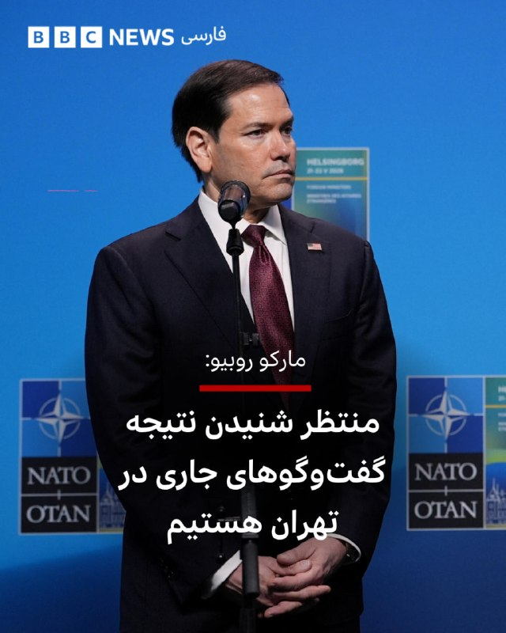

‌ ‌ ‌
مارکو روبیو، وزیر خارجه آمریکا، می‌گوید که واشنگتن در انتظار شنیدن نتیجه گفت‌وگوهایی است که در تهران در جریان است.

آقای روبیو که برای شرکت در اجلاس وزرای خارجه کشورهای عضو ناتو به سوئد رفته همچنین گفت: «پیشرفت‌های اندکی حاصل شده» و «نمی‌خواهم اغراق کنم، اما کمی تغییر در وضعیت وجود داشته است و این خوب است.»

عباس عراقچی، وزیر خارجه ایران، امروز در تهران با محسن نقوی، وزیر کشور پاکستان دیدار کرد. به گزارش رسانه‌های ایران این دیدار برای بررسی پیشنهادهایی جهت حل اختلافات میان تهران و واشنگتن است.

آقای روبیو تاکید کرد که «اصول اولیه همچنان یکسان است. ایران هرگز نمی‌تواند سلاح هسته‌ای داشته باشد، این حکومت هرگز نمی‌تواند سلاح هسته‌ای داشته باشد و برای رسیدن به این هدف، ما باید به موضوع غنی‌سازی در مذاکرات بپردازیم. لازم است که به موضوع اورانیوم غنی شده با خلوص بالا رسیدگی کنیم.»

https://bbc.in/49L7L6C
📷Reuters
@BBCPersian

## BBCPersian — post 281777

🔻 نت‌بلاکس: قطع اینترنت در ایران وارد هشتادوچهارمین روز شد

نت‌بلاکس که وضعیت اینترنت در جهان را ارزیابی می‌کند می‌گوید خاموشی اینترنت در ایران اکنون وارد هشتاد‌وچهارمین روز شده و دسترسی عمومی به شبکه‌های بین‌المللی برای بیش از ۱۹۹۲ ساعت عملا قطع مانده است.

نت‌بلاکس می‌گوید: «با گذشت هر ساعت، شکاف‌های اجتماعی و اقتصادی عمیق‌تر می‌شود؛ چرا که هرگونه ارتباط با جهان خارج اکنون به امتیاز، میزان تبعیت و برخورداری از رانت وابسته شده است.»

یک روز پیش از این، علی یزدی‌خواه، نماینده و عضو کمیسیون فرهنگی مجلس ایران گفته بود که «مسئولان به این نتیجه رسیده‌اند که وصل کردن اینترنت به صلاح همه نیست.»

دولت ایران گفته است که اتصال مجدد اینترنت منوط به تصمیم شورای عالی امنیت ملی است.

ایران استفاده از اینترنت ماهواره‌ای همچون استارلینک را هم ممنوع کرده و کاربران آن را تحت تعقیب قرار می‌دهد.

https://bbc.in/4dJqX69
@BBCPersian

## BBCPersian — post 281768

🖊 هیلکن دواچ بوران، بی‌بی‌سی ترکی، استانبول

🔻رونمایی مرکز تحقیق و توسعه وزارت دفاع ترکیه از موشک ییلدیریم‌هان در ۵ مه، نقطه عطفی برای صنایع دفاعی ترکیه به شمار می‌رود.

ترکیه با رونمایی از ییلدیریم‌هان، برای نخستین بار رسما اعلام کرد که قصد دارد موشک بالستیک قاره‌پیما تولید کند.

در مراسم معرفی این موشک که در نمایشگاه دفاعی ساها ۲۰۲۶ در استانبول برگزار شد، ماکتی از موشک همراه با مشخصات فنی‌ آن به نمایش در آمد.

کارشناسانی که با بخش ترکی بی‌بی‌سی گفت‌وگو کرده‌اند، ییلدیریم‌هان را بخشی از تلاش ترکیه برای تثبیت جایگاه خود به‌عنوان یک بازیگر بین‌المللی ارزیابی می‌کنند.

برخی کارشناسان با تاکید بر اینکه برد اعلام‌شده این موشک فراتر از نیازهای دفاعی ترکیه است، می‌گویند این موضوع می‌تواند در ذهن «رقبای بالقوه» آنکارا پرسش‌هایی ایجاد کند.

بیشتر بخوانید:

https://bbc.in/4tNsFcs
📸Getty Images/ Reuters/ Anadolu via Getty Images/ AFP via Getty Images/ Bloomberg via Getty Images
@BBCPersian

## BBCPersian — post 281767

🔻این هفته در پرگار: آینده دانشگاه در عصر هوش مصنوعی

🔻دانشگاه در جوامع بشری قدمتی بیش از هزار سال دارد و دغدغه‌ راه یافتن به آن یا بهره‌‌ شغلی از امتیاز آن به دی‌ان‌ای بشر راه یافته. آیا همه‌ اینها قرار است با هوش مصنوعی تغییر کند؟ دانشگاه آینده‌ای دارد؟

میهمان‌ها:
سپهر وکیل، استاد دانشگاه
مهدی گنجوی، استاد دانشگاه

@BBCPersian

## BBCPersian — post 281766

🔻 سازمان عملیات دریایی بریتانیا از یک حادثه دریایی در آب‌های یمن خبر داد

سازمان عملیات تجارت دریایی بریتانیا روز جمعه اعلام کرد که گزارشی درباره یک حادثه در ۹۸ مایل دریایی شمال جزیره سقطرا یمن دریافت کرده است.

در این حادثه، یک کشتی گفته است که یک قایق کوچک با پنج نفر سرنشین به آن نزدیک شده است.

مقام‌های مسئول در حال بررسی ماجرا هستند.

منطقه اطراف یمن، دریای عرب، خلیج عدن و تنگه باب‌المندب یکی از حساس‌ترین مسیرهای دریایی جهان است و طی سال‌های اخیر بارها شاهد حوادث امنیتی بوده است.

https://bbc.in/4usJUkA
@BBCPersian

## BBCPersian — post 281765

🔻 سه زخمی در حمله هوایی اسرائیل به جنوب لبنان

خبرگزاری ملی لبنان گزارش کرده در حمله هوایی اسرائیل به منطقه الحفور در جنوب لبنان سه نفر زخمی شده‌اند.

به گفته این خبرگزاری، حملات پهپادی همچنین شهر جنوبی دیر قانون النهر را هدف قرار داده است.

https://bbc.in/3RG0Y85
@BBCPersian

## BBCPersian — post 281755

🖊 سعید جعفری، روزنامه‌‌نگار

🔻محمدباقر قالیباف به‌عنوان «نماینده ویژه ایران در امور چین» منصوب شده است؛ سمتی که به باور برخی تحلیلگران، فراتر از یک عنوان تشریفاتی است.

در شرایطی که چین به یکی از مهم‌ترین بازیگران در معادلات جنگ، تحریم، انرژی و روابط تهران و واشنگتن تبدیل شده، افزایش نقش قالیباف می‌تواند نشانه‌ای از تغییر در نحوه مدیریت پرونده‌های راهبردی در جمهوری اسلامی باشد.

آیا این انتصاب فقط درباره رابطه با پکن است یا نشانه‌ای از بازآرایی در ساختار قدرت ایران؟

بیشتر بخوانید:
https://bbc.in/4dF0YMS
📸 Getty Images/ Reuters
@BBCPersian

## Dirty_Kids — post 389927

  <a href="telegram/content/Dirty_Kids_389927_1779443841.mp4" target="_blank">🎬 Download video</a>

جلوی رگبار مسلسل جاوید شاه گفتن و کشته شدن.
من کی باشم که حرف دیگه‌ای بزنم!

@Dirty_Kids 👻

## Dirty_Kids — post 389926

  

عروسیه یا جشن تعیین جنسیت با تفنگ؟

@Dirty_Kids 👻

## Dirty_Kids — post 389925

  <a href="telegram/content/Dirty_Kids_389925_1779443843.mp4" target="_blank">🎬 Download video</a>

این جلوه‌های ویژه سال ۱۹۸۱ روی دختر بریتانیایی بنام سوزانا ویلیس انجام شده توی فیلم "باشگاه هیولاها"

@Dirty_Kids 👻

## Dirty_Kids — post 389924

  

امریکا هیچ غلطی نمی‌تونه بکنه:

نمونه کوچکی از غلطاش:

@Dirty_Kids 👻

## Dirty_Kids — post 389923

  

مهريه دخترانشان «پهپاد»
اسباب بازى كودكانشان «كلاشينكف»
لق لقه‌ى زبانشان مرگ بر «اين و آن».
اما هسته‌اى را فقط براى «برق» مى خواهند!
بجّه زرنگهاى تروريست از درِ عقب.

@Dirty_Kids 👻

## Dirty_Kids — post 389921

وقتی بردی که زنت بخاطرت یه پله پایین وایمیسه که قدش تو عکس از تو بلندتر نشه

@Dirty_Kids 👻

## Dirty_Kids — post 389920

  

هر روز مردم سوریه در حال کشف یک گور دسته جمعی دیگر و سطح دیگری از ظلم و جنایت عوامل رژیم اسد، قاسم سلیمانی و سپاه پاسداران هستند.

اجسادی در داخل این بلوکهای بتنی وجود دارد که زنده زنده دفن شده اند.

@Dirty_Kids 👻

## Hranews — post 113089

  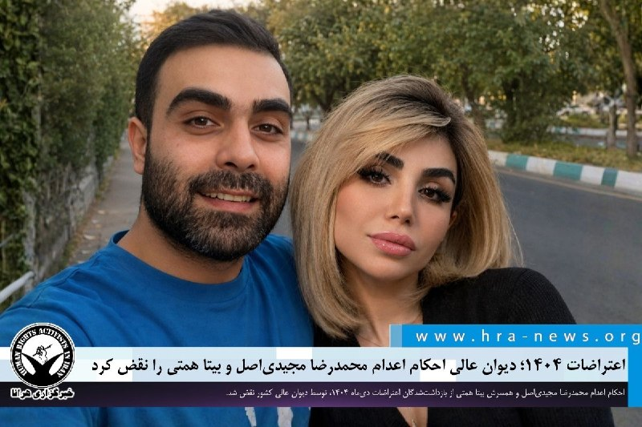

اعتراضات ۱۴۰۴؛ دیوان عالی احکام اعدام محمدرضا مجیدی‌اصل و بیتا همتی را نقض کرد

❗️
❗️
❗️
❗️
❗️– احکام اعدام محمدرضا مجیدی‌اصل و همسرش بیتا همتی از بازداشت‌شدگان اعتراضات دی‌ماه ۱۴۰۴، توسط دیوان عالی کشور نقض شد. این افراد پیشتر با حکم قاضی ایمان افشاری به #اعدام محکوم شده بودند.

به گزارش خبرگزاری هرانا، ارگان خبری مجموعه فعالان حقوق بشر در ایران، دیوان عالی کشور احکام اعدام دو تن از بازداشت‌شدگان اعتراضات دی‌ماه ۱۴۰۴، را نقض کرد.

بر این اساس، پرونده محمدرضا مجیدی‌اصل و بیتا همتی جهت رسیدگی مجدد به شعبه هم عرض ارجاع داده شده است.

#محمدرضا_مجیدی‌اصل #بیتا_همتی #اعتراضات_دی‌ماه

ادامه مطلب

↘️
@hranews_bot تماس ✉️ - @Hranews کانال هرانا 🆑

## Hranews — post 113088

  

آخرین داده‌های نت‌بلاکس نشان می‌دهد که قطع اینترنت در ایران پس از گذشت بیش از ۱۹۹۲ ساعت، وارد هشتاد و چهارمین روز خود شده و شبکه‌های بین‌المللی همچنان تا حد زیادی قطع هستند. این نهاد ناظر بر وضعیت دسترسی به #اینترنت در جهان همچنین اعلام کرد: با گذشت هر ساعت از قطع اینترنت در ایران، شکاف‌های اجتماعی و اقتصادی عمیق‌تر می‌شود، چرا که هرگونه ارتباط با جهان خارج به جایگاه، میزان تبعیت و برخورداری از امتیازات ویژه محدود شده است.

↘️
@hranews_bot تماس ✉️ - @Hranews کانال هرانا 🆑

## Hranews — post 113087

  

حبس بدون تصمیم؛ بلاتکلیفی بهزاد یزدانی و رومینا خزعلی، زوج بهائی ادامه دارد

❗️
❗️
❗️
❗️
❗️– بهزاد یزدانی و رومینا خزعلی، زوج #بهائی ساکن شیراز، علیرغم گذشت بیش از ۵۰ روز از زمان بازداشت، همچنان به صورت بلاتکلیف در زندان عادل آباد شیراز نگهداری می‌شوند.

به گزارش خبرگزاری هرانا، ارگان خبری مجموعه فعالان حقوق بشر در ایران، رومینا خزعلی و بهزاد یزدانی، کماکان در بازداشت و بلاتکلیفی به‌سر می‌برند.

یک منبع مطلع نزدیک به خانواده این زوج بهائی، ضمن تایید این خبر به هرانا گفت: “خانم خزعلی پیش از بازداشت با مشکلات جسمی متعددی از جمله میگرن و درد معده مواجه بوده، در آخرین تماس خود از وضعیت روحی نامساعداش خبر داده است. همچنین او پیش از بازداشت تحت عمل جراحی معده قرار گرفته بود. از سوی دیگر، با وجود پیگیری‌های مکرر بستگان این شهروندان از مراجع قضایی، مسئولان مربوطه تاکنون با آزادی آنان با قرار وثیقه موافقت نکرده‌اند. تداوم این وضعیت به افزایش نگرانی های خانواده این زوج بهائی منجر شده است.”

#بهزاد_یزدانی #رومینا_خزعلی

ادامه مطلب

↘️
@hranews_bot تماس ✉️ - @Hranews کانال هرانا 🆑

## manototv — post 105738

  <a href="telegram/content/manototv_105738_1779443850.mp4" target="_blank">🎬 Download video</a>

سازمان نظارت بر اینترنت نت‌بلاکس اعلام کرد خاموشی گسترده اینترنت در ایران وارد هشتاد و چهارمین روز شده و دسترسی به شبکه جهانی اینترنت برای بیش از ۱۹۹۲ ساعت همچنان به‌طور گسترده مختل است.
نت‌بلاکس در گزارشی نوشت ادامه این محدودیت‌ها شکاف‌های اجتماعی و اقتصادی را عمیق‌تر کرده و ارتباط با جهان خارج بیش از پیش به «امتیاز، تبعیت و دسترسی ویژه» وابسته شده است.

## manototv — post 105737

  <a href="telegram/content/manototv_105737_1779443851.mp4" target="_blank">🎬 Download video</a>

روزنامه وال‌استریت ژورنال گزارش داد هم‌زمان با آماده شدن ایران برای احتمال درگیری با آمریکا، بابک زنجانی، بازرگان ایرانی که خود را «ضدتحریم» معرفی می‌کند، یک شبکه مخفی پرداخت برای تأمین مالی نیروهای نظامی جمهوری اسلامی ایجاد کرده بود که محور اصلی آن صرافی ارز دیجیتال بایننس بوده است.
بر اساس این گزارش، این شبکه تا ماه دسامبر گذشته طی دو سال حدود ۸۵۰ میلیون دلار تراکنش را عمدتاً از طریق یک حساب معاملاتی در بزرگ‌ترین صرافی رمزارز جهان انجام داده است. گزارش‌های داخلی بایننس نشان می‌دهد نزدیکان زنجانی، از جمله خواهرش، شریک عاطفی او و یکی از مدیران شرکتش، حساب‌های دیگری را نیز اداره می‌کردند که همگی از دستگاه‌های مشترک استفاده می‌کردند؛ موضوعی که بازرسان بایننس آن را نشانه‌ای از تلاش برای دور زدن تحریم‌های آمریکا علیه ایران دانسته‌اند.
وال‌استریت ژورنال نوشت با وجود هشدارهای داخلی متعدد، حساب اصلی این شبکه دست‌کم ۱۵ ماه همچنان فعال مانده و تا ژانویه امسال نیز باز بوده است. این گزارش همچنین می‌گوید میلیاردها دلار تراکنش رمزارزی طی دو سال گذشته از طریق بایننس به شبکه‌های مالی مرتبط با سپاه پاسداران منتقل شده است.
مقام‌های خارجی مسئول پیگیری تأمین مالی تروریسم گفته‌اند امسال نیز انتقال پول از طریق حساب‌های بایننس به نهادهای وابسته به جمهوری اسلامی ادامه داشته و تراکنش‌هایی حتی در همین ماه شناسایی شده است.

## manototv — post 105736

  <a href="telegram/content/manototv_105736_1779443852.mp4" target="_blank">🎬 Download video</a>

رییس اورژانس پیش‌بیمارستانی و مدیریت حوادث دانشگاه علوم پزشکی البرز اعلام کرد بر اثر تصادف زنجیره‌ای در آزادراه کرج قزوین، سه نفر جان باختند و چهار نفر دیگر مجروح شدند.
به گزارش رسانه‌های داخلی، در این سانحه دو مرد و یک زن کشته شدند و سه مرد و یک زن دیگر نیز مجروح شدند.
مصدومان توسط نیروهای اورژانس به بیمارستان امام جعفر صادق نظرآباد منتقل شدند.

## manototv — post 105735

  <a href="telegram/content/manototv_105735_1779443853.mp4" target="_blank">🎬 Download video</a>

وزارت خارجه جمهوری اسلامی تحریم محمدرضا رئوف شیبانی، سفیر ایران در لبنان، از سوی آمریکا را «غیرقانونی» و «ناموجه» توصیف کرد و آن را نشانه «بی‌اعتنایی هیئت حاکمه آمریکا به اصول حقوق بین‌الملل و منشور سازمان ملل» دانست.
این وزارتخانه همچنین تحریم تعدادی از نمایندگان حزب‌الله و مسئولان لبنانی را محکوم کرد و اقدامات آمریکا را «سخیف» و در راستای تضعیف حاکمیت ملی لبنان و «فتنه‌انگیزی در جامعه لبنان» خواند.

## manototv — post 105734

  <a href="telegram/content/manototv_105734_1779443854.mp4" target="_blank">🎬 Download video</a>

روزنامه نیویورک‌تایمز گزارش داد ایران و عمان درباره ایجاد یک نظام پرداخت برای عبور کشتی‌ها از تنگه هرمز مذاکره کرده‌اند؛ اقدامی که می‌تواند به معنای دریافت هزینه از کشتی‌های عبوری در یکی از حیاتی‌ترین آبراه‌های جهان باشد.
بر اساس این گزارش، تهران و مسقط تأکید دارند موضوع مطرح‌شده «کارمزد خدمات» است، نه «عوارض عبور»؛ زیرا دریافت عوارض صرف برای عبور از تنگه‌های بین‌المللی طبق حقوق دریاها غیرقانونی تلقی می‌شود. با این حال، کارشناسان حقوقی می‌گویند اگر این کارمزد در عمل همان عوارض باشد، مشروعیت نخواهد داشت.
مقام‌های آمریکایی، از جمله دونالد ترامپ و مارکو روبیو، هرگونه دریافت پول برای عبور از تنگه هرمز را «غیرقابل قبول» توصیف کرده‌اند. کارشناسان نیز هشدار داده‌اند تغییر نام عوارض به «کارمزد» مانع چالش‌های حقوقی بین‌المللی نخواهد شد.

## manototv — post 105733

  <a href="telegram/content/manototv_105733_1779443855.mp4" target="_blank">🎬 Download video</a>

فرماندهی مرکزی آمریکا، سنتکام، در حساب کاربری خود در شبکه ایکس اعلام کرد جنگنده‌های نیروی دریایی آمریکا از ناو هواپیمابر «آبراهام لینکلن» در دریای عرب به پرواز درآمده‌اند.
سنتکام افزود گروه ضربتی ناو «آبراهام لینکلن» در بالاترین سطح آمادگی عملیاتی قرار دارد و در چارچوب اجرای محاصره دریایی آمریکا علیه بنادر ایران فعالیت می‌کند.

## alonews — post 121740

  <a href="telegram/content/alonews_121740_1779443856.webm" target="_blank">🎬 Download video</a>

👈الحدث به نقل از یک منبع پاکستانی:
هیچ جایگزینی برای توافق موقت بین واشنگتن و تهران وجود ندارد

🔴کاهش فاصله‌ها آسان نیست زیرا هر طرف سقف بالایی از خواسته‌ها دارد

🔴 مسائل بزرگ در توافق به بازه زمانی طولانی در مذاکره نیاز دارند

🔴آمریکا و ایران بر مواضع خود درباره اورانیوم پایبند هستند

✅ @AloNews خبر جنگ

## alonews — post 121739

  <a href="telegram/content/alonews_121739_1779443856.mp4" target="_blank">🎬 Download video</a>

👈مارکو روبیو: "درحال حاضر، در سازمان ملل متحد، قطعنامه‌ای داریم که توسط بحرین ارائه شده است. ما بسیار درگیر آن بوده‌ایم. این قطعنامه بالاترین تعداد همکاران ارائه‌دهنده را در تاریخ هر قطعنامه‌ای در شورای امنیت داشته است. متأسفانه، چند کشور در شورای امنیت به وتوی آن فکر می‌کنند که این امر تأسف‌بار خواهد بود."

✅ @AloNews خبر جنگ

## alonews — post 121738

  <a href="telegram/content/alonews_121738_1779443858.webm" target="_blank">🎬 Download video</a>

👈نیروی دریایی سپاه: طی شبانه روز گذشته ۳۵ فروند کشتی اعم از نفتکش، کانتینربر و سایر کشتی های تجاری پس از کسب مجوز با هماهنگی و تامین امنیت نیروی دریایی سپاه از تنگه هرمز عبور کردند.

✅ @AloNews خبر جنگ

## alonews — post 121737

  <a href="telegram/content/alonews_121737_1779443859.webm" target="_blank">🎬 Download video</a>

👈عربستان: با هرگونه تلاش برای سیاسی‌کردن حج با قاطعیت برخورد می‌کنیم

✅ @AloNews خبر جنگ

## alonews — post 121736

  <a href="telegram/content/alonews_121736_1779443859.mp4" target="_blank">🎬 Download video</a>

👈مارک روته، دبیرکل ناتو : اینکه آمریکا داره توان هسته‌ای و موشک‌های دوربرد ایران رو تضعیف می‌کنه

🔴 برای خاورمیانه، اروپا و کل دنیا خیلی مهمه

✅ @AloNews خبر جنگ

## alonews — post 121735

  <a href="telegram/content/alonews_121735_1779443861.webm" target="_blank">🎬 Download video</a>

👈انور قرقاش، مشاور رئیس امارات: دور دیگری از درگیری میان آمریکا و ایران فقط مسائل را پیچیده‌تر خواهد کرد

✅ @AloNews خبر جنگ

## alonews — post 121734

  <a href="telegram/content/alonews_121734_1779443861.webm" target="_blank">🎬 Download video</a>

👈زلنسکی : یه پالایشگاه نفت روسیه تو یاروسلاول رو زدیم

✅ @AloNews خبر جنگ

## alonews — post 121733

  <a href="telegram/content/alonews_121733_1779443862.webm" target="_blank">🎬 Download video</a>

👈 ادعای فارن افرز: «رهبران خلیج فارس از قبل، شروع به تنوع بخشیدن به تأمین‌کنندگان سلاح و مشارکت‌های امنیتی خود کرده‌اند.

🔴 برای اینکه بتوانند در مورد آنچه برایشان اتفاق می‌افتد، حرف بیشتری برای گفتن داشته باشند، باید هماهنگی بهتری بین خود، چه از نظر نظامی و چه از نظر دیپلماتیک، برقرار کنند.»

✅ @AloNews خبر جنگ

## alonews — post 121731

  <a href="telegram/content/alonews_121731_1779443862.webm" target="_blank">🎬 Download video</a>

👈ارتش اسرائیل به "میفدون" لبنان حمله کرد

✅ @AloNews خبر جنگ

## alonews — post 121730

  <a href="telegram/content/alonews_121730_1779443862.webm" target="_blank">🎬 Download video</a>

👈 تلگراف: قرار بود ترامپ با اتخاذ موضعی سختگیرانه‌ تر در قبال چین به پیشرفت هند کمک کند.

🔴 در عوض، جنگ‌ها و غیرقابل‌پیش‌بینی بودن او به جاه‌طلبی‌های نارندرا مودی برای تبدیل هند به یک ابرقدرت جهانی آسیب می‌رساند.

🔴 درگیری در ایران به هند ضربه سختی وارد کرده است. این کشور به نفت وارداتی متکی است که بخش عمده آن از طریق تنگه هرمز وارد می‌شود، بنابراین افزایش قیمت انرژی باعث تضعیف رشد، افزایش تورم و ترساندن سرمایه‌گذاران می‌شود.

🔴 مودیز در حال حاضر پیش‌بینی رشد هند را به ۶ درصد کاهش داده است - بسیار کمتر از ۸ درصدی که مودی می‌گوید برای تبدیل هند به یک کشور توسعه‌یافته تا سال ۲۰۴۷ لازم است.

🔴 در عین حال، ترامپ به چین و پاکستان، دو رقیب اصلی هند، نزدیک‌تر شده است و سال‌ها تلاش مودی برای ایجاد روابط قوی‌تر با واشنگتن را تضعیف می‌کند.

🔴 مودی اکنون در تلاش است تا با جستجوی قراردادهای جدید انرژی در خارج از کشور، کاهش فشارهای هزینه‌ای در داخل و حتی منصرف کردن هندی‌ها از خرید طلا و سفر به خارج از کشور، آسیب‌ها را محدود کند.

🔴 این بحران مشکل عمیق‌تری را آشکار کرده است: با وجود رشد سریع، هند هنوز فاقد قدرت تولید، زیرساخت‌ها و نفوذ اقتصادی لازم برای رقابت با چین است.

✅ @AloNews خبر جنگ

## alonews — post 121729

  <a href="telegram/content/alonews_121729_1779443863.webm" target="_blank">🎬 Download video</a>

👈مارکو روبیو، وزیر امور خارجه آمریکا مدعی شد که فکر نمی‌کنم هیچ کشوری موافقت کند که برای عبور از تنگه هرمز هزینه پرداخت کند.

✅ @AloNews خبر جنگ

## alonews — post 121728

  <a href="telegram/content/alonews_121728_1779443863.webm" target="_blank">🎬 Download video</a>

👈ادعای وزیر امور خارجه بریتانیا: ما با عزم ایالات متحده برای بازگشایی تنگه هرمز به روی کشتیرانی موافقیم

🔴 شرم‌آور است که ایران با مسدود کردن کشتیرانی بین‌المللی سعی در ربودن کل اقتصاد جهانی دارد.

✅ @AloNews خبر جنگ

## alonews — post 121727

  <a href="telegram/content/alonews_121727_1779443863.mp4" target="_blank">🎬 Download video</a>

👈مارکو روبیو می‌گوید تصمیمات در مورد نیروهای نظامی ایالات متحده در اروپا «تنبیهی» نیستند.

✅ @AloNews خبر جنگ

## alonews — post 121726

  <a href="telegram/content/alonews_121726_1779443866.webm" target="_blank">🎬 Download video</a>

👈ادعای منبع پاکستانی به الجزیره: اصرار آمریکا و ایران بر بالا بردن سقف خواسته‌هایشان درباره اورانیوم و تنگه هرمز، به بن‌بست در مذاکرات انجامیده

🔴اسلام‌آباد همچنان نسبت به امکان دستیابی به یک توافق موقت بین واشنگتن و تهران خوش‌بین است

✅ @AloNews خبر جنگ

## alonews — post 121725

  <a href="telegram/content/alonews_121725_1779443866.webm" target="_blank">🎬 Download video</a>

👈وزارت خارجه پاکستان: نخست‌وزیر پاکستان در سفر فردای خود به چین درباره ابتکاری مشترک برای پایان دادن به جنگ گفت‌وگو خواهد کرد

✅ @AloNews خبر جنگ

## alonews — post 121724

  <a href="telegram/content/alonews_121724_1779443867.webm" target="_blank">🎬 Download video</a>

👈وزیر امور خارجه آلمان: ما در حال آماده شدن برای مشارکت در تأمین امنیت تنگه هرمز تحت رهبری بریتانیا هستیم، اما انتظار ماموریتی مشابه ناتو را ندارم

✅ @AloNews خبر جنگ

## alonews — post 121723

  <a href="telegram/content/alonews_121723_1779443867.webm" target="_blank">🎬 Download video</a>

🔴فوری / وزیر امور خارجه آمریکا: در مذاکرات با ایران پیشرفت‌هایی حاصل شده است

✅ @AloNews خبر جنگ

## alonews — post 121722

  <a href="telegram/content/alonews_121722_1779443867.webm" target="_blank">🎬 Download video</a>

👈رویترز: وقتی که ترامپ گفت «تمدن ایران امشب خواهد مرد» مقامات آسیایی و اروپایی نگران بمباران اتمی ایران شدند که می‌توانست منجر به تشدید تنش هسته‌ای در اوکراین نیز بشود

✅ @AloNews خبر جنگ

## alonews — post 121721

  <a href="telegram/content/alonews_121721_1779443867.mp4" target="_blank">🎬 Download video</a>

👈حزب‌الله با پهپاد انتحاری، یکی از باتری‌های گنبد آهنین اسرائیل رو زد

✅ @AloNews خبر جنگ

---
📅 بروزرسانی: 1405/03/01 09:42
---

## VahidOOnLine — post 241465

  

سنتکام با انتشار تصاویری از پرواز جنگنده‌های نیروی دریایی آمریکا از ناو هواپیمابر «یواس‌اس آبراهام لینکلن» در دریای عرب، نوشت: «گروه رزمی ناو هواپیمابر آبراهام لینکلن در حالی که محاصره دریایی آمریکا علیه بنادر ایران را اجرا می‌کند، در بالاترین سطح آمادگی عملیاتی قرار دارد.»
‌🏁 🇬🇧 IranintlTV

🤖 @VahidOOnLine

## VahidOOnLine — post 241464

⭕️نیروی دریایی ژاپن ناوچه پیشرفته «جی‌اس ناتوری» را به خدمت گرفت

♦️ناوچه «جی‌اس ناتوری» از کلاس پیشرفته و رادارگریز «موگامی» پس از مراسم تحویل و برافراشته‌شدن پرچم، به ناوگان نیروی دریایی دفاع‌ازخود ژاپن پیوست. این مراسم در شهر ناگاساکی برگزار شد.

شرکت میتسوبیشی هوی اینداستریز تاکنون ۱۲ ناوچه از کلاس موگامی برای نیروی دریایی ژاپن ساخته و نسخه ارتقایافته این طراحی نیز از سوی ژاپن و نیروی دریایی سلطنتی استرالیا سفارش داده شده است.
ناوهای رده «موگامی» به‌دلیل فناوری پنهان‌کاری، سامانه‌های پیشرفته رزمی و توان عملیات چندمنظوره شناخته می‌شوند.
‌🇸🇦 Indypersian

🤖 @VahidOOnLine

## VahidOOnLine — post 241463

  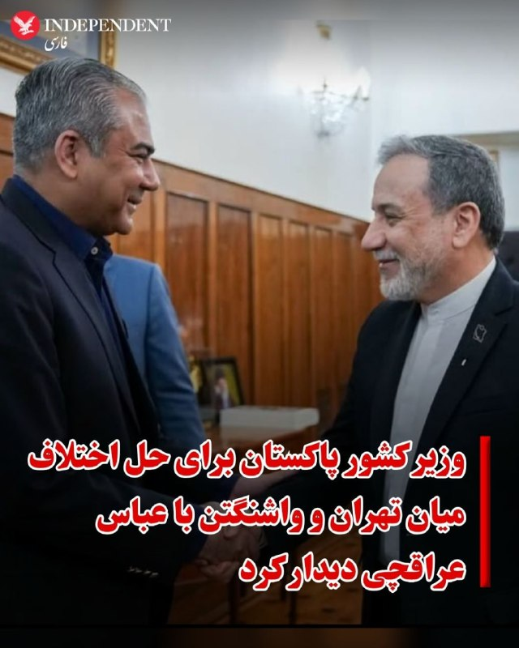

♦️سفارت پاکستان در ایران اعلام کرد که محسن نقوی، وزیر کشور پاکستان، روز جمعه یکم خرداد با عباس عراقچی، وزیر امور خارجه جمهوری اسلامی جلسه‌ای را برای بررسی پیشنهادات در راستای حل اختلافات میان تهران و واشنگتن برگزار کرده است.
این خبر درحالی اعلام شد که العربیه به نقل از یک منبع بلندپایه گزارش داد سفر عاصم منیر، فرمانده ارتش پاکستان، که قرار بود پنجشنبه ۳۱ اردیبهشت به تهران سفر کند به تاخیر افتاده است.
العربیه همچنین گزارش داد سفر احتمالی منیر به تهران ممکن است در صورت دستیابی دو طرف به «چارچوب توافق» انجام شود.
رویترز روز پنجشنبه به نقل از یک منبع ارشد ایرانی نوشت هنوز توافق نهایی میان تهران و واشنگتن حاصل نشده، اما اختلاف‌ها کاهش یافته است.
‌🇸🇦 Indypersian

🤖 @VahidOOnLine

## VahidOOnLine — post 241462

  

سفارت پاکستان در تهران اعلام کرد محسن نقوی، وزیر خارجه این کشور، بار دیگر با عباس عراقچی، وزیر خارجه جمهوری اسلامی، در تهران دیدار کرد. سفارت پاکستان در ایران از این دیدار با عنوان «جلسه بررسی پیشنهادات برای حل اختلافات» یاد کرده است.
‌🏁 🇬🇧 IranintlTV

🤖 @VahidOOnLine

## VahidOOnLine — post 241461

  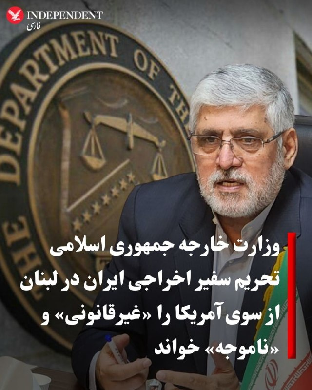

♦️وزارت خارجه جمهوری اسلامی تحریم محمدرضا رئوف شیبانی، سفیر اخراجی این کشور در لبنان از سوی آمریکا را «غیرقانونی» و «ناموجه» خواند و آن را «بی‌اعتنایی هیئت حاکمه آمریکا به اصول مسلم حقوق بین الملل و منشور سازمان ملل متحد» دانست.
این وزارتخانه در بیانیه‌ای که روز جمعه منتشر شد همچنین اقدام آمریکا در تحریم تعدادی از نمایندگان حزب‌الله در مجلس و مسئولان لبنانی را محکوم کرد.
وزارت خزانه‌داری آمریکا روز پنجشنبه اعلام کرد که محمدرضا رئوف شیبانی، سفیر جمهوری اسلامی در لبنان را همراه با ۹ نفر مرتبط با حزب‌الله که حاکمیت لبنان را تضعیف می‌کنند تحریم کرده است.
‌🇸🇦 Indypersian

🤖 @VahidOOnLine

## VahidOOnLine — post 241460

  

بر اساس اطلاعات رسیده به ایران‌اینترنشنال، بهزاد یزدانی و رومینا خزعلی، زوج بهائی ساکن شیراز و والدین دو نوجوان، بیش از ۵۰ روز است بدون دسترسی به وکیل و در وضعیت بلاتکلیف در زندان عادل‌آباد شیراز نگهداری می‌شوند.

یک منبع آگاه درباره وضعیت این زوج به ایران‌اینترنشنال گفت با وجود پیگیری‌های مکرر خانواده و نزدیکان، مقام‌های قضایی تاکنون به درخواست‌ها برای تبدیل قرار بازداشت به وثیقه پاسخی نداده‌اند.

به گفته این منبع آگاه، رومینا خزعلی که پیش از بازداشت با مشکلات جسمی متعددی از جمله میگرن و معده‌درد شدید مواجه بوده، در آخرین تماس خود از وضعیت نامساعد روحی نیز خبر داده است. او پیش از بازداشت تحت عمل جراحی معده قرار گرفته بود و ادامه بازداشت در چنین شرایطی، نگرانی خانواده درباره وضعیت جسمی و روانی این زوج را افزایش داده است.

بهزاد یزدانی، مترجم و ویراستار، و همسرش رومینا خزعلی، نقاش، به‌ترتیب در روزهای ۸ و ۹ فروردین‌ماه، از سوی ماموران اطلاعات سپاه در منزل شخصی‌شان در شیراز بازداشت شدند.
‌🏁 🇬🇧 IranintlTV

🤖 @VahidOOnLine

## VahidOOnLine — post 241459

♦️باشگاه النصر عربستان سعودی ویدیویی از کریستیانو رونالدو در حال طبل‌زنی و همراهی با تشویق هماهنگ هواداران پس از قهرمانی این تیم در لیگ عربستان سعودی منتشر کرد.

النصر در دیدار پایانی ۴ بر ۱ ضمک را شکست داد و قهرمان شد. رونالدو نیز با دو گل در این مسابقه، شمار گل‌های دوران حرفه‌ای خود را به ۹۷۳ رساند.

این سی‌وهفتمین جام دوران حرفه‌ای رونالدو و نخستین قهرمانی لیگ او از زمان قهرمانی با یوونتوس در سری‌آ ایتالیا در سال ۲۰۲۰ است.
‌🇸🇦 Indypersian

🤖 @VahidOOnLine

## VahidOOnLine — post 241458

  

نیویورک تایمز به نقل از مقام‌های ایرانی و افراد آگاه گزارش داد جمهوری اسلامی با عمان درباره مشارکت در ایجاد سامانه‌ای برای دریافت هزینه از کشتی‌های عبوری از تنگه هرمز گفت‌وگو کرده است.
دو فرد آگاه از این مذاکرات گفتند تهران قصد ایجاد نظام عوارض عبور که صرفا برای گذر کشتی‌ها هزینه دریافت کند، ندارد و گفت‌وگوها بر طرحی متمرکز است که از کشتی‌ها بابت ارائه خدمات هزینه دریافت شود.
به گفته دو مقام ایرانی آگاه، عمان در ابتدا مشارکت با ایران درباره تنگه را رد کرده بود، اما اکنون درباره سهمی از درآمدها وارد مذاکره شده است.
این مقام‌ها گفتند عمان به جمهوری اسلامی اعلام کرده حاضر است از نفوذ خود نزد همسایگان در خلیج فارس، از جمله بحرین، کویت، قطر، عربستان سعودی و امارات متحده عربی، و نیز نزد آمریکا استفاده کند تا این طرح را پیش ببرد، زیرا به مزایای اقتصادی بالقوه نظام دریافت هزینه پی برده است.
طبق این گزارش، جمهوری اسلامی و عمان تاکید دارند که بحث بر سر «کارمزد خدمات» است نه «عوارض عبور» و این یک تمایز حقوقی مهم ایجاد می‌کند، زیرا دریافت عوارض صرف برای عبور از تنگه‌های بین‌المللی طبق حقوق دریاها غیرقانونی تلقی می‌شود.
‌🏁 🇬🇧 IranintlTV

🤖 @VahidOOnLine

## VahidOOnLine — post 241457

  

♦️منابع آگاه به سی‌ان‌ان گفتند دونالد ترامپ جونیور (کوچک) آخر این هفته در جزیره‌ای کوچک در باهاما با بتینا اندرسون ازدواج خواهد کرد.
به گفته این منابع، انتظار نمی‌رود رئیس‌جمهور دونالد ترامپ در این مراسم حضور داشته باشد، هرچند او به خبرنگاران گفته بود تلاش می‌کند شرکت کند.
به گفته منابع، این زوج برای حفظ خصوصی و صمیمی بودن مراسم، فهرست مهمانان را به کمتر از ۵۰ نفر محدود کرده‌اند.
دو منبع آگاه به سی‌ان‌ان گفتند پسر ارشد رئیس‌جمهوری، آخر این هفته با بتینا اندرسون، چهره اجتماعی شناخته‌شده پالم‌بیچ، در جزیره‌ای کوچک در باهاما ازدواج خواهد کرد.
به گفته منابع، یکی از افرادی که انتظار نمی‌رود در این مراسم خصوصی حضور داشته باشد، خود رئیس‌جمهوری دونالد ترامپ است.
آن‌ها گفتند فهرست مهمانان عمدا کوچک نگه داشته شده است. تنها اعضای درجه‌یک خانواده و نزدیک‌ترین دوستان این زوج در مراسم حضور خواهند داشت و شمار کل مهمانان کمتر از ۵۰ نفر خواهد بود.
با این حال، ترامپ روز پنجشنبه بعدازظهر در دفتر بیضی کاخ سفید، هنگام پاسخ به پرسشی درباره این مراسم، موضعی مبهم اتخاذ کرد.
ترامپ به خبرنگاران گفت: «او دوست دارد من بروم، اما قرار است مراسمی کوچک و خصوصی باشد و من تلاش می‌کنم خودم را برسانم.»
او افزود: «الان زمان مناسبی برای من نیست. همه چیز مربوط به ایران و مسائل دیگر است.»
یکی از منابع به سی‌ان‌ان گفت، برنامه عمومی رئیس‌جمهوری نیز نشان نمی‌دهد که او قصد شرکت در مراسم را داشته باشد. سی‌ان‌ان برای دریافت نظر کاخ سفید و نماینده ترامپ جونیور تماس گرفته است.
منابع گفتند پسر ارشد و عروس ترامپ امیدوار بودند جزئیات مراسم ازدواج به رسانه‌ها درز نکند تا مراسم همچنان خصوصی و دور از توجه عمومی باقی بماند. این موضوع همچنین نگرانی‌های امنیتی را کاهش می‌دهد و مهمانان را از دردسرهای ناشی از تدابیر شدید امنیتی مرتبط با حضور رئیس‌جمهوری دور نگه می‌دارد.
به گفته منابع، خواهر و برادرهای ترامپ پسر قرار است در مراسم حضور داشته باشند.
این مراسم دومین ازدواج پسر ارشد ترامپ خواهد بود. او پیش‌تر ۱۲ سال با ونسا ترامپ ازدواج کرده بود و این دو در سال ۲۰۱۸ از هم جدا شدند. ونسا ترامپ روز چهارشنبه اعلام کرد که به سرطان پستان مبتلا شده است.
او پیش‌تر از سال ۲۰۲۰ تا ۲۰۲۴ با کیمبرلی گیلفویل، سفیر کنونی آمریکا در یونان و همسر سابق گوین نیوسام، فرماندار کالیفرنیا، نامزد بود.
‌🇸🇦 Indypersian

🤖 @VahidOOnLine

## VahidOOnLine — post 241456

  

وال‌استریت ژورنال گزارش داد میلیاردها دلار رمزارز از طریق صرافی بایننس به شبکه‌های مالی مرتبط با جمهوری اسلامی و سپاه پاسداران منتقل شده و این روند حتی تا ماه کنونی نیز ادامه داشته است. از جمله بابک زنجانی طی دو سال حدود ۸۵۰ میلیون دلار تراکنش در بایننس انجام داده است.
به گفته منابع آگاه، از ۸۵۰ میلیون دلار تراکنش بابک زنجانی در بایننس، حدود ۴۲۵ میلیون دلار آن می‌تواند صرف تامین مالی ساختار نظامی ایران شده باشد.
طبق این گزارش، علاوه بر زنجانی، بانک مرکزی ایران و نهادهای مرتبط با حکومت نیز صدها میلیون دلار رمزارز از طریق حساب‌های بایننس جابه‌جا کرده‌اند و برخی حساب‌ها با وجود هشدارهای داخلی، ماه‌ها فعال مانده‌اند.
این گزارش افزود که انتقال‌ها حتی پس از اعتراف بایننس در سال ۲۰۲۳ به نقض قوانین ضدپولشویی و پرداخت جریمه ۴.۳ میلیارد دلاری ادامه یافته و اکنون وزارت دادگستری آمریکا در حال بررسی دوباره این موضوع است.
بایننس ضمن تکذیب این اتهامات تاکید کرده است که فعالیت‌های غیرقانونی را تحمل نمی‌کند و هیچ تراکنش مستقیمی با نهادهای تحریم‌شده انجام نداده است.

‌🏁 🇬🇧 IranintlTV

🤖 @VahidOOnLine

## VahidOOnLine — post 241455

  

♦️اورشلیم‌پست به نقل از مقام‌های اطلاعاتی اسرائیل گزارش داد که تهران ممکن است در حال برنامه‌ریزی برای یک حمله غافلگیرانه با موشک و پهپاد علیه کشورهای خلیج فارس و اسرائیل باشد.
این هشدار در پی ارزیابی‌های امنیتی در بالاترین سطوح نظامی اسرائیل مطرح شده است. بر اساس این گزارش، تهران ممکن است پیش از آنکه مذاکرات آتش‌بس با ایالات متحده به نتیجه نهایی برسد، با هدف پیش‌دستی، عملیاتی مشابه با درگیری‌های گذشته انجام دهد.
در واکنش به این تهدید، ارتش اسرائیل همکاری‌های نظامی و اطلاعاتی خود با آمریکا را به شکل چشمگیری افزایش داده است. علاوه بر تبادل اطلاعات درباره فعالیت‌های غیرعادی، حجم انتقال تجهیزات نظامی از سوی ایالات متحده به اسرائیل در ماه اخیر افزایش یافته تا سامانه‌های رهگیری موشکی و توان دفاعی دو طرف برای هرگونه سناریوی احتمالی تقویت شود.
‌🇸🇦 Indypersian

🤖 @VahidOOnLine

## VahidOOnLine — post 241454

  <a href="telegram/content/VahidOOnLine_241454_1779430352.mp4" target="_blank">🎬 Download video</a>

رستم نبی‌یف، چترباز سابق ارتش روسیه که هر دو پایش را از دست داده، به قله اورست صعود کرد و به نخستین فرد در جهان تبدیل شد که بدون استفاده از پاهای مصنوعی به بلندترین قله جهان رسیده است.

خیم لال گوتام، مسئول دفتر هماهنگی کمپ اصلی اورست، به خبرگزاری آنادولو گفت نبی‌یف با موفقیت به قله رسیده و اکنون در حال بازگشت به کمپ اصلی است.

نبی‌یف در سال ۲۰۱۵ پس از فروریختن ساختمان محل استقرار نظامیان هنگام خواب، هر دو پایش را از دست داد. در آن حادثه چند سرباز کشته شدند. او پس از آن برای نشان دادن توانایی افراد دارای قطع عضو، به قله البروس در روسیه و سپس ماناسلو در نپال صعود کرد.

نبی‌یف پس از این صعود در صفحه اینستاگرامش نوشت: «این صعود را به همه کسانی تقدیم می‌کنم که اکنون مرا تماشا می‌کنند. فقط می‌خواهم یک چیز بگویم؛ تا وقتی در وجودتان زندگی جریان دارد، بجنگید. لطفا تا آخر بجنگید. ارزشش را دارد.»
‌🇸🇦 Indypersian

🤖 @VahidOOnLine

## VahidOOnLine — post 241453

  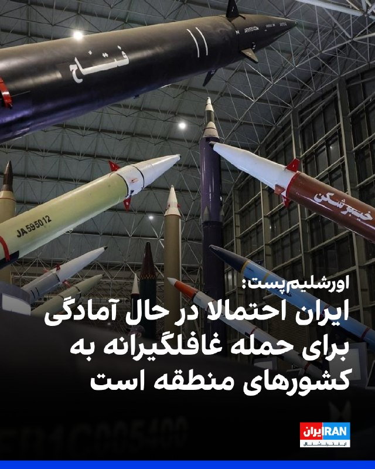

اورشلیم‌پست به نقل از مقام‌های اطلاعاتی اسرائیل گزارش داد جمهوری اسلامی ممکن است در حال برنامه‌ریزی برای یک حمله غافلگیرانه موشکی و پهپادی علیه کشورهای خلیج فارس و اسرائیل باشد. این احتمال پس از ارزیابی وضعیت از سوی فرماندهان ارشد نظامی و وزیر دفاع اسرائیل مطرح شده است.
طبق این گزارش، مقام‌های امنیتی گفتند تهران ممکن است پیش از آنکه آمریکا و اسرائیل به این نتیجه برسند مسیر دیپلماتیک دیگر کارایی ندارد، دست به اقدام بزند و حمله‌ای غافلگیرانه مشابه حملات آغاز عملیات «خشم حماسی» و «خروشان شیران» انجام دهد.
این گزارش افزود نیروی هوایی و اداره عملیات ارتش اسرائیل، به سرپرستی سرلشکر هیدای زیلبرمن و دیگر مقام‌های ارشد، مجموعه‌ای از گفت‌وگوها را با همتایان آمریکایی برای افزایش آمادگی انجام دادند که شامل انتقال اطلاعات درباره فعالیت‌های غیرمعمول جمهوری اسلامی بود.
همچنین ایال زامیر، رییس ستاد کل ارتش اسرائیل، در چارچوب یک ارزیابی کلی وضعیت، جلسات توجیهی امنیتی با فرماندهان نظامی برگزار کرد که این ارزیابی هم جنبه دفاعی و هم تهاجمی داشت.

‌🏁 🇬🇧 IranintlTV

🤖 @VahidOOnLine

## VahidOOnLine — post 241452

  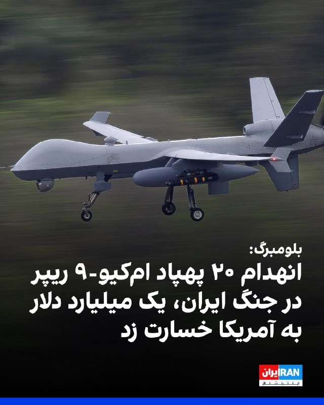

بلومبرگ به نقل از منابع آگاه گزارش داد در جنگ ایران، بیش از ۲۰ پهپاد ام‌کیو-۹ ریپر آمریکا که برای شناسایی، نظارت و حمله به کار می‌روند، منهدم شده‌اند و در نتیجه نزدیک به یک میلیارد دلار به ناوگان پهپادی آمریکا خسارت وارد شده است.

طبق این گزارش، بسیاری از این پهپادها با پدافند هوایی جمهوری اسلامی سرنگون شدند و برخی دیگر در حملات به پایگاه‌های آمریکا یا در حوادث عملیاتی از بین رفتند که این وضعیت نشان‌دهنده چالش‌های عملیاتی در برابر سامانه‌های دفاع هوایی تهران است.
‌🏁 🇬🇧 IranintlTV

🤖 @VahidOOnLine

## VahidOOnLine — post 241451

  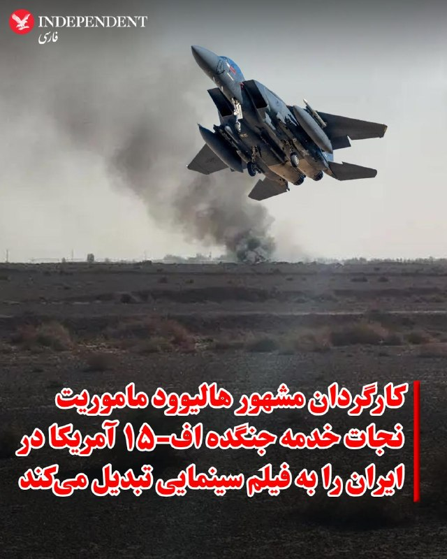

♦️به گزارش فاکس، هالیوود بدون اتلاف وقت در حال تبدیل ماموریت نجات نیروهای آمریکایی در ایران به یک فیلم سینمایی است.
ارتش ایالات متحده در ماه آوریل یک عملیات نجات بسیار پیچیده را انجام داد تا خدمه یک جنگنده اف-۱۵ که در ایران سقوط کرده بود را نجات دهد.
خلبان توسط نیروهای ویژه نجات نیروی هوایی آمریکا پیدا و خارج شد. جست‌وجو برای افسر تسلیحات حدود ۳۶ ساعت طول کشید و در نهایت نیروهای ویژه سطح یک وارد عملیات شدند تا این افسر ناشناس را نجات دهند.
به گزارش فاکس، این عملیات یکی از جسورانه‌ترین و چشمگیرترین مأموریت‌های نجات در تاریخ نظامی مدرن توصیف شده است.
اکنون قرار است این داستان به فیلم تبدیل شود.
هالیوود به‌سرعت در حال ساخت این ماجرا برای پرده سینما است.
بر اساس گزارش ددلاین در روز دوشنبه، مایکل بی، کارگردان مشهور هالیوود، کارگردانی فیلمی درباره این عملیات را بر عهده خواهد داشت. این فیلم بر اساس کتابی در دست انتشار از میچل زوکوف درباره این ماموریت ساخته می‌شود.
مایکل بی سابقه طولانی در ساخت فیلم‌های پرفروش دارد. از آثار مهم او می‌توان به «پرل هاربر»، «ترانسفورمرز» و «آرماگدون» اشاره کرد.
فیلم‌های او تاکنون بیش از ۱۰ میلیارد دلار در جهان فروش داشته‌اند.
سینما سابقه طولانی در تبدیل رویدادهای مهم نظامی به فیلم‌های پرفروش دارد. آثاری مانند «سی دقیقه پس از نیمه‌شب، «نجات سرباز رایان» و «سقوط بلک‌هاوک» نمونه‌های معروفی هستند.
مأموریت نجات در ایران از نظر هالیوود یک داستان کامل برای فیلم سینمایی است: جنگ گسترده، سقوط جنگنده، عملیات سریع نجات خلبان، عملیات طولانی‌تر و خشن‌تر برای نجات افسر تسلیحات، و تصاویر و پیامدهای دراماتیک در زمین.
به گزارش فاکس، زمان مشخصی برای اکران فیلم اعلام نشده، اما بعید است قبل از اواخر ۲۰۲۷ منتشر شود.
‌🇸🇦 Indypersian

🤖 @VahidOOnLine

## VahidOOnLine — post 241450

  

♦️باستان‌شناسان در شهر پادربورن آلمان، در جریان کاوش‌های خود به یافته‌ای بی‌نظیر دست یافتند؛ یک دفترچه یادداشت مومی که پس از ۸ قرن همچنان سالم باقی مانده است. این دفترچه ۱۰ صفحه‌ای که درون یک کیف چرمی ظریف قرار داشت، در اعماق یک توالت قدیمی کشف شد.
دلیل اصلی سالم ماندن این اثر ارگانیک، محیط «بی‌هوازی» این مکان بوده که از تجزیه چوب، چرم و موم جلوگیری کرده است. به گفته مرمت‌گران، با وجود گذشت سده‌ها، این یافته همچنان بوی نامطبوعی به همراه داشت.
این دفترچه که به خط لاتین نوشته شده، متعلق به طبقه نخبگان یا بازرگانان متمول آن دوران بوده است. نقش «گل زنبق» حک‌شده روی کیف چرمی و حتی بقایای پارچه‌های ابریشمی که به نظر می‌رسد به عنوان دستمال توالت لوکس استفاده می‌شده، نشان‌دهنده جایگاه اجتماعی بالای صاحب این اشیاء است. کارشناسان اکنون در حال استفاده از تکنولوژی‌های پیشرفته برای رمزگشایی از یادداشت‌های درهم‌تنیده این بازرگان قرون‌وسطایی هستند؛ یادداشت‌هایی که احتمالاً روایتگر معاملات تجاری و افکار شخصی او در قرن سیزدهم میلادی است.
‌🇸🇦 Indypersian

🤖 @VahidOOnLine

## VahidOOnLine — post 241449

  

واشینگتن فری‌بیکن در گزارشی به نقل از کارشناسان سیاست‌گذاری اندیشکده هادسون نوشت دولت گرجستان که زمانی متحدی قدرتمند برای آمریکا بود، اکنون تحت رهبری حزب اقتدارگرای «رویای گرجستان»، این کشور را به مکانی برای فعالیت‌های اطلاعاتی و تروریستی سپاه تبدیل کرده است.
بر اساس گزارش تحقیقی اخیر اندیشکده هادسون، گرجستان اکنون «بستر راهبردی جدیدی برای ایران در اوراسیا» فراهم کرده که به «زمینی حاصلخیز برای جذب نیروهای اطلاعاتی و بسیج شبه‌نظامیان» تبدیل شده است. این تغییر چشمگیر به سپاه امکان داده است تا منابع اطلاعاتی گرجی را که می‌توانند آزادانه در اروپا و حتی آمریکا رفت‌وآمد و در جهت اقدامات تروریستی فعالیت کنند، جذب کند.
واشینگتن فری‌بیکن به نقل از قانون‌گذاران و کارشناسان اندیشکده هادسون نوشت روابط جمهوری اسلامی و دولت تحت رهبری حزب «رویای گرجستان» سال‌ها در حال شکل‌گیری بوده است، اما در جریان جنگ آمریکا با ایران به شکلی نگران‌کننده تشدید شد و این متحد سابق آمریکا به روسیه اجازه داد از حریم هوایی‌اش برای انتقال هوایی تجهیزات به تهران استفاده کند.
‌🏁 🇬🇧 IranintlTV

🤖 @VahidOOnLine

## VahidOOnLine — post 241448

♦️پاریسی‌ها صبح پنج‌شنبه با منظره‌ای شگفت‌انگیز در قلب شهر بیدار شدند؛ هنرمند مشهور فرانسوی، «جِـی‌آر» (JR)، با نصب سازه‌ای عظیم و بادی، پل تاریخی «پون‌نوف» (Pont Neuf) را به یک غار سنگی خیره‌کننده تبدیل کرده است.
این اثر هنری که با نام «غار پون‌نوف» شناخته می‌شود، با استفاده از پارچه‌های چاپ‌شده و هوای فشرده ساخته شده و ۱۲۰ متر طول دارد. این سازه که تا ۱۸ متر ارتفاع می‌گیرد، جلوه‌ای کوهستانی به قدیمی‌ترین پل قرن هفدهمی پاریس بخشیده است.
 «جِـی‌آر» هدف از این پروژه را بازتعریف معماری شهری و پیوند دوباره طبیعت با محیط تاریخی شهر اعلام کرده است.
‌🇸🇦 Indypersian

🤖 @VahidOOnLine

## VahidOOnLine — post 241447

  

♦️کریستیانو رونالدو، ستاره پرتغالی النصر، پس از پیروزی ۴ بر ۱ تیمش مقابل ضمک و مسجل شدن عنوان قهرمانی لیگ حرفه‌ای عربستان سعودی، این موفقیت بزرگ را در کنار خانواده‌اش جشن گرفت. النصر در هفته پایانی فصل ۲۰۲۵–۲۶ موفق شد با درخشش رونالدو که دو گل از چهار گل تیمش را به ثمر رساند، با ۸۶ امتیاز بالاتر از الهلال بر سکوی نخست لیگ عربستان سعودی بایستد.
این نخستین قهرمانی رونالدو در لیگ عربستان سعودی پس از سه فصل حضور در این کشور است؛ جامی که النصر را پس از ۷ سال انتظار، دوباره به اوج فوتبال سعودی بازگرداند. فوق‌ستاره پرتغالی با این دو گل، آمار گل‌های دوران حرفه‌ای خود را به عدد خیره‌کننده ۹۷۳ رساند تا سی‌وهفتمین جام دوران درخشان ورزشی‌اش را در ریاض بالای سر ببرد.
‌🇸🇦 Indypersian

🤖 @VahidOOnLine

## VahidOOnLine — post 241446

  

♦️مجلس نمایندگان روز پنج‌شنبه رای‌گیری درباره یک قطعنامه مربوط به اختیارات جنگ را که با رهبری دموکرات‌ها و با هدف محدود کردن اقدام نظامی دونالد ترامپ علیه رژیم ایران ارائه شده بود، به تعویق انداخت.
گزارش شده است که جمهوری‌خواهان مجلس به دلیل مشکلات حضور نمایندگان، رای‌گیری را عقب انداخته‌اند.
به گزارش فاکس، ترامپ و رهبران جمهوری‌خواه استدلال کرده‌اند که رئیس‌جمهور اختیار یک‌جانبه برای مقابله نظامی با تهران را دارد. آن‌ها همچنین هشدار داده‌اند که پایان دادن به جنگ، حکومت ایران را تقویت می‌کند و این موضوع به ضرر امنیت ملی ایالات متحده و متحدان غربی خواهد بود.
جمهوری‌خواهان مجلس هفته گذشته به‌طور بسیار نزدیک یک قطعنامه مشابه درباره اختیارات جنگ را رد کرده بودند. جرد گلدن (نماینده دموکرات از ایالت مین)، در آن رای برخلاف حزب خود عمل کرده و با این طرح مخالفت کرده بود، با این استدلال که این قطعنامه شامل مهلت خروج نیروها در تاریخ ۳۰ مارس است که مدت آن گذشته است.
با این حال، گلدن گفته بود از نسخه بعدی «قطعنامه پاک» درباره اختیارات جنگ که به صحن بیاید حمایت خواهد کرد.
چهار سناتور جمهوری‌خواه در رای‌گیری اخیر برای پیشبرد یک قطعنامه اختیارات جنگ به دموکرات‌ها پیوستند. سناتور بیل کسیدی (جمهوری‌خواه از لوئیزیانا)، که در انتخابات مقدماتی حزب جمهوری‌خواه شکست خورده بود، برای نخستین بار از این قطعنامه حمایت کرد.
‌🇸🇦 Indypersian

🤖 @VahidOOnLine

## WithYashar — post 11919

## WithYashar — post 11918

## WithYashar — post 11916

تو خواب نداری یاشار؟! 😂

## WithYashar — post 11915

زمانی بدتر میشه که پاسخ با پارازیت میاد و بعد با پارازیت جواب داده میشه ، کلا دو دکل اصلی میرن کنار پارازیت ها میوفتن به جون هم و تصویر کاملا از دست میره و برفکی میشه !
@withyashar

## WithYashar — post 11913

خیلی ساده است یکی یه سیگنالی میده برای یک جوابی بعد تمام پارازیت ها میان رو موج! خوب بزارید پیغامش درست برسه و جواب بگیره !

## WithYashar — post 11912

خدا نکنه یکی یه انتقادی کنه همه مافیا ها میان تو بازی خودشونو سفید کنند 🤣 به هر حال ما وارد موج نمیشیم و فقط خبر ، تحلیل و فرهنگ سازی رو ادامه میدیم

## WithYashar — post 11911

یاشار چرا همه به جون هم افتادن
کی درست میگه
چیکار میشه کرد

## WithYashar — post 11910

وبسایت خبری «ددلاین» گزارش داد شرکت فیلمسازی «یونیورسال پیکچرز» با همراهی مایکل بی، کارگردان آمریکایی، در حال تهیه یک فیلم سینمایی درباره نجات دو خلبان آمریکایی است که پس از سرنگونی جنگنده «اف۱۵-ای» در عملیات «خشم حماسی» در داخل خاک ایران گرفتار شده بودند.
بر اساس این گزارش، این فیلم بر پایه کتابی در دست انتشار از «میچل زوکاف» ساخته می‌شود که انتشارات «هارپرکالینز» قرار است آن را در سال ۲۰۲۷ منتشر کند.
@withyashar

## WithYashar — post 11909

## WithYashar — post 11908

اتاق جنگ با یاشار : آمریکا حتماً داره آخرین اولتیماتوم رو میده….
@withyashar

## WithYashar — post 11907

اتاق جنگ با شما : سیریک جنگنده اومد ارتفاع پاین تو شهر مانور داد الان
@withyashar

## WithYashar — post 11906

درود ياشار جان
سيريك الان نزديك صبحه و يهو صدا جنگنده اومد،رسما ا بالا سرمون رد شد،و چند ديقه بعد پنجره ها لرزيد

## WithYashar — post 11905

  <a href="telegram/content/WithYashar_11905_1779430355.mp4" target="_blank">🎬 Download video</a>

اتاق جنگ با یاشار : یه خبرایی هست …
@withyashar

## WithYashar — post 11903

Martik (t.me/withyashar) – Parandeh (IG @yashar)

## mwarmonitor — post 9450

🔴روزنامه وال‌استریت ژورنال گزارش داد: وزارت دادگستری ایالات متحده تحقیقاتی را درباره استفاده ایران از پلتفرم بایننس به‌منظور دور زدن احتمالی تحریم‌ها آغاز کرده است.

@mwarmonitor

## FoxNewsTwitter — post 342084

  <a href="telegram/content/FoxNewsTwitter_342084_1779430357.mp4" target="_blank">🎬 Download video</a>

Fox News (Twitter/X)

A former U.S. attorney who once prosecuted federal crimes in Texas is now facing felony charges herself.

Authorities say Jennifer Lowery allegedly left the scene of a Houston crash that injured another driver despite remaining nearby for several minutes after the collision.

Investigators say CCTV footage appears to show Lowery driving away without checking on the injured person or rendering aid.

The former U.S. attorney for the Southern District of Texas has now been charged with felony failure to stop and render aid.

## FoxNewsTwitter — post 342083

  <a href="telegram/content/FoxNewsTwitter_342083_1779430358.mp4" target="_blank">🎬 Download video</a>

Fox News (Twitter/X)

"Completely barbaric."

Former Navy SEAL Rob O'Neill, the man who is credited with killing Osama bin Laden, ripped Graham Platner for the Senate hopeful's controversial post trashing a soldier who was wounded in a clash with Taliban fighters.

In a 2019 Reddit post, Platner said of the soldier: "Dumb motherf----- didn't deserve to live. At least his stupidity and fat a-- wheezing are available for all future infantrymen to witness and hold in contempt. Poor marksmanship on the Taliban's part is the only reason this mouthbreather made it home, he managed to make every possible s--- decision possible when it comes to small unit combat."

## IranIntlTV — post 338346

  <a href="telegram/content/IranIntlTV_338346_1779430359.mp4" target="_blank">🎬 Download video</a>

سرخط خبرهای جمعه ۱ خرداد
@iranintltv

## IranIntlTV — post 338345

  

سنتکام با انتشار تصاویری از پرواز جنگنده‌های نیروی دریایی آمریکا از ناو هواپیمابر «یواس‌اس آبراهام لینکلن» در دریای عرب، نوشت: «گروه رزمی ناو هواپیمابر آبراهام لینکلن در حالی که محاصره دریایی آمریکا علیه بنادر ایران را اجرا می‌کند، در بالاترین سطح آمادگی عملیاتی قرار دارد.»
https://iranintl.com/202605224244

## IranIntlTV — post 338344

  

سفارت پاکستان در تهران اعلام کرد محسن نقوی، وزیر خارجه این کشور، بار دیگر با عباس عراقچی، وزیر خارجه جمهوری اسلامی، در تهران دیدار کرد. سفارت پاکستان در ایران از این دیدار با عنوان «جلسه بررسی پیشنهادات برای حل اختلافات» یاد کرده است.
https://iranintl.com/202605228409

## IranIntlTV — post 338343

  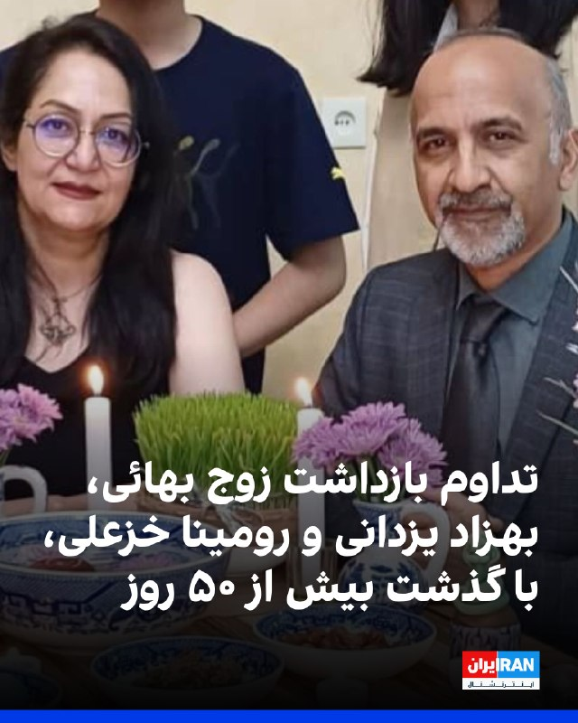

بر اساس اطلاعات رسیده به ایران‌اینترنشنال، بهزاد یزدانی و رومینا خزعلی، زوج بهائی ساکن شیراز و والدین دو نوجوان، بیش از ۵۰ روز است بدون دسترسی به وکیل و در وضعیت بلاتکلیف در زندان عادل‌آباد شیراز نگهداری می‌شوند.

یک منبع آگاه درباره وضعیت این زوج به ایران‌اینترنشنال گفت با وجود پیگیری‌های مکرر خانواده و نزدیکان، مقام‌های قضایی تاکنون به درخواست‌ها برای تبدیل قرار بازداشت به وثیقه پاسخی نداده‌اند.

به گفته این منبع آگاه، رومینا خزعلی که پیش از بازداشت با مشکلات جسمی متعددی از جمله میگرن و معده‌درد شدید مواجه بوده، در آخرین تماس خود از وضعیت نامساعد روحی نیز خبر داده است. او پیش از بازداشت تحت عمل جراحی معده قرار گرفته بود و ادامه بازداشت در چنین شرایطی، نگرانی خانواده درباره وضعیت جسمی و روانی این زوج را افزایش داده است.

بهزاد یزدانی، مترجم و ویراستار، و همسرش رومینا خزعلی، نقاش، به‌ترتیب در روزهای ۸ و ۹ فروردین‌ماه، از سوی ماموران اطلاعات سپاه در منزل شخصی‌شان در شیراز بازداشت شدند.
https://iranintl.com/202605220152

## IranIntlTV — post 338342

  

نیویورک تایمز به نقل از مقام‌های ایرانی و افراد آگاه گزارش داد جمهوری اسلامی با عمان درباره مشارکت در ایجاد سامانه‌ای برای دریافت هزینه از کشتی‌های عبوری از تنگه هرمز گفت‌وگو کرده است.
دو فرد آگاه از این مذاکرات گفتند تهران قصد ایجاد نظام عوارض عبور که صرفا برای گذر کشتی‌ها هزینه دریافت کند، ندارد و گفت‌وگوها بر طرحی متمرکز است که از کشتی‌ها بابت ارائه خدمات هزینه دریافت شود.
به گفته دو مقام ایرانی آگاه، عمان در ابتدا مشارکت با ایران درباره تنگه را رد کرده بود، اما اکنون درباره سهمی از درآمدها وارد مذاکره شده است.
این مقام‌ها گفتند عمان به جمهوری اسلامی اعلام کرده حاضر است از نفوذ خود نزد همسایگان در خلیج فارس، از جمله بحرین، کویت، قطر، عربستان سعودی و امارات متحده عربی، و نیز نزد آمریکا استفاده کند تا این طرح را پیش ببرد، زیرا به مزایای اقتصادی بالقوه نظام دریافت هزینه پی برده است.
طبق این گزارش، جمهوری اسلامی و عمان تاکید دارند که بحث بر سر «کارمزد خدمات» است نه «عوارض عبور» و این یک تمایز حقوقی مهم ایجاد می‌کند، زیرا دریافت عوارض صرف برای عبور از تنگه‌های بین‌المللی طبق حقوق دریاها غیرقانونی تلقی می‌شود.

## IranIntlTV — post 338341

  

وال‌استریت ژورنال گزارش داد میلیاردها دلار رمزارز از طریق صرافی بایننس به شبکه‌های مالی مرتبط با جمهوری اسلامی و سپاه پاسداران منتقل شده و این روند حتی تا ماه کنونی نیز ادامه داشته است. از جمله بابک زنجانی طی دو سال حدود ۸۵۰ میلیون دلار تراکنش در بایننس انجام داده است.
به گفته منابع آگاه، از ۸۵۰ میلیون دلار تراکنش بابک زنجانی در بایننس، حدود ۴۲۵ میلیون دلار آن می‌تواند صرف تامین مالی ساختار نظامی ایران شده باشد.
طبق این گزارش، علاوه بر زنجانی، بانک مرکزی ایران و نهادهای مرتبط با حکومت نیز صدها میلیون دلار رمزارز از طریق حساب‌های بایننس جابه‌جا کرده‌اند و برخی حساب‌ها با وجود هشدارهای داخلی، ماه‌ها فعال مانده‌اند.
این گزارش افزود که انتقال‌ها حتی پس از اعتراف بایننس در سال ۲۰۲۳ به نقض قوانین ضدپولشویی و پرداخت جریمه ۴.۳ میلیارد دلاری ادامه یافته و اکنون وزارت دادگستری آمریکا در حال بررسی دوباره این موضوع است.
بایننس ضمن تکذیب این اتهامات تاکید کرده است که فعالیت‌های غیرقانونی را تحمل نمی‌کند و هیچ تراکنش مستقیمی با نهادهای تحریم‌شده انجام نداده است.

https://iranintl.com/202605222445

## IranIntlTV — post 338340

  

اورشلیم‌پست به نقل از مقام‌های اطلاعاتی اسرائیل گزارش داد جمهوری اسلامی ممکن است در حال برنامه‌ریزی برای یک حمله غافلگیرانه موشکی و پهپادی علیه کشورهای خلیج فارس و اسرائیل باشد. این احتمال پس از ارزیابی وضعیت از سوی فرماندهان ارشد نظامی و وزیر دفاع اسرائیل مطرح شده است.
طبق این گزارش، مقام‌های امنیتی گفتند تهران ممکن است پیش از آنکه آمریکا و اسرائیل به این نتیجه برسند مسیر دیپلماتیک دیگر کارایی ندارد، دست به اقدام بزند و حمله‌ای غافلگیرانه مشابه حملات آغاز عملیات «خشم حماسی» و «خروشان شیران» انجام دهد.
این گزارش افزود نیروی هوایی و اداره عملیات ارتش اسرائیل، به سرپرستی سرلشکر هیدای زیلبرمن و دیگر مقام‌های ارشد، مجموعه‌ای از گفت‌وگوها را با همتایان آمریکایی برای افزایش آمادگی انجام دادند که شامل انتقال اطلاعات درباره فعالیت‌های غیرمعمول جمهوری اسلامی بود.
همچنین ایال زامیر، رییس ستاد کل ارتش اسرائیل، در چارچوب یک ارزیابی کلی وضعیت، جلسات توجیهی امنیتی با فرماندهان نظامی برگزار کرد که این ارزیابی هم جنبه دفاعی و هم تهاجمی داشت.

https://iranintl.com/202605225355

## IranIntlTV — post 338339

  

بلومبرگ به نقل از منابع آگاه گزارش داد در جنگ ایران، بیش از ۲۰ پهپاد ام‌کیو-۹ ریپر آمریکا که برای شناسایی، نظارت و حمله به کار می‌روند، منهدم شده‌اند و در نتیجه نزدیک به یک میلیارد دلار به ناوگان پهپادی آمریکا خسارت وارد شده است.

طبق این گزارش، بسیاری از این پهپادها با پدافند هوایی جمهوری اسلامی سرنگون شدند و برخی دیگر در حملات به پایگاه‌های آمریکا یا در حوادث عملیاتی از بین رفتند که این وضعیت نشان‌دهنده چالش‌های عملیاتی در برابر سامانه‌های دفاع هوایی تهران است.
https://iranintl.com/202605221522

## IranIntlTV — post 338338

  

واشینگتن فری‌بیکن در گزارشی به نقل از کارشناسان سیاست‌گذاری اندیشکده هادسون نوشت دولت گرجستان که زمانی متحدی قدرتمند برای آمریکا بود، اکنون تحت رهبری حزب اقتدارگرای «رویای گرجستان»، این کشور را به مکانی برای فعالیت‌های اطلاعاتی و تروریستی سپاه تبدیل کرده است.
بر اساس گزارش تحقیقی اخیر اندیشکده هادسون، گرجستان اکنون «بستر راهبردی جدیدی برای ایران در اوراسیا» فراهم کرده که به «زمینی حاصلخیز برای جذب نیروهای اطلاعاتی و بسیج شبه‌نظامیان» تبدیل شده است. این تغییر چشمگیر به سپاه امکان داده است تا منابع اطلاعاتی گرجی را که می‌توانند آزادانه در اروپا و حتی آمریکا رفت‌وآمد و در جهت اقدامات تروریستی فعالیت کنند، جذب کند.
واشینگتن فری‌بیکن به نقل از قانون‌گذاران و کارشناسان اندیشکده هادسون نوشت روابط جمهوری اسلامی و دولت تحت رهبری حزب «رویای گرجستان» سال‌ها در حال شکل‌گیری بوده است، اما در جریان جنگ آمریکا با ایران به شکلی نگران‌کننده تشدید شد و این متحد سابق آمریکا به روسیه اجازه داد از حریم هوایی‌اش برای انتقال هوایی تجهیزات به تهران استفاده کند.
https://iranintl.com/202605224852

## IranIntlTV — post 338337

  

وبسایت خبری «ددلاین» گزارش داد شرکت فیلمسازی «یونیورسال پیکچرز» با همراهی مایکل بی، کارگردان آمریکایی، در حال تهیه یک فیلم سینمایی درباره نجات دو خلبان آمریکایی است که پس از سرنگونی جنگنده «اف۱۵-ای» در عملیات «خشم حماسی» در داخل خاک ایران گرفتار شده بودند.
بر اساس این گزارش، این فیلم بر پایه کتابی در دست انتشار از «میچل زوکاف» ساخته می‌شود که انتشارات «هارپرکالینز» قرار است آن را در سال ۲۰۲۷ منتشر کند.
این پروژه در حال حاضر در مرحله توسعه قرار دارد و جزئیات بیشتری از زمان تولید یا گروه بازیگران آن اعلام نشده است.

https://iranintl.com/202605221100

## IranIntlTV — post 338336

  

وبسایت خبری «ددلاین» گزارش داد شرکت فیلمسازی «یونیورسال پیکچرز» با همراهی مایکل بی، کارگردان آمریکایی، در حال تهیه یک فیلم سینمایی درباره نجات دو خلبان آمریکایی است که پس از سرنگونی جنگنده «اف۱۵-ای» در عملیات «خشم حماسی» در داخل خاک ایران گرفتار شده بودند.
بر اساس این گزارش، این فیلم بر پایه کتابی در دست انتشار از «میچل زوکاف» ساخته می‌شود که انتشارات «هارپرکالینز» قرار است آن را در سال ۲۰۲۷ منتشر کند.
این پروژه در حال حاضر در مرحله توسعه قرار دارد و جزئیات بیشتری از زمان تولید یا گروه بازیگران آن اعلام نشده است.

https://iranintl.com/202605221100

## IranIntlTV — post 338328

این نام‌ها فقط بخشی از یک فهرست نیستند؛
هرکدام دنیایی بودند پر از صدا، خنده، کار، عشق و امید. یکی تازه ازدواج کرده بود، یکی برای آینده‌اش برنامه مهاجرت داشت، یکی مغازه کوچکش را می‌چرخاند و یکی برای نجات جان دیگری دوید. اما خیابان‌های آن روزها، میان رویا و مرگ فاصله‌ای نگذاشتند.
جاویدنامان انقلاب ملی ایرانیان:
سپهر شکری، احمد شاهعلی، امیرمحمد (آرش) یزدانی همت‌آبادی، عرشیا حضوری، علی بهروز، علیرضا جواهری‌پی، مجید استیر و محمد بهروزی
روایت این جوانان کوتاه است، اما زخمی که بر حافظه ایران گذاشتند، کوتاه نخواهد شد.
#جاویدنامان_انقلاب_ملی_ایرانیان

## IranIntlTV — post 338321

## FarsiVOA — post 218345

🔺روبیو پیام «ناامیدی» ترامپ از موضع ناتو درباره جنگ ایران را به اعضای ناتو اعلام می‌کند

▪️وزیر خارجه آمریکا اعلام کرد که دونالد ترامپ از اعضای ناتو که به آمریکا اجازه نداده‌اند از پایگاه‌هایشان برای جنگ علیه جمهوری اسلامی استفاده کند، «بسیار ناامید» است و به‌طور مشخص از اسپانیا نام برد.

▪️مارکو روبیو به خبرنگاران گفت: «کشورهایی مثل اسپانیا هستند که اجازه استفاده از این پایگاه‌ها را به ما نمی‌دهند؛ خب، پس چرا عضو ناتو هستند؟ این سؤال کاملاً منصفانه‌ای است.»

▪️آقای روبیو جمعه در هلسینگبورگ سوئد با همتایان خود در کشورهای عضو ناتو دیدار خواهد کرد.

▪️دونالد ترامپ پیشتر از اعضای ناتو به دلیل این‌که برای کمک به عملیات نظامی آمریکا و اسرائیل تلاش بیشتری نکرده‌اند، انتقاد کرده است.

⬇️ بیشتر بخوانید:
https://ir.voanews.com/a/8152730.html

## FarsiVOA — post 218344

  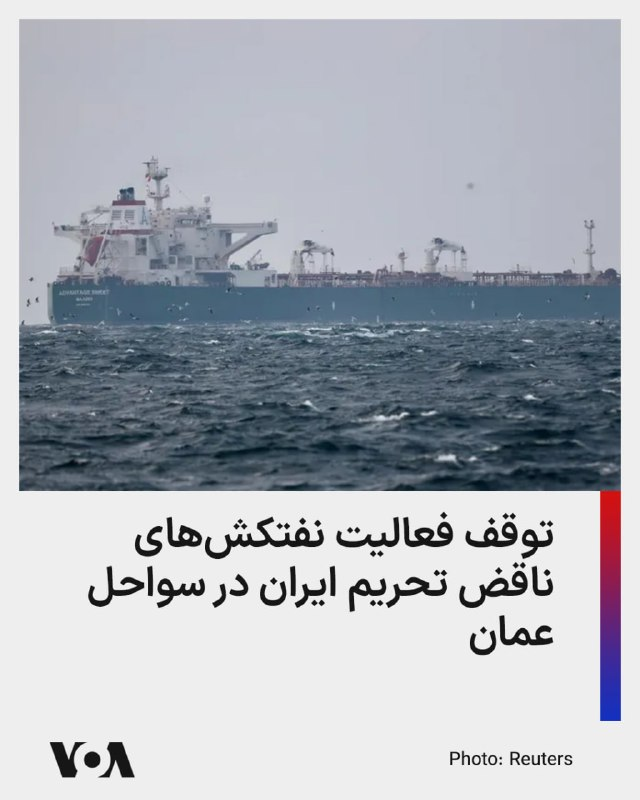

شرکت ردیابی نفتکش‌ها، تانکر ترکرز، می‌گوید نیروی دریایی آمریکا با موفقیت جلوی فعالیت شمار زیادی از ناقضان تحریم‌های جمهوری اسلامی را در سواحل شرقی عمان گرفت.

این گزارش به مورد نفتکش «لوین» اشاره می‌کند که از سواحل شرقی عمان در تلاش برای عبور از محاصره دریایی آمریکا بود، اما توسط یک شناور نیروی دریایی آمریکا تعقیب شد.

سنتکام می‌گوید تاکنون ۹۴ کشتی مرتبط با ایران را وادار به تغییر مسیر کرده است.

با این حال، تانکر ترکرز می‌گوید چندین نفتکش مرتبط با ایران که تحت تحریم نیستند، وارد محدوده محاصره شده‌اند و در حال حاضر ۴۹ نفتکش از این نوع در داخل این محدوده در آب‌های ایران حضور دارند.
@FarsiVOA

## FarsiVOA — post 218343

🔺گزارش وال‌استریت ژورنال از نقش بابک زنجانی و صرافی «بایننس» برای انتقال میلیون‌ها دلار به نفع جمهوری اسلامی

▪️روزنامه وال استریت ژورنال در گزارشی می‌گوید بابک زنجانی و نزدیکانش از جمله خواهرش، شریک عاطفی‌اش و یکی از مدیران شرکت زنجانی، از صرافی رمزارز بایننس استفاده کرده‌اند.

⬇️ بیشتر بخوانید:
https://ir.voanews.com/a/8152729.html?%2Ffdfdf=
@FarsiVOA

## FarsiVOA — post 218342

🔺عملیات تجارت دریایی بریتانیا: تهدیدها در تنگه هرمز و آب‌های خاورمیانه همچنان «بحرانی» است

▪️آژانس «عملیات تجارت دریایی بریتانیا» روز پنجشنبه ۳۱ اردیبهشت گفت که تهدیدها در تنگه هرمز و خلیج فارس و آب‌های خاورمیانه همچنان در سطح «بحرانی» است.

⬇️ بیشتر بخوانید:
https://ir.voanews.com/a/8152728.html
@FarsiVOA

## FarsiVOA — post 218341

  

⚡️مارک لوین، حقوق‌دان و مفسر مشهور رادیویی آمریکایی و از حامیان سرشناس دونالد ترامپ، رئیس جمهوری آمریکا، پنج‌شنبه شب در شبکه اجتماعی ایکس نوشت: «وقت نابودی رژیم ایران است. بیایید تمامش کنیم. بیاید کار را یکسره کنیم. وقت دارد می‌گذرد.»
@FarsiVOA

## FarsiVOA — post 218340

🔺کارشناس امور نظامی: جمهوری اسلامی قادر به جایگزین کردن موشک‌های پیشرفته خود نیست

▪️یک کارشناس برجسته دفاعی روز پنجشنبه با رد گزارش‌هایی که می‌گویند جمهوری اسلامی از زمان شروع آتش‌بس، بخش‌هایی از زیرساخت‌های نظامی خود را سریع‌تر از حد انتظار بازسازی کرده است، گفت توانایی تولید موشک جمهوری اسلامی به شدت در اثر حملات نظامی اخیر آمریکا و اسرائيل فلج شده است.

⬇️ بیشتر بخوانید:
https://ir.voanews.com/a/8152727.html
@FarsiVOA

## FarsiVOA — post 218339

🔺جمهوری‌خواهان رأی‌گیری بر سر اختیارات جنگی ترامپ علیه جمهوری اسلامی را لغو کردند

▪️رهبران جمهوری‌خواه مجلس نمایندگان آمریکا، روز پنجشنبه ۳۱ اردیبهشت، رأی‌گیری برنامه‌ریزی‌شده در مورد قطعنامه‌ای را که قرار بود اختیارات دونالد ترامپ، رئیس‌جمهوری آمریکا برای اقدام نظامی علیه جمهوری اسلامی را بدون تأیید کنگره محدود کند، لغو کردند.

⬇️ بیشتر بخوانید:
https://ir.voanews.com/a/8152513.html
@FarsiVOA

## DW_Farsi — post 124987

🔶 جام‌های ۱۹۶۶ تا ۱۹۷۴؛ فرانتس بکن‌باوئر، "قیصر" مستطیل سبز

🔻 گزارشی از شهرام احدی

بکن‌باوئر در روز یازدهم سپتامبر ۱۹۴۵ در یکی از محله‌های شهر مونیخ در ایالت بایرن در جنوب آلمان به ‌دنیا آمد. او فوتبال را در باشگاه "اس ث مونیخ ۱۹۰۶"، یکی از تیم‌های محلی زادگاهش، آغاز کرد و سپس در ۱۳ سالگی به بایرن مونیخ پیوست؛ تیمی که در آن زمان دومین تیم بزرگ و موفق شهر بود.

بکن‌باوئر در ۱۹ سالگی سه بازی ملی در تیم جوانان را در کارنامه‌ خود ثبت کرده بود. او که به "قیصر" عالم فوتبال شهرت دارد، در پانزدهمین بازی ملی خود در پیراهن تیم ملی بزرگسالان آلمان، در فینال به‌یادماندنی جام جهانی ۱۹۶۶، در ورزشگاه ویمبلی لندن در برابر تیم میزبان، انگلیس به میدان رفت.
@dw_farsi

## DW_Farsi — post 124986

🔶 سنتکام: ناو آبراهام لینکلن در محاصره بنادر ایران در آماده‌باش کامل است

ستاد فرماندهی مرکزی آمریکا (سنتکام) با انتشار تصاویری از جنگنده‌های نیروی دریایی ایالات متحده بر روی ناو هواپیمابر آبراهام لینکلن در دریای عرب، اعلام کرد که در بالاترین سطح آمادگی عملیاتی به سر می‌برد.

سنتکام در این اطلاعیه که در شبکه اجتماعی ایکس منتشر شده تاکید کرده است که ‌ناو آبراهام لینکلن در قالب عملیات‌های کنونی، وضعیت آماده‌باش خود را به طور کامل حفظ می‌کند.

سنتکام پیش از این در روز چهارشنبه ۲۰ مه (۳۰ اردیبهشت) اعلام کرده بود که تفنگداران دریایی این کشور یک نفتکش با پرچم جمهوری اسلامی را که مظنون به تلاش برای نقض محاصره دریایی بود، در دریای عمان متوقف و بازرسی کردند.

ستاد فرماندهی مرکزی آمریکا با انتشار ویدئویی در شبکه‌ اجتماعی ایکس اعلام کرده بود که این نفتکش با نام "ام/‌تی سلستیال سی" که مظنون به تلاش به نقض محاصره دریایی و حرکت به سوی یکی از بنادر ایران بود، متوقف شد و تحت بازرسی قرار گرفت و سپس مسیر آن تغییر داده شد.

در بیانیه سنتکام آمده بود که نیروهای آمریکایی "پس از جستجو و هدایت، خدمه را برای تغییر مسیر کشتی آزاد کردند". سنتکام در بیانیه خود همچنین اعلام کرده بود که "نیروهای آمریکایی همچنان به اجرای کامل محاصره دریایی ادامه می‌دهند، تاکنون ۹۱ کشتی تجاری را برای اطمینان از رعایت آن، تغییر مسیر داده‌اند".

پس از اعمال محاصره دریایی آمریکا علیه بنادر ایران که اواسط آوریل، چند روز پس از برقراری آتش‌بس، صورت گرفت تا کنون دستکم پنج کشتی تجاری توقیف شده یا مورد بازرسی قرار گرفته‌اند.
@dw_farsi

## DW_Farsi — post 124985

🔶 هشدار مقام‌های امنیتی اسرائیل در خصوص حمله غافلگیرانه ایران

مقام‌های اطلاعاتی اسرائیل روز پنج‌شنبه ۲۱ مه (۳۱ اردیبهشت) هشدار دادند که جمهوری اسلامی ممکن است در حال برنامه‌ریزی برای یک حمله غافلگیرانه با استفاده از موشک‌ها و پهپادها علیه کشورهای حاشیه خلیج فارس و اسرائیل باشد.

احتمال انجام حمله پیش‌دستانه از سوی جمهوری اسلامی در پی برگزاری یک نشست ارزیابی وضعیت، با حضور فرماندهان ارشد نظامی و یسرائیل کاتس، وزیر دفاع اسرائیل، مطرح شد.

این هشدارها در حالی مطرح می‌شوند که مذاکرات آتش‌بس میان ایالات متحده و حکومت ایران همچنان ادامه دارد و گزارش‌ها حاکی از آن است که دونالد ترامپ، رئیس‌ جمهور ایالات متحده آمریکا، و بنیامین نتانیاهو، نخست‌وزیر اسرائیل، درباره نحوه ادامه مسیر در قبال ایران اختلاف نظر دارند.

به گزارش نشریه جروزالم پست مقام‌های امنیتی اسرائیلی اشاره کرده‌اند که جمهوری اسلامی ممکن است تلاش کند پیش از آنکه ایالات متحده و اسرائیل به این نتیجه برسند که مسیر دیپلماتیک دیگر کارآمد نیست و حمله‌ای غافلگیرانه مشابه حمله آغازین عملیات "خشم حماسی" و عملیات "غرش شیران" را آغاز کنند، دست به اقدام بزند.

این منبع اسرائیلی همچنین گزارش داده که نیروی هوایی اسرائیل و اداره عملیات ارتش این کشور، مجموعه‌ای از گفت‌وگوها را با همتایان آمریکایی خود به منظور افزایش سطح آمادگی انجام دادند و از جمله اطلاعات خود درباره فعالیت‌های غیرعادی جمهوری اسلامی را نیز به یکدیگر انتقال داده‌اند.

علاوه بر این، ایال زمیر، رئیس ستاد کل ارتش اسرائیل، در چارچوب یک ارزیابی کلی از وضعیت، نشست‌های امنیتی با فرماندهان نظامی درباره جنبه‌های دفاعی و تهاجمی برگزار کرده است.

زمیر همچنین برای هماهنگی پاسخ احتمالی در صورت حمله از سوی جمهوری اسلامی، گفت‌وگوهایی با همتایان آمریکایی خود انجام داده است. برخی منابع گزارش داده‌اند که شرایط موجود، احتمال انجام عملیات مشترک ارتش اسرائیل و ایالات متحده را تقویت می‌کند.

بر اساس گزارش جروزالم پست، برگزاری نشست ارزیابی وضعیت، به تقویت عملیات مشترک نظامی آتی اسرائیل و ایالات متحده، به خصوص در در زمینه رهگیری موشک‌ها، همکاری میان نهادهای دولتی و نظامی، یکپارچه‌سازی فناوری‌ها و بهبود نرم‌افزارها و همچنین تقویت نیروها کمک می‌کند. همچنین در طول یک ماه گذشته، حجم تجهیزات نظامی آمریکا که به اسرائیل منتقل شده است به‌طور چشمگیری افزایش یافته است.
@dw_farsi

## Persian_Trend_Official — post 14648

  

📷 Photo

## Persian_Trend_Official — post 14647

  

🔴 بلومبرگ: ایران بیش از ۲۴ پهپاد MQ-9 آمریکا را نابود کرده است

💢بلومبرگ گزارش داد ایران از آغاز جنگ تاکنون بیش از دو دوجین پهپاد آمریکایی MQ-9 Reaper را منهدم کرده است.

🔹بر اساس این گزارش:

▪️ ارزش این خسارات نزدیک به یک میلیارد دلار برآورد می‌شود
▪️ این میزان حدود ۲۰ درصد از موجودی پیش از جنگ پنتاگون از پهپادهای MQ-9 را شامل می‌شود
▪️ بسیاری از این پهپادها در جریان عملیات‌ها با آتش پدافند ایران سرنگون شده‌اند

همچنین گزارش شده:

▪️ تعدادی از پهپادها در حملات موشکی روی زمین نابود شده‌اند
▪️ برخی دیگر نیز در حوادث و سوانح عملیاتی از بین رفته‌اند

پهپاد MQ-9 Reaper یکی از مهم‌ترین پهپادهای تهاجمی و شناسایی ارتش آمریکا محسوب می‌شود و جایگزینی آن زمان‌بر و پرهزینه ارزیابی می‌شود.

🫆:Tony

📌 @persian_trend_official
پرشین ترند | متفاوت‌ترین کانال نظامی

## Persian_Trend_Official — post 14646

  <a href="telegram/content/Persian_Trend_Official_14646_1779430367.mp4" target="_blank">🎬 Download video</a>

صبحتون بخیر ☕️🔥

📝 Nick
📌 @persian_trend_official
پرشین ترند | متفاوت‌ترین کانال نظامی

## RadioFarda — post 157441

🔸شرکت‌های فناوری مرتبط با هوش مصنوعی در اروپا، با وجود پیامدهای اقتصادی جنگ ایران، در هفته‌های اخیر رشد قابل توجهی را تجربه کرده‌اند. 🔸خبرگزاری رویترز روز جمعه یکم خرداد گزارش داد که شوک انرژی ناشی از جنگ ایران و افزایش بهای نفت، چشم‌انداز اقتصاد اروپا را…

## RadioFarda — post 157440

  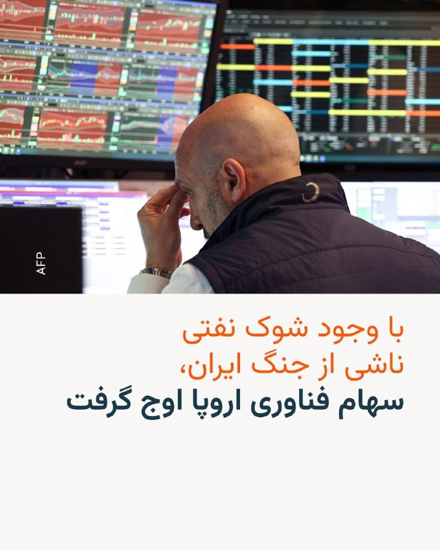

🔸شرکت‌های فناوری مرتبط با هوش مصنوعی در اروپا، با وجود پیامدهای اقتصادی جنگ ایران، در هفته‌های اخیر رشد قابل توجهی را تجربه کرده‌اند.

🔸خبرگزاری رویترز روز جمعه یکم خرداد گزارش داد که شوک انرژی ناشی از جنگ ایران و افزایش بهای نفت، چشم‌انداز اقتصاد اروپا را تضعیف کرده و باعث شده بازار سهام این قاره نسبت به بازار آمریکا عملکرد ضعیف‌تری داشته باشد.

🔸بر اساس این گزارش، فعالیت اقتصادی در منطقه یورو در ماه مه به پایین‌ترین سطح خود در بیش از دو سال و نیم گذشته رسیده است.

🔸با این حال، بررسی‌های مؤسسه تحقیقاتی تی‌اس لمبارد نشان می‌دهد بخش بزرگی از رشد اخیر بازار سهام اروپا به شرکت‌های فعال در حوزهٔ هوش مصنوعی مربوط می‌شود.

🔸این شرکت‌ها عمدتاً در دو بخش فعالیت دارند: تولید تجهیزات و تراشه‌های نیمه‌رسانا، و توسعه زیرساخت‌های هوش مصنوعی مانند مراکز داده و شبکه‌های انتقال برق.

🔸به‌گفتهٔ مدیر بخش اقتصاد کلان اروپا در تی‌اس لمبارد، عملکرد سهام شرکت‌های اروپایی فعال در حوزهٔ هوش مصنوعی از ماه آوریل تاکنون تقریباً هم‌سطح شاخص فناوری نزدک آمریکا (دومین بازار بزرگ سهام جهان) بوده است.

@RadioFarda

## RadioFarda — post 157439

  <a href="https://t.me/radiofarda/157439" target="_blank">📎 Download file</a>

📻بشنوید: سرخط خبرها با رادیوفردا، اول خرداد ۱۴۰۵‌

@RadioFarda

## IranianMinds — post 20513

  <a href="telegram/content/IranianMinds_20513_1779430368.mp4" target="_blank">🎬 Download video</a>

نه ببین اعتراض مسالمت آمیز باشه ما کاری نداریم 🤡

یه عده دانش آموز تو شهر کرد اومدن که فقط به حضوری شدن امتحانات اعتراض کنن و صداشونو برسونن بعد مامورای حکومتی با شوکر بهشون حمله کردن !

@IranianMinds

## IranianMinds — post 20512

💯 اگر هنوز ۵۰۰ هزارتومان رو نگرفتی همین الان عضو شو‌ و جایزتو بگیر
نیازی هم به واریز نیست

👍 تنها سایت مورد #تایید ما با بونوس های واقعی

🌐 Winro.io

## IranianMinds — post 20511

  <a href="telegram/content/IranianMinds_20511_1779430369.webm" target="_blank">🎬 Download video</a>

⭕️ تنها جایی که در لحظه عضویت بهت 500 هزارتومان موجودی میده اینجاس 
❌

🎉 کافیه فقط عضو بشی تا #وینرو بهت 
🤩 
🤩 
🤩 هزارتومان جایزه بده ، نیازی هم به واریز نیست.

⌛ پشتیبانی 24 ساعته

🍆تنها سایت مورد اعتماد ما با بونوس های کاملا واقعی و رویایی:

🌐 Winro.io

🌐 Winro.io
کانال بونوس های رایگان a31

📱 @winro_io

## BBCPersian — post 281750

  

🔻جمعیت هلال احمر ایران می‌گوید در طول جنگ آمریکا و اسرائیل با ایران توانسته «بیش از ۷۲۰۰ نفر را زنده از زیر آوار نجات» دهد.

این نهاد در پستی در شبکه‌ اجتماعی ایکس نوشته «حملات هوایی آمریکا و اسرائیل به مناطق مسکونی ... نقض مکرر قوانین جنگی و کشتار غیرنظامیان خصوصان کودکان و زنان» بوده است.

در این پست همچنین ویدیویی از کمک رسانی امدادگران هلال احمر منتشر شده که در حال بیرون آوردن آسیب‌دیدگان از زیر آوار هستند.

📸Getty Images
@BBCPersian

## BBCPersian — post 281749

  

‌ ‌ ‌
با گذشت شش ماه از تصویب قطعنامه ۲۸۰۳ شورای امنیت سازمان ملل و آغاز اجرای آنچه «طرح ترامپ» برای غزه نامیده شد، انتقادها از ناکامی این ابتکار افزایش یافته است.

در حالی که واشنگتن و متحدانش این طرح را راهی برای پایان جنگ و بازسازی غزه معرفی می‌کردند، بسیاری از ناظران می‌گویند بخش عمده وعده‌های مطرح‌شده هرگز عملی نشده و وضعیت انسانی و امنیتی در این منطقه همچنان بحرانی باقی مانده است.

در تازه‌ترین انتقاد، سفیر روسیه در جلسه روز پنجشنبه شورای امنیت سازمان ملل متحد گفت طرح آقای ترامپ «روی کاغذ مانده» و عملا وعده‌های آن توخالی از آب در آمده است.

واسیلی نبنزیا، سفیر مسکو در سازمان ملل متحد گفت: «خواسته‌های اسرائیل برای آزادی همه گروگان‌ها و بازگرداندن اجساد کشته‌شدگان به‌طور کامل در این طرح گنجانده شد. شماری از فلسطینی‌ها نیز آزاد شدند. اما در مقابل، بسیاری دیگر از مفاد طرح همگی به گفته منتقدان، چیزی جز وعده‌های توخالی نبوده‌اند.»

https://bbc.in/42KXwLQ
📷Reuters
@BBCPersian

## BBCPersian — post 281748

  

🔻رهبران جمهوری‌خواه مجلس نمایندگان آمریکا روز پنج‌شنبه به‌طور ناگهانی رای‌گیری درباره قطعنامه‌ای برای محدود کردن اختیارات جنگی دونالد ترامپ در قبال ایران را لغو کردند؛ آن هم در شرایطی که جمهوری‌خواهان به دلیل غیبت برخی نمایندگان در آستانه شکست در این رای‌گیری قرار داشتند.

این قطعنامه از سوی گرگوری میکس، نماینده دموکرات ایالت نیویورک و عضو ارشد کمیته روابط خارجی مجلس نمایندگان، ارائه شده بود.

این نماینده کنگره روز چهارشنبه به خبرنگاران گفته بود تصور می‌کند مایک جانسون، رئیس مجلس نمایندگان، در تلاش است رای‌گیری درباره این طرح را به تعویق بیندازد.

لغو ناگهانی این رای‌گیری در حالی رخ داد که شکاف‌ها در داخل حزب جمهوری‌خواه بر سر نحوه برخورد با ایران و اختیارات نظامی رئیس‌جمهور به‌تدریج آشکارتر شده است. برخی جمهوری‌خواهان معتقدند هرگونه اقدام نظامی گسترده علیه ایران باید با مجوز رسمی کنگره انجام شود، در حالی که متحدان دونالد ترامپ تاکید دارند رئیس‌جمهور برای دفاع از منافع آمریکا اختیار کافی دارد.

لینک خبر کامل:
https://bbc.in/3PEKeNZ
📷Getty Images

## BBCPersian — post 281747

  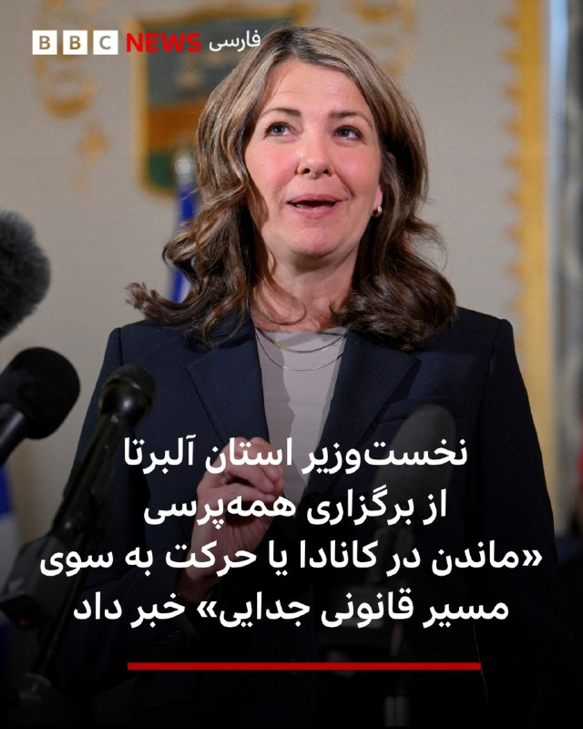

🔻استان آلبرتا قرار است همه‌پرسی‌ای درباره ماندن در کانادا یا حرکت به سوی برگزاری دومین رای‌گیری الزام‌آور درباره جدایی برگزار کند؛ اقدامی که نخستین آزمون مهم وحدت کانادا در چند دهه اخیر به شمار می‌رود.

اعلام این تصمیم روز پنج‌شنبه از سوی دنیل اسمیت، نخست‌وزیر آلبرتا، پس از آن صورت گرفت که یک کارزار مردمی حامی جدایی اوایل امسال بیش از ۳۰۰ هزار امضا جمع‌آوری کرد. هم‌زمان، کارزار دیگری که خواهان باقی ماندن آلبرتا در کانادا بود نیز بیش از ۴۰۰ هزار امضا به دست آورد.

جنبش استقلال‌طلبی در این استان نفت‌خیز در سال‌های اخیر رشد کرده؛ جنبشی که بر پایه این احساس دیرینه شکل گرفته که تصمیم‌گیرندگان در اتاوا به آلبرتا بی‌توجه هستند.

با این حال، نظرسنجی‌ها نشان می‌دهد اکثریت مردم آلبرتا احتمالا به جدایی رای منفی خواهند داد.

به گفته نخست‌وزیر استان، همه‌پرسی برای ۱۹ اکتبر برنامه‌ریزی شده است.

لینک خبر:
https://bbc.in/4dpEGzV
📷Reuters

@BBCPersian

## BBCPersian — post 281746

🔻آمریکا ۵ هزار نیروی دیگر به لهستان اعزام می‌کند

🔻دونالد ترامپ، رئیس‌جمهور آمریکا، اعلام کرد ایالات متحده ۵ هزار نیروی نظامی دیگر به لهستان اعزام خواهد کرد؛ اقدامی که تنها یک هفته پس از لغو برنامه پنتاگون برای اعزام ۴ هزار نیرو به این کشور صورت می‌گیرد.

آقای ترامپ روز پنجشنبه در پیامی در شبکه اجتماعی تروث سوشال نوشت این تصمیم بر پایه روابط آمریکا با کارول ناوروتسکی، رئیس‌جمهور لهستان، اتخاذ شده؛ فردی که ترامپ در انتخابات ریاست‌جمهوری سال گذشته از او حمایت کرده بود.

رئیس‌جمهور آمریکا جزئیات بیشتری ارائه نکرد که آیا این نیروهای جدید بخشی از همان برنامه قبلی اعزام هستند یا در قالب عملیاتی جداگانه به لهستان فرستاده خواهند شد.

کاخ سفید در هفته‌های اخیر بارها اعلام کرده قصد دارد در چارچوب سیاست «اول آمریکا»، سطح کلی حضور نیروهای آمریکایی در اروپا را کاهش دهد.

اوایل همین ماه نیز آمریکا اعلام کرد ۵ هزار نیروی خود را از آلمان خارج خواهد کرد؛ اقدامی که پس از تنش لفظی میان آقای ترامپ و فریدریش مرتس، صدراعظم آلمان، بر سر جنگ با ایران مطرح شد.

او پیش‌تر از اظهارات مرتس که گفته بود آمریکا از سوی مذاکره‌کنندگان ایرانی «تحقیر شده»، انتقاد کرده بود.

هنوز مشخص نیست نیروهای اضافی اعزامی به لهستان بخشی از نیروهای خارج‌شده از آلمان خواهند بود یا گروهی جداگانه محسوب می‌شوند.

https://bbc.in/3RBCBIE
@BBCPersian

## BBCPersian — post 281745

  

‌🔻مارکو روبیو، وزیر خارجه آمریکا، گفت کوبا یک «تهدید امنیت ملی» برای ایالات متحده است و احتمال دستیابی به توافقی مسالمت‌آمیز با هاوانا «چندان زیاد نیست».

اظهارات آقای روبیو که مشاور ارشد امنیت ملی دونالد ترامپ است، تنها یک روز پس از آن مطرح می‌شود که آمریکا رائول کاسترو، رئیس‌جمهور پیشین کوبا، را در ارتباط با سرنگونی دو هواپیما در سال ۱۹۹۶ که به کشته شدن چند شهروند آمریکایی منجر شد، به قتل متهم کرد.

آقای روبیو گفت ترجیح واشنگتن «راه‌حل دیپلماتیک» است، اما هشدار داد دونالد ترامپ، رئیس‌جمهور آمریکا، حق و وظیفه دارد کشورش را در برابر هرگونه تهدید محافظت کند.

چین و روسیه تصمیم آمریکا برای متهم کردن رائول کاسترو، رئیس‌جمهور پیشین کوبا، به قتل را محکوم کردند.

وزارت خارجه چین از آمریکا خواست استفاده از «زورگویی» و «تهدید» علیه متحد خود را متوقف کند، در حالی که کرملین اعلام کرد فشارهایی که بر هاوانا وارد می‌شود «به مرز خشونت رسیده است».

لینک خبر کامل:
https://bbc.in/4eWE71N

📷Reuters
@BBCPersian

## BBCPersian — post 281744

🔻یک معبد در غرب ژاپن که گفته می‌شود «شعله‌ای جاودان» را در خود جای داده بود، صبح چهارشنبه ۳۰ اردیبهشت/ ۲۰ مه در آتش سوخت.

ویدئوها نشان می‌دهند که تالار «ریکادو» در معبد دای‌شواین در استان هیروشیما کاملا در میان شعله‌ها می‌سوزد و سازه آن تقریبا به طور کامل از بین رفته است. بنا بر گزارش رسانه‌های ژاپنی، مقام‌ها اعلام کردند که این حادثه هیچ مصدومی نداشته است.

این تالار به خاطر نگهداری از شعله‌ای «خاموش‌نشدنی» شهرت داشت؛ شعله‌ای که بنا بر اعلام انجمن گردشگری میاجیما، نخستین بار در سال ۸۰۶ میلادی توسط یک راهب بودایی روشن شده بود. گفته می‌شود این آتش بیش از ۱۲۰۰ سال بدون وقفه روشن مانده و بعدها برای روشن کردن شعله جاودان پارک یادبود صلح هیروشیما که یادبود قربانیان بمباران اتمی سال ۱۹۴۵ است، از آن استفاده شده بود.

رسانه‌های محلی به نقل از مقام‌های آتش‌نشانی گزارش دادند که احتمال دارد تالار ریکادو بر اثر همین شعله مقدس دچار آتش‌سوزی شده باشد. با این حال، این شعله حفظ شده و به مکانی امن منتقل شده است.

@BBCPersian

## BBCPersian — post 281738

🔻جانی حسین تعریف می‌کند که در نخستین سفر زیارتی‌اش به مکه، زمانی که دختری ۱۳ ساله بود، دچار سردرگمی عجیبی شده بود. او می‌گوید: «یادم هست مادرم را در حال گریه دیدم، اما نمی‌دانستم چرا گریه می‌کند و همین برایم بسیار غم‌انگیز بود.»

هر سال میلیون‌ها نفر برای انجام مناسک عمره به عربستان سعودی سفر می‌کنند، زیارتی مستحب که مسلمانان می‌توانند در هر زمانی از سال آن را به‌جا آورند، برخلاف حج که فریضه‌ای واجب به شمار می‌رود، یک‌ بار در طول عمر انجام می‌شود. هر دو آیین شامل هفت بار طواف به دور کعبه، مقدس‌ترین زیارتگاه اسلام، است.

برای بیشتر مردم، این تجربه آمیزه‌ای رنگارنگ از صداهاست: بانگ اذان که در فضای مسجدالحرام می‌پیچد و با صدای گام‌ها و زمزمه دعاهای هزاران زائر درهم می‌آمیزد. اما برای گروهی از مسلمانان، این تجربه تقریبا در سکوت کامل سپری می‌شود.

متن کامل خبر را از لینک زیر بخوانید:

https://bbc.in/4dAMwWi
📷GettyImages/ Al Isharah

@BBCPersian

## BBCPersian — post 281737

🔻وزارت خارجه ایران: مذاکرات جاری فقط بر پایان جنگ متمرکز است و صحبتی درباره دخایر اورانیوم نیست

🔻اسماعیل بقایی، سخنگوی وزارت امورخارجه ایران به رسانه‌های این کشور گفته است: «در این مرحله تمرکز مذاکرات بر خاتمه جنگ در همه جبهه‌ها به شمول لبنان است و ادعاهایی که درباره مباحث هسته‌ای، از جمله موضوع مواد غنی شده یا بحث غنی‌سازی، در رسانه‌ها مطرح شده، صرفا گمانه‌زنی رسانه‌ای بوده و فاقد اعتبار است.»

اشاره آقای بقایی به گمانه‌زنی‌هایی است که در پی اظهارات روز پنجشنبه دونالد ترامپ شکل گرفته است.

همان طور که برایتان اینجا گزارش کردیم رئیس جمهور آمریکا، روز پنجشنبه در کاخ سفید در پاسخ به سوال خبرنگاران درباره ذخایر اورانیوم غنی شده ایران گفت: «ما آن را به دست خواهیم آورد. به آن نیازی نداریم، ما آن را نمی‌خواهیم. حتی احتمالاً پس از اینکه به آن دست یافتیم، آن را نابود خواهیم کرد، اما اجازه نخواهیم داد که آنها به آن دست یابند.»

https://bbc.in/3ReBBKB
@BBCPersian

## alonews — post 121695

  <a href="telegram/content/alonews_121695_1779430373.webm" target="_blank">🎬 Download video</a>

👈نظرسنجی نیویورک تایمز: ۹۵ درصد رأی‌دهندگان دموکرات با جنگ آمریکا و اسرائیل علیه ایران مخالف هستند

🔴 سه‌چهارم آنها نیز مخالف کمک به اسرائیل هستند

✅ @AloNews خبر جنگ

## alonews — post 121694

  <a href="telegram/content/alonews_121694_1779430373.webm" target="_blank">🎬 Download video</a>

👈 استولتنبرگ، وزیر دارایی نروژ و دبیرکل پیشین ناتو:  ناتو بدون آمریکا دوام نخواهد آورد، اتحادیه اروپا باید در مسائل امنیت جمعی و تضمین‌های دفاعی جایگزین ناتو شود.

✅ @AloNews خبر جنگ

## alonews — post 121693

  <a href="telegram/content/alonews_121693_1779430373.webm" target="_blank">🎬 Download video</a>

👈نخست‌وزیر عراق: دستور بررسی ابعاد حملات به عربستان و امارات صادر شد

✅ @AloNews خبر جنگ

## alonews — post 121692

  <a href="telegram/content/alonews_121692_1779430373.webm" target="_blank">🎬 Download video</a>

👈بزرگ‌ترین شرکت انرژی آمریکا، اکسون موبیل، در حال مذاکره با دولت ونزوئلا برای بازپس‌گیری حقوق تولید نفت در ونزوئلا است، پس از اینکه تقریباً ۲۰ سال پیش زمانی که هوگو چاوز، رئیس‌جمهور وقت، صنعت نفت ونزوئلا را ملی کرد، از این کشور اخراج شده بود.

✅ @AloNews خبر جنگ

## alonews — post 121691

  <a href="telegram/content/alonews_121691_1779430373.webm" target="_blank">🎬 Download video</a>

👈کمیسیون اروپا پیش‌بینی قیمت نفت در سال ۲۰۲۶ را نسبت به تخمین‌های پیشین، ۴۶ درصد افزایش داد.

🔴کمیسیون اروپا در گزارش «چشم‌انداز اقتصادی بهار ۲۰۲۶» خود تأکید کرده است که شوک انرژی ناشی از جنگ در خاورمیانه و بسته شدن عملی تنگهٔ هرمز، مهم‌ترین عامل این بازنگری صعودی در قیمت‌های نفت است.

✅ @AloNews خبر جنگ

## alonews — post 121690

  <a href="telegram/content/alonews_121690_1779430373.webm" target="_blank">🎬 Download video</a>

👈عربستان سعودی قراردادهای جدید با شرکت‌های مشاوره غربی را متوقف کرده و برخی پرداخت‌ها را به تعویق انداخته است، زیرا این پادشاهی با کسری بودجه فزاینده و تأثیرات اقتصادی جنگ با ایران مواجه است، گزارش فایننشال تایمز.

🔴 این پادشاهی در چارچوب طرح چشم‌انداز ۲۰۳۰ خود، هزینه‌ها را محدود می‌کند و به وزارتخانه‌های سعودی دستور داده شده است که بدون مجوز ویژه از وزارت دارایی، قراردادهای مشاوره جدید را تأیید نکنند، در حالی که برخی پرداخت‌های فاکتور حداقل تا ژوئیه به تعویق افتاده‌اند.

🔴 عربستان سعودی قبلاً پروژه‌های عظیم و پرهزینه‌ای مانند نئوم را کاهش داده یا به تعویق انداخته است، در حالی که نگرانی‌ها درباره هزینه‌های بیش از حد افزایش یافته است.

✅ @AloNews خبر جنگ

## alonews — post 121689

  <a href="telegram/content/alonews_121689_1779430374.webm" target="_blank">🎬 Download video</a>

👈دیدار مجدد وزیر کشور پاکستان با عراقچی برای بررسی پیشنهادات

✅ @AloNews خبر جنگ

## alonews — post 121688

  <a href="telegram/content/alonews_121688_1779430374.webm" target="_blank">🎬 Download video</a>

👈فایننشال‌تایمز به نقل از وزیر دارایی فرانسه: ما نمی‌توانیم ذخایر نفت بیشتری را بدون دانستن اینکه این درگیری چقدر طول خواهد کشید، آزاد کنیم.

🔴 حتی پس از بازگشایی تنگه هرمز، چندین هفته طول خواهد کشید تا منابع نفتی به اروپا و آسیا برسند.

✅ @AloNews خبر جنگ

## alonews — post 121687

  <a href="telegram/content/alonews_121687_1779430374.webm" target="_blank">🎬 Download video</a>

👈بلومبرگ: ادامه بسته ماندن تنگه هرمز تا ماه اوت، خطر رکود اقتصادی نزدیک به رکود سال ۲۰۰۸ را افزایش می‌دهد

✅ @AloNews خبر جنگ

## alonews — post 121686

  <a href="telegram/content/alonews_121686_1779430374.webm" target="_blank">🎬 Download video</a>

👈فاکس نیوز اعلام کرد که جمهوری خواهان در مجلس نمایندگان آمریکا رأی‌گیری درباره قطعنامه اختیارات جنگی رئیس‌جمهور این کشور را به تعویق انداختند.

✅ @AloNews خبر جنگ

## alonews — post 121685

  <a href="telegram/content/alonews_121685_1779430374.webm" target="_blank">🎬 Download video</a>

👈کپلر: احتمالا هزینه واردات LNG ژاپن از حدود ۱۰.۷۴ دلار به ازای ۲۸ مترمکعب گاز طبیعی در مارس به حدود ۱۷.۵ دلار در ژوئیه برسد.

🔴 این افزایش تحت تاثیر تاخیر در انتقال و رشد قیمت گاز در آسیا رخ داده است.

✅ @AloNews خبر جنگ

## alonews — post 121684

  <a href="telegram/content/alonews_121684_1779430374.webm" target="_blank">🎬 Download video</a>

👈قیمت نفت برنت با افزایش ۲.۳۸ دلاری (۲.۳ درصد) به ۱۰۴.۹۶ دلار در هر بشکه رسید.

✅ @AloNews خبر جنگ

## alonews — post 121683

  <a href="telegram/content/alonews_121683_1779430375.webm" target="_blank">🎬 Download video</a>

👈بلومبرگ: ایران حدود یک میلیارد دلار به توان پهپادی واشنگتن خسارت‌ وارد کرده

🔴 ایران از آغاز جنگ بیش از ۲۰ فروند پهپاد MQ-9 Reaper متعلق به نیروهای آمریکایی را منهدم کرده که حدود ۲۰ درصد از موجودی پیش از جنگ پنتاگون را شامل می‌شود

✅ @AloNews خبر جنگ

## alonews — post 121682

  <a href="telegram/content/alonews_121682_1779430375.webm" target="_blank">🎬 Download video</a>

👈سرپرست وزارت نیروی دریایی آمریکا میگوید ایالات متحده ارسال محموله‌های تسلیحاتی به تایوان را به منظور حفظ مهمات مورد نیاز برای جنگ با ایران متوقف کرده است

✅ @AloNews خبر جنگ

## alonews — post 121681

  <a href="telegram/content/alonews_121681_1779430375.webm" target="_blank">🎬 Download video</a>

👈عمان، متحد ایالات متحده، پیش از این علناً همکاری با ایران در مورد تنگه هرمز را رد کرده بود، اما اکنون در حال مذاکره در مورد دریافت بخشی از درآمد است. دیروز، ترامپ ایده پرداخت هزینه عبور از تنگه را رد کرد: "ما می‌خواهیم رایگان باشد، عوارض نمی‌خواهیم. این یک آبراه بین‌المللی است."

✅ @AloNews خبر جنگ

<!-- MSG END -->

<!-- NAV START -->

<a href="https://github.com/keihancpu/aio-downloader/blob/main/telegram/content/archive_1.md" style="display:inline-block; padding:6px 12px; margin:0 4px; background-color:#2ea44f; color:white; text-decoration:none; border-radius:4px; font-weight:bold;">صفحه بعد</a>

<!-- NAV END -->
