# خواننده تلگرام

<!-- TOP_NAV START -->

<a href="https://github.com/keihancpu/aio-downloader/blob/main/telegram/content/archive_1.md" style="display:inline-block; padding:6px 12px; margin:0 4px; background-color:#2ea44f; color:white; text-decoration:none; border-radius:4px; font-weight:bold;">صفحه بعد</a>

<!-- TOP_NAV END -->

<!-- MSG START -->

---
📅 بروزرسانی: 1405/02/27 17:31
---

## VahidOOnLine — post 240631

  

♦️شبکه خبری فاکس نیوز، روز یکشنبه ۲۷ اردیبهشت ماه در گزارشی اعلام کرد، دونالد ترامپ، رئیس جمهور آمریکا که به تازگی از سفر چین بازگشته است، در حال بررسی از سرگیری اقدام نظامی علیه ایران است و روز یکشنبه با بنیامین نتانیاهو، نخست وزیر اسرائیل گفتگو خواهد کرد.
نتانیاهو صبح یکشنبه با اعلام آنکه «مانند هر چند روز یکبار» با ترامپ تماس خواهد گرفت، گفت: «مطمئنا بخش‌هایی از سفر او به چین و شاید موارد دیگر را خواهم شنید. احتمالات زیادی وجود دارد و ما برای هر سناریویی آماده‌ایم.»
تماس تلفنی با نتانیاهو در حالی صورت می‌گیرد که فاکس نیوز با استناد به ارزیابی‌های اطلاعاتی منطقه‌ای درباره ایران گزارش داد که ممکن است به دلیل ناامیدی ترامپ از تهران و «رد درخواست او برای دست کشیدن از آرمان‌های تسلیحات هسته‌ای»، حملات نظامی از سر گرفته شود.
دو مقام اطلاعاتی منطقه‌ای به فاکس نیوز گفتند: «ارزیابی غالب در داخل ایران این است که رئیس جمهوری ترامپ ممکن است به شروع مجدد اقدام نظامی متوسل شود و تهران اکنون عمدا راهبرد «فریب و تأخیر» را دنبال می‌کند، با این امید که خرید زمان، هرگونه بازگشت احتمالی به جنگ را پیچیده کند.»
‌🇸🇦 Indypersian

🤖 @VahidOOnLine

## VahidOOnLine — post 240630

  

اردن حمله پهپادی به ابوظبی را که به وقوع آتش‌سوزی در خارج از محدوده داخلی نیروگاه هسته‌ای براکه منجر شد، به‌شدت محکوم کرد و آن را نقض آشکار حاکمیت امارات متحده عربی، تهدیدی علیه امنیت و ثبات این کشور و نیز نقض صریح قوانین بین‌المللی و منشور سازمان ملل متحد دانست.

وزارت خارجه اردن در بیانیه‌ای با اعلام همبستگی کامل با امارات متحده عربی تاکید کرد که اَمان در کنار ابوظبی و تمامی اقداماتی که برای حفظ امنیت، حاکمیت و سلامت شهروندان و ساکنان خود انجام دهد، خواهد ایستاد.
‌🏁 🇬🇧 IranintlTV

🤖 @VahidOOnLine

## VahidOOnLine — post 240629

  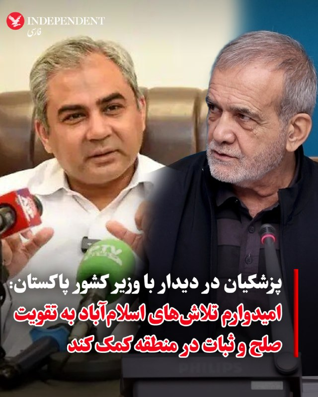

♦️مسعود پزشکیان، رئیس‌جمهوری ایران، روز یکشنبه در دیدار با محسن نقوی، وزیر کشور پاکستان، از نقش اسلام‌آباد در تثبیت آتش‌بس قدردانی و ابراز امیدواری کرد تلاش‌های پاکستان به تقویت صلح و ثبات در منطقه کمک کند.
رئیس‌جمهوری ایران در این دیدار تاکید کرد «ایران خواهان روابطی صمیمانه و پایدار با کشورهای اسلامی منطقه است» و افزود اتحاد کشورهای اسلامی می‌تواند زمینه «مداخله قدرت‌های فرامنطقه‌ای» را کاهش دهد.
به گزارش خبرگزاری ایرنا، محسن نقوی، وزیر کشور پاکستان، نیز با اشاره به روابط تهران و اسلام‌آباد گفت ایران و پاکستان اکنون بیش از گذشته به یکدیگر نزدیک شده‌اند و روابط برادرانه دو کشور باید بیش از پیش گسترش یابد.
این دیدار در شرایطی انجام شده که پاکستان در هفته‌های اخیر در روند تلاش‌های دیپلماتیک و میانجی‌گری منطقه‌ای برای کاهش تنش‌ها و تثبیت آتش‌بس نقش فعالی ایفا کرده است.
‌🇸🇦 Indypersian

🤖 @VahidOOnLine

## VahidOOnLine — post 240628

  

اکسیوس گزارش داد که کوبا بیش از ۳۰۰ پهپاد نظامی خریداری کرده و اخیرا نیز گفت‌وگو درباره استفاده از آنها برای حمله به پایگاه آمریکا در خلیج گوانتانامو، شناورهای نظامی آمریکا و احتمالا شهر کی‌وست در ایالت فلوریدا، در حدود ۱۴۵ کیلومتری شمال هاوانا، را آغاز کرده است.

یک مقام ارشد آمریکایی به اکسیوس گفت این اطلاعات که می‌تواند دلیلی برای اقدام نظامی آمریکا شود، نشان می‌دهد دولت ترامپ تا چه اندازه کوبا را، به دلیل تحولات جنگ پهپادی و حضور مستشاران نظامی جمهوری اسلامی در هاوانا، تهدید تلقی می‌کند.

این مقام آمریکایی گفت: «وقتی به این نوع فناوری‌ها که تا این اندازه نزدیک هستند فکر می‌کنیم، و همچنین به طیفی از بازیگران خطرناک از گروه‌های تروریستی گرفته تا کارتل‌های مواد مخدر، مستشاران جمهوری اسلامی و روس‌ها، موضوع نگران‌کننده می‌شود.»
‌🏁 🇬🇧 IranintlTV

🤖 @VahidOOnLine

## VahidOOnLine — post 240627

روایت شما از بحران اقتصادی در آتش‌بس- یکشنبه ۲۷ اردیبهشت‌ماه🗣

🔹واقعا دیگه هیچ امیدی ندارم. سه ماهه به‌خاطر قطعی اینترنت بیکار موندیم. پهنای باند این‌قدر کمه که نه فیلترشکن جواب داده و نه اینترنت‌پرو.

🔹من مدرس آنلاین زبان بودم. الان دو ماه گذشته و حتی یک کلاس هم نتونستم برگزار کنم. از پس‌اندازم فقط دو میلیون تومان مونده و نمی‌تونم کار هم پیدا کنم.

🔹منم مثل خیلی از هم‌وطنان بیکار شدم و برای ادامه زندگی، با قسط و قرض یه کامیون خریدم. اما سوخت کامیون خیلی کمه و ناچارم یک لیتر گازوئیل رو ۵۰ تا ۷۵ هزار تومان بخرم که اصلاً مقرون‌به‌صرفه نیست. از یه طرف از بیکاری دارم دیوونه میشم و از طرف دیگه شرمنده زن و بچه شدم.

🔹اسنپ سوار شدم، کنارم روپوش پزشکی و چند تا کتاب دیدم. راننده جوان گفت که دانشجو هست و اوقات بین کلاس و بیمارستان اسنپ کار می‌کند.

🔹دلم می‌خواد خون گریه کنم. سه ماه هست که بیکارم. پانزده روز دیگه باید خونه ۵۰ متری استیجاری‌ رو تحویل بدم، در حالی که اجاره و ودیعه سر به فلک کشیده و من فقط صد میلیون تومان پول ودیعه بیشتر ندارم.

🔹من و همسرم تریدر هستیم و اول زندگی مشترکمونه. از جنگ ۱۲ روزه تا الان همش از جیب، اجاره و هزینه‌هامون رو دادیم. اما دیگه نمی‌دونیم باید چکار کنیم. امیدوارم این همه سختی و مشکلات نتیجه‌اش برگشت پهلوی باشه.

🔹۱۰ تیکه فیله‌مرغ، ۴ تیکه بوقلمون و یک شانه تخم‌مرغ شد شش میلیون و ۳۰۰ هزار تومان. واقعا باورنکردنیه.

🔹 دانشجو علوم پزشکی تهران هستم. متاسفانه هیچ دسترسی به اینترنت آزاد و بین‌الملل برای دانشجویان در نظر گرفته نشده. مقالات، پروژه‌ها و پایان‌نامه‌های ما به‌خاطر نداشتن دسترسی به چیزی که حق طبیعی هر انسانی است، ناتمام مونده.
‌🏁 🇬🇧 IranintlTV

🤖 @VahidOOnLine

## VahidOOnLine — post 240626

♦️حمیدرضا حاجی‌بابایی، نایب رئیس مجلس شورای اسلامی در برنامه‌ای تلویزیونی کشورهای منطقه را تهدید کرد در صورت وارد شدن آسیب به زیرساخت‌ها یا صادرات نفت ایران، تهران کاری می‌کند که مدت قابل توجهی هیچ کشور دنیا به نفت منطقه دسترسی نداشته باشد.

او گفت: «اگر قرار باشد به نفت ما آسیب برسد، ما کاری می‌کنیم که دیگر آمریکا حداقل تا یک مدت قابل‌توجهی از این منطقه نفتی گیرش نیاید، یعنی دنیا نفتی گیرش نیاید. من یک نکته می‌خواهم بگویم، آمریکا مخصوصا ترامپ، امکان ندارد کاری را که بتواند انجام دهد و به نفع‌شان باشد، انجام ندهد. اگر کسی غیر از این فکر کند، یا ساده‌لوح است یا ممکن است اشکال در نوع فکر کردنش باشد.»
این تهدیدها در حالی مطرح می‌شود که جمهوری اسلامی در ماه‌های اخیر بارها تاسیسات نفتی در کشورهای منطقه را هدف حملات موشکی و پهپادی قرار داده است.
‌🇸🇦 Indypersian

🤖 @VahidOOnLine

## VahidOOnLine — post 240625

  <a href="telegram/content/VahidOOnLine_240625_1779026469.mp4" target="_blank">🎬 Download video</a>

راهپیمایی ایرانیان ساکن گوتنبرگ سوئد، یکشنبه ۲۷ اردیبهشت
‌🏁 🇬🇧 ManotoTV

🤖 @VahidOOnLine

## VahidOOnLine — post 240624

♦️تیم فوتبال زنان نائگوهیانگ اف‌سی کره شمالی روز یکشنبه برای حضور در مرحله نیمه‌نهایی لیگ قهرمانان زنان آسیا وارد کره جنوبی شد، سفری که نخستین حضور ورزشکاران کره شمالی در کره جنوبی طی هشت سال گذشته محسوب می‌شود.
هیات اعزامی این تیم شامل ۲۷ بازیکن و ۱۲ عضو کادر فنی است و پیش از دیدار روز چهارشنبه برابر تیم زنان سوون اف‌سی وارد کره جنوبی شده است. وزارت اتحاد کره جنوبی اعلام کرد این سفر بر اساس قوانین تبادل میان دو کره مجوز گرفته است و در صورت حذف تیم کره شمالی اعضای آن در اولین فرصت به کشورشان بازخواهند گشت.
به گزارش خبرگزاری یونهاپ کره جنوبی، استقبال عمومی از این مسابقه چشمگیر بوده و تمامی ۷ هزار و ۸۷ بلیت عرضه‌شده برای عموم در کمتر از یک روز به فروش رسیده است.
این سفر در حالی انجام می‌شود که روابط دو کره طی سال‌های اخیر با تنش‌های فزاینده همراه بوده است. پیونگ‌یانگ اخیرا کره جنوبی را «خصمانه‌ترین کشور» توصیف کرده و ایده اتحاد دو کره را رد کرده است. در مقابل، لی جائه‌میونگ، رئیس‌جمهوری کره جنوبی، خواهان بهبود روابط شده است.
‌🇸🇦 Indypersian

🤖 @VahidOOnLine

## VahidOOnLine — post 240623

  

♦️بنیامین نتانیاهو، نخست‌وزیر اسرائیل، روز یکشنبه در نشست هفتگی کابینه این کشور گفت شش سال پیش درباره تهدید پهپادها هشدار داده بود، اما اکنون با پیشرفت این فناوری و افزایش تهدیدها، اسرائیل در حال اجرای اقدامات تازه‌ای برای مقابله با آن است.

نتانیاهو گفت: «شش سال پیش در جلسه کابینه درباره تهدید پهپادها هشدار دادم.» او افزود در آن زمان این تهدید را بیشتر ابزاری برای ترور افراد می‌دانست، اما به گفته او تحولات سال‌های اخیر، به‌ویژه جنگ اوکراین، نشان داد پهپادها می‌توانند به عاملی تعیین‌کننده در میدان‌های نبرد تبدیل شوند.
نخست‌وزیر اسرائیل همچنین با اشاره به عملکرد نهادهای امنیتی این کشور گفت ارتش و وزارت دفاع طی سال‌های گذشته «صدها و شاید هزاران» تلاش برای حمله به نیروهای اسرائیلی با پهپادها و هواپیماهای بدون سرنشین را خنثی کرده‌اند.

او تاکید کرد: «آنها موفق شده‌اند و هر بار که تهدید جدیدی ایجاد می‌شود، آن را خنثی می‌کنند.»

نتانیاهو در ادامه از تشکیل یک تیم ویژه برای مقابله با تهدید پهپادهای فیبر نوری حزب‌الله خبر داد و گفت این گروه طی دو هفته گذشته سه نشست برگزار کرده است.
‌🇸🇦 Indypersian

🤖 @VahidOOnLine

## VahidOOnLine — post 240622

ولی‌الله بیاتی، عضو کمیسیون امور داخلی مجلس، به ایسنا گفت: «مذاکرات باید ادامه پیدا کند، اما در عین حال دست ما روی ماشه است و آمادگی کامل برای ادامه نبرد وجود دارد.»
بیاتی گفت: «وضعیت «نه صلح نه جنگ» خیلی از کارها را در کشور معطل نگه می دارد. این وضعیت آسیب زیادی وارد می‌کند.»
‌🏁 🇬🇧 IranintlTV

🤖 @VahidOOnLine

## VahidOOnLine — post 240621

  

♦️سفارت پاکستان در تهران اعلام کرد محسن نقوی، وزیر کشور پاکستان که روز گذشته وارد تهران شده بود، نزدیک به سه ساعت در نهاد ریاست‌جمهوری حضور داشته و با مسعود پزشکیان دیداری خصوصی برگزار کرده است.
به گقته سفارت پاکستان، این دیدار حدود ۹۰ دقیقه طول کشیده و اسکندر مومنی، وزیر کشور جمهوری اسلامی ایران و عباس عراقچی، وزیر امور خارجه نیز در این جلسه حضور داشتند.
محسن نقوی روز شنبه در سفری اعلام‌نشده وارد تهران شده بود و منابع خبری از احتمال گفتگوهای او با مقام‌های ایرانی درباره تحولات منطقه و مسائل دوجانبه خبر داده بودند.
‌🇸🇦 Indypersian

🤖 @VahidOOnLine

## VahidOOnLine — post 240620

  

♦️آژانس بین‌المللی انرژی اتمی (IAEA) روز یکشنبه ۲۷ اردیبهشت ماه، نسبت به حمله پهپادی در نزدیکی نیروگاه هسته‌ای براکه امارات متحده عربی که به وقوع آتش‌سوزی منجر شد، «نگرانی شدید» خود را ابراز کرد، اما اعلام کرد سطح تشعشعات در این منطقه همچنان در وضعیت عادی قرار دارد.
آژانس در پیامی در شبکه اجتماعی اکس اعلام کرد رافائل گروسی، مدیرکل این نهاد، درباره این حادثه ابراز نگرانی کرده و گفته است: «فعالیت‌های نظامی که ایمنی هسته‌ای را تهدید می‌کند، غیرقابل قبول است.»
آژانس بین‌المللی انرژی اتمی همچنین اعلام کرد مقام‌های امارات این نهاد را در جریان گذاشته‌اند که سطح تشعشعات در نیروگاه هسته‌ای براکه طبیعی است و هیچ موردی از مصدومیت گزارش نشده است.
دفتر رسانه‌ای ابوظبی روز یکشنبه اعلام کرد از آتش‌سوزی ناشی از حمله پهپادی به یک ژنراتور برق در خارج از محیط داخلی نیروگاه هسته‌ای براکه در منطقه الظفره خبر داد.
‌🇸🇦 Indypersian

🤖 @VahidOOnLine

## VahidOOnLine — post 240619

  

♦️اسماعیل بقایی، سخنگوی وزارت امور خارجه جمهوری اسلامی ایران، روز یکشنبه در پیامی در شبکه اجتماعی اکس، آمریکا و اسرائیل را متهم کرد که برای توجیه «جنگ انتخابی» و غیرقانونی، روایت «حفظ صلح و ثبات در بازارهای جهانی انرژی» را مطرح می‌کنند.

بقایی نوشت «سیاست‌های جنگ‌طلبانه و بی‌ملاحظه آمریکا و اسرائیل» روندهای دیپلماتیک را از بین برده است. بقایی آمریکا و اسرائیل را به تحمیل ناامنی در به مسیرهای حیاتی انرژی متهم کرد و مدعی شد واشنگتن و تل‌آویو ایران را به بی‌ثبات‌سازی متهم می‌کنند.

سخنگوی وزارت امور خارجه جمهوری اسلامی ایران این رویکرد را «الگوی همیشگی» آمریکا و اسرائیل توصیف کرد و نوشت: «آن‌ها بحران و جنگ ایجاد می‌کنند و سپس با شعار بازگرداندن ثبات و دفاع از صلح، مسیر تشدید تنش را در پیش می‌گیرند.»

او در پایان با نقل‌قولی تاریخی از کتاب آگریکولا اثر تاسیتوس (مورخ مشهور رومی) نوشت: «آن‌ها ویرانی می‌آفرینند و نامش را صلح می‌گذارند.»
‌🇸🇦 Indypersian

🤖 @VahidOOnLine

## VahidOOnLine — post 240618

  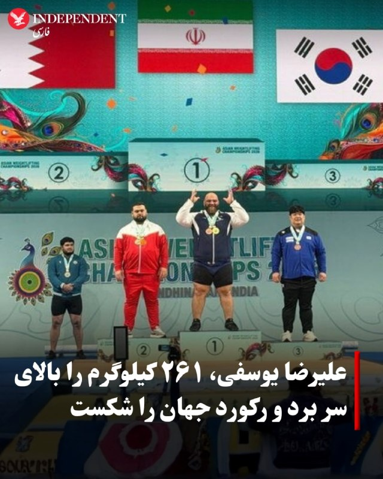

♦️علیرضا یوسفی، ملی‌پوش دسته ۱۱۰+ کیلوگرم وزنه‌برداری ایران، در مسابقات قهرمانی آسیا در هند با ثبت عملکردی درخشان موفق شد رکورد دوضرب جهان را بشکند و سه مدال ارزشمند برای ایران به دست آورد.
یوسفی روز یکشنبه در شهر گاندی‌نگر هند، در رقابت با وزنه‌برداران مطرحی از کره‌جنوبی، بحرین، چین‌تایپه، ازبکستان و امارات روی تخته رفت و در پایان با کسب مدال طلای دوضرب، نقره مجموع و برنز یک‌ضرب، یکی از بهترین نتایج کاروان ایران را ثبت کرد.
این وزنه‌بردار ایرانی در حرکت سوم دوضرب موفق شد وزنه ۲۶۱ کیلوگرمی را مهار کند و ضمن کسب مدال طلا، رکورد جدید جهان را در این حرکت به نام خود ثبت کند. او پیش‌تر در حرکت دوم برای مهار همین وزنه ناموفق بود اما در سومین تلاش خود توانست این رکورد تاریخی را به ثبت برساند.
یوسفی در بخش یک‌ضرب ابتدا وزنه ۱۷۷ کیلوگرمی و سپس ۱۸۴ کیلوگرمی را با موفقیت بالای سر برد، اما در مهار وزنه ۱۸۹ کیلوگرمی ناکام ماند و به مدال برنز رسید.
او در دوضرب نیز ابتدا وزنه ۲۴۸ کیلوگرمی را مهار کرد و سپس در سومین حرکت، وزنه ۲۶۱ کیلوگرمی را بالای سر برد تا رکورد جهان را جابه‌جا کند.
‌🇸🇦 Indypersian

🤖 @VahidOOnLine

## WithYashar — post 11478

شاهزاده رضا پهلوی : جمهوری اسلامی را نمی‌توان تغییر داد همانگونه که یک گرگ را نمیتوان تبدیل به میش کرد
@withyashar

## WithYashar — post 11477

  <a href="telegram/content/WithYashar_11477_1779026474.mp4" target="_blank">🎬 Download video</a>

صداوسیما: با اعلام مدیر کل آموزش و پرورش تهران؛ دانش آموزان پایه های هفتم تا دهم دیگه امتحان خرداد ندارن و با توجه به عملکرد علمی یکساله سنجیده میشن.
@withyashar

## mwarmonitor — post 9201

کوبا از نظر ایالات متحده به عنوان «دولت حامی تروریسم» طبقه‌بندی می‌شود و به عنوان «سر مار» برای صادرات مارکسیسم انقلابی در سراسر آمریکای لاتین در نظر گرفته می‌شود.
یکی از متحدان سابق کوبا، یعنی نیکلاس مادورو در ونزوئلا، در جریان حمله ۳ ژانویه توسط ایالات متحده از قدرت برکنار شد. از زمان برکناری مادورو، ایالات متحده روند عادی‌سازی روابط با ونزوئلا را آغاز کرده و اطلاعات بیشتری درباره برنامه پهپادی کوبا به دست آورده است.
واقعیت‌سنجی (ارزیابی واقعیت)
با این حال، مقامات آمریکایی بر این باور نیستند که کوبا یک تهدید قریب‌الوقوع است یا به طور فعال برای حمله به منافع آمریکا برنامه‌ریزی می‌کند. اما اطلاعات ایالات متحده نشان می‌دهد که مقامات نظامی این جزیره در حال بحث درباره برنامه‌های جنگ پهپادی بوده‌اند تا در صورت بروز درگیری هم‌زمان با وخیم‌تر شدن روابط با آمریکا، از آن‌ها استفاده کنند.
کوبا توانایی بستن تنگه فلوریدا را به همان شیوه‌ای که ایران کشتیرانی در تنگه هرمز را به بن‌بست کشانده است، ندارد. مقامات آمریکایی همچنین معتقدند کوبا به اندازه بحران موشکی کوبا در سال ۱۹۶۲ یک تهدید نظامی بزرگ به شمار نمی‌رود.
این مقام ارشد آمریکایی در پایان گفت:
«هیچ‌کس نگران جت‌های جنگنده کوبا نیست؛ حتی مشخص نیست که آن‌ها یک جنگنده آماده به پرواز داشته باشند. اما شایان ذکر است که آن‌ها چقدر نزدیک هستند — فقط ۹۰ مایل. این واقعیتی نیست که ما با آن راحت باشیم.»

🔸یادداشت سردبیر: این گزارش اصلاح شده است تا مشخص شود کوبا در سال ۱۹۹۶ دو هواپیما (و نه یک هواپیما) را سرنگون کرده است.

@mwarmonitor

## mwarmonitor — post 9200

🔴اختصاصی اکسیوس: آمریکا تهدید پهپادهای تهاجمی کوبا را زیر نظر دارد

📝نویسنده: مارک کاپوتو

🔰بر اساس اطلاعات طبقه‌بندی‌شده‌ای که با اکسیوس به اشتراک گذاشته شده است، کوبا بیش از ۳۰۰ پهپاد نظامی خریداری کرده و اخیراً گفتگوهایی را درباره برنامه‌ریزی برای استفاده از آن‌ها جهت حمله به پایگاه آمریکا در خلیج گوانتانامو، کشتی‌های نظامی ایالات متحده و احتمالاً «کی‌ وست» در ایالت فلوریدا (در فاصله ۹۰ مایلی شمال هاوانا) آغاز کرده است.

چرا این موضوع اهمیت دارد؟
یک مقام ارشد آمریکایی اعلام کرد این اطلاعات مأموریتی — که می‌تواند به بهانه‌ای برای اقدام نظامی ایالات متحده تبدیل شود — نشان می‌دهد که دولت ترامپ تا چه حد کوبا را به دلیل پیشرفت‌ها در جنگ پهپادی و حضور مستشاران نظامی ایران در هاوانا، یک تهدید تلقی می‌کند.
این مقام مسئول گفت:
«وقتی به وجود این نوع فناوری‌ها در چنین فاصله نزدیکی فکر می‌کنیم، و حضور طیفی از بازیگران بد از گروه‌های تروریستی گرفته تا کارتل‌های مواد مخدر، ایرانی‌ها و روس‌ها را در نظر می‌گیریم، نگران‌کننده است. این یک تهدید در حال رشد است.»
محور اخبار
به گفته یک مقام سیا به اکسیوس، جان راتکلیف، رئیس سازمان اطلاعات مرکزی آمریکا (CIA)، روز پنجشنبه به کوبا سفر کرد و به طور صریح به مقامات این کشور درباره هرگونه اقدام خصمانه هشدار داد. او همچنین از آن‌ها خواست تا به حکومت توتالیتر خود پایان دهند تا تحریم‌های فلج‌کننده آمریکا برچیده شود.
این مقام سیا گفت: «مدیر راتکلیف به وضوح روشن کرد که کوبا دیگر نمی‌تواند به عنوان سکویی برای دشمنان جهت پیشبرد برنامه‌های خصمانه در نیم‌کره ما عمل کند. نیم‌کره غربی نمی‌تواند حیاط خلوت و زمین بازی دشمنان ما باشد.»
علاوه بر این، وزارت دادگستری آمریکا قصد دارد روز چهارشنبه کیفرخواستی را علیه رهبر دوفاکتو (عملی) کوبا، رائول کاسترو، علنی کند. او متهم است که در سال ۱۹۹۶ دستور سرنگونی دو هواپیمای متعلق به یک گروه امدادی مستقر در میامی به نام «برادران برای نجات» (Brothers to the Rescue) را صادر کرده است.
انتظار می‌رود تحریم‌های بیشتری علیه این کشور جزیره‌ای در هفته جاری اعلام شود. سخنگوی کوبا روز شنبه برای اظهار نظر در این باره در دسترس نبود.
نگاه نزدیک‌تر (بررسی جزئیات)
به گفته مقامات آمریکایی، کوبا از سال ۲۰۲۳ در حال تهیه پهپادهای تهاجمی با «قابلیت‌های متنوع» از روسیه و ایران بوده و آن‌ها را در مکان‌های استراتژیک در سراسر این جزیره پنهان کرده است.
این مقام ارشد آمریکایی با استناد به شنودهای اطلاعاتی افزود که مقامات کوبا ظرف یک ماه گذشته به دنبال دریافت پهپادها و تجهیزات نظامی بیشتری از روسیه بوده‌اند. این اطلاعات همچنین نشان می‌دهد که مقامات اطلاعاتی کوبا در تلاش هستند تا یاد بگیرند «ایران چگونه در برابر ما مقاومت کرده است.»
روسیه و چین دارای تأسیسات جاسوسی پیشرفته برای جمع‌آوری «اطلاعات سیگنالی» (شنود الکترونیک یا SIGINT) در کوبا هستند.
پیت هگست، وزیر دفاع آمریکا، روز سه‌شنبه در جریان یک جلسه استماع در کنگره به ماریو دیاز-بالارت، نماینده جمهوری‌خواه میامی گفت: «ما مدت‌هاست نگران این بوده‌ایم که استفاده یک دشمن خارجی از موقعیتی در این فاصله نزدیک به سواحل ما، بسیار چالش‌برانگیز و مشکل‌ساز است.»
هگست در پاسخ به دیاز-بالارت، نقش و همدستی کاسترو در صدور دستور سرنگونی هواپیماهای گروه «برادران برای نجات» را تأیید کرد.
تصویر کلی
نگرانی‌ها درباره حملات پهپادی به نیروهای آمریکایی به دلیل استفاده ایران از هواپیماهای بدون سرنشین در پاسخ به حملات آمریکا (که از ۲۸ فوریه آغاز شد) شدت یافته است.
پهپادهای ایران به پایگاه‌های آمریکایی در خاورمیانه آسیب رسانده، به بستن تنگه هرمز کمک کرده و در کنار حملات موشکی، کشورهای همسایه در خلیج فارس را تهدید کرده‌اند.
مقامات آمریکایی تخمین می‌زنند که تا ۵,۰۰۰ سرباز کوبایی برای روسیه در تهاجم به اوکراین جنگیده‌اند و برخی از آن‌ها رهبران نظامی این جزیره را از میزان اثربخشی جنگ پهپادی مطلع کرده‌اند. به برآورد مقامات آمریکایی، روسیه به ازای هر سرباز اعزام‌شده به اوکراین، حدود ۲۵,۰۰۰ دلار به دولت کوبا پرداخت کرده است.
این مقام ارشد گفت: «آن‌ها بخشی از چرخ‌گوشت پوتین هستند. آن‌ها در حال یادگیری تاکتیک‌های ایرانی هستند. این چیزی است که ما باید برای آن برنامه‌ریزی کنیم.»
نگاه کلان
رژیم کاسترو به دلیل تحریم‌های ایالات متحده و سوءمدیریت مالی رژیم مارکسیستی، اکنون بیش از هر زمان دیگری پس از به قدرت رسیدن در انقلاب ۱۹۵۹ (که آن را وارد درگیری با آمریکا کرد)، به سقوط نزدیک شده است.

## FoxNewsTwitter — post 341833

Fox News (Twitter/X)

END OF AN ERA: Ronda Rousey's rousing return to UFC ended quickly, after the legendary fighter took down opponent Gina Carano in just 17 seconds in front of a packed, stunned crowd — wrapping up her historic MMA career.

Rousey claims she's done fighting for good and is embracing being a mom to her two kids, and that she's ready to expand her family again.

## FoxNewsTwitter — post 341832

  <a href="telegram/content/FoxNewsTwitter_341832_1779026475.mp4" target="_blank">🎬 Download video</a>

Fox News (Twitter/X)

Democrats vow to fight back over the Supreme Court's rulings on redistricting, as thousands took to the streets to march in Alabama.

"We have seen this before, where some people in black robes try to deny or take away our rights," Sen. Cory Booker said.

## pm_afshaa — post 90902

  <a href="telegram/content/pm_afshaa_90902_1779026477.webm" target="_blank">🎬 Download video</a>

🗣تجربه‌ای متفاوت از اینترنت پرسرعت 
🔺 سرعت بالا و پایدار 
🔺 مناسب برای استفاده روزمره و حرفه‌ای 
🔺 پشتیبانی سریع و همیشگی 
🔺 ساب‌لینک برای مدیریت مصرف 
⏱ اعتبار یک‌ماهه 
🧑‍💻 کاربر نامحدود 
🚀 با زرین بدون محدودیت وصل باش 
🤖 بات هوشمند 
💎 رضایت مشتری 
👤 پشتیبانی 
📣…

## pm_afshaa — post 90901

  <a href="telegram/content/pm_afshaa_90901_1779026477.webm" target="_blank">🎬 Download video</a>

🗣تجربه‌ای متفاوت از اینترنت پرسرعت

🔺 سرعت بالا و پایدار

🔺 مناسب برای استفاده روزمره و حرفه‌ای

🔺 پشتیبانی سریع و همیشگی

🔺 ساب‌لینک برای مدیریت مصرف

⏱ اعتبار یک‌ماهه 
🧑‍💻 کاربر نامحدود

🚀 با زرین بدون محدودیت وصل باش

🤖 بات هوشمند

💎 رضایت مشتری

👤 پشتیبانی

📣 کانال

🫥 زرین وی پی ان
🎤Zarin VPN

## pm_afshaa — post 90900

  <a href="telegram/content/pm_afshaa_90900_1779026478.webm" target="_blank">🎬 Download video</a>

🔴اکسیوس: کوبا از سال 2023 پیش از 300 پهپاد نظامی به دست آورده که خیلیشون از روسیه و ایران هستن. الانم دارن بحث میکنن که شاید بخوان از اینا علیه پایگاه دریایی آمریکا در خلیج گوانتانامو و کشتی‌های نظامی آمریکا استفاده کنن.

💧 Rainbet.com the #1 Non-KYC Crypto Casino & Sportsbook @rainbetcom

😁 @Pm_Afshaa

## pm_afshaa — post 90899

  <a href="telegram/content/pm_afshaa_90899_1779026478.webm" target="_blank">🎬 Download video</a>

🔴حاجی‌بابایی، نایب‌رییس مجلس:
اگه تاسیسات نفت ما رو بزنن، نفت دوست و دشمن در منطقه رو میزنیم.

💧 Rainbet.com the #1 Non-KYC Crypto Casino & Sportsbook @rainbetcom

😁 @Pm_Afshaa

## iaghapour — post 2617

از هر 10 نفری که که تو اینستاگرام وصل هستن 8 تاش دختره, 2 تاش هم پسر کانفیگ فروش 🥸

## DEJradio — post 4680

  <a href="telegram/content/DEJradio_4680_1779026479.webm" target="_blank">🎬 Download video</a>

🔸
🔺 ناو هواپیمابر یواس‌اس جرالد فورد که پیش از آغاز جنگ با ایران به خاورمیانه اعزام شده بود، پس از ۳۲۶ روز ماموریت، روز شنبه به ایالات متحده بازگشته است. این طولانی‌ترین ماموریت یک گروه رزمی ناو هواپیمابر آمریکا از زمان جنگ ویتنام تاکنون بوده است.
پیت هگست، وزیر دفاع آمریکا در نورفک در ایالت ویرجینیا برای استقبال از بزرگ‌ترین ناو هواپیمابر جهان حضور داشت.
به گفته ارتش آمریکا، این ناو در جریان ماموریت خود در عملیات‌های آمریکا در منطقه کارائیب مشارکت داشت؛ جایی که نیروهای آمریکایی به قایق‌های مظنون به قاچاق مواد مخدر حمله و نفتکش‌های تحریم‌شده را توقیف کردند، همچنین نیکلاس مادورو، رهبر ونزوئلا، را بازداشت کردند.

#آمریکا
@DEJradio

## DEJradio — post 4679

  

🧨
🔥 مقام‌های ابوظبی می‌گویند آتش‌سوزی ناشی از حمله یک پهپاد به یک ژنراتور برق در بیرون محدوده نیروگاه هسته‌ای براکه کنترل شده و به این نیروگاه آسیبی وارد نشده است.
یروگاه هسته‌ای براکه در منطقه ظفره امارات اولین نیروگاه هسته‌ای در جهان عرب است و از چهار رآکتور تشکیل شده است.
سازمان فدرال مقررات هسته‌ای امارات نیز اعلام کرد این آتش‌سوزی تأثیری بر ایمنی نیروگاه، سطح ایمنی پرتویی یا آمادگی سامانه‌های اصلی نیروگاه نداشته و همه واحدها به‌طور عادی به فعالیت خود ادامه می‌دهند.

این حادثه در حالی گزارش می‌شود که تنش‌های منطقه‌ای و حملات پهپادی در خلیج فارس نگرانی‌ها درباره امنیت زیرساخت‌های انرژی و تأسیسات حساس را افزایش داده است.

#انفجار #ابوظبی
@DEJradio

## VahidOnline — post 75513

  

خبرگزاری فارس با انتشار متنی مدعی شد جزئیاتی از پاسخ آمریکا به پیشنهادهای ایران در جریان مذاکرات به دست آورده است؛ گزارشی که در آن از پنج شرط اصلی واشنگتن برای توافق با تهران سخن گفته شده است.

براساس شنیده‌های فارس، شروط اعلام‌شده از سوی آمریکا شامل موارد زیر است:

۱- عدم پرداخت هرگونه غرامت و خسارت از سوی آمریکا
۲- خروج و تحویل ۴۰۰ کیلوگرم اورانیوم از ایران به آمریکا
۳- فعال ماندن تنها یک مجموعه از تاسیسات هسته‌ای ایران
۴- عدم پرداخت حتی ۲۵ درصد از دارایی‌های بلوکه‌شده ایران
۵- منوط‌شدن توقف جنگ در همه ساحتها به انجام مذاکره

به گفته فارس، در مقابل، ایران انجام هرگونه مذاکره را منوط به تحقق پنج پیش‌شرط اعتمادساز دانسته است: «پایان جنگ در همه جبهه‌ها به‌ویژه لبنان»، «رفع تحریم‌های ضدایرانی»، «آزادسازی پول‌های بلوکه‌شده ایران»، «جبران خسارات ناشی از جنگ» و «پذیرش حق حاکمیت ایران بر تنگه هرمز».
@VahidOOnLine

📡 @VahidOnline

## VahidOnline — post 75512

  

عباس عراقچی، وزیر امور خارجه جمهوری اسلامی، در کانال تلگرامی خود اعلام کرد که کتاب «قدرت مذاکره» او به چاپ پنجم رسیده و در چاپ جدید این کتاب، بخش جدیدی با عنوان «دیپلماسی زیر آتش» درباره روند «مذاکرات غیرمستقیم با آمریکا در جنگ ۱۲ روزه» به آن افزوده شده است.
@VahidOOnLine

📡 @VahidOnline

## VahidOnline — post 75511

  

اداره رسانه‌ای ابوظبی روز یک‌شنبه ۲۷ اردیبهشت در شبکه‌های اجتماعی از وقوع آتش‌سوزی در نیروگاه اتمی براکه در امارات متحده عربی خبر داد.

این آتش‌سوزی پس از حمله پهپادی به نیروگاه اتمی برکه در منطقه الظَفرَه آغاز شده، اما کشته و مجروح بر جا نگذاشته است.

بر اساس توضیح اداره رسانه‌ای ابوظبی، این حریق در ژنراتور برق خارج از محدوده پیرامون نیروگاه به راه افتاده و بر ایمنی سایت اثر منفی نداشته است.

در پی آغاز حمله مشترک آمریکا و اسرائیل به خاک ایران، امارات متحده عربی به بزرگ‌ترین هدف حملات تلافی‌جویانه سپاه پاسداران تبدیل شد.
@VahidHeadline

📡 @VahidOnline

## VahidOnline — post 75510

  

خبرگزاری فارس، نزدیک به سپاه پاسداران، روز یک‌شنبه ۲۷ اردیبهشت نوشت که محمدباقر قالیباف، رئیس مجلس شورای اسلامی و عضو سابق سپاه، به عنوان نماینده ویژه ایران در امور چین تعیین شده است.

این خبرگزاری امنیتی بدون هیچ توضیح دیگری تنها نوشته است:‌ «پیشتر علی لاریجانی و عبدالرضا رحمانی‌ فضلی چنین مسئولیتی را برعهده داشتند.»

🔸در این خبر نه توضیح داده شده که چه کسی یا چه نهادی قالیباف را به این سمت منصوب کرده است و نه برهه کنونی چه اهمیتی دارد که حکومت تصور کرده است به این نماینده ویژه نیاز دارد.

اعلام تعیین قالیباف به عنوان نماینده ویژه در امور چین دو روز پس از دیدار رسمی رئیس جمهور آمریکا از کشور چین رخ می‌دهد که در آن یکی از موضوعات گفت‌وگو ایران و تنگه هرمز بود.
کاخ سفید روز پنجشنبه ۲۴ اردیبهشت اعلام کرد دونالد ترامپ، رئیس‌جمهور آمریکا، و شی جین‌پینگ، رئیس‌جمهور چین، در دیدار خود درباره گسترش همکاری‌های اقتصادی، باز ماندن تنگه هرمز و جلوگیری از دستیابی ایران به سلاح هسته‌ای گفت‌وگو و توافق کردند.
@VahidHeadline

📡 @VahidOnline

## VahidOnline — post 75509

  

جلسه دادگاه صادق ساعدی‌نیا، مدیر کافه‌های زنجیره‌ای ساعدی‌نیا که در اعتراضات سراسری دی ماه گذشته به همراه پدرش، محمدعلی ساعدی‌نیا، بازداشت شده بود در دادگاه انقلاب قم برگزار شد.

کافه‌های ساعدی‌نیا از جمله کسب‌وکارهایی بود که در اعتراضات دی ماه پارسال که با اعتراض بازار به نابسامانی اقتصادی آغاز شد، مغازه‌هایشان را تعطیل کردند.

نماینده دادستان قم در این جلسه آقای ساعدی‌نیا را به «فعالیت تبلیغی یا رسانه‌ای برخلاف امنیت کشور»، «اقدام عملیاتی برای گروه‌های معاند نظام از طریق انتشار استوری و فعالیت مجازی و حضور در تجمعات غیرقانونی و تعطیل کردن کافه‌ها و مغازه‌های خود در کل کشور و تشویق تعدادی از کارکنانش در ارتکاب جرایم علیه امنیت کشور» متهم کرد.

به گفته نماینده دادستان و قاضی، موارد اتهامی بر مبنای اطلاعاتی است که از محتوای لوازم الکترونیکی ضبط شده از آقای ساعدی‌نیا و از جمله تصاویر و چت‌های او در واتساپ استخراج شده است.
نماینده دادستان گفت که آقای ساعدی‌نیا در واتساپ خود «برنامه‌ریزی برای تعطیلی کافه‌ها را همزمان با صدور فراخوان دشمن به مشورت گذاشته بود.»
قاضی به او گفت: «شما با فراخوانی که داده‌اید با اقداماتی که انجام داده‌اید، این تعداد جوان را به این مهلکه وارد کرده‌اید و نظام متحمل صدمات زیادی شده است. چطور می‌توانید جبران کنید؟»
@VahidHeadline
نماینده دادستان، مواردی از جمله فعالیت‌های ساعدی‌نیا در فضای مجازی، تهیه کلیپی از یکی از کارکنانش با نوشته «جاوید شاه» روی دست، ایجاد و مدیریت گروه واتساپی کارکنان کافه‌ها، انتشار پیام صوتی درباره خاموش کردن گوشی برای جلوگیری از ردیابی، حضور برخی کارکنان در اعتراضات و برنامه‌ریزی برای تعطیلی کافه‌ها و کارخانه‌ها همزمان با فراخوان‌های اعتراضی را از مصادیق اتهامات مطرح‌شده علیه او عنوان کرد.
@VahidOOnLine

📡 @VahidOnline

## IranIntlTV — post 337630

  <a href="telegram/content/IranIntlTV_337630_1779026482.mp4" target="_blank">🎬 Download video</a>

یک شهروند با ارسال پیامی به ایران‌اینترنشنال می‌گوید: «در بلوچستان هر ۲۰ لیتر بنزینِ آزاد، بین یک میلیون و ۳۰۰ هزار تومان تا یک میلیون و ۵۰۰ هزار تومان شده؛ یعنی حدودا لیتری ۶۰ تا ۷۰ هزار تومان.»

## IranIntlTV — post 337629

  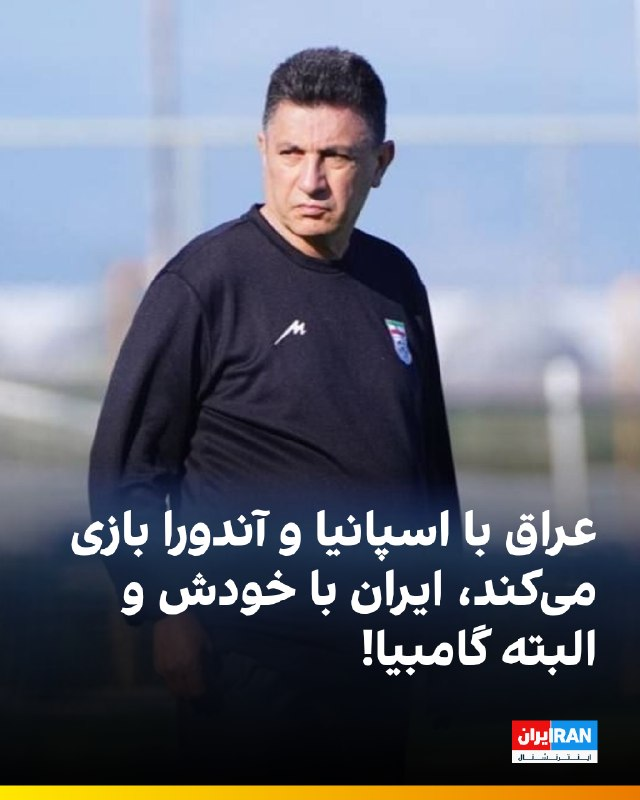

🔻در حالی که تیم فوتبال ایران در اردوهای پیشین مشغول بازی با خودش بود و قرار است در اردوی ترکیه به مصاف گامبیا برود، تیم ملی عراق، دیگر نماینده آسیا در جام جهانی، در آخرین اردوی آماده‌سازی خود مقابل تیم‌های ملی آندورا و اسپانیا بازی دوستانه برگزار خواهد کرد.

🔹نکته قابل توجه این است که فدراسیون فوتبال ایران پس از قرعه‌کشی جام جهانی مدعی شده بود برای برگزاری دیدارهای تدارکاتی با اسپانیا و پرتغال به توافق رسیده است، اما این بازی‌ها نهایی نشد و اکنون عراق به‌جای ایران با تیم ملی اسپانیا بازی خواهد کرد.

🔹تیم ملی ایران علاوه بر این‌که هیچ حریف درجه یک یا درجه دویی برای بازی تدارکاتی ندارد، هنوز برای هیچ‌یک از بازیکنان و اعضای تیم نیز ویزای آمریکا صادر نشده است.

🔹مهدی تاج، رئیس فدراسیون فوتبال ایران، روز گذشته پس از دیدار با رئیس فدراسیون فوتبال ترکیه، از برگزاری بازی تدارکاتی با تیم ملی ترکیه پس از جام جهانی خبر داد.

🔹جزییات بیشتر را در سایت بخوانید.

@iranintltvsport

## IranIntlTV — post 337626

  

اردن حمله پهپادی به ابوظبی را که به وقوع آتش‌سوزی در خارج از محدوده داخلی نیروگاه هسته‌ای براکه منجر شد، به‌شدت محکوم کرد و آن را نقض آشکار حاکمیت امارات متحده عربی، تهدیدی علیه امنیت و ثبات این کشور و نیز نقض صریح قوانین بین‌المللی و منشور سازمان ملل متحد دانست.

وزارت خارجه اردن در بیانیه‌ای با اعلام همبستگی کامل با امارات متحده عربی تاکید کرد که اَمان در کنار ابوظبی و تمامی اقداماتی که برای حفظ امنیت، حاکمیت و سلامت شهروندان و ساکنان خود انجام دهد، خواهد ایستاد.
https://iranintl.com/202605171312

## IranIntlTV — post 337625

  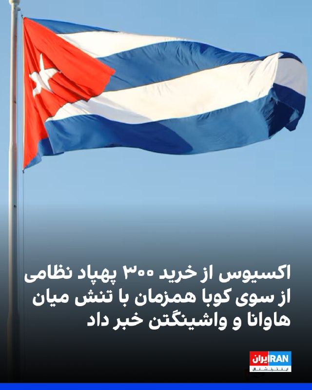

اکسیوس گزارش داد که کوبا بیش از ۳۰۰ پهپاد نظامی خریداری کرده و اخیرا نیز گفت‌وگو درباره استفاده از آنها برای حمله به پایگاه آمریکا در خلیج گوانتانامو، شناورهای نظامی آمریکا و احتمالا شهر کی‌وست در ایالت فلوریدا، در حدود ۱۴۵ کیلومتری شمال هاوانا، را آغاز کرده است.

یک مقام ارشد آمریکایی به اکسیوس گفت این اطلاعات که می‌تواند دلیلی برای اقدام نظامی آمریکا شود، نشان می‌دهد دولت ترامپ تا چه اندازه کوبا را، به دلیل تحولات جنگ پهپادی و حضور مستشاران نظامی جمهوری اسلامی در هاوانا، تهدید تلقی می‌کند.

این مقام آمریکایی گفت: «وقتی به این نوع فناوری‌ها که تا این اندازه نزدیک هستند فکر می‌کنیم، و همچنین به طیفی از بازیگران خطرناک از گروه‌های تروریستی گرفته تا کارتل‌های مواد مخدر، مستشاران جمهوری اسلامی و روس‌ها، موضوع نگران‌کننده می‌شود.»
https://iranintl.com/202605176856

## IranIntlTV — post 337624

روایت شما از بحران اقتصادی در آتش‌بس- یکشنبه ۲۷ اردیبهشت‌ماه🗣

🔹واقعا دیگه هیچ امیدی ندارم. سه ماهه به‌خاطر قطعی اینترنت بیکار موندیم. پهنای باند این‌قدر کمه که نه فیلترشکن جواب داده و نه اینترنت‌پرو.

🔹من مدرس آنلاین زبان بودم. الان دو ماه گذشته و حتی یک کلاس هم نتونستم برگزار کنم. از پس‌اندازم فقط دو میلیون تومان مونده و نمی‌تونم کار هم پیدا کنم.

🔹منم مثل خیلی از هم‌وطنان بیکار شدم و برای ادامه زندگی، با قسط و قرض یه کامیون خریدم. اما سوخت کامیون خیلی کمه و ناچارم یک لیتر گازوئیل رو ۵۰ تا ۷۵ هزار تومان بخرم که اصلاً مقرون‌به‌صرفه نیست. از یه طرف از بیکاری دارم دیوونه میشم و از طرف دیگه شرمنده زن و بچه شدم.

🔹اسنپ سوار شدم، کنارم روپوش پزشکی و چند تا کتاب دیدم. راننده جوان گفت که دانشجو هست و اوقات بین کلاس و بیمارستان اسنپ کار می‌کند.

🔹دلم می‌خواد خون گریه کنم. سه ماه هست که بیکارم. پانزده روز دیگه باید خونه ۵۰ متری استیجاری‌ رو تحویل بدم، در حالی که اجاره و ودیعه سر به فلک کشیده و من فقط صد میلیون تومان پول ودیعه بیشتر ندارم.

🔹من و همسرم تریدر هستیم و اول زندگی مشترکمونه. از جنگ ۱۲ روزه تا الان همش از جیب، اجاره و هزینه‌هامون رو دادیم. اما دیگه نمی‌دونیم باید چکار کنیم. امیدوارم این همه سختی و مشکلات نتیجه‌اش برگشت پهلوی باشه.

🔹۱۰ تیکه فیله‌مرغ، ۴ تیکه بوقلمون و یک شانه تخم‌مرغ شد شش میلیون و ۳۰۰ هزار تومان. واقعا باورنکردنیه.

🔹 دانشجو علوم پزشکی تهران هستم. متاسفانه هیچ دسترسی به اینترنت آزاد و بین‌الملل برای دانشجویان در نظر گرفته نشده. مقالات، پروژه‌ها و پایان‌نامه‌های ما به‌خاطر نداشتن دسترسی به چیزی که حق طبیعی هر انسانی است، ناتمام مونده.

## IranIntlTV — post 337623

  <a href="telegram/content/IranIntlTV_337623_1779026485.mp4" target="_blank">🎬 Download video</a>

یک شهروند با ارسال پیامی به ایران‌اینترنشنال می‌گوید: «ساعت مرگ، زمانی است که همه‌چیز، از جمله انگیزه از بین می‌رود. برای من، این ساعت زمانی بود که مجبور شدم به خاطر شرایط تحمیل‌شده، شش نفر از ۱۴ نیروی کارم را تعدیل کنم.»

## IranIntlTV — post 337622

  <a href="telegram/content/IranIntlTV_337622_1779026486.mp4" target="_blank">🎬 Download video</a>

دفتر رسانه‌ای ابوظبی از حمله پهپادی به یک ژنراتور برق در محدوده داخلی نیروگاه هسته‌ای براکه در منطقه الظفره خبر داد. بر اساس این گزارش، این حمله پهپادی باعث آتش‌سوزی در نیروگاه هسته‌ای شده است.

گفت‌وگو با علی صدرزاده، تحلیل‌گر مسائل خاورمیانه
@iranintltv

## IranIntlTV — post 337621

  <a href="telegram/content/IranIntlTV_337621_1779026488.mp4" target="_blank">🎬 Download video</a>

جابر رجبی، تحلیل‌گر سیاسی، می‌گوید آمریکا مذاکرات را تنها برای خارج کردن اورانیوم غنی‌شده جمهوری اسلامی ادامه می‌دهد و همزمان تهران تصور می‌کند با طولانی کردن بحران در تنگه هرمز می‌تواند از واشینگتن امتیاز بگیرد. او هشدار داد این «توهم» در نهایت به اسرائیل کمک می‌کند تا سناریوی جنگ را پیش ببرد.
@iranintltv

## IranIntlTV — post 337620

  <a href="https://t.me/IranintlTV/337620" target="_blank">📎 Download file</a>

🎧نسخه صوتی اخبار نیمروزی | یکشنبه ۲۷ اردیبهشت
@iranintlTV

## IranIntlTV — post 337619

ولی‌الله بیاتی، عضو کمیسیون امور داخلی مجلس، به ایسنا گفت: «مذاکرات باید ادامه پیدا کند، اما در عین حال دست ما روی ماشه است و آمادگی کامل برای ادامه نبرد وجود دارد.»
بیاتی گفت: «وضعیت «نه صلح نه جنگ» خیلی از کارها را در کشور معطل نگه می دارد. این وضعیت آسیب زیادی وارد می‌کند.»
https://iranintl.com/202605179834

## IranIntlTV — post 337618

  <a href="telegram/content/IranIntlTV_337618_1779026490.mp4" target="_blank">🎬 Download video</a>

جاویدنامان انقلاب ملی ایرانیان
«محسن شریف‌کاظمی» در شامگاه ۱۸ دی‌ماه در فردیس کرج مورد اصابت گلوله جنگی نیروهای سرکوبگر جمهوری اسلامی قرار گرفت و جان سپرد. نامش در حافظه‌ی این سرزمین می‌ماند و یادش چراغ راه آزادی‌خواهان است.

@iranintltv

## ManotoTV — post 105555

  <a href="telegram/content/ManotoTV_105555_1779026491.mp4" target="_blank">🎬 Download video</a>

راهپیمایی ایرانیان ساکن گوتنبرگ سوئد، یکشنبه ۲۷ اردیبهشت

## FarsiVOA — post 217972

🔺دیدگاه | بازداشت محمدباقر السعدی، مهره اطلاعاتی کتائب حزب‌الله در عراق؛ ضربه‌ای دیگر به جمهوری اسلامی

▪️بازداشت محمد‌باقر سعد داوود السعدی، تبعه عراقی و عضو ارشد کتائب حزب‌الله، و اعلام خبر آغاز محاکمه او از سوی وزارت دادگستری ایالات متحده در روز جمعه ۲۵ اردیبهشت، در رابطه با اتهامات همکاری با سازمان‌های تروریستی تحت حمایت رژیم ایران و هدایت حملات علیه شهروندان و منافع ایالات متحده، بازتاب گسترده‌ای در منطقه و جهان داشته است.

⬇️ بیشتر بخوانید:

https://ir.voanews.com/a/opinion-arrest-of-kataib-hezbollah-figure-in-iraq-another-blow-to-iran-regime/8150715.html

## FarsiVOA — post 217971

  <a href="telegram/content/FarsiVOA_217971_1779026492.mp4" target="_blank">🎬 Download video</a>

رسانه‌های ایران از واژگونی یک اتوبوس در محدوده سیراف - عسلویه، استان بوشهر، در روز یکشنبه، ۲۷ اردیبهشت، خبر داده‌اند. این حادثه هشت کشته برجای گذاشت. فرمانده پلیس راه سیراف - عسلویه علت این واژگونی را «نقص فنی در سیستم ترمز» اعلام کرد و گفت سرنشینان مصدوم به بیمارستان‌های عسلویه و کنگان منتقل شدند.

هرانا، وب‌سایت مجموعه فعالان حقوق بشر، اعلام کرد این اتوبوس حامل کارکنان مجتمع گاز پارس جنوبی بود.

## FarsiVOA — post 217970

🔺آژانس درباره حمله پهپادی به نیروگاه هسته‌ای امارات: سطح تشعشعات عادی است

▪️آژانس بین‌المللی انرژی اتمی روز یکشنبه ۲۷ اردیبهشت اعلام کرد امارات متحده عربی به این نهاد اطلاع داده است که سطح تشعشعات در نیروگاه هسته‌ای «براکه» (برکت) همچنان در وضعیت عادی قرار دارد، و پس از حمله پهپادی که باعث آتش‌سوزی در یک ژنراتور برق بیرون از نیروگاه شد، هیچ مصدومی گزارش نشده است.

⬇️ بیشتر بخوانید:

https://ir.voanews.com/a/iaea-react-uae-barakah-nuclear-power-plant-drone-attack/8150884.html/?nocach=1

## FarsiVOA — post 217969

🔺هشدار اسرائیل به ساکنان چهار روستا در جنوب لبنان: فورا تخلیه کنید

▪️ارتش اسرائیل روز یکشنبه ۲۷ اردیبهشت هشداری فوری برای تخلیه چهار روستای ارزی، مروانیه، بابلیه، و بیساریه در جنوب لبنان صادر کرد.

⬇️ بیشتر بخوانید:

https://ir.voanews.com/a/evacuation-warning-israel-lebanon/8150885.html/?nocach=1

## FarsiVOA — post 217968

🔺دیدگاه | سینماگران ایرانی در جشنواره کن ۲۰۲۶؛ بودن یا نبودن در کنار مردم

▪️آیا دستور زبان می‌تواند کارکرد سیاسی پیدا کند؟ سؤال ساده‌ای‌ به چشم می‌آید که مثال‌هایش در جامعه ایرانی، عموماً مصرف بسیار ساده‌تری دارند. مصرفی که به ادعای «غیرسیاسی» بودن، آلوده است: طرز بیان هر دیدگاه، با تغییر آرایش کلمات در هر جمله، تغییر می‌کند. بر این اساس، می‌توان دیدگاهی درباره یک فاجعه ملی را طوری بیان کرد که صرفاً «درباره انسان‌ها» به نظر برسد و به عاملان فاجعه هیچ کاری نداشته باشد.

⬇️ بیشتر بخوانید:

https://ir.voanews.com/a/cannes-film-festival-iranian-filmmakers-asghar-farhadi-pegah-ahangarani/8150880.html/?nocach=1

## FarsiVOA — post 217964

ستاد فرماندهی مرکزی آمریکا، سنتکام، اعلام کرد دریاسالار کِرت رنشاو، فرمانده ناوگان پنجم، روز پنج‌شنبه ۲۵ اردیبهشت از ناو هواپیمابر «یو‌اس‌اس جرج اچ. دبلیو. بوش» در آب‌های منطقه بازدید کرد.

به گفته سنتکام، این ناو در پشتیبانی از عملیات محاصره دریایی علیه جمهوری اسلامی ایران در حال فعالیت است.

رنشاو در جریان این بازدید با ملوانان دیدار کرد و درباره اهمیت ماموریت آن‌ها سخن گفت.

@FarsiVOA

## DW_Farsi — post 124798

🎥 سردمدار شبکه قطارهای شبانه اروپا؛ اتریش چگونه از غول‌ها سبقت گرفت؟

در حالی که بیشتر کشورهای اروپا شبکه قطارهای شبانه خود را محدود کردند، یک کشور برعکس عمل کرد و به دارنده بزرگ‌ترین شبکه ریلی شبانه در قاره سبز تبدیل شد. چهار دلیل موفقیت این کشور را در این ویدیو ببینید.
@dw_farsi

## DW_Farsi — post 124797

  

🔶 "انتصاب قالیباف به عنوان نماینده ویژه ایران در امور چین"

رسانه‌های داخلی ایران روز یکشنبه ۲۷ اردیبهشت گزارش دادند که محمدباقر قالیباف به عنوان "نماینده ویژه جمهوری اسلامی ایران در امور چین" منصوب شده است.

خبرگزاری تسنیم، وابسته به سپاه پاسداران نیز در گزارشی نوشت این انتصاب "با پیشنهاد رئیس‌جمهور و تایید رهبر جمهوری اسلامی" انجام شده است. به نوشته این خبرگزاری، عبدالرضا رحمانی‌فضلی پیش‌تر به عنوان "نماینده رئیس‌جمهور در امور چین" فعالیت می‌کرد و علی لاریجانی نیز پیشتر "نماینده ویژه رهبر جمهوری اسلامی در امور چین" بود.

با این حال، جزئیات روشنی درباره حدود اختیارات، ساختار حقوقی یا ضرورت ادامه فعالیت چنین سمتی منتشر نشده است. مشخص نیست جمهوری اسلامی در شرایطی که وزارت خارجه و سفارت ایران در پکن مسئول رسمی روابط دوجانبه با چین هستند، چه نیازی به تعیین یک "نماینده ویژه" جداگانه در امور چین دارد.
@dw_farsi

## DW_Farsi — post 124796

🔶 جنگ ایران، چالشی برای دیپلماسی چندجانبه‌گرای هند

هند مدت‌ها به انجام کاری افتخار می‌کرد که تنها شمار اندکی از قدرت‌های بزرگ قادر به انجام آن بودند. این کشور از ایران نفت خرید، روابط دفاعی با اسرائیل برقرار کرد، مناسبات خود با آمریکا را گسترش داد و همزمان روابط اقتصادی با پادشاهی‌های حوزه خلیج فارس را توسعه بخشید، در حالی که همواره تأکید می‌کرد وارد بلوک‌بندی‌های منطقه‌ای یا ائتلاف‌های رسمی نخواهد شد.

اما جنگ آمریکا و اسرائیل علیه ایران، اکنون این فرمول را به مرز نهایی‌اش رسانده است. به نظر می‌رسد نارندرا مودی، نخست‌وزیر هند، نیز فشارها را احساس می‌کند. او از روز جمعه گذشته ۱۵ مه (۲۵ اردیبهشت) سفر هفت‌روزه دیپلماتیکی را آغاز کرد که شامل بازدید از امارات متحده عربی و چهار کشور اروپایی است.
@dw_farsi

## DW_Farsi — post 124795

🔶 مصادره اموال شهروندان منتقد توسط جمهوری اسلامی ادامه دارد

کاظم موسوی، رئیس کل دادگستری استان قم از توقیف سه واحد آپارتمان متعلق به مهدی نصیری، سردبیر اسبق روزنامه کیهان و فعال سیاسی کنونی و وابستگانش خبر داد.

به گفته مقام‌های قضایی، این اقدام با گزارش "اطلاعات سپاه" و در چارچوب پرونده‌ای با اتهاماتی از جمله "همکاری با رسانه‌های معاند"، "حمایت از حمله آمریکا و اسرائیل" و "تشویق به براندازی" انجام شده است.

دادگستری قم اعلام کرد این اموال با دستور قضایی توقیف شده و پرونده در حال رسیدگی است. مقام‌های قضایی همچنین تاکید کردند که روند شناسایی و توقیف دارایی‌های افراد متهم به همکاری با "دشمنان" ادامه خواهد داشت.

ناصر عتباتی، رئیس کل دادگستری آذربایجان غربی هم از صدور دستور توقیف اموال ۱۲۹ نفر از افراد مرتبط با "اقدامات ضدامنیتی" و همکاری با کشورهای متخاصم خبر داد.

ناصر عتباتی گفت این اقدام در راستای افزایش هزینه "اقدامات دشمن" و با هدف "تقویت امنیت کشور" انجام شده است.

این مقام قضایی توضیحی درباره چگونگی تاثیر مصادره اموال شهروندان منتقد بر "تقویت امنیت" ارائه نکرده است.

غلامحسین محسنی اژه‌ای، رئیس قوه قضاییه جمهوری اسلامی، اخیرا خواستار "تسریع در صدور احکام اعدام و مصادره اموال" شده بود.

مصادره گسترده اموال را می‌توان بخشی از سیاست راهبردی سرکوب صداهای منتقد و معترض دانست.
@dw_farsi

## Persian_Trend_Official — post 14325

🔴 وزارت دفاع امارات: هدف حمله ۳ پهپاد قرار گرفتیم

وزارت دفاع امارات اعلام کرد این کشور هدف حمله سه پهپاد قرار گرفته است.

▪️ پهپادها از سمت مرزهای غربی وارد حریم امارات شده‌اند

🫆:Tony

📌 @persian_trend_official
پرشین ترند | متفاوت‌ترین کانال نظامی

## Persian_Trend_Official — post 14324

  

🔴اسرائیل یکی از فرماندهان حماس را ترور کرد

💢ارتش رژیم اسرائیل مدعی شد «بهاء بارود»، فرمانده اداره عملیات جنبش حماس را دیروز (شنبه) هدف قرار داده است.

🫆:Tony

📌 @persian_trend_official
پرشین ترند | متفاوت‌ترین کانال نظامی

## RadioFarda — post 157289

سازمان حقوق بشر ایران: «برخی از وکلای تسخیری» در تسریع صدور حکم اعدام برای معترضان دی‌ماه نقش دارند

🔸سازمان حقوق بشر ایران، مستقر در نروژ، می‌گوید بازداشت‌شدگان اعتراضات دی‌ماه گذشته دچار «محرومیت سیستماتیک» از دادرسی عادلانه شده‌اند و همچنین از نقش «برخی از وکلای تسخیری» در صدور احکام سنگین خبر داده است.

🔸این سازمان روز ۲۵ اردیبهشت در بیانیه‌ای اعلام کرد بر اساس اطلاعاتی که گردآوری کرده است، قوه قضائیه جمهوری اسلامی علاوه بر ایجاد مماتعت متهمان برای دسترسی به وکیل مستقل در مراحل مقدماتی، حتی تا پس از تأیید رسمی احکام در دیوان عالی کشور نیز از این دسترسی جلوگیری می‌کند.

🔸سازمان حقوق بشر ایران همچنین می‌گوید درباره پرونده‌های معترضان محکوم به اعدام مدارکی را رویت کرده‌ است که تأیید می‌کنند «برخی وکلای تسخیری تنها یک یا چند روز پس از صدور حکم، اقدام به ثبت تجدیدنظرخواهی‌های صوری می‌کنند».

🔸این سازمان در ادامه توضیح داده است: «در چنین مواردی، دیوان‌عالی کشور اغلب با سرعت قابل‌توجهی حکم اعدام را تأیید می‌کند و اجرای حکم بلافاصله پس‌از آن امکان‌پذیر می‌شود.»

🔸این در حالی است که طبق قوانین جمهوری اسلامی، متهمان پس از صدور حکم اعدام، مهلت قانونی ۲۰ روزه برای تجدیدنظرخواهی دارند.

@RadioFarda

## IranianMinds — post 20278

🔴 دو مقام اطلاعاتی منطقه به فاکس نیوز:

ارزیابی غالب در داخل ایران این است که پرزیدنت ترامپ ممکن است به از سرگیری اقدام نظامی متوسل شود و تهران اکنون عمداً استراتژی «فریب و تأخیر» را دنبال می‌کند با این امید که خرید زمان هرگونه بازگشت احتمالی به جنگ را پیچیده کند.

@IranianMinds

## IranianMinds — post 20277

🔴 فوری

الجزیره :

یورش اسرائیل به شهر باریش و دیین در جنوب لبنان

@IranianMinds

## IranianMinds — post 20276

حاجی‌بابایی، نایب‌رییس مجلس:

اگه تاسیسات نفت ما رو بزنن، نفت دوست و دشمن در منطقه رو میزنیم.

@IranianMinds

## IranianMinds — post 20275

  

🔴در حالی‌که اینترنت بین‌الملل ۷۹ روزه که در ایران قطع هست، پزشکیان این توییت رو زده:
روز جهانی ارتباطات مبارک😂😂😂

@IranianMinds

## BBCPersian — post 281301

  

🔻محسن نقوی، وزیر کشور پاکستان، عصر امروز با محمدباقر قالیباف، رئیس مجلس ایران در تهران دیدار و گفت‌وگو کرد.

آقای قالیباف ریاست هیئت مذاکره کننده ایران در مذاکرات با آمریکا در پاکستان را بر عهده داشت.

پاکستان میانجی‌ کنونی ایران و آمریکاست.

رسانه‌های ایرانی و پاکستانی گزارش داده‌‌اند که آقای نقوی برای از سرگیری مذاکرات به ایران سفر کرده است.

گفته شده او حامل پیام‌ آمریکاست و پاسخ ایران را هم دریافت خواهد کرد.

به گفته سفارت پاکستان در تهران، آقای نقوی دیروز پس از ورود به تهران «نزدیک به سه ساعت در نهاد ریاست جمهوری حضور داشت» و اسکندر مومنی، وزیر کشور، و عباس عراقچی، وزیر امور خارجه نیز «در جریان این دیدار در نهاد ریاست جمهوری حضور داشتند.»

علاوه بر این، محسن نقوی «دیداری خصوصی» با مسعود پزشکیان داشت که «حدود ۹۰ دقیقه به طول انجامید و با حضور وزیر کشور ایران همراه بود.»

📷Mehr News
https://bbc.in/4uMNMMW

@BBCPersian

## BBCPersian — post 281300

  

‌🔻بهار صحرائیان، وکیل دادگستری و فعال حقوق بشر، صبح روز ۲۶ اردیبهشت هنگامی که برای دفاع از معترضان بازداشت‌شده در دادگاه انقلاب شیراز حاضر شده بود، بازداشت شده است.

یک منبع مطلع به بی‌بی‌سی گفت که خانم صحرائیان به زندان عادل‌آباد شیراز منتقل شده است.

بهار صحرائیان که عضو کانون وکلای استان فارس است، آبان ۱۴۰۱ هم بازداشت و مدتی در زندان بود که با حکم عفو آزاد شد.

این منبع مطلع گفت خانم صحرائیان پس از آزادی چند بار به اداره اطلاعات فراخوانده شد: «این وکیل دادگستری در حین انجام وظیفه حرفه‌ای و در فضای دادگاه صورت گرفته است سپس به دفتر کارش در شیراز برده شده و دفتر مورد تفتیش قرار گرفته و بعد از آن به بازداشتگاه منتقل شده است.»

بر اساس این گزارش، خانم صحرائیان صبح امروز، ۲۷ اردیبهشت به دادسرا منتقل شده و اتهامات «اجتماع و تبانی به قصد اقدام علیه امنیت ملی»، «فعالیت تبلیغی علیه نظام اسلامی» و «نشر اکاذیب» به او تفهیم شده است.

📷Handout
@BBCPersian

## BBCPersian — post 281299

  <a href="telegram/content/BBCPersian_281299_1779026497.mp4" target="_blank">🎬 Download video</a>

🔻سرخط خبرهای روز یکشنبه ۲۷ اردیبهشت ۱۴۰۵
@BBCPersian

## BBCPersian — post 281298

  

🔻جلسه دادگاه صادق ساعدی‌نیا، مدیر کافه‌های زنجیره‌ای ساعدی‌نیا که در اعتراضات سراسری دی ماه گذشته به همراه پدرش، محمدعلی ساعدی‌نیا بازداشت شد،‌ در دادگاه انقلاب قم برگزار شد.

کافه‌های ساعدی‌نیا از جمله کسب‌وکارهایی بود که در اعتراضات دی ماه پارسال که با اعتراض بازار به نابسامانی اقتصادی آغاز شد، مغازه‌هایشان را تعطیل کردند.

نماینده دادستان قم در این جلسه آقای ساعدی‌نیا را به «فعالیت تبلیغی یا رسانه‌ای برخلاف امنیت کشور»، «اقدام عملیاتی برای گروه‌های معاند نظام از طریق انتشار استوری و فعالیت مجازی و حضور در تجمعات غیرقانونی و تعطیل کردن کافه‌ها و مغازه‌های خود در کل کشور و تشویق تعدادی از کارکنانش در ارتکاب جرایم علیه امنیت کشور» متهم کرد.

به گفته نماینده دادستان و قاضی موارد اتهامی بر مبنای اطلاعاتی است که از محتوای لوازم الکترونیکی ضبط شده از آقای ساعدی‌نیا و از جمله تصاویر و چت‌های او در واتساپ استخراج شده است.

نماینده دادستان گفت که آقای ساعدی‌نیا در واتساپ خود «برنامه ریزی برای تعطیلی کافه‌ها را همزمان با صدور فراخوان دشمن به مشورت گذاشته بود.»

لینک خبر:
📷MIZAN
https://bbc.in/3PnkDsQ

@BBCPersian

## BBCPersian — post 281297

  

🔻مقام‌های ابوظبی می‌گویند آتش‌سوزی ناشی از حمله یک پهپاد به یک ژنراتور برق در بیرون محدوده نیروگاه هسته‌ای براکه کنترل شده است.

دفتر رسانه‌ای ابوظبی گفت در این حادثه کسی آسیب ندیده است و سطح ایمنی پرتوهای رادیواکتیو نیز تغییری نکرده است.

سازمان تنظیم مقررات هسته‌ای امارات هم با تایید این خبر اعلام کرد که نیروگاه به کار عادی خود ادامه می‌دهد.

نیروگاه هسته‌ای براکه در منطقه ظفره امارات اولین نیروگاه هسته‌ای در جهان عرب است و از چهار رآکتور تشکیل شده است.

در بیانیه‌های امارات اشاره‌ای به مسئول احتمالی حملات نشده است.

ایران امارات را در حملات آمریکا و اسرائیل شریک فعال می‌داند.

آژانس بین‌المللی انرژی اتمی از حمله پهپادی به نزدیکی نیروگاه هسته‌ای امارات به‌شدت ابراز نگرانی کرد.

این حمله به آتش‌سوزی در این نیروگاه انجامید اما دفتر رسانه‌ای دولت ابوظبی گفت که آتش‌سوزی کنترل شده و آسیبی به نیروگاه وارد نشده است.

آژانس بین‌المللی انرژی اتمی هم تایید کرد که سطح تشعشعات در اطراف این نیروگاه عادی است.

📸MOHAMEDBINZAYED
https://bbc.in/4wBBjNT
@BBCPersian

## idfinfarsi — post 11591

‼️برای رفع تهدید: نیروهای ارتش اسرائیل یک فرمانده در ستاد عملیات سازمان تروریستی حماس را که در پیشبرد طرح‌های تروریستی علیه نیروهای ما نقش داشت، به‌هلاکت رساندند.

نیروهای ارتش اسرائیل در فرماندهی جنوب، روز گذشته (شنبه) بها‌ء بارود، از فرماندهان ستاد عملیات شاخه نظامی سازمان تروریستی حماس را به‌هلاکت رساندند.

بارود در طول جنگ، و به‌ویژه در دوره اخیر، در برنامه‌ریزی و پیشبرد طرح‌های تروریستی متعددی از سوی سازمان تروریستی حماس علیه نیروهای ارتش اسرائیل در نوار غزه و شهروندان اسرائیل در کوتاه‌مدت نقش داشته است.

وی تهدیدی فوری برای نیروهای ارتش اسرائیل به شمار می‌رفت و در یک حمله دقیق هوایی به‌هلاکت رسید.

پیش از حمله، اقداماتی برای کاهش آسیب به غیرنظامیان انجام شد، از جمله استفاده از مهمات دقیق و دیدبانی‌های هوایی.

نیروهای ارتش اسرائیل در فرماندهی جنوب، مطابق با توافق، در منطقه مستقر هستند و به اقدام برای رفع هرگونه تهدید فوری ادامه خواهند داد.

## Dirty_Kids — post 389618

رژیم آخوندها اگر توانش را داشتند، اکسیژن را روی مردم ایران می بستند و به نیروهای خودی «اکسیژن پرو» می‌دادند.

@Dirty_Kids 👻

## Dirty_Kids — post 389617

‏به عنوان یه روانشناس می‌تونم بگم که، آدم‌ها معمولاً خشم‌شون رو سر کسانی که واقعاً مستحق اون هستن خالی نمی‌کنن، بلکه روی کسانی خالی می‌کنن که مطمئنن دوست‌شون دارن و در نهایت اون‌ها رو می‌بخشن.

@Dirty_Kids 👻

## Dirty_Kids — post 389616

‏از جمله [بذار تکلیف جنگ معلوم شه، بعد] حامله ام.

@Dirty_Kids 👻

## Dirty_Kids — post 389615

قبلا کس گاو برای خودش شخصیتی داشت، الان شده چند گیگ اینترنت و چند دقیقه ریلز دیدن تو اینستا

@Dirty_Kids 👻

## Dirty_Kids — post 389614

  <a href="telegram/content/Dirty_Kids_389614_1779026499.mp4" target="_blank">🎬 Download video</a>

حامی تروریسم دیروز وسط گهخوریش توسط پلیس شریف فرانکفورت بدرقه شد 😁

@Dirty_Kids 👻

## Dirty_Kids — post 389613

مَکرون دخترتو میگاد، جفتکتو به پهلوی میزنی.

@Dirty_Kids 👻

## Dirty_Kids — post 389612

بهزاد فراهانی، این کفتار پیرِ به بچه‌های ۱۷-۱۸ ساله که دست خالی می‌رن جلوی دوشکا:
«اگه بیضه دارید بیاید انقلاب کنید!»

تو که ۴۷ سال برای چهار تا نقش‌‌تخمی‌بیضه‌مالی آخوند رو کردی میدونی که‌‌ اگه محمدرضا شاه فقید فقط یک صدم جنایاتی که آخوندای عزیزت کردن رو کرده بود، حجم بیضه‌های تو و رفقات هم مشخص می‌شد

حروم‌زاده!

@Dirty_Kids 👻

## Hranews — post 112992

بازداشت دو معترض با ادعای «مشارکت در قتل پلیس»؛ پیشتر محمد عباسی در این پرونده اعدام شده بود

❗️
❗️
❗️
❗️
❗️– فرمانده انتظامی ملارد از #بازداشت دو شهروند در ارتباط با اعتراضات سراسری ۱۴۰۴ خبر داد و مدعی شد که این افراد در قتل یک افسر پلیس نقش داشته‌اند. این در حالی است که اخیرا محمد عباسی در ارتباط با همین پرونده #اعدام شده بود.

ادامه مطلب

#محمد_عباسی

↘️
@hranews_bot تماس ✉️ -  @Hranews  کانال هرانا 🆑

## Hranews — post 112991

بهار صحرائیان، وکیل دادگستری در شیراز بازداشت و تفهیم اتهام شد

❗️
❗️
❗️
❗️
❗️ – بهار صحرائیان، وکیل دادگستری روز گذشته در شیراز #بازداشت شد و امروز یکشنبه ۲۷ اردیبهشت ماه، جلسه بازپرسی وی در دادسرای این شهرستان برگزار شد.

ادامه مطلب

#بهار_صحرائیان

↘️
@hranews_bot تماس ✉️ -  @Hranews  کانال هرانا 🆑

## Hranews — post 112990

  

نائب رئیس کانون بازنشستگان تامین اجتماعی شیراز، نسبت به وضعیت این سازمان هشدار داد و اعلام کرد که در صورت تداوم روند کنونی، تامین اجتماعی با خطر جدی ورشکستگی مواجه خواهد شد. وی در گفت‌وگو با خبرگزاری ایلنا، ضمن اشاره به افزایش شدید هزینه‌ها و کاهش منابع درآمدی، این وضعیت را ناشی از رشد تعهدات، کاهش بیمه‌پردازی و شرایط اقتصادی دانست.

ناصر مصطفوی، با انتقاد از وضعیت خدمات درمانی، اعلام کرد که با وجود الزام قانونی، طرح درمان رایگان برای کارگران و بازنشستگان به‌طور کامل اجرا نشده و همزمان تعرفه‌های درمانی بدون کنترل در حال افزایش است. به گفته وی، این شرایط فشار مضاعفی بر بازنشستگان وارد کرده و در کنار مشکلاتی مانند تاخیر در صدور احکام حقوقی و بلاتکلیفی پروژه‌های درمانی، نارضایتی گسترده‌ای در میان این گروه‌ها ایجاد کرده است.

↘️
@hranews_bot تماس ✉️ -  @Hranews  کانال هرانا 🆑

## Hranews — post 112989

  

رضا کوشکی نژاد به حبس و دیگر مجازات‌ها محکوم شد

❗️
❗️
❗️
❗️
❗️ – رضا کوشکی نژاد، توسط شعبه اول دادگاه انقلاب خرم آباد به تحمل یک سال #حبس، دو سال #تبعید به شهرستان بیرجند و مجازات تکمیلی محکوم شده است.

به گزارش خبرگزاری هرانا، ارگان خبری مجموعه فعالان حقوق بشر در ایران، رضا کوشکی نژاد به حبس، تبعید و مجازات تکمیلی محکوم شد.

شعبه یک دادگاه انقلاب خرم آباد آقای کوشکی نژاد را از بابت اتهامات تبلیغ علیه نظام و انتشار عکس و تصاویر و مطالب خلاف عفت عمومی از طریق انتشار تصویر و تحریک مردم به برهم زدن امنیت جامعه در فضای مجازی، به یک سال حبس و دو سال تبعید به شهرستان بیرجند محکوم کرده است. همچنین او به عنوان مجازات‌ تکمیلی، به مطالعه و بررسی اسناد مربوط به سوابق ساواک و ارائه گزارش دستنویس به شعبه اجرای احکام خرم آباد محکوم شده است.

ادامه مطلب

#رضا_کوشکی_نژاد

↘️
@hranews_bot تماس ✉️ -  @Hranews  کانال هرانا 🆑

## manototv — post 105555

  <a href="telegram/content/manototv_105555_1779026501.mp4" target="_blank">🎬 Download video</a>

راهپیمایی ایرانیان ساکن گوتنبرگ سوئد، یکشنبه ۲۷ اردیبهشت

## alonews — post 120615

  <a href="telegram/content/alonews_120615_1779026503.webm" target="_blank">🎬 Download video</a>

👈صدای انفجار در امارات 
✅ @AloNews خبر جنگ

## alonews — post 120614

  <a href="telegram/content/alonews_120614_1779026503.webm" target="_blank">🎬 Download video</a>

👈صدای انفجار در امارات

✅ @AloNews خبر جنگ

## alonews — post 120613

  <a href="telegram/content/alonews_120613_1779026503.mp4" target="_blank">🎬 Download video</a>

👈نتانیاهو : تو این جنگ معلوم شد ایران اصلاً براش مهم نیست چیو بزنه
- نه اماکن مقدس اسلام براش مهمه، نه مسیحیت، نه حتی مکان‌های مقدس یهودیا. به اینجا موشک شلیک کرد و هم اماکن مقدس رو به خطر انداخت
- هم مردمو، برای همین الان داریم بودجه ویژه می‌ذاریم برای محافظت و تقویت دیوار ندبه و زیرساخت‌ها

✅ @AloNews خبر جنگ

## alonews — post 120612

  <a href="telegram/content/alonews_120612_1779026505.mp4" target="_blank">🎬 Download video</a>

👈نتانیاهو : قدرت اسرائیل الان توی میدان جنگ داره معلوم میشه
- هم به خاطر نسل جنگجوهای ما، هم مردمی که جلوی همه این چالش‌ها محکم ایستادن

✅ @AloNews خبر جنگ

## alonews — post 120611

  <a href="telegram/content/alonews_120611_1779026506.webm" target="_blank">🎬 Download video</a>

👈حاجی‌بابایی، نایب‌رییس مجلس:
اگه تاسیسات نفت ما رو بزنن، نفت دوست و دشمن در منطقه رو میزنیم.

✅ @AloNews خبر جنگ

## alonews — post 120609

این روزا تو ایران دوست اجاره ای از همه چیز پر طرفدار تر شده، شما میتونین یه نفرو به صورت ساعتی یا روزانه اجاره کنین و باهاش تولد، کافه، سینما، خرید و... برین.

خیلیا پارتی میگیرن و برای اینکه جلو اکسشون پز بدن، یه پسر خیلی خوشگل اجاره میکنن و همراه خودشون میبرن.
قیمت اجاره با توجه به ظاهر و... از ساعتی 300 هزار شروع و تا 1 میلیون ادامه داره.

[@AloTweet]

## alonews — post 120608

  <a href="telegram/content/alonews_120608_1779026506.webm" target="_blank">🎬 Download video</a>

👈آکسیوس با استناد به اطلاعات طبقه‌بندی‌شده: کوبا ۳۰۰ پهپاد، عمدتا از روسیه و ایران خریداری کرده و در حال بررسی استفاده از آنها علیه تأسیسات نظامی آمریکا در این جزیره یا مناطق اطراف آن است.

✅ @AloNews خبر جنگ

## alonews — post 120604

  <a href="telegram/content/alonews_120604_1779026507.mp4" target="_blank">🎬 Download video</a>

👈جنگنده‌های اسرائیلی حملات هوایی به ماروب، دیبین، البیصریه و صدیقین در جنوب لبنان انجام دادند.

✅ @AloNews خبر جنگ

## alonews — post 120603

  <a href="telegram/content/alonews_120603_1779026508.mp4" target="_blank">🎬 Download video</a>

🔴یکی از معماران بستن تنگه هرمز همین اکبر کوسه از جناح اصلاح طلبان بود.

🤔سگ زرد برادر شغاله، همگی دزد، تروریست و قاتل بودید و هستید.

✅@AloNews

## alonews — post 120602

  <a href="telegram/content/alonews_120602_1779026509.mp4" target="_blank">🎬 Download video</a>

👈جنوب لبنان پس از حمله اسرائیل

✅ @AloNews خبر جنگ

## alonews — post 120601

  <a href="telegram/content/alonews_120601_1779026510.webm" target="_blank">🎬 Download video</a>

👈حملات پهپادی اوکراینی فرودگاه بین‌المللی شرمتیوو در منطقه مسکو روسیه را هدف قرار داد.

🔴شرمتیوو شلوغ‌ترین فرودگاه روسیه است.

✅ @AloNews خبر جنگ

## alonews — post 120600

  <a href="telegram/content/alonews_120600_1779026510.webm" target="_blank">🎬 Download video</a>

👈بعد از ۷۹ روز قطع اینترنت بین‌ الملل، پزشکیان با «سیم‌کارت سفید» وارد پلتفرمی شد که خودشون فیلترش کردن و گفت وزارت ارتباطات برای اینترنت باکیفیت تلاش کرده.

✅ @AloNews خبر جنگ

## alonews — post 120599

  <a href="telegram/content/alonews_120599_1779026510.mp4" target="_blank">🎬 Download video</a>

👈سواحل دریاچه ارومیه

✅ @AloNews خبر جنگ

## alonews — post 120598

  <a href="telegram/content/alonews_120598_1779026512.mp4" target="_blank">🎬 Download video</a>

🔴که‌ «خانم کم حجاب» هم دخترمونه! تف به ته اون حلق روضه خونت کنن عرزشی بی غیرت.

✅@AloNews

## alonews — post 120597

  <a href="telegram/content/alonews_120597_1779026513.webm" target="_blank">🎬 Download video</a>

👈آکسیوس با استناد به اطلاعات طبقه‌بندی‌شده: کوبا ۳۰۰ پهپاد، عمدتا از روسیه و ایران خریداری کرده و در حال بررسی استفاده از آنها علیه تأسیسات نظامی آمریکا در این جزیره یا مناطق اطراف آن است.

✅ @AloNews خبر جنگ

## alonews — post 120596

  <a href="telegram/content/alonews_120596_1779026513.webm" target="_blank">🎬 Download video</a>

👈گفتگوی تلفنی وزرای خارجه ایران و کره جنوبی

🔴چو هیون وزیر امور خارجه وزیر امور خارجه جمهوری کره طی یک تماس تلفنی با عراقچی در خصوص آخرین تحولات منطقه ای گفتگو کرد.

✅ @AloNews خبر جنگ

---
📅 بروزرسانی: 1405/02/27 15:44
---

## VahidOOnLine — post 240617

  

♦️خبرگزاری فارس با انتشار متنی مدعی شد جزئیاتی از پاسخ آمریکا به پیشنهادهای ایران در جریان مذاکرات به دست آورده است؛ گزارشی که در آن از پنج شرط اصلی واشنگتن برای توافق با تهران سخن گفته شده است.
براساس شنیده‌های فارس، شروط اعلام‌شده از سوی آمریکا شامل موارد زیر است:
«عدم پرداخت هرگونه غرامت و خسارت از سوی آمریکا»، «خروج و تحویل ۴۰۰ کیلوگرم اورانیوم از ایران به آمریکا»، «فعال ماندن تنها یک مجموعه از تاسیسات هسته‌ای ایران»، «عدم پرداخت حتی ۲۵ درصد از دارایی‌های بلوکه‌شده ایران» و «منوط‌شدن توقف جنگ در همه ساحتها به انجام مذاکره».
این گزارش تاکید می‌کند که حتی در صورت تحقق این شروط از سوی ایران، تهدید «تجاوز» آمریکا و اسرائیل همچنان پابرجا خواهد بود.
به گفته فارس، در مقابل، ایران انجام هرگونه مذاکره را منوط به تحقق پنج پیش‌شرط اعتمادساز دانسته است: «پایان جنگ در همه جبهه‌ها به‌ویژه لبنان»، «رفع تحریم‌های ضدایرانی»، «آزادسازی پول‌های بلوکه‌شده ایران»، «جبران خسارات ناشی از جنگ» و «پذیرش حق حاکمیت ایران بر تنگه هرمز».
‌🇸🇦 Indypersian

🤖 @VahidOOnLine

## VahidOOnLine — post 240616

ویدیوهای رسیده به ایران‌اینترنشنال نشان می‌دهد مراسم تولد ایلیا قدسی، جاویدنام ۱۷ ساله کشته‌شده در شامگاه ۱۸ دی، بر سر مزارش برگزار شده است. مادر این نوجوان جان‌باخته با سخنرانی در این مراسم خطاب به پسرش گفت: «تو قدم بزرگی برای ما برداشتی. راهت را ادامه خواهیم داد.»
‌🏁 🇬🇧 IranintlTV

🤖 @VahidOOnLine

## VahidOOnLine — post 240615

  <a href="telegram/content/VahidOOnLine_240615_1779020084.mp4" target="_blank">🎬 Download video</a>

تجمع ایرانیان لیسبون پرتغال مقابل کاخ ریاست‌جمهوری، یکشنبه ۲۷ اردیبهشت
‌🏁 🇬🇧 ManotoTV

🤖 @VahidOOnLine

## VahidOOnLine — post 240614

  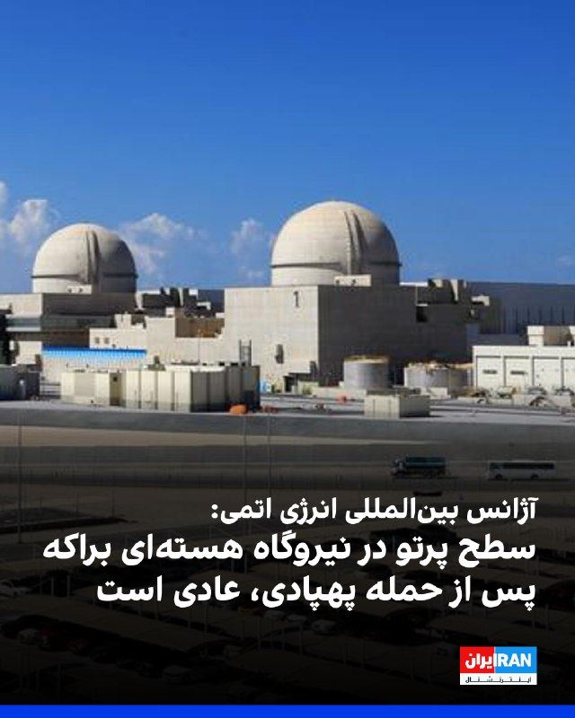

آژانس بین‌المللی انرژی اتمی اعلام کرد امارات متحده عربی به این نهاد اطلاع داده سطح پرتو در نیروگاه هسته‌ای براکه پس از حمله پهپادی به نزدیکی آن، در سطح عادی باقی مانده و هیچ مصدومی گزارش نشده است. دفتر رسانه‌ای ابوظبی روز یکشنبه از حمله پهپادی به این نیروگاه خبر داده بود.
‌🏁 🇬🇧 IranintlTV

🤖 @VahidOOnLine

## VahidOOnLine — post 240613

  

سازمان حقوق بشر ایران اعلام کرد دستگاه قضایی جمهوری اسلامی «فعالانه» از وکلای تسخیری برای تسهیل و تسریع سیستماتیک اعدام معترضان بازداشت‌شده بهره می‌گیرد. این سازمان افزود این وکلا با خودداری از برقراری ارتباط با خانواده متهمان آنان را از روند دادرسی بی‌اطلاع نگه می‌دارند.
به نوشته این سازمان، مستندات نشان می‌دهد وکلای تسخیری بلافاصله پس از صدور حکم، با ثبت درخواست تجدیدنظر، موکلان خود را از مهلت قانونی محروم می‌کنند و با ایجاد موانع عامدانه در مسیر دسترسی به وکلای مستقل، زمینه اجرای سریع احکام اعدام را فراهم می‌سازند.
این سازمان نوشت بازداشت‌شدگان اعتراضات بدون دفاع موثر می‌مانند؛ وکلای تسخیری اعترافات اجباری و ادعاهای شکنجه را به چالش نمی‌کشند و مدارک تبرئه‌کننده ارائه نمی‌دهند. در نتیجه دادگاه‌ها بر اساس شواهد بدون اعتراض حکم اعدام صادر و دیوان عالی کشور نیز احکام را بدون بررسی حقوقی واقعی تایید می‌کند.
این سازمان هشدار داد این اقدامات نقض سیستماتیک دادرسی عادلانه است و اعدام‌ها را براساس حقوق بین‌الملل در زمره اعدام‌های خودسرانه قرار می‌دهد.
‌🏁 🇬🇧 IranintlTV

🤖 @VahidOOnLine

## WithYashar — post 11476

نیویورک‌تایمز: آمریکا به عراق دستور داده بود که طی دو عملیات داخل ایران، سیستم‌های راداری خود را خاموش کند و عراق این کار را انجام داد
@withyashar

## WithYashar — post 11475

نتانیاهو: امروز با رئیس‌جمهور ترامپ حرف میزنم،چشممون روی ایران بازه، برای هر موقعیتی آماده‌ایم.
@withyashar

## WithYashar — post 11474

  

خبرگزاری فارس: یه کشتی اسرائیلی تو خلیج فارس توقیف کردیم که خدمه‌ش عکس علی خامنه‌ای و مجتبی خامنه‌ای رو روی دیواراش نصب کرده بودن.
@withyashar

## FoxNewsTwitter — post 341831

  <a href="telegram/content/FoxNewsTwitter_341831_1779020087.mp4" target="_blank">🎬 Download video</a>

Fox News (Twitter/X)

Louisiana Sen. Bill Cassidy speaks after losing in the state's Republican primary, taking a thinly veiled jab at President Trump five years after he voted to convict the president in his impeachment trial.

## FoxNewsTwitter — post 341830

  <a href="telegram/content/FoxNewsTwitter_341830_1779020089.mp4" target="_blank">🎬 Download video</a>

Fox News (Twitter/X)

Bystander captures the horrifying moment an oncoming train smashed into a septic truck as it was crossing the tracks in Virginia, causing green substance to spew onto the ground and into the air.

Local police said the truck driver was taken to a hospital with life-threatening injuries, and that there is "no immediate danger" to the public.

## pm_afshaa — post 90898

  <a href="telegram/content/pm_afshaa_90898_1779020091.webm" target="_blank">🎬 Download video</a>

🔴نیویورک تایمز به نقل از مقامات امنیتی عراق: آمریکا به عراق دستور داده بود که توی دو تا عملیات در ایران، سیستم‌های راداری خودش رو خاموش کنه.

💧 Rainbet.com the #1 Non-KYC Crypto Casino & Sportsbook @rainbetcom

😁 @Pm_Afshaa

## pm_afshaa — post 90897

  <a href="telegram/content/pm_afshaa_90897_1779020091.webm" target="_blank">🎬 Download video</a>

🔴نیویورک‌تایمز: اسرائیل حداقل دو پایگاه مخفی در صحرای عراق رو به‌طور متناوب و برای بیش از یک سال اداره می‌کرده.

💧 Rainbet.com the #1 Non-KYC Crypto Casino & Sportsbook @rainbetcom

😁 @Pm_Afshaa

## pm_afshaa — post 90896

  

خیلی باید کونده پرو باشی که نزدیک 3 ماه قطعی کامل اینترنت، با سیم کارت سفید، تو اپ فیلتر شده این توییت رو بزنی :

💧 Rainbet.com the #1 Non-KYC Crypto Casino & Sportsbook @rainbetcom

😁 @Pm_Afshaa

## pm_afshaa — post 90895

🔴نیویورک‌تایمز: اسرائیل حداقل دو پایگاه مخفی در صحرای عراق را به‌طور متناوب و برای بیش از یک سال اداره می‌کرده

💧 Rainbet.com the #1 Non-KYC Crypto Casino & Sportsbook @rainbetcom

😁 @Pm_Afshaa

## pm_afshaa — post 90894

  <a href="telegram/content/pm_afshaa_90894_1779020092.webm" target="_blank">🎬 Download video</a>

🔴نتانیاهو: امروز با رئیس‌جمهور ترامپ حرف میزنم؛ چشممون روی ایران بازه و برای هر موقعیتی آماده‌ایم.

💧 Rainbet.com the #1 Non-KYC Crypto Casino & Sportsbook @rainbetcom

😁 @Pm_Afshaa

## DEJradio — post 4678

  <a href="telegram/content/DEJradio_4678_1779020093.mp4" target="_blank">🎬 Download video</a>

🚨
🚨 یک دستگاه اتوبوس مسافری یکشنبه ۲۷ اردیبهشت ۱۴۰۵ در محور عسلویه به کنگان واژگون شد. در این حادثه دستکم لحظه ۷ نفر جان خود را از دست داده‌اند و ۱۷ نفر نیز به بیمارستان منتقل شده‌اند. حال یکی از مصدومان وخیم اعلام شده است.

#تصادف #عسلویه
@DEJradio

## DEJradio — post 4677

  

🔸
⭕️ برابر اخبار رسیده، مأموران جمهوری اسلامی در زندان‌ها بر سر لوازم شخصی بازداشت‌شدگان، زندانیان سیاسی و اعدامی‌های انقلاب ملی شیر و خورشید رقابت و در مواردی بر سر تصاحب آنها با هم جر و بحث می‌کنند.
منابع داخلی می‌گویند، اگر فرد بازداشتی از وضعیت مالی مناسبی برخوردار باشد و زندگی او روبراه باشد یا وسایل شخصی‌ ارزشمندی داشته باشد، برای تصاحب پرونده او میان مأموران رقابت و تلاش بیشتری صورت می‌گیرد.
منابع خبری به دژ می‌گویند وسایل زندانیان محکوم به اعدام بیش از دیگران مورد تصاحب قرار می‌گیرد؛ به‌گونه‌ای که برخی مأموران حتی پیش از اجرای حکم قتل حکومتی، در مقابل خود زندانی و پس از اجرای حکم نیز در برابر خانواده او، از این وسایل استفاده می‌کنند.
این منبع می‌گوید مأموران پرونده و زندانبان‌ها هر دو در این اقدامات غیرانسانی نقش دارند. در واقع اگر وسایل شخصی افراد بازداشتی توسط مأمور پرونده یا سازمان بازداشت‌کننده استفاده نشود، معمولاً مأموران زندان از آن‌ها استفاده می‌کنند.

*تصویر با استفاده هوش‌مصنوعی براساس مشاهدات بازسازی شده است.

#سرکوب #اعدام #جلاد
@DEJradio

## DEJradio — post 4676

  <a href="telegram/content/DEJradio_4676_1779020095.webm" target="_blank">🎬 Download video</a>

📷
🔺 بنر سـ.ـپاه در ساحل هرمز؛ ورود سربازان آمریکایی و سگ ممنوع
توهین‌های ناشی از استیصال بدون انکه در نظر بگیرند هنوز حتی جسد علی خامنه‌ای را تشییع نکردند.

#تنگه_هرمز #سپاه_تروریستی_پاسداران
@DEJradio

## DEJradio — post 4675

⭕️🎥 حکومت نگران از تشدید نارضایتی‌های عمومی، آموزش نظامی به کودکان در مساجد را سازماندهی‌شده پیش می‌برد.
شستشوی مغزی و تبلیغات عمدتا با نوای مذهبی و نوحه بخشی از مقدمات این آموزش‌هاست. قبلا آموزش‌ها شامل کلاشنیکف بود حالا آرپی‌جی هم به آن اضافه شده است.

#کودک_سرباز #سپر_انسانی
@DEJradio

## DEJradio — post 4674

  <a href="telegram/content/DEJradio_4674_1779020095.webm" target="_blank">🎬 Download video</a>

🔸
🔺 براساس گزارش‌های دریافتی گشتی‌های نیروی انتظامی و بـ.ـسیج و برای مأموریت‌های شهری تلفیق شده‌اند. همچنین ماموران انتظامی و نیروهای بسیج در برقراری ایست‌های بازرسی در شهرهای مختلف و گشت‌های محله‌محور همکاری خود را افزایش داده‌اند.
یک کارشناس امنیتی به دژ می‌گوید چنین اقدامی می‌تواند ناشی از دو دلیل عمده باشد: ۱) جبران کمبود نیرو و ۲)هماهنگی در شرایط اضطراری بعد از جنگ ۴۰ روزه بحق ادغام نیروهای مسلح مطرح شد که موضوع «تلفیق بخشی از ماموریت‌ها» ارتباطی به آن ندارد.
از سوی دیگر سازمان بـ.ـسیج در ارتش، نیروی انتظامی، سـ.ـپاه و حتی سایر ارگان‌ها «سهمیه استخدام» دارد. از این رو با توجه به تلفات سنگین نیروی انتظامی در جنگ ۴۰ روزه و احتمال شکل‌گیری مجدد اعتراضات از یک سو حکومت ممکن است سهمیه استخدام بـ.ـسیج در فراجا را افزایش دهد و از سوی دیگر برای افزایش همکاری و هماهنگی «قرارگاه‌های امنیتی» تقویت شود.
طی سال‌های اخیر بارها فرماندهان ارشد نیروی انتظامی و پاسداران در مورد تشکیل قرارگاه‌های مشترک امنیتی و روانی و تقویت گشت‌های محلی اظهار نظر کردند و در مواقعی مدتی کوتاه آن را به اجرا گذاشتند.

#سرکوبگران
@DEJradio

## IranIntlTV — post 337617

ویدیوهای رسیده به ایران‌اینترنشنال نشان می‌دهد مراسم تولد ایلیا قدسی، جاویدنام ۱۷ ساله کشته‌شده در شامگاه ۱۸ دی، بر سر مزارش برگزار شده است. مادر این نوجوان جان‌باخته با سخنرانی در این مراسم خطاب به پسرش گفت: «تو قدم بزرگی برای ما برداشتی. راهت را ادامه خواهیم داد.»

## IranIntlTV — post 337616

  

🔻تیم فوتبال زنان «نائه‌گو‌هیَنگ» کره شمالی روز یکشنبه وارد کره جنوبی شد؛ برای نخستین بار در هفت سال و نیم گذشته ورزشکارانی از کره شمالی پا به خاک کره جنوبی می‌گذارند. این تیم روز چهارشنبه در مرحله نیمه‌نهایی لیگ قهرمانان زنان آسیا، با «سوون اف‌سی وومن» از کره جنوبی بازی می‌کند.

🔹سفر یک تیم فوتبال زنان از کره شمالی به کره جنوبی، اتفاقی نادر در شرایطی است که تنش‌های سیاسی میان دو کشور به سطحی رسیده که دولت‌هایشان عملاً هیچ ارتباط مستقیمی با یکدیگر ندارند.

🔹برخی رویدادهای ورزشی در گذشته میان دو کره نقش کانال دیپلماتیک را ایفا کرده‌اند؛ هرچند این بار انتظار نمی‌رود این سفر به کاهش تنش‌ها منجر شود.

🔹دیدار ورزشکاران دو کره، که از نظر فنی همچنان در وضعیت جنگی قرار دارند، معمولاً فراتر از یک مسابقه ورزشی تلقی می‌شود.

🔹تمام شهروندان کره شمالی که به خارج از کشور سفر می‌کنند، تحت همراهی مأموران پلیس مخفی قرار دارند؛ مأمورانی که هرگونه نشانه بی‌وفایی را زیر نظر می‌گیرند.

🔹درباره این اتفاق کم‌سابقه در وبسایت ایران اینترنشنال بیشتر بخوانید.

@iranintltvsport

## IranIntlTV — post 337615

  <a href="telegram/content/IranIntlTV_337615_1779020097.mp4" target="_blank">🎬 Download video</a>

دفتر رسانه‌ای ابوظبی در امارات از حمله پهپادی به یک ژنراتور برق در محدوده نیروگاه هسته‌ای براکه در منطقه الظفر خبر داد. بر اساس این گزارش، این حمله باعث آتش‌سوزی در بخشی از نیروگاه شده و ژنراتور برق هدف قرار گرفته است.
جزییات بیشتر با علی شیرازی، عضو تحریریه ایران‌اینترنشنال
@iranintltv

## IranIntlTV — post 337614

  

آژانس بین‌المللی انرژی اتمی اعلام کرد امارات متحده عربی به این نهاد اطلاع داده سطح پرتو در نیروگاه هسته‌ای براکه پس از حمله پهپادی به نزدیکی آن، در سطح عادی باقی مانده و هیچ مصدومی گزارش نشده است. دفتر رسانه‌ای ابوظبی روز یکشنبه از حمله پهپادی به این نیروگاه خبر داده بود.
https://iranintl.com/202605177167

## IranIntlTV — post 337613

  <a href="telegram/content/IranIntlTV_337613_1779020099.mp4" target="_blank">🎬 Download video</a>

گروهی از ایرانیان و فعالان مدنی در مرکز شهر فرانکفورت در اعتراض به سرکوب، اعدام زندانیان سیاسی و محدودیت‌های اینترنتی در ایران تجمع کردند.

مهدی تهرانی گزارش می‌دهد
@iranintltv

## IranIntlTV — post 337612

  

سازمان حقوق بشر ایران اعلام کرد دستگاه قضایی جمهوری اسلامی «فعالانه» از وکلای تسخیری برای تسهیل و تسریع سیستماتیک اعدام معترضان بازداشت‌شده بهره می‌گیرد. این سازمان افزود این وکلا با خودداری از برقراری ارتباط با خانواده متهمان آنان را از روند دادرسی بی‌اطلاع نگه می‌دارند.
به نوشته این سازمان، مستندات نشان می‌دهد وکلای تسخیری بلافاصله پس از صدور حکم، با ثبت درخواست تجدیدنظر، موکلان خود را از مهلت قانونی محروم می‌کنند و با ایجاد موانع عامدانه در مسیر دسترسی به وکلای مستقل، زمینه اجرای سریع احکام اعدام را فراهم می‌سازند.
این سازمان نوشت بازداشت‌شدگان اعتراضات بدون دفاع موثر می‌مانند؛ وکلای تسخیری اعترافات اجباری و ادعاهای شکنجه را به چالش نمی‌کشند و مدارک تبرئه‌کننده ارائه نمی‌دهند. در نتیجه دادگاه‌ها بر اساس شواهد بدون اعتراض حکم اعدام صادر و دیوان عالی کشور نیز احکام را بدون بررسی حقوقی واقعی تایید می‌کند.
این سازمان هشدار داد این اقدامات نقض سیستماتیک دادرسی عادلانه است و اعدام‌ها را براساس حقوق بین‌الملل در زمره اعدام‌های خودسرانه قرار می‌دهد.
https://iranintl.com/202605171885

## Shin_Persian — post 6046

Shin ✓ @hey_itsmyturn
Sun, 17 May 2026 11:57:18 UTC

Jet activity over Western Tehran,
Presumably IRIAF ones.
#Iran

فارسی

فعالیت جت‌ها بر فراز غرب تهران،
احتمالاً متعلق به نهاجا (نیروی هوایی ارتش جمهوری اسلامی ایران).
#Iran

𝕏 · @shin_persian

## ManotoTV — post 105554

  <a href="telegram/content/ManotoTV_105554_1779020101.mp4" target="_blank">🎬 Download video</a>

تجمع ایرانیان لیسبون پرتغال مقابل کاخ ریاست‌جمهوری، یکشنبه ۲۷ اردیبهشت

## FarsiVOA — post 217963

🔺معمای لکه نفتی اطراف جزیره خارک

▪️با گذشت دو هفته از مشاهده لکه نفتی بزرگ در غرب خارک، بزرگترین پایانه نفتی ایران، مقامات جمهوری اسلامی هنوز از شفاف‌سازی پیرامون آن طفره می‌روند.

▪️پیشتر یک نماینده مجلس مدعی «تخلیه آب توازن و روغن» یک کشتی اروپایی در این منطقه شده بود، اما داده‌های کشتی‌رانی نشان می‌دهد هیچ کشتی اروپایی در غرب خارک، محلی که نشت ۴۵ کیلومتر مربعی گزارش شده، وجود نداشته و تخلیه آب توازن نمی‌تواند منجر به چنان آلودگی گسترده‌ای شود.

▪️این لکه نفتی در مسیر خط لوله میدان دریایی ابوذر به خارک است؛ این خط لوله فرسوده که قدمت آن به پنج دهه می‌رسد، مهرماه ۱۴۰۳ و شهریور ۱۴۰۴ نیز دچار شکستگی و نشتی شده بود.

⬇️ بیشتر بخوانید:
https://ir.voanews.com/a/8150876.html

## FarsiVOA — post 217962

  

بنیامین نتانیاهو، نخست‌وزیر اسرائیل، اعلام کرد که قرار است روز یکشنبه گفت‌وگویی تلفنی با دونالد ترامپ رئیس‌جمهور آمریکا انجام دهد. نتانیاهو گفت که انتظار دارد درباره سفر ترامپ به چین و موضوع ایران با رئیس‌جمهور آمریکا گفت‌وگو کند.

همزمان تایمز اسرائیل گزارش داد که نتانیاهو شامگاه یکشنبه در دفتر خود در اورشلیم، جلسه‌ای با دستیاران و وزرای ارشد برای یک مشورت امنیتی تشکیل می‌دهد.

یکی از وزرایی که قرار است در این نشست حاضر باشد، به این رسانه اسرائیلی گفت چنین گفت‌وگوهایی که اغلب «کابینه کوچک امنیتی» نامیده می‌شوند، معمولاً شامل گیدون سعار وزیر خارجه، یسرائیل کاتس وزیر دفاع، بزالل اسموتریچ وزیر دارایی، ایتامار بن‌گویر وزیر امنیت ملی و آریه درعی رئیس حزب شاس می‌شود.
@FarsiVOA

## FarsiVOA — post 217961

  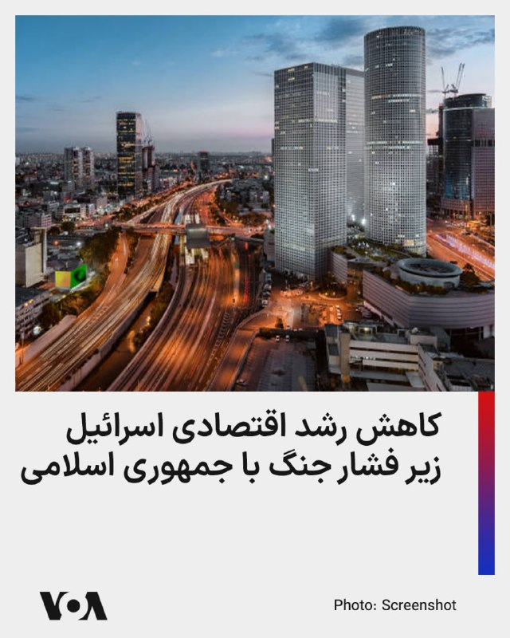

اقتصاد اسرائیل در سه‌ماهه نخست سال ۲۰۲۶، زیر فشار جنگ با جمهوری اسلامی، با نرخ سالانه ۳.۳ درصد کوچک شد؛ افتی که از پیش‌بینی ۴ درصدی اقتصاددانان در نظرسنجی رویترز کمتر بود.

اداره آمار اسرائیل گزارش داد مصرف خصوصی در این دوره ۴.۷ درصد، صادرات ۳.۷ درصد و هزینه‌های دولتی ۴.۸ درصد کاهش یافت. در مقابل، سرمایه‌گذاری در دارایی‌های ثابت ۱۲.۶ درصد افزایش داشت.

اقتصاد اسرائیل در سال ۲۰۲۵ رشد ۲.۹ درصدی ثبت کرده بود و انتظار می‌رفت پس از آتش‌بس جنگ غزه در اکتبر، در سال ۲۰۲۶ به رشد بیش از ۵ درصد بازگردد. اما آغاز درگیری آمریکا و اسرائیل با جمهوری اسلامی در ۲۸ فوریه، نهم اسفند، و هفته‌ها حملات موشکی جمهوری اسلامی، فعالیت مدارس و کسب‌وکارها را مختل کرد.

بانک مرکزی اسرائیل رشد امسال را در صورت دوام آتش‌بس با ایران ۳.۸ درصد پیش‌بینی کرده است.
@FarsiVOA

## FarsiVOA — post 217960

  <a href="telegram/content/FarsiVOA_217960_1779020103.mp4" target="_blank">🎬 Download video</a>

استقبال وزیر جنگ ایالات متحده از نیروهای ناوگروه یواس‌اس جرالد آر. فورد در بازگشت به کشور؛

نزدیک به ۴ هزار و پانصد ملوان ناوگروه ضربت یواس‌اس جرالد آر. فورد، صبح روز شنبه ۲۶ اردیبهشت، پس از یک دوره ۱۱ ماهه استقرار در ناوگان‌های چهارم، پنجم و ششم ایالات متحده، به پایگاه دریایی نورفولک بازگشتند.

این ناو هواپیمابر به همراه ناوشکن‌های همراهش، بِینبریج و ماهان بازگشت. ناو هواپیمابر وینستون چرچیل نیز به بندرگاه اصلی خود در پایگاه دریایی میپورت بازگشت.

طی مراسمی وزیر جنگ ایالات متحده، پیت هگست، شخصا به استقبال آنها رفت و به گروه ضربت شماره ۱۲ ناو هواپیمابر، «لوح تقدیر ریاست‌جمهوری» را اعطا کرد. این لوح، بالاترین نشانی است که یک واحد نظامی می‌تواند دریافت کند و به پاس «شجاعت فوق‌العاده در نبرد علیه دشمن مسلح» اعطا می‌شود.
@FarsiVOA

## FarsiVOA — post 217959

  

روزنامه پاکستانی «داون» به نقل از منابع دیپلماتیک در اسلام‌آباد گزارش داد «سفر برنامه‌ریزی‌نشده» محسن نقوی، وزیر کشور پاکستان، به تهران در چارچوب تلاش‌های این کشور برای احیای روند متوقف‌شده صلح میان آمریکا و جمهوری اسلامی انجام شده است.

بر اساس این گزارش، نقوی در سفری دو روزه و از پیش اعلام‌نشده وارد تهران شده؛ سفری که منابع دیپلماتیک آن را بخشی از دیپلماسی مستمر اسلام‌آباد برای جلوگیری از «فروپاشی کامل» مذاکرات میان واشنگتن و تهران توصیف کرده‌اند.

داون نوشته است این تلاش‌ها پس از آن شدت گرفته که دونالد ترامپ، رئیس جمهوری آمریکا، تازه‌ترین پاسخ تهران به پیشنهادهای واشنگتن را رد کرد و شتاب حاصل از دورهای پیشین گفت‌وگو در اسلام‌آباد به‌شدت کاهش یافت.

انتظار می‌رود وزیر کشور پاکستان در جریان این سفر با مقام‌های ارشد جمهوری اسلامی، از جمله اسکندر مؤمنی، وزیر کشور، دیدار کند. به نوشته داون، گفت‌وگوها علاوه بر مسائل امنیتی و مرزی دوجانبه، تحولات گسترده‌تر منطقه و تلاش‌ها برای زنده نگه داشتن کانال‌های میانجی‌گرانه میان آمریکا و ایران را نیز دربر می‌گیرد.
@FarsiVOA

## FarsiVOA — post 217958

  

🔺حمله پهپادی به نزدیکی نیروگاه هسته‌ای امارات باعث آتش‌سوزی شد

▪️مقام‌های ابوظبی از آتش‌سوزی ناشی از حمله پهپادی به یک ژنراتور برق در خارج از محوطه نیروگاه هسته‌ای براکه در منطقه الظفره امارات متحده عربی خبر دادند.

▪️این آتش‌سوزی روز یکشنبه ۲۷ اردیبهشت رخ داد و هیچ موردی از جراحت گزارش نشد. همچنین گزارش شده سطح ایمنی پرتویی تحت تأثیر قرار نگرفته و سازمان فدرال تنظیم مقررات هسته‌ای امارات تأیید کرده که سیستم‌های حیاتی نیروگاه به‌طور عادی در حال کار هستند.

▪️امارات متحده عربی در طول جنگ آمریکا و اسرائیل علیه جمهوری اسلامی، هدف حملات مکرر موشکی و پهپادی قرار گرفت و مقام‌های ابوظبی گفته‌اند منشأ این حملات ایران بوده و زیرساخت‌های انرژی و دریایی را هدف قرار داده‌اند.

⬇️ بیشتر بخوانید:
https://ir.voanews.com/a/8150873.html

## DW_Farsi — post 124794

  

🔶 "انتصاب قالیباف به عنوان نماینده ویژه ایران در امور چین"

رسانه‌های داخلی ایران روز یکشنبه ۲۷ اردیبهشت گزارش دادند که محمدباقر قالیباف به عنوان "نماینده ویژه جمهوری اسلامی ایران در امور چین" منصوب شده است.

خبرگزاری تسنیم، وابسته به سپاه پاسداران نیز در گزارشی نوشت این انتصاب "با پیشنهاد رئیس‌جمهور و تایید رهبر جمهوری اسلامی" انجام شده است. به نوشته این خبرگزاری، عبدالرضا رحمانی‌فضلی پیش‌تر به عنوان "نماینده رئیس‌جمهور در امور چین" فعالیت می‌کرد و علی لاریجانی نیز پیشتر "نماینده ویژه رهبر جمهوری اسلامی در امور چین" بود.

با این حال، جزئیات روشنی درباره حدود اختیارات، ساختار حقوقی یا ضرورت ادامه فعالیت چنین سمتی منتشر نشده است. مشخص نیست جمهوری اسلامی در شرایطی که وزارت خارجه و سفارت ایران در پکن مسئول رسمی روابط دوجانبه با چین هستند، چه نیازی به تعیین یک "نماینده ویژه" جداگانه در امور چین دارد.
@dw_farsi

## DW_Farsi — post 124793

🔶 حمله پهپادی منجر به آتش‌سوزی در نزدیکی نیروگاه هسته‌ای ابوظبی شد

مقام‌های امارات متحده عربی روز یکشنبه ۱۷ ماه مه (۲۷ اردیبهشت) اعلام کردند یک حمله پهپادی به آتش‌سوزی در نزدیکی نیروگاه هسته‌ای براکه در منطقه الظفره ابوظبی منجر شده است. این حادثه به گفته مقام‌های این کشور، تلفات جانی یا نشت پرتویی در پی نداشته است.

دفتر رسانه‌ای ابوظبی در بیانیه‌ای اعلام کرد آتش‌سوزی در یک مولد برق، خارج از محدوده داخلی نیروگاه هسته‌ای براکه رخ داده و نیروهای امدادی و آتش‌نشانی بلافاصله به محل اعزام شده‌اند.

سازمان فدرال مقررات هسته‌ای امارات نیز اعلام کرد این حادثه تاثیری بر ایمنی نیروگاه یا عملکرد سامانه‌های اصلی آن نداشته و تمام واحدها به‌طور عادی در حال فعالیت هستند.

این نخستین بار از زمان آغاز جنگ اخیر میان ایران، آمریکا و اسرائیل است که نیروگاه هسته‌ای چهار راکتوری براکه هدف حمله قرار می‌گیرد. این نیروگاه در غرب ابوظبی و در نزدیکی مرز عربستان سعودی واقع شده است.

نیروگاه هسته‌ای براکه با هزینه‌ای حدود ۲۰ میلیارد دلار و با همکاری کره جنوبی ساخته شد و در سال ۲۰۲۰ به شبکه برق امارات پیوست. این مرکز، نخستین و تنها نیروگاه هسته‌ای فعال در شبه‌جزیره عربستان به شمار می‌رود.

هنوز هیچ گروه یا کشوری مسئولیت این حمله پهپادی را برعهده نگرفته و مقام‌های اماراتی نیز در بیانیه‌های رسمی خود، هیچ طرفی را عامل این حمله معرفی نکرده‌اند. آژانس بین‌المللی انرژی اتمی، نهاد ناظر هسته‌ای سازمان ملل مستقر در وین، نیز تاکنون به درخواست‌ها برای اظهارنظر درباره این حادثه پاسخی نداده است.

مقام‌های امارات از شهروندان خواسته‌اند اخبار مربوط به این حادثه را تنها از منابع رسمی دنبال کرده و از انتشار شایعات و اطلاعات تاییدنشده خودداری کنند.

@dw_farsi

## Persian_Trend_Official — post 14323

  

💢ارتش اسرائیل دستور تخلیه 4 روستا در جنوب لبنان را صادر کرد.

🫆:Tony

📌 @persian_trend_official
پرشین ترند | متفاوت‌ترین کانال نظامی

## Persian_Trend_Official — post 14322

💢نیویورک تایمز به نقل از مقام‌های عراقی

💢در هر دو مورد، هم در جنگ کوتاه سال گذشته و هم در درگیری فعلی، واشنگتن عراق را مجبور کرده رادارهایش را خاموش کند تا از هواپیماهای آمریکایی محافظت شود

💢اقدامی که باعث شده بغداد برای شناسایی فعالیت‌های خصمانه بیشتر به نیروهای آمریکایی وابسته شود

🫆:Tony

📌 @persian_trend_official
پرشین ترند | متفاوت‌ترین کانال نظامی

## RadioFarda — post 157288

  

🔸در پی شیوع دوباره بیماری اِبولا در جمهوری دموکراتیک کنگو در آفریقا و مرگ ده‌ها تن، سازمان بهداشت جهانی روز یک‌شنبه، ۲۷ اردیبهشت، «وضعیت اضطراری بین‌المللی» اعلام کرد.

🔸به نوشته خبرگزاری فرانسه، از نظر سطح هشدار در چارچوب مقررات این سازمان، این وضعیت پس از «وضعیت اضطراری پاندِمی» در مرتبه دوم جدیت قرار دارد.

🔸بیماری ابولا که هفدهمین بار است در کشور کنگو در آفریقای مرکزی شیوع پیدا کرده، بر اساس آماری که مرکز کنترل و پیشگیری از بیماری‌ها، شاخه آفریقا، در روز شنبه اعلام کرد، تاکنون جان ۸۸ نفر را در این کشور گرفته است.

🔸علاوه بر این، ۳۳۶ نفر نیز مشکوک به ابتلا به این تب ویروسیِ بسیار مسری هستند.

🔸از جمله نشانه‌های این بیماری ویروسی خطرناک تب و استفراغ و خون‌ریزی است. این بیماری که به اعتقاد پزشکان و پژوهشگران از خفاش سرچشمه گرفته است می‌تواند به از کار افتادن اندام‌های داخلی بدن نیز بینجامد.

@RadioFarda

## RadioFarda — post 157287

  <a href="https://t.me/radiofarda/157287" target="_blank">📎 Download file</a>

📻بشنوید: ساعت ۱۴ با رادیوفردا، ۲۷ اردیبهشت ۱۴۰۵‌

@Radiofarda

## BBCPersian — post 281296

🔻نتانیاهو می‌گوید امروز با ترامپ تلفنی گفت‌وگو می‌کند

🔻نخست‌وزیر اسرائیل گفت امروز با دونالد ترامپ درباره ایران تلفنی گفت‌وگو می‌کند.

بنیامین نتانیاهو امروز در نشست ویژه دولت اسرائیل به مناسبت بزرگداشت روز بیت‌المقدس گفت:

«چشمان ما درباره ایران کاملا باز است. من امروز هم با دوستمان رئیس‌جمهور ترامپ صحبت می‌کنم همانطور که هر چند روز یک بار این کار را می‌کنم. حتما از تاثیر سفر او به چین خواهم شنید و شاید موضوعات دیگر. احتمالات زیادی وجود دارد و ما برای هر سناریویی آماده هستیم.»

https://bbc.in/3RduMJ8
@BBCPersian

## BBCPersian — post 281295

🔻رئیس‌جمهور برزیل: مخالف جنگ با ایران هستم اما اختلاف با ترامپ مانع رابطه با آمریکا نیست

🔻رئیس‌جمهور برزیل گفت که رابطه شخصی‌اش با دونالد ترامپ، رئیس‌جمهور آمریکا، می‌تواند به جذب سرمایه‌گذاری آمریکا در برزیل، جلوگیری از اعمال تعرفه‌ و تحریم‌های بیشتر و احترام به دموکراسی برزیل کمک کند.

لوئیز ایناسیو لولا دا سیلوا به روزنامه واشنگتن پست گفت: «آقای ترامپ می‌داند که من با جنگ با ایران مخالفم، با مداخله او در ونزوئلا موافق نیستم و نسل‌کشی‌ای را که در فلسطین در حال وقوع است محکوم می‌کنم.»

«اما اختلافات سیاسی من با ترامپ در رابطه‌ام با او به‌عنوان رئیس یک کشور تأثیری ندارد. آنچه می‌خواهم این است که او با برزیل با احترام رفتار کند و درک کند که من رئیس‌جمهور منتخب هستم.»

https://bbc.in/4dtG3wl
@BBCPersian

## BBCPersian — post 281294

🔻کره جنوبی خواستار اعلام موضع ایران درباره حمله به کشتی باریش در تنگه هرمز شد

🔻کره‌جنوبی از ایران خواست درباره حمله اخیر به یک کشتی باریش در نزدیکی تنگه هرمز اعلام موضع کند.

به گفته وزارت خارجه کره‌ جنوبی، چو هیون، وزیر خارجه، با همتای ایرانیش تلفنی صحبت کرده و سئول و تهران برای تضمین امنیت در تنگه هرمز به ارتباطات و رایزنی‌های خود ادامه خواهند داد.

پیش‌تر یک مقام کره‌جنوبی گفته بود احتمال این که عامل این حمله کشوری غیر از ایران باشد، پایین است.

به گفته مقام‌های سئول، کشتی باری «اچ‌ام‌ام نامو» در چهارم مه (۱۴ اردیبهشت) هدف «دو هواپیمای ناشناس» قرار گرفت. این حمله باعث آسیب رسیدن به کشتی و آتش‌سوزی در موتورخانه شد.

این کشتی با پرچم پاناما و تحت مدیریت شرکت کشتیرانی کره‌ای «اچ‌ام‌ام» در حال حرکت بود.

وزارت خارجه کره جنوبی روز جمعه (۲۵ اردیبهشت/۱۵ مه) اعلام کرد بقایای این کشتی باری آسیب‌دیده را به کشور منتقل کرده است.

سئول گفته است که هواپیماهای دخیل در این حمله در تصاویر دوربین‌های مداربسته ثبت شده‌اند، اما شناسایی دقیق نوع و مبدا پروازشان امکان‌پذیر نیست.

https://bbc.in/4dfpaGT
@BBCPersian

## Dirty_Kids — post 389611

‏قذافی وقتی می‌خواسته زنش رو لوس کنه لیبی به لاباش می‌ذاشته.

@Dirty_Kids 👻

## Dirty_Kids — post 389610

  <a href="telegram/content/Dirty_Kids_389610_1779020109.mp4" target="_blank">🎬 Download video</a>

مرادویسی، تحلیلگر اینترنشنال:
آمریکا اگه جمهوری اسلامی رو سرنگون نکنه؛

روسیه با خودش میگه آمریکا حتی نتونست جمهوری‌اسلامی رو سرنگون کنه پس من اوکراین رو نابود میکنم وهمینطور علیه بقیه میرم جلو
چین هم با خودش میگه آمریکا نتونست جمهوری‌اسلامی رو سرنگون کنه پس منم تایوان رو نابود میکنم چون کاری از دست آمریکا برنمیاد
کره‌شمالی هم با خودش میگه آمریکا نتونست جمهوری‌اسلامی رو سرنگون کنه، پس منم میتونم با موشک به ژاپن و کره‌جنوبی حمله کنم و کاری از آمریکا برنمیاد.
و حتی مثل جمهوری‌اسلامی که تنگه هرمز رو نابود کرد منم میتونم تنگه کُره رو با موشک‌پراکنی ناامن کنم.
پس به این دلایل آمریکا مجبوره که جمهوری‌اسلامی رو سرنگون کنه.

+ خلاصش یعنی، هژمونی امریکا نابود میشه

@Dirty_Kids 👻

## Dirty_Kids — post 389609

  

بش از ۸۰ روز‌ از قطع اینترنت بین‌الملل تو ایران می‌گذره؛

پزشکیان اومد با سیم‌کارت سفید تو نرم افزاری که خودشون فیلترش کردن، یه توییت‌ زد و مدعی شد که؛ مسئولین وزارت ارتباطات تمام تلاششونو کردن تا مردم به اینترنت با کیفیت دسترسی داشته باشن و در‌آخر هم روز جهانی ارتباطات‌رو‌ تبریک گفت.

@Dirty_Kids 👻

## Hranews — post 112988

گزارشی از بازداشت واحد سلطانی در پیرانشهر

❗️
❗️
❗️
❗️
❗️ – واحد سلطانی، شهروند اهل پیرانشهر، ۱۰ روز پیش توسط نیروهای امنیتی در این شهر #بازداشت و تاکنون از سرنوشت او اطلاعی حاصل نشده است.

ادامه مطلب

#واحد_سلطانی

↘️
@hranews_bot تماس ✉️ -  @Hranews  کانال هرانا 🆑

## Hranews — post 112987

  

ایلام؛ طرح اتهامات «محاربه» و «افساد فی‌الارض» علیه آرشیا قیصربیگی

❗️
❗️
❗️
❗️
❗️ – آرشیا قیصربیگی، شهروند اهل سرابله از توابع استان ایلام، در تاریخ ۱۵ اردیبهشت ماه، توسط نیروهای امنیتی #بازداشت شده است. وی اکنون با اتهامات «محاربه و افساد فی‌الارض» مواجه شده است.

به گزارش خبرگزاری هرانا، ارگان خبری مجموعه فعالان حقوق بشر در ایران، آرشیا قیصربیگی با اتهاماتی همچون «محاربه و افساد فی‌الارض» مواجه است.

براساس اطلاعات دریافتی هرانا، در تاریخ ۱۶ اردیبهشت ۱۴۰۵، دادسرای عمومی و انقلاب شهرستان چرداول، وی را به اتهامات «محاربه و افساد فی‌الارض» متهم کرده و قرار بازداشت او را برای مدت دو ماه تمدید کرده است.

ادامه مطلب

#آرشیا_قیصربیگی

↘️
@hranews_bot تماس ✉️ -  @Hranews  کانال هرانا 🆑

## manototv — post 105554

  <a href="telegram/content/manototv_105554_1779020111.mp4" target="_blank">🎬 Download video</a>

تجمع ایرانیان لیسبون پرتغال مقابل کاخ ریاست‌جمهوری، یکشنبه ۲۷ اردیبهشت

## alonews — post 120586

  <a href="telegram/content/alonews_120586_1779020112.webm" target="_blank">🎬 Download video</a>

👈یک سرباز ارتش دفاعی اسرائیل به شدت زخمی شد و یک افسر به طور متوسط پس از انفجار یک دستگاه انفجاری در جنوب لبنان در طول شب، به علاوه یک افسر و یک سرباز دیگر در همان حادثه به طور خفیف زخمی شدند. طبق بیانیه رسمی ارتش دفاعی اسرائیل، همه آنها برای درمان پزشکی تخلیه شدند.

✅ @AloNews خبر جنگ

## alonews — post 120585

  <a href="telegram/content/alonews_120585_1779020112.webm" target="_blank">🎬 Download video</a>

👈ادعای نیویورک‌تایمز: اسرائیل حداقل دو پایگاه مخفی در صحرای عراق را به‌طور متناوب و برای بیش از یک سال اداره می‌کرده است

🔴آمریکا به عراق دستور داده بود که توی دو تا عملیات توی ایران، سیستم‌های راداری خودش رو خاموش کنه

✅ @AloNews خبر جنگ

## alonews — post 120584

  <a href="telegram/content/alonews_120584_1779020113.webm" target="_blank">🎬 Download video</a>

👈کانادا اولین مورد ابتلا به ویروس هانتا را تأیید کرده است

✅ @AloNews خبر جنگ

## alonews — post 120583

  <a href="telegram/content/alonews_120583_1779020113.webm" target="_blank">🎬 Download video</a>

👈رسانه‌های عبری: نتانیاهو امروز با توجه به تحولات و تنش‌های منطقه با ترامپ صحبت خواهد کرد

✅ @AloNews خبر جنگ

## alonews — post 120582

  <a href="telegram/content/alonews_120582_1779020113.webm" target="_blank">🎬 Download video</a>

👈اسرائیل بیشتر از یه سال دوتا پایگاه نظامی مخفی تو بیابون‌های عراق داشته برای عملیات‌هاش علیه ایران

✅ @AloNews خبر جنگ

## alonews — post 120581

  

قیمت استثنایی گیگی
9️⃣
8️⃣
1️⃣

تحویل زیر یک دقیقه
✅
دارای لینک سابسکریشن جهت دیدن حجم و کنترل مصرف
✅
بدون قطعی 
✅
بدون محدودیت کاربر و زمان
✅
جمینایو چت جی بی تی و... کامل اوکیه با سرورامون
✅

🏪پشتیبانی کامل
✅
شروع فعالیت از سال 2022 
✅
پرداخت ریالی
✅

ضریب و این چیزا ندارن و تا آخرین مگابایت برای پشتیبانیش درختمتیم
🥂

💤این تخفیف فقط تا ۱۲ شب فعاله
💤

⭐️ @Napsternetiran_bot
〰️〰️〰️〰️〰️〰️〰️

🔶 @Napsternetvirani

## alonews — post 120580

👈ادعای نیویورک‌تایمز: اسرائیل حداقل دو پایگاه مخفی در صحرای عراق را به‌طور متناوب و برای بیش از یک سال اداره می‌کرده است

✅ @AloNews خبر جنگ

## alonews — post 120579

  <a href="telegram/content/alonews_120579_1779020114.webm" target="_blank">🎬 Download video</a>

👈نتانیاهو: ۶۰ درصد غزه در کنترل ماست، برای هر سناریویی با ایران آماده‌ایم

✅ @AloNews خبر جنگ

---
📅 بروزرسانی: 1405/02/27 14:53
---

## VahidOOnLine — post 240612

🗣روایت شما از زندگی در آتش‌بس- یکشنبه ۲۷ اردیبهشت‌ماه

🔹باورم نمیشه در قرن ۲۱، یک کشور نزدیک به ۳ ماهه بدون اینترنت مونده و برای هیچ سازمان بین‌المللی هم اهمیت نداره.

🔹دانش‌آموز هستم. نمی‌دانم باید امتحان‌ها رو چیکار کنم. یک اینترنت ملی داریم که اون هم کار نمی‌کند تا بتونیم درس بخونیم. یک دل‌خوشی داشتم، اون هم اینترنت بود که از ما گرفتن.

🔹دانشگاه آزاد بندرعباس برای خدماتی که ارائه نشده و کلاس‌هایی که نصفه‌ و نیمه تشکیل شده، شهریه کامل می‌گیرد.

🔹شورای‌عالی انقلاب فرهنگی هر روز یه حرفی می‌زنه. الان ما کلاس یازدهمی‌ها و کنکوری‌ها بلاتکلیف موندیم که امتحان نهایی چی می‌شه. جمهوری اسلامی علاوه بر اقتصاد و امنیت، فضای آموزش رو هم به نابودی کشونده.

🔹من یازدهم ریاضی‌ام، میگن از حواشی آموزشی فاصله بگیرید و تمرکزتون رو بگذارید روی درس. چطوری آخه وقتی کل کشور شده حاشیه؟ ما مثل بچه‌ شما در مدرسه‌ای با شهریه ۵۰۰ میلیون تومانی درس نمی‌خونیم.
‌🏁 🇬🇧 IranintlTV

🤖 @VahidOOnLine

## VahidOOnLine — post 240611

  

بنیامین نتانیاهو، نخست‌وزیر اسرائیل، گفت: «امروز با دوستمان، رییس‌جمهور ترامپ گفت‌وگو خواهم کرد. مطمئنا برداشت‌های او از سفرش به چین و شاید مسائل دیگر را خواهم شنید. قطعا احتمالات زیادی وجود دارد و ما برای هر سناریویی آماده‌ایم.» نتانیاهو افزود: «چشمان ما به ایران دوخته شده است.»
‌🏁 🇬🇧 IranintlTV

🤖 @VahidOOnLine

## VahidOOnLine — post 240610

  <a href="telegram/content/VahidOOnLine_240610_1779017006.mp4" target="_blank">🎬 Download video</a>

مقام‌های ابوظبی اعلام کردند در پی حمله پهپادی، یک ژنراتور برق خارج از محدوده داخلی نیروگاه هسته‌ای براکه در منطقه الظفره دچار آتش‌سوزی شد.

بر اساس این اعلام، حادثه آسیب جانی نداشت و هیچ اثری بر سطح ایمنی پرتوی نیروگاه برجای نگذاشت. مقام‌ها گفته‌اند همه اقدامات احتیاطی لازم انجام شده و جزئیات بیشتر در صورت دریافت اطلاعات تازه اعلام خواهد شد.

سازمان فدرال مقررات هسته‌ای امارات نیز تاکید کرد آتش‌سوزی بر ایمنی نیروگاه یا آمادگی سامانه‌های حیاتی آن اثری نداشته و همه واحدهای نیروگاه به‌طور عادی در حال فعالیت‌اند.
‌🏁 🇬🇧 ManotoTV

🤖 @VahidOOnLine

## VahidOOnLine — post 240609

  <a href="telegram/content/VahidOOnLine_240609_1779017007.mp4" target="_blank">🎬 Download video</a>

روزنامه بریتانیایی تلگراف گفته است برخی افراد نزدیک به دونالد ترامپ، رئیس‌جمهوری آمریکا، پیشنهاد کرده‌اند امارات متحده عربی جزیره لاوان در خلیج فارس را تصرف کند.

بر اساس این ادعا، یک مقام ارشد امنیتی پیشین در دولت ترامپ به تلگراف گفت هدف از چنین پیشنهادی، افزایش نقش امارات در رویارویی با ایران بدون اعزام نیروهای زمینی آمریکا است.

این گزارش پس از آن منتشر می‌شود که وال‌استریت ژورنال از حملات پنهانی امارات به اهدافی در ایران خبر داد. به گزارش رویترز به نقل از این روزنامه، یکی از این حملات در اوایل آوریل پالایشگاهی در جزیره لاوان را هدف قرار داده بود، ادعایی که امارات آن را علنا تایید نکرده است.
‌🏁 🇬🇧 ManotoTV

🤖 @VahidOOnLine

## VahidOOnLine — post 240608

  

♦️امارات متحده عربی می‌گوید ژنراتور نیروگاه هسته‌ای براکه هدف یک پهپاد قرار گرفته است اما هیچ آسیبی ندیده و سطح تشعشعات رادیواکتیو تغییری نکرده است.

دفتر رسانه‌ای ابوظبی روز یکشنبه اعلام کرد که مقامات اماراتی به آتش‌سوزی ناشی از حمله پهپادی به یک ژنراتور برق در خارج از محیط داخلی نیروگاه هسته‌ای براکه در منطقه الظفره واکنش نشان دادند.

بنابر اعلام مقام‌های اماراتی هیچ آسیبی گزارش نشده، سطح ایمنی رادیولوژیکی تحت تأثیر قرار نگرفته و سازمان فدرال تنظیم مقررات هسته‌ای تأیید می‌کند که سیستم‌های ضروری نیروگاه به طور عادی کار می‌کنند.

جزئیاتی در خصوص اینکه این پهپاد از کجا به سمت نیروگاه هسته‌ای امارات پرتاب شده منتشر نشده است.
‌🇸🇦 Indypersian

🤖 @VahidOOnLine

## VahidOOnLine — post 240607

  

خبرگزاری ایلنا گزارش داد که تعداد ۱۳۸ نفر از کارمندان و کارگران شرکت ملی مس از زیر مجموعه‌های هلدینگ ایمیدرو، سازمان توسعه و نوسازی معادن و صنایع معدنی ایران، تعدیل شده‌اند.

یکی از کارمندان اخراجی این شرکت به ایلنا گفت: «در ۲۴ اسفندماه ۱۴۰۴، تنها ۵ روز مانده به پایان سال، ۱۳۸ پرسنل متخصص با یک نامه و پیامک تحت عنوان «عدم تمدید قرارداد به دلیل نداشتن پروژه جدید» از کار بیکار شدند.»

کارمند دیگری گفته است: «تعدیل‌ها بدون استعلام از مسئولان فنی برای نگهداری یا عدم نگهداری نیروها صادر شده است. در واقع تقریبا تمام نیروهای با سابقه مجموعه اخراج شدند.»
‌🏁 🇬🇧 IranintlTV

🤖 @VahidOOnLine

## VahidOOnLine — post 240606

  

دفتر رسانه‌ای ابوظبی اعلام کرد که در پی حمله پهپادی به محوطه نیروگاه هسته‌ای براکه در الظفره، ژنراتور برق در خارج از محوطه داخلی نیروگاه دچار آتش‌سوزی شده است. این نهاد افزود که این حادثه آسیب جانی نداشته است.
‌🏁 🇬🇧 IranintlTV

🤖 @VahidOOnLine

## VahidOOnLine — post 240605

  

دفتر رسانه‌ای ابوظبی اعلام کرد که در پی حمله پهپادی به محوطه نیروگاه هسته‌ای براکه در الظفره، ژنراتور برق در خارج از محوطه داخلی نیروگاه دچار آتش‌سوزی شده است. این نهاد افزود که این حادثه آسیب جانی نداشته است.
‌🏁 🇬🇧 IranintlTV

🤖 @VahidOOnLine

## VahidOOnLine — post 240604

  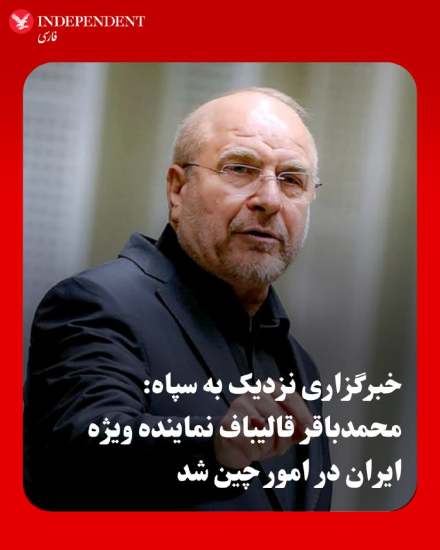

♦️خبرگزاری فارس، نزدیک به سپاه پاسداران، روز یک‌شنبه ۲۷ اردیبهشت گزارش داد که محمدباقر قالیباف، رئیس مجلس شورای اسلامی به عنوان نماینده ویژه ایران در امور چین تعیین شده است.

فارس بدون توضیح دیگری نوشته است:‌ «پیشتر علی لاریجانی و عبدالرضا رحمانی‌ فضلی چنین مسئولیتی را برعهده داشتند.»

اعلام تعیین قالیباف، عضو سابق سپاه پاسداران به عنوان نماینده ویژه در امور چین دو روز پس از دیدار رسمی دونالد ترامپ، رئیس جمهوری آمریکا از کشور چین صورت گرفته است.

دونالد ترامپ، رئیس‌جمهوری آمریکا، روز جمعه اعلام کرد شی جین‌پینگ، رئیس‌جمهوری چین، «قویا» معتقد است که ایران نباید به سلاح هسته‌ای دست پیدا کند. او همچنین افزود که همتای چینی‌اش خواهان بازگشایی تنگه هرمز است.

محمدباقر قالیباف، رئیس مجلس شورای اسلامی پیشتر به عنوان مذاکره کننده ارشد جمهوری اسلامی با آمریکا در مذاکرات پاکستان حاضر شده بود.
‌🇸🇦 Indypersian

🤖 @VahidOOnLine

## VahidOOnLine — post 240603

  

حمیدرضا حاجی‌بابایی، نایب‌رییس مجلس، گفت: «اگر قرار شد نفت ما را بزنند، باید نفت منطقه را بزنیم. چه آن‌که ادعای دوستی می‌کند، چه آن‌که دشمنی می‌کند.»

او گفت: «به نفت ما آسیب برسد، کاری می‌کنیم که آمریکا و تمام جهان تا مدت قابل توجهی از این منطقه نفت به دست نیاورد. اگر انرژی ما را بزنند، باید انرژی منطقه را بزنیم.»
‌🏁 🇬🇧 IranintlTV

🤖 @VahidOOnLine

## VahidOOnLine — post 240602

  

♦️امیر قلعه‌نویی، سرمربی تیم ملی فوتبال ایران روز شنبه ۲۶ اردیبهشت لیست ۳۰ نفره خود برای جام جهانی ۲۰۲۶ را اعلام کرد و گفت: «خدا را گواه می‌گیرم در انتخاب بازیکنان چیزی جز معیارهای فنی موضوع دیگری دخیل نبوده و من تنها بر اساس این معیار ٣٠ بازیکن را انتخاب کردم.»

این درحالیست که در این لیست، نام سردار آزمون،‌ مهاجم شناخته شده ایرانی دیده نمی‌شود. آزمون پس از موضع‌گیری‌های اخیرش در مخالفت با جمهوری اسلامی، ‌از تیم ملی خط خورد.

این اسامی در حالی اعلام شده است که هنوز تکلیف ویزای تیم ملی مشخص نیست.

دروازه‌بان‌ها: علیرضا بیرانوند، حسین حسینی، پیام نیازمند، محمد خلیفه،
مدافعان: احسان حاج صفی، میلاد محمدی، امید نورافکن، شجاع خلیل زاده، علی نعمتی، حسین کنعانی، دانیال ایری، رامین رضاییان، صالح حردانی
هافبک‌ها: سامان قدوس، روزبه چشمی، امیرمحمد رزاق نیا، سعید عزت‌اللهی، محمد قربانی،علیرضا جهانبخش، آریا یوسفی، محمد محبی، مهدی قائدی، مهدی ترابی
مهاجمان: مهدی طارمی، هادی حبیبی‌نژاد، امیرحسین حسین‌زاده، امیرحسین محمودی، دنیس درگاهی، کسری طاهری و علی علیپور
بازیکنان دعوت شده به اردوی تیم ملی در ترکیه هستند.
‌🇸🇦 Indypersian

🤖 @VahidOOnLine

## WithYashar — post 11473

نتانیاهو: ما در غزه اکنون چیزی را در اختیار داریم، دیگر ۵۰٪ نیست... اکنون ۶۰٪ است. این وضعیت امروز است.
ماموریت ما یکی است: اطمینان حاصل کنیم که غزه دیگر تهدیدی برای اسرائیل نخواهد بود.

ما محدودیت بودجه نداریم. هر چقدر هزینه داشته باشد مهم نیست، شک ندارم که اسرائیل اولین کشوری خواهد بود که راه‌حلی کامل برای حملات پهپادی ارائه می‌دهد
@withyashar

## WithYashar — post 11472

نتانیاهو با ترامپ تلفنی گفتگو می‌کند

رسانه‌های عبری: نتانیاهو امروز با توجه به تحولات و تنش‌های منطقه با ترامپ صحبت خواهد کرد.
@withyashar
امروز همچنین اسرائیل جلسه امنیتی برگزار میکند

## WithYashar — post 11471

تایمز: انگلیس برای جنگ آماده می‌شود
 
این رسانه انگلیسی از افزایش بودجه دفاعی انگلیس خبر داد و هدف از آن را آماده شدن برای جنگ های آینده اعلام کرد
@withyashar

## mwarmonitor — post 9199

⭕️ بر اساس گزارش نیویورک تایمز، اسرائیل با حمایت آمریکا یک پایگاه نظامی دوم غیرقانونی در عراق برای جنگ علیه ایران ایجاد کرده است.

@mwarmonitor

## mwarmonitor — post 9197

🔴 مشاوران ترامپ بیم آن دارند که چین در ۵ سال آینده تایوان را هدف قرار دهد

📝نویسندگان: جیم وندهای، مایک الن AXIOS

🔰برخی از مشاوران نزدیک پرزیدنت ترامپ نگرانند که بزرگ‌ترین دستاورد ملموس نشست سران با چین، افزایش خطر حمله شی جین‌پینگ، رئیس‌جمهور چین، به تایوان در پنج سال آینده باشد؛ اقدامی که می‌تواند دسترسی شرکت‌های آمریکایی را به تراشه‌های مورد نیاز برای تأمین انرژی هوش مصنوعی (AI) قطع کند.

🔸آنچه آن‌ها می‌گویند:
ترامپ شیفته تشریفات باشکوه و دسترسی ویژه‌ای شد که شی با هوشمندی در طول سفر پکن برای او تدارک دیده بود. اما کلمات با این صمیمیت ظاهری همخوانی نداشتند.
یکی از مشاوران ترامپ به ما گفت که شی «تلاش می‌کند چین را به جایگاه جدیدی برساند که در آن بگوید: "ما یک قدرت در حال ظهور نیستیم، بلکه همتای شما هستیم؛ و تایوان متعلق به من است."»

🔸این مشاور افزود:
«این سفر نشان‌دهنده احتمال بسیار بالاتری است که موضوع تایوان ظرف پنج سال آینده روی میز قرار گیرد. هیچ راهی وجود ندارد که ما از نظر اقتصادی برای این موضوع آماده باشیم؛ زنجیره تأمین تراشه‌ها به این زودی‌ها حتی نزدیک به خودکفایی هم نخواهد شد. برای مدیران عامل، و در واقع کل اقتصاد، هیچ مسئله‌ای حیاتی‌تر از زنجیره تأمین تراشه‌ها وجود ندارد.»

🔸تصویر کلی:
ترامپ از سوی چندین مدیرعامل به خاطر فشارهای شدید بر ایران و ونزوئلا و همچنین باز کردن بازارها مورد تحسین قرار گرفت. برخی از مدیران عامل با این امید به کشور بازگشتند که شرکت‌هایشان مجوز فعالیت در چین را دریافت خواهند کرد و این موفقیت را مدیون رئیس‌جمهور می‌دانستند.

@mwarmonitor

## mwarmonitor — post 9196

🔴 بلومبرگ: صبح امروز یکشنبه هیچ عبور و ترددی در تنگه هرمز ثبت نشده است.

@mwarmonitor

## mwarmonitor — post 9195

🇮🇱نتانیاهو گفت اسرائیل تلاش‌های خود را برای مقابله با تهدیدهای در حال تحول پهپادی، از جمله پهپادهای هدایت‌شونده با فیبر نوری، افزایش داده و برای توسعه راه‌حل‌های جدید از شرکت‌های دفاعی و همچنین متخصصان فناوری غیرنظامی کمک گرفته است.

🇮🇱او گفت: «به آن‌ها گفتم هیچ محدودیت بودجه‌ای وجود ندارد. هرچقدر هم هزینه داشته باشد، مهم نیست.» وی افزود این تیم مأمور شده است نه‌تنها با تهدیدهای فعلی پهپادی مقابله کند، بلکه برای تهدیدهای آینده نیز آماده شود.

@mwarmonitor

## mwarmonitor — post 9194

🔴فوری | دفتر رسانه‌ای ابوظبی:
این آتش‌سوزی ناشی از هدف قرار گرفتن با یک پهپاد بوده است و هیچ مصدومی نداشته و همچنین هیچ تأثیری بر سطح ایمنی تشعشعات نداشته است.

@mwarmonitor

## mwarmonitor — post 9193

🔴فوری | دفتر رسانه‌ای ابوظبی:
مقامات مربوطه با یک آتش‌سوزی در یک ژنراتور برق که خارج از محدوده نیروگاه هسته‌ای براکه رخ داده بود، برخورد کرده‌اند.

@mwarmonitor

## mwarmonitor — post 9192

هدف قرار دادن نیروگاه هسته‌ای براکه

## mwarmonitor — post 9191

انفجار در امارات

## FoxNewsTwitter — post 341829

  <a href="telegram/content/FoxNewsTwitter_341829_1779017012.mp4" target="_blank">🎬 Download video</a>

Fox News (Twitter/X)

"You haven't just met the standard of excellence, you have redefined it for the next generation of American warfighters."

War Secretary Pete Hegseth proudly celebrates the return of more than 4,500 American warriors from the USS Gerald R. Ford Carrier Strike Group after they completed a 326-day deployment overseas, reuniting with loved ones in Virginia.

## pm_afshaa — post 90893

  <a href="telegram/content/pm_afshaa_90893_1779017014.webm" target="_blank">🎬 Download video</a>

🔴خبرگزاری فارس: جزئیاتی از درخواست‌های آمریکا از ایران در مذاکرات؛

5 شرط اصلی واشنگتن به این شرح اعلام شده :
عدم پرداخت هرگونه غرامت و خسارت از سوی آمریکا

خروج و تحویل ۴۰۰ کیلوگرم اورانیوم از ایران به آمریکا

فعال ماندن تنها یک مجموعه از تأسیسات هسته‌ای ایران

عدم پرداخت حتی ۲۵ درصد از دارایی‌های بلوکه‌شدهٔ ایران

منوط‌شدن توقف جنگ در همه ساحتها به انجام مذاکره

در مقابل، جمهوری انجام هرگونه مذاکره رو منوط به تحقق 5 پیش‌شرط دونسته که عبارتند از :
پایان جنگ در همهٔ جبهه‌ها به‌ویژه لبنان

رفع تحریم‌های ضدایرانی

آزادسازی پول‌های بلوکه‌شده ایران

جبران خسارات ناشی از جنگ

پذیرش حق حاکمیت ایران بر تنگه هرمز

💧Rainbet.com the #1 Non-KYC Crypto Casino & Sportsbook @rainbetcom

😁 @Pm_Afshaa

## pm_afshaa — post 90892

  <a href="telegram/content/pm_afshaa_90892_1779017015.webm" target="_blank">🎬 Download video</a>

🔴سازمان رادیو و تلویزیون اسرائیل:
نتانیاهو عصر امروز نشست امنیتی با توجه به احتمال از سرگیری جنگ با ایران برگزار میکنه.

💧 Rainbet.com the #1 Non-KYC Crypto Casino & Sportsbook @rainbetcom

😁 @Pm_Afshaa

## pm_afshaa — post 90891

🔴دفتر رسانه‌ای ابوظبی از حمله پهپادی و آتش‌سوزی در یک ژنراتور برق در خارج از محدوده داخلی نیروگاه هسته‌ای براکه در منطقه الظفره خبر داد

💧 Rainbet.com the #1 Non-KYC Crypto Casino & Sportsbook @rainbetcom

😁 @Pm_Afshaa

## DEJradio — post 4673

  <a href="telegram/content/DEJradio_4673_1779017015.mp4" target="_blank">🎬 Download video</a>

⭕️🎥 شعار تجمعات شبانه حکومت این است که با "هر سلیقه‌ای" برای ایران آمده‌اند؛ اما این کارزار پر از تضاد و تناقض است. آنچه ۴۷ سال با شدیدترین مجازات روبرو می‌شد حالا که پای مصلحت و بقای نظام در میان است یگر ایراد ندارد، از جمله بدمستی ولایی‌های عرق‌خور در خیابان.

#الکل #جمهوری_اسلامی
@DEJradio

## DEJradio — post 4670

😎 
⭕️ یک منبع اختصاصی به دژ می‌گوید همزمان با محاصره دریایی بنادر ایران، شرکت لوبک لاین «Lubeck Line» تحت مدیریت حسن (ابوالفضل) شمخانی، تمامی «ترانشیپمنت پورت»‌ها (بنادر ترانزیتیِ واسط انتقال بار) را از امارات (بندر جبل‌علی) به قطر و عمان (بندر دوحه و بندر سوهار) منتقل کرده است.
سرویس‌های اصلی کانتینری از این بنادر واسط توسط کشتی‌های خط Sea Lead Shipping و‌Volta Container Line که مربوط به حسن شمخانی است به مقاصد چین، هندوستان، مالزی، روسیه، مصر، آفریقا ، آمریکای جنوبی، ویتنام و کره جنوبی و بالعکس کار حمل کانتینری صادرات و واردات را به بنادر ایران انجام می‌دهند .
همین منبع می‌گوید «تمام کرایه حمل و نقل دریافتی از بازرگانان که بصورت دلاری است و با توجه به شرایط جنگی ۱۰ برابر شده، جزو درآمدهای اصلی حکومت است و باعث پایداری رژیم آدمکش اسلامی است.»
برهمین اساس:
۱) عملا قطر و عمان در حال کمک به دور زدن تحریم‌ها هستند و در جهت خنثی کردن اقدامات ایالات متحده و امارات اقدام کرده‌اند، در حال حاضر واردات و صادرات کالاها از طریق بنادر واسط سوهار و حمد در حال انجام است قبلا از طریق جبل‌علی و ابوظبی انجام می‌شد.

۲) قطر و عمان در حال خیانت به امارات وعربستان سعودی و‌ ایالات متحده هستند و بدین طریق پول هنگفتی به جیب می‌زنند.

۳) کشتی‌های تحریمی که به بندرعباس رفته باشند حق پهلوگیری در بنادر را ندارند در اینصورت تحریم‌های ایالات متحده را نقض کرده‌اند و کشورهای مربوطه مشمول پرداخت جریمه هستند.
چون کشتی‌های مادر اجازه پهلوگیری در بنادر ایران را ندارند، صادرات و واردات ایران همیشه از طریق یک پورت واسط توسط کشتی‌هایی که معمولا تحریمی هستند انجام می‌شود. با بسته شدن بنادر امارات بر روی حکومت ایران و بسته شدن هرمز، عمان و قطر بنادرخود را در اختیار حکومت ایران گذاشته‌اند البته در این لیست هندوستان و مالزی هم مدت‌ها است این همکاری را با حکومت ایران دارند.
براساس اطلاعات همین منبع «مدت‌ها پیش حسن شمخانی دو نفر کاپیتان‌های کشتیرانی جمهوری اسلامی، را استخدام کردند که کار تغییر پرچم و خرید سوخت قاچاق برای کشتی‌ها و سفید کردن کشتی‌ها را انجام بدهد اما مطمئنا قطر، عمان، هندوستان و مالزی از تحریمی بودن کشتی‌ها آگاه هستند.»

#اختصاصی #تنگه_هرمز
@DEJradio

## DEJradio — post 4669

  <a href="telegram/content/DEJradio_4669_1779017017.webm" target="_blank">🎬 Download video</a>

🔺
⭕️ علی بیت‌‌الهی رئیس بخش زلزله‌شناسی و خطرپذیری مرکز تحقیقات راه، مسکن و شهرسازی درباره صحبت‌هایی که میان مردم شنیده می‌شود مبنی بر اینکه انفجار موشک‌ها منجر به فعال شدن گسل‌ها شده، گفت: «مردم توجه داشته باشند عمق کانونی این زلزله‌ها در حدود ۱۰ تا ۲۰ کیلومتری زمین است در حالیکه قوی‌ترین شدیدترین انفجارات هم نمی‌تواند در عمق تا چند صد متری زمین نفوذ کند درحالیکه ما در وقوع زلزله از عمق ١٠ هزار الی ١٠متر صحبت می‌کنیم آن هم در امتداد یک گسل طویل نه یک نقطه اما انفجارات نقطه‌ای هستند و شکل موج انفجارات با شکل موج زلزله کاملا به طور کاملا روشنی قابل تشخیص است. »
او افزود؛ «اینکه بگوییم این انفجارات موجب تحریک یک گسل می‌شود مانند این است که یک پشه بر روی گوش یک فیل بنشیند و این گمان شود که با نیش پشه، فیل از پا بیفتد بنابراین این موضوع اصلا مبنایی ندارد.»
برخی از مردم براین باورند آزمایش‌های موشکی و اتمی در عمق زمین از عوامل برخی از زمین‌لرزه‌هاست اما متخصصان داخلی که در رسانه‌های رسمی اظهار نظر می‌کنند این باور را رد می‌کنند، با این همه در موارد مشابه متخصصان ژاپنی چند بار طی سال‌های اخیر [از جمله شهریور ۱۳۹۶] گفتند علت زلزله در آن نواحی آزمایش‌های اتمی یا هیدروژنی کره شمالی است.

#زلزله #برنامه_اتمی
@DEJradio

## DEJradio — post 4668

  

👑
⭕️ شاهزاده رضا پهلوی در نشست «آینده تکنولوژی در ایران» که ۱۶ ماه مه (۲۶ اردیبهشت) برگزارش د گفت که مردم ایران به چیزی جز تغییر کامل نظام رضایت نخواهند داد: «آن‌ها ۴۰ هزار کشته نداده‌اند که در نهایت به توافق اتمی برسند.»
او افزود: «اتکای مخالفان نظام نباید به نیروی خارجی باشد و باید فرض را بر این گذاشت که کمکی دریافت نمی‌شود اما در صورت دریافت حمایت خارجی روند دستیابی به اهداف آسان‌تر خواهد شد.»
شاهزاده رضا پهلوی در نشست «آینده تکنولوژی در ایران» با رد مشروعیت ساختار سیاسی جمهوری اسلامی و چهره‌هایی چون محمدباقر قالیباف گفت مردم ایران این همه کشته و هزینه نداده‌اند که بار دیگر تن به «ماموریت‌های مهره‌های این حکومت» بدهند.
او تاکید کرد: «ما باید به دنیا ثابت کنیم که ملت ایران، شریک بهتری برای جامعه جهانی است تا بقایای این حکومت.»

#شاهزاده_رضا_پهلوی #ایران_را_پس_میگیریم
@DEJradio

## mamlekate — post 103547

📞 یه قهوه‌خونه هست هر روز رد میشم شلوغه. خودمم هر چند ماه یکبار دوستی کاری چیزی میگن میریم میشینیم حرف میزنیم. قیمتاش تو تهران خیلی مناسبه و کیفیت بالا و بخاطر همین هم همیشه شلوغ بود. باورت میشه این هفته رفتیم تو هیشکی نبود؟ مطلقا هیچ کس. حتی گرون هم نکرده قیمت همون قبل جنگه. باور نکردنی بود برام چند ساعت نشستیم یه نفر نیومد. هیچ وقت اونجارو اینجوری ندیده بودم.

موقع حساب کردن پرسیدم پس مشتری ها کجان؟ یعنی کرده بود داشت میترکید. میگفت چند وقته که نیستن. هیشکی نیست. نه اینکه پیش من نیان. کلا نیستن. پول نیست.

@mamlekate

## mamlekate — post 103546

📝 رقابت موسیقی یوروویژن ۲۰۲۶؛ «دارا» از بلغارستان به مقام اول رسید

شامگاه شنبه رقابت‌های موسیقی یوروویژن ۲۰۲۶، که امسال در وین برگزار شد، به پایان رسید و «دارا» خواننده زن اهل بلغارستان با آهنگ شاد «بانگارانگا» (Bangaranga)  توانست پیروز این رقابت هنری باشد.

@mamlekate

## kianmeli1 — post 87449

‏🔴دفتر رسانه‌ای ابوظبی از حمله پهپادی و آتش‌سوزی در یک ژنراتور برق در خارج از محدوده داخلی نیروگاه هسته‌ای براکه در منطقه الظفره خبر داد

‏بر اساس این گزارش، این آتش‌سوزی تاثیری بر ایمنی نیروگاه نداشته و همه واحدها به‌طور عادی در حال فعالیت هستند. هیچ فردی نیز مجروح نشده است
https://t.me/kianmeli1

## kianmeli1 — post 87448

  <a href="telegram/content/kianmeli1_87448_1779017018.mp4" target="_blank">🎬 Download video</a>

🔴تحركات سطح بالاي امريكا در خاورميانه

راشاتودی با انتشار فیلمی از ویرانه‌های تل آویو ناشی از اصابت موشک‌های ایرانی، پست داگلاس مک گریگور، از افسران ارشد پنتاگون را نمایش داد: «تحرکات سطح بالای نیروی هوایی ایالات متحده در خاورمیانه. آماده باشید!»
https://t.me/kianmeli1

## kianmeli1 — post 87447

  

🔴تا چند سال پيش با ٣٠ ميليون تومان مي تونستيم ماشين بخريم حالا يه سه چرخه براي نوزاد
https://t.me/kianmeli1

## kianmeli1 — post 87446

  

🔴محمدباقر قالیباف،به عنوان نماینده ویژه ایران در امور چین منصوب شد؛ پیش‌تر علی لاریجانی چنین مسئولیتی را بر عهده داشتند.
https://t.me/kianmeli1

## IranIntlTV — post 337611

🗣روایت شما از زندگی در آتش‌بس- یکشنبه ۲۷ اردیبهشت‌ماه

🔹باورم نمیشه در قرن ۲۱، یک کشور نزدیک به ۳ ماهه بدون اینترنت مونده و برای هیچ سازمان بین‌المللی هم اهمیت نداره.

🔹دانش‌آموز هستم. نمی‌دانم باید امتحان‌ها رو چیکار کنم. یک اینترنت ملی داریم که اون هم کار نمی‌کند تا بتونیم درس بخونیم. یک دل‌خوشی داشتم، اون هم اینترنت بود که از ما گرفتن.

🔹دانشگاه آزاد بندرعباس برای خدماتی که ارائه نشده و کلاس‌هایی که نصفه‌ و نیمه تشکیل شده، شهریه کامل می‌گیرد.

🔹شورای‌عالی انقلاب فرهنگی هر روز یه حرفی می‌زنه. الان ما کلاس یازدهمی‌ها و کنکوری‌ها بلاتکلیف موندیم که امتحان نهایی چی می‌شه. جمهوری اسلامی علاوه بر اقتصاد و امنیت، فضای آموزش رو هم به نابودی کشونده.

🔹من یازدهم ریاضی‌ام، میگن از حواشی آموزشی فاصله بگیرید و تمرکزتون رو بگذارید روی درس. چطوری آخه وقتی کل کشور شده حاشیه؟ ما مثل بچه‌ شما در مدرسه‌ای با شهریه ۵۰۰ میلیون تومانی درس نمی‌خونیم.

## IranIntlTV — post 337610

  

بنیامین نتانیاهو، نخست‌وزیر اسرائیل، گفت: «امروز با دوستمان، رییس‌جمهور ترامپ گفت‌وگو خواهم کرد. مطمئنا برداشت‌های او از سفرش به چین و شاید مسائل دیگر را خواهم شنید. قطعا احتمالات زیادی وجود دارد و ما برای هر سناریویی آماده‌ایم.» نتانیاهو افزود: «چشمان ما به ایران دوخته شده است.»
https://iranintl.com/202605173431

## IranIntlTV — post 337609

  <a href="telegram/content/IranIntlTV_337609_1779017020.mp4" target="_blank">🎬 Download video</a>

مروری بر روزنامه‌های ایران، شنبه ۲۶ اردیبهشت، با مجتبی هاشمی، روزنامه‌نگار
@iranintltv

## IranIntlTV — post 337608

  <a href="telegram/content/IranIntlTV_337608_1779017022.mp4" target="_blank">🎬 Download video</a>

نشست «آینده تکنولوژی در ایران» با هدف بررسی فرصت‌های بخش فناوری در دوران پس از جمهوری اسلامی و نقش متخصصان ایرانی خارج از کشور، در سان‌فرانسیسکو برگزار شد.
شاهزاده رضا پهلوی در این نشست گفت ایران می‌تواند به الگویی مانند کره جنوبی تبدیل شود، اما حکمرانی جمهوری اسلامی کشور را به سمت وضعیتی شبیه کره شمالی برده است.
گفت‌وگو با آرش آزرمی، دبیر بخش اقتصادی ایران‌اینترنشنال
@iranintltv

## IranIntlTV — post 337607

🔻سومین مربی در یک سال؛ ژابی آلونسو سرمربی چلسی شد

باشگاه چلسی، ژابی آلونسو، سرمربی پیشین رئال مادرید و بایر لورکوزن را با قراردادی چهار ساله، به‌عنوان سرمربی جدید خود منصوب کرد. این مربی ۴۴ ساله اسپانیایی پس از جدایی توافقی از رئال مادرید در زمستان گذشته، و کمتر از هشت ماه پس از آغاز قرارداد سه‌ساله‌اش در اسپانیا، در دسترس بود.

او قراردادی چهار ساله از تابستان امسال با چلسی دارد که به نوشته بی‌بی‌سی، برخلاف قراردادهای شش‌ساله‌ای که چلسی در سال‌های اخیر ارائه می‌کرد، نسبتاً عادی توصیف شده است.

چلسی به تغییرات عمده‌ای نیاز دارد و بسیاری می‌گویند آلونسو می‌تواند فردی باشد که روند این تیم را تغییر دهد.

او پیش از دوره‌ای ناکامی در رئال مادرید، سه سال هدایت بایر لورکوزن را برعهده داشت و این تیم آلمانی را دو سال پیش به نخستین قهرمانی بوندس‌لیگا در تاریخ باشگاه رساند و همچنین جام حذفی آلمان را نیز فتح کرد.

تأیید حضور آلونسو یک روز پس از شکست چلسی مقابل منچسترسیتی در فینال جام حذفی انگلیس منتشر شد.

آبی‌های لندن امیدوارند او پس از فصلی که در آن دو سرمربی دائمی، انزو مارسکا و لیام روزنیور، روی نیمکت تیم نشستند، ثبات را به باشگاه بازگرداند. در حال حاضر کالوم مک‌فارلین دومین دوره حضورش به‌عنوان سرمربی موقت را سپری می‌کند و این نقش را در دو بازی پایانی لیگ برتر نیز ادامه خواهد داد.

آلونسو گفت: «چلسی یکی از بزرگ‌ترین باشگاه‌های فوتبال جهان است و این‌که سرمربی این باشگاه بزرگ می‌شوم، باعث افتخار فراوان من است.

او گفت: «از گفت‌وگوهایی که با مالکان و مدیران ورزشی باشگاه داشتم، مشخص است که بلندپروازی مشترکی داریم. ما می‌خواهیم تیمی بسازیم که بتواند به‌طور مداوم در بالاترین سطح رقابت کند و برای کسب جام بجنگد.»

سرمربی جدید چلسی گفت: «استعداد زیادی در این تیم وجود دارد و این باشگاه ظرفیت بسیار بالایی دارد و هدایت آن افتخار بزرگی برای من خواهد بود. حالا تمرکز روی کار سخت، ایجاد فرهنگ درست و کسب جام است.»

آلونسو پنج سال در لیگ برتر انگلیس برای لیورپول بازی کرد و در سال ۲۰۰۵ همراه این تیم قهرمان لیگ قهرمانان اروپا شد. او همچنین سابقه بازی در رئال سوسیداد، رئال مادرید و بایرن مونیخ را دارد.

او ۱۱۴ بازی ملی برای اسپانیا انجام داد و همراه این تیم قهرمان جام جهانی ۲۰۱۰ و دو دوره جام ملت‌های اروپا شد.

در هفته‌های اخیر نام آلونسو به بازگشت احتمالی به لیورپول، جایی که پنج فصل در آن بازی کرده بود، نیز مطرح شده بود؛ آن هم در شرایطی که فشارها بر آرنه اشلوت پس از فصلی ناامیدکننده افزایش یافته بود.

چلسی در فصل آینده احتمالا در هیچ رقابت اروپایی حضور نخواهد داشت؛ این تیم فعلا در رده نهم جدول لیگ برتر فوتبال انگلستان قرار دارد و برای رسیدن به لیگ کنفرانس اروپا باید حداقل هشتم شود؛ آن هم پس از آن‌که فرصت صعود به لیگ اروپا از طریق قهرمانی در جام حذفی را از دست داد.
🔗وب‌سایت ایران‌اینترنشنال
@iranintltv

## IranIntlTV — post 337606

  <a href="telegram/content/IranIntlTV_337606_1779017024.mp4" target="_blank">🎬 Download video</a>

یک شهروند با ارسال پیام به ایران‌اینترنشنال می‌گوید: «در حال ساخت خانه هستم و هر لحظه قیمت‌ها بیشتر می‌شود. کل هزینه ساختن تا قبل از عید یک میلیارد و نیم بود اما الان کابینتی با جنس معمولی شده یک میلیارد تومان.»

## IranIntlTV — post 337605

  

خبرگزاری ایلنا گزارش داد که تعداد ۱۳۸ نفر از کارمندان و کارگران شرکت ملی مس از زیر مجموعه‌های هلدینگ ایمیدرو، سازمان توسعه و نوسازی معادن و صنایع معدنی ایران، تعدیل شده‌اند.

یکی از کارمندان اخراجی این شرکت به ایلنا گفت: «در ۲۴ اسفندماه ۱۴۰۴، تنها ۵ روز مانده به پایان سال، ۱۳۸ پرسنل متخصص با یک نامه و پیامک تحت عنوان «عدم تمدید قرارداد به دلیل نداشتن پروژه جدید» از کار بیکار شدند.»

کارمند دیگری گفته است: «تعدیل‌ها بدون استعلام از مسئولان فنی برای نگهداری یا عدم نگهداری نیروها صادر شده است. در واقع تقریبا تمام نیروهای با سابقه مجموعه اخراج شدند.»
https://iranintl.com/202605177809

## IranIntlTV — post 337604

  <a href="telegram/content/IranIntlTV_337604_1779017026.mp4" target="_blank">🎬 Download video</a>

اقتصادنیوز گزارش داد اینترنت پرو برای بسیاری از کاربران کارآمد نبوده است. بر اساس این گزارش، کاربران با پرداخت حدود دو میلیون تومان تنها ۵۰ گیگابایت اینترنت دریافت می‌کنند.

گفت‌وگو با سحر تحویلی، پژوهشگر در حوزه فناوری اطلاعات و هوش مصنوعی
@iranintltv

## IranIntlTV — post 337603

  <a href="telegram/content/IranIntlTV_337603_1779017028.mp4" target="_blank">🎬 Download video</a>

سرخط خبرهای یکشنبه ۲۷ اردیبهشت
@iranintltv

## IranIntlTV — post 337601

  

دفتر رسانه‌ای ابوظبی اعلام کرد که در پی حمله پهپادی به محوطه نیروگاه هسته‌ای براکه در الظفره، ژنراتور برق در خارج از محوطه داخلی نیروگاه دچار آتش‌سوزی شده است. این نهاد افزود که این حادثه آسیب جانی نداشته است.
https://iranintl.com/202605173331

## IranIntlTV — post 337599

  <a href="telegram/content/IranIntlTV_337599_1779017029.mp4" target="_blank">🎬 Download video</a>

امیر قلعه‌نویی، سرمربی تیم فوتبال ایران، فهرست ۳۰ نفره اعزامی به جام جهانی ۲۰۲۶ آمریکا را اعلام کرد. در این فهرست نام سردار آزمون دیده نمی‌شود. اگرچه قلعه‌نویی تاکید کرده سردار آزمون به دلایل فنی از لیست کنار گذاشته شده است، اما پیش‌تر او به‌دلیل انتشار عکسی با حاکم دبی، از اردوهای تیم ملی کنار گذاشته شده و گزارش‌هایی از مصادره اموالش منتشر شده بود.
گفت‌وگو با کوروش بازیار، مربی فوتبال
@iranintltv

## IranIntlTV — post 337598

  

حمیدرضا حاجی‌بابایی، نایب‌رییس مجلس، گفت: «اگر قرار شد نفت ما را بزنند، باید نفت منطقه را بزنیم. چه آن‌که ادعای دوستی می‌کند، چه آن‌که دشمنی می‌کند.»

او گفت: «به نفت ما آسیب برسد، کاری می‌کنیم که آمریکا و تمام جهان تا مدت قابل توجهی از این منطقه نفت به دست نیاورد. اگر انرژی ما را بزنند، باید انرژی منطقه را بزنیم.»
https://iranintl.com/202605170342

## Shin_Persian — post 6045

مكتب أبوظبي الإعلامي @ADMediaOffice
Sun, 17 May 2026 10:08:11 UTC

Authorities in Abu Dhabi responded to a fire incident that broke out in an electrical generator outside the inner perimeter of the Barakah Nuclear Power Plant in the Al Dhafra Region, caused by a drone strike. No injuries were reported, and there was no impact on radiological safety levels.

All precautionary measures have been taken, and further updates will be provided as they become available.

The Federal Authority for Nuclear Regulation (FANR) confirmed that the fire did not affect the safety of the power plant or the readiness of its essential systems, and that all units are operating as normal.

The public is reminded to obtain information from official sources only, and to avoid spreading rumours or unverified information.

فارسی

مقامات در ابوظبی به حادثه آتش‌سوزی در یک ژنراتور برق در خارج از محیط داخلی نیروگاه هسته‌ای برکه در منطقه الظفره که در پی یک حمله پهپادی رخ داد، رسیدگی کردند. هیچ گزارشی مبنی بر مصدومیت منتشر نشده است و این حادثه هیچ تأثیری بر سطح ایمنی رادیولوژیک نداشته است.

تمامی اقدامات پیشگیرانه اتخاذ شده است و به‌روزرسانی‌های تکمیلی به محض دردسترس بودن ارائه خواهد شد.

سازمان فدرال نظارت هسته‌ای (FANR) تأیید کرد که این آتش‌سوزی تأثیری بر ایمنی نیروگاه یا آمادگی سیستم‌های حیاتی آن نداشته و تمامی واحدها به صورت عادی در حال فعالیت هستند.

به عموم مردم یادآوری می‌شود که اطلاعات را تنها از منابع رسمی دریافت کرده و از انتشار شایعات یا اطلاعات تأیید نشده خودداری کنند.

𝕏 · @shin_persian

## ManotoTV — post 105553

  <a href="telegram/content/ManotoTV_105553_1779017032.mp4" target="_blank">🎬 Download video</a>

مقام‌های ابوظبی اعلام کردند در پی حمله پهپادی، یک ژنراتور برق خارج از محدوده داخلی نیروگاه هسته‌ای براکه در منطقه الظفره دچار آتش‌سوزی شد.

بر اساس این اعلام، حادثه آسیب جانی نداشت و هیچ اثری بر سطح ایمنی پرتوی نیروگاه برجای نگذاشت. مقام‌ها گفته‌اند همه اقدامات احتیاطی لازم انجام شده و جزئیات بیشتر در صورت دریافت اطلاعات تازه اعلام خواهد شد.

سازمان فدرال مقررات هسته‌ای امارات نیز تاکید کرد آتش‌سوزی بر ایمنی نیروگاه یا آمادگی سامانه‌های حیاتی آن اثری نداشته و همه واحدهای نیروگاه به‌طور عادی در حال فعالیت‌اند.

## ManotoTV — post 105552

  <a href="telegram/content/ManotoTV_105552_1779017032.mp4" target="_blank">🎬 Download video</a>

روزنامه بریتانیایی تلگراف گفته است برخی افراد نزدیک به دونالد ترامپ، رئیس‌جمهوری آمریکا، پیشنهاد کرده‌اند امارات متحده عربی جزیره لاوان در خلیج فارس را تصرف کند.

بر اساس این ادعا، یک مقام ارشد امنیتی پیشین در دولت ترامپ به تلگراف گفت هدف از چنین پیشنهادی، افزایش نقش امارات در رویارویی با ایران بدون اعزام نیروهای زمینی آمریکا است.

این گزارش پس از آن منتشر می‌شود که وال‌استریت ژورنال از حملات پنهانی امارات به اهدافی در ایران خبر داد. به گزارش رویترز به نقل از این روزنامه، یکی از این حملات در اوایل آوریل پالایشگاهی در جزیره لاوان را هدف قرار داده بود، ادعایی که امارات آن را علنا تایید نکرده است.

## FarsiVOA — post 217957

  

وزارت خارجه کره جنوبی اعلام کرد که این کشور از تهران خواسته درباره حمله به یک کشتی کره‌ای در نزدیکی تنگه هرمز اعلام موضع کند.

بر اساس بیانیه وزارت خارجه کره جنوبی، این درخواست در تماس تلفنی چو هیون، وزیر خارجه این کشور، با عباس عراقچی وزیر خارجه جمهوری اسلامی، در روز یکشنبه مطرح شده است.

پیشتر یک مقام کره جنوبی گفته بود که احتمال اینکه نهادی غیر از ایران مسئول این حمله بوده باشد، پایین است. این حمله روز ۴ مه علیه کشتی «نامو» متعلق به شرکت کشتی‌رانی کره‌جنوبی اچ‌ام‌ام صورت گرفت.

پیشتر دونالد ترامپ، رئیس‌جمهور آمریکا، اندکی پس از این حادثه گفت که جمهوری اسلامی به سوی کشتی کره‌جنوبی شلیک کرده است و از سئول خواست به تلاش‌های تحت رهبری آمریکا برای تأمین امنیت کشتی‌رانی در این تنگه بپیوندد.
@FarsiVOA

## FarsiVOA — post 217956

  

شرکت اطلاعات کالا، کپلر، از عبور غیرمعمول یک سوپر نفتکش ایرانی با دو میلیون بشکه محموله نفتی از تنگه لومبوک برای رسیدن به چین خبر داده است.

این گزارش می‌افزاید نفتکش «هیوج» شرکت ملی نفت ایران اوایل ماه جاری سیستم شناسایی خودکار را خاموش کرده بود و اکنون ظاهراً برای دور زدن خطرات فزاینده ناشی از تشدید نظارت و اجرای تحریم‌ها در تنگه مالاکا، از تنگه لومبوک عبور کرده و احتمالاً به هنگ‌کنگ خواهد رفت.

کپلر می‌گوید نخستین بار نیز نفتکش «دریا» اخیراً برای گریز از نظارت‌های تحریمی، به‌جای مسیر سنتی تنگه مالاکا، از تنگه لومبوک عبور کرده بود.
@FarsiVOA

## FarsiVOA — post 217955

🔺قالیباف نماینده ویژه جمهوری اسلامی در امور چین شد

▪️رسانه‌های داخلی در ایران گزارش دادند که محمدباقر قالیباف رئیس مجلس شورای اسلامی، به عنوان نماینده ویژه جمهوری اسلامی در امور چین منصوب شده است.

▪️پیشتر و از خرداد ۱۴۰۴، عبدالرضا رحمانی فضلی، سفیر کنونی جمهوری اسلامی در پکن، در حکمی که به امضای پزشکیان رسیده بود، «نماینده ویژه رئیس‌جمهور و تام‌الاختیار ایران در چین» بود.

▪️قبل از آن نیز، علی لاریجانی به عنوان «نماینده ویژه رهبر جمهوری اسلامی در امور چین» فعال بود. لاریجانی در جریان جنگ اخیر کشته شد.

▪️قالیباف که تاکنون رسماً سمت دیپلماتیکی نداشته، پیشتر به عنوان رئیس هیئت مذاکره‌کننده جمهوری اسلامی در مذاکرات با آمریکا در اسلام‌آباد شرکت کرد.

⬇️ بیشتر بخوانید:
https://ir.voanews.com/a/8150871.html

## FarsiVOA — post 217954

🔺سی‌ان‌ان: جمهوری اسلامی چشم به کابل‌های اینترنت تنگه هرمز دوخته است

▪️سی‌ان‌ان گزارش داد جمهوری اسلامی، پس از استفاده از تنگه هرمز به‌عنوان اهرم فشار در حوزه انرژی و کشتیرانی، حالا به سراغ یکی از شریان‌های پنهان اقتصاد جهانی رفته است: کابل‌های اینترنت زیردریایی که از زیر خلیج فارس و تنگه هرمز عبور می‌کنند و حجم بزرگی از ترافیک داده، ارتباطات مالی و اتصال دیجیتال میان اروپا، آسیا و کشورهای خلیج فارس را منتقل می‌کنند.

▪️بر اساس این گزارش، جمهوری اسلامی می‌خواهد از بزرگ‌ترین شرکت‌های فناوری جهان برای استفاده از کابل‌های اینترنتی زیر تنگه هرمز پول بگیرد.

▪️کابل‌های عبوری از تنگه هرمز در سال ۲۰۲۵ کمتر از یک درصد پهنای باند بین‌المللی جهان را تشکیل می‌دادند.

⬇️ بیشتر بخوانید:
https://ir.voanews.com/a/8150870.html

## DW_Farsi — post 124792

  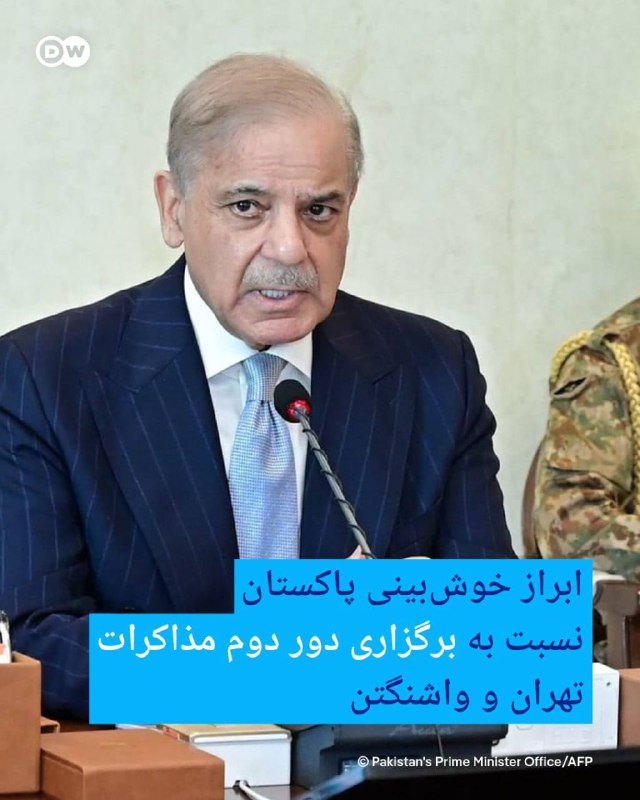

🔶 ابراز خوش‌بینی پاکستان نسبت به برگزاری دور دوم مذاکرات تهران و واشنگتن

نخست‌وزیر پاکستان، نسبت به برگزاری دور دوم مذاکرات مستقیم میان تهران و واشنگتن و دستیابی به "صلحی پایدار" ابراز خوش‌بینی کرد.

شهباز شریف در گفت‌وگو با روزنامه "تایمز" بریتانیا گفت کشورش مورد اعتماد همه طرف‌ها، از جمله ایران، ایالات متحده و کشورهای حاشیه خلیج فارس است.

او همچنین تاکید کرد که تلاش‌های میانجی‌گرانه اسلام‌آباد، با وجود تبادل تهدیدها میان تهران و واشنگتن، همچنان ادامه دارد.

شهباز شریف در ادامه گفت، صلح به‌آسانی به دست نمی‌آید، بلکه نیازمند صبر، خرد و توانایی پیش بردن امور در دشوارترین شرایط است.

اظهارات نخست‌وزیر پاکستان در حالی مطرح می‌شود که دور پیشین مذاکرات با میانجی‌گری این کشور بی‌نتیجه به پایان رسید.

@dw_farsi

## DW_Farsi — post 124791

  

🔶 ادعای کیهان: جنگ جدید در آینده‌ای نه‌چندان دور محتمل است

روزنامه تندروی کیهان با اشاره به احتمال ازسرگیری درگیری‌ها میان ایران، اسرائیل و آمریکا، نوشت که وقوع دوباره جنگ "در فضایی از ابهام" قرار دارد، اما احتمال آن "در آینده‌ای نه‌چندان دور" بیشتر شده است.

کیهان در تحلیلی تازه، سه عامل را در ارزیابی احتمال آغاز دوباره جنگ مطرح کرد. این روزنامه نوشت شرایطی که به وقوع دو جنگ قبلی منجر شد، همچنان پابرجاست و از این رو، امکان شکل‌گیری جنگی تازه وجود دارد.

این روزنامه در عین حال با توصیف اقدامات اسرائیل و آمریکا به‌عنوان "اقدامات انتحاری بی‌نتیجه"، مدعی شد که باقی ماندن این بازیگران، احتمال تکرار "تصمیم و اقدام احمقانه" از سوی آن‌ها را منتفی نمی‌کند.

کیهان در ادامه پیش‌بینی کرد که در صورت آغاز دوباره جنگ، درگیری‌ها مشابه "جنگ چهل‌روزه" به یک نبرد فرسایشی تبدیل خواهد شد. به نوشته این روزنامه، در چنین شرایطی "دست برتر" با طرفی خواهد بود که "استقرار کامل‌تری در زمین جنگ" داشته باشد.

اظهارات و تحلیل‌های منتشرشده در کیهان، اغلب به‌عنوان دیدگاه جریان‌های نزدیک به حاکمیت مورد توجه قرار می‌گیرد.

@dw_farsi

## Persian_Trend_Official — post 14321

  <a href="telegram/content/Persian_Trend_Official_14321_1779017035.webm" target="_blank">🎬 Download video</a>

پزشکیان: روز جهانی ارتباطات را تبریک می‌گویم

پزشکیان در شبکه اجتماعی
ایکس نوشت:

🔹‏در روزهای جنگ، فرزندان ما در ارتباطات و فناوری اطلاعات، شبانه‌روز ایستادند تا ارتباطات و خدمات حیاتی کشور پایدار بماند. دسترسی باکیفیت و پایدار مردم به خدمات دیجیتال، بخشی از آرامش، پیشرفت و حق زندگی شایسته مردم عزیز ایران است.

🔹روز جهانی ارتباطات را تبریک می‌گویم.

🫆:Tony

📌 @persian_trend_official
پرشین ترند | متفاوت‌ترین کانال نظامی

## Persian_Trend_Official — post 14320

  

🔴انفجار در امارات 💢منابع عربی اعلام کردند که انفجارهایی خیابان فاطمه بنت مبارک در ابوظبی را لرزاند. 🫆:Tony 📌 @persian_trend_official پرشین ترند | متفاوت‌ترین کانال نظامی

## Persian_Trend_Official — post 14319

  <a href="telegram/content/Persian_Trend_Official_14319_1779017036.webm" target="_blank">🎬 Download video</a>

🔴انفجار در امارات

💢منابع عربی اعلام کردند که انفجارهایی خیابان فاطمه بنت مبارک در ابوظبی را لرزاند.

🫆:Tony

📌 @persian_trend_official
پرشین ترند | متفاوت‌ترین کانال نظامی

## RadioFarda — post 157286

  

🔸 اداره رسانه‌ای ابوظبی روز یک‌شنبه ۲۷ اردیبهشت در شبکه‌های اجتماعی از وقوع آتش‌سوزی در نیروگاه اتمی براکه در امارات متحده عربی خبر داد.

🔸 این آتش‌سوزی پس از حمله پهپادی به نیروگاه اتمی برکه در منطقه الظَفرَه آغاز شده، اما کشته و مجروح بر جا نگذاشته است.

🔸 بر اساس توضیح اداره رسانه‌ای ابوظبی، این حریق در ژنراتور برق خارج از محدوده پیرامون نیروگاه به راه افتاده و بر ایمنی سایت اثر منفی نداشته است.

🔸 در پی آغاز حمله مشترک آمریکا و اسرائیل به خاک ایران، امارات متحده عربی به بزرگ‌ترین هدف حملات تلافی‌جویانه سپاه پاسداران تبدیل شد.

@RadioFarda

## RadioFarda — post 157285

  

🔸رسانه‌های حکومتی در ایران روز یک‌شنبه ۲۷ اردیبهشت از برگزاری دادگاه صادق ساعدی‌نیا، مدیرعامل شرکت صنعت غذایی و مدیر کافه‌های زنجیره‌ای ساعدی‌نیا خبر دادند.

🔸آقای ساعدی‌نیا در پی اعتراضات دی‌ماه سال گذشته که در روزهای ۱۸ و ۱۹ دی به کشتار گسترده معترضان ختم شد بازداشت و به تحریک مردم برای شرکت در این اعتراضات متهم شد.

🔸نماینده دادستان در این دادگاه ساعدی‌نیا را به «فعالیت تبلیغی یا رسانه‌ای برخلاف امنیت کشور، اقدام عملیاتی برای گروه‌های معاند نظام و در راستای فراخوان‌های منتشر شده توسط این گروه‌ها، جهت برهم زدن امنیت و برخلاف امنیت کشور و فعالیت تبلیغی علیه نظام» متهم کرد.

🔸او در دفاع از خود گفته است:‌ «من هیچ یک از کارکنانم را برای شرکت در اغتشاشات ترغیب نکردم، از کرده خود پشیمانم و از دادگاه می‌خواهم به من فرصتی برای جبران بدهد.»

@RadioFarda

## IranianMinds — post 20274

🔴 دوباره به امارات حمله ی پهپادی کردن @IranianMinds

## IranianMinds — post 20273

  

🔴 دوباره به امارات حمله ی پهپادی کردن

@IranianMinds

## BBCPersian — post 281293

🔻سازمان مدیریت بحران تهران: ۵۱ هزار واحد در جریان جنگ در پایتخت آسیب دیدند

🔻رئیس سازمان پیشگیری و مدیریت بحران تهران اعلام کرد در جریان جنگ «۵۱ هزار واحد» آسیب‌دیده در پایتخت شناسایی شده است.

علی نصیری گفت که از این تعداد، «۶۹۱ واحد نیاز به مقاوم‌سازی دارند و ۱۷۹۱ واحد نیز باید به‌طور کامل تخریب و نوسازی شوند.»

او افزود ارزیابی میزان خسارت‌ها توسط کارشناسان رسمی دادگستری انجام می‌شود و در مواردی که خسارت تا سقف ۵۰۰ میلیون تومان باشد، کارت‌های الکترونیکی از سوی بانک شهر به مالکان پرداخت خواهد شد.

به گفته آقای نصیری، در خسارت‌های بالاتر از این رقم نیز شهرداری‌های مناطق موظف‌ هستند از طریق پیمانکار، عملیات بازسازی را به‌صورت مستقیم اجرا کنند.

او همچنین اعلام کرد بیش از «۱۲ هزار خودرو و موتورسیکلت» هم در جریان جنگ دچار آسیب شده‌اند.

https://bbc.in/43egGtC
@BBCPersian

## BBCPersian — post 281292

🔻امارات از حمله پهپادی و آتش‌سوزی در بیرون نیروگاه هسته‌ایش خبر داد

🔻مقام‌های ابوظبی می‌گویند آتش‌سوزی ناشی از حمله یک پهپاد به یک ژنراتور برق در بیرون محدوده نیروگاه هسته‌ای براکه کنترل شده است.

دفتر رسانه‌ای ابوظبی گفت در این حادثه کسی آسیب ندیده است و سطح ایمنی پرتوهای رادیواکتور نیز تغییری نکرده است.

سازمان تنظیم مقررات هسته‌ای امارات هم با تایید این خبر اعلام کرد که نیروگاه به کار عادی خود ادامه می‌دهد.

نیروگاه هسته‌ای براکه در منطقه ظفره امارات اولین نیروگاه هسته‌ای در جهان عرب است و از چهار رآکتور تشکیل شده است.

ایران امارات را در حملات آمریکا و اسرائیل شریک فعال می‌داند.

https://bbc.in/4wBwOTv
@BBCPersian

## BBCPersian — post 281291

  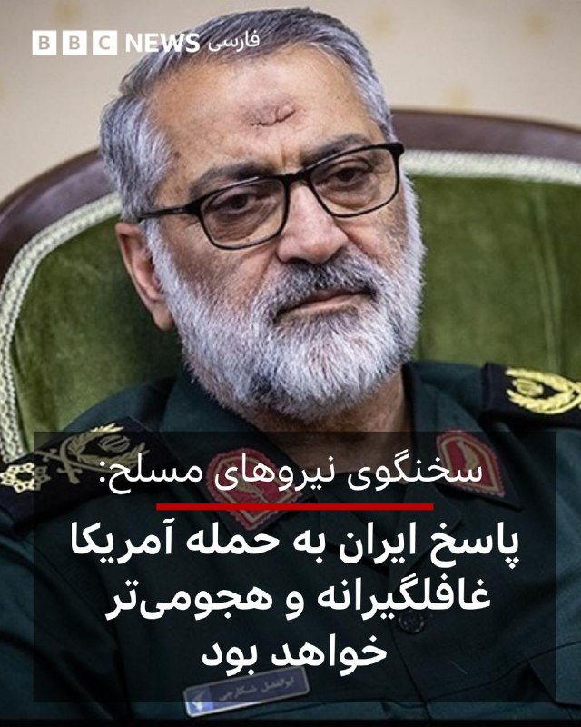

🔻سخنگوی نیروی‌های مسلح ایران درباره ازسرگیری حملات آمریکا گفت که پاسخ ایران این بار «هجومی‌تر» و «غافلگیرکننده» خواهد بود.
ابوالفضل شکارچی گفت: «تکرار هرگونه حماقت برای جبران بی‌آبرویی آمریکا در جنگ تحمیلی سوم علیه ایران، پیامدی جز دریافت ضربات کوبنده‌تر و شدیدتر برای آن کشور به‌دنبال نخواهد داشت.»
او تهدید کرد که «در صورت عملی شدن تهدیدها»، پاسخ ایران «هجومی، غافلگیرکننده و طوفانی» خواهد بود.
ساعاتی پیش دونالد ترامپ در شبکه اجتماعی تروث سوشال تصویر گرافیکی از خود در کنار یک فرمانده نظامی آمریکا منتشر کرد و نوشت: «آرامش پیش از طوفان»
در دو روز گذشته برخی رسانه‌های آمریکا و اسرائیل از قریب‌الوقوع بودن حملات به ایران خبر داده‌اند.

📸Tasnim
https://bbc.in/3PHngpr
@BBCPersian

## BBCPersian — post 281290

🔻گزارش‌هایی از رد و بدل پیام و شروط ایران و آمریکا برای از سرگیری مذاکرات

🔻خبرگزاری فارس می‌گوید که آمریکا در پاسخ به پیشنهاد ایران پنج شرط تعیین کرده است. به گزارش این خبرگزاری که به نهادهای نظامی و امنیتی نزدیک است این پنج شرط عبارتند از:

-نپرداختن غرامت جنگی به ایران
-تحویل اورانیوم غنی‌شده
-حفظ تنها یک مرکز هسته‌ای
-نپراختن حتی ۲۵ درصد از دارایی‌های بلوکه شده ایران
-توقف جنگ در همه جبهه‌ها مشروط به مذاکرات خواهد بود

فارس نوشت «حتی در صورت تحقق این شرایط از سوی ایران، تهدید» حمله آمریکا و اسرائیل «همچنان پابرجا خواهد بود.»

فارس همچنین شروط پنج گانه ایران را چنین عنوان کرد:

-پایان جنگ در همه جبهه‌ها به‌ویژه لبنان
-رفع تحریم‌ها
-آزادسازی پول‌های بلوکه‌شده ایران
-جبران خسارات جنگ
-پذیرش حق حاکمیت ایران بر تنگه هرمز

در همین حال برخی رسانه‌های ایران گزارش دادند که تهران «بعد از دریافت مجموعه‌ای از پیشنهادهای طرف آمریکایی از سوی میانجی پاکستانی، شب گذشته دیدگاه‌های خود را به طرف پاکستانی منعکس کرده است.»

این گزارش‌های یک روز پس از سفر محسن نقوی، وزیر کشور پاکستان، به تهران منتشر می‌شود. گفته شد سفر او به تهران برای انتقال پیام بوده است.

https://bbc.in/4ukgfKi
@BBCPersian

## Dirty_Kids — post 389608

  <a href="telegram/content/Dirty_Kids_389608_1779017039.mp4" target="_blank">🎬 Download video</a>

بعد طرف میاد نطق می‌کنه که برید کتاب بخونید، مردم آگاه نیستند! ببین اینو ابله، مردم ایران اینجوری هستن، پتکی که این مهندس جوان ایرانی به سر رژیم زد، هیچکی نزد. آینده ایران رو اینا می‌سازن، با سواد و اهل کار.

@Dirty_Kids 👻

## Dirty_Kids — post 389607

  

کتاب دینیه یا داستان‌های پورنهاب؟

کتاب وسائل الشیعه، جلد ۱۴؛ امام رضا: هر وقت خواستی با زنت رابطه داشته باشی، فورا دخول نکن، اول با حرفای جنسی تحریکش کن و بعدش سینه هاشو فشار بده!
با اینکار اون کاملا آماده میشه و شهوت از چشماش فوران میکنه، بعدش ازت میخواد و خواهش میکنه که باهاش رابطه برقرار کنی!

@Dirty_Kids 👻

## Dirty_Kids — post 389606

  <a href="https://t.me/Dirty_Kids/389606" target="_blank">📎 Download file</a>

✅ اپلیکیشن اندروید سایت جهانی دربی بت

💰اولین سایت جهانی با امکان شارژ و برداشت ریالی(کارت به کارت)

🔗 برای ورود فیلترشکن روی کشور مناسب قرار دهید مانند فنلاند و المان و....

😀Telegram Channel
👇
https://t.me/+bcynkEgSW2dlYTc0

## Dirty_Kids — post 389605

  

😤دنبال یه سایت شرط بندی بین المللی بودی که به ایرانیا خدمات بده؟!
⛔

👍دربی بت همون انتخاب  100%

💎ویژگی های سایت جهانی Derby Bet:

⬅️امکان شارژ امن با کارت بانکی

⬅️واریز اول دوبل شارژ می شوید(بونوس۱۰۰٪)

⬅️پر اپشن ترین سایت فعال در ایران

⬅️تسویه حساب کمتر از 5 دقیقه

⬅️برگشت بخشی از باخت به صورت هفتگی

🚨کد هدیه ثبت نام:GG007

⚠️برای دانلود اپلکیشن کلیک کنید
👉

🔔کانال دربی بت :

🪙https://t.me/+bcynkEgSW2dlYTc0

## Dirty_Kids — post 389604

‏احساس میکنم یه عده هنوز نفهمیدن چه اتفاقی افتاده:
یه حکومتی هست که در عرض ۴ ساعت حداقل ۴۰ هزار نفر رو قتل عام کرده، به مجروحین توی بیمارستان تیر خلاص زده، به پرستارها تجاوز کرده، سر از تن معترضین جدا کرده، جسدها رو انبار کرده و خونواده‌ها رو وادار کرده بگردن لا به لای هزاران جسد ببینن جگرگوشه‌شون پیدا میشه یا نه، ازشون برای تحویل جنازه پول گرفته، هر روز هم یه عده رو بعد از کلی شکنجه داره اعدام میکنه.
بزرگترین قتل عام دوران معاصر ایران جلوی چشم ما اتفاق افتاده و تنها غلطی که میتونیم بکنیم اینه که نذاریم فراموش بشه، به حاشیه بره و در نهایت ج‌ا قسر در بره.

خیلی باید کودن یا پلشت باشید که جز ریشه کن شدن این حکومت چیزی بخواید و با کسی جز حامیان این حکومت دعوا کنید و اگر مخاطبین زیادی دارید از تریبونتون استفاده دیگه‌ای بکنید.

@Dirty_Kids 👻

## Dirty_Kids — post 389603

  <a href="telegram/content/Dirty_Kids_389603_1779017041.mp4" target="_blank">🎬 Download video</a>

یه مشت پیرزن پیرمرد چروک گوزو و بچه‌ چاقال مسجدی جمع کردن توی مساجد،یکی یه آرپی‌جی و کلاش دادن دستشون که یعنی آموزش ببینند،واسه چی؟مثلآ جنگ با آمریکا و اسرائیل، آخه احمقا با این سیرک شماها جنگجو شدید؟خیر
رژیم روزای آخر بد به دریوزگی افتاده

@Dirty_Kids 👻

## Dirty_Kids — post 389602

  <a href="telegram/content/Dirty_Kids_389602_1779017043.mp4" target="_blank">🎬 Download video</a>

جان تراولتای هفتاد و دو ساله یا اکسیر جوونی رو پیدا کرده یا کار دکترش خیلی درسته، ولی چیزی که خیلی جالبه اکت و تیز بودنشه، حرکاتش یه جوریه انگار چهل سالشه.

@Dirty_Kids 👻

## Dirty_Kids — post 389601

  

🌪وقتی اینترنت طوفانیه... کافیه بادبان ها رو بکشی تا

⚫️با بالاترین کیفیت ممکن
⚡️ 

⚫️100 هزار تومان شارژ هدیه 
🎁

⚫️پایین ترین قیمت گیگی 250
🌐 

⚫️و ارائه پورسانت %10 در ازای هر معرفی
💼

بتونی یه اتصال پایدار با پشتیبانی 24 ساعته داشته باشی
🚀

بادبان راهتو باز می‌کنه
⛵️

R27

🛡@BadBan_VPN | کانال 

🤖@BadBan_VPNBot | ربات 

📞@BadBan_VPNSupport | پشتیبانی

## Hranews — post 112986

یک زن در فریدونکنار توسط یکی از بستگان خود به قتل رسید

❗️
❗️
❗️
❗️
❗️ – یک #زن ۲۶ ساله در شهرستان فریدونکنار توسط یکی از بستگان خود به قتل رسید. متهم توسط ماموران پلیس بازداشت شده است.

ادامه مطلب

↘️
@hranews_bot تماس ✉️ -  @Hranews  کانال هرانا 🆑

## Hranews — post 112985

واژگونی اتوبوس حامل کارگران مجتمع گاز پارس جنوبی به مرگ ۸ کارگر انجامید

❗️
❗️
❗️
❗️
❗️ – در اثر حادثه واژگونی یک دستگاه اتوبوس حامل کارکنان مجتمع گاز پارس جنوبی، در جاده عسلویه به سیراف، هشت #کارگر جان خود را از دست دادند.

ادامه مطلب

↘️
@hranews_bot تماس ✉️ -  @Hranews  کانال هرانا 🆑

## Hranews — post 112984

امروز یکشنبه ۲۷ اردیبهشت‌ماه، شماری از بازنشستگان تامین اجتماعی در مقابل ساختمان این سازمان در شوش دست به #تجمع اعتراضی زدند.

این تجمع در اعتراض به تاخیر بیش از دو ماهه در افزایش حقوق سالانه موضوع ماده ۹۶، بی‌تفاوتی نسبت به تعیین و ابلاغ حق مسکن و همچنین عدم اجرای قانون الزام در بخش درمان صورت گرفته است.

↘️
@hranews_bot تماس ✉️ -  @Hranews  کانال هرانا 🆑

## Hranews — post 112983

  

رئیس دانشکده علوم اجتماعی، ارتباطات و رسانه، نسبت به پیامدهای اجرای طرح «#اینترنت_پرو» هشدار داد و آن را عاملی در جهت تشدید #شکاف_اجتماعی دانست. وی در گفت‌وگو با ایسنا، با انتقاد از نحوه اجرای این طرح، اعلام کرد که شکل فعلی آن بدون شفاف‌سازی، به نمادی از تبعیض، رانت و بی‌عدالتی تبدیل شده و می‌تواند اعتماد عمومی و سرمایه اجتماعی را تضعیف کند.

اکبر نصراللهی اعلام کرد که تداوم محدودیت‌های اینترنتی در حالی که دسترسی مشابه در قبال پرداخت هزینه برای برخی افراد فراهم است، نوعی تناقض در سیاست‌گذاری محسوب می‌شود که در صورت عدم تبیین، می‌تواند به افزایش نارضایتی عمومی و تضعیف انسجام اجتماعی منجر شود. وی همچنین تاکید کرد که اینترنت به عنوان بخشی از زیرساخت حیاتی کشور، نقش مهمی در حوزه‌هایی چون آموزش، سلامت و اقتصاد دارد و تداوم محدودیت‌ها آثار گسترده‌ای بر زندگی روزمره شهروندان خواهد داشت.

↘️
@hranews_bot تماس ✉️ -  @Hranews  کانال هرانا 🆑

## Hranews — post 112982

اردبیل؛ یک محیط‌بان در پی درگیری با متخلف محیط زیستی مجروح شد

❗️
❗️
❗️
❗️
❗️ – یک #محیط_بان در منطقه حفاظت شده نئور استان اردبیل در جریان درگیری با یک صیاد متخلف زخمی شد.

ادامه مطلب

↘️
@hranews_bot تماس ✉️ -  @Hranews  کانال هرانا 🆑

## manototv — post 105553

  <a href="telegram/content/manototv_105553_1779017045.mp4" target="_blank">🎬 Download video</a>

مقام‌های ابوظبی اعلام کردند در پی حمله پهپادی، یک ژنراتور برق خارج از محدوده داخلی نیروگاه هسته‌ای براکه در منطقه الظفره دچار آتش‌سوزی شد.

بر اساس این اعلام، حادثه آسیب جانی نداشت و هیچ اثری بر سطح ایمنی پرتوی نیروگاه برجای نگذاشت. مقام‌ها گفته‌اند همه اقدامات احتیاطی لازم انجام شده و جزئیات بیشتر در صورت دریافت اطلاعات تازه اعلام خواهد شد.

سازمان فدرال مقررات هسته‌ای امارات نیز تاکید کرد آتش‌سوزی بر ایمنی نیروگاه یا آمادگی سامانه‌های حیاتی آن اثری نداشته و همه واحدهای نیروگاه به‌طور عادی در حال فعالیت‌اند.

## manototv — post 105552

  <a href="telegram/content/manototv_105552_1779017046.mp4" target="_blank">🎬 Download video</a>

روزنامه بریتانیایی تلگراف گفته است برخی افراد نزدیک به دونالد ترامپ، رئیس‌جمهوری آمریکا، پیشنهاد کرده‌اند امارات متحده عربی جزیره لاوان در خلیج فارس را تصرف کند.

بر اساس این ادعا، یک مقام ارشد امنیتی پیشین در دولت ترامپ به تلگراف گفت هدف از چنین پیشنهادی، افزایش نقش امارات در رویارویی با ایران بدون اعزام نیروهای زمینی آمریکا است.

این گزارش پس از آن منتشر می‌شود که وال‌استریت ژورنال از حملات پنهانی امارات به اهدافی در ایران خبر داد. به گزارش رویترز به نقل از این روزنامه، یکی از این حملات در اوایل آوریل پالایشگاهی در جزیره لاوان را هدف قرار داده بود، ادعایی که امارات آن را علنا تایید نکرده است.

## alonews — post 120578

  <a href="telegram/content/alonews_120578_1779017046.webm" target="_blank">🎬 Download video</a>

👈دبیر ستاد ملی جمعیت: اگر با همین شرایط پیش برویم، در ۷۵ سال آینده جمعیت ما به ۳۱ میلیون نفر میرسد

✅ @AloNews خبر جنگ

## alonews — post 120577

  <a href="telegram/content/alonews_120577_1779017046.webm" target="_blank">🎬 Download video</a>

👈هاآرتص: دادگاه کیفری بین‌المللی حکم‌های بازداشت مخفیانه‌ای برای پنج مقام اسرائیلی، از جمله سه سیاستمدار و دو افسر نظامی صادر کرد

✅ @AloNews خبر جنگ

## alonews — post 120576

  <a href="telegram/content/alonews_120576_1779017047.webm" target="_blank">🎬 Download video</a>

👈عارف معاون پزشکیان: ما تا حد امکان قیمت کالاها را مهار می‌کنیم و بقیه آن به مسائل بین‌المللی بازمی‌گردد!

✅ @AloNews خبر جنگ

## alonews — post 120575

  <a href="telegram/content/alonews_120575_1779017047.webm" target="_blank">🎬 Download video</a>

👈روزنامه Dawn پاکستان به نقل از منابع دیپلماتیک در اسلام‌آباد: سفر اعلام‌نشده وزیر کشور پاکستان به تهران در چارچوب دیپلماسی مستمر اسلام‌آباد برای احیای روند متوقف‌شده صلح میان آمریکا و ایران انجام می‌شود.

🔴این سفر برنامه‌ریزی‌نشده با هدف جلوگیری از فروپاشی کامل مذاکرات صورت گرفته؛ به‌ویژه پس از آنکه شتاب حاصل از دورهای پیشین گفت‌وگوها در پایتخت پاکستان به‌شدت کاهش یافته است.

🔴انتظار می‌رود وزیر کشور پاکستان، در جریان این سفر با مقام‌های ارشد ایرانی دیدار و گفت‌وگو کند.

✅ @AloNews خبر جنگ

## alonews — post 120574

  <a href="telegram/content/alonews_120574_1779017047.webm" target="_blank">🎬 Download video</a>

👈رئیس‌جمهور در شبکه اجتماعی ایکس نوشت: ‏در روزهای جنگ، فرزندان ما در ارتباطات و فناوری اطلاعات، شبانه‌روز ایستادند تا ارتباطات و خدمات حیاتی کشور پایدار بماند. دسترسی باکیفیت و پایدار مردم به خدمات دیجیتال، بخشی از آرامش، پیشرفت و حق زندگی شایسته مردم عزیز ایران است.

🔴روز جهانی ارتباطات را تبریک می‌گویم.

✅ @AloNews خبر جنگ

## alonews — post 120573

  <a href="telegram/content/alonews_120573_1779017047.webm" target="_blank">🎬 Download video</a>

👈اقتصاد اسرائیل در سه ماهه اول سال ۲۰۲۶ به دلیل جنگ با ایران ۳.۳٪ کوچک شد، طبق گزارش کانال ۱۲ اسرائیل

✅ @AloNews خبر جنگ

## alonews — post 120572

  <a href="telegram/content/alonews_120572_1779017047.webm" target="_blank">🎬 Download video</a>

👈گزارش سی ان ان از کابل هایی که زیر تنگه هرمز خوابیده!

🔴 مدیر تحقیقات شرکت تحقیقاتی TeleGeography، گفت که دو مورد از این کابل‌ها، فالکون و گلف بریج اینترنشنال (GBI)، از آب‌های سرزمینی ایران عبور می‌کنند. این شرکت اعلام کرده:کابل‌هایی که از تنگه هرمز عبور می‌کنند، تا سال 2025 کمتر از 1 درصد از پهنای باند بین‌المللی جهانی را تشکیل می‌دهند."

✅ @AloNews خبر جنگ

## alonews — post 120571

  <a href="telegram/content/alonews_120571_1779017047.webm" target="_blank">🎬 Download video</a>

👈دفتر رسانه ای ابوظبی : یه پهپاد نیروگاه هسته ای برکه تو منطقه الظفره رو هدف قرار داد 
✅ @AloNews خبر جنگ

## alonews — post 120570

  <a href="telegram/content/alonews_120570_1779017048.webm" target="_blank">🎬 Download video</a>

👈امارات اعلام کرد: آتش‌سوزی ناشی از حمله پهپادی به یک ژنراتور برق در نزدیکی تاسیسات هسته‌ای براکه

✅ @AloNews خبر جنگ

## alonews — post 120569

  <a href="telegram/content/alonews_120569_1779017048.webm" target="_blank">🎬 Download video</a>

🔴جلیلی سوم!

🔴پس از سعید جلیلی در سیاست خارجی و تحریم و قطعنامه؛ پس از وحید جلیلی در صداوسیما و سقوط مخاطب و مرجعیت؛ یک جلیلی دیگر هم چند سالی است بر زندگی شهروندان سایه انداخته.

🔴رسول جلیلی، عضو شورای عالی فضای مجازی و مدافع فیلترینگ؛ کسی که اینستاگرام و تلگرام را اف-۳۵ و اف-۱۵ می‌بیند.

✅@AloNews

## alonews — post 120568

  <a href="telegram/content/alonews_120568_1779017048.webm" target="_blank">🎬 Download video</a>

👈دفتر رسانه ای ابوظبی : یه پهپاد نیروگاه هسته ای برکه تو منطقه الظفره رو هدف قرار داد

✅ @AloNews خبر جنگ

## alonews — post 120567

  <a href="telegram/content/alonews_120567_1779017048.webm" target="_blank">🎬 Download video</a>

👈پزشکیان: نباید با آمار غیرواقعی جامعه را ناامید یا شرایط را عادی جلوه داد؛ اگر اینگونه القا شود که دولت عامدانه در مسیر افزایش قیمت‌ها حرکت می‌کند، ناجوانمردانه است

✅ @AloNews خبر جنگ

## alonews — post 120566

  <a href="telegram/content/alonews_120566_1779017049.webm" target="_blank">🎬 Download video</a>

👈برخی منابع خبری از انفجارهای مهیب در پایتخت امارات خبر دادند ولی علت انفجارها مشخص نیست

✅ @AloNews خبر جنگ

## alonews — post 120565

  <a href="telegram/content/alonews_120565_1779017049.webm" target="_blank">🎬 Download video</a>

👈نروژ مرفه ترین کشور جهان تو سال ۲۰۲۶ شد نروژ این جایگاه رو بخاطر درآمد عالی،وضعیت خوب مردم،آموزش،ثبات اقتصادی و اعتماد عمومی بدست آورد.

✅ @AloNews خبر جنگ

---
📅 بروزرسانی: 1405/02/27 13:34
---

## VahidOOnLine — post 240601

  <a href="telegram/content/VahidOOnLine_240601_1779012244.mp4" target="_blank">🎬 Download video</a>

اعتراض به سانسور، قطعی اینترنت، سرکوب و حبس معترضان در تجمع ایرانیان قبرس جنوبی، شنبه ۲۶ اردیبهشت
‌🏁 🇬🇧 ManotoTV

🤖 @VahidOOnLine

## VahidOOnLine — post 240600

  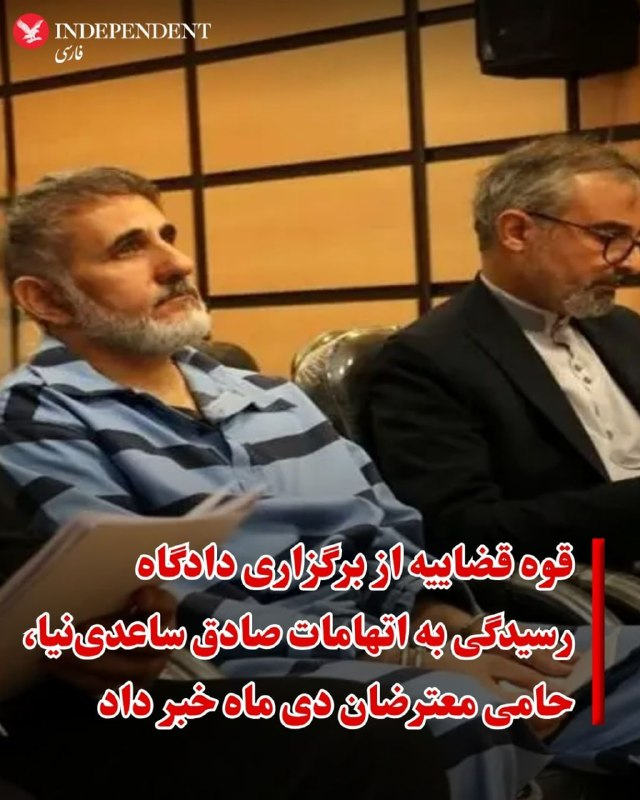

♦️خبرگزاری میزان، رسانه قوه قضاییه جمهوری اسلامی، روز یکشنبه ۲۷ اردیبهشت از برگزاری نخستین جلسه دادگاه رسیدگی به اتهامات صادق ساعدی‌نیا، مدیرعامل مجموعه «املاک و صنایع غذایی ساعدی‌نیا» در دادگاه انقلاب قم خبر داد.
بنا بر اعلام قوه قضائیه، ساعدی‌نیا با اتهاماتی از جمله «فعالیت تبلیغی یا رسانه‌ای برخلاف امنیت کشور»، «اقدام عملیاتی در راستای فراخوان‌های گروه‌های معاند برای برهم زدن امنیت کشور» و «فعالیت تبلیغی علیه نظام» به دلیل حمایت از اعتصاب‌ها و اعتراضات دی‌ماه روبه‌رو است.
«انتشار استوری»، «فعالیت در فضای مجازی»، «حضور در تجمعات اعتراضی»، «تعطیل کردن کافه‌ها و مغازه‌ها» و تشویق برخی کارکنانش به حضور در اعتراضات از مصادیق اتهامات مطرح‌شده علیه صادق ساعدی‌نیا عنوان شده است.
‌🇸🇦 Indypersian

🤖 @VahidOOnLine

## VahidOOnLine — post 240599

♦️ویدیوهای منتشرشده در شبکه‌های اجتماعی که گفته می‌شود مربوط به جزیره مارو (شیدور) و مناطق اطراف جزیره لاوان است، آلودگی گسترده نفتی در آب‌ها و سواحل خلیج فارس را در روز جمعه ۲۵ اردیبهشت نشان می‌دهد. در این تصاویر، لکه‌های وسیع نفتی، تغییر رنگ آب دریا و آلودگی شدید نوار ساحلی قابل مشاهده است.
خبرگزاری رویترز نیز با استناد به تصاویر ماهواره‌ای ثبت‌شده از وقوع یک نشت نفتی گسترده در نزدیکی جزیره خارگ، مهم‌ترین پایانه صادرات نفت ایران، خبر داده است. بر اساس این گزارش، لکه نفتی مشاهده‌شده در تصاویر ماهواره‌های کوپرنیک، منطقه‌ای حدود ۴۵ تا ۹۵ کیلومتر مربع را در غرب جزیره خارگ پوشش داده است.
فعالان محیط زیست و کاربران شبکه‌های اجتماعی، وضعیت جزیره مارو (شیدور) معروف به «مالدیو ایران» را «فاجعه‌بار» توصیف کرده‌اند. برخی گزارش‌ها علت این آلودگی را حملات انجام‌شده به تاسیسات نفتی جزیره لاوان در فروردین‌ماه عنوان می‌کنند.
در برخی ویدیوهای منتشرشده، علاوه بر آب‌های آلوده، تصاویری از دود و انفجار در جزیره نیز دیده می‌شود. گفته می‌شود این حملات توسط امارات متحده عربی انجام شده است.
‌🇸🇦 Indypersian

🤖 @VahidOOnLine

## VahidOOnLine — post 240598

  

♦️علاءالدین بروجردی، عضو کمیسیون امنیت ملی مجلس روز یکشنبه درباره مذاکرات با آمریکا گفت:  جمهوری اسلامی ایران از حقوق خود در تنگه هرمز و همچنین مسائل هسته‌ای کوتاه نمی‌آید.

بروجردی  با بیان اینکه مذاکره بدون پذیرش شروط ایران بی‌معناست، گفت: «طرف مقابل باید بپذیرد که جمهوری اسلامی حاکم بر تنگه هرمز است. بدانند که موضوع هسته‌ای هیچ ارتباطی با آمریکا ندارد و به هیچ‌وجه حاضر نیستیم از آن کوتاه بیاییم.»

این عضو کمیسیون امنیت ملی مجلس درباره شروط جمهوری اسلامی برای حضور در مذاکرات، گفت: «آنها باید بپذیرند که هرگونه توافق در مذاکرات احتمالی آینده، توافق با کل جبهه مقاومت اعم از لبنان، عراق و یمن خواهد بود. اگر این قواعد را قبول نداشته باشند، ورود به مذاکره بی‌فایده خواهد بود.»

علاءالدین بروجردی همچنین تاکید کرد که «آنها باید بپذیرند اموال بلوکه‌شده آزاد شود و تحریم‌ها برداشته شوند. پذیرش این شروط الزامی است.»

این اظهارات در حالی مطرح شده است که دونالد ترامپ، روز شنبه ۲۶ اردیبهشت به جمهوری اسلامی هشدار داد که اگر به‌زودی بر سر یک توافق صلح موافقت نکند، «دوران بسیار سختی» را پیش رو خواهد داشت.
‌🇸🇦 Indypersian

🤖 @VahidOOnLine

## VahidOOnLine — post 240597

  

خبرگزاری میزان، رسانه قوه قضاییه جمهوری اسلامی، از برگزاری نخستین جلسه دادگاه رسیدگی به اتهامات صادق ساعدی‌نیا، مدیرعامل مجموعه «املاک و صنایع ساعدی‌نیا» و از حامیان اعتصاب‌ها و اعتراضات دی‌ماه، در دادگاه انقلاب قم خبر داد.
طبق این گزارش، ساعدی‌نیا با اتهاماتی از جمله «فعالیت تبلیغی یا رسانه‌ای برخلاف امنیت کشور»، «اقدام عملیاتی در راستای فراخوان‌های گروه‌های معاند برای برهم زدن امنیت کشور» و «فعالیت تبلیغی علیه نظام» روبه‌رو است.
انتشار استوری، فعالیت در فضای مجازی، حضور در تجمعات اعتراضی، تعطیل کردن کافه‌ها و مغازه‌های متعلق به خود و تشویق برخی کارکنانش به حضور در اعتراضات از مصادیق اتهامات مطرح‌شده علیه او عنوان شده است.
نماینده دادستان، مواردی مانند فعالیت‌های ساعدی‌نیا در فضای مجازی، تهیه کلیپی از یکی از کارکنانش با نوشته «جاوید شاه» روی دست، ایجاد و مدیریت گروه واتساپی کارکنان کافه‌ها، انتشار پیام صوتی درباره خاموش کردن گوشی برای جلوگیری از ردیابی، حضور برخی کارکنان در اعتراضات و برنامه‌ریزی برای تعطیلی کافه‌ها و کارخانه‌ها همزمان با فراخوان‌های اعتراضی را از مصادیق اتهامات مطرح‌شده علیه او عنوان کرد.
‌🏁 🇬🇧 IranintlTV

🤖 @VahidOOnLine

## VahidOOnLine — post 240596

  

ابوالفضل شکارچی، سخنگوی ارشد نیروهای مسلح جمهوری اسلامی، گفت که دونالد ترامپ باید بداند در صورت عملی شدن تهدیدها و حمله مجدد به جمهوری اسلامی، دارایی‌ها و ارتش آمریکا با «سناریوهای جدید، هجومی، غافلگیرکننده و طوفانی» روبه‌رو خواهند شد و در «باتلاق خودساخته‌» فرو خواهند رفت.
‌🏁 🇬🇧 IranintlTV

🤖 @VahidOOnLine

## VahidOOnLine — post 240595

  <a href="telegram/content/VahidOOnLine_240595_1779012249.mp4" target="_blank">🎬 Download video</a>

‌🏁 🇬🇧 ManotoTV

🤖 @VahidOOnLine

## VahidOOnLine — post 240594

🗣روایت شما از زندگی در آتش‌بس- یکشنبه۲۷ اردیبهشت ۱۴۰۵

🔹چیزی به اسم ساعت مرگ شنیدین؟ ساعتی که همه‌چیز، از جمله انگیزه از بین میره. برای من، اون روزی بود که مجبور شدم به خاطر شرایط تحمیل‌شده، ۶ نفر از ۱۴ نفر از نیروهام رو تعدیل کنم.

🔹هنوز نتونستم میوه این فصل رو به دلیل قیمت‌های وحشتناک گرون برای خانواده بخرم؛ توت‌فرنگی، گوجه‌سبز و زردآلو.

🔹قبل از جنگ می‌خواستم یه هارد بخرم، ۵۰ میلیون تومان بود و الان شده ۱۶۰ میلیون تومان.

🔹نان سنگک ساده شده ۱۷ هزار تومان، کنجدی هم شده ۲۵ هزار تومان. نانوایی‌ها یه ترفند زدن؛ یک نون بزرگ‌تر با کنجد زیاد درست کردن به قیمت ۸۰ هزار تومان می‌فروشن. کسانی که حوصله صف ندارن، مجبورن همون نون گرون رو بخرن.

🔹من خانم هستم و آتلیه عروسی داشتم. شغل ما همیشه زیر سایه تهدید شدید اماکن بوده و اجازه گذاشتن نمونه‌ کار نداشتیم. الان با این گرونی و قطعی اینترنت کلا نابود شدیم، چون هیچ عروسی برگزار نمی‌شه.

🔹من تریدرم و از وقتی اینترنت قطع شده، درآمد ندارم. چند سال زحمت کشیدم اما تریدینگ‌ویو، ابزار کارم باز نمی‌شه. برای ترید نیاز به اینترنت پایدار و آرامش دارم که هیچ‌کدوم نیست.

🔹در بلوچستان هر ۲۰ لیتر بنزین آزاد، بین یک میلیون و ۳۰۰ هزار تومان تا یک میلیون و ۵۰۰ هزار تومان هست؛ یعنی حدودا لیتری ۶۰ تا ۷۰ هزار تومان.

🔹دارم خونه می‌سازم و هر لحظه قیمت‌ها بیشتر می‌شه. کل هزینه ساختن تا قبل از عید یک میلیارد و نیم بود اما الان کابینت جنس معمولی شده یک میلیارد تومان.
‌🏁 🇬🇧 IranintlTV

🤖 @VahidOOnLine

## VahidOOnLine — post 240593

  

♦️کمیته آزادی آکادمیک وابسته به انجمن ایران‌پژوهی (AIS) با انتشار بیانیه‌ای رسمی خطاب به مقام‌های ارشد سازمان ملل، اتحادیه اروپا و ایالات متحده، نسبت به آنچه «هدف قرار گرفتن سیستماتیک دانشگاه‌ها، مدارس و مراکز پژوهشی ایران» در جریان جنگ اخیر خوانده، هشدار داد.
در این بیانیه که برای مقام‌هایی از جمله ولکر تورک، کمیسر عالی حقوق بشر سازمان ملل، آدری آزولای، مدیرکل یونسکو و مارکو روبیو، وزیر خارجه آمریکا ارسال شده، آمده است که مراکز آموزشی و پژوهشی ایران به «خط مقدم جنگ» تبدیل شده‌اند و حمله به آن‌ها نقض آشکار قوانین بشردوستانه بین‌المللی و کنوانسیون ژنو محسوب می‌شود.
بر اساس آمار ارائه‌شده در این گزارش، تنها در فاصله اسفند ۱۴۰۴ تا فروردین ۱۴۰۵، بیش از ۲۱ دانشگاه در ایران هدف حملات قرار گرفته‌اند و ۱۵۴ ساختمان و مرکز دانشگاهی آسیب دیده یا تخریب شده‌اند.
‌🇸🇦 Indypersian

🤖 @VahidOOnLine

## VahidOOnLine — post 240592

  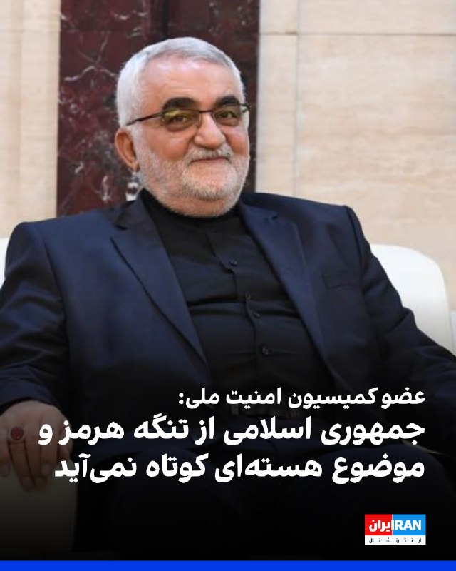

علاءالدین بروجردی، عضو کمیسیون امنیت ملی مجلس، درباره مذاکرات با آمریکا، گفت: «طرف مقابل باید بپذیرد که جمهوری اسلامی حاکم بر تنگه هرمز است. بدانند که موضوع هسته‌ای هیچ ارتباطی با آمریکا ندارد و به هیچ‌وجه حاضر نیستیم از آن کوتاه بیاییم.»

بروجردی درباره شروط جمهوری اسلامی برای حضور در مذاکرات، گفت: «آنها باید بپذیرند که هرگونه توافق در مذاکرات احتمالی آینده، توافق با کل جبهه مقاومت اعم از لبنان، عراق و یمن خواهد بود. اگر این قواعد را قبول نداشته باشند، ورود به مذاکره بی‌فایده خواهد بود.»

عضو کمیسیون امنیت ملی گفت: «آنها باید بپذیرند که اموال بلوکه‌شده آزاد شود. همچنین باید تحریم‌ها برداشته شوند. پذیرش این شروط الزامی است.»
‌🏁 🇬🇧 IranintlTV

🤖 @VahidOOnLine

## VahidOOnLine — post 240591

  

علاءالدین بروجردی، عضو کمیسیون امنیت ملی مجلس، درباره مذاکرات با آمریکا، گفت: «طرف مقابل باید بپذیرد که جمهوری اسلامی حاکم بر تنگه هرمز است. بدانند که موضوع هسته‌ای هیچ ارتباطی با آمریکا ندارد و به هیچ‌وجه حاضر نیستیم از آن کوتاه بیاییم.»

بروجردی درباره شروط جمهوری اسلامی برای حضور در مذاکرات، گفت: «آنها باید بپذیرند که هرگونه توافق در مذاکرات احتمالی آینده، توافق با کل جبهه مقاومت اعم از لبنان، عراق و یمن خواهد بود. اگر این قواعد را قبول نداشته باشند، ورود به مذاکره بی‌فایده خواهد بود.»

عضو کمیسیون امنیت ملی گفت: «آنها باید بپذیرند که اموال بلوکه‌شده آزاد شود. همچنین باید تحریم‌ها برداشته شوند. پذیرش این شروط الزامی است.»
‌🏁 🇬🇧 IranintlTV

🤖 @VahidOOnLine

## VahidOOnLine — post 240590

♦️از کوچه‌باغ‌های کاشان تا دامنه‌های میمند فارس، عطر دل‌انگیز گل محمدی در هوا می‌پیچد و روح آدم را تازه می‌کند. فصل اردیبهشت و خرداد، فصل عاشقی طبیعت با انسان است، فصلی که سنت هزارساله گلاب‌گیری دوباره جان می‌گیرد و دیگ‌های مسی، روایتگر یکی از اصیل‌ترین آیین‌های ایرانی می‌شوند.
باستان‌شناسان معتقدند ایرانیان از حدود هفت هزار سال پیش گل سرخ یا همان گل محمدی را پرورش می‌دادند و بیش از هزار سال است که هنر گلاب‌گیری در ایران جریان دارد.
امروز شهرهایی مانند کاشان، نیاسر، قمصر، میمند فارس، لاله‌زار کرمان، سمنان و مناطق مختلف دیگر، میزبان جشنواره‌های گل و گلاب هستند.
صبح زود، پیش از طلوع کامل خورشید، گل‌چین‌ها با دستانی پر از عطر، گل‌های تازه را جمع می‌کنند تا عطر و کیفیت گل‌ها حفظ شود. سپس گل‌ها داخل دیگ‌های بزرگ مسی ریخته می‌شوند و با حرارت آرام، بخار خوشبوی گل محمدی تبدیل به گلاب ناب ایرانی می‌شود.
در تقویم ملی ایران نیز روز ۲۰ اردیبهشت به نام «روز گل محمدی و گلاب» ثبت شده است، روزی برای پاسداشت عطری که قرن‌هاست در حافظه ایران مانده است.
‌🇸🇦 Indypersian

🤖 @VahidOOnLine

## VahidOOnLine — post 240589

  

فارس، خبرگزاری وابسته به سپاه پاسداران، گزارش داد که محمدباقر قالیباف، رییس مجلس شورای اسلامی، نماینده ویژه جمهوری اسلامی در امور چین شد. پیش‌تر علی لاریجانی با حکم علی خامنه‌ای و پس از آن عبدالرضا رحمانی‌فضلی با حکم مسعود پزشکیان این سمت را در اختیار داشتند.
‌🏁 🇬🇧 IranintlTV

🤖 @VahidOOnLine

## WithYashar — post 11470

مشاور سابق پنتاگون:تحرکات سطح بالای نیروی هوایی آمریکا در خاورمیانه شدت گرفته آماده باشید
@withyashar

## WithYashar — post 11469

دارم میرم یات تولد ، شاید دایرکت ها رو درست نبینم کم اختلال داریم ولی من هستم 😬🙌🏾

## WithYashar — post 11468

سی‌ان‌ان: ایران به کابل‌های اینترنتی تنگه هرمز چشم دوخته
@withyashar

## WithYashar — post 11467

## WithYashar — post 11466

داداش شما رئیس سواک میشی شک نکن

## WithYashar — post 11465

فک کنم ساواک روزی که برگرده باید اول به من بگه دادچ آرشیوتو بیار 🤣

## WithYashar — post 11464

  <a href="telegram/content/WithYashar_11464_1779012253.mp4" target="_blank">🎬 Download video</a>

الان بحث داغه دیدن این ویدیو شاهین نجفی هم که در اوایل شروع ‌به کارش برام فرستاد خالی از‌ لطف نیست ، من امید وارم همه با هم متحد باشن و مشکلات تموم بشه
@withyashar

## WithYashar — post 11463

  <a href="telegram/content/WithYashar_11463_1779012255.mp4" target="_blank">🎬 Download video</a>

اینا همش به تاریخ پیوست…
@withyashar

## mwarmonitor — post 9190

🇮🇷اسماعیل بقائی:
دروغ بزرگ بعدی که برای توجیه «جنگِ انتخابی» و غیرقانونی مطرح می‌شود، این ادعاست که آنان «در حال حفظ صلح و ثبات در بازارهای جهانی انرژی» هستند.

🔸در حالی‌که در واقعیت، این جنگ‌افروزیِ بی‌پروای نظام‌های آمریکا و اسرائیل بوده که روندهای دیپلماتیک امیدبخش را نابود کرده و با تجاوز نظامیِ بی‌دلیل علیه ایران، عمداً ناامنی را به مسیرهای حیاتی انرژی تزریق کرده‌اند؛ سپس همان ایران را به بی‌ثبات‌سازی متهم می‌کنند تا گفته بدنام یوزف گوبلز را به اجرا بگذارند:
«دیگران را به همان کاری متهم کن که خودت انجام می‌دهی.»

🔸این همان کتاب قواعد آشنا و ریاکارانه است: بحران و جنگ می‌سازند و سپس زیر پرچم‌های به‌ظاهر شریفِ «بازگرداندن ثبات» و «دفاع از صلح»، بیشتر تشدید می‌کنند.

ویرانی می‌آفرینند و نامش را صلح می‌گذارند.

@mwarmonitor

## mwarmonitor — post 9189

  

USAF نیروی هوایی ایالات متحده امریکا ✈️

لاکهید مارتین C-130J سوپر هرکولس (۴ فروند)
AE29DB 06-3171 – REACH ???
AE29DD 08-3173 – REACH 458
AE18ED 06-8611 – REACH 584
AE220A 08-8603 – REACH ???

✈️🔸چهار فروند C-130J پس از یک مأموریت موقت (TDY) که از ماه مارس آغاز شده بود، در حال حرکت به سمت پایگاه هوایی کفلاویک در جنوب غربی ایسلند هستند. این مأموریت از پایگاه هوایی رامشتاین در آلمان و پایگاه هوایی آویانو در ایتالیا انجام شده است.

@mwarmonitor

## mwarmonitor — post 9188

🇮🇷 رسانه‌های ایرانی:
۵ شرط اصلی در پاسخ واشنگتن به پیشنهاد توافق:

🔹 عدم پرداخت هرگونه غرامت یا خسارت از سوی آمریکا
🔹 خروج و تحویل ۴۰۰ کیلوگرم اورانیوم از ایران به آمریکا
🔹 فعال ماندن تنها یک مجموعه از تأسیسات هسته‌ای ایران
🔹 عدم پرداخت حتی ۲۵ درصد از دارایی‌های مسدودشده ایران
🔹 مشروط کردن آتش‌بس در همه مناطق به مذاکرات

🔹 این گزارش تأکید می‌کند که حتی در صورت پذیرش این شروط از سوی ایران، خطر تجاوز آمریکا و رژیم صهیونیستی همچنان باقی خواهد ماند.

🔹 کارشناسان معتقدند پیشنهاد آمریکا به‌جای حل مشکل، در پی تحقق اهدافی است که ایران نتوانسته در جریان جنگ به آن‌ها دست یابد.

🔹 در مقابل، ایران هرگونه مذاکره را به تحقق پنج شرط پیشینی برای اعتمادسازی مشروط کرده است:

🔹 پایان جنگ در همه جبهه‌ها، به‌ویژه لبنان
🔹 لغو تحریم‌های اعمال‌شده علیه ایران
🔹 آزادسازی دارایی‌های مسدودشده ایران
🔹 جبران خسارات ناشی از جنگ
🔹 به‌رسمیت شناختن حاکمیت ایران بر تنگه هرمز

@mwarmonitor

## mwarmonitor — post 9187

  <a href="telegram/content/mwarmonitor_9187_1779012257.mp4" target="_blank">🎬 Download video</a>

📝 تا حالا به این تناقضِ هالیوودی دقت کردید؟ با جریانی طرفیم که وقایع ۱۴۰۰ سال پیش رو طوری با کیفیت 4K و افکت‌های ویژه بازسازی می‌کنه که انگار کارگردانش همون موقع با پهپاد تو صحنه بوده!

🔸اما بمبِ خنده‌اش اینجاست ، همین پروپاگاندا رسانه‌ای، وقتی به سوژه زنده و حاضرش یعنی «مجتبی» می‌رسه، دستانش خالیِ خالیه. منطق می‌گه اگه چنین مهره‌ای با اون وزن سیاسی واقعاً وجود داشت، تا الان شش فصل سریال نتفلیکسی از پیاده‌روی‌ها و نبوغش رندر کرده بودن.

🔸واقعیت اینه که سیستم این‌ها فقط روی اموات و تاریخِ بی‌سند جواب میده و تو دنیای واقعی کلاً ارور میده! وقتی کل خروجی‌شون از این آدم، خلاصه میشه به یه تعارف ناشیانه و ماست‌مالی‌شده پشت آنتن صداوسیما، یعنی کفگیر واقعیت بدجور به تهِ دیگ خورده. ترجیح میدن سوژه‌شون مثل یه روح نامرئی بمونه، چون می‌دونن دوربین‌های مدرن، فانتزیِ ساختگی‌شون رو یه شبه هوا می‌بره!

@mwarmonitor

## mwarmonitor — post 9186

🔴دیوان کیفری بین‌المللی در لاهه به‌طور محرمانه احکام بازداشت علیه سه سیاستمدار اسرائیلی و دو افسر نظامی صادر کرده است.(هاآرتص)

@mwarmonitor

## mwarmonitor — post 9185

🇮🇷🇨🇳 انتصاب محمدباقر قالیباف به‌عنوان نماینده ویژه ایران نزد چین.

@mwarmonitor

## pm_afshaa — post 90890

🔴مشاور سابق پنتاگون:تحرکات سطح بالای نیروی هوایی آمریکا در خاورمیانه شدت گرفته آماده باشید

💧 Rainbet.com the #1 Non-KYC Crypto Casino & Sportsbook @rainbetcom

😁 @Pm_Afshaa

## pm_afshaa — post 90889

🔴تو اصفهان برای زنای بی حجابی که رفتن خایه مالی و راهپیمایی براشون احضاریه دادگاه ارسال شده

💧 Rainbet.com the #1 Non-KYC Crypto Casino & Sportsbook @rainbetcom

😁 @Pm_Afshaa

## pm_afshaa — post 90888

🔴ونزوئلا : الکس صائب از نزدیکان رئیس جمهور سابق نیکولاس مادورو و رابط حزب الله و سپاه پاسداران جمهوری اسلامی رو دستگیر کردیم و به ایالات متحده تحویل دادیم

💧 Rainbet.com the #1 Non-KYC Crypto Casino & Sportsbook @rainbetcom

😁 @Pm_Afshaa

## pm_afshaa — post 90887

🔴سی‌ان‌ان: ایران به کابل‌های اینترنتی تنگه هرمز چشم دوخته

💧 Rainbet.com the #1 Non-KYC Crypto Casino & Sportsbook @rainbetcom

😁 @Pm_Afshaa

## pm_afshaa — post 90886

قالیباف نمایندۀ ویژۀ ایران در امور چین شد

💧 Rainbet.com the #1 Non-KYC Crypto Casino & Sportsbook @rainbetcom

😁 @Pm_Afshaa

## mamlekate — post 103545

  <a href="telegram/content/mamlekate_103545_1779012259.mp4" target="_blank">🎬 Download video</a>

بر اساس گزارش‌ها در پی بارش‌های اخیر وضعیت دریاچه ارومیه در مقایسه زمان‌های مشابه سال‌های گذشته بهتر شده است. در یکی از آخرین ویدئوها از دریاچه ارومیه به تاریخ ۲۵ اردیبهشت رنگین‌کمانی بزرگ پس از بارش بهاری بر فراز این دریاچه نقش بسته است.

insta
@mamlekate

## mamlekate — post 103544

  

📝 وضعیت نامعلوم سپاهی‌های بازداشتی در آب‌های کویت

🎖 جلوی مردم بی‌سلاح ایران گودزیلان، جلو نیروهای مسلح دیگه موش آب‌کشیده [عکسی که پخش شده ممکنه تصویرسازی خبر باشه]

@mamlekate

## kianmeli1 — post 87445

  

🔴از چند ساعت گذشته بیش از دوازده فروند هواپیمای ترابری راهبردی C-17A گلوبمستر III نیروی هوایی آمریکا در حال ترک خاورمیانه و حرکت به سمت اروپا هستند.
https://t.me/kianmeli1

## kianmeli1 — post 87444

  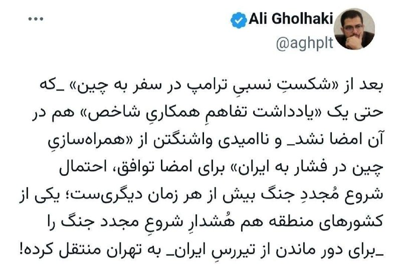

🔴قلهکی: یکی از کشورهای منطقه هشدار شروع جنگ را برای دورماندن از تیررسِ ایران، به تهران منتقل کرده است
https://t.me/kianmeli1

## kianmeli1 — post 87443

  <a href="telegram/content/kianmeli1_87443_1779012262.mp4" target="_blank">🎬 Download video</a>

‏🔴ابطحی:
‏اگر ‌خامنه‌ای دوم انتخاب نمی‌شد جنگ داخلی قطعی بو‌د
https://t.me/kianmeli1

## kianmeli1 — post 87442

  

🔴اولیانوف نماینده دائم روسیه در سازمان‌های بین‌المللی:

به نظر کارشناسان غربی،آمریکا و اسرائیل ممکن است در روزهای آینده، اگه نگوییم ساعت‌های آینده، دوباره حمله نظامی به ایران رو از سر بگیرند. اگه این حرف درسته، یعنی این آمریکا و اسرائیل هنوز از اشتباهات استراتژیک قبلی خود درس نگرفته‌اند.
https://t.me/kianmeli1

## kianmeli1 — post 87441

  <a href="telegram/content/kianmeli1_87441_1779012265.mp4" target="_blank">🎬 Download video</a>

🔴حاجی بابایی، نائب رئیس مجلس

اگر به تاسیسات نفتی ایران حمله شود به تمام تاسیسات نفتی کشورهای دوست و دشمن در منطقه حمله می کنیم.
https://t.me/kianmeli1

## IranIntlTV — post 337597

  <a href="telegram/content/IranIntlTV_337597_1779012267.mp4" target="_blank">🎬 Download video</a>

تصاویر ارسالی به ایران‌اینترنشنال، از کمبود بنزین و اعمال محدودیت در برخی جایگاه‌های سوخت با هدف «مقابله با قاچاق» خبر می‌دهد. یک شهروند از بندرعباس می‌گوید بیش از چهار ساعت در صف بنزین منتظر بوده است.
جزییات بیشتر با مهدی تاجیک، عضو تحریریه ایران‌اینترنشنال
@iranintltv

## IranIntlTV — post 337596

  <a href="telegram/content/IranIntlTV_337596_1779012269.mp4" target="_blank">🎬 Download video</a>

یک شهروند با ارسال پیام به ایران‌اینترنشنال می‌گوید: «نان سنگک ساده شده ۱۷ هزار تومان، کنجدی هم شده ۲۵ هزار تومان. نانوایی‌ها ترفندی زده‌اند؛ نان بزرگ‌تری را با کنجد زیاد درست کرده و ۸۰ هزار تومان می‌فروشند. کسانی که حوصله صف ندارند، مجبورند همان نان گران را بخرند.»
پیام این شهروند با هوش مصنوعی بازخوانی شده است.

## IranIntlTV — post 337595

  

خبرگزاری میزان، رسانه قوه قضاییه جمهوری اسلامی، از برگزاری نخستین جلسه دادگاه رسیدگی به اتهامات صادق ساعدی‌نیا، مدیرعامل مجموعه «املاک و صنایع ساعدی‌نیا» و از حامیان اعتصاب‌ها و اعتراضات دی‌ماه، در دادگاه انقلاب قم خبر داد.
طبق این گزارش، ساعدی‌نیا با اتهاماتی از جمله «فعالیت تبلیغی یا رسانه‌ای برخلاف امنیت کشور»، «اقدام عملیاتی در راستای فراخوان‌های گروه‌های معاند برای برهم زدن امنیت کشور» و «فعالیت تبلیغی علیه نظام» روبه‌رو است.
انتشار استوری، فعالیت در فضای مجازی، حضور در تجمعات اعتراضی، تعطیل کردن کافه‌ها و مغازه‌های متعلق به خود و تشویق برخی کارکنانش به حضور در اعتراضات از مصادیق اتهامات مطرح‌شده علیه او عنوان شده است.
نماینده دادستان، مواردی مانند فعالیت‌های ساعدی‌نیا در فضای مجازی، تهیه کلیپی از یکی از کارکنانش با نوشته «جاوید شاه» روی دست، ایجاد و مدیریت گروه واتساپی کارکنان کافه‌ها، انتشار پیام صوتی درباره خاموش کردن گوشی برای جلوگیری از ردیابی، حضور برخی کارکنان در اعتراضات و برنامه‌ریزی برای تعطیلی کافه‌ها و کارخانه‌ها همزمان با فراخوان‌های اعتراضی را از مصادیق اتهامات مطرح‌شده علیه او عنوان کرد.

## IranIntlTV — post 337594

  

ابوالفضل شکارچی، سخنگوی ارشد نیروهای مسلح جمهوری اسلامی، گفت که دونالد ترامپ باید بداند در صورت عملی شدن تهدیدها و حمله مجدد به جمهوری اسلامی، دارایی‌ها و ارتش آمریکا با «سناریوهای جدید، هجومی، غافلگیرکننده و طوفانی» روبه‌رو خواهند شد و در «باتلاق خودساخته‌» فرو خواهند رفت.
https://iranintl.com/202605170463

## IranIntlTV — post 337593

  <a href="telegram/content/IranIntlTV_337593_1779012272.mp4" target="_blank">🎬 Download video</a>

روزنامه اسرائیلی معاریو به نقل از ارزیابی نهادهای اطلاعاتی اسرائیل گزارش داد جمهوری اسلامی همچنان بیش از هزار موشک بالستیک دوربرد و ۲۰۰ پرتابگر در اختیار دارد که قادر به هدف قرار دادن خاک اسرائیل هستند.
جزییات بیشتر با اشکان صفائی، خبرنگار ایران‌اینترنشنال
@iranintltv

## IranIntlTV — post 337592

🗣روایت شما از زندگی در آتش‌بس- یکشنبه۲۷ اردیبهشت ۱۴۰۵

🔹چیزی به اسم ساعت مرگ شنیدین؟ ساعتی که همه‌چیز، از جمله انگیزه از بین میره. برای من، اون روزی بود که مجبور شدم به خاطر شرایط تحمیل‌شده، ۶ نفر از ۱۴ نفر از نیروهام رو تعدیل کنم.

🔹هنوز نتونستم میوه این فصل رو به دلیل قیمت‌های وحشتناک گرون برای خانواده بخرم؛ توت‌فرنگی، گوجه‌سبز و زردآلو.

🔹قبل از جنگ می‌خواستم یه هارد بخرم، ۵۰ میلیون تومان بود و الان شده ۱۶۰ میلیون تومان.

🔹نان سنگک ساده شده ۱۷ هزار تومان، کنجدی هم شده ۲۵ هزار تومان. نانوایی‌ها یه ترفند زدن؛ یک نون بزرگ‌تر با کنجد زیاد درست کردن به قیمت ۸۰ هزار تومان می‌فروشن. کسانی که حوصله صف ندارن، مجبورن همون نون گرون رو بخرن.

🔹من خانم هستم و آتلیه عروسی داشتم. شغل ما همیشه زیر سایه تهدید شدید اماکن بوده و اجازه گذاشتن نمونه‌ کار نداشتیم. الان با این گرونی و قطعی اینترنت کلا نابود شدیم، چون هیچ عروسی برگزار نمی‌شه.

🔹من تریدرم و از وقتی اینترنت قطع شده، درآمد ندارم. چند سال زحمت کشیدم اما تریدینگ‌ویو، ابزار کارم باز نمی‌شه. برای ترید نیاز به اینترنت پایدار و آرامش دارم که هیچ‌کدوم نیست.

🔹در بلوچستان هر ۲۰ لیتر بنزین آزاد، بین یک میلیون و ۳۰۰ هزار تومان تا یک میلیون و ۵۰۰ هزار تومان هست؛ یعنی حدودا لیتری ۶۰ تا ۷۰ هزار تومان.

🔹دارم خونه می‌سازم و هر لحظه قیمت‌ها بیشتر می‌شه. کل هزینه ساختن تا قبل از عید یک میلیارد و نیم بود اما الان کابینت جنس معمولی شده یک میلیارد تومان.

## IranIntlTV — post 337591

  <a href="telegram/content/IranIntlTV_337591_1779012275.mp4" target="_blank">🎬 Download video</a>

همزمان با انتشار گزارش‌ها از احتمال ازسرگیری حملات آمریکا و اسرائیل علیه جمهوری اسلامی، دونالد ترامپ، رییس‌جمهوری ایالات متحده، گفت اگر جمهوری اسلامی توافق نکند، روزگار بسیار بدی خواهد داشت.

گفت‌وگو با علی شیرازی، عضو تحریریه ایران‌اینترنشنال
@iranintltv

## IranIntlTV — post 337590

یک شهروند از بندرعباس با ارسال ویدیویی به ایران‌اینترنشنال، صف طولانی خودروها مقابل پمپ‌بنزین را نشان می‌دهد و می‌گوید: «به عنوان مقابله با قاچاق، کارت‌های سوخت جایگاه‌ها را برداشته و به هر جایگاه فقط یک کارت داده‌اند.»

## IranIntlTV — post 337588

  

علاءالدین بروجردی، عضو کمیسیون امنیت ملی مجلس، درباره مذاکرات با آمریکا، گفت: «طرف مقابل باید بپذیرد که جمهوری اسلامی حاکم بر تنگه هرمز است. بدانند که موضوع هسته‌ای هیچ ارتباطی با آمریکا ندارد و به هیچ‌وجه حاضر نیستیم از آن کوتاه بیاییم.»

بروجردی درباره شروط جمهوری اسلامی برای حضور در مذاکرات، گفت: «آنها باید بپذیرند که هرگونه توافق در مذاکرات احتمالی آینده، توافق با کل جبهه مقاومت اعم از لبنان، عراق و یمن خواهد بود. اگر این قواعد را قبول نداشته باشند، ورود به مذاکره بی‌فایده خواهد بود.»

عضو کمیسیون امنیت ملی گفت: «آنها باید بپذیرند که اموال بلوکه‌شده آزاد شود. همچنین باید تحریم‌ها برداشته شوند. پذیرش این شروط الزامی است.»
https://iranintl.com/202605174982

## IranIntlTV — post 337587

  

🔻مهدی تاج، رییس فدراسیون فوتبال پس از جلسه با دبیرکل فیفا گفت: «جلسه خیلی خوبی بود؛ ۱۰ موردی که گفته بودیم را شنیدند و برای هر کدام راه حل‌هایی ارائه کردند. امیدوارم که تیم ملی به جام جهانی برود و نتایج خوبی بگیرد.» این درحالی است که ماتیاس گرافستروم از اظهارنظر دراین‌باره خودداری کرد.

🔹ماتیاس گرافستروم، دبیرکل فیفا پس از جلسه با مهدی تاج، در پاسخ به سوالی درباره تضمین‌های مورد نظر فدراسیون فوتبال ایران برای ویزا و ورود تیم ملی به آمریکا و کانادا گفت: «ما درباره تمام مسائل مرتبط گفت‌وگو کردیم.»

🔹او گفت: «فکر می‌کنم اینجا جای مطرح کردن جزئیات نیست. اما در مجموع نشست بسیار مثبتی بود و مشتاق ادامه گفت‌وگوها هستیم. درست مانند گفت‌وگوهایی که با همه فدراسیون‌های عضو داریم و مشتاق برگزاری جام جهانی هیجان‌انگیزی در آمریکا، کانادا و مکزیک هستیم. متشکرم.»

🔹گرافستروم گفت: «فرصت داشتیم درباره برخی مسائل اجرایی صحبت کنیم؛ همان‌طور که با تمام فدراسیون‌های عضو این کار را انجام می‌دهیم.»

@iranintltvsport

## IranIntlTV — post 337586

  <a href="telegram/content/IranIntlTV_337586_1779012278.mp4" target="_blank">🎬 Download video</a>

یک شهروند با ارسال ویدیویی از اصفهان به ایران‌اینترنشنال، تجمع حامیان حکومت را در شامگاه جمعه ۲۵ اردیبهشت نشان می‌دهد و از آزار و اذیت خیابانی آنها می‌گوید: «راه را بند آورده‌اند و ترافیک ایجاد کرده‌اند. اینها شریک جناینکاران هستند و برخلاف مردم، آزادی کامل دارند.»

## IranIntlTV — post 337585

  <a href="telegram/content/IranIntlTV_337585_1779012281.mp4" target="_blank">🎬 Download video</a>

امیر قلعه‌نویی فهرست ۳۰ نفره‌ تیم فوتبال ایران برای جام جهانی ۲۰۲۶ را اعلام کرد. جنجالی‌ترین نکته این فهرست، غیبت سردار آزمون، رکورددار بیشترین گل ملی ایران پس از علی دایی است.

گفت‌وگو با آیدین مقیمی، عضو تحریریه ایران‌اینترنشنال
@iranintltv

## IranIntlTV — post 337584

  <a href="telegram/content/IranIntlTV_337584_1779012283.mp4" target="_blank">🎬 Download video</a>

علی باقری، معاون دبیر شورای عالی امنیت ملی جمهوری اسلامی، در سفر به ترکیه با هاکان فیدان، وزیر خارجه این کشور، دیدار و گفت‌وگو کرد. منابع دیپلماتیک اعلام کردند دو طرف درباره تحولات سیاسی و امنیتی منطقه و همچنین همکاری‌های دوجانبه رایزنی کردند.
جزییات بیشتر با نرگس هورخش، خبرنگار ایران‌اینترنشنال
@iranintltv

## IranIntlTV — post 337583

  

فارس، خبرگزاری وابسته به سپاه پاسداران، گزارش داد که محمدباقر قالیباف، رییس مجلس شورای اسلامی، نماینده ویژه جمهوری اسلامی در امور چین شد. پیش‌تر علی لاریجانی با حکم علی خامنه‌ای و پس از آن عبدالرضا رحمانی‌فضلی با حکم مسعود پزشکیان این سمت را در اختیار داشتند.
https://iranintl.com/202605178453

## ManotoTV — post 105551

  <a href="telegram/content/ManotoTV_105551_1779012285.mp4" target="_blank">🎬 Download video</a>

اعتراض به سانسور، قطعی اینترنت، سرکوب و حبس معترضان در تجمع ایرانیان قبرس جنوبی، شنبه ۲۶ اردیبهشت

## ManotoTV — post 105550

  <a href="telegram/content/ManotoTV_105550_1779012287.mp4" target="_blank">🎬 Download video</a>

🎬 Video

## FarsiVOA — post 217953

  <a href="telegram/content/FarsiVOA_217953_1779012288.mp4" target="_blank">🎬 Download video</a>

جشن بزرگ موسیقی اروپا که به آن مسابقه یوروویژن گفته می‌شود، امسال در پایتخت اتریش، وین، برگزار شد.

نوعام بیتان که نماینده اسرائیل در مسابقات آواز یوروویژن امسال بود، برنده مقام دوم شد. صفحه رسمی وزارت امور خارجه اسرائیل به فارسی در ایکس، ضمن تبریک به او، از ایرانیان حامی نوعام نیز تشکر کرد و نوشت: «سپاس از حمایت شما ایرانیان دوست‌داشتنی».

دارا، خواننده بلغار مقام اول را کسب کرد. دور بعدی این مسابقات به میزبانی بلغارستان برگزار خواهد شد.
@FarsiVOA

## FarsiVOA — post 217952

🔺خاموشی اینترنت وارد روز ۷۹ شد؛ نت‌بلاکس: مردم ایران به ناظر تبدیل شده‌اند

▪️داده‌های شبکه نشان می‌دهد خاموشی اینترنت در ایران همچنان ادامه دارد و وارد روز هفتادونهم، در هفته دوازدهم، شده است.

▪️به این ترتیب، شهروندان عادی در ایران بیش از ۱۸۷۰ ساعت است که از دسترسی عادی به اینترنت جهانی محروم مانده‌اند؛ وضعیتی که منتقدان آن را نوعی حصر دیجیتال می‌دانند.

▪️به گفته نت‌بلاکس، این اقدام گسترده سانسور دیجیتال، ماهیت مشارکت مدنی در ایران را تغییر داده است. این نهاد می‌گوید کنترل اطلاعات باعث شده افکار عمومی، به جای مشارکت فعال در تحولات کشور، به «ناظرانی» محدود در سرنوشت خود تبدیل شوند.

▪️این هشدار فقط درباره قطع اتصال نیست؛ درباره تغییر جایگاه شهروند در فضای عمومی است.

⬇️ بیشتر بخوانید:
https://ir.voanews.com/a/8150869.html

## FarsiVOA — post 217951

🔺اعتراض انجمن داروسازان ایران: بدهی سازمان‌های بیمه چهار برابر شده است

▪️یک عضو هیئت مدیره و مدیر روابط عمومی انجمن داروسازان ایران به پرداخت نشدن و انباشت مطالبات داروخانه‌ها از سوی سازمان‌های بیمه اعتراض کرد و خبر داد این مطالبات در ماه‌های گذشته «۴ برابر» شده است.

▪️او می‌گوید: «تأمین اجتماعی هر ماه ۳ هزار میلیارد تومان (همت) بدهکاری به داروخانه‌های بخش خصوصی دارد و با پرداخت آذر ماه، این سازمان هنوز ۱۵ همت به داروخانه ها بدهکار است.»

▪️در شرایطی که بیمه‌ها از پس تامین هزینه‌ها برنمی‌آیند و قیمت‌ها همچنان در حال افزایش است، بسیاری از بیماران با چالش جدی در تأمین داروهای مورد نیاز خود مواجه‌اند.

▪️همچنین در هفته‌های اخیر گزارش‌هایی از کمبود برخی داروها منتشر شده است.

⬇️ بیشتر بخوانید:
https://ir.voanews.com/a/8150868.html

## FarsiVOA — post 217950

  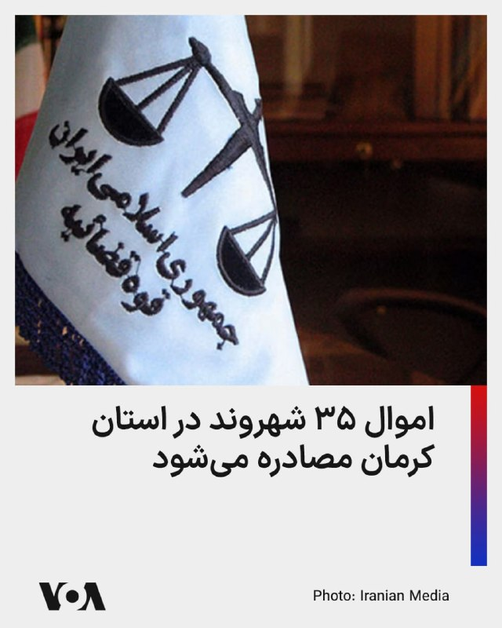

دادستان استان کرمان از تشکیل ۳۵ پرونده قضایی برای ایرانیان خارج از کشور خبر داد و آنان را به «همکاری با دشمن» متهم کرد. مهدی بخشی گفت که این پرونده‌ها «با هدف پیگیری قضایی و مصادره اموال تشکیل شده است.»

رئیس کل دادگستری استان آذربایجان غربی نیز روز شنبه ۲۶ اردیبهشت از صدور دستور توقیف اموال ۱۲۹ نفر از مخالفان جمهوری اسلامی در این استان خبر داد.

همزمان در روز شنبه، مقامات قضائی استان یزد نیز از توقیف اموال ۵۱ تن از اهالی این استان خبر دادند و آنها را به «جاسوسی و همکاری با کشور‌های متخاصم و گروه‌های معاند» متهم کردند.

همچنین رسانه‌های ایران گزارش داده بودند که از ابتدای جنگ اخیر تا روز جمعه، در پرونده‌های سیاسی دست‌کم «۲۶۲ فقره ملک در سراسر کشور توقیف شده است.»

اموال توقیف شده «شامل وجوه نقد بانکی، اموال منقول و غیرمنقول، سهام شرکت‌ها و حتی اموال وکالتی» مردم است. این اقدامات جمهوری اسلامی از سوی ناظران، نقض حقوق شهروندی توصیف شده است.

جمهوری اسلامی در هفته‌های اخیر و همزمان با قطعی سراسری اینترنت، روند سرکوب‌ها و به ویژه اعدام‌ها را سرعت داده است.
@FarsiVOA

## DW_Farsi — post 124790

🔶 اعلام وضعیت اضطراری بین‌المللی در پی شیوع بیماری ابولا

سازمان جهانی بهداشت (WHO) به دلیل شیوع بیماری ابولا در جمهوری دموکراتیک کنگو و اوگاندا، "وضعیت اضطراری بهداشت عمومی با اهمیت بین‌المللی" اعلام کرده است. این نهاد وابسته به سازمان ملل متحد در ژنو، با این اقدام قصد دارد از جمله کشورهای همسایه را در وضعیت هشدار بالا قرار داده و حمایت‌های جامعه بین‌المللی را بسیج کند. با این حال، سازمان جهانی بهداشت تصریح کرد که این یک "هشدار همه‌گیری جهانی" (پاندمی) نیست.

گزارش شده است که تاکنون ۸ مورد تاییدشده و ۲۴۶ مورد مشکوک به این بیماری تب‌دار و خطرناک در استان "ایتوری" در شمال شرقی کنگو شناسایی شده است. علاوه بر این، یک مورد ابتلا نیز در شهر "کینشاسا"، پایتخت کنگو که فاصله زیادی با کانون بیماری دارد، تایید شده است. همچنین دو فرد مبتلا از کنگو به اوگاندا سفر کرده‌اند. سازمان جهانی بهداشت از مرگ ۸۰ فرد مشکوک به ابولا در استان ایتوری تا این لحظه خبر داده است.

@dw_farsi

## DW_Farsi — post 124789

🔶 تأمین‌کننده مالی نسل‌کشی رواندا در زندان درگذشت

به گفته یک دادگاه سازمان ملل متحد، فلیسین کابوگا، از متهمان اصلی طراحی نسل‌کشی رواندا در جریان دوران بازداشت خود در بیمارستانی در لاهه هلند درگذشت.

فلیسین کابوگا متهم بود یکی از مسئولان اصلی نشل‌کشی و خونریزی‌هایی بوده که در سال ۱۹۹۴ به کشته شدن دست‌کم ۸۰۰ هزار نفر انجامید.

سازوکار دادگاه‌های بین‌المللی جنایی سازمان ملل (IRMCT)، در بیانیه‌ای اعلام کرد که مسئول پزشکی بازداشتگاه سازمان ملل بلافاصله در جریان قرار گرفته است. همچنین تحقیقاتی درباره شرایط و جزئیات مرگ کابوگا آغاز شده است.

این تاجر رواندایی که ثروتی چند میلیون دلاری داشته، به نسل‌کشی در کشورش و همچنین مشارکت و تحریک به آن در موارد متعدد متهم شده بود.

@dw_farsi

## DW_Farsi — post 124788

  

🔶 بریتانیا موشک‌های ارزان‌قیمت ضد پهپاد به خاورمیانه می‌فرستد

وزارت دفاع بریتانیا اعلام کرد که جنگنده‌های "تایفون" این کشور در خاورمیانه، به موشک‌های جدید و مقرون‌به‌صرفه‌ای مجهز می‌شوند که به طور ویژه برای مقابله با پهپادها طراحی شده‌اند.

با این موشک‌ها، انهدام دقیق اهداف ممکن می‌شود، آن هم با هزینه‌ای که تنها بخشی از هزینه موشک‌های مورد استفاده فعلی است.

در ادامه این بیانیه آمده است که این سامانه تسلیحاتی ظرف چند ماه از اولین آزمایش‌ها به مرحله تحویل و ارسال به خاورمیانه رسیده است.

لوک پولارد، وزیر دفاع بریتانیا در این باره گفت که این اقدام به نیروی هوایی کمک خواهد کرد تا پهپادهای بسیار بیشتری را با هزینه‌ای بسیار کمتر سرنگون کند.

@dw_farsi

## DW_Farsi — post 124787

🔶 ونزوئلا متحد نزدیک مادورو را به آمریکا تحویل داد

اداره مهاجرت ونزوئلا اعلام کرد که الکس صعب، تاجر ونزوئلایی و متحد نزدیک نیکلاس مادورو، رئیس جمهور برکنارشده این کشور، را به آمریکا تحویل داده است.
الکس صعب در ماه فوریه گذشته در کاراکاس، پایتخت ونزوئلا، طی عملیاتی مشترک میان نهادهای آمریکایی و ونزوئلایی، بازداشت شده بود.

بازداشت و استرداد او نشانه سطح تازه‌ای از همکاری میان نهادهای مجری قانون آمریکا و ونزوئلا تحت ریاست جمهوری دلسی رودریگز به شمار می‌رود.

به گفته منابع آگاه از موضوع، صعب می‌تواند اطلاعاتی را در اختیار مقام‌های آمریکایی قرار دهد که اتهامات آنها علیه مادورو را تقویت کند.

مادورو و همسرش، سیلیا فلورس، در ماه ژانویه گذشته در جریان عملیات نظامی آمریکا در کاراکاس بازداشت و به نیویورک منتقل شدند.

@dw_farsi

## DW_Farsi — post 124786

🔶 مذاکرات فیفا با ایران در استانبول؛ حمایت از حضور ایران در جام جهانی

فدراسیون جهانی فوتبال نسبت به حضور تیم ملی ایران در جام جهانی فوتبال ۲۰۲۶ در آمریکا ابراز اطمینان کرد.

فیفا اعلام کرد که در جریان دیداری در استانبول، به فدراسیون فوتبال ایران حمایت لازم برای حضور در مسابقات وعده داده شده است.

ماتیاس گرافستروم، دبیرکل فیفا تاکید کرد که همکاری نزدیکی میان دو طرف وجود دارد.

او افزود که فدراسیون جهانی فوتبال مشتاق است از ایران در جام جهانی استقبال کند.

جمهوری اسلامی شامگاه چهارشنبه ۲۳ اردیبهشت با حضور هزاران هوادار در میدان انقلاب تهران، مراسم بدرقه تیم ملی فوتبال برای جام جهانی را برگزار کرد.

انتشار تصاویر شعارهایی مانند "مرگ بر آمریکا" در این مراسم بازتاب گسترده‌ای در رسانه‌ها و شبکه‌های اجتماعی داشت.

بازیکنان قرار است هفته آینده تمرینات خود را در اردوی آماده‌سازی در ترکیه آغاز کنند.
مهدی تاج، رئیس فدراسیون فوتبال ایران پیش از این به دلیل ارتباط با سپاه پاسداران انقلاب اسلامی، اجازه ورود به کانادا برای شرکت در کنگره فیفا را دریافت نکرد.

@dw_farsi

## Persian_Trend_Official — post 14318

  

بقائی: آمریکا و اسرائیل خود عامل بی‌ثباتی در بازار انرژی هستند

اسماعیل بقائی، سخنگوی وزارت خارجه، ادعاهای آمریکا و اسرائیل درباره «حفظ ثبات بازار جهانی انرژی» را رد کرد و آن را «دروغی بزرگ» توصیف کرد.

بقائی گفت:

▪️ جنگی که آمریکا و اسرائیل آغاز کردند، روند دیپلماسی را نابود کرد
▪️ حمله نظامی به ایران باعث ناامنی در مسیرهای حیاتی انرژی شد
▪️ سپس ایران را به بی‌ثبات‌سازی متهم کردند

او با اشاره به آنچه «تاکتیک تبلیغاتی گوبلز» خواند، افزود:

▪️ «دیگران را به همان کاری متهم می‌کنند که خودشان انجام می‌دهند»

سخنگوی وزارت خارجه همچنین تأکید کرد:

▪️ آمریکا و اسرائیل ابتدا بحران و جنگ ایجاد می‌کنند
▪️ سپس با شعار «بازگرداندن ثبات» و «دفاع از صلح» به تشدید درگیری‌ها ادامه می‌دهند

بقائی در پایان گفت:

▪️ «آن‌ها ویرانی ایجاد می‌کنند و نامش را صلح می‌گذارند»

🫆:Tony

📌 @persian_trend_official
پرشین ترند | متفاوت‌ترین کانال نظامی

## Persian_Trend_Official — post 14317

  

📌انتشار چاپ پنجم کتاب «قدرت مذاکره» همراه با فصل جدید «دیپلماسی زیر آتش» 🔹کتاب قدرت مذاکره به قلم دکتر سید عباس عراقچی حاصل بیش از سی سال تجربه کاری نویسنده در وزارت امور خارجه است. 🔹در این کتاب تلاش میشود ضمن تبیین و تحلیل ماهیت مذاکره و مذاکره سیاسی،…

## Persian_Trend_Official — post 14316

🔴 رسانه‌های ایرانی جزئیات پاسخ واشینگتن به پیشنهاد توافق را منتشر کردند

رسانه‌های ایرانی مدعی شدند پاسخ آمریکا به پیشنهاد توافق با ایران شامل ۵ شرط اصلی بوده است:

▪️ آمریکا هیچ‌گونه غرامت یا خسارتی پرداخت نخواهد کرد

▪️ ۴۰۰ کیلوگرم اورانیوم از ایران خارج و به آمریکا تحویل داده شود

▪️ فقط یک مجموعه از تأسیسات هسته‌ای ایران فعال باقی بماند

▪️ حتی ۲۵ درصد از دارایی‌های بلوکه‌شده ایران نیز آزاد نخواهد شد
▪️ آتش‌بس در همه جبهه‌ها به روند مذاکرات گره بخورد

در این گزارش آمده است:

▪️ حتی در صورت پذیرش این شروط از سوی ایران، خطر حمله آمریکا و اسرائیل همچنان باقی خواهد ماند
▪️ برخی تحلیلگران ایرانی معتقدند واشینگتن به‌دنبال تحقق اهدافی است که در جنگ به آن نرسیده است

در مقابل، گزارش‌ها می‌گویند ایران نیز ۵ پیش‌شرط برای آغاز مذاکرات مطرح کرده است:

▪️ پایان جنگ در تمامی جبهه‌ها، به‌ویژه لبنان

▪️ رفع تحریم‌های ایران

▪️ آزادسازی دارایی‌های بلوکه‌شده ایران

▪️ پرداخت غرامت خسارات جنگ

▪️ به‌رسمیت شناختن حاکمیت ایران بر تنگه هرمز

تاکنون هیچ‌یک از این جزئیات به‌صورت رسمی از سوی تهران یا واشینگتن تأیید نشده‌اند.

🫆:Tony

📌 @persian_trend_official
پرشین ترند | متفاوت‌ترین کانال نظامی

## Persian_Trend_Official — post 14314

⭕️ دوستان، این حساب رسمی نیست. این اکانت صرفاً با پرداخت حدود ۱۰۰۰ دلار در ماه، تیک زرد (تأیید اشتراکی) دریافت کرده است. حساب‌های رسمی دولتی و سازمانی معمولاً تیک خاکستری دارند و اطلاعات هویتی و سازمانی آن‌ها به‌صورت شفاف در بخش Bio یا مشخصات حساب ثبت شده…

## Persian_Trend_Official — post 14313

  

💢توییت اتاق جنگ اسرائیل 🫆:Tony 📌 @persian_trend_official پرشین ترند | متفاوت‌ترین کانال نظامی

## Persian_Trend_Official — post 14312

خبرگزاری میزان

💢دادگاه رسیدگی به اتهامات صادق ساعدی‌نیا برگزار شد

🔹جلسه رسیدگی به اتهامات صادق ساعدی‌نیا، مدیرعامل شرکت صنعت غذایی و مدیر کافه‌های زنجیره‌ای ساعدی‌نیا از متهمان کودتای آمریکایی صهیونیستی دی ۱۴۰۴ در دادگاه انقلاب قم با حضور رئیس و مستشاران دادگاه، نماینده دادستان، متهم صادق ساعدی‌نیا و وکلای متهم برگزار شد.

🫆:Tony

📌 @persian_trend_official
پرشین ترند | متفاوت‌ترین کانال نظامی

## Persian_Trend_Official — post 14311

  <a href="telegram/content/Persian_Trend_Official_14311_1779012294.webm" target="_blank">🎬 Download video</a>

🔴 نشان ویژه برای خدمه ناو هواپیمابر «جرالد آر. فورد» و ناو گروه آن پس از جنگ ایران

💢سرپرست وزارت نیروی دریایی آمریکا اعلام کرد گروه ضربت ناو هواپیمابر «جرالد آر. فورد» و نیروهای گروه ضربت ناو هواپیمابر ۱۲ به‌دلیل عملکردشان در خاورمیانه طی جنگ اخیر ایران، نشان «واحد ریاست جمهوری» دریافت کرده‌اند.

💢بر اساس این بیانیه:

▪️ این گروه رزمی در عملیات‌های گسترده علیه اهداف ایرانی مشارکت داشته است
▪️ ادعا شده ۱۲۵ شناور جنگی ایرانی هدف قرار گرفته‌اند
▪️ همچنین ۲۰۷ موشک کروز «تاماهاوک» به اهدافی در ایران شلیک شده است

🔻در ادامه آمده:

💢 هواگردهای مستقر بر ناو «جرالد آر. فورد» بیش از ۱۷۰۰ سورتی پرواز رزمی از مدیترانه و دریای سرخ انجام داده‌اند

🫆:Tony

📌 @persian_trend_official
پرشین ترند | متفاوت‌ترین کانال نظامی

## Persian_Trend_Official — post 14310

  <a href="telegram/content/Persian_Trend_Official_14310_1779012294.webm" target="_blank">🎬 Download video</a>

⭕️ سی‌ان‌ان: ایران به کابل‌های اینترنتی تنگه هرمز چشم دوخته است!

📝 Nick

📌 @persian_trend_official
پرشین ترند | متفاوت‌ترین کانال نظامی

## Persian_Trend_Official — post 14309

  

💢توییت اتاق جنگ اسرائیل

🫆:Tony

📌 @persian_trend_official
پرشین ترند | متفاوت‌ترین کانال نظامی

## Persian_Trend_Official — post 14308

  

❌️ این عکس را چندین بار در گوگل لنز جست‌وجو کردیم، اما هیچ منبع معتبر یا رسانه قابل‌اعتمادی برای آن پیدا نشد.

به همین دلیل، به‌نظر می‌رسد این تصویر با هوش مصنوعی ساخته شده و واقعی نیست.

📝 Nick

📌 @persian_trend_official
پرشین ترند | متفاوت‌ترین کانال نظامی

## RadioFarda — post 157282

  

🔸خبرگزاری فارس، نزدیک به سپاه پاسداران، روز یک‌شنبه ۲۷ اردیبهشت نوشت که محمدباقر قالیباف، رئیس مجلس شورای اسلامی و عضو سابق سپاه، به عنوان نماینده ویژه ایران در امور چین تعیین شده است.

🔸این خبرگزاری امنیتی بدون هیچ توضیح دیگری تنها نوشته است:‌ «پیشتر علی لاریجانی و عبدالرضا رحمانی‌ فضلی چنین مسئولیتی را برعهده داشتند.»

🔸در این خبر نه توضیح داده شده که چه کسی یا چه نهادی قالیباف را به این سمت منصوب کرده است و نه برهه کنونی چه اهمیتی دارد که حکومت تصور کرده است به این نماینده ویژه نیاز دارد.

🔸اعلام تعیین قالیباف به عنوان نماینده ویژه در امور چین دو روز پس از دیدار رسمی رئیس جمهور آمریکا از کشور چین رخ می‌دهد که در آن یکی از موضوعات گفت‌وگو ایران و تنگه هرمز بود.

🔸کاخ سفید روز پنجشنبه ۲۴ اردیبهشت اعلام کرد دونالد ترامپ، رئیس‌جمهور آمریکا، و شی جین‌پینگ، رئیس‌جمهور چین، در دیدار خود درباره گسترش همکاری‌های اقتصادی، باز ماندن تنگه هرمز و جلوگیری از دستیابی ایران به سلاح هسته‌ای گفت‌وگو و توافق کردند.

@RadioFarda

## RadioFarda — post 157281

  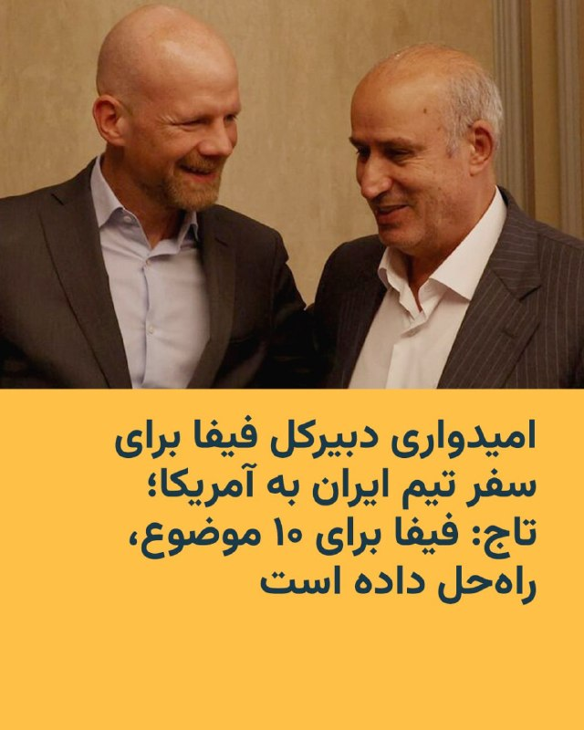

🔸دبیرکل فیفا، روز شنبه ۲۶ اردیبهشت پس از دیدار با رئیس فدراسیون فوتبال ایران، ابراز امیدواری کرد که تیم فوتبال این کشور بدون مشکل در جام جهانی حضور یابد.

🔸 ماتیاس گرافستروم درباره دیدارش با مهدی تاج به ‌جزئیاتی درباره صدور ویزای آمریکا و شرایط ورود بازیکنان ایرانی به‌ این کشور اشاره نکرد.

🔸رئیس فدراسیون فوتبال ایران هم پس از دیدار با دبیرکل فیفا در استانبول این ملاقات را «مثبت» ارزیابی و ابراز خوشحالی کرد که مقامات فیفا به تمام ۱۰ نکته‌ مورد نظر ایران گوش و برای هر یک از آنها راه‌حل ارائه کردند.

🔸مهدی تاج درباره جزئیات نکات مورد نظر ایران و راه‌حل‌های فیفا توضیح نداد.

🔸بر اساس برنامه رقابت‌های جام جهانی، تیم فوتبال ایران قرار است هر سه دیدار مرحله گروهی خود را در ایالات متحده برگزار کند.

🔸پیش‌تر فدراسیون فوتبال جمهوری اسلامی درخواست کرده بود مسابقاتش به مکزیک منتقل شود، اما جیانی اینفانتینو، رئیس فیفا، با این درخواست مخالفت کرد.

@RadioFarda

## RadioFarda — post 157280

  <a href="telegram/content/RadioFarda_157280_1779012297.mp4" target="_blank">🎬 Download video</a>

🔸پلیس نیویورک صدها موتورسیکلت‌ و اسکوتر متخلف را با استفاده از بولدوزر منهدم کرد.

🔸پلیس نیویورک گزارش داده که از ابتدای سال جاری میلادی (نزدیک به شش ماه) بیش از پنج‌هزار و ۷۰۰ دستگاه از این وسایل نقلیه «خطرناک» و «متخلف» را توقیف کرده است.

🔸نیویورک یکی شلوغ‌ترین و پرترافیک‌ترین شهرهای جهان است.

@RadioFarda

## IranianMinds — post 20272

  

🔴 ونزوئلا :

الکس صائب از نزدیکان رئیس جمهور سابق نیکولاس مادورو و رابط حزب الله و سپاه پاسداران جمهوری اسلامی رو دستگیر کردیم و به ایالات متحده تحویل دادیم !

@IranianMinds

## IranianMinds — post 20271

  

🔴 خبرگزاری فارس :

قالیباف نماینده ویژه جمهوری اسلامی در امور چین شد

قبل از قالیباف علی لاریجانی این سمت رو داشت که ترور شد.

@IranianMinds

## IranianMinds — post 20270

  <a href="telegram/content/IranianMinds_20270_1779012301.webm" target="_blank">🎬 Download video</a>

🎉 ۵۰۰٬۰۰۰ تومان رایگان-بونوس ویژه ثبت‌نام

🔥 با هر ثبت نام 
🅰️
🅰️
🅰️ هزار تومن جایزه بگیرید

⬅️ شرط‌بندی کنید و بونوس را به موجودی واقعی تبدیل کنید

🔥 وقتشه بازی رو یه جور دیگه ببینی
⚽️  پوشش کامل مسابقات ورزشی 

📊  پیش‌بینی با بهترین ضرایب 

⚡️  تجربه سریع و حرفه‌ای

😀 پرداخت مستقیم و سریع بدون واسطه، بدون دردسر، واریز و برداشت در سریع‌ترین زمان ممکن 

😀 کانال تلگرام: 

🔴 @winro_io  

😀 هدیه خود را با ثبت نام در سایت دریافت کنید: 

🔴 Winro.io
R27
سایت اصلی در روزهای آینده بازگشایی خواهد شد 
✅

## BBCPersian — post 281288

  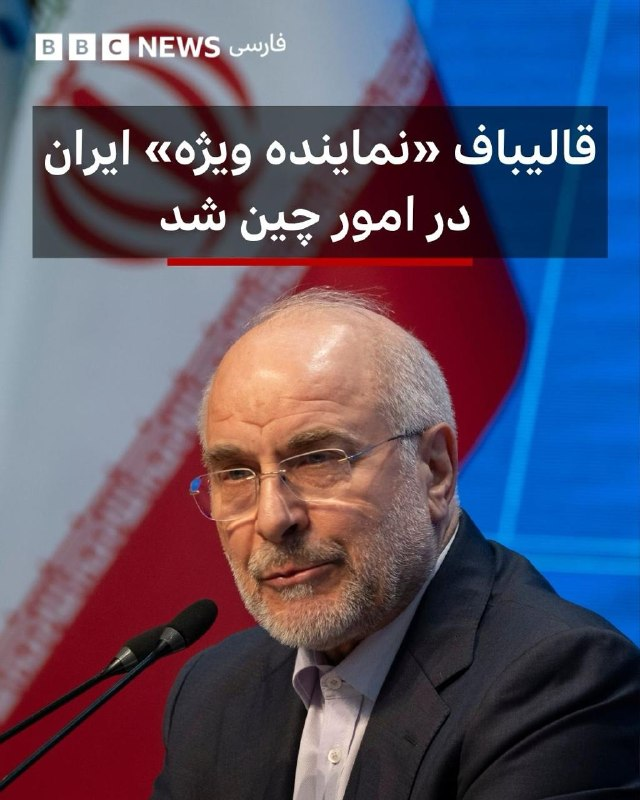

🔻خبرگزاری تسنیم می‌گوید که محمد باقر قالیباف با پیشنهاد رئیس‌جمهور و تایید رهبر جمهوری اسلامی «نماینده ویژه ایران در امور چین» شده است.

این خبرگزاری که به نهادهای نظامی و امنیتی نزدیک است نوشت رئیس مجلس «هماهنگ‌کننده بخش‌های مختلف این کشور در ارتباط با چین» خواهد بود و سطح اختیارات آقای قالیباف با نمایندگان قبلی در امور چین «متفاوت» است.

بنابر این گزارش‌، پیش از این علی لاریجانی به عنوان نماینده ویژه رهبر ایران و عبدالرضا رحمانی فضلی به عنوان نماینده رئیس‌جمهور در امور‌ چین فعالیت می‌کردند.

آقای لاریجانی از طرف آیت‌الله علی خامنه‌ای نقش ویژه‌ای «در مدیریت قرارداد راهبری» ایران و چین به عهده داشت.

سال گذشته مسعود پزشکیان حسن رحمانی فضلی، سفیر ایران در پکن را همزمان به‌عنوان نماینده ویژه رئیس جمهور و تام‌الاختیار جمهوری اسلامی در چین منصوب کرد.

علی لاریجانی، دبیر شورای عالی امنیت ملی، در ۱۷ مارس (۲۶ اسفند) در حملات آمریکا و اسرائیل به ایران کشته شد.

📸Morteza Nikoubazl/NurPhoto via Getty Images
https://bbc.in/3PHjWut
@BBCPersian

## BBCPersian — post 281287

  

🔻رئیس‌کل دادگستری استان قم از مصادره سه آپارتمان مهدی نصیری و «وابستگانش» خبر داد.

بنابر اعلام دادگستری قم این آپارتمان‌ها «در حوزه ثبتی استان قم» بوده است.

کاظم موسوی گفت این اموال با گزارش اطلاعات سپاه و پیگیری دادسرای مرکز استان قم توقیف شده است.

قوه قضائیه ایران حدود دو هفته پیش گفته بود که «با دستور مقام قضائی»،اموال آقای نصیری و ۲۱ نفر دیگر که «علیه امنیت و ثبات کشور» اقدام کرده بودند در استان سمنان، مصادره شده است.

مهدی نصیری که مدتی مدیر مسئول روزنامه کیهان بود در سال‌های اخیر مخالف حکومت و از ایران خارج شد.

قوه قضائیه پس از جنگ اخیر برای کسانی که«هم‌صدا» یا «همراه» دشمن می‌خواند، پرونده تشکیل می‌دهد و با استناد به قانون «تشدید مجازات جاسوسی»، مجازات‌هایی مثل ممنوعیت فعالیت و توقیف اموال در نظر می‌گیرد.

قوه قضائیه فهرستی هم از افرادی منتشر کرده که برای «حمایت از جنگ»، اموالشان توقیف یا مصادره شده است.

با تشدید ضبط اموال طیف وسیعی از اقشار جامعه از خبرنگار تا بازیگر و فعال سیاسی و هنرمند و ورزشکار، قوه قضائیه جلوگیری از انتقال اموال را آغاز کرده است.

📸TABNAK
https://bbc.in/4dOlJHf
@BBCPersian

## Dirty_Kids — post 389600

  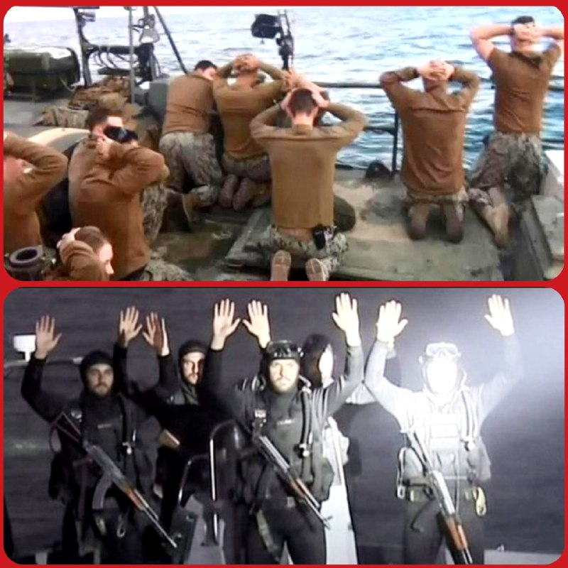

دوران اوباما
Vs
دوران ترامپ

اینو برای عمو ترامپ درست کردن میخوام براش بفرستیم تو بزاره تو صفحه تروث‌مدیاش

@Dirty_Kids 👻

## Dirty_Kids — post 389599

  <a href="telegram/content/Dirty_Kids_389599_1779012303.mp4" target="_blank">🎬 Download video</a>

اتفاقا نه تنها بی‌ناموس بلکه بقیه موارد مرتبط با قضیه ناموس رو هم هستی «دکتر» قلابی!

@Dirty_Kids 👻

## Hranews — post 112981

اعتراضات ۱۴۰۴؛ جلسه دادگاه رسیدگی به اتهامات صادق ساعدی‌نیا برگزار شد

❗️
❗️
❗️
❗️
❗️ – مرکز رسانه قوه قضاییه از برگزاری جلسه دادگاه رسیدگی به اتهامات صادق ساعدی‌نیا، یکی از بازداشت شدگان مرتبط با اعتراضات سراسری ۱۴۰۴، در دادگاه انقلاب قم خبر داد.

ادامه مطلب

#صادق_ساعدی‌نیا

↘️
@hranews_bot تماس ✉️ -  @Hranews  کانال هرانا 🆑

## Hranews — post 112980

عباس ماموسی بازداشت و به زندان ایلام منتقل شد

❗️
❗️
❗️
❗️
❗️ – عباس ماموسی، اهل شهرستان دهلران روز پنجشنبه ۲۴ اردیبهشت ماه، توسط نیروهای امنیتی #بازداشت و به زندان ایلام منتقل شد.

ادامه مطلب

#عباس_ماموسی

↘️
@hranews_bot تماس ✉️ -  @Hranews  کانال هرانا 🆑

## Hranews — post 112979

مشهد؛ نوزاد ۴۰ روزه با ضربات پیاپی و خفگی توسط پدرش به قتل رسید

❗️
❗️
❗️
❗️
❗️ – یک نوزاد ۴۰ روزه در مشهد، توسط پدرش به قتل رسید. این مرد ۳۸ ساله متهم است که ابتدا با ماهیتابه و کف دست ضربات متعددی به سر فرزند خود وارد کرده و در نهایت با وارد کردن مدفوع نوزاد به دهان او و انسداد مسیر تنفسی‌اش، فرزند پسر خود را به قتل رسانده است.

#قتل_کودک

ادامه مطلب

↘️
@hranews_bot تماس ✉️ -  @Hranews  کانال هرانا 🆑

## manototv — post 105551

  <a href="telegram/content/manototv_105551_1779012305.mp4" target="_blank">🎬 Download video</a>

اعتراض به سانسور، قطعی اینترنت، سرکوب و حبس معترضان در تجمع ایرانیان قبرس جنوبی، شنبه ۲۶ اردیبهشت

## manototv — post 105550

  <a href="telegram/content/manototv_105550_1779012307.mp4" target="_blank">🎬 Download video</a>

🎬 Video

## alonews — post 120564

  <a href="telegram/content/alonews_120564_1779012308.webm" target="_blank">🎬 Download video</a>

👈حدود ۳۰ هزار نفر در فورتزهایم آلمان پس از کشف یک بمب ۱.۸ تنی منفجر نشده مربوط به جنگ جهانی دوم توسط کارگران در حین کار ساختمانی، تخلیه شده‌اند.

🔴مقامات یک منطقه ممنوعه ۱.۵ کیلومتری ایجاد کردند زیرا تیم‌های خنثی‌سازی بمب آماده خنثی‌سازی بمبی بودند که طبق گزارش‌ها حاوی حدود ۱.۳۵ تن مواد منفجره است.

✅ @AloNews خبر جنگ

## alonews — post 120563

  <a href="telegram/content/alonews_120563_1779012308.webm" target="_blank">🎬 Download video</a>

👈نتانیاهو قراره ساعت ۶ عصر به وقت محلی یه جلسه امنیتی محدود برگزار کنه

✅ @AloNews خبر جنگ

## alonews — post 120562

  <a href="telegram/content/alonews_120562_1779012308.webm" target="_blank">🎬 Download video</a>

🔴این حاج خانوم که تو خرابه های غزه داره قدم میزنه اينترنت پر سرعت داره ولی من ایرانی نه

✅@AloNews

## alonews — post 120561

  <a href="telegram/content/alonews_120561_1779012309.webm" target="_blank">🎬 Download video</a>

👈وزارت کره جنوبی : کره جنوبی و ایران به گفت‌وگوها برای تضمین امنیت تنگه هرمز ادامه میدن

✅ @AloNews خبر جنگ

## alonews — post 120560

  <a href="telegram/content/alonews_120560_1779012309.mp4" target="_blank">🎬 Download video</a>

👈حاجی بابایی، نائب رئیس مجلس: اگر قرار باشد به نفت ما آسیبی برسد، کاری می‌کنیم که آمریکا و دنیا تا مدت قابل توجهی، از این منطقه نفتی گیرشان نیاید

✅ @AloNews خبر جنگ

## alonews — post 120559

  <a href="telegram/content/alonews_120559_1779012311.mp4" target="_blank">🎬 Download video</a>

👈پارسا تاجیک، مهندس شرکت «ایکس ای‌آی»، درباره روند تغییر پرچم جمهوری اسلامی به شیروخورشید در شبکه اجتماعی ایکس، توییتر سابق، توضیح داد.

✅@AloNews

## alonews — post 120558

  <a href="telegram/content/alonews_120558_1779012314.webm" target="_blank">🎬 Download video</a>

👈وزارت نیرو: تغییر ساعت رسمی بیش از هزار مگاوات صرفه‌جویی در مصرف برق به همراه دارد

✅ @AloNews خبر جنگ

## alonews — post 120557

  <a href="telegram/content/alonews_120557_1779012314.mp4" target="_blank">🎬 Download video</a>

👈 حمله‌های شدید ارتش اسرائیل به جنوب لبنان

✅ @AloNews خبر جنگ

## alonews — post 120556

  <a href="telegram/content/alonews_120556_1779012315.webm" target="_blank">🎬 Download video</a>

👈سوپر اپلیکیشن بله مجدداً از دقایقی پیش با اختلال روبرو شده است

✅ @AloNews خبر جنگ

## alonews — post 120555

  <a href="telegram/content/alonews_120555_1779012315.webm" target="_blank">🎬 Download video</a>

👈قلهکی: یکی از کشورهای منطقه هشدار شروع جنگ را برای دورماندن از تیررسِ ایران، به تهران منتقل کرده است!

✅ @AloNews خبر جنگ

## alonews — post 120554

  <a href="telegram/content/alonews_120554_1779012316.webm" target="_blank">🎬 Download video</a>

👈جزئیاتی از درخواست‌های آمریکا از ایران در مذاکرات

🔴براساس شنیده‌های فارس از پاسخ آمریکا به پیشنهادهای ایران، ۵ شرط اصلی واشنگتن به این شرح اعلام شده است:

🔴عدم پرداخت هرگونه غرامت و خسارت از سوی آمریکا

🔴خروج و تحویل ۴۰۰ کیلوگرم اورانیوم از ایران به آمریکا

🔴فعال ماندن تنها یک مجموعه از تأسیسات هسته‌ای ایران

🔴عدم پرداخت حتی ۲۵ درصد از دارایی‌های بلوکه‌شدهٔ ایران

🔴منوط‌شدن توقف جنگ در همه ساحتها به انجام مذاکره

🔴این گزارش تأکید می‌کند که حتی در صورت تحقق این شرایط از سوی ایران، تهدید حمله آمریکا و اسرائیل همچنان پابرجا خواهد بود.

🔴کارشناسان معتقدند طرح پیشنهادی آمریکا به جای حل مشکل، در پی دستیابی به اهدافی است که این کشور نتوانسته در طول جنگ آن را محقق کند.

🔴در مقابل، ایران انجام هرگونه مذاکره را منوط به تحقق ۵ پیش‌شرط اعتمادساز دانسته است که عبارتند از:

🔴پایان جنگ در همهٔ جبهه‌ها به‌ویژه لبنان

🔴رفع تحریم‌ها

🔴آزادسازی پول‌های بلوکه‌شده ایران

🔴جبران خسارات ناشی از جنگ

🔴پذیرش حق حاکمیت ایران بر تنگه هرمز


✅ @AloNews خبر جنگ

## alonews — post 120553

  <a href="telegram/content/alonews_120553_1779012316.webm" target="_blank">🎬 Download video</a>

👈پست ترامپ تو ثروث سوشال : یه شب بزرگ تو سیاست؛ از همه متشکرم!

✅ @AloNews خبر جنگ

## alonews — post 120552

  <a href="telegram/content/alonews_120552_1779012316.webm" target="_blank">🎬 Download video</a>

👈گویا تو اصفهان برای خانم‌های بی حجاب ابلاغیه دادگاه ارسال میشه

✅ @AloNews خبر جنگ

## alonews — post 120551

  <a href="telegram/content/alonews_120551_1779012316.webm" target="_blank">🎬 Download video</a>

👈وزارت کشور عربستان: برافراشتن پرچم‌های سیاسی یا مذهبی و سر دادن هرگونه شعار در مکه، مدینه و اماکن مقدسه از جمله مسجدالحرام، مسجدالنبی، صحن‌های آنها و مسیرهای منتهی به آن ممنوع است

✅ @AloNews خبر جنگ

## alonews — post 120550

  

🔥
💥اینترنت آزاد و رایگان

🌐
🚫تنها جایی که کانفیگ رایگان میزاره

⬇️
⬇️
@NetAazaadBot
@NetAazaadBot

⚠️هر ساعت 100گیگ شارژ میشه، رباتو داشته باشید تا مطلع بشید

## alonews — post 120549

  <a href="telegram/content/alonews_120549_1779012317.webm" target="_blank">🎬 Download video</a>

👈میزان: دادگاه «صادق ساعدنیا» برگزار شد

✅ @AloNews خبر جنگ

## alonews — post 120546

  <a href="telegram/content/alonews_120546_1779012317.webm" target="_blank">🎬 Download video</a>

👈تصویری از نصب مسلسل ۱۲.۷ میلیمتری گاتلینگ چهار اول نصب شده در دماغه برخی نسخه های بالگرد میل۲۴ با یک سامانه دید حرارتی در روسیه برای مقابله با پهپادها ..این سیستم بیش از ۲۰۰۰ گلوله بر دقیقه آتش می‌کند

✅ @AloNews خبر جنگ

## alonews — post 120545

  <a href="telegram/content/alonews_120545_1779012317.webm" target="_blank">🎬 Download video</a>

👈از چند ساعت گذشته بیش از دوازده فروند هواپیمای ترابری راهبردی C-17A گلوبمستر III نیروی هوایی آمریکا در حال ترک خاورمیانه و حرکت به سمت اروپا هستند.

✅ @AloNews خبر جنگ

<!-- MSG END -->

<!-- NAV START -->

<a href="https://github.com/keihancpu/aio-downloader/blob/main/telegram/content/archive_1.md" style="display:inline-block; padding:6px 12px; margin:0 4px; background-color:#2ea44f; color:white; text-decoration:none; border-radius:4px; font-weight:bold;">صفحه بعد</a>

<!-- NAV END -->
