# خواننده تلگرام

<!-- TOP_NAV START -->

<a href="https://github.com/keihancpu/aio-downloader/blob/main/telegram/content/archive_1.md" style="display:inline-block; padding:6px 12px; margin:0 4px; background-color:#2ea44f; color:white; text-decoration:none; border-radius:4px; font-weight:bold;">صفحه بعد</a>

<!-- TOP_NAV END -->

<!-- MSG START -->

---
📅 بروزرسانی: 1405/02/26 19:07
---

## VahidOOnLine — post 240499

  

♦️ میخاییل اولیانوف، نماینده روسیه در سازمان ملل متحد در ژنو، با بازنشر خبری درباره مخالفت چین با قطعنامه پیشنهادی مورد حمایت ایالات متحده به شورای امنیت سازمان ملل درباره تنگه هرمز، اعلام کرد که موضع روسیه نیز با چین یکسان است.

وزیر خارجه چین پیش‌تر، قطعنامه پیشنهادی علیه جمهوری اسلامی را «نادرست» خوانده و تاکید کرده بود که حل مسئله تنگه هرمز تنها از راه دستیابی به «آتش‌بس دائم و فراگیر» میان تهران و واشنگتن امکان‌پذیر است و استفاده از زور نمی‌تواند مسئله را حل کند.

مایک والتز، نماینده ایالات متحده در سازمان ملل در نیویورک، روز جمعه ۲۶ اردیبهشت اعلام کرد که این قطعنامه که با حمایت آمریکا و کشورهای حوزه خلیج فارس، به شورای امنیت ارائه شده، تاکنون حمایت ۱۲۰ کشور را به‌دست آورده است. با این‌وجود، مخالفت چین و روسیه که حق وتو دارند، مانع بزرگی برای تصویب قطعنامه پیشنهادی است.
‌🇸🇦 Indypersian

🤖 @VahidOOnLine

## VahidOOnLine — post 240498

  

محمدصالح جوکار، رییس کمیسیون امور داخلی مجلس، گفت: «آمریکا به دنبال آن است تا آنچه را که در میدان به دست نیاورده پای میز مذاکره به دست آورد. در این‌باره باید بگویم هرگز آمریکا به خواسته‌های نامشروعش در مذاکرات نخواهد رسید.»

جوکار گفت که آمریکا باید شروط تهران را برای توافق بپذیرد و راهی جز تعظیم در برابر خواسته‌های جمهوری اسلامی ندارد
‌🏁 🇬🇧 IranintlTV

🤖 @VahidOOnLine

## VahidOOnLine — post 240497

♦️در حالی که دونالد ترامپ، رئیس‌جمهوری ایالات متحده سفر خود به پکن را پایان داده و به آمریکا بازگشته است، حاشیه‌های این سفر ادامه دارد. یکی از این موارد، تصاویری از لحظه‌ای که ترامپ، نگاهی به یادداشت‌های شی جین‌پینگ، رئیس‌جمهوری چین می‌اندازد است که دستاویز طنزپردازان شده است. یک شبکه اینترنتی چینی، با انتشار این تصاویر، ترامپ را با عنوان «مامور ۰۰۴۷» که اشاره به اسم رمز جیمز باند، شخصیت مشهور کتاب‌های جاسوسی بریتانیایی دارد، خطاب کرده است.
‌🇸🇦 Indypersian

🤖 @VahidOOnLine

## VahidOOnLine — post 240496

  <a href="telegram/content/VahidOOnLine_240496_1778945876.mp4" target="_blank">🎬 Download video</a>

‌
اشتوتگارت | آلمان؛ گردهمایی ایرانیان - گزارشگر شنبه ۲۶ اردیبهشت
‌🏁 🇬🇧 ManotoTV

🤖 @VahidOOnLine

## VahidOOnLine — post 240495

♦️ پادشاه خودخوانده سوئیس که خود را «شاه یوناس اول» می‌نامد، با وجود جنجال‌های فراوان، همچنان به گسترش نفوذ خود ادامه می‌دهد. یوناس لاووینر، شهروند ۳۱ ساله سوئیسی-مراکشی، در سال ۲۰۱۹ طی مراسمی در کلیسای نایدگ شهر برن تاج‌گذاری کرد و خود را «پادشاه نمادین سوئیس» نامید؛ عنوانی که در کشوری بدون سنت سلطنتی و بدون خانواده سلطنتی رسمی، بحث‌برانگیز بوده است.

لاووینر که در یک شرکت داروسازی نیز مشغول به کار است، طی سال‌های اخیر با استفاده از یک خلا در قوانین سوئیس توانسته حدود ۱۱۷ هزار متر مربع زمین بدون مالک را در نقاط مختلف کشور به نام خود ثبت کند. او اکنون مالک حدود ۱۵۰ قطعه زمین، از جمله ۸۳ جاده، است و می‌گوید روزانه بیش از ۵ هزار نفر از جاده‌های متعلق به او استفاده می‌کنند.

فعالیت‌های او باعث درگیری‌های حقوقی با مقام‌های محلی شده است. در یکی از موارد، او برای واگذاری خیابانی در منطقه گئونزه خواستار پرداخت ۱۵۰ هزار فرانک یا تغییر نام آن به «خیابان لاووینر» شده است؛ پیشنهادی که رد شد و به شکایت قضایی انجامید.
‌🇸🇦 Indypersian

🤖 @VahidOOnLine

## VahidOOnLine — post 240494

♦️پیت هگست، وزیر جنگ ایالات متحده، از خدمه ناو هواپیمابر «یو‌اس‌اس جرالد فورد» پس از بازگشت از یک ماموریت طولانی استقبال کرد.
این ناو پس از بیش از ۳۰۰ روز استقرار در مناطق تحت مسئولیت فرماندهی مرکزی ارتش آمریکا (سنتکام) و فرماندهی ارتش جنوبی (SOUTHCOM)، به پایگاه خود بازگشته است. در این مدت، این ناو در عملیات‌ها و ماموریت‌های مختلف نظامی حضور داشته است.
هگست در این مراسم با قدردانی از عملکرد خدمه، این ماموریت را یکی از طولانی‌ترین و مهم‌ترین استقرارهای دریایی اخیر توصیف کرد.
‌🇸🇦 Indypersian

🤖 @VahidOOnLine

## VahidOOnLine — post 240493

  <a href="telegram/content/VahidOOnLine_240493_1778945879.mp4" target="_blank">🎬 Download video</a>

یک دانش‌آموز در پیام به ایران اینترنشنال با اشاره به مجازی شدن آموزش می‌گوید باید برای مدرسه‌ای که نرفتیم ۱۵۰ میلیون تومان شهریه بدهیم. پیام این دانش‌آموز با هوش مصنوعی بازخوانی شده است.
‌🏁 🇬🇧 IranintlTV

🤖 @VahidOOnLine

## VahidOOnLine — post 240492

  

خبرگزاری آناتولی ترکیه گزارش داد که هاکان فیدان، وزیر خارجه ترکیه، با علی باقری‌کنی، معاون بین‌الملل دبیرخانه شورای عالی امنیت ملی، روز شنبه در استانبول دیدار کرد. این خبرگزاری اعلام کرد جزئیات بیشتری از این دیدار منتشر نشده است.
‌🏁 🇬🇧 IranintlTV

🤖 @VahidOOnLine

## VahidOOnLine — post 240491

  <a href="telegram/content/VahidOOnLine_240491_1778945883.mp4" target="_blank">🎬 Download video</a>

دوسلدورف | آلمان؛ گردهمایی ایرانیان - گزارشگر شنبه ۲۶ اردیبهشت
‌🏁 🇬🇧 ManotoTV

🤖 @VahidOOnLine

## VahidOOnLine — post 240490

  <a href="telegram/content/VahidOOnLine_240490_1778945886.mp4" target="_blank">🎬 Download video</a>

پرث استرالیا، تجمع ایرانیان، شنبه ۲۶ اردیبهشت
‌🏁 🇬🇧 ManotoTV

🤖 @VahidOOnLine

## VahidOOnLine — post 240489

  

العربیه به نقل از منابعی خبر داد که سفر محسن نقوی، وزیر کشور پاکستان، به ایران با هدف رسیدن به چارچوب یک توافق انجام شده است. بر اساس این گزارش، پیشرفت مثبتی درباره تنگه هرمز حاصل شده و درها برای مذاکره درباره موارد باقی‌مانده از جمله موضوع هسته‌ای، باز است
‌🏁 🇬🇧 IranintlTV

🤖 @VahidOOnLine

## WithYashar — post 11403

العربیه: طبق گفته منابع آگاه پاکستانی، در بحث تنگه هرمز، پیشرفت‌هایی حاصل شده است
@withyashar

## WithYashar — post 11402

  <a href="telegram/content/WithYashar_11402_1778945888.mp4" target="_blank">🎬 Download video</a>

دوئل نهایی ، وضعیت الان!
@withyashar

## WithYashar — post 11401

عرزشی ها اومدن که خبر مرگ بابای سپاهیشون رو زودتر تو چنلت ببینن
اخه از رسانه های دیگه ۱ ساعت حداقل جلوتری ستون😂🔥

## WithYashar — post 11400

  

پست جدید ترامپ :

شوخی نداریم!!!
ببین قراره بعدش تو موضوع مورد علاقت چه اتفاقی بیفته!
@withyashar

## WithYashar — post 11399

سقوط یک شهر پاکستان به دست جدایی‌طلبان

منابع محلی روز شنبه از تسلط جدایی‌طلبان بلوچ بر شهر راهبردی دالبندین در پاکستان خبر می‌دهند.
@withyashar

## FoxNewsTwitter — post 341817

  <a href="telegram/content/FoxNewsTwitter_341817_1778945892.mp4" target="_blank">🎬 Download video</a>

Fox News (Twitter/X)

NEW: @VP lays out in blunt terms who the victims are when fraudsters target benefits Americans rely on most on @SatAmericaFNC.

“There really are two costs and two victims. One is taxpayers getting fleeced... But it’s also there’s these programs that people in my family that I have benefited from that are meant to provide food to low income kids, are meant to ensure that if you can’t afford a doctor, you can still have access to medical care. Those programs are going to be destroyed by the fraudsters.”

## FoxNewsTwitter — post 341816

  <a href="telegram/content/FoxNewsTwitter_341816_1778945895.mp4" target="_blank">🎬 Download video</a>

Fox News (Twitter/X)

RT @SatAmericaFNC: 🚨EXCLUSIVE: @KayleighMcEnany asks Vice President JD Vance if Newsom has contacted the administration to help investigate fraud in his state.

@VP @Vance says, "I would love it if Gavin Newsom had a come-to-Jesus moment and said, 'You know what, I’m going to take this fraud issue seriously.'”

## FoxNewsTwitter — post 341815

  <a href="telegram/content/FoxNewsTwitter_341815_1778945897.mp4" target="_blank">🎬 Download video</a>

Fox News (Twitter/X)

RT @SatAmericaFNC: 🚨EXCLUSIVE: @KayleighMcEnany presents a whistleblower report alleging that some Medicaid fraud proceeds in Minnesota may have been siphoned overseas to designated terrorist organizations.

@VP @JDVance responds, “We will IMMEDIATELY take that to the team because that should be a COUNTERTERRORISM investigation.”⬇️

## pm_afshaa — post 90853

جهت تبلیغات با بازدهی بالا میتونین دایرکت کانال پیام بدین

## pm_afshaa — post 90852

  <a href="telegram/content/pm_afshaa_90852_1778945901.webm" target="_blank">🎬 Download video</a>

🔴پست جدید ترامپ در تروث سوشال:
شوخی نداریم!!! ببین قراره بعدش تو موضوع مورد علاقت چه اتفاقی بیفته!

💧 Rainbet.com the #1 Non-KYC Crypto Casino & Sportsbook @rainbetcom

😁 @Pm_Afshaa

## pm_afshaa — post 90851

  <a href="telegram/content/pm_afshaa_90851_1778945902.webm" target="_blank">🎬 Download video</a>

🔴ایسنا: وزیر کشور پاکستان برای دیدار با مسئولان جمهوری اسلامی ساعاتی قبل به تهران سفر کرده. 
💧 Rainbet.com the #1 Non-KYC Crypto Casino & Sportsbook @rainbetcom 
😁 @Pm_Afshaa

## DEJradio — post 4667

  <a href="telegram/content/DEJradio_4667_1778945903.mp4" target="_blank">🎬 Download video</a>

🚨
🔸 امیررضا نصرآزادانی، فوتبالیست زندانی حامی معترضان و آزادی‌خواهان، در پیامی از درون زندان، از ایرانیان خواسته او را فراموش نکنند.

#امیررضا_نصرآزادانی #فوتبالیست_مردمی
@DEJradio

## IranIntlTV — post 337494

  

محمدصالح جوکار، رییس کمیسیون امور داخلی مجلس، گفت: «آمریکا به دنبال آن است تا آنچه را که در میدان به دست نیاورده پای میز مذاکره به دست آورد. در این‌باره باید بگویم هرگز آمریکا به خواسته‌های نامشروعش در مذاکرات نخواهد رسید.»

جوکار گفت که آمریکا باید شروط تهران را برای توافق بپذیرد و راهی جز تعظیم در برابر خواسته‌های جمهوری اسلامی ندارد
https://iranintl.com/202605165329

## IranIntlTV — post 337493

  <a href="telegram/content/IranIntlTV_337493_1778945906.mp4" target="_blank">🎬 Download video</a>

صداوسیمای جمهوری اسلامی در برنامه‌ای آموزش استفاده از سلاح گرم توسط یک نظامی به مجری را به نمایش گذاشت. در بخشی از این برنامه، مجری به پرچم امارات متحده عربی شلیک کرد.
گفت‌وگو با فروغ کنعانی، پژوهشگر جامعه‌شناسی
@iranintltv

## IranIntlTV — post 337492

  <a href="telegram/content/IranIntlTV_337492_1778945909.mp4" target="_blank">🎬 Download video</a>

وزیر کشور پاکستان برای دیدار با مقام‌‌های جمهوری اسلامی وارد تهران شد. همزمان رسانه‌های ایران گزارش دادند محسن نقوی در دیدار با وزیر کشور جمهوری اسلامی، درباره‌ی ازسرگیری مذاکرات صلح، گفت‌وگوهای مفصلی انجام داده‌اند.

گفت‌وگو با جمشید برزگر، روزنامه‌نگار و تحلیل‌گر سیاسی
@iranintltv

## IranIntlTV — post 337491

  <a href="telegram/content/IranIntlTV_337491_1778945912.mp4" target="_blank">🎬 Download video</a>

یک دانش‌آموز در پیام به ایران اینترنشنال با اشاره به مجازی شدن آموزش می‌گوید باید برای مدرسه‌ای که نرفتیم ۱۵۰ میلیون تومان شهریه بدهیم. پیام این دانش‌آموز با هوش مصنوعی بازخوانی شده است.

## IranIntlTV — post 337490

  

خبرگزاری آناتولی ترکیه گزارش داد که هاکان فیدان، وزیر خارجه ترکیه، با علی باقری‌کنی، معاون بین‌الملل دبیرخانه شورای عالی امنیت ملی، روز شنبه در استانبول دیدار کرد. این خبرگزاری اعلام کرد جزئیات بیشتری از این دیدار منتشر نشده است.
https://iranintl.com/202605168367

## IranIntlTV — post 337489

  <a href="telegram/content/IranIntlTV_337489_1778945915.mp4" target="_blank">🎬 Download video</a>

ایرانیان مقیم استکهلم، شنبه ۲۶ اردیبهشت در حمایت از انقلاب ملی تجمع کردند. تجمع‌کنندگان ضمن حمایت از شاهزاده رضا پهلوی، می‌گویند هدف از برگزاری این تجمعات، رساندن صدای مردم ایران به جهان است.

مهران عباسیان، خبرنگار ایران‌اینترنشنال، گزارش می‌دهد
@iranintltv

## IranIntlTV — post 337488

  <a href="telegram/content/IranIntlTV_337488_1778945918.mp4" target="_blank">🎬 Download video</a>

سرخط خبرهای شنبه ۲۶ اردیبهشت
@iranintltv

## IranIntlTV — post 337487

  <a href="telegram/content/IranIntlTV_337487_1778945920.mp4" target="_blank">🎬 Download video</a>

در یکی دیگر از آخر هفته‌های اعتراضی ایرانیان خارج از کشور، شنبه ۲۶ اردیبهشت تجمعات و راهپیمایی‌های گسترده‌ای در شهرهای مختلف اروپا در حمایت از انقلاب ملی مردم ایران برگزار شد.

گفت‌وگوی احمد صمدی ، خبرنگار ایران‌اینترنشنال، با شرکت‌کنندگان در تجمع برلین
@iranintltv

## IranIntlTV — post 337486

  

العربیه به نقل از منابعی خبر داد که سفر محسن نقوی، وزیر کشور پاکستان، به ایران با هدف رسیدن به چارچوب یک توافق انجام شده است. بر اساس این گزارش، پیشرفت مثبتی درباره تنگه هرمز حاصل شده و درها برای مذاکره درباره موارد باقی‌مانده از جمله موضوع هسته‌ای، باز است
https://iranintl.com/202605165331

## IranIntlTV — post 337485

  <a href="telegram/content/IranIntlTV_337485_1778945923.mp4" target="_blank">🎬 Download video</a>

در یکی دیگر از آخر هفته‌های اعتراضی ایرانیان خارج از کشور، شنبه ۲۶ اردیبهشت تجمعات و راهپیمایی‌های گسترده‌ای در شهرهای مختلف اروپا در حمایت از انقلاب ملی مردم ایران برگزار شد.

احمد صمدی ، خبرنگار ایران‌اینترنشنال، از برلین گزارش می‌دهند
@iranintltv

## Shin_Persian — post 6031

📦 mhrv-rs v1.9.27 released

• Fix exit_node.ts deployment on newer Deno (#1197, #1120)
• Fix the Deno exit-node path and browser Content Encoding Error (PR #1209, #1222)
• Harden relay fallback parsing against malformed responses (PR #1229)

Files (Android APKs, Windows, macOS, Linux, OpenWRT) on the files channel:

👉 v1.9.27 — all files with SHA-256

Channel:
https://t.me/mhrv_rs
or: https://t.me/+R1OyoHX2boA1ZDgx

#v1927

## ManotoTV — post 105522

  <a href="telegram/content/ManotoTV_105522_1778945926.mp4" target="_blank">🎬 Download video</a>

‌
اشتوتگارت | آلمان؛ گردهمایی ایرانیان - گزارشگر شنبه ۲۶ اردیبهشت

## ManotoTV — post 105521

  <a href="telegram/content/ManotoTV_105521_1778945929.mp4" target="_blank">🎬 Download video</a>

دوسلدورف | آلمان؛ گردهمایی ایرانیان - گزارشگر شنبه ۲۶ اردیبهشت

## ManotoTV — post 105520

  <a href="telegram/content/ManotoTV_105520_1778945932.mp4" target="_blank">🎬 Download video</a>

پرث استرالیا، تجمع ایرانیان، شنبه ۲۶ اردیبهشت

## FarsiVOA — post 217906

در گفت‌وگو با شاهین مدرس، تحلیلگر مطالعات امنیتی، به بن‌بست مذاکرات هسته‌ای، گزارش نیویورک‌تایمز درباره آمادگی آمریکا و اسرائیل برای ازسرگیری حملات، سردرگمی تصمیم‌گیری در تهران و سناریوهای احتمالی پیش‌روی جمهوری اسلامی در صورت بازگشت عملیات نظامی پرداختیم

## FarsiVOA — post 217905

در گفت‌وگو با حسن هاشمیان، به آتش‌بس شکننده میان اسرائیل و لبنان، بازداشت چهره‌های کلیدی شبکه‌های نیابتی جمهوری اسلامی و تشدید عملیات پنهان آمریکا و اسرائیل پرداختیم و پرسیدیم چرا به رغم تلاش‌های جمهوری اسلامی و حزب الله لبنان، آتش بس میان اسرائیل و لبنان تمدید شد؟

## FarsiVOA — post 217904

دیدار وزیرخارجه امارات با نایجل فاراژ در بریتانیا، همزمان با افزایش تنش‌ها میان امارات و ایران

## FarsiVOA — post 217903

🔺هگست: نفر دوم داعش، در راستای دستور پرزیدنت ترامپ برای محافظت از مسیحیان، در نیجریه کشته شد

▪️پیت هگست، وزیر جنگ ایالات متحده روز شنبه ۲۶ اردیبهشت اعلام کرد نیروهای آمریکایی، شامگاه جمعه با همکاری نیروهای مسلح نیجریه، ابوبلال المینوکی و دیگر رهبران داعش در این کشور را از میان برداشتند.

⬇️ بیشتر بخوانید:

https://ir.voanews.com/a/8150687.html/?nocach=1

## FarsiVOA — post 217902

  <a href="telegram/content/FarsiVOA_217902_1778945934.mp4" target="_blank">🎬 Download video</a>

ناسا می‌گوید در این ماموریت تدارکاتی، یک موشک اسپیس‌ایکس فالکون ۹ به سوی ایستگاه فضایی بین‌المللی پرتاب شد.
 
در این ماموریت، اقلام ‌ویژه‌ای برای یادبود دویست‌وپنجاهمین سالگرد استقلال آمریکا، فرستاده شده است.

@FarsiVOA

## FarsiVOA — post 217901

  <a href="telegram/content/FarsiVOA_217901_1778945936.mp4" target="_blank">🎬 Download video</a>

رسانه‌های جمهوری اسلامی ویدیویی از مهدی خانعلی‌زاده، کارشناس صداوسیما، منتشر کرده‌اند که تصویری جعلی و ساخته هوش مصنوعی را تحلیل می‌کند. این تصویر دونالد ترامپ، رئیس‌جمهور آمریکا، ایلان ماسک، مدیرعامل تسلا و جنسن هوانگ، مدیرعامل انویدیا را با مشت گره کرده جلوی پرچم حزب کمونیست نشان می‌دهد که به ادعای خانعلی‌زاده نشانه «نیاز آمریکا به چین» است.

## FarsiVOA — post 217900

🔺اختلال «بله» و «روبیکا»؛ پیام‌رسان‌های داخلی هم از دسترس خارج شدند

▪️همزمان با آغاز دوازدهمین هفته قطع کامل اینترنت بر روی مردم توسط جمهوری اسلامی، رسانه‌های داخلی گزارش دادند پیام‌رسان‌های بومی اینترنت روز شنبه ۲۶ اردیبهشت ۱۴۰۵ با اختلال گسترده روبرو و شماری از آنها از دسترس خارج شدند.

⬇️ بیشتر بخوانید:

https://ir.voanews.com/a/iran-internet-application-blocked-security/8150680.html/?nocach=1

## DW_Farsi — post 124770

  

🔶 ایران از سازوکار جدید عبور کشتی‌ها از تنگه هرمز خبر داد

رسانه‌های دولتی ایران مدعی شدند که برخی کشورهای اروپایی برای عبور کشتی‌های خود از تنگه هرمز با تهران وارد مذاکره شده‌اند.

تلویزیون دولتی ایران گزارش داده که پس از عبور کشتی‌های چین، ژاپن و پاکستان، اکنون کشورهای اروپایی نیز برای دریافت مجوز عبور با نیروی دریایی سپاه پاسداران گفت‌وگو کرده‌اند، هرچند نامی از این کشورها برده نشده است.

هم‌زمان ابراهیم عزیزی، رئیس کمیسیون امنیت ملی مجلس جمهوری اسلامی، اعلام کرده تهران سازوکاری جدید برای مدیریت تردد کشتی‌ها در تنگه هرمز آماده کرده که "به‌زودی" رونمایی خواهد شد.

او گفته این سازوکار فقط شامل کشتی‌های تجاری و طرف‌های "همکار با ایران" می‌شود و در قبال خدمات ارائه‌شده، هزینه دریافت خواهد شد.

عزیزی همچنین تاکید کرده این مسیر همچنان به روی کشورهای مشارکت‌کننده در پروژه موسوم به "آزادی" بسته خواهد بود؛ پروژه‌ای که آمریکا برای همراهی و حفاظت از کشتی‌ها در تنگه هرمز مطرح کرده است.
@dw_farsi

## DW_Farsi — post 124769

  

🔶 آتش‌سوزی در کارخانه روغن موتور مراغه

یک کارخانه تولید روغن موتور در مراغه دچار آتش‌سوزی شده و نیروهای امدادی و آتش‌نشانی همچنان در حال مهار حریق هستند.

به گزارش رسانه‌های ایران، این آتش‌سوزی ظهر شنبه ۲۶ اردیبهشت آغاز شد و چندین خودروی آتش‌نشانی، نیروهای هلال احمر و آمبولانس‌های اورژانس به محل اعزام شدند.

رئیس آتش‌نشانی مراغه به ایسنا گفته است که تاکنون گزارشی از مصدومیت افراد منتشر نشده است.

گزارش‌ها حاکی است که دود غلیظ همچنان منطقه را فراگرفته و آتش هنوز به‌طور کامل مهار نشده است.

این واحد تولیدی از کارخانه‌های بزرگ تولید روغن موتور در ایران به شمار می‌رود و بیش از ۴۰۰ کارگر دارد.
@dw_farsi

## DW_Farsi — post 124768

🔶 اخراج مهاجران؛ رئیس جمهور شیلی دولت خود را خشمگین کرد

خوزه آنتونیو کاست، رئیس جمهور راست افراطی شیلی، با طرح‌های جدید خود برای تشدید اقدامات علیه مهاجران، اعتراض‌هایی را حتی در درون دولت خودش برانگیخته است.

بر اساس تازه‌ترین لایحه رئیس جمهور شیلی، مدارس، مراکز درمانی و نهادهای عمومی موظف خواهند شد اطلاعات شخصی مهاجران فاقد مدارک معتبر را به دولت ارائه دهند.

در متن این طرح مشخصاً آمده است: «تمامی نهادهای اداری دولتی موظف‌اند اطلاعات درخواست‌شده از سوی اداره مهاجرت، از جمله نشانی، شماره تلفن، آدرس ایمیل و دیگر اطلاعات مربوط به اتباع خارجی را که مراحل مهاجرتی‌شان در حال رسیدگی است، در اختیار این اداره قرار دهند.»

به گفته ماکسیمو پاوس، معاون وزیر کشور، هدف این است که اطلاعات از نهادهایی جمع‌آوری شود "که مهاجران معمولاً با آنها در تماس هستند و اطلاعات خود را در اختیارشان قرار می‌دهند".

پاوس با بیان اینکه مهدکودک‌ها نیز در این فهرست قرار می‌گیرند، در عین حال در گفت‌وگو با روزنامه "لا سگوندا" تأکید کرد که "هیچ‌کس کودکان را تحت تعقیب قرار نخواهد داد".

به گفته او، هدف در واقع جمع‌آوری اطلاعات مربوط به والدین است.

می چومالی، وزیر بهداشت شیلی، این پیشنهاد را به عنوا نقض محرمانه بودن اطلاعات مورد انتقاد قرار داد. او در گفت‌وگو با شبکه تلویزیونی "تله‌ترسه" گفت اطلاعات مورد بحث، "داده‌هایی هستند که در چارچوب خدمات درمانی ارائه می‌شوند و بر اساس قانون سلامت تحت حمایت قرار دارند".

وزیر بهداشت شیلی با اشاره به اینکه "ما نمی‌توانیم قانون را نادیده بگیریم"، وعده داده است که از حریم خصوصی افراد "دفاع" خواهد کرد.

به باور مخالفان دولت در شیلی، طرح قانونی رئیس جمهور راست افراطی شیلی در عمل، با هدف محروم کردن مهاجران فاقد مجوز اقامت از دسترسی به خدمات اجتماعی تدوین شده است.

از نظر آنها، این اقدام نیز بخشی دیگر از سیاست‌هایی است که برای وادار کردن مهاجران به ترک این کشور طراحی شده‌اند.

خوزه آنتونیو کاست اوایل ماه مارس گذشته به عنوان رئیس جمهور جدید شیلی سوگند یاد کرد. او فرزند یک افسر پیشین ورماخت و عضو حزب نازی آلمان (NSDAP) است که پس از جنگ جهانی دوم به شیلی مهاجرت کرد.

کاست کاتولیکی متعصب و مخالف سرسخت سقط جنین، طلاق، ازدواج همجنس‌گرایان و نیز یک تندرو تمام‌عیار در مورد موضوع مهاجرت است و بارها نیز از دیکتاتوری نظامی پینوشه دفاع کرده است؛ حکومتی که در جریان آن بیش از ۴۰ هزار نفر ناپدید شدند یا جان باختند.
@dw_farsi

## DW_Farsi — post 124767

  <a href="telegram/content/DW_Farsi_124767_1778945941.mp4" target="_blank">🎬 Download video</a>

🎥 آموزش کار با اسلحه در صداوسیمای جمهوری اسلامی

در میانه بحران سیاسی، جنگ و آتش‌بسی شکننده، چند شبکه تلویزیونی جمهوری اسلامی صحنه‌هایی از آموزش کار با اسلحه پخش کرده‌اند؛ از مجری زنی که می‌گوید "زنان این سرزمین، دختران این سرزمین، اسلحه به دست، آماده هستیم مقابل دشمن بایستیم" تا برنامه‌ای که در آن نشانه‌گیری به سمت پرچم امارات متحده عربی دیده می‌شود.
@dw_farsi

## DW_Farsi — post 124766

🔶 جنگ ایران و زیر سؤال رفتن تلاش‌های میانجی‌گرانه پاکستان

پاکستان نقش مهمی در تلاش‌های صلح میان آمریکا و ایران بر عهده گرفته و میزبان گفت‌وگوها و میانجی دیپلماسی پشت‌پرده میان طرف‌های درگیر شده است.

این موضوع برای اسلام‌آباد از اهمیت زیادی برخوردار است. مقام‌های پاکستان ثبات در خلیج فارس را مستقیماً با منافع اقتصادی و امنیتی خود مرتبط می‌دانند. رویارویی گسترده‌تر میان آمریکا و ایران می‌تواند مسیرهای تجاری را مختل کند، فشارهای انرژی را افزایش دهد، تنش‌های فرقه‌ای را شعله‌ور سازد و بی‌ثباتی بیشتری در مناطق مرزی حساس پاکستان با ایران ایجاد کند.

پای اعتبار بین‌المللی نیز برای دولت پاکستان و تلاشش برای پایان دادن به مناقشه‌ای که کل جهان را تحت تأثیر قرار داده در میان است؛ اعتباری که می‌تواند حتی در این بین آسیب هم ببیند.

مایکل کوگلمن، پژوهشگر ارشد بخش جنوب آسیا در اندیشکده "شورای آتلانتیک" در واشنگتن، به دویچه وله گفت: «اگر تلاش‌های پاکستان برای احیای گفت‌وگوهای آمریکا و ایران شکست بخورد، به‌ویژه پس از آنکه علناً نقش میانجی‌گری را برعهده گرفته، ممکن است با انتقادهای فزاینده‌ای روبه‌رو شود.»

او افزود: «با متوقف شدن گفت‌وگوها، گزینه‌های پاکستان محدود شده‌اند، زیرا یک میانجی نمی‌تواند دو طرف عمیقاً بی‌اعتماد به یکدیگر را به مذاکره وادار کند.»

یکی از مقام‌های بلندپایه دخیل در مذاکرات در دولت پاکستان، به دویچه وله گفت: «پاکستان تمام تلاش خود را برای تعامل هر دو طرف انجام می‌دهد و تنش‌های فزاینده میان واشنگتن و تهران را با نگرانی جدی دنبال می‌کند.»

او افزود: «ما متعهد به ایفای نقشی سازنده در عرصه دیپلماتیک برای حمایت از کاهش فوری تنش‌ها و دستیابی به راه حلی مسالمت‌آمیز در راستای امنیت منطقه‌ای و جهانی هستیم.»

اوایل این هفته، گزارشی در رسانه‌های آمریکایی، بی‌طرفی پاکستان در مناقشه ایران را زیر سؤال برد. شبکه "سی‌بی‌اس نیوز" به نقل از مقام‌هایی آمریکایی که نامشان فاش نشد، گزارش داد که اسلام‌آباد به ایران اجازه داده هواپیماهای خود را در پایگاه‌های هوایی پاکستان مستقر کند و به این ترتیب عملاً آنها را از حملات آمریکا در امان نگه دارد.

وزارت خارجه پاکستان بلافاصله واکنش نشان داد و این گزارش را "گمراه‌کننده" و "گمانه‌زنی" خواند. اسلام‌آباد در بیانیه‌ای رسمی اعلام کرد فعالیت این هواپیماها به تمهیدات دیپلماتیک و لجستیکی مرتبط با تلاش‌های جاری صلح مربوط بوده و نیروهایی از چندین طرف در آن حضور داشته‌اند.

وزارت خارجه پاکستان همچنین هشدار داد که "گزارش‌های تأییدنشده و جنجالی" خطر تضعیف ابتکارهای حساس دیپلماتیک را به همراه دارند.

سناتور لیندسی گراهام، از حامیان سرسخت جنگ آمریکا علیه ایران، پس از انتشار گزارش "سی‌بی‌اس" علناً از پاکستان انتقاد کرد. سخنان او بازتاب‌دهنده نگرانی‌های گسترده‌تری در میان برخی سیاست‌گذاران آمریکایی است که بیم آن دارند پاکستان در حالی که همچنان در پی حفظ روابط راهبردی با واشنگتن است، بیش از حد با تهران مدارا کند.

در همین حال، رقیب آمریکا یعنی چین آشکارا پاکستان را به گسترش نقش دیپلماتیک‌اش ترغیب کرده است. به گزارش خبرگزاری فرانسه، وانگ یی، وزیر خارجه چین، از اسلام‌آباد خواسته است تلاش‌های میانجی‌گرانه میان ایران و آمریکا را "افزایش" دهد و به ثبات منطقه، به‌ویژه در اطراف تنگه هرمز، کمک کند.
@dw_farsi

## DW_Farsi — post 124765

  <a href="telegram/content/DW_Farsi_124765_1778945943.mp4" target="_blank">🎬 Download video</a>

🎥 آتش‌سوزی در کارخانه تولید روغن موتور در مراغه

رسانه‌های ایران روز شنبه ۲۶ اردیبهشت از آتش‌سوزی در کارخانه تولید روغن موتور در مراغه خبر دادند.
تا زمان تهیه این خبر، گزارشی از مصدومین احتمالی منتشر نشده است.
@dw_farsi

## RadioFarda — post 157263

اسرائیل، یک روز پس از تمدید ۴۵روزه آتش‌بس با لبنان، به مناطق جنوبی این کشور حمله کرد

🔸ارتش اسرائیل، یک روز پس از تمدید ۴۵ روزهٔ آتش‌بس با لبنان، بار دیگر مناطق جنوبی این کشور را هدف حملات هوایی قرار داد.

🔸خبرگزاری رسمی لبنان روز شنبه ۲۶ اردیبهشت گزارش داد که دست‌کم پنج روستا هدف حمله قرار گرفتند؛ از جمله منطقه‌ای در بیش از ۵۰ کیلومتری مرز اسرائیل. این خبرگزاری همچنین می‌گوید ساکنان برخی مناطق جنوبی به‌سوی شهر صیدا و بیروت، پایتخت، گریخته و آوراه شده‌اند.

🔸ارتش اسرائیل پیش از حملات روز شنبه، برای ۹ روستای جنوب لبنان هشدار تخلیه صادر کرده بود. با این حال، به‌گزارش خبرگزاری فرانسه، دست‌کم یک شهر در نزدیکی نبطیه نیز بدون آن‌که در فهرست هشدارها قرار داشته باشد، هدف حمله قرار گرفت.

🔸این حملات تنها یک روز پس از آن انجام شد که اسرائیل و لبنان در مذاکراتی با میانجی‌گری آمریکا در واشینگتن، با تمدید ۴۵ روزهٔ آتش‌بس موافقت کردند.

🔸تامی پیگوت، سخنگوی وزارت خارجه آمریکا، روز جمعه گفت آتش‌بسی که دونالد ترامپ در ۲۷ فروردین اعلام کرده بود، برای فراهم شدن زمینه «پیشرفت بیشتر» تمدید می‌شود.

🔸وزارت خارجه آمریکا همچنین مذاکرات دو طرف در واشینگتن را «بسیار سازنده» توصیف و اعلام کرد ادامهٔ گفت‌وگوها روزهای ۱۲ و ۱۳ خرداد از سر گرفته خواهد شد.

🔸 گزارش کامل را در وب‌سایت رادیوفردا بخوانید.

@RadioFarda

## IranianMinds — post 20250

  

🔴پست ترامپ در تروث‌سوشال:

بازی نداریم! تماشا کن قراره بعدش تو موضع مورد علاقت چه اتفاقی رخ میده!

@IranianMinds

## IranianMinds — post 20249

  <a href="telegram/content/IranianMinds_20249_1778945945.mp4" target="_blank">🎬 Download video</a>

🔴 دفتر ریاست جمهوری تایوان: در مورد موضوع فروش تسلیحات که توجه خارجی را به خود جلب کرده است، کاملاً مشخص است که چین همچنان به تشدید تهدیدات نظامی ادامه می‌دهد. این تنها منبع ناامنی در تنگه تایوان و منطقه هند و اقیانوس آرام است و همچنین به همین دلیل است که کشورهای اطراف زنجیره جزایر اول به طور فعال با ایالات متحده برای تقویت دفاع همکاری می‌کنند.

@IranianMinds

## IranianMinds — post 20248

  <a href="telegram/content/IranianMinds_20248_1778945947.mp4" target="_blank">🎬 Download video</a>

🔴 دفتر ریاست جمهوری تایوان: از رئیس جمهور ترامپ به خاطر حمایت مستمرش از امنیت تنگه تایوان از زمان اولین دوره ریاست جمهوری‌اش تشکر می‌کنیم. ما همکاری تایوان و ایالات متحده را بیشتر تعمیق خواهیم کرد و از طریق قدرت، صلح را برقرار خواهیم کرد و اطمینان حاصل خواهیم کرد که امنیت و ثبات تنگه تایوان تهدید یا تضعیف نشود.

@IranianMinds

## BBCPersian — post 281224

🔻تلویزیون ایران: اروپایی‌ها برای عبور کشتی‌ها از تنگه هرمز در حال مذاکره با تهران هستند

تلویزیون دولتی ایران گزارش کرده است کشورهای اروپایی درباره عبور کشتی‌ها از تنگه هرمز با تهران در حال مذاکره هستند.

شبکه خبر تلویزیون ایران و خبرگزاری صداوسیما بدون اشاره به نام این کشورها گزارش دادند «پس از عبور کشتی‌های کشورهای شرق آسیا، به‌ویژه چین، ژاپن و پاکستان، امروز اطلاعاتی دریافت کردیم که نشان می‌دهد کشورهای اروپایی هم مذاکراتی را با نیروی دریایی سپاه پاسداران برای دریافت مجوز عبور آغاز کرده‌اند.»

ایران از زمان آغاز جنگ با آمریکا و اسرائیل در نهم اسفند (۲۸ فوریه) عبور و مرور دریایی از این تنگه حیاتی را را مسدود کرده است.

کنترل ایران بر این آبراه، بازارهای جهانی را متزلزل کرده و به تهران در برابر آمریکا اهرم فشار داده است.

همزمان آمریکا هم محاصره دریایی خود علیه بنادر ایران را تداوم داده است.

در شرایط عادی، حدود یک‌پنجم صادرات جهانی نفت و گاز طبیعی مایع، به‌همراه دیگر کالاهای اساسی، از تنگه هرمز عبور می‌کند.

https://bbc.in/4tJv7AT
@BBCPersian

## BBCPersian — post 281223

🔻معاون استاندار تهران: ۷۰ درصد مردم در تهران در زمان جنگ از شهر خارج نشدند

معاون استاندار تهران گفته است که در جریان جنگ اخیر که با حملات آمریکا و اسرائیل در نهم اسفند (بیست و هشتم فوریه) شروع شد، «۷۰ درصد از مردم تهران در محل زندگی خود ماندند» و از شهرها خارج نشدند.

حسین کاغذلو گفت حضور مردم در شهرها با وجود این که بخشی از جنگ در تعطیلات نوروز بود، اتفاق افتاد.

او گفته است که در جریان جنگ ۱۲ روزه «تعداد قابل توجهی از مردم، به دلیل حملات دشمنان از شهر خارج شدند.»

https://bbc.in/4wuyApz
@BBCPersian

## Dirty_Kids — post 389560

وقتی یه مانکن حامله میشه!
چجوری هیچ جاشون تپل نمیشه؟!!!!!

@Dirty_Kids 👻

## Dirty_Kids — post 389559

  <a href="telegram/content/Dirty_Kids_389559_1778945949.mp4" target="_blank">🎬 Download video</a>

ارزش دانلود: صفر
فقط برای اونایی که نت اضافی دارن

این قشنگ مشخص از خود وزارت‌اطلاعات دستور میگیره
برای اولین یکی پیدا شد از رضا گلزار ضعیفتر فیلم بازی میکنه :/ بابا یذره تف میزدی به چشات خیس بشه اقلا

جیندا جنگ میندازی گردن مردم؟ جنگی که کل دنیا درگیرن سیاست ابرقدرت‌ها داره عوض میشه بخاطرش

تا دیروز هرکی یه فیلم میگرفت میریختن تو خونش میگفتن جاسوس، الان دیدن کسی نمیتونه بره تو جزیره خودشون مستند میسازن میدن به این پرستو‌ها کصونه‌واویلا بازی دربیارن

@Dirty_Kids 👻

## Dirty_Kids — post 389558

  <a href="telegram/content/Dirty_Kids_389558_1778945953.mp4" target="_blank">🎬 Download video</a>

مداح‌: وقت نبرده بابا، به ترامپ بیناموس بگو، بچه کونه بابا

مجری اسلحه میکشه مداح فحش رکیک میده، چه دست و پایی میزنن

@Dirty_Kids 👻

## manototv — post 105522

  <a href="telegram/content/manototv_105522_1778945955.mp4" target="_blank">🎬 Download video</a>

‌
اشتوتگارت | آلمان؛ گردهمایی ایرانیان - گزارشگر شنبه ۲۶ اردیبهشت

## manototv — post 105521

  <a href="telegram/content/manototv_105521_1778945958.mp4" target="_blank">🎬 Download video</a>

دوسلدورف | آلمان؛ گردهمایی ایرانیان - گزارشگر شنبه ۲۶ اردیبهشت

## manototv — post 105520

  <a href="telegram/content/manototv_105520_1778945960.mp4" target="_blank">🎬 Download video</a>

پرث استرالیا، تجمع ایرانیان، شنبه ۲۶ اردیبهشت

## alonews — post 120426

  <a href="telegram/content/alonews_120426_1778945963.webm" target="_blank">🎬 Download video</a>

👈اولیانوف دیپلمات ارشد روس اعلام کرد که مسکو نیز همانند چین، پیش‌نویس قطعنامه آمریکا و اعراب درمورد تنگه هرمز را مناسب نمی داند

✅ @AloNews خبر جنگ

## alonews — post 120425

  <a href="telegram/content/alonews_120425_1778945963.webm" target="_blank">🎬 Download video</a>

👈گسیل ترابری نظامی آمریکا به منطقه طی ساعات اخیر افزایشی بوده اما نکته مهم خاموش کردن سامانه و عدم ذکر مقصد در پروازهای اخیر است

✅ @AloNews خبر جنگ

## alonews — post 120424

  <a href="telegram/content/alonews_120424_1778945963.webm" target="_blank">🎬 Download video</a>

👈العربیه: طبق گفته منابع آگاه پاکستانی، در بحث تنگه هرمز، پیشرفت‌هایی حاصل شده است

✅ @AloNews خبر جنگ

## alonews — post 120423

  <a href="telegram/content/alonews_120423_1778945964.webm" target="_blank">🎬 Download video</a>

👈مدیر روس‌اتم: عملیات بتن‌ریزی و آرماتوربندی ساختمان‌های واحد دوم نیروگاه هسته‌ای بوشهر در ایران از سر گرفته شده است

✅ @AloNews خبر جنگ

## alonews — post 120422

  <a href="telegram/content/alonews_120422_1778945964.webm" target="_blank">🎬 Download video</a>

👈حملات ارتش اسرائیل به لبنان ادامه دارد

✅ @AloNews خبر جنگ

## alonews — post 120421

  <a href="telegram/content/alonews_120421_1778945964.mp4" target="_blank">🎬 Download video</a>

👈وضعیت عجیب و طوفانی توچال

✅ @AloNews خبر جنگ

## alonews — post 120420

  <a href="telegram/content/alonews_120420_1778945966.webm" target="_blank">🎬 Download video</a>

👈خبرگزاری صداوسیمای جمهوری اسلامی، روز شنبه ۲۶ اردیبهشت در گزارشی اختصاصی اعلام کرد که «چند کشور اروپایی» به‌دنبال انجام امور اداری و دریافت «تاییدیه» از تهران هستند تا بتوانند شناورهایشان را از تنگه هرمز عبور دهند.

🔴این خبرگزاری با اشاره به گزارش‌ها از عبور موفق نفتکش‌هایی از چین، ژاپن و پاکستان از مسیر تعیین شده از سوی جمهوری اسلامی، تاکید کرد که این عبورها با «اجازه نیروی دریایی ایران» انجام شده است. صداوسیما نام این «کشورهای اروپایی» را اعلام نکرد.

✅ @AloNews خبر جنگ

## alonews — post 120419

  <a href="telegram/content/alonews_120419_1778945966.webm" target="_blank">🎬 Download video</a>

👈امتحانات خرداد دانش‌آموزان پایه‌های هفتم تا دهم اصفهان غیرحضوری شد

✅ @AloNews خبر جنگ

## alonews — post 120418

  <a href="telegram/content/alonews_120418_1778945967.webm" target="_blank">🎬 Download video</a>

⭕️کویت تصویر تسلیم شدن چهار پاسدار را منتشر کرد!

🔴کویت با صدور بیانیه‌ای جمهوری اسلامی را به حمله به جزیره «بوبیان» با قایق‌های ماهیگیری  متهم کرد و اعلام کرد نیروهای سپاه پاسداران قصد خرابکاری داشتند؛ یک نظامی  کویتی در درگیری زخمی و ۴ تن از عناصر وابسته به سپاه دستگیر شدند.

🔴چهار پاسدار احتمالا نیروی قدس با دیدن اولین اسلحه دست طرف مقابل تسلیم شدند !

🔴دو سرهنگ، یک سرگرد و یک ستوان‌یکم.

🤔عملیات آغاز نشده لو رفت و تسلیم شدند!

✅@AloNews

## alonews — post 120417

  <a href="telegram/content/alonews_120417_1778945967.webm" target="_blank">🎬 Download video</a>

👈هم اکنون گزارش رسانه های عربی از تحرکات بزرگ نظامی در سراسر خاورمیانه

✅ @AloNews خبر جنگ

## alonews — post 120416

  <a href="telegram/content/alonews_120416_1778945968.webm" target="_blank">🎬 Download video</a>

👈رویترز: به گفته دو منبع آگاه، در داخل کاخ سفید هیچ تلاشی برای متقاعد کردن ترامپ به خویشتنداری بیشتر در پیام‌هایش درباره ایران صورت نگرفته است

✅ @AloNews خبر جنگ

## alonews — post 120414

  <a href="telegram/content/alonews_120414_1778945968.webm" target="_blank">🎬 Download video</a>

👈حمله‌ی‌ نیروی هوایی اسرائیل به المنصوری، جنوب لبنان

✅ @AloNews خبر جنگ

## alonews — post 120413

  <a href="telegram/content/alonews_120413_1778945968.webm" target="_blank">🎬 Download video</a>

👈حماس تأیید کرد که عزالدین الحداد، فرماندهی از تیپ‌های عزالدین القسام، در حمله هوایی هدفمند اسرائیل شب گذشته در شهر غزه کشته شد.

🔴گروه ادعا می‌کند علاوه بر همسر و دختر الحداد، چندین غیرنظامی دیگر نیز در این حمله کشته شدند.

✅ @AloNews خبر جنگ

## alonews — post 120411

  <a href="telegram/content/alonews_120411_1778945969.mp4" target="_blank">🎬 Download video</a>

👈وزیر جنگ، پیت هگستث، دریانوردان گروه ضربت ناو هواپیمابر USS Gerald R. Ford را پس از بازگشت به پایگاه نیروی دریایی نورفولک از یک ماموریت تاریخی ۱۱ ماهه، خوش‌آمد گفت.

🔴ویدیوی اول از USS Gerald R. Ford (CVN-78) است و ویدیوی دوم هگستث را در حال خطاب قرار دادن نیروها در USS Bainbridge (DDG-96) نشان می‌دهد

✅ @AloNews خبر جنگ

## alonews — post 120408

  <a href="telegram/content/alonews_120408_1778945971.webm" target="_blank">🎬 Download video</a>

کرملین : پوتین با رئیس امارات متحده عربی درباره ایران گفتگو کرد

✅ @AloNews خبر جنگ

## alonews — post 120407

  <a href="telegram/content/alonews_120407_1778945972.webm" target="_blank">🎬 Download video</a>

👈پست جدید ترامپ در تروث سوشال:
بازی نداریم! ببین قراره بعدش تو موضوع مورد علاقت چه اتفاقی بیفته!

✅ @AloNews خبر جنگ

## alonews — post 120406

  <a href="telegram/content/alonews_120406_1778945972.webm" target="_blank">🎬 Download video</a>

👈ویدیویی از ورود وزیر کشور پاکستان به ایران 
✅ @AloNews خبر جنگ

## alonews — post 120404

  <a href="telegram/content/alonews_120404_1778945972.mp4" target="_blank">🎬 Download video</a>

👈چند طرفدار فلسطین از برج ایفل بالا رفتند و پرچم فلسطین را از طبقه اول آن آویزان کردند.

🔴شش نفر از این افراد توسط پلیس دستگیر شدند.

✅ @AloNews خبر جنگ

---
📅 بروزرسانی: 1405/02/26 17:55
---

## VahidOOnLine — post 240488

  

♦️ خبرگزاری صداوسیمای جمهوری اسلامی، روز شنبه ۲۶ اردیبهشت در گزارشی اختصاصی اعلام کرد که «چند کشور اروپایی» به‌دنبال انجام امور اداری و دریافت «تاییدیه» از تهران هستند تا بتوانند شناورهایشان را از تنگه هرمز عبور دهند.

این خبرگزاری با اشاره به گزارش‌ها از عبور موفق نفتکش‌هایی از چین، ژاپن و پاکستان از مسیر تعیین شده از سوی جمهوری اسلامی، تاکید کرد که این عبورها با «اجازه نیروی دریایی ایران» انجام شده است. صداوسیما نام این «کشورهای اروپایی» را اعلام نکرد.
‌🇸🇦 Indypersian

🤖 @VahidOOnLine

## VahidOOnLine — post 240487

  <a href="telegram/content/VahidOOnLine_240487_1778941535.mp4" target="_blank">🎬 Download video</a>

♦️مایک والتز، سفیر ایالات متحده در سازمان ملل، در گفت‌وگو با فاکس‌نیوز تأکید کرد که نقض هنجارهای بین‌المللی در تنگه‌های مهم دریایی قابل پذیرش نیست و کشورها نمی‌توانند در واکنش به درگیری‌ها اقدام به مین‌گذاری یا دریافت عوارض از مسیرهای بین‌المللی کنند.
او با اشاره به تحولات اخیر گفت چین پس از دیدار با رئیس جمهوری، مواضعی اتخاذ کرده که نشان‌دهنده فاصله‌گیری از ایران است. والتز افزود پکن با «عدم دستیابی ایران به سلاح هسته‌ای» و «عدم نظامی‌سازی تنگه هرمز» موافقت کرده است.
 سفیر آمریکا گفت چین همچنین تاکید کرده که تنگه‌هایی مانند هرمز و جبل‌الطارق نباید به‌عنوان ابزار درآمدزایی یا فشار سیاسی مورد استفاده قرار گیرند.
والتز این موضع را «دستاوردی مهم» در چارچوب تحولات دیپلماتیک اخیر توصیف کرد.
‌🇸🇦 Indypersian

🤖 @VahidOOnLine

## VahidOOnLine — post 240486

  <a href="telegram/content/VahidOOnLine_240486_1778941537.mp4" target="_blank">🎬 Download video</a>

دوسلدورف آلمان، تجمع ایرانیان، شنبه ۲۶ اردیبهشت
‌🏁 🇬🇧 ManotoTV

🤖 @VahidOOnLine

## VahidOOnLine — post 240485

  <a href="telegram/content/VahidOOnLine_240485_1778941539.mp4" target="_blank">🎬 Download video</a>

ملبورن، تجمع ایرانیان، ۲۶ اردیبهشت
‌🏁 🇬🇧 ManotoTV

🤖 @VahidOOnLine

## VahidOOnLine — post 240484

  <a href="telegram/content/VahidOOnLine_240484_1778941541.mp4" target="_blank">🎬 Download video</a>

هامبورگ، راهپیمایی ایرانیان و حمایت از زندانیان سیاسی، ۲۶ اردیبهشت
‌🏁 🇬🇧 ManotoTV

🤖 @VahidOOnLine

## VahidOOnLine — post 240483

  

سنتکام، مرکز فرماندهی ایالات متحده، اعلام کرد که از آغاز محاصره سواحل جنوب ایران تا کنون، ۷۸ کشتی تجاری وادار به تغییر مسیر شده‌اند و ۴ کشتی برای تضمین اجرای محاصره از کار افتاده‌اند.

سنتکام با انتشار نمایی از داخل یک بالگرد بر فراز آب‌های منطقه‌ای نزدیک تنگه هرمز، نوشت که این بالگرد ارتش آمریکا کشتی‌های تجاری را در جریان اجرای محاصره دریایی ایران زیر نظر دارد.
‌🏁 🇬🇧 IranintlTV

🤖 @VahidOOnLine

## VahidOOnLine — post 240482

  

ایلا واویه، سخنگوی ارتش اسرائیل برای رسانه‌های عربی، در پیامی نوشت لبنان «میان چنگ ملایان و رشته‌های وابستگی» از یک کشور به گروگان تبدیل شده است.

او نوشت زمانی که جنگ‌ها «با انگشتان ایرانی اداره می‌شود»، مردم لبنان بهای آن را با «ویرانی و خاکستر» می‌پردازند.

واویه همچنین اعلام کرد لبنان به سکویی تبدیل شده و حزب‌الله «رشته‌هایی است که از سوی تهران حرکت داده می‌شود» و نتیجه این وضعیت، به گفته او، «کشوری که سیاه‌پوش می‌شود و بی‌گناهانی که جز آینده‌ای نامعلوم سهمی ندارند» است.

سخنگوی ارتش اسرائیل در پایان پرسید: «لبنان به کجا می‌رود؟ و تا کی؟»
‌🏁 🇬🇧 IranintlTV

🤖 @VahidOOnLine

## VahidOOnLine — post 240481

  <a href="telegram/content/VahidOOnLine_240481_1778941546.mp4" target="_blank">🎬 Download video</a>

ایرانیان سوئیس روز شنبه با تجمع در شهر برن به حمایت از انقلاب ملی و شاهزاده رضا پهلوی پرداختند و شعار «جاوید شاه» سر دادند.
‌🏁 🇬🇧 IranintlTV

🤖 @VahidOOnLine

## VahidOOnLine — post 240480

  <a href="telegram/content/VahidOOnLine_240480_1778941549.mp4" target="_blank">🎬 Download video</a>

در واکنش به نمایش و آموزش کار با سلاح در صداوسیما یک شهروند در پیامی به ایران اینترنشنال این اقدام را نشانه سقوط حکومت خواند و مخاطبی دیگر به حرکت مشابه در لیبی قبل از سقوط حکومت معمر قذافی اشاره کرد.

پیام این مخاطبان با هوش مصنوعی بازخوانی شده است.
‌🏁 🇬🇧 IranintlTV

🤖 @VahidOOnLine

## VahidOOnLine — post 240479

  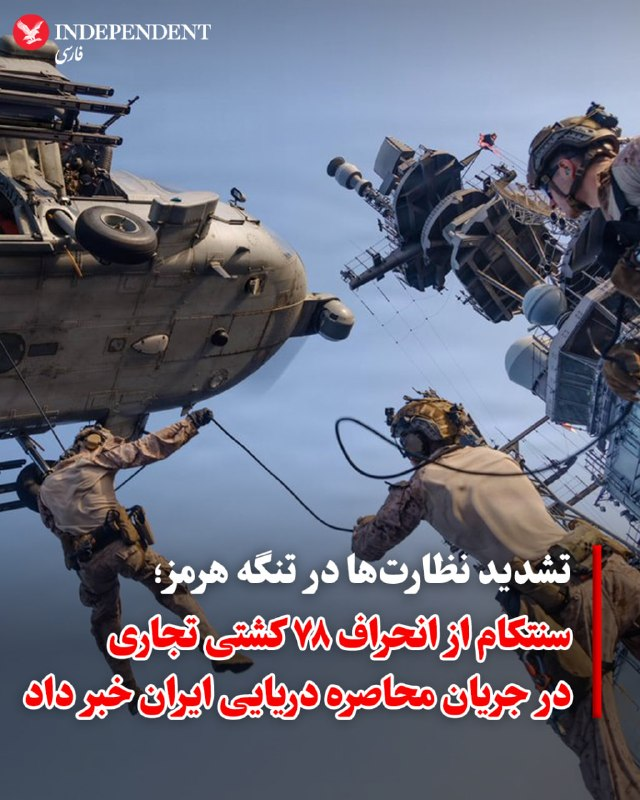

♦️ ستاد فرماندهی مرکزی ارتش آمریکا، سنتکام، روز شنبه ۲۶ اردیبهشت، گزارشی از آخرین فعالیت‌های این نیروها در تنگه هرمز و محاصره دریایی بنادر ایران ارائه کرد.

بر اساس این گزارش تا تاریخ ۲۶ اردیبهشت، نیروهای آمریکایی در راستای تضمین پایبندی به این محاصره نظامی، مسیر ۷۸ کشتی تجاری را که به سمت بنادر ایران در حرکت بودند تغییر داده و ۴ کشتی دیگر را نیز به دلیل تلاش برای نقض این خطوط ممنوعه، متوقف و زمین‌گیر کرده‌اند. سنتکام تاکید کرده است که این تدابیر سخت‌گیرانه تنها علیه شناورهای ورودی و خروجی به بنادر ایران اعمال می‌شود.
‌🇸🇦 Indypersian

🤖 @VahidOOnLine

## VahidOOnLine — post 240478

  <a href="telegram/content/VahidOOnLine_240478_1778941552.mp4" target="_blank">🎬 Download video</a>

ایرانیان آلمان روز شنبه همزمان با سایر کشورها در حمایت از انقلاب ملی علیه جمهوری اسلامی در شهر کاسل تجمع کردند.
‌🏁 🇬🇧 IranintlTV

🤖 @VahidOOnLine

## VahidOOnLine — post 240477

  

معاریو گزارش داد که حوثی‌ها ابزارهای مدرن، از جمله دستگاه‌های جی‌پی‌اس را در اختیار دزدان دریایی سومالی قرار داده‌اند که به آنها کمک می‌کند مسیرهای حرکت کشتی‌های تجاری را با دقت بیشتری ردیابی کنند.

پیش‌تر محمد موسی ابوله، معاون رییس اطلاعات پلیس دریایی پونتلند، در ژانویه ۲۰۲۶ گفته بود که نیروهای امنیتی برآورد می‌کنند برخی اعضای این گروه‌ها حتی آموزش‌های نظامی را در یمن گذرانده‌اند.

به گفته او، فناوری جدید برنامه‌ریزی حملات در فاصله‌ای دور از سواحل سومالی را بسیار آسان‌تر کرده است. یک ماه پیش از آن، در دسامبر ۲۰۲۵، نیروهای امنیتی پونتلند یک شناور حامل مواد منفجره و مواد شیمیایی مورد استفاده در ساخت بمب را در نزدیکی سواحل ایل متوقف کردند. در این قایق هفت نفر شامل دو شهروند یمنی و پنج شهروند سومالیایی حضور داشتند.
‌🏁 🇬🇧 IranintlTV

🤖 @VahidOOnLine

## VahidOOnLine — post 240476

♦️ارتش آمریکا با انتشار تصاویری اعلام کرد در پی یک عملیات نظامی در شمال‌شرق نیجریه، مواضع گروه داعش هدف حمله قرار گرفت و چندین عضو ارشد این گروه کشته شدند.
این عملیات یک تجمع مهم از نیروهای داعش را هدف قرار داده و در جریان آن، تعدادی از افراد باارزش بالا از جمله فردی به نام «ابو بلال المینوکی» از بین رفته‌اند.
جزئیات بیشتری درباره زمان دقیق، نحوه اجرای عملیات و تلفات کلی منتشر نشده، اما منابع محلی این حمله را ضربه‌ای قابل‌توجه به فعالیت‌های داعش در این منطقه توصیف کرده‌اند.
‌🇸🇦 Indypersian

🤖 @VahidOOnLine

## VahidOOnLine — post 240475

  <a href="telegram/content/VahidOOnLine_240475_1778941556.mp4" target="_blank">🎬 Download video</a>

سوییس، تجمع مقابل سفارت جمهوری اسلامی، ۲۶ اردیبهشت ۱۴۰۵
‌🏁 🇬🇧 ManotoTV

🤖 @VahidOOnLine

## VahidOOnLine — post 240474

  <a href="telegram/content/VahidOOnLine_240474_1778941559.mp4" target="_blank">🎬 Download video</a>

فرماندهی آفریقای ارتش آمریکا تصاویری از هدف قرار دادن مواضع داعش در نیجریه را منتشر کرده است. آفریکام گفته است عملیات شامگاه گذشته، حضور قابل توجهی از نیروهای داعش را هدف گرفت و به کشته شدن چند فرد مهم این گروه منجر شد.

شمال شرق نیجریه سال‌هاست صحنه فعالیت گروه‌های جهادی، از جمله شاخه غرب آفریقای داعش و بوکوحرام است. مرکز ملی مبارزه با تروریسم آمریکا می‌گوید شاخه غرب آفریقای داعش یکی از بزرگ‌ترین و مرگبارترین شاخه‌های این گروه است و در نیجریه و کشورهای همسایه باعث کشته یا آواره شدن هزاران نفر شده است.
‌🏁 🇬🇧 ManotoTV

🤖 @VahidOOnLine

## VahidOOnLine — post 240473

♦️صداوسیمای جمهوری اسلامی روز شنبه ۲۶ اردیبهشت، با انتشار تصاویری، لحظه توقیف یک نفتکش حامل ۴۵۰هزار بشکه نفت که به گفته خبرنگار، به صورت قاچاق از کشور خارج شده بود را نشان داد. کشور صاحب این نفتکش در گزارش معرفی نشده اما تاکید شده که غیرایرانی بوده است. نفتکش «اوشن کوی» برای جلوگیری از شناسایی شدن، نام خود را روی بدنه مخدوش کرده بود.

یک مقام نیروی دریایی ارتش در گفتگو با صداوسیما اعلام کرد که محموله این نفتکش توقیف شده و با انتقال به یک نفتکش ایرانی، به مخازن بندرعباس بازگردانده می‌شود.

پیش از این اعلام شده بود که کنترل تنگه هرمز به دو بخش شرقی و غربی تقسیم شده و نیروی دریایی سپاه و ارتش، هر کدام مسئولیت یک بخش را به‌عهده دارند.
‌🇸🇦 Indypersian

🤖 @VahidOOnLine

## VahidOOnLine — post 240472

  <a href="telegram/content/VahidOOnLine_240472_1778941560.mp4" target="_blank">🎬 Download video</a>

یک شهروند در پیامی به ایران اینترنشنال با اشاره به بحران معیشتی می‌گوید که سه ماه است مجلس با خاک یکی شده و نباید آن‌ها «حقوق آن‌چنانی»‌ بگیرند. پیام این مخاطب با هوش مصنوعی بازخوانی شده است.
‌🏁 🇬🇧 IranintlTV

🤖 @VahidOOnLine

## VahidOOnLine — post 240471

  <a href="telegram/content/VahidOOnLine_240471_1778941563.mp4" target="_blank">🎬 Download video</a>

ایرانیان فنلاند روز شنبه در حمایت از انقلاب ملی علیه جمهوری اسلامی در هلسینکی تجمع کردند و شعار «تغییر رژیم» سر دادند.
‌🏁 🇬🇧 IranintlTV

🤖 @VahidOOnLine

## WithYashar — post 11398

فقط برای یک پست که نمیشه ببندم مهندس ! کلا ببندمم که یعنی میگی خنده رو از روی لب چندین هزار نفر بگیرم به خاطر ده نفر. ما اینجا هدف اصلیمون مبارزه با اخبار سمیه و روحیه دادن به مردم. اجازه بدید در عرزشی سوزترین رسانه ایرانی بسوزند و حرس بخورند

## WithYashar — post 11397

میتونی ری‌اکشن رو هم ببندی داداش!

## WithYashar — post 11396

این پست اوناییکه استیکر خنده گذاشتن رو از کانال مسدودشون کن

## WithYashar — post 11395

این پست اوناییکه استیکر خنده گذاشتن رو از کانال مسدودشون کن

## WithYashar — post 11394

لازم به ذکر است شخص اینجانب ، یاشار در اتاق جنگ هیچ رابطه و تیمکشی با هیچ گروه جناح و سمتی ندارم مسیر من مسیر مانوک خدابخشیان و فریدون فرخزاد است و هم پیمانان من فقط مردم واقعی و وطن پرست ایران هستند و برگ برنده ما همه با هم اینجا برای عبور از مسیر فقط فقط فقط خود شخص شاهزاده رضا پهلوی است ، یک بار دیگه خواستم اهداف و مسیر خودم را مشخص و کلیر کنم
@withyashar

## WithYashar — post 11393

مشاورین شاهزاده (امیر اعتمادی و سعید قاسمینژاد) ، علی کریمی‌ رو به علت واکنش ‌به کنسرت و آهنگ شاهین نجفی آنفالو کردند
@withyashar

## mwarmonitor — post 9160

  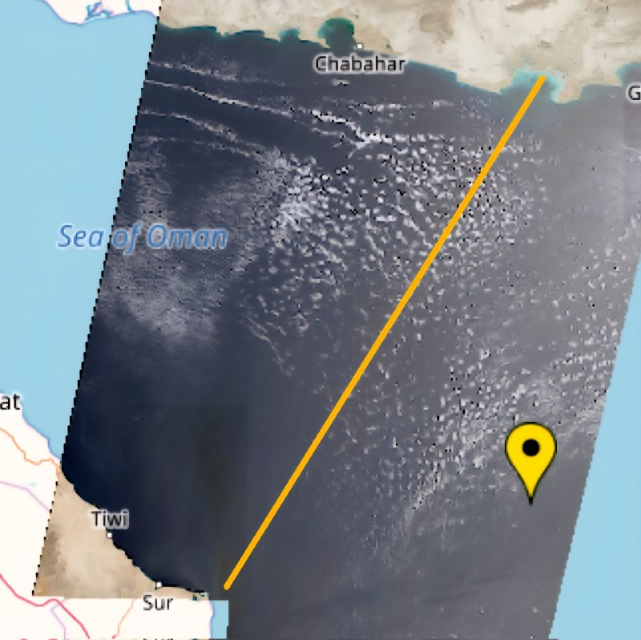

‼️من همین حالا یک ناو هواپیمابر کلاس نیمیتز (احتمالاً USS George H. W. Bush یا USS Abraham Lincoln) را در تصاویر ماهواره‌ای Sentinel-2 مربوط به 16/05/2026 پیدا کردم. 🔸این ناو با سرعت به سمت شمال دریای عمان در حال حرکت است. @mwarmonitor

## mwarmonitor — post 9159

  

🇺🇸یک فروند بالگرد ارتش ایالات متحده هنگام پرواز بر فراز آب‌های منطقه‌ای نزدیک تنگه هرمز، بر حرکت کشتی‌های تجاری نظارت می‌کند. این اقدام در چارچوب اجرای محاصره دریایی آمریکا علیه ایران انجام می‌شود.

🔸تا تاریخ ۱۶ مه، ۷۸ کشتی تجاری تغییر مسیر داده شده‌اند و ۴ کشتی برای تضمین تبعیت از دستورها از کار افتاده‌اند.

@mwarmonitor

## mwarmonitor — post 9158

  <a href="telegram/content/mwarmonitor_9158_1778941568.mp4" target="_blank">🎬 Download video</a>

📝تحلیل اختصاصی کانال

🇵🇰🇮🇷سفر از پیش‌اعلام‌نشده وزیر کشور پاکستان به تهران، بیش از آنکه یک رایزنی سنتی باشد، یک آفند دیپلماتیک پیشگیرانه است. در عرف بین‌الملل، حضور فیزیکی یک مقام ارشد از کشوری غیردرگیر در پایتختِ هدف، به عنوان یک ضربه‌گیر امنیتی عمل می‌کند؛ چرا که واشنگتن برای اجتناب از تصاعد بحران و درگیر کردن پای اسلام‌آباد، دست به اقدام نظامی ناگهانی نخواهد زد.

🔸این تحرک در کوتاه‌مدت به شدت تأثیرگذار است و عملاً زمان حیاتی برای تنش‌زدایی یا بازدارندگی موقت ایجاد می‌کند. با این حال، کارآمدی بلندمدت آن بستگی به این دارد که تهران و اسلام‌آباد از این فرصتِ تنفس و «سپر دیپلماتیک» برای تغییر محاسبات واشنگتن بهره ببرند، یا اینکه این سفر تنها یک مسکن موقت برای به تعویق انداختن بحران باشد.

@mwarmonitor

## mwarmonitor — post 9157

  <a href="telegram/content/mwarmonitor_9157_1778941571.mp4" target="_blank">🎬 Download video</a>

🇺🇸با ورود وزیر جنگ آمریکا، پیت هگست، به نورفولک، ویرجینیا، ناو هواپیمابر «یو‌اس‌اس جرالد آر. فورد» پس از یک استقرار بیش از ۳۰۰ روزه به پایگاه خانگی خود بازگشت. این ناو و شناورهای همراه آن در طول این مدت در عملیات‌های رزمی در دو فرماندهی رزمی (COCOM) شامل SOUTHCOM و CENTCOM شرکت داشتند.

@mwarmonitor

## FoxNewsTwitter — post 341814

‌Fox News (Twitter/X)

BREAKING NEWS: Trump unloaded on Sen. Bill Cassidy ahead of Louisiana’s GOP primary election, calling him a “disloyal disaster” and a “sleazebag,” while urging voters to support Julia Letlow.

https://www.foxnews.com/politics/trump-blasts-sen-bill-cassidy-disloyal-disaster-pushes-challenger-julia-letlow-louisiana-gop-primary

## FoxNewsTwitter — post 341813

  

Fox News (Twitter/X)

Today, the nation honors the brave men and women of the United States Armed Forces, recognizing their courage, sacrifice, and unwavering commitment to defending America.

"As we celebrate 250 glorious years of American independence this year, we acknowledge that our precious freedom, enjoyed and embraced by generation after generation, has been secured for all citizens by the providence and grace of Almighty God and the service and sacrifice of every member of our military," a White House statement reads.

## FoxNewsTwitter — post 341812

  <a href="telegram/content/FoxNewsTwitter_341812_1778941574.mp4" target="_blank">🎬 Download video</a>

Fox News (Twitter/X)

NEW: U.S. Africa Command releases video of the airstrike that targeted and eliminated ISIS fighters in Nigeria, including ISIS second-in-command Abu-Bilal al-Minuki.

President Trump called the “meticulously planned and very complex mission” a complete success.

## pm_afshaa — post 90850

  <a href="telegram/content/pm_afshaa_90850_1778941576.webm" target="_blank">🎬 Download video</a>

🔴استوری مشاور قالیباف همزمان با بالا گرفتن احتمال شروع مجدد جنگ :

💧 Rainbet.com the #1 Non-KYC Crypto Casino & Sportsbook @rainbetcom

😁 @Pm_Afshaa

## pm_afshaa — post 90849

  <a href="telegram/content/pm_afshaa_90849_1778941577.webm" target="_blank">🎬 Download video</a>

🔴الحدث به نقل از منابع پاکستانی:
اسلام آباد به دنبال ادامه روند میانجیگری با جدییت است. اسلام آباد به دنبال متقاعد کردن تهران و واشنگتن به انعطاف پذیری در مذاکراته

💧 Rainbet.com the #1 Non-KYC Crypto Casino & Sportsbook @rainbetcom

😁 @Pm_Afshaa

## VahidOnline — post 75501

  <a href="telegram/content/VahidOnline_75501_1778941578.mp4" target="_blank">🎬 Download video</a>

دختر جمیله شفیعی: JamilehShafiei

📡 @VahidOnline

## VahidOnline — post 75500

  <a href="telegram/content/VahidOnline_75500_1778941578.mp4" target="_blank">🎬 Download video</a>

"مجری شبکه سه تلویزیون: یک راکت ۲۰۰ دلاری می‌تواند کل ارتش آمریکا را در منطقه به زانو درآورد" ویدیو با تیتر بالا در منابع جمهوری اسلامی منتشر شده و خانعلی‌زاده متوهم رو نشون میده که مطابق معمول چرندیاتی در سطح خودش میگه. 📡 @VahidOnline

## VahidOnline — post 75499

  <a href="telegram/content/VahidOnline_75499_1778941579.mp4" target="_blank">🎬 Download video</a>

در یک برنامه زنده تلویزیونی که از شبکه افق صداوسیما پخش شده است، مجری برنامه با اسلحه واقعی به پرچم امارات متحده عربی شلیک می‌کند.
در این برنامه که موضوع آن درباره آموزش شلیک با اسلحه کلاشنیکف است، فردی که لباس نظامی به تن دارد و صورت خود را با ماسک پوشانده است مراحل آماده‌سازی اسلحه و شلیک گلوله را به مجری آموزش می‌دهد.
مجری برنامه هم در مرحله شلیک تصمیم می‌گیرد به پرچم امارات که در بنر مربوط به دکور استودیو، شلیک کند.
@VahidHeadline
صدا و سیمای جمهوری اسلامی جمعه چند برنامه پخش کرد که در آنها مجریان در بخش‌های استودیویی با در دست داشتن تفنگ ظاهر شدند و کار با سلاح‌های سبک آموزش داده شد. مجریان در این برنامه‌ها اعلام کردند که در صورت لزوم به جنگ خواهند پیوست.
این برنامه‌ها که دست‌کم در سه بخش پخش شد، در رسانه‌های داخلی بازنشر و در شبکه‌های اجتماعی با واکنش‌هایی همراه شد. برخی کاربران شبکه‌های اجتماعی این بخش‌ها را نشانه‌ای از بسیج در شرایط جنگی توصیف کردند.
جکسون هینکل، مفسر سیاسی آمریکایی، در شبکه اجتماعی ایکس نوشت تلویزیون دولتی ایران نحوه استفاده و شلیک با کلاشینکف را به‌عنوان «آمادگی برای تهاجم زمینی آمریکا» نشان می‌دهد.
@VahidOOnLine

📡 @VahidOnline

## VahidOnline — post 75498

  

رسانه وابسته به قوه قضائیه جمهوری اسلامی اعلام کرد اموال ۵۱ نفر در استان یزد، با دستور قضایی و به اتهام آنچه «خیانت به وطن» و «همکاری با دشمن» خوانده شده، توقیف شده است.

بر اساس این گزارش، پرونده این افراد در ارتباط با قانون موسوم به «تشدید مجازات جاسوسی و همکاری با رژیم صهیونیستی علیه امنیت و منافع ملی» در حال رسیدگی است و مقام‌های قضایی مدعی شده‌اند دارایی‌های توقیف‌شده قرار است برای «حفظ حقوق عامه» و بازسازی اماکن آسیب‌دیده از جنگ هزینه شود.

اموال توقیف‌شده شامل حساب‌های بانکی، دارایی‌های منقول و غیرمنقول، سهام شرکت‌ها و حتی اموال وکالتی عنوان شده است.

طبق گزارش میزان، از میان این ۵۱ نفر، ۲۰ نفر در داخل کشور حضور دارند و ۳۱ نفر دیگر در خارج از کشور به سر می‌برند.

این اقدام در ادامه موج تازه‌ای از مصادره و توقیف اموال شهروندان و مخالفان سیاسی صورت می‌گیرد؛ روندی که در عمل به ابزاری برای فشار، ارعاب و مصادره دارایی افراد تحت عنوان‌های سنگینی مانند «خیانت» و «همکاری با دشمن» تبدیل شده است.
@VahidHeadline

📡 @VahidOnline

## IranIntlTV — post 337484

  <a href="telegram/content/IranIntlTV_337484_1778941581.mp4" target="_blank">🎬 Download video</a>

در ادامه گزارش‌ها از لکه نفتی ایجادشده در اطراف جزیره خارک، وبسایت تانکر ترکرز نوشت این موضوع ناشی از نشت نفت از اسکله غربی این جزیره است. خبرگزاری بلومبرگ نیز نوشت توقف صادرات نفت ایران از خارک، به احتمال زیاد ناشی از نشت اخیر نفت بوده است.

گفت‌وگو با آرش آزرمی، دبیر بخش اقتصادی ایران‌اینترنشنال
@iranintltv

## IranIntlTV — post 337483

  <a href="https://t.me/IranintlTV/337483" target="_blank">📎 Download file</a>

🎧نسخه صوتی اخبار نیمروزی | شنبه ۲۶ اردیبهشت
@iranintlTV

## IranIntlTV — post 337482

  <a href="telegram/content/IranIntlTV_337482_1778941584.mp4" target="_blank">🎬 Download video</a>

دونالد ترامپ هشدار داد اگر جمهوری اسلامی اورانیوم غنی‌شده خود را تحویل ندهد، آمریکا «در زمان مناسب» وارد ایران خواهد شد. او تاکید کرد در صورت لزوم، زیرساخت‌های باقی‌مانده را «ظرف دو روز» نابود می‌کند.
گفت‌وگو با جابر رجبی، تحلیل‌گر سیاسی
@iranintltv

## IranIntlTV — post 337481

  

سنتکام، مرکز فرماندهی ایالات متحده، اعلام کرد که از آغاز محاصره سواحل جنوب ایران تا کنون، ۷۸ کشتی تجاری وادار به تغییر مسیر شده‌اند و ۴ کشتی برای تضمین اجرای محاصره از کار افتاده‌اند.

سنتکام با انتشار نمایی از داخل یک بالگرد بر فراز آب‌های منطقه‌ای نزدیک تنگه هرمز، نوشت که این بالگرد ارتش آمریکا کشتی‌های تجاری را در جریان اجرای محاصره دریایی ایران زیر نظر دارد.
https://iranintl.com/202605164791

## IranIntlTV — post 337480

  

ایلا واویه، سخنگوی ارتش اسرائیل برای رسانه‌های عربی، در پیامی نوشت لبنان «میان چنگ ملایان و رشته‌های وابستگی» از یک کشور به گروگان تبدیل شده است.

او نوشت زمانی که جنگ‌ها «با انگشتان ایرانی اداره می‌شود»، مردم لبنان بهای آن را با «ویرانی و خاکستر» می‌پردازند.

واویه همچنین اعلام کرد لبنان به سکویی تبدیل شده و حزب‌الله «رشته‌هایی است که از سوی تهران حرکت داده می‌شود» و نتیجه این وضعیت، به گفته او، «کشوری که سیاه‌پوش می‌شود و بی‌گناهانی که جز آینده‌ای نامعلوم سهمی ندارند» است.

سخنگوی ارتش اسرائیل در پایان پرسید: «لبنان به کجا می‌رود؟ و تا کی؟»
https://iranintl.com/202605163963

## IranIntlTV — post 337479

  <a href="telegram/content/IranIntlTV_337479_1778941589.mp4" target="_blank">🎬 Download video</a>

ایرانیان سوئیس روز شنبه با تجمع در شهر برن به حمایت از انقلاب ملی و شاهزاده رضا پهلوی پرداختند و شعار «جاوید شاه» سر دادند.

## IranIntlTV — post 337478

  <a href="telegram/content/IranIntlTV_337478_1778941592.mp4" target="_blank">🎬 Download video</a>

در واکنش به نمایش و آموزش کار با سلاح در صداوسیما یک شهروند در پیامی به ایران اینترنشنال این اقدام را نشانه سقوط حکومت خواند و مخاطبی دیگر به حرکت مشابه در لیبی قبل از سقوط حکومت معمر قذافی اشاره کرد.

پیام این مخاطبان با هوش مصنوعی بازخوانی شده است.

## IranIntlTV — post 337477

  <a href="telegram/content/IranIntlTV_337477_1778941595.mp4" target="_blank">🎬 Download video</a>

ایرانیان آلمان روز شنبه همزمان با سایر کشورها در حمایت از انقلاب ملی علیه جمهوری اسلامی در شهر کاسل تجمع کردند.

## IranIntlTV — post 337476

  

معاریو گزارش داد که حوثی‌ها ابزارهای مدرن، از جمله دستگاه‌های جی‌پی‌اس را در اختیار دزدان دریایی سومالی قرار داده‌اند که به آنها کمک می‌کند مسیرهای حرکت کشتی‌های تجاری را با دقت بیشتری ردیابی کنند.

پیش‌تر محمد موسی ابوله، معاون رییس اطلاعات پلیس دریایی پونتلند، در ژانویه ۲۰۲۶ گفته بود که نیروهای امنیتی برآورد می‌کنند برخی اعضای این گروه‌ها حتی آموزش‌های نظامی را در یمن گذرانده‌اند.

به گفته او، فناوری جدید برنامه‌ریزی حملات در فاصله‌ای دور از سواحل سومالی را بسیار آسان‌تر کرده است. یک ماه پیش از آن، در دسامبر ۲۰۲۵، نیروهای امنیتی پونتلند یک شناور حامل مواد منفجره و مواد شیمیایی مورد استفاده در ساخت بمب را در نزدیکی سواحل ایل متوقف کردند. در این قایق هفت نفر شامل دو شهروند یمنی و پنج شهروند سومالیایی حضور داشتند.
https://iranintl.com/202605167159

## IranIntlTV — post 337475

  <a href="telegram/content/IranIntlTV_337475_1778941599.mp4" target="_blank">🎬 Download video</a>

در تجمعی که به فراخوان تامی رابینسون، فعال راست‌گرای بریتانیا، در لندن برگزار شد، شماری از ایرانیان با پرچم شیر و خورشید حضور پیدا کردند. رابینسون این تجمع را «بزرگ‌ترین گردهمایی ملی‌گرایانه» توصیف کرده است.
گفت‌وگو با تاج‌الدین سروش، عضو تحریریه ایران‌اینترنشنال
@iranintltv

## IranIntlTV — post 337474

  <a href="telegram/content/IranIntlTV_337474_1778941601.mp4" target="_blank">🎬 Download video</a>

خبرگزاری مهر از وقوع آتش‌سوزی در «کارخانه روغن موتور» در مراغه خبر داد. رییس آتش‌نشانی شهرستان مراغه بعد از ظهر شنبه اعلام کرد این کارخانه از ساعاتی پیش دچار آتش‌سوزی شده است و نیروهای امدادی و آتش‌نشانی در حال اطفای حریق هستند.
@iranintltv

## IranIntlTV — post 337473

  <a href="telegram/content/IranIntlTV_337473_1778941602.mp4" target="_blank">🎬 Download video</a>

خبرگزاری مهر از وقوع آتش‌سوزی در «کارخانه روغن موتور» در مراغه خبر داد. رییس آتش‌نشانی شهرستان مراغه بعد از ظهر شنبه اعلام کرد این کارخانه از ساعاتی پیش دچار آتش‌سوزی شده است و نیروهای امدادی و آتش‌نشانی در حال اطفای حریق هستند.
@iranintltv

## IranIntlTV — post 337472

  <a href="telegram/content/IranIntlTV_337472_1778941604.mp4" target="_blank">🎬 Download video</a>

یک شهروند در پیامی به ایران اینترنشنال با اشاره به بحران معیشتی می‌گوید که سه ماه است مجلس با خاک یکی شده و نباید آن‌ها «حقوق آن‌چنانی»‌ بگیرند. پیام این مخاطب با هوش مصنوعی بازخوانی شده است.

## IranIntlTV — post 337471

  <a href="telegram/content/IranIntlTV_337471_1778941606.mp4" target="_blank">🎬 Download video</a>

صداوسیمای جمهوری اسلامی روز جمعه برنامه‌ای پخش کرد که در آن یک نظامی به مجری استفاده از سلاح گرم را آموزش می‌داد. این برنامه در شبکه‌های اجتماعی موجی از واکنش‌ها را به همراه داشت. مجری در این برنامه به پرچم امارات متحده عربی شلیک کرد.
جزییات بیشتر با محسن مهیمنی، عضو تحریریه ایران‌اینترنشنال
@iranintltv

## IranIntlTV — post 337470

  <a href="telegram/content/IranIntlTV_337470_1778941609.mp4" target="_blank">🎬 Download video</a>

ایرانیان فنلاند روز شنبه در حمایت از انقلاب ملی علیه جمهوری اسلامی در هلسینکی تجمع کردند و شعار «تغییر رژیم» سر دادند.

## Shin_Persian — post 6030

  

U.S. Central Command ✓ @CENTCOM Sat, 16 May 2026 13:24:31 UTC A U.S. Army helicopter observes commercial ships while flying over regional waters near the Strait of Hormuz during U.S. enforcement of the maritime blockade against Iran. As of May 16, 78…

## Shin_Persian — post 6029

U.S. Central Command ✓ @CENTCOM
Sat, 16 May 2026 13:24:31 UTC

A U.S. Army helicopter observes commercial ships while flying over regional waters near the Strait of Hormuz during U.S. enforcement of the maritime blockade against Iran.

As of May 16, 78 commercial ships have been redirected, and 4 have been disabled to ensure compliance.

فارسی

یک هلیکوپتر ارتش ایالات متحده در حالی که در جریان اجرای محاصره دریایی علیه ایران توسط ایالات متحده بر فراز آب‌های منطقه در نزدیکی تنگه هرمز پرواز می‌کند، کشتی‌های تجاری را زیر نظر دارد.

تا تاریخ ۱۶ می، ۷۸ کشتی تجاری تغییر مسیر داده شده‌اند و ۴ کشتی برای اطمینان از انطباق، از کار افتاده‌اند.

𝕏 · @shin_persian

## ManotoTV — post 105519

  <a href="telegram/content/ManotoTV_105519_1778941613.mp4" target="_blank">🎬 Download video</a>

دوسلدورف آلمان، تجمع ایرانیان، شنبه ۲۶ اردیبهشت

## ManotoTV — post 105518

  <a href="telegram/content/ManotoTV_105518_1778941616.mp4" target="_blank">🎬 Download video</a>

ملبورن، تجمع ایرانیان، ۲۶ اردیبهشت

## ManotoTV — post 105517

  <a href="telegram/content/ManotoTV_105517_1778941617.mp4" target="_blank">🎬 Download video</a>

هامبورگ، راهپیمایی ایرانیان و حمایت از زندانیان سیاسی، ۲۶ اردیبهشت

## ManotoTV — post 105516

  <a href="telegram/content/ManotoTV_105516_1778941620.mp4" target="_blank">🎬 Download video</a>

سوییس، تجمع مقابل سفارت جمهوری اسلامی، ۲۶ اردیبهشت ۱۴۰۵

## ManotoTV — post 105515

  <a href="telegram/content/ManotoTV_105515_1778941623.mp4" target="_blank">🎬 Download video</a>

لندن، حضور ایرانیان با پرچم بریتانیا و شیر و خوشید و تصاویر شاهزاده رضا پهلوی در راهپیمایی ملی‌گرایان بریتانیا، ۲۶ اردیبهشت ۱۴۰۵

## ManotoTV — post 105514

  <a href="telegram/content/ManotoTV_105514_1778941625.mp4" target="_blank">🎬 Download video</a>

فرماندهی آفریقای ارتش آمریکا تصاویری از هدف قرار دادن مواضع داعش در نیجریه را منتشر کرده است. آفریکام گفته است عملیات شامگاه گذشته، حضور قابل توجهی از نیروهای داعش را هدف گرفت و به کشته شدن چند فرد مهم این گروه منجر شد.

شمال شرق نیجریه سال‌هاست صحنه فعالیت گروه‌های جهادی، از جمله شاخه غرب آفریقای داعش و بوکوحرام است. مرکز ملی مبارزه با تروریسم آمریکا می‌گوید شاخه غرب آفریقای داعش یکی از بزرگ‌ترین و مرگبارترین شاخه‌های این گروه است و در نیجریه و کشورهای همسایه باعث کشته یا آواره شدن هزاران نفر شده است.

## FarsiVOA — post 217899

  <a href="telegram/content/FarsiVOA_217899_1778941626.mp4" target="_blank">🎬 Download video</a>

ارتش اسرائیل اعلام کرد بعد از حملات موشکی به سمت نیروهای این ارتش در جنوب لبنان، نیروی هوایی با هدایت نیروهای لشکر ۹۱، دو مظنون این حملات را شناسایی و هدف قرار دادند.

به گفته ارتش اسرائیل، پس از حمله، انفجارهای ثانویه شناسایی شد که نشان‌دهنده وجود مهمات در داخل ساختمان بود.

علاوه بر این نیروهای تیپ یفتاح ۶۷۹، تحت فرماندهی لشکر ۹۱، یک انبار تسلیحاتی متعلق به نیروهای سازمان تروریستی حزب‌الله را در جنوب لبنان شناسایی کردند.

این ویدیو بی‌صدا است.

## FarsiVOA — post 217898

  

امیر رحیمی، معلم زندانی در زندان دورود، توسط دادگاه تجدیدنظر استان لرستان به چهار سال حبس محکوم شد.
 
او از بازداشت‌شدگان اعتراضات دی‌ماه ۱۴۰۲ است.
 
بر اساس گزارش‌ها، حکم روز پنجشنبه ۲۶ اردیبهشت به وکیل او ابلاغ شده است.
 
گفته می‌شود امیر رحیمی از معلولیت شدید رنج می‌برد و شرایط زندان برای او دشوار است.
 
او از زمان بازداشت تاکنون از آزادی موقت یا مرخصی درمانی برخوردار نشده است.

@FarsiVOA

## FarsiVOA — post 217897

🔺برنده اسکار فیلم کوتاه را بشناسیم: فیلمی یادآور خفقان ایران با بازی زر امیرابراهیمی

▪️«کشور من در شرایطی است که نه اسکار و نه هیچ چیزی [از این دست الان] برای مردم اهمیتی ندارد». این حرف جعفر پناهی است که کاندیدای دو اسکار بهترین فیلم بین‌‌المللی و بهترین فیلمنامه سال را از آن خود کرد. او درست پیش از برگزاری مراسم اسکار ۱۴۰۵ و در مرحله نهایی کمپین اسکار فیلمش «یک تصادف ساده» که در موزه آکادمی علوم و هنرهای سینمایی آمریکا برگزار می‌شد، می‌خواست توضیح دهد که فقط به خواست کمپانی «نئون» صاحب پخش جهانی فیلمش و به احترام آکادمی اسکار، در این کمپین حاضر شده است، اما در دل و از درون، رغبتی برای حضور در میدان این بازی ندارد. تأکید او در بسیاری مصاحبه‌ها و سخنرانی‌‌هایش در فصل جوایز سینمایی سال آمریکا بر این بود که مثل هر ایرانی دیگر بعد از کشتار دی ۱۴۰۴، در چنین حالی است.

⬇️ بیشتر بخوانید:

https://ir.voanews.com/a/iran-oscar-film-winner-zar-amirebrahimi-panahi-/8150673.html/?nocach=1

## FarsiVOA — post 217896

  <a href="telegram/content/FarsiVOA_217896_1778941629.mp4" target="_blank">🎬 Download video</a>

رسانه‌های جمهوری اسلامی از وقوع آتش‌سوزی در یک کارخانه روغن موتور، ‌روز شنبه، ۲۶ اردیبهشت ۱۴۰۵، در مراغه خبر دادند و اعلام کردند اطفای حریق ادامه دارد. تا این لحظه جزئیاتی از علت آتش‌سوزی و تلفات احتمالی منتشر نشده است.

## FarsiVOA — post 217895

  <a href="telegram/content/FarsiVOA_217895_1778941632.mp4" target="_blank">🎬 Download video</a>

در ادامه تنش‌ها میان امارات متحده عربی و جمهوری اسلامی، آموزش استفاده از اسلحه برای حامیان حکومت در برنامه‌های زنده صداوسیما و تیراندازی به پرچم امارات، واکنش کاربران را در شبکه‌های اجتماعی برانگیخته است.

روز جمعه، ۲۵ اردیبهشت، چگونگی استفاده از کلاشنیکف، حداقل در سه شبکه جمهوری اسلامی، با حضور مجریان مسلح آموزش داده شد.

در یکی از این برنامه‌ها مجری صداوسیما به تصویر پرچم امارات متحده عربی شلیک می‌کند.

## FarsiVOA — post 217894

فرماندهی آفریقای ایالات متحده، آفریکام، اعلام کرد در عملیاتی در شمال‌شرق نیجریه چند عضو ارشد گروه داعش کشته شدند.

به گفته آفریکام، ابو بلال المنوکی، از چهره‌های کلیدی داعش در منطقه، در این عملیات کشته شده است.

ارتش آمریکا می‌گوید این حمله با هدف تضعیف توان عملیاتی داعش در غرب آفریقا انجام شده است.

@FarsiVOA

## DW_Farsi — post 124764

🔶 خودروسازان آلمانی به صنعت دفاعی نزدیک‌تر می‌شوند

در کارخانه‌هایی که سال‌ها نماد صنعت خودروسازی آلمان بودند، حالا بحث تازه‌ای مطرح شده است؛ آیا خطوط تولید خودرو در آینده می‌توانند به ساخت تجهیزات دفاعی و نظامی اختصاص پیدا کنند؟

افزایش تنش‌های جهانی، جنگ اوکراین، نگرانی‌های امنیتی اروپا و رشد بودجه‌های نظامی، حالا بخشی از صنایع آلمان را به فکر ورود به بازار دفاعی انداخته است؛ بازاری که تا همین چند سال پیش، برای بسیاری از خودروسازان سنتی موضوعی دور و حتی نامرتبط به نظر می‌رسید.

در جدید‌ترین نشانه از این تغییر، اولا کلنیوس، مدیرعامل مرسدس بنز، گفته است شرکتش احتمال ورود به حوزه تولیدات دفاعی را رد نمی‌کند؛ البته به شرطی که چنین اقدامی از نظر اقتصادی منطقی باشد.

او در گفت‌وگو با روزنامه وال‌استریت ژورنال گفته است: «جهان غیرقابل پیش‌بینی‌تر شده و کاملا روشن است که اروپا باید توان دفاعی خود را گسترش دهد.»

کلنیوس می‌گوید، اگر مرسدس بتواند "نقش مثبتی" در این مسیر ایفا کند، آماده این کار خواهد بود.

هرچند او تاکید کرده فعالیت‌های دفاعی در مقایسه با صنعت خودرو بخش کوچکی از کسب‌وکار مرسدس خواهد بود، اما آن را بازاری رو‌به‌رشد توصیف کرده که می‌تواند به بهبود وضعیت مالی شرکت کمک کند.

این اظهارات مدیرعامل مرسدس در حالی مطرح می‌شود که این شرکت اخیرا از افت قابل‌توجه سود خود خبر داده است.

مرسدس بنز اعلام کرده که سود این شرکت در سه‌ماهه گذشته بیش از ۱۷ درصد کاهش یافته و به حدود ۱.۴۳ میلیارد یورو رسیده است.
مرسدس تنها شرکتی نیست که نامش در ارتباط با صنایع دفاعی مطرح شده است.

خبرگزاری رویترز پیش‌تر گزارش داده بود که فولکس‌واگن، بزرگ‌ترین خودروساز اروپا، در حال مذاکره با شرکت اسرائیلی "رافائل"، سازنده سامانه دفاع موشکی "گنبد آهنین"، درباره احتمال تغییر کاربری کارخانه اوزنابروک برای تولید سامانه‌های دفاع موشکی است.

هرچند فولکس‌واگن بعدا اعلام کرد برنامه‌ای برای تولید سلاح ندارد، اما انتشار همین گزارش نشان داد که صنعت دفاعی حالا بیش از گذشته وارد محاسبات اقتصادی شرکت‌های بزرگ صنعتی آلمان شده است.

در همین حال، شرکت تسلیحاتی راین‌متال نیز از همکاری با دویچه تلکام برای توسعه سامانه مقابله با پهپادها خبر داده است.

هدف این پروژه، شناسایی زودهنگام پهپادها و متوقف کردن آن‌ها از طریق اختلال الکترونیکی یا حتی فناوری لیزری عنوان شده است.

دویچه تلکام هم پیش‌تر تحقیقاتی درباره شناسایی پهپادهای کنترل‌شده از طریق شبکه تلفن همراه انجام داده بود.

تحولات اخیر فقط یک تغییر اقتصادی نیست، بلکه بازتاب تغییری بزرگ‌تر در نگاه اروپا به امنیت و دفاع است.

پس از حمله روسیه به اوکراین، بسیاری از کشورهای اروپایی بودجه‌های نظامی خود را افزایش داده‌اند و آلمان نیز از این روند مستثنی نبوده است.

دولت آلمان در سال‌های اخیر بارها بر ضرورت تقویت توان دفاعی کشور تاکید کرده و همین مسئله باعث شده صنایع دفاعی دوباره به حوزه‌ای جذاب برای سرمایه‌گذاری و توسعه تبدیل شوند.
@dw_farsi

## DW_Farsi — post 124763

🔶 اعدام‌ خاموش و اتاق‌های انتظار مرگ در زندان‌های ایران

🔻گزارشی از آتفه چهارمحالیان

در روزهای اخیر، هشدارهای متعددی درباره وخامت وضعیت جسمی نرگس محمدی پس از بیهوشی‌های مکرر و مشکلات قلبی و شرایط حاد جسمی فاطمه سپهری در زندان مشهد منتشر شده است؛ اخباری که دیگربار محرومیت‌های درمانی زندانیان را به صدر خبرهای حقوق بشری آورده‌ است.

مستنداتی که در سال‌های اخیر با نام‌هایی چون مهوش ثابت، مطلب احمدیان، آرش صادقی، محمدعلی طاهری و نسرین جوادی گره خورده‌اند، حاکی از محرومیت سیستماتیک زندانیان از حق درمان است.

مرگ بکتاش آبتین به دلیل تعلل در درمان، ویلچر‌نشین‌ شدن خالد پیرزاده "قهرمان پرورش اندام" در زندان با ۴۰ کیلو کاهش وزن، سال‌ها حبس راحله راحمی‌پور ۷۳ ساله علی‌رغم ابتلا به تومور مغزی، شرایط وخیم زینب جلالیان پس از سال‌ها حبس بدون حتی یک روز مرخصی و مرگ سمیه رشیدی پس از ماه‌ها محرومیت درمانی در اوین و قرچک، روایت‌ تکرارشونده‌ سال‌های اخیر است از آنچه فعالان حقوق بشر آن را "شکنجه سفید" و "اعدام خاموش" در زندان‌های ایران می‌نامند.

در سال‌های گذشته، ده‌ها زندانی پس از تأخیر در درمان، نرسیدن دارو، جلوگیری از اعزام پزشکی یا بی‌توجهی به وضعیت اورژانسی جان باخته‌اند. تاکید بر "مرگ قابل پیشگیری" در زندان‌های ایران به وفور در گزارش‌ها دیده می‌شود.

هدی صابر پس از تأخیر در رسیدگی پزشکی جان باخت، ساسان نیک‌نفس با وجود هشدارها از انتقال فوری به بیمارستان محروم ماند و وحید صیادی نصیری به دلیل فقدان رسیدگی مؤثر پزشکی در زندان قم جان داد.

درباره محسن دکمه‌چی که به سرطان پانکراس مبتلا بود نیز گزارش‌هایی از محرومیت درمانی منتشر شد و خانواده اکبر محمدی، فعال دانشجویی بازداشت‌شده پس از ۱۸ تیر، مرگ او را قابل پیشگیری می‌دانستند.

در بسیاری از پرونده‌ها، "مرگ مشکوک" و "محرومیت درمانی" نعل بر نعل یکدیگر دارند؛ از بهنام محجوبی که پس از ماه‌ها هشدار درباره وضعیت جسمی‌ در بیمارستان لقمان جان باخت تا شاهین ناصری و سینا قنبری که روایت رسمی حکومت درباره مرگشان با تردید جدی خانواده‌ها و نهادهای حقوق بشری روبه‌رو است.

لیلا حسین‌زاده، زندانی سیاسی و فعال دانشجویی سابق، در گفت‌وگو با دویچه‌وله می‌گوید: «بیمار بودن در زندان نزدیک‌ترین تجربه به مرگ است؛ به‌ویژه در زندان‌های شهرستان که کمتر زیر ذره‌بین رسانه‌ها قرار دارند.»

او شرح می‌دهد که چگونه یک زندانی بیمار "رهاشدگی، انکار درد و فرسایش روانی" را در زندان به‌طور هم‌زمان تجربه می‌کند: «بعد از اعلام بیماری، اولین واکنش بخشی از کادر بهداری یا نیروهای زندان این است که بگویند تمارض می‌کنی. مدام باید ثابت کنی واقعاً درد داری. این روند آن‌قدر فرساینده است که بعضی زندانیان ترجیح می‌دهند درد را تحمل کنند اما دیگر وارد پروسه درمان نشوند. من در عادل‌آباد واقعاً احساس کردم در ساعت‌های آخر زندگی‌ام هستم.»

متن کامل گزارش را در وب سایت دویچه وله فارسی بخوانید.
@dw_farsi

## Persian_Trend_Official — post 14239

  <a href="telegram/content/Persian_Trend_Official_14239_1778941635.webm" target="_blank">🎬 Download video</a>

‼️ دوستان توجه داشته باشید که تیم «پرشین ترند» در هیچ‌یک از پلتفرم‌های داخلی، کانال یا گروه رسمی ندارد و هیچ‌گونه فعالیتی در این بسترها انجام نمی‌دهد. ⚠️ لطفاً نسبت به سوءاستفاده افراد سودجو و صفحات جعلی هوشیار باشید. 📝 Nick 📌 @persian_trend_official پرشین…

## RadioFarda — post 157262

  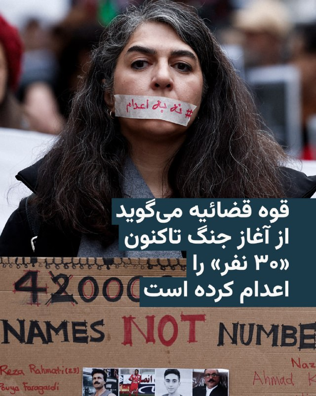

🔸قوه قضائیه جمهوری اسلامی با انتشار گزارشی، آماری از موارد سرکوب را تحت عنوان «عملکرد قوه قضائیه در ۷۷ روز گذشته» منتشر و به‌طور رسمی اعلام کرد از زمان آغاز جنگ ایران تاکنون «۳۰ نفر» از زندانیان سیاسی یا امنیتی را اعدام کرده است.

🔸قوه قضائیه اتهام ۱۰ نفر از اعدام‌شدگان را «جاسوسی» عنوان کرده و باقی موارد اعدام را مربوط به اعتراضات و «تروریسم» برشمرده است.

🔸این آمار در حالی است که منابع حقوق‌بشری می‌گویند حکومت ایران از نهم اسفند ۱۴۰۴ تاکنون دست‌کم ۳۲ زندانی سیاسی یا امنیتی را اعدام کرده.

🔸موارد دیگری از سرکوب مخالفان و منتقدان جمهوری اسلامی نیز در گزارش قوه قضائیه آمده است، از جمله «صدور حکم زندان طویل‌المدت برای ۳۶ نفر، توقیف ۲۶۲ فقره ملک، مصادرهٔ اموال بیش از ۴۰۰ خبرنگار و روزنامه‌نگار و مسدود کردن حساب‌های بانکی ده‌ها چهره‌ٔ شبکه اجتماعی و فعال سیاسی و فرهنگی».

🔸دستگاه قضائی جمهوری اسلامی برای صدور احکام اعدام معمولا به اعترافات اجباری متهمان استناد می‌کنند و اسناد و شواهدی که در دادگاه‌ها ارائه می‌شود و همچنین روند دادرسی توسط وکلای مستقل و نهادهای حقوق بشری غیر قابل قبول اعلام می‌شود.

@RadioFarda

## RadioFarda — post 157261

ظهور «ائتلاف تاریکِ» چین، روسیه و ایران علیه ایمان و آزادی؛ گفت‌وگو با سم براون‌بک

🔸جنگ روسیه علیه اوکراین فقط یک درگیری نظامی نیست، بلکه در مناطق اشغال‌شدهٔ اوکراین، کلیساها تعطیل شده‌اند، روحانیون بازداشت شده‌اند و جوامع مذهبی به فعالیت مخفیانه کشانده شده‌اند.

🔸سم براون‌بک، سناتور پیشین آمریکا و فرماندار سابق ایالت کانزاس که در سال‌های ۲۰۱۸ تا ۲۰۲۱ سفیر ویژهٔ ایالات متحده در امور آزادی مذهبی بود، می‌گوید اقدامات روسیه بخشی از پدیده‌ای گسترده‌تر از سرکوب و آزار توسط حکومت‌هایی است که همزمان با سرکوب مخالفت‌ها در داخل، می‌کوشند «در جوامع دموکراتیک اختلاف و تفرقه ایجاد کنند».

🔸براون‌بک در گفت‌وگو با رادیو اروپای آزاد/رادیو آزادی شرح می‌دهد که چگونه روسیه، چین و ایران به‌طور فزاینده‌ای در قالب آن‌چه او «ائتلاف تاریک» حکومت‌های اقتدارگرا می‌نامد، عمل می‌کنند؛ ائتلافی که بر فناوری نظارتی، سانسور، کنترل ایدئولوژیک و سرکوب نهادهای مستقل مذهبی و مدنی بنا شده است.

🔸او هشدار می‌دهد که دموکراسی‌ها با الگویی اقتدارگرا و هماهنگ روبه‌رو هستند، از سامانه‌های نظارت دیجیتال در چین گرفته تا سازوکارهای سرکوب و کنترل اجتماعی در ایران و خاموش کردن صداهای مخالف در روسیه.

🔸 گزارش کامل را در وب‌سایت رادیوفردا بخوانید.

@RadioFarda

## RadioFarda — post 157260

  

🔸رسانه‌های ایران روز شنبه ۲۶ اردیبهشت اعلام کردند وزیر کشور پاکستان در سفر به تهران درباره «ازسرگیری مذاکرات» بین ایران و آمریکا با همتای ایرانی خود گفت‌وگو کرده است.

🔸محسن نقوی، وزیر کشور پاکستان، که برای دیداری دو روزه به ایران سفر کرده، به نوشته رسانه‌های نزدیک به حکومت ایران با اسکندر مومنی دیدار کرد و «درباره روابط ایران و پاکستان و چشم‌انداز ازسرگیری مذاکرات صلح، گفت‌وگوهای مفصلی انجام شد».

🔸پاکستان از زمان برقراری آتش‌بس بین ایران و آمریکا به عنوان میانجی عمل کرده و یک دور مذاکره میان مقام‌های ارشد واشینگتن و تهران در اسلام‌آباد برگزار شد که به نتیجه نرسید.

🔸طی هفته‌های اخیر پاکستان وظیفه انتقال طرح‌ها و پیشنهادهای ایران و آمریکا برای رسیدن به توافق پایان جنگ را بر عهده داشته است. دونالد ترامپ، رئیس‌جمهور ایالات متحده، پیشنهادهای مطرح‌شده از سوی ایران را غیر قابل قبول خوانده است.

🔸این در حالی است که عباس عراقچی، وزیر خارجه ایران، روز جمعه مدعی شد تهران پیام‌هایی از ایالات متحده دریافت کرده که نشان می‌دهد دولت دونالد ترامپ آمادهٔ ادامه مذاکرات با هدف پایان دادن به جنگ خاورمیانه است.
@RadioFarda

## RadioFarda — post 157259

  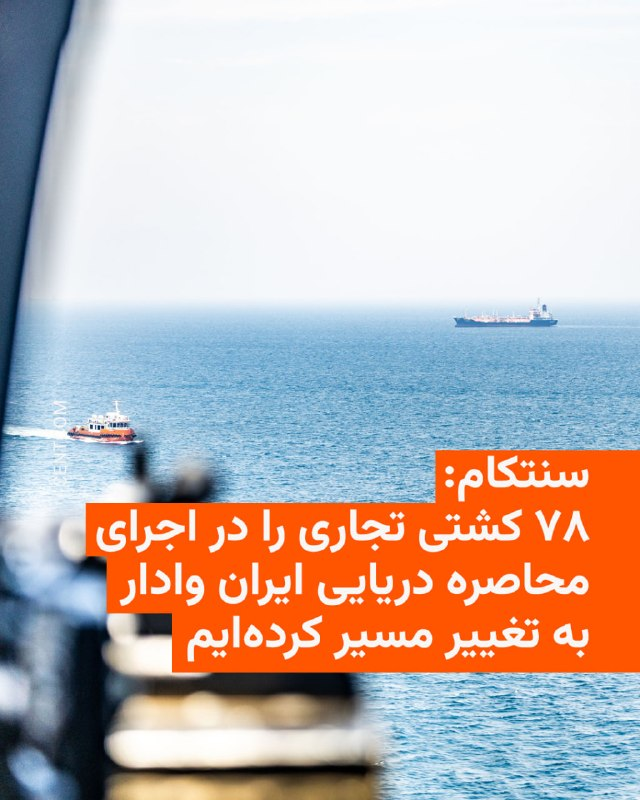

🔸ستاد فرماندهی مرکزی ایالات متحده، سنتکام، روز جمعه ۲۶ اردیبهشت با انتشار تصویری از پرواز یک بالگرد ارتش آمریکا بر فراز آب‌های نزدیک تنگه هرمز اعلام کرد که تاکنون ۷۸ کشتی تجاری در چارچوب محاصره دریایی ایران وادار به تغییر مسیر شده‌اند.

🔸سنتکام همچنین اعلام کرد چهار شناور نیز برای «اطمینان از اجرای محاصره» از کار انداخته شده‌اند.

🔸این فرماندهی پیش‌تر گفته بود به ۱۵ کشتی حامل کمک‌های بشردوستانه اجازه عبور داده شده و نیروهای آمریکایی در برخی موارد با تماس رادیویی و شلیک تیر هشدار، کشتی‌ها را به تغییر مسیر وادار کرده‌اند.

🔸آمریکا پس از بی‌نتیجه ماندن مذاکرات مستقیم با ایران، محاصره دریایی بنادر جمهوری اسلامی را آغاز کرد؛ در حالی که ایران از ابتدای جنگ تنگه هرمز را مسدود کرده است.

@RadioFarda

## IranianMinds — post 20247

  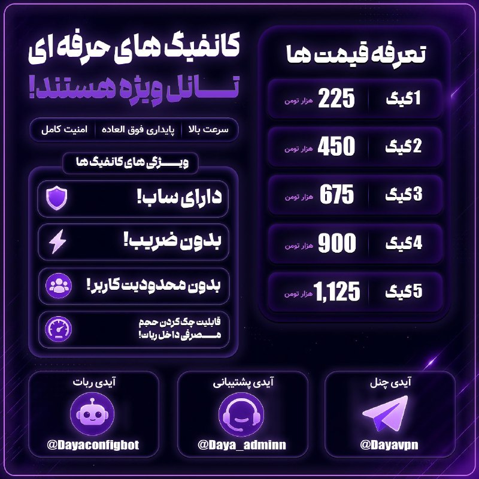

✅ (فقط ۲۲۵ هزار تومن)🥺

🌱 قیمت اقتصادی + پشتیبانی حرفه‌ای

🚀 سریع و پایدار، بدون قطعی
🦋پشتیبانی واقعی، همیشه در دسترس

ربات ما🌴
📩 @dayaconfigbot

کانال ما🌳
📩 @dayavpn

## IranianMinds — post 20245

🔴 منبع پاکستانی به الحدث: ما از آمریکا و ایران می‌خوایم برای جلوگیری از جنگ انعطاف بیشتری از خودشون نشون بدن.

@IranianMinds

## IranianMinds — post 20244

🔴 ارتش اسرائیل هامر ایاد محمد آلماتوک و خالد محمد سالم گودا، دو تروریست سازمان تروریستی حماس را که در 7 اکتبر به خاک اسرائیل حمله کردند و توطئه های تروریستی را علیه نیروهای ما ترویج کردند، کشتند.

@IranianMinds

## IranianMinds — post 20243

🔴 ارتش اسرائیل اعلام کرد نیروی هوایی این کشور با هدایت لشکر ۹۱، دو عضو حزب‌الله رو در ساختمانی در جنوب لبنان هدف قرار دادن. بعد از حمله انفجارهای ثانویه دیده شد که نشون‌دهنده وجود سلاح داخل سازه بود. علاوه بر این، سربازان اسرائیلی یک انبار تسلیحات حزب‌الله…

## IranianMinds — post 20242

🔴 ارتش اسرائیل اعلام کرد نیروی هوایی این کشور با هدایت لشکر ۹۱، دو عضو حزب‌الله رو در ساختمانی در جنوب لبنان هدف قرار دادن. بعد از حمله انفجارهای ثانویه دیده شد که نشون‌دهنده وجود سلاح داخل سازه بود.

علاوه بر این، سربازان اسرائیلی یک انبار تسلیحات حزب‌الله شامل کلاهک، جلیقه، کلاه ایمنی و تجهیزات دیگه رو در جنوب لبنان کشف کردن.

ارتش اسرائیل گفته به عملیات علیه تهدیدات ادامه میده

@IranianMinds

## IranianMinds — post 20241

  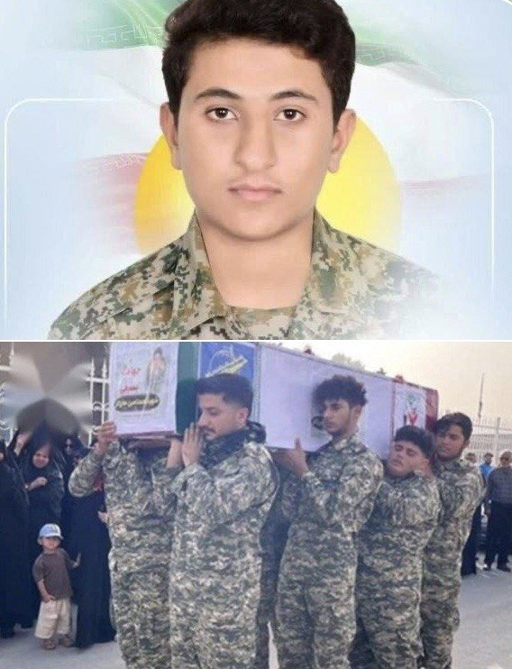

🔴محمد‌امین صابرکار، ۱۶ ساله، در جریان آموزش‌های نظامی، در بخش بردخون شهرستان دیر بر اثر شلیک خودی کشته شد.

@IranianMinds

## IranianMinds — post 20238

  <a href="telegram/content/IranianMinds_20238_1778941640.mp4" target="_blank">🎬 Download video</a>

🔴ویدئویی که ارتش آمریکا از عملیات ترور ابوبلال المینوکی نفر دوم داعش در نیجریه، منتشر کرد.

@IranianMinds

## BBCPersian — post 281222

  <a href="https://t.me/bbcpersian/281222" target="_blank">📎 Download file</a>

📻این هفته در پرگار: سلامت روانی

🔻سلامت روانی چیست و عوامل موثر در حفظ آن چه هستند؟ سلامت روانی شاخص‌های شناخته شده‌ی جهانی دارد یا متاثر از محیط فرهنگی و اجتماعی است؟

میهمان‌ها:
نازی اکبری، متخصص در روان درمانی بین فرهنگی
رضا کاظم زاده، روانشناس بالینی
ارشیا صدیق، متخصص مغز و اعصاب

این برنامه یک بار دیگر پیش از این پخش شده است.

@BBCPersian

## BBCPersian — post 281221

🔻‌حضور مجریان چند شبکه تلویزیون ایران با اسلحه و آموزش استفاده از آن در شبکه افق واکنش‌برانگیز شده است.

در یکی از این برنامه‌ها، حسین حسینی باز و بسته کردن اسلحه کلاشینکف را آموزش داد. مجری برنامه با هدف گرفتن پرچم امارات متحده در استودیو، به آن شلیک کرد.

بعضی از مجریان هم مثل مبینا نصیری در شبکه سه تلویزیون اعلام آمادگی کرد «در صورت نیاز، خودش و همه زنان به عنوان جان‌فدا به جنگ می‌پیوندند.». در ماه گذشته، انتشار رژه زنان مسلح در خودروهای حامل دوشکا نیز خبرساز شده بود.

گروهی از کاربران، این برنامه‌ها را به شرایط جنگی نامعلوم و بعضی به ایجاد ترس بین مردم برای شروع اعتراضات ربط دادند.  بعضی دیگر نیز به مجری تلویزیون لیبی اشاره کردند که در سال ۲۰۱۱ چند روز پیش از سقوط حکومت قذافی مخالفان را با اسلحه تهدید کرده بود.

از آغاز جنگ و تجمعات شبانه حامیان حکومت تصاویری از مردم با اسلحه منتشر شده است. تصاویری هم از کودکان مسلح با لباس نظامی در تجمع‌های شبانه حامیان حکومت منتشر شده است عملی که خلاف قوانین حقوق بشر است.

@‌‌BBCPersian

## BBCPersian — post 281220

🔻هشدار مقام‌های ایران به آمریکا و کشورهای منطقه درباره احتمال آغاز مجدد جنگ

برخی از مقام‌های جمهوری اسلامی ایران امروز درباره احتمال آغاز مجدد جنگ، به آمریکا و کشورهای منطقه هشدار دادند.

محمد مخبر، مشاور رهبر جمهوری اسلامی ایران با اشاره به حملات متقابل ایران به برخی از کشورهای منطقه در جریان جنگ اخیر گفته است «پاسخ جمهوری اسلامی به سنگرهای استیجاری سنتکام (فرماندهی مرکزی آمریکا) در جنگ اخیر تمام‌عیار نبود اما قطعا این خویشتنداری همیشگی نیست.»

آقای مخبر گفته است «ایران سال‌ها به چشم دوست و برادر به آنها نگاه کرد ولی آنها با پیش‌فروش استقلال خود، حتی خاک و خانه‌هایشان را در اختیار دشمنان فلسطین و ایران قرار دادند.»

نورنیوز، رسانه نزدیک به دبیرخانه شورای عالی امنیت ملی ایران هم به نقل از «یک مقام ارشد نظامی» که نامش آورده نشد، هشدار داده است که در صورت حمله مجدد به ایران «اهدافی که در جریان جنگ ۴۰ روزه، بنا بر ملاحظاتی مورد اصابت قرار نگرفتند، این‌بار در اولویت عملیاتی قرار گرفته‌اند.»

https://bbc.in/4uytDuB
@BBCPersian

## BBCPersian — post 281219

  <a href="telegram/content/BBCPersian_281219_1778941645.mp4" target="_blank">🎬 Download video</a>

⭕️ سرخط خبرها، شنبه ۲۶ اردیبهشت ۱۴۰۵
@BBCPersian

## BBCPersian — post 281218

هزاران مامور پلیس در لندن مستقر شده‌اند تا دو راهپیمایی بزرگ با گرایش‌های مخالف هم را مدیریت کنند؛ تظاهرات طرفداران فلسطینیان و راهپیمایی‌ای که تامی رابینسون، فعال راست افراطی ضد اسلام سازماندهی کرده است.

قرار است مقامات منطقه حائلی را برای جدا کردن راهپیمایی‌های این دو گروه ایجاد کنند؛ همچنین از دوربین‌های تشخیص چهره برای ردیابی مظنونان استفاده خواهد شد و دادستان‌ها به پلیس توصیه کرده‌اند که شعارها را زیر نظر داشته باشند تا در صورت نقض قوانین مربوط به جرایم مبتنی بر نفرت‌پراکنی، مداخله کند.

پرهام قبادی، خبرنگار بی‌بی‌سی از محل تظاهرات توضیحات بیشتری می‌دهد.
@BBCPersian

## BBCPersian — post 281217

🔺استقرار هزاران مامور پلیس در لندن برای مدیریت دو تظاهرات بزرگ با گرایش‌های مخالف

هزاران مامور پلیس در لندن مستقر شده‌اند تا دو راهپیمایی بزرگ با گرایش‌های مخالف هم را مدیریت کنند؛ تظاهرات طرفداران فلسطینیان و راهپیمایی‌ای که تامی رابینسون، فعال راست افراطی ضد اسلام سازماندهی کرده است.

پلیس لندن می‌گوید که امروز با یکی از مهم‌ترین عملیات‌‌های خود در سال‌های اخیر روبرو است.

قرار است مقامات منطقه حائلی را برای جدا کردن راهپیمایی‌های این دو گروه ایجاد کنند؛ همچنین از دوربین‌های تشخیص چهره برای ردیابی مظنونان استفاده خواهد شد و دادستان‌ها به پلیس توصیه کرده‌اند که شعارها را زیر نظر داشته باشند تا در صورت نقض قوانین مربوط به جرایم مبتنی بر نفرت‌پراکنی، مداخله کند.

پیش از این رویدادها، ورود یازده سخنران برجسته راست افراطی به بریتانیا ممنوع شده است.

دولت اعلام کرده است که از ورود یازده «آشوبگر راست افراطی» خارجی به کشور برای شرکت در تجمعی که توسط تامی رابینسون، فعال ضد اسلام، سازماندهی شده بود، جلوگیری شده است.

https://bbc.in/4nuSJrc
@BBCPersian

## Dirty_Kids — post 389557

  <a href="telegram/content/Dirty_Kids_389557_1778941648.mp4" target="_blank">🎬 Download video</a>

اطلاعات داره کم‌کم رو می‌شه. به خامنه‌ای گفته بودند جنگ نمی‌شه از لونه بیا بیرون که یک دفعه با یه تق... به هلاکت می‌رسه
گوش کنید حتما

@Dirty_Kids 👻

## Dirty_Kids — post 389556

  

استوری جدید مشاور قالیباف :

ای لشکر صاحب زمان آماده باش...

@Dirty_Kids 👻

## Dirty_Kids — post 389555

  

🔴 سپاه یه فراخوان داد که افراد بالای 12 سال به عنوان رزمنده بیان دوره فعالیت دفاعی ببینن. یه دانش آموز 16 ساله به اسم محمدامین صابرکار میره توی دوره آموزشی شرکت کنه که در حین آموزش بر اثر شلیک خودی کشته میشه!

@Dirty_Kids 👻

## Hranews — post 112971

  

پخش یک گزارش ویدیویی در صداوسیما با محوریت «آموزش نظامی در سنگر مساجد»، نگرانی‌های جدی درباره وضعیت حقوق کودکان در ایران را تشدید کرده است. در این ویدیو، کودکان و نوجوانانی دیده می‌شوند که در کنار بزرگسالان، تحت نظارت نیروهای بسیج، نحوه کار با سلاح‌هایی مانند کلاشینکف و وینچستر را آموزش می‌بینند. در بخشی از این گزارش، برگزارکنندگان به‌صراحت از «آموزش جزئیات کار با سلاح» سخن می‌گویند و شرکت‌کنندگان نوجوان نیز از حضور خود برای یادگیری استفاده از این تجهیزات نظامی خبر می‌دهند؛ امری که نشان‌دهنده سازمان‌یافتگی این برنامه‌ها در بسترهای عمومی همچون مساجد است.

چندی پیش نیز یک نوجوان ۱۷ ساله در شهرستان دیر، هنگام شرکت در آموزش‌های نظامی تحت نظارت بسیج، جان باخت. این روند در حالی دنبال می‌شود که ایران از کشورهای عضو پیمان‌نامه #حقوق_کودک بوده و متعهد به جلوگیری از به‌کارگیری و آموزش نظامی به افراد زیر ۱۸ سال است.

↘️
@hranews_bot تماس ✉️ - @Hranews کانال هرانا 🆑

## Hranews — post 112970

بازداشت یک شهروند در تهران به دلیل انتشار مطالبی در فضای مجازی

❗️
❗️
❗️
❗️
❗️– پلیس فتا تهران بزرگ از بازداشت یک شهروند به دلیل آنچه «انتشار اخبار نادرست در فضای مجازی» عنوان شده، خبر داد.

ادامه مطلب

↘️
@hranews_bot تماس ✉️ - @Hranews کانال هرانا 🆑

## manototv — post 105519

  <a href="telegram/content/manototv_105519_1778941652.mp4" target="_blank">🎬 Download video</a>

دوسلدورف آلمان، تجمع ایرانیان، شنبه ۲۶ اردیبهشت

## manototv — post 105518

  <a href="telegram/content/manototv_105518_1778941654.mp4" target="_blank">🎬 Download video</a>

ملبورن، تجمع ایرانیان، ۲۶ اردیبهشت

## manototv — post 105517

  <a href="telegram/content/manototv_105517_1778941656.mp4" target="_blank">🎬 Download video</a>

هامبورگ، راهپیمایی ایرانیان و حمایت از زندانیان سیاسی، ۲۶ اردیبهشت

## manototv — post 105516

  <a href="telegram/content/manototv_105516_1778941659.mp4" target="_blank">🎬 Download video</a>

سوییس، تجمع مقابل سفارت جمهوری اسلامی، ۲۶ اردیبهشت ۱۴۰۵

## manototv — post 105515

  <a href="telegram/content/manototv_105515_1778941661.mp4" target="_blank">🎬 Download video</a>

لندن، حضور ایرانیان با پرچم بریتانیا و شیر و خوشید و تصاویر شاهزاده رضا پهلوی در راهپیمایی ملی‌گرایان بریتانیا، ۲۶ اردیبهشت ۱۴۰۵

## manototv — post 105514

  <a href="telegram/content/manototv_105514_1778941663.mp4" target="_blank">🎬 Download video</a>

فرماندهی آفریقای ارتش آمریکا تصاویری از هدف قرار دادن مواضع داعش در نیجریه را منتشر کرده است. آفریکام گفته است عملیات شامگاه گذشته، حضور قابل توجهی از نیروهای داعش را هدف گرفت و به کشته شدن چند فرد مهم این گروه منجر شد.

شمال شرق نیجریه سال‌هاست صحنه فعالیت گروه‌های جهادی، از جمله شاخه غرب آفریقای داعش و بوکوحرام است. مرکز ملی مبارزه با تروریسم آمریکا می‌گوید شاخه غرب آفریقای داعش یکی از بزرگ‌ترین و مرگبارترین شاخه‌های این گروه است و در نیجریه و کشورهای همسایه باعث کشته یا آواره شدن هزاران نفر شده است.

## alonews — post 120403

  <a href="telegram/content/alonews_120403_1778941664.webm" target="_blank">🎬 Download video</a>

👈پاول دورف، مالک تلگرام: دبی دوباره شلوغ و پر ترافیک شده
- از همین الان دلم برای آتش‌بازی‌های ایرانی تنگ شده، حداقل شهر رو از آدمای زودباور خالی می‌کردن
- پدافند اماراتم زیر اون حجم آتیش خیلی خوب کار کرد
- با مالیات صفر درصد، امنیتی بهتر از اروپاییایی داریم که نصف درآمدشونو مالیات میدن

✅ @AloNews خبر جنگ

## alonews — post 120402

  

بمب موسی 
😁
فروش کانفیگ وی توری 
🔐

گیگی 195.000 تومان
☄️
گیگی 220.000 تومان 
☄️

🔥 سرعت موشکی

💎 ( پنل مشاهده حجم در ربات )
لوکیشن ترکیه

برای خرید ربات رو استارت کنید

BOT 
📎 @WinstonMarket_bot

PV 
✉️ @mosadeveloper

CH 
📣 https://t.me/winstonservice

## alonews — post 120400

  <a href="telegram/content/alonews_120400_1778941666.mp4" target="_blank">🎬 Download video</a>

👈ویدیویی از حملات به جنوب لبنان

✅ @AloNews خبر جنگ

## alonews — post 120399

  <a href="telegram/content/alonews_120399_1778941667.webm" target="_blank">🎬 Download video</a>

👈وزیر نفت عراق: ۱۰ میلیون بشکه نفط در ماه گذشته از تنگه هرمز صادر کردیم

✅ @AloNews خبر جنگ

## alonews — post 120398

  <a href="telegram/content/alonews_120398_1778941668.webm" target="_blank">🎬 Download video</a>

👈ویدیویی از ورود وزیر کشور پاکستان به ایران

✅ @AloNews خبر جنگ

## alonews — post 120397

  <a href="telegram/content/alonews_120397_1778941668.webm" target="_blank">🎬 Download video</a>

👈هم اکنون بمباران در جنوب لبنان

✅ @AloNews خبر جنگ

## alonews — post 120396

  

آدرنالین خالص
🔥

💥سلتیک در آخرین بازی فصل مقابل هارت به برتری ۳بر۱ رسید و قهرمان اسکاتلند شد

🚫هارت رقیب مستقیم سلتیک بود و با یک تساوی هم میتونست قهرمان بشه اما با گل دقیقه ۸۹ مائدا قافیه رو باخت

@AloSport

## alonews — post 120395

  <a href="telegram/content/alonews_120395_1778941669.mp4" target="_blank">🎬 Download video</a>

⭕️به گواهی تاریخی هاشمی رفسنجانی، خون کودکان میناب و تمام قربانیان جنگ ایران و آمریکا به گردن علی خامنه‌ای است.

🔴هاشمی رفسنجانی: «نظرم آن بود که باید مسائل با آمریکا را حل کنیم. با آقای خامنه‌ای یکی دو ساعت بحث کردیم، ولی به نتیجه نرسیدیم.

🔴من گفتم: ما حرف دیگری به شما نمی‌توانیم بزنیم، فقط مساله‌ی ما هست و خدا؛ بالاخره روز قیامت از ما می‌پرسند این همه ضرری که این طرف (به مردم ایران) هست، اگر این‌ها را شما به عهده می‌گیرید من دیگر حرفی ندارم.»

🔴علی خامنه‌ای گفت: «بله جواب خدا با من».

✅@AloNews

## alonews — post 120393

  <a href="telegram/content/alonews_120393_1778941672.webm" target="_blank">🎬 Download video</a>

👈حمله‌ی‌ نیروی هوایی اسرائیل به المنصوری، جنوب لبنان

✅ @AloNews خبر جنگ

## alonews — post 120392

  <a href="telegram/content/alonews_120392_1778941672.webm" target="_blank">🎬 Download video</a>

👈فرماندهی مرکزی ایالات متحده:
تا امروز، ۷۸ کشتی تجاری تغییر مسیر داده‌اند و ۴ کشتی غیرفعال شده‌اند تا اطمینان حاصل شود که قوانین محاصره رعایت می‌شوند.

✅ @AloNews خبر جنگ

## alonews — post 120391

  <a href="telegram/content/alonews_120391_1778941673.mp4" target="_blank">🎬 Download video</a>

👈عارف: ما از حق حاکمیت خود در تنگه هرمز گذشته بودیم و اجازه دادیم از تنگه‌ای که متعلق به ایران است تجهیزات نظامی که قرار بود علیه ما استفاده کنند، عبور دهند؛ دیگر این کار را نمی‌کنیم

✅ @AloNews خبر جنگ

## alonews — post 120390

  <a href="telegram/content/alonews_120390_1778941675.mp4" target="_blank">🎬 Download video</a>

👈دفتر ریاست جمهوری تایوان:

جمهوری چین یک کشور دموکراتیک مستقل و دارای حاکمیت است.

پکن هیچ حقی برای ادعا نسبت به تایوان ندارد.

✅ @AloNews خبر جنگ

## alonews — post 120389

  <a href="telegram/content/alonews_120389_1778941677.webm" target="_blank">🎬 Download video</a>

👈رسانه‌های رسمی ایران: کشورهای اروپایی در حال گفتگو با تهران درباره تنگه هرمز هستند

✅ @AloNews خبر جنگ

## alonews — post 120388

  <a href="telegram/content/alonews_120388_1778941677.mp4" target="_blank">🎬 Download video</a>

فیلم تهران کنارت، جدیدترین فیلمیه که بعد از جنگ توی سینماها اکران شده

حجاب به طرز قابل توجهی کنار رفته و در تیزر رسمی فیلم، خواننده زن یعنی سوگند داره میخونه!

[@AloTweet]

## alonews — post 120385

  <a href="telegram/content/alonews_120385_1778941680.webm" target="_blank">🎬 Download video</a>

⭕️شب گذشته در بسیاری از برنامه های صداوسیما، مجریان با تفنگ حاضر شدند.

🔴نظرتون رو در کامنت حتما بگید

✅@AloNews

## alonews — post 120384

  <a href="telegram/content/alonews_120384_1778941681.webm" target="_blank">🎬 Download video</a>

👈منابع رسمی پاکستانی به الحدث: اسلام‌آباد به دنبال قانع کردن تهران و واشنگتن به «انعطاف» در مذاکره است.

🔴اسلام‌آباد به دنبال ادامه روند میانجی‌گری با تمام «جدیّت» است.

✅ @AloNews خبر جنگ

---
📅 بروزرسانی: 1405/02/26 16:18
---

## VahidOOnLine — post 240470

  <a href="telegram/content/VahidOOnLine_240470_1778935699.mp4" target="_blank">🎬 Download video</a>

«تجمع ایرانیان در سیدنی استرالیا»
‌🏁 🇬🇧 ManotoTV

🤖 @VahidOOnLine

## VahidOOnLine — post 240469

  <a href="telegram/content/VahidOOnLine_240469_1778935701.mp4" target="_blank">🎬 Download video</a>

یک شهروند در پیامی به ایران اینترنشنال درباره بحران سوخت می‌گوید که در مشهد بعد از مراجعه به چند جایگاه نهایتا بعد از یک ساعت انتظار توانست با کارت سه‌هزار تومانی ۱۵ لیتر بزنین بزند. پیام مخاطب با هوش مصنوعی خوانده شده است.
‌🏁 🇬🇧 IranintlTV

🤖 @VahidOOnLine

## VahidOOnLine — post 240468

  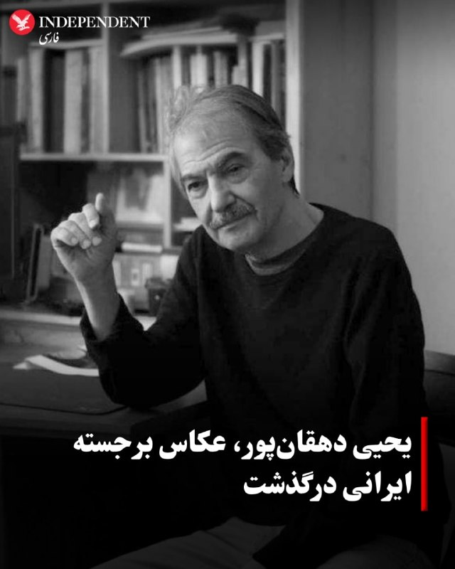

♦️یحیی دهقان‌پور، عکاس برجسته، مدرس باسابقه عکاسی و یکی از چهره‌های تاثیرگذار عکاسی معاصر ایران، روز جمعه ۲۵ اردیبهشت‌ماه در سن ۸۶ سالگی درگذشت.
دهقان‌پور متولد سال ۱۳۱۹ در تهران بود و فعالیت حرفه‌ای و آموزشی او، نقش مهمی در تربیت نسل‌های مختلف عکاسان ایرانی داشت. او تدریس عکاسی را از سال ۱۳۵۷ و همزمان با فعالیت در مدرسه عالی تلویزیون آغاز کرد و طی بیش از سه دهه، در دانشگاه‌ها و مراکز آموزشی مختلف به تدریس این رشته پرداخت.
این عکاس پیشکسوت علاوه بر فعالیت آموزشی، نمایشگاه‌های انفرادی متعددی برگزار کرد و آثارش در نمایشگاه‌های گروهی بسیاری به نمایش درآمد. از ماندگارترین تصاویر او، مجموعه عکس‌های مراسم تشییع پیکر فروغ فرخزاد در گورستان ظهیرالدوله تهران است؛ تصاویری تاریخی که در ۲۵ بهمن ۱۳۴۵ و زمانی که دهقان‌پور تنها ۲۶ سال داشت، با دوربین مدیوم‌فرمت ثبت شدند.
او سال‌ها بعد این مجموعه را در نمایشگاهی با عنوان «آن روز فروغ را در باغچه کاشتند» ارائه کرد؛ مجموعه‌ای که به یکی از روایت‌های تصویری مهم از بدرقه فروغ فرخزاد تبدیل شد.
‌🇸🇦 Indypersian

🤖 @VahidOOnLine

## VahidOOnLine — post 240467

  <a href="telegram/content/VahidOOnLine_240467_1778935703.mp4" target="_blank">🎬 Download video</a>

«تجمع ایرانیان در بریزبن استرالیا»
‌🏁 🇬🇧 ManotoTV

🤖 @VahidOOnLine

## VahidOOnLine — post 240466

  <a href="telegram/content/VahidOOnLine_240466_1778935705.mp4" target="_blank">🎬 Download video</a>

⭕️ دست‌کم ۸ کشته در برخورد مرگبار قطار و اتوبوس در بانکوک

♦️برخورد مرگبار قطار با یک اتوبوس شهری در بانکوک، پایتخت تایلند، دست‌کم ۸ کشته و ۲۵ زخمی برجای گذاشت.
ویدیوهای منتشرشده توسط شاهدان عینی، ستون‌های دود غلیظ را در محل حادثه نشان می‌دهد، جایی که پس از برخورد قطار با وسایل نقلیه، یک اتوبوس عمومی دچار حریق شد و شعله‌های آتش به خودروها و موتورسیکلت‌های اطراف نیز سرایت کرد.
تیم‌های امداد و آتش‌نشانی بلافاصله به محل اعزام شدند و عملیات نجات و انتقال مجروحان را آغاز کردند.
‌🇸🇦 Indypersian

🤖 @VahidOOnLine

## WithYashar — post 11392

  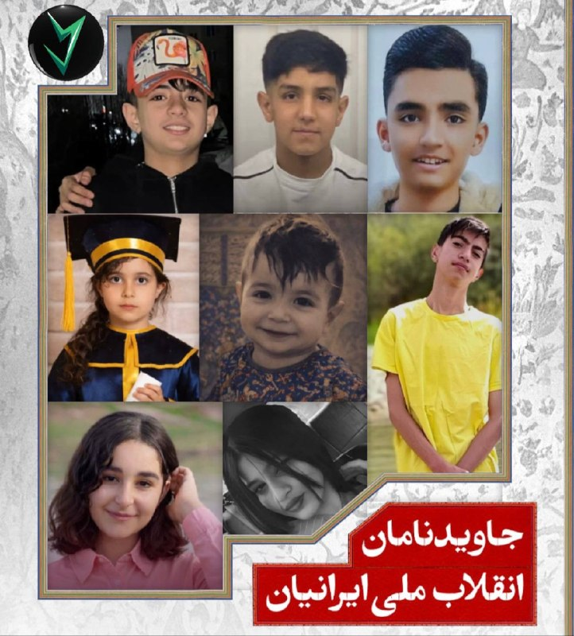

روز جهانی پسر بچه … به یاد جاوید نام های کوچکمون مبارزه میکنیم تا نسل جدید این درد ها رو نکشه !
@withyashar

## WithYashar — post 11390

ایسنا: وزیر کشور پاکستان برای دیدار با مسئولان جمهوری اسلامی ساعاتی قبل به تهران سفر کرده.
@withyashar

## mwarmonitor — post 9156

  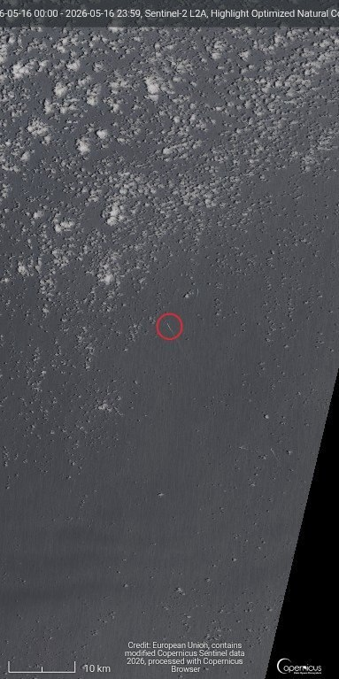

‼️من همین حالا یک ناو هواپیمابر کلاس نیمیتز (احتمالاً USS George H. W. Bush یا USS Abraham Lincoln) را در تصاویر ماهواره‌ای Sentinel-2 مربوط به 16/05/2026 پیدا کردم.

🔸این ناو با سرعت به سمت شمال دریای عمان در حال حرکت است.

@mwarmonitor

## mwarmonitor — post 9155

  

✈️🇺🇸نیروی هوایی آمریکا (USAF) – جنگ ایران ۲۰۲۶ | ۱۶ مه

✈️تعداد پروازهای ورودی هواپیماهای ترابری C-17 به منطقه فرماندهی مرکزی آمریکا (CENTCOM) و پایگاه‌های مرتبط به دست‌کم 1,320 پرواز رسیده و 10 پرواز دیگر نیز در حال انجام است.

✈️8 مورد از این پروازهای جدید از پایگاه هوایی Pope Army Airfield آمریکا انجام شده‌اند و مقصد مشخصی برای آن‌ها قابل شناسایی نیست.

✈️حداقل 6 پرواز جدید نیز به‌نظر می‌رسد حرکت‌های خروجی از CENTCOM به سمت پایگاه‌هایی در خاک آمریکا (CONUS) باشند؛ همان پایگاه‌هایی که بیشتر پروازها از آن‌ها آغاز شده‌اند.

@mwarmonitor

## mwarmonitor — post 9154

⚠️اطلاعیه فوری ⚠️

⚠️"با نزدیک شدن به لحظه درگیری‌های مجدد، ثانیه‌ها سرنوشت‌ساز شده‌اند. اکنون زمان انتخاب میان بقا یا قربانی شدن در راه منافع سران است. از پادگان‌ها و مراکز نظامی فاصله بگیرید و جان خود را فدای وعده‌های توخالی نکنید."

⚠️با توجه به نشانه‌های موجود و احتمال آغاز مجدد درگیری‌های نظامی، حفظ هوشیاری و اتخاذ تصمیمات درست در این لحظات بحرانی برای تمامی گروه‌های جامعه، از شهروندان عادی تا بدنه نیروهای مسلح، امری حیاتی و سرنوشت‌ساز است.

⚠️در همین راستا، به سربازان وظیفه و کادر نظامی توصیه می‌شود که از حضور در پادگان‌ها و مراکز نظامی خودداری کنند. تجربه و تاریخ نشان داده است که در اوج بحران‌ها، سران و تصمیم‌گیرندگان اصلی ساختار با تضمین مسیرهای خروج خود به کشورهای هم‌پیمان مانند چین و روسیه، بدنه رده‌پایین و نیروهای فریب‌خورده را به عنوان سپر بلا در میدان رها می‌کنند؛ بنابراین عاقلانه‌ترین راه، فاصله گرفتن از نظام و ایستادن در سمت درست تاریخ یعنی در کنار مردم است.

⚠️همچنین از تمامی شهروندان و غیرنظامیان تقاضا می‌شود برای حفظ جان خود، فوراً از نزدیکی زیرساخت‌های انرژی از جمله پالایشگاه‌ها و نیروگاه‌ها و همچنین مراکز و پادگان‌های نظامی فاصله بگیرند. در نهایت، با توجه به پیش‌بینی‌ها مبنی بر احتمال تمرکز حملات بر روی امارات متحده عربی، از هموطنان مقیم این کشور درخواست می‌شود که در بالاترین سطح آمادگی و هوشیاری قرار داشته و مراقبت‌های لازم را به عمل آورند.

@mwarmonitor

## mwarmonitor — post 9153

  <a href="telegram/content/mwarmonitor_9153_1778935709.mp4" target="_blank">🎬 Download video</a>

🔴اختصاصی ‌CNN از پل ویران‌شده کرج در ایران بازدید می‌کند؛ هم‌زمان با تجدید تهدیدها از سوی دونالد ترامپ.

@mwarmonitor

## FoxNewsTwitter — post 341811

  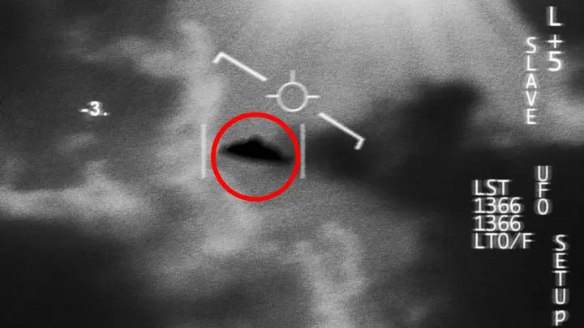

Fox News (Twitter/X)

A retired Navy admiral warns UFOs may be controlled by a “higher-order non-human intelligence.”

Tim Gallaudet, considered to be one of America’s leading voices on the UAP phenomenon, says he’s seen “data videos” showing craft moving seamlessly between the ocean and atmosphere at speeds beyond known technology.

“I know we are aware of higher order non-human intelligence that direct the movement of these phenomena,” he said.

## FoxNewsTwitter — post 341810

  

Fox News (Twitter/X)

A retired Navy admiral warns UFOs may be controlled by a “higher-order non-human intelligence.”

Tim Gallaudet, considered to be one of America’s leading voices on the UAP phenomenon, says he’s seen “data videos” showing craft moving seamlessly between the ocean and atmosphere at speeds beyond known technology.

“I know we are aware of higher order non-human intelligence that direct the movement
of these phenomena,” he said.

## FoxNewsTwitter — post 341809

  <a href="telegram/content/FoxNewsTwitter_341809_1778935713.mp4" target="_blank">🎬 Download video</a>

Fox News (Twitter/X)

Empty Waymo cars swarm an Atlanta neighborhood, repeatedly circling cul-de-sacs and leaving residents frustrated and confused.

One local estimated nearly 50 self-driving cars rolled through the area in a single morning, with several clogging the road as they struggled to maneuver around one another.

Waymo said it had “already addressed this routing behavior.”

## pm_afshaa — post 90848

  

مجری‌های صداوسیما در چند برنامه زنده، با اسلحه کلاشینکف حضور پیدا کردن : 
💧 Rainbet.com the #1 Non-KYC Crypto Casino & Sportsbook @rainbetcom 
😁 @Pm_Afshaa

## pm_afshaa — post 90847

🔴کانال 12 اسرائیل: اسرائیل در حال آماده شدن برای یک جنگ چند روزه یا چند هفته‌ای با ایران است

💧 Rainbet.com the #1 Non-KYC Crypto Casino & Sportsbook @rainbetcom

😁 @Pm_Afshaa

## pm_afshaa — post 90846

  <a href="telegram/content/pm_afshaa_90846_1778935715.webm" target="_blank">🎬 Download video</a>

🔴ایسنا: وزیر کشور پاکستان برای دیدار با مسئولان جمهوری اسلامی ساعاتی قبل به تهران سفر کرده.

💧 Rainbet.com the #1 Non-KYC Crypto Casino & Sportsbook @rainbetcom

😁 @Pm_Afshaa

## iaghapour — post 2615

  

⭕️ آموزش نصب ساده و آفلاین 3X-UI روی سرور ایران + SSL (+ معرفی قابلیت های جدید)

🔹در این ویدیو به سراغ یکی از بزرگترین چالش‌های این روزها رفتیم: نصب پنل 3X-UI روی سرورهای ایران همراه با سرتیفیکیت به صورت کاملاً آفلاین و بدون نیاز به اینترنت آزاد! همینطور سعی کردیم یک معرفی ساده از قابلیت های جدید این پنل داشته باشیم.

🔗 لینک ویدیو در یوتیوب

🔗 دانلود ویدیو با لینک مستقیم (بزودی)

#آموزش #فیلترشکن #پنل #xui #3xui
برای دور زدن فیلترینگ و آموزش تکنولوژی و هوش مصنوعی ما رو دنبال کنید 💚
🆔@iaghapour

## IranIntlTV — post 337469

  <a href="telegram/content/IranIntlTV_337469_1778935717.mp4" target="_blank">🎬 Download video</a>

یکی از شرکت‌کنندگان در تجمع استکهلم در گفت‌وگو با مهران عباسیان، خبرنگار ایران‌اینترنشنال، گفت: «ما پشت مردم داخل کشور هستیم و تا روز آزادی ایران به خیابان‌ها می‌آییم.»
@iranintltv

## IranIntlTV — post 337468

  <a href="telegram/content/IranIntlTV_337468_1778935718.mp4" target="_blank">🎬 Download video</a>

ایرانیان مقیم کره جنوبی و ژاپن بار دیگر در پاسخ به فراخوان حمایت از انقلاب ملی و در راستای جلب توجه دولت سئول و توکیو به نقض گسترده حقوق بشر و اعدام‌‌ها توسط جمهوری اسلامی تجمع کردند.

گزارش توماج طاهباز، خبرنگار ایران‌اینترنشنال، از پیام شرکت‌کنندگان در این تجمع‌ها

@iranintltv

## IranIntlTV — post 337467

  

🔻فدراسیون جهانی فوتبال، فیفا، نام راب دیپرینک، داور هلندی حاضر در فهرست داوران جام جهانی ۲۰۲۶، را پس از بازداشت او توسط پلیس متروپولیتن بریتانیا در ماه گذشته میلادی، از فهرست رسمی داوران این رقابت‌ها حذف کرد.

🔹به نوشته سایت اتلتیک، دیپرینک که به‌عنوان داور VAR برای جام جهانی آمریکا، کانادا و مکزیک امسال انتخاب شده بود، پس از مطرح شدن اتهام تعرض جنسی به یک پسر نوجوان در لندن بازداشت شده بود.

🔹با این حال، دیپرینک اعلام کرده که پلیس متروپولیتن پرونده را مختومه کرده و هیچ اتهامی علیه او مطرح نخواهد شد. سخنگوی پلیس متروپولیتن نیز به اتلتیک گفته که شواهد و مدارک به اندازه کافی علیه او وجود نداشته است و در نتیجه «اقدام بیشتری انجام نخواهد شد».

🔹فیفا در بیانیه‌ای به اتلتیک اعلام کرد: «فیفا تأیید می‌کند که راب دیپرینک از فهرست داوران جام جهانی حذف شده است.»

🔹در بیانیه‌ای از سوی فدراسیون فوتبال هلند (KNVB)، از این داور حمایت شده است.

🔹با وجود مختومه شدن پرونده، منابع آگاه به اتلتیک گفته‌اند انتظار می‌رود فیفا ویلی دلاژو، داور فرانسوی، را جایگزین دیپرینک کند.

🔹گزارش کامل را در سایت بخوانید
@iranintltvsport

## IranIntlTV — post 337466

  <a href="telegram/content/IranIntlTV_337466_1778935720.mp4" target="_blank">🎬 Download video</a>

یک شهروند در پیامی به ایران اینترنشنال درباره بحران سوخت می‌گوید که در مشهد بعد از مراجعه به چند جایگاه نهایتا بعد از یک ساعت انتظار توانست با کارت سه‌هزار تومانی ۱۵ لیتر بزنین بزند. پیام مخاطب با هوش مصنوعی خوانده شده است.

## IranIntlTV — post 337465

  <a href="telegram/content/IranIntlTV_337465_1778935722.mp4" target="_blank">🎬 Download video</a>

مهتاب قلی‌زاده، روزنامه‌نگار اقتصادی، درباره تورم بهای خوراکی‌ها در ایران گفت نرخ ارز تاثیر شدیدی بر قیمت مواد غذایی دارد. او افزود: «برخلاف تصویری از خودکفایی که سال‌ها برای آن تبلیغ شده، ساختار تولید مواد غذایی در ایران به‌طور کامل داخلی نیست.»
@iranintltv

## ManotoTV — post 105513

  <a href="telegram/content/ManotoTV_105513_1778935724.mp4" target="_blank">🎬 Download video</a>

«تجمع ایرانیان در سیدنی استرالیا»

## ManotoTV — post 105512

  <a href="telegram/content/ManotoTV_105512_1778935725.mp4" target="_blank">🎬 Download video</a>

«تجمع ایرانیان در بریزبن استرالیا»

## FarsiVOA — post 217889

تصاویر پرواز جنگنده اف-۳۵بی از ناو «یو‌اس‌اس تریپولی»

فرماندهی مرکزی ایالات متحده، سنتکام، تصاویری از پرواز جنگنده اف-۳۵بی تفنگداران دریایی آمریکا از ناو آبی‌خاکی «یو‌اس‌اس تریپولی» در دریای عرب منتشر کرد.

جنگنده اف-۳۵بی به دلیل قابلیت برخاستن کوتاه و فرود عمودی می‌تواند از بزرگ‌ترین ناوهای آبی‌خاکی نیروی دریایی آمریکا عملیات انجام دهد.

@FarsiVOA

## FarsiVOA — post 217888

🔺اسرائیل کشته‌شدن «مانع اصلی اجرای طرح صلح ترامپ در غزه» را تأیید کرد

▪️ارتش اسرائیل کشته‌شدن عزالدین حداد، رهبر حماس در نوار غزه و رئیس شاخه نظامی این گروه، را در حمله هوایی به شهر غزه تأیید کرد. هم‌زمان، یک مقام ارشد اسرائیلی گفت حداد از موانع اصلی اجرای طرح ۲۰ ماده‌ای دونالد ترامپ برای پایان جنگ غزه بوده؛ طرحی که یکی از محورهای اصلی آن خلع سلاح حماس است.

⬇️ بیشتر بخوانید:

https://ir.voanews.com/a/8150664.html/?nocach=1

## DW_Farsi — post 124762

🔶 کاخ کرملین: پوتین روز سه‌شنبه به چین سفر می‌کند

تنها ساعاتی پس از پایان سفر دونالد ترامپ، رئيس‌جمهور آمریکا به پکن، کرملین اعلام کرد ولادیمیر پوتین هفته آینده راهی چین خواهد شد؛ سفری که بار دیگر توجه‌ها را به نزدیکی فزاینده مسکو و پکن در میانه بحران‌های جهانی جلب کرده است.

بر اساس اعلام کرملین، رئیس‌جمهور روسیه روزهای سه‌شنبه و چهارشنبه آینده به دعوت شی جین‌پینگ، رئیس‌جمهور چین، به پکن سفر می‌کند. دو طرف قرار است درباره روابط دوجانبه، مسائل منطقه‌ای و تحولات بین‌المللی گفت‌وگو کنند و چندین سند و توافق‌نامه مشترک نیز امضا شود.

قرار است پوتین علاوه بر دیدار با شی جین‌پینگ، با لی چیانگ، نخست‌وزیر چین، نیز ملاقات کند.

روسیه و چین در سال‌های اخیر روابط اقتصادی و سیاسی خود را به شکل کم‌سابقه‌ای گسترش داده‌اند؛ رابطه‌ای که پس از آغاز جنگ اوکراین در سال ۲۰۲۲ عمیق‌تر شد.

چین هرگز حمله روسیه به اوکراین را محکوم نکرده و هم‌زمان، آمریکا و کشورهای غربی را به طولانی کردن جنگ از طریق ارسال تسلیحات متهم کرده است. در مقابل، روسیه نیز بیش از پیش به بازار و حمایت اقتصادی چین وابسته شده است؛ به‌ویژه در حوزه صادرات انرژی.

پکن اکنون بزرگ‌ترین خریدار نفت و گاز روسیه در جهان به شمار می‌رود.

اعلام سفر پوتین اما فقط یک دیدار دیپلماتیک معمولی تلقی نمی‌شود، بلکه زمان‌بندی آن نیز مورد توجه تحلیلگران قرار گرفته است.

این خبر دقیقا پس از سفر دونالد ترامپ، رئیس جمهور آمریکا به چین منتشر شد؛ سفری که در آن دونالد ترامپ و شی جین‌پینگ درباره جنگ اوکراین، بحران ایران و امنیت تجارت جهانی گفت‌وگو کردند.

در حالی که ولادیمیر پوتین آخرین‌بار در ماه سپتامبر به‌صورت حضوری با شی جین‌پینگ دیدار کرده و از آن زمان تنها یک گفت‌وگوی ویدئویی میان دو رهبر انجام شده است، ترامپ در این سفر حتی اجازه یافت در باغ محل اقامت رئیس‌جمهور چین قدم بزند.

در جریان دیدار ترامپ و شی، دو طرف بر ضرورت پایان هرچه سریع‌تر جنگ اوکراین تاکید کردند. همچنین هر دو نسبت به تاثیر جنگ ایران و احتمال تاثیر بسته شدن تنگه هرمز بر تجارت جهانی ابراز نگرانی کردند.

با این حال، همین تنش‌ها، به‌ویژه در ارتباط با ایران، اخیرا باعث افزایش قیمت نفت شده؛ موضوعی که به اقتصاد روسیه کمک کرده و هم‌زمان روند ارسال بخشی از تسلیحات آمریکا به اوکراین را کند کرده است.

با وجود این تحولات، به نظر نمی‌رسد روسیه نگران تضعیف روابطش با چین باشد، چرا که دیدار میان آمریکا و چین به تصمیم مشخصی درباره این بحران‌ها منجر نشد.

چین همچنان بزرگ‌ترین خریدار نفت و گاز روسیه در جهان باقی مانده و علاوه بر این، پکن هیچ‌گاه حمله روسیه به اوکراین را محکوم نکرده است. چین همچنین کشورهای غربی را به طولانی‌کردن جنگ از طریق ارسال تسلیحات متهم می‌کند.

برای چین، روابط با روسیه فقط یک همکاری اقتصادی نیست، بلکه بخشی از موازنه بزرگ‌تر قدرت با آمریکاست.

پکن در سال‌های اخیر تلاش کرده در برابر فشارهای غرب، به‌ویژه در حوزه تجارت، فناوری و امنیت، روابط خود با مسکو را حفظ و تقویت کند؛ هرچند هم‌زمان نمی‌خواهد به‌طور کامل وارد تقابل مستقیم با غرب.
@dw_farsi

## DW_Farsi — post 124761

  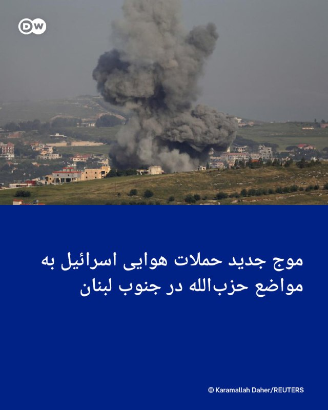

🔶 موج جدید حملات هوایی اسرائیل به مواضع حزب‌الله در جنوب لبنان

ارتش اسرائیل روز شنبه ۲۶ اردیبهشت (۱۶ مه) اعلام کرد موجی از حملات هوایی را علیه زیرساخت‌های حزب‌الله در جنوب لبنان آغاز کرده است.

پیش از این، ارتش به ساکنان ۹ روستا در جنوب لبنان هشدار تخلیه داده بود.

این حملات نخستین عملیات پس از تمدید ۴۵ روزه آتش‌بس در لبنان در شب گذشته محسوب می‌شود.

وزارت خارجه آمریکا روز جمعه ۲۵ اردیبهشت (۱۵ مه) اعلام کرد که اسرائیل و لبنان با میانجی‌گری آمریکا درباره تمدید ۴۵ روزه آتش‌بس به توافق رسیدند.

در مذاکرات آتش‌بس میان دو کشور همسایه، حزب‌الله لبنان حضور ندارد.

لبنان در اوایل ماه مارس به جنگ ایران کشیده شد. در آن زمان، حزب‌الله لبنان در واکنش به کشته‌شدن علی خامنه‌ای، رهبر جمهوری اسلامی موشک‌هایی به سمت اسرائیل شلیک کرد. در پی آن، اسرائیل زیرساخت‌های حزب‌الله را هدف قرار داد.

@dw_farsi

## Persian_Trend_Official — post 14238

  

‼️ دوستان توجه داشته باشید که تیم «پرشین ترند» در هیچ‌یک از پلتفرم‌های داخلی، کانال یا گروه رسمی ندارد و هیچ‌گونه فعالیتی در این بسترها انجام نمی‌دهد.

⚠️ لطفاً نسبت به سوءاستفاده افراد سودجو و صفحات جعلی هوشیار باشید.

📝 Nick

📌 @persian_trend_official
پرشین ترند | متفاوت‌ترین کانال نظامی

## Persian_Trend_Official — post 14237

⭕️ آسوشیتدپرس: بازگشت ناو هواپیمابر جرالد فورد به پایگاه پس از ۱۱ ماه مأموریت.

وزارت‌جنگ آمریکا اعلام کرد پیت هگست، وزیر جنگ، روز شنبه در پایگاه دریایی نورفولک در ویرجینیا از ناو هواپیمابر جرالد فورد و ۴۵۰۰ ملوان آن پس از ۱۱ ماه مأموریت استقبال می‌کند.

این ناو ۳۲۶ روز در دریا بوده که طولانی‌ترین استقرار یک ناو هواپیمابر آمریکایی در ۵۰ سال گذشته و سومین رکورد از زمان جنگ ویتنام است.

پ.ن: آخرین باری که این ناو هواپیمابر در پایگاه خشکی مستقر بود، هنوز جنگ ۱۲ روزه نیز آغاز نشده بود.

📝 Nick

📌 @persian_trend_official
پرشین ترند | متفاوت‌ترین کانال نظامی

## RadioFarda — post 157258

آزادی برای خارجی‌ها، محدودیت برای محلی‌ها؛ ترکمنستان درها را به روی گردشگری می‌گشاید

🔸الیز ویلیامز، گردشگر کانادایی، اندکی پیش از ورودش به ترکمنستان در اوایل سال ۲۰۲۶، از شرکت گردشگری خود هشداری دریافت کرد مبنی بر این‌که در این کشور استبدادی از هتل خود زیاد دور نشود و هنگام تنها بودن در خیابان‌ها از گرفتن عکس خودداری کند.

🔸اما واقعیتی که هنگام ورود با آن مواجه شد بسیار کمتر از حد انتظار محدودکننده بود.

🔸او به رادیو اروپای آزاد/رادیو آزادی می‌گوید: «همان‌طور که از عکس‌هایم می‌توانید ببینید، واضح است که این‌طور نبود [که عکاسی به‌شدت محدود شده باشد]. احساس می‌کردم کاملاً آزادم که در مکان‌های مختلف عکس‌های زیادی بگیرم».

🔸نسخه کامل این گزارش را در وب‌سایت رادیوفردا بخوانید.

@RadioFarda

## IranianMinds — post 20237

🔴ایرنا:

سید محسن نقوی وزیر کشور پاکستان برای دیدار با مسؤولان جمهوری اسلامی، ساعاتی قبل وارد تهران شد.

@IranianMinds

## IranianMinds — post 20236

  

🔴 آخرین قیمت نفت:
۱۰۹.۲۶ دلار

@IranianMinds

## BBCPersian — post 281215

🔻ایرنا: وزیر کشور پاکستان در یک سفر از پیش اعلام نشده در تهران است

خبرگزاری رسمی ایرنا گزارش داده است که وزیر کشور پاکستان «در یک سفر از پیش اعلام نشده» در تهران است.

ایرنا از قول منابع خود خبر داده است که محسن نقوی ساعاتی پیش وارد تهران شده و قرار است با برخی از مقام‌های جمهوری اسلامی ایران دیدار کند.

پاکستان میانجی آتش‌بس کنونی بین ایران و آمریکاست و یک بار هم میزبان مقام‌های ارشد ایرانی و آمریکایی برای مذاکرات صلح شده که تاکنون بی‌نتیجه مانده است.

وزیر کشور پاکستان یک ماه پیش همراه عاصم منیر، فرمانده ارتش این کشور به ایران سفر کرده بود.

پاکستان یک روز پیش اعلام کرده بود که روند بازگرداندن بیست ملوان ایرانی و یازده پاکستانی که پس از توقیف کشتی آنان توسط آمریکا در آب‌های سنگاپور بودند در جریان است و وعده داده بود که همه آنها از تایلند به اسلام‌آباد منتقل می‌شوند.

https://bbc.in/4nzZJmQ
@BBCPersian

## BBCPersian — post 281214

🔺نت‌بلاکس: قطع اینترنت ایران وارد هفته دوازدهم شد

نت‌بلاکس که وضعیت اینترنت در جهان را بررسی می کند، می‌گوید قطعی اینترنت در ایران اکنون وارد دوازدهمین هفته خود شده و به هفتاد و هشتمین روز رسیده است.

قطع اینرنت ایران که برای چهارمین بار به صورت گسترده ادامه دارد از زمان حمله آمریکا و اسرائیل به ایران در نهم اسفند (۲۸ فوریه) آغاز شده و تاکنون ادامه دارد. تماس تلفنی با ایران هم در همین مدت محدود و با اختلال همراه شده است.

نت‌بلاکس می گوید «این قطع اینترنت، که کشوری ۹۰ میلیونی را برای مدتی بی‌سابقه تا حد زیادی از دسترسی آنلاین محروم کرده، همچنان در مقیاسی گسترده به فرسایش حقوق بشر، اقتصاد و آزادی‌های اساسی ادامه می‌دهد.»

ایران هرگونه استفاده از اینترنت ماهواره‌ای همچون استارلینک را هم ممنوع کرده و کاربران آن را تحت تعقیب قرار می‌دهد.

https://bbc.in/496jyMz
@BBCPersian

## BBCPersian — post 281210

🔻حماس و ارتش اسرائیل تأیید کرده‌اند که عزالدین حداد، فرمانده گردان‌های قسام، شاخه نظامی این گروه، شامگاه جمعه در حمله‌ اسرائیل در شهر غزه کشته شده است.

اسرائیل او را یکی از طراحان حملات هفتم اکتبر ۲۰۲۳ خوانده است.

مراسم تشییع عزالدین حداد امروز در شهر غزه برگزار شد.

اعضای خانواده‌ آقای حداد هم در حمله هوایی شبانه اسرائیل کشته شدند.

سازمان‌های امدادی در غزه اعلام کردند که در این حملات دست‌کم هفت نفر کشته و ده‌ها نفر هم زخمی شده‌اند.

اگرچه از ماه اکتبر آتش‌بس در این منطقه برقرار بوده، اما دولت اسرائیل می‌گوید همچنان اختیار هدف قرار دادن اعضای حماس را دارد.

📷 Getty Images
@BBCPersian

## Dirty_Kids — post 389554

  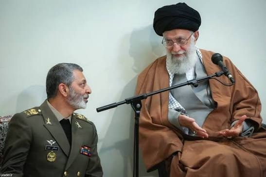

تراپی @Dirty_Kids 👻

## Hranews — post 112969

  

تداوم بازداشت؛ گزارشی از آخرین وضعیت محمد زنگنه

❗️
❗️
❗️
❗️
❗️– محمد زنگنه، شهروند ساکن مشهد، بیش از ۴۰ روز است که توسط نیروهای امنیتی بازداشت شده است. چندی پیش جلسه دادگاه رسیدگی به اتهامات وی در دادگاه انقلاب مشهد برگزار شده بود.

به گزارش خبرگزاری هرانا، ارگان خبری مجموعه فعالان حقوق بشر در ایران، محمد زنگنه کماکان در بازداشت به‌سر می‌برد.

بر اساس اطلاعات دریافتی هرانا، جلسه دادگاه رسیدگی به اتهامات آقای زنگنه در تاریخ ۱۹ اردیبهشت ماه، در شعبه اول دادگاه انقلاب شهرستان مشهد برگزار شده است. در این جلسه، وی از بابت اتهامات اجتماع و تبانی برای ارتکاب جرم بر ضد امنیت داخلی/خارجی و تبلیغ علیه نظام به دفاع از خود پرداخته بود.

#محمد_زنگنه

ادامه مطلب

↘️
@hranews_bot تماس ✉️ - @Hranews کانال هرانا 🆑

## manototv — post 105513

  <a href="telegram/content/manototv_105513_1778935730.mp4" target="_blank">🎬 Download video</a>

«تجمع ایرانیان در سیدنی استرالیا»

## manototv — post 105512

  <a href="telegram/content/manototv_105512_1778935732.mp4" target="_blank">🎬 Download video</a>

«تجمع ایرانیان در بریزبن استرالیا»

## alonews — post 120382

  <a href="telegram/content/alonews_120382_1778935734.mp4" target="_blank">🎬 Download video</a>

👈ویدیو منتشرشده توسط ارتش آمریکا از عملیات کشتن ابوبلال المینوکی، نفر دوم داعش در نیجریه

✅ @AloNews خبر جنگ

## alonews — post 120381

  <a href="telegram/content/alonews_120381_1778935735.mp4" target="_blank">🎬 Download video</a>

👈از عجایب روزگار اینه تو مراسم بزرگداشت فردوسی نوحه پخش کردن

✅ @AloNews خبر جنگ

## alonews — post 120380

  <a href="telegram/content/alonews_120380_1778935737.mp4" target="_blank">🎬 Download video</a>

👈شلیک رگباری در پخش مستقیم صداسیما

✅ @AloNews خبر جنگ

## alonews — post 120379

  <a href="telegram/content/alonews_120379_1778935739.webm" target="_blank">🎬 Download video</a>

👈اردوغان:
مطالبات ما روشن است. ما اف-۳۵ ها را می‌خواهیم

🔴همکاران ما به تماس‌های خود با همتایان آمریکایی‌شان ادامه می‌دهند و امیدواریم نتیجه مثبتی به دست آوریم.

✅ @AloNews خبر جنگ

## alonews — post 120378

  <a href="telegram/content/alonews_120378_1778935739.webm" target="_blank">🎬 Download video</a>

👈آخرین قیمت نفت ۱۰۹.۲۶ دلار

✅ @AloNews خبر جنگ

## alonews — post 120377

  <a href="telegram/content/alonews_120377_1778935739.webm" target="_blank">🎬 Download video</a>

🔴فوری/شبکه ۱۲ اسرائیل :
اسرائیل در حال آماده شدن برای یک جنگ چند روزه یا چند هفته‌ای با ایران است

✅ @AloNews خبر جنگ

## alonews — post 120376

⚠️ توجه 
⚠️

بچه ها فیلترینگ خیلیی شدید شده همین الان که اینترنت دارین حتما جوین بشید و از کانفینگاش استفاده کنید که موقع قطعی خیلی به کارتون میاد
⏬

https://t.me/+WgqzouUHJ1U3OTY0
https://t.me/+WgqzouUHJ1U3OTY0
https://t.me/+WgqzouUHJ1U3OTY0

## alonews — post 120375

  <a href="telegram/content/alonews_120375_1778935739.webm" target="_blank">🎬 Download video</a>

👈جاده چالوس از فردا به مدت ۴روز مسدود می‌شود

✅ @AloNews خبر جنگ

## alonews — post 120374

  <a href="telegram/content/alonews_120374_1778935739.webm" target="_blank">🎬 Download video</a>

👈دقایقی پیش وزیر کشور پاکستان برای دیدار با مقامات ایرانی، در سفری از پیش اعلام نشده وارد تهران شد 
✅ @AloNews خبر جنگ

## alonews — post 120373

  <a href="telegram/content/alonews_120373_1778935740.webm" target="_blank">🎬 Download video</a>

👈مخبر: این خویشتنداری همیشگی نیست

✅ @AloNews خبر جنگ

---
📅 بروزرسانی: 1405/02/26 15:10
---

## VahidOOnLine — post 240465

ویدیوی رسیده به ایران اینترنشنال نشان می‌دهد ایرانیان روز شنبه در تجمعی که به فراخوان تامی رابینسون،‌ فعال راست‌گرای بریتانیا،‌ در لندن برگزار شده حاضر شده و پرچم شیروخورشید به دست گرفتند.
‌🏁 🇬🇧 IranintlTV

🤖 @VahidOOnLine

## VahidOOnLine — post 240464

  

♦️خبرگزاری تسنیم، روز شنبه ۲۶ اردیبهشت ماه، به مقل از منابع آگاه از سفر سید محسن نقوی، وزیر کشور پاکستان به تهران خبر داد.
به گزارش تسنیم، گفته می‌شود وزیر کشور پاکستان طی این سفر از پیش اعلام نشده قرار است با شماری از مقام‌های جمهوری اسلامی، از جمله وزیر کشور، دیدار کند.
‌🇸🇦 Indypersian

🤖 @VahidOOnLine

## VahidOOnLine — post 240463

روایت شما از زندگی در آتش‌بس- شنبه ۲۶ اردیبهشت ۱۴۰۵

🔹 ابوقراضه‌ای به نام کوییک، سال ۱۴۰۱ قیمتش ۱۷۰ میلیون بود، الان شده یک میلیارد و ۲۷۰ میلیون تومان، در حالی که حقوق کارمند سال ۱۴۰۱ پانزده میلیون بود و الان شده ۳۰ میلیون.
🔹 فقط وصل شدم بگم مرگ بر اصل ولایت فقیه. مرگ بر جمهوری اسلامی، لعنت بر تک‌تک عاملان فساد در ایران‌مون. یه گیگ اینترنت خریدیم ۵۰۰ هزار تومان! خسته شدیم، بزنید، اصلاً هم ما راحت شیم هم اینا برن.
🔹 از نیشابور پیام می‌دیم، نظام فاسد با گرون کردن بنزین منتظر باشه دوباره ملت بریزن تو خیابون ریشه‌شون رو بکنن.
🔹 همه‌چیز سرسام‌آور گرون شده، دارو نیست، بنزین رو می‌خوان سه برابر گرون کنن و آزاد رو سه برابر بیشتر بفروشن. ترامپ زودتر تصمیمتو بگیر، کشتی ما رو با قیمت نفت، ما این‌ها رو نمی‌خواهیم، تحت هیچ شرایطی.
🔹 از تهران پیام می‌دم، من یک دانش‌آموز هستم و ما برای مدرسه‌ای که نرفتیم باید ۱۵۰ میلیون برای مدارس غیردولتی که هیچ کاری برامون نکردن شهریه بدیم. به بی‌بی و ترامپ بگین خیلی حواسشون جمع باشه، تغییر رژیم کار سختیه، باید حمایت زیاد بشیم، خسته شدیم به خدا.
‌🏁 🇬🇧 IranintlTV

🤖 @VahidOOnLine

## VahidOOnLine — post 240462

  

ابراهیم عزیزی، رییس کمیسیون امنیت ملی مجلس، با اشاره به طرح مجلس برای تنگه هرمز نوشت که جمهوری اسلامی سازوکاری برای مدیریت ترافیک این آبراه در مسیر تعیین‌شده تهیه کرده است که به‌زودی رونمایی می‌شود. عزیزی نوشت: «این مسیر کماکان برای عاملان پروژه به اصطلاح آزادی بسته خواهد ماند.»

او در ایکس نوشت: «ایران در چارچوب حق حاکمیت ملی و تضمین امنیت تجارت بین‌الملل، سازوکاری حرفه‌ای برای مدیریت ترافیک تنگه هرمز در مسیر تعیین‌شده تهیه کرده است که به‌زودی رونمایی می‌شود.»

او افزود: «در این فرآیند، فقط کشتی‌های تجاری و طرف‌های همکار با ایران از آن بهره‌مند خواهند شد. حقوق لازم در ازای خدمات تخصصی ارائه‌شده، با این سازوکار برای ایران اخذ می‌شود.»
‌🏁 🇬🇧 IranintlTV

🤖 @VahidOOnLine

## VahidOOnLine — post 240461

  <a href="telegram/content/VahidOOnLine_240461_1778931610.mp4" target="_blank">🎬 Download video</a>

ایرانیان استرالیا روز شنبه در حمایت از انقلاب ملی در بریزبن تجمع کرده و بخش‌هایی از پیام شاهزاده رضا پهلوی را پخش کردند.
‌🏁 🇬🇧 IranintlTV

🤖 @VahidOOnLine

## VahidOOnLine — post 240460

  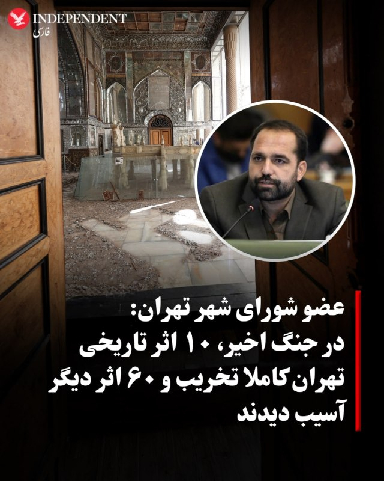

⭕️ عضو شورای شهر تهران:
در جنگ اخیر، ۱۰ اثر تاریخی تهران کاملا تخریب و ۶۰ اثر دیگر آسیب دیدند

♦️سید احمد علوی، عضو شورای شهر تهران از آسیب دیدن حدود ۶۰ اثر و تخریب کامل ۱۰ اثر تاریخی پایتخت در جریان جنگ چهل روزه آمریکا و اسرائیل علیه جمهوری اسلامی خبر داد.
او گفت برنامه‌ریزی برای بازسازی بناهای تخریب‌شده با همکاری شهرداری مناطق، اداره‌کل میراث فرهنگی استان تهران و همچنین بخش خصوصی در دستور کار قرار گرفته است.
به گفته این عضو شورای شهر، بناهای تخریب‌شده قرار است با همان کاربری پیشین و در محل اصلی خود بازسازی شوند. با این حال هنوز جزئیات دقیقی از نام آثار تخریب‌شده، میزان خسارت‌ها و زمان آغاز پروژه‌های مرمت منتشر نشده است.
‌🇸🇦 Indypersian

🤖 @VahidOOnLine

## VahidOOnLine — post 240459

  

♦️ابراهیم عزیزی، رئیس کمیسیون امنیت ملی مجلس ایران، روز شنبه با انتشار پیامی در شبکه اجتماعی ایکس اعلام کرد تهران سازوکاری «حرفه‌ای» برای مدیریت تردد در تنگه هرمز از طریق یک مسیر تعیین‌شده آماده کرده است که به‌زودی جزئیات آن را اعلام می‌کند.
عزیزی در توضیح این طرح با تکرار دریافت پول در ازای گذر از تنگه هرمز نوشت: «فقط کشتی‌های تجاری و طرف‌های همکاری با ایران از آن بهره‌مند خواهند شد. حقوق لازم در ازایِ خدمات تخصصی ارائه شده، با این سازوکار برای ایران اخذ می‌شود.»
عزیزی در پایان گفت: «این مسیر کماکان برای عاملین پروژهٔ به اصطلاح آزادی بسته خواهد ماند.»
«پروژه آزادی» طرح آمریکا برای اسکورت کشتی‌ها در تنگه هرمز بود که طی آن، جمهوری اسلامی به کشتی‌ها و مناطقی در امارات متحده آتش گشود.
‌🇸🇦 Indypersian

🤖 @VahidOOnLine

## VahidOOnLine — post 240458

  <a href="telegram/content/VahidOOnLine_240458_1778931614.mp4" target="_blank">🎬 Download video</a>

کریس رایت، وزیر انرژی آمریکا گفته است انتظار دارد تنگه هرمز «حداکثر تا مقطعی در تابستان» بازگشایی شود.

رایت همچنین گفت اگر ایران به «گروگان گرفتن اقتصاد جهان» ادامه دهد، ارتش آمریکا می‌تواند برای بازگشایی تنگه هرمز مداخله کند.
‌🏁 🇬🇧 ManotoTV

🤖 @VahidOOnLine

## VahidOOnLine — post 240457

  <a href="telegram/content/VahidOOnLine_240457_1778931614.mp4" target="_blank">🎬 Download video</a>

در برنامه‌های شامگاه گذشته تلویزیون جمهوری اسلامی، بخش‌هایی با محور آموزش کار با سلاح پخش شد.

در این برنامه‌ها، مجریان یا کارشناسان حاضر در استودیو، شیوه گرفتن و استفاده از سلاح را توضیح دادند. پخش چنین محتوایی از تلویزیون حکومتی در شرایطی صورت می‌گیرد که رسانه‌های وابسته به جمهوری اسلامی در هفته‌های اخیر بر ادبیات نظامی، آمادگی دفاعی و بسیج حامیان خود تاکید بیشتری داشته‌اند.
‌🏁 🇬🇧 ManotoTV

🤖 @VahidOOnLine

## VahidOOnLine — post 240456

  <a href="telegram/content/VahidOOnLine_240456_1778931615.mp4" target="_blank">🎬 Download video</a>

‌
«دریک»، رپر، خواننده و بازیگر کانادایی، در یکی از قطعه‌های تازه خود با نام «Don’t Worry» به دختری ایرانی اشاره کرده که فارسی حرف می‌زند. این قطعه در آلبوم تازه او منتشر شده است. در متن ترانه نیز بندی آمده که در آن زن مورد اشاره خود را ایرانی معرفی می‌کند که فارسی حرف می‌‌زند.

دریک با نام کامل «آبری دریک گراهام» زاده تورنتو است و پیش از ورود جدی به موسیقی، با بازی در مجموعه تلویزیونی نوجوانانه «دگراسی، نسل بعدی» شناخته شد. او سپس به یکی از چهره‌های اصلی موسیقی هیپ‌هاپ و پاپ معاصر تبدیل شد و سبک ترکیبی او میان رپ‌خوانی و خوانندگی، جایگاه گسترده‌ای در بازار جهانی موسیقی برایش به همراه آورد.
‌🏁 🇬🇧 ManotoTV

🤖 @VahidOOnLine

## VahidOOnLine — post 240455

  <a href="telegram/content/VahidOOnLine_240455_1778931616.mp4" target="_blank">🎬 Download video</a>

ایرانیان نیوزیلند روز شنبه ۲۶ اردیبهشت‌ماه در حمایت از شاهزاده رضا پهلوی و علیه قطع اینترنت و اعدام‌های جمهوری اسلامی در اوکلند تجمع برگزار کردند.
‌🏁 🇬🇧 IranintlTV

🤖 @VahidOOnLine

## VahidOOnLine — post 240454

  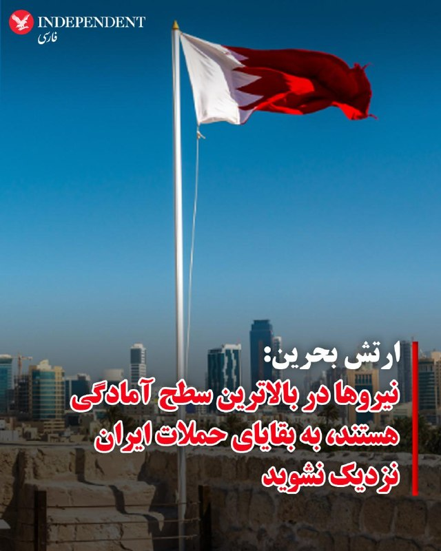

♦️فرماندهی کل نیروی دفاع بحرین، روز شنبه با انتشار بیانیه‌ای اعلام کرد تمامی یگان‌ها و تسلیحات این کشور در بالاترین سطح آمادگی و آماده‌باش دفاعی قرار دارند.
در این بیانیه آمده است، فرماندهی کل به سطح آمادگی رزمی و هوشیاری نیروهای نظامی این کشور در انجام وظایف خود ابراز افتخار کرده و بر آمادگی آن‌ها برای دفاع از کشور تاکید می‌کند.
نیروی دفاع بحرین همچنین از شهروندان و ساکنان این کشور خواست از نزدیک شدن یا دست زدن به هرگونه اجسام ناشناس یا مشکوک که ممکن است بقایای حملات ایران باشد، خودداری کنند.
در این بیانیه آمده است نیروهای واحد مهندسی میدان سلطنتی بحرین در آمادگی کامل قرار دارند تا برای حفظ امنیت عمومی، این اجسام را به‌صورت ایمن بررسی و خنثی کنند.
‌🇸🇦 Indypersian

🤖 @VahidOOnLine

## WithYashar — post 11389

کانال ۱۲ اسرائیل مدعی شد: ترامپ بزودی با اعضای کابینه خود جلسه اضطراری برای پایان دادن به اوضاع ایران برگزار میکند.
@withyashar

## WithYashar — post 11388

  <a href="telegram/content/WithYashar_11388_1778931618.mp4" target="_blank">🎬 Download video</a>

نظر کلی رسانه ها اینه که ۷۲ ساعت طلایی پیشه رو داریم 😬
@withyashar

## WithYashar — post 11387

شبکه فاکس نیوز: ارتش آمریکا درحال آماده شدن برای دور جدیدی از درگیری های نظامی در ایران است
@withyashar

## WithYashar — post 11386

ایال زمیر، رئیس ستاد کل نیروهای مسلح اسرائیل اعلام کرد کشته‌شدن عزالدین الحداد، فرمانده‌ شاخه ‌نظامی «حماس» یک گام مهم و موفقیتی بزرگ در عرصه عملیاتی است.
او افزود اسرائیل «با جدیت» به‌ تعقیب و هدف قرار دادن سایر رهبران و فرماندهان حماس ادامه خواهد داد.
@withyashar

## mwarmonitor — post 9152

🇺🇸امشب با دستور من، نیروهای شجاع آمریکایی و نیروهای مسلح نیجریه، ماموریتی به‌دقت برنامه‌ریزی‌شده و بسیار پیچیده را برای حذف فعال‌ترین تروریست جهان از صحنه نبرد، به‌طور بی‌نقصی اجرا کردند. «ابوبلال المینوکی»، شخص دوم در فرماندهی جهانی داعش، فکر می‌کرد که می‌تواند…

## mwarmonitor — post 9151

  <a href="telegram/content/mwarmonitor_9151_1778931620.mp4" target="_blank">🎬 Download video</a>

📝این نمایش مشمئزکننده و دست‌وپا زدن‌های فضاحت‌بار این جیره‎خواران و فاحشه‌های ولایت با اسلحه روی آنتن زنده، تقلاهای رو به موتی است که تنها بوی گندِ زوال و سقوط می‌دهد. وقتی این جانورانِ تروریست کلمات مقدسی مثل «وطن» و «خاک» را در آن دهان‌های نجس می‌چرخانند، دقیقاً یادآور روزهای آخر، درماندگی و توهماتِ جنون‌آمیز قذافی در تفدانِ تاریخ هستند.

🔸به این تئاترِ تهوع‌آور و خط‌ونشان کشیدن‌های مضحک ادامه بدهید؛ اما بدانید که هر ثانیه از این تصویر، جرقه‌ای است بر انبارِ باروت. چنان خشمِ لجام‌گسیخته، سیاه و ویرانگری در اعماق این جامعه‌ی زجرکشیده در حال انباشت شدن است که هیچ دیواری مانع آن نخواهد شد. این غده‌های چرکینی که امروز جلوی دوربین مانورِ قدرت می‌دهند، فردا در سیلابِ خشمِ مردم غرق خواهند شد. روزی که این دیگِ بجوش‌آمده سرریز کند، دیگر هیچ راه فراری نیست؛ این ملتِ کاردبه‌استخوان‌رسیده، زنده زنده روی همین آنتن زنده تلویزیون، خرخره‌ی تو و امثالِ کثیف تو را خواهند جوید و این بساطِ پر از خون و جنایت را برای همیشه در هم خواهند کوبید.

@mwarmonitor

## FoxNewsTwitter — post 341808

  <a href="telegram/content/FoxNewsTwitter_341808_1778931621.mp4" target="_blank">🎬 Download video</a>

Fox News (Twitter/X)

Bodycam video captures the terrifying moment officials say a Florida deputy was attacked almost instantly after arriving on-scene.

Marion County Sheriff's Office Deputy Robert Fitch had just stopped to investigate a suspicious-person call on a residential street in Ocala, Florida on May 13. After exiting his vehicle, a man lunges at him and Fitch falls to the ground.

Fitch was stabbed several times in his bulletproof vest, suffering minor injuries, before the man fled into the woods, officials say.

The suspect, Heriberto Medina Marquez, was apprehended a short time later and reportedly faces charges of attempted murder of a law enforcement officer.

## pm_afshaa — post 90845

  <a href="telegram/content/pm_afshaa_90845_1778931623.webm" target="_blank">🎬 Download video</a>

🔴کانال 12 اسرائیل: برآورد اسرائیل نشون میده تصمیم برای اقدام نظامی بسیار زود گرفته میشه. ترامپ طی 24 ساعت آینده جلسه‌ای با تیم نزدیک خود برای تصمیم‌گیری نهایی درباره ایران برگزار خواهد کرد.

به گفته یک مقام ارشد اسرائیلی، ازسرگیری درگیری نزدیکه و اسرائیل خودش رو برای چند روز تا چند هفته جنگ آماده میکنه.

💧 Rainbet.com the #1 Non-KYC Crypto Casino & Sportsbook @rainbetcom

😁 @Pm_Afshaa

## pm_afshaa — post 90844

  

مجری‌های صداوسیما در چند برنامه زنده، با اسلحه کلاشینکف حضور پیدا کردن :

💧 Rainbet.com the #1 Non-KYC Crypto Casino & Sportsbook @rainbetcom

😁 @Pm_Afshaa

## pm_afshaa — post 90843

  <a href="telegram/content/pm_afshaa_90843_1778931624.webm" target="_blank">🎬 Download video</a>

🔴سی‌ان‌ان: مقام‌های آمریکایی منتظر بودن ببینن در سفر ترامپ به چین پیشرفتی در مذاکرات مربوط به ایران شکل میگیره یا خیر، که بعد از سفر بنظر میرسه هیچ پیشرفت قابل توجهی صورت نگرفته.

💧 Rainbet.com the #1 Non-KYC Crypto Casino & Sportsbook @rainbetcom

😁 @Pm_Afshaa

## pm_afshaa — post 90842

  <a href="telegram/content/pm_afshaa_90842_1778931624.webm" target="_blank">🎬 Download video</a>

🔴نیویورک تایمز:
نیروهای نظامی آمریکا در حال آماده‌سازی برای دور دیگری از حملات هستن؛ این بار با شدت بیشتر. این حملات ممکنه از روز دوشنبه آغاز شود. اهداف نظامی بیشتری از ایران در نظر گرفته شده که شامل زیرساخت‌ها هم میشه.

💧 Rainbet.com the #1 Non-KYC Crypto Casino & Sportsbook @rainbetcom

😁 @Pm_Afshaa

## pm_afshaa — post 90841

  <a href="telegram/content/pm_afshaa_90841_1778931625.webm" target="_blank">🎬 Download video</a>

🔴روزنامه معاریو: دولت ترامپ آماده چراغ سبز به اقدام نظامی علیه جمهوری اسلامیه.

💧 Rainbet.com the #1 Non-KYC Crypto Casino & Sportsbook @rainbetcom

😁 @Pm_Afshaa

## pm_afshaa — post 90840

  

ارتش اسرائیل با بیانیه‌ای خبر ترور عزالدین حداد را تایید کرد و اعلام کرد تنها دو فرمانده ارشد حماس از زمان هفت اکتبر باقی مانده

💧 Rainbet.com the #1 Non-KYC Crypto Casino & Sportsbook @rainbetcom

😁 @Pm_Afshaa

## pm_afshaa — post 90839

🔴فرماندهی کل نیروی دفاعی بحرین : برای حمله احتمالی جمهوری اسلامی، تو آماده‌باش سطح بالا قرار داریم

💧 Rainbet.com the #1 Non-KYC Crypto Casino & Sportsbook @rainbetcom

😁 @Pm_Afshaa

## DEJradio — post 4666

  <a href="telegram/content/DEJradio_4666_1778931626.webm" target="_blank">🎬 Download video</a>

🔺📢 اسکات بسنت وزیرخزانه‌داری آمریکا:
رژیم ایران دستمزد سربازایش را هم نمی‌تواند پرداخت کند

‏اسکات بسنت وزیرخزانه‌داری آمریکا
در مصاحبه با سی‌ان‌بی‌سی درباره جمهوری اسلامی گفت، فقط تا اینجای امسال، آن‌ها سی تا چهل هزار تن را اعدام کرده‌اند؛ خیلی از آن‌ها هم معترضان مسالمت‌آمیز بوده‌اند. خب، با چنین رژیمی چطور باید برخورد کرد؟

او افزود: باید از نظر اقتصادی حکومت ایران را تحت فشار گذاشت و ما معتقدیم به جایی رسیده‌اند که حتی دستمزد سربازهایشان هم پرداخت نمی‌شود.
دیگر نمی‌توانند ذخایر تسلیحاتی‌شان را از خارج تأمین کنند. بنابراین فکر می‌کنم در آخرین نفس‌هایشان هستند.

#نیروهای_مسلح #جنگ
@DEJradio

## DEJradio — post 4665

  <a href="telegram/content/DEJradio_4665_1778931626.mp4" target="_blank">🎬 Download video</a>

🚨
🔸 خبر ۲۱
آدینه ۲۵ اردیبهشت ۱۴۰۵

#خبر۲۱
@DEJradio

## IranIntlTV — post 337464

ویدیوی رسیده به ایران اینترنشنال نشان می‌دهد ایرانیان روز شنبه در تجمعی که به فراخوان تامی رابینسون،‌ فعال راست‌گرای بریتانیا،‌ در لندن برگزار شده حاضر شده و پرچم شیروخورشید به دست گرفتند.

## IranIntlTV — post 337463

روایت شما از زندگی در آتش‌بس- شنبه ۲۶ اردیبهشت ۱۴۰۵

🔹 ابوقراضه‌ای به نام کوییک، سال ۱۴۰۱ قیمتش ۱۷۰ میلیون بود، الان شده یک میلیارد و ۲۷۰ میلیون تومان، در حالی که حقوق کارمند سال ۱۴۰۱ پانزده میلیون بود و الان شده ۳۰ میلیون.
🔹 فقط وصل شدم بگم مرگ بر اصل ولایت فقیه. مرگ بر جمهوری اسلامی، لعنت بر تک‌تک عاملان فساد در ایران‌مون. یه گیگ اینترنت خریدیم ۵۰۰ هزار تومان! خسته شدیم، بزنید، اصلاً هم ما راحت شیم هم اینا برن.
🔹 از نیشابور پیام می‌دیم، نظام فاسد با گرون کردن بنزین منتظر باشه دوباره ملت بریزن تو خیابون ریشه‌شون رو بکنن.
🔹 همه‌چیز سرسام‌آور گرون شده، دارو نیست، بنزین رو می‌خوان سه برابر گرون کنن و آزاد رو سه برابر بیشتر بفروشن. ترامپ زودتر تصمیمتو بگیر، کشتی ما رو با قیمت نفت، ما این‌ها رو نمی‌خواهیم، تحت هیچ شرایطی.
🔹 از تهران پیام می‌دم، من یک دانش‌آموز هستم و ما برای مدرسه‌ای که نرفتیم باید ۱۵۰ میلیون برای مدارس غیردولتی که هیچ کاری برامون نکردن شهریه بدیم. به بی‌بی و ترامپ بگین خیلی حواسشون جمع باشه، تغییر رژیم کار سختیه، باید حمایت زیاد بشیم، خسته شدیم به خدا.

## IranIntlTV — post 337462

  

ابراهیم عزیزی، رییس کمیسیون امنیت ملی مجلس، با اشاره به طرح مجلس برای تنگه هرمز نوشت که جمهوری اسلامی سازوکاری برای مدیریت ترافیک این آبراه در مسیر تعیین‌شده تهیه کرده است که به‌زودی رونمایی می‌شود. عزیزی نوشت: «این مسیر کماکان برای عاملان پروژه به اصطلاح آزادی بسته خواهد ماند.»

او در ایکس نوشت: «ایران در چارچوب حق حاکمیت ملی و تضمین امنیت تجارت بین‌الملل، سازوکاری حرفه‌ای برای مدیریت ترافیک تنگه هرمز در مسیر تعیین‌شده تهیه کرده است که به‌زودی رونمایی می‌شود.»

او افزود: «در این فرآیند، فقط کشتی‌های تجاری و طرف‌های همکار با ایران از آن بهره‌مند خواهند شد. حقوق لازم در ازای خدمات تخصصی ارائه‌شده، با این سازوکار برای ایران اخذ می‌شود.»
https://iranintl.com/202605164109

## IranIntlTV — post 337461

  <a href="telegram/content/IranIntlTV_337461_1778931629.mp4" target="_blank">🎬 Download video</a>

ایرانیان استرالیا روز شنبه در حمایت از انقلاب ملی در بریزبن تجمع کرده و بخش‌هایی از پیام شاهزاده رضا پهلوی را پخش کردند.

## IranIntlTV — post 337460

  <a href="telegram/content/IranIntlTV_337460_1778931631.mp4" target="_blank">🎬 Download video</a>

مروری بر روزنامه‌های ایران، شنبه ۲۶ اردیبهشت، با مجتبی هاشمی، روزنامه‌نگار
@iranintltv

## IranIntlTV — post 337459

  <a href="telegram/content/IranIntlTV_337459_1778931632.mp4" target="_blank">🎬 Download video</a>

گزارش‌ها حاکی از بحران جدی بهداشت و درمان در زندان فشافویه تهران است. بر اساس روایت زندانیان، شیوع بیماری پوستی گال، تراکم بالای جمعیت و نبود دسترسی به پزشک و دارو، وضعیت زندانیان را بحرانی کرده است.

گفت‌وگو با محمد مقیمی، وکیل دادگستری و کارشناس ارشد حقوق بشر
@iranintltv

## IranIntlTV — post 337458

  <a href="telegram/content/IranIntlTV_337458_1778931634.mp4" target="_blank">🎬 Download video</a>

عطا حسینیان، روزنامه‌نگار اقتصادی و حوزه انرژی، گفت ایران در حال حاضر در زمینه تولید بنزین با مشکلات جدی مواجه است. او «حملات به پارس جنوبی، محاصره دریایی، روابط مخدوش جمهوری اسلامی با امارات و کمبود منابع مالی» را از جمله عوامل موثر بر تولید و عرضه بنزین در کشور دانست.
@iranintltv

## IranIntlTV — post 337457

ایرانیان نیوزیلند روز شنبه ۲۶ اردیبهشت‌ماه در حمایت از شاهزاده رضا پهلوی و علیه قطع اینترنت و اعدام‌های جمهوری اسلامی در اوکلند تجمع برگزار کردند.

## ManotoTV — post 105511

  <a href="telegram/content/ManotoTV_105511_1778931636.mp4" target="_blank">🎬 Download video</a>

کریس رایت، وزیر انرژی آمریکا گفته است انتظار دارد تنگه هرمز «حداکثر تا مقطعی در تابستان» بازگشایی شود.

رایت همچنین گفت اگر ایران به «گروگان گرفتن اقتصاد جهان» ادامه دهد، ارتش آمریکا می‌تواند برای بازگشایی تنگه هرمز مداخله کند.

## ManotoTV — post 105510

  <a href="telegram/content/ManotoTV_105510_1778931636.mp4" target="_blank">🎬 Download video</a>

در برنامه‌های شامگاه گذشته تلویزیون جمهوری اسلامی، بخش‌هایی با محور آموزش کار با سلاح پخش شد.

در این برنامه‌ها، مجریان یا کارشناسان حاضر در استودیو، شیوه گرفتن و استفاده از سلاح را توضیح دادند. پخش چنین محتوایی از تلویزیون حکومتی در شرایطی صورت می‌گیرد که رسانه‌های وابسته به جمهوری اسلامی در هفته‌های اخیر بر ادبیات نظامی، آمادگی دفاعی و بسیج حامیان خود تاکید بیشتری داشته‌اند.

## ManotoTV — post 105509

  <a href="telegram/content/ManotoTV_105509_1778931637.mp4" target="_blank">🎬 Download video</a>

‌
«دریک»، رپر، خواننده و بازیگر کانادایی، در یکی از قطعه‌های تازه خود با نام «Don’t Worry» به دختری ایرانی اشاره کرده که فارسی حرف می‌زند. این قطعه در آلبوم تازه او منتشر شده است. در متن ترانه نیز بندی آمده که در آن زن مورد اشاره خود را ایرانی معرفی می‌کند که فارسی حرف می‌‌زند.

دریک با نام کامل «آبری دریک گراهام» زاده تورنتو است و پیش از ورود جدی به موسیقی، با بازی در مجموعه تلویزیونی نوجوانانه «دگراسی، نسل بعدی» شناخته شد. او سپس به یکی از چهره‌های اصلی موسیقی هیپ‌هاپ و پاپ معاصر تبدیل شد و سبک ترکیبی او میان رپ‌خوانی و خوانندگی، جایگاه گسترده‌ای در بازار جهانی موسیقی برایش به همراه آورد.

## FarsiVOA — post 217887

  <a href="telegram/content/FarsiVOA_217887_1778931638.mp4" target="_blank">🎬 Download video</a>

اعتراض گسترده شهروندان ژاپنی علیه ساخت مسجد در شهر فوجیساوا؛

صدها نفر از شهروندان ژاپنی در شهر ساحلی فوجیساوا، در جنوب توکیو، در اعتراض به پروژه ساخت اولین مسجد بزرگ این شهر دست به تجمع زدند.

معترضان نگران تغییر بافت فرهنگی محله و تأثیر آن بر هویت سنتی منطقه هستند. آن‌ها معتقدند مقیاس این مسجد بزرگ‌تر از زیارتگاه‌های شینتو در نزدیکی آن است.

علاوه بر مسائل فرهنگی، نگرانی‌هایی درباره ترافیک، سر و صدا و عدم آشنایی با آداب مذهبی جدید مطرح شده است.

شهرداری فوجیساوا اعلام کرده که این پروژه تمامی استانداردهای قانونی و شهرسازی را رعایت کرده و مجوزهای لازم را دارد، بنابراین روند ساخت از نظر قانونی مانعی ندارد. شهروندان به تجمعات گسترده در مسیر تردد مقامات شهرداری در این شهر ادامه دادند.

شهر فوجیساوا به دلیل قرار گرفتن بین کلانشهر توکیو و مناظر طبیعی و آرام از موقعیت خاصی برخوردار است.

این تنش‌ها در حالی رخ می‌دهد که جمعیت مسلمانان ژاپن در سال‌های اخیر رشد چشمگیری داشته و به بیش از ۴۰۰ هزار نفر رسیده است، موضوعی که بحث‌های گسترده‌ای را درباره نحوه همزیستی و تنوع فرهنگی در این کشور برانگیخته است.
@FarsiVOA

## FarsiVOA — post 217886

🔺وام یک میلیاردی مسکن فقط کفاف خرید ۱۰ متر از یک خانه را می‌دهد

◾️رئیس گروه مالی بانک مسکن، گفته است در شرایط فعلی، تسهیلات یک میلیارد تومانی خرید مسکن فقط امکان خرید حدود ۱۰ متر خانه را فراهم می‌کند.

◾️میانگین قیمت هر متر واحد مسکونی اکنون بین ۱۰۰ تا ۱۵۰ میلیون تومان برآورد شده است؛ یعنی وام یک میلیارد تومانی، حتی اگر کامل پرداخت شود، فقط بخش کوچکی از قیمت یک آپارتمان معمولی را پوشش می‌دهد.

◾️در بازار اجاره نیز هرچند گزارش مرکز آمار از کاهش سرعت رشد اجاره در فروردین حکایت دارد، فشار بر مستأجران همچنان بالاست. طبق گزارش بازنشرشده از داده‌های مرکز آمار، تورم نقطه‌به‌نقطه اجاره در فروردین ۳۱.۱ درصد و تورم سالانه اجاره ۳۳.۷ درصد بوده است.

⬇️ بیشتر بخوانید:
https://ir.voanews.com/a/8150657.html

## FarsiVOA — post 217885

  

رئیس انجمن روانپزشکان ایران می‌گوید کمبود دارو در حوزه روانپزشکی جدی است و نسبت به شرایط پیش از جنگ، به «طور قابل توجهی» تشدید شده است.

وحید شریعت به ایلنا گفته است در ماه‌های اخیر، کمبود قابل توجهی در برخی اقلام دارویی مشاهده شده است که برخی از آن‌ها از پیش از آغاز جنگ تشدید یافته و برخی دیگر کاملاً جدید هستند.

به گفته او احتمالاً مسئله به اختلال در روند تولید به خاطر نبود مواد اولیه یا نوعی دست نگه داشتن در توزیع، به منظور آماده‌سازی شرایط بازار برای افزایش قیمت مرتبط باشد.

حسین‌علی شهریاری رئیس کمیسیون بهداشت و درمان مجلس نیز روز پنج‌شنبه از افزایش قیمت برخی داروها بین ۵۰ تا ۳۰۰ درصد خبر داد و گفت بر اساس برآورد وزارت بهداشت، حدود ۱۵۰ هزار میلیارد تومان منابع نیاز است تا بتوان فشار هزینه‌های دارویی بر مردم را کاهش داد.
@FarsiVOA

## FarsiVOA — post 217884

  <a href="telegram/content/FarsiVOA_217884_1778931640.mp4" target="_blank">🎬 Download video</a>

حرکات مخصوص ایلان ماسک حین عکس گرفتن با تیم کوک در پکن؛

ایلان ماسک، مدیرعامل تسلا و اسپیس‌اکس، در سفر اخیر دونالد ترامپ، رئیس جمهوری آمریکا به پکن، به عنوان یکی از چهره‌های کلیدی هیئت همراه حضور داشت.

حضور او در کنار سایر مدیران فناوری نظیر تیم کوک، مدیرعامل اپل و جنسن هوانگ، مدیرعامل انویدیا، بر اهمیت مذاکرات پیرامون هوش مصنوعی در این سفر تأکید داشت.

این حضور نشان‌دهنده نزدیکی دوباره ماسک به تیم ترامپ، پس از وقفه‌ای در همکاری‌های مستقیم دولتی آن‌ها در سال گذشته است.
@FarsiVOA

## DW_Farsi — post 124760

🔶 دولت ترامپ اعزام ۴۰۰۰ سرباز آمریکایی به لهستان را متوقف کرد

پس از اعلام خروج بخشی از نیروهای آمریکایی از آلمان، ایالات متحده به شکلی غیرمنتظره برنامه اعزام چهار هزار سرباز به لهستان را لغو کرد.

کریستوفر لانو، رئیس موقت ستاد ارتش ایالات متحده، این تصمیم را در برابر کمیته نیروهای مسلح مجلس نمایندگان آمریکا تأیید کرد.

این مقام بلندپایه ارتش آمریکا، بدون ارائه جزئیات بیشتر، اعلام کرد: «معقول‌ترین تصمیم این بود که این تیپ در منطقه عملیاتی مستقر نشود.»

دموکرات‌ها و جمهوری‌خواهان بلندپایه از این اقدام انتقاد کردند و خشم خود را از این موضوع ابراز داشتند که برخلاف الزامات قانونی، کنگره نه از این تصمیم مطلع شده و نه مورد مشورت قرار گرفته است.

@dw_farsi

## DW_Farsi — post 124758

  

🔶 صادرات نفت عراق از طریق تنگه هرمز به ۱۰ میلیون بشکه کاهش یافت

عراق اعلام کرد صادرات نفت این کشور از طریق تنگه هرمز در ماه آوریل به ۱۰ میلیون بشکه کاهش یافته؛ رقمی که پیش از جنگ ایران ماهانه حدود ۹۳ میلیون بشکه بوده است.

باسم محمد خزیر، وزیر نفت عراق روز شنبه ۲۶ اردیبهشت (۱۶ مه) در یک کنفرانس مطبوعاتی اعلام کرد بسته‌شدن تنگه هرمز در پی جنگ ایران، صادرات نفت عربستان سعودی، امارات، کویت و عراق را محدود کرده و باعث افزایش شدید قیمت‌ها شده است.

او همچنین اعلام کرد صادرات نفت عراق از طریق خط لوله کرکوک-جیهان از ماه مارس از سر گرفته شده و بغداد قصد دارد صادرات از بندر جیهان ترکیه را از ۲۰۰ هزار بشکه به ۵۰۰ هزار بشکه در روز افزایش دهد.

به گفته وزیر نفت عراق، این کشور همچنین در حال رایزنی با سازمان کشورهای صادر‌کننده نفت "اوپک" برای افزایش ظرفیت تولید و صادرات نفت است. عراق قصد دارد ظرفیت تولید خود را به ۵ میلیون بشکه در روز برساند.

بسته‌شدن تنگه هرمز نه‌تنها صادرکنندگان نفت، بلکه واردکنندگان آن از جمله چین را نیز با مشکل مواجه کرده است.

دونالد ترامپ، رئیس‌جمهور آمریکا، پس از سفر دو روزه خود به چین اعلام کرد که شی جین‌پینگ، رئیس جمهور این کشور با ضرورت بازگشایی تنگه هرمز موافقت کرده است، هرچند چین به‌طور رسمی چنین موضعی را تائید نکرده است.

ترامپ همچنین گفت در حال بررسی لغو تحریم‌ها علیه شرکت‌های نفتی چین است که نفت ایران را خریداری می‌کنند و تاکید کرد که در این زمینه از پکن درخواست امتیاز خاصی نکرده است.

در مقابل، شی جین‌پینگ در اظهارات عمومی درباره ایران و تنگه هرمز موضعی نگرفت، اما وزارت خارجه چین نسبت به جنگ ایران ابراز نگرانی کرده و آن را درگیری‌‌ای توصیف کرد که "نباید رخ می‌داد و نباید ادامه یابد".

@dw_farsi

## Persian_Trend_Official — post 14236

https://castbox.fm/vi/945846191

لطفا چک کنید ببنید دسترسی دارید ؟

## Persian_Trend_Official — post 14235

کانال رسمی پرشین ترند pinned «از همراهی و توجه شما واقعاً ممنونیم ❤️ اینکه با رأی‌ها، نظرات و مشارکت‌تون مسیر پرشین ترند رو دقیق‌تر می‌کنید، برای ما خیلی ارزشمنده. بر اساس همین بازخوردها، از این به بعد نسخه صوتی برنامه‌ها در «کست‌باکس» و سایر پادگیر ها مثل اسپاتیفای، اپل موزیک و ...…»

## Persian_Trend_Official — post 14234

از همراهی و توجه شما واقعاً ممنونیم ❤️
اینکه با رأی‌ها، نظرات و مشارکت‌تون مسیر پرشین ترند رو دقیق‌تر می‌کنید، برای ما خیلی ارزشمنده.

بر اساس همین بازخوردها، از این به بعد نسخه صوتی برنامه‌ها در «کست‌باکس» و سایر پادگیر ها مثل اسپاتیفای، اپل موزیک و ... منتشر میشه 🎧

با توجه به اینکه هم تلگرام و هم کست‌باکس فیلتر هستند، از نظر دسترسی تفاوت خاصی وجود نداره؛
اما برای کسانی که استفاده از فیلترشکن براشون سخت‌تره، نسخه تصویری برنامه‌ها طبق روال قبل در هاست داخلی و وب‌سایت قرار می‌گیره 📥

در عین حال تلاش می‌کنیم وب‌سایت پرشین ترند رو هم حرفه‌ای‌تر و کامل‌تر توسعه بدیم تا دسترسی به محتوا راحت‌تر بشه.

مثل همیشه ممنون از همراهی‌تون 🙏

📌 @persian_trend_official
پرشین ترند | متفاوت‌ترین کانال نظامی

## RadioFarda — post 157257

  <a href="https://t.me/radiofarda/157257" target="_blank">📎 Download file</a>

📻بشنوید: ساعت ۱۴ با رادیوفردا، ۲۶ اردیبهشت ۱۴۰۵‌

@Radiofarda

## RadioFarda — post 157256

  

🔸ارتش اسرائیل روز شنبه تأیید کرد که عزالدین الحداد، فرمانده شاخه نظامی گروه افراطی حماس، در غزه کشته شده است.

🔸بر اساس بیانیه ارتش، الحداد در یک حمله هوایی که روز جمعه، ۲۵ اردیبهشت، انجام شد کشته شده است.

🔸به نوشته خبرگزاری فرانسه، دو مقام حماس هم تأیید کرده‌اند که این فرمانده حماس در «حمله به یک ساختمان مسکونی و یک وسیله نقلیه» توسط اسرائیل جان خود را از دست داده است.

🔸اسرائیل و آمریکا گروه حماس را تروریستی تلقی می‌کنند.

🔸ارتش اسرائیل عزالدین الحداد را یکی از «برنامه‌ریزان و مجریان» حمله روز هفتم اکتبر سال ۲۰۲۳ به خاک اسرائیل معرفی کرده و می‌گوید که او در نگه داشتن گروگان‌های اسرائیلی پس از این حمله نیز دست داشته است.

@RadioFarda

## RadioFarda — post 157255

  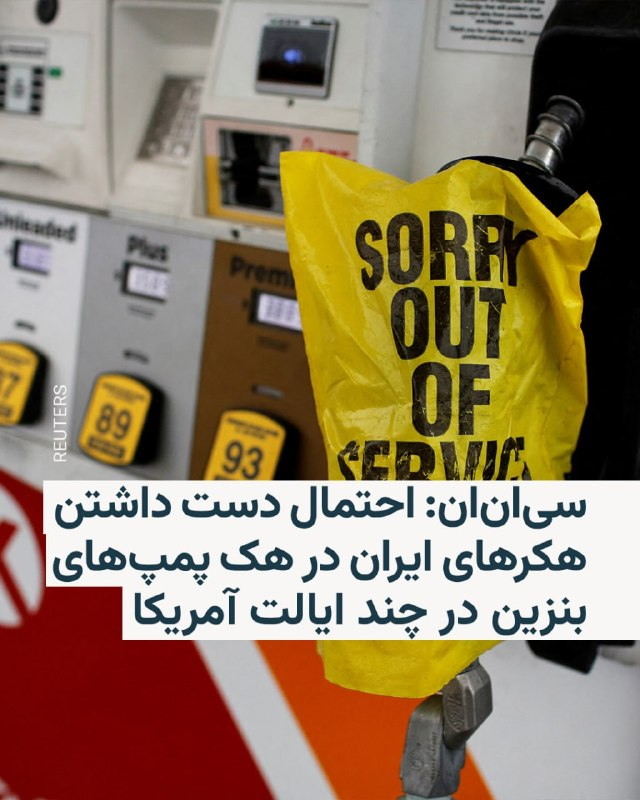

🔸شبکه تلویزیونی سی‌ان‌ان روز شنبه در گزارشی اختصاصی از هک شدن سیستمی در چند ایالت آمریکا خبر داد که میزان سوخت موجود در پمپ‌های بنزین را کنترل می‌کند.

🔸این شبکه به نقل از چند مقام آمریکایی که به نام‌شان اشاره نکرد نوشته است که این ظن وجود دارد که هکرهای ایرانی در نفوذ به این سیستم در آمریکا دست داشته‌اند.

🔸نفوذ سایبری در این سیستم سوخت‌رسانی در پمپ بنزین‌ها تاکنون به آسیب فیزیکی در این ایالت‌ها منجر نشده، اما به نگرانی دامن زده است، چرا که یک هکر با دسترسی به این سیستم می‌تواند به طور مثال نشت سوخت در یک پمپ بنزین را پنهان کند.

🔸از زمان آغاز جنگ در ابتدای اسفندماه ۱۴۰۴، هکرهای مرتبط با حکومت ایران از جمله در چند سایت نفت و گاز آمریکا اخلال ایجاد کرده‌اند و ایمیل‌های شخصی کَش پاتل،‌ مدیر اف‌بی‌آی، را درز داده‌اند.

@RadioFarda

## IranianMinds — post 20235

🔴نیویورک‌تایمز:

آمریکا و اسرائیل احتمالأ هفته آینده به ایران حمله خواهند کرد.

بعضی از رسانه‌ها هم احتمال حمله را تا ۲۴ ساعت آینده تخمین می‌زنند.

@IranianMinds

## IranianMinds — post 20234

🔴جسی واترز، مجری فاکس‌نیوز:

ترامپ در حال آماده شدن برای دور جدیدی از حملات به ایران است.

@IranianMinds

## IranianMinds — post 20233

  

🔴استوری مشاور قالیباف😂

@IranianMinds

## BBCPersian — post 281209

سخنگوی وزارت کشور ایران در نشست خبری روز ۲۶ اردیبهشت گفت: شعارهای تند بعضی در میادین درباره بی‌حجابی،سیاست رسمی نظام و حاکمیت نیست.

علی زینی‌وند گفت: «سیاست کلی نظام جلوگیری قاطع از هر شعار، سخنرانی و اقدامی است که باعث اختلال در انسجام کشور شود.»

پس از اظهارات چهره‌هایی چون امام جمعه رشت که زنان بی‌حجاب را «همراستا با اسکتبار جهانی» خواند، در یکی از تجمع‌های شبانه از زنان کم‌حجاب حاضر به عنوان «نورچشم» یاد شد. 

حجاب اجباری از اصولی است که حکومت ایران برای حفظ آن هزینه‌های بسیاری را کرده و زنان در ایران برای رعایت حجاب اجباری تحت فشار‌های بسیاری بوده‌اند.

بعد از کشته شدن مهسا امینی در بازداشت گشت ارشاد و شکل گرفتن اعترضات سراسری «زن، زندگی، آزادی» که منجر به کشته شدن بسیاری از معترضان شد، گشت ارشاد دیگر به طور رسمی فعالیتی نداشت. گرچه همچنان گزارش‌هایی از بازداشت زنان به دلیل عدم رعایت حجاب اجباری منتشر شد.

حکومت ایران پیش از این هم از زنانی که بدون حجاب اجباری در مراسم حکومتی شرکت می‌کنند، به عنوان نشانه‌ای از «وحدت بین اقشار مختلف مردم برای حفظ نظام» استفاده کرده است.
@BBCPersian

## Dirty_Kids — post 389553

  

به اونایی که می‌گفتن تو کوله سرباز خارجی آزادی پیدا نمی‌شه بگید مجری‌های صداوسیما واستون اسلحه کشیدن.

@Dirty_Kids 👻

## Dirty_Kids — post 389552

بمونم خونه overthink ميكنم، برم بيرون overpay.

@Dirty_Kids 👻

## Dirty_Kids — post 389551

  <a href="telegram/content/Dirty_Kids_389551_1778931645.mp4" target="_blank">🎬 Download video</a>

مامانم وقتی میگم از عمه خبری نیست:

@Dirty_Kids 👻

## Dirty_Kids — post 389550

  <a href="https://t.me/Dirty_Kids/389550" target="_blank">📎 Download file</a>

✅ اپلیکیشن اندروید سایت جهانی دربی بت

💰اولین سایت جهانی با امکان شارژ و برداشت ریالی(کارت به کارت)

🔗 برای ورود فیلترشکن روی کشور مناسب قرار دهید مانند فنلاند و المان و....

😀Telegram Channel
👇
https://t.me/+bcynkEgSW2dlYTc0

## Dirty_Kids — post 389549

  

😤دنبال یه سایت شرط بندی بین المللی بودی که به ایرانیا خدمات بده؟!
⛔

👍دربی بت همون انتخاب  100%

💎ویژگی های سایت جهانی Derby Bet:

⬅️امکان شارژ امن با کارت بانکی

⬅️واریز اول دوبل شارژ می شوید(بونوس۱۰۰٪)

⬅️پر اپشن ترین سایت فعال در ایران

⬅️تسویه حساب کمتر از 5 دقیقه

⬅️برگشت بخشی از باخت به صورت هفتگی

🚨کد هدیه ثبت نام:GG007

⚠️برای دانلود اپلکیشن کلیک کنید
👉

🔔کانال دربی بت :

🪙https://t.me/+bcynkEgSW2dlYTc0

## Dirty_Kids — post 389548

  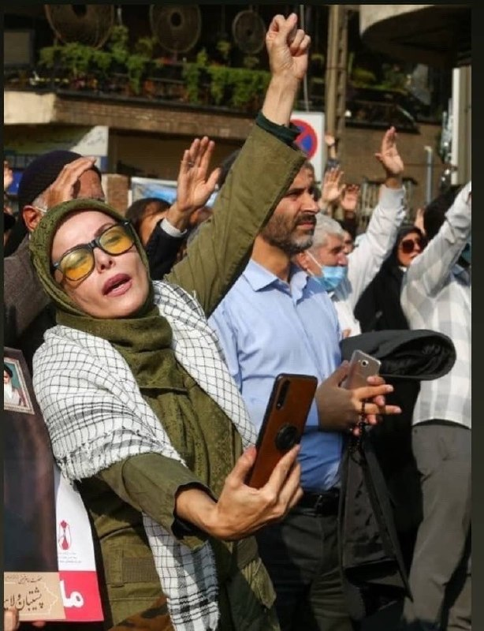

#کص_فدا 😂😂😂😂
فاکتور داره میکنه بره پولشو بگیره

@Dirty_Kids 👻

## Hranews — post 112968

  

خبرگزاری کار ایران در گزارشی نوشت: در روزهایی که #بیکاری فشار بی‌سابقه‌ای بر زندگی کارگران وارد کرده، مراجعه به واحد شمال‌شرق اداره کار تهران بیش از هر چیز روایت انسان‌هایی است که میان امید و ناامیدی سرگردان مانده‌اند. جایی که باید پناهگاه کارگران بیکار باشد، امروز با انباشت پرونده‌ها و تأخیرهای طولانی در رسیدگی مواجه است؛ به‌طوری‌که شکایت‌های ثبت‌شده از اسفندماه سال گذشته همچنان بلاتکلیف باقی مانده‌اند.

در میان این انتظارهای طولانی، صدای #کارگران بیش از هر آمار و گزارشی شنیده می‌شود. یکی از آن‌ها با چشمانی خسته می‌گوید: «از کار بیکارم کردند، با هزار امید آمدم تا دست‌کم بیمه بیکاری‌ام برقرار شود و شرمنده صاحب‌خانه نشم… یک ماهه هر بار میام میگن در دست بررسیه.» کارگر دیگری که ۱۵ سال در یک کارخانه کار کرده، با تلخی اضافه می‌کند: «همه جوانی‌م رو اونجا گذاشتم، آخرش گفتن به مشکل خوردیم، نیازی به شما نیست… حالا یک ماهه فقط دارم می‌دوم دنبال بیمه بیکاری، بی‌جواب.»

در کنار این روایت‌ها، پرونده‌هایی دیده می‌شود که از اواخر فروردین ثبت شده‌اند اما هنوز در وضعیت «در دست بررسی» باقی مانده‌اند؛ در حالی که بسیاری از این کارگران با اجاره‌خانه عقب‌افتاده، بدهی و بیکاری ناگهانی دست‌وپنجه نرم می‌کنند.

↘️
@hranews_bot تماس ✉️ - @Hranews کانال هرانا 🆑

## manototv — post 105511

  <a href="telegram/content/manototv_105511_1778931648.mp4" target="_blank">🎬 Download video</a>

کریس رایت، وزیر انرژی آمریکا گفته است انتظار دارد تنگه هرمز «حداکثر تا مقطعی در تابستان» بازگشایی شود.

رایت همچنین گفت اگر ایران به «گروگان گرفتن اقتصاد جهان» ادامه دهد، ارتش آمریکا می‌تواند برای بازگشایی تنگه هرمز مداخله کند.

## manototv — post 105510

  <a href="telegram/content/manototv_105510_1778931648.mp4" target="_blank">🎬 Download video</a>

در برنامه‌های شامگاه گذشته تلویزیون جمهوری اسلامی، بخش‌هایی با محور آموزش کار با سلاح پخش شد.

در این برنامه‌ها، مجریان یا کارشناسان حاضر در استودیو، شیوه گرفتن و استفاده از سلاح را توضیح دادند. پخش چنین محتوایی از تلویزیون حکومتی در شرایطی صورت می‌گیرد که رسانه‌های وابسته به جمهوری اسلامی در هفته‌های اخیر بر ادبیات نظامی، آمادگی دفاعی و بسیج حامیان خود تاکید بیشتری داشته‌اند.

## manototv — post 105509

  <a href="telegram/content/manototv_105509_1778931649.mp4" target="_blank">🎬 Download video</a>

‌
«دریک»، رپر، خواننده و بازیگر کانادایی، در یکی از قطعه‌های تازه خود با نام «Don’t Worry» به دختری ایرانی اشاره کرده که فارسی حرف می‌زند. این قطعه در آلبوم تازه او منتشر شده است. در متن ترانه نیز بندی آمده که در آن زن مورد اشاره خود را ایرانی معرفی می‌کند که فارسی حرف می‌‌زند.

دریک با نام کامل «آبری دریک گراهام» زاده تورنتو است و پیش از ورود جدی به موسیقی، با بازی در مجموعه تلویزیونی نوجوانانه «دگراسی، نسل بعدی» شناخته شد. او سپس به یکی از چهره‌های اصلی موسیقی هیپ‌هاپ و پاپ معاصر تبدیل شد و سبک ترکیبی او میان رپ‌خوانی و خوانندگی، جایگاه گسترده‌ای در بازار جهانی موسیقی برایش به همراه آورد.

## alonews — post 120372

  <a href="telegram/content/alonews_120372_1778931650.webm" target="_blank">🎬 Download video</a>

👈 ارتش دفاعی اسرائیل اعلام کرده است که حملات به سایت‌های زیرساختی حزب‌الله در چندین منطقه در جنوب لبنان را آغاز کرده است

✅ @AloNews خبر جنگ

## alonews — post 120371

  <a href="telegram/content/alonews_120371_1778931650.webm" target="_blank">🎬 Download video</a>

👈دقایقی پیش وزیر کشور پاکستان برای دیدار با مقامات ایرانی، در سفری از پیش اعلام نشده وارد تهران شد

✅ @AloNews خبر جنگ

## alonews — post 120370

  <a href="telegram/content/alonews_120370_1778931650.webm" target="_blank">🎬 Download video</a>

👈رئیس کمیسیون امنیت ملی مجلس :
یه سیستم طراحی کردیم که رفت‌وآمد کشتی‌ها تو تنگه هرمز رو با یه مسیر مشخص کنترل کنیم و به‌زودی هم اعلامش می‌کنیم

✅ @AloNews خبر جنگ

## alonews — post 120369

  <a href="telegram/content/alonews_120369_1778931651.webm" target="_blank">🎬 Download video</a>

👈به گزارش کانال ۱۲ اسرائیل : ترامپ بزودی با اعضای کابینه خود جلسه اضطراری برای پایان دادن به اوضاع ایران برگزار میکند ، حمله و تقابل سوم قریب الوقوع و بسیار نزدیک است

✅ @AloNews خبر جنگ

## alonews — post 120368

  <a href="telegram/content/alonews_120368_1778931651.webm" target="_blank">🎬 Download video</a>

👈الجزیره: وزیر انرژی امارات می‌گوید خروج از اوپک یک «انتخاب استراتژیک مستقل» است

✅ @AloNews خبر جنگ

## alonews — post 120367

  <a href="telegram/content/alonews_120367_1778931651.webm" target="_blank">🎬 Download video</a>

👈از دقایقی قبل سوپراپلیکیشن بله با اختلال مواجه شده و کار نمی کنه

✅ @AloNews خبر جنگ

## alonews — post 120366

  <a href="telegram/content/alonews_120366_1778931651.webm" target="_blank">🎬 Download video</a>

👈فارس مدعی شد: یک نفتکش غول‌پیکر چینی که از تنگهٔ هرمز عبور کرده بود، خارج از خط محاصرهٔ آمریکا رویت شد.

🔴این نفتکش پیش از آغاز مذاکرات رئیس‌جمهور چین و ترامپ درحال عبور از مسیر تعیین‌شدهٔ ایران در تنگهٔ هرمز در کنار جزیرهٔ لارک دیده شده بود.

✅ @AloNews خبر جنگ

## alonews — post 120365

  <a href="telegram/content/alonews_120365_1778931651.webm" target="_blank">🎬 Download video</a>

👈ناو شارل دوگل فرانسه، خروجی خلیج عدن - ورودی دریای عرب دیده شده

✅ @AloNews خبر جنگ

## alonews — post 120364

  <a href="telegram/content/alonews_120364_1778931651.webm" target="_blank">🎬 Download video</a>

👈فرماندهی کل نیروی دفاعی بحرین : برای حمله احتمالی جمهوری اسلامی، تو آماده‌باش سطح بالا قرار داریم

✅ @AloNews خبر جنگ

## alonews — post 120362

  <a href="telegram/content/alonews_120362_1778931652.webm" target="_blank">🎬 Download video</a>

🔴فوری / شبکه فاکس نیوز: ارتش آمریکا درحال آماده شدن برای دور جدیدی از درگیری های نظامی در ایران است

✅ @AloNews خبر جنگ

---
📅 بروزرسانی: 1405/02/26 14:11
---

## VahidOOnLine — post 240453

  

♦️محمد مخبر، مشاور رهبر جمهوری اسلامی، روز شنبه با انتشار متنی در شبکه اجتماعی ایکس با استفاده از هشتگ کویت و امارات نوشت: «ایران سال‌ها به چشم دوست و برادر به آنها نگاه کرد، ولی آنها با پیش‌فروش استقلال خود، حتی خاک و خانه‌هایشان را در اختیار دشمنان فلسطین و ایران قرار دادند.»

مخبر در این پیام با اشاره به حضور نیروهای آمریکایی در کشورهای منطقه، تهدید کرد: «پاسخ جمهوری اسلامی به سنگرهای استیجاری سنتکام در جنگ اخیر تمام‌عیار نبود، اما قطعا این خویشتن‌داری همیشگی نیست.»
‌🇸🇦 Indypersian

🤖 @VahidOOnLine

## VahidOOnLine — post 240452

  <a href="telegram/content/VahidOOnLine_240452_1778928071.mp4" target="_blank">🎬 Download video</a>

ایرانیان استرالیا روز شنبه در حمایت از انقلاب ملی علیه جمهوری اسلامی تجمع کرده و با حمل پرچم شیروخورشید ترانه‌های ملی را هم‌خوانی کردند.
‌🏁 🇬🇧 IranintlTV

🤖 @VahidOOnLine

## VahidOOnLine — post 240451

  

روزنامه معاریو به نقل از منابع آگاه گزارش داد که دولت دونالد ترامپ در روزهای اخیر آمادگی خود را برای دادن «چراغ سبز» به اقدام نظامی در صورت شکست نهایی تلاش‌های دیپلماتیک با جمهوری اسلامی نشان داده است.

بر اساس این گزارش، با وجود این رویکرد، هنوز تصمیم نهایی برای آغاز عملیات نظامی اتخاذ نشده است.

این منابع افزودند که «پنجره دیپلماتیک به سرعت در حال بسته شدن است» و روزهای آینده می‌تواند در تعیین مسیر تحولات سرنوشت‌ساز باشد.
‌🏁 🇬🇧 IranintlTV

🤖 @VahidOOnLine

## VahidOOnLine — post 240450

  <a href="telegram/content/VahidOOnLine_240450_1778928073.mp4" target="_blank">🎬 Download video</a>

مخاطبان ایران اینترنشنال طی روزهای اخیر با ارسال پیام‌هایی درباره سلامت و جان نرگس محمدی، زندانی سیاسی، ابراز نگرانی کرده و از ایرانیان خواستند در خارج از کشور صدای او باشند. پیام مخاطبان با هوش مصنوعی بازخوانی شده است.
‌🏁 🇬🇧 IranintlTV

🤖 @VahidOOnLine

## VahidOOnLine — post 240449

  

محمد مخبر، مشاور رهبر جمهوری اسلامی، با انتشار مطلبی در ایکس با هشتگ کویت و امارات نوشت: «ایران سال‌ها به چشم دوست و برادر به آنها نگاه کرد، ولی آنها با پیش‌فروش استقلال خود، حتی خاک و خانه‌هایشان را در اختیار دشمنان فلسطین و ایران قرار دادند.»

او تهدید کرد: «پاسخ جمهوری اسلامی به سنگرهای استیجاری سنتکام در جنگ اخیر تمام‌عیار نبود، اما قطعا این خویشتن‌داری همیشگی نیست.»
‌🏁 🇬🇧 IranintlTV

🤖 @VahidOOnLine

## VahidOOnLine — post 240448

  

♦️امارات: خروج از اوپک تصمیمی راهبردی بود، نه سیاسی
وزیر انرژی امارات متحده عربی اعلام کرد تصمیم ابوظبی برای خروج از اوپک و اوپک‌پلاس، اقدامی «حاکمیتی و راهبردی» بوده و انگیزه سیاسی نداشته است.
به گزارش رویترز، مقام‌های اماراتی تاکید کردند این تصمیم بر پایه ارزیابی جامع از سیاست تولید نفت و ظرفیت‌های آینده این کشور اتخاذ شده و نشانه اختلاف با دیگر شرکای اوپک نیست.
وزیر انرژی امارات گفت خروج از اوپک بخشی از راهبرد بلندمدت ابوظبی برای مدیریت مستقل‌تر ظرفیت‌های تولید انرژی و برنامه‌های توسعه آینده است و نباید به‌عنوان نشانه تنش سیاسی در داخل ائتلاف تولیدکنندگان نفت تفسیر شود.
تصمیم امارات در شرایطی اعلام شده که بازار جهانی انرژی همچنان تحت تاثیر جنگ ایران، بحران تنگه هرمز و نوسان شدید قیمت نفت قرار دارد و برخی تحلیلگران، خروج ابوظبی را نشانه تغییرات ساختاری در آینده اوپک و بازار جهانی انرژی می‌دانند.
‌🇸🇦 Indypersian

🤖 @VahidOOnLine

## VahidOOnLine — post 240447

  

فرماندهی کل نیروی دفاعی بحرین اعلام کرد که تمامی سلاح‌ها و یگان‌های این نیرو در بالاترین سطح آمادگی و آماده‌باش دفاعی برای مواجه با حمله احتمالی جمهوری اسلامی قرار دارند. بحرین همچنین از شهروندانش خواست با توجه به پیامدهای این حمله، از نزدیک شدن یا دست زدن به هرگونه شیء ناشناس یا مشکوک که ممکن است از بقایای این حمله باشد، خودداری کنند.

در بیانیه این فرماندهی آمده است که نیروهای آن از آمادگی رزمی پیشرفته و هوشیاری بالا در انجام وظیفه ملی خود برای دفاع از کشور و حفاظت از دستاوردهای آن برخوردارند.
‌🏁 🇬🇧 IranintlTV

🤖 @VahidOOnLine

## VahidOOnLine — post 240446

  <a href="telegram/content/VahidOOnLine_240446_1778928077.mp4" target="_blank">🎬 Download video</a>

⭕️ یخاب آران و بیدگل؛
زیستگاه امن حیات‌وحش کویری ایران

♦️گله‌ای از قوچ‌ و میش‌های وحشی در پناهگاه حیات وحش یخاب ابوزیدآباد در شهرستان آران و بیدگل، در قاب دوربین ثبت شد، منطقه‌ای بکر و کم‌نظیر در حاشیه کویر که یکی از زیستگاه‌های مهم حیات‌وحش ایران به شمار می‌رود.
پناهگاه حیات وحش یخاب با برخورداری از تنوع زیستی ارزشمند، زیستگاه گونه‌هایی همچون قوچ و میش وحشی، جبیر، کاراکال و انواع پرندگان بومی کویر است و به‌دلیل شرایط خاص طبیعی و حفاظت محیط‌زیستی، از مناطق مهم حیات‌وحش در استان اصفهان محسوب می‌شود.
ویدیویی از حضور و حرکت گله قوچ و میش‌های وحشی در این منطقه، جلوه‌ای از حیات طبیعی و زیبایی کم‌نظیر زیستگاه‌های کویری ایران را به نمایش گذاشته است.
‌🇸🇦 Indypersian

🤖 @VahidOOnLine

## VahidOOnLine — post 240445

  <a href="telegram/content/VahidOOnLine_240445_1778928079.mp4" target="_blank">🎬 Download video</a>

یک شهروند ویدیویی به ایران اینترنشنال فرستاده که بحران در دسترسی به بنزین و تشکیل صف‌های طولانی در بندرعباس در روز شنبه ۲۶ اردیبهشت‌ماه را نشان می‌دهد.
‌🏁 🇬🇧 IranintlTV

🤖 @VahidOOnLine

## VahidOOnLine — post 240444

  

مشاهدات شما از بحران کمبود و گرانی سوخت در استان‌های مختلف ایران چیست؟

روی لینک زیر کلیک کنید و پیام‌های خود از طریق مدیا‌بات برای ما بفرستید.

t.me

پیام‌های شما به صورت زیر‌نویس در تلویزیون و همچنین در بخش‌های مختلف‌ خبری منتشر خواهد شد
‌🏁 🇬🇧 IranintlTV

🤖 @VahidOOnLine

## VahidOOnLine — post 240443

روایت شما از زندگی در آتش‌بس- شنبه ۲۶ اردیبهشت ۱۴۰۵

🔹 من یک معلول ضایعه نخاعی هستم، ۳۳ سال سن دارم. یک ساله بیکار شدم. هر جا می‌رم به خاطر معلولیتم به من کار نمی‌دن. الان هم که به خاطر شرایط جنگ، اکثر شرکت‌ها تعدیل نیرو دارن.
🔹 از ماهشهر، از وضع مردم خون به جگرم، اما حال و روز نیروی انتظامی دیدن داره، کنار خیابون بساط کردن. راستی از پرداختاتون چه خبر؟ ظاهراً ولتون کردن.
🔹 در حالی که سه ماهه وضع معیشتی سخت شده و بیکار شده‌ایم، قبض برق، گاز و آب گرون شده. سه ماهه مجلس هم تقریباً به‌هم ریخته. چرا نمایندگان مجلس باید حقوق آنچنانی بگیرند؟ مفت‌خورا.
🔹 من با هزار بدبختی به اینترنت وصل شدم. خواستم بگم دمِ خارج از کشور گرم که هوای ما رو دارن.
🔹 از بوشهر؛ جایگاه‌های سوخت بنزین ندارند. روزهای سختی با جمهوری اسلامی در راه است ولی ما تا سقوط این وضعیت تحمل می‌کنیم.
🔹 تسمه دینام پژو ۴۰۵ قبل از دی‌ماه ۴۰۰ تومن بود، الان شده یک میلیون و ششصد.
🔹 اولین بار که بعد از قطع نت وصل می‌شم. افزایش قیمت‌ها عجیب و غریب شده. دانش‌آموز و دانشجو بلاتکلیفن. بعضی‌ها هم از فرصت استفاده می‌کنن و دوباره زبان‌شون دراز شده. امیدوارم زودتر حمله بشه تا اینا برگردن سر جاشون. پاینده ایران.
‌🏁 🇬🇧 IranintlTV

🤖 @VahidOOnLine

## VahidOOnLine — post 240442

  

♦️مساجد شمال غزه روز شنبه اعلام کردند فرمانده شاخه نظامی حماس در حملات روز جمعه اسرائیل به این باریکه کشته شده است. ارتش اسرائیل پیش‌تر اعلام کرده بود رهبر شاخه مسلح حماس را در حملات هوایی هدف قرار داده است.
رویترز به نقل از شاهدان عینی گزارش داد مساجد شهر غزه خبر «شهادت» عزالدین الحداد را اعلام کرده‌اند.
با این حال، حماس تاکنون درباره سرنوشت فرمانده شاخه نظامی خود اظهار نظر رسمی نکرده است.
‌🇸🇦 Indypersian

🤖 @VahidOOnLine

## VahidOOnLine — post 240441

اصغر فرهادی،‌ کارگردان و تهیه‌کننده، ۲۵ اردیبهشت در نشست خبری فیلم «داستان‌های موازی» در جشنواره کن در پاسخ به پرسش خبرنگار ایران‌اینترنشنال درباره انقلاب ملی و سرکوب شهروندان گفت: «قتل انسان‌ها برای من قابل پذیرش نیست؛ چه با جنگ، چه اعدام و چه با کشتن معترضان.»

واکنش شماری از مخاطبان ایران‌اینترنشنال نشان می‌دهد که گروهی موضع‌گیری او را ناکافی دانسته‌اند و باور دارند که این فیلم‌ساز ایرانی، «حق مطلب» درباره جاویدنامان انقلاب ملی ایرانیان را ادا نکرده است.

بازخوانی پیام‌ها با هوش مصنوعی انجام گرفته است.
‌🏁 🇬🇧 IranintlTV

🤖 @VahidOOnLine

## VahidOOnLine — post 240440

  

الیاس حضرتی، رییس شورای اطلاع‌رسانی دولت، گفت اگر هدف از قطع یا محدودسازی اینترنت، جلوگیری از دسترسی مردم به برخی سایت‌ها بوده، این هدف نه‌تنها محقق نشده بلکه نتیجه معکوس داشته است. او افزود: «در برخی کشورها نیز محدودیت‌های مقطعی اینترنت اعمال می‌شود، اما این محدودیت‌ها بلافاصله به حالت عادی بازمی‌گردد.»
‌🏁 🇬🇧 IranintlTV

🤖 @VahidOOnLine

## VahidOOnLine — post 240439

  <a href="telegram/content/VahidOOnLine_240439_1778928082.mp4" target="_blank">🎬 Download video</a>

♦️هواداران خشمگین یک باشگاه فوتبال در طرابلس در اعتراض به تصمیم داور، نمای ساختمان و محوطه دفتر دولت وحدت ملی لیبی (GNU) را به آتش کشیدند.
رویترز به نقل از دو شاهد عینی و یک شبکه تلویزیونی محلی گزارش داد، این ناآرامی‌ها شامگاه پنج‌شنبه در پایتخت لیبی آغاز شد. زمانی که هواداران باشگاه الاتحاد طرابلس در اعتراض به تصمیم داور مبنی بر اعلام نشدن یک ضربه پنالتی در دیدار برابر تیم السویحلی مصراته به خیابان‌ها آمدند.
این مسابقه در ورزشگاه شهر ترهونه، حدود ۶۵ کیلومتری جنوب‌شرقی طرابلس برگزار شد. خبرنگار رویترز که در محل حضور داشت گزارش داد بازی در دقیقه ۸۷ و پس از اعتراض بازیکنان و هواداران الاتحاد متوقف شد.
بر اساس این گزارش، شماری از هواداران الاتحاد وارد زمین مسابقه شدند و درگیری‌هایی رخ داد که به آسیب‌دیدگی اموال و زخمی شدن نیروهای حفاظت ورزشگاه انجامید.
‌🇸🇦 Indypersian

🤖 @VahidOOnLine

## VahidOOnLine — post 240438

روایت شما از زندگی در آتش‌بس- شنبه ۲۶ اردیبهشت ۱۴۰۵

🔹 هر پرس استیک توی لاله‌پارک تبریز شده ۱ میلیون و ۶۰۰ هزار تومان، حقوق یک ماه کارگر معادل ۱۵ پرس استیک!
🔹 من به زور و هزار بدبختی وصل شدم. بدبختمون کردن، چیزی برامون نذاشتن. یک روغن شده ۲ میلیون و ۵۰۰، یک مرغ کوچیک شده ۵۰۰ هزار تومن. کل خانواده کار می‌کنن، بازم خرج زندگی درنمیاد. اینا نباید بمونن، تا از کشورمون نرن حال ایران خوب نمی‌شه. من از طرف پدربزرگ و مادربزرگم عذرخواهی می‌کنم که انقلاب کردن و زندگی تو بهشت را تبدیل به جهنم کردن. تنها امیدمون برگشت شاهزاده‌مونه، از طرف یک نسل زد.
🔹 از ایران؛ آقای ترامپ، برای مذاکره با این جانی‌ها فقط یک شرط بگذارید؛ برگزاری رفراندوم برای تعیین نوع حکومت تحت نظر نهادهای بین‌المللی. همه دنیا هم از شما حمایت خواهد کرد.
🔹 من مهندس ساختمان هستم. در صنعت ساختمان به‌قدری افزایش قیمت وجود داشته که بسیاری از کارگاه‌ها تعطیل شده‌اند. فقط کارگاه‌هایی فعال هستند که پیش‌فروش کردند و مجبور به تحویل هستند. با این روند، بیشتر مهندسین به‌زودی بیکار خواهند شد.
🔹 از مشهد؛ برای سوخت‌گیری به ۳ پمپ‌بنزین رفتم. میدان تلویزیون اصلاً سوخت نمی‌داد، در وکیل‌آباد ورودی دانشجو صف طولانی بود و در بلوار پیروزی بعد از یک ساعت انتظار در صف توانستم ۱۵ لیتر با کارت ۳۰۰۰ تومانی بزنم.
🔹 از مشهد. بعد از ۹ اسفند تازه امروز، ۲۶ اردیبهشت، به‌سختی وصل شدم. شرایط ایران خلاصه می‌شود در گرانی، فقر، نبود اینترنت و ناامیدی و افسردگی. لعنت به سیاست که مردم این وسط تاوان می‌دهند. امیدوارم روزی برسد که مردم ایران از ته دل شاد بشن، چون لیاقتشان بیشتر از این‌هاست.
‌🏁 🇬🇧 IranintlTV

🤖 @VahidOOnLine

## VahidOOnLine — post 240437

⭕️ آموزش استفاده از سلاح در صداوسیما؛
مجری به سمت پرچم امارات متحده عربی شلیک کرد

♦️شامگاه جمعه ۲۵ اردیبهشت‌ماه، برخی مجریان زن و مرد صداوسیمای جمهوری اسلامی در برنامه‌های تلویزیونی با در دست داشتن اسلحه ظاهر شدند. در یکی از ویدیوهای منتشرشده، فردی نظامی با پوشاندن صورت خود، نحوه استفاده از سلاح را آموزش می‌دهد و سپس اسلحه را در اختیار مجری برنامه قرار می‌دهد.
مجری برنامه که به‌نظر می‌رسد آشنایی چندانی با کار با اسلحه ندارد، به توضیحات و آموزش‌های فرد نظامی گوش می‌دهد. او سپس برای شلیک، سلاح را به سمت تصویر پرچم امارات متحده عربی که روی نمایشگر استودیو دیده می‌شود نشانه می‌گیرد و اقدام به شلیک می‌کند.
پخش این تصاویر در حالی صورت می‌گیرد که تنش‌ها میان جمهوری اسلامی ایران و ایالات متحده بار دیگر افزایش یافته و گمانه‌زنی‌ها درباره احتمال ورود دو طرف به دور تازه‌ای از تقابل‌های نظامی و امنیتی شدت گرفته است.
‌🇸🇦 Indypersian

🤖 @VahidOOnLine

## VahidOOnLine — post 240436

  

وحید شریعت، رییس انجمن روان‌پزشکان ایران، در مصاحبه با ایلنا گفت: «کمبود دارو در حوزه روان‌پزشکی جدی است و نسبت به شرایط پیش از جنگ، به‌طور قابل توجهی تشدید شده است.»

او افزود: «در ماه‌های اخیر، کمبود قابل توجهی در برخی اقلام دارویی مشاهده شده است که برخی از آن‌ها از پیش از آغاز جنگ تشدید یافته و برخی دیگر کاملا جدید هستند.»

شریعت اختلال در روند تولید، نبود مواد اولیه، محدود شدن توزیع به‌منظور آماده‌سازی بازار برای افزایش قیمت و تلاش برخی افراد برای ذخیره‌سازی دارو به‌دلیل ترس از جنگ را از عوامل اصلی بحران داروهای روان‌پزشکی عنوان کرد.
‌🏁 🇬🇧 IranintlTV

🤖 @VahidOOnLine

## WithYashar — post 11385

  

صدا و سیما هم میدونه چی میشه داره آموزش کار با سلاح رو میده 😂 اینا رفتنین شک نکنید 👋🏾👋🏾 @withyashar

## WithYashar — post 11384

آقا یاشار عزیز،

واقعاً دلم می‌خواست یه چیزی بهت بگم از ته دل.

مرسی که با کارای دلی و عشقیت، بهم نشون دادی وقتی کاریو با دل شروع می‌کنی، چقدر می‌تونه برکت و موفقیت بیاره.

از اون موقع که تو نوجونی اون سایت برای پروموت کردن رپرها ساختی تا همین الان که با تمام وجود وقتت رو پای این کانال خبری (تلگرام و اینستا) می‌ذاری تا مردم خبر درست بگیرن، یه چیز بزرگ یاد گرفتم ازت — اینکه عشق و نیت خالص از هر چیز دیگه‌ای قوی‌تره.

بهم یادآوری و یاد دادی که پیشرفت فقط با کار زیاد نیست، بلکه دلی و با عشق کار کردن توی کاره.

دمت گرم ، واسه همه این زحماتت، واسه الهامی که بهم دادی، و واسه اینکه خودِ واقعی‌ت رو بی‌منت به دنیا نشون میدی💚

## WithYashar — post 11383

جسی واترز، مجری فاکس نیوز:

ترامپ درحال آماده‌شدن برای دور جدیدی از حملات نظامی به ایرانه.
@withyashar

## WithYashar — post 11382

ترامپ: 5 بار با ایران نزدیک توافق شدم، ولی روز بعدش زدن زیرش
@withyashar

## WithYashar — post 11381

نشست آینده تکنولوژی در ایران، با حضور و سخنرانی شاهزاده رضا پهلوی امشب ۸:۳۰ به وقت تهران ۱۰ صبح به وقت غرب آمریکا سانفرانسیسکو
@withyashar

## WithYashar — post 11380

سنتکام به نیویورک تایمز : کشتی‌های ایرانی رو با ماهواره و چند روش دیگه ردیابی می‌کنیم
@withyashar

## mwarmonitor — post 9150

  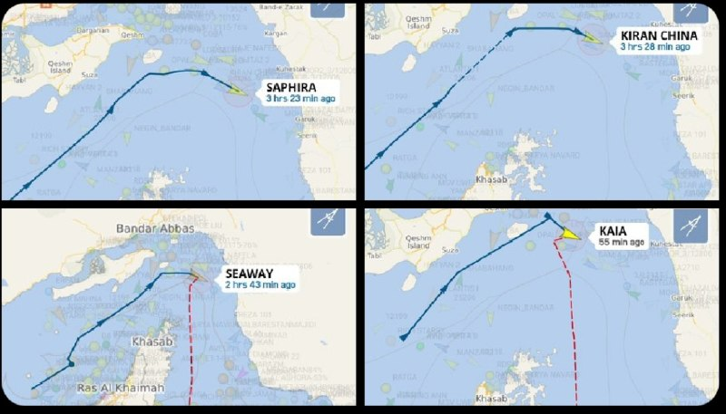

📍تنگه هرمز، کشتی‌های در حال خروج از خلیج فارس:

🚢کشتی حمل دام «SAPHIRA» (متعلق به ترکیه)

🚢کشتی فله‌بر «KIRAN CHINA» (متعلق به ترکیه)

🚢نفتکش «SEAWAY» (متعلق به چین)

🚢کشتی فله‌بر «KAIA» (با پرچم جزایر مارشال)

@mwarmonitor

## pm_afshaa — post 90838

🔴کانال N12 اسرائیل: جنگ سوم با ایران نزدیک است

💧 Rainbet.com the #1 Non-KYC Crypto Casino & Sportsbook @rainbetcom

😁 @Pm_Afshaa

## pm_afshaa — post 90837

🔴جسی واترز، مجری فاکس نیوز: ترامپ درحال آماده‌شدن برای دور جدیدی از حملات نظامی به ایرانه

💧 Rainbet.com the #1 Non-KYC Crypto Casino & Sportsbook @rainbetcom

😁 @Pm_Afshaa

## pm_afshaa — post 90836

🔴ترامپ: 5 بار با ایران نزدیک توافق شدم، ولی روز بعدش زدن زیرش

💧 Rainbet.com the #1 Non-KYC Crypto Casino & Sportsbook @rainbetcom

😁 @Pm_Afshaa

## pm_afshaa — post 90835

🔴سنتکام:تمام کشتی ها قایق های ایران رو زیر نظر داریم

💧 Rainbet.com the #1 Non-KYC Crypto Casino & Sportsbook @rainbetcom

😁 @Pm_Afshaa

## DEJradio — post 4664

  <a href="telegram/content/DEJradio_4664_1778928086.mp4" target="_blank">🎬 Download video</a>

🤡
🔺 آموزش استفاده از سلاح در تلویزیون جمهوری اسلامی.

صدا و سیمای جمهوری اسلامی سازمان یافته با نشان دادن و آموزش کاربرد اسلحه به مردم چنگ و دندان نشان می‌دهد.

شهرام سبزواری کارشنای نظامی در مورد آموزش کلاشنیکف میگوید فردی که مربی سلاح است و ماسک زده تا شناسایی نشود، لز ساعت هوشمند استفاده می‌کند آنهم در شرایطی که نظامی‌ها بویژه در هنگام ماموریت خاص نباید از تجهیزات هوشمند استفاده کنند.

#کلاشنیکف #صداوسیما
@DEJradio

## DEJradio — post 4663

  <a href="telegram/content/DEJradio_4663_1778928088.mp4" target="_blank">🎬 Download video</a>

🤡
🔺 در صدا و سیمای حکومتی به طور سازمان یافته استفاده از کلاشنیکف را آموزش می‌دهند.

به بهانه تبلیغ پروژه امنیتی "جانفدا" در صدا و سیمای حکومتی، طرفداران نظام را ترغیب به استفاده از سلاح می‌کنند.

برای تلطیف این اقدام جنگ‌طلبانه، زنان وسیله تبلیغ می‌شوند.

#کلاشنیکف #صداوسیما
@DEJradio

## DEJradio — post 4662

  <a href="telegram/content/DEJradio_4662_1778928089.mp4" target="_blank">🎬 Download video</a>

🚨📢 جسد عبدالرحیم موسوی ۳۰ روز زیر آوار ماند

علی موسوی، پسر عبدالرحیم موسوی رئیس پیشن ستاد کل نیروهای مسلح جمهوری اسلامی، گفت که جنازه پدرش که در نخستین روز حملات اسرائیل و آمریکا به بین علی خامنه‌ای کشته شد نزدیک به ۳۰ روز در زیر آوار ماند و یک ماه در جستجوی جنازه‌اش بودند. موسوی پس از کشته شدن محمد باقری در جنگ ۱۲ روزه، به‌عنوان رییس ستاد کل نیروهای مسلح منصوب شده بود.

#جنگ۱۲روزه #IRGCterrorists
@DEJradio

## DEJradio — post 4661

  <a href="telegram/content/DEJradio_4661_1778928091.webm" target="_blank">🎬 Download video</a>

🤡
🔺 بر اساس گزارش‌های منتشر شده، ارتش آمریکا در جریان جنگ اخیر از جزیره بوبیان کویت استفاده عملیاتی کرده است و رسانه‌های وابسته به نظام مدعی شلیک موشک‌های HIMARS آمریکایی در فروردین از این جزیره کویتی هستند، اما منابع کویتی این ادعا را رد می‌کنند.

در این میان، در تاریخ ۱۱ اردیبهشت، کماندوهای نیروی دریایی سـ.ـپاه که پیش از این تبلیغات زیادی درباره توانایی‌هایشان شده بود، در قالب یک تیم شش‌نفره به سمت جزیره بوبیان کویت حرکت کردند. هدف عملیاتی آن‌ها هنوز مشخص نیست، اما این به ‌اصطلاح کماندوها پیش از ورود به جزیره در یک درگیری کوتاه، شکست خوردند و چهار نفر از آنان، شامل سه افسر ارشد و یک افسر جزء، اسیر شدند و دو کماندوی دیگر سپاه نیز موفق به فرار شدند و شاید بتوان گفت فرار این دو موفق ترین، بخش عملیات آنها بوده است.

#نیروی_دریایی #IRGCterrorists
@DEJradio

## DEJradio — post 4658

  <a href="telegram/content/DEJradio_4658_1778928091.webm" target="_blank">🎬 Download video</a>

🔺📢 محمدباقر الساعدی (داوود الساعدی) یکی از فرماندهان ارشد حـ.ـزب‌الله عراق توسط نیروهای امنیتی در یکی از کشورهای منطقه [احتمالا ترکیه، امارات یا اردن] بازداشت شده است. ماموران اف‌بی‌آی او را به آمریکا منتقل کرده‌اند تا محاکمه شود.

وزارت دادگستری آمریکا اعلام کرد، الساعدی رهبر کتائب حزب‌الله عراق با ۶ اتهام مرتبط با تروریسم روبرو است.

این اتهام‌ها به دلیل فعالیت‌های الساعدی با گردان‌های حـ.ـزب‌الله عراق و سـ.ـپاه پاسداران است. او روابط نزدیکی با قـ.ـاسم سـ.ـلیمانی فرمانده پیشین سـ.ـپاه قدس داشت.

براساس یک شکایت سعدی قصد داشته آمریکایی‌ها و یهودیان را در لس‌آنجلس و نیویورک به قتل برساند و برنامه‌ریزی برای حمله به یک کنیسه در نیویورک را آغاز کرده بود.
بازداشت او نشان داد تا چه اندازه نفوذ سرویس‌های امنیتی آمریکا در خاورمیانه زیاد است.

#حزب_الله #عراق
@DEJradio

## DEJradio — post 4657

  <a href="telegram/content/DEJradio_4657_1778928092.webm" target="_blank">🎬 Download video</a>

🚨
⭕️ روزنامه «نیویورک‌تایمز» با اشاره به بن‌بست در مذاکرات جمهوری اسلامی و آمریکا، گزارش داد ایالات متحده و اسرائیل آماده‌سازی‌های گسترده‌ای را برای ازسرگیری احتمالی کارزار نظامی علیه جمهوری اسلامی آغاز کرده‌اند.

بر اساس این گزارش، مقام‌های دولت دونالد ترامپ طرح‌هایی برای عملیات نظامی علیه حکومت ایران تهیه کرده‌اند، اما رییس‌جمهوری آمریکا هنوز تصمیم نهایی را در این رابطه اتخاذ نکرده است.

در این گزارش تأکید شده گزینه‌های زیاد از بمباران گسترده تا عملیات زمینی علیه تاسیسات هسته‌ای جمهوری اسلامی روی میز قرار دارد.

#جنگ #مذاکرات #ترامپ
@DEJradio

## mamlekate — post 103540

  <a href="telegram/content/mamlekate_103540_1778928092.mp4" target="_blank">🎬 Download video</a>

سخنرانی حسین یکتا از تیرخلاص زن‌های دی‌ماه خونین… در کنار مزدوران تیم فوتبال جمهوری اسلامی!

CrimesArchives
@mamlekate

## mamlekate — post 103537

🔫 صداوسیما

🔫سقوط دولت لیبی:
t.me/mamlekate/101453

## kianmeli1 — post 87435

  

🔴نیویورک تایمز به نقل از مقامات نظامی آمریکا: اگر جزیره خارگ تصرف شود، نیروهای زمینی برای حفظ آن لازم خواهند بود.
https://t.me/kianmeli1

## kianmeli1 — post 87434

‏🔴نماینده خامنه‌ای در سپاه در کردستان: امروز نظام «استکبار» در موضع ضعف قرار گرفته و در این مرحله پایانی وارد آوردن ضربه نهایی برای «اضمحلال دشمن» ضرورتی حیاتی دارد
https://t.me/kianmeli1

## kianmeli1 — post 87430

  <a href="telegram/content/kianmeli1_87430_1778928094.mp4" target="_blank">🎬 Download video</a>

🔴شب گذشته در بسیاری از برنامه های صداوسیما، مجریان با تفنگ حاضر شدند

یکی از مجریان در برنامه زنده پرچم امارات را نشانه گرفت و شلیک کرد
https://t.me/kianmeli1

## kianmeli1 — post 87429

‏🔴محمد مخبر، مشاور مجتبی خامنه‌ای، مطلبی را با هشتگ امارات و کویت در ایکس منتشر کرد و نوشت «آن‌ها با پیش‌فروش استقلال خود، حتی خاک و خانه‌هایشان را در اختیار دشمنان فلسطین و جمهوری اسلامی قرار دادند و پاسخ ما به سنگرهای استیجاری سنتکام در جنگ اخیر تمام‌عیار نبود؛ اما این خویشتنداری همیشگی نیست.»
https://t.me/kianmeli1

## kianmeli1 — post 87428

‏🔴وزارت دفاع بریتانیا افزود چهار جنگنده تایفون را در هفته‌های پس از آغاز جنگ به قطر اعزام کرد تا حضور هوایی این کشور در منطقه را تقویت کند
https://t.me/kianmeli1

## kianmeli1 — post 87427

‏🔴فرماندهی کل نیروی دفاع بحرین اعلام کرد همه یگان‌ها در بالاترین سطح آمادگی دفاعی هستند و از مردم خواست به اجسام مشکوک ناشی از حمله از سوی ایران نزدیک نشوند
https://t.me/kianmeli1

## kianmeli1 — post 87426

‏🔴نورنیوز، رسانه نزدیک به شورای عالی امنیت ملی به نقل از یک مقام مطلع نظامی نوشت در صورت وقوع جنگ، «طرح جامع مقابله آنی» به همه یگان‌های عملیاتی ابلاغ شده و هرگونه اقدام آمریکا با پاسخ «فوری، گسترده و چندلایه» مواجه خواهد شد. به گفته این منبع، اهدافی که در جنگ ۴۰ روزه مورد اصابت قرار نگرفتند، این‌بار در اولویت قرار دارند و سناریوی جدید بر مبنای «حداکثر فشار متقابل» بازتعریف شده است
https://t.me/kianmeli1

## IranIntlTV — post 337450

🔻اریک کانتونا، اسطوره فوتبال فرانسه و یکی از عوامل مستند «کانتونا»، در جریان فوتوکال این فیلم که در بخش «نمایش‌های ویژه» هفتاد و نهمین جشنواره فیلم کن ارائه شد، روز شنبه ۲۶ اردیبهشت مقابل دوربین عکاسان ژست گرفت.

🔹مستند «کانتونا» که در جشنواره فیلم کن رونمایی شد، پرتره‌ای از اریک کانتونا، ستاره فرانسوی دهه ۹۰ منچستریونایتد، ارائه می‌دهد؛ فوتبالیستی جذاب اما تندخو که هم به‌واسطه نبوغ فوتبالی‌اش و هم به دلیل جنجال‌هایش به چهره‌ای اسطوره‌ای بدل شد.

🔹این فیلم به کارگردانی دیوید تری‌هورن و بن نیکلاس، سازندگان مستند «پله»، با ترکیبی از گفت‌وگوهای تازه با کانتونا و روایت‌هایی از الکس فرگوسن، دیوید بکام و گی رو، تلاش می‌کند تصویری کامل از «مرد، اسطوره، افسانه» بسازد.

@iranintltvsport

## IranIntlTV — post 337449

  <a href="telegram/content/IranIntlTV_337449_1778928096.mp4" target="_blank">🎬 Download video</a>

سرخط خبرهای شنبه ۲۶ اردیبهشت
@iranintltv

## IranIntlTV — post 337448

  <a href="telegram/content/IranIntlTV_337448_1778928097.mp4" target="_blank">🎬 Download video</a>

ایرانیان استرالیا روز شنبه در حمایت از انقلاب ملی علیه جمهوری اسلامی تجمع کرده و با حمل پرچم شیروخورشید ترانه‌های ملی را هم‌خوانی کردند.

## IranIntlTV — post 337447

  

روزنامه معاریو به نقل از منابع آگاه گزارش داد که دولت دونالد ترامپ در روزهای اخیر آمادگی خود را برای دادن «چراغ سبز» به اقدام نظامی در صورت شکست نهایی تلاش‌های دیپلماتیک با جمهوری اسلامی نشان داده است.

بر اساس این گزارش، با وجود این رویکرد، هنوز تصمیم نهایی برای آغاز عملیات نظامی اتخاذ نشده است.

این منابع افزودند که «پنجره دیپلماتیک به سرعت در حال بسته شدن است» و روزهای آینده می‌تواند در تعیین مسیر تحولات سرنوشت‌ساز باشد.
https://iranintl.com/202605162346

## IranIntlTV — post 337446

  <a href="telegram/content/IranIntlTV_337446_1778928099.mp4" target="_blank">🎬 Download video</a>

همزمان با افزایش تنش‌ها میان امارات متحده عربی و جمهوری اسلامی، یک مجری صدا و سیمای جمهوری اسلامی در برنامه‌ای با محور آموزش کار با سلاح، پرچم امارات متحده عربی را به‌عنوان هدف انتخاب کرد و به سوی آن شلیک کرد.

این بخش از برنامه در حالی پخش شد که روابط تهران و ابوظبی در هفته‌های اخیر با تنش‌هایی همراه بوده است.

صدا و سیمای جمهوری اسلامی جمعه چند برنامه پخش کرد که در آنها مجریان در بخش‌های استودیویی با در دست داشتن تفنگ ظاهر شدند و اعلام کردند در حال یادگیری کار با سلاح‌های سبک هستند و در صورت لزوم به جنگ خواهند پیوست.
@iranintltv

## IranIntlTV — post 337445

  <a href="telegram/content/IranIntlTV_337445_1778928100.mp4" target="_blank">🎬 Download video</a>

مخاطبان ایران اینترنشنال طی روزهای اخیر با ارسال پیام‌هایی درباره سلامت و جان نرگس محمدی، زندانی سیاسی، ابراز نگرانی کرده و از ایرانیان خواستند در خارج از کشور صدای او باشند. پیام مخاطبان با هوش مصنوعی بازخوانی شده است.

## IranIntlTV — post 337444

  <a href="telegram/content/IranIntlTV_337444_1778928102.mp4" target="_blank">🎬 Download video</a>

بنا بر گزارش کانال۱۲ اسرائیل، رییس‌جمهور آمریکا قرار است ظرف ۲۴ ساعت آینده نشستی ویژه با مشاورانش برگزار کند تا تصمیم نهایی درباره جمهوری اسلامی را اتخاذ کند.

گفت‌وگو با منشه امیر، کارشناس امور خاورمیانه
@iranintltv

## IranIntlTV — post 337443

  

محمد مخبر، مشاور رهبر جمهوری اسلامی، با انتشار مطلبی در ایکس با هشتگ کویت و امارات نوشت: «ایران سال‌ها به چشم دوست و برادر به آنها نگاه کرد، ولی آنها با پیش‌فروش استقلال خود، حتی خاک و خانه‌هایشان را در اختیار دشمنان فلسطین و ایران قرار دادند.»

او تهدید کرد: «پاسخ جمهوری اسلامی به سنگرهای استیجاری سنتکام در جنگ اخیر تمام‌عیار نبود، اما قطعا این خویشتن‌داری همیشگی نیست.»
https://iranintl.com/202605169610

## IranIntlTV — post 337442

  

فرماندهی کل نیروی دفاعی بحرین اعلام کرد که تمامی سلاح‌ها و یگان‌های این نیرو در بالاترین سطح آمادگی و آماده‌باش دفاعی برای مواجه با حمله احتمالی جمهوری اسلامی قرار دارند. بحرین همچنین از شهروندانش خواست با توجه به پیامدهای این حمله، از نزدیک شدن یا دست زدن به هرگونه شیء ناشناس یا مشکوک که ممکن است از بقایای این حمله باشد، خودداری کنند.

در بیانیه این فرماندهی آمده است که نیروهای آن از آمادگی رزمی پیشرفته و هوشیاری بالا در انجام وظیفه ملی خود برای دفاع از کشور و حفاظت از دستاوردهای آن برخوردارند.
https://iranintl.com/202605161969

## IranIntlTV — post 337441

  <a href="telegram/content/IranIntlTV_337441_1778928105.mp4" target="_blank">🎬 Download video</a>

یک شهروند ویدیویی به ایران اینترنشنال فرستاده که بحران در دسترسی به بنزین و تشکیل صف‌های طولانی در بندرعباس در روز شنبه ۲۶ اردیبهشت‌ماه را نشان می‌دهد.

## IranIntlTV — post 337440

  

مشاهدات شما از بحران کمبود و گرانی سوخت در استان‌های مختلف ایران چیست؟

روی لینک زیر کلیک کنید و پیام‌های خود از طریق مدیا‌بات برای ما بفرستید.

https://t.me/intlmedia_bot

پیام‌های شما به صورت زیر‌نویس در تلویزیون و همچنین در بخش‌های مختلف‌ خبری منتشر خواهد شد

## IranIntlTV — post 337439

  <a href="telegram/content/IranIntlTV_337439_1778928107.mp4" target="_blank">🎬 Download video</a>

دونالد ترامپ، رییس‌جمهوری آمریکا، گفت با تعلیق ۲۰ ساله غنی‌سازی اورانیوم در ایران موافق است، مشروط بر اینکه در این مدت، برنامه هسته‌ای جمهوری اسلامی به‌طور کامل پاکسازی شود.

گفت‌وگو با علی شیرازی، عضو تحریریه ایران‌اینترنشنال
@iranintltv

## IranIntlTV — post 337438

  <a href="https://t.me/IranintlTV/337438" target="_blank">📎 Download file</a>

🎧نسخه صوتی اخبار بامدادی | شنبه ۲۶ اردیبهشت
@iranintlTV

## IranIntlTV — post 337437

روایت شما از زندگی در آتش‌بس- شنبه ۲۶ اردیبهشت ۱۴۰۵

🔹 من یک معلول ضایعه نخاعی هستم، ۳۳ سال سن دارم. یک ساله بیکار شدم. هر جا می‌رم به خاطر معلولیتم به من کار نمی‌دن. الان هم که به خاطر شرایط جنگ، اکثر شرکت‌ها تعدیل نیرو دارن.
🔹 از ماهشهر، از وضع مردم خون به جگرم، اما حال و روز نیروی انتظامی دیدن داره، کنار خیابون بساط کردن. راستی از پرداختاتون چه خبر؟ ظاهراً ولتون کردن.
🔹 در حالی که سه ماهه وضع معیشتی سخت شده و بیکار شده‌ایم، قبض برق، گاز و آب گرون شده. سه ماهه مجلس هم تقریباً به‌هم ریخته. چرا نمایندگان مجلس باید حقوق آنچنانی بگیرند؟ مفت‌خورا.
🔹 من با هزار بدبختی به اینترنت وصل شدم. خواستم بگم دمِ خارج از کشور گرم که هوای ما رو دارن.
🔹 از بوشهر؛ جایگاه‌های سوخت بنزین ندارند. روزهای سختی با جمهوری اسلامی در راه است ولی ما تا سقوط این وضعیت تحمل می‌کنیم.
🔹 تسمه دینام پژو ۴۰۵ قبل از دی‌ماه ۴۰۰ تومن بود، الان شده یک میلیون و ششصد.
🔹 اولین بار که بعد از قطع نت وصل می‌شم. افزایش قیمت‌ها عجیب و غریب شده. دانش‌آموز و دانشجو بلاتکلیفن. بعضی‌ها هم از فرصت استفاده می‌کنن و دوباره زبان‌شون دراز شده. امیدوارم زودتر حمله بشه تا اینا برگردن سر جاشون. پاینده ایران.

## Shin_Persian — post 6027

Emanuel (Mannie) Fabian ✓ @manniefabian
Sat, 16 May 2026 09:32:14 UTC

The funeral for Hamas leader in the Gaza Strip, Izz al-Din al-Haddad, has begun, according to Palestinian media.

فارسی

به گفته رسانه‌های فلسطینی، مراسم تشییع پیکر عزالدین الحداد، از رهبران حماس در نوار غزه، آغاز شده است.

𝕏 · @shin_persian

## FarsiVOA — post 217883

  

عراق در ماه آوریل تنها ۱۰ میلیون بشکه نفت از مسیر تنگه هرمز صادر کرده است؛ رقمی که به گفته باسم محمد، وزیر نفت جدید عراق، پیش از جنگ ایران به طور معمول حدود ۹۳ میلیون بشکه در ماه بود.

وزیر نفت عراق همچنین گفت صادرات نفت خام این کشور از خط لوله کرکوک-جیهان در ماه مارس، پس از توافق بغداد و اقلیم کردستان برای ازسرگیری جریان نفت، دوباره آغاز شده است.

به گفته او، عراق اکنون روزانه ۲۰۰ هزار بشکه از بندر جیهان صادر می‌کند و برنامه دارد این رقم را به ۵۰۰ هزار بشکه در روز افزایش دهد. بغداد همچنین قصد دارد با اوپک برای افزایش ظرفیت تولید و صادرات خود رایزنی کند.

تنگه هرمز در هفته‌های اخیر، هم‌زمان با جنگ آمریکا و جمهوری اسلامی و افزایش تنش‌های نظامی در خلیج فارس، به یکی از نقاط اصلی بحران انرژی تبدیل شده است.

این مسیر، گذرگاه حیاتی صادرات نفت و گاز کشورهای حاشیه خلیج فارس از جمله عراق، قطر، عربستان سعودی، امارات و کویت است.
@FarsiVOA

## FarsiVOA — post 217882

🔺بلومبرگ: ادامه جنگ نگرانی از بازگشت تورم جهانی را تشدید کرد

◾️پیامدهای جنگ در خاورمیانه همچنان در اقتصاد جهانی گسترش می‌یابد و چشم‌انداز رشد، تورم و بازارهای مالی را پیچیده‌تر کرده است.

◾️بر اساس این گزارش، جنگ دیگر فقط یک بحران منطقه‌ای نیست؛ اثر آن از مسیر نفت، هزینه حمل‌ونقل، قیمت کالاها و انتظارات تورمی به اقتصادهای بزرگ و کوچک منتقل شده است.

◾️صندوق بین‌المللی پول اخیراً اعلام کرد که جنگ در خاورمیانه اقتصاد جهانی را با شوک تازه‌ای روبه‌رو کرده و حتی با فرض محدود ماندن درگیری، رشد جهانی در سال ۲۰۲۶ به ۳.۱ درصد کاهش می‌یابد.

◾️سازمان همکاری و توسعه اقتصادی نیز پیش‌بینی کرده رشد جهانی در سال ۲۰۲۶ به ۲.۹ درصد برسد و تورم اقتصادهای گروه ۲۰ به ۴ درصد افزایش یابد.

⬇️ بیشتر بخوانید:
https://ir.voanews.com/a/8150656.html

## FarsiVOA — post 217881

  <a href="telegram/content/FarsiVOA_217881_1778928109.mp4" target="_blank">🎬 Download video</a>

تصاویر منتشر شده از سواحل جنوبی ایران، از یک فاجعه زیست‌محیطی گسترده حکایت دارد؛ لجن‌های نفتی و مواد سمی بخش وسیعی از اکوسیستم دریایی این منطقه را آلوده کرده است.

در حالی که کارشناسان به فرسودگی شدید زیرساخت‌ها اشاره می‌کنند، برخی گزارش‌ها نیز حاکی از احتمال تخلیه عمدی پسماندهای نفتی در آب‌های ساحلی است که ابعاد این فاجعه را پیچیده‌تر می‌کند.

در همین زمینه مایک والتز، نماینده آمریکا در سازمان ملل متحد، روز جمعه با بازنشر این ویدیو در شبکه ایکس نوشت جمهوری اسلامی «ایران اکنون علاوه بر اهداف غیرنظامی، کمک‌های بشردوستانه و کشتیرانی غیرنظامی، به محیط زیست نیز حمله می‌کند.»

نشت مواد سمی باعث مرگ دسته‌جمعی هزاران خرچنگ و گونه‌های جانوری دیگر در نوار ساحلی شده است.

آتش‌سوزی در بخش‌هایی از لکه‌های نفتی، توده‌های عظیم دود سیاه ایجاد کرده که سلامت ساکنان منطقه را تهدید می‌کند.
@FarsiVOA

## FarsiVOA — post 217880

🔺آمریکا در تدارک اعلام جرم علیه رائول کاسترو رهبر پیشین کوبا

◾️رویترز به نقل از یک مقام وزارت دادگستری آمریکا گزارش داد دولت ترامپ قصد دارد روز چهارشنبه ۲۰ مه، اتهامات کیفری علیه رائول کاسترو، رهبر پیشین کوبا، را در میامی اعلام کند.

◾️به گفته این مقام، پرونده به حادثه سال ۱۹۹۶ بازمی‌گردد؛ زمانی که جنگنده‌های کوبا دو هواپیمای کوچک متعلق به گروه تبعیدیان کوبایی «برادران نجات» را سرنگون کردند و چهار نفر شهروند آمریکایی کشته شدند. رائول کاسترو در آن زمان وزیر دفاع کوبا بود.

◾️واشنگتن پس از این حادثه، در دوره بیل کلینتون، تحریم‌هایی علیه کوبا اعمال کرد؛ از جمله تعلیق پروازهای چارتر، محدود کردن رفت‌وآمد دیپلمات‌های کوبایی، و تلاش برای تشدید تحریم‌ها در کنگره.

⬇️ بیشتر بخوانید:
https://ir.voanews.com/a/8150655.html

## FarsiVOA — post 217879

  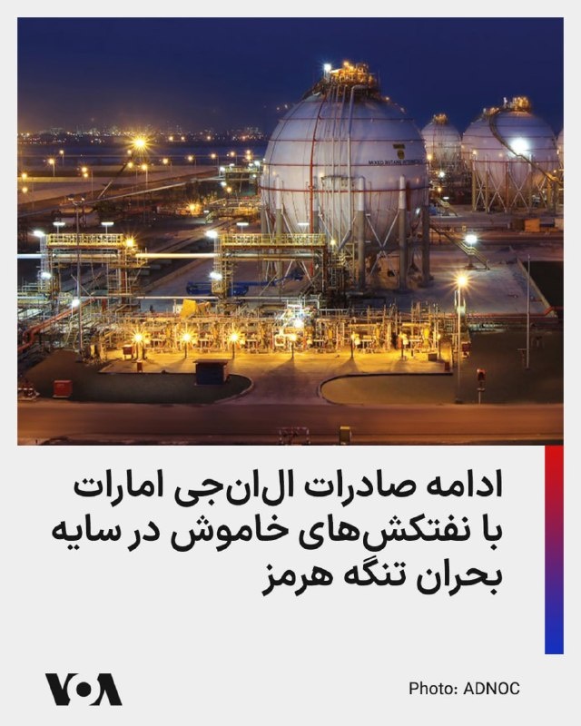

بلومبرگ گزارش داد شرکت ملی نفت ابوظبی، ادنوک، با وجود اختلال‌های حمل‌ونقل در خلیج فارس، همچنان گاز طبیعی مایع را روی نفتکش‌هایی بارگیری می‌کند که سامانه‌های ردیابی خود را خاموش کرده‌اند.

بر اساس این گزارش، این کشتی‌ها برای عبور از تنگه هرمز موقعیت خود را پنهان می‌کنند؛ مسیری که از آغاز جنگ و افزایش تهدیدها علیه کشتیرانی، با خطر جدی روبه‌رو شده است.

ادنوک پیش‌تر اعلام کرده بود به دلیل اختلال در عبور کشتی‌ها از تنگه هرمز، تولید و صادرات ال‌ان‌جی و برخی محصولات صادراتی خود را به‌طور موقت تنظیم کرده است.

تأسیسات داس آیلند این شرکت در داخل خلیج فارس قرار دارد و صادرات آن برای رسیدن به بازارهای جهانی ناچار به عبور از تنگه هرمز است.

رویترز نیز اوایل ماه مه گزارش داد دومین نفتکش ال‌ان‌جی تحت مدیریت ادنوک، پس از خاموش کردن سامانه ردیابی خود، از تنگه هرمز عبور کرده است.

داده‌های رهگیری کشتی‌ها نشان می‌دهد شماری از نفتکش‌ها در هفته‌های اخیر برای کاهش خطر هدف‌گیری یا توقیف، موقعیت خود را پنهان کرده یا الگوهای شناسایی غیرعادی داشته‌اند.
@FarsiVOA

## FarsiVOA — post 217878

🔺خاموشی اینترنت در ایران وارد هفته دوازدهم شد

◾️نت‌بلاکس، نهاد ناظر بر اختلالات اینترنت، اعلام کرد خاموشی دیجیتال در ایران وارد هفته دوازدهم و روز هفتادوهشتم شده است

◾️این محدودیت بی‌سابقه، کشوری ۹۰ میلیونی را تا حد زیادی از اینترنت جهانی جدا کرده و حقوق بشر، اقتصاد و آزادی‌های بنیادین شهروندان را در مقیاسی گسترده فرسایش می‌دهد.

◾️مقام‌های دولتی مدعی هستند که اینترنت حق عمومی و برابر شهروندان است، اما ساختار دسترسی در عمل به سمت اینترنت گزینشی، لیست سفید و «اینترنت پرو» حرکت کرده است.

◾️همچنین دسترسی به زیرساخت حیاتی اینترنت، به‌جای آنکه برای همه شهروندان و فعالان اقتصادی تضمین شود، به فرآیندی اداری، صنفی و گزینشی تبدیل شده است.

⬇️ بیشتر بخوانید:
https://ir.voanews.com/a/8150654.html

## DW_Farsi — post 124757

  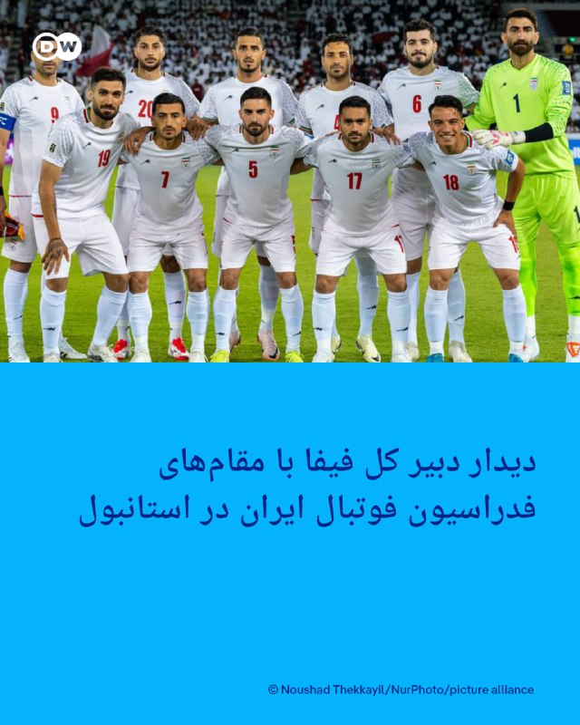

🔶 دیدار دبیر کل فیفا با مقام‌های فدراسیون فوتبال ایران در استانبول

خبرگزاری رویترز گزارش داد ماتیاس گرافستروم، دبیرکل فیفا (فدراسیون بین‌المللی فوتبال) روز شنبه ۲۶ اردیبهشت (۱۶ مه) در استانبول با مقام‌های فدراسیون فوتبال ایران دیدار خواهد کرد تا درباره حضور ایران در جام جهانی "اطمینان خاطر" بدهد.

جمهوری اسلامی شامگاه چهارشنبه ۲۳ اردیبهشت با حضور هزاران هوادار در میدان انقلاب تهران، مراسم بدرقه تیم ملی فوتبال برای جام جهانی را برگزار کرد.

انتشار تصاویر شعارهایی مانند "مرگ بر آمریکا" در این مراسم بازتاب گسترده‌ای در رسانه‌ها و شبکه‌های اجتماعی داشت.

بازیکنان قرار است هفته آینده تمرینات خود را در اردوی آماده‌سازی در ترکیه آغاز کنند.

مهدی تاج، رئیس فدراسیون فوتبال ایران پیش از این به دلیل ارتباط با سپاه پاسداران انقلاب اسلامی، اجازه ورود به کانادا برای شرکت در کنگره فیفا را دریافت نکرد.

آمریکا نیز همانند کانادا، سپاه پاسداران را در فهرست سازمان‌های تروریستی قرار داده است.

گزارش‌ها درباره محدودیت‌های احتمالی ورود برخی افراد مرتبط با سپاه پاسداران نیز این نگرانی‌ها را افزایش داده است. جمهوری اسلامی مسئولیت حل موضوع ویزا برای بازیکنان و اعضای تیم را بر عهده فیفا گذاشته است.

ایران قرار است هر سه بازی مرحله گروهی جام جهانی را در آمریکا برگزار کند.

پس از حملات آمریکا و اسرائیل به ایران در اواخر فوریه، مشارکت تیم ملی ایران در این رقابت‌ها که از ۱۱ ژوئن تا ۱۹ ژوئیه برگزار می‌شود، با ابهام روبه‌رو شده است.

@dw_farsi

## DW_Farsi — post 124756

  

🔶 قربانیان تروریسم خواستار مصادره ۳۴۴ میلیون دلار ارز دیجیتالی ایران شدند

گروهی از خانواده‌های قربانیان تروریسم در آمریکا از یک قاضی فدرال در منهتن نیویورک خواسته‌اند شرکت ارز دیجیتالی "تتر"، صادرکننده "استیبل‌کوین" را ملزم کند بیش از ۳۴۴ میلیون دلار دارایی دیجیتال مسدودشده مرتبط با ایران را به وکلای آن‌ها منتقل کند.

این درخواست روز پنجشنبه ۲۴ اردیبهشت (۱۴ مه) در دادگاه منطقه منهتن نیویورک ثبت شده و مربوط به خانواده‌هایی است که با بمب‌گذاری سال ۱۹۹۷ حماس در اورشلیم ارتباط دارند و در پرونده‌های مختلف مرتبط با تروریسم، احکام پرداختی سنگینی علیه ایران دریافت کرده‌اند.

مجموع این احکام شامل حدود ۵۵۲ میلیون دلار غرامت و ۱.۸۶ میلیارد دلار خسارت تنبیهی است.

دارایی ارز دیجیتالی جمهوری اسلامی در چارچوب عملیات "خشم اقتصادی" دولت آمریکا و با هدف محدود کردن توان مالی ایران مسدود شده بود.

وزارت خزانه‌داری آمریکا اعلام کرده بود که شبکه‌های مالی مرتبط با سپاه پاسداران و حزب‌الله در این روند هدف قرار گرفته‌اند.

طبق اسناد پرونده، دو کیف پول رمزارزی که مجموعا حدود ۳۴۴ میلیون دلار در آن‌ها نگهداری می‌شد، توسط شرکت تتر مسدود شده‌اند. اکنون شاکیان درخواست کرده‌اند این دارایی‌ها برای اجرای احکام دادگاه‌های آمریکا علیه ایران به آن‌ها منتقل شود.

@dw_farsi

## DW_Farsi — post 124755

🔶 ایران متهم به هک سامانه‌های پایش سوخت پمپ‌بنزین‌های آمریکا

شبکه تلویزیونی سی‌ان‌ان در گزارشی اختصاصی نوشت مقام‌های آمریکایی گمان می‌کنند هکرهای ایرانی پشت مجموعه‌ای از نفوذهای سایبری به سامانه‌های پایش مخازن سوخت در پمپ‌بنزین‌های چندین ایالت آمریکا قرار دارند؛ سامانه‌هایی که میزان سوخت موجود در مخازن ذخیره را اندازه‌گیری و گزارش می‌کنند.

به گفته منابع آگاه از این فعالیت‌ها، هکرها از ضعف امنیتی سامانه‌های "سنجش خودکار مخازن (ATG)" سوءاستفاده کرده‌اند؛ سامانه‌هایی که به اینترنت متصل هستند و در برخی موارد حتی با رمز عبور محافظت نمی‌شده‌اند.

بر اساس گزارش سی‌ان‌ان، هکرها در برخی موارد توانسته‌اند داده‌های نمایش‌داده‌شده درباره سطح سوخت را دستکاری کنند، اما میزان واقعی سوخت موجود در مخازن تغییر نکرده است. تاکنون گزارشی از خسارت فیزیکی، انفجار، نشت یا آسیب مستقیم منتشر نشده، اما مقام‌های آمریکایی و کارشناسان بخش خصوصی هشدار داده‌اند که دسترسی به چنین سامانه‌هایی می‌تواند از نظر امنیتی خطرناک باشد؛ زیرا اصولاً ممکن است به مهاجم امکان دهد نشتی سوخت را از دید سامانه‌های هشدار پنهان کند.

@dw_farsi

## DW_Farsi — post 124754

  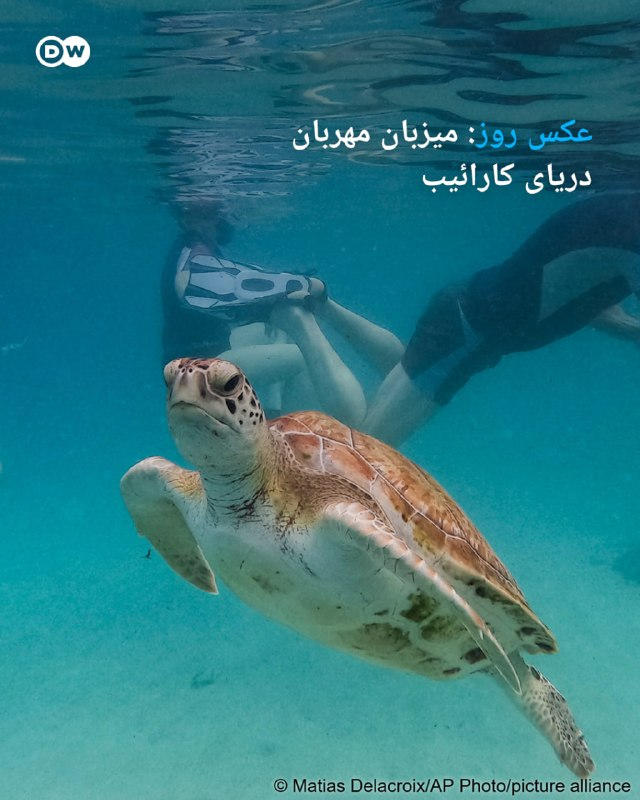

📸 عکس روز: میزبان مهربان دریای کارائیب

یک لاک‌پشت دریایی روز جمعه، ۱۵ مه ۲۰۲۶ (۲۵ اردیبهشت ۱۴۰۵)، در ساحل پیسکادو واقع در منطقه وست‌پونت در جزیره کوراسائو، در میان گردشگرانی که مشغول غواصی سطحی هستند، شنا می‌کند. جزیره کوراسائو در دریای کارائیب به خاطر آب‌های زلال و حیات وحش دریایی غنی خود، یکی از مقاصد محبوب غواصان و دوستداران طبیعت است.

@dw_farsi

## DW_Farsi — post 124753

  

🔶 ترامپ: در عملیات مشترک آمریکا و نیجریه نفر دوم داعش کشته شد

دونالد ترامپ، رئیس‌جمهور آمریکا شامگاه جمعه ۲۵ اردیبهشت (۱۵ مه) اعلام کرد که "ابو بلال المینوکی"، نفر دوم گروه داعش در یک عملیات مشترک میان نیروهای آمریکا و ارتش نیجریه کشته شده است.

ترامپ در شبکه اجتماعی "تروث سوشال" نوشت این عملیات به دستور او و با اجرای نیروهای آمریکایی و نیروهای مسلح نیجریه "به‌صورت دقیق و پیچیده" انجام شده و هدف آن حذف "فعال‌ترین تروریست جهان" از میدان نبرد بوده است.

او افزود که المینوکی تصور می‌کرد می‌تواند در آفریقا مخفی شود، اما نیروهای اطلاعاتی آمریکا از فعالیت‌های او مطلع بوده‌اند.

رئیس جمهور آمریکا که پیش‌تر نیجریه را به ناتوانی در حفاظت از مسیحیان در برابر شبه‌نظامیان اسلام‌گرا در شمال‌غرب این کشور متهم کرده بود، از دولت نیجریه بابت همکاری در این عملیات قدردانی کرد.

دولت نیجریه هرگونه تبعیض مذهبی را رد و اعلام کرده است که نیروهای امنیتی این کشور با گروه‌های مسلحی مقابله می‌کنند که به مسیحیان و  مسلمانان حمله می‌کنند.

به گزارش رویترز، آمریکا پیش‌تر نیز در ماه دسامبر سال گذشته حملاتی علیه نیروهای وابسته به گروه داعش در نیجریه انجام داده بود.

واشنگتن بعد از این حملات پهپادهایی به همراه حدود ۲۰۰ نیروی نظامی برای آموزش و پشتیبانی اطلاعاتی در اختیار ارتش نیجریه قرار داد تا با شورش‌های وابسته به داعش و القاعده که در غرب آفریقا در حال گسترش هستند، مقابله کند.

@dw_farsi

## RadioFarda — post 157254

🔸در یک برنامه زنده تلویزیونی که از شبکه افق صداوسیما پخش شده است، مجری برنامه با اسلحه واقعی به پرچم امارات متحده عربی شلیک می‌کند.

🔸در این برنامه که موضوع آن درباره آموزش شلیک با اسلحه کلاشنیکف است، فردی که لباس نظامی به تن دارد و صورت خود را با ماسک پوشانده است مراحل آماده‌سازی اسلحه و شلیک گلوله را به مجری آموزش می‌دهد.

🔸مجری برنامه هم در مرحله شلیک تصمیم می‌گیرد به پرچم امارات که در بنر مربوط به دکور استودیو، شلیک کند.

🔸این اقدام هم‌زمان با اوج‌گیری تنش‌های لفظی میان ایران و امارات در روزهای اخیر انجام شده است.

🔸امارات متحده عربی روز جمعه ۲۵ اردیبهشت «تلاش‌ها برای توجیه حملات تروریستی ایران» را رد کرد و گفت که حق پاسخگویی به هرگونه تهدید، ادعا یا اقدام خصمانه ایران را برای خود محفوظ می‌دارد.

🔸این بیانیه در پی نشست روز ۲۴ اردیبهشت بریکس در دهلی نو منتشر شد که در آن‌جا عباس عراقچی، وزیر خارجه ایران، با اشاره به حملات آمریکا و اسرائیل، گفت: «امارات شریک فعال این تجاوز است.»

🔸ایران در جریان حملات آمریکا و اسرائیل بارها امارات متحده عربی را هدف قرار داد.

@RadioFarda

## RadioFarda — post 157253

  

🔸عباس عراقچی، وزیر امور خارجه جمهوری اسلامی، روز جمعه ۲۵ اردیبهشت در گفت‌وگو با خبرنگاران در هند ادعا کرد که ایران با عمان در حال رایزنی برای ایجاد سازوکار مناسب برای اداره تنگه هرمز است.

🔸بر اساس ادعای عراقچی، از آنجا که ایران و عمان در دو سوی تنگه هرمز قرار دارند، آنها باید برای مدیریت این آبراهه تصمیم بگیرند.

🔸عمان تاکنون هیچ واکنشی به این اظهار نظر نداشته و در برابر آن سکوت کرده است.

🔸عباس عراقچی این طور توضیح داده است:‌ «ایران و عمان دو کشور ساحلی در دو سوی تنگه هرمز هستند و این تنگه در آب‌های سرزمینی دو کشور قرار دارد و میان آن آب‌های بین‌المللی وجود ندارد. بنابراین مدیریت این مسیر باید توسط ایران و عمان انجام شود.»

🔸این در حالی است که ایالات متحده با این که این تنگه باید در دست ایران باشد و تهران می‌تواند در ازای اجازه عبور از کشتی‌ها عوارض دریافت کند از ابتدا مخالفت کرده و می‌گوید که عمان هم با این موضع‌گیری موافق است.

@RadioFarda

## RadioFarda — post 157252

  

🔸قوه قضاییه جمهوری اسلامی روز شنبه ۲۶ اردیبهشت از توقیف اموال ۵۱ نفر در استان یزد به اتهام «جاسوسی و همکاری با کشور‌های متخاصم و گروه‌های معاند» خبر داد.

🔸بنا بر اعلام مرکز رسانه قوه قضائیه اموال این افراد «به نفع مردم و هزینه‌کرد برای بازسازی اماکن آسیب‌دیده از جنگ توقیف شده است.»

🔸بنابر این اطلاعیه قوه قضاییه ۲۰ نفر از این افراد در داخل کشور و ۳۱ نفر در خارج از ایران به‌سر می‌برند و اموال آن‌ها «شامل وجوه نقد بانکی، اموال منقول و غیرمنقول، سهام شرکت‌ها و حتی اموال وکالتی» است.

🔸این نهاد اسامی این افراد را اعلام نکرده و برای اتهامات علیه این افراد شواهد و مدارکی ارائه نداده است.

🔸پیش از این نیز گزارش‌های متعددی از توقیف اموال شماری از روزنامه‌نگاران، فعالان سیاسی و مدنی، هنرمندان، ورزشکاران و چهره‌های شناخته‌شده با اتهاماتی چون «خیانت» به وطن و «وابستگی» به اسرائیل و «همکاری با کشورهای متخاصم» منتشر شده بود.

@RadioFarda

## IranianMinds — post 20232

  

🔴۱۹ روز قبل از سقوط رژیم جنایتکار قذافی، به دست مجریان تلویزیون اسلحه داده بودند.

@IranianMinds

## IranianMinds — post 20231

🔴کانال ۱۲ اسرائیل:

جنگ سوم با ایران نزدیک است.

@IranianMinds

## BBCPersian — post 281208

🔻عضو هیئت رئيسه مجلس: تشکیل ستاد ویژه فضای مجازی خلاف قانون است

علیرضا سلیمی، عضو هیئت رئيسه مجلس ایران، تشکیل ستاد ویژه فضای مجازی از سوی مسعود پزشکیان را «خلاف قانون برنامه هفتم» و «مغایر با سیاست‌های کلی نظام» خواند.

آقای سلیمی گفت: «با توجه به اینکه شورای عالی فضای مجازی و مرکز ملی فضای مجازی نیز هر دو وجود دارند و وظایف آنها کاملاً روشن است، چگونه ممکن است رئیس‌جمهور که خود رئیس شورای عالی فضای مجازی است، اختیارات مربوط به شورا را به ستادی خارج از شورا واگذار کند؟»

تشکیل ویژه فضای مجازی پیش از این هم با انتقادهایی همراه بوده است. مصطفی پوردهقان، دبیر دوم کمیسیون صنایع و معادن مجلس، تشکیل این ستاد را اقدامی «تزئینی» خوانده و گفته بود که «این تصمیم‌ها بیشتر جنبه روانی دارد و قرار نیست تغییر مشخصی ایجاد شود.»

آقای پزشکیان چند روز پیش از تشکیل ستادی ویژه برای ساماندهی فضای مجازی خبر داد و محمدرضا عارف، معاون اول خود، را به سمت رئیس این ستاد انتخاب کرد.

در حکم آقای پزشکیان بر «حکمرانی یکپارچه» در فضای مجازی و پایان دادن به «چندصدایی» و جلوگیری از «موازی‌کاری» میان نهادهای مسئول تأکید شده است.

این ستاد در حالی تشکیل شده است که اینترنت در بیش از ۷۰ روز گذشته یعنی از زمان شروع جنگ آمریکا و اسرائیل با ایران عملا قطع است.

https://bbc.in/4tEavKe
@BBCPersian

## BBCPersian — post 281207

🔻مهدی چمران، رئیس شورای شهر تهران، درباره تمدید رایگان شدن اتوبوس و مترو در پایتخت گفت کار احساسی نمی‌توان انجام داد و قرار نیست تمدید شود.

او در گفت‌وگو با باشگاه خبرنگاران جوان گفت اجرای چنین تصمیمی نیازمند ارائه طرح یا لایحه است، اما تاکنون هیچ‌یک از این دو به شورای شهر ارائه نشده است.

اتوبوس‌های درون‌شهری در تهران اولین‌بار نهم اسفند ۱۴۰۴ و به دنبال شروع جنگ و مترو از ۲۴ اسفند رایگان شد. پس از آن شورای شهر بصورت هفتگی این طرح را تمدید کرد.

پرویز سروری، نایب رئیس شورای شهر تهران پنجم اردیبهشت در تلویزیون ایران اعلام کرد: براساس برنامه‌ریزی صورت گرفته قرار است اتوبوس و مترو با تصویب شورای اسلامی شهر تهران برای همیشه رایگان شود.
او گفت در حال برنامه‌ریزی با نمایندگان و مدیریت شهرداری هستیم تا امکان دائمی‌شدن خدمات رایگان مترو و اتوبوس در تهران انجام شود.

https://bbc.in/4dNI8o4

@BBCPersian

## BBCPersian — post 281206

🔻بنابر گزارش‌ها وزارت دادگستری آمریکا در نظر دارد در روزهای آینده علیه رائول کاسترو، رهبر سابق کوبا، اعلام جرم کند. این پرونده به سرنگونی دو هواپیما با پدافند هوایی کوبا در سال ۱۹۹۶ مربوط می‌شود که در جریان آن چهار نفر کشته شدند. این هواپیماها متعلق به گروه…

## BBCPersian — post 281205

  

🔻بنابر گزارش‌ها وزارت دادگستری آمریکا در نظر دارد در روزهای آینده علیه رائول کاسترو، رهبر سابق کوبا، اعلام جرم کند.

این پرونده به سرنگونی دو هواپیما با پدافند هوایی کوبا در سال ۱۹۹۶ مربوط می‌شود که در جریان آن چهار نفر کشته شدند.

این هواپیماها متعلق به گروه تبعیدی آمریکایی «برادران برای نجات» بود؛ گروهی که خود را نهادی حقوق بشری توصیف می‌کند که هدفش کمک به قایق‌های مهاجرانی است که از کوبا فرار می‌کنند. این گروه قبلا در نزدیکی سواحل کوبا اقدام به پخش اعلامیه‌های ضد دولت کاسترو کرده بود.

دولت کوبا در زمان سرنگونی این هواپیماها مدعی شده بود که هواپیماها حریم هوایی این کشور را نقض کرده‌اند، اما سازمان بین‌المللی هوانوردی غیرنظامی اعلام کرد که حمله در آب‌های بین‌المللی رخ داده است.

به گفته مقام‌های آمریکایی، کیفرخواست احتمالی ممکن است از هفته آینده و پس از تأیید هیئت منصفه صادر شود. این اقدام بخشی از فشارهای فزاینده واشنگتن علیه کوبا ارزیابی می‌شود. فشاری که تحریم‌ها و محدودیت‌های نفتی را شامل می‌شود.

📸Getty Images
@BBCPersian

## BBCPersian — post 281204

🔻اسرائیل از موج تازه حملات علیه مواضع حزب‌الله خبر داد

ارتش اسرائیل می‌گوید که موج تازه‌ای از حملات هوایی را علیه مواضع حزب‌الله در جنوب لبنان آغاز کرده است.

ارتش اسرائیل پیش‌تر به ساکنان چندین منطقه در جنوب لبنان دستور تخلیه داده بود.

این حملات جدید یک روز پس از آن انجام شد که نمایندگان اسرائیل و لبنان در نشستی در واشنگتن، آتش‌بس شکننده جاری را برای ۴۵ روز دیگر تمدید کردند.

پیش‌تر، مقام‌های لبنانی اسرائیل را متهم کردند که عمداً مراکز درمانی را هدف قرار داده است.

وزارت بهداشت لبنان اعلام کرد که اسرائیل یک مرکز امدادرسانی را هدف حمله قرار داده که در نتیجه آن شش نفر، از جمله سه امدادگر، کشته شدند.

اما اسرائیل هدف قرار دادن نیروهای امدادی و پزشکی را رد کرد.

https://bbc.in/4uQiCnV
@BBCPersian

## BBCPersian — post 281203

  

🔻ساعاتی پس از آنکه دونالد ترامپ گفت که هنوز در مورد فروش سلاح به تایوان تصمیم نگرفته است، رئیس‌جمهور تایوان بر اهمیت و لزوم این موضوع تاکید کرده است.

سخنگوی رئیس‌جمهور تایوان گفت که فروش تسلیحات آمریکا به تایوان نه تنها تعهدی حقوقی است، بلکه همواره یک عامل بازدارنده مشترک علیه تهدیدهای منطقه‌ای بوده است.

این موضعگیری تایوان پس از دیداردونالد ترامپ و همتای چینی‌اش شی‌ جین‌پینگ است که در آن رهبر چین هشدار داد که «مدیریت نامناسب» مساله تایوان می‌تواند به درگیری یا جنگ مستقیم بینجامد.

چین تایوان را یک استان متمرد خود می‌داند و امکان استفاده از زور برای تحت کنترل درآوردن آن را رد نکرده است.

واشنگتن بر اساس «قانون روابط با تایوان» موظف است برای این جزیره سلاح فراهم کند.

📷Getty Images
@BBCPersian

## idfinfarsi — post 11589

ارتش اسرائیل و شین‌بت عزالدین حداد را به هلاکت رساندند - رئیس شاخه نظامی سازمان تروریستی حماس و از آخرین مقامات ارشد این سازمان که کشتار خونین ۷ اکتبر را پیش بردند

سخنگوی ارتش اسرائیل و سخنگوی شین‌بت اعلام می‌کنند که در یک حمله دقیق دیروز (جمعه) در محدوده شهر غزه، تروریست عزالدین حداد - رئیس شاخه نظامی سازمان تروریستی حماس و از معماران کشتار ۷ اکتبر به هلاکت رسید.

حداد پس از به هلاکت رسیدن محمد سنوار به این سمت منصوب شد و در طول دوره اخیر برای بازسازی توانمندی‌های شاخه نظامی سازمان تروریستی فعالیت کرد و همچنین به برنامه‌ریزی طرح‌های تروریستی متعدد علیه شهروندان اسرائیل و نیروهای ارتش اسرائیل پرداخت.

در طول جنگ، حداد در نگهداری بسیاری از ربوده شدگان اسرائیلی در اسارت حماس دخیل بود. همچنین حداد سازوکار نگهداری ربوده شدگان را اداره کرد و خود را با اسیران اسرائیلی احاطه کرد به‌منظور جلوگیری از به هلاکت رسیدنش.

حداد یکی از باسابقه‌ترین فرماندهان در این سازمان است که در دوره تأسیس آن به صفوف آن پیوست و از نزدیک‌ترین افراد به رهبری حماس بود. در طول دوره حضور خود در سازمان، حداد نقش مرکزی در حاکمیت تروریستی داشت و مجموعه‌ای از مناصب کلیدی از جمله فرمانده تیپ شهر غزه و فرمانده واحدهای دیگر را بر عهده داشت.

حداد از آخرین فرماندهان ارشد در شاخه نظامی حماس است که بر برنامه‌ریزی و اجرای کشتار ۷ اکتبر و بر مدیریت جنگ علیه نیروهای ارتش اسرائیل فرماندهی کردند. به هلاکت رسیدن او به به هلاکت رسیدن بسیاری از مقامات ارشد حماس در طول جنگ اضافه می‌شود.

## Dirty_Kids — post 389547

‏لیست مشاغل باقی مانده در ایران :
کانفیگ فروش
عرق فروش
آدم فروش
اسنپ
تریاک فروش

بقیه هم نشستن همو نگاه میکنن …

@Dirty_Kids 👻

## Dirty_Kids — post 389546

  <a href="telegram/content/Dirty_Kids_389546_1778928116.mp4" target="_blank">🎬 Download video</a>

🔴 توی انگلیس وقتی یه پیرمرد بالاخره به رویاش رسید و یه خانم زیبا رو بوس کرد، از شدت هیجان و شادی بیهوش شد و کارش به بیمارستان کشید.

@Dirty_Kids 👻

## Dirty_Kids — post 389545

  

بادبان با همراهی شما 50 هزار نفری شد
🎉

🛡فروش سرویس جدید با کاهش قیمت تا گیگی 200 هزار تومان باز شد
🛒

🎊کد تخفیف 100 هزار تومانی بادبان فعال بوده و میتونید برای خرید اولتون ازش استفاده کنید

BadBan4k : کد تخفیف

🚀همچنین میتونید با معرفی بادبان از طریق لینک معرفی به دوستان 10 درصد از مبلغ تمام خرید هاشون رو در کیف پولتون داشته باشید
R26
وقتی بادبان داری، هیچ بادی مانع نیست… با ما راه بازه حتی وقتی اینترنت ملیه!

⛵️@BadBan_VPN | کانال 

🤖@BadBan_VPNBot | ربات 

📞@BadBan_VPNSupport | پشتیبانی

## Dirty_Kids — post 389543

پاسداران سپاه اسلام هستند که خیلی شیک با دیدن اولین اسلحه دست طرف مقابل تسلیم شدند:)

تجهیزات این نیروهای ویژه سپاه در یک عملیات واقعی هم جالب است
حتی تجهیزات غواصی هم مخصوص عملیات نیروی ویژه نیست
گفته شده بود اینها روی لنج بودند ولی با توجه به عکس به نظر روی یک قایق تندرو بودند و حتی پیش از آغاز عملیات خفت شدند
با این حساب پاشون بوبیان هم نرسیده

@Dirty_Kids 👻

## Hranews — post 112967

دادگاه تجدیدنظر؛ امیر رحیمی، معلم به حبس محکوم شد

❗️
❗️
❗️
❗️
❗️– امیر رحیمی، معلم محبوس در زندان شهرستان درود و از بازداشت شدگان اعتراضات دی ماه ۱۴۰۴، توسط دادگاه تجدیدنظر استان لرستان به چهار سال حبس محکوم شد.

#امیر_رحیمی

ادامه مطلب
↘️
@hranews_bot تماس ✉️ - @Hranews کانال هرانا 🆑

## Hranews — post 112966

گزارشی از بازداشت صباح بیواره در پیرانشهر

❗️
❗️
❗️
❗️
❗️– صباح بیواره، شهروند اهل پیرانشهر روز پنجشنبه ۲۴ اردیبهشت ماه، توسط نیروهای امنیتی در این شهرستان بازداشت شده و کماکان از محل نگهداری وی اطلاعی حاصل نشده است.

#صباح_بیواره

ادامه مطلب

↘️
@hranews_bot تماس ✉️ - @Hranews کانال هرانا 🆑

## Hranews — post 112965

اموال ۵۱ شهروند در استان یزد توقیف شد

❗️
❗️
❗️
❗️
❗️– دارایی‌ها و اموال ۵۱ شهروند در استان یزد مصادره شد. دستگاه قضایی این افراد را متهم به «همکاری با دشمن» دانسته است. ۲۰ تن از این شهروندان در داخل کشور و ۳۱ نفر دیگر در خارج از ایران سکونت دارند.

ادامه مطلب

↘️
@hranews_bot تماس ✉️ - @Hranews کانال هرانا 🆑

## alonews — post 120361

  <a href="telegram/content/alonews_120361_1778928118.webm" target="_blank">🎬 Download video</a>

👈امارات مدعی شد: خروج از اوپک و اوپک‌پلاس نشانه اختلاف با شرکا نیست

✅ @AloNews خبر جنگ

## alonews — post 120360

  <a href="telegram/content/alonews_120360_1778928118.webm" target="_blank">🎬 Download video</a>

👈یک مقام مطلع نظامی به نورنیوز: در صورت وقوع جنگ، اهدافی که قبلاً مصون ماندند این‌بار در تیررس‌اند

✅ @AloNews خبر جنگ

## alonews — post 120359

  <a href="telegram/content/alonews_120359_1778928118.webm" target="_blank">🎬 Download video</a>

👈سی‌ان‌ان: مشاوران ترامپ خواهان پایان فوری جنگ هستند؛ فشار اقتصادی رای‌دهندگان را نگران کرده

✅ @AloNews خبر جنگ

## alonews — post 120358

  <a href="telegram/content/alonews_120358_1778928119.webm" target="_blank">🎬 Download video</a>

👈مهاجرانی: نگاه دولت به اینترنت دسترسی برابر برای همه شهروندان است!

✅ @AloNews خبر جنگ

## alonews — post 120357

  <a href="telegram/content/alonews_120357_1778928119.webm" target="_blank">🎬 Download video</a>

👈وزارت دفاع اسرائیل می‌خواد برد جنگنده‌های F-35I رو بیشتر کنه - DefNews

✅ @AloNews خبر جنگ

## alonews — post 120356

  <a href="telegram/content/alonews_120356_1778928119.mp4" target="_blank">🎬 Download video</a>

👈جنگنده‌های جدید "MiG-29" سوریه رسماً رفتن تو عملیات و دارن برای دفاع از حریم هوایی سوریه پرواز می‌کنن

✅ @AloNews خبر جنگ

## alonews — post 120355

  <a href="telegram/content/alonews_120355_1778928120.webm" target="_blank">🎬 Download video</a>

👈یک مقام ارشد اسرائیلی در گفتگو با کانال ۱۲ اسرائیل: تل‌آویو در حال آماده شدن برای یک جنگ چند روزه یا چند هفته‌ای با ایران است

✅ @AloNews خبر جنگ

## alonews — post 120354

  <a href="telegram/content/alonews_120354_1778928120.webm" target="_blank">🎬 Download video</a>

👈ترامپ: ۵ بار با ایران نزدیک توافق شدم، ولی روز بعدش زدن زیرش

✅ @AloNews خبر جنگ

## alonews — post 120353

  <a href="telegram/content/alonews_120353_1778928120.webm" target="_blank">🎬 Download video</a>

👈حدادی، عضو کمیسیون صنایع: گران شدن خودرو توجیه فنی ندارد/قیمت‌ها باید به قبل از جنگ بازگردد

✅ @AloNews خبر جنگ

## alonews — post 120351

## alonews — post 120350

## alonews — post 120349

  <a href="telegram/content/alonews_120349_1778928120.webm" target="_blank">🎬 Download video</a>

🔴فوری / ارتش اسرائیل : عزالدین الحداد فرمانده گردان‌های القسام، همراه با محافظ‌هاش ترور شد 
✅ @AloNews خبر جنگ

---
📅 بروزرسانی: 1405/02/26 12:35
---

## VahidOOnLine — post 240435

  

♦️خبرگزاری‌های روسیه به نقل از سرگئی ریابکوف، معاون وزیر خارجه این کشور، گزارش دادند مسکو و واشنگتن همچنان تماس‌های بسیار نزدیک در سطوح عالی را حفظ کرده‌اند.
ریابکوف روز شنبه گفت احتمال دارد سرگئی لاوروف، وزیر خارجه روسیه، و مارکو روبیو، وزیر خارجه آمریکا، در دوره پیش‌رو تماس‌های بیشتری با یکدیگر داشته باشند.
او با این حال تاکید کرد روند بهبود و پیشرفت روابط میان روسیه و آمریکا «کند و دشوار» است.
مقام‌های رسمی روسیه و آمریکا، روز نهم اردیبهشت ماه از تماس تلفنی یک ساعت و نیمه میان دونالد ترامپ و ولادیمیر پوتین خبر داده بودند.
‌🇸🇦 Indypersian

🤖 @VahidOOnLine

## VahidOOnLine — post 240434

  

صدا و سیمای جمهوری اسلامی جمعه چند برنامه پخش کرد که در آنها مجریان در بخش‌های استودیویی با در دست داشتن تفنگ ظاهر شدند و کار با سلاح‌های سبک آموزش داده شد. مجریان در این برنامه‌ها اعلام کردند که در صورت لزوم به جنگ خواهند پیوست.

این برنامه‌ها که دست‌کم در سه بخش پخش شد، در رسانه‌های داخلی بازنشر و در شبکه‌های اجتماعی با واکنش‌هایی همراه شد. برخی کاربران شبکه‌های اجتماعی این بخش‌ها را نشانه‌ای از بسیج در شرایط جنگی توصیف کردند.

جکسون هینکل، مفسر سیاسی آمریکایی، در شبکه اجتماعی ایکس نوشت تلویزیون دولتی ایران نحوه استفاده و شلیک با کلاشینکف را به‌عنوان «آمادگی برای تهاجم زمینی آمریکا» نشان می‌دهد.
‌🏁 🇬🇧 IranintlTV

🤖 @VahidOOnLine

## VahidOOnLine — post 240433

  <a href="telegram/content/VahidOOnLine_240433_1778922350.mp4" target="_blank">🎬 Download video</a>

♦️سخنگوی وزارت کشور از فراهم شدن زمینه برای «شنیده شدن اعتراضات مردمی» خبر داد، اظهاراتی که در حالی مطرح می‌شود جمهوری اسلامی دی‌ماه گذشته در جریان انقلاب ملی ایرانیان، دست به یکی از بی‌سابقه‌ترین سرکوب‌های خیابانی زد و هزاران شهروند معترض را هدف گلوله قرار داد.
علی زینی‌وند، سخنگوی وزارت کشور، با اشاره به افزایش فشارهای اقتصادی و نارضایتی عمومی اعلام کرد که «گرانی برخی کالاها قابل انکار نیست» و دولت نیز از شرایط دشوار معیشتی مردم آگاه است. او گفت تمرکز ستاد تنظیم بازار بر کنترل قیمت‌هاست و همزمان موضوعاتی مانند افزایش احتمالی یارانه‌ها، اعطای مهلت در پرداخت اقساط و مالیات و برخی حمایت‌های معیشتی دیگر در دست بررسی قرار دارد.
زینی‌وند همچنین مدعی شد که بسترهایی برای شنیده شدن اعتراضات و مطالبات مردم توسط مسئولان در حال فراهم شدن است؛ این در حالی است که تنها چند ماه پیش، اعتراضات مردمی در شهرهای مختلف ایران با برخوردهای امنیتی گسترده، بازداشت‌های وسیع و تیراندازی مستقیم به معترضان و کشته شدن هزاران معترض مواجه شد.
‌🇸🇦 Indypersian

🤖 @VahidOOnLine

## VahidOOnLine — post 240432

  

حسین شریعتمداری، نماینده رهبر جمهوری اسلامی در روزنامه کیهان، نوشت کشورهای عربستان سعودی، امارات متحده عربی، کویت، قطر، بحرین و اردن در جنگ اخیر «حضور و شرکت مستقیم داشتند» و به همین دلیل، باید «بخشی از اهداف نشاندار» حکومت ایران در انتقام خون علی خامنه‌ای باشند.

او افزود مذاکره با آمریکا و این کشور‌های عربی «بخشی از سازوکار تعریف‌شده نظام» است، اما «جنگ نباید و نمی‌تواند بدون انتقام سخت از قاتلان امام شهیدمان به نقطه پایان برسد».
‌🏁 🇬🇧 IranintlTV

🤖 @VahidOOnLine

## VahidOOnLine — post 240431

  <a href="telegram/content/VahidOOnLine_240431_1778922352.mp4" target="_blank">🎬 Download video</a>

گروه ناظر اینترنتی نت‌بلاکس اعلام کرد خاموشی دیجیتال در ایران اکنون وارد دوازدهمین هفته و هفتادوهشتمین روز خود شده است.
نت‌بلاکس می‌گوید این قطع اینترنت که یک کشور ۹۰ میلیونی را برای مدتی بی‌سابقه تا حد زیادی از دسترسی به اینترنت جهانی محروم کرده، همچنان در حال تضعیف حقوق بشر، اقتصاد و آزادی‌های اساسی در ایران است.
‌🏁 🇬🇧 ManotoTV

🤖 @VahidOOnLine

## VahidOOnLine — post 240430

  

♦️وزیر نفت جدید عراق، روز شنبه ۲۶ اردیهشت ماه اعلام کرد این کشور در اپریل گذشته تنها ۱۰ میلیون بشکه نفت از طریق تنگه هرمز صادر کرده است، رقمی که پیش از آغاز جنگ ایران حدود ۹۳ میلیون بشکه در ماه بود.
باسم محمد، وزیر نفت عراق، روز شنبه در یک نشست خبری گفت بسته شدن تنگه هرمز در پی جنگ ایران باعث کاهش شدید صادرات نفت کشورهای عربستان سعودی، امارات، کویت و عراق شده و همزمان قیمت نفت را به‌طور قابل توجهی افزایش داده است.
او همچنین گفت صادرات نفت خام عراق از طریق خط لوله کرکوک–جیهان از ماه مارس از سر گرفته شده، اقدامی که پس از توافق بغداد و دولت اقلیم کردستان عراق برای آغاز مجدد انتقال نفت انجام شد.
وزیر نفت عراق افزود: «در حال حاضر روزانه ۲۰۰ هزار بشکه از طریق بندر جیهان صادر می‌کنیم و برنامه داریم این رقم را به ۵۰۰ هزار بشکه افزایش دهیم.»
محمد همچنین با اعلام آنکه بغداد تولید پنج میلیون بشکه نفت در روز را هدف‌گذاری کرده است گفت، کشورش قصد دارد با اوپک برای افزایش ظرفیت تولید و صادرات خود همکاری کند.
‌🇸🇦 Indypersian

🤖 @VahidOOnLine

## VahidOOnLine — post 240429

  

نت‌بلاکس اعلام کرد خاموشی دیجیتال در ایران وارد دوازدهمین هفته خود شده و اکنون به هفتاد و هشتمین روز رسیده است؛ وضعیتی که به گفته این نهاد، یک قطعی بی‌سابقه در مقیاس ملی به شمار می‌رود.

بر اساس این گزارش، قطع اینترنت که کشوری با ۹۰ میلیون جمعیت را تا حد زیادی آفلاین کرده، همچنان به تضعیف گسترده حقوق بشر، اقتصاد و آزادی‌های اساسی ادامه می‌دهد.
‌🏁 🇬🇧 IranintlTV

🤖 @VahidOOnLine

## VahidOOnLine — post 240428

  <a href="telegram/content/VahidOOnLine_240428_1778922354.mp4" target="_blank">🎬 Download video</a>

رسانه‌های عراقی گزارش دادند صدای انفجارهایی که روز شنبه در بغداد، پایتخت عراق شنیده شد، ناشی از شلیک گلوله‌های توپخانه به مناسبت تشکیل دولت جدید بوده است.
یک منبع امنیتی به خبرگزاری فرانسه گفت این شلیک‌ها همزمان با آغاز به کار دولت به ریاست نخست‌وزیر جدید عراق، علی الزیدی، انجام شده است.
پیش‌تر برخی رسانه‌ها از شنیده شدن چند انفجار در مرکز بغداد خبر دادند.
‌🏁 🇬🇧 ManotoTV

🤖 @VahidOOnLine

## VahidOOnLine — post 240427

  

♦️رئیس‌جمهوری نیجریه و ارتش این کشور روز شنبه تایید کردند یکی از رهبران ارشد داعش در جریان یک عملیات مشترک با نیروهای آمریکایی در نیجریه کشته شده است.
بولا تینوبو، رئیس‌جمهوری نیجریه، در بیانیه‌ای پس از اعلام اولیه این خبر از سوی دونالد ترامپ گفت: «نیروهای مسلح مصمم نیجریه در همکاری نزدیک با نیروهای مسلح ایالات متحده، عملیاتی جسورانه انجام دادند که ضربه سنگینی به صفوف داعش وارد کرد.»
نیروهای دفاعی نیجریه اعلام کردند فرد کشته‌شده «ابوبلال المنوکی» بوده است. فردی که به گفته آن‌ها از رهبران ارشد داعش و «یکی از فعال‌ترین تروریست‌های جهان» به شمار می‌رفت.
دونالد ترامپ، رئیس‌جمهوری آمریکا، شنبه ۲۶ اردیبهشت با انتشار پیامی در «تروث سوشال» اعلام کرد نیروهای آمریکایی با همکاری ارتش نیجریه، در جریان یک عملیات پیچیده و دقیق، «ابوبلال المینوکی» مرد شماره دو و فعال‌ترین عضو ارشد داعش در جهان را از پای درآورده‌اند.
‌🇸🇦 Indypersian

🤖 @VahidOOnLine

## VahidOOnLine — post 240426

  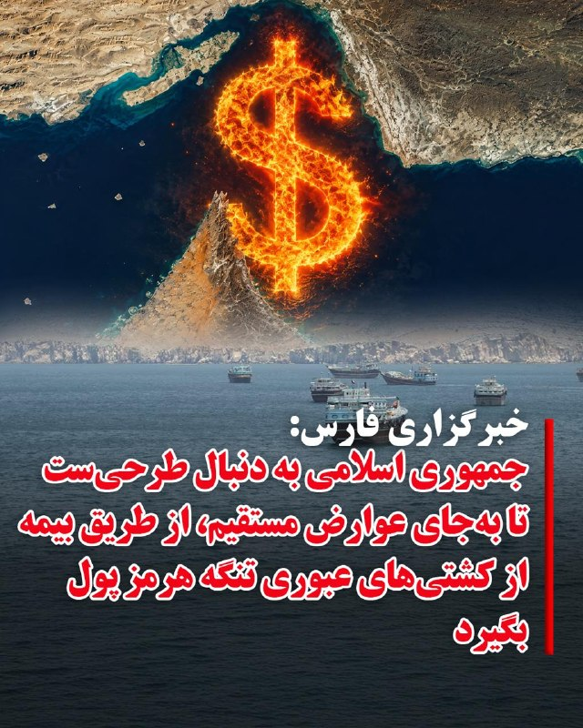

♦️خبرگزاری فارس، روز شنبه ۲۶ اردیبهشت ماه گزارش داد، وزارت اقتصاد در حال پیگیری طرحی است که با استفاده از سازوکار بیمه، «مدیریت تنگه هرمز را امکان‌پذیر کند». طرحی که به گفته فارس، می‌تواند در شرایط غیرجنگی از سوی کشورها نیز پذیرفته شود و در عین حال امکان مدیریت عبور و مرور دریایی را برای ایران فراهم کند.
فارس بر اساس سندی که به دست این رسانه رسیده است گزارش کرد، در قالب طرح موسوم به «بیمه هرمز»، امکان اشراف اطلاعاتی ایران بر تردد کشتی‌ها و همچنین تفکیک و شناسایی شناورهای متعلق به کشورهای مختلف فراهم خواهد شد.
به ادعای این رسانه حکومتی، جمهوری اسلامی در شرایط پس از جنگ می‌تواند تا دو میلیارد دلار از این روش درامدزایی کند. با این حال، این گزارش می‌افزاید محدودیت‌های زیرساختی ایران ظرفیت چنین درآمدی را نیز محدود می‌کند.
به نوشته فارس، مزیت این طرح آن است که «مدیریت تنگه از طریق بیمه» ماهیتی غیرنظامی و مدنی دارد و برخلاف اخذ عوارض، احتمال پذیرش آن از سوی کشورها بیشتر است.
جمهوری اسلامی از زمان آغاز جنگ با آمریکا در اسفندماه گذشته، تنگه هرمز را بسته و بارها بر کنترل و مدیریت این آبراه راهبردی تاکید کرده است. پیش‌تر نیز مجلس ایران طرح‌هایی درباره دریافت عوارض از کشتی‌های عبوری را مطرح کرده بود، موضوعی که همزمان با اعتراض گسترده جامعه جهانی، بحث‌های حقوقی و سیاسی گسترده‌ای درباره آینده تردد در تنگه هرمز ایجاد کرده است.
‌🇸🇦 Indypersian

🤖 @VahidOOnLine

## VahidOOnLine — post 240425

  

کرملین در بیانیه‌ای اعلام کرد ولادیمیر پوتین، رییس‌جمهوری روسیه، به‌زودی راهی چین خواهد شد و در روزهای سه‌شنبه و چهارشنبه، ۲۹ و ۳۰ اردیبهشت، با مقام‎‌های این کشور دیدار خواهد کرد.

بر اساس این بیانیه، پوتین و شی جین‌پینگ، رییس‌جمهوری چین، قرار است درباره «روابط دوجانبه» و «مسائل کلیدی بین‌المللی و منطقه‌ای» گفت‌وگو کنند.

پوتین در حالی به چین سفر خواهد کرد که دونالد ترامپ، رییس‌جمهوری آمریکا، سفر دوروزه خود به پکن را ۲۵ اردیبهشت به پایان رساند.
‌🏁 🇬🇧 IranintlTV

🤖 @VahidOOnLine

## WithYashar — post 11379

آسوشیتدپرس: بازگشت ناو هواپیمابر جرالد فورد به پایگاه پس از ۱۱ ماه مأموریت

وزارت‌جنگ آمریکا اعلام کرد پیت هگست، وزیر جنگ، روز شنبه در پایگاه دریایی نورفولک در ویرجینیا از ناو هواپیمابر جرالد فورد و ۴۵۰۰ ملوان آن پس از ۱۱ ماه مأموریت استقبال می‌کند.
این ناو ۳۲۶ روز در دریا بوده که طولانی‌ترین استقرار یک ناو هواپیمابر آمریکایی در ۵۰ سال گذشته و سومین رکورد از زمان جنگ ویتنام است.
@withyashar

## WithYashar — post 11378

کانال N12 اسرائیل: جنگ سوم با ایران نزدیک است
@withyashar

## WithYashar — post 11377

نامه زرشکیان به پاپ: ما به راهکارهای دیپلماتیک برای حل و فصل مسائل، از جمله پرونده‌های اختلافی با آمریکا، پایبندیم و بعد برقراری امنیت، عبور از تنگه هرمز به حالت عادی بازخواهد گشت
@withyashar

## WithYashar — post 11376

رویترز به نقل از یک منبع آگاه گزارش داد که متیاس گرافستروم، دبیرکل فیفا، امروز در استانبول با مقام‌های فدراسیون فوتبال ایران دیدار می‌کند و درباره حضور تیم ملی در جام جهانی ۲۰۲۶ «اطمینان خاطر» خواهد داد. این درحالی است که مهدی تاج پیش از این خواستار تضمین‌هایی از فیفا شده بود.
@withyashar

## WithYashar — post 11375

کرملین امروز اعلام کرد که ولادیمیر پوتین، رئیس‌جمهور روسیه ۱۹ مه (۲۹ اردیبهشت) برای یک سفر دو روزه به چین خواهد رفت. این سفر در پی سفر دونالد ترامپ، رئیس‌جمهور آمریکا به پکن انجام می‌شود.
@withyashar

## WithYashar — post 11374

چمران رئیس شورای شهر تهران:

رایگان اعلام کردن مترو و اتوبوس در تهران کار احساسی بود و فردا آخرین روز رایگان بودن حمل و نقل عمومی در تهران است و تمدید نخواهد شد.
@withyashar

## WithYashar — post 11373

شریعتمداری: مذاکره به جای خود، اما جنگ بدون پاسخ پایان نمی‌یابد/ با شهادت آقا شروع کردند بی‌انتقام تمام نمی‌کنیم
@withyashar

## WithYashar — post 11372

کانال ۱۲ اسرائیل گزارش داد انتظار می‌رود دونالد ترامپ، رییس‌جمهوری آمریکا، طی ۲۴ ساعت آینده تیم مشاوران نزدیک خود را تشکیل دهد تا درباره ایران تصمیم نهایی بگیرد. برآوردها در اسرائیل حاکی است تصمیم درباره اقدام نظامی ممکن است بسیار به‌زودی اتخاذ شود.

برنامه تلویزیونی «اولپن شیشی» به نقل از یک مقام ارشد اسرائیلی گزارش داد که «ازسرگیری درگیری نزدیک است» و اسرائیل خود را برای احتمال «چند روز تا چند هفته جنگ» آماده می‌کند.
@withyashar

## WithYashar — post 11371

  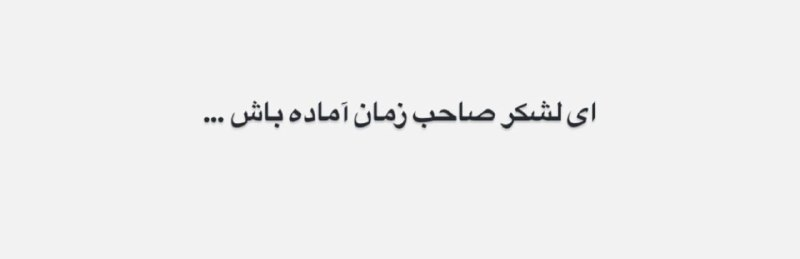

استوری مشاور قالیباف تو اینستاگرام 🤣
@withyashar

## pm_afshaa — post 90834

  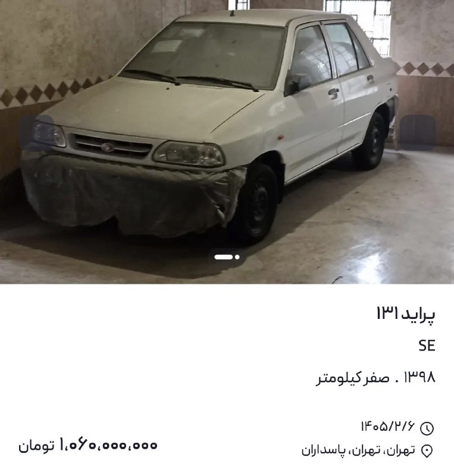

ارابه مرگ مردم ایران 1 میلیارد رو رد کرد

💧 Rainbet.com the #1 Non-KYC Crypto Casino & Sportsbook @rainbetcom

😁 @Pm_Afshaa

## pm_afshaa — post 90833

👩‍💻کانفیگ اضطراری موجود شد!

🛍 V2RAY - ( پر سرعت - تضمینی )

• 1G 260 
💵
• 2G 500
💵
• 3G 740
💵
• 4G 980
💵
• 5G 1.200
💵
• 10G 2.300
💵
• 20G 4.400
💵
• 30G 6.400
💵

✅ساب لینک جهت بررسی حجم ارسال میشود

✔️اتصال ۹۸ درصد اپتایم

✔️با سرعت اپلود و دانلود بالا

✔️بدونه محدودیت زمانی و کاربر

🔥عودت وجه در صورت قطعی

✅پشتیبانی فروش:
@N9NEEbot

## mamlekate — post 103536

نرخ ارز طبق برنامه اعلام‌شده پیش رفته. تا سال آینده هم قراره به ۲۸۴۸۰۰ برسه که زودتر از برنامه هم بهش خواهد رسید. رشد اقتصادی هم منفی بوده (فروپاشی) که ننوشتن.

پست کانال در آبان ۱۴۰۳:
t.me/mamlekate/90970

## mamlekate — post 103534

  <a href="telegram/content/mamlekate_103534_1778922357.mp4" target="_blank">🎬 Download video</a>

«مربی برتر آموزش استفاده از سلاح» میگه شلیک کن ببینیم توی سلاح یک گلوله بوده یا دوتا! به این نتیجه می‌رسن شلیک کنن بفهمن!

🎈 t.me/mamlekate/103529

## mamlekate — post 103533

  

دیشب کانال «چشم عقاب» رفت روی ماهواره. مدتی بود روی این پروژه کار می‌کردم.

روش کار ساده است: کانال ماهواره را روی تلویزیون باز می‌کنی، کیوآر کدها پشت سر هم روی صفحه می‌آیند، اپ چشم عقاب روی گوشی اندروید با دوربین آن‌ها را می‌خواند، خبر روی گوشی ذخیره می‌شود. کاملاً آفلاین. گوشی حتی مجوز اینترنت هم ندارد. هر پخش امضای دیجیتال دارد، اپ پخش‌های جعلی را رد می‌کند.

داخل اپ خبر از چند رسانه فارسی و خارجی، توییت‌های اکانت‌های اضافه شده به سیستم، پیام‌های کانال‌های تلگرامی، و کانفیگ فیلترشکن می‌رسد، تا هرکسی توانست به اینترنت وصل شود راهی داشته باشد. توجه داشته باشید از سایت چشم عقاب میتونید کانال تلگرام یا اکانت ایکس مورد علاقه خودتون رو که فکر می‌کنید برای مردم مناسب است را پیشنهاد بدین.

الان بیش از ۷۰ روز از یکی از طولانی‌ترین قطعی‌های اینترنت در تاریخ ایران می‌گذرد. این یکی از روش‌هایی است که برای رساندن خبر به‌طور مطمئن به دست مردم می‌بینم.

هزینه اجاره کانال برای یک ماه تأمین شده است. بعدش اگر کسی نباشد که کمک کند، قطع می‌شود. فعلا نه فاند دولتی برای این پروژه گرفته‌ام، نه از رسانه‌ای پول، هیچ. تنها راه ادامه‌اش حمایت مستقیم مردمی است.

اگر اندرویدی هستید، نصبش کنید و برای کسانی که به اینترنت دسترسی ندارند یکطوری اپلیکیشن رو بهشون برسون اگر باهاش حال کردی. اگر نمی‌توانید نصب کنید، حداقل همرسانی کنید. و اگر می‌توانید حمایت مالی هم کنید، الان از هر چیز دیگری مهم‌تر است.

https://x.com/NarimanGharib/status/2052054823025942545
https://cheshmehoghab.app/

دانلود اپلیکیشن اندروید:

https://t.me/CheshmehOghabApp/11

## IranIntlTV — post 337432

  <a href="telegram/content/IranIntlTV_337432_1778922359.mp4" target="_blank">🎬 Download video</a>

یک شهروند با ارسال پیامی به ایران اینترنشنال می‌گوید: «من یه نقاشم و تنها دلخوشی‌ام همین نقاشی بود. الان توانِ خرید بوم را هم ندارم. حتی مقوایی که هفته پیش ۲۵۰ هزار تومان خریدم، این هفته شده ۳۲۰ هزار تومان.»

## IranIntlTV — post 337431

  

صدا و سیمای جمهوری اسلامی جمعه چند برنامه پخش کرد که در آنها مجریان در بخش‌های استودیویی با در دست داشتن تفنگ ظاهر شدند و کار با سلاح‌های سبک آموزش داده شد. مجریان در این برنامه‌ها اعلام کردند که در صورت لزوم به جنگ خواهند پیوست.

این برنامه‌ها که دست‌کم در سه بخش پخش شد، در رسانه‌های داخلی بازنشر و در شبکه‌های اجتماعی با واکنش‌هایی همراه شد. برخی کاربران شبکه‌های اجتماعی این بخش‌ها را نشانه‌ای از بسیج در شرایط جنگی توصیف کردند.

جکسون هینکل، مفسر سیاسی آمریکایی، در شبکه اجتماعی ایکس نوشت تلویزیون دولتی ایران نحوه استفاده و شلیک با کلاشینکف را به‌عنوان «آمادگی برای تهاجم زمینی آمریکا» نشان می‌دهد.
https://iranintl.com/202605169752

## IranIntlTV — post 337430

  <a href="telegram/content/IranIntlTV_337430_1778922361.mp4" target="_blank">🎬 Download video</a>

جشنواره فیلم کن در حالی وارد پنجمین روز خود شد که واکنش‌ها به نمایش و نشست خبری فیلم «داستان‌های موازی» ساخته اصغر فرهادی همچنان ادامه دارد.

لی‌لی نیکفر، خبرنگار ایران‌اینترنشنال، گزارش می‌دهد
@iranintltv

## IranIntlTV — post 337429

  

حسین شریعتمداری، نماینده رهبر جمهوری اسلامی در روزنامه کیهان، نوشت کشورهای عربستان سعودی، امارات متحده عربی، کویت، قطر، بحرین و اردن در جنگ اخیر «حضور و شرکت مستقیم داشتند» و به همین دلیل، باید «بخشی از اهداف نشاندار» حکومت ایران در انتقام خون علی خامنه‌ای باشند.

او افزود مذاکره با آمریکا و این کشور‌های عربی «بخشی از سازوکار تعریف‌شده نظام» است، اما «جنگ نباید و نمی‌تواند بدون انتقام سخت از قاتلان امام شهیدمان به نقطه پایان برسد».
https://iranintl.com/202605169925

## IranIntlTV — post 337428

  

🔻رویترز به نقل از یک منبع آگاه گزارش داد که متیاس گرافستروم، دبیرکل فیفا، روز شنبه در استانبول با مقام‌های فدراسیون فوتبال ایران دیدار می‌کند و درباره حضور تیم ملی در جام جهانی ۲۰۲۶ «اطمینان خاطر» خواهد داد. این درحالی است که مهدی تاج پیش از این خواستار تضمین‌هایی از فیفا شده بود.

🔹به گفته این منبع، «فیفا با مقام‌های ذی‌ربط همکاری نزدیک دارد تا همه تیم‌های حاضر در جام جهانی بتوانند در محیطی امن و مطمئن رقابت کنند.»

🔹فدراسیون فوتبال در فاصله کمتر از یک ماه تا آغاز جام‌جهانی با بحران ویزا و چالش مالی دست‌به‌گریبان است. امیر قلعه‌نویی هنوز نمی‌داند کدام بازیکن ویزا خواهد گرفت و کدام بازیکن را در آمریکا در اختیار خواهد داشت.

🔹احتمال دارد برای برخی اعضای کاروان ایران به دلیل سوابق فعالیت یا ارتباط با سپاه پاسداران، ویزا صادر نشود.

🔹مهدی تاج، رییس فدراسیون فوتبال، پنج‌شنبه ۲۴ اردیبهشت گفت: «در ترکیه جلسه‌ای سرنوشت‌سازی با فیفا داریم، چون باید به ما گارانتی بدهند. مساله ویزا حل نشده و هنوز هیچ ویزایی ندادند. منتظریم ببینیم رفتار طرف مقابل چیست.»

🔹جزییات بیشتر را در سایت بخوانید

@iranintltvsport

## IranIntlTV — post 337427

  

نت‌بلاکس اعلام کرد خاموشی دیجیتال در ایران وارد دوازدهمین هفته خود شده و اکنون به هفتاد و هشتمین روز رسیده است؛ وضعیتی که به گفته این نهاد، یک قطعی بی‌سابقه در مقیاس ملی به شمار می‌رود.

بر اساس این گزارش، قطع اینترنت که کشوری با ۹۰ میلیون جمعیت را تا حد زیادی آفلاین کرده، همچنان به تضعیف گسترده حقوق بشر، اقتصاد و آزادی‌های اساسی ادامه می‌دهد.
https://iranintl.com/202605169641

## IranIntlTV — post 337426

  <a href="telegram/content/IranIntlTV_337426_1778922364.mp4" target="_blank">🎬 Download video</a>

یک کشاورز با ارسال پیامی به ایران‌اینترنشنال درباره نصف شدن سهمیه کود نسبت به سال گذشته می‌گوید: «وقتی همین سهمیه کم می‌آید، فقط دو سه روز مهلت برای خرید داریم. اگر کسی توانایی خرید نداشته باشد سهمش می‌سوزد. دولت هم سهم کود دولتی آن فرد را به صورت آزاد می‌فروشد.»

## IranIntlTV — post 337425

  <a href="telegram/content/IranIntlTV_337425_1778922365.mp4" target="_blank">🎬 Download video</a>

نشست دو روزه بریکس در دهلی‌نو بدون صدور بیانیه مشترک درباره بحران خاورمیانه پایان یافت. هند، رییس دوره‌ای نشست، اعلام کرد اختلاف‌نظر عمیق میان اعضا مانع دستیابی به موضع مشترک شده است.

گزارش راضیه دانش، خبرنگار ایران‌اینترنشنال
@iranintltv

## IranIntlTV — post 337424

  <a href="telegram/content/IranIntlTV_337424_1778922367.mp4" target="_blank">🎬 Download video</a>

اسرائیل از هدف قرار گرفتن عزالدین حداد، فرمانده شاخه نظامی حماس و از طراحان حمله ۷ اکتبر، در حمله هوایی به غزه خبر داد. او ارشدترین مقام حماس است که پس از توافق آتش‌بس در غزه هدف حمله قرار گرفته است.

اشکان صفایی، خبرنگار ایران‌اینترنشنال، گزارش می‌دهد
@iranintltv

## IranIntlTV — post 337423

  

کرملین در بیانیه‌ای اعلام کرد ولادیمیر پوتین، رییس‌جمهوری روسیه، به‌زودی راهی چین خواهد شد و در روزهای سه‌شنبه و چهارشنبه، ۲۹ و ۳۰ اردیبهشت، با مقام‎‌های این کشور دیدار خواهد کرد.

بر اساس این بیانیه، پوتین و شی جین‌پینگ، رییس‌جمهوری چین، قرار است درباره «روابط دوجانبه» و «مسائل کلیدی بین‌المللی و منطقه‌ای» گفت‌وگو کنند.

پوتین در حالی به چین سفر خواهد کرد که دونالد ترامپ، رییس‌جمهوری آمریکا، سفر دوروزه خود به پکن را ۲۵ اردیبهشت به پایان رساند.
https://iranintl.com/202605160617

## ManotoTV — post 105508

  <a href="telegram/content/ManotoTV_105508_1778922369.mp4" target="_blank">🎬 Download video</a>

گروه ناظر اینترنتی نت‌بلاکس اعلام کرد خاموشی دیجیتال در ایران اکنون وارد دوازدهمین هفته و هفتادوهشتمین روز خود شده است.
نت‌بلاکس می‌گوید این قطع اینترنت که یک کشور ۹۰ میلیونی را برای مدتی بی‌سابقه تا حد زیادی از دسترسی به اینترنت جهانی محروم کرده، همچنان در حال تضعیف حقوق بشر، اقتصاد و آزادی‌های اساسی در ایران است.

## ManotoTV — post 105507

  <a href="telegram/content/ManotoTV_105507_1778922369.mp4" target="_blank">🎬 Download video</a>

رسانه‌های عراقی گزارش دادند صدای انفجارهایی که روز شنبه در بغداد، پایتخت عراق شنیده شد، ناشی از شلیک گلوله‌های توپخانه به مناسبت تشکیل دولت جدید بوده است.
یک منبع امنیتی به خبرگزاری فرانسه گفت این شلیک‌ها همزمان با آغاز به کار دولت به ریاست نخست‌وزیر جدید عراق، علی الزیدی، انجام شده است.
پیش‌تر برخی رسانه‌ها از شنیده شدن چند انفجار در مرکز بغداد خبر دادند.

## FarsiVOA — post 217877

  

رسانه وابسته به قوه قضائیه جمهوری اسلامی اعلام کرد اموال ۵۱ نفر در استان یزد، با دستور قضایی و به اتهام آنچه «خیانت به وطن» و «همکاری با دشمن» خوانده شده، توقیف شده است.

بر اساس این گزارش، پرونده این افراد در ارتباط با قانون موسوم به «تشدید مجازات جاسوسی و همکاری با رژیم صهیونیستی علیه امنیت و منافع ملی» در حال رسیدگی است و مقام‌های قضایی مدعی شده‌اند دارایی‌های توقیف‌شده قرار است برای «حفظ حقوق عامه» و بازسازی اماکن آسیب‌دیده از جنگ هزینه شود.

اموال توقیف‌شده شامل حساب‌های بانکی، دارایی‌های منقول و غیرمنقول، سهام شرکت‌ها و حتی اموال وکالتی عنوان شده است.

طبق گزارش میزان، از میان این ۵۱ نفر، ۲۰ نفر در داخل کشور حضور دارند و ۳۱ نفر دیگر در خارج از کشور به سر می‌برند.

این اقدام در ادامه موج تازه‌ای از مصادره و توقیف اموال شهروندان و مخالفان سیاسی صورت می‌گیرد؛ روندی که در عمل به ابزاری برای فشار، ارعاب و مصادره دارایی افراد تحت عنوان‌های سنگینی مانند «خیانت» و «همکاری با دشمن» تبدیل شده است.
@FarsiVOA

## FarsiVOA — post 217876

  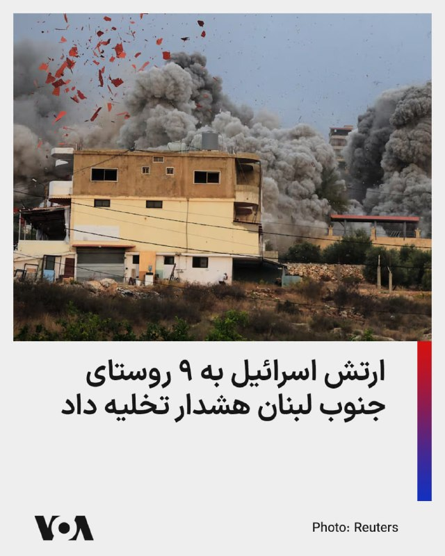

ارتش اسرائیل اعلام کرد پیش از آغاز حملات هوایی علیه مواضع حزب‌الله در جنوب لبنان، برای ساکنان ۹ روستا هشدار تخلیه صادر کرده است.

بر اساس این هشدار، ساکنان قعقعیه الصنوبر، کوثریه السیاد، مروانیه، غسانیه، تفاحتا، ارزی، بابلیه، انصار و بیصاریه باید دست‌کم یک کیلومتر از محل سکونت خود فاصله بگیرند.

سخنگوی ارتش اسرائیل گفت این اقدام در پی نقض توافق آتش‌بس از سوی حزب‌الله انجام می‌شود و ارتش اسرائیل قصد آسیب‌زدن به غیرنظامیان را ندارد.
@FarsiVOA

## FarsiVOA — post 217875

  

آمارهای اداره تنظیم بازار انرژی ترکیه از جهش ۸۲ درصدی صادرات گاز ایران به ترکیه در اولین ماه آغاز عملیات نظامی مشترک اسرائیل و آمریکا علیه جمهوری اسلامی خبر داد.

ایران در ماه مارس بیش از ۸۲۳ میلیون متر مکعب گاز تحویل ترکیه داده و سهمی بالای ۱۳ درصدی در کل واردات گاز ترکیه داشته است. واردات گاز ترکیه از ایران در سه ماهه ابتدایی ۲۰۲۶ نیز بیش از دو برابر شده و به یک میلیارد و ۷۵۶ میلیون متر مکعب اوج گرفته است.

این در حالی است که ایران با کسری شدید گاز در داخل کشور مواجه است و قرارداد ۲۵ ساله صادرات گاز ایران به ترکیه نیز در هفته‌های پیش رو به اتمام می‌رسد. پیشتر وزیر انرژی ترکیه گفته بود که مذاکراتی برای تمدید این قرارداد در جریان نیست.
@FarsiVOA

## FarsiVOA — post 217874

  

خبرگزاری رویترز از قول یک منبع آگاه گزارش داده که دبیر کل فیفا با مقامات فدراسیون فوتبال ایران در استانبول دیدار خواهد کرد.

این منبع که نامی از او برده نشده گفته است ماتیاس گرافستروم درباره حضور ایران در جام جهانی به مقامات فدراسیون ایران «اطمینان خاطر» خواهد داد.

پس از آنکه مهدی تاج، رئیس فدراسیون فوتبال ایران، به دلیل ارتباط با سپاه پاسداران از ورود به کانادا برای شرکت در کنگره فیفا در ونکوور در اوایل ماه جاری منع شد، پرسش‌های بیشتری درباره وضعیت حضور ایران مطرح شد.

آمریکا و کانادا که همراه با مکزیک میزبان جام جهانی هستند، سپاه پاسداران را «سازمان تروریستی» طبقه‌بندی کرده‌ و گفته‌اند افرادی را که با سپاه ارتباط دارند، نخواهند پذیرفت.
@FarsiVOA

## FarsiVOA — post 217873

🔺نیویورک‌تایمز: آمریکا و اسرائیل آماده شروع حملات به جمهوری اسلامی می‌شوند

◾️نیویورک‌تایمز به نقل از دو مقام خاورمیانه‌ای گزارش داد که آمریکا و اسرائیل در حال انجام فشرده‌ترین آماده‌سازی‌ها از زمان آتش‌بس ماه گذشته برای ازسرگیری احتمالی حملات علیه ایران هستند؛ حملاتی که ممکن است از اوایل هفته آینده در دستور کار قرار گیرد.

◾️بر اساس این گزارش، یکی از گزینه‌های مورد بررسی آمریکا، اعزام نیروهای ویژه به خاک ایران برای خارج‌کردن مواد هسته‌ای مدفون زیر آوار تأسیسات بمباران‌شده است.

◾️این گزارش در شرایطی منتشر شده که دونالد ترامپ، رئیس جمهوری آمریکا، به تازگی در گفت‌وگویی با فاکس‌نیوز گفت: «خیلی بیشتر از این صبر نخواهم کرد» و افزود که تهران باید با آمریکا به توافق برسد.

⬇️ بیشتر بخوانید:
https://ir.voanews.com/a/8150653.html

## DW_Farsi — post 124751

  

🔶 ادامه درگیری‌ها در جنوب لبنان با وجود تمدید آتش‌بس

علی‌رغم تمدید آتش‌بس میان اسرائیل و حزب‌الله لبنان برای ۴۵ روز، صبح روز شنبه ۲۶ اردیبهشت (۱۶ مه) گزارش‌هایی از ادامه درگیری‌ها در جنوب لبنان منتشر شده است.

بر اساس یک گزارش رسانه‌ای، در حمله‌ای که گفته می‌شود توسط ارتش اسرائیل در جنوب لبنان انجام شده، دست‌کم شش نفر کشته و ۲۲ نفر زخمی شده‌اند.

خبرگزاری ملی لبنان "ان‌ان‌آ" گزارش داده است سه نفر از کشته‌شدگان از نیروهای امدادی در مرکز دفاع مدنی در منطقه نبطیه بوده‌اند.

ارتش اسرائیل تاکنون درباره این گزارش‌ها اظهار نظر نکرده است.

این گزارش درگیری در حالی منتشر شده است که روز جمعه ۱۵ مه سخنگوی وزارت خارجه آمریکا در شبکه ایکس از تمدید آتش‌بس میان اسرائیل و لبنان برای ۴۵ روز دیگر خبر داده بود.

این آتش‌بس از اواسط آوریل برقرار شده و پیش‌تر نیز یک‌بار تمدید شده بود، اما در هفته‌های گذشته بارها از سوی دو طرف نقض شده است.

@dw_farsi

## DW_Farsi — post 124750

  

🔶 محاکمه فرمانده گروه شبه‌نظامی "کتائب حزب‌الله عراق" در نیویورک

محمد باقر سعد داوود ساعدی، فرمانده شبه‌نظامی عراق به "دست داشتن در چندین حمله علیه منافع آمریکا در اروپا" متهم شده است.

وزارت دادگستری آمریکا روز جمعه ۲۵ اردیبهشت (۱۵ مه) اعلام کرد این فرمانده نظامی پس از بازداشت و برای پاسخ به شش اتهام مرتبط با "تروریسم" به ایالات متحده منتقل شده است.

مقام‌های قضایی آمریکا گفتند ساعدی عضو ارشد گروه شبه‌نظامی "کتائب حزب‌الله" مورد حمایت ایران بوده و به حمایت مادی از یک سازمان تروریستی خارجی متهم است.

ایالات متحده کتائب حزب‌الله عراق را به عنوان یک گروه ترویستی می‌شناسد.

دادستان نیویورک می‌گوید ساعدی متهم است که در هماهنگی یا حمایت از نزدیک به ۲۰ حمله و اقدام به حمله در سراسر اروپا و ایالات متحده نقش داشته است.

دولت آمریکا و کارشناسان مستقل می‌گویند کتائب حزب‌الله تحت هدایت نیروی قدس سپاه پاسداران فعالیت می‌کند.

@dw_farsi

## DW_Farsi — post 124749

  

🔶 ترامپ: در مذاکرات ایران به وضعیت مالی آمریکایی‌ها فکر نمی‌کنم

دونالد ترامپ، رئیس‌ جمهور آمریکا روز جمعه ۲۵ اردیبهشت (۱۵ مه) در مصاحبه با "فاکس‌نیوز" گفت که پیامدهای سیاسی جنگ ایران بر انتخابات میان‌دوره‌ای را در نظر نمی‌گیرد؛ انتخاباتی که جمهوری‌خواهان باید در آن اکثریت شکننده خود را در هر دو مجلس حفظ کنند.

او افزود: «وقتی درباره ایران صحبت می‌کنم، فقط یک چیز مهم است؛ آنها نباید سلاح هسته‌ای داشته باشند. من به وضعیت مالی آمریکایی‌ها فکر نمی‌کنم، به هیچ‌کس فکر نمی‌کنم؛ فقط به این فکر می‌کنم که ایران نباید سلاح هسته‌ای داشته باشد.»

ترامپ روز سه‌شنبه ۱۲ مه نیز تاکید کرده بود که عدم دستیابی به سلاح هسته‌ای از سوی ایران را مهم‌تر از وضعیت مالی آمریکایی‌ها می‌داند. این اظهارات با انتقاد گسترده دموکرات‌ها روبه‌رو شد، در حالی که شماری از جمهوری‌خواهان از او دفاع کردند.

ترامپ در گفت‌وگو با فاکس‌نیوز که در جریان سفرش به چین ضبط شده بود، خاطرنشان کرد که در جریان مذاکرات برای پایان دادن به جنگ ایران و بازگشایی تنگه هرمز، ممکن است "مشکلات کوتاه‌مدت" از جمله افزایش قیمت انرژی رخ دهد. ترامپ تاکید کرد که با افزایش قیمت بنزین مشکلی ندارد، اگر این موضوع به تحقق اهداف آمریکا در قبال ایران کمک کند.

ترامپ همچنین گفت: «اگر به مردم گفته شود که قرار است برای مدتی کوتاه بهای بیشتری برای بنزین بپردازند، چون هدف جلوگیری از دستیابی یک دیوانه به سلاح هسته‌ای است، همه خواهند گفت مشکلی نیست.»

از زمان آغاز حملات آمریکا و اسرائیل به ایران، قیمت بنزین در آمریکا افزایش یافته است، اما به گفته ترامپ این قیمت پس از پایان بحران و بازگشایی تنگه هرمز کاهش خواهد یافت.

@dw_farsi

## DW_Farsi — post 124748

🔶 آیا فاصله ایران با بمب اتمی واقعا کوتاه است؟

🔻 گزارشی از مراد رحمتی

اینکه گفته می‌شود جمهوری اسلامی به ساخت بمب اتمی نزدیک‌تر شده، موضوع تازه‌ای نیست. پیش از جنگ ائتلاف آمریکا و اسرائیل علیه ایران رافائل گروسی، مدیرکل آژانس بین‌المللی انرژی اتمی، اعلام کرده بود که ایران "فاصله زیادی تا دستیابی به سلاح هسته‌ای ندارد".

گروسی توسعه سلاح هسته‌ای را به حل یک پازل تشبیه کرده و گفته بود که ایران "قطعات این پازل را دارد و ممکن است روزی بتواند آن‌ها را کنار هم بگذارد".

استیو ویتکاف، نماینده ترامپ در مذاکرات با جمهوری اسلامی هم گفته بود که مذاکره‌کنندگان ارشد ایران در دور نخست گفت‌وگوهای خود با آمریکا گفته‌ بودند ۴۶۰ کیلوگرم اورانیوم با غنای ۶۰ درصد در اختیار دارند و می‌دانند که از این مقدار می‌توان ۱۱ بمب هسته‌ای ساخت.

اما این اظهارنظر پیش از جنگ ائتلاف آمریکا و اسرائیل علیه ایران بیان شده است.

حال کریس رایت، وزیر انرژی آمریکا روز پنجشنبه ۲۴ اردیبهشت (۱۴ مه) سه ماه بعد از جنگ در جلسه کمیته نیروهای مسلح سنا گفت که "ایران به غنای ۶۰ درصد رسیده و ۹۰ درصد راه را طی کرده است". به گفته این مقام دولت ترامپ جمهوری اسلامی تنها "چند هفته" با دستیابی به مواد لازم برای ساخت سلاح هسته‌ای فاصله دارد.

آیا این ارزیابی‌ها یک واقعیت فنی را نشان می‌دهند یا بیشتر بازتاب نگاه سیاسی به پرونده هسته‌ای ایران هستند و آیا فاصله میان "تولید مواد لازم" و "ساخت سلاح هسته‌ای" واقعا در حد چند هفته است؟

@dw_farsi

## Persian_Trend_Official — post 14233

  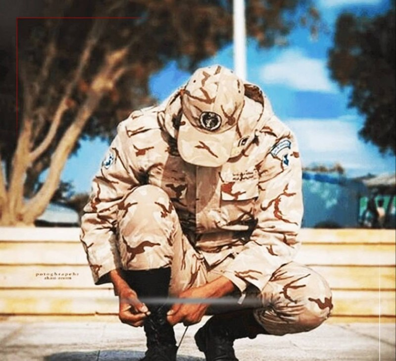

💢فراخوان مشمولان متولد ۱۳۵۵ تا ۱۳۸۷ برای تعیین‌تکلیف سربازی

🔹سازمان وظیفهٔ عمومی فراجا اعلام کرد: همهٔ مشمولان غایب و غیرغایب متولد سال‌های ۱۳۵۵تا ۱۳۸۷ باید خدمت وضعیت خدمتی خود را تعیین‌تکلیف کنند و مشمولانی که در مهلت تعیین‌شده وضعیت خود را مشخص نکنند، وارد غیبت می‌شوند و با محرومیت‌های اجتماعی مواجه خواهند شد.

🫆:Tony

📌 @persian_trend_official
پرشین ترند | متفاوت‌ترین کانال نظامی

## Persian_Trend_Official — post 14230

💢اجرای برنامه ها به صورت مسلح در صداوسیما ..

🫆:Tony

📌 @persian_trend_official
پرشین ترند | متفاوت‌ترین کانال نظامی

## Persian_Trend_Official — post 14229

## Persian_Trend_Official — post 14228

اگر به تاریخ، مسائل نظامی و پشت‌پرده اتفاقات منطقه علاقه داری، پیشنهاد می‌کنم حتماً پادکست پرشین ترند رو هم دنبال کنی.

این‌جا فقط خبر گفته نمی‌شه؛
موضوعات از پایه باز می‌شن، تحلیل می‌شن و با یک روایت قابل فهم ارائه می‌شن.

از بررسی سلاح‌ها و تکنولوژی‌های نظامی گرفته تا اتفاقات تاریخی و تحولات روز، با یک نگاه متفاوت و عمیق.

اگر دوست داری بدونی واقعاً پشت این خبرها چی می‌گذره، این پادکست رو از دست نده 👇

https://castbox.fm/channel/%D9%BE%D8%B1%D8%B4%DB%8C%D9%86-%D8%AA%D8%B1%D9%86%D8%AF-%7C-%D9%85%D8%AA%D9%81%D8%A7%D9%88%D8%AA-%D8%AA%D8%B1%DB%8C%D9%86-%D9%BE%D8%A7%D8%AF%DA%A9%D8%B3%D8%AA-%D8%AA%D8%A7%D8%B1%DB%8C%D8%AE%DB%8C-%D9%88-%D9%86%D8%B8%D8%A7%D9%85%DB%8C-%D9%81%D8%A7%D8%B1%D8%B3%DB%8C-id6056489?nojump=1&country=gb

## RadioFarda — post 157251

🔸 معاون سیاسی و سخنگوی وزارت کشور در نشست خبری روز شنبه ۲۶ اردیبهشت ضمن تأکید بر «حفظ انسجام» در کشور گفت: «اظهارات برخی در میادین مثلاً در موضوع بی‌حجابی سیاست رسمی کشور و نظام نیست و جامعه متکثر است.»

🔸 علی زینی‌وند در بخشی از سخنان امروز ضمن تأکید بر «تنوع جمعیت ۹۰ میلیون نفری ایران» به حضور زنان با «حجاب ضعیف» در کنار زنان چادری در تجمعات حکومتی اشاره کرد و گفت: «مهم این است که حاکمیت همه مردم را ببینید.»

🔸این اظهارات در حالی مطرح می‌شود که پدر مهسا امینی، بهمن‌ماه پارسال با انتشار عکسی از مصاحبه با یک زن در راهپیمایی ۲۲ بهمن توسط رسانه‌های حکومتی گفته بود «به خاطر چهار تار مو دختر معصوم من را کشتند و کسی جوابگو نشد و این که از دختران با سرهای برهنه و پوشش به قول آن‌ها غیر متعارف در مراسم رسمی فیلم می‌گیرند و کسی فریاد وا اسلاما سر نمی‌دهد، روزگار غریبی است!»

🔸 در ماه‌های گذشته رسانه‌های حکومتی تصاویر و گزارش‌های بسیاری از زنان بدون حجاب در رویدادهای حکومتی منتشر کرده‌اند.

🔸 چرخش سیاست حکومت در قبال حجاب با واکنش‌های افراد تندرو همراه شده است.

@RadioFarda

## RadioFarda — post 157250

  

🔸وزیر نفت جدید عراق، روز شنبه ۲۶ اردیبهشت در یک کنفرانس مطبوعاتی اعلام کرد که این کشور در ماه آوریل (۱۲ فروردین تا ۱۰ اردیبهشت) ۱۰ میلیون بشکه نفت از طریق تنگه هرمز صادر کرده است.

🔸باسم محمد هم‌چنین گفت که کشورش قصد دارد برای افزایش ظرفیت تولید و صادرات کشور با اوپک همکاری کند و افزود که بغداد قصد دارد به ظرفیت تولید پنج میلیون بشکه در روز برسد.

🔸بغداد پیش از این اعلام کرده بود که با ایالات متحده و ایران به «تفاهماتی» مبنی بر کاهش پیامدهای محاصره تنگه هرمز بر صادرات نفت عراق دست یافته است.

🔸مقامات عراقی اوایل ماه آوریل اعلام کرده بودند که این کشور با از سرگیری صادرات نفت ۲۵۰ هزار بشکه در روز از طریق بندر جیحان ترکیه، صادرات نفت خام را با استفاده از کامیون‌های نفتکش از طریق سوریه آغاز کرده است.

@RadioFarda

## RadioFarda — post 157249

  

🔸دونالد ترامپ، رئیس جمهور آمریکا، در مصاحبه‌ای تازه با شبکه فاکس‌نیوز گفت که در پی آتش‌بس حکومت ایران «پنج بار» تا آستانه توافق کامل با آمریکا آمده، اما در لحظه آخر عقب کشیده است.

🔸او در این مصاحبه تأکید می‌کند: «هر بار که توافق می‌کنند، روز بعد انگار نه انگار که با هم حرف زده‌ایم. و این پنج بار اتفاق افتاده است. یک جای کارشان ایراد دارد. راستش دیوانه‌اند.»

🔸او چنین ادامه می‌دهد: «و چون دیوانه‌اند، نباید به سلاح هسته‌ای دست پیدا کنند.»

🔸آن طور که رئیس جمهور آمریکا در این مصاحبه نقل می‌کند، حکومت ایران در مذاکرات اخیر حتی پذیرفته است که کل اورانیوم غنی‌شده‌اش را تحویل دهد.

🔸ترامپ گفت: «هسته‌ای خلاص. قرار بود غبار هسته‌ای را به ما بدهند. هر چه که ما خواسته بودیم.»

🔸این‌ها نکاتی است که دونالد ترامپ پیش از سفرش به چین هم با خبرنگاران در میان گذاشته بود.

🔸این در حالی است که مقام‌های جمهوری اسلامی از جمله عباس عراقچی، وزیر خارجه، تکذیب می‌کنند که شرایط آمریکا را پذیرفته‌اند.

@RadioFarda

## IranianMinds — post 20230

  <a href="telegram/content/IranianMinds_20230_1778922375.mp4" target="_blank">🎬 Download video</a>

وسط پخش زنده میاد یادشون‌ میده چطوری شلیک کنن

@IranianMinds

## IranianMinds — post 20228

  <a href="telegram/content/IranianMinds_20228_1778922376.mp4" target="_blank">🎬 Download video</a>

🔴 تروریستارو

صداوسیما اومده اسلحه داده دست تمام مجریاش که بیان تو پخش زنده رجز‌ بخونن و تهدید کنن

@IranianMinds

## IranianMinds — post 20227

  <a href="telegram/content/IranianMinds_20227_1778922376.webm" target="_blank">🎬 Download video</a>

🎉 ۵۰۰٬۰۰۰ تومان رایگان-بونوس ویژه ثبت‌نام

🔥 با هر ثبت نام ۵۰۰ هزار تومن جایزه بگیرید

⬅️ شرط‌بندی کنید و بونوس را به موجودی واقعی تبدیل کنید

🔥 وقتشه بازی رو یه جور دیگه ببینی
⚽️  پوشش کامل مسابقات ورزشی 

📊  پیش‌بینی با بهترین ضرایب 

⚡️  تجربه سریع و حرفه‌ای

😀 پرداخت مستقیم و سریع بدون واسطه، بدون دردسر، واریز و برداشت در سریع‌ترین زمان ممکن 

😀 کانال تلگرام: 

🔴 @winro_io  

😀 هدیه خود را با ثبت نام در سایت دریافت کنید: 

🔴 Winro.io
r26
سایت اصلی در روزهای آینده بازگشایی خواهد شد 
✅

## IranianMinds — post 20225

بعضیا انگار‌ تو یه ایران دیگه زندگی‌ میکنن

@IranianMinds

## BBCPersian — post 281202

🔻وزیر نفت عراق: در ماه قبل ۱۰ میلیون بشکه نفت از طریق تنگه هرمز صادر کردیم

وزیر جدید نفت عراق امروز اعلام کرد که این کشور در ماه آوریل ۱۰ میلیون بشکه نفت از طریق تنگه هرمز صادر کرده است.

باسم محمد که در یک نشست خبری صحبت می‌کرد، همچنین گفت که عراق قصد دارد برای افزایش ظرفیت تولید و صادرات نفت خود با اوپک همکاری و رایزنی کند.

به گفته آقای محمد، بغداد در تلاش است تا ظرفیت تولید نفت عراق را به روزانه ۵ میلیون بشکه برساند.

@BBCPersian

## BBCPersian — post 281201

  

🔻کرملین روز شنبه اعلام کرد که ولادیمیر پوتین، رئیس‌جمهور روسیه ۱۹ مه /۲۹ اردیبهشت برای یک سفر دو روزه به چین خواهد رفت. این سفر در پی سفر دونالد ترامپ، رئیس‌جمهور آمریکا به پکن انجام می‌شود.

بر اساس بیانیه کرملین آقای پوتین در این سفر با شی جین‌پینگ، همتای چینی خود، درباره «مشارکت‌ همه‌جانبه و همکاری راهبردی» مسکو و پکن گفت‌وگو خواهد کرد.

به گفته کرملین رهبران دو کشور همچنین درباره «موضوعات مهم بین‌المللی و منطقه‌ای تبادل نظر خواهند کرد» و در پایان مذاکرات، یک بیانیه مشترک امضا خواهند کرد.

در جریان این سفر، آقای پوتین قرار است درباره همکاری‌های اقتصادی و تجاری با لی چیانگ، نخست‌وزیر چین، هم گفت‌وگو کند.

اعلام این سفر در حالی صورت گرفته است که آقای ترامپ دیروز سفر خود به چین را به پایان رساند و به آمریکا بازگشت.

چین که بزرگ‌ترین خریدار سوخت‌های فسیلی روسیه است، پس از اعمال تحریم‌های غرب علیه نفت و گاز روسیه، به مهم‌ترین شریک اقتصادی مسکو تبدیل شده است.

📷Getty Images
@BBCPersian

## BBCPersian — post 281200

🔻دونالد ترامپ، رئیس جمهور آمریکا گفته است که نیروهای آمریکا و نیجریه در یک عملیات مشترک، نفر دوم گروه دولت اسلامی (داعش) را کشته‌اند. آقای ترامپ در پستی در تروث سوشال گفت که ابوبلال المینوکی دیگر به مردم آفریقا آسیب نخواهد زد و نمی‌تواند برای هدف قرار دادن…

## Dirty_Kids — post 389542

  

کجای دنیا دیدید کلاشینکف ببرند توی استودیو تلوزیون آموزش بدن اونهم با تیر واقعی و شلیک کنند به سقف استودیو،جز طویله صداوسیمای رژیمی که صدای نفسهای سقوط رو میشنوه @Dirty_Kids 👻

## Dirty_Kids — post 389541

  <a href="telegram/content/Dirty_Kids_389541_1778922377.mp4" target="_blank">🎬 Download video</a>

کجای دنیا دیدید کلاشینکف ببرند توی استودیو تلوزیون آموزش بدن اونهم با تیر واقعی و شلیک کنند به سقف استودیو،جز طویله صداوسیمای رژیمی که صدای نفسهای سقوط رو میشنوه

@Dirty_Kids 👻

## Dirty_Kids — post 389539

  <a href="telegram/content/Dirty_Kids_389539_1778922379.mp4" target="_blank">🎬 Download video</a>

🔴 دیشب صداوسیما اسلحه داده بود دست مجریاش تا برای دشمن رجز بخونن و تهدید کنن!

+ بوی سقوط و ضعف مساویس با دست‌وپای بیشتر

@Dirty_Kids 👻

## Hranews — post 112964

  

با پایان دوران محکومیت؛ فهیمه سلطانی آزاد شد

خبرگزاری هرانا – فهیمه سلطانی، زندانی سیاسی محبوس در زندان دستگرد اصفهان، با پایان دوران محکومیت آزاد شد.

به گزارش خبرگزاری هرانا، ارگان خبری مجموعه فعالان حقوق بشر در ایران، فهیمه سلطانی آزاد شد.

بر اساس اطلاعات دریافتی هرانا، آزادی خانم سلطانی در تاریخ ۱۸ اردیبهشت ماه، با پایان دوران محکومیت وی از زندان دستگرد اصفهان صورت گرفته است.

#فهیمه_سلطانی

ادامه مطلب

↘️
@hranews_bot تماس ✉️ -  @Hranews  کانال هرانا 🆑

## Hranews — post 112963

گزارشی از بازداشت یک شهروند در ارومیه

❗️
❗️
❗️
❗️
❗️– فروزان نوجوان (اسلامی)، مدرس زبان انگلیسی و اهل ارومیه، روز چهارشنبه ۲۳ اردیبهشت ماه، توسط نیروهای امنیتی در این شهرستان بازداشت و به مکان نامعلومی منتقل شد.

#فروزان_نوجوان
#فروزان_اسلامی

ادامه مطلب

↘️
@hranews_bot تماس ✉️ -  @Hranews  کانال هرانا 🆑

## Hranews — post 112962

  

بر اساس آخرین داده‌های نت‌بلاکس، قطع #اینترنت در ایران وارد هفتادوهشتمین روز خود شده و اکنون دوازدهمین هفته از این اختلال گسترده سپری می‌شود. این نهاد ناظر بر وضعیت دسترسی به اینترنت در جهان اعلام کرد که تداوم این وضعیت، بخش عمده‌ای از جمعیت حدود ۹۰ میلیونی کشور را برای مدتی بی‌سابقه از دسترسی به اینترنت جهانی محروم کرده است.

نت‌بلاکس همچنین تاکید کرده است که ادامه این محدودیت‌ها به‌طور گسترده حقوق بشر، آزادی‌های اساسی و وضعیت اقتصادی شهروندان را تحت تاثیر قرار داده و پیامدهای آن در ابعاد مختلف همچنان رو به گسترش است.

↘️
@hranews_bot تماس ✉️ -  @Hranews  کانال هرانا 🆑

## Hranews — post 112961

یک شهروند توسط نیروهای امنیتی در سرابله بازداشت شد

❗️
❗️
❗️
❗️
❗️– محمدرضا فریادی، شهروند اهل سرابله روز چهارشنبه ۲۳ اردیبهشت ماه، توسط نیروهای امنیتی در این شهرستان بازداشت و به مکان نامعلومی منتقل شده است.

#محمدرضا_فریادی

ادامه مطلب

↘️
@hranews_bot تماس ✉️ -  @Hranews  کانال هرانا 🆑

## manototv — post 105508

  <a href="telegram/content/manototv_105508_1778922380.mp4" target="_blank">🎬 Download video</a>

گروه ناظر اینترنتی نت‌بلاکس اعلام کرد خاموشی دیجیتال در ایران اکنون وارد دوازدهمین هفته و هفتادوهشتمین روز خود شده است.
نت‌بلاکس می‌گوید این قطع اینترنت که یک کشور ۹۰ میلیونی را برای مدتی بی‌سابقه تا حد زیادی از دسترسی به اینترنت جهانی محروم کرده، همچنان در حال تضعیف حقوق بشر، اقتصاد و آزادی‌های اساسی در ایران است.

## manototv — post 105507

  <a href="telegram/content/manototv_105507_1778922380.mp4" target="_blank">🎬 Download video</a>

رسانه‌های عراقی گزارش دادند صدای انفجارهایی که روز شنبه در بغداد، پایتخت عراق شنیده شد، ناشی از شلیک گلوله‌های توپخانه به مناسبت تشکیل دولت جدید بوده است.
یک منبع امنیتی به خبرگزاری فرانسه گفت این شلیک‌ها همزمان با آغاز به کار دولت به ریاست نخست‌وزیر جدید عراق، علی الزیدی، انجام شده است.
پیش‌تر برخی رسانه‌ها از شنیده شدن چند انفجار در مرکز بغداد خبر دادند.

## alonews — post 120348

  <a href="telegram/content/alonews_120348_1778922381.webm" target="_blank">🎬 Download video</a>

👈وزیر جدید نفت عراق، باسم محمد، اعلام کرد که عراق در ماه آوریل/نیمان ۱۰ میلیون بشکه نفت خود را از طریق تنگه هرمز صادر کرده است.

🔴وی توضیح داد که عراق قصد دارد با سازمان اوپک همکاری کند تا تولید و ظرفیت صادرات کشور را افزایش دهد و افزود که بغداد هدف دارد به ظرفیت تولید روزانه ۵ میلیون بشکه دست یابد.

✅ @AloNews خبر جنگ

## alonews — post 120347

  <a href="telegram/content/alonews_120347_1778922381.webm" target="_blank">🎬 Download video</a>

👈سنتکام به نیویورک تایمز : کشتی‌های ایرانی رو با ماهواره و چند روش دیگه ردیابی می‌کنیم

✅ @AloNews خبر جنگ

## alonews — post 120346

  <a href="telegram/content/alonews_120346_1778922381.webm" target="_blank">🎬 Download video</a>

👈منابع پاکستانی: سومین کشتی گاز مایع قطر با عبور از تنگه هرمز در کراچی پهلو گرفت

✅ @AloNews خبر جنگ

## alonews — post 120345

  <a href="telegram/content/alonews_120345_1778922381.webm" target="_blank">🎬 Download video</a>

👈قطارهای چین به ایران سه برابر شد

🔴با وجود محاصره دریایی آمریکا، قطارهای باری چین به ایران از هفته‌ای یک بار به هر سه تا چهار روز یکبار رسیده‌ است

✅ @AloNews خبر جنگ

## alonews — post 120344

  <a href="telegram/content/alonews_120344_1778922382.webm" target="_blank">🎬 Download video</a>

👈سخنگوی وزارت کشور: از نمایندگان مجلس توقع داریم در اظهارنظرهای خود در موضوعات مختلف بیشتر دقت کنند؛ انسجام ملی باید حفظ شود

✅ @AloNews خبر جنگ

## alonews — post 120343

  <a href="telegram/content/alonews_120343_1778922382.mp4" target="_blank">🎬 Download video</a>

👈ترامپ: نام افرادی را که در نزدیکی اورانیوم های غنی‌شده ایران هستند، می‌دانیم. پنجاه درصدشان اسمشان محمد است!

✅ @AloNews خبر جنگ

## alonews — post 120342

  <a href="telegram/content/alonews_120342_1778922382.webm" target="_blank">🎬 Download video</a>

👈پراید هم رویا شد ...

✅ @AloNews خبر جنگ

## alonews — post 120340

  <a href="telegram/content/alonews_120340_1778922382.webm" target="_blank">🎬 Download video</a>

👈ارتش اوکراین بامداد امروز با استفاده از پهپاد های خود حمله‌ای به یک کارخانه شیمیایی در منطقه نوینومیسک انجام داد که این کارخانه به طور فعال مواد منفجره را برای صنایع نظامی روسیه تولید می‌کرد و همچنین کارخانه صنایع فلزی متالیست پلاس در نابورژنیه چلنی روسیه نیز مورد حمله قرار گرفت.

✅ @AloNews خبر جنگ

## alonews — post 120339

  <a href="telegram/content/alonews_120339_1778922382.webm" target="_blank">🎬 Download video</a>

👈تایوان به ترامپ و چین پاسخ داد: ما تابع پکن نیستیم

🔴پس از آنکه ترامپ بعد از دیدار با شی جین پینگ گفت دنبال استقلال تایوان نیست، تایپه پاسخ داد: «تایوان یک کشور دموکراتیک، مستقل و دارای حاکمیت است و تابع جمهوری خلق چین نیست.»

🔴این پاسخ نشان میدهد تایوان نمیخواهد در معامله بزرگ واشنگتن و پکن، فقط به یک کارت مذاکره تبدیل شود. ترامپ با احتیاط حرف میزند تا با چین وارد درگیری تازه نشود، اما تایپه هم میخواهد روشن کند که هویتش را با سکوت دیپلماتیک دیگران تعریف نمیکند.

🔴برای پکن، این جمله تحریک‌آمیز است. برای واشنگتن، یادآوری دردسرساز است. چون هرچه ترامپ بخواهد پرونده تایوان را آرام نگه دارد، خود تایوان نشان میدهد حاضر نیست استقلال عملی‌اش زیر سایه توافق‌های پشت پرده کم‌رنگ شود

✅ @AloNews خبر جنگ

## alonews — post 120338

قیمت استثنایی گیگی 
2️⃣
2️⃣
2️⃣ تحویل زیر یک دقیقه
✅ دارای لینک سابسکریشن جهت دیدن حجم و کنترل مصرف
✅ بدون قطعی 
✅ بدون محدودیت کاربر و زمان
✅ جمینایو چت جی بی تی و... کامل اوکیه با سرورامون
✅ 
🏪پشتیبانی کامل
✅ شروع فعالیت از سال 2022 
✅ پرداخت ریالی
✅ ضریب و این چیزا…

## alonews — post 120337

اخبار جنگ الونیوز AloNews pinned a photo

## alonews — post 120336

  <a href="telegram/content/alonews_120336_1778922383.webm" target="_blank">🎬 Download video</a>

👈دوستان این تبلیغاتی که پائین کانال نمایش داده میشه کلاهبرداری هست و توسط خود تلگرام انجام میشه و از دست ما خارجه

🔴به هیچ عنوان اعتماد نکنید چون سرمایتون میره

✅ @AloNews خبر جنگ

## alonews — post 120335

  <a href="telegram/content/alonews_120335_1778922383.webm" target="_blank">🎬 Download video</a>

👈 انفجار ناشی از امحای مهمات در دزفول

✅ @AloNews خبر جنگ

## alonews — post 120334

  

قیمت استثنایی گیگی 
2️⃣
2️⃣
2️⃣

تحویل زیر یک دقیقه
✅
دارای لینک سابسکریشن جهت دیدن حجم و کنترل مصرف
✅
بدون قطعی 
✅
بدون محدودیت کاربر و زمان
✅
جمینایو چت جی بی تی و... کامل اوکیه با سرورامون
✅

🏪پشتیبانی کامل
✅
شروع فعالیت از سال 2022 
✅
پرداخت ریالی
✅

ضریب و این چیزا ندارن و تا آخرین مگابایت برای پشتیبانیش درختمتیم
🥂

⭐️ @Napsternetiran_bot
〰️〰️〰️〰️〰️〰️〰️

🔶 @Napsternetvirani

## alonews — post 120333

  <a href="telegram/content/alonews_120333_1778922383.webm" target="_blank">🎬 Download video</a>

👈ارگان رسانه ای وابسته به سپاه نوشت: وزارت اقتصاد طرح مدیریت تنگه هرمز از طریق بیمه را پیگیری می‌کند تا امکان مدیریت بر تنگه در پساجنگ مطابق حقوق بین‌الملل فراهم شود و برای ایران آورده اقتصادی نیز داشته باش

✅ @AloNews خبر جنگ

## alonews — post 120332

  <a href="telegram/content/alonews_120332_1778922383.webm" target="_blank">🎬 Download video</a>

👈الجزیره: برق کوبا پس از خاموشی گسترده دوباره وصل شد، اما بحران انرژی همچنان ادامه دارد

🔴برق در سراسر کوبا روز جمعه پس از خاموشی‌های گسترده دوباره برقرار شد، اما بحران انرژی این کشور با کاهش شدید ذخایر نفتی همچنان ادامه دارد.

🔴شرکت ملی برق کوبا اعلام کرد که پس از قطعی برق در ۷ استان از ۱۵ استان، «سیستم برق ملی دوباره برقرار شده است»، با این حال قطعی‌های برنامه‌ریزی‌شده ادامه دارد و نیروگاه‌های قدیمی هنوز در دست تعمیر هستند.

🔴 وزیر انرژی، روز چهارشنبه اعلام کرد که ذخایر نفت کشور «تمام شده است». کمبود انرژی خشم عمومی را برانگیخته و شهروندان هاوانا با کوبیدن قابلمه و ماهیتابه اعتراض خود را نشان دادند.

🔴کوبا کاهش انرژی را ناشی از تحریم‌های آمریکا می‌داند

✅ @AloNews خبر جنگ

## alonews — post 120331

  <a href="telegram/content/alonews_120331_1778922384.webm" target="_blank">🎬 Download video</a>

👈آسوشیتدپرس: بازگشت ناو هواپیمابر جرالد فورد به پایگاه پس از ۱۱ ماه مأموریت

🔴وزارت جنگ آمریکا اعلام کرد پیت هگست، وزیر جنگ، روز شنبه در پایگاه دریایی نورفولک در ویرجینیا از ناو هواپیمابر جرالد فورد و ۴۵۰۰ ملوان آن پس از ۱۱ ماه مأموریت استقبال می‌کند.

🔴این ناو ۳۲۶ روز در دریا بوده که طولانی‌ترین استقرار یک ناو هواپیمابر آمریکایی در ۵۰ سال گذشته و سومین رکورد از زمان جنگ ویتنام است

✅ @AloNews خبر جنگ

## alonews — post 120330

  <a href="telegram/content/alonews_120330_1778922384.webm" target="_blank">🎬 Download video</a>

👈کپیتال اکونومیست: قیمت نفت به ۱۵۰ دلار در هر بشکه خواهد رسید

✅ @AloNews خبر جنگ

## alonews — post 120329

  <a href="telegram/content/alonews_120329_1778922384.webm" target="_blank">🎬 Download video</a>

👈نیروی هوایی اوکراین اعلام کرد: 269 پهپاد از 294 پهپاد پرتاب شده توسط ارتش روسیه را شب گذشته سرنگون کرده است

✅ @AloNews خبر جنگ

<!-- MSG END -->

<!-- NAV START -->

<a href="https://github.com/keihancpu/aio-downloader/blob/main/telegram/content/archive_1.md" style="display:inline-block; padding:6px 12px; margin:0 4px; background-color:#2ea44f; color:white; text-decoration:none; border-radius:4px; font-weight:bold;">صفحه بعد</a>

<!-- NAV END -->
