# خواننده تلگرام

<!-- TOP_NAV START -->

<a href="https://github.com/keihancpu/aio-downloader/blob/main/telegram/content/archive_1.md" style="display:inline-block; padding:6px 12px; margin:0 4px; background-color:#2ea44f; color:white; text-decoration:none; border-radius:4px; font-weight:bold;">صفحه بعد</a>

<!-- TOP_NAV END -->

<!-- MSG START -->

---
📅 بروزرسانی: 1405/03/06 12:15
---

## VahidOOnLine — post 242392

  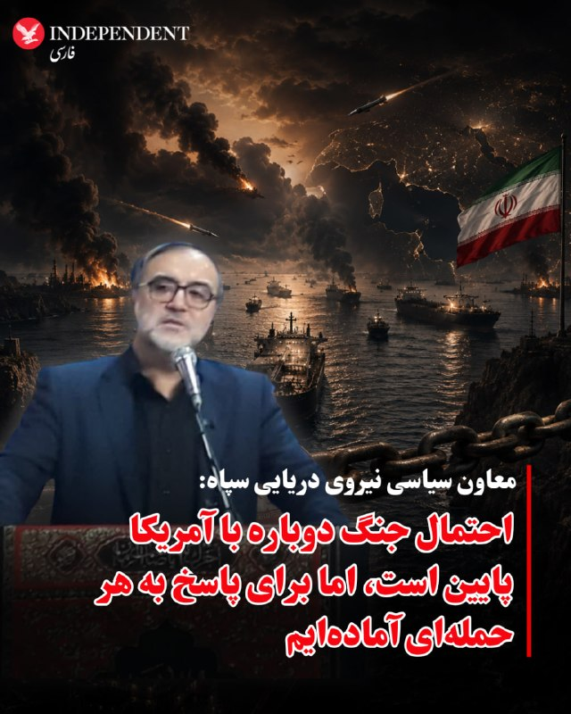

⭕️معاون سیاسی نیروی دریایی سپاه: احتمال جنگ دوباره با آمریکا پایین است اما برای پاسخ به هر حمله‌ای آماده‌ایم

♦️محمد اکبرزاده، معاون سیاسی نیروی دریایی سپاه پاسداران روز چهارشنبه ششم خرداد اعلام کرد احتمال ازسرگیری جنگ با آمریکا پایین است، اما جمهوری اسلامی برای هرگونه حمله احتمالی آمادگی کامل دارد.

او در گفتگو با خبرگزاری تسنیم افزود: «دشمن در موضع ضعف قرار دارد و نیروهای مسلح ایران با خشاب‌های پر آماده مقابله هستند».

اکبرزاده همچنین اضافه کرد: «در صورت هرگونه حمله نظامی، مناطقی از چابهار تا ماهشهر به گورستان متجاوزان تبدیل خواهد شد.»

این اظهارات در حالی مطرح می‌شود که تنش‌ها میان تهران و واشنگتن همچنان ادامه دارد.
‌🇸🇦 Indypersian

🤖 @VahidOOnLine

## VahidOOnLine — post 242391

  

محمدتقی وکیل‌پور، نماینده اعزامی رهبر جمهوری اسلامی به استان سیستان و بلوچستان، شامگاه سه‌شنبه در سخنانی در چابهار گفت مجتبی خامنه‌ای «اکنون با تمام توان در میدان ایستاده و مدیریت کلان کشور و صحنه جنگ را بر عهده دارند».

او افزود: «شرایط امروز منطقه بسیار حساس است و دشمن با تمام توان عملیاتی خود به میدان آمده است.»
‌🏁 🇬🇧 IranintlTV

🤖 @VahidOOnLine

## VahidOOnLine — post 242390

  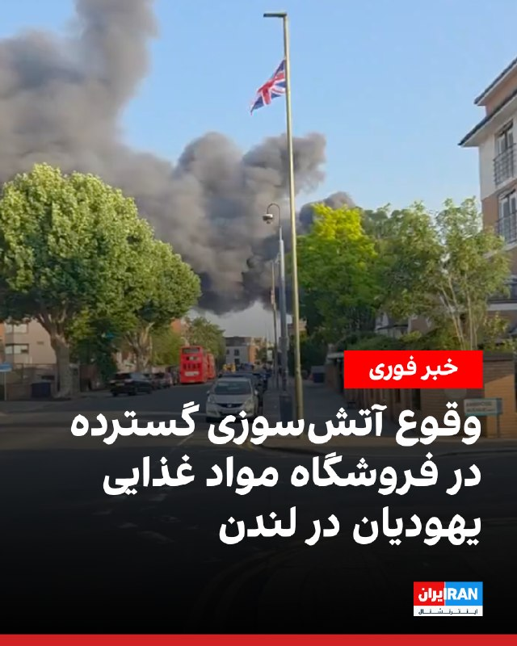

آتش‌سوزی گسترده‌ای صبح چهارشنبه در یک فروشگاه مواد غذایی یهودیان در منطقه گولدرز گرین در شمال غرب لندن رخ داد و ده‌ها آتش‌نشان را به محل حادثه کشاند.

به گفته سازمان آتش‌نشانی لندن، حدود ۱۰۰ آتش‌نشان با ۱۵ خودرو در حال مهار حریقی هستند که گمان می‌رود از انبار فروشگاه «کوشر کینگدام» آغاز شده و به ساختمان اصلی نیز سرایت کرده است.

مقام‌های آتش‌نشانی گفتند آتش‌سوزی «حجم قابل توجهی دود» تولید کرده و از ساکنان منطقه خواستند در و پنجره‌های خود را بسته نگه دارند.

پلیس متروپولیتن نیز اعلام کرد در این حادثه کسی آسیب ندیده است.

گولدرز گرین یکی از محله‌های شناخته‌شده لندن با جمعیت قابل توجه یهودیان است و فروشگاه‌های عرضه‌کننده محصولات «کوشر» در این منطقه فعال هستند.
‌🏁 🇬🇧 IranintlTV

🤖 @VahidOOnLine

## VahidOOnLine — post 242389

  

هیلل نیومن، سفیر اسرائیل در استرالیا، در گفت‌وگوی اختصاصی با ایران‌اینترنشنال گفت آمریکا و اسرائیل در یک عملیات مشترک، کارزار نظامی را برای مقابله با آنچه تهدیدهای موجود از سوی جمهوری اسلامی خواند، آغاز کردند. او تاکید کرد هدف این کارزار، از بین بردن یا کاهش تهدیدهای هسته‌ای و موشکی حکومت ایران بوده است.

نیومن با اشاره به برنامه هسته‌ای جمهوری اسلامی گفت: «ما نمی‌توانیم اجازه دهیم حکومت اسلامی به توانایی هسته‌ای دست پیدا کند.» او افزود تهدیدهای موجود شامل موضوع غنی‌سازی اورانیوم، نبود اورانیوم غنی‌شده در ایران و حذف کامل توانایی هسته‌ای است.

نیومن در عین حال تاکید کرد اسرائیل مخالف راه‌حل دیپلماتیک نیست و اگر از طریق مذاکرات بتوان به اهداف تعیین‌شده رسید و جان انسان‌ها حفظ شود، این مسیر مطلوب خواهد بود. او گفت: «اگر مذاکرات موفق نشود، ممکن است مجبور شویم دوباره به کارزار نظامی بازگردیم.»

سفیر اسرائیل در استرالیا افزود درک مشترکی میان اسرائیل و ایالات متحده درباره این اهداف وجود دارد و دونالد ترامپ، رییس‌جمهوری آمریکا، نیز گفته است درباره موضوع غنی‌سازی اورانیوم و توانایی هسته‌ای ایران مصالحه نخواهد کرد.
‌🏁 🇬🇧 IranintlTV

🤖 @VahidOOnLine

## VahidOOnLine — post 242388

  

♦️قیمت نفت در بازارهای جهانی روز چهارشنبه ششم خرداد پس از چند ساعت افزایش و با «خوش‌بینی محتاطانه» به توافق احتمالی میان جمهوری اسلامی ایران و ایالات متحده، بیش از دو درصد کاهش یافت.

بهای نفت خام برنت دریای شمال، قیمت معیار نفت، صبح چهارشنبه و همزمان با آغاز کار بازارهای اروپایی با ۲و۴۲ درصد کاهش به ۹۷ دلار و ۱۹ سنت رسید. این در حالی است که بامداد چهارشنبه و همزمان با آغاز به کار بورس‌های آسیایی، قیمت نفت از مرز ۹۹ دلار عبور کرده بود.
‌🇸🇦 Indypersian

🤖 @VahidOOnLine

## VahidOOnLine — post 242387

  

♦️مقام‌های سازمان دریانوردی هند شامگاه سه‌شنبه پنجم خرداد از آزادی ۱۰ ملوان این کشور که تابستان سال گذشته در آب‌های جنوب ایران بازداشت شده بودند، خبر دادند.

به گزارش خبرگزاری فرانسه  اداره ناوبری دریایی هند در بیانیه‌ای اعلام کرد که این ملوانان که سوار بر کشتی »ام‌وی هاربر فینیکس» بودند، پس از توقیف این کشتی در نزدیکی بندر جاسک در ژوئیه ۲۰۲۵ در ایران بازداشت و زندانی شدند.

به گفته این نهاد نیمه‌دولتی هند، «اکنون همه آن‌ها آزاد شده و در سلامت هستند و تمهیدات لازم برای بازگشت آن‌ها به کشورشان در حال فراهم شدن است.»

به گزارش خبرگزاری فرانسه، دولت هند برای جلوگیری از ایجاد حساسیت، مذاکرات راجع به آزادی این ملوانان را در سکوت رسانه‌ای برگزار کرد.

هند روابط با جمهوری اسلامی ایران را با وجود تنش‌های منطقه و مناسبات بسیار نزدیک با آمریکا و اسرائیل، همچنان حفظ کرده است.
‌🇸🇦 Indypersian

🤖 @VahidOOnLine

## VahidOOnLine — post 242386

🗣روایت شما از زندگی در آتش‌بس- چهارشنبه ۶ خرداد

🔹بعد از سه ماه قطعی وصل شدم ولی اینترنت هیچ سرعتی نداره.

🔹 الان اینترنت وصل شده. باید تبریک بگیم؟ باید تسلیت بگیم. بهتر که نشده، حتی بدتر هم شده.

🔹اینترنت وصل شده ولی سرعتش همچنان خیلی پایینه. حوصله‌مون سر میره تا بتونیم اینستاگرام رو باز کنیم.

🔹اینترنت‌ها رو وصل کردن ولی اون ۴۰ هزار نفر و پدر و مادرهای داغدار چی میشن؟

🔹به عنوان یک جوان که در قرن ۲۱ زندگی می‌کنه، ۹۰ روز نداشتن دسترسی به اینترنت از اسارت هم بدتر بود. به امید روزی که دیگه چنین چیزهایی رو تجربه نکنیم.

🔹 من یک دانش‌آموز ۱۲ ساله‌ هستم. اینکه اینترنت رو وصل کردن برای ما دانش‌آموزان خوبه، ولی برای مردم چه فایده وقتی که قیمت‌ها هر روز بالاتر میره، تورم بالاست و مردم رو بدبخت کردن.

🔹خیلی خوشحالم که اینترنت‌ها وصل شده چون می‌تونم راحت‌تر درس بخونم.
🔹از دیشب که اینترنت وصل شده، اکثرا نگران هستن که نکنه این به معنای تموم شدن جنگ باشه.

🔹این‌قدر نگویید اینترنت بین‌الملل وصل شده، اپ‌استور و خیلی از اپلیکیشن‌ها فیلتر هستن. شدیم مثل کشور چین.

🔹اینترنت عادی‌ترین حق ماست که اون رو از ما می‌گیرن، ولی ما شکست نمی‌خوریم.

🔹اینترنت‌ها وصل شد ولی به چه قیمتی؟ همه‌چی رو از دست دادیم.
‌🏁 🇬🇧 IranintlTV

🤖 @VahidOOnLine

## VahidOOnLine — post 242385

  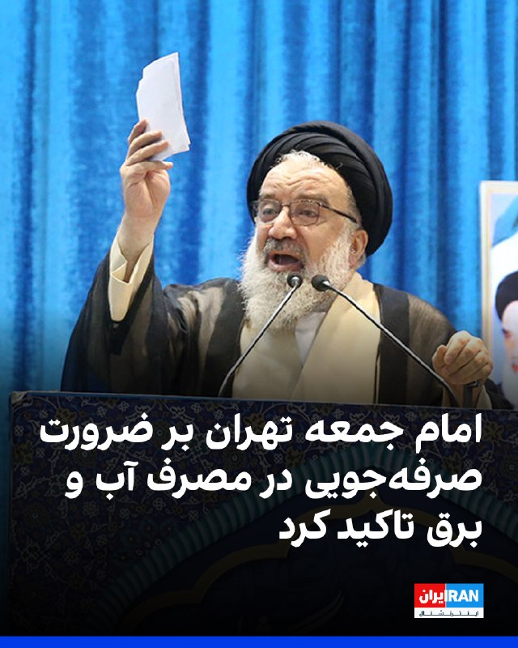

احمد خاتمی، امام جمعه موقت تهران در خطبه‌های نماز «عید قربان» در تهران با تاکید بر ضرورت صرفه‌جویی، گفت صرفه‌جویی در آب، برق و دیگر عرصه‌ها در راستای «مقاومت ملی» است.

او با استناد به روایتی از جعفر صادق، امام ششم شیعیان، گفت: «خداوند صرفه‌جویی را دوست دارد و اسراف را نمی‌پسندد. لذا ضرورتی به روشن نگه داشتن چراغ‌های اضافی نیست.»

خاتمی افزود که می‌توان با کمترین میزان آب وضو و غسل انجام داد و بر پرهیز از اسراف در مصرف منابع تاکید کرد.
‌🏁 🇬🇧 IranintlTV

🤖 @VahidOOnLine

## VahidOOnLine — post 242384

  

محمد اکبرزاده، معاون سیاسی نیروی دریایی سپاه پاسداران، احتمال وقوع جنگ دوباره را به دلیل «ضعف دشمن» پایین دانست، اما با تکرار لفاظی‌های تهدیدآمیز مقام‌های حکومت گفت: «شک نکنید که از چابهار تا ماهشهر را برای متجاوزان به قبرستان تبدیل خواهیم کرد. رزمندگان ما امروز بغض نبردی تن‌به‌تن با دشمن را در سینه دارند.»

او با اشاره به محاصره دریایی آمریکا در جنوب ایران گفت: «آمریکایی‌ها در بازگشایی تنگه هرمز شکست راهبردی خوردند.»

او ادامه داد: «آن‌ها مدعی بودند که می‌توانند تنگه هرمز را باز کنند، اما پس از انسداد این شاهراه، با تمام توانشان هم نتوانستند کاری از پیش ببرند.»
‌🏁 🇬🇧 IranintlTV

🤖 @VahidOOnLine

## VahidOOnLine — post 242383

  

احمد خاتمی در خطبه‌های نماز «عید قربان»، دونالد ترامپ را «دشمن دیوانه کاخ سیاه‌نشین» خواند و خطاب به مردم ایران گفت: «دشمنان شما و این دشمن دیوانه کاخ سیاه‌نشین که به غلط از آن به عنوان کاخ سفید یاد می‌شود، خواهان ذلت شما هستند، اما این آرزو را این دیوانه به گور خواهند برد.»

خاتمی با اشاره به اظهارات ترامپ درباره توافق با جمهوری اسلامی گفت: «او مدام از مذاکره با ایران سخن می‌گوید، اما حقیقت آن است که مقصودشان مذاکره نیست، بلکه تسلیم است.»
‌🏁 🇬🇧 IranintlTV

🤖 @VahidOOnLine

## VahidOOnLine — post 242382

  <a href="telegram/content/VahidOOnLine_242382_1779871521.mp4" target="_blank">🎬 Download video</a>

♦️تیم ملی فوتبال ایران که برای برگزاری اردوی تدارکاتی به آنتالیا در ترکیه سفر کرده است، روز سه‌شنبه و پس از تمرین‌های اولیه بار دیگر به دو گروه تقسیم شد و بازی «درون‌تیمی» برگزار کرد.

تیم ملی، از زمان جنگ ۱۲ روزه و پس از آن اعتراضات دی‌ماه و جنگ اخیر با اسرائیل و آمریکا، با چالش جدی «رقیب تدارکاتی» مواجه است و قرار است در آستانه سفر به مکزیک روز ۱۴ خرداد در آنتالیا با تیم ملی «مالی» دیدار تدارکاتی برگزار کند.

شاگردان امیر قلعه‌نویی پیش از این هم با خودشان رقابت تدارکاتی برگزار کرده بودند.
‌🇸🇦 Indypersian

🤖 @VahidOOnLine

## VahidOOnLine — post 242381

♦️مهدی خراتیان، کارشناس استراتژیک نزدیک به جمهوری اسلامی در گفتگو با پادکست «ایران‌تاک» به رهبران حکومت ایران توصیه کرد با توجه به بقای تهدیدها حتی در صورت توافق با آمریکا، سیاست «انعطاف هسته‌ای» را در پیش بگیرند.

خراتیان در بخشی از این برنامه گفت اگر بعد از انتخابات میان‌دوره‌ای مجلس آمریکا در ماه نوامبر، شاهد کوچکترین تحرکی در منطقه علیه ایران باشیم، مثلا تعداد سوخت‌رسان‌ها در پایگاه‌های قطر و عربستان از حدی فراتر رود، باید از ان‌پی‌تی خارج شویم و به سراغ ساخت سلاح هسته‌ای برویم.
‌🇸🇦 Indypersian

🤖 @VahidOOnLine

## VahidOOnLine — post 242380

  

♦️کره شمالی روز چهارشنبه ششم خردادماه از شلیک موشک‌های کروز با سامانه هدایتگر مجهز به هوش مصنوعی در جریان یک رزمایش خبر داد.

به گزارش رویترز به نقل از خبرگزاری دولتی کره شمالی در این رزمایش،  «ترکیبی از موشک‌های بالستیک تاکتیکی، راکت‌های توپخانه و موشک‌های کروز دقیق هدایت‌شونده با هوش مصنوعی، که برای جنگ‌های مدرن طراحی شده‌اند، تحت نظارت کیم جونگ اون، رهبر جمهوری دموکراتیک خلق کره، آزمایش شده‌اند.

به گزارش خبرگزاری دولتی کره شمالی،‌ کیم جونگ اون به فرماندهان ارتش گفت: «این آزمایش‌ها به‌ویژه آمادگی رزمی موشک‌های کروز را که در واحدهای توپخانه‌ای نزدیک مرز با کره جنوبی مستقر خواهند شد، تایید کرد.»

براساس همین گزارش، پیونگ یانگ می‌گوید «این موشک‌ها مجهز به ناوبری دقیق و کنترل هدایت‌شده با هوش مصنوعی هستند که می‌توانند به اهدافی در فاصله ۱۰۰ کیلومتری حمله کنند.»
‌🇸🇦 Indypersian

🤖 @VahidOOnLine

## VahidOOnLine — post 242379

  

تامی پیگوت، سخنگوی وزارت خارجه آمریکا، در ایکس نوشت: «ترامپ از نخستین روز حضورش به‌روشنی اعلام کرده است که حکومت ایران نباید به سلاح هسته‌ای دست یابد. ترامپ برای اطمینان از اینکه جمهوری اسلامی هرگز به این هدف نرسد، اقدام‌های قاطعی انجام داده است.»
‌🏁 🇬🇧 IranintlTV

🤖 @VahidOOnLine

## WithYashar — post 12643

درود یا منظورت حمله اس یا که اب و هوایه سطح کشور مثل تهران اصفهان هوا خوبه یه بررسی بکن ممنون ازت

## WithYashar — post 12642

@withyashar

## WithYashar — post 12641

اتاق جنگ با یاشار : کمربند ها رو ببندید
@withyashar

## WithYashar — post 12640

کانال ۱۴ اسرائیل: ارزیابی‌های اطلاعاتی حاکی از آن است که برنامه حمله به ایران از دستور کار خارج شده است
@withyashar

## WithYashar — post 12639

شبکه NBC News به نقل از معاون رئیس‌جمهور آمریکا ، ونس: «من خوش‌بین هستم که ایران در هر توافقی، با عدم توسعه سلاح‌های هسته‌ای موافقت خواهد کرد.»
@withyashar

## WithYashar — post 12638

  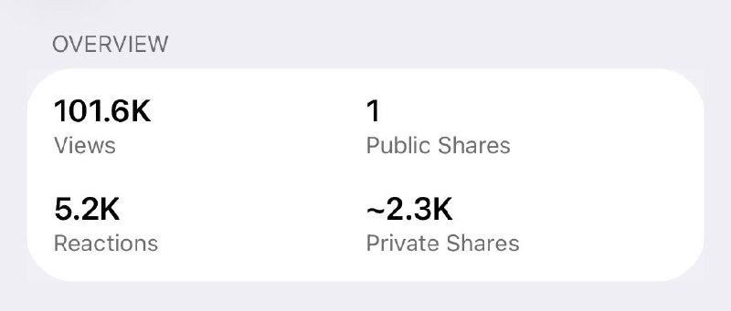

رکورد +۱۰۰کا ویو یک پست رو زدیم اونم در ۱۱ ساعت !!!
@withyashar

## WithYashar — post 12637

  

پست جدید کاخ سفید، : مامویت سادست؛ صلح از طریق قدرت
@withyashar

## WithYashar — post 12636

اتاق جنگ با یاشار : پروژه قهرمان سازی زرشکیان رو متوقف کنید !!! 😡
@withyashar

## WithYashar — post 12635

گروه تروریستی سپاه پاسداران:
احتمال وقوع جنگ کم است، اما نیروهای ما آماده‌اند.
@withyashar

## WithYashar — post 12634

https://instagram.com/yashar

## WithYashar — post 12633

یاشار برای ماهایی که تازه وصل شدیم اکانت اینستا تو میدی

## WithYashar — post 12632

در حال برسی اینم که امروز‌ خودمو نشون بدم و با یه ویدیو بیام به یوتیوب !

⏳
https://youtube.com/yasharrapfa

## WithYashar — post 12631

اسرائیل هیوم: پالس‌هایی از احتمال حمله آمریکا به گوش میرسد
@withyashar

## WithYashar — post 12630

جلسه کمپ دیوید که قرار بود امروز برگزار شود ترامپ اعلام کرد: جلسه کابینه به دلیل شرایط آب و هوایی در کاخ سفید برگزار خواهد شد، نه در کمپ دیوید!
حالا صحبت‌هایی هست که کمپ دیوید یک تله برای شناسایی فردی بود که اطلاعات را نشت می‌داد ! فرد مورد نظر گیر افتاد !

یاشار : دقیقا مشخص نیست چه کسی بوده است. صحبت ها درمورد تولسی گابارد و ونس هست ، ونس و تولسی از نظر فکری به هم نزدیک دیده می‌شوند؛ هر دو در جناحی قرار می‌گیرند که نسبت به جنگ مستقیم با ایران محتاط‌ترند.
بعد از استعفای جنجالی تولسی، چند روز پیش موجی از تحلیل‌ها راه افتاد که می‌گفت «ونس در حال منزوی شدن در دولت است».
اگه ونس باشه اوضاع خیلی پیچیده میشه
از اونجایی که تنها عضو کابینه هست که رئیس جمهور قدرت عزلش رو نداره و با رأی بالا اومده
تحلیلگران معتقدند درون دولت ترامپ اکنون دو بلوک شکل گرفته:
بلوک hawkish (تندتر علیه ایران)
بلوک restraint/non-intervention (محتاط‌تر)
و چون ونس چهره مهم جناح دوم محسوب می‌شود، هر اتفاق امنیتی فوراً او را وارد شایعات می‌کند.
@withyashar

## WithYashar — post 12629

روزنامه «فایننشال تایمز» گزارش داد صندوق مالی شورای صلح در غزه از زمان تاسیس خود تاکنون هیچ بودجه‌ای دریافت نکرده است.
@withyashar
این همون شورایی است که ترامپ تمام سران رو جمع کرد که پول بزارن

## WithYashar — post 12628

مجلس سوئد ازدواج فامیلی رو ممنوع کرد؛
طبق این مصوبه، از اول ژوئیه 2026 دیگه ازدواج بین بچه‌های "عمو، دایی، عمه و خاله" تو سوئد ممنوعه.
@withyashar

## WithYashar — post 12627

  <a href="telegram/content/WithYashar_12627_1779871525.mp4" target="_blank">🎬 Download video</a>

اردوغان:ان‌شاءالله این ظالم به نام نتانیاهو، درسی که شایسته‌اش است را از مسلمانان جهان خواهد گرفت
@withyashar
یاشار : به قول تحلیلگر ترک، ترکیه هیچوقت مثل ایران نمیشه، بلکه بدتر از ایران میشه.

## WithYashar — post 12626

ارسالی : اینکه شب عید قربان نت وصل کردن، حس گوسفندی رو دارم که قبل ذبح بهش آب میدن.😂🤣
@withyashar

## WithYashar — post 12625

زنگنه، نماینده مجلس : آمریکا حق غنی‌سازی، حاکمیت ایران بر تنگه هرمز و رفع تحریم‌ها را پذیرفت
@withyashar 🤣

## mwarmonitor — post 9791

🔸رسانه‌های قبرس: پلیس محلی در حال تحقیق درباره یک حمله خشونت‌آمیز به سه اسرائیلی در شهر قدیمی نیکوزیا در روز دوشنبه بعدازظهر است. در این حادثه، یک نفر زخمی شده است.

🔸سفیر اسرائیل در قبرس این حادثه را «خشونت یهودستیزانه» توصیف کرد.

@mwarmonitor

## mwarmonitor — post 9790

🔴 شبکه NBC News به نقل از معاون رئیس‌جمهور آمریکا: «من خوش‌بین هستم که ایران در هر توافقی، با عدم توسعه سلاح‌های هسته‌ای موافقت خواهد کرد.»

@mwarmonitor

## mwarmonitor — post 9789

🔴دولت‌های اتحادیه اروپا با تصویب قوانین لازم، راه را برای اجرای کاهش تعرفه‌های وارداتی بر کالاهای آمریکایی هموار کردند؛ اقدامی که بخش کلیدی توافق تجاری میان اتحادیه اروپا و ایالات متحده به شمار می‌رود — به گزارش Reuters.

@mwarmonitor

## mwarmonitor — post 9788

🔴بر اساس گزارش کانال ۱۲ ، وزرای اسرائیل در یک نشست امنیتی خواستار واکنشی سخت‌تر علیه حزب‌الله و لبنان شدند.

🔸وزیر کوهن گفت اسرائیل نباید در حالی که حزب‌الله آتش‌بس را نقض می‌کند، خویشتنداری نشان دهد و تأکید کرد لبنان به‌عنوان یک کشور مستقل مسئول حملات از خاک خود است و باید بهای آن را بپردازد.

🔸وزیر بن گویر نیز گفت لبنان وزرایی مرتبط با حزب‌الله دارد و هشدار داد اسرائیل باید «ضاحیه را با خاک یکسان کند» و غیرنظامیان را جابه‌جا کند.

🔸در همین حال، وزیر دفاع اظهار داشت که «گرفتن/تصرف قلمرو» همان چیزی است که به حزب‌الله ضربه می‌زند.

@mwarmonitor

## mwarmonitor — post 9787

  

🔸به‌نظر می‌رسد روسیه قصد ندارد شانس خود را برای تأمین سوختِ موردنیاز کوبا در بحبوحهٔ محاصرهٔ سوختی به رهبری آمریکا امتحان کند.
پس از پنج هفته سرگردانی در دریای سارگاسو، نفتکش «هندی‌مکس» با پرچم روسیه و تحت تحریم آمریکا به نام UNIVERSAL (9384306) اکنون مسیر خود را ۱۲۰۰ مایل دریایی به سمت جنوب‌شرق تغییر داده است. TANKER TRACKER

@mwarmonitor

## mwarmonitor — post 9786

📌یک حرکت جدید – Coronet East 024 ✈️هواپیماهای سوخت رسان KC-46A با نام «BOBBY81» به شماره 19-46061 AE5FA8 و KC-46A با نام «BOBBY82» به شماره 19-46007 AE574D ✈️با کد مأموریت Coronet East 024 از خاک‌ آمریکا به پرواز درآمده‌اند. مشخص نیست که آیا از قبل هواپیمایی…

## pm_afshaa — post 91614

  <a href="https://t.me/pm_afshaa/91614" target="_blank">📎 Download file</a>

نپسترنت سرعت بالا برا تمامی اوپراتورها

بفرستین برا بقیه هم وصل شن

💧 Rainbet.com the #1 Non-KYC Crypto Casino & Sportsbook @rainbetcom

😁 @Pm_Afshaa

## pm_afshaa — post 91613

تا شب میخام براتون کانفینگ بزارم همه رو وصل کنین فقط کانال و بفرستین برا بقیه از اسپانسرمونم که کانفینگا رو در اختیارمون میزاره حمایت کنین🤍 @Glitch_Config

## pm_afshaa — post 91612

vless://InternetAzadRobot@chatgpt.com:2087?encryption=none&security=tls&alpn=h2%2Chttp%2F1.1&fp=chrome&type=tcp&headerType=none#PMTV%20NEWS%20%F0%9F%A6%81%E2%98%80%EF%B8%8F

نامحدود متصل رو همه سرورا

💧 Rainbet.com the #1 Non-KYC Crypto Casino & Sportsbook @rainbetcom

😁 @Pm_Afshaa

## pm_afshaa — post 91611

https://t.me/proxy?server=5.ir.fulle7.info&port=8443&secret=EERighJJvXrFGRMCIMJdCQ

پروکسی متصل

💧 Rainbet.com the #1 Non-KYC Crypto Casino & Sportsbook @rainbetcom

😁 @Pm_Afshaa

## pm_afshaa — post 91610

https://t.me/proxy?server=49.13.35.164&port=8443&secret=dd104462821249bd7ac519130220c25d09

پروکسی مخصوص تلگرام

💧 Rainbet.com the #1 Non-KYC Crypto Casino & Sportsbook @rainbetcom

😁 @Pm_Afshaa

## pm_afshaa — post 91609

vless://ddf083f5-7d82-4948-b8b2-985cec9c7fba@fl1bot-ws.headerip.com:80?path=%2F&security=none&encryption=none&host=fl1.mv5.ir&type=ws#PMTV%20NEWS%F0%9F%A6%81%E2%98%80%EF%B8%8F

نامحدود v2 سرعت بالا

💧 Rainbet.com the #1 Non-KYC Crypto Casino & Sportsbook @rainbetcom

😁 @Pm_Afshaa

## pm_afshaa — post 91608

PMTV NEWS🦁☀️.npvt

## pm_afshaa — post 91607

  <a href="https://t.me/pm_afshaa/91607" target="_blank">📎 Download file</a>

نپسترنت سرعت بالا برا تمامی اوپراتورها

بفرستین برا بقیه هم وصل شن

💧 Rainbet.com the #1 Non-KYC Crypto Casino & Sportsbook @rainbetcom

😁 @Pm_Afshaa

## pm_afshaa — post 91606

🔴فاکس نیوز:جمهوری اسلامی درخواست 24 میلیارد دلار برای هر توافقی با آمریکا کرده

💧 Rainbet.com the #1 Non-KYC Crypto Casino & Sportsbook @rainbetcom

😁 @Pm_Afshaa

## pm_afshaa — post 91605

فرودگاه بین المللی تبریز فعالیت هاشو بعد 90 روز از سر گرفت

💧 Rainbet.com the #1 Non-KYC Crypto Casino & Sportsbook @rainbetcom

😁 @Pm_Afshaa

## DEJradio — post 5013

  <a href="telegram/content/DEJradio_5013_1779871529.mp4" target="_blank">🎬 Download video</a>

🔺🎥 یک شهروند در ویدیویی می‌گوید: «اینجا جاده همدان قزوینه، سیلوی گندم که تا قبل از جنگ محل کار من و برادرم بود الان بسته شد، نه نون داریم نه کار، خسته شدیم از این حکومت، تو رو خدا به فکر مردم باشید.»

#تورم #جنگ
@DEJradio

## DEJradio — post 5012

  <a href="telegram/content/DEJradio_5012_1779871531.webm" target="_blank">🎬 Download video</a>

🔺📢 با اتصال دوباره اینترنت ایران، منابع گزارش‌های تازه‌ای از جنگ ۴۰ روزه ارسال کرده‌اند. در ایام جنگ تعدادی از فرماندهان سـ.ـپاه و انتظامی شب‌ها در گورستان زرتشتیان قصرفیروزه در شرق تهران می‌خوابیدند. در همان دوران چهره‌های برجسته جامعه زرتشتی تلاش کردند مانع این کار شوند اما راه به جایی نبردند.

پیش‌تر موارد زیادی از از استقرار فرماندهان در بیمارستان‌ها، مدارس، باشگاه‌های ورزشی و مساجد گزارش شده بود.

#اینترنت #جنگ۴۰روزه
@DEJradio

## DEJradio — post 5011

  <a href="telegram/content/DEJradio_5011_1779871531.webm" target="_blank">🎬 Download video</a>

🔺📢 بر اثر برخورد یک خودرو به ایست بازرسی بـ.ـسیج در شهر عقدا اردکان استان یزد حداقل یک نفر از نیروها کشته شده است.

خبرگزاری فارس وابسته به سـ.ـپاه پاسداران گزارش داد محمد معراج نظری سرباز بسیـ.ـجی «در مسیر تأمین امنیت» کشته شد اما اشاره‌ای به دلیل آن نکرده است اما خبرگزاری صداوسیما به نقل از فرماندهی پادگان آموزشی «ولیعصر» اردکان نوشت نوشت نظری «چند روز پیش در حین انجام وظیفه بر اثر برخورد یک خودروی متواری به شدت مجروح و به کما رفته بود.»

#بسیجی #IRGCterrorists
@DEJradio

## IranIntlTV — post 339206

فرمانده شاخه نظامی حماس در حمله اسرائیل به نوار غزه کشته شد

یسرائیل کاتز، وزیر دفاع اسرائیل، اعلام کرد محمد عوده، فرمانده شاخه نظامی حماس، در حمله اسرائیل به نوار غزه کشته شده است.

کاتز چهارشنبه ششم خرداد با انتشار پیامی در شبکه اجتماعی ایکس، به ارتش و سازمان امنیت داخلی اسرائیل، شین‌بت، تبریک گفت و اعلام کرد فرمانده شاخه نظامی حماس در حمله سه‌شنبه پنجم خرداد به غزه از پا درآمد.
 
او تاکید کرد اسرائیل به حذف همه افرادی که در حمله هفتم اکتبر نقش داشتند، ادامه خواهد داد.
 
به گفته کاتز، اسرائیل اجازه نخواهد داد حماس دوباره به‌صورت نظامی یا غیرنظامی بر غزه حکومت کند و طرح «مهاجرت داوطلبانه» از غزه نیز «در زمان و به شیوه مناسب» انجام خواهد شد.

آژانس دفاع مدنی غزه پیش‌تر اعلام کرد در حمله به محله ریمال در غرب شهر غزه، دست‌کم سه نفر کشته و ۲۰ نفر زخمی شدند.

رسانه‌های وابسته به حماس نیز گزارش دادند عوده به همراه همسر و پسرانش کشته شده‌اند.

با این حال، حماس تاکنون در این باره اظهار نظر نکرده است.

محمد عوده که بود؟
ارتش اسرائیل و شین‌بت در بیانیه مشترکی اعلام کردند عوده پس از کشته شدن عزالدین حداد، فرماندهی شاخه نظامی حماس را بر عهده گرفته بود و طی سال‌های اخیر نیز ریاست دستگاه اطلاعاتی این گروه را بر عهده داشت.

بر اساس این بیانیه، نیروهای اسرائیلی پس از ماه‌ها «ردیابی اطلاعاتی» و زیر نظر گرفتن رفت‌وآمدهای عوده و نزدیکانش، چند ساختمان در مرکز شهر غزه را که به‌عنوان مخفیگاه استفاده می‌شد، هدف قرار دادند.

ارتش اسرائیل ۲۵ اردیبهشت حداد را در حمله‌ای هوایی هدف قرار داد و از پا درآورد.

به گزارش روزنامه الشرق الاوسط، عوده از روابط نزدیکی با حداد برخوردار بود و پس از ترور رهبران سابق حماس، محمد ضیف و محمد سنوار، با او برای «تجدید ساختار سازمانی» این پروه همکاری می‌کرد.

ارتش اسرائیل همچنین اعلام کرد آپارتمان متعلق به یکی از اعضای حماس که در حمله هفتم اکتبر مشارکت داشت و از نزدیکان عوده بود نیز هدف قرار گرفت.

بر اساس این بیانیه، عوده از آخرین فرماندهان ارشد شاخه نظامی حماس بود که در طراحی و اجرای حمله هفتم اکتبر و هدایت نبرد علیه نیروهای اسرائیلی نقش داشت و کشته شدنش «ضربه‌ای مهم» به تلاش‌های حماس برای بازسازی ساختار نظامی خود محسوب می‌شود.
 
🔗وب‌سایت ایران‌اینترنشنال
@iranintltv

## IranIntlTV — post 339205

  

🔻حزب ایران نوین با ارسال نامه‌ای رسمی به فیفا، به ممنوعیت ورود پرچم شیر و خورشید به ورزشگاه‌های جام جهانی ۲۰۲۶ اعتراض کرد. در این نامه تاکید شده است: «نشان شیر و خورشید نه یک نماد سیاسی، بلکه بخشی جدایی‌ناپذیر از تاریخ، فرهنگ و هویت ملی ایران است؛ نشانی که قرن‌ها پیش از حکومت کنونی وجود داشته و نماد وحدت و تمامیت ارضی ایران است.»

🔹این حزب تصمیم فیفا را مغایر با اصول بی‌طرفی این نهاد دانست و افزود: «جام جهانی باید عرصه احترام به ملت‌ها باشد، نه بستری برای حذف نمادهای تاریخی.»

🔹پیش‌تر، «موسسه صداهای آزادی» در آمریکا نیز با ارسال نامه‌ای به فیفا، برگزارکنندگان را به اقدام قضایی در دادگاه‌های فدرال و عالی کالیفرنیا تهدید کرده بود. مشاور حقوقی این نهاد اعلام کرد در صورت اصرار فیفا بر سیاسی دانستن این پرچم و ممنوعیت آن، به دلیل نقض آزادی بیان، روند رسمی دادرسی علیه فیفا را آغاز خواهند کرد.
@iranintltvsport

## IranIntlTV — post 339204

  

محمدتقی وکیل‌پور، نماینده اعزامی رهبر جمهوری اسلامی به استان سیستان و بلوچستان، شامگاه سه‌شنبه در سخنانی در چابهار گفت مجتبی خامنه‌ای «اکنون با تمام توان در میدان ایستاده و مدیریت کلان کشور و صحنه جنگ را بر عهده دارند».

او افزود: «شرایط امروز منطقه بسیار حساس است و دشمن با تمام توان عملیاتی خود به میدان آمده است.»
https://iranintl.com/202605270034

## IranIntlTV — post 339203

  

آتش‌سوزی گسترده‌ای صبح چهارشنبه در یک فروشگاه مواد غذایی یهودیان در منطقه گولدرز گرین در شمال غرب لندن رخ داد و ده‌ها آتش‌نشان را به محل حادثه کشاند.

به گفته سازمان آتش‌نشانی لندن، حدود ۱۰۰ آتش‌نشان با ۱۵ خودرو در حال مهار حریقی هستند که گمان می‌رود از انبار فروشگاه «کوشر کینگدام» آغاز شده و به ساختمان اصلی نیز سرایت کرده است.

مقام‌های آتش‌نشانی گفتند آتش‌سوزی «حجم قابل توجهی دود» تولید کرده و از ساکنان منطقه خواستند در و پنجره‌های خود را بسته نگه دارند.

پلیس متروپولیتن نیز اعلام کرد در این حادثه کسی آسیب ندیده است.

گولدرز گرین یکی از محله‌های شناخته‌شده لندن با جمعیت قابل توجه یهودیان است و فروشگاه‌های عرضه‌کننده محصولات «کوشر» در این منطقه فعال هستند.
https://iranintl.com/202605276930

## IranIntlTV — post 339202

کره شمالی از آزمایش موشک‌ها و راکت‌های هدایت‌شونده بر مبنای هوش مصنوعی خبر داد

رسانه دولتی کره شمالی گزارش داد پیونگ‌یانگ با نظارت کیم جونگ اون، رهبر این کشور، مجموعه‌ای از موشک‌های بالستیک، راکت‌ها و موشک‌های کروز دقیق هدایت‌شونده مبتنی بر هوش مصنوعی را آزمایش کرده است.

خبرگزاری رویترز چهارشنبه ششم خرداد گزارش داد کره شمالی پس از توسعه موشک‌های بالستیک دوربرد و توانایی‌های هسته‌ای خود، در سال‌های اخیر به‌طور مداوم در حال ارتقای زرادخانه تاکتیکی و متعارفش بوده و وعده داده است این تسلیحات را در نزدیکی مرز با کره جنوبی مستقر کند.

این در حالی است که ارتش کره جنوبی پنجم خرداد اعلام کرد کره شمالی چند پرتابه، از جمله دست‌کم یک موشک بالستیک کوتاه‌برد، به سمت آب‌های ساحل غربی این کشور شلیک کرده است.

ستاد مشترک ارتش کره جنوبی در بیانیه‌ای اعلام کرد این پرتاب‌ها حدود ساعت یک بعدازظهر به وقت محلی، از نزدیکی شهر چونگجو در استان پیونگان شمالی در کره شمالی انجام شده‌اند.

آزمایش تسلیحات «مناسب جنگ مدرن»
خبرگزاری دولتی کره شمالی اعلام کرد این آزمایش‌ها برای ارزیابی قدرت یک «کلاهک ماموریت ویژه» روی موشک‌های بالستیک تاکتیکی، میزان اطمینان‌پذیری راکت‌های دوربرد پرتاب چندگانه و دقت موشک‌های کروز تاکتیکی مجهز به هدایت هوش مصنوعی انجام شده است.

کیم جونگ اون گفت این آزمایش‌ها نشان داده‌اند سامانه‌های تسلیحاتی و پرتاب خودکار با موفقیت به‌روزرسانی شده‌اند تا «با شرایط واقعی جنگ مدرن سازگار شوند و کاربرد رزمی آنها افزایش یابد.»

به گفته او، این آزمایش‌ها، آمادگی رزمی موشک‌های کروز مستقر در یگان‌های توپخانه‌ای نزدیک مرز کره جنوبی را تایید کرده‌اند. موشک‌هایی که به سامانه ناوبری دقیق و کنترل مبتنی بر هوش مصنوعی مجهز هستند و می‌توانند اهدافی در فاصله ۱۰۰ کیلومتری را هدف قرار دهند.

سئول، پایتخت پرجمعیت کره جنوبی، در فاصله‌ای کمتر از ۱۰۰ کیلومتر از منطقه غیرنظامی میان دو کره قرار دارد.

پیونگ‌یانگ پیش‌تر کره جنوبی را «دشمن اصلی» خود خوانده و سیاست اتحاد دوباره دو کره را کنار گذاشته است.

اشاره علنی به استفاده از هوش مصنوعی در موشک‌ها
تحلیلگران با اشاره به اعلام رسمی کره شمالی درباره سامانه هدایت نهایی موشک‌های کروز، گفتند احتمالا این نخستین باری است که این کشور به‌صورت علنی از استفاده از هوش مصنوعی در موشک‌ها سخن می‌گوید.

این فناوری با استفاده از داده‌های لحظه‌ای، هدف را شناسایی و روی آن قفل می‌کند.

یانگ اوک، کارشناس نظامی در موسسه مطالعات سیاسی «آسان» (Asan)، گفت: «موضوع، استفاده از هوش مصنوعی در شناسایی هدف و هدایت موشک است.»

کره شمالی پیش‌تر نیز اعلام کرده بود در پهپادهای خود از فناوری هوش مصنوعی استفاده کرده است.

هونگ مین، پژوهشگر موسسه اتحاد ملی کره، گفت ادعای پیونگ‌یانگ احتمالا به نسخه ارتقایافته سامانه‌های هدایت دیجیتال موجود همراه با فناوری شناسایی خودکار هدف اشاره دارد؛ هرچند از روی گزارش منتشرشده نمی‌توان میزان پیشرفت واقعی این فناوری را تایید کرد.

تجربه جنگ اوکراین
کره شمالی از اواخر سال ۲۰۲۳ موشک‌های بالستیک و راکت‌های توپخانه‌ای در اختیار روسیه قرار داده که در جنگ اوکراین مورد استفاده قرار گرفته‌اند.
تحلیلگران معتقدند استفاده از این تسلیحات در میدان جنگ، داده‌های ارزشمندی برای توسعه زرادخانه نظامی پیونگ‌یانگ فراهم کرده است.
 
🔗وب‌سایت ایران‌اینترنشنال
@iranintltv

## IranIntlTV — post 339201

  <a href="telegram/content/IranIntlTV_339201_1779871533.mp4" target="_blank">🎬 Download video</a>

رجب طیب اردوغان، رییس‌جمهوری ترکیه، با هشدار نسبت به گسترش جنگ در منطقه، بر حمایت از دیپلماسی و تلاش مشترک کشورهای منطقه برای دستیابی به صلح پایدار تاکید کرد. او در پیام عید قربان نیز با شدیدترین لحن از سیاست‌های اسرائیل انتقاد کرد و گفت این کشور به دنبال «تحریک» و «ادامه درگیری در منطقه» است.

نرگس هورخش، خبرنگار ایران‌اینترنشنال، گزارش می‌دهد
@iranintltv

## IranIntlTV — post 339200

  <a href="https://t.me/IranintlTV/339200" target="_blank">📎 Download file</a>

🎧نسخه صوتی اخبار بامدادی | چهارشنبه ۶ خرداد
@iranintlTV

## IranIntlTV — post 339199

  

هیلل نیومن، سفیر اسرائیل در استرالیا، در گفت‌وگوی اختصاصی با ایران‌اینترنشنال گفت آمریکا و اسرائیل در یک عملیات مشترک، کارزار نظامی را برای مقابله با آنچه تهدیدهای موجود از سوی جمهوری اسلامی خواند، آغاز کردند. او تاکید کرد هدف این کارزار، از بین بردن یا کاهش تهدیدهای هسته‌ای و موشکی حکومت ایران بوده است.

نیومن با اشاره به برنامه هسته‌ای جمهوری اسلامی گفت: «ما نمی‌توانیم اجازه دهیم حکومت اسلامی به توانایی هسته‌ای دست پیدا کند.» او افزود تهدیدهای موجود شامل موضوع غنی‌سازی اورانیوم، نبود اورانیوم غنی‌شده در ایران و حذف کامل توانایی هسته‌ای است.

نیومن در عین حال تاکید کرد اسرائیل مخالف راه‌حل دیپلماتیک نیست و اگر از طریق مذاکرات بتوان به اهداف تعیین‌شده رسید و جان انسان‌ها حفظ شود، این مسیر مطلوب خواهد بود. او گفت: «اگر مذاکرات موفق نشود، ممکن است مجبور شویم دوباره به کارزار نظامی بازگردیم.»

سفیر اسرائیل در استرالیا افزود درک مشترکی میان اسرائیل و ایالات متحده درباره این اهداف وجود دارد و دونالد ترامپ، رییس‌جمهوری آمریکا، نیز گفته است درباره موضوع غنی‌سازی اورانیوم و توانایی هسته‌ای ایران مصالحه نخواهد کرد.

## IranIntlTV — post 339198

  <a href="telegram/content/IranIntlTV_339198_1779871535.mp4" target="_blank">🎬 Download video</a>

نت‌بلاکس اعلام کرد با اتصال دوباره شبکه‌های موبایل و بخشی از اینترنت خانگی به اینترنت جهانی، سطح دسترسی به اینترنت در ایران به ۸۶ درصد رسیده است. همزمان، کاربران از دسترسی محدود به اینترنت بین‌المللی خبر می‌دهند و معاون وزیر ارتباطات گفته روند اتصال ادامه دارد و تا ۲۴ ساعت آینده، دسترسی مردم فراهم می‌شود.

گفت‌وگو با محمدجواد اکبرین، عضو تحریریه ایران‌اینترنشنال
@iranintltv

## IranIntlTV — post 339197

  <a href="telegram/content/IranIntlTV_339197_1779871538.mp4" target="_blank">🎬 Download video</a>

جاویدنامان انقلاب ملی ایرانیان
«بهار شاه‌مهری» شامگاه پنج‌شنبه ۱۸ دی‌ماه در نیشابور با گلوله جنگی نیروهای سرکوبگر خامنه‌ای کشته شد. نامش در حافظه‌ این سرزمین می‌ماند و یادش چراغ راه آزادی‌خواهان است.
@iranintltv

## IranIntlTV — post 339196

  <a href="telegram/content/IranIntlTV_339196_1779871539.mp4" target="_blank">🎬 Download video</a>

ان‌بی‌سی نیوز در گزارشی اعلام کرد وزارت جنگ آمریکا فهرستی از اهداف احتمالی باقی‌مانده در ایران را تهیه کرده است. با این حال، مقام‌های آمریکایی می‌گویند این اهداف به دلیل پنهان بودن و جابه‌جایی مداوم، به‌سختی قابل شناسایی هستند.

گزارش نیلوفر منصوری، خبرنگار ایران‌اینترنشنال
@iranintltv

## IranIntlTV — post 339195

  <a href="telegram/content/IranIntlTV_339195_1779871541.mp4" target="_blank">🎬 Download video</a>

شورای امنیت سازمان ملل متحد سه‌شنبه نشستی سطح بالا با محوریت حفظ منشور ملل متحد و تقویت نظام بین‌المللی برگزار کرد. یکی از محورهای مورد توجه در این نشست، تحولات ایران و تنش‌ها در خلیج فارس بود.

مریم رحمتی، خبرنگار ایران‌اینترنشنال، گزارش می‌دهد
@iranintltv

## IranIntlTV — post 339194

  <a href="telegram/content/IranIntlTV_339194_1779871542.mp4" target="_blank">🎬 Download video</a>

تضمین عبور و مرور امن کشتیرانی از تنگه هرمز یکی از مهم‌ترین خواسته‌های ایالات متحده در هر توافق احتمالی با جمهوری اسلامی است. بررسی آبراه‌های مهم جهان و میزان تردد از آن‌ها نشان می‌دهد اختلال در هر یک از این مسیرها می‌تواند پیامدهای گسترده‌ای برای اقتصاد جهانی داشته باشد.
@iranintltv

## IranIntlTV — post 339193

🗣روایت شما از زندگی در آتش‌بس- چهارشنبه ۶ خرداد

🔹بعد از سه ماه قطعی وصل شدم ولی اینترنت هیچ سرعتی نداره.

🔹 الان اینترنت وصل شده. باید تبریک بگیم؟ باید تسلیت بگیم. بهتر که نشده، حتی بدتر هم شده.

🔹اینترنت وصل شده ولی سرعتش همچنان خیلی پایینه. حوصله‌مون سر میره تا بتونیم اینستاگرام رو باز کنیم.

🔹اینترنت‌ها رو وصل کردن ولی اون ۴۰ هزار نفر و پدر و مادرهای داغدار چی میشن؟

🔹به عنوان یک جوان که در قرن ۲۱ زندگی می‌کنه، ۹۰ روز نداشتن دسترسی به اینترنت از اسارت هم بدتر بود. به امید روزی که دیگه چنین چیزهایی رو تجربه نکنیم.

🔹 من یک دانش‌آموز ۱۲ ساله‌ هستم. اینکه اینترنت رو وصل کردن برای ما دانش‌آموزان خوبه، ولی برای مردم چه فایده وقتی که قیمت‌ها هر روز بالاتر میره، تورم بالاست و مردم رو بدبخت کردن.

🔹خیلی خوشحالم که اینترنت‌ها وصل شده چون می‌تونم راحت‌تر درس بخونم.
🔹از دیشب که اینترنت وصل شده، اکثرا نگران هستن که نکنه این به معنای تموم شدن جنگ باشه.

🔹این‌قدر نگویید اینترنت بین‌الملل وصل شده، اپ‌استور و خیلی از اپلیکیشن‌ها فیلتر هستن. شدیم مثل کشور چین.

🔹اینترنت عادی‌ترین حق ماست که اون رو از ما می‌گیرن، ولی ما شکست نمی‌خوریم.

🔹اینترنت‌ها وصل شد ولی به چه قیمتی؟ همه‌چی رو از دست دادیم.

## IranIntlTV — post 339192

  

احمد خاتمی، امام جمعه موقت تهران در خطبه‌های نماز «عید قربان» در تهران با تاکید بر ضرورت صرفه‌جویی، گفت صرفه‌جویی در آب، برق و دیگر عرصه‌ها در راستای «مقاومت ملی» است.

او با استناد به روایتی از جعفر صادق، امام ششم شیعیان، گفت: «خداوند صرفه‌جویی را دوست دارد و اسراف را نمی‌پسندد. لذا ضرورتی به روشن نگه داشتن چراغ‌های اضافی نیست.»

خاتمی افزود که می‌توان با کمترین میزان آب وضو و غسل انجام داد و بر پرهیز از اسراف در مصرف منابع تاکید کرد.
https://iranintl.com/202605271684

## IranIntlTV — post 339191

  <a href="telegram/content/IranIntlTV_339191_1779871544.mp4" target="_blank">🎬 Download video</a>

امیر حمیدی، متخصص امنیت ملی، گفت فشار حداکثری آمریکا تا زمان دستیابی به یک توافق قابل قبول با تهران ادامه خواهد داشت. او افزود جمهوری اسلامی که پیش‌تر شعار مقاومت می‌داد، اکنون با بحران مالی جدی روبه‌رو است و در پی آزادسازی پول‌های بلوکه‌شده خود است.
@iranintltv

## IranIntlTV — post 339190

  <a href="telegram/content/IranIntlTV_339190_1779871545.mp4" target="_blank">🎬 Download video</a>

لیندسی گراهام، سناتور جمهوری‌خواه آمریکا، در واکنش به مخالفت پاکستان با درخواست دونالد ترامپ برای پیوستن به پیمان ابراهیم، در شبکه اجتماعی ایکس نوشت: «مدت‌هاست برای من روشن شده که پاکستان به‌عنوان میانجی گزینه‌ای بسیار مسئله‌دار است.» او افزود «دشمنی اسلام‌آباد با اسرائیل سابقه‌ای طولانی دارد.»

گفت‌وگو با مهدی بیگی، عضو تحریریه ایران‌اینترنشنال
@iranintltv

## IranIntlTV — post 339189

  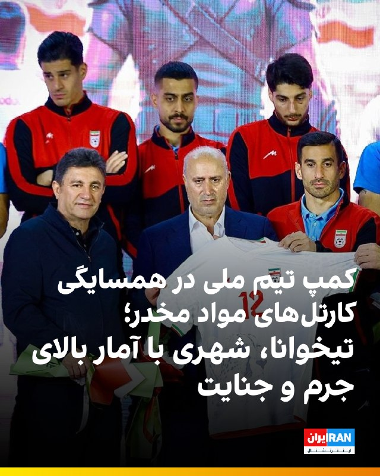

🔻خبرآنلاین در گزارشی به بررسی خطرات انتقال کمپ تیم ملی از آریزونای آمریکا به شهر مرزی تیخوانا در مکزیک پرداخته است.

🔹به نوشته خبرآنلاین، این انتخاب ملی‌پوشان را در معرض خطرات امنیتی جدی قرار می‌دهد؛ چرا که تیخوانا به دلیل فعالیت گسترده کارتل‌های مواد مخدر، قاچاق و خشونت‌های خونین باندهای تبهکار، همواره یکی از بالاترین نرخ‌های قتل و جرم و جنایت را در جهان داشته است. مناطقی مانند «زونا نورته» در این شهر، کانون اصلی فعالیت کارتل‌ها هستند و خطر سرقت و کلاهبرداری در مناطق مرزی آن بسیار بالاست.

🔹علاوه بر خطر حضور در چنین محیط ناامنی، فرایند فرسایشی عبور مکرر از کنترل مرزی مکزیک و آمریکا و خستگی ناشی از سفرهای مداوم، چالش‌های روانی و امنیتی بزرگی را پیش روی کادر فنی و بازیکنان قرار خواهد داد.
@iranintltvsport

## IranIntlTV — post 339188

  <a href="telegram/content/IranIntlTV_339188_1779871548.mp4" target="_blank">🎬 Download video</a>

وانگ یی، وزیر خارجه چین، گفت تهران و واشینگتن باید رویکردی مبتنی بر امتیازدهی متقابل در پیش گیرند.او افزود از منظر پکن، توافق نهایی میان جمهوری اسلامی و آمریکا باید به شورای امنیت برود تا از مشروعیت و اعتبار برخوردار شود.

توماج طاهباز و علیرضا محبی، خبرنگاران ایران‌اینترنشنال، گزارش می‌دهند
@iranintltv

## IranIntlTV — post 339187

  

محمد اکبرزاده، معاون سیاسی نیروی دریایی سپاه پاسداران، احتمال وقوع جنگ دوباره را به دلیل «ضعف دشمن» پایین دانست، اما با تکرار لفاظی‌های تهدیدآمیز مقام‌های حکومت گفت: «شک نکنید که از چابهار تا ماهشهر را برای متجاوزان به قبرستان تبدیل خواهیم کرد. رزمندگان ما امروز بغض نبردی تن‌به‌تن با دشمن را در سینه دارند.»

او با اشاره به محاصره دریایی آمریکا در جنوب ایران گفت: «آمریکایی‌ها در بازگشایی تنگه هرمز شکست راهبردی خوردند.»

او ادامه داد: «آن‌ها مدعی بودند که می‌توانند تنگه هرمز را باز کنند، اما پس از انسداد این شاهراه، با تمام توانشان هم نتوانستند کاری از پیش ببرند.»
https://iranintl.com/202605273594

## FarsiVOA — post 218783

🔺اسرائیل از کشته شدن فرمانده تازه شاخه نظامی حماس در غزه خبر داد

▪️ارتش اسرائیل و سازمان امنیت داخلی این کشور، شاباک، اعلام کردند محمد عوده، فرمانده تازه شاخه نظامی حماس در نوار غزه، در حمله هوایی سه‌شنبه شب در شمال غزه کشته شده است.

▪️به گفته مقام‌های اسرائیلی، محمد عوده هفته گذشته و پس از کشته شدن عزالدین حداد، به این جایگاه رسیده بود.

▪️ساعاتی پیش از تأیید رسمی کشته شدن عوده، بنیامین نتانیاهو در بیانیه‌ای اعلام کرده بود ارتش اسرائیل، محمد عوده را در غزه هدف قرار داده است.

▪️در آن بیانیه، عوده «یکی از طراحان حمله هفتم اکتبر» معرفی شده و گفته شده بود او مسئول کشته، ربوده و زخمی شدن شماری از شهروندان اسرائیلی و نیروهای ارتش اسرائیل بوده است.

⬇️ بیشتر بخوانید:
https://ir.voanews.com/a/idf-confirm-hamas-new-military-chief-killed-in-gaza-strike/8154428.html

## FarsiVOA — post 218782

  <a href="telegram/content/FarsiVOA_218782_1779871550.mp4" target="_blank">🎬 Download video</a>

حمله ارتش آمریکا به یک قایق مظنون به قاچاق مواد مخدر در اقیانوس آرام؛

ارتش آمریکا اعلام کرد روز سه‌شنبه یک قایق را در شرق اقیانوس آرام هدف حمله نظامی قرار داده است؛ حمله‌ای که به گفته فرماندهی جنوبی آمریکا، علیه شناوری انجام شد که توسط «سازمان‌های تروریستی تعیین‌شده» اداره می‌شد و در مسیرهای شناخته‌شده قاچاق مواد مخدر حرکت می‌کرد.

در این حمله یک مرد کشته شد و دو نفر زنده ماندند. ساوتکام می‌گوید پس از حمله، گارد ساحلی آمریکا برای عملیات جست‌وجو و نجات دو بازمانده حاضر شد و هیچ نیروی آمریکایی آسیب ندید.

در بیانیه آمریکا، نام گروه، هویت افراد یا شواهد مربوط به ادعای قاچاق منتشر نشده است. آسوشیتدپرس نوشت این حمله بخشی از کارزار دولت ترامپ از سپتامبر علیه قایق‌های مظنون به قاچاق مواد مخدر در آب‌های آمریکای لاتین است؛ کارزاری که تاکنون دست‌کم ۱۹۴ کشته داشته است.
@FarsiVOA

## FarsiVOA — post 218781

🔺سرانه مصرف لبنیات در ایران به کمتر از ۵۰ کیلوگرم رسید

▪️رئیس اتحادیه تعاونی‌های صنایع لبنی کشور می‌گوید سرانه مصرف لبنیات در ایران به کمتر از ۵۰ کیلوگرم رسیده است؛ نشانه‌ای تازه از کوچک‌تر شدن سفره خانوارها و حذف تدریجی اقلام ضروری از سبد غذایی ایرانیان.

▪️به گفته علی احسان مظفری، افزایش قیمت شیر خام، مواد بسته‌بندی، حقوق و دستمزد و هزینه حامل‌های انرژی، بهای تمام‌شده تولید محصولات لبنی را بالا برده است.

▪️لبنیات یکی از منابع اصلی کلسیم، پروتئین و مواد مغذی برای کودکان، سالمندان و خانوارهای کم‌درآمد است که اثر کوتاه‌مدت حذف آن در سبد خرید دیده می‌شود و در بلندمدت در سلامت عمومی، رشد کودکان و افزایش هزینه‌های درمانی خود را نشان می‌دهد.

⬇️ بیشتر بخوانید:
https://ir.voanews.com/a/8154429.html

## FarsiVOA — post 218780

  

آتش‌سوزی بزرگی در سوپرمارکت «کوشر کینگدام» در محله گولدرز گرین لندن، یکی از مناطق پرجمعیت یهودیان در پایتخت بریتانیا، رخ داده است.

بر اساس گزارش تایمز اسرائیل، ویدئوهای منتشرشده در شبکه‌های اجتماعی دود غلیظ و شعله‌هایی را نشان می‌دهد که از بخش پشتی این فروشگاه بالا می‌رود. این فروشگاه بزرگترین سوپرمارکت کوشر در گولدرز گرین معرفی شده است.

سازمان آتش‌نشانی لندن اعلام کرده علت آتش‌سوزی هنوز مشخص نشده است.
@FarsiVOA

## FarsiVOA — post 218779

  

کانادا و باهاما اعلام کردند در پی شیوع ابولا، ورود افراد مقیم جمهوری دموکراتیک کنگو، اوگاندا و سودان جنوبی را به‌طور موقت محدود می‌کنند.

به گزارش رویترز، محدودیت کانادا از چهارشنبه و به مدت ۹۰ روز اجرا می‌شود و هدف آن کاهش خطر ورود و گسترش ابولا در این کشور اعلام شده است. باهاما نیز گفته محدودیت ورود را فوراً و برای ۳۰ روز، با امکان بازنگری وزارت بهداشت، اعمال می‌کند.

بر اساس این گزارش، شهروندان و دارندگان اقامت دائم کانادا که در هفته‌های اخیر در مناطق درگیر بوده‌اند و علائم ندارند، از ۳۰ مه باید ۲۱ روز قرنطینه شوند.

آمریکا نیز هفته گذشته ورود غیرشهروندانی را که اخیراً به کنگو، اوگاندا یا سودان جنوبی سفر کرده‌اند، ممنوع کرده بود.

سازمان جهانی بهداشت خطر گسترش سویه «بوندیبوگیو» ابولا در کنگو را «بسیار بالا» ارزیابی کرده و شیوع آن در کنگو و اوگاندا را وضعیت اضطراری بین‌المللی دانسته است.

تاکنون موردی از ابولا در آمریکا، کانادا یا باهاما گزارش نشده است.
@FarsiVOA

## FarsiVOA — post 218778

  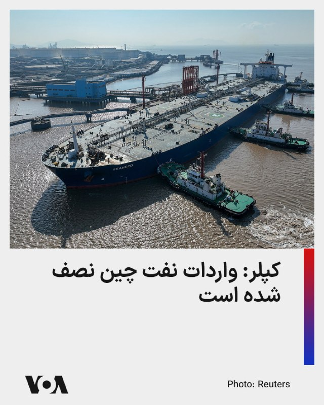

شرکت اطلاعات کالا، کپلر، می‌گوید در پی انسداد تنگه هرمز، واردات روزانه نفت چین در ماه جاری میلادی به ۶.۶ میلیون بشکه سقوط کرده که کمترین میزان از سال ۲۰۱۶ است.

واردات روزانه نفت چین در سال گذشته ۱۱ میلیون و ۵۵۰ هزار بشکه بود که حدود ۴۵ درصد آن از کشورهای حوزه خلیج فارس تأمین شده بود؛ موضوعی که با انسداد تنگه هرمز توسط جمهوری اسلامی به شدت مختل شده است.

چین در ماه‌های مارس و آوریل نیز واردات نفت را ۲۰ درصد کاهش داده بود.

کپلر می‌گوید سقوط خرید نفت چین در ماه جاری باعث شده نفت بیشتری برای پالایشگاه‌های دیگر کشورهای آسیایی در دسترس باشد.
@FarsiVOA

## FarsiVOA — post 218777

🔺بازداشت هشتمین نفر در پرونده حمله مرگبار به کنیسه‌ای در منچستر

▪️پلیس بریتانیا اعلام کرد مردی ۴۹ ساله را در ارتباط با حمله تروریستی مرگبار به کنیسه‌ای در منچستر بازداشت کرده است.

▪️پلیس تأکید کرده است که این بازداشت مستقیماً با حمله دوم اکتبر ۲۰۲۵ به کنیسه هیتون پارک مرتبط است. با این بازداشت، شمار کل افراد بازداشت‌شده در این پرونده به هشت نفر رسید.

▪️این حمله روز «یوم کیپور»، مقدس‌ترین روز تقویم یهودی، دو کشته و سه زخمی جدی برجا گذاشت.

▪️در حمله به کنیسه هیتون پارک، جهاد الشامی، شهروند بریتانیایی متولد سوریه، ابتدا با خودرو به عابران کوبید، سپس با چاقو به افراد حمله کرد و تلاش کرد وارد ساختمان کنیسه شود. او در نهایت با شلیک پلیس کشته شد.

⬇️ بیشتر بخوانید:
https://ir.voanews.com/a/8154427.html

## FarsiVOA — post 218776

  

تامی پیگوت، سخنگوی وزارت خارجه آمریکا، در پیامی در ایکس نوشت دونالد ترامپ «از روز نخست» به‌روشنی اعلام کرده است که جمهوری اسلامی نباید به سلاح هسته‌ای دست یابد.

او افزود ترامپ برای اطمینان از اینکه جمهوری اسلامی هرگز به چنین هدفی نرسد، «اقدام‌های قاطع» انجام داده است.

این پیام در ادامه موضع‌گیری‌های دولت ترامپ درباره برنامه هسته‌ای جمهوری اسلامی منتشر شده است؛ موضعی که بر جلوگیری از دستیابی تهران به سلاح هسته‌ای و حفظ فشار سیاسی و امنیتی بر حکومت ایران تأکید دارد.

پیام پیگوت نشان می‌دهد واشنگتن همچنان پرونده هسته‌ای جمهوری اسلامی را یکی از محورهای اصلی سیاست خود در قبال تهران می‌داند.
@FarsiVOA

## FarsiVOA — post 218775

  

تایلند، مشتری سنتی گاز مایع قطر، در پی انسداد تنگه هرمز و آسیب حملات جمهوری اسلامی به تاسیسات گاز مایع قطر، مذاکرات برای توافق خرید بلندمدت گاز مایع (ال‌ان‌جی) آمریکا را تسریع کرده است.

خبرگزاری رویترز از قول منابع آگاه گزارش داده که مذاکرات با شرکت ونچر گلوبال آمریکا برای صادرات گاز مایع به تایلند برای ۱۵ سال یا بیشتر انجام می‌شود.

این کشور پیشتر نیز در تلاش برای تنوع بخشیدن به منابع واردات انرژی بود. اکتبر پارسال دولت آمریکا و تایلند اعلام کردند که شرکتهای تایلندی سالانه ۴.۵ میلیارد دلار انرژی، از جمله گاز مایع، از ایالات متحده خریداری خواهند کرد.

تایلند سالانه بیش از ۱۱ میلیون تن واردات ال‌ان‌جی دارد.
@FarsiVOA

## FarsiVOA — post 218774

🔺تهران ۱۰ ملوان هندی بازداشت‌شده در پرونده نفتکش «هاربر فینیکس» را آزاد کرد

▪️مقام‌های کشتیرانی هند اعلام کردند ۱۰ ملوان هندی که از ژوئیه ۲۰۲۵ پس از توقیف یک نفتکش در ایران بازداشت شده بودند، پس از «رایزنی‌های دیپلماتیک مستمر» آزاد شده‌اند.

▪️جزئیات بیشتری درباره علت بازداشت، روند قضایی یا شرایط آزادی این ملوانان اعلام نشده است.

▪️این ملوانان عضو خدمه کشتی «هاربر فینیکس» بودند؛ نفتکشی که در ژوئیه ۲۰۲۵ در نزدیکی بندر جاسک توقیف شد و خدمه کشتی پس از توقیف، در ایران «بازداشت، دستگیر و زندانی» شدند.

▪️خانواده برخی از این ملوانان پیش‌تر گفته بودند تماس محدودی با آنها داشته‌اند و درباره اتهام‌ها، روند حقوقی و زمان احتمالی آزادی‌شان اطلاعات روشنی دریافت نکرده‌اند.

⬇️ بیشتر بخوانید:
https://ir.voanews.com/a/8154426.html

## FarsiVOA — post 218773

🔺شورای امنیت حمله به نیروگاه هسته‌ای براکه امارات را محکوم کرد

▪️شورای امنیت سازمان ملل متحد در بیانیه‌ای مطبوعاتی، حمله پهپادی به نیروگاه هسته‌ای براکه در امارات متحده عربی را «به شدیدترین لحن» محکوم کرد و آن را نقض حقوق بین‌الملل دانست.

▪️اعضای شورای امنیت در این بیانیه، بدون نسبت دادن مسئولیت حمله به طرفی مشخص، تأکید کردند که این حمله خطری جدی برای جان غیرنظامیان، زیرساخت‌ها و محیط زیست ایجاد کرده است.

▪️این بیانیه پس از آن صادر شد که در هفته‌های اخیر مقام‌های امارات اعلام کردند چند پهپاد از خاک عراق به سوی این کشور پرتاب شده‌اند و یکی از آنها به یک ژنراتور برق در خارج از محدوده داخلی نیروگاه براکه برخورد کرده و باعث آتش‌سوزی شده است.

⬇️ بیشتر بخوانید:
https://ir.voanews.com/a/8154425.html

## DW_Farsi — post 125182

  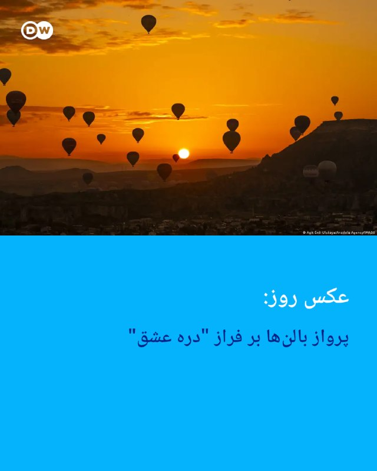

📸 عکس روز: پرواز بالن‌ها بر فراز "دره عشق"

شهر کاپادوکیا در ترکیه از مناطق تاریخی این کشور به‌شمار می‌رود که هر سال گردشگران فراوانی را به خود جذب می‌کند.

از جمله محبوب‌ترین مناطق آن "دره عشق" است که به گفته زمین‌شناسان، قدمت آن به میلیون‌ها سال می‌رسد. در این تصویر، پرواز بالن‌ها بر فراز "دره عشق" دیده می‌شوند؛ همزمان با طلوع آفتاب در آسمانی نیمه‌ابری.

@dw_farsi

## DW_Farsi — post 125181

  

🔶 تهدید تازه مقام سپاه علیه آمریکا؛ "خشاب‌ها پُر است"

سردار محمد اکبرزاده، معاون سیاسی نیروی دریایی سپاه پاسداران، با اشاره به تنش‌های اخیر میان ایران و آمریکا گفته است در صورت هرگونه حمله، "از چابهار تا ماهشهر را برای متجاوزان آمریکایی به قبرستان تبدیل خواهیم کرد".

او این اظهارات را در تجمعی در شهر زنجان مطرح کرد و گفت، نیروهای مسلح ایران در تنگه هرمز و خطوط ساحلی "به طور کامل" مستقر هستند.

اکبرزاده همچنین آمریکا را به "خطای محاسباتی" متهم کرد و گفت: «گویا هنوز نیاموخته‌اند که با "ایرانی جماعت" نباید با زبان تهدید صحبت کرد.»

معاون سیاسی نیروی دریایی سپاه در بخش دیگری از سخنانش مدعی شد که آمریکا در جریان جنگ اخیر، از طریق میانجی‌ها خواهان آتش‌بس شده بود و ایران "با موشک" به حملات پاسخ داده است.

او همچنین گفت نیروهای مسلح ایران با "خشاب پُر" آماده مقابله با هرگونه اقدام نظامی هستند.

مقام‌های آمریکایی تاکنون واکنشی به این اظهارات نشان نداده‌اند.

@dw_farsi

## DW_Farsi — post 125180

  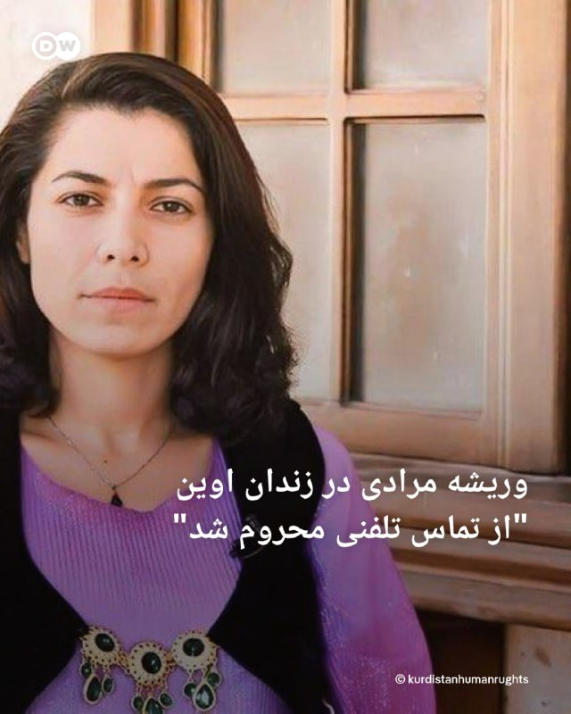

🔶 وریشه مرادی در زندان اوین "از تماس تلفنی محروم شد"

براساس گزارش خبرگزاری هرانا، ارگان خبری مجموعه فعالان حقوق بشر در ایران، وریشه مرادی، زندانی سیاسی محبوس در زندان اوین، "به صورت تنبیهی از دسترسی به تلفن زندان محروم شده است".

هرانا به نقل از یک منبع مطلع نوشته، این محدودیت پس از آن اعمال شد که او در محوطه هواخوری زندان، در اعتراض به اجرای احکام اعدام شعار اعتراضی سر داده بود.

بر اساس این گزارش، وریشه مرادی پیش از این نیز از ملاقات با خانواده و وکلای خود محروم شده بود و این محدودیت همچنان ادامه دارد.

این زندانی سیاسی که در بند زنان زندان اوین نگهداری می‌شود، پیش‌تر توسط شعبه ۱۵ دادگاه انقلاب تهران به ریاست قاضی ابوالقاسم صلواتی، با اتهام "بغی" به اعدام محکوم شده بود. این حکم بعداً از سوی دیوان عالی کشور نقض و پرونده برای رسیدگی دوباره به شعبه هم‌عرض ارجاع شد.

او همچنین در پرونده‌های دیگر، از جمله به اتهام "تبلیغ علیه نظام" و "تمرد و درگیری با ماموران"، به احکام جداگانه حبس محکوم شده است.

@dw_farsi

## DW_Farsi — post 125179

  

🔶باقری در مسکو: ریشه تهدیدها علیه ایران در عراق باید خشکانده شود

علی باقری کنی، معاون دبیر شورای عالی امنیت ملی ایران، در دیدار با قاسم الاعرجی، مشاور امنیت ملی عراق، خواستار اقدام "قاطع" بغداد برای جلوگیری از تبدیل خاک عراق به "منشا تهدید" علیه جمهوری اسلامی شد.

به گزارش رسانه‌های دولتی در ایران، این دیدار در حاشیه چهاردهمین کنفرانس بین‌المللی امنیتی مسکو برگزار شده است.

باقری در این دیدار تاکید کرده است که "ریشه این تهدیدها باید خشکانده شود" و جمهوری اسلامی برای همکاری با عراق در این زمینه آمادگی دارد.

رسانه‌های نزدیک به دولت ایران جزئیات بیشتری درباره ماهیت این تهدیدها منتشر نکرده‌اند، اما تهران در سال‌های گذشته بارها گروه‌های مسلح مخالف جمهوری اسلامی در اقلیم کردستان عراق را به فعالیت علیه ایران متهم کرده است.

قاسم الاعرجی، مشاور امنیت ملی عراق، تا کنون جزئیاتی از این گفت‌وگو منتشر نکرده است.

علی باقری برای شرکت در کنفرانس امنیتی مسکو به روسیه سفر کرده؛ نشستی که هر سال با حضور مقامات امنیتی و سیاسی کشورهای مختلف برگزار می‌شود.

@dw_farsi

## DW_Farsi — post 125178

  

🔶 لیندسی گراهام: نقش پاکستان در مذاکرات بیش از حد مسئله‌ساز است

لیندسی گراهام، سناتور جمهوری‌خواه آمریکا، با انتقاد از نقش پاکستان در تحولات اخیر خاورمیانه، گفته است که ایفای نقش میانجی از سوی اسلام‌آباد [در مذاکرات میان تهران و واشنگتن] "بیش از حد مسئله‌ساز" به نظر می‌رسد و خصومت این کشور با اسرائیل، سابقه‌ای طولانی دارد.

او در پیامی در شبکه اجتماعی ایکس (توییتر سابق) نوشت: «غیرقابل انکار است که هواپیماهای نظامی ایران در پایگاه‌های هوایی پاکستان نگهداری می‌شوند.»

او همچنین به اظهارات گذشته مقامات پاکستانی علیه اسرائیل اشاره کرد و آن‌ها را "نگران‌کننده" خواند.

این سناتور جمهوری‌خواه در ادامه به سخنان پیشین وزیر دفاع پاکستان درباره توافق‌ ابراهیم اشاره کرد؛ توافقی که در سال‌های اخیر به عادی‌سازی روابط برخی کشورهای عربی با اسرائیل منجر شده است.

گراهام نوشت اگرچه ویدیوی مربوط به اظهارات وزیر دفاع، پاکستان مربوط به حدود یک سال پیش است، اما به گفته او، "احتمالا این نگاه همچنان پابرجاست".

@dw_farsi

## DW_Farsi — post 125177

  

🔶 مارادونا، نابغه جنجال‌برانگیز

تکنیک، سرعت، شوت‌هاى دقیق و سرکش و هم‌چنین نبوغ و خلاقیت مارادونا در بازی‌گردانى، او را به ستاره‌اى درخشان تبدیل کرد

دیگو آرماندو مارادونا در روز ۳۰ اکتبر سال ۱۹۶۰ در منطقه‌ی فقیرنشین "ویلا فیوریتو" در حوالی بوئنوس آیرس، پایتخت آرژانتین به دنیا آمد. خانواده‌ پرجمعیت (۸ فرزند) او اصلیتی ایتالیایی داشت.

دیگو که از همان کودکى شیفته‌ توپ و فوتبال بود، در اواسط دهه ۱۹۷۰ میلادى به باشگاه Argentinos Juniors پیوست؛ باشگاهی که نقطه‌ آغاز راه و فعالیت بسیاری از بزرگان فوتبال آرژانتین است.

مارادونا در روز بیستم اکتبر سال ۱۹۷۶، زمانی ‌که تنها ۱۶ سال داشت، اولین بازی خود را براى این تیم در لیگ دسته اول آرژانتین انجام داد. این بازى سرآغاز پروازی فراموش‌نشدنى بود که پس از حدود ۲۱ سال، در ۲۹ اکتبر ۱۹۹۷، با پیروزى ۲ بر یک بوکا جونیورز مقابل ریور پلاته به پایان رسید.

@dw_farsi

## DW_Farsi — post 125176

  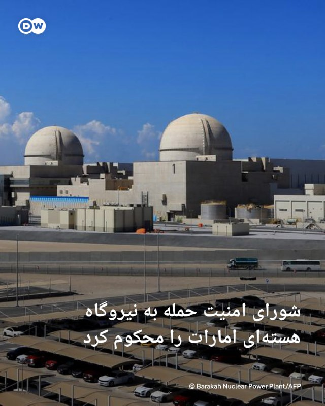

🔶 شورای امنیت حمله به نیروگاه هسته‌ای امارات را محکوم کرد

شورای امنیت سازمان ملل حمله به نیروگاه هسته‌ای براکه در امارات متحده عربی را محکوم کرده و آن را نقض قوانین بین‌المللی دانست.

در بیانیه‌ای که روز سه‌شنبه ۵ خرداد ۱۴۰۵ (۲۶ مه) منتشر شد، شورای امنیت بدون اشاره مستقیم به عامل حمله اعلام کرد، هدف قرار دادن تاسیسات هسته‌ای غیرنظامی، "مغایر با حقوق بین‌الملل است".

امارات متحده عربی هفته گذشته اعلام کرده بود شش پهپاد از خاک عراق به سوی این کشور پرتاب شده‌اند که یکی از آن‌ها نیروگاه هسته‌ای براکه در خلیج فارس را هدف قرار داده است.

عراق محل فعالیت گروه‌های مسلح مورد حمایت جمهوری اسلامی است؛ گروه‌هایی که در جریان جنگ آمریکا و اسرائیل با ایران، مسئولیت حمله به آنچه "پایگاه‌های دشمن در عراق و منطقه" خوانده‌اند را برعهده گرفته بودند.

نیروگاه براکه نخستین نیروگاه هسته‌ای جهان عرب به شمار می‌رود و حمله به آن نگرانی‌هایی درباره امنیت تاسیسات هسته‌ای در بحبوحه تنش‌های منطقه‌ای را افزایش داده است.

@dw_farsi

## DW_Farsi — post 125175

  

🔶نت‌بلاکس: اتصال اینترنت در ایران در حال بازگشت است، اما محدودیت‌ها ادامه دارد

نت‌بلاکس، نهاد ناظر بر اینترنت اعلام کرده است که دسترسی به اینترنت جهانی در ایران، پس از هفته‌ها محدودیت و اختلال گسترده، دوباره در حال افزایش است؛ هرچند همچنان بخشی از کاربران با محدودیت یا قطع ارتباط روبه‌رو هستند.

نت‌بلاکس در پیامی در شبکه اجتماعی ایکس (توییتر سابق) نوشت، شاخص‌های فنی نشان می‌دهد اتصال شبکه‌های موبایل و برخی بخش‌های دیگر اینترنت ایران به شبکه جهانی، بار دیگر در حال برقراری است.

با این حال، این نهاد تاکید کرده که فیلترینگ همچنان برقرار است و کاربران برای دسترسی به برخی وب‌سایت‌ها و شبکه‌های اجتماعی، ناچار به استفاده از ابزارهای دور زدن محدودیت‌ها هستند.

بر اساس این گزارش، دسترسی به واتس‌اپ نیز اکنون با محدودیت روبه‌رو شده و استفاده از این پیام‌رسان بدون ابزارهای عبور از فیلترینگ، برای بسیاری از کاربران ممکن نیست.

@dw_farsi

## DW_Farsi — post 125174

  

🔶بازگشایی فرودگاه تبریز همزمان با ۲۴ ساعته شدن ۱۰ فرودگاه در ایران

سازمان هواپیمایی کشوری ایران اعلام کرده فرودگاه بین‌المللی تبریز، پس از آسیب‌دیدگی در جریان جنگ ۱۲ روزه، دوباره بازگشایی شده و از چهارشنبه ۶ خرداد فعالیت خود را از سر می‌گیرد.

مجید اخوان، سخنگوی این سازمان، اعلام کرده است که بخش‌هایی از فرودگاه، از جمله باند پروازی و برج مراقبت، در جریان جنگ آسیب دیده بودند، اما عملیات بازسازی انجام شده و فرودگاه اکنون آماده پذیرش پروازهای داخلی و خارجی است.

هم‌زمان، سازمان هواپیمایی کشوری از ۲۴ ساعته شدن فعالیت ۱۰ فرودگاه کشور، از جمله "مهرآباد، امام خمینی و مشهد" خبر داده است.

فرودگاه بین‌المللی تبریز یکی از مهم‌ترین مراکز هوانوردی شمال‌غرب ایران و از فرودگاه‌های پرتردد کشور به شمار می‌رود. پیش از جنگ، این فرودگاه پروازهایی به چند مقصد داخلی و خارجی، از جمله استانبول، نجف، باکو و دبی داشت.

@dw_farsi

## DW_Farsi — post 125173

🔶 ازدواج "جان‌فداها"؛ نقاب رمانتیک حکومت بر بحران عمیق مشروعیت

🔻 گزارشی از الینا فرهادی

صدای بوق‌های ممتد و هیاهوی ساختگی، سکوت سنگین غروب میادین اصلی شهر تهران را می‌شکند. چند ده خودروی جیپ و تاکتیکی نظامی که بدنه زمخت و سبزرنگشان با تورها و روبان‌های سفید و صورتی تزیین شده، به ردیف ایستاده‌اند.

داخل خودروها زوج‌هایی که رسانه‌های رسمی آن‌ها را "جان‌فدا" می‌نامند، نشسته‌اند.

خیابان، یعنی همان فضایی که تا دیروز صحنه تقابل سنگین بر سر سبک زندگی، پوشش و اعتراض بود، حالا به یک "کلوپ بزرگ عروسی ایدئولوژیک" تبدیل شده است.

حاکمیت سفره‌های عقد را از سالن‌های خصوصی به آسفالت سرد میادین اصلی شهر آورده تا پیوند دو انسان را به یک بیانیه سیاسی تمام‌عیار بدل کند.

اما در پس این کارناوال‌های سازمان‌یافته، در کشوری که هنوز سایه جنگ و آتش‌بس شکننده بر آن سنگینی می‌کند، میانگین سن ازدواج به بالاترین حد خود در ده‌ها سال اخیر رسیده و تورم، تشکیل خانواده را برای میلیون‌ها جوان به یک رویای دست‌نیافتنی تبدیل کرده، این تئاترهای خیابانی چه پیام رسانه‌ای دارند؟

آیا جمهوری اسلامی در حال بازتعریف خانواده به‌عنوان نهادی ایدئولوژیک است؟ آیا "زوج‌های جان‌فدا" نسخه‌ای تازه از همان روایت بسیج اجتماعی دهه شصت‌اند؟

@dw_farsi

## Persian_Trend_Official — post 15115

  <a href="telegram/content/Persian_Trend_Official_15115_1779871559.webm" target="_blank">🎬 Download video</a>

https://t.me/c/2818485288/592142

چت روی 4 روزه تا امنیت شما حفظ بشه و حرفاتون ازبین بره تا خدایی نکرده در داخل ایران اگر نیروهای امنیتی به گوشی شما دسترسی پیدا کردن نتونن کامنتهاتون رو ببینن و خدایی نکرده براتون پرونده سازی بشه .
اما حرف های ما که اینجا ثبته و کسی هم پاکش نمیکنه !

## Persian_Trend_Official — post 15114

تا دقایقی دیگه یک لایو در مورد نامه نبویان به قالیباف و ذوالقدر میریم برای ثبت در تاریخ و بررسی شرایط توافق جدید !!!

## Persian_Trend_Official — post 15113

https://t.me/persian_trend_official/15109?comment=591960

زمان مشخص میکنه دوست خوبم
در مورد توافق کاش شما هم پیشبینی دقیق بکنید
توافق با چه کیفیتی؟

## Persian_Trend_Official — post 15112

https://t.me/persian_trend_official/15109?comment=591948

## Persian_Trend_Official — post 15111

https://t.me/persian_trend_official/15109?comment=591948

## Persian_Trend_Official — post 15110

  <a href="telegram/content/Persian_Trend_Official_15110_1779871559.webm" target="_blank">🎬 Download video</a>

🎬 Video

## Persian_Trend_Official — post 15109

## Persian_Trend_Official — post 15108

سازمان هواپیمایی کشوری اعلام کرد ۱۰ فرودگاه ایران از این پس به‌صورت ۲۴ ساعته فعال‌ هستند.

با تصمیم این سازمان، فرودگاه‌های مهرآباد و خمینی تهران، ساری، بیرجند، گرگان، بجنورد، کرمان، زاهدان، سبزوار و مشهد از این پس به‌صورت شبانه‌روزی فعالیت خواهند کرد

پ.ن: گویا نظام تصمیمش رو گرفته بده بره ...

📌 @persian_trend_official
پرشین ترند | متفاوت‌ترین کانال نظامی

## Persian_Trend_Official — post 15107

  

منابع دیپلماتیک روز چهارشنبه به «العربیه» اطلاع دادند سفر محمدباقر قالیباف، رئیس مجلس و مذاکره‌کننده ارشد ایران، به قطر شامل بررسی سازوکار آزادسازی دارایی‌های بلوکه‌شده ایران بوده است.

این منابع افزودند ایران خواستار آزادسازی حدود 24 میلیارد دلار از دارایی‌های بلوکه‌شده خود شده و اصرار دارد هم‌زمان با اعلام تفاهم‌نامه مورد انتظار با واشینگتن، نیمی از این مبلغ را دریافت کند.

📌 @persian_trend_official
پرشین ترند | متفاوت‌ترین کانال نظامی

## Persian_Trend_Official — post 15106

کانال رسمی پرشین ترند pinned «کسانی که اینترنتشون تازه وصل شده یا قبلا سرعت اینترنت یاری نمیکرده اگر این ویدیو رو ندیدید توضیه میکنم ببینید تا بدونید احتمالا یک سال اینده قراره جمهوری اسلامی چه چالش هایی داشته باشه https://youtu.be/8YQ1YcLyw6E»

## Persian_Trend_Official — post 15105

کسانی که اینترنتشون تازه وصل شده یا قبلا سرعت اینترنت یاری نمیکرده
اگر این ویدیو رو ندیدید توضیه میکنم ببینید تا بدونید احتمالا یک سال اینده قراره جمهوری اسلامی چه چالش هایی داشته باشه

https://youtu.be/8YQ1YcLyw6E

## Persian_Trend_Official — post 15101

عکس‌های منتشرشده از سوی فرماندهی مرکزی آمریکا، سنتکام، نشان می‌دهد یک فروند جنگنده پنهانکار اف-۲۲ رپتور متعلق به بال یکم جنگنده نیروی هوایی آمریکا مستقر در پایگاه لانگلی ویرجینیا، در حال سوخت‌گیری هوایی بر فراز نقطه‌ای اعلام‌نشده در خاورمیانه است.

در این تصاویر، اف-۲۲ در کنار یک فروند هواپیمای سوخت‌رسان KC-135T Stratotanker دیده می‌شود؛ هواپیمایی که به بال ۱۷۱ سوخت‌رسانی هوایی گارد ملی هوایی پنسیلوانیا اختصاص دارد.

انتشار این تصاویر از سوی سنتکام در شرایطی انجام می‌شود که حضور جنگنده‌های نسل پنجم آمریکا در منطقه، معمولاً به‌عنوان بخشی از پیام بازدارندگی، نمایش آمادگی عملیاتی و پشتیبانی از مأموریت‌های هوایی بلندبرد تفسیر می‌شود. اف-۲۲ رپتور عمدتاً برای برتری هوایی، نفوذ در محیط‌های پرخطر و مقابله با تهدیدهای پیشرفته طراحی شده و سوخت‌گیری هوایی، امکان ماندگاری و عملیات طولانی‌تر آن در منطقه را فراهم می‌کند.

📌 @persian_trend_official
پرشین ترند | متفاوت‌ترین کانال نظامی

## Persian_Trend_Official — post 15100

  <a href="telegram/content/Persian_Trend_Official_15100_1779871560.mp4" target="_blank">🎬 Download video</a>

برنده های جنگ بلد خجالتی 😄
خب با این بنده خداها حرف بزنید
بگید چند ماه بیخودی سرکارشون گذاشتید و مثل همیشه لاف پیروزی زدید

اخرش که چی ؟
متن رو که همه میخونن ...

📌 @persian_trend_official
پرشین ترند | متفاوت‌ترین کانال نظامی

## Persian_Trend_Official — post 15099

  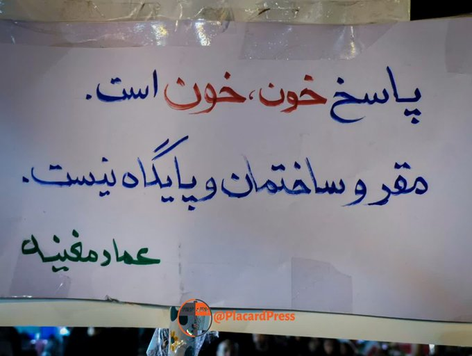

حق ++

📌 @persian_trend_official
پرشین ترند | متفاوت‌ترین کانال نظامی

## RadioFarda — post 157600

  

🔸پس از بازگشایی اینترنت در ایران، به شهروندان توضیه شد سیستم‌عامل‌ها و نرم‌افزارهای خود را فوری به‌روز کنند، اما شماری از کاربران از اختلال در دسترسی به فروشگاه گوگل‌پلی و ناتوانی در دریافت آپدیت اپلیکیشن‌ها خبر داده‌اند.

🔸پایگاه خبری سیتنا، یک روز پس از اعلام بازگشایی اینترنت در ایران، گزارش داد امکان ورود به گوگل‌پلی و دریافت یا نصب به‌روزرسانی برنامه‌ها برای شماری از کاربران همچنان فراهم نیست.

🔸پیش‌تر توصیه شده بود که کاربران در ساعات ابتدایی پس از بازگشت اینترنت جهانی، سیستم‌عامل‌ها، مرورگرها، آنتی‌ویروس‌ها و سایر نرم‌افزارهای کاربردی خود را به‌روزرسانی کنند تا خطر آسیب‌پذیری‌های احتمالی کاهش یابد.

🔸مسدود شدن واتس‌اپ به‌رغم باز شدن اینترنت موضوع دیگری است که ایرانیان با بازگشایی اینترنت پس از ۸۸ روز با آن مواجه شده‌اند. تا پیش از قطع اینترنت به‌بهانهٔ جنگ، از میان شبکه‌های اجتماعی و پیام‌رسان‌های پرکاربر، این تنها پیام‌رسان بین‌المللی بود که فیلتر نبود و در دسترس کاربران قرار داشت.

@RadioFarda

## RadioFarda — post 157599

آن‌چه ایران و آمریکا را به سمت توافق سوق داده است؛ گفت‌گو با سفیر پیشین آمریکا

🔸مجموعه‌ای از پیام‌های متناقض از تهران و واشینگتن، از سیال و نامطمئن بودن روند مذاکرات میان آمریکا و ایران حکایت دارد. پس از چند روز پر از گمانه‌زنی، چشم‌انداز دستیابی به یک چارچوب دیپلماتیک همچنان زیر ذره‌بین

🔸بازارهای جهانی و متحدان منطقه‌ای قرار دارد.
رادیو اروپای آزاد/رادیو آزادی برای بررسی محاسبات راهبردی، فشارهای سیاسی و واقعیت‌های میدانی در حوزهٔ دریایی، با

🔸کریستوفر هنزل، سفیر پیشین آمریکا، گفت‌وگو کرده است.
هنزل دیپلماتی باسابقه با دهه‌ها تجربه در سیاست خاورمیانه است که پیش‌تر به‌عنوان مدیر دفتر امور اسرائیل و فلسطین در میز ایران وزارت خارجهٔ آمریکا و همچنین به‌عنوان رئیس هیئت دیپلماتیک آمریکا در یمن و عربستان سعودی در دورهٔ نخست ریاست‌جمهوری دونالد ترامپ فعالیت کرده است.

🔸 گزارش کامل را در وب‌سایت رادیوفردا بخوانید.

@RadioFarda

## RadioFarda — post 157598

فرمانده جدید شاخه نظامی حماس در «حمله هدفمند» اسرائیل کشته شد

🔸اسرائیل روز چهارشنبه ششم خرداد اعلام کرد محمد عوده، فرمانده جدید شاخه نظامی گروه افراطی حماس در غزه را در حمله‌ای در روز سه‌شنبه کشته است؛ رخدادی که پس از کشته شدن سلف او در حمله‌ای مشابه در ماه جاری روی داد.

🔸اسرائیل کاتز، وزیر دفاع اسرائیل، گفت «فرمانده شاخه نظامی سازمان تروریستی حماس در غزه دیروز حذف شد و به دیدار همدستانش در اعماق جهنم فرستاده شد».

🔸گروه حماس که در فهرست تروریستی آمریکا و اتحادیه اروپا هم قرار دارد، مرگ محمد عوده در آپارتمانی در شهر غزه را تأیید کرد.

🔸ارتش اسرائیل خبر داد که این اقدام «پس از ماه‌ها رصد اطلاعاتی برای شناسایی الگوهای رفت‌وآمد او و همکارانش انجام شد.»

🔸آقای کاتز در پیامی در شبکه اجتماعی ایکس نوشت: «ما خود را متعهد کرده‌ایم همه کسانی را که کشتار هفتم اکتبر را رهبری کردند از میان برداریم، و همین کار را خواهیم کرد: همه آن‌ها، هر جا که باشند، نشان شده‌اند.»

🔸اسرائیل کاتز و بنیامین نتانیاهو، نخست‌وزیر اسرائیل، پس از اعلام حمله در روز سه‌شنبه در بیانیه‌ای مشترک گفتند محمد عوده «در جریان کشتار هفتم اکتبر رئیس اطلاعات حماس بود و حدود یک هفته پیش به‌عنوان جانشین عزالدین حداد منصوب شد».

🔸عزالدین حداد روز ۲۵ اردیبهشت در حمله اسرائیل کشته شد.

🔸کاتز و نتانیاهو گفتند محمد عوده «مسئول قتل، ربودن و زخمی کردن شمار زیادی از غیرنظامیان اسرائیلی و سربازان ارتش اسرائیل» بوده است.

🔸منابع عربی می‌گویند در حمله هوایی روز سه‌شنبه که منجر به مرگ محمد عوده شده، ۳ نفر کشته و ۲۰ نفر هم زخمی شده‌اند.

🔸پس از حمله حماس به اسرائیل در هفتم اکتبر ۲۰۲۳ (۱۵ مهر ۱۴۰۲)، بنیامین نتانیاهو وعده داد رهبران پشت این حمله را هدف قرار داده و از میان بردارد.

🔸 گزارش کامل را در وب‌سایت رادیوفردا بخوانید.

@RadioFarda

## RadioFarda — post 157596

  

🔸 گزارش‌ها از ایران حاکی است که پس از برقراری اینترنت بین‌الملل روی برخی سرویس‌های ثابت، دسترسی کاربران تلفن همراه نیز به اینترنت جهانی به‌تدریج در حال بازگشت است.

🔸 منابع خبری داخلی روز سه‌شنبه گزارش دادند که کاربران از برقراری اینترنت بین‌الملل روی تلفن‌های همراه خود خبر داده‌اند. همزمان گزارش‌هایی نیز از دسترسی دوباره به چت‌جی‌پی‌تی روی خطوط همراه اول و ایرانسل منتشر شده است.

🔸 بعد از وصل‌شدن نسبی اینترنت در ایران، به چه پلتفرم‌ها و سرویس‌هایی دسترسی دارید و کیفیت اتصال چطور است؟

🔸پیام‌های صوتی و تصویری خود را به نشانی‌های زیر می‌توانید برای ما ارسال کنید:

🔸Telegram: @Fardagram
🔸WhatsApp: +420 725 970 000

@RadioFarda

## RadioFarda — post 157595

🔸روزنامه نیویورک تایمز، در گزارشی از جزئیات زمینهٔ حمله اخیر آمریکا به اهدافی در جنوب ایران، به نقل از دو مقام آمریکایی نوشت این حمله به‌دنبال مشاهده و شناسایی «مجموعه‌ای از تهدیدها» از سوی حکومت ایران انجام شد. 🔸این دو مقام آمریکایی که به شرط ناشناس ماندن…

## RadioFarda — post 157594

  

🔸روزنامه نیویورک تایمز، در گزارشی از جزئیات زمینهٔ حمله اخیر آمریکا به اهدافی در جنوب ایران، به نقل از دو مقام آمریکایی نوشت این حمله به‌دنبال مشاهده و شناسایی «مجموعه‌ای از تهدیدها» از سوی حکومت ایران انجام شد.

🔸این دو مقام آمریکایی که به شرط ناشناس ماندن با این روزنامه صحبت کردند، گفتند حملات روز دوشنبه آمریکا پس از آن انجام شد که نیروهای آمریکایی از جمله «پرواز پهپادها و فعالیت در سایت‌های پرتاب موشک» در جنوب ایران را مشاهده کردند.

🔸به گفته این دو، پیش از حمله آمریکا، نیروهای نظامی ایران «قایق‌های مین‌گذار را در تنگه هرمز مستقر کرده و پهپادهای تهاجمی را در نزدیکی کشتی‌های آمریکایی به پرواز درآورده بودند».

🔸ستاد فرماندهی مرکزی آمریکا، سنتکام، پیش‌تر اعلام کرده بود که ارتش ایالات متحده روز دوشنبه در جنوب ایران حملاتی را علیه اهدافی «از جمله قایق‌هایی که در تلاش برای کارگذاری مین بودند و همچنین سایت‌های پرتاب موشک» انجام داده است.

@RadioFarda

## RadioFarda — post 157593

🔸مارکو روبیو، وزیر خارجه آمریکا، کمتر از دو هفته مانده به انتخابات پارلمانی ارمنستان، در جریان توقفی کوتاه در فرودگاه ایروان، از نیکول پاشینیان، نخست‌وزیر ارمنستان، حمایت کرد. 🔸روبیو، روز سه‌شنبه پنجم خرداد، هنگام بازگشت از گفت‌وگوهای چندجانبه در هند، در…

## RadioFarda — post 157592

  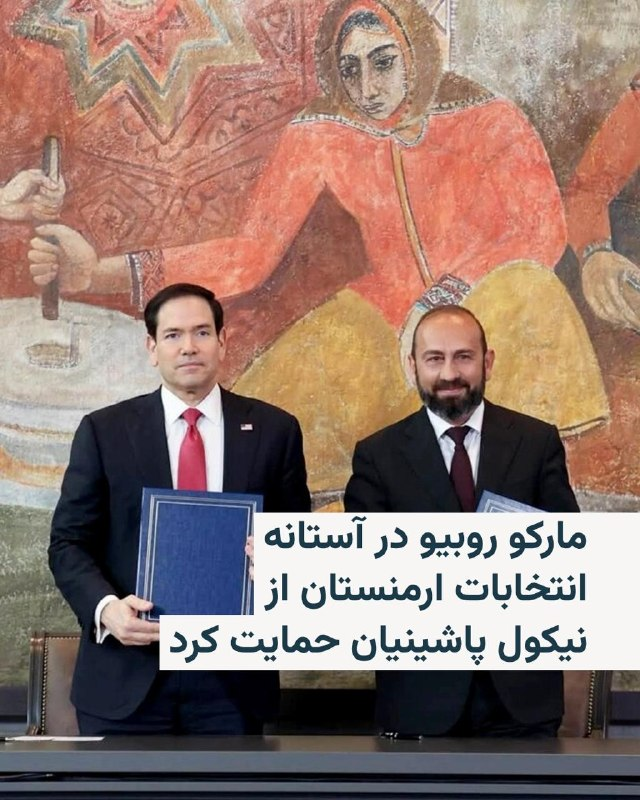

🔸مارکو روبیو، وزیر خارجه آمریکا، کمتر از دو هفته مانده به انتخابات پارلمانی ارمنستان، در جریان توقفی کوتاه در فرودگاه ایروان، از نیکول پاشینیان، نخست‌وزیر ارمنستان، حمایت کرد.

🔸روبیو، روز سه‌شنبه پنجم خرداد، هنگام بازگشت از گفت‌وگوهای چندجانبه در هند، در توقفی کوتاه برای سوخت‌گیری با آرارات میرزویان، وزیر خارجه ارمنستان، دیدار کرد.

🔸او در کنار آقای میرزویان گفت: «شما، نخست‌وزیر و کل تیم‌تان در ارمنستان، در حال گشودن راه به‌سوی آینده‌ای روشن‌تر و مستقل‌تر برای ارمنستان هستید.»

🔸مارکو روبیو افزود: «بسیار خوشحالم که این‌جا هستم تا حمایت خود را از شجاعت، چشم‌انداز، تعهد و آمادگی آن‌ها برای نگاه به آیندهٔ کشورشان و اقداماتی که برای رسیدن به آن لازم است، نشان دهم.»

@RadioFarda

## RadioFarda — post 157591

🔸روزنامه وال‌استریت جورنال در گزارشی به نقل از مقام‌های ایرانی و میانجی‌های عرب، نوشته جمهوری اسلامی در مذاکرات با آمریکا به‌دنبال کسب «گشایش مالی» و همزمان، جلوگیری از «اعلام پیروزی» دونالد ترامپ است. 🔸این مقام‌ها «دو هدف به‌هم‌پیوسته» ایران در جریان مذاکرات…

## RadioFarda — post 157590

  

🔸روزنامه وال‌استریت جورنال در گزارشی به نقل از مقام‌های ایرانی و میانجی‌های عرب، نوشته جمهوری اسلامی در مذاکرات با آمریکا به‌دنبال کسب «گشایش مالی» و همزمان، جلوگیری از «اعلام پیروزی» دونالد ترامپ است.

🔸این مقام‌ها «دو هدف به‌هم‌پیوسته» ایران در جریان مذاکرات را به این صورت تشریح کرده‌اند: «به‌دست آوردن گشایش مالی برای اقتصادی که تحت فشار شدید قرار دارد، بدون آنکه در برنامه هسته‌ای خود آن‌قدر عقب‌نشینی کند که ترامپ بتواند ادعای پیروزی کند.»

🔸اواخر دوشنبه، فرماندهی مرکزی آمریکا، سنتکام، به قایق‌های تندروی ایرانی که به گفته واشینگتن در حال مین‌گذاری در تنگه هرمز بودند، حمله کرد. ایران نیز با شلیک به هواپیماهای آمریکایی پاسخ داد و آمریکا در واکنش، سایت‌های پرتاب موشک در ایران را هدف قرار داد.

🔸این تبادل آتش پس از پیام‌های متناقض ترامپ در آخر هفته رخ داد. او پس از آنکه شنبه گفت توافق با تهران تا حد زیادی نهایی شده، در پی انتقاد برخی جمهوری‌خواهان سنا از چارچوب توافق، ظاهراً موضع خود را تغییر داد.

@RadioFarda

## RadioFarda — post 157589

مقام پیشین پنتاگون: آمریکا در درگیری با ایران «کم‌ضررترین» گزینه را انتخاب می‌کند  

🔸ایالات متحده و ایران ظاهراً به دستیابی به توافقی برای پایان دادن به جنگ نزدیک شده‌اند، هرچند توافق نهایی هنوز قریب‌الوقوع به نظر نمی‌رسد و برخی جزئیات کلیدی هنوز حل‌وفصل نشده‌اند.

🔸بر اساس گزارش‌ها، توافق در حال شکل‌گیری منجر به بازگشایی تنگه هرمز به‌عنوان یکی از مسیرهای حیاتی انتقال نفت جهان خواهد شد، اما مذاکرات پیرامون برنامهٔ هسته‌ای ایران را به مرحله‌ٔ بعد موکول می‌کند.

🔸جیسون اچ. کمپبل، پژوهشگر ارشد مؤسسهٔ خاورمیانه و مقام پیشین پنتاگون در دورهٔ نخست ریاست‌جمهوری دونالد ترامپ، در گفت‌وگو با رادیو اروپای آزاد/رادیو آزادی می‌گوید توافقِ گزارش‌شده «احتمالاً کم‌ضررترین گزینه‌ای است که در حال حاضر در اختیار دولت آمریکا قرار دارد.»

🔸 گزارش کامل را در وب‌سایت رادیوفردا بخوانید.

@RadioFarda

## IranianMinds — post 20856

  

اکانت اسرائیل به فارسی:
به یاد هزاران هزار ایرانی شجاع که به دست جمهوری جنایتکار اسلامی کشته شدند و اکنون دیگر زنده نیستند تا آنلاین شوند🕯️

@IranianMinds

## IranianMinds — post 20855

🔴 رویترز:

پاکستان از میانجیگری عقب‌نشینی می‌کند در حالی که قطر به مرکز اصلی بین تهران و واشنگتن تبدیل می‌شود و تمرکز بر دارایی‌های مسدود شده ایران در دوحه است.

@IranianMinds

## IranianMinds — post 20852

  <a href="telegram/content/IranianMinds_20852_1779871565.mp4" target="_blank">🎬 Download video</a>

با وصل شدن اینترنت
داره ویدیو های جالبی از اتفاقای روزای جنگ داره میاد بیرون

@IranianMinds

## BBCPersian — post 282170

🔻احمد شرع، رئیس‌جمهور سوریه، تصویری را در حساب خود در شبکه ایکس منتشر کرد که خیلی زود خبرساز شد: دو شیشه عطر «ویکتوری ۴۷-۴۵» از برند ترامپ، همراه با یادداشتی امضاشده از دونالد ترامپ، رئیس‌جمهور آمریکا.

در این یادداشت نوشته شده است: «احمد، همه درباره عکسی صحبت می‌کنند که هنگام هدیه دادن این عطر فوق‌العاده به تو گرفتیم. این را هم می‌فرستم تا اگر عطر قبلی تمام شد، داشته باشی.»

بعضی از این هدایا بعدها به دلایل سیاسی و بعضی دیگر، بیشتر به دلیل نامتعارف بودن یا حاشیه‌هایشان در حافظه عمومی ماندگار شدند.

در ادامه، نگاهی می‌کنیم به شماری از هدایایی که رهبران جهان در دهه‌های اخیر به یکدیگر داده‌اند.

لینک خبر کامل:
https://bbc.in/4dOiBdu

📸GettyImages/ Contributor via Getty Images/ AFP via Getty Images/ Heritage Images via Getty Images/ Bloomberg via Getty Images

@BBCPersian

## BBCPersian — post 282162

‌🖊لوئیس باروچو و جولیا براون
سرویس جهانی بی‌بی‌سی

🔻وقتی جنگ آمریکا و اسرائیل با ایران در پایان ماه فوریه آغاز شد، تنها خاورمیانه نبود که پیامدهای آن را احساس کرد.

با مختل شدن حمل‌ونقل تجاری و جریان انتقال کالا در جهان بر اثر این درگیری، قیمت نفت به شدت بالا رفت و باعث افزایش تورم و تلاطم در بازارهای جهانی شد.

همان‌طور که معمولا در دوره‌های بی‌ثباتی رخ می‌دهد، برخی از سرمایه‌گذاران از بازارهای نوظهور که پرریسک‌تر تلقی می‌شوند، فاصله گرفتند و سرمایه خود را به دلار آمریکا منتقل کردند که به طور سنتی پناهگاه امن سرمایه‌گذاری محسوب می‌شود.

این روند بر بسیاری از ارزها اثر گذاشته است. ارزش برخی از آن‌ها سقوط کرده، در حالی که بعضی دیگر نوسان شدید داشته‌اند و حتی تعدادی از ارزها تقویت شده‌اند.

آندره پرفیتو، اقتصاددان برزیلی و مدیر یک شرکت مشاوره مالی،‌ می‌گوید: «قیمت نفت بر همه تاثیر می‌گذارد، اما نوسانات ارزی می‌تواند این تاثیر را تشدید یا تعدیل کند.»

متن کامل خبر را از لینک زیر بخوانید:

https://bbc.in/4e76itW
📸GettyImages/ AFP via Getty Images/ NurPhoto via Getty Images

@BBCPersian

## BBCPersian — post 282161

  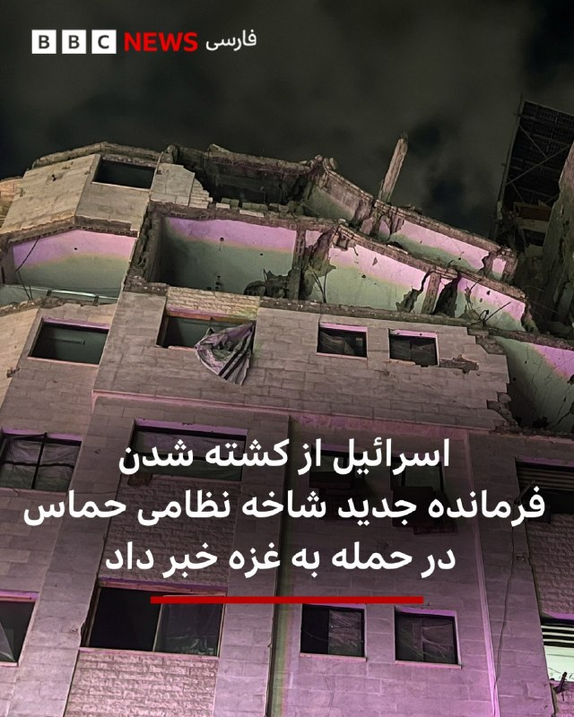

🔻اسرائیل اعلام کرد که در حمله اخیر به غزه، محمد عوده، فرمانده جدید شاخه نظامی حماس را کشته است.

محمد عوده پس از کشته شدن فرمانده قبلی حماس در حمله‌ای مشابه در اوایل ماه جاری میلادی به این سمت منصوب شده بود.

اسرائیل همچنین گفته است که حملات خود به اهداف مرتبط با حزب‌الله در لبنان را نیز ادامه داده است.

این در حالی است که به طور رسمی در هر دو منطقه آتش‌بس برقرار شده است.

پیشتر مقام‌های لبنانی اعلام کرده بودند که در حملات روز سه‌شنبه اسرائیل در لبنان دست‌کم ۳۱ نفر کشته شده‌اند. یکی از مراکز آسیب‌دیده، بیمارستانی در شهر نبطیه در جنوب لبنان بوده است.

بر اساس گزارش‌ها، آمریکا به اسرائیل هشدار داده که به بیروت حمله نکند، زیرا چنین اقدامی می‌تواند آتش‌بس با ایران را با خطر مواجه کند.

📷Reuters

https://bbc.in/42UY7e3
@BBCPersian

## BBCPersian — post 282160

  

‌🔻مقام‌های دریانوردی هند اعلام کردند که ۱۰ ملوان هندی که از ژوئیه ۲۰۲۵در ایران زندانی بودند، پس از «رایزنی‌های دیپلماتیک مستمر» آزاد شده‌اند.

اداره کل کشتیرانی هند اعلام کرد که خدمه کشتی «ام‌وی هاربور فینیکس» پس از توقیف این نفتکش در نزدیکی بندر جاسک در سال گذشته، توسط نیروی دریایی ایران بازداشت و زندانی شده بودند.

این نهاد در بیانیه‌ای گفته است: «ملوانان اکنون آزاد شده و در امنیت کامل در کنار یکدیگر هستند...و هماهنگی‌های لازم برای بازگشت هرچه سریع‌تر آن‌ها به هند در حال انجام است.» و همچنین عکسی از افراد آزادشده را نیز منتشر کرده است.

اداره کل کشتیرانی هند جزئیات بیشتری درباره علت بازداشت خدمه یا توقیف کشتی ارائه نکرد.

سایت‌های رهگیری کشتی‌ها، این شناور را یک نفتکش حامل فرآورده‌های نفتی با پرچم پالائو معرفی کرده‌اند.

📷 X Directorate General of Shipping, Govt. of India
https://bbc.in/4e7EKVe

@BBCPersian

## idfinfarsi — post 11654

  <a href="telegram/content/idfinfarsi_11654_1779871568.mp4" target="_blank">🎬 Download video</a>

مستند ویژه: تکمیل چرخه شناسایی و هدف قرار دادن یک تروریست که هواگرد بدون سرنشین را در جنوب لبنان هدایت می‌کرد

در چارچوب فعالیت نیروهای ارتش اسرائیل در جنوب لبنان، یک هواگرد از نیروی هوایی، یک هواگرد بدون سرنشین را در آسمان شناسایی کرد که تهدیدی برای نیروهای ما در منطقه محسوب می‌شد.

این هواگرد بدون سرنشین فرود آمد و یک تروریست از سازمان تروریستی حزب‌الله برای جمع‌آوری آن به محل رسید. در یک واکنش سریع، هواگرد نیروی هوایی به محل حمله کرده و این تروریست را به هلاکت رساند.

نیروی هوایی به فعالیت خود برای دفاع و پشتیبانی از نیروهای ما در جنوب لبنان ادامه خواهد داد.

## idfinfarsi — post 11650

  <a href="telegram/content/idfinfarsi_11650_1779871570.mp4" target="_blank">🎬 Download video</a>

ارتش اسرائیل و شاباک محمد عوده، رئیس شاخه نظامی سازمان تروریستی حماس که پس از به هلاکت رسیدن عزالدین حداد منصوب شده بود و همچنین رئیس ستاد اطلاعات سازمان تروریستی حماس بود را به هلاکت رساندند

⭕️ سخنگوی ارتش اسرائیل و شاباک اعلام کردند که در حمله‌ای در شمال نوار غزه، تروریست محمد عوده که به‌عنوان رئیس شاخه نظامی سازمان تروریستی حماس پس از به هلاکت رسیدن عزالدین حداد منصوب شده بود و همچنین ریاست ستاد اطلاعات این سازمان را بر عهده داشت، به هلاکت رسید.

🔻 در چارچوب عملیات مشترک ارتش اسرائیل و شاباک برای حذف این تروریست، چندین ساختمان در قلب شهر غزه که به‌عنوان محل اختفای او مورد استفاده قرار می‌گرفت، هدف قرار گرفت. این اقدام پس از ماه‌ها رصد اطلاعاتی برای شناسایی الگوهای رفت‌وآمد او و همکارانش انجام شد. همزمان، یک آپارتمان متعلق به یک تروریست حماس که در ۷ اکتبر در حمله مشارکت داشت و بخشی از حلقه پشتیبانی عوده بود، نیز هدف قرار گرفت.

⭕️ عوده در دو هفته گذشته رئیس شاخه نظامی سازمان تروریستی حماس بود و در سال‌های اخیر نیز ریاست ستاد اطلاعات این سازمان را بر عهده داشت. وی در این چارچوب مسئول برنامه‌ریزی و هماهنگی ا

## Dirty_Kids — post 390294

  

گوله نمکاکه آذم بپدخ

@Dirty_Kids 👻

## Dirty_Kids — post 390293

  

‏جهت اطلاع بهزاد فراهانی. اینجا ایران

‏شیر دختر مازنی
خرداد ۲۵۸۵ شام تنهاجاویدشاه

@Dirty_Kids 👻

## Dirty_Kids — post 390292

اگه تازه وصل شدید
بدونید صدف بیوتی یک مادر جنده حکومتیه

تازه بابای گلشیفته هم بیضه‌هاشو حوالمون داد ☹️

@Dirty_Kids 👻

## Dirty_Kids — post 390291

  <a href="telegram/content/Dirty_Kids_390291_1779871571.mp4" target="_blank">🎬 Download video</a>

عزیزانی که نت نداشتن در جریان نیستن
این ویدیوی این خانم عزیز بعد از مردن خامنه‌ای ترکوند، در حدی که خارجی پشمامشون ریخته بود میگفتن واقعا ایرانیه!؟ گفتم درجریان باشید

@Dirty_Kids 👻

## Dirty_Kids — post 390290

  <a href="telegram/content/Dirty_Kids_390290_1779871573.mp4" target="_blank">🎬 Download video</a>

این دختره باحال حرف میرنه

@Dirty_Kids 👻

## Dirty_Kids — post 390289

  

اسراییل هیوم: رستم قاسمی با افشا تصویر خصوصی او توسط موساد اخراج شد و مدتی بعد مرد. او وزیر نفت دولت احمدی نژاد بود‌. وی از فرماندهان سپاه محسوب می شد که پولشویی می‌کرد‌. موساد بدون ترور او را به این روش حذف کرد

@Dirty_Kids 👻

## Hranews — post 113190

  

با پایان دوران حبس؛ علی پویان مقدم از زندان تربت حیدریه آزاد شد

❗️
❗️
❗️
❗️
❗️– علی پویان مقدم، زندانی سیاسی با پایان دوران محکومیت از زندان تربت حیدریه آزاد شد.

به گزارش خبرگزاری هرانا، ارگان خبری مجموعه فعالان حقوق بشر در ایران، علی پویان مقدم از زندان آزاد شد.

بر اساس اطلاعات دریافتی هرانا، آزادی آقای پویان مقدم در تاریخ ۳ خردادماه، پس از اتمام دوران حبس وی صورت گرفته است. بنا بر اطلاعات رسیده، در جریان جنگ و همزمان با انتقال زندانیان زندان سبزوار، او نیز به زندان تربت حیدریه منتقل شده بود.

#علی_پویان_مقدم

ادامه مطلب

↘️
@hranews_bot تماس ✉️ - @Hranews کانال هرانا 🆑

## Hranews — post 113189

دانشگاه صنعتی شریف؛ ده‌ها دانشجو با احکام اخراج و محرومیت از تحصیل مواجه شدند

❗️
❗️
❗️
❗️
❗️– دستکم ۳۰ نفر از دانشجویان دانشگاه صنعتی شریف توسط کمیته انضباطی این دانشگاه در ارتباط با فعالیت در فضای مجازی و پرونده‌های مرتبط با اعتراضات سراسری سال گذشته، محکوم شده‌اند. احکام بدوی صادرشده برای این #دانشجویان شامل اخراج همراه با پنج سال محرومیت از تحصیل در تمامی دانشگاه‌ها برای شماری از آنان و منع موقت از تحصیل برای تعدادی دیگر است.

ادامه مطلب

↘️
@hranews_bot تماس ✉️ - @Hranews کانال هرانا 🆑

## Hranews — post 113188

بیش از یک میلیون دانش آموز در کشور از تحصیل بازمانده‌اند

❗️
❗️
❗️
❗️
❗️– رئیس سازمان بهزیستی از وجود بیش از یک میلیون دانش آموز بازمانده از تحصیل در کشور خبر داد.

ادامه مطلب

↘️
@hranews_bot تماس ✉️ - @Hranews کانال هرانا 🆑

## alonews — post 123005

  <a href="telegram/content/alonews_123005_1779871575.webm" target="_blank">🎬 Download video</a>

👈 شبکه NBC News به نقل از معاون رئیس‌جمهور آمریکا: «من خوش‌بین هستم که ایران در هر توافقی، با عدم توسعه سلاح‌های هسته‌ای موافقت خواهد کرد.»

✅ @AloNews خبر جنگ

## alonews — post 123004

  <a href="telegram/content/alonews_123004_1779871575.webm" target="_blank">🎬 Download video</a>

👈 جی‌دی‌ونس در گفتگو با ان‌بی‌سی:
فکر می‌کنم پرسش دشوار این است که آیا ایران با سازوکار نظارتی و اجرایی‌ای موافقت می‌کند که به ما اطمینان دهد در آینده توافق را نقض نخواهند کرد یا نه؟

✅ @AloNews خبر جنگ

## alonews — post 123003

🔥 حجم‌های بالا با قیمت‌های باورنکردنی 🔥 ⚡ سرعت بالا 🌐 پایداری عالی 🚀 کیفیتی که حسش میکنی همین الان جوین شو که جا نمونی 😍 @NetAazaadVPN @NetAazaadVPN

## alonews — post 123002

  

🔥 حجم‌های بالا با قیمت‌های باورنکردنی 🔥

⚡ سرعت بالا
🌐 پایداری عالی
🚀 کیفیتی که حسش میکنی

همین الان جوین شو که جا نمونی 😍

@NetAazaadVPN
@NetAazaadVPN

## alonews — post 123001

  <a href="telegram/content/alonews_123001_1779871576.webm" target="_blank">🎬 Download video</a>

👈کانال ۱۴ اسرائیل: ارزیابی‌های اطلاعاتی حاکی از آن است که برنامه حمله به ایران از دستور کار خارج شده است

✅ @AloNews خبر جنگ

## alonews — post 123000

  <a href="telegram/content/alonews_123000_1779871576.mp4" target="_blank">🎬 Download video</a>

👈رئیس‌جمهور صربستان در سفر به چین، از یک کارخانه ساخت ربات‌های انسان‌نما بازدید کرد

✅ @AloNews خبر جنگ

## alonews — post 122999

  <a href="telegram/content/alonews_122999_1779871578.webm" target="_blank">🎬 Download video</a>

👈کره جنوبی: اعتقاد بر این است که حمله به یک کشتی کره جنوبی در تنگه هرمز در این ماه با موشک ایرانی انجام شده است.

✅ @AloNews خبر جنگ

## alonews — post 122998

  <a href="telegram/content/alonews_122998_1779871578.webm" target="_blank">🎬 Download video</a>

👈جاده چالوس بازم شلوغ شد

✅ @AloNews خبر جنگ

## alonews — post 122997

  <a href="telegram/content/alonews_122997_1779871578.webm" target="_blank">🎬 Download video</a>

👈ریانووستی به نقل از معاون دبیر شورای عالی امنیت ملی ایران نوشت: ایران و ایالات متحده هنوز در مورد رفع انسداد تنگه هرمز به توافق نرسیده‌اند.

🔴ایران و عمان در حال مذاکره درباره رویه جدید عبور کشتی‌ها از تنگه هرمز هستند.

🔴تماس‌های غیرمستقیم میان ایران و آمریکا ادامه دارد.

🔴ذخایر اورانیوم غنی‌شده ایران در دستور کار مذاکرات نیست

✅ @AloNews خبر جنگ

## alonews — post 122996

  <a href="telegram/content/alonews_122996_1779871578.webm" target="_blank">🎬 Download video</a>

👈یزدی‌خواه، نایب رئیس کمیسیون مجلس:
مسئولای بالا به این نتیجه رسیدن که فعلاً اینترنتو کامل باز نکنن بهتره؛

مردمم خیلی با قطع اینترنت مشکل خاصی ندارن و فقط به یه سری قشرایی که لازم داشتن، اینترنت بین‌الملل دادن.
الانم کشور تو وضعیت حساسیه، نه جنگه نه صلح؛ واسه همینم بخاطر مسائل امنیتی فعلاً قرار نیست اینترنت آزاد واسه همه وصل بشه.

✅ @AloNews خبر جنگ

## alonews — post 122995

  <a href="telegram/content/alonews_122995_1779871578.webm" target="_blank">🎬 Download video</a>

🔴«مردم ایران از سلول انفرادی به بند عمومی منتقل شدند.»

🤔اینترنت جهانی برنگشته

✅@AloNews

## alonews — post 122994

  <a href="telegram/content/alonews_122994_1779871578.webm" target="_blank">🎬 Download video</a>

👈فارس: بیش از ۲۰۰ فروند کشتی در یک هفته گذشته از تنگه هرمز عبور کرده‌اند

✅ @AloNews خبر جنگ

## alonews — post 122993

  <a href="telegram/content/alonews_122993_1779871579.webm" target="_blank">🎬 Download video</a>

👈پست جدید کاخ سفید، : مامویت سادست؛ صلح از طریق قدرت

✅ @AloNews خبر جنگ

## alonews — post 122992

  <a href="telegram/content/alonews_122992_1779871579.mp4" target="_blank">🎬 Download video</a>

👈لحظه انهدام یک قایق توسط ارتش آمریکا در اقیانوس آرام

✅ @AloNews خبر جنگ

## alonews — post 122991

  <a href="telegram/content/alonews_122991_1779871580.webm" target="_blank">🎬 Download video</a>

👈منابع امنیتی به وال استریت ژورنال گفته‌اند که روسیه ممکن است به زودی تلاش کند در زمینه بحران با ترامپ انسجام ناتو را آزمایش کند

🔴روسیه بزودی به یکی از کشورهای بالتیک یا جزایر سوئد و دانمارک حمله خواهد کرد

🔴پوتین می‌خواهد فرمان یک بسیج عمومی صادر کند که برآورد این است که بسیج فقط برای جنگ در اوکراین از نظر او به منزله اعتراف به شکست تلقی خواهد شد پس قطعا حمله ایی در نزدیکی قطب شمال انجام خواهد داد

✅ @AloNews خبر جنگ

## alonews — post 122990

  <a href="telegram/content/alonews_122990_1779871580.webm" target="_blank">🎬 Download video</a>

👈 رویترز ادعا کرد: وزارت جنگ آمریکا (پنتاگون) و شرکت اسپیس‌اِکس بر سر هزینه اجرای طرحی برای فراهم‌سازی دسترسی مستقیم کاربران ایرانی به اینترنت ماهواره‌ای استارلینک، بدون نیاز به تجهیزات زمینی، دچار اختلاف شده‌اند ولذا این پروژه متوقف شد

✅ @AloNews خبر جنگ

## alonews — post 122989

  <a href="telegram/content/alonews_122989_1779871580.mp4" target="_blank">🎬 Download video</a>

👈لحظه‌ای که محمد عوده و فرماندهان شاخه نظامی حماس ترور شد

✅ @AloNews خبر جنگ

## alonews — post 122988

  <a href="telegram/content/alonews_122988_1779871582.webm" target="_blank">🎬 Download video</a>

👈در حالی که به‌روزرسانی فوری نرم‌افزارها پس از بازگشت اینترنت بین‌الملل به‌عنوان یک ضرورت امنیتی اعلام شده، شماری از کاربران از عدم امکان اتصال به گوگل‌پلی و مشکل در دریافت آپدیت اپلیکیشن‌ها خبر داده‌اند.

✅ @AloNews خبر جنگ

## alonews — post 122987

  <a href="telegram/content/alonews_122987_1779871582.webm" target="_blank">🎬 Download video</a>

👈یک مقام سپاه می‌گوید احتمال جنگ مجدد با ایالات متحده کم است

✅ @AloNews خبر جنگ

## alonews — post 122986

  <a href="telegram/content/alonews_122986_1779871582.webm" target="_blank">🎬 Download video</a>

👈پس از موافقت سپاه ، نفتکش متعلق به شرکت کاسکو، هوا لین وان، اکنون از تنگه هرمز عبور می‌کند.

✅ @AloNews خبر جنگ

<!-- MSG END -->

<!-- NAV START -->

<a href="https://github.com/keihancpu/aio-downloader/blob/main/telegram/content/archive_1.md" style="display:inline-block; padding:6px 12px; margin:0 4px; background-color:#2ea44f; color:white; text-decoration:none; border-radius:4px; font-weight:bold;">صفحه بعد</a>

<!-- NAV END -->
