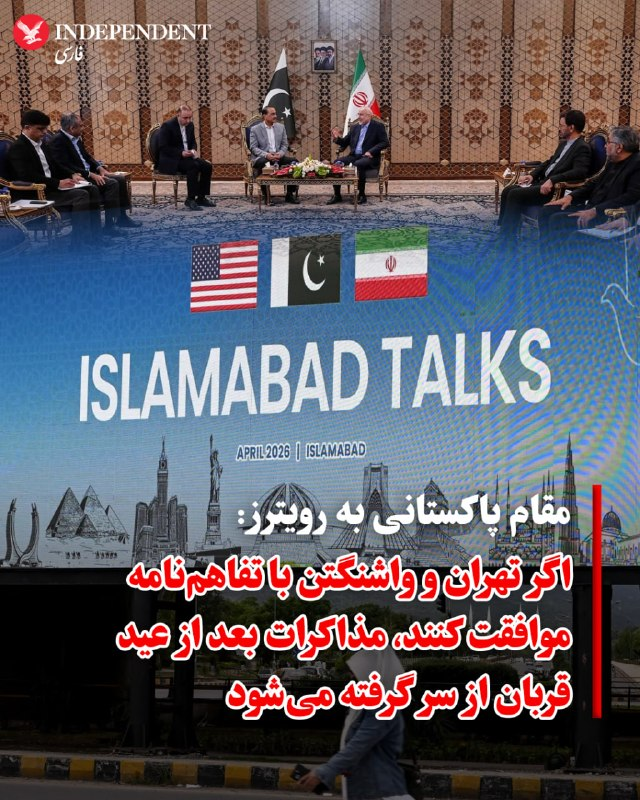
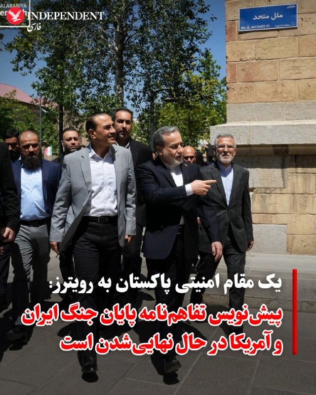
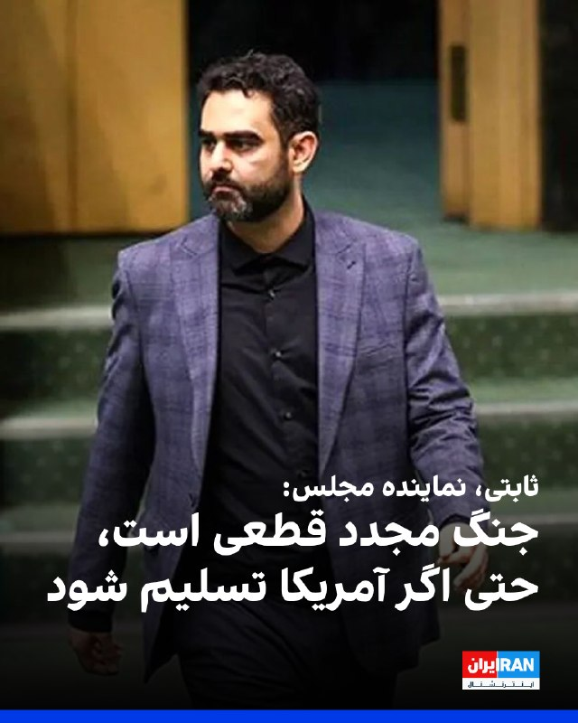
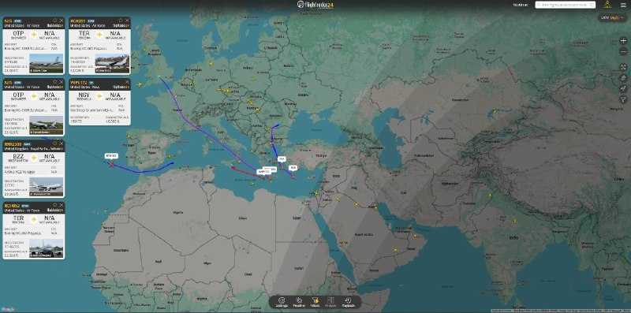
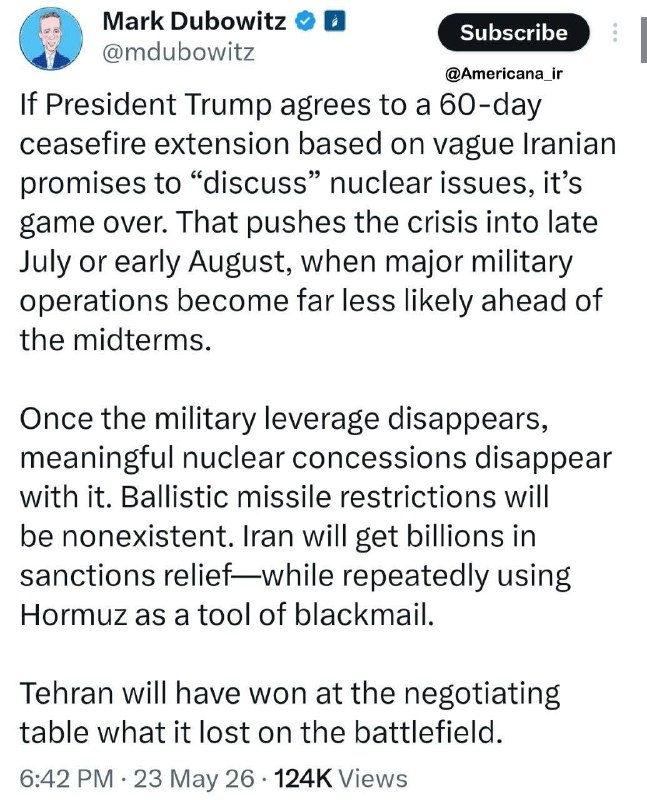
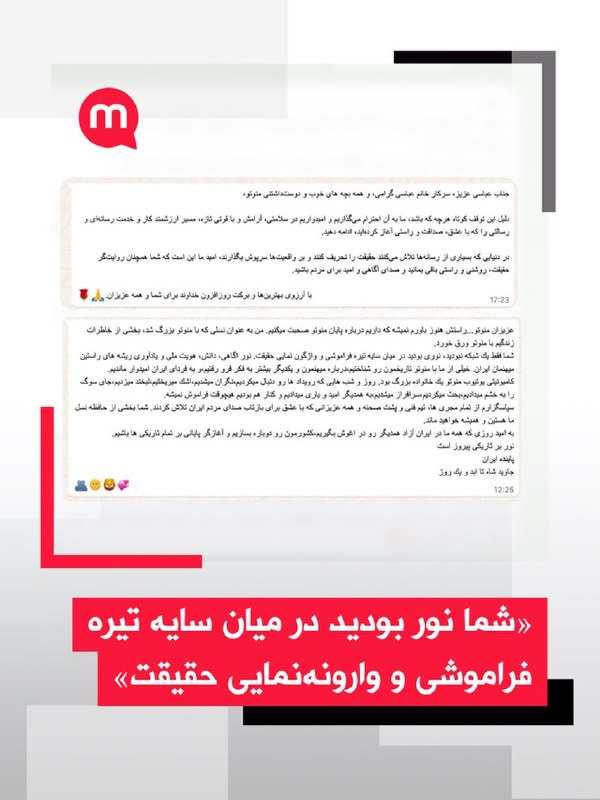
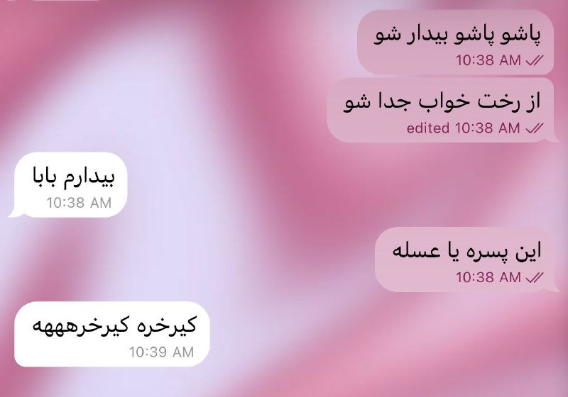

# خواننده تلگرام

<!-- TOP_NAV START -->

<a href="https://github.com/keihancpu/aio-downloader/blob/main/telegram/content/archive_1.md" style="display:inline-block; padding:6px 12px; margin:0 4px; background-color:#2ea44f; color:white; text-decoration:none; border-radius:4px; font-weight:bold;">صفحه بعد</a>

<!-- TOP_NAV END -->

<!-- MSG START -->

---
📅 بروزرسانی: 1405/03/02 22:19
---

## VahidOOnLine — post 241789

  <a href="telegram/content/VahidOOnLine_241789_1779562190.mp4" target="_blank">🎬 Download video</a>

♦️حضور آیشواریا رای باچان، ستاره افسانه‌ای بالیوود، در هفتاد و نهمین دوره جشنواره فیلم کن (2026)، بار دیگر تمام نگاه‌ها را به خود معطوف کرد. این حضور در حالی رقم خورد که غیبت او در پوسترهای تبلیغاتی جدید «لورئال پاریس» در هتل مارتینز، موجی از نگرانی و اعتراض را در فضای مجازی به راه انداخته بود.

هواداران که کن را بدون «ملکه» خود متصور نبودند، با مشاهده جای خالی او در کنار دیگر سفیران نام تجاری لورئال، واکنش‌های تندی نشان دادند. با این حال، لورئال با خطاب کردن او به عنوان یک «اسطوره زنده»، اطمینان داد که پیوند آیشواریا و کن ناگسستنی است.

آیشواریا با پوشیدن پیراهنی آبی و مجسمه‌گونه از «آمیت آگاروال»، روی فرش قرمز درخشید و ثابت کرد که همچنان نماد بیانی از اصالت و شکوه است. او پس از مراسم، با توقفی کوتاه و صمیمانه در میان هواداران، بار دیگر نشان داد چرا پس از دو دهه، همچنان قلب‌ها را تسخیر می‌کند. این لحظات که به سرعت در شبکه‌های اجتماعی دست‌به‌دست شد، پایانی بود بر شایعات و تاییدی بر جایگاه تزلزل‌ناپذیر او در دنیای مد و سینما.
‌🇸🇦 Indypersian

🤖 @VahidOOnLine

## VahidOOnLine — post 241788

  

♦️ منابع آگاه به خبرگزاری رویترز اعلام کردند که چارچوب پیشنهادی برای حل بحران شامل سه مرحله است: پایان رسمی جنگ، حل بحران در تنگه هرمز، و ایجاد یک بازه زمانی ۳۰ روزه و قابل تمدید برای آغاز مذاکرات جهت دستیابی به توافقی گسترده‌تر.

یکی از این منابع پاکستانی تاکید کرد که هیچ تضمینی برای پذیرش این تفاهم‌نامه از سوی ایالات متحده وجود ندارد. با این حال، در صورت موافقت تهران و واشنگتن، این تفاهم‌نامه بستر مناسبی را فراهم می‌کند تا مذاکرات تکمیلی پس از پایان تعطیلات عید [قربان] در روز جمعه، از سر گرفته شود.

این گمانه‌زنی‌ها در حالی مطرح می‌شود که به گزارش آکسیوس، دونالد ترامپ، رئیس‌جمهور آمریکا، اعلام کرده است اواخر امروز پیش‌نویس توافق با جمهوری اسلامی را با مشاورانش بررسی می‌کند و احتمالا روز یکشنبه درباره پذیرش آن یا از سرگیری حملات تصمیم خواهد گرفت. ترامپ با لحنی هشداری افزود: «یا به یک توافق خوب می‌رسیم، یا آن‌ها را نابود می‌کنم.»
‌🇸🇦 Indypersian

🤖 @VahidOOnLine

## VahidOOnLine — post 241787

  

اکسیوس به نقل از یک مقام آمریکایی گزارش داد: «ترامپ هنوز هیچ تصمیم نهایی در مورد توافق با جمهوری اسلامی نگرفته است.»

اکسیوس نوشت که ترامپ و مشاورانش در مراحل قبلی جنگ نیز چندین بار تصور می‌کردند به توافق نزدیک شده‌اند، اما هیچ‌یک به نتیجه نرسید.
‌🏁 🇬🇧 IranintlTV

🤖 @VahidOOnLine

## VahidOOnLine — post 241786

  <a href="telegram/content/VahidOOnLine_241786_1779562193.mp4" target="_blank">🎬 Download video</a>

راهپیمایی ایرانیان برلین
‌🏁 🇬🇧 ManotoTV

🤖 @VahidOOnLine

## VahidOOnLine — post 241785

  <a href="telegram/content/VahidOOnLine_241785_1779562194.mp4" target="_blank">🎬 Download video</a>

تصاویر جاویدنامان انقلاب ملی در بوردو فرانسه، دوم خرداد ۱۴۰۵
‌🏁 🇬🇧 ManotoTV

🤖 @VahidOOnLine

## VahidOOnLine — post 241784

  <a href="telegram/content/VahidOOnLine_241784_1779562196.mp4" target="_blank">🎬 Download video</a>

تماسی از ایران؛
«من پر از بغضم از رفتن شما»
‌🏁 🇬🇧 ManotoTV

🤖 @VahidOOnLine

## VahidOOnLine — post 241783

  <a href="telegram/content/VahidOOnLine_241783_1779562197.mp4" target="_blank">🎬 Download video</a>

راهپیمایی ایرانیان استکهلم
‌🏁 🇬🇧 ManotoTV

🤖 @VahidOOnLine

## VahidOOnLine — post 241782

  <a href="telegram/content/VahidOOnLine_241782_1779562198.mp4" target="_blank">🎬 Download video</a>

راهپیمایی ایرانیان لاهه در هلند، دوم خرداد ۱۴۰۵
‌🏁 🇬🇧 ManotoTV

🤖 @VahidOOnLine

## VahidOOnLine — post 241781

  <a href="telegram/content/VahidOOnLine_241781_1779562200.mp4" target="_blank">🎬 Download video</a>

بر پایه گزارش‌ها ترامپ برای تماس گروهی با رهبران عربستان سعودی، امارات متحده عربی، مصر، قطر، اردن، پاکستان و ترکیه وارد اتاق بیضی کاخ سفید شده است. همزمان سناتور لیندسی گراهام به باراک راوید خبرنگار آکسیوس گفت برخی از رهبران منطقه از ترامپ خواسته‌اند به ایران حمله کند تا حکومت تضعیف شود و در نتیجه توافقی با شرایط بهتر به دست آید.
او در مقابل گفت برخی دیگر از رهبران منطقه و همچنین تعدادی از مشاوران ارشد رئیس‌جمهور از او خواسته‌اند همان توافقی را که روی میز است بپذیرد.
راوید در ادامه نوشته به گفته گراهام، این گروه معتقدند تنگه هرمز نمی‌تواند از نفوذ جمهوری‌اسلامی در امان باشد و اگر ایران هدف حمله قرار بگیرد، این توانایی را دارد که بخش قابل توجهی از عملیات نفتی خلیج فارس را نابود کند.
گراهام همچنین گفت: من به‌شدت تردید دارم که نتوان ایران را از تهدید تنگه هرمز بازداشت و نتوان منافع حیاتی منطقه را پس از حملات گسترده به ایران دفاع کرد؛ اگر واقعاً ایران به‌طور کامل نابود شده باشد، نباید بتواند هیچ‌کدام از این کارها را انجام دهد. زمان مشخص خواهد کرد. هنوز امیدوارم نتیجه خوبی به دست بیاید.
‌🏁 🇬🇧 ManotoTV

🤖 @VahidOOnLine

## VahidOOnLine — post 241780

  

♦️ در واکنش به انتشار تصویری در حساب تروث‌سوشال ترامپ که در آن پرچم آمریکا روی سراسر ایران کشیده شده بود، کنسولگری جمهوری اسلامی در حیدرآباد هند، در نوشته‌ای طنزآمیز تصویر شلوارک کوتاهی که منقوش به پرجم آمریکا بود را منتشر کرد و نوشت: «تنها پرچم آمریکایی که داریم این است».

گفته می‌شود که این شلوارک مربوط به بقایای لوازم خلبان آمریکایی است که در ایران سقوط کرده بود. در آن زمان، نیروهای نظامی جمهوری اسلامی، پس از کشف لاشه هواپیمای سقوط کرده، تصاویری از این لوازم را منتشر کرده بودند.
‌🇸🇦 Indypersian

🤖 @VahidOOnLine

## VahidOOnLine — post 241779

  <a href="telegram/content/VahidOOnLine_241779_1779562201.mp4" target="_blank">🎬 Download video</a>

ویدیوهای رسیده به ایران‌اینترنشنال نشان می‌دهند گروهی از ایرانیان مقیم آلمان روز شنبه دوم خرداد، علیه اعدام‌های جمهوری اسلامی و در حمایت از شاهزاده رضا پهلوی، در شهر هانوفر تجمع کردند.
‌🏁 🇬🇧 IranintlTV

🤖 @VahidOOnLine

## VahidOOnLine — post 241778

  <a href="telegram/content/VahidOOnLine_241778_1779562203.mp4" target="_blank">🎬 Download video</a>

♦️سفارت ایالات متحده در کاراکاس، روز شنبه دوم خردادماه، با انتشار ویدیویی از برگزاری یک تمرین نظامی در محوطه سفارت خبر داد؛ تمرینی که با فرود دو هواپیمای عمودپرواز آمریکایی انجام شد.
در توضیحات منتشرشده آمده است که حفظ توان واکنش سریع نیروهای نظامی، بخشی کلیدی از آمادگی مhموریت‌های آمریکا در ونزوئلا و سایر نقاط جهان محسوب می‌شود. سفارت آمریکا همچنین اعلام کرد این اقدامات در چارچوب «برنامه سه‌مرحله‌ای» دولت دونالد ترامپ برای ونزوئلا دنبال می‌شود.
بر اساس گزارش‌ها، این رزمایش با هماهنگی مقام‌های ونزوئلا و با هدف آمادگی برای شرایط اضطراری و عملیات تخلیه احتمالی برگزار شده است.
‌🇸🇦 Indypersian

🤖 @VahidOOnLine

## VahidOOnLine — post 241777

  

♦️ یک مقام امنیتی پاکستان که در جریان جزئیات سفر فرمانده ارتش این کشور به تهران و دیدارهایش با مقامات جمهوری اسلامی قرار گرفته است، روز شنبه دوم خرداد، در گفتگو با رویترز اعلام کرد که «پیش‌نویس یک تفاهم‌نامه (MoU) برای پایان دادن به جنگ میان ایالات متحده و ایران در حال اصلاح و نهایی‌شدن است.»

این مقام امنیتی افزود که سفر فرمانده ارتش به تهران، «پیشرفت چشمگیری» در راستای محورهای تعیین‌شده در «مذاکرات اسلام‌آباد» برای پایان دادن به این جنگ به همراه داشته است. وی جزئیات بیشتری درباره محورهای دقیق گفتگوهای اسلام‌آباد ارائه نکرد.
‌🇸🇦 Indypersian

🤖 @VahidOOnLine

## VahidOOnLine — post 241776

  

امیرحسین ثابتی، نماینده مجلس، در تجمع شبانه حامیان حکومت با تاکید بر قطعی بودن وقوع مجدد جنگ نظامی گفت: «ممکن است یک ساعت دیگر باشد، ممکن است یک روز یا یک سال، اما قطعی است. حتی اگر آمریکا تمام شرایط ما را بپذیرد، امضا کند و تسلیم شود، باز هم جنگ خواهیم داشت.»
‌🏁 🇬🇧 IranintlTV

🤖 @VahidOOnLine

## WithYashar — post 12231

کانال 14 اسرائیل: چند منبع معتبر تأیید می‌کنند که ایران با برخی از درخواست‌های کلیدی ایالات متحده موافقت کرده است و کمتر از 24 ساعت دیگر اعلام توافق انجام خواهد شد که به تهران چند ماه فرصت می‌دهد تا کاملاً تسلیم شود
@withyashar

## WithYashar — post 12230

نخست‌وزیر اسرائیل، بنیامین نتانیاهو، به منظور بررسی آخرین تحولات مذاکرات با ایران، جلسه امنیتی محدودی برگزار خواهد کرد. یک منبع اسرائیلی در گفت‌وگو با سی‌ان‌ان این خبر را اعلام کرد.
@withyashar

## WithYashar — post 12229

کانال ۱۴ اسرائیل:چند منبع معتبر تأیید می‌کنند که ایران با برخی از درخواست‌های کلیدی ایالات متحده موافقت کرده است و کمتر از ۲۴ ساعت دیگر اعلام توافق انجام خواهد شد که به تهران چند ماه فرصت می‌دهد تا کاملاً تسلیم شود.
@withyashar

## WithYashar — post 12228

هم اکنون تماس تلفنی نتانیاهو و ترامپ! @withyashar

## WithYashar — post 12227

ترامپ با سران منطقه گفتگو کرد

آکسیوس:
ترامپ روز شنبه با رهبران عربستان سعودی، امارات متحده عربی، قطر، مصر، ترکیه و پاکستان تماس تلفنی داشت.

به گفته منبعی که از جزئیات این تماس مطلع شده، چند تن از این رهبران عرب از ترامپ خواستند که توافق را بپذیرد.
@withyashar

## WithYashar — post 12226

هم اکنون تماس تلفنی نتانیاهو و ترامپ!
@withyashar

## WithYashar — post 12225

## WithYashar — post 12224

هم اکنون جلسه اضطراری امنیت ملی دولت ترامپ در اتاق جنگ کاخ سفید در حال برگزاری است.
@withyashar

## WithYashar — post 12223

## WithYashar — post 12222

به گفته یک مقام آمریکایی که توسط اکسیوس نقل شده است، دونالد ترامپ هنوز تصمیم نهایی خود را در مورد این توافق نگرفته است
@withyashar

## WithYashar — post 12221

من که میدونیم ترامپ کار رو در میاره ولی این رسمش‌ نبود که این کارا رو با ما بکنه 😂
@withyashar

## WithYashar — post 12220

الحدث به نقل از یک منبع عالی‌رتبه: تنها ساعات کمی تا اعلام توافق بین آمریکا و ایران فاصله است
@withyashar

## WithYashar — post 12219

معاون رئیس‌جمهور ونس به کاخ سفید رسید
۱ دقیقه تا تماس تصویری ترامپ با شیوخ کشور های خلیج فارس
@withyashar

## WithYashar — post 12218

## WithYashar — post 12217

یاشار جان خسته نباشی
تو ویس های آخرت احساس ناامیدی کردم والا تو ماشین نشستم گریه میکنم
ما به امید شما امیدواریم
من پدرام مادرم بالای ۸۰ دارن و مریضن و من دیگه نمیتونم برم ایران ببینمشون
به امید ویس و تحلیل های شما تا حالا گذروندم
✌🏼💔

## WithYashar — post 12216

  <a href="telegram/content/WithYashar_12216_1779562205.mp4" target="_blank">🎬 Download video</a>

وزیر جنگ پیتر هگستث: اولین حمله هوایی که هرگز انجام دادم و یک دسته را در وسط شب در بغداد رهبری کردم. ما ۳۶ ساعت برای آماده‌سازی داشتیم و من هر دقیقه از آن ۳۶ ساعت را صرف آماده‌سازی کردم.

وقتی خلبان‌ها ما را چند صد متر در نقطه اشتباهی در وسط یک زمین گل‌آلود فرود آوردند و GPS کار نمی‌کرد.
یک مرد بود که آن دسته به او نگاه می‌کردند و آن مرد من بودم.
@withyashar

## WithYashar — post 12215

## mwarmonitor — post 9572

  <a href="telegram/content/mwarmonitor_9572_1779562207.mp4" target="_blank">🎬 Download video</a>

✈️پرواز جنگنده‌های آمریکایی بر فراز آسمان منطقه خلیفان در استان اربیل، در شمال عراق.

@mwarmonitor

## mwarmonitor — post 9570

🔴 آکسیوس به نقل از یک منبع مطلع: چند تن از رهبران در جریان تماس تلفنی از ترامپ خواسته‌اند که توافق را بپذیرد.

📌 معاون رئیس‌جمهور از اوهایو و وزیر جنگ از نیویورک به واشنگتن فراخوانده شده‌اند تا برای یک نشست درباره توافق حضور پیدا کنند.

@mwarmonitor

## mwarmonitor — post 9569

🔴ایالات متحده و ایران در آستانه توافقی برای پایان دادن به جنگ؛ یک مقام مسئول خبر داد 📝باراک راوید AXIOS 🔰یک مقام آمریکایی که در جریان مذاکرات قرار گرفته است، روز شنبه اعلام کرد که دولت ترامپ و ایران به توافقی برای پایان دادن به جنگ نزدیک شده‌اند و اختلافات…

## mwarmonitor — post 9568

🔴ایالات متحده و ایران در آستانه توافقی برای پایان دادن به جنگ؛ یک مقام مسئول خبر داد

📝باراک راوید AXIOS

🔰یک مقام آمریکایی که در جریان مذاکرات قرار گرفته است، روز شنبه اعلام کرد که دولت ترامپ و ایران به توافقی برای پایان دادن به جنگ نزدیک شده‌اند و اختلافات باقی‌مانده عمدتاً بر سر «لحن و عبارات» چند بند متمرکز است.

🔹چرا این موضوع اهمیت دارد؟
این اتفاق یکی از قوی‌ترین نشانه‌ها تا به امروز است که نشان می‌دهد این جنگِ تقریباً سه ماهه، ممکن است به پایان خود نزدیک شده باشد.

🔸نکات کلیدی
این مقام مسئول تاکید کرد که هنوز هیچ تصمیم نهایی از سوی پرزیدنت ترامپ در خصوص این توافق اتخاذ نشده است.

📌ارزیابی واقع‌بینانه: ترامپ و مشاورانش در مراحل قبلی این جنگ نیز چندین بار تصور می‌کردند که به توافق نزدیک شده‌اند، اما در نهایت هیچ‌کدام از آن‌ها به نتیجه نرسید.

@mwarmonitor

## mwarmonitor — post 9567

🚨 یک مقام آمریکایی مطلع از مذاکرات به من گفت دولت ترامپ و ایران به توافقی برای پایان دادن به جنگ نزدیک شده‌اند و اشاره کرد که اختلافات باقی‌مانده بیشتر بر سر «نحوه بیان» چند بند است. باراک راوید

@mwarmonitor

## mwarmonitor — post 9566

🔴سناتور لیندسی گراهام ؛ اگر توافقی برای پایان دادن به درگیری ایران حاصل شود، به این دلیل که باور بر این است که تنگه هرمز نمی‌تواند از «تروریسم ایران» محافظت شود و ایران همچنان توانایی نابود کردن زیرساخت‌های اصلی نفتی خلیج فارس را دارد، در این صورت ایران به‌عنوان یک قدرت مسلط تلقی خواهد شد که نیازمند یک راه‌حل دیپلماتیک است.

🔹این ترکیب از این تصور که ایران توانایی تهدید دائمی تنگه هرمز را دارد و همچنین توانایی وارد کردن خسارت گسترده به زیرساخت‌های نفتی خلیج فارس، یک تغییر مهم در توازن قدرت در منطقه محسوب می‌شود و در طول زمان می‌تواند برای اسرائیل یک کابوس باشد.

🔸همچنین این سؤال را ایجاد می‌کند که اگر این برداشت‌ها درست باشد، اصلاً چرا این جنگ آغاز شد؟ شخصاً من نسبت به این ایده که ایران را نمی‌توان از توانایی تهدید تنگه هرمز محروم کرد و اینکه منطقه قادر به محافظت از خود در برابر توان نظامی ایران نیست، تردید دارم.

🔸مهم است که در این مورد به نتیجه‌گیری درستی برسیم.

@mwarmonitor

## mwarmonitor — post 9565

🔴کان نیوز: اسرائیل سطح آماده‌باش بالایی را که در طول تعطیلات به دلیل نگرانی از احتمال حمله به ایران برقرار کرده بود، کاهش داده است. در این مرحله، مقام‌های اسرائیلی از هیچ حمله احتمالی آمریکا به ایران اطلاع ندارند.

@mwarmonitor

## mwarmonitor — post 9564

  

✈️در حال حاضر تعداد قابل توجهی پرواز خروجی از خاورمیانه در جریان است. در حالی که در حال حاضر هیچ پرواز ورودیِ قابل ردیابی (که سیگنال ترنسپاندر فعال داشته باشد) دیده نمی‌شود، به جز شاید MOOSE56. MOOSE48 و MOOSE58 (هر دو در شرق امارات متحده عربی به نظر می‌رسد)…

## mwarmonitor — post 9563

  

✈️در حال حاضر تعداد قابل توجهی پرواز خروجی از خاورمیانه در جریان است. در حالی که در حال حاضر هیچ پرواز ورودیِ قابل ردیابی (که سیگنال ترنسپاندر فعال داشته باشد) دیده نمی‌شود، به جز شاید MOOSE56.

MOOSE48 و MOOSE58 (هر دو در شرق امارات متحده عربی به نظر می‌رسد) نیز در حال ترک منطقه هستند، اما اختلال در سیگنال‌ها (spoofing) شدید شده است.

بوئینگ C-17A گلوب‌مستر III:

RCH643 - 10-0218
RCH542 - 06-6158
RCH445 - 08-8195
MOOSE53 - 06-6164
MOOSE42 - 01-0191
MOOSE57 - 06-6168
MOOSE56 - 00-0177
MOOSE48 - 07-7170
MOOSE58 - 07-7174
بوئینگ KC-135R استراتوتانکر:
NA - 63-8028
NA - 62-3552

@mwarmonitor

## FoxNewsTwitter — post 342167

‌Fox News (Twitter/X)

Read more:

## FoxNewsTwitter — post 342166

  

Fox News (Twitter/X)

BREAKING NEWS: The U.S. Embassy in Kyiv issued a security alert Saturday warning of a “potentially significant air attack” that could strike the Ukrainian capital within the next 24 hours.

## FoxNewsTwitter — post 342165

  

Fox News (Twitter/X)

RT @foxnewspolitics: Nine minutes after the AG announced murder charges against Raúl Castro, a pre-produced rapid-response campaign launched across multiple U.S. organizations defending the Cuban dictator. @FoxNews Digital's @AsraNomani reports DOJ and Treasury investigators probe whether that synchronized activation reveals a foreign influence operation directed by Havana — with 145 nonprofits with $1 billion in combined revenue under scrutiny.

## pm_afshaa — post 91307

🔴کانال 14 اسرائیل: چند منبع معتبر تأیید می‌کنند که ایران با برخی از درخواست‌های کلیدی ایالات متحده موافقت کرده است و کمتر از 24 ساعت دیگر اعلام توافق انجام خواهد شد که به تهران چند ماه فرصت می‌دهد تا کاملاً تسلیم شود

💧 Rainbet.com the #1 Non-KYC Crypto Casino & Sportsbook @rainbetcom

😁 @Pm_Afshaa

## pm_afshaa — post 91306

🔴آکسیوس : گزارش‌ها حاکی از آن است که دولت ترامپ و ایران به توافق برای پایان جنگ نزدیک شده‌اند و اختلافات باقی‌مانده بیشتر بر سر نحوه نگارش برخی بندهاست

💧 Rainbet.com the #1 Non-KYC Crypto Casino & Sportsbook @rainbetcom

😁 @Pm_Afshaa

## pm_afshaa — post 91305

🔴هم اکنون جلسه اضطراری امنیت ملی دولت ترامپ در اتاق جنگ کاخ سفید در حال برگزاریه

💧 Rainbet.com the #1 Non-KYC Crypto Casino & Sportsbook @rainbetcom

😁 @Pm_Afshaa

## pm_afshaa — post 91304

🔴مقامات ارشد در اسرائیل: ویتکاف تلاش می‌کند به هر قیمتی توافقی با ایران به دست آورد، او کسی است که به ترامپ فشار می‌آورد تا به جنگ بازنگردد

💧 Rainbet.com the #1 Non-KYC Crypto Casino & Sportsbook @rainbetcom

😁 @Pm_Afshaa

## pm_afshaa — post 91303

🔴کانال 13 اسرائیل:نیروهای دفاعی اسرائیل در حالت آماده‌باش کامل به‌دلیل احتمال شکست مذاکرات و از سرگیری درگیری‌ها هستن

💧 Rainbet.com the #1 Non-KYC Crypto Casino & Sportsbook @rainbetcom

😁 @Pm_Afshaa

## DEJradio — post 4888

  <a href="telegram/content/DEJradio_4888_1779562210.mp4" target="_blank">🎬 Download video</a>

🚨
🔸 خبر ۲۱
شنبه ۲ خرداد ۱۴۰۵

#خبر۲۱
@DEJradio

## VahidOnline — post 75658

  

شبکه ۱۳ اسرائیل در گزارشی از روند گفت‌وگوهای ایران و آمریکا گفت مقام‌های اسرائیلی معتقدند ایالات متحده و ایران به دستیابی به توافق احتمالی نزدیک‌تر شده‌اند و گزارش‌های اخیر و اطلاعاتی که دریافت می‌شود، «در اورشلیم به‌طور فزاینده‌ای معتبر تلقی می‌شود».

بر اساس گزارش این شبکه، مقام‌های ارشد اسرائیلی گفته‌اند پیشرفت در مذاکرات برای بخشی از نهاد امنیتی اسرائیل «بسیار ناامیدکننده» است، به‌ویژه در شرایطی که به نظر می‌رسد تلاش واشینگتن برای رسیدن به توافق در حال تشدید شدن است.

این مقام‌ها همچنین معتقدند فشار برخی مشاوران رئیس‌جمهور ترامپ در روزهای اخیر افزایش یافته و انتظار می‌رود بنیامین نتانیاهو، نخست‌وزیر اسرائیل، در پی این تحولات، نشست‌هایی مشورتی با وزیران ارشد و مقام‌های امنیتی برگزار کند.
نهادها و مقامات رسمی اسرائیل هنوز این گزارش را رد یا تأیید نکرده‌اند.

ارزیابی اسرائیل در دو هفتهٔ گذشته این بود که ترامپ خواهان توافق است، اما در نهایت به دلیل اختلاف بر سر مسائل کلیدی، موفق به دستیابی به آن نخواهد شد. با این حال، مقام‌های اسرائیلی اکنون معتقدند روند کنونی ظاهراً برخلاف چیزی است که اسرائیل در هفته‌های اخیر برای آن تلاش کرده بود.

این گزارش همچنین می‌گوید چارچوبی که دربارهٔ آن گفت‌وگو می‌شود، شامل یک توافق موقت ۶۰ روزه خواهد بود که ممکن است بعداً در حالی که مذاکرات درباره توافقی گسترده‌تر ادامه دارد، تمدید شود.

روز شنبه مقامات ایران و آمریکا و همچنین پاکستان که نقش میانجی را بین دو طرف بر عهده دارد، اعلام کردند که در مذاکرات برای پایان دادن به جنگ پیشرفت حاصل شده است.

روز شنبه، روزنامه اسرائیل هیوم نیز در گزارشی ادعا کرد پیش‌نویس توافقی که روی میز قرار دارد، شامل تعهد اولیه ایران به خودداری از توسعه سلاح هسته‌ای و تعلیق بلندمدت غنی‌سازی اورانیوم است و سایر مسائل، از جمله سرنوشت ذخایر کنونی اورانیوم غنی‌شده ایران، در مذاکرات بعدی در دورهٔ آتش‌بس بررسی خواهد شد.

این روزنامه همچنین به‌نقل از منابع آگاه که نام‌شان را نیاورده، ادعا کرد «رهبری سیاسی ایران پیش‌تر با تحویل اورانیوم غنی‌شده موافقت کرده بود، اما فرماندهان سپاه پاسداران با این اقدام مخالفت کردند و تصمیم‌گیری دربارهٔ این موضوع اکنون به تأیید رهبر جمهوری اسلامی بستگی دارد».
@VahidHeadline

📡 @VahidOnline

## kianmeli1 — post 87611

  

🔴خلاصه تمام خبرهای امروز

آمریکا و ایران به توافق برای پایان دادن به جنگ نزدیک شده‌اند و اختلافات باقی‌مانده بر سر نحوه نگارش چندین نکته کلیدی است - اکسیوس

ممکن است ظرف ۲۴ ساعت آینده توافق صلح اعلام شود.

انتظار می‌رود ترامپ امشب با نتانیاهو در مورد توافق مورد انتظار با ایران صحبت کند، اگرچه به احتمال زیاد نتانیاهو تلاش خواهد کرد ترامپ را متقاعد کند که به جای آن به ایران حمله کند.
https://t.me/kianmeli1

## kianmeli1 — post 87610

🔴گزارش رویترز:

طرح پیشنهادی توافق بین ایران و آمریکا قرار است در سه مرحله پیش برود - پایان رسمی جنگ، حل بحران تنگه هرمز و باز شدن پنجره زمانی 30 روزه برای مذاکره درباره توافقی گسترده‌تر، البته با امکان تمدید مدت زمانی
https://t.me/kianmeli1

## kianmeli1 — post 87609

‏🔴سلمان اسحاقی، سخنگوی کمیسیون بهداشت مجلس، گفت: کشور با کمبود نزدیک به هزار قلم دارو روبه‌رو است
https://t.me/kianmeli1

## kianmeli1 — post 87608

🔴هم اکنون جلسه اضطراری امنیت ملی دولت ترامپ در اتاق جنگ کاخ سفید در حال برگزاری است
https://t.me/kianmeli1

## kianmeli1 — post 87607

🔴آکسیوس: طبق گفته یک منبع مطلع ترامپ قرار است امشب با نتانیاهو گفتگو کند تا درباره توافق در حال شکل‌گیری با ایران بحث کنند.
https://t.me/kianmeli1

## kianmeli1 — post 87606

🔴به گزارش خبرگزاری دولتی عربستان سعودی، العربیه، به نقل از یک منبع ارشد: «چند ساعت تا اعلام توافق بین ایران و ایالات متحده فاصله داریم.»
https://t.me/kianmeli1

## kianmeli1 — post 87605

  

🔴آتش بس ۶۰ روزه پیروزی ایران است / مارک دوبوویتز، مدیر اندیشکده مهم FDD:

اگر رئیس جمهور ترامپ بر اساس وعده‌های مبهم ایران برای «بحث» در مورد مسائل هسته‌ای، با تمدید آتش‌بس ۶۰ روزه موافقت کند، بازی تمام است. این امر بحران را به اواخر ژوئیه یا اوایل اوت سوق می‌دهد، زمانی که احتمال عملیات نظامی عمده پیش از انتخابات میان‌دوره‌ای بسیار کمتر می‌شود.

هنگامی که اهرم نظامی از بین برود، امتیازات هسته‌ای معنادار نیز با آن از بین می‌روند. محدودیت‌های موشک‌های بالستیک وجود نخواهد داشت. ایران میلیاردها دلار از تخفیف تحریم‌ها دریافت خواهد کرد - در حالی که بارها از تنگه هرمز به عنوان ابزاری برای باج‌گیری استفاده می‌کند.

تهران آنچه را که در میدان نبرد از دست داده بود، در میز مذاکره به دست آورده است.
https://t.me/kianmeli1

## kianmeli1 — post 87604

  <a href="telegram/content/kianmeli1_87604_1779562214.mp4" target="_blank">🎬 Download video</a>

🔴وضعیت امشب یکی از میادین مملکت

کشور دست مداحان است نه سرداران
https://t.me/kianmeli1

## kianmeli1 — post 87603

🔴یک شب قبل کشتن خامنه ای خبر توافق تیتر تمام خبرگزاری ها بود

دقیقا مشخص نیست آیا توافق واقعی است یا خیر
https://t.me/kianmeli1

## kianmeli1 — post 87602

‏🔴الحدث به نقل از یک «منبع عالی‌رنبه» نوشت: «تنها چند ساعت تا اعلام توافق بین واشینگتن و تهران فاصله داریم»
https://t.me/kianmeli1

## kianmeli1 — post 87601

  <a href="telegram/content/kianmeli1_87601_1779562215.mp4" target="_blank">🎬 Download video</a>

🔴نیروهای واکنش سریع آمریکا برای مقابله با نیروهای نیابتی ایران به خاورمیانه اعزام می‌شوند

پیت هگست:

ما از نیروهای هوابرد و واکنش سریع خود خواسته‌ایم که در هر لحظه آماده اعزام به خاورمیانه باشند؛ تا همچون سپری آهنین از پایگاه‌ها و جان آمریکایی‌ها در برابر نیروهای نیابتی ایران محافظت کنند.

این شامل یگان‌های ارتش آمریکا می‌شود که با استفاده از سامانه‌های هیمارس (HIMARS) برای غرق کردن نیروی دریایی ایران کمک می‌کنند.

من می‌دانم که ارتش عاشق غرق کردن نیروهای دریایی است. این تنها نیروی دریایی است که در حال حاضر اجازه دارید غرق کنید.
https://t.me/kianmeli1

## kianmeli1 — post 87600

  

🔴دوم خرداد سالروز تولد مهدی حسنی که توسط جمهوری اسلامی اعدام شد

به مهدی حسنی در زندان گفته بودند اگر اعتراف نکنی به پسر کوچکت تجاوز میکنیم
https://t.me/kianmeli1

## kianmeli1 — post 87599

  <a href="telegram/content/kianmeli1_87599_1779562217.mp4" target="_blank">🎬 Download video</a>

🔴پاسخ به صدای دانش‌آموزان: باتوم و اشک‌آور!

دانش‌آموزان خرم‌آباد در اعتراض به شرایط آموزشی و اختلالات گسترده، مقابل آموزش‌وپرورش تجمع کردند.
آن‌ها از کیفیت پایین آموزش، اینترنت ضعیف و بی‌عدالتی در امتحانات گلایه داشتند.
این تجمع با برخورد نیروهای امنیتی و استفاده از گاز اشک‌آور و باتوم به تنش کشیده شد.
https://t.me/kianmeli1

## IranIntlTV — post 338647

  

اکسیوس به نقل از یک مقام آمریکایی گزارش داد: «ترامپ هنوز هیچ تصمیم نهایی در مورد توافق با جمهوری اسلامی نگرفته است.»

اکسیوس نوشت که ترامپ و مشاورانش در مراحل قبلی جنگ نیز چندین بار تصور می‌کردند به توافق نزدیک شده‌اند، اما هیچ‌یک به نتیجه نرسید.
https://iranintl.com/202605230532

## IranIntlTV — post 338646

  

🔻مهدی تاج، رییس فدراسیون فوتبال، خبر داد کمپ تیم ملی فوتبال از آریزونای آمریکا به کمپی در شهر تیخوانا مکزیک منتقل شده است.

🔹او به سایت فدراسیون فوتبال گفت: «با این تغییر، مساله ویزا تا اندازه زیادی حل می‌شود. می‌توانیم با پرواز ایران‌ایر به مکزیک برویم و برگشت هم از همان‌جا بیاییم.»

🔹تیخوانا شهری مرزی در شمال غربی مکزیک، در ایالت باخا کالیفرنیا، است و در نزدیکی مرز ایالات متحده و شهر سن‌دیگو قرار دارد.

🔹رسانه‌های ایران امروز گزارش دادند سفارت آمریکا در آنکارا برای تعدادی از بازیکنان تیم ملی، از جمله مهدی طارمی، شجاع خلیل‌زاده و احسان حاج‌صفی، ویزا صادر نکرده است.

🔹از سوی دیگر، فدراسیون فوتبال اصرار دارد با پرواز ایران‌ایر به آمریکا سفر کند؛ تصمیمی که با توجه به تحریم‌های این شرکت هواپیمایی، امکان‌پذیر نیست.

🔹مهدی تاج توضیحی نداد که تکلیف ویزای ورود به آمریکا برای برگزاری مسابقات تیم ملی چه می‌شود.

🔹از سوی دیگر به نظر می‌رسد این تصمیم فدراسیون فوتبال برای دور ماندن تیم ملی از تقابل با ایرانیان مقیم آمریکا باشد.

@iranintltvsport

## IranIntlTV — post 338645

دانش‌آموزان در ایران در مناطق مختلف کشور در اعتراض به وضع موجود آموزشی تجمع کردند. آن‌ها به وضعیت بلاتکلیف آموزشی، فشارهای معیشتی و تصمیم مسئولان درباره امتحانات نهایی اعتراض کردند.

گفت‌وگو با مهرداد قاسمفر، روزنامه‌نگار و تحلیل‌گر مسائل ایران
@iranintltv

## IranIntlTV — post 338644

  <a href="telegram/content/IranIntlTV_338644_1779562219.mp4" target="_blank">🎬 Download video</a>

ویدیوهای رسیده به ایران‌اینترنشنال نشان می‌دهند گروهی از ایرانیان مقیم آلمان روز شنبه دوم خرداد، علیه اعدام‌های جمهوری اسلامی و در حمایت از شاهزاده رضا پهلوی، در شهر هانوفر تجمع کردند.

## IranIntlTV — post 338643

  <a href="telegram/content/IranIntlTV_338643_1779562221.mp4" target="_blank">🎬 Download video</a>

مهدی مهدوی‌آزاد در برنامه «چشم‌انداز» می‌گوید علی خامنه‌ای در خاطراتش به‌صراحت از تاثیرپذیری خود از سید قطب و نواب صفوی گفته است؛ افرادی که به گفته او در شکل‌گیری جریان‌های اسلام‌گرای رادیکال نقش داشتند. مهدوی‌آزاد در ادامه می‌گوید بر اساس برخی منابع آمریکایی، مجتبی خامنه‌ای نیز در نگاه سیاسی خود تحت تاثیر اسامه بن‌لادن قرار دارد.
@iranintltv

## IranIntlTV — post 338642

  

امیرحسین ثابتی، نماینده مجلس، در تجمع شبانه حامیان حکومت با تاکید بر قطعی بودن وقوع مجدد جنگ نظامی گفت: «ممکن است یک ساعت دیگر باشد، ممکن است یک روز یا یک سال، اما قطعی است. حتی اگر آمریکا تمام شرایط ما را بپذیرد، امضا کند و تسلیم شود، باز هم جنگ خواهیم داشت.»
https://iranintl.com/202605233406

## IranIntlTV — post 338641

گرچه در ساعات گذشته بحث توافق اولیه یا تمدید آتش‌بس بین جمهوری اسلامی و آمریکا مطرح شده، اما آن‌‌طور که سی‌بی‌اس گزارش داده، ارتش و نهادهای اطلاعاتی آمریکا برنامه حمله احتمالی به ایران را آماده و این برنامه را به دونالد ترامپ هم ارائه کرده‌اند. برنامه‌ای که شامل اهداف مختلفی در داخل ایران می‌شود. براساس گزارش‌ها، بسیاری از مقام‌های ارشد اطلاعاتی و نظامی آمریکا هم برنامه‌های آخر هفته‌ خود را تغییر داده و مرخصی‌های‌شان را لغو کرده‌اند.

@iranintltv

## ManotoTV — post 105780

  <a href="telegram/content/ManotoTV_105780_1779562224.mp4" target="_blank">🎬 Download video</a>

راهپیمایی ایرانیان برلین

## ManotoTV — post 105779

  <a href="telegram/content/ManotoTV_105779_1779562225.mp4" target="_blank">🎬 Download video</a>

تصاویر جاویدنامان انقلاب ملی در بوردو فرانسه، دوم خرداد ۱۴۰۵

## ManotoTV — post 105778

  

به دنبال اعلام توقف پخش ماهواری‌ای و کانال یوتیوب منوتو، شماری از بینندگان با ارسال پیام‌هایی، از سال‌ها فعالیت منوتو و همراهی آن با مخاطبان قدردانی کردند.
یکی از بینندگان در پیام خود نوشته است:
«راستش هنوز باورم نمی‌شود که داریم درباره پایان منوتو صحبت می‌کنیم. من به عنوان نسلی که با منوتو بزرگ شد، بخشی از خاطرات زندگی‌ام با منوتو ورق خورد.»

در پیام دیگری آمده است:
«شما فقط یک شبکه نبودید، نوری بودید در میان سایه تیره فراموشی و وارونه‌نمایی حقیقت.»

## ManotoTV — post 105777

  <a href="telegram/content/ManotoTV_105777_1779562227.mp4" target="_blank">🎬 Download video</a>

تماسی از ایران؛
«من پر از بغضم از رفتن شما»

## ManotoTV — post 105776

  <a href="telegram/content/ManotoTV_105776_1779562229.mp4" target="_blank">🎬 Download video</a>

راهپیمایی ایرانیان استکهلم

## ManotoTV — post 105775

  <a href="telegram/content/ManotoTV_105775_1779562230.mp4" target="_blank">🎬 Download video</a>

راهپیمایی ایرانیان لاهه در هلند، دوم خرداد ۱۴۰۵

## ManotoTV — post 105774

  <a href="telegram/content/ManotoTV_105774_1779562231.mp4" target="_blank">🎬 Download video</a>

بر پایه گزارش‌ها ترامپ برای تماس گروهی با رهبران عربستان سعودی، امارات متحده عربی، مصر، قطر، اردن، پاکستان و ترکیه وارد اتاق بیضی کاخ سفید شده است. همزمان سناتور لیندسی گراهام به باراک راوید خبرنگار آکسیوس گفت برخی از رهبران منطقه از ترامپ خواسته‌اند به ایران حمله کند تا حکومت تضعیف شود و در نتیجه توافقی با شرایط بهتر به دست آید.
او در مقابل گفت برخی دیگر از رهبران منطقه و همچنین تعدادی از مشاوران ارشد رئیس‌جمهور از او خواسته‌اند همان توافقی را که روی میز است بپذیرد.
راوید در ادامه نوشته به گفته گراهام، این گروه معتقدند تنگه هرمز نمی‌تواند از نفوذ جمهوری‌اسلامی در امان باشد و اگر ایران هدف حمله قرار بگیرد، این توانایی را دارد که بخش قابل توجهی از عملیات نفتی خلیج فارس را نابود کند.
گراهام همچنین گفت: من به‌شدت تردید دارم که نتوان ایران را از تهدید تنگه هرمز بازداشت و نتوان منافع حیاتی منطقه را پس از حملات گسترده به ایران دفاع کرد؛ اگر واقعاً ایران به‌طور کامل نابود شده باشد، نباید بتواند هیچ‌کدام از این کارها را انجام دهد. زمان مشخص خواهد کرد. هنوز امیدوارم نتیجه خوبی به دست بیاید.

## FarsiVOA — post 218466

روزنامه دنیای اقتصاد در گزارشی از همایش «چشم‌انداز اقتصاد ایران ۱۴۰۵» تصویری نگران‌کننده از اقتصاد ایران ترسیم کرده است؛ تصویری که در آن تورم، بیکاری، رکود سرمایه‌گذاری، و کاهش رفاه خانوارها به مرحله‌ای خطرناک‌تر رسیده‌اند.

مسعود نیلی، اقتصاددان، در این همایش هشدار داده اقتصاد ایران از وضعیت «بحران مزمن» وارد مرحله «بروز آشکار بحران‌ها» شده و اگر سازوکارهای شکل‌گیری این بحران‌ها درست شناخته نشود، هزینه‌های سنگین‌تری در آینده تحمیل خواهد شد. او با اشاره به آمار مرکز آمار گفته تورم کالاها از ۱۰۰ درصد گذشته و شرایط تورمی ایران به‌سادگی به وضعیت نرمال بازنخواهد گشت.

گزارش کامل را در وب‌سایت صدای آمریکا بخوانید.

@FarsiVOA

## FarsiVOA — post 218465

اروپا در مسیر بدون بازگشت؛ حرکت به سوی پایان وابستگی به انرژی روسیه

## FarsiVOA — post 218464

در گفت‌وگو با کیانوش رزاقی، وکیل مهاجرت در مریلند، به تصمیم جدید دولت پرزیدنت ترامپ درباره الزام ثبت درخواست گرین کارت از خارج خاک آمریکا پرداختیم و پیامدهای حقوقی و عملی آن را برای دانشجویان، نیروهای متخصص و متقاضیانی که با محدودیت‌های کنسولی در کشور خود روبه‌رو هستند بررسی کردیم.

## FarsiVOA — post 218460

اسپیس‌ایکس اعلام کرد «استارشیپ وی۳»، برای نخستین بار به پرواز درآمده است.

استارشیپ بزرگ‌ترین و قدرتمندترین فضاپیمای ساخته‌شده توسط اسپیس‌ایکس است.

@FarsiVOA

## DW_Farsi — post 125063

  <a href="telegram/content/DW_Farsi_125063_1779562232.mp4" target="_blank">🎬 Download video</a>

🎥 اعتراض دانش‌آموزان در ایران به حضوری شدن امتحانات

ویدیوهایی در شبکه‌های اجتماعی، تجمع گروهی از دانش‌آموزان در چند شهر ایران را در روز شنبه، دوم خرداد ماه نشان می‌دهد. آنها به احتمال برگزاری حضوری امتحانات اعتراض دارند و می‌گویند ماه‌ها آموزش غیرحضوری، اختلال اینترنت و شرایط جنگی، روند یادگیری‌شان را مختل کرده است.

@dw_farsi

## DW_Farsi — post 125062

🔶 ترامپ قصد دارد با چند تن از رهبران خاورمیانه تلفنی گفت‌وگو کند

به گفته یک منبع آگاه، دونالد ترامپ، رئیس جمهور آمریکا، قصد دارد با چند تن از سران کشورها و دولت‌های منطقه خاورمیانه تلفنی گفت‌وگو کند.

یک مقام دولتی عرب به خبرگزاری رویترز گفت که قرار است این تماس‌ها با رهبران عربستان سعودی، قطر، امارات متحده عربی، مصر، ترکیه و پاکستان انجام شود.

بر اساس یک گزارش رسانه‌ای، دونالد ترامپ احتمال دستیابی به یک توافق احتمالی، و از نگاه آمریکا "خوب"، در جنگ ایران را "پنجاه به پنجاه" ارزیابی کرده است.

پرتال اکسیوس همچنین از قول رئیس جمهور آمریکا نوشت: «فکر می‌کنم یکی از این دو اتفاق خواهد افتاد: یا آنها را شدیدتر از هر زمان دیگری هدف قرار خواهم داد، یا یک توافق خوب امضا خواهیم کرد.»

اکسیوس همچنین به نقل از این گفت‌وگو گزارش داد که ترامپ قرار است همین روز شنبه با استیو ویتکاف و جرد کوشنر، مذاکره‌کنندگان خود، دیدار کند تا پیشنهاد تازه جمهوری اسلامی را بررسی کند.

در ادامه این گزارش آمده است که ترامپ احتمالا تا روز یکشنبه تصمیم خواهد گرفت که آیا جنگ از سر گرفته خواهد شد یا نه.

@dw_farsi

## DW_Farsi — post 125061

🔶 بقائی: چارچوب مذاکرات ایران و آمریکا تقریبا نهایی شده است

به گفته مقام‌های جمهوری اسلامی، چارچوب ادامه گفت‌وگوها میان تهران و واشنگتن در آستانه نهایی شدن است.

با این حال، به گفته اسماعیل بقائی، سخنگوی وزارت امور خارجه جمهوری اسلامی، اینکه در پایان توافقی حاصل شود، هم "بسیار نزدیک" است و هم "بسیار دور".

او در تلویزیون دولتی گفت: «در حال حاضر در مرحله نهایی تدوین یک یادداشت تفاهم هستیم.»

بر اساس گزارش‌های همسو در رسانه‌های آمریکایی، واشنگتن و تهران با میانجی‌گری طرف‌های واسطه در حال کار بر روی یک یادداشت تفاهم ۱۴ ماده‌ای هستند. این سند قرار است چارچوبی برای مذاکرات ایجاد کند و به طور رسمی به جنگ پایان دهد.

بقائی اکنون گفت محور این یادداشت تفاهم، پایان دادن به جنگ، لغو محاصره آمریکایی در تنگه هرمز و نیز آزادسازی کلی دارایی‌های مسدودشده ایران در خارج از کشور است.

به گفته بقائی، قرار است در ۳۰ تا ۶۰ روز آینده، در چارچوب همین یادداشت تفاهم ۱۴ ماده‌ای، جزئیات بیشتری مذاکره شود تا در نهایت توافقی نهایی حاصل شود.

بر این اساس، اختلاف بر سر برنامه هسته‌ای جمهوری اسلامی و نیز روند فنی لغو تحریم‌های اعمال‌شده علیه تهران و آزادسازی حساب‌های ایرانی در خارج از کشور نیز در همین مرحله بررسی خواهد شد.

او افزود که آمریکا در جریان روند مذاکرات تا کنون چند بار مواضعی متناقض اتخاذ کرده و دیدگاه‌های خود را تغییر داده است. به همین دلیل، تهران نمی‌تواند مطمئن باشد که این وضعیت بار دیگر تکرار نخواهد شد.

بقائی هم‌زمان از "نزدیک شدن مواضع" سخن گفت، بدون آنکه جزئیات بیشتری ارائه کند.

@dw_farsi

## Persian_Trend_Official — post 14750

  <a href="telegram/content/Persian_Trend_Official_14750_1779562234.webm" target="_blank">🎬 Download video</a>

🔴ادعای اکسیوس:

«ترامپ هنوز تصمیم نهایی خود را درباره توافق با ایران اتخاذ نکرده است.»

🫆:Tony

📌 @persian_trend_official
پرشین ترند | متفاوت‌ترین کانال نظامی

## Persian_Trend_Official — post 14749

💢ادعای الحدث به نقل از یک منبع عالی‌رتبه:

💢تنها ساعات کمی تا اعلام توافق بین آمریکا و ایران فاصله است.

🫆:Tony

📌 @persian_trend_official
پرشین ترند | متفاوت‌ترین کانال نظامی

## Persian_Trend_Official — post 14748

  <a href="telegram/content/Persian_Trend_Official_14748_1779562234.mp4" target="_blank">🎬 Download video</a>

🔴مارکو روبیو می‌گوید ممکن است امروز درباره مذاکرات ایران «خبر» اعلام شود، اما خودش هم هیچ چیز قطعی ندارد. به‌زبان ساده: احتمال پیشرفت هست، ولی تضمینی نیست.

ممکن است امروز، فردا یا چند روز آینده نتیجه‌ای اعلام شود.
💢هنوز کارها در جریان است «کمی پیشرفت» وجود داشته
اما موضوع هنوز حل نشده.

▪️ایران نباید سلاح هسته‌ای
داشته باشد.

▪️مسئله غنی‌سازی باید حل شود.
اورانیوم غنی‌شده (خصوصاً سطح بالا) باید تحویل داده شود.

▪️باید درباره دسترسی و کنترل غنی‌سازی توافق شود.

▪️تنگه‌ها (احتمالاً اشاره به هرمز) باید بدون محدودیت باز بمانند.

🫆:Tony

📌 @persian_trend_official
پرشین ترند | متفاوت‌ترین کانال نظامی

## RadioFarda — post 157499

  <a href="https://t.me/radiofarda/157499" target="_blank">📎 Download file</a>

📻بشنوید: ایستگاه ۱۹ با رادیوفردا، دوم خرداد ۱۴۰۵

@RadioFarda

## RadioFarda — post 157498

  <a href="https://t.me/radiofarda/157498" target="_blank">📎 Download file</a>

تهران، واشینگتن و میانجی‌ها؛ آیا زمان توافق فرا رسیده است؟

🔸پس از ۲۴ ساعت مذاکرات فشرده میان ایران و پاکستان با واسطهٔ پاسکتان، حضور نمایندگانی از قطر در تهران و تماس‌های عباس عراقچی با وزیران خارجه کشورهای منطقه، مقام‌های ایرانی، آمریکایی و پاکستانی از «پیشرفت‌های امیدوارکننده» در گفت‌وگوها خبر دادند.

🔸مقام‌های ایرانی می‌گویند تمرکز کنونی بر نهایی‌کردن یک «تفاهم‌نامه» است، اما اختلاف‌ها همچنان بر سر موضوع‌هایی چون برنامه هسته‌ای، بازگشایی تنگه هرمز، سرنوشت ذخایر اورانیوم غنی‌شده و تضمین عدم حمله دوباره آمریکا ادامه دارد. هم‌زمان، واشینگتن نیز از پیشرفت در مذاکرات سخن گفته، اما بر شروط خود درباره برنامه هسته‌ای و تنگه هرمز تأکید کرده است.

🔸فرشته پزشک، کارشناس روابط بین‌الملل، به این پرسش پاسخ داده که آیا این نشانه‌ها از نزدیکی به توافق حکایت دارد یا بیشتر تلاشی برای مدیریت فضای سیاسی و رسانه‌ای است؟

@RadioFarda

## RadioFarda — post 157497

🔸شبکه ۱۳ اسرائیل در گزارشی از روند گفت‌وگوهای ایران و آمریکا گفت مقام‌های اسرائیلی معتقدند ایالات متحده و ایران به دستیابی به توافق احتمالی نزدیک‌تر شده‌اند و گزارش‌های اخیر و اطلاعاتی که دریافت می‌شود، «در اورشلیم به‌طور فزاینده‌ای معتبر تلقی می‌شود». 🔸بر…

## RadioFarda — post 157496

  

🔸شبکه ۱۳ اسرائیل در گزارشی از روند گفت‌وگوهای ایران و آمریکا گفت مقام‌های اسرائیلی معتقدند ایالات متحده و ایران به دستیابی به توافق احتمالی نزدیک‌تر شده‌اند و گزارش‌های اخیر و اطلاعاتی که دریافت می‌شود، «در اورشلیم به‌طور فزاینده‌ای معتبر تلقی می‌شود».

🔸بر اساس گزارش این شبکه، مقام‌های ارشد اسرائیلی گفته‌اند پیشرفت در مذاکرات برای بخشی از نهاد امنیتی اسرائیل «بسیار ناامیدکننده» است، به‌ویژه در شرایطی که به نظر می‌رسد تلاش واشینگتن برای رسیدن به توافق در حال تشدید شدن است.

🔸این مقام‌ها همچنین معتقدند فشار برخی مشاوران رئیس‌جمهور ترامپ در روزهای اخیر افزایش یافته و انتظار می‌رود بنیامین نتانیاهو، نخست‌وزیر اسرائیل، در پی این تحولات، نشست‌هایی مشورتی با وزیران ارشد و مقام‌های امنیتی برگزار کند.

🔸نهادها و مقامات رسمی اسرائیل هنوز این گزارش را رد یا تأیید نکرده‌اند.

@RadioFarda

## IranianMinds — post 20629

🔴 آکسیوس : گزارش‌ها حاکی از آن است که دولت ترامپ و ایران به توافق برای پایان جنگ نزدیک شده‌اند و اختلافات باقی‌مانده بیشتر بر سر نحوه نگارش برخی بندهاست. @IranianMinds

## IranianMinds — post 20627

🔴 آکسیوس :

گزارش‌ها حاکی از آن است که دولت ترامپ و ایران به توافق برای پایان جنگ نزدیک شده‌اند و اختلافات باقی‌مانده بیشتر بر سر نحوه نگارش برخی بندهاست.

@IranianMinds

## IranianMinds — post 20626

🔴سناتور راجر ویکر، رئیس کمیته نیروهای مسلح سنای آمریکا در ایکس نوشت:

آتش‌بس ۶۰ روزه با فرض حسن‌نیت جمهوری اسلامی، یک فاجعه خواهد بود و دستاوردهای خشم حماسی را از بین می‌برد.

ویکر روز گذشته نیز در ایکس نوشت :
باید کاری را که آغاز کرده‌ایم، به پایان رسانیم.

@IranianMinds

## Dirty_Kids — post 390032

  <a href="telegram/content/Dirty_Kids_390032_1779562237.mp4" target="_blank">🎬 Download video</a>

اینجوری که وسط تعریف کردن ارضا شد، دست عاقا جای بالا رفته بوده پایین!
با حجاب شد، لاک قرمزشم پاک کرد
فقط مونده با یه سپاهی صیغه کنه و وسط خیابون براش جشن عروسی بگیرن.

@Dirty_Kids 👻

## Dirty_Kids — post 390031

  

دمش گرم 😂😂
اِسمایلی «ت» براش گذاشته

@Dirty_Kids 👻

## Dirty_Kids — post 390030

  

من چرا با ریتم خوندم چت اینارو 😐😂

@Dirty_Kids 👻

## Dirty_Kids — post 390029

  

واشنگتن پست :
احتمالاً آمریکا و ایران تا عصر فردا یه توافق صلح اعلام کنن که هدفش تموم کردن درگیری‌ها تو همه جبهه‌هاست.

متن اولیه توافق، صبح امروز نهایی شده و فرستادنش واسه تأیید نهایی دست رهبران دو کشور.
تو روند تأیید این توافق هم اسم قالیباف، جی‌دی ونس، استیو ویتکاف و جرد کوشنر مطرح شده.

@Dirty_Kids 👻

## Hranews — post 113121

دست‌کم ۳ تجمع اعتراضی برگزار شد

❗️
❗️
❗️
❗️
❗️– امروز شنبه ۲ خردادماه، جمعی از رانندگان استیجاری از استان‌های مختلف در مقابل نهاد ریاست جمهوری در تهران، گروهی از کارکنان شرکت‌های تعاونی سهام عدالت مقابل وزارت اقتصاد در تهران و شماری از #کارگران اپراتور برق فشار قوی در کرمانشاه، با برگزاری تجمعات اعتراضی خواستار رسیدگی به مطالبات خود شدند.

ادامه مطلب

↘️
@hranews_bot تماس ✉️ - @Hranews کانال هرانا 🆑

## manototv — post 105780

  <a href="telegram/content/manototv_105780_1779562240.mp4" target="_blank">🎬 Download video</a>

راهپیمایی ایرانیان برلین

## manototv — post 105779

  <a href="telegram/content/manototv_105779_1779562241.mp4" target="_blank">🎬 Download video</a>

تصاویر جاویدنامان انقلاب ملی در بوردو فرانسه، دوم خرداد ۱۴۰۵

## manototv — post 105778

  

به دنبال اعلام توقف پخش ماهواری‌ای و کانال یوتیوب منوتو، شماری از بینندگان با ارسال پیام‌هایی، از سال‌ها فعالیت منوتو و همراهی آن با مخاطبان قدردانی کردند.
یکی از بینندگان در پیام خود نوشته است:
«راستش هنوز باورم نمی‌شود که داریم درباره پایان منوتو صحبت می‌کنیم. من به عنوان نسلی که با منوتو بزرگ شد، بخشی از خاطرات زندگی‌ام با منوتو ورق خورد.»

در پیام دیگری آمده است:
«شما فقط یک شبکه نبودید، نوری بودید در میان سایه تیره فراموشی و وارونه‌نمایی حقیقت.»

## manototv — post 105777

  <a href="telegram/content/manototv_105777_1779562243.mp4" target="_blank">🎬 Download video</a>

تماسی از ایران؛
«من پر از بغضم از رفتن شما»

## manototv — post 105776

  <a href="telegram/content/manototv_105776_1779562244.mp4" target="_blank">🎬 Download video</a>

راهپیمایی ایرانیان استکهلم

## manototv — post 105775

  <a href="telegram/content/manototv_105775_1779562246.mp4" target="_blank">🎬 Download video</a>

راهپیمایی ایرانیان لاهه در هلند، دوم خرداد ۱۴۰۵

## manototv — post 105774

  <a href="telegram/content/manototv_105774_1779562247.mp4" target="_blank">🎬 Download video</a>

بر پایه گزارش‌ها ترامپ برای تماس گروهی با رهبران عربستان سعودی، امارات متحده عربی، مصر، قطر، اردن، پاکستان و ترکیه وارد اتاق بیضی کاخ سفید شده است. همزمان سناتور لیندسی گراهام به باراک راوید خبرنگار آکسیوس گفت برخی از رهبران منطقه از ترامپ خواسته‌اند به ایران حمله کند تا حکومت تضعیف شود و در نتیجه توافقی با شرایط بهتر به دست آید.
او در مقابل گفت برخی دیگر از رهبران منطقه و همچنین تعدادی از مشاوران ارشد رئیس‌جمهور از او خواسته‌اند همان توافقی را که روی میز است بپذیرد.
راوید در ادامه نوشته به گفته گراهام، این گروه معتقدند تنگه هرمز نمی‌تواند از نفوذ جمهوری‌اسلامی در امان باشد و اگر ایران هدف حمله قرار بگیرد، این توانایی را دارد که بخش قابل توجهی از عملیات نفتی خلیج فارس را نابود کند.
گراهام همچنین گفت: من به‌شدت تردید دارم که نتوان ایران را از تهدید تنگه هرمز بازداشت و نتوان منافع حیاتی منطقه را پس از حملات گسترده به ایران دفاع کرد؛ اگر واقعاً ایران به‌طور کامل نابود شده باشد، نباید بتواند هیچ‌کدام از این کارها را انجام دهد. زمان مشخص خواهد کرد. هنوز امیدوارم نتیجه خوبی به دست بیاید.

## alonews — post 122149

  <a href="telegram/content/alonews_122149_1779562248.webm" target="_blank">🎬 Download video</a>

👈۷ نماینده کاندید نایب‌‌رئیسی مجلس شدند

🔴علی نیکزاد ثمرین نماینده اردبیل

🔴عبدالرضا مصری نماینده کرمانشاه

🔴حسینعلی حاجی دلیگانی نماینده شاهین شهر

🔴حمیدرضا حاجی بابایی نماینده همدان

🔴رضا جباری نماینده مسجد سلیمان

🔴علیرضا منادی نماینده تبریز

🔴پیمان فلسفی نماینده تهران

🔴انتخابات هیئت رئیسه مجلس دوشنبه این هفته برگزار خواهد شد.

✅ @AloNews خبر جنگ

## alonews — post 122148

  <a href="telegram/content/alonews_122148_1779562248.webm" target="_blank">🎬 Download video</a>

👈وضعیت قیمت تتر بعد از اخبار مذاکرات

✅ @AloNews خبر جنگ

## alonews — post 122147

  <a href="telegram/content/alonews_122147_1779562248.webm" target="_blank">🎬 Download video</a>

👈سی ان ان به نقل از یک منبع اسرائیلی: نتانیاهو یک نشست امنیتی محدود برای گفتگو درباره تحولات مذاکرات با ایران برگزار خواهد کرد

✅ @AloNews خبر جنگ

## alonews — post 122146

  <a href="telegram/content/alonews_122146_1779562248.webm" target="_blank">🎬 Download video</a>

👈اکسیوس: معاون رئیس جمهور از اوهایو و وزیر جنگ از نیویورک برای جلسه‌ای در مورد این توافق به واشنگتن احضار شدند

✅ @AloNews خبر جنگ

## alonews — post 122145

  <a href="telegram/content/alonews_122145_1779562248.webm" target="_blank">🎬 Download video</a>

👈احتمال توافق ایران و آمریکا صدای انتقاد سناتور لیندسی گراهام را بلند کرد!

🔴گراهام اگر توافقی برای پایان دادن به درگیری ایران حاصل شود،زیرا اعتقاد بر این است که تنگه هرمز را نمی‌توان از تروریسم ایران محافظت کرد و ایران هنوز توانایی تخریب زیرساخت‌های اصلی نفتی خلیج فارس را دارد،در آن صورت ایران به عنوان یک نیروی مسلط که نیاز به یک راه حل دیپلماتیک دارد، تلقی خواهد شد.

🔴این ترکیب از اینکه ایران به عنوان کشوری که توانایی ایجاد رعب و وحشت دائمی در تنگه هرمز را دارد و قادر به وارد کردن خسارات گسترده به زیرساخت‌های نفتی خلیج فارس است،یک تغییر عمده در توازن قدرت در منطقه می‌باشد.و با گذشت زمان برای اسرائیل به یک کابوس تبدیل خواهد شد.

🔴همچنین،اگر این برداشت‌ها دقیق باشند، باعث تعجب می‌شود که چرا این جنگ آغاز شد.من شخصاً به این ایده که نمی‌توان توانایی ایجاد رعب و وحشت در تنگه هرمز را از ایران سلب کرد و منطقه نمی‌تواند از خود در برابر توانایی نظامی ایران محافظت کند، شک دارم.مهم است که این موضوع را درست درک کنیم.

✅ @AloNews خبر جنگ

## alonews — post 122144

  <a href="telegram/content/alonews_122144_1779562249.webm" target="_blank">🎬 Download video</a>

👈دو منبع پاکستانی به رویترز: انتظار می‌رود پاسخ آمریکا به پیشنهاد توافق فردا یکشنبه اعلام شود

✅ @AloNews خبر جنگ

## alonews — post 122143

  <a href="telegram/content/alonews_122143_1779562249.webm" target="_blank">🎬 Download video</a>

👈ترامپ با سران منطقه ( رهبران عربستان، قطر، امارات، مصر، ترکیه و پاکستان) گفتگو کرد

✅ @AloNews خبر جنگ

## alonews — post 122142

  <a href="telegram/content/alonews_122142_1779562249.webm" target="_blank">🎬 Download video</a>

👈ادعای کانال ۱۴ اسرائیل: چند منبع معتبر تأیید می‌کنند که ایران با برخی از درخواست‌های کلیدی ایالات متحده موافقت کرده است و کمتر از ۲۴ ساعت دیگر اعلام توافق انجام خواهد شد که به تهران چند ماه فرصت می‌دهد تا کاملاً تسلیم شود

✅ @AloNews خبر جنگ

## alonews — post 122141

  <a href="telegram/content/alonews_122141_1779562249.webm" target="_blank">🎬 Download video</a>

👈بلومبرگ: ایران و پاکستان پیشنهاد بازنگری‌شده‌ای را به ایالات متحده برای پایان دادن به درگیری و بازگشایی تنگه هرمز ارسال کرده‌اند؛ دو منبع پاکستانی آگاه از مذاکرات این موضوع را به بلومبرگ گفته‌اند.

✅ @AloNews خبر جنگ

## alonews — post 122140

  <a href="telegram/content/alonews_122140_1779562249.webm" target="_blank">🎬 Download video</a>

👈خبرنگار الجزيرة: ۳ حمله هوایی اسرائیل به شهر دیر قانون النهر در منطقه صور در جنوب لبنان

✅ @AloNews خبر جنگ

## alonews — post 122139

  <a href="telegram/content/alonews_122139_1779562250.webm" target="_blank">🎬 Download video</a>

👈هم اکنون تماس تلفنی نتانیاهو و ترامپ!

✅ @AloNews خبر جنگ

## alonews — post 122138

  <a href="telegram/content/alonews_122138_1779562250.webm" target="_blank">🎬 Download video</a>

👈آکسیوس به گفته یک مقام آگاه آمریکایی: ترامپ هنوز تصمیم نهایی در مورد توافق با ایران نگرفته است

✅ @AloNews خبر جنگ

## alonews — post 122137

  <a href="telegram/content/alonews_122137_1779562250.webm" target="_blank">🎬 Download video</a>

🔴فوری / هم اکنون جلسه اضطراری امنیت ملی دولت ترامپ در اتاق جنگ کاخ سفید در حال برگزاری است.

✅ @AloNews خبر جنگ

## alonews — post 122136

  <a href="telegram/content/alonews_122136_1779562250.webm" target="_blank">🎬 Download video</a>

👈ارتش اسرائیل: کشته شدن یک سرباز و زخمی شدن ۲ نفر در انفجار پهپاد در جنوب لبنان

✅ @AloNews خبر جنگ

## alonews — post 122135

  <a href="telegram/content/alonews_122135_1779562250.webm" target="_blank">🎬 Download video</a>

👈رویترز به نقل از یک مقام پاکستانی: نمی توان این موضوع را تمام شده دانست مگر اینکه توافق نهایی شود

✅ @AloNews خبر جنگ

## alonews — post 122134

  <a href="telegram/content/alonews_122134_1779562250.webm" target="_blank">🎬 Download video</a>

👈رئیس ستاد مشترک ارتش آمریکا، ژنرال دن کین هم اکنون تو کاخ سفید حضور داره

✅ @AloNews خبر جنگ

## alonews — post 122133

  <a href="telegram/content/alonews_122133_1779562251.webm" target="_blank">🎬 Download video</a>

👈شب قبل از حمله تقریباً تمام تیتر خبرها درباره توافق بود و حتی خود ترامپ هم از عالی پیش رفتن مذاکرات و نزدیک بودن توافق صحبت می‌کرد!

🔴حالا باید دید این‌بار واقعاً توافقی در کار هست یا باز هم فقط بازی رسانه‌ایه.

✅ @AloNews خبر جنگ

## alonews — post 122132

  <a href="telegram/content/alonews_122132_1779562251.webm" target="_blank">🎬 Download video</a>

👈اکسیوس : مقام آمریکایی که تو جریان مذاکره‌هاست به من گفته دولت ترامپ و ایران خیلی نزدیک شدن به یه توافق برای تموم کردن جنگ

🔴گفته اختلاف‌های باقی‌مونده فقط سر «اینکه چند تا بند چطور نوشته بشه» هست

✅ @AloNews خبر جنگ

## alonews — post 122131

  <a href="telegram/content/alonews_122131_1779562251.webm" target="_blank">🎬 Download video</a>

👈قطر: تماس امیر قطر با محمد بن سلمان

✅ @AloNews خبر جنگ

## alonews — post 122130

  <a href="telegram/content/alonews_122130_1779562251.webm" target="_blank">🎬 Download video</a>

🔴فوری / الحدث به نقل از یک منبع عالی‌رتبه: تنها ساعات کمی تا اعلام توافق بین آمریکا و ایران فاصله است

✅ @AloNews خبر جنگ

<!-- MSG END -->

<!-- NAV START -->

<a href="https://github.com/keihancpu/aio-downloader/blob/main/telegram/content/archive_1.md" style="display:inline-block; padding:6px 12px; margin:0 4px; background-color:#2ea44f; color:white; text-decoration:none; border-radius:4px; font-weight:bold;">صفحه بعد</a>

<!-- NAV END -->
