# خواننده تلگرام

<!-- TOP_NAV START -->

<!-- TOP_NAV END -->

<!-- MSG START -->

---
📅 بروزرسانی: 1405/02/23 17:26
---

## VahidOOnLine — post 239911

  

ستاد فرماندهی مرکزی آمریکا، سنتکام، با انتشار تصویری از گشت‌زنی یک جنگنده پنهان‌کار اف-۳۵-ای نیروی هوایی ایالات متحده بر فراز آب‌های منطقه‌ای نزدیک تنگه هرمز خبر داد.
سنتکام افزود این جنگنده می‌تواند تا ۱۸ هزار پوند مهمات را در حالی که با سرعت مافوق صوت پرواز می‌کند، حمل کند.
‌🏁 🇬🇧 IranintlTV

🤖 @VahidOOnLine

## VahidOOnLine — post 239910

  <a href="telegram/content/VahidOOnLine_239910_1778680574.mp4" target="_blank">🎬 Download video</a>

مقام‌های فرانسه اعلام کردند بیش از هزار مسافر یک کشتی تفریحی تحت مدیریت بریتانیا پس از شیوع بیماری گوارشی در این کشتی، اجازه پیاده شدن در بندر بوردو را ندارند.
بر اساس گزارش‌ها، ۴۹ نفر در کشتی «Ambition» علائمی شبیه گاستروآنتریت نشان داده‌اند و سه مسافر در کابین‌های خود قرنطینه شده‌اند.
گاستروآنتریت یا التهاب معده و روده یک بیماری عفونی دستگاه گوارش است. این بیماری اغلب توسط ویروس‌ها مثل نوروویروس یا روتاویروس ایجاد می‌شود، اما گاهی باکتری یا غذای آلوده هم عامل آن است. در کشتی‌های تفریحی، شیوع این بیماری رایج‌تر است چون افراد زیادی در فضای بسته و مشترک حضور دارند و ویروس به‌سرعت منتقل می‌شود. اعلام شده یک مرد ۹۲ ساله نیز روز یکشنبه در کشتی جان باخته، اما هنوز ارتباطی میان مرگ او و بیماری گوارشی تأیید نشده است.
این شرکت می‌گوید اقدامات بهداشتی و ضدعفونی گسترده در کشتی اجرا شده و به مسافران درباره رعایت بهداشت و گزارش علائم هشدار داده شده است.
کشتی «Ambition» با ۱۱۸۷ مسافر و ۵۱۴ خدمه، هشتم مه سفر خود را از بلفاست آغاز کرده بود.
‌🏁 🇬🇧 ManotoTV

🤖 @VahidOOnLine

## VahidOOnLine — post 239909

  <a href="telegram/content/VahidOOnLine_239909_1778680575.mp4" target="_blank">🎬 Download video</a>

دونالد ترامپ پس از ورود به پکن، در مراسمی رسمی با فرش قرمز، گارد احترام نظامی و صدها نفر از جوانان چینی مورد استقبال مقام‌های چین قرار گرفت. در تصاویر ثبت شده ایلان ماسک نیز در جمع همراهان ترامپ حضور دارد.
ترامپ امروز برنامه عمومی دیگری ندارد، اما قرار است پنجشنبه و جمعه چندین بار با شی جین‌پینگ دیدار کند. او پیش از سفر گفته بود محور اصلی گفت‌وگوها با رئیس‌جمهور چین، تجارت و توافق‌های اقتصادی خواهد بود.
این سفر در حالی انجام می‌شود که جنگ آمریکا و اسرائیل با ایران و افزایش تورم، فشارهایی بر محبوبیت ترامپ در داخل آمریکا وارد کرده است.
ترامپ پیش از ترک آمریکا گفت: «ما دو ابرقدرت جهان هستیم. آمریکا از نظر نظامی قدرتمندترین کشور دنیاست و چین را نفر دوم می‌دانند.»
‌🏁 🇬🇧 ManotoTV

🤖 @VahidOOnLine

## VahidOOnLine — post 239908

⭕️ وزیر کار دولت ابراهیم رئیسی:
در جنگ اخیر ۱۴۷ هزار نفر بیکار شدند نه دو میلیون نفر و این فاجعه نیست

♦️حجت‌الله عبدالملکی، وزیر کار در دولت سیزدهم، دولت ابراهیم رئیسی، در مصاحبه با خبرگزاری دانشجو گفت که در جنگ اخیر ۱۴۷ هزار نفر بیکار شدند نه دو میلیون نفر و این فاجعه نیست.
عبدالملکی افزود: «منابع دولتی برای بیمه بیکاری وجود دارد.»
‌🇸🇦 Indypersian

🤖 @VahidOOnLine

## VahidOOnLine — post 239907

  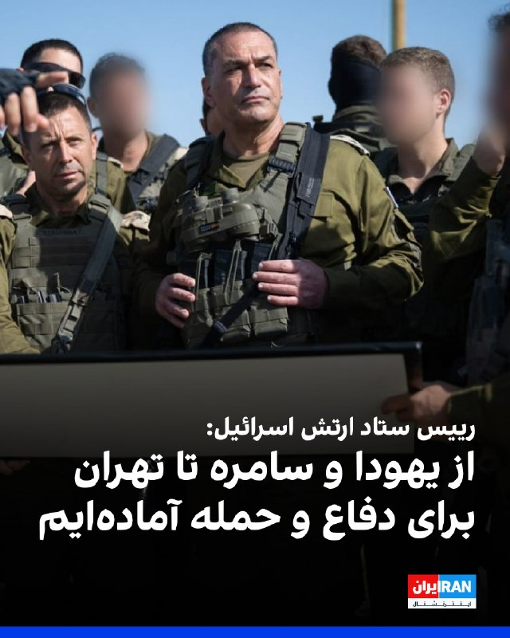

ایال زمیر، رییس ستاد کل ارتش اسرائیل، گفت: «ما در همه جبهه‌ها واقعیت امنیتی جدیدی ایجاد کرده‌ایم، با این حال نبرد به پایان نرسیده است. ارتش اسرائیل برای ازسرگیری جنگ در صورت نیاز آماده است و در دفاع و حمله، از یهودا و سامره تا تهران، در آمادگی و هوشیاری دائم قرار دارد.»
‌🏁 🇬🇧 IranintlTV

🤖 @VahidOOnLine

## VahidOOnLine — post 239906

  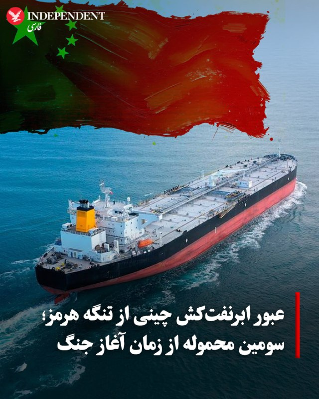

♦️ بر اساس داده‌های ردیابی کشتی‌ها، یک ابرنفت‌کش چینی حامل دو میلیون بشکه نفت خام عراق، روز چهارشنبه ۲۳ اردیبهشت از تنگه هرمز عبور کرده است. نفت‌کش «یوان هوآ هو» (Yuan Hua Hu) اکنون در دریای عمان و در نزدیکی منطقه‌ای که نیروی دریایی آمریکا برای مسدود کردن مسیر شناورهای ایرانی مستقر شده، لنگر انداخته است.

این سومین گذر ثبت‌شده یک نفت‌کش چینی از این آبراه حیاتی از زمان آغاز جنگ ایالات متحده و اسرائیل علیه جمهوری اسلامی محسوب می‌شود.

به گزارش خبرگزاری رویترز به نقل از «منابع آگاه»، ایران در روزهای اخیر کنترل خود بر تنگه هرمز را تشدید کرده و به توافقاتی با عراق و پاکستان برای حمل نفت و گاز طبیعی مایع (LNG) از منطقه دست یافته است. این گزارش می‌افزاید که سایر کشورها نیز در حال بررسی قراردادهای مشابهی با ایران هستند.
‌🇸🇦 Indypersian

🤖 @VahidOOnLine

## VahidOOnLine — post 239905

  

♦️وال‌استریت ژورنال روز دوشنبه ۲۳ اردیبهشت ماه با انتشار گزارشی، از احیای راه‌های زمینی قدیمی در عربستان سعودی، عمان و امارات متحده عربی در پی بسته شدن تنگه هرمز پس از حملات آمریکا و اسرائیل به ایران خبر داد. این روزنامه آمریکایی این راه را « شاهراه لجستیک اضطراری برای اقتصاد جهان»  به‌ویژه در زمینه صادرات مواد اولیه ساخت کود شیمیایی توصیف کرد.

براساس این گزارش، پس از حمله ایالات متحده و اسرائیل به ایران، باب ویلت، مدیرعامل شرکت معدنی دولتی «معادن» عربستان سعودی، مدیرانی را به بنادر دریای سرخ اعزام کرد و ظرف دو هفته، شرکت‌های راه‌آهن و کامیون را برای انتقال کود در سراسر پادشاهی به صف کرد.
وال استریت ژورنال نوشته است تعداد زیادی کامیون، که عمدتا شبانه‌روزی کار می‌کنند و هر کدام دو راننده دارند، اجرای این عملیات را برعهده دارند.
‌🇸🇦 Indypersian

🤖 @VahidOOnLine

## VahidOOnLine — post 239904

  

بلومبرگ گزارش داد ناتو در حال برنامه‌ریزی برای دعوت از نمایندگان چهار کشور حوزه خلیج فارس به نشست خود در آنکارا است؛ نشستی که انتظار می‌رود جنگ علیه جمهوری اسلامی و شکاف فزاینده در روابط فراآتلانتیک بر آن سایه بیفکند.

به گفته افرادی آگاه از روند برنامه‌ریزی، این کشورها شامل بحرین، کویت، قطر و امارات متحده عربی هستند که همگی عضو «ابتکار همکاری استانبول»، چارچوب همکاری میان ناتو و کشورهای غیرعضو در خاورمیانه، به‌شمار می‌روند.

این منابع که به دلیل محرمانه بودن گفت‌وگوها نخواستند نامشان فاش شود، گفتند قرار است وزیران خارجه این کشورها برای نشست ۱۷ و ۱۸ تیرماه در آنکارا دعوت شوند.
‌🏁 🇬🇧 IranintlTV

🤖 @VahidOOnLine

## VahidOOnLine — post 239903

  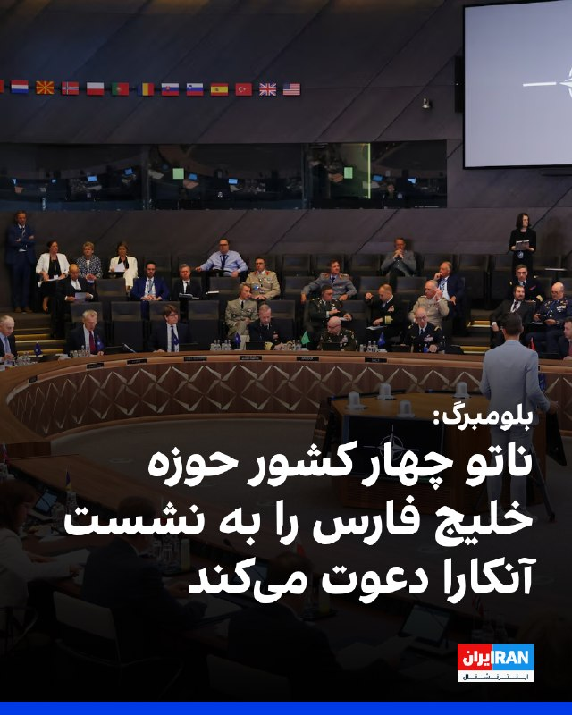

بلومبرگ گزارش داد ناتو در حال برنامه‌ریزی برای دعوت از نمایندگان چهار کشور حوزه خلیج فارس به نشست خود در آنکارا است؛ نشستی که انتظار می‌رود جنگ علیه جمهوری اسلامی و شکاف فزاینده در روابط فراآتلانتیک بر آن سایه بیفکند.

به گفته افرادی آگاه از روند برنامه‌ریزی، این کشورها شامل بحرین، کویت، قطر و امارات متحده عربی هستند که همگی عضو «ابتکار همکاری استانبول»، چارچوب همکاری میان ناتو و کشورهای غیرعضو در خاورمیانه، به‌شمار می‌روند.

این منابع که به دلیل محرمانه بودن گفت‌وگوها نخواستند نامشان فاش شود، گفتند قرار است وزیران خارجه این کشورها برای نشست ۱۷ و ۱۸ تیرماه در آنکارا دعوت شوند.
‌🏁 🇬🇧 IranintlTV

🤖 @VahidOOnLine

## VahidOOnLine — post 239902

  <a href="telegram/content/VahidOOnLine_239902_1778680580.mp4" target="_blank">🎬 Download video</a>

یک نفتکش وابسته به شرکت دولتی نفت ابوظبی پس از حمله پهپادی جمهوری‌اسلامی در هفته گذشته، دچار نشت محدود سوخت در سواحل عمان شده است.
رویترز گزارش داده مقدار کمی از سوخت کشتی که به نظر می‌رسد سوخت بانکر بوده، در پی این حادثه نشت کرده است.
انور قرقاش، مشاور رئیس امارات، پیش‌تر حمله چهارم مه به این نفتکش را «دزدی دریایی» توصیف کرده بود. گزارش شده در زمان حمله کسی آسیب ندیده و کشتی حامل بار نبوده است.
این نفتکش با نام «MV Barakah» همچنان در سواحل عمان لنگر انداخته و شرکت می‌گوید در حال همکاری نزدیک با مقام‌های مربوطه و تیم‌های تخصصی واکنش به بحران است.
‌🏁 🇬🇧 ManotoTV

🤖 @VahidOOnLine

## VahidOOnLine — post 239901

  <a href="telegram/content/VahidOOnLine_239901_1778680580.mp4" target="_blank">🎬 Download video</a>

هواپیمای ریاست‌جمهوری آمریکا دقایقی پیش در پایتخت چین به زمین نشست و دونالد ترامپ سفر خود برای دیدار با شی جین‌پینگ، رئیس‌جمهور چین، را آغاز کرد. این نخستین سفر رسمی یک رئیس‌جمهور مستقر آمریکا به چین از زمان سفر ترامپ در سال ۲۰۱۷ است.
‌🏁 🇬🇧 ManotoTV

🤖 @VahidOOnLine

## VahidOOnLine — post 239900

  <a href="telegram/content/VahidOOnLine_239900_1778680582.mp4" target="_blank">🎬 Download video</a>

تماسی از ایران؛
تجربه‌ی یک آموزگار از آموزش مجازی
‌🏁 🇬🇧 ManotoTV

🤖 @VahidOOnLine

## VahidOOnLine — post 239899

  <a href="telegram/content/VahidOOnLine_239899_1778680583.mp4" target="_blank">🎬 Download video</a>

هواپیمای ریاست‌جمهوری آمریکا دقایقی پیش در پایتخت چین به زمین نشست و دونالد ترامپ سفر خود برای دیدار با شی جین‌پینگ، رئیس‌جمهور چین، را آغاز کرد.
‌🏁 🇬🇧 ManotoTV

🤖 @VahidOOnLine

## VahidOOnLine — post 239898

🗣روایت شما از بحران اقتصادی و زندگی در آتش‌بس- چهارشنبه ۲۳ اردیبهشت:

🔹ما در سیستان و بلوچستان محروم و گرسنه بودیم، این روزها محروم‌تر و گرسنه‌تر هم شدیم. گالن ۷۰ لیتری بنزین شده ۵ میلیون. برای رسیدن به بیمارستان باید ۴۰ تا ۶۰ لیتر بنزین مصرف کنیم، چون اکثر مردم اینجا روستانشین هستن و فاصله تا مرکز استان ۶۰۰ تا ۷۰۰ کیلومتره!

🔹هر هفته محصولات مورد نیاز و خوراکی بالای ۲ برابر می‌شه و تو این دو ماه گذشته ۳ تا ۵ برابر شده، چه‌جوری تورم رو ۶۰ یا ۱۰۰ درصد اعلام می‌کنند؟

🔹گرانی داره بیداد می‌کنه. من یه جوون ۲۴ ساله‌م اما هر شب از شدت غم فکر می‌کنم الانه که سکته کنم. هیچ کس به داد ما نمی‌رسه. پدرم بازنشسته است و همه ما بیکار شدیم. دو ماه دیگه باید خونه رو تمدید کنیم ولی هیچ وامی بهمون نمی‌دن. داریم نابود می‌شیم.

🔹دو روز پیش از موتور ماشینم تو جاده روغن زد بالا. تو جاده زاهدان بودم، زنگ زدم کفی خودروبر، گفت تا شیراز ۱۰۰ میلیون می‌گیرم. بردم نمایندگی زاهدان، گفتن اول باید ۱۵۰ میلیون واریز کنی تا بعد رسیدگی کنم.

🔹از تهران پیام می‌دم. گرانی بیداد می‌کنه، کاسبی مشاغل آزاد از بین رفته، پولی درنمیاد، داریم تمام پس‌اندازمون رو خرج خورد و خوراک می‌کنیم با مراعات بسیار. طلبکارها فشار میارن، بدهکارها ندارن بدهی‌شون رو بدن.

🔹ما دانش‌آموزها، مخصوصا پایه نهم و دوازدهم، در این شرایط اینترنتی و مشکلات کشور واقعا از نظر روحی خسته شدیم. وقتی می‌بینیم خانواده‌هامون برای بقا دست‌وپا می‌زنن، کلاس‌ها هم مدام قطع می‌شن، تمرکز و آمادگی برای امتحان واقعا سخت می‌شه.

🔹اکثر مردم دچار بی انگیزگی شدن، از جمله خود من. از بس امیدمون ناامید شده، از بس می‌دویم و نمی‌رسیم. هیچ وقت فکر نمی‌کردم تبدیل به کره شمالی بشیم و هیچ کشور دیگه‌ای براش مهم نباشه که چه بلایی داره سر مردم ایران میاد.
‌🏁 🇬🇧 IranintlTV

🤖 @VahidOOnLine

## VahidOOnLine — post 239897

  <a href="telegram/content/VahidOOnLine_239897_1778680584.mp4" target="_blank">🎬 Download video</a>

⭕️ استقبال مقام‌های دولتی چین از ترامپ در فرودگاه پکن

♦️گروهی از مقام‌های عالی‌رتبه دولت چین شامگاه چهارشنبه ۲۳ اردیبهشت از دونالد ترامپ و هیئت همراهش در فرودگاه پکن استقبال کردند.
ترامپ در سال ۲۰۱۷ و در دور نخست ریاست جمهوری به چین سفر کرده بود. روابط دو کشور در دوران جو بایدن به‌‌شدت سرد شد.
‌🇸🇦 Indypersian

🤖 @VahidOOnLine

## VahidOOnLine — post 239896

  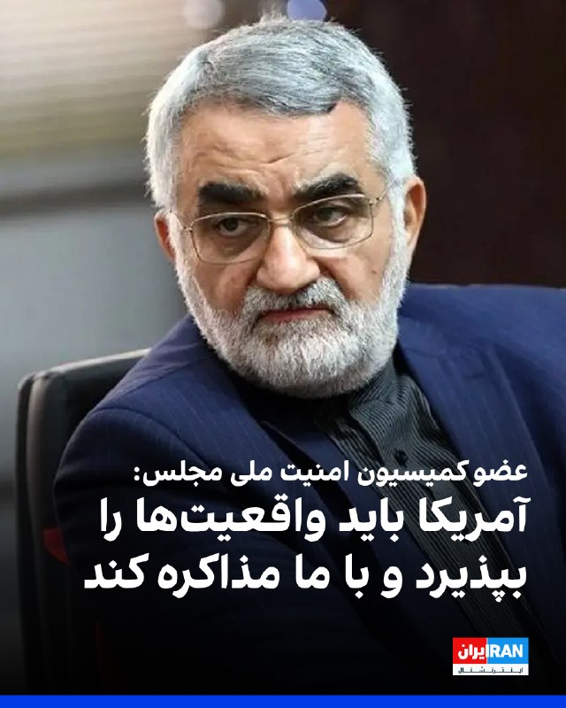

علاءالدین بروجردی، عضو کمیسیون امنیت ملی و سیاست خارجی مجلس، گفت: «تنها سناریو پیش‌رو این است که آمریکا واقعیت‌ها را بپذیرد و با پذیرش این واقعیات، با ایران وارد مذاکره شود تا از شرایط جنگی خارج شود.»

او اضافه کرد: «به هیچ‌ وجه دستاورد تنگه هرمز را از دست نخواهیم داد و به هیچ‌ وجه وارد بحث مذاکره درباره غنی‌سازی هسته‌ای نخواهیم شد.»
‌🏁 🇬🇧 IranintlTV

🤖 @VahidOOnLine

## VahidOOnLine — post 239895

  

دونالد ترامپ، رییس‌جمهوری آمریکا، چهارشنبه در مراسم استقبال رسمی با تشریفات گسترده وارد پکن شد. بر اساس اعلام کاخ سفید، هان ژنگ، معاون رییس‌جمهوری چین، به همراه شماری از مقام‌ها از جمله دیوید پردیو، سفیر آمریکا در چین، شی فنگ، سفیر چین در آمریکا، و ما ژائوشو، معاون اجرایی وزیر خارجه چین، در فرودگاه از ترامپ استقبال کردند.

همچنین ۳۰۰ نوجوان چینی با لباس‌های هماهنگ آبی و سفید در باند فرودگاه و با در دست داشتن پرچم‌های چین و آمریکا رژه رفتند. یگان تشریفات نظامی و یک گروه موسیقی نظامی نیز در این مراسم حضور داشتند.

قرار است شی جین‌پینگ صبح پنجشنبه به وقت محلی به‌طور رسمی از دونالد ترامپ استقبال کند.
‌🏁 🇬🇧 IranintlTV

🤖 @VahidOOnLine

## VahidOOnLine — post 239894

  

مهراوه خندان، فرزند نسرین ستوده، خبر داد که این وکیل دادگستری و فعال حقوق بشر، با قرار وثیقه به‌طور موقت آزاد شده است.

نسرین ستوده ۱۲ اردیبهشت در منزل خود بازداشت شده بود. در جریان این بازداشت، لوازم الکترونیکی از جمله لپ‌تاپ و تلفن‌های همراه او و همسرش رضا خندان ضبط شد.
‌🏁 🇬🇧 IranintlTV

🤖 @VahidOOnLine

## VahidOOnLine — post 239893

  <a href="telegram/content/VahidOOnLine_239893_1778680588.mp4" target="_blank">🎬 Download video</a>

♦️دونالد ترامپ، رئیس جمهوری ایالات متحده آمریکا شامگاه چهارشنبه ۲۳ اردیبهشت به وقت شرق آسیا (صبح به وقت آمریکا) وارد پکن پایتخت چین شد.

قرار است دونالد ترامپ در این دیدار «تاریخی» با شی جین‌پینگ، رئیس جمهوری چین دیدار و درباره مسائل راهبردی جهانی، تجارت و البته وضعیت تنگه هرمز، گفتگو کند.
‌🇸🇦 Indypersian

🤖 @VahidOOnLine

## VahidOOnLine — post 239892

  

پایگاه خبری وای‌نت گزارش داد دیوید زینی، رییس سازمان اطلاعات و امنیت داخلی اسرائیل (شین‌بت)، اخیرا به امارات متحده عربی سفر کرده است.

ساعاتی پیش، روزنامه وال‌استریت ژورنال از دو سفر محرمانه دیوید بارنئا، رییس موساد، به امارات در جریان جنگ ایران خبر داده بود.
‌🏁 🇬🇧 IranintlTV

🤖 @VahidOOnLine

## WithYashar — post 11153

یک مقام ارشد کُرد در گفتگو با کانال۱۳ اسرائیل:
در واقع خود پرزیدنت ترامپ مانع از طرح اقدام ما علیه حکومت ایران شد و اتهامات او در مورد ضبط سلاح های معترضین در ایران توسط کُردها، ناعادلانه و غیرمنطقی است
@withyashar

## WithYashar — post 11152

اتاق جنگ با شما : گزارش از جنگنده های ناشناس پرواز در ارتفاع پایین در‌ ارومیه و انفجار در شیراز
@withyashar

## WithYashar — post 11151

ایال زامیر ، رئیس ستاد ارتش اسرائیل:
نبرد تمام نشده است، ارتش اسرائیل آماده از سرگیری نبرد در صورت نیاز از کرانه باختری تا تهران است
@withyashar

## WithYashar — post 11150

  

برنامه های ترامپ با حاکم چین به این ترتیبه : مراسم استقبال تو تالار بزرگ خلق
چهارشنبه رسیدن به پکن ، استقرار و استراحت
پنج شنبه ۱۴ مه
- ملاقات با شی - ضیافت دولتی با شی

جمعه تاریخ ۱۵ مه
- جلسه عکس با شی- چای با شی
- ناهار با شی و حرکت از پکن به آمریکا،
@withyashar

## WithYashar — post 11149

  <a href="telegram/content/WithYashar_11149_1778680591.mp4" target="_blank">🎬 Download video</a>

لحظه ورود ترامپ به چین-پکن همراه ایلان ماسک و همراهان
@withyashar

## WithYashar — post 11148

بلومبرگ: صادرات نفت ایران از جزیره خارک برای اولین بار از زمان شروع جنگ متوقف شده است و تصاویر ماهواره‌ای نشان می‌دهد که مخازن ذخیره‌سازی نفت تقریباً به ظرفیت کامل خود رسیده‌اند.
@withyashar

## WithYashar — post 11147

  

ترامپ به پکن رسید
@withyashar

## WithYashar — post 11146

  

امانوئل مکرون ظاهراً برای چندین ماه با بازیگر ایرانی گلشیفته فراهانی رابطه‌ای داشته که شامل «پیام‌هایی بوده که گفته می‌شود تا حد زیادی پیش رفته بودند». این موضوع ظاهراً باعث تنش در زندگی مشترک زوج ریاست‌جمهوری فرانسه شده …گفته می‌شود سیلی‌ای که سال گذشته بریژیت به امانوئل مکرون زد، به پیامی مربوط بوده که در تلفن رئیس‌جمهور پیدا شده بود. بانوی اول فرانسه ظاهراً گفت‌وگویی با یک بازیگر ایرانی دیده که در آن، امانوئل مکرون نوشته بوده: «تو خیلی زیبا هستی.
@withyashar

## WithYashar — post 11145

این پیری رئیس باند medea benjamin از باند نایاک و از مهره های ماله کش ظریف هستش شخصی هم که به سخنان شاهزاده حمله کرده اسمش «بیتا» هست … اطلاعات تکمیلی به زودی … @withyashar

## WithYashar — post 11144

  

این پیری رئیس باند medea benjamin از باند نایاک و از مهره های ماله کش ظریف هستش شخصی هم که به سخنان شاهزاده حمله کرده اسمش «بیتا» هست … اطلاعات تکمیلی به زودی …
@withyashar

## mwarmonitor — post 9038

🇮🇱رئیس ستاد کل ارتش اسرائیل در شمال سامره: «ما واقعیت امنیتی جدیدی در تمام جبهه‌ها ایجاد کرده‌ایم؛ با این حال، نبرد به پایان نرسیده است. ارتش اسرائیل برای ازسرگیری جنگ در صورت نیاز آماده است و در حالت آمادگی و هوشیاری دائمی در دفاع و حمله قرار دارد، از یهودیه و سامره تا تهران»

‏🔸رئیس ستاد کل ارتش اسرائیل، سپهبد ایال زامیر: ‏«ارتش اسرائیل در همه جبهه‌ها با ابتکار و رویکرد تهاجمی عمل می‌کند. ما واقعیت امنیتی جدیدی ایجاد کرده‌ایم — در لبنان به عملیات ادامه می‌دهیم، در لیتانی و مناطق دیگر فعالیت می‌کنیم و هر روز ده‌ها تروریست و زیرساخت را خنثی می‌کنیم.
‏🔸همچنین در غزه به‌صورت تهاجمی عمل کرده و تروریست‌ها را به هلاکت می‌رسانیم و در اینجا در یهودیه و سامره نیز بدون وقفه فعالیت می‌کنیم و به دستاوردها دست می‌یابیم. هیچ‌گونه خویشتنداری وجود ندارد — فقط ابتکار عمل.

‏🔸نبرد هنوز به پایان نرسیده است. ارتش اسرائیل برای ازسرگیری درگیری در صورت نیاز آماده است و در آمادگی و هوشیاری دائمی، در دفاع و حمله، از یهودیه و سامره تا تهران قرار دارد.»

@mwarmonitor

## mwarmonitor — post 9037

  <a href="telegram/content/mwarmonitor_9037_1778680595.mp4" target="_blank">🎬 Download video</a>

🇫🇷مسافران پس از شیوع گاستروانتریت (التهاب معده و روده) روی یک کشتی کروز در فرانسه در قرنطینه نگه داشته شده‌اند. @mwarmonitor

## mwarmonitor — post 9036

🔴 طبق گزارش i24NEWS، بنیامین نتانیاهو نخست‌وزیر اسرائیل قرار است با مقامات ارشد دفاعی درباره تهدید پهپادهای انفجاری حزب‌الله نشست‌های مشورتی امنیتی برگزار کند.

@mwarmonitor

## mwarmonitor — post 9035

  

✈️یک جنگنده رادارگریز F-35A نیروی هوایی ایالات متحده بر فراز آب‌های منطقه‌ای نزدیک تنگه هرمز گشت‌زنی می‌کند.

✈️هواپیما F-35A می‌تواند تا ۱۸٬۰۰۰ پوند مهمات حمل کند و در عین حال با سرعت مافوق صوت پرواز کند.

@mwarmonitor

## mwarmonitor — post 9034

🇫🇷مسافران پس از شیوع گاستروانتریت (التهاب معده و روده) روی یک کشتی کروز در فرانسه در قرنطینه نگه داشته شده‌اند.

@mwarmonitor

## mwarmonitor — post 9033

  <a href="telegram/content/mwarmonitor_9033_1778680597.mp4" target="_blank">🎬 Download video</a>

🇺🇸کاروان خودرویی رئیس‌جمهور ترامپ فرودگاه بین‌المللی پکن را به مقصد هتل ترک می‌کند.

فردا، ترامپ در مراسم رسمی استقبال دولتی شرکت خواهد کرد، با رئیس‌جمهور شی جین‌پینگ دیدار می‌کند، چندین مصاحبه انجام خواهد داد و در چند رویداد رسمی دیگر نیز حضور خواهد داشت.

@mwarmonitor

## mwarmonitor — post 9032

  <a href="telegram/content/mwarmonitor_9032_1778680599.mp4" target="_blank">🎬 Download video</a>

🇺🇸ترامپ در حال حرکت روی فرش قرمز در پکن است — و برای لحظه‌ای حرکت معروف مشت گره‌کرده‌اش را به گارد افتخار نظامی و جوانان پرچم‌به‌دست چینی که صف کشیده‌اند نشان می‌دهد.

@mwarmonitor

## mwarmonitor — post 9031

  <a href="telegram/content/mwarmonitor_9031_1778680600.mp4" target="_blank">🎬 Download video</a>

🇦🇪🇨🇦وزیر دولت در امور دفاعی امارات، وزیر دفاع ملی کانادا را به حضور پذیرفت.

🔸معاون عالی‌رتبه محمد بن مبارک بن فاضل المزروعی، وزیر دولت در امور دفاعی امارات، از دیوید جِی مک‌گینتی، وزیر دفاع ملی کانادا استقبال کرد. این دیدار در راستای تقویت روابط و همکاری‌های دفاعی و نظامی میان امارات متحده عربی و کانادا انجام شد.

🔹در این نشست، دو طرف درباره شماری از موضوعات مورد علاقه مشترک و همچنین راه‌های توسعه همکاری‌های دوجانبه در حوزه‌های دفاعی و نظامی گفت‌وگو کردند؛ همکاری‌هایی که هدف آن حمایت از منافع مشترک دو کشور دوست است. همچنین طرفین دیدگاه‌های خود را درباره تحولات منطقه‌ای و بین‌المللی مرتبط تبادل کردند.

@mwarmonitor

## mwarmonitor — post 9030

🇫🇷 بنا بر این گزارش روزنامه لو فیگارو فرانسه، Emmanuel Macron طی چند ماه گذشته یک «رابطه افلاطونی» با بازیگر ایرانی گلشیفته فراهانی داشته است؛ 🔸 رابطه‌ای که گفته می‌شود «پیام‌هایی داشته که تا حد زیادی پیش رفته‌اند». این موضوع ظاهرا باعث تنش در زندگی زوج ریاست‌جمهوری…

## mwarmonitor — post 9029

🇫🇷 بنا بر این گزارش روزنامه لو فیگارو فرانسه، Emmanuel Macron طی چند ماه گذشته یک «رابطه افلاطونی» با بازیگر ایرانی گلشیفته فراهانی داشته است؛

🔸 رابطه‌ای که گفته می‌شود «پیام‌هایی داشته که تا حد زیادی پیش رفته‌اند». این موضوع ظاهرا باعث تنش در زندگی زوج ریاست‌جمهوری شده و گفته می‌شود به سیلی‌زدن معروف در هواپیما منجر شده است.

@mwarmonitor

## mwarmonitor — post 9028

🔴 سوریه به‌طور رسمی خواستار استرداد بشار اسد از روسیه شده است تا او برای پاسخ‌گویی به اتهامات جنایات جنگی محاکمه شود.

@mwarmonitor

## FoxNewsTwitter — post 341635

  <a href="telegram/content/FoxNewsTwitter_341635_1778680602.mp4" target="_blank">🎬 Download video</a>

Fox News (Twitter/X)

HAPPENING NOW: President Trump’s motorcade departs the airport in Beijing following a formal state welcome ahead of his high-stakes summit with Chinese President Xi Jinping.

## FoxNewsTwitter — post 341634

  <a href="telegram/content/FoxNewsTwitter_341634_1778680604.mp4" target="_blank">🎬 Download video</a>

Fox News (Twitter/X)

BREAKING: President Trump is greeted by a formal state welcome and massive fanfare in Beijing ahead of his meeting with Chinese President Xi Jinping.

## FoxNewsTwitter — post 341633

  <a href="telegram/content/FoxNewsTwitter_341633_1778680606.mp4" target="_blank">🎬 Download video</a>

Fox News (Twitter/X)

JUST IN: President Trump departs Air Force One after landing in Beijing for his long-awaited talks with Chinese President Xi Jinping.

It marks his first visit in nearly nine years, with both sides putting diplomacy on full display before negotiations begin.

## FoxNewsTwitter — post 341632

  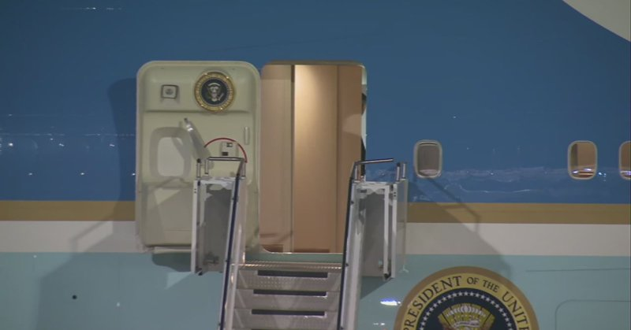

Fox News (Twitter/X)

WATCH LIVE: President Trump lands in China ahead of high-stakes talks with Xi
https://twitter.com/i/broadcasts/1PKqrEVVyyeGb

## FoxNewsTwitter — post 341631

  <a href="telegram/content/FoxNewsTwitter_341631_1778680608.mp4" target="_blank">🎬 Download video</a>

Fox News (Twitter/X)

Court battles between Blake Lively and Justin Baldoni reportedly strained the Gossip Girl star’s friendship with Taylor Swift after the singer was named several times in legal documents.

Now that the case is nearly over – will Blake Lively and Taylor Swift be seen together in public this year?

Our sponsor Kalshi’s prediction market shows:
— Yes: 27%
— No: 73%

@foxandfriends

## pm_afshaa — post 90693

🔴رئیس ستاد ارتش اسرائیل:
جنگ با ایران پایان نیافته و برای از سرگیری جنگ در هوشیاری کامل قرار داریم. از یهودا و سامره تا تهران برای دفاع و حمله آماده‌ایم.

💧 Rainbet.com the #1 Non-KYC Crypto Casino & Sportsbook @rainbetcom

😁 @Pm_Afshaa

## pm_afshaa — post 90692

  <a href="telegram/content/pm_afshaa_90692_1778680610.webm" target="_blank">🎬 Download video</a>

🔴مجله مادام فیگارو به نقل از فلوریان تاردیف، روزنامه‌نگار فرانسوی: سیلی بریژیت مکرون به همسرش در هواپیما پس از آن رخ داده که اون پیام‌های صمیمانه امانوئل مکرون با گلشیفته فراهانی رو دیده بود.

به گفته تاردیف، مکرون برای چند ماه رابطه‌ای افلاطونی با این گلشیفته فراهانی داشته و در پیام‌هاش جملاتی مثل «به نظرم بسیار زیبا هستید» نوشته بود.

💧 Rainbet.com the #1 Non-KYC Crypto Casino & Sportsbook @rainbetcom

😁 @Pm_Afshaa

## pm_afshaa — post 90691

  <a href="telegram/content/pm_afshaa_90691_1778680611.webm" target="_blank">🎬 Download video</a>

🔴امارات در حال ساخت قفس‌های ضدپهپادی اطراف مراکز مهم و نفتی خودشه و داره برای جنگ آماده میشه.

💧 Rainbet.com the #1 Non-KYC Crypto Casino & Sportsbook @rainbetcom

😁 @Pm_Afshaa

## pm_afshaa — post 90689

  <a href="telegram/content/pm_afshaa_90689_1778680611.webm" target="_blank">🎬 Download video</a>

🔴برنامه‌های ترامپ در چین :

چهارشنبه 13 مه:
مراسم استقبال تو تالار بزرگ خلق
پنجشنبه 14 مه:
ملاقات با شی - ضیافت دولتی با شی
جمعه 15 مه:
جلسه عکس با شی - چای با شی
ناهار با شی و حرکت از پکن به آمریکا

💧Rainbet.com the #1 Non-KYC Crypto Casino & Sportsbook @rainbetcom

😁 @Pm_Afshaa

## pm_afshaa — post 90688

  <a href="telegram/content/pm_afshaa_90688_1778680612.mp4" target="_blank">🎬 Download video</a>

ویدویی دیگر از مراسم استقبال از ترامپ در فرودگاه پکن :

💧 Rainbet.com the #1 Non-KYC Crypto Casino & Sportsbook @rainbetcom

😁 @Pm_Afshaa

## pm_afshaa — post 90687

🔴مراد ویسی میخواد یه لیست از کسایی که تو دی ماه ملت رو کشتن تهیه کنه و هرشب اسم هاشونو تو شبکه اینترنشنال بخونه

💧 Rainbet.com the #1 Non-KYC Crypto Casino & Sportsbook @rainbetcom

😁 @Pm_Afshaa

## pm_afshaa — post 90686

🔴رسانه های عبری: ترامپ قصد دارد تایوان را در ازای ایران، با چین معامله کند

💧 Rainbet.com the #1 Non-KYC Crypto Casino & Sportsbook @rainbetcom

😁 @Pm_Afshaa

## pm_afshaa — post 90684

  <a href="telegram/content/pm_afshaa_90684_1778680614.mp4" target="_blank">🎬 Download video</a>

🔴لحظه ورود دونالد ترامپ به چین-پکن همراه ایلان ماسک و دیگر همراهان :

💧 Rainbet.com the #1 Non-KYC Crypto Casino & Sportsbook @rainbetcom

😁 @Pm_Afshaa

## pm_afshaa — post 90683

  <a href="telegram/content/pm_afshaa_90683_1778680615.mp4" target="_blank">🎬 Download video</a>

ورود هواپیمای ترامپ در پکن و گروه استقبال کننده چین

💧 Rainbet.com the #1 Non-KYC Crypto Casino & Sportsbook @rainbetcom

😁 @Pm_Afshaa

## DEJradio — post 4618

  <a href="telegram/content/DEJradio_4618_1778680617.webm" target="_blank">🎬 Download video</a>

🔺📷 تصویر ماهواره‌ای از هواپیمای هرکولس نهاجا در پایگاه هوایی «نورخان» پاکستان

جمهوری اسلامی ایران، طی جنگ ۴۰ روزه بخشی از هواپیماهای نیروی هوایی ارتش را به پاکستان منتقل کرد تا آسیب نبیند.
تصاویر ماهواره‌ای مورخ ۲۵ آوریل ۲۰۲۶ نشان می‌دهد، یک هواپیمای ترابری نظامی ایران از نوع C-130 «هرکولس» داخل پایگاه هوایی «نور خان» پاکستان پارک شده است.

پیش‌تر سی‌بی‌اس به نقل از مقامات آمریکایی گزارش داده بود، مخفیانه به هواپیماهای نظامی ایران اجازه داده است که در پایگاه‌های هوایی‌اش مستقر شوند.

به گفته دو مقام آمریکایی، ایران همچنین برخی از هواپیماهای غیرنظامی خود را به افغانستان منتقل کرده است. مشخص نیست که آیا ایران هواپیمای نظامی هم به افغانستان فرستاده است یا نه.
یک روز بعد وزارت خارجه پاکستان این ادعا را رد کرد و گفت، این هواپیماها «موقت» به پاکستان منتقل شده و مربوط به اسکورت تیم مذاکره کننده جمهوری اسلامی بودند!

#جمهوری_اسلامی #پاکستان
@DEJradio

## DEJradio — post 4616

  <a href="telegram/content/DEJradio_4616_1778680618.webm" target="_blank">🎬 Download video</a>

🚨📷 یک کارشناس نظامی:
سـ.ـپاه پاسداران نگران پیاده‌شدن نیروهای آمریکا و اسرائیل اطراف تهران‌ است

هم‌زمان با برگزاری رزمایش ســ.ـپاه پاسداران در بیابان‌های اطراف تهران، یک کارشناس نظامی به دژ می‌گوید سـ.ـپاه پاسداران نگران پیاده‌شدن نیروهای آمریکا و اسرائیل اطراف تهران است و در رزمایش‌ اخیر خود در اطراف پایتخت، مقابله با هلی‌برن احتمالی نیرو را تمرین می‌کند.

بر اساس گزارش‌های به‌دست آمده، چند یگان سـ.ـپاه متشکل از کادر و بسـ.ـیج در نقاطی که احتمال فرود هواپیما یا هلی‌کوپتر [شبیه هلی‌برن نیرو در دشت مهیار اصفهان در فروردین‌ماه] وجود دارد مستقر شده‌اند.
هم‌زمان نیروهای سـ.ـپاه خود را آماده مانع‌گذاری روی تمام باندهای فرودگاه‌های تهران و اطراف از جمله [فرودگاه خمینی و مهرآباد، پیام کرج، کوشک نصرت، باند متروکه قلعه‌مرغی می‌کنند.]

#جمهوری_اسلامی #IRGCterrorists
@DEJradio

## DEJradio — post 4615

  

👑📌 ایران فقط یک نام نیست…
صدای مادری‌ست که هر شب با ترسِ تلفن زنگ‌خورده می‌خوابد.
چشم‌های خواهری‌ست که عکس برادرش را در آغوش گرفته.
و قلبِ مردمی‌ست که سال‌هاست میان درد و امید ایستاده‌اند.

امروز، جوانانِ این سرزمین را به جرمِ آرزو داشتن اعدام می‌کنند…
به جرمِ آزادی‌خواهی،
به جرمِ زندگی.

ما دور از وطن ایستاده‌ایم،
اما قلب‌مان هنوز در کوچه‌های ایران می‌تپد.
سکوت ما یعنی فراموش شدنِ جان‌هایی که هنوز می‌شود نجات‌شان داد.

بیایید کنار هم باشیم؛
برای انسانیت،
برای آزادی،
برای ایرانی که سزاوارِ زندگی‌ست، نه مرگ.

📍 راهپیمایی اعتراضی
🗓 ۱۷.۰۵.۲۰۲۶
⏰ ساعت ۱۵:۰۰
📌 Trier – Konstantin Basilika

«صدای مردم ایران باشیم… قبل از آنکه دیر شود.»

#نه_به_اعدام
@DEJradio

## mamlekate — post 103522

📝 سفر ترامپ به چین؛ از مذاکره درباره ایران و تنگه هرمز تا جنگ تجاری و هوش مصنوعی

دونالد ترامپ، رئیس‌جمهوری آمریکا، در سفری مهم و حساس، روز چهارشنبه وارد پکن شد تا با شی جین‌پینگ، رئیس‌جمهوری چین، دیدار کند؛ دیداری که انتظار می‌رود موضوع‌هایی از جمله جنگ ایران و اختلافات تجاری در آن، محور گفتگوها باشند.

@mamlekate

## IranIntlTV — post 336994

  

ستاد فرماندهی مرکزی آمریکا، سنتکام، با انتشار تصویری از گشت‌زنی یک جنگنده پنهان‌کار اف-۳۵-ای نیروی هوایی ایالات متحده بر فراز آب‌های منطقه‌ای نزدیک تنگه هرمز خبر داد.
سنتکام افزود این جنگنده می‌تواند تا ۱۸ هزار پوند مهمات را در حالی که با سرعت مافوق صوت پرواز می‌کند، حمل کند.
https://iranintl.com/202605130260

## IranIntlTV — post 336993

  

ایال زمیر، رییس ستاد کل ارتش اسرائیل، گفت: «ما در همه جبهه‌ها واقعیت امنیتی جدیدی ایجاد کرده‌ایم، با این حال نبرد به پایان نرسیده است. ارتش اسرائیل برای ازسرگیری جنگ در صورت نیاز آماده است و در دفاع و حمله، از یهودا و سامره تا تهران، در آمادگی و هوشیاری دائم قرار دارد.»
https://iranintl.com/202605139649

## IranIntlTV — post 336992

  <a href="telegram/content/IranIntlTV_336992_1778680620.mp4" target="_blank">🎬 Download video</a>

مسعود پزشکیان، رییس دولت جمهوری اسلامی، در واکنش به افزایش تورم، از مقام‌های دولتی خواست تمام توان خود را برای کنترل قیمت‌ها به‌کار بگیرند. او همچنین بر ضرورت مداخله نهادهایی مانند بسیج و مساجد در مدیریت شرایط تاکید کرد.
گفت‌وگو با مرتضی کاظمیان، عضو تحریریه ایران‌اینترنشنال
@iranintltv

## IranIntlTV — post 336991

  <a href="telegram/content/IranIntlTV_336991_1778680622.mp4" target="_blank">🎬 Download video</a>

همزمان با سفر ترامپ به چین، کاربران رسانه‌های اجتماعی درباره نقش ایران در مناسبات آمریکا و چین گمانه‌زنی کرده‌اند. برخی معتقدند تهران به بخشی از معامله قدرت‌های جهانی تبدیل شده و عده‌ای نیز جمهوری اسلامی را نیروی نیابتی پکن در منطقه توصیف می‌کنند.
عادله بورنگ، عضو تحریریه ایران‌اینترنشنال، از واکنش کاربران می‌گوید
@iranintltv

## IranIntlTV — post 336988

  

بلومبرگ گزارش داد ناتو در حال برنامه‌ریزی برای دعوت از نمایندگان چهار کشور حوزه خلیج فارس به نشست خود در آنکارا است؛ نشستی که انتظار می‌رود جنگ علیه جمهوری اسلامی و شکاف فزاینده در روابط فراآتلانتیک بر آن سایه بیفکند.

به گفته افرادی آگاه از روند برنامه‌ریزی، این کشورها شامل بحرین، کویت، قطر و امارات متحده عربی هستند که همگی عضو «ابتکار همکاری استانبول»، چارچوب همکاری میان ناتو و کشورهای غیرعضو در خاورمیانه، به‌شمار می‌روند.

این منابع که به دلیل محرمانه بودن گفت‌وگوها نخواستند نامشان فاش شود، گفتند قرار است وزیران خارجه این کشورها برای نشست ۱۷ و ۱۸ تیرماه در آنکارا دعوت شوند.
https://iranintl.com/202605131055

## IranIntlTV — post 336987

🗣روایت شما از بحران اقتصادی و زندگی در آتش‌بس- چهارشنبه ۲۳ اردیبهشت:

🔹ما در سیستان و بلوچستان محروم و گرسنه بودیم، این روزها محروم‌تر و گرسنه‌تر هم شدیم. گالن ۷۰ لیتری بنزین شده ۵ میلیون. برای رسیدن به بیمارستان باید ۴۰ تا ۶۰ لیتر بنزین مصرف کنیم، چون اکثر مردم اینجا روستانشین هستن و فاصله تا مرکز استان ۶۰۰ تا ۷۰۰ کیلومتره!

🔹هر هفته محصولات مورد نیاز و خوراکی بالای ۲ برابر می‌شه و تو این دو ماه گذشته ۳ تا ۵ برابر شده، چه‌جوری تورم رو ۶۰ یا ۱۰۰ درصد اعلام می‌کنند؟

🔹گرانی داره بیداد می‌کنه. من یه جوون ۲۴ ساله‌م اما هر شب از شدت غم فکر می‌کنم الانه که سکته کنم. هیچ کس به داد ما نمی‌رسه. پدرم بازنشسته است و همه ما بیکار شدیم. دو ماه دیگه باید خونه رو تمدید کنیم ولی هیچ وامی بهمون نمی‌دن. داریم نابود می‌شیم.

🔹دو روز پیش از موتور ماشینم تو جاده روغن زد بالا. تو جاده زاهدان بودم، زنگ زدم کفی خودروبر، گفت تا شیراز ۱۰۰ میلیون می‌گیرم. بردم نمایندگی زاهدان، گفتن اول باید ۱۵۰ میلیون واریز کنی تا بعد رسیدگی کنم.

🔹از تهران پیام می‌دم. گرانی بیداد می‌کنه، کاسبی مشاغل آزاد از بین رفته، پولی درنمیاد، داریم تمام پس‌اندازمون رو خرج خورد و خوراک می‌کنیم با مراعات بسیار. طلبکارها فشار میارن، بدهکارها ندارن بدهی‌شون رو بدن.

🔹ما دانش‌آموزها، مخصوصا پایه نهم و دوازدهم، در این شرایط اینترنتی و مشکلات کشور واقعا از نظر روحی خسته شدیم. وقتی می‌بینیم خانواده‌هامون برای بقا دست‌وپا می‌زنن، کلاس‌ها هم مدام قطع می‌شن، تمرکز و آمادگی برای امتحان واقعا سخت می‌شه.

🔹اکثر مردم دچار بی انگیزگی شدن، از جمله خود من. از بس امیدمون ناامید شده، از بس می‌دویم و نمی‌رسیم. هیچ وقت فکر نمی‌کردم تبدیل به کره شمالی بشیم و هیچ کشور دیگه‌ای براش مهم نباشه که چه بلایی داره سر مردم ایران میاد.

## IranIntlTV — post 336986

  

علاءالدین بروجردی، عضو کمیسیون امنیت ملی و سیاست خارجی مجلس، گفت: «تنها سناریو پیش‌رو این است که آمریکا واقعیت‌ها را بپذیرد و با پذیرش این واقعیات، با ایران وارد مذاکره شود تا از شرایط جنگی خارج شود.»

او اضافه کرد: «به هیچ‌ وجه دستاورد تنگه هرمز را از دست نخواهیم داد و به هیچ‌ وجه وارد بحث مذاکره درباره غنی‌سازی هسته‌ای نخواهیم شد.»
https://iranintl.com/202605133735

## IranIntlTV — post 336985

یک شهروند با ارسال پیامی به ایران اینترنشنال از وضعیت معیشتی بد خود و عدم توان پرداخت پول برای داروی مادر بیمارش می‌گوید.

## IranIntlTV — post 336984

  

دونالد ترامپ، رییس‌جمهوری آمریکا، چهارشنبه در مراسم استقبال رسمی با تشریفات گسترده وارد پکن شد. بر اساس اعلام کاخ سفید، هان ژنگ، معاون رییس‌جمهوری چین، به همراه شماری از مقام‌ها از جمله دیوید پردیو، سفیر آمریکا در چین، شی فنگ، سفیر چین در آمریکا، و ما ژائوشو، معاون اجرایی وزیر خارجه چین، در فرودگاه از ترامپ استقبال کردند.

همچنین ۳۰۰ نوجوان چینی با لباس‌های هماهنگ آبی و سفید در باند فرودگاه و با در دست داشتن پرچم‌های چین و آمریکا رژه رفتند. یگان تشریفات نظامی و یک گروه موسیقی نظامی نیز در این مراسم حضور داشتند.

قرار است شی جین‌پینگ صبح پنجشنبه به وقت محلی به‌طور رسمی از دونالد ترامپ استقبال کند.
https://iranintl.com/202605139112

## IranIntlTV — post 336983

  

مهراوه خندان، فرزند نسرین ستوده، خبر داد که این وکیل دادگستری و فعال حقوق بشر، با قرار وثیقه به‌طور موقت آزاد شده است.

نسرین ستوده ۱۲ اردیبهشت در منزل خود بازداشت شده بود. در جریان این بازداشت، لوازم الکترونیکی از جمله لپ‌تاپ و تلفن‌های همراه او و همسرش رضا خندان ضبط شد.
https://iranintl.com/202605130712

## IranIntlTV — post 336982

یک شهروند در سیستان و بلوچستان با ارسال پیامی به ایران اینترنشنال از بدتر شدن وضعیت اقتصادی مردم منطقه می‌گوید. پیام مخاطب با هوش مصنوعی خوانده شده است.

## IranIntlTV — post 336981

  

پایگاه خبری وای‌نت گزارش داد دیوید زینی، رییس سازمان اطلاعات و امنیت داخلی اسرائیل (شین‌بت)، اخیرا به امارات متحده عربی سفر کرده است.

ساعاتی پیش، روزنامه وال‌استریت ژورنال از دو سفر محرمانه دیوید بارنئا، رییس موساد، به امارات در جریان جنگ ایران خبر داده بود.
https://iranintl.com/202605137286

## IranIntlTV — post 336980

شهروندان پس از زلزله تهران: فکر کردیم آمریکا و اسرائیل حمله کردند

🖋سبا حیدرخانی

شماری از شهروندان در پیام‌هایی به ایران‌اینترنشنال گفتند در نخستین لحظات پس از زلزله نسبتا شدیدی که شامگاه سه‌شنبه ۲۲ اردیبهشت تهران و مناطق اطراف آن را لرزاند، تصور کردند حملات آمریکا و اسرائیل دوباره آغاز شده است. احساسی که با پایان احساس تعلیق اما همراه ترس و اضطراب بوده است.

این زمین‌لرزه‌ها ابتدا با زلزله‌ای به بزرگی ۳.۴ در ساعت ۲۰:۴۱ آغاز شد اما اوج آن در ساعت ۲۳:۴۶ با لرزه‌ای به بزرگی ۴.۶ در عمق ۱۰ کیلومتری رخ داد.
تا ساعت ۳:۳۰ بامداد چهارشنبه ۲۳ اردیبهشت، چندین پس‌لرزه دیگر هم اتفاق افتاد.

کانون اصلی زلزله پردیس بود اما در مناطق مختلف شهر و استان تهران، استان البرز و حتی بخش‌هایی از استان مازندران احساس شد.

برخی مخاطبان در واکنش به این زلزله و پس‌لرزه‌هایش گفتند تجربه هفته‌های جنگ، صدای انفجارها، پدافند و پهپادها، نوعی حساسیت دائمی ایجاد کرده است؛ به‌طوری که حتی تشخیص زلزله از حمله نظامی هم برای چند ثانیه دشوار بوده است.

یکی از ساکنان شرق تهران و تهرانپارس در پیامی نوشت: «زلزله سه‌شنبه شب جوری بود که خانه‌مان به شدت لرزید و تکان خورد؛ طوری که فکر کردیم کنار خانه‌مان موشک خورده است.»

مخاطب دیگری زلزله را «ترسناک» توصیف کرد و گفت او و خانواده‌اش برای چند ثانیه فکر کردند دوباره حملات شروع شده است.

برخی شهروندان همچنین به شباهت تجربه زلزله با روزهای جنگ اشاره کردند.

یک شهروند نوشت: «حدود ساعت ۹ شب سه‌شنبه زلزله در تهران حس شد، اما زلزله‌ای که ساعت ۱۱:۴۵ شب آمد بسیار شدید حس شد. خانه کاملا لرزید و لوسترها صدا دادند. شبیه تجربه‌ای بود که در آن ۴۰ روز جنگ داشتیم.»

شماری از مخاطبان تاکید کردند احساس آن‌ها صرفا «ترس» نبوده، بلکه ترکیبی از اضطراب، انتظار و بی‌ثباتی روانی بوده است؛ به‌ویژه در شرایطی که بخشی از جامعه همچنان در انتظار ازسرگیری حملات نظامی علیه جمهوری اسلامی است.

شهروندی نوشت: «وقتی زلزله و بعد از آن صدای طوفان آمد، فکر کردیم دوباره حمله شده است. حس هم‌زمان ترس و خوشحالی داشتیم.»

مخاطبی دیگر با اشاره به احساس ناامیدی و تعلیق گسترده‌ای که در آتش‌بس شکل گرفته، گفت: «وضعیت ما داخل ایران این‌گونه است که زلزله می‌آید و مادرم می‌گوید: کاش بمباران باشد؛ ثمره ۴۷ سال حکومت اسلامی.»

قطع اینترنت و از دست رفتن دسترسی سریع به منابع خبری
قطع طولانی‌مدت و اختلال گسترده اینترنت در ایران، دسترسی بسیاری از کاربران به پیام‌رسان‌ها، شبکه‌های اجتماعی و حتی منابع اطلاع‌رسانی فوری را مختل کرده است.

برخی مخاطبان گفتند در گذشته در چنین شرایطی مستقیما به سایت‌های لرزه‌نگاری مراجعه یا اخبار را از طریق تلگرام و شبکه‌های اجتماعی دنبال می‌کردند، اما اکنون این امکان را از دست داده‌اند و همین موضوع بر اضطراب عمومی افزوده است.

چند کاربر، رسانه‌های حکومتی را به پنهان‌کاری و تاخیر در اطلاع‌رسانی متهم کردند.

شهروندی در همین زمینه نوشت: «صداوسیما از ترس این‌که مردم به خیابان‌ها بریزند و اعتراض دیگری شکل بگیرد، خبر زلزله را تا دقایقی طولانی پوشش نداد. جان آدم‌ها آن‌قدر برایشان بی‌ارزش است که تلاش می‌کنند از هر راهی که شده، اندکی بیشتر در قدرت بمانند.»

بی‌اعتمادی به نهادهای اطلاع‌رسانی حکومتی و فقدان دسترسی به کانال‌های خبری امن و شناخته شده، باعث شد در ساعات پس از زلزله، شایعات و گمانه‌زنی‌هایی نیز شکل بگیرد.

در همین زمینه، یک مخاطب با اشاره به موقعیت کانون زلزله نوشت: «کانون زلزله تهران، نزدیک پارچین و نیروگاه اتمی بود؛ یعنی اصلا امکانش نیست که زلزله‌ای در کار نبوده و جمهوری اسلامی داشته آزمایش اتمی یا نظامی انجام می‌داده است؟»

شهروند دیگری نیز این پرسش را مطرح کرد که: «آیا زلزله نمی‌تواند ناشی از فعالیت‌های زیرزمینی موشکی باشد؟»

او به قرارگیری تهران روی گسل و همچنین فعالیت‌های زیرزمینی جمهوری اسلامی اشاره کرد.

نهادهای حکومتی به این گمانه‌زنی‌ها واکنشی نشان ندادند اما برخی متخصصان درباره این ترس و نگرانی عمومی اظهار نظر کردند.

فریبرز ناطقی‌‌الهی، عضو هیات علمی پژوهشگاه زلزله‌شناسی ایران، صبح چهارشنبه ۲۳ اردیبهشت در سخنانی گفت زلزله تهران «در اثر انفجار مواد تسلیحاتی و نظامی نبوده» است.

تهران تا ساعت‌ها پس از زلزله و پس‌لرزه‌هایش فضایی ملتهب را تجربه کرد.

یکی از ساکنان پردیس گفت از حدود ساعت هشت‌ونیم شب تا یک بامداد، مردم از ترس در خیابان‌ها بودند، داخل خانه نرفتند و پمپ‌بنزین‌ها هم شلوغ بود.
 
🔗متن کامل گزارش را اینجا بخوانید
@iranintltv

## IranIntlTV — post 336979

  <a href="telegram/content/IranIntlTV_336979_1778680626.mp4" target="_blank">🎬 Download video</a>

یک شهروند با ارسال پیامی به ایران اینترنشنال می‌گوید با وضعیت بد اینترنت و شبکه ملی داخلی انگیزه‌ها برای درس خواندن از بین رفته است. پیام این مخاطب با هوش مصنوعی خوانده شده است.

## IranIntlTV — post 336977

  

بریتانیا اعلام کرد برای مقابله با فعالیت عوامل نیابتی وابسته به دولت‌های متخاصم، قوانین جدیدی تصویب خواهد کرد.

به گزارش خبرگزاری رویترز، این تصمیم در پی افزایش تهدیدهای امنیتی و رشد حملات یهودستیزانه در این کشور مطرح شده است.

به گفته دولت بریتانیا، این قوانین اختیارات لازم را برای ممنوع‌ کردن فعالیت گروه‌های وابسته به دولت‌های خارجی فراهم می‌کند.

کی‌یر استارمر، نخست‌وزیر بریتانیا، در واکنش به حملات اخیر به جامعه یهودیان این کشور تاکید کرده دولت باید با «بازیگران مخرب» وابسته به دولت‌های خارجی برخورد کند.
https://iranintl.com/202605139938

## IranIntlTV — post 336976

  <a href="telegram/content/IranIntlTV_336976_1778680629.mp4" target="_blank">🎬 Download video</a>

تجمعات حکومتی شبانه در شهرهای مختلف ایران ادامه دارد. شهروندان نیز مشاهدات خود از حضور نیروهای نیابتی در این تجمعات و تجربه‌هایشان از آزار و اذیت‌ آن‌ها را برای ایران‌اینترنشنال ارسال کردند.

محسن مهیمنی، عضو تحریریه ایران‌اینترنشنال، گزارش می‌دهد
@iranintltv

## IranIntlTV — post 336975

  <a href="telegram/content/IranIntlTV_336975_1778680631.mp4" target="_blank">🎬 Download video</a>

شهروندان با ارسال پیام‌هایی به ایران‌اینترنشنال از تورم اقلام خوراکی و کسادی بازار زیر سایه آتش‌بس روایت می‌کنند. سبا حیدرخانی، عضو تحریریه ایران‌اینترنشنال، با بررسی این پیام‌ها می‌گوید بسیاری از کسب‌وکارها به علت کوچک شدن سبد خرید مردم، در آستانه ورشکستگی قرار گرفته‌اند.
@iranintltv

## IranIntlTV — post 336974

جوییش کرونیکل از پیشنهاد ۴۰ هزار پوندی برای قتل روزنامه‌نگار ایرانی خبر داد

یک مرد بریتانیایی-ایرانی گفته است فردی که مظنون به ارتباط با جمهوری اسلامی بوده، در ازای قتل یک روزنامه‌نگار ساکن لندن که از منتقدان تهران است، ۴۰ هزار پوند به او پیشنهاد داده است.

روزنامه «جوییش کرونیکل» چهارشنبه ۲۳ اردیبهشت در گزاشی به نقل از این مرد که با نام مستعار «نیما» معرفی شده، نوشت او پس از بازگشت به بریتانیا، موضوع را به پلیس گزارش کرده و روزنامه‌نگاری را که برای یک رسانه فارسی‌زبان کار می‌کند، در جریان قرار داده است.

نیما که حدود یک دهه است در بریتانیا زندگی می‌کند و در یک بار کار می‌کند، گفت این ماجرا در جریان سفر تفریحی‌اش به جنوب اروپا آغاز شد؛ جایی که به یک رستوران ایرانی رفت و با دو مرد آشنا شد که یکی از آن‌ها را از ایران می‌شناخت.

به گزارش جوییش کرونیکل، آن مرد ابتدا درباره راه‌اندازی یک بار در لندن صحبت کرد و با مطرح کردن موضوع به‌عنوان یک پیشنهاد کاری، اطلاعات تماس نیما را گرفت.

پیشنهادی برای قتل
نیما گفت دیدار دوم شکل متفاوتی پیدا کرد؛ زمانی که آن مرد همراه دو نفر دیگر آمد و شروع به اشاره به جزییات زندگی او در بریتانیا و بستگانش در ایران کرد.

نیما به جوییش کرونیکل گفت: «به من گفت تو آدم محترمی هستی. خانواده‌ای در ایران داری که به حمایت تو نیاز دارند. می‌خواهم کاری به تو پیشنهاد بدهم؛ با پرداخت اولیه ۴۰ هزار پوند.»

بر اساس این گزارش، آن مرد سپس به یک روزنامه‌نگار ایرانی در لندن اشاره کرد که نیما پیش‌تر در فضای مجازی با او مشاجره کرده بود و گفت می‌خواهد او را «مجازات» کند.

او از نیما پرسید آیا خودش می‌تواند این کار را انجام دهد یا فرد دیگری را برای آن پیدا کند.

نیما گفت به او پیشنهاد شده بود ۲۰ هزار پوند نقد همان ابتدا دریافت کند و بقیه مبلغ را پس از مشخص کردن محل اقامت آن روزنامه‌نگار بگیرد.
او افزود این افراد تصور می‌کردند آن روزنامه‌نگار در خانه امن زندگی می‌کند.

به گفته نیما، فرد مظنون مستقیما خود را عضو سپاه پاسداران معرفی نکرد، اما یکی از آشنایانش گفته بود او در ایران نفوذ دارد و هنگام صحبت درباره کمک احتمالی به خانواده نیما، از «سپاه» نام برده بود.

افزایش نگرانی‌های امنیتی در بریتانیا
این گزارش در شرایطی منتشر شده است که نگرانی‌ها در بریتانیا درباره تهدیدهای مرتبط با جمهوری اسلامی علیه مخالفان، روزنامه‌نگاران و نهادهای یهودی افزایش یافته است.

یک گروه همسو با جمهوری اسلامی (حرکت اصحاب الیمین الاسلامیه)، مسئولیت حمله به چند مکان یهودی در بریتانیا و اروپا، از جمله حملات ماه گذشته به دو کنیسه در شمال لندن را بر عهده گرفته است.

کن مک‌کالوم، مدیرکل سازمان اطلاعات داخلی بریتانیا «ام‌آی۵» بارها هشدار داده جمهوری اسلامی که از طریق سپاه پاسداران عمل می‌کند، تهدیدی «احتمالا مرگبار» برای بریتانیا به‌شمار می‌رود.

به گفته مقام‌های بریتانیایی، از سال ۲۰۲۲ تاکنون چندین طرح منتسب به جمهوری اسلامی که قصد داشته است مخالفان، روزنامه‌نگاران و افراد یا نهادهای مرتبط با اسرائیل و یهودیان را در این کشور هدف قرار دهد، خنثی شده است.

🔗وب‌سایت ایران‌اینترنشنال
@iranintltv

## IranIntlTV — post 336973

  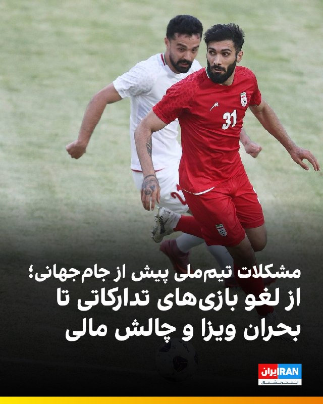

🔻در فاصله یک ماه تا شروع جام جهانی، تیم ملی فوتبال در پی انزوای سیاسی جمهوری اسلامی نتوانست با حریفان تدارکاتی مناسب دیدار کند و در تهران، سه‌بار در قالب بازی‌های درون‌تیمی به مصاف خودش رفت.

🔹حالا خبرگزاری تسنیم نوشته است که یکی از نگرانی‌های اصلی کادرفنی، بحث صدور ویزا از سوی کشور آمریکاست؛ چرا که در صورت صادر نشدن ویزای هر یک از بازیکنان یا اعضای کادرفنی، چالش‌های تیم ملی بیش از پیش خواهد شد.

🔹تیم ملی در نظر داشت پیش از شروع رقابت‌ها چندین دیدار تدارکاتی برگزار کند، اما تا این لحظه فقط بازی با گامبیا نهایی شده است.

🔹تیم‌های مقدونیه، آنگولا، اسپانیا و پورتوریکو به دلیل شرایط سیاسی ایران، از تقابل با تیم ملی انصراف داده‌اند.

🔹قرار است بازیکنان و اعضای کادرفنی به‌زودی جهت طی کردن مراحل دریافت ویزای آمریکا راهی ترکیه شوند. با این حال، گفته می‌شود احتمال دارد برخی از اعضا به دلیل سوابق فعالیت یا ارتباط با سپاه پاسداران، موفق به دریافت ویزا نشوند.

🔹جزییات بیشتر را در سایت بخوانید

@iranintltvsport

## Shin_Persian — post 5988

Shin ✓ @hey_itsmyturn
Wed, 13 May 2026 13:40:21 UTC

Blast sound in Shiraz
Fars Province, #Iran

فارسی

صدای انفجار در شیراز
استان فارس، #Iran

𝕏 · @shin_persian

## ManotoTV — post 105401

  <a href="telegram/content/ManotoTV_105401_1778680633.mp4" target="_blank">🎬 Download video</a>

مقام‌های فرانسه اعلام کردند بیش از هزار مسافر یک کشتی تفریحی تحت مدیریت بریتانیا پس از شیوع بیماری گوارشی در این کشتی، اجازه پیاده شدن در بندر بوردو را ندارند.
بر اساس گزارش‌ها، ۴۹ نفر در کشتی «Ambition» علائمی شبیه گاستروآنتریت نشان داده‌اند و سه مسافر در کابین‌های خود قرنطینه شده‌اند.
گاستروآنتریت یا التهاب معده و روده یک بیماری عفونی دستگاه گوارش است. این بیماری اغلب توسط ویروس‌ها مثل نوروویروس یا روتاویروس ایجاد می‌شود، اما گاهی باکتری یا غذای آلوده هم عامل آن است. در کشتی‌های تفریحی، شیوع این بیماری رایج‌تر است چون افراد زیادی در فضای بسته و مشترک حضور دارند و ویروس به‌سرعت منتقل می‌شود. اعلام شده یک مرد ۹۲ ساله نیز روز یکشنبه در کشتی جان باخته، اما هنوز ارتباطی میان مرگ او و بیماری گوارشی تأیید نشده است.
این شرکت می‌گوید اقدامات بهداشتی و ضدعفونی گسترده در کشتی اجرا شده و به مسافران درباره رعایت بهداشت و گزارش علائم هشدار داده شده است.
کشتی «Ambition» با ۱۱۸۷ مسافر و ۵۱۴ خدمه، هشتم مه سفر خود را از بلفاست آغاز کرده بود.

## ManotoTV — post 105400

  <a href="telegram/content/ManotoTV_105400_1778680634.mp4" target="_blank">🎬 Download video</a>

دونالد ترامپ پس از ورود به پکن، در مراسمی رسمی با فرش قرمز، گارد احترام نظامی و صدها نفر از جوانان چینی مورد استقبال مقام‌های چین قرار گرفت. در تصاویر ثبت شده ایلان ماسک نیز در جمع همراهان ترامپ حضور دارد.
ترامپ امروز برنامه عمومی دیگری ندارد، اما قرار است پنجشنبه و جمعه چندین بار با شی جین‌پینگ دیدار کند. او پیش از سفر گفته بود محور اصلی گفت‌وگوها با رئیس‌جمهور چین، تجارت و توافق‌های اقتصادی خواهد بود.
این سفر در حالی انجام می‌شود که جنگ آمریکا و اسرائیل با ایران و افزایش تورم، فشارهایی بر محبوبیت ترامپ در داخل آمریکا وارد کرده است.
ترامپ پیش از ترک آمریکا گفت: «ما دو ابرقدرت جهان هستیم. آمریکا از نظر نظامی قدرتمندترین کشور دنیاست و چین را نفر دوم می‌دانند.»

## ManotoTV — post 105399

  <a href="telegram/content/ManotoTV_105399_1778680635.mp4" target="_blank">🎬 Download video</a>

یک نفتکش وابسته به شرکت دولتی نفت ابوظبی پس از حمله پهپادی جمهوری‌اسلامی در هفته گذشته، دچار نشت محدود سوخت در سواحل عمان شده است.
رویترز گزارش داده مقدار کمی از سوخت کشتی که به نظر می‌رسد سوخت بانکر بوده، در پی این حادثه نشت کرده است.
انور قرقاش، مشاور رئیس امارات، پیش‌تر حمله چهارم مه به این نفتکش را «دزدی دریایی» توصیف کرده بود. گزارش شده در زمان حمله کسی آسیب ندیده و کشتی حامل بار نبوده است.
این نفتکش با نام «MV Barakah» همچنان در سواحل عمان لنگر انداخته و شرکت می‌گوید در حال همکاری نزدیک با مقام‌های مربوطه و تیم‌های تخصصی واکنش به بحران است.

## ManotoTV — post 105398

  <a href="telegram/content/ManotoTV_105398_1778680636.mp4" target="_blank">🎬 Download video</a>

هواپیمای ریاست‌جمهوری آمریکا دقایقی پیش در پایتخت چین به زمین نشست و دونالد ترامپ سفر خود برای دیدار با شی جین‌پینگ، رئیس‌جمهور چین، را آغاز کرد. این نخستین سفر رسمی یک رئیس‌جمهور مستقر آمریکا به چین از زمان سفر ترامپ در سال ۲۰۱۷ است.

## ManotoTV — post 105397

  <a href="telegram/content/ManotoTV_105397_1778680637.mp4" target="_blank">🎬 Download video</a>

تماسی از ایران؛
تجربه‌ی یک آموزگار از آموزش مجازی

## ManotoTV — post 105396

  <a href="telegram/content/ManotoTV_105396_1778680639.mp4" target="_blank">🎬 Download video</a>

هواپیمای ریاست‌جمهوری آمریکا دقایقی پیش در پایتخت چین به زمین نشست و دونالد ترامپ سفر خود برای دیدار با شی جین‌پینگ، رئیس‌جمهور چین، را آغاز کرد.

## ManotoTV — post 105395

  <a href="telegram/content/ManotoTV_105395_1778680639.mp4" target="_blank">🎬 Download video</a>

وال‌استریت ژورنال به نقل از مقام‌های عرب و یک منبع آگاه گزارش داد رئیس سازمان اطلاعات اسرائیل، موساد، در جریان جنگ با ایران دست‌کم دو بار به‌صورت محرمانه به امارات متحده عربی سفر کرده است.
بر اساس این گزارش، دیوید بارنیا، رئیس موساد، در ماه‌های مارس و آوریل برای هماهنگی درباره جنگ با ایران به امارات رفته بود؛ اقدامی که نشانه‌ای از گسترش همکاری‌های امنیتی میان اسرائیل و کشورهای عربی خلیج فارس توصیف شده است.
این گزارش می‌افزاید اسرائیل در طول جنگ، سامانه‌های دفاع موشکی «گنبد آهنین» و ده‌ها نیروی نظامی را برای مقابله با حملات موشکی و پهپادی جمهوری‌اسلامی به امارات اعزام کرده بود.
وال‌استریت ژورنال همچنین نوشت امارات در حملات نظامی علیه اهدافی در ایران مشارکت داشته؛ از جمله حمله به یک پالایشگاه در جزیره لاوان در خلیج فارس. وزارت خارجه امارات و دفتر نخست‌وزیر اسرائیل تاکنون به درخواست‌های وال‌استریت ژورنال برای اظهار نظر پاسخ نداده‌اند.

## ManotoTV — post 105394

  <a href="telegram/content/ManotoTV_105394_1778680640.mp4" target="_blank">🎬 Download video</a>

رویترز گزارش داد عراق و پاکستان برای انتقال نفت و گاز از تنگه هرمز با جمهوری‌اسلامی به توافق رسیده‌اند؛ اقدامی که به گفته منابع آگاه، نشان‌دهنده افزایش کنترل تهران بر این آبراه راهبردی است.
بر اساس این گزارش، عراق عبور دو نفتکش بزرگ را با هماهنگی ایران انجام داده و پاکستان نیز انتقال محموله‌های گاز مایع طبیعی قطر را از مسیر هرمز با توافق تهران پیش می‌برد.
منابع رویترز می‌گویند جمهوری‌اسلامی اکنون به‌جای بستن تنگه هرمز، در حال کنترل عبور کشتی‌هاست و برخی کشورهای دیگر نیز در حال بررسی توافق‌های مشابه هستند.

## FarsiVOA — post 217627

روابط پکن و تهران، مخصوصا در یک دهه گذشته موضوع کنج‌کاوی‌ها و پرسش‌های بسیار بوده. برای درک بهتر و ساده‌ترِ این روابط داده‌نمای تیم میدان را ببینید

## FarsiVOA — post 217626

  <a href="telegram/content/FarsiVOA_217626_1778680640.mp4" target="_blank">🎬 Download video</a>

کاروان اسکورت رئیس‌جمهور ترامپ پس از مراسم استقبال از فرودگاه پکن به سمت هتل حرکت کرد. قرار است شی جین‌پینگ، رئیس جمهوری چین، صبح پنجشنبه به وقت محلی در مراسمی رسما از دونالد ترامپ استقبال کند.

دونالد ترامپ قرار است در این سفر گفت‌وگوهایی را با شی جین‌پینگ، رئیس جمهوری چین، درباره روابط دوجانبه، تجارت، و تحولات امنیتی بین‌المللی آغاز کند.

## FarsiVOA — post 217618

📸 گالری عکس | ورود پرزیدنت ترامپ به چین

دونالد ترامپ، رئیس جمهوری ایالات متحده، شامگاه چهارشنبه ۲۳ اردیبهشت به وقت محلی وارد پکن، پایتخت چین، شد. پرزیدنت ترامپ در بدو ورود در فرودگاه پکن مورد استقبال مقام‌های ارشد چینی قرار گرفت. همزمان گروهی از استقبال‌کنندگان با در دست داشتن پرچم‌های آمریکا و چین و اجرای برنامه‌های تشریفاتی از رئیس جمهوری آمریکا استقبال کردند.

## FarsiVOA — post 217617

  <a href="telegram/content/FarsiVOA_217617_1778680642.mp4" target="_blank">🎬 Download video</a>

همزمان با ورود پرزیدنت ترامپ به چین، تیمی از استقبال‌کنندگان با تکان دادن هماهنگ پرچم‌های دو کشور به او خوش‌آمد گفتند.

دونالد ترامپ قرار است در این سفر گفت‌وگوهایی را با شی جین‌پینگ، رئیس جمهوری چین، درباره روابط دوجانبه، تجارت، و تحولات امنیتی بین‌المللی آغاز کند.

این سفر نخستین دیدار رسمی آقای ترامپ از چین در حدود یک دهه اخیر به شمار می‌رود. او بار قبل در دوره نخست ریاست جمهوری خود در آبان ۱۳۹۶ به چین رفته بود.

## FarsiVOA — post 217616

  <a href="telegram/content/FarsiVOA_217616_1778680645.mp4" target="_blank">🎬 Download video</a>

استقبال مقامات چین از ریاست جمهوری آمریکا؛ دقایقی پیش پس از فرود «ایرفورس وان»، هواپیمای ویژه ریاست جمهوری آمریکا، در فرودگاه پکن مقامات چینی از دونالد ترامپ استقبال کردند.

کاخ سفید پیش‌تر اعلام کرده بود که پرزیدنت ترامپ و شی جین‌پینگ در جریان این سفر درباره گسترش همکاری‌های اقتصادی و حفظ ثبات جهانی گفت‌وگو خواهند کرد.

## FarsiVOA — post 217615

«ایرفورس وان»، هواپیمای ویژه ریاست جمهوری آمریکا، دقایقی پیش در فرودگاه پکن به زمین نشست. دونالد ترامپ هنگام ورود با استقبال مقامات چینی رو‌به رو شد.

این سفر نخستین دیدار رسمی آقای ترامپ از چین در حدود یک دهه اخیر به شمار می‌رود. او بار قبل در دوره نخست ریاست جمهوری خود در آبان ۱۳۹۶ به چین رفته بود.

## FarsiVOA — post 217614

دونالد ترامپ، رئیس‌جمهوری ایالات متحده آمریکا این روزها در سفری مهم و رسمی به چین رفته است. در میدان پرسیدیم که آیا چین از کارتِ ایران برای حفظ منافع خود در برابر آمریکا استفاده خواهد کرد؟‌ چین چه منافعی در بحران‌های ایران دارد؟

## FarsiVOA — post 217613

  

⚡️«ایرفورس وان»، هواپیمای ویژه ریاست جمهوری آمریکا، دقایقی پیش در فرودگاه پکن به زمین نشست. او در هنگام ورود با استقبال مقامات چینی رو‌به رو شد. همزمان تیمی از استقبال‌کنندگان با تکان دادن هماهنگ پرچم‌های دو کشور به او خوش‌آمد گفتند.

او در این سفر قرار است گفت‌وگوهایی را با شی جین‌پینگ، رئیس جمهوری چین، درباره روابط دوجانبه، تجارت، و تحولات امنیتی بین‌المللی آغاز کند.

این سفر نخستین دیدار رسمی آقای ترامپ از چین در حدود یک دهه اخیر به شمار می‌رود. او بار قبل در دوره نخست ریاست جمهوری خود در آبان ۱۳۹۶ به چین رفته بود.

کاخ سفید پیش‌تر اعلام کرده بود که پرزیدنت ترامپ و شی جین‌پینگ در جریان این سفر درباره گسترش همکاری‌های اقتصادی و حفظ ثبات جهانی گفت‌وگو خواهند کرد.

## FarsiVOA — post 217612

  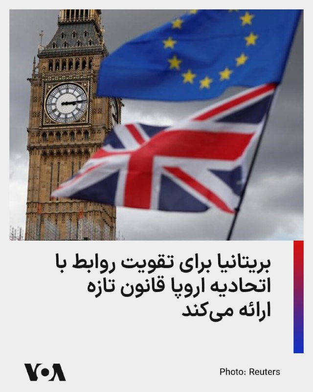

دولت بریتانیا اعلام کرد لایحه‌ای تازه برای تقویت روابط این کشور با اتحادیه اروپا ارائه خواهد کرد؛ اقدامی که کی‌یر استارمر، نخست‌وزیر بریتانیا، آن را بخشی از برنامه خود برای ترمیم روابط اقتصادی با اروپا می‌داند.

به گزارش رویترز، چارلز سوم، پادشاه بریتانیا، در سخنرانی سالانه دولت در پارلمان گفت لایحه «مشارکت اروپایی» برای تقویت روابط با اتحادیه اروپا ارائه می‌شود.

دولت بریتانیا می‌گوید این لایحه اجرای توافق‌های فعلی و آینده با اتحادیه اروپا را ممکن خواهد کرد.

استارمر در حالی بر نزدیک‌تر شدن به اروپا تأکید می‌کند که پس از شکست‌های حزب کارگر در انتخابات محلی، با فشار فزاینده برای کناره‌گیری روبه‌روست.

دولت او می‌گوید بریتانیا به بازار واحد یا اتحادیه گمرکی اروپا بازنخواهد گشت و آزادی رفت‌وآمد با اتحادیه اروپا را نیز احیا نخواهد کرد.
@FarsiVOA

## FarsiVOA — post 217611

  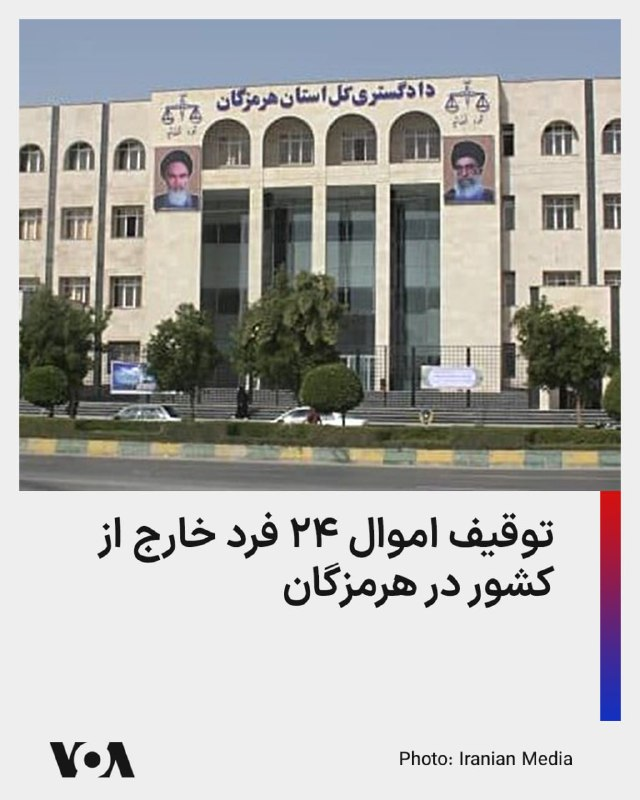

رئیس کل دادگستری هرمزگان اعلام کرد اموال ۲۴ نفر از ایرانیان خارج از کشور که به گفته او با «شبکه‌های معاند دشمن» همکاری داشته‌اند، شناسایی و طبق روال قانونی توقیف شده است.

به گزارش مهر، مجتبی قهرمانی این افراد را «عناصر خارج‌نشین مرتبط با دشمن» خوانده و گفته اقدام دستگاه قضایی در چارچوب مقابله با همکاری با شبکه‌های مخالف جمهوری اسلامی انجام شده است.

توقیف اموال این ۲۴ نفر در هرمزگان، بخشی از سیاست گسترده‌ سرکوب است که اژه‌ای در هفته‌های اخیر از آن دفاع کرده است.

رئیس قوه قضائیه گفته بود دستگاه قضایی مأمور شده اموال کسانی را که جمهوری اسلامی «همکاران و همراهان دشمن» می‌خواند، شناسایی، توقیف و در مواردی مصادره کند؛ سیاستی که منتقدان آن را ابزار فشار بر مخالفان، فعالان رسانه‌ای و چهره‌های خارج از کشور می‌دانند.
@FarsiVOA

## FarsiVOA — post 217610

  

دانشجویان کارشناسی ارشد ورودی ۱۴۰۳ و قبل از آن و تمامی دانشجویان دکتری می‌توانند از ۲۶ اردیبهشت با دریافت مجوز تردد در دانشگاه صنعتی شریف حضور یابند.

معاونت آموزشی دانشگاه صنعتی شریف اعلام کرد این دانشجویان می‌توانند با ثبت درخواست آنلاین و تأیید استاد راهنما، مجوز ورود به دانشگاه را دریافت کنند.

دانشجویان متقاضی خوابگاه نیز باید درخواست اسکان خود را به ‌صورت آنلاین ثبت کنند. اداره امور خوابگاه‌ها اعلام کرده است اسکان دانشجویان واجد شرایط از تاریخ اعلام ‌شده امکان‌‌پذیر خواهد بود، هرچند برخی خوابگاه‌ها به دلیل تعمیرات با محدودیت ظرفیت مواجه هستند.

همچنین اختصاص خوابگاه منوط به تسویه بدهی‌های معوق بوده و خدمات رفاهی از جمله سالن‌های غذاخوری و توزیع غذا در خوابگاه‌ها تا اطلاع ثانوی غیرفعال خواهد بود.
@FarsiVOA

## DW_Farsi — post 124648

  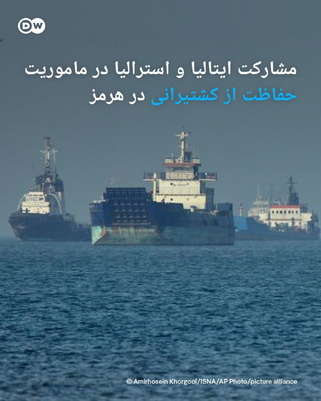

🔶 مشارکت ایتالیا و استرالیا در ماموریت حفاظت از کشتیرانی در هرمز

به گزارش خبرگزاری فرانسه گویدو کروزتو، وزیر دفاع ایتالیا، روز چهارشنبه (۱۳ مه ۲۰۲۶) به پارلمان گفت رم دو مین‌روب را به شرق مدیترانه و سپس دریای سرخ می‌فرستد، او در عین حال تاکید کرد که اعزام آن‌ها به منطقه هرمز فقط در چارچوب یک ماموریت بین‌المللی و در صورت برقراری یک آتش‌بس "واقعی، معتبر و باثبات" انجام خواهد شد.

کروزتو گفت هر ماموریتی در هرمز به تصویب پارلمان ایتالیا نیاز خواهد داشت. رویترز پیش‌تر گزارش داده بود که فرمانده نیروی دریایی ایتالیا از آمادگی برای اعزام دو مین‌روب، یک کشتی اسکورت و یک شناور پشتیبانی در قالب ماموریت چندملیتی سخن گفته بود.
هم‌زمان، ریچارد مارلز، وزیر دفاع استرالیا، اعلام کرد کانبرا نیز آماده است با یک فروند هواپیمای شناسایی به ماموریت "کاملا دفاعی" تحت رهبری بریتانیا و فرانسه بپیوندد.

استرالیا اعلام کرده در صورت شکل‌گیری این ماموریت، یک فروند هواپیمای شناسایی (وج‌تیل E-7A) را که هم‌اکنون نیز در منطقه مستقر است، در اختیار آن قرار می‌دهد.
@dw_farsi

## DW_Farsi — post 124647

🔶 رکورد تازه نویسندگان زندانی در جهان؛ ایران دوم شد

انجمن قلم آمریکا (پن) در تازه‌ترین گزارش سالانه خود درباره وضعیت آزادی بیان و سرکوب نویسندگان در جهان اعلام کرد که شمار نویسندگان زندانی در سال ۲۰۲۵ میلادی برای نخستین بار از زمان آغاز انتشار "شاخص آزادی نوشتن" در سال ۲۰۱۹، از مرز ۴۰۰ نفر عبور کرده است.

گزارش پن آمریکا که روز سه‌شنبه ۱۲ مه (۲۲ اردیبهشت) منتشر شد، از افزایش چشمگیر بازداشت نویسندگان، مترجمان، پژوهشگران و فعالان فرهنگی در ایران نیز خبر می‌دهد.

بر اساس این گزارش، در سال ۲۰۲۵ در مجموع ۴۰۱ نویسنده در ۴۴ کشور زندانی بوده‌اند؛ رقمی که در سال پیش از آن ۳۷۵ نفر در ۴۰ کشور بود. پن آمریکا می‌گوید، شمار نویسندگان زندانی طی هفت سال گذشته ۶۸ درصد افزایش یافته و این روند، نشانگر تشدید مداوم سرکوب آزادی بیان در جهان است.

چین همچنان با ۱۱۹ نویسنده زندانی، بزرگترین زندان نویسندگان جهان باقی مانده است، اما انجمن قلم آمریکا تأکید می‌کند که شدیدترین افزایش بازداشت‌ها در ایران ثبت شده است؛ جایی که مقام‌های جمهوری اسلامی در سال گذشته دست‌کم ۱۷ بازداشت تازه انجام داده‌اند و شمار نویسندگان زندانی را بار دیگر به سطح دوران اوج سرکوب اعتراض‌های "زن، زندگی، آزادی" نزدیک کرده‌اند.

کارین دویچ کارلکار، مدیر برنامه "نویسندگان در معرض خطر" در پن آمریکا، گفته است که مقام‌های جمهوری اسلامی "کارزاری به‌ویژه خشن علیه صداهای مستقل" به راه انداخته‌اند. به گفته او، شاعران، مترجمان، پژوهشگران، ترانه‌سرایان، تحلیلگران آنلاین، مدافعان حقوق بشر و ستون‌نویسان، همگی هدف بازداشت و سرکوب قرار گرفته‌اند، زیرا حکومت ایران می‌کوشد، "بحث، انتقاد و مخالفت" را خاموش کند.

به گزارش پن آمریکا، موج تازه سرکوب در ایران پس از جنگ ۱۲‌روزه میان ایران و اسرائیل در خرداد و تیر ۱۴۰۴ شدت گرفت و علاوه بر چهره‌های شناخته‌شده منتقد، پژوهشگران و مترجمان را نیز دربرگرفت.
@dw_farsi

## DW_Farsi — post 124646

  

🔶 توماس راخل کفالت سیاسی پیوند و برنا نعیمی را بر عهده گرفت

توماس راخل، نماینده دولت آلمان در امور آزادی دین و عقیده، در پیامی اعلام کرد کفالت سیاسی پیوند نعیمی و برنا نعیمی را بر عهده گرفته است. به گفته او این دو جوان بهایی در ایران به‌دلیل باور مذهبی‌شان تحت فشار قرار دارند و با خطر اعدام روبه‌رو هستند. حساب رسمی این نهاد آلمانی نیز همین موضع را منتشر کرده است.

در پیام منتشرشده آمده است پیوند و برنا نعیمی در ایران با زندان و شکنجه روبه‌رو شده‌اند و پرونده آن‌ها به یکی از نمونه‌های تازه فشار بر شهروندان بهایی تبدیل شده است. این موضع در حالی مطرح شده که نهادهای بهایی و حقوق بشری نیز در روزهای اخیر درباره خطر فوری برای این دو زندانی هشدار داده‌اند.

توماس راخل از ۲۸ مه ۲۰۲۵ نماینده دولت آلمان در امور آزادی دین و عقیده است. پذیرش کفالت سیاسی از سوی او، نشانه‌ای از بالا رفتن توجه نهادهای آلمانی به پرونده پیوند و برنا نعیمی و وضعیت بهاییان در ایران است.
@dw_farsi

## DW_Farsi — post 124645

  

🔶 نت‌بلاکس: فساد و کلاهبرداری، حاصل طرح‌های اینترنتی حکومت ایران

نت‌بلاکس، نهاد نظارت و پایش فعالیت‌های اینترنتی در جهان در تازه‌ترین پست خود در شبکه ایکس (توئیتر سابق) اعلام کرد که قطع اینترنت در ایران از ۱۷۷۶ ساعت گذشته و به این ترتیب وارد هفتاد و پنجمین روز خود شده است.

این نهاد در پست خود با اشاره به تأثیرات منفی سانسور دیجیتال هشدار داده که طرح‌های اینترنت "پرو" (Internet Pro) مورد حمایت جمهوری اسلامی و فهرست‌های سفید گزینشی افزایش نظارت، فساد و کلاهبرداری را به دنبال داشته است. این طرح بحث‌برانگیز تا کنون انتقادهای فراوانی را به دنبال داشته و بسیاری‌ها به ابعاد تبعیض‌آمیز آن اشاره کرده‌اند.

در حالیکه اکنون ۷۵ روز از قطع اینترنت در ایران می‌گذرد، مسعود پزشکیان، رئیس جمهور ایران محمدرضا عارف، معان اول خود را با حفظ سمت به عنوان "رئیس ستاد ویژه ساماندهی و راهبری فضای مجازی کشور" منصوب کرد.

او در این رابطه تصریح کرد که این انتصاب "نظر به ضرورت فوری استقرار حکمرانی یکپارچه، منسجم و کارآمد در فضای مجازی" انجام می‌گیرد. پزشکیان پیشتر نیز در شبکه ایکس در ارتباط با این موضوع پستی منتشر کرده بود.
@dw_farsi

## Persian_Trend_Official — post 14063

🔴 لاوروف: آمریکا به‌دنبال کنترل بازار جهانی انرژی است

💢سرگئی لاوروف، وزیر خارجه روسیه، در اظهاراتی دولت ترامپ را متهم کرده که تلاش می‌کند نفوذ خود را بر بازار جهانی انرژی «تحمیل» کند.

💢او گفته است هدف آمریکا این است که شرکت‌های انرژی روسیه مانند لوک‌اویل و روس‌نفت را از بازارهای بین‌المللی خارج کند و مسیرهای اصلی تأمین انرژی جهان را تحت کنترل خود بگیرد.

💢لاوروف همچنین تأکید کرده:
آمریکا در اسناد راهبردی خود به دنبال تسلط بر بازار انرژی جهانی است و قصد دارد همه مسیرهای مهم انرژی را تحت نفوذ خود قرار دهد.

🫆:Tony

📌 @persian_trend_official
پرشین ترند | متفاوت‌ترین کانال نظامی

## Persian_Trend_Official — post 14061

🚨🇮🇱🇱🇧 حملات هوایی جدید اسرائیل دقایقی پیش مناطقی در لبنان را هدف قرار داد؛ همزمان منابع محلی از شنیده شدن صدای چندین انفجار خبر می‌دهند.

☆Phantom☆

📌 @persian_trend_official
پرشین ترند | متفاوت‌ترین کانال نظامی

## Persian_Trend_Official — post 14059

ترامپ تمام افراد ثروتمند آمریکا را با Air Force One خود به پکن برده است.

📝 Nick

📌 @persian_trend_official
پرشین ترند | متفاوت‌ترین کانال نظامی

## Persian_Trend_Official — post 14058

  <a href="telegram/content/Persian_Trend_Official_14058_1778680650.mp4" target="_blank">🎬 Download video</a>

⭕️ فارس:

تصاویر دیده‌نشده از رزمایش ضد هلی‌برن سپاه تهران بزرگ

📝 Nick

📌 @persian_trend_official
پرشین ترند | متفاوت‌ترین کانال نظامی

## Persian_Trend_Official — post 14057

  

⭕️ برخی از رسانه‌های فرانسوی دست به انتشار گزارشی به نقل از «فلورین تاردیف» خبرنگار «پاری‌مچ» زده‌اند که حکایت از روابط پنهانی امانوئل ماکرون و گلشیفته فراهانی دارد.

این خبرنگار فرانسوی در گزارش خود نوشته که سیلی که زن ماکرون به او در کنار در خروجی هواپیما زد، به خاطر همین رابطه بوده.

منبع خبر

📝 Nick

📌 @persian_trend_official
پرشین ترند | متفاوت‌ترین کانال نظامی

## Persian_Trend_Official — post 14056

⭕️ در حالی که اینترنت در ایران به مدت ۷۵ روز قطع است، شرکت اپل دیروز به صورت رسمی اولین نمایندگی خود را در افغانستان افتتاح نمود. تکذیب شد. 📝 Nick 📌 @persian_trend_official پرشین ترند | متفاوت‌ترین کانال نظامی

## Persian_Trend_Official — post 14055

  

🔴 ادعای وال‌استریت ژورنال درباره نقش امارات و سفر مقامات امنیتی اسرائیل

💢بر اساس گزارشی که به وال‌استریت ژورنال نسبت داده شده، گفته می‌شود رئیس موساد اسرائیل حداقل دو بار به‌صورت محرمانه به امارات متحده عربی سفر کرده تا درباره هماهنگی‌های مرتبط با درگیری‌های جاری با ایران گفت‌وگو کند.

▪️در این گزارش همچنین ادعا شده:

💢امارات فراتر از نقش دیپلماتیک عمل کرده و در برخی اقدامات نظامی علیه ایران نقش داشته است.

▪️از جمله، حمله به یک هدف نفتی در جزیره لاوان به امارات نسبت داده شده است.
▪️همچنین گفته شده امارات میزبان برخی سامانه‌ها و نیروهای مرتبط با دفاع هوایی اسرائیل بوده است.
▪️در ادامه، به سفرهای مشابه رئیس شین‌بت اسرائیل در همان بازه زمانی نیز اشاره شده است.

🫆:Tony

📌 @persian_trend_official
پرشین ترند | متفاوت‌ترین کانال نظامی

## Persian_Trend_Official — post 14054

  <a href="telegram/content/Persian_Trend_Official_14054_1778680653.mp4" target="_blank">🎬 Download video</a>

🔴 ترامپ وارد پکن شد

هواپیمای ریاست‌جمهوری آمریکا (ایرفورس وان) لحظاتی پیش در پایتخت چین به زمین نشست و دونالد ترامپ سفر خود را برای دیدار و نشست با شی جین‌پینگ آغاز کرد.

🫆:Tony

📌 @persian_trend_official
پرشین ترند | متفاوت‌ترین کانال نظامی

## Persian_Trend_Official — post 14053

🔴 نشت سوخت نفتکش اماراتی پس از حمله پهپادی در سواحل عمان

💢خبرگزاری رویترز گزارش داد یک نفتکش وابسته به شرکت ملی نفت ابوظبی پس از حمله پهپادی منتسب به ایران در نزدیکی سواحل عمان دچار نشت محدود سوخت شده است.

💢بر اساس این گزارش:

▪️ نفتکش «برکه» همچنان در سواحل عمان لنگر انداخته است
▪️ شرکت اماراتی اعلام کرده مقدار کمی سوخت کشتی وارد آب شده است
▪️ این کشتی هنگام حمله بارگیری نشده بود
▪️ هیچ آسیبی به خدمه وارد نشده است

💢شرکت اماراتی اعلام کرده در حال همکاری با مقام‌های عمان و تیم‌های تخصصی برای مدیریت وضعیت است.

🫆:Tony

📌 @persian_trend_official
پرشین ترند | متفاوت‌ترین کانال نظامی

## Persian_Trend_Official — post 14051

⭕️ در حالی که اینترنت در ایران به مدت ۷۵ روز قطع است، شرکت اپل دیروز به صورت رسمی اولین نمایندگی خود را در افغانستان افتتاح نمود.

تکذیب شد.

📝 Nick

📌 @persian_trend_official
پرشین ترند | متفاوت‌ترین کانال نظامی

## RadioFarda — post 157134

  

🔸مهراوه خندان، فرزند نسرین ستوده، فعال حقوق بشر، از آزادی موقت مادرش به قید کفالت خبر داد. خانم خندان این خبر را بعد از ظهر روز چهارشنبه ۲۳ اردیبهشت در اینستاگرام منتشر کرده است.

🔸خانم ستوده ۱۲ فروردین در منزل خود در تهران بازداشت شد و دختر او که ساکن هلند است، چند روز بعد از بازداشت از بی‌خبری از محل نگهداری و وضعیت مادرش ابراز نگرانی کرده بود.

🔸نسرین ستوده، برنده جایزه ساخاروف و وکیل حقوق بشری بارها به زندان افتاده و تحت فشار قرار گرفته است. او پیش از شروع جنگ اخیر آمریکا و اسرائیل علیه ایران، در مصاحبه با نشریه فرانسوی‌زبان «لوپوئَن» خواستار «مداخلۀ بشردوستانه» در حفاظت از مردم ایران شده بود.

🔸رضا خندان فعال حقوق بشر و همسر خانم ستوده نیز در حال حاضر در زندان اوین زندانی است و بارها به دلیل مخالفت با حجاب اجباری و مجازات اعدام تحت فشار قرار گرفته است.

@RadioFarda

## RadioFarda — post 157133

  <a href="telegram/content/RadioFarda_157133_1778680656.mp4" target="_blank">🎬 Download video</a>

🔸شاهزاده رضا پهلوی که به‌عنوان مهمان در نشست امنیتی پولیتیکو حضور یافته بود، حین گفت‌وگو با مجری برنامه با اعتراض یکی از حاضران روبه‌رو شد.

🔸فرد معترض با سردادن شعارهایی از جمله «شرم بر شما» خطاب به رضا پهلوی گفت: «وقتی مردم ما فرزندانشان را از زیر آوار بمب‌هایی که شما به کشورمان دعوت کردید بیرون می‌کشیدند، شما کجا بودید؟»

🔸مأموران امنیتی این زن را دقایقی بعد از محل نشست خارج کردند.

🎥bita_4liberation

@RadioFarda

## RadioFarda — post 157132

  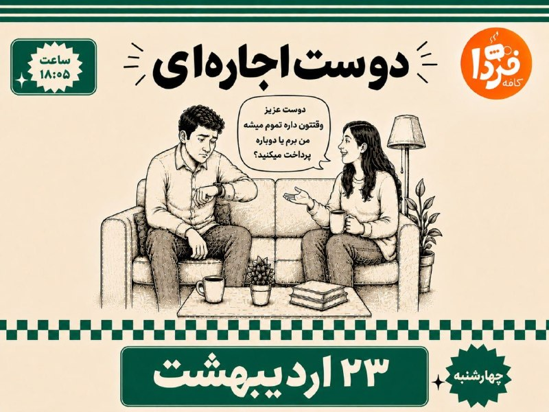

📷 Photo

## IranianMinds — post 20068

  <a href="telegram/content/IranianMinds_20068_1778680658.mp4" target="_blank">🎬 Download video</a>

🔴ارتش اسرائیل حمله به زیرساخت‌های حزب‌الله را در چندین منطقه در جنوب لبنان تکمیل کرد

ارتش اسرائیل امروز (چهارشنبه) انبارهای تسلیحاتی، پرتابگرهای بارگذاری‌شده و آماده شلیک و سایر زیرساخت‌های تروریستی سازمان تروریستی حزب‌الله را در چندین منطقه در جنوب لبنان هدف قرار داد.

تروریست‌های سازمان تروریستی حزب‌الله از این زیرساخت‌ها برای پیشبرد طرح‌های تروریستی علیه نیروهای ارتش اسرائیل که در جنوب لبنان فعالیت می‌کنند و علیه اسرائیل استفاده می‌کردند.

در محل‌های شلیک که هدف قرار گرفتند، پرتابگرهای راکتی که به سمت منطقه فعالیت نیروهای ارتش اسرائیل و به سمت خاک اسرائیل هدف‌گیری شده بودند، منهدم شدند.

ارتش اسرائیل به اقدام علیه تهدیدها علیه شهروندان اسرائیل و نیروهای ارتش ادامه خواهد داد و مطابق با دستورالعمل‌های رده سیاسی عمل می‌کند.

@IranianMinds

## IranianMinds — post 20067

  <a href="telegram/content/IranianMinds_20067_1778680660.mp4" target="_blank">🎬 Download video</a>

🔴استقبال از پرزیدنت ترامپ در فرودگاه پکن.

@IranianMinds

## IranianMinds — post 20066

🔴دولت سوریه به طور رسمی از روسیه خواسته است که بشار اسد را برای محاکمه و پاسخ دادن به جنایات جنگی تحویل بدهد.

@IranianMinds

## IranianMinds — post 20065

  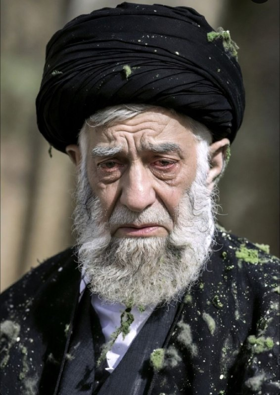

🔴بالاخره هر چیزی تو یخچال هم بعد از یه مدت کپک می‌زنه، نه؟

@IranianMinds

## BBCPersian — post 280929

  <a href="telegram/content/BBCPersian_280929_1778680662.mp4" target="_blank">🎬 Download video</a>

🔻سرخط خبرهای چهارشنبه ۲۳ اردیبهشت ۱۴۰۵

@BBCPersian

## BBCPersian — post 280928

🔻تشدید حملات اسرائیل به غزه از زمان آغاز آتش‌بس ایران

اسرائیل در پنج هفته‌ای که از آتش‌بس در ایران گذشته، حملات به غزه را تشدید کرده است.

بر اساس اعلام اداره بهداشت غزه، که حماس آن را اداره می‌کند، از زمان توقف جنگ در ایران در ۸ آوریل، ۱۲۰ فلسطینی کشته شده‌اند؛ این تلفات ۲۰ درصد بیشتر از زمانی است که اسرائیل به همراه آمریکا در جنگ با ایران مشارکت داشت.

سازمان دیده‌بان درگیری‌ها، «اکلد»، که داده‌های مربوط به مکان و رویداد درگیری‌های مسلحانه در جهان، از جمله حملات اسرائیل به غزه را رصد می‌کند، در گزارش ماهانه خود اعلام کرد که اسرائیل ماه گذشته(آوریل) ۳۵ درصد حملات بیشتری در مقایسه با ماه مارس در این باریکه انجام داد.

این افزایش حملات نشانه دیگری از پیشرفت‌های متوقف شده در طرح دونالد ترامپ برای پایان جنگ در غزه و آغاز بازسازی آنجاست.

یک مقام نظامی اسرائیل که نخواست نامش فاش شود به رویترز گفت، آتش‌بس غزه به اسرائیل اجازه می‌دهد تا علیه «تهدیدات قریب‌الوقوع» اقدام کند.

او همچنین گفت که ارتش اسرائیل «برای هر سناریویی آماده است»؛ از جمله برنامه‌های جنگی گسترده‌تری برای از سرگیری جنگ در غزه تدوین شده است، هرچند هنوز هنوز چنین دستوری داده نشده است.

@BBCPersian

## BBCPersian — post 280921

🔻روابط ایران و آمریکا در یکی از پیچیده‌ترین بن‌بست‌های دهه‌های اخیر گرفتار شده است. پس از گذشت بیش از ده هفته از آغاز حملات آمریکا و اسرائیل علیه ایران و در حالی که آتش‌بسی شکننده برقرار است، دو طرف از طریق میانجی‌هایی مانند پاکستان همچنان در حال چانه‌زنی هستند.

تبادل پیشنهادها و پاسخ‌ها در حالی انجام می‌شود که پنج موضوع محوری، به عنوان موارد اصلی اختلافات حل‌نشده میان ایران و آمریکا مطرح است: برنامه غنی‌سازی اورانیوم، سرنوشت ذخایر اورانیوم غنی‌شده در ایران، کنترل و آزادی تردد در تنگه هرمز، فعالیت‌های گروه‌های نیابتی ایران در منطقه و برنامه موشکی بالستیک.

دونالد ترامپ،‌ رئیس‌جمهور آمریکا، پاسخ ایران به آخرین پیشنهاد آمریکا را «کاملا غیرقابل قبول» خوانده و بار دیگر تاکید کرده است که آمریکا هرگز اجازه نخواهد داد ایران به سلاح هسته‌ای دست یابد.

بیشتر بخوانید:
https://bbc.in/4wsm0ag
📷Getty Images
@BBCPersian

## BBCPersian — post 280920

🔻نشت سوخت در سواحل عمان یک هفته پس از حمله ایران به یک نفت‌کش

یک واحد وابسته به شرکت ملی نفت ابوظبی روز چهارشنبه اعلام کرد که یک نفت‌کش‌ این شرکت که هفته گذشته هدف حمله پهپادهای جمهوری اسلامی قرار گرفت، مقدار کمی سوخت در سواحل عمان نشت داده است که این موضوع از خطرات زیست‌محیطی ناشی از جنگ آمریکا و اسرائیل با ایران حکایت دارد.

بسته شدن تنگه هرمز، دریانوردی در این آبراه حیاتی کشتیرانی را به مسیری پرخطر تبدیل کرده است و هم اکنون صدها کشتی در خلیج فارس گرفتارند.

شرکت لجستیک و خدمات «ادنوک» اعلام کرد که وضعیت مربوط به کشتی خود، «ام‌وی‌باراکا»، را زیر نظر دارد و «با مقامات مربوطه و تیم‌های واکنش تخصصی» در حال همکاری است.

سخنگوی این شرکت گفت: «کشتی باراکا، متعلق به شرکت ادنوک، پس از آنکه در تاریخ ۴ مه توسط دو پهپاد ایرانی هدف قرار گرفت، همچنان در سواحل عمان لنگر انداخته است. متاسفانه مقدار کمی از آنچه که گمان می‌رود سوخت بانکر باشد، در نتیجه این اتفاق ریخته شده است.»

او البته درباره حجم نشت اظهار نظر نکرد.

در زمان حمله، این نفت‌کش هیچ محموله‌ای حمل نمی‌کرد و خدمه هم آسیب ندیدند.

@BBCPersian

## BBCPersian — post 280919

  

هواپیمای حامل دونالد ترامپ و همراهانش دقایقی پیش در پکن به زمین نشست.

دونالد ترامپ در حالی وارد پکن شده است که اولین سفر رسمی یک رئیس جمهور آمریکا به چین را در تقریبا یک دهه گذشته آغاز می‌کند.

انتظار می‌رود که مذاکرات آقای ترامپ با شی جین پینگ، رئیس جمهور چین، شامل روابط تجاری پرتنش آنها، جنگ در ایران و فروش تسلیحات آمریکا به تایوان باشد.

آقای ترامپ که با یک هیئت تجاری بلندپایه سفر می‌کند، قرار است با استقبال باشکوهی از جمله توقف در ژونگ‌نان‌های، مجتمع محل زندگی و کار رهبران چین، روبرو شود.

هیئتی از رهبران تجاری جمله جنسن هوانگ، مدیرعامل انویدیا و ایلان ماسک، رئيس‌جمهور آمریکا را در این سفر همراهی می‌کنند.

ساعاتی پیش از ورود او، مقامات چین و ایالات متحده مذاکرات تجاری را در کره جنوبی برگزار کردند و هر دو طرف مشتاق بودند از اعمال مجدد تعرفه‌های بیش از حد جلوگیری کنند. رسانه‌های دولتی چین این مذاکرات را صریح، عمیق و سازنده توصیف کردند.

📷Getty Images
@BBCPersian

## BBCPersian — post 280918

  

🔻 بریتانیا اعلام کرده است که پهپادها و جت‌های جنگنده و نیز یک کشتی جنگی را به ماموریت مشترکی با هدف حفاظت از کشتیرانی در تنگه هرمز اعزام خواهد کرد.

جان هیلی، وزیر دفاع بریتانیا، این بسته را در نشست مجازی وزرای دفاع چندین کشور در روز سه‌شنبه (۱۲ مه) اعلام کرد. این بسته شامل سیستم‌های خودکار برای شناسایی و پاکسازی مین‌های دریایی، قایق‌های بدون سرنشین، و جت‌های تایفون برای گشت‌های هوایی است.

بیش از ۴۰ کشور دیگر هم در این ماموریت شرکت دارند که به گفته آقای هیلی، زمانی که شرایط مهیا باشد آغاز خواهد شد.

ماه‌هاست که ایران در تلافی حملات آمریکا و اسرائیل که ۲۸ فوریه (۹ اسفند) آغاز شد، در تنگه هرمز که یکی از شلوغ‌ترین کانال‌های حمل‌ونقل نفت جهان است، اعمال کنترل و ایجاد ناامنی کرده است.

آمریکا هم به نوبه خود، برای اعمال فشار بر تهران جهت پذیرش شرایطش، بنادر ایران را مسدود کرده است؛ اقدامی که ایران را خشمگین کرده است.

بیشتر بخوانید:
https://bbc.in/4ffIRQ3
📸UK MOD Crown copyright
@BBCPersian

## BBCPersian — post 280917

  

🔻نسرین ستوده، وکیل دادگستری و فعال حقوق بشر، امروز چهارشنبه ۲۳ اردیبهشت به قید وثیقه آزاد شد.

این خبر در صفحه مهراوه خندان، فرزند خانم ستوده منتشر شد.

چهارشنبه ۱۲ فروردین ۱۴۰۵، این وکیل دادگستری و فعال سیاسی در خانه خود در تهران بازداشت شد. نیروهای امنیتی حین بازداشت تمامی لوازم الکترونیک شخصی، از جمله گوشی موبایل و لب‌تاپ او را ضبط کردند.

نسرین ستوده، از اوایل دهه ۸۰، وکالت پرونده‌هایی را به عهده گرفت که برای حاکمیت حساسیت امنیتی داشتند.

او بارها بازداشت، محرومیت از وکالت و با احکام زندان طولانی روبه‌رو شد.

همسرش رضا خندان، یک فعال مدنی و سیاسی است که هم اکنون در زندان به‌سر می‌برد.

📷Mehraveh Khandan
خانم خندان با انتشار این تصویر نوشت: عکس قدیمی است و متاسفانه به‌دلیل قطعی اینرنت عکس جدیدی پس از آزادی به دستم نرسیده است.
@BBCPersian

## BBCPersian — post 280915

🔻حمله اسرائیل به دو خودرو در جنوب بیروت

خبرگزاری دولتی لبنان گزارش داد که اسرائیل طی دو حمله جداگانه روز چهارشنبه دو خودرو را در منطقه جیه لبنان در جنوب بیروت هدف قرار داد.

اطلاعاتی در مورد تلفات این دو حمله و اهداف احتمالی آن منتشر نشده است.

در حملات روز سه‌شنبه اسرائیل به لبنان هم ۱۳ نفر از جمله دو امدادگر کشته شدند.

ارتش اسرائیل اعلام کرده که به اهداف حزب‌الله حمله می‌کند و برای چندین روستا هشدار تخلیه صادر کرده است.

آتش‌بسی که ماه گذشته به اجرا درآمد، نتوانسته است جنگ را متوقف کند. وزارت بهداشت لبنان می‌گوید که از زمان آغاز آتش‌بس، ۳۸۰ نفر کشته شده‌اند.

@BBCPersian

## BBCPersian — post 280914

🔻وزارت خارجه ایران: چهار مامور به دلیل اختلال ناوبری، وارد آب‌های کویت شدند

پس از آن که کویت اعلام کرد چهار عضو سپاه را حین ورود غیرقانونی به این کشور بازداشت کرده است، وزارت خارجه ایران اعلام کرده «چهار مامور جمهوری اسلامی ایران» به دلیل «اختلال سامانه ناوبری قایق‌شان به اشتباه» وارد آب‌های کویت شدند.

وزارت خارجه ایران گفته آن‌ها «در چارچوب مأموریت مرسوم گشت‌زنی دریایی» مشغول انجام وظیفه بوده‌اند.

بر اساس بیانیه وزارت خارجه ایران، «ادعاهای مطرح شده در بیانیه‌های وزارت خارجه و وزارت کشور کویت مبنی بر برنامه ریزی ایران برای انجام اقدامات خصمانه علیه کویت، مطلقا بی اساس و مردود هستند.»

وزارت خارجه کویت این اقدام را «اقدامی خصمانه» و «حمله‌ای آشکار» به حاکمیت کویت خوانده بود.

وزارت کشور کویت هم روز گذشته اعلام کرد که «چهار نفوذی وابسته به سپاه پاسداران» که تلاش می‌کردند از طریق دریا به این کشور وارد شوند را بازداشت کرده است.

بر اساس بیانیه وزارت کشور کویت، دستگیرشدگان دو سرهنگ، یک سروان و یک ستوان نیروی دریایی سپاه بوده‌اند که «اذعان» کرده‌اند ماموریت داشتند به جزیره بوبیان «نفوذ» کنند.

https://bbc.in/4d3ACoU
@BBCPersian

## idfinfarsi — post 11574

  <a href="telegram/content/idfinfarsi_11574_1778680666.mp4" target="_blank">🎬 Download video</a>

ارتش اسرائیل حمله به زیرساخت‌های حزب‌الله را در چندین منطقه در جنوب لبنان تکمیل کرد

ارتش اسرائیل امروز (چهارشنبه) انبارهای تسلیحاتی، پرتابگرهای بارگذاری‌شده و آماده شلیک و سایر زیرساخت‌های تروریستی سازمان تروریستی حزب‌الله را در چندین منطقه در جنوب لبنان هدف قرار داد.

تروریست‌های سازمان تروریستی حزب‌الله از این زیرساخت‌ها برای پیشبرد طرح‌های تروریستی علیه نیروهای ارتش اسرائیل که در جنوب لبنان فعالیت می‌کنند و علیه اسرائیل استفاده می‌کردند.

در محل‌های شلیک که هدف قرار گرفتند، پرتابگرهای راکتی که به سمت منطقه فعالیت نیروهای ارتش اسرائیل و به سمت خاک اسرائیل هدف‌گیری شده بودند، منهدم شدند.

ارتش اسرائیل به اقدام علیه تهدیدها علیه شهروندان اسرائیل و نیروهای ارتش ادامه خواهد داد و مطابق با دستورالعمل‌های رده سیاسی عمل می‌کند.

## idfinfarsi — post 11572

‏‼️رئیس ستاد کل ارتش اسرائیل در شمال سامره: «ما واقعیت امنیتی جدیدی در تمام جبهه‌ها ایجاد کرده‌ایم؛ با این حال، نبرد به پایان نرسیده است. ارتش اسرائیل برای ازسرگیری جنگ در صورت نیاز آماده است و در حالت آمادگی و هوشیاری دائمی در دفاع و حمله قرار دارد، از یهودیه و سامره تا تهران»

‏🔸رئیس ستاد کل ارتش اسرائیل، سپهبد ایال زامیر: ‏«ارتش اسرائیل در همه جبهه‌ها با ابتکار و رویکرد تهاجمی عمل می‌کند. ما واقعیت امنیتی جدیدی ایجاد کرده‌ایم — در لبنان به عملیات ادامه می‌دهیم، در لیتانی و مناطق دیگر فعالیت می‌کنیم و هر روز ده‌ها تروریست و زیرساخت را خنثی می‌کنیم.
‏🔸همچنین در غزه به‌صورت تهاجمی عمل کرده و تروریست‌ها را به هلاکت می‌رسانیم و در اینجا در یهودیه و سامره نیز بدون وقفه فعالیت می‌کنیم و به دستاوردها دست می‌یابیم. هیچ‌گونه خویشتنداری وجود ندارد — فقط ابتکار عمل.

‏🔸نبرد هنوز به پایان نرسیده است. ارتش اسرائیل برای ازسرگیری درگیری در صورت نیاز آماده است و در آمادگی و هوشیاری دائمی، در دفاع و حمله، از یهودیه و سامره تا تهران قرار دارد.»

## Dirty_Kids — post 389375

  <a href="telegram/content/Dirty_Kids_389375_1778680668.mp4" target="_blank">🎬 Download video</a>

مراسم استقبال از شیرخدا با شعار چینی‌های قرمساق در صحنه که به زبون چینی می‌گفتن:

عمو ترامپ، عیان شد
چین مرکز جهان شد

@Dirty_Kids 👻

## Dirty_Kids — post 389374

گیاها خیلی مادر جندن تا وقتی توی گلفروشی هستن صاحبشون تف کف دست اینا نمیندازه مرگ بهشون نمیده محل سگشون نمیذارن و مثل خر رشد میکنن تا میاری خونه مکمل و هرروز قربون صدقه اب خوب و کلی بوس بوسی یهو تققق آی من ملدم

@Dirty_Kids 👻

## Dirty_Kids — post 389373

فلورین تاردیف که روزنامه‌نگاره، کتاب جدیدی چاپ کرده به اسم «Un couple parfait» و جایی از کتابش به اون ماجرای چک زدن بریژیت مکرون تو صورت مردک قرمساق امانوئل مکرون جلو در هواپیما اشاره کرده و نوشته، اون داستان به خاطر پیام‌های بوجی موجی طور از گلشیفته فراهانی…

## Hranews — post 112929

دادگستری هرمزگان از توقیف اموال ۲۴ شهروند خبر داد

❗️
❗️
❗️
❗️
❗️ – اموال و دارایی‌های ۲۴ شهروند خارج از کشور در هرمزگان مصادره شد. رئیس کل دادگستری هرمزگان این افراد را به «همکاری با دشمن» متهم کرده است.

#توقیف_اموال

ادامه مطلب

↘️
@hranews_bot تماس ✉️ -  @Hranews  کانال هرانا 🆑

## Hranews — post 112928

  

دادگاه تجدیدنظر؛ ۴ شهروند مجموعا به ۳۰ سال حبس محکوم شدند

❗️
❗️
❗️
❗️
❗️– شعبه اول دادگاه تجدیدنظر استان کهگیلویه و بویراحمد، فیض‌الله آذرنوش، میلاد کریمی‌نسب، امیرحسین محسنی‌پور و مهدی کرمی را در یک پرونده مشترک مجموعا به ۳۰ سال حبس محکوم کرد. از این میزان، با اعمال ماده ۱۳۴ قانون مجازات اسلامی، ۱۶ سال حبس قابل اجرا خواهد بود.

به گزارش خبرگزاری هرانا، ارگان خبری مجموعه فعالان حقوق بشر در ایران، احکام قطعی چهار متهم سیاسی در دادگاه تجدیدنظر استان کهگیلویه و بویراحمد صادر شد.

بر اساس دادنامه صادره، شعبه اول دادگاه تجدیدنظر استان کهگیلویه و بویراحمد، فیض‌الله آذرنوش، میلاد کریمی‌نسب، امیرحسین محسنی‌پور و مهدی کرمی را در مجموع به ۳۰ سال حبس تعزیری محکوم کرده است. این حکم با مستشاری سید ابوالحسن دادگر و سعید جریده اصل، علیه افراد نامبرده صادر شده است.

شرح عناوین اتهامی هر یک از متهمان به همراه میزان محکومیت قطعی صادره به شرح زیر است:

ادامه مطلب

#فیض‌الله_آذرنوش #میلاد_کریمی‌نسب
#امیرحسین_محسنی‌پور #مهدی_کرمی

↘️
@hranews_bot تماس ✉️ - @Hranews کانال هرانا 🆑

## Hranews — post 112927

  

نسرین ستوده، وکیل دادگستری آزاد شد

❗️
❗️
❗️
❗️
❗️– نسرین ستوده، وکیل دادگستری و فعال حقوق بشر ساعاتی پیش با قرار کفالت از زندان تهران بزرگ آزاد شد.

به گزارش خبرگزاری هرانا، ارگان خبری مجموعه فعالان حقوق بشر در ایران، نسرین ستوده آزاد شد.

آزادی نسرین ستوده، ساعاتی پیش با قرار کفالت صورت گرفته است. بر اساس اطلاعات دریافتی هرانا، خانم ستوده از زندان تهران بزرگ آزاد شده است.

همزمان با شروع درگیری های نظامی در ایران، زندانیان محبوس در بازداشتگاه وزارت اطلاعات موسوم به بند ۲۰۹ زندان اوین به زندان تهران بزرگ منتقل شده اند.

ادامه مطلب

#نسرین_ستوده

↘️
@hranews_bot تماس ✉️ - @Hranews کانال هرانا 🆑

## Hranews — post 112926

  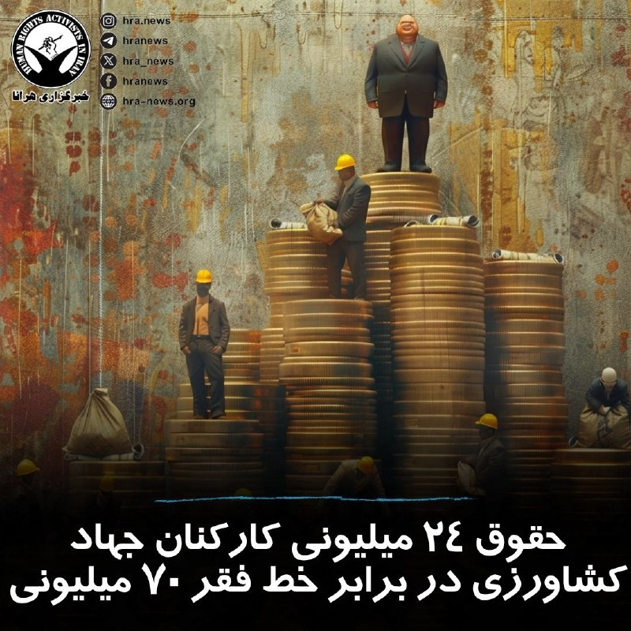

به گفته یحیی عزیزی، دبیر کارگروه پیگیری مطالبات کارکنان وزارت جهاد کشاورزی، کارکنان این وزارتخانه با وجود نقش مهم در حفظ ثبات بازار و تأمین امنیت غذایی کشور، با وضعیت معیشتی نامناسبی مواجه هستند. او با اشاره به حقوق حدود ۲۴ میلیون تومانی کارکنان، تأکید کرده است که این رقم در مقایسه با خط فقر شهری ۷۰ تا ۷۵ میلیون تومانی فاصله قابل توجهی دارد و پاسخگوی هزینه‌های زندگی نیست.

عزیزی همچنین با انتقاد از عدم اجرای وعده‌هایی مانند فوق‌العاده خاص و مزایای مرتبط با امنیت غذایی و مناطق محروم، سازمان برنامه و بودجه را از عوامل اصلی توقف بهبود وضعیت معیشتی کارکنان دانسته و خواستار ورود رئیس‌ جمهور یا معاون اول برای رسیدگی فوری به این موضوع شده است.
#کارکنان_جهاد_کشاورزی

↘️
@hranews_bot تماس ✉️ - @Hranews کانال هرانا 🆑

## manototv — post 105401

  <a href="telegram/content/manototv_105401_1778680670.mp4" target="_blank">🎬 Download video</a>

مقام‌های فرانسه اعلام کردند بیش از هزار مسافر یک کشتی تفریحی تحت مدیریت بریتانیا پس از شیوع بیماری گوارشی در این کشتی، اجازه پیاده شدن در بندر بوردو را ندارند.
بر اساس گزارش‌ها، ۴۹ نفر در کشتی «Ambition» علائمی شبیه گاستروآنتریت نشان داده‌اند و سه مسافر در کابین‌های خود قرنطینه شده‌اند.
گاستروآنتریت یا التهاب معده و روده یک بیماری عفونی دستگاه گوارش است. این بیماری اغلب توسط ویروس‌ها مثل نوروویروس یا روتاویروس ایجاد می‌شود، اما گاهی باکتری یا غذای آلوده هم عامل آن است. در کشتی‌های تفریحی، شیوع این بیماری رایج‌تر است چون افراد زیادی در فضای بسته و مشترک حضور دارند و ویروس به‌سرعت منتقل می‌شود. اعلام شده یک مرد ۹۲ ساله نیز روز یکشنبه در کشتی جان باخته، اما هنوز ارتباطی میان مرگ او و بیماری گوارشی تأیید نشده است.
این شرکت می‌گوید اقدامات بهداشتی و ضدعفونی گسترده در کشتی اجرا شده و به مسافران درباره رعایت بهداشت و گزارش علائم هشدار داده شده است.
کشتی «Ambition» با ۱۱۸۷ مسافر و ۵۱۴ خدمه، هشتم مه سفر خود را از بلفاست آغاز کرده بود.

## manototv — post 105400

  <a href="telegram/content/manototv_105400_1778680670.mp4" target="_blank">🎬 Download video</a>

دونالد ترامپ پس از ورود به پکن، در مراسمی رسمی با فرش قرمز، گارد احترام نظامی و صدها نفر از جوانان چینی مورد استقبال مقام‌های چین قرار گرفت. در تصاویر ثبت شده ایلان ماسک نیز در جمع همراهان ترامپ حضور دارد.
ترامپ امروز برنامه عمومی دیگری ندارد، اما قرار است پنجشنبه و جمعه چندین بار با شی جین‌پینگ دیدار کند. او پیش از سفر گفته بود محور اصلی گفت‌وگوها با رئیس‌جمهور چین، تجارت و توافق‌های اقتصادی خواهد بود.
این سفر در حالی انجام می‌شود که جنگ آمریکا و اسرائیل با ایران و افزایش تورم، فشارهایی بر محبوبیت ترامپ در داخل آمریکا وارد کرده است.
ترامپ پیش از ترک آمریکا گفت: «ما دو ابرقدرت جهان هستیم. آمریکا از نظر نظامی قدرتمندترین کشور دنیاست و چین را نفر دوم می‌دانند.»

## manototv — post 105399

  <a href="telegram/content/manototv_105399_1778680672.mp4" target="_blank">🎬 Download video</a>

یک نفتکش وابسته به شرکت دولتی نفت ابوظبی پس از حمله پهپادی جمهوری‌اسلامی در هفته گذشته، دچار نشت محدود سوخت در سواحل عمان شده است.
رویترز گزارش داده مقدار کمی از سوخت کشتی که به نظر می‌رسد سوخت بانکر بوده، در پی این حادثه نشت کرده است.
انور قرقاش، مشاور رئیس امارات، پیش‌تر حمله چهارم مه به این نفتکش را «دزدی دریایی» توصیف کرده بود. گزارش شده در زمان حمله کسی آسیب ندیده و کشتی حامل بار نبوده است.
این نفتکش با نام «MV Barakah» همچنان در سواحل عمان لنگر انداخته و شرکت می‌گوید در حال همکاری نزدیک با مقام‌های مربوطه و تیم‌های تخصصی واکنش به بحران است.

## manototv — post 105398

  <a href="telegram/content/manototv_105398_1778680672.mp4" target="_blank">🎬 Download video</a>

هواپیمای ریاست‌جمهوری آمریکا دقایقی پیش در پایتخت چین به زمین نشست و دونالد ترامپ سفر خود برای دیدار با شی جین‌پینگ، رئیس‌جمهور چین، را آغاز کرد. این نخستین سفر رسمی یک رئیس‌جمهور مستقر آمریکا به چین از زمان سفر ترامپ در سال ۲۰۱۷ است.

## manototv — post 105397

  <a href="telegram/content/manototv_105397_1778680673.mp4" target="_blank">🎬 Download video</a>

تماسی از ایران؛
تجربه‌ی یک آموزگار از آموزش مجازی

## manototv — post 105396

  <a href="telegram/content/manototv_105396_1778680675.mp4" target="_blank">🎬 Download video</a>

هواپیمای ریاست‌جمهوری آمریکا دقایقی پیش در پایتخت چین به زمین نشست و دونالد ترامپ سفر خود برای دیدار با شی جین‌پینگ، رئیس‌جمهور چین، را آغاز کرد.

## manototv — post 105395

  <a href="telegram/content/manototv_105395_1778680676.mp4" target="_blank">🎬 Download video</a>

وال‌استریت ژورنال به نقل از مقام‌های عرب و یک منبع آگاه گزارش داد رئیس سازمان اطلاعات اسرائیل، موساد، در جریان جنگ با ایران دست‌کم دو بار به‌صورت محرمانه به امارات متحده عربی سفر کرده است.
بر اساس این گزارش، دیوید بارنیا، رئیس موساد، در ماه‌های مارس و آوریل برای هماهنگی درباره جنگ با ایران به امارات رفته بود؛ اقدامی که نشانه‌ای از گسترش همکاری‌های امنیتی میان اسرائیل و کشورهای عربی خلیج فارس توصیف شده است.
این گزارش می‌افزاید اسرائیل در طول جنگ، سامانه‌های دفاع موشکی «گنبد آهنین» و ده‌ها نیروی نظامی را برای مقابله با حملات موشکی و پهپادی جمهوری‌اسلامی به امارات اعزام کرده بود.
وال‌استریت ژورنال همچنین نوشت امارات در حملات نظامی علیه اهدافی در ایران مشارکت داشته؛ از جمله حمله به یک پالایشگاه در جزیره لاوان در خلیج فارس. وزارت خارجه امارات و دفتر نخست‌وزیر اسرائیل تاکنون به درخواست‌های وال‌استریت ژورنال برای اظهار نظر پاسخ نداده‌اند.

## manototv — post 105394

  <a href="telegram/content/manototv_105394_1778680676.mp4" target="_blank">🎬 Download video</a>

رویترز گزارش داد عراق و پاکستان برای انتقال نفت و گاز از تنگه هرمز با جمهوری‌اسلامی به توافق رسیده‌اند؛ اقدامی که به گفته منابع آگاه، نشان‌دهنده افزایش کنترل تهران بر این آبراه راهبردی است.
بر اساس این گزارش، عراق عبور دو نفتکش بزرگ را با هماهنگی ایران انجام داده و پاکستان نیز انتقال محموله‌های گاز مایع طبیعی قطر را از مسیر هرمز با توافق تهران پیش می‌برد.
منابع رویترز می‌گویند جمهوری‌اسلامی اکنون به‌جای بستن تنگه هرمز، در حال کنترل عبور کشتی‌هاست و برخی کشورهای دیگر نیز در حال بررسی توافق‌های مشابه هستند.

## alonews — post 119749

  <a href="telegram/content/alonews_119749_1778680677.webm" target="_blank">🎬 Download video</a>

👈بروجردی،عضو کمیسیون امنیت ملی:
دستاورد تنگه هرمز را از دست نمی‌دهیم

✅ @AloNews خبر جنگ

## alonews — post 119748

  <a href="telegram/content/alonews_119748_1778680677.mp4" target="_blank">🎬 Download video</a>

من خطاب به بابام که میگه ۱۰شب خونه باش

[@AloTweet]

## alonews — post 119747

  <a href="telegram/content/alonews_119747_1778680679.webm" target="_blank">🎬 Download video</a>

👈رئیس ستاد ارتش اسرائیل:
جنگ با ایران پایان نیافته است،برای از سرگیری جنگ در هوشیاری کامل قرار داریم.

✅ @AloNews خبر جنگ

## alonews — post 119746

  <a href="telegram/content/alonews_119746_1778680679.webm" target="_blank">🎬 Download video</a>

👈رسانه‌های اسرائیلی: نتانیاهو امروز با رهبران امنیتی در مورد چگونگی مقابله با تهدیدات ناشی از پهپاد‌های حزب‌الله گفتگو می‌کند

✅ @AloNews خبر جنگ

## alonews — post 119745

  <a href="telegram/content/alonews_119745_1778680679.webm" target="_blank">🎬 Download video</a>

👈عکس منتشر شده توسط سنتکام از یک جنگنده F-35A نیروی هوایی ایالات متحده در حالی که در آب های منطقه ای نزدیک تنگه هرمز گشت می زند.‌‌

✅ @AloNews خبر جنگ

## alonews — post 119744

  <a href="telegram/content/alonews_119744_1778680679.mp4" target="_blank">🎬 Download video</a>

👈حملات به جنوب لبنان همچنان ادامه دارد

✅ @AloNews خبر جنگ

## alonews — post 119743

  <a href="telegram/content/alonews_119743_1778680680.mp4" target="_blank">🎬 Download video</a>

👈صحنه‌ای دیگر از حملات دقایقی قبل به لبنان

✅ @AloNews خبر جنگ‌‌

## alonews — post 119741

  <a href="telegram/content/alonews_119741_1778680682.webm" target="_blank">🎬 Download video</a>

👈حملات دقایقی قبل اسرائیل به لبنان.‌‌

✅ @AloNews خبر جنگ

## alonews — post 119737

  <a href="telegram/content/alonews_119737_1778680682.mp4" target="_blank">🎬 Download video</a>

👈هم اکنون حملات اسرائیل به جنوب لبنان

✅ @AloNews خبر جنگ

## alonews — post 119736

  <a href="telegram/content/alonews_119736_1778680684.webm" target="_blank">🎬 Download video</a>

👈وزارت بهداشت لبنان: از دوم مارس تاکنون، 2896 کشته و 8824 زخمی داشته‌ایم

✅ @AloNews خبر جنگ

## alonews — post 119734

  <a href="telegram/content/alonews_119734_1778680684.webm" target="_blank">🎬 Download video</a>

👈ویدیویی از حمله پهپادهای FPV حزب‌الله به پرتابگرهای گنبد آهنین اسرائیل و خدمه مربوط به آن‌ها

🔴حزب الله اخیرا با Fpv خسارات زیاده به اسرائیل زده زیرا این ریز پرنده‌ها به سختی رهگیری میشوند

✅ @AloNews خبر جنگ

## alonews — post 119733

  <a href="telegram/content/alonews_119733_1778680684.webm" target="_blank">🎬 Download video</a>

👈بلومبرگ: طبق داده‌های ردیابی کشتی، یک ابرنفت‌کش چینی حامل ۲ میلیون بشکه نفت خام عراق از تنگه هرمز عبور کرده است

🔴نفت‌کش یوان هوآ هو اکنون در دریای عمان، لنگر انداخته است؛ این سومین عبور شناخته‌شده یک نفت‌کش چینی از این آبراه از زمان آغاز جنگ آمریکا و اسرائیل علیه ایران است.

✅ @AloNews خبر جنگ

## alonews — post 119732

  <a href="telegram/content/alonews_119732_1778680684.mp4" target="_blank">🎬 Download video</a>

👈ویدویی دیگر از مراسم استقبال از ترامپ در فرودگاه پکن

✅ @AloNews خبر جنگ

## alonews — post 119731

  <a href="telegram/content/alonews_119731_1778680686.mp4" target="_blank">🎬 Download video</a>

👈استقبال از ترامپ در پکن

✅ @AloNews خبر جنگ

## alonews — post 119730

  <a href="telegram/content/alonews_119730_1778680688.webm" target="_blank">🎬 Download video</a>

👈پالایشگاه راس‌التنوره عربستان بعد از حملات ایران

✅ @AloNews خبر جنگ

---
📅 بروزرسانی: 1405/02/23 15:12
---

## VahidOOnLine — post 239887

  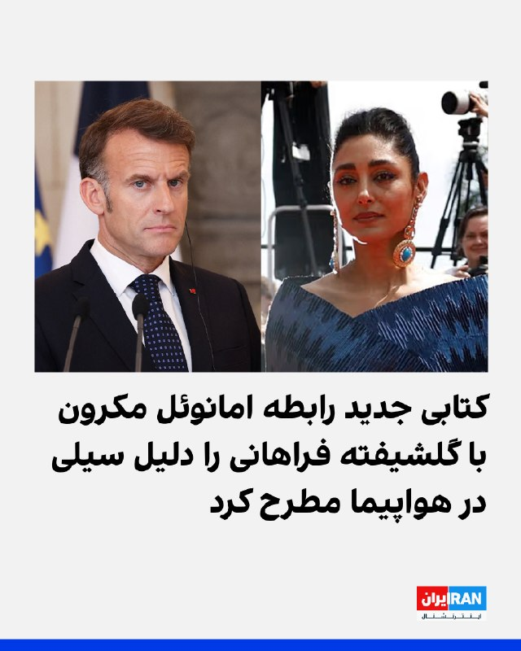

مجله مادام فیگارو گزارش داد فلوریان تاردیف، روزنامه‌نگار پاری‌مچ، در کتاب جدید خود نوشته است دلیل سیلی بریژیت مکرون به همسرش در هواپیما، کشف پیام‌های عاشقانه امانوئل مکرون، رییس‌جمهوری فرانسه، به گلشیفته فراهانی بوده است.

به نوشته این مجله، تاردیف تاکید کرده اطلاعات مطرح‌شده بر پایه واقعیت است و مکرون برای چند ماه رابطه‌ای «افلاطونی» با این بازیگر ایرانی داشته است.

این گزارش در حالی منتشر شد که پیش‌تر کاخ الیزه این رخداد را تنها یک «لحظه صمیمانه» میان امانوئل مکرون و همسرش توصیف کرده بود.

تاردیف گفت رییس‌جمهوری فرانسه «برای چند ماه» رابطه‌ای «افلاطونی» با گلشیفته داشته و «پیام‌هایی نوشته که نسبتا فراتر رفته‌اند»، از جمله جمله‌ای مانند «به نظرم بسیار زیبا هستید». تاردیف افزود: «این همان چیزی است که اطرافیان او به من گفته‌اند و امروز بیان می‌کنم.»
‌🏁 🇬🇧 IranintlTV

🤖 @VahidOOnLine

## VahidOOnLine — post 239886

  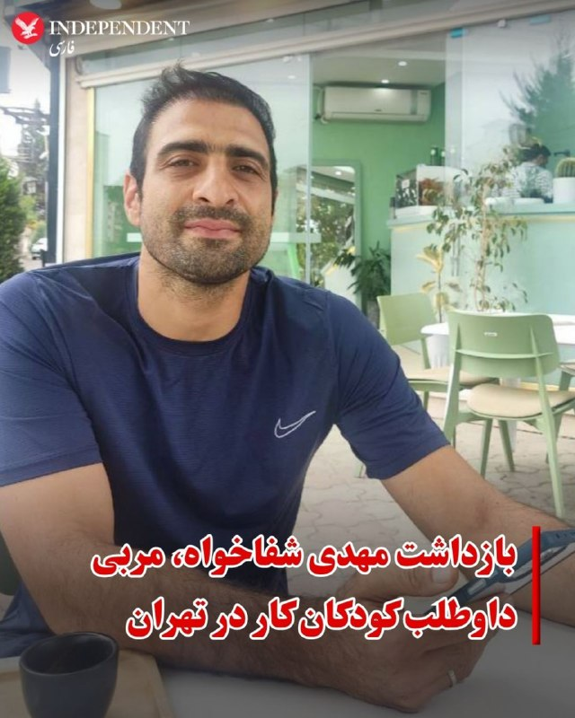

♦️اطلاعات رسیده به ایندیپندنت فارسی نشان می‌دهد نیروهای وزارت اطلاعات دولت جمهوری اسلامی، عصر روز سه‌شنبه ۲۲ اردیبهشت با حمله به منزل مهدی شفاخواه، مربی داوطلب ورزش برای کودکان کار، او را بازداشت و به مکانی نامعلوم کردند. به گفته منابع مطلع، ماموران امنیتی در جریان این اقدام، تلفن همراه همسر او را نیز ضبط کردند. دستگاه‌های قضایی و امنیتی جمهوری اسلامی تاکنون هیچ توضیحی درباره دلیل بازداشت و اتهام‌های احتمالی علیه مهدی شفاخواه ارائه نکرده‌اند.
مهدی شفاخواه طی سال‌های گذشته به صورت داوطلبانه در برخی از محروم‌ترین محله‌های استان تهران به آموزش ورزش به کودکان کار و آسیب‌پذیر پرداخته و به گفته نزدیکانش، نقش مهمی در دور نگه داشتن شمار زیادی از این کودکان از آسیب‌های اجتماعی داشت. او برادر رضا شفاخواه، وکیل دادگستری است که سابقه فعالیت‌های داوطلبانه در دفاع از کودکان آسیب‌دیده و زندانیان سیاسی را در کارنامه خود دارد.
‌🇸🇦 Indypersian

🤖 @VahidOOnLine

## VahidOOnLine — post 239885

  <a href="telegram/content/VahidOOnLine_239885_1778672546.mp4" target="_blank">🎬 Download video</a>

خبرگزاری رسمی امارات گزارش داد دولت امارات متحده عربی ۲۱ فرد و نهاد لبنانی را به‌دلیل ارتباط با حزب‌الله در فهرست تحریم قرار داده است.
بر اساس این گزارش، ۱۶ شهروند لبنانی و پنج سازمان مستقر در امارات به حمایت از گروه‌هایی متهم شده‌اند که از سوی ابوظبی «تروریستی» شناخته می‌شوند.
مقام‌های نظارتی امارات موظف شده‌اند افراد و نهادهای تحریم‌شده را شناسایی کرده و ظرف ۲۴ ساعت اقدامات لازم، از جمله مسدود کردن دارایی‌های آن‌ها، را انجام دهند.
امارات که میزبان جمعیت بزرگی از لبنانی‌هاست، در جریان جنگ منطقه‌ای ناشی از حملات آمریکا و اسرائیل به ایران، یکی از اصلی‌ترین اهداف حملات موشکی و پهپادی جمهوری اسلامی بود.
‌🏁 🇬🇧 ManotoTV

🤖 @VahidOOnLine

## VahidOOnLine — post 239884

  <a href="telegram/content/VahidOOnLine_239884_1778672547.mp4" target="_blank">🎬 Download video</a>

آژانس بین‌المللی انرژی پیش‌بینی کرده است که در پی اختلال‌های ناشی از درگیری‌های خاورمیانه، عرضه جهانی نفت در سال ۲۰۲۶ روزانه ۳.۹ میلیون بشکه کاهش یابد.
این نهاد همچنین انتظار دارد تقاضای جهانی نفت در سال جاری روزانه ۴۲۰ هزار بشکه کاهش پیدا کند، اما میزان افت عرضه بسیار بیشتر از کاهش تقاضا خواهد بود.
آژانس بین‌المللی انرژی در تازه‌ترین گزارش بازار نفت خود اعلام کرد:
«بیش از ۱۰ هفته پس از آغاز جنگ در خاورمیانه، افزایش اختلال‌ها در تنگه هرمز ذخایر جهانی نفت را با سرعتی بی‌سابقه کاهش داده است.»
در ادامه این گزارش آمده است: «کاهش سریع ذخایر مازاد در کنار ادامه اختلال‌ها ممکن است زمینه‌ساز جهش‌های قیمتی در آینده شود.»
‌🏁 🇬🇧 ManotoTV

🤖 @VahidOOnLine

## VahidOOnLine — post 239883

  <a href="telegram/content/VahidOOnLine_239883_1778672547.mp4" target="_blank">🎬 Download video</a>

معاون وزیر بهداشت در اظهاراتی «بحران جمعیت» را مهم‌تر از جنگ اخیر ارزیابی کرده است و افزوده «اقتداری که مردم و نیروهای مسلح در دوران جنگ نشان دادند، ناشی از همین جمعیت جوان بوده است.»
این مقام با هشدار درباره ادامه روند کاهش زاد‌وولد در ایران گفت آمار تولدها در سال ۱۴۰۴ به ۸۹۲ هزار و ۲۶۸ نفر رسیده؛ در حالی‌ که این رقم در سال ۱۴۰۳ حدود ۹۷۳ هزار نفر بوده است.
او با اشاره به اینکه آمار موالید پیش‌تر به زیر ۹۰۰ هزار نفر رسیده بود، گفت این ارقام نشان‌دهنده ادامه روند نزولی جمعیت در کشور است، هرچند به گفته او «شیب کاهش جمعیت کندتر شده است.»
‌🏁 🇬🇧 ManotoTV

🤖 @VahidOOnLine

## VahidOOnLine — post 239882

  

بررسی‌ها نشان می‌دهد یک ابرنفتکش چینی پیش از گفت‌وگوهای ترامپ و شی جین‌پینگ از تنگه هرمز عبور کرده است. این نفتکش تحت ثبت و مدیریت شرکت دولتی چینی «کاسکو شیپینگ» قرار دارد. نفتکش بسیار بزرگ حمل نفت خام (VLCC) با نام «یوان هوا هو» آخرین بار در ردیاب‌های دریایی در شرق تنگه مشاهده شده بود.این نفتکش هنگام عبور، مقصد خود را «مالک و خدمه چینی» ثبت کرده بود.به نظر می‌رسد اندکی پس از خاموش کردن سیستم ردیابی‌اش، در یک تصویر ماهواره‌ای ثبت شده باشد. در ۲۴ ساعت گذشته، چند کشتی دیگر تحت مدیریت چین نیز از تنگه هرمز عبور کرده‌اند. همه آن‌ها از مسیری تحت کنترل جمهوری‌اسلامی و نزدیک به آب‌های ایران استفاده کرده‌اند. به‌دست آوردن تصویر کامل از رفت‌وآمدها ممکن نیست، زیرا بیشتر کشتی‌هایی که از تنگه عبور می‌کنند سیستم ردیابی خود را خاموش کرده‌اند.
‌🏁 🇬🇧 ManotoTV

🤖 @VahidOOnLine

## VahidOOnLine — post 239881

  

براساس داده‌های سازمان هواشناسی، ۱۸ استان ایران در سال آبی جاری با کاهش بارندگی مواجه شده‌اند و استان تهران با بیش از ۳۸ درصد افت میانگین بارش، رکورددار کم‌بارشی در کشور شده است.

گزارش‌ها نشان می‌دهد کاهش بارندگی در تهران و برخی استان‌های مرکزی، نگرانی‌ها درباره تشدید بحران آب و فشار بر منابع آبی را افزایش داده است.

پس از تهران، استان‌های قم و سمنان نیز در میان استان‌هایی قرار دارند که بیشترین کاهش بارش را تجربه کرده‌اند.

کارشناسان هشدار می‌دهند ادامه روند خشکسالی و افت بارش‌ها می‌تواند وضعیت ذخایر سدها و تامین آب شرب را در ماه‌های آینده دشوارتر کند. چون ظاهراً در این سرزمین، همه‌چیز یا «بی‌سابقه» است یا «در آستانه بحران». برنامه‌ریزی پایدار هم مثل بارندگی، سال‌هاست کمیاب شده.
‌🏁 🇬🇧 ManotoTV

🤖 @VahidOOnLine

## VahidOOnLine — post 239880

  

سازمان «نت‌بلاکس» اعلام کرد خاموشی گسترده اینترنت در ایران از ۱۷۷۶ ساعت گذشته و وارد هفتاد و پنجمین روز شده است. این نهاد می‌گوید محدودیت‌های گسترده اینترنت، هم‌زمان با اجرای طرح‌های اینترنت طبقاتی و دسترسی‌های گزینشی، باعث افزایش نظارت، فساد و کلاهبرداری‌های دیجیتال شده است.

واقعاً شگفت‌انگیز است که در سال ۲۰۲۶ هنوز بعضی حکومت‌ها اینترنت را مثل شیر آب ساختمان قطع می‌کنند. فقط فرقش این است که این یکی همزمان اقتصاد، امنیت دیجیتال و اعصاب مردم را هم می‌بندد.
‌🏁 🇬🇧 ManotoTV

🤖 @VahidOOnLine

## VahidOOnLine — post 239879

♦️علیرضا رئیسی، معاون وزیر بهداشت جمهوری اسلامی ایران روز چهارشنبه ۲۳ اردیبهشت در یک نشست خبری با هشدار درباره سیر نزولی جمعیت‌ در ایران گفت: «زنگ خطر جمعیت در استان‌های گیلان، مازندران و البرز به صدا درآمده است.»

این مقام وزارت بهداشت ایران گفت: «تعداد مرگ در سه استان گیلان مازندران و البرز از تعداد تولد بیشتر است و این زنگ خطر است‌.»

رئیسی درباره پیری جمعیت ایران نیز هشدار داد و تاکید کرد: «طی دو یا سه دهه آینده از هر سه ایرانی یک نفر سالمند است.»

معاون وزیر بهداشت جمهوری اسلامی همچنین به سیر نزولی جمعیت‌ در ایران اشاره کرد و گفت: «در سال ۱۴۰۴ تعداد متولدان ۸۹۲ هزار نفر بوده است.»
‌🇸🇦 Indypersian

🤖 @VahidOOnLine

## VahidOOnLine — post 239878

  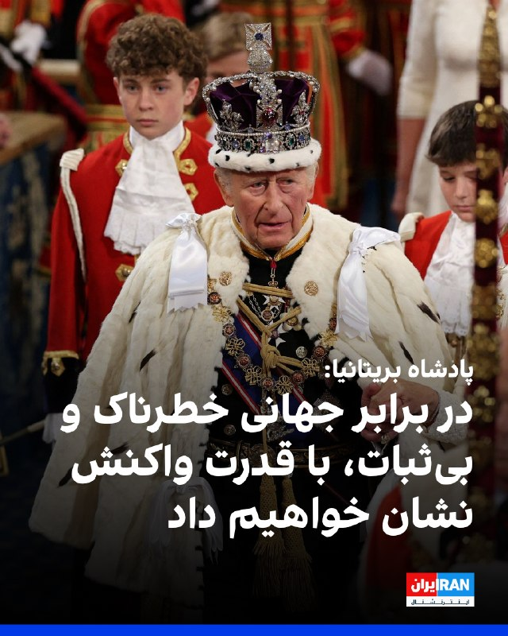

چارلز سوم، پادشاه بریتانیا، در آغاز سخنرانی خود در پارلمان این کشور با اشاره به وضعیت کنونی جهان اعلام کرد که دولت در برابر «جهانی خطرناک و بی‌ثبات» با قدرت واکنش نشان خواهد داد. او درگیری در خاورمیانه را تازه‌ترین نمونه از تهدیدهایی دانست که بریتانیا با آن روبه‌رو است.

او گفت: «جهانی که به‌طور فزاینده‌ای خطرناک و بی‌ثبات است، بریتانیا را تهدید می‌کند و درگیری در خاورمیانه تنها تازه‌ترین نمونه آن است. هر بخش از انرژی ملی، دفاع و امنیت اقتصادی کشور مورد آزمون قرار خواهد گرفت.»

پادشاه افزود: «دولت من با قدرت به این جهان پاسخ خواهد داد و در پی ایجاد کشوری خواهد بود که برای همه عادلانه باشد.»
‌🏁 🇬🇧 IranintlTV

🤖 @VahidOOnLine

## VahidOOnLine — post 239877

🗣روایت شما از اقتصاد بحرانی زیر سایه آتش‌بس- چهارشنبه ۲۳ اردیبهشت:
🔹واقعا نمی‌دونیم چیکار کنیم. حتی نفس کشیدن هم گرون شده. یکی از ترس‌های بزرگم اینه جنگ تموم شه، اینا باقی بمونن و به‌دنبال مخالف‌ها بگردن تا در سکوت قتل‌عام راه بندازن.

🔹در بازار لوازم‌خانگی امین حضور، قیمت کالاهایی از برندهای خارجی به شدت گرون و چند برابر شده، به این دلیل که از امارات بار قاچاق وارد نمی‌شه. قیمت مصرف لوازم خانگی از برندهای ایرانی هم هر هفته و بی‌دلیل افزایش پیدا می‌کنه.

🔹من یک دختر ۳۰ ساله از تهران هستم که هنوز با خانواده زندگی می‌کنم. ۸ سال کار کردم تا به آرزوهام برسم ولی الان دارم یکی‌یکی طلاهایی که پس‌انداز کرده بودم رو می‌فروشم تا فقط گذران زندگی کنم.

🔹من پشت کنکوری هستم و اگر امسال قبول نشم، باید برم سربازی اما نه پول کتاب کمک ‌درسی رو دارم نه اینترنت که بتونم از یوتیوب یا وبسایت‌ها چیزی یاد بگیرم.

🔹تریدر بازار فارکس و کریپتو هستم و با قطعی اینترنت کاملاً بیکار شدم. در واقع تمامی کسانی که درآمد ثابتشون با اینترنت بود، بیکار شدن و نمی‌دونن دقیقا باید چیکار کرد.

🔹پیش از جنگ اینترنت رو ماهانه ۴۹۰ هزار تومان شارژ می‌کردم. الان برای استفاده از اسنپ، بانک و دیجی‌کالا که برای خود حکومت هست، ماهانه ۸۰۰ هزار تومان پرداخت می‌کنم.

🔹وضعیت خیلی بده. کسی که پول نداشت، هزار برابر بیشتر ندار شده. پدر من بعد از ۳۰ سال معلم بودن هنوز مستاجره و این حقوق نه‌تنها کفاف زندگیش رو نمیده، بلکه از پرداخت پول داروهای مادرم هم عاجزیم.

🔹 من دو شغل دارم؛ کار آزادم از عید تا به امروز تعطیله و این خودش ضرر مالی هست و شغل دومم هم که دولتیه، حقوقم ۱۰ روز عقب افتاده.
‌🏁 🇬🇧 IranintlTV

🤖 @VahidOOnLine

## VahidOOnLine — post 239876

  

♦️ادعای رضا کیانیان، هنرپیشه مشهور سینما و تلویزیون ایران درباره کمک سه میلیون دلاری در کارزار احیای دریاچه ارومیه، جنجالی شده است.

کیانیان در مصاحبه با برنامه اینترنتی بهاره افشاری گفته بود: «سه میلیون دلار  [از ژاپن] گرفتم و به عیسی کلانتری دادم».

عیسی کلانتری، رئیس سابق سازمان محیط زیست در مصاحبه با ایلنا با تکذیب گفته‌های کیانیان گفت: « رضا کیانیان پولی از جایکا (دفتر همکاری‌های ایران و ژاپن) نگرفته که به من بدهد، اگر گرفته، اثبات کند! او اصلا او از جایگاه جایکا اطلاعی ندارد و آنها پول به فرد نمی‌دهند، خواستم شکایت کنم اما دیدم از روی بی‌اطلاعی این حرف‌ها را می‌گوید و یا شاید ‌دنبال بزرگ کردن خودش است.»
‌🇸🇦 Indypersian

🤖 @VahidOOnLine

## VahidOOnLine — post 239875

  

علیرضا رییسی، معاون بهداشت وزارت بهداشت، با هشدار نسبت به «سیر نزولی جمعیت» در کشور گفت: «روند جمعیت در ایران و جهان همچنان نزولی است، اما معتقدم مسئله جمعیت حتی از چالش‌های نظامی و جنگ‌های جاری نیز مهم‌تر است.»

او افزود: «همین اقتداری که ملت و نیروهای مسلح در ایام جنگ نشان داده‌اند، ناشی از همین جمعیت جوان است.»
‌🏁 🇬🇧 IranintlTV

🤖 @VahidOOnLine

## VahidOOnLine — post 239874

  

♦️وال استریت ژورنال روز چهارشنبه ۲۳ اردیبهشت به نقل از مقام‌های عرب و یک فرد آگاه گزارش داد، رئیس سازمان جاسوسی اسرائیل، موساد در طول جنگ با ایران دست‌کم دو بار به منظور هماهنگی در مورد جنگ به امارات متحده عربی سفر کرده است.
این منابع گفتند که دیوید بارنیا، رئیس موساد، دست‌کم در دو نوبت جداگانه، در ماه مارس و آوریل، مخفیانه از امارات متحده عربی بازدید کرد.

این منابع سفر بارنیا به امارات را نشانه‌ای از همکاری رو به رشد بین اسرائیل و امارات متحده عربی دانسته‌اند.
وال استریت ژورنال گزارش داده است که دو کشور در طول جنگ هماهنگی امنیتی نزدیکی را نشان داده‌اند و اسرائیل سامانه گنبد آهنین و ده‌ها پرسنل نظامی را برای راه‌اندازی آنها جهت دفاع در برابر موشک‌های ایرانی به امارات اعزام کرده است. دیوید هاکبی، سفیر ایالات متحده در اسرائیل روز سه‌شنبه گزارش‌های غیررسمی درباره استقرار سامانه گنبد آهنین و نیروهای اسرائیلی در امارات را تائید کرده بود.
وزارت امور خارجه امارات متحده عربی و دفتر نخست وزیر اسرائیل هنوز به این گزارش واکنشی نشان نداده‌اند.
‌🇸🇦 Indypersian

🤖 @VahidOOnLine

## VahidOOnLine — post 239873

  

روزنامه وال‌استریت ژورنال به نقل از مقام‌های عرب و یک فرد آگاه گزارش داد دیوید بارنئا، رییس موساد، در جریان جنگ علیه جمهوری اسلامی دست‌کم دو بار به امارات متحده عربی سفر کرد تا درباره هماهنگی‌های مرتبط با جنگ گفت‌وگو کند.

به گفته منابع آگاه، بارنئا در ماه‌های مارس و آوریل در دو نوبت جداگانه و به‌صورت محرمانه به امارات متحده عربی سفر کرد.

وزارت خارجه امارات متحده عربی و دفتر نخست‌وزیر اسرائیل بلافاصله به درخواست‌های این روزنامه برای اظهار نظر پاسخ ندادند.
‌🏁 🇬🇧 IranintlTV

🤖 @VahidOOnLine

## VahidOOnLine — post 239872

  <a href="telegram/content/VahidOOnLine_239872_1778672556.mp4" target="_blank">🎬 Download video</a>

⭕️ارتش اسرائیل تصاویری از حملات به زیرساخت‌های حزب‌الله در جنوب لبنان منتشر کرد

♦️ارتش اسرائیل روز چهارشنبه ۲۳ اردیبهشت تصاویری از حملات به زیرساخت‌های حزب‌الله در جنوب لبنان منتشر کرد.
ارتش اسرائیل همچنین اعلام کرد که این حملات در قالب موج تازه‌ای از عملیات علیه مواضع حزب‌الله انجام شده است.
این حملات با وجود آتش‌بس میان اسرائیل و دولت لبنان برای توقف درگیری‌ها ادامه دارد و تنش‌ها در مناطق مرزی همچنان بالا باقی مانده است.
‌🇸🇦 Indypersian

🤖 @VahidOOnLine

## VahidOOnLine — post 239871

  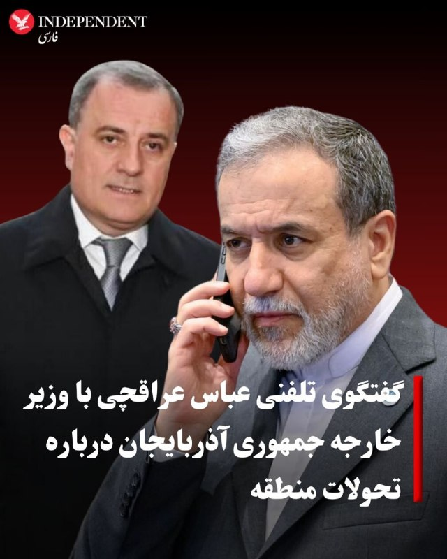

♦️عباس عراقچی وزیر خارجه جمهوری اسلامی و جیحون بایراموف وزیر خارجه جمهوری آذربایجان، روز چهارشنبه ۲۳ اردیبهشت در یک تماس تلفنی درباره تحولات منطقه‌ای و روابط دوجانبه گفتگو کردند.
رسانه‌های ایران جزئیات بیشتری در خصوص این تماس تلفنی منتشر نکرده‌اند.
عباس عراقچی، وزیر امور خارجه جمهوری اسلامی قرار است این هفته برای شرکت در نشست وزرای خارجه بریکس، روزهای ۲۴ و ۲۵ اردیبهشت (۱۴ و ۱۵ مه) به دهلی‌نو سفر کند.
‌🇸🇦 Indypersian

🤖 @VahidOOnLine

## VahidOOnLine — post 239870

  

♦️آژانس بین‌المللی انرژی روز چهارشنبه ۲۳ اردیبهشت در گزارش ماهانه بازار نفت خود اعلام کرد که عرضه جهانی نفت امسال پاسخگوی کل تقاضا نخواهد بود، زیرا جنگ ایران تولید نفت خاورمیانه را مختل کرده است.

این نهاد بین‌المللی اعلام کرد: «با توجه به محدودیت تردد نفتکش‌ها در تنگه هرمز، مجموع کاهش عرضه از سوی تولیدکنندگان خلیج فارس در حال حاضر از یک میلیارد بشکه فراتر رفته و بیش از ۱۴ میلیون بشکه در روز نفت اکنون مسدود شده است که یک شوک عرضه بی‌سابقه است.»

به گزارش رویترز، آژانس بین‌المللی انرژی اعلام کرد که پیش‌بینی اولیه آن از سرگیری تدریجی تردد از طریق تنگه هرمز از سه ماهه سوم (ژوئیه/مرداد) به بعد است.

پیش‌بینی‌های آژانس بین‌المللی انرژی حاکی از آن است که عرضه در سال نزدیک به یک میلیون و هشتصد هزار بشکه در روز کمتر از کل تقاضا خواهد بود.
‌🇸🇦 Indypersian

🤖 @VahidOOnLine

## WithYashar — post 11142

  <a href="telegram/content/WithYashar_11142_1778672560.mp4" target="_blank">🎬 Download video</a>

حمله دیروز گروه «کد پینک» به سخنرانی شاهزاده رضا پهلوی و وزیر جنگ هگست
@withyashar

## WithYashar — post 11141

  

یه گروهی اومده بنام « کد پینگ » سر دسته شونم این پیری هست
Medea Bejamin
حمله کردن به سخنرانی شاهزاده و وزیر جنگ
@withyashar

## WithYashar — post 11140

ایتالیا اعلام کرد که کشتی‌های مین‌روب خود را به نزدیکی آب‌های خلیج فارس اعزام خواهند کرد ولی شروع مین‌روبی‌ ، به دستیابی به یک آتش‌بس دائم و پایدار بستگی دارد.
@withyashar

## WithYashar — post 11139

سلام یاشار جان خسته نباشی❤️ تو یه اتفاق جالب با همکلاسیم نشسته بودیم تو سلف دانشگاه غذا میخوردیم،دوستم پرسید اخبار چک میکنی گفتم اره،بعد نشون هم دادیم گوشیامونو😅چند روز پیش کانالتو براش فرستادم،البته از اینستا میشناختت ولی کانالتو نداشت،و پیجتم دنبال نمیکرد…

## WithYashar — post 11138

  

سلام یاشار جان خسته نباشی❤️
تو یه اتفاق جالب با همکلاسیم نشسته بودیم تو سلف دانشگاه غذا میخوردیم،دوستم پرسید اخبار چک میکنی گفتم اره،بعد نشون هم دادیم گوشیامونو😅چند روز پیش کانالتو براش فرستادم،البته از اینستا میشناختت ولی کانالتو نداشت،و پیجتم دنبال نمیکرد فقط چندبار دیده بود.
دوستم‌گفت بهت بگم‌ همش اخبارو چک میکنیم و منتظر اخبار بعدی میمونیم😅

## WithYashar — post 11137

  

اولین «نمایندگی رسمی مجاز اپل» یا Apple Authorized Reseller در افغانستان افتتاح شد
@withyashar

## WithYashar — post 11136

دیو دی‌کمپ، روزنامه نگار آمریکایی: شاید ظرف یک هفته آینده شاهد بازگشت به عملیات نظامی بزرگ آمریکا علیه ایران باشیم
@withyashar

## WithYashar — post 11135

نیویورک تایمز: قصد ترامپ از تغییر نام عملیات «خشم حماسی» به «چکش سنگین» این است که یک عملیات جدید ۶۰ روزه حمله به ایران شروع کند @withyashar

## WithYashar — post 11134

سخنگوی وزارت خارجه: ما عملاً در یک آتش‌بس اسمی قرار داریم، اما طبق حقوق بین‌الملل، خودِ محاصره یک اقدام جنگی محسوب می‌شود.
@withyashar

## mwarmonitor — post 9027

  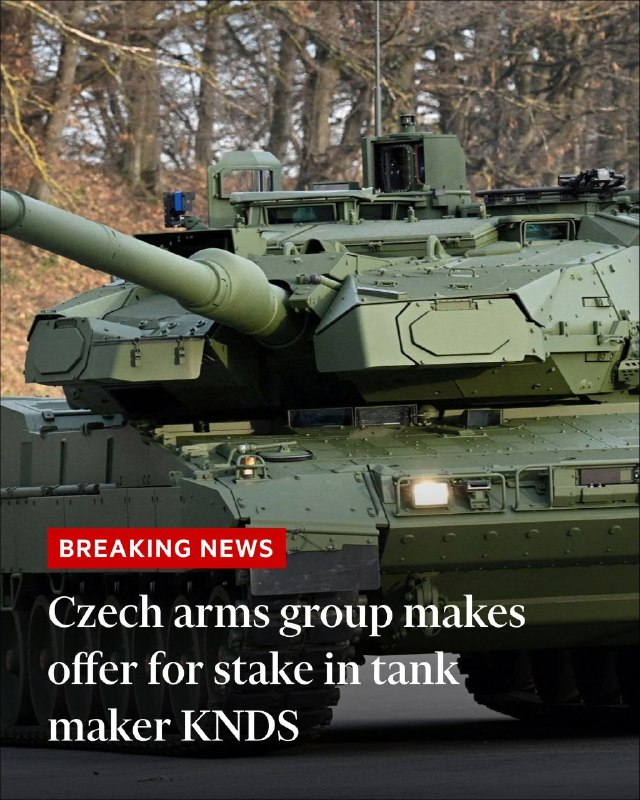

🔴شرکت سازنده مهمات Czechoslovak Group پیشنهاد داده است بخشی از سهام شرکت تانک‌سازی فرانسوی–آلمانی KNDS را خریداری کند؛ اقدامی که نشانه تلاشی تازه برای یکپارچه‌سازی صنعت دفاعی اروپا به شمار می‌رود. فیننشال تایمز

@mwarmonitor

## mwarmonitor — post 9026

🇨🇳🇺🇸معاون نخست‌وزیر چین، He Lifeng و وزیر خزانه‌داری ایالات متحده، Scott Bessent گفت‌وگوهایی «عمیق، صریح و سازنده» درباره مسائل تجاری و اقتصادی و همچنین درباره «گسترش همکاری‌های عملی» در کره جنوبی انجام دادند.

@mwarmonitor

## mwarmonitor — post 9025

  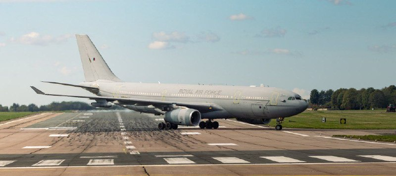

✈️🇬🇧نیروی هوایی سلطنتی بریتانیا (RAF) ایرباس KC.2 Voyager ×۳ 43C6FB ZZ338 – ASCOT 9900 43C700 ZZ343 – ASCOT 9901 43C6F7 ZZ334 – ASCOT 9902 ✈️صبح امروز یک عملیات سوخت‌رسانی غیرمعمول از سوی نیروی هوایی سلطنتی بریتانیا در جریان است. سه فروند هواپیمای «ویجر»…

## mwarmonitor — post 9024

✈️🇺🇸نیروی هوایی آمریکا به دنبال تجهیز جنگنده‌های F-16 به اخلالگرهای نورثروپ گرومن است

📝نویسنده: کالین دمارست AXIOS

🔰نیروی هوایی ایالات متحده در نظر دارد بر اساس اسناد بودجه، طی چند سال آینده ۲۰۶ پکیج ارتقایافته جنگ الکترونیک برای جنگنده‌های F-16 خریداری کند.

🔸چرا این موضوع اهمیت دارد؟
هواپیماهای جنگنده ساخت شرکت لاکهید مارتین می‌توانند از اوایل سال ۲۰۲۸ به «سوییت یکپارچه جنگ الکترونیک وایپر» (IVEWS) محصول شرکت نورثروپ گرومن مجهز شوند.
🔹مارک ساندور، مدیر استراتژی و راهکارهای ماموریتی نورثروپ، به اکسیوس (Axios) گفت:
«این اقدام در واقع به معنای قرار دادن جنگ الکترونیک نسل ششم در یک پلتفرم نسل چهارم است.»
🔸وضعیت فعلی: پروژه‌ای که سال‌ها در حال توسعه بوده است
۲۰۱۹: نیروی هوایی برای اولین بار سیستم IVEWS را انتخاب کرد.
۲۰۲۱: اولین پرواز این سیستم در رزمایش "Northern Lightning" انجام شد.
۲۰۲۴: پروازهای آزمایشی بر روی F-16های نیروی هوایی آغاز گشت.
۲۰۲۵: ارزیابی‌های عملیاتی به پایان رسید.
در همان سال، نورثروپ اعلام کرد که سیستم IVEWS به طور «یکپارچه» با رادار آرایه فازی فعال SABR کار می‌کند. فیل لودن، مدیر بخش IVEWS در نورثروپ، اظهار داشت: «سخت‌افزار و نرم‌افزار بسیار پایدار بوده‌اند و نیروی هوایی با جدیت در حال افزایش سرعت تولید است.»
نگاهی به گذشته و چشم‌انداز جهانی
بودجه: سیستم IVEWS مبلغ ۱۸۷ میلیون دلار از بودجه سال ۲۰۲۵ دریافت کرد که صرف تولید اولیه با نرخ پایین شد.

🔸بازار بین‌المللی: علاقه زیادی به این پکیج جنگ الکترونیک در سطح جهان وجود دارد. در حال حاضر حدود ۲,۸۰۰ فروند F-16 در بیش از ۲۴ کشور در حال خدمت هستند.
🔹مشتریان خارجی: در سال ۲۰۲۴، گزارش‌های گسترده‌ای مبنی بر خرید این سیستم توسط ترکیه منتشر شد. لودن در این باره گفت: «ما به طور فعال در فرآیند فروش نظامی خارجی با بسیاری از کشورهای شریک درگیر هستیم.»

@mwarmonitor

## mwarmonitor — post 9023

  

❌به نظر می‌رسد حریم هوایی اطراف سن‌پترزبورگ بسته شده و پروازها در فاصله‌ای امن در حالت انتظار قرار گرفته‌اند.

@mwarmonitor

## mwarmonitor — post 9022

🔴رئیس موساد، بارنیا، دست‌کم دو بار در طول جنگ به امارات متحده عربی سفر کرده است تا برای هماهنگی در کارزار علیه ایران اقدام کند (وال‌استریت ژورنال).

@mwarmonitor

## FoxNewsTwitter — post 341630

‌Fox News (Twitter/X)

Read more:

## FoxNewsTwitter — post 341629

  

Fox News (Twitter/X)

EXCLUSIVE: “Unbeknownst to parents... they’ve been poisoning pupils’ minds for years.”

A watchdog report claims Southern Poverty Law Center-linked curriculum is being used in classrooms nationwide, including kindergarten, and could be indoctrinating children.

The findings say the SPLC’s “Learning for Justice” program has been integrated into lesson plans across 169 districts in 42 states, touching everything from teacher training to student coursework.

Critics argue it introduces themes like anti-racism, gender ideology, and white privilege into core subjects — often without parents’ awareness.

The development comes as the SPLC faces federal fraud charges over an alleged multimillion-dollar informant program involving White supremacist and neo-Nazi groups.

## FoxNewsTwitter — post 341628

  <a href="telegram/content/FoxNewsTwitter_341628_1778672570.mp4" target="_blank">🎬 Download video</a>

Fox News (Twitter/X)

NEW: House Speaker Mike Johnson sounds the alarm on “mini Mamdanis” to @kilmeade as Democrats trend toward electing socialists around the country:

BRIAN KILMEADE: "Democrats seem to be nominating some extreme candidates... People say, ‘This is just like what the Republicans went through after they lost to Obama, they had the Tea Party.’ Is this the same to you?"

JOHNSON: "This is something that we have never seen before in American history... This is about moving away from a constitutional republic to a communist utopian ideology."

"This is not our father's Democratic Party anymore. They're going far, far left and no one’s there to stop it."

| @foxandfriends

## FoxNewsTwitter — post 341627

  <a href="telegram/content/FoxNewsTwitter_341627_1778672572.mp4" target="_blank">🎬 Download video</a>

Fox News (Twitter/X)

NEW: President Trump is heading to China as the Iran war keeps rattling global oil markets.
He says Xi is “a friend of mine” and predicts “good things will happen” — but the stakes are much bigger than a handshake.

@TreyYingst reports the trip comes after diplomatic solutions with Iran failed to break through.

## FoxNewsTwitter — post 341626

  

Fox News (Twitter/X)

Marco Rubio made a major fashion statement on Air Force One.

The Secretary of State spotted on the president's plane in the now-infamous gray Nike Tech tracksuit associated with Venezuelan leader Nicolás Maduro.

Maduro was seen wearing a strikingly similar outfit during his capture by American forces earlier this year.

## pm_afshaa — post 90682

🔥رفقا بار هزارمه تبلیغ هانارو میذارم واستون ی مشتری ناراضی نداره و مخصوص یوزرای ما تخفیف گذاشته👇🏼 1 Gig = 280,000 T 2 Gig = 560,000 T 3 Gig = 800,000 T 5 Gig = 1,200,000 T 10 Gig = 2,200,000T 20 Gig = 4,000,000T 💎پرداخت ریال ، کارت به کارت 💵واریز با ارز…

## pm_afshaa — post 90681

🔥رفقا بار هزارمه تبلیغ هانارو میذارم واستون ی مشتری ناراضی نداره و مخصوص یوزرای ما تخفیف گذاشته👇🏼

1 Gig = 280,000 T
2 Gig = 560,000 T
3 Gig = 800,000 T
5 Gig = 1,200,000 T
10 Gig = 2,200,000T
20 Gig = 4,000,000T

💎پرداخت ریال ، کارت به کارت

💵واریز با ارز دیجیتال ( ترون )

📌قابلیت مشاهده حجم مصرفی
📌نامحدود بودن تعداد کاربران
📌سرعت دانلود به شدت بالا

ایدی جهت خرید👇🏼👇🏼👇🏼👇🏼

@RealHoneyi

## pm_afshaa — post 90680

🔴سنتکام:همچنان به اعمال محاصره علیه کشتی‌هایی که به داخل ایران وارد می‌شوند یا از آنها خارج می‌شوند، ادامه می‌دهیم

💧 Rainbet.com the #1 Non-KYC Crypto Casino & Sportsbook @rainbetcom

😁 @Pm_Afshaa

## pm_afshaa — post 90679

  <a href="telegram/content/pm_afshaa_90679_1778672577.webm" target="_blank">🎬 Download video</a>

🔴سی‌ان‌ان: پیش‌بینی میشه ترامپ از رئیس‌جمهور چین بخواد که بر ایران فشار بیاره تا تنگه هرمز رو بازگشایی کنه و با یک توافق صلح مناسب موافقت کنه.

💧 Rainbet.com the #1 Non-KYC Crypto Casino & Sportsbook @rainbetcom

😁 @Pm_Afshaa

## pm_afshaa — post 90678

  <a href="telegram/content/pm_afshaa_90678_1778672578.webm" target="_blank">🎬 Download video</a>

🔴اپل به صورت رسمی اولین نمایندگی خودش رو در افغانستان افتتاح کرد..

💧 Rainbet.com the #1 Non-KYC Crypto Casino & Sportsbook @rainbetcom

😁 @Pm_Afshaa

## pm_afshaa — post 90677

  <a href="telegram/content/pm_afshaa_90677_1778672578.webm" target="_blank">🎬 Download video</a>

🔴سخنگوی وزارت خارجه:
آمریکا فعلا با پیشنهاد جمهوری اسلامی موافقت نکرده، اما تهران از طریق میانجی‌های پاکستانی منتظر ارزیابی دقیق‌تره.

💧 Rainbet.com the #1 Non-KYC Crypto Casino & Sportsbook @rainbetcom

😁 @Pm_Afshaa

## pm_afshaa — post 90676

  <a href="telegram/content/pm_afshaa_90676_1778672579.webm" target="_blank">🎬 Download video</a>

🔴رسانه‌های اسرائیلی:
رئیس موساد، حداقل دو بار در طول جنگ به منظور هماهنگی کمپین علیه جمهوری اسلامی به امارات متحده عربی سفر کرده.

💧 Rainbet.com the #1 Non-KYC Crypto Casino & Sportsbook @rainbetcom

😁 @Pm_Afshaa

## pm_afshaa — post 90675

🔴دیو دی‌کمپ، روزنامه نگار آمریکایی: شاید ظرف یک هفته آینده شاهد بازگشت به عملیات نظامی بزرگ آمریکا علیه ایران باشیم

💧 Rainbet.com the #1 Non-KYC Crypto Casino & Sportsbook @rainbetcom

😁 @Pm_Afshaa

## pm_afshaa — post 90674

🔴کانال 13 اسرائیل:نتانیاهو امشب جلسه امنیتی ویژه در مورد ایران برگزار خواهد کر‌د

💧 Rainbet.com the #1 Non-KYC Crypto Casino & Sportsbook @rainbetcom

😁 @Pm_Afshaa

## iaghapour — post 2605

  

⭕️ با اپ TunnelX در ویندوز از قابلیت Split Tunneling استفاده کنید.

🔹اپ TunnelX برای زمانی ساخته شده که کاربر نمی‌خواهد تمام ترافیک سیستم از وی‌پی‌ان عبور کند. با این برنامه می‌توان فقط برنامه‌هایی مثل مرورگر، تلگرام، ابزارهای توسعه یا برنامه‌های مشخص دیگر را وارد تونل کرد و بقیه ترافیک سیستم را روی اینترنت عادی نگه داشت. همچنین در صورت نیاز، حالت Full-route برای عبور کل سیستم از تونل در دسترس است.

🔗 دانلود اپ از گیت‌هاب پروژه

🆔 @iaghapour

## DEJradio — post 4614

  <a href="telegram/content/DEJradio_4614_1778672581.mp4" target="_blank">🎬 Download video</a>

🚨
🔸 اذیت و آزار دختران دبیرستان شرافت؛

توضیحات فریبرز کرمی‌زند افسر پیشین پلیس درباره اذیت و آزار دختران دبیرستان «شرافت» تهران توسط ماموران امنیتی

#جمهوری_اسلامی #مدرسه_شرافت
@DEJradio

## DEJradio — post 4613

  <a href="telegram/content/DEJradio_4613_1778672584.mp4" target="_blank">🎬 Download video</a>

🔺🎥 ”ساختمون فرماندهان ارشد سـ.ـپاه در جنگ کاملا داغون شد

یک شهروند خبرنگار از تهران با ارسال ویدیویی از انهدام کامل یکی از اقامتگاه‌های سـ.ـپاه پاسداران نوشت، «این ساختمونی است که فرماندهان ارشد زندگی میکردن همونایی که تو جنگ بمبارون شدن. می‌گن جنگ رو بردیم ولی حتی پول ندارن خونه‌های داغون ‌شده ‌شون رو درست کنن. این دیگه چه جور پیروزیه؟ این فیلمی رو که دیشب تو تهران گرفتم، براتون می‌فرستم.»

#جمهوری_اسلامی #IRGCterrorists
@DEJradio

## DEJradio — post 4612

  <a href="telegram/content/DEJradio_4612_1778672587.mp4" target="_blank">🎬 Download video</a>

🤡
🔺 شخم زدن زمین توسط ارتش برای مقابله با فرود هواپیماهای آمریکا

محمد اکرمی‌نیا سخنگوی ارتش جمهوری اسلامی در مصاحبه با ایرنا ادعا کرده است، عملیات آمریکا برای نجات خلبان‌هایی که در ایران سقوط کرده بودند بیشتر «یک عملیات فریب» بود. به گفته اکرمی‌نیا «احتمالا آن عملیات هم برای سرقت اورانیوم غنی‌شده بود.»
به گفته این مقام ارتش، یکی از اقدامات برای مقابله با ورود نیروهای آمریکایی به خاک ایران، شخم زدن زمین‌ها و باند فرودگاه‌های متروکه بود با این همه آمریکایی‌ها وارد شدند.

#جمهوری_اسلامی #ارتش
@DEJradio

## DEJradio — post 4611

  <a href="telegram/content/DEJradio_4611_1778672589.mp4" target="_blank">🎬 Download video</a>

🔺📢 من دانشجو هستم و تا چند وقت دیگر باید از ایران بروم. چون سیستم های بین المللی قطع است و پدر و مادرم نمی توانند برایم پول واریز کنند، مجبورم مقدار بیشتری دلار ببرم تا هزینه یکسال را داشته باشم. اکثر دستگاه‌های عابربانک قطع هستند و یا پول نمی دهند و اگر هم پول می‌دهند بسیار محدود.

دلار هم تا یک سقفی صرافی‌ها می فروشند. گرفتار شده‌ام. اگر وضع مملکت درست بود مجبور نبودم پدرو مادر و دوست و آشنا را ول کنم و با فوق لیسانس دانشگاه امیرکبیر، تازه بروم از نو درس بخوانم.
مردم همه گرفتارند، بانک‌ها خودشان دنبال پول نقد هستند.

#جمهوری_اسلامی
@DEJradio

## mamlekate — post 103521

📝 صادرات نفت از جزیره خارک برای نخستین بار از آغاز جنگ، چند روز متوقف شد

تصاویر ماهواره‌ای نشان می‌دهند صادرات نفت از پایانه اصلی نفتی ایران در جزیره خارک طی روزهای اخیر متوقف شده و همزمان ظرفیت مخازن ذخیره‌سازی این جزیره نیز رو به تکمیل است؛ وضعیتی که می‌تواند جمهوری اسلامی را ناچار به کاهش بیشتر تولید نفت کند.

@mamlekate

## mamlekate — post 103520

  

📿 آگهی دفتر پیشخوان دولت برای فروش اینترنت طبقاتی پرو

📿 «سیم‌کارت سفید» ۱۲۰ میلیون تومان

📿 اینترنت تهدید شدید امنیتیه، ولی پول بدی دیگه تهدید نیست

@mamlekate 
🕊️ مملکته

## mamlekate — post 103519

❓ ساعت ۹:۰۲ دقیقه امروز یه صدای خیلی بلند با ارتعاش زیاد اومد سمت چیذر شنیدیم ما. انگار ۷،۸ کیلومتر فاصله داشت باهامون. ۹:۶ دقیقه و ۹:۱۱ دقیقه هم‌ اومد. آسمون ابری نیست که بگم‌صدای رعد و برقه

❗️ الو این صدا رو ما هم تو جردن شنیدیم فکر کردیم رعد و برقه. سمت کوه های تهران اره ابریه و هوا ابری بود احتمالا همون رعد و برق بود

❗️ این سه تا صدا رو همه شنیدیم. از شرق تا غرب.. لرزه نداشت من که یوسف ابادم ولی صدای مهیبی بود. هوا هم از این بهاری/گرم/ابری طوریاست که همه جوره تو اسمون بود. ولی صدای مهیبی بود همه مون به هم زنگ زدیم.

@mamlekate

## IranIntlTV — post 336972

  

مجله مادام فیگارو گزارش داد فلوریان تاردیف، روزنامه‌نگار پاری‌مچ، در کتاب جدید خود نوشته است دلیل سیلی بریژیت مکرون به همسرش در هواپیما، کشف پیام‌های عاشقانه امانوئل مکرون، رییس‌جمهوری فرانسه، به گلشیفته فراهانی بوده است.

به نوشته این مجله، تاردیف تاکید کرده اطلاعات مطرح‌شده بر پایه واقعیت است و مکرون برای چند ماه رابطه‌ای «افلاطونی» با این بازیگر ایرانی داشته است.

این گزارش در حالی منتشر شد که پیش‌تر کاخ الیزه این رخداد را تنها یک «لحظه صمیمانه» میان امانوئل مکرون و همسرش توصیف کرده بود.

تاردیف گفت رییس‌جمهوری فرانسه «برای چند ماه» رابطه‌ای «افلاطونی» با گلشیفته داشته و «پیام‌هایی نوشته که نسبتا فراتر رفته‌اند»، از جمله جمله‌ای مانند «به نظرم بسیار زیبا هستید». تاردیف افزود: «این همان چیزی است که اطرافیان او به من گفته‌اند و امروز بیان می‌کنم.»
https://iranintl.com/202605136880

## IranIntlTV — post 336971

  <a href="telegram/content/IranIntlTV_336971_1778672594.mp4" target="_blank">🎬 Download video</a>

سرخط خبرهای چهارشنبه ۲۳ اردیبهشت
@iranintltv

## IranIntlTV — post 336970

  <a href="telegram/content/IranIntlTV_336970_1778672596.mp4" target="_blank">🎬 Download video</a>

یک شهروند با ارسال پیامی به ایران‌اینترنشنال می‌گوید: «اینترنت پرو به من پیشنهاد دادند، قیمتش فضایی است، اما فقط واتس‌اپ و تلگرام فعال دارد. حتی فروشگاه گوگل هم روی آن فعال نیست که بتوانی گوشی را بروزرسانی کنی.»

## IranIntlTV — post 336969

بلومبرگ: صادرات نفت از جزیره خارک برای نخستین بار از آغاز جنگ، چند روز متوقف شد

تصاویر ماهواره‌ای نشان می‌دهند صادرات نفت از پایانه اصلی نفتی ایران در جزیره خارک طی روزهای اخیر متوقف شده و همزمان ظرفیت مخازن ذخیره‌سازی این جزیره نیز رو به تکمیل است؛ وضعیتی که می‌تواند جمهوری اسلامی را ناچار به کاهش بیشتر تولید نفت کند.

بلومبرگ ۲۲ اردیبهشت در گزارشی نوشت تصاویر ماهواره‌ای اروپایی نشان می‌دهد در روزهای ۱۸، ۱۹ و ۲۱ اردیبهشت هیچ نفتکش اقیانوس‌پیمایی در پایانه نفتی جزیره خارک دیده نشده است. موضوعی که به گفته این رسانه، نخستین توقف طولانی صادرات نفت ایران از آغاز جنگ محسوب می‌شود.

بر اساس این گزارش، از زمان شروع حملات آمریکا و اسرائیل به جمهوری اسلامی در ۹ اسفند ۱۴۰۴، پایانه خارک حتی در جریان جنگ نیز به بارگیری نفت ادامه داده بود و نفتکش‌ها پس از پر شدن، به‌دلیل محاصره دریایی آمریکا در خلیج فارس، به عنوان مخازن شناور استفاده می‌شدند.

بلومبرگ نوشت اگر فعالیت پایانه خارک همچنان متوقف بماند، فشار بر دیگر تاسیسات ذخیره‌سازی نفت ایران بیشتر خواهد شد.

تصاویر ماهواره‌ای نشان می‌دهند مخازن ذخیره‌سازی جزیره خارک در حال پر شدن هستند و ظرفیت خالی آنها به سطح بسیار پایینی رسیده است.

این گزارش افزود در صورتی که ایران فضای کافی برای ذخیره نفت نداشته باشد، ممکن است ناچار شود تولید نفت در برخی میدان‌ها را کاهش دهد.
جمهوری اسلامی پیش‌تر نیز بخشی از تولید خود را کم کرده بود.

بلومبرگ با استناد به تصاویر ماهواره‌ای اتحادیه اروپا نوشت تعداد نفتکش‌های پهلوگرفته یا لنگرانداخته در نزدیکی خارک از سه فروند در ۲۴ فروردین، به دست‌کم ۱۸ نفتکش در ۲۱ اردیبهشت رسیده است. بخشی از این نفتکش‌ها احتمالا حامل محموله‌هایی هستند که امکان خروج از خلیج فارس را پیدا نکرده‌اند.

نیویورک‌تایمز پیش‌تر با استناد به تصاویر ماهواره‌ای از نشت سه هزار بشکه نفت در تاسیسات خارک در ۱۶ اردیبهشت خبر داد. رخدادی که ممکن است بر روند بارگیری نفت تاثیر گذاشته باشد.

جمهوری اسلامی وقوع این نشت را رد کرده است.

بلومبرگ همچنین نوشت تحلیل تصاویر ماهواره‌ای از مخازن نفتی خارک نشان می‌دهد سقف شناور برخی مخازن بالاتر آمده و این موضوع نشانه افزایش حجم نفت ذخیره‌شده در آنهاست.

این رسانه افزود دولت دونالد ترامپ و مقام‌های آمریکایی از زمان آغاز محاصره دریایی ایران بارها گفته‌اند جمهوری اسلامی به‌زودی ناچار به تعطیلی چاه‌های نفت خواهد شد.

شرکت تحلیلی کپلر پیش‌بینی کرده است تهران احتمالا تا اواخر ماه می امکان ادامه تولید بدون فضای ذخیره‌سازی جدید را خواهد داشت.

🔗وب‌سایت ایران‌اینترنشنال
@iranintltv

## IranIntlTV — post 336968

  <a href="telegram/content/IranIntlTV_336968_1778672599.mp4" target="_blank">🎬 Download video</a>

جشنواره بین‌المللی فیلم کن با حضور ستارگان سینما و اعضای هیات داوران روی فرش قرمز افتتاح شد. در مراسم آغازین، نخل طلای افتخاری برای یک عمر فعالیت هنری به پیتر جکسون، کارگردان مجموعه «ارباب حلقه‌ها» و «کینگ کونگ»، اهدا شد.
لی‌لی نیکفر، خبرنگار ایران‌اینترنشنال، گزارش می‌دهد
@iranintltv

## IranIntlTV — post 336967

  <a href="telegram/content/IranIntlTV_336967_1778672601.mp4" target="_blank">🎬 Download video</a>

مراسم بازگشایی رسمی پارلمان بریتانیا با سخنرانی چارلز سوم، پادشاه این کشور، برگزار شد. این مراسم به‌منزله آغاز رسمی فعالیت‌های دوره جدید پارلمان بریتانیا است.

جزییات بیشتر در گزارش تاج‌الدین سروش، خبرنگار ایران‌اینترنشنال
@iranintltv

## IranIntlTV — post 336966

چارلز سوم در «سخنرانی پادشاه» در مراسم افتتاح رسمی پارلمان بریتانیا گفت سیاست دولت همچنان بر ادامه حمایت از مردم اوکراین و بهبود روابط با شرکای اروپایی خواهد بود.
@iranintltv

## IranIntlTV — post 336965

  <a href="telegram/content/IranIntlTV_336965_1778672604.mp4" target="_blank">🎬 Download video</a>

چارلز سوم در «سخنرانی پادشاه» در پارلمان بریتانیا، با اشاره به اینکه قانون استقلال انرژی تجدیدپذیر به‌زودی معرفی خواهد شد، گفت استقلال انرژی باید هدفی بلندمدت برای امنیت ملی این کشور باشد. او افزود افزایش تولید انرژی کمک می‌کند دشمنان بریتانیا نتوانند امنیت اقتصادی مردم این کشور را هدف قرار دهند.
@iranintltv

## IranIntlTV — post 336964

  <a href="telegram/content/IranIntlTV_336964_1778672606.mp4" target="_blank">🎬 Download video</a>

چارلز سوم در «سخنرانی پادشاه» در پارلمان بریتانیا گفت کشورش در حوزه‌های اقتصاد، انرژی و دفاع با آزمون‌های دشواری روبه‌رو شده و دولت با یهودستیزی برخورد خواهد کرد.
@iranintltv

## IranIntlTV — post 336963

  

چارلز سوم، پادشاه بریتانیا، در آغاز سخنرانی خود در پارلمان این کشور با اشاره به وضعیت کنونی جهان اعلام کرد که دولت در برابر «جهانی خطرناک و بی‌ثبات» با قدرت واکنش نشان خواهد داد. او درگیری در خاورمیانه را تازه‌ترین نمونه از تهدیدهایی دانست که بریتانیا با آن روبه‌رو است.

او گفت: «جهانی که به‌طور فزاینده‌ای خطرناک و بی‌ثبات است، بریتانیا را تهدید می‌کند و درگیری در خاورمیانه تنها تازه‌ترین نمونه آن است. هر بخش از انرژی ملی، دفاع و امنیت اقتصادی کشور مورد آزمون قرار خواهد گرفت.»

پادشاه افزود: «دولت من با قدرت به این جهان پاسخ خواهد داد و در پی ایجاد کشوری خواهد بود که برای همه عادلانه باشد.»
https://iranintl.com/202605132329

## IranIntlTV — post 336962

🗣روایت شما از اقتصاد بحرانی زیر سایه آتش‌بس- چهارشنبه ۲۳ اردیبهشت:
🔹واقعا نمی‌دونیم چیکار کنیم. حتی نفس کشیدن هم گرون شده. یکی از ترس‌های بزرگم اینه جنگ تموم شه، اینا باقی بمونن و به‌دنبال مخالف‌ها بگردن تا در سکوت قتل‌عام راه بندازن.

🔹در بازار لوازم‌خانگی امین حضور، قیمت کالاهایی از برندهای خارجی به شدت گرون و چند برابر شده، به این دلیل که از امارات بار قاچاق وارد نمی‌شه. قیمت مصرف لوازم خانگی از برندهای ایرانی هم هر هفته و بی‌دلیل افزایش پیدا می‌کنه.

🔹من یک دختر ۳۰ ساله از تهران هستم که هنوز با خانواده زندگی می‌کنم. ۸ سال کار کردم تا به آرزوهام برسم ولی الان دارم یکی‌یکی طلاهایی که پس‌انداز کرده بودم رو می‌فروشم تا فقط گذران زندگی کنم.

🔹من پشت کنکوری هستم و اگر امسال قبول نشم، باید برم سربازی اما نه پول کتاب کمک ‌درسی رو دارم نه اینترنت که بتونم از یوتیوب یا وبسایت‌ها چیزی یاد بگیرم.

🔹تریدر بازار فارکس و کریپتو هستم و با قطعی اینترنت کاملاً بیکار شدم. در واقع تمامی کسانی که درآمد ثابتشون با اینترنت بود، بیکار شدن و نمی‌دونن دقیقا باید چیکار کرد.

🔹پیش از جنگ اینترنت رو ماهانه ۴۹۰ هزار تومان شارژ می‌کردم. الان برای استفاده از اسنپ، بانک و دیجی‌کالا که برای خود حکومت هست، ماهانه ۸۰۰ هزار تومان پرداخت می‌کنم.

🔹وضعیت خیلی بده. کسی که پول نداشت، هزار برابر بیشتر ندار شده. پدر من بعد از ۳۰ سال معلم بودن هنوز مستاجره و این حقوق نه‌تنها کفاف زندگیش رو نمیده، بلکه از پرداخت پول داروهای مادرم هم عاجزیم.

🔹 من دو شغل دارم؛ کار آزادم از عید تا به امروز تعطیله و این خودش ضرر مالی هست و شغل دومم هم که دولتیه، حقوقم ۱۰ روز عقب افتاده.

## IranIntlTV — post 336961

  

علیرضا رییسی، معاون بهداشت وزارت بهداشت، با هشدار نسبت به «سیر نزولی جمعیت» در کشور گفت: «روند جمعیت در ایران و جهان همچنان نزولی است، اما معتقدم مسئله جمعیت حتی از چالش‌های نظامی و جنگ‌های جاری نیز مهم‌تر است.»

او افزود: «همین اقتداری که ملت و نیروهای مسلح در ایام جنگ نشان داده‌اند، ناشی از همین جمعیت جوان است.»
https://iranintl.com/202605132086

## IranIntlTV — post 336960

  <a href="telegram/content/IranIntlTV_336960_1778672611.mp4" target="_blank">🎬 Download video</a>

یک شهروند با ارسال پیامی به ایران‌اینترنشنال می‌گوید: «گرانی بیداد می‌کند. جوان ۲۴ ساله‌ای هستم که هر شب از شدت غم، فکر می‌کنم الان است که سکته کنم. هیچ‌کس به داد ما نمی‌رسد.»

## IranIntlTV — post 336959

  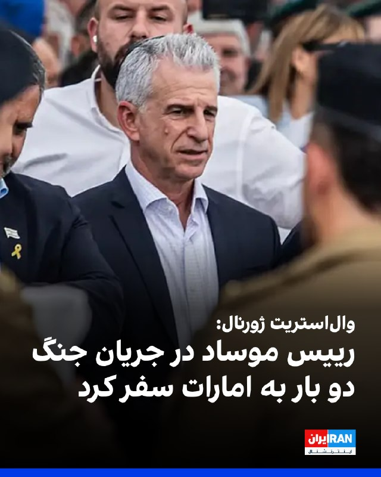

روزنامه وال‌استریت ژورنال به نقل از مقام‌های عرب و یک فرد آگاه گزارش داد دیوید بارنئا، رییس موساد، در جریان جنگ علیه جمهوری اسلامی دست‌کم دو بار به امارات متحده عربی سفر کرد تا درباره هماهنگی‌های مرتبط با جنگ گفت‌وگو کند.

به گفته منابع آگاه، بارنئا در ماه‌های مارس و آوریل در دو نوبت جداگانه و به‌صورت محرمانه به امارات متحده عربی سفر کرد.

وزارت خارجه امارات متحده عربی و دفتر نخست‌وزیر اسرائیل بلافاصله به درخواست‌های این روزنامه برای اظهار نظر پاسخ ندادند.
https://iranintl.com/202605134408

## IranIntlTV — post 336958

  <a href="telegram/content/IranIntlTV_336958_1778672615.mp4" target="_blank">🎬 Download video</a>

کانال ۱۳ اسرائیل از احتمال ازسرگیری درگیری میان اسرائیل و جمهوری اسلامی خبر داده و گزارش کرده است که ارتش این کشور همچنان در وضعیت آماده‌باش قرار دارد.
بابک اسحاقی، خبرنگار ایران‌اینترنشنال، گزارش می‌دهد
@iranintltv

## IranIntlTV — post 336957

  

🔻ابراهیم تهامی، بازیکن پیشین استقلال و تیم ملی فوتبال، که اسفند سال گذشته دچار سکته مغزی شده بود، درباره شرایط مالی خود به خبرگزاری تسنیم گفت: «هر جلسه فیزیوتراپی سه میلیون تومان هزینه دارد و برای کاردرمانی و گفتاردرمانی نیز باید حدود دو میلیون تومان پرداخت کنم، اما توان مالی آن را ندارم. به همین دلیل دو روز است فیزیوتراپی نرفته‌ام.»

🔹تهامی همچنین با انتقاد از بی‌توجهی برخی چهره‌های فوتبال گفت: «بازیکنان تیم ملی هیچ تماسی با من نگرفتند. انتظار زیادی از امیر قلعه‌نویی داشتم، اما او هم تاکنون تماسی نداشته است. دوست داشتم حالم را بپرسند.»

🔹او افزود: «محمد مایلی‌کهن با من تماس گرفت و جویای حالم شد که همین برایم کافی بود.»

@iranintltvsport

## IranIntlTV — post 336956

نسخه جمهوری اسلامی برای اقتصاد دیجیتال: اینترنت را ببند، غرفه اجاره بده

🖋فرشید نوروزی

هم‌زمان با تداوم قطع اینترنت در ایران و پیامدهای آن برای گروه‌های مختلف اجتماعی از جمله فروشندگان آنلاین، مقام‌های جمهوری اسلامی از برنامه‌هایی برای انتقال مشاغل خانگی از بستر فضای مجازی به «فضاهای فیزیکی» و «نمایشگاه‌ها» خبر دادند.

این اظهارات از آن جهت نگران‌کننده و قابل تأمل است که می‌تواند نشانه‌ای از عزم حکومت برای ادامه محدودیت اینترنت و جایگزین کردن فعالیت‌های آنلاین با مدل‌های کنترل‌پذیر فیزیکی باشد؛ آن هم در شرایطی که با وجود وعده‌های مبهم برخی مقام‌ها، هنوز چشم‌انداز روشنی برای اتصال آزاد و پایدار شهروندان ایرانی به اینترنت جهانی دیده نمی‌شود.

احمد میدری، وزیر تعاون، کار و رفاه اجتماعی، ۲۲ اردیبهشت به مناسبت روز مشاغل خانگی گفت: «مشاغل خانگی صرفا با فضای مجازی توسعه پیدا نمی‌کنند. اگرچه فضای مجازی در توسعه فروش محصولات خانگی موثر است و می‌تواند دسترسی‌ها و توسعه بازار را فراهم کند، ولی بدون فضای فیزیکی امکان توسعه مشاغل خانگی نیست.»

او حضور فیزیکی را تسهیل‌کننده «امکان مشارکت، توسعه عدالت و روابط بین بخشی» دانست و از اجرای طرحی با نام «هزار و یک میدان» خبر داد.

میدری ادامه داد: «در راستای طرح هزار و یک میدان، پلتفرم‌ها می‌توانند در این میدان‌ها آموزش بدهند. ما مشاغل و کسب‌وکارهای خانگی را دعوت می‌کنیم و پلتفرم‌ها می‌توانند از این فضا در شهرهای مختلف استفاده کنند.»

۷۵ روز از قطع اینترنت در ایران می‌گذرد و شهروندان تاکنون ۱۷۷۶ ساعت از دسترسی به شبکه جهانی محروم بوده‌اند.

راهکار حکومت برای بحران اینترنت: فروش حضوری یا استفاده از پلتفرم‌های داخلی
مالک حسینی، معاون توسعه کارآفرینی و اشتغال وزیر کار، ۲۲ اردیبهشت اعلام کرد نمایشگاه‌های مرتبط با طرح «هزار میدان، هزار بازار» ظرف ۱۰ روز آینده آغاز به کار می‌کنند و تا پایان سال جاری فعال خواهند بود.

او هدف این طرح را ایجاد «ظرفیت تازه‌ای برای عرضه و فروش محصولات مشاغل خانگی» دانست و گفت: «باید نمایشگاه‌های حضوری و بازارسازی برخط در کنار یکدیگر به‌عنوان یک ظرفیت مکمل برای تقویت فروش مشاغل خانگی دیده شوند.»

حسینی خواستار استفاده از «سکو‌های داخلی» برای فروش مشاغل خانگی شد و افزود: «اگر اینترنت بین‌الملل هم وصل شد، ماندگاری را در شبکه‌های داخلی می‌توان ادامه داد.»

معاون وزیر کار در حالی از اتصال دوباره اینترنت بین‌الملل با یک «اگر» نگران‌کننده سخن می‌گوید که فشارهای اقتصادی و معیشتی هر روز به‌طور فزاینده‌ای بر دوش مردم سنگینی می‌کند.

این در حالی است که فاطمه مهاجرانی، سخنگوی دولت مسعود پزشکیان، در پیام خود به مناسبت روز مشاغل خانگی، عملا نقش اینترنت و پلتفرم‌های دیجیتال را در توسعه این کسب‌وکارها منکر شد.

او در شبکه ایکس نوشت مشاغل خانگی زنان «در بستر شرکت ملی پست رونق یافته و بازاری به بزرگی ایران عزیزمان و حتی فراتر از مرزها فراهم آورده است».

در سوی دیگر، صفحه «فیلتربان» در ایکس که در حوزه حقوق دیجیتال و حق دسترسی به اینترنت فعالیت می‌کند، به‌شدت از این اظهارات مهاجرانی انتقاد کرد: «بهتر است به‌جای چنین پست‌هایی، کمی مسئولیت‌پذیر باشید یا حداقل سکوت کنید.»

قطع اینترنت؛ آن‌جا که چرخ معاش از حرکت می‌ایستد
در هفته‌های اخیر، شهروندان با ارسال پیام‌هایی به ایران‌اینترنشنال، از تداوم قطعی اینترنت در کشور به‌شدت انتقاد کردند و هشدار دادند زندگی روزمره و فعالیت‌های شغلی آنان، به‌طور فزاینده‌ای تحت تاثیر پیامدهای منفی این اقدام جمهوری اسلامی قرار گرفته است.

یک کارآفرین در پیام خود نوشت: «ناگهان ورود مواد اولیه قفل شد. از طرفی با قطع اینترنت، تمام سیستم فروش فلج شد. ۷۰ نفر نیرو بیکار شدند، خودم هم مفلس شدم.»

در پیام دیگری آمده است: «با خدا تومن کانفیگ تونستم وصل شم. من کارم با اینترنته و به‌خاطر قطعی نت بیکار شدم. کلی قسط دارم که باید تسویه بشه و اجاره باید بدم.»

یک مخاطب نیز گفت: «افزایش حداقل دو برابری قیمت‌ها و قطع اینترنت باعث تعطیلی کسب‌وکار ۱۱ ساله ما شد.»

کاربران فضای مجازی نیز درباره پیامدهای سنگین تداوم قطع اینترنت بر مشاغل آنلاین ابراز نگرانی کردند.

کاربری در ایکس نوشت: «به نظرم بچه‎‌های آنلاین‌شاپ‌های اینستاگرام به‌طور جدی دنبال مشاغل جدید باشند .... متاسفانه باید پذیرفت دیگه از این کار پولی گیر نمی‌آد.»

در پست دیگری در ایکس آمده است: «فکر کن طرف آنلاین‌شاپ داره. می‌ره سیم‌کارت پرو می‌گیره، بعد مشتری‌هاش قطع هستن.»

🔗متن کامل گزارش را اینجا بخوانید
@iranintltv

## IranIntlTV — post 336955

  <a href="telegram/content/IranIntlTV_336955_1778672619.mp4" target="_blank">🎬 Download video</a>

دونالد ترامپ، رییس‌جمهوری آمریکا، اعلام کرد گفت‌وگوها با جمهوری اسلامی در جریان است، اما واشینگتن با توجه به کاهش درآمدهای تهران، برای رسیدن به توافق عجله‌ای ندارد.
گفت‌وگو با علی‌حسین قاضی‌زاده، عضو تحریریه ایران‌اینترنشنال
@iranintltv

## IranIntlTV — post 336954

  <a href="telegram/content/IranIntlTV_336954_1778672621.mp4" target="_blank">🎬 Download video</a>

نوجوانان با ارسال پیام‌هایی به مدیا بات ایران‌اینترنشنال، از دغدغه‌ها و رنج‌های خود زیر سایه جمهوری اسلامی و پس از سرکوب خونین دی‌ماه می‌گویند.
جزییات بیشتر با لیلا سعادتی، عضو تحریریه ایران‌اینترنشنال
@iranintltv

## IranIntlTV — post 336953

  <a href="telegram/content/IranIntlTV_336953_1778672624.mp4" target="_blank">🎬 Download video</a>

یک شهروند اهل سیستان و بلوجستان با ارسال پیامی به ایران‌اینترنشنال می‌گوید: «ما همیشه محروم و گرسنه بودیم، ولی این روزها محروم‌تر و گرسنه‌تر هم شده‌ایم. گالن ۷۰ لیتری بنزین شده پنج میلیون تومان، در حالی که برای رسیدن به بیمارستان باید ۴۰ تا ۶۰ لیتر بنزین مصرف کنیم.»

## ManotoTV — post 105393

  <a href="telegram/content/ManotoTV_105393_1778672627.mp4" target="_blank">🎬 Download video</a>

خبرگزاری رسمی امارات گزارش داد دولت امارات متحده عربی ۲۱ فرد و نهاد لبنانی را به‌دلیل ارتباط با حزب‌الله در فهرست تحریم قرار داده است.
بر اساس این گزارش، ۱۶ شهروند لبنانی و پنج سازمان مستقر در امارات به حمایت از گروه‌هایی متهم شده‌اند که از سوی ابوظبی «تروریستی» شناخته می‌شوند.
مقام‌های نظارتی امارات موظف شده‌اند افراد و نهادهای تحریم‌شده را شناسایی کرده و ظرف ۲۴ ساعت اقدامات لازم، از جمله مسدود کردن دارایی‌های آن‌ها، را انجام دهند.
امارات که میزبان جمعیت بزرگی از لبنانی‌هاست، در جریان جنگ منطقه‌ای ناشی از حملات آمریکا و اسرائیل به ایران، یکی از اصلی‌ترین اهداف حملات موشکی و پهپادی جمهوری اسلامی بود.

## ManotoTV — post 105392

  <a href="telegram/content/ManotoTV_105392_1778672627.mp4" target="_blank">🎬 Download video</a>

آژانس بین‌المللی انرژی پیش‌بینی کرده است که در پی اختلال‌های ناشی از درگیری‌های خاورمیانه، عرضه جهانی نفت در سال ۲۰۲۶ روزانه ۳.۹ میلیون بشکه کاهش یابد.
این نهاد همچنین انتظار دارد تقاضای جهانی نفت در سال جاری روزانه ۴۲۰ هزار بشکه کاهش پیدا کند، اما میزان افت عرضه بسیار بیشتر از کاهش تقاضا خواهد بود.
آژانس بین‌المللی انرژی در تازه‌ترین گزارش بازار نفت خود اعلام کرد:
«بیش از ۱۰ هفته پس از آغاز جنگ در خاورمیانه، افزایش اختلال‌ها در تنگه هرمز ذخایر جهانی نفت را با سرعتی بی‌سابقه کاهش داده است.»
در ادامه این گزارش آمده است: «کاهش سریع ذخایر مازاد در کنار ادامه اختلال‌ها ممکن است زمینه‌ساز جهش‌های قیمتی در آینده شود.»

## ManotoTV — post 105391

  <a href="telegram/content/ManotoTV_105391_1778672628.mp4" target="_blank">🎬 Download video</a>

معاون وزیر بهداشت در اظهاراتی «بحران جمعیت» را مهم‌تر از جنگ اخیر ارزیابی کرده است و افزوده «اقتداری که مردم و نیروهای مسلح در دوران جنگ نشان دادند، ناشی از همین جمعیت جوان بوده است.»
این مقام با هشدار درباره ادامه روند کاهش زاد‌وولد در ایران گفت آمار تولدها در سال ۱۴۰۴ به ۸۹۲ هزار و ۲۶۸ نفر رسیده؛ در حالی‌ که این رقم در سال ۱۴۰۳ حدود ۹۷۳ هزار نفر بوده است.
او با اشاره به اینکه آمار موالید پیش‌تر به زیر ۹۰۰ هزار نفر رسیده بود، گفت این ارقام نشان‌دهنده ادامه روند نزولی جمعیت در کشور است، هرچند به گفته او «شیب کاهش جمعیت کندتر شده است.»

## ManotoTV — post 105390

  

بررسی‌ها نشان می‌دهد یک ابرنفتکش چینی پیش از گفت‌وگوهای ترامپ و شی جین‌پینگ از تنگه هرمز عبور کرده است. این نفتکش تحت ثبت و مدیریت شرکت دولتی چینی «کاسکو شیپینگ» قرار دارد. نفتکش بسیار بزرگ حمل نفت خام (VLCC) با نام «یوان هوا هو» آخرین بار در ردیاب‌های دریایی در شرق تنگه مشاهده شده بود.این نفتکش هنگام عبور، مقصد خود را «مالک و خدمه چینی» ثبت کرده بود.به نظر می‌رسد اندکی پس از خاموش کردن سیستم ردیابی‌اش، در یک تصویر ماهواره‌ای ثبت شده باشد. در ۲۴ ساعت گذشته، چند کشتی دیگر تحت مدیریت چین نیز از تنگه هرمز عبور کرده‌اند. همه آن‌ها از مسیری تحت کنترل جمهوری‌اسلامی و نزدیک به آب‌های ایران استفاده کرده‌اند. به‌دست آوردن تصویر کامل از رفت‌وآمدها ممکن نیست، زیرا بیشتر کشتی‌هایی که از تنگه عبور می‌کنند سیستم ردیابی خود را خاموش کرده‌اند.

## ManotoTV — post 105389

  

براساس داده‌های سازمان هواشناسی، ۱۸ استان ایران در سال آبی جاری با کاهش بارندگی مواجه شده‌اند و استان تهران با بیش از ۳۸ درصد افت میانگین بارش، رکورددار کم‌بارشی در کشور شده است.

گزارش‌ها نشان می‌دهد کاهش بارندگی در تهران و برخی استان‌های مرکزی، نگرانی‌ها درباره تشدید بحران آب و فشار بر منابع آبی را افزایش داده است.

پس از تهران، استان‌های قم و سمنان نیز در میان استان‌هایی قرار دارند که بیشترین کاهش بارش را تجربه کرده‌اند.

کارشناسان هشدار می‌دهند ادامه روند خشکسالی و افت بارش‌ها می‌تواند وضعیت ذخایر سدها و تامین آب شرب را در ماه‌های آینده دشوارتر کند. چون ظاهراً در این سرزمین، همه‌چیز یا «بی‌سابقه» است یا «در آستانه بحران». برنامه‌ریزی پایدار هم مثل بارندگی، سال‌هاست کمیاب شده.

## ManotoTV — post 105388

  

سازمان «نت‌بلاکس» اعلام کرد خاموشی گسترده اینترنت در ایران از ۱۷۷۶ ساعت گذشته و وارد هفتاد و پنجمین روز شده است. این نهاد می‌گوید محدودیت‌های گسترده اینترنت، هم‌زمان با اجرای طرح‌های اینترنت طبقاتی و دسترسی‌های گزینشی، باعث افزایش نظارت، فساد و کلاهبرداری‌های دیجیتال شده است.

واقعاً شگفت‌انگیز است که در سال ۲۰۲۶ هنوز بعضی حکومت‌ها اینترنت را مثل شیر آب ساختمان قطع می‌کنند. فقط فرقش این است که این یکی همزمان اقتصاد، امنیت دیجیتال و اعصاب مردم را هم می‌بندد.

## FarsiVOA — post 217609

  

روزنامه وال‌استریت ژورنال به نقل از مقام‌های عرب و یک فرد آگاه گزارش داد دیوید بارنئا، رئیس موساد، در جریان جنگ با جمهوری اسلامی دست‌کم دو بار به امارات متحده عربی سفر کرده بود.

بر اساس این گزارش، سفرهای محرمانه بارنئا در ماه‌های مارس و آوریل انجام شد و هدف آن کمک به هماهنگی تلاش‌های مرتبط با جنگ بود. وال‌استریت ژورنال نوشته این رفت‌وآمدها نشان‌دهنده تعمیق روابط امنیتی میان اسرائیل و امارات در جریان جنگ با جمهوری اسلامی است.

این گزارش در حالی منتشر شده که وال‌استریت ژورنال پیش‌تر نوشته بود امارات به‌طور محرمانه حملاتی علیه اهدافی در ایران انجام داده؛ از جمله حمله‌ای در اوایل آوریل به پالایشگاهی در جزیره لاوان. رویترز نوشته بود امارات این عملیات‌ها را علناً تأیید نکرده و خود رویترز نیز نتوانسته این گزارش را به‌طور مستقل راستی‌آزمایی کند.

گاردین نیز این تحولات را در چارچوب خطر کشیده‌شدن کشورهای خلیج فارس به جنگ با جمهوری اسلامی بررسی کرده و نوشته افزایش همکاری‌های امنیتی امارات و اسرائیل می‌تواند تنش‌های منطقه‌ای را تشدید کند.
@FarsiVOA

## FarsiVOA — post 217608

🔺توقف بارگیری نفت ایران از خارک

▪️خبرگزاری بلومبرگ با استناد به تصاویر ماهواره‌ای گزارش داده که بارگیری نفت ایران از جزیره خارک، بزرگترین پایانه نفتی کشور، طی روزهای گذشته متوقف شده و مخازن نفت موجود در این جزیره نیز تقریباً به صورت کامل پر شده است.

▪️همچنین شرکت ردیابی نفتکش‌ها، تانکر ترکرز نیز گزارش داده که از زمان آغاز محاصره دریایی آمریکا علیه جمهوری اسلامی -طی یک ماه گذشته- صادرات نفت ایران به طور کامل متوقف شده است.

▪️در صورت ادامه توقف صادرات و پر شدن دیگر مخازن نفتی خشکی ایران، جمهوری اسلامی مجبور به کاهش دست کم روزانه ۱.۲ میلیون بشکه تولید نفت خواهد بود و تنها به میزان مصرف داخلی نفت تولید خواهد کرد.

⬇️ بیشتر بخوانید:
https://ir.voanews.com/a/8149525.html

## FarsiVOA — post 217607

🔺پیمان دفاعی پاکستان و عربستان چیست و چرا احتمال پیوستن قطر و ترکیه مهم است؟

▪️بلومبرگ گزارش داده خواجه آصف، وزیر دفاع پاکستان، گفته است ترکیه و قطر ممکن است به پیمان همکاری دفاعی متقابل میان اسلام‌آباد و ریاض بپیوندند. او گفته اگر این دو کشور به توافق موجود اضافه شوند، «تحولی خوشایند» خواهد بود.

▪️این اظهارات در زمانی مطرح شده که جنگ آمریکا و جمهوری اسلامی، نگرانی کشورهای خلیج فارس از حملات موشکی، پهپادی و اختلال در تنگه هرمز را افزایش داده است.

▪️احتمال پیوستن قطر و ترکیه به پیمان دفاعی پاکستان و عربستان، فقط یک خبر دیپلماتیک نیست؛ نشانه‌ای است از اینکه جنگ آمریکا و جمهوری اسلامی، آرایش امنیتی خاورمیانه را وارد مرحله تازه‌ای کرده است.

⬇️ بیشتر بخوانید:
https://ir.voanews.com/a/8149524.html

## FarsiVOA — post 217606

  

رویترز گزارش داد پالایشگاه‌های ژاپن برای نخستین بار از ماه مارس، نرخ فرآوری نفت خود را به بیش از ۷۰ درصد ظرفیت رسانده‌اند؛ اقدامی که با استفاده از نفت آزادشده از ذخایر دولتی و تأمین محموله‌های جایگزین انجام شده است.

ژاپن که معمولاً حدود ۹۵ درصد نفت وارداتی خود را از خلیج فارس تأمین می‌کند، پس از آغاز جنگ آمریکا و اسرائیل با جمهوری اسلامی و اختلال در تنگه هرمز، به سراغ نفت آمریکا، منطقه خزر، آمریکای لاتین و حتی یک محموله نفت روسیه غیرتحریمی رفته است.

شرکت‌های ایدمیتسو کوسان و کازمو انرژی، دومین و سومین پالایشگر بزرگ ژاپن، گفته‌اند در کنار منابع دیگر، از نفتی از خلیج فارس استفاده می‌کنند که مسیر آن از تنگه هرمز عبور نمی‌کند و هدف دارند نرخ فعالیت پالایشگاه‌های خود را در سال مالی جاری به بیش از ۹۰ درصد برسانند.

دولت ژاپن از ۱۶ مارس نفتی معادل حدود ۷۵ روز مصرف داخلی را از ذخایر خود در دسترس قرار داده؛ بزرگ‌ترین آزادسازی ذخایر نفتی در تاریخ این کشور.
@FarsiVOA

## FarsiVOA — post 217605

🔺اوج‌گیری بحران آب در ایران؛ از مصرف میلیاردی پایتخت تا هشدار در مورد مهاجرت اجباری میلیون‌ها نفر

▪️همزمان با هشدار کارشناسان و مقام‌های صنعت آب ایران درباره تنش‌های آبی و پیامدهای آن، شرکت آب و فاضلاب استان تهران روز چهارشنبه ۲۳ اردیبهشت، اعلام کرد که مصرف آب پایتخت به مرز سه میلیارد لیتر در شبانه روز رسیده است.

▪️در این میان، دبیرکل فدراسیون صنعت آب ایران هشدار داد که پایداری فلات مرکزی ایران در گرو کاهش فوری ۱۶ میلیارد مترمکعبی مصرف آب است؛ در غیر این صورت با بحران مهاجرت اجباری ۱۵ میلیون نفر مواجه خواهیم شد.

▪️فلات مرکزی ایران شامل هفت استان کرمان، فارس، اصفهان، یزد، مرکزی، قم و سمنان می‌شود که حدود ۲۰ درصد جمعیت کشور را در خود جای داده است.

⬇️ بیشتر بخوانید:
https://ir.voanews.com/a/8149523.html

## FarsiVOA — post 217604

  

آژانس بین‌المللی انرژی از ادامه افت تولید نفت اوپک در ماه آوریل به رغم آتش‌بس میان جمهوری اسلامی و آمریکا خبر داد.

بر اساس این گزارش، تولید روزانه نفت اعضای اوپک در ماه گذشته ۲۰ میلیون و ۱۸۰ هزار بشکه بوده که ۶۲۰ هزار بشکه کمتر از ماه مارس است.

در مجموع تولید روزانه نفت در جهان به خاطر انسداد تنگه هرمز توسط جمهوری اسلامی از ۹ اسفند، ۱۲ میلیون و ۸۰۰ هزار بشکه افت داشته است که بخشی از آن با آزادسازی ذخایر استراتژیک نفت جبران شده است.

ذخایر نفت قابل مشاهده جهان در ماه مارس ۱۲۹ میلیون بشکه و در ماه گذشته ۱۱۷ میلیون بشکه افت کرده است.
@FarsiVOA

## FarsiVOA — post 217603

  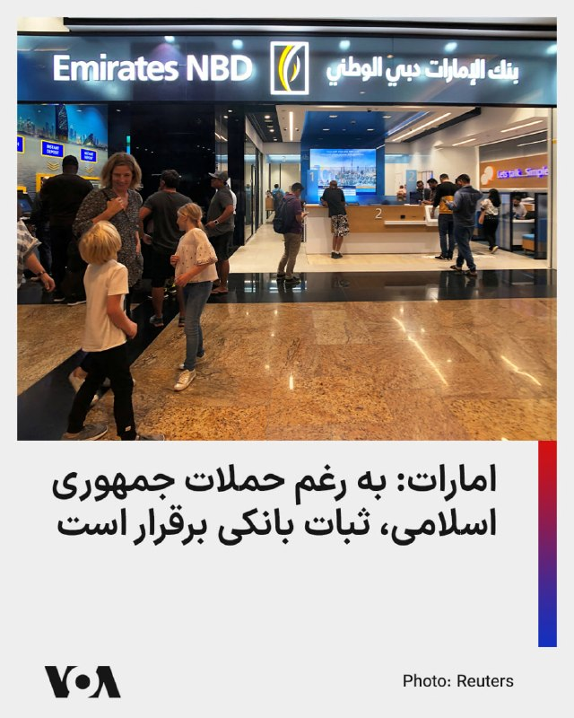

رئیس فدراسیون بانک‌های امارات متحده عربی نگرانی‌ها درباره فرار سرمایه به‌دلیل جنگ ایران را رد کرد و گفت به رغم حملات جمهوری اسلامی، ثبات بانکی در امارات برقرار است.

عبدالعزیز الغریر اعلام کرد انتظار می‌رود در سه‌ماه دوم سال جاری میلادی، وضعیت حوزه بانکداری در این کشور بهتر از ماه‌های آغازین سال باشد. او در ادامه با رد نگرانی‌ها از فرار سرمایه از این کشور گفت «به‌طور میانگین وضعیت خوب است؛ بخشی از سرمایه‌ها خارج و بخشی دیگر وارد می‌شود».

طبق آمارهای کنفرانس تجارت و توسعه سازمان ملل متحد (آنکتاد) ورود سرمایه‌های مستقیم خارجی به امارات در سال گذشته نسبت به ۲۰۲۴ با جهشی ۴۹ درصدی به بالای ۵۶ میلیارد دلار اوج گرفته بود.
@FarsiVOA

## FarsiVOA — post 217602

  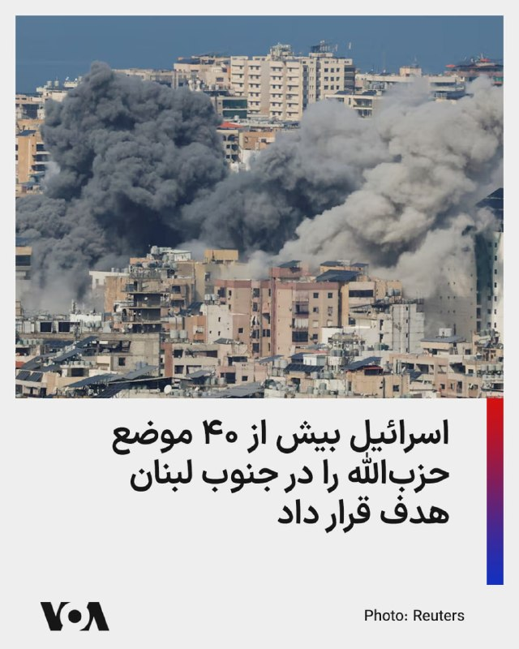

ارتش اسرائیل اعلام کرد طی شبانه‌روز گذشته بیش از ۴۰ موضع وابسته به حزب‌الله در جنوب لبنان را هدف قرار داده و شماری از نیروهای این گروه را که تهدیدی برای نیروهای اسرائیلی محسوب می‌شدند، از پا درآورده است.

بر اساس اعلام ارتش اسرائیل، اهداف حمله‌شده شامل انبارهای سلاح، ساختمان‌های مورد استفاده نظامی و زیرساخت‌هایی بوده که حزب‌الله از آن‌ها برای پیشبرد حملات خود استفاده می‌کرد. ارتش اسرائیل همچنین اعلام کرد چند سکوی آماده شلیک راکت که به سمت اسرائیل نشانه‌گیری شده بودند، در این حملات منهدم شده‌اند.

این حملات پس از آن انجام شد که حزب‌الله چند راکت و یک پهپاد به سوی نیروهای اسرائیلی در جنوب لبنان شلیک کرد؛ حمله‌ای که به گفته ارتش اسرائیل تلفاتی به همراه نداشت، اما بار دیگر نشان داد آتش‌بس در مرز لبنان عملاً زیر فشار حملات حزب‌الله قرار گرفته است.

اسرائیل در کنار آمریکا و بسیاری از کشورهای دیگر، گروه شبه‌نظامی حزب‌الله را که مورد حمایت جمهوری اسلامی است، گروهی تروریستی می‌داند.
@FarsiVOA

## FarsiVOA — post 217601

  

ساعات کاری بانک‌ها، ادارات و دستگاه‌های اجرایی از ۲۶ اردیبهشت تا ۱۵ شهریور به ۷ تا ۱۳ تغییر کرد. این تصمیم با هدف «مدیریت مصرف انرژی و پایداری شبکه برق» اعلام شده است.

براساس ابلاغ سازمان اداری و استخدامی کشور، تمامی بانک‌ها، ادارات، شهرداری‌ها، مؤسسات عمومی دولتی و غیردولتی و سایر دستگاه‌های اجرایی موظف‌اند فعالیت روزانه خود را از ساعت ۷ صبح آغاز کرده و در ساعت ۱۳ به پایان برسانند. همچنین دستگاه‌ها ملزم هستند یک ساعت پیش از پایان وقت اداری، سامانه‌های سرمایشی خود را خاموش کنند.

این تغییر شامل واحدهای قضایی و اداری قوه قضائیه نیز می‌شود.

ساعات کاری در سال‌های اخیر نیز برای مدیریت مصرف برق در فصل‌های گرم، به ‌صورت مقطعی تغییر کرده است؛ از جمله از زمان لغو تغییر ساعت رسمی در شش ماه اول سال، ساعت کاری بانک‌ها و دستگاه‌های اجرایی جلوتر کشیده شد.

این رویکرد در عمل به ‌عنوان جایگزینی برای تغییر ساعت رسمی است که از سال ۱۴۰۲ و با مصوبه مجلس شورای اسلامی لغو شد.
@FarsiVOA

## DW_Farsi — post 124644

🎥 خروج نیروهای آمریکا از آلمان؛ استراتژی یا واکنش

دولت ترامپ از برنامه خروج هزاران نیروی آمریکایی از آلمان خبر داده است؛ تصمیمی که همزمان با بالا گرفتن تنش‌ها میان ترامپ و صدراعظم آلمان مطرح شده. اما آیا این اقدام صرفا واکنشی سیاسی است یا بخشی از یک تغییر راهبردی بزرگ‌تر در سیاست خارجی آمریکا؟

@dw_farsi

## DW_Farsi — post 124643

  

🔶 تلاش یک نفت‌کش چینی برای گذر از تنگه هرمز
 
داده‌های رهگیری کشتی‌ها حاکی از آن است که که یک نفت‌کش غول‌پیکر چین روز چهارشنبه ۱۳ مه (۲۳ اردیبهشت) در تلاش عبور از تنگه هرمز  بوده است. به گزارش رسانه‌ها، این نفت‌کش حامل دو میلیون بشکه نفت خام عراق است.
 
بر اساس داده‌های شرکت‌های "ال‌اس‌ای‌جی" و "کپلر" که در زمینه رهگیری کشتی‌ها فعالیت دارند،  نفتکش غول‌پیکر چینی "یوآن هوا هو" از نزدیکی جزیره لارک ایران عبور کرده و در بخش شرقی تنگه هرمز به سمت جنوب در حال حرکت است. 
 
این داده‌ها نشان می‌دهد که نفت‌کش مزبور، اوایل ماه مارس نزدیک به دو میلیون بشکه نفت خام "بصره مدیوم" را در ترمینال بصره عراق بارگیری کرده و از آن زمان در خلیج فارس مانده بود. اعلام شده که مقصد این نفتکش آسیا است.
 
خبرگزاری رویترز گزارش داده که اگر این تردد با موفقیت انجام گیرد، این سومین مورد ثبت‌شده عبور یک نفت‌کش چینی از تنگه هرمز از زمان آغاز جنگ آمریکا و اسرائیل علیه جمهوری اسلامی از اسفند ماه گذشته به این سو بوده است.
 
@dw_farsi

## DW_Farsi — post 124642

🔶 نیویورک تایمز: ایران به اکثر تأسیسات موشکی خود دسترسی دارد

به گزارش رسانه‌های آمریکایی، جمهوری اسلامی ایران به رغم  حملاتی که در جنگ با اسرائيل و آمریکا متحمل شده، هنوز به بخش بزرگی از سایت‌های موشکی  و پرتابگرهای سیار خود دسترسی دارد.
 
روزنامه نیویورک تایمز سه‌شنبه ۲۲ اردیبهشت (۱۲ مه) با استناد به داده‌های سازمان‌های امنیتی و اطلاعاتی ایالات متحده گزارش داد که ایران هنوز حدود ۷۰ درصد از پرتابگرهای متحرک خود و تقریباً ۷۰ درصد از ذخایر موشکی پیش از جنگ خود را حفظ کرده است.
 
نیویورک تایمز این گزارش را با تکیه بر اظهارات منابع آگاه تنظیم کرده که به داده‌ها و اطلاعات امنیتی مربوط به آغاز ماه مه در رابطه با این موضوع دسترسی داشته‌اند. طبق این گزارش، ایران دوباره به اکثر سایت‌های موشکی و تأسیسات زیرزمینی خود دسترسی یافته است.
 
نشریه واشنگتن پست نیز هفته گذشته در گزارشی به اطلاعات تحلیل‌گران سازمان‌های امنیتی اشاره کرده بود که در جریان بررسی‌های خود آمار و ارقامی مشابه ارائه کرده‌اند.
 
این نشریه در گزارش خود به نقل از منابع آگاه نوشته بود، ایران در مقایسه با پیش از جنگ، به حدود ۷۵ درصد از پرتابگرهای سیار خود دسترسی داشته و ۷۰ درصد از ذخایر موشکی خود را حفظ کرده است.
 
در گزارش واشنگتن پست به نقل از یک مقام آگاه آمریکایی آمده بود، جمهوری اسلامی قادر است، تقریبا تمامی سایت‌های نظامی زیرزمینی خود را به کار گیرد، شماری از موشک‌های آسیب‌دیده خود را تعمیر کند و همچنین موشک‌هایی تازه‌ای تولید کند.
@dw_farsi

## DW_Farsi — post 124641

🔶 گزارش رویترز از "حملات پنهانی" عربستان به ایران در جریان جنگ
 
خبرگزاری رویترز در گزارشی اختصاصی از ریاض و دبی نوشت، عربستان سعودی در جریان جنگ اخیر آمریکا و اسرائیل علیه جمهوری اسلامی، چندین حمله اعلام‌نشده علیه ایران انجام داده است؛ حملاتی که به گفته دو مقام غربی مطلع و دو مقام ایرانی، در واکنش به حملات انجام‌شده علیه خاک عربستان صورت گرفت.
 
این گزارش که روز سه‌شنبه ۲۲ اردیبهشت (۱۲ مه) منتشر شد، نخستین روایت شناخته‌شده از اقدام مستقیم نظامی عربستان سعودی در خاک ایران است.
 
به نوشته رویترز، این حملات که تاکنون علنی نشده بودند، در اواخر ماه مارس (اوایل فروردین) و توسط نیروی هوایی عربستان انجام شده‌اند. یکی از مقام‌های غربی، آنها را "حملات متقابل در پاسخ به زمانی که عربستان سعودی هدف قرار گرفت" توصیف کرده است.
 
رویترز تأکید کرده است که نتوانسته اهداف مشخص این حملات را تأیید کند. یک مقام ارشد وزارت خارجه عربستان نیز در پاسخ به پرسش این خبرگزاری، مستقیماً نگفته است که آیا چنین حملاتی انجام شده‌اند یا نه. وزارت خارجه جمهوری اسلامی نیز به درخواست رویترز برای اظهارنظر پاسخ نداده است.
 
عربستان سعودی، برخلاف دهه‌های گذشته که در برابر تهدیدهای ایران عمدتاً به چتر نظامی آمریکا تکیه می‌کرد، این بار ظاهراً خود وارد اقدام مستقیم علیه خاک ایران شده است.
 
رویترز می‌نویسد جنگی که از نهم اسفند ۱۴۰۴ (۲۸ فوریه ۲۰۲۶) با حملات هوایی آمریکا و اسرائیل به ایران آغاز شد، عربستان را در برابر حملاتی قرار داد که از سپر نظامی ایالات متحده عبور کردند.

@dw_farsi

## DW_Farsi — post 124640

🎥 زندگی میان مردگان؛ زنی که انسان‌ها را در آخرین سفر بدرقه می‌کند
 
مرگ برای آنا-لنا پایان راه نیست، بلکه آغاز همراهی با کسانی است که جا مانده‌اند. زنی جوان که شغلش با وداع، سوگ و خاطره گره خورده، اما خود می‌گوید این کار بیش از هر چیز درباره زندگی و آدم‌های زنده است.
 
@dw_farsi

## Persian_Trend_Official — post 14050

  

🔴 امارات اطراف مخازن نفتی دبی موانع ضدپهپادی نصب می‌کند

گزارش‌ها حاکی است امارات روند نصب موانع و سازه‌های ضدپهپادی را در اطراف مخازن نفتی نزدیک فرودگاه بین‌المللی دبی آغاز کرده است.

بر اساس اطلاعات منتشرشده:

▪️ این موانع شامل سازه‌ها و شبکه‌های فلزی هستند
▪️ هدف از این اقدام، مقابله با تهدید پهپادهای انتحاری و حملات هوایی کم‌ارتفاع عنوان شده است
▪️ مخازن نفتی و زیرساخت‌های انرژی اطراف دبی در هفته‌های اخیر تحت تدابیر امنیتی شدیدتری قرار گرفته‌اند

🫆:Tony

📌 @persian_trend_official
پرشین ترند | متفاوت‌ترین کانال نظامی

## Persian_Trend_Official — post 14049

  <a href="telegram/content/Persian_Trend_Official_14049_1778672639.webm" target="_blank">🎬 Download video</a>

فارس | فیلم سینمایی حمله‌ٔ اف-۵های ایران به پایگاه آمریکا تولید می‌شود

💢فیلم سینمایی «ببرها» روایت حمله‌ٔ تاریخی و حماسی ۲ جنگندهٔ اف-۵ نیروی هوایی ارتش به پایگاه آمریکایی بوهرینگ کویت در روز دوم جنگ رمضان به نویسندگی مهدی یزدانی‌خرم و تهیه‌کنندگی حبیب والی‌نژاد تولید خواهد شد.

🫆:Tony

📌 @persian_trend_official
پرشین ترند | متفاوت‌ترین کانال نظامی

## Persian_Trend_Official — post 14048

  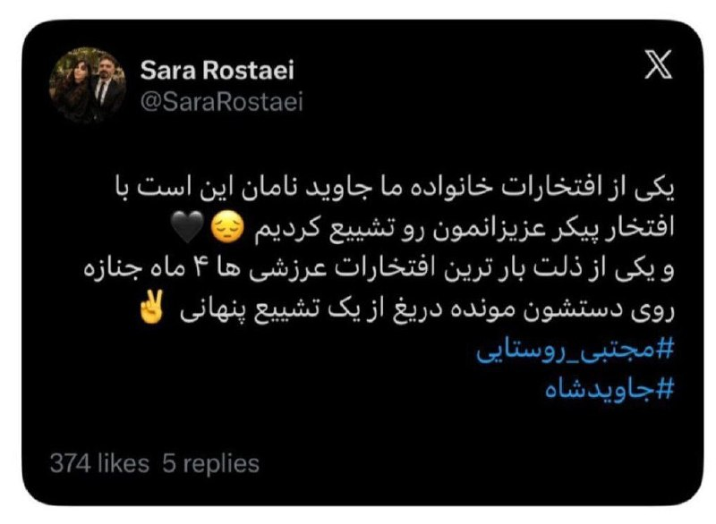

🔴تویت خواهر جاوید نام ‎#مجتبی_روستایی ؛

از افتخارات ما خوانواده جاوید نامان اين است که با افتخار پیکر عزیزانمون رو تشیع کرديم 💔
و یکی از ذلت بارترین افتخارات عرزشیها، ۴ماه جنازه روی دستشون مونده ،دريغ از یه تشیع پنهانی!

📣@persian_trend_official

## Persian_Trend_Official — post 14047

  <a href="telegram/content/Persian_Trend_Official_14047_1778672640.mp4" target="_blank">🎬 Download video</a>

💢تصاویر ماهواره ای با کیفیت از میزان تخریب سایت نظامی یزد زیر ضرب حملات امریکا و اسرائیل

🫆:Tony

📌 @persian_trend_official
پرشین ترند | متفاوت‌ترین کانال نظامی

## Persian_Trend_Official — post 14046

⭕️ طبق گزارش وال استریت ژورنال، دیوید بارنیا، رئیس موساد، حداقل دو بار در طول جنگ به امارات متحده عربی سفر کرد تا هماهنگی کمپین علیه ایران (جمهوری اسلامی) را انجام دهد.

📝 Nick

📌 @persian_trend_official
پرشین ترند | متفاوت‌ترین کانال نظامی

## Persian_Trend_Official — post 14045

  <a href="telegram/content/Persian_Trend_Official_14045_1778672643.webm" target="_blank">🎬 Download video</a>

📝 Nick

📌 @persian_trend_official
پرشین ترند | متفاوت‌ترین کانال نظامی

## Persian_Trend_Official — post 14044

  <a href="telegram/content/Persian_Trend_Official_14044_1778672644.mp4" target="_blank">🎬 Download video</a>

🔴در فلوریدا، یک آتش‌نشان در حین مهار آتش‌سوزی‌های جنگلی که تاکنون بیش از 48500 هکتار را سوزانده است، جان خود را از دست داد

💢به گزارش رسانه ها حداقل 120 خانه در جورجیا ویران شده است.

💢مقامات ایالتی آمریکا آتش‌سوزی‌های جنگلی فعلی را از مخرب‌ترین آتش‌سوزی‌ها در ده سال گذشته می‌دانند. خشکسالی و گرمای هوا مقصر هستند.

🫆:Tony

📌 @persian_trend_official
پرشین ترند | متفاوت‌ترین کانال نظامی

## Persian_Trend_Official — post 14043

⭕️ علی‌حسین قاضی زاده:

احمقانه‌ترین پرسش این روزها این است که «آیا موافق جنگ هستید یا خیر؟»
ساده‌ترین پاسخ این پرسش احمقانه این است که خیر.

چه کسی می‌تواند در حالت کلی موافق جنگ باشد؟
اما جنگ گاهی ابزاری است برای پیشگیری از کشته شدن بیشتر.
اگر جنگ ۱۲روزه به سقوط حکومت منجر می‌شد، کشتار ۱۸ و ۱۹ دی رخ می‌داد؟
این همه اعدام ادامه می‌یافت؟
اگر جنگ چیزی جز سیاهی مطلق نیست، چرا بخش بزرگی از مردم ایران، کمک نظامی را برای ساقط کردن این حکومت طلب کرده‌اند؟
وقتی در کره شمالی زندگی می‌کنید یا در ایران زیر حکومت ج.ا. پرسش اصلی این نیست فلان مسیر برای مردم هزینه‌ای دارد یا خیر، سوال این مردمان این است که کدام مسیر با حداقل هزینه، به نجات کشور منجر می‌شود.
ممکن است پاسخ این سوال، جلب حمایت نظامی یا همان جنگ باشد.
جنگ سیاه است اما وقتی در ایران یا کره شمالی زندگی می‌کنید، سیاه‌تر از جنگ، تداوم این حکومت‌هاست.

📝 Nick

📌 @persian_trend_official
پرشین ترند | متفاوت‌ترین کانال نظامی

## Persian_Trend_Official — post 14042

  

شات گان اون هم با لوله کروم که زیر نور آفتاب طوری برق میزنه که از یک کیلومتری دیده میشه. تو آمریکا حتی غیر نظامی هایی که عشق اسلحه هستن و سرشون در میاد هم اگر اسلحه با لوله کروم بخری مسخرت میکنن میگن باربی جواهرآلات جدید خریده! سپاه روز به روز از یک نیروی…

## RadioFarda — post 157131

  <a href="https://t.me/radiofarda/157131" target="_blank">📎 Download file</a>

📻بشنوید: ساعت ۱۴ با رادیوفردا،۲۳ اردیبهشت ۱۴۰۵‌

@Radiofarda

## RadioFarda — post 157130

بلومبرگ: بارگیری نفت از جزیره خارک متوقف شده است

🔸خبرگزاری بلومبرگ بر اساس تصاویر ماهواری که خود گردآوری کرده، از «توقف بارگیری» محموله‌های نفتی ایران از پایانه اصلی صادرات نفت کشور در جزیره خارک خبر داد.

🔸در این گزارش که روز سه‌شنبه ۲۲ اردیبهشت منتشر شده، آمده در تصاویر ماهواری‌ یادشده، «نخستین‌ نشانه‌های یک توقف طولانی‌مدت بارگیریِ» محموله‌های نفتی در خارک از آغاز جنگ در اسفند پارسال، قابل مشاهده است.

🔸بر اساس این تصاویر ماهواره‌ای، در روزهای ۱۸، ۱۹ و ۲۱ اردیبهشت «هیچ نفتکش اقیانوس‌پیمایی در جزیره خارک مشاهده نشده است».

🔸بلومبرگ نوشته: «اگرچه از زمان آغاز درگیری‌ها روزهایی بوده که اسکله‌ها خالی بوده‌اند، اما این طولانی‌ترین دوره‌ای است که هیچ نفتکشی در منطقه دیده نشده است.»

🔸این خبر در شرایطی منتشر می‌شود که ایران در «تمام مدت» درگیری‌ با آمریکا و اسرائیل، همچنان در این پایانه، نفت بارگیری می‌کرد و با پرکردن کشتی‌ها، از آنها به‌عنوان مخازن شناور ذخیره نفت استفاده می‌کرد.

🔸این روزنامه نوشته اگر جزیره خارک همچنان غیرفعال بماند، فشار بر دیگر تأسیسات ذخیره‌سازی نفت ایران افزایش خواهد یافت؛ چرا که «تصاویری ماهواره‌ای نشان می‌دهند این مخازن نیز در حال پر شدن هستند».

🔸این گزارش حاکی است «برآوردها درباره میزان ظرفیت باقی‌مانده متفاوت است، اما اگر همه مخازن به ظرفیت کامل برسند، ایران ممکن است ناچار به کاهش بیشتر تولید نفت شود. این کشور پیش‌تر نیز بخشی از تولید خود را کاهش داده است.»

🔸تصاویر ماهواره «سنتینل ۲» اتحادیه اروپا که در ۲۱ اردیبهشت ثبت شده‌اند، نشان می‌دهند «تمام اسکله‌های جزیره خارک خالی بوده‌اند. تصاویر ثبت‌شده دو و سه روز قبل از آن نیز هیچ نفتکش اقیانوس‌پیمایی را در این پایانه نشان نمی‌دهند».

🔸بر اساس گزارش بلومبرگ، از زمان آغاز جنگ، پایانه خارک «هرگز بیش از یک روز متوالی» خالی دیده نشده بود. از میان ۷۳ روزی که از حملات آمریکا و اسرائیل در نهم اسفند پارسال می‌گذرد، «تنها برای ۳۳ روز تصویر ماهواره‌ای از اسکله‌های خارک وجود دارد؛ یکی در اواسط آوریل و دیگری در اوایل مارس هیچ نفتکشی را در اسکله‌ها نشان نمی‌دادند».

🔸به دلیل مسیر حرکت ماهواره‌های «سنتینل ۱و ۲» به دور زمین، همه مناطق سطح سیاره هر روز پوشش تصویری ندارند و به همین دلیل در داده‌ها فاصله‌هایی وجود دارد.

🔸بلومبرگ همچنین بر اساس تحلیل تصاویر ماهواره‌ای نوشته با توقف ظاهری بارگیری نفتکش‌ها، مخازن ذخیره در جزیره خارک در حال «پر شدن» هستند.

🔸بر اساس این گزارش، این مخازن دارای سقف شناور هستند که با پر شدن مخزن بالا آمده و فاصله میان سقف و لبه مخزن کاهش می‌یابد. در نتیجه سایه‌ای که دیواره مخزن روی سقف می‌اندازد کوچک‌تر می‌شود. بنابراین مقایسه تصاویر ثبت‌شده در زمان مشابه در روزهای مختلف می‌تواند تغییر حجم نفت داخل مخازن را نشان دهد.

🔸تصاویر مخازن نفتی جزیره خارک در ۲۱ اردیبهشت نشان می‌دهد «چندین مخزن» در این پایانه، «سایه‌هایی به‌مراتب کوچک‌تر نسبت به تصویر ۱۷ فروردین یعنی درست پیش از آغاز محاصره دریایی توسط نیروی دریایی آمریکا دارند».

🔸این گزارش حاکی است این تصاویر نشان می‌دهند ظرفیت خالی جزیره خارک «تقریباً به صفر» نزدیک شده و اگر ایران دیگر جایی برای ذخیره نفت نداشته باشد، «ممکن است مجبور شود تولید برخی میادین نفتی را کاهش دهد؛ اتفاقی که یک پیروزی نمادین برای آمریکا محسوب خواهد شد».

🔸از زمان آغاز محاصره بنادر ایران، دونالد ترامپ و مقام‌های دولت او پیش‌بینی کرده‌اند که ایران به‌سرعت ناچار به تعطیل کردن چاه‌های نفت خواهد شد. برخی ناظران دیگر، از جمله شرکت تحلیلی کپلر برآورد کرده‌اند که شاید تهران بتواند تا اواخر ماه جاری میلادی، ماه مه، پیش از به پایان‌رسیدن فضای ذخیره‌سازی‌اش به تولید نفت ادامه دهد.

🔸روزنامه نیویورک تایمز نیز بر اساس یک تصویر ماهواره‌ای مربوط به ۱۶ اردیبهشت گزارش داده که در تأسیسات نفتی خارک، «نشتی سه هزار بشکه‌ای رخ داده؛ موضوعی که می‌توانسته بر عملیات بارگیری اثر گذاشته باشد.»

🔸با این حال ایران وقوع هرگونه نشت نفت را رد کرده و به نوشته بلومبرگ، تصاویر بعدی، که در آنها بارگیری متوقف شده، نشانه آشکاری از نشت نشان نمی‌دهند.

@RadioFarda

## RadioFarda — post 157129

پاراگراف اول؛ «خیابان» در ایران و راهبرد «اقلیت حاکم» برای اعلام پیروزی

🔸حکومت جمهوری اسلامی پیوند میدان، خیابان و دیپلماسی را عرصه یک نبرد برای جنگ ۴۰ روزه اسرائیل و آمریکا علیه ایران عنوان می‌کند؛ جنگی که در ادبیات این روزهای نسل دوم و سوم حکمرانان نظام حاکم، «جنگ رمضان» نامیده می‌شود.

🔸خیابان برای نسل تازه‌ای از حکمرانان جمهوری اسلامی، محل تقارن کشته شدن رهبر جمهوری اسلامی با باورهای آیینی شیعی و عواطف ملی‌گرایانه است.

🔸آیت‌الله علی خامنه‌ای پیش از کشته شدن در جنگ ۴۰ روزه گفته بود که مردم ایران «مبعوث» شده‌اند تا با حوادث پیش رو مقابله کنند.

🔸به نظر می‌رسد این گفته‌ها برای کسانی که امروز قدرت را در جمهوری اسلامی در دست دارند، به یک الگوی راهبردی تبدیل شده است.

🔸تعبیری که از دل اسلام سیاسی جمهوری اسلامی در هنگامهٔ جنگ علیه ایران، نوعی کنشگری سیاسی ـ ایدئولوژیک را برکشیده تا بدیلی بسازد برای مفهوم مدرن «انسجام ملی» در علوم سیاسی.

🔸اما تصاحب خیابان برای جمهوری اسلامی، بعد از کشتار ۱۸ و ۱۹ دی‌ماه، بستری بود تا هم مشروعیت بگیرد و هم بر روایت معترضان و گروه مخالفی که صدای بلندتری در اعتراض‌ها داشت غلبه کند؛ با این انگاره که آن‌ها در زمان جنگ دیگر به خیابان بر نمی‌گردند.

🔸«خیابان» کنونی که از درون جنگی بیرون آمده که پشتوانه آن اعتراض‌های خونین را با خود دارد، بیشتر جنب «میدانی‌»ست که منتقدانش بر این باورند که به مدد صداوسیمای انحصاری، تک‌صدایی شده و شاید تنها خاصیتش تأثیرگذاری بر دیپلماسی در بزنگاه‌هاست.

🔸در این خیابان، حالا مرزها هم مقداری جابه‌جا شده‌اند و اصول‌گرایان تندرو از رواداری با زنان و دخترانی می‌گویند که شب‌ها در تجمع‌های خیابانی، بدون حجاب اجباری، پرچم ایران به دست دارند یا چفیه بر گردن انداخته‌اند.

🔸آن‌ها حتی، تا جابه‌جا کردن خطوط امر به معروف و نهی از منکر هم رفته‌اند؛ موضوعاتی که به گمان کسانی که «سرنخ تجمع‌های خیابانی» را در دست دارند، می‌تواند بر «تاب‌آوری اجتماعی» اضافه کند.

🔸در برنامهٔ رادیویی «پاراگراف اول»، شارمین میمندی‌نژاد، پژوهشگر علوم اجتماعی از نیویورک و آلان توفیقی، تحلیلگر سیاسی در پاریس، به مفهوم خیابان برای جمهوری اسلامی و اهمیت آن در الگوی رفتاری حکومت و مخالفانش پرداخته‌اند.

🔸 گزارش کامل را در وب‌سایت رادیوفردا بخوانید.

@RadioFarda

## RadioFarda — post 157128

رسانه‌های اسرائیل؛ از جنجال بر سر رئیس جدید موساد تا «طرح آماتوری» تغییر رژیم ایران

🔸در میانهٔ انتظار اسرائیل برای تصمیم رئیس‌جمهور آمریکا در مورد احتمال ازسرگیری جنگ با ایران، در حالی که مواضع دوقطبی در خصوص راه برخورد با ایران تشدید شده، موضوعات دیگری نیز جامعه و رسانه‌های اسرائیل را به خود مشغول کرده است.

🔸از گزارش‌های رسانه‌های اسرائیل چنین برمی‌آید که موساد، سازمان جاسوسی خارجی و «مأموریت‌های ویژه»، این‌ روزها تنها به رصد امور ایران و طراحی برنامه‌ها برای ادامه مقابله با جمهوری اسلامی مشغول نیست؛ فردی که قرار است به‌زودی بر ریاست این سازمان تکیه بزند، در کانون جنجالی قرار گرفته که تا به دیوان عالی این کشور هم رسیده است.

🔸رومن گوفمن افسر ارشدی است که سال‌های طولانی منشی نظامی نخست‌وزیر اسرائیل بوده و بنیامین نتانیاهو پنج ماه پیش خبر داد که او را به ریاست موساد برگزیده است. در حالی که قرار است گوفمن همین روزها جانشین داوید برنئا شود، رئیس کنونی این سازمان نیز علیه انتصاب او نامه نوشته است.

🔸از کی این انتصاب بحث‌برانگیز شد؟ اوری المکایس، یک شهروند اسرائیلی، گفته هنگامی که ۱۷ ساله بود و گوفمن افسر و فرمانده لشکر ۲۱۰ ارتش بود، از سوی نیروهای زیر دست وی به خدمت گرفته شد. المکایس مدعی است که به عنوان بخشی از یک «عملیات نفوذ» از طریق اینترنت، علیه حزب‌الله، سپاه پاسداران، ارتش سوریه و گروه‌های مسلح فلسطینی در کرانه باختری، به کار گرفته شد.

🔸 گزارش کامل را در وب‌سایت رادیوفردا بخوانید.

@RadioFarda

## RadioFarda — post 157127

🔸شاهزاده رضا پهلوی در نشست نشریهٔ پولیتکو با موضوع امنیتی گفت دونالد ترامپ، رئیس‌جمهور آمریکا، باید از ارسال «پیام‌های متناقض» دربارهٔ اهدافش در جنگ با ایران دست بردارد و در عوض «کار را تمام کند» و حکومت جمهوری اسلامی را سرنگون سازد. 🔸به‌گزارش نشریه پولیتکو…

## RadioFarda — post 157126

  

🔸شاهزاده رضا پهلوی در نشست نشریهٔ پولیتکو با موضوع امنیتی گفت دونالد ترامپ، رئیس‌جمهور آمریکا، باید از ارسال «پیام‌های متناقض» دربارهٔ اهدافش در جنگ با ایران دست بردارد و در عوض «کار را تمام کند» و حکومت جمهوری اسلامی را سرنگون سازد.

🔸به‌گزارش نشریه پولیتکو از این نشست که سه‌شنبه ۲۳ اردیبهشت برگزار شد، آقای پهلوی افزود: «حالا که با یک حیوان زخمی روبه‌رو هستید، این فرصتی نیست که برای تمام کردن کار و پایان دادن به آن از دست بدهید.»

🔸رضا پهلوی همچنین گفت تهدیدهای گاه‌به‌گاه ترامپ دربارهٔ حمله به زیرساخت‌های غیرنظامی ایران و نابودی «تمدن» ایران، حتی اگر صرفاً تاکتیکی برای مذاکره باشد، مفید نیست، «چون باز هم بخشی از همان ارسال پیام متناقض است» خطاب به مردم ایران که خواهند پرسید «شما آمده‌اید ما را آزاد کنید یا بیشتر به ما آسیب بزنید؟»

🔸همزمان، ویدئویی از اعتراض یک زن در جریان این نشست در شبکه‌های اجتماعی پربازدید شده است.

@RadioFarda

## RadioFarda — post 157123

حضور کم کارگردانان زن و جنگ ایران؛ چالش‌های فستیوال کن ۲۰۲۶ چیست؟

🔸جشنواره کن، از معتبرترین فستیوال‌های سینمایی جهان، در حالی در فرانسه گشایش یافته که تازه‌ترین فیلم اصغر فرهادی، کارگردان ایرانی، در بخش رقابتی این جشنواره در کنار آثار برخی از بزرگان سینمای جهان حضور دارد و همچنین انتظار می‌رود جنگ ایران موجب بحث‌های سیاسی در این جشنواره شود.

🔸هفتادونهمین دوره جشنواره فیلم کن از روز سه‌شنبه ۲۲ اردیبهشت آغاز شد. فیلم افتتاحیهٔ امسال، «بوسهٔ آذرخش‌گون» ساخته کارگردان پی‌یر سالوادوری، یک درام عاشقانه فرانسوی‌زبان بود که داستانش در پاریس در فاصلهٔ میان دو جنگ جهانی می‌گذرد.

🔸قرار است در دو هفته آینده، ابرستارهایی از جمله جان تراولتا، آدام درایور و باربارا استرایسند روی فرش قرمز این جشنواره قدم بگذارند.

🔸 گزارش کامل را در وب‌سایت رادیوفردا بخوانید.

@RadioFarda

## IranianMinds — post 20064

🔴علیرضا رئیسی، معاون وزیر بهداشت:

هانتا‌ویروس نمی‌تواند از مرزهای دریایی وارد ایران بشود، چون از تنگه هرمز، یک قایق بادی هم نمی‌تواند رد بشود، چه برسد به کشتی کروز.
اگر کشتی بخواهد از تنگه عبور کند، سریع مورد هدف قرار می‌گیرد و هانتا‌ویروس به همراه کشتی و همه چیز به هوا می‌رود.😂

@IranianMinds

## IranianMinds — post 20063

🔴 وال‌استریت ژورنال:

رییس موساد در جریان جنگ دو بار به امارات سفر کرد.

@IranianMinds

## IranianMinds — post 20062

  

میدونم باورتون نمیشه اما

اپل به صورت رسمی اولین نمایندگی خودش رو در افغانستان افتتاح کرد.

@IranianMinds

## IranianMinds — post 20061

🔴 ان‌بی‌سی نیوز و نیویورک تایمز به نقل از منابع پنتاگون: آمریکا درصورت شکست مطلق مذاکرات، اسم حمله به ایران رو به «چکش سنگین» تغییر می‌ده و یکبار دیگه به ایران حمله می‌کنه.

@IranianMinds

## IranianMinds — post 20060

🔴 کانال 13 اسرائیل:
نتانیاهو امشب جلسه امنیتی ویژه در مورد ایران برگزار خواهد کر‌د

@IranianMinds

## IranianMinds — post 20059

🔴 فایننشال تایمز:

پوتین مطمئن است که ارتشش می‌تواند منطقه دونباس در اوکراین را فتح کند و فرماندهان نظامی روسیه او را متقاعد کرده‌اند که فتح این منطقه می‌تواند تا پاییز تکمیل شود. پس از آن، طبق این گزارش، پوتین قصد دارد مطالبات ارضی خود را مطرح کند و کنترل مناطق بیشتری در اوکراین را به دست گیرد.

@IranianMinds

## IranianMinds — post 20058

🔴 کامران غضنفری، نماینده مجلس: شواهد و قرائن نشان می‌دهد که آمریکا و اسرائیل قصد انجام یک عملیات گسترده برای تصرف برخی از جزایر جنوب رو دارن.

@IranianMinds

## BBCPersian — post 280913

  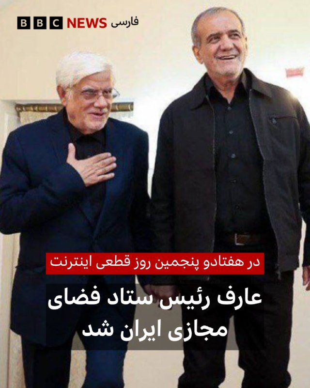

🔻مسعود پزشکیان، رئیس‌جمهور ایران، محمدرضا عارف، معاون اول خود، را به ریاست «ستاد ویژه ساماندهی و راهبری فضای مجازی کشور» منصوب کرد.

در حکم آقای پزشکیان بر «حکمرانی یکپارچه» در فضای مجازی، پایان دادن به «چندصدایی» و جلوگیری از «موازی‌کاری» میان نهادهای مسئول تأکید شده است.

این انتصاب در حالی انجام می‌شود که امروز هفتاد و پنجمین روز اختلال و محدودیت گسترده اینترنت در ایران است.

حکومت ایران از ۹ اسفند (۲۸ فوریه) و همزمان با حملات اسرائیل و آمریکا، دسترسی به اینترنت بین‌الملل را قطع کرد و تماس‌ تلفنی با خارج از ایران هم با اختلال جدی رو‌به‌رو است.

📷SHARGH
@BBCPersian

## BBCPersian — post 280912

  

🔻 یک کمیسیون مستقل اسرائیلی جزئیات تکان‌دهنده‌ای از خشونت جنسی «سیستماتیک و گسترده» توسط حماس و سایر گروه‌های مسلح فلسطینی در جریان حملات ۷ اکتبر ۲۰۲۳ و علیه گروگان‌ها منتشر کرده است.

گزارش ۳۰۰ صفحه‌ای این کمیسیون نتیجه‌گیری می‌کند که تجاوز و شکنجه جنسی «با هدف به حداکثر رساندن درد و رنج» انجام شده است.

در حالی که سازمان ملل متحد و دیگران گزارش‌هایی در مورد خشونت جنسی در جریان این حملات منتشر کرده‌اند گفته می‌شود که گزارش این کمیسیون مستقل جامع‌ترین گزارش است.

حماس در حمله هفتم اکتبر ۲۰۲۳، حدود ۱۲۰۰ نفر را کشت و ۲۵۱ نفر را گروگان گرفت.

این گزارش بر اساس ۴۳۰ مصاحبه فیلمبرداری شده با بازماندگان و شاهدان آن حمله، بیش از ۱۰ هزار عکس و فیلم گرفته شده توسط مهاجمان و سوابق و مدارک رسمی از محل‌های حمله تهیه شده است.

بیشتر بخوانید:

https://bbc.in/3R7ooD9
📷Reuters
@BBCPersian

## BBCPersian — post 280911

  <a href="telegram/content/BBCPersian_280911_1778672650.mp4" target="_blank">🎬 Download video</a>

🔻در پی زمین‌لرزه‌های دیشب و بامداد امروز به وقت محلی که دماوند و تهران را لرزاند، ساکنان مناطقی که این زلزله‌ها را حس کردند از جمله در بومهن و پردیس، شب را از خارج از خانه و در خیابان ها و پارک‌ها به‌سر بردند.

به گزارش خبرگزاری مهر زمین‌لرزه در تهران بین ۵ تا ۱۰ ثانیه طول کشید.
مرکز لرزه‌نگاری دانشگاه تهران اعلام کرده بزرگی زلزله دیشب ۴/۶ و کانون آن در حوالی پردیس، حد فاصل بین استان‌های تهران و مازندران و در عمق ۱۰ کیلومتری زمین بوده است.
در تهران پس از زلزله اول در ساعت ۳۰ دقیقه بامداد امروز یک پس‌لرزه دیگر و در مجموع تا کنون هشت زمین‌لرزه خفیف ثبت شده است.

بنابر گزارش رسانه‌های ایران تاکنون اخباری مبنی بر خسارت‌های احتمالی زمین لرزه در تهران اعلام نشده و بررسی‌های اولیه نهادهای امدادرسانی حاکی از این است که زلزله تا این لحظه در تهران مصدومی نداشته است.

وقوع این زمین‌لرزه در پایتخت ایران، هم‌زمان با طوفانی با سرعت ۵۵ کیلومتر بر ساعت در تهران و قطعی برق در برخی مناطق تهران همراه شد.
متن کامل خبر را اینجا بخوانید.
🎥IRIB
@BBCPersian

## BBCPersian — post 280910

🔻سایه جنگ ایران بر نشست وزیران خارجه بریکس در دهلی‌نو

انتظار می‌رود که جنگ آمریکا و اسرائیل علیه ایران بر نشست دو روزه وزیران خارجه گروه بریکس که از فردا پنجشنبه در دهلی‌نو آغاز می‌شود، سایه بیفکند؛ نشستی که به‌گزارش رویترز، توان این بلوک را برای رسیدن به موضعی واحد و صدور بیانیه مشترک،‌ محک خواهد زد.

این گروه که در ابتدا شامل برزیل، روسیه، هند، چین و آفریقای جنوبی بود، طی سال‌های اخیر با پیوستن مصر، اتیوپی، اندونزی، ایران و امارات متحده عربی گسترش یافته است.

ایران از اعضای بریکس خواسته که اقدامات آمریکا و اسرائیل را محکوم کنند، اما اختلاف‌ها با امارات متحده عربی آشکار شده است.

هند با وجود تنش‌ها همچنان به دنبال دستیابی به بیانیه مشترک در نشست وزیران خارجه بریکس است.

کشورهای بریکس با فشار اقتصادی ناشی از افزایش قیمت انرژی در پی جنگ روبه‌رو شده‌اند.

گفته می‌شود که احتمالا عباس عراقچی، وزیر خارجه ایران، امشب برای شرکت در این نشست وارد دهلی‌نو شود.

همچنین انتظار می‌رود سرگئی لاوروف، وزیر خارجه روسیه، نیز در این نشست حضور داشته باشد.

https://bbc.in/4u4bsfN
@BBCPersian

## BBCPersian — post 280909

🔻وزارت بهداشت ایران: حدود ۴۰ مجروح جنگ، هنوز در بیمارستان بستری هستند

حسین کرمانپور، رئیس مرکز روابط عمومی و اطلاع‌رسانی وزارت بهداشت ایران می‌گوید که حدود چهل نفر از مجروحان جنگ اخیر همچنان در بیمارستان‌ها بستری هستند.

او همچنین گفته طی دوران جنگ «کادر درمان به ۴۰هزار مجروح خدمات درمانی و بستری» ارائه داده‌اند.

این مقام وزارت بهداشت ایران تعداد کشته‌های جنگ آمریکا و اسرائیل علیه ایران را هم بر اساس آمار وزارت بهداشت، ۳ هزار و ۴۸۳ نفر اعلام کرده است.
https://bbc.in/4tAXKjn
@BBCPersian

## BBCPersian — post 280908

🔻نتبلاکس: قطع اینترنت در ایران وارد هفتادوپنجمین روز متوالی شد

به‌گزارش نت‌بلاکس که وضعیت اینترنت در جهان را بررسی می‌کند، قطعی اینترنت در ایران اکنون از ۱۷۷۶ ساعت گذشته و وارد هفتاد و پنجمین روز خود شده است.

نت‌بلاکس می‌گوید: «این سانسور دیجیتال، به سودجویی و کاهش امنیت دیجیتال منجر شده» وهمچنین «زمینه فساد و کلاه‌برداری را فراهم کرده‌ است.»

فاطمه مهاجرانی، سخنگوی دولت ایران دیروز از تداوم قطع اینترنت دفاع کرد و وعده داد که با پایان شرایط جنگی، وضعیت اینترنت بهبود پیدا خواهد کرد.

نت‌بلاکس می‌گوید که دسترسی آزاد به شبکه جهانی وب یک حق اساسی است که زمینه‌ساز سایر آزادی‌ها محسوب می‌شود، و محرومیت از آن، توان عمومی برای ثبت، مستندسازی و پیگیری نقض‌ اساسی حقوق بشر را به‌شدت محدود می‌کند.

مقام‌های جمهوری اسلامی ایران از ۹ اسفند (۲۸ فوریه) و همزمان با حملات اسرائیل و آمریکا، دسترسی به اینترنت بین‌الملل را قطع کردند. تماس‌ تلفنی با خارج از ایران هم با اختلال جدی رو‌به‌رو است.

همزمان استفاده از اینترنت ماهواره‌ای در ایران جرم شناخته شده و ماموران حکومت، کاربران آن را تحت تعقیب قرار می‌دهند.

@BBCPersian

## BBCPersian — post 280901

🔻نشست این هفته ترامپ و شی جین‌پینگ می‌تواند روابط میان این دو قدرت جهانی را برای سال‌های آینده شکل دهد؛ روابطی که پیامدهای گسترده‌ای برای مردم سراسر جهان خواهد داشت.

در حالی که این دو غول تجاری خود را برای دیدار در پکن آماده می‌کنند، در این پست نگاهی می‌اندازیم به این‌که برخی از دیدارهای پیشین آنها چگونه پیش رفته است.

برای جزئیات بیشتر آلبوم را ورق بزنید.

📷Getty Images
@BBCPersian

## BBCPersian — post 280900

  <a href="telegram/content/BBCPersian_280900_1778672652.mp4" target="_blank">🎬 Download video</a>

🔻‌‌ویروس هانتا از جمله ویروس‌هایی است که توسط جوندگان منتقل می‌شود، در حالی که ویروس کرونا عمدتا از انسان به انسان انتقال پیدا می‌کند.

سازمان بهداشت جهانی‌تاکید کرده که شیوع ویروس هانتا که در یک کشتی تفریحی اتفاق افتاد و باعث مرگ چند مسافر شد، شروع یک همه‌گیری جهانی نیست.

با این حال، پس از آنکه آخرین مسافران این کشتی تفریحی را ترک کردند، سه مورد جدید دیگر و‌مرتبط با این بیماری مرگبار شناسایی شده‌است.

دامینیک هیوز، خبرنگار بخش سلامت بی‌بی‌سی، در این ویدیو درباره تفاوت این دو ویروس و نحوه انتقال آن‌ها توضیح می‌دهد.

https://bbc.in/4ntA6Ee
@BBCPersian

## Dirty_Kids — post 389372

پرستو‌های چروک نظام

فسیل مغزهایی که سی سال خارج از ایران زندگی کردن و جالبه که اکثرشون از دست ج.ا. در اروپا پناهنده شدن ولی الان بعد از این همه سال یادشون رفته و دارن از همین ج.ا. دفاع میکنن و مردم بپا خواسته ای ان رو جاسوس و خائن معرفی میکنن! واقعاً که عقده پهلوی با این چپها چه ها که نکرد 🤦🏻‍♂️

@Dirty_Kids 👻

## Dirty_Kids — post 389371

  <a href="https://t.me/Dirty_Kids/389371" target="_blank">📎 Download file</a>

✅ اپلیکیشن اندروید سایت جهانی دربی بت

💰اولین سایت جهانی با امکان شارژ و برداشت ریالی(کارت به کارت)

🔗 برای ورود فیلترشکن روی کشور مناسب قرار دهید مانند فنلاند و المان و....

😀Telegram Channel
👇
https://t.me/+bcynkEgSW2dlYTc0

## Dirty_Kids — post 389370

  

😤دنبال یه سایت شرط بندی بین المللی بودی که به ایرانیا خدمات بده؟!
⛔

👍دربی بت همون انتخاب  100%

💎ویژگی های سایت جهانی Derby Bet:

⬅️امکان شارژ امن با کارت بانکی

⬅️واریز اول دوبل شارژ می شوید(بونوس۱۰۰٪)

⬅️پر اپشن ترین سایت فعال در ایران

⬅️تسویه حساب کمتر از 5 دقیقه

⬅️برگشت بخشی از باخت به صورت هفتگی

🚨کد هدیه ثبت نام:GG007

⚠️برای دانلود اپلکیشن کلیک کنید
👉

🔔کانال دربی بت :

🪙https://t.me/+bcynkEgSW2dlYTc0

## Dirty_Kids — post 389369

  

🔴 خبری تو فضای مجازی وایرال شده که ادعا می‌کنه «هانتا ویروس» باعث کوچک شدن آلت تناسلی مردان تا 7.6 سانت میشه!

❌ این خبر کاملاً فیکه و منبعش یه صفحه توییتری ترکیه‌ایه که معمولاً شایعات و خبرهای وایرالِ بدون منبع معتبر رو منتشر می‌کنه.

هانتا ویروس ممکنه تو برخی موارد باعث اختلال در نعوظ بشه، اما هیچ مدرک علمی معتبری درباره کوچک شدن آلت تناسلی بر اثر این ویروس وجود نداره.

@Dirty_Kids 👻

## Dirty_Kids — post 389366

🔴 این عکس با عنوان " اوه اوه زید وینی دیلدو کمری خریده تا ترتیب وینیسیوس رو بده😳😂" داره وایرال میشه؛

❌ این شات با هوش مصنوعی درست شده، عکس اصلی مربوط به سال 2007 که مدونا، خواننده آمریکایی با این دیلدو شکار شده بود.

@Dirty_Kids 👻

## Dirty_Kids — post 389365

  <a href="telegram/content/Dirty_Kids_389365_1778672657.mp4" target="_blank">🎬 Download video</a>

حرف دل ایران ❤️🦁💚⁩
مطکمئنم این رپ خوندرو چندبار گوش میکنی

@Dirty_Kids 👻

## Dirty_Kids — post 389364

  

🌪وقتی اینترنت طوفانیه... کافیه بادبان ها رو بکشی تا

⚫️با بالاترین کیفیت ممکن
⚡️ 

⚫️100 هزار تومان شارژ هدیه 
🎁

⚫️پایین ترین قیمت گیگی 250
🌐 

⚫️و ارائه پورسانت %10 در ازای هر معرفی
💼

بتونی یه اتصال پایدار با پشتیبانی 24 ساعته داشته باشی
🚀

بادبان راهتو باز می‌کنه
⛵️

R23

🛡@BadBan_VPN | کانال 

🤖@BadBan_VPNBot | ربات 

📞@BadBan_VPNSupport | پشتیبانی

## Dirty_Kids — post 389363

  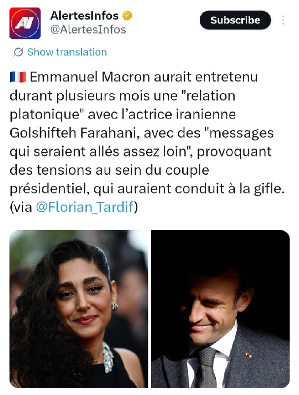

فلورین تاردیف که روزنامه‌نگاره، کتاب جدیدی چاپ کرده به اسم «Un couple parfait» و جایی از کتابش به اون ماجرای چک زدن بریژیت مکرون تو صورت مردک قرمساق امانوئل مکرون جلو در هواپیما اشاره کرده و نوشته،

اون داستان به خاطر پیام‌های بوجی موجی طور از گلشیفته فراهانی بوده که بریژیت روی گوشی امانوئل‌مکرون قحبه زاده در طول سفر به ویتنام دیده.

می‌شه گفت که یک سر مواضع دوستانه‌ی امانوئل مکرون قحبه با جمهوری‌اسلامی و هر شب تماس گرفتناش با مسعود پزشکیان برمی‌گرده به همین ادعای فلورین تاردیف در کتابش.

این مطلب رو در اسرع وقت باید به عرض شیر وفادار خدا برسونم.

@Dirty_Kids 👻

## Hranews — post 112925

مصدومیت رئیس اداره محیط‌زیست باروق و یک همیار در جریان مقابله با قطع درخت

❗️
❗️
❗️
❗️
❗️– مدیرکل حفاظت محیط‌‌زیست آذربایجان غربی اعلام کرد که در جریان جلوگیری از قطع یک درخت توت کهنسال در روستای یلکلو از توابع شهرستان باروق، رئیس اداره حفاظت #محیط‌_زیست این شهرستان و یکی از همیاران محیط‌ زیست در جریان درگیری با متخلفان قاچاق چوب مصدوم شدند. به گفته حجت جباری، دو متخلف در این رابطه بازداشت و ادوات قطع درخت از آنان کشف و ضبط شد.

ادامه مطلب

↘️
@hranews_bot تماس ✉️ - @Hranews کانال هرانا 🆑

## Hranews — post 112924

تداوم بازداشت و بی‌خبری از وضعیت سیاوش عزیزی‌مقدم

❗️
❗️
❗️
❗️
❗️– سیاوش عزیزی‌مقدم، شهروند اهل مهاباد حدود ۲۰ روز است که بازداشت شده و در بلاتکلیفی به‌سر می‌برد. بی‌خبری از سرنوشت این شهروند، منجر به افزایش نگرانی‌های خانواده وی شده است.

ادامه مطلب

#سیاوش_عزیزی‌مقدم

↘️
@hranews_bot تماس ✉️ - @Hranews کانال هرانا 🆑

## Hranews — post 112923

سه شهروند از جمله یک زن در شاهین‌شهر بازداشت شدند

❗️
❗️
❗️
❗️
❗️– جانشین فرماندهی انتظامی استان اصفهان از #بازداشت سه شهروند از جمله یک زن در شاهین‌شهر به دلیل آنچه «ارسال اطلاعات و همکاری با شبکه معاند» عنوان کرده است، خبر داد.

ادامه مطلب

↘️
@hranews_bot تماس ✉️ - @Hranews کانال هرانا 🆑

## manototv — post 105393

  <a href="telegram/content/manototv_105393_1778672660.mp4" target="_blank">🎬 Download video</a>

خبرگزاری رسمی امارات گزارش داد دولت امارات متحده عربی ۲۱ فرد و نهاد لبنانی را به‌دلیل ارتباط با حزب‌الله در فهرست تحریم قرار داده است.
بر اساس این گزارش، ۱۶ شهروند لبنانی و پنج سازمان مستقر در امارات به حمایت از گروه‌هایی متهم شده‌اند که از سوی ابوظبی «تروریستی» شناخته می‌شوند.
مقام‌های نظارتی امارات موظف شده‌اند افراد و نهادهای تحریم‌شده را شناسایی کرده و ظرف ۲۴ ساعت اقدامات لازم، از جمله مسدود کردن دارایی‌های آن‌ها، را انجام دهند.
امارات که میزبان جمعیت بزرگی از لبنانی‌هاست، در جریان جنگ منطقه‌ای ناشی از حملات آمریکا و اسرائیل به ایران، یکی از اصلی‌ترین اهداف حملات موشکی و پهپادی جمهوری اسلامی بود.

## manototv — post 105392

  <a href="telegram/content/manototv_105392_1778672661.mp4" target="_blank">🎬 Download video</a>

آژانس بین‌المللی انرژی پیش‌بینی کرده است که در پی اختلال‌های ناشی از درگیری‌های خاورمیانه، عرضه جهانی نفت در سال ۲۰۲۶ روزانه ۳.۹ میلیون بشکه کاهش یابد.
این نهاد همچنین انتظار دارد تقاضای جهانی نفت در سال جاری روزانه ۴۲۰ هزار بشکه کاهش پیدا کند، اما میزان افت عرضه بسیار بیشتر از کاهش تقاضا خواهد بود.
آژانس بین‌المللی انرژی در تازه‌ترین گزارش بازار نفت خود اعلام کرد:
«بیش از ۱۰ هفته پس از آغاز جنگ در خاورمیانه، افزایش اختلال‌ها در تنگه هرمز ذخایر جهانی نفت را با سرعتی بی‌سابقه کاهش داده است.»
در ادامه این گزارش آمده است: «کاهش سریع ذخایر مازاد در کنار ادامه اختلال‌ها ممکن است زمینه‌ساز جهش‌های قیمتی در آینده شود.»

## manototv — post 105391

  <a href="telegram/content/manototv_105391_1778672662.mp4" target="_blank">🎬 Download video</a>

معاون وزیر بهداشت در اظهاراتی «بحران جمعیت» را مهم‌تر از جنگ اخیر ارزیابی کرده است و افزوده «اقتداری که مردم و نیروهای مسلح در دوران جنگ نشان دادند، ناشی از همین جمعیت جوان بوده است.»
این مقام با هشدار درباره ادامه روند کاهش زاد‌وولد در ایران گفت آمار تولدها در سال ۱۴۰۴ به ۸۹۲ هزار و ۲۶۸ نفر رسیده؛ در حالی‌ که این رقم در سال ۱۴۰۳ حدود ۹۷۳ هزار نفر بوده است.
او با اشاره به اینکه آمار موالید پیش‌تر به زیر ۹۰۰ هزار نفر رسیده بود، گفت این ارقام نشان‌دهنده ادامه روند نزولی جمعیت در کشور است، هرچند به گفته او «شیب کاهش جمعیت کندتر شده است.»

## manototv — post 105390

  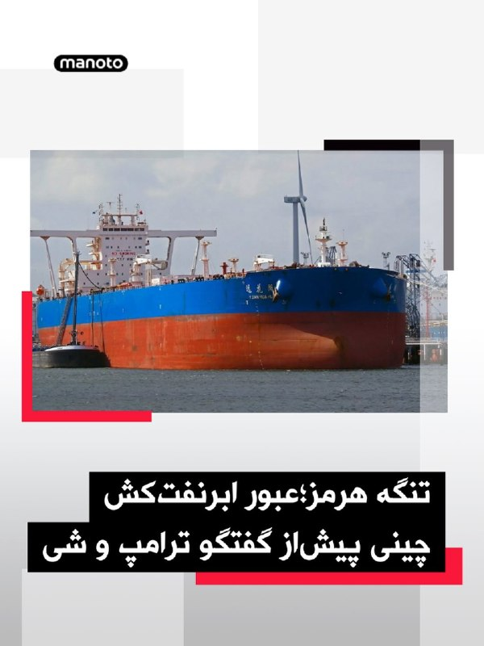

بررسی‌ها نشان می‌دهد یک ابرنفتکش چینی پیش از گفت‌وگوهای ترامپ و شی جین‌پینگ از تنگه هرمز عبور کرده است. این نفتکش تحت ثبت و مدیریت شرکت دولتی چینی «کاسکو شیپینگ» قرار دارد. نفتکش بسیار بزرگ حمل نفت خام (VLCC) با نام «یوان هوا هو» آخرین بار در ردیاب‌های دریایی در شرق تنگه مشاهده شده بود.این نفتکش هنگام عبور، مقصد خود را «مالک و خدمه چینی» ثبت کرده بود.به نظر می‌رسد اندکی پس از خاموش کردن سیستم ردیابی‌اش، در یک تصویر ماهواره‌ای ثبت شده باشد. در ۲۴ ساعت گذشته، چند کشتی دیگر تحت مدیریت چین نیز از تنگه هرمز عبور کرده‌اند. همه آن‌ها از مسیری تحت کنترل جمهوری‌اسلامی و نزدیک به آب‌های ایران استفاده کرده‌اند. به‌دست آوردن تصویر کامل از رفت‌وآمدها ممکن نیست، زیرا بیشتر کشتی‌هایی که از تنگه عبور می‌کنند سیستم ردیابی خود را خاموش کرده‌اند.

## manototv — post 105389

  

براساس داده‌های سازمان هواشناسی، ۱۸ استان ایران در سال آبی جاری با کاهش بارندگی مواجه شده‌اند و استان تهران با بیش از ۳۸ درصد افت میانگین بارش، رکورددار کم‌بارشی در کشور شده است.

گزارش‌ها نشان می‌دهد کاهش بارندگی در تهران و برخی استان‌های مرکزی، نگرانی‌ها درباره تشدید بحران آب و فشار بر منابع آبی را افزایش داده است.

پس از تهران، استان‌های قم و سمنان نیز در میان استان‌هایی قرار دارند که بیشترین کاهش بارش را تجربه کرده‌اند.

کارشناسان هشدار می‌دهند ادامه روند خشکسالی و افت بارش‌ها می‌تواند وضعیت ذخایر سدها و تامین آب شرب را در ماه‌های آینده دشوارتر کند. چون ظاهراً در این سرزمین، همه‌چیز یا «بی‌سابقه» است یا «در آستانه بحران». برنامه‌ریزی پایدار هم مثل بارندگی، سال‌هاست کمیاب شده.

## manototv — post 105388

  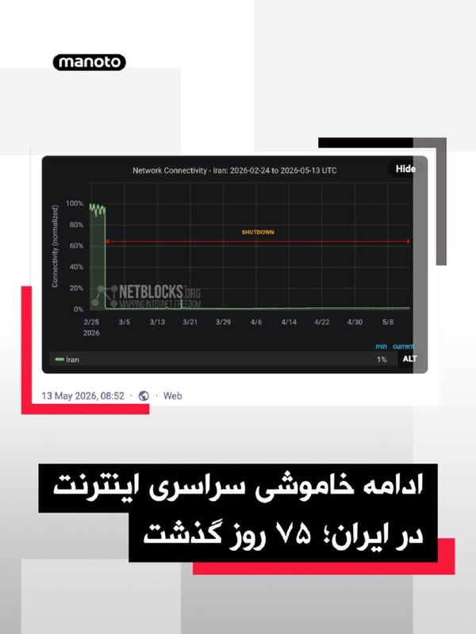

سازمان «نت‌بلاکس» اعلام کرد خاموشی گسترده اینترنت در ایران از ۱۷۷۶ ساعت گذشته و وارد هفتاد و پنجمین روز شده است. این نهاد می‌گوید محدودیت‌های گسترده اینترنت، هم‌زمان با اجرای طرح‌های اینترنت طبقاتی و دسترسی‌های گزینشی، باعث افزایش نظارت، فساد و کلاهبرداری‌های دیجیتال شده است.

واقعاً شگفت‌انگیز است که در سال ۲۰۲۶ هنوز بعضی حکومت‌ها اینترنت را مثل شیر آب ساختمان قطع می‌کنند. فقط فرقش این است که این یکی همزمان اقتصاد، امنیت دیجیتال و اعصاب مردم را هم می‌بندد.

## alonews — post 119711

  <a href="telegram/content/alonews_119711_1778672665.webm" target="_blank">🎬 Download video</a>

👈حزب‌الله فیلمی از برخورد مستقیم یک پهپاد FPV با بولدوزر کاترپیلار D9 ارتش اسرائیل در ناقوره، جنوب لبنان، در تاریخ ۱۱ مه منتشر کرد

✅ @AloNews خبر جنگ

## alonews — post 119710

  <a href="telegram/content/alonews_119710_1778672665.webm" target="_blank">🎬 Download video</a>

👈لهستان : به خاطر حملات روسیه به اوکراین، جنگنده‌هامون رو به پرواز درآوردیم

✅ @AloNews خبر جنگ

## alonews — post 119709

  <a href="telegram/content/alonews_119709_1778672666.webm" target="_blank">🎬 Download video</a>

👈ارتش اسرائیل از صبح تا کنون ۷ خودرو را در مناطق مختلف لبنان بمباران کرده است

✅ @AloNews خبر جنگ

## alonews — post 119708

  <a href="telegram/content/alonews_119708_1778672666.mp4" target="_blank">🎬 Download video</a>

👈دولت چین اتوبان رو برای عبور کاروان ترامپ آماده کرده؛ دو طرف مسیر پر از پرچم‌های آمریکا دیده میشه

✅ @AloNews خبر جنگ

## alonews — post 119707

  <a href="telegram/content/alonews_119707_1778672669.webm" target="_blank">🎬 Download video</a>

👈پزشکیان خطاب به کارکنان وزارت جهاد کشاورزی: می‌خواهم تمام توانشان را برای کنترل قیمت‌ها به‌کار ببندند

✅ @AloNews خبر جنگ

## alonews — post 119706

  <a href="telegram/content/alonews_119706_1778672669.webm" target="_blank">🎬 Download video</a>

👈برآورد می‌شود که در کف اقیانوس‌ها ۱۱۳ میلیون بشکه نفت در داخل کشتی‌هایی که در طول جنگ جهانی دوم غرق شده‌اند، وجود دارد.

🔴این میزان تقریباً معادل حجم تولید روزانه نفت در جهان در حال حاضر است

✅ @AloNews خبر جنگ

## alonews — post 119705

  <a href="telegram/content/alonews_119705_1778672669.webm" target="_blank">🎬 Download video</a>

👈مدیرعامل بانک مسکن: وام مسکن را به ۱.۲ میلیارد تومان افزایش می‌دهیم با اقساط بازپرداخت ماهی ۳۰ میلیون تومان

✅ @AloNews خبر جنگ

## alonews — post 119704

  <a href="telegram/content/alonews_119704_1778672670.webm" target="_blank">🎬 Download video</a>

👈 اپل به صورت رسمی اولین نمایندگی خودشو در افغانستان افتتاح کرد...

✅ @AloNews خبر جنگ

## alonews — post 119703

  <a href="telegram/content/alonews_119703_1778672670.webm" target="_blank">🎬 Download video</a>

👈همزمان با کاهش درآمدهای نفتی و افزایش شدید هزینه های نظامی و اقتصادی عربستان سعودی، کسری بودجه این رژیم رکورد هشت ساله را شکست

✅ @AloNews خبر جنگ

## alonews — post 119702

  <a href="telegram/content/alonews_119702_1778672670.webm" target="_blank">🎬 Download video</a>

👈ذوق‌زدگی معاون جبلی از حکم عجیب دادگاه علیه آپارات: از رهنمودهای شما برای صدور این رای بی‌نظیر قدردانی می‌شود!

🔴این نامه در شبکه‌های اجتماعی منتشر شده است.

✅ @AloNews خبر جنگ

## alonews — post 119701

  <a href="telegram/content/alonews_119701_1778672671.mp4" target="_blank">🎬 Download video</a>

🔴رانت و خرید مدرک اینقدر فاجعه آمیز شده که طرف که مدعیه دانشجوست نمی دونه کدوم دانشگاه دانشجوس !

🔴در واقع نمی دونه از کدوم دانشگاه قراره بهش مدرک بدن!

مجری حکومتی: درس می‌خونی؟
ـ امیرحسین محمودی بازیکن تیم حکومتی فوتبال جمهوری اسلامی: بله
مجری حکومتی: چه رشته‌ای؟
- دانشجوی تربیت بدنی هستم.
مجری حکومتی: کدوم دانشگاه؟
- حضور ذهن ندارم!!!

@AloSport

## alonews — post 119700

  <a href="telegram/content/alonews_119700_1778672673.webm" target="_blank">🎬 Download video</a>

👈گاردین: «اختلافات داخلی میان کشورهای حاشیهٔ خلیج فارس، به‌ویژه بین عربستان سعودی و امارات، در محافل خصوصی معطوف به این مسئله بوده است که آیا خشم اعراب از حملات ایران باید تا حد تلافی‌های نظامی ادامه یابد، یا این اقدام ممکن است سطحی از خصومت از سوی ایران ایجاد کند که روابط دیپلماتیک ظریف کشورهای حاشیهٔ خلیج فارس را تهدید نماید.

✅ @AloNews خبر جنگ

## alonews — post 119699

  <a href="telegram/content/alonews_119699_1778672673.webm" target="_blank">🎬 Download video</a>

👈بیش از ۱۵۰۰ کشتی خارجی در دو سوی تنگهٔ هرمز منتظر دریافت مجوز از سوی جمهوری اسلامی ایران برای عبور هستند.

✅ @AloNews خبر جنگ

## alonews — post 119698

  <a href="telegram/content/alonews_119698_1778672673.webm" target="_blank">🎬 Download video</a>

👈فرماندهی مرکزی ارتش آمریکا (سنتکام) اعلام کرد همچنان به اعمال محاصره علیه کشتی‌هایی که به داخل ایران وارد می‌شوند یا از آنها خارج می‌شوند، ادامه می‌دهند.

🔴سنتکام مدعی شد که در جریان این عملیات، مسیر ۶۵ کشتی تجاری را تغییر داده و چهار کشتی دیگر را از کار انداخته‌است

✅ @AloNews خبر جنگ

## alonews — post 119697

  <a href="telegram/content/alonews_119697_1778672674.webm" target="_blank">🎬 Download video</a>

👈توییت ایلان ماسک داخل ایکس : تو راه پکن با هواپیمای ایرفورس وان

✅ @AloNews خبر جنگ

## alonews — post 119696

  <a href="telegram/content/alonews_119696_1778672674.webm" target="_blank">🎬 Download video</a>

👈سخنگوی کمیسیون انرژی مجلس: ایران با وجود ۱۵ همسایه عملاً محاصره ناپذیر است

✅ @AloNews خبر جنگ

## alonews — post 119695

  <a href="telegram/content/alonews_119695_1778672674.webm" target="_blank">🎬 Download video</a>

👈 رئیس موساد، دیوید بارنیا، حداقل دو بار در طول جنگ به امارات متحده عربی سفر کرد تا هماهنگی کمپین علیه ایران را انجام دهد، طبق گزارش وال استریت ژورنال.

✅ @AloNews خبر جنگ

## alonews — post 119694

  <a href="telegram/content/alonews_119694_1778672675.webm" target="_blank">🎬 Download video</a>

👈معاون اطلاع‌رسانی دفتر رئیس‌جمهور: احتمالاً سرپرست فعلی وزارت دفاع برای تصدی وزارتخانه معرفی شود

✅ @AloNews خبر جنگ

## alonews — post 119693

  <a href="telegram/content/alonews_119693_1778672675.webm" target="_blank">🎬 Download video</a>

👈ادعای سی‌ان‌ان: پیش‌بینی می‌شود ترامپ از رئیس‌جمهور چین بخواهد تا بر ایران فشار آورد تا تنگهٔ هرمز را بازگشایی کند و با یک توافق صلح مناسب موافقت نماید

✅ @AloNews خبر جنگ

## alonews — post 119692

  <a href="telegram/content/alonews_119692_1778672675.webm" target="_blank">🎬 Download video</a>

👈بهداشت لبنان: 8 کشته در حملات به بیروت و صیدا

✅ @AloNews خبر جنگ

---
📅 بروزرسانی: 1405/02/23 12:52
---

## VahidOOnLine — post 239869

  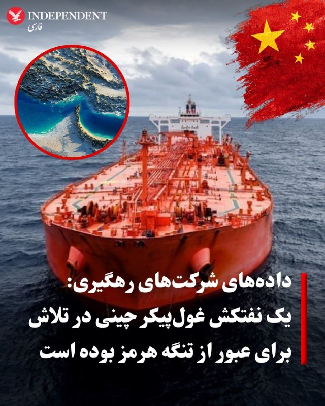

♦️همزمان با سفر دونالد ترامپ، رئیس جمهوری آمریکا به چین، خبرگزاری رویترز روز چهارشنبه ۲۳ اردیبهشت به‌نقل از داده‌های شرکت‌های «ال‌اس‌ای‌جی» و «کپلر» که تردد کشتی‌ها را رصد می‌کنند، گزارش داد یک نفتکش غول‌پیکر چینی حامل دو میلیون بشکه نفت خام عراق در تلاش برای عبور از تنگه هرمز بوده است.
بر اساس داده‌های این شرکت‌ نفتکش «یوآن هوا هو» از نزدیکی جزیره لارک ایران عبور کرده و در بخش شرقی تنگه هرمز به سمت جنوب در حال حرکت است.
بر اساس این گزارش، اگر این سفر با موفقیت انجام شود، این سومین مورد شناسایی شده عبور یک نفتکش چینی از تنگه هرمز از زمان آغاز جنگ آمریکا و اسرائیل با ایران در اسفند ۱۴۰۴خواهد بود.
داده‌های رهگیری کشتی‌ها نشان می‌دهد نفتکش «یوآن هوا هو» اوایل ماه مارس نزدیک به دو میلیون بشکه نفت خام «بصره مدیوم» را در پایانه بصره عراق بارگیری کرده بود و از آن زمان در خلیج فارس مانده بود.
‌🇸🇦 Indypersian

🤖 @VahidOOnLine

## VahidOOnLine — post 239868

  <a href="telegram/content/VahidOOnLine_239868_1778664160.mp4" target="_blank">🎬 Download video</a>

♦️علیرضا رئیسی، معاون وزیر بهداشت جمهوری اسلامی ایران روز چهارشنبه ۲۳ اردیبهشت در نشتی خبری، با «غیرممکن خواندن» ورود ویروس هانتا به ایران از طریق مرزهای دریایی گفت: «از تنگه هرمز یک قایق بادی هم رد نمی‌شود چه برسد به کشتی کروز.»

نخستین نشانه‌های ابتلا به ویروس هانتا حدود دو هفته پیش در یک کشتی تفریحی (کروز) متعلق به یک شرکت هلندی در راه جزایر قناری شناسایی شد.
‌🇸🇦 Indypersian

🤖 @VahidOOnLine

## VahidOOnLine — post 239867

  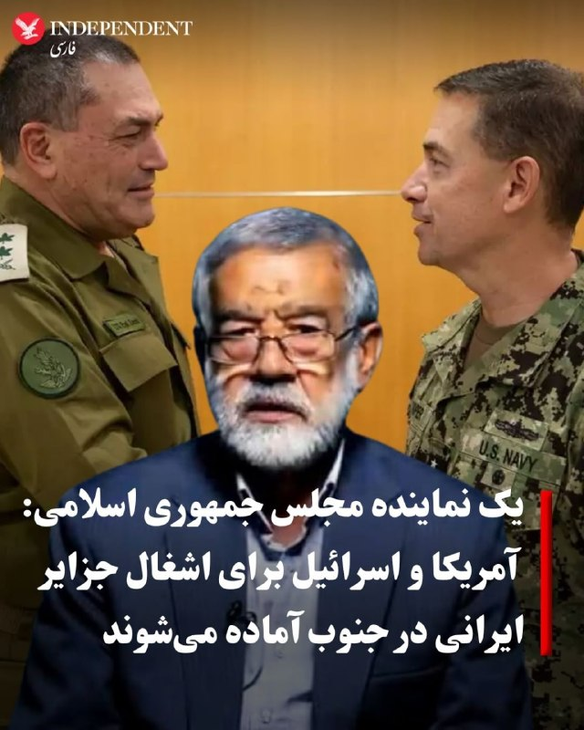

♦️کامران غضنفری، نماینده مجلس شورای اسلامی روز چهارشنبه ۲۳ اردیبهشت گفت آمریکا و اسرائیل می‌خواهند با یک عملیات گسترده، «احتمالا برخی از جزایر ما را در جنوب اشغال کنند. این نماینده مجلس گفت «انتقال سنگین تجهیزات و نیرو به منطقه» با همین هدف انجام می‌شود.
دونالد ترامپ در هفته‌های نخست جنگ احتمال ورود محدود نیروی نظامی به خاک ایران را رد نکرده بود. اما این سناریو در هفته‌های بعد کمرنگ‌تر شد. با این حال گزارش‌ها حاکی از تجمع گسترده نیروهای آمریکایی در منطقه است.
غضنفری در گفتگو به خبرآنلاین گفت ما هنوز وسط جنگ هستیم و در همین هفته گذشته «دو عملیات علیه ما انجام دادند و با ناوهایشان به برخی مراکز ما حمله کردند.»
‌🇸🇦 Indypersian

🤖 @VahidOOnLine

## VahidOOnLine — post 239866

  <a href="telegram/content/VahidOOnLine_239866_1778664164.mp4" target="_blank">🎬 Download video</a>

⭕️دو حمله هوایی اسرائیل به جنوب بیروت دست‌کم یک کشته برجا گذاشت

♦️خبرگزاری دولتی لبنان روز چهارشنبه ۲۳ اردیبهشت‌ماه گزارش کرد روز چهارشنبه دو خودرو در بزرگراه اصلی میان بیروت و جنوب لبنان، در نزدیکی منطقه جیه، هدف حمله قرار دادند.

خبرگزاری فرانسه ویدیویی را از خودروی سوخته و انتقال دست‌کم یک پیکر توسط نیروهای امدادی منتشر کرد.

خبرگزاری رویترز نوشت هنوز اسرائیل بیانیه‌ای درباره این حمله و اهداف آن منتشر نکرده است.
‌🇸🇦 Indypersian

🤖 @VahidOOnLine

## VahidOOnLine — post 239865

  

وزارت خارجه جمهوری اسلامی بازداشت چهار عضو سپاه پاسداران در کویت را تایید کرد و گفت این ماموران به دلیل «اختلال ایجاد شده در سامانه ناوبری»، وارد آب‌های کویت شده بودند. این وزارتخانه اعلام کویت مبنی بر نفوذ این ماموران برای انجام «اقدام خصمانه» را بی‌اساس خواند و خواستار آزادی آن‌ها شد.
‌🏁 🇬🇧 IranintlTV

🤖 @VahidOOnLine

## VahidOOnLine — post 239864

  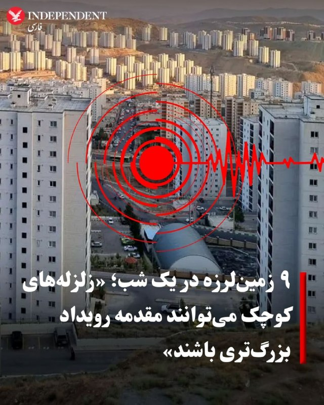

♦️یک روز پس از وقوع ۹ زمین‌لرزه و پس‌لرزه در شرق تهران، یک کارشناس زمین‌شناسی گفت این لرزه‌های کوچک، ممکن است مقدمه رویداد بزرگ‌تری باشند.

به گزارش خبرگزاری مهر، وابسته به سازمان تبلیغات اسلامی، مهدی زارع، زلزله‌شناس و استاد پژوهشگاه بین‌المللی زلزله‌شناسی و مهندسی زلزله با اشاره به زمین‌لرزه به بزرگی ۷.۱ در قرن نوزدهم در گسل شرق تهران گفت: «وقوع زلزله‌های ۴ ریشتری اخیر در ۲۸ فروردین و ۲۲ اردیبهشت در پردیس نشان از تخلیه انرژی دارد. وقوع زمین‌لرزه‌های کوچک به صورت مستمر، بخشی از انرژی گسل را تخلیه می‌کند، ولی این لرزه‌ها می‌توانند نشانه‌ای از ناپایداری در پهنه‌ای وسیع‌تر باشند که مقدمه رویداد بزرگتری است.

به عبارت دیگر، لرزه‌های خرد و متوسط، هرچند تا حدی تنش را کاهش می‌دهند، اما نمی‌توانند به طور قطع احتمال وقوع یک زلزله بزرگ را منتفی کنند. در برخی موارد، چنین توالی‌هایی می‌توانند پیش‌لرزه (foreshock) باشند.»
‌🇸🇦 Indypersian

🤖 @VahidOOnLine

## VahidOOnLine — post 239863

⭕️اجرای هنری «سوگ سیاوش» در اعتراض به اعدام جوانان ایران‌زمین در شهر کلن

♦️تصاویری که روز سه‌شنبه ۲۲ اردیبهشت برای ایندیپندنت فارسی ارسال شده نشان می‌دهد، جانان الماسی، شاعر حماسی و رقصنده، در گردهمایی سراسری ایرانیان در شهر کلن، غم‌نامه «سوگ سیاوش» فردوسی را همراه با رقصی در اعتراض به اعدام معترضان در ایران اجرا کرد.

این برنامه روز یکشنبه ۲۰ اردیبهشت‌ماه در شهر کلن آلمان برگزار شد.
‌🇸🇦 Indypersian

🤖 @VahidOOnLine

## VahidOOnLine — post 239862

  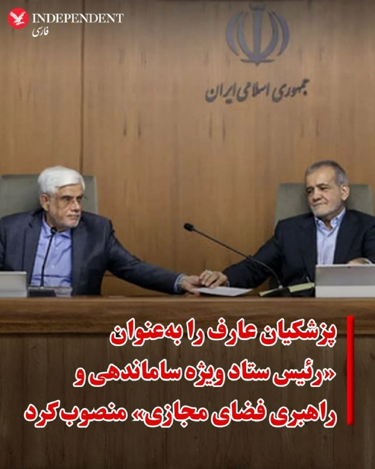

♦️پس از ۷۵ روز قطعی اینترنت در ایران و در حالیکه اعتراض‌ها به این رکوردشکنی جمهوری اسلامی بالا گرفته است، مسعود پزشکیان روز چهارشنبه ۲۳ اردیبهشت، محمدرضا عارف را به‌عنوان «رئیس ستاد ویژه ساماندهی و راهبری فضای مجازی» منصوب کرد.

پزشکیان ساعاتی پیش از این با انتشار پیامی در اکس نوشته بود «با در نظر گرفتن «حساسیت‌های حکمرانی و نظر رهبری»، در قالب «ساختاری چابک»، موجبات خدمت‌رسانی بهتر دولت و تحقق انتظارات عمومی را فراهم کند.»

پزشکیان توضیح نداد که ساختار چابک مورد نظر او، شامل وصل کامل اینترنت و ارتباطات می‌شود یا قصد دارد خدمات الکترونیکی دولت را روی شبکه ملی اینترنت (نسخه محدود داخلی) گسترده‌تر کند.
‌🇸🇦 Indypersian

🤖 @VahidOOnLine

## VahidOOnLine — post 239861

  

هم‌زمان با سفر دونالد ترامپ به چین و آغاز گفت‌وگوها درباره جنگ جمهوری اسلامی و اسرائیل، مقام‌های آمریکایی پکن را متهم کردند که با خرید گسترده نفت ایران، به «بزرگ‌ترین حامی دولتی تروریسم» کمک مالی می‌کند.

دونالد ترامپ امروز برای دیدار با شی جین‌پینگ، رئیس‌جمهوری چین، راهی پکن شد؛ دیداری که جنگ جمهوری اسلامی و اسرائیل و بحران تنگه هرمز از محورهای اصلی آن عنوان شده است.

در آستانه این سفر، اسکات بسنت، وزیر خزانه‌داری آمریکا، از چین خواست جمهوری اسلامی را برای بازگشایی تنگه هرمز تحت فشار قرار دهد و گفت پکن با خرید نفت ایران، «بزرگ‌ترین حامی دولتی تروریسم» را تأمین مالی می‌کند.

وزیر خزانه‌داری آمریکا در گفت‌وگو با فاکس‌نیوز گفت: «ببینیم آیا چین حاضر است از دیپلماسی استفاده کند و جمهوری اسلامی را وادار به باز کردن تنگه کند یا نه.»

چین تاکنون در قبال جنگ موضعی محتاطانه اتخاذ کرده و فراتر از انتقاد از آمریکا و اسرائیل، نقش مستقیمی در حل بحران ایفا نکرده است.
این دیدار در شرایطی برگزار می‌شود که تنش‌ها در منطقه، امنیت انرژی چین و تجارت جهانی از مسیر تنگه هرمز را تحت تأثیر قرار داده است.
‌🏁 🇬🇧 ManotoTV

🤖 @VahidOOnLine

## VahidOOnLine — post 239860

  

کامران غضنفری، نماینده مجلس، آمارهای مربوط به خسارت‌های قطع اینترنت در ایران را «جوسازی» خواند و گفت: «۵۰ میلیون نفر در پلتفرم‌های ایرانی هستند و هیچ مشکلی ندارند.»

او گفت: «قطع اینترنت اصلا مختص ایران نیست. ترکیه و کشورهای اروپایی که مانند ما درگیر جنگ نشده‌اند، به محض کوچک‌ترین مشکل امنیتی اینترنت بین‌الملل مردم خود را قطع می‌کنند.»
‌🏁 🇬🇧 IranintlTV

🤖 @VahidOOnLine

## VahidOOnLine — post 239859

  

رویترز به نقل از مقام‌های غربی و جمهوری اسلامی گزارش داد عربستان سعودی در جریان گسترش جنگ منطقه‌ای، در واکنش به حملاتی در خاک این کشور، چندین حمله اعلام‌نشده علیه جمهوری اسلامی انجام داده است.

رویترز در گزارشی اختصاصی نوشت عربستان سعودی، در اقدامی بی‌سابقه، حملات محرمانه‌ای را علیه جمهوری اسلامی انجام داده است.

به گفته دو مقام غربی مطلع و دو مقام جمهوری اسلامی، این حملات در واکنش به حملاتی صورت گرفته که در جریان جنگ در خاک عربستان انجام شده بود.

این حملات که پیش‌تر رسانه‌ای نشده بود، نخستین مورد شناخته‌شده از اقدام مستقیم نظامی عربستان در خاک ایران به شمار می‌رود؛ اقدامی که به نوشته رویترز نشان می‌دهد ریاض در دفاع از خود در برابر جمهوری اسلامی، رویکردی تهاجمی‌تر در پیش گرفته است.
‌🏁 🇬🇧 ManotoTV

🤖 @VahidOOnLine

## VahidOOnLine — post 239858

  <a href="telegram/content/VahidOOnLine_239858_1778664171.mp4" target="_blank">🎬 Download video</a>

ویدیوهای ارسال‌شده به ایران‌اینترنشنال نشان می‌دهند گروهی از ایرانیان مقیم آلمان سه‌شنبه ۲۲ اردیبهشت‌ماه در اعتراض به اعدام‌های جمهوری اسلامی، در شهر هانوفر پرفورمنس اعتراضی برگزار کردند.
‌🏁 🇬🇧 IranintlTV

🤖 @VahidOOnLine

## VahidOOnLine — post 239857

  

♦️روزنامه کیهان تهران روز چهارشنبه ۲۳ اردیبهشت در یادداشتی نوشت پذیرش دوباره مذاکره با آمریکا، «پالس ضعف به دشمن» می‌فرستد و باعث از سرگیری جنگ می‌شود.
کیهان در این یادداشت ادعا کرد که با وجود ضربات سنگین آمریکا و اسرائیل و کشته شدن بخش بزرگی از رهبران سیاسی و نظامی جمهوری اسلامی، «ایران برخلاف پیش‌بینی‌ها، تسلیم نشد.»
این روزنامه تحت نظر حسین شریعتمداری نوشت: «ایران نه‌تنها تسلیم نشد بلکه گلوی ترامپ را در تنگه هرمز بیشتر فشرد و فشار اقتصادی علیه محاسبات او را شدت بخشید.
تنها چیزی که آمریکا را عقب می‌راند، ماندگاری عبرت‌های دردناک جنگ اخیر و احتمال تکرار شدیدتر آن در آینده است
آنها می‌دانند زدن زیرساخت‌های ایران یعنی انهدام آرامکوی عربستان، فجیره امارات و دیگر تاسیسات منطقه.»
‌🇸🇦 Indypersian

🤖 @VahidOOnLine

## VahidOOnLine — post 239856

♦️گفتگوی جنجالی سه تن از ملی‌پوشان فوتبال ایران درباره میزان تحصیلات دانشگاهی که روز دوشنبه ۲۱ اردیبهشت از صداوسیما پخش شد، دست‌مایه طنز کاربران شبکه‌های اجتماعی قرار گرفت.

در این گفتگو، یکی از ملی‌پوشان در پاسخ به سوال مجری که پرسیده بود «در کدام دانشگاه درس می‌خوانی؟» گفت: «نمی‌دانم، الان حضور ذهن ندارم».

در دوره قبلی جام جهانی نیز انتشار ویدیویی از دروازه‌بان تیم ملی فوتبال ایران که گفته بود «من دکترا دارم»، بحث‌برانگیز شده بود؛ دکترایی که بعدها مشخص شد به‌صورت غیرحضوری در رشته تربیت بدنی دانشگاه پیام نور اخذ شده است.
‌🇸🇦 Indypersian

🤖 @VahidOOnLine

## WithYashar — post 11133

کانال 13 اسرائیل:
نتانیاهو امشب جلسه امنیتی ویژه در مورد ایران برگزار خواهد کر‌د
@withyashar

## WithYashar — post 11132

  

📷 Photo

## WithYashar — post 11131

فدراسیون فوتبال: امشب مراسم بدرقه تیم ملی فوتبال به جام جهانی، در میان تجمع حامیان حکومت در میدان انقلاب تهران برگزار می‌شود و قرار است در این مراسم از پیراهن تیم نیز رونمایی شود.
@withyashar

## WithYashar — post 11130

عبور ابرنفتکش چینی از تنگه هرمز همزمان با سفر ترامپ به این کشور
داده‌های مارین ترافیک نشان می‌دهد که کشتی یوان هوآ هو صبح چهارشنبه در حال حرکت به سمت شرق از طریق تنگه دیده شده است.
برخی بر این باور هستند که عبور این کشتی نوعی اقدام مبتنی بر حسن نیت از سوی ترامپ برای جلب نظر شی جین پینگ است.
@withyashar

## WithYashar — post 11129

یک مقام ارشد سابق موساد: ایران ممکن است ظرف چند ماه از نظر اقتصادی سقوط کند اگر محاصره ادامه یابد
@withyashar

## WithYashar — post 11128

@withyashar

## WithYashar — post 11127

پروژه هارپ یه پروژه برای تغییر در آب و هوا بود طوفان میتونست درست کنه ولی زلزله نظر اکثر کارشناسان بر این بوده که امکانشرو نداشته و فقط تغیید در لایه های جو بوده به هر حال دهه نود ساخته شد و ۲۰۱۴ امریکا گفت پروژه کنسل شده ، ولی تئوری توطئه زیاد هست درباره این پروژه
@withyashar

## WithYashar — post 11126

سلام مرسی از همه زحمت هات
زلزله میتونه پروژه هارپ باشه؟

## WithYashar — post 11125

درود یاشار جان، خسته نباشی. مرسی ک تحمل این روزای سخت رو با حضورت و زحمتی ک میکشی، برامون قابل تحمل میکنی. داداش میشه توضیح بدی ک چرا اکثر مواقع حساس کشور، ایران میره روی ویبره؟! قبل از خشم حماسی هم این اتفاق میفتاد، طلوع شیران هم همینطور یا مثلا چند سال قبل…

## WithYashar — post 11124

درود یاشار جان، خسته نباشی.
مرسی ک تحمل این روزای سخت رو با حضورت و زحمتی ک میکشی، برامون قابل تحمل میکنی.
داداش میشه توضیح بدی ک چرا اکثر مواقع حساس کشور، ایران میره روی ویبره؟!
قبل از خشم حماسی هم این اتفاق میفتاد، طلوع شیران هم همینطور یا مثلا چند سال قبل ۴۰۱ بود فک کنم.
بنظرت میتونه چیزی بجز گسل و دلایل طبیعی باشه؟

## WithYashar — post 11123

  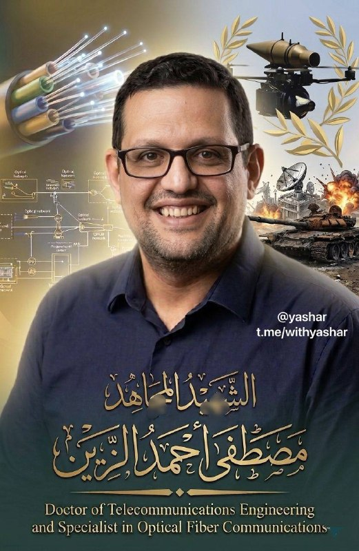

مهندس ارتباطات حزب‌الله که متخصص فیبرنوری بوده و پشت توسعه پهپادهای انفجاری این سازمان بود، توسط ارتش اسرائیل به هلاکت رسید.
@withyashar

## WithYashar — post 11122

نیویورک تایمز: قصد ترامپ از تغییر نام عملیات «خشم حماسی» به «چکش سنگین» این است که یک عملیات جدید ۶۰ روزه حمله به ایران شروع کند
@withyashar

## WithYashar — post 11121

گزارش مرکز ژئوفیزیک از شدت ۹ زمین‌لرزه بالای ۲.۵ ریشتر در پردیس از روز گذشته تاکنون

ساعت ۲۰:۴۱ — بزرگی ۳.۴ ریشتر
ساعت ۲۳:۴۶ — بزرگی ۴.۶ ریشتر
ساعت ۲۳:۵۰ — بزرگی ۲.۶ ریشتر
ساعت ۰۰:۲۰ — بزرگی ۲.۶ ریشتر
ساعت ۰۰:۲۶ — بزرگی ۴ ریشتر
ساعت ۰۰:۳۲ — بزرگی ۳.۴ ریشتر
ساعت ۰۰:۵۴ — بزرگی ۲.۶ ریشتر
ساعت ۰۳:۲۹ — بزرگی ۳.۱ ریشتر
ساعت ۰۵:۵۷ — بزرگی ۳.۳ ریشتر

@withyashar

## WithYashar — post 11120

غضنفری:شواهد و قرائن نشان می‌دهد که آمریکا و اسرائیل قصد انجام یک عملیات گسترده برای تصرف برخی از جزایر جنوب را دارند
@withyashar

## WithYashar — post 11119

  <a href="telegram/content/WithYashar_11119_1778664176.mp4" target="_blank">🎬 Download video</a>

حضور 53 جنگنده F-16 آمریکایی در پایگاه شاهزاده سلطان عربستان هواپیما جاسوسی آواکس هم که دیشب نشون دادم از این پایگاه نظامی بلند شده بود
@withyashar

## WithYashar — post 11118

احسان افرشته، به اتهام جاسوسی و همکاری اطلاعاتی با موساد اعدام شد به گفته رژیم وی چند مرحله تماس از طریق پیام‌رسان‌ها داشته و در ادامه از طریق پست الکترونیک باهم در ارتباط بوده‌اند بیش از ۳۰۰ پیام بین آنها رد و بدل شده است. افرشته در ابتدا در پوشش راننده تاکسی…

## WithYashar — post 11116

  

عکس وایرال شده مارک روبیو در هواپیمای ایرفورس وان که همون ست گرمکن مادارو را پوشیده. نکته ای که کسی به آن توجه نکرده کفشهایش است که مارک آدیداس هست.
@withyashar

## WithYashar — post 11114

  

احسان افرشته، به اتهام جاسوسی و همکاری اطلاعاتی با موساد اعدام شد به گفته رژیم وی چند مرحله تماس از طریق پیام‌رسان‌ها داشته و در ادامه از طریق پست الکترونیک باهم در ارتباط بوده‌اند بیش از ۳۰۰ پیام بین آنها رد و بدل شده است. افرشته در ابتدا در پوشش راننده تاکسی اینترنتی دستورات افسران موساد را اجرا می‌کرد.
@withyashar

## WithYashar — post 11112

  

تصاویر ماهواره‌ای نشان می‌دهد که یک هواپیمای باری جمهوری اسلامی مدل C-130 در پایگاه‌ هوایی نور خان پاکستان پناه گرفته است
@withyashar

## mwarmonitor — post 9021

  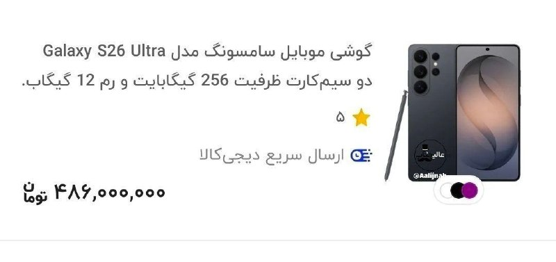

📝 قیمت ۴۸۶ میلیون تومان ، تصویرِ عریانِ غارتگری در حکومتی است که فساد را از ۱۴۰۰ سال پیش به ارث برده و با برچسب «اسلام ناب محمدی» به خورد ملت می‌دهد. این فرقه با حرامزادگیِ تمام، گوشی ۱۱۰۰ دلاری را به قیمت ۳۰۰۰ دلار در حلقوم مردم می‌چپاند تا هزینه انگل‌وار زندگی خود و مزدورانشان را تأمین کنند. در این لجن‌زارِ جمهوری اسلامی، هر گجت ساده تبدیل به ابزارِ اخاذی شده است؛ دزدانی که با وقاحتِ تمام، جیب مردم را به اسم رجیستری و گمرک می‌زنند تا ثابت کنند در مرام این نظام، چیزی جز چپاول، دروغ و نابودیِ رفاهِ شهروندان وجود ندارد. این ننگِ اقتصادی، نمادِ کاملِ حکومتی است که پایه و اساسش بر حرامی‌گری و مکیدنِ خونِ ملتی بنا شده که تنها جرمشان زندگی زیر سایه‌ی این فرقه‌ی تبهکار است.

@mwarmonitor

## mwarmonitor — post 9020

  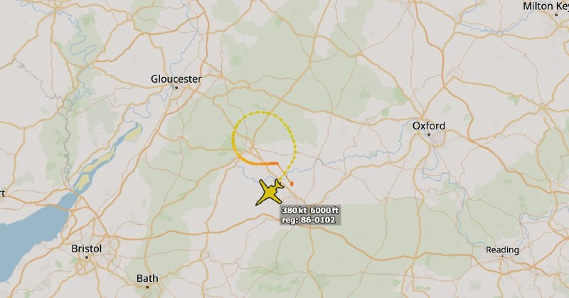

✈️ساعت 09:31 ـ 09:35 به وقت گرینویچ MISS 40 | 41 دو فروند بمب‌افکن استراتژیک B-1B از پایگاه Fairford به پرواز درآمده و با Brize در فرکانس 231.950 در حال ارتباط است.

@mwarmonitor

## mwarmonitor — post 9018

🔴شبکه NDTV تصاویر ماهواره‌ای با وضوح بالا (تهیه‌شده از شرکت Vantor) منتشر کرده است که به‌نظر می‌رسد گزارش‌ها مبنی بر پناه دادن پاکستان به دست‌کم یک فروند هواپیمای ترابری نظامی C-130H نیروی هوایی ایران در پایگاه هوایی نورخانِ نیروی هوایی پاکستان (PAF) را تأیید…

## mwarmonitor — post 9017

  

🚢کشتی گاز مایع (LPG) تحریم‌شده از سوی آمریکا با نام «TANIA STAR» (شماره IMO: 9134165) در حال عبور از تنگه هرمز است.

🔸این کشتی به‌دلیل تحویل گاز ایران به سری‌لانکا تحریم شده است.

@mwarmonitor

## mwarmonitor — post 9016

✈️ساعت ۰۹:۰۷ به وقت گرینویچ — TULLY 34 یک فروند بمب‌افکن B-52H به‌صورت تکی از RAF Fairford به پرواز درآمد.
در حال کار روی فرکانس Brize با 231.950 (ارتباط با RAF Brize Norton).

@mwarmonitor

## mwarmonitor — post 9014

  

✈️🇬🇧نیروی هوایی سلطنتی بریتانیا (RAF)

ایرباس KC.2 Voyager ×۳
43C6FB ZZ338 – ASCOT 9900
43C700 ZZ343 – ASCOT 9901
43C6F7 ZZ334 – ASCOT 9902

✈️صبح امروز یک عملیات سوخت‌رسانی غیرمعمول از سوی نیروی هوایی سلطنتی بریتانیا در جریان است. سه فروند هواپیمای «ویجر» RAF با علائم پروازی متوالی در حال فعالیت بر فراز دریای سرخ هستند.

✈️پرواز ASCOT 9900 حدود ۸ ساعت پیش انجام شده و به نقطه‌ای نزدیک جده بر فراز دریای سرخ رسیده و برای مدت کوتاهی سیگنال خود را ارسال کرده است؛ هرچند ممکن است مسیر خود را فراتر از این نقطه ادامه داده باشد.

✈️به نظر می‌رسد ASCOT 9901 که حدود ۵ ساعت پیش به پرواز درآمده، جای آن را گرفته و پس از آن ASCOT 9902 که یک ساعت پیش برخاسته، به سمت محدوده‌ای حرکت می‌کند که 9901 در آن در حال ارسال سیگنال است.

📌هر آنچه در جریان است، طی ۸ ساعت گذشته به حضور مداوم هواپیماهای سوخت‌رسان بر فراز دریای سرخ نیاز داشته است.

@mwarmonitor

## mwarmonitor — post 9013

  <a href="telegram/content/mwarmonitor_9013_1778664183.mp4" target="_blank">🎬 Download video</a>

🐒 میمون سخنگو

📝 این دلقکِ رانتی که تخصصش «واپاشی عصبی» مخاطب است، پیشنهاد هجرت به افغانستان و سوریه را می‌دهد؛ انگار که ارث پدرش را از ما طلبکار است! اما زهی خیال باطل. ما جایی نمی‌رویم، اما برای تو برنامه‌ی ویژه‌ای داریم: در فردای آزادی، قفسی در باغ‌وحش ارم رزرو شده تا به عنوان تنها «میمون سخنگوی دست‌آموز»، به جای آنتن صداوسیما، در زادگاه اصلی‌ات به اجرای برنامه بپردازی.
🔹آنجا می‌توانی با همان لبخند کذایی، برای بازدیدکنندگانی که برایت موز پرت می‌کنند، از مزایای اینترنتِ نداشته‌ات بگویی و موجبات شادی ملت را در محلی که واقعاً به آن تعلق داری فراهم کنی. شک نکن که تماشای لرزشِ غبغب و واق‌واق کردن‌های نمایشی‌ات برای یک تکه نانِ رانتی، بهترین سوژه‌ی کمدی سیاه برای نسل‌های آینده خواهد بود. تو نه یک مجری، که یک زایده‌ی بدخیم در گلوی این سرزمینی که باید در همان قفسِ حقارت، درس عبرتی شوی برای هر که خیال می‌کند می‌تواند با وقاحت، نمک بر زخم ملت بپاشد. آن روز، مستر کارت و ویزا کارتی که به رُخ می‌کشی، تنها برای خریدن بلیت تماشای سقوطِ ذلت‌بار خودت در قعر زباله‌دان تاریخ به کارت خواهد آمد.

@mwarmonitor

## mwarmonitor — post 9012

🔴گزارش‌های اطلاعاتی ایالات متحده نشان می‌دهد که ایران، برخلاف ادعاهای رئیس‌جمهور ترامپ، همچنان از ظرفیت قابل‌توجهی در حوزه موشکی برخوردار است. نیویورک تایمز

@mwarmonitor

## pm_afshaa — post 90673

🔴یک مقام ارشد سابق موساد: ایران ممکن است ظرف چند ماه از نظر اقتصادی سقوط کند اگر محاصره ادامه یابد

💧 Rainbet.com the #1 Non-KYC Crypto Casino & Sportsbook @rainbetcom

😁 @Pm_Afshaa

## pm_afshaa — post 90672

🔴سخنگوی ارتش اسرائیل: ارتش اسرائیل حمله به زیرساخت‌های سازمان تروریستی حزب‌الله را در چندین منطقه در جنوب لبنان آغاز کرده

💧 Rainbet.com the #1 Non-KYC Crypto Casino & Sportsbook @rainbetcom

😁 @Pm_Afshaa

## pm_afshaa — post 90671

نیویورک تایمز: قصد ترامپ از تغییر نام عملیات «خشم حماسی» به «چکش سنگین» این است که یک عملیات جدید 60 روزه حمله به ایران شروع کند

💧 Rainbet.com the #1 Non-KYC Crypto Casino & Sportsbook @rainbetcom

😁 @Pm_Afshaa

## pm_afshaa — post 90670

غضنفری:شواهد و قرائن نشان می‌دهد که آمریکا و اسرائیل قصد انجام یک عملیات گسترده برای تصرف برخی از جزایر جنوب را دارند

💧 Rainbet.com the #1 Non-KYC Crypto Casino & Sportsbook @rainbetcom

😁 @Pm_Afshaa

## pm_afshaa — post 90668

احسان افرشته امروز صبح توسط جمهوری تروریستی اسلامی اعدام شد

💧 Rainbet.com the #1 Non-KYC Crypto Casino & Sportsbook @rainbetcom

😁 @Pm_Afshaa

## pm_afshaa — post 90667

🔴ترامپ دوباره تأکید کرد که آمریکا برای پایان دادن به جنگ ایران نیازی به کمک ندارد و تأکید کرد که آمریکا یا به‌صورت مسالمت‌آمیز یا به روش‌های دیگر پیروز خواهد شد

💧 Rainbet.com the #1 Non-KYC Crypto Casino & Sportsbook @rainbetcom

😁 @Pm_Afshaa

## DEJradio — post 4610

  <a href="telegram/content/DEJradio_4610_1778664184.webm" target="_blank">🎬 Download video</a>

🔺📢 یک نماینده مجلس:
دولت میزان خسارت در جنگ را ۲۸.۵ میلیارد دلار اعلام کرده است

میثم ظهوریان، عضو کمیسیون اقتصادی مجلس شواری اسلامی، اعلام کرد گزارش رسمی که دولت مبنا قرار داده و به رهبر جمهوری اسلامی ارائه کرده، میزان خسارت ناشی از جنگ را ۲۸.۵ میلیارد دلار برآورد کرده است.
او با اشاره به جزئیات این گزارش گفت: «حدود ۱۴ میلیارد دلار از این خسارت مربوط به بخش انرژی است.»
به گفته عضو کمیسیون اقتصادی مجلس، از این میزان، حدود هشت میلیارد دلار به بخش گاز مربوط می‌شود که در پی آن ظرفیت تولید کاهش یافته است. همچنین بین پنج تا شش میلیارد دلار به بخش پتروشیمی‌ها آسیب وارد شده است.
میثم ظهوریان افزود: «حدود یک میلیارد دلار از خسارت‌ها نیز به مخازن و خود فرآورده‌ها مربوط است.»

#جنگ۴۰روزه #جمهوری_اسلامی
@DEJradio

## DEJradio — post 4606

  <a href="telegram/content/DEJradio_4606_1778664185.webm" target="_blank">🎬 Download video</a>

🔺📷 پیامدهای جنگ ۴۰ روزه؛ انهدام بوئینگ‌های نیروی هوایی ارتش و ایلیوشین‌های سـ.ـپاه در فرودگاه مهرآباد

طی جنگ ۴۰ روزه بارها به آشیانه و هواپیماهای ارتش و سـ.ـپاه حمله شد. به گفته حمیدرضا صناعی، معاون سازمان هواپیمایی کشوری بیشتر فرودگاه‌های ایران در جنگ آسیب دیدند. او همچنین گفت که ۱۵ هواپیمای مسافربری به طور مستقیم هدف حملات قرار گرفتند و نابود شدند و حدود ۲۰ درصد از ناوگان هوایی فعال کشور کاملا از چرخه خدمت‌رسانی خارج شدند.

همچنین بنابر گزارش‌های منتشرشده، دست‌کم حدود ۳۹ فروند هواپیمای نظامی و ترابری نظامی ایران نیز در این حملات منهدم شدند یا به شدت آسیب دیدند.

#جنگ۴۰روزه #فرودگاه_مهرآباد
@DEJradio

## DEJradio — post 4604

  <a href="telegram/content/DEJradio_4604_1778664186.webm" target="_blank">🎬 Download video</a>

🔺📷 در پی وقوع زمین‌لرزه‌ای به‌نسبت قوی در تهران، البرز و سمنان شماری از شهروندان ترجح دادند شب در خیابان بخوابند. به گزارش مرکز لرزه‌نگاری ایران، در نخستین ساعت بامداد چهارشنبه، ۲۳ اردیبهشت‌ماه، وقوع دو پس‌لرزه به‌ترتیب به بزرگی ۴ و ۳.۴ در پردیس، تهران را لرزاند. براساس گزارش فارس، این پس‌لرزه‌ها در ورامین، پاکدشت، پردیس و بخش‌هایی از شمیرانات حس شده است. پیش از این، زلزله به بزرگی ۴.۶ در مرز تهران و مازندران رخ داد که پردیس مرکز آن اعلام شد.

#زلزله #تهران
@DEJradio

## DEJradio — post 4603

  <a href="telegram/content/DEJradio_4603_1778664186.webm" target="_blank">🎬 Download video</a>

🚨
⭕️ در نشست سیاسی- امنیتی سالانه «پولیتیکو» که سه‌شنبه ۱۲ ما مه (۲۳ اردیبهشت به‌وقت ایران) برگزار شد، مجری از شاهزاده رضا پهلوی پرسید «ترامپ می‌گوید مطمئن نیست شما حمایت کافی داخل ایران داشته باشید... منتقدان هم ادعا می‌کنند شما توسط آمریکا و اسرائیل حمایت می‌شوید» که او پاسخ داد «میلیون‌ها ایرانی که به فراخوان من پاسخ دادند، سند زنده هستند که من حمایت عظیمی داخل ایران دارم. به محض اینکه رژیم فیلترینگ و قطعی اینترنت را بردارد، دنیا دقیقا خواهد شنید که مردم ایران چه می‌گویند.»

او افزود: «دقیقا قبل از آخرین قطعی اینترنت، پیام آخر من به میلیون‌ها نفر در داخل کشور رسید. فقط یک ویدیو اینستاگرامی بیش از ۹۰ میلیون بازدید داشت و بعد از قطع اینترنت به ۵-۶ میلیون رسید. هیچ دولت خارجی حق ندارد برای آینده ایران تصمیم بگیرد. این تصمیم تنها به عهده مردم ایران است. ما گروگان‌های زندانی هستیم که این رژیم برای ما ساخته. گاهی اوقات گروگان‌ها برای آزادی به کمک خارجی نیاز دارند. ما را حمایت کنید و ما خودمان کار را تمام می‌کنیم.»

#ترامپ #شاهزاده_رضا_پهلوی
@DEJradio

## DEJradio — post 4602

  <a href="telegram/content/DEJradio_4602_1778664187.webm" target="_blank">🎬 Download video</a>

🚨📢 شبکه «فاکس‌نیوز» سه‌شنبه ۲۲ اردیبهشت ۱۴۰۵ در گزارشی با اشاره به بن‌بست مذاکرات تهران و واشنگتن، پیش‌بینی کرد اگر ترامپ تصمیم بگیرد حملات به ایران از سر گرفته شود یا خیزش در داخل ایران بار دیگر شروع شود، بعضی از مقام‌های ارشد حکومت ایران به روسیه فرار کنند؛ مشابه کاری که برخی اطرافیان بشار اسد در سوریه انجام دادند.

فاکس‌نیوز در بخشی از این گزارش به وضعیت تقسیم قدرت در داخل ایران و موضوع جانشینی علی خامنه‌ای اشاره و این ایده را مطرح می‌کند که ساختار سیاسی جمهوری اسلامی طوری طراحی شده است که حتی در بحران‌های شدید هم بتواند ادامه پیدا کند، هرچند اختلاف و ابهام درباره آینده رهبری ممکن است بعضی جریان‌ها را به فکر خروج از کشور بیندازد.

بر اساس این تحلیل، مقام‌های رده‌بالای جمهوری اسلامی ممکن است به روسیه بروند، اما افراد رده‌پایین‌تر به کشورهایی مثل عراق یا افغانستان فرار کنند. در صورت فروپاشی احتمالی جمهوری اسلامی، شبکه‌های منطقه‌ای این رژیم از جمله گروه‌های نیابتی هم تضعیف خواهند شد.

#مذاکرات #جمهوری_اسلامی
@DEJradio

## IranIntlTV — post 336950

  <a href="telegram/content/IranIntlTV_336950_1778664187.mp4" target="_blank">🎬 Download video</a>

در پیام‌هایی که به مدیا بات ایران‌اینترنشنال رسیده، شماری از دانش‌آموزان از افت کیفیت آموزش در دوران کلاس‌های آنلاین گلایه کرده‌اند. یک نوجوان ۱۳ ساله با اشاره به تجربه روزهای همراه با قطعی اینترنت و گرانی، گفته است در این شرایط از مطرح کردن خواسته‌های شخصی با خانواده احساس خجالت می‌کند.
گفت‌وگو با لیلا سعادتی، عضو تحریریه ایران‌اینترنشنال
@iranintltv

## IranIntlTV — post 336949

نشست وزیران خارجه بریکس در دهلی تحت‌الشعاع «جنگ ایران»

جنگ آمریکا و اسرائیل با حکومت ایران بر نشست دو روزه وزیران خارجه گروه بریکس که از پنج‌شنبه در دهلی نو آغاز می‌شود، سایه انداخته است. این نشست توانایی این بلوک را برای رسیدن به موضعی مشترک در این زمینه و انتشار بیانیه نهایی، محک خواهد زد.

گروه بریکس که در ابتدا شامل آفریقای جنوبی، برزیل، چین، روسیه و هند بود، در سال‌های اخیر با پیوستن اتیوپی، امارات متحده عربی، اندونزی، ایران و مصر، گسترش یافته است.

خبرگزاری رویترز چهارشنبه ۲۳ اردیبهشت خبر داد که تهران از هند، رییس دوره‌ای بریکس در سال ۲۰۲۶، خواسته است از این سازوکار برای «ایجاد اجماع در محکوم کرد اقدامات آمریکا و اسرائیل در جنگ و تنش در خلیج فارس» استفاده کند.

اختلاف میان تهران و ابوظبی
اصلی‌ترین اختلاف‌ها میان جمهوری اسلامی ایران و امارات متحده عربی شکل گرفته است. دو کشوری که در دو سوی جبهه جنگی قرار دارند که آمریکا و اسرائیل از ۹ اسفند ۱۴۰۴ علیه جمهوری اسلامی آغاز کردند.

عباس عراقچی، وزیر امور خارجه جمهوری اسلامی، احتمالا اواخر روز چهارشنبه برای شرکت در این نشست وارد دهلی خواهد شد. این نشست روزهای ۲۴ و ۲۵ اردیبهشت برگزار می‌شود.

سرگئی لاوروف، وزیر خارجه روسیه، نیز قرار است در این نشست حضور داشته باشد.

هنوز مشخص نیست چه کسی نمایندگی امارات را در این نشست بر عهده خواهد داشت.

رویترز نوشت: «دور جدید مذاکرات می‌تواند پرتنش باشد؛ به‌ویژه پس از گزارش‌هایی مبنی بر اینکه امارات و عربستان سعودی در واکنش به حملات ایران، حملاتی نظامی علیه جمهوری اسلامی انجام داده‌اند.»

رندهیر جایسوال، سخنگوی وزارت خارجه هند، پیش از این گفته بود برخی اعضای بریکس مستقیما در این جنگ درگیر هستند و به همین دلیل «رسیدن به اجماع برای ما دشوار بوده» است.

با این حال، یکی دیگر از مقام‌های وزارت خارجه هند به رویترز گفت دهلی امیدوار است پس از این دور از نشست‌ها، بیانیه‌ای مشترک صادر شود.

تلاش برای حفظ انسجام بریکس
مانجیو سینگ پوری، دیپلمات پیشین هند، گفت: «خوشحال‌کننده است که وزیران خارجه همه کشورهای بریکس، به‌جز چین که به‌دلیل دیگری درگیر است، در نشست حضور پیدا می‌کنند.»

اشاره سینگ پوری به درگیری وزیر خارجه چین احتمالا به سفر پیش روی دونالد ترامپ، رییس‌جمهوری آمریکا، به چین برمی‌گردد.

او افزود: «این نشانه مثبتی برای تلاش‌ها به منظور ایجاد ائتلافی در بریکس حول موضوعات مهم برای اقتصادهای نوظهور و کشورهای جنوب جهانی است.»

پوری گفت: «البته رسیدن به راه‌حل سیاسی دشوار است، اما همین که آن‌ها دور هم جمع می‌شوند اتفاق مثبتی است و امیدواریم راهی رو به جلو ایجاد کند.»

افزایش شدید قیمت انرژی ناشی از جنگ با حکومت ایران باعث شده است بسیاری از کشورهای بریکس، از جمله هند، اقدام‌های اضطراری برای حفاظت از اقتصاد و مصرف‌کنندگان خود انجام دهند.

موضع محتاطانه چین
چین تاکنون موضعی ظاهرا بی‌طرفانه اتخاذ کرده است. موضوعی که به روابط نزدیک پکن هم با تهران و هم با کشورهای عرب سنی‌مذهب مرتبط دانسته می‌شود.

قرار است شو فیهونگ، سفیر چین در هند، به‌جای وانگ یی، وزیر خارجه چین، در نشست وزیران خارجه بریکس شرکت کند، چون وانگ احتمالا همزمان با سفر ترامپ به پکن، امکان حضور در دهلی را نخواهد داشت.

🔗وب‌سایت ایران‌اینترنشنال
@iranintltv

## IranIntlTV — post 336948

  <a href="telegram/content/IranIntlTV_336948_1778664190.mp4" target="_blank">🎬 Download video</a>

دونالد ترامپ، رییس‌جمهوری آمریکا، پیش از سفر رسمی به پکن، با اشاره به نابودی توان نظامی جمهوری اسلامی گفت برای مهار حکومت ایران هیچ نیازی به کمک چین ندارد.

گفت‌وگو با هوشنگ حسن‌یاری، کارشناس خاورمیانه و امور نظامی
@iranintltv

## IranIntlTV — post 336947

  <a href="telegram/content/IranIntlTV_336947_1778664192.mp4" target="_blank">🎬 Download video</a>

فدراسیون فوتبال اعلام کرد مراسم بدرقه «تیم ملی» به جام جهانی، چهارشنبه‌شب در یک تجمع حکومتی برگزار می‌شود و قرار است در این مراسم از پیراهن «تیم ملی» نیز رونمایی شود.

گفت‌وگو با رها پوربخش، عضو تحریریه ایران‌اینترنشنال
@iranintltv

## IranIntlTV — post 336946

  

🔻باشگاه ممفیس گریزلیز اعلام کرد که برندون کلارک، بازیکن این تیم، در ۲۹ سالگی درگذشت. علت مرگ او هنوز اعلام نشده است.

🔹کلارک که متولد ونکوور کانادا بود، در سال ۲۰۱۹ در دور نخست درفت ان‌بی‌ای انتخاب شد و از آن زمان برای ممفیس گریزلیز بازی می‌کرد. او در این فصل به دلیل مصدومیت تنها در دو مسابقه به میدان رفت.

🔹باشگاه ممفیس گریزلیز در بیانیه‌ای اعلام کرد: «برندون نه‌تنها هم‌تیمی فوق‌العاده‌ای بود، بلکه شخصیتی تاثیرگذار در باشگاه و جامعه ممفیس داشت و هرگز فراموش نخواهد شد.»

🔹کلارک در مجموع ۳۰۹ بازی در ان‌بی‌ای انجام داد و میانگین ۱۰.۲ امتیاز در هر مسابقه را ثبت کرد. او در سال ۲۰۲۰ نیز در تیم منتخب بازیکنان تازه‌وارد ان‌بی‌ای قرار گرفت.

🔹آدام سیلور، رییس ان‌بی‌ای، در واکنش به درگذشت کلارک گفت او یکی از محبوب‌ترین بازیکنان ممفیس گریزلیز بود و با «انرژی، اشتیاق و روحیه جنگندگی» بازی می‌کرد.

@iranintltvsport

## IranIntlTV — post 336944

  <a href="telegram/content/IranIntlTV_336944_1778664195.mp4" target="_blank">🎬 Download video</a>

قوه قضاییه جمهوری اسلامی از اعدام احسان افراشته به اتهام «جاسوسی برای اسرائیل» خبر داد. اعدام افراشته در حالی انجام شده که پرونده او با گزارش‌هایی درباره فشارهای امنیتی، اعترافات اجباری و ابهام در روند دادرسی همراه بود.
گفت‌وگو با محمد مقیمی، وکیل دادگستری و کارشناس ارشد حقوق بشر
@iranintltv

## IranIntlTV — post 336943

  <a href="telegram/content/IranIntlTV_336943_1778664197.mp4" target="_blank">🎬 Download video</a>

همزمان با رد پیشنهاد ۱۴ ماده‌ای جمهوری اسلامی از سوی دونالد ترامپ، رییس‌جمهوری آمریکا و ادامه بسته ماندن تنگه هرمز، رسانه‌ها از افزایش احتمال درگیری نظامی دوباره میان تهران و واشینگتن خبر می‌دهند.
گفت‌وگو با روح‌الله رحیم‌پور، روزنامه‌نگار و تحلیل‌گر سیاسی
@iranintltv

## IranIntlTV — post 336942

  <a href="telegram/content/IranIntlTV_336942_1778664199.mp4" target="_blank">🎬 Download video</a>

میزان، خبرگزاری قوه قضاییه جمهوری اسلامی، از اجرای حکم اعدام احسان افرشته خبر داد.
کانون حقوق بشر ایران پیش‌تر اعلام کرده بود اتهام «همکاری با اسرائیل» علیه احسان افرشته بر پایه اعترافات اجباری تحت شکنجه مطرح شده و هیچ مدرک معتبری در پرونده او وجود ندارد.

گفت‌وگو با مجتبی هاشمی، روزنامه‌نگار و تحلیل‌گر سیاسی
@iranintltv

## IranIntlTV — post 336941

  <a href="telegram/content/IranIntlTV_336941_1778664201.mp4" target="_blank">🎬 Download video</a>

دولت پاکستان با صدور بیانیه‌ای گزارش‌ها درباره حضور هواپیماهای جمهوری اسلامی در پایگاه نورخان را تایید کرد، اما گفت: «ماموریت این هواپیماها نظامی نیست.»

جواد همدانی، خبرنگار ایران‌اینترنشنال، گزارش می‌دهد
@iranintltv

## IranIntlTV — post 336940

  

کامران غضنفری، نماینده مجلس، آمارهای مربوط به خسارت‌های قطع اینترنت در ایران را «جوسازی» خواند و گفت: «۵۰ میلیون نفر در پلتفرم‌های ایرانی هستند و هیچ مشکلی ندارند.»

او گفت: «قطع اینترنت اصلا مختص ایران نیست. ترکیه و کشورهای اروپایی که مانند ما درگیر جنگ نشده‌اند، به محض کوچک‌ترین مشکل امنیتی اینترنت بین‌الملل مردم خود را قطع می‌کنند.»
https://iranintl.com/202605131903

## IranIntlTV — post 336939

  <a href="telegram/content/IranIntlTV_336939_1778664203.mp4" target="_blank">🎬 Download video</a>

رهبران آمریکا و چین در حالی در پکن دیدار می‌کنند که پیامدهای جنگ ایران و حمایت‌های پکن از جمهوری اسلامی بر این نشست سایه انداخته است. آیا دو طرف در مورد ایران تعاملاتی خواهند کرد؟

گزارش توماج طاهباز، خبرنگار ایران‌اینترنشنال
@iranintltv

## IranIntlTV — post 336937

  <a href="https://t.me/IranintlTV/336937" target="_blank">📎 Download file</a>

🎧نسخه صوتی اخبار بامدادی | چهارشنبه ۲۳ اردیبهشت
@iranintlTV

## IranIntlTV — post 336936

  <a href="telegram/content/IranIntlTV_336936_1778664206.mp4" target="_blank">🎬 Download video</a>

جاویدنامان انقلاب ملی ایرانیان
«محمد نوری» نوجوان ۱۷ ساله اهل قم، ۱۲ دی‌ماه در جریان یورش نیروهای سرکوبگر خامنه‌ای به معترضان در میدان توحید این شهر، هدف شلیک مستقیم قرار گرفت و جان باخت. نامش در حافظه‌ این سرزمین می‌ماند و یادش چراغ راه آزادی‌خواهان است.
@iranintltv

## IranIntlTV — post 336935

  <a href="telegram/content/IranIntlTV_336935_1778664208.mp4" target="_blank">🎬 Download video</a>

ویدیوهای ارسال‌شده به ایران‌اینترنشنال نشان می‌دهند گروهی از ایرانیان مقیم آلمان سه‌شنبه ۲۲ اردیبهشت‌ماه در اعتراض به اعدام‌های جمهوری اسلامی، در شهر هانوفر پرفورمنس اعتراضی برگزار کردند.

## IranIntlTV — post 336934

  <a href="telegram/content/IranIntlTV_336934_1778664211.mp4" target="_blank">🎬 Download video</a>

محمدرضا شهبازی، مجری صداوسیمای جمهوری اسلامی، در واکنش به مقایسه‌ای که برخی شهروندان میان وضعیت اینترنت در ایران با اینترنت پرسرعت در افغانستان و آغاز استفاده از کارت‌های اعتباری بین‌المللی در سوریه انجام دادند، گفت: «اگر این چیزها برایتان مهم است، بروید در افغانستان و سوریه زندگی کنید.»

گفت‌وگو با رضا حاجی‌حسینی، روزنامه‌نگار
@iranintltv

## IranIntlTV — post 336933

  <a href="telegram/content/IranIntlTV_336933_1778664213.mp4" target="_blank">🎬 Download video</a>

نمایندگان کنگره آمریکا در نامه‌ای دوحزبی از دولت بریتانیا خواستند روند به‌رسمیت شناختن سپاه پاسداران به‌عنوان یک سازمان تروریستی را تسریع کند.

گفت‌وگو با امیر گیتی، عضو تحریریه ایران‌اینترنشنال
@iranintltv

## Shin_Persian — post 5987

  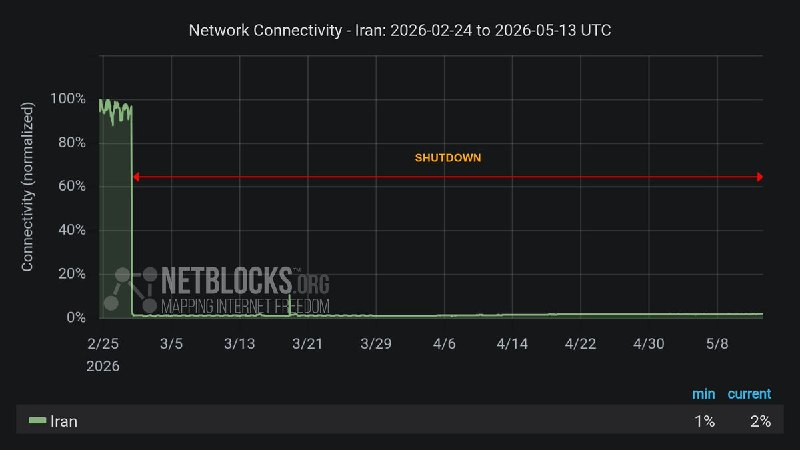

NetBlocks ✓ @netblocks
Wed, 13 May 2026 07:50:00 UTC

💸 #Iran's internet blackout is now past hour 1776, entering its 75th day. The digital censorship measure has led to profiteering and a decline in digital security as government-backed "pro" internet schemes and selective whitelisting result in surveillance, corruption and scams.

فارسی

💸 قطعی اینترنت #ایران اکنون از ساعت ۱۷۷۶ فراتر رفته و وارد هفتاد و پنجمین روز خود شده است. این اقدام در راستای سانسور دیجیتال منجر به سودجویی و کاهش امنیت دیجیتال شده است، چرا که طرح‌های اینترنت «طبقاتی» تحت حمایت دولت و لیست‌های سفید گزینشی، منجر به نظارت، فساد و کلاهبرداری شده است.

𝕏 · @shin_persian

## Shin_Persian — post 5986

  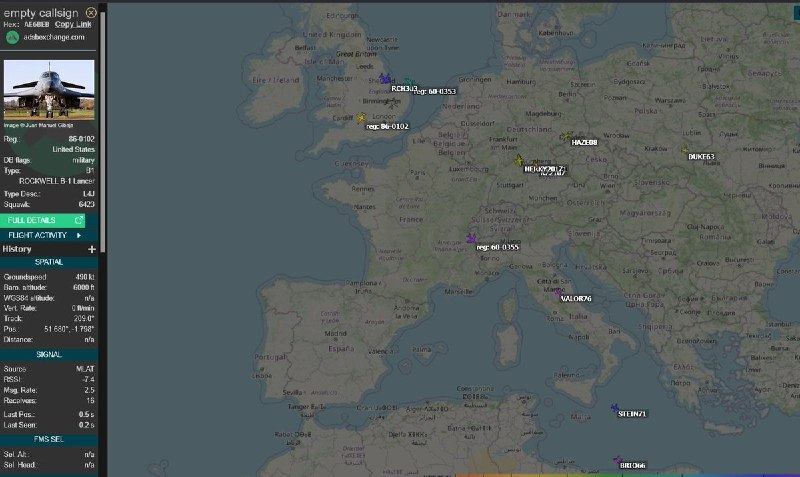

DefenceGeek 🇬🇧 ✓ @DefenceGeek Wed, 13 May 2026 08:39:27 UTC Running Visible again - B-1 training flight! #FreeIran‌ --- Operation EPIC FURY / Project FREEDOM --- Another B-1 training sortie launching this morning from RAF Fairford (EGVA) is pinging on…

## Shin_Persian — post 5985

DefenceGeek 🇬🇧 ✓ @DefenceGeek
Wed, 13 May 2026 08:39:27 UTC

Running Visible again - B-1 training flight! #FreeIran‌
--- Operation EPIC FURY / Project FREEDOM ---

Another B-1 training sortie launching this morning from RAF Fairford (EGVA) is pinging on FR24/ADSB.

B-1B "MISS40" 85-0060 #AE6BD1 "Doolittle Raiders"
B-1B "MISS41" 86-0102 #AE6BEB "Bad Moon Rising" (visible)

@MATA_osint @LHA2709 @Andyyyyrrrr @ArmchairAdml @jamjake01 @vcdgf555

فارسی

دوباره در حالت مرئی در حال اجرا - پرواز آموزشی B-1! #FreeIran‌
--- عملیات خشم حماسی (EPIC FURY) / پروژه آزادی (Project FREEDOM) ---

یک سورتی پرواز آموزشی دیگر از بمب‌افکن‌های B-1 که امروز صبح از پایگاه هوایی Fairford نیروی هوایی سلطنتی بریتانیا (EGVA) برخاسته است، در FR24/ADSB در حال سیگنال‌دهی است.

B-1B "MISS40" 85-0060 #AE6BD1 "Doolittle Raiders"
B-1B "MISS41" 86-0102 #AE6BEB "Bad Moon Rising" (مرئی)

@MATA_osint @LHA2709 @Andyyyyrrrr @ArmchairAdml @jamjake01 @vcdgf555

𝕏 · @shin_persian

## ManotoTV — post 105387

  

هم‌زمان با سفر دونالد ترامپ به چین و آغاز گفت‌وگوها درباره جنگ جمهوری اسلامی و اسرائیل، مقام‌های آمریکایی پکن را متهم کردند که با خرید گسترده نفت ایران، به «بزرگ‌ترین حامی دولتی تروریسم» کمک مالی می‌کند.

دونالد ترامپ امروز برای دیدار با شی جین‌پینگ، رئیس‌جمهوری چین، راهی پکن شد؛ دیداری که جنگ جمهوری اسلامی و اسرائیل و بحران تنگه هرمز از محورهای اصلی آن عنوان شده است.

در آستانه این سفر، اسکات بسنت، وزیر خزانه‌داری آمریکا، از چین خواست جمهوری اسلامی را برای بازگشایی تنگه هرمز تحت فشار قرار دهد و گفت پکن با خرید نفت ایران، «بزرگ‌ترین حامی دولتی تروریسم» را تأمین مالی می‌کند.

وزیر خزانه‌داری آمریکا در گفت‌وگو با فاکس‌نیوز گفت: «ببینیم آیا چین حاضر است از دیپلماسی استفاده کند و جمهوری اسلامی را وادار به باز کردن تنگه کند یا نه.»

چین تاکنون در قبال جنگ موضعی محتاطانه اتخاذ کرده و فراتر از انتقاد از آمریکا و اسرائیل، نقش مستقیمی در حل بحران ایفا نکرده است.
این دیدار در شرایطی برگزار می‌شود که تنش‌ها در منطقه، امنیت انرژی چین و تجارت جهانی از مسیر تنگه هرمز را تحت تأثیر قرار داده است.

## ManotoTV — post 105386

  

رویترز به نقل از مقام‌های غربی و جمهوری اسلامی گزارش داد عربستان سعودی در جریان گسترش جنگ منطقه‌ای، در واکنش به حملاتی در خاک این کشور، چندین حمله اعلام‌نشده علیه جمهوری اسلامی انجام داده است.

رویترز در گزارشی اختصاصی نوشت عربستان سعودی، در اقدامی بی‌سابقه، حملات محرمانه‌ای را علیه جمهوری اسلامی انجام داده است.

به گفته دو مقام غربی مطلع و دو مقام جمهوری اسلامی، این حملات در واکنش به حملاتی صورت گرفته که در جریان جنگ در خاک عربستان انجام شده بود.

این حملات که پیش‌تر رسانه‌ای نشده بود، نخستین مورد شناخته‌شده از اقدام مستقیم نظامی عربستان در خاک ایران به شمار می‌رود؛ اقدامی که به نوشته رویترز نشان می‌دهد ریاض در دفاع از خود در برابر جمهوری اسلامی، رویکردی تهاجمی‌تر در پیش گرفته است.

## FarsiVOA — post 217600

🔺حصر دیجیتال ۷۵ روزه شد؛ قیمت «سیم‌کارت سفید» تا ۱۲۰ میلیون تومان رسید

▪️نت‌بلاکس، اعلام کرد خاموشی اینترنت در ایران از مرز هزار و ۷۷۶ ساعت گذشته و وارد هفتاد و پنجمین روز شده است.

▪️به گفته این نهاد، این اقدام سانسور دیجیتال به سودجویی و کاهش امنیت دیجیتال منجر شده؛ زیرا طرح‌های حکومتی موسوم به «اینترنت پرو» و سفیدسازی گزینشی دسترسی‌ها، زمینه نظارت، فساد و کلاهبرداری را فراهم کرده است.

▪️منتقدان می‌گویند مسئله فقط فروش غیرقانونی اینترنت پرو یا سیم‌کارت سفید نیست؛ بلکه اصل سیاستی است که دسترسی به اینترنت را از یک حق عمومی به امتیازی طبقاتی، پولی و امنیتی تبدیل کرده است.

▪️گزارش شده قیمت «سیم‌کارت‌های سفید» با وعده دسترسی نامحدود و بدون فیلتر بین ۴۴ تا ۱۲۰ میلیون تومان است.

⬇️ بیشتر بخوانید:
https://ir.voanews.com/a/8149522.html

## FarsiVOA — post 217599

🔺توماس راخل کفالت سیاسی پیوند و برنا نعیمی را به عهده گرفت

▪️توماس راخل، نماینده دولت فدرال آلمان در امور آزادی دین و جهان‌بینی و عضو پارلمان آلمان، با پذیرش کفالت سیاسی پیوند نعیمی و برنا نعیمی، خواستار آزادی فوری این دو شهروند بهائی شد.

▪️پیوند و برنا نعیمی، دو ورزشکار جوان از شهروندان بهائی، پس از بازداشت، تحت فشار شدید، بدرفتاری، شکنجه، اعدام نمایشی و تهدید قرار گرفته‌اند تا اعترافاتی علیه خود و یکدیگر امضا کنند؛ اعترافاتی که می‌تواند برای صدور احکام سنگین و حتی اعدام به‌کار گرفته شود.

▪️سازمان بین‌المللی دفاع از حقوق بشر در آلمان، با پیگیری پرونده پیوند و برنا نعیمی، درباره خطر احکام سنگین و بهره‌برداری جمهوری اسلامی از اعترافات اجباری هشدار داده است.

⬇️ بیشتر بخوانید:
https://ir.voanews.com/a/8149521.html

## FarsiVOA — post 217598

  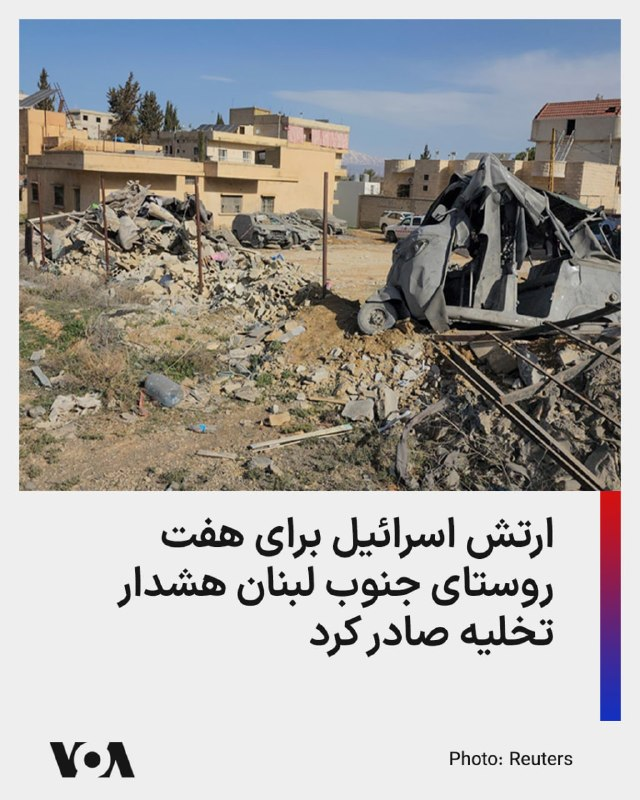

ارتش اسرائیل روز چهارشنبه هم برای ساکنان هفت روستا در جنوب لبنان که در محدوده حملات هوایی علیه مواضع حزب‌الله قرار دارند، هشدار تخلیه صادر کرد.

بر اساس این اعلام کرد این هشدار روستاهای معشوق، جرجوع، یانوح، برج الشمالی، حلوسیه الفوقا، دبعال و العباسیه را شامل می‌شود.

ارتش اسرائیل از ساکنان این مناطق خواسته است تا دست‌کم یک کیلومتر از محل‌های هدف فاصله بگیرند و گفته است که این اقدام در واکنش به نقض توافق آتش‌بس از سوی حزب‌الله انجام می‌شود.

ساعاتی پیش ارتش اسرائیل اعلام کرد که گروه حزب‌الله صبح روز چهارشنبه چند راکت به سوی نیروهای اسرائیلی در جنوب لبنان شلیک کرده است. این حمله باعث فعال شدن آژیر هشدار در منطقه مرزی زرعیت شد، اما به گفته ارتش اسرائیل، راکت‌ها در نزدیکی نیروها فرود آمدند و تلفاتی برجای نگذاشتند.

اسرائیل در کنار آمریکا و بسیاری از کشورهای دیگر، گروه شبه‌نظامی حزب‌الله را که مورد حمایت جمهوری اسلامی است، گروهی تروریستی می‌داند.
@FarsiVOA

## FarsiVOA — post 217597

  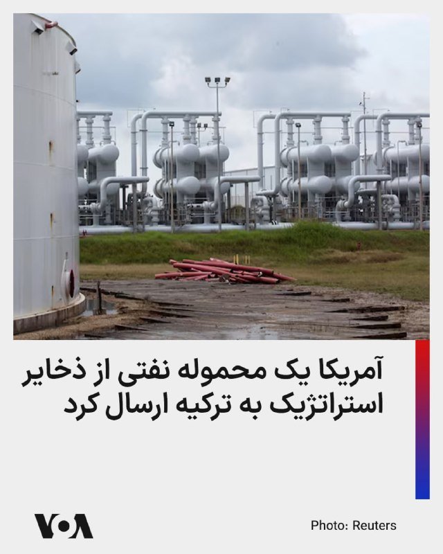

داده‌های کشتی‌رانی نشان می‌دهد یک محموله نفتی ۶۸۰ هزار بشکه‌ای آزاد شده از ذخایر استراتژیک نفت آمریکا به مقصد ترکیه، وارد دریای مدیترانه شده است.

برای اولین بار است که ترکیه محموله نفتی آزاد شده از ذخایر استراتژیک نفت آمریکا را دریافت می‌کند.

آمریکا در قالب توافق با کشورهای عضو آژانس بین‌المللی انرژی متعهد به آزادسازی ۱۷۲ میلیون بشکه نفت از ذخایر استراتژیک خود برای مقابله با تبعات انسداد تنگه هرمز توسط جمهوری اسلامی شده است. در همین چهارچوب، تاکنون محموله‌هایی به ایتالیا و هلند ارسال شده است.
@FarsiVOA

## FarsiVOA — post 217596

  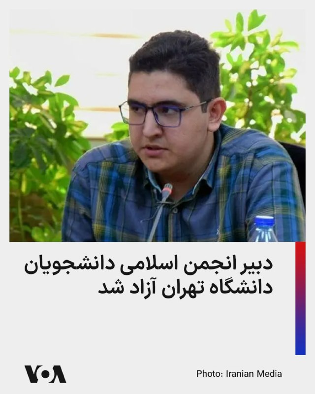

خبرگزاری ایسنا از آزادی دبیر انجمن اسلامی دانشجویان دانشگاه تهران، پس از چند ساعت بازداشت خبر داد.

یاسین حسن‌زاده، دانشجوی ورودی ۱۴۰۰ مهندسی صنایع دانشگاه تهران و دبیر انجمن اسلامی دانشجویان دانشگاه تهران، ظهر روز سه‌شنبه ۲۲ اردیبهشت و با مراجعه‌ مأموران امنیتی به منزل خود بازداشت شده بود.

منابع حقوق بشری اعلام کردند که این بازداشت پس از انتشار بیانیه انتقادی انجمن اسلامی دانشجویان دانشگاه تهران نسبت به روند اعدام‌ها در ایران صورت گرفت.

در بخشی از این بیانیه، با انتقاد از «نبود شفافیت در روند قضایی» و «اجرای بی‌سر‌وصدای احکام اعدام»، از دستگاه قضایی خواسته شده بود تا اجرای احکام اعدام مرتبط با اعتراضات سیاسی متوقف شود.

خبرگزاری ایسنا، بدون ارائه توضیحاتی از زمان دقیق دستگیری و اتهامات این دانشجو، صبح چهارشنبه ۲۳ اردیبهشت اعلام کرد که خبرهای دریافتی از آزادی یاسین حسن‌زاده، دبیر انجمن اسلامی دانشجویان دانشگاه تهران و علوم پزشکی تهران حکایت می‌کند.
@FarsiVOA

## FarsiVOA — post 217595

🔺جمهوری اسلامی بازداشت چهار مأمور خود در کویت را تأیید کرد

▪️وزارت امور خارجه جمهوری اسلامی بازداشت چهار مأمور ایرانی در کویت را تأیید کرد، اما اتهام‌های مطرح‌شده از سوی دولت کویت درباره «تلاش برای انجام اقدامات خصمانه» را «مطلقاً بی‌اساس» خواند.

▪️ادعا شده این چهار نفر «در چارچوب مأموریت مرسوم گشت‌زنی دریایی» فعالیت می‌کردند و به دلیل «اختلال در سامانه ناوبری» وارد آب‌های سرزمینی کویت شده‌اند.

▪️کویت اعلام کرده این گروه قصد نفوذ به جزیره بوبیان را داشته و مأموریت آنها انجام اقدامات «خصمانه» علیه این کشور بوده است.

▪️مقام‌های کویتی گفته‌اند این افراد قصد داشتند از طریق دریا وارد کویت شوند و در بازجویی‌ها ارتباط خود با سپاه پاسداران را پذیرفته‌اند.

⬇️ بیشتر بخوانید:
https://ir.voanews.com/a/8149520.html

## FarsiVOA — post 217594

  

سازمان گزارشگران بدون مرز اعلام کرد «الناز محمدی»، روزنامه‌نگار ایرانی و دبیر گروه اجتماعی روزنامه «هم‌میهن»، در فهرست نامزدهای جایزه شجاعت این نهاد برای سال ۲۰۲۶ قرار گرفته است.

الناز محمدی به عنوان دبیر گروه اجتماعی روزنامه هم‌میهن، نقش مهمی در پوشش پیامدهای اجتماعی جنبش «زن، زندگی، آزادی» پس از جان باختن «مهسا امینی» در سال ۱۴۰۱ داشت، و گزارشگران بدون مرز او را نماد شجاعت در برابر سرکوب سیستماتیک آزادی مطبوعات در ایران توصیف کرده است.

خانم محمدی در بهمن ماه ۱۴۰۱ به اتهام «توطئه» و «تبانی» بازداشت و به سه سال زندان محکوم شد. گزارشگران بدون مرز همچنین اشاره کرده که او، همانند خواهر دوقلویش الهه محمدی، به دلیل فعالیت حرفه‌ای و بازتاب صدای مردم هدف فشارهای قضایی قرار گرفته است. الهه محمدی پس از انتشار گزارشی از کشته شدن مهسا امینی در بازداشت گشت ارشاد، بازداشت شده بود.

به گفته این سازمان، الناز محمدی با وجود زندان، فشارهای حقوقی و مجبور شدن به ترک شغل خود، همچنان به فعالیت حرفه‌ ای و دفاع از حق دسترسی آزاد به اطلاعات ادامه داده است.
@FarsiVOA

## FarsiVOA — post 217593

  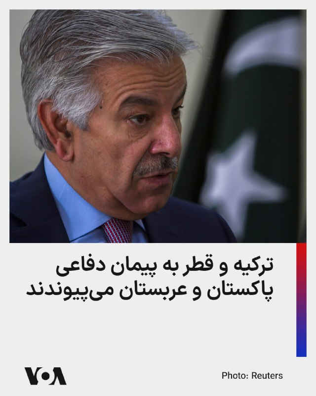

پاکستان می‌گوید ترکیه و قطر ممکن است به پیمان همکاری دفاعی متقابل میان اسلام‌آباد و ریاض بپیوندند؛ پیمانی که با توجه به جنگ ایران و آمریکا، می‌تواند آرایش امنیتی خاورمیانه و جنوب آسیا را تغییر دهد.

به گزارش بلومبرگ، خواجه آصف وزیر دفاع پاکستان، دوشنبه‌شب در یک برنامه تلویزیونی گفت این سازوکار دفاعی در حال نهایی شدن است و افزود اگر قطر و ترکیه نیز به توافق موجود بپیوندند، «تحولی خوشایند» خواهد بود.

پاکستان و عربستان سعودی پیش‌تر توافقی دفاعی امضا کرده بودند که بر اساس آن، هرگونه حمله به یکی از دو کشور، حمله به هر دو تلقی می‌شود. این توافق از زمان تشدید جنگ آمریکا با جمهوری اسلامی اهمیت بیشتری یافته و نگرانی‌ها درباره گسترش دامنه درگیری در خلیج فارس را افزایش داده است.

در چارچوب همین توافق، در شرایطی که پاکستان نقش میانجی را برای گفت‌وگوهای تهران و واشنگتن به دوش گرفته است، همزمان با مذاکرات اسلام‌آباد در ۲۲ فروردین یک نیروی نظامی پاکستانی، شامل جنگنده‌ها، در پایگاه هوایی ملک عبدالعزیز مستقر شد.
@FarsiVOA

## FarsiVOA — post 217592

  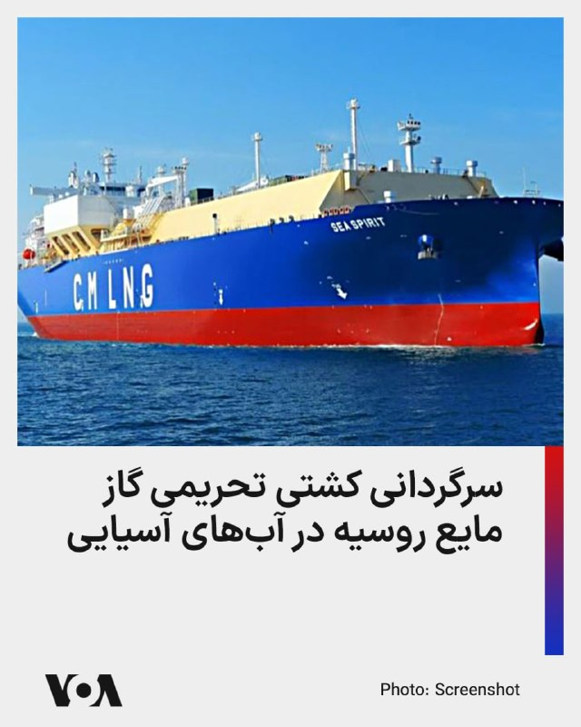

داده‌های شرکت دریانوردی «مرین ترفیک» حاکی از سرگردانی یک کشتی حامل گاز مایع (ال‌ان‌جی) روسیه در آب‌های آسیایی سرگردان شده است.

بر اساس این گزارش، حدود یک ماه پیش کشتی «کونپنگ» روسیه که تحت تحریم بریتانیا و اوکراین قرار دارد، مسیر خود را از هنگ‌کنگ به هند تغییر داد، اما با امتناع هند از دریافت این محموله به خاطر تحریم‌ها، دوباره از آب‌های سنگاپور به مقاصد نامعلوم حرکت کرده است.

این گزارش نشان می‌دهد چگونه ریسک‌های مرتبط با رعایت تحریم‌ها حتی در شرایط کسری گسترده عرضه، بر جریان تجارت انرژی اثر می‌گذارد.
@FarsiVOA

## FarsiVOA — post 217591

  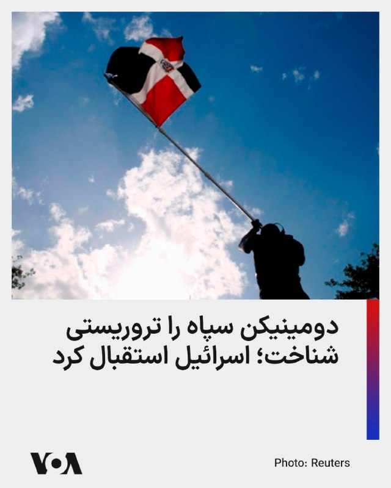

جمهوری دومینیکن روز سه‌شنبه اعلام کرد که در چارچوب «تعهد به مبارزه با تروریسم»، سپاه پاسداران انقلاب اسلامی و گروه حزب‌الله لبنان را به‌عنوان سازمان‌های تروریستی طبقه‌بندی کرده است.

دومینیکن همچنین بر تعهد خود مبنی بر اجرای قطعنامه‌های شورای امنیت سازمان ملل متحد و همچنین گسترش همکاری‌ها با ایالات متحده آمریکا با هدف برقراری امنیت و ثبات تأکید کرده است.

ساعاتی پس از این اعلام گیدئون سعار، وزیر خارجه اسرائیل، با استقبال از این اقدام، آن را «پیامی روشن علیه سیاست‌های تروریستی جمهوری اسلامی و نیروهای نیابتی رژیم» توصیف کرد. دنی دانون، نماینده اسرائیل در سازمان ملل نیز با از جمهوری دومینیکن، در شبکه اجتماعی ایکس نوشت: «جهان به طور فزاینده‌ای درک می‌کند که تروریسم به رهبری جمهوری اسلامی، تهدیدی برای تمام جهان است.»

در هفته‌های گذشته، چند کشور دیگر از جمله آرژانتین، ترینیداد و توباگو و کاستاریکا، به جمع کشورهایی که سپاه پاسداران را یک سازمان تروریستی می‌دانند، اضافه شدند. ایالات متحده پیشتر در دور نخست ریاست‌جمهوری ترامپ در فروردین ۱۳۹۸، سپاه پاسداران را در فهرست گروه‌های تروریستی قرار داده بود.
@FarsiVOA

## DW_Farsi — post 124639

  

🔶 ۲۰ نماینده کنگره آمریکا: بریتانیا نام سپاه را در فهرست تروریستی قرار دهد
 
گروهی متشکل از ۲۰ عضو جمهوری‌خواه و دموکرات در مجلس نمایندگان ایالات متحده در نامه‌ای به دولت بریتانیا خواستار سرعت بخشیدن به روند تصویب قانونی قرار گرفتن سپاه پاسداران انقلاب اسلامی در فهرست تروریستی این کشور شدند.
 
برد شرمن، عضو حزب دموکرات و عالی‌ترین مقام کمیسیون امور خاورمیانه و شمال آفریقا در مجلس نمایندگان که از مبتکران تهیه این نامه بوده، تصریح کرد: «هر روزی که پارلمان بریتانیا [در تروریستی نامیدن سپاه] تأخیر می‌کند، سپاه پاسداران یک روز دیگر از شعاع و تأثیر کامل تحریم‌های مشترک ما می‌گریزد.»
 
کلودیا تنی، عضو جمهوری‌خواه مجلس نمایندگان و یکی دیگر از مبتکران این نامه، سپاه پاسداران را "یکی از خطرناک‌ترین سازمان‌های تروریستی جهان" خواند که "دستش به خون غیرنظامیان بی‌گناه، آمریکایی‌ها و مخالفان آلوده است".
 
ایالات متحده سپاه پاسداران را در سال ۲۰۱۹ میلادی در فهرست سازمان‌های تروریستی قرار داد. همچنین کانادا در سال ۲۰۲۴، استرالیا در سال ۲۰۲۵ و اتحادیه اروپا در فوریه سال جاری میلادی (۲۰۲۶) دست به این اقدام زدند.
 
@dw_farsi

## DW_Farsi — post 124638

  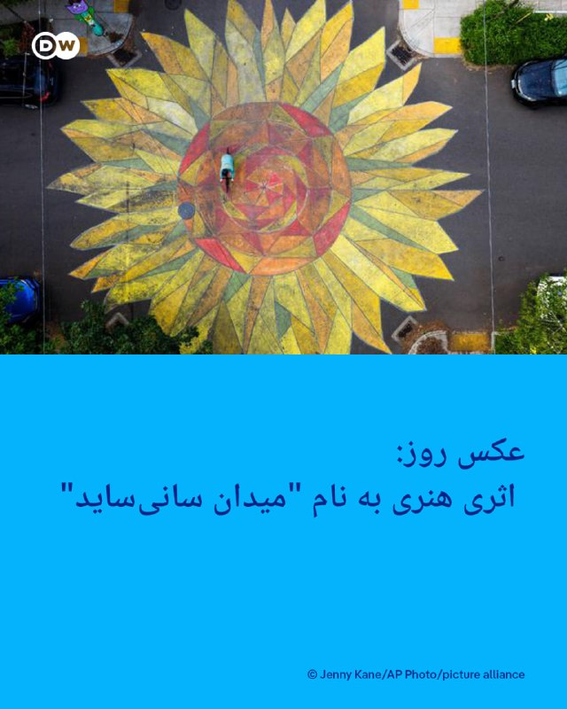

📸 عکس روز: اثری هنری به نام "میدان سانی‌ساید"
 
ساکنان محلی در تقاطعی در پورتلند ایالت اورگن آمریکا اثری هنری آفریده‌اند به نام "میدان سانی‌ساید." این اثر که از بالا نشان داده شده خورشیدی است که انسان را به یاد گل آفتابگردان می‌اندازد. این هنر محله‌محور که نمونه‌ای از نقاشی کف خیابان است علاوه بر خلق زیبایی رانندگان را به کاهش سرعت ترغیب می‌کند تا محیطی ایمن‌تر برای عابران و دوچرخه‌سواران ایجاد شود و میزان سوانح و تنش‌های روزمره پایین بیاید.

@dw_farsi

## DW_Farsi — post 124637

🔶 زلزله ۴.۶ ریشتری، پس‌لرزه‌ها و طوفان در تهران
 
به گزارش خبرگزاری‌های داخلی ایران، یک زمین‌لرزه نسبتا شدید و پس‌لرز‌هایی آن تهران و مناطق پیرامونی را لرزاند. 
 
بنا بر گزارش‌های رسمی، این زلزله ساعت ۲۳ و ۴۶ دقیقه شامگاه سه‌شنبه ۲۲ اردیبهشت (۱۲ مه) به شدت ۴.۶ ریشتر در عمق ده کیلومتری زمین در حوالی بومهن روی داد. شهرستان‌های شمیرانات، پردیس و دماوند نیز تحت تأثیر این زمین‌لرزه قرار داشتند.
 
مرتضی رضایی، معاون امداد و نجات جمعیت هلال‌احمر استان تهران، به خبرگزاری ایسنا گفت، بامداد امروز چهارشنبه نیز دو پس‌لرزه به ثبت رسید که یکی از آنها به بزرگی ۴ ریشتر و دیگری ۲ ریشتر بود.
 
به گفته این مقام، بخش لواسانات بیشترین تأثیر را از این زمین‌لرزه داشته و بلافاصله پس از وقوع زلزله، تیم‌های عملیاتی و ارزیاب هلال‌احمر به مناطق اعزام شدند. به گفته او، تیم‌های عملیاتی همچنان در حال ارزیابی و پایش مناطق هستند.
 
رضایی اضافه کرد که "تاکنون هیچ‌گونه گزارشی مبنی بر تخریب، خسارت یا آسیب جانی دریافت نشده و مسیرهای ارتباطی در مناطق بومهن و لواسانات نیز بررسی شده که هیچ محدودیت یا مشکلی در تردد وجود ندارد".
 
بنا بر گزارش رسانه‌ها، رئیس اورژانس تهران و همچنین رئیس جمعیت هلال احمر پایتخت نیز بعد از وقوع حادثه به خبرگزاری‌ها گفتند که زلزله تاکنون مصدومی در پی نداشته است.
 
@dw_farsi

## DW_Farsi — post 124636

🔶 جام ۱۹۵۰؛ خوآن شیافینو، جادوگری که کابوس برزیل شد
 
خوآن آلبرتو شیافینو در جام جهانى ۱۹۵۰ در برزیل کارگردان و گلزن تیم ملی فوتبال اورگوئه بود و همچنین یکى از ستارگان درخشان آن دوره.

این مهاجم اورگوئه‌اى اگر چه در دیدار تیم ملى کشورش در مقابل بولیوى در دور اول ۴ گل از هشت گل اروگوئه را وارد دروازه حریف کرد، اما گل سرنوشت‌سازش را در  روز ۱۶ ژوئیه سال ۱۹۵۰ به ثمر رساند.

در این روز ۲۰۰ هزار نفر در استادیوم عظیم "ماراکانا" جمع شده بودند تا شاهد پیروزى تیم ملى برزیل بر اروگوئه در دیدار نهایی جام جهانى باشند.

تا دقیقه ۶۶ هم همه چیز بر وقف مراد پیش مى‌رفت، چون تا آن لحظه برزیل با تک‌گل فریاسا از اروگوئه جلو بود. در دقیقه ۶۶ شیافینو گل تساوى را به ثمر رساند و استادیوم را با این گل غرق در سکوت کرد.

۵ دقیقه بعد گیگیا، یکى از دیگر ستارگان اروگوئه گل دوم این تیم را به ثمر رساند و شکست برزیل را قطعى کرد. میزبان این بازی‌ها در غم و ماتم فرو رفت و اروگوئه با درخشش شیافینو عنوان قهرمانى جهان را جشن گرفت.
 
@dw_farsi

## DW_Farsi — post 124635

  

🔶 احسان افراشته به اتهام "جاسوسی برای اسرائیل" اعدام شد
 
به گزارش خبرگزاری "میزان"، وابسته به قوه قضائیه جمهوری اسلامی، حکم اعدام حسان افراشته، زندانی متهم به "جاسوسی برای اسرائیل" صبح روز چهارشنبه ۲۳ اردیبهشت به اجرا درآمد.
 
دستگاه قضایی ایران او را متهم کرده که "در نپال از سوی سازمان اطلاعات خارجی اسرائیل (موساد) مورد آموزش قرار گرفته و اطلاعاتی حساس در باره جمهوری اسلامی را در اختیار این کشور قرار می‌داده است."
 
حکم اعدام در مورد این زندانی در حالی به اجرا گذاشته شده که به گفته نهادهای حقوق بشری، پرونده او با ابهامات و گزارش‌هایی متعدد در مورد فشارهای امنیتی، اعترافات اجباری و نقض روند رسیدگی به اتهامات همراه بوده است.
 
احسان افراشته که متولد ۱۳۷۲ و دانش‌آموخته کارشناسی ارشد مهندسی عمران و متخصص فناوری اطلاعات بود، در اوایل سال ۱۴۰۳ پس از بازگشت از ترکیه بازداشت شد و مدت‌ها در حبس انفرادی به سر برد.
 
او در خرداد همان سال از سوی شعبه ۱۵ دادگاه انقلاب تهران به ریاست قاضی ابوالقاسم صلواتی به اتهام "جاسوسی" به اعدام محکوم شد.
 
افراشته اتهام‌های مطرح‌شده و اعترافات منتسب به خود را رد کرده بود.
@dw_farsi

## Persian_Trend_Official — post 14041

کانال رسمی پرشین ترند pinned a file

## Persian_Trend_Official — post 14040

  <a href="https://t.me/persian_trend_official/14040" target="_blank">📎 Download file</a>

🚀تصمیم گرفتم پیش‌بینی‌ها و تحلیل‌هایی را که از بهمن‌ماه تا شب ۸ اسفند درباره احتمال جنگ ایران و آمریکا مطرح کرده بودم، دوباره بررسی کنم تا ببینم عملکرد تحلیلی‌ام در این بازه چطور بوده است.

برای اینکه بررسی دقیق‌تر و بی‌طرفانه‌تر باشد، فایل زیرنویس لایوها را به هوش مصنوعی دادم و از آن خواستم تمام پیش‌بینی‌ها، سناریوها و تحلیل‌هایی را که در آن لایوها مطرح کرده بودم، استخراج و به‌ترتیب زمانی دسته‌بندی کند.

نتیجه برای خودم هم جالب بود. بر اساس مواردی که در فایل استخراج‌شده آمده، و تأکید می‌کنم چیزی سانسور یا حذف نشده، بیش از ۹۰ درصد تحلیل‌ها و پیش‌بینی‌هایی که مطرح کرده بودم با روند بعدی تحولات همخوانی داشته است.

من این متن را برای شما هم می‌گذارم تا خودتان بررسی کنید. طبیعتاً تحلیل سیاسی و نظامی همیشه درصدی از خطا و عدم قطعیت دارد، اما مهم این است که ببینیم چارچوب تحلیلی، نشانه‌خوانی‌ها، سناریوسازی‌ها و هشدارهایی که در آن زمان مطرح شده بود، تا چه اندازه به واقعیت نزدیک بوده است.

این بررسی برای من فقط جنبه دفاع از گذشته ندارد؛ بیشتر یک ارزیابی جدی از کیفیت تحلیل‌هاست. اینکه کجا درست دیدیم، کجا زودتر از دیگران نشانه‌ها را تشخیص دادیم، و کجا باید در آینده با احتیاط یا دقت بیشتری تحلیل کنیم.

متن کامل استخراج‌شده را در ادامه می‌گذارم تا شما هم قضاوت کنید.

📌 @persian_trend_official
پرشین ترند | متفاوت‌ترین کانال نظامی

## Persian_Trend_Official — post 14039

  <a href="telegram/content/Persian_Trend_Official_14039_1778664226.webm" target="_blank">🎬 Download video</a>

⭕️ مارکو روبیو همان لباس ورزشی خاکستری Nike را پوشیده که نیکلاس مادورو در عکس‌های دستگیری‌اش به تن داشت.

📝 Nick

📌 @persian_trend_official
پرشین ترند | متفاوت‌ترین کانال نظامی

## Persian_Trend_Official — post 14038

  

شبکه تلویزیونی NDTV تصاویر ماهواره‌ای با وضوح بالا را که از پایگاه هوایی ونتور گرفته شده، منتشر کرده است که ظاهراً گزارش‌های مبنی بر پناه دادن حداقل یک هواپیمای ترابری نظامی C-130H نیروی هوایی ایران در پایگاه هوایی نورخان پاکستان را تأیید می‌کند.

📝 Nick

📌 @persian_trend_official
پرشین ترند | متفاوت‌ترین کانال نظامی

## Persian_Trend_Official — post 14037

  <a href="telegram/content/Persian_Trend_Official_14037_1778664227.mp4" target="_blank">🎬 Download video</a>

🔴محمد رضا شهبازی مجری صدا‌وسیما :

💢اگر اینترنت و مستر کارت برایتان مهم است بروید افغانستان و سوریه زندگی کنید ...❗️

🫆:Tony

📌 @persian_trend_official
پرشین ترند | متفاوت‌ترین کانال نظامی

## Persian_Trend_Official — post 14036

  

🚀 اینترنت پرسرعت و پایدار،
💰 قیمت هر گیگ ۲۵۰ تومن!
🎁 تخفیف ویژه: ۱۰٪ تخفیف اختصاصی برای اعضای پرشین ترند
⚡ پایداری بالا: کمترین قطعی ممکن در بدترین شرایط
🛡️ تضمین کیفیت: پشتیبانی ۲۴ ساعته + گارانتی بازگشت وجه

🛒 جهت خرید و مشاوره پیام دهید:

🆔 @shayan1057

🆔 @shayan1057

🆔 @shayan1057

## Persian_Trend_Official — post 14035

  

شات گان اون هم با لوله کروم که زیر نور آفتاب طوری برق میزنه که از یک کیلومتری دیده میشه. تو آمریکا حتی غیر نظامی هایی که عشق اسلحه هستن و سرشون در میاد هم اگر اسلحه با لوله کروم بخری مسخرت میکنن میگن باربی جواهرآلات جدید خریده!

سپاه روز به روز از یک نیروی نظامی داره به یک باند گانگستری شبیه تر میشه. امروز فردا فرماندهانش هم کلت با بدنه آب طلا خواهند بست.

📌 @persian_trend_official
پرشین ترند | متفاوت‌ترین کانال نظامی

## Persian_Trend_Official — post 14034

  

فیک نیوز در یک کانال مثلا خبری با بیش از چهارصد هزار دنبال کننده در پیام‌رسان بله!
اگر اینترنت در ایران مثل کره شمالی بود و شبکه های ماهواه ای فارسی زبان وجود نداشتن، آخوندها به مراتب از کره شمالی میتونستن دروغگوتر باشن به شکلی که تا الان نتانیاهو و ترامپ هم اسیر شده بودند !
خاطرتون هست میگفتن نتانیاهو کشته شده و اسرائیل تصاویرش رو با هوش مصنوعی میسازه !

پ.ن : خدایا ما رو با طرفدارات تنها نزار ...

📌 @persian_trend_official
پرشین ترند | متفاوت‌ترین کانال نظامی

## Persian_Trend_Official — post 14033

  

🔴 سفارت چین در آمریکا چهار خط قرمز پکن را اعلام کرد
این اعلام در آستانه سفر ترامپ به پکن و دیدار با شی جین‌پینگ مطرح شد:
▪️ مسئله تایوان
▪️ دموکراسی و حقوق بشر
▪️ مسیرها و نظام‌های سیاسی
▪️ حق توسعه چین
💢 پیام پکن به واشنگتن روشن است: روی این چهار خط حساب باز نکنید.
📌 @persian_trend_official
پرشین ترند | متفاوت‌ترین کانال نظامی

## RadioFarda — post 157122

قطع ۷۵ روزۀ اینترنت در ایران؛ محمدرضا عارف رئیس «ستاد ویژه» برای رسیدگی به اینترنت شد

🔸همزمان با عبور زمان قطع اینترنت در ایران از ۱۷۷۶ ساعت، مسعود پزشکیان، رئیس‌جمهور ایران، محمدرضا عارف معاون اول خود را با حفظ سمت به عنوان رئیس «ستاد ویژه ساماندهی و راهبری فضای مجازی کشور» منصوب کرد.

🔸در حکم پزشکیان آمده که این انتصاب «نظر به ضرورت فوری استقرار حکمرانی یکپارچه، منسجم و کارآمد در فضای مجازی» صورت می‌گیرد.

🔸پزشکیان یک روز پیش از این نیز در شبکه ایکس با اشاره به اینکه «ارتباطات مبتنی بر فناوری اطلاعات و اینترنت به بخش جدانشدنی زندگی مردم تبدیل شده»، نوشته بود به عارف مأموریت داده «با لحاظ حساسیت‌های حکمرانی، نظر رهبری و وعده‌ای که به مردم داده بودم، در قالب ساختاری چابک موجبات خدمت‌رسانی بهتر دولت و تحقق انتظارات عمومی را فراهم سازند.»

🔸رئیس‌جمهور ایران توضیح نداده است در حالی که زیرساخت‌های ارتباطی زیر نظر دولت فعالیت می‌کنند، ضرورت تشکیل ستاد ویژه برای باز کردن اینترنت چیست.

🔸مسعود پزشکیان در دوران انتخابات ریاست‌جمهوری ۱۴۰۳، وعده صریح «رفع فیلترینگ»، «اصلاح نظام ناکارآمد فیلترینگ» و «آزاد‌سازی اینترنت» را داده و با تأکید بر تأثیر منفی فیلترینگ بر کسب‌وکارها و زندگی مردم متعهد شده بود که تمام تلاش خود را برای پایان دادن به این وضعیت و فراهم کردن دسترسی آزاد به فضای مجازی به کار گیرد.

🔸این وعده اما نه تنها محقق نشد که قطع کامل اینترنت هم از زمان شروع جنگ با آمریکا و اسرائیل به آن افزوده شد.
فاطمه مهاجرانی، سخنگوی دولت پزشکیان، نیز در نشست خبری سه‌شنبه ۲۲ اردیبهشت، به صراحت از قطع اینترنت «به دلیل فضای جنگی» دفاع کرد و در پاسخ به خبرنگاران معترض به این موضوع گفت که «چه انتظاری دارید؟»

🔸دولت جمهوری اسلامی چند روز پس از حملات مشترک آمریکا و اسرائیل به ایران در نهم اسفند ۱۴۰۴ و قطع‌کردن اینترنت، اعلام کرد تنها به خبرنگاران و فعالان رسانه‌ای هم‌صدا با خود اجازه دسترسی به اینترنت جهانی را می‌دهد.

🔸طی این مدت شماری از خبرنگاران، فعالان رسانه‌ای نزدیک به حکومت با استفاده از اینترنت «سفید» در شبکه‌های اجتماعی به حمایت از عملکرد جمهوری اسلامی پرداخته‌اند.

🔸در هفته‌های اخیر نیز برخی اپراتورها اقدام به تبلیغ و واگذاری اینترنت موسوم به «طبقاتی» و فروش اینترنت به بهای گزاف به‌عنوان اینترنت ویژهٔ «کسب‌وکارها» کرده‌اند.

🔸با این حال واگذاری این نوع از از اینترنت نیز به‌دلیل سازوکار نامشخص آن و همچنین جنبه‌های درآمدزایی گستردهٔ آن برای اپراتورها جنجال‌برانگیز شده است.

🔸علی قلهکی، فعال رسانه‌ای نزدیک به حکومت، در شبکه ایکس با ذکر آمار فعال شدن ۴۵۰ هزار سیم‌کارت پرو در اپراتور همراه اول، نوشت سرمایه اجتماعی کشور که به‌گفتهٔ او «بابت جنگ تقویت شده»، نباید «دستمایه اقدامات مشکوک و منفعت‌محور مدیرانِ اِبن‌الوقت قرار گیرد».

🔸به‌گفتهٔ این فعال رسانه‌ای نزدیک به حکومت، «طرح‌های تبعیض‌آمیزی چون «اینترنت پرو» این انگاره را در جامعه جا می‌اندازد که هزینه‌های اقداماتی چون «تحریم» و «جنگ» از جیب مردم باید پرداخت شود».

🔸این فعال رسانه‌ای اضافه کرده «به ازای یک میلیون نفر عضویتِ در اینترنت پرو ۵۰ گیگابایتی (هدف‌گذاری اولیه)، بیش از دو هزار میلیارد تومان نصیب اپراتورها _بخوانید یک اپراتور_ می‌شود».

🔸انتقادها از این وضعیت به اندازه‌ای گسترش یافته که مدتی پیش غلامحسین محسنی اژه‌ای، رئیس قوه قضائیه دستور بررسی این موضوع توسط این نهاد را صادر کرد.

@RadioFarda

## RadioFarda — post 157121

🔸داده‌های رهگیری کشتی‌ها نشان می‌دهد یک نفتکش غول‌پیکر چینی حامل دو میلیون بشکه نفت خام عراق، روز چهارشنبه ۲۳ اردیبهشت، در تلاش برای عبور از تنگه هرمز بوده است. 🔸خبرگزاری رویترز روز چهارشنبه ۲۳ اردیبهشت به‌نقل از داده‌های شرکت‌های رهگیری گزارش داد یک نفتکش…

## RadioFarda — post 157120

  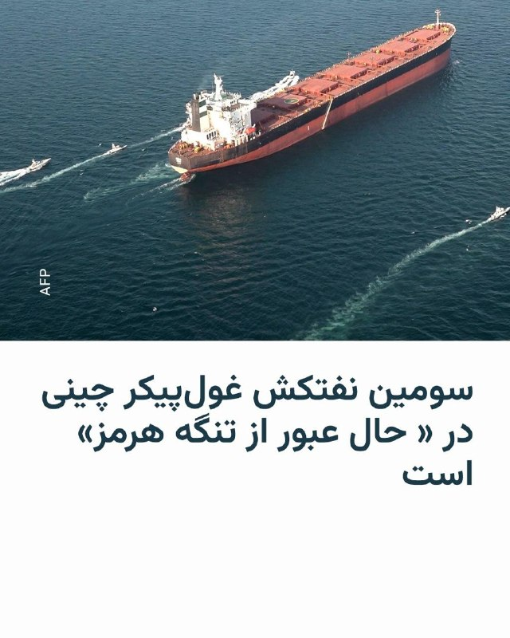

🔸داده‌های رهگیری کشتی‌ها نشان می‌دهد یک نفتکش غول‌پیکر چینی حامل دو میلیون بشکه نفت خام عراق، روز چهارشنبه ۲۳ اردیبهشت، در تلاش برای عبور از تنگه هرمز بوده است.

🔸خبرگزاری رویترز روز چهارشنبه ۲۳ اردیبهشت به‌نقل از داده‌های شرکت‌های رهگیری گزارش داد یک نفتکش غول‌پیکر چینی حامل دو میلیون بشکه نفت خام عراق در تلاش برای عبور از تنگه هرمز بوده است.

🔸بر اساس داده‌های شرکت‌های «ال‌اس‌ای‌جی» و «کپلر»، نفتکش «یوآن هوا هو» از نزدیکی جزیره لارک ایران عبور کرده و در بخش شرقی تنگه هرمز به سمت جنوب در حال حرکت است.

@RadioFarda

## RadioFarda — post 157119

موریاسو: اولویت راهبردی پکن در دیدار سران آمریکا و چین، بقای حکومت ایران است

🔸جنگ آمریکا با ایران و تنش‌های بعدی آن در خاورمیانه بر دیدار حساس و تعیین‌کنندهٔ دونالد ترامپ، رئیس‌جمهور آمریکا، با شی جین‌پینگ، رهبر چین، که اواخر این هفته در پکن برگزار می‌شود، سایه انداخته است. انتظار می‌رود موضوع ایران به یکی از چالش‌برانگیزترین سرفصل‌های دستور کار این نشست بدل شود.

🔸طبق برنامه، دونالد ترامپ روز ۲۳ اردیبهشت وارد پکن خواهد شد و در روزهای ۲۴ و ۲۵ اردیبهشت با شی جین‌پینگ دیدار خواهد کرد. این سفر پیش‌تر در سال جاری به‌دلیل جنگ ایران به تعویق افتاده بود. مقامات ارشد ایالات متحده می‌گویند ترامپ قصد دارد مستقیماً همتای چینی خود را در خصوص پیوندهای اقتصادی و فناورانهٔ پکن با تهران، از جمله خرید نفت و ادعای انتقال کالاهای دارای کاربرد دوگانه، تحت فشار بگذارد.

🔸کن موریاسو، پژوهشگر ارشد اندیشکدهٔ هادسون، در گفت‌وگو با رادیو اروپای آزاد/رادیو آزادی می‌گوید پکن ممکن است برای کاهش تنش‌ها دست به مانورهای تاکتیکی بزند، اما در برابر هر اقدامی که بقای حکومت جمهوری اسلامی ایران را تهدید کند، ایستادگی خواهد کرد؛ چرا که از دید او، ایران نقشی کلیدی و محوری در استراتژی بلندمدت چین در منطقه اوراسیا ایفا می‌کند.

🔸 گزارش کامل را در وب‌سایت رادیوفردا بخوانید.

@RadioFarda

## RadioFarda — post 157118

🔸عضو کمیسیون اقتصادی مجلس شورای اسلامی اعلام کرد برآوردهای اولیه از خسارت‌های صنعتی ناشی از جنگ اخیر آمریکا و اسرائیل با ایران نشان می‌دهد خسارت واردشده فقط در دو استان تهران و اصفهان، بدون در نظر گرفتن صنایع بزرگ آسیب‌دیده، حدود ۲۰۰ هزار میلیارد تومان بوده است.

🔸مهدی طغیانی در گفت‌وگو با صداوسیما گفت این رقم بر اساس خوداظهاری واحدها برآورد شده و شامل خسارت صنایع بزرگ، واحدهایی که زنجیرهٔ تولید آن‌ها آسیب دیده و همچنین بنگاه‌هایی که در پی جنگ دچار رکود شده‌اند، نمی‌شود.

🔸در جریان جنگ دو شرکت فولاد خوزستان و فولاد مبارکه نیز که از صنایع بزرگ ایران محسوب می‌شوند، در نیمه اول فروردین هدف حملات هوایی اسرائیل قرار گرفتند که در پی آن، براساس اعلام رسانه‌های اقتصادی ایران، «معادل ۲۵ تا ۳۰ درصد ظرفیت تولید فولاد در ایران از دست رفت».

🔸استان‌های تهران و اصفهان بیشترین آسیب‌های صنعتی را در جریان جنگ متحمل شدند. به‌گفتهٔ مهدی طغیانی، خسارت ۲۰۰ هزار میلیاردی در مقایسه با تولید ناخالص داخلی ایران عدد بزرگی نیست، اما برای واحدهای درگیر و آسیب‌دیده خسارت قابل‌توجهی به شمار می‌رود.

@RadioFarda

## RadioFarda — post 157117

🔸قوه قضائیه ایران یک زندانی دیگر به نام احسان افرشته را به اتهام «جاسوسی» برای اسرائیل اعدام کرد. 🔸میزان‌نیوز نوشته که افراشته که «در نپال توسط موساد آموزش دیده بود و اطلاعات حساس کشور را به اسرائیل می‌فروخت»، بامداد چهارشنبه ۲۳ اردیبهشت اعدام شد. 🔸در بخشی…

## RadioFarda — post 157116

  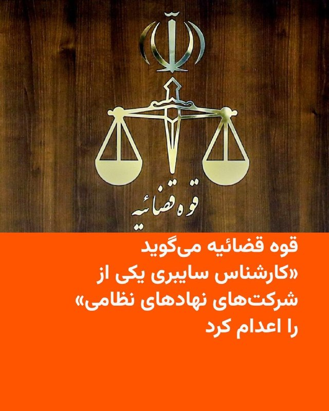

🔸قوه قضائیه ایران یک زندانی دیگر به نام احسان افرشته را به اتهام «جاسوسی» برای اسرائیل اعدام کرد.

🔸میزان‌نیوز نوشته که افراشته که «در نپال توسط موساد آموزش دیده بود و اطلاعات حساس کشور را به اسرائیل می‌فروخت»، بامداد چهارشنبه ۲۳ اردیبهشت اعدام شد.

🔸در بخشی از گزارش بدون اشاره به جزئیات آمده که او «به عنوان کارشناس سایبری در یک شرکت وابسته نهاد نظامی مشغول به فعالیت» بود.

🔸میزان ادعا کرده که «با دستور افسر موساد، افراشته تلاش می‌کند اطلاعات مختلفی را درباره شرکت و افراد شاغل در آن منتقل کند. هویت و مشخصات کارکنان، سلسله مراتب و چارت دقیق سازمانی و ماموریت‌های شرکت از جمله اطلاعاتی بوده که افرشته تلاش داشته به سرویس موساد منتقل کند.»

@RadioFarda

## IranianMinds — post 20056

شما فک کنید یه جوون بی گناه که نه پستی داشته و نه مقامی تو کشور رو دی ماه دستگیر کردن بعدشم اعدامش کردن گفتن جاسوس موساد بوده رفته نپال آموزش دیده ! @IranianMinds

## IranianMinds — post 20055

  

🔴 ارتش اسرائیل دستور تخلیه 6 روستای دیگه در جنوب لبنان رو داد

ارتش اسرائیل از ساکنان این روستاها خواست که حدود 1 کیلومتر از این مناطق فاصله بگیرند

ارتش اسرائیل در حال پیشروی زمینی سریع در جنوب لبنان هست

@IranianMinds

## IranianMinds — post 20054

  

😤دنبال یه سایت شرط بندی بین المللی بودی که به ایرانیا خدمات بده؟!
⛔

👍دربی بت همون انتخاب  100%

💎ویژگی های سایت جهانی Derby Bet:

⬅️امکان شارژ امن با کارت بانکی

⬅️واریز اول دوبل شارژ می شوید(بونوس۱۰۰٪)

⬅️پر اپشن ترین سایت فعال در ایران

⬅️تسویه حساب کمتر از 5 دقیقه

⬅️برگشت بخشی از باخت به صورت هفتگی

🚨کد هدیه ثبت نام:GG007

⚠️برای دانلود اپلکیشن کلیک کنید
👉
re23

🔔کانال دربی بت :

🪙https://t.me/+aCbq7yy8QY80NzQ0

## BBCPersian — post 280899

🔻اعتراض ایران به لغو مجوز فعالیت مدارس ایرانی در امارات متحده عربی

ستاد حقوق بشر ایران با انتشار بیانیه‌ای به لغو مجوز فعالیت مدارس ایرانی در امارات متحده عربی اعتراض کرده است.

در بخشی از این بیانیه آمده است که قدام اخیر دولت امارات متحده عربی «در سایه تنش‌های سیاسی و با انگیزه‌های خصمانه صورت پذیرفته، تنها یک اقدام اداری ساده نیست، بلکه مصداق بارز نقض سیستماتیک تعهدات بین‌المللی دولت امارات ذیل معاهدات حقوق بشری، مشخصاً کنوانسیون حقوق کودک و میثاق بین‌المللی حقوق اقتصادی، اجتماعی و فرهنگی است.»

ستاد حقوق بشر ایران از زیرمجموعه‌های شورای عالی امنیت ملی و به لحاظ اداری بخشی از قوه قضائیه است.

بر اساس گزارش‌ها، با آغاز جنگ آمریکا و اسرائیل با ایران و حملات تلافی‌جویانه ایران به امارات متحده عربی، تعدادی از ایرانیان مقیم این کشور با مشکلات اقامتی هم مواجه شده‌اند.

بی‌بی‌سی فارسی درباره این مشکلات با اداره کل مهاجرت، هویت و مرزبانی امارات، اداره کل اقامت و امور خارجیان دبی و وزارت کار امارات تماس گرفته اما هنوز پاسخی دریافت نکرده است.

https://bbc.in/4tAXKjn
@BBCPersian

## BBCPersian — post 280898

🔻نماینده مجلس ایران: آمریکا و اسرائیل بنای یک عملیات گسترده علیه ایران را دارند

کامران غضنفری، نماینده مجلس ایران با اشاره به ادامه انتقال تجهیزات و نیرو از سوی آمریکا به خاورمیانه، می‌گوید «آمریکا و اسرائیل بنای یک عملیات گسترده» علیه ایران را دارند.

آقای غضنفری به خبرآنلاین گفته آمریکا و اسرائیل «احتمالاً قصد تصرف برخی از جزایر ما در جنوب را دارند.»

او با اشاره به خواسته‌های آمریکا از ایران در مورد تعطیلی غنی‌سازی، خروج اورانیوم غنی‌شده و توقف حمایت از گروه‌های موسوم به «محور مقاومت» گفته «جمهوری اسلامی قاعدتاً زیر بار این خواسته‌ها نمی‌رود.»

به گفته این نماینده مجلس، «ما وسط جنگ هستیم و اکنون در حال جنگ با دشمن هستیم. در همین یک هفته اخیر، دو عملیات علیه ما انجام دادند و با ناوهایشان به برخی مراکز ما حمله کردند.»~

https://bbc.in/4tAXKjn
@BBCPersian

## BBCPersian — post 280897

🔻سامانه دفاع موشکی «گنبد طلایی» ترامپ هزار و دویست میلیارد دلار خرج دارد

بر اساس برآورد دفتر بودجه کنگره امريکا، سامانه دفاع موشکی آينده‌نگر «گنبد طلایی» دونالد ترامپ حدود ۱/۲ تريليون دلار (۱۲۰۰ میلیارد دلار) هزينه خواهد داشت تا طی دو دهه تولید، استقرار و بهره‌برداری شود.

اين رقم به‌مراتب بيشتر از بودجه اوليه ۱۷۵ ميليارد دلاری است که پيش‌تر برای اين پروژه در نظر گرفته شده بود.

با اين حال، سامانه‌ای که برای محافظت از ايالات متحده امريکا در برابر موشک‌های بالستيک و کروز طراحی شده، ممکن است حتی کارايی کامل نداشته باشد.

گزارش جديد دفتر بودجه کنگره هشدار می‌دهد «گلدن دوم - گنبد طلایی» می‌تواند در برابر حمله گسترده از سوی روسيه يا چين آسيب‌پذير باشد.

اين نهاد غيرحزبی اعلام کرده تنها هزينه‌های تامين تجهيزات از ۱ تريليون دلار فراتر خواهد رفت؛ از جمله برای لايه‌های رهگير موشکی و سامانه هشدار و رهگيری موشک مبتنی بر فضا.

عبور برخی از پهپادها و موشک‌های ایرانی از گنبد آهنین اسرائیل و همچنین پوشش پدافندی آمریکا در کشورهای حوزه خلیج فارس، ارزیابی‌ها درباره کارآمدی کامل این طرح را هم تحت تاثیر قرار داده است.

https://bbc.in/4tAXKjn
@BBCPersian

## BBCPersian — post 280896

🔻ترامپ نقشه ونزوئلا را با عنوان «ایالت ۵۱» منتشر کرد

دونالد ترامپ که در حال عزیمت به چین برای دیدار با شی جین پینگ است، سه شنبه شب در شبکه اجتماعی خود - تروث سوشال - نقشه ونزوئلا در حالی که روی آن با پرچم آمریکا پوشانده شده بود را منتشر کرد و بالای آن نوشت:‌ «ایالت ۵۱».

روز دوشنبه -۲۱ اردیبهشت - هم یک خبرنگار فاکس نیوز گفت که آقای ترامپ در تماس تلفنی با او گفته به انضمام ونزوئلا تحت عنوان ایالت پنجاه و یکم آمریکا «فکر می‌کند».

کانادا و گرینلند هم پیش از این القاب مشابهی از سوی رئیس جمهور آمریکا دریافت کرده بودند که با اعتراض جدی دولت و شهروندان این کشورها روبرو شده بود.

https://bbc.in/4tAXKjn
@BBCPersian

## BBCPersian — post 280895

🔻اکبر عبدی به علت عارضه قلبی در بیمارستان بستری شد

بنابر گزارش رسانه‌های ایران، اکبر عبدی، بازیگر و کمدین سرشناس ایرانی، به علت عارضه قلبی در بخش مراقبت‌های ویژه بستری شده است.

مهران غفوریان، بازیگر و کمدین با انتشار ویدیویی در مقابل بیمارستان محل بستری آقای عبدی این خبر را تایید کرده است.

آقای عبدی در دهها فیلم سینمایی و مجموعه‌های تلویزیونی ایران ایفای نقش کرده و یکی از کمدین‌های سرشناس نیم قرن گذشته در این کشور است.
https://bbc.in/4tAXKjn
@BBCPersian

## BBCPersian — post 280887

🖋 الکسی کالمیکوف، بی‌بی‌سی روسی

🔻جنگ آمریکا و اسرائیل با ایران منجر به بحران انرژی شده است؛ بحرانی که از آسیا آغاز شد و به تدریج به اروپا نزدیک می‌شود. نخستین ضربه را کشورهای فقیر متحمل شدند، اما در میان کشورهای ثروتمند نیز قربانیانی وجود دارد. بریتانیا نخستین کشوری خواهد بود که بیش از دیگران آسیب می‌بیند. دلیل این امر چیست؟

نخست به این دلیل که بریتانیا بیش از دیگر کشورهای گروه هفت به واردات منابع انرژی وابسته است و به همین دلیل، هرگونه کمبود انرژی بلافاصله بر قیمت‌ها در داخل این کشور تاثیر می‌گذارد.

آلمان، ژاپن و فرانسه نیز واردکننده انرژی هستند، اما برخلاف بریتانیا ذخایر گاز دارند و می‌توانند موقتا بخشی از نیاز خود را با زغال‌سنگ تامین کنند. آمریکا و کانادا هم نه‌تنها در زمینه انرژی خودکفا هستند، بلکه مازاد تولید خود را صادر می‌کنند.

بیشتر بخوانید:
https://bbc.in/4d8oV0h
📸GettyImages/ EPA/Shutterstock/ In Pictures via Getty Images/ AFP via Getty Images/ Bloomberg via Getty Images/ NurPhoto via Getty Images
@BBCPersian

## idfinfarsi — post 11571

  <a href="telegram/content/idfinfarsi_11571_1778664236.mp4" target="_blank">🎬 Download video</a>

در طول شبانه‌روز گذشته: ارتش اسرائیل بیش از ۴۰ زیرساخت سازمان تروریستی حزب‌الله را در جنوب لبنان مورد حمله قرار داد

در طول شبانه‌روز گذشته، ارتش اسرائیل بیش از ۴۰ زیرساخت سازمان تروریستی حزب‌الله را در چندین منطقه در جنوب لبنان هدف قرار داد.

از جمله زیرساخت‌های هدف قرار گرفته: انبارهای تسلیحاتی و ساختمان‌های مورد استفاده نظامی که تروریست‌های حزب‌الله از آن‌ها برای پیشبرد طرح‌های تروریستی علیه نیروهای ارتش اسرائیل و شهروندان این کشور استفاده می‌کردند.

همچنین، تروریست‌هایی که تهدیدی برای نیروهای ما بودند به هلاکت رسیدند و پرتابگرهای آماده شلیک که به سمت خاک اسرائیل هدف‌گیری شده بودند، مورد حمله قرار گرفتند.

## Dirty_Kids — post 389362

مشتی یه دونه سیب کندیم دیگه کون باغبون نذاشتیم که این کارا چیه

@Dirty_Kids 👻

## Dirty_Kids — post 389361

  

پرچم شیروخورشید انقدر قشنگه که جشن قهرمانی یکی از بزرگترین تیم‌های دنیا رو به حاشیه برده. 
👑🫶

@Dirty_Kids 👻

## Dirty_Kids — post 389360

  <a href="telegram/content/Dirty_Kids_389360_1778664239.mp4" target="_blank">🎬 Download video</a>

قشنگ زنده یاد ۱۰۰ سال از زمان خودش جلوتر بود پپ

زنده‌یاد فریدون فرخزاد در سال ۱۹۹۰ میلادی، در گفت‌وگو با «رادیو سیدنی» در استرالیا

@Dirty_Kids 👻

## Dirty_Kids — post 389358

  

می‌بینی مارکو؟ کاراشو می‌بینی؟
به ابالفضل ما هم همینیم.

@Dirty_Kids 👻

## Dirty_Kids — post 389357

هنوز چین نرسیده سر شوخیو باز کردن. :)))))))

روبیوی دل‌ها همون ست نایکی که مادورو موقع هشتک‌پشتک شدن پوشیده بودو پوشیدو آتش به همه عالم زد! :)))

@Dirty_Kids 👻

## Hranews — post 112922

تهران؛ مرد جوان به اتهام قتل برادر معشوقه‌اش محاکمه شد

❗️
❗️
❗️
❗️
❗️– جلسه رسیدگی به اتهام جوانی که در سن ۱۸ سالگی برادر دختر مورد علاقه خود را به #قتل رسانده، در دادگاه کیفری استان تهران برگزار شد.

ادامه مطلب

↘️
@hranews_bot تماس ✉️ - @Hranews کانال هرانا 🆑

## Hranews — post 112921

  

نت‌بلاکس، که محدودیت دسترسی به اینترنت در جهان را رصد می‌کند، اعلام کرد که قطع اینترنت در ایران اکنون از ۱۷۷۶ ساعت گذشته و وارد هفتاد و پنجمین روز خود شده است. این نهاد تاکید کرد که این اقدام سانسور دیجیتال، به سودجویی و کاهش امنیت دیجیتال منجر شده و طرح‌های موسوم به «اینترنت پرو» با حمایت حکومت و فهرست سفید گزینشی، زمینه‌ساز نظارت، فساد و کلاهبرداری شده‌اند.
#قطع_اینترنت

↘️
@hranews_bot تماس ✉️ - @Hranews کانال هرانا 🆑

## Hranews — post 112920

سیدیاسین حسن‌زاده، دانشجوی دانشگاه تهران آزاد شد

❗️
❗️
❗️
❗️
❗️– سیدیاسین حسن‌زاده، دبیر انجمن اسلامی دانشجویان دانشگاه تهران که روز گذشته توسط ماموران امنیتی بازداشت شده بود، آزاد شد.

ادامه مطلب

#سیدیاسین_حسن‌زاده

↘️
@hranews_bot تماس ✉️ - @Hranews کانال هرانا 🆑

## Hranews — post 112919

  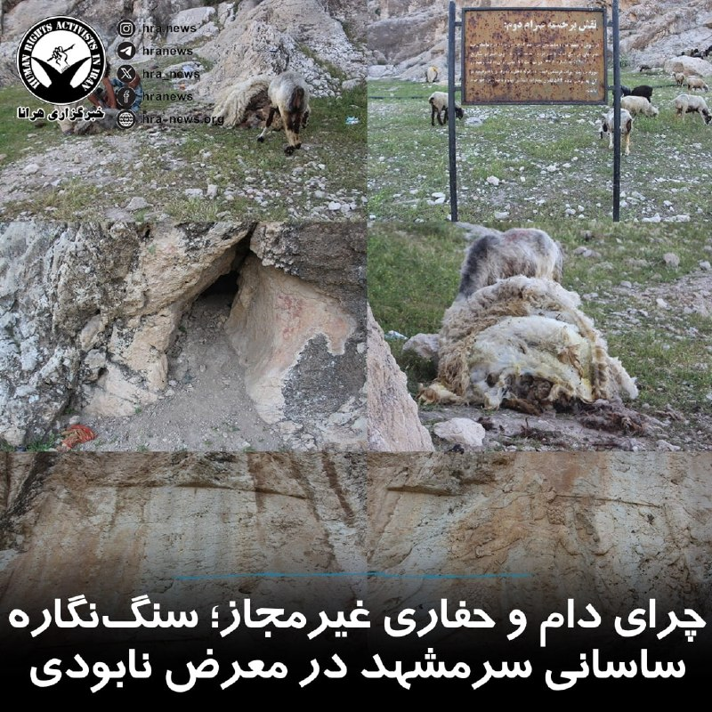

یک کنشگر و پژوهشگر میراث فرهنگی، در گفت‌وگو با خبرگزاری ایسنا، از وضعیت نامناسب نگهداری سنگ‌نگاره و سنگ‌نبشته ساسانی سرمشهد در شهرستان کازرون خبر داد. سیاوش آریا اعلام کرد که چوپانان محلی گوسفندان خود را برای چرا و پشم‌چینی به داخل محوطه این اثر تاریخی منتقل می‌کنند. وی با اشاره به بازدید میدانی خود از این محوطه، گفت که شکسته شدن بخشی از فنس حفاظتی باعث ورود دام‌ها به عرصه تاریخی شده و آثار پشم‌چینی و آلودگی در کنار این یادمان ساسانی باقی مانده است.

این پژوهشگر #میراث_فرهنگی همچنین با اشاره به فرسودگی شدید این اثر تاریخی، از تداوم ساخت‌وساز در حریم محوطه، یادگاری‌نویسی، حفاری‌های غیرمجاز و نبود حفاظت موثر انتقاد کرد. به گفته او، سنگ‌نگاره و سنگ‌نبشته سرمشهد که از مهم‌ترین آثار به‌جامانده از دوره ساسانیان به شمار می‌رود، در حال محو شدن است و بی‌توجهی نهادهای مسئول، روند تخریب آن را تشدید کرده است.
#سنگ‌نگاره_سرمشهد

↘️
@hranews_bot تماس ✉️ - @Hranews کانال هرانا 🆑

## Hranews — post 112918

بازداشت یک فرد در تهران؛ پلیس مدعی استفاده از استارلینک برای «انتقال اطلاعات» شد

❗️
❗️
❗️
❗️
❗️– فرماندهی انتظامی تهران بزرگ از #بازداشت یک نفر در محدوده چیتگر تهران خبر داد. پلیس مدعی شده است که این فرد از طریق تجهیزات اینترنت ماهواره‌ای استارلینک، اطلاعات مربوط به محل‌های اصابت در جریان درگیری ‌های نظامی اخیر را به شبکه‌های مخالف حکومت منتقل می‌کرده است.

ادامه مطلب

↘️
@hranews_bot تماس ✉️ - @Hranews کانال هرانا 🆑

## Hranews — post 112917

  

احسان افرشته به اتهام «جاسوسی» اعدام شد

❗️
❗️
❗️
❗️
❗️– مرکز رسانه قوه قضاییه از اجرای حکم اعدام احسان افرشته، دانش‌آموخته مهندسی عمران در مقطع کارشناسی ارشد و متخصص شبکه و فناوری اطلاعات، خبر داد. آقای افرشته پیشتر به اتهام «جاسوسی برای اسرائیل» به مجازات مرگ محکوم شده بود و این حکم سحرگاه امروز به مرحله اجرا درآمد. بر اساس داده‌های گردآوری‌شده توسط هرانا، همزمان با آغاز درگیری‌های نظامی، روند صدور و اجرای احکام اعدام در پرونده‌های سیاسی و امنیتی افزایش یافته و تاکنون ۳۱ زندانی با این اتهامات در این بازه زمانی اعدام شده‌اند.

ادامه مطلب

#احسان_افرشته #اعدام

↘️
@hranews_bot تماس ✉️ - @Hranews کانال هرانا 🆑

## manototv — post 105387

  

هم‌زمان با سفر دونالد ترامپ به چین و آغاز گفت‌وگوها درباره جنگ جمهوری اسلامی و اسرائیل، مقام‌های آمریکایی پکن را متهم کردند که با خرید گسترده نفت ایران، به «بزرگ‌ترین حامی دولتی تروریسم» کمک مالی می‌کند.

دونالد ترامپ امروز برای دیدار با شی جین‌پینگ، رئیس‌جمهوری چین، راهی پکن شد؛ دیداری که جنگ جمهوری اسلامی و اسرائیل و بحران تنگه هرمز از محورهای اصلی آن عنوان شده است.

در آستانه این سفر، اسکات بسنت، وزیر خزانه‌داری آمریکا، از چین خواست جمهوری اسلامی را برای بازگشایی تنگه هرمز تحت فشار قرار دهد و گفت پکن با خرید نفت ایران، «بزرگ‌ترین حامی دولتی تروریسم» را تأمین مالی می‌کند.

وزیر خزانه‌داری آمریکا در گفت‌وگو با فاکس‌نیوز گفت: «ببینیم آیا چین حاضر است از دیپلماسی استفاده کند و جمهوری اسلامی را وادار به باز کردن تنگه کند یا نه.»

چین تاکنون در قبال جنگ موضعی محتاطانه اتخاذ کرده و فراتر از انتقاد از آمریکا و اسرائیل، نقش مستقیمی در حل بحران ایفا نکرده است.
این دیدار در شرایطی برگزار می‌شود که تنش‌ها در منطقه، امنیت انرژی چین و تجارت جهانی از مسیر تنگه هرمز را تحت تأثیر قرار داده است.

## manototv — post 105386

  

رویترز به نقل از مقام‌های غربی و جمهوری اسلامی گزارش داد عربستان سعودی در جریان گسترش جنگ منطقه‌ای، در واکنش به حملاتی در خاک این کشور، چندین حمله اعلام‌نشده علیه جمهوری اسلامی انجام داده است.

رویترز در گزارشی اختصاصی نوشت عربستان سعودی، در اقدامی بی‌سابقه، حملات محرمانه‌ای را علیه جمهوری اسلامی انجام داده است.

به گفته دو مقام غربی مطلع و دو مقام جمهوری اسلامی، این حملات در واکنش به حملاتی صورت گرفته که در جریان جنگ در خاک عربستان انجام شده بود.

این حملات که پیش‌تر رسانه‌ای نشده بود، نخستین مورد شناخته‌شده از اقدام مستقیم نظامی عربستان در خاک ایران به شمار می‌رود؛ اقدامی که به نوشته رویترز نشان می‌دهد ریاض در دفاع از خود در برابر جمهوری اسلامی، رویکردی تهاجمی‌تر در پیش گرفته است.

## alonews — post 119683

  <a href="telegram/content/alonews_119683_1778664244.webm" target="_blank">🎬 Download video</a>

👈سخنگوی کمیسیون فرهنگی مجلس: تعداد کاربران در پیام رسان های داخلی از مرز ۱۰۰ میلیون کاربر عبور کرده است

✅ @AloNews خبر جنگ

## alonews — post 119682

  <a href="telegram/content/alonews_119682_1778664245.webm" target="_blank">🎬 Download video</a>

👈بقائی: تا زمانی که عضو ان‌پی‌تی هستیم حق استفاده از انرژی هسته‌ای را داریم

✅ @AloNews خبر جنگ

## alonews — post 119681

  <a href="telegram/content/alonews_119681_1778664245.webm" target="_blank">🎬 Download video</a>

👈نائب رئیس اتحادیه مشاوران املاک تهران در برنامه صداوسیما: وام مسکنی که همین الان در حال ارائه هست آن‌قدر ارزش پایینی دارد که در بعضی از مناطق تهران نمی‌شود با آن یک متر خانه خرید!

✅ @AloNews خبر جنگ

## alonews — post 119680

  <a href="telegram/content/alonews_119680_1778664245.webm" target="_blank">🎬 Download video</a>

👈تهران تا یک‌شنبه خنک می‌شود

✅ @AloNews خبر جنگ

## alonews — post 119679

  <a href="telegram/content/alonews_119679_1778664245.webm" target="_blank">🎬 Download video</a>

👈وزیر رفاه: داریم تمام وقت تلاش میکنیم که مبلغ کالابرگ رو افزایش بدیم

✅ @AloNews خبر جنگ

## alonews — post 119678

  <a href="telegram/content/alonews_119678_1778664246.webm" target="_blank">🎬 Download video</a>

👈گفتگوی تلفنی وزرای خارجه ایران و جمهوری آذربایجان

✅ @AloNews خبر جنگ

## alonews — post 119677

  <a href="telegram/content/alonews_119677_1778664246.webm" target="_blank">🎬 Download video</a>

👈الشرق الاوسط: چین نام روبیو را تغییر داد تا او بتواند وارد خاک این کشور شود

🔴 مارکو روبیو، وزیر خارجه آمریکا، روز چهارشنبه همراه با دونالد ترامپ، رئیس‌جمهور آمریکا، به پکن سفر خواهد کرد؛ این در حالی است که او همچنان تحت تحریم‌های چین قرار دارد، اما به نظر می‌رسد پکن با تغییر شیوه نگارش نام او، راهکاری جدید برای مواجهه با این موضوع پیدا کرده است.

🔴 روبیو در دوران عضویت خود در سنای آمریکا، از منتقدان سرسخت وضعیت حقوق بشر در چین بود و پکن نیز در واکنش به این موضوع، دو بار علیه او تحریم اعمال کرد؛ اقدامی که آمریکا نیز اغلب علیه رقبای خود به کار می‌برد.

🔴 چین روز سه‌شنبه اعلام کرد که مانع همراهی روبیوی ۵۴ ساله با ترامپ در سفر به چین نخواهد شد. این نخستین سفر روبیو به چین است و همچنین اولین سفر یک رئیس‌ جمهور آمریکا به پکن در حدود یک دهه گذشته محسوب می‌شود

✅ @AloNews خبر جنگ

## alonews — post 119675

  <a href="telegram/content/alonews_119675_1778664246.webm" target="_blank">🎬 Download video</a>

👈حمله جنگنده‌های اسرائیلی به دو منطقه در جنوب لبنان

✅ @AloNews خبر جنگ

## alonews — post 119674

  <a href="telegram/content/alonews_119674_1778664246.webm" target="_blank">🎬 Download video</a>

👈الجزیره: وزیر دفاع کره جنوبی اعلام کرد ، حمایت از تلاش‌های آمریکا برای تأمین امنیت هرمز را بررسی می‌کنیم

✅ @AloNews خبر جنگ

## alonews — post 119673

  <a href="telegram/content/alonews_119673_1778664247.webm" target="_blank">🎬 Download video</a>

👈سخنگوی شرکت آب و فاضلاب استان تهران: مصرف آب تهران به مرز ۳ میلیارد لیتر در شبانه روز رسید

✅ @AloNews خبر جنگ

## alonews — post 119672

  <a href="telegram/content/alonews_119672_1778664247.webm" target="_blank">🎬 Download video</a>

👈نیویورک تایمز: قصد ترامپ از تغییر نام عملیات «خشم حماسی» به «چکش سنگین» این است که یک عملیات جدید ۶۰ روزه حمله به ایران شروع کند

✅ @AloNews خبر جنگ

## alonews — post 119671

  <a href="telegram/content/alonews_119671_1778664247.webm" target="_blank">🎬 Download video</a>

👈آژانس بین‌المللی انرژی: جهان ذخایر نفت خود را با سرعت بی‌سابقه در پرتو جنگ «خاورمیانه» مصرف می‌کند.

✅ @AloNews خبر جنگ

## alonews — post 119670

  <a href="telegram/content/alonews_119670_1778664247.webm" target="_blank">🎬 Download video</a>

👈رویترز: قیمت نفت روز چهارشنبه پس از سه روز افزایش شدید، کاهش یافت، در حالی که قیمت طلا ثابت ماند

✅ @AloNews خبر جنگ

## alonews — post 119666

  <a href="telegram/content/alonews_119666_1778664248.webm" target="_blank">🎬 Download video</a>

⭕️یک اعدام دیگر

🔴میزان خبرگزاری قوه قضاییه جمهوری اسلامی با انتشار تصاویر بالا نوشت: احسان افرشته اعدام شد

🔴قوه قضاییه مدعی شده که: افرشته در نپال از سوی موساد آموزش جاسوسی دیده و اطلاعات حساس کشور را به اسرائیل می‌فروخت.

✅@AloNews

## alonews — post 119665

  <a href="telegram/content/alonews_119665_1778664248.webm" target="_blank">🎬 Download video</a>

👈به گزارش رسانه های عبری : نتانیاهو امشب جلسه‌‌ی امنیتی محدود برگزار میکنه

✅ @AloNews خبر جنگ

## alonews — post 119664

  <a href="telegram/content/alonews_119664_1778664248.webm" target="_blank">🎬 Download video</a>

👈رویترز: قیمت نفت روز چهارشنبه پس از سه روز افزایش شدید، کاهش یافت، در حالی که قیمت طلا ثابت ماند، زیرا سرمایه‌گذاران در انتظار نشست مورد انتظار ترامپ و شی جین پینگ، همتای چینی او در پکن، در بحبوحه تنش‌های مداوم مربوط به جنگ در ایران و بسته شدن تنگه هرمز هستند

✅ @AloNews خبر جنگ

---
📅 بروزرسانی: 1405/02/23 09:42
---

## VahidOOnLine — post 239855

  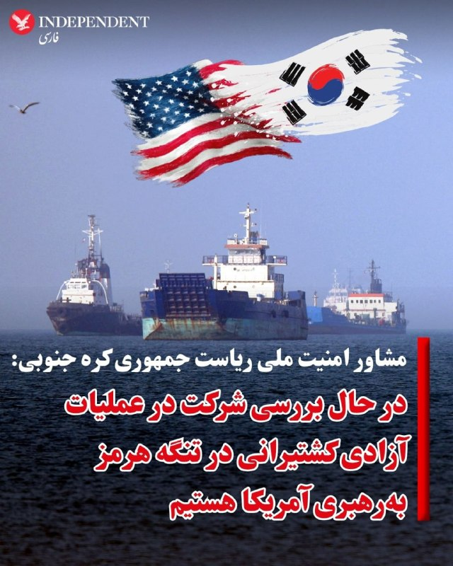

♦️کیم یونگ هیون، مشاور امنیت ملی ریاست جمهوری کره جنوبی، روز چهارشنبه ۲۳ اردیبهشت ماه اعلام کرد این کشور در حال بررسی شرکت در عملیات بازگشایی تنگه هرمز و آزادی کشتیرانی در این آبراهه راهبردی به رهبری ایالات متحده آمریکا است.

این موضع در حالی اظهار می‌شود که هفته گذشته و پس از برخورد دو پهپاد به یک کشتی باری کره جنوبی در زمان عبور از تنگه هرمز، دونالد ترامپ به سئول پیشنهاد کرد تا به «پروژه آزادی» تنگه هرمز بپیوندد.

وزارت امور خارجه کره جنوبی دو روز پیش با انتشار گزارشی اعلام کرد هنوز نمی‌تواند با اطمینان بگوید که این پهپادها از سوی ایران شلیک شده بودند یا نه.
‌🇸🇦 Indypersian

🤖 @VahidOOnLine

## VahidOOnLine — post 239854

  

رسانه‌های حکومتی بامداد امروز از اعدام احسان افراشته خبر دادند.

قوه قضاییه جمهوری اسلامی اعلام کرده احسان افراشته، فرزند مصطفی، با اتهام‌هایی از جمله «جاسوسی» و «همکاری اطلاعاتی به نفع اسرائیل» بازداشت، محاکمه و پس از تایید حکم در دیوان عالی کشور اعدام شده است.

با این حال، نهادهای حقوق بشری و منابع مستقل پیش‌تر گزارش داده بودند که احسان افراشته ماه‌ها در سلول انفرادی نگهداری شده و اعترافات او تحت فشار و در شرایطی غیرشفاف اخذ شده است. همچنین گزارش‌هایی درباره محرومیت او از دسترسی مؤثر به وکیل مستقل و وجود فشارهای امنیتی در روند پرونده منتشر شده بود.

بر اساس اصول دادرسی عادلانه، هر اعترافی که تحت فشار، تهدید یا شکنجه گرفته شود فاقد اعتبار حقوقی است و متهم، به‌ویژه در پرونده‌های منتهی به مجازات اعدام، باید از حق دسترسی کامل به وکیل مستقل و دادگاه بی‌طرف برخوردار باشد.

پرونده احسان افراشته از سوی نهادهای حقوق بشری نمونه‌ای از استفاده از اتهام‌های امنیتی و مجازات اعدام در فضایی غیرشفاف توصیف شده؛ روندی که سال‌هاست درباره عملکرد دادگاه‌های انقلاب جمهوری اسلامی مورد انتقاد قرار دارد.
‌🏁 🇬🇧 ManotoTV

🤖 @VahidOOnLine

## WithYashar — post 11111

الجزیره: منابع دیپلماتیک می‌گویند که ۱۱۲ کشور هم‌اکنون از پیش‌نویس قطعنامه پیشنهادی آمریکا به شورای امنیت سازمان ملل درباره تنگه هرمز حمایت می‌کنند.
@withyashar

## WithYashar — post 11110

کیهان: اگر مذاکره کنیم جنگ می‌شود؛ مذاکره نکنیم جنگ نمی‌شود
@withyashar

## WithYashar — post 11109

ویزای ۵ ستاره عراق برای جام جهانی رد شد!
آمریکا در تازه‌ترین اقدام خود در آستانه جام‌جهانی ۲۰۲۶ ویزای ۵ بازیکن کلیدی تیم ملی عراق از جمله علی الحمادی (ستاره لوتون تاون)، مهند علی و حیدر عبدالکریم را رد کرد.
@withyashar

## kianmeli1 — post 87375

‏🔴قوه قضاییه جمهوری اسلامی اعلام کرد که احسان افرشته به اتهام «همکاری با اسرائیل»، بامداد چهارشنبه اعدام شد
https://t.me/kianmeli1

## IranIntlTV — post 336932

  <a href="telegram/content/IranIntlTV_336932_1778652727.mp4" target="_blank">🎬 Download video</a>

امیر حمیدی، متخصص امنیت ملی، گفت تهران برای پکن یک متحد ایدئولوژیک نیست و چین از جمهوری اسلامی در روابط خود با ایالات متحده به‌عنوان یک کارت راهبردی استفاده می‌کند. او تاکید کرد چین حاضر نخواهد شد به‌خاطر جمهوری اسلامی وارد رویارویی خصمانه با آمریکا شود.
@iranintltv

## IranIntlTV — post 336931

  <a href="telegram/content/IranIntlTV_336931_1778652729.mp4" target="_blank">🎬 Download video</a>

وزارت کشور کویت اعلام کرد ۴ عضو سپاه پاسداران را هنگام تلاش برای ورود دریایی به این کشور بازداشت کرده است. وزارت خارجه کویت نیز اعلام کرد در همین رابطه، سفیر جمهوری اسلامی را احضار کرده است.

تروسکه صادقی، خبرنگار ایران‌اینترنشنال، گزارش می‌دهد
@iranintltv

## IranIntlTV — post 336930

  <a href="telegram/content/IranIntlTV_336930_1778652731.mp4" target="_blank">🎬 Download video</a>

دونالد ترامپ، رییس‌جمهوری آمریکا، پس از ۹ سال وارد چین می‌شود تا با شی جین‌پینگ، رهبر این کشور، دیدار و گفت‌وگو کند. بسیاری از تحلیل‌گران و رسانه‌های بین‌المللی می‌گویند پیامدهای جنگ با جمهوری اسلامی، به‌صورت مستقیم و غیرمستقیم، بر این دیدار سایه انداخته است.

توماج طاهباز ، خبرنگار ایران‌اینترنشنال، گزارش می‌دهد
@iranintltv

## IranIntlTV — post 336929

  <a href="telegram/content/IranIntlTV_336929_1778652732.mp4" target="_blank">🎬 Download video</a>

استرالیا هم‌زمان با افزایش تنش‌ها در خاورمیانه، از آغاز یک مشارکت نظامی تازه برای حفاظت از حریم هوایی و امنیت کشتیرانی در منطقه خبر داد. وزیر دفاع استرالیا گفت اعزام هواپیمای پیشرفته «آواکس» می‌تواند به تضمین آزادی کشتیرانی در تنگه هرمز و امنیت تجارت بین‌المللی کمک کند.

علیرضا محبی، خبرنگار ایران‌اینترنشنال، گزارش می‌دهد
@iranintltv

## ManotoTV — post 105385

  

رسانه‌های حکومتی بامداد امروز از اعدام احسان افراشته خبر دادند.

قوه قضاییه جمهوری اسلامی اعلام کرده احسان افراشته، فرزند مصطفی، با اتهام‌هایی از جمله «جاسوسی» و «همکاری اطلاعاتی به نفع اسرائیل» بازداشت، محاکمه و پس از تایید حکم در دیوان عالی کشور اعدام شده است.

با این حال، نهادهای حقوق بشری و منابع مستقل پیش‌تر گزارش داده بودند که احسان افراشته ماه‌ها در سلول انفرادی نگهداری شده و اعترافات او تحت فشار و در شرایطی غیرشفاف اخذ شده است. همچنین گزارش‌هایی درباره محرومیت او از دسترسی مؤثر به وکیل مستقل و وجود فشارهای امنیتی در روند پرونده منتشر شده بود.

بر اساس اصول دادرسی عادلانه، هر اعترافی که تحت فشار، تهدید یا شکنجه گرفته شود فاقد اعتبار حقوقی است و متهم، به‌ویژه در پرونده‌های منتهی به مجازات اعدام، باید از حق دسترسی کامل به وکیل مستقل و دادگاه بی‌طرف برخوردار باشد.

پرونده احسان افراشته از سوی نهادهای حقوق بشری نمونه‌ای از استفاده از اتهام‌های امنیتی و مجازات اعدام در فضایی غیرشفاف توصیف شده؛ روندی که سال‌هاست درباره عملکرد دادگاه‌های انقلاب جمهوری اسلامی مورد انتقاد قرار دارد.

## DW_Farsi — post 124634

  

🔶 وزیر دفاع آمریکا: به اندازه کافی موشک و مهمات داریم
 
پیت هگست، وزیر دفاع آمریکا گمانه‌زنی‌ها در مورد "کاهش شدید" ذخایر موشکی و مهمات ایالات متحده را کم‌اهمیت جلوه داد.
 
او روز سه‌شنبه ۱۲ مه (۲۲ اردیبهشت) در جلسه استماع بودجه در کنگره این کشور تصریح کرد: «ما دقیقا می‌دانیم که از چه [تسلیحاتی] برخوردار هستیم. ما به اندازه کافی آنچه را که به آن نیازمندیم در دست داریم.»
 
رئیس پنتاگون بحث و گمانه‌زنی‌ها در مورد میزان ذخایر تسلیحاتی آمریکا را "ناسودمند و مبالغه‌آمیز" دانست.
 
ژنرال دن کین، رئیس ستاد مشترک نیروهای مسلح آمریکا که در جلسه استماع حضور داشت نیز تأکید کرد که مراکز فرماندهی‌ منطقه‌ای ارتش ایالات متحده میزان ذخایر جنگی و مهمات برای انجام مأموریت کنونی را "کافی" اعلام کرد‌ه‌اند.
 
مارک کلی، سناتور دموکرات آمریکایی، به تازگی تصریح کرده بود که جنگ ایران باعث تضعیف ایالات متحده شده و ذخایر مهمات و موشک‌های ارتش این کشور به‌شدت کاهش یافته است.
 
این فضانورد پیشین و کهنه‌سرباز جنگ عراق افزود که دونالد ترامپ ایالات متحده را وارد جنگی "بدون هدف راهبردی، بی‌‌برنامه و بدون جدول زمانی" کرده است.
@dw_farsi

## DW_Farsi — post 124633

  

🔶 چین خواهان افزایش تلاش‌های میانجی‌گرانه پاکستان در جنگ ایران شد
 
به گزارش شین‌هوا، خبرگزاری دولتی چین، وانگ یی، وزیر امور خارجه این کشور در گفت‌وگو با اسحاق دار، همتای پاکستانی خود از اسلام‌آباد خواست تا تلاش‌های میانجی‌گرانه خود میان تهران و واشنگتن برای فیصله دادن به جنگ ایران را افزایش دهد.
 
وزیر خارجه چین این خواست را سه‌شنبه ۱۲ مه (۲۲ اردیبهشت) پیش از سفر دونالد ترامپ، رئیس جمهور آمریکا به پکن مطرح کرد.
 
بنا بر این گزارش، وانگ یی در دیدار با وزیر خارجه پاکستان همچنین تصریح کرد، اسلام‌آباد باید به طور شایسته و مناسب به مسائل مربوط به بازگشایی تنگه هرمز بپردازد.
 
شین‌هوا همچنین گزارش داد که وزیر خارجه چین در تماس تلفنی خود با اسحاق دار تصریح کرد که پکن از اسلام‌آباد در راستای تلاش‌های میانجی‌گرانه پاکستان پشتیبانی خواهد کرد.
 
چین که از خریداران مهم نفت جمهوری اسلامی است، خواهان یافتن راه‌حلی دائمی برای پایان جنگ ایران است.
 
@dw_farsi

## DW_Farsi — post 124632

  

🔶 وزارت دفاع آمریکا: هزینه جنگ با ایران به حدود ۲۹ میلیارد دلار رسیده است
 
وزارت دفاع ایالات متحده، پنتاگون، در تازه‌ترین ارزیابی خود هزینه‌ آمریکا در جنگ با ایران را ۲۹ میلیارد دلار اعلام کرد.
 
مقامات این وزارتخانه این آمار جدید را سه‌شنبه ۱۲ مه (۲۲ اردیبهشت) در جلسه استماع بودجه در کنگره ارائه کردند. این رقم اعلام شد، حدود ۴ میلیارد دلار بیشتر از مبلغی است که پیت هگست، وزیر دفاع آمریکا پیشتر در اواخر ماه آوریل اعلام کرده بود.
 
جولز هرست، رئیس امور مالی وزارت دفاع آمریکا که در این جلسه حضور داشت ضمن اشاره به ارزیابی اولیه هگست در کنگره گفت، تخمین نخستین که در ۲۹ آوریل اعلام شد، بر ۲۵ میلیارد دلار بالغ می‌شده، اما این رقم با توجه به به‌روزرسانی‌ "هزینه‌های تعمیرات و جایگزینی تجهیزات" اکنون ۲۹ میلیارد دلار برآورد می‌شود.
 
پنتاگون در حال حاضر تلاش می‌کند افزایش قابل‌توجهی را برای بودجه دفاعی به تصویب برساند. لایحه بودجه دولت ترامپ برای سال مالی ۲۰۲۷ حدود یک و نیم تریلیون دلار هزینه دفاعی پیش‌بینی کرده است.
@dw_farsi

## RadioFarda — post 157115

  

🔸در پی زمین‌لرزه‌ها و پس‌لرزه‌هایی که شامگاه سه‌شنبه ۲۲ اردیبهشت در شرق تهران رخ داد، یک استاد پژوهشکدهٔ زلزله‌شناسی در مورد فعال بودن گسل‌های نزدیک پردیس و بومهن هشدار داد.

🔸مهدی زارع به خبرگزاری خبرآنلاین گفت: «وقوع دومین زمین‌لرزه با بزرگای بیش از ۴ از ابتدای سال ۱۴۰۵، نشان‌دهندهٔ تداوم آزادسازی انرژی در محل تلاقی ساختارهای مهم زمین‌ساختی است.»

🔸این زلزله‌شناس همچنین تأکید کرد که منطقهٔ پردیس و بومهن در پهنهٔ برخورد البرز مرکزی قرار دارد و «تحت تأثیر مستقیم فعالیت گسل بسیار مهم و خطرناک شمال تهران و گسل مُشا است».

🔸مهدی زارع همچنین گفت «با توجه به بارگذاری جمعیتی بالا در مسکن مهر پردیس و ساخت‌وسازهای گسترده در ارتفاعات، تاب‌آوری لرزه‌ای سازه‌ها در برابر شتاب‌های افقی و قائم ناشی از فعالیت گسل مشا بسیار حائز اهمیت است».

🔸براساس سرشماری سال ۱۳۹۵ و تخمین‌های پس از آن، جمعیت دو شهر پردیس و بوهمن نزدیک به ۲۰۰ هزار نفر اعلام شده است.

@RadioFarda

## BBCPersian — post 280886

  

🔻رسانه‌های دولتی لبنان می‌گویند حملات هوایی اسرائیل حداقل ۱۳ نفر را در جنوب لبنان کشته است که دو نفرشان از کارکنان اورژانس بوده‌اند.

به گزارش خبرگزاری ملی لبنان، طی ۲۴ ساعت گذشته، شش نفر در اثر اصابت گلوله به خانه‌ای در کفر دونین کشته و هفت نفر دیگر زخمی شدند.

بعد از ظهر سه‌شنبه، وزارت بهداشت لبنان اعلام کرد که دو امدادگر از سرویس اورژانس دفاع مدنی لبنان که توسط دولت اداره می‌شود، در حمله اسرائیل به نبطیه کشته و یک نفر دیگر زخمی شده است. بر اساس این گزارش، آنها در حال انجام ماموریتی در پاسخ به حمله قبلی بودند که منجر به کشته شدن یک نفر شد.

ارتش اسرائیل اعلام کرد که در حال بررسی گزارش‌ها است.

جوزف عون، رئیس جمهور لبنان، «غم و اندوه و تأسف خود را از کشته شدن دو عضو دفاع مدنی» در نبطیه به نام‌های حسین جابر و احمد نوره ابراز کرد و تأکید کرد که «تجاوز مداوم اسرائیل مانع تلاش‌ها برای برقراری آرامش می‌شود».

وزارت بهداشت لبنان نیروهای اسرائیلی را به هدف قرار دادن عمدی امدادگران متهم کرد.

📷EPA
@BBCPersian

## idfinfarsi — post 11565

  <a href="telegram/content/idfinfarsi_11565_1778652738.mp4" target="_blank">🎬 Download video</a>

سخنگوی ارتش اسرائیل:

⭕️مستندی از داخل تانک تیپ ۴۰۱: به هلاکت رساندن یک تروریست که تجهیزات دیده‌بانی علیه نیروهای ما را به‌کار گرفته بود

⭕️نیروهای تیم رزمی تیپ ۴۰۱ تحت فرماندهی لشکر ۱۴۶، به عملیات خود در جنوب خط دفاعی مقدم ادامه می‌دهند تا زیرساخت‌های تروریستی سازمان تروریستی حزب‌الله را نابود کنند، با هدف رفع تهدیدها علیه شهروندان کشور اسرائیل.

⭕️در جریان این فعالیت، نیروها یک تروریست را شناسایی کردند که در حال به‌کارگیری تجهیزات دیده‌بانی علیه نیروهای ما بود. در یک واکنش سریع، تروریست با شلیک تانک به هلاکت رسید.

## manototv — post 105385

  

رسانه‌های حکومتی بامداد امروز از اعدام احسان افراشته خبر دادند.

قوه قضاییه جمهوری اسلامی اعلام کرده احسان افراشته، فرزند مصطفی، با اتهام‌هایی از جمله «جاسوسی» و «همکاری اطلاعاتی به نفع اسرائیل» بازداشت، محاکمه و پس از تایید حکم در دیوان عالی کشور اعدام شده است.

با این حال، نهادهای حقوق بشری و منابع مستقل پیش‌تر گزارش داده بودند که احسان افراشته ماه‌ها در سلول انفرادی نگهداری شده و اعترافات او تحت فشار و در شرایطی غیرشفاف اخذ شده است. همچنین گزارش‌هایی درباره محرومیت او از دسترسی مؤثر به وکیل مستقل و وجود فشارهای امنیتی در روند پرونده منتشر شده بود.

بر اساس اصول دادرسی عادلانه، هر اعترافی که تحت فشار، تهدید یا شکنجه گرفته شود فاقد اعتبار حقوقی است و متهم، به‌ویژه در پرونده‌های منتهی به مجازات اعدام، باید از حق دسترسی کامل به وکیل مستقل و دادگاه بی‌طرف برخوردار باشد.

پرونده احسان افراشته از سوی نهادهای حقوق بشری نمونه‌ای از استفاده از اتهام‌های امنیتی و مجازات اعدام در فضایی غیرشفاف توصیف شده؛ روندی که سال‌هاست درباره عملکرد دادگاه‌های انقلاب جمهوری اسلامی مورد انتقاد قرار دارد.

## alonews — post 119641

  <a href="telegram/content/alonews_119641_1778652740.webm" target="_blank">🎬 Download video</a>

👈کاخ سفید در ابتدا فهرست مهمانان رسمی را منتشر کرد که مدیرعامل انویدیا، جنسن هوانگ، در آن نبود، اما طبق گزارش پولیتیکو، رئیس‌جمهور ترامپ در توقف سوخت‌گیری در آلاسکا دعوتی در آخرین لحظه به او داد.

✅ @AloNews خبر جنگ

## alonews — post 119640

  <a href="telegram/content/alonews_119640_1778652740.webm" target="_blank">🎬 Download video</a>

👈سخنگوی CIA، لیز لایونز، گزارش سی‌ان‌ان مبنی بر اینکه سیا مستقیماً در ترورهای هدفمند عوامل کارتل‌ها در مکزیک درگیر است را رد کرد.

🔴این گزارش کذب و توهین‌آمیز است و هیچ‌چیز جز یک کمپین روابط عمومی برای کارتل‌ها نیست و جان آمریکایی‌ها را به خطر می‌اندازد.

✅ @AloNews خبر جنگ

## alonews — post 119639

  <a href="telegram/content/alonews_119639_1778652740.webm" target="_blank">🎬 Download video</a>

👈ترامپ مجدداً تأکید کرد که آمریکا برای پایان دادن به جنگ ایران نیازی به کمک ندارد و تأکید کرد که آمریکا یا به‌صورت مسالمت‌آمیز یا به روش‌های دیگر پیروز خواهد شد.

✅ @AloNews خبر جنگ

## alonews — post 119638

  <a href="telegram/content/alonews_119638_1778652741.webm" target="_blank">🎬 Download video</a>

👈آواکس امریکا درحال رصد مرزهای جنوبی و خلیج فارس

✅ @AloNews خبر جنگ

## alonews — post 119637

  <a href="telegram/content/alonews_119637_1778652741.webm" target="_blank">🎬 Download video</a>

👈آخرین قیمت نفت ۱۰۶.۳۰ دلار

✅ @AloNews خبر جنگ

## alonews — post 119636

  <a href="telegram/content/alonews_119636_1778652741.webm" target="_blank">🎬 Download video</a>

👈سی‌ان‌ان: اختلال در تأسیسات نفتی خاورمیانه تهدیدی جدید برای جیب مالیات‌دهندگان آمریکایی

🔴مقامات وزارت انرژی آمریکا پیش‌بینی کرده‌اند که قیمت نفت احتمالاً در هفته‌های آینده بالای ۱۰۰ دلار در هر بشکه باقی خواهد ماند. طبق جدیدترین برآورد اداره اطلاعات انرژی آمریکا (EIA)، میانگین قیمت خرده‌فروشی بنزین امسال به ۳.۸۸ دلار در هر گالن خواهد رسید و سال آینده ۳.۶۲ دلار پیش‌بینی می‌شود

✅ @AloNews خبر جنگ

## alonews — post 119635

  <a href="telegram/content/alonews_119635_1778652741.mp4" target="_blank">🎬 Download video</a>

👈لحظه فرود هواپیمای غول‌پیکر نظامی سی-۱۷ آمریکا در پکن در آستانه سفر ترامپ به چین

🔴احتمال این هواپیما حامل تجهیزات امنیتی، تیم‌های حفاظتی و دیگر دستگاه‌ها و موارد پشتیبانی برای  آماده‌سازی‌های ویژه برای این سفر دیپلماتیک ایجاد کرده است.

🔴هواپیمای سی-۱۷ یکی از بزرگ‌ترین هواپیماهای ترابری راهبردی ارتش آمریکا به‌شمار می‌رود و توانایی حمل تجهیزات سنگین نظامی، نیرو و سامانه‌های پشتیبانی ویژه را دارد.

✅ @AloNews خبر جنگ

<!-- MSG END -->

<!-- NAV START -->

<!-- NAV END -->
