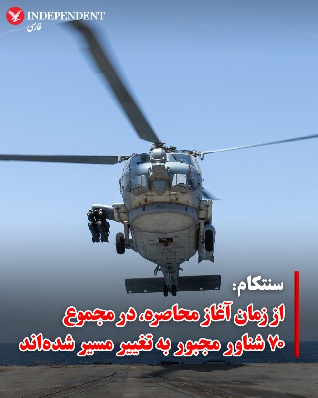
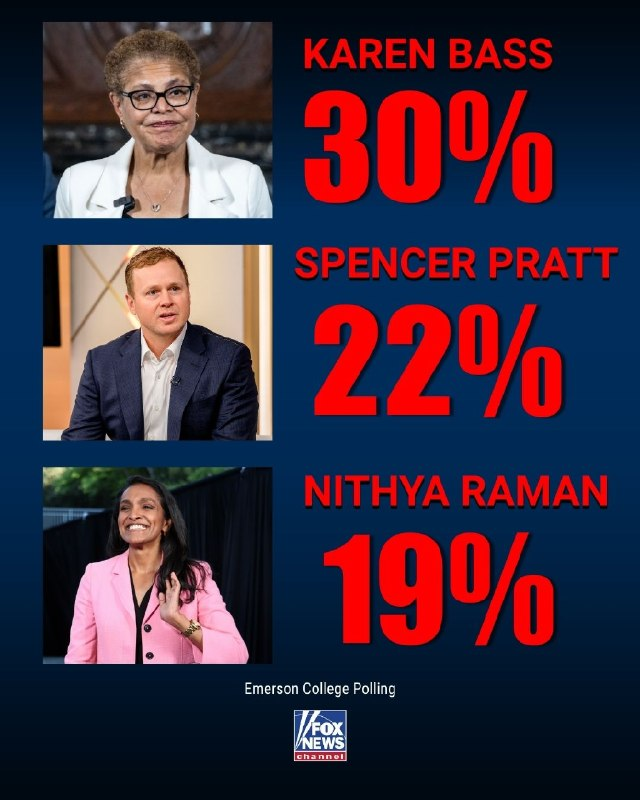
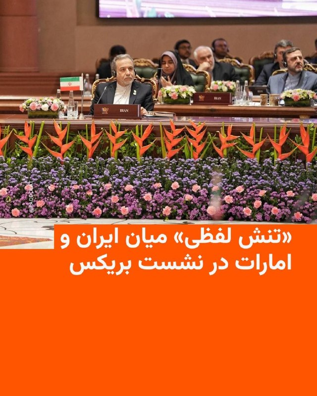
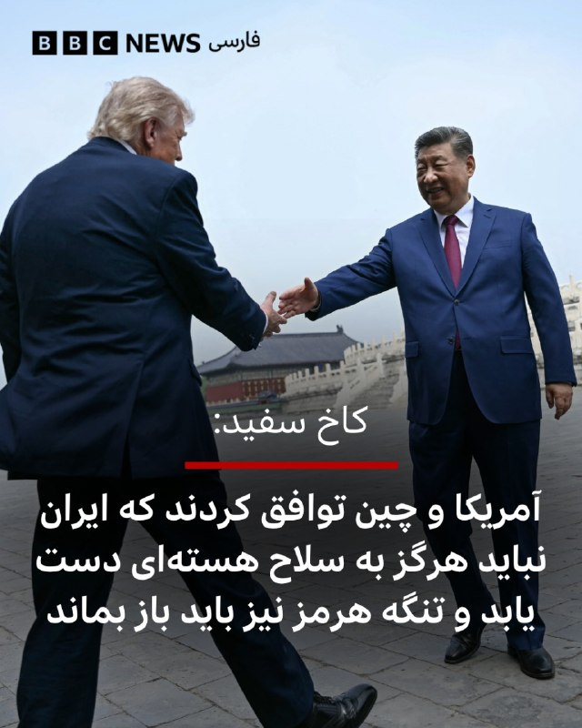
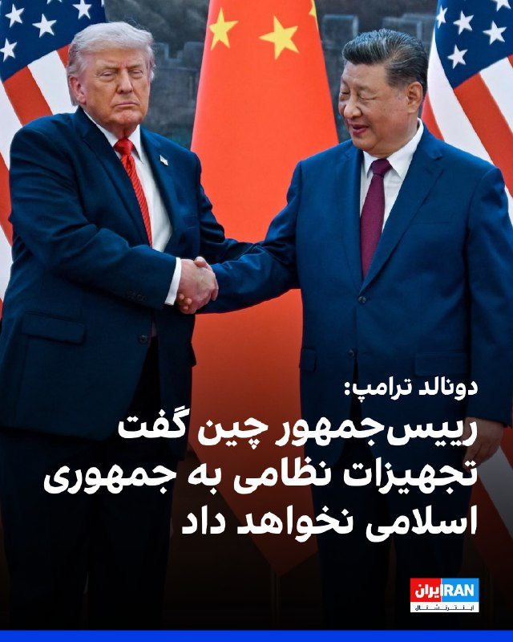
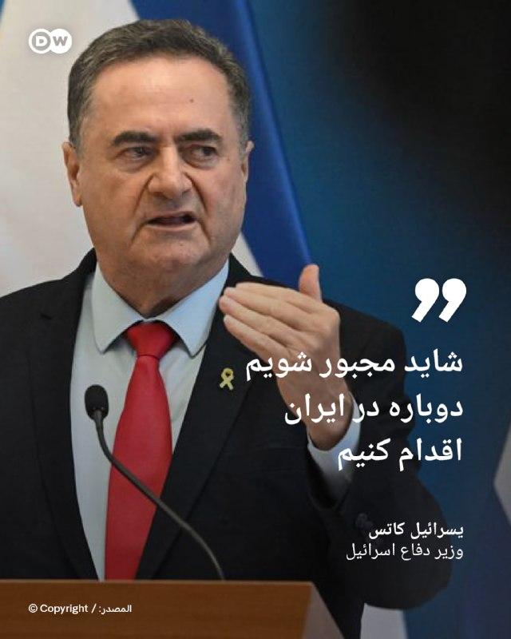
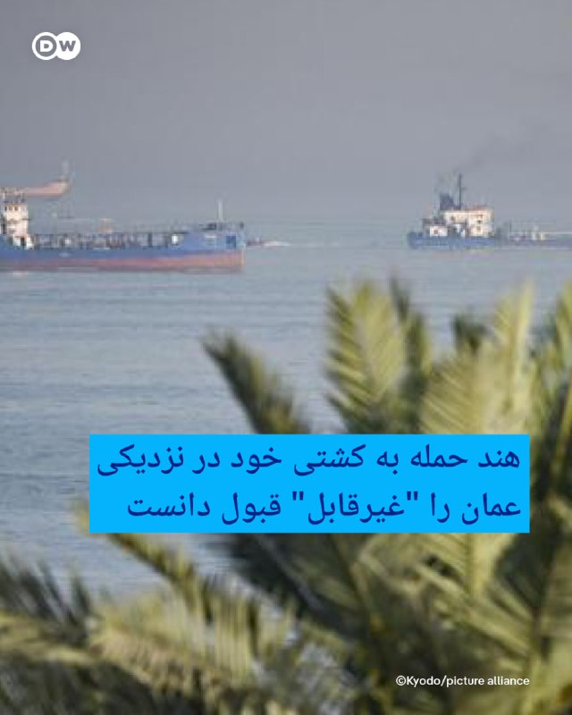
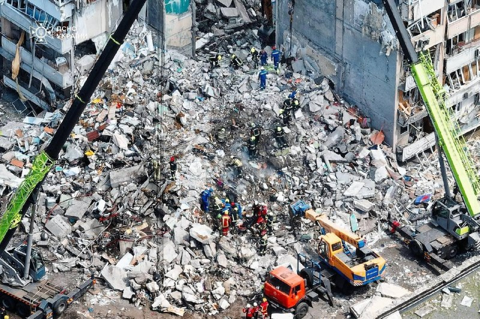

# خواننده تلگرام

<!-- TOP_NAV START -->

<a href="https://github.com/keihancpu/aio-downloader/blob/main/telegram/content/archive_1.md" style="display:inline-block; padding:6px 12px; margin:0 4px; background-color:#2ea44f; color:white; text-decoration:none; border-radius:4px; font-weight:bold;">صفحه بعد</a>

<!-- TOP_NAV END -->

<!-- MSG START -->

---
📅 بروزرسانی: 1405/02/24 20:01
---

## VahidOOnLine — post 240153

  <a href="telegram/content/VahidOOnLine_240153_1778776311.mp4" target="_blank">🎬 Download video</a>

دونالد ترامپ در گفت‌وگو با شان هنیتی گفت شی جین‌پینگ، رئیس‌جمهوری چین، متعهد شده به جمهوری اسلامی تجهیزات نظامی ارائه نکند.

ترامپ گفت: «او گفت قرار نیست تجهیزات نظامی بدهد؛ این حرف بزرگی است.»

رئیس‌جمهوری آمریکا در ادامه افزود چین همچنان بخش زیادی از نفت خود را از ایران خریداری می‌کند و مایل است این روند ادامه پیدا کند.

ترامپ همچنین گفت شی جین‌پینگ خواهان باز ماندن تنگه هرمز و جلوگیری از اختلال در عبور و مرور کشتی‌هاست.
‌🏁 🇬🇧 ManotoTV

🤖 @VahidOOnLine

## VahidOOnLine — post 240152

  

اکسیوس در گزارشی درباره ایران نوشت که مقام‌های آمریکایی انتظار ندارند دونالد ترامپ در جریان سفرش به چین اقدام چشمگیری در مورد جمهوری اسلامی انجام دهد، اما معتقدند او ممکن است بلافاصله پس از پایان این سفر تصمیم بعدی خود را اتخاذ کند.

براساس این گزارش یکی از گزینه‌های مورد بررسی ازسرگیری «پروژه آزادی» است؛ طرحی که در آن نیروی دریایی آمریکا تلاش می‌کند بن‌بست ایجاد شده در تنگه هرمز را بشکند.

به گزارش اکسیوس، گزینه دیگر آغاز کارزار جدید بمباران با تمرکز بر زیرساخت‌های ایران است.

مقام‌های اسرائیلی نیز گفته‌اند در صورت تصمیم ترامپ برای ازسرگیری جنگ، در آخر هفته جاری در وضعیت آماده‌باش کامل خواهند بود.
‌🏁 🇬🇧 IranintlTV

🤖 @VahidOOnLine

## VahidOOnLine — post 240151

♦️دونالد ترامپ، رئیس‌جمهوری آمریکا که به چین سفر کرده، روز پنجشنبه همراه با شی جین‌پینگ،‌ رئیس‌جمهوری چین برای بازدید از معبد بهشت ​​در پکن که بیش از ۵۰۰ سال قدمت دارد، وارد این معبد تاریخی شد.
او در توری اختصاصی همراه با شی در جریان جزئیاتی از این معبد قرار گرفت.
دونالد ترامپ، رئیس جمهوری ایالات متحده آمریکا شامگاه پنجشنبه ۲۴ اردیبهشت (به وقت محلی) و در جریان ضیافت شام شی جین‌پینگ، گفتگوها با رئیس‌جمهوری چین را «فوق‌العاده مثبت و سازنده» توصیف کرد.
‌🇸🇦 Indypersian

🤖 @VahidOOnLine

## VahidOOnLine — post 240150

  

دونالد ترامپ در گفت‌وگو با فاکس‌نیوز گفت رییس‌جمهور چین خواهان باز ماندن تنگه هرمز و دستیابی به توافق است و پیشنهاد داده برای تحقق آن به هر شکل ممکن کمک کند.
ترامپ افزود شی جین‌پینگ به او گفته چین هیچ‌گونه تجهیزات نظامی در اختیار جمهوری اسلامی قرار نخواهد داد.
‌🏁 🇬🇧 IranintlTV

🤖 @VahidOOnLine

## VahidOOnLine — post 240149

  <a href="telegram/content/VahidOOnLine_240149_1778776313.mp4" target="_blank">🎬 Download video</a>

♦️دونالد ترامپ، رئیس‌جمهوری آمریکا، در مصاحبه با شان هنیتی از فاکس نیوز گفت که شی جین‌پینگ، رئیس‌جمهور چین، برای همکاری در پرونده ایران و بازگشایی تنگه هرمز اعلام آمادگی کرده است. ترامپ تاکید کرد که شی تمایل دارد شاهد دستیابی به یک توافق باشد و به‌طور مشخص پیشنهاد داده است که در این زمینه هرگونه کمک لازم را ارائه دهد.

رئیس‌جمهور آمریکا با اشاره به حجم بالای خرید نفت چین از ایران، خاطرنشان کرد که پکن به‌دلیل این رابطه اقتصادی، نفوذ قابل‌توجهی دارد. به گفته ترامپ، رهبر چین بر تمایل خود برای بازگشایی تنگه هرمز تاکید کرده و گفته است: «اگر هر کمکی از دستم بربیاید، مشتاقم که انجام دهم».
‌🇸🇦 Indypersian

🤖 @VahidOOnLine

## VahidOOnLine — post 240148

  

♦️عباس عراقچی، وزیر خارجه جمهوری اسلامی روز پنجشنبه ۲۴ اردیبهشت با اشاره به تنش‌ها میان تهران و واشنگتن تاکید کرد که «آمریکا راه حل اختلاف با ایران را در جایی غیر از میدان نظامی جست‌وجو کند.»
عباس عراقچی در حاشیه دیدارهای خود با همتایانش در بریکس در واکنش به تهدیدهای مقامات آمریکایی و اسرائیلی مبنی بر از سرگیری حملات به ایران به‌محض بازگشت رئیس‌جمهوری آمریکا از چین گفت: «آن‌ها مدت‌هاست که به اشکال و شیوه‌های مختلف تهدیدهای خود را تکرار می‌کنند، اما خودشان نیز می‌دانند که از این تهدیدها و حتی از جنگی که به راه انداختند، هیچ نتیجه‌ای نگرفته‌اند و نخواهند گرفت.»
عراقچی با تاکید بر اینکه «ایران در برابر تهدیدها محکم ایستاده و سر خم نمی‌کند.» افزود: «راه‌حل در تهدید کردن نیست.»
وزیر خارجه جمهوری اسلامی در ادامه با ابراز امیدواری از تغییر نگاه مقام‌های آمریکایی به موضوعات مربوط به ایران تاکید کرد: «اگرچه امید نیست که به منطق روی آورند ولی بدانند که راه‌حل مسائل را باید در جایی غیر از میدان نظامی جست‌وجو کنند، زیرا از این مسیر به هیچ نتیجه‌ای نخواهند رسید.»
‌🇸🇦 Indypersian

🤖 @VahidOOnLine

## VahidOOnLine — post 240147

  

حمید رسایی، نماینده تهران در مجلس، نوشت جریانی «شناخته‌شده» در دولت چهاردهم که راه‌حل را «آزاد کردن و گران کردن» می‌داند، قصد دارد سهمیه بنزین هزار و ۵۰۰ تومانی و سه هزار تومانی را کاهش دهد و قیمت بنزین پنج هزار تومانی را به ۱۵ تا ۲۰ هزار تومان افزایش دهد.

او افزود همان جریان در دولت چهاردهم پیش‌تر با حذف ارز ترجیحی ۲۸ هزار و ۵۰۰ تومانی و گران کردن ارز، به گفته او، «بالاترین تورم پس از انقلاب ۵۷» را به مردم تحمیل کرده بود.

رسایی نوشت محمدباقر قالیباف با «پلمپ کردن بدون توجیه و دلیل مجلس»، راه نظارت نمایندگان بر تصمیمات دولت را بسته است. او افزود انجام تکلیف نمایندگی سخت شده، اما تلاش می‌کند مجلس را از این «مرگ تعمدی» بیرون بیاورد و جلوی این تصمیمات «عجیب» را در موقعیت «سخت و جنگی» فعلی بگیرد.
‌🏁 🇬🇧 IranintlTV

🤖 @VahidOOnLine

## VahidOOnLine — post 240146

  <a href="telegram/content/VahidOOnLine_240146_1778776316.mp4" target="_blank">🎬 Download video</a>

‌
دونالد ترامپ، رئیس‌جمهوری آمریکا، در گفت‌و‌گو با شان هنیتی، خبرنگار و مجری فاکس‌نیوز گفت شی جین‌پینگ، رئیس‌جمهوری چین، خواهان دستیابی به توافق و باز ماندن تنگه هرمز است.

ترامپ گفت: «رئیس‌جمهوری شی دوست دارد توافقی حاصل شود. او گفت اگر بتواند کمکی بکند، مایل است کمک کند.»

رئیس‌جمهوری آمریکا همچنین با اشاره به خرید نفت ایران از سوی چین افزود: «هر کسی که این مقدار نفت می‌خرد، بدیهی است نوعی رابطه دارد.»

ترامپ در ادامه گفت شی جین‌پینگ مایل است تنگه هرمز باز بماند.
‌🏁 🇬🇧 ManotoTV

🤖 @VahidOOnLine

## VahidOOnLine — post 240145

  <a href="telegram/content/VahidOOnLine_240145_1778776317.mp4" target="_blank">🎬 Download video</a>

مارکو روبیو، وزیر خارجه آمریکا، گفت دونالد ترامپ موضوع ایران را در گفت‌وگو با مقام‌های چین مطرح کرده و این موضوع «اهمیت زیادی» داشته است.

روبیو گفت طرف چینی اعلام کرده با «نظامی‌سازی تنگه هرمز» و همچنین ایجاد سیستم دریافت عوارض از کشتی‌ها در این آبراه مخالف است.

وزیر خارجه آمریکا افزود: «این موضع ما هم هست.»
‌🏁 🇬🇧 ManotoTV

🤖 @VahidOOnLine

## VahidOOnLine — post 240144

  

برد کوپر، فرمانده ستاد فرماندهی مرکزی آمریکا (سنتکام)، در جلسه کمیته نیروهای مسلح سنای آمریکا گفت در ۳۰ ماه منتهی به عملیات «خشم حماسی»، گروه‌های مورد حمایت جمهوری اسلامی بیش از ۳۵۰ بار به نیروها و دیپلمات‌های آمریکایی حمله کرده‌اند؛ به‌طور میانگین بیش از یک حمله در هر سه روز.
او افزود این حملات به کشته شدن چهار نظامی آمریکایی و زخمی شدن نزدیک به ۲۰۰ نفر انجامیده است.

فرمانده سنتکام همچنین گفت امروز حماس، حزب‌الله و حوثی‌ها از پشتیبانی و تامین تسلیحاتی جمهوری اسلامی محروم شده‌اند.
‌🏁 🇬🇧 IranintlTV

🤖 @VahidOOnLine

## VahidOOnLine — post 240143

♦️برد کوپر، فرمانده سنتکام، روز پنجشنبه ۲۴ اردیبهشت در جلسه استماع کمیته نیروهای مسلح سنا یادآوری کرد که فرماندهی مرکزی ایالات متحده (سنتکام) در پاسخ مستقیم به تهدیدهای ناشی از جمهوری اسلامی ایران تاسیس شده است. او با اشاره به ۴۷ سال خصومت تهران با آمریکا، تاکید کرد که تنها در ۳۰ ماه پیش از آغاز عملیات «حکم حماسی»، گروه‌های نیابتی ایران بیش از ۳۵۰ بار به نیروها و دیپلمات‌های آمریکایی حمله کرده‌اند.

کوپر گفت که سنتکام به دستور رئیس‌جمهور و در قالب عملیات «خشم حماسی»، در کمتر از ۴۰ روز به اهداف نظامی خود دست یافت. به گفته او، مهم‌ترین دستاورد این عملیات تضعیف توان قدرت‌نمایی ایران در خارج از مرزها بوده است؛ به‌گونه‌ای که جمهوری اسلامی دیگر قادر نیست حملاتی در ابعاد وسیع مشابه آنچه در سال ۲۰۲۴ در جریان اولین حمله مستقیم به خاک اسرائیل رخ داد، انجام دهد. فرمانده سنتکام تاکید کرد که با نابودی ۹۰ درصد از زیرساخت‌های صنایع دفاعی ایران، این کشور تا سال‌ها توان بازسازی تسلیحات خود را نخواهد داشت.
‌🇸🇦 Indypersian

🤖 @VahidOOnLine

## VahidOOnLine — post 240142

  

برد کوپر، فرمانده ستاد فرماندهی مرکزی آمریکا (سنتکام)، در جلسه کمیته نیروهای مسلح سنای آمریکا گفت در ۳۰ ماه منتهی به عملیات «خشم حماسی»، گروه‌های مورد حمایت جمهوری اسلامی بیش از ۳۵۰ بار به نیروها و دیپلمات‌های آمریکایی حمله کرده‌اند؛ به‌طور میانگین بیش از یک حمله در هر سه روز.
او افزود این حملات به کشته شدن چهار نظامی آمریکایی و زخمی شدن نزدیک به ۲۰۰ نفر انجامیده است.

فرمانده سنتکام همچنین گفت امروز حماس، حزب‌الله و حوثی‌ها از پشتیبانی و تامین تسلیحاتی جمهوری اسلامی محروم شده‌اند.
‌🏁 🇬🇧 IranintlTV

🤖 @VahidOOnLine

## VahidOOnLine — post 240141

  <a href="telegram/content/VahidOOnLine_240141_1778776319.mp4" target="_blank">🎬 Download video</a>

♦️عباس عراقچی وزیر خارجه جمهوری اسلامی روز پنجشنبه ۲۴ اردیبهشت در ادامه دیدارهای خود در حاشیه نشست وزیران خارجه گروه بریکس با سرگئی لاوروف وزیر امور خارجه روسیه دیدار کردند.
جزئیاتی در خصوص دیدار وزرای خارجه ایران و روسیه منتشر نشده است.
عراقچی و لاوروف دو هفته پیش در مسکو با یکدیگر دیدار کردند.
وزرای خارجه روسیه، مصر، برزیل، هند، آفریقای جنوبی از جمله مقام‌های ارشد دیپلماتیکی هستند که در این نشست حضور دارند.
عراقچی در حالی در اجلاس وزیران خارجه گروه بریکس شرکت می‌کند که مساله ادامه بسته بودن تنگه هرمز، به یکی از چالش‌های جدی بین‌المللی تبدیل شده است.
‌🇸🇦 Indypersian

🤖 @VahidOOnLine

## VahidOOnLine — post 240140

  

♦️فرماندهی مرکزی ایالات متحده (سنتکام) روز پنجشنبه ۲۴ اردیبهشت اعلام کرد که نیروهای دریایی این کشور تاکنون در چارچوب محاصره تنگه هرمز توسط آمریکا، ۷۰ کشتی تجاری را «تغییر مسیر» داده و چهار کشتی دیگر را «از کار انداخته‌اند».

این بیانیه پس از آن صادر شد که سپاه پاسداران انقلاب اسلامی ایران اعلام کرد طی ۲۴ ساعت گذشته به ده‌ها فروند کشتی تجاری، از جمله کشتی‌های متعلق به چین، اجازه عبور از این آبراه راهبردی را داده است.
‌🇸🇦 Indypersian

🤖 @VahidOOnLine

## VahidOOnLine — post 240139

  

وزارت خارجه هند اعلام کرد یک کشتی باری با پرچم این کشور پس از حمله‌ مشکوک پهپادی یا موشکی در روز چهارشنبه، در آب‌های عمان دچار آتش‌سوزی و غرق شده است.
طبق گزارش‌ها هر ۱۴ خدمه این شناور نجات یافتند.
دهلی‌نو هدف قرار دادن کشتیرانی تجاری و ملوانان غیرنظامی را غیرقابل قبول دانست و آن را محکوم کرد.
شرکت امنیت دریایی وانگارد اعلام کرد این شناور هندی پس از انفجاری مشکوک که احتمالا ناشی از حمله پهپادی یا موشکی بوده، در نزدیکی سواحل عمان غرق شده است.
‌🏁 🇬🇧 IranintlTV

🤖 @VahidOOnLine

## VahidOOnLine — post 240138

  <a href="telegram/content/VahidOOnLine_240138_1778776322.mp4" target="_blank">🎬 Download video</a>

وزیر نیروی جمهوری‌اسلامی نسبت به وضعیت منابع آب در تهران هشدار داده و گفته شرایط آبی پایتخت چندان مطلوب نیست.
عباس علی‌آبادی اعلام کرده توزیع نامتوازن بارش‌ها باعث شده ۱۰ استان کشور با جمعیتی بیش از ۳۵ میلیون نفر همچنان در وضعیت کمتر از نرمال قرار داشته باشند.
او با اشاره به اینکه میزان بارش‌ها نسبت به میانگین بلندمدت حدود ۴ درصد و نسبت به سال گذشته ۶۶ درصد افزایش داشته، تأکید کرده این آمار به معنی خروج از بحران نیست.
به گفته او، شش سال خشکسالی پیاپی و کاهش ذخایر آب، به‌ویژه در منابع زیرزمینی، باعث شده کسری مخازن آب سطحی و زیرزمینی همچنان یکی از چالش‌های جدی کشور باقی بماند.
‌🏁 🇬🇧 ManotoTV

🤖 @VahidOOnLine

## VahidOOnLine — post 240137

  <a href="telegram/content/VahidOOnLine_240137_1778776322.mp4" target="_blank">🎬 Download video</a>

♦️مارکو روبیو، وزیر امور خارجه ایالات متحده، روز پنجشنبه ۲۴ اردیبهشت اعلام کرد که واشنگتن و پکن بر سر «نظامی نشدن» تنگه هرمز توافق نظر دارند.

روبیو که در جریان سفر به پکن با ان‌بی‌سی نیوز گفتگو می‌کرد، تاکید کرد که چین با هرگونه سیستم دریافت عوارض توسط جمهوری اسلامی در این تنگه مخالف است. او تصریح کرد: «ما هرگز از سیستم عوارض ایرانی حمایت نخواهیم کرد و معتقد نیستیم آن‌ها حق مین‌گذاری در آب‌های بین‌المللی را داشته باشند».

به گفته دیپلمات ارشد آمریکا، چین همچنین از جلوگیری از دستیابی ایران به سلاح هسته‌ای حمایت می‌کند. با این حال، روبیو خاطرنشان کرد تفاوت اصلی در این است که ایالات متحده به‌طور عملی برای تحقق این اهداف اقدام می‌کند.
‌🇸🇦 Indypersian

🤖 @VahidOOnLine

## WithYashar — post 11231

آیا درباره حمایت چین از ایران با رئیس جمهور چین صحبت کردید؟ ترامپ: ما در مورد این موضوع صحبت کردیم. منظورم اینه که وقتی میگید «حمایت»، آنها با ما جنگ نمی‌کنن یا چیزی شبیه این. او گفت که تجهیزات نظامی ارائه نخواهد کرد، این یک بیانیه بزرگه. اما در عین حال گفت…

## WithYashar — post 11230

Voice message

## WithYashar — post 11229

«دریادار برد کوپر»، فرمانده سنتکام: «فرماندهی مرکزی ایالات متحده (سنتکام) مستقیماً در پاسخ به تهدیدهایی که جمهوری اسلامی ایران ایجاد می‌کرد، تأسیس شد. رژیم ایران طی ۴۷ سال گذشته منطقه را دچار هراس و بی‌ثباتی کرده و دشمنی با آمریکا را به یکی از اصول اساسی…

## WithYashar — post 11228

## WithYashar — post 11227

خسته نباشی یاشار
نظرت راجب سیم‌کارت پرو چیه به مردم عادی هم دارن میدن الان

## WithYashar — post 11226

لطفا عکس از اس ام اس هایی که رژیم میده برام نفرستید ! خیلی خوشم میاد ! اگه قرار‌باشه هر روز اونا اس ام اس بدن شمام همتون اسکرین بفرستین که نمیشه ! به هیچ عنوان اسکرین ندید دیگه مخصوصا ‌جانفدا رو … مرسی اه

## WithYashar — post 11225

ترامپ: رهبر چین پیشنهاد کمک در مورد مسئله ایران را داد
او قول داد که تجهیزات نظامی به آنها منتقل نکند.
او می‌خواهد تنگه هرمز باز بماند.
@withyashar

## WithYashar — post 11224

سناتور کنگره خطاب به برد کوپر:
برجام توانایی هسته ای ایران رو محدود میکرد ولی ترامپ پاره کرد، الان وارد یه جنگ بی‌پایان شدیم، آیا ترامپ هیچ وقت به شما نگفت چرا برجام رو پاره کرد؟

کوپر فرمانده سنتکام:
خانم سناتور زمانی که این ۸ سال پیش اتفاق افتاد من یک سمت دیگه داشتم! من سیاستمدار نیستم و نمیتونم جواب این سوال رو بدم!
@withyashar

## WithYashar — post 11223

  <a href="telegram/content/WithYashar_11223_1778776324.mp4" target="_blank">🎬 Download video</a>

«دریادار برد کوپر»، فرمانده سنتکام:

«فرماندهی مرکزی ایالات متحده (سنتکام) مستقیماً در پاسخ به تهدیدهایی که جمهوری اسلامی ایران ایجاد می‌کرد، تأسیس شد.

رژیم ایران طی ۴۷ سال گذشته منطقه را دچار هراس و بی‌ثباتی کرده و دشمنی با آمریکا را به یکی از اصول اساسی حاکمیت خود تبدیل کرده است.

سابقه خصمانه و مرگبار آنها علیه ایالات متحده کاملاً مستند و ثبت‌شده است
@withyashar

## WithYashar — post 11222

آیا درباره حمایت چین از ایران با رئیس جمهور چین صحبت کردید؟

ترامپ: ما در مورد این موضوع صحبت کردیم. منظورم اینه که وقتی میگید «حمایت»، آنها با ما جنگ نمی‌کنن یا چیزی شبیه این. او گفت که تجهیزات نظامی ارائه نخواهد کرد، این یک بیانیه بزرگه. اما در عین حال گفت که آنها مقدار زیادی نفت خودشون رو از ایران میخرن و دوست دارن این کار رو ادامه بدن.
@withyashar

## WithYashar — post 11221

برد کوپر فرمانده سنتکام مدعی شد: توانمندی‌های موشکی، دریایی، پهپادی و صنعتی ایران 90 درصد تضعیف شده است. او افزود که نیروی دریایی ایران تا یک نسل دیگر نیز به سطحی که پیش از جنگ در اختیار داشت باز نخواهد گشت
@withyashar

## WithYashar — post 11220

  <a href="telegram/content/WithYashar_11220_1778776326.mp4" target="_blank">🎬 Download video</a>

ایلان ماسک و پسرش «اِکس اَش اِی-توئلو» «X Æ A-Xii» در پکن
@withyashar

## WithYashar — post 11219

فرمانده سنت‌کام: ظرف کمتر از ۴۰ روز می‌توانیم به اهدافمان در ایران دست پیدا کنیم
@withyashar

## WithYashar — post 11218

نتانیاهو، نخست‌وزیر، و گیدعون سعر، وزیر خارجه، به مقامات دستور داده‌اند تا مقدمات طرح شکایت افترا علیه نیویورک تایمز را آغاز کنند.
این شکایت به دلیل انتشار یادداشتی از نیکلاس کریستوف که شامل اتهاماتی مبنی بر سوءاستفاده جنسی از فلسطینیان در زندان‌های اسرائیل بوده،
مقاله کریستف با عنوان «سکوتی که تجاوز به فلسطینیان با آن روبرو می‌شود» روز دوشنبه ۱۱ مه در نیویورک‌تایمز منتشر شده بود.
@withyashar

## mwarmonitor — post 9094

  

✈️📡 هواپیمای RC-135V Rivet Joint (شماره 64-14848) در حال انجام مأموریت بر فراز خلیج فارس است و در حال جمع‌آوری اطلاعات اطلاعاتی درباره ایران می‌باشد.

📝این هواپیما به‌تنهایی می‌تواند هشدار ورود به مرحله پیش از درگیری باشد؛
وقتی پروازهای روزانه و مستمر آواکس را هم به آن اضافه کنیم، نشانه‌ها دیگر قابل چشم‌پوشی نیستند.

@mwarmonitor

## mwarmonitor — post 9093

  

🇮🇷ایران ادعا می‌کند برای ایجاد آشوب بیشتر در تنگه هرمز، زیردریایی‌های کوچک خود را مستقر کرده است. نیویورک پست

@mwarmonitor

## mwarmonitor — post 9092

🔴 به گفته فرماندهی مرکزی ایالات متحده (CENTCOM)، گروه‌های حماس، حزب‌الله و حوثی‌ها از پشتیبانی تسلیحاتی ایران قطع شده‌اند.

🔸بر اساس اظهارات برد کوپر، فرمانده سنتکام، توانمندی‌های ایران به‌شدت تضعیف شده و این کشور دیگر قادر به انجام حملات گسترده و پرحجم علیه همسایگان خود نیست.

🔸او همچنین می‌گوید ایران تا یک نسل دیگر به سطح نیروی دریایی پیش از جنگ بازنخواهد گشت و توان موشکی، نیروی دریایی، پهپادها و زیرساخت صنعتی نظامی ایران همگی تا حدود ۹۰ درصد تضعیف شده‌اند.

@mwarmonitor

## mwarmonitor — post 9091

🔴«یک مقام آمریکایی گفت که ایران حدود ۷۵ درصد از موجودی پیش از جنگِ پرتابگرهای متحرک خود و حدود ۷۰ درصد از ذخایر موشکی پیش از جنگ خود را همچنان حفظ کرده است.» واشنگتن پست @mwarmonitor

## mwarmonitor — post 9090

⚠️پدیده El Niño در اقیانوس آرام حتی سریع‌تر از حد انتظار در حال شکل‌گیری است و احتمال اینکه تا پاییز یا زمستان به یک رویداد تاریخی و بسیار قوی — یک «سوپر النینو» — تبدیل شود، در حال افزایش است. CNN

@mwarmonitor

## mwarmonitor — post 9089

🔴ترامپ به فاکس گفت: رهبر چین پیشنهاد داده است که در موضوع ایران کمک کند — و همچنین وعده داده که به ایران تجهیزات نظامی منتقل نکند. او می‌خواهد تنگه هرمز باز بماند.

@mwarmonitor

## FoxNewsTwitter — post 341740

  <a href="telegram/content/FoxNewsTwitter_341740_1778776328.mp4" target="_blank">🎬 Download video</a>

Fox News (Twitter/X)

FIRST ON FOX: Buster Murdaugh was spotted Thursday on the porch of his South Carolina home, one day after the South Carolina Supreme Court ruled that misconduct by a court official tainted his father, Alex Murdaugh’s, 2023 trial.

The ruling overturned Alex Murdaugh’s murder conviction, which had sent him to prison for life.

Despite the legal win Wednesday, Murdaugh will not be walking free - he remains behind bars serving lengthy sentences for a string of financial crimes that cemented his fall from power.

Murdaugh was sentenced to 27 years in state prison after pleading guilty to 22 financial crimes. He also got 40 years in federal prison for fraud-related charges, which he is serving at the same time. | @FoxTrueCrime @FoxUSNews

## FoxNewsTwitter — post 341739

‌Fox News (Twitter/X)

https://www.foxnews.com/politics/us-border-patrol-chief-mike-banks-abruptly-resigns-fox-news-learns

## FoxNewsTwitter — post 341738

  <a href="telegram/content/FoxNewsTwitter_341738_1778776329.mp4" target="_blank">🎬 Download video</a>

Fox News (Twitter/X)

FIRST ON FOX: Buster Murdaugh was spotted Thursday on the porch of his South Carolina home, one day after the South Carolina Supreme Court ruled that misconduct by a court official tainted his father, Alex Murdaugh’s, 2023 trial.

The ruling overturned Alex Murdaugh’s murder conviction, which had sent him to prison for life.

Despite the legal win Wednesday, Murdaugh will not be walking free - he remains behind bars serving lengthy sentences for a string of financial crimes that cemented his fall from power.

Murdaugh was sentenced to 27 years in state prison after pleading guilty to 22 financial crimes. He also got 40 years in federal prison for fraud-related charges, which he is serving at the same time.

## FoxNewsTwitter — post 341737

  <a href="telegram/content/FoxNewsTwitter_341737_1778776331.mp4" target="_blank">🎬 Download video</a>

Fox News (Twitter/X)

NEW: President Trump reveals to @seanhannity that Chinese President Xi Jinping has committed to withholding military equipment from Iran following their high-level discussions.

Trump noted that while China continues to purchase Iranian oil, Xi expressed a strong desire to see the Strait of Hormuz remain open and free of interference.

"He said he’s not going to give military equipment, that’s a big statement... But at the same time, he said you know they buy a lot of their oil there and they’d like to keep doing that. He’d like to see Hormuz straight opened."

The full interview airs tonight at 9pm ET.

## FoxNewsTwitter — post 341736

Fox News (Twitter/X)

BREAKING: US Border Patrol Chief Mike Banks abruptly resigns, Fox News has learned

## FoxNewsTwitter — post 341735

  <a href="telegram/content/FoxNewsTwitter_341735_1778776332.mp4" target="_blank">🎬 Download video</a>

Fox News (Twitter/X)

NEW: Iran has reportedly seized a ship off the coast of the UAE, ramping up tensions in the region as disputes grow over alleged attacks and a denied Netanyahu visit.

U.S. officials say talks with the Iranian regime have made some progress but remain uncertain, with Iran signaling it’s ready for either diplomacy or conflict, @TreyYingst reports.

## FoxNewsTwitter — post 341734

  

Fox News (Twitter/X)

NEW: Spencer Pratt is suddenly within single digits of L.A. Mayor Karen Bass, with new polling showing the former reality TV star and independent candidate gaining 12 points since March.

The Emerson poll has Bass at 30%, Pratt at 22%, and socialist-linked Nithya Raman at 19%

Pratt’s campaign is leaning hard into L.A.’s homelessness crisis, using sharp social media and attention-grabbing ads to turn a long-shot bid into a race people are now watching.

## FoxNewsTwitter — post 341733

  <a href="telegram/content/FoxNewsTwitter_341733_1778776335.mp4" target="_blank">🎬 Download video</a>

Fox News (Twitter/X)

BREAKING: Alex Murdaugh’s lead attorney Jim Griffin reveals his client's shock and relief following the South Carolina Supreme Court’s decision to overturn his murder convictions.

Griffin says while Murdaugh remains “skeptical” after years of courtroom losses, he's thrilled by the latest revelation.

“I can tell you he is very relieved that he has gotten the label of convicted murderer of his wife and son off of him, and we plan to keep it off of him." | @LawrenceBJones3 @foxandfriends

## pm_afshaa — post 90749

🎙️آیا رئیس جمهور شی از ترامپ درخواست کرده بود که به تایوان سلاح نفروشه؟

مارکو روبیو: خوب، این موضوع در گذشته مورد بحث قرار گرفته. اساساً در بحث امروز مطرح نشد. ما میدونیم که موضع آنها در این مورد چیست.

💧 Rainbet.com the #1 Non-KYC Crypto Casino & Sportsbook @rainbetcom

😁 @Pm_Afshaa

## pm_afshaa — post 90748

  <a href="telegram/content/pm_afshaa_90748_1778776336.webm" target="_blank">🎬 Download video</a>

🔴ترامپ: چین موافقت کرد 200 هواپیمای بوئینگ خریداری کنه.

💧 Rainbet.com the #1 Non-KYC Crypto Casino & Sportsbook @rainbetcom

😁 @Pm_Afshaa

## pm_afshaa — post 90747

  <a href="telegram/content/pm_afshaa_90747_1778776337.webm" target="_blank">🎬 Download video</a>

🔴حمید رسایی، نماینده تهران:
دولت قصد داره سهمیه بنزین هزار و ۵۰۰ تومنی و ۳ هزار تومنی رو کاهش بده و قیمت بنزین پنج هزار تومانی رو به ۱۵ تا ۲۰ هزار تومان افزایش بده.

💧 Rainbet.com the #1 Non-KYC Crypto Casino & Sportsbook @rainbetcom

😁 @Pm_Afshaa

## pm_afshaa — post 90746

  <a href="telegram/content/pm_afshaa_90746_1778776337.webm" target="_blank">🎬 Download video</a>

🔴عراقچی: برای مسائل مربوط به ایران راه حل نظامی وجود نداره و ما در مقابل تهدیدات محکم می‌ایستیم و سر فرود نمیاریم.

اگر دوباره بخوان ما رو آزمایش کنند و وارد جنگ شوند، نتیجه‌ای جز شکستی که قبلا دیدن، نخواهد داشت.

💧 Rainbet.com the #1 Non-KYC Crypto Casino & Sportsbook @rainbetcom

😁 @Pm_Afshaa

## pm_afshaa — post 90745

🎙️آیا درباره حمایت چین از ایران با رئیس جمهور چین صحبت کردید؟

ترامپ: ما در مورد این موضوع صحبت کردیم. او گفت که تجهیزات نظامی ارائه نخواهد کرد، این یک بیانیه بزرگه. اما در عین حال گفت که آنها مقدار زیادی نفت خودشون رو از ایران میخرن و دوست دارن این کار رو ادامه بدن.

💧 Rainbet.com the #1 Non-KYC Crypto Casino & Sportsbook @rainbetcom

😁 @Pm_Afshaa

## pm_afshaa — post 90744

  <a href="telegram/content/pm_afshaa_90744_1778776338.webm" target="_blank">🎬 Download video</a>

🔴برد کوپر، فرمانده سنتکام:
رژیم ایران از سال 1979 در حال گسترش وحشت در سراسر خاورمیانه است.

💧 Rainbet.com the #1 Non-KYC Crypto Casino & Sportsbook @rainbetcom

😁 @Pm_Afshaa

## pm_afshaa — post 90743

  <a href="telegram/content/pm_afshaa_90743_1778776338.webm" target="_blank">🎬 Download video</a>

🔴برد کوپر، فرمانده سنتکام:
توانمندی‌های موشکی، دریایی، پهپادی و صنعتی ایران 90 درصد تضعیف شده. او افزود که نیروی دریایی ایران تا یک نسل دیگر هم به سطحی که پیش از جنگ در اختیار داشت باز نخواهد گشت.

💧 Rainbet.com the #1 Non-KYC Crypto Casino & Sportsbook @rainbetcom

😁 @Pm_Afshaa

## iaghapour — post 2609

کل ریپازیتوری گیت هاب علیرضا که شامل X-UI و S-UI میشد بسته شده و هنوز دلیلش مشخص نیست.

## DEJradio — post 4635

  <a href="telegram/content/DEJradio_4635_1778776339.mp4" target="_blank">🎬 Download video</a>

🔺📢 "ما گرسنه‌ایم ولی از جنگ سیر

یک شهروند از تهران با ارسال ویدیویی از حرکت اعتراضی، نوشت گرانی زندگی مردم را مختل کرده است و بسیاری به نان شب محتاج‌اند اما حکومت انگار نه انگار که مردم چطور زندگی می‌کنند.

#تورم #جنگ
@DEJradio

## DEJradio — post 4631

  <a href="telegram/content/DEJradio_4631_1778776340.webm" target="_blank">🎬 Download video</a>

🚨📢 روزنامه «وال‌استریت ژورنال» گزارش داده بود که اسرائیل یک پایگاه نظامی مخفی در بیابان عراق [نزدیم کربلا] ایجاد کرده بود تا از کارزار هوایی خود علیه جمهوری اسلامی پشتیبانی کند و در روزهای ابتدایی جنگ نیز حملاتی هوایی علیه نیروهای عراقی انجام داده بود؛ نیروهایی که نزدیک بود این پایگاه و باند فرود آن را کشف کنند.

اکنون، نزدیک به دو ماه پس از ترک این پایگاه، نیروهای ارتش عراق و عناصر حشـ.ـدالشعبی وارد محل این تأسیسات اسرائیلی شده‌اند.
تصویر یک از رسانه رسمی «کتائب حـ.ـزب‌الله» منتشر شد، اعضای این گروه را در حال بررسی یک وانت تویوتا هایلوکس نشان می‌دهد که گفته می‌شود هدف حمله نیروهای اسرائیلی قرار گرفته است. این هایلوکس متعلق به یک چوپان عراقی بود که به‌طور اتفاقی این پایگاه را کشف کرده و موفق شده بود با ارتش عراق تماس بگیرد، اما پس از آن هدف قرار گرفت و کشته شد. نیروهای کمکی عراقی از لشکر۴۱ نیز توسط یک نیروی ناشناس هدف حمله قرار گرفتند که دست‌کم یک کشته و چند زخمی برجا گذاشت.

تصویر ۲ باند فرود را نشان می‌دهد؛ باندی که گفته می‌شود هم به‌عنوان ایستگاه سوخت‌گیری و هم نقطه استقرار پیشرو برای عملیات جست‌وجو و نجات رزمی استفاده می‌شد؛ عملیاتی که در صورت سرنگونی یک هواپیمای سرنشین‌دار اسرائیلی توسط پدافند هوایی ایران انجام می‌گرفت. گزارش شده که دست‌کم هفت بالگرد در این محل قابل مشاهده بوده‌اند.

منتقدان دولت عراق می‌گویند این کشور با وجود داشتن یک ساختار امنیتی نزدیک به دو میلیون نفر شامل مرزبانان، حـ.ـشدالشعبی، پلیس و ارتش، نتوانسته بود تشخیص دهد که یک نیروی نظامی خارجی عملاً در بیابان‌های عراق یک پایگاه هوایی ساخته است. همچنین جمهوری اسلامی نیز ماه‌ها از فعالیت چنین پایگاهی بی‌خبر بود.

#جنگ #عراق #حشد_الشعبی
@DEJradio

## VahidOnline — post 75468

  

برد کوپر، فرمانده ستاد فرماندهی مرکزی ایالات متحده (سنتکام)، اعلام کرد که صنایع موشکی، پهپادی و دریایی ایران «۹۰ درصد تضعیف شده‌اند.»

او در یک جلسه استماع در سنای آمریکا گفت: «تهدید ایران به‌طور قابل‌توجهی تضعیف شده و این کشور دیگر مانند گذشته، در هیچ حوزه‌ای، قادر به تهدید شرکای منطقه‌ای یا ایالات متحده نیست. آنها به‌شدت تضعیف شده‌اند.»

کوپر اشاره کرد که نیروهای نیابتی مسلح ایران در ۳۰ ماه پیش از جنگ اخیر، بیش از ۳۵۰ حمله علیه نیروها و دیپلمات‌های آمریکایی انجام داده بودند؛ به‌طور میانگین هر سه روز یک حمله، که در نتیجه آن چهار سرباز آمریکایی کشته شدند.

برد کوپر با دفاع از جنگ اخیر تأکید کرد: «امروز حماس، حزب‌الله و حوثی‌ها همگی از تأمین تسلیحات و حمایت ایران قطع شده‌اند. این نتیجه از پیش تضمین‌شده نبود.»

او همچنین گفت نیروهای آمریکایی دیگر برای سرنگون کردن پهپادهای ایرانی از مهمات پیشرفته و گران‌قیمت استفاده نمی‌کنند.
ذخایر سامانه‌های دفاعی پرهزینه برای مقابله با پهپادهای ایرانی در طول جنگ خبرساز شده بود، اما فرمانده سنتکام اعلام کرد ارتش آمریکا اکنون از مهمات ارزان‌تر استفاده می‌کند.
@VahidHeadline

📡 @VahidOnline

## VahidOnline — post 75467

  

حمید رسایی، نماینده تهران در مجلس، نوشت جریانی «شناخته‌شده» در دولت چهاردهم که راه‌حل را «آزاد کردن و گران کردن» می‌داند، قصد دارد سهمیه بنزین هزار و ۵۰۰ تومانی و سه هزار تومانی را کاهش دهد و قیمت بنزین پنج هزار تومانی را به ۱۵ تا ۲۰ هزار تومان افزایش دهد.

او افزود همان جریان در دولت چهاردهم پیش‌تر با حذف ارز ترجیحی ۲۸ هزار و ۵۰۰ تومانی و گران کردن ارز، به گفته او، «بالاترین تورم پس از انقلاب ۵۷» را به مردم تحمیل کرده بود.

رسایی نوشت محمدباقر قالیباف با «پلمپ کردن بدون توجیه و دلیل مجلس»، راه نظارت نمایندگان بر تصمیمات دولت را بسته است. او افزود انجام تکلیف نمایندگی سخت شده، اما تلاش می‌کند مجلس را از این «مرگ تعمدی» بیرون بیاورد و جلوی این تصمیمات «عجیب» را در موقعیت «سخت و جنگی» فعلی بگیرد.
@VahidOOnLine

📡 @VahidOnline

## VahidOnline — post 75466

  

مصطفی پوردهقان، دبیر دوم کمیسیون صنایع و معادن مجلس گفته است که مصوبه شورای عالی امنیت ملی در مورد اینترنت پرو در اجرا به «قلکی برای همراه اول، ایرانسل و رایتل» تبدیل شده است.

او در مورد انتخاب محمدرضا عارف، به عنوان رئیس ستاد ویژه ساماندهی فضای مجازی گفت که «مجلس در این مورد چیزی نمی‌داند» و این حکم مسعود پزشکیان، رئیس‌جمهور را «تزئینی» خوانده است.

به گفته این نماینده مجلس این قبیل اقدامات بیشتر جنبه «روانی » دارد و قرار نیست که «اتفاق خاصی» در این مورد بیفتد.

آقای پوردهقان همچنین گفته است که بدتر از قطعی اینترنت، تعطیلی مجلس است و اکنون مجلس با بسیاری از وزرای دولت به لحاظ نظارتی هیچ ارتباط خاصی درمورد عملکردشان ندارد که یکی از همین موارد موضوع اینترنت است و هنوز یک جلسه ویژه نداریم که فردی بیاید و شرایط را توضیح دهد.
@VahidHeadline

📡 @VahidOnline

## VahidOnline — post 75465

  

یسرائیل کاتز، وزیر دفاع اسرائیل در یک سخنرانی گفت که ماموریت ارتش این کشور درباره ایران کامل نشده و برای این احتمال آماده است که شاید دوباره ناچار به اقدام شود.
یسرائیل کاتز تاکید کرد: «اگر اهداف‌مان تامین نشود، دوباره اقدام خواهیم کرد.»

پیش از این نیز ایال زمیر، رییس ستاد کل ارتش اسرائیل، گفته بود که «نبرد به پایان نرسیده و ارتش برای ازسرگیری جنگ در صورت نیاز آماده است.»
@VahidOOnLine

📡 @VahidOnline

## VahidOnline — post 75464

  

اسکات بسنت، وزیر دارایی آمریکا، در گفت‌وگویی با شبکه سی‌ان‌بی‌سی در حاشیه سفر رئیس‌جمهور آمریکا، در یک مصاحبه از پیش ضبط‌شده گفت که معتقد است چین از نفوذش بر تهران برای بازگشایی تنگه هرمز استفاده خواهد کرد.

او گفت: «فکر می‌کنم آن‌ها (چینی‌ها) هر کاری از دستشان بربیاید انجام خواهند داد.»

آقای بسنت افزود: « بازگشایی تنگه هرمز بسیار به نفع چین است. فکر می‌کنم آن‌ها پشت پرده تلاش خواهند کرد، البته اگر اصلا کسی بتواند بر تصمیم‌های رهبری ایران تاثیر بگذارد.»

به اعتقاد وزیر دارایی آمریکا، چین به‌زودی سفارش بزرگی از هواپیماهای بوئینگ را اعلام خواهد کرد و افزود دو طرف در حال گفت‌وگو درباره بهبود روابط تجاری از جمله صادرات انرژی هستند.
@VahidHeadline

📡 @VahidOnline

## VahidOnline — post 75463

  

رسانه‌های ایران می‌گویند وزیر خارجه جمهوری اسلامی در نشست بریکس در دهلی‌نو، امارات متحده عربی را به «دخالت مستقیم» در عملیات نظامی علیه کشورش متهم کرد.
این تنش یک روز پس از آن رخ داد که امارات ادعای بنیامین نتانیاهو، نخست‌وزیر اسرائیل، مبنی بر سفر به این کشور حاشیه خلیج فارس در جریان جنگ ایران را رد کرد.

خبرگزاری مهر به نقل از عراقچی نوشت: «من به خاطر حفظ وحدت، در سخنرانی‌ام در بریکس نامی از امارات نبردم. اما حقیقت این است که امارات مستقیماً در تجاوز علیه کشور من دخیل بود. وقتی حملات آغاز شد، آن‌ها حتی آن را محکوم هم نکردند.»
رسانه‌های ایرانی مشخص نکردند که نماینده امارات چه اظهاراتی در این نشست مطرح کرده بود.

بر اساس این گزارش‌ها، عراقچی همچنین گفت که «نه پایگاه‌های آمریکا و نه اتحاد با اسرائیل برای امارات امنیت به همراه نیاورده و این کشور باید در سیاست خود نسبت به ایران تجدیدنظر کند».
عراقچی پیش‌ از این نیز گفته بود: «کسانی که با اسرائیل برای ایجاد تفرقه همکاری می‌کنند، پاسخگو خواهند شد.»

رسانه‌های ایرانی همچنین درباره اینکه آیا شرکت‌کنندگان نشست وزیران خارجه بریکس در هند خواهند توانست بیانیه نهایی مشترکی صادر کنند یا نه، ابراز تردید کرده‌اند؛ زیرا اختلافات میان ایران و امارات ادامه دارد.
در همین رابطه از کاظم غریب‌آبادی، معاون وزیر خارجه ایران، نقل شده که به دلیل حضور امارات در این نشست، «مشکلات و رایزنی‌هایی» وجود داشته است.
@VahidHeadline

📡 @VahidOnline

## VahidOnline — post 75462

  

یونهاپ، خبرگزاری دولتی کره جنوبی، روز چهارشنبه ۲۴ اردیبهشت به نقل از یکی از مقام‌های امنیتی این کشور گزارش کرد که بررسی‌های سئول نشان می‌دهد که به احتمال بسیار زیاد جمهوری اسلامی ایران مسئول حمله به کشتی باری این کشور در تنگه هرمز بوده است.

سفارت جمهوری اسلامی در سئول هفته گذشته هرگونه حمله جمهوری اسلامی به کشتی باری کره جنوبی در تنگه هرمز را رد کرده بود.
@VahidOOnLine

📡 @VahidOnline

## VahidOnline — post 75461

  

مرکز عملیات تجارت دریایی بریتانیا روز پنجشنبه ۲۴ اردیبهشت اعلام کرد پس از وقوع حادثه‌ای دریایی در شمال شرقی امارات متحده عربی، «افراد غیرمجاز» کنترل یک کشتی در لنگرگاه را به دست گرفته‌اند و این کشتی اکنون به سوی آب‌های سرزمینی ایران در حرکت است.

این نهاد گفت گزارشی دربارهٔ حادثه دریایی در ۳۸ مایل دریایی (حدود ۷۰ کیلومتری) شمال شرقی بندر فجیره امارات متحده عربی دریافت کرده و پس از آن، کشتی به تصرف درآمده و مسیر آن به سوی آب‌های سرزمینی ایران تغییر داده شده است.
@VahidHeadline

📡 @VahidOnline

## VahidOnline — post 75460

  

کاخ سفید اعلام کرد که دونالد ترامپ و شی جین‌پینگ، در پکن توافق کردند که ایران هرگز نباید به سلاح هسته‌ای دست پیدا کند و تنگه هرمز باید باز بماند.

آمریکا این گفت‌وگوی دو ساعته را «خوب» توصیف کرده و می‌گوید که دو رهبر در حال تلاش برای تقویت همکاری‌های اقتصادی هستند.

در بیانیه کاخ سفید، رئیس‌جمهور شی همچنین «علاقه‌مندی خود را» برای خرید بیشتر نفت آمریکا ابراز کرد تا وابستگی چین به تنگه هرمز را کاهش دهد.

همچنین گفته شد که مدیران برخی از بزرگ‌ترین شرکت‌های آمریکایی هم در بخشی از این دیدار حضور داشتند.

آن‌ها همچنین درباره اهمیت پایان دادن به ورود مواد اولیه برای ساخت ماده مخدر فنتانیل به آمریکا هم صحبت کردند.
@VahidHeadline

📡 @VahidOnline

## VahidOnline — post 75459

  

مارکو روبیو، وزیر خارجه آمریکا، می‌گوید به نفع چین است که حکومت ایران را برای باز کردن تنگه هرمز تحت فشار بگذارد.

براساس گزارشی که فاکس‌نیوز از اظهارات روبیو در راه سفر به چین پخش کرد، او گفت: «ما این استدلال را با چینی‌ها مطرح کرده‌ایم و امیدوارم قانع‌کننده باشد. آن‌ها اواخر این هفته در سازمان ملل فرصت خواهند داشت دربارهٔ این موضوع اقدامی انجام دهند؛ زمانی که قطعنامه‌ای برای محکوم کردن اقدامات ایران در ارتباط با تنگه‌ها مطرح می‌شود.»
روبیو گفت حکومت ایران در حال ایجاد ظرفیتی بوده که بتواند با «انبوهی از موشک‌ها و پهپادها» سامانه‌های دفاعی کشورهای منطقه را از کار بیندازد و هرگونه حملهٔ احتمالی به برنامه هسته‌ای خود را با تهدید به وارد کردن خسارت گسترده به کشورهای خلیج فارس پاسخ دهد.
مارکو روبیو همچنین با اشاره به بحران تنگه هرمز، گفت این وضعیت بیش از هر کشور دیگری به زیان چین است و پکن باید ایران را برای عقب‌نشینی از اقداماتش تحت فشار بگذارد.

@VahidHeadline

📡 @VahidOnline

## VahidOnline — post 75457

نت‌بلاکس، نهاد بین‌المللی پایش اینترنت، نوشت که پس از بیش از ۱۸۰۰ ساعت قطعی اینترنت در ایران، نظامی طبقاتی توسط جمهوری اسلامی برای دسترسی ایجاد شده است.

😋
💩 همزمان مهدی طباطبایی، معاون ارتباطات و اطلاع‌رسانی دفتر مسعود پزشکیان، ادعا کرده است که اگر همه‌پرسی برگزار شود، مردم در شرایط جنگی، امنیت را به سهولت دسترسی به اینترنت ترجیح خواهند داد.
@VahidHeadline
روزنامه اعتماد گزارش داد که نخستین نشست «ستاد ویژه ساماندهی و راهبری فضای مجازی» هفته آینده به ریاست محمدرضا عارف برگزار خواهد شد.
هدف اصلی این ستاد، فراهم کردن زمینه‌های لازم برای رفع محدودیت‌های فضای مجازی است تا حداکثر تا میانه خردادماه، امکان اتصال مجدد شهروندان به اینترنت بین‌المللی فراهم شود.
عارف در این مسیر قصد دارد از ظرفیت نخبگان و اساتید برجسته ارتباطات نظیر هادی خانیکی و علی ربیعی [
🤨] استفاده کرده و میان نهادهای حاکمیتی برای بازگشت سرویس‌دهی هم‌افزایی ایجاد کند.
@VahidOOnLine

📡 @VahidOnline

## VahidOnline — post 75456

  

مهدی شفاخواه، فعال حوزه آموزش و حمایت از کودکان کار و ساکنان مناطق محروم، توسط نیروهای وزارت اطلاعات جمهوری اسلامی بازداشت شد.

این فعال حوزه کودکان عصر سه‌شنبه ۲۲ اردیبهشت ۱۴۰۵، ماموران وزارت اطلاعات بازداشت و به مکان نامعلومی منتقل شد. همچنین تمامی وسایل الکترونیکی و ارتباطی او و همسرش نیز توقیف شده است.
@VahidHeadline
هنوز از دلایل بازداشت، اتهامات انتسابی و محل دقیق نگهداری شفاخواه هیچ اطلاع دقیقی در دسترس نیست و پیگیری‌های خانواده او برای کسب اطلاع از وضعیت سلامت او بی‌نتیجه مانده است.

مهدی شفاخواه طی سال‌های اخیر به صورت داوطلبانه در مناطق محروم و حاشیه‌نشین فعالیت داشته و از طریق آموزش ورزش و مهارت‌های اجتماعی به کودکان کار و نوجوانان آسیب‌پذیر، در راستای کاهش آسیب‌های اجتماعی از جمله اعتیاد و بزهکاری تلاش می‌کرد.

او برادر رضا شفاخواه، وکیل دادگستری و فعال حقوق کودکان و زندانیان سیاسی، است.
@VahidHeadline

📡 @VahidOnline

## IranIntlTV — post 337197

  

اکسیوس در گزارشی درباره ایران نوشت که مقام‌های آمریکایی انتظار ندارند دونالد ترامپ در جریان سفرش به چین اقدام چشمگیری در مورد جمهوری اسلامی انجام دهد، اما معتقدند او ممکن است بلافاصله پس از پایان این سفر تصمیم بعدی خود را اتخاذ کند.

براساس این گزارش یکی از گزینه‌های مورد بررسی ازسرگیری «پروژه آزادی» است؛ طرحی که در آن نیروی دریایی آمریکا تلاش می‌کند بن‌بست ایجاد شده در تنگه هرمز را بشکند.

به گزارش اکسیوس، گزینه دیگر آغاز کارزار جدید بمباران با تمرکز بر زیرساخت‌های ایران است.

مقام‌های اسرائیلی نیز گفته‌اند در صورت تصمیم ترامپ برای ازسرگیری جنگ، در آخر هفته جاری در وضعیت آماده‌باش کامل خواهند بود.
https://iranintl.com/202605149706

## IranIntlTV — post 337196

  

دونالد ترامپ در گفت‌وگو با فاکس‌نیوز گفت رییس‌جمهور چین خواهان باز ماندن تنگه هرمز و دستیابی به توافق است و پیشنهاد داده برای تحقق آن به هر شکل ممکن کمک کند.
ترامپ افزود شی جین‌پینگ به او گفته چین هیچ‌گونه تجهیزات نظامی در اختیار جمهوری اسلامی قرار نخواهد داد.
https://iranintl.com/202605142029

## IranIntlTV — post 337195

  <a href="telegram/content/IranIntlTV_337195_1778776348.mp4" target="_blank">🎬 Download video</a>

شش کشور عربی شامل بحرین، کویت، عربستان سعودی، امارات، قطر و اردن در نامه‌ای فوری به سازمان ملل، جمهوری اسلامی را مسئول خسارت‌های واردشده به کشورهای منطقه دانسته و خواستار پرداخت غرامت شدند.
جزییات بیشتر با مریم رحمتی، خبرنگار ایران‌اینترنشنال
@iranintltv

## IranIntlTV — post 337194

  <a href="telegram/content/IranIntlTV_337194_1778776350.mp4" target="_blank">🎬 Download video</a>

در ادامه سفر دونالد ترامپ به چین، روسای جمهور آمریکا و چین در ضیافت شام رسمی بر گسترش همکاری‌های اقتصادی و ادامه گفت‌وگوها تاکید کردند. شی جین‌پینگ این سفر را «تاریخی» توصیف کرد و ترامپ نیز گفت دیدارهای دو طرف مثبت و سازنده بوده است.
سمیرا قرایی، خبرنگار ایران‌اینترنشنال، گزارش می‌دهد
@iranintltv

## IranIntlTV — post 337193

  

«برنامه» امشب، «تریبون آزاد» شماست.
اگر فقط یک جمله فرصت داشتید با ایران حرف بزنید، چه می‌گفتید؟
چه چیزی هنوز دلتان را گرم نگه می‌دارد؟
نگرانی‌تان چیست؟
از چه چیزی عصبانی هستید؟
حرفی دارید که در دلتان مانده و جایی برای گفتنش نبوده؟
از خودتان بگویید؛ از امیدها و ترس‌هایتان،
از رؤیایی که هنوز زنده است یا از چیزی که از دست رفته است.
تاریخ با صدای شما نوشته می‌شود.
برای شرکت در برنامه، همین حالا در واتس‌اپ پیام بدهید:
۰۰۴۴۷۵۲۲۱۱۰۱۱۰
۰۰۴۴۷۵۴۴۱۱۰۱۱۰
۰۰۴۴۷۵۱۱۱۰۲۵۵۳
«برنامه با کامبیز حسینی»
«یک ایران، صدای شما را می‌شنود»
@iranintltv

## IranIntlTV — post 337192

یک شهروند با ارسال پیامی به ایران اینترنشنال از نایاب و گران شدن داروی اعصاب و روان روایت می‌کند. صدای او برای حفظ امنیتش با هوش مصنوعی تغییر یافته است.

## IranIntlTV — post 337191

  

حمید رسایی، نماینده تهران در مجلس، نوشت جریانی «شناخته‌شده» در دولت چهاردهم که راه‌حل را «آزاد کردن و گران کردن» می‌داند، قصد دارد سهمیه بنزین هزار و ۵۰۰ تومانی و سه هزار تومانی را کاهش دهد و قیمت بنزین پنج هزار تومانی را به ۱۵ تا ۲۰ هزار تومان افزایش دهد.

او افزود همان جریان در دولت چهاردهم پیش‌تر با حذف ارز ترجیحی ۲۸ هزار و ۵۰۰ تومانی و گران کردن ارز، به گفته او، «بالاترین تورم پس از انقلاب ۵۷» را به مردم تحمیل کرده بود.

رسایی نوشت محمدباقر قالیباف با «پلمپ کردن بدون توجیه و دلیل مجلس»، راه نظارت نمایندگان بر تصمیمات دولت را بسته است. او افزود انجام تکلیف نمایندگی سخت شده، اما تلاش می‌کند مجلس را از این «مرگ تعمدی» بیرون بیاورد و جلوی این تصمیمات «عجیب» را در موقعیت «سخت و جنگی» فعلی بگیرد.
https://iranintl.com/202605146615

## IranIntlTV — post 337190

  <a href="telegram/content/IranIntlTV_337190_1778776353.mp4" target="_blank">🎬 Download video</a>

در حالی که تنها ۲۸ روز تا آغاز جام جهانی فوتبال باقی مانده، سرنوشت صدور ویزای آمریکا برای اعضای تیم فوتبال ایران همچنان نامشخص است. رییس فدراسیون فوتبال اعلام کرده هنوز هیچ ویزایی برای اعضای این تیم صادر نشده است.
گفت‌وگو با محمد تقوی، بازیکن پیشین تیم ملی و باشگاه استقلال
@iranintltv

## IranIntlTV — post 337189

  

برد کوپر، فرمانده ستاد فرماندهی مرکزی آمریکا (سنتکام)، در جلسه کمیته نیروهای مسلح سنای آمریکا گفت در ۳۰ ماه منتهی به عملیات «خشم حماسی»، گروه‌های مورد حمایت جمهوری اسلامی بیش از ۳۵۰ بار به نیروها و دیپلمات‌های آمریکایی حمله کرده‌اند؛ به‌طور میانگین بیش از یک حمله در هر سه روز.
او افزود این حملات به کشته شدن چهار نظامی آمریکایی و زخمی شدن نزدیک به ۲۰۰ نفر انجامیده است.

فرمانده سنتکام همچنین گفت امروز حماس، حزب‌الله و حوثی‌ها از پشتیبانی و تامین تسلیحاتی جمهوری اسلامی محروم شده‌اند.
https://iranintl.com/202605144789

## IranIntlTV — post 337188

  

برد کوپر، فرمانده ستاد فرماندهی مرکزی آمریکا (سنتکام)، در جلسه کمیته نیروهای مسلح سنای آمریکا گفت در ۳۰ ماه منتهی به عملیات «خشم حماسی»، گروه‌های مورد حمایت جمهوری اسلامی بیش از ۳۵۰ بار به نیروها و دیپلمات‌های آمریکایی حمله کرده‌اند؛ به‌طور میانگین بیش از یک حمله در هر سه روز.
او افزود این حملات به کشته شدن چهار نظامی آمریکایی و زخمی شدن نزدیک به ۲۰۰ نفر انجامیده است.

فرمانده سنتکام همچنین گفت امروز حماس، حزب‌الله و حوثی‌ها از پشتیبانی و تامین تسلیحاتی جمهوری اسلامی محروم شده‌اند.
https://iranintl.com/202605144789

## IranIntlTV — post 337187

  <a href="telegram/content/IranIntlTV_337187_1778776355.mp4" target="_blank">🎬 Download video</a>

جمهوری اسلامی از نخستین روزهای قدرت، اعدام را به ابزار حکم‌رانی و کنترل سیاسی تبدیل کرد؛ زبانی خشن که از پشت‌بام مدرسه رفاه آغاز شد و تا زندان‌های امروز ادامه دارد.

آرین ریسباف گزارش می‌دهد.
@iranintltv

## IranIntlTV — post 337186

  <a href="https://t.me/IranintlTV/337186" target="_blank">📎 Download file</a>

🎧نسخه صوتی اخبار نیم‌روزی | پنجشنبه ۲۴ اردیبهشت
@iranintlTV

## IranIntlTV — post 337185

  <a href="telegram/content/IranIntlTV_337185_1778776357.mp4" target="_blank">🎬 Download video</a>

وزیر دفاع اسرائیل اعلام کرد ماموریت ارتش این کشور درباره جمهوری اسلامی هنوز کامل نشده است. پیش‌تر رییس ستاد کل ارتش اسرائیل نیز گفته بود نبرد با جمهوری اسلامی پایان نیافته و ارتش اسرائیل در صورت نیاز برای ازسرگیری جنگ آمادگی کامل دارد.
بابک اسحاقی، خبرنگار ایران‌اینترنشنال، گزارش می‌دهد
@iranintltv

## IranIntlTV — post 337184

  <a href="telegram/content/IranIntlTV_337184_1778776359.mp4" target="_blank">🎬 Download video</a>

کاخ سفید اعلام کرد در جریان سفر دونالد ترامپ به پکن، روسای جمهور آمریکا و چین بر لزوم باز ماندن تنگه هرمز به‌عنوان یک آبراه بین‌المللی تاکید کرده و گفته‌اند جریان انتقال انرژی از این مسیر باید ادامه داشته باشد.
گفت‌وگو با امید معماریان، تحلیل‌گر سیاسی
@iranintltv

## IranIntlTV — post 337183

  

🔻علی تاجرنیا، رییس هیات مدیره باشگاه استقلال، درباره اختلاف نظر باشگاه‌ها در برگزاری ادامه لیگ برتر گفت: «استقلال فعلا صدرنشین لیگ برتر است و قهرمانی تیم ما به نظر فدراسیون فوتبال بستگی دارد. بعد از اعلام تصمیم ادامه رقابت‌ها پیش از جام جهانی، تابع نظرات بودیم و نخستین تیمی بودیم که خود را برای مسابقات آماده کردیم.»

🔹او ادامه داد: «وقتی بقیه تیم‌ها درخواست کردند لیگ پس از جام جهانی برگزار شود، با آنها همراهی کردیم. اگر بازی‌ها به هر دلیلی ادامه نداشته باشد، استقلال به‌عنوان صدرنشین در صدر جدول قرار دارد.»

🔹رییس هیات مدیره باشگاه استقلال درباره معرفی نمایندگان ایران به کنفدراسیون فوتبال آسیا گفت: «ما تابع مقررات هستیم. فدراسیون درخواست کرده بود اسامی با تاخیر اعلام شود که ای‌اف‌سی نپذیرفت. خیلی‌ها تلاش می‌کنند به مراجع بالاتر مراجعه کنند، اما به نظرم باید از نهادهای بین‌المللی و آسیایی تمکین کنیم. انتظار داریم این اتفاق زودتر رخ دهد، چون در برنامه‌ریزی‌ها موثر است.»

@iranintltvsport

## IranIntlTV — post 337182

  

وزارت خارجه هند اعلام کرد یک کشتی باری با پرچم این کشور پس از حمله‌ مشکوک پهپادی یا موشکی در روز چهارشنبه، در آب‌های عمان دچار آتش‌سوزی و غرق شده است.
طبق گزارش‌ها هر ۱۴ خدمه این شناور نجات یافتند.
دهلی‌نو هدف قرار دادن کشتیرانی تجاری و ملوانان غیرنظامی را غیرقابل قبول دانست و آن را محکوم کرد.
شرکت امنیت دریایی وانگارد اعلام کرد این شناور هندی پس از انفجاری مشکوک که احتمالا ناشی از حمله پهپادی یا موشکی بوده، در نزدیکی سواحل عمان غرق شده است.
https://iranintl.com/202605145500

## IranIntlTV — post 337181

سرخط خبرهای پنجشنبه ۲۴ اردیبهشت
@iranintltv

## ManotoTV — post 105457

  <a href="telegram/content/ManotoTV_105457_1778776361.mp4" target="_blank">🎬 Download video</a>

دونالد ترامپ در گفت‌وگو با شان هنیتی گفت شی جین‌پینگ، رئیس‌جمهوری چین، متعهد شده به جمهوری اسلامی تجهیزات نظامی ارائه نکند.

ترامپ گفت: «او گفت قرار نیست تجهیزات نظامی بدهد؛ این حرف بزرگی است.»

رئیس‌جمهوری آمریکا در ادامه افزود چین همچنان بخش زیادی از نفت خود را از ایران خریداری می‌کند و مایل است این روند ادامه پیدا کند.

ترامپ همچنین گفت شی جین‌پینگ خواهان باز ماندن تنگه هرمز و جلوگیری از اختلال در عبور و مرور کشتی‌هاست.

## ManotoTV — post 105456

  <a href="telegram/content/ManotoTV_105456_1778776363.mp4" target="_blank">🎬 Download video</a>

‌
دونالد ترامپ، رئیس‌جمهوری آمریکا، در گفت‌و‌گو با شان هنیتی، خبرنگار و مجری فاکس‌نیوز گفت شی جین‌پینگ، رئیس‌جمهوری چین، خواهان دستیابی به توافق و باز ماندن تنگه هرمز است.

ترامپ گفت: «رئیس‌جمهوری شی دوست دارد توافقی حاصل شود. او گفت اگر بتواند کمکی بکند، مایل است کمک کند.»

رئیس‌جمهوری آمریکا همچنین با اشاره به خرید نفت ایران از سوی چین افزود: «هر کسی که این مقدار نفت می‌خرد، بدیهی است نوعی رابطه دارد.»

ترامپ در ادامه گفت شی جین‌پینگ مایل است تنگه هرمز باز بماند.

## ManotoTV — post 105455

  <a href="telegram/content/ManotoTV_105455_1778776363.mp4" target="_blank">🎬 Download video</a>

مارکو روبیو، وزیر خارجه آمریکا، گفت دونالد ترامپ موضوع ایران را در گفت‌وگو با مقام‌های چین مطرح کرده و این موضوع «اهمیت زیادی» داشته است.

روبیو گفت طرف چینی اعلام کرده با «نظامی‌سازی تنگه هرمز» و همچنین ایجاد سیستم دریافت عوارض از کشتی‌ها در این آبراه مخالف است.

وزیر خارجه آمریکا افزود: «این موضع ما هم هست.»

## ManotoTV — post 105454

  <a href="telegram/content/ManotoTV_105454_1778776364.mp4" target="_blank">🎬 Download video</a>

وزیر نیروی جمهوری‌اسلامی نسبت به وضعیت منابع آب در تهران هشدار داده و گفته شرایط آبی پایتخت چندان مطلوب نیست.
عباس علی‌آبادی اعلام کرده توزیع نامتوازن بارش‌ها باعث شده ۱۰ استان کشور با جمعیتی بیش از ۳۵ میلیون نفر همچنان در وضعیت کمتر از نرمال قرار داشته باشند.
او با اشاره به اینکه میزان بارش‌ها نسبت به میانگین بلندمدت حدود ۴ درصد و نسبت به سال گذشته ۶۶ درصد افزایش داشته، تأکید کرده این آمار به معنی خروج از بحران نیست.
به گفته او، شش سال خشکسالی پیاپی و کاهش ذخایر آب، به‌ویژه در منابع زیرزمینی، باعث شده کسری مخازن آب سطحی و زیرزمینی همچنان یکی از چالش‌های جدی کشور باقی بماند.

## FarsiVOA — post 217736

در گفت‌وگو با مهدی مصلحی، کارشناس بازار انرژی از لندن، به ابعاد اقتصادی سفر ترامپ به چین پرداختیم؛ از رقابت بر سر نیمه‌رساناها و انرژی تا نقش کشورهای خلیج فارس در معادله جدید گفتیم و پرسیدیم آیا این معادلات، ایران را از زنجیره‌های آینده اقتصاد جهانی کنار می‌گذارد؟

## FarsiVOA — post 217735

در گفت‌وگو با کامران متین و رضا تقی‌زاده، تحلیلگران سیاسی از بریتانیا، به همسویی تلویحی چین با راهبرد دریایی آمریکا پس از حمله به نفت‌کش چینی پرداختیم و پرسیدیم آیا جمهوری اسلامی در معادلات قدرت‌های بزرگ به «دارایی قابل حذف» تبدیل شده است؟

## FarsiVOA — post 217734

در گفت‌وگو با رضا تقی‌زاده، تحلیلگر سیاسی از بریتانیا، به همسویی تلویحی چین با راهبرد دریایی آمریکا پس از حمله به نفت‌کش چینی پرداختیم و پرسیدیم آیا جمهوری اسلامی در معادلات قدرت‌های بزرگ به «دارایی قابل حذف» تبدیل شده است؟

## FarsiVOA — post 217733

در میدان پرسیدیم: بالاخره کُردهای ایران از آمریکا سلاح گرفته‌اند یا نه؟ ماجرای سلاح‌هایی که رئیس‌جمهوری آمریکا می‌گوید کردها دریافت کرده و به مقصد نرسانده‌اند چیست؟

## FarsiVOA — post 217732

  <a href="telegram/content/FarsiVOA_217732_1778776365.mp4" target="_blank">🎬 Download video</a>

کاوه آهنگری، عضو حزب دموکرات کردستان در میدان: به عنوان شاهد عینی در اقلیم کردستان بودم و هیچ گونه سلاح آمریکایی در کمپ‌های حزب دموکرات و کوموله ندیدم

## DW_Farsi — post 124707

  

🔶 کاتس: شاید مجبور شویم دوباره در ایران اقدام کنیم
 
یسرائیل کاتس، وزیر دفاع اسرائیل، روز پنج‌شنبه ۲۴ اردیبهشت (۱۴ مه) گفت کشورش برای احتمال انجام مجدد عملیات قریب‌الوقوع در ایران آمادگی دارد.
 
او تاکید کرد ایران در یک سال گذشته "ضربات بسیار سنگینی" متحمل شده است، اما ماموریت اسرائیل هنوز به پایان نرسیده و باید اهداف این کارزار محقق شود.
 
وزیر دفاع اسرائیل همچنین افزود: «ما باید اهداف این عملیات را تکمیل کنیم. همان‌طور که پیش‌تر گفته‌ام، برای این احتمال آماده‌ایم که به‌زودی مجبور شویم دوباره در ایران اقدام کنیم تا تحقق این اهداف تضمین شود.»
 
این مقام اسرائیلی پیش‌تر نیز گفته بود که کشورش از تلاش‌های دیپلماتیک واشنگتن حمایت می‌کند اما در عین حال ممکن است برای از بین بردن آنچه "تهدید وجودی" ایران می‌نامد، اقدام نظامی نیز ضروری باشد.
@dw_farsi

## DW_Farsi — post 124706

🔶 طولانی‌ترین حملات هوایی روسیه به اوکراین
 
چند روز پس از یک آتش‌بس کوتاه‌مدت ، روسیه یکی از طولانی‌ترین حملات هوایی خود در بیش از چهار سال جنگ علیه اوکراین را انجام داد. بنا بر اعلام ارتش اوکراین، روسیه دست‌کم ۶۷۵ پهپاد و ۵۶ موشک به خاک اوکراین شلیک کرده است.
 
بنا به گفته ولودیمیر زلنسکی ، رئیس‌جمهور اوکراین، در کی‌یف دست‌کم پنج نفر کشته و بیش از ۴۰ نفر زخمی شدند. در حملات جدید روسیه به پایتخت اوکراین، ساختمان‌های مسکونی، یک مدرسه، یک درمانگاه دامپزشکی و دیگر زیرساخت‌های غیرنظامی آسیب دیدند. به گفته ویتالی کلیچکو، شهردار کی‌یف جسد یک دختر ۱۲ ساله نیز از زیر آوار بیرون کشیده شد.
 
بر اساس اعلام مقامات نظامی اوکراین، در جریان این حملات شش منطقه در شهر کی‌یف و شش منطقه دیگر در اطراف آن هدف قرار گرفتند.
 
ولودیمیر زلنسکی در شبکه اجتماعی ایکس با اشاره به اظهارات اخیر ولادیمیرپوتین ، رئیس جمهور روسیه نوشت: «این‌ها قطعاً اقدامات کسانی نیست که باور دارند جنگ در حال پایان یافتن است.»
 
زلنسکی پیش‌تر نیز حملات گسترده اخیر با چندین کشته را "ترور" توصیف کرده بود.
 
او همچنین از متحدان غربی کشورش خواست واکنشی قاطع به این حمله شدید نشان دهند.
@dw_farsi

## DW_Farsi — post 124705

  

🔶 هند حمله به کشتی خود در نزدیکی عمان را "غیرقابل" قبول دانست
 
هند اعلام کرد یک کشتی با پرچم این کشور روز چهارشنبه ۲۳ اردیبهشت (۱۳ مه) در نزدیکی سواحل عمان هدف حمله قرار گرفته است، اما تمامی خدمه آن در سلامت هستند.
 
وزارت امور خارجه هند روز پنجشنبه این حمله را "غیرقابل قبول" خواند و اعلام کرد از اینکه کشتی‌های تجاری و دریانوردان غیرنظامی همچنان هدف قرار می‌گیرند، ابراز تأسف می‌کند.
 
در بیانیه وزارت خارجه هند اشاره‌ای به عامل یا عاملان این حمله نشده است.
 
این بیانیه در شرایطی صادر شده است که وزیران خارجه کشورهای عضو "بریکس" روز پنجشنبه نشست دو روزه‌ای را در دهلی نو آغاز کردند.
 
جمهوری اسلامی و امارات متحده عربی هم عضو بریکس هستند.
 
کاظم غریب‌آبادی، معاون وزیر خارجه ایران روز چهارشنبه گفت اختلاف‌نظرها در داخل بریکس بر سر جنگ ایران، مانع از دستیابی این گروه به یک موضع مشترک شده است.
 
غریب‌آبادی به خبرگزاری "پرس تراست آف ایندیا" گفته است که "یکی از کشورهای عضو" خواهان گنجاندن عباراتی برای محکوم‌کردن ایران بوده و این مسئله تلاش‌ها برای رسیدن به اجماع در داخل این ائتلاف را پیچیده ساخته است.
@dw_farsi

## DW_Farsi — post 124704

  

🔶 اسرائیل در آستانه مذاکرات با لبنان مواضع حزب‌الله را بمباران کرد
 
ارتش اسرائیل اعلام کرد روز پنج‌شنبه ۲۴ اردیبهشت (۱۴ مه) حملاتی را علیه مواضع حزب‌الله در مناطق مختلف جنوب لبنان آغاز کرده است. طبق داده‌های ارتش اسرائیل، این حملات چند ساعت پیش از آغاز مذاکرات دوجانبه میان لبنان و اسرائیل در واشنگتن با میانجی‌گری آمریکا انجام شد.
 
در مذاکرات واشنگتن، حزب‌الله لبنان حضور ندارد و در این گفت‌وگوها شرکت نمی‌کند.
 
ارتش اسرائیل حملات علیه "سایت‌های زیرساختی تروریستی حزب‌الله" در چندین منطقه در جنوب لبنان را پس از صدور هشدار تخلیه برای شماری از روستاهای منطقه انجام داده است. 
 
هم زمان رسانه‌های اسرائیلی گزارش دادند، حزب‌الله با پرتاب یک پهپاد انفجاری از لبنان به سمت خاک اسرائیل، به غیرنظامیان حمله کرده و در نتیجه آن دو نفر به‌شدت زخمی شده‌اند.
 
مقام‌های اسرائیلی این اقدام حزب‌الله را "نقض آشکار آتش‌بس" دانستند و گفتند که هدف آن، غیرنظامیان اسرائیلی بوده است.
@dw_farsi

## DW_Farsi — post 124703

  

🔶 اموال ۴۸ شهروند ایرانی در استان همدان مصادره و توقیف شد
 
۴۸ شهروند در استان همدان بر اساس حکم قضایی با توقیف و مصادره اموال مواجه شدند. مقام‌های قضایی این افراد را به "همکاری با دشمن و ارتباط با اسرائیل" متهم کرده‌اند.
 
۴۲ نفر از این افراد در خارج از کشور و ۶ نفر در ایران سکونت دارند.
 
در این گزارش، به هویت این شهروندان و جزئیات روند دادرسی به پرونده آنان اشاره‌ای نشده است.
 
طبق گزارش خبرگزاری فارس اموال توقیف‌شده قرار است برای بازسازی مناطق آسیب‌دیده از جنگ هزینه شود. مقامات قضایی و رسانه‌های داخلی درباره هویت "متهمان" و جزئیات روند رسیدگی قضایی هیچ اطلاعاتی ارائه نکرده‌اند.
 
توقیف و مصادره اموال شهروندان و بویژه ایرانیان مقیم خارج بعد از حملات نظامی آمریکا و اسرائیل به جمهوری اسلامی افزایش پیدا کرد.
 
مقامات هم‌زمان با این اقدام سامانه‌ای به نام "سهام" را برای شناسایی و توقیف سریع دارایی‌های شهروندان راه‌اندازی کردند.
@dw_farsi

## Persian_Trend_Official — post 14152

  

💎 تراست vpn رو چندین بار معرفی کردم
و بازخوردتون خیلی خوب بود

✅ همین الان بهشون پیام بدین و سرورتون رو دریافت کنین تا با سرعت بالا و بدون لگ ویدئوهای اینستاگرام و یوتیوب رو ببینین.

🔻 بهشون گفتم قیمتاشونم یه کاهش قیمت بدن

به ایدی زیر پیام بدین 👇

@trusstvpnn_admin
@trusstvpnn_admin
@trusstvpnn_admin

## Persian_Trend_Official — post 14151

  

💢شبکه CNN: ادعاهای ترامپ درباره توان نظامی ایران با گزارش‌های اطلاعاتی مغایر است

🔹دولت ترامپ در حالی بر طبل نابودی کامل توان نظامی ایران می‌کوبد که گزارش‌های نهادهای اطلاعاتی تصویری متفاوت از واقعیت‌های میدان نبرد ارائه می‌دهند.

🔹ارزیابی‌های اطلاعاتی سی‌ان‌ان و نیویورک تایمز نشان می‌دهد که ایران بخش قابل‌توجهی از توان پهپادی و موشک‌های ساحلی خود را حفظ کرده است.
🔹در جلسات استماع سنا، مقامات ارشد نظامی از جمله کین (رئیس ستاد مشترک) و هگست (وزیر جنگ) از تأیید یا تکذیب آمارهای ترامپ (مانند نابودی ۸۰ درصد توان موشکی ایران) خودداری کرده و این جزئیات را «محرمانه» خواندند.
🔹تحلیل‌گران معتقدند اظهارات ترامپ درباره جنگ ایران بخشی از یک الگوی بزرگتر از بزرگ‌نمایی و تحریف حقایق برای پیشبرد اهداف سیاسی ست.

🫆:Tony

📌 @persian_trend_official
پرشین ترند | متفاوت‌ترین کانال نظامی

## Persian_Trend_Official — post 14150

  <a href="telegram/content/Persian_Trend_Official_14150_1778776368.webm" target="_blank">🎬 Download video</a>

💢حمید رسایی، نماینده تهران در مجلس،

▪️جریانی «شناخته‌شده» در دولت چهاردهم که راه‌حل را «آزاد کردن و گران کردن» می‌داند، قصد دارد سهمیه بنزین هزار و ۵۰۰ تومانی و سه هزار تومانی را کاهش دهد و قیمت بنزین پنج هزار تومانی را به ۱۵ تا ۲۰ هزار تومان افزایش دهد.

💢او افزود همان جریان در دولت چهاردهم پیش‌تر با حذف ارز ترجیحی ۲۸ هزار و ۵۰۰ تومانی و گران کردن ارز، به گفته او، «بالاترین تورم پس از انقلاب ۵۷» را به مردم تحمیل کرده بود.

💢رسایی نوشت محمدباقر قالیباف با «پلمپ کردن بدون توجیه و دلیل مجلس»، راه نظارت نمایندگان بر تصمیمات دولت را بسته است. او افزود انجام تکلیف نمایندگی سخت شده، اما تلاش می‌کند مجلس را از این «مرگ تعمدی» بیرون بیاورد و جلوی این تصمیمات «عجیب» را در موقعیت «سخت و جنگی» فعلی بگیرد.

🫆:Tony

📌 @persian_trend_official
پرشین ترند | متفاوت‌ترین کانال نظامی

## Persian_Trend_Official — post 14149

  <a href="telegram/content/Persian_Trend_Official_14149_1778776369.mp4" target="_blank">🎬 Download video</a>

🔴مارکو روبیو:

💢نیروهای مسلح اوکراین در حال حاضر قوی‌ترین و قدرتمندترین نیروهای مسلح در سراسر اروپا هستند.

🫆:Tony

📌 @persian_trend_official
پرشین ترند | متفاوت‌ترین کانال نظامی

## Persian_Trend_Official — post 14148

  <a href="telegram/content/Persian_Trend_Official_14148_1778776370.mp4" target="_blank">🎬 Download video</a>

🔴 چین درخواست ترامپ برای عدم خرید نفت از ایران را رد کرد

🔹مجری فاکس‌ نیوز:
آیا در مورد حمایت چین از ایران با شی جین‌پینگ صحبت کردید؟

🔹ترامپ:
«ما در مورد آن صحبت کردیم. منظورم این است که وقتی می‌گویید «حمایت از ایران»، آنها با ما جنگ یا چیزی شبیه به این نمی‌کنند. او گفت که قرار نیست تجهیزات نظامی به ایران بدهد. این حرف بزرگی است. اما او در عین حال گفت که آنها مقدار زیادی از نفت خود را از ایران می‌خرند و دوست دارند به این کار ادامه دهند!»

🫆:Tony

📌 @persian_trend_official
پرشین ترند | متفاوت‌ترین کانال نظامی

## Persian_Trend_Official — post 14147

  

ٖغریب‌آبادی در بریکس: امارات متجاوز است نه ایران؛۱۳۰ هزار هدف غیرنظامی مورد حمله با مشارکت امارات /مستندات را به شورای امنیت ارسال کرده‌ایم

غریب‌آبادی در پاسخ به ادعای وزیر مشاور امارات مبنی بر متجاوز بودن ایران، گفت:

🔹امارات خود متجاوز است، نه ایران. زیرا امارات نقش قابل توجهی در حمایت و تسهیل تجاوز نظامی علیه ایران ایفا کرده است.

🔹استناد به قطعنامه ۱۹۷۴ مجمع عمومی سازمان ملل؛ هر کشوری که به متجاوزین تسهیلات و خدمات دهد، اقدامش برابر با تجاوز است، نه صرفا کمک به متجاوز.

🔹ایران به تمامی پایگاه‌های آمریکا و تأسیسات مرتبط با آمریکا در امارات حمله کرد. این اقدام مطابق با منشور ملل متحد و در چارچوب حق دفاع مشروع بود. ایران پیش از حمله، به امارات هشدار داده بود که در صورت کمک به متجاوز، تأسیساتشان هدف قرار می‌گیرد.

🔹در جریان تجاوز با مشارکت امارات، ۱۳۰ هزار هدف غیرنظامی مورد حمله قرار گرفت و بیش از ۴ هزار غیرنظامی به شهادت رسیدند.

🫆:Tony

📌 @persian_trend_official
پرشین ترند | متفاوت‌ترین کانال نظامی

## Persian_Trend_Official — post 14146

  

🔴 روسیه یکی از سنگین‌ترین حملات خود را علیه اوکراین انجام داد 💢گزارش‌ها حاکی است روسیه طی ۲۴ ساعت گذشته یکی از بزرگ‌ترین حملات هوایی خود از آغاز جنگ را علیه اوکراین انجام داده است. 💢بر اساس اطلاعات منتشرشده: ▪️ بیش از ۱۴۰۰ پهپاد در این حمله استفاده شده…

## Persian_Trend_Official — post 14143

🔴 مشاهده سامانه پدافندی چینی در دست سرباز اوکراینی

💢تصاویری منتشر شده که یک سرباز اوکراینی را در حال استفاده از سامانه پدافند هوایی دوش‌پرتاب «اف‌ان-۱۶» ساخت چین نشان می‌دهد.

▪️ «اف‌ان-۱۶» یک موشک دوش‌پرتاب کوتاه‌برد ضداهداف هوایی است

▪️ این سامانه برای مقابله با:

بالگردها
پهپادها
و هواگردهای کم‌ارتفاع طراحی شده است.

نحوه رسیدن این سامانه چینی به نیروهای اوکراینی مشخص نیست و تاکنون توضیح رسمی درباره آن منتشر نشده است.

🫆:Tony

📌 @persian_trend_official
پرشین ترند | متفاوت‌ترین کانال نظامی

## Persian_Trend_Official — post 14142

  <a href="telegram/content/Persian_Trend_Official_14142_1778776373.mp4" target="_blank">🎬 Download video</a>

💢فرمانده سنتکام، برد کوپر:

💢کار ما آماده بودن است و ما آماده‌ایم
مذاکرات حساس ادامه دارد

🫆:Tony

📌 @persian_trend_official
پرشین ترند | متفاوت‌ترین کانال نظامی

## Persian_Trend_Official — post 14141

  

🔴 روسیه زیردریایی‌های هسته‌ای «بوری» را با تور ضدپهپاد پوشاند

💢تصاویر ماهواره‌ای جدید نشان می‌دهد روسیه دو زیردریایی هسته‌ای کلاس «بوری» را در پایگاه کامچاتکا در اقیانوس آرام به‌طور کامل با تورهای ضدپهپادی پوشانده است.

🔹بر اساس گزارش‌ها:

▪️ این پایگاه حدود ۷۴۰۰ کیلومتر با اوکراین فاصله دارد

▪️ برای نخستین‌بار کل بدنه زیردریایی‌ها، نه فقط اسکله یا برجک آن‌ها، زیر پوشش تور قرار گرفته است

▪️ این اقدام احتمالاً با هدف مقابله با تهدید پهپادها انجام شده است

🔹زیردریایی‌های کلاس «بوری» بخشی از مهم‌ترین توان هسته‌ای دریایی روسیه محسوب می‌شوند و هرکدام توان حمل:

▪️ ۱۶ موشک بالستیک قاره‌پیما با چندین کلاهک هسته‌ای مستقل را دارند.

💢این اقدام نشان می‌دهد نگرانی روسیه از تهدید پهپادها اکنون حتی به پایگاه‌های راهبردی هسته‌ای در دوردست‌ترین مناطق این کشور نیز رسیده است.

🫆:Tony

📌 @persian_trend_official
پرشین ترند | متفاوت‌ترین کانال نظامی

## RadioFarda — post 157186

  <a href="https://t.me/radiofarda/157186" target="_blank">📎 Download file</a>

🔸در این کافه فردا به بحران صنعت گردشگری در دوران آتش‌بس، ازدواج جان‌فداها در میدان امام حسین تهران، حواشی مسابقات یوروویژن در اروپا، صحبت‌های عجیب یک نماینده مجلس در مورد بمب‌های «لازمان» و فرافکنی سخنگوی دولت در رابطه با اینترنت پرو می‌پردازیم.

🔸 برای تماس با ما می‌توانید به شناسه کافه فردا در تلگرام صوت و متن بفرستید.

📻 کافه فردا

## RadioFarda — post 157185

🔸دونالد ترامپ، رئیس‌جمهور آمریکا، روز پنجشنبه و بعد از دیدار با همتای چینی خود در پکن گفت که شی جین‌پینگ پیشنهاد داده است برای توافق با ایران و تضمین عبور و مرور کشتی‌ها از تنگه هرمز کمک کند و وعده داد تجهیزات نظامی به ایران ارسال نکند. 🔸او در گفت‌وگویی اختصاصی…

## RadioFarda — post 157184

  

🔸دونالد ترامپ، رئیس‌جمهور آمریکا، روز پنجشنبه و بعد از دیدار با همتای چینی خود در پکن گفت که شی جین‌پینگ پیشنهاد داده است برای توافق با ایران و تضمین عبور و مرور کشتی‌ها از تنگه هرمز کمک کند و وعده داد تجهیزات نظامی به ایران ارسال نکند.

🔸او در گفت‌وگویی اختصاصی با شان هنیتی، مجری شبکه فاکس‌نیوز، گفت: «رئیس‌جمهور شی مایل است توافقی حاصل شود. او واقعاً دوست دارد توافقی انجام شود. و گفت: “اگر بتوانم به هر شکلی کمک کنم، خوشحال می‌شوم کمک کنم.”»

@RadioFarda

## RadioFarda — post 157183

🔸برد کوپر، فرمانده ستاد فرماندهی مرکزی ایالات متحده (سنتکام)، اعلام کرد که صنایع موشکی، پهپادی و دریایی ایران «۹۰ درصد تضعیف شده‌اند.» 🔸او در یک جلسه استماع در سنای آمریکا گفت: «تهدید ایران به‌طور قابل‌توجهی تضعیف شده و این کشور دیگر مانند گذشته، در هیچ حوزه‌ای،…

## RadioFarda — post 157182

  

🔸برد کوپر، فرمانده ستاد فرماندهی مرکزی ایالات متحده (سنتکام)، اعلام کرد که صنایع موشکی، پهپادی و دریایی ایران «۹۰ درصد تضعیف شده‌اند.»

🔸او در یک جلسه استماع در سنای آمریکا گفت: «تهدید ایران به‌طور قابل‌توجهی تضعیف شده و این کشور دیگر مانند گذشته، در هیچ حوزه‌ای، قادر به تهدید شرکای منطقه‌ای یا ایالات متحده نیست. آنها به‌شدت تضعیف شده‌اند.»

🔸کوپر اشاره کرد که نیروهای نیابتی مسلح ایران در ۳۰ ماه پیش از جنگ اخیر، بیش از ۳۵۰ حمله علیه نیروها و دیپلمات‌های آمریکایی انجام داده بودند؛ به‌طور میانگین هر سه روز یک حمله، که در نتیجه آن چهار سرباز آمریکایی کشته شدند.

🔸این جنگ روز نهم اسفند سال گذشته با حملات آمریکا و اسرائیل به ایران آغاز شد و طی آن علی خامنه‌ای و شماری از فرماندهان و مقام‌های ارشد جمهوری اسلامی کشته شدند. ایران نیز در مقابل حملات موشکی به اسرائیل و شماری از کشورهای خاورمیانه انجام داد و تنگه هرمز را مسدود کرد.

@RadioFarda

## IranianMinds — post 20138

  

🔴اکانت اسرائیل به فارسی:

۳۰۰۰ سال پیش، حضرت داوود اورشلیم را به پایتختی خود برگزید.
۵۹ سال پیش با آزادی بخش شرقی شهر، پایتخت یهودیان زیر پرچم اسرائیل دوباره یکپارچه گشت.
این شهر قلب تپنده یهودیان و بخشی جدانشدنی از اسرائیل است.

روز اورشلیم خجسته باد.

@IranianMinds

## IranianMinds — post 20137

  <a href="telegram/content/IranianMinds_20137_1778776377.mp4" target="_blank">🎬 Download video</a>

ترامپ:

شی مایل است شاهد انجام یک معامله باشد. او گفت: «اگر بتوانم کمکی داشته باشم، دوست دارم کمک کنم.»

هر کسی که این مقدار نفت می‌خرد، دوست دارد تنگه هرمز را باز ببیند.

@IranianMinds

## IranianMinds — post 20136

🔴سنتکام:

امارات، بحرین، عربستان، کویت، اردن و اسرائیل در عملیات آمریکا شرکت کردند.

@IranianMinds

## IranianMinds — post 20135

🔴حمید رسایی:

دولت می‌خواهد قیمت بنزین را تا ۲۰ هزار تومان افزایش بدهد.

@IranianMinds

## IranianMinds — post 20134

🔴ترامپ به فاکس‌نیوز:

رهبر چین پیشنهاد داده است که در موضوع ایران کمک کند و همچنین وعده داده که به ایران تجهیزات نظامی منتقل نکند. او می‌خواهد که تنگه هرمز باز بماند.

@IranianMinds

## BBCPersian — post 281038

  

‌🔻دریاسالار برد کوپر، فرمانده سنتکام، طی یک جلسه استماع در مورد جنگ با ایران در سنای آمریکا گفت که توانایی ایران برای تهدید همسایگان خود و منافع ایالات متحده در منطقه به طور چشمگیری کاهش یافته است.

او گفت عملیات نظامی ما زیرساخت صنعتی توانمندی‌های موشکی، دریایی و ساخت پهپاد ایران را تا ۹۰ درصد تضعیف کرده و بازسازی نیروی دریایی این کشور دستکم یک نسل به طول می‌انجامد.

آقای کوپر در جلسه کمیته سنا گفت: «تهدید ایران به طور قابل توجهی کاهش یافته است و آنها دیگر به روش‌هایی که پیش از این قادر بودند، در همه حوزه‌ها، شرکای منطقه‌ای یا ایالات متحده را تهدید نمی‌کنند. آنها به طور قابل ملاحظه‌ای تضعیف شده‌اند.»

او در عین حال گفت ایران به خاطر وسعت و قابلیت‌هایش همچنان یک تهدید باقی مانده است.

📷Reuters
https://bbc.in/4dGZanU

@BBCPersian

## BBCPersian — post 281037

  <a href="telegram/content/BBCPersian_281037_1778776378.mp4" target="_blank">🎬 Download video</a>

🔻کارشناسان می‌گویند در پی جنگ با ایران و درگیری و مشغول شدن نیروهای دریایی با آن، دزدی دریایی در آبهای سومالی دوباره در حال افزایش است.

دزدان دریایی سومالی دست‌کم سه کشتی بزرگ تجاری را برای اخاذی و باج‌گیری ربوده‌اند. از جمله نفتکش آنر۲۵ که کاپیتانش اشاری سامادیکون اهل اندونزی است.

همسر کاپیتان می‌گوید که او به دزدان دریایی گفته که مسلمان است و از آنها خواسته به خاطر هم‌کیشی به او و خدمه‌اش رحم کنند.

@BBCPersian

## BBCPersian — post 281036

  

‌🔻مصطفی پوردهقان، دبیر دوم کمیسیون صنایع و معادن مجلس گفته است که مصوبه شورای عالی امنیت ملی در مورد اینترنت پرو در اجرا به «قلکی برای همراه اول، ایرانسل و رایتل» تبدیل شده است.

او در مورد انتخاب محمدرضا عارف، به عنوان رئیس ستاد ویژه ساماندهی فضای مجازی گفت که «مجلس در این مورد چیزی نمی‌داند» و این حکم مسعود پزشکیان، رئیس‌جمهور را «تزئينی» خوانده است.

به گفته این نماینده مجلس این قبیل اقدامات بیشتر جنبه «روانی » دارد و قرار نیست که «اتفاق خاصی» در این مورد بیفتد.

آقای پوردهقان همچنین گفته است که بدتر از قطعی اینترنت، تعطیلی مجلس است و اکنون مجلس با بسیاری از وزرای دولت به لحاظ نظارتی هیچ ارتباط خاصی درمورد عملکردشان ندارد که یکی از همین موارد موضوع اینترنت است و هنوز یک جلسه ویژه نداریم که فردی بیاید و شرایط را توضیح دهد.

بیش از ۷۰ روز است که دسترسی به اینترنت جهانی در ایران قطع شده است.

پس از اعتراضات دی ۱۴۰۴ و سپس جنگ آمریکا و اسرائیل با ایران، دسترسی به اینترنت جهانی به طور کامل قطع شد.

لینک خبر کامل:

📷NurPhoto via Getty Images
https://bbc.in/492rMp0

@BBCPersian

## BBCPersian — post 281035

  <a href="telegram/content/BBCPersian_281035_1778776381.mp4" target="_blank">🎬 Download video</a>

🔻‌‌‌دونالد ترامپ با هیئتی از مقامات سیاسی و تجاری از جمله چندین نفر از مدیران ارشد شرکت‌های بزرگ، مانند ایلان ماسک، موسس تسلا و اسپیس‌اکس، تیم کوک، مدیرعامل اپل و جنسن هوانگ، مدیر اجرایی انویدیا به چین سفر کرده است.

دونالد ترامپ و شی جین‌پینگ، رئیس‌جمهور چین حدود دو ساعت با هم مذاکره کردند که دو برابر مدت زمانی بود که در ابتدا برای آن برنامه‌ریزی شده بود. آقای ترامپ در پاسخ به خبرنگاران این گفتگوها را «عالی» توصیف کرد.

اما حضور مارکو روبیو، وزیر امور خارجه آمریکا حتی پیش از ورودش به چین هم خبرساز شده بود. آقای روبیو از سال ۲۰۲۰ تحت دو تحریم دولت چین است، چون در دورانی که سناتور ایالت فلوریدا بود مواضعی سرسختانه درباره هنگ‌کنگ، اقلیت مسلمان اویغور و حقوق بشر در چین داشت.

اما پکن از زمان انتصاب او به وزارت خارجه آمریکا راهکاری برای دور زدن تحریم‌های خود به کار می‌بندد. آنها بخش نخست نام خانوادگی روبیو را در زبان چینی با حرف «لو» می‌نویسند تا تحریم‌ها را اجرا نکنند و لغو هم نکرده باشند.

https://bbc.in/4wyYEzS
@BBCPersian

## Dirty_Kids — post 389453

  

گیر چه عقب مونده‌هایی افتادیم

ننگ ۵۰۰ ساله روحانیت رو از تاریخ ایران پاک باید کنیم

@Dirty_Kids 👻

## Dirty_Kids — post 389452

  <a href="telegram/content/Dirty_Kids_389452_1778776382.mp4" target="_blank">🎬 Download video</a>

هنوز رد خونت روشه ...
#پرهام_آقامحمدی

@Dirty_Kids 👻

## Dirty_Kids — post 389451

  

🌪وقتی اینترنت طوفانیه... کافیه بادبان ها رو بکشی تا

⚫️با بالاترین کیفیت ممکن
⚡️ 

⚫️100 هزار تومان شارژ هدیه 
🎁

⚫️پایین ترین قیمت گیگی 250
🌐 

⚫️و ارائه پورسانت %10 در ازای هر معرفی
💼

بتونی یه اتصال پایدار با پشتیبانی 24 ساعته داشته باشی
🚀

بادبان راهتو باز می‌کنه
⛵️

G24

🛡@BadBan_VPN | کانال 

🤖@BadBan_VPNBot | ربات 

📞@BadBan_VPNSupport | پشتیبانی

## Dirty_Kids — post 389450

  <a href="telegram/content/Dirty_Kids_389450_1778776384.mp4" target="_blank">🎬 Download video</a>

وضعیت دیشبِ خیابون فرشته تهران:

طهران الان قسمت بندی شده
یه گوشه حی‌در حی‌در میکنن عرزشیا هپی بشن، یه گوشه پروپاگاندا، یجا برای بچه پولدارا و...

@Dirty_Kids 👻

## Dirty_Kids — post 389449

  

‏از روزی که ‎#رضاشاه_کبیر سر از خاک بیرون آورد جمهوری اسهالی روی خوش ندید.

@Dirty_Kids 👻

## Dirty_Kids — post 389448

ShirOKhorshid-2026.05.14.apk

## Dirty_Kids — post 389447

  <a href="telegram/content/Dirty_Kids_389447_1778776385.mp4" target="_blank">🎬 Download video</a>

مراد؛ ویروس هانتا 😂🤌⁩⁩

@Dirty_Kids 👻

## Dirty_Kids — post 389446

  <a href="https://t.me/Dirty_Kids/389446" target="_blank">📎 Download file</a>

دقایقی قبل این اپلیکیشن بنام "شیر و خورشید" که نسخه تغییر یافته سایفون هستش تو تلگرام درحال وایرال شدنه و میگن خیلی خوب کار میکنه.

مهم: اگر این نسخه رو نصب کنید دیگه دردسر ستاپ کردن MITM و... ندارید!
این نسخه حدودا یک ساعت پیش توسط برنامه‌نویس شیر و خورشید آپدیت شد و به راحتی می‌تونید طبق این آموزش بهش وصل بشید:
1- وارد اپلیکیشن شیر و خورشید(آخرین نسخه که امروز منتشر شده) می‌شید
2- وارد بخش Options میشید از نوار بالا
3- روی More Options کلیک میکنید
4- گزینه‌ی Connection Protocol رو قرار میدید روی CDN Fronting
5- میرید و عادی کانکت میشید و به راحتی وصل میشه.

+ من تست نکردم ولی دیدم میگن جوابه

@Dirty_Kids 👻

## Hranews — post 112944

مهدی شفاخواه، فعال حوزه آموزش و حمایت از کودکان کار بازداشت شد

❗️
❗️
❗️
❗️
❗️– مهدی شفاخواه، ، فعال حوزه آموزش و حمایت از کودکان کار و ساکنان مناطق محروم، روز سه‌شنبه ۲۲ اردیبهشت‌ماه، توسط نیروهای نیروهای امنیتی بازداشت و به مکان نامعلومی منتقل شد.

#مهدی_شفاخواه
ادامه مطلب

↘️
@hranews_bot تماس ✉️ - @Hranews کانال هرانا 🆑

## manototv — post 105457

  <a href="telegram/content/manototv_105457_1778776387.mp4" target="_blank">🎬 Download video</a>

دونالد ترامپ در گفت‌وگو با شان هنیتی گفت شی جین‌پینگ، رئیس‌جمهوری چین، متعهد شده به جمهوری اسلامی تجهیزات نظامی ارائه نکند.

ترامپ گفت: «او گفت قرار نیست تجهیزات نظامی بدهد؛ این حرف بزرگی است.»

رئیس‌جمهوری آمریکا در ادامه افزود چین همچنان بخش زیادی از نفت خود را از ایران خریداری می‌کند و مایل است این روند ادامه پیدا کند.

ترامپ همچنین گفت شی جین‌پینگ خواهان باز ماندن تنگه هرمز و جلوگیری از اختلال در عبور و مرور کشتی‌هاست.

## manototv — post 105456

  <a href="telegram/content/manototv_105456_1778776388.mp4" target="_blank">🎬 Download video</a>

‌
دونالد ترامپ، رئیس‌جمهوری آمریکا، در گفت‌و‌گو با شان هنیتی، خبرنگار و مجری فاکس‌نیوز گفت شی جین‌پینگ، رئیس‌جمهوری چین، خواهان دستیابی به توافق و باز ماندن تنگه هرمز است.

ترامپ گفت: «رئیس‌جمهوری شی دوست دارد توافقی حاصل شود. او گفت اگر بتواند کمکی بکند، مایل است کمک کند.»

رئیس‌جمهوری آمریکا همچنین با اشاره به خرید نفت ایران از سوی چین افزود: «هر کسی که این مقدار نفت می‌خرد، بدیهی است نوعی رابطه دارد.»

ترامپ در ادامه گفت شی جین‌پینگ مایل است تنگه هرمز باز بماند.

## manototv — post 105455

  <a href="telegram/content/manototv_105455_1778776389.mp4" target="_blank">🎬 Download video</a>

مارکو روبیو، وزیر خارجه آمریکا، گفت دونالد ترامپ موضوع ایران را در گفت‌وگو با مقام‌های چین مطرح کرده و این موضوع «اهمیت زیادی» داشته است.

روبیو گفت طرف چینی اعلام کرده با «نظامی‌سازی تنگه هرمز» و همچنین ایجاد سیستم دریافت عوارض از کشتی‌ها در این آبراه مخالف است.

وزیر خارجه آمریکا افزود: «این موضع ما هم هست.»

## manototv — post 105454

  <a href="telegram/content/manototv_105454_1778776390.mp4" target="_blank">🎬 Download video</a>

وزیر نیروی جمهوری‌اسلامی نسبت به وضعیت منابع آب در تهران هشدار داده و گفته شرایط آبی پایتخت چندان مطلوب نیست.
عباس علی‌آبادی اعلام کرده توزیع نامتوازن بارش‌ها باعث شده ۱۰ استان کشور با جمعیتی بیش از ۳۵ میلیون نفر همچنان در وضعیت کمتر از نرمال قرار داشته باشند.
او با اشاره به اینکه میزان بارش‌ها نسبت به میانگین بلندمدت حدود ۴ درصد و نسبت به سال گذشته ۶۶ درصد افزایش داشته، تأکید کرده این آمار به معنی خروج از بحران نیست.
به گفته او، شش سال خشکسالی پیاپی و کاهش ذخایر آب، به‌ویژه در منابع زیرزمینی، باعث شده کسری مخازن آب سطحی و زیرزمینی همچنان یکی از چالش‌های جدی کشور باقی بماند.

## alonews — post 119976

  <a href="telegram/content/alonews_119976_1778776390.webm" target="_blank">🎬 Download video</a>

👈شبکه MS NOW: شرکت‌های خصوصی چینی در حال بررسی فروش موشک‌های ضدهوایی به ایران هستند

✅ @AloNews خبر جنگ

## alonews — post 119975

  <a href="telegram/content/alonews_119975_1778776390.webm" target="_blank">🎬 Download video</a>

👈رونگ هوان»، فعال رسانه‌ای و تحلیلگر سیاسی چینی، تأکید کرد که پکن مناسب‌ترین و توانمندترین طرف برای ایفای نقش میانجیگری فعال بین واشنگتن و تهران است

🔴 او اشاره کرد که بهبود روابط چین و آمریکا در ماه‌های اخیر، افق‌های جدیدی را برای ترغیب دو طرف به بازگشت به میز مذاکرات مستقیم گشوده است.

🔴 این تحلیلگر سیاسی توضیح داد که منطقه در وضعیت تنش‌آفرینی متقابلی به سر می‌برد که نیازمند ابتکاری از سوی چین است تا نردبان کاهش تنش را فراهم آورد که آبروی هر دو طرف حفظ شود و به وضعیت بی‌ثباتی که به ضرر منافع همگان است، پایان دهد.

✅ @AloNews خبر جنگ

## alonews — post 119974

  <a href="telegram/content/alonews_119974_1778776390.webm" target="_blank">🎬 Download video</a>

👈برد کوپر: ما درگیر اقدامات خصمانه علیه ایران نیستیم، بلکه آتش بس داریم

✅ @AloNews خبر جنگ

## alonews — post 119973

  <a href="telegram/content/alonews_119973_1778776391.webm" target="_blank">🎬 Download video</a>

👈وزیر جنگ پیت هگستث: با وجود آنچه ممکن است در رسانه‌ها بشنوید، آمریکا در حال افول نیست. ما همچنان قوی‌ترین قدرت نظامی روی زمین هستیم، اما این قدرت نیاز به تجدید دارد.

🔴با تهدیدات جهانی که به طور مداوم در حال تحول هستند، زمان آن رسیده است که سرمایه‌گذاری ۱.۵ تریلیون دلاری، یک پیش‌پرداخت نسلی، انجام شود.

🔴این سرمایه‌گذاری تضمین می‌کند که ایالات متحده برای نسل‌های آینده قدرت غالب و بازدارندگی بی‌نظیر در برابر هر دشمنی را حفظ کند

✅ @AloNews خبر جنگ

## alonews — post 119972

  <a href="telegram/content/alonews_119972_1778776391.webm" target="_blank">🎬 Download video</a>

👈ایلان ماسک درباره مذاکرات آمریکا و چین : من حس خوبی نسبت به این مذاکرات دارم. فکر می‌کنم نتیجه خوبی حاصل شود

✅ @AloNews خبر جنگ

## alonews — post 119971

  <a href="telegram/content/alonews_119971_1778776391.webm" target="_blank">🎬 Download video</a>

👈ترامپ : چین موافقت کرده ۲۰۰ هواپیمای بوئینگ خریداری کنه

✅ @AloNews خبر جنگ

## alonews — post 119970

  <a href="telegram/content/alonews_119970_1778776391.webm" target="_blank">🎬 Download video</a>

👈برونو رودریگز وزیر امور خارجه کوبا در شبکه ایکس اعلام کرد که آماده است پیشنهاد کمک ۱۰۰ میلیون دلاری ایالات متحده را بررسی کند

✅ @AloNews خبر جنگ

## alonews — post 119969

  <a href="telegram/content/alonews_119969_1778776391.webm" target="_blank">🎬 Download video</a>

👈دولت کوبا اعلام کرده است که جزیره رسماً بدون سوخت است و انتظار دارد سیستم انرژی در روزهای آینده فروپاشی کند

✅ @AloNews خبر جنگ

## alonews — post 119968

  <a href="telegram/content/alonews_119968_1778776391.webm" target="_blank">🎬 Download video</a>

👈مجلس نمایندگان عراق با اکثریت مطلق آرا، فؤاد حسین را به عنوان وزیر خارجه در دولت جدید تأیید کرد.

✅ @AloNews خبر جنگ

## alonews — post 119967

  <a href="telegram/content/alonews_119967_1778776391.mp4" target="_blank">🎬 Download video</a>

👈ان‌بی‌سی: آیا رئیس‌جمهور شی از رئیس‌جمهور ترامپ خواسته است که به تایوان سلاح نفروشد؟

🔴مارکو روبیو: خب، این موضوع قبلاً مورد بحث قرار گرفته است. این موضوع در بحث امروز به طور عمده مطرح نشد. ما قبلاً موضع آن‌ها را در این باره می‌دانیم

✅ @AloNews خبر جنگ

## alonews — post 119966

  <a href="telegram/content/alonews_119966_1778776393.webm" target="_blank">🎬 Download video</a>

👈عراقچی: امارات در حملات به ایران شریک فعال بوده است

🔴 ایران در برابر تهدیدها محکم ایستاده و سر خم نمی‌کند. آن‌ها این مسئله را دیده و تجربه کرده‌اند

🔴 در عین حال، کسانی که با زبان احترام با ایران سخن بگویند، با همان زبان پاسخ خواهند گرفت

✅ @AloNews خبر جنگ

## alonews — post 119965

  <a href="telegram/content/alonews_119965_1778776393.webm" target="_blank">🎬 Download video</a>

👈سنتکام: امارات، بحرین، عربستان، کویت، اردن و اسرائیل در عملیات آمریکا شرکت کردند

✅ @AloNews خبر جنگ

## alonews — post 119964

  <a href="telegram/content/alonews_119964_1778776393.webm" target="_blank">🎬 Download video</a>

👈ترامپ : هر کشوری که این مقدار نفت بخرد، بدیهی است که نوعی رابطه دارد، اما او دوست دارد تنگه هرمز باز بماند. 
✅ @AloNews خبر جنگ

## alonews — post 119963

  <a href="telegram/content/alonews_119963_1778776393.webm" target="_blank">🎬 Download video</a>

👈سناتور کنگره خطاب به برد کوپر:
شما میدونستید ایران تنگه هرمز رو میبنده؟

🔴برد کوپر: همه احتمالات در نظر گرفته شده بود

✅ @AloNews خبر جنگ

## alonews — post 119962

  <a href="telegram/content/alonews_119962_1778776394.webm" target="_blank">🎬 Download video</a>

👈میدل ایست نیوز : پارلمان عراق به برنامه دولت علی الزیدی رای داد

✅ @AloNews خبر جنگ

## alonews — post 119961

  <a href="telegram/content/alonews_119961_1778776394.webm" target="_blank">🎬 Download video</a>

👈ترامپ : رئیس‌جمهور شی علاقه‌منده که درباره ایران به توافق برسه، اون گفت : اگه بتونم کمکی بکنم، حاضرم کمک کنم 
✅ @AloNews خبر جنگ

## alonews — post 119960

  <a href="telegram/content/alonews_119960_1778776394.webm" target="_blank">🎬 Download video</a>

👈هانیتی از فاکس: آیا درباره حمایت چین از ایران با شی صحبت کردید؟ 
🔴 ترامپ: او گفت که تجهیزات نظامی نخواهد داد. این یک بیانیه بزرگ است. 
🔴 اما در عین حال، گفت که آنها مقدار زیادی نفت از آنجا می‌خرند و دوست دارند این کار را ادامه دهند. 
✅ @AloNews خبر جنگ

## alonews — post 119959

  <a href="telegram/content/alonews_119959_1778776394.webm" target="_blank">🎬 Download video</a>

👈مارکو روبیو: نیروهای مسلح اوکراین در حال حاضر قوی ترین و قدرتمندترین نیروهای مسلح در تمام اروپا هستند.

✅ @AloNews خبر جنگ

## alonews — post 119958

  <a href="telegram/content/alonews_119958_1778776394.mp4" target="_blank">🎬 Download video</a>

👈هانیتی از فاکس: آیا درباره حمایت چین از ایران با شی صحبت کردید؟

🔴 ترامپ: او گفت که تجهیزات نظامی نخواهد داد. این یک بیانیه بزرگ است.

🔴 اما در عین حال، گفت که آنها مقدار زیادی نفت از آنجا می‌خرند و دوست دارند این کار را ادامه دهند.

✅ @AloNews خبر جنگ

## alonews — post 119957

  <a href="telegram/content/alonews_119957_1778776395.webm" target="_blank">🎬 Download video</a>

👈برد کوپر: فرماندهی مرکزی ایالات متحده در پاسخ مستقیم به تهدیدات جمهوری اسلامی ایران ایجاد شد.

🔴طی ۴۷ سال، رژیم ایران منطقه را به وحشت انداخته و خصومت با آمریکا را به یکی از اصول اصلی حکومت خود تبدیل کرده است.

🔴سوابق خصمانه و مرگبار آنها علیه آمریکا به خوبی مستند شده است.

🔴در کمتر از ۴۰ روز، نیروهای سنتکام به اهداف نظامی خود دست یافتند. با نابودی ۹۰٪ از پایه صنعتی دفاعی ایران، این کشور برای سال‌ها قادر به بازسازی آن سلاح‌ها نخواهد بود.

✅ @AloNews خبر جنگ

<!-- MSG END -->

<!-- NAV START -->

<a href="https://github.com/keihancpu/aio-downloader/blob/main/telegram/content/archive_1.md" style="display:inline-block; padding:6px 12px; margin:0 4px; background-color:#2ea44f; color:white; text-decoration:none; border-radius:4px; font-weight:bold;">صفحه بعد</a>

<!-- NAV END -->
